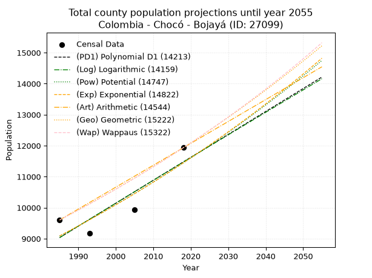
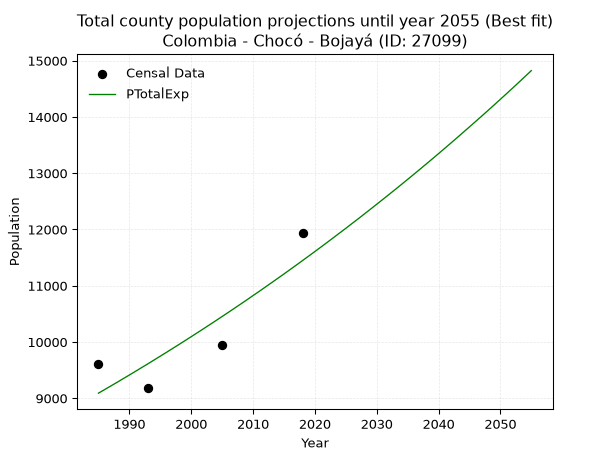
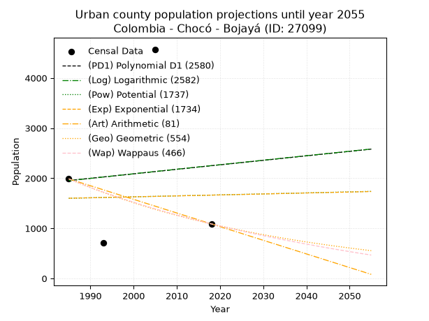
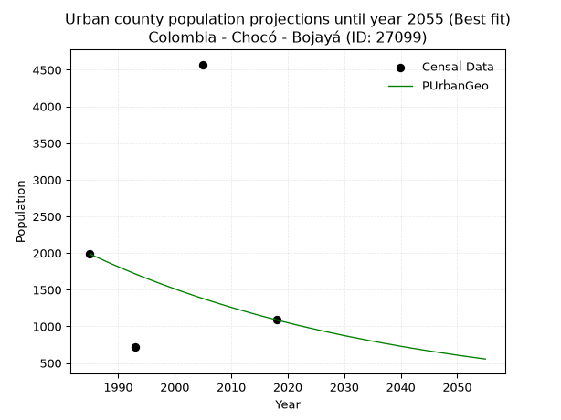
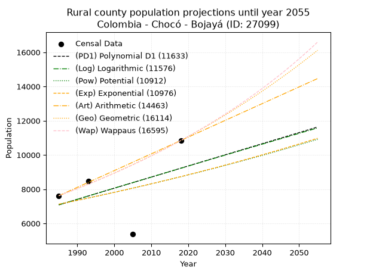
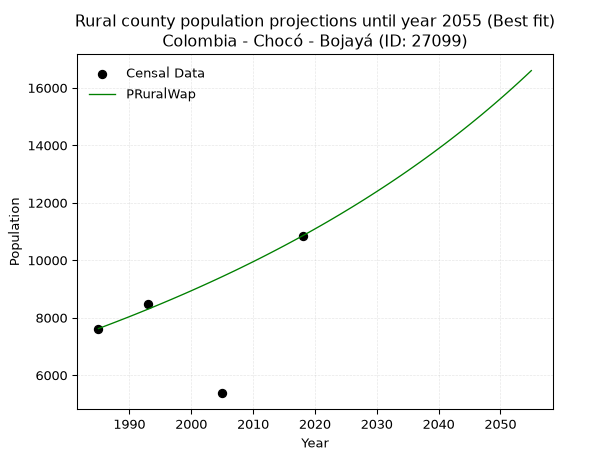

<div align="center">


</div>

# 📜 _“Population and Public Services Demand Projections (PPSD) until Year 2050 for Colombia - Chocó - Bojayá (ID: 27099)”_
Keywords: `population` `public-service` `projection` `lineal` `polynomial` `logarithmic` `potential` `exponential` `arithmetic` `geometric` `wappaus` `dane` `colombia` `south-america`

PPSD are analytical estimates used by governments and planners to anticipate future changes in population size, age distribution, and the resulting community needs for utilities, healthcare, education, and infrastructure as sizing future water treatment facilities, electrical grids, and road networks based on spatial growth.

<div align="center">

</img>

</div>


> **General running parameters**: • app_version: _v20260806_. • Python version: _3.14.7_. • Pandas version: _3.0.5_. • NumPy version: _2.5.1_. • Creates, save and include plots into reports (create_plot): _False_. • Projection until year: _2050_. • Process polynomial degree 2 and up: _False_. • Process Wappaus: _True_. • Process Wappaus: _True_. • Set negative values to zero: _True_. • Set infinite values to zero: _True_. • Drop dataset notes: _True_. 
<div align="center">

Maps & GIS Layers: [:earth_americas:Google](http://maps.google.com/maps?q=6.559707943,-76.886773) [:earth_americas:OSM](https://www.openstreetmap.org/#map=18/6.559707943/-76.886773&layers=P) [:earth_americas:Bing](https://www.bing.com/maps?cp=6.559707943~-76.886773&lvl=18) [:earth_americas:Apple](https://maps.apple.com/frame?center=6.559707943%2C-76.886773&span=0.003%2C0.006) [:earth_americas:GISMobile](https://github.com/rcfdtools/R.GISMobile/blob/main/file/gis/CountyLayer_CO/Readme.md)

</div>


<div align="center">

```geojson
{
  "type": "Feature",
  "geometry": {
    "type": "Point", 
    "coordinates": [-76.886773, 6.559707943]
  }, 
  "properties": {
    "Name": "Colombia - Chocó - Bojayá (ID: 27099)"
  }
}
```

</div>


## 0. Census Data (4 records)

Census data are official statistics collected by a government about the people and housing in a country. They usually include counts of total population, age, sex, race, income, education, and jobs.

📅Global census file: [Population.xlsx](../data/Population.xlsx)

| Source   |   Year |   CountryID | CountryName   |   StateID | StateName   |   CountyID | CountyName   |   PTotal |   PUrban |   PRural |
|:---------|-------:|------------:|:--------------|----------:|:------------|-----------:|:-------------|---------:|---------:|---------:|
| DANE     |   1985 |          57 | Colombia      |        27 | Chocó       |      27099 | Bojayá       |     9604 |     1986 |     7618 |
| DANE     |   1993 |          57 | Colombia      |        27 | Chocó       |      27099 | Bojayá       |     9173 |      712 |     8461 |
| DANE     |   2005 |          57 | Colombia      |        27 | Chocó       |      27099 | Bojayá       |     9941 |     4572 |     5369 |
| DANE     |   2018 |          57 | Colombia      |        27 | Chocó       |      27099 | Bojayá       |    11933 |     1088 |    10845 |

> 🔥Some records could had specific notes about the registered values or the corresponding urban or rural distribution.

📅[SUI-RUPS](https://www.datos.gov.co/Hacienda-y-Cr-dito-P-blico/Registro-nico-de-Prestadores-de-Servicios-P-blicos/4qkq-csdn/about_data) - Local public utility companies: [RUPS.csv](../data/RUPS.csv)

 | SERVICIO       | ESTADO    | NOMBRE              | NIT         | DEPARTAMENTO_DOMICILIO   | MUNICIPIO_DOMICILIO   | DIRECCION                     |   TELEFONO | EMAIL                      | TIPO_PRESTADOR                 | CLASIFICACION                 |
|:---------------|:----------|:--------------------|:------------|:-------------------------|:----------------------|:------------------------------|-----------:|:---------------------------|:-------------------------------|:------------------------------|
| ACUEDUCTO      | OPERATIVA | MUNICIPIO DE BOJAYA | 800070375-8 | CHOCO                    | BOJAYA                | CABECERA MUNICIPAL BELLAVISTA |    6713311 | unidadbojaya2020@gmail.com | MUNICIPIO (PRESTACIÓN DIRECTA) | MENOR O IGUAL A 2500 USUARIOS |
| ALCANTARILLADO | OPERATIVA | MUNICIPIO DE BOJAYA | 800070375-8 | CHOCO                    | BOJAYA                | CABECERA MUNICIPAL BELLAVISTA |    6713311 | unidadbojaya2020@gmail.com | MUNICIPIO (PRESTACIÓN DIRECTA) | MENOR O IGUAL A 2500 USUARIOS |

## 1. Total

### 1.1. Coefficients and Parameters

* (PD1) Polynomial Deg 1: 73.97069450019944, -137797.13167402396 (lineal)
* (Log) Logarithmic: 147868.72802419425, -1113788.636657521
* (Pow) Potential: 13.965973873442614, -42.097953081259114
* (Exp) Exponential: 0.006986311459127401, 0.0086256981168049
* (Art) Arithmetic: Year diff. 2018 - 1985 = 33, Population diff. 11933 - 9604 = 2329, Annual growth = 70.57575757575758
* (Geo) Geometric: Year diff. 2018 - 1985 = 33, Population diff. 11933 - 9604 = 2329, Annual growth % = 0.006601329510363518
* (Wap) Wappaus: i = 0.6553907932930081, Condition values only valid for < 200)

<sub>
Wappaus condition values: ['0.00', '0.66', '1.31', '1.97', '2.62', '3.28', '3.93', '4.59', '5.24', '5.90', '6.55', '7.21', '7.86', '8.52', '9.18', '9.83', '10.49', '11.14', '11.80', '12.45', '13.11', '13.76', '14.42', '15.07', '15.73', '16.38', '17.04', '17.70', '18.35', '19.01', '19.66', '20.32', '20.97', '21.63', '22.28', '22.94', '23.59', '24.25', '24.90', '25.56', '26.22', '26.87', '27.53', '28.18', '28.84', '29.49', '30.15', '30.80', '31.46', '32.11', '32.77', '33.42', '34.08', '34.74', '35.39', '36.05', '36.70', '37.36', '38.01', '38.67', '39.32', '39.98', '40.63', '41.29', '41.95', '42.60']
</sub>


### 1.2. Projected Dataset

|   Year |   CountyID |   PTotalPD1 |   PTotalLog |   PTotalPow |   PTotalExp |   PTotalArt |   PTotalGeo |   PTotalWap |
|-------:|-----------:|------------:|------------:|------------:|------------:|------------:|------------:|------------:|
|   1985 |      27099 |        9035 |        9034 |        9088 |        9089 |        9604 |        9604 |        9604 |
|   1986 |      27099 |        9109 |        9108 |        9152 |        9153 |        9675 |        9667 |        9667 |
|   1987 |      27099 |        9183 |        9183 |        9217 |        9217 |        9745 |        9731 |        9731 |
|   1988 |      27099 |        9257 |        9257 |        9282 |        9281 |        9816 |        9795 |        9795 |
|   1989 |      27099 |        9331 |        9332 |        9347 |        9347 |        9886 |        9860 |        9859 |
|   1990 |      27099 |        9405 |        9406 |        9413 |        9412 |        9957 |        9925 |        9924 |
|   1991 |      27099 |        9479 |        9480 |        9480 |        9478 |       10027 |        9991 |        9989 |
|   1992 |      27099 |        9552 |        9554 |        9546 |        9545 |       10098 |       10057 |       10055 |
|   1993 |      27099 |        9626 |        9629 |        9613 |        9611 |       10169 |       10123 |       10121 |
|   1994 |      27099 |        9700 |        9703 |        9681 |        9679 |       10239 |       10190 |       10188 |
|   1995 |      27099 |        9774 |        9777 |        9749 |        9747 |       10310 |       10257 |       10255 |
|   1996 |      27099 |        9848 |        9851 |        9818 |        9815 |       10380 |       10325 |       10322 |
|   1997 |      27099 |        9922 |        9925 |        9886 |        9884 |       10451 |       10393 |       10390 |
|   1998 |      27099 |        9996 |        9999 |        9956 |        9953 |       10521 |       10462 |       10459 |
|   1999 |      27099 |       10070 |       10073 |       10026 |       10023 |       10592 |       10531 |       10528 |
|   2000 |      27099 |       10144 |       10147 |       10096 |       10093 |       10663 |       10600 |       10597 |
|   2001 |      27099 |       10218 |       10221 |       10167 |       10164 |       10733 |       10670 |       10667 |
|   2002 |      27099 |       10292 |       10295 |       10238 |       10235 |       10804 |       10741 |       10737 |
|   2003 |      27099 |       10366 |       10369 |       10309 |       10307 |       10874 |       10812 |       10808 |
|   2004 |      27099 |       10440 |       10443 |       10382 |       10379 |       10945 |       10883 |       10879 |
|   2005 |      27099 |       10514 |       10516 |       10454 |       10452 |       11016 |       10955 |       10951 |
|   2006 |      27099 |       10588 |       10590 |       10527 |       10525 |       11086 |       11027 |       11024 |
|   2007 |      27099 |       10662 |       10664 |       10601 |       10599 |       11157 |       11100 |       11096 |
|   2008 |      27099 |       10736 |       10737 |       10675 |       10673 |       11227 |       11173 |       11170 |
|   2009 |      27099 |       10810 |       10811 |       10749 |       10748 |       11298 |       11247 |       11244 |
|   2010 |      27099 |       10884 |       10885 |       10824 |       10824 |       11368 |       11321 |       11318 |
|   2011 |      27099 |       10958 |       10958 |       10900 |       10899 |       11439 |       11396 |       11393 |
|   2012 |      27099 |       11032 |       11032 |       10976 |       10976 |       11510 |       11471 |       11468 |
|   2013 |      27099 |       11106 |       11105 |       11052 |       11053 |       11580 |       11547 |       11544 |
|   2014 |      27099 |       11180 |       11179 |       11129 |       11130 |       11651 |       11623 |       11621 |
|   2015 |      27099 |       11254 |       11252 |       11206 |       11208 |       11721 |       11700 |       11698 |
|   2016 |      27099 |       11328 |       11325 |       11284 |       11287 |       11792 |       11777 |       11776 |
|   2017 |      27099 |       11402 |       11399 |       11363 |       11366 |       11862 |       11855 |       11854 |
|   2018 |      27099 |       11476 |       11472 |       11442 |       11446 |       11933 |       11933 |       11933 |
|   2019 |      27099 |       11550 |       11545 |       11521 |       11526 |       12004 |       12012 |       12012 |
|   2020 |      27099 |       11624 |       11618 |       11601 |       11607 |       12074 |       12091 |       12092 |
|   2021 |      27099 |       11698 |       11692 |       11682 |       11688 |       12145 |       12171 |       12173 |
|   2022 |      27099 |       11772 |       11765 |       11763 |       11770 |       12215 |       12251 |       12254 |
|   2023 |      27099 |       11846 |       11838 |       11844 |       11853 |       12286 |       12332 |       12336 |
|   2024 |      27099 |       11920 |       11911 |       11926 |       11936 |       12356 |       12414 |       12419 |
|   2025 |      27099 |       11994 |       11984 |       12009 |       12019 |       12427 |       12495 |       12502 |
|   2026 |      27099 |       12067 |       12057 |       12092 |       12104 |       12498 |       12578 |       12585 |
|   2027 |      27099 |       12141 |       12130 |       12175 |       12188 |       12568 |       12661 |       12670 |
|   2028 |      27099 |       12215 |       12203 |       12259 |       12274 |       12639 |       12745 |       12755 |
|   2029 |      27099 |       12289 |       12276 |       12344 |       12360 |       12709 |       12829 |       12840 |
|   2030 |      27099 |       12363 |       12349 |       12429 |       12447 |       12780 |       12913 |       12926 |
|   2031 |      27099 |       12437 |       12422 |       12515 |       12534 |       12850 |       12999 |       13013 |
|   2032 |      27099 |       12511 |       12494 |       12602 |       12622 |       12921 |       13084 |       13101 |
|   2033 |      27099 |       12585 |       12567 |       12688 |       12710 |       12992 |       13171 |       13189 |
|   2034 |      27099 |       12659 |       12640 |       12776 |       12799 |       13062 |       13258 |       13278 |
|   2035 |      27099 |       12733 |       12712 |       12864 |       12889 |       13133 |       13345 |       13368 |
|   2036 |      27099 |       12807 |       12785 |       12952 |       12979 |       13203 |       13433 |       13458 |
|   2037 |      27099 |       12881 |       12858 |       13042 |       13070 |       13274 |       13522 |       13549 |
|   2038 |      27099 |       12955 |       12930 |       13131 |       13162 |       13345 |       13611 |       13641 |
|   2039 |      27099 |       13029 |       13003 |       13222 |       13254 |       13415 |       13701 |       13734 |
|   2040 |      27099 |       13103 |       13075 |       13312 |       13347 |       13486 |       13792 |       13827 |
|   2041 |      27099 |       13177 |       13148 |       13404 |       13441 |       13556 |       13883 |       13921 |
|   2042 |      27099 |       13251 |       13220 |       13496 |       13535 |       13627 |       13974 |       14016 |
|   2043 |      27099 |       13325 |       13293 |       13588 |       13630 |       13697 |       14067 |       14111 |
|   2044 |      27099 |       13399 |       13365 |       13682 |       13726 |       13768 |       14159 |       14208 |
|   2045 |      27099 |       13473 |       13437 |       13775 |       13822 |       13839 |       14253 |       14305 |
|   2046 |      27099 |       13547 |       13510 |       13870 |       13919 |       13909 |       14347 |       14403 |
|   2047 |      27099 |       13621 |       13582 |       13965 |       14016 |       13980 |       14442 |       14502 |
|   2048 |      27099 |       13695 |       13654 |       14060 |       14114 |       14050 |       14537 |       14601 |
|   2049 |      27099 |       13769 |       13726 |       14156 |       14213 |       14121 |       14633 |       14701 |
|   2050 |      27099 |       13843 |       13798 |       14253 |       14313 |       14191 |       14730 |       14803 |
<div align="center">

</img>

</div>


### 1.3. Best fit with absolute and relative error (%)

Relative error puts that difference into context by dividing the absolute error by the true value, creating a unitless ratio or percentage that shows the scale of the mistake.

Absolute and relative error

|   Year | Source   |   CountryID | CountryName   |   StateID | StateName   |   CountyID_x | CountyName   |   PTotal |   PUrban |   PRural |   CountyID_y |   PTotalPD1 |   PTotalLog |   PTotalPow |   PTotalExp |   PTotalArt |   PTotalGeo |   PTotalWap |   PTotalPD1AbsError |   PTotalLogAbsError |   PTotalPowAbsError |   PTotalExpAbsError |   PTotalArtAbsError |   PTotalGeoAbsError |   PTotalWapAbsError |   PTotalPD1RelError |   PTotalLogRelError |   PTotalPowRelError |   PTotalExpRelError |   PTotalArtRelError |   PTotalGeoRelError |   PTotalWapRelError |
|-------:|:---------|------------:|:--------------|----------:|:------------|-------------:|:-------------|---------:|---------:|---------:|-------------:|------------:|------------:|------------:|------------:|------------:|------------:|------------:|--------------------:|--------------------:|--------------------:|--------------------:|--------------------:|--------------------:|--------------------:|--------------------:|--------------------:|--------------------:|--------------------:|--------------------:|--------------------:|--------------------:|
|   1985 | DANE     |          57 | Colombia      |        27 | Chocó       |        27099 | Bojayá       |     9604 |     1986 |     7618 |        27099 |        9035 |        9034 |        9088 |        9089 |        9604 |        9604 |        9604 |                 569 |                 570 |                 516 |                 515 |                   0 |                   0 |                   0 |             5.92461 |             5.93503 |             5.37276 |             5.36235 |              0      |              0      |              0      |
|   1993 | DANE     |          57 | Colombia      |        27 | Chocó       |        27099 | Bojayá       |     9173 |      712 |     8461 |        27099 |        9626 |        9629 |        9613 |        9611 |       10169 |       10123 |       10121 |                 453 |                 456 |                 440 |                 438 |                 996 |                 950 |                 948 |             4.93841 |             4.97111 |             4.79669 |             4.77488 |             10.858  |             10.3565 |             10.3347 |
|   2005 | DANE     |          57 | Colombia      |        27 | Chocó       |        27099 | Bojayá       |     9941 |     4572 |     5369 |        27099 |       10514 |       10516 |       10454 |       10452 |       11016 |       10955 |       10951 |                 573 |                 575 |                 513 |                 511 |                1075 |                1014 |                1010 |             5.76401 |             5.78413 |             5.16045 |             5.14033 |             10.8138 |             10.2002 |             10.1599 |
|   2018 | DANE     |          57 | Colombia      |        27 | Chocó       |        27099 | Bojayá       |    11933 |     1088 |    10845 |        27099 |       11476 |       11472 |       11442 |       11446 |       11933 |       11933 |       11933 |                 457 |                 461 |                 491 |                 487 |                   0 |                   0 |                   0 |             3.82972 |             3.86324 |             4.11464 |             4.08112 |              0      |              0      |              0      |

Relative error mean

| Method    |   RelError | Best   |
|:----------|-----------:|:-------|
| PTotalPD1 |    5.11419 |        |
| PTotalLog |    5.13838 |        |
| PTotalPow |    4.86113 |        |
| PTotalExp |    4.83967 | True   |
| PTotalArt |    5.41794 |        |
| PTotalGeo |    5.13917 |        |
| PTotalWap |    5.12366 |        |

💙Best method: _**PTotalExp**_
<div align="center">

</img>

</div>


### 1.4. Fresh water supply demand in liters per capita per day (lpcd)

The fresh water supply demand typically ranges from 100 to 300 liters per capita per day (lpcd) for standard domestic and municipal planning, though absolute survival minimums set by the World Health Organization are as low as 7.5 to 20 liters per day, and total consumption in high-income nations can exceed 400 liters.

> `CZ`: Level in meters above the sea level (masl)<br> `WS`: Fresh water supply demand in liters per capita per day (lpcd or l/h/d)<br> `WSAll`: Zonal fresh water supply demand in liters per second (l/s)<br> `A`: Zonal area in square meters<br> `DP`: Population density (people/hectare or p/ha)

Reference values (RAS Colombia)

|    CZ |   WS |
|------:|-----:|
|  1000 |  120 |
|  2000 |  130 |
| 99999 |  140 |

County shapefile geometry properties and water supply values

|   CountyID |      ATotal |   CZTotal |   WSTotal |
|-----------:|------------:|----------:|----------:|
|      27099 | 3.63318e+09 |   202.894 |       120 |

Projected values for best method: PTotalExp

|   CountyID |   Year |   PTotalExp |   DPTotal |   WSTotal |   WSTotalAll |
|-----------:|-------:|------------:|----------:|----------:|-------------:|
|      27099 |   1985 |        9089 |      0.03 |       120 |      12.6236 |
|      27099 |   1986 |        9153 |      0.03 |       120 |      12.7125 |
|      27099 |   1987 |        9217 |      0.03 |       120 |      12.8014 |
|      27099 |   1988 |        9281 |      0.03 |       120 |      12.8903 |
|      27099 |   1989 |        9347 |      0.03 |       120 |      12.9819 |
|      27099 |   1990 |        9412 |      0.03 |       120 |      13.0722 |
|      27099 |   1991 |        9478 |      0.03 |       120 |      13.1639 |
|      27099 |   1992 |        9545 |      0.03 |       120 |      13.2569 |
|      27099 |   1993 |        9611 |      0.03 |       120 |      13.3486 |
|      27099 |   1994 |        9679 |      0.03 |       120 |      13.4431 |
|      27099 |   1995 |        9747 |      0.03 |       120 |      13.5375 |
|      27099 |   1996 |        9815 |      0.03 |       120 |      13.6319 |
|      27099 |   1997 |        9884 |      0.03 |       120 |      13.7278 |
|      27099 |   1998 |        9953 |      0.03 |       120 |      13.8236 |
|      27099 |   1999 |       10023 |      0.03 |       120 |      13.9208 |
|      27099 |   2000 |       10093 |      0.03 |       120 |      14.0181 |
|      27099 |   2001 |       10164 |      0.03 |       120 |      14.1167 |
|      27099 |   2002 |       10235 |      0.03 |       120 |      14.2153 |
|      27099 |   2003 |       10307 |      0.03 |       120 |      14.3153 |
|      27099 |   2004 |       10379 |      0.03 |       120 |      14.4153 |
|      27099 |   2005 |       10452 |      0.03 |       120 |      14.5167 |
|      27099 |   2006 |       10525 |      0.03 |       120 |      14.6181 |
|      27099 |   2007 |       10599 |      0.03 |       120 |      14.7208 |
|      27099 |   2008 |       10673 |      0.03 |       120 |      14.8236 |
|      27099 |   2009 |       10748 |      0.03 |       120 |      14.9278 |
|      27099 |   2010 |       10824 |      0.03 |       120 |      15.0333 |
|      27099 |   2011 |       10899 |      0.03 |       120 |      15.1375 |
|      27099 |   2012 |       10976 |      0.03 |       120 |      15.2444 |
|      27099 |   2013 |       11053 |      0.03 |       120 |      15.3514 |
|      27099 |   2014 |       11130 |      0.03 |       120 |      15.4583 |
|      27099 |   2015 |       11208 |      0.03 |       120 |      15.5667 |
|      27099 |   2016 |       11287 |      0.03 |       120 |      15.6764 |
|      27099 |   2017 |       11366 |      0.03 |       120 |      15.7861 |
|      27099 |   2018 |       11446 |      0.03 |       120 |      15.8972 |
|      27099 |   2019 |       11526 |      0.03 |       120 |      16.0083 |
|      27099 |   2020 |       11607 |      0.03 |       120 |      16.1208 |
|      27099 |   2021 |       11688 |      0.03 |       120 |      16.2333 |
|      27099 |   2022 |       11770 |      0.03 |       120 |      16.3472 |
|      27099 |   2023 |       11853 |      0.03 |       120 |      16.4625 |
|      27099 |   2024 |       11936 |      0.03 |       120 |      16.5778 |
|      27099 |   2025 |       12019 |      0.03 |       120 |      16.6931 |
|      27099 |   2026 |       12104 |      0.03 |       120 |      16.8111 |
|      27099 |   2027 |       12188 |      0.03 |       120 |      16.9278 |
|      27099 |   2028 |       12274 |      0.03 |       120 |      17.0472 |
|      27099 |   2029 |       12360 |      0.03 |       120 |      17.1667 |
|      27099 |   2030 |       12447 |      0.03 |       120 |      17.2875 |
|      27099 |   2031 |       12534 |      0.03 |       120 |      17.4083 |
|      27099 |   2032 |       12622 |      0.03 |       120 |      17.5306 |
|      27099 |   2033 |       12710 |      0.03 |       120 |      17.6528 |
|      27099 |   2034 |       12799 |      0.04 |       120 |      17.7764 |
|      27099 |   2035 |       12889 |      0.04 |       120 |      17.9014 |
|      27099 |   2036 |       12979 |      0.04 |       120 |      18.0264 |
|      27099 |   2037 |       13070 |      0.04 |       120 |      18.1528 |
|      27099 |   2038 |       13162 |      0.04 |       120 |      18.2806 |
|      27099 |   2039 |       13254 |      0.04 |       120 |      18.4083 |
|      27099 |   2040 |       13347 |      0.04 |       120 |      18.5375 |
|      27099 |   2041 |       13441 |      0.04 |       120 |      18.6681 |
|      27099 |   2042 |       13535 |      0.04 |       120 |      18.7986 |
|      27099 |   2043 |       13630 |      0.04 |       120 |      18.9306 |
|      27099 |   2044 |       13726 |      0.04 |       120 |      19.0639 |
|      27099 |   2045 |       13822 |      0.04 |       120 |      19.1972 |
|      27099 |   2046 |       13919 |      0.04 |       120 |      19.3319 |
|      27099 |   2047 |       14016 |      0.04 |       120 |      19.4667 |
|      27099 |   2048 |       14114 |      0.04 |       120 |      19.6028 |
|      27099 |   2049 |       14213 |      0.04 |       120 |      19.7403 |
|      27099 |   2050 |       14313 |      0.04 |       120 |      19.8792 |

## 2. Urban

### 2.1. Coefficients and Parameters

* (PD1) Polynomial Deg 1: 8.961059815337151, -15834.859895628138 (lineal)
* (Log) Logarithmic: 18234.07583236633, -136507.8565205299
* (Pow) Potential: 2.383925108625245, -4.657718984971382
* (Exp) Exponential: 0.00114992086232431, 163.2545023446388
* (Art) Arithmetic: Year diff. 2018 - 1985 = 33, Population diff. 1088 - 1986 = -898, Annual growth = -27.21212121212121
* (Geo) Geometric: Year diff. 2018 - 1985 = 33, Population diff. 1088 - 1986 = -898, Annual growth % = -0.018070534421866458
* (Wap) Wappaus: i = -1.7704698251217446, Condition values only valid for < 200)

<sub>
Wappaus condition values: ['-0.00', '-1.77', '-3.54', '-5.31', '-7.08', '-8.85', '-10.62', '-12.39', '-14.16', '-15.93', '-17.70', '-19.48', '-21.25', '-23.02', '-24.79', '-26.56', '-28.33', '-30.10', '-31.87', '-33.64', '-35.41', '-37.18', '-38.95', '-40.72', '-42.49', '-44.26', '-46.03', '-47.80', '-49.57', '-51.34', '-53.11', '-54.88', '-56.66', '-58.43', '-60.20', '-61.97', '-63.74', '-65.51', '-67.28', '-69.05', '-70.82', '-72.59', '-74.36', '-76.13', '-77.90', '-79.67', '-81.44', '-83.21', '-84.98', '-86.75', '-88.52', '-90.29', '-92.06', '-93.83', '-95.61', '-97.38', '-99.15', '-100.92', '-102.69', '-104.46', '-106.23', '-108.00', '-109.77', '-111.54', '-113.31', '-115.08']
</sub>


### 2.2. Projected Dataset

|   Year |   CountyID |   PUrbanPD1 |   PUrbanLog |   PUrbanPow |   PUrbanExp |   PUrbanArt |   PUrbanGeo |   PUrbanWap |
|-------:|-----------:|------------:|------------:|------------:|------------:|------------:|------------:|------------:|
|   1985 |      27099 |        1953 |        1950 |        1599 |        1600 |        1986 |        1986 |        1986 |
|   1986 |      27099 |        1962 |        1959 |        1601 |        1602 |        1959 |        1950 |        1951 |
|   1987 |      27099 |        1971 |        1969 |        1603 |        1604 |        1932 |        1915 |        1917 |
|   1988 |      27099 |        1980 |        1978 |        1605 |        1606 |        1904 |        1880 |        1883 |
|   1989 |      27099 |        1989 |        1987 |        1607 |        1608 |        1877 |        1846 |        1850 |
|   1990 |      27099 |        1998 |        1996 |        1609 |        1609 |        1850 |        1813 |        1818 |
|   1991 |      27099 |        2007 |        2005 |        1611 |        1611 |        1823 |        1780 |        1786 |
|   1992 |      27099 |        2016 |        2014 |        1613 |        1613 |        1796 |        1748 |        1754 |
|   1993 |      27099 |        2025 |        2024 |        1615 |        1615 |        1768 |        1716 |        1723 |
|   1994 |      27099 |        2033 |        2033 |        1617 |        1617 |        1741 |        1685 |        1693 |
|   1995 |      27099 |        2042 |        2042 |        1618 |        1619 |        1714 |        1655 |        1663 |
|   1996 |      27099 |        2051 |        2051 |        1620 |        1621 |        1687 |        1625 |        1634 |
|   1997 |      27099 |        2060 |        2060 |        1622 |        1622 |        1659 |        1596 |        1605 |
|   1998 |      27099 |        2069 |        2069 |        1624 |        1624 |        1632 |        1567 |        1576 |
|   1999 |      27099 |        2078 |        2078 |        1626 |        1626 |        1605 |        1539 |        1548 |
|   2000 |      27099 |        2087 |        2088 |        1628 |        1628 |        1578 |        1511 |        1520 |
|   2001 |      27099 |        2096 |        2097 |        1630 |        1630 |        1551 |        1483 |        1493 |
|   2002 |      27099 |        2105 |        2106 |        1632 |        1632 |        1523 |        1457 |        1466 |
|   2003 |      27099 |        2114 |        2115 |        1634 |        1634 |        1496 |        1430 |        1440 |
|   2004 |      27099 |        2123 |        2124 |        1636 |        1636 |        1469 |        1404 |        1414 |
|   2005 |      27099 |        2132 |        2133 |        1638 |        1637 |        1442 |        1379 |        1389 |
|   2006 |      27099 |        2141 |        2142 |        1640 |        1639 |        1415 |        1354 |        1363 |
|   2007 |      27099 |        2150 |        2151 |        1642 |        1641 |        1387 |        1330 |        1339 |
|   2008 |      27099 |        2159 |        2160 |        1644 |        1643 |        1360 |        1306 |        1314 |
|   2009 |      27099 |        2168 |        2169 |        1646 |        1645 |        1333 |        1282 |        1290 |
|   2010 |      27099 |        2177 |        2179 |        1648 |        1647 |        1306 |        1259 |        1266 |
|   2011 |      27099 |        2186 |        2188 |        1650 |        1649 |        1278 |        1236 |        1243 |
|   2012 |      27099 |        2195 |        2197 |        1652 |        1651 |        1251 |        1214 |        1220 |
|   2013 |      27099 |        2204 |        2206 |        1653 |        1653 |        1224 |        1192 |        1197 |
|   2014 |      27099 |        2213 |        2215 |        1655 |        1654 |        1197 |        1170 |        1175 |
|   2015 |      27099 |        2222 |        2224 |        1657 |        1656 |        1170 |        1149 |        1153 |
|   2016 |      27099 |        2231 |        2233 |        1659 |        1658 |        1142 |        1128 |        1131 |
|   2017 |      27099 |        2240 |        2242 |        1661 |        1660 |        1115 |        1108 |        1109 |
|   2018 |      27099 |        2249 |        2251 |        1663 |        1662 |        1088 |        1088 |        1088 |
|   2019 |      27099 |        2258 |        2260 |        1665 |        1664 |        1061 |        1068 |        1067 |
|   2020 |      27099 |        2266 |        2269 |        1667 |        1666 |        1034 |        1049 |        1046 |
|   2021 |      27099 |        2275 |        2278 |        1669 |        1668 |        1006 |        1030 |        1026 |
|   2022 |      27099 |        2284 |        2287 |        1671 |        1670 |         979 |        1011 |        1006 |
|   2023 |      27099 |        2293 |        2296 |        1673 |        1672 |         952 |         993 |         986 |
|   2024 |      27099 |        2302 |        2305 |        1675 |        1674 |         925 |         975 |         967 |
|   2025 |      27099 |        2311 |        2314 |        1677 |        1676 |         898 |         958 |         947 |
|   2026 |      27099 |        2320 |        2323 |        1679 |        1677 |         870 |         940 |         928 |
|   2027 |      27099 |        2329 |        2332 |        1681 |        1679 |         843 |         923 |         909 |
|   2028 |      27099 |        2338 |        2341 |        1683 |        1681 |         816 |         907 |         891 |
|   2029 |      27099 |        2347 |        2350 |        1685 |        1683 |         789 |         890 |         873 |
|   2030 |      27099 |        2356 |        2359 |        1687 |        1685 |         761 |         874 |         854 |
|   2031 |      27099 |        2365 |        2368 |        1689 |        1687 |         734 |         858 |         837 |
|   2032 |      27099 |        2374 |        2377 |        1691 |        1689 |         707 |         843 |         819 |
|   2033 |      27099 |        2383 |        2386 |        1693 |        1691 |         680 |         828 |         802 |
|   2034 |      27099 |        2392 |        2395 |        1695 |        1693 |         653 |         813 |         784 |
|   2035 |      27099 |        2401 |        2404 |        1697 |        1695 |         625 |         798 |         767 |
|   2036 |      27099 |        2410 |        2413 |        1699 |        1697 |         598 |         784 |         751 |
|   2037 |      27099 |        2419 |        2422 |        1701 |        1699 |         571 |         769 |         734 |
|   2038 |      27099 |        2428 |        2431 |        1703 |        1701 |         544 |         756 |         718 |
|   2039 |      27099 |        2437 |        2440 |        1705 |        1703 |         517 |         742 |         701 |
|   2040 |      27099 |        2446 |        2449 |        1707 |        1705 |         489 |         728 |         685 |
|   2041 |      27099 |        2455 |        2458 |        1709 |        1707 |         462 |         715 |         670 |
|   2042 |      27099 |        2464 |        2467 |        1711 |        1709 |         435 |         702 |         654 |
|   2043 |      27099 |        2473 |        2475 |        1713 |        1711 |         408 |         690 |         638 |
|   2044 |      27099 |        2482 |        2484 |        1715 |        1713 |         380 |         677 |         623 |
|   2045 |      27099 |        2491 |        2493 |        1717 |        1715 |         353 |         665 |         608 |
|   2046 |      27099 |        2499 |        2502 |        1719 |        1717 |         326 |         653 |         593 |
|   2047 |      27099 |        2508 |        2511 |        1721 |        1718 |         299 |         641 |         578 |
|   2048 |      27099 |        2517 |        2520 |        1723 |        1720 |         272 |         630 |         564 |
|   2049 |      27099 |        2526 |        2529 |        1725 |        1722 |         244 |         618 |         550 |
|   2050 |      27099 |        2535 |        2538 |        1727 |        1724 |         217 |         607 |         535 |
<div align="center">

</img>

</div>


### 2.3. Best fit with absolute and relative error (%)

Relative error puts that difference into context by dividing the absolute error by the true value, creating a unitless ratio or percentage that shows the scale of the mistake.

Absolute and relative error

|   Year | Source   |   CountryID | CountryName   |   StateID | StateName   |   CountyID_x | CountyName   |   PTotal |   PUrban |   PRural |   CountyID_y |   PUrbanPD1 |   PUrbanLog |   PUrbanPow |   PUrbanExp |   PUrbanArt |   PUrbanGeo |   PUrbanWap |   PUrbanPD1AbsError |   PUrbanLogAbsError |   PUrbanPowAbsError |   PUrbanExpAbsError |   PUrbanArtAbsError |   PUrbanGeoAbsError |   PUrbanWapAbsError |   PUrbanPD1RelError |   PUrbanLogRelError |   PUrbanPowRelError |   PUrbanExpRelError |   PUrbanArtRelError |   PUrbanGeoRelError |   PUrbanWapRelError |
|-------:|:---------|------------:|:--------------|----------:|:------------|-------------:|:-------------|---------:|---------:|---------:|-------------:|------------:|------------:|------------:|------------:|------------:|------------:|------------:|--------------------:|--------------------:|--------------------:|--------------------:|--------------------:|--------------------:|--------------------:|--------------------:|--------------------:|--------------------:|--------------------:|--------------------:|--------------------:|--------------------:|
|   1985 | DANE     |          57 | Colombia      |        27 | Chocó       |        27099 | Bojayá       |     9604 |     1986 |     7618 |        27099 |        1953 |        1950 |        1599 |        1600 |        1986 |        1986 |        1986 |                  33 |                  36 |                 387 |                 386 |                   0 |                   0 |                   0 |             1.66163 |             1.81269 |             19.4864 |             19.4361 |              0      |              0      |              0      |
|   1993 | DANE     |          57 | Colombia      |        27 | Chocó       |        27099 | Bojayá       |     9173 |      712 |     8461 |        27099 |        2025 |        2024 |        1615 |        1615 |        1768 |        1716 |        1723 |                1313 |                1312 |                 903 |                 903 |                1056 |                1004 |                1011 |           184.41    |           184.27    |            126.826  |            126.826  |            148.315  |            141.011  |            141.994  |
|   2005 | DANE     |          57 | Colombia      |        27 | Chocó       |        27099 | Bojayá       |     9941 |     4572 |     5369 |        27099 |        2132 |        2133 |        1638 |        1637 |        1442 |        1379 |        1389 |                2440 |                2439 |                2934 |                2935 |                3130 |                3193 |                3183 |            53.3683  |            53.3465  |             64.1732 |             64.1951 |             68.4602 |             69.8381 |             69.6194 |
|   2018 | DANE     |          57 | Colombia      |        27 | Chocó       |        27099 | Bojayá       |    11933 |     1088 |    10845 |        27099 |        2249 |        2251 |        1663 |        1662 |        1088 |        1088 |        1088 |                1161 |                1163 |                 575 |                 574 |                   0 |                   0 |                   0 |           106.71    |           106.893   |             52.8493 |             52.7574 |              0      |              0      |              0      |

Relative error mean

| Method    |   RelError | Best   |
|:----------|-----------:|:-------|
| PUrbanPD1 |    86.5374 |        |
| PUrbanLog |    86.5805 |        |
| PUrbanPow |    65.8337 |        |
| PUrbanExp |    65.8036 |        |
| PUrbanArt |    54.1937 |        |
| PUrbanGeo |    52.7123 | True   |
| PUrbanWap |    52.9035 |        |

💙Best method: _**PUrbanGeo**_
<div align="center">

</img>

</div>


### 2.4. Fresh water supply demand in liters per capita per day (lpcd)

The fresh water supply demand typically ranges from 100 to 300 liters per capita per day (lpcd) for standard domestic and municipal planning, though absolute survival minimums set by the World Health Organization are as low as 7.5 to 20 liters per day, and total consumption in high-income nations can exceed 400 liters.

> `CZ`: Level in meters above the sea level (masl)<br> `WS`: Fresh water supply demand in liters per capita per day (lpcd or l/h/d)<br> `WSAll`: Zonal fresh water supply demand in liters per second (l/s)<br> `A`: Zonal area in square meters<br> `DP`: Population density (people/hectare or p/ha)

Reference values (RAS Colombia)

|    CZ |   WS |
|------:|-----:|
|  1000 |  120 |
|  2000 |  130 |
| 99999 |  140 |

County shapefile geometry properties and water supply values

|   CountyID |   AUrban |   CZUrban |   WSUrban |
|-----------:|---------:|----------:|----------:|
|      27099 |   309689 |   19.4831 |       120 |

Projected values for best method: PUrbanGeo

|   CountyID |   Year |   PUrbanGeo |   DPUrban |   WSUrban |   WSUrbanAll |
|-----------:|-------:|------------:|----------:|----------:|-------------:|
|      27099 |   1985 |        1986 |     64.13 |       120 |     2.75833  |
|      27099 |   1986 |        1950 |     62.97 |       120 |     2.70833  |
|      27099 |   1987 |        1915 |     61.84 |       120 |     2.65972  |
|      27099 |   1988 |        1880 |     60.71 |       120 |     2.61111  |
|      27099 |   1989 |        1846 |     59.61 |       120 |     2.56389  |
|      27099 |   1990 |        1813 |     58.54 |       120 |     2.51806  |
|      27099 |   1991 |        1780 |     57.48 |       120 |     2.47222  |
|      27099 |   1992 |        1748 |     56.44 |       120 |     2.42778  |
|      27099 |   1993 |        1716 |     55.41 |       120 |     2.38333  |
|      27099 |   1994 |        1685 |     54.41 |       120 |     2.34028  |
|      27099 |   1995 |        1655 |     53.44 |       120 |     2.29861  |
|      27099 |   1996 |        1625 |     52.47 |       120 |     2.25694  |
|      27099 |   1997 |        1596 |     51.54 |       120 |     2.21667  |
|      27099 |   1998 |        1567 |     50.6  |       120 |     2.17639  |
|      27099 |   1999 |        1539 |     49.7  |       120 |     2.1375   |
|      27099 |   2000 |        1511 |     48.79 |       120 |     2.09861  |
|      27099 |   2001 |        1483 |     47.89 |       120 |     2.05972  |
|      27099 |   2002 |        1457 |     47.05 |       120 |     2.02361  |
|      27099 |   2003 |        1430 |     46.18 |       120 |     1.98611  |
|      27099 |   2004 |        1404 |     45.34 |       120 |     1.95     |
|      27099 |   2005 |        1379 |     44.53 |       120 |     1.91528  |
|      27099 |   2006 |        1354 |     43.72 |       120 |     1.88056  |
|      27099 |   2007 |        1330 |     42.95 |       120 |     1.84722  |
|      27099 |   2008 |        1306 |     42.17 |       120 |     1.81389  |
|      27099 |   2009 |        1282 |     41.4  |       120 |     1.78056  |
|      27099 |   2010 |        1259 |     40.65 |       120 |     1.74861  |
|      27099 |   2011 |        1236 |     39.91 |       120 |     1.71667  |
|      27099 |   2012 |        1214 |     39.2  |       120 |     1.68611  |
|      27099 |   2013 |        1192 |     38.49 |       120 |     1.65556  |
|      27099 |   2014 |        1170 |     37.78 |       120 |     1.625    |
|      27099 |   2015 |        1149 |     37.1  |       120 |     1.59583  |
|      27099 |   2016 |        1128 |     36.42 |       120 |     1.56667  |
|      27099 |   2017 |        1108 |     35.78 |       120 |     1.53889  |
|      27099 |   2018 |        1088 |     35.13 |       120 |     1.51111  |
|      27099 |   2019 |        1068 |     34.49 |       120 |     1.48333  |
|      27099 |   2020 |        1049 |     33.87 |       120 |     1.45694  |
|      27099 |   2021 |        1030 |     33.26 |       120 |     1.43056  |
|      27099 |   2022 |        1011 |     32.65 |       120 |     1.40417  |
|      27099 |   2023 |         993 |     32.06 |       120 |     1.37917  |
|      27099 |   2024 |         975 |     31.48 |       120 |     1.35417  |
|      27099 |   2025 |         958 |     30.93 |       120 |     1.33056  |
|      27099 |   2026 |         940 |     30.35 |       120 |     1.30556  |
|      27099 |   2027 |         923 |     29.8  |       120 |     1.28194  |
|      27099 |   2028 |         907 |     29.29 |       120 |     1.25972  |
|      27099 |   2029 |         890 |     28.74 |       120 |     1.23611  |
|      27099 |   2030 |         874 |     28.22 |       120 |     1.21389  |
|      27099 |   2031 |         858 |     27.71 |       120 |     1.19167  |
|      27099 |   2032 |         843 |     27.22 |       120 |     1.17083  |
|      27099 |   2033 |         828 |     26.74 |       120 |     1.15     |
|      27099 |   2034 |         813 |     26.25 |       120 |     1.12917  |
|      27099 |   2035 |         798 |     25.77 |       120 |     1.10833  |
|      27099 |   2036 |         784 |     25.32 |       120 |     1.08889  |
|      27099 |   2037 |         769 |     24.83 |       120 |     1.06806  |
|      27099 |   2038 |         756 |     24.41 |       120 |     1.05     |
|      27099 |   2039 |         742 |     23.96 |       120 |     1.03056  |
|      27099 |   2040 |         728 |     23.51 |       120 |     1.01111  |
|      27099 |   2041 |         715 |     23.09 |       120 |     0.993056 |
|      27099 |   2042 |         702 |     22.67 |       120 |     0.975    |
|      27099 |   2043 |         690 |     22.28 |       120 |     0.958333 |
|      27099 |   2044 |         677 |     21.86 |       120 |     0.940278 |
|      27099 |   2045 |         665 |     21.47 |       120 |     0.923611 |
|      27099 |   2046 |         653 |     21.09 |       120 |     0.906944 |
|      27099 |   2047 |         641 |     20.7  |       120 |     0.890278 |
|      27099 |   2048 |         630 |     20.34 |       120 |     0.875    |
|      27099 |   2049 |         618 |     19.96 |       120 |     0.858333 |
|      27099 |   2050 |         607 |     19.6  |       120 |     0.843056 |

## 3. Rural

### 3.1. Coefficients and Parameters

* (PD1) Polynomial Deg 1: 65.00963468486229, -121962.27177839579 (lineal)
* (Log) Logarithmic: 129634.65219182786, -977280.7801369905
* (Pow) Potential: 12.297739727151825, -36.7021750591127
* (Exp) Exponential: 0.006176349386348853, 0.03374558052542923
* (Art) Arithmetic: Year diff. 2018 - 1985 = 33, Population diff. 10845 - 7618 = 3227, Annual growth = 97.78787878787878
* (Geo) Geometric: Year diff. 2018 - 1985 = 33, Population diff. 10845 - 7618 = 3227, Annual growth % = 0.010760214796598389
* (Wap) Wappaus: i = 1.0592848268198969, Condition values only valid for < 200)

<sub>
Wappaus condition values: ['0.00', '1.06', '2.12', '3.18', '4.24', '5.30', '6.36', '7.41', '8.47', '9.53', '10.59', '11.65', '12.71', '13.77', '14.83', '15.89', '16.95', '18.01', '19.07', '20.13', '21.19', '22.24', '23.30', '24.36', '25.42', '26.48', '27.54', '28.60', '29.66', '30.72', '31.78', '32.84', '33.90', '34.96', '36.02', '37.07', '38.13', '39.19', '40.25', '41.31', '42.37', '43.43', '44.49', '45.55', '46.61', '47.67', '48.73', '49.79', '50.85', '51.90', '52.96', '54.02', '55.08', '56.14', '57.20', '58.26', '59.32', '60.38', '61.44', '62.50', '63.56', '64.62', '65.68', '66.73', '67.79', '68.85']
</sub>


### 3.2. Projected Dataset

|   Year |   CountyID |   PRuralPD1 |   PRuralLog |   PRuralPow |   PRuralExp |   PRuralArt |   PRuralGeo |   PRuralWap |
|-------:|-----------:|------------:|------------:|------------:|------------:|------------:|------------:|------------:|
|   1985 |      27099 |        7082 |        7084 |        7126 |        7123 |        7618 |        7618 |        7618 |
|   1986 |      27099 |        7147 |        7149 |        7170 |        7168 |        7716 |        7700 |        7699 |
|   1987 |      27099 |        7212 |        7214 |        7214 |        7212 |        7814 |        7783 |        7781 |
|   1988 |      27099 |        7277 |        7279 |        7259 |        7257 |        7911 |        7867 |        7864 |
|   1989 |      27099 |        7342 |        7345 |        7304 |        7302 |        8009 |        7951 |        7948 |
|   1990 |      27099 |        7407 |        7410 |        7350 |        7347 |        8107 |        8037 |        8032 |
|   1991 |      27099 |        7472 |        7475 |        7395 |        7392 |        8205 |        8123 |        8118 |
|   1992 |      27099 |        7537 |        7540 |        7441 |        7438 |        8303 |        8211 |        8205 |
|   1993 |      27099 |        7602 |        7605 |        7487 |        7484 |        8400 |        8299 |        8292 |
|   1994 |      27099 |        7667 |        7670 |        7533 |        7531 |        8498 |        8388 |        8381 |
|   1995 |      27099 |        7732 |        7735 |        7580 |        7577 |        8596 |        8479 |        8470 |
|   1996 |      27099 |        7797 |        7800 |        7627 |        7624 |        8694 |        8570 |        8561 |
|   1997 |      27099 |        7862 |        7865 |        7674 |        7671 |        8791 |        8662 |        8652 |
|   1998 |      27099 |        7927 |        7930 |        7721 |        7719 |        8889 |        8755 |        8745 |
|   1999 |      27099 |        7992 |        7995 |        7769 |        7767 |        8987 |        8849 |        8838 |
|   2000 |      27099 |        8057 |        8060 |        7817 |        7815 |        9085 |        8945 |        8933 |
|   2001 |      27099 |        8122 |        8124 |        7865 |        7863 |        9183 |        9041 |        9029 |
|   2002 |      27099 |        8187 |        8189 |        7914 |        7912 |        9280 |        9138 |        9126 |
|   2003 |      27099 |        8252 |        8254 |        7962 |        7961 |        9378 |        9237 |        9224 |
|   2004 |      27099 |        8317 |        8319 |        8011 |        8010 |        9476 |        9336 |        9323 |
|   2005 |      27099 |        8382 |        8383 |        8061 |        8060 |        9574 |        9436 |        9423 |
|   2006 |      27099 |        8447 |        8448 |        8110 |        8110 |        9672 |        9538 |        9525 |
|   2007 |      27099 |        8512 |        8512 |        8160 |        8160 |        9769 |        9641 |        9627 |
|   2008 |      27099 |        8577 |        8577 |        8210 |        8211 |        9867 |        9744 |        9731 |
|   2009 |      27099 |        8642 |        8642 |        8261 |        8262 |        9965 |        9849 |        9837 |
|   2010 |      27099 |        8707 |        8706 |        8311 |        8313 |       10063 |        9955 |        9943 |
|   2011 |      27099 |        8772 |        8771 |        8362 |        8364 |       10160 |       10062 |       10051 |
|   2012 |      27099 |        8837 |        8835 |        8414 |        8416 |       10258 |       10170 |       10160 |
|   2013 |      27099 |        8902 |        8899 |        8465 |        8468 |       10356 |       10280 |       10271 |
|   2014 |      27099 |        8967 |        8964 |        8517 |        8521 |       10454 |       10391 |       10383 |
|   2015 |      27099 |        9032 |        9028 |        8569 |        8574 |       10552 |       10502 |       10496 |
|   2016 |      27099 |        9097 |        9093 |        8622 |        8627 |       10649 |       10615 |       10611 |
|   2017 |      27099 |        9162 |        9157 |        8674 |        8680 |       10747 |       10730 |       10727 |
|   2018 |      27099 |        9227 |        9221 |        8727 |        8734 |       10845 |       10845 |       10845 |
|   2019 |      27099 |        9292 |        9285 |        8781 |        8788 |       10943 |       10962 |       10964 |
|   2020 |      27099 |        9357 |        9349 |        8834 |        8842 |       11041 |       11080 |       11085 |
|   2021 |      27099 |        9422 |        9414 |        8888 |        8897 |       11138 |       11199 |       11207 |
|   2022 |      27099 |        9487 |        9478 |        8943 |        8952 |       11236 |       11319 |       11331 |
|   2023 |      27099 |        9552 |        9542 |        8997 |        9008 |       11334 |       11441 |       11457 |
|   2024 |      27099 |        9617 |        9606 |        9052 |        9064 |       11432 |       11564 |       11584 |
|   2025 |      27099 |        9682 |        9670 |        9107 |        9120 |       11530 |       11689 |       11714 |
|   2026 |      27099 |        9747 |        9734 |        9163 |        9176 |       11627 |       11814 |       11844 |
|   2027 |      27099 |        9812 |        9798 |        9218 |        9233 |       11725 |       11942 |       11977 |
|   2028 |      27099 |        9877 |        9862 |        9274 |        9290 |       11823 |       12070 |       12111 |
|   2029 |      27099 |        9942 |        9926 |        9331 |        9348 |       11921 |       12200 |       12248 |
|   2030 |      27099 |       10007 |        9990 |        9388 |        9406 |       12018 |       12331 |       12386 |
|   2031 |      27099 |       10072 |       10053 |        9445 |        9464 |       12116 |       12464 |       12526 |
|   2032 |      27099 |       10137 |       10117 |        9502 |        9523 |       12214 |       12598 |       12668 |
|   2033 |      27099 |       10202 |       10181 |        9560 |        9582 |       12312 |       12734 |       12812 |
|   2034 |      27099 |       10267 |       10245 |        9618 |        9641 |       12410 |       12871 |       12958 |
|   2035 |      27099 |       10332 |       10309 |        9676 |        9701 |       12507 |       13009 |       13106 |
|   2036 |      27099 |       10397 |       10372 |        9734 |        9761 |       12605 |       13149 |       13257 |
|   2037 |      27099 |       10462 |       10436 |        9793 |        9821 |       12703 |       13291 |       13409 |
|   2038 |      27099 |       10527 |       10500 |        9853 |        9882 |       12801 |       13434 |       13564 |
|   2039 |      27099 |       10592 |       10563 |        9912 |        9943 |       12899 |       13578 |       13721 |
|   2040 |      27099 |       10657 |       10627 |        9972 |       10005 |       12996 |       13724 |       13881 |
|   2041 |      27099 |       10722 |       10690 |       10033 |       10067 |       13094 |       13872 |       14042 |
|   2042 |      27099 |       10787 |       10754 |       10093 |       10129 |       13192 |       14021 |       14207 |
|   2043 |      27099 |       10852 |       10817 |       10154 |       10192 |       13290 |       14172 |       14374 |
|   2044 |      27099 |       10917 |       10881 |       10215 |       10255 |       13387 |       14325 |       14543 |
|   2045 |      27099 |       10982 |       10944 |       10277 |       10319 |       13485 |       14479 |       14715 |
|   2046 |      27099 |       11047 |       11007 |       10339 |       10383 |       13583 |       14634 |       14890 |
|   2047 |      27099 |       11112 |       11071 |       10401 |       10447 |       13681 |       14792 |       15067 |
|   2048 |      27099 |       11177 |       11134 |       10464 |       10512 |       13779 |       14951 |       15248 |
|   2049 |      27099 |       11242 |       11197 |       10527 |       10577 |       13876 |       15112 |       15431 |
|   2050 |      27099 |       11307 |       11261 |       10590 |       10642 |       13974 |       15275 |       15617 |
<div align="center">

</img>

</div>


### 3.3. Best fit with absolute and relative error (%)

Relative error puts that difference into context by dividing the absolute error by the true value, creating a unitless ratio or percentage that shows the scale of the mistake.

Absolute and relative error

|   Year | Source   |   CountryID | CountryName   |   StateID | StateName   |   CountyID_x | CountyName   |   PTotal |   PUrban |   PRural |   CountyID_y |   PRuralPD1 |   PRuralLog |   PRuralPow |   PRuralExp |   PRuralArt |   PRuralGeo |   PRuralWap |   PRuralPD1AbsError |   PRuralLogAbsError |   PRuralPowAbsError |   PRuralExpAbsError |   PRuralArtAbsError |   PRuralGeoAbsError |   PRuralWapAbsError |   PRuralPD1RelError |   PRuralLogRelError |   PRuralPowRelError |   PRuralExpRelError |   PRuralArtRelError |   PRuralGeoRelError |   PRuralWapRelError |
|-------:|:---------|------------:|:--------------|----------:|:------------|-------------:|:-------------|---------:|---------:|---------:|-------------:|------------:|------------:|------------:|------------:|------------:|------------:|------------:|--------------------:|--------------------:|--------------------:|--------------------:|--------------------:|--------------------:|--------------------:|--------------------:|--------------------:|--------------------:|--------------------:|--------------------:|--------------------:|--------------------:|
|   1985 | DANE     |          57 | Colombia      |        27 | Chocó       |        27099 | Bojayá       |     9604 |     1986 |     7618 |        27099 |        7082 |        7084 |        7126 |        7123 |        7618 |        7618 |        7618 |                 536 |                 534 |                 492 |                 495 |                   0 |                   0 |                   0 |             7.03597 |             7.00971 |             6.45839 |             6.49777 |            0        |             0       |              0      |
|   1993 | DANE     |          57 | Colombia      |        27 | Chocó       |        27099 | Bojayá       |     9173 |      712 |     8461 |        27099 |        7602 |        7605 |        7487 |        7484 |        8400 |        8299 |        8292 |                 859 |                 856 |                 974 |                 977 |                  61 |                 162 |                 169 |            10.1525  |            10.117   |            11.5116  |            11.5471  |            0.720955 |             1.91467 |              1.9974 |
|   2005 | DANE     |          57 | Colombia      |        27 | Chocó       |        27099 | Bojayá       |     9941 |     4572 |     5369 |        27099 |        8382 |        8383 |        8061 |        8060 |        9574 |        9436 |        9423 |                3013 |                3014 |                2692 |                2691 |                4205 |                4067 |                4054 |            56.1185  |            56.1371  |            50.1397  |            50.1211  |           78.32     |            75.7497  |             75.5075 |
|   2018 | DANE     |          57 | Colombia      |        27 | Chocó       |        27099 | Bojayá       |    11933 |     1088 |    10845 |        27099 |        9227 |        9221 |        8727 |        8734 |       10845 |       10845 |       10845 |                1618 |                1624 |                2118 |                2111 |                   0 |                   0 |                   0 |            14.9193  |            14.9746  |            19.5297  |            19.4652  |            0        |             0       |              0      |

Relative error mean

| Method    |   RelError | Best   |
|:----------|-----------:|:-------|
| PRuralPD1 |    22.0566 |        |
| PRuralLog |    22.0596 |        |
| PRuralPow |    21.9099 |        |
| PRuralExp |    21.9078 |        |
| PRuralArt |    19.7602 |        |
| PRuralGeo |    19.4161 |        |
| PRuralWap |    19.3762 | True   |

💙Best method: _**PRuralWap**_
<div align="center">

</img>

</div>


### 3.4. Fresh water supply demand in liters per capita per day (lpcd)

The fresh water supply demand typically ranges from 100 to 300 liters per capita per day (lpcd) for standard domestic and municipal planning, though absolute survival minimums set by the World Health Organization are as low as 7.5 to 20 liters per day, and total consumption in high-income nations can exceed 400 liters.

> `CZ`: Level in meters above the sea level (masl)<br> `WS`: Fresh water supply demand in liters per capita per day (lpcd or l/h/d)<br> `WSAll`: Zonal fresh water supply demand in liters per second (l/s)<br> `A`: Zonal area in square meters<br> `DP`: Population density (people/hectare or p/ha)

Reference values (RAS Colombia)

|    CZ |   WS |
|------:|-----:|
|  1000 |  120 |
|  2000 |  130 |
| 99999 |  140 |

County shapefile geometry properties and water supply values

|   CountyID |      ARural |   CZRural |   WSRural |
|-----------:|------------:|----------:|----------:|
|      27099 | 3.63287e+09 |    202.91 |       120 |

Projected values for best method: PRuralWap

|   CountyID |   Year |   PRuralWap |   DPRural |   WSRural |   WSRuralAll |
|-----------:|-------:|------------:|----------:|----------:|-------------:|
|      27099 |   1985 |        7618 |      0.02 |       120 |      10.5806 |
|      27099 |   1986 |        7699 |      0.02 |       120 |      10.6931 |
|      27099 |   1987 |        7781 |      0.02 |       120 |      10.8069 |
|      27099 |   1988 |        7864 |      0.02 |       120 |      10.9222 |
|      27099 |   1989 |        7948 |      0.02 |       120 |      11.0389 |
|      27099 |   1990 |        8032 |      0.02 |       120 |      11.1556 |
|      27099 |   1991 |        8118 |      0.02 |       120 |      11.275  |
|      27099 |   1992 |        8205 |      0.02 |       120 |      11.3958 |
|      27099 |   1993 |        8292 |      0.02 |       120 |      11.5167 |
|      27099 |   1994 |        8381 |      0.02 |       120 |      11.6403 |
|      27099 |   1995 |        8470 |      0.02 |       120 |      11.7639 |
|      27099 |   1996 |        8561 |      0.02 |       120 |      11.8903 |
|      27099 |   1997 |        8652 |      0.02 |       120 |      12.0167 |
|      27099 |   1998 |        8745 |      0.02 |       120 |      12.1458 |
|      27099 |   1999 |        8838 |      0.02 |       120 |      12.275  |
|      27099 |   2000 |        8933 |      0.02 |       120 |      12.4069 |
|      27099 |   2001 |        9029 |      0.02 |       120 |      12.5403 |
|      27099 |   2002 |        9126 |      0.03 |       120 |      12.675  |
|      27099 |   2003 |        9224 |      0.03 |       120 |      12.8111 |
|      27099 |   2004 |        9323 |      0.03 |       120 |      12.9486 |
|      27099 |   2005 |        9423 |      0.03 |       120 |      13.0875 |
|      27099 |   2006 |        9525 |      0.03 |       120 |      13.2292 |
|      27099 |   2007 |        9627 |      0.03 |       120 |      13.3708 |
|      27099 |   2008 |        9731 |      0.03 |       120 |      13.5153 |
|      27099 |   2009 |        9837 |      0.03 |       120 |      13.6625 |
|      27099 |   2010 |        9943 |      0.03 |       120 |      13.8097 |
|      27099 |   2011 |       10051 |      0.03 |       120 |      13.9597 |
|      27099 |   2012 |       10160 |      0.03 |       120 |      14.1111 |
|      27099 |   2013 |       10271 |      0.03 |       120 |      14.2653 |
|      27099 |   2014 |       10383 |      0.03 |       120 |      14.4208 |
|      27099 |   2015 |       10496 |      0.03 |       120 |      14.5778 |
|      27099 |   2016 |       10611 |      0.03 |       120 |      14.7375 |
|      27099 |   2017 |       10727 |      0.03 |       120 |      14.8986 |
|      27099 |   2018 |       10845 |      0.03 |       120 |      15.0625 |
|      27099 |   2019 |       10964 |      0.03 |       120 |      15.2278 |
|      27099 |   2020 |       11085 |      0.03 |       120 |      15.3958 |
|      27099 |   2021 |       11207 |      0.03 |       120 |      15.5653 |
|      27099 |   2022 |       11331 |      0.03 |       120 |      15.7375 |
|      27099 |   2023 |       11457 |      0.03 |       120 |      15.9125 |
|      27099 |   2024 |       11584 |      0.03 |       120 |      16.0889 |
|      27099 |   2025 |       11714 |      0.03 |       120 |      16.2694 |
|      27099 |   2026 |       11844 |      0.03 |       120 |      16.45   |
|      27099 |   2027 |       11977 |      0.03 |       120 |      16.6347 |
|      27099 |   2028 |       12111 |      0.03 |       120 |      16.8208 |
|      27099 |   2029 |       12248 |      0.03 |       120 |      17.0111 |
|      27099 |   2030 |       12386 |      0.03 |       120 |      17.2028 |
|      27099 |   2031 |       12526 |      0.03 |       120 |      17.3972 |
|      27099 |   2032 |       12668 |      0.03 |       120 |      17.5944 |
|      27099 |   2033 |       12812 |      0.04 |       120 |      17.7944 |
|      27099 |   2034 |       12958 |      0.04 |       120 |      17.9972 |
|      27099 |   2035 |       13106 |      0.04 |       120 |      18.2028 |
|      27099 |   2036 |       13257 |      0.04 |       120 |      18.4125 |
|      27099 |   2037 |       13409 |      0.04 |       120 |      18.6236 |
|      27099 |   2038 |       13564 |      0.04 |       120 |      18.8389 |
|      27099 |   2039 |       13721 |      0.04 |       120 |      19.0569 |
|      27099 |   2040 |       13881 |      0.04 |       120 |      19.2792 |
|      27099 |   2041 |       14042 |      0.04 |       120 |      19.5028 |
|      27099 |   2042 |       14207 |      0.04 |       120 |      19.7319 |
|      27099 |   2043 |       14374 |      0.04 |       120 |      19.9639 |
|      27099 |   2044 |       14543 |      0.04 |       120 |      20.1986 |
|      27099 |   2045 |       14715 |      0.04 |       120 |      20.4375 |
|      27099 |   2046 |       14890 |      0.04 |       120 |      20.6806 |
|      27099 |   2047 |       15067 |      0.04 |       120 |      20.9264 |
|      27099 |   2048 |       15248 |      0.04 |       120 |      21.1778 |
|      27099 |   2049 |       15431 |      0.04 |       120 |      21.4319 |
|      27099 |   2050 |       15617 |      0.04 |       120 |      21.6903 |

#

<div align="center"><br><sub>Share this research</sub></div><br>

<sub>**APPS & TOOLS & CONTENT DISCLAIMER**: • NO WARRANTY - This content and software is provided by <a href="https://github.com/rcfdtools" target="_blank">github.com/rcfdtools</a> "as is", without any express or implied warranty, including warranties of merchantability, fitness for a particular purpose, or non-infringement. There is no guarantee that the software will be error-free or operate without interruption. • LIMITATION OF LIABILITY - Neither the authors nor copyright holders will be liable for claims or damages arising from the software or its use. You are responsible for determining if the software is appropriate for your use and assume all associated risks, including errors, legal compliance, and data loss. • NO PROFESSIONAL ADVICE - The software provides general information and does not offer professional advice. It should not replace consultation with professional advisors. [Clauses and global license for rcfdtools use.](https://github.com/rcfdtools/rcfdtools/blob/main/LICENSE.md)</sub>

| [:house: Home](Readme.md)  | [:beginner: Help / Collab](https://github.com/rcfdtools/R.HydroTools/discussions/31) |
|----------------------------|-------------------------------------------------------------------------------------------|