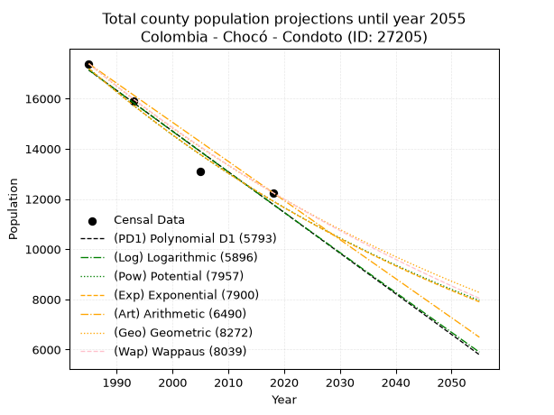
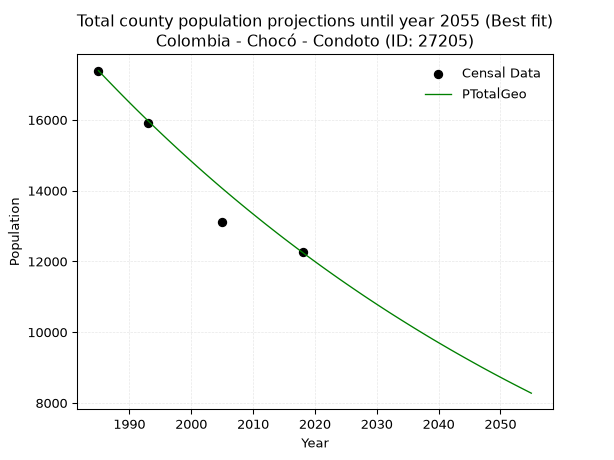
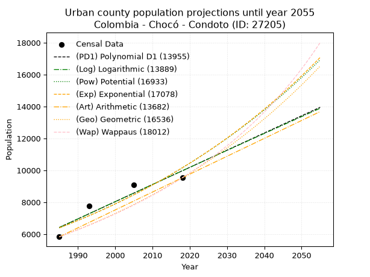
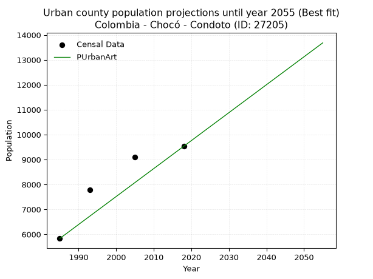
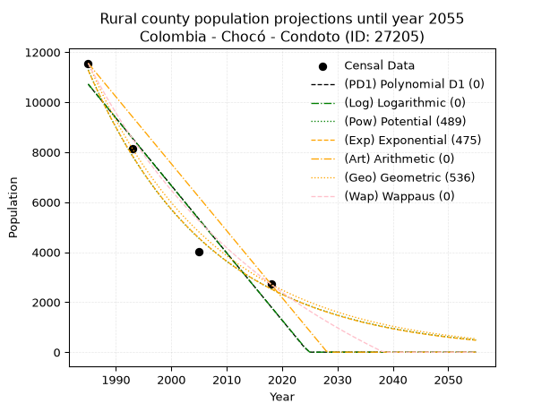
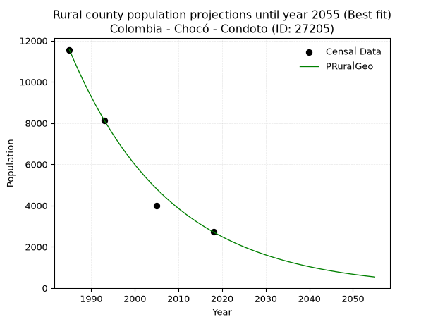

<div align="center">


</div>

# 📜 _“Population and Public Services Demand Projections (PPSD) until Year 2050 for Colombia - Chocó - Condoto (ID: 27205)”_
Keywords: `population` `public-service` `projection` `lineal` `polynomial` `logarithmic` `potential` `exponential` `arithmetic` `geometric` `wappaus` `dane` `colombia` `south-america`

PPSD are analytical estimates used by governments and planners to anticipate future changes in population size, age distribution, and the resulting community needs for utilities, healthcare, education, and infrastructure as sizing future water treatment facilities, electrical grids, and road networks based on spatial growth.

<div align="center">

</img>

</div>


> **General running parameters**: • app_version: _v20260806_. • Python version: _3.14.7_. • Pandas version: _3.0.5_. • NumPy version: _2.5.1_. • Creates, save and include plots into reports (create_plot): _False_. • Projection until year: _2050_. • Process polynomial degree 2 and up: _False_. • Process Wappaus: _True_. • Process Wappaus: _True_. • Set negative values to zero: _True_. • Set infinite values to zero: _True_. • Drop dataset notes: _True_. 
<div align="center">

Dynamic map: [:earth_americas:Google](http://maps.google.com/maps?q=5.091003207,-76.6506826) [:earth_americas:OSM](https://www.openstreetmap.org/#map=18/5.091003207/-76.6506826&layers=P) [:earth_americas:Bing](https://www.bing.com/maps?cp=5.091003207~-76.6506826&lvl=18) [:earth_americas:Apple](https://maps.apple.com/frame?center=5.091003207%2C-76.6506826&span=0.003%2C0.006)

</div>


<div align="center">

```geojson
{
  "type": "Feature",
  "geometry": {
    "type": "Point", 
    "coordinates": [-76.6506826, 5.091003207]
  }, 
  "properties": {
    "Name": "Colombia - Chocó - Condoto (ID: 27205)"
  }
}
```

</div>


## 0. Census Data (4 records)

Census data are official statistics collected by a government about the people and housing in a country. They usually include counts of total population, age, sex, race, income, education, and jobs.

📅Global census file: [Population.xlsx](../data/Population.xlsx)

| Source   |   Year |   CountryID | CountryName   |   StateID | StateName   |   CountyID | CountyName   |   PTotal |   PUrban |   PRural |
|:---------|-------:|------------:|:--------------|----------:|:------------|-----------:|:-------------|---------:|---------:|---------:|
| DANE     |   1985 |          57 | Colombia      |        27 | Chocó       |      27205 | Condoto      |    17389 |     5834 |    11555 |
| DANE     |   1993 |          57 | Colombia      |        27 | Chocó       |      27205 | Condoto      |    15914 |     7779 |     8135 |
| DANE     |   2005 |          57 | Colombia      |        27 | Chocó       |      27205 | Condoto      |    13098 |     9093 |     4005 |
| DANE     |   2018 |          57 | Colombia      |        27 | Chocó       |      27205 | Condoto      |    12251 |     9534 |     2717 |

> 🔥Some records could had specific notes about the registered values or the corresponding urban or rural distribution.

📅[SUI-RUPS](https://www.datos.gov.co/Hacienda-y-Cr-dito-P-blico/Registro-nico-de-Prestadores-de-Servicios-P-blicos/4qkq-csdn/about_data) - Local public utility companies: [RUPS.csv](../data/RUPS.csv)

 | SERVICIO       | ESTADO    | NOMBRE                                           | NIT         | DEPARTAMENTO_DOMICILIO   | MUNICIPIO_DOMICILIO   | DIRECCION         |   TELEFONO | EMAIL                 | TIPO_PRESTADOR                            | CLASIFICACION                 |
|:---------------|:----------|:-------------------------------------------------|:------------|:-------------------------|:----------------------|:------------------|-----------:|:----------------------|:------------------------------------------|:------------------------------|
| ACUEDUCTO      | OPERATIVA | EMPRESA DE SERVICIOS PUBLICOS DOMICILIARIOS, ESP | 818000690-1 | CHOCO                    | CONDOTO               | BARRIO SANTA RITA |    6798472 | lasarre01@hotmail.com | EMPRESA INDUSTRIAL Y COMERCIAL DEL ESTADO | MENOR O IGUAL A 2500 USUARIOS |
| ALCANTARILLADO | OPERATIVA | EMPRESA DE SERVICIOS PUBLICOS DOMICILIARIOS, ESP | 818000690-1 | CHOCO                    | CONDOTO               | BARRIO SANTA RITA |    6798472 | lasarre01@hotmail.com | EMPRESA INDUSTRIAL Y COMERCIAL DEL ESTADO | MENOR O IGUAL A 2500 USUARIOS |

## 1. Total

### 1.1. Coefficients and Parameters

* (PD1) Polynomial Deg 1: -162.00401445202658, 338711.5299076662 (lineal)
* (Log) Logarithmic: -324424.1787187296, 2480613.782213273
* (Pow) Potential: -22.250634078984234, 77.61288814150694
* (Exp) Exponential: -0.011112009671949013, 65287954123342.99
* (Art) Arithmetic: Year diff. 2018 - 1985 = 33, Population diff. 12251 - 17389 = -5138, Annual growth = -155.6969696969697
* (Geo) Geometric: Year diff. 2018 - 1985 = 33, Population diff. 12251 - 17389 = -5138, Annual growth % = -0.010556918483344946
* (Wap) Wappaus: i = -1.0505868400605243, Condition values only valid for < 200)

<sub>
Wappaus condition values: ['-0.00', '-1.05', '-2.10', '-3.15', '-4.20', '-5.25', '-6.30', '-7.35', '-8.40', '-9.46', '-10.51', '-11.56', '-12.61', '-13.66', '-14.71', '-15.76', '-16.81', '-17.86', '-18.91', '-19.96', '-21.01', '-22.06', '-23.11', '-24.16', '-25.21', '-26.26', '-27.32', '-28.37', '-29.42', '-30.47', '-31.52', '-32.57', '-33.62', '-34.67', '-35.72', '-36.77', '-37.82', '-38.87', '-39.92', '-40.97', '-42.02', '-43.07', '-44.12', '-45.18', '-46.23', '-47.28', '-48.33', '-49.38', '-50.43', '-51.48', '-52.53', '-53.58', '-54.63', '-55.68', '-56.73', '-57.78', '-58.83', '-59.88', '-60.93', '-61.98', '-63.04', '-64.09', '-65.14', '-66.19', '-67.24', '-68.29']
</sub>


### 1.2. Projected Dataset

|   Year |   CountyID |   PTotalPD1 |   PTotalLog |   PTotalPow |   PTotalExp |   PTotalArt |   PTotalGeo |   PTotalWap |
|-------:|-----------:|------------:|------------:|------------:|------------:|------------:|------------:|------------:|
|   1985 |      27205 |       17134 |       17140 |       17204 |       17197 |       17389 |       17389 |       17389 |
|   1986 |      27205 |       16972 |       16976 |       17012 |       17007 |       17233 |       17205 |       17207 |
|   1987 |      27205 |       16810 |       16813 |       16823 |       16819 |       17078 |       17024 |       17027 |
|   1988 |      27205 |       16648 |       16650 |       16635 |       16633 |       16922 |       16844 |       16849 |
|   1989 |      27205 |       16486 |       16487 |       16450 |       16449 |       16766 |       16666 |       16673 |
|   1990 |      27205 |       16324 |       16323 |       16267 |       16268 |       16611 |       16490 |       16499 |
|   1991 |      27205 |       16162 |       16160 |       16086 |       16088 |       16455 |       16316 |       16326 |
|   1992 |      27205 |       16000 |       15998 |       15908 |       15910 |       16299 |       16144 |       16156 |
|   1993 |      27205 |       15838 |       15835 |       15731 |       15734 |       16143 |       15974 |       15986 |
|   1994 |      27205 |       15676 |       15672 |       15556 |       15560 |       15988 |       15805 |       15819 |
|   1995 |      27205 |       15514 |       15509 |       15384 |       15388 |       15832 |       15638 |       15653 |
|   1996 |      27205 |       15352 |       15347 |       15213 |       15218 |       15676 |       15473 |       15489 |
|   1997 |      27205 |       15190 |       15184 |       15045 |       15050 |       15521 |       15310 |       15327 |
|   1998 |      27205 |       15028 |       15022 |       14878 |       14884 |       15365 |       15148 |       15166 |
|   1999 |      27205 |       14866 |       14859 |       14713 |       14719 |       15209 |       14988 |       15007 |
|   2000 |      27205 |       14704 |       14697 |       14550 |       14557 |       15054 |       14830 |       14849 |
|   2001 |      27205 |       14541 |       14535 |       14390 |       14396 |       14898 |       14673 |       14693 |
|   2002 |      27205 |       14379 |       14373 |       14230 |       14237 |       14742 |       14518 |       14538 |
|   2003 |      27205 |       14217 |       14211 |       14073 |       14079 |       14586 |       14365 |       14385 |
|   2004 |      27205 |       14055 |       14049 |       13918 |       13924 |       14431 |       14213 |       14233 |
|   2005 |      27205 |       13893 |       13887 |       13764 |       13770 |       14275 |       14063 |       14083 |
|   2006 |      27205 |       13731 |       13725 |       13612 |       13618 |       14119 |       13915 |       13934 |
|   2007 |      27205 |       13569 |       13564 |       13462 |       13467 |       13964 |       13768 |       13786 |
|   2008 |      27205 |       13407 |       13402 |       13314 |       13319 |       13808 |       13623 |       13640 |
|   2009 |      27205 |       13245 |       13241 |       13167 |       13171 |       13652 |       13479 |       13495 |
|   2010 |      27205 |       13083 |       13079 |       13022 |       13026 |       13497 |       13337 |       13352 |
|   2011 |      27205 |       12921 |       12918 |       12879 |       12882 |       13341 |       13196 |       13210 |
|   2012 |      27205 |       12759 |       12757 |       12737 |       12740 |       13185 |       13056 |       13069 |
|   2013 |      27205 |       12597 |       12595 |       12597 |       12599 |       13029 |       12919 |       12930 |
|   2014 |      27205 |       12435 |       12434 |       12459 |       12460 |       12874 |       12782 |       12791 |
|   2015 |      27205 |       12273 |       12273 |       12322 |       12322 |       12718 |       12647 |       12655 |
|   2016 |      27205 |       12111 |       12112 |       12186 |       12186 |       12562 |       12514 |       12519 |
|   2017 |      27205 |       11949 |       11951 |       12053 |       12051 |       12407 |       12382 |       12384 |
|   2018 |      27205 |       11787 |       11790 |       11921 |       11918 |       12251 |       12251 |       12251 |
|   2019 |      27205 |       11625 |       11630 |       11790 |       11786 |       12095 |       12122 |       12119 |
|   2020 |      27205 |       11463 |       11469 |       11661 |       11656 |       11940 |       11994 |       11988 |
|   2021 |      27205 |       11301 |       11309 |       11533 |       11527 |       11784 |       11867 |       11858 |
|   2022 |      27205 |       11139 |       11148 |       11407 |       11400 |       11628 |       11742 |       11730 |
|   2023 |      27205 |       10977 |       10988 |       11282 |       11274 |       11473 |       11618 |       11602 |
|   2024 |      27205 |       10815 |       10827 |       11159 |       11149 |       11317 |       11495 |       11476 |
|   2025 |      27205 |       10653 |       10667 |       11037 |       11026 |       11161 |       11374 |       11350 |
|   2026 |      27205 |       10491 |       10507 |       10916 |       10904 |       11005 |       11254 |       11226 |
|   2027 |      27205 |       10329 |       10347 |       10797 |       10784 |       10850 |       11135 |       11103 |
|   2028 |      27205 |       10167 |       10187 |       10679 |       10664 |       10694 |       11017 |       10981 |
|   2029 |      27205 |       10005 |       10027 |       10562 |       10547 |       10538 |       10901 |       10860 |
|   2030 |      27205 |        9843 |        9867 |       10447 |       10430 |       10383 |       10786 |       10740 |
|   2031 |      27205 |        9681 |        9707 |       10333 |       10315 |       10227 |       10672 |       10621 |
|   2032 |      27205 |        9519 |        9548 |       10221 |       10201 |       10071 |       10559 |       10503 |
|   2033 |      27205 |        9357 |        9388 |       10110 |       10088 |        9916 |       10448 |       10386 |
|   2034 |      27205 |        9195 |        9228 |       10000 |        9977 |        9760 |       10338 |       10270 |
|   2035 |      27205 |        9033 |        9069 |        9891 |        9866 |        9604 |       10229 |       10155 |
|   2036 |      27205 |        8871 |        8910 |        9783 |        9757 |        9448 |       10121 |       10041 |
|   2037 |      27205 |        8709 |        8750 |        9677 |        9650 |        9293 |       10014 |        9927 |
|   2038 |      27205 |        8547 |        8591 |        9572 |        9543 |        9137 |        9908 |        9815 |
|   2039 |      27205 |        8385 |        8432 |        9468 |        9437 |        8981 |        9803 |        9704 |
|   2040 |      27205 |        8223 |        8273 |        9365 |        9333 |        8826 |        9700 |        9593 |
|   2041 |      27205 |        8061 |        8114 |        9264 |        9230 |        8670 |        9598 |        9484 |
|   2042 |      27205 |        7899 |        7955 |        9163 |        9128 |        8514 |        9496 |        9375 |
|   2043 |      27205 |        7737 |        7796 |        9064 |        9027 |        8359 |        9396 |        9268 |
|   2044 |      27205 |        7575 |        7637 |        8966 |        8927 |        8203 |        9297 |        9161 |
|   2045 |      27205 |        7413 |        7479 |        8869 |        8829 |        8047 |        9199 |        9055 |
|   2046 |      27205 |        7251 |        7320 |        8773 |        8731 |        7891 |        9102 |        8949 |
|   2047 |      27205 |        7089 |        7161 |        8678 |        8635 |        7736 |        9005 |        8845 |
|   2048 |      27205 |        6927 |        7003 |        8584 |        8539 |        7580 |        8910 |        8742 |
|   2049 |      27205 |        6765 |        6845 |        8491 |        8445 |        7424 |        8816 |        8639 |
|   2050 |      27205 |        6603 |        6686 |        8400 |        8352 |        7269 |        8723 |        8537 |
<div align="center">

</img>

</div>


### 1.3. Best fit with absolute and relative error (%)

Relative error puts that difference into context by dividing the absolute error by the true value, creating a unitless ratio or percentage that shows the scale of the mistake.

Absolute and relative error

|   Year | Source   |   CountryID | CountryName   |   StateID | StateName   |   CountyID_x | CountyName   |   PTotal |   PUrban |   PRural |   CountyID_y |   PTotalPD1 |   PTotalLog |   PTotalPow |   PTotalExp |   PTotalArt |   PTotalGeo |   PTotalWap |   PTotalPD1AbsError |   PTotalLogAbsError |   PTotalPowAbsError |   PTotalExpAbsError |   PTotalArtAbsError |   PTotalGeoAbsError |   PTotalWapAbsError |   PTotalPD1RelError |   PTotalLogRelError |   PTotalPowRelError |   PTotalExpRelError |   PTotalArtRelError |   PTotalGeoRelError |   PTotalWapRelError |
|-------:|:---------|------------:|:--------------|----------:|:------------|-------------:|:-------------|---------:|---------:|---------:|-------------:|------------:|------------:|------------:|------------:|------------:|------------:|------------:|--------------------:|--------------------:|--------------------:|--------------------:|--------------------:|--------------------:|--------------------:|--------------------:|--------------------:|--------------------:|--------------------:|--------------------:|--------------------:|--------------------:|
|   1985 | DANE     |          57 | Colombia      |        27 | Chocó       |        27205 | Condoto      |    17389 |     5834 |    11555 |        27205 |       17134 |       17140 |       17204 |       17197 |       17389 |       17389 |       17389 |                 255 |                 249 |                 185 |                 192 |                   0 |                   0 |                   0 |            1.46644  |            1.43194  |             1.06389 |             1.10415 |             0       |            0        |            0        |
|   1993 | DANE     |          57 | Colombia      |        27 | Chocó       |        27205 | Condoto      |    15914 |     7779 |     8135 |        27205 |       15838 |       15835 |       15731 |       15734 |       16143 |       15974 |       15986 |                  76 |                  79 |                 183 |                 180 |                 229 |                  60 |                  72 |            0.477567 |            0.496418 |             1.14993 |             1.13108 |             1.43898 |            0.377027 |            0.452432 |
|   2005 | DANE     |          57 | Colombia      |        27 | Chocó       |        27205 | Condoto      |    13098 |     9093 |     4005 |        27205 |       13893 |       13887 |       13764 |       13770 |       14275 |       14063 |       14083 |                 795 |                 789 |                 666 |                 672 |                1177 |                 965 |                 985 |            6.06963  |            6.02382  |             5.08475 |             5.13055 |             8.9861  |            7.36754  |            7.52023  |
|   2018 | DANE     |          57 | Colombia      |        27 | Chocó       |        27205 | Condoto      |    12251 |     9534 |     2717 |        27205 |       11787 |       11790 |       11921 |       11918 |       12251 |       12251 |       12251 |                 464 |                 461 |                 330 |                 333 |                   0 |                   0 |                   0 |            3.78745  |            3.76296  |             2.69366 |             2.71815 |             0       |            0        |            0        |

Relative error mean

| Method    |   RelError | Best   |
|:----------|-----------:|:-------|
| PTotalPD1 |    2.95027 |        |
| PTotalLog |    2.92878 |        |
| PTotalPow |    2.49806 |        |
| PTotalExp |    2.52098 |        |
| PTotalArt |    2.60627 |        |
| PTotalGeo |    1.93614 | True   |
| PTotalWap |    1.99317 |        |

💙Best method: _**PTotalGeo**_
<div align="center">

</img>

</div>


### 1.4. Fresh water supply demand in liters per capita per day (lpcd)

The fresh water supply demand typically ranges from 100 to 300 liters per capita per day (lpcd) for standard domestic and municipal planning, though absolute survival minimums set by the World Health Organization are as low as 7.5 to 20 liters per day, and total consumption in high-income nations can exceed 400 liters.

> `CZ`: Level in meters above the sea level (masl)<br> `WS`: Fresh water supply demand in liters per capita per day (lpcd or l/h/d)<br> `WSAll`: Zonal fresh water supply demand in liters per second (l/s)<br> `A`: Zonal area in square meters<br> `DP`: Population density (people/hectare or p/ha)

Reference values (RAS Colombia)

|    CZ |   WS |
|------:|-----:|
|  1000 |  120 |
|  2000 |  130 |
| 99999 |  140 |

County shapefile geometry properties and water supply values

|   CountyID |      ATotal |   CZTotal |   WSTotal |
|-----------:|------------:|----------:|----------:|
|      27205 | 4.67886e+08 |   295.251 |       120 |

Projected values for best method: PTotalGeo

|   CountyID |   Year |   PTotalGeo |   DPTotal |   WSTotal |   WSTotalAll |
|-----------:|-------:|------------:|----------:|----------:|-------------:|
|      27205 |   1985 |       17389 |      0.37 |       120 |      24.1514 |
|      27205 |   1986 |       17205 |      0.37 |       120 |      23.8958 |
|      27205 |   1987 |       17024 |      0.36 |       120 |      23.6444 |
|      27205 |   1988 |       16844 |      0.36 |       120 |      23.3944 |
|      27205 |   1989 |       16666 |      0.36 |       120 |      23.1472 |
|      27205 |   1990 |       16490 |      0.35 |       120 |      22.9028 |
|      27205 |   1991 |       16316 |      0.35 |       120 |      22.6611 |
|      27205 |   1992 |       16144 |      0.35 |       120 |      22.4222 |
|      27205 |   1993 |       15974 |      0.34 |       120 |      22.1861 |
|      27205 |   1994 |       15805 |      0.34 |       120 |      21.9514 |
|      27205 |   1995 |       15638 |      0.33 |       120 |      21.7194 |
|      27205 |   1996 |       15473 |      0.33 |       120 |      21.4903 |
|      27205 |   1997 |       15310 |      0.33 |       120 |      21.2639 |
|      27205 |   1998 |       15148 |      0.32 |       120 |      21.0389 |
|      27205 |   1999 |       14988 |      0.32 |       120 |      20.8167 |
|      27205 |   2000 |       14830 |      0.32 |       120 |      20.5972 |
|      27205 |   2001 |       14673 |      0.31 |       120 |      20.3792 |
|      27205 |   2002 |       14518 |      0.31 |       120 |      20.1639 |
|      27205 |   2003 |       14365 |      0.31 |       120 |      19.9514 |
|      27205 |   2004 |       14213 |      0.3  |       120 |      19.7403 |
|      27205 |   2005 |       14063 |      0.3  |       120 |      19.5319 |
|      27205 |   2006 |       13915 |      0.3  |       120 |      19.3264 |
|      27205 |   2007 |       13768 |      0.29 |       120 |      19.1222 |
|      27205 |   2008 |       13623 |      0.29 |       120 |      18.9208 |
|      27205 |   2009 |       13479 |      0.29 |       120 |      18.7208 |
|      27205 |   2010 |       13337 |      0.29 |       120 |      18.5236 |
|      27205 |   2011 |       13196 |      0.28 |       120 |      18.3278 |
|      27205 |   2012 |       13056 |      0.28 |       120 |      18.1333 |
|      27205 |   2013 |       12919 |      0.28 |       120 |      17.9431 |
|      27205 |   2014 |       12782 |      0.27 |       120 |      17.7528 |
|      27205 |   2015 |       12647 |      0.27 |       120 |      17.5653 |
|      27205 |   2016 |       12514 |      0.27 |       120 |      17.3806 |
|      27205 |   2017 |       12382 |      0.26 |       120 |      17.1972 |
|      27205 |   2018 |       12251 |      0.26 |       120 |      17.0153 |
|      27205 |   2019 |       12122 |      0.26 |       120 |      16.8361 |
|      27205 |   2020 |       11994 |      0.26 |       120 |      16.6583 |
|      27205 |   2021 |       11867 |      0.25 |       120 |      16.4819 |
|      27205 |   2022 |       11742 |      0.25 |       120 |      16.3083 |
|      27205 |   2023 |       11618 |      0.25 |       120 |      16.1361 |
|      27205 |   2024 |       11495 |      0.25 |       120 |      15.9653 |
|      27205 |   2025 |       11374 |      0.24 |       120 |      15.7972 |
|      27205 |   2026 |       11254 |      0.24 |       120 |      15.6306 |
|      27205 |   2027 |       11135 |      0.24 |       120 |      15.4653 |
|      27205 |   2028 |       11017 |      0.24 |       120 |      15.3014 |
|      27205 |   2029 |       10901 |      0.23 |       120 |      15.1403 |
|      27205 |   2030 |       10786 |      0.23 |       120 |      14.9806 |
|      27205 |   2031 |       10672 |      0.23 |       120 |      14.8222 |
|      27205 |   2032 |       10559 |      0.23 |       120 |      14.6653 |
|      27205 |   2033 |       10448 |      0.22 |       120 |      14.5111 |
|      27205 |   2034 |       10338 |      0.22 |       120 |      14.3583 |
|      27205 |   2035 |       10229 |      0.22 |       120 |      14.2069 |
|      27205 |   2036 |       10121 |      0.22 |       120 |      14.0569 |
|      27205 |   2037 |       10014 |      0.21 |       120 |      13.9083 |
|      27205 |   2038 |        9908 |      0.21 |       120 |      13.7611 |
|      27205 |   2039 |        9803 |      0.21 |       120 |      13.6153 |
|      27205 |   2040 |        9700 |      0.21 |       120 |      13.4722 |
|      27205 |   2041 |        9598 |      0.21 |       120 |      13.3306 |
|      27205 |   2042 |        9496 |      0.2  |       120 |      13.1889 |
|      27205 |   2043 |        9396 |      0.2  |       120 |      13.05   |
|      27205 |   2044 |        9297 |      0.2  |       120 |      12.9125 |
|      27205 |   2045 |        9199 |      0.2  |       120 |      12.7764 |
|      27205 |   2046 |        9102 |      0.19 |       120 |      12.6417 |
|      27205 |   2047 |        9005 |      0.19 |       120 |      12.5069 |
|      27205 |   2048 |        8910 |      0.19 |       120 |      12.375  |
|      27205 |   2049 |        8816 |      0.19 |       120 |      12.2444 |
|      27205 |   2050 |        8723 |      0.19 |       120 |      12.1153 |

## 2. Urban

### 2.1. Coefficients and Parameters

* (PD1) Polynomial Deg 1: 107.67402649538298, -207314.9714973898 (lineal)
* (Log) Logarithmic: 215711.80654490547, -1631567.1701537587
* (Pow) Potential: 28.12074383853632, -88.92998987473746
* (Exp) Exponential: 0.014034797655562828, 5.0900725451093504e-09
* (Art) Arithmetic: Year diff. 2018 - 1985 = 33, Population diff. 9534 - 5834 = 3700, Annual growth = 112.12121212121212
* (Geo) Geometric: Year diff. 2018 - 1985 = 33, Population diff. 9534 - 5834 = 3700, Annual growth % = 0.014994994925642935
* (Wap) Wappaus: i = 1.4591516413484138, Condition values only valid for < 200)

<sub>
Wappaus condition values: ['0.00', '1.46', '2.92', '4.38', '5.84', '7.30', '8.75', '10.21', '11.67', '13.13', '14.59', '16.05', '17.51', '18.97', '20.43', '21.89', '23.35', '24.81', '26.26', '27.72', '29.18', '30.64', '32.10', '33.56', '35.02', '36.48', '37.94', '39.40', '40.86', '42.32', '43.77', '45.23', '46.69', '48.15', '49.61', '51.07', '52.53', '53.99', '55.45', '56.91', '58.37', '59.83', '61.28', '62.74', '64.20', '65.66', '67.12', '68.58', '70.04', '71.50', '72.96', '74.42', '75.88', '77.34', '78.79', '80.25', '81.71', '83.17', '84.63', '86.09', '87.55', '89.01', '90.47', '91.93', '93.39', '94.84']
</sub>


### 2.2. Projected Dataset

|   Year |   CountyID |   PUrbanPD1 |   PUrbanLog |   PUrbanPow |   PUrbanExp |   PUrbanArt |   PUrbanGeo |   PUrbanWap |
|-------:|-----------:|------------:|------------:|------------:|------------:|------------:|------------:|------------:|
|   1985 |      27205 |        6418 |        6413 |        6390 |        6394 |        5834 |        5834 |        5834 |
|   1986 |      27205 |        6526 |        6522 |        6481 |        6484 |        5946 |        5921 |        5920 |
|   1987 |      27205 |        6633 |        6631 |        6573 |        6576 |        6058 |        6010 |        6007 |
|   1988 |      27205 |        6741 |        6739 |        6667 |        6669 |        6170 |        6100 |        6095 |
|   1989 |      27205 |        6849 |        6848 |        6762 |        6763 |        6282 |        6192 |        6185 |
|   1990 |      27205 |        6956 |        6956 |        6858 |        6859 |        6395 |        6285 |        6276 |
|   1991 |      27205 |        7064 |        7064 |        6956 |        6956 |        6507 |        6379 |        6368 |
|   1992 |      27205 |        7172 |        7173 |        7055 |        7054 |        6619 |        6475 |        6462 |
|   1993 |      27205 |        7279 |        7281 |        7155 |        7154 |        6731 |        6572 |        6557 |
|   1994 |      27205 |        7387 |        7389 |        7257 |        7255 |        6843 |        6670 |        6654 |
|   1995 |      27205 |        7495 |        7497 |        7360 |        7357 |        6955 |        6770 |        6752 |
|   1996 |      27205 |        7602 |        7605 |        7464 |        7461 |        7067 |        6872 |        6852 |
|   1997 |      27205 |        7710 |        7713 |        7570 |        7567 |        7179 |        6975 |        6954 |
|   1998 |      27205 |        7818 |        7821 |        7677 |        7674 |        7292 |        7079 |        7057 |
|   1999 |      27205 |        7925 |        7929 |        7786 |        7782 |        7404 |        7186 |        7161 |
|   2000 |      27205 |        8033 |        8037 |        7896 |        7892 |        7516 |        7293 |        7268 |
|   2001 |      27205 |        8141 |        8145 |        8008 |        8004 |        7628 |        7403 |        7376 |
|   2002 |      27205 |        8248 |        8253 |        8121 |        8117 |        7740 |        7514 |        7486 |
|   2003 |      27205 |        8356 |        8361 |        8236 |        8232 |        7852 |        7626 |        7598 |
|   2004 |      27205 |        8464 |        8468 |        8353 |        8348 |        7964 |        7741 |        7712 |
|   2005 |      27205 |        8571 |        8576 |        8471 |        8466 |        8076 |        7857 |        7827 |
|   2006 |      27205 |        8679 |        8683 |        8590 |        8586 |        8189 |        7975 |        7945 |
|   2007 |      27205 |        8787 |        8791 |        8712 |        8707 |        8301 |        8094 |        8065 |
|   2008 |      27205 |        8894 |        8898 |        8835 |        8830 |        8413 |        8216 |        8187 |
|   2009 |      27205 |        9002 |        9006 |        8959 |        8955 |        8525 |        8339 |        8311 |
|   2010 |      27205 |        9110 |        9113 |        9085 |        9081 |        8637 |        8464 |        8437 |
|   2011 |      27205 |        9217 |        9220 |        9213 |        9210 |        8749 |        8591 |        8565 |
|   2012 |      27205 |        9325 |        9328 |        9343 |        9340 |        8861 |        8720 |        8696 |
|   2013 |      27205 |        9433 |        9435 |        9474 |        9472 |        8973 |        8850 |        8829 |
|   2014 |      27205 |        9541 |        9542 |        9608 |        9606 |        9086 |        8983 |        8965 |
|   2015 |      27205 |        9648 |        9649 |        9743 |        9741 |        9198 |        9118 |        9103 |
|   2016 |      27205 |        9756 |        9756 |        9880 |        9879 |        9310 |        9254 |        9244 |
|   2017 |      27205 |        9864 |        9863 |       10018 |       10019 |        9422 |        9393 |        9388 |
|   2018 |      27205 |        9971 |        9970 |       10159 |       10160 |        9534 |        9534 |        9534 |
|   2019 |      27205 |       10079 |       10077 |       10302 |       10304 |        9646 |        9677 |        9683 |
|   2020 |      27205 |       10187 |       10184 |       10446 |       10450 |        9758 |        9822 |        9835 |
|   2021 |      27205 |       10294 |       10290 |       10592 |       10597 |        9870 |        9969 |        9990 |
|   2022 |      27205 |       10402 |       10397 |       10741 |       10747 |        9982 |       10119 |       10148 |
|   2023 |      27205 |       10510 |       10504 |       10891 |       10899 |       10095 |       10271 |       10310 |
|   2024 |      27205 |       10617 |       10610 |       11044 |       11053 |       10207 |       10425 |       10474 |
|   2025 |      27205 |       10725 |       10717 |       11198 |       11209 |       10319 |       10581 |       10642 |
|   2026 |      27205 |       10833 |       10823 |       11355 |       11368 |       10431 |       10740 |       10814 |
|   2027 |      27205 |       10940 |       10930 |       11513 |       11528 |       10543 |       10901 |       10989 |
|   2028 |      27205 |       11048 |       11036 |       11674 |       11691 |       10655 |       11064 |       11168 |
|   2029 |      27205 |       11156 |       11143 |       11837 |       11856 |       10767 |       11230 |       11350 |
|   2030 |      27205 |       11263 |       11249 |       12002 |       12024 |       10879 |       11398 |       11537 |
|   2031 |      27205 |       11371 |       11355 |       12170 |       12194 |       10992 |       11569 |       11728 |
|   2032 |      27205 |       11479 |       11461 |       12339 |       12366 |       11104 |       11743 |       11923 |
|   2033 |      27205 |       11586 |       11567 |       12511 |       12541 |       11216 |       11919 |       12122 |
|   2034 |      27205 |       11694 |       11674 |       12685 |       12718 |       11328 |       12098 |       12326 |
|   2035 |      27205 |       11802 |       11780 |       12862 |       12898 |       11440 |       12279 |       12535 |
|   2036 |      27205 |       11909 |       11886 |       13041 |       13080 |       11552 |       12463 |       12748 |
|   2037 |      27205 |       12017 |       11991 |       13222 |       13265 |       11664 |       12650 |       12967 |
|   2038 |      27205 |       12125 |       12097 |       13406 |       13453 |       11776 |       12840 |       13190 |
|   2039 |      27205 |       12232 |       12203 |       13592 |       13643 |       11889 |       13032 |       13419 |
|   2040 |      27205 |       12340 |       12309 |       13781 |       13836 |       12001 |       13228 |       13654 |
|   2041 |      27205 |       12448 |       12415 |       13972 |       14031 |       12113 |       13426 |       13894 |
|   2042 |      27205 |       12555 |       12520 |       14166 |       14230 |       12225 |       13627 |       14141 |
|   2043 |      27205 |       12663 |       12626 |       14362 |       14431 |       12337 |       13832 |       14393 |
|   2044 |      27205 |       12771 |       12731 |       14561 |       14635 |       12449 |       14039 |       14652 |
|   2045 |      27205 |       12878 |       12837 |       14763 |       14842 |       12561 |       14250 |       14918 |
|   2046 |      27205 |       12986 |       12942 |       14967 |       15051 |       12673 |       14463 |       15191 |
|   2047 |      27205 |       13094 |       13048 |       15174 |       15264 |       12786 |       14680 |       15471 |
|   2048 |      27205 |       13201 |       13153 |       15384 |       15480 |       12898 |       14900 |       15759 |
|   2049 |      27205 |       13309 |       13258 |       15597 |       15699 |       13010 |       15124 |       16054 |
|   2050 |      27205 |       13417 |       13364 |       15812 |       15920 |       13122 |       15350 |       16358 |
<div align="center">

</img>

</div>


### 2.3. Best fit with absolute and relative error (%)

Relative error puts that difference into context by dividing the absolute error by the true value, creating a unitless ratio or percentage that shows the scale of the mistake.

Absolute and relative error

|   Year | Source   |   CountryID | CountryName   |   StateID | StateName   |   CountyID_x | CountyName   |   PTotal |   PUrban |   PRural |   CountyID_y |   PUrbanPD1 |   PUrbanLog |   PUrbanPow |   PUrbanExp |   PUrbanArt |   PUrbanGeo |   PUrbanWap |   PUrbanPD1AbsError |   PUrbanLogAbsError |   PUrbanPowAbsError |   PUrbanExpAbsError |   PUrbanArtAbsError |   PUrbanGeoAbsError |   PUrbanWapAbsError |   PUrbanPD1RelError |   PUrbanLogRelError |   PUrbanPowRelError |   PUrbanExpRelError |   PUrbanArtRelError |   PUrbanGeoRelError |   PUrbanWapRelError |
|-------:|:---------|------------:|:--------------|----------:|:------------|-------------:|:-------------|---------:|---------:|---------:|-------------:|------------:|------------:|------------:|------------:|------------:|------------:|------------:|--------------------:|--------------------:|--------------------:|--------------------:|--------------------:|--------------------:|--------------------:|--------------------:|--------------------:|--------------------:|--------------------:|--------------------:|--------------------:|--------------------:|
|   1985 | DANE     |          57 | Colombia      |        27 | Chocó       |        27205 | Condoto      |    17389 |     5834 |    11555 |        27205 |        6418 |        6413 |        6390 |        6394 |        5834 |        5834 |        5834 |                 584 |                 579 |                 556 |                 560 |                   0 |                   0 |                   0 |            10.0103  |             9.92458 |             9.53034 |             9.5989  |              0      |              0      |              0      |
|   1993 | DANE     |          57 | Colombia      |        27 | Chocó       |        27205 | Condoto      |    15914 |     7779 |     8135 |        27205 |        7279 |        7281 |        7155 |        7154 |        6731 |        6572 |        6557 |                 500 |                 498 |                 624 |                 625 |                1048 |                1207 |                1222 |             6.42756 |             6.40185 |             8.0216  |             8.03445 |             13.4722 |             15.5161 |             15.709  |
|   2005 | DANE     |          57 | Colombia      |        27 | Chocó       |        27205 | Condoto      |    13098 |     9093 |     4005 |        27205 |        8571 |        8576 |        8471 |        8466 |        8076 |        7857 |        7827 |                 522 |                 517 |                 622 |                 627 |                1017 |                1236 |                1266 |             5.74068 |             5.68569 |             6.84043 |             6.89541 |             11.1844 |             13.5929 |             13.9228 |
|   2018 | DANE     |          57 | Colombia      |        27 | Chocó       |        27205 | Condoto      |    12251 |     9534 |     2717 |        27205 |        9971 |        9970 |       10159 |       10160 |        9534 |        9534 |        9534 |                 437 |                 436 |                 625 |                 626 |                   0 |                   0 |                   0 |             4.5836  |             4.57311 |             6.55549 |             6.56597 |              0      |              0      |              0      |

Relative error mean

| Method    |   RelError | Best   |
|:----------|-----------:|:-------|
| PUrbanPD1 |    6.69053 |        |
| PUrbanLog |    6.64631 |        |
| PUrbanPow |    7.73696 |        |
| PUrbanExp |    7.77369 |        |
| PUrbanArt |    6.16415 | True   |
| PUrbanGeo |    7.27725 |        |
| PUrbanWap |    7.40794 |        |

💙Best method: _**PUrbanArt**_
<div align="center">

</img>

</div>


### 2.4. Fresh water supply demand in liters per capita per day (lpcd)

The fresh water supply demand typically ranges from 100 to 300 liters per capita per day (lpcd) for standard domestic and municipal planning, though absolute survival minimums set by the World Health Organization are as low as 7.5 to 20 liters per day, and total consumption in high-income nations can exceed 400 liters.

> `CZ`: Level in meters above the sea level (masl)<br> `WS`: Fresh water supply demand in liters per capita per day (lpcd or l/h/d)<br> `WSAll`: Zonal fresh water supply demand in liters per second (l/s)<br> `A`: Zonal area in square meters<br> `DP`: Population density (people/hectare or p/ha)

Reference values (RAS Colombia)

|    CZ |   WS |
|------:|-----:|
|  1000 |  120 |
|  2000 |  130 |
| 99999 |  140 |

County shapefile geometry properties and water supply values

|   CountyID |      AUrban |   CZUrban |   WSUrban |
|-----------:|------------:|----------:|----------:|
|      27205 | 1.18785e+06 |   67.2921 |       120 |

Projected values for best method: PUrbanArt

|   CountyID |   Year |   PUrbanArt |   DPUrban |   WSUrban |   WSUrbanAll |
|-----------:|-------:|------------:|----------:|----------:|-------------:|
|      27205 |   1985 |        5834 |     49.11 |       120 |      8.10278 |
|      27205 |   1986 |        5946 |     50.06 |       120 |      8.25833 |
|      27205 |   1987 |        6058 |     51    |       120 |      8.41389 |
|      27205 |   1988 |        6170 |     51.94 |       120 |      8.56944 |
|      27205 |   1989 |        6282 |     52.89 |       120 |      8.725   |
|      27205 |   1990 |        6395 |     53.84 |       120 |      8.88194 |
|      27205 |   1991 |        6507 |     54.78 |       120 |      9.0375  |
|      27205 |   1992 |        6619 |     55.72 |       120 |      9.19306 |
|      27205 |   1993 |        6731 |     56.67 |       120 |      9.34861 |
|      27205 |   1994 |        6843 |     57.61 |       120 |      9.50417 |
|      27205 |   1995 |        6955 |     58.55 |       120 |      9.65972 |
|      27205 |   1996 |        7067 |     59.49 |       120 |      9.81528 |
|      27205 |   1997 |        7179 |     60.44 |       120 |      9.97083 |
|      27205 |   1998 |        7292 |     61.39 |       120 |     10.1278  |
|      27205 |   1999 |        7404 |     62.33 |       120 |     10.2833  |
|      27205 |   2000 |        7516 |     63.27 |       120 |     10.4389  |
|      27205 |   2001 |        7628 |     64.22 |       120 |     10.5944  |
|      27205 |   2002 |        7740 |     65.16 |       120 |     10.75    |
|      27205 |   2003 |        7852 |     66.1  |       120 |     10.9056  |
|      27205 |   2004 |        7964 |     67.05 |       120 |     11.0611  |
|      27205 |   2005 |        8076 |     67.99 |       120 |     11.2167  |
|      27205 |   2006 |        8189 |     68.94 |       120 |     11.3736  |
|      27205 |   2007 |        8301 |     69.88 |       120 |     11.5292  |
|      27205 |   2008 |        8413 |     70.83 |       120 |     11.6847  |
|      27205 |   2009 |        8525 |     71.77 |       120 |     11.8403  |
|      27205 |   2010 |        8637 |     72.71 |       120 |     11.9958  |
|      27205 |   2011 |        8749 |     73.65 |       120 |     12.1514  |
|      27205 |   2012 |        8861 |     74.6  |       120 |     12.3069  |
|      27205 |   2013 |        8973 |     75.54 |       120 |     12.4625  |
|      27205 |   2014 |        9086 |     76.49 |       120 |     12.6194  |
|      27205 |   2015 |        9198 |     77.43 |       120 |     12.775   |
|      27205 |   2016 |        9310 |     78.38 |       120 |     12.9306  |
|      27205 |   2017 |        9422 |     79.32 |       120 |     13.0861  |
|      27205 |   2018 |        9534 |     80.26 |       120 |     13.2417  |
|      27205 |   2019 |        9646 |     81.21 |       120 |     13.3972  |
|      27205 |   2020 |        9758 |     82.15 |       120 |     13.5528  |
|      27205 |   2021 |        9870 |     83.09 |       120 |     13.7083  |
|      27205 |   2022 |        9982 |     84.03 |       120 |     13.8639  |
|      27205 |   2023 |       10095 |     84.99 |       120 |     14.0208  |
|      27205 |   2024 |       10207 |     85.93 |       120 |     14.1764  |
|      27205 |   2025 |       10319 |     86.87 |       120 |     14.3319  |
|      27205 |   2026 |       10431 |     87.81 |       120 |     14.4875  |
|      27205 |   2027 |       10543 |     88.76 |       120 |     14.6431  |
|      27205 |   2028 |       10655 |     89.7  |       120 |     14.7986  |
|      27205 |   2029 |       10767 |     90.64 |       120 |     14.9542  |
|      27205 |   2030 |       10879 |     91.59 |       120 |     15.1097  |
|      27205 |   2031 |       10992 |     92.54 |       120 |     15.2667  |
|      27205 |   2032 |       11104 |     93.48 |       120 |     15.4222  |
|      27205 |   2033 |       11216 |     94.42 |       120 |     15.5778  |
|      27205 |   2034 |       11328 |     95.37 |       120 |     15.7333  |
|      27205 |   2035 |       11440 |     96.31 |       120 |     15.8889  |
|      27205 |   2036 |       11552 |     97.25 |       120 |     16.0444  |
|      27205 |   2037 |       11664 |     98.19 |       120 |     16.2     |
|      27205 |   2038 |       11776 |     99.14 |       120 |     16.3556  |
|      27205 |   2039 |       11889 |    100.09 |       120 |     16.5125  |
|      27205 |   2040 |       12001 |    101.03 |       120 |     16.6681  |
|      27205 |   2041 |       12113 |    101.97 |       120 |     16.8236  |
|      27205 |   2042 |       12225 |    102.92 |       120 |     16.9792  |
|      27205 |   2043 |       12337 |    103.86 |       120 |     17.1347  |
|      27205 |   2044 |       12449 |    104.8  |       120 |     17.2903  |
|      27205 |   2045 |       12561 |    105.75 |       120 |     17.4458  |
|      27205 |   2046 |       12673 |    106.69 |       120 |     17.6014  |
|      27205 |   2047 |       12786 |    107.64 |       120 |     17.7583  |
|      27205 |   2048 |       12898 |    108.58 |       120 |     17.9139  |
|      27205 |   2049 |       13010 |    109.53 |       120 |     18.0694  |
|      27205 |   2050 |       13122 |    110.47 |       120 |     18.225   |

## 3. Rural

### 3.1. Coefficients and Parameters

* (PD1) Polynomial Deg 1: -269.67804094740944, 546026.5014050559 (lineal)
* (Log) Logarithmic: -540135.9852636349, 4112180.9523670287
* (Pow) Potential: -90.60738592651217, 302.85430726710047
* (Exp) Exponential: -0.04525631066051398, 1.1654685007812499e+43
* (Art) Arithmetic: Year diff. 2018 - 1985 = 33, Population diff. 2717 - 11555 = -8838, Annual growth = -267.8181818181818
* (Geo) Geometric: Year diff. 2018 - 1985 = 33, Population diff. 2717 - 11555 = -8838, Annual growth % = -0.04291814761952917
* (Wap) Wappaus: i = -3.753057480635956, Condition values only valid for < 200)

<sub>
Wappaus condition values: ['-0.00', '-3.75', '-7.51', '-11.26', '-15.01', '-18.77', '-22.52', '-26.27', '-30.02', '-33.78', '-37.53', '-41.28', '-45.04', '-48.79', '-52.54', '-56.30', '-60.05', '-63.80', '-67.56', '-71.31', '-75.06', '-78.81', '-82.57', '-86.32', '-90.07', '-93.83', '-97.58', '-101.33', '-105.09', '-108.84', '-112.59', '-116.34', '-120.10', '-123.85', '-127.60', '-131.36', '-135.11', '-138.86', '-142.62', '-146.37', '-150.12', '-153.88', '-157.63', '-161.38', '-165.13', '-168.89', '-172.64', '-176.39', '-180.15', '-183.90', '-187.65', '-191.41', '-195.16', '-198.91', '-202.67', '-206.42', '-210.17', '-213.92', '-217.68', '-221.43', '-225.18', '-228.94', '-232.69', '-236.44', '-240.20', '-243.95']
</sub>


### 3.2. Projected Dataset

|   Year |   CountyID |   PRuralPD1 |   PRuralLog |   PRuralPow |   PRuralExp |   PRuralArt |   PRuralGeo |   PRuralWap |
|-------:|-----------:|------------:|------------:|------------:|------------:|------------:|------------:|------------:|
|   1985 |      27205 |       10716 |       10726 |       11294 |       11277 |       11555 |       11555 |       11555 |
|   1986 |      27205 |       10446 |       10454 |       10790 |       10778 |       11287 |       11059 |       11129 |
|   1987 |      27205 |       10176 |       10182 |       10309 |       10301 |       11019 |       10584 |       10719 |
|   1988 |      27205 |        9907 |        9911 |        9850 |        9845 |       10752 |       10130 |       10323 |
|   1989 |      27205 |        9637 |        9639 |        9411 |        9410 |       10484 |        9695 |        9941 |
|   1990 |      27205 |        9367 |        9367 |        8992 |        8993 |       10216 |        9279 |        9573 |
|   1991 |      27205 |        9098 |        9096 |        8592 |        8595 |        9948 |        8881 |        9216 |
|   1992 |      27205 |        8828 |        8825 |        8210 |        8215 |        9680 |        8500 |        8872 |
|   1993 |      27205 |        8558 |        8554 |        7845 |        7851 |        9412 |        8135 |        8539 |
|   1994 |      27205 |        8288 |        8283 |        7496 |        7504 |        9145 |        7786 |        8216 |
|   1995 |      27205 |        8019 |        8012 |        7163 |        7172 |        8877 |        7452 |        7904 |
|   1996 |      27205 |        7749 |        7741 |        6845 |        6855 |        8609 |        7132 |        7601 |
|   1997 |      27205 |        7479 |        7471 |        6542 |        6551 |        8341 |        6826 |        7307 |
|   1998 |      27205 |        7210 |        7200 |        6251 |        6261 |        8073 |        6533 |        7023 |
|   1999 |      27205 |        6940 |        6930 |        5974 |        5984 |        7806 |        6253 |        6747 |
|   2000 |      27205 |        6670 |        6660 |        5710 |        5720 |        7538 |        5984 |        6479 |
|   2001 |      27205 |        6401 |        6390 |        5457 |        5467 |        7270 |        5727 |        6219 |
|   2002 |      27205 |        6131 |        6120 |        5215 |        5225 |        7002 |        5482 |        5966 |
|   2003 |      27205 |        5861 |        5850 |        4985 |        4993 |        6734 |        5246 |        5720 |
|   2004 |      27205 |        5592 |        5581 |        4764 |        4773 |        6466 |        5021 |        5481 |
|   2005 |      27205 |        5322 |        5311 |        4554 |        4561 |        6199 |        4806 |        5249 |
|   2006 |      27205 |        5052 |        5042 |        4352 |        4360 |        5931 |        4599 |        5022 |
|   2007 |      27205 |        4783 |        4773 |        4160 |        4167 |        5663 |        4402 |        4802 |
|   2008 |      27205 |        4513 |        4504 |        3977 |        3982 |        5395 |        4213 |        4588 |
|   2009 |      27205 |        4243 |        4235 |        3801 |        3806 |        5127 |        4032 |        4379 |
|   2010 |      27205 |        3974 |        3966 |        3634 |        3638 |        4860 |        3859 |        4175 |
|   2011 |      27205 |        3704 |        3697 |        3474 |        3477 |        4592 |        3694 |        3977 |
|   2012 |      27205 |        3434 |        3429 |        3321 |        3323 |        4324 |        3535 |        3784 |
|   2013 |      27205 |        3165 |        3160 |        3174 |        3176 |        4056 |        3383 |        3595 |
|   2014 |      27205 |        2895 |        2892 |        3035 |        3035 |        3788 |        3238 |        3411 |
|   2015 |      27205 |        2625 |        2624 |        2901 |        2901 |        3520 |        3099 |        3231 |
|   2016 |      27205 |        2356 |        2356 |        2774 |        2773 |        3253 |        2966 |        3056 |
|   2017 |      27205 |        2086 |        2088 |        2652 |        2650 |        2985 |        2839 |        2884 |
|   2018 |      27205 |        1816 |        1821 |        2535 |        2533 |        2717 |        2717 |        2717 |
|   2019 |      27205 |        1547 |        1553 |        2424 |        2421 |        2449 |        2600 |        2553 |
|   2020 |      27205 |        1277 |        1285 |        2318 |        2314 |        2181 |        2489 |        2394 |
|   2021 |      27205 |        1007 |        1018 |        2216 |        2211 |        1914 |        2382 |        2237 |
|   2022 |      27205 |         738 |         751 |        2119 |        2113 |        1646 |        2280 |        2085 |
|   2023 |      27205 |         468 |         484 |        2026 |        2020 |        1378 |        2182 |        1935 |
|   2024 |      27205 |         198 |         217 |        1937 |        1930 |        1110 |        2088 |        1789 |
|   2025 |      27205 |           0 |           0 |        1853 |        1845 |         842 |        1999 |        1646 |
|   2026 |      27205 |           0 |           0 |        1772 |        1763 |         574 |        1913 |        1506 |
|   2027 |      27205 |           0 |           0 |        1694 |        1685 |         307 |        1831 |        1369 |
|   2028 |      27205 |           0 |           0 |        1620 |        1611 |          39 |        1752 |        1235 |
|   2029 |      27205 |           0 |           0 |        1549 |        1540 |           0 |        1677 |        1103 |
|   2030 |      27205 |           0 |           0 |        1482 |        1471 |           0 |        1605 |         975 |
|   2031 |      27205 |           0 |           0 |        1417 |        1406 |           0 |        1536 |         848 |
|   2032 |      27205 |           0 |           0 |        1355 |        1344 |           0 |        1470 |         725 |
|   2033 |      27205 |           0 |           0 |        1296 |        1285 |           0 |        1407 |         603 |
|   2034 |      27205 |           0 |           0 |        1240 |        1228 |           0 |        1347 |         485 |
|   2035 |      27205 |           0 |           0 |        1186 |        1173 |           0 |        1289 |         368 |
|   2036 |      27205 |           0 |           0 |        1134 |        1122 |           0 |        1234 |         254 |
|   2037 |      27205 |           0 |           0 |        1085 |        1072 |           0 |        1181 |         142 |
|   2038 |      27205 |           0 |           0 |        1037 |        1024 |           0 |        1130 |          32 |
|   2039 |      27205 |           0 |           0 |         992 |         979 |           0 |        1081 |           0 |
|   2040 |      27205 |           0 |           0 |         949 |         936 |           0 |        1035 |           0 |
|   2041 |      27205 |           0 |           0 |         908 |         894 |           0 |         991 |           0 |
|   2042 |      27205 |           0 |           0 |         869 |         855 |           0 |         948 |           0 |
|   2043 |      27205 |           0 |           0 |         831 |         817 |           0 |         907 |           0 |
|   2044 |      27205 |           0 |           0 |         795 |         781 |           0 |         868 |           0 |
|   2045 |      27205 |           0 |           0 |         760 |         746 |           0 |         831 |           0 |
|   2046 |      27205 |           0 |           0 |         727 |         713 |           0 |         796 |           0 |
|   2047 |      27205 |           0 |           0 |         696 |         682 |           0 |         761 |           0 |
|   2048 |      27205 |           0 |           0 |         666 |         652 |           0 |         729 |           0 |
|   2049 |      27205 |           0 |           0 |         637 |         623 |           0 |         697 |           0 |
|   2050 |      27205 |           0 |           0 |         609 |         595 |           0 |         668 |           0 |
<div align="center">

</img>

</div>


### 3.3. Best fit with absolute and relative error (%)

Relative error puts that difference into context by dividing the absolute error by the true value, creating a unitless ratio or percentage that shows the scale of the mistake.

Absolute and relative error

|   Year | Source   |   CountryID | CountryName   |   StateID | StateName   |   CountyID_x | CountyName   |   PTotal |   PUrban |   PRural |   CountyID_y |   PRuralPD1 |   PRuralLog |   PRuralPow |   PRuralExp |   PRuralArt |   PRuralGeo |   PRuralWap |   PRuralPD1AbsError |   PRuralLogAbsError |   PRuralPowAbsError |   PRuralExpAbsError |   PRuralArtAbsError |   PRuralGeoAbsError |   PRuralWapAbsError |   PRuralPD1RelError |   PRuralLogRelError |   PRuralPowRelError |   PRuralExpRelError |   PRuralArtRelError |   PRuralGeoRelError |   PRuralWapRelError |
|-------:|:---------|------------:|:--------------|----------:|:------------|-------------:|:-------------|---------:|---------:|---------:|-------------:|------------:|------------:|------------:|------------:|------------:|------------:|------------:|--------------------:|--------------------:|--------------------:|--------------------:|--------------------:|--------------------:|--------------------:|--------------------:|--------------------:|--------------------:|--------------------:|--------------------:|--------------------:|--------------------:|
|   1985 | DANE     |          57 | Colombia      |        27 | Chocó       |        27205 | Condoto      |    17389 |     5834 |    11555 |        27205 |       10716 |       10726 |       11294 |       11277 |       11555 |       11555 |       11555 |                 839 |                 829 |                 261 |                 278 |                   0 |                   0 |                   0 |             7.26093 |             7.17438 |             2.25876 |             2.40588 |              0      |                   0 |              0      |
|   1993 | DANE     |          57 | Colombia      |        27 | Chocó       |        27205 | Condoto      |    15914 |     7779 |     8135 |        27205 |        8558 |        8554 |        7845 |        7851 |        9412 |        8135 |        8539 |                 423 |                 419 |                 290 |                 284 |                1277 |                   0 |                 404 |             5.19975 |             5.15058 |             3.56484 |             3.49109 |             15.6976 |                   0 |              4.9662 |
|   2005 | DANE     |          57 | Colombia      |        27 | Chocó       |        27205 | Condoto      |    13098 |     9093 |     4005 |        27205 |        5322 |        5311 |        4554 |        4561 |        6199 |        4806 |        5249 |                1317 |                1306 |                 549 |                 556 |                2194 |                 801 |                1244 |            32.8839  |            32.6092  |            13.7079  |            13.8826  |             54.7815 |                  20 |             31.0612 |
|   2018 | DANE     |          57 | Colombia      |        27 | Chocó       |        27205 | Condoto      |    12251 |     9534 |     2717 |        27205 |        1816 |        1821 |        2535 |        2533 |        2717 |        2717 |        2717 |                 901 |                 896 |                 182 |                 184 |                   0 |                   0 |                   0 |            33.1616  |            32.9775  |             6.69856 |             6.77218 |              0      |                   0 |              0      |

Relative error mean

| Method    |   RelError | Best   |
|:----------|-----------:|:-------|
| PRuralPD1 |   19.6265  |        |
| PRuralLog |   19.4779  |        |
| PRuralPow |    6.55751 |        |
| PRuralExp |    6.63795 |        |
| PRuralArt |   17.6198  |        |
| PRuralGeo |    5       | True   |
| PRuralWap |    9.00684 |        |

💙Best method: _**PRuralGeo**_
<div align="center">

</img>

</div>


### 3.4. Fresh water supply demand in liters per capita per day (lpcd)

The fresh water supply demand typically ranges from 100 to 300 liters per capita per day (lpcd) for standard domestic and municipal planning, though absolute survival minimums set by the World Health Organization are as low as 7.5 to 20 liters per day, and total consumption in high-income nations can exceed 400 liters.

> `CZ`: Level in meters above the sea level (masl)<br> `WS`: Fresh water supply demand in liters per capita per day (lpcd or l/h/d)<br> `WSAll`: Zonal fresh water supply demand in liters per second (l/s)<br> `A`: Zonal area in square meters<br> `DP`: Population density (people/hectare or p/ha)

Reference values (RAS Colombia)

|    CZ |   WS |
|------:|-----:|
|  1000 |  120 |
|  2000 |  130 |
| 99999 |  140 |

County shapefile geometry properties and water supply values

|   CountyID |      ARural |   CZRural |   WSRural |
|-----------:|------------:|----------:|----------:|
|      27205 | 4.66699e+08 |   295.843 |       120 |

Projected values for best method: PRuralGeo

|   CountyID |   Year |   PRuralGeo |   DPRural |   WSRural |   WSRuralAll |
|-----------:|-------:|------------:|----------:|----------:|-------------:|
|      27205 |   1985 |       11555 |      0.25 |       120 |    16.0486   |
|      27205 |   1986 |       11059 |      0.24 |       120 |    15.3597   |
|      27205 |   1987 |       10584 |      0.23 |       120 |    14.7      |
|      27205 |   1988 |       10130 |      0.22 |       120 |    14.0694   |
|      27205 |   1989 |        9695 |      0.21 |       120 |    13.4653   |
|      27205 |   1990 |        9279 |      0.2  |       120 |    12.8875   |
|      27205 |   1991 |        8881 |      0.19 |       120 |    12.3347   |
|      27205 |   1992 |        8500 |      0.18 |       120 |    11.8056   |
|      27205 |   1993 |        8135 |      0.17 |       120 |    11.2986   |
|      27205 |   1994 |        7786 |      0.17 |       120 |    10.8139   |
|      27205 |   1995 |        7452 |      0.16 |       120 |    10.35     |
|      27205 |   1996 |        7132 |      0.15 |       120 |     9.90556  |
|      27205 |   1997 |        6826 |      0.15 |       120 |     9.48056  |
|      27205 |   1998 |        6533 |      0.14 |       120 |     9.07361  |
|      27205 |   1999 |        6253 |      0.13 |       120 |     8.68472  |
|      27205 |   2000 |        5984 |      0.13 |       120 |     8.31111  |
|      27205 |   2001 |        5727 |      0.12 |       120 |     7.95417  |
|      27205 |   2002 |        5482 |      0.12 |       120 |     7.61389  |
|      27205 |   2003 |        5246 |      0.11 |       120 |     7.28611  |
|      27205 |   2004 |        5021 |      0.11 |       120 |     6.97361  |
|      27205 |   2005 |        4806 |      0.1  |       120 |     6.675    |
|      27205 |   2006 |        4599 |      0.1  |       120 |     6.3875   |
|      27205 |   2007 |        4402 |      0.09 |       120 |     6.11389  |
|      27205 |   2008 |        4213 |      0.09 |       120 |     5.85139  |
|      27205 |   2009 |        4032 |      0.09 |       120 |     5.6      |
|      27205 |   2010 |        3859 |      0.08 |       120 |     5.35972  |
|      27205 |   2011 |        3694 |      0.08 |       120 |     5.13056  |
|      27205 |   2012 |        3535 |      0.08 |       120 |     4.90972  |
|      27205 |   2013 |        3383 |      0.07 |       120 |     4.69861  |
|      27205 |   2014 |        3238 |      0.07 |       120 |     4.49722  |
|      27205 |   2015 |        3099 |      0.07 |       120 |     4.30417  |
|      27205 |   2016 |        2966 |      0.06 |       120 |     4.11944  |
|      27205 |   2017 |        2839 |      0.06 |       120 |     3.94306  |
|      27205 |   2018 |        2717 |      0.06 |       120 |     3.77361  |
|      27205 |   2019 |        2600 |      0.06 |       120 |     3.61111  |
|      27205 |   2020 |        2489 |      0.05 |       120 |     3.45694  |
|      27205 |   2021 |        2382 |      0.05 |       120 |     3.30833  |
|      27205 |   2022 |        2280 |      0.05 |       120 |     3.16667  |
|      27205 |   2023 |        2182 |      0.05 |       120 |     3.03056  |
|      27205 |   2024 |        2088 |      0.04 |       120 |     2.9      |
|      27205 |   2025 |        1999 |      0.04 |       120 |     2.77639  |
|      27205 |   2026 |        1913 |      0.04 |       120 |     2.65694  |
|      27205 |   2027 |        1831 |      0.04 |       120 |     2.54306  |
|      27205 |   2028 |        1752 |      0.04 |       120 |     2.43333  |
|      27205 |   2029 |        1677 |      0.04 |       120 |     2.32917  |
|      27205 |   2030 |        1605 |      0.03 |       120 |     2.22917  |
|      27205 |   2031 |        1536 |      0.03 |       120 |     2.13333  |
|      27205 |   2032 |        1470 |      0.03 |       120 |     2.04167  |
|      27205 |   2033 |        1407 |      0.03 |       120 |     1.95417  |
|      27205 |   2034 |        1347 |      0.03 |       120 |     1.87083  |
|      27205 |   2035 |        1289 |      0.03 |       120 |     1.79028  |
|      27205 |   2036 |        1234 |      0.03 |       120 |     1.71389  |
|      27205 |   2037 |        1181 |      0.03 |       120 |     1.64028  |
|      27205 |   2038 |        1130 |      0.02 |       120 |     1.56944  |
|      27205 |   2039 |        1081 |      0.02 |       120 |     1.50139  |
|      27205 |   2040 |        1035 |      0.02 |       120 |     1.4375   |
|      27205 |   2041 |         991 |      0.02 |       120 |     1.37639  |
|      27205 |   2042 |         948 |      0.02 |       120 |     1.31667  |
|      27205 |   2043 |         907 |      0.02 |       120 |     1.25972  |
|      27205 |   2044 |         868 |      0.02 |       120 |     1.20556  |
|      27205 |   2045 |         831 |      0.02 |       120 |     1.15417  |
|      27205 |   2046 |         796 |      0.02 |       120 |     1.10556  |
|      27205 |   2047 |         761 |      0.02 |       120 |     1.05694  |
|      27205 |   2048 |         729 |      0.02 |       120 |     1.0125   |
|      27205 |   2049 |         697 |      0.01 |       120 |     0.968056 |
|      27205 |   2050 |         668 |      0.01 |       120 |     0.927778 |

#

<div align="center"><br><sub>Share this research</sub></div><br>

<sub>**APPS & TOOLS & CONTENT DISCLAIMER**: • NO WARRANTY - This content and software is provided by <a href="https://github.com/rcfdtools" target="_blank">github.com/rcfdtools</a> "as is", without any express or implied warranty, including warranties of merchantability, fitness for a particular purpose, or non-infringement. There is no guarantee that the software will be error-free or operate without interruption. • LIMITATION OF LIABILITY - Neither the authors nor copyright holders will be liable for claims or damages arising from the software or its use. You are responsible for determining if the software is appropriate for your use and assume all associated risks, including errors, legal compliance, and data loss. • NO PROFESSIONAL ADVICE - The software provides general information and does not offer professional advice. It should not replace consultation with professional advisors. [Clauses and global license for rcfdtools use.](https://github.com/rcfdtools/rcfdtools/blob/main/LICENSE.md)</sub>

| [:house: Home](Readme.md)  | [:beginner: Help / Collab](https://github.com/rcfdtools/R.HydroTools/discussions/31) |
|----------------------------|-------------------------------------------------------------------------------------------|