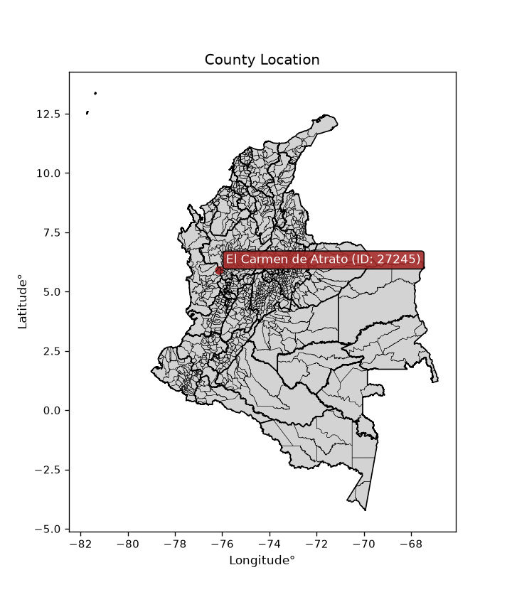
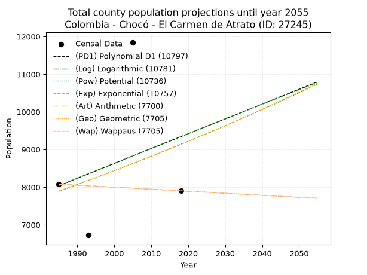
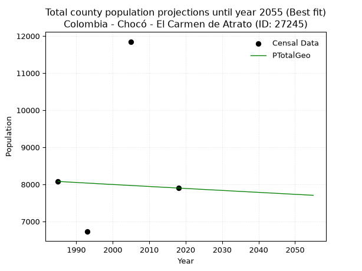
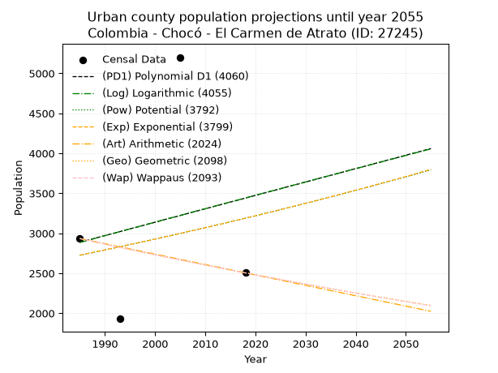
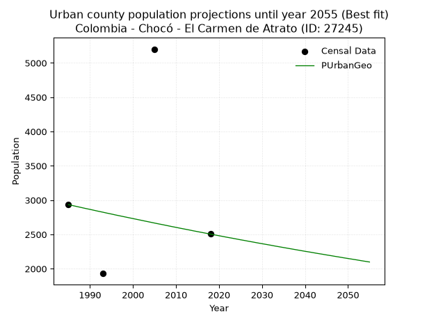
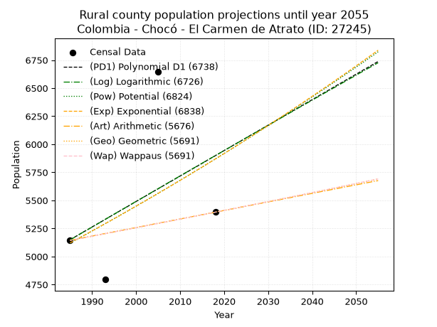
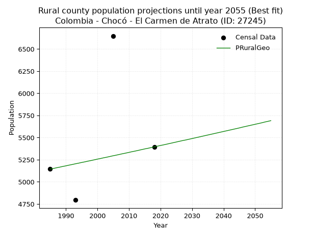

<div align="center">


</div>

# _“Population and Public Services Demand Projections (PPSD) until Year 2050 for Colombia - Chocó - El Carmen de Atrato (ID: 27245)”_
Keywords: `population` `public-service` `projection` `lineal` `polynomial` `logarithmic` `potential` `exponential` `arithmetic` `geometric` `wappaus` `dane` `colombia` `south-america`

PPSD are analytical estimates used by governments and planners to anticipate future changes in population size, age distribution, and the resulting community needs for utilities, healthcare, education, and infrastructure as sizing future water treatment facilities, electrical grids, and road networks based on spatial growth.

<div align="center">

</img>

</div>


> **General running parameters**: • app_version: _v20260806_. • Python version: _3.14.7_. • Pandas version: _3.0.5_. • NumPy version: _2.5.1_. • Creates, save and include plots into reports (create_plot): _False_. • Projection until year: _2050_. • Process polynomial degree 2 and up: _False_. • Process Wappaus: _True_. • Process Wappaus: _True_. • Set negative values to zero: _True_. • Set infinite values to zero: _True_. • Drop dataset notes: _True_. 
<div align="center">

Dynamic map: [:earth_americas:Google](http://maps.google.com/maps?q=5.899789295,-76.1421122) [:earth_americas:OSM](https://www.openstreetmap.org/#map=18/5.899789295/-76.1421122&layers=P) [:earth_americas:Bing](https://www.bing.com/maps?cp=5.899789295~-76.1421122&lvl=18) [:earth_americas:Apple](https://maps.apple.com/frame?center=5.899789295%2C-76.1421122&span=0.003%2C0.006)

</div>


<div align="center">

```geojson
{
  "type": "Feature",
  "geometry": {
    "type": "Point", 
    "coordinates": [-76.1421122, 5.899789295]
  }, 
  "properties": {
    "Name": "Colombia - Chocó - El Carmen de Atrato (ID: 27245)"
  }
}
```

</div>


## 0. Census Data (4 records)

Census data are official statistics collected by a government about the people and housing in a country. They usually include counts of total population, age, sex, race, income, education, and jobs.

📅Global census file: [Population.xlsx](../data/Population.xlsx)

| Source   |   Year |   CountryID | CountryName   |   StateID | StateName   |   CountyID | CountyName          |   PTotal |   PUrban |   PRural |
|:---------|-------:|------------:|:--------------|----------:|:------------|-----------:|:--------------------|---------:|---------:|---------:|
| DANE     |   1985 |          57 | Colombia      |        27 | Chocó       |      27245 | El Carmen de Atrato |     8078 |     2934 |     5144 |
| DANE     |   1993 |          57 | Colombia      |        27 | Chocó       |      27245 | El Carmen de Atrato |     6725 |     1930 |     4795 |
| DANE     |   2005 |          57 | Colombia      |        27 | Chocó       |      27245 | El Carmen de Atrato |    11849 |     5201 |     6648 |
| DANE     |   2018 |          57 | Colombia      |        27 | Chocó       |      27245 | El Carmen de Atrato |     7900 |     2505 |     5395 |

> 🔥Some records could had specific notes about the registered values or the corresponding urban or rural distribution.

📅   [RUPS](https://www.datos.gov.co/Hacienda-y-Cr-dito-P-blico/Registro-nico-de-Prestadores-de-Servicios-P-blicos/4qkq-csdn/about_data) - Local public utility companies: [RUPS.csv](../data/RUPS.xlsx)

 | SERVICIO       | ESTADO    | NOMBRE                      | NIT         | DEPARTAMENTO_DOMICILIO   | MUNICIPIO_DOMICILIO   | DIRECCION         |   TELEFONO | EMAIL                                          | TIPO_PRESTADOR                             | CLASIFICACION                 |
|:---------------|:----------|:----------------------------|:------------|:-------------------------|:----------------------|:------------------|-----------:|:-----------------------------------------------|:-------------------------------------------|:------------------------------|
| ACUEDUCTO      | OPERATIVA | AGUAS DEL CARMELO A.S E.S.P | 900323965-3 | CHOCO                    | EL CARMEN DE ATRATO   | carrera 4 No 5-39 |    6790214 | serviciospublicos@elcarmendeatrato-choc.gov.co | SOCIEDADES (EMPRESA DE SERVICIOS PUBLICOS) | MENOR O IGUAL A 2500 USUARIOS |
| ALCANTARILLADO | OPERATIVA | AGUAS DEL CARMELO A.S E.S.P | 900323965-3 | CHOCO                    | EL CARMEN DE ATRATO   | carrera 4 No 5-39 |    6790214 | serviciospublicos@elcarmendeatrato-choc.gov.co | SOCIEDADES (EMPRESA DE SERVICIOS PUBLICOS) | MENOR O IGUAL A 2500 USUARIOS |

## 1. Total

### 1.1. Coefficients and Parameters

* (PD1) Polynomial Deg 1: 39.44118827780221, -70254.23685267387 (lineal)
* (Log) Logarithmic: 79314.80826568132, -594234.4932164283
* (Pow) Potential: 8.884109195911055, -25.40054196928128
* (Exp) Exponential: 0.004421097060889442, 1.2189337514944814
* (Art) Arithmetic: Year diff. 2018 - 1985 = 33, Population diff. 7900 - 8078 = -178, Annual growth = -5.393939393939394
* (Geo) Geometric: Year diff. 2018 - 1985 = 33, Population diff. 7900 - 8078 = -178, Annual growth % = -0.000674970821860077
* (Wap) Wappaus: i = -0.06751707840705212, Condition values only valid for < 200)

<sub>
Wappaus condition values: ['-0.00', '-0.07', '-0.14', '-0.20', '-0.27', '-0.34', '-0.41', '-0.47', '-0.54', '-0.61', '-0.68', '-0.74', '-0.81', '-0.88', '-0.95', '-1.01', '-1.08', '-1.15', '-1.22', '-1.28', '-1.35', '-1.42', '-1.49', '-1.55', '-1.62', '-1.69', '-1.76', '-1.82', '-1.89', '-1.96', '-2.03', '-2.09', '-2.16', '-2.23', '-2.30', '-2.36', '-2.43', '-2.50', '-2.57', '-2.63', '-2.70', '-2.77', '-2.84', '-2.90', '-2.97', '-3.04', '-3.11', '-3.17', '-3.24', '-3.31', '-3.38', '-3.44', '-3.51', '-3.58', '-3.65', '-3.71', '-3.78', '-3.85', '-3.92', '-3.98', '-4.05', '-4.12', '-4.19', '-4.25', '-4.32', '-4.39']
</sub>


### 1.2. Projected Dataset

|   Year |   CountyID |   PTotalPD1 |   PTotalLog |   PTotalPow |   PTotalExp |   PTotalArt |   PTotalGeo |   PTotalWap |
|-------:|-----------:|------------:|------------:|------------:|------------:|------------:|------------:|------------:|
|   1985 |      27245 |        8037 |        8033 |        7891 |        7894 |        8078 |        8078 |        8078 |
|   1986 |      27245 |        8076 |        8072 |        7926 |        7929 |        8073 |        8073 |        8073 |
|   1987 |      27245 |        8115 |        8112 |        7962 |        7964 |        8067 |        8067 |        8067 |
|   1988 |      27245 |        8155 |        8152 |        7997 |        7999 |        8062 |        8062 |        8062 |
|   1989 |      27245 |        8194 |        8192 |        8033 |        8035 |        8056 |        8056 |        8056 |
|   1990 |      27245 |        8234 |        8232 |        8069 |        8070 |        8051 |        8051 |        8051 |
|   1991 |      27245 |        8273 |        8272 |        8105 |        8106 |        8046 |        8045 |        8045 |
|   1992 |      27245 |        8313 |        8312 |        8142 |        8142 |        8040 |        8040 |        8040 |
|   1993 |      27245 |        8352 |        8352 |        8178 |        8178 |        8035 |        8034 |        8034 |
|   1994 |      27245 |        8391 |        8391 |        8214 |        8214 |        8029 |        8029 |        8029 |
|   1995 |      27245 |        8431 |        8431 |        8251 |        8251 |        8024 |        8024 |        8024 |
|   1996 |      27245 |        8470 |        8471 |        8288 |        8287 |        8019 |        8018 |        8018 |
|   1997 |      27245 |        8510 |        8511 |        8325 |        8324 |        8013 |        8013 |        8013 |
|   1998 |      27245 |        8549 |        8550 |        8362 |        8361 |        8008 |        8007 |        8007 |
|   1999 |      27245 |        8589 |        8590 |        8399 |        8398 |        8002 |        8002 |        8002 |
|   2000 |      27245 |        8628 |        8630 |        8437 |        8435 |        7997 |        7997 |        7997 |
|   2001 |      27245 |        8668 |        8669 |        8474 |        8473 |        7992 |        7991 |        7991 |
|   2002 |      27245 |        8707 |        8709 |        8512 |        8510 |        7986 |        7986 |        7986 |
|   2003 |      27245 |        8746 |        8749 |        8550 |        8548 |        7981 |        7980 |        7980 |
|   2004 |      27245 |        8786 |        8788 |        8588 |        8586 |        7976 |        7975 |        7975 |
|   2005 |      27245 |        8825 |        8828 |        8626 |        8624 |        7970 |        7970 |        7970 |
|   2006 |      27245 |        8865 |        8867 |        8664 |        8662 |        7965 |        7964 |        7964 |
|   2007 |      27245 |        8904 |        8907 |        8703 |        8700 |        7959 |        7959 |        7959 |
|   2008 |      27245 |        8944 |        8946 |        8741 |        8739 |        7954 |        7954 |        7954 |
|   2009 |      27245 |        8983 |        8986 |        8780 |        8778 |        7949 |        7948 |        7948 |
|   2010 |      27245 |        9023 |        9025 |        8819 |        8817 |        7943 |        7943 |        7943 |
|   2011 |      27245 |        9062 |        9065 |        8858 |        8856 |        7938 |        7937 |        7937 |
|   2012 |      27245 |        9101 |        9104 |        8897 |        8895 |        7932 |        7932 |        7932 |
|   2013 |      27245 |        9141 |        9144 |        8936 |        8934 |        7927 |        7927 |        7927 |
|   2014 |      27245 |        9180 |        9183 |        8976 |        8974 |        7922 |        7921 |        7921 |
|   2015 |      27245 |        9220 |        9222 |        9016 |        9014 |        7916 |        7916 |        7916 |
|   2016 |      27245 |        9259 |        9262 |        9056 |        9054 |        7911 |        7911 |        7911 |
|   2017 |      27245 |        9299 |        9301 |        9095 |        9094 |        7905 |        7905 |        7905 |
|   2018 |      27245 |        9338 |        9340 |        9136 |        9134 |        7900 |        7900 |        7900 |
|   2019 |      27245 |        9378 |        9380 |        9176 |        9174 |        7895 |        7895 |        7895 |
|   2020 |      27245 |        9417 |        9419 |        9216 |        9215 |        7889 |        7889 |        7889 |
|   2021 |      27245 |        9456 |        9458 |        9257 |        9256 |        7884 |        7884 |        7884 |
|   2022 |      27245 |        9496 |        9497 |        9298 |        9297 |        7878 |        7879 |        7879 |
|   2023 |      27245 |        9535 |        9537 |        9339 |        9338 |        7873 |        7873 |        7873 |
|   2024 |      27245 |        9575 |        9576 |        9380 |        9379 |        7868 |        7868 |        7868 |
|   2025 |      27245 |        9614 |        9615 |        9421 |        9421 |        7862 |        7863 |        7863 |
|   2026 |      27245 |        9654 |        9654 |        9462 |        9463 |        7857 |        7857 |        7857 |
|   2027 |      27245 |        9693 |        9693 |        9504 |        9505 |        7851 |        7852 |        7852 |
|   2028 |      27245 |        9732 |        9732 |        9546 |        9547 |        7846 |        7847 |        7847 |
|   2029 |      27245 |        9772 |        9771 |        9588 |        9589 |        7841 |        7842 |        7842 |
|   2030 |      27245 |        9811 |        9811 |        9630 |        9632 |        7835 |        7836 |        7836 |
|   2031 |      27245 |        9851 |        9850 |        9672 |        9674 |        7830 |        7831 |        7831 |
|   2032 |      27245 |        9890 |        9889 |        9714 |        9717 |        7824 |        7826 |        7826 |
|   2033 |      27245 |        9930 |        9928 |        9757 |        9760 |        7819 |        7820 |        7820 |
|   2034 |      27245 |        9969 |        9967 |        9800 |        9803 |        7814 |        7815 |        7815 |
|   2035 |      27245 |       10009 |       10006 |        9843 |        9847 |        7808 |        7810 |        7810 |
|   2036 |      27245 |       10048 |       10045 |        9886 |        9891 |        7803 |        7805 |        7805 |
|   2037 |      27245 |       10087 |       10084 |        9929 |        9934 |        7798 |        7799 |        7799 |
|   2038 |      27245 |       10127 |       10122 |        9972 |        9978 |        7792 |        7794 |        7794 |
|   2039 |      27245 |       10166 |       10161 |       10016 |       10023 |        7787 |        7789 |        7789 |
|   2040 |      27245 |       10206 |       10200 |       10059 |       10067 |        7781 |        7784 |        7783 |
|   2041 |      27245 |       10245 |       10239 |       10103 |       10112 |        7776 |        7778 |        7778 |
|   2042 |      27245 |       10285 |       10278 |       10147 |       10156 |        7771 |        7773 |        7773 |
|   2043 |      27245 |       10324 |       10317 |       10192 |       10201 |        7765 |        7768 |        7768 |
|   2044 |      27245 |       10364 |       10356 |       10236 |       10247 |        7760 |        7763 |        7762 |
|   2045 |      27245 |       10403 |       10394 |       10281 |       10292 |        7754 |        7757 |        7757 |
|   2046 |      27245 |       10442 |       10433 |       10325 |       10338 |        7749 |        7752 |        7752 |
|   2047 |      27245 |       10482 |       10472 |       10370 |       10383 |        7744 |        7747 |        7747 |
|   2048 |      27245 |       10521 |       10511 |       10415 |       10429 |        7738 |        7742 |        7742 |
|   2049 |      27245 |       10561 |       10549 |       10461 |       10476 |        7733 |        7736 |        7736 |
|   2050 |      27245 |       10600 |       10588 |       10506 |       10522 |        7727 |        7731 |        7731 |
<div align="center">

</img>

</div>


### 1.3. Best fit with absolute and relative error (%)

Relative error puts that difference into context by dividing the absolute error by the true value, creating a unitless ratio or percentage that shows the scale of the mistake.

Absolute and relative error

|   Year | Source   |   CountryID | CountryName   |   StateID | StateName   |   CountyID_x | CountyName          |   PTotal |   PUrban |   PRural |   CountyID_y |   PTotalPD1 |   PTotalLog |   PTotalPow |   PTotalExp |   PTotalArt |   PTotalGeo |   PTotalWap |   PTotalPD1AbsError |   PTotalLogAbsError |   PTotalPowAbsError |   PTotalExpAbsError |   PTotalArtAbsError |   PTotalGeoAbsError |   PTotalWapAbsError |   PTotalPD1RelError |   PTotalLogRelError |   PTotalPowRelError |   PTotalExpRelError |   PTotalArtRelError |   PTotalGeoRelError |   PTotalWapRelError |
|-------:|:---------|------------:|:--------------|----------:|:------------|-------------:|:--------------------|---------:|---------:|---------:|-------------:|------------:|------------:|------------:|------------:|------------:|------------:|------------:|--------------------:|--------------------:|--------------------:|--------------------:|--------------------:|--------------------:|--------------------:|--------------------:|--------------------:|--------------------:|--------------------:|--------------------:|--------------------:|--------------------:|
|   1985 | DANE     |          57 | Colombia      |        27 | Chocó       |        27245 | El Carmen de Atrato |     8078 |     2934 |     5144 |        27245 |        8037 |        8033 |        7891 |        7894 |        8078 |        8078 |        8078 |                  41 |                  45 |                 187 |                 184 |                   0 |                   0 |                   0 |            0.507551 |            0.557069 |             2.31493 |             2.27779 |              0      |              0      |              0      |
|   1993 | DANE     |          57 | Colombia      |        27 | Chocó       |        27245 | El Carmen de Atrato |     6725 |     1930 |     4795 |        27245 |        8352 |        8352 |        8178 |        8178 |        8035 |        8034 |        8034 |                1627 |                1627 |                1453 |                1453 |                1310 |                1309 |                1309 |           24.1933   |           24.1933   |            21.6059  |            21.6059  |             19.4796 |             19.4647 |             19.4647 |
|   2005 | DANE     |          57 | Colombia      |        27 | Chocó       |        27245 | El Carmen de Atrato |    11849 |     5201 |     6648 |        27245 |        8825 |        8828 |        8626 |        8624 |        7970 |        7970 |        7970 |                3024 |                3021 |                3223 |                3225 |                3879 |                3879 |                3879 |           25.5211   |           25.4958   |            27.2006  |            27.2175  |             32.7369 |             32.7369 |             32.7369 |
|   2018 | DANE     |          57 | Colombia      |        27 | Chocó       |        27245 | El Carmen de Atrato |     7900 |     2505 |     5395 |        27245 |        9338 |        9340 |        9136 |        9134 |        7900 |        7900 |        7900 |                1438 |                1440 |                1236 |                1234 |                   0 |                   0 |                   0 |           18.2025   |           18.2278   |            15.6456  |            15.6203  |              0      |              0      |              0      |

Relative error mean

| Method    |   RelError | Best   |
|:----------|-----------:|:-------|
| PTotalPD1 |    17.1061 |        |
| PTotalLog |    17.1185 |        |
| PTotalPow |    16.6918 |        |
| PTotalExp |    16.6804 |        |
| PTotalArt |    13.0541 |        |
| PTotalGeo |    13.0504 | True   |
| PTotalWap |    13.0504 | True   |

💙Best method: _**PTotalGeo**_
<div align="center">

</img>

</div>


### 1.4. Fresh water supply demand in liters per capita per day (lpcd)

The fresh water supply demand typically ranges from 100 to 300 liters per capita per day (lpcd) for standard domestic and municipal planning, though absolute survival minimums set by the World Health Organization are as low as 7.5 to 20 liters per day, and total consumption in high-income nations can exceed 400 liters.

> `CZ`: Level in meters above the sea level (masl)<br> `WS`: Fresh water supply demand in liters per capita per day (lpcd or l/h/d)<br> `WSAll`: Zonal fresh water supply demand in liters per second (l/s)<br> `A`: Zonal area in square meters<br> `DP`: Population density (people/hectare or p/ha)

Reference values (RAS Colombia)

|    CZ |   WS |
|------:|-----:|
|  1000 |  120 |
|  2000 |  130 |
| 99999 |  140 |

County shapefile geometry properties and water supply values

|   CountyID |      ATotal |   CZTotal |   WSTotal |
|-----------:|------------:|----------:|----------:|
|      27245 | 8.30294e+08 |   1642.71 |       130 |

Projected values for best method: PTotalGeo

|   CountyID |   Year |   PTotalGeo |   DPTotal |   WSTotal |   WSTotalAll |
|-----------:|-------:|------------:|----------:|----------:|-------------:|
|      27245 |   1985 |        8078 |      0.1  |       130 |      12.1544 |
|      27245 |   1986 |        8073 |      0.1  |       130 |      12.1469 |
|      27245 |   1987 |        8067 |      0.1  |       130 |      12.1378 |
|      27245 |   1988 |        8062 |      0.1  |       130 |      12.1303 |
|      27245 |   1989 |        8056 |      0.1  |       130 |      12.1213 |
|      27245 |   1990 |        8051 |      0.1  |       130 |      12.1138 |
|      27245 |   1991 |        8045 |      0.1  |       130 |      12.1047 |
|      27245 |   1992 |        8040 |      0.1  |       130 |      12.0972 |
|      27245 |   1993 |        8034 |      0.1  |       130 |      12.0882 |
|      27245 |   1994 |        8029 |      0.1  |       130 |      12.0807 |
|      27245 |   1995 |        8024 |      0.1  |       130 |      12.0731 |
|      27245 |   1996 |        8018 |      0.1  |       130 |      12.0641 |
|      27245 |   1997 |        8013 |      0.1  |       130 |      12.0566 |
|      27245 |   1998 |        8007 |      0.1  |       130 |      12.0476 |
|      27245 |   1999 |        8002 |      0.1  |       130 |      12.04   |
|      27245 |   2000 |        7997 |      0.1  |       130 |      12.0325 |
|      27245 |   2001 |        7991 |      0.1  |       130 |      12.0235 |
|      27245 |   2002 |        7986 |      0.1  |       130 |      12.016  |
|      27245 |   2003 |        7980 |      0.1  |       130 |      12.0069 |
|      27245 |   2004 |        7975 |      0.1  |       130 |      11.9994 |
|      27245 |   2005 |        7970 |      0.1  |       130 |      11.9919 |
|      27245 |   2006 |        7964 |      0.1  |       130 |      11.9829 |
|      27245 |   2007 |        7959 |      0.1  |       130 |      11.9753 |
|      27245 |   2008 |        7954 |      0.1  |       130 |      11.9678 |
|      27245 |   2009 |        7948 |      0.1  |       130 |      11.9588 |
|      27245 |   2010 |        7943 |      0.1  |       130 |      11.9513 |
|      27245 |   2011 |        7937 |      0.1  |       130 |      11.9422 |
|      27245 |   2012 |        7932 |      0.1  |       130 |      11.9347 |
|      27245 |   2013 |        7927 |      0.1  |       130 |      11.9272 |
|      27245 |   2014 |        7921 |      0.1  |       130 |      11.9182 |
|      27245 |   2015 |        7916 |      0.1  |       130 |      11.9106 |
|      27245 |   2016 |        7911 |      0.1  |       130 |      11.9031 |
|      27245 |   2017 |        7905 |      0.1  |       130 |      11.8941 |
|      27245 |   2018 |        7900 |      0.1  |       130 |      11.8866 |
|      27245 |   2019 |        7895 |      0.1  |       130 |      11.8791 |
|      27245 |   2020 |        7889 |      0.1  |       130 |      11.87   |
|      27245 |   2021 |        7884 |      0.09 |       130 |      11.8625 |
|      27245 |   2022 |        7879 |      0.09 |       130 |      11.855  |
|      27245 |   2023 |        7873 |      0.09 |       130 |      11.8459 |
|      27245 |   2024 |        7868 |      0.09 |       130 |      11.8384 |
|      27245 |   2025 |        7863 |      0.09 |       130 |      11.8309 |
|      27245 |   2026 |        7857 |      0.09 |       130 |      11.8219 |
|      27245 |   2027 |        7852 |      0.09 |       130 |      11.8144 |
|      27245 |   2028 |        7847 |      0.09 |       130 |      11.8068 |
|      27245 |   2029 |        7842 |      0.09 |       130 |      11.7993 |
|      27245 |   2030 |        7836 |      0.09 |       130 |      11.7903 |
|      27245 |   2031 |        7831 |      0.09 |       130 |      11.7828 |
|      27245 |   2032 |        7826 |      0.09 |       130 |      11.7752 |
|      27245 |   2033 |        7820 |      0.09 |       130 |      11.7662 |
|      27245 |   2034 |        7815 |      0.09 |       130 |      11.7587 |
|      27245 |   2035 |        7810 |      0.09 |       130 |      11.7512 |
|      27245 |   2036 |        7805 |      0.09 |       130 |      11.7436 |
|      27245 |   2037 |        7799 |      0.09 |       130 |      11.7346 |
|      27245 |   2038 |        7794 |      0.09 |       130 |      11.7271 |
|      27245 |   2039 |        7789 |      0.09 |       130 |      11.7196 |
|      27245 |   2040 |        7784 |      0.09 |       130 |      11.712  |
|      27245 |   2041 |        7778 |      0.09 |       130 |      11.703  |
|      27245 |   2042 |        7773 |      0.09 |       130 |      11.6955 |
|      27245 |   2043 |        7768 |      0.09 |       130 |      11.688  |
|      27245 |   2044 |        7763 |      0.09 |       130 |      11.6804 |
|      27245 |   2045 |        7757 |      0.09 |       130 |      11.6714 |
|      27245 |   2046 |        7752 |      0.09 |       130 |      11.6639 |
|      27245 |   2047 |        7747 |      0.09 |       130 |      11.6564 |
|      27245 |   2048 |        7742 |      0.09 |       130 |      11.6488 |
|      27245 |   2049 |        7736 |      0.09 |       130 |      11.6398 |
|      27245 |   2050 |        7731 |      0.09 |       130 |      11.6323 |

## 2. Urban

### 2.1. Coefficients and Parameters

* (PD1) Polynomial Deg 1: 16.752308309917158, -30366.3046969118 (lineal)
* (Log) Logarithmic: 33768.733891137934, -253533.91691218983
* (Pow) Potential: 9.53513813008167, -28.009236084612148
* (Exp) Exponential: 0.004737141704371022, 0.2248198571840003
* (Art) Arithmetic: Year diff. 2018 - 1985 = 33, Population diff. 2505 - 2934 = -429, Annual growth = -13.0
* (Geo) Geometric: Year diff. 2018 - 1985 = 33, Population diff. 2505 - 2934 = -429, Annual growth % = -0.004778785857749823
* (Wap) Wappaus: i = -0.47802904945762087, Condition values only valid for < 200)

<sub>
Wappaus condition values: ['-0.00', '-0.48', '-0.96', '-1.43', '-1.91', '-2.39', '-2.87', '-3.35', '-3.82', '-4.30', '-4.78', '-5.26', '-5.74', '-6.21', '-6.69', '-7.17', '-7.65', '-8.13', '-8.60', '-9.08', '-9.56', '-10.04', '-10.52', '-10.99', '-11.47', '-11.95', '-12.43', '-12.91', '-13.38', '-13.86', '-14.34', '-14.82', '-15.30', '-15.77', '-16.25', '-16.73', '-17.21', '-17.69', '-18.17', '-18.64', '-19.12', '-19.60', '-20.08', '-20.56', '-21.03', '-21.51', '-21.99', '-22.47', '-22.95', '-23.42', '-23.90', '-24.38', '-24.86', '-25.34', '-25.81', '-26.29', '-26.77', '-27.25', '-27.73', '-28.20', '-28.68', '-29.16', '-29.64', '-30.12', '-30.59', '-31.07']
</sub>


### 2.2. Projected Dataset

|   Year |   CountyID |   PUrbanPD1 |   PUrbanLog |   PUrbanPow |   PUrbanExp |   PUrbanArt |   PUrbanGeo |   PUrbanWap |
|-------:|-----------:|------------:|------------:|------------:|------------:|------------:|------------:|------------:|
|   1985 |      27245 |        2887 |        2885 |        2725 |        2726 |        2934 |        2934 |        2934 |
|   1986 |      27245 |        2904 |        2902 |        2738 |        2739 |        2921 |        2920 |        2920 |
|   1987 |      27245 |        2921 |        2919 |        2751 |        2752 |        2908 |        2906 |        2906 |
|   1988 |      27245 |        2937 |        2936 |        2765 |        2766 |        2895 |        2892 |        2892 |
|   1989 |      27245 |        2954 |        2953 |        2778 |        2779 |        2882 |        2878 |        2878 |
|   1990 |      27245 |        2971 |        2970 |        2791 |        2792 |        2869 |        2865 |        2865 |
|   1991 |      27245 |        2988 |        2987 |        2805 |        2805 |        2856 |        2851 |        2851 |
|   1992 |      27245 |        3004 |        3004 |        2818 |        2818 |        2843 |        2837 |        2837 |
|   1993 |      27245 |        3021 |        3021 |        2832 |        2832 |        2830 |        2824 |        2824 |
|   1994 |      27245 |        3038 |        3037 |        2845 |        2845 |        2817 |        2810 |        2810 |
|   1995 |      27245 |        3055 |        3054 |        2859 |        2859 |        2804 |        2797 |        2797 |
|   1996 |      27245 |        3071 |        3071 |        2872 |        2872 |        2791 |        2783 |        2784 |
|   1997 |      27245 |        3088 |        3088 |        2886 |        2886 |        2778 |        2770 |        2770 |
|   1998 |      27245 |        3105 |        3105 |        2900 |        2900 |        2765 |        2757 |        2757 |
|   1999 |      27245 |        3122 |        3122 |        2914 |        2913 |        2752 |        2744 |        2744 |
|   2000 |      27245 |        3138 |        3139 |        2928 |        2927 |        2739 |        2731 |        2731 |
|   2001 |      27245 |        3155 |        3156 |        2942 |        2941 |        2726 |        2718 |        2718 |
|   2002 |      27245 |        3172 |        3173 |        2956 |        2955 |        2713 |        2705 |        2705 |
|   2003 |      27245 |        3189 |        3190 |        2970 |        2969 |        2700 |        2692 |        2692 |
|   2004 |      27245 |        3205 |        3206 |        2984 |        2983 |        2687 |        2679 |        2679 |
|   2005 |      27245 |        3222 |        3223 |        2998 |        2997 |        2674 |        2666 |        2666 |
|   2006 |      27245 |        3239 |        3240 |        3013 |        3012 |        2661 |        2653 |        2654 |
|   2007 |      27245 |        3256 |        3257 |        3027 |        3026 |        2648 |        2641 |        2641 |
|   2008 |      27245 |        3272 |        3274 |        3041 |        3040 |        2635 |        2628 |        2628 |
|   2009 |      27245 |        3289 |        3291 |        3056 |        3055 |        2622 |        2615 |        2616 |
|   2010 |      27245 |        3306 |        3307 |        3070 |        3069 |        2609 |        2603 |        2603 |
|   2011 |      27245 |        3323 |        3324 |        3085 |        3084 |        2596 |        2590 |        2591 |
|   2012 |      27245 |        3339 |        3341 |        3100 |        3098 |        2583 |        2578 |        2578 |
|   2013 |      27245 |        3356 |        3358 |        3114 |        3113 |        2570 |        2566 |        2566 |
|   2014 |      27245 |        3373 |        3374 |        3129 |        3128 |        2557 |        2553 |        2554 |
|   2015 |      27245 |        3390 |        3391 |        3144 |        3143 |        2544 |        2541 |        2541 |
|   2016 |      27245 |        3406 |        3408 |        3159 |        3158 |        2531 |        2529 |        2529 |
|   2017 |      27245 |        3423 |        3425 |        3174 |        3173 |        2518 |        2517 |        2517 |
|   2018 |      27245 |        3440 |        3441 |        3189 |        3188 |        2505 |        2505 |        2505 |
|   2019 |      27245 |        3457 |        3458 |        3204 |        3203 |        2492 |        2493 |        2493 |
|   2020 |      27245 |        3473 |        3475 |        3219 |        3218 |        2479 |        2481 |        2481 |
|   2021 |      27245 |        3490 |        3492 |        3234 |        3233 |        2466 |        2469 |        2469 |
|   2022 |      27245 |        3507 |        3508 |        3250 |        3249 |        2453 |        2457 |        2457 |
|   2023 |      27245 |        3524 |        3525 |        3265 |        3264 |        2440 |        2446 |        2445 |
|   2024 |      27245 |        3540 |        3542 |        3280 |        3280 |        2427 |        2434 |        2434 |
|   2025 |      27245 |        3557 |        3558 |        3296 |        3295 |        2414 |        2422 |        2422 |
|   2026 |      27245 |        3574 |        3575 |        3312 |        3311 |        2401 |        2411 |        2410 |
|   2027 |      27245 |        3591 |        3592 |        3327 |        3327 |        2388 |        2399 |        2399 |
|   2028 |      27245 |        3607 |        3608 |        3343 |        3342 |        2375 |        2388 |        2387 |
|   2029 |      27245 |        3624 |        3625 |        3359 |        3358 |        2362 |        2376 |        2376 |
|   2030 |      27245 |        3641 |        3642 |        3374 |        3374 |        2349 |        2365 |        2364 |
|   2031 |      27245 |        3658 |        3658 |        3390 |        3390 |        2336 |        2354 |        2353 |
|   2032 |      27245 |        3674 |        3675 |        3406 |        3406 |        2323 |        2343 |        2341 |
|   2033 |      27245 |        3691 |        3692 |        3422 |        3423 |        2310 |        2331 |        2330 |
|   2034 |      27245 |        3708 |        3708 |        3438 |        3439 |        2297 |        2320 |        2319 |
|   2035 |      27245 |        3725 |        3725 |        3454 |        3455 |        2284 |        2309 |        2308 |
|   2036 |      27245 |        3741 |        3741 |        3471 |        3472 |        2271 |        2298 |        2296 |
|   2037 |      27245 |        3758 |        3758 |        3487 |        3488 |        2258 |        2287 |        2285 |
|   2038 |      27245 |        3775 |        3775 |        3503 |        3505 |        2245 |        2276 |        2274 |
|   2039 |      27245 |        3792 |        3791 |        3520 |        3521 |        2232 |        2265 |        2263 |
|   2040 |      27245 |        3808 |        3808 |        3536 |        3538 |        2219 |        2254 |        2252 |
|   2041 |      27245 |        3825 |        3824 |        3553 |        3555 |        2206 |        2244 |        2241 |
|   2042 |      27245 |        3842 |        3841 |        3569 |        3572 |        2193 |        2233 |        2230 |
|   2043 |      27245 |        3859 |        3857 |        3586 |        3589 |        2180 |        2222 |        2220 |
|   2044 |      27245 |        3875 |        3874 |        3603 |        3606 |        2167 |        2212 |        2209 |
|   2045 |      27245 |        3892 |        3890 |        3620 |        3623 |        2154 |        2201 |        2198 |
|   2046 |      27245 |        3909 |        3907 |        3637 |        3640 |        2141 |        2191 |        2187 |
|   2047 |      27245 |        3926 |        3923 |        3654 |        3657 |        2128 |        2180 |        2177 |
|   2048 |      27245 |        3942 |        3940 |        3671 |        3675 |        2115 |        2170 |        2166 |
|   2049 |      27245 |        3959 |        3956 |        3688 |        3692 |        2102 |        2159 |        2155 |
|   2050 |      27245 |        3976 |        3973 |        3705 |        3710 |        2089 |        2149 |        2145 |
<div align="center">

</img>

</div>


### 2.3. Best fit with absolute and relative error (%)

Relative error puts that difference into context by dividing the absolute error by the true value, creating a unitless ratio or percentage that shows the scale of the mistake.

Absolute and relative error

|   Year | Source   |   CountryID | CountryName   |   StateID | StateName   |   CountyID_x | CountyName          |   PTotal |   PUrban |   PRural |   CountyID_y |   PUrbanPD1 |   PUrbanLog |   PUrbanPow |   PUrbanExp |   PUrbanArt |   PUrbanGeo |   PUrbanWap |   PUrbanPD1AbsError |   PUrbanLogAbsError |   PUrbanPowAbsError |   PUrbanExpAbsError |   PUrbanArtAbsError |   PUrbanGeoAbsError |   PUrbanWapAbsError |   PUrbanPD1RelError |   PUrbanLogRelError |   PUrbanPowRelError |   PUrbanExpRelError |   PUrbanArtRelError |   PUrbanGeoRelError |   PUrbanWapRelError |
|-------:|:---------|------------:|:--------------|----------:|:------------|-------------:|:--------------------|---------:|---------:|---------:|-------------:|------------:|------------:|------------:|------------:|------------:|------------:|------------:|--------------------:|--------------------:|--------------------:|--------------------:|--------------------:|--------------------:|--------------------:|--------------------:|--------------------:|--------------------:|--------------------:|--------------------:|--------------------:|--------------------:|
|   1985 | DANE     |          57 | Colombia      |        27 | Chocó       |        27245 | El Carmen de Atrato |     8078 |     2934 |     5144 |        27245 |        2887 |        2885 |        2725 |        2726 |        2934 |        2934 |        2934 |                  47 |                  49 |                 209 |                 208 |                   0 |                   0 |                   0 |             1.60191 |             1.67007 |             7.12338 |              7.0893 |              0      |              0      |              0      |
|   1993 | DANE     |          57 | Colombia      |        27 | Chocó       |        27245 | El Carmen de Atrato |     6725 |     1930 |     4795 |        27245 |        3021 |        3021 |        2832 |        2832 |        2830 |        2824 |        2824 |                1091 |                1091 |                 902 |                 902 |                 900 |                 894 |                 894 |            56.5285  |            56.5285  |            46.7358  |             46.7358 |             46.6321 |             46.3212 |             46.3212 |
|   2005 | DANE     |          57 | Colombia      |        27 | Chocó       |        27245 | El Carmen de Atrato |    11849 |     5201 |     6648 |        27245 |        3222 |        3223 |        2998 |        2997 |        2674 |        2666 |        2666 |                1979 |                1978 |                2203 |                2204 |                2527 |                2535 |                2535 |            38.0504  |            38.0311  |            42.3572  |             42.3765 |             48.5868 |             48.7406 |             48.7406 |
|   2018 | DANE     |          57 | Colombia      |        27 | Chocó       |        27245 | El Carmen de Atrato |     7900 |     2505 |     5395 |        27245 |        3440 |        3441 |        3189 |        3188 |        2505 |        2505 |        2505 |                 935 |                 936 |                 684 |                 683 |                   0 |                   0 |                   0 |            37.3253  |            37.3653  |            27.3054  |             27.2655 |              0      |              0      |              0      |

Relative error mean

| Method    |   RelError | Best   |
|:----------|-----------:|:-------|
| PUrbanPD1 |    33.3765 |        |
| PUrbanLog |    33.3987 |        |
| PUrbanPow |    30.8804 |        |
| PUrbanExp |    30.8667 |        |
| PUrbanArt |    23.8047 |        |
| PUrbanGeo |    23.7655 | True   |
| PUrbanWap |    23.7655 | True   |

💙Best method: _**PUrbanGeo**_
<div align="center">

</img>

</div>


### 2.4. Fresh water supply demand in liters per capita per day (lpcd)

The fresh water supply demand typically ranges from 100 to 300 liters per capita per day (lpcd) for standard domestic and municipal planning, though absolute survival minimums set by the World Health Organization are as low as 7.5 to 20 liters per day, and total consumption in high-income nations can exceed 400 liters.

> `CZ`: Level in meters above the sea level (masl)<br> `WS`: Fresh water supply demand in liters per capita per day (lpcd or l/h/d)<br> `WSAll`: Zonal fresh water supply demand in liters per second (l/s)<br> `A`: Zonal area in square meters<br> `DP`: Population density (people/hectare or p/ha)

Reference values (RAS Colombia)

|    CZ |   WS |
|------:|-----:|
|  1000 |  120 |
|  2000 |  130 |
| 99999 |  140 |

County shapefile geometry properties and water supply values

|   CountyID |   AUrban |   CZUrban |   WSUrban |
|-----------:|---------:|----------:|----------:|
|      27245 |   434093 |   1729.09 |       130 |

Projected values for best method: PUrbanGeo

|   CountyID |   Year |   PUrbanGeo |   DPUrban |   WSUrban |   WSUrbanAll |
|-----------:|-------:|------------:|----------:|----------:|-------------:|
|      27245 |   1985 |        2934 |     67.59 |       130 |      4.41458 |
|      27245 |   1986 |        2920 |     67.27 |       130 |      4.39352 |
|      27245 |   1987 |        2906 |     66.94 |       130 |      4.37245 |
|      27245 |   1988 |        2892 |     66.62 |       130 |      4.35139 |
|      27245 |   1989 |        2878 |     66.3  |       130 |      4.33032 |
|      27245 |   1990 |        2865 |     66    |       130 |      4.31076 |
|      27245 |   1991 |        2851 |     65.68 |       130 |      4.2897  |
|      27245 |   1992 |        2837 |     65.35 |       130 |      4.26863 |
|      27245 |   1993 |        2824 |     65.06 |       130 |      4.24907 |
|      27245 |   1994 |        2810 |     64.73 |       130 |      4.22801 |
|      27245 |   1995 |        2797 |     64.43 |       130 |      4.20845 |
|      27245 |   1996 |        2783 |     64.11 |       130 |      4.18738 |
|      27245 |   1997 |        2770 |     63.81 |       130 |      4.16782 |
|      27245 |   1998 |        2757 |     63.51 |       130 |      4.14826 |
|      27245 |   1999 |        2744 |     63.21 |       130 |      4.1287  |
|      27245 |   2000 |        2731 |     62.91 |       130 |      4.10914 |
|      27245 |   2001 |        2718 |     62.61 |       130 |      4.08958 |
|      27245 |   2002 |        2705 |     62.31 |       130 |      4.07002 |
|      27245 |   2003 |        2692 |     62.01 |       130 |      4.05046 |
|      27245 |   2004 |        2679 |     61.71 |       130 |      4.0309  |
|      27245 |   2005 |        2666 |     61.42 |       130 |      4.01134 |
|      27245 |   2006 |        2653 |     61.12 |       130 |      3.99178 |
|      27245 |   2007 |        2641 |     60.84 |       130 |      3.97373 |
|      27245 |   2008 |        2628 |     60.54 |       130 |      3.95417 |
|      27245 |   2009 |        2615 |     60.24 |       130 |      3.93461 |
|      27245 |   2010 |        2603 |     59.96 |       130 |      3.91655 |
|      27245 |   2011 |        2590 |     59.66 |       130 |      3.89699 |
|      27245 |   2012 |        2578 |     59.39 |       130 |      3.87894 |
|      27245 |   2013 |        2566 |     59.11 |       130 |      3.86088 |
|      27245 |   2014 |        2553 |     58.81 |       130 |      3.84132 |
|      27245 |   2015 |        2541 |     58.54 |       130 |      3.82326 |
|      27245 |   2016 |        2529 |     58.26 |       130 |      3.80521 |
|      27245 |   2017 |        2517 |     57.98 |       130 |      3.78715 |
|      27245 |   2018 |        2505 |     57.71 |       130 |      3.7691  |
|      27245 |   2019 |        2493 |     57.43 |       130 |      3.75104 |
|      27245 |   2020 |        2481 |     57.15 |       130 |      3.73299 |
|      27245 |   2021 |        2469 |     56.88 |       130 |      3.71493 |
|      27245 |   2022 |        2457 |     56.6  |       130 |      3.69687 |
|      27245 |   2023 |        2446 |     56.35 |       130 |      3.68032 |
|      27245 |   2024 |        2434 |     56.07 |       130 |      3.66227 |
|      27245 |   2025 |        2422 |     55.79 |       130 |      3.64421 |
|      27245 |   2026 |        2411 |     55.54 |       130 |      3.62766 |
|      27245 |   2027 |        2399 |     55.26 |       130 |      3.60961 |
|      27245 |   2028 |        2388 |     55.01 |       130 |      3.59306 |
|      27245 |   2029 |        2376 |     54.73 |       130 |      3.575   |
|      27245 |   2030 |        2365 |     54.48 |       130 |      3.55845 |
|      27245 |   2031 |        2354 |     54.23 |       130 |      3.5419  |
|      27245 |   2032 |        2343 |     53.97 |       130 |      3.52535 |
|      27245 |   2033 |        2331 |     53.7  |       130 |      3.50729 |
|      27245 |   2034 |        2320 |     53.44 |       130 |      3.49074 |
|      27245 |   2035 |        2309 |     53.19 |       130 |      3.47419 |
|      27245 |   2036 |        2298 |     52.94 |       130 |      3.45764 |
|      27245 |   2037 |        2287 |     52.68 |       130 |      3.44109 |
|      27245 |   2038 |        2276 |     52.43 |       130 |      3.42454 |
|      27245 |   2039 |        2265 |     52.18 |       130 |      3.40799 |
|      27245 |   2040 |        2254 |     51.92 |       130 |      3.39144 |
|      27245 |   2041 |        2244 |     51.69 |       130 |      3.37639 |
|      27245 |   2042 |        2233 |     51.44 |       130 |      3.35984 |
|      27245 |   2043 |        2222 |     51.19 |       130 |      3.34329 |
|      27245 |   2044 |        2212 |     50.96 |       130 |      3.32824 |
|      27245 |   2045 |        2201 |     50.7  |       130 |      3.31169 |
|      27245 |   2046 |        2191 |     50.47 |       130 |      3.29664 |
|      27245 |   2047 |        2180 |     50.22 |       130 |      3.28009 |
|      27245 |   2048 |        2170 |     49.99 |       130 |      3.26505 |
|      27245 |   2049 |        2159 |     49.74 |       130 |      3.2485  |
|      27245 |   2050 |        2149 |     49.51 |       130 |      3.23345 |

## 3. Rural

### 3.1. Coefficients and Parameters

* (PD1) Polynomial Deg 1: 22.688879967885036, -39887.932155762035 (lineal)
* (Log) Logarithmic: 45546.074374543445, -340700.5763042387
* (Pow) Potential: 8.292328945015933, -23.636913706404762
* (Exp) Exponential: 0.004132168549637021, 1.4030991595943731
* (Art) Arithmetic: Year diff. 2018 - 1985 = 33, Population diff. 5395 - 5144 = 251, Annual growth = 7.606060606060606
* (Geo) Geometric: Year diff. 2018 - 1985 = 33, Population diff. 5395 - 5144 = 251, Annual growth % = 0.0014447278204579028
* (Wap) Wappaus: i = 0.14434122034463623, Condition values only valid for < 200)

<sub>
Wappaus condition values: ['0.00', '0.14', '0.29', '0.43', '0.58', '0.72', '0.87', '1.01', '1.15', '1.30', '1.44', '1.59', '1.73', '1.88', '2.02', '2.17', '2.31', '2.45', '2.60', '2.74', '2.89', '3.03', '3.18', '3.32', '3.46', '3.61', '3.75', '3.90', '4.04', '4.19', '4.33', '4.47', '4.62', '4.76', '4.91', '5.05', '5.20', '5.34', '5.48', '5.63', '5.77', '5.92', '6.06', '6.21', '6.35', '6.50', '6.64', '6.78', '6.93', '7.07', '7.22', '7.36', '7.51', '7.65', '7.79', '7.94', '8.08', '8.23', '8.37', '8.52', '8.66', '8.80', '8.95', '9.09', '9.24', '9.38']
</sub>


### 3.2. Projected Dataset

|   Year |   CountyID |   PRuralPD1 |   PRuralLog |   PRuralPow |   PRuralExp |   PRuralArt |   PRuralGeo |   PRuralWap |
|-------:|-----------:|------------:|------------:|------------:|------------:|------------:|------------:|------------:|
|   1985 |      27245 |        5149 |        5148 |        5119 |        5121 |        5144 |        5144 |        5144 |
|   1986 |      27245 |        5172 |        5171 |        5141 |        5142 |        5152 |        5151 |        5151 |
|   1987 |      27245 |        5195 |        5194 |        5162 |        5163 |        5159 |        5159 |        5159 |
|   1988 |      27245 |        5218 |        5217 |        5184 |        5185 |        5167 |        5166 |        5166 |
|   1989 |      27245 |        5240 |        5239 |        5205 |        5206 |        5174 |        5174 |        5174 |
|   1990 |      27245 |        5263 |        5262 |        5227 |        5228 |        5182 |        5181 |        5181 |
|   1991 |      27245 |        5286 |        5285 |        5249 |        5249 |        5190 |        5189 |        5189 |
|   1992 |      27245 |        5308 |        5308 |        5271 |        5271 |        5197 |        5196 |        5196 |
|   1993 |      27245 |        5331 |        5331 |        5293 |        5293 |        5205 |        5204 |        5204 |
|   1994 |      27245 |        5354 |        5354 |        5315 |        5315 |        5212 |        5211 |        5211 |
|   1995 |      27245 |        5376 |        5377 |        5337 |        5337 |        5220 |        5219 |        5219 |
|   1996 |      27245 |        5399 |        5400 |        5359 |        5359 |        5228 |        5226 |        5226 |
|   1997 |      27245 |        5422 |        5422 |        5382 |        5381 |        5235 |        5234 |        5234 |
|   1998 |      27245 |        5444 |        5445 |        5404 |        5403 |        5243 |        5241 |        5241 |
|   1999 |      27245 |        5467 |        5468 |        5426 |        5426 |        5250 |        5249 |        5249 |
|   2000 |      27245 |        5490 |        5491 |        5449 |        5448 |        5258 |        5257 |        5257 |
|   2001 |      27245 |        5513 |        5513 |        5472 |        5471 |        5266 |        5264 |        5264 |
|   2002 |      27245 |        5535 |        5536 |        5494 |        5493 |        5273 |        5272 |        5272 |
|   2003 |      27245 |        5558 |        5559 |        5517 |        5516 |        5281 |        5279 |        5279 |
|   2004 |      27245 |        5581 |        5582 |        5540 |        5539 |        5289 |        5287 |        5287 |
|   2005 |      27245 |        5603 |        5604 |        5563 |        5562 |        5296 |        5295 |        5295 |
|   2006 |      27245 |        5626 |        5627 |        5586 |        5585 |        5304 |        5302 |        5302 |
|   2007 |      27245 |        5649 |        5650 |        5609 |        5608 |        5311 |        5310 |        5310 |
|   2008 |      27245 |        5671 |        5673 |        5632 |        5631 |        5319 |        5318 |        5318 |
|   2009 |      27245 |        5694 |        5695 |        5656 |        5655 |        5327 |        5325 |        5325 |
|   2010 |      27245 |        5717 |        5718 |        5679 |        5678 |        5334 |        5333 |        5333 |
|   2011 |      27245 |        5739 |        5741 |        5703 |        5701 |        5342 |        5341 |        5341 |
|   2012 |      27245 |        5762 |        5763 |        5726 |        5725 |        5349 |        5348 |        5348 |
|   2013 |      27245 |        5785 |        5786 |        5750 |        5749 |        5357 |        5356 |        5356 |
|   2014 |      27245 |        5807 |        5808 |        5773 |        5773 |        5365 |        5364 |        5364 |
|   2015 |      27245 |        5830 |        5831 |        5797 |        5796 |        5372 |        5372 |        5372 |
|   2016 |      27245 |        5853 |        5854 |        5821 |        5820 |        5380 |        5379 |        5379 |
|   2017 |      27245 |        5876 |        5876 |        5845 |        5845 |        5387 |        5387 |        5387 |
|   2018 |      27245 |        5898 |        5899 |        5869 |        5869 |        5395 |        5395 |        5395 |
|   2019 |      27245 |        5921 |        5921 |        5893 |        5893 |        5403 |        5403 |        5403 |
|   2020 |      27245 |        5944 |        5944 |        5918 |        5917 |        5410 |        5411 |        5411 |
|   2021 |      27245 |        5966 |        5966 |        5942 |        5942 |        5418 |        5418 |        5418 |
|   2022 |      27245 |        5989 |        5989 |        5966 |        5967 |        5425 |        5426 |        5426 |
|   2023 |      27245 |        6012 |        6011 |        5991 |        5991 |        5433 |        5434 |        5434 |
|   2024 |      27245 |        6034 |        6034 |        6015 |        6016 |        5441 |        5442 |        5442 |
|   2025 |      27245 |        6057 |        6056 |        6040 |        6041 |        5448 |        5450 |        5450 |
|   2026 |      27245 |        6080 |        6079 |        6065 |        6066 |        5456 |        5458 |        5458 |
|   2027 |      27245 |        6102 |        6101 |        6090 |        6091 |        5463 |        5466 |        5466 |
|   2028 |      27245 |        6125 |        6124 |        6115 |        6116 |        5471 |        5473 |        5473 |
|   2029 |      27245 |        6148 |        6146 |        6140 |        6142 |        5479 |        5481 |        5481 |
|   2030 |      27245 |        6170 |        6169 |        6165 |        6167 |        5486 |        5489 |        5489 |
|   2031 |      27245 |        6193 |        6191 |        6190 |        6193 |        5494 |        5497 |        5497 |
|   2032 |      27245 |        6216 |        6214 |        6216 |        6218 |        5501 |        5505 |        5505 |
|   2033 |      27245 |        6239 |        6236 |        6241 |        6244 |        5509 |        5513 |        5513 |
|   2034 |      27245 |        6261 |        6258 |        6266 |        6270 |        5517 |        5521 |        5521 |
|   2035 |      27245 |        6284 |        6281 |        6292 |        6296 |        5524 |        5529 |        5529 |
|   2036 |      27245 |        6307 |        6303 |        6318 |        6322 |        5532 |        5537 |        5537 |
|   2037 |      27245 |        6329 |        6326 |        6343 |        6348 |        5540 |        5545 |        5545 |
|   2038 |      27245 |        6352 |        6348 |        6369 |        6374 |        5547 |        5553 |        5553 |
|   2039 |      27245 |        6375 |        6370 |        6395 |        6401 |        5555 |        5561 |        5561 |
|   2040 |      27245 |        6397 |        6393 |        6421 |        6427 |        5562 |        5569 |        5569 |
|   2041 |      27245 |        6420 |        6415 |        6448 |        6454 |        5570 |        5577 |        5577 |
|   2042 |      27245 |        6443 |        6437 |        6474 |        6481 |        5578 |        5585 |        5585 |
|   2043 |      27245 |        6465 |        6460 |        6500 |        6507 |        5585 |        5593 |        5593 |
|   2044 |      27245 |        6488 |        6482 |        6527 |        6534 |        5593 |        5601 |        5602 |
|   2045 |      27245 |        6511 |        6504 |        6553 |        6561 |        5600 |        5609 |        5610 |
|   2046 |      27245 |        6534 |        6526 |        6580 |        6589 |        5608 |        5618 |        5618 |
|   2047 |      27245 |        6556 |        6549 |        6606 |        6616 |        5616 |        5626 |        5626 |
|   2048 |      27245 |        6579 |        6571 |        6633 |        6643 |        5623 |        5634 |        5634 |
|   2049 |      27245 |        6602 |        6593 |        6660 |        6671 |        5631 |        5642 |        5642 |
|   2050 |      27245 |        6624 |        6615 |        6687 |        6698 |        5638 |        5650 |        5650 |
<div align="center">

</img>

</div>


### 3.3. Best fit with absolute and relative error (%)

Relative error puts that difference into context by dividing the absolute error by the true value, creating a unitless ratio or percentage that shows the scale of the mistake.

Absolute and relative error

|   Year | Source   |   CountryID | CountryName   |   StateID | StateName   |   CountyID_x | CountyName          |   PTotal |   PUrban |   PRural |   CountyID_y |   PRuralPD1 |   PRuralLog |   PRuralPow |   PRuralExp |   PRuralArt |   PRuralGeo |   PRuralWap |   PRuralPD1AbsError |   PRuralLogAbsError |   PRuralPowAbsError |   PRuralExpAbsError |   PRuralArtAbsError |   PRuralGeoAbsError |   PRuralWapAbsError |   PRuralPD1RelError |   PRuralLogRelError |   PRuralPowRelError |   PRuralExpRelError |   PRuralArtRelError |   PRuralGeoRelError |   PRuralWapRelError |
|-------:|:---------|------------:|:--------------|----------:|:------------|-------------:|:--------------------|---------:|---------:|---------:|-------------:|------------:|------------:|------------:|------------:|------------:|------------:|------------:|--------------------:|--------------------:|--------------------:|--------------------:|--------------------:|--------------------:|--------------------:|--------------------:|--------------------:|--------------------:|--------------------:|--------------------:|--------------------:|--------------------:|
|   1985 | DANE     |          57 | Colombia      |        27 | Chocó       |        27245 | El Carmen de Atrato |     8078 |     2934 |     5144 |        27245 |        5149 |        5148 |        5119 |        5121 |        5144 |        5144 |        5144 |                   5 |                   4 |                  25 |                  23 |                   0 |                   0 |                   0 |           0.0972006 |           0.0777605 |            0.486003 |            0.447123 |             0       |             0       |             0       |
|   1993 | DANE     |          57 | Colombia      |        27 | Chocó       |        27245 | El Carmen de Atrato |     6725 |     1930 |     4795 |        27245 |        5331 |        5331 |        5293 |        5293 |        5205 |        5204 |        5204 |                 536 |                 536 |                 498 |                 498 |                 410 |                 409 |                 409 |          11.1783    |          11.1783    |           10.3858   |           10.3858   |             8.55057 |             8.52972 |             8.52972 |
|   2005 | DANE     |          57 | Colombia      |        27 | Chocó       |        27245 | El Carmen de Atrato |    11849 |     5201 |     6648 |        27245 |        5603 |        5604 |        5563 |        5562 |        5296 |        5295 |        5295 |                1045 |                1044 |                1085 |                1086 |                1352 |                1353 |                1353 |          15.719     |          15.704     |           16.3207   |           16.3357   |            20.3369  |            20.352   |            20.352   |
|   2018 | DANE     |          57 | Colombia      |        27 | Chocó       |        27245 | El Carmen de Atrato |     7900 |     2505 |     5395 |        27245 |        5898 |        5899 |        5869 |        5869 |        5395 |        5395 |        5395 |                 503 |                 504 |                 474 |                 474 |                   0 |                   0 |                   0 |           9.32345   |           9.34198   |            8.78591  |            8.78591  |             0       |             0       |             0       |

Relative error mean

| Method    |   RelError | Best   |
|:----------|-----------:|:-------|
| PRuralPD1 |    9.07949 |        |
| PRuralLog |    9.07551 |        |
| PRuralPow |    8.99461 |        |
| PRuralExp |    8.98865 |        |
| PRuralArt |    7.22188 |        |
| PRuralGeo |    7.22043 | True   |
| PRuralWap |    7.22043 | True   |

💙Best method: _**PRuralGeo**_
<div align="center">

</img>

</div>


### 3.4. Fresh water supply demand in liters per capita per day (lpcd)

The fresh water supply demand typically ranges from 100 to 300 liters per capita per day (lpcd) for standard domestic and municipal planning, though absolute survival minimums set by the World Health Organization are as low as 7.5 to 20 liters per day, and total consumption in high-income nations can exceed 400 liters.

> `CZ`: Level in meters above the sea level (masl)<br> `WS`: Fresh water supply demand in liters per capita per day (lpcd or l/h/d)<br> `WSAll`: Zonal fresh water supply demand in liters per second (l/s)<br> `A`: Zonal area in square meters<br> `DP`: Population density (people/hectare or p/ha)

Reference values (RAS Colombia)

|    CZ |   WS |
|------:|-----:|
|  1000 |  120 |
|  2000 |  130 |
| 99999 |  140 |

County shapefile geometry properties and water supply values

|   CountyID |     ARural |   CZRural |   WSRural |
|-----------:|-----------:|----------:|----------:|
|      27245 | 8.2986e+08 |   1642.67 |       130 |

Projected values for best method: PRuralGeo

|   CountyID |   Year |   PRuralGeo |   DPRural |   WSRural |   WSRuralAll |
|-----------:|-------:|------------:|----------:|----------:|-------------:|
|      27245 |   1985 |        5144 |      0.06 |       130 |      7.73981 |
|      27245 |   1986 |        5151 |      0.06 |       130 |      7.75035 |
|      27245 |   1987 |        5159 |      0.06 |       130 |      7.76238 |
|      27245 |   1988 |        5166 |      0.06 |       130 |      7.77292 |
|      27245 |   1989 |        5174 |      0.06 |       130 |      7.78495 |
|      27245 |   1990 |        5181 |      0.06 |       130 |      7.79549 |
|      27245 |   1991 |        5189 |      0.06 |       130 |      7.80752 |
|      27245 |   1992 |        5196 |      0.06 |       130 |      7.81806 |
|      27245 |   1993 |        5204 |      0.06 |       130 |      7.83009 |
|      27245 |   1994 |        5211 |      0.06 |       130 |      7.84063 |
|      27245 |   1995 |        5219 |      0.06 |       130 |      7.85266 |
|      27245 |   1996 |        5226 |      0.06 |       130 |      7.86319 |
|      27245 |   1997 |        5234 |      0.06 |       130 |      7.87523 |
|      27245 |   1998 |        5241 |      0.06 |       130 |      7.88576 |
|      27245 |   1999 |        5249 |      0.06 |       130 |      7.8978  |
|      27245 |   2000 |        5257 |      0.06 |       130 |      7.90984 |
|      27245 |   2001 |        5264 |      0.06 |       130 |      7.92037 |
|      27245 |   2002 |        5272 |      0.06 |       130 |      7.93241 |
|      27245 |   2003 |        5279 |      0.06 |       130 |      7.94294 |
|      27245 |   2004 |        5287 |      0.06 |       130 |      7.95498 |
|      27245 |   2005 |        5295 |      0.06 |       130 |      7.96701 |
|      27245 |   2006 |        5302 |      0.06 |       130 |      7.97755 |
|      27245 |   2007 |        5310 |      0.06 |       130 |      7.98958 |
|      27245 |   2008 |        5318 |      0.06 |       130 |      8.00162 |
|      27245 |   2009 |        5325 |      0.06 |       130 |      8.01215 |
|      27245 |   2010 |        5333 |      0.06 |       130 |      8.02419 |
|      27245 |   2011 |        5341 |      0.06 |       130 |      8.03623 |
|      27245 |   2012 |        5348 |      0.06 |       130 |      8.04676 |
|      27245 |   2013 |        5356 |      0.06 |       130 |      8.0588  |
|      27245 |   2014 |        5364 |      0.06 |       130 |      8.07083 |
|      27245 |   2015 |        5372 |      0.06 |       130 |      8.08287 |
|      27245 |   2016 |        5379 |      0.06 |       130 |      8.0934  |
|      27245 |   2017 |        5387 |      0.06 |       130 |      8.10544 |
|      27245 |   2018 |        5395 |      0.07 |       130 |      8.11748 |
|      27245 |   2019 |        5403 |      0.07 |       130 |      8.12951 |
|      27245 |   2020 |        5411 |      0.07 |       130 |      8.14155 |
|      27245 |   2021 |        5418 |      0.07 |       130 |      8.15208 |
|      27245 |   2022 |        5426 |      0.07 |       130 |      8.16412 |
|      27245 |   2023 |        5434 |      0.07 |       130 |      8.17616 |
|      27245 |   2024 |        5442 |      0.07 |       130 |      8.18819 |
|      27245 |   2025 |        5450 |      0.07 |       130 |      8.20023 |
|      27245 |   2026 |        5458 |      0.07 |       130 |      8.21227 |
|      27245 |   2027 |        5466 |      0.07 |       130 |      8.22431 |
|      27245 |   2028 |        5473 |      0.07 |       130 |      8.23484 |
|      27245 |   2029 |        5481 |      0.07 |       130 |      8.24687 |
|      27245 |   2030 |        5489 |      0.07 |       130 |      8.25891 |
|      27245 |   2031 |        5497 |      0.07 |       130 |      8.27095 |
|      27245 |   2032 |        5505 |      0.07 |       130 |      8.28299 |
|      27245 |   2033 |        5513 |      0.07 |       130 |      8.29502 |
|      27245 |   2034 |        5521 |      0.07 |       130 |      8.30706 |
|      27245 |   2035 |        5529 |      0.07 |       130 |      8.3191  |
|      27245 |   2036 |        5537 |      0.07 |       130 |      8.33113 |
|      27245 |   2037 |        5545 |      0.07 |       130 |      8.34317 |
|      27245 |   2038 |        5553 |      0.07 |       130 |      8.35521 |
|      27245 |   2039 |        5561 |      0.07 |       130 |      8.36725 |
|      27245 |   2040 |        5569 |      0.07 |       130 |      8.37928 |
|      27245 |   2041 |        5577 |      0.07 |       130 |      8.39132 |
|      27245 |   2042 |        5585 |      0.07 |       130 |      8.40336 |
|      27245 |   2043 |        5593 |      0.07 |       130 |      8.41539 |
|      27245 |   2044 |        5601 |      0.07 |       130 |      8.42743 |
|      27245 |   2045 |        5609 |      0.07 |       130 |      8.43947 |
|      27245 |   2046 |        5618 |      0.07 |       130 |      8.45301 |
|      27245 |   2047 |        5626 |      0.07 |       130 |      8.46505 |
|      27245 |   2048 |        5634 |      0.07 |       130 |      8.47708 |
|      27245 |   2049 |        5642 |      0.07 |       130 |      8.48912 |
|      27245 |   2050 |        5650 |      0.07 |       130 |      8.50116 |

<div align="center"><br><sub>Share this research</sub></div><br>

<sub>**APPS & TOOLS & CONTENT DISCLAIMER**: • NO WARRANTY - This content and software is provided by <a href="https://github.com/rcfdtools" target="_blank">github.com/rcfdtools</a> "as is", without any express or implied warranty, including warranties of merchantability, fitness for a particular purpose, or non-infringement. There is no guarantee that the software will be error-free or operate without interruption. • LIMITATION OF LIABILITY - Neither the authors nor copyright holders will be liable for claims or damages arising from the software or its use. You are responsible for determining if the software is appropriate for your use and assume all associated risks, including errors, legal compliance, and data loss. • NO PROFESSIONAL ADVICE - The software provides general information and does not offer professional advice. It should not replace consultation with professional advisors. [Clauses and global license for rcfdtools use.](https://github.com/rcfdtools/rcfdtools/blob/main/LICENSE.md)</sub>

| [:house: Home](Readme.md)  | [:beginner: Help / Collab](https://github.com/rcfdtools/R.HydroTools/discussions/31) |
|----------------------------|-------------------------------------------------------------------------------------------|