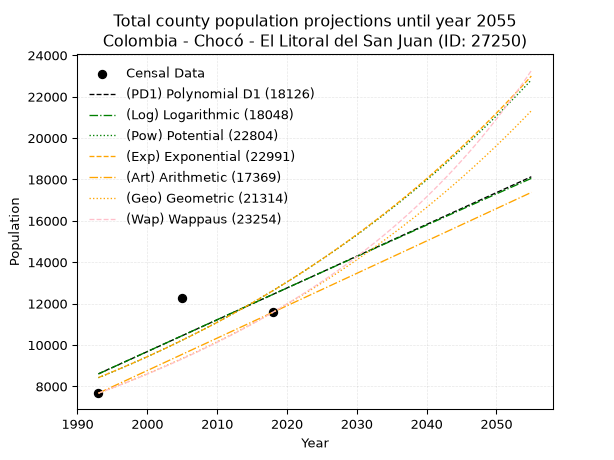
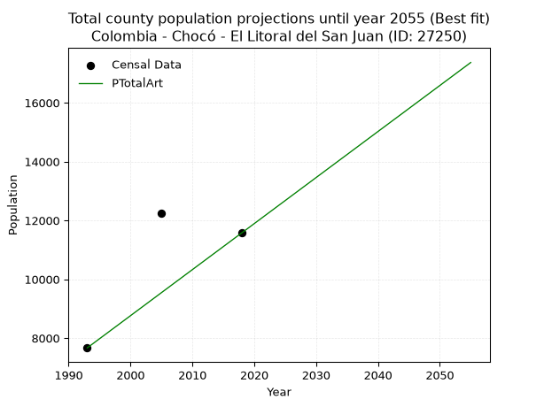
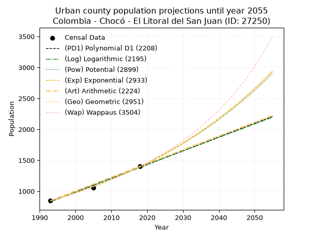
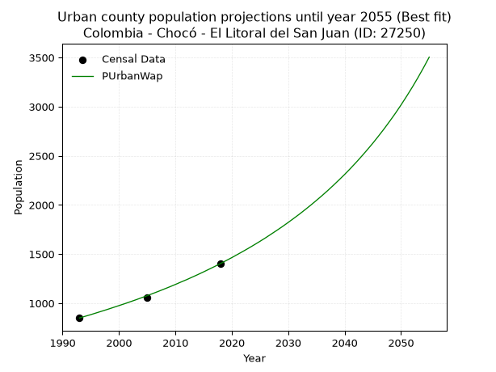
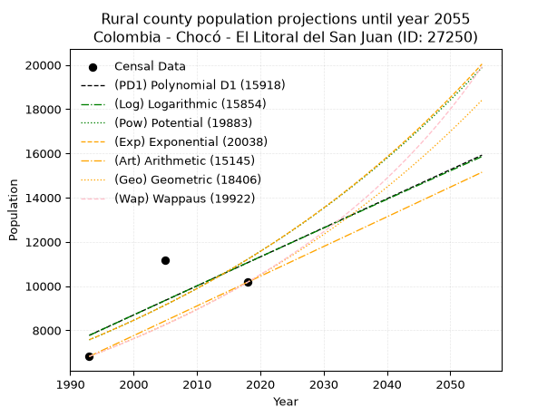
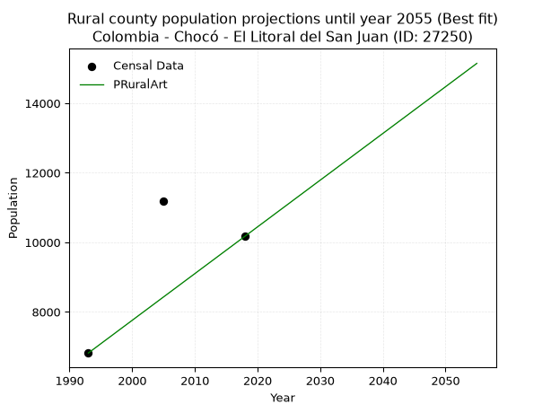

<div align="center">


</div>

# 📜 _“Population and Public Services Demand Projections (PPSD) until Year 2050 for Colombia - Chocó - El Litoral del San Juan (ID: 27250)”_
Keywords: `population` `public-service` `projection` `lineal` `polynomial` `logarithmic` `potential` `exponential` `arithmetic` `geometric` `wappaus` `dane` `colombia` `south-america`

PPSD are analytical estimates used by governments and planners to anticipate future changes in population size, age distribution, and the resulting community needs for utilities, healthcare, education, and infrastructure as sizing future water treatment facilities, electrical grids, and road networks based on spatial growth.

<div align="center">

</img>

</div>


> **General running parameters**: • app_version: _v20260806_. • Python version: _3.14.7_. • Pandas version: _3.0.5_. • NumPy version: _2.5.1_. • Creates, save and include plots into reports (create_plot): _False_. • Projection until year: _2050_. • Process polynomial degree 2 and up: _False_. • Process Wappaus: _True_. • Process Wappaus: _True_. • Set negative values to zero: _True_. • Set infinite values to zero: _True_. • Drop dataset notes: _True_. 
<div align="center">

Dynamic map: [:earth_americas:Google](http://maps.google.com/maps?q=4.259564122,-77.3637018) [:earth_americas:OSM](https://www.openstreetmap.org/#map=18/4.259564122/-77.3637018&layers=P) [:earth_americas:Bing](https://www.bing.com/maps?cp=4.259564122~-77.3637018&lvl=18) [:earth_americas:Apple](https://maps.apple.com/frame?center=4.259564122%2C-77.3637018&span=0.003%2C0.006)

</div>


<div align="center">

```geojson
{
  "type": "Feature",
  "geometry": {
    "type": "Point", 
    "coordinates": [-77.3637018, 4.259564122]
  }, 
  "properties": {
    "Name": "Colombia - Chocó - El Litoral del San Juan (ID: 27250)"
  }
}
```

</div>


## 0. Census Data (3 records)

Census data are official statistics collected by a government about the people and housing in a country. They usually include counts of total population, age, sex, race, income, education, and jobs.

📅Global census file: [Population.xlsx](../data/Population.xlsx)

| Source   |   Year |   CountryID | CountryName   |   StateID | StateName   |   CountyID | CountyName              |   PTotal |   PUrban |   PRural |
|:---------|-------:|------------:|:--------------|----------:|:------------|-----------:|:------------------------|---------:|---------:|---------:|
| DANE     |   1993 |          57 | Colombia      |        27 | Chocó       |      27250 | El Litoral del San Juan |     7667 |      850 |     6817 |
| DANE     |   2005 |          57 | Colombia      |        27 | Chocó       |      27250 | El Litoral del San Juan |    12244 |     1058 |    11186 |
| DANE     |   2018 |          57 | Colombia      |        27 | Chocó       |      27250 | El Litoral del San Juan |    11579 |     1404 |    10175 |

> 🔥Some records could had specific notes about the registered values or the corresponding urban or rural distribution.

📅[SUI-RUPS](https://www.datos.gov.co/Hacienda-y-Cr-dito-P-blico/Registro-nico-de-Prestadores-de-Servicios-P-blicos/4qkq-csdn/about_data) - Local public utility companies: [RUPS.csv](../data/RUPS.csv)

 | SERVICIO   | ESTADO    | NOMBRE                                                                                                     | NIT         | DEPARTAMENTO_DOMICILIO   | MUNICIPIO_DOMICILIO     | DIRECCION                 |   TELEFONO | EMAIL                  | TIPO_PRESTADOR                 | CLASIFICACION                 |
|:-----------|:----------|:-----------------------------------------------------------------------------------------------------------|:------------|:-------------------------|:------------------------|:--------------------------|-----------:|:-----------------------|:-------------------------------|:------------------------------|
| ACUEDUCTO  | OPERATIVA | UNIDAD DE SERVICIOS PUBLICOS DE ENERGIA, ACUEDUCTO, ALCANTARILLO Y ASEO DEL MUNICIPIO LITORAL DEL SAN JUAN | 818000002-2 | CHOCO                    | EL LITORAL DEL SAN JUAN | SANTA GENOVEVA DE DOCORDO |    5224028 | nhurtado1407@gmail.com | MUNICIPIO (PRESTACIÓN DIRECTA) | MENOR O IGUAL A 2500 USUARIOS |

## 1. Total

### 1.1. Coefficients and Parameters

* (PD1) Polynomial Deg 1: 153.6023454157816, -297527.23667378054 (lineal)
* (Log) Logarithmic: 308506.07887668704, -2335245.537751253
* (Pow) Potential: 32.540114340007726, -103.44127227006531
* (Exp) Exponential: 0.01620262504213454, 7.963846115643962e-11
* (Art) Arithmetic: Year diff. 2018 - 1993 = 25, Population diff. 11579 - 7667 = 3912, Annual growth = 156.48
* (Geo) Geometric: Year diff. 2018 - 1993 = 25, Population diff. 11579 - 7667 = 3912, Annual growth % = 0.01662743056757665
* (Wap) Wappaus: i = 1.626104125532578, Condition values only valid for < 200)

<sub>
Wappaus condition values: ['0.00', '1.63', '3.25', '4.88', '6.50', '8.13', '9.76', '11.38', '13.01', '14.63', '16.26', '17.89', '19.51', '21.14', '22.77', '24.39', '26.02', '27.64', '29.27', '30.90', '32.52', '34.15', '35.77', '37.40', '39.03', '40.65', '42.28', '43.90', '45.53', '47.16', '48.78', '50.41', '52.04', '53.66', '55.29', '56.91', '58.54', '60.17', '61.79', '63.42', '65.04', '66.67', '68.30', '69.92', '71.55', '73.17', '74.80', '76.43', '78.05', '79.68', '81.31', '82.93', '84.56', '86.18', '87.81', '89.44', '91.06', '92.69']
</sub>


### 1.2. Projected Dataset

|   Year |   CountyID |   PTotalPD1 |   PTotalLog |   PTotalPow |   PTotalExp |   PTotalArt |   PTotalGeo |   PTotalWap |
|-------:|-----------:|------------:|------------:|------------:|------------:|------------:|------------:|------------:|
|   1993 |      27250 |        8602 |        8597 |        8415 |        8420 |        7667 |        7667 |        7667 |
|   1994 |      27250 |        8756 |        8752 |        8554 |        8557 |        7823 |        7794 |        7793 |
|   1995 |      27250 |        8909 |        8907 |        8695 |        8697 |        7980 |        7924 |        7920 |
|   1996 |      27250 |        9063 |        9061 |        8837 |        8839 |        8136 |        8056 |        8050 |
|   1997 |      27250 |        9217 |        9216 |        8983 |        8983 |        8293 |        8190 |        8182 |
|   1998 |      27250 |        9370 |        9370 |        9130 |        9130 |        8449 |        8326 |        8317 |
|   1999 |      27250 |        9524 |        9525 |        9280 |        9279 |        8606 |        8464 |        8453 |
|   2000 |      27250 |        9677 |        9679 |        9432 |        9431 |        8762 |        8605 |        8592 |
|   2001 |      27250 |        9831 |        9833 |        9587 |        9585 |        8919 |        8748 |        8734 |
|   2002 |      27250 |        9985 |        9987 |        9744 |        9741 |        9075 |        8894 |        8878 |
|   2003 |      27250 |       10138 |       10141 |        9904 |        9900 |        9232 |        9042 |        9024 |
|   2004 |      27250 |       10292 |       10295 |       10066 |       10062 |        9388 |        9192 |        9173 |
|   2005 |      27250 |       10445 |       10449 |       10231 |       10227 |        9545 |        9345 |        9325 |
|   2006 |      27250 |       10599 |       10603 |       10398 |       10394 |        9701 |        9500 |        9479 |
|   2007 |      27250 |       10753 |       10757 |       10568 |       10563 |        9858 |        9658 |        9637 |
|   2008 |      27250 |       10906 |       10911 |       10741 |       10736 |       10014 |        9819 |        9797 |
|   2009 |      27250 |       11060 |       11064 |       10916 |       10911 |       10171 |        9982 |        9960 |
|   2010 |      27250 |       11213 |       11218 |       11094 |       11089 |       10327 |       10148 |       10126 |
|   2011 |      27250 |       11367 |       11371 |       11275 |       11271 |       10484 |       10317 |       10296 |
|   2012 |      27250 |       11521 |       11525 |       11459 |       11455 |       10640 |       10488 |       10469 |
|   2013 |      27250 |       11674 |       11678 |       11646 |       11642 |       10797 |       10663 |       10645 |
|   2014 |      27250 |       11828 |       11831 |       11836 |       11832 |       10953 |       10840 |       10824 |
|   2015 |      27250 |       11981 |       11984 |       12029 |       12025 |       11110 |       11020 |       11007 |
|   2016 |      27250 |       12135 |       12137 |       12224 |       12222 |       11266 |       11203 |       11194 |
|   2017 |      27250 |       12289 |       12290 |       12423 |       12421 |       11423 |       11390 |       11385 |
|   2018 |      27250 |       12442 |       12443 |       12625 |       12624 |       11579 |       11579 |       11579 |
|   2019 |      27250 |       12596 |       12596 |       12830 |       12830 |       11735 |       11772 |       11777 |
|   2020 |      27250 |       12750 |       12749 |       13039 |       13040 |       11892 |       11967 |       11980 |
|   2021 |      27250 |       12903 |       12902 |       13251 |       13253 |       12048 |       12166 |       12187 |
|   2022 |      27250 |       13057 |       13054 |       13466 |       13470 |       12205 |       12369 |       12398 |
|   2023 |      27250 |       13210 |       13207 |       13684 |       13690 |       12361 |       12574 |       12614 |
|   2024 |      27250 |       13364 |       13359 |       13906 |       13913 |       12518 |       12783 |       12834 |
|   2025 |      27250 |       13518 |       13511 |       14131 |       14140 |       12674 |       12996 |       13060 |
|   2026 |      27250 |       13671 |       13664 |       14360 |       14371 |       12831 |       13212 |       13290 |
|   2027 |      27250 |       13825 |       13816 |       14592 |       14606 |       12987 |       13432 |       13525 |
|   2028 |      27250 |       13978 |       13968 |       14828 |       14845 |       13144 |       13655 |       13766 |
|   2029 |      27250 |       14132 |       14120 |       15068 |       15087 |       13300 |       13882 |       14013 |
|   2030 |      27250 |       14286 |       14272 |       15312 |       15334 |       13457 |       14113 |       14265 |
|   2031 |      27250 |       14439 |       14424 |       15559 |       15584 |       13613 |       14347 |       14523 |
|   2032 |      27250 |       14593 |       14576 |       15810 |       15839 |       13770 |       14586 |       14787 |
|   2033 |      27250 |       14746 |       14728 |       16066 |       16097 |       13926 |       14829 |       15057 |
|   2034 |      27250 |       14900 |       14880 |       16325 |       16360 |       14083 |       15075 |       15335 |
|   2035 |      27250 |       15054 |       15031 |       16588 |       16628 |       14239 |       15326 |       15619 |
|   2036 |      27250 |       15207 |       15183 |       16855 |       16899 |       14396 |       15581 |       15910 |
|   2037 |      27250 |       15361 |       15334 |       17127 |       17175 |       14552 |       15840 |       16208 |
|   2038 |      27250 |       15514 |       15486 |       17402 |       17456 |       14709 |       16103 |       16514 |
|   2039 |      27250 |       15668 |       15637 |       17682 |       17741 |       14865 |       16371 |       16828 |
|   2040 |      27250 |       15822 |       15788 |       17967 |       18031 |       15022 |       16643 |       17151 |
|   2041 |      27250 |       15975 |       15939 |       18256 |       18325 |       15178 |       16920 |       17482 |
|   2042 |      27250 |       16129 |       16091 |       18549 |       18625 |       15335 |       17201 |       17822 |
|   2043 |      27250 |       16282 |       16242 |       18847 |       18929 |       15491 |       17487 |       18171 |
|   2044 |      27250 |       16436 |       16393 |       19149 |       19238 |       15647 |       17778 |       18530 |
|   2045 |      27250 |       16590 |       16544 |       19457 |       19552 |       15804 |       18073 |       18899 |
|   2046 |      27250 |       16743 |       16694 |       19769 |       19872 |       15960 |       18374 |       19278 |
|   2047 |      27250 |       16897 |       16845 |       20085 |       20196 |       16117 |       18679 |       19669 |
|   2048 |      27250 |       17050 |       16996 |       20407 |       20526 |       16273 |       18990 |       20071 |
|   2049 |      27250 |       17204 |       17146 |       20734 |       20861 |       16430 |       19306 |       20485 |
|   2050 |      27250 |       17358 |       17297 |       21066 |       21202 |       16586 |       19627 |       20911 |
<div align="center">

</img>

</div>


### 1.3. Best fit with absolute and relative error (%)

Relative error puts that difference into context by dividing the absolute error by the true value, creating a unitless ratio or percentage that shows the scale of the mistake.

Absolute and relative error

|   Year | Source   |   CountryID | CountryName   |   StateID | StateName   |   CountyID_x | CountyName              |   PTotal |   PUrban |   PRural |   CountyID_y |   PTotalPD1 |   PTotalLog |   PTotalPow |   PTotalExp |   PTotalArt |   PTotalGeo |   PTotalWap |   PTotalPD1AbsError |   PTotalLogAbsError |   PTotalPowAbsError |   PTotalExpAbsError |   PTotalArtAbsError |   PTotalGeoAbsError |   PTotalWapAbsError |   PTotalPD1RelError |   PTotalLogRelError |   PTotalPowRelError |   PTotalExpRelError |   PTotalArtRelError |   PTotalGeoRelError |   PTotalWapRelError |
|-------:|:---------|------------:|:--------------|----------:|:------------|-------------:|:------------------------|---------:|---------:|---------:|-------------:|------------:|------------:|------------:|------------:|------------:|------------:|------------:|--------------------:|--------------------:|--------------------:|--------------------:|--------------------:|--------------------:|--------------------:|--------------------:|--------------------:|--------------------:|--------------------:|--------------------:|--------------------:|--------------------:|
|   1993 | DANE     |          57 | Colombia      |        27 | Chocó       |        27250 | El Litoral del San Juan |     7667 |      850 |     6817 |        27250 |        8602 |        8597 |        8415 |        8420 |        7667 |        7667 |        7667 |                 935 |                 930 |                 748 |                 753 |                   0 |                   0 |                   0 |            12.1951  |            12.1299  |              9.7561 |             9.82131 |              0      |              0      |              0      |
|   2005 | DANE     |          57 | Colombia      |        27 | Chocó       |        27250 | El Litoral del San Juan |    12244 |     1058 |    11186 |        27250 |       10445 |       10449 |       10231 |       10227 |        9545 |        9345 |        9325 |                1799 |                1795 |                2013 |                2017 |                2699 |                2899 |                2919 |            14.6929  |            14.6602  |             16.4407 |            16.4734  |             22.0434 |             23.6769 |             23.8402 |
|   2018 | DANE     |          57 | Colombia      |        27 | Chocó       |        27250 | El Litoral del San Juan |    11579 |     1404 |    10175 |        27250 |       12442 |       12443 |       12625 |       12624 |       11579 |       11579 |       11579 |                 863 |                 864 |                1046 |                1045 |                   0 |                   0 |                   0 |             7.45315 |             7.46178 |              9.0336 |             9.02496 |              0      |              0      |              0      |

Relative error mean

| Method    |   RelError | Best   |
|:----------|-----------:|:-------|
| PTotalPD1 |   11.4471  |        |
| PTotalLog |   11.4173  |        |
| PTotalPow |   11.7435  |        |
| PTotalExp |   11.7732  |        |
| PTotalArt |    7.34782 | True   |
| PTotalGeo |    7.8923  |        |
| PTotalWap |    7.94675 |        |

💙Best method: _**PTotalArt**_
<div align="center">

</img>

</div>


### 1.4. Fresh water supply demand in liters per capita per day (lpcd)

The fresh water supply demand typically ranges from 100 to 300 liters per capita per day (lpcd) for standard domestic and municipal planning, though absolute survival minimums set by the World Health Organization are as low as 7.5 to 20 liters per day, and total consumption in high-income nations can exceed 400 liters.

> `CZ`: Level in meters above the sea level (masl)<br> `WS`: Fresh water supply demand in liters per capita per day (lpcd or l/h/d)<br> `WSAll`: Zonal fresh water supply demand in liters per second (l/s)<br> `A`: Zonal area in square meters<br> `DP`: Population density (people/hectare or p/ha)

Reference values (RAS Colombia)

|    CZ |   WS |
|------:|-----:|
|  1000 |  120 |
|  2000 |  130 |
| 99999 |  140 |

County shapefile geometry properties and water supply values

|   CountyID |      ATotal |   CZTotal |   WSTotal |
|-----------:|------------:|----------:|----------:|
|      27250 | 4.13615e+09 |   319.769 |       120 |

Projected values for best method: PTotalArt

|   CountyID |   Year |   PTotalArt |   DPTotal |   WSTotal |   WSTotalAll |
|-----------:|-------:|------------:|----------:|----------:|-------------:|
|      27250 |   1993 |        7667 |      0.02 |       120 |      10.6486 |
|      27250 |   1994 |        7823 |      0.02 |       120 |      10.8653 |
|      27250 |   1995 |        7980 |      0.02 |       120 |      11.0833 |
|      27250 |   1996 |        8136 |      0.02 |       120 |      11.3    |
|      27250 |   1997 |        8293 |      0.02 |       120 |      11.5181 |
|      27250 |   1998 |        8449 |      0.02 |       120 |      11.7347 |
|      27250 |   1999 |        8606 |      0.02 |       120 |      11.9528 |
|      27250 |   2000 |        8762 |      0.02 |       120 |      12.1694 |
|      27250 |   2001 |        8919 |      0.02 |       120 |      12.3875 |
|      27250 |   2002 |        9075 |      0.02 |       120 |      12.6042 |
|      27250 |   2003 |        9232 |      0.02 |       120 |      12.8222 |
|      27250 |   2004 |        9388 |      0.02 |       120 |      13.0389 |
|      27250 |   2005 |        9545 |      0.02 |       120 |      13.2569 |
|      27250 |   2006 |        9701 |      0.02 |       120 |      13.4736 |
|      27250 |   2007 |        9858 |      0.02 |       120 |      13.6917 |
|      27250 |   2008 |       10014 |      0.02 |       120 |      13.9083 |
|      27250 |   2009 |       10171 |      0.02 |       120 |      14.1264 |
|      27250 |   2010 |       10327 |      0.02 |       120 |      14.3431 |
|      27250 |   2011 |       10484 |      0.03 |       120 |      14.5611 |
|      27250 |   2012 |       10640 |      0.03 |       120 |      14.7778 |
|      27250 |   2013 |       10797 |      0.03 |       120 |      14.9958 |
|      27250 |   2014 |       10953 |      0.03 |       120 |      15.2125 |
|      27250 |   2015 |       11110 |      0.03 |       120 |      15.4306 |
|      27250 |   2016 |       11266 |      0.03 |       120 |      15.6472 |
|      27250 |   2017 |       11423 |      0.03 |       120 |      15.8653 |
|      27250 |   2018 |       11579 |      0.03 |       120 |      16.0819 |
|      27250 |   2019 |       11735 |      0.03 |       120 |      16.2986 |
|      27250 |   2020 |       11892 |      0.03 |       120 |      16.5167 |
|      27250 |   2021 |       12048 |      0.03 |       120 |      16.7333 |
|      27250 |   2022 |       12205 |      0.03 |       120 |      16.9514 |
|      27250 |   2023 |       12361 |      0.03 |       120 |      17.1681 |
|      27250 |   2024 |       12518 |      0.03 |       120 |      17.3861 |
|      27250 |   2025 |       12674 |      0.03 |       120 |      17.6028 |
|      27250 |   2026 |       12831 |      0.03 |       120 |      17.8208 |
|      27250 |   2027 |       12987 |      0.03 |       120 |      18.0375 |
|      27250 |   2028 |       13144 |      0.03 |       120 |      18.2556 |
|      27250 |   2029 |       13300 |      0.03 |       120 |      18.4722 |
|      27250 |   2030 |       13457 |      0.03 |       120 |      18.6903 |
|      27250 |   2031 |       13613 |      0.03 |       120 |      18.9069 |
|      27250 |   2032 |       13770 |      0.03 |       120 |      19.125  |
|      27250 |   2033 |       13926 |      0.03 |       120 |      19.3417 |
|      27250 |   2034 |       14083 |      0.03 |       120 |      19.5597 |
|      27250 |   2035 |       14239 |      0.03 |       120 |      19.7764 |
|      27250 |   2036 |       14396 |      0.03 |       120 |      19.9944 |
|      27250 |   2037 |       14552 |      0.04 |       120 |      20.2111 |
|      27250 |   2038 |       14709 |      0.04 |       120 |      20.4292 |
|      27250 |   2039 |       14865 |      0.04 |       120 |      20.6458 |
|      27250 |   2040 |       15022 |      0.04 |       120 |      20.8639 |
|      27250 |   2041 |       15178 |      0.04 |       120 |      21.0806 |
|      27250 |   2042 |       15335 |      0.04 |       120 |      21.2986 |
|      27250 |   2043 |       15491 |      0.04 |       120 |      21.5153 |
|      27250 |   2044 |       15647 |      0.04 |       120 |      21.7319 |
|      27250 |   2045 |       15804 |      0.04 |       120 |      21.95   |
|      27250 |   2046 |       15960 |      0.04 |       120 |      22.1667 |
|      27250 |   2047 |       16117 |      0.04 |       120 |      22.3847 |
|      27250 |   2048 |       16273 |      0.04 |       120 |      22.6014 |
|      27250 |   2049 |       16430 |      0.04 |       120 |      22.8194 |
|      27250 |   2050 |       16586 |      0.04 |       120 |      23.0361 |

## 2. Urban

### 2.1. Coefficients and Parameters

* (PD1) Polynomial Deg 1: 22.221748400853425, -43458.012793178044 (lineal)
* (Log) Logarithmic: 44557.2138951101, -337689.12046494207
* (Pow) Potential: 40.30231602705236, -130.0517828245234
* (Exp) Exponential: 0.020097208604391813, 3.3962037229268013e-15
* (Art) Arithmetic: Year diff. 2018 - 1993 = 25, Population diff. 1404 - 850 = 554, Annual growth = 22.16
* (Geo) Geometric: Year diff. 2018 - 1993 = 25, Population diff. 1404 - 850 = 554, Annual growth % = 0.020276602447624414
* (Wap) Wappaus: i = 1.966282165039929, Condition values only valid for < 200)

<sub>
Wappaus condition values: ['0.00', '1.97', '3.93', '5.90', '7.87', '9.83', '11.80', '13.76', '15.73', '17.70', '19.66', '21.63', '23.60', '25.56', '27.53', '29.49', '31.46', '33.43', '35.39', '37.36', '39.33', '41.29', '43.26', '45.22', '47.19', '49.16', '51.12', '53.09', '55.06', '57.02', '58.99', '60.95', '62.92', '64.89', '66.85', '68.82', '70.79', '72.75', '74.72', '76.69', '78.65', '80.62', '82.58', '84.55', '86.52', '88.48', '90.45', '92.42', '94.38', '96.35', '98.31', '100.28', '102.25', '104.21', '106.18', '108.15', '110.11', '112.08']
</sub>


### 2.2. Projected Dataset

|   Year |   CountyID |   PUrbanPD1 |   PUrbanLog |   PUrbanPow |   PUrbanExp |   PUrbanArt |   PUrbanGeo |   PUrbanWap |
|-------:|-----------:|------------:|------------:|------------:|------------:|------------:|------------:|------------:|
|   1993 |      27250 |         830 |         830 |         843 |         844 |         850 |         850 |         850 |
|   1994 |      27250 |         852 |         852 |         861 |         861 |         872 |         867 |         867 |
|   1995 |      27250 |         874 |         874 |         878 |         878 |         894 |         885 |         884 |
|   1996 |      27250 |         897 |         897 |         896 |         896 |         916 |         903 |         902 |
|   1997 |      27250 |         919 |         919 |         914 |         914 |         939 |         921 |         920 |
|   1998 |      27250 |         941 |         941 |         933 |         933 |         961 |         940 |         938 |
|   1999 |      27250 |         963 |         964 |         952 |         952 |         983 |         959 |         957 |
|   2000 |      27250 |         985 |         986 |         971 |         971 |        1005 |         978 |         976 |
|   2001 |      27250 |        1008 |        1008 |         991 |         991 |        1027 |         998 |         995 |
|   2002 |      27250 |        1030 |        1030 |        1011 |        1011 |        1049 |        1018 |        1015 |
|   2003 |      27250 |        1052 |        1053 |        1032 |        1031 |        1072 |        1039 |        1035 |
|   2004 |      27250 |        1074 |        1075 |        1053 |        1052 |        1094 |        1060 |        1056 |
|   2005 |      27250 |        1097 |        1097 |        1074 |        1074 |        1116 |        1082 |        1077 |
|   2006 |      27250 |        1119 |        1119 |        1096 |        1095 |        1138 |        1103 |        1099 |
|   2007 |      27250 |        1141 |        1142 |        1118 |        1118 |        1160 |        1126 |        1121 |
|   2008 |      27250 |        1163 |        1164 |        1141 |        1140 |        1182 |        1149 |        1144 |
|   2009 |      27250 |        1185 |        1186 |        1164 |        1163 |        1205 |        1172 |        1167 |
|   2010 |      27250 |        1208 |        1208 |        1188 |        1187 |        1227 |        1196 |        1191 |
|   2011 |      27250 |        1230 |        1230 |        1212 |        1211 |        1249 |        1220 |        1216 |
|   2012 |      27250 |        1252 |        1252 |        1236 |        1236 |        1271 |        1245 |        1240 |
|   2013 |      27250 |        1274 |        1275 |        1261 |        1261 |        1293 |        1270 |        1266 |
|   2014 |      27250 |        1297 |        1297 |        1287 |        1286 |        1315 |        1296 |        1292 |
|   2015 |      27250 |        1319 |        1319 |        1313 |        1313 |        1338 |        1322 |        1319 |
|   2016 |      27250 |        1341 |        1341 |        1339 |        1339 |        1360 |        1349 |        1347 |
|   2017 |      27250 |        1363 |        1363 |        1366 |        1366 |        1382 |        1376 |        1375 |
|   2018 |      27250 |        1385 |        1385 |        1394 |        1394 |        1404 |        1404 |        1404 |
|   2019 |      27250 |        1408 |        1407 |        1422 |        1422 |        1426 |        1432 |        1434 |
|   2020 |      27250 |        1430 |        1429 |        1451 |        1451 |        1448 |        1462 |        1464 |
|   2021 |      27250 |        1452 |        1451 |        1480 |        1481 |        1470 |        1491 |        1496 |
|   2022 |      27250 |        1474 |        1473 |        1510 |        1511 |        1493 |        1521 |        1528 |
|   2023 |      27250 |        1497 |        1495 |        1540 |        1542 |        1515 |        1552 |        1561 |
|   2024 |      27250 |        1519 |        1517 |        1571 |        1573 |        1537 |        1584 |        1595 |
|   2025 |      27250 |        1541 |        1539 |        1603 |        1605 |        1559 |        1616 |        1630 |
|   2026 |      27250 |        1563 |        1561 |        1635 |        1637 |        1581 |        1649 |        1666 |
|   2027 |      27250 |        1585 |        1583 |        1668 |        1671 |        1603 |        1682 |        1704 |
|   2028 |      27250 |        1608 |        1605 |        1701 |        1704 |        1626 |        1716 |        1742 |
|   2029 |      27250 |        1630 |        1627 |        1735 |        1739 |        1648 |        1751 |        1781 |
|   2030 |      27250 |        1652 |        1649 |        1770 |        1774 |        1670 |        1786 |        1822 |
|   2031 |      27250 |        1674 |        1671 |        1805 |        1810 |        1692 |        1823 |        1864 |
|   2032 |      27250 |        1697 |        1693 |        1842 |        1847 |        1714 |        1860 |        1907 |
|   2033 |      27250 |        1719 |        1715 |        1879 |        1885 |        1736 |        1897 |        1952 |
|   2034 |      27250 |        1741 |        1737 |        1916 |        1923 |        1759 |        1936 |        1998 |
|   2035 |      27250 |        1763 |        1759 |        1954 |        1962 |        1781 |        1975 |        2046 |
|   2036 |      27250 |        1785 |        1781 |        1994 |        2002 |        1803 |        2015 |        2095 |
|   2037 |      27250 |        1808 |        1803 |        2033 |        2042 |        1825 |        2056 |        2146 |
|   2038 |      27250 |        1830 |        1825 |        2074 |        2084 |        1847 |        2098 |        2199 |
|   2039 |      27250 |        1852 |        1846 |        2115 |        2126 |        1869 |        2140 |        2254 |
|   2040 |      27250 |        1874 |        1868 |        2158 |        2169 |        1892 |        2184 |        2310 |
|   2041 |      27250 |        1897 |        1890 |        2201 |        2213 |        1914 |        2228 |        2369 |
|   2042 |      27250 |        1919 |        1912 |        2245 |        2258 |        1936 |        2273 |        2430 |
|   2043 |      27250 |        1941 |        1934 |        2289 |        2304 |        1958 |        2319 |        2494 |
|   2044 |      27250 |        1963 |        1956 |        2335 |        2351 |        1980 |        2366 |        2560 |
|   2045 |      27250 |        1985 |        1977 |        2381 |        2399 |        2002 |        2414 |        2628 |
|   2046 |      27250 |        2008 |        1999 |        2429 |        2447 |        2024 |        2463 |        2700 |
|   2047 |      27250 |        2030 |        2021 |        2477 |        2497 |        2047 |        2513 |        2774 |
|   2048 |      27250 |        2052 |        2043 |        2526 |        2548 |        2069 |        2564 |        2852 |
|   2049 |      27250 |        2074 |        2064 |        2576 |        2599 |        2091 |        2616 |        2932 |
|   2050 |      27250 |        2097 |        2086 |        2628 |        2652 |        2113 |        2669 |        3017 |
<div align="center">

</img>

</div>


### 2.3. Best fit with absolute and relative error (%)

Relative error puts that difference into context by dividing the absolute error by the true value, creating a unitless ratio or percentage that shows the scale of the mistake.

Absolute and relative error

|   Year | Source   |   CountryID | CountryName   |   StateID | StateName   |   CountyID_x | CountyName              |   PTotal |   PUrban |   PRural |   CountyID_y |   PUrbanPD1 |   PUrbanLog |   PUrbanPow |   PUrbanExp |   PUrbanArt |   PUrbanGeo |   PUrbanWap |   PUrbanPD1AbsError |   PUrbanLogAbsError |   PUrbanPowAbsError |   PUrbanExpAbsError |   PUrbanArtAbsError |   PUrbanGeoAbsError |   PUrbanWapAbsError |   PUrbanPD1RelError |   PUrbanLogRelError |   PUrbanPowRelError |   PUrbanExpRelError |   PUrbanArtRelError |   PUrbanGeoRelError |   PUrbanWapRelError |
|-------:|:---------|------------:|:--------------|----------:|:------------|-------------:|:------------------------|---------:|---------:|---------:|-------------:|------------:|------------:|------------:|------------:|------------:|------------:|------------:|--------------------:|--------------------:|--------------------:|--------------------:|--------------------:|--------------------:|--------------------:|--------------------:|--------------------:|--------------------:|--------------------:|--------------------:|--------------------:|--------------------:|
|   1993 | DANE     |          57 | Colombia      |        27 | Chocó       |        27250 | El Litoral del San Juan |     7667 |      850 |     6817 |        27250 |         830 |         830 |         843 |         844 |         850 |         850 |         850 |                  20 |                  20 |                   7 |                   6 |                   0 |                   0 |                   0 |             2.35294 |             2.35294 |            0.823529 |            0.705882 |             0       |             0       |             0       |
|   2005 | DANE     |          57 | Colombia      |        27 | Chocó       |        27250 | El Litoral del San Juan |    12244 |     1058 |    11186 |        27250 |        1097 |        1097 |        1074 |        1074 |        1116 |        1082 |        1077 |                  39 |                  39 |                  16 |                  16 |                  58 |                  24 |                  19 |             3.6862  |             3.6862  |            1.51229  |            1.51229  |             5.48204 |             2.26843 |             1.79584 |
|   2018 | DANE     |          57 | Colombia      |        27 | Chocó       |        27250 | El Litoral del San Juan |    11579 |     1404 |    10175 |        27250 |        1385 |        1385 |        1394 |        1394 |        1404 |        1404 |        1404 |                  19 |                  19 |                  10 |                  10 |                   0 |                   0 |                   0 |             1.35328 |             1.35328 |            0.712251 |            0.712251 |             0       |             0       |             0       |

Relative error mean

| Method    |   RelError | Best   |
|:----------|-----------:|:-------|
| PUrbanPD1 |   2.46414  |        |
| PUrbanLog |   2.46414  |        |
| PUrbanPow |   1.01602  |        |
| PUrbanExp |   0.976807 |        |
| PUrbanArt |   1.82735  |        |
| PUrbanGeo |   0.756144 |        |
| PUrbanWap |   0.598614 | True   |

💙Best method: _**PUrbanWap**_
<div align="center">

</img>

</div>


### 2.4. Fresh water supply demand in liters per capita per day (lpcd)

The fresh water supply demand typically ranges from 100 to 300 liters per capita per day (lpcd) for standard domestic and municipal planning, though absolute survival minimums set by the World Health Organization are as low as 7.5 to 20 liters per day, and total consumption in high-income nations can exceed 400 liters.

> `CZ`: Level in meters above the sea level (masl)<br> `WS`: Fresh water supply demand in liters per capita per day (lpcd or l/h/d)<br> `WSAll`: Zonal fresh water supply demand in liters per second (l/s)<br> `A`: Zonal area in square meters<br> `DP`: Population density (people/hectare or p/ha)

Reference values (RAS Colombia)

|    CZ |   WS |
|------:|-----:|
|  1000 |  120 |
|  2000 |  130 |
| 99999 |  140 |

County shapefile geometry properties and water supply values

|   CountyID |      AUrban |   CZUrban |   WSUrban |
|-----------:|------------:|----------:|----------:|
|      27250 | 1.07468e+06 |   8.91712 |       120 |

Projected values for best method: PUrbanWap

|   CountyID |   Year |   PUrbanWap |   DPUrban |   WSUrban |   WSUrbanAll |
|-----------:|-------:|------------:|----------:|----------:|-------------:|
|      27250 |   1993 |         850 |      7.91 |       120 |      1.18056 |
|      27250 |   1994 |         867 |      8.07 |       120 |      1.20417 |
|      27250 |   1995 |         884 |      8.23 |       120 |      1.22778 |
|      27250 |   1996 |         902 |      8.39 |       120 |      1.25278 |
|      27250 |   1997 |         920 |      8.56 |       120 |      1.27778 |
|      27250 |   1998 |         938 |      8.73 |       120 |      1.30278 |
|      27250 |   1999 |         957 |      8.9  |       120 |      1.32917 |
|      27250 |   2000 |         976 |      9.08 |       120 |      1.35556 |
|      27250 |   2001 |         995 |      9.26 |       120 |      1.38194 |
|      27250 |   2002 |        1015 |      9.44 |       120 |      1.40972 |
|      27250 |   2003 |        1035 |      9.63 |       120 |      1.4375  |
|      27250 |   2004 |        1056 |      9.83 |       120 |      1.46667 |
|      27250 |   2005 |        1077 |     10.02 |       120 |      1.49583 |
|      27250 |   2006 |        1099 |     10.23 |       120 |      1.52639 |
|      27250 |   2007 |        1121 |     10.43 |       120 |      1.55694 |
|      27250 |   2008 |        1144 |     10.64 |       120 |      1.58889 |
|      27250 |   2009 |        1167 |     10.86 |       120 |      1.62083 |
|      27250 |   2010 |        1191 |     11.08 |       120 |      1.65417 |
|      27250 |   2011 |        1216 |     11.31 |       120 |      1.68889 |
|      27250 |   2012 |        1240 |     11.54 |       120 |      1.72222 |
|      27250 |   2013 |        1266 |     11.78 |       120 |      1.75833 |
|      27250 |   2014 |        1292 |     12.02 |       120 |      1.79444 |
|      27250 |   2015 |        1319 |     12.27 |       120 |      1.83194 |
|      27250 |   2016 |        1347 |     12.53 |       120 |      1.87083 |
|      27250 |   2017 |        1375 |     12.79 |       120 |      1.90972 |
|      27250 |   2018 |        1404 |     13.06 |       120 |      1.95    |
|      27250 |   2019 |        1434 |     13.34 |       120 |      1.99167 |
|      27250 |   2020 |        1464 |     13.62 |       120 |      2.03333 |
|      27250 |   2021 |        1496 |     13.92 |       120 |      2.07778 |
|      27250 |   2022 |        1528 |     14.22 |       120 |      2.12222 |
|      27250 |   2023 |        1561 |     14.53 |       120 |      2.16806 |
|      27250 |   2024 |        1595 |     14.84 |       120 |      2.21528 |
|      27250 |   2025 |        1630 |     15.17 |       120 |      2.26389 |
|      27250 |   2026 |        1666 |     15.5  |       120 |      2.31389 |
|      27250 |   2027 |        1704 |     15.86 |       120 |      2.36667 |
|      27250 |   2028 |        1742 |     16.21 |       120 |      2.41944 |
|      27250 |   2029 |        1781 |     16.57 |       120 |      2.47361 |
|      27250 |   2030 |        1822 |     16.95 |       120 |      2.53056 |
|      27250 |   2031 |        1864 |     17.34 |       120 |      2.58889 |
|      27250 |   2032 |        1907 |     17.74 |       120 |      2.64861 |
|      27250 |   2033 |        1952 |     18.16 |       120 |      2.71111 |
|      27250 |   2034 |        1998 |     18.59 |       120 |      2.775   |
|      27250 |   2035 |        2046 |     19.04 |       120 |      2.84167 |
|      27250 |   2036 |        2095 |     19.49 |       120 |      2.90972 |
|      27250 |   2037 |        2146 |     19.97 |       120 |      2.98056 |
|      27250 |   2038 |        2199 |     20.46 |       120 |      3.05417 |
|      27250 |   2039 |        2254 |     20.97 |       120 |      3.13056 |
|      27250 |   2040 |        2310 |     21.49 |       120 |      3.20833 |
|      27250 |   2041 |        2369 |     22.04 |       120 |      3.29028 |
|      27250 |   2042 |        2430 |     22.61 |       120 |      3.375   |
|      27250 |   2043 |        2494 |     23.21 |       120 |      3.46389 |
|      27250 |   2044 |        2560 |     23.82 |       120 |      3.55556 |
|      27250 |   2045 |        2628 |     24.45 |       120 |      3.65    |
|      27250 |   2046 |        2700 |     25.12 |       120 |      3.75    |
|      27250 |   2047 |        2774 |     25.81 |       120 |      3.85278 |
|      27250 |   2048 |        2852 |     26.54 |       120 |      3.96111 |
|      27250 |   2049 |        2932 |     27.28 |       120 |      4.07222 |
|      27250 |   2050 |        3017 |     28.07 |       120 |      4.19028 |

## 3. Rural

### 3.1. Coefficients and Parameters

* (PD1) Polynomial Deg 1: 131.3805970149281, -254069.2238806024 (lineal)
* (Log) Logarithmic: 263948.8649815769, -1997556.4172863113
* (Pow) Potential: 31.532600651041705, -100.16308553408423
* (Exp) Exponential: 0.0156975453901982, 1.959718015301502e-10
* (Art) Arithmetic: Year diff. 2018 - 1993 = 25, Population diff. 10175 - 6817 = 3358, Annual growth = 134.32
* (Geo) Geometric: Year diff. 2018 - 1993 = 25, Population diff. 10175 - 6817 = 3358, Annual growth % = 0.016149586938910776
* (Wap) Wappaus: i = 1.5809792843691148, Condition values only valid for < 200)

<sub>
Wappaus condition values: ['0.00', '1.58', '3.16', '4.74', '6.32', '7.90', '9.49', '11.07', '12.65', '14.23', '15.81', '17.39', '18.97', '20.55', '22.13', '23.71', '25.30', '26.88', '28.46', '30.04', '31.62', '33.20', '34.78', '36.36', '37.94', '39.52', '41.11', '42.69', '44.27', '45.85', '47.43', '49.01', '50.59', '52.17', '53.75', '55.33', '56.92', '58.50', '60.08', '61.66', '63.24', '64.82', '66.40', '67.98', '69.56', '71.14', '72.73', '74.31', '75.89', '77.47', '79.05', '80.63', '82.21', '83.79', '85.37', '86.95', '88.53', '90.12']
</sub>


### 3.2. Projected Dataset

|   Year |   CountyID |   PRuralPD1 |   PRuralLog |   PRuralPow |   PRuralExp |   PRuralArt |   PRuralGeo |   PRuralWap |
|-------:|-----------:|------------:|------------:|------------:|------------:|------------:|------------:|------------:|
|   1993 |      27250 |        7772 |        7768 |        7568 |        7572 |        6817 |        6817 |        6817 |
|   1994 |      27250 |        7904 |        7900 |        7688 |        7691 |        6951 |        6927 |        6926 |
|   1995 |      27250 |        8035 |        8032 |        7811 |        7813 |        7086 |        7039 |        7036 |
|   1996 |      27250 |        8166 |        8165 |        7935 |        7937 |        7220 |        7153 |        7148 |
|   1997 |      27250 |        8298 |        8297 |        8062 |        8062 |        7354 |        7268 |        7262 |
|   1998 |      27250 |        8429 |        8429 |        8190 |        8190 |        7489 |        7386 |        7378 |
|   1999 |      27250 |        8561 |        8561 |        8320 |        8319 |        7623 |        7505 |        7496 |
|   2000 |      27250 |        8692 |        8693 |        8452 |        8451 |        7757 |        7626 |        7616 |
|   2001 |      27250 |        8823 |        8825 |        8587 |        8585 |        7892 |        7749 |        7737 |
|   2002 |      27250 |        8955 |        8957 |        8723 |        8721 |        8026 |        7874 |        7861 |
|   2003 |      27250 |        9086 |        9089 |        8861 |        8859 |        8160 |        8001 |        7987 |
|   2004 |      27250 |        9217 |        9221 |        9002 |        8999 |        8295 |        8131 |        8115 |
|   2005 |      27250 |        9349 |        9352 |        9145 |        9141 |        8429 |        8262 |        8246 |
|   2006 |      27250 |        9480 |        9484 |        9290 |        9286 |        8563 |        8395 |        8379 |
|   2007 |      27250 |        9612 |        9615 |        9437 |        9433 |        8697 |        8531 |        8514 |
|   2008 |      27250 |        9743 |        9747 |        9586 |        9582 |        8832 |        8669 |        8651 |
|   2009 |      27250 |        9874 |        9878 |        9738 |        9733 |        8966 |        8809 |        8791 |
|   2010 |      27250 |       10006 |       10010 |        9892 |        9887 |        9100 |        8951 |        8934 |
|   2011 |      27250 |       10137 |       10141 |       10048 |       10044 |        9235 |        9096 |        9079 |
|   2012 |      27250 |       10269 |       10272 |       10207 |       10203 |        9369 |        9242 |        9227 |
|   2013 |      27250 |       10400 |       10403 |       10368 |       10364 |        9503 |        9392 |        9377 |
|   2014 |      27250 |       10531 |       10534 |       10532 |       10528 |        9638 |        9543 |        9531 |
|   2015 |      27250 |       10663 |       10665 |       10698 |       10695 |        9772 |        9698 |        9687 |
|   2016 |      27250 |       10794 |       10796 |       10867 |       10864 |        9906 |        9854 |        9847 |
|   2017 |      27250 |       10925 |       10927 |       11038 |       11036 |       10041 |       10013 |       10009 |
|   2018 |      27250 |       11057 |       11058 |       11212 |       11210 |       10175 |       10175 |       10175 |
|   2019 |      27250 |       11188 |       11189 |       11388 |       11388 |       10309 |       10339 |       10344 |
|   2020 |      27250 |       11320 |       11320 |       11567 |       11568 |       10444 |       10506 |       10517 |
|   2021 |      27250 |       11451 |       11450 |       11749 |       11751 |       10578 |       10676 |       10693 |
|   2022 |      27250 |       11582 |       11581 |       11934 |       11937 |       10712 |       10848 |       10872 |
|   2023 |      27250 |       11714 |       11711 |       12122 |       12126 |       10847 |       11024 |       11055 |
|   2024 |      27250 |       11845 |       11842 |       12312 |       12318 |       10981 |       11202 |       11243 |
|   2025 |      27250 |       11976 |       11972 |       12505 |       12512 |       11115 |       11383 |       11434 |
|   2026 |      27250 |       12108 |       12102 |       12702 |       12710 |       11250 |       11566 |       11629 |
|   2027 |      27250 |       12239 |       12233 |       12901 |       12912 |       11384 |       11753 |       11828 |
|   2028 |      27250 |       12371 |       12363 |       13103 |       13116 |       11518 |       11943 |       12032 |
|   2029 |      27250 |       12502 |       12493 |       13308 |       13323 |       11653 |       12136 |       12240 |
|   2030 |      27250 |       12633 |       12623 |       13517 |       13534 |       11787 |       12332 |       12453 |
|   2031 |      27250 |       12765 |       12753 |       13728 |       13748 |       11921 |       12531 |       12671 |
|   2032 |      27250 |       12896 |       12883 |       13943 |       13966 |       12055 |       12733 |       12894 |
|   2033 |      27250 |       13028 |       13013 |       14161 |       14187 |       12190 |       12939 |       13121 |
|   2034 |      27250 |       13159 |       13143 |       14382 |       14411 |       12324 |       13148 |       13355 |
|   2035 |      27250 |       13290 |       13272 |       14607 |       14639 |       12458 |       13360 |       13593 |
|   2036 |      27250 |       13422 |       13402 |       14835 |       14871 |       12593 |       13576 |       13838 |
|   2037 |      27250 |       13553 |       13532 |       15066 |       15106 |       12727 |       13795 |       14088 |
|   2038 |      27250 |       13684 |       13661 |       15301 |       15345 |       12861 |       14018 |       14345 |
|   2039 |      27250 |       13816 |       13791 |       15540 |       15588 |       12996 |       14244 |       14607 |
|   2040 |      27250 |       13947 |       13920 |       15782 |       15834 |       13130 |       14474 |       14877 |
|   2041 |      27250 |       14079 |       14049 |       16028 |       16085 |       13264 |       14708 |       15153 |
|   2042 |      27250 |       14210 |       14179 |       16277 |       16339 |       13399 |       14946 |       15437 |
|   2043 |      27250 |       14341 |       14308 |       16530 |       16598 |       13533 |       15187 |       15728 |
|   2044 |      27250 |       14473 |       14437 |       16788 |       16861 |       13667 |       15432 |       16026 |
|   2045 |      27250 |       14604 |       14566 |       17048 |       17127 |       13802 |       15682 |       16333 |
|   2046 |      27250 |       14735 |       14695 |       17313 |       17398 |       13936 |       15935 |       16648 |
|   2047 |      27250 |       14867 |       14824 |       17582 |       17674 |       14070 |       16192 |       16971 |
|   2048 |      27250 |       14998 |       14953 |       17855 |       17953 |       14205 |       16454 |       17304 |
|   2049 |      27250 |       15130 |       15082 |       18132 |       18237 |       14339 |       16719 |       17646 |
|   2050 |      27250 |       15261 |       15211 |       18413 |       18526 |       14473 |       16989 |       17998 |
<div align="center">

</img>

</div>


### 3.3. Best fit with absolute and relative error (%)

Relative error puts that difference into context by dividing the absolute error by the true value, creating a unitless ratio or percentage that shows the scale of the mistake.

Absolute and relative error

|   Year | Source   |   CountryID | CountryName   |   StateID | StateName   |   CountyID_x | CountyName              |   PTotal |   PUrban |   PRural |   CountyID_y |   PRuralPD1 |   PRuralLog |   PRuralPow |   PRuralExp |   PRuralArt |   PRuralGeo |   PRuralWap |   PRuralPD1AbsError |   PRuralLogAbsError |   PRuralPowAbsError |   PRuralExpAbsError |   PRuralArtAbsError |   PRuralGeoAbsError |   PRuralWapAbsError |   PRuralPD1RelError |   PRuralLogRelError |   PRuralPowRelError |   PRuralExpRelError |   PRuralArtRelError |   PRuralGeoRelError |   PRuralWapRelError |
|-------:|:---------|------------:|:--------------|----------:|:------------|-------------:|:------------------------|---------:|---------:|---------:|-------------:|------------:|------------:|------------:|------------:|------------:|------------:|------------:|--------------------:|--------------------:|--------------------:|--------------------:|--------------------:|--------------------:|--------------------:|--------------------:|--------------------:|--------------------:|--------------------:|--------------------:|--------------------:|--------------------:|
|   1993 | DANE     |          57 | Colombia      |        27 | Chocó       |        27250 | El Litoral del San Juan |     7667 |      850 |     6817 |        27250 |        7772 |        7768 |        7568 |        7572 |        6817 |        6817 |        6817 |                 955 |                 951 |                 751 |                 755 |                   0 |                   0 |                   0 |             14.0091 |            13.9504  |             11.0166 |             11.0753 |              0      |              0      |              0      |
|   2005 | DANE     |          57 | Colombia      |        27 | Chocó       |        27250 | El Litoral del San Juan |    12244 |     1058 |    11186 |        27250 |        9349 |        9352 |        9145 |        9141 |        8429 |        8262 |        8246 |                1837 |                1834 |                2041 |                2045 |                2757 |                2924 |                2940 |             16.4223 |            16.3955  |             18.246  |             18.2818 |             24.6469 |             26.1398 |             26.2829 |
|   2018 | DANE     |          57 | Colombia      |        27 | Chocó       |        27250 | El Litoral del San Juan |    11579 |     1404 |    10175 |        27250 |       11057 |       11058 |       11212 |       11210 |       10175 |       10175 |       10175 |                 882 |                 883 |                1037 |                1035 |                   0 |                   0 |                   0 |              8.6683 |             8.67813 |             10.1916 |             10.172  |              0      |              0      |              0      |

Relative error mean

| Method    |   RelError | Best   |
|:----------|-----------:|:-------|
| PRuralPD1 |   13.0332  |        |
| PRuralLog |   13.008   |        |
| PRuralPow |   13.1514  |        |
| PRuralExp |   13.1763  |        |
| PRuralArt |    8.21563 | True   |
| PRuralGeo |    8.71327 |        |
| PRuralWap |    8.76095 |        |

💙Best method: _**PRuralArt**_
<div align="center">

</img>

</div>


### 3.4. Fresh water supply demand in liters per capita per day (lpcd)

The fresh water supply demand typically ranges from 100 to 300 liters per capita per day (lpcd) for standard domestic and municipal planning, though absolute survival minimums set by the World Health Organization are as low as 7.5 to 20 liters per day, and total consumption in high-income nations can exceed 400 liters.

> `CZ`: Level in meters above the sea level (masl)<br> `WS`: Fresh water supply demand in liters per capita per day (lpcd or l/h/d)<br> `WSAll`: Zonal fresh water supply demand in liters per second (l/s)<br> `A`: Zonal area in square meters<br> `DP`: Population density (people/hectare or p/ha)

Reference values (RAS Colombia)

|    CZ |   WS |
|------:|-----:|
|  1000 |  120 |
|  2000 |  130 |
| 99999 |  140 |

County shapefile geometry properties and water supply values

|   CountyID |      ARural |   CZRural |   WSRural |
|-----------:|------------:|----------:|----------:|
|      27250 | 4.13508e+09 |    319.85 |       120 |

Projected values for best method: PRuralArt

|   CountyID |   Year |   PRuralArt |   DPRural |   WSRural |   WSRuralAll |
|-----------:|-------:|------------:|----------:|----------:|-------------:|
|      27250 |   1993 |        6817 |      0.02 |       120 |      9.46806 |
|      27250 |   1994 |        6951 |      0.02 |       120 |      9.65417 |
|      27250 |   1995 |        7086 |      0.02 |       120 |      9.84167 |
|      27250 |   1996 |        7220 |      0.02 |       120 |     10.0278  |
|      27250 |   1997 |        7354 |      0.02 |       120 |     10.2139  |
|      27250 |   1998 |        7489 |      0.02 |       120 |     10.4014  |
|      27250 |   1999 |        7623 |      0.02 |       120 |     10.5875  |
|      27250 |   2000 |        7757 |      0.02 |       120 |     10.7736  |
|      27250 |   2001 |        7892 |      0.02 |       120 |     10.9611  |
|      27250 |   2002 |        8026 |      0.02 |       120 |     11.1472  |
|      27250 |   2003 |        8160 |      0.02 |       120 |     11.3333  |
|      27250 |   2004 |        8295 |      0.02 |       120 |     11.5208  |
|      27250 |   2005 |        8429 |      0.02 |       120 |     11.7069  |
|      27250 |   2006 |        8563 |      0.02 |       120 |     11.8931  |
|      27250 |   2007 |        8697 |      0.02 |       120 |     12.0792  |
|      27250 |   2008 |        8832 |      0.02 |       120 |     12.2667  |
|      27250 |   2009 |        8966 |      0.02 |       120 |     12.4528  |
|      27250 |   2010 |        9100 |      0.02 |       120 |     12.6389  |
|      27250 |   2011 |        9235 |      0.02 |       120 |     12.8264  |
|      27250 |   2012 |        9369 |      0.02 |       120 |     13.0125  |
|      27250 |   2013 |        9503 |      0.02 |       120 |     13.1986  |
|      27250 |   2014 |        9638 |      0.02 |       120 |     13.3861  |
|      27250 |   2015 |        9772 |      0.02 |       120 |     13.5722  |
|      27250 |   2016 |        9906 |      0.02 |       120 |     13.7583  |
|      27250 |   2017 |       10041 |      0.02 |       120 |     13.9458  |
|      27250 |   2018 |       10175 |      0.02 |       120 |     14.1319  |
|      27250 |   2019 |       10309 |      0.02 |       120 |     14.3181  |
|      27250 |   2020 |       10444 |      0.03 |       120 |     14.5056  |
|      27250 |   2021 |       10578 |      0.03 |       120 |     14.6917  |
|      27250 |   2022 |       10712 |      0.03 |       120 |     14.8778  |
|      27250 |   2023 |       10847 |      0.03 |       120 |     15.0653  |
|      27250 |   2024 |       10981 |      0.03 |       120 |     15.2514  |
|      27250 |   2025 |       11115 |      0.03 |       120 |     15.4375  |
|      27250 |   2026 |       11250 |      0.03 |       120 |     15.625   |
|      27250 |   2027 |       11384 |      0.03 |       120 |     15.8111  |
|      27250 |   2028 |       11518 |      0.03 |       120 |     15.9972  |
|      27250 |   2029 |       11653 |      0.03 |       120 |     16.1847  |
|      27250 |   2030 |       11787 |      0.03 |       120 |     16.3708  |
|      27250 |   2031 |       11921 |      0.03 |       120 |     16.5569  |
|      27250 |   2032 |       12055 |      0.03 |       120 |     16.7431  |
|      27250 |   2033 |       12190 |      0.03 |       120 |     16.9306  |
|      27250 |   2034 |       12324 |      0.03 |       120 |     17.1167  |
|      27250 |   2035 |       12458 |      0.03 |       120 |     17.3028  |
|      27250 |   2036 |       12593 |      0.03 |       120 |     17.4903  |
|      27250 |   2037 |       12727 |      0.03 |       120 |     17.6764  |
|      27250 |   2038 |       12861 |      0.03 |       120 |     17.8625  |
|      27250 |   2039 |       12996 |      0.03 |       120 |     18.05    |
|      27250 |   2040 |       13130 |      0.03 |       120 |     18.2361  |
|      27250 |   2041 |       13264 |      0.03 |       120 |     18.4222  |
|      27250 |   2042 |       13399 |      0.03 |       120 |     18.6097  |
|      27250 |   2043 |       13533 |      0.03 |       120 |     18.7958  |
|      27250 |   2044 |       13667 |      0.03 |       120 |     18.9819  |
|      27250 |   2045 |       13802 |      0.03 |       120 |     19.1694  |
|      27250 |   2046 |       13936 |      0.03 |       120 |     19.3556  |
|      27250 |   2047 |       14070 |      0.03 |       120 |     19.5417  |
|      27250 |   2048 |       14205 |      0.03 |       120 |     19.7292  |
|      27250 |   2049 |       14339 |      0.03 |       120 |     19.9153  |
|      27250 |   2050 |       14473 |      0.04 |       120 |     20.1014  |

#

<div align="center"><br><sub>Share this research</sub></div><br>

<sub>**APPS & TOOLS & CONTENT DISCLAIMER**: • NO WARRANTY - This content and software is provided by <a href="https://github.com/rcfdtools" target="_blank">github.com/rcfdtools</a> "as is", without any express or implied warranty, including warranties of merchantability, fitness for a particular purpose, or non-infringement. There is no guarantee that the software will be error-free or operate without interruption. • LIMITATION OF LIABILITY - Neither the authors nor copyright holders will be liable for claims or damages arising from the software or its use. You are responsible for determining if the software is appropriate for your use and assume all associated risks, including errors, legal compliance, and data loss. • NO PROFESSIONAL ADVICE - The software provides general information and does not offer professional advice. It should not replace consultation with professional advisors. [Clauses and global license for rcfdtools use.](https://github.com/rcfdtools/rcfdtools/blob/main/LICENSE.md)</sub>

| [:house: Home](Readme.md)  | [:beginner: Help / Collab](https://github.com/rcfdtools/R.HydroTools/discussions/31) |
|----------------------------|-------------------------------------------------------------------------------------------|