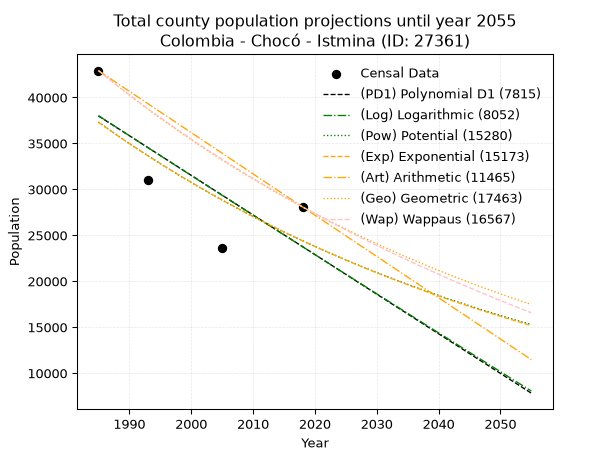
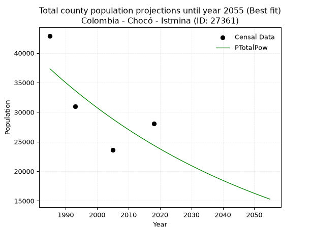
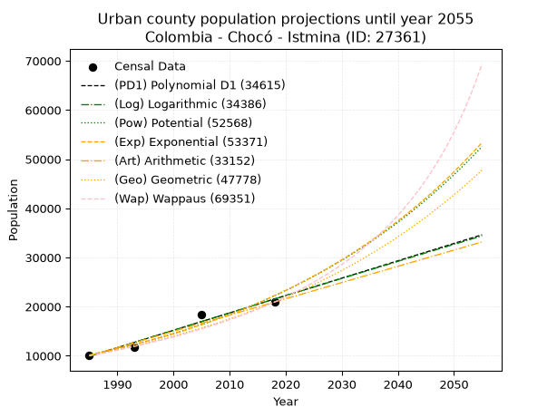
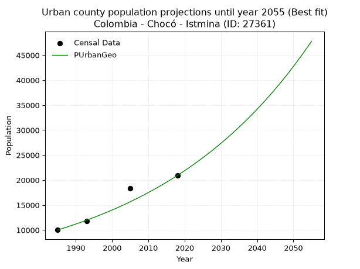
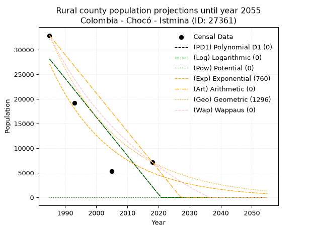
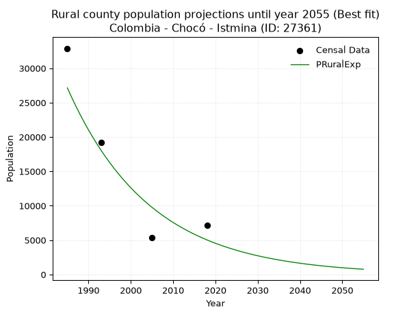

<div align="center">


</div>

# 📜 _“Population and Public Services Demand Projections (PPSD) until Year 2050 for Colombia - Chocó - Istmina (ID: 27361)”_
Keywords: `population` `public-service` `projection` `lineal` `polynomial` `logarithmic` `potential` `exponential` `arithmetic` `geometric` `wappaus` `dane` `colombia` `south-america`

PPSD are analytical estimates used by governments and planners to anticipate future changes in population size, age distribution, and the resulting community needs for utilities, healthcare, education, and infrastructure as sizing future water treatment facilities, electrical grids, and road networks based on spatial growth.

<div align="center">

</img>

</div>


> **General running parameters**: • app_version: _v20260806_. • Python version: _3.14.7_. • Pandas version: _3.0.5_. • NumPy version: _2.5.1_. • Creates, save and include plots into reports (create_plot): _False_. • Projection until year: _2050_. • Process polynomial degree 2 and up: _False_. • Process Wappaus: _True_. • Process Wappaus: _True_. • Set negative values to zero: _True_. • Set infinite values to zero: _True_. • Drop dataset notes: _True_. 
<div align="center">

Dynamic map: [:earth_americas:Google](http://maps.google.com/maps?q=5.153946495,-76.6851803) [:earth_americas:OSM](https://www.openstreetmap.org/#map=18/5.153946495/-76.6851803&layers=P) [:earth_americas:Bing](https://www.bing.com/maps?cp=5.153946495~-76.6851803&lvl=18) [:earth_americas:Apple](https://maps.apple.com/frame?center=5.153946495%2C-76.6851803&span=0.003%2C0.006)

</div>


<div align="center">

```geojson
{
  "type": "Feature",
  "geometry": {
    "type": "Point", 
    "coordinates": [-76.6851803, 5.153946495]
  }, 
  "properties": {
    "Name": "Colombia - Chocó - Istmina (ID: 27361)"
  }
}
```

</div>


## 0. Census Data (4 records)

Census data are official statistics collected by a government about the people and housing in a country. They usually include counts of total population, age, sex, race, income, education, and jobs.

📅Global census file: [Population.xlsx](../data/Population.xlsx)

| Source   |   Year |   CountryID | CountryName   |   StateID | StateName   |   CountyID | CountyName   |   PTotal |   PUrban |   PRural |
|:---------|-------:|------------:|:--------------|----------:|:------------|-----------:|:-------------|---------:|---------:|---------:|
| DANE     |   1985 |          57 | Colombia      |        27 | Chocó       |      27361 | Istmina      |    42912 |    10020 |    32892 |
| DANE     |   1993 |          57 | Colombia      |        27 | Chocó       |      27361 | Istmina      |    31011 |    11800 |    19211 |
| DANE     |   2005 |          57 | Colombia      |        27 | Chocó       |      27361 | Istmina      |    23639 |    18320 |     5319 |
| DANE     |   2018 |          57 | Colombia      |        27 | Chocó       |      27361 | Istmina      |    28087 |    20925 |     7162 |

> 🔥Some records could had specific notes about the registered values or the corresponding urban or rural distribution.

## 1. Total

### 1.1. Coefficients and Parameters

* (PD1) Polynomial Deg 1: -431.0048173424349, 893529.6358892053 (lineal)
* (Log) Logarithmic: -864470.213680979, 6602257.271618653
* (Pow) Potential: -25.76983649439526, 89.55474182483829
* (Exp) Exponential: -0.012847175470529024, 4434727507108392.5
* (Art) Arithmetic: Year diff. 2018 - 1985 = 33, Population diff. 28087 - 42912 = -14825, Annual growth = -449.24242424242425
* (Geo) Geometric: Year diff. 2018 - 1985 = 33, Population diff. 28087 - 42912 = -14825, Annual growth % = -0.012761648594306507
* (Wap) Wappaus: i = -1.2654894413792426, Condition values only valid for < 200)

<sub>
Wappaus condition values: ['-0.00', '-1.27', '-2.53', '-3.80', '-5.06', '-6.33', '-7.59', '-8.86', '-10.12', '-11.39', '-12.65', '-13.92', '-15.19', '-16.45', '-17.72', '-18.98', '-20.25', '-21.51', '-22.78', '-24.04', '-25.31', '-26.58', '-27.84', '-29.11', '-30.37', '-31.64', '-32.90', '-34.17', '-35.43', '-36.70', '-37.96', '-39.23', '-40.50', '-41.76', '-43.03', '-44.29', '-45.56', '-46.82', '-48.09', '-49.35', '-50.62', '-51.89', '-53.15', '-54.42', '-55.68', '-56.95', '-58.21', '-59.48', '-60.74', '-62.01', '-63.27', '-64.54', '-65.81', '-67.07', '-68.34', '-69.60', '-70.87', '-72.13', '-73.40', '-74.66', '-75.93', '-77.19', '-78.46', '-79.73', '-80.99', '-82.26']
</sub>


### 1.2. Projected Dataset

|   Year |   CountyID |   PTotalPD1 |   PTotalLog |   PTotalPow |   PTotalExp |   PTotalArt |   PTotalGeo |   PTotalWap |
|-------:|-----------:|------------:|------------:|------------:|------------:|------------:|------------:|------------:|
|   1985 |      27361 |       37985 |       38011 |       37324 |       37294 |       42912 |       42912 |       42912 |
|   1986 |      27361 |       37554 |       37576 |       36843 |       36818 |       42463 |       42364 |       42372 |
|   1987 |      27361 |       37123 |       37141 |       36368 |       36348 |       42014 |       41824 |       41839 |
|   1988 |      27361 |       36692 |       36706 |       35900 |       35884 |       41564 |       41290 |       41313 |
|   1989 |      27361 |       36261 |       36271 |       35437 |       35426 |       41115 |       40763 |       40793 |
|   1990 |      27361 |       35830 |       35837 |       34981 |       34974 |       40666 |       40243 |       40280 |
|   1991 |      27361 |       35399 |       35402 |       34531 |       34528 |       40217 |       39729 |       39773 |
|   1992 |      27361 |       34968 |       34968 |       34087 |       34087 |       39767 |       39222 |       39272 |
|   1993 |      27361 |       34537 |       34534 |       33649 |       33652 |       39318 |       38722 |       38777 |
|   1994 |      27361 |       34106 |       34101 |       33217 |       33222 |       38869 |       38228 |       38288 |
|   1995 |      27361 |       33675 |       33667 |       32791 |       32798 |       38420 |       37740 |       37805 |
|   1996 |      27361 |       33244 |       33234 |       32370 |       32379 |       37970 |       37258 |       37327 |
|   1997 |      27361 |       32813 |       32801 |       31955 |       31966 |       37521 |       36783 |       36855 |
|   1998 |      27361 |       32382 |       32368 |       31545 |       31558 |       37072 |       36313 |       36389 |
|   1999 |      27361 |       31951 |       31936 |       31141 |       31155 |       36623 |       35850 |       35928 |
|   2000 |      27361 |       31520 |       31503 |       30742 |       30758 |       36173 |       35392 |       35472 |
|   2001 |      27361 |       31089 |       31071 |       30349 |       30365 |       35724 |       34941 |       35022 |
|   2002 |      27361 |       30658 |       30639 |       29961 |       29977 |       35275 |       34495 |       34577 |
|   2003 |      27361 |       30227 |       30208 |       29578 |       29595 |       34826 |       34055 |       34137 |
|   2004 |      27361 |       29796 |       29776 |       29200 |       29217 |       34376 |       33620 |       33701 |
|   2005 |      27361 |       29365 |       29345 |       28827 |       28844 |       33927 |       33191 |       33271 |
|   2006 |      27361 |       28934 |       28914 |       28459 |       28476 |       33478 |       32767 |       32846 |
|   2007 |      27361 |       28503 |       28483 |       28095 |       28112 |       33029 |       32349 |       32425 |
|   2008 |      27361 |       28072 |       28053 |       27737 |       27753 |       32579 |       31936 |       32009 |
|   2009 |      27361 |       27641 |       27622 |       27383 |       27399 |       32130 |       31529 |       31597 |
|   2010 |      27361 |       27210 |       27192 |       27035 |       27049 |       31681 |       31126 |       31190 |
|   2011 |      27361 |       26779 |       26762 |       26690 |       26704 |       31232 |       30729 |       30787 |
|   2012 |      27361 |       26348 |       26332 |       26351 |       26363 |       30782 |       30337 |       30389 |
|   2013 |      27361 |       25917 |       25903 |       26015 |       26027 |       30333 |       29950 |       29995 |
|   2014 |      27361 |       25486 |       25473 |       25684 |       25694 |       29884 |       29568 |       29605 |
|   2015 |      27361 |       25055 |       25044 |       25358 |       25366 |       29435 |       29190 |       29220 |
|   2016 |      27361 |       24624 |       24615 |       25036 |       25043 |       28985 |       28818 |       28838 |
|   2017 |      27361 |       24193 |       24187 |       24718 |       24723 |       28536 |       28450 |       28461 |
|   2018 |      27361 |       23762 |       23758 |       24404 |       24407 |       28087 |       28087 |       28087 |
|   2019 |      27361 |       23331 |       23330 |       24095 |       24096 |       27638 |       27729 |       27717 |
|   2020 |      27361 |       22900 |       22902 |       23789 |       23788 |       27189 |       27375 |       27351 |
|   2021 |      27361 |       22469 |       22474 |       23488 |       23485 |       26739 |       27025 |       26989 |
|   2022 |      27361 |       22038 |       22046 |       23190 |       23185 |       26290 |       26680 |       26631 |
|   2023 |      27361 |       21607 |       21619 |       22896 |       22889 |       25841 |       26340 |       26276 |
|   2024 |      27361 |       21176 |       21192 |       22607 |       22597 |       25392 |       26004 |       25925 |
|   2025 |      27361 |       20745 |       20765 |       22321 |       22308 |       24942 |       25672 |       25577 |
|   2026 |      27361 |       20314 |       20338 |       22039 |       22023 |       24493 |       25344 |       25233 |
|   2027 |      27361 |       19883 |       19911 |       21760 |       21742 |       24044 |       25021 |       24893 |
|   2028 |      27361 |       19452 |       19485 |       21485 |       21465 |       23595 |       24702 |       24555 |
|   2029 |      27361 |       19021 |       19059 |       21214 |       21191 |       23145 |       24386 |       24222 |
|   2030 |      27361 |       18590 |       18633 |       20946 |       20920 |       22696 |       24075 |       23891 |
|   2031 |      27361 |       18159 |       18207 |       20682 |       20653 |       22247 |       23768 |       23563 |
|   2032 |      27361 |       17728 |       17781 |       20422 |       20390 |       21798 |       23465 |       23239 |
|   2033 |      27361 |       17297 |       17356 |       20164 |       20129 |       21348 |       23165 |       22918 |
|   2034 |      27361 |       16866 |       16931 |       19910 |       19872 |       20899 |       22870 |       22600 |
|   2035 |      27361 |       16435 |       16506 |       19660 |       19619 |       20450 |       22578 |       22285 |
|   2036 |      27361 |       16004 |       16081 |       19412 |       19368 |       20001 |       22290 |       21973 |
|   2037 |      27361 |       15573 |       15657 |       19168 |       19121 |       19551 |       22005 |       21665 |
|   2038 |      27361 |       15142 |       15233 |       18927 |       18877 |       19102 |       21724 |       21359 |
|   2039 |      27361 |       14711 |       14809 |       18690 |       18636 |       18653 |       21447 |       21055 |
|   2040 |      27361 |       14280 |       14385 |       18455 |       18398 |       18204 |       21173 |       20755 |
|   2041 |      27361 |       13849 |       13961 |       18223 |       18163 |       17754 |       20903 |       20458 |
|   2042 |      27361 |       13418 |       13538 |       17995 |       17931 |       17305 |       20636 |       20163 |
|   2043 |      27361 |       12987 |       13114 |       17769 |       17703 |       16856 |       20373 |       19871 |
|   2044 |      27361 |       12556 |       12691 |       17547 |       17477 |       16407 |       20113 |       19582 |
|   2045 |      27361 |       12125 |       12269 |       17327 |       17253 |       15957 |       19856 |       19295 |
|   2046 |      27361 |       11694 |       11846 |       17110 |       17033 |       15508 |       19603 |       19011 |
|   2047 |      27361 |       11263 |       11423 |       16896 |       16816 |       15059 |       19353 |       18730 |
|   2048 |      27361 |       10832 |       11001 |       16684 |       16601 |       14610 |       19106 |       18451 |
|   2049 |      27361 |       10401 |       10579 |       16476 |       16389 |       14160 |       18862 |       18175 |
|   2050 |      27361 |        9970 |       10157 |       16270 |       16180 |       13711 |       18621 |       17901 |
<div align="center">

</img>

</div>


### 1.3. Best fit with absolute and relative error (%)

Relative error puts that difference into context by dividing the absolute error by the true value, creating a unitless ratio or percentage that shows the scale of the mistake.

Absolute and relative error

|   Year | Source   |   CountryID | CountryName   |   StateID | StateName   |   CountyID_x | CountyName   |   PTotal |   PUrban |   PRural |   CountyID_y |   PTotalPD1 |   PTotalLog |   PTotalPow |   PTotalExp |   PTotalArt |   PTotalGeo |   PTotalWap |   PTotalPD1AbsError |   PTotalLogAbsError |   PTotalPowAbsError |   PTotalExpAbsError |   PTotalArtAbsError |   PTotalGeoAbsError |   PTotalWapAbsError |   PTotalPD1RelError |   PTotalLogRelError |   PTotalPowRelError |   PTotalExpRelError |   PTotalArtRelError |   PTotalGeoRelError |   PTotalWapRelError |
|-------:|:---------|------------:|:--------------|----------:|:------------|-------------:|:-------------|---------:|---------:|---------:|-------------:|------------:|------------:|------------:|------------:|------------:|------------:|------------:|--------------------:|--------------------:|--------------------:|--------------------:|--------------------:|--------------------:|--------------------:|--------------------:|--------------------:|--------------------:|--------------------:|--------------------:|--------------------:|--------------------:|
|   1985 | DANE     |          57 | Colombia      |        27 | Chocó       |        27361 | Istmina      |    42912 |    10020 |    32892 |        27361 |       37985 |       38011 |       37324 |       37294 |       42912 |       42912 |       42912 |                4927 |                4901 |                5588 |                5618 |                   0 |                   0 |                   0 |             11.4816 |             11.421  |            13.022   |            13.0919  |              0      |              0      |              0      |
|   1993 | DANE     |          57 | Colombia      |        27 | Chocó       |        27361 | Istmina      |    31011 |    11800 |    19211 |        27361 |       34537 |       34534 |       33649 |       33652 |       39318 |       38722 |       38777 |                3526 |                3523 |                2638 |                2641 |                8307 |                7711 |                7766 |             11.3702 |             11.3605 |             8.50666 |             8.51633 |             26.7873 |             24.8654 |             25.0427 |
|   2005 | DANE     |          57 | Colombia      |        27 | Chocó       |        27361 | Istmina      |    23639 |    18320 |     5319 |        27361 |       29365 |       29345 |       28827 |       28844 |       33927 |       33191 |       33271 |                5726 |                5706 |                5188 |                5205 |               10288 |                9552 |                9632 |             24.2227 |             24.1381 |            21.9468  |            22.0187  |             43.5213 |             40.4078 |             40.7462 |
|   2018 | DANE     |          57 | Colombia      |        27 | Chocó       |        27361 | Istmina      |    28087 |    20925 |     7162 |        27361 |       23762 |       23758 |       24404 |       24407 |       28087 |       28087 |       28087 |                4325 |                4329 |                3683 |                3680 |                   0 |                   0 |                   0 |             15.3986 |             15.4128 |            13.1128  |            13.1021  |              0      |              0      |              0      |

Relative error mean

| Method    |   RelError | Best   |
|:----------|-----------:|:-------|
| PTotalPD1 |    15.6183 |        |
| PTotalLog |    15.5831 |        |
| PTotalPow |    14.1471 | True   |
| PTotalExp |    14.1823 |        |
| PTotalArt |    17.5771 |        |
| PTotalGeo |    16.3183 |        |
| PTotalWap |    16.4472 |        |

💙Best method: _**PTotalPow**_
<div align="center">

</img>

</div>


### 1.4. Fresh water supply demand in liters per capita per day (lpcd)

The fresh water supply demand typically ranges from 100 to 300 liters per capita per day (lpcd) for standard domestic and municipal planning, though absolute survival minimums set by the World Health Organization are as low as 7.5 to 20 liters per day, and total consumption in high-income nations can exceed 400 liters.

> `CZ`: Level in meters above the sea level (masl)<br> `WS`: Fresh water supply demand in liters per capita per day (lpcd or l/h/d)<br> `WSAll`: Zonal fresh water supply demand in liters per second (l/s)<br> `A`: Zonal area in square meters<br> `DP`: Population density (people/hectare or p/ha)

Reference values (RAS Colombia)

|    CZ |   WS |
|------:|-----:|
|  1000 |  120 |
|  2000 |  130 |
| 99999 |  140 |

County shapefile geometry properties and water supply values

|   CountyID |      ATotal |   CZTotal |   WSTotal |
|-----------:|------------:|----------:|----------:|
|      27361 | 1.88108e+09 |   71.7715 |       120 |

Projected values for best method: PTotalPow

|   CountyID |   Year |   PTotalPow |   DPTotal |   WSTotal |   WSTotalAll |
|-----------:|-------:|------------:|----------:|----------:|-------------:|
|      27361 |   1985 |       37324 |      0.2  |       120 |      51.8389 |
|      27361 |   1986 |       36843 |      0.2  |       120 |      51.1708 |
|      27361 |   1987 |       36368 |      0.19 |       120 |      50.5111 |
|      27361 |   1988 |       35900 |      0.19 |       120 |      49.8611 |
|      27361 |   1989 |       35437 |      0.19 |       120 |      49.2181 |
|      27361 |   1990 |       34981 |      0.19 |       120 |      48.5847 |
|      27361 |   1991 |       34531 |      0.18 |       120 |      47.9597 |
|      27361 |   1992 |       34087 |      0.18 |       120 |      47.3431 |
|      27361 |   1993 |       33649 |      0.18 |       120 |      46.7347 |
|      27361 |   1994 |       33217 |      0.18 |       120 |      46.1347 |
|      27361 |   1995 |       32791 |      0.17 |       120 |      45.5431 |
|      27361 |   1996 |       32370 |      0.17 |       120 |      44.9583 |
|      27361 |   1997 |       31955 |      0.17 |       120 |      44.3819 |
|      27361 |   1998 |       31545 |      0.17 |       120 |      43.8125 |
|      27361 |   1999 |       31141 |      0.17 |       120 |      43.2514 |
|      27361 |   2000 |       30742 |      0.16 |       120 |      42.6972 |
|      27361 |   2001 |       30349 |      0.16 |       120 |      42.1514 |
|      27361 |   2002 |       29961 |      0.16 |       120 |      41.6125 |
|      27361 |   2003 |       29578 |      0.16 |       120 |      41.0806 |
|      27361 |   2004 |       29200 |      0.16 |       120 |      40.5556 |
|      27361 |   2005 |       28827 |      0.15 |       120 |      40.0375 |
|      27361 |   2006 |       28459 |      0.15 |       120 |      39.5264 |
|      27361 |   2007 |       28095 |      0.15 |       120 |      39.0208 |
|      27361 |   2008 |       27737 |      0.15 |       120 |      38.5236 |
|      27361 |   2009 |       27383 |      0.15 |       120 |      38.0319 |
|      27361 |   2010 |       27035 |      0.14 |       120 |      37.5486 |
|      27361 |   2011 |       26690 |      0.14 |       120 |      37.0694 |
|      27361 |   2012 |       26351 |      0.14 |       120 |      36.5986 |
|      27361 |   2013 |       26015 |      0.14 |       120 |      36.1319 |
|      27361 |   2014 |       25684 |      0.14 |       120 |      35.6722 |
|      27361 |   2015 |       25358 |      0.13 |       120 |      35.2194 |
|      27361 |   2016 |       25036 |      0.13 |       120 |      34.7722 |
|      27361 |   2017 |       24718 |      0.13 |       120 |      34.3306 |
|      27361 |   2018 |       24404 |      0.13 |       120 |      33.8944 |
|      27361 |   2019 |       24095 |      0.13 |       120 |      33.4653 |
|      27361 |   2020 |       23789 |      0.13 |       120 |      33.0403 |
|      27361 |   2021 |       23488 |      0.12 |       120 |      32.6222 |
|      27361 |   2022 |       23190 |      0.12 |       120 |      32.2083 |
|      27361 |   2023 |       22896 |      0.12 |       120 |      31.8    |
|      27361 |   2024 |       22607 |      0.12 |       120 |      31.3986 |
|      27361 |   2025 |       22321 |      0.12 |       120 |      31.0014 |
|      27361 |   2026 |       22039 |      0.12 |       120 |      30.6097 |
|      27361 |   2027 |       21760 |      0.12 |       120 |      30.2222 |
|      27361 |   2028 |       21485 |      0.11 |       120 |      29.8403 |
|      27361 |   2029 |       21214 |      0.11 |       120 |      29.4639 |
|      27361 |   2030 |       20946 |      0.11 |       120 |      29.0917 |
|      27361 |   2031 |       20682 |      0.11 |       120 |      28.725  |
|      27361 |   2032 |       20422 |      0.11 |       120 |      28.3639 |
|      27361 |   2033 |       20164 |      0.11 |       120 |      28.0056 |
|      27361 |   2034 |       19910 |      0.11 |       120 |      27.6528 |
|      27361 |   2035 |       19660 |      0.1  |       120 |      27.3056 |
|      27361 |   2036 |       19412 |      0.1  |       120 |      26.9611 |
|      27361 |   2037 |       19168 |      0.1  |       120 |      26.6222 |
|      27361 |   2038 |       18927 |      0.1  |       120 |      26.2875 |
|      27361 |   2039 |       18690 |      0.1  |       120 |      25.9583 |
|      27361 |   2040 |       18455 |      0.1  |       120 |      25.6319 |
|      27361 |   2041 |       18223 |      0.1  |       120 |      25.3097 |
|      27361 |   2042 |       17995 |      0.1  |       120 |      24.9931 |
|      27361 |   2043 |       17769 |      0.09 |       120 |      24.6792 |
|      27361 |   2044 |       17547 |      0.09 |       120 |      24.3708 |
|      27361 |   2045 |       17327 |      0.09 |       120 |      24.0653 |
|      27361 |   2046 |       17110 |      0.09 |       120 |      23.7639 |
|      27361 |   2047 |       16896 |      0.09 |       120 |      23.4667 |
|      27361 |   2048 |       16684 |      0.09 |       120 |      23.1722 |
|      27361 |   2049 |       16476 |      0.09 |       120 |      22.8833 |
|      27361 |   2050 |       16270 |      0.09 |       120 |      22.5972 |

## 2. Urban

### 2.1. Coefficients and Parameters

* (PD1) Polynomial Deg 1: 353.4062625451605, -691634.6266559572 (lineal)
* (Log) Logarithmic: 707526.4765656096, -5362648.168136552
* (Pow) Potential: 47.42999079165649, -152.40591139304814
* (Exp) Exponential: 0.023687067980971505, 3.8653385872480325e-17
* (Art) Arithmetic: Year diff. 2018 - 1985 = 33, Population diff. 20925 - 10020 = 10905, Annual growth = 330.45454545454544
* (Geo) Geometric: Year diff. 2018 - 1985 = 33, Population diff. 20925 - 10020 = 10905, Annual growth % = 0.022564804567215102
* (Wap) Wappaus: i = 2.135754050441399, Condition values only valid for < 200)

<sub>
Wappaus condition values: ['0.00', '2.14', '4.27', '6.41', '8.54', '10.68', '12.81', '14.95', '17.09', '19.22', '21.36', '23.49', '25.63', '27.76', '29.90', '32.04', '34.17', '36.31', '38.44', '40.58', '42.72', '44.85', '46.99', '49.12', '51.26', '53.39', '55.53', '57.67', '59.80', '61.94', '64.07', '66.21', '68.34', '70.48', '72.62', '74.75', '76.89', '79.02', '81.16', '83.29', '85.43', '87.57', '89.70', '91.84', '93.97', '96.11', '98.24', '100.38', '102.52', '104.65', '106.79', '108.92', '111.06', '113.19', '115.33', '117.47', '119.60', '121.74', '123.87', '126.01', '128.15', '130.28', '132.42', '134.55', '136.69', '138.82']
</sub>


### 2.2. Projected Dataset

|   Year |   CountyID |   PUrbanPD1 |   PUrbanLog |   PUrbanPow |   PUrbanExp |   PUrbanArt |   PUrbanGeo |   PUrbanWap |
|-------:|-----------:|------------:|------------:|------------:|------------:|------------:|------------:|------------:|
|   1985 |      27361 |        9877 |        9865 |       10159 |       10167 |       10020 |       10020 |       10020 |
|   1986 |      27361 |       10230 |       10221 |       10404 |       10411 |       10350 |       10246 |       10236 |
|   1987 |      27361 |       10584 |       10578 |       10656 |       10661 |       10681 |       10477 |       10457 |
|   1988 |      27361 |       10937 |       10934 |       10913 |       10916 |       11011 |       10714 |       10683 |
|   1989 |      27361 |       11290 |       11289 |       11177 |       11178 |       11342 |       10955 |       10914 |
|   1990 |      27361 |       11644 |       11645 |       11446 |       11446 |       11672 |       11203 |       11150 |
|   1991 |      27361 |       11997 |       12001 |       11722 |       11720 |       12003 |       11455 |       11392 |
|   1992 |      27361 |       12351 |       12356 |       12005 |       12001 |       12333 |       11714 |       11639 |
|   1993 |      27361 |       12704 |       12711 |       12294 |       12289 |       12664 |       11978 |       11892 |
|   1994 |      27361 |       13057 |       13066 |       12590 |       12583 |       12994 |       12249 |       12151 |
|   1995 |      27361 |       13411 |       13421 |       12893 |       12885 |       13325 |       12525 |       12416 |
|   1996 |      27361 |       13764 |       13775 |       13203 |       13194 |       13655 |       12808 |       12687 |
|   1997 |      27361 |       14118 |       14129 |       13520 |       13510 |       13985 |       13097 |       12965 |
|   1998 |      27361 |       14471 |       14484 |       13845 |       13834 |       14316 |       13392 |       13251 |
|   1999 |      27361 |       14824 |       14838 |       14178 |       14165 |       14646 |       13694 |       13543 |
|   2000 |      27361 |       15178 |       15192 |       14518 |       14505 |       14977 |       14003 |       13842 |
|   2001 |      27361 |       15531 |       15545 |       14866 |       14853 |       15307 |       14319 |       14150 |
|   2002 |      27361 |       15885 |       15899 |       15223 |       15209 |       15638 |       14642 |       14465 |
|   2003 |      27361 |       16238 |       16252 |       15588 |       15573 |       15968 |       14973 |       14789 |
|   2004 |      27361 |       16592 |       16605 |       15961 |       15946 |       16299 |       15311 |       15121 |
|   2005 |      27361 |       16945 |       16958 |       16343 |       16329 |       16629 |       15656 |       15462 |
|   2006 |      27361 |       17298 |       17311 |       16735 |       16720 |       16960 |       16009 |       15813 |
|   2007 |      27361 |       17652 |       17664 |       17135 |       17121 |       17290 |       16371 |       16174 |
|   2008 |      27361 |       18005 |       18016 |       17544 |       17531 |       17620 |       16740 |       16545 |
|   2009 |      27361 |       18359 |       18368 |       17964 |       17951 |       17951 |       17118 |       16926 |
|   2010 |      27361 |       18712 |       18720 |       18393 |       18382 |       18281 |       17504 |       17319 |
|   2011 |      27361 |       19065 |       19072 |       18832 |       18822 |       18612 |       17899 |       17723 |
|   2012 |      27361 |       19419 |       19424 |       19281 |       19273 |       18942 |       18303 |       18139 |
|   2013 |      27361 |       19772 |       19776 |       19741 |       19735 |       19273 |       18716 |       18568 |
|   2014 |      27361 |       20126 |       20127 |       20212 |       20208 |       19603 |       19138 |       19010 |
|   2015 |      27361 |       20479 |       20478 |       20693 |       20693 |       19934 |       19570 |       19466 |
|   2016 |      27361 |       20832 |       20829 |       21186 |       21189 |       20264 |       20012 |       19937 |
|   2017 |      27361 |       21186 |       21180 |       21690 |       21697 |       20595 |       20463 |       20423 |
|   2018 |      27361 |       21539 |       21531 |       22206 |       22217 |       20925 |       20925 |       20925 |
|   2019 |      27361 |       21893 |       21881 |       22734 |       22749 |       21255 |       21397 |       21444 |
|   2020 |      27361 |       22246 |       22232 |       23274 |       23295 |       21586 |       21880 |       21980 |
|   2021 |      27361 |       22599 |       22582 |       23827 |       23853 |       21916 |       22374 |       22535 |
|   2022 |      27361 |       22953 |       22932 |       24393 |       24425 |       22247 |       22879 |       23110 |
|   2023 |      27361 |       23306 |       23282 |       24971 |       25010 |       22577 |       23395 |       23706 |
|   2024 |      27361 |       23660 |       23631 |       25564 |       25610 |       22908 |       23923 |       24323 |
|   2025 |      27361 |       24013 |       23981 |       26170 |       26224 |       23238 |       24463 |       24963 |
|   2026 |      27361 |       24366 |       24330 |       26790 |       26852 |       23569 |       25015 |       25628 |
|   2027 |      27361 |       24720 |       24679 |       27424 |       27496 |       23899 |       25579 |       26318 |
|   2028 |      27361 |       25073 |       25028 |       28073 |       28155 |       24230 |       26156 |       27035 |
|   2029 |      27361 |       25427 |       25377 |       28737 |       28830 |       24560 |       26746 |       27782 |
|   2030 |      27361 |       25780 |       25726 |       29417 |       29521 |       24890 |       27350 |       28559 |
|   2031 |      27361 |       26133 |       26074 |       30112 |       30228 |       25221 |       27967 |       29369 |
|   2032 |      27361 |       26487 |       26422 |       30823 |       30953 |       25551 |       28598 |       30213 |
|   2033 |      27361 |       26840 |       26770 |       31551 |       31695 |       25882 |       29243 |       31095 |
|   2034 |      27361 |       27194 |       27118 |       32296 |       32455 |       26212 |       29903 |       32015 |
|   2035 |      27361 |       27547 |       27466 |       33057 |       33233 |       26543 |       30578 |       32979 |
|   2036 |      27361 |       27901 |       27814 |       33837 |       34029 |       26873 |       31268 |       33987 |
|   2037 |      27361 |       28254 |       28161 |       34634 |       34845 |       27204 |       31974 |       35044 |
|   2038 |      27361 |       28607 |       28508 |       35450 |       35680 |       27534 |       32695 |       36152 |
|   2039 |      27361 |       28961 |       28856 |       36284 |       36535 |       27865 |       33433 |       37317 |
|   2040 |      27361 |       29314 |       29202 |       37138 |       37411 |       28195 |       34187 |       38542 |
|   2041 |      27361 |       29668 |       29549 |       38011 |       38308 |       28525 |       34959 |       39832 |
|   2042 |      27361 |       30021 |       29896 |       38905 |       39226 |       28856 |       35747 |       41193 |
|   2043 |      27361 |       30374 |       30242 |       39819 |       40166 |       29186 |       36554 |       42629 |
|   2044 |      27361 |       30728 |       30588 |       40754 |       41129 |       29517 |       37379 |       44149 |
|   2045 |      27361 |       31081 |       30934 |       41710 |       42115 |       29847 |       38222 |       45759 |
|   2046 |      27361 |       31435 |       31280 |       42689 |       43124 |       30178 |       39085 |       47468 |
|   2047 |      27361 |       31788 |       31626 |       43690 |       44158 |       30508 |       39967 |       49285 |
|   2048 |      27361 |       32141 |       31972 |       44713 |       45217 |       30839 |       40869 |       51220 |
|   2049 |      27361 |       32495 |       32317 |       45761 |       46300 |       31169 |       41791 |       53286 |
|   2050 |      27361 |       32848 |       32662 |       46832 |       47410 |       31500 |       42734 |       55496 |
<div align="center">

</img>

</div>


### 2.3. Best fit with absolute and relative error (%)

Relative error puts that difference into context by dividing the absolute error by the true value, creating a unitless ratio or percentage that shows the scale of the mistake.

Absolute and relative error

|   Year | Source   |   CountryID | CountryName   |   StateID | StateName   |   CountyID_x | CountyName   |   PTotal |   PUrban |   PRural |   CountyID_y |   PUrbanPD1 |   PUrbanLog |   PUrbanPow |   PUrbanExp |   PUrbanArt |   PUrbanGeo |   PUrbanWap |   PUrbanPD1AbsError |   PUrbanLogAbsError |   PUrbanPowAbsError |   PUrbanExpAbsError |   PUrbanArtAbsError |   PUrbanGeoAbsError |   PUrbanWapAbsError |   PUrbanPD1RelError |   PUrbanLogRelError |   PUrbanPowRelError |   PUrbanExpRelError |   PUrbanArtRelError |   PUrbanGeoRelError |   PUrbanWapRelError |
|-------:|:---------|------------:|:--------------|----------:|:------------|-------------:|:-------------|---------:|---------:|---------:|-------------:|------------:|------------:|------------:|------------:|------------:|------------:|------------:|--------------------:|--------------------:|--------------------:|--------------------:|--------------------:|--------------------:|--------------------:|--------------------:|--------------------:|--------------------:|--------------------:|--------------------:|--------------------:|--------------------:|
|   1985 | DANE     |          57 | Colombia      |        27 | Chocó       |        27361 | Istmina      |    42912 |    10020 |    32892 |        27361 |        9877 |        9865 |       10159 |       10167 |       10020 |       10020 |       10020 |                 143 |                 155 |                 139 |                 147 |                   0 |                   0 |                   0 |             1.42715 |             1.54691 |             1.38723 |             1.46707 |             0       |             0       |            0        |
|   1993 | DANE     |          57 | Colombia      |        27 | Chocó       |        27361 | Istmina      |    31011 |    11800 |    19211 |        27361 |       12704 |       12711 |       12294 |       12289 |       12664 |       11978 |       11892 |                 904 |                 911 |                 494 |                 489 |                 864 |                 178 |                  92 |             7.66102 |             7.72034 |             4.18644 |             4.14407 |             7.32203 |             1.50847 |            0.779661 |
|   2005 | DANE     |          57 | Colombia      |        27 | Chocó       |        27361 | Istmina      |    23639 |    18320 |     5319 |        27361 |       16945 |       16958 |       16343 |       16329 |       16629 |       15656 |       15462 |                1375 |                1362 |                1977 |                1991 |                1691 |                2664 |                2858 |             7.50546 |             7.4345  |            10.7915  |            10.8679  |             9.23035 |            14.5415  |           15.6004   |
|   2018 | DANE     |          57 | Colombia      |        27 | Chocó       |        27361 | Istmina      |    28087 |    20925 |     7162 |        27361 |       21539 |       21531 |       22206 |       22217 |       20925 |       20925 |       20925 |                 614 |                 606 |                1281 |                1292 |                   0 |                   0 |                   0 |             2.93429 |             2.89606 |             6.12186 |             6.17443 |             0       |             0       |            0        |

Relative error mean

| Method    |   RelError | Best   |
|:----------|-----------:|:-------|
| PUrbanPD1 |    4.88198 |        |
| PUrbanLog |    4.89945 |        |
| PUrbanPow |    5.62175 |        |
| PUrbanExp |    5.66337 |        |
| PUrbanArt |    4.1381  |        |
| PUrbanGeo |    4.01249 | True   |
| PUrbanWap |    4.09502 |        |

💙Best method: _**PUrbanGeo**_
<div align="center">

</img>

</div>


### 2.4. Fresh water supply demand in liters per capita per day (lpcd)

The fresh water supply demand typically ranges from 100 to 300 liters per capita per day (lpcd) for standard domestic and municipal planning, though absolute survival minimums set by the World Health Organization are as low as 7.5 to 20 liters per day, and total consumption in high-income nations can exceed 400 liters.

> `CZ`: Level in meters above the sea level (masl)<br> `WS`: Fresh water supply demand in liters per capita per day (lpcd or l/h/d)<br> `WSAll`: Zonal fresh water supply demand in liters per second (l/s)<br> `A`: Zonal area in square meters<br> `DP`: Population density (people/hectare or p/ha)

Reference values (RAS Colombia)

|    CZ |   WS |
|------:|-----:|
|  1000 |  120 |
|  2000 |  130 |
| 99999 |  140 |

County shapefile geometry properties and water supply values

|   CountyID |      AUrban |   CZUrban |   WSUrban |
|-----------:|------------:|----------:|----------:|
|      27361 | 3.05326e+06 |   57.5272 |       120 |

Projected values for best method: PUrbanGeo

|   CountyID |   Year |   PUrbanGeo |   DPUrban |   WSUrban |   WSUrbanAll |
|-----------:|-------:|------------:|----------:|----------:|-------------:|
|      27361 |   1985 |       10020 |     32.82 |       120 |      13.9167 |
|      27361 |   1986 |       10246 |     33.56 |       120 |      14.2306 |
|      27361 |   1987 |       10477 |     34.31 |       120 |      14.5514 |
|      27361 |   1988 |       10714 |     35.09 |       120 |      14.8806 |
|      27361 |   1989 |       10955 |     35.88 |       120 |      15.2153 |
|      27361 |   1990 |       11203 |     36.69 |       120 |      15.5597 |
|      27361 |   1991 |       11455 |     37.52 |       120 |      15.9097 |
|      27361 |   1992 |       11714 |     38.37 |       120 |      16.2694 |
|      27361 |   1993 |       11978 |     39.23 |       120 |      16.6361 |
|      27361 |   1994 |       12249 |     40.12 |       120 |      17.0125 |
|      27361 |   1995 |       12525 |     41.02 |       120 |      17.3958 |
|      27361 |   1996 |       12808 |     41.95 |       120 |      17.7889 |
|      27361 |   1997 |       13097 |     42.9  |       120 |      18.1903 |
|      27361 |   1998 |       13392 |     43.86 |       120 |      18.6    |
|      27361 |   1999 |       13694 |     44.85 |       120 |      19.0194 |
|      27361 |   2000 |       14003 |     45.86 |       120 |      19.4486 |
|      27361 |   2001 |       14319 |     46.9  |       120 |      19.8875 |
|      27361 |   2002 |       14642 |     47.96 |       120 |      20.3361 |
|      27361 |   2003 |       14973 |     49.04 |       120 |      20.7958 |
|      27361 |   2004 |       15311 |     50.15 |       120 |      21.2653 |
|      27361 |   2005 |       15656 |     51.28 |       120 |      21.7444 |
|      27361 |   2006 |       16009 |     52.43 |       120 |      22.2347 |
|      27361 |   2007 |       16371 |     53.62 |       120 |      22.7375 |
|      27361 |   2008 |       16740 |     54.83 |       120 |      23.25   |
|      27361 |   2009 |       17118 |     56.06 |       120 |      23.775  |
|      27361 |   2010 |       17504 |     57.33 |       120 |      24.3111 |
|      27361 |   2011 |       17899 |     58.62 |       120 |      24.8597 |
|      27361 |   2012 |       18303 |     59.95 |       120 |      25.4208 |
|      27361 |   2013 |       18716 |     61.3  |       120 |      25.9944 |
|      27361 |   2014 |       19138 |     62.68 |       120 |      26.5806 |
|      27361 |   2015 |       19570 |     64.1  |       120 |      27.1806 |
|      27361 |   2016 |       20012 |     65.54 |       120 |      27.7944 |
|      27361 |   2017 |       20463 |     67.02 |       120 |      28.4208 |
|      27361 |   2018 |       20925 |     68.53 |       120 |      29.0625 |
|      27361 |   2019 |       21397 |     70.08 |       120 |      29.7181 |
|      27361 |   2020 |       21880 |     71.66 |       120 |      30.3889 |
|      27361 |   2021 |       22374 |     73.28 |       120 |      31.075  |
|      27361 |   2022 |       22879 |     74.93 |       120 |      31.7764 |
|      27361 |   2023 |       23395 |     76.62 |       120 |      32.4931 |
|      27361 |   2024 |       23923 |     78.35 |       120 |      33.2264 |
|      27361 |   2025 |       24463 |     80.12 |       120 |      33.9764 |
|      27361 |   2026 |       25015 |     81.93 |       120 |      34.7431 |
|      27361 |   2027 |       25579 |     83.78 |       120 |      35.5264 |
|      27361 |   2028 |       26156 |     85.67 |       120 |      36.3278 |
|      27361 |   2029 |       26746 |     87.6  |       120 |      37.1472 |
|      27361 |   2030 |       27350 |     89.58 |       120 |      37.9861 |
|      27361 |   2031 |       27967 |     91.6  |       120 |      38.8431 |
|      27361 |   2032 |       28598 |     93.66 |       120 |      39.7194 |
|      27361 |   2033 |       29243 |     95.78 |       120 |      40.6153 |
|      27361 |   2034 |       29903 |     97.94 |       120 |      41.5319 |
|      27361 |   2035 |       30578 |    100.15 |       120 |      42.4694 |
|      27361 |   2036 |       31268 |    102.41 |       120 |      43.4278 |
|      27361 |   2037 |       31974 |    104.72 |       120 |      44.4083 |
|      27361 |   2038 |       32695 |    107.08 |       120 |      45.4097 |
|      27361 |   2039 |       33433 |    109.5  |       120 |      46.4347 |
|      27361 |   2040 |       34187 |    111.97 |       120 |      47.4819 |
|      27361 |   2041 |       34959 |    114.5  |       120 |      48.5542 |
|      27361 |   2042 |       35747 |    117.08 |       120 |      49.6486 |
|      27361 |   2043 |       36554 |    119.72 |       120 |      50.7694 |
|      27361 |   2044 |       37379 |    122.42 |       120 |      51.9153 |
|      27361 |   2045 |       38222 |    125.18 |       120 |      53.0861 |
|      27361 |   2046 |       39085 |    128.01 |       120 |      54.2847 |
|      27361 |   2047 |       39967 |    130.9  |       120 |      55.5097 |
|      27361 |   2048 |       40869 |    133.85 |       120 |      56.7625 |
|      27361 |   2049 |       41791 |    136.87 |       120 |      58.0431 |
|      27361 |   2050 |       42734 |    139.96 |       120 |      59.3528 |

## 3. Rural

### 3.1. Coefficients and Parameters

* (PD1) Polynomial Deg 1: -784.4110798875955, 1585164.262545163 (lineal)
* (Log) Logarithmic: -1571996.6902465888, 11964905.439755207
* (Pow) Potential: -102.37337784450767, 342.0376601115295
* (Exp) Exponential: -0.05108693140506388, 2.981725410483293e+48
* (Art) Arithmetic: Year diff. 2018 - 1985 = 33, Population diff. 7162 - 32892 = -25730, Annual growth = -779.6969696969697
* (Geo) Geometric: Year diff. 2018 - 1985 = 33, Population diff. 7162 - 32892 = -25730, Annual growth % = -0.04514440316819346
* (Wap) Wappaus: i = -3.893228989349227, Condition values only valid for < 200)

<sub>
Wappaus condition values: ['-0.00', '-3.89', '-7.79', '-11.68', '-15.57', '-19.47', '-23.36', '-27.25', '-31.15', '-35.04', '-38.93', '-42.83', '-46.72', '-50.61', '-54.51', '-58.40', '-62.29', '-66.18', '-70.08', '-73.97', '-77.86', '-81.76', '-85.65', '-89.54', '-93.44', '-97.33', '-101.22', '-105.12', '-109.01', '-112.90', '-116.80', '-120.69', '-124.58', '-128.48', '-132.37', '-136.26', '-140.16', '-144.05', '-147.94', '-151.84', '-155.73', '-159.62', '-163.52', '-167.41', '-171.30', '-175.20', '-179.09', '-182.98', '-186.87', '-190.77', '-194.66', '-198.55', '-202.45', '-206.34', '-210.23', '-214.13', '-218.02', '-221.91', '-225.81', '-229.70', '-233.59', '-237.49', '-241.38', '-245.27', '-249.17', '-253.06']
</sub>


### 3.2. Projected Dataset

|   Year |   CountyID |   PRuralPD1 |   PRuralLog |   PRuralPow |   PRuralExp |   PRuralArt |   PRuralGeo |   PRuralWap |
|-------:|-----------:|------------:|------------:|------------:|------------:|------------:|------------:|------------:|
|   1985 |      27361 |       28108 |       28146 |           0 |       27147 |       32892 |       32892 |       32892 |
|   1986 |      27361 |       27324 |       27355 |           0 |       25795 |       32112 |       31407 |       31636 |
|   1987 |      27361 |       26539 |       26563 |           0 |       24510 |       31333 |       29989 |       30427 |
|   1988 |      27361 |       25755 |       25772 |           0 |       23290 |       30553 |       28635 |       29262 |
|   1989 |      27361 |       24971 |       24982 |           0 |       22130 |       29773 |       27343 |       28140 |
|   1990 |      27361 |       24186 |       24192 |           0 |       21028 |       28994 |       26108 |       27057 |
|   1991 |      27361 |       23402 |       23402 |           0 |       19980 |       28214 |       24930 |       26012 |
|   1992 |      27361 |       22617 |       22613 |           0 |       18985 |       27434 |       23804 |       25003 |
|   1993 |      27361 |       21833 |       21824 |           0 |       18040 |       26654 |       22730 |       24028 |
|   1994 |      27361 |       21049 |       21035 |           0 |       17141 |       25875 |       21703 |       23085 |
|   1995 |      27361 |       20264 |       20247 |           0 |       16288 |       25095 |       20724 |       22173 |
|   1996 |      27361 |       19480 |       19459 |           0 |       15476 |       24315 |       19788 |       21290 |
|   1997 |      27361 |       18695 |       18672 |           0 |       14706 |       23536 |       18895 |       20435 |
|   1998 |      27361 |       17911 |       17885 |           0 |       13973 |       22756 |       18042 |       19607 |
|   1999 |      27361 |       17127 |       17098 |           0 |       13277 |       21976 |       17227 |       18804 |
|   2000 |      27361 |       16342 |       16312 |           0 |       12616 |       21197 |       16450 |       18025 |
|   2001 |      27361 |       15558 |       15526 |           0 |       11988 |       20417 |       15707 |       17269 |
|   2002 |      27361 |       14773 |       14741 |           0 |       11391 |       19637 |       14998 |       16535 |
|   2003 |      27361 |       13989 |       13956 |           0 |       10823 |       18857 |       14321 |       15823 |
|   2004 |      27361 |       13204 |       13171 |           0 |       10284 |       18078 |       13674 |       15131 |
|   2005 |      27361 |       12420 |       12387 |           0 |        9772 |       17298 |       13057 |       14458 |
|   2006 |      27361 |       11636 |       11603 |           0 |        9285 |       16518 |       12468 |       13803 |
|   2007 |      27361 |       10851 |       10820 |           0 |        8823 |       15739 |       11905 |       13167 |
|   2008 |      27361 |       10067 |       10036 |           0 |        8384 |       14959 |       11367 |       12548 |
|   2009 |      27361 |        9282 |        9254 |           0 |        7966 |       14179 |       10854 |       11945 |
|   2010 |      27361 |        8498 |        8472 |           0 |        7569 |       13400 |       10364 |       11358 |
|   2011 |      27361 |        7714 |        7690 |           0 |        7192 |       12620 |        9896 |       10786 |
|   2012 |      27361 |        6929 |        6908 |           0 |        6834 |       11840 |        9449 |       10228 |
|   2013 |      27361 |        6145 |        6127 |           0 |        6494 |       11060 |        9023 |        9685 |
|   2014 |      27361 |        5360 |        5346 |           0 |        6170 |       10281 |        8616 |        9155 |
|   2015 |      27361 |        4576 |        4566 |           0 |        5863 |        9501 |        8227 |        8639 |
|   2016 |      27361 |        3792 |        3786 |           0 |        5571 |        8721 |        7855 |        8135 |
|   2017 |      27361 |        3007 |        3006 |           0 |        5294 |        7942 |        7501 |        7642 |
|   2018 |      27361 |        2223 |        2227 |           0 |        5030 |        7162 |        7162 |        7162 |
|   2019 |      27361 |        1438 |        1448 |           0 |        4779 |        6382 |        6839 |        6693 |
|   2020 |      27361 |         654 |         670 |           0 |        4541 |        5603 |        6530 |        6235 |
|   2021 |      27361 |           0 |           0 |           0 |        4315 |        4823 |        6235 |        5787 |
|   2022 |      27361 |           0 |           0 |           0 |        4100 |        4043 |        5954 |        5349 |
|   2023 |      27361 |           0 |           0 |           0 |        3896 |        3264 |        5685 |        4921 |
|   2024 |      27361 |           0 |           0 |           0 |        3702 |        2484 |        5428 |        4503 |
|   2025 |      27361 |           0 |           0 |           0 |        3518 |        1704 |        5183 |        4093 |
|   2026 |      27361 |           0 |           0 |           0 |        3342 |         924 |        4949 |        3693 |
|   2027 |      27361 |           0 |           0 |           0 |        3176 |         145 |        4726 |        3301 |
|   2028 |      27361 |           0 |           0 |           0 |        3018 |           0 |        4512 |        2918 |
|   2029 |      27361 |           0 |           0 |           0 |        2868 |           0 |        4309 |        2542 |
|   2030 |      27361 |           0 |           0 |           0 |        2725 |           0 |        4114 |        2175 |
|   2031 |      27361 |           0 |           0 |           0 |        2589 |           0 |        3928 |        1814 |
|   2032 |      27361 |           0 |           0 |           0 |        2460 |           0 |        3751 |        1462 |
|   2033 |      27361 |           0 |           0 |           0 |        2338 |           0 |        3582 |        1116 |
|   2034 |      27361 |           0 |           0 |           0 |        2221 |           0 |        3420 |         777 |
|   2035 |      27361 |           0 |           0 |           0 |        2111 |           0 |        3266 |         445 |
|   2036 |      27361 |           0 |           0 |           0 |        2005 |           0 |        3118 |         119 |
|   2037 |      27361 |           0 |           0 |           0 |        1906 |           0 |        2977 |           0 |
|   2038 |      27361 |           0 |           0 |           0 |        1811 |           0 |        2843 |           0 |
|   2039 |      27361 |           0 |           0 |           0 |        1720 |           0 |        2715 |           0 |
|   2040 |      27361 |           0 |           0 |           0 |        1635 |           0 |        2592 |           0 |
|   2041 |      27361 |           0 |           0 |           0 |        1553 |           0 |        2475 |           0 |
|   2042 |      27361 |           0 |           0 |           0 |        1476 |           0 |        2363 |           0 |
|   2043 |      27361 |           0 |           0 |           0 |        1402 |           0 |        2257 |           0 |
|   2044 |      27361 |           0 |           0 |           0 |        1333 |           0 |        2155 |           0 |
|   2045 |      27361 |           0 |           0 |           0 |        1266 |           0 |        2058 |           0 |
|   2046 |      27361 |           0 |           0 |           0 |        1203 |           0 |        1965 |           0 |
|   2047 |      27361 |           0 |           0 |           0 |        1143 |           0 |        1876 |           0 |
|   2048 |      27361 |           0 |           0 |           0 |        1086 |           0 |        1791 |           0 |
|   2049 |      27361 |           0 |           0 |           0 |        1032 |           0 |        1710 |           0 |
|   2050 |      27361 |           0 |           0 |           0 |         981 |           0 |        1633 |           0 |
<div align="center">

</img>

</div>


### 3.3. Best fit with absolute and relative error (%)

Relative error puts that difference into context by dividing the absolute error by the true value, creating a unitless ratio or percentage that shows the scale of the mistake.

Absolute and relative error

|   Year | Source   |   CountryID | CountryName   |   StateID | StateName   |   CountyID_x | CountyName   |   PTotal |   PUrban |   PRural |   CountyID_y |   PRuralPD1 |   PRuralLog |   PRuralPow |   PRuralExp |   PRuralArt |   PRuralGeo |   PRuralWap |   PRuralPD1AbsError |   PRuralLogAbsError |   PRuralPowAbsError |   PRuralExpAbsError |   PRuralArtAbsError |   PRuralGeoAbsError |   PRuralWapAbsError |   PRuralPD1RelError |   PRuralLogRelError |   PRuralPowRelError |   PRuralExpRelError |   PRuralArtRelError |   PRuralGeoRelError |   PRuralWapRelError |
|-------:|:---------|------------:|:--------------|----------:|:------------|-------------:|:-------------|---------:|---------:|---------:|-------------:|------------:|------------:|------------:|------------:|------------:|------------:|------------:|--------------------:|--------------------:|--------------------:|--------------------:|--------------------:|--------------------:|--------------------:|--------------------:|--------------------:|--------------------:|--------------------:|--------------------:|--------------------:|--------------------:|
|   1985 | DANE     |          57 | Colombia      |        27 | Chocó       |        27361 | Istmina      |    42912 |    10020 |    32892 |        27361 |       28108 |       28146 |           0 |       27147 |       32892 |       32892 |       32892 |                4784 |                4746 |               32892 |                5745 |                   0 |                   0 |                   0 |             14.5446 |             14.429  |                 100 |            17.4663  |              0      |              0      |              0      |
|   1993 | DANE     |          57 | Colombia      |        27 | Chocó       |        27361 | Istmina      |    31011 |    11800 |    19211 |        27361 |       21833 |       21824 |           0 |       18040 |       26654 |       22730 |       24028 |                2622 |                2613 |               19211 |                1171 |                7443 |                3519 |                4817 |             13.6484 |             13.6016 |                 100 |             6.09547 |             38.7434 |             18.3176 |             25.0742 |
|   2005 | DANE     |          57 | Colombia      |        27 | Chocó       |        27361 | Istmina      |    23639 |    18320 |     5319 |        27361 |       12420 |       12387 |           0 |        9772 |       17298 |       13057 |       14458 |                7101 |                7068 |                5319 |                4453 |               11979 |                7738 |                9139 |            133.503  |            132.882  |                 100 |            83.7187  |            225.212  |            145.478  |            171.818  |
|   2018 | DANE     |          57 | Colombia      |        27 | Chocó       |        27361 | Istmina      |    28087 |    20925 |     7162 |        27361 |        2223 |        2227 |           0 |        5030 |        7162 |        7162 |        7162 |                4939 |                4935 |                7162 |                2132 |                   0 |                   0 |                   0 |             68.9612 |             68.9053 |                 100 |            29.7682  |              0      |              0      |              0      |

Relative error mean

| Method    |   RelError | Best   |
|:----------|-----------:|:-------|
| PRuralPD1 |    57.6642 |        |
| PRuralLog |    57.4545 |        |
| PRuralPow |   100      |        |
| PRuralExp |    34.2622 | True   |
| PRuralArt |    65.9887 |        |
| PRuralGeo |    40.949  |        |
| PRuralWap |    49.223  |        |

💙Best method: _**PRuralExp**_
<div align="center">

</img>

</div>


### 3.4. Fresh water supply demand in liters per capita per day (lpcd)

The fresh water supply demand typically ranges from 100 to 300 liters per capita per day (lpcd) for standard domestic and municipal planning, though absolute survival minimums set by the World Health Organization are as low as 7.5 to 20 liters per day, and total consumption in high-income nations can exceed 400 liters.

> `CZ`: Level in meters above the sea level (masl)<br> `WS`: Fresh water supply demand in liters per capita per day (lpcd or l/h/d)<br> `WSAll`: Zonal fresh water supply demand in liters per second (l/s)<br> `A`: Zonal area in square meters<br> `DP`: Population density (people/hectare or p/ha)

Reference values (RAS Colombia)

|    CZ |   WS |
|------:|-----:|
|  1000 |  120 |
|  2000 |  130 |
| 99999 |  140 |

County shapefile geometry properties and water supply values

|   CountyID |      ARural |   CZRural |   WSRural |
|-----------:|------------:|----------:|----------:|
|      27361 | 1.87803e+09 |   71.7944 |       120 |

Projected values for best method: PRuralExp

|   CountyID |   Year |   PRuralExp |   DPRural |   WSRural |   WSRuralAll |
|-----------:|-------:|------------:|----------:|----------:|-------------:|
|      27361 |   1985 |       27147 |      0.14 |       120 |     37.7042  |
|      27361 |   1986 |       25795 |      0.14 |       120 |     35.8264  |
|      27361 |   1987 |       24510 |      0.13 |       120 |     34.0417  |
|      27361 |   1988 |       23290 |      0.12 |       120 |     32.3472  |
|      27361 |   1989 |       22130 |      0.12 |       120 |     30.7361  |
|      27361 |   1990 |       21028 |      0.11 |       120 |     29.2056  |
|      27361 |   1991 |       19980 |      0.11 |       120 |     27.75    |
|      27361 |   1992 |       18985 |      0.1  |       120 |     26.3681  |
|      27361 |   1993 |       18040 |      0.1  |       120 |     25.0556  |
|      27361 |   1994 |       17141 |      0.09 |       120 |     23.8069  |
|      27361 |   1995 |       16288 |      0.09 |       120 |     22.6222  |
|      27361 |   1996 |       15476 |      0.08 |       120 |     21.4944  |
|      27361 |   1997 |       14706 |      0.08 |       120 |     20.425   |
|      27361 |   1998 |       13973 |      0.07 |       120 |     19.4069  |
|      27361 |   1999 |       13277 |      0.07 |       120 |     18.4403  |
|      27361 |   2000 |       12616 |      0.07 |       120 |     17.5222  |
|      27361 |   2001 |       11988 |      0.06 |       120 |     16.65    |
|      27361 |   2002 |       11391 |      0.06 |       120 |     15.8208  |
|      27361 |   2003 |       10823 |      0.06 |       120 |     15.0319  |
|      27361 |   2004 |       10284 |      0.05 |       120 |     14.2833  |
|      27361 |   2005 |        9772 |      0.05 |       120 |     13.5722  |
|      27361 |   2006 |        9285 |      0.05 |       120 |     12.8958  |
|      27361 |   2007 |        8823 |      0.05 |       120 |     12.2542  |
|      27361 |   2008 |        8384 |      0.04 |       120 |     11.6444  |
|      27361 |   2009 |        7966 |      0.04 |       120 |     11.0639  |
|      27361 |   2010 |        7569 |      0.04 |       120 |     10.5125  |
|      27361 |   2011 |        7192 |      0.04 |       120 |      9.98889 |
|      27361 |   2012 |        6834 |      0.04 |       120 |      9.49167 |
|      27361 |   2013 |        6494 |      0.03 |       120 |      9.01944 |
|      27361 |   2014 |        6170 |      0.03 |       120 |      8.56944 |
|      27361 |   2015 |        5863 |      0.03 |       120 |      8.14306 |
|      27361 |   2016 |        5571 |      0.03 |       120 |      7.7375  |
|      27361 |   2017 |        5294 |      0.03 |       120 |      7.35278 |
|      27361 |   2018 |        5030 |      0.03 |       120 |      6.98611 |
|      27361 |   2019 |        4779 |      0.03 |       120 |      6.6375  |
|      27361 |   2020 |        4541 |      0.02 |       120 |      6.30694 |
|      27361 |   2021 |        4315 |      0.02 |       120 |      5.99306 |
|      27361 |   2022 |        4100 |      0.02 |       120 |      5.69444 |
|      27361 |   2023 |        3896 |      0.02 |       120 |      5.41111 |
|      27361 |   2024 |        3702 |      0.02 |       120 |      5.14167 |
|      27361 |   2025 |        3518 |      0.02 |       120 |      4.88611 |
|      27361 |   2026 |        3342 |      0.02 |       120 |      4.64167 |
|      27361 |   2027 |        3176 |      0.02 |       120 |      4.41111 |
|      27361 |   2028 |        3018 |      0.02 |       120 |      4.19167 |
|      27361 |   2029 |        2868 |      0.02 |       120 |      3.98333 |
|      27361 |   2030 |        2725 |      0.01 |       120 |      3.78472 |
|      27361 |   2031 |        2589 |      0.01 |       120 |      3.59583 |
|      27361 |   2032 |        2460 |      0.01 |       120 |      3.41667 |
|      27361 |   2033 |        2338 |      0.01 |       120 |      3.24722 |
|      27361 |   2034 |        2221 |      0.01 |       120 |      3.08472 |
|      27361 |   2035 |        2111 |      0.01 |       120 |      2.93194 |
|      27361 |   2036 |        2005 |      0.01 |       120 |      2.78472 |
|      27361 |   2037 |        1906 |      0.01 |       120 |      2.64722 |
|      27361 |   2038 |        1811 |      0.01 |       120 |      2.51528 |
|      27361 |   2039 |        1720 |      0.01 |       120 |      2.38889 |
|      27361 |   2040 |        1635 |      0.01 |       120 |      2.27083 |
|      27361 |   2041 |        1553 |      0.01 |       120 |      2.15694 |
|      27361 |   2042 |        1476 |      0.01 |       120 |      2.05    |
|      27361 |   2043 |        1402 |      0.01 |       120 |      1.94722 |
|      27361 |   2044 |        1333 |      0.01 |       120 |      1.85139 |
|      27361 |   2045 |        1266 |      0.01 |       120 |      1.75833 |
|      27361 |   2046 |        1203 |      0.01 |       120 |      1.67083 |
|      27361 |   2047 |        1143 |      0.01 |       120 |      1.5875  |
|      27361 |   2048 |        1086 |      0.01 |       120 |      1.50833 |
|      27361 |   2049 |        1032 |      0.01 |       120 |      1.43333 |
|      27361 |   2050 |         981 |      0.01 |       120 |      1.3625  |

#

<div align="center"><br><sub>Share this research</sub></div><br>

<sub>**APPS & TOOLS & CONTENT DISCLAIMER**: • NO WARRANTY - This content and software is provided by <a href="https://github.com/rcfdtools" target="_blank">github.com/rcfdtools</a> "as is", without any express or implied warranty, including warranties of merchantability, fitness for a particular purpose, or non-infringement. There is no guarantee that the software will be error-free or operate without interruption. • LIMITATION OF LIABILITY - Neither the authors nor copyright holders will be liable for claims or damages arising from the software or its use. You are responsible for determining if the software is appropriate for your use and assume all associated risks, including errors, legal compliance, and data loss. • NO PROFESSIONAL ADVICE - The software provides general information and does not offer professional advice. It should not replace consultation with professional advisors. [Clauses and global license for rcfdtools use.](https://github.com/rcfdtools/rcfdtools/blob/main/LICENSE.md)</sub>

| [:house: Home](Readme.md)  | [:beginner: Help / Collab](https://github.com/rcfdtools/R.HydroTools/discussions/31) |
|----------------------------|-------------------------------------------------------------------------------------------|