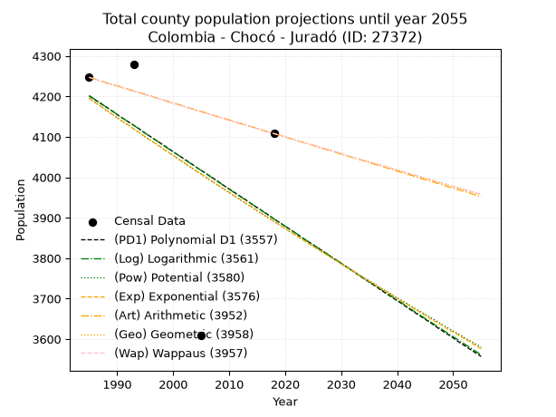
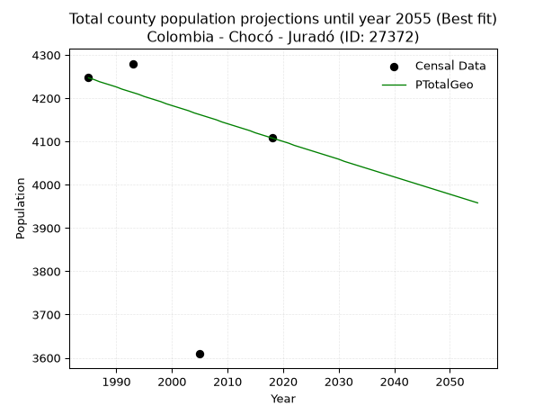
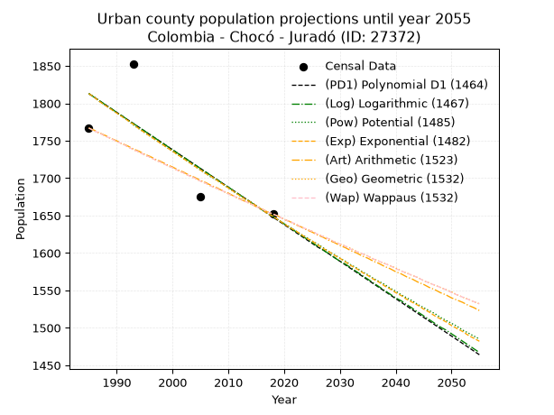
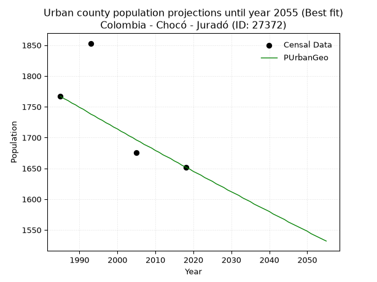
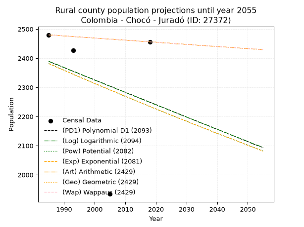
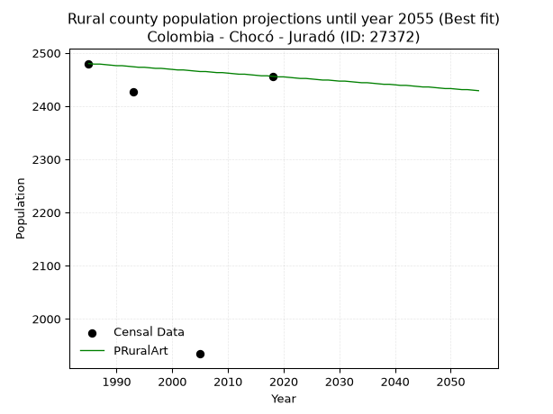

<div align="center">


</div>

# 📜 _“Population and Public Services Demand Projections (PPSD) until Year 2050 for Colombia - Chocó - Juradó (ID: 27372)”_
Keywords: `population` `public-service` `projection` `lineal` `polynomial` `logarithmic` `potential` `exponential` `arithmetic` `geometric` `wappaus` `dane` `colombia` `south-america`

PPSD are analytical estimates used by governments and planners to anticipate future changes in population size, age distribution, and the resulting community needs for utilities, healthcare, education, and infrastructure as sizing future water treatment facilities, electrical grids, and road networks based on spatial growth.

<div align="center">

</img>

</div>


> **General running parameters**: • app_version: _v20260806_. • Python version: _3.14.7_. • Pandas version: _3.0.5_. • NumPy version: _2.5.1_. • Creates, save and include plots into reports (create_plot): _False_. • Projection until year: _2050_. • Process polynomial degree 2 and up: _False_. • Process Wappaus: _True_. • Process Wappaus: _True_. • Set negative values to zero: _True_. • Set infinite values to zero: _True_. • Drop dataset notes: _True_. 
<div align="center">

Maps & GIS Layers: [:earth_americas:Google](http://maps.google.com/maps?q=7.103619082,-77.7627509) [:earth_americas:OSM](https://www.openstreetmap.org/#map=18/7.103619082/-77.7627509&layers=P) [:earth_americas:Bing](https://www.bing.com/maps?cp=7.103619082~-77.7627509&lvl=18) [:earth_americas:Apple](https://maps.apple.com/frame?center=7.103619082%2C-77.7627509&span=0.003%2C0.006) [:earth_americas:GISMobile](https://github.com/rcfdtools/R.GISMobile/blob/main/file/gis/CountyLayer_CO/Readme.md)

</div>


<div align="center">

```geojson
{
  "type": "Feature",
  "geometry": {
    "type": "Point", 
    "coordinates": [-77.7627509, 7.103619082]
  }, 
  "properties": {
    "Name": "Colombia - Chocó - Juradó (ID: 27372)"
  }
}
```

</div>


## 0. Census Data (4 records)

Census data are official statistics collected by a government about the people and housing in a country. They usually include counts of total population, age, sex, race, income, education, and jobs.

📅Global census file: [Population.xlsx](../data/Population.xlsx)

| Source   |   Year |   CountryID | CountryName   |   StateID | StateName   |   CountyID | CountyName   |   PTotal |   PUrban |   PRural |
|:---------|-------:|------------:|:--------------|----------:|:------------|-----------:|:-------------|---------:|---------:|---------:|
| DANE     |   1985 |          57 | Colombia      |        27 | Chocó       |      27372 | Juradó       |     4247 |     1767 |     2480 |
| DANE     |   1993 |          57 | Colombia      |        27 | Chocó       |      27372 | Juradó       |     4280 |     1853 |     2427 |
| DANE     |   2005 |          57 | Colombia      |        27 | Chocó       |      27372 | Juradó       |     3609 |     1675 |     1934 |
| DANE     |   2018 |          57 | Colombia      |        27 | Chocó       |      27372 | Juradó       |     4108 |     1652 |     2456 |

> 🔥Some records could had specific notes about the registered values or the corresponding urban or rural distribution.

📅[SUI-RUPS](https://www.datos.gov.co/Hacienda-y-Cr-dito-P-blico/Registro-nico-de-Prestadores-de-Servicios-P-blicos/4qkq-csdn/about_data) - Local public utility companies: [RUPS.csv](../data/RUPS.csv)

 | SERVICIO       | ESTADO    | NOMBRE                                                                                                                            | NIT         | DEPARTAMENTO_DOMICILIO   | MUNICIPIO_DOMICILIO   | DIRECCION                              |   TELEFONO | EMAIL                        | TIPO_PRESTADOR                 | CLASIFICACION                 |
|:---------------|:----------|:----------------------------------------------------------------------------------------------------------------------------------|:------------|:-------------------------|:----------------------|:---------------------------------------|-----------:|:-----------------------------|:-------------------------------|:------------------------------|
| ACUEDUCTO      | OPERATIVA | MUNICIPIO DE JURADO                                                                                                               | 891680402-7 | CHOCO                    | JURADO                | BARRIO PUEBLO NUEVO ALCALDIA MUNICIPAL |    5213845 | luthervalois@hotmail.com     | MUNICIPIO (PRESTACIÓN DIRECTA) | HASTA 2500 SUSCRIPTORES       |
| ALCANTARILLADO | OPERATIVA | MUNICIPIO DE JURADO                                                                                                               | 891680402-7 | CHOCO                    | JURADO                | BARRIO PUEBLO NUEVO ALCALDIA MUNICIPAL |    5213845 | luthervalois@hotmail.com     | MUNICIPIO (PRESTACIÓN DIRECTA) | HASTA 2500 SUSCRIPTORES       |
| ACUEDUCTO      | OPERATIVA | ASOCIACION DE USUARIOS DE LOS SERVICIOS PUBLICOS DOMICILIARIOS DE ACUEDUCTO, ALCANTARILLADO Y ASEO  "AGUAS DE JURADO O.A. E.S.P." | 900583144-8 | CHOCO                    | JURADO                | BARRIO PUEBLO NUEVO SECTOR CENTRAL     |    3137216 | aguasdejuradoesp@hotmail.com | ORGANIZACION AUTORIZADA        | MENOR O IGUAL A 2500 USUARIOS |
| ALCANTARILLADO | OPERATIVA | ASOCIACION DE USUARIOS DE LOS SERVICIOS PUBLICOS DOMICILIARIOS DE ACUEDUCTO, ALCANTARILLADO Y ASEO  "AGUAS DE JURADO O.A. E.S.P." | 900583144-8 | CHOCO                    | JURADO                | BARRIO PUEBLO NUEVO SECTOR CENTRAL     |    3137216 | aguasdejuradoesp@hotmail.com | ORGANIZACION AUTORIZADA        | MENOR O IGUAL A 2500 USUARIOS |

## 1. Total

### 1.1. Coefficients and Parameters

* (PD1) Polynomial Deg 1: -9.212364512244353, 22488.032115616763 (lineal)
* (Log) Logarithmic: -18500.280768751963, 144681.7823752296
* (Pow) Potential: -4.579785047611027, 18.725853596821707
* (Exp) Exponential: -0.0022801929687500306, 387644.7026982462
* (Art) Arithmetic: Year diff. 2018 - 1985 = 33, Population diff. 4108 - 4247 = -139, Annual growth = -4.212121212121212
* (Geo) Geometric: Year diff. 2018 - 1985 = 33, Population diff. 4108 - 4247 = -139, Annual growth % = -0.0010078723389307376
* (Wap) Wappaus: i = -0.10082875432965199, Condition values only valid for < 200)

<sub>
Wappaus condition values: ['-0.00', '-0.10', '-0.20', '-0.30', '-0.40', '-0.50', '-0.60', '-0.71', '-0.81', '-0.91', '-1.01', '-1.11', '-1.21', '-1.31', '-1.41', '-1.51', '-1.61', '-1.71', '-1.81', '-1.92', '-2.02', '-2.12', '-2.22', '-2.32', '-2.42', '-2.52', '-2.62', '-2.72', '-2.82', '-2.92', '-3.02', '-3.13', '-3.23', '-3.33', '-3.43', '-3.53', '-3.63', '-3.73', '-3.83', '-3.93', '-4.03', '-4.13', '-4.23', '-4.34', '-4.44', '-4.54', '-4.64', '-4.74', '-4.84', '-4.94', '-5.04', '-5.14', '-5.24', '-5.34', '-5.44', '-5.55', '-5.65', '-5.75', '-5.85', '-5.95', '-6.05', '-6.15', '-6.25', '-6.35', '-6.45', '-6.55']
</sub>


### 1.2. Projected Dataset

|   Year |   CountyID |   PTotalPD1 |   PTotalLog |   PTotalPow |   PTotalExp |   PTotalArt |   PTotalGeo |   PTotalWap |
|-------:|-----------:|------------:|------------:|------------:|------------:|------------:|------------:|------------:|
|   1985 |      27372 |        4201 |        4202 |        4196 |        4195 |        4247 |        4247 |        4247 |
|   1986 |      27372 |        4192 |        4193 |        4186 |        4185 |        4243 |        4243 |        4243 |
|   1987 |      27372 |        4183 |        4184 |        4177 |        4176 |        4239 |        4238 |        4238 |
|   1988 |      27372 |        4174 |        4174 |        4167 |        4166 |        4234 |        4234 |        4234 |
|   1989 |      27372 |        4165 |        4165 |        4157 |        4157 |        4230 |        4230 |        4230 |
|   1990 |      27372 |        4155 |        4156 |        4148 |        4147 |        4226 |        4226 |        4226 |
|   1991 |      27372 |        4146 |        4146 |        4138 |        4138 |        4222 |        4221 |        4221 |
|   1992 |      27372 |        4137 |        4137 |        4129 |        4129 |        4218 |        4217 |        4217 |
|   1993 |      27372 |        4128 |        4128 |        4119 |        4119 |        4213 |        4213 |        4213 |
|   1994 |      27372 |        4119 |        4119 |        4110 |        4110 |        4209 |        4209 |        4209 |
|   1995 |      27372 |        4109 |        4109 |        4100 |        4100 |        4205 |        4204 |        4204 |
|   1996 |      27372 |        4100 |        4100 |        4091 |        4091 |        4201 |        4200 |        4200 |
|   1997 |      27372 |        4091 |        4091 |        4082 |        4082 |        4196 |        4196 |        4196 |
|   1998 |      27372 |        4082 |        4081 |        4072 |        4073 |        4192 |        4192 |        4192 |
|   1999 |      27372 |        4073 |        4072 |        4063 |        4063 |        4188 |        4187 |        4187 |
|   2000 |      27372 |        4063 |        4063 |        4054 |        4054 |        4184 |        4183 |        4183 |
|   2001 |      27372 |        4054 |        4054 |        4044 |        4045 |        4180 |        4179 |        4179 |
|   2002 |      27372 |        4045 |        4044 |        4035 |        4036 |        4175 |        4175 |        4175 |
|   2003 |      27372 |        4036 |        4035 |        4026 |        4026 |        4171 |        4171 |        4171 |
|   2004 |      27372 |        4026 |        4026 |        4017 |        4017 |        4167 |        4166 |        4166 |
|   2005 |      27372 |        4017 |        4017 |        4008 |        4008 |        4163 |        4162 |        4162 |
|   2006 |      27372 |        4008 |        4008 |        3998 |        3999 |        4159 |        4158 |        4158 |
|   2007 |      27372 |        3999 |        3998 |        3989 |        3990 |        4154 |        4154 |        4154 |
|   2008 |      27372 |        3990 |        3989 |        3980 |        3981 |        4150 |        4150 |        4150 |
|   2009 |      27372 |        3980 |        3980 |        3971 |        3972 |        4146 |        4145 |        4145 |
|   2010 |      27372 |        3971 |        3971 |        3962 |        3963 |        4142 |        4141 |        4141 |
|   2011 |      27372 |        3962 |        3961 |        3953 |        3954 |        4137 |        4137 |        4137 |
|   2012 |      27372 |        3953 |        3952 |        3944 |        3945 |        4133 |        4133 |        4133 |
|   2013 |      27372 |        3944 |        3943 |        3935 |        3936 |        4129 |        4129 |        4129 |
|   2014 |      27372 |        3934 |        3934 |        3926 |        3927 |        4125 |        4125 |        4125 |
|   2015 |      27372 |        3925 |        3925 |        3917 |        3918 |        4121 |        4120 |        4120 |
|   2016 |      27372 |        3916 |        3916 |        3908 |        3909 |        4116 |        4116 |        4116 |
|   2017 |      27372 |        3907 |        3906 |        3900 |        3900 |        4112 |        4112 |        4112 |
|   2018 |      27372 |        3897 |        3897 |        3891 |        3891 |        4108 |        4108 |        4108 |
|   2019 |      27372 |        3888 |        3888 |        3882 |        3882 |        4104 |        4104 |        4104 |
|   2020 |      27372 |        3879 |        3879 |        3873 |        3873 |        4100 |        4100 |        4100 |
|   2021 |      27372 |        3870 |        3870 |        3864 |        3864 |        4095 |        4096 |        4096 |
|   2022 |      27372 |        3861 |        3861 |        3856 |        3856 |        4091 |        4091 |        4091 |
|   2023 |      27372 |        3851 |        3851 |        3847 |        3847 |        4087 |        4087 |        4087 |
|   2024 |      27372 |        3842 |        3842 |        3838 |        3838 |        4083 |        4083 |        4083 |
|   2025 |      27372 |        3833 |        3833 |        3829 |        3829 |        4079 |        4079 |        4079 |
|   2026 |      27372 |        3824 |        3824 |        3821 |        3821 |        4074 |        4075 |        4075 |
|   2027 |      27372 |        3815 |        3815 |        3812 |        3812 |        4070 |        4071 |        4071 |
|   2028 |      27372 |        3805 |        3806 |        3804 |        3803 |        4066 |        4067 |        4067 |
|   2029 |      27372 |        3796 |        3797 |        3795 |        3795 |        4062 |        4063 |        4063 |
|   2030 |      27372 |        3787 |        3788 |        3786 |        3786 |        4057 |        4059 |        4059 |
|   2031 |      27372 |        3778 |        3778 |        3778 |        3777 |        4053 |        4054 |        4054 |
|   2032 |      27372 |        3769 |        3769 |        3769 |        3769 |        4049 |        4050 |        4050 |
|   2033 |      27372 |        3759 |        3760 |        3761 |        3760 |        4045 |        4046 |        4046 |
|   2034 |      27372 |        3750 |        3751 |        3752 |        3752 |        4041 |        4042 |        4042 |
|   2035 |      27372 |        3741 |        3742 |        3744 |        3743 |        4036 |        4038 |        4038 |
|   2036 |      27372 |        3732 |        3733 |        3736 |        3735 |        4032 |        4034 |        4034 |
|   2037 |      27372 |        3722 |        3724 |        3727 |        3726 |        4028 |        4030 |        4030 |
|   2038 |      27372 |        3713 |        3715 |        3719 |        3718 |        4024 |        4026 |        4026 |
|   2039 |      27372 |        3704 |        3706 |        3711 |        3709 |        4020 |        4022 |        4022 |
|   2040 |      27372 |        3695 |        3697 |        3702 |        3701 |        4015 |        4018 |        4018 |
|   2041 |      27372 |        3686 |        3688 |        3694 |        3692 |        4011 |        4014 |        4014 |
|   2042 |      27372 |        3676 |        3678 |        3686 |        3684 |        4007 |        4010 |        4010 |
|   2043 |      27372 |        3667 |        3669 |        3677 |        3675 |        4003 |        4006 |        4006 |
|   2044 |      27372 |        3658 |        3660 |        3669 |        3667 |        3998 |        4002 |        4002 |
|   2045 |      27372 |        3649 |        3651 |        3661 |        3659 |        3994 |        3998 |        3998 |
|   2046 |      27372 |        3640 |        3642 |        3653 |        3650 |        3990 |        3994 |        3994 |
|   2047 |      27372 |        3630 |        3633 |        3645 |        3642 |        3986 |        3990 |        3990 |
|   2048 |      27372 |        3621 |        3624 |        3636 |        3634 |        3982 |        3986 |        3986 |
|   2049 |      27372 |        3612 |        3615 |        3628 |        3625 |        3977 |        3982 |        3982 |
|   2050 |      27372 |        3603 |        3606 |        3620 |        3617 |        3973 |        3978 |        3977 |
<div align="center">

</img>

</div>


### 1.3. Best fit with absolute and relative error (%)

Relative error puts that difference into context by dividing the absolute error by the true value, creating a unitless ratio or percentage that shows the scale of the mistake.

Absolute and relative error

|   Year | Source   |   CountryID | CountryName   |   StateID | StateName   |   CountyID_x | CountyName   |   PTotal |   PUrban |   PRural |   CountyID_y |   PTotalPD1 |   PTotalLog |   PTotalPow |   PTotalExp |   PTotalArt |   PTotalGeo |   PTotalWap |   PTotalPD1AbsError |   PTotalLogAbsError |   PTotalPowAbsError |   PTotalExpAbsError |   PTotalArtAbsError |   PTotalGeoAbsError |   PTotalWapAbsError |   PTotalPD1RelError |   PTotalLogRelError |   PTotalPowRelError |   PTotalExpRelError |   PTotalArtRelError |   PTotalGeoRelError |   PTotalWapRelError |
|-------:|:---------|------------:|:--------------|----------:|:------------|-------------:|:-------------|---------:|---------:|---------:|-------------:|------------:|------------:|------------:|------------:|------------:|------------:|------------:|--------------------:|--------------------:|--------------------:|--------------------:|--------------------:|--------------------:|--------------------:|--------------------:|--------------------:|--------------------:|--------------------:|--------------------:|--------------------:|--------------------:|
|   1985 | DANE     |          57 | Colombia      |        27 | Chocó       |        27372 | Juradó       |     4247 |     1767 |     2480 |        27372 |        4201 |        4202 |        4196 |        4195 |        4247 |        4247 |        4247 |                  46 |                  45 |                  51 |                  52 |                   0 |                   0 |                   0 |             1.08312 |             1.05957 |             1.20085 |             1.22439 |             0       |             0       |             0       |
|   1993 | DANE     |          57 | Colombia      |        27 | Chocó       |        27372 | Juradó       |     4280 |     1853 |     2427 |        27372 |        4128 |        4128 |        4119 |        4119 |        4213 |        4213 |        4213 |                 152 |                 152 |                 161 |                 161 |                  67 |                  67 |                  67 |             3.5514  |             3.5514  |             3.76168 |             3.76168 |             1.56542 |             1.56542 |             1.56542 |
|   2005 | DANE     |          57 | Colombia      |        27 | Chocó       |        27372 | Juradó       |     3609 |     1675 |     1934 |        27372 |        4017 |        4017 |        4008 |        4008 |        4163 |        4162 |        4162 |                 408 |                 408 |                 399 |                 399 |                 554 |                 553 |                 553 |            11.3051  |            11.3051  |            11.0557  |            11.0557  |            15.3505  |            15.3228  |            15.3228  |
|   2018 | DANE     |          57 | Colombia      |        27 | Chocó       |        27372 | Juradó       |     4108 |     1652 |     2456 |        27372 |        3897 |        3897 |        3891 |        3891 |        4108 |        4108 |        4108 |                 211 |                 211 |                 217 |                 217 |                   0 |                   0 |                   0 |             5.13632 |             5.13632 |             5.28238 |             5.28238 |             0       |             0       |             0       |

Relative error mean

| Method    |   RelError | Best   |
|:----------|-----------:|:-------|
| PTotalPD1 |    5.26898 |        |
| PTotalLog |    5.26309 |        |
| PTotalPow |    5.32515 |        |
| PTotalExp |    5.33104 |        |
| PTotalArt |    4.22898 |        |
| PTotalGeo |    4.22206 | True   |
| PTotalWap |    4.22206 | True   |

💙Best method: _**PTotalGeo**_
<div align="center">

</img>

</div>


### 1.4. Fresh water supply demand in liters per capita per day (lpcd)

The fresh water supply demand typically ranges from 100 to 300 liters per capita per day (lpcd) for standard domestic and municipal planning, though absolute survival minimums set by the World Health Organization are as low as 7.5 to 20 liters per day, and total consumption in high-income nations can exceed 400 liters.

> `CZ`: Level in meters above the sea level (masl)<br> `WS`: Fresh water supply demand in liters per capita per day (lpcd or l/h/d)<br> `WSAll`: Zonal fresh water supply demand in liters per second (l/s)<br> `A`: Zonal area in square meters<br> `DP`: Population density (people/hectare or p/ha)

Reference values (RAS Colombia)

|    CZ |   WS |
|------:|-----:|
|  1000 |  120 |
|  2000 |  130 |
| 99999 |  140 |

County shapefile geometry properties and water supply values

|   CountyID |      ATotal |   CZTotal |   WSTotal |
|-----------:|------------:|----------:|----------:|
|      27372 | 1.29805e+09 |   225.382 |       120 |

Projected values for best method: PTotalGeo

|   CountyID |   Year |   PTotalGeo |   DPTotal |   WSTotal |   WSTotalAll |
|-----------:|-------:|------------:|----------:|----------:|-------------:|
|      27372 |   1985 |        4247 |      0.03 |       120 |      5.89861 |
|      27372 |   1986 |        4243 |      0.03 |       120 |      5.89306 |
|      27372 |   1987 |        4238 |      0.03 |       120 |      5.88611 |
|      27372 |   1988 |        4234 |      0.03 |       120 |      5.88056 |
|      27372 |   1989 |        4230 |      0.03 |       120 |      5.875   |
|      27372 |   1990 |        4226 |      0.03 |       120 |      5.86944 |
|      27372 |   1991 |        4221 |      0.03 |       120 |      5.8625  |
|      27372 |   1992 |        4217 |      0.03 |       120 |      5.85694 |
|      27372 |   1993 |        4213 |      0.03 |       120 |      5.85139 |
|      27372 |   1994 |        4209 |      0.03 |       120 |      5.84583 |
|      27372 |   1995 |        4204 |      0.03 |       120 |      5.83889 |
|      27372 |   1996 |        4200 |      0.03 |       120 |      5.83333 |
|      27372 |   1997 |        4196 |      0.03 |       120 |      5.82778 |
|      27372 |   1998 |        4192 |      0.03 |       120 |      5.82222 |
|      27372 |   1999 |        4187 |      0.03 |       120 |      5.81528 |
|      27372 |   2000 |        4183 |      0.03 |       120 |      5.80972 |
|      27372 |   2001 |        4179 |      0.03 |       120 |      5.80417 |
|      27372 |   2002 |        4175 |      0.03 |       120 |      5.79861 |
|      27372 |   2003 |        4171 |      0.03 |       120 |      5.79306 |
|      27372 |   2004 |        4166 |      0.03 |       120 |      5.78611 |
|      27372 |   2005 |        4162 |      0.03 |       120 |      5.78056 |
|      27372 |   2006 |        4158 |      0.03 |       120 |      5.775   |
|      27372 |   2007 |        4154 |      0.03 |       120 |      5.76944 |
|      27372 |   2008 |        4150 |      0.03 |       120 |      5.76389 |
|      27372 |   2009 |        4145 |      0.03 |       120 |      5.75694 |
|      27372 |   2010 |        4141 |      0.03 |       120 |      5.75139 |
|      27372 |   2011 |        4137 |      0.03 |       120 |      5.74583 |
|      27372 |   2012 |        4133 |      0.03 |       120 |      5.74028 |
|      27372 |   2013 |        4129 |      0.03 |       120 |      5.73472 |
|      27372 |   2014 |        4125 |      0.03 |       120 |      5.72917 |
|      27372 |   2015 |        4120 |      0.03 |       120 |      5.72222 |
|      27372 |   2016 |        4116 |      0.03 |       120 |      5.71667 |
|      27372 |   2017 |        4112 |      0.03 |       120 |      5.71111 |
|      27372 |   2018 |        4108 |      0.03 |       120 |      5.70556 |
|      27372 |   2019 |        4104 |      0.03 |       120 |      5.7     |
|      27372 |   2020 |        4100 |      0.03 |       120 |      5.69444 |
|      27372 |   2021 |        4096 |      0.03 |       120 |      5.68889 |
|      27372 |   2022 |        4091 |      0.03 |       120 |      5.68194 |
|      27372 |   2023 |        4087 |      0.03 |       120 |      5.67639 |
|      27372 |   2024 |        4083 |      0.03 |       120 |      5.67083 |
|      27372 |   2025 |        4079 |      0.03 |       120 |      5.66528 |
|      27372 |   2026 |        4075 |      0.03 |       120 |      5.65972 |
|      27372 |   2027 |        4071 |      0.03 |       120 |      5.65417 |
|      27372 |   2028 |        4067 |      0.03 |       120 |      5.64861 |
|      27372 |   2029 |        4063 |      0.03 |       120 |      5.64306 |
|      27372 |   2030 |        4059 |      0.03 |       120 |      5.6375  |
|      27372 |   2031 |        4054 |      0.03 |       120 |      5.63056 |
|      27372 |   2032 |        4050 |      0.03 |       120 |      5.625   |
|      27372 |   2033 |        4046 |      0.03 |       120 |      5.61944 |
|      27372 |   2034 |        4042 |      0.03 |       120 |      5.61389 |
|      27372 |   2035 |        4038 |      0.03 |       120 |      5.60833 |
|      27372 |   2036 |        4034 |      0.03 |       120 |      5.60278 |
|      27372 |   2037 |        4030 |      0.03 |       120 |      5.59722 |
|      27372 |   2038 |        4026 |      0.03 |       120 |      5.59167 |
|      27372 |   2039 |        4022 |      0.03 |       120 |      5.58611 |
|      27372 |   2040 |        4018 |      0.03 |       120 |      5.58056 |
|      27372 |   2041 |        4014 |      0.03 |       120 |      5.575   |
|      27372 |   2042 |        4010 |      0.03 |       120 |      5.56944 |
|      27372 |   2043 |        4006 |      0.03 |       120 |      5.56389 |
|      27372 |   2044 |        4002 |      0.03 |       120 |      5.55833 |
|      27372 |   2045 |        3998 |      0.03 |       120 |      5.55278 |
|      27372 |   2046 |        3994 |      0.03 |       120 |      5.54722 |
|      27372 |   2047 |        3990 |      0.03 |       120 |      5.54167 |
|      27372 |   2048 |        3986 |      0.03 |       120 |      5.53611 |
|      27372 |   2049 |        3982 |      0.03 |       120 |      5.53056 |
|      27372 |   2050 |        3978 |      0.03 |       120 |      5.525   |

## 2. Urban

### 2.1. Coefficients and Parameters

* (PD1) Polynomial Deg 1: -4.980730630268942, 11699.456443195453 (lineal)
* (Log) Logarithmic: -9964.570380080655, 77477.52931004872
* (Pow) Potential: -5.760350491065171, 22.254638025447765
* (Exp) Exponential: -0.002879222478164285, 550120.314094269
* (Art) Arithmetic: Year diff. 2018 - 1985 = 33, Population diff. 1652 - 1767 = -115, Annual growth = -3.484848484848485
* (Geo) Geometric: Year diff. 2018 - 1985 = 33, Population diff. 1652 - 1767 = -115, Annual growth % = -0.0020372104955681536
* (Wap) Wappaus: i = -0.20385191487853085, Condition values only valid for < 200)

<sub>
Wappaus condition values: ['-0.00', '-0.20', '-0.41', '-0.61', '-0.82', '-1.02', '-1.22', '-1.43', '-1.63', '-1.83', '-2.04', '-2.24', '-2.45', '-2.65', '-2.85', '-3.06', '-3.26', '-3.47', '-3.67', '-3.87', '-4.08', '-4.28', '-4.48', '-4.69', '-4.89', '-5.10', '-5.30', '-5.50', '-5.71', '-5.91', '-6.12', '-6.32', '-6.52', '-6.73', '-6.93', '-7.13', '-7.34', '-7.54', '-7.75', '-7.95', '-8.15', '-8.36', '-8.56', '-8.77', '-8.97', '-9.17', '-9.38', '-9.58', '-9.78', '-9.99', '-10.19', '-10.40', '-10.60', '-10.80', '-11.01', '-11.21', '-11.42', '-11.62', '-11.82', '-12.03', '-12.23', '-12.43', '-12.64', '-12.84', '-13.05', '-13.25']
</sub>


### 2.2. Projected Dataset

|   Year |   CountyID |   PUrbanPD1 |   PUrbanLog |   PUrbanPow |   PUrbanExp |   PUrbanArt |   PUrbanGeo |   PUrbanWap |
|-------:|-----------:|------------:|------------:|------------:|------------:|------------:|------------:|------------:|
|   1985 |      27372 |        1813 |        1813 |        1813 |        1813 |        1767 |        1767 |        1767 |
|   1986 |      27372 |        1808 |        1808 |        1808 |        1808 |        1764 |        1763 |        1763 |
|   1987 |      27372 |        1803 |        1803 |        1802 |        1802 |        1760 |        1760 |        1760 |
|   1988 |      27372 |        1798 |        1798 |        1797 |        1797 |        1757 |        1756 |        1756 |
|   1989 |      27372 |        1793 |        1793 |        1792 |        1792 |        1753 |        1753 |        1753 |
|   1990 |      27372 |        1788 |        1788 |        1787 |        1787 |        1750 |        1749 |        1749 |
|   1991 |      27372 |        1783 |        1783 |        1782 |        1782 |        1746 |        1746 |        1746 |
|   1992 |      27372 |        1778 |        1778 |        1777 |        1777 |        1743 |        1742 |        1742 |
|   1993 |      27372 |        1773 |        1773 |        1771 |        1772 |        1739 |        1738 |        1738 |
|   1994 |      27372 |        1768 |        1768 |        1766 |        1766 |        1736 |        1735 |        1735 |
|   1995 |      27372 |        1763 |        1763 |        1761 |        1761 |        1732 |        1731 |        1731 |
|   1996 |      27372 |        1758 |        1758 |        1756 |        1756 |        1729 |        1728 |        1728 |
|   1997 |      27372 |        1753 |        1753 |        1751 |        1751 |        1725 |        1724 |        1724 |
|   1998 |      27372 |        1748 |        1748 |        1746 |        1746 |        1722 |        1721 |        1721 |
|   1999 |      27372 |        1743 |        1743 |        1741 |        1741 |        1718 |        1717 |        1717 |
|   2000 |      27372 |        1738 |        1738 |        1736 |        1736 |        1715 |        1714 |        1714 |
|   2001 |      27372 |        1733 |        1733 |        1731 |        1731 |        1711 |        1710 |        1710 |
|   2002 |      27372 |        1728 |        1728 |        1726 |        1726 |        1708 |        1707 |        1707 |
|   2003 |      27372 |        1723 |        1723 |        1721 |        1721 |        1704 |        1703 |        1703 |
|   2004 |      27372 |        1718 |        1718 |        1716 |        1716 |        1701 |        1700 |        1700 |
|   2005 |      27372 |        1713 |        1713 |        1711 |        1711 |        1697 |        1696 |        1696 |
|   2006 |      27372 |        1708 |        1708 |        1706 |        1706 |        1694 |        1693 |        1693 |
|   2007 |      27372 |        1703 |        1703 |        1701 |        1702 |        1690 |        1689 |        1689 |
|   2008 |      27372 |        1698 |        1698 |        1697 |        1697 |        1687 |        1686 |        1686 |
|   2009 |      27372 |        1693 |        1693 |        1692 |        1692 |        1683 |        1683 |        1683 |
|   2010 |      27372 |        1688 |        1688 |        1687 |        1687 |        1680 |        1679 |        1679 |
|   2011 |      27372 |        1683 |        1683 |        1682 |        1682 |        1676 |        1676 |        1676 |
|   2012 |      27372 |        1678 |        1678 |        1677 |        1677 |        1673 |        1672 |        1672 |
|   2013 |      27372 |        1673 |        1673 |        1672 |        1672 |        1669 |        1669 |        1669 |
|   2014 |      27372 |        1668 |        1668 |        1668 |        1668 |        1666 |        1666 |        1666 |
|   2015 |      27372 |        1663 |        1663 |        1663 |        1663 |        1662 |        1662 |        1662 |
|   2016 |      27372 |        1658 |        1658 |        1658 |        1658 |        1659 |        1659 |        1659 |
|   2017 |      27372 |        1653 |        1653 |        1653 |        1653 |        1655 |        1655 |        1655 |
|   2018 |      27372 |        1648 |        1649 |        1649 |        1649 |        1652 |        1652 |        1652 |
|   2019 |      27372 |        1643 |        1644 |        1644 |        1644 |        1649 |        1649 |        1649 |
|   2020 |      27372 |        1638 |        1639 |        1639 |        1639 |        1645 |        1645 |        1645 |
|   2021 |      27372 |        1633 |        1634 |        1635 |        1634 |        1642 |        1642 |        1642 |
|   2022 |      27372 |        1628 |        1629 |        1630 |        1630 |        1638 |        1639 |        1639 |
|   2023 |      27372 |        1623 |        1624 |        1625 |        1625 |        1635 |        1635 |        1635 |
|   2024 |      27372 |        1618 |        1619 |        1621 |        1620 |        1631 |        1632 |        1632 |
|   2025 |      27372 |        1613 |        1614 |        1616 |        1616 |        1628 |        1629 |        1629 |
|   2026 |      27372 |        1608 |        1609 |        1612 |        1611 |        1624 |        1625 |        1625 |
|   2027 |      27372 |        1604 |        1604 |        1607 |        1606 |        1621 |        1622 |        1622 |
|   2028 |      27372 |        1599 |        1599 |        1602 |        1602 |        1617 |        1619 |        1619 |
|   2029 |      27372 |        1594 |        1594 |        1598 |        1597 |        1614 |        1615 |        1615 |
|   2030 |      27372 |        1589 |        1589 |        1593 |        1593 |        1610 |        1612 |        1612 |
|   2031 |      27372 |        1584 |        1585 |        1589 |        1588 |        1607 |        1609 |        1609 |
|   2032 |      27372 |        1579 |        1580 |        1584 |        1583 |        1603 |        1606 |        1605 |
|   2033 |      27372 |        1574 |        1575 |        1580 |        1579 |        1600 |        1602 |        1602 |
|   2034 |      27372 |        1569 |        1570 |        1575 |        1574 |        1596 |        1599 |        1599 |
|   2035 |      27372 |        1564 |        1565 |        1571 |        1570 |        1593 |        1596 |        1596 |
|   2036 |      27372 |        1559 |        1560 |        1566 |        1565 |        1589 |        1592 |        1592 |
|   2037 |      27372 |        1554 |        1555 |        1562 |        1561 |        1586 |        1589 |        1589 |
|   2038 |      27372 |        1549 |        1550 |        1558 |        1556 |        1582 |        1586 |        1586 |
|   2039 |      27372 |        1544 |        1545 |        1553 |        1552 |        1579 |        1583 |        1583 |
|   2040 |      27372 |        1539 |        1540 |        1549 |        1547 |        1575 |        1580 |        1579 |
|   2041 |      27372 |        1534 |        1536 |        1544 |        1543 |        1572 |        1576 |        1576 |
|   2042 |      27372 |        1529 |        1531 |        1540 |        1538 |        1568 |        1573 |        1573 |
|   2043 |      27372 |        1524 |        1526 |        1536 |        1534 |        1565 |        1570 |        1570 |
|   2044 |      27372 |        1519 |        1521 |        1531 |        1530 |        1561 |        1567 |        1567 |
|   2045 |      27372 |        1514 |        1516 |        1527 |        1525 |        1558 |        1563 |        1563 |
|   2046 |      27372 |        1509 |        1511 |        1523 |        1521 |        1554 |        1560 |        1560 |
|   2047 |      27372 |        1504 |        1506 |        1519 |        1516 |        1551 |        1557 |        1557 |
|   2048 |      27372 |        1499 |        1501 |        1514 |        1512 |        1547 |        1554 |        1554 |
|   2049 |      27372 |        1494 |        1497 |        1510 |        1508 |        1544 |        1551 |        1551 |
|   2050 |      27372 |        1489 |        1492 |        1506 |        1503 |        1540 |        1548 |        1547 |
<div align="center">

</img>

</div>


### 2.3. Best fit with absolute and relative error (%)

Relative error puts that difference into context by dividing the absolute error by the true value, creating a unitless ratio or percentage that shows the scale of the mistake.

Absolute and relative error

|   Year | Source   |   CountryID | CountryName   |   StateID | StateName   |   CountyID_x | CountyName   |   PTotal |   PUrban |   PRural |   CountyID_y |   PUrbanPD1 |   PUrbanLog |   PUrbanPow |   PUrbanExp |   PUrbanArt |   PUrbanGeo |   PUrbanWap |   PUrbanPD1AbsError |   PUrbanLogAbsError |   PUrbanPowAbsError |   PUrbanExpAbsError |   PUrbanArtAbsError |   PUrbanGeoAbsError |   PUrbanWapAbsError |   PUrbanPD1RelError |   PUrbanLogRelError |   PUrbanPowRelError |   PUrbanExpRelError |   PUrbanArtRelError |   PUrbanGeoRelError |   PUrbanWapRelError |
|-------:|:---------|------------:|:--------------|----------:|:------------|-------------:|:-------------|---------:|---------:|---------:|-------------:|------------:|------------:|------------:|------------:|------------:|------------:|------------:|--------------------:|--------------------:|--------------------:|--------------------:|--------------------:|--------------------:|--------------------:|--------------------:|--------------------:|--------------------:|--------------------:|--------------------:|--------------------:|--------------------:|
|   1985 | DANE     |          57 | Colombia      |        27 | Chocó       |        27372 | Juradó       |     4247 |     1767 |     2480 |        27372 |        1813 |        1813 |        1813 |        1813 |        1767 |        1767 |        1767 |                  46 |                  46 |                  46 |                  46 |                   0 |                   0 |                   0 |            2.60328  |            2.60328  |            2.60328  |            2.60328  |             0       |             0       |             0       |
|   1993 | DANE     |          57 | Colombia      |        27 | Chocó       |        27372 | Juradó       |     4280 |     1853 |     2427 |        27372 |        1773 |        1773 |        1771 |        1772 |        1739 |        1738 |        1738 |                  80 |                  80 |                  82 |                  81 |                 114 |                 115 |                 115 |            4.31732  |            4.31732  |            4.42526  |            4.37129  |             6.15219 |             6.20615 |             6.20615 |
|   2005 | DANE     |          57 | Colombia      |        27 | Chocó       |        27372 | Juradó       |     3609 |     1675 |     1934 |        27372 |        1713 |        1713 |        1711 |        1711 |        1697 |        1696 |        1696 |                  38 |                  38 |                  36 |                  36 |                  22 |                  21 |                  21 |            2.26866  |            2.26866  |            2.14925  |            2.14925  |             1.31343 |             1.25373 |             1.25373 |
|   2018 | DANE     |          57 | Colombia      |        27 | Chocó       |        27372 | Juradó       |     4108 |     1652 |     2456 |        27372 |        1648 |        1649 |        1649 |        1649 |        1652 |        1652 |        1652 |                   4 |                   3 |                   3 |                   3 |                   0 |                   0 |                   0 |            0.242131 |            0.181598 |            0.181598 |            0.181598 |             0       |             0       |             0       |

Relative error mean

| Method    |   RelError | Best   |
|:----------|-----------:|:-------|
| PUrbanPD1 |    2.35785 |        |
| PUrbanLog |    2.34272 |        |
| PUrbanPow |    2.33985 |        |
| PUrbanExp |    2.32636 |        |
| PUrbanArt |    1.8664  |        |
| PUrbanGeo |    1.86497 | True   |
| PUrbanWap |    1.86497 | True   |

💙Best method: _**PUrbanGeo**_
<div align="center">

</img>

</div>


### 2.4. Fresh water supply demand in liters per capita per day (lpcd)

The fresh water supply demand typically ranges from 100 to 300 liters per capita per day (lpcd) for standard domestic and municipal planning, though absolute survival minimums set by the World Health Organization are as low as 7.5 to 20 liters per day, and total consumption in high-income nations can exceed 400 liters.

> `CZ`: Level in meters above the sea level (masl)<br> `WS`: Fresh water supply demand in liters per capita per day (lpcd or l/h/d)<br> `WSAll`: Zonal fresh water supply demand in liters per second (l/s)<br> `A`: Zonal area in square meters<br> `DP`: Population density (people/hectare or p/ha)

Reference values (RAS Colombia)

|    CZ |   WS |
|------:|-----:|
|  1000 |  120 |
|  2000 |  130 |
| 99999 |  140 |

County shapefile geometry properties and water supply values

|   CountyID |   AUrban |   CZUrban |   WSUrban |
|-----------:|---------:|----------:|----------:|
|      27372 |   328471 |   4.89959 |       120 |

Projected values for best method: PUrbanGeo

|   CountyID |   Year |   PUrbanGeo |   DPUrban |   WSUrban |   WSUrbanAll |
|-----------:|-------:|------------:|----------:|----------:|-------------:|
|      27372 |   1985 |        1767 |     53.79 |       120 |      2.45417 |
|      27372 |   1986 |        1763 |     53.67 |       120 |      2.44861 |
|      27372 |   1987 |        1760 |     53.58 |       120 |      2.44444 |
|      27372 |   1988 |        1756 |     53.46 |       120 |      2.43889 |
|      27372 |   1989 |        1753 |     53.37 |       120 |      2.43472 |
|      27372 |   1990 |        1749 |     53.25 |       120 |      2.42917 |
|      27372 |   1991 |        1746 |     53.16 |       120 |      2.425   |
|      27372 |   1992 |        1742 |     53.03 |       120 |      2.41944 |
|      27372 |   1993 |        1738 |     52.91 |       120 |      2.41389 |
|      27372 |   1994 |        1735 |     52.82 |       120 |      2.40972 |
|      27372 |   1995 |        1731 |     52.7  |       120 |      2.40417 |
|      27372 |   1996 |        1728 |     52.61 |       120 |      2.4     |
|      27372 |   1997 |        1724 |     52.49 |       120 |      2.39444 |
|      27372 |   1998 |        1721 |     52.39 |       120 |      2.39028 |
|      27372 |   1999 |        1717 |     52.27 |       120 |      2.38472 |
|      27372 |   2000 |        1714 |     52.18 |       120 |      2.38056 |
|      27372 |   2001 |        1710 |     52.06 |       120 |      2.375   |
|      27372 |   2002 |        1707 |     51.97 |       120 |      2.37083 |
|      27372 |   2003 |        1703 |     51.85 |       120 |      2.36528 |
|      27372 |   2004 |        1700 |     51.75 |       120 |      2.36111 |
|      27372 |   2005 |        1696 |     51.63 |       120 |      2.35556 |
|      27372 |   2006 |        1693 |     51.54 |       120 |      2.35139 |
|      27372 |   2007 |        1689 |     51.42 |       120 |      2.34583 |
|      27372 |   2008 |        1686 |     51.33 |       120 |      2.34167 |
|      27372 |   2009 |        1683 |     51.24 |       120 |      2.3375  |
|      27372 |   2010 |        1679 |     51.12 |       120 |      2.33194 |
|      27372 |   2011 |        1676 |     51.02 |       120 |      2.32778 |
|      27372 |   2012 |        1672 |     50.9  |       120 |      2.32222 |
|      27372 |   2013 |        1669 |     50.81 |       120 |      2.31806 |
|      27372 |   2014 |        1666 |     50.72 |       120 |      2.31389 |
|      27372 |   2015 |        1662 |     50.6  |       120 |      2.30833 |
|      27372 |   2016 |        1659 |     50.51 |       120 |      2.30417 |
|      27372 |   2017 |        1655 |     50.38 |       120 |      2.29861 |
|      27372 |   2018 |        1652 |     50.29 |       120 |      2.29444 |
|      27372 |   2019 |        1649 |     50.2  |       120 |      2.29028 |
|      27372 |   2020 |        1645 |     50.08 |       120 |      2.28472 |
|      27372 |   2021 |        1642 |     49.99 |       120 |      2.28056 |
|      27372 |   2022 |        1639 |     49.9  |       120 |      2.27639 |
|      27372 |   2023 |        1635 |     49.78 |       120 |      2.27083 |
|      27372 |   2024 |        1632 |     49.68 |       120 |      2.26667 |
|      27372 |   2025 |        1629 |     49.59 |       120 |      2.2625  |
|      27372 |   2026 |        1625 |     49.47 |       120 |      2.25694 |
|      27372 |   2027 |        1622 |     49.38 |       120 |      2.25278 |
|      27372 |   2028 |        1619 |     49.29 |       120 |      2.24861 |
|      27372 |   2029 |        1615 |     49.17 |       120 |      2.24306 |
|      27372 |   2030 |        1612 |     49.08 |       120 |      2.23889 |
|      27372 |   2031 |        1609 |     48.98 |       120 |      2.23472 |
|      27372 |   2032 |        1606 |     48.89 |       120 |      2.23056 |
|      27372 |   2033 |        1602 |     48.77 |       120 |      2.225   |
|      27372 |   2034 |        1599 |     48.68 |       120 |      2.22083 |
|      27372 |   2035 |        1596 |     48.59 |       120 |      2.21667 |
|      27372 |   2036 |        1592 |     48.47 |       120 |      2.21111 |
|      27372 |   2037 |        1589 |     48.38 |       120 |      2.20694 |
|      27372 |   2038 |        1586 |     48.28 |       120 |      2.20278 |
|      27372 |   2039 |        1583 |     48.19 |       120 |      2.19861 |
|      27372 |   2040 |        1580 |     48.1  |       120 |      2.19444 |
|      27372 |   2041 |        1576 |     47.98 |       120 |      2.18889 |
|      27372 |   2042 |        1573 |     47.89 |       120 |      2.18472 |
|      27372 |   2043 |        1570 |     47.8  |       120 |      2.18056 |
|      27372 |   2044 |        1567 |     47.71 |       120 |      2.17639 |
|      27372 |   2045 |        1563 |     47.58 |       120 |      2.17083 |
|      27372 |   2046 |        1560 |     47.49 |       120 |      2.16667 |
|      27372 |   2047 |        1557 |     47.4  |       120 |      2.1625  |
|      27372 |   2048 |        1554 |     47.31 |       120 |      2.15833 |
|      27372 |   2049 |        1551 |     47.22 |       120 |      2.15417 |
|      27372 |   2050 |        1548 |     47.13 |       120 |      2.15    |

## 3. Rural

### 3.1. Coefficients and Parameters

* (PD1) Polynomial Deg 1: -4.231633881975401, 10788.575672421295 (lineal)
* (Log) Logarithmic: -8535.710388671376, 67204.2530651814
* (Pow) Potential: -3.8776922010058, 16.164607601043794
* (Exp) Exponential: -0.00192238529609057, 108149.10881148856
* (Art) Arithmetic: Year diff. 2018 - 1985 = 33, Population diff. 2456 - 2480 = -24, Annual growth = -0.7272727272727273
* (Geo) Geometric: Year diff. 2018 - 1985 = 33, Population diff. 2456 - 2480 = -24, Annual growth % = -0.00029463991519262933
* (Wap) Wappaus: i = -0.02946810078090467, Condition values only valid for < 200)

<sub>
Wappaus condition values: ['-0.00', '-0.03', '-0.06', '-0.09', '-0.12', '-0.15', '-0.18', '-0.21', '-0.24', '-0.27', '-0.29', '-0.32', '-0.35', '-0.38', '-0.41', '-0.44', '-0.47', '-0.50', '-0.53', '-0.56', '-0.59', '-0.62', '-0.65', '-0.68', '-0.71', '-0.74', '-0.77', '-0.80', '-0.83', '-0.85', '-0.88', '-0.91', '-0.94', '-0.97', '-1.00', '-1.03', '-1.06', '-1.09', '-1.12', '-1.15', '-1.18', '-1.21', '-1.24', '-1.27', '-1.30', '-1.33', '-1.36', '-1.39', '-1.41', '-1.44', '-1.47', '-1.50', '-1.53', '-1.56', '-1.59', '-1.62', '-1.65', '-1.68', '-1.71', '-1.74', '-1.77', '-1.80', '-1.83', '-1.86', '-1.89', '-1.92']
</sub>


### 3.2. Projected Dataset

|   Year |   CountyID |   PRuralPD1 |   PRuralLog |   PRuralPow |   PRuralExp |   PRuralArt |   PRuralGeo |   PRuralWap |
|-------:|-----------:|------------:|------------:|------------:|------------:|------------:|------------:|------------:|
|   1985 |      27372 |        2389 |        2389 |        2382 |        2381 |        2480 |        2480 |        2480 |
|   1986 |      27372 |        2385 |        2385 |        2377 |        2377 |        2479 |        2479 |        2479 |
|   1987 |      27372 |        2380 |        2381 |        2373 |        2372 |        2479 |        2479 |        2479 |
|   1988 |      27372 |        2376 |        2377 |        2368 |        2367 |        2478 |        2478 |        2478 |
|   1989 |      27372 |        2372 |        2372 |        2363 |        2363 |        2477 |        2477 |        2477 |
|   1990 |      27372 |        2368 |        2368 |        2359 |        2358 |        2476 |        2476 |        2476 |
|   1991 |      27372 |        2363 |        2364 |        2354 |        2354 |        2476 |        2476 |        2476 |
|   1992 |      27372 |        2359 |        2359 |        2350 |        2349 |        2475 |        2475 |        2475 |
|   1993 |      27372 |        2355 |        2355 |        2345 |        2345 |        2474 |        2474 |        2474 |
|   1994 |      27372 |        2351 |        2351 |        2340 |        2340 |        2473 |        2473 |        2473 |
|   1995 |      27372 |        2346 |        2347 |        2336 |        2336 |        2473 |        2473 |        2473 |
|   1996 |      27372 |        2342 |        2342 |        2331 |        2331 |        2472 |        2472 |        2472 |
|   1997 |      27372 |        2338 |        2338 |        2327 |        2327 |        2471 |        2471 |        2471 |
|   1998 |      27372 |        2334 |        2334 |        2322 |        2322 |        2471 |        2471 |        2471 |
|   1999 |      27372 |        2330 |        2329 |        2318 |        2318 |        2470 |        2470 |        2470 |
|   2000 |      27372 |        2325 |        2325 |        2313 |        2313 |        2469 |        2469 |        2469 |
|   2001 |      27372 |        2321 |        2321 |        2309 |        2309 |        2468 |        2468 |        2468 |
|   2002 |      27372 |        2317 |        2317 |        2304 |        2305 |        2468 |        2468 |        2468 |
|   2003 |      27372 |        2313 |        2312 |        2300 |        2300 |        2467 |        2467 |        2467 |
|   2004 |      27372 |        2308 |        2308 |        2295 |        2296 |        2466 |        2466 |        2466 |
|   2005 |      27372 |        2304 |        2304 |        2291 |        2291 |        2465 |        2465 |        2465 |
|   2006 |      27372 |        2300 |        2300 |        2287 |        2287 |        2465 |        2465 |        2465 |
|   2007 |      27372 |        2296 |        2295 |        2282 |        2283 |        2464 |        2464 |        2464 |
|   2008 |      27372 |        2291 |        2291 |        2278 |        2278 |        2463 |        2463 |        2463 |
|   2009 |      27372 |        2287 |        2287 |        2273 |        2274 |        2463 |        2463 |        2463 |
|   2010 |      27372 |        2283 |        2283 |        2269 |        2269 |        2462 |        2462 |        2462 |
|   2011 |      27372 |        2279 |        2278 |        2265 |        2265 |        2461 |        2461 |        2461 |
|   2012 |      27372 |        2275 |        2274 |        2260 |        2261 |        2460 |        2460 |        2460 |
|   2013 |      27372 |        2270 |        2270 |        2256 |        2256 |        2460 |        2460 |        2460 |
|   2014 |      27372 |        2266 |        2266 |        2252 |        2252 |        2459 |        2459 |        2459 |
|   2015 |      27372 |        2262 |        2261 |        2247 |        2248 |        2458 |        2458 |        2458 |
|   2016 |      27372 |        2258 |        2257 |        2243 |        2243 |        2457 |        2457 |        2457 |
|   2017 |      27372 |        2253 |        2253 |        2239 |        2239 |        2457 |        2457 |        2457 |
|   2018 |      27372 |        2249 |        2249 |        2234 |        2235 |        2456 |        2456 |        2456 |
|   2019 |      27372 |        2245 |        2244 |        2230 |        2230 |        2455 |        2455 |        2455 |
|   2020 |      27372 |        2241 |        2240 |        2226 |        2226 |        2455 |        2455 |        2455 |
|   2021 |      27372 |        2236 |        2236 |        2221 |        2222 |        2454 |        2454 |        2454 |
|   2022 |      27372 |        2232 |        2232 |        2217 |        2218 |        2453 |        2453 |        2453 |
|   2023 |      27372 |        2228 |        2228 |        2213 |        2213 |        2452 |        2452 |        2452 |
|   2024 |      27372 |        2224 |        2223 |        2209 |        2209 |        2452 |        2452 |        2452 |
|   2025 |      27372 |        2220 |        2219 |        2204 |        2205 |        2451 |        2451 |        2451 |
|   2026 |      27372 |        2215 |        2215 |        2200 |        2201 |        2450 |        2450 |        2450 |
|   2027 |      27372 |        2211 |        2211 |        2196 |        2196 |        2449 |        2449 |        2449 |
|   2028 |      27372 |        2207 |        2206 |        2192 |        2192 |        2449 |        2449 |        2449 |
|   2029 |      27372 |        2203 |        2202 |        2188 |        2188 |        2448 |        2448 |        2448 |
|   2030 |      27372 |        2198 |        2198 |        2184 |        2184 |        2447 |        2447 |        2447 |
|   2031 |      27372 |        2194 |        2194 |        2179 |        2180 |        2447 |        2447 |        2447 |
|   2032 |      27372 |        2190 |        2190 |        2175 |        2175 |        2446 |        2446 |        2446 |
|   2033 |      27372 |        2186 |        2185 |        2171 |        2171 |        2445 |        2445 |        2445 |
|   2034 |      27372 |        2181 |        2181 |        2167 |        2167 |        2444 |        2444 |        2444 |
|   2035 |      27372 |        2177 |        2177 |        2163 |        2163 |        2444 |        2444 |        2444 |
|   2036 |      27372 |        2173 |        2173 |        2159 |        2159 |        2443 |        2443 |        2443 |
|   2037 |      27372 |        2169 |        2169 |        2155 |        2155 |        2442 |        2442 |        2442 |
|   2038 |      27372 |        2165 |        2164 |        2150 |        2150 |        2441 |        2442 |        2442 |
|   2039 |      27372 |        2160 |        2160 |        2146 |        2146 |        2441 |        2441 |        2441 |
|   2040 |      27372 |        2156 |        2156 |        2142 |        2142 |        2440 |        2440 |        2440 |
|   2041 |      27372 |        2152 |        2152 |        2138 |        2138 |        2439 |        2439 |        2439 |
|   2042 |      27372 |        2148 |        2148 |        2134 |        2134 |        2439 |        2439 |        2439 |
|   2043 |      27372 |        2143 |        2144 |        2130 |        2130 |        2438 |        2438 |        2438 |
|   2044 |      27372 |        2139 |        2139 |        2126 |        2126 |        2437 |        2437 |        2437 |
|   2045 |      27372 |        2135 |        2135 |        2122 |        2122 |        2436 |        2437 |        2437 |
|   2046 |      27372 |        2131 |        2131 |        2118 |        2118 |        2436 |        2436 |        2436 |
|   2047 |      27372 |        2126 |        2127 |        2114 |        2114 |        2435 |        2435 |        2435 |
|   2048 |      27372 |        2122 |        2123 |        2110 |        2110 |        2434 |        2434 |        2434 |
|   2049 |      27372 |        2118 |        2119 |        2106 |        2105 |        2433 |        2434 |        2434 |
|   2050 |      27372 |        2114 |        2114 |        2102 |        2101 |        2433 |        2433 |        2433 |
<div align="center">

</img>

</div>


### 3.3. Best fit with absolute and relative error (%)

Relative error puts that difference into context by dividing the absolute error by the true value, creating a unitless ratio or percentage that shows the scale of the mistake.

Absolute and relative error

|   Year | Source   |   CountryID | CountryName   |   StateID | StateName   |   CountyID_x | CountyName   |   PTotal |   PUrban |   PRural |   CountyID_y |   PRuralPD1 |   PRuralLog |   PRuralPow |   PRuralExp |   PRuralArt |   PRuralGeo |   PRuralWap |   PRuralPD1AbsError |   PRuralLogAbsError |   PRuralPowAbsError |   PRuralExpAbsError |   PRuralArtAbsError |   PRuralGeoAbsError |   PRuralWapAbsError |   PRuralPD1RelError |   PRuralLogRelError |   PRuralPowRelError |   PRuralExpRelError |   PRuralArtRelError |   PRuralGeoRelError |   PRuralWapRelError |
|-------:|:---------|------------:|:--------------|----------:|:------------|-------------:|:-------------|---------:|---------:|---------:|-------------:|------------:|------------:|------------:|------------:|------------:|------------:|------------:|--------------------:|--------------------:|--------------------:|--------------------:|--------------------:|--------------------:|--------------------:|--------------------:|--------------------:|--------------------:|--------------------:|--------------------:|--------------------:|--------------------:|
|   1985 | DANE     |          57 | Colombia      |        27 | Chocó       |        27372 | Juradó       |     4247 |     1767 |     2480 |        27372 |        2389 |        2389 |        2382 |        2381 |        2480 |        2480 |        2480 |                  91 |                  91 |                  98 |                  99 |                   0 |                   0 |                   0 |             3.66935 |             3.66935 |             3.95161 |             3.99194 |             0       |             0       |             0       |
|   1993 | DANE     |          57 | Colombia      |        27 | Chocó       |        27372 | Juradó       |     4280 |     1853 |     2427 |        27372 |        2355 |        2355 |        2345 |        2345 |        2474 |        2474 |        2474 |                  72 |                  72 |                  82 |                  82 |                  47 |                  47 |                  47 |             2.96663 |             2.96663 |             3.37866 |             3.37866 |             1.93655 |             1.93655 |             1.93655 |
|   2005 | DANE     |          57 | Colombia      |        27 | Chocó       |        27372 | Juradó       |     3609 |     1675 |     1934 |        27372 |        2304 |        2304 |        2291 |        2291 |        2465 |        2465 |        2465 |                 370 |                 370 |                 357 |                 357 |                 531 |                 531 |                 531 |            19.1313  |            19.1313  |            18.4592  |            18.4592  |            27.456   |            27.456   |            27.456   |
|   2018 | DANE     |          57 | Colombia      |        27 | Chocó       |        27372 | Juradó       |     4108 |     1652 |     2456 |        27372 |        2249 |        2249 |        2234 |        2235 |        2456 |        2456 |        2456 |                 207 |                 207 |                 222 |                 221 |                   0 |                   0 |                   0 |             8.42834 |             8.42834 |             9.03909 |             8.99837 |             0       |             0       |             0       |

Relative error mean

| Method    |   RelError | Best   |
|:----------|-----------:|:-------|
| PRuralPD1 |    8.54891 |        |
| PRuralLog |    8.54891 |        |
| PRuralPow |    8.70713 |        |
| PRuralExp |    8.70703 |        |
| PRuralArt |    7.34815 | True   |
| PRuralGeo |    7.34815 | True   |
| PRuralWap |    7.34815 | True   |

💙Best method: _**PRuralArt**_
<div align="center">

</img>

</div>


### 3.4. Fresh water supply demand in liters per capita per day (lpcd)

The fresh water supply demand typically ranges from 100 to 300 liters per capita per day (lpcd) for standard domestic and municipal planning, though absolute survival minimums set by the World Health Organization are as low as 7.5 to 20 liters per day, and total consumption in high-income nations can exceed 400 liters.

> `CZ`: Level in meters above the sea level (masl)<br> `WS`: Fresh water supply demand in liters per capita per day (lpcd or l/h/d)<br> `WSAll`: Zonal fresh water supply demand in liters per second (l/s)<br> `A`: Zonal area in square meters<br> `DP`: Population density (people/hectare or p/ha)

Reference values (RAS Colombia)

|    CZ |   WS |
|------:|-----:|
|  1000 |  120 |
|  2000 |  130 |
| 99999 |  140 |

County shapefile geometry properties and water supply values

|   CountyID |      ARural |   CZRural |   WSRural |
|-----------:|------------:|----------:|----------:|
|      27372 | 1.29773e+09 |   225.438 |       120 |

Projected values for best method: PRuralArt

|   CountyID |   Year |   PRuralArt |   DPRural |   WSRural |   WSRuralAll |
|-----------:|-------:|------------:|----------:|----------:|-------------:|
|      27372 |   1985 |        2480 |      0.02 |       120 |      3.44444 |
|      27372 |   1986 |        2479 |      0.02 |       120 |      3.44306 |
|      27372 |   1987 |        2479 |      0.02 |       120 |      3.44306 |
|      27372 |   1988 |        2478 |      0.02 |       120 |      3.44167 |
|      27372 |   1989 |        2477 |      0.02 |       120 |      3.44028 |
|      27372 |   1990 |        2476 |      0.02 |       120 |      3.43889 |
|      27372 |   1991 |        2476 |      0.02 |       120 |      3.43889 |
|      27372 |   1992 |        2475 |      0.02 |       120 |      3.4375  |
|      27372 |   1993 |        2474 |      0.02 |       120 |      3.43611 |
|      27372 |   1994 |        2473 |      0.02 |       120 |      3.43472 |
|      27372 |   1995 |        2473 |      0.02 |       120 |      3.43472 |
|      27372 |   1996 |        2472 |      0.02 |       120 |      3.43333 |
|      27372 |   1997 |        2471 |      0.02 |       120 |      3.43194 |
|      27372 |   1998 |        2471 |      0.02 |       120 |      3.43194 |
|      27372 |   1999 |        2470 |      0.02 |       120 |      3.43056 |
|      27372 |   2000 |        2469 |      0.02 |       120 |      3.42917 |
|      27372 |   2001 |        2468 |      0.02 |       120 |      3.42778 |
|      27372 |   2002 |        2468 |      0.02 |       120 |      3.42778 |
|      27372 |   2003 |        2467 |      0.02 |       120 |      3.42639 |
|      27372 |   2004 |        2466 |      0.02 |       120 |      3.425   |
|      27372 |   2005 |        2465 |      0.02 |       120 |      3.42361 |
|      27372 |   2006 |        2465 |      0.02 |       120 |      3.42361 |
|      27372 |   2007 |        2464 |      0.02 |       120 |      3.42222 |
|      27372 |   2008 |        2463 |      0.02 |       120 |      3.42083 |
|      27372 |   2009 |        2463 |      0.02 |       120 |      3.42083 |
|      27372 |   2010 |        2462 |      0.02 |       120 |      3.41944 |
|      27372 |   2011 |        2461 |      0.02 |       120 |      3.41806 |
|      27372 |   2012 |        2460 |      0.02 |       120 |      3.41667 |
|      27372 |   2013 |        2460 |      0.02 |       120 |      3.41667 |
|      27372 |   2014 |        2459 |      0.02 |       120 |      3.41528 |
|      27372 |   2015 |        2458 |      0.02 |       120 |      3.41389 |
|      27372 |   2016 |        2457 |      0.02 |       120 |      3.4125  |
|      27372 |   2017 |        2457 |      0.02 |       120 |      3.4125  |
|      27372 |   2018 |        2456 |      0.02 |       120 |      3.41111 |
|      27372 |   2019 |        2455 |      0.02 |       120 |      3.40972 |
|      27372 |   2020 |        2455 |      0.02 |       120 |      3.40972 |
|      27372 |   2021 |        2454 |      0.02 |       120 |      3.40833 |
|      27372 |   2022 |        2453 |      0.02 |       120 |      3.40694 |
|      27372 |   2023 |        2452 |      0.02 |       120 |      3.40556 |
|      27372 |   2024 |        2452 |      0.02 |       120 |      3.40556 |
|      27372 |   2025 |        2451 |      0.02 |       120 |      3.40417 |
|      27372 |   2026 |        2450 |      0.02 |       120 |      3.40278 |
|      27372 |   2027 |        2449 |      0.02 |       120 |      3.40139 |
|      27372 |   2028 |        2449 |      0.02 |       120 |      3.40139 |
|      27372 |   2029 |        2448 |      0.02 |       120 |      3.4     |
|      27372 |   2030 |        2447 |      0.02 |       120 |      3.39861 |
|      27372 |   2031 |        2447 |      0.02 |       120 |      3.39861 |
|      27372 |   2032 |        2446 |      0.02 |       120 |      3.39722 |
|      27372 |   2033 |        2445 |      0.02 |       120 |      3.39583 |
|      27372 |   2034 |        2444 |      0.02 |       120 |      3.39444 |
|      27372 |   2035 |        2444 |      0.02 |       120 |      3.39444 |
|      27372 |   2036 |        2443 |      0.02 |       120 |      3.39306 |
|      27372 |   2037 |        2442 |      0.02 |       120 |      3.39167 |
|      27372 |   2038 |        2441 |      0.02 |       120 |      3.39028 |
|      27372 |   2039 |        2441 |      0.02 |       120 |      3.39028 |
|      27372 |   2040 |        2440 |      0.02 |       120 |      3.38889 |
|      27372 |   2041 |        2439 |      0.02 |       120 |      3.3875  |
|      27372 |   2042 |        2439 |      0.02 |       120 |      3.3875  |
|      27372 |   2043 |        2438 |      0.02 |       120 |      3.38611 |
|      27372 |   2044 |        2437 |      0.02 |       120 |      3.38472 |
|      27372 |   2045 |        2436 |      0.02 |       120 |      3.38333 |
|      27372 |   2046 |        2436 |      0.02 |       120 |      3.38333 |
|      27372 |   2047 |        2435 |      0.02 |       120 |      3.38194 |
|      27372 |   2048 |        2434 |      0.02 |       120 |      3.38056 |
|      27372 |   2049 |        2433 |      0.02 |       120 |      3.37917 |
|      27372 |   2050 |        2433 |      0.02 |       120 |      3.37917 |

#

<div align="center"><br><sub>Share this research</sub></div><br>

<sub>**APPS & TOOLS & CONTENT DISCLAIMER**: • NO WARRANTY - This content and software is provided by <a href="https://github.com/rcfdtools" target="_blank">github.com/rcfdtools</a> "as is", without any express or implied warranty, including warranties of merchantability, fitness for a particular purpose, or non-infringement. There is no guarantee that the software will be error-free or operate without interruption. • LIMITATION OF LIABILITY - Neither the authors nor copyright holders will be liable for claims or damages arising from the software or its use. You are responsible for determining if the software is appropriate for your use and assume all associated risks, including errors, legal compliance, and data loss. • NO PROFESSIONAL ADVICE - The software provides general information and does not offer professional advice. It should not replace consultation with professional advisors. [Clauses and global license for rcfdtools use.](https://github.com/rcfdtools/rcfdtools/blob/main/LICENSE.md)</sub>

| [:house: Home](Readme.md)  | [:beginner: Help / Collab](https://github.com/rcfdtools/R.HydroTools/discussions/31) |
|----------------------------|-------------------------------------------------------------------------------------------|