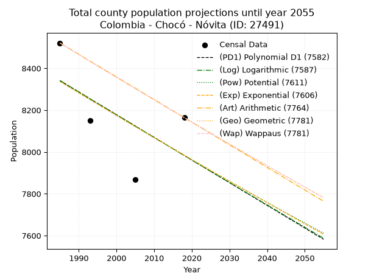
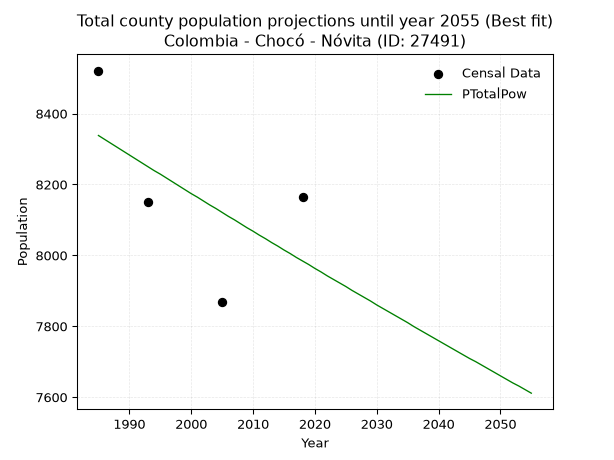
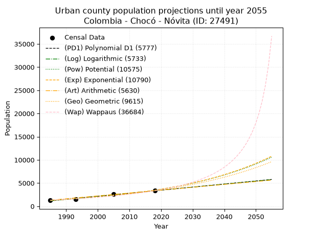
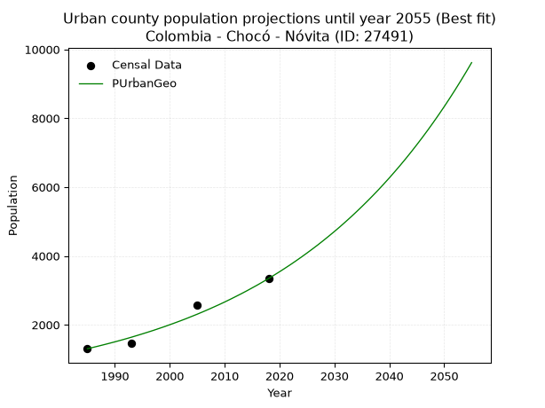
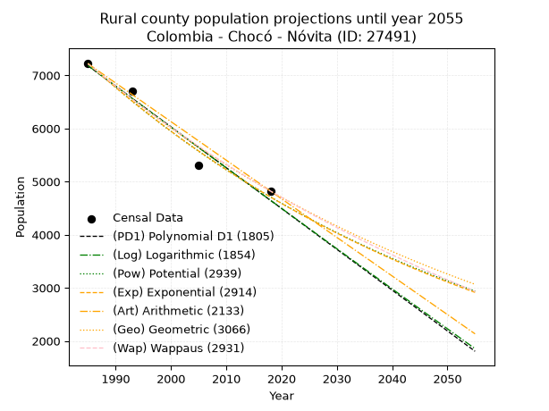
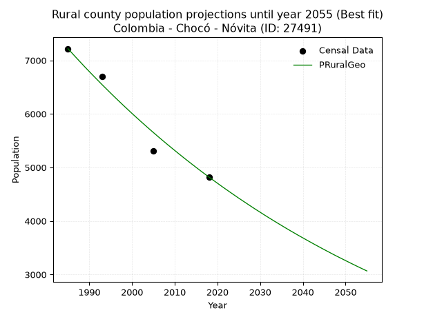

<div align="center">


</div>

# _“Population and Public Services Demand Projections (PPSD) until Year 2050 for Colombia - Chocó - Nóvita (ID: 27491)”_
Keywords: `population` `public-service` `projection` `lineal` `polynomial` `logarithmic` `potential` `exponential` `arithmetic` `geometric` `wappaus` `dane` `colombia` `south-america`

PPSD are analytical estimates used by governments and planners to anticipate future changes in population size, age distribution, and the resulting community needs for utilities, healthcare, education, and infrastructure as sizing future water treatment facilities, electrical grids, and road networks based on spatial growth.

> **General running parameters**: • app_version: _v20260806_. • Python version: _3.14.7_. • Pandas version: _3.0.5_. • NumPy version: _2.5.1_. • Creates, save and include plots into reports (create_plot): _False_. • Projection until year: _2050_. • Process polynomial degree 2 and up: _False_. • Process Wappaus: _True_. • Process Wappaus: _True_. • Set negative values to zero: _True_. • Set infinite values to zero: _True_. • Drop dataset notes: _True_. 
<div align="center">

Dynamic map: [:earth_americas:Google](http://maps.google.com/maps?q=4.956062867,-76.6094671) [:earth_americas:OSM](https://www.openstreetmap.org/#map=18/4.956062867/-76.6094671&layers=P) [:earth_americas:Bing](https://www.bing.com/maps?cp=4.956062867~-76.6094671&lvl=18) [:earth_americas:Apple](https://maps.apple.com/frame?center=4.956062867%2C-76.6094671&span=0.003%2C0.006)

</div>


<div align="center">

```geojson
{
  "type": "Feature",
  "geometry": {
    "type": "Point", 
    "coordinates": [-76.6094671, 4.956062867]
  }, 
  "properties": {
    "Name": "Colombia - Chocó - Nóvita (ID: 27491)"
  }
}
```

</div>


## 0. Census Data (4 records)

Census data are official statistics collected by a government about the people and housing in a country. They usually include counts of total population, age, sex, race, income, education, and jobs.

📅Global census file: [Population.xlsx](../data/Population.xlsx)

| Source   |   Year |   CountryID | CountryName   |   StateID | StateName   |   CountyID | CountyName   |   PTotal |   PUrban |   PRural |
|:---------|-------:|------------:|:--------------|----------:|:------------|-----------:|:-------------|---------:|---------:|---------:|
| DANE     |   1985 |          57 | Colombia      |        27 | Chocó       |      27491 | Nóvita       |     8521 |     1303 |     7218 |
| DANE     |   1993 |          57 | Colombia      |        27 | Chocó       |      27491 | Nóvita       |     8150 |     1456 |     6694 |
| DANE     |   2005 |          57 | Colombia      |        27 | Chocó       |      27491 | Nóvita       |     7867 |     2561 |     5306 |
| DANE     |   2018 |          57 | Colombia      |        27 | Chocó       |      27491 | Nóvita       |     8164 |     3343 |     4821 |

> 🔥Some records could had specific notes about the registered values or the corresponding urban or rural distribution.

📅   [RUPS](https://www.datos.gov.co/Hacienda-y-Cr-dito-P-blico/Registro-nico-de-Prestadores-de-Servicios-P-blicos/4qkq-csdn/about_data) - Local public utility companies: [RUPS.csv](../data/RUPS.xlsx)

 | SERVICIO       | ESTADO    | NOMBRE                                          | NIT         | DEPARTAMENTO_DOMICILIO   | MUNICIPIO_DOMICILIO   | DIRECCION         |   TELEFONO | EMAIL                  | TIPO_PRESTADOR                             | CLASIFICACION                 |
|:---------------|:----------|:------------------------------------------------|:------------|:-------------------------|:----------------------|:------------------|-----------:|:-----------------------|:-------------------------------------------|:------------------------------|
| ACUEDUCTO      | OPERATIVA | EMPRESA DE SERVICIOS PUBLICOS DE NOVITA S.A ESP | 900349174-7 | CHOCO                    | NOVITA                | barrio el rosario |    6703959 | stalyn0485@hotmail.com | SOCIEDADES (EMPRESA DE SERVICIOS PUBLICOS) | MENOR O IGUAL A 2500 USUARIOS |
| ALCANTARILLADO | OPERATIVA | EMPRESA DE SERVICIOS PUBLICOS DE NOVITA S.A ESP | 900349174-7 | CHOCO                    | NOVITA                | barrio el rosario |    6703959 | stalyn0485@hotmail.com | SOCIEDADES (EMPRESA DE SERVICIOS PUBLICOS) | MENOR O IGUAL A 2500 USUARIOS |

## 1. Total

### 1.1. Coefficients and Parameters

* (PD1) Polynomial Deg 1: -10.844640706543654, 29867.49257326394 (lineal)
* (Log) Logarithmic: -21777.221238376726, 173704.33314460033
* (Pow) Potential: -2.6322387713873043, 12.601559885938206
* (Exp) Exponential: -0.0013107528635290288, 112457.35502905714
* (Art) Arithmetic: Year diff. 2018 - 1985 = 33, Population diff. 8164 - 8521 = -357, Annual growth = -10.818181818181818
* (Geo) Geometric: Year diff. 2018 - 1985 = 33, Population diff. 8164 - 8521 = -357, Annual growth % = -0.0012961126497590403
* (Wap) Wappaus: i = -0.12967553872558368, Condition values only valid for < 200)

<sub>
Wappaus condition values: ['-0.00', '-0.13', '-0.26', '-0.39', '-0.52', '-0.65', '-0.78', '-0.91', '-1.04', '-1.17', '-1.30', '-1.43', '-1.56', '-1.69', '-1.82', '-1.95', '-2.07', '-2.20', '-2.33', '-2.46', '-2.59', '-2.72', '-2.85', '-2.98', '-3.11', '-3.24', '-3.37', '-3.50', '-3.63', '-3.76', '-3.89', '-4.02', '-4.15', '-4.28', '-4.41', '-4.54', '-4.67', '-4.80', '-4.93', '-5.06', '-5.19', '-5.32', '-5.45', '-5.58', '-5.71', '-5.84', '-5.97', '-6.09', '-6.22', '-6.35', '-6.48', '-6.61', '-6.74', '-6.87', '-7.00', '-7.13', '-7.26', '-7.39', '-7.52', '-7.65', '-7.78', '-7.91', '-8.04', '-8.17', '-8.30', '-8.43']
</sub>


### 1.2. Projected Dataset

|   Year |   CountyID |   PTotalPD1 |   PTotalLog |   PTotalPow |   PTotalExp |   PTotalArt |   PTotalGeo |   PTotalWap |
|-------:|-----------:|------------:|------------:|------------:|------------:|------------:|------------:|------------:|
|   1985 |      27491 |        8341 |        8342 |        8338 |        8337 |        8521 |        8521 |        8521 |
|   1986 |      27491 |        8330 |        8331 |        8327 |        8326 |        8510 |        8510 |        8510 |
|   1987 |      27491 |        8319 |        8320 |        8316 |        8315 |        8499 |        8499 |        8499 |
|   1988 |      27491 |        8308 |        8309 |        8305 |        8304 |        8489 |        8488 |        8488 |
|   1989 |      27491 |        8298 |        8298 |        8294 |        8294 |        8478 |        8477 |        8477 |
|   1990 |      27491 |        8287 |        8287 |        8283 |        8283 |        8467 |        8466 |        8466 |
|   1991 |      27491 |        8276 |        8276 |        8272 |        8272 |        8456 |        8455 |        8455 |
|   1992 |      27491 |        8265 |        8265 |        8261 |        8261 |        8445 |        8444 |        8444 |
|   1993 |      27491 |        8254 |        8254 |        8250 |        8250 |        8434 |        8433 |        8433 |
|   1994 |      27491 |        8243 |        8243 |        8239 |        8239 |        8424 |        8422 |        8422 |
|   1995 |      27491 |        8232 |        8232 |        8229 |        8229 |        8413 |        8411 |        8411 |
|   1996 |      27491 |        8222 |        8221 |        8218 |        8218 |        8402 |        8400 |        8400 |
|   1997 |      27491 |        8211 |        8210 |        8207 |        8207 |        8391 |        8389 |        8389 |
|   1998 |      27491 |        8200 |        8200 |        8196 |        8196 |        8380 |        8379 |        8379 |
|   1999 |      27491 |        8189 |        8189 |        8185 |        8186 |        8370 |        8368 |        8368 |
|   2000 |      27491 |        8178 |        8178 |        8174 |        8175 |        8359 |        8357 |        8357 |
|   2001 |      27491 |        8167 |        8167 |        8164 |        8164 |        8348 |        8346 |        8346 |
|   2002 |      27491 |        8157 |        8156 |        8153 |        8153 |        8337 |        8335 |        8335 |
|   2003 |      27491 |        8146 |        8145 |        8142 |        8143 |        8326 |        8324 |        8324 |
|   2004 |      27491 |        8135 |        8134 |        8132 |        8132 |        8315 |        8314 |        8314 |
|   2005 |      27491 |        8124 |        8123 |        8121 |        8121 |        8305 |        8303 |        8303 |
|   2006 |      27491 |        8113 |        8113 |        8110 |        8111 |        8294 |        8292 |        8292 |
|   2007 |      27491 |        8102 |        8102 |        8100 |        8100 |        8283 |        8281 |        8281 |
|   2008 |      27491 |        8091 |        8091 |        8089 |        8090 |        8272 |        8271 |        8271 |
|   2009 |      27491 |        8081 |        8080 |        8078 |        8079 |        8261 |        8260 |        8260 |
|   2010 |      27491 |        8070 |        8069 |        8068 |        8068 |        8251 |        8249 |        8249 |
|   2011 |      27491 |        8059 |        8058 |        8057 |        8058 |        8240 |        8238 |        8238 |
|   2012 |      27491 |        8048 |        8048 |        8047 |        8047 |        8229 |        8228 |        8228 |
|   2013 |      27491 |        8037 |        8037 |        8036 |        8037 |        8218 |        8217 |        8217 |
|   2014 |      27491 |        8026 |        8026 |        8026 |        8026 |        8207 |        8206 |        8206 |
|   2015 |      27491 |        8016 |        8015 |        8015 |        8016 |        8196 |        8196 |        8196 |
|   2016 |      27491 |        8005 |        8004 |        8005 |        8005 |        8186 |        8185 |        8185 |
|   2017 |      27491 |        7994 |        7993 |        7994 |        7995 |        8175 |        8175 |        8175 |
|   2018 |      27491 |        7983 |        7983 |        7984 |        7984 |        8164 |        8164 |        8164 |
|   2019 |      27491 |        7972 |        7972 |        7974 |        7974 |        8153 |        8153 |        8153 |
|   2020 |      27491 |        7961 |        7961 |        7963 |        7963 |        8142 |        8143 |        8143 |
|   2021 |      27491 |        7950 |        7950 |        7953 |        7953 |        8132 |        8132 |        8132 |
|   2022 |      27491 |        7940 |        7940 |        7942 |        7943 |        8121 |        8122 |        8122 |
|   2023 |      27491 |        7929 |        7929 |        7932 |        7932 |        8110 |        8111 |        8111 |
|   2024 |      27491 |        7918 |        7918 |        7922 |        7922 |        8099 |        8101 |        8101 |
|   2025 |      27491 |        7907 |        7907 |        7912 |        7911 |        8088 |        8090 |        8090 |
|   2026 |      27491 |        7896 |        7897 |        7901 |        7901 |        8077 |        8080 |        8080 |
|   2027 |      27491 |        7885 |        7886 |        7891 |        7891 |        8067 |        8069 |        8069 |
|   2028 |      27491 |        7875 |        7875 |        7881 |        7880 |        8056 |        8059 |        8059 |
|   2029 |      27491 |        7864 |        7864 |        7871 |        7870 |        8045 |        8048 |        8048 |
|   2030 |      27491 |        7853 |        7854 |        7860 |        7860 |        8034 |        8038 |        8038 |
|   2031 |      27491 |        7842 |        7843 |        7850 |        7849 |        8023 |        8028 |        8027 |
|   2032 |      27491 |        7831 |        7832 |        7840 |        7839 |        8013 |        8017 |        8017 |
|   2033 |      27491 |        7820 |        7821 |        7830 |        7829 |        8002 |        8007 |        8007 |
|   2034 |      27491 |        7809 |        7811 |        7820 |        7819 |        7991 |        7996 |        7996 |
|   2035 |      27491 |        7799 |        7800 |        7810 |        7808 |        7980 |        7986 |        7986 |
|   2036 |      27491 |        7788 |        7789 |        7799 |        7798 |        7969 |        7976 |        7976 |
|   2037 |      27491 |        7777 |        7779 |        7789 |        7788 |        7958 |        7965 |        7965 |
|   2038 |      27491 |        7766 |        7768 |        7779 |        7778 |        7948 |        7955 |        7955 |
|   2039 |      27491 |        7755 |        7757 |        7769 |        7768 |        7937 |        7945 |        7945 |
|   2040 |      27491 |        7744 |        7747 |        7759 |        7757 |        7926 |        7934 |        7934 |
|   2041 |      27491 |        7734 |        7736 |        7749 |        7747 |        7915 |        7924 |        7924 |
|   2042 |      27491 |        7723 |        7725 |        7739 |        7737 |        7904 |        7914 |        7914 |
|   2043 |      27491 |        7712 |        7715 |        7729 |        7727 |        7894 |        7904 |        7903 |
|   2044 |      27491 |        7701 |        7704 |        7719 |        7717 |        7883 |        7893 |        7893 |
|   2045 |      27491 |        7690 |        7693 |        7709 |        7707 |        7872 |        7883 |        7883 |
|   2046 |      27491 |        7679 |        7683 |        7700 |        7697 |        7861 |        7873 |        7873 |
|   2047 |      27491 |        7669 |        7672 |        7690 |        7686 |        7850 |        7863 |        7862 |
|   2048 |      27491 |        7658 |        7661 |        7680 |        7676 |        7839 |        7852 |        7852 |
|   2049 |      27491 |        7647 |        7651 |        7670 |        7666 |        7829 |        7842 |        7842 |
|   2050 |      27491 |        7636 |        7640 |        7660 |        7656 |        7818 |        7832 |        7832 |
<div align="center">

</img>

</div>


### 1.3. Best fit with absolute and relative error (%)

Relative error puts that difference into context by dividing the absolute error by the true value, creating a unitless ratio or percentage that shows the scale of the mistake.

Absolute and relative error

|   Year | Source   |   CountryID | CountryName   |   StateID | StateName   |   CountyID_x | CountyName   |   PTotal |   PUrban |   PRural |   CountyID_y |   PTotalPD1 |   PTotalLog |   PTotalPow |   PTotalExp |   PTotalArt |   PTotalGeo |   PTotalWap |   PTotalPD1AbsError |   PTotalLogAbsError |   PTotalPowAbsError |   PTotalExpAbsError |   PTotalArtAbsError |   PTotalGeoAbsError |   PTotalWapAbsError |   PTotalPD1RelError |   PTotalLogRelError |   PTotalPowRelError |   PTotalExpRelError |   PTotalArtRelError |   PTotalGeoRelError |   PTotalWapRelError |
|-------:|:---------|------------:|:--------------|----------:|:------------|-------------:|:-------------|---------:|---------:|---------:|-------------:|------------:|------------:|------------:|------------:|------------:|------------:|------------:|--------------------:|--------------------:|--------------------:|--------------------:|--------------------:|--------------------:|--------------------:|--------------------:|--------------------:|--------------------:|--------------------:|--------------------:|--------------------:|--------------------:|
|   1985 | DANE     |          57 | Colombia      |        27 | Chocó       |        27491 | Nóvita       |     8521 |     1303 |     7218 |        27491 |        8341 |        8342 |        8338 |        8337 |        8521 |        8521 |        8521 |                 180 |                 179 |                 183 |                 184 |                   0 |                   0 |                   0 |             2.11243 |             2.10069 |             2.14764 |             2.15937 |             0       |             0       |             0       |
|   1993 | DANE     |          57 | Colombia      |        27 | Chocó       |        27491 | Nóvita       |     8150 |     1456 |     6694 |        27491 |        8254 |        8254 |        8250 |        8250 |        8434 |        8433 |        8433 |                 104 |                 104 |                 100 |                 100 |                 284 |                 283 |                 283 |             1.27607 |             1.27607 |             1.22699 |             1.22699 |             3.48466 |             3.47239 |             3.47239 |
|   2005 | DANE     |          57 | Colombia      |        27 | Chocó       |        27491 | Nóvita       |     7867 |     2561 |     5306 |        27491 |        8124 |        8123 |        8121 |        8121 |        8305 |        8303 |        8303 |                 257 |                 256 |                 254 |                 254 |                 438 |                 436 |                 436 |             3.26681 |             3.2541  |             3.22868 |             3.22868 |             5.56756 |             5.54214 |             5.54214 |
|   2018 | DANE     |          57 | Colombia      |        27 | Chocó       |        27491 | Nóvita       |     8164 |     3343 |     4821 |        27491 |        7983 |        7983 |        7984 |        7984 |        8164 |        8164 |        8164 |                 181 |                 181 |                 180 |                 180 |                   0 |                   0 |                   0 |             2.21705 |             2.21705 |             2.2048  |             2.2048  |             0       |             0       |             0       |

Relative error mean

| Method    |   RelError | Best   |
|:----------|-----------:|:-------|
| PTotalPD1 |    2.21809 |        |
| PTotalLog |    2.21198 |        |
| PTotalPow |    2.20203 | True   |
| PTotalExp |    2.20496 |        |
| PTotalArt |    2.26306 |        |
| PTotalGeo |    2.25363 |        |
| PTotalWap |    2.25363 |        |

💙Best method: _**PTotalPow**_
<div align="center">

</img>

</div>


### 1.4. Fresh water supply demand in liters per capita per day (lpcd)

The fresh water supply demand typically ranges from 100 to 300 liters per capita per day (lpcd) for standard domestic and municipal planning, though absolute survival minimums set by the World Health Organization are as low as 7.5 to 20 liters per day, and total consumption in high-income nations can exceed 400 liters.

> `CZ`: Level in meters above the sea level (masl)<br> `WS`: Fresh water supply demand in liters per capita per day (lpcd or l/h/d)<br> `WSAll`: Zonal fresh water supply demand in liters per second (l/s)<br> `A`: Zonal area in square meters<br> `DP`: Population density (people/hectare or p/ha)

Reference values (RAS Colombia)

|    CZ |   WS |
|------:|-----:|
|  1000 |  120 |
|  2000 |  130 |
| 99999 |  140 |

County shapefile geometry properties and water supply values

|   CountyID |      ATotal |   CZTotal |   WSTotal |
|-----------:|------------:|----------:|----------:|
|      27491 | 9.45676e+08 |   279.429 |       120 |

Projected values for best method: PTotalPow

|   CountyID |   Year |   PTotalPow |   DPTotal |   WSTotal |   WSTotalAll |
|-----------:|-------:|------------:|----------:|----------:|-------------:|
|      27491 |   1985 |        8338 |      0.09 |       120 |      11.5806 |
|      27491 |   1986 |        8327 |      0.09 |       120 |      11.5653 |
|      27491 |   1987 |        8316 |      0.09 |       120 |      11.55   |
|      27491 |   1988 |        8305 |      0.09 |       120 |      11.5347 |
|      27491 |   1989 |        8294 |      0.09 |       120 |      11.5194 |
|      27491 |   1990 |        8283 |      0.09 |       120 |      11.5042 |
|      27491 |   1991 |        8272 |      0.09 |       120 |      11.4889 |
|      27491 |   1992 |        8261 |      0.09 |       120 |      11.4736 |
|      27491 |   1993 |        8250 |      0.09 |       120 |      11.4583 |
|      27491 |   1994 |        8239 |      0.09 |       120 |      11.4431 |
|      27491 |   1995 |        8229 |      0.09 |       120 |      11.4292 |
|      27491 |   1996 |        8218 |      0.09 |       120 |      11.4139 |
|      27491 |   1997 |        8207 |      0.09 |       120 |      11.3986 |
|      27491 |   1998 |        8196 |      0.09 |       120 |      11.3833 |
|      27491 |   1999 |        8185 |      0.09 |       120 |      11.3681 |
|      27491 |   2000 |        8174 |      0.09 |       120 |      11.3528 |
|      27491 |   2001 |        8164 |      0.09 |       120 |      11.3389 |
|      27491 |   2002 |        8153 |      0.09 |       120 |      11.3236 |
|      27491 |   2003 |        8142 |      0.09 |       120 |      11.3083 |
|      27491 |   2004 |        8132 |      0.09 |       120 |      11.2944 |
|      27491 |   2005 |        8121 |      0.09 |       120 |      11.2792 |
|      27491 |   2006 |        8110 |      0.09 |       120 |      11.2639 |
|      27491 |   2007 |        8100 |      0.09 |       120 |      11.25   |
|      27491 |   2008 |        8089 |      0.09 |       120 |      11.2347 |
|      27491 |   2009 |        8078 |      0.09 |       120 |      11.2194 |
|      27491 |   2010 |        8068 |      0.09 |       120 |      11.2056 |
|      27491 |   2011 |        8057 |      0.09 |       120 |      11.1903 |
|      27491 |   2012 |        8047 |      0.09 |       120 |      11.1764 |
|      27491 |   2013 |        8036 |      0.08 |       120 |      11.1611 |
|      27491 |   2014 |        8026 |      0.08 |       120 |      11.1472 |
|      27491 |   2015 |        8015 |      0.08 |       120 |      11.1319 |
|      27491 |   2016 |        8005 |      0.08 |       120 |      11.1181 |
|      27491 |   2017 |        7994 |      0.08 |       120 |      11.1028 |
|      27491 |   2018 |        7984 |      0.08 |       120 |      11.0889 |
|      27491 |   2019 |        7974 |      0.08 |       120 |      11.075  |
|      27491 |   2020 |        7963 |      0.08 |       120 |      11.0597 |
|      27491 |   2021 |        7953 |      0.08 |       120 |      11.0458 |
|      27491 |   2022 |        7942 |      0.08 |       120 |      11.0306 |
|      27491 |   2023 |        7932 |      0.08 |       120 |      11.0167 |
|      27491 |   2024 |        7922 |      0.08 |       120 |      11.0028 |
|      27491 |   2025 |        7912 |      0.08 |       120 |      10.9889 |
|      27491 |   2026 |        7901 |      0.08 |       120 |      10.9736 |
|      27491 |   2027 |        7891 |      0.08 |       120 |      10.9597 |
|      27491 |   2028 |        7881 |      0.08 |       120 |      10.9458 |
|      27491 |   2029 |        7871 |      0.08 |       120 |      10.9319 |
|      27491 |   2030 |        7860 |      0.08 |       120 |      10.9167 |
|      27491 |   2031 |        7850 |      0.08 |       120 |      10.9028 |
|      27491 |   2032 |        7840 |      0.08 |       120 |      10.8889 |
|      27491 |   2033 |        7830 |      0.08 |       120 |      10.875  |
|      27491 |   2034 |        7820 |      0.08 |       120 |      10.8611 |
|      27491 |   2035 |        7810 |      0.08 |       120 |      10.8472 |
|      27491 |   2036 |        7799 |      0.08 |       120 |      10.8319 |
|      27491 |   2037 |        7789 |      0.08 |       120 |      10.8181 |
|      27491 |   2038 |        7779 |      0.08 |       120 |      10.8042 |
|      27491 |   2039 |        7769 |      0.08 |       120 |      10.7903 |
|      27491 |   2040 |        7759 |      0.08 |       120 |      10.7764 |
|      27491 |   2041 |        7749 |      0.08 |       120 |      10.7625 |
|      27491 |   2042 |        7739 |      0.08 |       120 |      10.7486 |
|      27491 |   2043 |        7729 |      0.08 |       120 |      10.7347 |
|      27491 |   2044 |        7719 |      0.08 |       120 |      10.7208 |
|      27491 |   2045 |        7709 |      0.08 |       120 |      10.7069 |
|      27491 |   2046 |        7700 |      0.08 |       120 |      10.6944 |
|      27491 |   2047 |        7690 |      0.08 |       120 |      10.6806 |
|      27491 |   2048 |        7680 |      0.08 |       120 |      10.6667 |
|      27491 |   2049 |        7670 |      0.08 |       120 |      10.6528 |
|      27491 |   2050 |        7660 |      0.08 |       120 |      10.6389 |

## 2. Urban

### 2.1. Coefficients and Parameters

* (PD1) Polynomial Deg 1: 65.95945403452373, -129769.64793255608 (lineal)
* (Log) Logarithmic: 132005.61075952946, -1001209.9552097598
* (Pow) Potential: 61.48767460194054, -199.6728139754418
* (Exp) Exponential: 0.030716702824190967, 4.160435899820232e-24
* (Art) Arithmetic: Year diff. 2018 - 1985 = 33, Population diff. 3343 - 1303 = 2040, Annual growth = 61.81818181818182
* (Geo) Geometric: Year diff. 2018 - 1985 = 33, Population diff. 3343 - 1303 = 2040, Annual growth % = 0.028962995118261725
* (Wap) Wappaus: i = 2.66113567878527, Condition values only valid for < 200)

<sub>
Wappaus condition values: ['0.00', '2.66', '5.32', '7.98', '10.64', '13.31', '15.97', '18.63', '21.29', '23.95', '26.61', '29.27', '31.93', '34.59', '37.26', '39.92', '42.58', '45.24', '47.90', '50.56', '53.22', '55.88', '58.54', '61.21', '63.87', '66.53', '69.19', '71.85', '74.51', '77.17', '79.83', '82.50', '85.16', '87.82', '90.48', '93.14', '95.80', '98.46', '101.12', '103.78', '106.45', '109.11', '111.77', '114.43', '117.09', '119.75', '122.41', '125.07', '127.73', '130.40', '133.06', '135.72', '138.38', '141.04', '143.70', '146.36', '149.02', '151.68', '154.35', '157.01', '159.67', '162.33', '164.99', '167.65', '170.31', '172.97']
</sub>


### 2.2. Projected Dataset

|   Year |   CountyID |   PUrbanPD1 |   PUrbanLog |   PUrbanPow |   PUrbanExp |   PUrbanArt |   PUrbanGeo |   PUrbanWap |
|-------:|-----------:|------------:|------------:|------------:|------------:|------------:|------------:|------------:|
|   1985 |      27491 |        1160 |        1158 |        1255 |        1257 |        1303 |        1303 |        1303 |
|   1986 |      27491 |        1226 |        1225 |        1295 |        1296 |        1365 |        1341 |        1338 |
|   1987 |      27491 |        1292 |        1291 |        1336 |        1336 |        1427 |        1380 |        1374 |
|   1988 |      27491 |        1358 |        1357 |        1378 |        1378 |        1488 |        1420 |        1411 |
|   1989 |      27491 |        1424 |        1424 |        1421 |        1421 |        1550 |        1461 |        1449 |
|   1990 |      27491 |        1490 |        1490 |        1466 |        1465 |        1612 |        1503 |        1489 |
|   1991 |      27491 |        1556 |        1556 |        1511 |        1511 |        1674 |        1546 |        1529 |
|   1992 |      27491 |        1622 |        1623 |        1559 |        1558 |        1736 |        1591 |        1571 |
|   1993 |      27491 |        1688 |        1689 |        1608 |        1607 |        1798 |        1637 |        1613 |
|   1994 |      27491 |        1754 |        1755 |        1658 |        1657 |        1859 |        1685 |        1658 |
|   1995 |      27491 |        1819 |        1821 |        1710 |        1709 |        1921 |        1734 |        1703 |
|   1996 |      27491 |        1885 |        1888 |        1764 |        1762 |        1983 |        1784 |        1750 |
|   1997 |      27491 |        1951 |        1954 |        1819 |        1817 |        2045 |        1835 |        1798 |
|   1998 |      27491 |        2017 |        2020 |        1876 |        1873 |        2107 |        1889 |        1848 |
|   1999 |      27491 |        2083 |        2086 |        1934 |        1932 |        2168 |        1943 |        1900 |
|   2000 |      27491 |        2149 |        2152 |        1995 |        1992 |        2230 |        2000 |        1953 |
|   2001 |      27491 |        2215 |        2218 |        2057 |        2054 |        2292 |        2058 |        2008 |
|   2002 |      27491 |        2281 |        2284 |        2121 |        2118 |        2354 |        2117 |        2065 |
|   2003 |      27491 |        2347 |        2350 |        2187 |        2184 |        2416 |        2178 |        2124 |
|   2004 |      27491 |        2413 |        2416 |        2255 |        2253 |        2478 |        2242 |        2185 |
|   2005 |      27491 |        2479 |        2481 |        2326 |        2323 |        2539 |        2306 |        2248 |
|   2006 |      27491 |        2545 |        2547 |        2398 |        2395 |        2601 |        2373 |        2314 |
|   2007 |      27491 |        2611 |        2613 |        2473 |        2470 |        2663 |        2442 |        2382 |
|   2008 |      27491 |        2677 |        2679 |        2549 |        2547 |        2725 |        2513 |        2452 |
|   2009 |      27491 |        2743 |        2745 |        2629 |        2627 |        2787 |        2585 |        2526 |
|   2010 |      27491 |        2809 |        2810 |        2710 |        2709 |        2848 |        2660 |        2602 |
|   2011 |      27491 |        2875 |        2876 |        2795 |        2793 |        2910 |        2737 |        2681 |
|   2012 |      27491 |        2941 |        2941 |        2881 |        2880 |        2972 |        2817 |        2764 |
|   2013 |      27491 |        3007 |        3007 |        2971 |        2970 |        3034 |        2898 |        2850 |
|   2014 |      27491 |        3073 |        3073 |        3063 |        3063 |        3096 |        2982 |        2940 |
|   2015 |      27491 |        3139 |        3138 |        3158 |        3158 |        3158 |        3069 |        3034 |
|   2016 |      27491 |        3205 |        3204 |        3256 |        3257 |        3219 |        3157 |        3133 |
|   2017 |      27491 |        3271 |        3269 |        3356 |        3358 |        3281 |        3249 |        3235 |
|   2018 |      27491 |        3337 |        3335 |        3460 |        3463 |        3343 |        3343 |        3343 |
|   2019 |      27491 |        3402 |        3400 |        3567 |        3571 |        3405 |        3440 |        3456 |
|   2020 |      27491 |        3468 |        3465 |        3678 |        3682 |        3467 |        3539 |        3574 |
|   2021 |      27491 |        3534 |        3531 |        3791 |        3797 |        3528 |        3642 |        3699 |
|   2022 |      27491 |        3600 |        3596 |        3908 |        3916 |        3590 |        3747 |        3830 |
|   2023 |      27491 |        3666 |        3661 |        4029 |        4038 |        3652 |        3856 |        3968 |
|   2024 |      27491 |        3732 |        3726 |        4153 |        4164 |        3714 |        3968 |        4114 |
|   2025 |      27491 |        3798 |        3792 |        4281 |        4294 |        3776 |        4083 |        4268 |
|   2026 |      27491 |        3864 |        3857 |        4413 |        4428 |        3838 |        4201 |        4431 |
|   2027 |      27491 |        3930 |        3922 |        4549 |        4566 |        3899 |        4322 |        4604 |
|   2028 |      27491 |        3996 |        3987 |        4689 |        4708 |        3961 |        4448 |        4788 |
|   2029 |      27491 |        4062 |        4052 |        4834 |        4855 |        4023 |        4577 |        4983 |
|   2030 |      27491 |        4128 |        4117 |        4982 |        5006 |        4085 |        4709 |        5192 |
|   2031 |      27491 |        4194 |        4182 |        5135 |        5163 |        4147 |        4845 |        5415 |
|   2032 |      27491 |        4260 |        4247 |        5293 |        5324 |        4208 |        4986 |        5653 |
|   2033 |      27491 |        4326 |        4312 |        5456 |        5490 |        4270 |        5130 |        5909 |
|   2034 |      27491 |        4392 |        4377 |        5623 |        5661 |        4332 |        5279 |        6185 |
|   2035 |      27491 |        4458 |        4442 |        5796 |        5838 |        4394 |        5432 |        6483 |
|   2036 |      27491 |        4524 |        4507 |        5974 |        6020 |        4456 |        5589 |        6805 |
|   2037 |      27491 |        4590 |        4572 |        6157 |        6207 |        4518 |        5751 |        7155 |
|   2038 |      27491 |        4656 |        4636 |        6345 |        6401 |        4579 |        5917 |        7537 |
|   2039 |      27491 |        4722 |        4701 |        6540 |        6601 |        4641 |        6089 |        7955 |
|   2040 |      27491 |        4788 |        4766 |        6740 |        6807 |        4703 |        6265 |        8414 |
|   2041 |      27491 |        4854 |        4831 |        6946 |        7019 |        4765 |        6447 |        8921 |
|   2042 |      27491 |        4920 |        4895 |        7158 |        7238 |        4827 |        6633 |        9484 |
|   2043 |      27491 |        4986 |        4960 |        7377 |        7464 |        4888 |        6825 |       10113 |
|   2044 |      27491 |        5051 |        5024 |        7603 |        7696 |        4950 |        7023 |       10820 |
|   2045 |      27491 |        5117 |        5089 |        7835 |        7937 |        5012 |        7227 |       11620 |
|   2046 |      27491 |        5183 |        5154 |        8074 |        8184 |        5074 |        7436 |       12533 |
|   2047 |      27491 |        5249 |        5218 |        8320 |        8439 |        5136 |        7651 |       13584 |
|   2048 |      27491 |        5315 |        5283 |        8574 |        8703 |        5198 |        7873 |       14809 |
|   2049 |      27491 |        5381 |        5347 |        8835 |        8974 |        5259 |        8101 |       16253 |
|   2050 |      27491 |        5447 |        5411 |        9104 |        9254 |        5321 |        8335 |       17982 |
<div align="center">

</img>

</div>


### 2.3. Best fit with absolute and relative error (%)

Relative error puts that difference into context by dividing the absolute error by the true value, creating a unitless ratio or percentage that shows the scale of the mistake.

Absolute and relative error

|   Year | Source   |   CountryID | CountryName   |   StateID | StateName   |   CountyID_x | CountyName   |   PTotal |   PUrban |   PRural |   CountyID_y |   PUrbanPD1 |   PUrbanLog |   PUrbanPow |   PUrbanExp |   PUrbanArt |   PUrbanGeo |   PUrbanWap |   PUrbanPD1AbsError |   PUrbanLogAbsError |   PUrbanPowAbsError |   PUrbanExpAbsError |   PUrbanArtAbsError |   PUrbanGeoAbsError |   PUrbanWapAbsError |   PUrbanPD1RelError |   PUrbanLogRelError |   PUrbanPowRelError |   PUrbanExpRelError |   PUrbanArtRelError |   PUrbanGeoRelError |   PUrbanWapRelError |
|-------:|:---------|------------:|:--------------|----------:|:------------|-------------:|:-------------|---------:|---------:|---------:|-------------:|------------:|------------:|------------:|------------:|------------:|------------:|------------:|--------------------:|--------------------:|--------------------:|--------------------:|--------------------:|--------------------:|--------------------:|--------------------:|--------------------:|--------------------:|--------------------:|--------------------:|--------------------:|--------------------:|
|   1985 | DANE     |          57 | Colombia      |        27 | Chocó       |        27491 | Nóvita       |     8521 |     1303 |     7218 |        27491 |        1160 |        1158 |        1255 |        1257 |        1303 |        1303 |        1303 |                 143 |                 145 |                  48 |                  46 |                   0 |                   0 |                   0 |            10.9747  |           11.1282   |             3.68381 |             3.53031 |            0        |             0       |              0      |
|   1993 | DANE     |          57 | Colombia      |        27 | Chocó       |        27491 | Nóvita       |     8150 |     1456 |     6694 |        27491 |        1688 |        1689 |        1608 |        1607 |        1798 |        1637 |        1613 |                 232 |                 233 |                 152 |                 151 |                 342 |                 181 |                 157 |            15.9341  |           16.0027   |            10.4396  |            10.3709  |           23.489    |            12.4313  |             10.783  |
|   2005 | DANE     |          57 | Colombia      |        27 | Chocó       |        27491 | Nóvita       |     7867 |     2561 |     5306 |        27491 |        2479 |        2481 |        2326 |        2323 |        2539 |        2306 |        2248 |                  82 |                  80 |                 235 |                 238 |                  22 |                 255 |                 313 |             3.20187 |            3.12378  |             9.1761  |             9.29324 |            0.859039 |             9.95705 |             12.2218 |
|   2018 | DANE     |          57 | Colombia      |        27 | Chocó       |        27491 | Nóvita       |     8164 |     3343 |     4821 |        27491 |        3337 |        3335 |        3460 |        3463 |        3343 |        3343 |        3343 |                   6 |                   8 |                 117 |                 120 |                   0 |                   0 |                   0 |             0.17948 |            0.239306 |             3.49985 |             3.58959 |            0        |             0       |              0      |

Relative error mean

| Method    |   RelError | Best   |
|:----------|-----------:|:-------|
| PUrbanPD1 |    7.57252 |        |
| PUrbanLog |    7.6235  |        |
| PUrbanPow |    6.69983 |        |
| PUrbanExp |    6.69601 |        |
| PUrbanArt |    6.08701 |        |
| PUrbanGeo |    5.59709 | True   |
| PUrbanWap |    5.75119 |        |

💙Best method: _**PUrbanGeo**_
<div align="center">

</img>

</div>


### 2.4. Fresh water supply demand in liters per capita per day (lpcd)

The fresh water supply demand typically ranges from 100 to 300 liters per capita per day (lpcd) for standard domestic and municipal planning, though absolute survival minimums set by the World Health Organization are as low as 7.5 to 20 liters per day, and total consumption in high-income nations can exceed 400 liters.

> `CZ`: Level in meters above the sea level (masl)<br> `WS`: Fresh water supply demand in liters per capita per day (lpcd or l/h/d)<br> `WSAll`: Zonal fresh water supply demand in liters per second (l/s)<br> `A`: Zonal area in square meters<br> `DP`: Population density (people/hectare or p/ha)

Reference values (RAS Colombia)

|    CZ |   WS |
|------:|-----:|
|  1000 |  120 |
|  2000 |  130 |
| 99999 |  140 |

County shapefile geometry properties and water supply values

|   CountyID |   AUrban |   CZUrban |   WSUrban |
|-----------:|---------:|----------:|----------:|
|      27491 |   610359 |    56.983 |       120 |

Projected values for best method: PUrbanGeo

|   CountyID |   Year |   PUrbanGeo |   DPUrban |   WSUrban |   WSUrbanAll |
|-----------:|-------:|------------:|----------:|----------:|-------------:|
|      27491 |   1985 |        1303 |     21.35 |       120 |      1.80972 |
|      27491 |   1986 |        1341 |     21.97 |       120 |      1.8625  |
|      27491 |   1987 |        1380 |     22.61 |       120 |      1.91667 |
|      27491 |   1988 |        1420 |     23.26 |       120 |      1.97222 |
|      27491 |   1989 |        1461 |     23.94 |       120 |      2.02917 |
|      27491 |   1990 |        1503 |     24.62 |       120 |      2.0875  |
|      27491 |   1991 |        1546 |     25.33 |       120 |      2.14722 |
|      27491 |   1992 |        1591 |     26.07 |       120 |      2.20972 |
|      27491 |   1993 |        1637 |     26.82 |       120 |      2.27361 |
|      27491 |   1994 |        1685 |     27.61 |       120 |      2.34028 |
|      27491 |   1995 |        1734 |     28.41 |       120 |      2.40833 |
|      27491 |   1996 |        1784 |     29.23 |       120 |      2.47778 |
|      27491 |   1997 |        1835 |     30.06 |       120 |      2.54861 |
|      27491 |   1998 |        1889 |     30.95 |       120 |      2.62361 |
|      27491 |   1999 |        1943 |     31.83 |       120 |      2.69861 |
|      27491 |   2000 |        2000 |     32.77 |       120 |      2.77778 |
|      27491 |   2001 |        2058 |     33.72 |       120 |      2.85833 |
|      27491 |   2002 |        2117 |     34.68 |       120 |      2.94028 |
|      27491 |   2003 |        2178 |     35.68 |       120 |      3.025   |
|      27491 |   2004 |        2242 |     36.73 |       120 |      3.11389 |
|      27491 |   2005 |        2306 |     37.78 |       120 |      3.20278 |
|      27491 |   2006 |        2373 |     38.88 |       120 |      3.29583 |
|      27491 |   2007 |        2442 |     40.01 |       120 |      3.39167 |
|      27491 |   2008 |        2513 |     41.17 |       120 |      3.49028 |
|      27491 |   2009 |        2585 |     42.35 |       120 |      3.59028 |
|      27491 |   2010 |        2660 |     43.58 |       120 |      3.69444 |
|      27491 |   2011 |        2737 |     44.84 |       120 |      3.80139 |
|      27491 |   2012 |        2817 |     46.15 |       120 |      3.9125  |
|      27491 |   2013 |        2898 |     47.48 |       120 |      4.025   |
|      27491 |   2014 |        2982 |     48.86 |       120 |      4.14167 |
|      27491 |   2015 |        3069 |     50.28 |       120 |      4.2625  |
|      27491 |   2016 |        3157 |     51.72 |       120 |      4.38472 |
|      27491 |   2017 |        3249 |     53.23 |       120 |      4.5125  |
|      27491 |   2018 |        3343 |     54.77 |       120 |      4.64306 |
|      27491 |   2019 |        3440 |     56.36 |       120 |      4.77778 |
|      27491 |   2020 |        3539 |     57.98 |       120 |      4.91528 |
|      27491 |   2021 |        3642 |     59.67 |       120 |      5.05833 |
|      27491 |   2022 |        3747 |     61.39 |       120 |      5.20417 |
|      27491 |   2023 |        3856 |     63.18 |       120 |      5.35556 |
|      27491 |   2024 |        3968 |     65.01 |       120 |      5.51111 |
|      27491 |   2025 |        4083 |     66.9  |       120 |      5.67083 |
|      27491 |   2026 |        4201 |     68.83 |       120 |      5.83472 |
|      27491 |   2027 |        4322 |     70.81 |       120 |      6.00278 |
|      27491 |   2028 |        4448 |     72.88 |       120 |      6.17778 |
|      27491 |   2029 |        4577 |     74.99 |       120 |      6.35694 |
|      27491 |   2030 |        4709 |     77.15 |       120 |      6.54028 |
|      27491 |   2031 |        4845 |     79.38 |       120 |      6.72917 |
|      27491 |   2032 |        4986 |     81.69 |       120 |      6.925   |
|      27491 |   2033 |        5130 |     84.05 |       120 |      7.125   |
|      27491 |   2034 |        5279 |     86.49 |       120 |      7.33194 |
|      27491 |   2035 |        5432 |     89    |       120 |      7.54444 |
|      27491 |   2036 |        5589 |     91.57 |       120 |      7.7625  |
|      27491 |   2037 |        5751 |     94.22 |       120 |      7.9875  |
|      27491 |   2038 |        5917 |     96.94 |       120 |      8.21806 |
|      27491 |   2039 |        6089 |     99.76 |       120 |      8.45694 |
|      27491 |   2040 |        6265 |    102.64 |       120 |      8.70139 |
|      27491 |   2041 |        6447 |    105.63 |       120 |      8.95417 |
|      27491 |   2042 |        6633 |    108.67 |       120 |      9.2125  |
|      27491 |   2043 |        6825 |    111.82 |       120 |      9.47917 |
|      27491 |   2044 |        7023 |    115.06 |       120 |      9.75417 |
|      27491 |   2045 |        7227 |    118.41 |       120 |     10.0375  |
|      27491 |   2046 |        7436 |    121.83 |       120 |     10.3278  |
|      27491 |   2047 |        7651 |    125.35 |       120 |     10.6264  |
|      27491 |   2048 |        7873 |    128.99 |       120 |     10.9347  |
|      27491 |   2049 |        8101 |    132.73 |       120 |     11.2514  |
|      27491 |   2050 |        8335 |    136.56 |       120 |     11.5764  |

## 3. Rural

### 3.1. Coefficients and Parameters

* (PD1) Polynomial Deg 1: -76.80409474106746, 159637.14050582016 (lineal)
* (Log) Logarithmic: -153782.83199790644, 1174914.2883543621
* (Pow) Potential: -25.97378440436074, 89.51443383766566
* (Exp) Exponential: -0.012973418003483856, 1104022723559294.9
* (Art) Arithmetic: Year diff. 2018 - 1985 = 33, Population diff. 4821 - 7218 = -2397, Annual growth = -72.63636363636364
* (Geo) Geometric: Year diff. 2018 - 1985 = 33, Population diff. 4821 - 7218 = -2397, Annual growth % = -0.012155712996845147
* (Wap) Wappaus: i = -1.2066843365123954, Condition values only valid for < 200)

<sub>
Wappaus condition values: ['-0.00', '-1.21', '-2.41', '-3.62', '-4.83', '-6.03', '-7.24', '-8.45', '-9.65', '-10.86', '-12.07', '-13.27', '-14.48', '-15.69', '-16.89', '-18.10', '-19.31', '-20.51', '-21.72', '-22.93', '-24.13', '-25.34', '-26.55', '-27.75', '-28.96', '-30.17', '-31.37', '-32.58', '-33.79', '-34.99', '-36.20', '-37.41', '-38.61', '-39.82', '-41.03', '-42.23', '-43.44', '-44.65', '-45.85', '-47.06', '-48.27', '-49.47', '-50.68', '-51.89', '-53.09', '-54.30', '-55.51', '-56.71', '-57.92', '-59.13', '-60.33', '-61.54', '-62.75', '-63.95', '-65.16', '-66.37', '-67.57', '-68.78', '-69.99', '-71.19', '-72.40', '-73.61', '-74.81', '-76.02', '-77.23', '-78.43']
</sub>


### 3.2. Projected Dataset

|   Year |   CountyID |   PRuralPD1 |   PRuralLog |   PRuralPow |   PRuralExp |   PRuralArt |   PRuralGeo |   PRuralWap |
|-------:|-----------:|------------:|------------:|------------:|------------:|------------:|------------:|------------:|
|   1985 |      27491 |        7181 |        7184 |        7230 |        7226 |        7218 |        7218 |        7218 |
|   1986 |      27491 |        7104 |        7106 |        7136 |        7133 |        7145 |        7130 |        7131 |
|   1987 |      27491 |        7027 |        7029 |        7043 |        7041 |        7073 |        7044 |        7046 |
|   1988 |      27491 |        6951 |        6951 |        6951 |        6951 |        7000 |        6958 |        6961 |
|   1989 |      27491 |        6874 |        6874 |        6861 |        6861 |        6927 |        6873 |        6878 |
|   1990 |      27491 |        6797 |        6797 |        6772 |        6773 |        6855 |        6790 |        6795 |
|   1991 |      27491 |        6720 |        6720 |        6684 |        6685 |        6782 |        6707 |        6714 |
|   1992 |      27491 |        6643 |        6642 |        6598 |        6599 |        6710 |        6626 |        6633 |
|   1993 |      27491 |        6567 |        6565 |        6512 |        6514 |        6637 |        6545 |        6553 |
|   1994 |      27491 |        6490 |        6488 |        6428 |        6430 |        6564 |        6466 |        6474 |
|   1995 |      27491 |        6413 |        6411 |        6345 |        6347 |        6492 |        6387 |        6397 |
|   1996 |      27491 |        6336 |        6334 |        6263 |        6265 |        6419 |        6309 |        6320 |
|   1997 |      27491 |        6259 |        6257 |        6182 |        6185 |        6346 |        6233 |        6243 |
|   1998 |      27491 |        6183 |        6180 |        6102 |        6105 |        6274 |        6157 |        6168 |
|   1999 |      27491 |        6106 |        6103 |        6023 |        6026 |        6201 |        6082 |        6094 |
|   2000 |      27491 |        6029 |        6026 |        5946 |        5949 |        6128 |        6008 |        6020 |
|   2001 |      27491 |        5952 |        5949 |        5869 |        5872 |        6056 |        5935 |        5947 |
|   2002 |      27491 |        5875 |        5872 |        5793 |        5796 |        5983 |        5863 |        5875 |
|   2003 |      27491 |        5799 |        5795 |        5719 |        5721 |        5911 |        5792 |        5804 |
|   2004 |      27491 |        5722 |        5719 |        5645 |        5648 |        5838 |        5721 |        5733 |
|   2005 |      27491 |        5645 |        5642 |        5572 |        5575 |        5765 |        5652 |        5664 |
|   2006 |      27491 |        5568 |        5565 |        5501 |        5503 |        5693 |        5583 |        5595 |
|   2007 |      27491 |        5491 |        5489 |        5430 |        5432 |        5620 |        5515 |        5526 |
|   2008 |      27491 |        5415 |        5412 |        5360 |        5362 |        5547 |        5448 |        5459 |
|   2009 |      27491 |        5338 |        5336 |        5291 |        5293 |        5475 |        5382 |        5392 |
|   2010 |      27491 |        5261 |        5259 |        5223 |        5225 |        5402 |        5317 |        5326 |
|   2011 |      27491 |        5184 |        5182 |        5156 |        5157 |        5329 |        5252 |        5261 |
|   2012 |      27491 |        5107 |        5106 |        5090 |        5091 |        5257 |        5188 |        5196 |
|   2013 |      27491 |        5030 |        5030 |        5025 |        5025 |        5184 |        5125 |        5132 |
|   2014 |      27491 |        4954 |        4953 |        4960 |        4961 |        5112 |        5063 |        5068 |
|   2015 |      27491 |        4877 |        4877 |        4897 |        4897 |        5039 |        5001 |        5006 |
|   2016 |      27491 |        4800 |        4801 |        4834 |        4834 |        4966 |        4940 |        4943 |
|   2017 |      27491 |        4723 |        4724 |        4772 |        4771 |        4894 |        4880 |        4882 |
|   2018 |      27491 |        4646 |        4648 |        4711 |        4710 |        4821 |        4821 |        4821 |
|   2019 |      27491 |        4570 |        4572 |        4651 |        4649 |        4748 |        4762 |        4761 |
|   2020 |      27491 |        4493 |        4496 |        4591 |        4589 |        4676 |        4705 |        4701 |
|   2021 |      27491 |        4416 |        4420 |        4533 |        4530 |        4603 |        4647 |        4642 |
|   2022 |      27491 |        4339 |        4344 |        4475 |        4472 |        4530 |        4591 |        4583 |
|   2023 |      27491 |        4262 |        4268 |        4418 |        4414 |        4458 |        4535 |        4526 |
|   2024 |      27491 |        4186 |        4192 |        4361 |        4357 |        4385 |        4480 |        4468 |
|   2025 |      27491 |        4109 |        4116 |        4306 |        4301 |        4313 |        4425 |        4411 |
|   2026 |      27491 |        4032 |        4040 |        4251 |        4245 |        4240 |        4372 |        4355 |
|   2027 |      27491 |        3955 |        3964 |        4197 |        4191 |        4167 |        4319 |        4299 |
|   2028 |      27491 |        3878 |        3888 |        4143 |        4137 |        4095 |        4266 |        4244 |
|   2029 |      27491 |        3802 |        3812 |        4091 |        4083 |        4022 |        4214 |        4190 |
|   2030 |      27491 |        3725 |        3736 |        4039 |        4031 |        3949 |        4163 |        4135 |
|   2031 |      27491 |        3648 |        3661 |        3987 |        3979 |        3877 |        4112 |        4082 |
|   2032 |      27491 |        3571 |        3585 |        3937 |        3927 |        3804 |        4062 |        4029 |
|   2033 |      27491 |        3494 |        3509 |        3887 |        3877 |        3731 |        4013 |        3976 |
|   2034 |      27491 |        3418 |        3434 |        3837 |        3827 |        3659 |        3964 |        3924 |
|   2035 |      27491 |        3341 |        3358 |        3789 |        3778 |        3586 |        3916 |        3872 |
|   2036 |      27491 |        3264 |        3283 |        3741 |        3729 |        3514 |        3868 |        3821 |
|   2037 |      27491 |        3187 |        3207 |        3693 |        3681 |        3441 |        3821 |        3770 |
|   2038 |      27491 |        3110 |        3132 |        3647 |        3633 |        3368 |        3775 |        3720 |
|   2039 |      27491 |        3034 |        3056 |        3600 |        3587 |        3296 |        3729 |        3670 |
|   2040 |      27491 |        2957 |        2981 |        3555 |        3540 |        3223 |        3684 |        3621 |
|   2041 |      27491 |        2880 |        2905 |        3510 |        3495 |        3150 |        3639 |        3572 |
|   2042 |      27491 |        2803 |        2830 |        3465 |        3450 |        3078 |        3595 |        3524 |
|   2043 |      27491 |        2726 |        2755 |        3422 |        3405 |        3005 |        3551 |        3476 |
|   2044 |      27491 |        2650 |        2679 |        3378 |        3361 |        2932 |        3508 |        3428 |
|   2045 |      27491 |        2573 |        2604 |        3336 |        3318 |        2860 |        3465 |        3381 |
|   2046 |      27491 |        2496 |        2529 |        3294 |        3275 |        2787 |        3423 |        3334 |
|   2047 |      27491 |        2419 |        2454 |        3252 |        3233 |        2715 |        3381 |        3288 |
|   2048 |      27491 |        2342 |        2379 |        3211 |        3191 |        2642 |        3340 |        3242 |
|   2049 |      27491 |        2266 |        2304 |        3171 |        3150 |        2569 |        3300 |        3197 |
|   2050 |      27491 |        2189 |        2229 |        3131 |        3110 |        2497 |        3260 |        3151 |
<div align="center">

</img>

</div>


### 3.3. Best fit with absolute and relative error (%)

Relative error puts that difference into context by dividing the absolute error by the true value, creating a unitless ratio or percentage that shows the scale of the mistake.

Absolute and relative error

|   Year | Source   |   CountryID | CountryName   |   StateID | StateName   |   CountyID_x | CountyName   |   PTotal |   PUrban |   PRural |   CountyID_y |   PRuralPD1 |   PRuralLog |   PRuralPow |   PRuralExp |   PRuralArt |   PRuralGeo |   PRuralWap |   PRuralPD1AbsError |   PRuralLogAbsError |   PRuralPowAbsError |   PRuralExpAbsError |   PRuralArtAbsError |   PRuralGeoAbsError |   PRuralWapAbsError |   PRuralPD1RelError |   PRuralLogRelError |   PRuralPowRelError |   PRuralExpRelError |   PRuralArtRelError |   PRuralGeoRelError |   PRuralWapRelError |
|-------:|:---------|------------:|:--------------|----------:|:------------|-------------:|:-------------|---------:|---------:|---------:|-------------:|------------:|------------:|------------:|------------:|------------:|------------:|------------:|--------------------:|--------------------:|--------------------:|--------------------:|--------------------:|--------------------:|--------------------:|--------------------:|--------------------:|--------------------:|--------------------:|--------------------:|--------------------:|--------------------:|
|   1985 | DANE     |          57 | Colombia      |        27 | Chocó       |        27491 | Nóvita       |     8521 |     1303 |     7218 |        27491 |        7181 |        7184 |        7230 |        7226 |        7218 |        7218 |        7218 |                  37 |                  34 |                  12 |                   8 |                   0 |                   0 |                   0 |            0.512607 |            0.471045 |            0.166251 |            0.110834 |            0        |             0       |             0       |
|   1993 | DANE     |          57 | Colombia      |        27 | Chocó       |        27491 | Nóvita       |     8150 |     1456 |     6694 |        27491 |        6567 |        6565 |        6512 |        6514 |        6637 |        6545 |        6553 |                 127 |                 129 |                 182 |                 180 |                  57 |                 149 |                 141 |            1.89722  |            1.9271   |            2.71885  |            2.68898  |            0.851509 |             2.22587 |             2.10636 |
|   2005 | DANE     |          57 | Colombia      |        27 | Chocó       |        27491 | Nóvita       |     7867 |     2561 |     5306 |        27491 |        5645 |        5642 |        5572 |        5575 |        5765 |        5652 |        5664 |                 339 |                 336 |                 266 |                 269 |                 459 |                 346 |                 358 |            6.38899  |            6.33245  |            5.01319  |            5.06973  |            8.65058  |             6.52092 |             6.74708 |
|   2018 | DANE     |          57 | Colombia      |        27 | Chocó       |        27491 | Nóvita       |     8164 |     3343 |     4821 |        27491 |        4646 |        4648 |        4711 |        4710 |        4821 |        4821 |        4821 |                 175 |                 173 |                 110 |                 111 |                   0 |                   0 |                   0 |            3.62995  |            3.58847  |            2.28168  |            2.30243  |            0        |             0       |             0       |

Relative error mean

| Method    |   RelError | Best   |
|:----------|-----------:|:-------|
| PRuralPD1 |    3.10719 |        |
| PRuralLog |    3.07977 |        |
| PRuralPow |    2.545   |        |
| PRuralExp |    2.54299 |        |
| PRuralArt |    2.37552 |        |
| PRuralGeo |    2.1867  | True   |
| PRuralWap |    2.21336 |        |

💙Best method: _**PRuralGeo**_
<div align="center">

</img>

</div>


### 3.4. Fresh water supply demand in liters per capita per day (lpcd)

The fresh water supply demand typically ranges from 100 to 300 liters per capita per day (lpcd) for standard domestic and municipal planning, though absolute survival minimums set by the World Health Organization are as low as 7.5 to 20 liters per day, and total consumption in high-income nations can exceed 400 liters.

> `CZ`: Level in meters above the sea level (masl)<br> `WS`: Fresh water supply demand in liters per capita per day (lpcd or l/h/d)<br> `WSAll`: Zonal fresh water supply demand in liters per second (l/s)<br> `A`: Zonal area in square meters<br> `DP`: Population density (people/hectare or p/ha)

Reference values (RAS Colombia)

|    CZ |   WS |
|------:|-----:|
|  1000 |  120 |
|  2000 |  130 |
| 99999 |  140 |

County shapefile geometry properties and water supply values

|   CountyID |      ARural |   CZRural |   WSRural |
|-----------:|------------:|----------:|----------:|
|      27491 | 9.45066e+08 |   279.574 |       120 |

Projected values for best method: PRuralGeo

|   CountyID |   Year |   PRuralGeo |   DPRural |   WSRural |   WSRuralAll |
|-----------:|-------:|------------:|----------:|----------:|-------------:|
|      27491 |   1985 |        7218 |      0.08 |       120 |     10.025   |
|      27491 |   1986 |        7130 |      0.08 |       120 |      9.90278 |
|      27491 |   1987 |        7044 |      0.07 |       120 |      9.78333 |
|      27491 |   1988 |        6958 |      0.07 |       120 |      9.66389 |
|      27491 |   1989 |        6873 |      0.07 |       120 |      9.54583 |
|      27491 |   1990 |        6790 |      0.07 |       120 |      9.43056 |
|      27491 |   1991 |        6707 |      0.07 |       120 |      9.31528 |
|      27491 |   1992 |        6626 |      0.07 |       120 |      9.20278 |
|      27491 |   1993 |        6545 |      0.07 |       120 |      9.09028 |
|      27491 |   1994 |        6466 |      0.07 |       120 |      8.98056 |
|      27491 |   1995 |        6387 |      0.07 |       120 |      8.87083 |
|      27491 |   1996 |        6309 |      0.07 |       120 |      8.7625  |
|      27491 |   1997 |        6233 |      0.07 |       120 |      8.65694 |
|      27491 |   1998 |        6157 |      0.07 |       120 |      8.55139 |
|      27491 |   1999 |        6082 |      0.06 |       120 |      8.44722 |
|      27491 |   2000 |        6008 |      0.06 |       120 |      8.34444 |
|      27491 |   2001 |        5935 |      0.06 |       120 |      8.24306 |
|      27491 |   2002 |        5863 |      0.06 |       120 |      8.14306 |
|      27491 |   2003 |        5792 |      0.06 |       120 |      8.04444 |
|      27491 |   2004 |        5721 |      0.06 |       120 |      7.94583 |
|      27491 |   2005 |        5652 |      0.06 |       120 |      7.85    |
|      27491 |   2006 |        5583 |      0.06 |       120 |      7.75417 |
|      27491 |   2007 |        5515 |      0.06 |       120 |      7.65972 |
|      27491 |   2008 |        5448 |      0.06 |       120 |      7.56667 |
|      27491 |   2009 |        5382 |      0.06 |       120 |      7.475   |
|      27491 |   2010 |        5317 |      0.06 |       120 |      7.38472 |
|      27491 |   2011 |        5252 |      0.06 |       120 |      7.29444 |
|      27491 |   2012 |        5188 |      0.05 |       120 |      7.20556 |
|      27491 |   2013 |        5125 |      0.05 |       120 |      7.11806 |
|      27491 |   2014 |        5063 |      0.05 |       120 |      7.03194 |
|      27491 |   2015 |        5001 |      0.05 |       120 |      6.94583 |
|      27491 |   2016 |        4940 |      0.05 |       120 |      6.86111 |
|      27491 |   2017 |        4880 |      0.05 |       120 |      6.77778 |
|      27491 |   2018 |        4821 |      0.05 |       120 |      6.69583 |
|      27491 |   2019 |        4762 |      0.05 |       120 |      6.61389 |
|      27491 |   2020 |        4705 |      0.05 |       120 |      6.53472 |
|      27491 |   2021 |        4647 |      0.05 |       120 |      6.45417 |
|      27491 |   2022 |        4591 |      0.05 |       120 |      6.37639 |
|      27491 |   2023 |        4535 |      0.05 |       120 |      6.29861 |
|      27491 |   2024 |        4480 |      0.05 |       120 |      6.22222 |
|      27491 |   2025 |        4425 |      0.05 |       120 |      6.14583 |
|      27491 |   2026 |        4372 |      0.05 |       120 |      6.07222 |
|      27491 |   2027 |        4319 |      0.05 |       120 |      5.99861 |
|      27491 |   2028 |        4266 |      0.05 |       120 |      5.925   |
|      27491 |   2029 |        4214 |      0.04 |       120 |      5.85278 |
|      27491 |   2030 |        4163 |      0.04 |       120 |      5.78194 |
|      27491 |   2031 |        4112 |      0.04 |       120 |      5.71111 |
|      27491 |   2032 |        4062 |      0.04 |       120 |      5.64167 |
|      27491 |   2033 |        4013 |      0.04 |       120 |      5.57361 |
|      27491 |   2034 |        3964 |      0.04 |       120 |      5.50556 |
|      27491 |   2035 |        3916 |      0.04 |       120 |      5.43889 |
|      27491 |   2036 |        3868 |      0.04 |       120 |      5.37222 |
|      27491 |   2037 |        3821 |      0.04 |       120 |      5.30694 |
|      27491 |   2038 |        3775 |      0.04 |       120 |      5.24306 |
|      27491 |   2039 |        3729 |      0.04 |       120 |      5.17917 |
|      27491 |   2040 |        3684 |      0.04 |       120 |      5.11667 |
|      27491 |   2041 |        3639 |      0.04 |       120 |      5.05417 |
|      27491 |   2042 |        3595 |      0.04 |       120 |      4.99306 |
|      27491 |   2043 |        3551 |      0.04 |       120 |      4.93194 |
|      27491 |   2044 |        3508 |      0.04 |       120 |      4.87222 |
|      27491 |   2045 |        3465 |      0.04 |       120 |      4.8125  |
|      27491 |   2046 |        3423 |      0.04 |       120 |      4.75417 |
|      27491 |   2047 |        3381 |      0.04 |       120 |      4.69583 |
|      27491 |   2048 |        3340 |      0.04 |       120 |      4.63889 |
|      27491 |   2049 |        3300 |      0.03 |       120 |      4.58333 |
|      27491 |   2050 |        3260 |      0.03 |       120 |      4.52778 |

<div align="center"><br><sub>Share this research</sub></div><br>

<sub>**APPS & TOOLS & CONTENT DISCLAIMER**: • NO WARRANTY - This content and software is provided by <a href="https://github.com/rcfdtools" target="_blank">github.com/rcfdtools</a> "as is", without any express or implied warranty, including warranties of merchantability, fitness for a particular purpose, or non-infringement. There is no guarantee that the software will be error-free or operate without interruption. • LIMITATION OF LIABILITY - Neither the authors nor copyright holders will be liable for claims or damages arising from the software or its use. You are responsible for determining if the software is appropriate for your use and assume all associated risks, including errors, legal compliance, and data loss. • NO PROFESSIONAL ADVICE - The software provides general information and does not offer professional advice. It should not replace consultation with professional advisors. [Clauses and global license for rcfdtools use.](https://github.com/rcfdtools/rcfdtools/blob/main/LICENSE.md)</sub>

| [:house: Home](Readme.md)  | [:beginner: Help / Collab](https://github.com/rcfdtools/R.HydroTools/discussions/31) |
|----------------------------|-------------------------------------------------------------------------------------------|