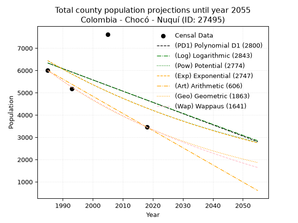
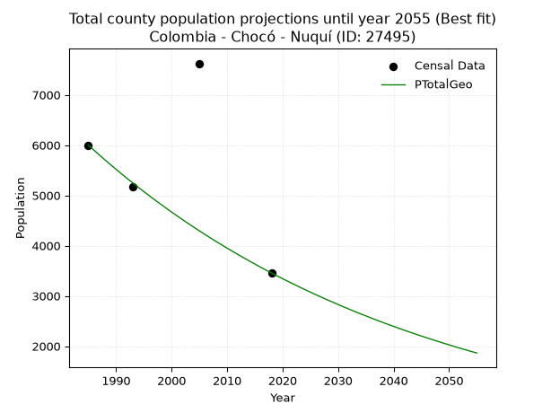
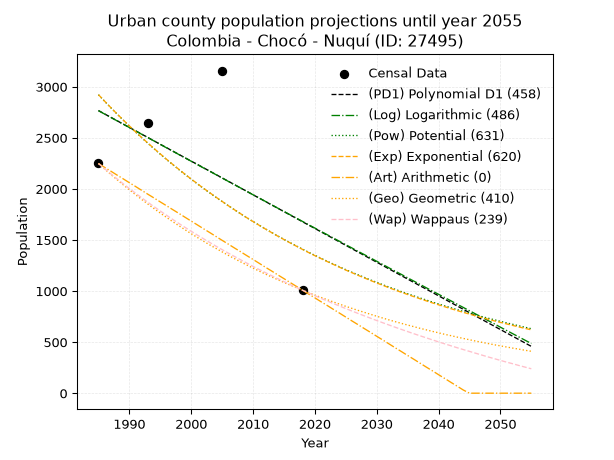
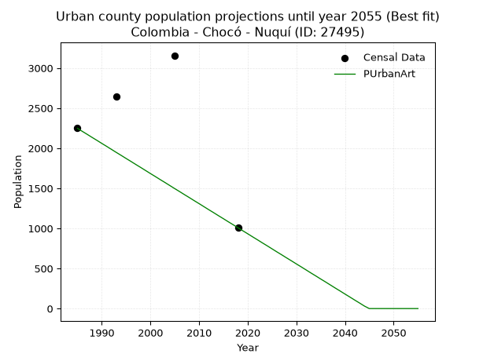
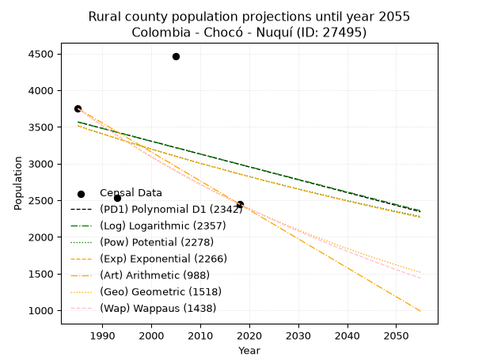
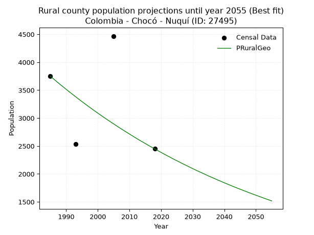

<div align="center">


</div>

# _“Population and Public Services Demand Projections (PPSD) until Year 2050 for Colombia - Chocó - Nuquí (ID: 27495)”_
Keywords: `population` `public-service` `projection` `lineal` `polynomial` `logarithmic` `potential` `exponential` `arithmetic` `geometric` `wappaus` `dane` `colombia` `south-america`

PPSD are analytical estimates used by governments and planners to anticipate future changes in population size, age distribution, and the resulting community needs for utilities, healthcare, education, and infrastructure as sizing future water treatment facilities, electrical grids, and road networks based on spatial growth.

> **General running parameters**: • app_version: _v20260806_. • Python version: _3.14.7_. • Pandas version: _3.0.5_. • NumPy version: _2.5.1_. • Creates, save and include plots into reports (create_plot): _False_. • Projection until year: _2050_. • Process polynomial degree 2 and up: _False_. • Process Wappaus: _True_. • Process Wappaus: _True_. • Set negative values to zero: _True_. • Set infinite values to zero: _True_. • Drop dataset notes: _True_. 
<div align="center">

Dynamic map: [:earth_americas:Google](http://maps.google.com/maps?q=5.709811664,-77.2655073) [:earth_americas:OSM](https://www.openstreetmap.org/#map=18/5.709811664/-77.2655073&layers=P) [:earth_americas:Bing](https://www.bing.com/maps?cp=5.709811664~-77.2655073&lvl=18) [:earth_americas:Apple](https://maps.apple.com/frame?center=5.709811664%2C-77.2655073&span=0.003%2C0.006)

</div>


<div align="center">

```geojson
{
  "type": "Feature",
  "geometry": {
    "type": "Point", 
    "coordinates": [-77.2655073, 5.709811664]
  }, 
  "properties": {
    "Name": "Colombia - Chocó - Nuquí (ID: 27495)"
  }
}
```

</div>


## 0. Census Data (4 records)

Census data are official statistics collected by a government about the people and housing in a country. They usually include counts of total population, age, sex, race, income, education, and jobs.

📅Global census file: [Population.xlsx](../data/Population.xlsx)

| Source   |   Year |   CountryID | CountryName   |   StateID | StateName   |   CountyID | CountyName   |   PTotal |   PUrban |   PRural |
|:---------|-------:|------------:|:--------------|----------:|:------------|-----------:|:-------------|---------:|---------:|---------:|
| DANE     |   1985 |          57 | Colombia      |        27 | Chocó       |      27495 | Nuquí        |     5998 |     2248 |     3750 |
| DANE     |   1993 |          57 | Colombia      |        27 | Chocó       |      27495 | Nuquí        |     5176 |     2640 |     2536 |
| DANE     |   2005 |          57 | Colombia      |        27 | Chocó       |      27495 | Nuquí        |     7625 |     3157 |     4468 |
| DANE     |   2018 |          57 | Colombia      |        27 | Chocó       |      27495 | Nuquí        |     3456 |     1008 |     2448 |

> 🔥Some records has specific notes about the registered values or the corresponding urban or rural distribution.

## 1. Total

### 1.1. Coefficients and Parameters

* (PD1) Polynomial Deg 1: -50.474106784421465, 106524.58209553905 (lineal)
* (Log) Logarithmic: -100671.5553085296, 770769.048631348
* (Pow) Potential: -24.28780756656791, 83.9040982734181
* (Exp) Exponential: -0.012167314136671822, 198572637994682.53
* (Art) Arithmetic: Year diff. 2018 - 1985 = 33, Population diff. 3456 - 5998 = -2542, Annual growth = -77.03030303030303
* (Geo) Geometric: Year diff. 2018 - 1985 = 33, Population diff. 3456 - 5998 = -2542, Annual growth % = -0.01656771227981091
* (Wap) Wappaus: i = -1.629581193786821, Condition values only valid for < 200)

<sub>
Wappaus condition values: ['-0.00', '-1.63', '-3.26', '-4.89', '-6.52', '-8.15', '-9.78', '-11.41', '-13.04', '-14.67', '-16.30', '-17.93', '-19.55', '-21.18', '-22.81', '-24.44', '-26.07', '-27.70', '-29.33', '-30.96', '-32.59', '-34.22', '-35.85', '-37.48', '-39.11', '-40.74', '-42.37', '-44.00', '-45.63', '-47.26', '-48.89', '-50.52', '-52.15', '-53.78', '-55.41', '-57.04', '-58.66', '-60.29', '-61.92', '-63.55', '-65.18', '-66.81', '-68.44', '-70.07', '-71.70', '-73.33', '-74.96', '-76.59', '-78.22', '-79.85', '-81.48', '-83.11', '-84.74', '-86.37', '-88.00', '-89.63', '-91.26', '-92.89', '-94.52', '-96.15', '-97.77', '-99.40', '-101.03', '-102.66', '-104.29', '-105.92']
</sub>


### 1.2. Projected Dataset

|   Year |   CountyID |   PTotalPD1 |   PTotalLog |   PTotalPow |   PTotalExp |   PTotalArt |   PTotalGeo |   PTotalWap |
|-------:|-----------:|------------:|------------:|------------:|------------:|------------:|------------:|------------:|
|   1985 |      27495 |        6333 |        6332 |        6438 |        6439 |        5998 |        5998 |        5998 |
|   1986 |      27495 |        6283 |        6282 |        6359 |        6361 |        5921 |        5899 |        5901 |
|   1987 |      27495 |        6233 |        6231 |        6282 |        6284 |        5844 |        5801 |        5806 |
|   1988 |      27495 |        6182 |        6180 |        6206 |        6208 |        5767 |        5705 |        5712 |
|   1989 |      27495 |        6132 |        6130 |        6130 |        6133 |        5690 |        5610 |        5619 |
|   1990 |      27495 |        6081 |        6079 |        6056 |        6059 |        5613 |        5517 |        5528 |
|   1991 |      27495 |        6031 |        6028 |        5983 |        5985 |        5536 |        5426 |        5439 |
|   1992 |      27495 |        5980 |        5978 |        5910 |        5913 |        5459 |        5336 |        5351 |
|   1993 |      27495 |        5930 |        5927 |        5838 |        5841 |        5382 |        5248 |        5264 |
|   1994 |      27495 |        5879 |        5877 |        5768 |        5771 |        5305 |        5161 |        5178 |
|   1995 |      27495 |        5829 |        5826 |        5698 |        5701 |        5228 |        5075 |        5094 |
|   1996 |      27495 |        5778 |        5776 |        5629 |        5632 |        5151 |        4991 |        5011 |
|   1997 |      27495 |        5728 |        5725 |        5561 |        5564 |        5074 |        4908 |        4930 |
|   1998 |      27495 |        5677 |        5675 |        5494 |        5497 |        4997 |        4827 |        4849 |
|   1999 |      27495 |        5627 |        5625 |        5427 |        5430 |        4920 |        4747 |        4770 |
|   2000 |      27495 |        5576 |        5574 |        5362 |        5364 |        4843 |        4668 |        4692 |
|   2001 |      27495 |        5526 |        5524 |        5297 |        5300 |        4766 |        4591 |        4614 |
|   2002 |      27495 |        5475 |        5474 |        5233 |        5235 |        4688 |        4515 |        4539 |
|   2003 |      27495 |        5425 |        5423 |        5170 |        5172 |        4611 |        4440 |        4464 |
|   2004 |      27495 |        5374 |        5373 |        5108 |        5110 |        4534 |        4367 |        4390 |
|   2005 |      27495 |        5324 |        5323 |        5046 |        5048 |        4457 |        4294 |        4317 |
|   2006 |      27495 |        5274 |        5273 |        4986 |        4987 |        4380 |        4223 |        4245 |
|   2007 |      27495 |        5223 |        5223 |        4926 |        4926 |        4303 |        4153 |        4175 |
|   2008 |      27495 |        5173 |        5172 |        4866 |        4867 |        4226 |        4084 |        4105 |
|   2009 |      27495 |        5122 |        5122 |        4808 |        4808 |        4149 |        4017 |        4036 |
|   2010 |      27495 |        5072 |        5072 |        4750 |        4750 |        4072 |        3950 |        3968 |
|   2011 |      27495 |        5021 |        5022 |        4693 |        4692 |        3995 |        3885 |        3901 |
|   2012 |      27495 |        4971 |        4972 |        4637 |        4636 |        3918 |        3820 |        3835 |
|   2013 |      27495 |        4920 |        4922 |        4581 |        4580 |        3841 |        3757 |        3770 |
|   2014 |      27495 |        4870 |        4872 |        4526 |        4524 |        3764 |        3695 |        3705 |
|   2015 |      27495 |        4819 |        4822 |        4472 |        4470 |        3687 |        3634 |        3642 |
|   2016 |      27495 |        4769 |        4772 |        4418 |        4415 |        3610 |        3573 |        3579 |
|   2017 |      27495 |        4718 |        4722 |        4366 |        4362 |        3533 |        3514 |        3517 |
|   2018 |      27495 |        4668 |        4672 |        4313 |        4309 |        3456 |        3456 |        3456 |
|   2019 |      27495 |        4617 |        4623 |        4262 |        4257 |        3379 |        3399 |        3396 |
|   2020 |      27495 |        4567 |        4573 |        4211 |        4206 |        3302 |        3342 |        3336 |
|   2021 |      27495 |        4516 |        4523 |        4160 |        4155 |        3225 |        3287 |        3277 |
|   2022 |      27495 |        4466 |        4473 |        4111 |        4105 |        3148 |        3233 |        3219 |
|   2023 |      27495 |        4415 |        4423 |        4062 |        4055 |        3071 |        3179 |        3162 |
|   2024 |      27495 |        4365 |        4374 |        4013 |        4006 |        2994 |        3126 |        3105 |
|   2025 |      27495 |        4315 |        4324 |        3965 |        3957 |        2917 |        3075 |        3049 |
|   2026 |      27495 |        4264 |        4274 |        3918 |        3910 |        2840 |        3024 |        2994 |
|   2027 |      27495 |        4214 |        4224 |        3871 |        3862 |        2763 |        2974 |        2939 |
|   2028 |      27495 |        4163 |        4175 |        3825 |        3816 |        2686 |        2924 |        2886 |
|   2029 |      27495 |        4113 |        4125 |        3780 |        3769 |        2609 |        2876 |        2832 |
|   2030 |      27495 |        4062 |        4076 |        3735 |        3724 |        2532 |        2828 |        2780 |
|   2031 |      27495 |        4012 |        4026 |        3690 |        3679 |        2455 |        2781 |        2728 |
|   2032 |      27495 |        3961 |        3976 |        3647 |        3634 |        2378 |        2735 |        2676 |
|   2033 |      27495 |        3911 |        3927 |        3603 |        3590 |        2301 |        2690 |        2625 |
|   2034 |      27495 |        3860 |        3877 |        3560 |        3547 |        2224 |        2645 |        2575 |
|   2035 |      27495 |        3810 |        3828 |        3518 |        3504 |        2146 |        2602 |        2526 |
|   2036 |      27495 |        3759 |        3778 |        3476 |        3462 |        2069 |        2558 |        2476 |
|   2037 |      27495 |        3709 |        3729 |        3435 |        3420 |        1992 |        2516 |        2428 |
|   2038 |      27495 |        3658 |        3680 |        3395 |        3379 |        1915 |        2474 |        2380 |
|   2039 |      27495 |        3608 |        3630 |        3354 |        3338 |        1838 |        2433 |        2333 |
|   2040 |      27495 |        3557 |        3581 |        3315 |        3297 |        1761 |        2393 |        2286 |
|   2041 |      27495 |        3507 |        3531 |        3275 |        3257 |        1684 |        2353 |        2239 |
|   2042 |      27495 |        3456 |        3482 |        3237 |        3218 |        1607 |        2314 |        2194 |
|   2043 |      27495 |        3406 |        3433 |        3198 |        3179 |        1530 |        2276 |        2148 |
|   2044 |      27495 |        3356 |        3384 |        3161 |        3141 |        1453 |        2238 |        2103 |
|   2045 |      27495 |        3305 |        3334 |        3123 |        3103 |        1376 |        2201 |        2059 |
|   2046 |      27495 |        3255 |        3285 |        3086 |        3065 |        1299 |        2165 |        2015 |
|   2047 |      27495 |        3204 |        3236 |        3050 |        3028 |        1222 |        2129 |        1972 |
|   2048 |      27495 |        3154 |        3187 |        3014 |        2991 |        1145 |        2094 |        1929 |
|   2049 |      27495 |        3103 |        3138 |        2979 |        2955 |        1068 |        2059 |        1887 |
|   2050 |      27495 |        3053 |        3089 |        2943 |        2920 |         991 |        2025 |        1845 |
<div align="center">

</img>

</div>


### 1.3. Best fit with absolute error and relative error (%)

Relative error puts that difference into context by dividing the absolute error by the true value, creating a unitless ratio or percentage that shows the scale of the mistake.

Absolute and relative error

|   Year | Source   |   CountryID | CountryName   |   StateID | StateName   |   CountyID_x | CountyName   |   PTotal |   PUrban |   PRural |   CountyID_y |   PTotalPD1 |   PTotalLog |   PTotalPow |   PTotalExp |   PTotalArt |   PTotalGeo |   PTotalWap |   PTotalPD1AbsError |   PTotalLogAbsError |   PTotalPowAbsError |   PTotalExpAbsError |   PTotalArtAbsError |   PTotalGeoAbsError |   PTotalWapAbsError |   PTotalPD1RelError |   PTotalLogRelError |   PTotalPowRelError |   PTotalExpRelError |   PTotalArtRelError |   PTotalGeoRelError |   PTotalWapRelError |
|-------:|:---------|------------:|:--------------|----------:|:------------|-------------:|:-------------|---------:|---------:|---------:|-------------:|------------:|------------:|------------:|------------:|------------:|------------:|------------:|--------------------:|--------------------:|--------------------:|--------------------:|--------------------:|--------------------:|--------------------:|--------------------:|--------------------:|--------------------:|--------------------:|--------------------:|--------------------:|--------------------:|
|   1985 | DANE     |          57 | Colombia      |        27 | Chocó       |        27495 | Nuquí        |     5998 |     2248 |     3750 |        27495 |        6333 |        6332 |        6438 |        6439 |        5998 |        5998 |        5998 |                 335 |                 334 |                 440 |                 441 |                   0 |                   0 |                   0 |              5.5852 |             5.56852 |             7.33578 |             7.35245 |             0       |             0       |             0       |
|   1993 | DANE     |          57 | Colombia      |        27 | Chocó       |        27495 | Nuquí        |     5176 |     2640 |     2536 |        27495 |        5930 |        5927 |        5838 |        5841 |        5382 |        5248 |        5264 |                 754 |                 751 |                 662 |                 665 |                 206 |                  72 |                  88 |             14.5672 |            14.5093  |            12.7898  |            12.8478  |             3.97991 |             1.39104 |             1.70015 |
|   2005 | DANE     |          57 | Colombia      |        27 | Chocó       |        27495 | Nuquí        |     7625 |     3157 |     4468 |        27495 |        5324 |        5323 |        5046 |        5048 |        4457 |        4294 |        4317 |                2301 |                2302 |                2579 |                2577 |                3168 |                3331 |                3308 |             30.177  |            30.1902  |            33.823   |            33.7967  |            41.5475  |            43.6852  |            43.3836  |
|   2018 | DANE     |          57 | Colombia      |        27 | Chocó       |        27495 | Nuquí        |     3456 |     1008 |     2448 |        27495 |        4668 |        4672 |        4313 |        4309 |        3456 |        3456 |        3456 |                1212 |                1216 |                 857 |                 853 |                   0 |                   0 |                   0 |             35.0694 |            35.1852  |            24.7975  |            24.6817  |             0       |             0       |             0       |

Relative error mean

| Method    |   RelError | Best   |
|:----------|-----------:|:-------|
| PTotalPD1 |    21.3497 |        |
| PTotalLog |    21.3633 |        |
| PTotalPow |    19.6865 |        |
| PTotalExp |    19.6697 |        |
| PTotalArt |    11.3819 |        |
| PTotalGeo |    11.2691 | True   |
| PTotalWap |    11.2709 |        |

💙Best method: _**PTotalGeo**_
<div align="center">

</img>

</div>


### 1.4. Fresh water supply demand in liters per capita per day (lpcd)

The fresh water supply demand typically ranges from 100 to 300 liters per capita per day (lpcd) for standard domestic and municipal planning, though absolute survival minimums set by the World Health Organization are as low as 7.5 to 20 liters per day, and total consumption in high-income nations can exceed 400 liters.

> `CZ`: Level in meters above the sea level (masl).<br> `WS`: Fresh water supply demand in liters per capita per day (lpcd or l/h/d).<br> `WSAll`: Zonal fresh water supply demand in liters per second (l/s).<br> `A`: Zonal area in square meters.

Reference values (RAS Colombia)

|    CZ |   WS |
|------:|-----:|
|  1000 |  120 |
|  2000 |  130 |
| 99999 |  140 |

County shapefile geometry properties and water supply values

|   CountyID |      ATotal |   CZTotal |   WSTotal |
|-----------:|------------:|----------:|----------:|
|      27495 | 7.04583e+08 |   202.056 |       120 |

Projected values for best method: PTotalGeo

|   CountyID |   Year |   PTotalGeo |   WSTotal |   WSTotalAll |
|-----------:|-------:|------------:|----------:|-------------:|
|      27495 |   1985 |        5998 |       120 |      8.33056 |
|      27495 |   1986 |        5899 |       120 |      8.19306 |
|      27495 |   1987 |        5801 |       120 |      8.05694 |
|      27495 |   1988 |        5705 |       120 |      7.92361 |
|      27495 |   1989 |        5610 |       120 |      7.79167 |
|      27495 |   1990 |        5517 |       120 |      7.6625  |
|      27495 |   1991 |        5426 |       120 |      7.53611 |
|      27495 |   1992 |        5336 |       120 |      7.41111 |
|      27495 |   1993 |        5248 |       120 |      7.28889 |
|      27495 |   1994 |        5161 |       120 |      7.16806 |
|      27495 |   1995 |        5075 |       120 |      7.04861 |
|      27495 |   1996 |        4991 |       120 |      6.93194 |
|      27495 |   1997 |        4908 |       120 |      6.81667 |
|      27495 |   1998 |        4827 |       120 |      6.70417 |
|      27495 |   1999 |        4747 |       120 |      6.59306 |
|      27495 |   2000 |        4668 |       120 |      6.48333 |
|      27495 |   2001 |        4591 |       120 |      6.37639 |
|      27495 |   2002 |        4515 |       120 |      6.27083 |
|      27495 |   2003 |        4440 |       120 |      6.16667 |
|      27495 |   2004 |        4367 |       120 |      6.06528 |
|      27495 |   2005 |        4294 |       120 |      5.96389 |
|      27495 |   2006 |        4223 |       120 |      5.86528 |
|      27495 |   2007 |        4153 |       120 |      5.76806 |
|      27495 |   2008 |        4084 |       120 |      5.67222 |
|      27495 |   2009 |        4017 |       120 |      5.57917 |
|      27495 |   2010 |        3950 |       120 |      5.48611 |
|      27495 |   2011 |        3885 |       120 |      5.39583 |
|      27495 |   2012 |        3820 |       120 |      5.30556 |
|      27495 |   2013 |        3757 |       120 |      5.21806 |
|      27495 |   2014 |        3695 |       120 |      5.13194 |
|      27495 |   2015 |        3634 |       120 |      5.04722 |
|      27495 |   2016 |        3573 |       120 |      4.9625  |
|      27495 |   2017 |        3514 |       120 |      4.88056 |
|      27495 |   2018 |        3456 |       120 |      4.8     |
|      27495 |   2019 |        3399 |       120 |      4.72083 |
|      27495 |   2020 |        3342 |       120 |      4.64167 |
|      27495 |   2021 |        3287 |       120 |      4.56528 |
|      27495 |   2022 |        3233 |       120 |      4.49028 |
|      27495 |   2023 |        3179 |       120 |      4.41528 |
|      27495 |   2024 |        3126 |       120 |      4.34167 |
|      27495 |   2025 |        3075 |       120 |      4.27083 |
|      27495 |   2026 |        3024 |       120 |      4.2     |
|      27495 |   2027 |        2974 |       120 |      4.13056 |
|      27495 |   2028 |        2924 |       120 |      4.06111 |
|      27495 |   2029 |        2876 |       120 |      3.99444 |
|      27495 |   2030 |        2828 |       120 |      3.92778 |
|      27495 |   2031 |        2781 |       120 |      3.8625  |
|      27495 |   2032 |        2735 |       120 |      3.79861 |
|      27495 |   2033 |        2690 |       120 |      3.73611 |
|      27495 |   2034 |        2645 |       120 |      3.67361 |
|      27495 |   2035 |        2602 |       120 |      3.61389 |
|      27495 |   2036 |        2558 |       120 |      3.55278 |
|      27495 |   2037 |        2516 |       120 |      3.49444 |
|      27495 |   2038 |        2474 |       120 |      3.43611 |
|      27495 |   2039 |        2433 |       120 |      3.37917 |
|      27495 |   2040 |        2393 |       120 |      3.32361 |
|      27495 |   2041 |        2353 |       120 |      3.26806 |
|      27495 |   2042 |        2314 |       120 |      3.21389 |
|      27495 |   2043 |        2276 |       120 |      3.16111 |
|      27495 |   2044 |        2238 |       120 |      3.10833 |
|      27495 |   2045 |        2201 |       120 |      3.05694 |
|      27495 |   2046 |        2165 |       120 |      3.00694 |
|      27495 |   2047 |        2129 |       120 |      2.95694 |
|      27495 |   2048 |        2094 |       120 |      2.90833 |
|      27495 |   2049 |        2059 |       120 |      2.85972 |
|      27495 |   2050 |        2025 |       120 |      2.8125  |

## 2. Urban

### 2.1. Coefficients and Parameters

* (PD1) Polynomial Deg 1: -32.97350461661853, 68218.50260939122 (lineal)
* (Log) Logarithmic: -65759.22883395485, 502099.6753282791
* (Pow) Potential: -44.199865720745905, 149.2261425735977
* (Exp) Exponential: -0.022142321728009663, 3.5810814172947777e+22
* (Art) Arithmetic: Year diff. 2018 - 1985 = 33, Population diff. 1008 - 2248 = -1240, Annual growth = -37.57575757575758
* (Geo) Geometric: Year diff. 2018 - 1985 = 33, Population diff. 1008 - 2248 = -1240, Annual growth % = -0.024012241554177693
* (Wap) Wappaus: i = -2.308093217184126, Condition values only valid for < 200)

<sub>
Wappaus condition values: ['-0.00', '-2.31', '-4.62', '-6.92', '-9.23', '-11.54', '-13.85', '-16.16', '-18.46', '-20.77', '-23.08', '-25.39', '-27.70', '-30.01', '-32.31', '-34.62', '-36.93', '-39.24', '-41.55', '-43.85', '-46.16', '-48.47', '-50.78', '-53.09', '-55.39', '-57.70', '-60.01', '-62.32', '-64.63', '-66.93', '-69.24', '-71.55', '-73.86', '-76.17', '-78.48', '-80.78', '-83.09', '-85.40', '-87.71', '-90.02', '-92.32', '-94.63', '-96.94', '-99.25', '-101.56', '-103.86', '-106.17', '-108.48', '-110.79', '-113.10', '-115.40', '-117.71', '-120.02', '-122.33', '-124.64', '-126.95', '-129.25', '-131.56', '-133.87', '-136.18', '-138.49', '-140.79', '-143.10', '-145.41', '-147.72', '-150.03']
</sub>


### 2.2. Projected Dataset

|   Year |   CountyID |   PUrbanPD1 |   PUrbanLog |   PUrbanPow |   PUrbanExp |   PUrbanArt |   PUrbanGeo |   PUrbanWap |
|-------:|-----------:|------------:|------------:|------------:|------------:|------------:|------------:|------------:|
|   1985 |      27495 |        2766 |        2765 |        2921 |        2922 |        2248 |        2248 |        2248 |
|   1986 |      27495 |        2733 |        2732 |        2857 |        2858 |        2210 |        2194 |        2197 |
|   1987 |      27495 |        2700 |        2699 |        2794 |        2795 |        2173 |        2141 |        2147 |
|   1988 |      27495 |        2667 |        2666 |        2733 |        2734 |        2135 |        2090 |        2098 |
|   1989 |      27495 |        2634 |        2633 |        2673 |        2674 |        2098 |        2040 |        2050 |
|   1990 |      27495 |        2601 |        2600 |        2614 |        2616 |        2060 |        1991 |        2003 |
|   1991 |      27495 |        2568 |        2567 |        2556 |        2558 |        2023 |        1943 |        1957 |
|   1992 |      27495 |        2535 |        2534 |        2500 |        2502 |        1985 |        1896 |        1912 |
|   1993 |      27495 |        2502 |        2501 |        2445 |        2448 |        1947 |        1851 |        1868 |
|   1994 |      27495 |        2469 |        2468 |        2392 |        2394 |        1910 |        1806 |        1825 |
|   1995 |      27495 |        2436 |        2435 |        2339 |        2342 |        1872 |        1763 |        1783 |
|   1996 |      27495 |        2403 |        2402 |        2288 |        2290 |        1835 |        1721 |        1742 |
|   1997 |      27495 |        2370 |        2369 |        2238 |        2240 |        1797 |        1679 |        1701 |
|   1998 |      27495 |        2337 |        2336 |        2189 |        2191 |        1760 |        1639 |        1661 |
|   1999 |      27495 |        2304 |        2303 |        2141 |        2143 |        1722 |        1600 |        1623 |
|   2000 |      27495 |        2271 |        2270 |        2094 |        2096 |        1684 |        1561 |        1585 |
|   2001 |      27495 |        2239 |        2237 |        2049 |        2050 |        1647 |        1524 |        1547 |
|   2002 |      27495 |        2206 |        2204 |        2004 |        2005 |        1609 |        1487 |        1511 |
|   2003 |      27495 |        2173 |        2172 |        1960 |        1962 |        1572 |        1451 |        1475 |
|   2004 |      27495 |        2140 |        2139 |        1917 |        1919 |        1534 |        1417 |        1439 |
|   2005 |      27495 |        2107 |        2106 |        1876 |        1877 |        1496 |        1383 |        1405 |
|   2006 |      27495 |        2074 |        2073 |        1835 |        1835 |        1459 |        1349 |        1371 |
|   2007 |      27495 |        2041 |        2040 |        1795 |        1795 |        1421 |        1317 |        1338 |
|   2008 |      27495 |        2008 |        2008 |        1756 |        1756 |        1384 |        1285 |        1305 |
|   2009 |      27495 |        1975 |        1975 |        1717 |        1717 |        1346 |        1254 |        1273 |
|   2010 |      27495 |        1942 |        1942 |        1680 |        1680 |        1309 |        1224 |        1241 |
|   2011 |      27495 |        1909 |        1910 |        1644 |        1643 |        1271 |        1195 |        1210 |
|   2012 |      27495 |        1876 |        1877 |        1608 |        1607 |        1233 |        1166 |        1180 |
|   2013 |      27495 |        1843 |        1844 |        1573 |        1572 |        1196 |        1138 |        1150 |
|   2014 |      27495 |        1810 |        1811 |        1539 |        1537 |        1158 |        1111 |        1121 |
|   2015 |      27495 |        1777 |        1779 |        1505 |        1504 |        1121 |        1084 |        1092 |
|   2016 |      27495 |        1744 |        1746 |        1473 |        1471 |        1083 |        1058 |        1063 |
|   2017 |      27495 |        1711 |        1714 |        1441 |        1439 |        1046 |        1033 |        1035 |
|   2018 |      27495 |        1678 |        1681 |        1410 |        1407 |        1008 |        1008 |        1008 |
|   2019 |      27495 |        1645 |        1648 |        1379 |        1376 |         970 |         984 |         981 |
|   2020 |      27495 |        1612 |        1616 |        1349 |        1346 |         933 |         960 |         954 |
|   2021 |      27495 |        1579 |        1583 |        1320 |        1317 |         895 |         937 |         928 |
|   2022 |      27495 |        1546 |        1551 |        1291 |        1288 |         858 |         915 |         903 |
|   2023 |      27495 |        1513 |        1518 |        1263 |        1260 |         820 |         893 |         877 |
|   2024 |      27495 |        1480 |        1486 |        1236 |        1232 |         783 |         871 |         853 |
|   2025 |      27495 |        1447 |        1453 |        1209 |        1205 |         745 |         850 |         828 |
|   2026 |      27495 |        1414 |        1421 |        1183 |        1179 |         707 |         830 |         804 |
|   2027 |      27495 |        1381 |        1388 |        1158 |        1153 |         670 |         810 |         780 |
|   2028 |      27495 |        1348 |        1356 |        1133 |        1128 |         632 |         791 |         757 |
|   2029 |      27495 |        1315 |        1324 |        1108 |        1103 |         595 |         772 |         734 |
|   2030 |      27495 |        1282 |        1291 |        1085 |        1079 |         557 |         753 |         711 |
|   2031 |      27495 |        1249 |        1259 |        1061 |        1055 |         520 |         735 |         689 |
|   2032 |      27495 |        1216 |        1226 |        1038 |        1032 |         482 |         717 |         667 |
|   2033 |      27495 |        1183 |        1194 |        1016 |        1009 |         444 |         700 |         645 |
|   2034 |      27495 |        1150 |        1162 |         994 |         987 |         407 |         683 |         624 |
|   2035 |      27495 |        1117 |        1129 |         973 |         966 |         369 |         667 |         603 |
|   2036 |      27495 |        1084 |        1097 |         952 |         945 |         332 |         651 |         582 |
|   2037 |      27495 |        1051 |        1065 |         932 |         924 |         294 |         635 |         562 |
|   2038 |      27495 |        1019 |        1032 |         912 |         904 |         256 |         620 |         542 |
|   2039 |      27495 |         986 |        1000 |         892 |         884 |         219 |         605 |         522 |
|   2040 |      27495 |         953 |         968 |         873 |         865 |         181 |         591 |         502 |
|   2041 |      27495 |         920 |         936 |         854 |         846 |         144 |         576 |         483 |
|   2042 |      27495 |         887 |         904 |         836 |         827 |         106 |         563 |         464 |
|   2043 |      27495 |         854 |         871 |         818 |         809 |          69 |         549 |         445 |
|   2044 |      27495 |         821 |         839 |         800 |         791 |          31 |         536 |         427 |
|   2045 |      27495 |         788 |         807 |         783 |         774 |          -7 |         523 |         409 |
|   2046 |      27495 |         755 |         775 |         767 |         757 |         -44 |         510 |         391 |
|   2047 |      27495 |         722 |         743 |         750 |         740 |         -82 |         498 |         373 |
|   2048 |      27495 |         689 |         711 |         734 |         724 |        -119 |         486 |         355 |
|   2049 |      27495 |         656 |         679 |         719 |         708 |        -157 |         474 |         338 |
|   2050 |      27495 |         623 |         646 |         703 |         693 |        -194 |         463 |         321 |
<div align="center">

</img>

</div>


### 2.3. Best fit with absolute error and relative error (%)

Relative error puts that difference into context by dividing the absolute error by the true value, creating a unitless ratio or percentage that shows the scale of the mistake.

Absolute and relative error

|   Year | Source   |   CountryID | CountryName   |   StateID | StateName   |   CountyID_x | CountyName   |   PTotal |   PUrban |   PRural |   CountyID_y |   PUrbanPD1 |   PUrbanLog |   PUrbanPow |   PUrbanExp |   PUrbanArt |   PUrbanGeo |   PUrbanWap |   PUrbanPD1AbsError |   PUrbanLogAbsError |   PUrbanPowAbsError |   PUrbanExpAbsError |   PUrbanArtAbsError |   PUrbanGeoAbsError |   PUrbanWapAbsError |   PUrbanPD1RelError |   PUrbanLogRelError |   PUrbanPowRelError |   PUrbanExpRelError |   PUrbanArtRelError |   PUrbanGeoRelError |   PUrbanWapRelError |
|-------:|:---------|------------:|:--------------|----------:|:------------|-------------:|:-------------|---------:|---------:|---------:|-------------:|------------:|------------:|------------:|------------:|------------:|------------:|------------:|--------------------:|--------------------:|--------------------:|--------------------:|--------------------:|--------------------:|--------------------:|--------------------:|--------------------:|--------------------:|--------------------:|--------------------:|--------------------:|--------------------:|
|   1985 | DANE     |          57 | Colombia      |        27 | Chocó       |        27495 | Nuquí        |     5998 |     2248 |     3750 |        27495 |        2766 |        2765 |        2921 |        2922 |        2248 |        2248 |        2248 |                 518 |                 517 |                 673 |                 674 |                   0 |                   0 |                   0 |            23.0427  |            22.9982  |            29.9377  |            29.9822  |              0      |              0      |              0      |
|   1993 | DANE     |          57 | Colombia      |        27 | Chocó       |        27495 | Nuquí        |     5176 |     2640 |     2536 |        27495 |        2502 |        2501 |        2445 |        2448 |        1947 |        1851 |        1868 |                 138 |                 139 |                 195 |                 192 |                 693 |                 789 |                 772 |             5.22727 |             5.26515 |             7.38636 |             7.27273 |             26.25   |             29.8864 |             29.2424 |
|   2005 | DANE     |          57 | Colombia      |        27 | Chocó       |        27495 | Nuquí        |     7625 |     3157 |     4468 |        27495 |        2107 |        2106 |        1876 |        1877 |        1496 |        1383 |        1405 |                1050 |                1051 |                1281 |                1280 |                1661 |                1774 |                1752 |            33.2594  |            33.2911  |            40.5765  |            40.5448  |             52.6132 |             56.1926 |             55.4957 |
|   2018 | DANE     |          57 | Colombia      |        27 | Chocó       |        27495 | Nuquí        |     3456 |     1008 |     2448 |        27495 |        1678 |        1681 |        1410 |        1407 |        1008 |        1008 |        1008 |                 670 |                 673 |                 402 |                 399 |                   0 |                   0 |                   0 |            66.4683  |            66.7659  |            39.881   |            39.5833  |              0      |              0      |              0      |

Relative error mean

| Method    |   RelError | Best   |
|:----------|-----------:|:-------|
| PUrbanPD1 |    31.9994 |        |
| PUrbanLog |    32.0801 |        |
| PUrbanPow |    29.4454 |        |
| PUrbanExp |    29.3458 |        |
| PUrbanArt |    19.7158 | True   |
| PUrbanGeo |    21.5197 |        |
| PUrbanWap |    21.1845 |        |

💙Best method: _**PUrbanArt**_
<div align="center">

</img>

</div>


### 2.4. Fresh water supply demand in liters per capita per day (lpcd)

The fresh water supply demand typically ranges from 100 to 300 liters per capita per day (lpcd) for standard domestic and municipal planning, though absolute survival minimums set by the World Health Organization are as low as 7.5 to 20 liters per day, and total consumption in high-income nations can exceed 400 liters.

> `CZ`: Level in meters above the sea level (masl).<br> `WS`: Fresh water supply demand in liters per capita per day (lpcd or l/h/d).<br> `WSAll`: Zonal fresh water supply demand in liters per second (l/s).<br> `A`: Zonal area in square meters.

Reference values (RAS Colombia)

|    CZ |   WS |
|------:|-----:|
|  1000 |  120 |
|  2000 |  130 |
| 99999 |  140 |

County shapefile geometry properties and water supply values

|   CountyID |   AUrban |   CZUrban |   WSUrban |
|-----------:|---------:|----------:|----------:|
|      27495 |   722782 |   4.70204 |       120 |

Projected values for best method: PUrbanArt

|   CountyID |   Year |   PUrbanArt |   WSUrban |   WSUrbanAll |
|-----------:|-------:|------------:|----------:|-------------:|
|      27495 |   1985 |        2248 |       120 |   3.12222    |
|      27495 |   1986 |        2210 |       120 |   3.06944    |
|      27495 |   1987 |        2173 |       120 |   3.01806    |
|      27495 |   1988 |        2135 |       120 |   2.96528    |
|      27495 |   1989 |        2098 |       120 |   2.91389    |
|      27495 |   1990 |        2060 |       120 |   2.86111    |
|      27495 |   1991 |        2023 |       120 |   2.80972    |
|      27495 |   1992 |        1985 |       120 |   2.75694    |
|      27495 |   1993 |        1947 |       120 |   2.70417    |
|      27495 |   1994 |        1910 |       120 |   2.65278    |
|      27495 |   1995 |        1872 |       120 |   2.6        |
|      27495 |   1996 |        1835 |       120 |   2.54861    |
|      27495 |   1997 |        1797 |       120 |   2.49583    |
|      27495 |   1998 |        1760 |       120 |   2.44444    |
|      27495 |   1999 |        1722 |       120 |   2.39167    |
|      27495 |   2000 |        1684 |       120 |   2.33889    |
|      27495 |   2001 |        1647 |       120 |   2.2875     |
|      27495 |   2002 |        1609 |       120 |   2.23472    |
|      27495 |   2003 |        1572 |       120 |   2.18333    |
|      27495 |   2004 |        1534 |       120 |   2.13056    |
|      27495 |   2005 |        1496 |       120 |   2.07778    |
|      27495 |   2006 |        1459 |       120 |   2.02639    |
|      27495 |   2007 |        1421 |       120 |   1.97361    |
|      27495 |   2008 |        1384 |       120 |   1.92222    |
|      27495 |   2009 |        1346 |       120 |   1.86944    |
|      27495 |   2010 |        1309 |       120 |   1.81806    |
|      27495 |   2011 |        1271 |       120 |   1.76528    |
|      27495 |   2012 |        1233 |       120 |   1.7125     |
|      27495 |   2013 |        1196 |       120 |   1.66111    |
|      27495 |   2014 |        1158 |       120 |   1.60833    |
|      27495 |   2015 |        1121 |       120 |   1.55694    |
|      27495 |   2016 |        1083 |       120 |   1.50417    |
|      27495 |   2017 |        1046 |       120 |   1.45278    |
|      27495 |   2018 |        1008 |       120 |   1.4        |
|      27495 |   2019 |         970 |       120 |   1.34722    |
|      27495 |   2020 |         933 |       120 |   1.29583    |
|      27495 |   2021 |         895 |       120 |   1.24306    |
|      27495 |   2022 |         858 |       120 |   1.19167    |
|      27495 |   2023 |         820 |       120 |   1.13889    |
|      27495 |   2024 |         783 |       120 |   1.0875     |
|      27495 |   2025 |         745 |       120 |   1.03472    |
|      27495 |   2026 |         707 |       120 |   0.981944   |
|      27495 |   2027 |         670 |       120 |   0.930556   |
|      27495 |   2028 |         632 |       120 |   0.877778   |
|      27495 |   2029 |         595 |       120 |   0.826389   |
|      27495 |   2030 |         557 |       120 |   0.773611   |
|      27495 |   2031 |         520 |       120 |   0.722222   |
|      27495 |   2032 |         482 |       120 |   0.669444   |
|      27495 |   2033 |         444 |       120 |   0.616667   |
|      27495 |   2034 |         407 |       120 |   0.565278   |
|      27495 |   2035 |         369 |       120 |   0.5125     |
|      27495 |   2036 |         332 |       120 |   0.461111   |
|      27495 |   2037 |         294 |       120 |   0.408333   |
|      27495 |   2038 |         256 |       120 |   0.355556   |
|      27495 |   2039 |         219 |       120 |   0.304167   |
|      27495 |   2040 |         181 |       120 |   0.251389   |
|      27495 |   2041 |         144 |       120 |   0.2        |
|      27495 |   2042 |         106 |       120 |   0.147222   |
|      27495 |   2043 |          69 |       120 |   0.0958333  |
|      27495 |   2044 |          31 |       120 |   0.0430556  |
|      27495 |   2045 |          -7 |       120 |  -0.00972222 |
|      27495 |   2046 |         -44 |       120 |  -0.0611111  |
|      27495 |   2047 |         -82 |       120 |  -0.113889   |
|      27495 |   2048 |        -119 |       120 |  -0.165278   |
|      27495 |   2049 |        -157 |       120 |  -0.218056   |
|      27495 |   2050 |        -194 |       120 |  -0.269444   |

## 3. Rural

### 3.1. Coefficients and Parameters

* (PD1) Polynomial Deg 1: -17.500602167802967, 38306.079486147886 (lineal)
* (Log) Logarithmic: -34912.326474574795, 268669.3733030692
* (Pow) Potential: -12.509895065105246, 44.80038859859195
* (Exp) Exponential: -0.006265763013451295, 885786737.7141609
* (Art) Arithmetic: Year diff. 2018 - 1985 = 33, Population diff. 2448 - 3750 = -1302, Annual growth = -39.45454545454545
* (Geo) Geometric: Year diff. 2018 - 1985 = 33, Population diff. 2448 - 3750 = -1302, Annual growth % = -0.012840618642391055
* (Wap) Wappaus: i = -1.2731379623925607, Condition values only valid for < 200)

<sub>
Wappaus condition values: ['-0.00', '-1.27', '-2.55', '-3.82', '-5.09', '-6.37', '-7.64', '-8.91', '-10.19', '-11.46', '-12.73', '-14.00', '-15.28', '-16.55', '-17.82', '-19.10', '-20.37', '-21.64', '-22.92', '-24.19', '-25.46', '-26.74', '-28.01', '-29.28', '-30.56', '-31.83', '-33.10', '-34.37', '-35.65', '-36.92', '-38.19', '-39.47', '-40.74', '-42.01', '-43.29', '-44.56', '-45.83', '-47.11', '-48.38', '-49.65', '-50.93', '-52.20', '-53.47', '-54.74', '-56.02', '-57.29', '-58.56', '-59.84', '-61.11', '-62.38', '-63.66', '-64.93', '-66.20', '-67.48', '-68.75', '-70.02', '-71.30', '-72.57', '-73.84', '-75.12', '-76.39', '-77.66', '-78.93', '-80.21', '-81.48', '-82.75']
</sub>


### 3.2. Projected Dataset

|   Year |   CountyID |   PRuralPD1 |   PRuralLog |   PRuralPow |   PRuralExp |   PRuralArt |   PRuralGeo |   PRuralWap |
|-------:|-----------:|------------:|------------:|------------:|------------:|------------:|------------:|------------:|
|   1985 |      27495 |        3567 |        3567 |        3514 |        3514 |        3750 |        3750 |        3750 |
|   1986 |      27495 |        3550 |        3549 |        3492 |        3492 |        3711 |        3702 |        3703 |
|   1987 |      27495 |        3532 |        3532 |        3470 |        3470 |        3671 |        3654 |        3656 |
|   1988 |      27495 |        3515 |        3514 |        3448 |        3448 |        3632 |        3607 |        3609 |
|   1989 |      27495 |        3497 |        3497 |        3426 |        3427 |        3592 |        3561 |        3564 |
|   1990 |      27495 |        3480 |        3479 |        3405 |        3405 |        3553 |        3515 |        3519 |
|   1991 |      27495 |        3462 |        3462 |        3383 |        3384 |        3513 |        3470 |        3474 |
|   1992 |      27495 |        3445 |        3444 |        3362 |        3363 |        3474 |        3426 |        3430 |
|   1993 |      27495 |        3427 |        3427 |        3341 |        3342 |        3434 |        3382 |        3387 |
|   1994 |      27495 |        3410 |        3409 |        3320 |        3321 |        3395 |        3338 |        3344 |
|   1995 |      27495 |        3392 |        3392 |        3300 |        3300 |        3355 |        3295 |        3301 |
|   1996 |      27495 |        3375 |        3374 |        3279 |        3280 |        3316 |        3253 |        3259 |
|   1997 |      27495 |        3357 |        3357 |        3258 |        3259 |        3277 |        3211 |        3218 |
|   1998 |      27495 |        3340 |        3339 |        3238 |        3239 |        3237 |        3170 |        3177 |
|   1999 |      27495 |        3322 |        3322 |        3218 |        3219 |        3198 |        3129 |        3136 |
|   2000 |      27495 |        3305 |        3304 |        3198 |        3199 |        3158 |        3089 |        3096 |
|   2001 |      27495 |        3287 |        3287 |        3178 |        3179 |        3119 |        3049 |        3057 |
|   2002 |      27495 |        3270 |        3269 |        3158 |        3159 |        3079 |        3010 |        3018 |
|   2003 |      27495 |        3252 |        3252 |        3138 |        3139 |        3040 |        2972 |        2979 |
|   2004 |      27495 |        3235 |        3234 |        3119 |        3119 |        3000 |        2934 |        2941 |
|   2005 |      27495 |        3217 |        3217 |        3099 |        3100 |        2961 |        2896 |        2903 |
|   2006 |      27495 |        3200 |        3200 |        3080 |        3081 |        2921 |        2859 |        2866 |
|   2007 |      27495 |        3182 |        3182 |        3061 |        3061 |        2882 |        2822 |        2829 |
|   2008 |      27495 |        3165 |        3165 |        3042 |        3042 |        2843 |        2786 |        2792 |
|   2009 |      27495 |        3147 |        3147 |        3023 |        3023 |        2803 |        2750 |        2756 |
|   2010 |      27495 |        3130 |        3130 |        3004 |        3004 |        2764 |        2715 |        2720 |
|   2011 |      27495 |        3112 |        3113 |        2986 |        2986 |        2724 |        2680 |        2685 |
|   2012 |      27495 |        3095 |        3095 |        2967 |        2967 |        2685 |        2645 |        2650 |
|   2013 |      27495 |        3077 |        3078 |        2949 |        2948 |        2645 |        2611 |        2615 |
|   2014 |      27495 |        3060 |        3061 |        2931 |        2930 |        2606 |        2578 |        2581 |
|   2015 |      27495 |        3042 |        3043 |        2912 |        2912 |        2566 |        2545 |        2547 |
|   2016 |      27495 |        3025 |        3026 |        2894 |        2893 |        2527 |        2512 |        2514 |
|   2017 |      27495 |        3007 |        3009 |        2877 |        2875 |        2487 |        2480 |        2481 |
|   2018 |      27495 |        2990 |        2991 |        2859 |        2857 |        2448 |        2448 |        2448 |
|   2019 |      27495 |        2972 |        2974 |        2841 |        2840 |        2409 |        2417 |        2416 |
|   2020 |      27495 |        2955 |        2957 |        2824 |        2822 |        2369 |        2386 |        2383 |
|   2021 |      27495 |        2937 |        2940 |        2806 |        2804 |        2330 |        2355 |        2352 |
|   2022 |      27495 |        2920 |        2922 |        2789 |        2787 |        2290 |        2325 |        2320 |
|   2023 |      27495 |        2902 |        2905 |        2772 |        2769 |        2251 |        2295 |        2289 |
|   2024 |      27495 |        2885 |        2888 |        2754 |        2752 |        2211 |        2265 |        2258 |
|   2025 |      27495 |        2867 |        2870 |        2738 |        2735 |        2172 |        2236 |        2228 |
|   2026 |      27495 |        2850 |        2853 |        2721 |        2718 |        2132 |        2208 |        2198 |
|   2027 |      27495 |        2832 |        2836 |        2704 |        2701 |        2093 |        2179 |        2168 |
|   2028 |      27495 |        2815 |        2819 |        2687 |        2684 |        2053 |        2151 |        2138 |
|   2029 |      27495 |        2797 |        2802 |        2671 |        2667 |        2014 |        2124 |        2109 |
|   2030 |      27495 |        2780 |        2784 |        2654 |        2650 |        1975 |        2096 |        2080 |
|   2031 |      27495 |        2762 |        2767 |        2638 |        2634 |        1935 |        2069 |        2051 |
|   2032 |      27495 |        2745 |        2750 |        2622 |        2617 |        1896 |        2043 |        2023 |
|   2033 |      27495 |        2727 |        2733 |        2606 |        2601 |        1856 |        2017 |        1995 |
|   2034 |      27495 |        2710 |        2716 |        2590 |        2585 |        1817 |        1991 |        1967 |
|   2035 |      27495 |        2692 |        2699 |        2574 |        2569 |        1777 |        1965 |        1939 |
|   2036 |      27495 |        2675 |        2681 |        2558 |        2553 |        1738 |        1940 |        1912 |
|   2037 |      27495 |        2657 |        2664 |        2542 |        2537 |        1698 |        1915 |        1885 |
|   2038 |      27495 |        2640 |        2647 |        2527 |        2521 |        1659 |        1890 |        1858 |
|   2039 |      27495 |        2622 |        2630 |        2511 |        2505 |        1619 |        1866 |        1831 |
|   2040 |      27495 |        2605 |        2613 |        2496 |        2489 |        1580 |        1842 |        1805 |
|   2041 |      27495 |        2587 |        2596 |        2481 |        2474 |        1541 |        1819 |        1779 |
|   2042 |      27495 |        2570 |        2579 |        2466 |        2458 |        1501 |        1795 |        1753 |
|   2043 |      27495 |        2552 |        2562 |        2451 |        2443 |        1462 |        1772 |        1728 |
|   2044 |      27495 |        2535 |        2544 |        2436 |        2428 |        1422 |        1749 |        1702 |
|   2045 |      27495 |        2517 |        2527 |        2421 |        2413 |        1383 |        1727 |        1677 |
|   2046 |      27495 |        2500 |        2510 |        2406 |        2398 |        1343 |        1705 |        1652 |
|   2047 |      27495 |        2482 |        2493 |        2391 |        2383 |        1304 |        1683 |        1628 |
|   2048 |      27495 |        2465 |        2476 |        2377 |        2368 |        1264 |        1661 |        1603 |
|   2049 |      27495 |        2447 |        2459 |        2362 |        2353 |        1225 |        1640 |        1579 |
|   2050 |      27495 |        2430 |        2442 |        2348 |        2338 |        1185 |        1619 |        1555 |
<div align="center">

</img>

</div>


### 3.3. Best fit with absolute error and relative error (%)

Relative error puts that difference into context by dividing the absolute error by the true value, creating a unitless ratio or percentage that shows the scale of the mistake.

Absolute and relative error

|   Year | Source   |   CountryID | CountryName   |   StateID | StateName   |   CountyID_x | CountyName   |   PTotal |   PUrban |   PRural |   CountyID_y |   PRuralPD1 |   PRuralLog |   PRuralPow |   PRuralExp |   PRuralArt |   PRuralGeo |   PRuralWap |   PRuralPD1AbsError |   PRuralLogAbsError |   PRuralPowAbsError |   PRuralExpAbsError |   PRuralArtAbsError |   PRuralGeoAbsError |   PRuralWapAbsError |   PRuralPD1RelError |   PRuralLogRelError |   PRuralPowRelError |   PRuralExpRelError |   PRuralArtRelError |   PRuralGeoRelError |   PRuralWapRelError |
|-------:|:---------|------------:|:--------------|----------:|:------------|-------------:|:-------------|---------:|---------:|---------:|-------------:|------------:|------------:|------------:|------------:|------------:|------------:|------------:|--------------------:|--------------------:|--------------------:|--------------------:|--------------------:|--------------------:|--------------------:|--------------------:|--------------------:|--------------------:|--------------------:|--------------------:|--------------------:|--------------------:|
|   1985 | DANE     |          57 | Colombia      |        27 | Chocó       |        27495 | Nuquí        |     5998 |     2248 |     3750 |        27495 |        3567 |        3567 |        3514 |        3514 |        3750 |        3750 |        3750 |                 183 |                 183 |                 236 |                 236 |                   0 |                   0 |                   0 |              4.88   |              4.88   |             6.29333 |             6.29333 |              0      |              0      |              0      |
|   1993 | DANE     |          57 | Colombia      |        27 | Chocó       |        27495 | Nuquí        |     5176 |     2640 |     2536 |        27495 |        3427 |        3427 |        3341 |        3342 |        3434 |        3382 |        3387 |                 891 |                 891 |                 805 |                 806 |                 898 |                 846 |                 851 |             35.1341 |             35.1341 |            31.7429  |            31.7823  |             35.4101 |             33.3596 |             33.5568 |
|   2005 | DANE     |          57 | Colombia      |        27 | Chocó       |        27495 | Nuquí        |     7625 |     3157 |     4468 |        27495 |        3217 |        3217 |        3099 |        3100 |        2961 |        2896 |        2903 |                1251 |                1251 |                1369 |                1368 |                1507 |                1572 |                1565 |             27.9991 |             27.9991 |            30.6401  |            30.6177  |             33.7287 |             35.1835 |             35.0269 |
|   2018 | DANE     |          57 | Colombia      |        27 | Chocó       |        27495 | Nuquí        |     3456 |     1008 |     2448 |        27495 |        2990 |        2991 |        2859 |        2857 |        2448 |        2448 |        2448 |                 542 |                 543 |                 411 |                 409 |                   0 |                   0 |                   0 |             22.1405 |             22.1814 |            16.7892  |            16.7075  |              0      |              0      |              0      |

Relative error mean

| Method    |   RelError | Best   |
|:----------|-----------:|:-------|
| PRuralPD1 |    22.5384 |        |
| PRuralLog |    22.5486 |        |
| PRuralPow |    21.3664 |        |
| PRuralExp |    21.3502 |        |
| PRuralArt |    17.2847 |        |
| PRuralGeo |    17.1358 | True   |
| PRuralWap |    17.1459 |        |

💙Best method: _**PRuralGeo**_
<div align="center">

</img>

</div>


### 3.4. Fresh water supply demand in liters per capita per day (lpcd)

The fresh water supply demand typically ranges from 100 to 300 liters per capita per day (lpcd) for standard domestic and municipal planning, though absolute survival minimums set by the World Health Organization are as low as 7.5 to 20 liters per day, and total consumption in high-income nations can exceed 400 liters.

> `CZ`: Level in meters above the sea level (masl).<br> `WS`: Fresh water supply demand in liters per capita per day (lpcd or l/h/d).<br> `WSAll`: Zonal fresh water supply demand in liters per second (l/s).<br> `A`: Zonal area in square meters.

Reference values (RAS Colombia)

|    CZ |   WS |
|------:|-----:|
|  1000 |  120 |
|  2000 |  130 |
| 99999 |  140 |

County shapefile geometry properties and water supply values

|   CountyID |      ARural |   CZRural |   WSRural |
|-----------:|------------:|----------:|----------:|
|      27495 | 7.03861e+08 |    202.25 |       120 |

Projected values for best method: PRuralGeo

|   CountyID |   Year |   PRuralGeo |   WSRural |   WSRuralAll |
|-----------:|-------:|------------:|----------:|-------------:|
|      27495 |   1985 |        3750 |       120 |      5.20833 |
|      27495 |   1986 |        3702 |       120 |      5.14167 |
|      27495 |   1987 |        3654 |       120 |      5.075   |
|      27495 |   1988 |        3607 |       120 |      5.00972 |
|      27495 |   1989 |        3561 |       120 |      4.94583 |
|      27495 |   1990 |        3515 |       120 |      4.88194 |
|      27495 |   1991 |        3470 |       120 |      4.81944 |
|      27495 |   1992 |        3426 |       120 |      4.75833 |
|      27495 |   1993 |        3382 |       120 |      4.69722 |
|      27495 |   1994 |        3338 |       120 |      4.63611 |
|      27495 |   1995 |        3295 |       120 |      4.57639 |
|      27495 |   1996 |        3253 |       120 |      4.51806 |
|      27495 |   1997 |        3211 |       120 |      4.45972 |
|      27495 |   1998 |        3170 |       120 |      4.40278 |
|      27495 |   1999 |        3129 |       120 |      4.34583 |
|      27495 |   2000 |        3089 |       120 |      4.29028 |
|      27495 |   2001 |        3049 |       120 |      4.23472 |
|      27495 |   2002 |        3010 |       120 |      4.18056 |
|      27495 |   2003 |        2972 |       120 |      4.12778 |
|      27495 |   2004 |        2934 |       120 |      4.075   |
|      27495 |   2005 |        2896 |       120 |      4.02222 |
|      27495 |   2006 |        2859 |       120 |      3.97083 |
|      27495 |   2007 |        2822 |       120 |      3.91944 |
|      27495 |   2008 |        2786 |       120 |      3.86944 |
|      27495 |   2009 |        2750 |       120 |      3.81944 |
|      27495 |   2010 |        2715 |       120 |      3.77083 |
|      27495 |   2011 |        2680 |       120 |      3.72222 |
|      27495 |   2012 |        2645 |       120 |      3.67361 |
|      27495 |   2013 |        2611 |       120 |      3.62639 |
|      27495 |   2014 |        2578 |       120 |      3.58056 |
|      27495 |   2015 |        2545 |       120 |      3.53472 |
|      27495 |   2016 |        2512 |       120 |      3.48889 |
|      27495 |   2017 |        2480 |       120 |      3.44444 |
|      27495 |   2018 |        2448 |       120 |      3.4     |
|      27495 |   2019 |        2417 |       120 |      3.35694 |
|      27495 |   2020 |        2386 |       120 |      3.31389 |
|      27495 |   2021 |        2355 |       120 |      3.27083 |
|      27495 |   2022 |        2325 |       120 |      3.22917 |
|      27495 |   2023 |        2295 |       120 |      3.1875  |
|      27495 |   2024 |        2265 |       120 |      3.14583 |
|      27495 |   2025 |        2236 |       120 |      3.10556 |
|      27495 |   2026 |        2208 |       120 |      3.06667 |
|      27495 |   2027 |        2179 |       120 |      3.02639 |
|      27495 |   2028 |        2151 |       120 |      2.9875  |
|      27495 |   2029 |        2124 |       120 |      2.95    |
|      27495 |   2030 |        2096 |       120 |      2.91111 |
|      27495 |   2031 |        2069 |       120 |      2.87361 |
|      27495 |   2032 |        2043 |       120 |      2.8375  |
|      27495 |   2033 |        2017 |       120 |      2.80139 |
|      27495 |   2034 |        1991 |       120 |      2.76528 |
|      27495 |   2035 |        1965 |       120 |      2.72917 |
|      27495 |   2036 |        1940 |       120 |      2.69444 |
|      27495 |   2037 |        1915 |       120 |      2.65972 |
|      27495 |   2038 |        1890 |       120 |      2.625   |
|      27495 |   2039 |        1866 |       120 |      2.59167 |
|      27495 |   2040 |        1842 |       120 |      2.55833 |
|      27495 |   2041 |        1819 |       120 |      2.52639 |
|      27495 |   2042 |        1795 |       120 |      2.49306 |
|      27495 |   2043 |        1772 |       120 |      2.46111 |
|      27495 |   2044 |        1749 |       120 |      2.42917 |
|      27495 |   2045 |        1727 |       120 |      2.39861 |
|      27495 |   2046 |        1705 |       120 |      2.36806 |
|      27495 |   2047 |        1683 |       120 |      2.3375  |
|      27495 |   2048 |        1661 |       120 |      2.30694 |
|      27495 |   2049 |        1640 |       120 |      2.27778 |
|      27495 |   2050 |        1619 |       120 |      2.24861 |

<div align="center"><br><sub>Share this research</sub></div><br>

<sub>**APPS & TOOLS & CONTENT DISCLAIMER**: • NO WARRANTY - This content and software is provided by <a href="https://github.com/rcfdtools" target="_blank">github.com/rcfdtools</a> "as is", without any express or implied warranty, including warranties of merchantability, fitness for a particular purpose, or non-infringement. There is no guarantee that the software will be error-free or operate without interruption. • LIMITATION OF LIABILITY - Neither the authors nor copyright holders will be liable for claims or damages arising from the software or its use. You are responsible for determining if the software is appropriate for your use and assume all associated risks, including errors, legal compliance, and data loss. • NO PROFESSIONAL ADVICE - The software provides general information and does not offer professional advice. It should not replace consultation with professional advisors. [Clauses and global license for rcfdtools use.](https://github.com/rcfdtools/rcfdtools/blob/main/LICENSE.md)</sub>