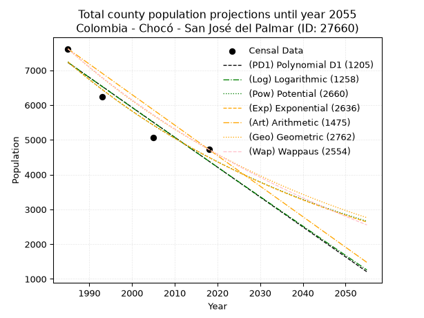
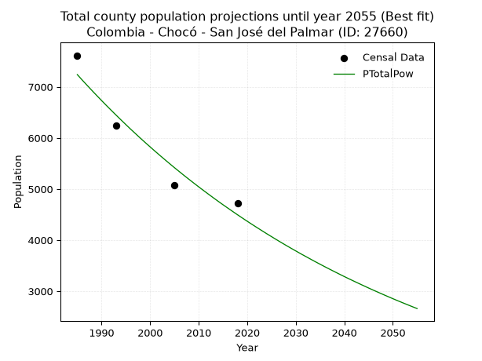
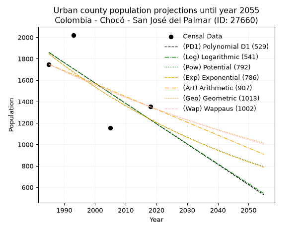
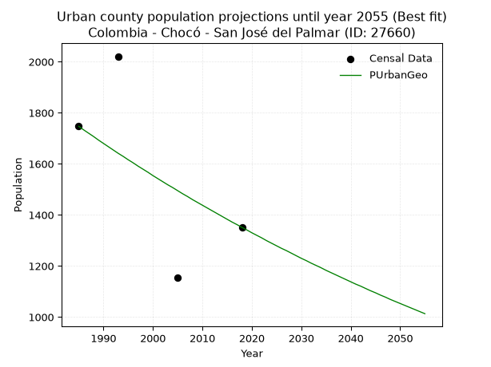
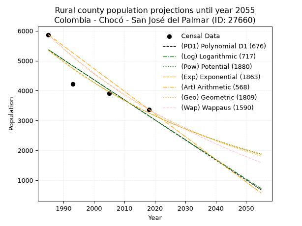
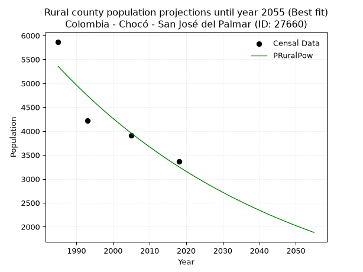

<div align="center">


</div>

# 📜 _“Population and Public Services Demand Projections (PPSD) until Year 2050 for Colombia - Chocó - San José del Palmar (ID: 27660)”_
Keywords: `population` `public-service` `projection` `lineal` `polynomial` `logarithmic` `potential` `exponential` `arithmetic` `geometric` `wappaus` `dane` `colombia` `south-america`

PPSD are analytical estimates used by governments and planners to anticipate future changes in population size, age distribution, and the resulting community needs for utilities, healthcare, education, and infrastructure as sizing future water treatment facilities, electrical grids, and road networks based on spatial growth.

<div align="center">

</img>

</div>


> **General running parameters**: • app_version: _v20260806_. • Python version: _3.14.7_. • Pandas version: _3.0.5_. • NumPy version: _2.5.1_. • Creates, save and include plots into reports (create_plot): _False_. • Projection until year: _2050_. • Process polynomial degree 2 and up: _False_. • Process Wappaus: _True_. • Process Wappaus: _True_. • Set negative values to zero: _True_. • Set infinite values to zero: _True_. • Drop dataset notes: _True_. 
<div align="center">

Maps & GIS Layers: [:earth_americas:Google](http://maps.google.com/maps?q=4.896953714,-76.2342273) [:earth_americas:OSM](https://www.openstreetmap.org/#map=18/4.896953714/-76.2342273&layers=P) [:earth_americas:Bing](https://www.bing.com/maps?cp=4.896953714~-76.2342273&lvl=18) [:earth_americas:Apple](https://maps.apple.com/frame?center=4.896953714%2C-76.2342273&span=0.003%2C0.006) [:earth_americas:GISMobile](https://github.com/rcfdtools/R.GISMobile/blob/main/file/gis/CountyLayer_CO/Readme.md)

</div>


<div align="center">

```geojson
{
  "type": "Feature",
  "geometry": {
    "type": "Point", 
    "coordinates": [-76.2342273, 4.896953714]
  }, 
  "properties": {
    "Name": "Colombia - Chocó - San José del Palmar (ID: 27660)"
  }
}
```

</div>


## 0. Census Data (4 records)

Census data are official statistics collected by a government about the people and housing in a country. They usually include counts of total population, age, sex, race, income, education, and jobs.

📅Global census file: [Population.xlsx](../data/Population.xlsx)

| Source   |   Year |   CountryID | CountryName   |   StateID | StateName   |   CountyID | CountyName          |   PTotal |   PUrban |   PRural |
|:---------|-------:|------------:|:--------------|----------:|:------------|-----------:|:--------------------|---------:|---------:|---------:|
| DANE     |   1985 |          57 | Colombia      |        27 | Chocó       |      27660 | San José del Palmar |     7616 |     1747 |     5869 |
| DANE     |   1993 |          57 | Colombia      |        27 | Chocó       |      27660 | San José del Palmar |     6244 |     2021 |     4223 |
| DANE     |   2005 |          57 | Colombia      |        27 | Chocó       |      27660 | San José del Palmar |     5068 |     1155 |     3913 |
| DANE     |   2018 |          57 | Colombia      |        27 | Chocó       |      27660 | San José del Palmar |     4721 |     1351 |     3370 |

> 🔥Some records could had specific notes about the registered values or the corresponding urban or rural distribution.

📅[SUI-RUPS](https://www.datos.gov.co/Hacienda-y-Cr-dito-P-blico/Registro-nico-de-Prestadores-de-Servicios-P-blicos/4qkq-csdn/about_data) - Local public utility companies: [RUPS.csv](../data/RUPS.csv)

 | SERVICIO       | ESTADO    | NOMBRE                                               | NIT         | DEPARTAMENTO_DOMICILIO   | MUNICIPIO_DOMICILIO   | DIRECCION      |   TELEFONO | EMAIL                                    | TIPO_PRESTADOR                            | CLASIFICACION                 |
|:---------------|:----------|:-----------------------------------------------------|:------------|:-------------------------|:----------------------|:---------------|-----------:|:-----------------------------------------|:------------------------------------------|:------------------------------|
| ACUEDUCTO      | OPERATIVA | EMPRESA DE SERVICIOS PUBLICOS DE SAN JOSE DEL PALMAR | 900103230-5 | CHOCO                    | SAN JOSE DEL PALMAR   | calle 9 # 3-44 |    6864063 | esptriplea@sanjosedelpalmar-choco.gov.co | EMPRESA INDUSTRIAL Y COMERCIAL DEL ESTADO | MENOR O IGUAL A 2500 USUARIOS |
| ALCANTARILLADO | OPERATIVA | EMPRESA DE SERVICIOS PUBLICOS DE SAN JOSE DEL PALMAR | 900103230-5 | CHOCO                    | SAN JOSE DEL PALMAR   | calle 9 # 3-44 |    6864063 | esptriplea@sanjosedelpalmar-choco.gov.co | EMPRESA INDUSTRIAL Y COMERCIAL DEL ESTADO | MENOR O IGUAL A 2500 USUARIOS |

## 1. Total

### 1.1. Coefficients and Parameters

* (PD1) Polynomial Deg 1: -85.9771176234441, 177887.97952629405 (lineal)
* (Log) Logarithmic: -172231.44375281248, 1315044.8341412994
* (Pow) Potential: -28.892864623686133, 99.14155238480836
* (Exp) Exponential: -0.014425087790446189, 1.9726650483878908e+16
* (Art) Arithmetic: Year diff. 2018 - 1985 = 33, Population diff. 4721 - 7616 = -2895, Annual growth = -87.72727272727273
* (Geo) Geometric: Year diff. 2018 - 1985 = 33, Population diff. 4721 - 7616 = -2895, Annual growth % = -0.014387336787381355
* (Wap) Wappaus: i = -1.4221816118549522, Condition values only valid for < 200)

<sub>
Wappaus condition values: ['-0.00', '-1.42', '-2.84', '-4.27', '-5.69', '-7.11', '-8.53', '-9.96', '-11.38', '-12.80', '-14.22', '-15.64', '-17.07', '-18.49', '-19.91', '-21.33', '-22.75', '-24.18', '-25.60', '-27.02', '-28.44', '-29.87', '-31.29', '-32.71', '-34.13', '-35.55', '-36.98', '-38.40', '-39.82', '-41.24', '-42.67', '-44.09', '-45.51', '-46.93', '-48.35', '-49.78', '-51.20', '-52.62', '-54.04', '-55.47', '-56.89', '-58.31', '-59.73', '-61.15', '-62.58', '-64.00', '-65.42', '-66.84', '-68.26', '-69.69', '-71.11', '-72.53', '-73.95', '-75.38', '-76.80', '-78.22', '-79.64', '-81.06', '-82.49', '-83.91', '-85.33', '-86.75', '-88.18', '-89.60', '-91.02', '-92.44']
</sub>


### 1.2. Projected Dataset

|   Year |   CountyID |   PTotalPD1 |   PTotalLog |   PTotalPow |   PTotalExp |   PTotalArt |   PTotalGeo |   PTotalWap |
|-------:|-----------:|------------:|------------:|------------:|------------:|------------:|------------:|------------:|
|   1985 |      27660 |        7223 |        7227 |        7241 |        7237 |        7616 |        7616 |        7616 |
|   1986 |      27660 |        7137 |        7140 |        7136 |        7133 |        7528 |        7506 |        7508 |
|   1987 |      27660 |        7051 |        7054 |        7033 |        7031 |        7441 |        7398 |        7402 |
|   1988 |      27660 |        6965 |        6967 |        6932 |        6930 |        7353 |        7292 |        7298 |
|   1989 |      27660 |        6879 |        6880 |        6832 |        6831 |        7265 |        7187 |        7195 |
|   1990 |      27660 |        6794 |        6794 |        6733 |        6733 |        7177 |        7084 |        7093 |
|   1991 |      27660 |        6708 |        6707 |        6636 |        6637 |        7090 |        6982 |        6993 |
|   1992 |      27660 |        6622 |        6621 |        6541 |        6542 |        7002 |        6881 |        6894 |
|   1993 |      27660 |        6536 |        6534 |        6447 |        6448 |        6914 |        6782 |        6796 |
|   1994 |      27660 |        6450 |        6448 |        6354 |        6356 |        6826 |        6685 |        6700 |
|   1995 |      27660 |        6364 |        6362 |        6263 |        6265 |        6739 |        6589 |        6605 |
|   1996 |      27660 |        6278 |        6275 |        6172 |        6175 |        6651 |        6494 |        6511 |
|   1997 |      27660 |        6192 |        6189 |        6084 |        6087 |        6563 |        6400 |        6418 |
|   1998 |      27660 |        6106 |        6103 |        5996 |        5999 |        6476 |        6308 |        6327 |
|   1999 |      27660 |        6020 |        6017 |        5910 |        5914 |        6388 |        6217 |        6237 |
|   2000 |      27660 |        5934 |        5930 |        5826 |        5829 |        6300 |        6128 |        6148 |
|   2001 |      27660 |        5848 |        5844 |        5742 |        5745 |        6212 |        6040 |        6060 |
|   2002 |      27660 |        5762 |        5758 |        5660 |        5663 |        6125 |        5953 |        5973 |
|   2003 |      27660 |        5676 |        5672 |        5579 |        5582 |        6037 |        5867 |        5888 |
|   2004 |      27660 |        5590 |        5586 |        5499 |        5502 |        5949 |        5783 |        5803 |
|   2005 |      27660 |        5504 |        5500 |        5420 |        5423 |        5861 |        5700 |        5719 |
|   2006 |      27660 |        5418 |        5415 |        5343 |        5346 |        5774 |        5618 |        5637 |
|   2007 |      27660 |        5332 |        5329 |        5266 |        5269 |        5686 |        5537 |        5555 |
|   2008 |      27660 |        5246 |        5243 |        5191 |        5194 |        5598 |        5457 |        5475 |
|   2009 |      27660 |        5160 |        5157 |        5117 |        5119 |        5511 |        5379 |        5395 |
|   2010 |      27660 |        5074 |        5071 |        5044 |        5046 |        5423 |        5301 |        5317 |
|   2011 |      27660 |        4988 |        4986 |        4972 |        4974 |        5335 |        5225 |        5239 |
|   2012 |      27660 |        4902 |        4900 |        4901 |        4902 |        5247 |        5150 |        5163 |
|   2013 |      27660 |        4816 |        4815 |        4831 |        4832 |        5160 |        5076 |        5087 |
|   2014 |      27660 |        4730 |        4729 |        4762 |        4763 |        5072 |        5003 |        5012 |
|   2015 |      27660 |        4644 |        4644 |        4694 |        4695 |        4984 |        4931 |        4938 |
|   2016 |      27660 |        4558 |        4558 |        4628 |        4627 |        4896 |        4860 |        4865 |
|   2017 |      27660 |        4472 |        4473 |        4562 |        4561 |        4809 |        4790 |        4792 |
|   2018 |      27660 |        4386 |        4387 |        4497 |        4496 |        4721 |        4721 |        4721 |
|   2019 |      27660 |        4300 |        4302 |        4433 |        4432 |        4633 |        4653 |        4650 |
|   2020 |      27660 |        4214 |        4217 |        4370 |        4368 |        4546 |        4586 |        4581 |
|   2021 |      27660 |        4128 |        4131 |        4308 |        4305 |        4458 |        4520 |        4511 |
|   2022 |      27660 |        4042 |        4046 |        4247 |        4244 |        4370 |        4455 |        4443 |
|   2023 |      27660 |        3956 |        3961 |        4187 |        4183 |        4282 |        4391 |        4376 |
|   2024 |      27660 |        3870 |        3876 |        4127 |        4123 |        4195 |        4328 |        4309 |
|   2025 |      27660 |        3784 |        3791 |        4069 |        4064 |        4107 |        4266 |        4243 |
|   2026 |      27660 |        3698 |        3706 |        4011 |        4006 |        4019 |        4204 |        4178 |
|   2027 |      27660 |        3612 |        3621 |        3954 |        3949 |        3931 |        4144 |        4113 |
|   2028 |      27660 |        3526 |        3536 |        3898 |        3892 |        3844 |        4084 |        4049 |
|   2029 |      27660 |        3440 |        3451 |        3843 |        3836 |        3756 |        4025 |        3986 |
|   2030 |      27660 |        3354 |        3366 |        3789 |        3781 |        3668 |        3967 |        3923 |
|   2031 |      27660 |        3268 |        3281 |        3735 |        3727 |        3581 |        3910 |        3862 |
|   2032 |      27660 |        3182 |        3197 |        3683 |        3674 |        3493 |        3854 |        3800 |
|   2033 |      27660 |        3096 |        3112 |        3631 |        3621 |        3405 |        3799 |        3740 |
|   2034 |      27660 |        3011 |        3027 |        3579 |        3569 |        3317 |        3744 |        3680 |
|   2035 |      27660 |        2925 |        2942 |        3529 |        3518 |        3230 |        3690 |        3621 |
|   2036 |      27660 |        2839 |        2858 |        3479 |        3468 |        3142 |        3637 |        3562 |
|   2037 |      27660 |        2753 |        2773 |        3430 |        3418 |        3054 |        3585 |        3504 |
|   2038 |      27660 |        2667 |        2689 |        3382 |        3369 |        2966 |        3533 |        3447 |
|   2039 |      27660 |        2581 |        2604 |        3334 |        3321 |        2879 |        3482 |        3390 |
|   2040 |      27660 |        2495 |        2520 |        3287 |        3273 |        2791 |        3432 |        3334 |
|   2041 |      27660 |        2409 |        2435 |        3241 |        3226 |        2703 |        3383 |        3278 |
|   2042 |      27660 |        2323 |        2351 |        3196 |        3180 |        2616 |        3334 |        3223 |
|   2043 |      27660 |        2237 |        2267 |        3151 |        3135 |        2528 |        3286 |        3168 |
|   2044 |      27660 |        2151 |        2182 |        3107 |        3090 |        2440 |        3239 |        3114 |
|   2045 |      27660 |        2065 |        2098 |        3063 |        3046 |        2352 |        3192 |        3061 |
|   2046 |      27660 |        1979 |        2014 |        3020 |        3002 |        2265 |        3146 |        3008 |
|   2047 |      27660 |        1893 |        1930 |        2978 |        2959 |        2177 |        3101 |        2955 |
|   2048 |      27660 |        1807 |        1846 |        2936 |        2917 |        2089 |        3056 |        2903 |
|   2049 |      27660 |        1721 |        1762 |        2895 |        2875 |        2001 |        3013 |        2852 |
|   2050 |      27660 |        1635 |        1678 |        2854 |        2834 |        1914 |        2969 |        2801 |
<div align="center">

</img>

</div>


### 1.3. Best fit with absolute and relative error (%)

Relative error puts that difference into context by dividing the absolute error by the true value, creating a unitless ratio or percentage that shows the scale of the mistake.

Absolute and relative error

|   Year | Source   |   CountryID | CountryName   |   StateID | StateName   |   CountyID_x | CountyName          |   PTotal |   PUrban |   PRural |   CountyID_y |   PTotalPD1 |   PTotalLog |   PTotalPow |   PTotalExp |   PTotalArt |   PTotalGeo |   PTotalWap |   PTotalPD1AbsError |   PTotalLogAbsError |   PTotalPowAbsError |   PTotalExpAbsError |   PTotalArtAbsError |   PTotalGeoAbsError |   PTotalWapAbsError |   PTotalPD1RelError |   PTotalLogRelError |   PTotalPowRelError |   PTotalExpRelError |   PTotalArtRelError |   PTotalGeoRelError |   PTotalWapRelError |
|-------:|:---------|------------:|:--------------|----------:|:------------|-------------:|:--------------------|---------:|---------:|---------:|-------------:|------------:|------------:|------------:|------------:|------------:|------------:|------------:|--------------------:|--------------------:|--------------------:|--------------------:|--------------------:|--------------------:|--------------------:|--------------------:|--------------------:|--------------------:|--------------------:|--------------------:|--------------------:|--------------------:|
|   1985 | DANE     |          57 | Colombia      |        27 | Chocó       |        27660 | San José del Palmar |     7616 |     1747 |     5869 |        27660 |        7223 |        7227 |        7241 |        7237 |        7616 |        7616 |        7616 |                 393 |                 389 |                 375 |                 379 |                   0 |                   0 |                   0 |             5.16019 |             5.10767 |             4.92384 |             4.97637 |              0      |             0       |             0       |
|   1993 | DANE     |          57 | Colombia      |        27 | Chocó       |        27660 | San José del Palmar |     6244 |     2021 |     4223 |        27660 |        6536 |        6534 |        6447 |        6448 |        6914 |        6782 |        6796 |                 292 |                 290 |                 203 |                 204 |                 670 |                 538 |                 552 |             4.67649 |             4.64446 |             3.25112 |             3.26714 |             10.7303 |             8.61627 |             8.84049 |
|   2005 | DANE     |          57 | Colombia      |        27 | Chocó       |        27660 | San José del Palmar |     5068 |     1155 |     3913 |        27660 |        5504 |        5500 |        5420 |        5423 |        5861 |        5700 |        5719 |                 436 |                 432 |                 352 |                 355 |                 793 |                 632 |                 651 |             8.603   |             8.52407 |             6.94554 |             7.00474 |             15.6472 |            12.4704  |            12.8453  |
|   2018 | DANE     |          57 | Colombia      |        27 | Chocó       |        27660 | San José del Palmar |     4721 |     1351 |     3370 |        27660 |        4386 |        4387 |        4497 |        4496 |        4721 |        4721 |        4721 |                 335 |                 334 |                 224 |                 225 |                   0 |                   0 |                   0 |             7.09595 |             7.07477 |             4.74476 |             4.76594 |              0      |             0       |             0       |

Relative error mean

| Method    |   RelError | Best   |
|:----------|-----------:|:-------|
| PTotalPD1 |    6.38391 |        |
| PTotalLog |    6.33774 |        |
| PTotalPow |    4.96632 | True   |
| PTotalExp |    5.00354 |        |
| PTotalArt |    6.59437 |        |
| PTotalGeo |    5.27167 |        |
| PTotalWap |    5.42145 |        |

💙Best method: _**PTotalPow**_
<div align="center">

</img>

</div>


### 1.4. Fresh water supply demand in liters per capita per day (lpcd)

The fresh water supply demand typically ranges from 100 to 300 liters per capita per day (lpcd) for standard domestic and municipal planning, though absolute survival minimums set by the World Health Organization are as low as 7.5 to 20 liters per day, and total consumption in high-income nations can exceed 400 liters.

> `CZ`: Level in meters above the sea level (masl)<br> `WS`: Fresh water supply demand in liters per capita per day (lpcd or l/h/d)<br> `WSAll`: Zonal fresh water supply demand in liters per second (l/s)<br> `A`: Zonal area in square meters<br> `DP`: Population density (people/hectare or p/ha)

Reference values (RAS Colombia)

|    CZ |   WS |
|------:|-----:|
|  1000 |  120 |
|  2000 |  130 |
| 99999 |  140 |

County shapefile geometry properties and water supply values

|   CountyID |      ATotal |   CZTotal |   WSTotal |
|-----------:|------------:|----------:|----------:|
|      27660 | 1.58252e+09 |   1294.59 |       130 |

Projected values for best method: PTotalPow

|   CountyID |   Year |   PTotalPow |   DPTotal |   WSTotal |   WSTotalAll |
|-----------:|-------:|------------:|----------:|----------:|-------------:|
|      27660 |   1985 |        7241 |      0.05 |       130 |     10.895   |
|      27660 |   1986 |        7136 |      0.05 |       130 |     10.737   |
|      27660 |   1987 |        7033 |      0.04 |       130 |     10.5821  |
|      27660 |   1988 |        6932 |      0.04 |       130 |     10.4301  |
|      27660 |   1989 |        6832 |      0.04 |       130 |     10.2796  |
|      27660 |   1990 |        6733 |      0.04 |       130 |     10.1307  |
|      27660 |   1991 |        6636 |      0.04 |       130 |      9.98472 |
|      27660 |   1992 |        6541 |      0.04 |       130 |      9.84178 |
|      27660 |   1993 |        6447 |      0.04 |       130 |      9.70035 |
|      27660 |   1994 |        6354 |      0.04 |       130 |      9.56042 |
|      27660 |   1995 |        6263 |      0.04 |       130 |      9.4235  |
|      27660 |   1996 |        6172 |      0.04 |       130 |      9.28657 |
|      27660 |   1997 |        6084 |      0.04 |       130 |      9.15417 |
|      27660 |   1998 |        5996 |      0.04 |       130 |      9.02176 |
|      27660 |   1999 |        5910 |      0.04 |       130 |      8.89236 |
|      27660 |   2000 |        5826 |      0.04 |       130 |      8.76597 |
|      27660 |   2001 |        5742 |      0.04 |       130 |      8.63958 |
|      27660 |   2002 |        5660 |      0.04 |       130 |      8.5162  |
|      27660 |   2003 |        5579 |      0.04 |       130 |      8.39433 |
|      27660 |   2004 |        5499 |      0.03 |       130 |      8.27396 |
|      27660 |   2005 |        5420 |      0.03 |       130 |      8.15509 |
|      27660 |   2006 |        5343 |      0.03 |       130 |      8.03924 |
|      27660 |   2007 |        5266 |      0.03 |       130 |      7.92338 |
|      27660 |   2008 |        5191 |      0.03 |       130 |      7.81053 |
|      27660 |   2009 |        5117 |      0.03 |       130 |      7.69919 |
|      27660 |   2010 |        5044 |      0.03 |       130 |      7.58935 |
|      27660 |   2011 |        4972 |      0.03 |       130 |      7.48102 |
|      27660 |   2012 |        4901 |      0.03 |       130 |      7.37419 |
|      27660 |   2013 |        4831 |      0.03 |       130 |      7.26887 |
|      27660 |   2014 |        4762 |      0.03 |       130 |      7.16505 |
|      27660 |   2015 |        4694 |      0.03 |       130 |      7.06273 |
|      27660 |   2016 |        4628 |      0.03 |       130 |      6.96343 |
|      27660 |   2017 |        4562 |      0.03 |       130 |      6.86412 |
|      27660 |   2018 |        4497 |      0.03 |       130 |      6.76632 |
|      27660 |   2019 |        4433 |      0.03 |       130 |      6.67002 |
|      27660 |   2020 |        4370 |      0.03 |       130 |      6.57523 |
|      27660 |   2021 |        4308 |      0.03 |       130 |      6.48194 |
|      27660 |   2022 |        4247 |      0.03 |       130 |      6.39016 |
|      27660 |   2023 |        4187 |      0.03 |       130 |      6.29988 |
|      27660 |   2024 |        4127 |      0.03 |       130 |      6.20961 |
|      27660 |   2025 |        4069 |      0.03 |       130 |      6.12234 |
|      27660 |   2026 |        4011 |      0.03 |       130 |      6.03507 |
|      27660 |   2027 |        3954 |      0.02 |       130 |      5.94931 |
|      27660 |   2028 |        3898 |      0.02 |       130 |      5.86505 |
|      27660 |   2029 |        3843 |      0.02 |       130 |      5.78229 |
|      27660 |   2030 |        3789 |      0.02 |       130 |      5.70104 |
|      27660 |   2031 |        3735 |      0.02 |       130 |      5.61979 |
|      27660 |   2032 |        3683 |      0.02 |       130 |      5.54155 |
|      27660 |   2033 |        3631 |      0.02 |       130 |      5.46331 |
|      27660 |   2034 |        3579 |      0.02 |       130 |      5.38507 |
|      27660 |   2035 |        3529 |      0.02 |       130 |      5.30984 |
|      27660 |   2036 |        3479 |      0.02 |       130 |      5.23461 |
|      27660 |   2037 |        3430 |      0.02 |       130 |      5.16088 |
|      27660 |   2038 |        3382 |      0.02 |       130 |      5.08866 |
|      27660 |   2039 |        3334 |      0.02 |       130 |      5.01644 |
|      27660 |   2040 |        3287 |      0.02 |       130 |      4.94572 |
|      27660 |   2041 |        3241 |      0.02 |       130 |      4.8765  |
|      27660 |   2042 |        3196 |      0.02 |       130 |      4.8088  |
|      27660 |   2043 |        3151 |      0.02 |       130 |      4.74109 |
|      27660 |   2044 |        3107 |      0.02 |       130 |      4.67488 |
|      27660 |   2045 |        3063 |      0.02 |       130 |      4.60868 |
|      27660 |   2046 |        3020 |      0.02 |       130 |      4.54398 |
|      27660 |   2047 |        2978 |      0.02 |       130 |      4.48079 |
|      27660 |   2048 |        2936 |      0.02 |       130 |      4.41759 |
|      27660 |   2049 |        2895 |      0.02 |       130 |      4.3559  |
|      27660 |   2050 |        2854 |      0.02 |       130 |      4.29421 |

## 2. Urban

### 2.1. Coefficients and Parameters

* (PD1) Polynomial Deg 1: -18.992372541148185, 39557.99317543166 (lineal)
* (Log) Logarithmic: -38032.24398897928, 290651.8913315076
* (Pow) Potential: -24.39443214888652, 83.71314466596742
* (Exp) Exponential: -0.012179115572680256, 58242746171023.2
* (Art) Arithmetic: Year diff. 2018 - 1985 = 33, Population diff. 1351 - 1747 = -396, Annual growth = -12.0
* (Geo) Geometric: Year diff. 2018 - 1985 = 33, Population diff. 1351 - 1747 = -396, Annual growth % = -0.007759284729910831
* (Wap) Wappaus: i = -0.7746933505487411, Condition values only valid for < 200)

<sub>
Wappaus condition values: ['-0.00', '-0.77', '-1.55', '-2.32', '-3.10', '-3.87', '-4.65', '-5.42', '-6.20', '-6.97', '-7.75', '-8.52', '-9.30', '-10.07', '-10.85', '-11.62', '-12.40', '-13.17', '-13.94', '-14.72', '-15.49', '-16.27', '-17.04', '-17.82', '-18.59', '-19.37', '-20.14', '-20.92', '-21.69', '-22.47', '-23.24', '-24.02', '-24.79', '-25.56', '-26.34', '-27.11', '-27.89', '-28.66', '-29.44', '-30.21', '-30.99', '-31.76', '-32.54', '-33.31', '-34.09', '-34.86', '-35.64', '-36.41', '-37.19', '-37.96', '-38.73', '-39.51', '-40.28', '-41.06', '-41.83', '-42.61', '-43.38', '-44.16', '-44.93', '-45.71', '-46.48', '-47.26', '-48.03', '-48.81', '-49.58', '-50.36']
</sub>


### 2.2. Projected Dataset

|   Year |   CountyID |   PUrbanPD1 |   PUrbanLog |   PUrbanPow |   PUrbanExp |   PUrbanArt |   PUrbanGeo |   PUrbanWap |
|-------:|-----------:|------------:|------------:|------------:|------------:|------------:|------------:|------------:|
|   1985 |      27660 |        1858 |        1859 |        1846 |        1845 |        1747 |        1747 |        1747 |
|   1986 |      27660 |        1839 |        1840 |        1823 |        1822 |        1735 |        1733 |        1734 |
|   1987 |      27660 |        1820 |        1821 |        1801 |        1800 |        1723 |        1720 |        1720 |
|   1988 |      27660 |        1801 |        1801 |        1779 |        1779 |        1711 |        1707 |        1707 |
|   1989 |      27660 |        1782 |        1782 |        1757 |        1757 |        1699 |        1693 |        1694 |
|   1990 |      27660 |        1763 |        1763 |        1736 |        1736 |        1687 |        1680 |        1681 |
|   1991 |      27660 |        1744 |        1744 |        1715 |        1715 |        1675 |        1667 |        1668 |
|   1992 |      27660 |        1725 |        1725 |        1694 |        1694 |        1663 |        1654 |        1655 |
|   1993 |      27660 |        1706 |        1706 |        1673 |        1673 |        1651 |        1641 |        1642 |
|   1994 |      27660 |        1687 |        1687 |        1653 |        1653 |        1639 |        1629 |        1629 |
|   1995 |      27660 |        1668 |        1668 |        1633 |        1633 |        1627 |        1616 |        1617 |
|   1996 |      27660 |        1649 |        1649 |        1613 |        1613 |        1615 |        1604 |        1604 |
|   1997 |      27660 |        1630 |        1630 |        1593 |        1594 |        1603 |        1591 |        1592 |
|   1998 |      27660 |        1611 |        1611 |        1574 |        1575 |        1591 |        1579 |        1579 |
|   1999 |      27660 |        1592 |        1592 |        1555 |        1556 |        1579 |        1567 |        1567 |
|   2000 |      27660 |        1573 |        1573 |        1536 |        1537 |        1567 |        1554 |        1555 |
|   2001 |      27660 |        1554 |        1554 |        1517 |        1518 |        1555 |        1542 |        1543 |
|   2002 |      27660 |        1535 |        1535 |        1499 |        1500 |        1543 |        1530 |        1531 |
|   2003 |      27660 |        1516 |        1516 |        1481 |        1482 |        1531 |        1518 |        1519 |
|   2004 |      27660 |        1497 |        1497 |        1463 |        1464 |        1519 |        1507 |        1507 |
|   2005 |      27660 |        1478 |        1478 |        1445 |        1446 |        1507 |        1495 |        1496 |
|   2006 |      27660 |        1459 |        1459 |        1428 |        1428 |        1495 |        1483 |        1484 |
|   2007 |      27660 |        1440 |        1440 |        1411 |        1411 |        1483 |        1472 |        1473 |
|   2008 |      27660 |        1421 |        1421 |        1393 |        1394 |        1471 |        1460 |        1461 |
|   2009 |      27660 |        1402 |        1402 |        1377 |        1377 |        1459 |        1449 |        1450 |
|   2010 |      27660 |        1383 |        1383 |        1360 |        1361 |        1447 |        1438 |        1439 |
|   2011 |      27660 |        1364 |        1364 |        1344 |        1344 |        1435 |        1427 |        1427 |
|   2012 |      27660 |        1345 |        1345 |        1327 |        1328 |        1423 |        1416 |        1416 |
|   2013 |      27660 |        1326 |        1326 |        1311 |        1312 |        1411 |        1405 |        1405 |
|   2014 |      27660 |        1307 |        1307 |        1296 |        1296 |        1399 |        1394 |        1394 |
|   2015 |      27660 |        1288 |        1288 |        1280 |        1280 |        1387 |        1383 |        1383 |
|   2016 |      27660 |        1269 |        1269 |        1265 |        1265 |        1375 |        1372 |        1372 |
|   2017 |      27660 |        1250 |        1251 |        1249 |        1249 |        1363 |        1362 |        1362 |
|   2018 |      27660 |        1231 |        1232 |        1234 |        1234 |        1351 |        1351 |        1351 |
|   2019 |      27660 |        1212 |        1213 |        1220 |        1219 |        1339 |        1341 |        1340 |
|   2020 |      27660 |        1193 |        1194 |        1205 |        1205 |        1327 |        1330 |        1330 |
|   2021 |      27660 |        1174 |        1175 |        1191 |        1190 |        1315 |        1320 |        1319 |
|   2022 |      27660 |        1155 |        1156 |        1176 |        1176 |        1303 |        1310 |        1309 |
|   2023 |      27660 |        1136 |        1138 |        1162 |        1161 |        1291 |        1299 |        1299 |
|   2024 |      27660 |        1117 |        1119 |        1148 |        1147 |        1279 |        1289 |        1288 |
|   2025 |      27660 |        1098 |        1100 |        1134 |        1133 |        1267 |        1279 |        1278 |
|   2026 |      27660 |        1079 |        1081 |        1121 |        1120 |        1255 |        1269 |        1268 |
|   2027 |      27660 |        1060 |        1063 |        1107 |        1106 |        1243 |        1260 |        1258 |
|   2028 |      27660 |        1041 |        1044 |        1094 |        1093 |        1231 |        1250 |        1248 |
|   2029 |      27660 |        1022 |        1025 |        1081 |        1079 |        1219 |        1240 |        1238 |
|   2030 |      27660 |        1003 |        1006 |        1068 |        1066 |        1207 |        1230 |        1228 |
|   2031 |      27660 |         984 |         988 |        1055 |        1053 |        1195 |        1221 |        1219 |
|   2032 |      27660 |         965 |         969 |        1043 |        1041 |        1183 |        1211 |        1209 |
|   2033 |      27660 |         946 |         950 |        1030 |        1028 |        1171 |        1202 |        1199 |
|   2034 |      27660 |         928 |         931 |        1018 |        1016 |        1159 |        1193 |        1190 |
|   2035 |      27660 |         909 |         913 |        1006 |        1003 |        1147 |        1183 |        1180 |
|   2036 |      27660 |         890 |         894 |         994 |         991 |        1135 |        1174 |        1171 |
|   2037 |      27660 |         871 |         875 |         982 |         979 |        1123 |        1165 |        1161 |
|   2038 |      27660 |         852 |         857 |         970 |         967 |        1111 |        1156 |        1152 |
|   2039 |      27660 |         833 |         838 |         959 |         956 |        1099 |        1147 |        1143 |
|   2040 |      27660 |         814 |         819 |         948 |         944 |        1087 |        1138 |        1133 |
|   2041 |      27660 |         795 |         801 |         936 |         933 |        1075 |        1129 |        1124 |
|   2042 |      27660 |         776 |         782 |         925 |         921 |        1063 |        1121 |        1115 |
|   2043 |      27660 |         757 |         763 |         914 |         910 |        1051 |        1112 |        1106 |
|   2044 |      27660 |         738 |         745 |         903 |         899 |        1039 |        1103 |        1097 |
|   2045 |      27660 |         719 |         726 |         893 |         888 |        1027 |        1095 |        1088 |
|   2046 |      27660 |         700 |         708 |         882 |         878 |        1015 |        1086 |        1079 |
|   2047 |      27660 |         681 |         689 |         872 |         867 |        1003 |        1078 |        1070 |
|   2048 |      27660 |         662 |         671 |         861 |         856 |         991 |        1069 |        1062 |
|   2049 |      27660 |         643 |         652 |         851 |         846 |         979 |        1061 |        1053 |
|   2050 |      27660 |         624 |         633 |         841 |         836 |         967 |        1053 |        1044 |
<div align="center">

</img>

</div>


### 2.3. Best fit with absolute and relative error (%)

Relative error puts that difference into context by dividing the absolute error by the true value, creating a unitless ratio or percentage that shows the scale of the mistake.

Absolute and relative error

|   Year | Source   |   CountryID | CountryName   |   StateID | StateName   |   CountyID_x | CountyName          |   PTotal |   PUrban |   PRural |   CountyID_y |   PUrbanPD1 |   PUrbanLog |   PUrbanPow |   PUrbanExp |   PUrbanArt |   PUrbanGeo |   PUrbanWap |   PUrbanPD1AbsError |   PUrbanLogAbsError |   PUrbanPowAbsError |   PUrbanExpAbsError |   PUrbanArtAbsError |   PUrbanGeoAbsError |   PUrbanWapAbsError |   PUrbanPD1RelError |   PUrbanLogRelError |   PUrbanPowRelError |   PUrbanExpRelError |   PUrbanArtRelError |   PUrbanGeoRelError |   PUrbanWapRelError |
|-------:|:---------|------------:|:--------------|----------:|:------------|-------------:|:--------------------|---------:|---------:|---------:|-------------:|------------:|------------:|------------:|------------:|------------:|------------:|------------:|--------------------:|--------------------:|--------------------:|--------------------:|--------------------:|--------------------:|--------------------:|--------------------:|--------------------:|--------------------:|--------------------:|--------------------:|--------------------:|--------------------:|
|   1985 | DANE     |          57 | Colombia      |        27 | Chocó       |        27660 | San José del Palmar |     7616 |     1747 |     5869 |        27660 |        1858 |        1859 |        1846 |        1845 |        1747 |        1747 |        1747 |                 111 |                 112 |                  99 |                  98 |                   0 |                   0 |                   0 |             6.35375 |             6.41099 |             5.66686 |             5.60962 |              0      |              0      |              0      |
|   1993 | DANE     |          57 | Colombia      |        27 | Chocó       |        27660 | San José del Palmar |     6244 |     2021 |     4223 |        27660 |        1706 |        1706 |        1673 |        1673 |        1651 |        1641 |        1642 |                 315 |                 315 |                 348 |                 348 |                 370 |                 380 |                 379 |            15.5863  |            15.5863  |            17.2192  |            17.2192  |             18.3078 |             18.8026 |             18.7531 |
|   2005 | DANE     |          57 | Colombia      |        27 | Chocó       |        27660 | San José del Palmar |     5068 |     1155 |     3913 |        27660 |        1478 |        1478 |        1445 |        1446 |        1507 |        1495 |        1496 |                 323 |                 323 |                 290 |                 291 |                 352 |                 340 |                 341 |            27.9654  |            27.9654  |            25.1082  |            25.1948  |             30.4762 |             29.4372 |             29.5238 |
|   2018 | DANE     |          57 | Colombia      |        27 | Chocó       |        27660 | San José del Palmar |     4721 |     1351 |     3370 |        27660 |        1231 |        1232 |        1234 |        1234 |        1351 |        1351 |        1351 |                 120 |                 119 |                 117 |                 117 |                   0 |                   0 |                   0 |             8.88231 |             8.80829 |             8.66025 |             8.66025 |              0      |              0      |              0      |

Relative error mean

| Method    |   RelError | Best   |
|:----------|-----------:|:-------|
| PUrbanPD1 |    14.6969 |        |
| PUrbanLog |    14.6927 |        |
| PUrbanPow |    14.1636 |        |
| PUrbanExp |    14.171  |        |
| PUrbanArt |    12.196  |        |
| PUrbanGeo |    12.06   | True   |
| PUrbanWap |    12.0692 |        |

💙Best method: _**PUrbanGeo**_
<div align="center">

</img>

</div>


### 2.4. Fresh water supply demand in liters per capita per day (lpcd)

The fresh water supply demand typically ranges from 100 to 300 liters per capita per day (lpcd) for standard domestic and municipal planning, though absolute survival minimums set by the World Health Organization are as low as 7.5 to 20 liters per day, and total consumption in high-income nations can exceed 400 liters.

> `CZ`: Level in meters above the sea level (masl)<br> `WS`: Fresh water supply demand in liters per capita per day (lpcd or l/h/d)<br> `WSAll`: Zonal fresh water supply demand in liters per second (l/s)<br> `A`: Zonal area in square meters<br> `DP`: Population density (people/hectare or p/ha)

Reference values (RAS Colombia)

|    CZ |   WS |
|------:|-----:|
|  1000 |  120 |
|  2000 |  130 |
| 99999 |  140 |

County shapefile geometry properties and water supply values

|   CountyID |   AUrban |   CZUrban |   WSUrban |
|-----------:|---------:|----------:|----------:|
|      27660 |   166124 |   1085.18 |       130 |

Projected values for best method: PUrbanGeo

|   CountyID |   Year |   PUrbanGeo |   DPUrban |   WSUrban |   WSUrbanAll |
|-----------:|-------:|------------:|----------:|----------:|-------------:|
|      27660 |   1985 |        1747 |    105.16 |       130 |      2.62859 |
|      27660 |   1986 |        1733 |    104.32 |       130 |      2.60752 |
|      27660 |   1987 |        1720 |    103.54 |       130 |      2.58796 |
|      27660 |   1988 |        1707 |    102.75 |       130 |      2.5684  |
|      27660 |   1989 |        1693 |    101.91 |       130 |      2.54734 |
|      27660 |   1990 |        1680 |    101.13 |       130 |      2.52778 |
|      27660 |   1991 |        1667 |    100.35 |       130 |      2.50822 |
|      27660 |   1992 |        1654 |     99.56 |       130 |      2.48866 |
|      27660 |   1993 |        1641 |     98.78 |       130 |      2.4691  |
|      27660 |   1994 |        1629 |     98.06 |       130 |      2.45104 |
|      27660 |   1995 |        1616 |     97.28 |       130 |      2.43148 |
|      27660 |   1996 |        1604 |     96.55 |       130 |      2.41343 |
|      27660 |   1997 |        1591 |     95.77 |       130 |      2.39387 |
|      27660 |   1998 |        1579 |     95.05 |       130 |      2.37581 |
|      27660 |   1999 |        1567 |     94.33 |       130 |      2.35775 |
|      27660 |   2000 |        1554 |     93.54 |       130 |      2.33819 |
|      27660 |   2001 |        1542 |     92.82 |       130 |      2.32014 |
|      27660 |   2002 |        1530 |     92.1  |       130 |      2.30208 |
|      27660 |   2003 |        1518 |     91.38 |       130 |      2.28403 |
|      27660 |   2004 |        1507 |     90.72 |       130 |      2.26748 |
|      27660 |   2005 |        1495 |     89.99 |       130 |      2.24942 |
|      27660 |   2006 |        1483 |     89.27 |       130 |      2.23137 |
|      27660 |   2007 |        1472 |     88.61 |       130 |      2.21481 |
|      27660 |   2008 |        1460 |     87.89 |       130 |      2.19676 |
|      27660 |   2009 |        1449 |     87.22 |       130 |      2.18021 |
|      27660 |   2010 |        1438 |     86.56 |       130 |      2.16366 |
|      27660 |   2011 |        1427 |     85.9  |       130 |      2.14711 |
|      27660 |   2012 |        1416 |     85.24 |       130 |      2.13056 |
|      27660 |   2013 |        1405 |     84.58 |       130 |      2.114   |
|      27660 |   2014 |        1394 |     83.91 |       130 |      2.09745 |
|      27660 |   2015 |        1383 |     83.25 |       130 |      2.0809  |
|      27660 |   2016 |        1372 |     82.59 |       130 |      2.06435 |
|      27660 |   2017 |        1362 |     81.99 |       130 |      2.04931 |
|      27660 |   2018 |        1351 |     81.32 |       130 |      2.03275 |
|      27660 |   2019 |        1341 |     80.72 |       130 |      2.01771 |
|      27660 |   2020 |        1330 |     80.06 |       130 |      2.00116 |
|      27660 |   2021 |        1320 |     79.46 |       130 |      1.98611 |
|      27660 |   2022 |        1310 |     78.86 |       130 |      1.97106 |
|      27660 |   2023 |        1299 |     78.19 |       130 |      1.95451 |
|      27660 |   2024 |        1289 |     77.59 |       130 |      1.93947 |
|      27660 |   2025 |        1279 |     76.99 |       130 |      1.92442 |
|      27660 |   2026 |        1269 |     76.39 |       130 |      1.90938 |
|      27660 |   2027 |        1260 |     75.85 |       130 |      1.89583 |
|      27660 |   2028 |        1250 |     75.24 |       130 |      1.88079 |
|      27660 |   2029 |        1240 |     74.64 |       130 |      1.86574 |
|      27660 |   2030 |        1230 |     74.04 |       130 |      1.85069 |
|      27660 |   2031 |        1221 |     73.5  |       130 |      1.83715 |
|      27660 |   2032 |        1211 |     72.9  |       130 |      1.82211 |
|      27660 |   2033 |        1202 |     72.36 |       130 |      1.80856 |
|      27660 |   2034 |        1193 |     71.81 |       130 |      1.79502 |
|      27660 |   2035 |        1183 |     71.21 |       130 |      1.77998 |
|      27660 |   2036 |        1174 |     70.67 |       130 |      1.76644 |
|      27660 |   2037 |        1165 |     70.13 |       130 |      1.75289 |
|      27660 |   2038 |        1156 |     69.59 |       130 |      1.73935 |
|      27660 |   2039 |        1147 |     69.04 |       130 |      1.72581 |
|      27660 |   2040 |        1138 |     68.5  |       130 |      1.71227 |
|      27660 |   2041 |        1129 |     67.96 |       130 |      1.69873 |
|      27660 |   2042 |        1121 |     67.48 |       130 |      1.68669 |
|      27660 |   2043 |        1112 |     66.94 |       130 |      1.67315 |
|      27660 |   2044 |        1103 |     66.4  |       130 |      1.65961 |
|      27660 |   2045 |        1095 |     65.91 |       130 |      1.64757 |
|      27660 |   2046 |        1086 |     65.37 |       130 |      1.63403 |
|      27660 |   2047 |        1078 |     64.89 |       130 |      1.62199 |
|      27660 |   2048 |        1069 |     64.35 |       130 |      1.60845 |
|      27660 |   2049 |        1061 |     63.87 |       130 |      1.59641 |
|      27660 |   2050 |        1053 |     63.39 |       130 |      1.58438 |

## 3. Rural

### 3.1. Coefficients and Parameters

* (PD1) Polynomial Deg 1: -66.98474508229587, 138329.98635086234 (lineal)
* (Log) Logarithmic: -134199.19976383314, 1024392.942809791
* (Pow) Potential: -30.190825112127786, 103.29078451662217
* (Exp) Exponential: -0.015072653587936488, 5.27422058278763e+16
* (Art) Arithmetic: Year diff. 2018 - 1985 = 33, Population diff. 3370 - 5869 = -2499, Annual growth = -75.72727272727273
* (Geo) Geometric: Year diff. 2018 - 1985 = 33, Population diff. 3370 - 5869 = -2499, Annual growth % = -0.01667073744284131
* (Wap) Wappaus: i = -1.6392958702732487, Condition values only valid for < 200)

<sub>
Wappaus condition values: ['-0.00', '-1.64', '-3.28', '-4.92', '-6.56', '-8.20', '-9.84', '-11.48', '-13.11', '-14.75', '-16.39', '-18.03', '-19.67', '-21.31', '-22.95', '-24.59', '-26.23', '-27.87', '-29.51', '-31.15', '-32.79', '-34.43', '-36.06', '-37.70', '-39.34', '-40.98', '-42.62', '-44.26', '-45.90', '-47.54', '-49.18', '-50.82', '-52.46', '-54.10', '-55.74', '-57.38', '-59.01', '-60.65', '-62.29', '-63.93', '-65.57', '-67.21', '-68.85', '-70.49', '-72.13', '-73.77', '-75.41', '-77.05', '-78.69', '-80.33', '-81.96', '-83.60', '-85.24', '-86.88', '-88.52', '-90.16', '-91.80', '-93.44', '-95.08', '-96.72', '-98.36', '-100.00', '-101.64', '-103.28', '-104.91', '-106.55']
</sub>


### 3.2. Projected Dataset

|   Year |   CountyID |   PRuralPD1 |   PRuralLog |   PRuralPow |   PRuralExp |   PRuralArt |   PRuralGeo |   PRuralWap |
|-------:|-----------:|------------:|------------:|------------:|------------:|------------:|------------:|------------:|
|   1985 |      27660 |        5365 |        5368 |        5354 |        5351 |        5869 |        5869 |        5869 |
|   1986 |      27660 |        5298 |        5301 |        5273 |        5271 |        5793 |        5771 |        5774 |
|   1987 |      27660 |        5231 |        5233 |        5194 |        5192 |        5718 |        5675 |        5680 |
|   1988 |      27660 |        5164 |        5166 |        5115 |        5114 |        5642 |        5580 |        5587 |
|   1989 |      27660 |        5097 |        5098 |        5038 |        5038 |        5566 |        5487 |        5496 |
|   1990 |      27660 |        5030 |        5031 |        4962 |        4962 |        5490 |        5396 |        5407 |
|   1991 |      27660 |        4963 |        4963 |        4888 |        4888 |        5415 |        5306 |        5319 |
|   1992 |      27660 |        4896 |        4896 |        4814 |        4815 |        5339 |        5217 |        5232 |
|   1993 |      27660 |        4829 |        4828 |        4742 |        4743 |        5263 |        5130 |        5147 |
|   1994 |      27660 |        4762 |        4761 |        4670 |        4672 |        5187 |        5045 |        5063 |
|   1995 |      27660 |        4695 |        4694 |        4600 |        4602 |        5112 |        4961 |        4980 |
|   1996 |      27660 |        4628 |        4627 |        4531 |        4533 |        5036 |        4878 |        4898 |
|   1997 |      27660 |        4561 |        4559 |        4463 |        4465 |        4960 |        4797 |        4818 |
|   1998 |      27660 |        4494 |        4492 |        4396 |        4399 |        4885 |        4717 |        4739 |
|   1999 |      27660 |        4427 |        4425 |        4330 |        4333 |        4809 |        4638 |        4661 |
|   2000 |      27660 |        4360 |        4358 |        4265 |        4268 |        4733 |        4561 |        4584 |
|   2001 |      27660 |        4294 |        4291 |        4202 |        4204 |        4657 |        4485 |        4508 |
|   2002 |      27660 |        4227 |        4224 |        4139 |        4141 |        4582 |        4410 |        4433 |
|   2003 |      27660 |        4160 |        4157 |        4077 |        4079 |        4506 |        4337 |        4360 |
|   2004 |      27660 |        4093 |        4090 |        4016 |        4018 |        4430 |        4264 |        4287 |
|   2005 |      27660 |        4026 |        4023 |        3956 |        3958 |        4354 |        4193 |        4216 |
|   2006 |      27660 |        3959 |        3956 |        3897 |        3899 |        4279 |        4123 |        4145 |
|   2007 |      27660 |        3892 |        3889 |        3838 |        3841 |        4203 |        4055 |        4076 |
|   2008 |      27660 |        3825 |        3822 |        3781 |        3783 |        4127 |        3987 |        4007 |
|   2009 |      27660 |        3758 |        3755 |        3725 |        3727 |        4052 |        3920 |        3940 |
|   2010 |      27660 |        3691 |        3689 |        3669 |        3671 |        3976 |        3855 |        3873 |
|   2011 |      27660 |        3624 |        3622 |        3615 |        3616 |        3900 |        3791 |        3807 |
|   2012 |      27660 |        3557 |        3555 |        3561 |        3562 |        3824 |        3728 |        3742 |
|   2013 |      27660 |        3490 |        3488 |        3508 |        3508 |        3749 |        3666 |        3678 |
|   2014 |      27660 |        3423 |        3422 |        3455 |        3456 |        3673 |        3604 |        3615 |
|   2015 |      27660 |        3356 |        3355 |        3404 |        3404 |        3597 |        3544 |        3552 |
|   2016 |      27660 |        3289 |        3289 |        3353 |        3353 |        3521 |        3485 |        3491 |
|   2017 |      27660 |        3222 |        3222 |        3304 |        3303 |        3446 |        3427 |        3430 |
|   2018 |      27660 |        3155 |        3156 |        3255 |        3254 |        3370 |        3370 |        3370 |
|   2019 |      27660 |        3088 |        3089 |        3206 |        3205 |        3294 |        3314 |        3311 |
|   2020 |      27660 |        3021 |        3023 |        3159 |        3157 |        3219 |        3259 |        3252 |
|   2021 |      27660 |        2954 |        2956 |        3112 |        3110 |        3143 |        3204 |        3195 |
|   2022 |      27660 |        2887 |        2890 |        3066 |        3063 |        3067 |        3151 |        3138 |
|   2023 |      27660 |        2820 |        2823 |        3020 |        3018 |        2991 |        3098 |        3081 |
|   2024 |      27660 |        2753 |        2757 |        2976 |        2972 |        2916 |        3047 |        3026 |
|   2025 |      27660 |        2686 |        2691 |        2931 |        2928 |        2840 |        2996 |        2971 |
|   2026 |      27660 |        2619 |        2625 |        2888 |        2884 |        2764 |        2946 |        2917 |
|   2027 |      27660 |        2552 |        2558 |        2845 |        2841 |        2688 |        2897 |        2863 |
|   2028 |      27660 |        2485 |        2492 |        2803 |        2799 |        2613 |        2849 |        2810 |
|   2029 |      27660 |        2418 |        2426 |        2762 |        2757 |        2537 |        2801 |        2758 |
|   2030 |      27660 |        2351 |        2360 |        2721 |        2715 |        2461 |        2754 |        2706 |
|   2031 |      27660 |        2284 |        2294 |        2681 |        2675 |        2386 |        2708 |        2655 |
|   2032 |      27660 |        2217 |        2228 |        2641 |        2635 |        2310 |        2663 |        2605 |
|   2033 |      27660 |        2150 |        2162 |        2602 |        2595 |        2234 |        2619 |        2555 |
|   2034 |      27660 |        2083 |        2096 |        2564 |        2557 |        2158 |        2575 |        2506 |
|   2035 |      27660 |        2016 |        2030 |        2526 |        2518 |        2083 |        2532 |        2457 |
|   2036 |      27660 |        1949 |        1964 |        2489 |        2481 |        2007 |        2490 |        2409 |
|   2037 |      27660 |        1882 |        1898 |        2453 |        2444 |        1931 |        2449 |        2361 |
|   2038 |      27660 |        1815 |        1832 |        2416 |        2407 |        1855 |        2408 |        2314 |
|   2039 |      27660 |        1748 |        1766 |        2381 |        2371 |        1780 |        2368 |        2268 |
|   2040 |      27660 |        1681 |        1700 |        2346 |        2335 |        1704 |        2328 |        2222 |
|   2041 |      27660 |        1614 |        1635 |        2311 |        2301 |        1628 |        2289 |        2176 |
|   2042 |      27660 |        1547 |        1569 |        2278 |        2266 |        1553 |        2251 |        2131 |
|   2043 |      27660 |        1480 |        1503 |        2244 |        2232 |        1477 |        2214 |        2087 |
|   2044 |      27660 |        1413 |        1438 |        2211 |        2199 |        1401 |        2177 |        2043 |
|   2045 |      27660 |        1346 |        1372 |        2179 |        2166 |        1325 |        2140 |        1999 |
|   2046 |      27660 |        1279 |        1306 |        2147 |        2134 |        1250 |        2105 |        1956 |
|   2047 |      27660 |        1212 |        1241 |        2115 |        2102 |        1174 |        2070 |        1914 |
|   2048 |      27660 |        1145 |        1175 |        2084 |        2070 |        1098 |        2035 |        1872 |
|   2049 |      27660 |        1078 |        1110 |        2054 |        2039 |        1022 |        2001 |        1830 |
|   2050 |      27660 |        1011 |        1044 |        2024 |        2009 |         947 |        1968 |        1789 |
<div align="center">

</img>

</div>


### 3.3. Best fit with absolute and relative error (%)

Relative error puts that difference into context by dividing the absolute error by the true value, creating a unitless ratio or percentage that shows the scale of the mistake.

Absolute and relative error

|   Year | Source   |   CountryID | CountryName   |   StateID | StateName   |   CountyID_x | CountyName          |   PTotal |   PUrban |   PRural |   CountyID_y |   PRuralPD1 |   PRuralLog |   PRuralPow |   PRuralExp |   PRuralArt |   PRuralGeo |   PRuralWap |   PRuralPD1AbsError |   PRuralLogAbsError |   PRuralPowAbsError |   PRuralExpAbsError |   PRuralArtAbsError |   PRuralGeoAbsError |   PRuralWapAbsError |   PRuralPD1RelError |   PRuralLogRelError |   PRuralPowRelError |   PRuralExpRelError |   PRuralArtRelError |   PRuralGeoRelError |   PRuralWapRelError |
|-------:|:---------|------------:|:--------------|----------:|:------------|-------------:|:--------------------|---------:|---------:|---------:|-------------:|------------:|------------:|------------:|------------:|------------:|------------:|------------:|--------------------:|--------------------:|--------------------:|--------------------:|--------------------:|--------------------:|--------------------:|--------------------:|--------------------:|--------------------:|--------------------:|--------------------:|--------------------:|--------------------:|
|   1985 | DANE     |          57 | Colombia      |        27 | Chocó       |        27660 | San José del Palmar |     7616 |     1747 |     5869 |        27660 |        5365 |        5368 |        5354 |        5351 |        5869 |        5869 |        5869 |                 504 |                 501 |                 515 |                 518 |                   0 |                   0 |                   0 |             8.58749 |             8.53638 |             8.77492 |             8.82604 |              0      |             0       |             0       |
|   1993 | DANE     |          57 | Colombia      |        27 | Chocó       |        27660 | San José del Palmar |     6244 |     2021 |     4223 |        27660 |        4829 |        4828 |        4742 |        4743 |        5263 |        5130 |        5147 |                 606 |                 605 |                 519 |                 520 |                1040 |                 907 |                 924 |            14.35    |            14.3263  |            12.2898  |            12.3135  |             24.627  |            21.4776  |            21.8802  |
|   2005 | DANE     |          57 | Colombia      |        27 | Chocó       |        27660 | San José del Palmar |     5068 |     1155 |     3913 |        27660 |        4026 |        4023 |        3956 |        3958 |        4354 |        4193 |        4216 |                 113 |                 110 |                  43 |                  45 |                 441 |                 280 |                 303 |             2.88781 |             2.81114 |             1.0989  |             1.15001 |             11.2701 |             7.15564 |             7.74342 |
|   2018 | DANE     |          57 | Colombia      |        27 | Chocó       |        27660 | San José del Palmar |     4721 |     1351 |     3370 |        27660 |        3155 |        3156 |        3255 |        3254 |        3370 |        3370 |        3370 |                 215 |                 214 |                 115 |                 116 |                   0 |                   0 |                   0 |             6.37982 |             6.35015 |             3.41246 |             3.44214 |              0      |             0       |             0       |

Relative error mean

| Method    |   RelError | Best   |
|:----------|-----------:|:-------|
| PRuralPD1 |    8.05128 |        |
| PRuralLog |    8.00599 |        |
| PRuralPow |    6.39403 | True   |
| PRuralExp |    6.43293 |        |
| PRuralArt |    8.97429 |        |
| PRuralGeo |    7.15831 |        |
| PRuralWap |    7.4059  |        |

💙Best method: _**PRuralPow**_
<div align="center">

</img>

</div>


### 3.4. Fresh water supply demand in liters per capita per day (lpcd)

The fresh water supply demand typically ranges from 100 to 300 liters per capita per day (lpcd) for standard domestic and municipal planning, though absolute survival minimums set by the World Health Organization are as low as 7.5 to 20 liters per day, and total consumption in high-income nations can exceed 400 liters.

> `CZ`: Level in meters above the sea level (masl)<br> `WS`: Fresh water supply demand in liters per capita per day (lpcd or l/h/d)<br> `WSAll`: Zonal fresh water supply demand in liters per second (l/s)<br> `A`: Zonal area in square meters<br> `DP`: Population density (people/hectare or p/ha)

Reference values (RAS Colombia)

|    CZ |   WS |
|------:|-----:|
|  1000 |  120 |
|  2000 |  130 |
| 99999 |  140 |

County shapefile geometry properties and water supply values

|   CountyID |      ARural |   CZRural |   WSRural |
|-----------:|------------:|----------:|----------:|
|      27660 | 1.58236e+09 |   1294.62 |       130 |

Projected values for best method: PRuralPow

|   CountyID |   Year |   PRuralPow |   DPRural |   WSRural |   WSRuralAll |
|-----------:|-------:|------------:|----------:|----------:|-------------:|
|      27660 |   1985 |        5354 |      0.03 |       130 |      8.05579 |
|      27660 |   1986 |        5273 |      0.03 |       130 |      7.93391 |
|      27660 |   1987 |        5194 |      0.03 |       130 |      7.81505 |
|      27660 |   1988 |        5115 |      0.03 |       130 |      7.69618 |
|      27660 |   1989 |        5038 |      0.03 |       130 |      7.58032 |
|      27660 |   1990 |        4962 |      0.03 |       130 |      7.46597 |
|      27660 |   1991 |        4888 |      0.03 |       130 |      7.35463 |
|      27660 |   1992 |        4814 |      0.03 |       130 |      7.24329 |
|      27660 |   1993 |        4742 |      0.03 |       130 |      7.13495 |
|      27660 |   1994 |        4670 |      0.03 |       130 |      7.02662 |
|      27660 |   1995 |        4600 |      0.03 |       130 |      6.9213  |
|      27660 |   1996 |        4531 |      0.03 |       130 |      6.81748 |
|      27660 |   1997 |        4463 |      0.03 |       130 |      6.71516 |
|      27660 |   1998 |        4396 |      0.03 |       130 |      6.61435 |
|      27660 |   1999 |        4330 |      0.03 |       130 |      6.51505 |
|      27660 |   2000 |        4265 |      0.03 |       130 |      6.41725 |
|      27660 |   2001 |        4202 |      0.03 |       130 |      6.32245 |
|      27660 |   2002 |        4139 |      0.03 |       130 |      6.22766 |
|      27660 |   2003 |        4077 |      0.03 |       130 |      6.13438 |
|      27660 |   2004 |        4016 |      0.03 |       130 |      6.04259 |
|      27660 |   2005 |        3956 |      0.03 |       130 |      5.95231 |
|      27660 |   2006 |        3897 |      0.02 |       130 |      5.86354 |
|      27660 |   2007 |        3838 |      0.02 |       130 |      5.77477 |
|      27660 |   2008 |        3781 |      0.02 |       130 |      5.689   |
|      27660 |   2009 |        3725 |      0.02 |       130 |      5.60475 |
|      27660 |   2010 |        3669 |      0.02 |       130 |      5.52049 |
|      27660 |   2011 |        3615 |      0.02 |       130 |      5.43924 |
|      27660 |   2012 |        3561 |      0.02 |       130 |      5.35799 |
|      27660 |   2013 |        3508 |      0.02 |       130 |      5.27824 |
|      27660 |   2014 |        3455 |      0.02 |       130 |      5.1985  |
|      27660 |   2015 |        3404 |      0.02 |       130 |      5.12176 |
|      27660 |   2016 |        3353 |      0.02 |       130 |      5.04502 |
|      27660 |   2017 |        3304 |      0.02 |       130 |      4.9713  |
|      27660 |   2018 |        3255 |      0.02 |       130 |      4.89757 |
|      27660 |   2019 |        3206 |      0.02 |       130 |      4.82384 |
|      27660 |   2020 |        3159 |      0.02 |       130 |      4.75312 |
|      27660 |   2021 |        3112 |      0.02 |       130 |      4.68241 |
|      27660 |   2022 |        3066 |      0.02 |       130 |      4.61319 |
|      27660 |   2023 |        3020 |      0.02 |       130 |      4.54398 |
|      27660 |   2024 |        2976 |      0.02 |       130 |      4.47778 |
|      27660 |   2025 |        2931 |      0.02 |       130 |      4.41007 |
|      27660 |   2026 |        2888 |      0.02 |       130 |      4.34537 |
|      27660 |   2027 |        2845 |      0.02 |       130 |      4.28067 |
|      27660 |   2028 |        2803 |      0.02 |       130 |      4.21748 |
|      27660 |   2029 |        2762 |      0.02 |       130 |      4.15579 |
|      27660 |   2030 |        2721 |      0.02 |       130 |      4.0941  |
|      27660 |   2031 |        2681 |      0.02 |       130 |      4.03391 |
|      27660 |   2032 |        2641 |      0.02 |       130 |      3.97373 |
|      27660 |   2033 |        2602 |      0.02 |       130 |      3.91505 |
|      27660 |   2034 |        2564 |      0.02 |       130 |      3.85787 |
|      27660 |   2035 |        2526 |      0.02 |       130 |      3.80069 |
|      27660 |   2036 |        2489 |      0.02 |       130 |      3.74502 |
|      27660 |   2037 |        2453 |      0.02 |       130 |      3.69086 |
|      27660 |   2038 |        2416 |      0.02 |       130 |      3.63519 |
|      27660 |   2039 |        2381 |      0.02 |       130 |      3.58252 |
|      27660 |   2040 |        2346 |      0.01 |       130 |      3.52986 |
|      27660 |   2041 |        2311 |      0.01 |       130 |      3.4772  |
|      27660 |   2042 |        2278 |      0.01 |       130 |      3.42755 |
|      27660 |   2043 |        2244 |      0.01 |       130 |      3.37639 |
|      27660 |   2044 |        2211 |      0.01 |       130 |      3.32674 |
|      27660 |   2045 |        2179 |      0.01 |       130 |      3.27859 |
|      27660 |   2046 |        2147 |      0.01 |       130 |      3.23044 |
|      27660 |   2047 |        2115 |      0.01 |       130 |      3.18229 |
|      27660 |   2048 |        2084 |      0.01 |       130 |      3.13565 |
|      27660 |   2049 |        2054 |      0.01 |       130 |      3.09051 |
|      27660 |   2050 |        2024 |      0.01 |       130 |      3.04537 |

#

<div align="center"><br><sub>Share this research</sub></div><br>

<sub>**APPS & TOOLS & CONTENT DISCLAIMER**: • NO WARRANTY - This content and software is provided by <a href="https://github.com/rcfdtools" target="_blank">github.com/rcfdtools</a> "as is", without any express or implied warranty, including warranties of merchantability, fitness for a particular purpose, or non-infringement. There is no guarantee that the software will be error-free or operate without interruption. • LIMITATION OF LIABILITY - Neither the authors nor copyright holders will be liable for claims or damages arising from the software or its use. You are responsible for determining if the software is appropriate for your use and assume all associated risks, including errors, legal compliance, and data loss. • NO PROFESSIONAL ADVICE - The software provides general information and does not offer professional advice. It should not replace consultation with professional advisors. [Clauses and global license for rcfdtools use.](https://github.com/rcfdtools/rcfdtools/blob/main/LICENSE.md)</sub>

| [:house: Home](Readme.md)  | [:beginner: Help / Collab](https://github.com/rcfdtools/R.HydroTools/discussions/31) |
|----------------------------|-------------------------------------------------------------------------------------------|