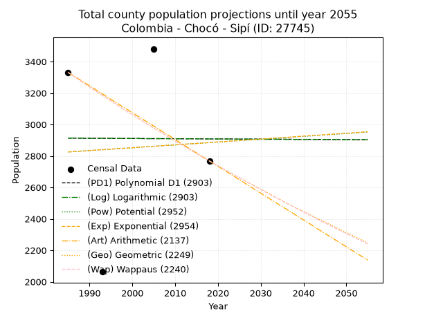
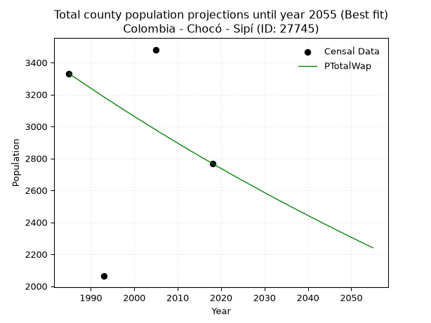
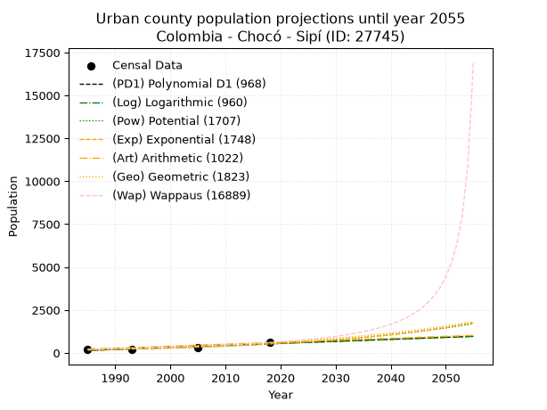
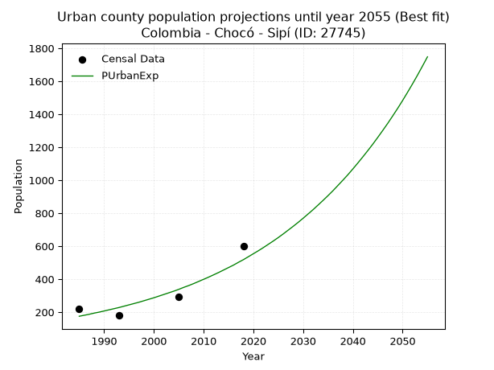
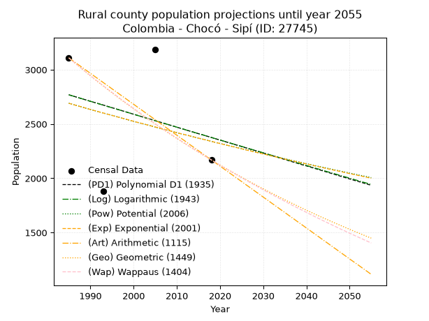
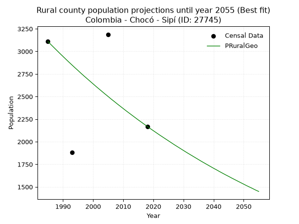

<div align="center">


</div>

# _“Population and Public Services Demand Projections (PPSD) until Year 2050 for Colombia - Chocó - Sipí (ID: 27745)”_
Keywords: `population` `public-service` `projection` `lineal` `polynomial` `logarithmic` `potential` `exponential` `arithmetic` `geometric` `wappaus` `dane` `colombia` `south-america`

PPSD are analytical estimates used by governments and planners to anticipate future changes in population size, age distribution, and the resulting community needs for utilities, healthcare, education, and infrastructure as sizing future water treatment facilities, electrical grids, and road networks based on spatial growth.

> **General running parameters**: • app_version: _v20260806_. • Python version: _3.14.7_. • Pandas version: _3.0.5_. • NumPy version: _2.5.1_. • Creates, save and include plots into reports (create_plot): _False_. • Projection until year: _2050_. • Process polynomial degree 2 and up: _False_. • Process Wappaus: _True_. • Process Wappaus: _True_. • Set negative values to zero: _True_. • Set infinite values to zero: _True_. • Drop dataset notes: _True_. 
<div align="center">

Dynamic map: [:earth_americas:Google](http://maps.google.com/maps?q=4.652620415,-76.6434532) [:earth_americas:OSM](https://www.openstreetmap.org/#map=18/4.652620415/-76.6434532&layers=P) [:earth_americas:Bing](https://www.bing.com/maps?cp=4.652620415~-76.6434532&lvl=18) [:earth_americas:Apple](https://maps.apple.com/frame?center=4.652620415%2C-76.6434532&span=0.003%2C0.006)

</div>


<div align="center">

```geojson
{
  "type": "Feature",
  "geometry": {
    "type": "Point", 
    "coordinates": [-76.6434532, 4.652620415]
  }, 
  "properties": {
    "Name": "Colombia - Chocó - Sipí (ID: 27745)"
  }
}
```

</div>


## 0. Census Data (4 records)

Census data are official statistics collected by a government about the people and housing in a country. They usually include counts of total population, age, sex, race, income, education, and jobs.

📅Global census file: [Population.xlsx](../data/Population.xlsx)

| Source   |   Year |   CountryID | CountryName   |   StateID | StateName   |   CountyID | CountyName   |   PTotal |   PUrban |   PRural |
|:---------|-------:|------------:|:--------------|----------:|:------------|-----------:|:-------------|---------:|---------:|---------:|
| DANE     |   1985 |          57 | Colombia      |        27 | Chocó       |      27745 | Sipí         |     3331 |      222 |     3109 |
| DANE     |   1993 |          57 | Colombia      |        27 | Chocó       |      27745 | Sipí         |     2063 |      180 |     1883 |
| DANE     |   2005 |          57 | Colombia      |        27 | Chocó       |      27745 | Sipí         |     3481 |      293 |     3188 |
| DANE     |   2018 |          57 | Colombia      |        27 | Chocó       |      27745 | Sipí         |     2768 |      599 |     2169 |

> 🔥Some records has specific notes about the registered values or the corresponding urban or rural distribution.

## 1. Total

### 1.1. Coefficients and Parameters

* (PD1) Polynomial Deg 1: -0.14090726615778607, 3192.599759132111 (lineal)
* (Log) Logarithmic: -299.6854567566696, 5188.661558335978
* (Pow) Potential: 1.2635741576314274, -0.7159181277888524
* (Exp) Exponential: 0.0006365509224823801, 798.4831826516224
* (Art) Arithmetic: Year diff. 2018 - 1985 = 33, Population diff. 2768 - 3331 = -563, Annual growth = -17.060606060606062
* (Geo) Geometric: Year diff. 2018 - 1985 = 33, Population diff. 2768 - 3331 = -563, Annual growth % = -0.005594821317956744
* (Wap) Wappaus: i = -0.5594558472079377, Condition values only valid for < 200)

<sub>
Wappaus condition values: ['-0.00', '-0.56', '-1.12', '-1.68', '-2.24', '-2.80', '-3.36', '-3.92', '-4.48', '-5.04', '-5.59', '-6.15', '-6.71', '-7.27', '-7.83', '-8.39', '-8.95', '-9.51', '-10.07', '-10.63', '-11.19', '-11.75', '-12.31', '-12.87', '-13.43', '-13.99', '-14.55', '-15.11', '-15.66', '-16.22', '-16.78', '-17.34', '-17.90', '-18.46', '-19.02', '-19.58', '-20.14', '-20.70', '-21.26', '-21.82', '-22.38', '-22.94', '-23.50', '-24.06', '-24.62', '-25.18', '-25.73', '-26.29', '-26.85', '-27.41', '-27.97', '-28.53', '-29.09', '-29.65', '-30.21', '-30.77', '-31.33', '-31.89', '-32.45', '-33.01', '-33.57', '-34.13', '-34.69', '-35.25', '-35.81', '-36.36']
</sub>


### 1.2. Projected Dataset

|   Year |   CountyID |   PTotalPD1 |   PTotalLog |   PTotalPow |   PTotalExp |   PTotalArt |   PTotalGeo |   PTotalWap |
|-------:|-----------:|------------:|------------:|------------:|------------:|------------:|------------:|------------:|
|   1985 |      27745 |        2913 |        2913 |        2825 |        2825 |        3331 |        3331 |        3331 |
|   1986 |      27745 |        2913 |        2913 |        2827 |        2827 |        3314 |        3312 |        3312 |
|   1987 |      27745 |        2913 |        2913 |        2829 |        2829 |        3297 |        3294 |        3294 |
|   1988 |      27745 |        2912 |        2913 |        2831 |        2830 |        3280 |        3275 |        3276 |
|   1989 |      27745 |        2912 |        2912 |        2832 |        2832 |        3263 |        3257 |        3257 |
|   1990 |      27745 |        2912 |        2912 |        2834 |        2834 |        3246 |        3239 |        3239 |
|   1991 |      27745 |        2912 |        2912 |        2836 |        2836 |        3229 |        3221 |        3221 |
|   1992 |      27745 |        2912 |        2912 |        2838 |        2838 |        3212 |        3203 |        3203 |
|   1993 |      27745 |        2912 |        2912 |        2840 |        2839 |        3195 |        3185 |        3185 |
|   1994 |      27745 |        2912 |        2912 |        2841 |        2841 |        3177 |        3167 |        3167 |
|   1995 |      27745 |        2911 |        2912 |        2843 |        2843 |        3160 |        3149 |        3150 |
|   1996 |      27745 |        2911 |        2911 |        2845 |        2845 |        3143 |        3132 |        3132 |
|   1997 |      27745 |        2911 |        2911 |        2847 |        2847 |        3126 |        3114 |        3115 |
|   1998 |      27745 |        2911 |        2911 |        2849 |        2848 |        3109 |        3097 |        3097 |
|   1999 |      27745 |        2911 |        2911 |        2850 |        2850 |        3092 |        3079 |        3080 |
|   2000 |      27745 |        2911 |        2911 |        2852 |        2852 |        3075 |        3062 |        3063 |
|   2001 |      27745 |        2911 |        2911 |        2854 |        2854 |        3058 |        3045 |        3046 |
|   2002 |      27745 |        2911 |        2910 |        2856 |        2856 |        3041 |        3028 |        3029 |
|   2003 |      27745 |        2910 |        2910 |        2858 |        2858 |        3024 |        3011 |        3012 |
|   2004 |      27745 |        2910 |        2910 |        2859 |        2859 |        3007 |        2994 |        2995 |
|   2005 |      27745 |        2910 |        2910 |        2861 |        2861 |        2990 |        2977 |        2978 |
|   2006 |      27745 |        2910 |        2910 |        2863 |        2863 |        2973 |        2961 |        2961 |
|   2007 |      27745 |        2910 |        2910 |        2865 |        2865 |        2956 |        2944 |        2945 |
|   2008 |      27745 |        2910 |        2910 |        2867 |        2867 |        2939 |        2928 |        2928 |
|   2009 |      27745 |        2910 |        2909 |        2868 |        2869 |        2922 |        2911 |        2912 |
|   2010 |      27745 |        2909 |        2909 |        2870 |        2870 |        2904 |        2895 |        2896 |
|   2011 |      27745 |        2909 |        2909 |        2872 |        2872 |        2887 |        2879 |        2879 |
|   2012 |      27745 |        2909 |        2909 |        2874 |        2874 |        2870 |        2863 |        2863 |
|   2013 |      27745 |        2909 |        2909 |        2876 |        2876 |        2853 |        2847 |        2847 |
|   2014 |      27745 |        2909 |        2909 |        2877 |        2878 |        2836 |        2831 |        2831 |
|   2015 |      27745 |        2909 |        2909 |        2879 |        2879 |        2819 |        2815 |        2815 |
|   2016 |      27745 |        2909 |        2908 |        2881 |        2881 |        2802 |        2799 |        2799 |
|   2017 |      27745 |        2908 |        2908 |        2883 |        2883 |        2785 |        2784 |        2784 |
|   2018 |      27745 |        2908 |        2908 |        2885 |        2885 |        2768 |        2768 |        2768 |
|   2019 |      27745 |        2908 |        2908 |        2886 |        2887 |        2751 |        2753 |        2752 |
|   2020 |      27745 |        2908 |        2908 |        2888 |        2889 |        2734 |        2737 |        2737 |
|   2021 |      27745 |        2908 |        2908 |        2890 |        2890 |        2717 |        2722 |        2722 |
|   2022 |      27745 |        2908 |        2908 |        2892 |        2892 |        2700 |        2707 |        2706 |
|   2023 |      27745 |        2908 |        2907 |        2894 |        2894 |        2683 |        2691 |        2691 |
|   2024 |      27745 |        2907 |        2907 |        2896 |        2896 |        2666 |        2676 |        2676 |
|   2025 |      27745 |        2907 |        2907 |        2897 |        2898 |        2649 |        2661 |        2661 |
|   2026 |      27745 |        2907 |        2907 |        2899 |        2900 |        2632 |        2647 |        2646 |
|   2027 |      27745 |        2907 |        2907 |        2901 |        2902 |        2614 |        2632 |        2631 |
|   2028 |      27745 |        2907 |        2907 |        2903 |        2903 |        2597 |        2617 |        2616 |
|   2029 |      27745 |        2907 |        2906 |        2905 |        2905 |        2580 |        2602 |        2601 |
|   2030 |      27745 |        2907 |        2906 |        2906 |        2907 |        2563 |        2588 |        2586 |
|   2031 |      27745 |        2906 |        2906 |        2908 |        2909 |        2546 |        2573 |        2571 |
|   2032 |      27745 |        2906 |        2906 |        2910 |        2911 |        2529 |        2559 |        2557 |
|   2033 |      27745 |        2906 |        2906 |        2912 |        2913 |        2512 |        2545 |        2542 |
|   2034 |      27745 |        2906 |        2906 |        2914 |        2915 |        2495 |        2530 |        2528 |
|   2035 |      27745 |        2906 |        2906 |        2915 |        2916 |        2478 |        2516 |        2514 |
|   2036 |      27745 |        2906 |        2905 |        2917 |        2918 |        2461 |        2502 |        2499 |
|   2037 |      27745 |        2906 |        2905 |        2919 |        2920 |        2444 |        2488 |        2485 |
|   2038 |      27745 |        2905 |        2905 |        2921 |        2922 |        2427 |        2474 |        2471 |
|   2039 |      27745 |        2905 |        2905 |        2923 |        2924 |        2410 |        2460 |        2457 |
|   2040 |      27745 |        2905 |        2905 |        2924 |        2926 |        2393 |        2447 |        2443 |
|   2041 |      27745 |        2905 |        2905 |        2926 |        2928 |        2376 |        2433 |        2429 |
|   2042 |      27745 |        2905 |        2905 |        2928 |        2929 |        2359 |        2419 |        2415 |
|   2043 |      27745 |        2905 |        2904 |        2930 |        2931 |        2341 |        2406 |        2401 |
|   2044 |      27745 |        2905 |        2904 |        2932 |        2933 |        2324 |        2392 |        2387 |
|   2045 |      27745 |        2904 |        2904 |        2934 |        2935 |        2307 |        2379 |        2374 |
|   2046 |      27745 |        2904 |        2904 |        2935 |        2937 |        2290 |        2366 |        2360 |
|   2047 |      27745 |        2904 |        2904 |        2937 |        2939 |        2273 |        2352 |        2346 |
|   2048 |      27745 |        2904 |        2904 |        2939 |        2941 |        2256 |        2339 |        2333 |
|   2049 |      27745 |        2904 |        2904 |        2941 |        2942 |        2239 |        2326 |        2319 |
|   2050 |      27745 |        2904 |        2903 |        2943 |        2944 |        2222 |        2313 |        2306 |
<div align="center">

</img>

</div>


### 1.3. Best fit with absolute error and relative error (%)

Relative error puts that difference into context by dividing the absolute error by the true value, creating a unitless ratio or percentage that shows the scale of the mistake.

Absolute and relative error

|   Year | Source   |   CountryID | CountryName   |   StateID | StateName   |   CountyID_x | CountyName   |   PTotal |   PUrban |   PRural |   CountyID_y |   PTotalPD1 |   PTotalLog |   PTotalPow |   PTotalExp |   PTotalArt |   PTotalGeo |   PTotalWap |   PTotalPD1AbsError |   PTotalLogAbsError |   PTotalPowAbsError |   PTotalExpAbsError |   PTotalArtAbsError |   PTotalGeoAbsError |   PTotalWapAbsError |   PTotalPD1RelError |   PTotalLogRelError |   PTotalPowRelError |   PTotalExpRelError |   PTotalArtRelError |   PTotalGeoRelError |   PTotalWapRelError |
|-------:|:---------|------------:|:--------------|----------:|:------------|-------------:|:-------------|---------:|---------:|---------:|-------------:|------------:|------------:|------------:|------------:|------------:|------------:|------------:|--------------------:|--------------------:|--------------------:|--------------------:|--------------------:|--------------------:|--------------------:|--------------------:|--------------------:|--------------------:|--------------------:|--------------------:|--------------------:|--------------------:|
|   1985 | DANE     |          57 | Colombia      |        27 | Chocó       |        27745 | Sipí         |     3331 |      222 |     3109 |        27745 |        2913 |        2913 |        2825 |        2825 |        3331 |        3331 |        3331 |                 418 |                 418 |                 506 |                 506 |                   0 |                   0 |                   0 |             12.5488 |             12.5488 |            15.1906  |            15.1906  |              0      |              0      |              0      |
|   1993 | DANE     |          57 | Colombia      |        27 | Chocó       |        27745 | Sipí         |     2063 |      180 |     1883 |        27745 |        2912 |        2912 |        2840 |        2839 |        3195 |        3185 |        3185 |                 849 |                 849 |                 777 |                 776 |                1132 |                1122 |                1122 |             41.1537 |             41.1537 |            37.6636  |            37.6151  |             54.8715 |             54.3868 |             54.3868 |
|   2005 | DANE     |          57 | Colombia      |        27 | Chocó       |        27745 | Sipí         |     3481 |      293 |     3188 |        27745 |        2910 |        2910 |        2861 |        2861 |        2990 |        2977 |        2978 |                 571 |                 571 |                 620 |                 620 |                 491 |                 504 |                 503 |             16.4033 |             16.4033 |            17.811   |            17.811   |             14.1051 |             14.4786 |             14.4499 |
|   2018 | DANE     |          57 | Colombia      |        27 | Chocó       |        27745 | Sipí         |     2768 |      599 |     2169 |        27745 |        2908 |        2908 |        2885 |        2885 |        2768 |        2768 |        2768 |                 140 |                 140 |                 117 |                 117 |                   0 |                   0 |                   0 |              5.0578 |              5.0578 |             4.22688 |             4.22688 |              0      |              0      |              0      |

Relative error mean

| Method    |   RelError | Best   |
|:----------|-----------:|:-------|
| PTotalPD1 |    18.7909 |        |
| PTotalLog |    18.7909 |        |
| PTotalPow |    18.723  |        |
| PTotalExp |    18.7109 |        |
| PTotalArt |    17.2442 |        |
| PTotalGeo |    17.2164 |        |
| PTotalWap |    17.2092 | True   |

💙Best method: _**PTotalWap**_
<div align="center">

</img>

</div>


### 1.4. Fresh water supply demand in liters per capita per day (lpcd)

The fresh water supply demand typically ranges from 100 to 300 liters per capita per day (lpcd) for standard domestic and municipal planning, though absolute survival minimums set by the World Health Organization are as low as 7.5 to 20 liters per day, and total consumption in high-income nations can exceed 400 liters.

> `CZ`: Level in meters above the sea level (masl).<br> `WS`: Fresh water supply demand in liters per capita per day (lpcd or l/h/d).<br> `WSAll`: Zonal fresh water supply demand in liters per second (l/s).<br> `A`: Zonal area in square meters.

Reference values (RAS Colombia)

|    CZ |   WS |
|------:|-----:|
|  1000 |  120 |
|  2000 |  130 |
| 99999 |  140 |

County shapefile geometry properties and water supply values

|   CountyID |      ATotal |   CZTotal |   WSTotal |
|-----------:|------------:|----------:|----------:|
|      27745 | 1.57745e+09 |   587.401 |       120 |

Projected values for best method: PTotalWap

|   CountyID |   Year |   PTotalWap |   WSTotal |   WSTotalAll |
|-----------:|-------:|------------:|----------:|-------------:|
|      27745 |   1985 |        3331 |       120 |      4.62639 |
|      27745 |   1986 |        3312 |       120 |      4.6     |
|      27745 |   1987 |        3294 |       120 |      4.575   |
|      27745 |   1988 |        3276 |       120 |      4.55    |
|      27745 |   1989 |        3257 |       120 |      4.52361 |
|      27745 |   1990 |        3239 |       120 |      4.49861 |
|      27745 |   1991 |        3221 |       120 |      4.47361 |
|      27745 |   1992 |        3203 |       120 |      4.44861 |
|      27745 |   1993 |        3185 |       120 |      4.42361 |
|      27745 |   1994 |        3167 |       120 |      4.39861 |
|      27745 |   1995 |        3150 |       120 |      4.375   |
|      27745 |   1996 |        3132 |       120 |      4.35    |
|      27745 |   1997 |        3115 |       120 |      4.32639 |
|      27745 |   1998 |        3097 |       120 |      4.30139 |
|      27745 |   1999 |        3080 |       120 |      4.27778 |
|      27745 |   2000 |        3063 |       120 |      4.25417 |
|      27745 |   2001 |        3046 |       120 |      4.23056 |
|      27745 |   2002 |        3029 |       120 |      4.20694 |
|      27745 |   2003 |        3012 |       120 |      4.18333 |
|      27745 |   2004 |        2995 |       120 |      4.15972 |
|      27745 |   2005 |        2978 |       120 |      4.13611 |
|      27745 |   2006 |        2961 |       120 |      4.1125  |
|      27745 |   2007 |        2945 |       120 |      4.09028 |
|      27745 |   2008 |        2928 |       120 |      4.06667 |
|      27745 |   2009 |        2912 |       120 |      4.04444 |
|      27745 |   2010 |        2896 |       120 |      4.02222 |
|      27745 |   2011 |        2879 |       120 |      3.99861 |
|      27745 |   2012 |        2863 |       120 |      3.97639 |
|      27745 |   2013 |        2847 |       120 |      3.95417 |
|      27745 |   2014 |        2831 |       120 |      3.93194 |
|      27745 |   2015 |        2815 |       120 |      3.90972 |
|      27745 |   2016 |        2799 |       120 |      3.8875  |
|      27745 |   2017 |        2784 |       120 |      3.86667 |
|      27745 |   2018 |        2768 |       120 |      3.84444 |
|      27745 |   2019 |        2752 |       120 |      3.82222 |
|      27745 |   2020 |        2737 |       120 |      3.80139 |
|      27745 |   2021 |        2722 |       120 |      3.78056 |
|      27745 |   2022 |        2706 |       120 |      3.75833 |
|      27745 |   2023 |        2691 |       120 |      3.7375  |
|      27745 |   2024 |        2676 |       120 |      3.71667 |
|      27745 |   2025 |        2661 |       120 |      3.69583 |
|      27745 |   2026 |        2646 |       120 |      3.675   |
|      27745 |   2027 |        2631 |       120 |      3.65417 |
|      27745 |   2028 |        2616 |       120 |      3.63333 |
|      27745 |   2029 |        2601 |       120 |      3.6125  |
|      27745 |   2030 |        2586 |       120 |      3.59167 |
|      27745 |   2031 |        2571 |       120 |      3.57083 |
|      27745 |   2032 |        2557 |       120 |      3.55139 |
|      27745 |   2033 |        2542 |       120 |      3.53056 |
|      27745 |   2034 |        2528 |       120 |      3.51111 |
|      27745 |   2035 |        2514 |       120 |      3.49167 |
|      27745 |   2036 |        2499 |       120 |      3.47083 |
|      27745 |   2037 |        2485 |       120 |      3.45139 |
|      27745 |   2038 |        2471 |       120 |      3.43194 |
|      27745 |   2039 |        2457 |       120 |      3.4125  |
|      27745 |   2040 |        2443 |       120 |      3.39306 |
|      27745 |   2041 |        2429 |       120 |      3.37361 |
|      27745 |   2042 |        2415 |       120 |      3.35417 |
|      27745 |   2043 |        2401 |       120 |      3.33472 |
|      27745 |   2044 |        2387 |       120 |      3.31528 |
|      27745 |   2045 |        2374 |       120 |      3.29722 |
|      27745 |   2046 |        2360 |       120 |      3.27778 |
|      27745 |   2047 |        2346 |       120 |      3.25833 |
|      27745 |   2048 |        2333 |       120 |      3.24028 |
|      27745 |   2049 |        2319 |       120 |      3.22083 |
|      27745 |   2050 |        2306 |       120 |      3.20278 |

## 2. Urban

### 2.1. Coefficients and Parameters

* (PD1) Polynomial Deg 1: 11.77599357687656, -23231.43115214734 (lineal)
* (Log) Logarithmic: 23543.686639720097, -178632.2508157766
* (Pow) Potential: 65.68391691899738, -214.3661110510273
* (Exp) Exponential: 0.03284937136390797, 8.419997658413759e-27
* (Art) Arithmetic: Year diff. 2018 - 1985 = 33, Population diff. 599 - 222 = 377, Annual growth = 11.424242424242424
* (Geo) Geometric: Year diff. 2018 - 1985 = 33, Population diff. 599 - 222 = 377, Annual growth % = 0.03053523157815885
* (Wap) Wappaus: i = 2.78300668069243, Condition values only valid for < 200)

<sub>
Wappaus condition values: ['0.00', '2.78', '5.57', '8.35', '11.13', '13.92', '16.70', '19.48', '22.26', '25.05', '27.83', '30.61', '33.40', '36.18', '38.96', '41.75', '44.53', '47.31', '50.09', '52.88', '55.66', '58.44', '61.23', '64.01', '66.79', '69.58', '72.36', '75.14', '77.92', '80.71', '83.49', '86.27', '89.06', '91.84', '94.62', '97.41', '100.19', '102.97', '105.75', '108.54', '111.32', '114.10', '116.89', '119.67', '122.45', '125.24', '128.02', '130.80', '133.58', '136.37', '139.15', '141.93', '144.72', '147.50', '150.28', '153.07', '155.85', '158.63', '161.41', '164.20', '166.98', '169.76', '172.55', '175.33', '178.11', '180.90']
</sub>


### 2.2. Projected Dataset

|   Year |   CountyID |   PUrbanPD1 |   PUrbanLog |   PUrbanPow |   PUrbanExp |   PUrbanArt |   PUrbanGeo |   PUrbanWap |
|-------:|-----------:|------------:|------------:|------------:|------------:|------------:|------------:|------------:|
|   1985 |      27745 |         144 |         144 |         175 |         175 |         222 |         222 |         222 |
|   1986 |      27745 |         156 |         156 |         181 |         181 |         233 |         229 |         228 |
|   1987 |      27745 |         167 |         167 |         187 |         187 |         245 |         236 |         235 |
|   1988 |      27745 |         179 |         179 |         194 |         194 |         256 |         243 |         241 |
|   1989 |      27745 |         191 |         191 |         200 |         200 |         268 |         250 |         248 |
|   1990 |      27745 |         203 |         203 |         207 |         207 |         279 |         258 |         255 |
|   1991 |      27745 |         215 |         215 |         214 |         214 |         291 |         266 |         262 |
|   1992 |      27745 |         226 |         227 |         221 |         221 |         302 |         274 |         270 |
|   1993 |      27745 |         238 |         238 |         228 |         228 |         313 |         282 |         278 |
|   1994 |      27745 |         250 |         250 |         236 |         236 |         325 |         291 |         286 |
|   1995 |      27745 |         262 |         262 |         244 |         244 |         336 |         300 |         294 |
|   1996 |      27745 |         273 |         274 |         252 |         252 |         348 |         309 |         302 |
|   1997 |      27745 |         285 |         286 |         260 |         260 |         359 |         318 |         311 |
|   1998 |      27745 |         297 |         297 |         269 |         269 |         371 |         328 |         320 |
|   1999 |      27745 |         309 |         309 |         278 |         278 |         382 |         338 |         329 |
|   2000 |      27745 |         321 |         321 |         287 |         287 |         393 |         349 |         339 |
|   2001 |      27745 |         332 |         333 |         297 |         297 |         405 |         359 |         349 |
|   2002 |      27745 |         344 |         345 |         307 |         307 |         416 |         370 |         360 |
|   2003 |      27745 |         356 |         356 |         317 |         317 |         428 |         381 |         370 |
|   2004 |      27745 |         368 |         368 |         328 |         327 |         439 |         393 |         382 |
|   2005 |      27745 |         379 |         380 |         339 |         338 |         450 |         405 |         393 |
|   2006 |      27745 |         391 |         392 |         350 |         350 |         462 |         418 |         405 |
|   2007 |      27745 |         403 |         403 |         362 |         361 |         473 |         430 |         418 |
|   2008 |      27745 |         415 |         415 |         374 |         373 |         485 |         443 |         431 |
|   2009 |      27745 |         427 |         427 |         386 |         386 |         496 |         457 |         445 |
|   2010 |      27745 |         438 |         438 |         399 |         399 |         508 |         471 |         459 |
|   2011 |      27745 |         450 |         450 |         412 |         412 |         519 |         485 |         474 |
|   2012 |      27745 |         462 |         462 |         426 |         426 |         530 |         500 |         489 |
|   2013 |      27745 |         474 |         474 |         440 |         440 |         542 |         515 |         505 |
|   2014 |      27745 |         485 |         485 |         454 |         455 |         553 |         531 |         522 |
|   2015 |      27745 |         497 |         497 |         469 |         470 |         565 |         547 |         540 |
|   2016 |      27745 |         509 |         509 |         485 |         485 |         576 |         564 |         559 |
|   2017 |      27745 |         521 |         520 |         501 |         502 |         588 |         581 |         578 |
|   2018 |      27745 |         533 |         532 |         518 |         518 |         599 |         599 |         599 |
|   2019 |      27745 |         544 |         544 |         535 |         536 |         610 |         617 |         621 |
|   2020 |      27745 |         556 |         555 |         552 |         554 |         622 |         636 |         644 |
|   2021 |      27745 |         568 |         567 |         571 |         572 |         633 |         656 |         668 |
|   2022 |      27745 |         580 |         579 |         590 |         591 |         645 |         676 |         693 |
|   2023 |      27745 |         591 |         590 |         609 |         611 |         656 |         696 |         720 |
|   2024 |      27745 |         603 |         602 |         629 |         631 |         668 |         717 |         749 |
|   2025 |      27745 |         615 |         613 |         650 |         652 |         679 |         739 |         779 |
|   2026 |      27745 |         627 |         625 |         671 |         674 |         690 |         762 |         812 |
|   2027 |      27745 |         639 |         637 |         693 |         697 |         702 |         785 |         846 |
|   2028 |      27745 |         650 |         648 |         716 |         720 |         713 |         809 |         883 |
|   2029 |      27745 |         662 |         660 |         740 |         744 |         725 |         834 |         923 |
|   2030 |      27745 |         674 |         672 |         764 |         769 |         736 |         859 |         966 |
|   2031 |      27745 |         686 |         683 |         789 |         795 |         748 |         886 |        1012 |
|   2032 |      27745 |         697 |         695 |         815 |         821 |         759 |         913 |        1061 |
|   2033 |      27745 |         709 |         706 |         842 |         849 |         770 |         941 |        1115 |
|   2034 |      27745 |         721 |         718 |         870 |         877 |         782 |         969 |        1174 |
|   2035 |      27745 |         733 |         729 |         898 |         906 |         793 |         999 |        1237 |
|   2036 |      27745 |         744 |         741 |         928 |         936 |         805 |        1029 |        1307 |
|   2037 |      27745 |         756 |         753 |         958 |         968 |         816 |        1061 |        1384 |
|   2038 |      27745 |         768 |         764 |         989 |        1000 |         827 |        1093 |        1469 |
|   2039 |      27745 |         780 |         776 |        1022 |        1033 |         839 |        1127 |        1564 |
|   2040 |      27745 |         792 |         787 |        1055 |        1068 |         850 |        1161 |        1670 |
|   2041 |      27745 |         803 |         799 |        1090 |        1104 |         862 |        1196 |        1789 |
|   2042 |      27745 |         815 |         810 |        1125 |        1141 |         873 |        1233 |        1925 |
|   2043 |      27745 |         827 |         822 |        1162 |        1179 |         885 |        1271 |        2079 |
|   2044 |      27745 |         839 |         833 |        1200 |        1218 |         896 |        1309 |        2258 |
|   2045 |      27745 |         850 |         845 |        1239 |        1259 |         907 |        1349 |        2467 |
|   2046 |      27745 |         862 |         856 |        1280 |        1301 |         919 |        1391 |        2715 |
|   2047 |      27745 |         874 |         868 |        1322 |        1344 |         930 |        1433 |        3013 |
|   2048 |      27745 |         886 |         879 |        1365 |        1389 |         942 |        1477 |        3377 |
|   2049 |      27745 |         898 |         891 |        1409 |        1435 |         953 |        1522 |        3835 |
|   2050 |      27745 |         909 |         902 |        1455 |        1483 |         965 |        1568 |        4426 |
<div align="center">

</img>

</div>


### 2.3. Best fit with absolute error and relative error (%)

Relative error puts that difference into context by dividing the absolute error by the true value, creating a unitless ratio or percentage that shows the scale of the mistake.

Absolute and relative error

|   Year | Source   |   CountryID | CountryName   |   StateID | StateName   |   CountyID_x | CountyName   |   PTotal |   PUrban |   PRural |   CountyID_y |   PUrbanPD1 |   PUrbanLog |   PUrbanPow |   PUrbanExp |   PUrbanArt |   PUrbanGeo |   PUrbanWap |   PUrbanPD1AbsError |   PUrbanLogAbsError |   PUrbanPowAbsError |   PUrbanExpAbsError |   PUrbanArtAbsError |   PUrbanGeoAbsError |   PUrbanWapAbsError |   PUrbanPD1RelError |   PUrbanLogRelError |   PUrbanPowRelError |   PUrbanExpRelError |   PUrbanArtRelError |   PUrbanGeoRelError |   PUrbanWapRelError |
|-------:|:---------|------------:|:--------------|----------:|:------------|-------------:|:-------------|---------:|---------:|---------:|-------------:|------------:|------------:|------------:|------------:|------------:|------------:|------------:|--------------------:|--------------------:|--------------------:|--------------------:|--------------------:|--------------------:|--------------------:|--------------------:|--------------------:|--------------------:|--------------------:|--------------------:|--------------------:|--------------------:|
|   1985 | DANE     |          57 | Colombia      |        27 | Chocó       |        27745 | Sipí         |     3331 |      222 |     3109 |        27745 |         144 |         144 |         175 |         175 |         222 |         222 |         222 |                  78 |                  78 |                  47 |                  47 |                   0 |                   0 |                   0 |             35.1351 |             35.1351 |             21.1712 |             21.1712 |              0      |              0      |              0      |
|   1993 | DANE     |          57 | Colombia      |        27 | Chocó       |        27745 | Sipí         |     2063 |      180 |     1883 |        27745 |         238 |         238 |         228 |         228 |         313 |         282 |         278 |                  58 |                  58 |                  48 |                  48 |                 133 |                 102 |                  98 |             32.2222 |             32.2222 |             26.6667 |             26.6667 |             73.8889 |             56.6667 |             54.4444 |
|   2005 | DANE     |          57 | Colombia      |        27 | Chocó       |        27745 | Sipí         |     3481 |      293 |     3188 |        27745 |         379 |         380 |         339 |         338 |         450 |         405 |         393 |                  86 |                  87 |                  46 |                  45 |                 157 |                 112 |                 100 |             29.3515 |             29.6928 |             15.6997 |             15.3584 |             53.5836 |             38.2253 |             34.1297 |
|   2018 | DANE     |          57 | Colombia      |        27 | Chocó       |        27745 | Sipí         |     2768 |      599 |     2169 |        27745 |         533 |         532 |         518 |         518 |         599 |         599 |         599 |                  66 |                  67 |                  81 |                  81 |                   0 |                   0 |                   0 |             11.0184 |             11.1853 |             13.5225 |             13.5225 |              0      |              0      |              0      |

Relative error mean

| Method    |   RelError | Best   |
|:----------|-----------:|:-------|
| PUrbanPD1 |    26.9318 |        |
| PUrbanLog |    27.0589 |        |
| PUrbanPow |    19.265  |        |
| PUrbanExp |    19.1797 | True   |
| PUrbanArt |    31.8681 |        |
| PUrbanGeo |    23.723  |        |
| PUrbanWap |    22.1435 |        |

💙Best method: _**PUrbanExp**_
<div align="center">

</img>

</div>


### 2.4. Fresh water supply demand in liters per capita per day (lpcd)

The fresh water supply demand typically ranges from 100 to 300 liters per capita per day (lpcd) for standard domestic and municipal planning, though absolute survival minimums set by the World Health Organization are as low as 7.5 to 20 liters per day, and total consumption in high-income nations can exceed 400 liters.

> `CZ`: Level in meters above the sea level (masl).<br> `WS`: Fresh water supply demand in liters per capita per day (lpcd or l/h/d).<br> `WSAll`: Zonal fresh water supply demand in liters per second (l/s).<br> `A`: Zonal area in square meters.

Reference values (RAS Colombia)

|    CZ |   WS |
|------:|-----:|
|  1000 |  120 |
|  2000 |  130 |
| 99999 |  140 |

County shapefile geometry properties and water supply values

|   CountyID |   AUrban |   CZUrban |   WSUrban |
|-----------:|---------:|----------:|----------:|
|      27745 |   413537 |   48.6153 |       120 |

Projected values for best method: PUrbanExp

|   CountyID |   Year |   PUrbanExp |   WSUrban |   WSUrbanAll |
|-----------:|-------:|------------:|----------:|-------------:|
|      27745 |   1985 |         175 |       120 |     0.243056 |
|      27745 |   1986 |         181 |       120 |     0.251389 |
|      27745 |   1987 |         187 |       120 |     0.259722 |
|      27745 |   1988 |         194 |       120 |     0.269444 |
|      27745 |   1989 |         200 |       120 |     0.277778 |
|      27745 |   1990 |         207 |       120 |     0.2875   |
|      27745 |   1991 |         214 |       120 |     0.297222 |
|      27745 |   1992 |         221 |       120 |     0.306944 |
|      27745 |   1993 |         228 |       120 |     0.316667 |
|      27745 |   1994 |         236 |       120 |     0.327778 |
|      27745 |   1995 |         244 |       120 |     0.338889 |
|      27745 |   1996 |         252 |       120 |     0.35     |
|      27745 |   1997 |         260 |       120 |     0.361111 |
|      27745 |   1998 |         269 |       120 |     0.373611 |
|      27745 |   1999 |         278 |       120 |     0.386111 |
|      27745 |   2000 |         287 |       120 |     0.398611 |
|      27745 |   2001 |         297 |       120 |     0.4125   |
|      27745 |   2002 |         307 |       120 |     0.426389 |
|      27745 |   2003 |         317 |       120 |     0.440278 |
|      27745 |   2004 |         327 |       120 |     0.454167 |
|      27745 |   2005 |         338 |       120 |     0.469444 |
|      27745 |   2006 |         350 |       120 |     0.486111 |
|      27745 |   2007 |         361 |       120 |     0.501389 |
|      27745 |   2008 |         373 |       120 |     0.518056 |
|      27745 |   2009 |         386 |       120 |     0.536111 |
|      27745 |   2010 |         399 |       120 |     0.554167 |
|      27745 |   2011 |         412 |       120 |     0.572222 |
|      27745 |   2012 |         426 |       120 |     0.591667 |
|      27745 |   2013 |         440 |       120 |     0.611111 |
|      27745 |   2014 |         455 |       120 |     0.631944 |
|      27745 |   2015 |         470 |       120 |     0.652778 |
|      27745 |   2016 |         485 |       120 |     0.673611 |
|      27745 |   2017 |         502 |       120 |     0.697222 |
|      27745 |   2018 |         518 |       120 |     0.719444 |
|      27745 |   2019 |         536 |       120 |     0.744444 |
|      27745 |   2020 |         554 |       120 |     0.769444 |
|      27745 |   2021 |         572 |       120 |     0.794444 |
|      27745 |   2022 |         591 |       120 |     0.820833 |
|      27745 |   2023 |         611 |       120 |     0.848611 |
|      27745 |   2024 |         631 |       120 |     0.876389 |
|      27745 |   2025 |         652 |       120 |     0.905556 |
|      27745 |   2026 |         674 |       120 |     0.936111 |
|      27745 |   2027 |         697 |       120 |     0.968056 |
|      27745 |   2028 |         720 |       120 |     1        |
|      27745 |   2029 |         744 |       120 |     1.03333  |
|      27745 |   2030 |         769 |       120 |     1.06806  |
|      27745 |   2031 |         795 |       120 |     1.10417  |
|      27745 |   2032 |         821 |       120 |     1.14028  |
|      27745 |   2033 |         849 |       120 |     1.17917  |
|      27745 |   2034 |         877 |       120 |     1.21806  |
|      27745 |   2035 |         906 |       120 |     1.25833  |
|      27745 |   2036 |         936 |       120 |     1.3      |
|      27745 |   2037 |         968 |       120 |     1.34444  |
|      27745 |   2038 |        1000 |       120 |     1.38889  |
|      27745 |   2039 |        1033 |       120 |     1.43472  |
|      27745 |   2040 |        1068 |       120 |     1.48333  |
|      27745 |   2041 |        1104 |       120 |     1.53333  |
|      27745 |   2042 |        1141 |       120 |     1.58472  |
|      27745 |   2043 |        1179 |       120 |     1.6375   |
|      27745 |   2044 |        1218 |       120 |     1.69167  |
|      27745 |   2045 |        1259 |       120 |     1.74861  |
|      27745 |   2046 |        1301 |       120 |     1.80694  |
|      27745 |   2047 |        1344 |       120 |     1.86667  |
|      27745 |   2048 |        1389 |       120 |     1.92917  |
|      27745 |   2049 |        1435 |       120 |     1.99306  |
|      27745 |   2050 |        1483 |       120 |     2.05972  |

## 3. Rural

### 3.1. Coefficients and Parameters

* (PD1) Polynomial Deg 1: -11.916900843034375, 26424.03091127951 (lineal)
* (Log) Logarithmic: -23843.37209647675, 183820.91237411243
* (Pow) Potential: -8.471618703440136, 31.36726803029389
* (Exp) Exponential: -0.004232880898290167, 11992381.596350726
* (Art) Arithmetic: Year diff. 2018 - 1985 = 33, Population diff. 2169 - 3109 = -940, Annual growth = -28.484848484848484
* (Geo) Geometric: Year diff. 2018 - 1985 = 33, Population diff. 2169 - 3109 = -940, Annual growth % = -0.010850848644376132
* (Wap) Wappaus: i = -1.0793803897252172, Condition values only valid for < 200)

<sub>
Wappaus condition values: ['-0.00', '-1.08', '-2.16', '-3.24', '-4.32', '-5.40', '-6.48', '-7.56', '-8.64', '-9.71', '-10.79', '-11.87', '-12.95', '-14.03', '-15.11', '-16.19', '-17.27', '-18.35', '-19.43', '-20.51', '-21.59', '-22.67', '-23.75', '-24.83', '-25.91', '-26.98', '-28.06', '-29.14', '-30.22', '-31.30', '-32.38', '-33.46', '-34.54', '-35.62', '-36.70', '-37.78', '-38.86', '-39.94', '-41.02', '-42.10', '-43.18', '-44.25', '-45.33', '-46.41', '-47.49', '-48.57', '-49.65', '-50.73', '-51.81', '-52.89', '-53.97', '-55.05', '-56.13', '-57.21', '-58.29', '-59.37', '-60.45', '-61.52', '-62.60', '-63.68', '-64.76', '-65.84', '-66.92', '-68.00', '-69.08', '-70.16']
</sub>


### 3.2. Projected Dataset

|   Year |   CountyID |   PRuralPD1 |   PRuralLog |   PRuralPow |   PRuralExp |   PRuralArt |   PRuralGeo |   PRuralWap |
|-------:|-----------:|------------:|------------:|------------:|------------:|------------:|------------:|------------:|
|   1985 |      27745 |        2769 |        2769 |        2691 |        2691 |        3109 |        3109 |        3109 |
|   1986 |      27745 |        2757 |        2757 |        2679 |        2679 |        3081 |        3075 |        3076 |
|   1987 |      27745 |        2745 |        2745 |        2668 |        2668 |        3052 |        3042 |        3043 |
|   1988 |      27745 |        2733 |        2733 |        2657 |        2657 |        3024 |        3009 |        3010 |
|   1989 |      27745 |        2721 |        2721 |        2645 |        2645 |        2995 |        2976 |        2978 |
|   1990 |      27745 |        2709 |        2709 |        2634 |        2634 |        2967 |        2944 |        2946 |
|   1991 |      27745 |        2697 |        2697 |        2623 |        2623 |        2938 |        2912 |        2914 |
|   1992 |      27745 |        2686 |        2685 |        2612 |        2612 |        2910 |        2880 |        2883 |
|   1993 |      27745 |        2674 |        2673 |        2601 |        2601 |        2881 |        2849 |        2852 |
|   1994 |      27745 |        2662 |        2661 |        2590 |        2590 |        2853 |        2818 |        2821 |
|   1995 |      27745 |        2650 |        2649 |        2579 |        2579 |        2824 |        2788 |        2791 |
|   1996 |      27745 |        2638 |        2638 |        2568 |        2568 |        2796 |        2757 |        2761 |
|   1997 |      27745 |        2626 |        2626 |        2557 |        2557 |        2767 |        2727 |        2731 |
|   1998 |      27745 |        2614 |        2614 |        2546 |        2547 |        2739 |        2698 |        2701 |
|   1999 |      27745 |        2602 |        2602 |        2535 |        2536 |        2710 |        2669 |        2672 |
|   2000 |      27745 |        2590 |        2590 |        2525 |        2525 |        2682 |        2640 |        2643 |
|   2001 |      27745 |        2578 |        2578 |        2514 |        2514 |        2653 |        2611 |        2615 |
|   2002 |      27745 |        2566 |        2566 |        2503 |        2504 |        2625 |        2583 |        2586 |
|   2003 |      27745 |        2554 |        2554 |        2493 |        2493 |        2596 |        2555 |        2558 |
|   2004 |      27745 |        2543 |        2542 |        2482 |        2483 |        2568 |        2527 |        2531 |
|   2005 |      27745 |        2531 |        2530 |        2472 |        2472 |        2539 |        2500 |        2503 |
|   2006 |      27745 |        2519 |        2518 |        2461 |        2462 |        2511 |        2472 |        2476 |
|   2007 |      27745 |        2507 |        2506 |        2451 |        2451 |        2482 |        2446 |        2449 |
|   2008 |      27745 |        2495 |        2495 |        2441 |        2441 |        2454 |        2419 |        2422 |
|   2009 |      27745 |        2483 |        2483 |        2430 |        2431 |        2425 |        2393 |        2396 |
|   2010 |      27745 |        2471 |        2471 |        2420 |        2420 |        2397 |        2367 |        2370 |
|   2011 |      27745 |        2459 |        2459 |        2410 |        2410 |        2368 |        2341 |        2344 |
|   2012 |      27745 |        2447 |        2447 |        2400 |        2400 |        2340 |        2316 |        2318 |
|   2013 |      27745 |        2435 |        2435 |        2390 |        2390 |        2311 |        2291 |        2293 |
|   2014 |      27745 |        2423 |        2423 |        2380 |        2380 |        2283 |        2266 |        2268 |
|   2015 |      27745 |        2411 |        2412 |        2370 |        2370 |        2254 |        2241 |        2243 |
|   2016 |      27745 |        2400 |        2400 |        2360 |        2360 |        2226 |        2217 |        2218 |
|   2017 |      27745 |        2388 |        2388 |        2350 |        2350 |        2197 |        2193 |        2193 |
|   2018 |      27745 |        2376 |        2376 |        2340 |        2340 |        2169 |        2169 |        2169 |
|   2019 |      27745 |        2364 |        2364 |        2330 |        2330 |        2141 |        2145 |        2145 |
|   2020 |      27745 |        2352 |        2353 |        2321 |        2320 |        2112 |        2122 |        2121 |
|   2021 |      27745 |        2340 |        2341 |        2311 |        2310 |        2084 |        2099 |        2097 |
|   2022 |      27745 |        2328 |        2329 |        2301 |        2301 |        2055 |        2076 |        2074 |
|   2023 |      27745 |        2316 |        2317 |        2292 |        2291 |        2027 |        2054 |        2051 |
|   2024 |      27745 |        2304 |        2305 |        2282 |        2281 |        1998 |        2032 |        2028 |
|   2025 |      27745 |        2292 |        2294 |        2272 |        2272 |        1970 |        2010 |        2005 |
|   2026 |      27745 |        2280 |        2282 |        2263 |        2262 |        1941 |        1988 |        1982 |
|   2027 |      27745 |        2268 |        2270 |        2254 |        2252 |        1913 |        1966 |        1960 |
|   2028 |      27745 |        2257 |        2258 |        2244 |        2243 |        1884 |        1945 |        1938 |
|   2029 |      27745 |        2245 |        2247 |        2235 |        2233 |        1856 |        1924 |        1916 |
|   2030 |      27745 |        2233 |        2235 |        2225 |        2224 |        1827 |        1903 |        1894 |
|   2031 |      27745 |        2221 |        2223 |        2216 |        2215 |        1799 |        1882 |        1872 |
|   2032 |      27745 |        2209 |        2211 |        2207 |        2205 |        1770 |        1862 |        1851 |
|   2033 |      27745 |        2197 |        2200 |        2198 |        2196 |        1742 |        1842 |        1830 |
|   2034 |      27745 |        2185 |        2188 |        2189 |        2187 |        1713 |        1822 |        1809 |
|   2035 |      27745 |        2173 |        2176 |        2180 |        2177 |        1685 |        1802 |        1788 |
|   2036 |      27745 |        2161 |        2164 |        2171 |        2168 |        1656 |        1782 |        1767 |
|   2037 |      27745 |        2149 |        2153 |        2162 |        2159 |        1628 |        1763 |        1746 |
|   2038 |      27745 |        2137 |        2141 |        2153 |        2150 |        1599 |        1744 |        1726 |
|   2039 |      27745 |        2125 |        2129 |        2144 |        2141 |        1571 |        1725 |        1706 |
|   2040 |      27745 |        2114 |        2118 |        2135 |        2132 |        1542 |        1706 |        1686 |
|   2041 |      27745 |        2102 |        2106 |        2126 |        2123 |        1514 |        1688 |        1666 |
|   2042 |      27745 |        2090 |        2094 |        2117 |        2114 |        1485 |        1669 |        1646 |
|   2043 |      27745 |        2078 |        2083 |        2108 |        2105 |        1457 |        1651 |        1627 |
|   2044 |      27745 |        2066 |        2071 |        2100 |        2096 |        1428 |        1633 |        1607 |
|   2045 |      27745 |        2054 |        2059 |        2091 |        2087 |        1400 |        1616 |        1588 |
|   2046 |      27745 |        2042 |        2048 |        2082 |        2078 |        1371 |        1598 |        1569 |
|   2047 |      27745 |        2030 |        2036 |        2074 |        2070 |        1343 |        1581 |        1550 |
|   2048 |      27745 |        2018 |        2024 |        2065 |        2061 |        1314 |        1564 |        1531 |
|   2049 |      27745 |        2006 |        2013 |        2057 |        2052 |        1286 |        1547 |        1513 |
|   2050 |      27745 |        1994 |        2001 |        2048 |        2043 |        1257 |        1530 |        1494 |
<div align="center">

</img>

</div>


### 3.3. Best fit with absolute error and relative error (%)

Relative error puts that difference into context by dividing the absolute error by the true value, creating a unitless ratio or percentage that shows the scale of the mistake.

Absolute and relative error

|   Year | Source   |   CountryID | CountryName   |   StateID | StateName   |   CountyID_x | CountyName   |   PTotal |   PUrban |   PRural |   CountyID_y |   PRuralPD1 |   PRuralLog |   PRuralPow |   PRuralExp |   PRuralArt |   PRuralGeo |   PRuralWap |   PRuralPD1AbsError |   PRuralLogAbsError |   PRuralPowAbsError |   PRuralExpAbsError |   PRuralArtAbsError |   PRuralGeoAbsError |   PRuralWapAbsError |   PRuralPD1RelError |   PRuralLogRelError |   PRuralPowRelError |   PRuralExpRelError |   PRuralArtRelError |   PRuralGeoRelError |   PRuralWapRelError |
|-------:|:---------|------------:|:--------------|----------:|:------------|-------------:|:-------------|---------:|---------:|---------:|-------------:|------------:|------------:|------------:|------------:|------------:|------------:|------------:|--------------------:|--------------------:|--------------------:|--------------------:|--------------------:|--------------------:|--------------------:|--------------------:|--------------------:|--------------------:|--------------------:|--------------------:|--------------------:|--------------------:|
|   1985 | DANE     |          57 | Colombia      |        27 | Chocó       |        27745 | Sipí         |     3331 |      222 |     3109 |        27745 |        2769 |        2769 |        2691 |        2691 |        3109 |        3109 |        3109 |                 340 |                 340 |                 418 |                 418 |                   0 |                   0 |                   0 |            10.936   |            10.936   |            13.4448  |            13.4448  |              0      |              0      |              0      |
|   1993 | DANE     |          57 | Colombia      |        27 | Chocó       |        27745 | Sipí         |     2063 |      180 |     1883 |        27745 |        2674 |        2673 |        2601 |        2601 |        2881 |        2849 |        2852 |                 791 |                 790 |                 718 |                 718 |                 998 |                 966 |                 969 |            42.0074  |            41.9543  |            38.1306  |            38.1306  |             53.0005 |             51.3011 |             51.4604 |
|   2005 | DANE     |          57 | Colombia      |        27 | Chocó       |        27745 | Sipí         |     3481 |      293 |     3188 |        27745 |        2531 |        2530 |        2472 |        2472 |        2539 |        2500 |        2503 |                 657 |                 658 |                 716 |                 716 |                 649 |                 688 |                 685 |            20.6085  |            20.6399  |            22.4592  |            22.4592  |             20.3576 |             21.5809 |             21.4868 |
|   2018 | DANE     |          57 | Colombia      |        27 | Chocó       |        27745 | Sipí         |     2768 |      599 |     2169 |        27745 |        2376 |        2376 |        2340 |        2340 |        2169 |        2169 |        2169 |                 207 |                 207 |                 171 |                 171 |                   0 |                   0 |                   0 |             9.54357 |             9.54357 |             7.88382 |             7.88382 |              0      |              0      |              0      |

Relative error mean

| Method    |   RelError | Best   |
|:----------|-----------:|:-------|
| PRuralPD1 |    20.7739 |        |
| PRuralLog |    20.7684 |        |
| PRuralPow |    20.4796 |        |
| PRuralExp |    20.4796 |        |
| PRuralArt |    18.3395 |        |
| PRuralGeo |    18.2205 | True   |
| PRuralWap |    18.2368 |        |

💙Best method: _**PRuralGeo**_
<div align="center">

</img>

</div>


### 3.4. Fresh water supply demand in liters per capita per day (lpcd)

The fresh water supply demand typically ranges from 100 to 300 liters per capita per day (lpcd) for standard domestic and municipal planning, though absolute survival minimums set by the World Health Organization are as low as 7.5 to 20 liters per day, and total consumption in high-income nations can exceed 400 liters.

> `CZ`: Level in meters above the sea level (masl).<br> `WS`: Fresh water supply demand in liters per capita per day (lpcd or l/h/d).<br> `WSAll`: Zonal fresh water supply demand in liters per second (l/s).<br> `A`: Zonal area in square meters.

Reference values (RAS Colombia)

|    CZ |   WS |
|------:|-----:|
|  1000 |  120 |
|  2000 |  130 |
| 99999 |  140 |

County shapefile geometry properties and water supply values

|   CountyID |      ARural |   CZRural |   WSRural |
|-----------:|------------:|----------:|----------:|
|      27745 | 1.57704e+09 |   587.547 |       120 |

Projected values for best method: PRuralGeo

|   CountyID |   Year |   PRuralGeo |   WSRural |   WSRuralAll |
|-----------:|-------:|------------:|----------:|-------------:|
|      27745 |   1985 |        3109 |       120 |      4.31806 |
|      27745 |   1986 |        3075 |       120 |      4.27083 |
|      27745 |   1987 |        3042 |       120 |      4.225   |
|      27745 |   1988 |        3009 |       120 |      4.17917 |
|      27745 |   1989 |        2976 |       120 |      4.13333 |
|      27745 |   1990 |        2944 |       120 |      4.08889 |
|      27745 |   1991 |        2912 |       120 |      4.04444 |
|      27745 |   1992 |        2880 |       120 |      4       |
|      27745 |   1993 |        2849 |       120 |      3.95694 |
|      27745 |   1994 |        2818 |       120 |      3.91389 |
|      27745 |   1995 |        2788 |       120 |      3.87222 |
|      27745 |   1996 |        2757 |       120 |      3.82917 |
|      27745 |   1997 |        2727 |       120 |      3.7875  |
|      27745 |   1998 |        2698 |       120 |      3.74722 |
|      27745 |   1999 |        2669 |       120 |      3.70694 |
|      27745 |   2000 |        2640 |       120 |      3.66667 |
|      27745 |   2001 |        2611 |       120 |      3.62639 |
|      27745 |   2002 |        2583 |       120 |      3.5875  |
|      27745 |   2003 |        2555 |       120 |      3.54861 |
|      27745 |   2004 |        2527 |       120 |      3.50972 |
|      27745 |   2005 |        2500 |       120 |      3.47222 |
|      27745 |   2006 |        2472 |       120 |      3.43333 |
|      27745 |   2007 |        2446 |       120 |      3.39722 |
|      27745 |   2008 |        2419 |       120 |      3.35972 |
|      27745 |   2009 |        2393 |       120 |      3.32361 |
|      27745 |   2010 |        2367 |       120 |      3.2875  |
|      27745 |   2011 |        2341 |       120 |      3.25139 |
|      27745 |   2012 |        2316 |       120 |      3.21667 |
|      27745 |   2013 |        2291 |       120 |      3.18194 |
|      27745 |   2014 |        2266 |       120 |      3.14722 |
|      27745 |   2015 |        2241 |       120 |      3.1125  |
|      27745 |   2016 |        2217 |       120 |      3.07917 |
|      27745 |   2017 |        2193 |       120 |      3.04583 |
|      27745 |   2018 |        2169 |       120 |      3.0125  |
|      27745 |   2019 |        2145 |       120 |      2.97917 |
|      27745 |   2020 |        2122 |       120 |      2.94722 |
|      27745 |   2021 |        2099 |       120 |      2.91528 |
|      27745 |   2022 |        2076 |       120 |      2.88333 |
|      27745 |   2023 |        2054 |       120 |      2.85278 |
|      27745 |   2024 |        2032 |       120 |      2.82222 |
|      27745 |   2025 |        2010 |       120 |      2.79167 |
|      27745 |   2026 |        1988 |       120 |      2.76111 |
|      27745 |   2027 |        1966 |       120 |      2.73056 |
|      27745 |   2028 |        1945 |       120 |      2.70139 |
|      27745 |   2029 |        1924 |       120 |      2.67222 |
|      27745 |   2030 |        1903 |       120 |      2.64306 |
|      27745 |   2031 |        1882 |       120 |      2.61389 |
|      27745 |   2032 |        1862 |       120 |      2.58611 |
|      27745 |   2033 |        1842 |       120 |      2.55833 |
|      27745 |   2034 |        1822 |       120 |      2.53056 |
|      27745 |   2035 |        1802 |       120 |      2.50278 |
|      27745 |   2036 |        1782 |       120 |      2.475   |
|      27745 |   2037 |        1763 |       120 |      2.44861 |
|      27745 |   2038 |        1744 |       120 |      2.42222 |
|      27745 |   2039 |        1725 |       120 |      2.39583 |
|      27745 |   2040 |        1706 |       120 |      2.36944 |
|      27745 |   2041 |        1688 |       120 |      2.34444 |
|      27745 |   2042 |        1669 |       120 |      2.31806 |
|      27745 |   2043 |        1651 |       120 |      2.29306 |
|      27745 |   2044 |        1633 |       120 |      2.26806 |
|      27745 |   2045 |        1616 |       120 |      2.24444 |
|      27745 |   2046 |        1598 |       120 |      2.21944 |
|      27745 |   2047 |        1581 |       120 |      2.19583 |
|      27745 |   2048 |        1564 |       120 |      2.17222 |
|      27745 |   2049 |        1547 |       120 |      2.14861 |
|      27745 |   2050 |        1530 |       120 |      2.125   |

<div align="center"><br><sub>Share this research</sub></div><br>

<sub>**APPS & TOOLS & CONTENT DISCLAIMER**: • NO WARRANTY - This content and software is provided by <a href="https://github.com/rcfdtools" target="_blank">github.com/rcfdtools</a> "as is", without any express or implied warranty, including warranties of merchantability, fitness for a particular purpose, or non-infringement. There is no guarantee that the software will be error-free or operate without interruption. • LIMITATION OF LIABILITY - Neither the authors nor copyright holders will be liable for claims or damages arising from the software or its use. You are responsible for determining if the software is appropriate for your use and assume all associated risks, including errors, legal compliance, and data loss. • NO PROFESSIONAL ADVICE - The software provides general information and does not offer professional advice. It should not replace consultation with professional advisors. [Clauses and global license for rcfdtools use.](https://github.com/rcfdtools/rcfdtools/blob/main/LICENSE.md)</sub>