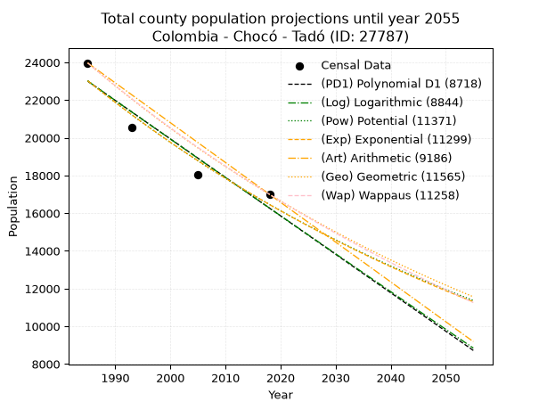
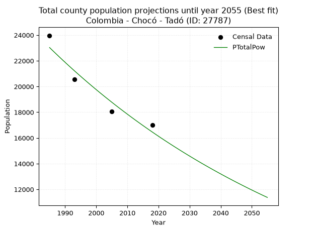
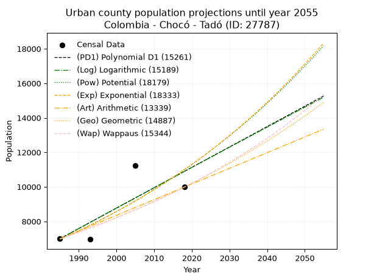
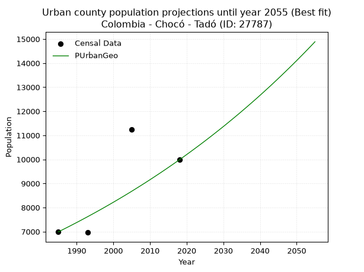
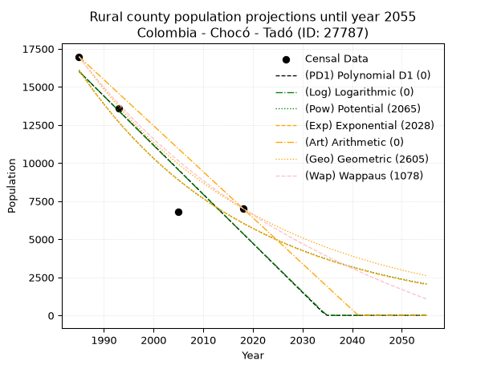
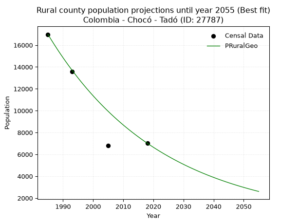

<div align="center">


</div>

# _“Population and Public Services Demand Projections (PPSD) until Year 2050 for Colombia - Chocó - Tadó (ID: 27787)”_
Keywords: `population` `public-service` `projection` `lineal` `polynomial` `logarithmic` `potential` `exponential` `arithmetic` `geometric` `wappaus` `dane` `colombia` `south-america`

PPSD are analytical estimates used by governments and planners to anticipate future changes in population size, age distribution, and the resulting community needs for utilities, healthcare, education, and infrastructure as sizing future water treatment facilities, electrical grids, and road networks based on spatial growth.

> **General running parameters**: • app_version: _v20260806_. • Python version: _3.14.7_. • Pandas version: _3.0.5_. • NumPy version: _2.5.1_. • Creates, save and include plots into reports (create_plot): _False_. • Projection until year: _2050_. • Process polynomial degree 2 and up: _False_. • Process Wappaus: _True_. • Process Wappaus: _True_. • Set negative values to zero: _True_. • Set infinite values to zero: _True_. • Drop dataset notes: _True_. 
<div align="center">

Dynamic map: [:earth_americas:Google](http://maps.google.com/maps?q=5.26487313,-76.5585714) [:earth_americas:OSM](https://www.openstreetmap.org/#map=18/5.26487313/-76.5585714&layers=P) [:earth_americas:Bing](https://www.bing.com/maps?cp=5.26487313~-76.5585714&lvl=18) [:earth_americas:Apple](https://maps.apple.com/frame?center=5.26487313%2C-76.5585714&span=0.003%2C0.006)

</div>


<div align="center">

```geojson
{
  "type": "Feature",
  "geometry": {
    "type": "Point", 
    "coordinates": [-76.5585714, 5.26487313]
  }, 
  "properties": {
    "Name": "Colombia - Chocó - Tadó (ID: 27787)"
  }
}
```

</div>


## 0. Census Data (4 records)

Census data are official statistics collected by a government about the people and housing in a country. They usually include counts of total population, age, sex, race, income, education, and jobs.

📅Global census file: [Population.xlsx](../data/Population.xlsx)

| Source   |   Year |   CountryID | CountryName   |   StateID | StateName   |   CountyID | CountyName   |   PTotal |   PUrban |   PRural |
|:---------|-------:|------------:|:--------------|----------:|:------------|-----------:|:-------------|---------:|---------:|---------:|
| DANE     |   1985 |          57 | Colombia      |        27 | Chocó       |      27787 | Tadó         |    23969 |     6990 |    16979 |
| DANE     |   1993 |          57 | Colombia      |        27 | Chocó       |      27787 | Tadó         |    20551 |     6963 |    13588 |
| DANE     |   2005 |          57 | Colombia      |        27 | Chocó       |      27787 | Tadó         |    18041 |    11246 |     6795 |
| DANE     |   2018 |          57 | Colombia      |        27 | Chocó       |      27787 | Tadó         |    17000 |     9983 |     7017 |

> 🔥Some records could had specific notes about the registered values or the corresponding urban or rural distribution.

📅   [RUPS](https://www.datos.gov.co/Hacienda-y-Cr-dito-P-blico/Registro-nico-de-Prestadores-de-Servicios-P-blicos/4qkq-csdn/about_data) - Local public utility companies: [RUPS.csv](../data/RUPS.xlsx)

 | SERVICIO       | ESTADO    | NOMBRE                                           | NIT         | DEPARTAMENTO_DOMICILIO   | MUNICIPIO_DOMICILIO   | DIRECCION        |   TELEFONO | EMAIL                       | TIPO_INSCRIPCION    | REPRESENTANTE_LEGAL           | TIPO_PRESTADOR                             | CLASIFICACION                 |
|:---------------|:----------|:-------------------------------------------------|:------------|:-------------------------|:----------------------|:-----------------|-----------:|:----------------------------|:--------------------|:------------------------------|:-------------------------------------------|:------------------------------|
| ACUEDUCTO      | OPERATIVA | EMPRESA DE SERVICIOS PUBLICOS AGUAS DE TADO S.A. | 900223126-1 | CHOCO                    | TADO                  | CALLE 6 Nº 16-06 |    6795976 | aguasdetado2014@homtail.com | Registro por la ESP | BRENDA JULIET MOSQUERA SUAREZ | SOCIEDADES (EMPRESA DE SERVICIOS PUBLICOS) | MENOR O IGUAL A 2500 USUARIOS |
| ALCANTARILLADO | OPERATIVA | EMPRESA DE SERVICIOS PUBLICOS AGUAS DE TADO S.A. | 900223126-1 | CHOCO                    | TADO                  | CALLE 6 Nº 16-06 |    6795976 | aguasdetado2014@homtail.com | Registro por la ESP | BRENDA JULIET MOSQUERA SUAREZ | SOCIEDADES (EMPRESA DE SERVICIOS PUBLICOS) | MENOR O IGUAL A 2500 USUARIOS |

## 1. Total

### 1.1. Coefficients and Parameters

* (PD1) Polynomial Deg 1: -204.05820955439492, 428057.6836611785 (lineal)
* (Log) Logarithmic: -408762.52203300956, 3126897.455590182
* (Pow) Potential: -20.36601123060273, 71.52454567339305
* (Exp) Exponential: -0.01016795668714676, 13417667805828.023
* (Art) Arithmetic: Year diff. 2018 - 1985 = 33, Population diff. 17000 - 23969 = -6969, Annual growth = -211.1818181818182
* (Geo) Geometric: Year diff. 2018 - 1985 = 33, Population diff. 17000 - 23969 = -6969, Annual growth % = -0.010356542827325343
* (Wap) Wappaus: i = -1.0309346978535878, Condition values only valid for < 200)

<sub>
Wappaus condition values: ['-0.00', '-1.03', '-2.06', '-3.09', '-4.12', '-5.15', '-6.19', '-7.22', '-8.25', '-9.28', '-10.31', '-11.34', '-12.37', '-13.40', '-14.43', '-15.46', '-16.49', '-17.53', '-18.56', '-19.59', '-20.62', '-21.65', '-22.68', '-23.71', '-24.74', '-25.77', '-26.80', '-27.84', '-28.87', '-29.90', '-30.93', '-31.96', '-32.99', '-34.02', '-35.05', '-36.08', '-37.11', '-38.14', '-39.18', '-40.21', '-41.24', '-42.27', '-43.30', '-44.33', '-45.36', '-46.39', '-47.42', '-48.45', '-49.48', '-50.52', '-51.55', '-52.58', '-53.61', '-54.64', '-55.67', '-56.70', '-57.73', '-58.76', '-59.79', '-60.83', '-61.86', '-62.89', '-63.92', '-64.95', '-65.98', '-67.01']
</sub>


### 1.2. Projected Dataset

|   Year |   CountyID |   PTotalPD1 |   PTotalLog |   PTotalPow |   PTotalExp |   PTotalArt |   PTotalGeo |   PTotalWap |
|-------:|-----------:|------------:|------------:|------------:|------------:|------------:|------------:|------------:|
|   1985 |      27787 |       23002 |       23011 |       23031 |       23022 |       23969 |       23969 |       23969 |
|   1986 |      27787 |       22798 |       22805 |       22796 |       22789 |       23758 |       23721 |       23723 |
|   1987 |      27787 |       22594 |       22599 |       22564 |       22558 |       23547 |       23475 |       23480 |
|   1988 |      27787 |       22390 |       22393 |       22334 |       22330 |       23335 |       23232 |       23239 |
|   1989 |      27787 |       22186 |       22188 |       22106 |       22104 |       23124 |       22991 |       23001 |
|   1990 |      27787 |       21982 |       21982 |       21881 |       21881 |       22913 |       22753 |       22765 |
|   1991 |      27787 |       21778 |       21777 |       21658 |       21659 |       22702 |       22518 |       22531 |
|   1992 |      27787 |       21574 |       21572 |       21438 |       21440 |       22491 |       22284 |       22300 |
|   1993 |      27787 |       21370 |       21367 |       21220 |       21223 |       22280 |       22054 |       22070 |
|   1994 |      27787 |       21166 |       21162 |       21004 |       21009 |       22068 |       21825 |       21844 |
|   1995 |      27787 |       20962 |       20957 |       20791 |       20796 |       21857 |       21599 |       21619 |
|   1996 |      27787 |       20757 |       20752 |       20580 |       20586 |       21646 |       21375 |       21397 |
|   1997 |      27787 |       20553 |       20547 |       20371 |       20377 |       21435 |       21154 |       21176 |
|   1998 |      27787 |       20349 |       20342 |       20164 |       20171 |       21224 |       20935 |       20958 |
|   1999 |      27787 |       20145 |       20138 |       19960 |       19967 |       21012 |       20718 |       20742 |
|   2000 |      27787 |       19941 |       19933 |       19757 |       19765 |       20801 |       20504 |       20528 |
|   2001 |      27787 |       19737 |       19729 |       19557 |       19565 |       20590 |       20291 |       20317 |
|   2002 |      27787 |       19533 |       19525 |       19359 |       19367 |       20379 |       20081 |       20107 |
|   2003 |      27787 |       19329 |       19321 |       19163 |       19171 |       20168 |       19873 |       19899 |
|   2004 |      27787 |       19125 |       19117 |       18970 |       18977 |       19957 |       19667 |       19693 |
|   2005 |      27787 |       18921 |       18913 |       18778 |       18785 |       19745 |       19464 |       19489 |
|   2006 |      27787 |       18717 |       18709 |       18588 |       18595 |       19534 |       19262 |       19287 |
|   2007 |      27787 |       18513 |       18505 |       18400 |       18407 |       19323 |       19063 |       19086 |
|   2008 |      27787 |       18309 |       18302 |       18215 |       18221 |       19112 |       18865 |       18888 |
|   2009 |      27787 |       18105 |       18098 |       18031 |       18037 |       18901 |       18670 |       18691 |
|   2010 |      27787 |       17901 |       17895 |       17849 |       17854 |       18689 |       18476 |       18497 |
|   2011 |      27787 |       17697 |       17691 |       17669 |       17674 |       18478 |       18285 |       18304 |
|   2012 |      27787 |       17493 |       17488 |       17491 |       17495 |       18267 |       18096 |       18112 |
|   2013 |      27787 |       17289 |       17285 |       17315 |       17318 |       18056 |       17908 |       17923 |
|   2014 |      27787 |       17084 |       17082 |       17141 |       17143 |       17845 |       17723 |       17735 |
|   2015 |      27787 |       16880 |       16879 |       16968 |       16969 |       17634 |       17539 |       17549 |
|   2016 |      27787 |       16676 |       16676 |       16798 |       16798 |       17422 |       17358 |       17364 |
|   2017 |      27787 |       16472 |       16474 |       16629 |       16628 |       17211 |       17178 |       17181 |
|   2018 |      27787 |       16268 |       16271 |       16462 |       16459 |       17000 |       17000 |       17000 |
|   2019 |      27787 |       16064 |       16068 |       16297 |       16293 |       16789 |       16824 |       16820 |
|   2020 |      27787 |       15860 |       15866 |       16133 |       16128 |       16578 |       16650 |       16642 |
|   2021 |      27787 |       15656 |       15664 |       15971 |       15965 |       16366 |       16477 |       16466 |
|   2022 |      27787 |       15452 |       15462 |       15811 |       15803 |       16155 |       16307 |       16291 |
|   2023 |      27787 |       15248 |       15259 |       15653 |       15644 |       15944 |       16138 |       16117 |
|   2024 |      27787 |       15044 |       15057 |       15496 |       15485 |       15733 |       15971 |       15945 |
|   2025 |      27787 |       14840 |       14856 |       15341 |       15329 |       15522 |       15805 |       15774 |
|   2026 |      27787 |       14636 |       14654 |       15188 |       15174 |       15311 |       15642 |       15605 |
|   2027 |      27787 |       14432 |       14452 |       15036 |       15020 |       15099 |       15480 |       15438 |
|   2028 |      27787 |       14228 |       14250 |       14885 |       14868 |       14888 |       15319 |       15271 |
|   2029 |      27787 |       14024 |       14049 |       14737 |       14718 |       14677 |       15161 |       15106 |
|   2030 |      27787 |       13820 |       13847 |       14590 |       14569 |       14466 |       15004 |       14943 |
|   2031 |      27787 |       13615 |       13646 |       14444 |       14421 |       14255 |       14848 |       14781 |
|   2032 |      27787 |       13411 |       13445 |       14300 |       14276 |       14043 |       14694 |       14620 |
|   2033 |      27787 |       13207 |       13244 |       14157 |       14131 |       13832 |       14542 |       14461 |
|   2034 |      27787 |       13003 |       13043 |       14016 |       13988 |       13621 |       14392 |       14302 |
|   2035 |      27787 |       12799 |       12842 |       13877 |       13847 |       13410 |       14243 |       14146 |
|   2036 |      27787 |       12595 |       12641 |       13739 |       13707 |       13199 |       14095 |       13990 |
|   2037 |      27787 |       12391 |       12440 |       13602 |       13568 |       12988 |       13949 |       13836 |
|   2038 |      27787 |       12187 |       12240 |       13467 |       13431 |       12776 |       13805 |       13683 |
|   2039 |      27787 |       11983 |       12039 |       13333 |       13295 |       12565 |       13662 |       13531 |
|   2040 |      27787 |       11779 |       11839 |       13200 |       13160 |       12354 |       13520 |       13380 |
|   2041 |      27787 |       11575 |       11638 |       13069 |       13027 |       12143 |       13380 |       13231 |
|   2042 |      27787 |       11371 |       11438 |       12939 |       12895 |       11932 |       13242 |       13083 |
|   2043 |      27787 |       11167 |       11238 |       12811 |       12765 |       11720 |       13104 |       12936 |
|   2044 |      27787 |       10963 |       11038 |       12684 |       12636 |       11509 |       12969 |       12790 |
|   2045 |      27787 |       10759 |       10838 |       12558 |       12508 |       11298 |       12834 |       12645 |
|   2046 |      27787 |       10555 |       10638 |       12434 |       12381 |       11087 |       12701 |       12501 |
|   2047 |      27787 |       10351 |       10439 |       12311 |       12256 |       10876 |       12570 |       12359 |
|   2048 |      27787 |       10146 |       10239 |       12189 |       12132 |       10665 |       12440 |       12218 |
|   2049 |      27787 |        9942 |       10039 |       12068 |       12009 |       10453 |       12311 |       12077 |
|   2050 |      27787 |        9738 |        9840 |       11949 |       11888 |       10242 |       12183 |       11938 |
<div align="center">

</img>

</div>


### 1.3. Best fit with absolute and relative error (%)

Relative error puts that difference into context by dividing the absolute error by the true value, creating a unitless ratio or percentage that shows the scale of the mistake.

Absolute and relative error

|   Year | Source   |   CountryID | CountryName   |   StateID | StateName   |   CountyID_x | CountyName   |   PTotal |   PUrban |   PRural |   CountyID_y |   PTotalPD1 |   PTotalLog |   PTotalPow |   PTotalExp |   PTotalArt |   PTotalGeo |   PTotalWap |   PTotalPD1AbsError |   PTotalLogAbsError |   PTotalPowAbsError |   PTotalExpAbsError |   PTotalArtAbsError |   PTotalGeoAbsError |   PTotalWapAbsError |   PTotalPD1RelError |   PTotalLogRelError |   PTotalPowRelError |   PTotalExpRelError |   PTotalArtRelError |   PTotalGeoRelError |   PTotalWapRelError |
|-------:|:---------|------------:|:--------------|----------:|:------------|-------------:|:-------------|---------:|---------:|---------:|-------------:|------------:|------------:|------------:|------------:|------------:|------------:|------------:|--------------------:|--------------------:|--------------------:|--------------------:|--------------------:|--------------------:|--------------------:|--------------------:|--------------------:|--------------------:|--------------------:|--------------------:|--------------------:|--------------------:|
|   1985 | DANE     |          57 | Colombia      |        27 | Chocó       |        27787 | Tadó         |    23969 |     6990 |    16979 |        27787 |       23002 |       23011 |       23031 |       23022 |       23969 |       23969 |       23969 |                 967 |                 958 |                 938 |                 947 |                   0 |                   0 |                   0 |             4.03438 |             3.99683 |             3.91339 |             3.95094 |             0       |             0       |             0       |
|   1993 | DANE     |          57 | Colombia      |        27 | Chocó       |        27787 | Tadó         |    20551 |     6963 |    13588 |        27787 |       21370 |       21367 |       21220 |       21223 |       22280 |       22054 |       22070 |                 819 |                 816 |                 669 |                 672 |                1729 |                1503 |                1519 |             3.98521 |             3.97061 |             3.25532 |             3.26991 |             8.41322 |             7.31351 |             7.39137 |
|   2005 | DANE     |          57 | Colombia      |        27 | Chocó       |        27787 | Tadó         |    18041 |    11246 |     6795 |        27787 |       18921 |       18913 |       18778 |       18785 |       19745 |       19464 |       19489 |                 880 |                 872 |                 737 |                 744 |                1704 |                1423 |                1448 |             4.87778 |             4.83343 |             4.08514 |             4.12394 |             9.44515 |             7.88759 |             8.02616 |
|   2018 | DANE     |          57 | Colombia      |        27 | Chocó       |        27787 | Tadó         |    17000 |     9983 |     7017 |        27787 |       16268 |       16271 |       16462 |       16459 |       17000 |       17000 |       17000 |                 732 |                 729 |                 538 |                 541 |                   0 |                   0 |                   0 |             4.30588 |             4.28824 |             3.16471 |             3.18235 |             0       |             0       |             0       |

Relative error mean

| Method    |   RelError | Best   |
|:----------|-----------:|:-------|
| PTotalPD1 |    4.30081 |        |
| PTotalLog |    4.27228 |        |
| PTotalPow |    3.60464 | True   |
| PTotalExp |    3.63179 |        |
| PTotalArt |    4.46459 |        |
| PTotalGeo |    3.80028 |        |
| PTotalWap |    3.85438 |        |

💙Best method: _**PTotalPow**_
<div align="center">

</img>

</div>


### 1.4. Fresh water supply demand in liters per capita per day (lpcd)

The fresh water supply demand typically ranges from 100 to 300 liters per capita per day (lpcd) for standard domestic and municipal planning, though absolute survival minimums set by the World Health Organization are as low as 7.5 to 20 liters per day, and total consumption in high-income nations can exceed 400 liters.

> `CZ`: Level in meters above the sea level (masl)<br> `WS`: Fresh water supply demand in liters per capita per day (lpcd or l/h/d)<br> `WSAll`: Zonal fresh water supply demand in liters per second (l/s)<br> `A`: Zonal area in square meters<br> `DP`: Population density (people/hectare or p/ha)

Reference values (RAS Colombia)

|    CZ |   WS |
|------:|-----:|
|  1000 |  120 |
|  2000 |  130 |
| 99999 |  140 |

County shapefile geometry properties and water supply values

|   CountyID |      ATotal |   CZTotal |   WSTotal |
|-----------:|------------:|----------:|----------:|
|      27787 | 7.14996e+08 |   692.472 |       120 |

Projected values for best method: PTotalPow

|   CountyID |   Year |   PTotalPow |   DPTotal |   WSTotal |   WSTotalAll |
|-----------:|-------:|------------:|----------:|----------:|-------------:|
|      27787 |   1985 |       23031 |      0.32 |       120 |      31.9875 |
|      27787 |   1986 |       22796 |      0.32 |       120 |      31.6611 |
|      27787 |   1987 |       22564 |      0.32 |       120 |      31.3389 |
|      27787 |   1988 |       22334 |      0.31 |       120 |      31.0194 |
|      27787 |   1989 |       22106 |      0.31 |       120 |      30.7028 |
|      27787 |   1990 |       21881 |      0.31 |       120 |      30.3903 |
|      27787 |   1991 |       21658 |      0.3  |       120 |      30.0806 |
|      27787 |   1992 |       21438 |      0.3  |       120 |      29.775  |
|      27787 |   1993 |       21220 |      0.3  |       120 |      29.4722 |
|      27787 |   1994 |       21004 |      0.29 |       120 |      29.1722 |
|      27787 |   1995 |       20791 |      0.29 |       120 |      28.8764 |
|      27787 |   1996 |       20580 |      0.29 |       120 |      28.5833 |
|      27787 |   1997 |       20371 |      0.28 |       120 |      28.2931 |
|      27787 |   1998 |       20164 |      0.28 |       120 |      28.0056 |
|      27787 |   1999 |       19960 |      0.28 |       120 |      27.7222 |
|      27787 |   2000 |       19757 |      0.28 |       120 |      27.4403 |
|      27787 |   2001 |       19557 |      0.27 |       120 |      27.1625 |
|      27787 |   2002 |       19359 |      0.27 |       120 |      26.8875 |
|      27787 |   2003 |       19163 |      0.27 |       120 |      26.6153 |
|      27787 |   2004 |       18970 |      0.27 |       120 |      26.3472 |
|      27787 |   2005 |       18778 |      0.26 |       120 |      26.0806 |
|      27787 |   2006 |       18588 |      0.26 |       120 |      25.8167 |
|      27787 |   2007 |       18400 |      0.26 |       120 |      25.5556 |
|      27787 |   2008 |       18215 |      0.25 |       120 |      25.2986 |
|      27787 |   2009 |       18031 |      0.25 |       120 |      25.0431 |
|      27787 |   2010 |       17849 |      0.25 |       120 |      24.7903 |
|      27787 |   2011 |       17669 |      0.25 |       120 |      24.5403 |
|      27787 |   2012 |       17491 |      0.24 |       120 |      24.2931 |
|      27787 |   2013 |       17315 |      0.24 |       120 |      24.0486 |
|      27787 |   2014 |       17141 |      0.24 |       120 |      23.8069 |
|      27787 |   2015 |       16968 |      0.24 |       120 |      23.5667 |
|      27787 |   2016 |       16798 |      0.23 |       120 |      23.3306 |
|      27787 |   2017 |       16629 |      0.23 |       120 |      23.0958 |
|      27787 |   2018 |       16462 |      0.23 |       120 |      22.8639 |
|      27787 |   2019 |       16297 |      0.23 |       120 |      22.6347 |
|      27787 |   2020 |       16133 |      0.23 |       120 |      22.4069 |
|      27787 |   2021 |       15971 |      0.22 |       120 |      22.1819 |
|      27787 |   2022 |       15811 |      0.22 |       120 |      21.9597 |
|      27787 |   2023 |       15653 |      0.22 |       120 |      21.7403 |
|      27787 |   2024 |       15496 |      0.22 |       120 |      21.5222 |
|      27787 |   2025 |       15341 |      0.21 |       120 |      21.3069 |
|      27787 |   2026 |       15188 |      0.21 |       120 |      21.0944 |
|      27787 |   2027 |       15036 |      0.21 |       120 |      20.8833 |
|      27787 |   2028 |       14885 |      0.21 |       120 |      20.6736 |
|      27787 |   2029 |       14737 |      0.21 |       120 |      20.4681 |
|      27787 |   2030 |       14590 |      0.2  |       120 |      20.2639 |
|      27787 |   2031 |       14444 |      0.2  |       120 |      20.0611 |
|      27787 |   2032 |       14300 |      0.2  |       120 |      19.8611 |
|      27787 |   2033 |       14157 |      0.2  |       120 |      19.6625 |
|      27787 |   2034 |       14016 |      0.2  |       120 |      19.4667 |
|      27787 |   2035 |       13877 |      0.19 |       120 |      19.2736 |
|      27787 |   2036 |       13739 |      0.19 |       120 |      19.0819 |
|      27787 |   2037 |       13602 |      0.19 |       120 |      18.8917 |
|      27787 |   2038 |       13467 |      0.19 |       120 |      18.7042 |
|      27787 |   2039 |       13333 |      0.19 |       120 |      18.5181 |
|      27787 |   2040 |       13200 |      0.18 |       120 |      18.3333 |
|      27787 |   2041 |       13069 |      0.18 |       120 |      18.1514 |
|      27787 |   2042 |       12939 |      0.18 |       120 |      17.9708 |
|      27787 |   2043 |       12811 |      0.18 |       120 |      17.7931 |
|      27787 |   2044 |       12684 |      0.18 |       120 |      17.6167 |
|      27787 |   2045 |       12558 |      0.18 |       120 |      17.4417 |
|      27787 |   2046 |       12434 |      0.17 |       120 |      17.2694 |
|      27787 |   2047 |       12311 |      0.17 |       120 |      17.0986 |
|      27787 |   2048 |       12189 |      0.17 |       120 |      16.9292 |
|      27787 |   2049 |       12068 |      0.17 |       120 |      16.7611 |
|      27787 |   2050 |       11949 |      0.17 |       120 |      16.5958 |

## 2. Urban

### 2.1. Coefficients and Parameters

* (PD1) Polynomial Deg 1: 118.08510638297918, -227404.2340425541 (lineal)
* (Log) Logarithmic: 236598.40800785672, -1789590.8952483705
* (Pow) Potential: 27.70804607971098, -87.53197822846363
* (Exp) Exponential: 0.01383057430142279, 8.31375732440636e-09
* (Art) Arithmetic: Year diff. 2018 - 1985 = 33, Population diff. 9983 - 6990 = 2993, Annual growth = 90.6969696969697
* (Geo) Geometric: Year diff. 2018 - 1985 = 33, Population diff. 9983 - 6990 = 2993, Annual growth % = 0.010858625176544123
* (Wap) Wappaus: i = 1.0687205526067247, Condition values only valid for < 200)

<sub>
Wappaus condition values: ['0.00', '1.07', '2.14', '3.21', '4.27', '5.34', '6.41', '7.48', '8.55', '9.62', '10.69', '11.76', '12.82', '13.89', '14.96', '16.03', '17.10', '18.17', '19.24', '20.31', '21.37', '22.44', '23.51', '24.58', '25.65', '26.72', '27.79', '28.86', '29.92', '30.99', '32.06', '33.13', '34.20', '35.27', '36.34', '37.41', '38.47', '39.54', '40.61', '41.68', '42.75', '43.82', '44.89', '45.95', '47.02', '48.09', '49.16', '50.23', '51.30', '52.37', '53.44', '54.50', '55.57', '56.64', '57.71', '58.78', '59.85', '60.92', '61.99', '63.05', '64.12', '65.19', '66.26', '67.33', '68.40', '69.47']
</sub>


### 2.2. Projected Dataset

|   Year |   CountyID |   PUrbanPD1 |   PUrbanLog |   PUrbanPow |   PUrbanExp |   PUrbanArt |   PUrbanGeo |   PUrbanWap |
|-------:|-----------:|------------:|------------:|------------:|------------:|------------:|------------:|------------:|
|   1985 |      27787 |        6995 |        6989 |        6959 |        6963 |        6990 |        6990 |        6990 |
|   1986 |      27787 |        7113 |        7109 |        7056 |        7060 |        7081 |        7066 |        7065 |
|   1987 |      27787 |        7231 |        7228 |        7156 |        7158 |        7171 |        7143 |        7141 |
|   1988 |      27787 |        7349 |        7347 |        7256 |        7258 |        7262 |        7220 |        7218 |
|   1989 |      27787 |        7467 |        7466 |        7358 |        7359 |        7353 |        7299 |        7295 |
|   1990 |      27787 |        7585 |        7585 |        7461 |        7461 |        7443 |        7378 |        7374 |
|   1991 |      27787 |        7703 |        7703 |        7566 |        7565 |        7534 |        7458 |        7453 |
|   1992 |      27787 |        7821 |        7822 |        7672 |        7671 |        7625 |        7539 |        7533 |
|   1993 |      27787 |        7939 |        7941 |        7779 |        7777 |        7716 |        7621 |        7614 |
|   1994 |      27787 |        8057 |        8060 |        7888 |        7886 |        7806 |        7704 |        7696 |
|   1995 |      27787 |        8176 |        8178 |        7998 |        7996 |        7897 |        7787 |        7779 |
|   1996 |      27787 |        8294 |        8297 |        8110 |        8107 |        7988 |        7872 |        7863 |
|   1997 |      27787 |        8412 |        8415 |        8223 |        8220 |        8078 |        7957 |        7948 |
|   1998 |      27787 |        8530 |        8534 |        8338 |        8334 |        8169 |        8044 |        8034 |
|   1999 |      27787 |        8648 |        8652 |        8455 |        8450 |        8260 |        8131 |        8120 |
|   2000 |      27787 |        8766 |        8771 |        8573 |        8568 |        8350 |        8219 |        8208 |
|   2001 |      27787 |        8884 |        8889 |        8692 |        8687 |        8441 |        8309 |        8297 |
|   2002 |      27787 |        9002 |        9007 |        8813 |        8808 |        8532 |        8399 |        8387 |
|   2003 |      27787 |        9120 |        9125 |        8936 |        8931 |        8623 |        8490 |        8478 |
|   2004 |      27787 |        9238 |        9243 |        9061 |        9055 |        8713 |        8582 |        8570 |
|   2005 |      27787 |        9356 |        9361 |        9187 |        9182 |        8804 |        8675 |        8663 |
|   2006 |      27787 |        9474 |        9479 |        9314 |        9309 |        8895 |        8770 |        8757 |
|   2007 |      27787 |        9593 |        9597 |        9444 |        9439 |        8985 |        8865 |        8852 |
|   2008 |      27787 |        9711 |        9715 |        9575 |        9570 |        9076 |        8961 |        8949 |
|   2009 |      27787 |        9829 |        9833 |        9708 |        9704 |        9167 |        9058 |        9047 |
|   2010 |      27787 |        9947 |        9951 |        9843 |        9839 |        9257 |        9157 |        9146 |
|   2011 |      27787 |       10065 |       10068 |        9980 |        9976 |        9348 |        9256 |        9246 |
|   2012 |      27787 |       10183 |       10186 |       10118 |       10115 |        9439 |        9357 |        9347 |
|   2013 |      27787 |       10301 |       10303 |       10258 |       10256 |        9530 |        9458 |        9450 |
|   2014 |      27787 |       10419 |       10421 |       10400 |       10399 |        9620 |        9561 |        9554 |
|   2015 |      27787 |       10537 |       10538 |       10545 |       10543 |        9711 |        9665 |        9659 |
|   2016 |      27787 |       10655 |       10656 |       10690 |       10690 |        9802 |        9770 |        9766 |
|   2017 |      27787 |       10773 |       10773 |       10838 |       10839 |        9892 |        9876 |        9874 |
|   2018 |      27787 |       10892 |       10890 |       10988 |       10990 |        9983 |        9983 |        9983 |
|   2019 |      27787 |       11010 |       11008 |       11140 |       11143 |       10074 |       10091 |       10094 |
|   2020 |      27787 |       11128 |       11125 |       11294 |       11298 |       10164 |       10201 |       10206 |
|   2021 |      27787 |       11246 |       11242 |       11450 |       11456 |       10255 |       10312 |       10320 |
|   2022 |      27787 |       11364 |       11359 |       11608 |       11615 |       10346 |       10424 |       10435 |
|   2023 |      27787 |       11482 |       11476 |       11768 |       11777 |       10436 |       10537 |       10552 |
|   2024 |      27787 |       11600 |       11593 |       11930 |       11941 |       10527 |       10651 |       10670 |
|   2025 |      27787 |       11718 |       11710 |       12095 |       12107 |       10618 |       10767 |       10790 |
|   2026 |      27787 |       11836 |       11826 |       12261 |       12276 |       10709 |       10884 |       10912 |
|   2027 |      27787 |       11954 |       11943 |       12430 |       12447 |       10799 |       11002 |       11035 |
|   2028 |      27787 |       12072 |       12060 |       12601 |       12620 |       10890 |       11122 |       11161 |
|   2029 |      27787 |       12190 |       12177 |       12775 |       12796 |       10981 |       11242 |       11287 |
|   2030 |      27787 |       12309 |       12293 |       12950 |       12974 |       11071 |       11364 |       11416 |
|   2031 |      27787 |       12427 |       12410 |       13128 |       13155 |       11162 |       11488 |       11546 |
|   2032 |      27787 |       12545 |       12526 |       13308 |       13338 |       11253 |       11613 |       11679 |
|   2033 |      27787 |       12663 |       12643 |       13491 |       13524 |       11343 |       11739 |       11813 |
|   2034 |      27787 |       12781 |       12759 |       13676 |       13712 |       11434 |       11866 |       11949 |
|   2035 |      27787 |       12899 |       12875 |       13864 |       13903 |       11525 |       11995 |       12087 |
|   2036 |      27787 |       13017 |       12991 |       14054 |       14097 |       11616 |       12125 |       12227 |
|   2037 |      27787 |       13135 |       13108 |       14246 |       14293 |       11706 |       12257 |       12369 |
|   2038 |      27787 |       13253 |       13224 |       14441 |       14492 |       11797 |       12390 |       12514 |
|   2039 |      27787 |       13371 |       13340 |       14639 |       14694 |       11888 |       12524 |       12660 |
|   2040 |      27787 |       13489 |       13456 |       14839 |       14899 |       11978 |       12660 |       12809 |
|   2041 |      27787 |       13607 |       13572 |       15042 |       15106 |       12069 |       12798 |       12960 |
|   2042 |      27787 |       13726 |       13688 |       15248 |       15316 |       12160 |       12937 |       13113 |
|   2043 |      27787 |       13844 |       13803 |       15456 |       15530 |       12250 |       13077 |       13269 |
|   2044 |      27787 |       13962 |       13919 |       15667 |       15746 |       12341 |       13219 |       13427 |
|   2045 |      27787 |       14080 |       14035 |       15881 |       15965 |       12432 |       13363 |       13587 |
|   2046 |      27787 |       14198 |       14151 |       16097 |       16188 |       12523 |       13508 |       13751 |
|   2047 |      27787 |       14316 |       14266 |       16317 |       16413 |       12613 |       13655 |       13916 |
|   2048 |      27787 |       14434 |       14382 |       16539 |       16642 |       12704 |       13803 |       14085 |
|   2049 |      27787 |       14552 |       14497 |       16764 |       16873 |       12795 |       13953 |       14256 |
|   2050 |      27787 |       14670 |       14613 |       16992 |       17108 |       12885 |       14104 |       14430 |
<div align="center">

</img>

</div>


### 2.3. Best fit with absolute and relative error (%)

Relative error puts that difference into context by dividing the absolute error by the true value, creating a unitless ratio or percentage that shows the scale of the mistake.

Absolute and relative error

|   Year | Source   |   CountryID | CountryName   |   StateID | StateName   |   CountyID_x | CountyName   |   PTotal |   PUrban |   PRural |   CountyID_y |   PUrbanPD1 |   PUrbanLog |   PUrbanPow |   PUrbanExp |   PUrbanArt |   PUrbanGeo |   PUrbanWap |   PUrbanPD1AbsError |   PUrbanLogAbsError |   PUrbanPowAbsError |   PUrbanExpAbsError |   PUrbanArtAbsError |   PUrbanGeoAbsError |   PUrbanWapAbsError |   PUrbanPD1RelError |   PUrbanLogRelError |   PUrbanPowRelError |   PUrbanExpRelError |   PUrbanArtRelError |   PUrbanGeoRelError |   PUrbanWapRelError |
|-------:|:---------|------------:|:--------------|----------:|:------------|-------------:|:-------------|---------:|---------:|---------:|-------------:|------------:|------------:|------------:|------------:|------------:|------------:|------------:|--------------------:|--------------------:|--------------------:|--------------------:|--------------------:|--------------------:|--------------------:|--------------------:|--------------------:|--------------------:|--------------------:|--------------------:|--------------------:|--------------------:|
|   1985 | DANE     |          57 | Colombia      |        27 | Chocó       |        27787 | Tadó         |    23969 |     6990 |    16979 |        27787 |        6995 |        6989 |        6959 |        6963 |        6990 |        6990 |        6990 |                   5 |                   1 |                  31 |                  27 |                   0 |                   0 |                   0 |           0.0715308 |           0.0143062 |            0.443491 |            0.386266 |              0      |             0       |             0       |
|   1993 | DANE     |          57 | Colombia      |        27 | Chocó       |        27787 | Tadó         |    20551 |     6963 |    13588 |        27787 |        7939 |        7941 |        7779 |        7777 |        7716 |        7621 |        7614 |                 976 |                 978 |                 816 |                 814 |                 753 |                 658 |                 651 |          14.0169    |          14.0457    |           11.7191   |           11.6904   |             10.8143 |             9.44995 |             9.34942 |
|   2005 | DANE     |          57 | Colombia      |        27 | Chocó       |        27787 | Tadó         |    18041 |    11246 |     6795 |        27787 |        9356 |        9361 |        9187 |        9182 |        8804 |        8675 |        8663 |                1890 |                1885 |                2059 |                2064 |                2442 |                2571 |                2583 |          16.806     |          16.7615    |           18.3087   |           18.3532   |             21.7144 |            22.8615  |            22.9682  |
|   2018 | DANE     |          57 | Colombia      |        27 | Chocó       |        27787 | Tadó         |    17000 |     9983 |     7017 |        27787 |       10892 |       10890 |       10988 |       10990 |        9983 |        9983 |        9983 |                 909 |                 907 |                1005 |                1007 |                   0 |                   0 |                   0 |           9.10548   |           9.08545   |           10.0671   |           10.0871   |              0      |             0       |             0       |

Relative error mean

| Method    |   RelError | Best   |
|:----------|-----------:|:-------|
| PUrbanPD1 |    9.99998 |        |
| PUrbanLog |    9.97673 |        |
| PUrbanPow |   10.1346  |        |
| PUrbanExp |   10.1292  |        |
| PUrbanArt |    8.13217 |        |
| PUrbanGeo |    8.07785 | True   |
| PUrbanWap |    8.0794  |        |

💙Best method: _**PUrbanGeo**_
<div align="center">

</img>

</div>


### 2.4. Fresh water supply demand in liters per capita per day (lpcd)

The fresh water supply demand typically ranges from 100 to 300 liters per capita per day (lpcd) for standard domestic and municipal planning, though absolute survival minimums set by the World Health Organization are as low as 7.5 to 20 liters per day, and total consumption in high-income nations can exceed 400 liters.

> `CZ`: Level in meters above the sea level (masl)<br> `WS`: Fresh water supply demand in liters per capita per day (lpcd or l/h/d)<br> `WSAll`: Zonal fresh water supply demand in liters per second (l/s)<br> `A`: Zonal area in square meters<br> `DP`: Population density (people/hectare or p/ha)

Reference values (RAS Colombia)

|    CZ |   WS |
|------:|-----:|
|  1000 |  120 |
|  2000 |  130 |
| 99999 |  140 |

County shapefile geometry properties and water supply values

|   CountyID |      AUrban |   CZUrban |   WSUrban |
|-----------:|------------:|----------:|----------:|
|      27787 | 1.35312e+06 |   79.5413 |       120 |

Projected values for best method: PUrbanGeo

|   CountyID |   Year |   PUrbanGeo |   DPUrban |   WSUrban |   WSUrbanAll |
|-----------:|-------:|------------:|----------:|----------:|-------------:|
|      27787 |   1985 |        6990 |     51.66 |       120 |      9.70833 |
|      27787 |   1986 |        7066 |     52.22 |       120 |      9.81389 |
|      27787 |   1987 |        7143 |     52.79 |       120 |      9.92083 |
|      27787 |   1988 |        7220 |     53.36 |       120 |     10.0278  |
|      27787 |   1989 |        7299 |     53.94 |       120 |     10.1375  |
|      27787 |   1990 |        7378 |     54.53 |       120 |     10.2472  |
|      27787 |   1991 |        7458 |     55.12 |       120 |     10.3583  |
|      27787 |   1992 |        7539 |     55.72 |       120 |     10.4708  |
|      27787 |   1993 |        7621 |     56.32 |       120 |     10.5847  |
|      27787 |   1994 |        7704 |     56.94 |       120 |     10.7     |
|      27787 |   1995 |        7787 |     57.55 |       120 |     10.8153  |
|      27787 |   1996 |        7872 |     58.18 |       120 |     10.9333  |
|      27787 |   1997 |        7957 |     58.8  |       120 |     11.0514  |
|      27787 |   1998 |        8044 |     59.45 |       120 |     11.1722  |
|      27787 |   1999 |        8131 |     60.09 |       120 |     11.2931  |
|      27787 |   2000 |        8219 |     60.74 |       120 |     11.4153  |
|      27787 |   2001 |        8309 |     61.41 |       120 |     11.5403  |
|      27787 |   2002 |        8399 |     62.07 |       120 |     11.6653  |
|      27787 |   2003 |        8490 |     62.74 |       120 |     11.7917  |
|      27787 |   2004 |        8582 |     63.42 |       120 |     11.9194  |
|      27787 |   2005 |        8675 |     64.11 |       120 |     12.0486  |
|      27787 |   2006 |        8770 |     64.81 |       120 |     12.1806  |
|      27787 |   2007 |        8865 |     65.52 |       120 |     12.3125  |
|      27787 |   2008 |        8961 |     66.22 |       120 |     12.4458  |
|      27787 |   2009 |        9058 |     66.94 |       120 |     12.5806  |
|      27787 |   2010 |        9157 |     67.67 |       120 |     12.7181  |
|      27787 |   2011 |        9256 |     68.41 |       120 |     12.8556  |
|      27787 |   2012 |        9357 |     69.15 |       120 |     12.9958  |
|      27787 |   2013 |        9458 |     69.9  |       120 |     13.1361  |
|      27787 |   2014 |        9561 |     70.66 |       120 |     13.2792  |
|      27787 |   2015 |        9665 |     71.43 |       120 |     13.4236  |
|      27787 |   2016 |        9770 |     72.2  |       120 |     13.5694  |
|      27787 |   2017 |        9876 |     72.99 |       120 |     13.7167  |
|      27787 |   2018 |        9983 |     73.78 |       120 |     13.8653  |
|      27787 |   2019 |       10091 |     74.58 |       120 |     14.0153  |
|      27787 |   2020 |       10201 |     75.39 |       120 |     14.1681  |
|      27787 |   2021 |       10312 |     76.21 |       120 |     14.3222  |
|      27787 |   2022 |       10424 |     77.04 |       120 |     14.4778  |
|      27787 |   2023 |       10537 |     77.87 |       120 |     14.6347  |
|      27787 |   2024 |       10651 |     78.71 |       120 |     14.7931  |
|      27787 |   2025 |       10767 |     79.57 |       120 |     14.9542  |
|      27787 |   2026 |       10884 |     80.44 |       120 |     15.1167  |
|      27787 |   2027 |       11002 |     81.31 |       120 |     15.2806  |
|      27787 |   2028 |       11122 |     82.2  |       120 |     15.4472  |
|      27787 |   2029 |       11242 |     83.08 |       120 |     15.6139  |
|      27787 |   2030 |       11364 |     83.98 |       120 |     15.7833  |
|      27787 |   2031 |       11488 |     84.9  |       120 |     15.9556  |
|      27787 |   2032 |       11613 |     85.82 |       120 |     16.1292  |
|      27787 |   2033 |       11739 |     86.76 |       120 |     16.3042  |
|      27787 |   2034 |       11866 |     87.69 |       120 |     16.4806  |
|      27787 |   2035 |       11995 |     88.65 |       120 |     16.6597  |
|      27787 |   2036 |       12125 |     89.61 |       120 |     16.8403  |
|      27787 |   2037 |       12257 |     90.58 |       120 |     17.0236  |
|      27787 |   2038 |       12390 |     91.57 |       120 |     17.2083  |
|      27787 |   2039 |       12524 |     92.56 |       120 |     17.3944  |
|      27787 |   2040 |       12660 |     93.56 |       120 |     17.5833  |
|      27787 |   2041 |       12798 |     94.58 |       120 |     17.775   |
|      27787 |   2042 |       12937 |     95.61 |       120 |     17.9681  |
|      27787 |   2043 |       13077 |     96.64 |       120 |     18.1625  |
|      27787 |   2044 |       13219 |     97.69 |       120 |     18.3597  |
|      27787 |   2045 |       13363 |     98.76 |       120 |     18.5597  |
|      27787 |   2046 |       13508 |     99.83 |       120 |     18.7611  |
|      27787 |   2047 |       13655 |    100.92 |       120 |     18.9653  |
|      27787 |   2048 |       13803 |    102.01 |       120 |     19.1708  |
|      27787 |   2049 |       13953 |    103.12 |       120 |     19.3792  |
|      27787 |   2050 |       14104 |    104.23 |       120 |     19.5889  |

## 3. Rural

### 3.1. Coefficients and Parameters

* (PD1) Polynomial Deg 1: -322.14331593737415, 655461.9177037327 (lineal)
* (Log) Logarithmic: -645360.930040866, 4916488.350838551
* (Pow) Potential: -59.24826074521913, 199.5933540860771
* (Exp) Exponential: -0.029577537095695782, 5.0615762565766856e+29
* (Art) Arithmetic: Year diff. 2018 - 1985 = 33, Population diff. 7017 - 16979 = -9962, Annual growth = -301.8787878787879
* (Geo) Geometric: Year diff. 2018 - 1985 = 33, Population diff. 7017 - 16979 = -9962, Annual growth % = -0.026421689762953893
* (Wap) Wappaus: i = -2.516075911641839, Condition values only valid for < 200)

<sub>
Wappaus condition values: ['-0.00', '-2.52', '-5.03', '-7.55', '-10.06', '-12.58', '-15.10', '-17.61', '-20.13', '-22.64', '-25.16', '-27.68', '-30.19', '-32.71', '-35.23', '-37.74', '-40.26', '-42.77', '-45.29', '-47.81', '-50.32', '-52.84', '-55.35', '-57.87', '-60.39', '-62.90', '-65.42', '-67.93', '-70.45', '-72.97', '-75.48', '-78.00', '-80.51', '-83.03', '-85.55', '-88.06', '-90.58', '-93.09', '-95.61', '-98.13', '-100.64', '-103.16', '-105.68', '-108.19', '-110.71', '-113.22', '-115.74', '-118.26', '-120.77', '-123.29', '-125.80', '-128.32', '-130.84', '-133.35', '-135.87', '-138.38', '-140.90', '-143.42', '-145.93', '-148.45', '-150.96', '-153.48', '-156.00', '-158.51', '-161.03', '-163.54']
</sub>


### 3.2. Projected Dataset

|   Year |   CountyID |   PRuralPD1 |   PRuralLog |   PRuralPow |   PRuralExp |   PRuralArt |   PRuralGeo |   PRuralWap |
|-------:|-----------:|------------:|------------:|------------:|------------:|------------:|------------:|------------:|
|   1985 |      27787 |       16007 |       16021 |       16098 |       16078 |       16979 |       16979 |       16979 |
|   1986 |      27787 |       15685 |       15696 |       15625 |       15610 |       16677 |       16530 |       16557 |
|   1987 |      27787 |       15363 |       15371 |       15166 |       15155 |       16375 |       16094 |       16146 |
|   1988 |      27787 |       15041 |       15047 |       14720 |       14713 |       16073 |       15668 |       15744 |
|   1989 |      27787 |       14719 |       14722 |       14288 |       14284 |       15771 |       15254 |       15352 |
|   1990 |      27787 |       14397 |       14398 |       13869 |       13868 |       15470 |       14851 |       14969 |
|   1991 |      27787 |       14075 |       14074 |       13462 |       13464 |       15168 |       14459 |       14596 |
|   1992 |      27787 |       13752 |       13749 |       13068 |       13072 |       14866 |       14077 |       14231 |
|   1993 |      27787 |       13430 |       13426 |       12685 |       12691 |       14564 |       13705 |       13874 |
|   1994 |      27787 |       13108 |       13102 |       12313 |       12321 |       14262 |       13343 |       13525 |
|   1995 |      27787 |       12786 |       12778 |       11953 |       11962 |       13960 |       12990 |       13184 |
|   1996 |      27787 |       12464 |       12455 |       11603 |       11613 |       13658 |       12647 |       12851 |
|   1997 |      27787 |       12142 |       12132 |       11264 |       11275 |       13356 |       12313 |       12525 |
|   1998 |      27787 |       11820 |       11809 |       10935 |       10946 |       13055 |       11988 |       12206 |
|   1999 |      27787 |       11497 |       11486 |       10615 |       10627 |       12753 |       11671 |       11894 |
|   2000 |      27787 |       11175 |       11163 |       10305 |       10317 |       12451 |       11363 |       11588 |
|   2001 |      27787 |       10853 |       10840 |       10005 |       10017 |       12149 |       11062 |       11289 |
|   2002 |      27787 |       10531 |       10518 |        9713 |        9725 |       11847 |       10770 |       10996 |
|   2003 |      27787 |       10209 |       10196 |        9430 |        9441 |       11545 |       10485 |       10709 |
|   2004 |      27787 |        9887 |        9873 |        9155 |        9166 |       11243 |       10208 |       10428 |
|   2005 |      27787 |        9565 |        9551 |        8888 |        8899 |       10941 |        9939 |       10153 |
|   2006 |      27787 |        9242 |        9230 |        8630 |        8640 |       10640 |        9676 |        9883 |
|   2007 |      27787 |        8920 |        8908 |        8378 |        8388 |       10338 |        9420 |        9618 |
|   2008 |      27787 |        8598 |        8587 |        8135 |        8143 |       10036 |        9172 |        9358 |
|   2009 |      27787 |        8276 |        8265 |        7898 |        7906 |        9734 |        8929 |        9104 |
|   2010 |      27787 |        7954 |        7944 |        7669 |        7676 |        9432 |        8693 |        8854 |
|   2011 |      27787 |        7632 |        7623 |        7446 |        7452 |        9130 |        8464 |        8609 |
|   2012 |      27787 |        7310 |        7302 |        7230 |        7235 |        8828 |        8240 |        8369 |
|   2013 |      27787 |        6987 |        6982 |        7020 |        7024 |        8526 |        8022 |        8133 |
|   2014 |      27787 |        6665 |        6661 |        6817 |        6819 |        8225 |        7810 |        7902 |
|   2015 |      27787 |        6343 |        6341 |        6619 |        6620 |        7923 |        7604 |        7674 |
|   2016 |      27787 |        6021 |        6021 |        6427 |        6427 |        7621 |        7403 |        7451 |
|   2017 |      27787 |        5699 |        5700 |        6241 |        6240 |        7319 |        7207 |        7232 |
|   2018 |      27787 |        5377 |        5381 |        6061 |        6058 |        7017 |        7017 |        7017 |
|   2019 |      27787 |        5055 |        5061 |        5885 |        5882 |        6715 |        6832 |        6806 |
|   2020 |      27787 |        4732 |        4741 |        5715 |        5710 |        6413 |        6651 |        6598 |
|   2021 |      27787 |        4410 |        4422 |        5550 |        5544 |        6111 |        6475 |        6394 |
|   2022 |      27787 |        4088 |        4103 |        5390 |        5382 |        5809 |        6304 |        6193 |
|   2023 |      27787 |        3766 |        3784 |        5234 |        5225 |        5508 |        6138 |        5996 |
|   2024 |      27787 |        3444 |        3465 |        5083 |        5073 |        5206 |        5976 |        5802 |
|   2025 |      27787 |        3122 |        3146 |        4937 |        4925 |        4904 |        5818 |        5611 |
|   2026 |      27787 |        2800 |        2827 |        4794 |        4782 |        4602 |        5664 |        5424 |
|   2027 |      27787 |        2477 |        2509 |        4656 |        4642 |        4300 |        5514 |        5239 |
|   2028 |      27787 |        2155 |        2190 |        4522 |        4507 |        3998 |        5369 |        5058 |
|   2029 |      27787 |        1833 |        1872 |        4392 |        4376 |        3696 |        5227 |        4880 |
|   2030 |      27787 |        1511 |        1554 |        4265 |        4248 |        3394 |        5089 |        4704 |
|   2031 |      27787 |        1189 |        1237 |        4143 |        4124 |        3093 |        4954 |        4531 |
|   2032 |      27787 |         867 |         919 |        4024 |        4004 |        2791 |        4823 |        4361 |
|   2033 |      27787 |         545 |         601 |        3908 |        3887 |        2489 |        4696 |        4194 |
|   2034 |      27787 |         222 |         284 |        3796 |        3774 |        2187 |        4572 |        4029 |
|   2035 |      27787 |           0 |           0 |        3687 |        3664 |        1885 |        4451 |        3867 |
|   2036 |      27787 |           0 |           0 |        3581 |        3557 |        1583 |        4333 |        3707 |
|   2037 |      27787 |           0 |           0 |        3478 |        3454 |        1281 |        4219 |        3550 |
|   2038 |      27787 |           0 |           0 |        3379 |        3353 |         979 |        4107 |        3395 |
|   2039 |      27787 |           0 |           0 |        3282 |        3255 |         678 |        3999 |        3242 |
|   2040 |      27787 |           0 |           0 |        3188 |        3160 |         376 |        3893 |        3092 |
|   2041 |      27787 |           0 |           0 |        3097 |        3068 |          74 |        3790 |        2944 |
|   2042 |      27787 |           0 |           0 |        3008 |        2979 |           0 |        3690 |        2798 |
|   2043 |      27787 |           0 |           0 |        2922 |        2892 |           0 |        3593 |        2654 |
|   2044 |      27787 |           0 |           0 |        2839 |        2808 |           0 |        3498 |        2512 |
|   2045 |      27787 |           0 |           0 |        2758 |        2726 |           0 |        3405 |        2372 |
|   2046 |      27787 |           0 |           0 |        2679 |        2647 |           0 |        3315 |        2234 |
|   2047 |      27787 |           0 |           0 |        2602 |        2569 |           0 |        3228 |        2099 |
|   2048 |      27787 |           0 |           0 |        2528 |        2495 |           0 |        3143 |        1965 |
|   2049 |      27787 |           0 |           0 |        2456 |        2422 |           0 |        3059 |        1833 |
|   2050 |      27787 |           0 |           0 |        2386 |        2351 |           0 |        2979 |        1703 |
<div align="center">

</img>

</div>


### 3.3. Best fit with absolute and relative error (%)

Relative error puts that difference into context by dividing the absolute error by the true value, creating a unitless ratio or percentage that shows the scale of the mistake.

Absolute and relative error

|   Year | Source   |   CountryID | CountryName   |   StateID | StateName   |   CountyID_x | CountyName   |   PTotal |   PUrban |   PRural |   CountyID_y |   PRuralPD1 |   PRuralLog |   PRuralPow |   PRuralExp |   PRuralArt |   PRuralGeo |   PRuralWap |   PRuralPD1AbsError |   PRuralLogAbsError |   PRuralPowAbsError |   PRuralExpAbsError |   PRuralArtAbsError |   PRuralGeoAbsError |   PRuralWapAbsError |   PRuralPD1RelError |   PRuralLogRelError |   PRuralPowRelError |   PRuralExpRelError |   PRuralArtRelError |   PRuralGeoRelError |   PRuralWapRelError |
|-------:|:---------|------------:|:--------------|----------:|:------------|-------------:|:-------------|---------:|---------:|---------:|-------------:|------------:|------------:|------------:|------------:|------------:|------------:|------------:|--------------------:|--------------------:|--------------------:|--------------------:|--------------------:|--------------------:|--------------------:|--------------------:|--------------------:|--------------------:|--------------------:|--------------------:|--------------------:|--------------------:|
|   1985 | DANE     |          57 | Colombia      |        27 | Chocó       |        27787 | Tadó         |    23969 |     6990 |    16979 |        27787 |       16007 |       16021 |       16098 |       16078 |       16979 |       16979 |       16979 |                 972 |                 958 |                 881 |                 901 |                   0 |                   0 |                   0 |             5.72472 |             5.64226 |             5.18876 |             5.30656 |             0       |            0        |              0      |
|   1993 | DANE     |          57 | Colombia      |        27 | Chocó       |        27787 | Tadó         |    20551 |     6963 |    13588 |        27787 |       13430 |       13426 |       12685 |       12691 |       14564 |       13705 |       13874 |                 158 |                 162 |                 903 |                 897 |                 976 |                 117 |                 286 |             1.16279 |             1.19223 |             6.64557 |             6.60141 |             7.18281 |            0.861054 |              2.1048 |
|   2005 | DANE     |          57 | Colombia      |        27 | Chocó       |        27787 | Tadó         |    18041 |    11246 |     6795 |        27787 |        9565 |        9551 |        8888 |        8899 |       10941 |        9939 |       10153 |                2770 |                2756 |                2093 |                2104 |                4146 |                3144 |                3358 |            40.7653  |            40.5592  |            30.8021  |            30.9639  |            61.0155  |           46.2693   |             49.4187 |
|   2018 | DANE     |          57 | Colombia      |        27 | Chocó       |        27787 | Tadó         |    17000 |     9983 |     7017 |        27787 |        5377 |        5381 |        6061 |        6058 |        7017 |        7017 |        7017 |                1640 |                1636 |                 956 |                 959 |                   0 |                   0 |                   0 |            23.3718  |            23.3148  |            13.6241  |            13.6668  |             0       |            0        |              0      |

Relative error mean

| Method    |   RelError | Best   |
|:----------|-----------:|:-------|
| PRuralPD1 |    17.7561 |        |
| PRuralLog |    17.6771 |        |
| PRuralPow |    14.0651 |        |
| PRuralExp |    14.1347 |        |
| PRuralArt |    17.0496 |        |
| PRuralGeo |    11.7826 | True   |
| PRuralWap |    12.8809 |        |

💙Best method: _**PRuralGeo**_
<div align="center">

</img>

</div>


### 3.4. Fresh water supply demand in liters per capita per day (lpcd)

The fresh water supply demand typically ranges from 100 to 300 liters per capita per day (lpcd) for standard domestic and municipal planning, though absolute survival minimums set by the World Health Organization are as low as 7.5 to 20 liters per day, and total consumption in high-income nations can exceed 400 liters.

> `CZ`: Level in meters above the sea level (masl)<br> `WS`: Fresh water supply demand in liters per capita per day (lpcd or l/h/d)<br> `WSAll`: Zonal fresh water supply demand in liters per second (l/s)<br> `A`: Zonal area in square meters<br> `DP`: Population density (people/hectare or p/ha)

Reference values (RAS Colombia)

|    CZ |   WS |
|------:|-----:|
|  1000 |  120 |
|  2000 |  130 |
| 99999 |  140 |

County shapefile geometry properties and water supply values

|   CountyID |      ARural |   CZRural |   WSRural |
|-----------:|------------:|----------:|----------:|
|      27787 | 7.13643e+08 |   693.622 |       120 |

Projected values for best method: PRuralGeo

|   CountyID |   Year |   PRuralGeo |   DPRural |   WSRural |   WSRuralAll |
|-----------:|-------:|------------:|----------:|----------:|-------------:|
|      27787 |   1985 |       16979 |      0.24 |       120 |     23.5819  |
|      27787 |   1986 |       16530 |      0.23 |       120 |     22.9583  |
|      27787 |   1987 |       16094 |      0.23 |       120 |     22.3528  |
|      27787 |   1988 |       15668 |      0.22 |       120 |     21.7611  |
|      27787 |   1989 |       15254 |      0.21 |       120 |     21.1861  |
|      27787 |   1990 |       14851 |      0.21 |       120 |     20.6264  |
|      27787 |   1991 |       14459 |      0.2  |       120 |     20.0819  |
|      27787 |   1992 |       14077 |      0.2  |       120 |     19.5514  |
|      27787 |   1993 |       13705 |      0.19 |       120 |     19.0347  |
|      27787 |   1994 |       13343 |      0.19 |       120 |     18.5319  |
|      27787 |   1995 |       12990 |      0.18 |       120 |     18.0417  |
|      27787 |   1996 |       12647 |      0.18 |       120 |     17.5653  |
|      27787 |   1997 |       12313 |      0.17 |       120 |     17.1014  |
|      27787 |   1998 |       11988 |      0.17 |       120 |     16.65    |
|      27787 |   1999 |       11671 |      0.16 |       120 |     16.2097  |
|      27787 |   2000 |       11363 |      0.16 |       120 |     15.7819  |
|      27787 |   2001 |       11062 |      0.16 |       120 |     15.3639  |
|      27787 |   2002 |       10770 |      0.15 |       120 |     14.9583  |
|      27787 |   2003 |       10485 |      0.15 |       120 |     14.5625  |
|      27787 |   2004 |       10208 |      0.14 |       120 |     14.1778  |
|      27787 |   2005 |        9939 |      0.14 |       120 |     13.8042  |
|      27787 |   2006 |        9676 |      0.14 |       120 |     13.4389  |
|      27787 |   2007 |        9420 |      0.13 |       120 |     13.0833  |
|      27787 |   2008 |        9172 |      0.13 |       120 |     12.7389  |
|      27787 |   2009 |        8929 |      0.13 |       120 |     12.4014  |
|      27787 |   2010 |        8693 |      0.12 |       120 |     12.0736  |
|      27787 |   2011 |        8464 |      0.12 |       120 |     11.7556  |
|      27787 |   2012 |        8240 |      0.12 |       120 |     11.4444  |
|      27787 |   2013 |        8022 |      0.11 |       120 |     11.1417  |
|      27787 |   2014 |        7810 |      0.11 |       120 |     10.8472  |
|      27787 |   2015 |        7604 |      0.11 |       120 |     10.5611  |
|      27787 |   2016 |        7403 |      0.1  |       120 |     10.2819  |
|      27787 |   2017 |        7207 |      0.1  |       120 |     10.0097  |
|      27787 |   2018 |        7017 |      0.1  |       120 |      9.74583 |
|      27787 |   2019 |        6832 |      0.1  |       120 |      9.48889 |
|      27787 |   2020 |        6651 |      0.09 |       120 |      9.2375  |
|      27787 |   2021 |        6475 |      0.09 |       120 |      8.99306 |
|      27787 |   2022 |        6304 |      0.09 |       120 |      8.75556 |
|      27787 |   2023 |        6138 |      0.09 |       120 |      8.525   |
|      27787 |   2024 |        5976 |      0.08 |       120 |      8.3     |
|      27787 |   2025 |        5818 |      0.08 |       120 |      8.08056 |
|      27787 |   2026 |        5664 |      0.08 |       120 |      7.86667 |
|      27787 |   2027 |        5514 |      0.08 |       120 |      7.65833 |
|      27787 |   2028 |        5369 |      0.08 |       120 |      7.45694 |
|      27787 |   2029 |        5227 |      0.07 |       120 |      7.25972 |
|      27787 |   2030 |        5089 |      0.07 |       120 |      7.06806 |
|      27787 |   2031 |        4954 |      0.07 |       120 |      6.88056 |
|      27787 |   2032 |        4823 |      0.07 |       120 |      6.69861 |
|      27787 |   2033 |        4696 |      0.07 |       120 |      6.52222 |
|      27787 |   2034 |        4572 |      0.06 |       120 |      6.35    |
|      27787 |   2035 |        4451 |      0.06 |       120 |      6.18194 |
|      27787 |   2036 |        4333 |      0.06 |       120 |      6.01806 |
|      27787 |   2037 |        4219 |      0.06 |       120 |      5.85972 |
|      27787 |   2038 |        4107 |      0.06 |       120 |      5.70417 |
|      27787 |   2039 |        3999 |      0.06 |       120 |      5.55417 |
|      27787 |   2040 |        3893 |      0.05 |       120 |      5.40694 |
|      27787 |   2041 |        3790 |      0.05 |       120 |      5.26389 |
|      27787 |   2042 |        3690 |      0.05 |       120 |      5.125   |
|      27787 |   2043 |        3593 |      0.05 |       120 |      4.99028 |
|      27787 |   2044 |        3498 |      0.05 |       120 |      4.85833 |
|      27787 |   2045 |        3405 |      0.05 |       120 |      4.72917 |
|      27787 |   2046 |        3315 |      0.05 |       120 |      4.60417 |
|      27787 |   2047 |        3228 |      0.05 |       120 |      4.48333 |
|      27787 |   2048 |        3143 |      0.04 |       120 |      4.36528 |
|      27787 |   2049 |        3059 |      0.04 |       120 |      4.24861 |
|      27787 |   2050 |        2979 |      0.04 |       120 |      4.1375  |

<div align="center"><br><sub>Share this research</sub></div><br>

<sub>**APPS & TOOLS & CONTENT DISCLAIMER**: • NO WARRANTY - This content and software is provided by <a href="https://github.com/rcfdtools" target="_blank">github.com/rcfdtools</a> "as is", without any express or implied warranty, including warranties of merchantability, fitness for a particular purpose, or non-infringement. There is no guarantee that the software will be error-free or operate without interruption. • LIMITATION OF LIABILITY - Neither the authors nor copyright holders will be liable for claims or damages arising from the software or its use. You are responsible for determining if the software is appropriate for your use and assume all associated risks, including errors, legal compliance, and data loss. • NO PROFESSIONAL ADVICE - The software provides general information and does not offer professional advice. It should not replace consultation with professional advisors. [Clauses and global license for rcfdtools use.](https://github.com/rcfdtools/rcfdtools/blob/main/LICENSE.md)</sub>

| [:house: Home](Readme.md)  | [:beginner: Help / Collaborate](https://github.com/rcfdtools/R.HydroTools/discussions/31) |
|----------------------------|-------------------------------------------------------------------------------------------|