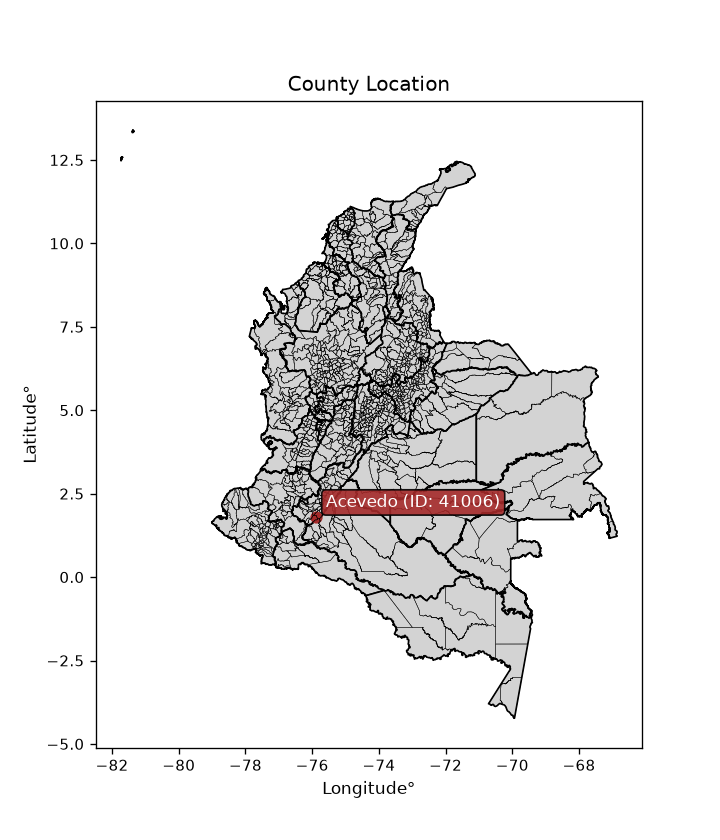
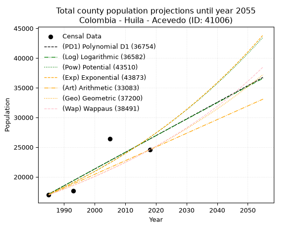
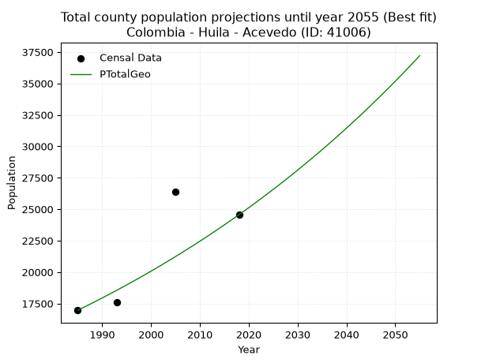
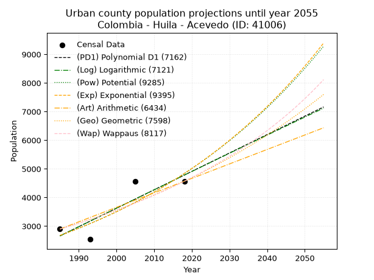
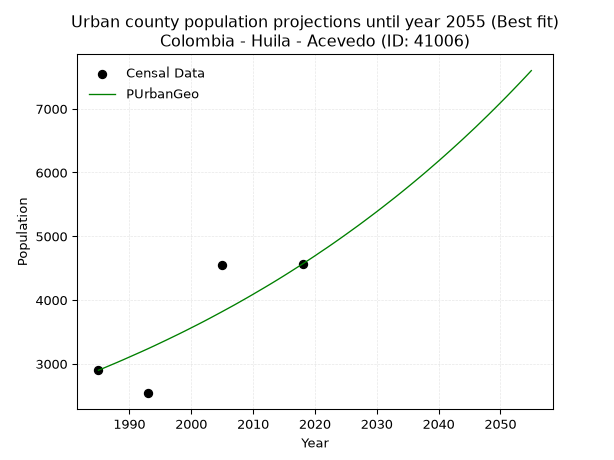
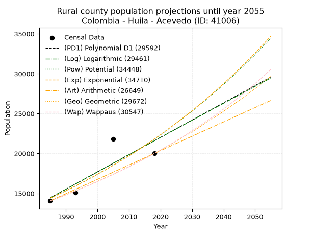
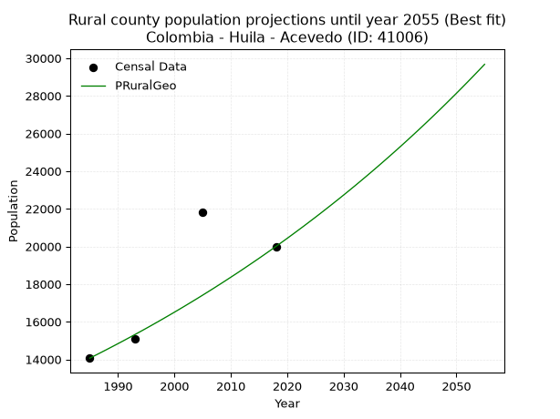

<div align="center">


</div>

# _“Population and Public Services Demand Projections (PPSD) until Year 2050 for Colombia - Huila - Acevedo (ID: 41006)”_
Keywords: `population` `public-service` `projection` `lineal` `polynomial` `logarithmic` `potential` `exponential` `arithmetic` `geometric` `wappaus` `dane` `colombia` `south-america`

PPSD are analytical estimates used by governments and planners to anticipate future changes in population size, age distribution, and the resulting community needs for utilities, healthcare, education, and infrastructure as sizing future water treatment facilities, electrical grids, and road networks based on spatial growth.

<div align="center">

</img>

</div>


> **General running parameters**: • app_version: _v20260806_. • Python version: _3.14.7_. • Pandas version: _3.0.5_. • NumPy version: _2.5.1_. • Creates, save and include plots into reports (create_plot): _False_. • Projection until year: _2050_. • Process polynomial degree 2 and up: _False_. • Process Wappaus: _True_. • Process Wappaus: _True_. • Set negative values to zero: _True_. • Set infinite values to zero: _True_. • Drop dataset notes: _True_. 
<div align="center">

Dynamic map: [:earth_americas:Google](http://maps.google.com/maps?q=1.805172566,-75.8887061) [:earth_americas:OSM](https://www.openstreetmap.org/#map=18/1.805172566/-75.8887061&layers=P) [:earth_americas:Bing](https://www.bing.com/maps?cp=1.805172566~-75.8887061&lvl=18) [:earth_americas:Apple](https://maps.apple.com/frame?center=1.805172566%2C-75.8887061&span=0.003%2C0.006)

</div>


<div align="center">

```geojson
{
  "type": "Feature",
  "geometry": {
    "type": "Point", 
    "coordinates": [-75.8887061, 1.805172566]
  }, 
  "properties": {
    "Name": "Colombia - Huila - Acevedo (ID: 41006)"
  }
}
```

</div>


## 0. Census Data (4 records)

Census data are official statistics collected by a government about the people and housing in a country. They usually include counts of total population, age, sex, race, income, education, and jobs.

📅Global census file: [Population.xlsx](../data/Population.xlsx)

| Source   |   Year |   CountryID | CountryName   |   StateID | StateName   |   CountyID | CountyName   |   PTotal |   PUrban |   PRural |
|:---------|-------:|------------:|:--------------|----------:|:------------|-----------:|:-------------|---------:|---------:|---------:|
| DANE     |   1985 |          57 | Colombia      |        41 | Huila       |      41006 | Acevedo      |    16962 |     2898 |    14064 |
| DANE     |   1993 |          57 | Colombia      |        41 | Huila       |      41006 | Acevedo      |    17628 |     2538 |    15090 |
| DANE     |   2005 |          57 | Colombia      |        41 | Huila       |      41006 | Acevedo      |    26384 |     4556 |    21828 |
| DANE     |   2018 |          57 | Colombia      |        41 | Huila       |      41006 | Acevedo      |    24562 |     4565 |    19997 |

> 🔥Some records could had specific notes about the registered values or the corresponding urban or rural distribution.

📅[SUI-RUPS](https://www.datos.gov.co/Hacienda-y-Cr-dito-P-blico/Registro-nico-de-Prestadores-de-Servicios-P-blicos/4qkq-csdn/about_data) - Local public utility companies: [RUPS.csv](../data/RUPS.xlsx)

 | SERVICIO       | ESTADO    | NOMBRE                                    | NIT         | DEPARTAMENTO_DOMICILIO   | MUNICIPIO_DOMICILIO   | DIRECCION                      |   TELEFONO | EMAIL                | TIPO_PRESTADOR                             | CLASIFICACION                 |
|:---------------|:----------|:------------------------------------------|:------------|:-------------------------|:----------------------|:-------------------------------|-----------:|:---------------------|:-------------------------------------------|:------------------------------|
| ACUEDUCTO      | OPERATIVA | EMPRESAS PUBLICAS DE ACEVEDO S.A.S E.S.P. | 900250887-2 | HUILA                    | ACEVEDO               | CALLE 9 NO. 4-02 BARRIO CENTRO |    3107516 | loan_194@hotmail.com | SOCIEDADES (EMPRESA DE SERVICIOS PUBLICOS) | MENOR O IGUAL A 2500 USUARIOS |
| ALCANTARILLADO | OPERATIVA | EMPRESAS PUBLICAS DE ACEVEDO S.A.S E.S.P. | 900250887-2 | HUILA                    | ACEVEDO               | CALLE 9 NO. 4-02 BARRIO CENTRO |    3107516 | loan_194@hotmail.com | SOCIEDADES (EMPRESA DE SERVICIOS PUBLICOS) | MENOR O IGUAL A 2500 USUARIOS |

## 1. Total

### 1.1. Coefficients and Parameters

* (PD1) Polynomial Deg 1: 280.7322360497799, -540150.6551585721 (lineal)
* (Log) Logarithmic: 562406.9700524097, -4253475.886214978
* (Pow) Potential: 26.991346801622104, -84.77866162284315
* (Exp) Exponential: 0.013473688928208253, 4.142482901653339e-08
* (Art) Arithmetic: Year diff. 2018 - 1985 = 33, Population diff. 24562 - 16962 = 7600, Annual growth = 230.3030303030303
* (Geo) Geometric: Year diff. 2018 - 1985 = 33, Population diff. 24562 - 16962 = 7600, Annual growth % = 0.011282107248567375
* (Wap) Wappaus: i = 1.1092526264475018, Condition values only valid for < 200)

<sub>
Wappaus condition values: ['0.00', '1.11', '2.22', '3.33', '4.44', '5.55', '6.66', '7.76', '8.87', '9.98', '11.09', '12.20', '13.31', '14.42', '15.53', '16.64', '17.75', '18.86', '19.97', '21.08', '22.19', '23.29', '24.40', '25.51', '26.62', '27.73', '28.84', '29.95', '31.06', '32.17', '33.28', '34.39', '35.50', '36.61', '37.71', '38.82', '39.93', '41.04', '42.15', '43.26', '44.37', '45.48', '46.59', '47.70', '48.81', '49.92', '51.03', '52.13', '53.24', '54.35', '55.46', '56.57', '57.68', '58.79', '59.90', '61.01', '62.12', '63.23', '64.34', '65.45', '66.56', '67.66', '68.77', '69.88', '70.99', '72.10']
</sub>


### 1.2. Projected Dataset

|   Year |   CountyID |   PTotalPD1 |   PTotalLog |   PTotalPow |   PTotalExp |   PTotalArt |   PTotalGeo |   PTotalWap |
|-------:|-----------:|------------:|------------:|------------:|------------:|------------:|------------:|------------:|
|   1985 |      41006 |       17103 |       17091 |       17074 |       17084 |       16962 |       16962 |       16962 |
|   1986 |      41006 |       17384 |       17374 |       17308 |       17316 |       17192 |       17153 |       17151 |
|   1987 |      41006 |       17664 |       17657 |       17544 |       17550 |       17423 |       17347 |       17343 |
|   1988 |      41006 |       17945 |       17940 |       17784 |       17789 |       17653 |       17543 |       17536 |
|   1989 |      41006 |       18226 |       18223 |       18027 |       18030 |       17883 |       17741 |       17732 |
|   1990 |      41006 |       18506 |       18506 |       18274 |       18274 |       18114 |       17941 |       17930 |
|   1991 |      41006 |       18787 |       18788 |       18523 |       18522 |       18344 |       18143 |       18130 |
|   1992 |      41006 |       19068 |       19070 |       18776 |       18774 |       18574 |       18348 |       18332 |
|   1993 |      41006 |       19349 |       19353 |       19032 |       19028 |       18804 |       18555 |       18537 |
|   1994 |      41006 |       19629 |       19635 |       19291 |       19286 |       19035 |       18764 |       18744 |
|   1995 |      41006 |       19910 |       19917 |       19554 |       19548 |       19265 |       18976 |       18954 |
|   1996 |      41006 |       20191 |       20199 |       19821 |       19813 |       19495 |       19190 |       19166 |
|   1997 |      41006 |       20472 |       20480 |       20090 |       20082 |       19726 |       19406 |       19381 |
|   1998 |      41006 |       20752 |       20762 |       20364 |       20354 |       19956 |       19625 |       19598 |
|   1999 |      41006 |       21033 |       21043 |       20641 |       20630 |       20186 |       19847 |       19818 |
|   2000 |      41006 |       21314 |       21325 |       20921 |       20910 |       20417 |       20071 |       20040 |
|   2001 |      41006 |       21595 |       21606 |       21205 |       21194 |       20647 |       20297 |       20266 |
|   2002 |      41006 |       21875 |       21887 |       21493 |       21481 |       20877 |       20526 |       20494 |
|   2003 |      41006 |       22156 |       22168 |       21785 |       21773 |       21107 |       20758 |       20724 |
|   2004 |      41006 |       22437 |       22448 |       22080 |       22068 |       21338 |       20992 |       20958 |
|   2005 |      41006 |       22717 |       22729 |       22380 |       22367 |       21568 |       21229 |       21195 |
|   2006 |      41006 |       22998 |       23009 |       22683 |       22671 |       21798 |       21468 |       21434 |
|   2007 |      41006 |       23279 |       23290 |       22990 |       22978 |       22029 |       21710 |       21677 |
|   2008 |      41006 |       23560 |       23570 |       23301 |       23290 |       22259 |       21955 |       21922 |
|   2009 |      41006 |       23840 |       23850 |       23616 |       23606 |       22489 |       22203 |       22171 |
|   2010 |      41006 |       24121 |       24130 |       23936 |       23926 |       22720 |       22454 |       22423 |
|   2011 |      41006 |       24402 |       24409 |       24259 |       24251 |       22950 |       22707 |       22678 |
|   2012 |      41006 |       24683 |       24689 |       24587 |       24580 |       23180 |       22963 |       22937 |
|   2013 |      41006 |       24963 |       24968 |       24919 |       24913 |       23410 |       23222 |       23199 |
|   2014 |      41006 |       25244 |       25248 |       25255 |       25251 |       23641 |       23484 |       23464 |
|   2015 |      41006 |       25525 |       25527 |       25596 |       25594 |       23871 |       23749 |       23733 |
|   2016 |      41006 |       25806 |       25806 |       25941 |       25941 |       24101 |       24017 |       24006 |
|   2017 |      41006 |       26086 |       26085 |       26291 |       26293 |       24332 |       24288 |       24282 |
|   2018 |      41006 |       26367 |       26364 |       26645 |       26649 |       24562 |       24562 |       24562 |
|   2019 |      41006 |       26648 |       26642 |       27003 |       27011 |       24792 |       24839 |       24846 |
|   2020 |      41006 |       26928 |       26921 |       27367 |       27377 |       25023 |       25119 |       25134 |
|   2021 |      41006 |       27209 |       27199 |       27735 |       27749 |       25253 |       25403 |       25425 |
|   2022 |      41006 |       27490 |       27477 |       28108 |       28125 |       25483 |       25689 |       25721 |
|   2023 |      41006 |       27771 |       27755 |       28485 |       28506 |       25714 |       25979 |       26021 |
|   2024 |      41006 |       28051 |       28033 |       28868 |       28893 |       25944 |       26272 |       26325 |
|   2025 |      41006 |       28332 |       28311 |       29255 |       29285 |       26174 |       26569 |       26634 |
|   2026 |      41006 |       28613 |       28589 |       29648 |       29682 |       26404 |       26868 |       26947 |
|   2027 |      41006 |       28894 |       28866 |       30045 |       30085 |       26635 |       27172 |       27264 |
|   2028 |      41006 |       29174 |       29144 |       30448 |       30493 |       26865 |       27478 |       27586 |
|   2029 |      41006 |       29455 |       29421 |       30856 |       30907 |       27095 |       27788 |       27913 |
|   2030 |      41006 |       29736 |       29698 |       31269 |       31326 |       27326 |       28102 |       28245 |
|   2031 |      41006 |       30017 |       29975 |       31687 |       31751 |       27556 |       28419 |       28581 |
|   2032 |      41006 |       30297 |       30252 |       32111 |       32182 |       27786 |       28739 |       28923 |
|   2033 |      41006 |       30578 |       30529 |       32540 |       32618 |       28017 |       29064 |       29270 |
|   2034 |      41006 |       30859 |       30805 |       32975 |       33061 |       28247 |       29391 |       29622 |
|   2035 |      41006 |       31139 |       31082 |       33415 |       33509 |       28477 |       29723 |       29979 |
|   2036 |      41006 |       31420 |       31358 |       33862 |       33964 |       28707 |       30058 |       30343 |
|   2037 |      41006 |       31701 |       31634 |       34313 |       34424 |       28938 |       30398 |       30711 |
|   2038 |      41006 |       31982 |       31910 |       34771 |       34891 |       29168 |       30740 |       31086 |
|   2039 |      41006 |       32262 |       32186 |       35234 |       35365 |       29398 |       31087 |       31466 |
|   2040 |      41006 |       32543 |       32462 |       35704 |       35844 |       29629 |       31438 |       31853 |
|   2041 |      41006 |       32824 |       32737 |       36179 |       36331 |       29859 |       31793 |       32245 |
|   2042 |      41006 |       33105 |       33013 |       36661 |       36823 |       30089 |       32151 |       32644 |
|   2043 |      41006 |       33385 |       33288 |       37148 |       37323 |       30320 |       32514 |       33050 |
|   2044 |      41006 |       33666 |       33563 |       37642 |       37829 |       30550 |       32881 |       33462 |
|   2045 |      41006 |       33947 |       33839 |       38143 |       38342 |       30780 |       33252 |       33881 |
|   2046 |      41006 |       34227 |       34113 |       38649 |       38862 |       31010 |       33627 |       34308 |
|   2047 |      41006 |       34508 |       34388 |       39162 |       39390 |       31241 |       34006 |       34741 |
|   2048 |      41006 |       34789 |       34663 |       39682 |       39924 |       31471 |       34390 |       35182 |
|   2049 |      41006 |       35070 |       34938 |       40208 |       40465 |       31701 |       34778 |       35630 |
|   2050 |      41006 |       35350 |       35212 |       40741 |       41014 |       31932 |       35170 |       36086 |
<div align="center">

</img>

</div>


### 1.3. Best fit with absolute and relative error (%)

Relative error puts that difference into context by dividing the absolute error by the true value, creating a unitless ratio or percentage that shows the scale of the mistake.

Absolute and relative error

|   Year | Source   |   CountryID | CountryName   |   StateID | StateName   |   CountyID_x | CountyName   |   PTotal |   PUrban |   PRural |   CountyID_y |   PTotalPD1 |   PTotalLog |   PTotalPow |   PTotalExp |   PTotalArt |   PTotalGeo |   PTotalWap |   PTotalPD1AbsError |   PTotalLogAbsError |   PTotalPowAbsError |   PTotalExpAbsError |   PTotalArtAbsError |   PTotalGeoAbsError |   PTotalWapAbsError |   PTotalPD1RelError |   PTotalLogRelError |   PTotalPowRelError |   PTotalExpRelError |   PTotalArtRelError |   PTotalGeoRelError |   PTotalWapRelError |
|-------:|:---------|------------:|:--------------|----------:|:------------|-------------:|:-------------|---------:|---------:|---------:|-------------:|------------:|------------:|------------:|------------:|------------:|------------:|------------:|--------------------:|--------------------:|--------------------:|--------------------:|--------------------:|--------------------:|--------------------:|--------------------:|--------------------:|--------------------:|--------------------:|--------------------:|--------------------:|--------------------:|
|   1985 | DANE     |          57 | Colombia      |        41 | Huila       |        41006 | Acevedo      |    16962 |     2898 |    14064 |        41006 |       17103 |       17091 |       17074 |       17084 |       16962 |       16962 |       16962 |                 141 |                 129 |                 112 |                 122 |                   0 |                   0 |                   0 |             0.83127 |            0.760524 |            0.660299 |            0.719255 |              0      |             0       |             0       |
|   1993 | DANE     |          57 | Colombia      |        41 | Huila       |        41006 | Acevedo      |    17628 |     2538 |    15090 |        41006 |       19349 |       19353 |       19032 |       19028 |       18804 |       18555 |       18537 |                1721 |                1725 |                1404 |                1400 |                1176 |                 927 |                 909 |             9.76288 |            9.78557  |            7.9646   |            7.94191  |              6.6712 |             5.25868 |             5.15657 |
|   2005 | DANE     |          57 | Colombia      |        41 | Huila       |        41006 | Acevedo      |    26384 |     4556 |    21828 |        41006 |       22717 |       22729 |       22380 |       22367 |       21568 |       21229 |       21195 |                3667 |                3655 |                4004 |                4017 |                4816 |                5155 |                5189 |            13.8986  |           13.8531   |           15.1759   |           15.2251   |             18.2535 |            19.5384  |            19.6672  |
|   2018 | DANE     |          57 | Colombia      |        41 | Huila       |        41006 | Acevedo      |    24562 |     4565 |    19997 |        41006 |       26367 |       26364 |       26645 |       26649 |       24562 |       24562 |       24562 |                1805 |                1802 |                2083 |                2087 |                   0 |                   0 |                   0 |             7.34875 |            7.33654  |            8.48058  |            8.49687  |              0      |             0       |             0       |

Relative error mean

| Method    |   RelError | Best   |
|:----------|-----------:|:-------|
| PTotalPD1 |    7.96037 |        |
| PTotalLog |    7.93393 |        |
| PTotalPow |    8.07034 |        |
| PTotalExp |    8.09579 |        |
| PTotalArt |    6.23117 |        |
| PTotalGeo |    6.19926 | True   |
| PTotalWap |    6.20595 |        |

💙Best method: _**PTotalGeo**_
<div align="center">

</img>

</div>


### 1.4. Fresh water supply demand in liters per capita per day (lpcd)

The fresh water supply demand typically ranges from 100 to 300 liters per capita per day (lpcd) for standard domestic and municipal planning, though absolute survival minimums set by the World Health Organization are as low as 7.5 to 20 liters per day, and total consumption in high-income nations can exceed 400 liters.

> `CZ`: Level in meters above the sea level (masl)<br> `WS`: Fresh water supply demand in liters per capita per day (lpcd or l/h/d)<br> `WSAll`: Zonal fresh water supply demand in liters per second (l/s)<br> `A`: Zonal area in square meters<br> `DP`: Population density (people/hectare or p/ha)

Reference values (RAS Colombia)

|    CZ |   WS |
|------:|-----:|
|  1000 |  120 |
|  2000 |  130 |
| 99999 |  140 |

County shapefile geometry properties and water supply values

|   CountyID |      ATotal |   CZTotal |   WSTotal |
|-----------:|------------:|----------:|----------:|
|      41006 | 5.21807e+08 |   1683.13 |       130 |

Projected values for best method: PTotalGeo

|   CountyID |   Year |   PTotalGeo |   DPTotal |   WSTotal |   WSTotalAll |
|-----------:|-------:|------------:|----------:|----------:|-------------:|
|      41006 |   1985 |       16962 |      0.33 |       130 |      25.5215 |
|      41006 |   1986 |       17153 |      0.33 |       130 |      25.8089 |
|      41006 |   1987 |       17347 |      0.33 |       130 |      26.1008 |
|      41006 |   1988 |       17543 |      0.34 |       130 |      26.3957 |
|      41006 |   1989 |       17741 |      0.34 |       130 |      26.6936 |
|      41006 |   1990 |       17941 |      0.34 |       130 |      26.9946 |
|      41006 |   1991 |       18143 |      0.35 |       130 |      27.2985 |
|      41006 |   1992 |       18348 |      0.35 |       130 |      27.6069 |
|      41006 |   1993 |       18555 |      0.36 |       130 |      27.9184 |
|      41006 |   1994 |       18764 |      0.36 |       130 |      28.2329 |
|      41006 |   1995 |       18976 |      0.36 |       130 |      28.5519 |
|      41006 |   1996 |       19190 |      0.37 |       130 |      28.8738 |
|      41006 |   1997 |       19406 |      0.37 |       130 |      29.1988 |
|      41006 |   1998 |       19625 |      0.38 |       130 |      29.5284 |
|      41006 |   1999 |       19847 |      0.38 |       130 |      29.8624 |
|      41006 |   2000 |       20071 |      0.38 |       130 |      30.1994 |
|      41006 |   2001 |       20297 |      0.39 |       130 |      30.5395 |
|      41006 |   2002 |       20526 |      0.39 |       130 |      30.884  |
|      41006 |   2003 |       20758 |      0.4  |       130 |      31.2331 |
|      41006 |   2004 |       20992 |      0.4  |       130 |      31.5852 |
|      41006 |   2005 |       21229 |      0.41 |       130 |      31.9418 |
|      41006 |   2006 |       21468 |      0.41 |       130 |      32.3014 |
|      41006 |   2007 |       21710 |      0.42 |       130 |      32.6655 |
|      41006 |   2008 |       21955 |      0.42 |       130 |      33.0341 |
|      41006 |   2009 |       22203 |      0.43 |       130 |      33.4073 |
|      41006 |   2010 |       22454 |      0.43 |       130 |      33.785  |
|      41006 |   2011 |       22707 |      0.44 |       130 |      34.1656 |
|      41006 |   2012 |       22963 |      0.44 |       130 |      34.5508 |
|      41006 |   2013 |       23222 |      0.45 |       130 |      34.9405 |
|      41006 |   2014 |       23484 |      0.45 |       130 |      35.3347 |
|      41006 |   2015 |       23749 |      0.46 |       130 |      35.7334 |
|      41006 |   2016 |       24017 |      0.46 |       130 |      36.1367 |
|      41006 |   2017 |       24288 |      0.47 |       130 |      36.5444 |
|      41006 |   2018 |       24562 |      0.47 |       130 |      36.9567 |
|      41006 |   2019 |       24839 |      0.48 |       130 |      37.3735 |
|      41006 |   2020 |       25119 |      0.48 |       130 |      37.7948 |
|      41006 |   2021 |       25403 |      0.49 |       130 |      38.2221 |
|      41006 |   2022 |       25689 |      0.49 |       130 |      38.6524 |
|      41006 |   2023 |       25979 |      0.5  |       130 |      39.0888 |
|      41006 |   2024 |       26272 |      0.5  |       130 |      39.5296 |
|      41006 |   2025 |       26569 |      0.51 |       130 |      39.9765 |
|      41006 |   2026 |       26868 |      0.51 |       130 |      40.4264 |
|      41006 |   2027 |       27172 |      0.52 |       130 |      40.8838 |
|      41006 |   2028 |       27478 |      0.53 |       130 |      41.3442 |
|      41006 |   2029 |       27788 |      0.53 |       130 |      41.8106 |
|      41006 |   2030 |       28102 |      0.54 |       130 |      42.2831 |
|      41006 |   2031 |       28419 |      0.54 |       130 |      42.7601 |
|      41006 |   2032 |       28739 |      0.55 |       130 |      43.2416 |
|      41006 |   2033 |       29064 |      0.56 |       130 |      43.7306 |
|      41006 |   2034 |       29391 |      0.56 |       130 |      44.2226 |
|      41006 |   2035 |       29723 |      0.57 |       130 |      44.7221 |
|      41006 |   2036 |       30058 |      0.58 |       130 |      45.2262 |
|      41006 |   2037 |       30398 |      0.58 |       130 |      45.7377 |
|      41006 |   2038 |       30740 |      0.59 |       130 |      46.2523 |
|      41006 |   2039 |       31087 |      0.6  |       130 |      46.7744 |
|      41006 |   2040 |       31438 |      0.6  |       130 |      47.3025 |
|      41006 |   2041 |       31793 |      0.61 |       130 |      47.8367 |
|      41006 |   2042 |       32151 |      0.62 |       130 |      48.3753 |
|      41006 |   2043 |       32514 |      0.62 |       130 |      48.9215 |
|      41006 |   2044 |       32881 |      0.63 |       130 |      49.4737 |
|      41006 |   2045 |       33252 |      0.64 |       130 |      50.0319 |
|      41006 |   2046 |       33627 |      0.64 |       130 |      50.5962 |
|      41006 |   2047 |       34006 |      0.65 |       130 |      51.1664 |
|      41006 |   2048 |       34390 |      0.66 |       130 |      51.7442 |
|      41006 |   2049 |       34778 |      0.67 |       130 |      52.328  |
|      41006 |   2050 |       35170 |      0.67 |       130 |      52.9178 |

## 2. Urban

### 2.1. Coefficients and Parameters

* (PD1) Polynomial Deg 1: 64.35126455238847, -125079.36692091504 (lineal)
* (Log) Logarithmic: 128832.04002813973, -975614.1186490668
* (Pow) Potential: 35.926920480999385, -115.05133547950312
* (Exp) Exponential: 0.017946601435633872, 9.036185790003281e-13
* (Art) Arithmetic: Year diff. 2018 - 1985 = 33, Population diff. 4565 - 2898 = 1667, Annual growth = 50.515151515151516
* (Geo) Geometric: Year diff. 2018 - 1985 = 33, Population diff. 4565 - 2898 = 1667, Annual growth % = 0.01386486430149314
* (Wap) Wappaus: i = 1.3537492031395288, Condition values only valid for < 200)

<sub>
Wappaus condition values: ['0.00', '1.35', '2.71', '4.06', '5.41', '6.77', '8.12', '9.48', '10.83', '12.18', '13.54', '14.89', '16.24', '17.60', '18.95', '20.31', '21.66', '23.01', '24.37', '25.72', '27.07', '28.43', '29.78', '31.14', '32.49', '33.84', '35.20', '36.55', '37.90', '39.26', '40.61', '41.97', '43.32', '44.67', '46.03', '47.38', '48.73', '50.09', '51.44', '52.80', '54.15', '55.50', '56.86', '58.21', '59.56', '60.92', '62.27', '63.63', '64.98', '66.33', '67.69', '69.04', '70.39', '71.75', '73.10', '74.46', '75.81', '77.16', '78.52', '79.87', '81.22', '82.58', '83.93', '85.29', '86.64', '87.99']
</sub>


### 2.2. Projected Dataset

|   Year |   CountyID |   PUrbanPD1 |   PUrbanLog |   PUrbanPow |   PUrbanExp |   PUrbanArt |   PUrbanGeo |   PUrbanWap |
|-------:|-----------:|------------:|------------:|------------:|------------:|------------:|------------:|------------:|
|   1985 |      41006 |        2658 |        2656 |        2673 |        2675 |        2898 |        2898 |        2898 |
|   1986 |      41006 |        2722 |        2721 |        2722 |        2723 |        2949 |        2938 |        2937 |
|   1987 |      41006 |        2787 |        2786 |        2772 |        2773 |        2999 |        2979 |        2978 |
|   1988 |      41006 |        2851 |        2850 |        2822 |        2823 |        3050 |        3020 |        3018 |
|   1989 |      41006 |        2915 |        2915 |        2874 |        2874 |        3100 |        3062 |        3059 |
|   1990 |      41006 |        2980 |        2980 |        2926 |        2926 |        3151 |        3105 |        3101 |
|   1991 |      41006 |        3044 |        3045 |        2979 |        2979 |        3201 |        3148 |        3143 |
|   1992 |      41006 |        3108 |        3109 |        3034 |        3033 |        3252 |        3191 |        3186 |
|   1993 |      41006 |        3173 |        3174 |        3089 |        3088 |        3302 |        3235 |        3230 |
|   1994 |      41006 |        3237 |        3239 |        3145 |        3144 |        3353 |        3280 |        3274 |
|   1995 |      41006 |        3301 |        3303 |        3202 |        3201 |        3403 |        3326 |        3319 |
|   1996 |      41006 |        3366 |        3368 |        3260 |        3259 |        3454 |        3372 |        3364 |
|   1997 |      41006 |        3430 |        3432 |        3320 |        3318 |        3504 |        3419 |        3410 |
|   1998 |      41006 |        3494 |        3497 |        3380 |        3378 |        3555 |        3466 |        3457 |
|   1999 |      41006 |        3559 |        3561 |        3441 |        3439 |        3605 |        3514 |        3505 |
|   2000 |      41006 |        3623 |        3626 |        3504 |        3501 |        3656 |        3563 |        3553 |
|   2001 |      41006 |        3688 |        3690 |        3567 |        3565 |        3706 |        3612 |        3602 |
|   2002 |      41006 |        3752 |        3754 |        3632 |        3629 |        3757 |        3662 |        3652 |
|   2003 |      41006 |        3816 |        3819 |        3697 |        3695 |        3807 |        3713 |        3702 |
|   2004 |      41006 |        3881 |        3883 |        3764 |        3762 |        3858 |        3765 |        3753 |
|   2005 |      41006 |        3945 |        3947 |        3832 |        3830 |        3908 |        3817 |        3805 |
|   2006 |      41006 |        4009 |        4012 |        3902 |        3899 |        3959 |        3870 |        3858 |
|   2007 |      41006 |        4074 |        4076 |        3972 |        3970 |        4009 |        3923 |        3912 |
|   2008 |      41006 |        4138 |        4140 |        4044 |        4042 |        4060 |        3978 |        3967 |
|   2009 |      41006 |        4202 |        4204 |        4117 |        4115 |        4110 |        4033 |        4022 |
|   2010 |      41006 |        4267 |        4268 |        4191 |        4189 |        4161 |        4089 |        4079 |
|   2011 |      41006 |        4331 |        4332 |        4267 |        4265 |        4211 |        4146 |        4136 |
|   2012 |      41006 |        4395 |        4396 |        4344 |        4342 |        4262 |        4203 |        4194 |
|   2013 |      41006 |        4460 |        4460 |        4422 |        4421 |        4312 |        4261 |        4253 |
|   2014 |      41006 |        4524 |        4524 |        4501 |        4501 |        4363 |        4320 |        4314 |
|   2015 |      41006 |        4588 |        4588 |        4582 |        4583 |        4413 |        4380 |        4375 |
|   2016 |      41006 |        4653 |        4652 |        4665 |        4666 |        4464 |        4441 |        4437 |
|   2017 |      41006 |        4717 |        4716 |        4749 |        4750 |        4514 |        4503 |        4501 |
|   2018 |      41006 |        4781 |        4780 |        4834 |        4836 |        4565 |        4565 |        4565 |
|   2019 |      41006 |        4846 |        4844 |        4921 |        4924 |        4616 |        4628 |        4631 |
|   2020 |      41006 |        4910 |        4908 |        5009 |        5013 |        4666 |        4692 |        4697 |
|   2021 |      41006 |        4975 |        4971 |        5099 |        5104 |        4717 |        4758 |        4765 |
|   2022 |      41006 |        5039 |        5035 |        5190 |        5196 |        4767 |        4823 |        4835 |
|   2023 |      41006 |        5103 |        5099 |        5283 |        5290 |        4818 |        4890 |        4905 |
|   2024 |      41006 |        5168 |        5162 |        5378 |        5386 |        4868 |        4958 |        4977 |
|   2025 |      41006 |        5232 |        5226 |        5474 |        5483 |        4919 |        5027 |        5050 |
|   2026 |      41006 |        5296 |        5290 |        5572 |        5583 |        4969 |        5097 |        5124 |
|   2027 |      41006 |        5361 |        5353 |        5672 |        5684 |        5020 |        5167 |        5200 |
|   2028 |      41006 |        5425 |        5417 |        5773 |        5787 |        5070 |        5239 |        5278 |
|   2029 |      41006 |        5489 |        5480 |        5877 |        5892 |        5121 |        5312 |        5356 |
|   2030 |      41006 |        5554 |        5544 |        5982 |        5998 |        5171 |        5385 |        5437 |
|   2031 |      41006 |        5618 |        5607 |        6088 |        6107 |        5222 |        5460 |        5519 |
|   2032 |      41006 |        5682 |        5671 |        6197 |        6218 |        5272 |        5536 |        5602 |
|   2033 |      41006 |        5747 |        5734 |        6307 |        6330 |        5323 |        5612 |        5687 |
|   2034 |      41006 |        5811 |        5797 |        6420 |        6445 |        5373 |        5690 |        5774 |
|   2035 |      41006 |        5875 |        5861 |        6534 |        6561 |        5424 |        5769 |        5863 |
|   2036 |      41006 |        5940 |        5924 |        6651 |        6680 |        5474 |        5849 |        5954 |
|   2037 |      41006 |        6004 |        5987 |        6769 |        6801 |        5525 |        5930 |        6046 |
|   2038 |      41006 |        6069 |        6050 |        6889 |        6924 |        5575 |        6012 |        6141 |
|   2039 |      41006 |        6133 |        6114 |        7012 |        7050 |        5626 |        6096 |        6237 |
|   2040 |      41006 |        6197 |        6177 |        7136 |        7177 |        5676 |        6180 |        6335 |
|   2041 |      41006 |        6262 |        6240 |        7263 |        7307 |        5727 |        6266 |        6436 |
|   2042 |      41006 |        6326 |        6303 |        7392 |        7440 |        5777 |        6353 |        6539 |
|   2043 |      41006 |        6390 |        6366 |        7523 |        7574 |        5828 |        6441 |        6644 |
|   2044 |      41006 |        6455 |        6429 |        7657 |        7712 |        5878 |        6530 |        6752 |
|   2045 |      41006 |        6519 |        6492 |        7793 |        7851 |        5929 |        6621 |        6862 |
|   2046 |      41006 |        6583 |        6555 |        7931 |        7993 |        5979 |        6712 |        6974 |
|   2047 |      41006 |        6648 |        6618 |        8071 |        8138 |        6030 |        6806 |        7089 |
|   2048 |      41006 |        6712 |        6681 |        8214 |        8286 |        6080 |        6900 |        7207 |
|   2049 |      41006 |        6776 |        6744 |        8359 |        8436 |        6131 |        6996 |        7328 |
|   2050 |      41006 |        6841 |        6807 |        8507 |        8588 |        6181 |        7093 |        7451 |
<div align="center">

</img>

</div>


### 2.3. Best fit with absolute and relative error (%)

Relative error puts that difference into context by dividing the absolute error by the true value, creating a unitless ratio or percentage that shows the scale of the mistake.

Absolute and relative error

|   Year | Source   |   CountryID | CountryName   |   StateID | StateName   |   CountyID_x | CountyName   |   PTotal |   PUrban |   PRural |   CountyID_y |   PUrbanPD1 |   PUrbanLog |   PUrbanPow |   PUrbanExp |   PUrbanArt |   PUrbanGeo |   PUrbanWap |   PUrbanPD1AbsError |   PUrbanLogAbsError |   PUrbanPowAbsError |   PUrbanExpAbsError |   PUrbanArtAbsError |   PUrbanGeoAbsError |   PUrbanWapAbsError |   PUrbanPD1RelError |   PUrbanLogRelError |   PUrbanPowRelError |   PUrbanExpRelError |   PUrbanArtRelError |   PUrbanGeoRelError |   PUrbanWapRelError |
|-------:|:---------|------------:|:--------------|----------:|:------------|-------------:|:-------------|---------:|---------:|---------:|-------------:|------------:|------------:|------------:|------------:|------------:|------------:|------------:|--------------------:|--------------------:|--------------------:|--------------------:|--------------------:|--------------------:|--------------------:|--------------------:|--------------------:|--------------------:|--------------------:|--------------------:|--------------------:|--------------------:|
|   1985 | DANE     |          57 | Colombia      |        41 | Huila       |        41006 | Acevedo      |    16962 |     2898 |    14064 |        41006 |        2658 |        2656 |        2673 |        2675 |        2898 |        2898 |        2898 |                 240 |                 242 |                 225 |                 223 |                   0 |                   0 |                   0 |             8.28157 |             8.35059 |             7.76398 |             7.69496 |              0      |              0      |              0      |
|   1993 | DANE     |          57 | Colombia      |        41 | Huila       |        41006 | Acevedo      |    17628 |     2538 |    15090 |        41006 |        3173 |        3174 |        3089 |        3088 |        3302 |        3235 |        3230 |                 635 |                 636 |                 551 |                 550 |                 764 |                 697 |                 692 |            25.0197  |            25.0591  |            21.71    |            21.6706  |             30.1024 |             27.4626 |             27.2656 |
|   2005 | DANE     |          57 | Colombia      |        41 | Huila       |        41006 | Acevedo      |    26384 |     4556 |    21828 |        41006 |        3945 |        3947 |        3832 |        3830 |        3908 |        3817 |        3805 |                 611 |                 609 |                 724 |                 726 |                 648 |                 739 |                 751 |            13.4109  |            13.367   |            15.8911  |            15.935   |             14.223  |             16.2204 |             16.4838 |
|   2018 | DANE     |          57 | Colombia      |        41 | Huila       |        41006 | Acevedo      |    24562 |     4565 |    19997 |        41006 |        4781 |        4780 |        4834 |        4836 |        4565 |        4565 |        4565 |                 216 |                 215 |                 269 |                 271 |                   0 |                   0 |                   0 |             4.73165 |             4.70975 |             5.89266 |             5.93647 |              0      |              0      |              0      |

Relative error mean

| Method    |   RelError | Best   |
|:----------|-----------:|:-------|
| PUrbanPD1 |    12.861  |        |
| PUrbanLog |    12.8716 |        |
| PUrbanPow |    12.8144 |        |
| PUrbanExp |    12.8093 |        |
| PUrbanArt |    11.0814 |        |
| PUrbanGeo |    10.9207 | True   |
| PUrbanWap |    10.9373 |        |

💙Best method: _**PUrbanGeo**_
<div align="center">

</img>

</div>


### 2.4. Fresh water supply demand in liters per capita per day (lpcd)

The fresh water supply demand typically ranges from 100 to 300 liters per capita per day (lpcd) for standard domestic and municipal planning, though absolute survival minimums set by the World Health Organization are as low as 7.5 to 20 liters per day, and total consumption in high-income nations can exceed 400 liters.

> `CZ`: Level in meters above the sea level (masl)<br> `WS`: Fresh water supply demand in liters per capita per day (lpcd or l/h/d)<br> `WSAll`: Zonal fresh water supply demand in liters per second (l/s)<br> `A`: Zonal area in square meters<br> `DP`: Population density (people/hectare or p/ha)

Reference values (RAS Colombia)

|    CZ |   WS |
|------:|-----:|
|  1000 |  120 |
|  2000 |  130 |
| 99999 |  140 |

County shapefile geometry properties and water supply values

|   CountyID |      AUrban |   CZUrban |   WSUrban |
|-----------:|------------:|----------:|----------:|
|      41006 | 1.10752e+06 |   1151.49 |       130 |

Projected values for best method: PUrbanGeo

|   CountyID |   Year |   PUrbanGeo |   DPUrban |   WSUrban |   WSUrbanAll |
|-----------:|-------:|------------:|----------:|----------:|-------------:|
|      41006 |   1985 |        2898 |     26.17 |       130 |      4.36042 |
|      41006 |   1986 |        2938 |     26.53 |       130 |      4.4206  |
|      41006 |   1987 |        2979 |     26.9  |       130 |      4.48229 |
|      41006 |   1988 |        3020 |     27.27 |       130 |      4.54398 |
|      41006 |   1989 |        3062 |     27.65 |       130 |      4.60718 |
|      41006 |   1990 |        3105 |     28.04 |       130 |      4.67188 |
|      41006 |   1991 |        3148 |     28.42 |       130 |      4.73657 |
|      41006 |   1992 |        3191 |     28.81 |       130 |      4.80127 |
|      41006 |   1993 |        3235 |     29.21 |       130 |      4.86748 |
|      41006 |   1994 |        3280 |     29.62 |       130 |      4.93519 |
|      41006 |   1995 |        3326 |     30.03 |       130 |      5.0044  |
|      41006 |   1996 |        3372 |     30.45 |       130 |      5.07361 |
|      41006 |   1997 |        3419 |     30.87 |       130 |      5.14433 |
|      41006 |   1998 |        3466 |     31.3  |       130 |      5.21505 |
|      41006 |   1999 |        3514 |     31.73 |       130 |      5.28727 |
|      41006 |   2000 |        3563 |     32.17 |       130 |      5.361   |
|      41006 |   2001 |        3612 |     32.61 |       130 |      5.43472 |
|      41006 |   2002 |        3662 |     33.06 |       130 |      5.50995 |
|      41006 |   2003 |        3713 |     33.53 |       130 |      5.58669 |
|      41006 |   2004 |        3765 |     33.99 |       130 |      5.66493 |
|      41006 |   2005 |        3817 |     34.46 |       130 |      5.74317 |
|      41006 |   2006 |        3870 |     34.94 |       130 |      5.82292 |
|      41006 |   2007 |        3923 |     35.42 |       130 |      5.90266 |
|      41006 |   2008 |        3978 |     35.92 |       130 |      5.98542 |
|      41006 |   2009 |        4033 |     36.41 |       130 |      6.06817 |
|      41006 |   2010 |        4089 |     36.92 |       130 |      6.15243 |
|      41006 |   2011 |        4146 |     37.44 |       130 |      6.23819 |
|      41006 |   2012 |        4203 |     37.95 |       130 |      6.32396 |
|      41006 |   2013 |        4261 |     38.47 |       130 |      6.41123 |
|      41006 |   2014 |        4320 |     39.01 |       130 |      6.5     |
|      41006 |   2015 |        4380 |     39.55 |       130 |      6.59028 |
|      41006 |   2016 |        4441 |     40.1  |       130 |      6.68206 |
|      41006 |   2017 |        4503 |     40.66 |       130 |      6.77535 |
|      41006 |   2018 |        4565 |     41.22 |       130 |      6.86863 |
|      41006 |   2019 |        4628 |     41.79 |       130 |      6.96343 |
|      41006 |   2020 |        4692 |     42.36 |       130 |      7.05972 |
|      41006 |   2021 |        4758 |     42.96 |       130 |      7.15903 |
|      41006 |   2022 |        4823 |     43.55 |       130 |      7.25683 |
|      41006 |   2023 |        4890 |     44.15 |       130 |      7.35764 |
|      41006 |   2024 |        4958 |     44.77 |       130 |      7.45995 |
|      41006 |   2025 |        5027 |     45.39 |       130 |      7.56377 |
|      41006 |   2026 |        5097 |     46.02 |       130 |      7.6691  |
|      41006 |   2027 |        5167 |     46.65 |       130 |      7.77442 |
|      41006 |   2028 |        5239 |     47.3  |       130 |      7.88275 |
|      41006 |   2029 |        5312 |     47.96 |       130 |      7.99259 |
|      41006 |   2030 |        5385 |     48.62 |       130 |      8.10243 |
|      41006 |   2031 |        5460 |     49.3  |       130 |      8.21528 |
|      41006 |   2032 |        5536 |     49.99 |       130 |      8.32963 |
|      41006 |   2033 |        5612 |     50.67 |       130 |      8.44398 |
|      41006 |   2034 |        5690 |     51.38 |       130 |      8.56134 |
|      41006 |   2035 |        5769 |     52.09 |       130 |      8.68021 |
|      41006 |   2036 |        5849 |     52.81 |       130 |      8.80058 |
|      41006 |   2037 |        5930 |     53.54 |       130 |      8.92245 |
|      41006 |   2038 |        6012 |     54.28 |       130 |      9.04583 |
|      41006 |   2039 |        6096 |     55.04 |       130 |      9.17222 |
|      41006 |   2040 |        6180 |     55.8  |       130 |      9.29861 |
|      41006 |   2041 |        6266 |     56.58 |       130 |      9.42801 |
|      41006 |   2042 |        6353 |     57.36 |       130 |      9.55891 |
|      41006 |   2043 |        6441 |     58.16 |       130 |      9.69132 |
|      41006 |   2044 |        6530 |     58.96 |       130 |      9.82523 |
|      41006 |   2045 |        6621 |     59.78 |       130 |      9.96215 |
|      41006 |   2046 |        6712 |     60.6  |       130 |     10.0991  |
|      41006 |   2047 |        6806 |     61.45 |       130 |     10.2405  |
|      41006 |   2048 |        6900 |     62.3  |       130 |     10.3819  |
|      41006 |   2049 |        6996 |     63.17 |       130 |     10.5264  |
|      41006 |   2050 |        7093 |     64.04 |       130 |     10.6723  |

## 3. Rural

### 3.1. Coefficients and Parameters

* (PD1) Polynomial Deg 1: 216.38097149739144, -415071.2882376572 (lineal)
* (Log) Logarithmic: 433574.93002426985, -3277861.767565911
* (Pow) Potential: 25.175915012066067, -78.86591050252476
* (Exp) Exponential: 0.012564979266372714, 2.1209365472747685e-07
* (Art) Arithmetic: Year diff. 2018 - 1985 = 33, Population diff. 19997 - 14064 = 5933, Annual growth = 179.78787878787878
* (Geo) Geometric: Year diff. 2018 - 1985 = 33, Population diff. 19997 - 14064 = 5933, Annual growth % = 0.010722653351987965
* (Wap) Wappaus: i = 1.0556817403357435, Condition values only valid for < 200)

<sub>
Wappaus condition values: ['0.00', '1.06', '2.11', '3.17', '4.22', '5.28', '6.33', '7.39', '8.45', '9.50', '10.56', '11.61', '12.67', '13.72', '14.78', '15.84', '16.89', '17.95', '19.00', '20.06', '21.11', '22.17', '23.22', '24.28', '25.34', '26.39', '27.45', '28.50', '29.56', '30.61', '31.67', '32.73', '33.78', '34.84', '35.89', '36.95', '38.00', '39.06', '40.12', '41.17', '42.23', '43.28', '44.34', '45.39', '46.45', '47.51', '48.56', '49.62', '50.67', '51.73', '52.78', '53.84', '54.90', '55.95', '57.01', '58.06', '59.12', '60.17', '61.23', '62.29', '63.34', '64.40', '65.45', '66.51', '67.56', '68.62']
</sub>


### 3.2. Projected Dataset

|   Year |   CountyID |   PRuralPD1 |   PRuralLog |   PRuralPow |   PRuralExp |   PRuralArt |   PRuralGeo |   PRuralWap |
|-------:|-----------:|------------:|------------:|------------:|------------:|------------:|------------:|------------:|
|   1985 |      41006 |       14445 |       14435 |       14396 |       14404 |       14064 |       14064 |       14064 |
|   1986 |      41006 |       14661 |       14653 |       14579 |       14586 |       14244 |       14215 |       14213 |
|   1987 |      41006 |       14878 |       14872 |       14765 |       14770 |       14424 |       14367 |       14364 |
|   1988 |      41006 |       15094 |       15090 |       14953 |       14957 |       14603 |       14521 |       14517 |
|   1989 |      41006 |       15310 |       15308 |       15144 |       15146 |       14783 |       14677 |       14671 |
|   1990 |      41006 |       15527 |       15526 |       15337 |       15338 |       14963 |       14834 |       14826 |
|   1991 |      41006 |       15743 |       15743 |       15532 |       15532 |       15143 |       14993 |       14984 |
|   1992 |      41006 |       15960 |       15961 |       15730 |       15728 |       15323 |       15154 |       15143 |
|   1993 |      41006 |       16176 |       16179 |       15930 |       15927 |       15502 |       15317 |       15304 |
|   1994 |      41006 |       16392 |       16396 |       16132 |       16128 |       15682 |       15481 |       15467 |
|   1995 |      41006 |       16609 |       16614 |       16337 |       16332 |       15862 |       15647 |       15631 |
|   1996 |      41006 |       16825 |       16831 |       16544 |       16539 |       16042 |       15815 |       15798 |
|   1997 |      41006 |       17042 |       17048 |       16754 |       16748 |       16221 |       15984 |       15966 |
|   1998 |      41006 |       17258 |       17265 |       16967 |       16960 |       16401 |       16156 |       16136 |
|   1999 |      41006 |       17474 |       17482 |       17182 |       17174 |       16581 |       16329 |       16308 |
|   2000 |      41006 |       17691 |       17699 |       17400 |       17391 |       16761 |       16504 |       16483 |
|   2001 |      41006 |       17907 |       17916 |       17620 |       17611 |       16941 |       16681 |       16659 |
|   2002 |      41006 |       18123 |       18132 |       17843 |       17834 |       17120 |       16860 |       16837 |
|   2003 |      41006 |       18340 |       18349 |       18069 |       18059 |       17300 |       17041 |       17017 |
|   2004 |      41006 |       18556 |       18565 |       18297 |       18288 |       17480 |       17223 |       17199 |
|   2005 |      41006 |       18773 |       18782 |       18529 |       18519 |       17660 |       17408 |       17384 |
|   2006 |      41006 |       18989 |       18998 |       18763 |       18753 |       17840 |       17595 |       17571 |
|   2007 |      41006 |       19205 |       19214 |       18999 |       18990 |       18019 |       17783 |       17760 |
|   2008 |      41006 |       19422 |       19430 |       19239 |       19230 |       18199 |       17974 |       17951 |
|   2009 |      41006 |       19638 |       19646 |       19482 |       19473 |       18379 |       18167 |       18144 |
|   2010 |      41006 |       19854 |       19861 |       19728 |       19720 |       18559 |       18362 |       18340 |
|   2011 |      41006 |       20071 |       20077 |       19976 |       19969 |       18738 |       18558 |       18538 |
|   2012 |      41006 |       20287 |       20293 |       20228 |       20221 |       18918 |       18757 |       18739 |
|   2013 |      41006 |       20504 |       20508 |       20482 |       20477 |       19098 |       18959 |       18942 |
|   2014 |      41006 |       20720 |       20723 |       20740 |       20736 |       19278 |       19162 |       19148 |
|   2015 |      41006 |       20936 |       20939 |       21001 |       20998 |       19458 |       19367 |       19356 |
|   2016 |      41006 |       21153 |       21154 |       21265 |       21264 |       19637 |       19575 |       19567 |
|   2017 |      41006 |       21369 |       21369 |       21532 |       21533 |       19817 |       19785 |       19781 |
|   2018 |      41006 |       21586 |       21584 |       21802 |       21805 |       19997 |       19997 |       19997 |
|   2019 |      41006 |       21802 |       21799 |       22076 |       22081 |       20177 |       20211 |       20216 |
|   2020 |      41006 |       22018 |       22013 |       22353 |       22360 |       20357 |       20428 |       20438 |
|   2021 |      41006 |       22235 |       22228 |       22633 |       22643 |       20536 |       20647 |       20663 |
|   2022 |      41006 |       22451 |       22442 |       22917 |       22929 |       20716 |       20869 |       20891 |
|   2023 |      41006 |       22667 |       22657 |       23204 |       23219 |       20896 |       21092 |       21121 |
|   2024 |      41006 |       22884 |       22871 |       23494 |       23512 |       21076 |       21319 |       21355 |
|   2025 |      41006 |       23100 |       23085 |       23788 |       23810 |       21256 |       21547 |       21592 |
|   2026 |      41006 |       23317 |       23299 |       24086 |       24111 |       21435 |       21778 |       21833 |
|   2027 |      41006 |       23533 |       23513 |       24387 |       24416 |       21615 |       22012 |       22076 |
|   2028 |      41006 |       23749 |       23727 |       24692 |       24724 |       21795 |       22248 |       22323 |
|   2029 |      41006 |       23966 |       23941 |       25000 |       25037 |       21975 |       22486 |       22573 |
|   2030 |      41006 |       24182 |       24154 |       25312 |       25353 |       22154 |       22727 |       22827 |
|   2031 |      41006 |       24398 |       24368 |       25628 |       25674 |       22334 |       22971 |       23084 |
|   2032 |      41006 |       24615 |       24581 |       25948 |       25999 |       22514 |       23217 |       23344 |
|   2033 |      41006 |       24831 |       24795 |       26271 |       26327 |       22694 |       23466 |       23609 |
|   2034 |      41006 |       25048 |       25008 |       26598 |       26660 |       22874 |       23718 |       23877 |
|   2035 |      41006 |       25264 |       25221 |       26929 |       26997 |       23053 |       23972 |       24149 |
|   2036 |      41006 |       25480 |       25434 |       27264 |       27339 |       23233 |       24229 |       24425 |
|   2037 |      41006 |       25697 |       25647 |       27604 |       27684 |       23413 |       24489 |       24705 |
|   2038 |      41006 |       25913 |       25860 |       27947 |       28034 |       23593 |       24752 |       24989 |
|   2039 |      41006 |       26130 |       26072 |       28294 |       28389 |       23773 |       25017 |       25278 |
|   2040 |      41006 |       26346 |       26285 |       28646 |       28748 |       23952 |       25285 |       25570 |
|   2041 |      41006 |       26562 |       26497 |       29001 |       29111 |       24132 |       25556 |       25867 |
|   2042 |      41006 |       26779 |       26710 |       29361 |       29479 |       24312 |       25831 |       26169 |
|   2043 |      41006 |       26995 |       26922 |       29725 |       29852 |       24492 |       26107 |       26475 |
|   2044 |      41006 |       27211 |       27134 |       30094 |       30230 |       24671 |       26387 |       26786 |
|   2045 |      41006 |       27428 |       27346 |       30467 |       30612 |       24851 |       26670 |       27101 |
|   2046 |      41006 |       27644 |       27558 |       30844 |       30999 |       25031 |       26956 |       27422 |
|   2047 |      41006 |       27861 |       27770 |       31226 |       31391 |       25211 |       27245 |       27747 |
|   2048 |      41006 |       28077 |       27982 |       31612 |       31788 |       25391 |       27538 |       28078 |
|   2049 |      41006 |       28293 |       28194 |       32003 |       32190 |       25570 |       27833 |       28414 |
|   2050 |      41006 |       28510 |       28405 |       32398 |       32597 |       25750 |       28131 |       28755 |
<div align="center">

</img>

</div>


### 3.3. Best fit with absolute and relative error (%)

Relative error puts that difference into context by dividing the absolute error by the true value, creating a unitless ratio or percentage that shows the scale of the mistake.

Absolute and relative error

|   Year | Source   |   CountryID | CountryName   |   StateID | StateName   |   CountyID_x | CountyName   |   PTotal |   PUrban |   PRural |   CountyID_y |   PRuralPD1 |   PRuralLog |   PRuralPow |   PRuralExp |   PRuralArt |   PRuralGeo |   PRuralWap |   PRuralPD1AbsError |   PRuralLogAbsError |   PRuralPowAbsError |   PRuralExpAbsError |   PRuralArtAbsError |   PRuralGeoAbsError |   PRuralWapAbsError |   PRuralPD1RelError |   PRuralLogRelError |   PRuralPowRelError |   PRuralExpRelError |   PRuralArtRelError |   PRuralGeoRelError |   PRuralWapRelError |
|-------:|:---------|------------:|:--------------|----------:|:------------|-------------:|:-------------|---------:|---------:|---------:|-------------:|------------:|------------:|------------:|------------:|------------:|------------:|------------:|--------------------:|--------------------:|--------------------:|--------------------:|--------------------:|--------------------:|--------------------:|--------------------:|--------------------:|--------------------:|--------------------:|--------------------:|--------------------:|--------------------:|
|   1985 | DANE     |          57 | Colombia      |        41 | Huila       |        41006 | Acevedo      |    16962 |     2898 |    14064 |        41006 |       14445 |       14435 |       14396 |       14404 |       14064 |       14064 |       14064 |                 381 |                 371 |                 332 |                 340 |                   0 |                   0 |                   0 |             2.70904 |             2.63794 |             2.36064 |             2.41752 |             0       |             0       |             0       |
|   1993 | DANE     |          57 | Colombia      |        41 | Huila       |        41006 | Acevedo      |    17628 |     2538 |    15090 |        41006 |       16176 |       16179 |       15930 |       15927 |       15502 |       15317 |       15304 |                1086 |                1089 |                 840 |                 837 |                 412 |                 227 |                 214 |             7.19682 |             7.2167  |             5.5666  |             5.54672 |             2.73028 |             1.50431 |             1.41816 |
|   2005 | DANE     |          57 | Colombia      |        41 | Huila       |        41006 | Acevedo      |    26384 |     4556 |    21828 |        41006 |       18773 |       18782 |       18529 |       18519 |       17660 |       17408 |       17384 |                3055 |                3046 |                3299 |                3309 |                4168 |                4420 |                4444 |            13.9958  |            13.9546  |            15.1136  |            15.1594  |            19.0947  |            20.2492  |            20.3592  |
|   2018 | DANE     |          57 | Colombia      |        41 | Huila       |        41006 | Acevedo      |    24562 |     4565 |    19997 |        41006 |       21586 |       21584 |       21802 |       21805 |       19997 |       19997 |       19997 |                1589 |                1587 |                1805 |                1808 |                   0 |                   0 |                   0 |             7.94619 |             7.93619 |             9.02635 |             9.04136 |             0       |             0       |             0       |

Relative error mean

| Method    |   RelError | Best   |
|:----------|-----------:|:-------|
| PRuralPD1 |    7.96196 |        |
| PRuralLog |    7.93635 |        |
| PRuralPow |    8.0168  |        |
| PRuralExp |    8.04126 |        |
| PRuralArt |    5.45626 |        |
| PRuralGeo |    5.43838 | True   |
| PRuralWap |    5.44433 |        |

💙Best method: _**PRuralGeo**_
<div align="center">

</img>

</div>


### 3.4. Fresh water supply demand in liters per capita per day (lpcd)

The fresh water supply demand typically ranges from 100 to 300 liters per capita per day (lpcd) for standard domestic and municipal planning, though absolute survival minimums set by the World Health Organization are as low as 7.5 to 20 liters per day, and total consumption in high-income nations can exceed 400 liters.

> `CZ`: Level in meters above the sea level (masl)<br> `WS`: Fresh water supply demand in liters per capita per day (lpcd or l/h/d)<br> `WSAll`: Zonal fresh water supply demand in liters per second (l/s)<br> `A`: Zonal area in square meters<br> `DP`: Population density (people/hectare or p/ha)

Reference values (RAS Colombia)

|    CZ |   WS |
|------:|-----:|
|  1000 |  120 |
|  2000 |  130 |
| 99999 |  140 |

County shapefile geometry properties and water supply values

|   CountyID |      ARural |   CZRural |   WSRural |
|-----------:|------------:|----------:|----------:|
|      41006 | 5.20699e+08 |   1684.26 |       130 |

Projected values for best method: PRuralGeo

|   CountyID |   Year |   PRuralGeo |   DPRural |   WSRural |   WSRuralAll |
|-----------:|-------:|------------:|----------:|----------:|-------------:|
|      41006 |   1985 |       14064 |      0.27 |       130 |      21.1611 |
|      41006 |   1986 |       14215 |      0.27 |       130 |      21.3883 |
|      41006 |   1987 |       14367 |      0.28 |       130 |      21.617  |
|      41006 |   1988 |       14521 |      0.28 |       130 |      21.8487 |
|      41006 |   1989 |       14677 |      0.28 |       130 |      22.0834 |
|      41006 |   1990 |       14834 |      0.28 |       130 |      22.3197 |
|      41006 |   1991 |       14993 |      0.29 |       130 |      22.5589 |
|      41006 |   1992 |       15154 |      0.29 |       130 |      22.8012 |
|      41006 |   1993 |       15317 |      0.29 |       130 |      23.0464 |
|      41006 |   1994 |       15481 |      0.3  |       130 |      23.2932 |
|      41006 |   1995 |       15647 |      0.3  |       130 |      23.5429 |
|      41006 |   1996 |       15815 |      0.3  |       130 |      23.7957 |
|      41006 |   1997 |       15984 |      0.31 |       130 |      24.05   |
|      41006 |   1998 |       16156 |      0.31 |       130 |      24.3088 |
|      41006 |   1999 |       16329 |      0.31 |       130 |      24.5691 |
|      41006 |   2000 |       16504 |      0.32 |       130 |      24.8324 |
|      41006 |   2001 |       16681 |      0.32 |       130 |      25.0987 |
|      41006 |   2002 |       16860 |      0.32 |       130 |      25.3681 |
|      41006 |   2003 |       17041 |      0.33 |       130 |      25.6404 |
|      41006 |   2004 |       17223 |      0.33 |       130 |      25.9142 |
|      41006 |   2005 |       17408 |      0.33 |       130 |      26.1926 |
|      41006 |   2006 |       17595 |      0.34 |       130 |      26.474  |
|      41006 |   2007 |       17783 |      0.34 |       130 |      26.7568 |
|      41006 |   2008 |       17974 |      0.35 |       130 |      27.0442 |
|      41006 |   2009 |       18167 |      0.35 |       130 |      27.3346 |
|      41006 |   2010 |       18362 |      0.35 |       130 |      27.628  |
|      41006 |   2011 |       18558 |      0.36 |       130 |      27.9229 |
|      41006 |   2012 |       18757 |      0.36 |       130 |      28.2223 |
|      41006 |   2013 |       18959 |      0.36 |       130 |      28.5263 |
|      41006 |   2014 |       19162 |      0.37 |       130 |      28.8317 |
|      41006 |   2015 |       19367 |      0.37 |       130 |      29.1402 |
|      41006 |   2016 |       19575 |      0.38 |       130 |      29.4531 |
|      41006 |   2017 |       19785 |      0.38 |       130 |      29.7691 |
|      41006 |   2018 |       19997 |      0.38 |       130 |      30.0881 |
|      41006 |   2019 |       20211 |      0.39 |       130 |      30.4101 |
|      41006 |   2020 |       20428 |      0.39 |       130 |      30.7366 |
|      41006 |   2021 |       20647 |      0.4  |       130 |      31.0661 |
|      41006 |   2022 |       20869 |      0.4  |       130 |      31.4001 |
|      41006 |   2023 |       21092 |      0.41 |       130 |      31.7356 |
|      41006 |   2024 |       21319 |      0.41 |       130 |      32.0772 |
|      41006 |   2025 |       21547 |      0.41 |       130 |      32.4203 |
|      41006 |   2026 |       21778 |      0.42 |       130 |      32.7678 |
|      41006 |   2027 |       22012 |      0.42 |       130 |      33.1199 |
|      41006 |   2028 |       22248 |      0.43 |       130 |      33.475  |
|      41006 |   2029 |       22486 |      0.43 |       130 |      33.8331 |
|      41006 |   2030 |       22727 |      0.44 |       130 |      34.1957 |
|      41006 |   2031 |       22971 |      0.44 |       130 |      34.5628 |
|      41006 |   2032 |       23217 |      0.45 |       130 |      34.933  |
|      41006 |   2033 |       23466 |      0.45 |       130 |      35.3076 |
|      41006 |   2034 |       23718 |      0.46 |       130 |      35.6868 |
|      41006 |   2035 |       23972 |      0.46 |       130 |      36.069  |
|      41006 |   2036 |       24229 |      0.47 |       130 |      36.4557 |
|      41006 |   2037 |       24489 |      0.47 |       130 |      36.8469 |
|      41006 |   2038 |       24752 |      0.48 |       130 |      37.2426 |
|      41006 |   2039 |       25017 |      0.48 |       130 |      37.6413 |
|      41006 |   2040 |       25285 |      0.49 |       130 |      38.0446 |
|      41006 |   2041 |       25556 |      0.49 |       130 |      38.4523 |
|      41006 |   2042 |       25831 |      0.5  |       130 |      38.8661 |
|      41006 |   2043 |       26107 |      0.5  |       130 |      39.2814 |
|      41006 |   2044 |       26387 |      0.51 |       130 |      39.7027 |
|      41006 |   2045 |       26670 |      0.51 |       130 |      40.1285 |
|      41006 |   2046 |       26956 |      0.52 |       130 |      40.5588 |
|      41006 |   2047 |       27245 |      0.52 |       130 |      40.9936 |
|      41006 |   2048 |       27538 |      0.53 |       130 |      41.4345 |
|      41006 |   2049 |       27833 |      0.53 |       130 |      41.8784 |
|      41006 |   2050 |       28131 |      0.54 |       130 |      42.3267 |

<div align="center"><br><sub>Share this research</sub></div><br>

<sub>**APPS & TOOLS & CONTENT DISCLAIMER**: • NO WARRANTY - This content and software is provided by <a href="https://github.com/rcfdtools" target="_blank">github.com/rcfdtools</a> "as is", without any express or implied warranty, including warranties of merchantability, fitness for a particular purpose, or non-infringement. There is no guarantee that the software will be error-free or operate without interruption. • LIMITATION OF LIABILITY - Neither the authors nor copyright holders will be liable for claims or damages arising from the software or its use. You are responsible for determining if the software is appropriate for your use and assume all associated risks, including errors, legal compliance, and data loss. • NO PROFESSIONAL ADVICE - The software provides general information and does not offer professional advice. It should not replace consultation with professional advisors. [Clauses and global license for rcfdtools use.](https://github.com/rcfdtools/rcfdtools/blob/main/LICENSE.md)</sub>

| [:house: Home](Readme.md)  | [:beginner: Help / Collab](https://github.com/rcfdtools/R.HydroTools/discussions/31) |
|----------------------------|-------------------------------------------------------------------------------------------|