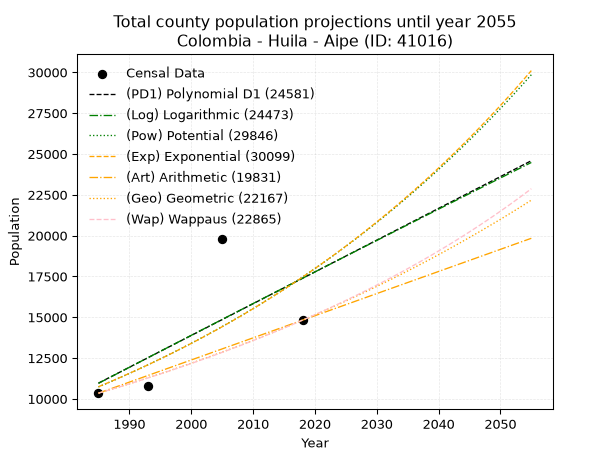
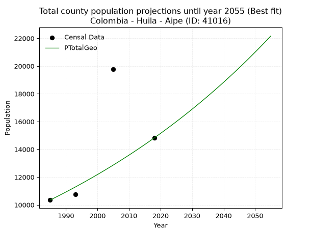
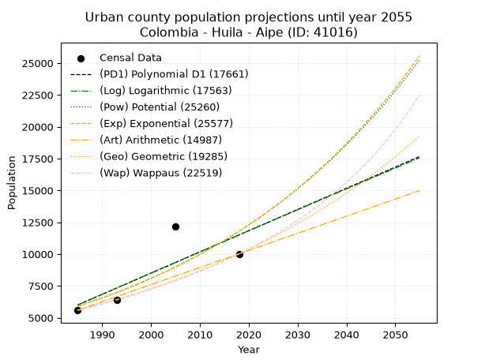
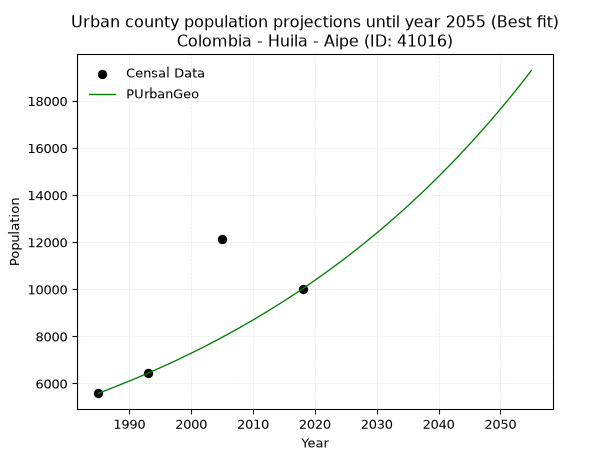
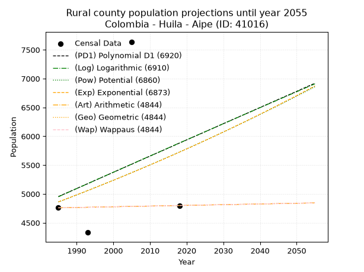
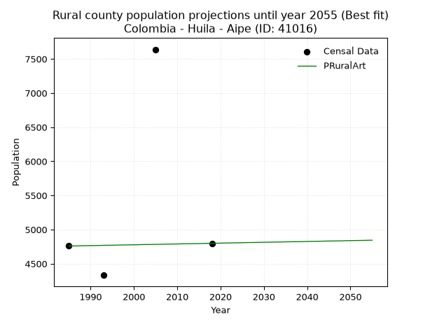

<div align="center">


</div>

# 📜 _“Population and Public Services Demand Projections (PPSD) until Year 2050 for Colombia - Huila - Aipe (ID: 41016)”_
Keywords: `population` `public-service` `projection` `lineal` `polynomial` `logarithmic` `potential` `exponential` `arithmetic` `geometric` `wappaus` `dane` `colombia` `south-america`

PPSD are analytical estimates used by governments and planners to anticipate future changes in population size, age distribution, and the resulting community needs for utilities, healthcare, education, and infrastructure as sizing future water treatment facilities, electrical grids, and road networks based on spatial growth.

<div align="center">

</img>

</div>


> **General running parameters**: • app_version: _v20260806_. • Python version: _3.14.7_. • Pandas version: _3.0.5_. • NumPy version: _2.5.1_. • Creates, save and include plots into reports (create_plot): _False_. • Projection until year: _2050_. • Process polynomial degree 2 and up: _False_. • Process Wappaus: _True_. • Process Wappaus: _True_. • Set negative values to zero: _True_. • Set infinite values to zero: _True_. • Drop dataset notes: _True_. 
<div align="center">

Maps & GIS Layers: [:earth_americas:Google](http://maps.google.com/maps?q=3.223995977,-75.2390165) [:earth_americas:OSM](https://www.openstreetmap.org/#map=18/3.223995977/-75.2390165&layers=P) [:earth_americas:Bing](https://www.bing.com/maps?cp=3.223995977~-75.2390165&lvl=18) [:earth_americas:Apple](https://maps.apple.com/frame?center=3.223995977%2C-75.2390165&span=0.003%2C0.006) [:earth_americas:GISMobile](https://github.com/rcfdtools/R.GISMobile/blob/main/file/gis/CountyLayer_CO/Readme.md)

</div>


<div align="center">

```geojson
{
  "type": "Feature",
  "geometry": {
    "type": "Point", 
    "coordinates": [-75.2390165, 3.223995977]
  }, 
  "properties": {
    "Name": "Colombia - Huila - Aipe (ID: 41016)"
  }
}
```

</div>


## 0. Census Data (4 records)

Census data are official statistics collected by a government about the people and housing in a country. They usually include counts of total population, age, sex, race, income, education, and jobs.

📅Global census file: [Population.xlsx](../data/Population.xlsx)

| Source   |   Year |   CountryID | CountryName   |   StateID | StateName   |   CountyID | CountyName   |   PTotal |   PUrban |   PRural |
|:---------|-------:|------------:|:--------------|----------:|:------------|-----------:|:-------------|---------:|---------:|---------:|
| DANE     |   1985 |          57 | Colombia      |        41 | Huila       |      41016 | Aipe         |    10345 |     5586 |     4759 |
| DANE     |   1993 |          57 | Colombia      |        41 | Huila       |      41016 | Aipe         |    10762 |     6431 |     4331 |
| DANE     |   2005 |          57 | Colombia      |        41 | Huila       |      41016 | Aipe         |    19783 |    12144 |     7639 |
| DANE     |   2018 |          57 | Colombia      |        41 | Huila       |      41016 | Aipe         |    14817 |    10018 |     4799 |

> 🔥Some records could had specific notes about the registered values or the corresponding urban or rural distribution.

📅[SUI-RUPS](https://www.datos.gov.co/Hacienda-y-Cr-dito-P-blico/Registro-nico-de-Prestadores-de-Servicios-P-blicos/4qkq-csdn/about_data) - Local public utility companies: [RUPS.csv](../data/RUPS.csv)

 | SERVICIO       | ESTADO    | NOMBRE                                                                                     | NIT         | DEPARTAMENTO_DOMICILIO   | MUNICIPIO_DOMICILIO   | DIRECCION                          |   TELEFONO | EMAIL                         | TIPO_PRESTADOR                             | CLASIFICACION                  |
|:---------------|:----------|:-------------------------------------------------------------------------------------------|:------------|:-------------------------|:----------------------|:-----------------------------------|-----------:|:------------------------------|:-------------------------------------------|:-------------------------------|
| ACUEDUCTO      | OPERATIVA | UNIDAD DE SERVICIOS PUBLICOS DE ACUEDUCTO, ALCANTARILLADO Y ASEO DE AIPE                   | 891180070-1 | HUILA                    | AIPE                  | calle 4 No. 4-71                   |    8389089 | uspdaipe@hotmail.com          | MUNICIPIO (PRESTACIÓN DIRECTA)             | HASTA 2500 SUSCRIPTORES        |
| ALCANTARILLADO | OPERATIVA | UNIDAD DE SERVICIOS PUBLICOS DE ACUEDUCTO, ALCANTARILLADO Y ASEO DE AIPE                   | 891180070-1 | HUILA                    | AIPE                  | calle 4 No. 4-71                   |    8389089 | uspdaipe@hotmail.com          | MUNICIPIO (PRESTACIÓN DIRECTA)             | HASTA 2500 SUSCRIPTORES        |
| ACUEDUCTO      | OPERATIVA | JUNTA ADMINSTRADORA DEL ACUEDUCTO DE LA VEREDA DINA SECTOR RIO BACHE DEL MUNICIPIO DE AIPE | 900018809-5 | HUILA                    | AIPE                  | VEREDA DINA SECTOR RIOBACHE        |    8389089 | contactenos@aipe-huila.gov.co | ORGANIZACION AUTORIZADA                    | HASTA 2500 SUSCRIPTORES        |
| ACUEDUCTO      | OPERATIVA | EMPRESAS PUBLICAS DE AIPE SOCIEDAD ANONIMA EMPRESA DE SERVICIOS PUBLICOS                   | 900252348-3 | HUILA                    | AIPE                  | KILOMETRO 1 VIA BOGOTA             |    8389704 | epasaesp@hotmail.com          | SOCIEDADES (EMPRESA DE SERVICIOS PUBLICOS) | DESDE 2501 HASTA 5000 USUARIOS |
| ALCANTARILLADO | OPERATIVA | EMPRESAS PUBLICAS DE AIPE SOCIEDAD ANONIMA EMPRESA DE SERVICIOS PUBLICOS                   | 900252348-3 | HUILA                    | AIPE                  | KILOMETRO 1 VIA BOGOTA             |    8389704 | epasaesp@hotmail.com          | SOCIEDADES (EMPRESA DE SERVICIOS PUBLICOS) | DESDE 2501 HASTA 5000 USUARIOS |
| ACUEDUCTO      | OPERATIVA | JUNTA ADMINISTRADORA ACUEDUCTO VEREDA EL PATA                                              | 813013421-3 | HUILA                    | AIPE                  | VEREDA EL PATA CASA FERNANDO OYOLA |    3114887 | contactenos@aipe-huila.gov.co | ORGANIZACION AUTORIZADA                    | HASTA 2500 SUSCRIPTORES        |
| ACUEDUCTO      | OPERATIVA | JUNTA ADMINISTRADORA ACUEDUCTO REGIONAL VEREDA EL DINDAL                                   | 900274276-6 | HUILA                    | AIPE                  | VEREDA EL DINDAL                   |    3105059 | Jose_alvarias14@hotmail.com   | ORGANIZACION AUTORIZADA                    | MENOR O IGUAL A 2500 USUARIOS  |

## 1. Total

### 1.1. Coefficients and Parameters

* (PD1) Polynomial Deg 1: 194.59694901646176, -375315.79727017763 (lineal)
* (Log) Logarithmic: 390255.323596012, -2952407.0919631836
* (Pow) Potential: 29.52158936257942, -93.32458634084689
* (Exp) Exponential: 0.01472515088717962, 2.1712841630607365e-09
* (Art) Arithmetic: Year diff. 2018 - 1985 = 33, Population diff. 14817 - 10345 = 4472, Annual growth = 135.5151515151515
* (Geo) Geometric: Year diff. 2018 - 1985 = 33, Population diff. 14817 - 10345 = 4472, Annual growth % = 0.010946505354092029
* (Wap) Wappaus: i = 1.0771413362622329, Condition values only valid for < 200)

<sub>
Wappaus condition values: ['0.00', '1.08', '2.15', '3.23', '4.31', '5.39', '6.46', '7.54', '8.62', '9.69', '10.77', '11.85', '12.93', '14.00', '15.08', '16.16', '17.23', '18.31', '19.39', '20.47', '21.54', '22.62', '23.70', '24.77', '25.85', '26.93', '28.01', '29.08', '30.16', '31.24', '32.31', '33.39', '34.47', '35.55', '36.62', '37.70', '38.78', '39.85', '40.93', '42.01', '43.09', '44.16', '45.24', '46.32', '47.39', '48.47', '49.55', '50.63', '51.70', '52.78', '53.86', '54.93', '56.01', '57.09', '58.17', '59.24', '60.32', '61.40', '62.47', '63.55', '64.63', '65.71', '66.78', '67.86', '68.94', '70.01']
</sub>


### 1.2. Projected Dataset

|   Year |   CountyID |   PTotalPD1 |   PTotalLog |   PTotalPow |   PTotalExp |   PTotalArt |   PTotalGeo |   PTotalWap |
|-------:|-----------:|------------:|------------:|------------:|------------:|------------:|------------:|------------:|
|   1985 |      41016 |       10959 |       10948 |       10729 |       10737 |       10345 |       10345 |       10345 |
|   1986 |      41016 |       11154 |       11144 |       10889 |       10897 |       10481 |       10458 |       10457 |
|   1987 |      41016 |       11348 |       11341 |       11052 |       11058 |       10616 |       10573 |       10570 |
|   1988 |      41016 |       11543 |       11537 |       11218 |       11222 |       10752 |       10688 |       10685 |
|   1989 |      41016 |       11738 |       11733 |       11386 |       11389 |       10887 |       10805 |       10801 |
|   1990 |      41016 |       11932 |       11929 |       11556 |       11558 |       11023 |       10924 |       10918 |
|   1991 |      41016 |       12127 |       12125 |       11728 |       11729 |       11158 |       11043 |       11036 |
|   1992 |      41016 |       12321 |       12321 |       11904 |       11903 |       11294 |       11164 |       11156 |
|   1993 |      41016 |       12516 |       12517 |       12081 |       12080 |       11429 |       11286 |       11277 |
|   1994 |      41016 |       12711 |       12713 |       12262 |       12259 |       11565 |       11410 |       11399 |
|   1995 |      41016 |       12905 |       12909 |       12444 |       12441 |       11700 |       11535 |       11523 |
|   1996 |      41016 |       13100 |       13104 |       12630 |       12625 |       11836 |       11661 |       11648 |
|   1997 |      41016 |       13294 |       13300 |       12818 |       12813 |       11971 |       11789 |       11775 |
|   1998 |      41016 |       13489 |       13495 |       13009 |       13003 |       12107 |       11918 |       11903 |
|   1999 |      41016 |       13684 |       13690 |       13202 |       13195 |       12242 |       12048 |       12032 |
|   2000 |      41016 |       13878 |       13886 |       13399 |       13391 |       12378 |       12180 |       12163 |
|   2001 |      41016 |       14073 |       14081 |       13598 |       13590 |       12513 |       12313 |       12296 |
|   2002 |      41016 |       14267 |       14276 |       13800 |       13791 |       12649 |       12448 |       12430 |
|   2003 |      41016 |       14462 |       14471 |       14005 |       13996 |       12784 |       12585 |       12566 |
|   2004 |      41016 |       14656 |       14665 |       14213 |       14204 |       12920 |       12722 |       12704 |
|   2005 |      41016 |       14851 |       14860 |       14424 |       14414 |       13055 |       12862 |       12843 |
|   2006 |      41016 |       15046 |       15055 |       14638 |       14628 |       13191 |       13002 |       12983 |
|   2007 |      41016 |       15240 |       15249 |       14855 |       14845 |       13326 |       13145 |       13126 |
|   2008 |      41016 |       15435 |       15443 |       15075 |       15065 |       13462 |       13289 |       13270 |
|   2009 |      41016 |       15629 |       15638 |       15298 |       15289 |       13597 |       13434 |       13416 |
|   2010 |      41016 |       15824 |       15832 |       15524 |       15516 |       13733 |       13581 |       13564 |
|   2011 |      41016 |       16019 |       16026 |       15754 |       15746 |       13868 |       13730 |       13714 |
|   2012 |      41016 |       16213 |       16220 |       15987 |       15979 |       14004 |       13880 |       13866 |
|   2013 |      41016 |       16408 |       16414 |       16223 |       16216 |       14139 |       14032 |       14019 |
|   2014 |      41016 |       16602 |       16608 |       16463 |       16457 |       14275 |       14186 |       14175 |
|   2015 |      41016 |       16797 |       16802 |       16706 |       16701 |       14410 |       14341 |       14332 |
|   2016 |      41016 |       16992 |       16995 |       16952 |       16949 |       14546 |       14498 |       14492 |
|   2017 |      41016 |       17186 |       17189 |       17202 |       17200 |       14681 |       14657 |       14653 |
|   2018 |      41016 |       17381 |       17382 |       17456 |       17455 |       14817 |       14817 |       14817 |
|   2019 |      41016 |       17575 |       17575 |       17713 |       17714 |       14953 |       14979 |       14983 |
|   2020 |      41016 |       17770 |       17769 |       17974 |       17977 |       15088 |       15143 |       15151 |
|   2021 |      41016 |       17965 |       17962 |       18238 |       18244 |       15224 |       15309 |       15321 |
|   2022 |      41016 |       18159 |       18155 |       18507 |       18514 |       15359 |       15477 |       15494 |
|   2023 |      41016 |       18354 |       18348 |       18779 |       18789 |       15495 |       15646 |       15669 |
|   2024 |      41016 |       18548 |       18541 |       19055 |       19068 |       15630 |       15817 |       15846 |
|   2025 |      41016 |       18743 |       18734 |       19335 |       19351 |       15766 |       15990 |       16026 |
|   2026 |      41016 |       18938 |       18926 |       19618 |       19638 |       15901 |       16165 |       16208 |
|   2027 |      41016 |       19132 |       19119 |       19906 |       19929 |       16037 |       16342 |       16393 |
|   2028 |      41016 |       19327 |       19311 |       20198 |       20225 |       16172 |       16521 |       16581 |
|   2029 |      41016 |       19521 |       19504 |       20494 |       20525 |       16308 |       16702 |       16771 |
|   2030 |      41016 |       19716 |       19696 |       20795 |       20829 |       16443 |       16885 |       16963 |
|   2031 |      41016 |       19911 |       19888 |       21099 |       21138 |       16579 |       17070 |       17159 |
|   2032 |      41016 |       20105 |       20080 |       21408 |       21452 |       16714 |       17257 |       17357 |
|   2033 |      41016 |       20300 |       20272 |       21721 |       21770 |       16850 |       17445 |       17558 |
|   2034 |      41016 |       20494 |       20464 |       22039 |       22093 |       16985 |       17636 |       17763 |
|   2035 |      41016 |       20689 |       20656 |       22361 |       22421 |       17121 |       17830 |       17970 |
|   2036 |      41016 |       20884 |       20848 |       22688 |       22753 |       17256 |       18025 |       18180 |
|   2037 |      41016 |       21078 |       21039 |       23019 |       23091 |       17392 |       18222 |       18393 |
|   2038 |      41016 |       21273 |       21231 |       23355 |       23433 |       17527 |       18421 |       18610 |
|   2039 |      41016 |       21467 |       21422 |       23696 |       23781 |       17663 |       18623 |       18830 |
|   2040 |      41016 |       21662 |       21614 |       24041 |       24134 |       17798 |       18827 |       19053 |
|   2041 |      41016 |       21857 |       21805 |       24392 |       24492 |       17934 |       19033 |       19280 |
|   2042 |      41016 |       22051 |       21996 |       24747 |       24855 |       18069 |       19241 |       19510 |
|   2043 |      41016 |       22246 |       22187 |       25107 |       25224 |       18205 |       19452 |       19744 |
|   2044 |      41016 |       22440 |       22378 |       25472 |       25598 |       18340 |       19665 |       19981 |
|   2045 |      41016 |       22635 |       22569 |       25843 |       25978 |       18476 |       19880 |       20223 |
|   2046 |      41016 |       22830 |       22760 |       26219 |       26363 |       18611 |       20098 |       20468 |
|   2047 |      41016 |       23024 |       22950 |       26600 |       26754 |       18747 |       20318 |       20717 |
|   2048 |      41016 |       23219 |       23141 |       26986 |       27151 |       18882 |       20540 |       20970 |
|   2049 |      41016 |       23413 |       23332 |       27378 |       27554 |       19018 |       20765 |       21228 |
|   2050 |      41016 |       23608 |       23522 |       27775 |       27962 |       19153 |       20992 |       21489 |
<div align="center">

</img>

</div>


### 1.3. Best fit with absolute and relative error (%)

Relative error puts that difference into context by dividing the absolute error by the true value, creating a unitless ratio or percentage that shows the scale of the mistake.

Absolute and relative error

|   Year | Source   |   CountryID | CountryName   |   StateID | StateName   |   CountyID_x | CountyName   |   PTotal |   PUrban |   PRural |   CountyID_y |   PTotalPD1 |   PTotalLog |   PTotalPow |   PTotalExp |   PTotalArt |   PTotalGeo |   PTotalWap |   PTotalPD1AbsError |   PTotalLogAbsError |   PTotalPowAbsError |   PTotalExpAbsError |   PTotalArtAbsError |   PTotalGeoAbsError |   PTotalWapAbsError |   PTotalPD1RelError |   PTotalLogRelError |   PTotalPowRelError |   PTotalExpRelError |   PTotalArtRelError |   PTotalGeoRelError |   PTotalWapRelError |
|-------:|:---------|------------:|:--------------|----------:|:------------|-------------:|:-------------|---------:|---------:|---------:|-------------:|------------:|------------:|------------:|------------:|------------:|------------:|------------:|--------------------:|--------------------:|--------------------:|--------------------:|--------------------:|--------------------:|--------------------:|--------------------:|--------------------:|--------------------:|--------------------:|--------------------:|--------------------:|--------------------:|
|   1985 | DANE     |          57 | Colombia      |        41 | Huila       |        41016 | Aipe         |    10345 |     5586 |     4759 |        41016 |       10959 |       10948 |       10729 |       10737 |       10345 |       10345 |       10345 |                 614 |                 603 |                 384 |                 392 |                   0 |                   0 |                   0 |             5.93523 |              5.8289 |             3.71194 |             3.78927 |             0       |             0       |             0       |
|   1993 | DANE     |          57 | Colombia      |        41 | Huila       |        41016 | Aipe         |    10762 |     6431 |     4331 |        41016 |       12516 |       12517 |       12081 |       12080 |       11429 |       11286 |       11277 |                1754 |                1755 |                1319 |                1318 |                 667 |                 524 |                 515 |            16.2981  |             16.3074 |            12.2561  |            12.2468  |             6.19773 |             4.86898 |             4.78536 |
|   2005 | DANE     |          57 | Colombia      |        41 | Huila       |        41016 | Aipe         |    19783 |    12144 |     7639 |        41016 |       14851 |       14860 |       14424 |       14414 |       13055 |       12862 |       12843 |                4932 |                4923 |                5359 |                5369 |                6728 |                6921 |                6940 |            24.9305  |             24.885  |            27.0889  |            27.1395  |            34.009   |            34.9846  |            35.0806  |
|   2018 | DANE     |          57 | Colombia      |        41 | Huila       |        41016 | Aipe         |    14817 |    10018 |     4799 |        41016 |       17381 |       17382 |       17456 |       17455 |       14817 |       14817 |       14817 |                2564 |                2565 |                2639 |                2638 |                   0 |                   0 |                   0 |            17.3044  |             17.3112 |            17.8106  |            17.8039  |             0       |             0       |             0       |

Relative error mean

| Method    |   RelError | Best   |
|:----------|-----------:|:-------|
| PTotalPD1 |   16.1171  |        |
| PTotalLog |   16.0831  |        |
| PTotalPow |   15.2169  |        |
| PTotalExp |   15.2449  |        |
| PTotalArt |   10.0517  |        |
| PTotalGeo |    9.96339 | True   |
| PTotalWap |    9.9665  |        |

💙Best method: _**PTotalGeo**_
<div align="center">

</img>

</div>


### 1.4. Fresh water supply demand in liters per capita per day (lpcd)

The fresh water supply demand typically ranges from 100 to 300 liters per capita per day (lpcd) for standard domestic and municipal planning, though absolute survival minimums set by the World Health Organization are as low as 7.5 to 20 liters per day, and total consumption in high-income nations can exceed 400 liters.

> `CZ`: Level in meters above the sea level (masl)<br> `WS`: Fresh water supply demand in liters per capita per day (lpcd or l/h/d)<br> `WSAll`: Zonal fresh water supply demand in liters per second (l/s)<br> `A`: Zonal area in square meters<br> `DP`: Population density (people/hectare or p/ha)

Reference values (RAS Colombia)

|    CZ |   WS |
|------:|-----:|
|  1000 |  120 |
|  2000 |  130 |
| 99999 |  140 |

County shapefile geometry properties and water supply values

|   CountyID |      ATotal |   CZTotal |   WSTotal |
|-----------:|------------:|----------:|----------:|
|      41016 | 7.95299e+08 |    798.94 |       120 |

Projected values for best method: PTotalGeo

|   CountyID |   Year |   PTotalGeo |   DPTotal |   WSTotal |   WSTotalAll |
|-----------:|-------:|------------:|----------:|----------:|-------------:|
|      41016 |   1985 |       10345 |      0.13 |       120 |      14.3681 |
|      41016 |   1986 |       10458 |      0.13 |       120 |      14.525  |
|      41016 |   1987 |       10573 |      0.13 |       120 |      14.6847 |
|      41016 |   1988 |       10688 |      0.13 |       120 |      14.8444 |
|      41016 |   1989 |       10805 |      0.14 |       120 |      15.0069 |
|      41016 |   1990 |       10924 |      0.14 |       120 |      15.1722 |
|      41016 |   1991 |       11043 |      0.14 |       120 |      15.3375 |
|      41016 |   1992 |       11164 |      0.14 |       120 |      15.5056 |
|      41016 |   1993 |       11286 |      0.14 |       120 |      15.675  |
|      41016 |   1994 |       11410 |      0.14 |       120 |      15.8472 |
|      41016 |   1995 |       11535 |      0.15 |       120 |      16.0208 |
|      41016 |   1996 |       11661 |      0.15 |       120 |      16.1958 |
|      41016 |   1997 |       11789 |      0.15 |       120 |      16.3736 |
|      41016 |   1998 |       11918 |      0.15 |       120 |      16.5528 |
|      41016 |   1999 |       12048 |      0.15 |       120 |      16.7333 |
|      41016 |   2000 |       12180 |      0.15 |       120 |      16.9167 |
|      41016 |   2001 |       12313 |      0.15 |       120 |      17.1014 |
|      41016 |   2002 |       12448 |      0.16 |       120 |      17.2889 |
|      41016 |   2003 |       12585 |      0.16 |       120 |      17.4792 |
|      41016 |   2004 |       12722 |      0.16 |       120 |      17.6694 |
|      41016 |   2005 |       12862 |      0.16 |       120 |      17.8639 |
|      41016 |   2006 |       13002 |      0.16 |       120 |      18.0583 |
|      41016 |   2007 |       13145 |      0.17 |       120 |      18.2569 |
|      41016 |   2008 |       13289 |      0.17 |       120 |      18.4569 |
|      41016 |   2009 |       13434 |      0.17 |       120 |      18.6583 |
|      41016 |   2010 |       13581 |      0.17 |       120 |      18.8625 |
|      41016 |   2011 |       13730 |      0.17 |       120 |      19.0694 |
|      41016 |   2012 |       13880 |      0.17 |       120 |      19.2778 |
|      41016 |   2013 |       14032 |      0.18 |       120 |      19.4889 |
|      41016 |   2014 |       14186 |      0.18 |       120 |      19.7028 |
|      41016 |   2015 |       14341 |      0.18 |       120 |      19.9181 |
|      41016 |   2016 |       14498 |      0.18 |       120 |      20.1361 |
|      41016 |   2017 |       14657 |      0.18 |       120 |      20.3569 |
|      41016 |   2018 |       14817 |      0.19 |       120 |      20.5792 |
|      41016 |   2019 |       14979 |      0.19 |       120 |      20.8042 |
|      41016 |   2020 |       15143 |      0.19 |       120 |      21.0319 |
|      41016 |   2021 |       15309 |      0.19 |       120 |      21.2625 |
|      41016 |   2022 |       15477 |      0.19 |       120 |      21.4958 |
|      41016 |   2023 |       15646 |      0.2  |       120 |      21.7306 |
|      41016 |   2024 |       15817 |      0.2  |       120 |      21.9681 |
|      41016 |   2025 |       15990 |      0.2  |       120 |      22.2083 |
|      41016 |   2026 |       16165 |      0.2  |       120 |      22.4514 |
|      41016 |   2027 |       16342 |      0.21 |       120 |      22.6972 |
|      41016 |   2028 |       16521 |      0.21 |       120 |      22.9458 |
|      41016 |   2029 |       16702 |      0.21 |       120 |      23.1972 |
|      41016 |   2030 |       16885 |      0.21 |       120 |      23.4514 |
|      41016 |   2031 |       17070 |      0.21 |       120 |      23.7083 |
|      41016 |   2032 |       17257 |      0.22 |       120 |      23.9681 |
|      41016 |   2033 |       17445 |      0.22 |       120 |      24.2292 |
|      41016 |   2034 |       17636 |      0.22 |       120 |      24.4944 |
|      41016 |   2035 |       17830 |      0.22 |       120 |      24.7639 |
|      41016 |   2036 |       18025 |      0.23 |       120 |      25.0347 |
|      41016 |   2037 |       18222 |      0.23 |       120 |      25.3083 |
|      41016 |   2038 |       18421 |      0.23 |       120 |      25.5847 |
|      41016 |   2039 |       18623 |      0.23 |       120 |      25.8653 |
|      41016 |   2040 |       18827 |      0.24 |       120 |      26.1486 |
|      41016 |   2041 |       19033 |      0.24 |       120 |      26.4347 |
|      41016 |   2042 |       19241 |      0.24 |       120 |      26.7236 |
|      41016 |   2043 |       19452 |      0.24 |       120 |      27.0167 |
|      41016 |   2044 |       19665 |      0.25 |       120 |      27.3125 |
|      41016 |   2045 |       19880 |      0.25 |       120 |      27.6111 |
|      41016 |   2046 |       20098 |      0.25 |       120 |      27.9139 |
|      41016 |   2047 |       20318 |      0.26 |       120 |      28.2194 |
|      41016 |   2048 |       20540 |      0.26 |       120 |      28.5278 |
|      41016 |   2049 |       20765 |      0.26 |       120 |      28.8403 |
|      41016 |   2050 |       20992 |      0.26 |       120 |      29.1556 |

## 2. Urban

### 2.1. Coefficients and Parameters

* (PD1) Polynomial Deg 1: 166.50702529104873, -324510.92733842024 (lineal)
* (Log) Logarithmic: 333723.56817675673, -2528090.7660043673
* (Pow) Potential: 41.94803989166852, -134.5635303460729
* (Exp) Exponential: 0.020932257337011803, 5.325129273961335e-15
* (Art) Arithmetic: Year diff. 2018 - 1985 = 33, Population diff. 10018 - 5586 = 4432, Annual growth = 134.3030303030303
* (Geo) Geometric: Year diff. 2018 - 1985 = 33, Population diff. 10018 - 5586 = 4432, Annual growth % = 0.017858190421824682
* (Wap) Wappaus: i = 1.7213923391826493, Condition values only valid for < 200)

<sub>
Wappaus condition values: ['0.00', '1.72', '3.44', '5.16', '6.89', '8.61', '10.33', '12.05', '13.77', '15.49', '17.21', '18.94', '20.66', '22.38', '24.10', '25.82', '27.54', '29.26', '30.99', '32.71', '34.43', '36.15', '37.87', '39.59', '41.31', '43.03', '44.76', '46.48', '48.20', '49.92', '51.64', '53.36', '55.08', '56.81', '58.53', '60.25', '61.97', '63.69', '65.41', '67.13', '68.86', '70.58', '72.30', '74.02', '75.74', '77.46', '79.18', '80.91', '82.63', '84.35', '86.07', '87.79', '89.51', '91.23', '92.96', '94.68', '96.40', '98.12', '99.84', '101.56', '103.28', '105.00', '106.73', '108.45', '110.17', '111.89']
</sub>


### 2.2. Projected Dataset

|   Year |   CountyID |   PUrbanPD1 |   PUrbanLog |   PUrbanPow |   PUrbanExp |   PUrbanArt |   PUrbanGeo |   PUrbanWap |
|-------:|-----------:|------------:|------------:|------------:|------------:|------------:|------------:|------------:|
|   1985 |      41016 |        6006 |        5997 |        5903 |        5909 |        5586 |        5586 |        5586 |
|   1986 |      41016 |        6172 |        6165 |        6029 |        6034 |        5720 |        5686 |        5683 |
|   1987 |      41016 |        6339 |        6333 |        6158 |        6161 |        5855 |        5787 |        5782 |
|   1988 |      41016 |        6505 |        6501 |        6289 |        6292 |        5989 |        5891 |        5882 |
|   1989 |      41016 |        6672 |        6669 |        6423 |        6425 |        6123 |        5996 |        5984 |
|   1990 |      41016 |        6838 |        6837 |        6560 |        6561 |        6258 |        6103 |        6088 |
|   1991 |      41016 |        7005 |        7004 |        6700 |        6699 |        6392 |        6212 |        6194 |
|   1992 |      41016 |        7171 |        7172 |        6842 |        6841 |        6526 |        6323 |        6302 |
|   1993 |      41016 |        7338 |        7339 |        6988 |        6986 |        6660 |        6436 |        6412 |
|   1994 |      41016 |        7504 |        7507 |        7136 |        7134 |        6795 |        6551 |        6524 |
|   1995 |      41016 |        7671 |        7674 |        7288 |        7285 |        6929 |        6668 |        6638 |
|   1996 |      41016 |        7837 |        7841 |        7443 |        7439 |        7063 |        6787 |        6754 |
|   1997 |      41016 |        8004 |        8009 |        7601 |        7596 |        7198 |        6908 |        6873 |
|   1998 |      41016 |        8170 |        8176 |        7762 |        7757 |        7332 |        7031 |        6994 |
|   1999 |      41016 |        8337 |        8343 |        7927 |        7921 |        7466 |        7157 |        7117 |
|   2000 |      41016 |        8503 |        8510 |        8095 |        8088 |        7601 |        7285 |        7242 |
|   2001 |      41016 |        8670 |        8676 |        8266 |        8259 |        7735 |        7415 |        7370 |
|   2002 |      41016 |        8836 |        8843 |        8441 |        8434 |        7869 |        7547 |        7501 |
|   2003 |      41016 |        9003 |        9010 |        8620 |        8613 |        8003 |        7682 |        7634 |
|   2004 |      41016 |        9169 |        9176 |        8803 |        8795 |        8138 |        7819 |        7770 |
|   2005 |      41016 |        9336 |        9343 |        8989 |        8981 |        8272 |        7959 |        7909 |
|   2006 |      41016 |        9502 |        9509 |        9179 |        9171 |        8406 |        8101 |        8051 |
|   2007 |      41016 |        9669 |        9676 |        9373 |        9365 |        8541 |        8246 |        8196 |
|   2008 |      41016 |        9835 |        9842 |        9570 |        9563 |        8675 |        8393 |        8343 |
|   2009 |      41016 |       10002 |       10008 |        9772 |        9765 |        8809 |        8543 |        8495 |
|   2010 |      41016 |       10168 |       10174 |        9979 |        9972 |        8944 |        8695 |        8649 |
|   2011 |      41016 |       10335 |       10340 |       10189 |       10183 |        9078 |        8851 |        8807 |
|   2012 |      41016 |       10501 |       10506 |       10404 |       10398 |        9212 |        9009 |        8968 |
|   2013 |      41016 |       10668 |       10672 |       10623 |       10618 |        9346 |        9169 |        9133 |
|   2014 |      41016 |       10834 |       10837 |       10846 |       10842 |        9481 |        9333 |        9302 |
|   2015 |      41016 |       11001 |       11003 |       11075 |       11072 |        9615 |        9500 |        9475 |
|   2016 |      41016 |       11167 |       11169 |       11308 |       11306 |        9749 |        9670 |        9652 |
|   2017 |      41016 |       11334 |       11334 |       11545 |       11545 |        9884 |        9842 |        9833 |
|   2018 |      41016 |       11500 |       11500 |       11788 |       11789 |       10018 |       10018 |       10018 |
|   2019 |      41016 |       11667 |       11665 |       12035 |       12039 |       10152 |       10197 |       10208 |
|   2020 |      41016 |       11833 |       11830 |       12288 |       12293 |       10287 |       10379 |       10402 |
|   2021 |      41016 |       12000 |       11995 |       12546 |       12553 |       10421 |       10564 |       10602 |
|   2022 |      41016 |       12166 |       12160 |       12809 |       12819 |       10555 |       10753 |       10806 |
|   2023 |      41016 |       12333 |       12325 |       13077 |       13090 |       10690 |       10945 |       11016 |
|   2024 |      41016 |       12499 |       12490 |       13351 |       13367 |       10824 |       11140 |       11231 |
|   2025 |      41016 |       12666 |       12655 |       13631 |       13650 |       10958 |       11339 |       11452 |
|   2026 |      41016 |       12832 |       12820 |       13916 |       13939 |       11092 |       11542 |       11678 |
|   2027 |      41016 |       12999 |       12985 |       14207 |       14233 |       11227 |       11748 |       11911 |
|   2028 |      41016 |       13165 |       13149 |       14504 |       14534 |       11361 |       11958 |       12150 |
|   2029 |      41016 |       13332 |       13314 |       14807 |       14842 |       11495 |       12171 |       12396 |
|   2030 |      41016 |       13498 |       13478 |       15116 |       15156 |       11630 |       12389 |       12648 |
|   2031 |      41016 |       13665 |       13643 |       15432 |       15476 |       11764 |       12610 |       12908 |
|   2032 |      41016 |       13831 |       13807 |       15754 |       15804 |       11898 |       12835 |       13176 |
|   2033 |      41016 |       13998 |       13971 |       16082 |       16138 |       12033 |       13064 |       13451 |
|   2034 |      41016 |       14164 |       14135 |       16418 |       16479 |       12167 |       13298 |       13734 |
|   2035 |      41016 |       14331 |       14299 |       16760 |       16828 |       12301 |       13535 |       14026 |
|   2036 |      41016 |       14497 |       14463 |       17108 |       17184 |       12435 |       13777 |       14327 |
|   2037 |      41016 |       14664 |       14627 |       17465 |       17548 |       12570 |       14023 |       14637 |
|   2038 |      41016 |       14830 |       14791 |       17828 |       17919 |       12704 |       14273 |       14957 |
|   2039 |      41016 |       14997 |       14954 |       18198 |       18298 |       12838 |       14528 |       15288 |
|   2040 |      41016 |       15163 |       15118 |       18577 |       18685 |       12973 |       14788 |       15629 |
|   2041 |      41016 |       15330 |       15282 |       18963 |       19080 |       13107 |       15052 |       15981 |
|   2042 |      41016 |       15496 |       15445 |       19356 |       19484 |       13241 |       15321 |       16346 |
|   2043 |      41016 |       15663 |       15609 |       19758 |       19896 |       13376 |       15594 |       16722 |
|   2044 |      41016 |       15829 |       15772 |       20168 |       20317 |       13510 |       15873 |       17113 |
|   2045 |      41016 |       15996 |       15935 |       20586 |       20746 |       13644 |       16156 |       17517 |
|   2046 |      41016 |       16162 |       16098 |       21012 |       21185 |       13778 |       16445 |       17935 |
|   2047 |      41016 |       16329 |       16261 |       21447 |       21633 |       13913 |       16738 |       18369 |
|   2048 |      41016 |       16495 |       16424 |       21891 |       22091 |       14047 |       17037 |       18820 |
|   2049 |      41016 |       16662 |       16587 |       22344 |       22558 |       14181 |       17341 |       19287 |
|   2050 |      41016 |       16828 |       16750 |       22806 |       23035 |       14316 |       17651 |       19773 |
<div align="center">

</img>

</div>


### 2.3. Best fit with absolute and relative error (%)

Relative error puts that difference into context by dividing the absolute error by the true value, creating a unitless ratio or percentage that shows the scale of the mistake.

Absolute and relative error

|   Year | Source   |   CountryID | CountryName   |   StateID | StateName   |   CountyID_x | CountyName   |   PTotal |   PUrban |   PRural |   CountyID_y |   PUrbanPD1 |   PUrbanLog |   PUrbanPow |   PUrbanExp |   PUrbanArt |   PUrbanGeo |   PUrbanWap |   PUrbanPD1AbsError |   PUrbanLogAbsError |   PUrbanPowAbsError |   PUrbanExpAbsError |   PUrbanArtAbsError |   PUrbanGeoAbsError |   PUrbanWapAbsError |   PUrbanPD1RelError |   PUrbanLogRelError |   PUrbanPowRelError |   PUrbanExpRelError |   PUrbanArtRelError |   PUrbanGeoRelError |   PUrbanWapRelError |
|-------:|:---------|------------:|:--------------|----------:|:------------|-------------:|:-------------|---------:|---------:|---------:|-------------:|------------:|------------:|------------:|------------:|------------:|------------:|------------:|--------------------:|--------------------:|--------------------:|--------------------:|--------------------:|--------------------:|--------------------:|--------------------:|--------------------:|--------------------:|--------------------:|--------------------:|--------------------:|--------------------:|
|   1985 | DANE     |          57 | Colombia      |        41 | Huila       |        41016 | Aipe         |    10345 |     5586 |     4759 |        41016 |        6006 |        5997 |        5903 |        5909 |        5586 |        5586 |        5586 |                 420 |                 411 |                 317 |                 323 |                   0 |                   0 |                   0 |              7.5188 |             7.35768 |             5.6749  |             5.78231 |             0       |           0         |            0        |
|   1993 | DANE     |          57 | Colombia      |        41 | Huila       |        41016 | Aipe         |    10762 |     6431 |     4331 |        41016 |        7338 |        7339 |        6988 |        6986 |        6660 |        6436 |        6412 |                 907 |                 908 |                 557 |                 555 |                 229 |                   5 |                  19 |             14.1036 |            14.1191  |             8.66117 |             8.63007 |             3.56088 |           0.0777484 |            0.295444 |
|   2005 | DANE     |          57 | Colombia      |        41 | Huila       |        41016 | Aipe         |    19783 |    12144 |     7639 |        41016 |        9336 |        9343 |        8989 |        8981 |        8272 |        7959 |        7909 |                2808 |                2801 |                3155 |                3163 |                3872 |                4185 |                4235 |             23.1225 |            23.0649  |            25.9799  |            26.0458  |            31.8841  |          34.4615    |           34.8732   |
|   2018 | DANE     |          57 | Colombia      |        41 | Huila       |        41016 | Aipe         |    14817 |    10018 |     4799 |        41016 |       11500 |       11500 |       11788 |       11789 |       10018 |       10018 |       10018 |                1482 |                1482 |                1770 |                1771 |                   0 |                   0 |                   0 |             14.7934 |            14.7934  |            17.6682  |            17.6782  |             0       |           0         |            0        |

Relative error mean

| Method    |   RelError | Best   |
|:----------|-----------:|:-------|
| PUrbanPD1 |   14.8846  |        |
| PUrbanLog |   14.8338  |        |
| PUrbanPow |   14.496   |        |
| PUrbanExp |   14.5341  |        |
| PUrbanArt |    8.86123 |        |
| PUrbanGeo |    8.6348  | True   |
| PUrbanWap |    8.79216 |        |

💙Best method: _**PUrbanGeo**_
<div align="center">

</img>

</div>


### 2.4. Fresh water supply demand in liters per capita per day (lpcd)

The fresh water supply demand typically ranges from 100 to 300 liters per capita per day (lpcd) for standard domestic and municipal planning, though absolute survival minimums set by the World Health Organization are as low as 7.5 to 20 liters per day, and total consumption in high-income nations can exceed 400 liters.

> `CZ`: Level in meters above the sea level (masl)<br> `WS`: Fresh water supply demand in liters per capita per day (lpcd or l/h/d)<br> `WSAll`: Zonal fresh water supply demand in liters per second (l/s)<br> `A`: Zonal area in square meters<br> `DP`: Population density (people/hectare or p/ha)

Reference values (RAS Colombia)

|    CZ |   WS |
|------:|-----:|
|  1000 |  120 |
|  2000 |  130 |
| 99999 |  140 |

County shapefile geometry properties and water supply values

|   CountyID |      AUrban |   CZUrban |   WSUrban |
|-----------:|------------:|----------:|----------:|
|      41016 | 2.24516e+06 |   392.678 |       120 |

Projected values for best method: PUrbanGeo

|   CountyID |   Year |   PUrbanGeo |   DPUrban |   WSUrban |   WSUrbanAll |
|-----------:|-------:|------------:|----------:|----------:|-------------:|
|      41016 |   1985 |        5586 |     24.88 |       120 |      7.75833 |
|      41016 |   1986 |        5686 |     25.33 |       120 |      7.89722 |
|      41016 |   1987 |        5787 |     25.78 |       120 |      8.0375  |
|      41016 |   1988 |        5891 |     26.24 |       120 |      8.18194 |
|      41016 |   1989 |        5996 |     26.71 |       120 |      8.32778 |
|      41016 |   1990 |        6103 |     27.18 |       120 |      8.47639 |
|      41016 |   1991 |        6212 |     27.67 |       120 |      8.62778 |
|      41016 |   1992 |        6323 |     28.16 |       120 |      8.78194 |
|      41016 |   1993 |        6436 |     28.67 |       120 |      8.93889 |
|      41016 |   1994 |        6551 |     29.18 |       120 |      9.09861 |
|      41016 |   1995 |        6668 |     29.7  |       120 |      9.26111 |
|      41016 |   1996 |        6787 |     30.23 |       120 |      9.42639 |
|      41016 |   1997 |        6908 |     30.77 |       120 |      9.59444 |
|      41016 |   1998 |        7031 |     31.32 |       120 |      9.76528 |
|      41016 |   1999 |        7157 |     31.88 |       120 |      9.94028 |
|      41016 |   2000 |        7285 |     32.45 |       120 |     10.1181  |
|      41016 |   2001 |        7415 |     33.03 |       120 |     10.2986  |
|      41016 |   2002 |        7547 |     33.61 |       120 |     10.4819  |
|      41016 |   2003 |        7682 |     34.22 |       120 |     10.6694  |
|      41016 |   2004 |        7819 |     34.83 |       120 |     10.8597  |
|      41016 |   2005 |        7959 |     35.45 |       120 |     11.0542  |
|      41016 |   2006 |        8101 |     36.08 |       120 |     11.2514  |
|      41016 |   2007 |        8246 |     36.73 |       120 |     11.4528  |
|      41016 |   2008 |        8393 |     37.38 |       120 |     11.6569  |
|      41016 |   2009 |        8543 |     38.05 |       120 |     11.8653  |
|      41016 |   2010 |        8695 |     38.73 |       120 |     12.0764  |
|      41016 |   2011 |        8851 |     39.42 |       120 |     12.2931  |
|      41016 |   2012 |        9009 |     40.13 |       120 |     12.5125  |
|      41016 |   2013 |        9169 |     40.84 |       120 |     12.7347  |
|      41016 |   2014 |        9333 |     41.57 |       120 |     12.9625  |
|      41016 |   2015 |        9500 |     42.31 |       120 |     13.1944  |
|      41016 |   2016 |        9670 |     43.07 |       120 |     13.4306  |
|      41016 |   2017 |        9842 |     43.84 |       120 |     13.6694  |
|      41016 |   2018 |       10018 |     44.62 |       120 |     13.9139  |
|      41016 |   2019 |       10197 |     45.42 |       120 |     14.1625  |
|      41016 |   2020 |       10379 |     46.23 |       120 |     14.4153  |
|      41016 |   2021 |       10564 |     47.05 |       120 |     14.6722  |
|      41016 |   2022 |       10753 |     47.89 |       120 |     14.9347  |
|      41016 |   2023 |       10945 |     48.75 |       120 |     15.2014  |
|      41016 |   2024 |       11140 |     49.62 |       120 |     15.4722  |
|      41016 |   2025 |       11339 |     50.5  |       120 |     15.7486  |
|      41016 |   2026 |       11542 |     51.41 |       120 |     16.0306  |
|      41016 |   2027 |       11748 |     52.33 |       120 |     16.3167  |
|      41016 |   2028 |       11958 |     53.26 |       120 |     16.6083  |
|      41016 |   2029 |       12171 |     54.21 |       120 |     16.9042  |
|      41016 |   2030 |       12389 |     55.18 |       120 |     17.2069  |
|      41016 |   2031 |       12610 |     56.17 |       120 |     17.5139  |
|      41016 |   2032 |       12835 |     57.17 |       120 |     17.8264  |
|      41016 |   2033 |       13064 |     58.19 |       120 |     18.1444  |
|      41016 |   2034 |       13298 |     59.23 |       120 |     18.4694  |
|      41016 |   2035 |       13535 |     60.29 |       120 |     18.7986  |
|      41016 |   2036 |       13777 |     61.36 |       120 |     19.1347  |
|      41016 |   2037 |       14023 |     62.46 |       120 |     19.4764  |
|      41016 |   2038 |       14273 |     63.57 |       120 |     19.8236  |
|      41016 |   2039 |       14528 |     64.71 |       120 |     20.1778  |
|      41016 |   2040 |       14788 |     65.87 |       120 |     20.5389  |
|      41016 |   2041 |       15052 |     67.04 |       120 |     20.9056  |
|      41016 |   2042 |       15321 |     68.24 |       120 |     21.2792  |
|      41016 |   2043 |       15594 |     69.46 |       120 |     21.6583  |
|      41016 |   2044 |       15873 |     70.7  |       120 |     22.0458  |
|      41016 |   2045 |       16156 |     71.96 |       120 |     22.4389  |
|      41016 |   2046 |       16445 |     73.25 |       120 |     22.8403  |
|      41016 |   2047 |       16738 |     74.55 |       120 |     23.2472  |
|      41016 |   2048 |       17037 |     75.88 |       120 |     23.6625  |
|      41016 |   2049 |       17341 |     77.24 |       120 |     24.0847  |
|      41016 |   2050 |       17651 |     78.62 |       120 |     24.5153  |

## 3. Rural

### 3.1. Coefficients and Parameters

* (PD1) Polynomial Deg 1: 28.089923725413072, -50804.8699317575 (lineal)
* (Log) Logarithmic: 56531.7554192553, -424316.32595881645
* (Pow) Potential: 9.947060491768138, -29.116428253064058
* (Exp) Exponential: 0.004945225875395399, 0.2652572404058497
* (Art) Arithmetic: Year diff. 2018 - 1985 = 33, Population diff. 4799 - 4759 = 40, Annual growth = 1.2121212121212122
* (Geo) Geometric: Year diff. 2018 - 1985 = 33, Population diff. 4799 - 4759 = 40, Annual growth % = 0.0002536685544016759
* (Wap) Wappaus: i = 0.025363490523565853, Condition values only valid for < 200)

<sub>
Wappaus condition values: ['0.00', '0.03', '0.05', '0.08', '0.10', '0.13', '0.15', '0.18', '0.20', '0.23', '0.25', '0.28', '0.30', '0.33', '0.36', '0.38', '0.41', '0.43', '0.46', '0.48', '0.51', '0.53', '0.56', '0.58', '0.61', '0.63', '0.66', '0.68', '0.71', '0.74', '0.76', '0.79', '0.81', '0.84', '0.86', '0.89', '0.91', '0.94', '0.96', '0.99', '1.01', '1.04', '1.07', '1.09', '1.12', '1.14', '1.17', '1.19', '1.22', '1.24', '1.27', '1.29', '1.32', '1.34', '1.37', '1.39', '1.42', '1.45', '1.47', '1.50', '1.52', '1.55', '1.57', '1.60', '1.62', '1.65']
</sub>


### 3.2. Projected Dataset

|   Year |   CountyID |   PRuralPD1 |   PRuralLog |   PRuralPow |   PRuralExp |   PRuralArt |   PRuralGeo |   PRuralWap |
|-------:|-----------:|------------:|------------:|------------:|------------:|------------:|------------:|------------:|
|   1985 |      41016 |        4954 |        4950 |        4860 |        4862 |        4759 |        4759 |        4759 |
|   1986 |      41016 |        4982 |        4979 |        4884 |        4886 |        4760 |        4760 |        4760 |
|   1987 |      41016 |        5010 |        5007 |        4908 |        4910 |        4761 |        4761 |        4761 |
|   1988 |      41016 |        5038 |        5036 |        4933 |        4935 |        4763 |        4763 |        4763 |
|   1989 |      41016 |        5066 |        5064 |        4958 |        4959 |        4764 |        4764 |        4764 |
|   1990 |      41016 |        5094 |        5093 |        4983 |        4984 |        4765 |        4765 |        4765 |
|   1991 |      41016 |        5122 |        5121 |        5008 |        5008 |        4766 |        4766 |        4766 |
|   1992 |      41016 |        5150 |        5149 |        5033 |        5033 |        4767 |        4767 |        4767 |
|   1993 |      41016 |        5178 |        5178 |        5058 |        5058 |        4769 |        4769 |        4769 |
|   1994 |      41016 |        5206 |        5206 |        5083 |        5083 |        4770 |        4770 |        4770 |
|   1995 |      41016 |        5235 |        5235 |        5109 |        5109 |        4771 |        4771 |        4771 |
|   1996 |      41016 |        5263 |        5263 |        5134 |        5134 |        4772 |        4772 |        4772 |
|   1997 |      41016 |        5291 |        5291 |        5160 |        5159 |        4774 |        4774 |        4774 |
|   1998 |      41016 |        5319 |        5319 |        5186 |        5185 |        4775 |        4775 |        4775 |
|   1999 |      41016 |        5347 |        5348 |        5211 |        5211 |        4776 |        4776 |        4776 |
|   2000 |      41016 |        5375 |        5376 |        5237 |        5236 |        4777 |        4777 |        4777 |
|   2001 |      41016 |        5403 |        5404 |        5264 |        5262 |        4778 |        4778 |        4778 |
|   2002 |      41016 |        5431 |        5433 |        5290 |        5288 |        4780 |        4780 |        4780 |
|   2003 |      41016 |        5459 |        5461 |        5316 |        5315 |        4781 |        4781 |        4781 |
|   2004 |      41016 |        5487 |        5489 |        5343 |        5341 |        4782 |        4782 |        4782 |
|   2005 |      41016 |        5515 |        5517 |        5369 |        5368 |        4783 |        4783 |        4783 |
|   2006 |      41016 |        5544 |        5545 |        5396 |        5394 |        4784 |        4784 |        4784 |
|   2007 |      41016 |        5572 |        5574 |        5423 |        5421 |        4786 |        4786 |        4786 |
|   2008 |      41016 |        5600 |        5602 |        5450 |        5448 |        4787 |        4787 |        4787 |
|   2009 |      41016 |        5628 |        5630 |        5477 |        5475 |        4788 |        4788 |        4788 |
|   2010 |      41016 |        5656 |        5658 |        5504 |        5502 |        4789 |        4789 |        4789 |
|   2011 |      41016 |        5684 |        5686 |        5531 |        5529 |        4791 |        4790 |        4790 |
|   2012 |      41016 |        5712 |        5714 |        5559 |        5557 |        4792 |        4792 |        4792 |
|   2013 |      41016 |        5740 |        5742 |        5586 |        5584 |        4793 |        4793 |        4793 |
|   2014 |      41016 |        5768 |        5770 |        5614 |        5612 |        4794 |        4794 |        4794 |
|   2015 |      41016 |        5796 |        5798 |        5642 |        5640 |        4795 |        4795 |        4795 |
|   2016 |      41016 |        5824 |        5826 |        5669 |        5668 |        4797 |        4797 |        4797 |
|   2017 |      41016 |        5853 |        5855 |        5697 |        5696 |        4798 |        4798 |        4798 |
|   2018 |      41016 |        5881 |        5883 |        5726 |        5724 |        4799 |        4799 |        4799 |
|   2019 |      41016 |        5909 |        5911 |        5754 |        5752 |        4800 |        4800 |        4800 |
|   2020 |      41016 |        5937 |        5939 |        5782 |        5781 |        4801 |        4801 |        4801 |
|   2021 |      41016 |        5965 |        5967 |        5811 |        5809 |        4803 |        4803 |        4803 |
|   2022 |      41016 |        5993 |        5994 |        5840 |        5838 |        4804 |        4804 |        4804 |
|   2023 |      41016 |        6021 |        6022 |        5868 |        5867 |        4805 |        4805 |        4805 |
|   2024 |      41016 |        6049 |        6050 |        5897 |        5896 |        4806 |        4806 |        4806 |
|   2025 |      41016 |        6077 |        6078 |        5926 |        5926 |        4807 |        4808 |        4808 |
|   2026 |      41016 |        6105 |        6106 |        5955 |        5955 |        4809 |        4809 |        4809 |
|   2027 |      41016 |        6133 |        6134 |        5985 |        5984 |        4810 |        4810 |        4810 |
|   2028 |      41016 |        6161 |        6162 |        6014 |        6014 |        4811 |        4811 |        4811 |
|   2029 |      41016 |        6190 |        6190 |        6044 |        6044 |        4812 |        4812 |        4812 |
|   2030 |      41016 |        6218 |        6218 |        6073 |        6074 |        4814 |        4814 |        4814 |
|   2031 |      41016 |        6246 |        6246 |        6103 |        6104 |        4815 |        4815 |        4815 |
|   2032 |      41016 |        6274 |        6273 |        6133 |        6134 |        4816 |        4816 |        4816 |
|   2033 |      41016 |        6302 |        6301 |        6163 |        6165 |        4817 |        4817 |        4817 |
|   2034 |      41016 |        6330 |        6329 |        6194 |        6195 |        4818 |        4819 |        4819 |
|   2035 |      41016 |        6358 |        6357 |        6224 |        6226 |        4820 |        4820 |        4820 |
|   2036 |      41016 |        6386 |        6385 |        6254 |        6257 |        4821 |        4821 |        4821 |
|   2037 |      41016 |        6414 |        6412 |        6285 |        6288 |        4822 |        4822 |        4822 |
|   2038 |      41016 |        6442 |        6440 |        6316 |        6319 |        4823 |        4823 |        4823 |
|   2039 |      41016 |        6470 |        6468 |        6347 |        6350 |        4824 |        4825 |        4825 |
|   2040 |      41016 |        6499 |        6496 |        6378 |        6382 |        4826 |        4826 |        4826 |
|   2041 |      41016 |        6527 |        6523 |        6409 |        6413 |        4827 |        4827 |        4827 |
|   2042 |      41016 |        6555 |        6551 |        6440 |        6445 |        4828 |        4828 |        4828 |
|   2043 |      41016 |        6583 |        6579 |        6472 |        6477 |        4829 |        4830 |        4830 |
|   2044 |      41016 |        6611 |        6606 |        6503 |        6509 |        4831 |        4831 |        4831 |
|   2045 |      41016 |        6639 |        6634 |        6535 |        6542 |        4832 |        4832 |        4832 |
|   2046 |      41016 |        6667 |        6662 |        6567 |        6574 |        4833 |        4833 |        4833 |
|   2047 |      41016 |        6695 |        6689 |        6599 |        6607 |        4834 |        4834 |        4834 |
|   2048 |      41016 |        6723 |        6717 |        6631 |        6639 |        4835 |        4836 |        4836 |
|   2049 |      41016 |        6751 |        6744 |        6663 |        6672 |        4837 |        4837 |        4837 |
|   2050 |      41016 |        6779 |        6772 |        6696 |        6705 |        4838 |        4838 |        4838 |
<div align="center">

</img>

</div>


### 3.3. Best fit with absolute and relative error (%)

Relative error puts that difference into context by dividing the absolute error by the true value, creating a unitless ratio or percentage that shows the scale of the mistake.

Absolute and relative error

|   Year | Source   |   CountryID | CountryName   |   StateID | StateName   |   CountyID_x | CountyName   |   PTotal |   PUrban |   PRural |   CountyID_y |   PRuralPD1 |   PRuralLog |   PRuralPow |   PRuralExp |   PRuralArt |   PRuralGeo |   PRuralWap |   PRuralPD1AbsError |   PRuralLogAbsError |   PRuralPowAbsError |   PRuralExpAbsError |   PRuralArtAbsError |   PRuralGeoAbsError |   PRuralWapAbsError |   PRuralPD1RelError |   PRuralLogRelError |   PRuralPowRelError |   PRuralExpRelError |   PRuralArtRelError |   PRuralGeoRelError |   PRuralWapRelError |
|-------:|:---------|------------:|:--------------|----------:|:------------|-------------:|:-------------|---------:|---------:|---------:|-------------:|------------:|------------:|------------:|------------:|------------:|------------:|------------:|--------------------:|--------------------:|--------------------:|--------------------:|--------------------:|--------------------:|--------------------:|--------------------:|--------------------:|--------------------:|--------------------:|--------------------:|--------------------:|--------------------:|
|   1985 | DANE     |          57 | Colombia      |        41 | Huila       |        41016 | Aipe         |    10345 |     5586 |     4759 |        41016 |        4954 |        4950 |        4860 |        4862 |        4759 |        4759 |        4759 |                 195 |                 191 |                 101 |                 103 |                   0 |                   0 |                   0 |              4.0975 |             4.01345 |             2.12229 |             2.16432 |              0      |              0      |              0      |
|   1993 | DANE     |          57 | Colombia      |        41 | Huila       |        41016 | Aipe         |    10762 |     6431 |     4331 |        41016 |        5178 |        5178 |        5058 |        5058 |        4769 |        4769 |        4769 |                 847 |                 847 |                 727 |                 727 |                 438 |                 438 |                 438 |             19.5567 |            19.5567  |            16.786   |            16.786   |             10.1131 |             10.1131 |             10.1131 |
|   2005 | DANE     |          57 | Colombia      |        41 | Huila       |        41016 | Aipe         |    19783 |    12144 |     7639 |        41016 |        5515 |        5517 |        5369 |        5368 |        4783 |        4783 |        4783 |                2124 |                2122 |                2270 |                2271 |                2856 |                2856 |                2856 |             27.8047 |            27.7785  |            29.7159  |            29.729   |             37.3871 |             37.3871 |             37.3871 |
|   2018 | DANE     |          57 | Colombia      |        41 | Huila       |        41016 | Aipe         |    14817 |    10018 |     4799 |        41016 |        5881 |        5883 |        5726 |        5724 |        4799 |        4799 |        4799 |                1082 |                1084 |                 927 |                 925 |                   0 |                   0 |                   0 |             22.5464 |            22.588   |            19.3165  |            19.2748  |              0      |              0      |              0      |

Relative error mean

| Method    |   RelError | Best   |
|:----------|-----------:|:-------|
| PRuralPD1 |    18.5013 |        |
| PRuralLog |    18.4842 |        |
| PRuralPow |    16.9852 |        |
| PRuralExp |    16.9885 |        |
| PRuralArt |    11.8751 | True   |
| PRuralGeo |    11.8751 | True   |
| PRuralWap |    11.8751 | True   |

💙Best method: _**PRuralArt**_
<div align="center">

</img>

</div>


### 3.4. Fresh water supply demand in liters per capita per day (lpcd)

The fresh water supply demand typically ranges from 100 to 300 liters per capita per day (lpcd) for standard domestic and municipal planning, though absolute survival minimums set by the World Health Organization are as low as 7.5 to 20 liters per day, and total consumption in high-income nations can exceed 400 liters.

> `CZ`: Level in meters above the sea level (masl)<br> `WS`: Fresh water supply demand in liters per capita per day (lpcd or l/h/d)<br> `WSAll`: Zonal fresh water supply demand in liters per second (l/s)<br> `A`: Zonal area in square meters<br> `DP`: Population density (people/hectare or p/ha)

Reference values (RAS Colombia)

|    CZ |   WS |
|------:|-----:|
|  1000 |  120 |
|  2000 |  130 |
| 99999 |  140 |

County shapefile geometry properties and water supply values

|   CountyID |      ARural |   CZRural |   WSRural |
|-----------:|------------:|----------:|----------:|
|      41016 | 7.93053e+08 |   800.077 |       120 |

Projected values for best method: PRuralArt

|   CountyID |   Year |   PRuralArt |   DPRural |   WSRural |   WSRuralAll |
|-----------:|-------:|------------:|----------:|----------:|-------------:|
|      41016 |   1985 |        4759 |      0.06 |       120 |      6.60972 |
|      41016 |   1986 |        4760 |      0.06 |       120 |      6.61111 |
|      41016 |   1987 |        4761 |      0.06 |       120 |      6.6125  |
|      41016 |   1988 |        4763 |      0.06 |       120 |      6.61528 |
|      41016 |   1989 |        4764 |      0.06 |       120 |      6.61667 |
|      41016 |   1990 |        4765 |      0.06 |       120 |      6.61806 |
|      41016 |   1991 |        4766 |      0.06 |       120 |      6.61944 |
|      41016 |   1992 |        4767 |      0.06 |       120 |      6.62083 |
|      41016 |   1993 |        4769 |      0.06 |       120 |      6.62361 |
|      41016 |   1994 |        4770 |      0.06 |       120 |      6.625   |
|      41016 |   1995 |        4771 |      0.06 |       120 |      6.62639 |
|      41016 |   1996 |        4772 |      0.06 |       120 |      6.62778 |
|      41016 |   1997 |        4774 |      0.06 |       120 |      6.63056 |
|      41016 |   1998 |        4775 |      0.06 |       120 |      6.63194 |
|      41016 |   1999 |        4776 |      0.06 |       120 |      6.63333 |
|      41016 |   2000 |        4777 |      0.06 |       120 |      6.63472 |
|      41016 |   2001 |        4778 |      0.06 |       120 |      6.63611 |
|      41016 |   2002 |        4780 |      0.06 |       120 |      6.63889 |
|      41016 |   2003 |        4781 |      0.06 |       120 |      6.64028 |
|      41016 |   2004 |        4782 |      0.06 |       120 |      6.64167 |
|      41016 |   2005 |        4783 |      0.06 |       120 |      6.64306 |
|      41016 |   2006 |        4784 |      0.06 |       120 |      6.64444 |
|      41016 |   2007 |        4786 |      0.06 |       120 |      6.64722 |
|      41016 |   2008 |        4787 |      0.06 |       120 |      6.64861 |
|      41016 |   2009 |        4788 |      0.06 |       120 |      6.65    |
|      41016 |   2010 |        4789 |      0.06 |       120 |      6.65139 |
|      41016 |   2011 |        4791 |      0.06 |       120 |      6.65417 |
|      41016 |   2012 |        4792 |      0.06 |       120 |      6.65556 |
|      41016 |   2013 |        4793 |      0.06 |       120 |      6.65694 |
|      41016 |   2014 |        4794 |      0.06 |       120 |      6.65833 |
|      41016 |   2015 |        4795 |      0.06 |       120 |      6.65972 |
|      41016 |   2016 |        4797 |      0.06 |       120 |      6.6625  |
|      41016 |   2017 |        4798 |      0.06 |       120 |      6.66389 |
|      41016 |   2018 |        4799 |      0.06 |       120 |      6.66528 |
|      41016 |   2019 |        4800 |      0.06 |       120 |      6.66667 |
|      41016 |   2020 |        4801 |      0.06 |       120 |      6.66806 |
|      41016 |   2021 |        4803 |      0.06 |       120 |      6.67083 |
|      41016 |   2022 |        4804 |      0.06 |       120 |      6.67222 |
|      41016 |   2023 |        4805 |      0.06 |       120 |      6.67361 |
|      41016 |   2024 |        4806 |      0.06 |       120 |      6.675   |
|      41016 |   2025 |        4807 |      0.06 |       120 |      6.67639 |
|      41016 |   2026 |        4809 |      0.06 |       120 |      6.67917 |
|      41016 |   2027 |        4810 |      0.06 |       120 |      6.68056 |
|      41016 |   2028 |        4811 |      0.06 |       120 |      6.68194 |
|      41016 |   2029 |        4812 |      0.06 |       120 |      6.68333 |
|      41016 |   2030 |        4814 |      0.06 |       120 |      6.68611 |
|      41016 |   2031 |        4815 |      0.06 |       120 |      6.6875  |
|      41016 |   2032 |        4816 |      0.06 |       120 |      6.68889 |
|      41016 |   2033 |        4817 |      0.06 |       120 |      6.69028 |
|      41016 |   2034 |        4818 |      0.06 |       120 |      6.69167 |
|      41016 |   2035 |        4820 |      0.06 |       120 |      6.69444 |
|      41016 |   2036 |        4821 |      0.06 |       120 |      6.69583 |
|      41016 |   2037 |        4822 |      0.06 |       120 |      6.69722 |
|      41016 |   2038 |        4823 |      0.06 |       120 |      6.69861 |
|      41016 |   2039 |        4824 |      0.06 |       120 |      6.7     |
|      41016 |   2040 |        4826 |      0.06 |       120 |      6.70278 |
|      41016 |   2041 |        4827 |      0.06 |       120 |      6.70417 |
|      41016 |   2042 |        4828 |      0.06 |       120 |      6.70556 |
|      41016 |   2043 |        4829 |      0.06 |       120 |      6.70694 |
|      41016 |   2044 |        4831 |      0.06 |       120 |      6.70972 |
|      41016 |   2045 |        4832 |      0.06 |       120 |      6.71111 |
|      41016 |   2046 |        4833 |      0.06 |       120 |      6.7125  |
|      41016 |   2047 |        4834 |      0.06 |       120 |      6.71389 |
|      41016 |   2048 |        4835 |      0.06 |       120 |      6.71528 |
|      41016 |   2049 |        4837 |      0.06 |       120 |      6.71806 |
|      41016 |   2050 |        4838 |      0.06 |       120 |      6.71944 |

#

<div align="center"><br><sub>Share this research</sub></div><br>

<sub>**APPS & TOOLS & CONTENT DISCLAIMER**: • NO WARRANTY - This content and software is provided by <a href="https://github.com/rcfdtools" target="_blank">github.com/rcfdtools</a> "as is", without any express or implied warranty, including warranties of merchantability, fitness for a particular purpose, or non-infringement. There is no guarantee that the software will be error-free or operate without interruption. • LIMITATION OF LIABILITY - Neither the authors nor copyright holders will be liable for claims or damages arising from the software or its use. You are responsible for determining if the software is appropriate for your use and assume all associated risks, including errors, legal compliance, and data loss. • NO PROFESSIONAL ADVICE - The software provides general information and does not offer professional advice. It should not replace consultation with professional advisors. [Clauses and global license for rcfdtools use.](https://github.com/rcfdtools/rcfdtools/blob/main/LICENSE.md)</sub>

| [:house: Home](Readme.md)  | [:beginner: Help / Collab](https://github.com/rcfdtools/R.HydroTools/discussions/31) |
|----------------------------|-------------------------------------------------------------------------------------------|