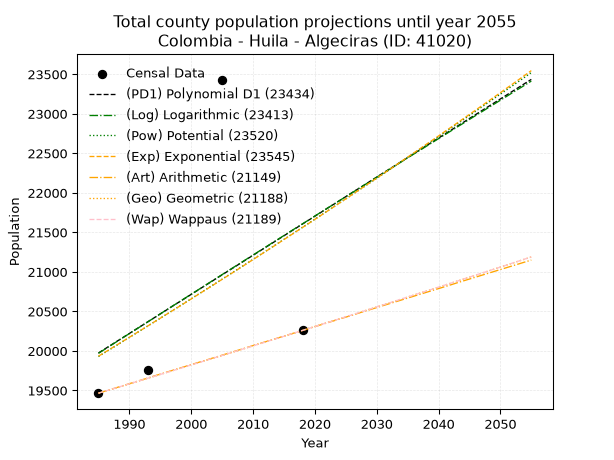
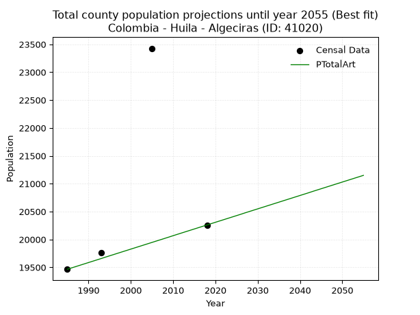
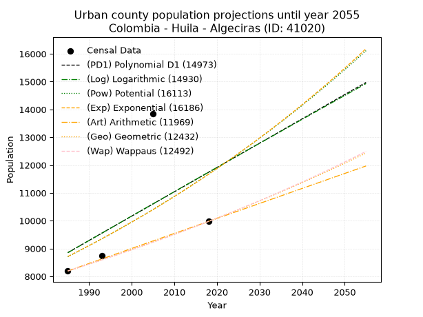
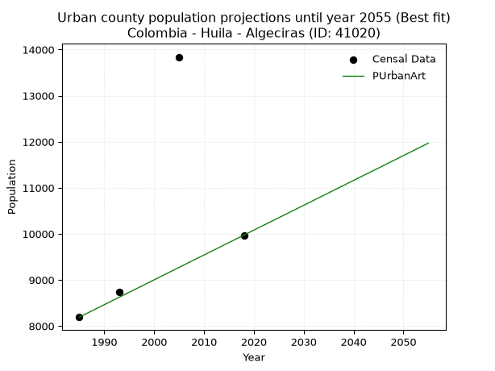
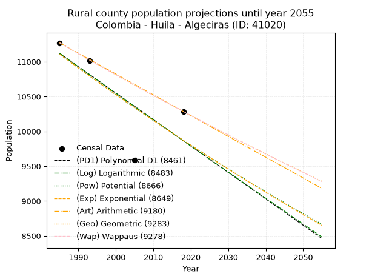
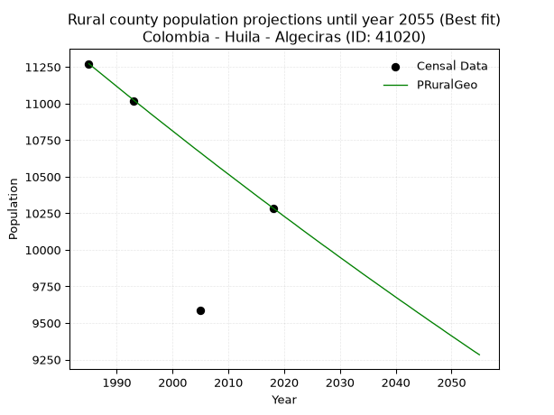

<div align="center">


</div>

# _“Population and Public Services Demand Projections (PPSD) until Year 2050 for Colombia - Huila - Algeciras (ID: 41020)”_
Keywords: `population` `public-service` `projection` `lineal` `polynomial` `logarithmic` `potential` `exponential` `arithmetic` `geometric` `wappaus` `dane` `colombia` `south-america`

PPSD are analytical estimates used by governments and planners to anticipate future changes in population size, age distribution, and the resulting community needs for utilities, healthcare, education, and infrastructure as sizing future water treatment facilities, electrical grids, and road networks based on spatial growth.

> **General running parameters**: • app_version: _v20260806_. • Python version: _3.14.7_. • Pandas version: _3.0.5_. • NumPy version: _2.5.1_. • Creates, save and include plots into reports (create_plot): _True_. • Projection until year: _2050_. • Process polynomial degree 2 and up: _False_. • Process Wappaus: _True_. • Process Wappaus: _True_. • Set negative values to zero: _True_. • Set infinite values to zero: _True_. • Drop dataset notes: _True_. 
<div align="center">

Dynamic map: [:earth_americas:Google](http://maps.google.com/maps?q=2.521674316,-75.3153886) [:earth_americas:OSM](https://www.openstreetmap.org/#map=18/2.521674316/-75.3153886&layers=P) [:earth_americas:Bing](https://www.bing.com/maps?cp=2.521674316~-75.3153886&lvl=18) [:earth_americas:Apple](https://maps.apple.com/frame?center=2.521674316%2C-75.3153886&span=0.003%2C0.006)

</div>


<div align="center">

```geojson
{
  "type": "Feature",
  "geometry": {
    "type": "Point", 
    "coordinates": [-75.3153886, 2.521674316]
  }, 
  "properties": {
    "Name": "Colombia - Huila - Algeciras (ID: 41020)"
  }
}
```

</div>


## 0. Census Data (4 records)

Census data are official statistics collected by a government about the people and housing in a country. They usually include counts of total population, age, sex, race, income, education, and jobs.

📅Global census file: [Population.xlsx](../data/Population.xlsx)

| Source   |   Year |   CountryID | CountryName   |   StateID | StateName   |   CountyID | CountyName   |   PTotal |   PUrban |   PRural |
|:---------|-------:|------------:|:--------------|----------:|:------------|-----------:|:-------------|---------:|---------:|---------:|
| DANE     |   1985 |          57 | Colombia      |        41 | Huila       |      41020 | Algeciras    |    19465 |     8193 |    11272 |
| DANE     |   1993 |          57 | Colombia      |        41 | Huila       |      41020 | Algeciras    |    19758 |     8742 |    11016 |
| DANE     |   2005 |          57 | Colombia      |        41 | Huila       |      41020 | Algeciras    |    23427 |    13840 |     9587 |
| DANE     |   2018 |          57 | Colombia      |        41 | Huila       |      41020 | Algeciras    |    20259 |     9973 |    10286 |

> 🔥Some records has specific notes about the registered values or the corresponding urban or rural distribution.

## 1. Total

### 1.1. Coefficients and Parameters

* (PD1) Polynomial Deg 1: 49.439983942193564, -78165.07788037266 (lineal)
* (Log) Logarithmic: 99375.75979090032, -734628.6965179943
* (Pow) Potential: 4.7806861867093025, -11.4660746382261
* (Exp) Exponential: 0.002378780088433751, 177.37508348792448
* (Art) Arithmetic: Year diff. 2018 - 1985 = 33, Population diff. 20259 - 19465 = 794, Annual growth = 24.060606060606062
* (Geo) Geometric: Year diff. 2018 - 1985 = 33, Population diff. 20259 - 19465 = 794, Annual growth % = 0.001212284471924674
* (Wap) Wappaus: i = 0.1211388886346091, Condition values only valid for < 200)

<sub>
Wappaus condition values: ['0.00', '0.12', '0.24', '0.36', '0.48', '0.61', '0.73', '0.85', '0.97', '1.09', '1.21', '1.33', '1.45', '1.57', '1.70', '1.82', '1.94', '2.06', '2.18', '2.30', '2.42', '2.54', '2.67', '2.79', '2.91', '3.03', '3.15', '3.27', '3.39', '3.51', '3.63', '3.76', '3.88', '4.00', '4.12', '4.24', '4.36', '4.48', '4.60', '4.72', '4.85', '4.97', '5.09', '5.21', '5.33', '5.45', '5.57', '5.69', '5.81', '5.94', '6.06', '6.18', '6.30', '6.42', '6.54', '6.66', '6.78', '6.90', '7.03', '7.15', '7.27', '7.39', '7.51', '7.63', '7.75', '7.87']
</sub>


### 1.2. Projected Dataset

|   Year |   CountyID |   PTotalPD1 |   PTotalLog |   PTotalPow |   PTotalExp |   PTotalArt |   PTotalGeo |   PTotalWap |
|-------:|-----------:|------------:|------------:|------------:|------------:|------------:|------------:|------------:|
|   1985 |      41020 |       19973 |       19969 |       19929 |       19933 |       19465 |       19465 |       19465 |
|   1986 |      41020 |       20023 |       20019 |       19977 |       19981 |       19489 |       19489 |       19489 |
|   1987 |      41020 |       20072 |       20069 |       20025 |       20028 |       19513 |       19512 |       19512 |
|   1988 |      41020 |       20122 |       20119 |       20073 |       20076 |       19537 |       19536 |       19536 |
|   1989 |      41020 |       20171 |       20169 |       20122 |       20124 |       19561 |       19560 |       19560 |
|   1990 |      41020 |       20220 |       20219 |       20170 |       20172 |       19585 |       19583 |       19583 |
|   1991 |      41020 |       20270 |       20269 |       20219 |       20220 |       19609 |       19607 |       19607 |
|   1992 |      41020 |       20319 |       20318 |       20267 |       20268 |       19633 |       19631 |       19631 |
|   1993 |      41020 |       20369 |       20368 |       20316 |       20316 |       19657 |       19655 |       19655 |
|   1994 |      41020 |       20418 |       20418 |       20365 |       20365 |       19682 |       19678 |       19678 |
|   1995 |      41020 |       20468 |       20468 |       20413 |       20413 |       19706 |       19702 |       19702 |
|   1996 |      41020 |       20517 |       20518 |       20462 |       20462 |       19730 |       19726 |       19726 |
|   1997 |      41020 |       20567 |       20568 |       20511 |       20510 |       19754 |       19750 |       19750 |
|   1998 |      41020 |       20616 |       20617 |       20561 |       20559 |       19778 |       19774 |       19774 |
|   1999 |      41020 |       20665 |       20667 |       20610 |       20608 |       19802 |       19798 |       19798 |
|   2000 |      41020 |       20715 |       20717 |       20659 |       20657 |       19826 |       19822 |       19822 |
|   2001 |      41020 |       20764 |       20766 |       20709 |       20707 |       19850 |       19846 |       19846 |
|   2002 |      41020 |       20814 |       20816 |       20758 |       20756 |       19874 |       19870 |       19870 |
|   2003 |      41020 |       20863 |       20866 |       20808 |       20805 |       19898 |       19894 |       19894 |
|   2004 |      41020 |       20913 |       20915 |       20857 |       20855 |       19922 |       19918 |       19918 |
|   2005 |      41020 |       20962 |       20965 |       20907 |       20905 |       19946 |       19942 |       19942 |
|   2006 |      41020 |       21012 |       21014 |       20957 |       20954 |       19970 |       19967 |       19967 |
|   2007 |      41020 |       21061 |       21064 |       21007 |       21004 |       19994 |       19991 |       19991 |
|   2008 |      41020 |       21110 |       21113 |       21057 |       21054 |       20018 |       20015 |       20015 |
|   2009 |      41020 |       21160 |       21163 |       21107 |       21104 |       20042 |       20039 |       20039 |
|   2010 |      41020 |       21209 |       21212 |       21158 |       21155 |       20067 |       20064 |       20064 |
|   2011 |      41020 |       21259 |       21262 |       21208 |       21205 |       20091 |       20088 |       20088 |
|   2012 |      41020 |       21308 |       21311 |       21259 |       21256 |       20115 |       20112 |       20112 |
|   2013 |      41020 |       21358 |       21361 |       21309 |       21306 |       20139 |       20137 |       20137 |
|   2014 |      41020 |       21407 |       21410 |       21360 |       21357 |       20163 |       20161 |       20161 |
|   2015 |      41020 |       21456 |       21459 |       21411 |       21408 |       20187 |       20185 |       20185 |
|   2016 |      41020 |       21506 |       21509 |       21461 |       21459 |       20211 |       20210 |       20210 |
|   2017 |      41020 |       21555 |       21558 |       21512 |       21510 |       20235 |       20234 |       20234 |
|   2018 |      41020 |       21605 |       21607 |       21563 |       21561 |       20259 |       20259 |       20259 |
|   2019 |      41020 |       21654 |       21656 |       21614 |       21612 |       20283 |       20284 |       20284 |
|   2020 |      41020 |       21704 |       21706 |       21666 |       21664 |       20307 |       20308 |       20308 |
|   2021 |      41020 |       21753 |       21755 |       21717 |       21715 |       20331 |       20333 |       20333 |
|   2022 |      41020 |       21803 |       21804 |       21768 |       21767 |       20355 |       20357 |       20357 |
|   2023 |      41020 |       21852 |       21853 |       21820 |       21819 |       20379 |       20382 |       20382 |
|   2024 |      41020 |       21901 |       21902 |       21872 |       21871 |       20403 |       20407 |       20407 |
|   2025 |      41020 |       21951 |       21951 |       21923 |       21923 |       20427 |       20432 |       20432 |
|   2026 |      41020 |       22000 |       22000 |       21975 |       21975 |       20451 |       20456 |       20456 |
|   2027 |      41020 |       22050 |       22049 |       22027 |       22028 |       20476 |       20481 |       20481 |
|   2028 |      41020 |       22099 |       22098 |       22079 |       22080 |       20500 |       20506 |       20506 |
|   2029 |      41020 |       22149 |       22147 |       22131 |       22133 |       20524 |       20531 |       20531 |
|   2030 |      41020 |       22198 |       22196 |       22183 |       22185 |       20548 |       20556 |       20556 |
|   2031 |      41020 |       22248 |       22245 |       22236 |       22238 |       20572 |       20581 |       20581 |
|   2032 |      41020 |       22297 |       22294 |       22288 |       22291 |       20596 |       20606 |       20606 |
|   2033 |      41020 |       22346 |       22343 |       22340 |       22344 |       20620 |       20631 |       20631 |
|   2034 |      41020 |       22396 |       22392 |       22393 |       22398 |       20644 |       20656 |       20656 |
|   2035 |      41020 |       22445 |       22441 |       22446 |       22451 |       20668 |       20681 |       20681 |
|   2036 |      41020 |       22495 |       22490 |       22498 |       22504 |       20692 |       20706 |       20706 |
|   2037 |      41020 |       22544 |       22538 |       22551 |       22558 |       20716 |       20731 |       20731 |
|   2038 |      41020 |       22594 |       22587 |       22604 |       22612 |       20740 |       20756 |       20756 |
|   2039 |      41020 |       22643 |       22636 |       22657 |       22665 |       20764 |       20781 |       20781 |
|   2040 |      41020 |       22692 |       22685 |       22711 |       22719 |       20788 |       20806 |       20807 |
|   2041 |      41020 |       22742 |       22733 |       22764 |       22774 |       20812 |       20831 |       20832 |
|   2042 |      41020 |       22791 |       22782 |       22817 |       22828 |       20836 |       20857 |       20857 |
|   2043 |      41020 |       22841 |       22831 |       22871 |       22882 |       20861 |       20882 |       20882 |
|   2044 |      41020 |       22890 |       22879 |       22924 |       22937 |       20885 |       20907 |       20908 |
|   2045 |      41020 |       22940 |       22928 |       22978 |       22991 |       20909 |       20933 |       20933 |
|   2046 |      41020 |       22989 |       22977 |       23032 |       23046 |       20933 |       20958 |       20959 |
|   2047 |      41020 |       23039 |       23025 |       23086 |       23101 |       20957 |       20983 |       20984 |
|   2048 |      41020 |       23088 |       23074 |       23140 |       23156 |       20981 |       21009 |       21009 |
|   2049 |      41020 |       23137 |       23122 |       23194 |       23211 |       21005 |       21034 |       21035 |
|   2050 |      41020 |       23187 |       23171 |       23248 |       23266 |       21029 |       21060 |       21060 |
<div align="center">

</img>

</div>


### 1.3. Best fit with absolute error and relative error (%)

Relative error puts that difference into context by dividing the absolute error by the true value, creating a unitless ratio or percentage that shows the scale of the mistake.

Absolute and relative error

|   Year | Source   |   CountryID | CountryName   |   StateID | StateName   |   CountyID_x | CountyName   |   PTotal |   PUrban |   PRural |   CountyID_y |   PTotalPD1 |   PTotalLog |   PTotalPow |   PTotalExp |   PTotalArt |   PTotalGeo |   PTotalWap |   PTotalPD1AbsError |   PTotalLogAbsError |   PTotalPowAbsError |   PTotalExpAbsError |   PTotalArtAbsError |   PTotalGeoAbsError |   PTotalWapAbsError |   PTotalPD1RelError |   PTotalLogRelError |   PTotalPowRelError |   PTotalExpRelError |   PTotalArtRelError |   PTotalGeoRelError |   PTotalWapRelError |
|-------:|:---------|------------:|:--------------|----------:|:------------|-------------:|:-------------|---------:|---------:|---------:|-------------:|------------:|------------:|------------:|------------:|------------:|------------:|------------:|--------------------:|--------------------:|--------------------:|--------------------:|--------------------:|--------------------:|--------------------:|--------------------:|--------------------:|--------------------:|--------------------:|--------------------:|--------------------:|--------------------:|
|   1985 | DANE     |          57 | Colombia      |        41 | Huila       |        41020 | Algeciras    |    19465 |     8193 |    11272 |        41020 |       19973 |       19969 |       19929 |       19933 |       19465 |       19465 |       19465 |                 508 |                 504 |                 464 |                 468 |                   0 |                   0 |                   0 |             2.60981 |             2.58926 |             2.38377 |             2.40432 |            0        |            0        |            0        |
|   1993 | DANE     |          57 | Colombia      |        41 | Huila       |        41020 | Algeciras    |    19758 |     8742 |    11016 |        41020 |       20369 |       20368 |       20316 |       20316 |       19657 |       19655 |       19655 |                 611 |                 610 |                 558 |                 558 |                 101 |                 103 |                 103 |             3.09242 |             3.08736 |             2.82417 |             2.82417 |            0.511185 |            0.521308 |            0.521308 |
|   2005 | DANE     |          57 | Colombia      |        41 | Huila       |        41020 | Algeciras    |    23427 |    13840 |     9587 |        41020 |       20962 |       20965 |       20907 |       20905 |       19946 |       19942 |       19942 |                2465 |                2462 |                2520 |                2522 |                3481 |                3485 |                3485 |            10.522   |            10.5092  |            10.7568  |            10.7654  |           14.8589   |           14.876    |           14.876    |
|   2018 | DANE     |          57 | Colombia      |        41 | Huila       |        41020 | Algeciras    |    20259 |     9973 |    10286 |        41020 |       21605 |       21607 |       21563 |       21561 |       20259 |       20259 |       20259 |                1346 |                1348 |                1304 |                1302 |                   0 |                   0 |                   0 |             6.64396 |             6.65383 |             6.43665 |             6.42677 |            0        |            0        |            0        |

Relative error mean

| Method    |   RelError | Best   |
|:----------|-----------:|:-------|
| PTotalPD1 |    5.71706 |        |
| PTotalLog |    5.70992 |        |
| PTotalPow |    5.60035 |        |
| PTotalExp |    5.60515 |        |
| PTotalArt |    3.84253 | True   |
| PTotalGeo |    3.84933 |        |
| PTotalWap |    3.84933 |        |

💙Best method: _**PTotalArt**_
<div align="center">

</img>

</div>


### 1.4. Fresh water supply demand in liters per capita per day (lpcd)

The fresh water supply demand typically ranges from 100 to 300 liters per capita per day (lpcd) for standard domestic and municipal planning, though absolute survival minimums set by the World Health Organization are as low as 7.5 to 20 liters per day, and total consumption in high-income nations can exceed 400 liters.

> `CZ`: Level in meters above the sea level (masl).<br> `WS`: Fresh water supply demand in liters per capita per day (lpcd or l/h/d).<br> `WSAll`: Zonal fresh water supply demand in liters per second (l/s).<br> `A`: Zonal area in square meters.

Reference values (RAS Colombia)

|    CZ |   WS |
|------:|-----:|
|  1000 |  120 |
|  2000 |  130 |
| 99999 |  140 |

County shapefile geometry properties and water supply values

|   CountyID |      ATotal |   CZTotal |   WSTotal |
|-----------:|------------:|----------:|----------:|
|      41020 | 5.89427e+08 |   2037.99 |       140 |

Projected values for best method: PTotalArt

|   CountyID |   Year |   PTotalArt |   WSTotal |   WSTotalAll |
|-----------:|-------:|------------:|----------:|-------------:|
|      41020 |   1985 |       19465 |       140 |      31.5405 |
|      41020 |   1986 |       19489 |       140 |      31.5794 |
|      41020 |   1987 |       19513 |       140 |      31.6183 |
|      41020 |   1988 |       19537 |       140 |      31.6572 |
|      41020 |   1989 |       19561 |       140 |      31.6961 |
|      41020 |   1990 |       19585 |       140 |      31.735  |
|      41020 |   1991 |       19609 |       140 |      31.7738 |
|      41020 |   1992 |       19633 |       140 |      31.8127 |
|      41020 |   1993 |       19657 |       140 |      31.8516 |
|      41020 |   1994 |       19682 |       140 |      31.8921 |
|      41020 |   1995 |       19706 |       140 |      31.931  |
|      41020 |   1996 |       19730 |       140 |      31.9699 |
|      41020 |   1997 |       19754 |       140 |      32.0088 |
|      41020 |   1998 |       19778 |       140 |      32.0477 |
|      41020 |   1999 |       19802 |       140 |      32.0866 |
|      41020 |   2000 |       19826 |       140 |      32.1255 |
|      41020 |   2001 |       19850 |       140 |      32.1644 |
|      41020 |   2002 |       19874 |       140 |      32.2032 |
|      41020 |   2003 |       19898 |       140 |      32.2421 |
|      41020 |   2004 |       19922 |       140 |      32.281  |
|      41020 |   2005 |       19946 |       140 |      32.3199 |
|      41020 |   2006 |       19970 |       140 |      32.3588 |
|      41020 |   2007 |       19994 |       140 |      32.3977 |
|      41020 |   2008 |       20018 |       140 |      32.4366 |
|      41020 |   2009 |       20042 |       140 |      32.4755 |
|      41020 |   2010 |       20067 |       140 |      32.516  |
|      41020 |   2011 |       20091 |       140 |      32.5549 |
|      41020 |   2012 |       20115 |       140 |      32.5938 |
|      41020 |   2013 |       20139 |       140 |      32.6326 |
|      41020 |   2014 |       20163 |       140 |      32.6715 |
|      41020 |   2015 |       20187 |       140 |      32.7104 |
|      41020 |   2016 |       20211 |       140 |      32.7493 |
|      41020 |   2017 |       20235 |       140 |      32.7882 |
|      41020 |   2018 |       20259 |       140 |      32.8271 |
|      41020 |   2019 |       20283 |       140 |      32.866  |
|      41020 |   2020 |       20307 |       140 |      32.9049 |
|      41020 |   2021 |       20331 |       140 |      32.9438 |
|      41020 |   2022 |       20355 |       140 |      32.9826 |
|      41020 |   2023 |       20379 |       140 |      33.0215 |
|      41020 |   2024 |       20403 |       140 |      33.0604 |
|      41020 |   2025 |       20427 |       140 |      33.0993 |
|      41020 |   2026 |       20451 |       140 |      33.1382 |
|      41020 |   2027 |       20476 |       140 |      33.1787 |
|      41020 |   2028 |       20500 |       140 |      33.2176 |
|      41020 |   2029 |       20524 |       140 |      33.2565 |
|      41020 |   2030 |       20548 |       140 |      33.2954 |
|      41020 |   2031 |       20572 |       140 |      33.3343 |
|      41020 |   2032 |       20596 |       140 |      33.3731 |
|      41020 |   2033 |       20620 |       140 |      33.412  |
|      41020 |   2034 |       20644 |       140 |      33.4509 |
|      41020 |   2035 |       20668 |       140 |      33.4898 |
|      41020 |   2036 |       20692 |       140 |      33.5287 |
|      41020 |   2037 |       20716 |       140 |      33.5676 |
|      41020 |   2038 |       20740 |       140 |      33.6065 |
|      41020 |   2039 |       20764 |       140 |      33.6454 |
|      41020 |   2040 |       20788 |       140 |      33.6843 |
|      41020 |   2041 |       20812 |       140 |      33.7231 |
|      41020 |   2042 |       20836 |       140 |      33.762  |
|      41020 |   2043 |       20861 |       140 |      33.8025 |
|      41020 |   2044 |       20885 |       140 |      33.8414 |
|      41020 |   2045 |       20909 |       140 |      33.8803 |
|      41020 |   2046 |       20933 |       140 |      33.9192 |
|      41020 |   2047 |       20957 |       140 |      33.9581 |
|      41020 |   2048 |       20981 |       140 |      33.997  |
|      41020 |   2049 |       21005 |       140 |      34.0359 |
|      41020 |   2050 |       21029 |       140 |      34.0748 |

## 2. Urban

### 2.1. Coefficients and Parameters

* (PD1) Polynomial Deg 1: 87.41549578482748, -164665.84544360117 (lineal)
* (Log) Logarithmic: 175517.2280865792, -1323920.8571928835
* (Pow) Potential: 17.758114764725384, -54.622129646879905
* (Exp) Exponential: 0.008847514852215802, 0.00020556044636996175
* (Art) Arithmetic: Year diff. 2018 - 1985 = 33, Population diff. 9973 - 8193 = 1780, Annual growth = 53.93939393939394
* (Geo) Geometric: Year diff. 2018 - 1985 = 33, Population diff. 9973 - 8193 = 1780, Annual growth % = 0.005975397348432665
* (Wap) Wappaus: i = 0.5938499828183853, Condition values only valid for < 200)

<sub>
Wappaus condition values: ['0.00', '0.59', '1.19', '1.78', '2.38', '2.97', '3.56', '4.16', '4.75', '5.34', '5.94', '6.53', '7.13', '7.72', '8.31', '8.91', '9.50', '10.10', '10.69', '11.28', '11.88', '12.47', '13.06', '13.66', '14.25', '14.85', '15.44', '16.03', '16.63', '17.22', '17.82', '18.41', '19.00', '19.60', '20.19', '20.78', '21.38', '21.97', '22.57', '23.16', '23.75', '24.35', '24.94', '25.54', '26.13', '26.72', '27.32', '27.91', '28.50', '29.10', '29.69', '30.29', '30.88', '31.47', '32.07', '32.66', '33.26', '33.85', '34.44', '35.04', '35.63', '36.22', '36.82', '37.41', '38.01', '38.60']
</sub>


### 2.2. Projected Dataset

|   Year |   CountyID |   PUrbanPD1 |   PUrbanLog |   PUrbanPow |   PUrbanExp |   PUrbanArt |   PUrbanGeo |   PUrbanWap |
|-------:|-----------:|------------:|------------:|------------:|------------:|------------:|------------:|------------:|
|   1985 |      41020 |        8854 |        8847 |        8707 |        8713 |        8193 |        8193 |        8193 |
|   1986 |      41020 |        8941 |        8936 |        8785 |        8790 |        8247 |        8242 |        8242 |
|   1987 |      41020 |        9029 |        9024 |        8864 |        8868 |        8301 |        8291 |        8291 |
|   1988 |      41020 |        9116 |        9112 |        8944 |        8947 |        8355 |        8341 |        8340 |
|   1989 |      41020 |        9204 |        9200 |        9024 |        9027 |        8409 |        8391 |        8390 |
|   1990 |      41020 |        9291 |        9289 |        9105 |        9107 |        8463 |        8441 |        8440 |
|   1991 |      41020 |        9378 |        9377 |        9187 |        9188 |        8517 |        8491 |        8490 |
|   1992 |      41020 |        9466 |        9465 |        9269 |        9269 |        8571 |        8542 |        8541 |
|   1993 |      41020 |        9553 |        9553 |        9352 |        9352 |        8625 |        8593 |        8592 |
|   1994 |      41020 |        9641 |        9641 |        9436 |        9435 |        8678 |        8644 |        8643 |
|   1995 |      41020 |        9728 |        9729 |        9520 |        9519 |        8732 |        8696 |        8694 |
|   1996 |      41020 |        9815 |        9817 |        9605 |        9603 |        8786 |        8748 |        8746 |
|   1997 |      41020 |        9903 |        9905 |        9691 |        9689 |        8840 |        8800 |        8798 |
|   1998 |      41020 |        9990 |        9993 |        9777 |        9775 |        8894 |        8853 |        8851 |
|   1999 |      41020 |       10078 |       10081 |        9865 |        9862 |        8948 |        8906 |        8904 |
|   2000 |      41020 |       10165 |       10168 |        9953 |        9949 |        9002 |        8959 |        8957 |
|   2001 |      41020 |       10253 |       10256 |       10041 |       10038 |        9056 |        9012 |        9010 |
|   2002 |      41020 |       10340 |       10344 |       10131 |       10127 |        9110 |        9066 |        9064 |
|   2003 |      41020 |       10427 |       10432 |       10221 |       10217 |        9164 |        9120 |        9118 |
|   2004 |      41020 |       10515 |       10519 |       10312 |       10308 |        9218 |        9175 |        9173 |
|   2005 |      41020 |       10602 |       10607 |       10404 |       10399 |        9272 |        9230 |        9228 |
|   2006 |      41020 |       10690 |       10694 |       10496 |       10492 |        9326 |        9285 |        9283 |
|   2007 |      41020 |       10777 |       10782 |       10590 |       10585 |        9380 |        9340 |        9338 |
|   2008 |      41020 |       10864 |       10869 |       10684 |       10679 |        9434 |        9396 |        9394 |
|   2009 |      41020 |       10952 |       10957 |       10779 |       10774 |        9488 |        9452 |        9450 |
|   2010 |      41020 |       11039 |       11044 |       10874 |       10870 |        9541 |        9509 |        9507 |
|   2011 |      41020 |       11127 |       11131 |       10971 |       10966 |        9595 |        9566 |        9564 |
|   2012 |      41020 |       11214 |       11218 |       11068 |       11064 |        9649 |        9623 |        9621 |
|   2013 |      41020 |       11302 |       11306 |       11166 |       11162 |        9703 |        9680 |        9679 |
|   2014 |      41020 |       11389 |       11393 |       11265 |       11261 |        9757 |        9738 |        9737 |
|   2015 |      41020 |       11476 |       11480 |       11365 |       11361 |        9811 |        9796 |        9795 |
|   2016 |      41020 |       11564 |       11567 |       11465 |       11462 |        9865 |        9855 |        9854 |
|   2017 |      41020 |       11651 |       11654 |       11567 |       11564 |        9919 |        9914 |        9913 |
|   2018 |      41020 |       11739 |       11741 |       11669 |       11667 |        9973 |        9973 |        9973 |
|   2019 |      41020 |       11826 |       11828 |       11772 |       11771 |       10027 |       10033 |       10033 |
|   2020 |      41020 |       11913 |       11915 |       11876 |       11875 |       10081 |       10093 |       10093 |
|   2021 |      41020 |       12001 |       12002 |       11981 |       11981 |       10135 |       10153 |       10154 |
|   2022 |      41020 |       12088 |       12089 |       12087 |       12087 |       10189 |       10214 |       10215 |
|   2023 |      41020 |       12176 |       12175 |       12193 |       12195 |       10243 |       10275 |       10277 |
|   2024 |      41020 |       12263 |       12262 |       12301 |       12303 |       10297 |       10336 |       10339 |
|   2025 |      41020 |       12351 |       12349 |       12409 |       12412 |       10351 |       10398 |       10401 |
|   2026 |      41020 |       12438 |       12435 |       12519 |       12523 |       10405 |       10460 |       10464 |
|   2027 |      41020 |       12525 |       12522 |       12629 |       12634 |       10458 |       10522 |       10528 |
|   2028 |      41020 |       12613 |       12609 |       12740 |       12746 |       10512 |       10585 |       10591 |
|   2029 |      41020 |       12700 |       12695 |       12852 |       12859 |       10566 |       10648 |       10655 |
|   2030 |      41020 |       12788 |       12782 |       12965 |       12974 |       10620 |       10712 |       10720 |
|   2031 |      41020 |       12875 |       12868 |       13079 |       13089 |       10674 |       10776 |       10785 |
|   2032 |      41020 |       12962 |       12955 |       13193 |       13205 |       10728 |       10840 |       10851 |
|   2033 |      41020 |       13050 |       13041 |       13309 |       13323 |       10782 |       10905 |       10917 |
|   2034 |      41020 |       13137 |       13127 |       13426 |       13441 |       10836 |       10970 |       10983 |
|   2035 |      41020 |       13225 |       13213 |       13544 |       13561 |       10890 |       11036 |       11050 |
|   2036 |      41020 |       13312 |       13300 |       13662 |       13681 |       10944 |       11102 |       11117 |
|   2037 |      41020 |       13400 |       13386 |       13782 |       13803 |       10998 |       11168 |       11185 |
|   2038 |      41020 |       13487 |       13472 |       13903 |       13925 |       11052 |       11235 |       11253 |
|   2039 |      41020 |       13574 |       13558 |       14024 |       14049 |       11106 |       11302 |       11322 |
|   2040 |      41020 |       13662 |       13644 |       14147 |       14174 |       11160 |       11370 |       11391 |
|   2041 |      41020 |       13749 |       13730 |       14271 |       14300 |       11214 |       11438 |       11461 |
|   2042 |      41020 |       13837 |       13816 |       14395 |       14427 |       11268 |       11506 |       11531 |
|   2043 |      41020 |       13924 |       13902 |       14521 |       14555 |       11321 |       11575 |       11602 |
|   2044 |      41020 |       14011 |       13988 |       14648 |       14685 |       11375 |       11644 |       11673 |
|   2045 |      41020 |       14099 |       14074 |       14775 |       14815 |       11429 |       11713 |       11745 |
|   2046 |      41020 |       14186 |       14160 |       14904 |       14947 |       11483 |       11783 |       11817 |
|   2047 |      41020 |       14274 |       14245 |       15034 |       15080 |       11537 |       11854 |       11890 |
|   2048 |      41020 |       14361 |       14331 |       15165 |       15214 |       11591 |       11925 |       11964 |
|   2049 |      41020 |       14449 |       14417 |       15297 |       15349 |       11645 |       11996 |       12037 |
|   2050 |      41020 |       14536 |       14502 |       15430 |       15485 |       11699 |       12068 |       12112 |
<div align="center">

</img>

</div>


### 2.3. Best fit with absolute error and relative error (%)

Relative error puts that difference into context by dividing the absolute error by the true value, creating a unitless ratio or percentage that shows the scale of the mistake.

Absolute and relative error

|   Year | Source   |   CountryID | CountryName   |   StateID | StateName   |   CountyID_x | CountyName   |   PTotal |   PUrban |   PRural |   CountyID_y |   PUrbanPD1 |   PUrbanLog |   PUrbanPow |   PUrbanExp |   PUrbanArt |   PUrbanGeo |   PUrbanWap |   PUrbanPD1AbsError |   PUrbanLogAbsError |   PUrbanPowAbsError |   PUrbanExpAbsError |   PUrbanArtAbsError |   PUrbanGeoAbsError |   PUrbanWapAbsError |   PUrbanPD1RelError |   PUrbanLogRelError |   PUrbanPowRelError |   PUrbanExpRelError |   PUrbanArtRelError |   PUrbanGeoRelError |   PUrbanWapRelError |
|-------:|:---------|------------:|:--------------|----------:|:------------|-------------:|:-------------|---------:|---------:|---------:|-------------:|------------:|------------:|------------:|------------:|------------:|------------:|------------:|--------------------:|--------------------:|--------------------:|--------------------:|--------------------:|--------------------:|--------------------:|--------------------:|--------------------:|--------------------:|--------------------:|--------------------:|--------------------:|--------------------:|
|   1985 | DANE     |          57 | Colombia      |        41 | Huila       |        41020 | Algeciras    |    19465 |     8193 |    11272 |        41020 |        8854 |        8847 |        8707 |        8713 |        8193 |        8193 |        8193 |                 661 |                 654 |                 514 |                 520 |                   0 |                   0 |                   0 |             8.06786 |             7.98242 |             6.27365 |             6.34688 |             0       |             0       |             0       |
|   1993 | DANE     |          57 | Colombia      |        41 | Huila       |        41020 | Algeciras    |    19758 |     8742 |    11016 |        41020 |        9553 |        9553 |        9352 |        9352 |        8625 |        8593 |        8592 |                 811 |                 811 |                 610 |                 610 |                 117 |                 149 |                 150 |             9.27705 |             9.27705 |             6.97781 |             6.97781 |             1.33837 |             1.70442 |             1.71585 |
|   2005 | DANE     |          57 | Colombia      |        41 | Huila       |        41020 | Algeciras    |    23427 |    13840 |     9587 |        41020 |       10602 |       10607 |       10404 |       10399 |        9272 |        9230 |        9228 |                3238 |                3233 |                3436 |                3441 |                4568 |                4610 |                4612 |            23.396   |            23.3598  |            24.8266  |            24.8627  |            33.0058  |            33.3092  |            33.3237  |
|   2018 | DANE     |          57 | Colombia      |        41 | Huila       |        41020 | Algeciras    |    20259 |     9973 |    10286 |        41020 |       11739 |       11741 |       11669 |       11667 |        9973 |        9973 |        9973 |                1766 |                1768 |                1696 |                1694 |                   0 |                   0 |                   0 |            17.7078  |            17.7279  |            17.0059  |            16.9859  |             0       |             0       |             0       |

Relative error mean

| Method    |   RelError | Best   |
|:----------|-----------:|:-------|
| PUrbanPD1 |   14.6122  |        |
| PUrbanLog |   14.5868  |        |
| PUrbanPow |   13.771   |        |
| PUrbanExp |   13.7933  |        |
| PUrbanArt |    8.58604 | True   |
| PUrbanGeo |    8.75342 |        |
| PUrbanWap |    8.75989 |        |

💙Best method: _**PUrbanArt**_
<div align="center">

</img>

</div>


### 2.4. Fresh water supply demand in liters per capita per day (lpcd)

The fresh water supply demand typically ranges from 100 to 300 liters per capita per day (lpcd) for standard domestic and municipal planning, though absolute survival minimums set by the World Health Organization are as low as 7.5 to 20 liters per day, and total consumption in high-income nations can exceed 400 liters.

> `CZ`: Level in meters above the sea level (masl).<br> `WS`: Fresh water supply demand in liters per capita per day (lpcd or l/h/d).<br> `WSAll`: Zonal fresh water supply demand in liters per second (l/s).<br> `A`: Zonal area in square meters.

Reference values (RAS Colombia)

|    CZ |   WS |
|------:|-----:|
|  1000 |  120 |
|  2000 |  130 |
| 99999 |  140 |

County shapefile geometry properties and water supply values

|   CountyID |      AUrban |   CZUrban |   WSUrban |
|-----------:|------------:|----------:|----------:|
|      41020 | 2.13082e+06 |   1007.24 |       130 |

Projected values for best method: PUrbanArt

|   CountyID |   Year |   PUrbanArt |   WSUrban |   WSUrbanAll |
|-----------:|-------:|------------:|----------:|-------------:|
|      41020 |   1985 |        8193 |       130 |      12.3274 |
|      41020 |   1986 |        8247 |       130 |      12.4087 |
|      41020 |   1987 |        8301 |       130 |      12.4899 |
|      41020 |   1988 |        8355 |       130 |      12.5712 |
|      41020 |   1989 |        8409 |       130 |      12.6524 |
|      41020 |   1990 |        8463 |       130 |      12.7337 |
|      41020 |   1991 |        8517 |       130 |      12.8149 |
|      41020 |   1992 |        8571 |       130 |      12.8962 |
|      41020 |   1993 |        8625 |       130 |      12.9774 |
|      41020 |   1994 |        8678 |       130 |      13.0572 |
|      41020 |   1995 |        8732 |       130 |      13.1384 |
|      41020 |   1996 |        8786 |       130 |      13.2197 |
|      41020 |   1997 |        8840 |       130 |      13.3009 |
|      41020 |   1998 |        8894 |       130 |      13.3822 |
|      41020 |   1999 |        8948 |       130 |      13.4634 |
|      41020 |   2000 |        9002 |       130 |      13.5447 |
|      41020 |   2001 |        9056 |       130 |      13.6259 |
|      41020 |   2002 |        9110 |       130 |      13.7072 |
|      41020 |   2003 |        9164 |       130 |      13.7884 |
|      41020 |   2004 |        9218 |       130 |      13.8697 |
|      41020 |   2005 |        9272 |       130 |      13.9509 |
|      41020 |   2006 |        9326 |       130 |      14.0322 |
|      41020 |   2007 |        9380 |       130 |      14.1134 |
|      41020 |   2008 |        9434 |       130 |      14.1947 |
|      41020 |   2009 |        9488 |       130 |      14.2759 |
|      41020 |   2010 |        9541 |       130 |      14.3557 |
|      41020 |   2011 |        9595 |       130 |      14.4369 |
|      41020 |   2012 |        9649 |       130 |      14.5182 |
|      41020 |   2013 |        9703 |       130 |      14.5994 |
|      41020 |   2014 |        9757 |       130 |      14.6807 |
|      41020 |   2015 |        9811 |       130 |      14.7619 |
|      41020 |   2016 |        9865 |       130 |      14.8432 |
|      41020 |   2017 |        9919 |       130 |      14.9244 |
|      41020 |   2018 |        9973 |       130 |      15.0057 |
|      41020 |   2019 |       10027 |       130 |      15.0869 |
|      41020 |   2020 |       10081 |       130 |      15.1682 |
|      41020 |   2021 |       10135 |       130 |      15.2494 |
|      41020 |   2022 |       10189 |       130 |      15.3307 |
|      41020 |   2023 |       10243 |       130 |      15.4119 |
|      41020 |   2024 |       10297 |       130 |      15.4932 |
|      41020 |   2025 |       10351 |       130 |      15.5744 |
|      41020 |   2026 |       10405 |       130 |      15.6557 |
|      41020 |   2027 |       10458 |       130 |      15.7354 |
|      41020 |   2028 |       10512 |       130 |      15.8167 |
|      41020 |   2029 |       10566 |       130 |      15.8979 |
|      41020 |   2030 |       10620 |       130 |      15.9792 |
|      41020 |   2031 |       10674 |       130 |      16.0604 |
|      41020 |   2032 |       10728 |       130 |      16.1417 |
|      41020 |   2033 |       10782 |       130 |      16.2229 |
|      41020 |   2034 |       10836 |       130 |      16.3042 |
|      41020 |   2035 |       10890 |       130 |      16.3854 |
|      41020 |   2036 |       10944 |       130 |      16.4667 |
|      41020 |   2037 |       10998 |       130 |      16.5479 |
|      41020 |   2038 |       11052 |       130 |      16.6292 |
|      41020 |   2039 |       11106 |       130 |      16.7104 |
|      41020 |   2040 |       11160 |       130 |      16.7917 |
|      41020 |   2041 |       11214 |       130 |      16.8729 |
|      41020 |   2042 |       11268 |       130 |      16.9542 |
|      41020 |   2043 |       11321 |       130 |      17.0339 |
|      41020 |   2044 |       11375 |       130 |      17.1152 |
|      41020 |   2045 |       11429 |       130 |      17.1964 |
|      41020 |   2046 |       11483 |       130 |      17.2777 |
|      41020 |   2047 |       11537 |       130 |      17.3589 |
|      41020 |   2048 |       11591 |       130 |      17.4402 |
|      41020 |   2049 |       11645 |       130 |      17.5214 |
|      41020 |   2050 |       11699 |       130 |      17.6027 |

## 3. Rural

### 3.1. Coefficients and Parameters

* (PD1) Polynomial Deg 1: -37.975511842633864, 86500.7675632284 (lineal)
* (Log) Logarithmic: -76141.46829567925, 589292.1606748917
* (Pow) Potential: -7.171581280765135, 27.69592221886935
* (Exp) Exponential: -0.0035766134090316503, 13458101.50108808
* (Art) Arithmetic: Year diff. 2018 - 1985 = 33, Population diff. 10286 - 11272 = -986, Annual growth = -29.87878787878788
* (Geo) Geometric: Year diff. 2018 - 1985 = 33, Population diff. 10286 - 11272 = -986, Annual growth % = -0.0027700359641505967
* (Wap) Wappaus: i = -0.27719443249640857, Condition values only valid for < 200)

<sub>
Wappaus condition values: ['-0.00', '-0.28', '-0.55', '-0.83', '-1.11', '-1.39', '-1.66', '-1.94', '-2.22', '-2.49', '-2.77', '-3.05', '-3.33', '-3.60', '-3.88', '-4.16', '-4.44', '-4.71', '-4.99', '-5.27', '-5.54', '-5.82', '-6.10', '-6.38', '-6.65', '-6.93', '-7.21', '-7.48', '-7.76', '-8.04', '-8.32', '-8.59', '-8.87', '-9.15', '-9.42', '-9.70', '-9.98', '-10.26', '-10.53', '-10.81', '-11.09', '-11.36', '-11.64', '-11.92', '-12.20', '-12.47', '-12.75', '-13.03', '-13.31', '-13.58', '-13.86', '-14.14', '-14.41', '-14.69', '-14.97', '-15.25', '-15.52', '-15.80', '-16.08', '-16.35', '-16.63', '-16.91', '-17.19', '-17.46', '-17.74', '-18.02']
</sub>


### 3.2. Projected Dataset

|   Year |   CountyID |   PRuralPD1 |   PRuralLog |   PRuralPow |   PRuralExp |   PRuralArt |   PRuralGeo |   PRuralWap |
|-------:|-----------:|------------:|------------:|------------:|------------:|------------:|------------:|------------:|
|   1985 |      41020 |       11119 |       11122 |       11111 |       11109 |       11272 |       11272 |       11272 |
|   1986 |      41020 |       11081 |       11083 |       11071 |       11069 |       11242 |       11241 |       11241 |
|   1987 |      41020 |       11043 |       11045 |       11031 |       11030 |       11212 |       11210 |       11210 |
|   1988 |      41020 |       11005 |       11007 |       10992 |       10990 |       11182 |       11179 |       11179 |
|   1989 |      41020 |       10967 |       10968 |       10952 |       10951 |       11152 |       11148 |       11148 |
|   1990 |      41020 |       10929 |       10930 |       10913 |       10912 |       11123 |       11117 |       11117 |
|   1991 |      41020 |       10892 |       10892 |       10873 |       10873 |       11093 |       11086 |       11086 |
|   1992 |      41020 |       10854 |       10853 |       10834 |       10834 |       11063 |       11055 |       11055 |
|   1993 |      41020 |       10816 |       10815 |       10795 |       10796 |       11033 |       11025 |       11025 |
|   1994 |      41020 |       10778 |       10777 |       10757 |       10757 |       11003 |       10994 |       10994 |
|   1995 |      41020 |       10740 |       10739 |       10718 |       10719 |       10973 |       10964 |       10964 |
|   1996 |      41020 |       10702 |       10701 |       10680 |       10680 |       10943 |       10933 |       10933 |
|   1997 |      41020 |       10664 |       10663 |       10641 |       10642 |       10913 |       10903 |       10903 |
|   1998 |      41020 |       10626 |       10624 |       10603 |       10604 |       10884 |       10873 |       10873 |
|   1999 |      41020 |       10588 |       10586 |       10565 |       10566 |       10854 |       10843 |       10843 |
|   2000 |      41020 |       10550 |       10548 |       10527 |       10529 |       10824 |       10813 |       10813 |
|   2001 |      41020 |       10512 |       10510 |       10490 |       10491 |       10794 |       10783 |       10783 |
|   2002 |      41020 |       10474 |       10472 |       10452 |       10454 |       10764 |       10753 |       10753 |
|   2003 |      41020 |       10436 |       10434 |       10415 |       10416 |       10734 |       10723 |       10723 |
|   2004 |      41020 |       10398 |       10396 |       10378 |       10379 |       10704 |       10693 |       10694 |
|   2005 |      41020 |       10360 |       10358 |       10340 |       10342 |       10674 |       10664 |       10664 |
|   2006 |      41020 |       10322 |       10320 |       10304 |       10305 |       10645 |       10634 |       10634 |
|   2007 |      41020 |       10284 |       10282 |       10267 |       10268 |       10615 |       10605 |       10605 |
|   2008 |      41020 |       10246 |       10244 |       10230 |       10232 |       10585 |       10575 |       10576 |
|   2009 |      41020 |       10208 |       10206 |       10194 |       10195 |       10555 |       10546 |       10546 |
|   2010 |      41020 |       10170 |       10169 |       10157 |       10159 |       10525 |       10517 |       10517 |
|   2011 |      41020 |       10132 |       10131 |       10121 |       10123 |       10495 |       10488 |       10488 |
|   2012 |      41020 |       10094 |       10093 |       10085 |       10086 |       10465 |       10459 |       10459 |
|   2013 |      41020 |       10056 |       10055 |       10049 |       10050 |       10435 |       10430 |       10430 |
|   2014 |      41020 |       10018 |       10017 |       10014 |       10015 |       10406 |       10401 |       10401 |
|   2015 |      41020 |        9980 |        9979 |        9978 |        9979 |       10376 |       10372 |       10372 |
|   2016 |      41020 |        9942 |        9942 |        9943 |        9943 |       10346 |       10343 |       10343 |
|   2017 |      41020 |        9904 |        9904 |        9907 |        9908 |       10316 |       10315 |       10315 |
|   2018 |      41020 |        9866 |        9866 |        9872 |        9872 |       10286 |       10286 |       10286 |
|   2019 |      41020 |        9828 |        9828 |        9837 |        9837 |       10256 |       10258 |       10257 |
|   2020 |      41020 |        9790 |        9791 |        9802 |        9802 |       10226 |       10229 |       10229 |
|   2021 |      41020 |        9752 |        9753 |        9768 |        9767 |       10196 |       10201 |       10201 |
|   2022 |      41020 |        9714 |        9715 |        9733 |        9732 |       10166 |       10173 |       10172 |
|   2023 |      41020 |        9676 |        9678 |        9698 |        9697 |       10137 |       10144 |       10144 |
|   2024 |      41020 |        9638 |        9640 |        9664 |        9663 |       10107 |       10116 |       10116 |
|   2025 |      41020 |        9600 |        9602 |        9630 |        9628 |       10077 |       10088 |       10088 |
|   2026 |      41020 |        9562 |        9565 |        9596 |        9594 |       10047 |       10060 |       10060 |
|   2027 |      41020 |        9524 |        9527 |        9562 |        9560 |       10017 |       10032 |       10032 |
|   2028 |      41020 |        9486 |        9490 |        9528 |        9525 |        9987 |       10005 |       10004 |
|   2029 |      41020 |        9448 |        9452 |        9495 |        9491 |        9957 |        9977 |        9976 |
|   2030 |      41020 |        9410 |        9415 |        9461 |        9458 |        9927 |        9949 |        9949 |
|   2031 |      41020 |        9373 |        9377 |        9428 |        9424 |        9898 |        9922 |        9921 |
|   2032 |      41020 |        9335 |        9340 |        9395 |        9390 |        9868 |        9894 |        9893 |
|   2033 |      41020 |        9297 |        9302 |        9362 |        9357 |        9838 |        9867 |        9866 |
|   2034 |      41020 |        9259 |        9265 |        9329 |        9323 |        9808 |        9839 |        9838 |
|   2035 |      41020 |        9221 |        9227 |        9296 |        9290 |        9778 |        9812 |        9811 |
|   2036 |      41020 |        9183 |        9190 |        9263 |        9257 |        9748 |        9785 |        9784 |
|   2037 |      41020 |        9145 |        9153 |        9230 |        9224 |        9718 |        9758 |        9756 |
|   2038 |      41020 |        9107 |        9115 |        9198 |        9191 |        9688 |        9731 |        9729 |
|   2039 |      41020 |        9069 |        9078 |        9166 |        9158 |        9659 |        9704 |        9702 |
|   2040 |      41020 |        9031 |        9040 |        9134 |        9125 |        9629 |        9677 |        9675 |
|   2041 |      41020 |        8993 |        9003 |        9102 |        9093 |        9599 |        9650 |        9648 |
|   2042 |      41020 |        8955 |        8966 |        9070 |        9060 |        9569 |        9624 |        9621 |
|   2043 |      41020 |        8917 |        8929 |        9038 |        9028 |        9539 |        9597 |        9595 |
|   2044 |      41020 |        8879 |        8891 |        9006 |        8996 |        9509 |        9570 |        9568 |
|   2045 |      41020 |        8841 |        8854 |        8975 |        8964 |        9479 |        9544 |        9541 |
|   2046 |      41020 |        8803 |        8817 |        8943 |        8932 |        9449 |        9517 |        9515 |
|   2047 |      41020 |        8765 |        8780 |        8912 |        8900 |        9420 |        9491 |        9488 |
|   2048 |      41020 |        8727 |        8742 |        8881 |        8868 |        9390 |        9465 |        9462 |
|   2049 |      41020 |        8689 |        8705 |        8850 |        8836 |        9360 |        9438 |        9435 |
|   2050 |      41020 |        8651 |        8668 |        8819 |        8805 |        9330 |        9412 |        9409 |
<div align="center">

</img>

</div>


### 3.3. Best fit with absolute error and relative error (%)

Relative error puts that difference into context by dividing the absolute error by the true value, creating a unitless ratio or percentage that shows the scale of the mistake.

Absolute and relative error

|   Year | Source   |   CountryID | CountryName   |   StateID | StateName   |   CountyID_x | CountyName   |   PTotal |   PUrban |   PRural |   CountyID_y |   PRuralPD1 |   PRuralLog |   PRuralPow |   PRuralExp |   PRuralArt |   PRuralGeo |   PRuralWap |   PRuralPD1AbsError |   PRuralLogAbsError |   PRuralPowAbsError |   PRuralExpAbsError |   PRuralArtAbsError |   PRuralGeoAbsError |   PRuralWapAbsError |   PRuralPD1RelError |   PRuralLogRelError |   PRuralPowRelError |   PRuralExpRelError |   PRuralArtRelError |   PRuralGeoRelError |   PRuralWapRelError |
|-------:|:---------|------------:|:--------------|----------:|:------------|-------------:|:-------------|---------:|---------:|---------:|-------------:|------------:|------------:|------------:|------------:|------------:|------------:|------------:|--------------------:|--------------------:|--------------------:|--------------------:|--------------------:|--------------------:|--------------------:|--------------------:|--------------------:|--------------------:|--------------------:|--------------------:|--------------------:|--------------------:|
|   1985 | DANE     |          57 | Colombia      |        41 | Huila       |        41020 | Algeciras    |    19465 |     8193 |    11272 |        41020 |       11119 |       11122 |       11111 |       11109 |       11272 |       11272 |       11272 |                 153 |                 150 |                 161 |                 163 |                   0 |                   0 |                   0 |             1.35735 |             1.33073 |             1.42832 |             1.44606 |            0        |           0         |           0         |
|   1993 | DANE     |          57 | Colombia      |        41 | Huila       |        41020 | Algeciras    |    19758 |     8742 |    11016 |        41020 |       10816 |       10815 |       10795 |       10796 |       11033 |       11025 |       11025 |                 200 |                 201 |                 221 |                 220 |                  17 |                   9 |                   9 |             1.81554 |             1.82462 |             2.00617 |             1.9971  |            0.154321 |           0.0816993 |           0.0816993 |
|   2005 | DANE     |          57 | Colombia      |        41 | Huila       |        41020 | Algeciras    |    23427 |    13840 |     9587 |        41020 |       10360 |       10358 |       10340 |       10342 |       10674 |       10664 |       10664 |                 773 |                 771 |                 753 |                 755 |                1087 |                1077 |                1077 |             8.063   |             8.04214 |             7.85439 |             7.87525 |           11.3383   |          11.234     |          11.234     |
|   2018 | DANE     |          57 | Colombia      |        41 | Huila       |        41020 | Algeciras    |    20259 |     9973 |    10286 |        41020 |        9866 |        9866 |        9872 |        9872 |       10286 |       10286 |       10286 |                 420 |                 420 |                 414 |                 414 |                   0 |                   0 |                   0 |             4.08322 |             4.08322 |             4.02489 |             4.02489 |            0        |           0         |           0         |

Relative error mean

| Method    |   RelError | Best   |
|:----------|-----------:|:-------|
| PRuralPD1 |    3.82978 |        |
| PRuralLog |    3.82018 |        |
| PRuralPow |    3.82844 |        |
| PRuralExp |    3.83582 |        |
| PRuralArt |    2.87315 |        |
| PRuralGeo |    2.82892 | True   |
| PRuralWap |    2.82892 | True   |

💙Best method: _**PRuralGeo**_
<div align="center">

</img>

</div>


### 3.4. Fresh water supply demand in liters per capita per day (lpcd)

The fresh water supply demand typically ranges from 100 to 300 liters per capita per day (lpcd) for standard domestic and municipal planning, though absolute survival minimums set by the World Health Organization are as low as 7.5 to 20 liters per day, and total consumption in high-income nations can exceed 400 liters.

> `CZ`: Level in meters above the sea level (masl).<br> `WS`: Fresh water supply demand in liters per capita per day (lpcd or l/h/d).<br> `WSAll`: Zonal fresh water supply demand in liters per second (l/s).<br> `A`: Zonal area in square meters.

Reference values (RAS Colombia)

|    CZ |   WS |
|------:|-----:|
|  1000 |  120 |
|  2000 |  130 |
| 99999 |  140 |

County shapefile geometry properties and water supply values

|   CountyID |      ARural |   CZRural |   WSRural |
|-----------:|------------:|----------:|----------:|
|      41020 | 5.87296e+08 |   2041.72 |       140 |

Projected values for best method: PRuralGeo

|   CountyID |   Year |   PRuralGeo |   WSRural |   WSRuralAll |
|-----------:|-------:|------------:|----------:|-------------:|
|      41020 |   1985 |       11272 |       140 |      18.2648 |
|      41020 |   1986 |       11241 |       140 |      18.2146 |
|      41020 |   1987 |       11210 |       140 |      18.1644 |
|      41020 |   1988 |       11179 |       140 |      18.1141 |
|      41020 |   1989 |       11148 |       140 |      18.0639 |
|      41020 |   1990 |       11117 |       140 |      18.0137 |
|      41020 |   1991 |       11086 |       140 |      17.9634 |
|      41020 |   1992 |       11055 |       140 |      17.9132 |
|      41020 |   1993 |       11025 |       140 |      17.8646 |
|      41020 |   1994 |       10994 |       140 |      17.8144 |
|      41020 |   1995 |       10964 |       140 |      17.7657 |
|      41020 |   1996 |       10933 |       140 |      17.7155 |
|      41020 |   1997 |       10903 |       140 |      17.6669 |
|      41020 |   1998 |       10873 |       140 |      17.6183 |
|      41020 |   1999 |       10843 |       140 |      17.5697 |
|      41020 |   2000 |       10813 |       140 |      17.5211 |
|      41020 |   2001 |       10783 |       140 |      17.4725 |
|      41020 |   2002 |       10753 |       140 |      17.4238 |
|      41020 |   2003 |       10723 |       140 |      17.3752 |
|      41020 |   2004 |       10693 |       140 |      17.3266 |
|      41020 |   2005 |       10664 |       140 |      17.2796 |
|      41020 |   2006 |       10634 |       140 |      17.231  |
|      41020 |   2007 |       10605 |       140 |      17.184  |
|      41020 |   2008 |       10575 |       140 |      17.1354 |
|      41020 |   2009 |       10546 |       140 |      17.0884 |
|      41020 |   2010 |       10517 |       140 |      17.0414 |
|      41020 |   2011 |       10488 |       140 |      16.9944 |
|      41020 |   2012 |       10459 |       140 |      16.9475 |
|      41020 |   2013 |       10430 |       140 |      16.9005 |
|      41020 |   2014 |       10401 |       140 |      16.8535 |
|      41020 |   2015 |       10372 |       140 |      16.8065 |
|      41020 |   2016 |       10343 |       140 |      16.7595 |
|      41020 |   2017 |       10315 |       140 |      16.7141 |
|      41020 |   2018 |       10286 |       140 |      16.6671 |
|      41020 |   2019 |       10258 |       140 |      16.6218 |
|      41020 |   2020 |       10229 |       140 |      16.5748 |
|      41020 |   2021 |       10201 |       140 |      16.5294 |
|      41020 |   2022 |       10173 |       140 |      16.484  |
|      41020 |   2023 |       10144 |       140 |      16.437  |
|      41020 |   2024 |       10116 |       140 |      16.3917 |
|      41020 |   2025 |       10088 |       140 |      16.3463 |
|      41020 |   2026 |       10060 |       140 |      16.3009 |
|      41020 |   2027 |       10032 |       140 |      16.2556 |
|      41020 |   2028 |       10005 |       140 |      16.2118 |
|      41020 |   2029 |        9977 |       140 |      16.1664 |
|      41020 |   2030 |        9949 |       140 |      16.1211 |
|      41020 |   2031 |        9922 |       140 |      16.0773 |
|      41020 |   2032 |        9894 |       140 |      16.0319 |
|      41020 |   2033 |        9867 |       140 |      15.9882 |
|      41020 |   2034 |        9839 |       140 |      15.9428 |
|      41020 |   2035 |        9812 |       140 |      15.8991 |
|      41020 |   2036 |        9785 |       140 |      15.8553 |
|      41020 |   2037 |        9758 |       140 |      15.8116 |
|      41020 |   2038 |        9731 |       140 |      15.7678 |
|      41020 |   2039 |        9704 |       140 |      15.7241 |
|      41020 |   2040 |        9677 |       140 |      15.6803 |
|      41020 |   2041 |        9650 |       140 |      15.6366 |
|      41020 |   2042 |        9624 |       140 |      15.5944 |
|      41020 |   2043 |        9597 |       140 |      15.5507 |
|      41020 |   2044 |        9570 |       140 |      15.5069 |
|      41020 |   2045 |        9544 |       140 |      15.4648 |
|      41020 |   2046 |        9517 |       140 |      15.4211 |
|      41020 |   2047 |        9491 |       140 |      15.3789 |
|      41020 |   2048 |        9465 |       140 |      15.3368 |
|      41020 |   2049 |        9438 |       140 |      15.2931 |
|      41020 |   2050 |        9412 |       140 |      15.2509 |

<div align="center"><br><sub>Share this research</sub></div><br>

<sub>**APPS & TOOLS & CONTENT DISCLAIMER**: • NO WARRANTY - This content and software is provided by <a href="https://github.com/rcfdtools" target="_blank">github.com/rcfdtools</a> "as is", without any express or implied warranty, including warranties of merchantability, fitness for a particular purpose, or non-infringement. There is no guarantee that the software will be error-free or operate without interruption. • LIMITATION OF LIABILITY - Neither the authors nor copyright holders will be liable for claims or damages arising from the software or its use. You are responsible for determining if the software is appropriate for your use and assume all associated risks, including errors, legal compliance, and data loss. • NO PROFESSIONAL ADVICE - The software provides general information and does not offer professional advice. It should not replace consultation with professional advisors. [Clauses and global license for rcfdtools use.](https://github.com/rcfdtools/rcfdtools/blob/main/LICENSE.md)</sub>