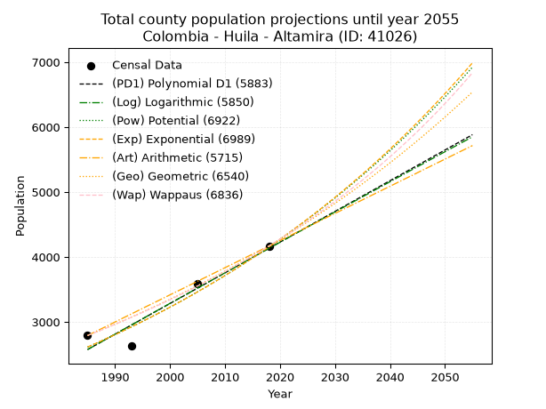
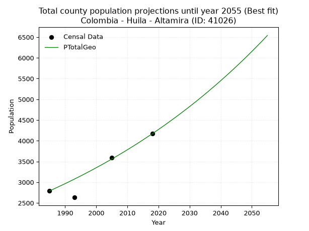
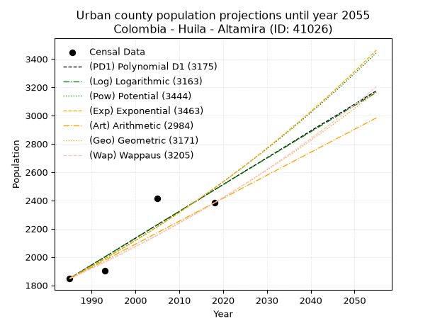
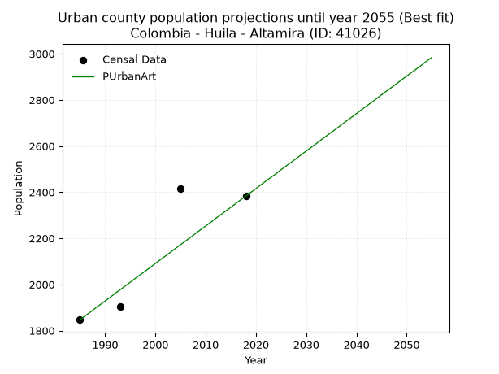
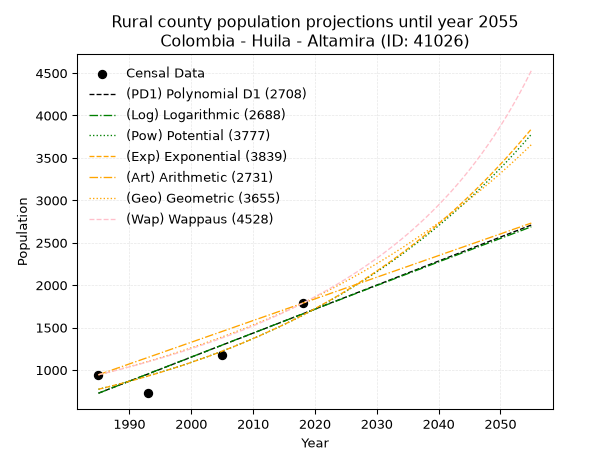
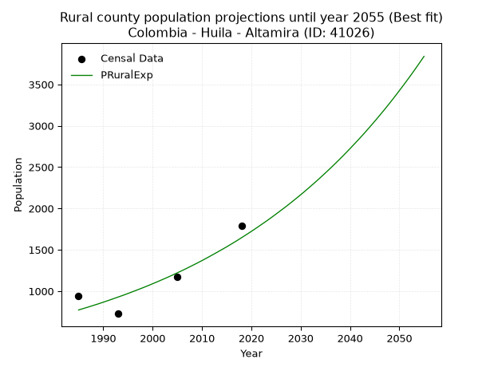

<div align="center">


</div>

# 📜 _“Population and Public Services Demand Projections (PPSD) until Year 2050 for Colombia - Huila - Altamira (ID: 41026)”_
Keywords: `population` `public-service` `projection` `lineal` `polynomial` `logarithmic` `potential` `exponential` `arithmetic` `geometric` `wappaus` `dane` `colombia` `south-america`

PPSD are analytical estimates used by governments and planners to anticipate future changes in population size, age distribution, and the resulting community needs for utilities, healthcare, education, and infrastructure as sizing future water treatment facilities, electrical grids, and road networks based on spatial growth.

<div align="center">

</img>

</div>


> **General running parameters**: • app_version: _v20260806_. • Python version: _3.14.7_. • Pandas version: _3.0.5_. • NumPy version: _2.5.1_. • Creates, save and include plots into reports (create_plot): _False_. • Projection until year: _2050_. • Process polynomial degree 2 and up: _False_. • Process Wappaus: _True_. • Process Wappaus: _True_. • Set negative values to zero: _True_. • Set infinite values to zero: _True_. • Drop dataset notes: _True_. 
<div align="center">

Maps & GIS Layers: [:earth_americas:Google](http://maps.google.com/maps?q=2.063841359,-75.7884712) [:earth_americas:OSM](https://www.openstreetmap.org/#map=18/2.063841359/-75.7884712&layers=P) [:earth_americas:Bing](https://www.bing.com/maps?cp=2.063841359~-75.7884712&lvl=18) [:earth_americas:Apple](https://maps.apple.com/frame?center=2.063841359%2C-75.7884712&span=0.003%2C0.006) [:earth_americas:GISMobile](https://github.com/rcfdtools/R.GISMobile/blob/main/file/gis/CountyLayer_CO/Readme.md)

</div>


<div align="center">

```geojson
{
  "type": "Feature",
  "geometry": {
    "type": "Point", 
    "coordinates": [-75.7884712, 2.063841359]
  }, 
  "properties": {
    "Name": "Colombia - Huila - Altamira (ID: 41026)"
  }
}
```

</div>


## 0. Census Data (4 records)

Census data are official statistics collected by a government about the people and housing in a country. They usually include counts of total population, age, sex, race, income, education, and jobs.

📅Global census file: [Population.xlsx](../data/Population.xlsx)

| Source   |   Year |   CountryID | CountryName   |   StateID | StateName   |   CountyID | CountyName   |   PTotal |   PUrban |   PRural |
|:---------|-------:|------------:|:--------------|----------:|:------------|-----------:|:-------------|---------:|---------:|---------:|
| DANE     |   1985 |          57 | Colombia      |        41 | Huila       |      41026 | Altamira     |     2790 |     1847 |      943 |
| DANE     |   1993 |          57 | Colombia      |        41 | Huila       |      41026 | Altamira     |     2632 |     1905 |      727 |
| DANE     |   2005 |          57 | Colombia      |        41 | Huila       |      41026 | Altamira     |     3591 |     2416 |     1175 |
| DANE     |   2018 |          57 | Colombia      |        41 | Huila       |      41026 | Altamira     |     4169 |     2383 |     1786 |

> 🔥Some records could had specific notes about the registered values or the corresponding urban or rural distribution.

📅[SUI-RUPS](https://www.datos.gov.co/Hacienda-y-Cr-dito-P-blico/Registro-nico-de-Prestadores-de-Servicios-P-blicos/4qkq-csdn/about_data) - Local public utility companies: [RUPS.csv](../data/RUPS.csv)

 | SERVICIO       | ESTADO    | NOMBRE                                                                                             | NIT         | DEPARTAMENTO_DOMICILIO   | MUNICIPIO_DOMICILIO   | DIRECCION           |   TELEFONO | EMAIL                            | TIPO_PRESTADOR                             | CLASIFICACION                 |
|:---------------|:----------|:---------------------------------------------------------------------------------------------------|:------------|:-------------------------|:----------------------|:--------------------|-----------:|:---------------------------------|:-------------------------------------------|:------------------------------|
| ACUEDUCTO      | OPERATIVA | EMPRESA DE SERVICIOS PUBLICOS DOMICILIARIOS DE AGUA POTABLE, ALCANTARILLADO Y ASEO DE ALTAMIRA ESP | 813008648-8 | HUILA                    | ALTAMIRA              | CARRERA 3 6 -06     |    8302550 | nidiap21@yahoo.com               | EMPRESA INDUSTRIAL Y COMERCIAL DEL ESTADO  | HASTA 2500 SUSCRIPTORES       |
| ALCANTARILLADO | OPERATIVA | EMPRESA DE SERVICIOS PUBLICOS DOMICILIARIOS DE AGUA POTABLE, ALCANTARILLADO Y ASEO DE ALTAMIRA ESP | 813008648-8 | HUILA                    | ALTAMIRA              | CARRERA 3 6 -06     |    8302550 | nidiap21@yahoo.com               | EMPRESA INDUSTRIAL Y COMERCIAL DEL ESTADO  | HASTA 2500 SUSCRIPTORES       |
| ACUEDUCTO      | OPERATIVA | EMPRESA DE SERVICIOS PUBLICOS DOMICILIARIOS DE ALTAMIRA S.A. E.S.P.                                | 900305071-8 | HUILA                    | ALTAMIRA              | CARRERA 3 No 6 - 06 |    8302556 | emseraltamirasaesp2016@gmail.com | SOCIEDADES (EMPRESA DE SERVICIOS PUBLICOS) | MENOR O IGUAL A 2500 USUARIOS |
| ALCANTARILLADO | OPERATIVA | EMPRESA DE SERVICIOS PUBLICOS DOMICILIARIOS DE ALTAMIRA S.A. E.S.P.                                | 900305071-8 | HUILA                    | ALTAMIRA              | CARRERA 3 No 6 - 06 |    8302556 | emseraltamirasaesp2016@gmail.com | SOCIEDADES (EMPRESA DE SERVICIOS PUBLICOS) | MENOR O IGUAL A 2500 USUARIOS |

## 1. Total

### 1.1. Coefficients and Parameters

* (PD1) Polynomial Deg 1: 47.25411481332754, -91224.54315535842 (lineal)
* (Log) Logarithmic: 94547.9488682826, -715364.2170075283
* (Pow) Potential: 28.116296218798933, -89.30374173131074
* (Exp) Exponential: 0.014051417091602035, 2.013042399568336e-09
* (Art) Arithmetic: Year diff. 2018 - 1985 = 33, Population diff. 4169 - 2790 = 1379, Annual growth = 41.78787878787879
* (Geo) Geometric: Year diff. 2018 - 1985 = 33, Population diff. 4169 - 2790 = 1379, Annual growth % = 0.012245110456923669
* (Wap) Wappaus: i = 1.2009736682821897, Condition values only valid for < 200)

<sub>
Wappaus condition values: ['0.00', '1.20', '2.40', '3.60', '4.80', '6.00', '7.21', '8.41', '9.61', '10.81', '12.01', '13.21', '14.41', '15.61', '16.81', '18.01', '19.22', '20.42', '21.62', '22.82', '24.02', '25.22', '26.42', '27.62', '28.82', '30.02', '31.23', '32.43', '33.63', '34.83', '36.03', '37.23', '38.43', '39.63', '40.83', '42.03', '43.24', '44.44', '45.64', '46.84', '48.04', '49.24', '50.44', '51.64', '52.84', '54.04', '55.24', '56.45', '57.65', '58.85', '60.05', '61.25', '62.45', '63.65', '64.85', '66.05', '67.25', '68.46', '69.66', '70.86', '72.06', '73.26', '74.46', '75.66', '76.86', '78.06']
</sub>


### 1.2. Projected Dataset

|   Year |   CountyID |   PTotalPD1 |   PTotalLog |   PTotalPow |   PTotalExp |   PTotalArt |   PTotalGeo |   PTotalWap |
|-------:|-----------:|------------:|------------:|------------:|------------:|------------:|------------:|------------:|
|   1985 |      41026 |        2575 |        2574 |        2613 |        2613 |        2790 |        2790 |        2790 |
|   1986 |      41026 |        2622 |        2621 |        2650 |        2650 |        2832 |        2824 |        2824 |
|   1987 |      41026 |        2669 |        2669 |        2688 |        2688 |        2874 |        2859 |        2858 |
|   1988 |      41026 |        2717 |        2717 |        2726 |        2726 |        2915 |        2894 |        2892 |
|   1989 |      41026 |        2764 |        2764 |        2765 |        2765 |        2957 |        2929 |        2927 |
|   1990 |      41026 |        2811 |        2812 |        2804 |        2804 |        2999 |        2965 |        2963 |
|   1991 |      41026 |        2858 |        2859 |        2844 |        2843 |        3041 |        3001 |        2999 |
|   1992 |      41026 |        2906 |        2907 |        2884 |        2884 |        3083 |        3038 |        3035 |
|   1993 |      41026 |        2953 |        2954 |        2925 |        2924 |        3124 |        3075 |        3072 |
|   1994 |      41026 |        3000 |        3001 |        2967 |        2966 |        3166 |        3113 |        3109 |
|   1995 |      41026 |        3047 |        3049 |        3009 |        3008 |        3208 |        3151 |        3146 |
|   1996 |      41026 |        3095 |        3096 |        3052 |        3050 |        3250 |        3190 |        3185 |
|   1997 |      41026 |        3142 |        3144 |        3095 |        3094 |        3291 |        3229 |        3223 |
|   1998 |      41026 |        3189 |        3191 |        3139 |        3137 |        3333 |        3268 |        3262 |
|   1999 |      41026 |        3236 |        3238 |        3183 |        3182 |        3375 |        3308 |        3302 |
|   2000 |      41026 |        3284 |        3286 |        3228 |        3227 |        3417 |        3349 |        3342 |
|   2001 |      41026 |        3331 |        3333 |        3274 |        3272 |        3459 |        3390 |        3383 |
|   2002 |      41026 |        3378 |        3380 |        3320 |        3319 |        3500 |        3431 |        3424 |
|   2003 |      41026 |        3425 |        3427 |        3367 |        3366 |        3542 |        3473 |        3466 |
|   2004 |      41026 |        3473 |        3474 |        3415 |        3413 |        3584 |        3516 |        3509 |
|   2005 |      41026 |        3520 |        3522 |        3463 |        3462 |        3626 |        3559 |        3552 |
|   2006 |      41026 |        3567 |        3569 |        3512 |        3511 |        3668 |        3602 |        3595 |
|   2007 |      41026 |        3614 |        3616 |        3562 |        3560 |        3709 |        3647 |        3639 |
|   2008 |      41026 |        3662 |        3663 |        3612 |        3611 |        3751 |        3691 |        3684 |
|   2009 |      41026 |        3709 |        3710 |        3663 |        3662 |        3793 |        3736 |        3730 |
|   2010 |      41026 |        3756 |        3757 |        3714 |        3713 |        3835 |        3782 |        3776 |
|   2011 |      41026 |        3803 |        3804 |        3767 |        3766 |        3876 |        3829 |        3822 |
|   2012 |      41026 |        3851 |        3851 |        3820 |        3819 |        3918 |        3875 |        3870 |
|   2013 |      41026 |        3898 |        3898 |        3874 |        3873 |        3960 |        3923 |        3918 |
|   2014 |      41026 |        3945 |        3945 |        3928 |        3928 |        4002 |        3971 |        3967 |
|   2015 |      41026 |        3992 |        3992 |        3983 |        3984 |        4044 |        4020 |        4016 |
|   2016 |      41026 |        4040 |        4039 |        4039 |        4040 |        4085 |        4069 |        4066 |
|   2017 |      41026 |        4087 |        4086 |        4096 |        4097 |        4127 |        4119 |        4117 |
|   2018 |      41026 |        4134 |        4133 |        4153 |        4155 |        4169 |        4169 |        4169 |
|   2019 |      41026 |        4182 |        4179 |        4212 |        4214 |        4211 |        4220 |        4222 |
|   2020 |      41026 |        4229 |        4226 |        4271 |        4274 |        4253 |        4272 |        4275 |
|   2021 |      41026 |        4276 |        4273 |        4331 |        4334 |        4294 |        4324 |        4329 |
|   2022 |      41026 |        4323 |        4320 |        4391 |        4396 |        4336 |        4377 |        4384 |
|   2023 |      41026 |        4371 |        4367 |        4453 |        4458 |        4378 |        4431 |        4440 |
|   2024 |      41026 |        4418 |        4413 |        4515 |        4521 |        4420 |        4485 |        4496 |
|   2025 |      41026 |        4465 |        4460 |        4578 |        4585 |        4462 |        4540 |        4554 |
|   2026 |      41026 |        4512 |        4507 |        4642 |        4650 |        4503 |        4595 |        4612 |
|   2027 |      41026 |        4560 |        4553 |        4707 |        4715 |        4545 |        4652 |        4672 |
|   2028 |      41026 |        4607 |        4600 |        4773 |        4782 |        4587 |        4709 |        4732 |
|   2029 |      41026 |        4654 |        4647 |        4839 |        4850 |        4629 |        4766 |        4794 |
|   2030 |      41026 |        4701 |        4693 |        4907 |        4918 |        4670 |        4825 |        4856 |
|   2031 |      41026 |        4749 |        4740 |        4975 |        4988 |        4712 |        4884 |        4920 |
|   2032 |      41026 |        4796 |        4786 |        5045 |        5059 |        4754 |        4943 |        4984 |
|   2033 |      41026 |        4843 |        4833 |        5115 |        5130 |        4796 |        5004 |        5050 |
|   2034 |      41026 |        4890 |        4879 |        5186 |        5203 |        4838 |        5065 |        5116 |
|   2035 |      41026 |        4938 |        4926 |        5258 |        5276 |        4879 |        5127 |        5184 |
|   2036 |      41026 |        4985 |        4972 |        5331 |        5351 |        4921 |        5190 |        5253 |
|   2037 |      41026 |        5032 |        5019 |        5405 |        5427 |        4963 |        5254 |        5323 |
|   2038 |      41026 |        5079 |        5065 |        5481 |        5504 |        5005 |        5318 |        5395 |
|   2039 |      41026 |        5127 |        5111 |        5557 |        5582 |        5047 |        5383 |        5468 |
|   2040 |      41026 |        5174 |        5158 |        5634 |        5661 |        5088 |        5449 |        5542 |
|   2041 |      41026 |        5221 |        5204 |        5712 |        5741 |        5130 |        5516 |        5617 |
|   2042 |      41026 |        5268 |        5250 |        5791 |        5822 |        5172 |        5583 |        5694 |
|   2043 |      41026 |        5316 |        5297 |        5871 |        5904 |        5214 |        5652 |        5772 |
|   2044 |      41026 |        5363 |        5343 |        5953 |        5988 |        5255 |        5721 |        5852 |
|   2045 |      41026 |        5410 |        5389 |        6035 |        6073 |        5297 |        5791 |        5933 |
|   2046 |      41026 |        5457 |        5435 |        6119 |        6158 |        5339 |        5862 |        6015 |
|   2047 |      41026 |        5505 |        5482 |        6203 |        6246 |        5381 |        5934 |        6100 |
|   2048 |      41026 |        5552 |        5528 |        6289 |        6334 |        5423 |        6006 |        6185 |
|   2049 |      41026 |        5599 |        5574 |        6376 |        6424 |        5464 |        6080 |        6273 |
|   2050 |      41026 |        5646 |        5620 |        6464 |        6515 |        5506 |        6154 |        6362 |
<div align="center">

</img>

</div>


### 1.3. Best fit with absolute and relative error (%)

Relative error puts that difference into context by dividing the absolute error by the true value, creating a unitless ratio or percentage that shows the scale of the mistake.

Absolute and relative error

|   Year | Source   |   CountryID | CountryName   |   StateID | StateName   |   CountyID_x | CountyName   |   PTotal |   PUrban |   PRural |   CountyID_y |   PTotalPD1 |   PTotalLog |   PTotalPow |   PTotalExp |   PTotalArt |   PTotalGeo |   PTotalWap |   PTotalPD1AbsError |   PTotalLogAbsError |   PTotalPowAbsError |   PTotalExpAbsError |   PTotalArtAbsError |   PTotalGeoAbsError |   PTotalWapAbsError |   PTotalPD1RelError |   PTotalLogRelError |   PTotalPowRelError |   PTotalExpRelError |   PTotalArtRelError |   PTotalGeoRelError |   PTotalWapRelError |
|-------:|:---------|------------:|:--------------|----------:|:------------|-------------:|:-------------|---------:|---------:|---------:|-------------:|------------:|------------:|------------:|------------:|------------:|------------:|------------:|--------------------:|--------------------:|--------------------:|--------------------:|--------------------:|--------------------:|--------------------:|--------------------:|--------------------:|--------------------:|--------------------:|--------------------:|--------------------:|--------------------:|
|   1985 | DANE     |          57 | Colombia      |        41 | Huila       |        41026 | Altamira     |     2790 |     1847 |      943 |        41026 |        2575 |        2574 |        2613 |        2613 |        2790 |        2790 |        2790 |                 215 |                 216 |                 177 |                 177 |                   0 |                   0 |                   0 |             7.70609 |            7.74194  |            6.34409  |            6.34409  |            0        |            0        |             0       |
|   1993 | DANE     |          57 | Colombia      |        41 | Huila       |        41026 | Altamira     |     2632 |     1905 |      727 |        41026 |        2953 |        2954 |        2925 |        2924 |        3124 |        3075 |        3072 |                 321 |                 322 |                 293 |                 292 |                 492 |                 443 |                 440 |            12.196   |           12.234    |           11.1322   |           11.0942   |           18.693    |           16.8313   |            16.7173  |
|   2005 | DANE     |          57 | Colombia      |        41 | Huila       |        41026 | Altamira     |     3591 |     2416 |     1175 |        41026 |        3520 |        3522 |        3463 |        3462 |        3626 |        3559 |        3552 |                  71 |                  69 |                 128 |                 129 |                  35 |                  32 |                  39 |             1.97717 |            1.92147  |            3.56447  |            3.59231  |            0.974659 |            0.891117 |             1.08605 |
|   2018 | DANE     |          57 | Colombia      |        41 | Huila       |        41026 | Altamira     |     4169 |     2383 |     1786 |        41026 |        4134 |        4133 |        4153 |        4155 |        4169 |        4169 |        4169 |                  35 |                  36 |                  16 |                  14 |                   0 |                   0 |                   0 |             0.83953 |            0.863516 |            0.383785 |            0.335812 |            0        |            0        |             0       |

Relative error mean

| Method    |   RelError | Best   |
|:----------|-----------:|:-------|
| PTotalPD1 |    5.67971 |        |
| PTotalLog |    5.69024 |        |
| PTotalPow |    5.35614 |        |
| PTotalExp |    5.34161 |        |
| PTotalArt |    4.91692 |        |
| PTotalGeo |    4.43061 | True   |
| PTotalWap |    4.45084 |        |

💙Best method: _**PTotalGeo**_
<div align="center">

</img>

</div>


### 1.4. Fresh water supply demand in liters per capita per day (lpcd)

The fresh water supply demand typically ranges from 100 to 300 liters per capita per day (lpcd) for standard domestic and municipal planning, though absolute survival minimums set by the World Health Organization are as low as 7.5 to 20 liters per day, and total consumption in high-income nations can exceed 400 liters.

> `CZ`: Level in meters above the sea level (masl)<br> `WS`: Fresh water supply demand in liters per capita per day (lpcd or l/h/d)<br> `WSAll`: Zonal fresh water supply demand in liters per second (l/s)<br> `A`: Zonal area in square meters<br> `DP`: Population density (people/hectare or p/ha)

Reference values (RAS Colombia)

|    CZ |   WS |
|------:|-----:|
|  1000 |  120 |
|  2000 |  130 |
| 99999 |  140 |

County shapefile geometry properties and water supply values

|   CountyID |      ATotal |   CZTotal |   WSTotal |
|-----------:|------------:|----------:|----------:|
|      41026 | 1.80975e+08 |   996.606 |       120 |

Projected values for best method: PTotalGeo

|   CountyID |   Year |   PTotalGeo |   DPTotal |   WSTotal |   WSTotalAll |
|-----------:|-------:|------------:|----------:|----------:|-------------:|
|      41026 |   1985 |        2790 |      0.15 |       120 |      3.875   |
|      41026 |   1986 |        2824 |      0.16 |       120 |      3.92222 |
|      41026 |   1987 |        2859 |      0.16 |       120 |      3.97083 |
|      41026 |   1988 |        2894 |      0.16 |       120 |      4.01944 |
|      41026 |   1989 |        2929 |      0.16 |       120 |      4.06806 |
|      41026 |   1990 |        2965 |      0.16 |       120 |      4.11806 |
|      41026 |   1991 |        3001 |      0.17 |       120 |      4.16806 |
|      41026 |   1992 |        3038 |      0.17 |       120 |      4.21944 |
|      41026 |   1993 |        3075 |      0.17 |       120 |      4.27083 |
|      41026 |   1994 |        3113 |      0.17 |       120 |      4.32361 |
|      41026 |   1995 |        3151 |      0.17 |       120 |      4.37639 |
|      41026 |   1996 |        3190 |      0.18 |       120 |      4.43056 |
|      41026 |   1997 |        3229 |      0.18 |       120 |      4.48472 |
|      41026 |   1998 |        3268 |      0.18 |       120 |      4.53889 |
|      41026 |   1999 |        3308 |      0.18 |       120 |      4.59444 |
|      41026 |   2000 |        3349 |      0.19 |       120 |      4.65139 |
|      41026 |   2001 |        3390 |      0.19 |       120 |      4.70833 |
|      41026 |   2002 |        3431 |      0.19 |       120 |      4.76528 |
|      41026 |   2003 |        3473 |      0.19 |       120 |      4.82361 |
|      41026 |   2004 |        3516 |      0.19 |       120 |      4.88333 |
|      41026 |   2005 |        3559 |      0.2  |       120 |      4.94306 |
|      41026 |   2006 |        3602 |      0.2  |       120 |      5.00278 |
|      41026 |   2007 |        3647 |      0.2  |       120 |      5.06528 |
|      41026 |   2008 |        3691 |      0.2  |       120 |      5.12639 |
|      41026 |   2009 |        3736 |      0.21 |       120 |      5.18889 |
|      41026 |   2010 |        3782 |      0.21 |       120 |      5.25278 |
|      41026 |   2011 |        3829 |      0.21 |       120 |      5.31806 |
|      41026 |   2012 |        3875 |      0.21 |       120 |      5.38194 |
|      41026 |   2013 |        3923 |      0.22 |       120 |      5.44861 |
|      41026 |   2014 |        3971 |      0.22 |       120 |      5.51528 |
|      41026 |   2015 |        4020 |      0.22 |       120 |      5.58333 |
|      41026 |   2016 |        4069 |      0.22 |       120 |      5.65139 |
|      41026 |   2017 |        4119 |      0.23 |       120 |      5.72083 |
|      41026 |   2018 |        4169 |      0.23 |       120 |      5.79028 |
|      41026 |   2019 |        4220 |      0.23 |       120 |      5.86111 |
|      41026 |   2020 |        4272 |      0.24 |       120 |      5.93333 |
|      41026 |   2021 |        4324 |      0.24 |       120 |      6.00556 |
|      41026 |   2022 |        4377 |      0.24 |       120 |      6.07917 |
|      41026 |   2023 |        4431 |      0.24 |       120 |      6.15417 |
|      41026 |   2024 |        4485 |      0.25 |       120 |      6.22917 |
|      41026 |   2025 |        4540 |      0.25 |       120 |      6.30556 |
|      41026 |   2026 |        4595 |      0.25 |       120 |      6.38194 |
|      41026 |   2027 |        4652 |      0.26 |       120 |      6.46111 |
|      41026 |   2028 |        4709 |      0.26 |       120 |      6.54028 |
|      41026 |   2029 |        4766 |      0.26 |       120 |      6.61944 |
|      41026 |   2030 |        4825 |      0.27 |       120 |      6.70139 |
|      41026 |   2031 |        4884 |      0.27 |       120 |      6.78333 |
|      41026 |   2032 |        4943 |      0.27 |       120 |      6.86528 |
|      41026 |   2033 |        5004 |      0.28 |       120 |      6.95    |
|      41026 |   2034 |        5065 |      0.28 |       120 |      7.03472 |
|      41026 |   2035 |        5127 |      0.28 |       120 |      7.12083 |
|      41026 |   2036 |        5190 |      0.29 |       120 |      7.20833 |
|      41026 |   2037 |        5254 |      0.29 |       120 |      7.29722 |
|      41026 |   2038 |        5318 |      0.29 |       120 |      7.38611 |
|      41026 |   2039 |        5383 |      0.3  |       120 |      7.47639 |
|      41026 |   2040 |        5449 |      0.3  |       120 |      7.56806 |
|      41026 |   2041 |        5516 |      0.3  |       120 |      7.66111 |
|      41026 |   2042 |        5583 |      0.31 |       120 |      7.75417 |
|      41026 |   2043 |        5652 |      0.31 |       120 |      7.85    |
|      41026 |   2044 |        5721 |      0.32 |       120 |      7.94583 |
|      41026 |   2045 |        5791 |      0.32 |       120 |      8.04306 |
|      41026 |   2046 |        5862 |      0.32 |       120 |      8.14167 |
|      41026 |   2047 |        5934 |      0.33 |       120 |      8.24167 |
|      41026 |   2048 |        6006 |      0.33 |       120 |      8.34167 |
|      41026 |   2049 |        6080 |      0.34 |       120 |      8.44444 |
|      41026 |   2050 |        6154 |      0.34 |       120 |      8.54722 |

## 2. Urban

### 2.1. Coefficients and Parameters

* (PD1) Polynomial Deg 1: 18.94219189080689, -35751.36932958649 (lineal)
* (Log) Logarithmic: 37938.98010817897, -286236.74182617466
* (Pow) Potential: 17.92744640996224, -55.85321445404519
* (Exp) Exponential: 0.0089507921977652, 3.557251504450615e-05
* (Art) Arithmetic: Year diff. 2018 - 1985 = 33, Population diff. 2383 - 1847 = 536, Annual growth = 16.242424242424242
* (Geo) Geometric: Year diff. 2018 - 1985 = 33, Population diff. 2383 - 1847 = 536, Annual growth % = 0.0077510211077838065
* (Wap) Wappaus: i = 0.7679633211548105, Condition values only valid for < 200)

<sub>
Wappaus condition values: ['0.00', '0.77', '1.54', '2.30', '3.07', '3.84', '4.61', '5.38', '6.14', '6.91', '7.68', '8.45', '9.22', '9.98', '10.75', '11.52', '12.29', '13.06', '13.82', '14.59', '15.36', '16.13', '16.90', '17.66', '18.43', '19.20', '19.97', '20.74', '21.50', '22.27', '23.04', '23.81', '24.57', '25.34', '26.11', '26.88', '27.65', '28.41', '29.18', '29.95', '30.72', '31.49', '32.25', '33.02', '33.79', '34.56', '35.33', '36.09', '36.86', '37.63', '38.40', '39.17', '39.93', '40.70', '41.47', '42.24', '43.01', '43.77', '44.54', '45.31', '46.08', '46.85', '47.61', '48.38', '49.15', '49.92']
</sub>


### 2.2. Projected Dataset

|   Year |   CountyID |   PUrbanPD1 |   PUrbanLog |   PUrbanPow |   PUrbanExp |   PUrbanArt |   PUrbanGeo |   PUrbanWap |
|-------:|-----------:|------------:|------------:|------------:|------------:|------------:|------------:|------------:|
|   1985 |      41026 |        1849 |        1848 |        1850 |        1851 |        1847 |        1847 |        1847 |
|   1986 |      41026 |        1868 |        1867 |        1867 |        1867 |        1863 |        1861 |        1861 |
|   1987 |      41026 |        1887 |        1886 |        1884 |        1884 |        1879 |        1876 |        1876 |
|   1988 |      41026 |        1906 |        1905 |        1901 |        1901 |        1896 |        1890 |        1890 |
|   1989 |      41026 |        1925 |        1925 |        1918 |        1918 |        1912 |        1905 |        1905 |
|   1990 |      41026 |        1944 |        1944 |        1936 |        1936 |        1928 |        1920 |        1919 |
|   1991 |      41026 |        1963 |        1963 |        1953 |        1953 |        1944 |        1935 |        1934 |
|   1992 |      41026 |        1981 |        1982 |        1971 |        1970 |        1961 |        1950 |        1949 |
|   1993 |      41026 |        2000 |        2001 |        1989 |        1988 |        1977 |        1965 |        1964 |
|   1994 |      41026 |        2019 |        2020 |        2006 |        2006 |        1993 |        1980 |        1979 |
|   1995 |      41026 |        2038 |        2039 |        2025 |        2024 |        2009 |        1995 |        1995 |
|   1996 |      41026 |        2057 |        2058 |        2043 |        2042 |        2026 |        2011 |        2010 |
|   1997 |      41026 |        2076 |        2077 |        2061 |        2061 |        2042 |        2026 |        2025 |
|   1998 |      41026 |        2095 |        2096 |        2080 |        2079 |        2058 |        2042 |        2041 |
|   1999 |      41026 |        2114 |        2115 |        2099 |        2098 |        2074 |        2058 |        2057 |
|   2000 |      41026 |        2133 |        2134 |        2118 |        2117 |        2091 |        2074 |        2073 |
|   2001 |      41026 |        2152 |        2153 |        2137 |        2136 |        2107 |        2090 |        2089 |
|   2002 |      41026 |        2171 |        2172 |        2156 |        2155 |        2123 |        2106 |        2105 |
|   2003 |      41026 |        2190 |        2191 |        2175 |        2174 |        2139 |        2122 |        2121 |
|   2004 |      41026 |        2209 |        2210 |        2195 |        2194 |        2156 |        2139 |        2138 |
|   2005 |      41026 |        2228 |        2228 |        2214 |        2214 |        2172 |        2155 |        2154 |
|   2006 |      41026 |        2247 |        2247 |        2234 |        2234 |        2188 |        2172 |        2171 |
|   2007 |      41026 |        2266 |        2266 |        2254 |        2254 |        2204 |        2189 |        2188 |
|   2008 |      41026 |        2285 |        2285 |        2275 |        2274 |        2221 |        2206 |        2205 |
|   2009 |      41026 |        2303 |        2304 |        2295 |        2294 |        2237 |        2223 |        2222 |
|   2010 |      41026 |        2322 |        2323 |        2316 |        2315 |        2253 |        2240 |        2239 |
|   2011 |      41026 |        2341 |        2342 |        2336 |        2336 |        2269 |        2258 |        2257 |
|   2012 |      41026 |        2360 |        2361 |        2357 |        2357 |        2286 |        2275 |        2274 |
|   2013 |      41026 |        2379 |        2380 |        2378 |        2378 |        2302 |        2293 |        2292 |
|   2014 |      41026 |        2398 |        2398 |        2400 |        2399 |        2318 |        2311 |        2310 |
|   2015 |      41026 |        2417 |        2417 |        2421 |        2421 |        2334 |        2328 |        2328 |
|   2016 |      41026 |        2436 |        2436 |        2443 |        2443 |        2351 |        2346 |        2346 |
|   2017 |      41026 |        2455 |        2455 |        2464 |        2465 |        2367 |        2365 |        2364 |
|   2018 |      41026 |        2474 |        2474 |        2486 |        2487 |        2383 |        2383 |        2383 |
|   2019 |      41026 |        2493 |        2492 |        2509 |        2509 |        2399 |        2401 |        2402 |
|   2020 |      41026 |        2512 |        2511 |        2531 |        2532 |        2415 |        2420 |        2421 |
|   2021 |      41026 |        2531 |        2530 |        2554 |        2555 |        2432 |        2439 |        2440 |
|   2022 |      41026 |        2550 |        2549 |        2576 |        2577 |        2448 |        2458 |        2459 |
|   2023 |      41026 |        2569 |        2568 |        2599 |        2601 |        2464 |        2477 |        2478 |
|   2024 |      41026 |        2588 |        2586 |        2622 |        2624 |        2480 |        2496 |        2498 |
|   2025 |      41026 |        2607 |        2605 |        2646 |        2648 |        2497 |        2515 |        2517 |
|   2026 |      41026 |        2626 |        2624 |        2669 |        2671 |        2513 |        2535 |        2537 |
|   2027 |      41026 |        2644 |        2642 |        2693 |        2695 |        2529 |        2554 |        2557 |
|   2028 |      41026 |        2663 |        2661 |        2717 |        2720 |        2545 |        2574 |        2578 |
|   2029 |      41026 |        2682 |        2680 |        2741 |        2744 |        2562 |        2594 |        2598 |
|   2030 |      41026 |        2701 |        2699 |        2765 |        2769 |        2578 |        2614 |        2619 |
|   2031 |      41026 |        2720 |        2717 |        2790 |        2794 |        2594 |        2635 |        2639 |
|   2032 |      41026 |        2739 |        2736 |        2815 |        2819 |        2610 |        2655 |        2660 |
|   2033 |      41026 |        2758 |        2755 |        2839 |        2844 |        2627 |        2676 |        2682 |
|   2034 |      41026 |        2777 |        2773 |        2865 |        2870 |        2643 |        2696 |        2703 |
|   2035 |      41026 |        2796 |        2792 |        2890 |        2896 |        2659 |        2717 |        2725 |
|   2036 |      41026 |        2815 |        2811 |        2916 |        2922 |        2675 |        2738 |        2747 |
|   2037 |      41026 |        2834 |        2829 |        2941 |        2948 |        2692 |        2760 |        2769 |
|   2038 |      41026 |        2853 |        2848 |        2967 |        2974 |        2708 |        2781 |        2791 |
|   2039 |      41026 |        2872 |        2866 |        2994 |        3001 |        2724 |        2802 |        2813 |
|   2040 |      41026 |        2891 |        2885 |        3020 |        3028 |        2740 |        2824 |        2836 |
|   2041 |      41026 |        2910 |        2904 |        3047 |        3055 |        2757 |        2846 |        2859 |
|   2042 |      41026 |        2929 |        2922 |        3073 |        3083 |        2773 |        2868 |        2882 |
|   2043 |      41026 |        2948 |        2941 |        3101 |        3110 |        2789 |        2890 |        2905 |
|   2044 |      41026 |        2966 |        2959 |        3128 |        3138 |        2805 |        2913 |        2929 |
|   2045 |      41026 |        2985 |        2978 |        3155 |        3167 |        2822 |        2935 |        2953 |
|   2046 |      41026 |        3004 |        2996 |        3183 |        3195 |        2838 |        2958 |        2977 |
|   2047 |      41026 |        3023 |        3015 |        3211 |        3224 |        2854 |        2981 |        3001 |
|   2048 |      41026 |        3042 |        3034 |        3239 |        3253 |        2870 |        3004 |        3026 |
|   2049 |      41026 |        3061 |        3052 |        3268 |        3282 |        2887 |        3027 |        3051 |
|   2050 |      41026 |        3080 |        3071 |        3297 |        3312 |        2903 |        3051 |        3076 |
<div align="center">

</img>

</div>


### 2.3. Best fit with absolute and relative error (%)

Relative error puts that difference into context by dividing the absolute error by the true value, creating a unitless ratio or percentage that shows the scale of the mistake.

Absolute and relative error

|   Year | Source   |   CountryID | CountryName   |   StateID | StateName   |   CountyID_x | CountyName   |   PTotal |   PUrban |   PRural |   CountyID_y |   PUrbanPD1 |   PUrbanLog |   PUrbanPow |   PUrbanExp |   PUrbanArt |   PUrbanGeo |   PUrbanWap |   PUrbanPD1AbsError |   PUrbanLogAbsError |   PUrbanPowAbsError |   PUrbanExpAbsError |   PUrbanArtAbsError |   PUrbanGeoAbsError |   PUrbanWapAbsError |   PUrbanPD1RelError |   PUrbanLogRelError |   PUrbanPowRelError |   PUrbanExpRelError |   PUrbanArtRelError |   PUrbanGeoRelError |   PUrbanWapRelError |
|-------:|:---------|------------:|:--------------|----------:|:------------|-------------:|:-------------|---------:|---------:|---------:|-------------:|------------:|------------:|------------:|------------:|------------:|------------:|------------:|--------------------:|--------------------:|--------------------:|--------------------:|--------------------:|--------------------:|--------------------:|--------------------:|--------------------:|--------------------:|--------------------:|--------------------:|--------------------:|--------------------:|
|   1985 | DANE     |          57 | Colombia      |        41 | Huila       |        41026 | Altamira     |     2790 |     1847 |      943 |        41026 |        1849 |        1848 |        1850 |        1851 |        1847 |        1847 |        1847 |                   2 |                   1 |                   3 |                   4 |                   0 |                   0 |                   0 |            0.108284 |           0.0541419 |            0.162426 |            0.216567 |             0       |             0       |             0       |
|   1993 | DANE     |          57 | Colombia      |        41 | Huila       |        41026 | Altamira     |     2632 |     1905 |      727 |        41026 |        2000 |        2001 |        1989 |        1988 |        1977 |        1965 |        1964 |                  95 |                  96 |                  84 |                  83 |                  72 |                  60 |                  59 |            4.98688  |           5.03937   |            4.40945  |            4.35696  |             3.77953 |             3.14961 |             3.09711 |
|   2005 | DANE     |          57 | Colombia      |        41 | Huila       |        41026 | Altamira     |     3591 |     2416 |     1175 |        41026 |        2228 |        2228 |        2214 |        2214 |        2172 |        2155 |        2154 |                 188 |                 188 |                 202 |                 202 |                 244 |                 261 |                 262 |            7.78146  |           7.78146   |            8.36093  |            8.36093  |            10.0993  |            10.803   |            10.8444  |
|   2018 | DANE     |          57 | Colombia      |        41 | Huila       |        41026 | Altamira     |     4169 |     2383 |     1786 |        41026 |        2474 |        2474 |        2486 |        2487 |        2383 |        2383 |        2383 |                  91 |                  91 |                 103 |                 104 |                   0 |                   0 |                   0 |            3.81872  |           3.81872   |            4.32228  |            4.36425  |             0       |             0       |             0       |

Relative error mean

| Method    |   RelError | Best   |
|:----------|-----------:|:-------|
| PUrbanPD1 |    4.17383 |        |
| PUrbanLog |    4.17342 |        |
| PUrbanPow |    4.31377 |        |
| PUrbanExp |    4.32467 |        |
| PUrbanArt |    3.46972 | True   |
| PUrbanGeo |    3.48815 |        |
| PUrbanWap |    3.48537 |        |

💙Best method: _**PUrbanArt**_
<div align="center">

</img>

</div>


### 2.4. Fresh water supply demand in liters per capita per day (lpcd)

The fresh water supply demand typically ranges from 100 to 300 liters per capita per day (lpcd) for standard domestic and municipal planning, though absolute survival minimums set by the World Health Organization are as low as 7.5 to 20 liters per day, and total consumption in high-income nations can exceed 400 liters.

> `CZ`: Level in meters above the sea level (masl)<br> `WS`: Fresh water supply demand in liters per capita per day (lpcd or l/h/d)<br> `WSAll`: Zonal fresh water supply demand in liters per second (l/s)<br> `A`: Zonal area in square meters<br> `DP`: Population density (people/hectare or p/ha)

Reference values (RAS Colombia)

|    CZ |   WS |
|------:|-----:|
|  1000 |  120 |
|  2000 |  130 |
| 99999 |  140 |

County shapefile geometry properties and water supply values

|   CountyID |   AUrban |   CZUrban |   WSUrban |
|-----------:|---------:|----------:|----------:|
|      41026 |   674371 |   1032.21 |       130 |

Projected values for best method: PUrbanArt

|   CountyID |   Year |   PUrbanArt |   DPUrban |   WSUrban |   WSUrbanAll |
|-----------:|-------:|------------:|----------:|----------:|-------------:|
|      41026 |   1985 |        1847 |     27.39 |       130 |      2.77905 |
|      41026 |   1986 |        1863 |     27.63 |       130 |      2.80313 |
|      41026 |   1987 |        1879 |     27.86 |       130 |      2.8272  |
|      41026 |   1988 |        1896 |     28.12 |       130 |      2.85278 |
|      41026 |   1989 |        1912 |     28.35 |       130 |      2.87685 |
|      41026 |   1990 |        1928 |     28.59 |       130 |      2.90093 |
|      41026 |   1991 |        1944 |     28.83 |       130 |      2.925   |
|      41026 |   1992 |        1961 |     29.08 |       130 |      2.95058 |
|      41026 |   1993 |        1977 |     29.32 |       130 |      2.97465 |
|      41026 |   1994 |        1993 |     29.55 |       130 |      2.99873 |
|      41026 |   1995 |        2009 |     29.79 |       130 |      3.0228  |
|      41026 |   1996 |        2026 |     30.04 |       130 |      3.04838 |
|      41026 |   1997 |        2042 |     30.28 |       130 |      3.07245 |
|      41026 |   1998 |        2058 |     30.52 |       130 |      3.09653 |
|      41026 |   1999 |        2074 |     30.75 |       130 |      3.1206  |
|      41026 |   2000 |        2091 |     31.01 |       130 |      3.14618 |
|      41026 |   2001 |        2107 |     31.24 |       130 |      3.17025 |
|      41026 |   2002 |        2123 |     31.48 |       130 |      3.19433 |
|      41026 |   2003 |        2139 |     31.72 |       130 |      3.2184  |
|      41026 |   2004 |        2156 |     31.97 |       130 |      3.24398 |
|      41026 |   2005 |        2172 |     32.21 |       130 |      3.26806 |
|      41026 |   2006 |        2188 |     32.45 |       130 |      3.29213 |
|      41026 |   2007 |        2204 |     32.68 |       130 |      3.3162  |
|      41026 |   2008 |        2221 |     32.93 |       130 |      3.34178 |
|      41026 |   2009 |        2237 |     33.17 |       130 |      3.36586 |
|      41026 |   2010 |        2253 |     33.41 |       130 |      3.38993 |
|      41026 |   2011 |        2269 |     33.65 |       130 |      3.414   |
|      41026 |   2012 |        2286 |     33.9  |       130 |      3.43958 |
|      41026 |   2013 |        2302 |     34.14 |       130 |      3.46366 |
|      41026 |   2014 |        2318 |     34.37 |       130 |      3.48773 |
|      41026 |   2015 |        2334 |     34.61 |       130 |      3.51181 |
|      41026 |   2016 |        2351 |     34.86 |       130 |      3.53738 |
|      41026 |   2017 |        2367 |     35.1  |       130 |      3.56146 |
|      41026 |   2018 |        2383 |     35.34 |       130 |      3.58553 |
|      41026 |   2019 |        2399 |     35.57 |       130 |      3.60961 |
|      41026 |   2020 |        2415 |     35.81 |       130 |      3.63368 |
|      41026 |   2021 |        2432 |     36.06 |       130 |      3.65926 |
|      41026 |   2022 |        2448 |     36.3  |       130 |      3.68333 |
|      41026 |   2023 |        2464 |     36.54 |       130 |      3.70741 |
|      41026 |   2024 |        2480 |     36.78 |       130 |      3.73148 |
|      41026 |   2025 |        2497 |     37.03 |       130 |      3.75706 |
|      41026 |   2026 |        2513 |     37.26 |       130 |      3.78113 |
|      41026 |   2027 |        2529 |     37.5  |       130 |      3.80521 |
|      41026 |   2028 |        2545 |     37.74 |       130 |      3.82928 |
|      41026 |   2029 |        2562 |     37.99 |       130 |      3.85486 |
|      41026 |   2030 |        2578 |     38.23 |       130 |      3.87894 |
|      41026 |   2031 |        2594 |     38.47 |       130 |      3.90301 |
|      41026 |   2032 |        2610 |     38.7  |       130 |      3.92708 |
|      41026 |   2033 |        2627 |     38.95 |       130 |      3.95266 |
|      41026 |   2034 |        2643 |     39.19 |       130 |      3.97674 |
|      41026 |   2035 |        2659 |     39.43 |       130 |      4.00081 |
|      41026 |   2036 |        2675 |     39.67 |       130 |      4.02488 |
|      41026 |   2037 |        2692 |     39.92 |       130 |      4.05046 |
|      41026 |   2038 |        2708 |     40.16 |       130 |      4.07454 |
|      41026 |   2039 |        2724 |     40.39 |       130 |      4.09861 |
|      41026 |   2040 |        2740 |     40.63 |       130 |      4.12269 |
|      41026 |   2041 |        2757 |     40.88 |       130 |      4.14826 |
|      41026 |   2042 |        2773 |     41.12 |       130 |      4.17234 |
|      41026 |   2043 |        2789 |     41.36 |       130 |      4.19641 |
|      41026 |   2044 |        2805 |     41.59 |       130 |      4.22049 |
|      41026 |   2045 |        2822 |     41.85 |       130 |      4.24606 |
|      41026 |   2046 |        2838 |     42.08 |       130 |      4.27014 |
|      41026 |   2047 |        2854 |     42.32 |       130 |      4.29421 |
|      41026 |   2048 |        2870 |     42.56 |       130 |      4.31829 |
|      41026 |   2049 |        2887 |     42.81 |       130 |      4.34387 |
|      41026 |   2050 |        2903 |     43.05 |       130 |      4.36794 |

## 3. Rural

### 3.1. Coefficients and Parameters

* (PD1) Polynomial Deg 1: 28.31192292252067, -55473.17382577197 (lineal)
* (Log) Logarithmic: 56608.96876010367, -429127.47518135386
* (Pow) Potential: 45.80971811363545, -148.181862216035
* (Exp) Exponential: 0.022909928172565534, 1.3730715543647162e-17
* (Art) Arithmetic: Year diff. 2018 - 1985 = 33, Population diff. 1786 - 943 = 843, Annual growth = 25.545454545454547
* (Geo) Geometric: Year diff. 2018 - 1985 = 33, Population diff. 1786 - 943 = 843, Annual growth % = 0.019542054152853927
* (Wap) Wappaus: i = 1.872147639828109, Condition values only valid for < 200)

<sub>
Wappaus condition values: ['0.00', '1.87', '3.74', '5.62', '7.49', '9.36', '11.23', '13.11', '14.98', '16.85', '18.72', '20.59', '22.47', '24.34', '26.21', '28.08', '29.95', '31.83', '33.70', '35.57', '37.44', '39.32', '41.19', '43.06', '44.93', '46.80', '48.68', '50.55', '52.42', '54.29', '56.16', '58.04', '59.91', '61.78', '63.65', '65.53', '67.40', '69.27', '71.14', '73.01', '74.89', '76.76', '78.63', '80.50', '82.37', '84.25', '86.12', '87.99', '89.86', '91.74', '93.61', '95.48', '97.35', '99.22', '101.10', '102.97', '104.84', '106.71', '108.58', '110.46', '112.33', '114.20', '116.07', '117.95', '119.82', '121.69']
</sub>


### 3.2. Projected Dataset

|   Year |   CountyID |   PRuralPD1 |   PRuralLog |   PRuralPow |   PRuralExp |   PRuralArt |   PRuralGeo |   PRuralWap |
|-------:|-----------:|------------:|------------:|------------:|------------:|------------:|------------:|------------:|
|   1985 |      41026 |         726 |         726 |         772 |         772 |         943 |         943 |         943 |
|   1986 |      41026 |         754 |         754 |         790 |         790 |         969 |         961 |         961 |
|   1987 |      41026 |         783 |         783 |         808 |         808 |         994 |         980 |         979 |
|   1988 |      41026 |         811 |         811 |         827 |         827 |        1020 |         999 |         997 |
|   1989 |      41026 |         839 |         840 |         847 |         846 |        1045 |        1019 |        1016 |
|   1990 |      41026 |         868 |         868 |         866 |         866 |        1071 |        1039 |        1036 |
|   1991 |      41026 |         896 |         896 |         886 |         886 |        1096 |        1059 |        1055 |
|   1992 |      41026 |         924 |         925 |         907 |         907 |        1122 |        1080 |        1075 |
|   1993 |      41026 |         952 |         953 |         928 |         928 |        1147 |        1101 |        1096 |
|   1994 |      41026 |         981 |         982 |         950 |         949 |        1173 |        1122 |        1117 |
|   1995 |      41026 |        1009 |        1010 |         972 |         971 |        1198 |        1144 |        1138 |
|   1996 |      41026 |        1037 |        1038 |         994 |         994 |        1224 |        1167 |        1159 |
|   1997 |      41026 |        1066 |        1067 |        1017 |        1017 |        1250 |        1190 |        1182 |
|   1998 |      41026 |        1094 |        1095 |        1041 |        1040 |        1275 |        1213 |        1204 |
|   1999 |      41026 |        1122 |        1123 |        1065 |        1064 |        1301 |        1236 |        1227 |
|   2000 |      41026 |        1151 |        1152 |        1090 |        1089 |        1326 |        1261 |        1251 |
|   2001 |      41026 |        1179 |        1180 |        1115 |        1114 |        1352 |        1285 |        1275 |
|   2002 |      41026 |        1207 |        1208 |        1141 |        1140 |        1377 |        1310 |        1300 |
|   2003 |      41026 |        1236 |        1237 |        1167 |        1166 |        1403 |        1336 |        1325 |
|   2004 |      41026 |        1264 |        1265 |        1194 |        1193 |        1428 |        1362 |        1351 |
|   2005 |      41026 |        1292 |        1293 |        1222 |        1221 |        1454 |        1389 |        1377 |
|   2006 |      41026 |        1321 |        1321 |        1250 |        1249 |        1479 |        1416 |        1404 |
|   2007 |      41026 |        1349 |        1350 |        1279 |        1278 |        1505 |        1444 |        1432 |
|   2008 |      41026 |        1377 |        1378 |        1309 |        1308 |        1531 |        1472 |        1460 |
|   2009 |      41026 |        1405 |        1406 |        1339 |        1338 |        1556 |        1500 |        1489 |
|   2010 |      41026 |        1434 |        1434 |        1370 |        1369 |        1582 |        1530 |        1519 |
|   2011 |      41026 |        1462 |        1462 |        1401 |        1401 |        1607 |        1560 |        1550 |
|   2012 |      41026 |        1490 |        1490 |        1434 |        1434 |        1633 |        1590 |        1581 |
|   2013 |      41026 |        1519 |        1519 |        1467 |        1467 |        1658 |        1621 |        1613 |
|   2014 |      41026 |        1547 |        1547 |        1500 |        1501 |        1684 |        1653 |        1646 |
|   2015 |      41026 |        1575 |        1575 |        1535 |        1535 |        1709 |        1685 |        1679 |
|   2016 |      41026 |        1604 |        1603 |        1570 |        1571 |        1735 |        1718 |        1714 |
|   2017 |      41026 |        1632 |        1631 |        1606 |        1607 |        1760 |        1752 |        1750 |
|   2018 |      41026 |        1660 |        1659 |        1643 |        1645 |        1786 |        1786 |        1786 |
|   2019 |      41026 |        1689 |        1687 |        1681 |        1683 |        1812 |        1821 |        1823 |
|   2020 |      41026 |        1717 |        1715 |        1719 |        1722 |        1837 |        1856 |        1862 |
|   2021 |      41026 |        1745 |        1743 |        1759 |        1762 |        1863 |        1893 |        1902 |
|   2022 |      41026 |        1774 |        1771 |        1799 |        1803 |        1888 |        1930 |        1942 |
|   2023 |      41026 |        1802 |        1799 |        1840 |        1844 |        1914 |        1967 |        1984 |
|   2024 |      41026 |        1830 |        1827 |        1882 |        1887 |        1939 |        2006 |        2027 |
|   2025 |      41026 |        1858 |        1855 |        1925 |        1931 |        1965 |        2045 |        2072 |
|   2026 |      41026 |        1887 |        1883 |        1970 |        1976 |        1990 |        2085 |        2118 |
|   2027 |      41026 |        1915 |        1911 |        2015 |        2021 |        2016 |        2126 |        2165 |
|   2028 |      41026 |        1943 |        1939 |        2061 |        2068 |        2041 |        2167 |        2214 |
|   2029 |      41026 |        1972 |        1967 |        2108 |        2116 |        2067 |        2210 |        2264 |
|   2030 |      41026 |        2000 |        1995 |        2156 |        2165 |        2093 |        2253 |        2316 |
|   2031 |      41026 |        2028 |        2022 |        2205 |        2215 |        2118 |        2297 |        2369 |
|   2032 |      41026 |        2057 |        2050 |        2255 |        2267 |        2144 |        2342 |        2425 |
|   2033 |      41026 |        2085 |        2078 |        2307 |        2319 |        2169 |        2388 |        2482 |
|   2034 |      41026 |        2113 |        2106 |        2359 |        2373 |        2195 |        2434 |        2541 |
|   2035 |      41026 |        2142 |        2134 |        2413 |        2428 |        2220 |        2482 |        2602 |
|   2036 |      41026 |        2170 |        2162 |        2468 |        2484 |        2246 |        2530 |        2666 |
|   2037 |      41026 |        2198 |        2189 |        2524 |        2542 |        2271 |        2580 |        2732 |
|   2038 |      41026 |        2227 |        2217 |        2581 |        2601 |        2297 |        2630 |        2800 |
|   2039 |      41026 |        2255 |        2245 |        2640 |        2661 |        2322 |        2682 |        2871 |
|   2040 |      41026 |        2283 |        2273 |        2700 |        2723 |        2348 |        2734 |        2944 |
|   2041 |      41026 |        2311 |        2301 |        2761 |        2786 |        2374 |        2787 |        3021 |
|   2042 |      41026 |        2340 |        2328 |        2824 |        2850 |        2399 |        2842 |        3100 |
|   2043 |      41026 |        2368 |        2356 |        2888 |        2916 |        2425 |        2897 |        3183 |
|   2044 |      41026 |        2396 |        2384 |        2953 |        2984 |        2450 |        2954 |        3269 |
|   2045 |      41026 |        2425 |        2411 |        3020 |        3053 |        2476 |        3012 |        3359 |
|   2046 |      41026 |        2453 |        2439 |        3089 |        3124 |        2501 |        3071 |        3453 |
|   2047 |      41026 |        2481 |        2467 |        3159 |        3196 |        2527 |        3131 |        3551 |
|   2048 |      41026 |        2510 |        2494 |        3230 |        3270 |        2552 |        3192 |        3654 |
|   2049 |      41026 |        2538 |        2522 |        3303 |        3346 |        2578 |        3254 |        3761 |
|   2050 |      41026 |        2566 |        2550 |        3378 |        3424 |        2603 |        3318 |        3874 |
<div align="center">

</img>

</div>


### 3.3. Best fit with absolute and relative error (%)

Relative error puts that difference into context by dividing the absolute error by the true value, creating a unitless ratio or percentage that shows the scale of the mistake.

Absolute and relative error

|   Year | Source   |   CountryID | CountryName   |   StateID | StateName   |   CountyID_x | CountyName   |   PTotal |   PUrban |   PRural |   CountyID_y |   PRuralPD1 |   PRuralLog |   PRuralPow |   PRuralExp |   PRuralArt |   PRuralGeo |   PRuralWap |   PRuralPD1AbsError |   PRuralLogAbsError |   PRuralPowAbsError |   PRuralExpAbsError |   PRuralArtAbsError |   PRuralGeoAbsError |   PRuralWapAbsError |   PRuralPD1RelError |   PRuralLogRelError |   PRuralPowRelError |   PRuralExpRelError |   PRuralArtRelError |   PRuralGeoRelError |   PRuralWapRelError |
|-------:|:---------|------------:|:--------------|----------:|:------------|-------------:|:-------------|---------:|---------:|---------:|-------------:|------------:|------------:|------------:|------------:|------------:|------------:|------------:|--------------------:|--------------------:|--------------------:|--------------------:|--------------------:|--------------------:|--------------------:|--------------------:|--------------------:|--------------------:|--------------------:|--------------------:|--------------------:|--------------------:|
|   1985 | DANE     |          57 | Colombia      |        41 | Huila       |        41026 | Altamira     |     2790 |     1847 |      943 |        41026 |         726 |         726 |         772 |         772 |         943 |         943 |         943 |                 217 |                 217 |                 171 |                 171 |                   0 |                   0 |                   0 |            23.0117  |            23.0117  |            18.1336  |            18.1336  |              0      |              0      |              0      |
|   1993 | DANE     |          57 | Colombia      |        41 | Huila       |        41026 | Altamira     |     2632 |     1905 |      727 |        41026 |         952 |         953 |         928 |         928 |        1147 |        1101 |        1096 |                 225 |                 226 |                 201 |                 201 |                 420 |                 374 |                 369 |            30.9491  |            31.0867  |            27.6479  |            27.6479  |             57.7717 |             51.4443 |             50.7565 |
|   2005 | DANE     |          57 | Colombia      |        41 | Huila       |        41026 | Altamira     |     3591 |     2416 |     1175 |        41026 |        1292 |        1293 |        1222 |        1221 |        1454 |        1389 |        1377 |                 117 |                 118 |                  47 |                  46 |                 279 |                 214 |                 202 |             9.95745 |            10.0426  |             4       |             3.91489 |             23.7447 |             18.2128 |             17.1915 |
|   2018 | DANE     |          57 | Colombia      |        41 | Huila       |        41026 | Altamira     |     4169 |     2383 |     1786 |        41026 |        1660 |        1659 |        1643 |        1645 |        1786 |        1786 |        1786 |                 126 |                 127 |                 143 |                 141 |                   0 |                   0 |                   0 |             7.05487 |             7.11086 |             8.00672 |             7.89474 |              0      |              0      |              0      |

Relative error mean

| Method    |   RelError | Best   |
|:----------|-----------:|:-------|
| PRuralPD1 |    17.7433 |        |
| PRuralLog |    17.8129 |        |
| PRuralPow |    14.4471 |        |
| PRuralExp |    14.3978 | True   |
| PRuralArt |    20.3791 |        |
| PRuralGeo |    17.4143 |        |
| PRuralWap |    16.987  |        |

💙Best method: _**PRuralExp**_
<div align="center">

</img>

</div>


### 3.4. Fresh water supply demand in liters per capita per day (lpcd)

The fresh water supply demand typically ranges from 100 to 300 liters per capita per day (lpcd) for standard domestic and municipal planning, though absolute survival minimums set by the World Health Organization are as low as 7.5 to 20 liters per day, and total consumption in high-income nations can exceed 400 liters.

> `CZ`: Level in meters above the sea level (masl)<br> `WS`: Fresh water supply demand in liters per capita per day (lpcd or l/h/d)<br> `WSAll`: Zonal fresh water supply demand in liters per second (l/s)<br> `A`: Zonal area in square meters<br> `DP`: Population density (people/hectare or p/ha)

Reference values (RAS Colombia)

|    CZ |   WS |
|------:|-----:|
|  1000 |  120 |
|  2000 |  130 |
| 99999 |  140 |

County shapefile geometry properties and water supply values

|   CountyID |      ARural |   CZRural |   WSRural |
|-----------:|------------:|----------:|----------:|
|      41026 | 1.80301e+08 |   996.476 |       120 |

Projected values for best method: PRuralExp

|   CountyID |   Year |   PRuralExp |   DPRural |   WSRural |   WSRuralAll |
|-----------:|-------:|------------:|----------:|----------:|-------------:|
|      41026 |   1985 |         772 |      0.04 |       120 |      1.07222 |
|      41026 |   1986 |         790 |      0.04 |       120 |      1.09722 |
|      41026 |   1987 |         808 |      0.04 |       120 |      1.12222 |
|      41026 |   1988 |         827 |      0.05 |       120 |      1.14861 |
|      41026 |   1989 |         846 |      0.05 |       120 |      1.175   |
|      41026 |   1990 |         866 |      0.05 |       120 |      1.20278 |
|      41026 |   1991 |         886 |      0.05 |       120 |      1.23056 |
|      41026 |   1992 |         907 |      0.05 |       120 |      1.25972 |
|      41026 |   1993 |         928 |      0.05 |       120 |      1.28889 |
|      41026 |   1994 |         949 |      0.05 |       120 |      1.31806 |
|      41026 |   1995 |         971 |      0.05 |       120 |      1.34861 |
|      41026 |   1996 |         994 |      0.06 |       120 |      1.38056 |
|      41026 |   1997 |        1017 |      0.06 |       120 |      1.4125  |
|      41026 |   1998 |        1040 |      0.06 |       120 |      1.44444 |
|      41026 |   1999 |        1064 |      0.06 |       120 |      1.47778 |
|      41026 |   2000 |        1089 |      0.06 |       120 |      1.5125  |
|      41026 |   2001 |        1114 |      0.06 |       120 |      1.54722 |
|      41026 |   2002 |        1140 |      0.06 |       120 |      1.58333 |
|      41026 |   2003 |        1166 |      0.06 |       120 |      1.61944 |
|      41026 |   2004 |        1193 |      0.07 |       120 |      1.65694 |
|      41026 |   2005 |        1221 |      0.07 |       120 |      1.69583 |
|      41026 |   2006 |        1249 |      0.07 |       120 |      1.73472 |
|      41026 |   2007 |        1278 |      0.07 |       120 |      1.775   |
|      41026 |   2008 |        1308 |      0.07 |       120 |      1.81667 |
|      41026 |   2009 |        1338 |      0.07 |       120 |      1.85833 |
|      41026 |   2010 |        1369 |      0.08 |       120 |      1.90139 |
|      41026 |   2011 |        1401 |      0.08 |       120 |      1.94583 |
|      41026 |   2012 |        1434 |      0.08 |       120 |      1.99167 |
|      41026 |   2013 |        1467 |      0.08 |       120 |      2.0375  |
|      41026 |   2014 |        1501 |      0.08 |       120 |      2.08472 |
|      41026 |   2015 |        1535 |      0.09 |       120 |      2.13194 |
|      41026 |   2016 |        1571 |      0.09 |       120 |      2.18194 |
|      41026 |   2017 |        1607 |      0.09 |       120 |      2.23194 |
|      41026 |   2018 |        1645 |      0.09 |       120 |      2.28472 |
|      41026 |   2019 |        1683 |      0.09 |       120 |      2.3375  |
|      41026 |   2020 |        1722 |      0.1  |       120 |      2.39167 |
|      41026 |   2021 |        1762 |      0.1  |       120 |      2.44722 |
|      41026 |   2022 |        1803 |      0.1  |       120 |      2.50417 |
|      41026 |   2023 |        1844 |      0.1  |       120 |      2.56111 |
|      41026 |   2024 |        1887 |      0.1  |       120 |      2.62083 |
|      41026 |   2025 |        1931 |      0.11 |       120 |      2.68194 |
|      41026 |   2026 |        1976 |      0.11 |       120 |      2.74444 |
|      41026 |   2027 |        2021 |      0.11 |       120 |      2.80694 |
|      41026 |   2028 |        2068 |      0.11 |       120 |      2.87222 |
|      41026 |   2029 |        2116 |      0.12 |       120 |      2.93889 |
|      41026 |   2030 |        2165 |      0.12 |       120 |      3.00694 |
|      41026 |   2031 |        2215 |      0.12 |       120 |      3.07639 |
|      41026 |   2032 |        2267 |      0.13 |       120 |      3.14861 |
|      41026 |   2033 |        2319 |      0.13 |       120 |      3.22083 |
|      41026 |   2034 |        2373 |      0.13 |       120 |      3.29583 |
|      41026 |   2035 |        2428 |      0.13 |       120 |      3.37222 |
|      41026 |   2036 |        2484 |      0.14 |       120 |      3.45    |
|      41026 |   2037 |        2542 |      0.14 |       120 |      3.53056 |
|      41026 |   2038 |        2601 |      0.14 |       120 |      3.6125  |
|      41026 |   2039 |        2661 |      0.15 |       120 |      3.69583 |
|      41026 |   2040 |        2723 |      0.15 |       120 |      3.78194 |
|      41026 |   2041 |        2786 |      0.15 |       120 |      3.86944 |
|      41026 |   2042 |        2850 |      0.16 |       120 |      3.95833 |
|      41026 |   2043 |        2916 |      0.16 |       120 |      4.05    |
|      41026 |   2044 |        2984 |      0.17 |       120 |      4.14444 |
|      41026 |   2045 |        3053 |      0.17 |       120 |      4.24028 |
|      41026 |   2046 |        3124 |      0.17 |       120 |      4.33889 |
|      41026 |   2047 |        3196 |      0.18 |       120 |      4.43889 |
|      41026 |   2048 |        3270 |      0.18 |       120 |      4.54167 |
|      41026 |   2049 |        3346 |      0.19 |       120 |      4.64722 |
|      41026 |   2050 |        3424 |      0.19 |       120 |      4.75556 |

#

<div align="center"><br><sub>Share this research</sub></div><br>

<sub>**APPS & TOOLS & CONTENT DISCLAIMER**: • NO WARRANTY - This content and software is provided by <a href="https://github.com/rcfdtools" target="_blank">github.com/rcfdtools</a> "as is", without any express or implied warranty, including warranties of merchantability, fitness for a particular purpose, or non-infringement. There is no guarantee that the software will be error-free or operate without interruption. • LIMITATION OF LIABILITY - Neither the authors nor copyright holders will be liable for claims or damages arising from the software or its use. You are responsible for determining if the software is appropriate for your use and assume all associated risks, including errors, legal compliance, and data loss. • NO PROFESSIONAL ADVICE - The software provides general information and does not offer professional advice. It should not replace consultation with professional advisors. [Clauses and global license for rcfdtools use.](https://github.com/rcfdtools/rcfdtools/blob/main/LICENSE.md)</sub>

| [:house: Home](Readme.md)  | [:beginner: Help / Collab](https://github.com/rcfdtools/R.HydroTools/discussions/31) |
|----------------------------|-------------------------------------------------------------------------------------------|