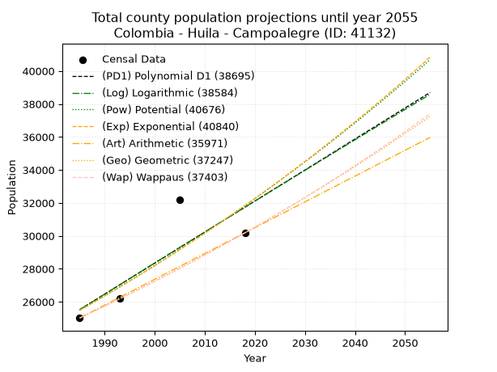
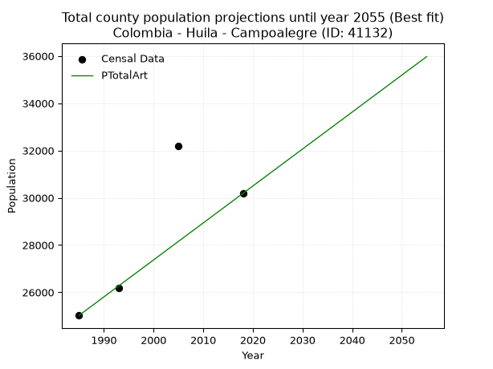
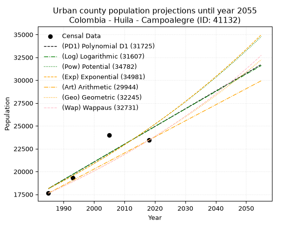
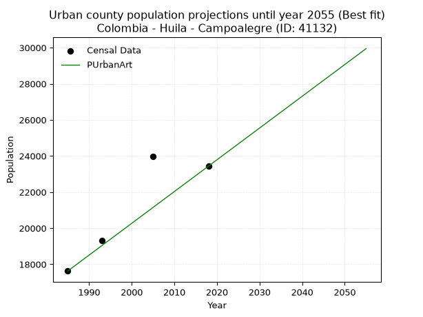
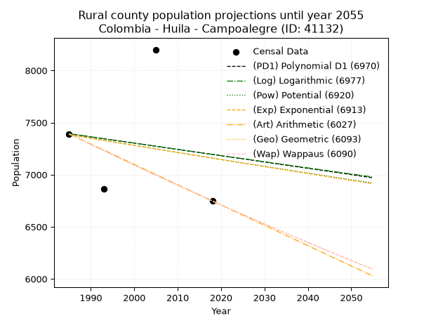
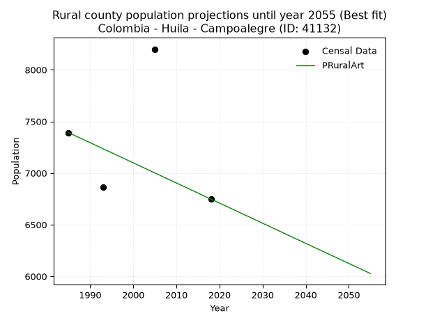

<div align="center">


</div>

# 📜 _“Population and Public Services Demand Projections (PPSD) until Year 2050 for Colombia - Huila - Campoalegre (ID: 41132)”_
Keywords: `population` `public-service` `projection` `lineal` `polynomial` `logarithmic` `potential` `exponential` `arithmetic` `geometric` `wappaus` `dane` `colombia` `south-america`

PPSD are analytical estimates used by governments and planners to anticipate future changes in population size, age distribution, and the resulting community needs for utilities, healthcare, education, and infrastructure as sizing future water treatment facilities, electrical grids, and road networks based on spatial growth.

<div align="center">

</img>

</div>


> **General running parameters**: • app_version: _v20260806_. • Python version: _3.14.7_. • Pandas version: _3.0.5_. • NumPy version: _2.5.1_. • Creates, save and include plots into reports (create_plot): _False_. • Projection until year: _2050_. • Process polynomial degree 2 and up: _False_. • Process Wappaus: _True_. • Process Wappaus: _True_. • Set negative values to zero: _True_. • Set infinite values to zero: _True_. • Drop dataset notes: _True_. 
<div align="center">

Maps & GIS Layers: [:earth_americas:Google](http://maps.google.com/maps?q=2.686766507,-75.3257477) [:earth_americas:OSM](https://www.openstreetmap.org/#map=18/2.686766507/-75.3257477&layers=P) [:earth_americas:Bing](https://www.bing.com/maps?cp=2.686766507~-75.3257477&lvl=18) [:earth_americas:Apple](https://maps.apple.com/frame?center=2.686766507%2C-75.3257477&span=0.003%2C0.006) [:earth_americas:GISMobile](https://github.com/rcfdtools/R.GISMobile/blob/main/file/gis/CountyLayer_CO/Readme.md)

</div>


<div align="center">

```geojson
{
  "type": "Feature",
  "geometry": {
    "type": "Point", 
    "coordinates": [-75.3257477, 2.686766507]
  }, 
  "properties": {
    "Name": "Colombia - Huila - Campoalegre (ID: 41132)"
  }
}
```

</div>


## 0. Census Data (4 records)

Census data are official statistics collected by a government about the people and housing in a country. They usually include counts of total population, age, sex, race, income, education, and jobs.

📅Global census file: [Population.xlsx](../data/Population.xlsx)

| Source   |   Year |   CountryID | CountryName   |   StateID | StateName   |   CountyID | CountyName   |   PTotal |   PUrban |   PRural |
|:---------|-------:|------------:|:--------------|----------:|:------------|-----------:|:-------------|---------:|---------:|---------:|
| DANE     |   1985 |          57 | Colombia      |        41 | Huila       |      41132 | Campoalegre  |    25021 |    17630 |     7391 |
| DANE     |   1993 |          57 | Colombia      |        41 | Huila       |      41132 | Campoalegre  |    26195 |    19329 |     6866 |
| DANE     |   2005 |          57 | Colombia      |        41 | Huila       |      41132 | Campoalegre  |    32186 |    23986 |     8200 |
| DANE     |   2018 |          57 | Colombia      |        41 | Huila       |      41132 | Campoalegre  |    30183 |    23435 |     6748 |

> 🔥Some records could had specific notes about the registered values or the corresponding urban or rural distribution.

📅[SUI-RUPS](https://www.datos.gov.co/Hacienda-y-Cr-dito-P-blico/Registro-nico-de-Prestadores-de-Servicios-P-blicos/4qkq-csdn/about_data) - Local public utility companies: [RUPS.csv](../data/RUPS.csv)

 | SERVICIO       | ESTADO    | NOMBRE                                                                                                                     | NIT         | DEPARTAMENTO_DOMICILIO   | MUNICIPIO_DOMICILIO   | DIRECCION              |   TELEFONO | EMAIL                        | TIPO_PRESTADOR                             | CLASIFICACION                 |
|:---------------|:----------|:---------------------------------------------------------------------------------------------------------------------------|:------------|:-------------------------|:----------------------|:-----------------------|-----------:|:-----------------------------|:-------------------------------------------|:------------------------------|
| ACUEDUCTO      | OPERATIVA | EMPRESA DE ACUEDUCTO, ALCANTARILLADO Y ASEO DE CAMPOALEGRE SOCIEDAD ANONIMA EMPRESA DE SERVICIOS PUBLICOS                  | 900168928-6 | HUILA                    | CAMPOALEGRE           | CALLE 19 No 8-44       |    8380518 | gerencia@emacsaesp.gov.co    | SOCIEDADES (EMPRESA DE SERVICIOS PUBLICOS) | MAYOR O IGUAL A 5001 USUARIOS |
| ALCANTARILLADO | OPERATIVA | EMPRESA DE ACUEDUCTO, ALCANTARILLADO Y ASEO DE CAMPOALEGRE SOCIEDAD ANONIMA EMPRESA DE SERVICIOS PUBLICOS                  | 900168928-6 | HUILA                    | CAMPOALEGRE           | CALLE 19 No 8-44       |    8380518 | gerencia@emacsaesp.gov.co    | SOCIEDADES (EMPRESA DE SERVICIOS PUBLICOS) | MAYOR O IGUAL A 5001 USUARIOS |
| ACUEDUCTO      | OPERATIVA | JUNTA ADMINISTRADORA DEL ACUEDUCTO DE LA VEREDA PALMAR BAJO                                                                | 900054378-5 | HUILA                    | CAMPOALEGRE           | CRA 8 # 22-26          |    8381997 | SIN@CORREO.COM               | ORGANIZACION AUTORIZADA                    | HASTA 2500 SUSCRIPTORES       |
| ACUEDUCTO      | OPERATIVA | JUNTA DE ACCION COMUNAL DE LA VEREDA LAS PAVAS PIRAVANTE                                                                   | 891103295-1 | HUILA                    | CAMPOALEGRE           | VEREDA PAVAS PIRAVANTE |    8380089 | SIN@CORREO.COM               | ORGANIZACION AUTORIZADA                    | HASTA 2500 SUSCRIPTORES       |
| ACUEDUCTO      | OPERATIVA | JUNTA ADMINISTRADORA ACUEDUCTO VEREDA VEGA DE ORIENTE                                                                      | 900216035-0 | HUILA                    | CAMPOALEGRE           | VEREDA VEGA DE ORIENTE |    8380089 | SIN@CORREO.COM               | ORGANIZACION AUTORIZADA                    | HASTA 2500 SUSCRIPTORES       |
| ACUEDUCTO      | OPERATIVA | JUNTA ADMINISTRADORA DEL SERVICO DEL ACUEDUCTO DE LA VEREDA SAN ISIDRO BAJO DEL MUNICIPIO DE CAMPOALEGRE                   | 813011374-6 | HUILA                    | CAMPOALEGRE           | VEREDA BAJO SAN ISIDRO |    3209992 | luisossa55@gmail.com         | ORGANIZACION AUTORIZADA                    | MENOR O IGUAL A 2500 USUARIOS |
| ACUEDUCTO      | OPERATIVA | JUNTA ADMINISTRADORA DEL SERVICIO DEL ACUEDUCTO DE LA VEREDA PANDO EL ROBLE                                                | 813000024-6 | HUILA                    | CAMPOALEGRE           | CARRERA 6 No 18-39     |    8380089 | juangre@hotmail.com          | ORGANIZACION AUTORIZADA                    | HASTA 2500 SUSCRIPTORES       |
| ACUEDUCTO      | OPERATIVA | JUNTA ADMINISTRADORA DEL SERVICIO DEL ACUEDUCTO EL PROGRESO VEREDA BAJO PIRAVANTE, DEL MUNICIPIO DE CAMPOALEGRE            | 900346422-5 | HUILA                    | CAMPOALEGRE           | VEREDA BAJO PIRAVANTE  |    8390089 | jaductopiravante@hotmail.com | ORGANIZACION AUTORIZADA                    | HASTA 2500 SUSCRIPTORES       |
| ACUEDUCTO      | OPERATIVA | JUNTA ADMINISTRADORA DEL ACUEDUCTO DE LOS PLANES DE VIVIENDA TINAJITAS Y EL PORVENIR DE LA VEREDA RIO NEIVA DE CAMPOALEGRE | 900048168-0 | HUILA                    | CAMPOALEGRE           | VEREDA RIO NEIVA       |    8629264 | LUISOSSA55@GMAIL.COM         | ORGANIZACION AUTORIZADA                    | MENOR O IGUAL A 2500 USUARIOS |

## 1. Total

### 1.1. Coefficients and Parameters

* (PD1) Polynomial Deg 1: 188.11360899237346, -347877.9963869951 (lineal)
* (Log) Logarithmic: 377001.2166403039, -2837193.0187810985
* (Pow) Potential: 13.493059250572637, -40.090623742401256
* (Exp) Exponential: 0.006732945235576035, 0.04000324051183085
* (Art) Arithmetic: Year diff. 2018 - 1985 = 33, Population diff. 30183 - 25021 = 5162, Annual growth = 156.42424242424244
* (Geo) Geometric: Year diff. 2018 - 1985 = 33, Population diff. 30183 - 25021 = 5162, Annual growth % = 0.0056999218680402475
* (Wap) Wappaus: i = 0.5667134353461432, Condition values only valid for < 200)

<sub>
Wappaus condition values: ['0.00', '0.57', '1.13', '1.70', '2.27', '2.83', '3.40', '3.97', '4.53', '5.10', '5.67', '6.23', '6.80', '7.37', '7.93', '8.50', '9.07', '9.63', '10.20', '10.77', '11.33', '11.90', '12.47', '13.03', '13.60', '14.17', '14.73', '15.30', '15.87', '16.43', '17.00', '17.57', '18.13', '18.70', '19.27', '19.83', '20.40', '20.97', '21.54', '22.10', '22.67', '23.24', '23.80', '24.37', '24.94', '25.50', '26.07', '26.64', '27.20', '27.77', '28.34', '28.90', '29.47', '30.04', '30.60', '31.17', '31.74', '32.30', '32.87', '33.44', '34.00', '34.57', '35.14', '35.70', '36.27', '36.84']
</sub>


### 1.2. Projected Dataset

|   Year |   CountyID |   PTotalPD1 |   PTotalLog |   PTotalPow |   PTotalExp |   PTotalArt |   PTotalGeo |   PTotalWap |
|-------:|-----------:|------------:|------------:|------------:|------------:|------------:|------------:|------------:|
|   1985 |      41132 |       25528 |       25518 |       25483 |       25492 |       25021 |       25021 |       25021 |
|   1986 |      41132 |       25716 |       25708 |       25657 |       25664 |       25177 |       25164 |       25163 |
|   1987 |      41132 |       25904 |       25898 |       25832 |       25837 |       25334 |       25307 |       25306 |
|   1988 |      41132 |       26092 |       26088 |       26008 |       26012 |       25490 |       25451 |       25450 |
|   1989 |      41132 |       26280 |       26277 |       26185 |       26187 |       25647 |       25596 |       25595 |
|   1990 |      41132 |       26468 |       26467 |       26363 |       26364 |       25803 |       25742 |       25740 |
|   1991 |      41132 |       26656 |       26656 |       26542 |       26542 |       25960 |       25889 |       25886 |
|   1992 |      41132 |       26844 |       26845 |       26723 |       26722 |       26116 |       26037 |       26034 |
|   1993 |      41132 |       27032 |       27035 |       26904 |       26902 |       26272 |       26185 |       26182 |
|   1994 |      41132 |       27221 |       27224 |       27087 |       27084 |       26429 |       26334 |       26331 |
|   1995 |      41132 |       27409 |       27413 |       27271 |       27267 |       26585 |       26484 |       26480 |
|   1996 |      41132 |       27597 |       27602 |       27456 |       27451 |       26742 |       26635 |       26631 |
|   1997 |      41132 |       27785 |       27791 |       27642 |       27637 |       26898 |       26787 |       26782 |
|   1998 |      41132 |       27973 |       27979 |       27830 |       27823 |       27055 |       26940 |       26935 |
|   1999 |      41132 |       28161 |       28168 |       28018 |       28011 |       27211 |       27093 |       27088 |
|   2000 |      41132 |       28349 |       28356 |       28208 |       28201 |       27367 |       27248 |       27242 |
|   2001 |      41132 |       28537 |       28545 |       28399 |       28391 |       27524 |       27403 |       27398 |
|   2002 |      41132 |       28725 |       28733 |       28591 |       28583 |       27680 |       27559 |       27554 |
|   2003 |      41132 |       28914 |       28922 |       28784 |       28776 |       27837 |       27716 |       27711 |
|   2004 |      41132 |       29102 |       29110 |       28979 |       28970 |       27993 |       27874 |       27868 |
|   2005 |      41132 |       29290 |       29298 |       29174 |       29166 |       28149 |       28033 |       28027 |
|   2006 |      41132 |       29478 |       29486 |       29371 |       29363 |       28306 |       28193 |       28187 |
|   2007 |      41132 |       29666 |       29674 |       29569 |       29561 |       28462 |       28354 |       28348 |
|   2008 |      41132 |       29854 |       29861 |       29769 |       29761 |       28619 |       28515 |       28510 |
|   2009 |      41132 |       30042 |       30049 |       29970 |       29962 |       28775 |       28678 |       28672 |
|   2010 |      41132 |       30230 |       30237 |       30171 |       30165 |       28932 |       28841 |       28836 |
|   2011 |      41132 |       30418 |       30424 |       30375 |       30368 |       29088 |       29006 |       29001 |
|   2012 |      41132 |       30607 |       30612 |       30579 |       30574 |       29244 |       29171 |       29167 |
|   2013 |      41132 |       30795 |       30799 |       30785 |       30780 |       29401 |       29337 |       29333 |
|   2014 |      41132 |       30983 |       30986 |       30992 |       30988 |       29557 |       29505 |       29501 |
|   2015 |      41132 |       31171 |       31173 |       31200 |       31197 |       29714 |       29673 |       29670 |
|   2016 |      41132 |       31359 |       31360 |       31410 |       31408 |       29870 |       29842 |       29840 |
|   2017 |      41132 |       31547 |       31547 |       31621 |       31620 |       30027 |       30012 |       30011 |
|   2018 |      41132 |       31735 |       31734 |       31833 |       31834 |       30183 |       30183 |       30183 |
|   2019 |      41132 |       31923 |       31921 |       32046 |       32049 |       30339 |       30355 |       30356 |
|   2020 |      41132 |       32111 |       32108 |       32261 |       32266 |       30496 |       30528 |       30530 |
|   2021 |      41132 |       32300 |       32294 |       32477 |       32483 |       30652 |       30702 |       30706 |
|   2022 |      41132 |       32488 |       32481 |       32695 |       32703 |       30809 |       30877 |       30882 |
|   2023 |      41132 |       32676 |       32667 |       32914 |       32924 |       30965 |       31053 |       31059 |
|   2024 |      41132 |       32864 |       32854 |       33134 |       33146 |       31122 |       31230 |       31238 |
|   2025 |      41132 |       33052 |       33040 |       33355 |       33370 |       31278 |       31408 |       31418 |
|   2026 |      41132 |       33240 |       33226 |       33578 |       33596 |       31434 |       31587 |       31599 |
|   2027 |      41132 |       33428 |       33412 |       33803 |       33823 |       31591 |       31767 |       31781 |
|   2028 |      41132 |       33616 |       33598 |       34028 |       34051 |       31747 |       31948 |       31964 |
|   2029 |      41132 |       33805 |       33784 |       34255 |       34281 |       31904 |       32130 |       32149 |
|   2030 |      41132 |       33993 |       33969 |       34484 |       34513 |       32060 |       32313 |       32334 |
|   2031 |      41132 |       34181 |       34155 |       34714 |       34746 |       32217 |       32498 |       32521 |
|   2032 |      41132 |       34369 |       34341 |       34945 |       34981 |       32373 |       32683 |       32709 |
|   2033 |      41132 |       34557 |       34526 |       35178 |       35217 |       32529 |       32869 |       32899 |
|   2034 |      41132 |       34745 |       34712 |       35412 |       35455 |       32686 |       33057 |       33089 |
|   2035 |      41132 |       34933 |       34897 |       35648 |       35694 |       32842 |       33245 |       33281 |
|   2036 |      41132 |       35121 |       35082 |       35885 |       35936 |       32999 |       33434 |       33474 |
|   2037 |      41132 |       35309 |       35267 |       36123 |       36178 |       33155 |       33625 |       33669 |
|   2038 |      41132 |       35498 |       35452 |       36363 |       36423 |       33311 |       33817 |       33864 |
|   2039 |      41132 |       35686 |       35637 |       36605 |       36669 |       33468 |       34009 |       34061 |
|   2040 |      41132 |       35874 |       35822 |       36848 |       36916 |       33624 |       34203 |       34260 |
|   2041 |      41132 |       36062 |       36007 |       37092 |       37166 |       33781 |       34398 |       34459 |
|   2042 |      41132 |       36250 |       36191 |       37338 |       37417 |       33937 |       34594 |       34660 |
|   2043 |      41132 |       36438 |       36376 |       37586 |       37670 |       34094 |       34791 |       34863 |
|   2044 |      41132 |       36626 |       36561 |       37835 |       37924 |       34250 |       34990 |       35066 |
|   2045 |      41132 |       36814 |       36745 |       38085 |       38180 |       34406 |       35189 |       35272 |
|   2046 |      41132 |       37002 |       36929 |       38337 |       38438 |       34563 |       35390 |       35478 |
|   2047 |      41132 |       37191 |       37113 |       38591 |       38698 |       34719 |       35592 |       35686 |
|   2048 |      41132 |       37379 |       37298 |       38846 |       38959 |       34876 |       35794 |       35895 |
|   2049 |      41132 |       37567 |       37482 |       39103 |       39223 |       35032 |       35998 |       36106 |
|   2050 |      41132 |       37755 |       37666 |       39361 |       39488 |       35189 |       36204 |       36319 |
<div align="center">

</img>

</div>


### 1.3. Best fit with absolute and relative error (%)

Relative error puts that difference into context by dividing the absolute error by the true value, creating a unitless ratio or percentage that shows the scale of the mistake.

Absolute and relative error

|   Year | Source   |   CountryID | CountryName   |   StateID | StateName   |   CountyID_x | CountyName   |   PTotal |   PUrban |   PRural |   CountyID_y |   PTotalPD1 |   PTotalLog |   PTotalPow |   PTotalExp |   PTotalArt |   PTotalGeo |   PTotalWap |   PTotalPD1AbsError |   PTotalLogAbsError |   PTotalPowAbsError |   PTotalExpAbsError |   PTotalArtAbsError |   PTotalGeoAbsError |   PTotalWapAbsError |   PTotalPD1RelError |   PTotalLogRelError |   PTotalPowRelError |   PTotalExpRelError |   PTotalArtRelError |   PTotalGeoRelError |   PTotalWapRelError |
|-------:|:---------|------------:|:--------------|----------:|:------------|-------------:|:-------------|---------:|---------:|---------:|-------------:|------------:|------------:|------------:|------------:|------------:|------------:|------------:|--------------------:|--------------------:|--------------------:|--------------------:|--------------------:|--------------------:|--------------------:|--------------------:|--------------------:|--------------------:|--------------------:|--------------------:|--------------------:|--------------------:|
|   1985 | DANE     |          57 | Colombia      |        41 | Huila       |        41132 | Campoalegre  |    25021 |    17630 |     7391 |        41132 |       25528 |       25518 |       25483 |       25492 |       25021 |       25021 |       25021 |                 507 |                 497 |                 462 |                 471 |                   0 |                   0 |                   0 |             2.0263  |             1.98633 |             1.84645 |             1.88242 |            0        |           0         |           0         |
|   1993 | DANE     |          57 | Colombia      |        41 | Huila       |        41132 | Campoalegre  |    26195 |    19329 |     6866 |        41132 |       27032 |       27035 |       26904 |       26902 |       26272 |       26185 |       26182 |                 837 |                 840 |                 709 |                 707 |                  77 |                  10 |                  13 |             3.19527 |             3.20672 |             2.70662 |             2.69899 |            0.293949 |           0.0381752 |           0.0496278 |
|   2005 | DANE     |          57 | Colombia      |        41 | Huila       |        41132 | Campoalegre  |    32186 |    23986 |     8200 |        41132 |       29290 |       29298 |       29174 |       29166 |       28149 |       28033 |       28027 |                2896 |                2888 |                3012 |                3020 |                4037 |                4153 |                4159 |             8.9977  |             8.97285 |             9.35811 |             9.38296 |           12.5427   |          12.9031    |          12.9218    |
|   2018 | DANE     |          57 | Colombia      |        41 | Huila       |        41132 | Campoalegre  |    30183 |    23435 |     6748 |        41132 |       31735 |       31734 |       31833 |       31834 |       30183 |       30183 |       30183 |                1552 |                1551 |                1650 |                1651 |                   0 |                   0 |                   0 |             5.14197 |             5.13865 |             5.46665 |             5.46997 |            0        |           0         |           0         |

Relative error mean

| Method    |   RelError | Best   |
|:----------|-----------:|:-------|
| PTotalPD1 |    4.84031 |        |
| PTotalLog |    4.82614 |        |
| PTotalPow |    4.84446 |        |
| PTotalExp |    4.85858 |        |
| PTotalArt |    3.20917 | True   |
| PTotalGeo |    3.23533 |        |
| PTotalWap |    3.24285 |        |

💙Best method: _**PTotalArt**_
<div align="center">

</img>

</div>


### 1.4. Fresh water supply demand in liters per capita per day (lpcd)

The fresh water supply demand typically ranges from 100 to 300 liters per capita per day (lpcd) for standard domestic and municipal planning, though absolute survival minimums set by the World Health Organization are as low as 7.5 to 20 liters per day, and total consumption in high-income nations can exceed 400 liters.

> `CZ`: Level in meters above the sea level (masl)<br> `WS`: Fresh water supply demand in liters per capita per day (lpcd or l/h/d)<br> `WSAll`: Zonal fresh water supply demand in liters per second (l/s)<br> `A`: Zonal area in square meters<br> `DP`: Population density (people/hectare or p/ha)

Reference values (RAS Colombia)

|    CZ |   WS |
|------:|-----:|
|  1000 |  120 |
|  2000 |  130 |
| 99999 |  140 |

County shapefile geometry properties and water supply values

|   CountyID |      ATotal |   CZTotal |   WSTotal |
|-----------:|------------:|----------:|----------:|
|      41132 | 4.62497e+08 |   932.797 |       120 |

Projected values for best method: PTotalArt

|   CountyID |   Year |   PTotalArt |   DPTotal |   WSTotal |   WSTotalAll |
|-----------:|-------:|------------:|----------:|----------:|-------------:|
|      41132 |   1985 |       25021 |      0.54 |       120 |      34.7514 |
|      41132 |   1986 |       25177 |      0.54 |       120 |      34.9681 |
|      41132 |   1987 |       25334 |      0.55 |       120 |      35.1861 |
|      41132 |   1988 |       25490 |      0.55 |       120 |      35.4028 |
|      41132 |   1989 |       25647 |      0.55 |       120 |      35.6208 |
|      41132 |   1990 |       25803 |      0.56 |       120 |      35.8375 |
|      41132 |   1991 |       25960 |      0.56 |       120 |      36.0556 |
|      41132 |   1992 |       26116 |      0.56 |       120 |      36.2722 |
|      41132 |   1993 |       26272 |      0.57 |       120 |      36.4889 |
|      41132 |   1994 |       26429 |      0.57 |       120 |      36.7069 |
|      41132 |   1995 |       26585 |      0.57 |       120 |      36.9236 |
|      41132 |   1996 |       26742 |      0.58 |       120 |      37.1417 |
|      41132 |   1997 |       26898 |      0.58 |       120 |      37.3583 |
|      41132 |   1998 |       27055 |      0.58 |       120 |      37.5764 |
|      41132 |   1999 |       27211 |      0.59 |       120 |      37.7931 |
|      41132 |   2000 |       27367 |      0.59 |       120 |      38.0097 |
|      41132 |   2001 |       27524 |      0.6  |       120 |      38.2278 |
|      41132 |   2002 |       27680 |      0.6  |       120 |      38.4444 |
|      41132 |   2003 |       27837 |      0.6  |       120 |      38.6625 |
|      41132 |   2004 |       27993 |      0.61 |       120 |      38.8792 |
|      41132 |   2005 |       28149 |      0.61 |       120 |      39.0958 |
|      41132 |   2006 |       28306 |      0.61 |       120 |      39.3139 |
|      41132 |   2007 |       28462 |      0.62 |       120 |      39.5306 |
|      41132 |   2008 |       28619 |      0.62 |       120 |      39.7486 |
|      41132 |   2009 |       28775 |      0.62 |       120 |      39.9653 |
|      41132 |   2010 |       28932 |      0.63 |       120 |      40.1833 |
|      41132 |   2011 |       29088 |      0.63 |       120 |      40.4    |
|      41132 |   2012 |       29244 |      0.63 |       120 |      40.6167 |
|      41132 |   2013 |       29401 |      0.64 |       120 |      40.8347 |
|      41132 |   2014 |       29557 |      0.64 |       120 |      41.0514 |
|      41132 |   2015 |       29714 |      0.64 |       120 |      41.2694 |
|      41132 |   2016 |       29870 |      0.65 |       120 |      41.4861 |
|      41132 |   2017 |       30027 |      0.65 |       120 |      41.7042 |
|      41132 |   2018 |       30183 |      0.65 |       120 |      41.9208 |
|      41132 |   2019 |       30339 |      0.66 |       120 |      42.1375 |
|      41132 |   2020 |       30496 |      0.66 |       120 |      42.3556 |
|      41132 |   2021 |       30652 |      0.66 |       120 |      42.5722 |
|      41132 |   2022 |       30809 |      0.67 |       120 |      42.7903 |
|      41132 |   2023 |       30965 |      0.67 |       120 |      43.0069 |
|      41132 |   2024 |       31122 |      0.67 |       120 |      43.225  |
|      41132 |   2025 |       31278 |      0.68 |       120 |      43.4417 |
|      41132 |   2026 |       31434 |      0.68 |       120 |      43.6583 |
|      41132 |   2027 |       31591 |      0.68 |       120 |      43.8764 |
|      41132 |   2028 |       31747 |      0.69 |       120 |      44.0931 |
|      41132 |   2029 |       31904 |      0.69 |       120 |      44.3111 |
|      41132 |   2030 |       32060 |      0.69 |       120 |      44.5278 |
|      41132 |   2031 |       32217 |      0.7  |       120 |      44.7458 |
|      41132 |   2032 |       32373 |      0.7  |       120 |      44.9625 |
|      41132 |   2033 |       32529 |      0.7  |       120 |      45.1792 |
|      41132 |   2034 |       32686 |      0.71 |       120 |      45.3972 |
|      41132 |   2035 |       32842 |      0.71 |       120 |      45.6139 |
|      41132 |   2036 |       32999 |      0.71 |       120 |      45.8319 |
|      41132 |   2037 |       33155 |      0.72 |       120 |      46.0486 |
|      41132 |   2038 |       33311 |      0.72 |       120 |      46.2653 |
|      41132 |   2039 |       33468 |      0.72 |       120 |      46.4833 |
|      41132 |   2040 |       33624 |      0.73 |       120 |      46.7    |
|      41132 |   2041 |       33781 |      0.73 |       120 |      46.9181 |
|      41132 |   2042 |       33937 |      0.73 |       120 |      47.1347 |
|      41132 |   2043 |       34094 |      0.74 |       120 |      47.3528 |
|      41132 |   2044 |       34250 |      0.74 |       120 |      47.5694 |
|      41132 |   2045 |       34406 |      0.74 |       120 |      47.7861 |
|      41132 |   2046 |       34563 |      0.75 |       120 |      48.0042 |
|      41132 |   2047 |       34719 |      0.75 |       120 |      48.2208 |
|      41132 |   2048 |       34876 |      0.75 |       120 |      48.4389 |
|      41132 |   2049 |       35032 |      0.76 |       120 |      48.6556 |
|      41132 |   2050 |       35189 |      0.76 |       120 |      48.8736 |

## 2. Urban

### 2.1. Coefficients and Parameters

* (PD1) Polynomial Deg 1: 194.15816940987554, -367269.87836210354 (lineal)
* (Log) Logarithmic: 388983.87937282777, -2935574.584234046
* (Pow) Potential: 18.812261226516114, -57.780129855881334
* (Exp) Exponential: 0.009389802910506733, 0.00014577144407387421
* (Art) Arithmetic: Year diff. 2018 - 1985 = 33, Population diff. 23435 - 17630 = 5805, Annual growth = 175.9090909090909
* (Geo) Geometric: Year diff. 2018 - 1985 = 33, Population diff. 23435 - 17630 = 5805, Annual growth % = 0.008662413584617612
* (Wap) Wappaus: i = 0.8567348881485007, Condition values only valid for < 200)

<sub>
Wappaus condition values: ['0.00', '0.86', '1.71', '2.57', '3.43', '4.28', '5.14', '6.00', '6.85', '7.71', '8.57', '9.42', '10.28', '11.14', '11.99', '12.85', '13.71', '14.56', '15.42', '16.28', '17.13', '17.99', '18.85', '19.70', '20.56', '21.42', '22.28', '23.13', '23.99', '24.85', '25.70', '26.56', '27.42', '28.27', '29.13', '29.99', '30.84', '31.70', '32.56', '33.41', '34.27', '35.13', '35.98', '36.84', '37.70', '38.55', '39.41', '40.27', '41.12', '41.98', '42.84', '43.69', '44.55', '45.41', '46.26', '47.12', '47.98', '48.83', '49.69', '50.55', '51.40', '52.26', '53.12', '53.97', '54.83', '55.69']
</sub>


### 2.2. Projected Dataset

|   Year |   CountyID |   PUrbanPD1 |   PUrbanLog |   PUrbanPow |   PUrbanExp |   PUrbanArt |   PUrbanGeo |   PUrbanWap |
|-------:|-----------:|------------:|------------:|------------:|------------:|------------:|------------:|------------:|
|   1985 |      41132 |       18134 |       18126 |       18122 |       18129 |       17630 |       17630 |       17630 |
|   1986 |      41132 |       18328 |       18321 |       18294 |       18300 |       17806 |       17783 |       17782 |
|   1987 |      41132 |       18522 |       18517 |       18468 |       18473 |       17982 |       17937 |       17935 |
|   1988 |      41132 |       18717 |       18713 |       18644 |       18647 |       18158 |       18092 |       18089 |
|   1989 |      41132 |       18911 |       18909 |       18821 |       18823 |       18334 |       18249 |       18245 |
|   1990 |      41132 |       19105 |       19104 |       19000 |       19001 |       18510 |       18407 |       18402 |
|   1991 |      41132 |       19299 |       19300 |       19181 |       19180 |       18685 |       18566 |       18560 |
|   1992 |      41132 |       19493 |       19495 |       19363 |       19361 |       18861 |       18727 |       18720 |
|   1993 |      41132 |       19687 |       19690 |       19546 |       19544 |       19037 |       18889 |       18881 |
|   1994 |      41132 |       19882 |       19885 |       19732 |       19728 |       19213 |       19053 |       19044 |
|   1995 |      41132 |       20076 |       20080 |       19919 |       19914 |       19389 |       19218 |       19208 |
|   1996 |      41132 |       20270 |       20275 |       20107 |       20102 |       19565 |       19385 |       19374 |
|   1997 |      41132 |       20464 |       20470 |       20298 |       20292 |       19741 |       19553 |       19541 |
|   1998 |      41132 |       20658 |       20665 |       20490 |       20483 |       19917 |       19722 |       19709 |
|   1999 |      41132 |       20852 |       20859 |       20683 |       20676 |       20093 |       19893 |       19879 |
|   2000 |      41132 |       21046 |       21054 |       20879 |       20871 |       20269 |       20065 |       20051 |
|   2001 |      41132 |       21241 |       21248 |       21076 |       21068 |       20445 |       20239 |       20225 |
|   2002 |      41132 |       21435 |       21443 |       21275 |       21267 |       20620 |       20414 |       20399 |
|   2003 |      41132 |       21629 |       21637 |       21476 |       21468 |       20796 |       20591 |       20576 |
|   2004 |      41132 |       21823 |       21831 |       21679 |       21670 |       20972 |       20769 |       20754 |
|   2005 |      41132 |       22017 |       22025 |       21883 |       21875 |       21148 |       20949 |       20934 |
|   2006 |      41132 |       22211 |       22219 |       22089 |       22081 |       21324 |       21131 |       21115 |
|   2007 |      41132 |       22406 |       22413 |       22297 |       22289 |       21500 |       21314 |       21299 |
|   2008 |      41132 |       22600 |       22607 |       22507 |       22500 |       21676 |       21498 |       21484 |
|   2009 |      41132 |       22794 |       22800 |       22719 |       22712 |       21852 |       21685 |       21670 |
|   2010 |      41132 |       22988 |       22994 |       22933 |       22926 |       22028 |       21872 |       21859 |
|   2011 |      41132 |       23182 |       23187 |       23148 |       23142 |       22204 |       22062 |       22049 |
|   2012 |      41132 |       23376 |       23381 |       23366 |       23361 |       22380 |       22253 |       22242 |
|   2013 |      41132 |       23571 |       23574 |       23585 |       23581 |       22555 |       22446 |       22436 |
|   2014 |      41132 |       23765 |       23767 |       23807 |       23804 |       22731 |       22640 |       22632 |
|   2015 |      41132 |       23959 |       23960 |       24030 |       24028 |       22907 |       22836 |       22829 |
|   2016 |      41132 |       24153 |       24153 |       24255 |       24255 |       23083 |       23034 |       23029 |
|   2017 |      41132 |       24347 |       24346 |       24483 |       24484 |       23259 |       23234 |       23231 |
|   2018 |      41132 |       24541 |       24539 |       24712 |       24715 |       23435 |       23435 |       23435 |
|   2019 |      41132 |       24735 |       24732 |       24944 |       24948 |       23611 |       23638 |       23641 |
|   2020 |      41132 |       24930 |       24924 |       25177 |       25183 |       23787 |       23843 |       23849 |
|   2021 |      41132 |       25124 |       25117 |       25412 |       25421 |       23963 |       24049 |       24059 |
|   2022 |      41132 |       25318 |       25309 |       25650 |       25661 |       24139 |       24258 |       24271 |
|   2023 |      41132 |       25512 |       25502 |       25890 |       25903 |       24315 |       24468 |       24486 |
|   2024 |      41132 |       25706 |       25694 |       26132 |       26147 |       24490 |       24680 |       24702 |
|   2025 |      41132 |       25900 |       25886 |       26376 |       26394 |       24666 |       24893 |       24921 |
|   2026 |      41132 |       26095 |       26078 |       26622 |       26643 |       24842 |       25109 |       25142 |
|   2027 |      41132 |       26289 |       26270 |       26870 |       26894 |       25018 |       25327 |       25366 |
|   2028 |      41132 |       26483 |       26462 |       27120 |       27148 |       25194 |       25546 |       25591 |
|   2029 |      41132 |       26677 |       26654 |       27373 |       27404 |       25370 |       25767 |       25819 |
|   2030 |      41132 |       26871 |       26845 |       27628 |       27662 |       25546 |       25991 |       26050 |
|   2031 |      41132 |       27065 |       27037 |       27885 |       27923 |       25722 |       26216 |       26283 |
|   2032 |      41132 |       27260 |       27228 |       28145 |       28187 |       25898 |       26443 |       26519 |
|   2033 |      41132 |       27454 |       27420 |       28406 |       28453 |       26074 |       26672 |       26757 |
|   2034 |      41132 |       27648 |       27611 |       28670 |       28721 |       26250 |       26903 |       26997 |
|   2035 |      41132 |       27842 |       27802 |       28937 |       28992 |       26425 |       27136 |       27241 |
|   2036 |      41132 |       28036 |       27993 |       29205 |       29266 |       26601 |       27371 |       27486 |
|   2037 |      41132 |       28230 |       28184 |       29476 |       29542 |       26777 |       27608 |       27735 |
|   2038 |      41132 |       28424 |       28375 |       29750 |       29820 |       26953 |       27847 |       27987 |
|   2039 |      41132 |       28619 |       28566 |       30026 |       30102 |       27129 |       28088 |       28241 |
|   2040 |      41132 |       28813 |       28757 |       30304 |       30386 |       27305 |       28332 |       28498 |
|   2041 |      41132 |       29007 |       28947 |       30584 |       30672 |       27481 |       28577 |       28758 |
|   2042 |      41132 |       29201 |       29138 |       30868 |       30962 |       27657 |       28825 |       29021 |
|   2043 |      41132 |       29395 |       29328 |       31153 |       31254 |       27833 |       29074 |       29287 |
|   2044 |      41132 |       29589 |       29519 |       31441 |       31549 |       28009 |       29326 |       29556 |
|   2045 |      41132 |       29784 |       29709 |       31732 |       31846 |       28185 |       29580 |       29828 |
|   2046 |      41132 |       29978 |       29899 |       32025 |       32147 |       28360 |       29837 |       30103 |
|   2047 |      41132 |       30172 |       30089 |       32321 |       32450 |       28536 |       30095 |       30381 |
|   2048 |      41132 |       30366 |       30279 |       32619 |       32756 |       28712 |       30356 |       30663 |
|   2049 |      41132 |       30560 |       30469 |       32920 |       33065 |       28888 |       30619 |       30948 |
|   2050 |      41132 |       30754 |       30659 |       33224 |       33377 |       29064 |       30884 |       31236 |
<div align="center">

</img>

</div>


### 2.3. Best fit with absolute and relative error (%)

Relative error puts that difference into context by dividing the absolute error by the true value, creating a unitless ratio or percentage that shows the scale of the mistake.

Absolute and relative error

|   Year | Source   |   CountryID | CountryName   |   StateID | StateName   |   CountyID_x | CountyName   |   PTotal |   PUrban |   PRural |   CountyID_y |   PUrbanPD1 |   PUrbanLog |   PUrbanPow |   PUrbanExp |   PUrbanArt |   PUrbanGeo |   PUrbanWap |   PUrbanPD1AbsError |   PUrbanLogAbsError |   PUrbanPowAbsError |   PUrbanExpAbsError |   PUrbanArtAbsError |   PUrbanGeoAbsError |   PUrbanWapAbsError |   PUrbanPD1RelError |   PUrbanLogRelError |   PUrbanPowRelError |   PUrbanExpRelError |   PUrbanArtRelError |   PUrbanGeoRelError |   PUrbanWapRelError |
|-------:|:---------|------------:|:--------------|----------:|:------------|-------------:|:-------------|---------:|---------:|---------:|-------------:|------------:|------------:|------------:|------------:|------------:|------------:|------------:|--------------------:|--------------------:|--------------------:|--------------------:|--------------------:|--------------------:|--------------------:|--------------------:|--------------------:|--------------------:|--------------------:|--------------------:|--------------------:|--------------------:|
|   1985 | DANE     |          57 | Colombia      |        41 | Huila       |        41132 | Campoalegre  |    25021 |    17630 |     7391 |        41132 |       18134 |       18126 |       18122 |       18129 |       17630 |       17630 |       17630 |                 504 |                 496 |                 492 |                 499 |                   0 |                   0 |                   0 |             2.85876 |             2.81339 |             2.7907  |             2.8304  |             0       |             0       |             0       |
|   1993 | DANE     |          57 | Colombia      |        41 | Huila       |        41132 | Campoalegre  |    26195 |    19329 |     6866 |        41132 |       19687 |       19690 |       19546 |       19544 |       19037 |       18889 |       18881 |                 358 |                 361 |                 217 |                 215 |                 292 |                 440 |                 448 |             1.85214 |             1.86766 |             1.12267 |             1.11232 |             1.51068 |             2.27637 |             2.31776 |
|   2005 | DANE     |          57 | Colombia      |        41 | Huila       |        41132 | Campoalegre  |    32186 |    23986 |     8200 |        41132 |       22017 |       22025 |       21883 |       21875 |       21148 |       20949 |       20934 |                1969 |                1961 |                2103 |                2111 |                2838 |                3037 |                3052 |             8.20896 |             8.1756  |             8.76761 |             8.80097 |            11.8319  |            12.6616  |            12.7241  |
|   2018 | DANE     |          57 | Colombia      |        41 | Huila       |        41132 | Campoalegre  |    30183 |    23435 |     6748 |        41132 |       24541 |       24539 |       24712 |       24715 |       23435 |       23435 |       23435 |                1106 |                1104 |                1277 |                1280 |                   0 |                   0 |                   0 |             4.71944 |             4.7109  |             5.44911 |             5.46192 |             0       |             0       |             0       |

Relative error mean

| Method    |   RelError | Best   |
|:----------|-----------:|:-------|
| PUrbanPD1 |    4.40982 |        |
| PUrbanLog |    4.39189 |        |
| PUrbanPow |    4.53252 |        |
| PUrbanExp |    4.5514  |        |
| PUrbanArt |    3.33565 | True   |
| PUrbanGeo |    3.73448 |        |
| PUrbanWap |    3.76046 |        |

💙Best method: _**PUrbanArt**_
<div align="center">

</img>

</div>


### 2.4. Fresh water supply demand in liters per capita per day (lpcd)

The fresh water supply demand typically ranges from 100 to 300 liters per capita per day (lpcd) for standard domestic and municipal planning, though absolute survival minimums set by the World Health Organization are as low as 7.5 to 20 liters per day, and total consumption in high-income nations can exceed 400 liters.

> `CZ`: Level in meters above the sea level (masl)<br> `WS`: Fresh water supply demand in liters per capita per day (lpcd or l/h/d)<br> `WSAll`: Zonal fresh water supply demand in liters per second (l/s)<br> `A`: Zonal area in square meters<br> `DP`: Population density (people/hectare or p/ha)

Reference values (RAS Colombia)

|    CZ |   WS |
|------:|-----:|
|  1000 |  120 |
|  2000 |  130 |
| 99999 |  140 |

County shapefile geometry properties and water supply values

|   CountyID |      AUrban |   CZUrban |   WSUrban |
|-----------:|------------:|----------:|----------:|
|      41132 | 3.60074e+06 |   528.244 |       120 |

Projected values for best method: PUrbanArt

|   CountyID |   Year |   PUrbanArt |   DPUrban |   WSUrban |   WSUrbanAll |
|-----------:|-------:|------------:|----------:|----------:|-------------:|
|      41132 |   1985 |       17630 |     48.96 |       120 |      24.4861 |
|      41132 |   1986 |       17806 |     49.45 |       120 |      24.7306 |
|      41132 |   1987 |       17982 |     49.94 |       120 |      24.975  |
|      41132 |   1988 |       18158 |     50.43 |       120 |      25.2194 |
|      41132 |   1989 |       18334 |     50.92 |       120 |      25.4639 |
|      41132 |   1990 |       18510 |     51.41 |       120 |      25.7083 |
|      41132 |   1991 |       18685 |     51.89 |       120 |      25.9514 |
|      41132 |   1992 |       18861 |     52.38 |       120 |      26.1958 |
|      41132 |   1993 |       19037 |     52.87 |       120 |      26.4403 |
|      41132 |   1994 |       19213 |     53.36 |       120 |      26.6847 |
|      41132 |   1995 |       19389 |     53.85 |       120 |      26.9292 |
|      41132 |   1996 |       19565 |     54.34 |       120 |      27.1736 |
|      41132 |   1997 |       19741 |     54.82 |       120 |      27.4181 |
|      41132 |   1998 |       19917 |     55.31 |       120 |      27.6625 |
|      41132 |   1999 |       20093 |     55.8  |       120 |      27.9069 |
|      41132 |   2000 |       20269 |     56.29 |       120 |      28.1514 |
|      41132 |   2001 |       20445 |     56.78 |       120 |      28.3958 |
|      41132 |   2002 |       20620 |     57.27 |       120 |      28.6389 |
|      41132 |   2003 |       20796 |     57.75 |       120 |      28.8833 |
|      41132 |   2004 |       20972 |     58.24 |       120 |      29.1278 |
|      41132 |   2005 |       21148 |     58.73 |       120 |      29.3722 |
|      41132 |   2006 |       21324 |     59.22 |       120 |      29.6167 |
|      41132 |   2007 |       21500 |     59.71 |       120 |      29.8611 |
|      41132 |   2008 |       21676 |     60.2  |       120 |      30.1056 |
|      41132 |   2009 |       21852 |     60.69 |       120 |      30.35   |
|      41132 |   2010 |       22028 |     61.18 |       120 |      30.5944 |
|      41132 |   2011 |       22204 |     61.67 |       120 |      30.8389 |
|      41132 |   2012 |       22380 |     62.15 |       120 |      31.0833 |
|      41132 |   2013 |       22555 |     62.64 |       120 |      31.3264 |
|      41132 |   2014 |       22731 |     63.13 |       120 |      31.5708 |
|      41132 |   2015 |       22907 |     63.62 |       120 |      31.8153 |
|      41132 |   2016 |       23083 |     64.11 |       120 |      32.0597 |
|      41132 |   2017 |       23259 |     64.6  |       120 |      32.3042 |
|      41132 |   2018 |       23435 |     65.08 |       120 |      32.5486 |
|      41132 |   2019 |       23611 |     65.57 |       120 |      32.7931 |
|      41132 |   2020 |       23787 |     66.06 |       120 |      33.0375 |
|      41132 |   2021 |       23963 |     66.55 |       120 |      33.2819 |
|      41132 |   2022 |       24139 |     67.04 |       120 |      33.5264 |
|      41132 |   2023 |       24315 |     67.53 |       120 |      33.7708 |
|      41132 |   2024 |       24490 |     68.01 |       120 |      34.0139 |
|      41132 |   2025 |       24666 |     68.5  |       120 |      34.2583 |
|      41132 |   2026 |       24842 |     68.99 |       120 |      34.5028 |
|      41132 |   2027 |       25018 |     69.48 |       120 |      34.7472 |
|      41132 |   2028 |       25194 |     69.97 |       120 |      34.9917 |
|      41132 |   2029 |       25370 |     70.46 |       120 |      35.2361 |
|      41132 |   2030 |       25546 |     70.95 |       120 |      35.4806 |
|      41132 |   2031 |       25722 |     71.44 |       120 |      35.725  |
|      41132 |   2032 |       25898 |     71.92 |       120 |      35.9694 |
|      41132 |   2033 |       26074 |     72.41 |       120 |      36.2139 |
|      41132 |   2034 |       26250 |     72.9  |       120 |      36.4583 |
|      41132 |   2035 |       26425 |     73.39 |       120 |      36.7014 |
|      41132 |   2036 |       26601 |     73.88 |       120 |      36.9458 |
|      41132 |   2037 |       26777 |     74.37 |       120 |      37.1903 |
|      41132 |   2038 |       26953 |     74.85 |       120 |      37.4347 |
|      41132 |   2039 |       27129 |     75.34 |       120 |      37.6792 |
|      41132 |   2040 |       27305 |     75.83 |       120 |      37.9236 |
|      41132 |   2041 |       27481 |     76.32 |       120 |      38.1681 |
|      41132 |   2042 |       27657 |     76.81 |       120 |      38.4125 |
|      41132 |   2043 |       27833 |     77.3  |       120 |      38.6569 |
|      41132 |   2044 |       28009 |     77.79 |       120 |      38.9014 |
|      41132 |   2045 |       28185 |     78.28 |       120 |      39.1458 |
|      41132 |   2046 |       28360 |     78.76 |       120 |      39.3889 |
|      41132 |   2047 |       28536 |     79.25 |       120 |      39.6333 |
|      41132 |   2048 |       28712 |     79.74 |       120 |      39.8778 |
|      41132 |   2049 |       28888 |     80.23 |       120 |      40.1222 |
|      41132 |   2050 |       29064 |     80.72 |       120 |      40.3667 |

## 3. Rural

### 3.1. Coefficients and Parameters

* (PD1) Polynomial Deg 1: -6.0445604175022005, 19391.881975108776 (lineal)
* (Log) Logarithmic: -11982.662732523906, 98381.56545294702
* (Pow) Potential: -1.8745911609162391, 10.05026656777941
* (Exp) Exponential: -0.0009441542369806177, 48115.32709458802
* (Art) Arithmetic: Year diff. 2018 - 1985 = 33, Population diff. 6748 - 7391 = -643, Annual growth = -19.484848484848484
* (Geo) Geometric: Year diff. 2018 - 1985 = 33, Population diff. 6748 - 7391 = -643, Annual growth % = -0.002754287217808793
* (Wap) Wappaus: i = -0.27561848058347105, Condition values only valid for < 200)

<sub>
Wappaus condition values: ['-0.00', '-0.28', '-0.55', '-0.83', '-1.10', '-1.38', '-1.65', '-1.93', '-2.20', '-2.48', '-2.76', '-3.03', '-3.31', '-3.58', '-3.86', '-4.13', '-4.41', '-4.69', '-4.96', '-5.24', '-5.51', '-5.79', '-6.06', '-6.34', '-6.61', '-6.89', '-7.17', '-7.44', '-7.72', '-7.99', '-8.27', '-8.54', '-8.82', '-9.10', '-9.37', '-9.65', '-9.92', '-10.20', '-10.47', '-10.75', '-11.02', '-11.30', '-11.58', '-11.85', '-12.13', '-12.40', '-12.68', '-12.95', '-13.23', '-13.51', '-13.78', '-14.06', '-14.33', '-14.61', '-14.88', '-15.16', '-15.43', '-15.71', '-15.99', '-16.26', '-16.54', '-16.81', '-17.09', '-17.36', '-17.64', '-17.92']
</sub>


### 3.2. Projected Dataset

|   Year |   CountyID |   PRuralPD1 |   PRuralLog |   PRuralPow |   PRuralExp |   PRuralArt |   PRuralGeo |   PRuralWap |
|-------:|-----------:|------------:|------------:|------------:|------------:|------------:|------------:|------------:|
|   1985 |      41132 |        7393 |        7393 |        7384 |        7385 |        7391 |        7391 |        7391 |
|   1986 |      41132 |        7387 |        7387 |        7377 |        7378 |        7372 |        7371 |        7371 |
|   1987 |      41132 |        7381 |        7381 |        7370 |        7371 |        7352 |        7350 |        7350 |
|   1988 |      41132 |        7375 |        7375 |        7364 |        7364 |        7333 |        7330 |        7330 |
|   1989 |      41132 |        7369 |        7369 |        7357 |        7357 |        7313 |        7310 |        7310 |
|   1990 |      41132 |        7363 |        7363 |        7350 |        7350 |        7294 |        7290 |        7290 |
|   1991 |      41132 |        7357 |        7357 |        7343 |        7343 |        7274 |        7270 |        7270 |
|   1992 |      41132 |        7351 |        7351 |        7336 |        7336 |        7255 |        7250 |        7250 |
|   1993 |      41132 |        7345 |        7345 |        7329 |        7329 |        7235 |        7230 |        7230 |
|   1994 |      41132 |        7339 |        7339 |        7322 |        7323 |        7216 |        7210 |        7210 |
|   1995 |      41132 |        7333 |        7333 |        7315 |        7316 |        7196 |        7190 |        7190 |
|   1996 |      41132 |        7327 |        7327 |        7308 |        7309 |        7177 |        7170 |        7170 |
|   1997 |      41132 |        7321 |        7321 |        7301 |        7302 |        7157 |        7150 |        7151 |
|   1998 |      41132 |        7315 |        7315 |        7295 |        7295 |        7138 |        7131 |        7131 |
|   1999 |      41132 |        7309 |        7309 |        7288 |        7288 |        7118 |        7111 |        7111 |
|   2000 |      41132 |        7303 |        7303 |        7281 |        7281 |        7099 |        7091 |        7092 |
|   2001 |      41132 |        7297 |        7297 |        7274 |        7274 |        7079 |        7072 |        7072 |
|   2002 |      41132 |        7291 |        7291 |        7267 |        7267 |        7060 |        7052 |        7053 |
|   2003 |      41132 |        7285 |        7285 |        7260 |        7261 |        7040 |        7033 |        7033 |
|   2004 |      41132 |        7279 |        7279 |        7254 |        7254 |        7021 |        7014 |        7014 |
|   2005 |      41132 |        7273 |        7273 |        7247 |        7247 |        7001 |        6994 |        6995 |
|   2006 |      41132 |        7266 |        7267 |        7240 |        7240 |        6982 |        6975 |        6975 |
|   2007 |      41132 |        7260 |        7261 |        7233 |        7233 |        6962 |        6956 |        6956 |
|   2008 |      41132 |        7254 |        7255 |        7227 |        7226 |        6943 |        6937 |        6937 |
|   2009 |      41132 |        7248 |        7249 |        7220 |        7220 |        6923 |        6918 |        6918 |
|   2010 |      41132 |        7242 |        7243 |        7213 |        7213 |        6904 |        6899 |        6899 |
|   2011 |      41132 |        7236 |        7237 |        7206 |        7206 |        6884 |        6880 |        6880 |
|   2012 |      41132 |        7230 |        7231 |        7200 |        7199 |        6865 |        6861 |        6861 |
|   2013 |      41132 |        7224 |        7225 |        7193 |        7192 |        6845 |        6842 |        6842 |
|   2014 |      41132 |        7218 |        7219 |        7186 |        7186 |        6826 |        6823 |        6823 |
|   2015 |      41132 |        7212 |        7213 |        7180 |        7179 |        6806 |        6804 |        6804 |
|   2016 |      41132 |        7206 |        7207 |        7173 |        7172 |        6787 |        6785 |        6785 |
|   2017 |      41132 |        7200 |        7201 |        7166 |        7165 |        6767 |        6767 |        6767 |
|   2018 |      41132 |        7194 |        7195 |        7160 |        7158 |        6748 |        6748 |        6748 |
|   2019 |      41132 |        7188 |        7189 |        7153 |        7152 |        6729 |        6729 |        6729 |
|   2020 |      41132 |        7182 |        7183 |        7146 |        7145 |        6709 |        6711 |        6711 |
|   2021 |      41132 |        7176 |        7177 |        7140 |        7138 |        6690 |        6692 |        6692 |
|   2022 |      41132 |        7170 |        7171 |        7133 |        7131 |        6670 |        6674 |        6674 |
|   2023 |      41132 |        7164 |        7166 |        7126 |        7125 |        6651 |        6656 |        6655 |
|   2024 |      41132 |        7158 |        7160 |        7120 |        7118 |        6631 |        6637 |        6637 |
|   2025 |      41132 |        7152 |        7154 |        7113 |        7111 |        6612 |        6619 |        6619 |
|   2026 |      41132 |        7146 |        7148 |        7107 |        7105 |        6592 |        6601 |        6600 |
|   2027 |      41132 |        7140 |        7142 |        7100 |        7098 |        6573 |        6583 |        6582 |
|   2028 |      41132 |        7134 |        7136 |        7094 |        7091 |        6553 |        6564 |        6564 |
|   2029 |      41132 |        7127 |        7130 |        7087 |        7085 |        6534 |        6546 |        6546 |
|   2030 |      41132 |        7121 |        7124 |        7080 |        7078 |        6514 |        6528 |        6528 |
|   2031 |      41132 |        7115 |        7118 |        7074 |        7071 |        6495 |        6510 |        6510 |
|   2032 |      41132 |        7109 |        7112 |        7067 |        7064 |        6475 |        6492 |        6492 |
|   2033 |      41132 |        7103 |        7106 |        7061 |        7058 |        6456 |        6475 |        6474 |
|   2034 |      41132 |        7097 |        7101 |        7054 |        7051 |        6436 |        6457 |        6456 |
|   2035 |      41132 |        7091 |        7095 |        7048 |        7044 |        6417 |        6439 |        6438 |
|   2036 |      41132 |        7085 |        7089 |        7041 |        7038 |        6397 |        6421 |        6420 |
|   2037 |      41132 |        7079 |        7083 |        7035 |        7031 |        6378 |        6403 |        6403 |
|   2038 |      41132 |        7073 |        7077 |        7028 |        7025 |        6358 |        6386 |        6385 |
|   2039 |      41132 |        7067 |        7071 |        7022 |        7018 |        6339 |        6368 |        6367 |
|   2040 |      41132 |        7061 |        7065 |        7016 |        7011 |        6319 |        6351 |        6350 |
|   2041 |      41132 |        7055 |        7059 |        7009 |        7005 |        6300 |        6333 |        6332 |
|   2042 |      41132 |        7049 |        7053 |        7003 |        6998 |        6280 |        6316 |        6314 |
|   2043 |      41132 |        7043 |        7048 |        6996 |        6991 |        6261 |        6298 |        6297 |
|   2044 |      41132 |        7037 |        7042 |        6990 |        6985 |        6241 |        6281 |        6279 |
|   2045 |      41132 |        7031 |        7036 |        6983 |        6978 |        6222 |        6264 |        6262 |
|   2046 |      41132 |        7025 |        7030 |        6977 |        6972 |        6202 |        6246 |        6245 |
|   2047 |      41132 |        7019 |        7024 |        6971 |        6965 |        6183 |        6229 |        6227 |
|   2048 |      41132 |        7013 |        7018 |        6964 |        6959 |        6163 |        6212 |        6210 |
|   2049 |      41132 |        7007 |        7012 |        6958 |        6952 |        6144 |        6195 |        6193 |
|   2050 |      41132 |        7001 |        7007 |        6952 |        6945 |        6124 |        6178 |        6176 |
<div align="center">

</img>

</div>


### 3.3. Best fit with absolute and relative error (%)

Relative error puts that difference into context by dividing the absolute error by the true value, creating a unitless ratio or percentage that shows the scale of the mistake.

Absolute and relative error

|   Year | Source   |   CountryID | CountryName   |   StateID | StateName   |   CountyID_x | CountyName   |   PTotal |   PUrban |   PRural |   CountyID_y |   PRuralPD1 |   PRuralLog |   PRuralPow |   PRuralExp |   PRuralArt |   PRuralGeo |   PRuralWap |   PRuralPD1AbsError |   PRuralLogAbsError |   PRuralPowAbsError |   PRuralExpAbsError |   PRuralArtAbsError |   PRuralGeoAbsError |   PRuralWapAbsError |   PRuralPD1RelError |   PRuralLogRelError |   PRuralPowRelError |   PRuralExpRelError |   PRuralArtRelError |   PRuralGeoRelError |   PRuralWapRelError |
|-------:|:---------|------------:|:--------------|----------:|:------------|-------------:|:-------------|---------:|---------:|---------:|-------------:|------------:|------------:|------------:|------------:|------------:|------------:|------------:|--------------------:|--------------------:|--------------------:|--------------------:|--------------------:|--------------------:|--------------------:|--------------------:|--------------------:|--------------------:|--------------------:|--------------------:|--------------------:|--------------------:|
|   1985 | DANE     |          57 | Colombia      |        41 | Huila       |        41132 | Campoalegre  |    25021 |    17630 |     7391 |        41132 |        7393 |        7393 |        7384 |        7385 |        7391 |        7391 |        7391 |                   2 |                   2 |                   7 |                   6 |                   0 |                   0 |                   0 |           0.0270599 |           0.0270599 |           0.0947098 |           0.0811798 |             0       |             0       |             0       |
|   1993 | DANE     |          57 | Colombia      |        41 | Huila       |        41132 | Campoalegre  |    26195 |    19329 |     6866 |        41132 |        7345 |        7345 |        7329 |        7329 |        7235 |        7230 |        7230 |                 479 |                 479 |                 463 |                 463 |                 369 |                 364 |                 364 |           6.97641   |           6.97641   |           6.74337   |           6.74337   |             5.37431 |             5.30149 |             5.30149 |
|   2005 | DANE     |          57 | Colombia      |        41 | Huila       |        41132 | Campoalegre  |    32186 |    23986 |     8200 |        41132 |        7273 |        7273 |        7247 |        7247 |        7001 |        6994 |        6995 |                 927 |                 927 |                 953 |                 953 |                1199 |                1206 |                1205 |          11.3049    |          11.3049    |          11.622     |          11.622     |            14.622   |            14.7073  |            14.6951  |
|   2018 | DANE     |          57 | Colombia      |        41 | Huila       |        41132 | Campoalegre  |    30183 |    23435 |     6748 |        41132 |        7194 |        7195 |        7160 |        7158 |        6748 |        6748 |        6748 |                 446 |                 447 |                 412 |                 410 |                   0 |                   0 |                   0 |           6.60937   |           6.62418   |           6.10551   |           6.07587   |             0       |             0       |             0       |

Relative error mean

| Method    |   RelError | Best   |
|:----------|-----------:|:-------|
| PRuralPD1 |    6.22943 |        |
| PRuralLog |    6.23313 |        |
| PRuralPow |    6.14139 |        |
| PRuralExp |    6.13059 |        |
| PRuralArt |    4.99906 | True   |
| PRuralGeo |    5.0022  |        |
| PRuralWap |    4.99915 |        |

💙Best method: _**PRuralArt**_
<div align="center">

</img>

</div>


### 3.4. Fresh water supply demand in liters per capita per day (lpcd)

The fresh water supply demand typically ranges from 100 to 300 liters per capita per day (lpcd) for standard domestic and municipal planning, though absolute survival minimums set by the World Health Organization are as low as 7.5 to 20 liters per day, and total consumption in high-income nations can exceed 400 liters.

> `CZ`: Level in meters above the sea level (masl)<br> `WS`: Fresh water supply demand in liters per capita per day (lpcd or l/h/d)<br> `WSAll`: Zonal fresh water supply demand in liters per second (l/s)<br> `A`: Zonal area in square meters<br> `DP`: Population density (people/hectare or p/ha)

Reference values (RAS Colombia)

|    CZ |   WS |
|------:|-----:|
|  1000 |  120 |
|  2000 |  130 |
| 99999 |  140 |

County shapefile geometry properties and water supply values

|   CountyID |      ARural |   CZRural |   WSRural |
|-----------:|------------:|----------:|----------:|
|      41132 | 4.58896e+08 |    935.92 |       120 |

Projected values for best method: PRuralArt

|   CountyID |   Year |   PRuralArt |   DPRural |   WSRural |   WSRuralAll |
|-----------:|-------:|------------:|----------:|----------:|-------------:|
|      41132 |   1985 |        7391 |      0.16 |       120 |     10.2653  |
|      41132 |   1986 |        7372 |      0.16 |       120 |     10.2389  |
|      41132 |   1987 |        7352 |      0.16 |       120 |     10.2111  |
|      41132 |   1988 |        7333 |      0.16 |       120 |     10.1847  |
|      41132 |   1989 |        7313 |      0.16 |       120 |     10.1569  |
|      41132 |   1990 |        7294 |      0.16 |       120 |     10.1306  |
|      41132 |   1991 |        7274 |      0.16 |       120 |     10.1028  |
|      41132 |   1992 |        7255 |      0.16 |       120 |     10.0764  |
|      41132 |   1993 |        7235 |      0.16 |       120 |     10.0486  |
|      41132 |   1994 |        7216 |      0.16 |       120 |     10.0222  |
|      41132 |   1995 |        7196 |      0.16 |       120 |      9.99444 |
|      41132 |   1996 |        7177 |      0.16 |       120 |      9.96806 |
|      41132 |   1997 |        7157 |      0.16 |       120 |      9.94028 |
|      41132 |   1998 |        7138 |      0.16 |       120 |      9.91389 |
|      41132 |   1999 |        7118 |      0.16 |       120 |      9.88611 |
|      41132 |   2000 |        7099 |      0.15 |       120 |      9.85972 |
|      41132 |   2001 |        7079 |      0.15 |       120 |      9.83194 |
|      41132 |   2002 |        7060 |      0.15 |       120 |      9.80556 |
|      41132 |   2003 |        7040 |      0.15 |       120 |      9.77778 |
|      41132 |   2004 |        7021 |      0.15 |       120 |      9.75139 |
|      41132 |   2005 |        7001 |      0.15 |       120 |      9.72361 |
|      41132 |   2006 |        6982 |      0.15 |       120 |      9.69722 |
|      41132 |   2007 |        6962 |      0.15 |       120 |      9.66944 |
|      41132 |   2008 |        6943 |      0.15 |       120 |      9.64306 |
|      41132 |   2009 |        6923 |      0.15 |       120 |      9.61528 |
|      41132 |   2010 |        6904 |      0.15 |       120 |      9.58889 |
|      41132 |   2011 |        6884 |      0.15 |       120 |      9.56111 |
|      41132 |   2012 |        6865 |      0.15 |       120 |      9.53472 |
|      41132 |   2013 |        6845 |      0.15 |       120 |      9.50694 |
|      41132 |   2014 |        6826 |      0.15 |       120 |      9.48056 |
|      41132 |   2015 |        6806 |      0.15 |       120 |      9.45278 |
|      41132 |   2016 |        6787 |      0.15 |       120 |      9.42639 |
|      41132 |   2017 |        6767 |      0.15 |       120 |      9.39861 |
|      41132 |   2018 |        6748 |      0.15 |       120 |      9.37222 |
|      41132 |   2019 |        6729 |      0.15 |       120 |      9.34583 |
|      41132 |   2020 |        6709 |      0.15 |       120 |      9.31806 |
|      41132 |   2021 |        6690 |      0.15 |       120 |      9.29167 |
|      41132 |   2022 |        6670 |      0.15 |       120 |      9.26389 |
|      41132 |   2023 |        6651 |      0.14 |       120 |      9.2375  |
|      41132 |   2024 |        6631 |      0.14 |       120 |      9.20972 |
|      41132 |   2025 |        6612 |      0.14 |       120 |      9.18333 |
|      41132 |   2026 |        6592 |      0.14 |       120 |      9.15556 |
|      41132 |   2027 |        6573 |      0.14 |       120 |      9.12917 |
|      41132 |   2028 |        6553 |      0.14 |       120 |      9.10139 |
|      41132 |   2029 |        6534 |      0.14 |       120 |      9.075   |
|      41132 |   2030 |        6514 |      0.14 |       120 |      9.04722 |
|      41132 |   2031 |        6495 |      0.14 |       120 |      9.02083 |
|      41132 |   2032 |        6475 |      0.14 |       120 |      8.99306 |
|      41132 |   2033 |        6456 |      0.14 |       120 |      8.96667 |
|      41132 |   2034 |        6436 |      0.14 |       120 |      8.93889 |
|      41132 |   2035 |        6417 |      0.14 |       120 |      8.9125  |
|      41132 |   2036 |        6397 |      0.14 |       120 |      8.88472 |
|      41132 |   2037 |        6378 |      0.14 |       120 |      8.85833 |
|      41132 |   2038 |        6358 |      0.14 |       120 |      8.83056 |
|      41132 |   2039 |        6339 |      0.14 |       120 |      8.80417 |
|      41132 |   2040 |        6319 |      0.14 |       120 |      8.77639 |
|      41132 |   2041 |        6300 |      0.14 |       120 |      8.75    |
|      41132 |   2042 |        6280 |      0.14 |       120 |      8.72222 |
|      41132 |   2043 |        6261 |      0.14 |       120 |      8.69583 |
|      41132 |   2044 |        6241 |      0.14 |       120 |      8.66806 |
|      41132 |   2045 |        6222 |      0.14 |       120 |      8.64167 |
|      41132 |   2046 |        6202 |      0.14 |       120 |      8.61389 |
|      41132 |   2047 |        6183 |      0.13 |       120 |      8.5875  |
|      41132 |   2048 |        6163 |      0.13 |       120 |      8.55972 |
|      41132 |   2049 |        6144 |      0.13 |       120 |      8.53333 |
|      41132 |   2050 |        6124 |      0.13 |       120 |      8.50556 |

#

<div align="center"><br><sub>Share this research</sub></div><br>

<sub>**APPS & TOOLS & CONTENT DISCLAIMER**: • NO WARRANTY - This content and software is provided by <a href="https://github.com/rcfdtools" target="_blank">github.com/rcfdtools</a> "as is", without any express or implied warranty, including warranties of merchantability, fitness for a particular purpose, or non-infringement. There is no guarantee that the software will be error-free or operate without interruption. • LIMITATION OF LIABILITY - Neither the authors nor copyright holders will be liable for claims or damages arising from the software or its use. You are responsible for determining if the software is appropriate for your use and assume all associated risks, including errors, legal compliance, and data loss. • NO PROFESSIONAL ADVICE - The software provides general information and does not offer professional advice. It should not replace consultation with professional advisors. [Clauses and global license for rcfdtools use.](https://github.com/rcfdtools/rcfdtools/blob/main/LICENSE.md)</sub>

| [:house: Home](Readme.md)  | [:beginner: Help / Collab](https://github.com/rcfdtools/R.HydroTools/discussions/31) |
|----------------------------|-------------------------------------------------------------------------------------------|