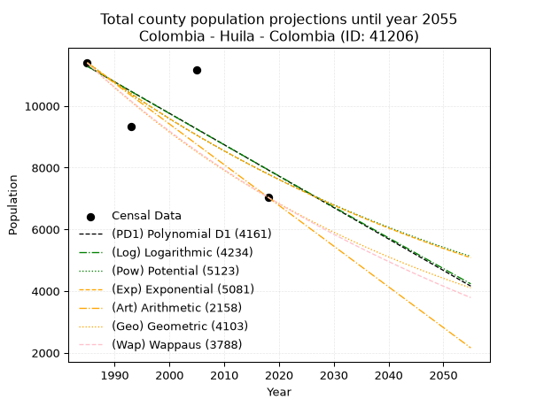
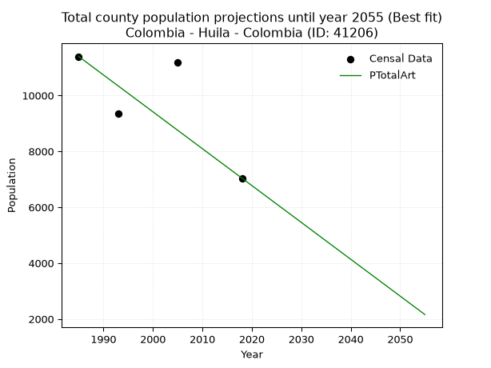
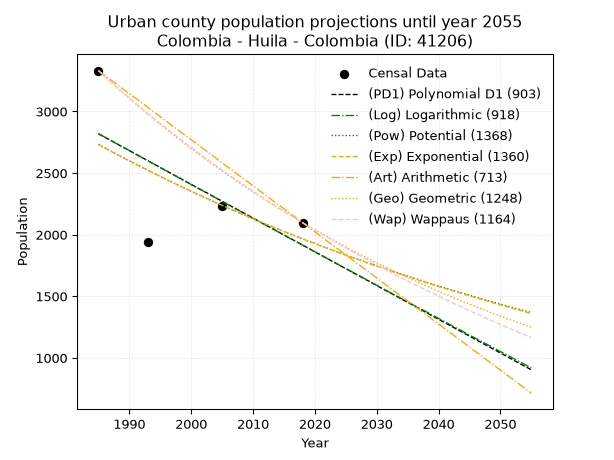
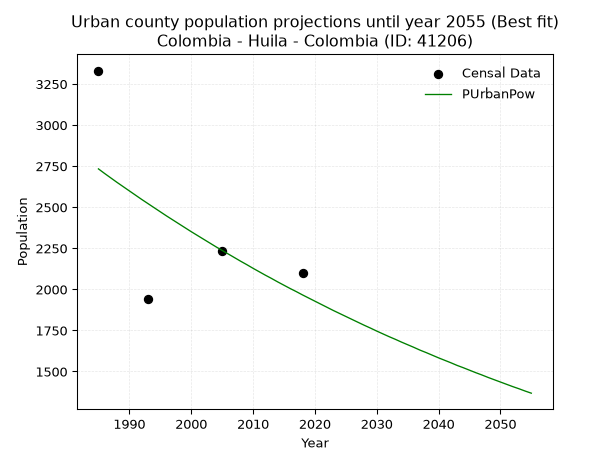
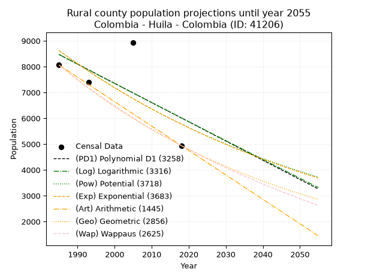
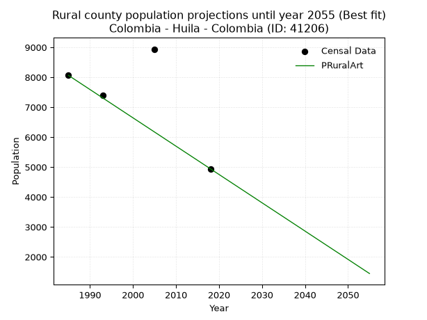

<div align="center">


</div>

# _“Population and Public Services Demand Projections (PPSD) until Year 2050 for Colombia - Huila - Colombia (ID: 41206)”_
Keywords: `population` `public-service` `projection` `lineal` `polynomial` `logarithmic` `potential` `exponential` `arithmetic` `geometric` `wappaus` `dane` `colombia` `south-america`

PPSD are analytical estimates used by governments and planners to anticipate future changes in population size, age distribution, and the resulting community needs for utilities, healthcare, education, and infrastructure as sizing future water treatment facilities, electrical grids, and road networks based on spatial growth.

> **General running parameters**: • app_version: _v20260806_. • Python version: _3.14.7_. • Pandas version: _3.0.5_. • NumPy version: _2.5.1_. • Creates, save and include plots into reports (create_plot): _False_. • Projection until year: _2050_. • Process polynomial degree 2 and up: _False_. • Process Wappaus: _True_. • Process Wappaus: _True_. • Set negative values to zero: _True_. • Set infinite values to zero: _True_. • Drop dataset notes: _True_. 
<div align="center">

Dynamic map: [:earth_americas:Google](http://maps.google.com/maps?q=3.376744919,-74.8028148) [:earth_americas:OSM](https://www.openstreetmap.org/#map=18/3.376744919/-74.8028148&layers=P) [:earth_americas:Bing](https://www.bing.com/maps?cp=3.376744919~-74.8028148&lvl=18) [:earth_americas:Apple](https://maps.apple.com/frame?center=3.376744919%2C-74.8028148&span=0.003%2C0.006)

</div>


<div align="center">

```geojson
{
  "type": "Feature",
  "geometry": {
    "type": "Point", 
    "coordinates": [-74.8028148, 3.376744919]
  }, 
  "properties": {
    "Name": "Colombia - Huila - Colombia (ID: 41206)"
  }
}
```

</div>


## 0. Census Data (4 records)

Census data are official statistics collected by a government about the people and housing in a country. They usually include counts of total population, age, sex, race, income, education, and jobs.

📅Global census file: [Population.xlsx](../data/Population.xlsx)

| Source   |   Year |   CountryID | CountryName   |   StateID | StateName   |   CountyID | CountyName   |   PTotal |   PUrban |   PRural |
|:---------|-------:|------------:|:--------------|----------:|:------------|-----------:|:-------------|---------:|---------:|---------:|
| DANE     |   1985 |          57 | Colombia      |        41 | Huila       |      41206 | Colombia     |    11394 |     3331 |     8063 |
| DANE     |   1993 |          57 | Colombia      |        41 | Huila       |      41206 | Colombia     |     9336 |     1942 |     7394 |
| DANE     |   2005 |          57 | Colombia      |        41 | Huila       |      41206 | Colombia     |    11173 |     2234 |     8939 |
| DANE     |   2018 |          57 | Colombia      |        41 | Huila       |      41206 | Colombia     |     7040 |     2097 |     4943 |

> 🔥Some records could had specific notes about the registered values or the corresponding urban or rural distribution.

## 1. Total

### 1.1. Coefficients and Parameters

* (PD1) Polynomial Deg 1: -101.82697711762098, 213415.16097952134 (lineal)
* (Log) Logarithmic: -203601.68639289986, 1557313.799833951
* (Pow) Potential: -23.09948351470908, 80.23379176039492
* (Exp) Exponential: -0.01155362381344349, 104051760852913.25
* (Art) Arithmetic: Year diff. 2018 - 1985 = 33, Population diff. 7040 - 11394 = -4354, Annual growth = -131.93939393939394
* (Geo) Geometric: Year diff. 2018 - 1985 = 33, Population diff. 7040 - 11394 = -4354, Annual growth % = -0.014484342431973496
* (Wap) Wappaus: i = -1.4314787234392312, Condition values only valid for < 200)

<sub>
Wappaus condition values: ['-0.00', '-1.43', '-2.86', '-4.29', '-5.73', '-7.16', '-8.59', '-10.02', '-11.45', '-12.88', '-14.31', '-15.75', '-17.18', '-18.61', '-20.04', '-21.47', '-22.90', '-24.34', '-25.77', '-27.20', '-28.63', '-30.06', '-31.49', '-32.92', '-34.36', '-35.79', '-37.22', '-38.65', '-40.08', '-41.51', '-42.94', '-44.38', '-45.81', '-47.24', '-48.67', '-50.10', '-51.53', '-52.96', '-54.40', '-55.83', '-57.26', '-58.69', '-60.12', '-61.55', '-62.99', '-64.42', '-65.85', '-67.28', '-68.71', '-70.14', '-71.57', '-73.01', '-74.44', '-75.87', '-77.30', '-78.73', '-80.16', '-81.59', '-83.03', '-84.46', '-85.89', '-87.32', '-88.75', '-90.18', '-91.61', '-93.05']
</sub>


### 1.2. Projected Dataset

|   Year |   CountyID |   PTotalPD1 |   PTotalLog |   PTotalPow |   PTotalExp |   PTotalArt |   PTotalGeo |   PTotalWap |
|-------:|-----------:|------------:|------------:|------------:|------------:|------------:|------------:|------------:|
|   1985 |      41206 |       11289 |       11290 |       11408 |       11407 |       11394 |       11394 |       11394 |
|   1986 |      41206 |       11187 |       11187 |       11277 |       11276 |       11262 |       11229 |       11232 |
|   1987 |      41206 |       11085 |       11085 |       11146 |       11146 |       11130 |       11066 |       11072 |
|   1988 |      41206 |       10983 |       10983 |       11017 |       11018 |       10998 |       10906 |       10915 |
|   1989 |      41206 |       10881 |       10880 |       10890 |       10892 |       10866 |       10748 |       10760 |
|   1990 |      41206 |       10779 |       10778 |       10764 |       10767 |       10734 |       10592 |       10607 |
|   1991 |      41206 |       10678 |       10676 |       10640 |       10643 |       10602 |       10439 |       10456 |
|   1992 |      41206 |       10576 |       10573 |       10517 |       10521 |       10470 |       10288 |       10307 |
|   1993 |      41206 |       10474 |       10471 |       10396 |       10400 |       10338 |       10139 |       10160 |
|   1994 |      41206 |       10372 |       10369 |       10276 |       10280 |       10207 |        9992 |       10015 |
|   1995 |      41206 |       10270 |       10267 |       10158 |       10162 |       10075 |        9847 |        9872 |
|   1996 |      41206 |       10169 |       10165 |       10041 |       10045 |        9943 |        9705 |        9731 |
|   1997 |      41206 |       10067 |       10063 |        9926 |        9930 |        9811 |        9564 |        9592 |
|   1998 |      41206 |        9965 |        9961 |        9812 |        9816 |        9679 |        9425 |        9454 |
|   1999 |      41206 |        9863 |        9859 |        9699 |        9703 |        9547 |        9289 |        9319 |
|   2000 |      41206 |        9761 |        9757 |        9587 |        9592 |        9415 |        9154 |        9185 |
|   2001 |      41206 |        9659 |        9655 |        9477 |        9482 |        9283 |        9022 |        9053 |
|   2002 |      41206 |        9558 |        9554 |        9369 |        9373 |        9151 |        8891 |        8922 |
|   2003 |      41206 |        9456 |        9452 |        9261 |        9265 |        9019 |        8762 |        8793 |
|   2004 |      41206 |        9354 |        9350 |        9155 |        9159 |        8887 |        8635 |        8666 |
|   2005 |      41206 |        9252 |        9249 |        9050 |        9053 |        8755 |        8510 |        8540 |
|   2006 |      41206 |        9150 |        9147 |        8946 |        8949 |        8623 |        8387 |        8416 |
|   2007 |      41206 |        9048 |        9046 |        8844 |        8847 |        8491 |        8266 |        8294 |
|   2008 |      41206 |        8947 |        8944 |        8743 |        8745 |        8359 |        8146 |        8173 |
|   2009 |      41206 |        8845 |        8843 |        8643 |        8645 |        8227 |        8028 |        8053 |
|   2010 |      41206 |        8743 |        8742 |        8544 |        8545 |        8096 |        7912 |        7935 |
|   2011 |      41206 |        8641 |        8640 |        8447 |        8447 |        7964 |        7797 |        7819 |
|   2012 |      41206 |        8539 |        8539 |        8350 |        8350 |        7832 |        7684 |        7703 |
|   2013 |      41206 |        8437 |        8438 |        8255 |        8254 |        7700 |        7573 |        7590 |
|   2014 |      41206 |        8336 |        8337 |        8161 |        8159 |        7568 |        7463 |        7477 |
|   2015 |      41206 |        8234 |        8236 |        8068 |        8066 |        7436 |        7355 |        7366 |
|   2016 |      41206 |        8132 |        8135 |        7976 |        7973 |        7304 |        7248 |        7256 |
|   2017 |      41206 |        8030 |        8034 |        7885 |        7881 |        7172 |        7143 |        7147 |
|   2018 |      41206 |        7928 |        7933 |        7795 |        7791 |        7040 |        7040 |        7040 |
|   2019 |      41206 |        7826 |        7832 |        7706 |        7701 |        6908 |        6938 |        6934 |
|   2020 |      41206 |        7725 |        7731 |        7619 |        7613 |        6776 |        6838 |        6829 |
|   2021 |      41206 |        7623 |        7631 |        7532 |        7525 |        6644 |        6739 |        6725 |
|   2022 |      41206 |        7521 |        7530 |        7447 |        7439 |        6512 |        6641 |        6623 |
|   2023 |      41206 |        7419 |        7429 |        7362 |        7353 |        6380 |        6545 |        6521 |
|   2024 |      41206 |        7317 |        7329 |        7278 |        7269 |        6248 |        6450 |        6421 |
|   2025 |      41206 |        7216 |        7228 |        7196 |        7186 |        6116 |        6356 |        6322 |
|   2026 |      41206 |        7114 |        7127 |        7114 |        7103 |        5984 |        6264 |        6224 |
|   2027 |      41206 |        7012 |        7027 |        7034 |        7021 |        5853 |        6174 |        6127 |
|   2028 |      41206 |        6910 |        6927 |        6954 |        6941 |        5721 |        6084 |        6031 |
|   2029 |      41206 |        6808 |        6826 |        6875 |        6861 |        5589 |        5996 |        5936 |
|   2030 |      41206 |        6706 |        6726 |        6797 |        6782 |        5457 |        5909 |        5842 |
|   2031 |      41206 |        6605 |        6626 |        6720 |        6704 |        5325 |        5824 |        5750 |
|   2032 |      41206 |        6503 |        6525 |        6645 |        6627 |        5193 |        5739 |        5658 |
|   2033 |      41206 |        6401 |        6425 |        6569 |        6551 |        5061 |        5656 |        5567 |
|   2034 |      41206 |        6299 |        6325 |        6495 |        6476 |        4929 |        5574 |        5477 |
|   2035 |      41206 |        6197 |        6225 |        6422 |        6401 |        4797 |        5494 |        5388 |
|   2036 |      41206 |        6095 |        6125 |        6349 |        6328 |        4665 |        5414 |        5300 |
|   2037 |      41206 |        5994 |        6025 |        6278 |        6255 |        4533 |        5336 |        5213 |
|   2038 |      41206 |        5892 |        5925 |        6207 |        6183 |        4401 |        5258 |        5127 |
|   2039 |      41206 |        5790 |        5825 |        6137 |        6112 |        4269 |        5182 |        5042 |
|   2040 |      41206 |        5688 |        5725 |        6068 |        6042 |        4137 |        5107 |        4957 |
|   2041 |      41206 |        5586 |        5626 |        6000 |        5973 |        4005 |        5033 |        4874 |
|   2042 |      41206 |        5484 |        5526 |        5932 |        5904 |        3873 |        4960 |        4791 |
|   2043 |      41206 |        5383 |        5426 |        5865 |        5836 |        3742 |        4888 |        4709 |
|   2044 |      41206 |        5281 |        5327 |        5800 |        5769 |        3610 |        4818 |        4628 |
|   2045 |      41206 |        5179 |        5227 |        5734 |        5703 |        3478 |        4748 |        4548 |
|   2046 |      41206 |        5077 |        5127 |        5670 |        5637 |        3346 |        4679 |        4468 |
|   2047 |      41206 |        4975 |        5028 |        5606 |        5573 |        3214 |        4611 |        4390 |
|   2048 |      41206 |        4874 |        4929 |        5543 |        5509 |        3082 |        4544 |        4312 |
|   2049 |      41206 |        4772 |        4829 |        5481 |        5445 |        2950 |        4479 |        4235 |
|   2050 |      41206 |        4670 |        4730 |        5420 |        5383 |        2818 |        4414 |        4159 |
<div align="center">

</img>

</div>


### 1.3. Best fit with absolute and relative error (%)

Relative error puts that difference into context by dividing the absolute error by the true value, creating a unitless ratio or percentage that shows the scale of the mistake.

Absolute and relative error

|   Year | Source   |   CountryID | CountryName   |   StateID | StateName   |   CountyID_x | CountyName   |   PTotal |   PUrban |   PRural |   CountyID_y |   PTotalPD1 |   PTotalLog |   PTotalPow |   PTotalExp |   PTotalArt |   PTotalGeo |   PTotalWap |   PTotalPD1AbsError |   PTotalLogAbsError |   PTotalPowAbsError |   PTotalExpAbsError |   PTotalArtAbsError |   PTotalGeoAbsError |   PTotalWapAbsError |   PTotalPD1RelError |   PTotalLogRelError |   PTotalPowRelError |   PTotalExpRelError |   PTotalArtRelError |   PTotalGeoRelError |   PTotalWapRelError |
|-------:|:---------|------------:|:--------------|----------:|:------------|-------------:|:-------------|---------:|---------:|---------:|-------------:|------------:|------------:|------------:|------------:|------------:|------------:|------------:|--------------------:|--------------------:|--------------------:|--------------------:|--------------------:|--------------------:|--------------------:|--------------------:|--------------------:|--------------------:|--------------------:|--------------------:|--------------------:|--------------------:|
|   1985 | DANE     |          57 | Colombia      |        41 | Huila       |        41206 | Colombia     |    11394 |     3331 |     8063 |        41206 |       11289 |       11290 |       11408 |       11407 |       11394 |       11394 |       11394 |                 105 |                 104 |                  14 |                  13 |                   0 |                   0 |                   0 |            0.921538 |            0.912761 |            0.122872 |            0.114095 |              0      |             0       |             0       |
|   1993 | DANE     |          57 | Colombia      |        41 | Huila       |        41206 | Colombia     |     9336 |     1942 |     7394 |        41206 |       10474 |       10471 |       10396 |       10400 |       10338 |       10139 |       10160 |                1138 |                1135 |                1060 |                1064 |                1002 |                 803 |                 824 |           12.1894   |           12.1572   |           11.3539   |           11.3967   |             10.7326 |             8.60111 |             8.82605 |
|   2005 | DANE     |          57 | Colombia      |        41 | Huila       |        41206 | Colombia     |    11173 |     2234 |     8939 |        41206 |        9252 |        9249 |        9050 |        9053 |        8755 |        8510 |        8540 |                1921 |                1924 |                2123 |                2120 |                2418 |                2663 |                2633 |           17.1932   |           17.2201   |           19.0012   |           18.9743   |             21.6415 |            23.8342  |            23.5657  |
|   2018 | DANE     |          57 | Colombia      |        41 | Huila       |        41206 | Colombia     |     7040 |     2097 |     4943 |        41206 |        7928 |        7933 |        7795 |        7791 |        7040 |        7040 |        7040 |                 888 |                 893 |                 755 |                 751 |                   0 |                   0 |                   0 |           12.6136   |           12.6847   |           10.7244   |           10.6676   |              0      |             0       |             0       |

Relative error mean

| Method    |   RelError | Best   |
|:----------|-----------:|:-------|
| PTotalPD1 |   10.7294  |        |
| PTotalLog |   10.7437  |        |
| PTotalPow |   10.3006  |        |
| PTotalExp |   10.2882  |        |
| PTotalArt |    8.09353 | True   |
| PTotalGeo |    8.10884 |        |
| PTotalWap |    8.09795 |        |

💙Best method: _**PTotalArt**_
<div align="center">

</img>

</div>


### 1.4. Fresh water supply demand in liters per capita per day (lpcd)

The fresh water supply demand typically ranges from 100 to 300 liters per capita per day (lpcd) for standard domestic and municipal planning, though absolute survival minimums set by the World Health Organization are as low as 7.5 to 20 liters per day, and total consumption in high-income nations can exceed 400 liters.

> `CZ`: Level in meters above the sea level (masl)<br> `WS`: Fresh water supply demand in liters per capita per day (lpcd or l/h/d)<br> `WSAll`: Zonal fresh water supply demand in liters per second (l/s)<br> `A`: Zonal area in square meters<br> `DP`: Population density (people/hectare)

Reference values (RAS Colombia)

|    CZ |   WS |
|------:|-----:|
|  1000 |  120 |
|  2000 |  130 |
| 99999 |  140 |

County shapefile geometry properties and water supply values

|   CountyID |      ATotal |   CZTotal |   WSTotal |
|-----------:|------------:|----------:|----------:|
|      41206 | 1.58362e+09 |    2160.2 |       140 |

Projected values for best method: PTotalArt

|   CountyID |   Year |   PTotalArt |   DPTotal |   WSTotal |   WSTotalAll |
|-----------:|-------:|------------:|----------:|----------:|-------------:|
|      41206 |   1985 |       11394 |      0.07 |       140 |     18.4625  |
|      41206 |   1986 |       11262 |      0.07 |       140 |     18.2486  |
|      41206 |   1987 |       11130 |      0.07 |       140 |     18.0347  |
|      41206 |   1988 |       10998 |      0.07 |       140 |     17.8208  |
|      41206 |   1989 |       10866 |      0.07 |       140 |     17.6069  |
|      41206 |   1990 |       10734 |      0.07 |       140 |     17.3931  |
|      41206 |   1991 |       10602 |      0.07 |       140 |     17.1792  |
|      41206 |   1992 |       10470 |      0.07 |       140 |     16.9653  |
|      41206 |   1993 |       10338 |      0.07 |       140 |     16.7514  |
|      41206 |   1994 |       10207 |      0.06 |       140 |     16.5391  |
|      41206 |   1995 |       10075 |      0.06 |       140 |     16.3252  |
|      41206 |   1996 |        9943 |      0.06 |       140 |     16.1113  |
|      41206 |   1997 |        9811 |      0.06 |       140 |     15.8975  |
|      41206 |   1998 |        9679 |      0.06 |       140 |     15.6836  |
|      41206 |   1999 |        9547 |      0.06 |       140 |     15.4697  |
|      41206 |   2000 |        9415 |      0.06 |       140 |     15.2558  |
|      41206 |   2001 |        9283 |      0.06 |       140 |     15.0419  |
|      41206 |   2002 |        9151 |      0.06 |       140 |     14.828   |
|      41206 |   2003 |        9019 |      0.06 |       140 |     14.6141  |
|      41206 |   2004 |        8887 |      0.06 |       140 |     14.4002  |
|      41206 |   2005 |        8755 |      0.06 |       140 |     14.1863  |
|      41206 |   2006 |        8623 |      0.05 |       140 |     13.9725  |
|      41206 |   2007 |        8491 |      0.05 |       140 |     13.7586  |
|      41206 |   2008 |        8359 |      0.05 |       140 |     13.5447  |
|      41206 |   2009 |        8227 |      0.05 |       140 |     13.3308  |
|      41206 |   2010 |        8096 |      0.05 |       140 |     13.1185  |
|      41206 |   2011 |        7964 |      0.05 |       140 |     12.9046  |
|      41206 |   2012 |        7832 |      0.05 |       140 |     12.6907  |
|      41206 |   2013 |        7700 |      0.05 |       140 |     12.4769  |
|      41206 |   2014 |        7568 |      0.05 |       140 |     12.263   |
|      41206 |   2015 |        7436 |      0.05 |       140 |     12.0491  |
|      41206 |   2016 |        7304 |      0.05 |       140 |     11.8352  |
|      41206 |   2017 |        7172 |      0.05 |       140 |     11.6213  |
|      41206 |   2018 |        7040 |      0.04 |       140 |     11.4074  |
|      41206 |   2019 |        6908 |      0.04 |       140 |     11.1935  |
|      41206 |   2020 |        6776 |      0.04 |       140 |     10.9796  |
|      41206 |   2021 |        6644 |      0.04 |       140 |     10.7657  |
|      41206 |   2022 |        6512 |      0.04 |       140 |     10.5519  |
|      41206 |   2023 |        6380 |      0.04 |       140 |     10.338   |
|      41206 |   2024 |        6248 |      0.04 |       140 |     10.1241  |
|      41206 |   2025 |        6116 |      0.04 |       140 |      9.91019 |
|      41206 |   2026 |        5984 |      0.04 |       140 |      9.6963  |
|      41206 |   2027 |        5853 |      0.04 |       140 |      9.48403 |
|      41206 |   2028 |        5721 |      0.04 |       140 |      9.27014 |
|      41206 |   2029 |        5589 |      0.04 |       140 |      9.05625 |
|      41206 |   2030 |        5457 |      0.03 |       140 |      8.84236 |
|      41206 |   2031 |        5325 |      0.03 |       140 |      8.62847 |
|      41206 |   2032 |        5193 |      0.03 |       140 |      8.41458 |
|      41206 |   2033 |        5061 |      0.03 |       140 |      8.20069 |
|      41206 |   2034 |        4929 |      0.03 |       140 |      7.98681 |
|      41206 |   2035 |        4797 |      0.03 |       140 |      7.77292 |
|      41206 |   2036 |        4665 |      0.03 |       140 |      7.55903 |
|      41206 |   2037 |        4533 |      0.03 |       140 |      7.34514 |
|      41206 |   2038 |        4401 |      0.03 |       140 |      7.13125 |
|      41206 |   2039 |        4269 |      0.03 |       140 |      6.91736 |
|      41206 |   2040 |        4137 |      0.03 |       140 |      6.70347 |
|      41206 |   2041 |        4005 |      0.03 |       140 |      6.48958 |
|      41206 |   2042 |        3873 |      0.02 |       140 |      6.27569 |
|      41206 |   2043 |        3742 |      0.02 |       140 |      6.06343 |
|      41206 |   2044 |        3610 |      0.02 |       140 |      5.84954 |
|      41206 |   2045 |        3478 |      0.02 |       140 |      5.63565 |
|      41206 |   2046 |        3346 |      0.02 |       140 |      5.42176 |
|      41206 |   2047 |        3214 |      0.02 |       140 |      5.20787 |
|      41206 |   2048 |        3082 |      0.02 |       140 |      4.99398 |
|      41206 |   2049 |        2950 |      0.02 |       140 |      4.78009 |
|      41206 |   2050 |        2818 |      0.02 |       140 |      4.5662  |

## 2. Urban

### 2.1. Coefficients and Parameters

* (PD1) Polynomial Deg 1: -27.368928141308615, 57145.69851465256 (lineal)
* (Log) Logarithmic: -54895.81602559272, 419664.5375179917
* (Pow) Potential: -19.969723676496702, 69.2919486677057
* (Exp) Exponential: -0.009955571312529556, 1044134984241.1698
* (Art) Arithmetic: Year diff. 2018 - 1985 = 33, Population diff. 2097 - 3331 = -1234, Annual growth = -37.39393939393939
* (Geo) Geometric: Year diff. 2018 - 1985 = 33, Population diff. 2097 - 3331 = -1234, Annual growth % = -0.013925309247833195
* (Wap) Wappaus: i = -1.3778164846698377, Condition values only valid for < 200)

<sub>
Wappaus condition values: ['-0.00', '-1.38', '-2.76', '-4.13', '-5.51', '-6.89', '-8.27', '-9.64', '-11.02', '-12.40', '-13.78', '-15.16', '-16.53', '-17.91', '-19.29', '-20.67', '-22.05', '-23.42', '-24.80', '-26.18', '-27.56', '-28.93', '-30.31', '-31.69', '-33.07', '-34.45', '-35.82', '-37.20', '-38.58', '-39.96', '-41.33', '-42.71', '-44.09', '-45.47', '-46.85', '-48.22', '-49.60', '-50.98', '-52.36', '-53.73', '-55.11', '-56.49', '-57.87', '-59.25', '-60.62', '-62.00', '-63.38', '-64.76', '-66.14', '-67.51', '-68.89', '-70.27', '-71.65', '-73.02', '-74.40', '-75.78', '-77.16', '-78.54', '-79.91', '-81.29', '-82.67', '-84.05', '-85.42', '-86.80', '-88.18', '-89.56']
</sub>


### 2.2. Projected Dataset

|   Year |   CountyID |   PUrbanPD1 |   PUrbanLog |   PUrbanPow |   PUrbanExp |   PUrbanArt |   PUrbanGeo |   PUrbanWap |
|-------:|-----------:|------------:|------------:|------------:|------------:|------------:|------------:|------------:|
|   1985 |      41206 |        2818 |        2820 |        2733 |        2731 |        3331 |        3331 |        3331 |
|   1986 |      41206 |        2791 |        2792 |        2705 |        2704 |        3294 |        3285 |        3285 |
|   1987 |      41206 |        2764 |        2765 |        2678 |        2677 |        3256 |        3239 |        3240 |
|   1988 |      41206 |        2736 |        2737 |        2651 |        2651 |        3219 |        3194 |        3196 |
|   1989 |      41206 |        2709 |        2710 |        2625 |        2624 |        3181 |        3149 |        3152 |
|   1990 |      41206 |        2682 |        2682 |        2599 |        2598 |        3144 |        3105 |        3109 |
|   1991 |      41206 |        2654 |        2654 |        2573 |        2573 |        3107 |        3062 |        3067 |
|   1992 |      41206 |        2627 |        2627 |        2547 |        2547 |        3069 |        3020 |        3025 |
|   1993 |      41206 |        2599 |        2599 |        2522 |        2522 |        3032 |        2978 |        2983 |
|   1994 |      41206 |        2572 |        2572 |        2497 |        2497 |        2994 |        2936 |        2942 |
|   1995 |      41206 |        2545 |        2544 |        2472 |        2472 |        2957 |        2895 |        2902 |
|   1996 |      41206 |        2517 |        2517 |        2447 |        2448 |        2920 |        2855 |        2862 |
|   1997 |      41206 |        2490 |        2489 |        2423 |        2423 |        2882 |        2815 |        2822 |
|   1998 |      41206 |        2463 |        2462 |        2399 |        2399 |        2845 |        2776 |        2783 |
|   1999 |      41206 |        2435 |        2434 |        2375 |        2376 |        2807 |        2737 |        2745 |
|   2000 |      41206 |        2408 |        2407 |        2351 |        2352 |        2770 |        2699 |        2707 |
|   2001 |      41206 |        2380 |        2379 |        2328 |        2329 |        2733 |        2662 |        2670 |
|   2002 |      41206 |        2353 |        2352 |        2305 |        2306 |        2695 |        2624 |        2633 |
|   2003 |      41206 |        2326 |        2325 |        2282 |        2283 |        2658 |        2588 |        2596 |
|   2004 |      41206 |        2298 |        2297 |        2259 |        2260 |        2621 |        2552 |        2560 |
|   2005 |      41206 |        2271 |        2270 |        2237 |        2238 |        2583 |        2516 |        2524 |
|   2006 |      41206 |        2244 |        2242 |        2215 |        2216 |        2546 |        2481 |        2489 |
|   2007 |      41206 |        2216 |        2215 |        2193 |        2194 |        2508 |        2447 |        2454 |
|   2008 |      41206 |        2189 |        2188 |        2171 |        2172 |        2471 |        2413 |        2420 |
|   2009 |      41206 |        2162 |        2160 |        2150 |        2151 |        2434 |        2379 |        2386 |
|   2010 |      41206 |        2134 |        2133 |        2128 |        2129 |        2396 |        2346 |        2352 |
|   2011 |      41206 |        2107 |        2106 |        2107 |        2108 |        2359 |        2313 |        2319 |
|   2012 |      41206 |        2079 |        2078 |        2086 |        2087 |        2321 |        2281 |        2286 |
|   2013 |      41206 |        2052 |        2051 |        2066 |        2067 |        2284 |        2249 |        2254 |
|   2014 |      41206 |        2025 |        2024 |        2045 |        2046 |        2247 |        2218 |        2222 |
|   2015 |      41206 |        1997 |        1997 |        2025 |        2026 |        2209 |        2187 |        2190 |
|   2016 |      41206 |        1970 |        1969 |        2005 |        2006 |        2172 |        2157 |        2159 |
|   2017 |      41206 |        1943 |        1942 |        1986 |        1986 |        2134 |        2127 |        2128 |
|   2018 |      41206 |        1915 |        1915 |        1966 |        1966 |        2097 |        2097 |        2097 |
|   2019 |      41206 |        1888 |        1888 |        1947 |        1947 |        2060 |        2068 |        2067 |
|   2020 |      41206 |        1860 |        1861 |        1928 |        1927 |        2022 |        2039 |        2037 |
|   2021 |      41206 |        1833 |        1833 |        1909 |        1908 |        1985 |        2011 |        2007 |
|   2022 |      41206 |        1806 |        1806 |        1890 |        1889 |        1947 |        1983 |        1978 |
|   2023 |      41206 |        1778 |        1779 |        1871 |        1871 |        1910 |        1955 |        1949 |
|   2024 |      41206 |        1751 |        1752 |        1853 |        1852 |        1873 |        1928 |        1920 |
|   2025 |      41206 |        1724 |        1725 |        1835 |        1834 |        1835 |        1901 |        1892 |
|   2026 |      41206 |        1696 |        1698 |        1817 |        1816 |        1798 |        1874 |        1864 |
|   2027 |      41206 |        1669 |        1671 |        1799 |        1798 |        1760 |        1848 |        1836 |
|   2028 |      41206 |        1642 |        1644 |        1781 |        1780 |        1723 |        1823 |        1809 |
|   2029 |      41206 |        1614 |        1617 |        1764 |        1762 |        1686 |        1797 |        1781 |
|   2030 |      41206 |        1587 |        1589 |        1746 |        1745 |        1648 |        1772 |        1754 |
|   2031 |      41206 |        1559 |        1562 |        1729 |        1728 |        1611 |        1748 |        1728 |
|   2032 |      41206 |        1532 |        1535 |        1712 |        1710 |        1573 |        1723 |        1702 |
|   2033 |      41206 |        1505 |        1508 |        1696 |        1693 |        1536 |        1699 |        1675 |
|   2034 |      41206 |        1477 |        1481 |        1679 |        1677 |        1499 |        1676 |        1650 |
|   2035 |      41206 |        1450 |        1454 |        1663 |        1660 |        1461 |        1652 |        1624 |
|   2036 |      41206 |        1423 |        1427 |        1647 |        1644 |        1424 |        1629 |        1599 |
|   2037 |      41206 |        1395 |        1401 |        1630 |        1627 |        1387 |        1607 |        1574 |
|   2038 |      41206 |        1368 |        1374 |        1615 |        1611 |        1349 |        1584 |        1549 |
|   2039 |      41206 |        1340 |        1347 |        1599 |        1595 |        1312 |        1562 |        1525 |
|   2040 |      41206 |        1313 |        1320 |        1583 |        1579 |        1274 |        1540 |        1500 |
|   2041 |      41206 |        1286 |        1293 |        1568 |        1564 |        1237 |        1519 |        1476 |
|   2042 |      41206 |        1258 |        1266 |        1553 |        1548 |        1200 |        1498 |        1453 |
|   2043 |      41206 |        1231 |        1239 |        1537 |        1533 |        1162 |        1477 |        1429 |
|   2044 |      41206 |        1204 |        1212 |        1523 |        1518 |        1125 |        1456 |        1406 |
|   2045 |      41206 |        1176 |        1185 |        1508 |        1503 |        1087 |        1436 |        1383 |
|   2046 |      41206 |        1149 |        1158 |        1493 |        1488 |        1050 |        1416 |        1360 |
|   2047 |      41206 |        1122 |        1132 |        1479 |        1473 |        1013 |        1396 |        1337 |
|   2048 |      41206 |        1094 |        1105 |        1464 |        1459 |         975 |        1377 |        1315 |
|   2049 |      41206 |        1067 |        1078 |        1450 |        1444 |         938 |        1358 |        1292 |
|   2050 |      41206 |        1039 |        1051 |        1436 |        1430 |         900 |        1339 |        1270 |
<div align="center">

</img>

</div>


### 2.3. Best fit with absolute and relative error (%)

Relative error puts that difference into context by dividing the absolute error by the true value, creating a unitless ratio or percentage that shows the scale of the mistake.

Absolute and relative error

|   Year | Source   |   CountryID | CountryName   |   StateID | StateName   |   CountyID_x | CountyName   |   PTotal |   PUrban |   PRural |   CountyID_y |   PUrbanPD1 |   PUrbanLog |   PUrbanPow |   PUrbanExp |   PUrbanArt |   PUrbanGeo |   PUrbanWap |   PUrbanPD1AbsError |   PUrbanLogAbsError |   PUrbanPowAbsError |   PUrbanExpAbsError |   PUrbanArtAbsError |   PUrbanGeoAbsError |   PUrbanWapAbsError |   PUrbanPD1RelError |   PUrbanLogRelError |   PUrbanPowRelError |   PUrbanExpRelError |   PUrbanArtRelError |   PUrbanGeoRelError |   PUrbanWapRelError |
|-------:|:---------|------------:|:--------------|----------:|:------------|-------------:|:-------------|---------:|---------:|---------:|-------------:|------------:|------------:|------------:|------------:|------------:|------------:|------------:|--------------------:|--------------------:|--------------------:|--------------------:|--------------------:|--------------------:|--------------------:|--------------------:|--------------------:|--------------------:|--------------------:|--------------------:|--------------------:|--------------------:|
|   1985 | DANE     |          57 | Colombia      |        41 | Huila       |        41206 | Colombia     |    11394 |     3331 |     8063 |        41206 |        2818 |        2820 |        2733 |        2731 |        3331 |        3331 |        3331 |                 513 |                 511 |                 598 |                 600 |                   0 |                   0 |                   0 |            15.4008  |            15.3407  |           17.9526   |           18.0126   |              0      |              0      |              0      |
|   1993 | DANE     |          57 | Colombia      |        41 | Huila       |        41206 | Colombia     |     9336 |     1942 |     7394 |        41206 |        2599 |        2599 |        2522 |        2522 |        3032 |        2978 |        2983 |                 657 |                 657 |                 580 |                 580 |                1090 |                1036 |                1041 |            33.8311  |            33.8311  |           29.8661   |           29.8661   |             56.1277 |             53.3471 |             53.6045 |
|   2005 | DANE     |          57 | Colombia      |        41 | Huila       |        41206 | Colombia     |    11173 |     2234 |     8939 |        41206 |        2271 |        2270 |        2237 |        2238 |        2583 |        2516 |        2524 |                  37 |                  36 |                   3 |                   4 |                 349 |                 282 |                 290 |             1.65622 |             1.61146 |            0.134288 |            0.179051 |             15.6222 |             12.6231 |             12.9812 |
|   2018 | DANE     |          57 | Colombia      |        41 | Huila       |        41206 | Colombia     |     7040 |     2097 |     4943 |        41206 |        1915 |        1915 |        1966 |        1966 |        2097 |        2097 |        2097 |                 182 |                 182 |                 131 |                 131 |                   0 |                   0 |                   0 |             8.67907 |             8.67907 |            6.24702  |            6.24702  |              0      |              0      |              0      |

Relative error mean

| Method    |   RelError | Best   |
|:----------|-----------:|:-------|
| PUrbanPD1 |    14.8918 |        |
| PUrbanLog |    14.8656 |        |
| PUrbanPow |    13.55   | True   |
| PUrbanExp |    13.5762 |        |
| PUrbanArt |    17.9375 |        |
| PUrbanGeo |    16.4925 |        |
| PUrbanWap |    16.6464 |        |

💙Best method: _**PUrbanPow**_
<div align="center">

</img>

</div>


### 2.4. Fresh water supply demand in liters per capita per day (lpcd)

The fresh water supply demand typically ranges from 100 to 300 liters per capita per day (lpcd) for standard domestic and municipal planning, though absolute survival minimums set by the World Health Organization are as low as 7.5 to 20 liters per day, and total consumption in high-income nations can exceed 400 liters.

> `CZ`: Level in meters above the sea level (masl)<br> `WS`: Fresh water supply demand in liters per capita per day (lpcd or l/h/d)<br> `WSAll`: Zonal fresh water supply demand in liters per second (l/s)<br> `A`: Zonal area in square meters<br> `DP`: Population density (people/hectare)

Reference values (RAS Colombia)

|    CZ |   WS |
|------:|-----:|
|  1000 |  120 |
|  2000 |  130 |
| 99999 |  140 |

County shapefile geometry properties and water supply values

|   CountyID |   AUrban |   CZUrban |   WSUrban |
|-----------:|---------:|----------:|----------:|
|      41206 |   757615 |    768.07 |       120 |

Projected values for best method: PUrbanPow

|   CountyID |   Year |   PUrbanPow |   DPUrban |   WSUrban |   WSUrbanAll |
|-----------:|-------:|------------:|----------:|----------:|-------------:|
|      41206 |   1985 |        2733 |     36.07 |       120 |      3.79583 |
|      41206 |   1986 |        2705 |     35.7  |       120 |      3.75694 |
|      41206 |   1987 |        2678 |     35.35 |       120 |      3.71944 |
|      41206 |   1988 |        2651 |     34.99 |       120 |      3.68194 |
|      41206 |   1989 |        2625 |     34.65 |       120 |      3.64583 |
|      41206 |   1990 |        2599 |     34.31 |       120 |      3.60972 |
|      41206 |   1991 |        2573 |     33.96 |       120 |      3.57361 |
|      41206 |   1992 |        2547 |     33.62 |       120 |      3.5375  |
|      41206 |   1993 |        2522 |     33.29 |       120 |      3.50278 |
|      41206 |   1994 |        2497 |     32.96 |       120 |      3.46806 |
|      41206 |   1995 |        2472 |     32.63 |       120 |      3.43333 |
|      41206 |   1996 |        2447 |     32.3  |       120 |      3.39861 |
|      41206 |   1997 |        2423 |     31.98 |       120 |      3.36528 |
|      41206 |   1998 |        2399 |     31.67 |       120 |      3.33194 |
|      41206 |   1999 |        2375 |     31.35 |       120 |      3.29861 |
|      41206 |   2000 |        2351 |     31.03 |       120 |      3.26528 |
|      41206 |   2001 |        2328 |     30.73 |       120 |      3.23333 |
|      41206 |   2002 |        2305 |     30.42 |       120 |      3.20139 |
|      41206 |   2003 |        2282 |     30.12 |       120 |      3.16944 |
|      41206 |   2004 |        2259 |     29.82 |       120 |      3.1375  |
|      41206 |   2005 |        2237 |     29.53 |       120 |      3.10694 |
|      41206 |   2006 |        2215 |     29.24 |       120 |      3.07639 |
|      41206 |   2007 |        2193 |     28.95 |       120 |      3.04583 |
|      41206 |   2008 |        2171 |     28.66 |       120 |      3.01528 |
|      41206 |   2009 |        2150 |     28.38 |       120 |      2.98611 |
|      41206 |   2010 |        2128 |     28.09 |       120 |      2.95556 |
|      41206 |   2011 |        2107 |     27.81 |       120 |      2.92639 |
|      41206 |   2012 |        2086 |     27.53 |       120 |      2.89722 |
|      41206 |   2013 |        2066 |     27.27 |       120 |      2.86944 |
|      41206 |   2014 |        2045 |     26.99 |       120 |      2.84028 |
|      41206 |   2015 |        2025 |     26.73 |       120 |      2.8125  |
|      41206 |   2016 |        2005 |     26.46 |       120 |      2.78472 |
|      41206 |   2017 |        1986 |     26.21 |       120 |      2.75833 |
|      41206 |   2018 |        1966 |     25.95 |       120 |      2.73056 |
|      41206 |   2019 |        1947 |     25.7  |       120 |      2.70417 |
|      41206 |   2020 |        1928 |     25.45 |       120 |      2.67778 |
|      41206 |   2021 |        1909 |     25.2  |       120 |      2.65139 |
|      41206 |   2022 |        1890 |     24.95 |       120 |      2.625   |
|      41206 |   2023 |        1871 |     24.7  |       120 |      2.59861 |
|      41206 |   2024 |        1853 |     24.46 |       120 |      2.57361 |
|      41206 |   2025 |        1835 |     24.22 |       120 |      2.54861 |
|      41206 |   2026 |        1817 |     23.98 |       120 |      2.52361 |
|      41206 |   2027 |        1799 |     23.75 |       120 |      2.49861 |
|      41206 |   2028 |        1781 |     23.51 |       120 |      2.47361 |
|      41206 |   2029 |        1764 |     23.28 |       120 |      2.45    |
|      41206 |   2030 |        1746 |     23.05 |       120 |      2.425   |
|      41206 |   2031 |        1729 |     22.82 |       120 |      2.40139 |
|      41206 |   2032 |        1712 |     22.6  |       120 |      2.37778 |
|      41206 |   2033 |        1696 |     22.39 |       120 |      2.35556 |
|      41206 |   2034 |        1679 |     22.16 |       120 |      2.33194 |
|      41206 |   2035 |        1663 |     21.95 |       120 |      2.30972 |
|      41206 |   2036 |        1647 |     21.74 |       120 |      2.2875  |
|      41206 |   2037 |        1630 |     21.51 |       120 |      2.26389 |
|      41206 |   2038 |        1615 |     21.32 |       120 |      2.24306 |
|      41206 |   2039 |        1599 |     21.11 |       120 |      2.22083 |
|      41206 |   2040 |        1583 |     20.89 |       120 |      2.19861 |
|      41206 |   2041 |        1568 |     20.7  |       120 |      2.17778 |
|      41206 |   2042 |        1553 |     20.5  |       120 |      2.15694 |
|      41206 |   2043 |        1537 |     20.29 |       120 |      2.13472 |
|      41206 |   2044 |        1523 |     20.1  |       120 |      2.11528 |
|      41206 |   2045 |        1508 |     19.9  |       120 |      2.09444 |
|      41206 |   2046 |        1493 |     19.71 |       120 |      2.07361 |
|      41206 |   2047 |        1479 |     19.52 |       120 |      2.05417 |
|      41206 |   2048 |        1464 |     19.32 |       120 |      2.03333 |
|      41206 |   2049 |        1450 |     19.14 |       120 |      2.01389 |
|      41206 |   2050 |        1436 |     18.95 |       120 |      1.99444 |

## 3. Rural

### 3.1. Coefficients and Parameters

* (PD1) Polynomial Deg 1: -74.45804897631238, 156269.46246486885 (lineal)
* (Log) Logarithmic: -148705.87036730722, 1137649.26231596
* (Pow) Potential: -24.273879598731675, 83.98508133104937
* (Exp) Exponential: -0.012151638201414319, 257787642418451.53
* (Art) Arithmetic: Year diff. 2018 - 1985 = 33, Population diff. 4943 - 8063 = -3120, Annual growth = -94.54545454545455
* (Geo) Geometric: Year diff. 2018 - 1985 = 33, Population diff. 4943 - 8063 = -3120, Annual growth % = -0.01471828594749891
* (Wap) Wappaus: i = -1.4538744355751891, Condition values only valid for < 200)

<sub>
Wappaus condition values: ['-0.00', '-1.45', '-2.91', '-4.36', '-5.82', '-7.27', '-8.72', '-10.18', '-11.63', '-13.08', '-14.54', '-15.99', '-17.45', '-18.90', '-20.35', '-21.81', '-23.26', '-24.72', '-26.17', '-27.62', '-29.08', '-30.53', '-31.99', '-33.44', '-34.89', '-36.35', '-37.80', '-39.25', '-40.71', '-42.16', '-43.62', '-45.07', '-46.52', '-47.98', '-49.43', '-50.89', '-52.34', '-53.79', '-55.25', '-56.70', '-58.15', '-59.61', '-61.06', '-62.52', '-63.97', '-65.42', '-66.88', '-68.33', '-69.79', '-71.24', '-72.69', '-74.15', '-75.60', '-77.06', '-78.51', '-79.96', '-81.42', '-82.87', '-84.32', '-85.78', '-87.23', '-88.69', '-90.14', '-91.59', '-93.05', '-94.50']
</sub>


### 3.2. Projected Dataset

|   Year |   CountyID |   PRuralPD1 |   PRuralLog |   PRuralPow |   PRuralExp |   PRuralArt |   PRuralGeo |   PRuralWap |
|-------:|-----------:|------------:|------------:|------------:|------------:|------------:|------------:|------------:|
|   1985 |      41206 |        8470 |        8470 |        8623 |        8623 |        8063 |        8063 |        8063 |
|   1986 |      41206 |        8396 |        8395 |        8518 |        8519 |        7968 |        7944 |        7947 |
|   1987 |      41206 |        8321 |        8320 |        8414 |        8416 |        7874 |        7827 |        7832 |
|   1988 |      41206 |        8247 |        8245 |        8312 |        8314 |        7779 |        7712 |        7719 |
|   1989 |      41206 |        8172 |        8171 |        8211 |        8214 |        7685 |        7599 |        7607 |
|   1990 |      41206 |        8098 |        8096 |        8112 |        8114 |        7590 |        7487 |        7497 |
|   1991 |      41206 |        8023 |        8021 |        8014 |        8016 |        7496 |        7377 |        7389 |
|   1992 |      41206 |        7949 |        7946 |        7916 |        7920 |        7401 |        7268 |        7282 |
|   1993 |      41206 |        7875 |        7872 |        7821 |        7824 |        7307 |        7161 |        7177 |
|   1994 |      41206 |        7800 |        7797 |        7726 |        7729 |        7212 |        7056 |        7073 |
|   1995 |      41206 |        7726 |        7723 |        7632 |        7636 |        7118 |        6952 |        6970 |
|   1996 |      41206 |        7651 |        7648 |        7540 |        7544 |        7023 |        6850 |        6869 |
|   1997 |      41206 |        7577 |        7574 |        7449 |        7453 |        6928 |        6749 |        6769 |
|   1998 |      41206 |        7502 |        7499 |        7359 |        7363 |        6834 |        6649 |        6671 |
|   1999 |      41206 |        7428 |        7425 |        7270 |        7274 |        6739 |        6552 |        6573 |
|   2000 |      41206 |        7353 |        7350 |        7183 |        7186 |        6645 |        6455 |        6477 |
|   2001 |      41206 |        7279 |        7276 |        7096 |        7099 |        6550 |        6360 |        6383 |
|   2002 |      41206 |        7204 |        7202 |        7010 |        7013 |        6456 |        6266 |        6289 |
|   2003 |      41206 |        7130 |        7128 |        6926 |        6929 |        6361 |        6174 |        6197 |
|   2004 |      41206 |        7056 |        7053 |        6842 |        6845 |        6267 |        6083 |        6106 |
|   2005 |      41206 |        6981 |        6979 |        6760 |        6762 |        6172 |        5994 |        6016 |
|   2006 |      41206 |        6907 |        6905 |        6679 |        6681 |        6078 |        5906 |        5927 |
|   2007 |      41206 |        6832 |        6831 |        6598 |        6600 |        5983 |        5819 |        5840 |
|   2008 |      41206 |        6758 |        6757 |        6519 |        6520 |        5888 |        5733 |        5753 |
|   2009 |      41206 |        6683 |        6683 |        6441 |        6441 |        5794 |        5649 |        5668 |
|   2010 |      41206 |        6609 |        6609 |        6364 |        6364 |        5699 |        5566 |        5583 |
|   2011 |      41206 |        6534 |        6535 |        6287 |        6287 |        5605 |        5484 |        5500 |
|   2012 |      41206 |        6460 |        6461 |        6212 |        6211 |        5510 |        5403 |        5417 |
|   2013 |      41206 |        6385 |        6387 |        6137 |        6136 |        5416 |        5323 |        5336 |
|   2014 |      41206 |        6311 |        6313 |        6064 |        6062 |        5321 |        5245 |        5255 |
|   2015 |      41206 |        6236 |        6239 |        5991 |        5989 |        5227 |        5168 |        5176 |
|   2016 |      41206 |        6162 |        6166 |        5919 |        5916 |        5132 |        5092 |        5097 |
|   2017 |      41206 |        6088 |        6092 |        5849 |        5845 |        5038 |        5017 |        5020 |
|   2018 |      41206 |        6013 |        6018 |        5779 |        5774 |        4943 |        4943 |        4943 |
|   2019 |      41206 |        5939 |        5944 |        5710 |        5704 |        4848 |        4870 |        4867 |
|   2020 |      41206 |        5864 |        5871 |        5641 |        5636 |        4754 |        4799 |        4792 |
|   2021 |      41206 |        5790 |        5797 |        5574 |        5567 |        4659 |        4728 |        4718 |
|   2022 |      41206 |        5715 |        5724 |        5507 |        5500 |        4565 |        4658 |        4645 |
|   2023 |      41206 |        5641 |        5650 |        5442 |        5434 |        4470 |        4590 |        4573 |
|   2024 |      41206 |        5566 |        5577 |        5377 |        5368 |        4376 |        4522 |        4501 |
|   2025 |      41206 |        5492 |        5503 |        5313 |        5303 |        4281 |        4456 |        4430 |
|   2026 |      41206 |        5417 |        5430 |        5249 |        5239 |        4187 |        4390 |        4360 |
|   2027 |      41206 |        5343 |        5356 |        5187 |        5176 |        4092 |        4325 |        4291 |
|   2028 |      41206 |        5269 |        5283 |        5125 |        5113 |        3998 |        4262 |        4223 |
|   2029 |      41206 |        5194 |        5210 |        5064 |        5052 |        3903 |        4199 |        4155 |
|   2030 |      41206 |        5120 |        5136 |        5004 |        4991 |        3808 |        4137 |        4088 |
|   2031 |      41206 |        5045 |        5063 |        4945 |        4930 |        3714 |        4076 |        4022 |
|   2032 |      41206 |        4971 |        4990 |        4886 |        4871 |        3619 |        4016 |        3956 |
|   2033 |      41206 |        4896 |        4917 |        4828 |        4812 |        3525 |        3957 |        3892 |
|   2034 |      41206 |        4822 |        4844 |        4771 |        4754 |        3430 |        3899 |        3828 |
|   2035 |      41206 |        4747 |        4771 |        4714 |        4697 |        3336 |        3842 |        3764 |
|   2036 |      41206 |        4673 |        4698 |        4658 |        4640 |        3241 |        3785 |        3701 |
|   2037 |      41206 |        4598 |        4625 |        4603 |        4584 |        3147 |        3729 |        3639 |
|   2038 |      41206 |        4524 |        4552 |        4548 |        4528 |        3052 |        3675 |        3578 |
|   2039 |      41206 |        4450 |        4479 |        4495 |        4474 |        2958 |        3620 |        3517 |
|   2040 |      41206 |        4375 |        4406 |        4441 |        4420 |        2863 |        3567 |        3457 |
|   2041 |      41206 |        4301 |        4333 |        4389 |        4366 |        2768 |        3515 |        3398 |
|   2042 |      41206 |        4226 |        4260 |        4337 |        4314 |        2674 |        3463 |        3339 |
|   2043 |      41206 |        4152 |        4187 |        4286 |        4261 |        2579 |        3412 |        3280 |
|   2044 |      41206 |        4077 |        4114 |        4235 |        4210 |        2485 |        3362 |        3223 |
|   2045 |      41206 |        4003 |        4042 |        4185 |        4159 |        2390 |        3312 |        3166 |
|   2046 |      41206 |        3928 |        3969 |        4136 |        4109 |        2296 |        3263 |        3109 |
|   2047 |      41206 |        3854 |        3896 |        4087 |        4059 |        2201 |        3215 |        3053 |
|   2048 |      41206 |        3779 |        3824 |        4039 |        4010 |        2107 |        3168 |        2998 |
|   2049 |      41206 |        3705 |        3751 |        3991 |        3962 |        2012 |        3122 |        2943 |
|   2050 |      41206 |        3630 |        3679 |        3944 |        3914 |        1918 |        3076 |        2888 |
<div align="center">

</img>

</div>


### 3.3. Best fit with absolute and relative error (%)

Relative error puts that difference into context by dividing the absolute error by the true value, creating a unitless ratio or percentage that shows the scale of the mistake.

Absolute and relative error

|   Year | Source   |   CountryID | CountryName   |   StateID | StateName   |   CountyID_x | CountyName   |   PTotal |   PUrban |   PRural |   CountyID_y |   PRuralPD1 |   PRuralLog |   PRuralPow |   PRuralExp |   PRuralArt |   PRuralGeo |   PRuralWap |   PRuralPD1AbsError |   PRuralLogAbsError |   PRuralPowAbsError |   PRuralExpAbsError |   PRuralArtAbsError |   PRuralGeoAbsError |   PRuralWapAbsError |   PRuralPD1RelError |   PRuralLogRelError |   PRuralPowRelError |   PRuralExpRelError |   PRuralArtRelError |   PRuralGeoRelError |   PRuralWapRelError |
|-------:|:---------|------------:|:--------------|----------:|:------------|-------------:|:-------------|---------:|---------:|---------:|-------------:|------------:|------------:|------------:|------------:|------------:|------------:|------------:|--------------------:|--------------------:|--------------------:|--------------------:|--------------------:|--------------------:|--------------------:|--------------------:|--------------------:|--------------------:|--------------------:|--------------------:|--------------------:|--------------------:|
|   1985 | DANE     |          57 | Colombia      |        41 | Huila       |        41206 | Colombia     |    11394 |     3331 |     8063 |        41206 |        8470 |        8470 |        8623 |        8623 |        8063 |        8063 |        8063 |                 407 |                 407 |                 560 |                 560 |                   0 |                   0 |                   0 |             5.04775 |             5.04775 |             6.94531 |             6.94531 |             0       |              0      |             0       |
|   1993 | DANE     |          57 | Colombia      |        41 | Huila       |        41206 | Colombia     |     9336 |     1942 |     7394 |        41206 |        7875 |        7872 |        7821 |        7824 |        7307 |        7161 |        7177 |                 481 |                 478 |                 427 |                 430 |                  87 |                 233 |                 217 |             6.50527 |             6.4647  |             5.77495 |             5.81553 |             1.17663 |              3.1512 |             2.93481 |
|   2005 | DANE     |          57 | Colombia      |        41 | Huila       |        41206 | Colombia     |    11173 |     2234 |     8939 |        41206 |        6981 |        6979 |        6760 |        6762 |        6172 |        5994 |        6016 |                1958 |                1960 |                2179 |                2177 |                2767 |                2945 |                2923 |            21.904   |            21.9264  |            24.3763  |            24.354   |            30.9542  |             32.9455 |            32.6994  |
|   2018 | DANE     |          57 | Colombia      |        41 | Huila       |        41206 | Colombia     |     7040 |     2097 |     4943 |        41206 |        6013 |        6018 |        5779 |        5774 |        4943 |        4943 |        4943 |                1070 |                1075 |                 836 |                 831 |                   0 |                   0 |                   0 |            21.6468  |            21.7479  |            16.9128  |            16.8117  |             0       |              0      |             0       |

Relative error mean

| Method    |   RelError | Best   |
|:----------|-----------:|:-------|
| PRuralPD1 |   13.776   |        |
| PRuralLog |   13.7967  |        |
| PRuralPow |   13.5023  |        |
| PRuralExp |   13.4816  |        |
| PRuralArt |    8.03272 | True   |
| PRuralGeo |    9.02418 |        |
| PRuralWap |    8.90855 |        |

💙Best method: _**PRuralArt**_
<div align="center">

</img>

</div>


### 3.4. Fresh water supply demand in liters per capita per day (lpcd)

The fresh water supply demand typically ranges from 100 to 300 liters per capita per day (lpcd) for standard domestic and municipal planning, though absolute survival minimums set by the World Health Organization are as low as 7.5 to 20 liters per day, and total consumption in high-income nations can exceed 400 liters.

> `CZ`: Level in meters above the sea level (masl)<br> `WS`: Fresh water supply demand in liters per capita per day (lpcd or l/h/d)<br> `WSAll`: Zonal fresh water supply demand in liters per second (l/s)<br> `A`: Zonal area in square meters<br> `DP`: Population density (people/hectare)

Reference values (RAS Colombia)

|    CZ |   WS |
|------:|-----:|
|  1000 |  120 |
|  2000 |  130 |
| 99999 |  140 |

County shapefile geometry properties and water supply values

|   CountyID |      ARural |   CZRural |   WSRural |
|-----------:|------------:|----------:|----------:|
|      41206 | 1.58287e+09 |   2160.88 |       140 |

Projected values for best method: PRuralArt

|   CountyID |   Year |   PRuralArt |   DPRural |   WSRural |   WSRuralAll |
|-----------:|-------:|------------:|----------:|----------:|-------------:|
|      41206 |   1985 |        8063 |      0.05 |       140 |     13.065   |
|      41206 |   1986 |        7968 |      0.05 |       140 |     12.9111  |
|      41206 |   1987 |        7874 |      0.05 |       140 |     12.7588  |
|      41206 |   1988 |        7779 |      0.05 |       140 |     12.6049  |
|      41206 |   1989 |        7685 |      0.05 |       140 |     12.4525  |
|      41206 |   1990 |        7590 |      0.05 |       140 |     12.2986  |
|      41206 |   1991 |        7496 |      0.05 |       140 |     12.1463  |
|      41206 |   1992 |        7401 |      0.05 |       140 |     11.9924  |
|      41206 |   1993 |        7307 |      0.05 |       140 |     11.84    |
|      41206 |   1994 |        7212 |      0.05 |       140 |     11.6861  |
|      41206 |   1995 |        7118 |      0.04 |       140 |     11.5338  |
|      41206 |   1996 |        7023 |      0.04 |       140 |     11.3799  |
|      41206 |   1997 |        6928 |      0.04 |       140 |     11.2259  |
|      41206 |   1998 |        6834 |      0.04 |       140 |     11.0736  |
|      41206 |   1999 |        6739 |      0.04 |       140 |     10.9197  |
|      41206 |   2000 |        6645 |      0.04 |       140 |     10.7674  |
|      41206 |   2001 |        6550 |      0.04 |       140 |     10.6134  |
|      41206 |   2002 |        6456 |      0.04 |       140 |     10.4611  |
|      41206 |   2003 |        6361 |      0.04 |       140 |     10.3072  |
|      41206 |   2004 |        6267 |      0.04 |       140 |     10.1549  |
|      41206 |   2005 |        6172 |      0.04 |       140 |     10.0009  |
|      41206 |   2006 |        6078 |      0.04 |       140 |      9.84861 |
|      41206 |   2007 |        5983 |      0.04 |       140 |      9.69468 |
|      41206 |   2008 |        5888 |      0.04 |       140 |      9.54074 |
|      41206 |   2009 |        5794 |      0.04 |       140 |      9.38843 |
|      41206 |   2010 |        5699 |      0.04 |       140 |      9.23449 |
|      41206 |   2011 |        5605 |      0.04 |       140 |      9.08218 |
|      41206 |   2012 |        5510 |      0.03 |       140 |      8.92824 |
|      41206 |   2013 |        5416 |      0.03 |       140 |      8.77593 |
|      41206 |   2014 |        5321 |      0.03 |       140 |      8.62199 |
|      41206 |   2015 |        5227 |      0.03 |       140 |      8.46968 |
|      41206 |   2016 |        5132 |      0.03 |       140 |      8.31574 |
|      41206 |   2017 |        5038 |      0.03 |       140 |      8.16343 |
|      41206 |   2018 |        4943 |      0.03 |       140 |      8.00949 |
|      41206 |   2019 |        4848 |      0.03 |       140 |      7.85556 |
|      41206 |   2020 |        4754 |      0.03 |       140 |      7.70324 |
|      41206 |   2021 |        4659 |      0.03 |       140 |      7.54931 |
|      41206 |   2022 |        4565 |      0.03 |       140 |      7.39699 |
|      41206 |   2023 |        4470 |      0.03 |       140 |      7.24306 |
|      41206 |   2024 |        4376 |      0.03 |       140 |      7.09074 |
|      41206 |   2025 |        4281 |      0.03 |       140 |      6.93681 |
|      41206 |   2026 |        4187 |      0.03 |       140 |      6.78449 |
|      41206 |   2027 |        4092 |      0.03 |       140 |      6.63056 |
|      41206 |   2028 |        3998 |      0.03 |       140 |      6.47824 |
|      41206 |   2029 |        3903 |      0.02 |       140 |      6.32431 |
|      41206 |   2030 |        3808 |      0.02 |       140 |      6.17037 |
|      41206 |   2031 |        3714 |      0.02 |       140 |      6.01806 |
|      41206 |   2032 |        3619 |      0.02 |       140 |      5.86412 |
|      41206 |   2033 |        3525 |      0.02 |       140 |      5.71181 |
|      41206 |   2034 |        3430 |      0.02 |       140 |      5.55787 |
|      41206 |   2035 |        3336 |      0.02 |       140 |      5.40556 |
|      41206 |   2036 |        3241 |      0.02 |       140 |      5.25162 |
|      41206 |   2037 |        3147 |      0.02 |       140 |      5.09931 |
|      41206 |   2038 |        3052 |      0.02 |       140 |      4.94537 |
|      41206 |   2039 |        2958 |      0.02 |       140 |      4.79306 |
|      41206 |   2040 |        2863 |      0.02 |       140 |      4.63912 |
|      41206 |   2041 |        2768 |      0.02 |       140 |      4.48519 |
|      41206 |   2042 |        2674 |      0.02 |       140 |      4.33287 |
|      41206 |   2043 |        2579 |      0.02 |       140 |      4.17894 |
|      41206 |   2044 |        2485 |      0.02 |       140 |      4.02662 |
|      41206 |   2045 |        2390 |      0.02 |       140 |      3.87269 |
|      41206 |   2046 |        2296 |      0.01 |       140 |      3.72037 |
|      41206 |   2047 |        2201 |      0.01 |       140 |      3.56644 |
|      41206 |   2048 |        2107 |      0.01 |       140 |      3.41412 |
|      41206 |   2049 |        2012 |      0.01 |       140 |      3.26019 |
|      41206 |   2050 |        1918 |      0.01 |       140 |      3.10787 |

<div align="center"><br><sub>Share this research</sub></div><br>

<sub>**APPS & TOOLS & CONTENT DISCLAIMER**: • NO WARRANTY - This content and software is provided by <a href="https://github.com/rcfdtools" target="_blank">github.com/rcfdtools</a> "as is", without any express or implied warranty, including warranties of merchantability, fitness for a particular purpose, or non-infringement. There is no guarantee that the software will be error-free or operate without interruption. • LIMITATION OF LIABILITY - Neither the authors nor copyright holders will be liable for claims or damages arising from the software or its use. You are responsible for determining if the software is appropriate for your use and assume all associated risks, including errors, legal compliance, and data loss. • NO PROFESSIONAL ADVICE - The software provides general information and does not offer professional advice. It should not replace consultation with professional advisors. [Clauses and global license for rcfdtools use.](https://github.com/rcfdtools/rcfdtools/blob/main/LICENSE.md)</sub>

| [:house: Home](Readme.md)  | [:beginner: Help / Collaborate](https://github.com/rcfdtools/R.HydroTools/discussions/31) |
|----------------------------|-------------------------------------------------------------------------------------------|