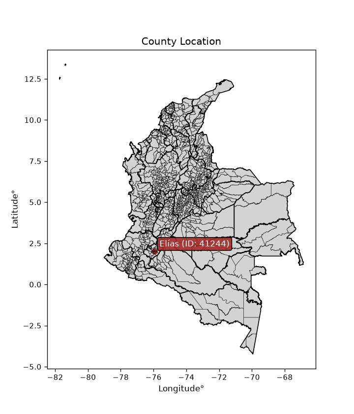
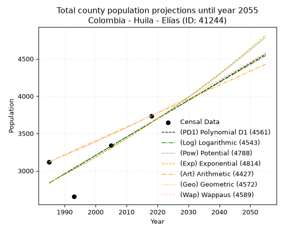
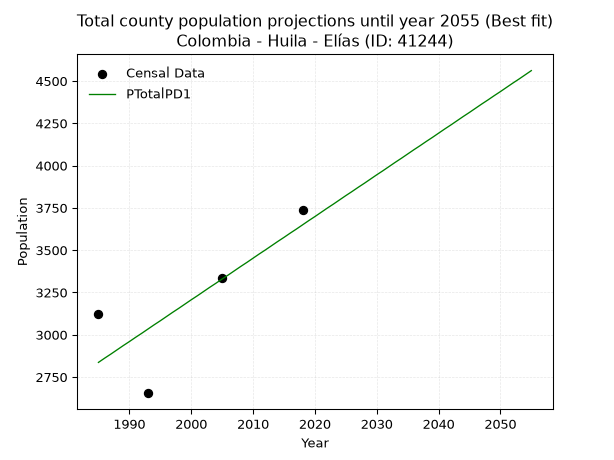
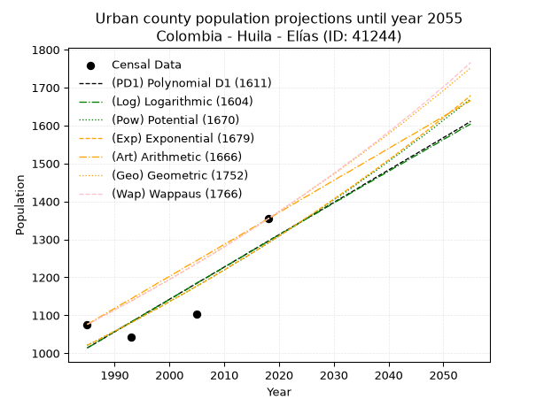
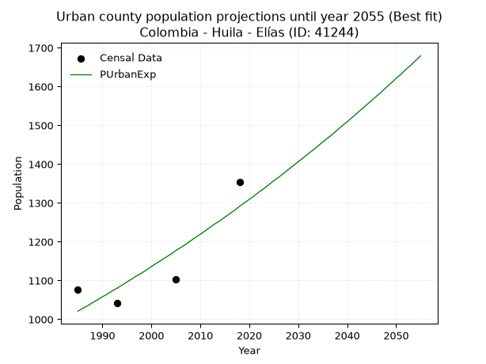
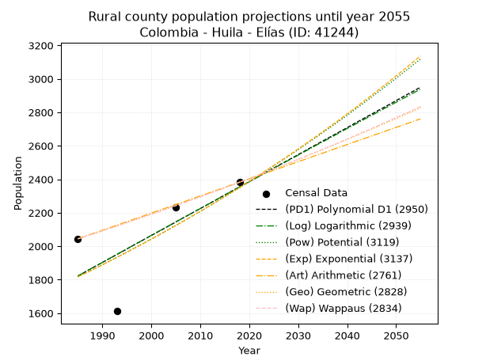
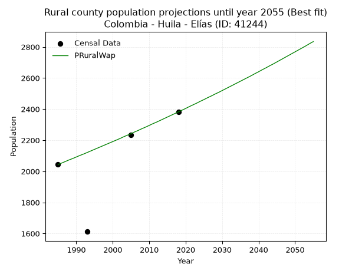

<div align="center">


</div>

# _“Population and Public Services Demand Projections (PPSD) until Year 2050 for Colombia - Huila - Elías (ID: 41244)”_
Keywords: `population` `public-service` `projection` `lineal` `polynomial` `logarithmic` `potential` `exponential` `arithmetic` `geometric` `wappaus` `dane` `colombia` `south-america`

PPSD are analytical estimates used by governments and planners to anticipate future changes in population size, age distribution, and the resulting community needs for utilities, healthcare, education, and infrastructure as sizing future water treatment facilities, electrical grids, and road networks based on spatial growth.

<div align="center">

</img>

</div>


> **General running parameters**: • app_version: _v20260806_. • Python version: _3.14.7_. • Pandas version: _3.0.5_. • NumPy version: _2.5.1_. • Creates, save and include plots into reports (create_plot): _False_. • Projection until year: _2050_. • Process polynomial degree 2 and up: _False_. • Process Wappaus: _True_. • Process Wappaus: _True_. • Set negative values to zero: _True_. • Set infinite values to zero: _True_. • Drop dataset notes: _True_. 
<div align="center">

Dynamic map: [:earth_americas:Google](http://maps.google.com/maps?q=2.012853534,-75.9383006) [:earth_americas:OSM](https://www.openstreetmap.org/#map=18/2.012853534/-75.9383006&layers=P) [:earth_americas:Bing](https://www.bing.com/maps?cp=2.012853534~-75.9383006&lvl=18) [:earth_americas:Apple](https://maps.apple.com/frame?center=2.012853534%2C-75.9383006&span=0.003%2C0.006)

</div>


<div align="center">

```geojson
{
  "type": "Feature",
  "geometry": {
    "type": "Point", 
    "coordinates": [-75.9383006, 2.012853534]
  }, 
  "properties": {
    "Name": "Colombia - Huila - Elías (ID: 41244)"
  }
}
```

</div>


## 0. Census Data (4 records)

Census data are official statistics collected by a government about the people and housing in a country. They usually include counts of total population, age, sex, race, income, education, and jobs.

📅Global census file: [Population.xlsx](../data/Population.xlsx)

| Source   |   Year |   CountryID | CountryName   |   StateID | StateName   |   CountyID | CountyName   |   PTotal |   PUrban |   PRural |
|:---------|-------:|------------:|:--------------|----------:|:------------|-----------:|:-------------|---------:|---------:|---------:|
| DANE     |   1985 |          57 | Colombia      |        41 | Huila       |      41244 | Elías        |     3120 |     1076 |     2044 |
| DANE     |   1993 |          57 | Colombia      |        41 | Huila       |      41244 | Elías        |     2654 |     1042 |     1612 |
| DANE     |   2005 |          57 | Colombia      |        41 | Huila       |      41244 | Elías        |     3337 |     1103 |     2234 |
| DANE     |   2018 |          57 | Colombia      |        41 | Huila       |      41244 | Elías        |     3736 |     1354 |     2382 |

> 🔥Some records could had specific notes about the registered values or the corresponding urban or rural distribution.

📅[SUI-RUPS](https://www.datos.gov.co/Hacienda-y-Cr-dito-P-blico/Registro-nico-de-Prestadores-de-Servicios-P-blicos/4qkq-csdn/about_data) - Local public utility companies: [RUPS.csv](../data/RUPS.xlsx)

 | SERVICIO       | ESTADO    | NOMBRE                                                            | NIT         | DEPARTAMENTO_DOMICILIO   | MUNICIPIO_DOMICILIO   | DIRECCION          |   TELEFONO | EMAIL                          | TIPO_PRESTADOR                 | CLASIFICACION                 |
|:---------------|:----------|:------------------------------------------------------------------|:------------|:-------------------------|:----------------------|:-------------------|-----------:|:-------------------------------|:-------------------------------|:------------------------------|
| ACUEDUCTO      | OPERATIVA | ALCALDIA MUNICIPAL DE ELIAS                                       | 891180132-8 | HUILA                    | ELIAS                 | CARRERA 5 # 2 - 08 |    8305543 | contactenos@elias-huila.gov.co | MUNICIPIO (PRESTACIÓN DIRECTA) | MENOR O IGUAL A 2500 USUARIOS |
| ALCANTARILLADO | OPERATIVA | ALCALDIA MUNICIPAL DE ELIAS                                       | 891180132-8 | HUILA                    | ELIAS                 | CARRERA 5 # 2 - 08 |    8305543 | contactenos@elias-huila.gov.co | MUNICIPIO (PRESTACIÓN DIRECTA) | MENOR O IGUAL A 2500 USUARIOS |
| ACUEDUCTO      | OPERATIVA | JUNTA ADMINISTRADORA ACUEDUCTO VEREDA PROGRESO MUNICIPIO DE ELIAS | 900357932-7 | HUILA                    | ELIAS                 | Vda El Progreso    |    8305643 | climaco1355@hotmail.com        | ORGANIZACION AUTORIZADA        | HASTA 2500 SUSCRIPTORES       |

## 1. Total

### 1.1. Coefficients and Parameters

* (PD1) Polynomial Deg 1: 24.637896427137406, -46070.2023283816 (lineal)
* (Log) Logarithmic: 49256.37812472914, -371186.3748419085
* (Pow) Potential: 15.05717632623967, -46.20142629978034
* (Exp) Exponential: 0.007531790641970433, 0.0009132857125508806
* (Art) Arithmetic: Year diff. 2018 - 1985 = 33, Population diff. 3736 - 3120 = 616, Annual growth = 18.666666666666668
* (Geo) Geometric: Year diff. 2018 - 1985 = 33, Population diff. 3736 - 3120 = 616, Annual growth % = 0.005475009703026057
* (Wap) Wappaus: i = 0.544535200311163, Condition values only valid for < 200)

<sub>
Wappaus condition values: ['0.00', '0.54', '1.09', '1.63', '2.18', '2.72', '3.27', '3.81', '4.36', '4.90', '5.45', '5.99', '6.53', '7.08', '7.62', '8.17', '8.71', '9.26', '9.80', '10.35', '10.89', '11.44', '11.98', '12.52', '13.07', '13.61', '14.16', '14.70', '15.25', '15.79', '16.34', '16.88', '17.43', '17.97', '18.51', '19.06', '19.60', '20.15', '20.69', '21.24', '21.78', '22.33', '22.87', '23.42', '23.96', '24.50', '25.05', '25.59', '26.14', '26.68', '27.23', '27.77', '28.32', '28.86', '29.40', '29.95', '30.49', '31.04', '31.58', '32.13', '32.67', '33.22', '33.76', '34.31', '34.85', '35.39']
</sub>


### 1.2. Projected Dataset

|   Year |   CountyID |   PTotalPD1 |   PTotalLog |   PTotalPow |   PTotalExp |   PTotalArt |   PTotalGeo |   PTotalWap |
|-------:|-----------:|------------:|------------:|------------:|------------:|------------:|------------:|------------:|
|   1985 |      41244 |        2836 |        2836 |        2841 |        2842 |        3120 |        3120 |        3120 |
|   1986 |      41244 |        2861 |        2861 |        2863 |        2863 |        3139 |        3137 |        3137 |
|   1987 |      41244 |        2885 |        2885 |        2885 |        2885 |        3157 |        3154 |        3154 |
|   1988 |      41244 |        2910 |        2910 |        2907 |        2907 |        3176 |        3172 |        3171 |
|   1989 |      41244 |        2935 |        2935 |        2929 |        2929 |        3195 |        3189 |        3189 |
|   1990 |      41244 |        2959 |        2960 |        2951 |        2951 |        3213 |        3206 |        3206 |
|   1991 |      41244 |        2984 |        2984 |        2974 |        2973 |        3232 |        3224 |        3224 |
|   1992 |      41244 |        3008 |        3009 |        2996 |        2995 |        3251 |        3242 |        3241 |
|   1993 |      41244 |        3033 |        3034 |        3019 |        3018 |        3269 |        3259 |        3259 |
|   1994 |      41244 |        3058 |        3059 |        3042 |        3041 |        3288 |        3277 |        3277 |
|   1995 |      41244 |        3082 |        3083 |        3065 |        3064 |        3307 |        3295 |        3295 |
|   1996 |      41244 |        3107 |        3108 |        3088 |        3087 |        3325 |        3313 |        3313 |
|   1997 |      41244 |        3132 |        3133 |        3111 |        3110 |        3344 |        3331 |        3331 |
|   1998 |      41244 |        3156 |        3157 |        3135 |        3134 |        3363 |        3350 |        3349 |
|   1999 |      41244 |        3181 |        3182 |        3159 |        3158 |        3381 |        3368 |        3367 |
|   2000 |      41244 |        3206 |        3207 |        3182 |        3182 |        3400 |        3386 |        3386 |
|   2001 |      41244 |        3230 |        3231 |        3207 |        3206 |        3419 |        3405 |        3404 |
|   2002 |      41244 |        3255 |        3256 |        3231 |        3230 |        3437 |        3423 |        3423 |
|   2003 |      41244 |        3280 |        3280 |        3255 |        3254 |        3456 |        3442 |        3442 |
|   2004 |      41244 |        3304 |        3305 |        3280 |        3279 |        3475 |        3461 |        3460 |
|   2005 |      41244 |        3329 |        3330 |        3304 |        3304 |        3493 |        3480 |        3479 |
|   2006 |      41244 |        3353 |        3354 |        3329 |        3329 |        3512 |        3499 |        3498 |
|   2007 |      41244 |        3378 |        3379 |        3354 |        3354 |        3531 |        3518 |        3518 |
|   2008 |      41244 |        3403 |        3403 |        3380 |        3379 |        3549 |        3537 |        3537 |
|   2009 |      41244 |        3427 |        3428 |        3405 |        3405 |        3568 |        3557 |        3556 |
|   2010 |      41244 |        3452 |        3452 |        3431 |        3430 |        3587 |        3576 |        3576 |
|   2011 |      41244 |        3477 |        3477 |        3456 |        3456 |        3605 |        3596 |        3595 |
|   2012 |      41244 |        3501 |        3501 |        3482 |        3482 |        3624 |        3616 |        3615 |
|   2013 |      41244 |        3526 |        3526 |        3509 |        3509 |        3643 |        3635 |        3635 |
|   2014 |      41244 |        3551 |        3550 |        3535 |        3535 |        3661 |        3655 |        3655 |
|   2015 |      41244 |        3575 |        3575 |        3561 |        3562 |        3680 |        3675 |        3675 |
|   2016 |      41244 |        3600 |        3599 |        3588 |        3589 |        3699 |        3695 |        3695 |
|   2017 |      41244 |        3624 |        3623 |        3615 |        3616 |        3717 |        3716 |        3716 |
|   2018 |      41244 |        3649 |        3648 |        3642 |        3643 |        3736 |        3736 |        3736 |
|   2019 |      41244 |        3674 |        3672 |        3669 |        3671 |        3755 |        3756 |        3757 |
|   2020 |      41244 |        3698 |        3697 |        3697 |        3699 |        3773 |        3777 |        3777 |
|   2021 |      41244 |        3723 |        3721 |        3725 |        3727 |        3792 |        3798 |        3798 |
|   2022 |      41244 |        3748 |        3745 |        3752 |        3755 |        3811 |        3818 |        3819 |
|   2023 |      41244 |        3772 |        3770 |        3780 |        3783 |        3829 |        3839 |        3840 |
|   2024 |      41244 |        3797 |        3794 |        3809 |        3812 |        3848 |        3860 |        3861 |
|   2025 |      41244 |        3822 |        3818 |        3837 |        3841 |        3867 |        3882 |        3883 |
|   2026 |      41244 |        3846 |        3843 |        3866 |        3870 |        3885 |        3903 |        3904 |
|   2027 |      41244 |        3871 |        3867 |        3895 |        3899 |        3904 |        3924 |        3926 |
|   2028 |      41244 |        3895 |        3891 |        3924 |        3928 |        3923 |        3946 |        3947 |
|   2029 |      41244 |        3920 |        3916 |        3953 |        3958 |        3941 |        3967 |        3969 |
|   2030 |      41244 |        3945 |        3940 |        3982 |        3988 |        3960 |        3989 |        3991 |
|   2031 |      41244 |        3969 |        3964 |        4012 |        4018 |        3979 |        4011 |        4013 |
|   2032 |      41244 |        3994 |        3988 |        4042 |        4049 |        3997 |        4033 |        4036 |
|   2033 |      41244 |        4019 |        4013 |        4072 |        4079 |        4016 |        4055 |        4058 |
|   2034 |      41244 |        4043 |        4037 |        4102 |        4110 |        4035 |        4077 |        4081 |
|   2035 |      41244 |        4068 |        4061 |        4132 |        4141 |        4053 |        4099 |        4103 |
|   2036 |      41244 |        4093 |        4085 |        4163 |        4172 |        4072 |        4122 |        4126 |
|   2037 |      41244 |        4117 |        4109 |        4194 |        4204 |        4091 |        4144 |        4149 |
|   2038 |      41244 |        4142 |        4134 |        4225 |        4236 |        4109 |        4167 |        4172 |
|   2039 |      41244 |        4166 |        4158 |        4256 |        4268 |        4128 |        4190 |        4196 |
|   2040 |      41244 |        4191 |        4182 |        4288 |        4300 |        4147 |        4213 |        4219 |
|   2041 |      41244 |        4216 |        4206 |        4320 |        4333 |        4165 |        4236 |        4243 |
|   2042 |      41244 |        4240 |        4230 |        4352 |        4365 |        4184 |        4259 |        4266 |
|   2043 |      41244 |        4265 |        4254 |        4384 |        4398 |        4203 |        4282 |        4290 |
|   2044 |      41244 |        4290 |        4278 |        4416 |        4432 |        4221 |        4306 |        4314 |
|   2045 |      41244 |        4314 |        4303 |        4449 |        4465 |        4240 |        4329 |        4338 |
|   2046 |      41244 |        4339 |        4327 |        4482 |        4499 |        4259 |        4353 |        4363 |
|   2047 |      41244 |        4364 |        4351 |        4515 |        4533 |        4277 |        4377 |        4387 |
|   2048 |      41244 |        4388 |        4375 |        4548 |        4567 |        4296 |        4401 |        4412 |
|   2049 |      41244 |        4413 |        4399 |        4582 |        4602 |        4315 |        4425 |        4437 |
|   2050 |      41244 |        4437 |        4423 |        4616 |        4636 |        4333 |        4449 |        4462 |
<div align="center">

</img>

</div>


### 1.3. Best fit with absolute and relative error (%)

Relative error puts that difference into context by dividing the absolute error by the true value, creating a unitless ratio or percentage that shows the scale of the mistake.

Absolute and relative error

|   Year | Source   |   CountryID | CountryName   |   StateID | StateName   |   CountyID_x | CountyName   |   PTotal |   PUrban |   PRural |   CountyID_y |   PTotalPD1 |   PTotalLog |   PTotalPow |   PTotalExp |   PTotalArt |   PTotalGeo |   PTotalWap |   PTotalPD1AbsError |   PTotalLogAbsError |   PTotalPowAbsError |   PTotalExpAbsError |   PTotalArtAbsError |   PTotalGeoAbsError |   PTotalWapAbsError |   PTotalPD1RelError |   PTotalLogRelError |   PTotalPowRelError |   PTotalExpRelError |   PTotalArtRelError |   PTotalGeoRelError |   PTotalWapRelError |
|-------:|:---------|------------:|:--------------|----------:|:------------|-------------:|:-------------|---------:|---------:|---------:|-------------:|------------:|------------:|------------:|------------:|------------:|------------:|------------:|--------------------:|--------------------:|--------------------:|--------------------:|--------------------:|--------------------:|--------------------:|--------------------:|--------------------:|--------------------:|--------------------:|--------------------:|--------------------:|--------------------:|
|   1985 | DANE     |          57 | Colombia      |        41 | Huila       |        41244 | Elías        |     3120 |     1076 |     2044 |        41244 |        2836 |        2836 |        2841 |        2842 |        3120 |        3120 |        3120 |                 284 |                 284 |                 279 |                 278 |                   0 |                   0 |                   0 |            9.10256  |            9.10256  |            8.94231  |            8.91026  |             0       |             0       |             0       |
|   1993 | DANE     |          57 | Colombia      |        41 | Huila       |        41244 | Elías        |     2654 |     1042 |     1612 |        41244 |        3033 |        3034 |        3019 |        3018 |        3269 |        3259 |        3259 |                 379 |                 380 |                 365 |                 364 |                 615 |                 605 |                 605 |           14.2803   |           14.318    |           13.7528   |           13.7151   |            23.1726  |            22.7958  |            22.7958  |
|   2005 | DANE     |          57 | Colombia      |        41 | Huila       |        41244 | Elías        |     3337 |     1103 |     2234 |        41244 |        3329 |        3330 |        3304 |        3304 |        3493 |        3480 |        3479 |                   8 |                   7 |                  33 |                  33 |                 156 |                 143 |                 142 |            0.239736 |            0.209769 |            0.988912 |            0.988912 |             4.67486 |             4.28529 |             4.25532 |
|   2018 | DANE     |          57 | Colombia      |        41 | Huila       |        41244 | Elías        |     3736 |     1354 |     2382 |        41244 |        3649 |        3648 |        3642 |        3643 |        3736 |        3736 |        3736 |                  87 |                  88 |                  94 |                  93 |                   0 |                   0 |                   0 |            2.32869  |            2.35546  |            2.51606  |            2.48929  |             0       |             0       |             0       |

Relative error mean

| Method    |   RelError | Best   |
|:----------|-----------:|:-------|
| PTotalPD1 |    6.48783 | True   |
| PTotalLog |    6.49645 |        |
| PTotalPow |    6.55003 |        |
| PTotalExp |    6.5259  |        |
| PTotalArt |    6.96186 |        |
| PTotalGeo |    6.77027 |        |
| PTotalWap |    6.76277 |        |

💙Best method: _**PTotalPD1**_
<div align="center">

</img>

</div>


### 1.4. Fresh water supply demand in liters per capita per day (lpcd)

The fresh water supply demand typically ranges from 100 to 300 liters per capita per day (lpcd) for standard domestic and municipal planning, though absolute survival minimums set by the World Health Organization are as low as 7.5 to 20 liters per day, and total consumption in high-income nations can exceed 400 liters.

> `CZ`: Level in meters above the sea level (masl)<br> `WS`: Fresh water supply demand in liters per capita per day (lpcd or l/h/d)<br> `WSAll`: Zonal fresh water supply demand in liters per second (l/s)<br> `A`: Zonal area in square meters<br> `DP`: Population density (people/hectare or p/ha)

Reference values (RAS Colombia)

|    CZ |   WS |
|------:|-----:|
|  1000 |  120 |
|  2000 |  130 |
| 99999 |  140 |

County shapefile geometry properties and water supply values

|   CountyID |      ATotal |   CZTotal |   WSTotal |
|-----------:|------------:|----------:|----------:|
|      41244 | 8.04418e+07 |   1252.47 |       130 |

Projected values for best method: PTotalPD1

|   CountyID |   Year |   PTotalPD1 |   DPTotal |   WSTotal |   WSTotalAll |
|-----------:|-------:|------------:|----------:|----------:|-------------:|
|      41244 |   1985 |        2836 |      0.35 |       130 |      4.26713 |
|      41244 |   1986 |        2861 |      0.36 |       130 |      4.30475 |
|      41244 |   1987 |        2885 |      0.36 |       130 |      4.34086 |
|      41244 |   1988 |        2910 |      0.36 |       130 |      4.37847 |
|      41244 |   1989 |        2935 |      0.36 |       130 |      4.41609 |
|      41244 |   1990 |        2959 |      0.37 |       130 |      4.4522  |
|      41244 |   1991 |        2984 |      0.37 |       130 |      4.48981 |
|      41244 |   1992 |        3008 |      0.37 |       130 |      4.52593 |
|      41244 |   1993 |        3033 |      0.38 |       130 |      4.56354 |
|      41244 |   1994 |        3058 |      0.38 |       130 |      4.60116 |
|      41244 |   1995 |        3082 |      0.38 |       130 |      4.63727 |
|      41244 |   1996 |        3107 |      0.39 |       130 |      4.67488 |
|      41244 |   1997 |        3132 |      0.39 |       130 |      4.7125  |
|      41244 |   1998 |        3156 |      0.39 |       130 |      4.74861 |
|      41244 |   1999 |        3181 |      0.4  |       130 |      4.78623 |
|      41244 |   2000 |        3206 |      0.4  |       130 |      4.82384 |
|      41244 |   2001 |        3230 |      0.4  |       130 |      4.85995 |
|      41244 |   2002 |        3255 |      0.4  |       130 |      4.89757 |
|      41244 |   2003 |        3280 |      0.41 |       130 |      4.93519 |
|      41244 |   2004 |        3304 |      0.41 |       130 |      4.9713  |
|      41244 |   2005 |        3329 |      0.41 |       130 |      5.00891 |
|      41244 |   2006 |        3353 |      0.42 |       130 |      5.04502 |
|      41244 |   2007 |        3378 |      0.42 |       130 |      5.08264 |
|      41244 |   2008 |        3403 |      0.42 |       130 |      5.12025 |
|      41244 |   2009 |        3427 |      0.43 |       130 |      5.15637 |
|      41244 |   2010 |        3452 |      0.43 |       130 |      5.19398 |
|      41244 |   2011 |        3477 |      0.43 |       130 |      5.2316  |
|      41244 |   2012 |        3501 |      0.44 |       130 |      5.26771 |
|      41244 |   2013 |        3526 |      0.44 |       130 |      5.30532 |
|      41244 |   2014 |        3551 |      0.44 |       130 |      5.34294 |
|      41244 |   2015 |        3575 |      0.44 |       130 |      5.37905 |
|      41244 |   2016 |        3600 |      0.45 |       130 |      5.41667 |
|      41244 |   2017 |        3624 |      0.45 |       130 |      5.45278 |
|      41244 |   2018 |        3649 |      0.45 |       130 |      5.49039 |
|      41244 |   2019 |        3674 |      0.46 |       130 |      5.52801 |
|      41244 |   2020 |        3698 |      0.46 |       130 |      5.56412 |
|      41244 |   2021 |        3723 |      0.46 |       130 |      5.60174 |
|      41244 |   2022 |        3748 |      0.47 |       130 |      5.63935 |
|      41244 |   2023 |        3772 |      0.47 |       130 |      5.67546 |
|      41244 |   2024 |        3797 |      0.47 |       130 |      5.71308 |
|      41244 |   2025 |        3822 |      0.48 |       130 |      5.75069 |
|      41244 |   2026 |        3846 |      0.48 |       130 |      5.78681 |
|      41244 |   2027 |        3871 |      0.48 |       130 |      5.82442 |
|      41244 |   2028 |        3895 |      0.48 |       130 |      5.86053 |
|      41244 |   2029 |        3920 |      0.49 |       130 |      5.89815 |
|      41244 |   2030 |        3945 |      0.49 |       130 |      5.93576 |
|      41244 |   2031 |        3969 |      0.49 |       130 |      5.97187 |
|      41244 |   2032 |        3994 |      0.5  |       130 |      6.00949 |
|      41244 |   2033 |        4019 |      0.5  |       130 |      6.04711 |
|      41244 |   2034 |        4043 |      0.5  |       130 |      6.08322 |
|      41244 |   2035 |        4068 |      0.51 |       130 |      6.12083 |
|      41244 |   2036 |        4093 |      0.51 |       130 |      6.15845 |
|      41244 |   2037 |        4117 |      0.51 |       130 |      6.19456 |
|      41244 |   2038 |        4142 |      0.51 |       130 |      6.23218 |
|      41244 |   2039 |        4166 |      0.52 |       130 |      6.26829 |
|      41244 |   2040 |        4191 |      0.52 |       130 |      6.3059  |
|      41244 |   2041 |        4216 |      0.52 |       130 |      6.34352 |
|      41244 |   2042 |        4240 |      0.53 |       130 |      6.37963 |
|      41244 |   2043 |        4265 |      0.53 |       130 |      6.41725 |
|      41244 |   2044 |        4290 |      0.53 |       130 |      6.45486 |
|      41244 |   2045 |        4314 |      0.54 |       130 |      6.49097 |
|      41244 |   2046 |        4339 |      0.54 |       130 |      6.52859 |
|      41244 |   2047 |        4364 |      0.54 |       130 |      6.5662  |
|      41244 |   2048 |        4388 |      0.55 |       130 |      6.60231 |
|      41244 |   2049 |        4413 |      0.55 |       130 |      6.63993 |
|      41244 |   2050 |        4437 |      0.55 |       130 |      6.67604 |

## 2. Urban

### 2.1. Coefficients and Parameters

* (PD1) Polynomial Deg 1: 8.525491770373193, -15909.364913688982 (lineal)
* (Log) Logarithmic: 17041.42563277389, -128388.26279612891
* (Pow) Potential: 14.21842755256869, -43.880139094483106
* (Exp) Exponential: 0.007113099932249027, 0.0007530713875001634
* (Art) Arithmetic: Year diff. 2018 - 1985 = 33, Population diff. 1354 - 1076 = 278, Annual growth = 8.424242424242424
* (Geo) Geometric: Year diff. 2018 - 1985 = 33, Population diff. 1354 - 1076 = 278, Annual growth % = 0.0069883267847679065
* (Wap) Wappaus: i = 0.6933532859458785, Condition values only valid for < 200)

<sub>
Wappaus condition values: ['0.00', '0.69', '1.39', '2.08', '2.77', '3.47', '4.16', '4.85', '5.55', '6.24', '6.93', '7.63', '8.32', '9.01', '9.71', '10.40', '11.09', '11.79', '12.48', '13.17', '13.87', '14.56', '15.25', '15.95', '16.64', '17.33', '18.03', '18.72', '19.41', '20.11', '20.80', '21.49', '22.19', '22.88', '23.57', '24.27', '24.96', '25.65', '26.35', '27.04', '27.73', '28.43', '29.12', '29.81', '30.51', '31.20', '31.89', '32.59', '33.28', '33.97', '34.67', '35.36', '36.05', '36.75', '37.44', '38.13', '38.83', '39.52', '40.21', '40.91', '41.60', '42.29', '42.99', '43.68', '44.37', '45.07']
</sub>


### 2.2. Projected Dataset

|   Year |   CountyID |   PUrbanPD1 |   PUrbanLog |   PUrbanPow |   PUrbanExp |   PUrbanArt |   PUrbanGeo |   PUrbanWap |
|-------:|-----------:|------------:|------------:|------------:|------------:|------------:|------------:|------------:|
|   1985 |      41244 |        1014 |        1014 |        1021 |        1021 |        1076 |        1076 |        1076 |
|   1986 |      41244 |        1022 |        1022 |        1028 |        1028 |        1084 |        1084 |        1083 |
|   1987 |      41244 |        1031 |        1031 |        1035 |        1035 |        1093 |        1091 |        1091 |
|   1988 |      41244 |        1039 |        1039 |        1043 |        1043 |        1101 |        1099 |        1099 |
|   1989 |      41244 |        1048 |        1048 |        1050 |        1050 |        1110 |        1106 |        1106 |
|   1990 |      41244 |        1056 |        1057 |        1058 |        1058 |        1118 |        1114 |        1114 |
|   1991 |      41244 |        1065 |        1065 |        1065 |        1065 |        1127 |        1122 |        1122 |
|   1992 |      41244 |        1073 |        1074 |        1073 |        1073 |        1135 |        1130 |        1130 |
|   1993 |      41244 |        1082 |        1082 |        1081 |        1080 |        1143 |        1138 |        1137 |
|   1994 |      41244 |        1090 |        1091 |        1088 |        1088 |        1152 |        1146 |        1145 |
|   1995 |      41244 |        1099 |        1099 |        1096 |        1096 |        1160 |        1154 |        1153 |
|   1996 |      41244 |        1108 |        1108 |        1104 |        1104 |        1169 |        1162 |        1161 |
|   1997 |      41244 |        1116 |        1116 |        1112 |        1112 |        1177 |        1170 |        1169 |
|   1998 |      41244 |        1125 |        1125 |        1120 |        1119 |        1186 |        1178 |        1178 |
|   1999 |      41244 |        1133 |        1133 |        1128 |        1127 |        1194 |        1186 |        1186 |
|   2000 |      41244 |        1142 |        1142 |        1136 |        1136 |        1202 |        1194 |        1194 |
|   2001 |      41244 |        1150 |        1150 |        1144 |        1144 |        1211 |        1203 |        1202 |
|   2002 |      41244 |        1159 |        1159 |        1152 |        1152 |        1219 |        1211 |        1211 |
|   2003 |      41244 |        1167 |        1167 |        1160 |        1160 |        1228 |        1220 |        1219 |
|   2004 |      41244 |        1176 |        1176 |        1169 |        1168 |        1236 |        1228 |        1228 |
|   2005 |      41244 |        1184 |        1185 |        1177 |        1177 |        1244 |        1237 |        1236 |
|   2006 |      41244 |        1193 |        1193 |        1185 |        1185 |        1253 |        1245 |        1245 |
|   2007 |      41244 |        1201 |        1201 |        1194 |        1193 |        1261 |        1254 |        1254 |
|   2008 |      41244 |        1210 |        1210 |        1202 |        1202 |        1270 |        1263 |        1262 |
|   2009 |      41244 |        1218 |        1218 |        1211 |        1211 |        1278 |        1272 |        1271 |
|   2010 |      41244 |        1227 |        1227 |        1219 |        1219 |        1287 |        1281 |        1280 |
|   2011 |      41244 |        1235 |        1235 |        1228 |        1228 |        1295 |        1290 |        1289 |
|   2012 |      41244 |        1244 |        1244 |        1237 |        1237 |        1303 |        1299 |        1298 |
|   2013 |      41244 |        1252 |        1252 |        1245 |        1246 |        1312 |        1308 |        1307 |
|   2014 |      41244 |        1261 |        1261 |        1254 |        1254 |        1320 |        1317 |        1317 |
|   2015 |      41244 |        1270 |        1269 |        1263 |        1263 |        1329 |        1326 |        1326 |
|   2016 |      41244 |        1278 |        1278 |        1272 |        1272 |        1337 |        1335 |        1335 |
|   2017 |      41244 |        1287 |        1286 |        1281 |        1281 |        1346 |        1345 |        1345 |
|   2018 |      41244 |        1295 |        1295 |        1290 |        1291 |        1354 |        1354 |        1354 |
|   2019 |      41244 |        1304 |        1303 |        1299 |        1300 |        1362 |        1363 |        1364 |
|   2020 |      41244 |        1312 |        1312 |        1308 |        1309 |        1371 |        1373 |        1373 |
|   2021 |      41244 |        1321 |        1320 |        1318 |        1318 |        1379 |        1383 |        1383 |
|   2022 |      41244 |        1329 |        1328 |        1327 |        1328 |        1388 |        1392 |        1393 |
|   2023 |      41244 |        1338 |        1337 |        1336 |        1337 |        1396 |        1402 |        1403 |
|   2024 |      41244 |        1346 |        1345 |        1346 |        1347 |        1405 |        1412 |        1412 |
|   2025 |      41244 |        1355 |        1354 |        1355 |        1357 |        1413 |        1422 |        1422 |
|   2026 |      41244 |        1363 |        1362 |        1365 |        1366 |        1421 |        1432 |        1433 |
|   2027 |      41244 |        1372 |        1370 |        1374 |        1376 |        1430 |        1442 |        1443 |
|   2028 |      41244 |        1380 |        1379 |        1384 |        1386 |        1438 |        1452 |        1453 |
|   2029 |      41244 |        1389 |        1387 |        1394 |        1396 |        1447 |        1462 |        1463 |
|   2030 |      41244 |        1397 |        1396 |        1404 |        1406 |        1455 |        1472 |        1474 |
|   2031 |      41244 |        1406 |        1404 |        1413 |        1416 |        1464 |        1482 |        1484 |
|   2032 |      41244 |        1414 |        1412 |        1423 |        1426 |        1472 |        1493 |        1495 |
|   2033 |      41244 |        1423 |        1421 |        1433 |        1436 |        1480 |        1503 |        1506 |
|   2034 |      41244 |        1431 |        1429 |        1443 |        1446 |        1489 |        1514 |        1516 |
|   2035 |      41244 |        1440 |        1438 |        1454 |        1457 |        1497 |        1524 |        1527 |
|   2036 |      41244 |        1449 |        1446 |        1464 |        1467 |        1506 |        1535 |        1538 |
|   2037 |      41244 |        1457 |        1454 |        1474 |        1477 |        1514 |        1546 |        1549 |
|   2038 |      41244 |        1466 |        1463 |        1484 |        1488 |        1522 |        1556 |        1560 |
|   2039 |      41244 |        1474 |        1471 |        1495 |        1499 |        1531 |        1567 |        1572 |
|   2040 |      41244 |        1483 |        1479 |        1505 |        1509 |        1539 |        1578 |        1583 |
|   2041 |      41244 |        1491 |        1488 |        1516 |        1520 |        1548 |        1589 |        1594 |
|   2042 |      41244 |        1500 |        1496 |        1526 |        1531 |        1556 |        1600 |        1606 |
|   2043 |      41244 |        1508 |        1504 |        1537 |        1542 |        1565 |        1611 |        1618 |
|   2044 |      41244 |        1517 |        1513 |        1548 |        1553 |        1573 |        1623 |        1629 |
|   2045 |      41244 |        1525 |        1521 |        1559 |        1564 |        1581 |        1634 |        1641 |
|   2046 |      41244 |        1534 |        1529 |        1569 |        1575 |        1590 |        1646 |        1653 |
|   2047 |      41244 |        1542 |        1538 |        1580 |        1586 |        1598 |        1657 |        1665 |
|   2048 |      41244 |        1551 |        1546 |        1591 |        1598 |        1607 |        1669 |        1677 |
|   2049 |      41244 |        1559 |        1554 |        1602 |        1609 |        1615 |        1680 |        1690 |
|   2050 |      41244 |        1568 |        1563 |        1614 |        1621 |        1624 |        1692 |        1702 |
<div align="center">

</img>

</div>


### 2.3. Best fit with absolute and relative error (%)

Relative error puts that difference into context by dividing the absolute error by the true value, creating a unitless ratio or percentage that shows the scale of the mistake.

Absolute and relative error

|   Year | Source   |   CountryID | CountryName   |   StateID | StateName   |   CountyID_x | CountyName   |   PTotal |   PUrban |   PRural |   CountyID_y |   PUrbanPD1 |   PUrbanLog |   PUrbanPow |   PUrbanExp |   PUrbanArt |   PUrbanGeo |   PUrbanWap |   PUrbanPD1AbsError |   PUrbanLogAbsError |   PUrbanPowAbsError |   PUrbanExpAbsError |   PUrbanArtAbsError |   PUrbanGeoAbsError |   PUrbanWapAbsError |   PUrbanPD1RelError |   PUrbanLogRelError |   PUrbanPowRelError |   PUrbanExpRelError |   PUrbanArtRelError |   PUrbanGeoRelError |   PUrbanWapRelError |
|-------:|:---------|------------:|:--------------|----------:|:------------|-------------:|:-------------|---------:|---------:|---------:|-------------:|------------:|------------:|------------:|------------:|------------:|------------:|------------:|--------------------:|--------------------:|--------------------:|--------------------:|--------------------:|--------------------:|--------------------:|--------------------:|--------------------:|--------------------:|--------------------:|--------------------:|--------------------:|--------------------:|
|   1985 | DANE     |          57 | Colombia      |        41 | Huila       |        41244 | Elías        |     3120 |     1076 |     2044 |        41244 |        1014 |        1014 |        1021 |        1021 |        1076 |        1076 |        1076 |                  62 |                  62 |                  55 |                  55 |                   0 |                   0 |                   0 |             5.76208 |             5.76208 |             5.11152 |             5.11152 |              0      |             0       |             0       |
|   1993 | DANE     |          57 | Colombia      |        41 | Huila       |        41244 | Elías        |     2654 |     1042 |     1612 |        41244 |        1082 |        1082 |        1081 |        1080 |        1143 |        1138 |        1137 |                  40 |                  40 |                  39 |                  38 |                 101 |                  96 |                  95 |             3.83877 |             3.83877 |             3.7428  |             3.64683 |              9.6929 |             9.21305 |             9.11708 |
|   2005 | DANE     |          57 | Colombia      |        41 | Huila       |        41244 | Elías        |     3337 |     1103 |     2234 |        41244 |        1184 |        1185 |        1177 |        1177 |        1244 |        1237 |        1236 |                  81 |                  82 |                  74 |                  74 |                 141 |                 134 |                 133 |             7.34361 |             7.43427 |             6.70898 |             6.70898 |             12.7833 |            12.1487  |            12.058   |
|   2018 | DANE     |          57 | Colombia      |        41 | Huila       |        41244 | Elías        |     3736 |     1354 |     2382 |        41244 |        1295 |        1295 |        1290 |        1291 |        1354 |        1354 |        1354 |                  59 |                  59 |                  64 |                  63 |                   0 |                   0 |                   0 |             4.35746 |             4.35746 |             4.72674 |             4.65288 |              0      |             0       |             0       |

Relative error mean

| Method    |   RelError | Best   |
|:----------|-----------:|:-------|
| PUrbanPD1 |    5.32548 |        |
| PUrbanLog |    5.34815 |        |
| PUrbanPow |    5.07251 |        |
| PUrbanExp |    5.03005 | True   |
| PUrbanArt |    5.61905 |        |
| PUrbanGeo |    5.34043 |        |
| PUrbanWap |    5.29378 |        |

💙Best method: _**PUrbanExp**_
<div align="center">

</img>

</div>


### 2.4. Fresh water supply demand in liters per capita per day (lpcd)

The fresh water supply demand typically ranges from 100 to 300 liters per capita per day (lpcd) for standard domestic and municipal planning, though absolute survival minimums set by the World Health Organization are as low as 7.5 to 20 liters per day, and total consumption in high-income nations can exceed 400 liters.

> `CZ`: Level in meters above the sea level (masl)<br> `WS`: Fresh water supply demand in liters per capita per day (lpcd or l/h/d)<br> `WSAll`: Zonal fresh water supply demand in liters per second (l/s)<br> `A`: Zonal area in square meters<br> `DP`: Population density (people/hectare or p/ha)

Reference values (RAS Colombia)

|    CZ |   WS |
|------:|-----:|
|  1000 |  120 |
|  2000 |  130 |
| 99999 |  140 |

County shapefile geometry properties and water supply values

|   CountyID |   AUrban |   CZUrban |   WSUrban |
|-----------:|---------:|----------:|----------:|
|      41244 |   629687 |   1295.38 |       130 |

Projected values for best method: PUrbanExp

|   CountyID |   Year |   PUrbanExp |   DPUrban |   WSUrban |   WSUrbanAll |
|-----------:|-------:|------------:|----------:|----------:|-------------:|
|      41244 |   1985 |        1021 |     16.21 |       130 |      1.53623 |
|      41244 |   1986 |        1028 |     16.33 |       130 |      1.54676 |
|      41244 |   1987 |        1035 |     16.44 |       130 |      1.55729 |
|      41244 |   1988 |        1043 |     16.56 |       130 |      1.56933 |
|      41244 |   1989 |        1050 |     16.67 |       130 |      1.57986 |
|      41244 |   1990 |        1058 |     16.8  |       130 |      1.5919  |
|      41244 |   1991 |        1065 |     16.91 |       130 |      1.60243 |
|      41244 |   1992 |        1073 |     17.04 |       130 |      1.61447 |
|      41244 |   1993 |        1080 |     17.15 |       130 |      1.625   |
|      41244 |   1994 |        1088 |     17.28 |       130 |      1.63704 |
|      41244 |   1995 |        1096 |     17.41 |       130 |      1.64907 |
|      41244 |   1996 |        1104 |     17.53 |       130 |      1.66111 |
|      41244 |   1997 |        1112 |     17.66 |       130 |      1.67315 |
|      41244 |   1998 |        1119 |     17.77 |       130 |      1.68368 |
|      41244 |   1999 |        1127 |     17.9  |       130 |      1.69572 |
|      41244 |   2000 |        1136 |     18.04 |       130 |      1.70926 |
|      41244 |   2001 |        1144 |     18.17 |       130 |      1.7213  |
|      41244 |   2002 |        1152 |     18.29 |       130 |      1.73333 |
|      41244 |   2003 |        1160 |     18.42 |       130 |      1.74537 |
|      41244 |   2004 |        1168 |     18.55 |       130 |      1.75741 |
|      41244 |   2005 |        1177 |     18.69 |       130 |      1.77095 |
|      41244 |   2006 |        1185 |     18.82 |       130 |      1.78299 |
|      41244 |   2007 |        1193 |     18.95 |       130 |      1.79502 |
|      41244 |   2008 |        1202 |     19.09 |       130 |      1.80856 |
|      41244 |   2009 |        1211 |     19.23 |       130 |      1.82211 |
|      41244 |   2010 |        1219 |     19.36 |       130 |      1.83414 |
|      41244 |   2011 |        1228 |     19.5  |       130 |      1.84769 |
|      41244 |   2012 |        1237 |     19.64 |       130 |      1.86123 |
|      41244 |   2013 |        1246 |     19.79 |       130 |      1.87477 |
|      41244 |   2014 |        1254 |     19.91 |       130 |      1.88681 |
|      41244 |   2015 |        1263 |     20.06 |       130 |      1.90035 |
|      41244 |   2016 |        1272 |     20.2  |       130 |      1.91389 |
|      41244 |   2017 |        1281 |     20.34 |       130 |      1.92743 |
|      41244 |   2018 |        1291 |     20.5  |       130 |      1.94248 |
|      41244 |   2019 |        1300 |     20.65 |       130 |      1.95602 |
|      41244 |   2020 |        1309 |     20.79 |       130 |      1.96956 |
|      41244 |   2021 |        1318 |     20.93 |       130 |      1.9831  |
|      41244 |   2022 |        1328 |     21.09 |       130 |      1.99815 |
|      41244 |   2023 |        1337 |     21.23 |       130 |      2.01169 |
|      41244 |   2024 |        1347 |     21.39 |       130 |      2.02674 |
|      41244 |   2025 |        1357 |     21.55 |       130 |      2.04178 |
|      41244 |   2026 |        1366 |     21.69 |       130 |      2.05532 |
|      41244 |   2027 |        1376 |     21.85 |       130 |      2.07037 |
|      41244 |   2028 |        1386 |     22.01 |       130 |      2.08542 |
|      41244 |   2029 |        1396 |     22.17 |       130 |      2.10046 |
|      41244 |   2030 |        1406 |     22.33 |       130 |      2.11551 |
|      41244 |   2031 |        1416 |     22.49 |       130 |      2.13056 |
|      41244 |   2032 |        1426 |     22.65 |       130 |      2.1456  |
|      41244 |   2033 |        1436 |     22.8  |       130 |      2.16065 |
|      41244 |   2034 |        1446 |     22.96 |       130 |      2.17569 |
|      41244 |   2035 |        1457 |     23.14 |       130 |      2.19225 |
|      41244 |   2036 |        1467 |     23.3  |       130 |      2.20729 |
|      41244 |   2037 |        1477 |     23.46 |       130 |      2.22234 |
|      41244 |   2038 |        1488 |     23.63 |       130 |      2.23889 |
|      41244 |   2039 |        1499 |     23.81 |       130 |      2.25544 |
|      41244 |   2040 |        1509 |     23.96 |       130 |      2.27049 |
|      41244 |   2041 |        1520 |     24.14 |       130 |      2.28704 |
|      41244 |   2042 |        1531 |     24.31 |       130 |      2.30359 |
|      41244 |   2043 |        1542 |     24.49 |       130 |      2.32014 |
|      41244 |   2044 |        1553 |     24.66 |       130 |      2.33669 |
|      41244 |   2045 |        1564 |     24.84 |       130 |      2.35324 |
|      41244 |   2046 |        1575 |     25.01 |       130 |      2.36979 |
|      41244 |   2047 |        1586 |     25.19 |       130 |      2.38634 |
|      41244 |   2048 |        1598 |     25.38 |       130 |      2.4044  |
|      41244 |   2049 |        1609 |     25.55 |       130 |      2.42095 |
|      41244 |   2050 |        1621 |     25.74 |       130 |      2.439   |

## 3. Rural

### 3.1. Coefficients and Parameters

* (PD1) Polynomial Deg 1: 16.112404656764216, -30160.83741469263 (lineal)
* (Log) Logarithmic: 32214.95249195529, -242798.11204577988
* (Pow) Potential: 15.601805005553496, -48.19177380626526
* (Exp) Exponential: 0.007803946630777245, 0.00034017194512615204
* (Art) Arithmetic: Year diff. 2018 - 1985 = 33, Population diff. 2382 - 2044 = 338, Annual growth = 10.242424242424242
* (Geo) Geometric: Year diff. 2018 - 1985 = 33, Population diff. 2382 - 2044 = 338, Annual growth % = 0.004648096272058311
* (Wap) Wappaus: i = 0.46282983472319217, Condition values only valid for < 200)

<sub>
Wappaus condition values: ['0.00', '0.46', '0.93', '1.39', '1.85', '2.31', '2.78', '3.24', '3.70', '4.17', '4.63', '5.09', '5.55', '6.02', '6.48', '6.94', '7.41', '7.87', '8.33', '8.79', '9.26', '9.72', '10.18', '10.65', '11.11', '11.57', '12.03', '12.50', '12.96', '13.42', '13.88', '14.35', '14.81', '15.27', '15.74', '16.20', '16.66', '17.12', '17.59', '18.05', '18.51', '18.98', '19.44', '19.90', '20.36', '20.83', '21.29', '21.75', '22.22', '22.68', '23.14', '23.60', '24.07', '24.53', '24.99', '25.46', '25.92', '26.38', '26.84', '27.31', '27.77', '28.23', '28.70', '29.16', '29.62', '30.08']
</sub>


### 3.2. Projected Dataset

|   Year |   CountyID |   PRuralPD1 |   PRuralLog |   PRuralPow |   PRuralExp |   PRuralArt |   PRuralGeo |   PRuralWap |
|-------:|-----------:|------------:|------------:|------------:|------------:|------------:|------------:|------------:|
|   1985 |      41244 |        1822 |        1822 |        1817 |        1817 |        2044 |        2044 |        2044 |
|   1986 |      41244 |        1838 |        1838 |        1831 |        1831 |        2054 |        2054 |        2053 |
|   1987 |      41244 |        1855 |        1855 |        1845 |        1845 |        2064 |        2063 |        2063 |
|   1988 |      41244 |        1871 |        1871 |        1860 |        1860 |        2075 |        2073 |        2073 |
|   1989 |      41244 |        1887 |        1887 |        1874 |        1874 |        2085 |        2082 |        2082 |
|   1990 |      41244 |        1903 |        1903 |        1889 |        1889 |        2095 |        2092 |        2092 |
|   1991 |      41244 |        1919 |        1919 |        1904 |        1904 |        2105 |        2102 |        2102 |
|   1992 |      41244 |        1935 |        1935 |        1919 |        1919 |        2116 |        2111 |        2111 |
|   1993 |      41244 |        1951 |        1952 |        1934 |        1934 |        2126 |        2121 |        2121 |
|   1994 |      41244 |        1967 |        1968 |        1949 |        1949 |        2136 |        2131 |        2131 |
|   1995 |      41244 |        1983 |        1984 |        1965 |        1964 |        2146 |        2141 |        2141 |
|   1996 |      41244 |        2000 |        2000 |        1980 |        1980 |        2157 |        2151 |        2151 |
|   1997 |      41244 |        2016 |        2016 |        1996 |        1995 |        2167 |        2161 |        2161 |
|   1998 |      41244 |        2032 |        2032 |        2011 |        2011 |        2177 |        2171 |        2171 |
|   1999 |      41244 |        2048 |        2048 |        2027 |        2026 |        2187 |        2181 |        2181 |
|   2000 |      41244 |        2064 |        2065 |        2043 |        2042 |        2198 |        2191 |        2191 |
|   2001 |      41244 |        2080 |        2081 |        2059 |        2058 |        2208 |        2201 |        2201 |
|   2002 |      41244 |        2096 |        2097 |        2075 |        2074 |        2218 |        2212 |        2211 |
|   2003 |      41244 |        2112 |        2113 |        2091 |        2091 |        2228 |        2222 |        2222 |
|   2004 |      41244 |        2128 |        2129 |        2108 |        2107 |        2239 |        2232 |        2232 |
|   2005 |      41244 |        2145 |        2145 |        2124 |        2124 |        2249 |        2243 |        2242 |
|   2006 |      41244 |        2161 |        2161 |        2141 |        2140 |        2259 |        2253 |        2253 |
|   2007 |      41244 |        2177 |        2177 |        2157 |        2157 |        2269 |        2264 |        2263 |
|   2008 |      41244 |        2193 |        2193 |        2174 |        2174 |        2280 |        2274 |        2274 |
|   2009 |      41244 |        2209 |        2209 |        2191 |        2191 |        2290 |        2285 |        2284 |
|   2010 |      41244 |        2225 |        2225 |        2208 |        2208 |        2300 |        2295 |        2295 |
|   2011 |      41244 |        2241 |        2241 |        2225 |        2225 |        2310 |        2306 |        2306 |
|   2012 |      41244 |        2257 |        2257 |        2243 |        2243 |        2321 |        2317 |        2316 |
|   2013 |      41244 |        2273 |        2273 |        2260 |        2260 |        2331 |        2327 |        2327 |
|   2014 |      41244 |        2290 |        2289 |        2278 |        2278 |        2341 |        2338 |        2338 |
|   2015 |      41244 |        2306 |        2305 |        2296 |        2296 |        2351 |        2349 |        2349 |
|   2016 |      41244 |        2322 |        2321 |        2313 |        2314 |        2362 |        2360 |        2360 |
|   2017 |      41244 |        2338 |        2337 |        2331 |        2332 |        2372 |        2371 |        2371 |
|   2018 |      41244 |        2354 |        2353 |        2349 |        2350 |        2382 |        2382 |        2382 |
|   2019 |      41244 |        2370 |        2369 |        2368 |        2369 |        2392 |        2393 |        2393 |
|   2020 |      41244 |        2386 |        2385 |        2386 |        2387 |        2402 |        2404 |        2404 |
|   2021 |      41244 |        2402 |        2401 |        2405 |        2406 |        2413 |        2415 |        2416 |
|   2022 |      41244 |        2418 |        2417 |        2423 |        2425 |        2423 |        2427 |        2427 |
|   2023 |      41244 |        2435 |        2433 |        2442 |        2444 |        2433 |        2438 |        2438 |
|   2024 |      41244 |        2451 |        2449 |        2461 |        2463 |        2443 |        2449 |        2450 |
|   2025 |      41244 |        2467 |        2465 |        2480 |        2482 |        2454 |        2461 |        2461 |
|   2026 |      41244 |        2483 |        2481 |        2499 |        2502 |        2464 |        2472 |        2473 |
|   2027 |      41244 |        2499 |        2497 |        2518 |        2521 |        2474 |        2484 |        2484 |
|   2028 |      41244 |        2515 |        2512 |        2538 |        2541 |        2484 |        2495 |        2496 |
|   2029 |      41244 |        2531 |        2528 |        2557 |        2561 |        2495 |        2507 |        2507 |
|   2030 |      41244 |        2547 |        2544 |        2577 |        2581 |        2505 |        2518 |        2519 |
|   2031 |      41244 |        2563 |        2560 |        2597 |        2601 |        2515 |        2530 |        2531 |
|   2032 |      41244 |        2580 |        2576 |        2617 |        2622 |        2525 |        2542 |        2543 |
|   2033 |      41244 |        2596 |        2592 |        2637 |        2642 |        2536 |        2554 |        2555 |
|   2034 |      41244 |        2612 |        2608 |        2657 |        2663 |        2546 |        2565 |        2567 |
|   2035 |      41244 |        2628 |        2623 |        2678 |        2684 |        2556 |        2577 |        2579 |
|   2036 |      41244 |        2644 |        2639 |        2699 |        2705 |        2566 |        2589 |        2591 |
|   2037 |      41244 |        2660 |        2655 |        2719 |        2726 |        2577 |        2601 |        2603 |
|   2038 |      41244 |        2676 |        2671 |        2740 |        2747 |        2587 |        2613 |        2615 |
|   2039 |      41244 |        2692 |        2687 |        2761 |        2769 |        2597 |        2626 |        2628 |
|   2040 |      41244 |        2708 |        2703 |        2782 |        2791 |        2607 |        2638 |        2640 |
|   2041 |      41244 |        2725 |        2718 |        2804 |        2812 |        2618 |        2650 |        2653 |
|   2042 |      41244 |        2741 |        2734 |        2825 |        2834 |        2628 |        2662 |        2665 |
|   2043 |      41244 |        2757 |        2750 |        2847 |        2857 |        2638 |        2675 |        2678 |
|   2044 |      41244 |        2773 |        2766 |        2869 |        2879 |        2648 |        2687 |        2690 |
|   2045 |      41244 |        2789 |        2781 |        2891 |        2902 |        2659 |        2700 |        2703 |
|   2046 |      41244 |        2805 |        2797 |        2913 |        2924 |        2669 |        2712 |        2716 |
|   2047 |      41244 |        2821 |        2813 |        2935 |        2947 |        2679 |        2725 |        2729 |
|   2048 |      41244 |        2837 |        2829 |        2958 |        2970 |        2689 |        2738 |        2742 |
|   2049 |      41244 |        2853 |        2844 |        2980 |        2994 |        2700 |        2750 |        2755 |
|   2050 |      41244 |        2870 |        2860 |        3003 |        3017 |        2710 |        2763 |        2768 |
<div align="center">

</img>

</div>


### 3.3. Best fit with absolute and relative error (%)

Relative error puts that difference into context by dividing the absolute error by the true value, creating a unitless ratio or percentage that shows the scale of the mistake.

Absolute and relative error

|   Year | Source   |   CountryID | CountryName   |   StateID | StateName   |   CountyID_x | CountyName   |   PTotal |   PUrban |   PRural |   CountyID_y |   PRuralPD1 |   PRuralLog |   PRuralPow |   PRuralExp |   PRuralArt |   PRuralGeo |   PRuralWap |   PRuralPD1AbsError |   PRuralLogAbsError |   PRuralPowAbsError |   PRuralExpAbsError |   PRuralArtAbsError |   PRuralGeoAbsError |   PRuralWapAbsError |   PRuralPD1RelError |   PRuralLogRelError |   PRuralPowRelError |   PRuralExpRelError |   PRuralArtRelError |   PRuralGeoRelError |   PRuralWapRelError |
|-------:|:---------|------------:|:--------------|----------:|:------------|-------------:|:-------------|---------:|---------:|---------:|-------------:|------------:|------------:|------------:|------------:|------------:|------------:|------------:|--------------------:|--------------------:|--------------------:|--------------------:|--------------------:|--------------------:|--------------------:|--------------------:|--------------------:|--------------------:|--------------------:|--------------------:|--------------------:|--------------------:|
|   1985 | DANE     |          57 | Colombia      |        41 | Huila       |        41244 | Elías        |     3120 |     1076 |     2044 |        41244 |        1822 |        1822 |        1817 |        1817 |        2044 |        2044 |        2044 |                 222 |                 222 |                 227 |                 227 |                   0 |                   0 |                   0 |            10.8611  |            10.8611  |            11.1057  |            11.1057  |            0        |            0        |            0        |
|   1993 | DANE     |          57 | Colombia      |        41 | Huila       |        41244 | Elías        |     2654 |     1042 |     1612 |        41244 |        1951 |        1952 |        1934 |        1934 |        2126 |        2121 |        2121 |                 339 |                 340 |                 322 |                 322 |                 514 |                 509 |                 509 |            21.0298  |            21.0918  |            19.9752  |            19.9752  |           31.8859   |           31.5757   |           31.5757   |
|   2005 | DANE     |          57 | Colombia      |        41 | Huila       |        41244 | Elías        |     3337 |     1103 |     2234 |        41244 |        2145 |        2145 |        2124 |        2124 |        2249 |        2243 |        2242 |                  89 |                  89 |                 110 |                 110 |                  15 |                   9 |                   8 |             3.98389 |             3.98389 |             4.9239  |             4.9239  |            0.671441 |            0.402865 |            0.358102 |
|   2018 | DANE     |          57 | Colombia      |        41 | Huila       |        41244 | Elías        |     3736 |     1354 |     2382 |        41244 |        2354 |        2353 |        2349 |        2350 |        2382 |        2382 |        2382 |                  28 |                  29 |                  33 |                  32 |                   0 |                   0 |                   0 |             1.17548 |             1.21746 |             1.38539 |             1.34341 |            0        |            0        |            0        |

Relative error mean

| Method    |   RelError | Best   |
|:----------|-----------:|:-------|
| PRuralPD1 |    9.26255 |        |
| PRuralLog |    9.28855 |        |
| PRuralPow |    9.34754 |        |
| PRuralExp |    9.33704 |        |
| PRuralArt |    8.13932 |        |
| PRuralGeo |    7.99464 |        |
| PRuralWap |    7.98345 | True   |

💙Best method: _**PRuralWap**_
<div align="center">

</img>

</div>


### 3.4. Fresh water supply demand in liters per capita per day (lpcd)

The fresh water supply demand typically ranges from 100 to 300 liters per capita per day (lpcd) for standard domestic and municipal planning, though absolute survival minimums set by the World Health Organization are as low as 7.5 to 20 liters per day, and total consumption in high-income nations can exceed 400 liters.

> `CZ`: Level in meters above the sea level (masl)<br> `WS`: Fresh water supply demand in liters per capita per day (lpcd or l/h/d)<br> `WSAll`: Zonal fresh water supply demand in liters per second (l/s)<br> `A`: Zonal area in square meters<br> `DP`: Population density (people/hectare or p/ha)

Reference values (RAS Colombia)

|    CZ |   WS |
|------:|-----:|
|  1000 |  120 |
|  2000 |  130 |
| 99999 |  140 |

County shapefile geometry properties and water supply values

|   CountyID |      ARural |   CZRural |   WSRural |
|-----------:|------------:|----------:|----------:|
|      41244 | 7.98121e+07 |   1252.14 |       130 |

Projected values for best method: PRuralWap

|   CountyID |   Year |   PRuralWap |   DPRural |   WSRural |   WSRuralAll |
|-----------:|-------:|------------:|----------:|----------:|-------------:|
|      41244 |   1985 |        2044 |      0.26 |       130 |      3.07546 |
|      41244 |   1986 |        2053 |      0.26 |       130 |      3.089   |
|      41244 |   1987 |        2063 |      0.26 |       130 |      3.10405 |
|      41244 |   1988 |        2073 |      0.26 |       130 |      3.1191  |
|      41244 |   1989 |        2082 |      0.26 |       130 |      3.13264 |
|      41244 |   1990 |        2092 |      0.26 |       130 |      3.14769 |
|      41244 |   1991 |        2102 |      0.26 |       130 |      3.16273 |
|      41244 |   1992 |        2111 |      0.26 |       130 |      3.17627 |
|      41244 |   1993 |        2121 |      0.27 |       130 |      3.19132 |
|      41244 |   1994 |        2131 |      0.27 |       130 |      3.20637 |
|      41244 |   1995 |        2141 |      0.27 |       130 |      3.22141 |
|      41244 |   1996 |        2151 |      0.27 |       130 |      3.23646 |
|      41244 |   1997 |        2161 |      0.27 |       130 |      3.2515  |
|      41244 |   1998 |        2171 |      0.27 |       130 |      3.26655 |
|      41244 |   1999 |        2181 |      0.27 |       130 |      3.2816  |
|      41244 |   2000 |        2191 |      0.27 |       130 |      3.29664 |
|      41244 |   2001 |        2201 |      0.28 |       130 |      3.31169 |
|      41244 |   2002 |        2211 |      0.28 |       130 |      3.32674 |
|      41244 |   2003 |        2222 |      0.28 |       130 |      3.34329 |
|      41244 |   2004 |        2232 |      0.28 |       130 |      3.35833 |
|      41244 |   2005 |        2242 |      0.28 |       130 |      3.37338 |
|      41244 |   2006 |        2253 |      0.28 |       130 |      3.38993 |
|      41244 |   2007 |        2263 |      0.28 |       130 |      3.40498 |
|      41244 |   2008 |        2274 |      0.28 |       130 |      3.42153 |
|      41244 |   2009 |        2284 |      0.29 |       130 |      3.43657 |
|      41244 |   2010 |        2295 |      0.29 |       130 |      3.45312 |
|      41244 |   2011 |        2306 |      0.29 |       130 |      3.46968 |
|      41244 |   2012 |        2316 |      0.29 |       130 |      3.48472 |
|      41244 |   2013 |        2327 |      0.29 |       130 |      3.50127 |
|      41244 |   2014 |        2338 |      0.29 |       130 |      3.51782 |
|      41244 |   2015 |        2349 |      0.29 |       130 |      3.53437 |
|      41244 |   2016 |        2360 |      0.3  |       130 |      3.55093 |
|      41244 |   2017 |        2371 |      0.3  |       130 |      3.56748 |
|      41244 |   2018 |        2382 |      0.3  |       130 |      3.58403 |
|      41244 |   2019 |        2393 |      0.3  |       130 |      3.60058 |
|      41244 |   2020 |        2404 |      0.3  |       130 |      3.61713 |
|      41244 |   2021 |        2416 |      0.3  |       130 |      3.63519 |
|      41244 |   2022 |        2427 |      0.3  |       130 |      3.65174 |
|      41244 |   2023 |        2438 |      0.31 |       130 |      3.66829 |
|      41244 |   2024 |        2450 |      0.31 |       130 |      3.68634 |
|      41244 |   2025 |        2461 |      0.31 |       130 |      3.70289 |
|      41244 |   2026 |        2473 |      0.31 |       130 |      3.72095 |
|      41244 |   2027 |        2484 |      0.31 |       130 |      3.7375  |
|      41244 |   2028 |        2496 |      0.31 |       130 |      3.75556 |
|      41244 |   2029 |        2507 |      0.31 |       130 |      3.77211 |
|      41244 |   2030 |        2519 |      0.32 |       130 |      3.79016 |
|      41244 |   2031 |        2531 |      0.32 |       130 |      3.80822 |
|      41244 |   2032 |        2543 |      0.32 |       130 |      3.82627 |
|      41244 |   2033 |        2555 |      0.32 |       130 |      3.84433 |
|      41244 |   2034 |        2567 |      0.32 |       130 |      3.86238 |
|      41244 |   2035 |        2579 |      0.32 |       130 |      3.88044 |
|      41244 |   2036 |        2591 |      0.32 |       130 |      3.8985  |
|      41244 |   2037 |        2603 |      0.33 |       130 |      3.91655 |
|      41244 |   2038 |        2615 |      0.33 |       130 |      3.93461 |
|      41244 |   2039 |        2628 |      0.33 |       130 |      3.95417 |
|      41244 |   2040 |        2640 |      0.33 |       130 |      3.97222 |
|      41244 |   2041 |        2653 |      0.33 |       130 |      3.99178 |
|      41244 |   2042 |        2665 |      0.33 |       130 |      4.00984 |
|      41244 |   2043 |        2678 |      0.34 |       130 |      4.0294  |
|      41244 |   2044 |        2690 |      0.34 |       130 |      4.04745 |
|      41244 |   2045 |        2703 |      0.34 |       130 |      4.06701 |
|      41244 |   2046 |        2716 |      0.34 |       130 |      4.08657 |
|      41244 |   2047 |        2729 |      0.34 |       130 |      4.10613 |
|      41244 |   2048 |        2742 |      0.34 |       130 |      4.12569 |
|      41244 |   2049 |        2755 |      0.35 |       130 |      4.14525 |
|      41244 |   2050 |        2768 |      0.35 |       130 |      4.16481 |

<div align="center"><br><sub>Share this research</sub></div><br>

<sub>**APPS & TOOLS & CONTENT DISCLAIMER**: • NO WARRANTY - This content and software is provided by <a href="https://github.com/rcfdtools" target="_blank">github.com/rcfdtools</a> "as is", without any express or implied warranty, including warranties of merchantability, fitness for a particular purpose, or non-infringement. There is no guarantee that the software will be error-free or operate without interruption. • LIMITATION OF LIABILITY - Neither the authors nor copyright holders will be liable for claims or damages arising from the software or its use. You are responsible for determining if the software is appropriate for your use and assume all associated risks, including errors, legal compliance, and data loss. • NO PROFESSIONAL ADVICE - The software provides general information and does not offer professional advice. It should not replace consultation with professional advisors. [Clauses and global license for rcfdtools use.](https://github.com/rcfdtools/rcfdtools/blob/main/LICENSE.md)</sub>

| [:house: Home](Readme.md)  | [:beginner: Help / Collab](https://github.com/rcfdtools/R.HydroTools/discussions/31) |
|----------------------------|-------------------------------------------------------------------------------------------|