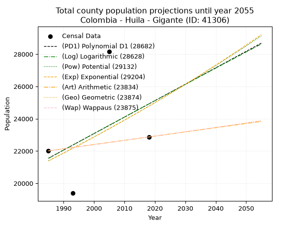
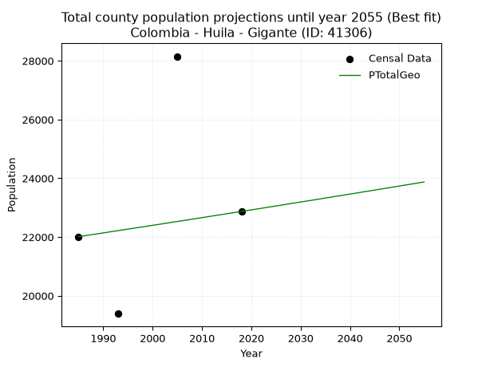
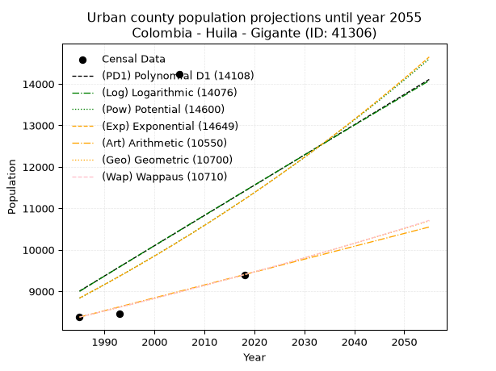
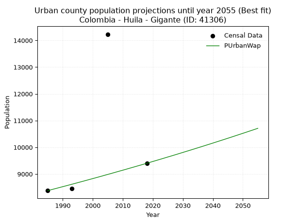
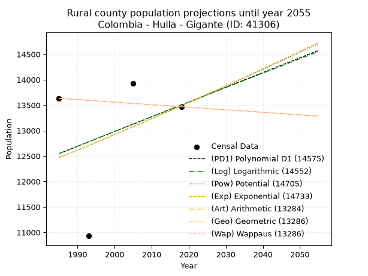
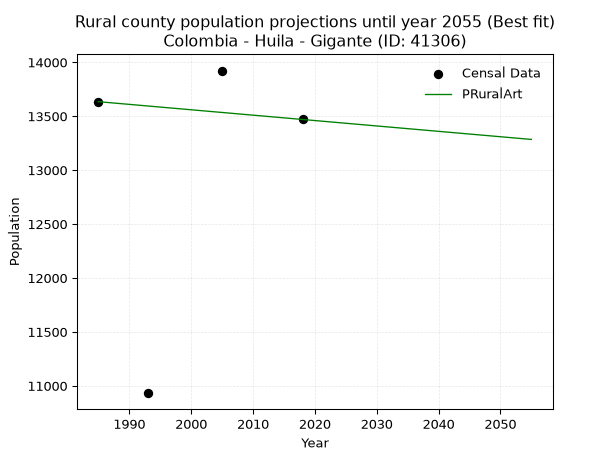

<div align="center">


</div>

# 📜 _“Population and Public Services Demand Projections (PPSD) until Year 2050 for Colombia - Huila - Gigante (ID: 41306)”_
Keywords: `population` `public-service` `projection` `lineal` `polynomial` `logarithmic` `potential` `exponential` `arithmetic` `geometric` `wappaus` `dane` `colombia` `south-america`

PPSD are analytical estimates used by governments and planners to anticipate future changes in population size, age distribution, and the resulting community needs for utilities, healthcare, education, and infrastructure as sizing future water treatment facilities, electrical grids, and road networks based on spatial growth.

<div align="center">

</img>

</div>


> **General running parameters**: • app_version: _v20260806_. • Python version: _3.14.7_. • Pandas version: _3.0.5_. • NumPy version: _2.5.1_. • Creates, save and include plots into reports (create_plot): _False_. • Projection until year: _2050_. • Process polynomial degree 2 and up: _False_. • Process Wappaus: _True_. • Process Wappaus: _True_. • Set negative values to zero: _True_. • Set infinite values to zero: _True_. • Drop dataset notes: _True_. 
<div align="center">

Dynamic map: [:earth_americas:Google](http://maps.google.com/maps?q=2.384031032,-75.5476808) [:earth_americas:OSM](https://www.openstreetmap.org/#map=18/2.384031032/-75.5476808&layers=P) [:earth_americas:Bing](https://www.bing.com/maps?cp=2.384031032~-75.5476808&lvl=18) [:earth_americas:Apple](https://maps.apple.com/frame?center=2.384031032%2C-75.5476808&span=0.003%2C0.006)

</div>


<div align="center">

```geojson
{
  "type": "Feature",
  "geometry": {
    "type": "Point", 
    "coordinates": [-75.5476808, 2.384031032]
  }, 
  "properties": {
    "Name": "Colombia - Huila - Gigante (ID: 41306)"
  }
}
```

</div>


## 0. Census Data (4 records)

Census data are official statistics collected by a government about the people and housing in a country. They usually include counts of total population, age, sex, race, income, education, and jobs.

📅Global census file: [Population.xlsx](../data/Population.xlsx)

| Source   |   Year |   CountryID | CountryName   |   StateID | StateName   |   CountyID | CountyName   |   PTotal |   PUrban |   PRural |
|:---------|-------:|------------:|:--------------|----------:|:------------|-----------:|:-------------|---------:|---------:|---------:|
| DANE     |   1985 |          57 | Colombia      |        41 | Huila       |      41306 | Gigante      |    22012 |     8378 |    13634 |
| DANE     |   1993 |          57 | Colombia      |        41 | Huila       |      41306 | Gigante      |    19389 |     8458 |    10931 |
| DANE     |   2005 |          57 | Colombia      |        41 | Huila       |      41306 | Gigante      |    28152 |    14230 |    13922 |
| DANE     |   2018 |          57 | Colombia      |        41 | Huila       |      41306 | Gigante      |    22871 |     9402 |    13469 |

> 🔥Some records could had specific notes about the registered values or the corresponding urban or rural distribution.

📅[SUI-RUPS](https://www.datos.gov.co/Hacienda-y-Cr-dito-P-blico/Registro-nico-de-Prestadores-de-Servicios-P-blicos/4qkq-csdn/about_data) - Local public utility companies: [RUPS.csv](../data/RUPS.xlsx)

 | SERVICIO       | ESTADO    | NOMBRE                                                                                              | NIT         | DEPARTAMENTO_DOMICILIO   | MUNICIPIO_DOMICILIO   | DIRECCION                                        |   TELEFONO | EMAIL                               | TIPO_PRESTADOR                             | CLASIFICACION                  |
|:---------------|:----------|:----------------------------------------------------------------------------------------------------|:------------|:-------------------------|:----------------------|:-------------------------------------------------|-----------:|:------------------------------------|:-------------------------------------------|:-------------------------------|
| ACUEDUCTO      | OPERATIVA | JUNTA ADMINISTRADORA DEL SERVICIO DEL ACUEDUCTO DE EL ALGARROBO Y CASCAJAL DEL MUNICIPIO DE GIGANTE | 813003116-9 | HUILA                    | GIGANTE               | Algarrobo y Cascajal                             |    8325685 | junadmalgarrobocascajal@hotmail.com | ORGANIZACION AUTORIZADA                    | HASTA 2500 SUSCRIPTORES        |
| ACUEDUCTO      | OPERATIVA | EMPRESAS DEL PUEBLO Y PARA EL PUEBLO DE GIGANTE - EMPUGIGANTE S.A. E.S.P.                           | 900256320-6 | HUILA                    | GIGANTE               | CALLE 4 No. 10-55                                |    8325447 | carlosandresrv@gmail.com            | SOCIEDADES (EMPRESA DE SERVICIOS PUBLICOS) | DESDE 2501 HASTA 5000 USUARIOS |
| ALCANTARILLADO | OPERATIVA | EMPRESAS DEL PUEBLO Y PARA EL PUEBLO DE GIGANTE - EMPUGIGANTE S.A. E.S.P.                           | 900256320-6 | HUILA                    | GIGANTE               | CALLE 4 No. 10-55                                |    8325447 | carlosandresrv@gmail.com            | SOCIEDADES (EMPRESA DE SERVICIOS PUBLICOS) | DESDE 2501 HASTA 5000 USUARIOS |
| ACUEDUCTO      | OPERATIVA | JUNTA ADMINISTRADORA ACUEDUCTO ALCANTARILLADO DE EL MESON NORTE                                     | 813005248-1 | HUILA                    | GIGANTE               | CENTRO POBLADO EL MESSON                         |    8325763 | CARLOSANDRESRV@GMAIL.COM            | ORGANIZACION AUTORIZADA                    | MENOR O IGUAL A 2500 USUARIOS  |
| ACUEDUCTO      | OPERATIVA | JUNTA ADMINISTRADORA DEL SERVICIO DEL ACUEDUCTO REGIONAL LA GRAN VIA                                | 813010198-1 | HUILA                    | GIGANTE               | PERSONERIA  MUNICIPAL DE GIGANTE                 |    8325122 | contactenos@gigante-huila.gov.co    | ORGANIZACION AUTORIZADA                    | HASTA 2500 SUSCRIPTORES        |
| ACUEDUCTO      | OPERATIVA | JUNTA ADMINISTRADORA DEL ACUEDUCTO DE LAS VEREDAS DE PUEBLO NUEVO EL TENDIDO Y EL RECREO            | 900358329-1 | HUILA                    | GIGANTE               | ESTACION DE SERVICIO LOS HALCONES KM 1 VIA NEIVA |    8325109 | EDS.HALCONESGIGANTE@HOTMAIL.COM     | ORGANIZACION AUTORIZADA                    | MENOR O IGUAL A 2500 USUARIOS  |

## 1. Total

### 1.1. Coefficients and Parameters

* (PD1) Polynomial Deg 1: 101.85307105580381, -180625.60537937155 (lineal)
* (Log) Logarithmic: 204342.9065953383, -1530106.0705324518
* (Pow) Potential: 8.914061036237577, -25.066239167105028
* (Exp) Exponential: 0.004444872076318763, 3.1513954507744297
* (Art) Arithmetic: Year diff. 2018 - 1985 = 33, Population diff. 22871 - 22012 = 859, Annual growth = 26.03030303030303
* (Geo) Geometric: Year diff. 2018 - 1985 = 33, Population diff. 22871 - 22012 = 859, Annual growth % = 0.0011607329261675847
* (Wap) Wappaus: i = 0.1159918144076957, Condition values only valid for < 200)

<sub>
Wappaus condition values: ['0.00', '0.12', '0.23', '0.35', '0.46', '0.58', '0.70', '0.81', '0.93', '1.04', '1.16', '1.28', '1.39', '1.51', '1.62', '1.74', '1.86', '1.97', '2.09', '2.20', '2.32', '2.44', '2.55', '2.67', '2.78', '2.90', '3.02', '3.13', '3.25', '3.36', '3.48', '3.60', '3.71', '3.83', '3.94', '4.06', '4.18', '4.29', '4.41', '4.52', '4.64', '4.76', '4.87', '4.99', '5.10', '5.22', '5.34', '5.45', '5.57', '5.68', '5.80', '5.92', '6.03', '6.15', '6.26', '6.38', '6.50', '6.61', '6.73', '6.84', '6.96', '7.08', '7.19', '7.31', '7.42', '7.54']
</sub>


### 1.2. Projected Dataset

|   Year |   CountyID |   PTotalPD1 |   PTotalLog |   PTotalPow |   PTotalExp |   PTotalArt |   PTotalGeo |   PTotalWap |
|-------:|-----------:|------------:|------------:|------------:|------------:|------------:|------------:|------------:|
|   1985 |      41306 |       21553 |       21546 |       21389 |       21395 |       22012 |       22012 |       22012 |
|   1986 |      41306 |       21655 |       21649 |       21486 |       21490 |       22038 |       22038 |       22038 |
|   1987 |      41306 |       21756 |       21752 |       21582 |       21586 |       22064 |       22063 |       22063 |
|   1988 |      41306 |       21858 |       21855 |       21679 |       21682 |       22090 |       22089 |       22089 |
|   1989 |      41306 |       21960 |       21957 |       21777 |       21779 |       22116 |       22114 |       22114 |
|   1990 |      41306 |       22062 |       22060 |       21875 |       21876 |       22142 |       22140 |       22140 |
|   1991 |      41306 |       22164 |       22163 |       21973 |       21973 |       22168 |       22166 |       22166 |
|   1992 |      41306 |       22266 |       22265 |       22071 |       22071 |       22194 |       22191 |       22191 |
|   1993 |      41306 |       22368 |       22368 |       22170 |       22170 |       22220 |       22217 |       22217 |
|   1994 |      41306 |       22469 |       22470 |       22270 |       22268 |       22246 |       22243 |       22243 |
|   1995 |      41306 |       22571 |       22573 |       22369 |       22368 |       22272 |       22269 |       22269 |
|   1996 |      41306 |       22673 |       22675 |       22469 |       22467 |       22298 |       22295 |       22295 |
|   1997 |      41306 |       22775 |       22778 |       22570 |       22567 |       22324 |       22321 |       22321 |
|   1998 |      41306 |       22877 |       22880 |       22671 |       22668 |       22350 |       22346 |       22346 |
|   1999 |      41306 |       22979 |       22982 |       22772 |       22769 |       22376 |       22372 |       22372 |
|   2000 |      41306 |       23081 |       23084 |       22874 |       22870 |       22402 |       22398 |       22398 |
|   2001 |      41306 |       23182 |       23187 |       22976 |       22972 |       22428 |       22424 |       22424 |
|   2002 |      41306 |       23284 |       23289 |       23079 |       23074 |       22455 |       22450 |       22450 |
|   2003 |      41306 |       23386 |       23391 |       23182 |       23177 |       22481 |       22476 |       22476 |
|   2004 |      41306 |       23488 |       23493 |       23285 |       23280 |       22507 |       22503 |       22503 |
|   2005 |      41306 |       23590 |       23595 |       23389 |       23384 |       22533 |       22529 |       22529 |
|   2006 |      41306 |       23692 |       23697 |       23493 |       23488 |       22559 |       22555 |       22555 |
|   2007 |      41306 |       23794 |       23798 |       23598 |       23593 |       22585 |       22581 |       22581 |
|   2008 |      41306 |       23895 |       23900 |       23703 |       23698 |       22611 |       22607 |       22607 |
|   2009 |      41306 |       23997 |       24002 |       23808 |       23804 |       22637 |       22633 |       22633 |
|   2010 |      41306 |       24099 |       24104 |       23914 |       23910 |       22663 |       22660 |       22660 |
|   2011 |      41306 |       24201 |       24205 |       24020 |       24016 |       22689 |       22686 |       22686 |
|   2012 |      41306 |       24303 |       24307 |       24127 |       24123 |       22715 |       22712 |       22712 |
|   2013 |      41306 |       24405 |       24408 |       24234 |       24231 |       22741 |       22739 |       22739 |
|   2014 |      41306 |       24506 |       24510 |       24342 |       24339 |       22767 |       22765 |       22765 |
|   2015 |      41306 |       24608 |       24611 |       24450 |       24447 |       22793 |       22792 |       22792 |
|   2016 |      41306 |       24710 |       24713 |       24558 |       24556 |       22819 |       22818 |       22818 |
|   2017 |      41306 |       24812 |       24814 |       24667 |       24665 |       22845 |       22844 |       22844 |
|   2018 |      41306 |       24914 |       24915 |       24776 |       24775 |       22871 |       22871 |       22871 |
|   2019 |      41306 |       25016 |       25017 |       24886 |       24886 |       22897 |       22898 |       22898 |
|   2020 |      41306 |       25118 |       25118 |       24996 |       24996 |       22923 |       22924 |       22924 |
|   2021 |      41306 |       25219 |       25219 |       25106 |       25108 |       22949 |       22951 |       22951 |
|   2022 |      41306 |       25321 |       25320 |       25217 |       25220 |       22975 |       22977 |       22977 |
|   2023 |      41306 |       25423 |       25421 |       25329 |       25332 |       23001 |       23004 |       23004 |
|   2024 |      41306 |       25525 |       25522 |       25440 |       25445 |       23027 |       23031 |       23031 |
|   2025 |      41306 |       25627 |       25623 |       25553 |       25558 |       23053 |       23057 |       23058 |
|   2026 |      41306 |       25729 |       25724 |       25665 |       25672 |       23079 |       23084 |       23084 |
|   2027 |      41306 |       25831 |       25825 |       25778 |       25786 |       23105 |       23111 |       23111 |
|   2028 |      41306 |       25932 |       25925 |       25892 |       25901 |       23131 |       23138 |       23138 |
|   2029 |      41306 |       26034 |       26026 |       26006 |       26017 |       23157 |       23165 |       23165 |
|   2030 |      41306 |       26136 |       26127 |       26121 |       26133 |       23183 |       23192 |       23192 |
|   2031 |      41306 |       26238 |       26227 |       26235 |       26249 |       23209 |       23219 |       23219 |
|   2032 |      41306 |       26340 |       26328 |       26351 |       26366 |       23235 |       23245 |       23246 |
|   2033 |      41306 |       26442 |       26429 |       26467 |       26483 |       23261 |       23272 |       23273 |
|   2034 |      41306 |       26544 |       26529 |       26583 |       26601 |       23287 |       23299 |       23300 |
|   2035 |      41306 |       26645 |       26630 |       26700 |       26720 |       23314 |       23327 |       23327 |
|   2036 |      41306 |       26747 |       26730 |       26817 |       26839 |       23340 |       23354 |       23354 |
|   2037 |      41306 |       26849 |       26830 |       26934 |       26958 |       23366 |       23381 |       23381 |
|   2038 |      41306 |       26951 |       26931 |       27053 |       27078 |       23392 |       23408 |       23408 |
|   2039 |      41306 |       27053 |       27031 |       27171 |       27199 |       23418 |       23435 |       23435 |
|   2040 |      41306 |       27155 |       27131 |       27290 |       27320 |       23444 |       23462 |       23463 |
|   2041 |      41306 |       27257 |       27231 |       27410 |       27442 |       23470 |       23489 |       23490 |
|   2042 |      41306 |       27358 |       27331 |       27530 |       27564 |       23496 |       23517 |       23517 |
|   2043 |      41306 |       27460 |       27431 |       27650 |       27687 |       23522 |       23544 |       23544 |
|   2044 |      41306 |       27562 |       27531 |       27771 |       27810 |       23548 |       23571 |       23572 |
|   2045 |      41306 |       27664 |       27631 |       27892 |       27934 |       23574 |       23599 |       23599 |
|   2046 |      41306 |       27766 |       27731 |       28014 |       28059 |       23600 |       23626 |       23627 |
|   2047 |      41306 |       27868 |       27831 |       28136 |       28184 |       23626 |       23654 |       23654 |
|   2048 |      41306 |       27969 |       27931 |       28259 |       28309 |       23652 |       23681 |       23682 |
|   2049 |      41306 |       28071 |       28030 |       28382 |       28435 |       23678 |       23708 |       23709 |
|   2050 |      41306 |       28173 |       28130 |       28506 |       28562 |       23704 |       23736 |       23737 |
<div align="center">

</img>

</div>


### 1.3. Best fit with absolute and relative error (%)

Relative error puts that difference into context by dividing the absolute error by the true value, creating a unitless ratio or percentage that shows the scale of the mistake.

Absolute and relative error

|   Year | Source   |   CountryID | CountryName   |   StateID | StateName   |   CountyID_x | CountyName   |   PTotal |   PUrban |   PRural |   CountyID_y |   PTotalPD1 |   PTotalLog |   PTotalPow |   PTotalExp |   PTotalArt |   PTotalGeo |   PTotalWap |   PTotalPD1AbsError |   PTotalLogAbsError |   PTotalPowAbsError |   PTotalExpAbsError |   PTotalArtAbsError |   PTotalGeoAbsError |   PTotalWapAbsError |   PTotalPD1RelError |   PTotalLogRelError |   PTotalPowRelError |   PTotalExpRelError |   PTotalArtRelError |   PTotalGeoRelError |   PTotalWapRelError |
|-------:|:---------|------------:|:--------------|----------:|:------------|-------------:|:-------------|---------:|---------:|---------:|-------------:|------------:|------------:|------------:|------------:|------------:|------------:|------------:|--------------------:|--------------------:|--------------------:|--------------------:|--------------------:|--------------------:|--------------------:|--------------------:|--------------------:|--------------------:|--------------------:|--------------------:|--------------------:|--------------------:|
|   1985 | DANE     |          57 | Colombia      |        41 | Huila       |        41306 | Gigante      |    22012 |     8378 |    13634 |        41306 |       21553 |       21546 |       21389 |       21395 |       22012 |       22012 |       22012 |                 459 |                 466 |                 623 |                 617 |                   0 |                   0 |                   0 |             2.08523 |             2.11703 |             2.83027 |             2.80302 |              0      |              0      |              0      |
|   1993 | DANE     |          57 | Colombia      |        41 | Huila       |        41306 | Gigante      |    19389 |     8458 |    10931 |        41306 |       22368 |       22368 |       22170 |       22170 |       22220 |       22217 |       22217 |                2979 |                2979 |                2781 |                2781 |                2831 |                2828 |                2828 |            15.3644  |            15.3644  |            14.3432  |            14.3432  |             14.6011 |             14.5856 |             14.5856 |
|   2005 | DANE     |          57 | Colombia      |        41 | Huila       |        41306 | Gigante      |    28152 |    14230 |    13922 |        41306 |       23590 |       23595 |       23389 |       23384 |       22533 |       22529 |       22529 |                4562 |                4557 |                4763 |                4768 |                5619 |                5623 |                5623 |            16.2049  |            16.1871  |            16.9189  |            16.9366  |             19.9595 |             19.9737 |             19.9737 |
|   2018 | DANE     |          57 | Colombia      |        41 | Huila       |        41306 | Gigante      |    22871 |     9402 |    13469 |        41306 |       24914 |       24915 |       24776 |       24775 |       22871 |       22871 |       22871 |                2043 |                2044 |                1905 |                1904 |                   0 |                   0 |                   0 |             8.93271 |             8.93708 |             8.32933 |             8.32495 |              0      |              0      |              0      |

Relative error mean

| Method    |   RelError | Best   |
|:----------|-----------:|:-------|
| PTotalPD1 |   10.6468  |        |
| PTotalLog |   10.6514  |        |
| PTotalPow |   10.6054  |        |
| PTotalExp |   10.6019  |        |
| PTotalArt |    8.64014 |        |
| PTotalGeo |    8.63983 | True   |
| PTotalWap |    8.63983 | True   |

💙Best method: _**PTotalGeo**_
<div align="center">

</img>

</div>


### 1.4. Fresh water supply demand in liters per capita per day (lpcd)

The fresh water supply demand typically ranges from 100 to 300 liters per capita per day (lpcd) for standard domestic and municipal planning, though absolute survival minimums set by the World Health Organization are as low as 7.5 to 20 liters per day, and total consumption in high-income nations can exceed 400 liters.

> `CZ`: Level in meters above the sea level (masl)<br> `WS`: Fresh water supply demand in liters per capita per day (lpcd or l/h/d)<br> `WSAll`: Zonal fresh water supply demand in liters per second (l/s)<br> `A`: Zonal area in square meters<br> `DP`: Population density (people/hectare or p/ha)

Reference values (RAS Colombia)

|    CZ |   WS |
|------:|-----:|
|  1000 |  120 |
|  2000 |  130 |
| 99999 |  140 |

County shapefile geometry properties and water supply values

|   CountyID |     ATotal |   CZTotal |   WSTotal |
|-----------:|-----------:|----------:|----------:|
|      41306 | 5.0352e+08 |   1359.66 |       130 |

Projected values for best method: PTotalGeo

|   CountyID |   Year |   PTotalGeo |   DPTotal |   WSTotal |   WSTotalAll |
|-----------:|-------:|------------:|----------:|----------:|-------------:|
|      41306 |   1985 |       22012 |      0.44 |       130 |      33.1199 |
|      41306 |   1986 |       22038 |      0.44 |       130 |      33.159  |
|      41306 |   1987 |       22063 |      0.44 |       130 |      33.1966 |
|      41306 |   1988 |       22089 |      0.44 |       130 |      33.2358 |
|      41306 |   1989 |       22114 |      0.44 |       130 |      33.2734 |
|      41306 |   1990 |       22140 |      0.44 |       130 |      33.3125 |
|      41306 |   1991 |       22166 |      0.44 |       130 |      33.3516 |
|      41306 |   1992 |       22191 |      0.44 |       130 |      33.3892 |
|      41306 |   1993 |       22217 |      0.44 |       130 |      33.4284 |
|      41306 |   1994 |       22243 |      0.44 |       130 |      33.4675 |
|      41306 |   1995 |       22269 |      0.44 |       130 |      33.5066 |
|      41306 |   1996 |       22295 |      0.44 |       130 |      33.5457 |
|      41306 |   1997 |       22321 |      0.44 |       130 |      33.5848 |
|      41306 |   1998 |       22346 |      0.44 |       130 |      33.6225 |
|      41306 |   1999 |       22372 |      0.44 |       130 |      33.6616 |
|      41306 |   2000 |       22398 |      0.44 |       130 |      33.7007 |
|      41306 |   2001 |       22424 |      0.45 |       130 |      33.7398 |
|      41306 |   2002 |       22450 |      0.45 |       130 |      33.7789 |
|      41306 |   2003 |       22476 |      0.45 |       130 |      33.8181 |
|      41306 |   2004 |       22503 |      0.45 |       130 |      33.8587 |
|      41306 |   2005 |       22529 |      0.45 |       130 |      33.8978 |
|      41306 |   2006 |       22555 |      0.45 |       130 |      33.9369 |
|      41306 |   2007 |       22581 |      0.45 |       130 |      33.976  |
|      41306 |   2008 |       22607 |      0.45 |       130 |      34.0152 |
|      41306 |   2009 |       22633 |      0.45 |       130 |      34.0543 |
|      41306 |   2010 |       22660 |      0.45 |       130 |      34.0949 |
|      41306 |   2011 |       22686 |      0.45 |       130 |      34.134  |
|      41306 |   2012 |       22712 |      0.45 |       130 |      34.1731 |
|      41306 |   2013 |       22739 |      0.45 |       130 |      34.2138 |
|      41306 |   2014 |       22765 |      0.45 |       130 |      34.2529 |
|      41306 |   2015 |       22792 |      0.45 |       130 |      34.2935 |
|      41306 |   2016 |       22818 |      0.45 |       130 |      34.3326 |
|      41306 |   2017 |       22844 |      0.45 |       130 |      34.3718 |
|      41306 |   2018 |       22871 |      0.45 |       130 |      34.4124 |
|      41306 |   2019 |       22898 |      0.45 |       130 |      34.453  |
|      41306 |   2020 |       22924 |      0.46 |       130 |      34.4921 |
|      41306 |   2021 |       22951 |      0.46 |       130 |      34.5328 |
|      41306 |   2022 |       22977 |      0.46 |       130 |      34.5719 |
|      41306 |   2023 |       23004 |      0.46 |       130 |      34.6125 |
|      41306 |   2024 |       23031 |      0.46 |       130 |      34.6531 |
|      41306 |   2025 |       23057 |      0.46 |       130 |      34.6922 |
|      41306 |   2026 |       23084 |      0.46 |       130 |      34.7329 |
|      41306 |   2027 |       23111 |      0.46 |       130 |      34.7735 |
|      41306 |   2028 |       23138 |      0.46 |       130 |      34.8141 |
|      41306 |   2029 |       23165 |      0.46 |       130 |      34.8547 |
|      41306 |   2030 |       23192 |      0.46 |       130 |      34.8954 |
|      41306 |   2031 |       23219 |      0.46 |       130 |      34.936  |
|      41306 |   2032 |       23245 |      0.46 |       130 |      34.9751 |
|      41306 |   2033 |       23272 |      0.46 |       130 |      35.0157 |
|      41306 |   2034 |       23299 |      0.46 |       130 |      35.0564 |
|      41306 |   2035 |       23327 |      0.46 |       130 |      35.0985 |
|      41306 |   2036 |       23354 |      0.46 |       130 |      35.1391 |
|      41306 |   2037 |       23381 |      0.46 |       130 |      35.1797 |
|      41306 |   2038 |       23408 |      0.46 |       130 |      35.2204 |
|      41306 |   2039 |       23435 |      0.47 |       130 |      35.261  |
|      41306 |   2040 |       23462 |      0.47 |       130 |      35.3016 |
|      41306 |   2041 |       23489 |      0.47 |       130 |      35.3422 |
|      41306 |   2042 |       23517 |      0.47 |       130 |      35.3844 |
|      41306 |   2043 |       23544 |      0.47 |       130 |      35.425  |
|      41306 |   2044 |       23571 |      0.47 |       130 |      35.4656 |
|      41306 |   2045 |       23599 |      0.47 |       130 |      35.5078 |
|      41306 |   2046 |       23626 |      0.47 |       130 |      35.5484 |
|      41306 |   2047 |       23654 |      0.47 |       130 |      35.5905 |
|      41306 |   2048 |       23681 |      0.47 |       130 |      35.6311 |
|      41306 |   2049 |       23708 |      0.47 |       130 |      35.6718 |
|      41306 |   2050 |       23736 |      0.47 |       130 |      35.7139 |

## 2. Urban

### 2.1. Coefficients and Parameters

* (PD1) Polynomial Deg 1: 72.89120835006284, -135683.63950221322 (lineal)
* (Log) Logarithmic: 146504.0023523663, -1103461.095889731
* (Pow) Potential: 14.49786288651419, -43.86433656924816
* (Exp) Exponential: 0.0072166826729015195, 0.005309991545471843
* (Art) Arithmetic: Year diff. 2018 - 1985 = 33, Population diff. 9402 - 8378 = 1024, Annual growth = 31.03030303030303
* (Geo) Geometric: Year diff. 2018 - 1985 = 33, Population diff. 9402 - 8378 = 1024, Annual growth % = 0.003500452021709677
* (Wap) Wappaus: i = 0.34904727818113646, Condition values only valid for < 200)

<sub>
Wappaus condition values: ['0.00', '0.35', '0.70', '1.05', '1.40', '1.75', '2.09', '2.44', '2.79', '3.14', '3.49', '3.84', '4.19', '4.54', '4.89', '5.24', '5.58', '5.93', '6.28', '6.63', '6.98', '7.33', '7.68', '8.03', '8.38', '8.73', '9.08', '9.42', '9.77', '10.12', '10.47', '10.82', '11.17', '11.52', '11.87', '12.22', '12.57', '12.91', '13.26', '13.61', '13.96', '14.31', '14.66', '15.01', '15.36', '15.71', '16.06', '16.41', '16.75', '17.10', '17.45', '17.80', '18.15', '18.50', '18.85', '19.20', '19.55', '19.90', '20.24', '20.59', '20.94', '21.29', '21.64', '21.99', '22.34', '22.69']
</sub>


### 2.2. Projected Dataset

|   Year |   CountyID |   PUrbanPD1 |   PUrbanLog |   PUrbanPow |   PUrbanExp |   PUrbanArt |   PUrbanGeo |   PUrbanWap |
|-------:|-----------:|------------:|------------:|------------:|------------:|------------:|------------:|------------:|
|   1985 |      41306 |        9005 |        8999 |        8834 |        8839 |        8378 |        8378 |        8378 |
|   1986 |      41306 |        9078 |        9072 |        8898 |        8903 |        8409 |        8407 |        8407 |
|   1987 |      41306 |        9151 |        9146 |        8964 |        8968 |        8440 |        8437 |        8437 |
|   1988 |      41306 |        9224 |        9220 |        9029 |        9033 |        8471 |        8466 |        8466 |
|   1989 |      41306 |        9297 |        9294 |        9095 |        9098 |        8502 |        8496 |        8496 |
|   1990 |      41306 |        9370 |        9367 |        9162 |        9164 |        8533 |        8526 |        8526 |
|   1991 |      41306 |        9443 |        9441 |        9229 |        9230 |        8564 |        8556 |        8555 |
|   1992 |      41306 |        9516 |        9514 |        9296 |        9297 |        8595 |        8585 |        8585 |
|   1993 |      41306 |        9589 |        9588 |        9364 |        9365 |        8626 |        8616 |        8615 |
|   1994 |      41306 |        9661 |        9661 |        9432 |        9432 |        8657 |        8646 |        8645 |
|   1995 |      41306 |        9734 |        9735 |        9501 |        9501 |        8688 |        8676 |        8676 |
|   1996 |      41306 |        9807 |        9808 |        9571 |        9569 |        8719 |        8706 |        8706 |
|   1997 |      41306 |        9880 |        9882 |        9640 |        9639 |        8750 |        8737 |        8736 |
|   1998 |      41306 |        9953 |        9955 |        9711 |        9709 |        8781 |        8767 |        8767 |
|   1999 |      41306 |       10026 |       10028 |        9781 |        9779 |        8812 |        8798 |        8798 |
|   2000 |      41306 |       10099 |       10102 |        9852 |        9850 |        8843 |        8829 |        8828 |
|   2001 |      41306 |       10172 |       10175 |        9924 |        9921 |        8874 |        8860 |        8859 |
|   2002 |      41306 |       10245 |       10248 |        9996 |        9993 |        8906 |        8891 |        8890 |
|   2003 |      41306 |       10317 |       10321 |       10069 |       10065 |        8937 |        8922 |        8921 |
|   2004 |      41306 |       10390 |       10394 |       10142 |       10138 |        8968 |        8953 |        8953 |
|   2005 |      41306 |       10463 |       10467 |       10216 |       10212 |        8999 |        8984 |        8984 |
|   2006 |      41306 |       10536 |       10540 |       10290 |       10286 |        9030 |        9016 |        9015 |
|   2007 |      41306 |       10609 |       10613 |       10364 |       10360 |        9061 |        9047 |        9047 |
|   2008 |      41306 |       10682 |       10686 |       10439 |       10435 |        9092 |        9079 |        9079 |
|   2009 |      41306 |       10755 |       10759 |       10515 |       10511 |        9123 |        9111 |        9111 |
|   2010 |      41306 |       10828 |       10832 |       10591 |       10587 |        9154 |        9143 |        9142 |
|   2011 |      41306 |       10901 |       10905 |       10668 |       10664 |        9185 |        9175 |        9174 |
|   2012 |      41306 |       10973 |       10978 |       10745 |       10741 |        9216 |        9207 |        9207 |
|   2013 |      41306 |       11046 |       11051 |       10823 |       10819 |        9247 |        9239 |        9239 |
|   2014 |      41306 |       11119 |       11123 |       10901 |       10897 |        9278 |        9271 |        9271 |
|   2015 |      41306 |       11192 |       11196 |       10980 |       10976 |        9309 |        9304 |        9304 |
|   2016 |      41306 |       11265 |       11269 |       11059 |       11055 |        9340 |        9337 |        9336 |
|   2017 |      41306 |       11338 |       11342 |       11139 |       11135 |        9371 |        9369 |        9369 |
|   2018 |      41306 |       11411 |       11414 |       11219 |       11216 |        9402 |        9402 |        9402 |
|   2019 |      41306 |       11484 |       11487 |       11300 |       11297 |        9433 |        9435 |        9435 |
|   2020 |      41306 |       11557 |       11559 |       11381 |       11379 |        9464 |        9468 |        9468 |
|   2021 |      41306 |       11629 |       11632 |       11463 |       11462 |        9495 |        9501 |        9501 |
|   2022 |      41306 |       11702 |       11704 |       11546 |       11545 |        9526 |        9534 |        9535 |
|   2023 |      41306 |       11775 |       11777 |       11629 |       11628 |        9557 |        9568 |        9568 |
|   2024 |      41306 |       11848 |       11849 |       11713 |       11712 |        9588 |        9601 |        9602 |
|   2025 |      41306 |       11921 |       11921 |       11797 |       11797 |        9619 |        9635 |        9636 |
|   2026 |      41306 |       11994 |       11994 |       11881 |       11883 |        9650 |        9669 |        9669 |
|   2027 |      41306 |       12067 |       12066 |       11967 |       11969 |        9681 |        9702 |        9703 |
|   2028 |      41306 |       12140 |       12138 |       12053 |       12055 |        9712 |        9736 |        9737 |
|   2029 |      41306 |       12213 |       12211 |       12139 |       12143 |        9743 |        9770 |        9772 |
|   2030 |      41306 |       12286 |       12283 |       12226 |       12231 |        9774 |        9805 |        9806 |
|   2031 |      41306 |       12358 |       12355 |       12314 |       12319 |        9805 |        9839 |        9841 |
|   2032 |      41306 |       12431 |       12427 |       12402 |       12408 |        9836 |        9873 |        9875 |
|   2033 |      41306 |       12504 |       12499 |       12491 |       12498 |        9867 |        9908 |        9910 |
|   2034 |      41306 |       12577 |       12571 |       12580 |       12589 |        9898 |        9943 |        9945 |
|   2035 |      41306 |       12650 |       12643 |       12670 |       12680 |        9930 |        9977 |        9980 |
|   2036 |      41306 |       12723 |       12715 |       12761 |       12772 |        9961 |       10012 |       10015 |
|   2037 |      41306 |       12796 |       12787 |       12852 |       12864 |        9992 |       10047 |       10050 |
|   2038 |      41306 |       12869 |       12859 |       12944 |       12958 |       10023 |       10083 |       10086 |
|   2039 |      41306 |       12942 |       12931 |       13036 |       13051 |       10054 |       10118 |       10121 |
|   2040 |      41306 |       13014 |       13003 |       13129 |       13146 |       10085 |       10153 |       10157 |
|   2041 |      41306 |       13087 |       13074 |       13222 |       13241 |       10116 |       10189 |       10193 |
|   2042 |      41306 |       13160 |       13146 |       13317 |       13337 |       10147 |       10224 |       10229 |
|   2043 |      41306 |       13233 |       13218 |       13412 |       13434 |       10178 |       10260 |       10265 |
|   2044 |      41306 |       13306 |       13290 |       13507 |       13531 |       10209 |       10296 |       10301 |
|   2045 |      41306 |       13379 |       13361 |       13603 |       13629 |       10240 |       10332 |       10338 |
|   2046 |      41306 |       13452 |       13433 |       13700 |       13728 |       10271 |       10368 |       10374 |
|   2047 |      41306 |       13525 |       13505 |       13797 |       13827 |       10302 |       10405 |       10411 |
|   2048 |      41306 |       13598 |       13576 |       13895 |       13927 |       10333 |       10441 |       10448 |
|   2049 |      41306 |       13670 |       13648 |       13994 |       14028 |       10364 |       10478 |       10485 |
|   2050 |      41306 |       13743 |       13719 |       14093 |       14130 |       10395 |       10514 |       10522 |
<div align="center">

</img>

</div>


### 2.3. Best fit with absolute and relative error (%)

Relative error puts that difference into context by dividing the absolute error by the true value, creating a unitless ratio or percentage that shows the scale of the mistake.

Absolute and relative error

|   Year | Source   |   CountryID | CountryName   |   StateID | StateName   |   CountyID_x | CountyName   |   PTotal |   PUrban |   PRural |   CountyID_y |   PUrbanPD1 |   PUrbanLog |   PUrbanPow |   PUrbanExp |   PUrbanArt |   PUrbanGeo |   PUrbanWap |   PUrbanPD1AbsError |   PUrbanLogAbsError |   PUrbanPowAbsError |   PUrbanExpAbsError |   PUrbanArtAbsError |   PUrbanGeoAbsError |   PUrbanWapAbsError |   PUrbanPD1RelError |   PUrbanLogRelError |   PUrbanPowRelError |   PUrbanExpRelError |   PUrbanArtRelError |   PUrbanGeoRelError |   PUrbanWapRelError |
|-------:|:---------|------------:|:--------------|----------:|:------------|-------------:|:-------------|---------:|---------:|---------:|-------------:|------------:|------------:|------------:|------------:|------------:|------------:|------------:|--------------------:|--------------------:|--------------------:|--------------------:|--------------------:|--------------------:|--------------------:|--------------------:|--------------------:|--------------------:|--------------------:|--------------------:|--------------------:|--------------------:|
|   1985 | DANE     |          57 | Colombia      |        41 | Huila       |        41306 | Gigante      |    22012 |     8378 |    13634 |        41306 |        9005 |        8999 |        8834 |        8839 |        8378 |        8378 |        8378 |                 627 |                 621 |                 456 |                 461 |                   0 |                   0 |                   0 |             7.48389 |             7.41227 |             5.44283 |             5.50251 |             0       |             0       |             0       |
|   1993 | DANE     |          57 | Colombia      |        41 | Huila       |        41306 | Gigante      |    19389 |     8458 |    10931 |        41306 |        9589 |        9588 |        9364 |        9365 |        8626 |        8616 |        8615 |                1131 |                1130 |                 906 |                 907 |                 168 |                 158 |                 157 |            13.372   |            13.3601  |            10.7118  |            10.7236  |             1.98629 |             1.86805 |             1.85623 |
|   2005 | DANE     |          57 | Colombia      |        41 | Huila       |        41306 | Gigante      |    28152 |    14230 |    13922 |        41306 |       10463 |       10467 |       10216 |       10212 |        8999 |        8984 |        8984 |                3767 |                3763 |                4014 |                4018 |                5231 |                5246 |                5246 |            26.4722  |            26.4441  |            28.208   |            28.2361  |            36.7604  |            36.8658  |            36.8658  |
|   2018 | DANE     |          57 | Colombia      |        41 | Huila       |        41306 | Gigante      |    22871 |     9402 |    13469 |        41306 |       11411 |       11414 |       11219 |       11216 |        9402 |        9402 |        9402 |                2009 |                2012 |                1817 |                1814 |                   0 |                   0 |                   0 |            21.3678  |            21.3997  |            19.3257  |            19.2938  |             0       |             0       |             0       |

Relative error mean

| Method    |   RelError | Best   |
|:----------|-----------:|:-------|
| PUrbanPD1 |   17.174   |        |
| PUrbanLog |   17.1541  |        |
| PUrbanPow |   15.9221  |        |
| PUrbanExp |   15.939   |        |
| PUrbanArt |    9.68666 |        |
| PUrbanGeo |    9.68346 |        |
| PUrbanWap |    9.6805  | True   |

💙Best method: _**PUrbanWap**_
<div align="center">

</img>

</div>


### 2.4. Fresh water supply demand in liters per capita per day (lpcd)

The fresh water supply demand typically ranges from 100 to 300 liters per capita per day (lpcd) for standard domestic and municipal planning, though absolute survival minimums set by the World Health Organization are as low as 7.5 to 20 liters per day, and total consumption in high-income nations can exceed 400 liters.

> `CZ`: Level in meters above the sea level (masl)<br> `WS`: Fresh water supply demand in liters per capita per day (lpcd or l/h/d)<br> `WSAll`: Zonal fresh water supply demand in liters per second (l/s)<br> `A`: Zonal area in square meters<br> `DP`: Population density (people/hectare or p/ha)

Reference values (RAS Colombia)

|    CZ |   WS |
|------:|-----:|
|  1000 |  120 |
|  2000 |  130 |
| 99999 |  140 |

County shapefile geometry properties and water supply values

|   CountyID |      AUrban |   CZUrban |   WSUrban |
|-----------:|------------:|----------:|----------:|
|      41306 | 2.16102e+06 |   816.267 |       120 |

Projected values for best method: PUrbanWap

|   CountyID |   Year |   PUrbanWap |   DPUrban |   WSUrban |   WSUrbanAll |
|-----------:|-------:|------------:|----------:|----------:|-------------:|
|      41306 |   1985 |        8378 |     38.77 |       120 |      11.6361 |
|      41306 |   1986 |        8407 |     38.9  |       120 |      11.6764 |
|      41306 |   1987 |        8437 |     39.04 |       120 |      11.7181 |
|      41306 |   1988 |        8466 |     39.18 |       120 |      11.7583 |
|      41306 |   1989 |        8496 |     39.31 |       120 |      11.8    |
|      41306 |   1990 |        8526 |     39.45 |       120 |      11.8417 |
|      41306 |   1991 |        8555 |     39.59 |       120 |      11.8819 |
|      41306 |   1992 |        8585 |     39.73 |       120 |      11.9236 |
|      41306 |   1993 |        8615 |     39.87 |       120 |      11.9653 |
|      41306 |   1994 |        8645 |     40    |       120 |      12.0069 |
|      41306 |   1995 |        8676 |     40.15 |       120 |      12.05   |
|      41306 |   1996 |        8706 |     40.29 |       120 |      12.0917 |
|      41306 |   1997 |        8736 |     40.43 |       120 |      12.1333 |
|      41306 |   1998 |        8767 |     40.57 |       120 |      12.1764 |
|      41306 |   1999 |        8798 |     40.71 |       120 |      12.2194 |
|      41306 |   2000 |        8828 |     40.85 |       120 |      12.2611 |
|      41306 |   2001 |        8859 |     40.99 |       120 |      12.3042 |
|      41306 |   2002 |        8890 |     41.14 |       120 |      12.3472 |
|      41306 |   2003 |        8921 |     41.28 |       120 |      12.3903 |
|      41306 |   2004 |        8953 |     41.43 |       120 |      12.4347 |
|      41306 |   2005 |        8984 |     41.57 |       120 |      12.4778 |
|      41306 |   2006 |        9015 |     41.72 |       120 |      12.5208 |
|      41306 |   2007 |        9047 |     41.86 |       120 |      12.5653 |
|      41306 |   2008 |        9079 |     42.01 |       120 |      12.6097 |
|      41306 |   2009 |        9111 |     42.16 |       120 |      12.6542 |
|      41306 |   2010 |        9142 |     42.3  |       120 |      12.6972 |
|      41306 |   2011 |        9174 |     42.45 |       120 |      12.7417 |
|      41306 |   2012 |        9207 |     42.6  |       120 |      12.7875 |
|      41306 |   2013 |        9239 |     42.75 |       120 |      12.8319 |
|      41306 |   2014 |        9271 |     42.9  |       120 |      12.8764 |
|      41306 |   2015 |        9304 |     43.05 |       120 |      12.9222 |
|      41306 |   2016 |        9336 |     43.2  |       120 |      12.9667 |
|      41306 |   2017 |        9369 |     43.35 |       120 |      13.0125 |
|      41306 |   2018 |        9402 |     43.51 |       120 |      13.0583 |
|      41306 |   2019 |        9435 |     43.66 |       120 |      13.1042 |
|      41306 |   2020 |        9468 |     43.81 |       120 |      13.15   |
|      41306 |   2021 |        9501 |     43.97 |       120 |      13.1958 |
|      41306 |   2022 |        9535 |     44.12 |       120 |      13.2431 |
|      41306 |   2023 |        9568 |     44.28 |       120 |      13.2889 |
|      41306 |   2024 |        9602 |     44.43 |       120 |      13.3361 |
|      41306 |   2025 |        9636 |     44.59 |       120 |      13.3833 |
|      41306 |   2026 |        9669 |     44.74 |       120 |      13.4292 |
|      41306 |   2027 |        9703 |     44.9  |       120 |      13.4764 |
|      41306 |   2028 |        9737 |     45.06 |       120 |      13.5236 |
|      41306 |   2029 |        9772 |     45.22 |       120 |      13.5722 |
|      41306 |   2030 |        9806 |     45.38 |       120 |      13.6194 |
|      41306 |   2031 |        9841 |     45.54 |       120 |      13.6681 |
|      41306 |   2032 |        9875 |     45.7  |       120 |      13.7153 |
|      41306 |   2033 |        9910 |     45.86 |       120 |      13.7639 |
|      41306 |   2034 |        9945 |     46.02 |       120 |      13.8125 |
|      41306 |   2035 |        9980 |     46.18 |       120 |      13.8611 |
|      41306 |   2036 |       10015 |     46.34 |       120 |      13.9097 |
|      41306 |   2037 |       10050 |     46.51 |       120 |      13.9583 |
|      41306 |   2038 |       10086 |     46.67 |       120 |      14.0083 |
|      41306 |   2039 |       10121 |     46.83 |       120 |      14.0569 |
|      41306 |   2040 |       10157 |     47    |       120 |      14.1069 |
|      41306 |   2041 |       10193 |     47.17 |       120 |      14.1569 |
|      41306 |   2042 |       10229 |     47.33 |       120 |      14.2069 |
|      41306 |   2043 |       10265 |     47.5  |       120 |      14.2569 |
|      41306 |   2044 |       10301 |     47.67 |       120 |      14.3069 |
|      41306 |   2045 |       10338 |     47.84 |       120 |      14.3583 |
|      41306 |   2046 |       10374 |     48.01 |       120 |      14.4083 |
|      41306 |   2047 |       10411 |     48.18 |       120 |      14.4597 |
|      41306 |   2048 |       10448 |     48.35 |       120 |      14.5111 |
|      41306 |   2049 |       10485 |     48.52 |       120 |      14.5625 |
|      41306 |   2050 |       10522 |     48.69 |       120 |      14.6139 |

## 3. Rural

### 3.1. Coefficients and Parameters

* (PD1) Polynomial Deg 1: 28.96186270574073, -44941.9658771579 (lineal)
* (Log) Logarithmic: 57838.90424297206, -426644.9746427209
* (Pow) Potential: 4.76234519000553, -11.609282593385759
* (Exp) Exponential: 0.0023848379544567804, 109.61681606382463
* (Art) Arithmetic: Year diff. 2018 - 1985 = 33, Population diff. 13469 - 13634 = -165, Annual growth = -5.0
* (Geo) Geometric: Year diff. 2018 - 1985 = 33, Population diff. 13469 - 13634 = -165, Annual growth % = -0.00036889934365336163
* (Wap) Wappaus: i = -0.0368962845441464, Condition values only valid for < 200)

<sub>
Wappaus condition values: ['-0.00', '-0.04', '-0.07', '-0.11', '-0.15', '-0.18', '-0.22', '-0.26', '-0.30', '-0.33', '-0.37', '-0.41', '-0.44', '-0.48', '-0.52', '-0.55', '-0.59', '-0.63', '-0.66', '-0.70', '-0.74', '-0.77', '-0.81', '-0.85', '-0.89', '-0.92', '-0.96', '-1.00', '-1.03', '-1.07', '-1.11', '-1.14', '-1.18', '-1.22', '-1.25', '-1.29', '-1.33', '-1.37', '-1.40', '-1.44', '-1.48', '-1.51', '-1.55', '-1.59', '-1.62', '-1.66', '-1.70', '-1.73', '-1.77', '-1.81', '-1.84', '-1.88', '-1.92', '-1.96', '-1.99', '-2.03', '-2.07', '-2.10', '-2.14', '-2.18', '-2.21', '-2.25', '-2.29', '-2.32', '-2.36', '-2.40']
</sub>


### 3.2. Projected Dataset

|   Year |   CountyID |   PRuralPD1 |   PRuralLog |   PRuralPow |   PRuralExp |   PRuralArt |   PRuralGeo |   PRuralWap |
|-------:|-----------:|------------:|------------:|------------:|------------:|------------:|------------:|------------:|
|   1985 |      41306 |       12547 |       12547 |       12468 |       12468 |       13634 |       13634 |       13634 |
|   1986 |      41306 |       12576 |       12577 |       12498 |       12497 |       13629 |       13629 |       13629 |
|   1987 |      41306 |       12605 |       12606 |       12528 |       12527 |       13624 |       13624 |       13624 |
|   1988 |      41306 |       12634 |       12635 |       12558 |       12557 |       13619 |       13619 |       13619 |
|   1989 |      41306 |       12663 |       12664 |       12588 |       12587 |       13614 |       13614 |       13614 |
|   1990 |      41306 |       12692 |       12693 |       12618 |       12617 |       13609 |       13609 |       13609 |
|   1991 |      41306 |       12721 |       12722 |       12648 |       12647 |       13604 |       13604 |       13604 |
|   1992 |      41306 |       12750 |       12751 |       12679 |       12678 |       13599 |       13599 |       13599 |
|   1993 |      41306 |       12779 |       12780 |       12709 |       12708 |       13594 |       13594 |       13594 |
|   1994 |      41306 |       12808 |       12809 |       12739 |       12738 |       13589 |       13589 |       13589 |
|   1995 |      41306 |       12837 |       12838 |       12770 |       12769 |       13584 |       13584 |       13584 |
|   1996 |      41306 |       12866 |       12867 |       12800 |       12799 |       13579 |       13579 |       13579 |
|   1997 |      41306 |       12895 |       12896 |       12831 |       12830 |       13574 |       13574 |       13574 |
|   1998 |      41306 |       12924 |       12925 |       12862 |       12860 |       13569 |       13569 |       13569 |
|   1999 |      41306 |       12953 |       12954 |       12892 |       12891 |       13564 |       13564 |       13564 |
|   2000 |      41306 |       12982 |       12983 |       12923 |       12922 |       13559 |       13559 |       13559 |
|   2001 |      41306 |       13011 |       13012 |       12954 |       12953 |       13554 |       13554 |       13554 |
|   2002 |      41306 |       13040 |       13041 |       12985 |       12984 |       13549 |       13549 |       13549 |
|   2003 |      41306 |       13069 |       13070 |       13016 |       13015 |       13544 |       13544 |       13544 |
|   2004 |      41306 |       13098 |       13098 |       13047 |       13046 |       13539 |       13539 |       13539 |
|   2005 |      41306 |       13127 |       13127 |       13078 |       13077 |       13534 |       13534 |       13534 |
|   2006 |      41306 |       13156 |       13156 |       13109 |       13108 |       13529 |       13529 |       13529 |
|   2007 |      41306 |       13184 |       13185 |       13140 |       13139 |       13524 |       13524 |       13524 |
|   2008 |      41306 |       13213 |       13214 |       13171 |       13171 |       13519 |       13519 |       13519 |
|   2009 |      41306 |       13242 |       13243 |       13202 |       13202 |       13514 |       13514 |       13514 |
|   2010 |      41306 |       13271 |       13271 |       13234 |       13234 |       13509 |       13509 |       13509 |
|   2011 |      41306 |       13300 |       13300 |       13265 |       13265 |       13504 |       13504 |       13504 |
|   2012 |      41306 |       13329 |       13329 |       13296 |       13297 |       13499 |       13499 |       13499 |
|   2013 |      41306 |       13358 |       13358 |       13328 |       13329 |       13494 |       13494 |       13494 |
|   2014 |      41306 |       13387 |       13386 |       13359 |       13360 |       13489 |       13489 |       13489 |
|   2015 |      41306 |       13416 |       13415 |       13391 |       13392 |       13484 |       13484 |       13484 |
|   2016 |      41306 |       13445 |       13444 |       13423 |       13424 |       13479 |       13479 |       13479 |
|   2017 |      41306 |       13474 |       13472 |       13455 |       13456 |       13474 |       13474 |       13474 |
|   2018 |      41306 |       13503 |       13501 |       13486 |       13489 |       13469 |       13469 |       13469 |
|   2019 |      41306 |       13532 |       13530 |       13518 |       13521 |       13464 |       13464 |       13464 |
|   2020 |      41306 |       13561 |       13558 |       13550 |       13553 |       13459 |       13459 |       13459 |
|   2021 |      41306 |       13590 |       13587 |       13582 |       13585 |       13454 |       13454 |       13454 |
|   2022 |      41306 |       13619 |       13616 |       13614 |       13618 |       13449 |       13449 |       13449 |
|   2023 |      41306 |       13648 |       13644 |       13646 |       13650 |       13444 |       13444 |       13444 |
|   2024 |      41306 |       13677 |       13673 |       13678 |       13683 |       13439 |       13439 |       13439 |
|   2025 |      41306 |       13706 |       13701 |       13711 |       13716 |       13434 |       13434 |       13434 |
|   2026 |      41306 |       13735 |       13730 |       13743 |       13748 |       13429 |       13429 |       13429 |
|   2027 |      41306 |       13764 |       13758 |       13775 |       13781 |       13424 |       13424 |       13424 |
|   2028 |      41306 |       13793 |       13787 |       13808 |       13814 |       13419 |       13419 |       13419 |
|   2029 |      41306 |       13822 |       13816 |       13840 |       13847 |       13414 |       13414 |       13414 |
|   2030 |      41306 |       13851 |       13844 |       13873 |       13880 |       13409 |       13409 |       13409 |
|   2031 |      41306 |       13880 |       13873 |       13905 |       13913 |       13404 |       13405 |       13405 |
|   2032 |      41306 |       13909 |       13901 |       13938 |       13946 |       13399 |       13400 |       13400 |
|   2033 |      41306 |       13938 |       13929 |       13970 |       13980 |       13394 |       13395 |       13395 |
|   2034 |      41306 |       13966 |       13958 |       14003 |       14013 |       13389 |       13390 |       13390 |
|   2035 |      41306 |       13995 |       13986 |       14036 |       14047 |       13384 |       13385 |       13385 |
|   2036 |      41306 |       14024 |       14015 |       14069 |       14080 |       13379 |       13380 |       13380 |
|   2037 |      41306 |       14053 |       14043 |       14102 |       14114 |       13374 |       13375 |       13375 |
|   2038 |      41306 |       14082 |       14072 |       14135 |       14147 |       13369 |       13370 |       13370 |
|   2039 |      41306 |       14111 |       14100 |       14168 |       14181 |       13364 |       13365 |       13365 |
|   2040 |      41306 |       14140 |       14128 |       14201 |       14215 |       13359 |       13360 |       13360 |
|   2041 |      41306 |       14169 |       14157 |       14234 |       14249 |       13354 |       13355 |       13355 |
|   2042 |      41306 |       14198 |       14185 |       14267 |       14283 |       13349 |       13350 |       13350 |
|   2043 |      41306 |       14227 |       14213 |       14301 |       14317 |       13344 |       13345 |       13345 |
|   2044 |      41306 |       14256 |       14242 |       14334 |       14351 |       13339 |       13340 |       13340 |
|   2045 |      41306 |       14285 |       14270 |       14368 |       14386 |       13334 |       13335 |       13335 |
|   2046 |      41306 |       14314 |       14298 |       14401 |       14420 |       13329 |       13331 |       13331 |
|   2047 |      41306 |       14343 |       14326 |       14435 |       14454 |       13324 |       13326 |       13326 |
|   2048 |      41306 |       14372 |       14355 |       14468 |       14489 |       13319 |       13321 |       13321 |
|   2049 |      41306 |       14401 |       14383 |       14502 |       14524 |       13314 |       13316 |       13316 |
|   2050 |      41306 |       14430 |       14411 |       14536 |       14558 |       13309 |       13311 |       13311 |
<div align="center">

</img>

</div>


### 3.3. Best fit with absolute and relative error (%)

Relative error puts that difference into context by dividing the absolute error by the true value, creating a unitless ratio or percentage that shows the scale of the mistake.

Absolute and relative error

|   Year | Source   |   CountryID | CountryName   |   StateID | StateName   |   CountyID_x | CountyName   |   PTotal |   PUrban |   PRural |   CountyID_y |   PRuralPD1 |   PRuralLog |   PRuralPow |   PRuralExp |   PRuralArt |   PRuralGeo |   PRuralWap |   PRuralPD1AbsError |   PRuralLogAbsError |   PRuralPowAbsError |   PRuralExpAbsError |   PRuralArtAbsError |   PRuralGeoAbsError |   PRuralWapAbsError |   PRuralPD1RelError |   PRuralLogRelError |   PRuralPowRelError |   PRuralExpRelError |   PRuralArtRelError |   PRuralGeoRelError |   PRuralWapRelError |
|-------:|:---------|------------:|:--------------|----------:|:------------|-------------:|:-------------|---------:|---------:|---------:|-------------:|------------:|------------:|------------:|------------:|------------:|------------:|------------:|--------------------:|--------------------:|--------------------:|--------------------:|--------------------:|--------------------:|--------------------:|--------------------:|--------------------:|--------------------:|--------------------:|--------------------:|--------------------:|--------------------:|
|   1985 | DANE     |          57 | Colombia      |        41 | Huila       |        41306 | Gigante      |    22012 |     8378 |    13634 |        41306 |       12547 |       12547 |       12468 |       12468 |       13634 |       13634 |       13634 |                1087 |                1087 |                1166 |                1166 |                   0 |                   0 |                   0 |            7.97272  |            7.97272  |            8.55215  |            8.55215  |             0       |             0       |             0       |
|   1993 | DANE     |          57 | Colombia      |        41 | Huila       |        41306 | Gigante      |    19389 |     8458 |    10931 |        41306 |       12779 |       12780 |       12709 |       12708 |       13594 |       13594 |       13594 |                1848 |                1849 |                1778 |                1777 |                2663 |                2663 |                2663 |           16.906    |           16.9152   |           16.2657   |           16.2565   |            24.3619  |            24.3619  |            24.3619  |
|   2005 | DANE     |          57 | Colombia      |        41 | Huila       |        41306 | Gigante      |    28152 |    14230 |    13922 |        41306 |       13127 |       13127 |       13078 |       13077 |       13534 |       13534 |       13534 |                 795 |                 795 |                 844 |                 845 |                 388 |                 388 |                 388 |            5.71039  |            5.71039  |            6.06235  |            6.06953  |             2.78696 |             2.78696 |             2.78696 |
|   2018 | DANE     |          57 | Colombia      |        41 | Huila       |        41306 | Gigante      |    22871 |     9402 |    13469 |        41306 |       13503 |       13501 |       13486 |       13489 |       13469 |       13469 |       13469 |                  34 |                  32 |                  17 |                  20 |                   0 |                   0 |                   0 |            0.252432 |            0.237583 |            0.126216 |            0.148489 |             0       |             0       |             0       |

Relative error mean

| Method    |   RelError | Best   |
|:----------|-----------:|:-------|
| PRuralPD1 |    7.7104  |        |
| PRuralLog |    7.70897 |        |
| PRuralPow |    7.75159 |        |
| PRuralExp |    7.75667 |        |
| PRuralArt |    6.78722 | True   |
| PRuralGeo |    6.78722 | True   |
| PRuralWap |    6.78722 | True   |

💙Best method: _**PRuralArt**_
<div align="center">

</img>

</div>


### 3.4. Fresh water supply demand in liters per capita per day (lpcd)

The fresh water supply demand typically ranges from 100 to 300 liters per capita per day (lpcd) for standard domestic and municipal planning, though absolute survival minimums set by the World Health Organization are as low as 7.5 to 20 liters per day, and total consumption in high-income nations can exceed 400 liters.

> `CZ`: Level in meters above the sea level (masl)<br> `WS`: Fresh water supply demand in liters per capita per day (lpcd or l/h/d)<br> `WSAll`: Zonal fresh water supply demand in liters per second (l/s)<br> `A`: Zonal area in square meters<br> `DP`: Population density (people/hectare or p/ha)

Reference values (RAS Colombia)

|    CZ |   WS |
|------:|-----:|
|  1000 |  120 |
|  2000 |  130 |
| 99999 |  140 |

County shapefile geometry properties and water supply values

|   CountyID |      ARural |   CZRural |   WSRural |
|-----------:|------------:|----------:|----------:|
|      41306 | 5.01359e+08 |   1361.95 |       130 |

Projected values for best method: PRuralArt

|   CountyID |   Year |   PRuralArt |   DPRural |   WSRural |   WSRuralAll |
|-----------:|-------:|------------:|----------:|----------:|-------------:|
|      41306 |   1985 |       13634 |      0.27 |       130 |      20.5141 |
|      41306 |   1986 |       13629 |      0.27 |       130 |      20.5066 |
|      41306 |   1987 |       13624 |      0.27 |       130 |      20.4991 |
|      41306 |   1988 |       13619 |      0.27 |       130 |      20.4916 |
|      41306 |   1989 |       13614 |      0.27 |       130 |      20.484  |
|      41306 |   1990 |       13609 |      0.27 |       130 |      20.4765 |
|      41306 |   1991 |       13604 |      0.27 |       130 |      20.469  |
|      41306 |   1992 |       13599 |      0.27 |       130 |      20.4615 |
|      41306 |   1993 |       13594 |      0.27 |       130 |      20.4539 |
|      41306 |   1994 |       13589 |      0.27 |       130 |      20.4464 |
|      41306 |   1995 |       13584 |      0.27 |       130 |      20.4389 |
|      41306 |   1996 |       13579 |      0.27 |       130 |      20.4314 |
|      41306 |   1997 |       13574 |      0.27 |       130 |      20.4238 |
|      41306 |   1998 |       13569 |      0.27 |       130 |      20.4163 |
|      41306 |   1999 |       13564 |      0.27 |       130 |      20.4088 |
|      41306 |   2000 |       13559 |      0.27 |       130 |      20.4013 |
|      41306 |   2001 |       13554 |      0.27 |       130 |      20.3938 |
|      41306 |   2002 |       13549 |      0.27 |       130 |      20.3862 |
|      41306 |   2003 |       13544 |      0.27 |       130 |      20.3787 |
|      41306 |   2004 |       13539 |      0.27 |       130 |      20.3712 |
|      41306 |   2005 |       13534 |      0.27 |       130 |      20.3637 |
|      41306 |   2006 |       13529 |      0.27 |       130 |      20.3561 |
|      41306 |   2007 |       13524 |      0.27 |       130 |      20.3486 |
|      41306 |   2008 |       13519 |      0.27 |       130 |      20.3411 |
|      41306 |   2009 |       13514 |      0.27 |       130 |      20.3336 |
|      41306 |   2010 |       13509 |      0.27 |       130 |      20.326  |
|      41306 |   2011 |       13504 |      0.27 |       130 |      20.3185 |
|      41306 |   2012 |       13499 |      0.27 |       130 |      20.311  |
|      41306 |   2013 |       13494 |      0.27 |       130 |      20.3035 |
|      41306 |   2014 |       13489 |      0.27 |       130 |      20.2959 |
|      41306 |   2015 |       13484 |      0.27 |       130 |      20.2884 |
|      41306 |   2016 |       13479 |      0.27 |       130 |      20.2809 |
|      41306 |   2017 |       13474 |      0.27 |       130 |      20.2734 |
|      41306 |   2018 |       13469 |      0.27 |       130 |      20.2659 |
|      41306 |   2019 |       13464 |      0.27 |       130 |      20.2583 |
|      41306 |   2020 |       13459 |      0.27 |       130 |      20.2508 |
|      41306 |   2021 |       13454 |      0.27 |       130 |      20.2433 |
|      41306 |   2022 |       13449 |      0.27 |       130 |      20.2358 |
|      41306 |   2023 |       13444 |      0.27 |       130 |      20.2282 |
|      41306 |   2024 |       13439 |      0.27 |       130 |      20.2207 |
|      41306 |   2025 |       13434 |      0.27 |       130 |      20.2132 |
|      41306 |   2026 |       13429 |      0.27 |       130 |      20.2057 |
|      41306 |   2027 |       13424 |      0.27 |       130 |      20.1981 |
|      41306 |   2028 |       13419 |      0.27 |       130 |      20.1906 |
|      41306 |   2029 |       13414 |      0.27 |       130 |      20.1831 |
|      41306 |   2030 |       13409 |      0.27 |       130 |      20.1756 |
|      41306 |   2031 |       13404 |      0.27 |       130 |      20.1681 |
|      41306 |   2032 |       13399 |      0.27 |       130 |      20.1605 |
|      41306 |   2033 |       13394 |      0.27 |       130 |      20.153  |
|      41306 |   2034 |       13389 |      0.27 |       130 |      20.1455 |
|      41306 |   2035 |       13384 |      0.27 |       130 |      20.138  |
|      41306 |   2036 |       13379 |      0.27 |       130 |      20.1304 |
|      41306 |   2037 |       13374 |      0.27 |       130 |      20.1229 |
|      41306 |   2038 |       13369 |      0.27 |       130 |      20.1154 |
|      41306 |   2039 |       13364 |      0.27 |       130 |      20.1079 |
|      41306 |   2040 |       13359 |      0.27 |       130 |      20.1003 |
|      41306 |   2041 |       13354 |      0.27 |       130 |      20.0928 |
|      41306 |   2042 |       13349 |      0.27 |       130 |      20.0853 |
|      41306 |   2043 |       13344 |      0.27 |       130 |      20.0778 |
|      41306 |   2044 |       13339 |      0.27 |       130 |      20.0703 |
|      41306 |   2045 |       13334 |      0.27 |       130 |      20.0627 |
|      41306 |   2046 |       13329 |      0.27 |       130 |      20.0552 |
|      41306 |   2047 |       13324 |      0.27 |       130 |      20.0477 |
|      41306 |   2048 |       13319 |      0.27 |       130 |      20.0402 |
|      41306 |   2049 |       13314 |      0.27 |       130 |      20.0326 |
|      41306 |   2050 |       13309 |      0.27 |       130 |      20.0251 |

#

<div align="center"><br><sub>Share this research</sub></div><br>

<sub>**APPS & TOOLS & CONTENT DISCLAIMER**: • NO WARRANTY - This content and software is provided by <a href="https://github.com/rcfdtools" target="_blank">github.com/rcfdtools</a> "as is", without any express or implied warranty, including warranties of merchantability, fitness for a particular purpose, or non-infringement. There is no guarantee that the software will be error-free or operate without interruption. • LIMITATION OF LIABILITY - Neither the authors nor copyright holders will be liable for claims or damages arising from the software or its use. You are responsible for determining if the software is appropriate for your use and assume all associated risks, including errors, legal compliance, and data loss. • NO PROFESSIONAL ADVICE - The software provides general information and does not offer professional advice. It should not replace consultation with professional advisors. [Clauses and global license for rcfdtools use.](https://github.com/rcfdtools/rcfdtools/blob/main/LICENSE.md)</sub>

| [:house: Home](Readme.md)  | [:beginner: Help / Collab](https://github.com/rcfdtools/R.HydroTools/discussions/31) |
|----------------------------|-------------------------------------------------------------------------------------------|