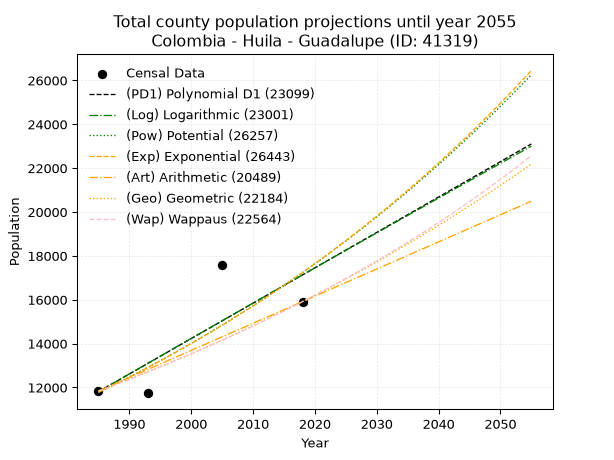
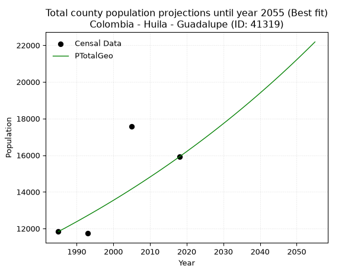
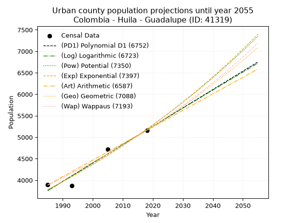
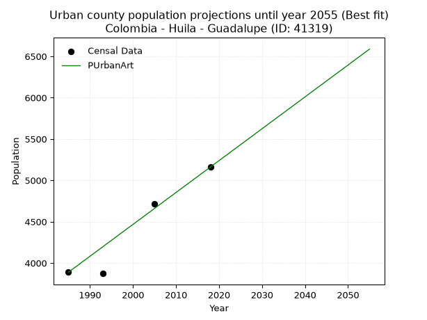
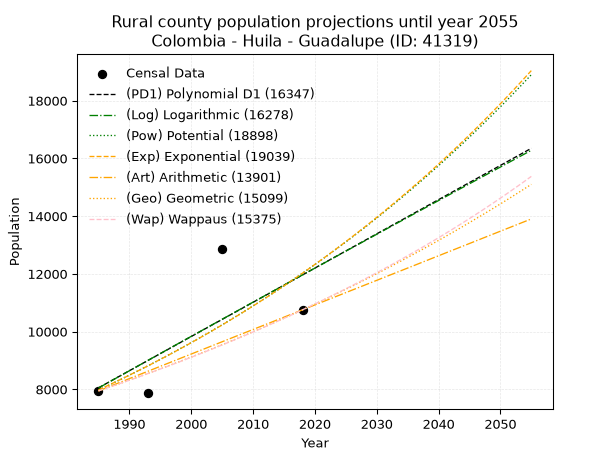
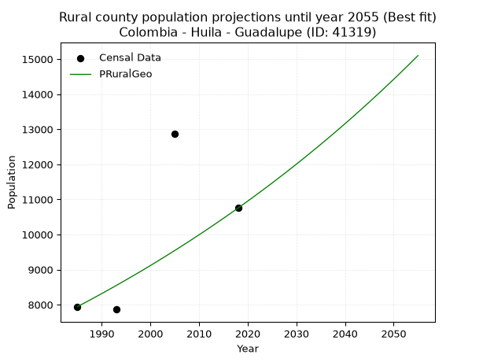

<div align="center">


</div>

# _“Population and Public Services Demand Projections (PPSD) until Year 2050 for Colombia - Huila - Guadalupe (ID: 41319)”_
Keywords: `population` `public-service` `projection` `lineal` `polynomial` `logarithmic` `potential` `exponential` `arithmetic` `geometric` `wappaus` `dane` `colombia` `south-america`

PPSD are analytical estimates used by governments and planners to anticipate future changes in population size, age distribution, and the resulting community needs for utilities, healthcare, education, and infrastructure as sizing future water treatment facilities, electrical grids, and road networks based on spatial growth.

> **General running parameters**: • app_version: _v20260806_. • Python version: _3.14.7_. • Pandas version: _3.0.5_. • NumPy version: _2.5.1_. • Creates, save and include plots into reports (create_plot): _False_. • Projection until year: _2050_. • Process polynomial degree 2 and up: _False_. • Process Wappaus: _True_. • Process Wappaus: _True_. • Set negative values to zero: _True_. • Set infinite values to zero: _True_. • Drop dataset notes: _True_. 
<div align="center">

Dynamic map: [:earth_americas:Google](http://maps.google.com/maps?q=2.02426012,-75.7571848) [:earth_americas:OSM](https://www.openstreetmap.org/#map=18/2.02426012/-75.7571848&layers=P) [:earth_americas:Bing](https://www.bing.com/maps?cp=2.02426012~-75.7571848&lvl=18) [:earth_americas:Apple](https://maps.apple.com/frame?center=2.02426012%2C-75.7571848&span=0.003%2C0.006)

</div>


<div align="center">

```geojson
{
  "type": "Feature",
  "geometry": {
    "type": "Point", 
    "coordinates": [-75.7571848, 2.02426012]
  }, 
  "properties": {
    "Name": "Colombia - Huila - Guadalupe (ID: 41319)"
  }
}
```

</div>


## 0. Census Data (4 records)

Census data are official statistics collected by a government about the people and housing in a country. They usually include counts of total population, age, sex, race, income, education, and jobs.

📅Global census file: [Population.xlsx](../data/Population.xlsx)

| Source   |   Year |   CountryID | CountryName   |   StateID | StateName   |   CountyID | CountyName   |   PTotal |   PUrban |   PRural |
|:---------|-------:|------------:|:--------------|----------:|:------------|-----------:|:-------------|---------:|---------:|---------:|
| DANE     |   1985 |          57 | Colombia      |        41 | Huila       |      41319 | Guadalupe    |    11832 |     3889 |     7943 |
| DANE     |   1993 |          57 | Colombia      |        41 | Huila       |      41319 | Guadalupe    |    11737 |     3873 |     7864 |
| DANE     |   2005 |          57 | Colombia      |        41 | Huila       |      41319 | Guadalupe    |    17586 |     4718 |    12868 |
| DANE     |   2018 |          57 | Colombia      |        41 | Huila       |      41319 | Guadalupe    |    15913 |     5161 |    10752 |

> 🔥Some records could had specific notes about the registered values or the corresponding urban or rural distribution.

## 1. Total

### 1.1. Coefficients and Parameters

* (PD1) Polynomial Deg 1: 161.31352870333274, -308400.3857888413 (lineal)
* (Log) Logarithmic: 323201.7525239639, -2442392.1109109498
* (Pow) Potential: 23.164316526475886, -72.31978197067944
* (Exp) Exponential: 0.011562717977130021, 1.2672986335523078e-06
* (Art) Arithmetic: Year diff. 2018 - 1985 = 33, Population diff. 15913 - 11832 = 4081, Annual growth = 123.66666666666667
* (Geo) Geometric: Year diff. 2018 - 1985 = 33, Population diff. 15913 - 11832 = 4081, Annual growth % = 0.009020094421665847
* (Wap) Wappaus: i = 0.8914519132576441, Condition values only valid for < 200)

<sub>
Wappaus condition values: ['0.00', '0.89', '1.78', '2.67', '3.57', '4.46', '5.35', '6.24', '7.13', '8.02', '8.91', '9.81', '10.70', '11.59', '12.48', '13.37', '14.26', '15.15', '16.05', '16.94', '17.83', '18.72', '19.61', '20.50', '21.39', '22.29', '23.18', '24.07', '24.96', '25.85', '26.74', '27.64', '28.53', '29.42', '30.31', '31.20', '32.09', '32.98', '33.88', '34.77', '35.66', '36.55', '37.44', '38.33', '39.22', '40.12', '41.01', '41.90', '42.79', '43.68', '44.57', '45.46', '46.36', '47.25', '48.14', '49.03', '49.92', '50.81', '51.70', '52.60', '53.49', '54.38', '55.27', '56.16', '57.05', '57.94']
</sub>


### 1.2. Projected Dataset

|   Year |   CountyID |   PTotalPD1 |   PTotalLog |   PTotalPow |   PTotalExp |   PTotalArt |   PTotalGeo |   PTotalWap |
|-------:|-----------:|------------:|------------:|------------:|------------:|------------:|------------:|------------:|
|   1985 |      41319 |       11807 |       11800 |       11765 |       11771 |       11832 |       11832 |       11832 |
|   1986 |      41319 |       11968 |       11963 |       11903 |       11908 |       11956 |       11939 |       11938 |
|   1987 |      41319 |       12130 |       12125 |       12043 |       12046 |       12079 |       12046 |       12045 |
|   1988 |      41319 |       12291 |       12288 |       12184 |       12186 |       12203 |       12155 |       12153 |
|   1989 |      41319 |       12452 |       12450 |       12326 |       12328 |       12327 |       12265 |       12262 |
|   1990 |      41319 |       12614 |       12613 |       12471 |       12471 |       12450 |       12375 |       12371 |
|   1991 |      41319 |       12775 |       12775 |       12617 |       12616 |       12574 |       12487 |       12482 |
|   1992 |      41319 |       12936 |       12937 |       12764 |       12763 |       12698 |       12600 |       12594 |
|   1993 |      41319 |       13097 |       13100 |       12914 |       12912 |       12821 |       12713 |       12707 |
|   1994 |      41319 |       13259 |       13262 |       13065 |       13062 |       12945 |       12828 |       12821 |
|   1995 |      41319 |       13420 |       13424 |       13217 |       13214 |       13069 |       12944 |       12936 |
|   1996 |      41319 |       13581 |       13586 |       13372 |       13367 |       13192 |       13060 |       13052 |
|   1997 |      41319 |       13743 |       13748 |       13528 |       13523 |       13316 |       13178 |       13169 |
|   1998 |      41319 |       13904 |       13910 |       13685 |       13680 |       13440 |       13297 |       13288 |
|   1999 |      41319 |       14065 |       14071 |       13845 |       13839 |       13563 |       13417 |       13407 |
|   2000 |      41319 |       14227 |       14233 |       14006 |       14000 |       13687 |       13538 |       13528 |
|   2001 |      41319 |       14388 |       14394 |       14169 |       14163 |       13811 |       13660 |       13649 |
|   2002 |      41319 |       14549 |       14556 |       14334 |       14328 |       13934 |       13783 |       13772 |
|   2003 |      41319 |       14711 |       14717 |       14501 |       14494 |       14058 |       13908 |       13896 |
|   2004 |      41319 |       14872 |       14879 |       14670 |       14663 |       14182 |       14033 |       14021 |
|   2005 |      41319 |       15033 |       15040 |       14840 |       14833 |       14305 |       14160 |       14148 |
|   2006 |      41319 |       15195 |       15201 |       15013 |       15006 |       14429 |       14287 |       14276 |
|   2007 |      41319 |       15356 |       15362 |       15187 |       15180 |       14553 |       14416 |       14405 |
|   2008 |      41319 |       15517 |       15523 |       15363 |       15357 |       14676 |       14546 |       14535 |
|   2009 |      41319 |       15678 |       15684 |       15541 |       15535 |       14800 |       14678 |       14667 |
|   2010 |      41319 |       15840 |       15845 |       15722 |       15716 |       14924 |       14810 |       14800 |
|   2011 |      41319 |       16001 |       16006 |       15904 |       15899 |       15047 |       14944 |       14934 |
|   2012 |      41319 |       16162 |       16166 |       16088 |       16084 |       15171 |       15078 |       15069 |
|   2013 |      41319 |       16324 |       16327 |       16274 |       16271 |       15295 |       15214 |       15206 |
|   2014 |      41319 |       16485 |       16487 |       16463 |       16460 |       15418 |       15352 |       15345 |
|   2015 |      41319 |       16646 |       16648 |       16653 |       16651 |       15542 |       15490 |       15485 |
|   2016 |      41319 |       16808 |       16808 |       16845 |       16845 |       15666 |       15630 |       15626 |
|   2017 |      41319 |       16969 |       16968 |       17040 |       17041 |       15789 |       15771 |       15769 |
|   2018 |      41319 |       17130 |       17129 |       17237 |       17239 |       15913 |       15913 |       15913 |
|   2019 |      41319 |       17292 |       17289 |       17436 |       17440 |       16037 |       16057 |       16059 |
|   2020 |      41319 |       17453 |       17449 |       17637 |       17643 |       16160 |       16201 |       16206 |
|   2021 |      41319 |       17614 |       17609 |       17840 |       17848 |       16284 |       16348 |       16355 |
|   2022 |      41319 |       17776 |       17769 |       18046 |       18055 |       16408 |       16495 |       16505 |
|   2023 |      41319 |       17937 |       17928 |       18254 |       18265 |       16531 |       16644 |       16657 |
|   2024 |      41319 |       18098 |       18088 |       18464 |       18478 |       16655 |       16794 |       16811 |
|   2025 |      41319 |       18260 |       18248 |       18676 |       18693 |       16779 |       16945 |       16966 |
|   2026 |      41319 |       18421 |       18407 |       18891 |       18910 |       16902 |       17098 |       17124 |
|   2027 |      41319 |       18582 |       18567 |       19108 |       19130 |       17026 |       17252 |       17282 |
|   2028 |      41319 |       18743 |       18726 |       19328 |       19352 |       17150 |       17408 |       17443 |
|   2029 |      41319 |       18905 |       18886 |       19550 |       19577 |       17273 |       17565 |       17605 |
|   2030 |      41319 |       19066 |       19045 |       19774 |       19805 |       17397 |       17724 |       17769 |
|   2031 |      41319 |       19227 |       19204 |       20001 |       20035 |       17521 |       17883 |       17935 |
|   2032 |      41319 |       19389 |       19363 |       20231 |       20268 |       17644 |       18045 |       18103 |
|   2033 |      41319 |       19550 |       19522 |       20463 |       20504 |       17768 |       18207 |       18273 |
|   2034 |      41319 |       19711 |       19681 |       20697 |       20743 |       17892 |       18372 |       18445 |
|   2035 |      41319 |       19873 |       19840 |       20934 |       20984 |       18015 |       18537 |       18618 |
|   2036 |      41319 |       20034 |       19999 |       21174 |       21228 |       18139 |       18705 |       18794 |
|   2037 |      41319 |       20195 |       20157 |       21416 |       21475 |       18263 |       18873 |       18972 |
|   2038 |      41319 |       20357 |       20316 |       21661 |       21725 |       18386 |       19044 |       19151 |
|   2039 |      41319 |       20518 |       20475 |       21908 |       21977 |       18510 |       19215 |       19333 |
|   2040 |      41319 |       20679 |       20633 |       22158 |       22233 |       18634 |       19389 |       19517 |
|   2041 |      41319 |       20841 |       20792 |       22411 |       22491 |       18757 |       19564 |       19703 |
|   2042 |      41319 |       21002 |       20950 |       22667 |       22753 |       18881 |       19740 |       19892 |
|   2043 |      41319 |       21163 |       21108 |       22926 |       23017 |       19005 |       19918 |       20083 |
|   2044 |      41319 |       21324 |       21266 |       23187 |       23285 |       19128 |       20098 |       20276 |
|   2045 |      41319 |       21486 |       21424 |       23451 |       23556 |       19252 |       20279 |       20471 |
|   2046 |      41319 |       21647 |       21582 |       23718 |       23830 |       19376 |       20462 |       20669 |
|   2047 |      41319 |       21808 |       21740 |       23988 |       24107 |       19499 |       20647 |       20869 |
|   2048 |      41319 |       21970 |       21898 |       24261 |       24387 |       19623 |       20833 |       21072 |
|   2049 |      41319 |       22131 |       22056 |       24537 |       24671 |       19747 |       21021 |       21277 |
|   2050 |      41319 |       22292 |       22214 |       24816 |       24958 |       19870 |       21210 |       21485 |
<div align="center">

</img>

</div>


### 1.3. Best fit with absolute and relative error (%)

Relative error puts that difference into context by dividing the absolute error by the true value, creating a unitless ratio or percentage that shows the scale of the mistake.

Absolute and relative error

|   Year | Source   |   CountryID | CountryName   |   StateID | StateName   |   CountyID_x | CountyName   |   PTotal |   PUrban |   PRural |   CountyID_y |   PTotalPD1 |   PTotalLog |   PTotalPow |   PTotalExp |   PTotalArt |   PTotalGeo |   PTotalWap |   PTotalPD1AbsError |   PTotalLogAbsError |   PTotalPowAbsError |   PTotalExpAbsError |   PTotalArtAbsError |   PTotalGeoAbsError |   PTotalWapAbsError |   PTotalPD1RelError |   PTotalLogRelError |   PTotalPowRelError |   PTotalExpRelError |   PTotalArtRelError |   PTotalGeoRelError |   PTotalWapRelError |
|-------:|:---------|------------:|:--------------|----------:|:------------|-------------:|:-------------|---------:|---------:|---------:|-------------:|------------:|------------:|------------:|------------:|------------:|------------:|------------:|--------------------:|--------------------:|--------------------:|--------------------:|--------------------:|--------------------:|--------------------:|--------------------:|--------------------:|--------------------:|--------------------:|--------------------:|--------------------:|--------------------:|
|   1985 | DANE     |          57 | Colombia      |        41 | Huila       |        41319 | Guadalupe    |    11832 |     3889 |     7943 |        41319 |       11807 |       11800 |       11765 |       11771 |       11832 |       11832 |       11832 |                  25 |                  32 |                  67 |                  61 |                   0 |                   0 |                   0 |            0.211291 |            0.270453 |            0.566261 |            0.515551 |             0       |             0       |             0       |
|   1993 | DANE     |          57 | Colombia      |        41 | Huila       |        41319 | Guadalupe    |    11737 |     3873 |     7864 |        41319 |       13097 |       13100 |       12914 |       12912 |       12821 |       12713 |       12707 |                1360 |                1363 |                1177 |                1175 |                1084 |                 976 |                 970 |           11.5873   |           11.6128   |           10.0281   |           10.0111   |             9.23575 |             8.31558 |             8.26446 |
|   2005 | DANE     |          57 | Colombia      |        41 | Huila       |        41319 | Guadalupe    |    17586 |     4718 |    12868 |        41319 |       15033 |       15040 |       14840 |       14833 |       14305 |       14160 |       14148 |                2553 |                2546 |                2746 |                2753 |                3281 |                3426 |                3438 |           14.5172   |           14.4774   |           15.6147   |           15.6545   |            18.6569  |            19.4814  |            19.5496  |
|   2018 | DANE     |          57 | Colombia      |        41 | Huila       |        41319 | Guadalupe    |    15913 |     5161 |    10752 |        41319 |       17130 |       17129 |       17237 |       17239 |       15913 |       15913 |       15913 |                1217 |                1216 |                1324 |                1326 |                   0 |                   0 |                   0 |            7.64784  |            7.64155  |            8.32024  |            8.33281  |             0       |             0       |             0       |

Relative error mean

| Method    |   RelError | Best   |
|:----------|-----------:|:-------|
| PTotalPD1 |    8.49091 |        |
| PTotalLog |    8.50057 |        |
| PTotalPow |    8.63233 |        |
| PTotalExp |    8.62848 |        |
| PTotalArt |    6.97316 |        |
| PTotalGeo |    6.94925 | True   |
| PTotalWap |    6.95353 |        |

💙Best method: _**PTotalGeo**_
<div align="center">

</img>

</div>


### 1.4. Fresh water supply demand in liters per capita per day (lpcd)

The fresh water supply demand typically ranges from 100 to 300 liters per capita per day (lpcd) for standard domestic and municipal planning, though absolute survival minimums set by the World Health Organization are as low as 7.5 to 20 liters per day, and total consumption in high-income nations can exceed 400 liters.

> `CZ`: Level in meters above the sea level (masl)<br> `WS`: Fresh water supply demand in liters per capita per day (lpcd or l/h/d)<br> `WSAll`: Zonal fresh water supply demand in liters per second (l/s)<br> `A`: Zonal area in square meters<br> `DP`: Population density (people/hectare)

Reference values (RAS Colombia)

|    CZ |   WS |
|------:|-----:|
|  1000 |  120 |
|  2000 |  130 |
| 99999 |  140 |

County shapefile geometry properties and water supply values

|   CountyID |      ATotal |   CZTotal |   WSTotal |
|-----------:|------------:|----------:|----------:|
|      41319 | 2.49536e+08 |   1565.75 |       130 |

Projected values for best method: PTotalGeo

|   CountyID |   Year |   PTotalGeo |   DPTotal |   WSTotal |   WSTotalAll |
|-----------:|-------:|------------:|----------:|----------:|-------------:|
|      41319 |   1985 |       11832 |      0.47 |       130 |      17.8028 |
|      41319 |   1986 |       11939 |      0.48 |       130 |      17.9638 |
|      41319 |   1987 |       12046 |      0.48 |       130 |      18.1248 |
|      41319 |   1988 |       12155 |      0.49 |       130 |      18.2888 |
|      41319 |   1989 |       12265 |      0.49 |       130 |      18.4543 |
|      41319 |   1990 |       12375 |      0.5  |       130 |      18.6198 |
|      41319 |   1991 |       12487 |      0.5  |       130 |      18.7883 |
|      41319 |   1992 |       12600 |      0.5  |       130 |      18.9583 |
|      41319 |   1993 |       12713 |      0.51 |       130 |      19.1284 |
|      41319 |   1994 |       12828 |      0.51 |       130 |      19.3014 |
|      41319 |   1995 |       12944 |      0.52 |       130 |      19.4759 |
|      41319 |   1996 |       13060 |      0.52 |       130 |      19.6505 |
|      41319 |   1997 |       13178 |      0.53 |       130 |      19.828  |
|      41319 |   1998 |       13297 |      0.53 |       130 |      20.0071 |
|      41319 |   1999 |       13417 |      0.54 |       130 |      20.1876 |
|      41319 |   2000 |       13538 |      0.54 |       130 |      20.3697 |
|      41319 |   2001 |       13660 |      0.55 |       130 |      20.5532 |
|      41319 |   2002 |       13783 |      0.55 |       130 |      20.7383 |
|      41319 |   2003 |       13908 |      0.56 |       130 |      20.9264 |
|      41319 |   2004 |       14033 |      0.56 |       130 |      21.1145 |
|      41319 |   2005 |       14160 |      0.57 |       130 |      21.3056 |
|      41319 |   2006 |       14287 |      0.57 |       130 |      21.4966 |
|      41319 |   2007 |       14416 |      0.58 |       130 |      21.6907 |
|      41319 |   2008 |       14546 |      0.58 |       130 |      21.8863 |
|      41319 |   2009 |       14678 |      0.59 |       130 |      22.085  |
|      41319 |   2010 |       14810 |      0.59 |       130 |      22.2836 |
|      41319 |   2011 |       14944 |      0.6  |       130 |      22.4852 |
|      41319 |   2012 |       15078 |      0.6  |       130 |      22.6868 |
|      41319 |   2013 |       15214 |      0.61 |       130 |      22.8914 |
|      41319 |   2014 |       15352 |      0.62 |       130 |      23.0991 |
|      41319 |   2015 |       15490 |      0.62 |       130 |      23.3067 |
|      41319 |   2016 |       15630 |      0.63 |       130 |      23.5174 |
|      41319 |   2017 |       15771 |      0.63 |       130 |      23.7295 |
|      41319 |   2018 |       15913 |      0.64 |       130 |      23.9432 |
|      41319 |   2019 |       16057 |      0.64 |       130 |      24.1598 |
|      41319 |   2020 |       16201 |      0.65 |       130 |      24.3765 |
|      41319 |   2021 |       16348 |      0.66 |       130 |      24.5977 |
|      41319 |   2022 |       16495 |      0.66 |       130 |      24.8189 |
|      41319 |   2023 |       16644 |      0.67 |       130 |      25.0431 |
|      41319 |   2024 |       16794 |      0.67 |       130 |      25.2688 |
|      41319 |   2025 |       16945 |      0.68 |       130 |      25.4959 |
|      41319 |   2026 |       17098 |      0.69 |       130 |      25.7262 |
|      41319 |   2027 |       17252 |      0.69 |       130 |      25.9579 |
|      41319 |   2028 |       17408 |      0.7  |       130 |      26.1926 |
|      41319 |   2029 |       17565 |      0.7  |       130 |      26.4288 |
|      41319 |   2030 |       17724 |      0.71 |       130 |      26.6681 |
|      41319 |   2031 |       17883 |      0.72 |       130 |      26.9073 |
|      41319 |   2032 |       18045 |      0.72 |       130 |      27.151  |
|      41319 |   2033 |       18207 |      0.73 |       130 |      27.3948 |
|      41319 |   2034 |       18372 |      0.74 |       130 |      27.6431 |
|      41319 |   2035 |       18537 |      0.74 |       130 |      27.8913 |
|      41319 |   2036 |       18705 |      0.75 |       130 |      28.1441 |
|      41319 |   2037 |       18873 |      0.76 |       130 |      28.3969 |
|      41319 |   2038 |       19044 |      0.76 |       130 |      28.6542 |
|      41319 |   2039 |       19215 |      0.77 |       130 |      28.9115 |
|      41319 |   2040 |       19389 |      0.78 |       130 |      29.1733 |
|      41319 |   2041 |       19564 |      0.78 |       130 |      29.4366 |
|      41319 |   2042 |       19740 |      0.79 |       130 |      29.7014 |
|      41319 |   2043 |       19918 |      0.8  |       130 |      29.9692 |
|      41319 |   2044 |       20098 |      0.81 |       130 |      30.24   |
|      41319 |   2045 |       20279 |      0.81 |       130 |      30.5124 |
|      41319 |   2046 |       20462 |      0.82 |       130 |      30.7877 |
|      41319 |   2047 |       20647 |      0.83 |       130 |      31.0661 |
|      41319 |   2048 |       20833 |      0.83 |       130 |      31.3459 |
|      41319 |   2049 |       21021 |      0.84 |       130 |      31.6288 |
|      41319 |   2050 |       21210 |      0.85 |       130 |      31.9132 |

## 2. Urban

### 2.1. Coefficients and Parameters

* (PD1) Polynomial Deg 1: 42.7647531112, -81129.9474106778 (lineal)
* (Log) Logarithmic: 85584.04247622106, -646114.7426892307
* (Pow) Potential: 19.188233026745824, -59.700718093528046
* (Exp) Exponential: 0.009587491834008744, 2.053353688258208e-05
* (Art) Arithmetic: Year diff. 2018 - 1985 = 33, Population diff. 5161 - 3889 = 1272, Annual growth = 38.54545454545455
* (Geo) Geometric: Year diff. 2018 - 1985 = 33, Population diff. 5161 - 3889 = 1272, Annual growth % = 0.008611971608920133
* (Wap) Wappaus: i = 0.8518332496233049, Condition values only valid for < 200)

<sub>
Wappaus condition values: ['0.00', '0.85', '1.70', '2.56', '3.41', '4.26', '5.11', '5.96', '6.81', '7.67', '8.52', '9.37', '10.22', '11.07', '11.93', '12.78', '13.63', '14.48', '15.33', '16.18', '17.04', '17.89', '18.74', '19.59', '20.44', '21.30', '22.15', '23.00', '23.85', '24.70', '25.55', '26.41', '27.26', '28.11', '28.96', '29.81', '30.67', '31.52', '32.37', '33.22', '34.07', '34.93', '35.78', '36.63', '37.48', '38.33', '39.18', '40.04', '40.89', '41.74', '42.59', '43.44', '44.30', '45.15', '46.00', '46.85', '47.70', '48.55', '49.41', '50.26', '51.11', '51.96', '52.81', '53.67', '54.52', '55.37']
</sub>


### 2.2. Projected Dataset

|   Year |   CountyID |   PUrbanPD1 |   PUrbanLog |   PUrbanPow |   PUrbanExp |   PUrbanArt |   PUrbanGeo |   PUrbanWap |
|-------:|-----------:|------------:|------------:|------------:|------------:|------------:|------------:|------------:|
|   1985 |      41319 |        3758 |        3757 |        3780 |        3781 |        3889 |        3889 |        3889 |
|   1986 |      41319 |        3801 |        3800 |        3817 |        3817 |        3928 |        3922 |        3922 |
|   1987 |      41319 |        3844 |        3843 |        3854 |        3854 |        3966 |        3956 |        3956 |
|   1988 |      41319 |        3886 |        3886 |        3891 |        3891 |        4005 |        3990 |        3990 |
|   1989 |      41319 |        3929 |        3929 |        3929 |        3929 |        4043 |        4025 |        4024 |
|   1990 |      41319 |        3972 |        3972 |        3967 |        3967 |        4082 |        4059 |        4058 |
|   1991 |      41319 |        4015 |        4015 |        4005 |        4005 |        4120 |        4094 |        4093 |
|   1992 |      41319 |        4057 |        4058 |        4044 |        4043 |        4159 |        4130 |        4128 |
|   1993 |      41319 |        4100 |        4101 |        4083 |        4082 |        4197 |        4165 |        4163 |
|   1994 |      41319 |        4143 |        4144 |        4123 |        4122 |        4236 |        4201 |        4199 |
|   1995 |      41319 |        4186 |        4187 |        4163 |        4161 |        4274 |        4237 |        4235 |
|   1996 |      41319 |        4228 |        4230 |        4203 |        4201 |        4313 |        4274 |        4271 |
|   1997 |      41319 |        4271 |        4273 |        4243 |        4242 |        4352 |        4310 |        4308 |
|   1998 |      41319 |        4314 |        4316 |        4284 |        4283 |        4390 |        4348 |        4345 |
|   1999 |      41319 |        4357 |        4358 |        4326 |        4324 |        4429 |        4385 |        4382 |
|   2000 |      41319 |        4400 |        4401 |        4367 |        4366 |        4467 |        4423 |        4420 |
|   2001 |      41319 |        4442 |        4444 |        4409 |        4408 |        4506 |        4461 |        4458 |
|   2002 |      41319 |        4485 |        4487 |        4452 |        4450 |        4544 |        4499 |        4496 |
|   2003 |      41319 |        4528 |        4529 |        4495 |        4493 |        4583 |        4538 |        4535 |
|   2004 |      41319 |        4571 |        4572 |        4538 |        4536 |        4621 |        4577 |        4574 |
|   2005 |      41319 |        4613 |        4615 |        4582 |        4580 |        4660 |        4617 |        4613 |
|   2006 |      41319 |        4656 |        4658 |        4626 |        4624 |        4698 |        4656 |        4653 |
|   2007 |      41319 |        4699 |        4700 |        4670 |        4669 |        4737 |        4696 |        4693 |
|   2008 |      41319 |        4742 |        4743 |        4715 |        4714 |        4776 |        4737 |        4734 |
|   2009 |      41319 |        4784 |        4785 |        4760 |        4759 |        4814 |        4778 |        4775 |
|   2010 |      41319 |        4827 |        4828 |        4806 |        4805 |        4853 |        4819 |        4816 |
|   2011 |      41319 |        4870 |        4871 |        4852 |        4851 |        4891 |        4860 |        4858 |
|   2012 |      41319 |        4913 |        4913 |        4899 |        4898 |        4930 |        4902 |        4900 |
|   2013 |      41319 |        4956 |        4956 |        4945 |        4945 |        4968 |        4944 |        4942 |
|   2014 |      41319 |        4998 |        4998 |        4993 |        4993 |        5007 |        4987 |        4985 |
|   2015 |      41319 |        5041 |        5041 |        5041 |        5041 |        5045 |        5030 |        5028 |
|   2016 |      41319 |        5084 |        5083 |        5089 |        5089 |        5084 |        5073 |        5072 |
|   2017 |      41319 |        5127 |        5126 |        5137 |        5139 |        5122 |        5117 |        5116 |
|   2018 |      41319 |        5169 |        5168 |        5187 |        5188 |        5161 |        5161 |        5161 |
|   2019 |      41319 |        5212 |        5210 |        5236 |        5238 |        5200 |        5205 |        5206 |
|   2020 |      41319 |        5255 |        5253 |        5286 |        5288 |        5238 |        5250 |        5252 |
|   2021 |      41319 |        5298 |        5295 |        5337 |        5339 |        5277 |        5295 |        5298 |
|   2022 |      41319 |        5340 |        5338 |        5387 |        5391 |        5315 |        5341 |        5344 |
|   2023 |      41319 |        5383 |        5380 |        5439 |        5443 |        5354 |        5387 |        5391 |
|   2024 |      41319 |        5426 |        5422 |        5491 |        5495 |        5392 |        5433 |        5438 |
|   2025 |      41319 |        5469 |        5464 |        5543 |        5548 |        5431 |        5480 |        5486 |
|   2026 |      41319 |        5511 |        5507 |        5596 |        5602 |        5469 |        5527 |        5535 |
|   2027 |      41319 |        5554 |        5549 |        5649 |        5656 |        5508 |        5575 |        5583 |
|   2028 |      41319 |        5597 |        5591 |        5703 |        5710 |        5546 |        5623 |        5633 |
|   2029 |      41319 |        5640 |        5633 |        5757 |        5765 |        5585 |        5672 |        5683 |
|   2030 |      41319 |        5683 |        5675 |        5811 |        5821 |        5624 |        5720 |        5733 |
|   2031 |      41319 |        5725 |        5718 |        5867 |        5877 |        5662 |        5770 |        5784 |
|   2032 |      41319 |        5768 |        5760 |        5922 |        5933 |        5701 |        5819 |        5836 |
|   2033 |      41319 |        5811 |        5802 |        5979 |        5990 |        5739 |        5869 |        5888 |
|   2034 |      41319 |        5854 |        5844 |        6035 |        6048 |        5778 |        5920 |        5940 |
|   2035 |      41319 |        5896 |        5886 |        6092 |        6106 |        5816 |        5971 |        5994 |
|   2036 |      41319 |        5939 |        5928 |        6150 |        6165 |        5855 |        6022 |        6047 |
|   2037 |      41319 |        5982 |        5970 |        6208 |        6225 |        5893 |        6074 |        6102 |
|   2038 |      41319 |        6025 |        6012 |        6267 |        6285 |        5932 |        6127 |        6157 |
|   2039 |      41319 |        6067 |        6054 |        6326 |        6345 |        5970 |        6179 |        6212 |
|   2040 |      41319 |        6110 |        6096 |        6386 |        6406 |        6009 |        6233 |        6268 |
|   2041 |      41319 |        6153 |        6138 |        6446 |        6468 |        6048 |        6286 |        6325 |
|   2042 |      41319 |        6196 |        6180 |        6507 |        6530 |        6086 |        6340 |        6383 |
|   2043 |      41319 |        6238 |        6222 |        6569 |        6593 |        6125 |        6395 |        6441 |
|   2044 |      41319 |        6281 |        6264 |        6631 |        6657 |        6163 |        6450 |        6500 |
|   2045 |      41319 |        6324 |        6306 |        6693 |        6721 |        6202 |        6506 |        6559 |
|   2046 |      41319 |        6367 |        6347 |        6756 |        6786 |        6240 |        6562 |        6619 |
|   2047 |      41319 |        6410 |        6389 |        6820 |        6851 |        6279 |        6618 |        6680 |
|   2048 |      41319 |        6452 |        6431 |        6884 |        6917 |        6317 |        6675 |        6741 |
|   2049 |      41319 |        6495 |        6473 |        6949 |        6984 |        6356 |        6733 |        6804 |
|   2050 |      41319 |        6538 |        6515 |        7014 |        7051 |        6394 |        6791 |        6867 |
<div align="center">

</img>

</div>


### 2.3. Best fit with absolute and relative error (%)

Relative error puts that difference into context by dividing the absolute error by the true value, creating a unitless ratio or percentage that shows the scale of the mistake.

Absolute and relative error

|   Year | Source   |   CountryID | CountryName   |   StateID | StateName   |   CountyID_x | CountyName   |   PTotal |   PUrban |   PRural |   CountyID_y |   PUrbanPD1 |   PUrbanLog |   PUrbanPow |   PUrbanExp |   PUrbanArt |   PUrbanGeo |   PUrbanWap |   PUrbanPD1AbsError |   PUrbanLogAbsError |   PUrbanPowAbsError |   PUrbanExpAbsError |   PUrbanArtAbsError |   PUrbanGeoAbsError |   PUrbanWapAbsError |   PUrbanPD1RelError |   PUrbanLogRelError |   PUrbanPowRelError |   PUrbanExpRelError |   PUrbanArtRelError |   PUrbanGeoRelError |   PUrbanWapRelError |
|-------:|:---------|------------:|:--------------|----------:|:------------|-------------:|:-------------|---------:|---------:|---------:|-------------:|------------:|------------:|------------:|------------:|------------:|------------:|------------:|--------------------:|--------------------:|--------------------:|--------------------:|--------------------:|--------------------:|--------------------:|--------------------:|--------------------:|--------------------:|--------------------:|--------------------:|--------------------:|--------------------:|
|   1985 | DANE     |          57 | Colombia      |        41 | Huila       |        41319 | Guadalupe    |    11832 |     3889 |     7943 |        41319 |        3758 |        3757 |        3780 |        3781 |        3889 |        3889 |        3889 |                 131 |                 132 |                 109 |                 108 |                   0 |                   0 |                   0 |            3.36848  |            3.39419  |            2.80278  |            2.77706  |             0       |             0       |             0       |
|   1993 | DANE     |          57 | Colombia      |        41 | Huila       |        41319 | Guadalupe    |    11737 |     3873 |     7864 |        41319 |        4100 |        4101 |        4083 |        4082 |        4197 |        4165 |        4163 |                 227 |                 228 |                 210 |                 209 |                 324 |                 292 |                 290 |            5.86109  |            5.88691  |            5.42215  |            5.39633  |             8.36561 |             7.53938 |             7.48774 |
|   2005 | DANE     |          57 | Colombia      |        41 | Huila       |        41319 | Guadalupe    |    17586 |     4718 |    12868 |        41319 |        4613 |        4615 |        4582 |        4580 |        4660 |        4617 |        4613 |                 105 |                 103 |                 136 |                 138 |                  58 |                 101 |                 105 |            2.22552  |            2.18313  |            2.88258  |            2.92497  |             1.22933 |             2.14074 |             2.22552 |
|   2018 | DANE     |          57 | Colombia      |        41 | Huila       |        41319 | Guadalupe    |    15913 |     5161 |    10752 |        41319 |        5169 |        5168 |        5187 |        5188 |        5161 |        5161 |        5161 |                   8 |                   7 |                  26 |                  27 |                   0 |                   0 |                   0 |            0.155009 |            0.135633 |            0.503778 |            0.523154 |             0       |             0       |             0       |

Relative error mean

| Method    |   RelError | Best   |
|:----------|-----------:|:-------|
| PUrbanPD1 |    2.90252 |        |
| PUrbanLog |    2.89996 |        |
| PUrbanPow |    2.90282 |        |
| PUrbanExp |    2.90538 |        |
| PUrbanArt |    2.39874 | True   |
| PUrbanGeo |    2.42003 |        |
| PUrbanWap |    2.42831 |        |

💙Best method: _**PUrbanArt**_
<div align="center">

</img>

</div>


### 2.4. Fresh water supply demand in liters per capita per day (lpcd)

The fresh water supply demand typically ranges from 100 to 300 liters per capita per day (lpcd) for standard domestic and municipal planning, though absolute survival minimums set by the World Health Organization are as low as 7.5 to 20 liters per day, and total consumption in high-income nations can exceed 400 liters.

> `CZ`: Level in meters above the sea level (masl)<br> `WS`: Fresh water supply demand in liters per capita per day (lpcd or l/h/d)<br> `WSAll`: Zonal fresh water supply demand in liters per second (l/s)<br> `A`: Zonal area in square meters<br> `DP`: Population density (people/hectare)

Reference values (RAS Colombia)

|    CZ |   WS |
|------:|-----:|
|  1000 |  120 |
|  2000 |  130 |
| 99999 |  140 |

County shapefile geometry properties and water supply values

|   CountyID |   AUrban |   CZUrban |   WSUrban |
|-----------:|---------:|----------:|----------:|
|      41319 |   727669 |   891.351 |       120 |

Projected values for best method: PUrbanArt

|   CountyID |   Year |   PUrbanArt |   DPUrban |   WSUrban |   WSUrbanAll |
|-----------:|-------:|------------:|----------:|----------:|-------------:|
|      41319 |   1985 |        3889 |     53.44 |       120 |      5.40139 |
|      41319 |   1986 |        3928 |     53.98 |       120 |      5.45556 |
|      41319 |   1987 |        3966 |     54.5  |       120 |      5.50833 |
|      41319 |   1988 |        4005 |     55.04 |       120 |      5.5625  |
|      41319 |   1989 |        4043 |     55.56 |       120 |      5.61528 |
|      41319 |   1990 |        4082 |     56.1  |       120 |      5.66944 |
|      41319 |   1991 |        4120 |     56.62 |       120 |      5.72222 |
|      41319 |   1992 |        4159 |     57.16 |       120 |      5.77639 |
|      41319 |   1993 |        4197 |     57.68 |       120 |      5.82917 |
|      41319 |   1994 |        4236 |     58.21 |       120 |      5.88333 |
|      41319 |   1995 |        4274 |     58.74 |       120 |      5.93611 |
|      41319 |   1996 |        4313 |     59.27 |       120 |      5.99028 |
|      41319 |   1997 |        4352 |     59.81 |       120 |      6.04444 |
|      41319 |   1998 |        4390 |     60.33 |       120 |      6.09722 |
|      41319 |   1999 |        4429 |     60.87 |       120 |      6.15139 |
|      41319 |   2000 |        4467 |     61.39 |       120 |      6.20417 |
|      41319 |   2001 |        4506 |     61.92 |       120 |      6.25833 |
|      41319 |   2002 |        4544 |     62.45 |       120 |      6.31111 |
|      41319 |   2003 |        4583 |     62.98 |       120 |      6.36528 |
|      41319 |   2004 |        4621 |     63.5  |       120 |      6.41806 |
|      41319 |   2005 |        4660 |     64.04 |       120 |      6.47222 |
|      41319 |   2006 |        4698 |     64.56 |       120 |      6.525   |
|      41319 |   2007 |        4737 |     65.1  |       120 |      6.57917 |
|      41319 |   2008 |        4776 |     65.63 |       120 |      6.63333 |
|      41319 |   2009 |        4814 |     66.16 |       120 |      6.68611 |
|      41319 |   2010 |        4853 |     66.69 |       120 |      6.74028 |
|      41319 |   2011 |        4891 |     67.21 |       120 |      6.79306 |
|      41319 |   2012 |        4930 |     67.75 |       120 |      6.84722 |
|      41319 |   2013 |        4968 |     68.27 |       120 |      6.9     |
|      41319 |   2014 |        5007 |     68.81 |       120 |      6.95417 |
|      41319 |   2015 |        5045 |     69.33 |       120 |      7.00694 |
|      41319 |   2016 |        5084 |     69.87 |       120 |      7.06111 |
|      41319 |   2017 |        5122 |     70.39 |       120 |      7.11389 |
|      41319 |   2018 |        5161 |     70.93 |       120 |      7.16806 |
|      41319 |   2019 |        5200 |     71.46 |       120 |      7.22222 |
|      41319 |   2020 |        5238 |     71.98 |       120 |      7.275   |
|      41319 |   2021 |        5277 |     72.52 |       120 |      7.32917 |
|      41319 |   2022 |        5315 |     73.04 |       120 |      7.38194 |
|      41319 |   2023 |        5354 |     73.58 |       120 |      7.43611 |
|      41319 |   2024 |        5392 |     74.1  |       120 |      7.48889 |
|      41319 |   2025 |        5431 |     74.64 |       120 |      7.54306 |
|      41319 |   2026 |        5469 |     75.16 |       120 |      7.59583 |
|      41319 |   2027 |        5508 |     75.69 |       120 |      7.65    |
|      41319 |   2028 |        5546 |     76.22 |       120 |      7.70278 |
|      41319 |   2029 |        5585 |     76.75 |       120 |      7.75694 |
|      41319 |   2030 |        5624 |     77.29 |       120 |      7.81111 |
|      41319 |   2031 |        5662 |     77.81 |       120 |      7.86389 |
|      41319 |   2032 |        5701 |     78.35 |       120 |      7.91806 |
|      41319 |   2033 |        5739 |     78.87 |       120 |      7.97083 |
|      41319 |   2034 |        5778 |     79.4  |       120 |      8.025   |
|      41319 |   2035 |        5816 |     79.93 |       120 |      8.07778 |
|      41319 |   2036 |        5855 |     80.46 |       120 |      8.13194 |
|      41319 |   2037 |        5893 |     80.98 |       120 |      8.18472 |
|      41319 |   2038 |        5932 |     81.52 |       120 |      8.23889 |
|      41319 |   2039 |        5970 |     82.04 |       120 |      8.29167 |
|      41319 |   2040 |        6009 |     82.58 |       120 |      8.34583 |
|      41319 |   2041 |        6048 |     83.11 |       120 |      8.4     |
|      41319 |   2042 |        6086 |     83.64 |       120 |      8.45278 |
|      41319 |   2043 |        6125 |     84.17 |       120 |      8.50694 |
|      41319 |   2044 |        6163 |     84.7  |       120 |      8.55972 |
|      41319 |   2045 |        6202 |     85.23 |       120 |      8.61389 |
|      41319 |   2046 |        6240 |     85.75 |       120 |      8.66667 |
|      41319 |   2047 |        6279 |     86.29 |       120 |      8.72083 |
|      41319 |   2048 |        6317 |     86.81 |       120 |      8.77361 |
|      41319 |   2049 |        6356 |     87.35 |       120 |      8.82778 |
|      41319 |   2050 |        6394 |     87.87 |       120 |      8.88056 |

## 3. Rural

### 3.1. Coefficients and Parameters

* (PD1) Polynomial Deg 1: 118.54877559213266, -227270.43837816332 (lineal)
* (Log) Logarithmic: 237617.71004774264, -1796277.3682217172
* (Pow) Potential: 24.903443925818, -78.22399991186253
* (Exp) Exponential: 0.012426867052341826, 1.5451416081453401e-07
* (Art) Arithmetic: Year diff. 2018 - 1985 = 33, Population diff. 10752 - 7943 = 2809, Annual growth = 85.12121212121212
* (Geo) Geometric: Year diff. 2018 - 1985 = 33, Population diff. 10752 - 7943 = 2809, Annual growth % = 0.00921800671171602
* (Wap) Wappaus: i = 0.9106307795796964, Condition values only valid for < 200)

<sub>
Wappaus condition values: ['0.00', '0.91', '1.82', '2.73', '3.64', '4.55', '5.46', '6.37', '7.29', '8.20', '9.11', '10.02', '10.93', '11.84', '12.75', '13.66', '14.57', '15.48', '16.39', '17.30', '18.21', '19.12', '20.03', '20.94', '21.86', '22.77', '23.68', '24.59', '25.50', '26.41', '27.32', '28.23', '29.14', '30.05', '30.96', '31.87', '32.78', '33.69', '34.60', '35.51', '36.43', '37.34', '38.25', '39.16', '40.07', '40.98', '41.89', '42.80', '43.71', '44.62', '45.53', '46.44', '47.35', '48.26', '49.17', '50.08', '51.00', '51.91', '52.82', '53.73', '54.64', '55.55', '56.46', '57.37', '58.28', '59.19']
</sub>


### 3.2. Projected Dataset

|   Year |   CountyID |   PRuralPD1 |   PRuralLog |   PRuralPow |   PRuralExp |   PRuralArt |   PRuralGeo |   PRuralWap |
|-------:|-----------:|------------:|------------:|------------:|------------:|------------:|------------:|------------:|
|   1985 |      41319 |        8049 |        8043 |        7972 |        7977 |        7943 |        7943 |        7943 |
|   1986 |      41319 |        8167 |        8162 |        8073 |        8077 |        8028 |        8016 |        8016 |
|   1987 |      41319 |        8286 |        8282 |        8175 |        8178 |        8113 |        8090 |        8089 |
|   1988 |      41319 |        8405 |        8402 |        8278 |        8280 |        8198 |        8165 |        8163 |
|   1989 |      41319 |        8523 |        8521 |        8382 |        8384 |        8283 |        8240 |        8238 |
|   1990 |      41319 |        8642 |        8641 |        8488 |        8489 |        8369 |        8316 |        8313 |
|   1991 |      41319 |        8760 |        8760 |        8595 |        8595 |        8454 |        8393 |        8389 |
|   1992 |      41319 |        8879 |        8879 |        8703 |        8702 |        8539 |        8470 |        8466 |
|   1993 |      41319 |        8997 |        8999 |        8812 |        8811 |        8624 |        8548 |        8544 |
|   1994 |      41319 |        9116 |        9118 |        8923 |        8921 |        8709 |        8627 |        8622 |
|   1995 |      41319 |        9234 |        9237 |        9035 |        9033 |        8794 |        8706 |        8701 |
|   1996 |      41319 |        9353 |        9356 |        9149 |        9146 |        8879 |        8787 |        8781 |
|   1997 |      41319 |        9471 |        9475 |        9264 |        9260 |        8964 |        8868 |        8861 |
|   1998 |      41319 |        9590 |        9594 |        9380 |        9376 |        9050 |        8949 |        8942 |
|   1999 |      41319 |        9709 |        9713 |        9497 |        9493 |        9135 |        9032 |        9025 |
|   2000 |      41319 |        9827 |        9832 |        9616 |        9612 |        9220 |        9115 |        9108 |
|   2001 |      41319 |        9946 |        9950 |        9737 |        9732 |        9305 |        9199 |        9191 |
|   2002 |      41319 |       10064 |       10069 |        9859 |        9854 |        9390 |        9284 |        9276 |
|   2003 |      41319 |       10183 |       10188 |        9982 |        9977 |        9475 |        9369 |        9361 |
|   2004 |      41319 |       10301 |       10306 |       10107 |       10102 |        9560 |        9456 |        9447 |
|   2005 |      41319 |       10420 |       10425 |       10233 |       10228 |        9645 |        9543 |        9535 |
|   2006 |      41319 |       10538 |       10543 |       10361 |       10356 |        9731 |        9631 |        9623 |
|   2007 |      41319 |       10657 |       10662 |       10491 |       10485 |        9816 |        9720 |        9711 |
|   2008 |      41319 |       10776 |       10780 |       10622 |       10617 |        9901 |        9809 |        9801 |
|   2009 |      41319 |       10894 |       10899 |       10754 |       10749 |        9986 |        9900 |        9892 |
|   2010 |      41319 |       11013 |       11017 |       10888 |       10884 |       10071 |        9991 |        9984 |
|   2011 |      41319 |       11131 |       11135 |       11024 |       11020 |       10156 |       10083 |       10076 |
|   2012 |      41319 |       11250 |       11253 |       11161 |       11158 |       10241 |       10176 |       10170 |
|   2013 |      41319 |       11368 |       11371 |       11300 |       11297 |       10326 |       10270 |       10264 |
|   2014 |      41319 |       11487 |       11489 |       11441 |       11438 |       10412 |       10365 |       10360 |
|   2015 |      41319 |       11605 |       11607 |       11583 |       11581 |       10497 |       10460 |       10456 |
|   2016 |      41319 |       11724 |       11725 |       11727 |       11726 |       10582 |       10556 |       10554 |
|   2017 |      41319 |       11842 |       11843 |       11873 |       11873 |       10667 |       10654 |       10652 |
|   2018 |      41319 |       11961 |       11961 |       12020 |       12021 |       10752 |       10752 |       10752 |
|   2019 |      41319 |       12080 |       12078 |       12170 |       12172 |       10837 |       10851 |       10853 |
|   2020 |      41319 |       12198 |       12196 |       12321 |       12324 |       10922 |       10951 |       10955 |
|   2021 |      41319 |       12317 |       12314 |       12473 |       12478 |       11007 |       11052 |       11057 |
|   2022 |      41319 |       12435 |       12431 |       12628 |       12634 |       11092 |       11154 |       11161 |
|   2023 |      41319 |       12554 |       12549 |       12784 |       12792 |       11178 |       11257 |       11267 |
|   2024 |      41319 |       12672 |       12666 |       12943 |       12952 |       11263 |       11361 |       11373 |
|   2025 |      41319 |       12791 |       12783 |       13103 |       13114 |       11348 |       11465 |       11481 |
|   2026 |      41319 |       12909 |       12901 |       13265 |       13278 |       11433 |       11571 |       11589 |
|   2027 |      41319 |       13028 |       13018 |       13429 |       13444 |       11518 |       11678 |       11699 |
|   2028 |      41319 |       13146 |       13135 |       13595 |       13612 |       11603 |       11785 |       11810 |
|   2029 |      41319 |       13265 |       13252 |       13763 |       13782 |       11688 |       11894 |       11923 |
|   2030 |      41319 |       13384 |       13369 |       13933 |       13955 |       11773 |       12004 |       12037 |
|   2031 |      41319 |       13502 |       13486 |       14105 |       14129 |       11859 |       12114 |       12152 |
|   2032 |      41319 |       13621 |       13603 |       14279 |       14306 |       11944 |       12226 |       12268 |
|   2033 |      41319 |       13739 |       13720 |       14455 |       14485 |       12029 |       12339 |       12386 |
|   2034 |      41319 |       13858 |       13837 |       14633 |       14666 |       12114 |       12452 |       12505 |
|   2035 |      41319 |       13976 |       13954 |       14813 |       14849 |       12199 |       12567 |       12626 |
|   2036 |      41319 |       14095 |       14071 |       14996 |       15035 |       12284 |       12683 |       12748 |
|   2037 |      41319 |       14213 |       14187 |       15180 |       15223 |       12369 |       12800 |       12871 |
|   2038 |      41319 |       14332 |       14304 |       15367 |       15413 |       12454 |       12918 |       12996 |
|   2039 |      41319 |       14451 |       14421 |       15556 |       15606 |       12540 |       13037 |       13122 |
|   2040 |      41319 |       14569 |       14537 |       15747 |       15801 |       12625 |       13157 |       13250 |
|   2041 |      41319 |       14688 |       14654 |       15940 |       15999 |       12710 |       13278 |       13380 |
|   2042 |      41319 |       14806 |       14770 |       16136 |       16199 |       12795 |       13401 |       13511 |
|   2043 |      41319 |       14925 |       14886 |       16334 |       16401 |       12880 |       13524 |       13644 |
|   2044 |      41319 |       15043 |       15003 |       16534 |       16606 |       12965 |       13649 |       13778 |
|   2045 |      41319 |       15162 |       15119 |       16737 |       16814 |       13050 |       13775 |       13914 |
|   2046 |      41319 |       15280 |       15235 |       16942 |       17024 |       13135 |       13902 |       14052 |
|   2047 |      41319 |       15399 |       15351 |       17149 |       17237 |       13221 |       14030 |       14191 |
|   2048 |      41319 |       15517 |       15467 |       17359 |       17453 |       13306 |       14159 |       14333 |
|   2049 |      41319 |       15636 |       15583 |       17571 |       17671 |       13391 |       14290 |       14476 |
|   2050 |      41319 |       15755 |       15699 |       17786 |       17892 |       13476 |       14421 |       14621 |
<div align="center">

</img>

</div>


### 3.3. Best fit with absolute and relative error (%)

Relative error puts that difference into context by dividing the absolute error by the true value, creating a unitless ratio or percentage that shows the scale of the mistake.

Absolute and relative error

|   Year | Source   |   CountryID | CountryName   |   StateID | StateName   |   CountyID_x | CountyName   |   PTotal |   PUrban |   PRural |   CountyID_y |   PRuralPD1 |   PRuralLog |   PRuralPow |   PRuralExp |   PRuralArt |   PRuralGeo |   PRuralWap |   PRuralPD1AbsError |   PRuralLogAbsError |   PRuralPowAbsError |   PRuralExpAbsError |   PRuralArtAbsError |   PRuralGeoAbsError |   PRuralWapAbsError |   PRuralPD1RelError |   PRuralLogRelError |   PRuralPowRelError |   PRuralExpRelError |   PRuralArtRelError |   PRuralGeoRelError |   PRuralWapRelError |
|-------:|:---------|------------:|:--------------|----------:|:------------|-------------:|:-------------|---------:|---------:|---------:|-------------:|------------:|------------:|------------:|------------:|------------:|------------:|------------:|--------------------:|--------------------:|--------------------:|--------------------:|--------------------:|--------------------:|--------------------:|--------------------:|--------------------:|--------------------:|--------------------:|--------------------:|--------------------:|--------------------:|
|   1985 | DANE     |          57 | Colombia      |        41 | Huila       |        41319 | Guadalupe    |    11832 |     3889 |     7943 |        41319 |        8049 |        8043 |        7972 |        7977 |        7943 |        7943 |        7943 |                 106 |                 100 |                  29 |                  34 |                   0 |                   0 |                   0 |             1.33451 |             1.25897 |            0.365101 |             0.42805 |             0       |             0       |              0      |
|   1993 | DANE     |          57 | Colombia      |        41 | Huila       |        41319 | Guadalupe    |    11737 |     3873 |     7864 |        41319 |        8997 |        8999 |        8812 |        8811 |        8624 |        8548 |        8544 |                1133 |                1135 |                 948 |                 947 |                 760 |                 684 |                 680 |            14.4074  |            14.4329  |           12.0549   |            12.0422  |             9.66429 |             8.69786 |              8.647  |
|   2005 | DANE     |          57 | Colombia      |        41 | Huila       |        41319 | Guadalupe    |    17586 |     4718 |    12868 |        41319 |       10420 |       10425 |       10233 |       10228 |        9645 |        9543 |        9535 |                2448 |                2443 |                2635 |                2640 |                3223 |                3325 |                3333 |            19.0239  |            18.9851  |           20.4772   |            20.516   |            25.0466  |            25.8393  |             25.9015 |
|   2018 | DANE     |          57 | Colombia      |        41 | Huila       |        41319 | Guadalupe    |    15913 |     5161 |    10752 |        41319 |       11961 |       11961 |       12020 |       12021 |       10752 |       10752 |       10752 |                1209 |                1209 |                1268 |                1269 |                   0 |                   0 |                   0 |            11.2444  |            11.2444  |           11.7932   |            11.8025  |             0       |             0       |              0      |

Relative error mean

| Method    |   RelError | Best   |
|:----------|-----------:|:-------|
| PRuralPD1 |   11.5026  |        |
| PRuralLog |   11.4803  |        |
| PRuralPow |   11.1726  |        |
| PRuralExp |   11.1972  |        |
| PRuralArt |    8.67773 |        |
| PRuralGeo |    8.63429 | True   |
| PRuralWap |    8.63711 |        |

💙Best method: _**PRuralGeo**_
<div align="center">

</img>

</div>


### 3.4. Fresh water supply demand in liters per capita per day (lpcd)

The fresh water supply demand typically ranges from 100 to 300 liters per capita per day (lpcd) for standard domestic and municipal planning, though absolute survival minimums set by the World Health Organization are as low as 7.5 to 20 liters per day, and total consumption in high-income nations can exceed 400 liters.

> `CZ`: Level in meters above the sea level (masl)<br> `WS`: Fresh water supply demand in liters per capita per day (lpcd or l/h/d)<br> `WSAll`: Zonal fresh water supply demand in liters per second (l/s)<br> `A`: Zonal area in square meters<br> `DP`: Population density (people/hectare)

Reference values (RAS Colombia)

|    CZ |   WS |
|------:|-----:|
|  1000 |  120 |
|  2000 |  130 |
| 99999 |  140 |

County shapefile geometry properties and water supply values

|   CountyID |      ARural |   CZRural |   WSRural |
|-----------:|------------:|----------:|----------:|
|      41319 | 2.48808e+08 |   1567.67 |       130 |

Projected values for best method: PRuralGeo

|   CountyID |   Year |   PRuralGeo |   DPRural |   WSRural |   WSRuralAll |
|-----------:|-------:|------------:|----------:|----------:|-------------:|
|      41319 |   1985 |        7943 |      0.32 |       130 |      11.9513 |
|      41319 |   1986 |        8016 |      0.32 |       130 |      12.0611 |
|      41319 |   1987 |        8090 |      0.33 |       130 |      12.1725 |
|      41319 |   1988 |        8165 |      0.33 |       130 |      12.2853 |
|      41319 |   1989 |        8240 |      0.33 |       130 |      12.3981 |
|      41319 |   1990 |        8316 |      0.33 |       130 |      12.5125 |
|      41319 |   1991 |        8393 |      0.34 |       130 |      12.6284 |
|      41319 |   1992 |        8470 |      0.34 |       130 |      12.7442 |
|      41319 |   1993 |        8548 |      0.34 |       130 |      12.8616 |
|      41319 |   1994 |        8627 |      0.35 |       130 |      12.9804 |
|      41319 |   1995 |        8706 |      0.35 |       130 |      13.0993 |
|      41319 |   1996 |        8787 |      0.35 |       130 |      13.2212 |
|      41319 |   1997 |        8868 |      0.36 |       130 |      13.3431 |
|      41319 |   1998 |        8949 |      0.36 |       130 |      13.4649 |
|      41319 |   1999 |        9032 |      0.36 |       130 |      13.5898 |
|      41319 |   2000 |        9115 |      0.37 |       130 |      13.7147 |
|      41319 |   2001 |        9199 |      0.37 |       130 |      13.8411 |
|      41319 |   2002 |        9284 |      0.37 |       130 |      13.969  |
|      41319 |   2003 |        9369 |      0.38 |       130 |      14.0969 |
|      41319 |   2004 |        9456 |      0.38 |       130 |      14.2278 |
|      41319 |   2005 |        9543 |      0.38 |       130 |      14.3587 |
|      41319 |   2006 |        9631 |      0.39 |       130 |      14.4911 |
|      41319 |   2007 |        9720 |      0.39 |       130 |      14.625  |
|      41319 |   2008 |        9809 |      0.39 |       130 |      14.7589 |
|      41319 |   2009 |        9900 |      0.4  |       130 |      14.8958 |
|      41319 |   2010 |        9991 |      0.4  |       130 |      15.0328 |
|      41319 |   2011 |       10083 |      0.41 |       130 |      15.1712 |
|      41319 |   2012 |       10176 |      0.41 |       130 |      15.3111 |
|      41319 |   2013 |       10270 |      0.41 |       130 |      15.4525 |
|      41319 |   2014 |       10365 |      0.42 |       130 |      15.5955 |
|      41319 |   2015 |       10460 |      0.42 |       130 |      15.7384 |
|      41319 |   2016 |       10556 |      0.42 |       130 |      15.8829 |
|      41319 |   2017 |       10654 |      0.43 |       130 |      16.0303 |
|      41319 |   2018 |       10752 |      0.43 |       130 |      16.1778 |
|      41319 |   2019 |       10851 |      0.44 |       130 |      16.3267 |
|      41319 |   2020 |       10951 |      0.44 |       130 |      16.4772 |
|      41319 |   2021 |       11052 |      0.44 |       130 |      16.6292 |
|      41319 |   2022 |       11154 |      0.45 |       130 |      16.7826 |
|      41319 |   2023 |       11257 |      0.45 |       130 |      16.9376 |
|      41319 |   2024 |       11361 |      0.46 |       130 |      17.0941 |
|      41319 |   2025 |       11465 |      0.46 |       130 |      17.2506 |
|      41319 |   2026 |       11571 |      0.47 |       130 |      17.4101 |
|      41319 |   2027 |       11678 |      0.47 |       130 |      17.5711 |
|      41319 |   2028 |       11785 |      0.47 |       130 |      17.7321 |
|      41319 |   2029 |       11894 |      0.48 |       130 |      17.8961 |
|      41319 |   2030 |       12004 |      0.48 |       130 |      18.0616 |
|      41319 |   2031 |       12114 |      0.49 |       130 |      18.2271 |
|      41319 |   2032 |       12226 |      0.49 |       130 |      18.3956 |
|      41319 |   2033 |       12339 |      0.5  |       130 |      18.5656 |
|      41319 |   2034 |       12452 |      0.5  |       130 |      18.7356 |
|      41319 |   2035 |       12567 |      0.51 |       130 |      18.9087 |
|      41319 |   2036 |       12683 |      0.51 |       130 |      19.0832 |
|      41319 |   2037 |       12800 |      0.51 |       130 |      19.2593 |
|      41319 |   2038 |       12918 |      0.52 |       130 |      19.4368 |
|      41319 |   2039 |       13037 |      0.52 |       130 |      19.6159 |
|      41319 |   2040 |       13157 |      0.53 |       130 |      19.7964 |
|      41319 |   2041 |       13278 |      0.53 |       130 |      19.9785 |
|      41319 |   2042 |       13401 |      0.54 |       130 |      20.1635 |
|      41319 |   2043 |       13524 |      0.54 |       130 |      20.3486 |
|      41319 |   2044 |       13649 |      0.55 |       130 |      20.5367 |
|      41319 |   2045 |       13775 |      0.55 |       130 |      20.7263 |
|      41319 |   2046 |       13902 |      0.56 |       130 |      20.9174 |
|      41319 |   2047 |       14030 |      0.56 |       130 |      21.11   |
|      41319 |   2048 |       14159 |      0.57 |       130 |      21.3041 |
|      41319 |   2049 |       14290 |      0.57 |       130 |      21.5012 |
|      41319 |   2050 |       14421 |      0.58 |       130 |      21.6983 |

<div align="center"><br><sub>Share this research</sub></div><br>

<sub>**APPS & TOOLS & CONTENT DISCLAIMER**: • NO WARRANTY - This content and software is provided by <a href="https://github.com/rcfdtools" target="_blank">github.com/rcfdtools</a> "as is", without any express or implied warranty, including warranties of merchantability, fitness for a particular purpose, or non-infringement. There is no guarantee that the software will be error-free or operate without interruption. • LIMITATION OF LIABILITY - Neither the authors nor copyright holders will be liable for claims or damages arising from the software or its use. You are responsible for determining if the software is appropriate for your use and assume all associated risks, including errors, legal compliance, and data loss. • NO PROFESSIONAL ADVICE - The software provides general information and does not offer professional advice. It should not replace consultation with professional advisors. [Clauses and global license for rcfdtools use.](https://github.com/rcfdtools/rcfdtools/blob/main/LICENSE.md)</sub>

| [:house: Home](Readme.md)  | [:beginner: Help / Collaborate](https://github.com/rcfdtools/R.HydroTools/discussions/31) |
|----------------------------|-------------------------------------------------------------------------------------------|