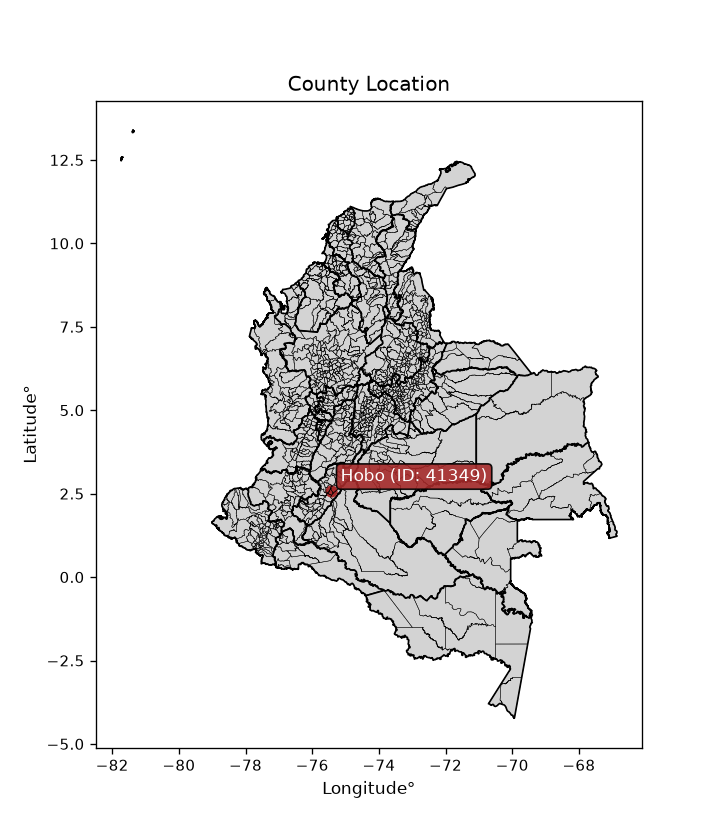
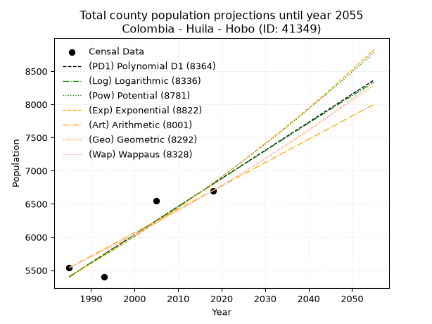
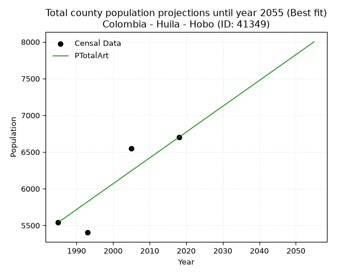
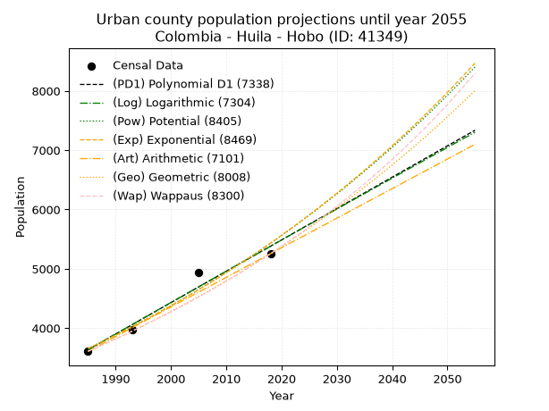
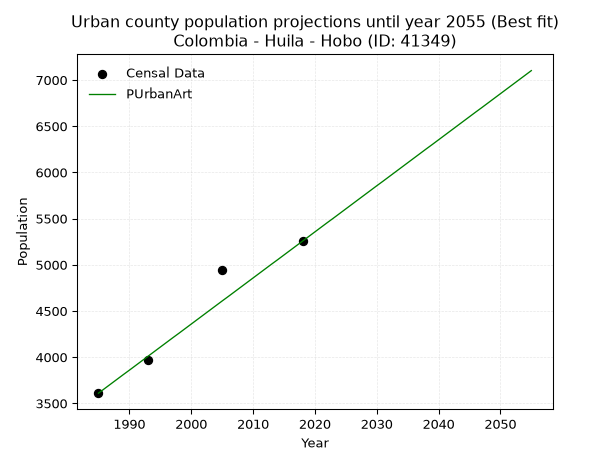
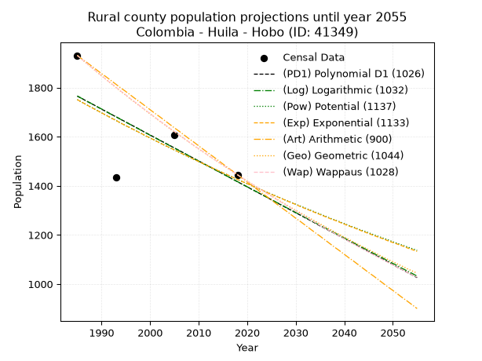
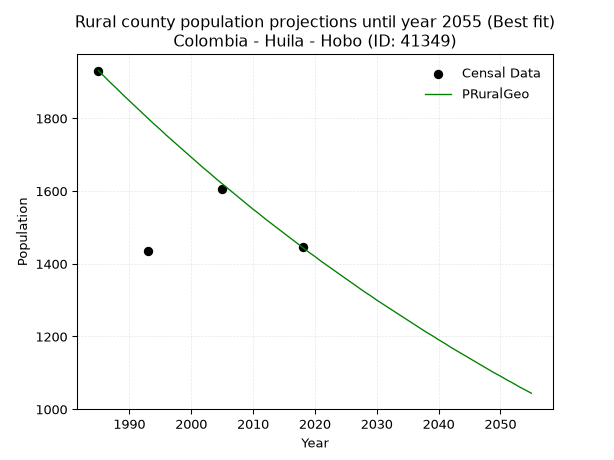

<div align="center">


</div>

# _“Population and Public Services Demand Projections (PPSD) until Year 2050 for Colombia - Huila - Hobo (ID: 41349)”_
Keywords: `population` `public-service` `projection` `lineal` `polynomial` `logarithmic` `potential` `exponential` `arithmetic` `geometric` `wappaus` `dane` `colombia` `south-america`

PPSD are analytical estimates used by governments and planners to anticipate future changes in population size, age distribution, and the resulting community needs for utilities, healthcare, education, and infrastructure as sizing future water treatment facilities, electrical grids, and road networks based on spatial growth.

> **General running parameters**: • app_version: _v20260806_. • Python version: _3.14.7_. • Pandas version: _3.0.5_. • NumPy version: _2.5.1_. • Creates, save and include plots into reports (create_plot): _False_. • Projection until year: _2050_. • Process polynomial degree 2 and up: _False_. • Process Wappaus: _True_. • Process Wappaus: _True_. • Set negative values to zero: _True_. • Set infinite values to zero: _True_. • Drop dataset notes: _True_. 
<div align="center">

Dynamic map: [:earth_americas:Google](http://maps.google.com/maps?q=2.580812389,-75.4476973) [:earth_americas:OSM](https://www.openstreetmap.org/#map=18/2.580812389/-75.4476973&layers=P) [:earth_americas:Bing](https://www.bing.com/maps?cp=2.580812389~-75.4476973&lvl=18) [:earth_americas:Apple](https://maps.apple.com/frame?center=2.580812389%2C-75.4476973&span=0.003%2C0.006)

</div>


<div align="center">

```geojson
{
  "type": "Feature",
  "geometry": {
    "type": "Point", 
    "coordinates": [-75.4476973, 2.580812389]
  }, 
  "properties": {
    "Name": "Colombia - Huila - Hobo (ID: 41349)"
  }
}
```

</div>


<div align="center">

</img>

</div>


## 0. Census Data (4 records)

Census data are official statistics collected by a government about the people and housing in a country. They usually include counts of total population, age, sex, race, income, education, and jobs.

📅Global census file: [Population.xlsx](../data/Population.xlsx)

| Source   |   Year |   CountryID | CountryName   |   StateID | StateName   |   CountyID | CountyName   |   PTotal |   PUrban |   PRural |
|:---------|-------:|------------:|:--------------|----------:|:------------|-----------:|:-------------|---------:|---------:|---------:|
| DANE     |   1985 |          57 | Colombia      |        41 | Huila       |      41349 | Hobo         |     5540 |     3609 |     1931 |
| DANE     |   1993 |          57 | Colombia      |        41 | Huila       |      41349 | Hobo         |     5403 |     3968 |     1435 |
| DANE     |   2005 |          57 | Colombia      |        41 | Huila       |      41349 | Hobo         |     6545 |     4939 |     1606 |
| DANE     |   2018 |          57 | Colombia      |        41 | Huila       |      41349 | Hobo         |     6700 |     5255 |     1445 |

> 🔥Some records could had specific notes about the registered values or the corresponding urban or rural distribution.

📅   [RUPS](https://www.datos.gov.co/Hacienda-y-Cr-dito-P-blico/Registro-nico-de-Prestadores-de-Servicios-P-blicos/4qkq-csdn/about_data) - Local public utility companies: [RUPS.csv](../data/RUPS.xlsx)

 | SERVICIO       | ESTADO    | NOMBRE                                                                    | NIT         | DEPARTAMENTO_DOMICILIO   | MUNICIPIO_DOMICILIO   | DIRECCION            |   TELEFONO | EMAIL                                | TIPO_PRESTADOR                             | CLASIFICACION                 |
|:---------------|:----------|:--------------------------------------------------------------------------|:------------|:-------------------------|:----------------------|:---------------------|-----------:|:-------------------------------------|:-------------------------------------------|:------------------------------|
| ACUEDUCTO      | OPERATIVA | EMPRESAS PUBLICAS EL HOBO SOCIEDAD ANONIMA EMPRESA DE SERVICIOS PUBLICOS  | 900189880-1 | HUILA                    | HOBO                  | CALLE 5 # 7 - 75     |    8384044 | emuserhobo@hotmail.com               | SOCIEDADES (EMPRESA DE SERVICIOS PUBLICOS) | MENOR O IGUAL A 2500 USUARIOS |
| ALCANTARILLADO | OPERATIVA | EMPRESAS PUBLICAS EL HOBO SOCIEDAD ANONIMA EMPRESA DE SERVICIOS PUBLICOS  | 900189880-1 | HUILA                    | HOBO                  | CALLE 5 # 7 - 75     |    8384044 | emuserhobo@hotmail.com               | SOCIEDADES (EMPRESA DE SERVICIOS PUBLICOS) | MENOR O IGUAL A 2500 USUARIOS |
| ACUEDUCTO      | OPERATIVA | JUNTA ADMINISTRADORA ACUEDUCTO CUIDEMOS LOS BOSQUES DE LA VEREDA EL BATAN | 813013412-7 | HUILA                    | HOBO                  | ESCUELA VEREDA BATAN |    8384486 | contacto@hobo-huila.gov.co           | ORGANIZACION AUTORIZADA                    | HASTA 2500 SUSCRIPTORES       |
| ACUEDUCTO      | OPERATIVA | ASOCIACION JUNTA ADMINISTRADORA DEL ACUEDUCTO VEREDA ESTORACAL DE EL HOBO | 900362414-3 | HUILA                    | HOBO                  | Cra. 9No.5-41        |    8384131 | argemiro.lopez@cafeteroscolombia.org | ORGANIZACION AUTORIZADA                    | HASTA 2500 SUSCRIPTORES       |

## 1. Total

### 1.1. Coefficients and Parameters

* (PD1) Polynomial Deg 1: 42.32356483340002, -78610.71055800839 (lineal)
* (Log) Logarithmic: 84723.35464383032, -637935.8975781092
* (Pow) Potential: 13.976193313863478, -42.356941747466465
* (Exp) Exponential: 0.006981782466780411, 0.005181733351462252
* (Art) Arithmetic: Year diff. 2018 - 1985 = 33, Population diff. 6700 - 5540 = 1160, Annual growth = 35.15151515151515
* (Geo) Geometric: Year diff. 2018 - 1985 = 33, Population diff. 6700 - 5540 = 1160, Annual growth % = 0.005777627254926587
* (Wap) Wappaus: i = 0.5743711626064567, Condition values only valid for < 200)

<sub>
Wappaus condition values: ['0.00', '0.57', '1.15', '1.72', '2.30', '2.87', '3.45', '4.02', '4.59', '5.17', '5.74', '6.32', '6.89', '7.47', '8.04', '8.62', '9.19', '9.76', '10.34', '10.91', '11.49', '12.06', '12.64', '13.21', '13.78', '14.36', '14.93', '15.51', '16.08', '16.66', '17.23', '17.81', '18.38', '18.95', '19.53', '20.10', '20.68', '21.25', '21.83', '22.40', '22.97', '23.55', '24.12', '24.70', '25.27', '25.85', '26.42', '27.00', '27.57', '28.14', '28.72', '29.29', '29.87', '30.44', '31.02', '31.59', '32.16', '32.74', '33.31', '33.89', '34.46', '35.04', '35.61', '36.19', '36.76', '37.33']
</sub>


### 1.2. Projected Dataset

|   Year |   CountyID |   PTotalPD1 |   PTotalLog |   PTotalPow |   PTotalExp |   PTotalArt |   PTotalGeo |   PTotalWap |
|-------:|-----------:|------------:|------------:|------------:|------------:|------------:|------------:|------------:|
|   1985 |      41349 |        5402 |        5400 |        5410 |        5411 |        5540 |        5540 |        5540 |
|   1986 |      41349 |        5444 |        5443 |        5448 |        5449 |        5575 |        5572 |        5572 |
|   1987 |      41349 |        5486 |        5486 |        5487 |        5487 |        5610 |        5604 |        5604 |
|   1988 |      41349 |        5529 |        5528 |        5525 |        5526 |        5645 |        5637 |        5636 |
|   1989 |      41349 |        5571 |        5571 |        5564 |        5564 |        5681 |        5669 |        5669 |
|   1990 |      41349 |        5613 |        5613 |        5604 |        5603 |        5716 |        5702 |        5701 |
|   1991 |      41349 |        5656 |        5656 |        5643 |        5643 |        5751 |        5735 |        5734 |
|   1992 |      41349 |        5698 |        5698 |        5683 |        5682 |        5786 |        5768 |        5767 |
|   1993 |      41349 |        5740 |        5741 |        5723 |        5722 |        5821 |        5801 |        5801 |
|   1994 |      41349 |        5782 |        5784 |        5763 |        5762 |        5856 |        5835 |        5834 |
|   1995 |      41349 |        5825 |        5826 |        5804 |        5802 |        5892 |        5869 |        5868 |
|   1996 |      41349 |        5867 |        5868 |        5844 |        5843 |        5927 |        5902 |        5901 |
|   1997 |      41349 |        5909 |        5911 |        5885 |        5884 |        5962 |        5937 |        5935 |
|   1998 |      41349 |        5952 |        5953 |        5927 |        5925 |        5997 |        5971 |        5970 |
|   1999 |      41349 |        5994 |        5996 |        5968 |        5967 |        6032 |        6005 |        6004 |
|   2000 |      41349 |        6036 |        6038 |        6010 |        6009 |        6067 |        6040 |        6039 |
|   2001 |      41349 |        6079 |        6080 |        6052 |        6051 |        6102 |        6075 |        6074 |
|   2002 |      41349 |        6121 |        6123 |        6095 |        6093 |        6138 |        6110 |        6109 |
|   2003 |      41349 |        6163 |        6165 |        6137 |        6136 |        6173 |        6145 |        6144 |
|   2004 |      41349 |        6206 |        6207 |        6180 |        6179 |        6208 |        6181 |        6179 |
|   2005 |      41349 |        6248 |        6250 |        6224 |        6222 |        6243 |        6217 |        6215 |
|   2006 |      41349 |        6290 |        6292 |        6267 |        6266 |        6278 |        6252 |        6251 |
|   2007 |      41349 |        6333 |        6334 |        6311 |        6310 |        6313 |        6289 |        6287 |
|   2008 |      41349 |        6375 |        6376 |        6355 |        6354 |        6348 |        6325 |        6324 |
|   2009 |      41349 |        6417 |        6418 |        6399 |        6398 |        6384 |        6361 |        6360 |
|   2010 |      41349 |        6460 |        6461 |        6444 |        6443 |        6419 |        6398 |        6397 |
|   2011 |      41349 |        6502 |        6503 |        6489 |        6488 |        6454 |        6435 |        6434 |
|   2012 |      41349 |        6544 |        6545 |        6534 |        6534 |        6489 |        6472 |        6471 |
|   2013 |      41349 |        6587 |        6587 |        6580 |        6579 |        6524 |        6510 |        6509 |
|   2014 |      41349 |        6629 |        6629 |        6626 |        6626 |        6559 |        6547 |        6547 |
|   2015 |      41349 |        6671 |        6671 |        6672 |        6672 |        6595 |        6585 |        6585 |
|   2016 |      41349 |        6714 |        6713 |        6718 |        6719 |        6630 |        6623 |        6623 |
|   2017 |      41349 |        6756 |        6755 |        6765 |        6766 |        6665 |        6662 |        6661 |
|   2018 |      41349 |        6798 |        6797 |        6812 |        6813 |        6700 |        6700 |        6700 |
|   2019 |      41349 |        6841 |        6839 |        6859 |        6861 |        6735 |        6739 |        6739 |
|   2020 |      41349 |        6883 |        6881 |        6907 |        6909 |        6770 |        6778 |        6778 |
|   2021 |      41349 |        6925 |        6923 |        6955 |        6957 |        6805 |        6817 |        6818 |
|   2022 |      41349 |        6968 |        6965 |        7003 |        7006 |        6841 |        6856 |        6857 |
|   2023 |      41349 |        7010 |        7007 |        7052 |        7055 |        6876 |        6896 |        6897 |
|   2024 |      41349 |        7052 |        7049 |        7101 |        7105 |        6911 |        6936 |        6938 |
|   2025 |      41349 |        7095 |        7091 |        7150 |        7154 |        6946 |        6976 |        6978 |
|   2026 |      41349 |        7137 |        7132 |        7199 |        7205 |        6981 |        7016 |        7019 |
|   2027 |      41349 |        7179 |        7174 |        7249 |        7255 |        7016 |        7057 |        7060 |
|   2028 |      41349 |        7221 |        7216 |        7299 |        7306 |        7052 |        7097 |        7101 |
|   2029 |      41349 |        7264 |        7258 |        7350 |        7357 |        7087 |        7138 |        7143 |
|   2030 |      41349 |        7306 |        7299 |        7401 |        7409 |        7122 |        7180 |        7184 |
|   2031 |      41349 |        7348 |        7341 |        7452 |        7461 |        7157 |        7221 |        7227 |
|   2032 |      41349 |        7391 |        7383 |        7503 |        7513 |        7192 |        7263 |        7269 |
|   2033 |      41349 |        7433 |        7425 |        7555 |        7565 |        7227 |        7305 |        7312 |
|   2034 |      41349 |        7475 |        7466 |        7607 |        7618 |        7262 |        7347 |        7355 |
|   2035 |      41349 |        7518 |        7508 |        7659 |        7672 |        7298 |        7389 |        7398 |
|   2036 |      41349 |        7560 |        7550 |        7712 |        7726 |        7333 |        7432 |        7441 |
|   2037 |      41349 |        7602 |        7591 |        7765 |        7780 |        7368 |        7475 |        7485 |
|   2038 |      41349 |        7645 |        7633 |        7819 |        7834 |        7403 |        7518 |        7529 |
|   2039 |      41349 |        7687 |        7674 |        7873 |        7889 |        7438 |        7562 |        7574 |
|   2040 |      41349 |        7729 |        7716 |        7927 |        7944 |        7473 |        7605 |        7618 |
|   2041 |      41349 |        7772 |        7757 |        7981 |        8000 |        7508 |        7649 |        7663 |
|   2042 |      41349 |        7814 |        7799 |        8036 |        8056 |        7544 |        7693 |        7709 |
|   2043 |      41349 |        7856 |        7840 |        8091 |        8113 |        7579 |        7738 |        7754 |
|   2044 |      41349 |        7899 |        7882 |        8147 |        8169 |        7614 |        7783 |        7800 |
|   2045 |      41349 |        7941 |        7923 |        8203 |        8227 |        7649 |        7828 |        7847 |
|   2046 |      41349 |        7983 |        7965 |        8259 |        8284 |        7684 |        7873 |        7893 |
|   2047 |      41349 |        8026 |        8006 |        8315 |        8342 |        7719 |        7918 |        7940 |
|   2048 |      41349 |        8068 |        8047 |        8372 |        8401 |        7755 |        7964 |        7987 |
|   2049 |      41349 |        8110 |        8089 |        8430 |        8460 |        7790 |        8010 |        8035 |
|   2050 |      41349 |        8153 |        8130 |        8487 |        8519 |        7825 |        8056 |        8083 |
<div align="center">

</img>

</div>


### 1.3. Best fit with absolute and relative error (%)

Relative error puts that difference into context by dividing the absolute error by the true value, creating a unitless ratio or percentage that shows the scale of the mistake.

Absolute and relative error

|   Year | Source   |   CountryID | CountryName   |   StateID | StateName   |   CountyID_x | CountyName   |   PTotal |   PUrban |   PRural |   CountyID_y |   PTotalPD1 |   PTotalLog |   PTotalPow |   PTotalExp |   PTotalArt |   PTotalGeo |   PTotalWap |   PTotalPD1AbsError |   PTotalLogAbsError |   PTotalPowAbsError |   PTotalExpAbsError |   PTotalArtAbsError |   PTotalGeoAbsError |   PTotalWapAbsError |   PTotalPD1RelError |   PTotalLogRelError |   PTotalPowRelError |   PTotalExpRelError |   PTotalArtRelError |   PTotalGeoRelError |   PTotalWapRelError |
|-------:|:---------|------------:|:--------------|----------:|:------------|-------------:|:-------------|---------:|---------:|---------:|-------------:|------------:|------------:|------------:|------------:|------------:|------------:|------------:|--------------------:|--------------------:|--------------------:|--------------------:|--------------------:|--------------------:|--------------------:|--------------------:|--------------------:|--------------------:|--------------------:|--------------------:|--------------------:|--------------------:|
|   1985 | DANE     |          57 | Colombia      |        41 | Huila       |        41349 | Hobo         |     5540 |     3609 |     1931 |        41349 |        5402 |        5400 |        5410 |        5411 |        5540 |        5540 |        5540 |                 138 |                 140 |                 130 |                 129 |                   0 |                   0 |                   0 |             2.49097 |             2.52708 |             2.34657 |             2.32852 |             0       |             0       |             0       |
|   1993 | DANE     |          57 | Colombia      |        41 | Huila       |        41349 | Hobo         |     5403 |     3968 |     1435 |        41349 |        5740 |        5741 |        5723 |        5722 |        5821 |        5801 |        5801 |                 337 |                 338 |                 320 |                 319 |                 418 |                 398 |                 398 |             6.23728 |             6.25578 |             5.92264 |             5.90413 |             7.73644 |             7.36628 |             7.36628 |
|   2005 | DANE     |          57 | Colombia      |        41 | Huila       |        41349 | Hobo         |     6545 |     4939 |     1606 |        41349 |        6248 |        6250 |        6224 |        6222 |        6243 |        6217 |        6215 |                 297 |                 295 |                 321 |                 323 |                 302 |                 328 |                 330 |             4.53782 |             4.50726 |             4.90451 |             4.93506 |             4.61421 |             5.01146 |             5.04202 |
|   2018 | DANE     |          57 | Colombia      |        41 | Huila       |        41349 | Hobo         |     6700 |     5255 |     1445 |        41349 |        6798 |        6797 |        6812 |        6813 |        6700 |        6700 |        6700 |                  98 |                  97 |                 112 |                 113 |                   0 |                   0 |                   0 |             1.46269 |             1.44776 |             1.67164 |             1.68657 |             0       |             0       |             0       |

Relative error mean

| Method    |   RelError | Best   |
|:----------|-----------:|:-------|
| PTotalPD1 |    3.68219 |        |
| PTotalLog |    3.68447 |        |
| PTotalPow |    3.71134 |        |
| PTotalExp |    3.71357 |        |
| PTotalArt |    3.08766 | True   |
| PTotalGeo |    3.09443 |        |
| PTotalWap |    3.10207 |        |

💙Best method: _**PTotalArt**_
<div align="center">

</img>

</div>


### 1.4. Fresh water supply demand in liters per capita per day (lpcd)

The fresh water supply demand typically ranges from 100 to 300 liters per capita per day (lpcd) for standard domestic and municipal planning, though absolute survival minimums set by the World Health Organization are as low as 7.5 to 20 liters per day, and total consumption in high-income nations can exceed 400 liters.

> `CZ`: Level in meters above the sea level (masl)<br> `WS`: Fresh water supply demand in liters per capita per day (lpcd or l/h/d)<br> `WSAll`: Zonal fresh water supply demand in liters per second (l/s)<br> `A`: Zonal area in square meters<br> `DP`: Population density (people/hectare or p/ha)

Reference values (RAS Colombia)

|    CZ |   WS |
|------:|-----:|
|  1000 |  120 |
|  2000 |  130 |
| 99999 |  140 |

County shapefile geometry properties and water supply values

|   CountyID |      ATotal |   CZTotal |   WSTotal |
|-----------:|------------:|----------:|----------:|
|      41349 | 1.94275e+08 |   955.479 |       120 |

Projected values for best method: PTotalArt

|   CountyID |   Year |   PTotalArt |   DPTotal |   WSTotal |   WSTotalAll |
|-----------:|-------:|------------:|----------:|----------:|-------------:|
|      41349 |   1985 |        5540 |      0.29 |       120 |      7.69444 |
|      41349 |   1986 |        5575 |      0.29 |       120 |      7.74306 |
|      41349 |   1987 |        5610 |      0.29 |       120 |      7.79167 |
|      41349 |   1988 |        5645 |      0.29 |       120 |      7.84028 |
|      41349 |   1989 |        5681 |      0.29 |       120 |      7.89028 |
|      41349 |   1990 |        5716 |      0.29 |       120 |      7.93889 |
|      41349 |   1991 |        5751 |      0.3  |       120 |      7.9875  |
|      41349 |   1992 |        5786 |      0.3  |       120 |      8.03611 |
|      41349 |   1993 |        5821 |      0.3  |       120 |      8.08472 |
|      41349 |   1994 |        5856 |      0.3  |       120 |      8.13333 |
|      41349 |   1995 |        5892 |      0.3  |       120 |      8.18333 |
|      41349 |   1996 |        5927 |      0.31 |       120 |      8.23194 |
|      41349 |   1997 |        5962 |      0.31 |       120 |      8.28056 |
|      41349 |   1998 |        5997 |      0.31 |       120 |      8.32917 |
|      41349 |   1999 |        6032 |      0.31 |       120 |      8.37778 |
|      41349 |   2000 |        6067 |      0.31 |       120 |      8.42639 |
|      41349 |   2001 |        6102 |      0.31 |       120 |      8.475   |
|      41349 |   2002 |        6138 |      0.32 |       120 |      8.525   |
|      41349 |   2003 |        6173 |      0.32 |       120 |      8.57361 |
|      41349 |   2004 |        6208 |      0.32 |       120 |      8.62222 |
|      41349 |   2005 |        6243 |      0.32 |       120 |      8.67083 |
|      41349 |   2006 |        6278 |      0.32 |       120 |      8.71944 |
|      41349 |   2007 |        6313 |      0.32 |       120 |      8.76806 |
|      41349 |   2008 |        6348 |      0.33 |       120 |      8.81667 |
|      41349 |   2009 |        6384 |      0.33 |       120 |      8.86667 |
|      41349 |   2010 |        6419 |      0.33 |       120 |      8.91528 |
|      41349 |   2011 |        6454 |      0.33 |       120 |      8.96389 |
|      41349 |   2012 |        6489 |      0.33 |       120 |      9.0125  |
|      41349 |   2013 |        6524 |      0.34 |       120 |      9.06111 |
|      41349 |   2014 |        6559 |      0.34 |       120 |      9.10972 |
|      41349 |   2015 |        6595 |      0.34 |       120 |      9.15972 |
|      41349 |   2016 |        6630 |      0.34 |       120 |      9.20833 |
|      41349 |   2017 |        6665 |      0.34 |       120 |      9.25694 |
|      41349 |   2018 |        6700 |      0.34 |       120 |      9.30556 |
|      41349 |   2019 |        6735 |      0.35 |       120 |      9.35417 |
|      41349 |   2020 |        6770 |      0.35 |       120 |      9.40278 |
|      41349 |   2021 |        6805 |      0.35 |       120 |      9.45139 |
|      41349 |   2022 |        6841 |      0.35 |       120 |      9.50139 |
|      41349 |   2023 |        6876 |      0.35 |       120 |      9.55    |
|      41349 |   2024 |        6911 |      0.36 |       120 |      9.59861 |
|      41349 |   2025 |        6946 |      0.36 |       120 |      9.64722 |
|      41349 |   2026 |        6981 |      0.36 |       120 |      9.69583 |
|      41349 |   2027 |        7016 |      0.36 |       120 |      9.74444 |
|      41349 |   2028 |        7052 |      0.36 |       120 |      9.79444 |
|      41349 |   2029 |        7087 |      0.36 |       120 |      9.84306 |
|      41349 |   2030 |        7122 |      0.37 |       120 |      9.89167 |
|      41349 |   2031 |        7157 |      0.37 |       120 |      9.94028 |
|      41349 |   2032 |        7192 |      0.37 |       120 |      9.98889 |
|      41349 |   2033 |        7227 |      0.37 |       120 |     10.0375  |
|      41349 |   2034 |        7262 |      0.37 |       120 |     10.0861  |
|      41349 |   2035 |        7298 |      0.38 |       120 |     10.1361  |
|      41349 |   2036 |        7333 |      0.38 |       120 |     10.1847  |
|      41349 |   2037 |        7368 |      0.38 |       120 |     10.2333  |
|      41349 |   2038 |        7403 |      0.38 |       120 |     10.2819  |
|      41349 |   2039 |        7438 |      0.38 |       120 |     10.3306  |
|      41349 |   2040 |        7473 |      0.38 |       120 |     10.3792  |
|      41349 |   2041 |        7508 |      0.39 |       120 |     10.4278  |
|      41349 |   2042 |        7544 |      0.39 |       120 |     10.4778  |
|      41349 |   2043 |        7579 |      0.39 |       120 |     10.5264  |
|      41349 |   2044 |        7614 |      0.39 |       120 |     10.575   |
|      41349 |   2045 |        7649 |      0.39 |       120 |     10.6236  |
|      41349 |   2046 |        7684 |      0.4  |       120 |     10.6722  |
|      41349 |   2047 |        7719 |      0.4  |       120 |     10.7208  |
|      41349 |   2048 |        7755 |      0.4  |       120 |     10.7708  |
|      41349 |   2049 |        7790 |      0.4  |       120 |     10.8194  |
|      41349 |   2050 |        7825 |      0.4  |       120 |     10.8681  |

## 2. Urban

### 2.1. Coefficients and Parameters

* (PD1) Polynomial Deg 1: 52.88036932958627, -101331.20875150495 (lineal)
* (Log) Logarithmic: 105882.83821709112, -800373.5517799245
* (Pow) Potential: 24.027390821863143, -75.67369669913592
* (Exp) Exponential: 0.011998794579850808, 1.656606150394891e-07
* (Art) Arithmetic: Year diff. 2018 - 1985 = 33, Population diff. 5255 - 3609 = 1646, Annual growth = 49.878787878787875
* (Geo) Geometric: Year diff. 2018 - 1985 = 33, Population diff. 5255 - 3609 = 1646, Annual growth % = 0.011451412906883451
* (Wap) Wappaus: i = 1.1254239142325786, Condition values only valid for < 200)

<sub>
Wappaus condition values: ['0.00', '1.13', '2.25', '3.38', '4.50', '5.63', '6.75', '7.88', '9.00', '10.13', '11.25', '12.38', '13.51', '14.63', '15.76', '16.88', '18.01', '19.13', '20.26', '21.38', '22.51', '23.63', '24.76', '25.88', '27.01', '28.14', '29.26', '30.39', '31.51', '32.64', '33.76', '34.89', '36.01', '37.14', '38.26', '39.39', '40.52', '41.64', '42.77', '43.89', '45.02', '46.14', '47.27', '48.39', '49.52', '50.64', '51.77', '52.89', '54.02', '55.15', '56.27', '57.40', '58.52', '59.65', '60.77', '61.90', '63.02', '64.15', '65.27', '66.40', '67.53', '68.65', '69.78', '70.90', '72.03', '73.15']
</sub>


### 2.2. Projected Dataset

|   Year |   CountyID |   PUrbanPD1 |   PUrbanLog |   PUrbanPow |   PUrbanExp |   PUrbanArt |   PUrbanGeo |   PUrbanWap |
|-------:|-----------:|------------:|------------:|------------:|------------:|------------:|------------:|------------:|
|   1985 |      41349 |        3636 |        3634 |        3655 |        3657 |        3609 |        3609 |        3609 |
|   1986 |      41349 |        3689 |        3688 |        3699 |        3701 |        3659 |        3650 |        3650 |
|   1987 |      41349 |        3742 |        3741 |        3744 |        3745 |        3709 |        3692 |        3691 |
|   1988 |      41349 |        3795 |        3794 |        3790 |        3791 |        3759 |        3734 |        3733 |
|   1989 |      41349 |        3848 |        3848 |        3836 |        3836 |        3809 |        3777 |        3775 |
|   1990 |      41349 |        3901 |        3901 |        3883 |        3883 |        3858 |        3820 |        3818 |
|   1991 |      41349 |        3954 |        3954 |        3930 |        3930 |        3908 |        3864 |        3861 |
|   1992 |      41349 |        4006 |        4007 |        3978 |        3977 |        3958 |        3908 |        3905 |
|   1993 |      41349 |        4059 |        4060 |        4026 |        4025 |        4008 |        3953 |        3949 |
|   1994 |      41349 |        4112 |        4113 |        4075 |        4074 |        4058 |        3998 |        3994 |
|   1995 |      41349 |        4165 |        4167 |        4124 |        4123 |        4108 |        4044 |        4039 |
|   1996 |      41349 |        4218 |        4220 |        4174 |        4172 |        4158 |        4091 |        4085 |
|   1997 |      41349 |        4271 |        4273 |        4225 |        4223 |        4208 |        4137 |        4132 |
|   1998 |      41349 |        4324 |        4326 |        4276 |        4274 |        4257 |        4185 |        4179 |
|   1999 |      41349 |        4377 |        4379 |        4327 |        4325 |        4307 |        4233 |        4226 |
|   2000 |      41349 |        4430 |        4432 |        4380 |        4378 |        4357 |        4281 |        4274 |
|   2001 |      41349 |        4482 |        4485 |        4433 |        4430 |        4407 |        4330 |        4323 |
|   2002 |      41349 |        4535 |        4537 |        4486 |        4484 |        4457 |        4380 |        4373 |
|   2003 |      41349 |        4588 |        4590 |        4540 |        4538 |        4507 |        4430 |        4422 |
|   2004 |      41349 |        4641 |        4643 |        4595 |        4593 |        4557 |        4481 |        4473 |
|   2005 |      41349 |        4694 |        4696 |        4650 |        4648 |        4607 |        4532 |        4524 |
|   2006 |      41349 |        4747 |        4749 |        4707 |        4704 |        4656 |        4584 |        4576 |
|   2007 |      41349 |        4800 |        4802 |        4763 |        4761 |        4706 |        4636 |        4629 |
|   2008 |      41349 |        4853 |        4854 |        4821 |        4819 |        4756 |        4689 |        4682 |
|   2009 |      41349 |        4905 |        4907 |        4879 |        4877 |        4806 |        4743 |        4736 |
|   2010 |      41349 |        4958 |        4960 |        4937 |        4936 |        4856 |        4797 |        4791 |
|   2011 |      41349 |        5011 |        5012 |        4997 |        4995 |        4906 |        4852 |        4846 |
|   2012 |      41349 |        5064 |        5065 |        5057 |        5056 |        4956 |        4908 |        4902 |
|   2013 |      41349 |        5117 |        5118 |        5117 |        5117 |        5006 |        4964 |        4959 |
|   2014 |      41349 |        5170 |        5170 |        5179 |        5178 |        5055 |        5021 |        5017 |
|   2015 |      41349 |        5223 |        5223 |        5241 |        5241 |        5105 |        5079 |        5075 |
|   2016 |      41349 |        5276 |        5275 |        5304 |        5304 |        5155 |        5137 |        5134 |
|   2017 |      41349 |        5328 |        5328 |        5367 |        5368 |        5205 |        5196 |        5194 |
|   2018 |      41349 |        5381 |        5380 |        5432 |        5433 |        5255 |        5255 |        5255 |
|   2019 |      41349 |        5434 |        5433 |        5497 |        5499 |        5305 |        5315 |        5317 |
|   2020 |      41349 |        5487 |        5485 |        5563 |        5565 |        5355 |        5376 |        5379 |
|   2021 |      41349 |        5540 |        5538 |        5629 |        5632 |        5405 |        5438 |        5443 |
|   2022 |      41349 |        5593 |        5590 |        5696 |        5700 |        5455 |        5500 |        5507 |
|   2023 |      41349 |        5646 |        5642 |        5764 |        5769 |        5504 |        5563 |        5572 |
|   2024 |      41349 |        5699 |        5695 |        5833 |        5839 |        5554 |        5627 |        5638 |
|   2025 |      41349 |        5752 |        5747 |        5903 |        5909 |        5604 |        5691 |        5706 |
|   2026 |      41349 |        5804 |        5799 |        5973 |        5980 |        5654 |        5756 |        5774 |
|   2027 |      41349 |        5857 |        5851 |        6045 |        6053 |        5704 |        5822 |        5843 |
|   2028 |      41349 |        5910 |        5904 |        6117 |        6126 |        5754 |        5889 |        5913 |
|   2029 |      41349 |        5963 |        5956 |        6190 |        6200 |        5804 |        5956 |        5984 |
|   2030 |      41349 |        6016 |        6008 |        6263 |        6274 |        5854 |        6024 |        6057 |
|   2031 |      41349 |        6069 |        6060 |        6338 |        6350 |        5903 |        6093 |        6130 |
|   2032 |      41349 |        6122 |        6112 |        6413 |        6427 |        5953 |        6163 |        6204 |
|   2033 |      41349 |        6175 |        6164 |        6490 |        6504 |        6003 |        6234 |        6280 |
|   2034 |      41349 |        6227 |        6216 |        6567 |        6583 |        6053 |        6305 |        6357 |
|   2035 |      41349 |        6280 |        6268 |        6645 |        6662 |        6103 |        6377 |        6435 |
|   2036 |      41349 |        6333 |        6321 |        6724 |        6743 |        6153 |        6450 |        6514 |
|   2037 |      41349 |        6386 |        6373 |        6803 |        6824 |        6203 |        6524 |        6595 |
|   2038 |      41349 |        6439 |        6424 |        6884 |        6907 |        6253 |        6599 |        6677 |
|   2039 |      41349 |        6492 |        6476 |        6966 |        6990 |        6302 |        6674 |        6760 |
|   2040 |      41349 |        6545 |        6528 |        7048 |        7074 |        6352 |        6751 |        6844 |
|   2041 |      41349 |        6598 |        6580 |        7132 |        7160 |        6402 |        6828 |        6930 |
|   2042 |      41349 |        6651 |        6632 |        7216 |        7246 |        6452 |        6906 |        7017 |
|   2043 |      41349 |        6703 |        6684 |        7302 |        7334 |        6502 |        6986 |        7106 |
|   2044 |      41349 |        6756 |        6736 |        7388 |        7422 |        6552 |        7066 |        7196 |
|   2045 |      41349 |        6809 |        6788 |        7475 |        7512 |        6602 |        7146 |        7288 |
|   2046 |      41349 |        6862 |        6839 |        7564 |        7602 |        6652 |        7228 |        7382 |
|   2047 |      41349 |        6915 |        6891 |        7653 |        7694 |        6701 |        7311 |        7477 |
|   2048 |      41349 |        6968 |        6943 |        7743 |        7787 |        6751 |        7395 |        7573 |
|   2049 |      41349 |        7021 |        6994 |        7835 |        7881 |        6801 |        7479 |        7672 |
|   2050 |      41349 |        7074 |        7046 |        7927 |        7976 |        6851 |        7565 |        7772 |
<div align="center">

</img>

</div>


### 2.3. Best fit with absolute and relative error (%)

Relative error puts that difference into context by dividing the absolute error by the true value, creating a unitless ratio or percentage that shows the scale of the mistake.

Absolute and relative error

|   Year | Source   |   CountryID | CountryName   |   StateID | StateName   |   CountyID_x | CountyName   |   PTotal |   PUrban |   PRural |   CountyID_y |   PUrbanPD1 |   PUrbanLog |   PUrbanPow |   PUrbanExp |   PUrbanArt |   PUrbanGeo |   PUrbanWap |   PUrbanPD1AbsError |   PUrbanLogAbsError |   PUrbanPowAbsError |   PUrbanExpAbsError |   PUrbanArtAbsError |   PUrbanGeoAbsError |   PUrbanWapAbsError |   PUrbanPD1RelError |   PUrbanLogRelError |   PUrbanPowRelError |   PUrbanExpRelError |   PUrbanArtRelError |   PUrbanGeoRelError |   PUrbanWapRelError |
|-------:|:---------|------------:|:--------------|----------:|:------------|-------------:|:-------------|---------:|---------:|---------:|-------------:|------------:|------------:|------------:|------------:|------------:|------------:|------------:|--------------------:|--------------------:|--------------------:|--------------------:|--------------------:|--------------------:|--------------------:|--------------------:|--------------------:|--------------------:|--------------------:|--------------------:|--------------------:|--------------------:|
|   1985 | DANE     |          57 | Colombia      |        41 | Huila       |        41349 | Hobo         |     5540 |     3609 |     1931 |        41349 |        3636 |        3634 |        3655 |        3657 |        3609 |        3609 |        3609 |                  27 |                  25 |                  46 |                  48 |                   0 |                   0 |                   0 |             0.74813 |            0.692713 |             1.27459 |             1.33001 |             0       |            0        |            0        |
|   1993 | DANE     |          57 | Colombia      |        41 | Huila       |        41349 | Hobo         |     5403 |     3968 |     1435 |        41349 |        4059 |        4060 |        4026 |        4025 |        4008 |        3953 |        3949 |                  91 |                  92 |                  58 |                  57 |                  40 |                  15 |                  19 |             2.29335 |            2.31855  |             1.46169 |             1.43649 |             1.00806 |            0.378024 |            0.478831 |
|   2005 | DANE     |          57 | Colombia      |        41 | Huila       |        41349 | Hobo         |     6545 |     4939 |     1606 |        41349 |        4694 |        4696 |        4650 |        4648 |        4607 |        4532 |        4524 |                 245 |                 243 |                 289 |                 291 |                 332 |                 407 |                 415 |             4.96052 |            4.92002  |             5.85139 |             5.89188 |             6.72201 |            8.24053  |            8.40251  |
|   2018 | DANE     |          57 | Colombia      |        41 | Huila       |        41349 | Hobo         |     6700 |     5255 |     1445 |        41349 |        5381 |        5380 |        5432 |        5433 |        5255 |        5255 |        5255 |                 126 |                 125 |                 177 |                 178 |                   0 |                   0 |                   0 |             2.39772 |            2.37869  |             3.36822 |             3.38725 |             0       |            0        |            0        |

Relative error mean

| Method    |   RelError | Best   |
|:----------|-----------:|:-------|
| PUrbanPD1 |    2.59993 |        |
| PUrbanLog |    2.57749 |        |
| PUrbanPow |    2.98897 |        |
| PUrbanExp |    3.01141 |        |
| PUrbanArt |    1.93252 | True   |
| PUrbanGeo |    2.15464 |        |
| PUrbanWap |    2.22034 |        |

💙Best method: _**PUrbanArt**_
<div align="center">

</img>

</div>


### 2.4. Fresh water supply demand in liters per capita per day (lpcd)

The fresh water supply demand typically ranges from 100 to 300 liters per capita per day (lpcd) for standard domestic and municipal planning, though absolute survival minimums set by the World Health Organization are as low as 7.5 to 20 liters per day, and total consumption in high-income nations can exceed 400 liters.

> `CZ`: Level in meters above the sea level (masl)<br> `WS`: Fresh water supply demand in liters per capita per day (lpcd or l/h/d)<br> `WSAll`: Zonal fresh water supply demand in liters per second (l/s)<br> `A`: Zonal area in square meters<br> `DP`: Population density (people/hectare or p/ha)

Reference values (RAS Colombia)

|    CZ |   WS |
|------:|-----:|
|  1000 |  120 |
|  2000 |  130 |
| 99999 |  140 |

County shapefile geometry properties and water supply values

|   CountyID |   AUrban |   CZUrban |   WSUrban |
|-----------:|---------:|----------:|----------:|
|      41349 |   863225 |   606.236 |       120 |

Projected values for best method: PUrbanArt

|   CountyID |   Year |   PUrbanArt |   DPUrban |   WSUrban |   WSUrbanAll |
|-----------:|-------:|------------:|----------:|----------:|-------------:|
|      41349 |   1985 |        3609 |     41.81 |       120 |      5.0125  |
|      41349 |   1986 |        3659 |     42.39 |       120 |      5.08194 |
|      41349 |   1987 |        3709 |     42.97 |       120 |      5.15139 |
|      41349 |   1988 |        3759 |     43.55 |       120 |      5.22083 |
|      41349 |   1989 |        3809 |     44.13 |       120 |      5.29028 |
|      41349 |   1990 |        3858 |     44.69 |       120 |      5.35833 |
|      41349 |   1991 |        3908 |     45.27 |       120 |      5.42778 |
|      41349 |   1992 |        3958 |     45.85 |       120 |      5.49722 |
|      41349 |   1993 |        4008 |     46.43 |       120 |      5.56667 |
|      41349 |   1994 |        4058 |     47.01 |       120 |      5.63611 |
|      41349 |   1995 |        4108 |     47.59 |       120 |      5.70556 |
|      41349 |   1996 |        4158 |     48.17 |       120 |      5.775   |
|      41349 |   1997 |        4208 |     48.75 |       120 |      5.84444 |
|      41349 |   1998 |        4257 |     49.32 |       120 |      5.9125  |
|      41349 |   1999 |        4307 |     49.89 |       120 |      5.98194 |
|      41349 |   2000 |        4357 |     50.47 |       120 |      6.05139 |
|      41349 |   2001 |        4407 |     51.05 |       120 |      6.12083 |
|      41349 |   2002 |        4457 |     51.63 |       120 |      6.19028 |
|      41349 |   2003 |        4507 |     52.21 |       120 |      6.25972 |
|      41349 |   2004 |        4557 |     52.79 |       120 |      6.32917 |
|      41349 |   2005 |        4607 |     53.37 |       120 |      6.39861 |
|      41349 |   2006 |        4656 |     53.94 |       120 |      6.46667 |
|      41349 |   2007 |        4706 |     54.52 |       120 |      6.53611 |
|      41349 |   2008 |        4756 |     55.1  |       120 |      6.60556 |
|      41349 |   2009 |        4806 |     55.67 |       120 |      6.675   |
|      41349 |   2010 |        4856 |     56.25 |       120 |      6.74444 |
|      41349 |   2011 |        4906 |     56.83 |       120 |      6.81389 |
|      41349 |   2012 |        4956 |     57.41 |       120 |      6.88333 |
|      41349 |   2013 |        5006 |     57.99 |       120 |      6.95278 |
|      41349 |   2014 |        5055 |     58.56 |       120 |      7.02083 |
|      41349 |   2015 |        5105 |     59.14 |       120 |      7.09028 |
|      41349 |   2016 |        5155 |     59.72 |       120 |      7.15972 |
|      41349 |   2017 |        5205 |     60.3  |       120 |      7.22917 |
|      41349 |   2018 |        5255 |     60.88 |       120 |      7.29861 |
|      41349 |   2019 |        5305 |     61.46 |       120 |      7.36806 |
|      41349 |   2020 |        5355 |     62.03 |       120 |      7.4375  |
|      41349 |   2021 |        5405 |     62.61 |       120 |      7.50694 |
|      41349 |   2022 |        5455 |     63.19 |       120 |      7.57639 |
|      41349 |   2023 |        5504 |     63.76 |       120 |      7.64444 |
|      41349 |   2024 |        5554 |     64.34 |       120 |      7.71389 |
|      41349 |   2025 |        5604 |     64.92 |       120 |      7.78333 |
|      41349 |   2026 |        5654 |     65.5  |       120 |      7.85278 |
|      41349 |   2027 |        5704 |     66.08 |       120 |      7.92222 |
|      41349 |   2028 |        5754 |     66.66 |       120 |      7.99167 |
|      41349 |   2029 |        5804 |     67.24 |       120 |      8.06111 |
|      41349 |   2030 |        5854 |     67.82 |       120 |      8.13056 |
|      41349 |   2031 |        5903 |     68.38 |       120 |      8.19861 |
|      41349 |   2032 |        5953 |     68.96 |       120 |      8.26806 |
|      41349 |   2033 |        6003 |     69.54 |       120 |      8.3375  |
|      41349 |   2034 |        6053 |     70.12 |       120 |      8.40694 |
|      41349 |   2035 |        6103 |     70.7  |       120 |      8.47639 |
|      41349 |   2036 |        6153 |     71.28 |       120 |      8.54583 |
|      41349 |   2037 |        6203 |     71.86 |       120 |      8.61528 |
|      41349 |   2038 |        6253 |     72.44 |       120 |      8.68472 |
|      41349 |   2039 |        6302 |     73.01 |       120 |      8.75278 |
|      41349 |   2040 |        6352 |     73.58 |       120 |      8.82222 |
|      41349 |   2041 |        6402 |     74.16 |       120 |      8.89167 |
|      41349 |   2042 |        6452 |     74.74 |       120 |      8.96111 |
|      41349 |   2043 |        6502 |     75.32 |       120 |      9.03056 |
|      41349 |   2044 |        6552 |     75.9  |       120 |      9.1     |
|      41349 |   2045 |        6602 |     76.48 |       120 |      9.16944 |
|      41349 |   2046 |        6652 |     77.06 |       120 |      9.23889 |
|      41349 |   2047 |        6701 |     77.63 |       120 |      9.30694 |
|      41349 |   2048 |        6751 |     78.21 |       120 |      9.37639 |
|      41349 |   2049 |        6801 |     78.79 |       120 |      9.44583 |
|      41349 |   2050 |        6851 |     79.37 |       120 |      9.51528 |

## 3. Rural

### 3.1. Coefficients and Parameters

* (PD1) Polynomial Deg 1: -10.556804496186164, 22720.498193496373 (lineal)
* (Log) Logarithmic: -21159.483573260768, 162437.65420181493
* (Pow) Potential: -12.452624567694444, 44.309119960414314
* (Exp) Exponential: -0.006213228145855414, 397628843.91217023
* (Art) Arithmetic: Year diff. 2018 - 1985 = 33, Population diff. 1445 - 1931 = -486, Annual growth = -14.727272727272727
* (Geo) Geometric: Year diff. 2018 - 1985 = 33, Population diff. 1445 - 1931 = -486, Annual growth % = -0.008747235994357005
* (Wap) Wappaus: i = -0.8724687634640241, Condition values only valid for < 200)

<sub>
Wappaus condition values: ['-0.00', '-0.87', '-1.74', '-2.62', '-3.49', '-4.36', '-5.23', '-6.11', '-6.98', '-7.85', '-8.72', '-9.60', '-10.47', '-11.34', '-12.21', '-13.09', '-13.96', '-14.83', '-15.70', '-16.58', '-17.45', '-18.32', '-19.19', '-20.07', '-20.94', '-21.81', '-22.68', '-23.56', '-24.43', '-25.30', '-26.17', '-27.05', '-27.92', '-28.79', '-29.66', '-30.54', '-31.41', '-32.28', '-33.15', '-34.03', '-34.90', '-35.77', '-36.64', '-37.52', '-38.39', '-39.26', '-40.13', '-41.01', '-41.88', '-42.75', '-43.62', '-44.50', '-45.37', '-46.24', '-47.11', '-47.99', '-48.86', '-49.73', '-50.60', '-51.48', '-52.35', '-53.22', '-54.09', '-54.97', '-55.84', '-56.71']
</sub>


### 3.2. Projected Dataset

|   Year |   CountyID |   PRuralPD1 |   PRuralLog |   PRuralPow |   PRuralExp |   PRuralArt |   PRuralGeo |   PRuralWap |
|-------:|-----------:|------------:|------------:|------------:|------------:|------------:|------------:|------------:|
|   1985 |      41349 |        1765 |        1766 |        1751 |        1751 |        1931 |        1931 |        1931 |
|   1986 |      41349 |        1755 |        1755 |        1740 |        1740 |        1916 |        1914 |        1914 |
|   1987 |      41349 |        1744 |        1744 |        1729 |        1729 |        1902 |        1897 |        1898 |
|   1988 |      41349 |        1734 |        1734 |        1719 |        1718 |        1887 |        1881 |        1881 |
|   1989 |      41349 |        1723 |        1723 |        1708 |        1708 |        1872 |        1864 |        1865 |
|   1990 |      41349 |        1712 |        1713 |        1697 |        1697 |        1857 |        1848 |        1849 |
|   1991 |      41349 |        1702 |        1702 |        1687 |        1687 |        1843 |        1832 |        1832 |
|   1992 |      41349 |        1691 |        1691 |        1676 |        1676 |        1828 |        1816 |        1817 |
|   1993 |      41349 |        1681 |        1681 |        1666 |        1666 |        1813 |        1800 |        1801 |
|   1994 |      41349 |        1670 |        1670 |        1655 |        1655 |        1798 |        1784 |        1785 |
|   1995 |      41349 |        1660 |        1659 |        1645 |        1645 |        1784 |        1769 |        1770 |
|   1996 |      41349 |        1649 |        1649 |        1635 |        1635 |        1769 |        1753 |        1754 |
|   1997 |      41349 |        1639 |        1638 |        1625 |        1625 |        1754 |        1738 |        1739 |
|   1998 |      41349 |        1628 |        1628 |        1615 |        1615 |        1740 |        1723 |        1724 |
|   1999 |      41349 |        1617 |        1617 |        1604 |        1605 |        1725 |        1708 |        1709 |
|   2000 |      41349 |        1607 |        1606 |        1595 |        1595 |        1710 |        1693 |        1694 |
|   2001 |      41349 |        1596 |        1596 |        1585 |        1585 |        1695 |        1678 |        1679 |
|   2002 |      41349 |        1586 |        1585 |        1575 |        1575 |        1681 |        1663 |        1664 |
|   2003 |      41349 |        1575 |        1575 |        1565 |        1565 |        1666 |        1649 |        1650 |
|   2004 |      41349 |        1565 |        1564 |        1555 |        1556 |        1651 |        1634 |        1635 |
|   2005 |      41349 |        1554 |        1554 |        1546 |        1546 |        1636 |        1620 |        1621 |
|   2006 |      41349 |        1544 |        1543 |        1536 |        1537 |        1622 |        1606 |        1607 |
|   2007 |      41349 |        1533 |        1533 |        1527 |        1527 |        1607 |        1592 |        1593 |
|   2008 |      41349 |        1522 |        1522 |        1517 |        1518 |        1592 |        1578 |        1579 |
|   2009 |      41349 |        1512 |        1511 |        1508 |        1508 |        1578 |        1564 |        1565 |
|   2010 |      41349 |        1501 |        1501 |        1499 |        1499 |        1563 |        1550 |        1551 |
|   2011 |      41349 |        1491 |        1490 |        1489 |        1490 |        1548 |        1537 |        1538 |
|   2012 |      41349 |        1480 |        1480 |        1480 |        1480 |        1533 |        1523 |        1524 |
|   2013 |      41349 |        1470 |        1469 |        1471 |        1471 |        1519 |        1510 |        1511 |
|   2014 |      41349 |        1459 |        1459 |        1462 |        1462 |        1504 |        1497 |        1497 |
|   2015 |      41349 |        1449 |        1448 |        1453 |        1453 |        1489 |        1484 |        1484 |
|   2016 |      41349 |        1438 |        1438 |        1444 |        1444 |        1474 |        1471 |        1471 |
|   2017 |      41349 |        1427 |        1427 |        1435 |        1435 |        1460 |        1458 |        1458 |
|   2018 |      41349 |        1417 |        1417 |        1426 |        1426 |        1445 |        1445 |        1445 |
|   2019 |      41349 |        1406 |        1406 |        1417 |        1417 |        1430 |        1432 |        1432 |
|   2020 |      41349 |        1396 |        1396 |        1409 |        1409 |        1416 |        1420 |        1419 |
|   2021 |      41349 |        1385 |        1385 |        1400 |        1400 |        1401 |        1407 |        1407 |
|   2022 |      41349 |        1375 |        1375 |        1391 |        1391 |        1386 |        1395 |        1394 |
|   2023 |      41349 |        1364 |        1365 |        1383 |        1383 |        1371 |        1383 |        1382 |
|   2024 |      41349 |        1354 |        1354 |        1374 |        1374 |        1357 |        1371 |        1369 |
|   2025 |      41349 |        1343 |        1344 |        1366 |        1365 |        1342 |        1359 |        1357 |
|   2026 |      41349 |        1332 |        1333 |        1358 |        1357 |        1327 |        1347 |        1345 |
|   2027 |      41349 |        1322 |        1323 |        1349 |        1349 |        1312 |        1335 |        1333 |
|   2028 |      41349 |        1311 |        1312 |        1341 |        1340 |        1298 |        1323 |        1321 |
|   2029 |      41349 |        1301 |        1302 |        1333 |        1332 |        1283 |        1312 |        1309 |
|   2030 |      41349 |        1290 |        1291 |        1325 |        1324 |        1268 |        1300 |        1297 |
|   2031 |      41349 |        1280 |        1281 |        1317 |        1315 |        1254 |        1289 |        1286 |
|   2032 |      41349 |        1269 |        1271 |        1309 |        1307 |        1239 |        1278 |        1274 |
|   2033 |      41349 |        1259 |        1260 |        1301 |        1299 |        1224 |        1267 |        1262 |
|   2034 |      41349 |        1248 |        1250 |        1293 |        1291 |        1209 |        1256 |        1251 |
|   2035 |      41349 |        1237 |        1239 |        1285 |        1283 |        1195 |        1245 |        1239 |
|   2036 |      41349 |        1227 |        1229 |        1277 |        1275 |        1180 |        1234 |        1228 |
|   2037 |      41349 |        1216 |        1219 |        1269 |        1267 |        1165 |        1223 |        1217 |
|   2038 |      41349 |        1206 |        1208 |        1261 |        1260 |        1150 |        1212 |        1206 |
|   2039 |      41349 |        1195 |        1198 |        1254 |        1252 |        1136 |        1202 |        1195 |
|   2040 |      41349 |        1185 |        1187 |        1246 |        1244 |        1121 |        1191 |        1184 |
|   2041 |      41349 |        1174 |        1177 |        1238 |        1236 |        1106 |        1181 |        1173 |
|   2042 |      41349 |        1164 |        1167 |        1231 |        1229 |        1092 |        1170 |        1162 |
|   2043 |      41349 |        1153 |        1156 |        1223 |        1221 |        1077 |        1160 |        1151 |
|   2044 |      41349 |        1142 |        1146 |        1216 |        1213 |        1062 |        1150 |        1140 |
|   2045 |      41349 |        1132 |        1136 |        1209 |        1206 |        1047 |        1140 |        1130 |
|   2046 |      41349 |        1121 |        1125 |        1201 |        1198 |        1033 |        1130 |        1119 |
|   2047 |      41349 |        1111 |        1115 |        1194 |        1191 |        1018 |        1120 |        1109 |
|   2048 |      41349 |        1100 |        1105 |        1187 |        1184 |        1003 |        1110 |        1098 |
|   2049 |      41349 |        1090 |        1094 |        1180 |        1176 |         988 |        1100 |        1088 |
|   2050 |      41349 |        1079 |        1084 |        1172 |        1169 |         974 |        1091 |        1078 |
<div align="center">

</img>

</div>


### 3.3. Best fit with absolute and relative error (%)

Relative error puts that difference into context by dividing the absolute error by the true value, creating a unitless ratio or percentage that shows the scale of the mistake.

Absolute and relative error

|   Year | Source   |   CountryID | CountryName   |   StateID | StateName   |   CountyID_x | CountyName   |   PTotal |   PUrban |   PRural |   CountyID_y |   PRuralPD1 |   PRuralLog |   PRuralPow |   PRuralExp |   PRuralArt |   PRuralGeo |   PRuralWap |   PRuralPD1AbsError |   PRuralLogAbsError |   PRuralPowAbsError |   PRuralExpAbsError |   PRuralArtAbsError |   PRuralGeoAbsError |   PRuralWapAbsError |   PRuralPD1RelError |   PRuralLogRelError |   PRuralPowRelError |   PRuralExpRelError |   PRuralArtRelError |   PRuralGeoRelError |   PRuralWapRelError |
|-------:|:---------|------------:|:--------------|----------:|:------------|-------------:|:-------------|---------:|---------:|---------:|-------------:|------------:|------------:|------------:|------------:|------------:|------------:|------------:|--------------------:|--------------------:|--------------------:|--------------------:|--------------------:|--------------------:|--------------------:|--------------------:|--------------------:|--------------------:|--------------------:|--------------------:|--------------------:|--------------------:|
|   1985 | DANE     |          57 | Colombia      |        41 | Huila       |        41349 | Hobo         |     5540 |     3609 |     1931 |        41349 |        1765 |        1766 |        1751 |        1751 |        1931 |        1931 |        1931 |                 166 |                 165 |                 180 |                 180 |                   0 |                   0 |                   0 |             8.59658 |             8.5448  |             9.3216  |             9.3216  |              0      |            0        |            0        |
|   1993 | DANE     |          57 | Colombia      |        41 | Huila       |        41349 | Hobo         |     5403 |     3968 |     1435 |        41349 |        1681 |        1681 |        1666 |        1666 |        1813 |        1800 |        1801 |                 246 |                 246 |                 231 |                 231 |                 378 |                 365 |                 366 |            17.1429  |            17.1429  |            16.0976  |            16.0976  |             26.3415 |           25.4355   |           25.5052   |
|   2005 | DANE     |          57 | Colombia      |        41 | Huila       |        41349 | Hobo         |     6545 |     4939 |     1606 |        41349 |        1554 |        1554 |        1546 |        1546 |        1636 |        1620 |        1621 |                  52 |                  52 |                  60 |                  60 |                  30 |                  14 |                  15 |             3.23786 |             3.23786 |             3.73599 |             3.73599 |              1.868  |            0.871731 |            0.933998 |
|   2018 | DANE     |          57 | Colombia      |        41 | Huila       |        41349 | Hobo         |     6700 |     5255 |     1445 |        41349 |        1417 |        1417 |        1426 |        1426 |        1445 |        1445 |        1445 |                  28 |                  28 |                  19 |                  19 |                   0 |                   0 |                   0 |             1.93772 |             1.93772 |             1.31488 |             1.31488 |              0      |            0        |            0        |

Relative error mean

| Method    |   RelError | Best   |
|:----------|-----------:|:-------|
| PRuralPD1 |    7.72875 |        |
| PRuralLog |    7.71581 |        |
| PRuralPow |    7.61751 |        |
| PRuralExp |    7.61751 |        |
| PRuralArt |    7.05236 |        |
| PRuralGeo |    6.57682 | True   |
| PRuralWap |    6.60981 |        |

💙Best method: _**PRuralGeo**_
<div align="center">

</img>

</div>


### 3.4. Fresh water supply demand in liters per capita per day (lpcd)

The fresh water supply demand typically ranges from 100 to 300 liters per capita per day (lpcd) for standard domestic and municipal planning, though absolute survival minimums set by the World Health Organization are as low as 7.5 to 20 liters per day, and total consumption in high-income nations can exceed 400 liters.

> `CZ`: Level in meters above the sea level (masl)<br> `WS`: Fresh water supply demand in liters per capita per day (lpcd or l/h/d)<br> `WSAll`: Zonal fresh water supply demand in liters per second (l/s)<br> `A`: Zonal area in square meters<br> `DP`: Population density (people/hectare or p/ha)

Reference values (RAS Colombia)

|    CZ |   WS |
|------:|-----:|
|  1000 |  120 |
|  2000 |  130 |
| 99999 |  140 |

County shapefile geometry properties and water supply values

|   CountyID |      ARural |   CZRural |   WSRural |
|-----------:|------------:|----------:|----------:|
|      41349 | 1.93412e+08 |   957.068 |       120 |

Projected values for best method: PRuralGeo

|   CountyID |   Year |   PRuralGeo |   DPRural |   WSRural |   WSRuralAll |
|-----------:|-------:|------------:|----------:|----------:|-------------:|
|      41349 |   1985 |        1931 |      0.1  |       120 |      2.68194 |
|      41349 |   1986 |        1914 |      0.1  |       120 |      2.65833 |
|      41349 |   1987 |        1897 |      0.1  |       120 |      2.63472 |
|      41349 |   1988 |        1881 |      0.1  |       120 |      2.6125  |
|      41349 |   1989 |        1864 |      0.1  |       120 |      2.58889 |
|      41349 |   1990 |        1848 |      0.1  |       120 |      2.56667 |
|      41349 |   1991 |        1832 |      0.09 |       120 |      2.54444 |
|      41349 |   1992 |        1816 |      0.09 |       120 |      2.52222 |
|      41349 |   1993 |        1800 |      0.09 |       120 |      2.5     |
|      41349 |   1994 |        1784 |      0.09 |       120 |      2.47778 |
|      41349 |   1995 |        1769 |      0.09 |       120 |      2.45694 |
|      41349 |   1996 |        1753 |      0.09 |       120 |      2.43472 |
|      41349 |   1997 |        1738 |      0.09 |       120 |      2.41389 |
|      41349 |   1998 |        1723 |      0.09 |       120 |      2.39306 |
|      41349 |   1999 |        1708 |      0.09 |       120 |      2.37222 |
|      41349 |   2000 |        1693 |      0.09 |       120 |      2.35139 |
|      41349 |   2001 |        1678 |      0.09 |       120 |      2.33056 |
|      41349 |   2002 |        1663 |      0.09 |       120 |      2.30972 |
|      41349 |   2003 |        1649 |      0.09 |       120 |      2.29028 |
|      41349 |   2004 |        1634 |      0.08 |       120 |      2.26944 |
|      41349 |   2005 |        1620 |      0.08 |       120 |      2.25    |
|      41349 |   2006 |        1606 |      0.08 |       120 |      2.23056 |
|      41349 |   2007 |        1592 |      0.08 |       120 |      2.21111 |
|      41349 |   2008 |        1578 |      0.08 |       120 |      2.19167 |
|      41349 |   2009 |        1564 |      0.08 |       120 |      2.17222 |
|      41349 |   2010 |        1550 |      0.08 |       120 |      2.15278 |
|      41349 |   2011 |        1537 |      0.08 |       120 |      2.13472 |
|      41349 |   2012 |        1523 |      0.08 |       120 |      2.11528 |
|      41349 |   2013 |        1510 |      0.08 |       120 |      2.09722 |
|      41349 |   2014 |        1497 |      0.08 |       120 |      2.07917 |
|      41349 |   2015 |        1484 |      0.08 |       120 |      2.06111 |
|      41349 |   2016 |        1471 |      0.08 |       120 |      2.04306 |
|      41349 |   2017 |        1458 |      0.08 |       120 |      2.025   |
|      41349 |   2018 |        1445 |      0.07 |       120 |      2.00694 |
|      41349 |   2019 |        1432 |      0.07 |       120 |      1.98889 |
|      41349 |   2020 |        1420 |      0.07 |       120 |      1.97222 |
|      41349 |   2021 |        1407 |      0.07 |       120 |      1.95417 |
|      41349 |   2022 |        1395 |      0.07 |       120 |      1.9375  |
|      41349 |   2023 |        1383 |      0.07 |       120 |      1.92083 |
|      41349 |   2024 |        1371 |      0.07 |       120 |      1.90417 |
|      41349 |   2025 |        1359 |      0.07 |       120 |      1.8875  |
|      41349 |   2026 |        1347 |      0.07 |       120 |      1.87083 |
|      41349 |   2027 |        1335 |      0.07 |       120 |      1.85417 |
|      41349 |   2028 |        1323 |      0.07 |       120 |      1.8375  |
|      41349 |   2029 |        1312 |      0.07 |       120 |      1.82222 |
|      41349 |   2030 |        1300 |      0.07 |       120 |      1.80556 |
|      41349 |   2031 |        1289 |      0.07 |       120 |      1.79028 |
|      41349 |   2032 |        1278 |      0.07 |       120 |      1.775   |
|      41349 |   2033 |        1267 |      0.07 |       120 |      1.75972 |
|      41349 |   2034 |        1256 |      0.06 |       120 |      1.74444 |
|      41349 |   2035 |        1245 |      0.06 |       120 |      1.72917 |
|      41349 |   2036 |        1234 |      0.06 |       120 |      1.71389 |
|      41349 |   2037 |        1223 |      0.06 |       120 |      1.69861 |
|      41349 |   2038 |        1212 |      0.06 |       120 |      1.68333 |
|      41349 |   2039 |        1202 |      0.06 |       120 |      1.66944 |
|      41349 |   2040 |        1191 |      0.06 |       120 |      1.65417 |
|      41349 |   2041 |        1181 |      0.06 |       120 |      1.64028 |
|      41349 |   2042 |        1170 |      0.06 |       120 |      1.625   |
|      41349 |   2043 |        1160 |      0.06 |       120 |      1.61111 |
|      41349 |   2044 |        1150 |      0.06 |       120 |      1.59722 |
|      41349 |   2045 |        1140 |      0.06 |       120 |      1.58333 |
|      41349 |   2046 |        1130 |      0.06 |       120 |      1.56944 |
|      41349 |   2047 |        1120 |      0.06 |       120 |      1.55556 |
|      41349 |   2048 |        1110 |      0.06 |       120 |      1.54167 |
|      41349 |   2049 |        1100 |      0.06 |       120 |      1.52778 |
|      41349 |   2050 |        1091 |      0.06 |       120 |      1.51528 |

<div align="center"><br><sub>Share this research</sub></div><br>

<sub>**APPS & TOOLS & CONTENT DISCLAIMER**: • NO WARRANTY - This content and software is provided by <a href="https://github.com/rcfdtools" target="_blank">github.com/rcfdtools</a> "as is", without any express or implied warranty, including warranties of merchantability, fitness for a particular purpose, or non-infringement. There is no guarantee that the software will be error-free or operate without interruption. • LIMITATION OF LIABILITY - Neither the authors nor copyright holders will be liable for claims or damages arising from the software or its use. You are responsible for determining if the software is appropriate for your use and assume all associated risks, including errors, legal compliance, and data loss. • NO PROFESSIONAL ADVICE - The software provides general information and does not offer professional advice. It should not replace consultation with professional advisors. [Clauses and global license for rcfdtools use.](https://github.com/rcfdtools/rcfdtools/blob/main/LICENSE.md)</sub>

| [:house: Home](Readme.md)  | [:beginner: Help / Collab](https://github.com/rcfdtools/R.HydroTools/discussions/31) |
|----------------------------|-------------------------------------------------------------------------------------------|