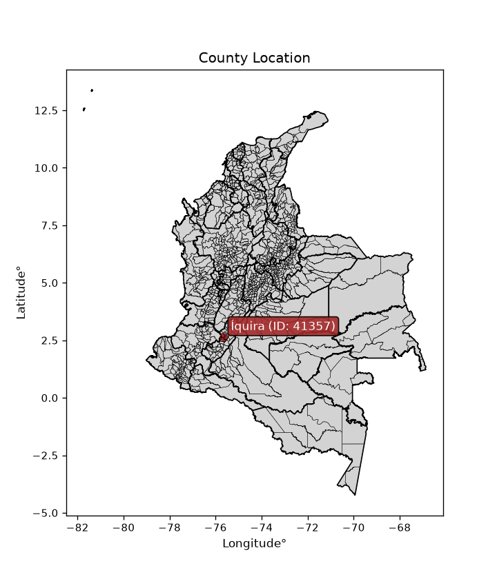
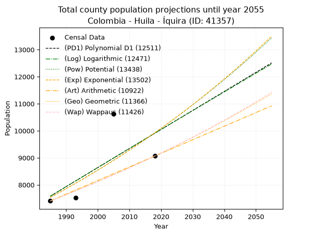
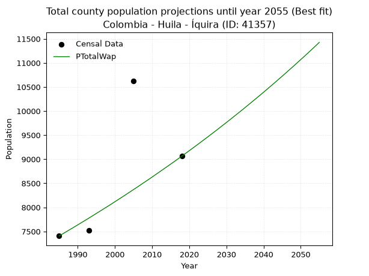
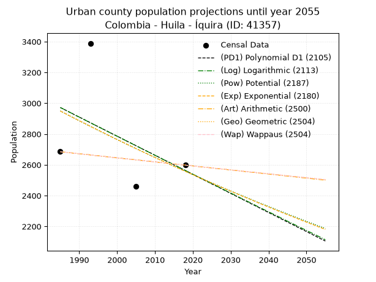
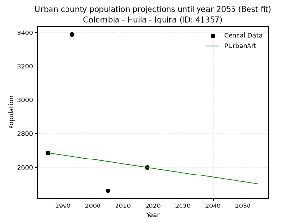
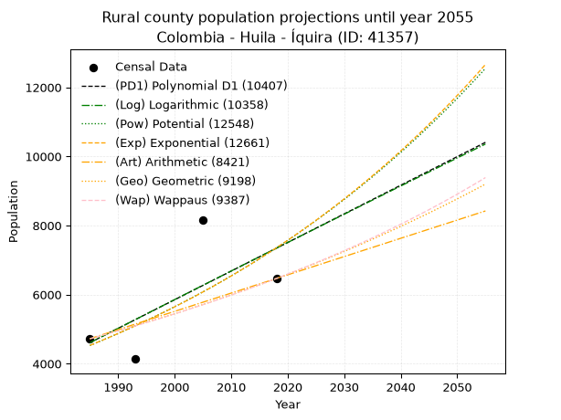
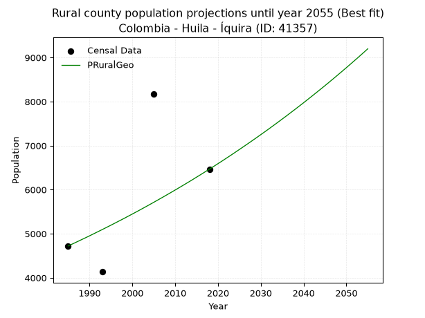

<div align="center">


</div>

# _“Population and Public Services Demand Projections (PPSD) until Year 2050 for Colombia - Huila - Íquira (ID: 41357)”_
Keywords: `population` `public-service` `projection` `lineal` `polynomial` `logarithmic` `potential` `exponential` `arithmetic` `geometric` `wappaus` `dane` `colombia` `south-america`

PPSD are analytical estimates used by governments and planners to anticipate future changes in population size, age distribution, and the resulting community needs for utilities, healthcare, education, and infrastructure as sizing future water treatment facilities, electrical grids, and road networks based on spatial growth.

<div align="center">

</img>

</div>


> **General running parameters**: • app_version: _v20260806_. • Python version: _3.14.7_. • Pandas version: _3.0.5_. • NumPy version: _2.5.1_. • Creates, save and include plots into reports (create_plot): _False_. • Projection until year: _2050_. • Process polynomial degree 2 and up: _False_. • Process Wappaus: _True_. • Process Wappaus: _True_. • Set negative values to zero: _True_. • Set infinite values to zero: _True_. • Drop dataset notes: _True_. 
<div align="center">

Dynamic map: [:earth_americas:Google](http://maps.google.com/maps?q=2.64935907,-75.6344974) [:earth_americas:OSM](https://www.openstreetmap.org/#map=18/2.64935907/-75.6344974&layers=P) [:earth_americas:Bing](https://www.bing.com/maps?cp=2.64935907~-75.6344974&lvl=18) [:earth_americas:Apple](https://maps.apple.com/frame?center=2.64935907%2C-75.6344974&span=0.003%2C0.006)

</div>


<div align="center">

```geojson
{
  "type": "Feature",
  "geometry": {
    "type": "Point", 
    "coordinates": [-75.6344974, 2.64935907]
  }, 
  "properties": {
    "Name": "Colombia - Huila - Íquira (ID: 41357)"
  }
}
```

</div>


## 0. Census Data (4 records)

Census data are official statistics collected by a government about the people and housing in a country. They usually include counts of total population, age, sex, race, income, education, and jobs.

📅Global census file: [Population.xlsx](../data/Population.xlsx)

| Source   |   Year |   CountryID | CountryName   |   StateID | StateName   |   CountyID | CountyName   |   PTotal |   PUrban |   PRural |
|:---------|-------:|------------:|:--------------|----------:|:------------|-----------:|:-------------|---------:|---------:|---------:|
| DANE     |   1985 |          57 | Colombia      |        41 | Huila       |      41357 | Íquira       |     7407 |     2685 |     4722 |
| DANE     |   1993 |          57 | Colombia      |        41 | Huila       |      41357 | Íquira       |     7524 |     3389 |     4135 |
| DANE     |   2005 |          57 | Colombia      |        41 | Huila       |      41357 | Íquira       |    10627 |     2460 |     8167 |
| DANE     |   2018 |          57 | Colombia      |        41 | Huila       |      41357 | Íquira       |     9064 |     2598 |     6466 |

> 🔥Some records could had specific notes about the registered values or the corresponding urban or rural distribution.

📅[SUI-RUPS](https://www.datos.gov.co/Hacienda-y-Cr-dito-P-blico/Registro-nico-de-Prestadores-de-Servicios-P-blicos/4qkq-csdn/about_data) - Local public utility companies: [RUPS.csv](../data/RUPS.xlsx)

 | SERVICIO       | ESTADO    | NOMBRE                                         | NIT         | DEPARTAMENTO_DOMICILIO   | MUNICIPIO_DOMICILIO   | DIRECCION          |   TELEFONO | EMAIL                   | TIPO_PRESTADOR                             | CLASIFICACION                 |
|:---------------|:----------|:-----------------------------------------------|:------------|:-------------------------|:----------------------|:-------------------|-----------:|:------------------------|:-------------------------------------------|:------------------------------|
| ACUEDUCTO      | OPERATIVA | EMPRESAS PUBLICAS DE IQUIRA S.A. E.S.P.        | 900250076-6 | HUILA                    | IQUIRA                | CALLE 4 No. 6 - 29 |    8394622 | iquirasaesp@hotmail.com | SOCIEDADES (EMPRESA DE SERVICIOS PUBLICOS) | MENOR O IGUAL A 2500 USUARIOS |
| ALCANTARILLADO | OPERATIVA | EMPRESAS PUBLICAS DE IQUIRA S.A. E.S.P.        | 900250076-6 | HUILA                    | IQUIRA                | CALLE 4 No. 6 - 29 |    8394622 | iquirasaesp@hotmail.com | SOCIEDADES (EMPRESA DE SERVICIOS PUBLICOS) | MENOR O IGUAL A 2500 USUARIOS |
| ACUEDUCTO      | OPERATIVA | JUNTA DE ACCION COMUNAL DE LA VEREDA LOS ANDES | 800116806-0 | HUILA                    | IQUIRA                | VEREDA LOS ANDES   |    8394654 | SIN@CORREO.COM          | ORGANIZACION AUTORIZADA                    | HASTA 2500 SUSCRIPTORES       |

## 1. Total

### 1.1. Coefficients and Parameters

* (PD1) Polynomial Deg 1: 70.42713769570528, -132216.3821758345 (lineal)
* (Log) Logarithmic: 141209.79761831817, -1064681.3032811375
* (Pow) Potential: 16.689504477335102, -51.160864537133264
* (Exp) Exponential: 0.00832509555492603, 0.0005017246282356705
* (Art) Arithmetic: Year diff. 2018 - 1985 = 33, Population diff. 9064 - 7407 = 1657, Annual growth = 50.21212121212121
* (Geo) Geometric: Year diff. 2018 - 1985 = 33, Population diff. 9064 - 7407 = 1657, Annual growth % = 0.006136479538508821
* (Wap) Wappaus: i = 0.6097033721343114, Condition values only valid for < 200)

<sub>
Wappaus condition values: ['0.00', '0.61', '1.22', '1.83', '2.44', '3.05', '3.66', '4.27', '4.88', '5.49', '6.10', '6.71', '7.32', '7.93', '8.54', '9.15', '9.76', '10.36', '10.97', '11.58', '12.19', '12.80', '13.41', '14.02', '14.63', '15.24', '15.85', '16.46', '17.07', '17.68', '18.29', '18.90', '19.51', '20.12', '20.73', '21.34', '21.95', '22.56', '23.17', '23.78', '24.39', '25.00', '25.61', '26.22', '26.83', '27.44', '28.05', '28.66', '29.27', '29.88', '30.49', '31.09', '31.70', '32.31', '32.92', '33.53', '34.14', '34.75', '35.36', '35.97', '36.58', '37.19', '37.80', '38.41', '39.02', '39.63']
</sub>


### 1.2. Projected Dataset

|   Year |   CountyID |   PTotalPD1 |   PTotalLog |   PTotalPow |   PTotalExp |   PTotalArt |   PTotalGeo |   PTotalWap |
|-------:|-----------:|------------:|------------:|------------:|------------:|------------:|------------:|------------:|
|   1985 |      41357 |        7581 |        7578 |        7536 |        7539 |        7407 |        7407 |        7407 |
|   1986 |      41357 |        7652 |        7649 |        7599 |        7602 |        7457 |        7452 |        7452 |
|   1987 |      41357 |        7722 |        7720 |        7663 |        7666 |        7507 |        7498 |        7498 |
|   1988 |      41357 |        7793 |        7791 |        7728 |        7730 |        7558 |        7544 |        7544 |
|   1989 |      41357 |        7863 |        7862 |        7793 |        7794 |        7608 |        7590 |        7590 |
|   1990 |      41357 |        7934 |        7933 |        7859 |        7860 |        7658 |        7637 |        7636 |
|   1991 |      41357 |        8004 |        8004 |        7925 |        7925 |        7708 |        7684 |        7683 |
|   1992 |      41357 |        8074 |        8075 |        7992 |        7991 |        7758 |        7731 |        7730 |
|   1993 |      41357 |        8145 |        8145 |        8059 |        8058 |        7809 |        7779 |        7777 |
|   1994 |      41357 |        8215 |        8216 |        8127 |        8126 |        7859 |        7826 |        7825 |
|   1995 |      41357 |        8286 |        8287 |        8195 |        8194 |        7909 |        7874 |        7873 |
|   1996 |      41357 |        8356 |        8358 |        8264 |        8262 |        7959 |        7923 |        7921 |
|   1997 |      41357 |        8427 |        8429 |        8333 |        8331 |        8010 |        7971 |        7970 |
|   1998 |      41357 |        8497 |        8499 |        8403 |        8401 |        8060 |        8020 |        8018 |
|   1999 |      41357 |        8567 |        8570 |        8474 |        8471 |        8110 |        8069 |        8067 |
|   2000 |      41357 |        8638 |        8641 |        8545 |        8542 |        8160 |        8119 |        8117 |
|   2001 |      41357 |        8708 |        8711 |        8616 |        8613 |        8210 |        8169 |        8167 |
|   2002 |      41357 |        8779 |        8782 |        8688 |        8685 |        8261 |        8219 |        8217 |
|   2003 |      41357 |        8849 |        8852 |        8761 |        8758 |        8311 |        8269 |        8267 |
|   2004 |      41357 |        8920 |        8923 |        8834 |        8831 |        8361 |        8320 |        8318 |
|   2005 |      41357 |        8990 |        8993 |        8908 |        8905 |        8411 |        8371 |        8369 |
|   2006 |      41357 |        9060 |        9064 |        8983 |        8979 |        8461 |        8422 |        8420 |
|   2007 |      41357 |        9131 |        9134 |        9058 |        9054 |        8512 |        8474 |        8472 |
|   2008 |      41357 |        9201 |        9204 |        9133 |        9130 |        8562 |        8526 |        8524 |
|   2009 |      41357 |        9272 |        9275 |        9209 |        9206 |        8612 |        8578 |        8576 |
|   2010 |      41357 |        9342 |        9345 |        9286 |        9283 |        8662 |        8631 |        8629 |
|   2011 |      41357 |        9413 |        9415 |        9364 |        9361 |        8713 |        8684 |        8682 |
|   2012 |      41357 |        9483 |        9485 |        9442 |        9439 |        8763 |        8737 |        8736 |
|   2013 |      41357 |        9553 |        9555 |        9520 |        9518 |        8813 |        8791 |        8790 |
|   2014 |      41357 |        9624 |        9626 |        9600 |        9598 |        8863 |        8845 |        8844 |
|   2015 |      41357 |        9694 |        9696 |        9679 |        9678 |        8913 |        8899 |        8898 |
|   2016 |      41357 |        9765 |        9766 |        9760 |        9759 |        8964 |        8954 |        8953 |
|   2017 |      41357 |        9835 |        9836 |        9841 |        9840 |        9014 |        9009 |        9008 |
|   2018 |      41357 |        9906 |        9906 |        9923 |        9923 |        9064 |        9064 |        9064 |
|   2019 |      41357 |        9976 |        9976 |       10005 |       10006 |        9114 |        9120 |        9120 |
|   2020 |      41357 |       10046 |       10046 |       10088 |       10089 |        9164 |        9176 |        9176 |
|   2021 |      41357 |       10117 |       10116 |       10172 |       10174 |        9215 |        9232 |        9233 |
|   2022 |      41357 |       10187 |       10185 |       10256 |       10259 |        9265 |        9289 |        9290 |
|   2023 |      41357 |       10258 |       10255 |       10341 |       10344 |        9315 |        9346 |        9348 |
|   2024 |      41357 |       10328 |       10325 |       10427 |       10431 |        9365 |        9403 |        9406 |
|   2025 |      41357 |       10399 |       10395 |       10513 |       10518 |        9415 |        9461 |        9464 |
|   2026 |      41357 |       10469 |       10464 |       10600 |       10606 |        9466 |        9519 |        9523 |
|   2027 |      41357 |       10539 |       10534 |       10688 |       10695 |        9516 |        9577 |        9582 |
|   2028 |      41357 |       10610 |       10604 |       10776 |       10784 |        9566 |        9636 |        9642 |
|   2029 |      41357 |       10680 |       10673 |       10865 |       10874 |        9616 |        9695 |        9702 |
|   2030 |      41357 |       10751 |       10743 |       10955 |       10965 |        9667 |        9754 |        9762 |
|   2031 |      41357 |       10821 |       10813 |       11045 |       11057 |        9717 |        9814 |        9823 |
|   2032 |      41357 |       10892 |       10882 |       11136 |       11149 |        9767 |        9875 |        9885 |
|   2033 |      41357 |       10962 |       10952 |       11228 |       11243 |        9817 |        9935 |        9946 |
|   2034 |      41357 |       11032 |       11021 |       11321 |       11337 |        9867 |        9996 |       10008 |
|   2035 |      41357 |       11103 |       11090 |       11414 |       11431 |        9918 |       10057 |       10071 |
|   2036 |      41357 |       11173 |       11160 |       11508 |       11527 |        9968 |       10119 |       10134 |
|   2037 |      41357 |       11244 |       11229 |       11603 |       11623 |       10018 |       10181 |       10198 |
|   2038 |      41357 |       11314 |       11298 |       11698 |       11720 |       10068 |       10244 |       10262 |
|   2039 |      41357 |       11385 |       11368 |       11794 |       11818 |       10118 |       10307 |       10326 |
|   2040 |      41357 |       11455 |       11437 |       11891 |       11917 |       10169 |       10370 |       10391 |
|   2041 |      41357 |       11525 |       11506 |       11989 |       12017 |       10219 |       10433 |       10457 |
|   2042 |      41357 |       11596 |       11575 |       12087 |       12117 |       10269 |       10497 |       10523 |
|   2043 |      41357 |       11666 |       11644 |       12186 |       12219 |       10319 |       10562 |       10589 |
|   2044 |      41357 |       11737 |       11714 |       12286 |       12321 |       10370 |       10627 |       10656 |
|   2045 |      41357 |       11807 |       11783 |       12387 |       12424 |       10420 |       10692 |       10723 |
|   2046 |      41357 |       11878 |       11852 |       12488 |       12528 |       10470 |       10758 |       10791 |
|   2047 |      41357 |       11948 |       11921 |       12591 |       12632 |       10520 |       10824 |       10860 |
|   2048 |      41357 |       12018 |       11990 |       12694 |       12738 |       10570 |       10890 |       10928 |
|   2049 |      41357 |       12089 |       12059 |       12798 |       12844 |       10621 |       10957 |       10998 |
|   2050 |      41357 |       12159 |       12127 |       12902 |       12952 |       10671 |       11024 |       11068 |
<div align="center">

</img>

</div>


### 1.3. Best fit with absolute and relative error (%)

Relative error puts that difference into context by dividing the absolute error by the true value, creating a unitless ratio or percentage that shows the scale of the mistake.

Absolute and relative error

|   Year | Source   |   CountryID | CountryName   |   StateID | StateName   |   CountyID_x | CountyName   |   PTotal |   PUrban |   PRural |   CountyID_y |   PTotalPD1 |   PTotalLog |   PTotalPow |   PTotalExp |   PTotalArt |   PTotalGeo |   PTotalWap |   PTotalPD1AbsError |   PTotalLogAbsError |   PTotalPowAbsError |   PTotalExpAbsError |   PTotalArtAbsError |   PTotalGeoAbsError |   PTotalWapAbsError |   PTotalPD1RelError |   PTotalLogRelError |   PTotalPowRelError |   PTotalExpRelError |   PTotalArtRelError |   PTotalGeoRelError |   PTotalWapRelError |
|-------:|:---------|------------:|:--------------|----------:|:------------|-------------:|:-------------|---------:|---------:|---------:|-------------:|------------:|------------:|------------:|------------:|------------:|------------:|------------:|--------------------:|--------------------:|--------------------:|--------------------:|--------------------:|--------------------:|--------------------:|--------------------:|--------------------:|--------------------:|--------------------:|--------------------:|--------------------:|--------------------:|
|   1985 | DANE     |          57 | Colombia      |        41 | Huila       |        41357 | Íquira       |     7407 |     2685 |     4722 |        41357 |        7581 |        7578 |        7536 |        7539 |        7407 |        7407 |        7407 |                 174 |                 171 |                 129 |                 132 |                   0 |                   0 |                   0 |             2.34913 |             2.30863 |             1.7416  |             1.7821  |             0       |             0       |             0       |
|   1993 | DANE     |          57 | Colombia      |        41 | Huila       |        41357 | Íquira       |     7524 |     3389 |     4135 |        41357 |        8145 |        8145 |        8059 |        8058 |        7809 |        7779 |        7777 |                 621 |                 621 |                 535 |                 534 |                 285 |                 255 |                 253 |             8.25359 |             8.25359 |             7.11058 |             7.09729 |             3.78788 |             3.38915 |             3.36257 |
|   2005 | DANE     |          57 | Colombia      |        41 | Huila       |        41357 | Íquira       |    10627 |     2460 |     8167 |        41357 |        8990 |        8993 |        8908 |        8905 |        8411 |        8371 |        8369 |                1637 |                1634 |                1719 |                1722 |                2216 |                2256 |                2258 |            15.4042  |            15.3759  |            16.1758  |            16.204   |            20.8525  |            21.2289  |            21.2478  |
|   2018 | DANE     |          57 | Colombia      |        41 | Huila       |        41357 | Íquira       |     9064 |     2598 |     6466 |        41357 |        9906 |        9906 |        9923 |        9923 |        9064 |        9064 |        9064 |                 842 |                 842 |                 859 |                 859 |                   0 |                   0 |                   0 |             9.2895  |             9.2895  |             9.47705 |             9.47705 |             0       |             0       |             0       |

Relative error mean

| Method    |   RelError | Best   |
|:----------|-----------:|:-------|
| PTotalPD1 |    8.82409 |        |
| PTotalLog |    8.80691 |        |
| PTotalPow |    8.62625 |        |
| PTotalExp |    8.64011 |        |
| PTotalArt |    6.16011 |        |
| PTotalGeo |    6.15452 |        |
| PTotalWap |    6.15258 | True   |

💙Best method: _**PTotalWap**_
<div align="center">

</img>

</div>


### 1.4. Fresh water supply demand in liters per capita per day (lpcd)

The fresh water supply demand typically ranges from 100 to 300 liters per capita per day (lpcd) for standard domestic and municipal planning, though absolute survival minimums set by the World Health Organization are as low as 7.5 to 20 liters per day, and total consumption in high-income nations can exceed 400 liters.

> `CZ`: Level in meters above the sea level (masl)<br> `WS`: Fresh water supply demand in liters per capita per day (lpcd or l/h/d)<br> `WSAll`: Zonal fresh water supply demand in liters per second (l/s)<br> `A`: Zonal area in square meters<br> `DP`: Population density (people/hectare or p/ha)

Reference values (RAS Colombia)

|    CZ |   WS |
|------:|-----:|
|  1000 |  120 |
|  2000 |  130 |
| 99999 |  140 |

County shapefile geometry properties and water supply values

|   CountyID |      ATotal |   CZTotal |   WSTotal |
|-----------:|------------:|----------:|----------:|
|      41357 | 3.56448e+08 |   1738.57 |       130 |

Projected values for best method: PTotalWap

|   CountyID |   Year |   PTotalWap |   DPTotal |   WSTotal |   WSTotalAll |
|-----------:|-------:|------------:|----------:|----------:|-------------:|
|      41357 |   1985 |        7407 |      0.21 |       130 |      11.1448 |
|      41357 |   1986 |        7452 |      0.21 |       130 |      11.2125 |
|      41357 |   1987 |        7498 |      0.21 |       130 |      11.2817 |
|      41357 |   1988 |        7544 |      0.21 |       130 |      11.3509 |
|      41357 |   1989 |        7590 |      0.21 |       130 |      11.4201 |
|      41357 |   1990 |        7636 |      0.21 |       130 |      11.4894 |
|      41357 |   1991 |        7683 |      0.22 |       130 |      11.5601 |
|      41357 |   1992 |        7730 |      0.22 |       130 |      11.6308 |
|      41357 |   1993 |        7777 |      0.22 |       130 |      11.7015 |
|      41357 |   1994 |        7825 |      0.22 |       130 |      11.7737 |
|      41357 |   1995 |        7873 |      0.22 |       130 |      11.8459 |
|      41357 |   1996 |        7921 |      0.22 |       130 |      11.9182 |
|      41357 |   1997 |        7970 |      0.22 |       130 |      11.9919 |
|      41357 |   1998 |        8018 |      0.22 |       130 |      12.0641 |
|      41357 |   1999 |        8067 |      0.23 |       130 |      12.1378 |
|      41357 |   2000 |        8117 |      0.23 |       130 |      12.2131 |
|      41357 |   2001 |        8167 |      0.23 |       130 |      12.2883 |
|      41357 |   2002 |        8217 |      0.23 |       130 |      12.3635 |
|      41357 |   2003 |        8267 |      0.23 |       130 |      12.4388 |
|      41357 |   2004 |        8318 |      0.23 |       130 |      12.5155 |
|      41357 |   2005 |        8369 |      0.23 |       130 |      12.5922 |
|      41357 |   2006 |        8420 |      0.24 |       130 |      12.669  |
|      41357 |   2007 |        8472 |      0.24 |       130 |      12.7472 |
|      41357 |   2008 |        8524 |      0.24 |       130 |      12.8255 |
|      41357 |   2009 |        8576 |      0.24 |       130 |      12.9037 |
|      41357 |   2010 |        8629 |      0.24 |       130 |      12.9834 |
|      41357 |   2011 |        8682 |      0.24 |       130 |      13.0632 |
|      41357 |   2012 |        8736 |      0.25 |       130 |      13.1444 |
|      41357 |   2013 |        8790 |      0.25 |       130 |      13.2257 |
|      41357 |   2014 |        8844 |      0.25 |       130 |      13.3069 |
|      41357 |   2015 |        8898 |      0.25 |       130 |      13.3882 |
|      41357 |   2016 |        8953 |      0.25 |       130 |      13.4709 |
|      41357 |   2017 |        9008 |      0.25 |       130 |      13.5537 |
|      41357 |   2018 |        9064 |      0.25 |       130 |      13.638  |
|      41357 |   2019 |        9120 |      0.26 |       130 |      13.7222 |
|      41357 |   2020 |        9176 |      0.26 |       130 |      13.8065 |
|      41357 |   2021 |        9233 |      0.26 |       130 |      13.8922 |
|      41357 |   2022 |        9290 |      0.26 |       130 |      13.978  |
|      41357 |   2023 |        9348 |      0.26 |       130 |      14.0653 |
|      41357 |   2024 |        9406 |      0.26 |       130 |      14.1525 |
|      41357 |   2025 |        9464 |      0.27 |       130 |      14.2398 |
|      41357 |   2026 |        9523 |      0.27 |       130 |      14.3286 |
|      41357 |   2027 |        9582 |      0.27 |       130 |      14.4174 |
|      41357 |   2028 |        9642 |      0.27 |       130 |      14.5076 |
|      41357 |   2029 |        9702 |      0.27 |       130 |      14.5979 |
|      41357 |   2030 |        9762 |      0.27 |       130 |      14.6882 |
|      41357 |   2031 |        9823 |      0.28 |       130 |      14.78   |
|      41357 |   2032 |        9885 |      0.28 |       130 |      14.8733 |
|      41357 |   2033 |        9946 |      0.28 |       130 |      14.965  |
|      41357 |   2034 |       10008 |      0.28 |       130 |      15.0583 |
|      41357 |   2035 |       10071 |      0.28 |       130 |      15.1531 |
|      41357 |   2036 |       10134 |      0.28 |       130 |      15.2479 |
|      41357 |   2037 |       10198 |      0.29 |       130 |      15.3442 |
|      41357 |   2038 |       10262 |      0.29 |       130 |      15.4405 |
|      41357 |   2039 |       10326 |      0.29 |       130 |      15.5368 |
|      41357 |   2040 |       10391 |      0.29 |       130 |      15.6346 |
|      41357 |   2041 |       10457 |      0.29 |       130 |      15.7339 |
|      41357 |   2042 |       10523 |      0.3  |       130 |      15.8332 |
|      41357 |   2043 |       10589 |      0.3  |       130 |      15.9325 |
|      41357 |   2044 |       10656 |      0.3  |       130 |      16.0333 |
|      41357 |   2045 |       10723 |      0.3  |       130 |      16.1341 |
|      41357 |   2046 |       10791 |      0.3  |       130 |      16.2365 |
|      41357 |   2047 |       10860 |      0.3  |       130 |      16.3403 |
|      41357 |   2048 |       10928 |      0.31 |       130 |      16.4426 |
|      41357 |   2049 |       10998 |      0.31 |       130 |      16.5479 |
|      41357 |   2050 |       11068 |      0.31 |       130 |      16.6532 |

## 2. Urban

### 2.1. Coefficients and Parameters

* (PD1) Polynomial Deg 1: -12.391810517864348, 27569.718988358167 (lineal)
* (Log) Logarithmic: -24775.65701732367, 191102.96752833237
* (Pow) Potential: -8.63341526260323, 31.94070604376229
* (Exp) Exponential: -0.004317259914554391, 15543205.336807184
* (Art) Arithmetic: Year diff. 2018 - 1985 = 33, Population diff. 2598 - 2685 = -87, Annual growth = -2.6363636363636362
* (Geo) Geometric: Year diff. 2018 - 1985 = 33, Population diff. 2598 - 2685 = -87, Annual growth % = -0.0009976477670931017
* (Wap) Wappaus: i = -0.09980555125359214, Condition values only valid for < 200)

<sub>
Wappaus condition values: ['-0.00', '-0.10', '-0.20', '-0.30', '-0.40', '-0.50', '-0.60', '-0.70', '-0.80', '-0.90', '-1.00', '-1.10', '-1.20', '-1.30', '-1.40', '-1.50', '-1.60', '-1.70', '-1.80', '-1.90', '-2.00', '-2.10', '-2.20', '-2.30', '-2.40', '-2.50', '-2.59', '-2.69', '-2.79', '-2.89', '-2.99', '-3.09', '-3.19', '-3.29', '-3.39', '-3.49', '-3.59', '-3.69', '-3.79', '-3.89', '-3.99', '-4.09', '-4.19', '-4.29', '-4.39', '-4.49', '-4.59', '-4.69', '-4.79', '-4.89', '-4.99', '-5.09', '-5.19', '-5.29', '-5.39', '-5.49', '-5.59', '-5.69', '-5.79', '-5.89', '-5.99', '-6.09', '-6.19', '-6.29', '-6.39', '-6.49']
</sub>


### 2.2. Projected Dataset

|   Year |   CountyID |   PUrbanPD1 |   PUrbanLog |   PUrbanPow |   PUrbanExp |   PUrbanArt |   PUrbanGeo |   PUrbanWap |
|-------:|-----------:|------------:|------------:|------------:|------------:|------------:|------------:|------------:|
|   1985 |      41357 |        2972 |        2972 |        2950 |        2949 |        2685 |        2685 |        2685 |
|   1986 |      41357 |        2960 |        2960 |        2937 |        2937 |        2682 |        2682 |        2682 |
|   1987 |      41357 |        2947 |        2947 |        2924 |        2924 |        2680 |        2680 |        2680 |
|   1988 |      41357 |        2935 |        2935 |        2911 |        2911 |        2677 |        2677 |        2677 |
|   1989 |      41357 |        2922 |        2922 |        2899 |        2899 |        2674 |        2674 |        2674 |
|   1990 |      41357 |        2910 |        2910 |        2886 |        2886 |        2672 |        2672 |        2672 |
|   1991 |      41357 |        2898 |        2897 |        2874 |        2874 |        2669 |        2669 |        2669 |
|   1992 |      41357 |        2885 |        2885 |        2861 |        2862 |        2667 |        2666 |        2666 |
|   1993 |      41357 |        2873 |        2872 |        2849 |        2849 |        2664 |        2664 |        2664 |
|   1994 |      41357 |        2860 |        2860 |        2837 |        2837 |        2661 |        2661 |        2661 |
|   1995 |      41357 |        2848 |        2848 |        2824 |        2825 |        2659 |        2658 |        2658 |
|   1996 |      41357 |        2836 |        2835 |        2812 |        2813 |        2656 |        2656 |        2656 |
|   1997 |      41357 |        2823 |        2823 |        2800 |        2801 |        2653 |        2653 |        2653 |
|   1998 |      41357 |        2811 |        2810 |        2788 |        2788 |        2651 |        2650 |        2650 |
|   1999 |      41357 |        2798 |        2798 |        2776 |        2776 |        2648 |        2648 |        2648 |
|   2000 |      41357 |        2786 |        2786 |        2764 |        2764 |        2645 |        2645 |        2645 |
|   2001 |      41357 |        2774 |        2773 |        2752 |        2753 |        2643 |        2642 |        2642 |
|   2002 |      41357 |        2761 |        2761 |        2740 |        2741 |        2640 |        2640 |        2640 |
|   2003 |      41357 |        2749 |        2748 |        2728 |        2729 |        2638 |        2637 |        2637 |
|   2004 |      41357 |        2737 |        2736 |        2717 |        2717 |        2635 |        2635 |        2635 |
|   2005 |      41357 |        2724 |        2724 |        2705 |        2705 |        2632 |        2632 |        2632 |
|   2006 |      41357 |        2712 |        2711 |        2693 |        2694 |        2630 |        2629 |        2629 |
|   2007 |      41357 |        2699 |        2699 |        2682 |        2682 |        2627 |        2627 |        2627 |
|   2008 |      41357 |        2687 |        2687 |        2670 |        2671 |        2624 |        2624 |        2624 |
|   2009 |      41357 |        2675 |        2674 |        2659 |        2659 |        2622 |        2621 |        2621 |
|   2010 |      41357 |        2662 |        2662 |        2648 |        2648 |        2619 |        2619 |        2619 |
|   2011 |      41357 |        2650 |        2650 |        2636 |        2636 |        2616 |        2616 |        2616 |
|   2012 |      41357 |        2637 |        2637 |        2625 |        2625 |        2614 |        2614 |        2614 |
|   2013 |      41357 |        2625 |        2625 |        2614 |        2614 |        2611 |        2611 |        2611 |
|   2014 |      41357 |        2613 |        2613 |        2602 |        2602 |        2609 |        2608 |        2608 |
|   2015 |      41357 |        2600 |        2600 |        2591 |        2591 |        2606 |        2606 |        2606 |
|   2016 |      41357 |        2588 |        2588 |        2580 |        2580 |        2603 |        2603 |        2603 |
|   2017 |      41357 |        2575 |        2576 |        2569 |        2569 |        2601 |        2601 |        2601 |
|   2018 |      41357 |        2563 |        2564 |        2558 |        2558 |        2598 |        2598 |        2598 |
|   2019 |      41357 |        2551 |        2551 |        2547 |        2547 |        2595 |        2595 |        2595 |
|   2020 |      41357 |        2538 |        2539 |        2537 |        2536 |        2593 |        2593 |        2593 |
|   2021 |      41357 |        2526 |        2527 |        2526 |        2525 |        2590 |        2590 |        2590 |
|   2022 |      41357 |        2513 |        2515 |        2515 |        2514 |        2587 |        2588 |        2588 |
|   2023 |      41357 |        2501 |        2502 |        2504 |        2503 |        2585 |        2585 |        2585 |
|   2024 |      41357 |        2489 |        2490 |        2494 |        2492 |        2582 |        2582 |        2582 |
|   2025 |      41357 |        2476 |        2478 |        2483 |        2482 |        2580 |        2580 |        2580 |
|   2026 |      41357 |        2464 |        2466 |        2472 |        2471 |        2577 |        2577 |        2577 |
|   2027 |      41357 |        2452 |        2453 |        2462 |        2460 |        2574 |        2575 |        2575 |
|   2028 |      41357 |        2439 |        2441 |        2451 |        2450 |        2572 |        2572 |        2572 |
|   2029 |      41357 |        2427 |        2429 |        2441 |        2439 |        2569 |        2570 |        2570 |
|   2030 |      41357 |        2414 |        2417 |        2431 |        2429 |        2566 |        2567 |        2567 |
|   2031 |      41357 |        2402 |        2405 |        2420 |        2418 |        2564 |        2565 |        2564 |
|   2032 |      41357 |        2390 |        2392 |        2410 |        2408 |        2561 |        2562 |        2562 |
|   2033 |      41357 |        2377 |        2380 |        2400 |        2397 |        2558 |        2559 |        2559 |
|   2034 |      41357 |        2365 |        2368 |        2390 |        2387 |        2556 |        2557 |        2557 |
|   2035 |      41357 |        2352 |        2356 |        2380 |        2377 |        2553 |        2554 |        2554 |
|   2036 |      41357 |        2340 |        2344 |        2369 |        2367 |        2551 |        2552 |        2552 |
|   2037 |      41357 |        2328 |        2331 |        2359 |        2356 |        2548 |        2549 |        2549 |
|   2038 |      41357 |        2315 |        2319 |        2349 |        2346 |        2545 |        2547 |        2547 |
|   2039 |      41357 |        2303 |        2307 |        2340 |        2336 |        2543 |        2544 |        2544 |
|   2040 |      41357 |        2290 |        2295 |        2330 |        2326 |        2540 |        2542 |        2542 |
|   2041 |      41357 |        2278 |        2283 |        2320 |        2316 |        2537 |        2539 |        2539 |
|   2042 |      41357 |        2266 |        2271 |        2310 |        2306 |        2535 |        2537 |        2536 |
|   2043 |      41357 |        2253 |        2259 |        2300 |        2296 |        2532 |        2534 |        2534 |
|   2044 |      41357 |        2241 |        2246 |        2291 |        2286 |        2529 |        2531 |        2531 |
|   2045 |      41357 |        2228 |        2234 |        2281 |        2276 |        2527 |        2529 |        2529 |
|   2046 |      41357 |        2216 |        2222 |        2271 |        2267 |        2524 |        2526 |        2526 |
|   2047 |      41357 |        2204 |        2210 |        2262 |        2257 |        2522 |        2524 |        2524 |
|   2048 |      41357 |        2191 |        2198 |        2252 |        2247 |        2519 |        2521 |        2521 |
|   2049 |      41357 |        2179 |        2186 |        2243 |        2237 |        2516 |        2519 |        2519 |
|   2050 |      41357 |        2167 |        2174 |        2233 |        2228 |        2514 |        2516 |        2516 |
<div align="center">

</img>

</div>


### 2.3. Best fit with absolute and relative error (%)

Relative error puts that difference into context by dividing the absolute error by the true value, creating a unitless ratio or percentage that shows the scale of the mistake.

Absolute and relative error

|   Year | Source   |   CountryID | CountryName   |   StateID | StateName   |   CountyID_x | CountyName   |   PTotal |   PUrban |   PRural |   CountyID_y |   PUrbanPD1 |   PUrbanLog |   PUrbanPow |   PUrbanExp |   PUrbanArt |   PUrbanGeo |   PUrbanWap |   PUrbanPD1AbsError |   PUrbanLogAbsError |   PUrbanPowAbsError |   PUrbanExpAbsError |   PUrbanArtAbsError |   PUrbanGeoAbsError |   PUrbanWapAbsError |   PUrbanPD1RelError |   PUrbanLogRelError |   PUrbanPowRelError |   PUrbanExpRelError |   PUrbanArtRelError |   PUrbanGeoRelError |   PUrbanWapRelError |
|-------:|:---------|------------:|:--------------|----------:|:------------|-------------:|:-------------|---------:|---------:|---------:|-------------:|------------:|------------:|------------:|------------:|------------:|------------:|------------:|--------------------:|--------------------:|--------------------:|--------------------:|--------------------:|--------------------:|--------------------:|--------------------:|--------------------:|--------------------:|--------------------:|--------------------:|--------------------:|--------------------:|
|   1985 | DANE     |          57 | Colombia      |        41 | Huila       |        41357 | Íquira       |     7407 |     2685 |     4722 |        41357 |        2972 |        2972 |        2950 |        2949 |        2685 |        2685 |        2685 |                 287 |                 287 |                 265 |                 264 |                   0 |                   0 |                   0 |            10.689   |             10.689  |             9.86965 |             9.8324  |             0       |             0       |             0       |
|   1993 | DANE     |          57 | Colombia      |        41 | Huila       |        41357 | Íquira       |     7524 |     3389 |     4135 |        41357 |        2873 |        2872 |        2849 |        2849 |        2664 |        2664 |        2664 |                 516 |                 517 |                 540 |                 540 |                 725 |                 725 |                 725 |            15.2257  |             15.2552 |            15.9339  |            15.9339  |            21.3927  |            21.3927  |            21.3927  |
|   2005 | DANE     |          57 | Colombia      |        41 | Huila       |        41357 | Íquira       |    10627 |     2460 |     8167 |        41357 |        2724 |        2724 |        2705 |        2705 |        2632 |        2632 |        2632 |                 264 |                 264 |                 245 |                 245 |                 172 |                 172 |                 172 |            10.7317  |             10.7317 |             9.95935 |             9.95935 |             6.99187 |             6.99187 |             6.99187 |
|   2018 | DANE     |          57 | Colombia      |        41 | Huila       |        41357 | Íquira       |     9064 |     2598 |     6466 |        41357 |        2563 |        2564 |        2558 |        2558 |        2598 |        2598 |        2598 |                  35 |                  34 |                  40 |                  40 |                   0 |                   0 |                   0 |             1.34719 |              1.3087 |             1.53965 |             1.53965 |             0       |             0       |             0       |

Relative error mean

| Method    |   RelError | Best   |
|:----------|-----------:|:-------|
| PUrbanPD1 |    9.49841 |        |
| PUrbanLog |    9.49616 |        |
| PUrbanPow |    9.32564 |        |
| PUrbanExp |    9.31633 |        |
| PUrbanArt |    7.09615 | True   |
| PUrbanGeo |    7.09615 | True   |
| PUrbanWap |    7.09615 | True   |

💙Best method: _**PUrbanArt**_
<div align="center">

</img>

</div>


### 2.4. Fresh water supply demand in liters per capita per day (lpcd)

The fresh water supply demand typically ranges from 100 to 300 liters per capita per day (lpcd) for standard domestic and municipal planning, though absolute survival minimums set by the World Health Organization are as low as 7.5 to 20 liters per day, and total consumption in high-income nations can exceed 400 liters.

> `CZ`: Level in meters above the sea level (masl)<br> `WS`: Fresh water supply demand in liters per capita per day (lpcd or l/h/d)<br> `WSAll`: Zonal fresh water supply demand in liters per second (l/s)<br> `A`: Zonal area in square meters<br> `DP`: Population density (people/hectare or p/ha)

Reference values (RAS Colombia)

|    CZ |   WS |
|------:|-----:|
|  1000 |  120 |
|  2000 |  130 |
| 99999 |  140 |

County shapefile geometry properties and water supply values

|   CountyID |   AUrban |   CZUrban |   WSUrban |
|-----------:|---------:|----------:|----------:|
|      41357 |   501993 |   1097.82 |       130 |

Projected values for best method: PUrbanArt

|   CountyID |   Year |   PUrbanArt |   DPUrban |   WSUrban |   WSUrbanAll |
|-----------:|-------:|------------:|----------:|----------:|-------------:|
|      41357 |   1985 |        2685 |     53.49 |       130 |      4.03993 |
|      41357 |   1986 |        2682 |     53.43 |       130 |      4.03542 |
|      41357 |   1987 |        2680 |     53.39 |       130 |      4.03241 |
|      41357 |   1988 |        2677 |     53.33 |       130 |      4.02789 |
|      41357 |   1989 |        2674 |     53.27 |       130 |      4.02338 |
|      41357 |   1990 |        2672 |     53.23 |       130 |      4.02037 |
|      41357 |   1991 |        2669 |     53.17 |       130 |      4.01586 |
|      41357 |   1992 |        2667 |     53.13 |       130 |      4.01285 |
|      41357 |   1993 |        2664 |     53.07 |       130 |      4.00833 |
|      41357 |   1994 |        2661 |     53.01 |       130 |      4.00382 |
|      41357 |   1995 |        2659 |     52.97 |       130 |      4.00081 |
|      41357 |   1996 |        2656 |     52.91 |       130 |      3.9963  |
|      41357 |   1997 |        2653 |     52.85 |       130 |      3.99178 |
|      41357 |   1998 |        2651 |     52.81 |       130 |      3.98877 |
|      41357 |   1999 |        2648 |     52.75 |       130 |      3.98426 |
|      41357 |   2000 |        2645 |     52.69 |       130 |      3.97975 |
|      41357 |   2001 |        2643 |     52.65 |       130 |      3.97674 |
|      41357 |   2002 |        2640 |     52.59 |       130 |      3.97222 |
|      41357 |   2003 |        2638 |     52.55 |       130 |      3.96921 |
|      41357 |   2004 |        2635 |     52.49 |       130 |      3.9647  |
|      41357 |   2005 |        2632 |     52.43 |       130 |      3.96019 |
|      41357 |   2006 |        2630 |     52.39 |       130 |      3.95718 |
|      41357 |   2007 |        2627 |     52.33 |       130 |      3.95266 |
|      41357 |   2008 |        2624 |     52.27 |       130 |      3.94815 |
|      41357 |   2009 |        2622 |     52.23 |       130 |      3.94514 |
|      41357 |   2010 |        2619 |     52.17 |       130 |      3.94062 |
|      41357 |   2011 |        2616 |     52.11 |       130 |      3.93611 |
|      41357 |   2012 |        2614 |     52.07 |       130 |      3.9331  |
|      41357 |   2013 |        2611 |     52.01 |       130 |      3.92859 |
|      41357 |   2014 |        2609 |     51.97 |       130 |      3.92558 |
|      41357 |   2015 |        2606 |     51.91 |       130 |      3.92106 |
|      41357 |   2016 |        2603 |     51.85 |       130 |      3.91655 |
|      41357 |   2017 |        2601 |     51.81 |       130 |      3.91354 |
|      41357 |   2018 |        2598 |     51.75 |       130 |      3.90903 |
|      41357 |   2019 |        2595 |     51.69 |       130 |      3.90451 |
|      41357 |   2020 |        2593 |     51.65 |       130 |      3.9015  |
|      41357 |   2021 |        2590 |     51.59 |       130 |      3.89699 |
|      41357 |   2022 |        2587 |     51.53 |       130 |      3.89248 |
|      41357 |   2023 |        2585 |     51.49 |       130 |      3.88947 |
|      41357 |   2024 |        2582 |     51.43 |       130 |      3.88495 |
|      41357 |   2025 |        2580 |     51.4  |       130 |      3.88194 |
|      41357 |   2026 |        2577 |     51.34 |       130 |      3.87743 |
|      41357 |   2027 |        2574 |     51.28 |       130 |      3.87292 |
|      41357 |   2028 |        2572 |     51.24 |       130 |      3.86991 |
|      41357 |   2029 |        2569 |     51.18 |       130 |      3.86539 |
|      41357 |   2030 |        2566 |     51.12 |       130 |      3.86088 |
|      41357 |   2031 |        2564 |     51.08 |       130 |      3.85787 |
|      41357 |   2032 |        2561 |     51.02 |       130 |      3.85336 |
|      41357 |   2033 |        2558 |     50.96 |       130 |      3.84884 |
|      41357 |   2034 |        2556 |     50.92 |       130 |      3.84583 |
|      41357 |   2035 |        2553 |     50.86 |       130 |      3.84132 |
|      41357 |   2036 |        2551 |     50.82 |       130 |      3.83831 |
|      41357 |   2037 |        2548 |     50.76 |       130 |      3.8338  |
|      41357 |   2038 |        2545 |     50.7  |       130 |      3.82928 |
|      41357 |   2039 |        2543 |     50.66 |       130 |      3.82627 |
|      41357 |   2040 |        2540 |     50.6  |       130 |      3.82176 |
|      41357 |   2041 |        2537 |     50.54 |       130 |      3.81725 |
|      41357 |   2042 |        2535 |     50.5  |       130 |      3.81424 |
|      41357 |   2043 |        2532 |     50.44 |       130 |      3.80972 |
|      41357 |   2044 |        2529 |     50.38 |       130 |      3.80521 |
|      41357 |   2045 |        2527 |     50.34 |       130 |      3.8022  |
|      41357 |   2046 |        2524 |     50.28 |       130 |      3.79769 |
|      41357 |   2047 |        2522 |     50.24 |       130 |      3.79468 |
|      41357 |   2048 |        2519 |     50.18 |       130 |      3.79016 |
|      41357 |   2049 |        2516 |     50.12 |       130 |      3.78565 |
|      41357 |   2050 |        2514 |     50.08 |       130 |      3.78264 |

## 3. Rural

### 3.1. Coefficients and Parameters

* (PD1) Polynomial Deg 1: 82.81894821356968, -159786.10116419275 (lineal)
* (Log) Logarithmic: 165985.454635642, -1255784.270809471
* (Pow) Potential: 29.418563793841862, -93.35958516580048
* (Exp) Exponential: 0.014683346121806634, 9.952640585938643e-10
* (Art) Arithmetic: Year diff. 2018 - 1985 = 33, Population diff. 6466 - 4722 = 1744, Annual growth = 52.84848484848485
* (Geo) Geometric: Year diff. 2018 - 1985 = 33, Population diff. 6466 - 4722 = 1744, Annual growth % = 0.009570514544956277
* (Wap) Wappaus: i = 0.9447351599657642, Condition values only valid for < 200)

<sub>
Wappaus condition values: ['0.00', '0.94', '1.89', '2.83', '3.78', '4.72', '5.67', '6.61', '7.56', '8.50', '9.45', '10.39', '11.34', '12.28', '13.23', '14.17', '15.12', '16.06', '17.01', '17.95', '18.89', '19.84', '20.78', '21.73', '22.67', '23.62', '24.56', '25.51', '26.45', '27.40', '28.34', '29.29', '30.23', '31.18', '32.12', '33.07', '34.01', '34.96', '35.90', '36.84', '37.79', '38.73', '39.68', '40.62', '41.57', '42.51', '43.46', '44.40', '45.35', '46.29', '47.24', '48.18', '49.13', '50.07', '51.02', '51.96', '52.91', '53.85', '54.79', '55.74', '56.68', '57.63', '58.57', '59.52', '60.46', '61.41']
</sub>


### 3.2. Projected Dataset

|   Year |   CountyID |   PRuralPD1 |   PRuralLog |   PRuralPow |   PRuralExp |   PRuralArt |   PRuralGeo |   PRuralWap |
|-------:|-----------:|------------:|------------:|------------:|------------:|------------:|------------:|------------:|
|   1985 |      41357 |        4610 |        4605 |        4527 |        4530 |        4722 |        4722 |        4722 |
|   1986 |      41357 |        4692 |        4689 |        4594 |        4597 |        4775 |        4767 |        4767 |
|   1987 |      41357 |        4775 |        4773 |        4663 |        4665 |        4828 |        4813 |        4812 |
|   1988 |      41357 |        4858 |        4856 |        4732 |        4734 |        4881 |        4859 |        4858 |
|   1989 |      41357 |        4941 |        4940 |        4803 |        4804 |        4933 |        4905 |        4904 |
|   1990 |      41357 |        5024 |        5023 |        4875 |        4875 |        4986 |        4952 |        4950 |
|   1991 |      41357 |        5106 |        5106 |        4947 |        4947 |        5039 |        5000 |        4997 |
|   1992 |      41357 |        5189 |        5190 |        5021 |        5020 |        5092 |        5048 |        5045 |
|   1993 |      41357 |        5272 |        5273 |        5095 |        5094 |        5145 |        5096 |        5093 |
|   1994 |      41357 |        5355 |        5356 |        5171 |        5170 |        5198 |        5145 |        5141 |
|   1995 |      41357 |        5438 |        5439 |        5248 |        5246 |        5250 |        5194 |        5190 |
|   1996 |      41357 |        5521 |        5523 |        5326 |        5324 |        5303 |        5244 |        5240 |
|   1997 |      41357 |        5603 |        5606 |        5405 |        5403 |        5356 |        5294 |        5289 |
|   1998 |      41357 |        5686 |        5689 |        5485 |        5482 |        5409 |        5344 |        5340 |
|   1999 |      41357 |        5769 |        5772 |        5567 |        5564 |        5462 |        5396 |        5391 |
|   2000 |      41357 |        5852 |        5855 |        5649 |        5646 |        5515 |        5447 |        5442 |
|   2001 |      41357 |        5935 |        5938 |        5733 |        5729 |        5568 |        5499 |        5494 |
|   2002 |      41357 |        6017 |        6021 |        5818 |        5814 |        5620 |        5552 |        5547 |
|   2003 |      41357 |        6100 |        6104 |        5904 |        5900 |        5673 |        5605 |        5600 |
|   2004 |      41357 |        6183 |        6187 |        5991 |        5987 |        5726 |        5659 |        5653 |
|   2005 |      41357 |        6266 |        6269 |        6080 |        6076 |        5779 |        5713 |        5707 |
|   2006 |      41357 |        6349 |        6352 |        6169 |        6166 |        5832 |        5768 |        5762 |
|   2007 |      41357 |        6432 |        6435 |        6261 |        6257 |        5885 |        5823 |        5817 |
|   2008 |      41357 |        6514 |        6518 |        6353 |        6350 |        5938 |        5879 |        5873 |
|   2009 |      41357 |        6597 |        6600 |        6447 |        6444 |        5990 |        5935 |        5930 |
|   2010 |      41357 |        6680 |        6683 |        6542 |        6539 |        6043 |        5992 |        5987 |
|   2011 |      41357 |        6763 |        6765 |        6638 |        6636 |        6096 |        6049 |        6044 |
|   2012 |      41357 |        6846 |        6848 |        6736 |        6734 |        6149 |        6107 |        6103 |
|   2013 |      41357 |        6928 |        6930 |        6835 |        6833 |        6202 |        6165 |        6161 |
|   2014 |      41357 |        7011 |        7013 |        6936 |        6934 |        6255 |        6224 |        6221 |
|   2015 |      41357 |        7094 |        7095 |        7038 |        7037 |        6307 |        6284 |        6281 |
|   2016 |      41357 |        7177 |        7178 |        7141 |        7141 |        6360 |        6344 |        6342 |
|   2017 |      41357 |        7260 |        7260 |        7246 |        7247 |        6413 |        6405 |        6404 |
|   2018 |      41357 |        7343 |        7342 |        7353 |        7354 |        6466 |        6466 |        6466 |
|   2019 |      41357 |        7425 |        7424 |        7461 |        7463 |        6519 |        6528 |        6529 |
|   2020 |      41357 |        7508 |        7507 |        7570 |        7573 |        6572 |        6590 |        6593 |
|   2021 |      41357 |        7591 |        7589 |        7681 |        7685 |        6625 |        6653 |        6657 |
|   2022 |      41357 |        7674 |        7671 |        7794 |        7799 |        6677 |        6717 |        6722 |
|   2023 |      41357 |        7757 |        7753 |        7908 |        7914 |        6730 |        6781 |        6788 |
|   2024 |      41357 |        7839 |        7835 |        8024 |        8031 |        6783 |        6846 |        6855 |
|   2025 |      41357 |        7922 |        7917 |        8141 |        8150 |        6836 |        6912 |        6922 |
|   2026 |      41357 |        8005 |        7999 |        8260 |        8270 |        6889 |        6978 |        6990 |
|   2027 |      41357 |        8088 |        8081 |        8381 |        8393 |        6942 |        7045 |        7059 |
|   2028 |      41357 |        8171 |        8163 |        8504 |        8517 |        6994 |        7112 |        7129 |
|   2029 |      41357 |        8254 |        8244 |        8628 |        8643 |        7047 |        7180 |        7200 |
|   2030 |      41357 |        8336 |        8326 |        8754 |        8771 |        7100 |        7249 |        7271 |
|   2031 |      41357 |        8419 |        8408 |        8882 |        8901 |        7153 |        7318 |        7344 |
|   2032 |      41357 |        8502 |        8490 |        9011 |        9032 |        7206 |        7388 |        7417 |
|   2033 |      41357 |        8585 |        8571 |        9143 |        9166 |        7259 |        7459 |        7491 |
|   2034 |      41357 |        8668 |        8653 |        9276 |        9301 |        7312 |        7530 |        7566 |
|   2035 |      41357 |        8750 |        8735 |        9411 |        9439 |        7364 |        7603 |        7642 |
|   2036 |      41357 |        8833 |        8816 |        9548 |        9579 |        7417 |        7675 |        7719 |
|   2037 |      41357 |        8916 |        8898 |        9687 |        9720 |        7470 |        7749 |        7797 |
|   2038 |      41357 |        8999 |        8979 |        9828 |        9864 |        7523 |        7823 |        7876 |
|   2039 |      41357 |        9082 |        9061 |        9970 |       10010 |        7576 |        7898 |        7956 |
|   2040 |      41357 |        9165 |        9142 |       10115 |       10158 |        7629 |        7973 |        8037 |
|   2041 |      41357 |        9247 |        9223 |       10262 |       10308 |        7682 |        8050 |        8119 |
|   2042 |      41357 |        9330 |        9305 |       10411 |       10461 |        7734 |        8127 |        8202 |
|   2043 |      41357 |        9413 |        9386 |       10562 |       10615 |        7787 |        8205 |        8286 |
|   2044 |      41357 |        9496 |        9467 |       10715 |       10772 |        7840 |        8283 |        8371 |
|   2045 |      41357 |        9579 |        9548 |       10871 |       10932 |        7893 |        8362 |        8457 |
|   2046 |      41357 |        9661 |        9629 |       11028 |       11093 |        7946 |        8442 |        8545 |
|   2047 |      41357 |        9744 |        9711 |       11188 |       11258 |        7999 |        8523 |        8633 |
|   2048 |      41357 |        9827 |        9792 |       11350 |       11424 |        8051 |        8605 |        8723 |
|   2049 |      41357 |        9910 |        9873 |       11514 |       11593 |        8104 |        8687 |        8814 |
|   2050 |      41357 |        9993 |        9954 |       11680 |       11765 |        8157 |        8770 |        8906 |
<div align="center">

</img>

</div>


### 3.3. Best fit with absolute and relative error (%)

Relative error puts that difference into context by dividing the absolute error by the true value, creating a unitless ratio or percentage that shows the scale of the mistake.

Absolute and relative error

|   Year | Source   |   CountryID | CountryName   |   StateID | StateName   |   CountyID_x | CountyName   |   PTotal |   PUrban |   PRural |   CountyID_y |   PRuralPD1 |   PRuralLog |   PRuralPow |   PRuralExp |   PRuralArt |   PRuralGeo |   PRuralWap |   PRuralPD1AbsError |   PRuralLogAbsError |   PRuralPowAbsError |   PRuralExpAbsError |   PRuralArtAbsError |   PRuralGeoAbsError |   PRuralWapAbsError |   PRuralPD1RelError |   PRuralLogRelError |   PRuralPowRelError |   PRuralExpRelError |   PRuralArtRelError |   PRuralGeoRelError |   PRuralWapRelError |
|-------:|:---------|------------:|:--------------|----------:|:------------|-------------:|:-------------|---------:|---------:|---------:|-------------:|------------:|------------:|------------:|------------:|------------:|------------:|------------:|--------------------:|--------------------:|--------------------:|--------------------:|--------------------:|--------------------:|--------------------:|--------------------:|--------------------:|--------------------:|--------------------:|--------------------:|--------------------:|--------------------:|
|   1985 | DANE     |          57 | Colombia      |        41 | Huila       |        41357 | Íquira       |     7407 |     2685 |     4722 |        41357 |        4610 |        4605 |        4527 |        4530 |        4722 |        4722 |        4722 |                 112 |                 117 |                 195 |                 192 |                   0 |                   0 |                   0 |             2.37188 |             2.47776 |             4.12961 |             4.06607 |              0      |              0      |              0      |
|   1993 | DANE     |          57 | Colombia      |        41 | Huila       |        41357 | Íquira       |     7524 |     3389 |     4135 |        41357 |        5272 |        5273 |        5095 |        5094 |        5145 |        5096 |        5093 |                1137 |                1138 |                 960 |                 959 |                1010 |                 961 |                 958 |            27.497   |            27.5212  |            23.2164  |            23.1923  |             24.4256 |             23.2406 |             23.1681 |
|   2005 | DANE     |          57 | Colombia      |        41 | Huila       |        41357 | Íquira       |    10627 |     2460 |     8167 |        41357 |        6266 |        6269 |        6080 |        6076 |        5779 |        5713 |        5707 |                1901 |                1898 |                2087 |                2091 |                2388 |                2454 |                2460 |            23.2766  |            23.2399  |            25.5541  |            25.603   |             29.2396 |             30.0478 |             30.1212 |
|   2018 | DANE     |          57 | Colombia      |        41 | Huila       |        41357 | Íquira       |     9064 |     2598 |     6466 |        41357 |        7343 |        7342 |        7353 |        7354 |        6466 |        6466 |        6466 |                 877 |                 876 |                 887 |                 888 |                   0 |                   0 |                   0 |            13.5633  |            13.5478  |            13.7179  |            13.7334  |              0      |              0      |              0      |

Relative error mean

| Method    |   RelError | Best   |
|:----------|-----------:|:-------|
| PRuralPD1 |    16.6772 |        |
| PRuralLog |    16.6966 |        |
| PRuralPow |    16.6545 |        |
| PRuralExp |    16.6487 |        |
| PRuralArt |    13.4163 |        |
| PRuralGeo |    13.3221 | True   |
| PRuralWap |    13.3223 |        |

💙Best method: _**PRuralGeo**_
<div align="center">

</img>

</div>


### 3.4. Fresh water supply demand in liters per capita per day (lpcd)

The fresh water supply demand typically ranges from 100 to 300 liters per capita per day (lpcd) for standard domestic and municipal planning, though absolute survival minimums set by the World Health Organization are as low as 7.5 to 20 liters per day, and total consumption in high-income nations can exceed 400 liters.

> `CZ`: Level in meters above the sea level (masl)<br> `WS`: Fresh water supply demand in liters per capita per day (lpcd or l/h/d)<br> `WSAll`: Zonal fresh water supply demand in liters per second (l/s)<br> `A`: Zonal area in square meters<br> `DP`: Population density (people/hectare or p/ha)

Reference values (RAS Colombia)

|    CZ |   WS |
|------:|-----:|
|  1000 |  120 |
|  2000 |  130 |
| 99999 |  140 |

County shapefile geometry properties and water supply values

|   CountyID |      ARural |   CZRural |   WSRural |
|-----------:|------------:|----------:|----------:|
|      41357 | 3.55946e+08 |   1739.51 |       130 |

Projected values for best method: PRuralGeo

|   CountyID |   Year |   PRuralGeo |   DPRural |   WSRural |   WSRuralAll |
|-----------:|-------:|------------:|----------:|----------:|-------------:|
|      41357 |   1985 |        4722 |      0.13 |       130 |      7.10486 |
|      41357 |   1986 |        4767 |      0.13 |       130 |      7.17257 |
|      41357 |   1987 |        4813 |      0.14 |       130 |      7.24178 |
|      41357 |   1988 |        4859 |      0.14 |       130 |      7.311   |
|      41357 |   1989 |        4905 |      0.14 |       130 |      7.38021 |
|      41357 |   1990 |        4952 |      0.14 |       130 |      7.45093 |
|      41357 |   1991 |        5000 |      0.14 |       130 |      7.52315 |
|      41357 |   1992 |        5048 |      0.14 |       130 |      7.59537 |
|      41357 |   1993 |        5096 |      0.14 |       130 |      7.66759 |
|      41357 |   1994 |        5145 |      0.14 |       130 |      7.74132 |
|      41357 |   1995 |        5194 |      0.15 |       130 |      7.81505 |
|      41357 |   1996 |        5244 |      0.15 |       130 |      7.89028 |
|      41357 |   1997 |        5294 |      0.15 |       130 |      7.96551 |
|      41357 |   1998 |        5344 |      0.15 |       130 |      8.04074 |
|      41357 |   1999 |        5396 |      0.15 |       130 |      8.11898 |
|      41357 |   2000 |        5447 |      0.15 |       130 |      8.19572 |
|      41357 |   2001 |        5499 |      0.15 |       130 |      8.27396 |
|      41357 |   2002 |        5552 |      0.16 |       130 |      8.3537  |
|      41357 |   2003 |        5605 |      0.16 |       130 |      8.43345 |
|      41357 |   2004 |        5659 |      0.16 |       130 |      8.5147  |
|      41357 |   2005 |        5713 |      0.16 |       130 |      8.59595 |
|      41357 |   2006 |        5768 |      0.16 |       130 |      8.6787  |
|      41357 |   2007 |        5823 |      0.16 |       130 |      8.76146 |
|      41357 |   2008 |        5879 |      0.17 |       130 |      8.84572 |
|      41357 |   2009 |        5935 |      0.17 |       130 |      8.92998 |
|      41357 |   2010 |        5992 |      0.17 |       130 |      9.01574 |
|      41357 |   2011 |        6049 |      0.17 |       130 |      9.1015  |
|      41357 |   2012 |        6107 |      0.17 |       130 |      9.18877 |
|      41357 |   2013 |        6165 |      0.17 |       130 |      9.27604 |
|      41357 |   2014 |        6224 |      0.17 |       130 |      9.36481 |
|      41357 |   2015 |        6284 |      0.18 |       130 |      9.45509 |
|      41357 |   2016 |        6344 |      0.18 |       130 |      9.54537 |
|      41357 |   2017 |        6405 |      0.18 |       130 |      9.63715 |
|      41357 |   2018 |        6466 |      0.18 |       130 |      9.72894 |
|      41357 |   2019 |        6528 |      0.18 |       130 |      9.82222 |
|      41357 |   2020 |        6590 |      0.19 |       130 |      9.91551 |
|      41357 |   2021 |        6653 |      0.19 |       130 |     10.0103  |
|      41357 |   2022 |        6717 |      0.19 |       130 |     10.1066  |
|      41357 |   2023 |        6781 |      0.19 |       130 |     10.2029  |
|      41357 |   2024 |        6846 |      0.19 |       130 |     10.3007  |
|      41357 |   2025 |        6912 |      0.19 |       130 |     10.4     |
|      41357 |   2026 |        6978 |      0.2  |       130 |     10.4993  |
|      41357 |   2027 |        7045 |      0.2  |       130 |     10.6001  |
|      41357 |   2028 |        7112 |      0.2  |       130 |     10.7009  |
|      41357 |   2029 |        7180 |      0.2  |       130 |     10.8032  |
|      41357 |   2030 |        7249 |      0.2  |       130 |     10.9071  |
|      41357 |   2031 |        7318 |      0.21 |       130 |     11.0109  |
|      41357 |   2032 |        7388 |      0.21 |       130 |     11.1162  |
|      41357 |   2033 |        7459 |      0.21 |       130 |     11.223   |
|      41357 |   2034 |        7530 |      0.21 |       130 |     11.3299  |
|      41357 |   2035 |        7603 |      0.21 |       130 |     11.4397  |
|      41357 |   2036 |        7675 |      0.22 |       130 |     11.548   |
|      41357 |   2037 |        7749 |      0.22 |       130 |     11.6594  |
|      41357 |   2038 |        7823 |      0.22 |       130 |     11.7707  |
|      41357 |   2039 |        7898 |      0.22 |       130 |     11.8836  |
|      41357 |   2040 |        7973 |      0.22 |       130 |     11.9964  |
|      41357 |   2041 |        8050 |      0.23 |       130 |     12.1123  |
|      41357 |   2042 |        8127 |      0.23 |       130 |     12.2281  |
|      41357 |   2043 |        8205 |      0.23 |       130 |     12.3455  |
|      41357 |   2044 |        8283 |      0.23 |       130 |     12.4628  |
|      41357 |   2045 |        8362 |      0.23 |       130 |     12.5817  |
|      41357 |   2046 |        8442 |      0.24 |       130 |     12.7021  |
|      41357 |   2047 |        8523 |      0.24 |       130 |     12.824   |
|      41357 |   2048 |        8605 |      0.24 |       130 |     12.9473  |
|      41357 |   2049 |        8687 |      0.24 |       130 |     13.0707  |
|      41357 |   2050 |        8770 |      0.25 |       130 |     13.1956  |

<div align="center"><br><sub>Share this research</sub></div><br>

<sub>**APPS & TOOLS & CONTENT DISCLAIMER**: • NO WARRANTY - This content and software is provided by <a href="https://github.com/rcfdtools" target="_blank">github.com/rcfdtools</a> "as is", without any express or implied warranty, including warranties of merchantability, fitness for a particular purpose, or non-infringement. There is no guarantee that the software will be error-free or operate without interruption. • LIMITATION OF LIABILITY - Neither the authors nor copyright holders will be liable for claims or damages arising from the software or its use. You are responsible for determining if the software is appropriate for your use and assume all associated risks, including errors, legal compliance, and data loss. • NO PROFESSIONAL ADVICE - The software provides general information and does not offer professional advice. It should not replace consultation with professional advisors. [Clauses and global license for rcfdtools use.](https://github.com/rcfdtools/rcfdtools/blob/main/LICENSE.md)</sub>

| [:house: Home](Readme.md)  | [:beginner: Help / Collab](https://github.com/rcfdtools/R.HydroTools/discussions/31) |
|----------------------------|-------------------------------------------------------------------------------------------|