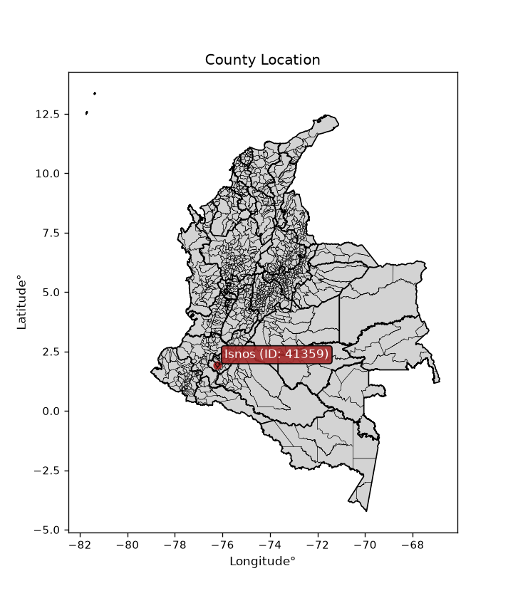
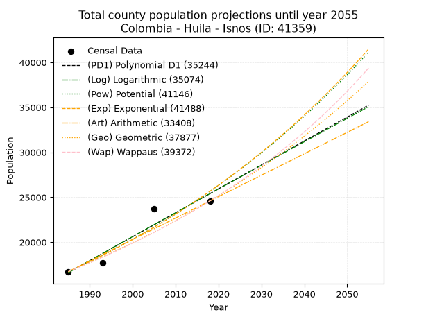
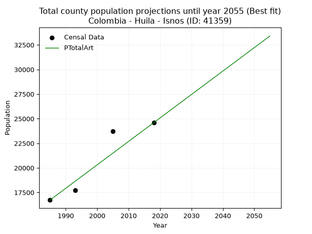
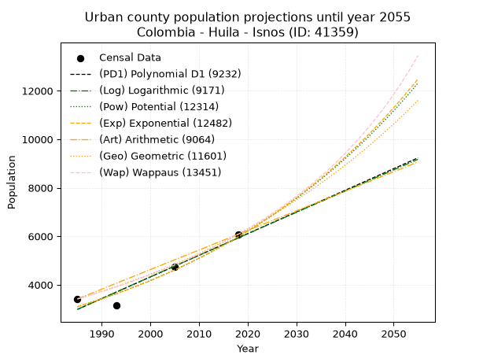
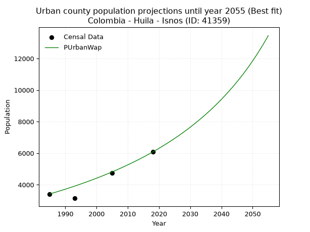
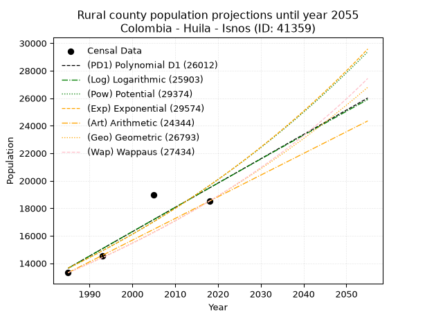
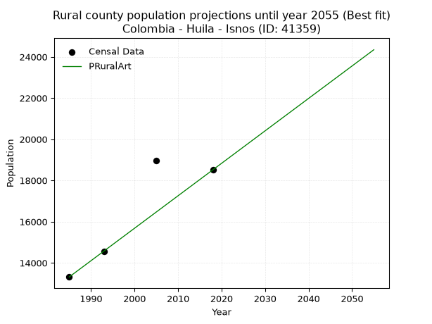

<div align="center">


</div>

# _“Population and Public Services Demand Projections (PPSD) until Year 2050 for Colombia - Huila - Isnos (ID: 41359)”_
Keywords: `population` `public-service` `projection` `lineal` `polynomial` `logarithmic` `potential` `exponential` `arithmetic` `geometric` `wappaus` `dane` `colombia` `south-america`

PPSD are analytical estimates used by governments and planners to anticipate future changes in population size, age distribution, and the resulting community needs for utilities, healthcare, education, and infrastructure as sizing future water treatment facilities, electrical grids, and road networks based on spatial growth.

<div align="center">

</img>

</div>


> **General running parameters**: • app_version: _v20260806_. • Python version: _3.14.7_. • Pandas version: _3.0.5_. • NumPy version: _2.5.1_. • Creates, save and include plots into reports (create_plot): _False_. • Projection until year: _2050_. • Process polynomial degree 2 and up: _False_. • Process Wappaus: _True_. • Process Wappaus: _True_. • Set negative values to zero: _True_. • Set infinite values to zero: _True_. • Drop dataset notes: _True_. 
<div align="center">

Dynamic map: [:earth_americas:Google](http://maps.google.com/maps?q=1.92946706,-76.2176374) [:earth_americas:OSM](https://www.openstreetmap.org/#map=18/1.92946706/-76.2176374&layers=P) [:earth_americas:Bing](https://www.bing.com/maps?cp=1.92946706~-76.2176374&lvl=18) [:earth_americas:Apple](https://maps.apple.com/frame?center=1.92946706%2C-76.2176374&span=0.003%2C0.006)

</div>


<div align="center">

```geojson
{
  "type": "Feature",
  "geometry": {
    "type": "Point", 
    "coordinates": [-76.2176374, 1.92946706]
  }, 
  "properties": {
    "Name": "Colombia - Huila - Isnos (ID: 41359)"
  }
}
```

</div>


## 0. Census Data (4 records)

Census data are official statistics collected by a government about the people and housing in a country. They usually include counts of total population, age, sex, race, income, education, and jobs.

📅Global census file: [Population.xlsx](../data/Population.xlsx)

| Source   |   Year |   CountryID | CountryName   |   StateID | StateName   |   CountyID | CountyName   |   PTotal |   PUrban |   PRural |
|:---------|-------:|------------:|:--------------|----------:|:------------|-----------:|:-------------|---------:|---------:|---------:|
| DANE     |   1985 |          57 | Colombia      |        41 | Huila       |      41359 | Isnos        |    16731 |     3415 |    13316 |
| DANE     |   1993 |          57 | Colombia      |        41 | Huila       |      41359 | Isnos        |    17699 |     3140 |    14559 |
| DANE     |   2005 |          57 | Colombia      |        41 | Huila       |      41359 | Isnos        |    23702 |     4747 |    18955 |
| DANE     |   2018 |          57 | Colombia      |        41 | Huila       |      41359 | Isnos        |    24593 |     6078 |    18515 |

> 🔥Some records could had specific notes about the registered values or the corresponding urban or rural distribution.

📅[SUI-RUPS](https://www.datos.gov.co/Hacienda-y-Cr-dito-P-blico/Registro-nico-de-Prestadores-de-Servicios-P-blicos/4qkq-csdn/about_data) - Local public utility companies: [RUPS.csv](../data/RUPS.xlsx)

 | SERVICIO       | ESTADO    | NOMBRE                                                                                     | NIT         | DEPARTAMENTO_DOMICILIO   | MUNICIPIO_DOMICILIO   | DIRECCION                           |   TELEFONO | EMAIL                          | TIPO_PRESTADOR                             | CLASIFICACION                 |
|:---------------|:----------|:-------------------------------------------------------------------------------------------|:------------|:-------------------------|:----------------------|:------------------------------------|-----------:|:-------------------------------|:-------------------------------------------|:------------------------------|
| ACUEDUCTO      | OPERATIVA | ASOCIACIÓN DE USUARIOS DEL SERVICIO DE AGUA REGIONAL PRIMAVERA                             | 813005389-1 | HUILA                    | ISNOS                 | CARRERA 3 N° 2-42 SALIDA A PITALITO |    8328666 | asoaprimaveraisnos@gmail.com   | ORGANIZACION AUTORIZADA                    | MENOR O IGUAL A 2500 USUARIOS |
| ACUEDUCTO      | OPERATIVA | JUNTA ADMINISTRADORA DEL ACUEDUCTO REGIONAL ISNOS                                          | 813012696-7 | HUILA                    | ISNOS                 | Calle 3 No. 2 - 56  Barrio La Palma |    0000000 | jarisnos@gmail.com             | ORGANIZACION AUTORIZADA                    | MENOR O IGUAL A 2500 USUARIOS |
| ALCANTARILLADO | OPERATIVA | MUNICIPIO DE ISNOS                                                                         | 800097098-1 | HUILA                    | ISNOS                 | CARRERA 3  4  26                    |    8328025 | jorgeparra080@yahoo.es         | MUNICIPIO (PRESTACIÓN DIRECTA)             | HASTA 2500 SUSCRIPTORES       |
| ACUEDUCTO      | OPERATIVA | JUNTA ADMINISTRADORA DEL SERVICIO DE ACUECTO REGIONAL DE BORBONES EN EL MUNICIPIO DE ISNOS | 813009529-4 | HUILA                    | ISNOS                 | CORRIGIMIENTO EL SALTO DE BORDONES  |    8328359 | joevrobu@yahoo.com             | ORGANIZACION AUTORIZADA                    | HASTA 2500 SUSCRIPTORES       |
| ACUEDUCTO      | OPERATIVA | JUNTA ADMINISTRADORA DEL SERVICIPO DE ACUEDUCTO ALTO SINAI                                 | 900205170-1 | HUILA                    | ISNOS                 | VERESA SINAI                        |    3114582 | personeriaisnos@hotmail.com    | ORGANIZACION AUTORIZADA                    | HASTA 2500 SUSCRIPTORES       |
| ACUEDUCTO      | OPERATIVA | JUNTA ADMINISTRADORA ACUEDUCTO LA ESPERANZA VEREDA EL REMOLINO                             | 900041969-1 | HUILA                    | ISNOS                 | VEREDA EL REMOLINO                  |    8328309 | SIN@CORREO.COM                 | ORGANIZACION AUTORIZADA                    | HASTA 2500 SUSCRIPTORES       |
| ACUEDUCTO      | OPERATIVA | JUNTA ADMINISTRADORA DEL ACUEDUCTO REGIONAL IDOLOS                                         | 900238033-0 | HUILA                    | ISNOS                 | VEREDA IDOLOS                       |    8328666 | an69galindez@yahoo.es          | ORGANIZACION AUTORIZADA                    | HASTA 2500 SUSCRIPTORES       |
| ALCANTARILLADO | OPERATIVA | AGUAS Y ASEO DEL MACIZO S.A.S. E.S.P.                                                      | 900395462-9 | HUILA                    | ISNOS                 | Cra 3 N° 1 - 76                     |    0000000 | AGUAYASEODELMACIZO@hotmail.com | SOCIEDADES (EMPRESA DE SERVICIOS PUBLICOS) | MENOR O IGUAL A 2500 USUARIOS |

## 1. Total

### 1.1. Coefficients and Parameters

* (PD1) Polynomial Deg 1: 265.9891609795254, -511363.56924929575 (lineal)
* (Log) Logarithmic: 532606.176935676, -4027662.5689261165
* (Pow) Potential: 25.994021667166763, -81.49897005319566
* (Exp) Exponential: 0.012980981136129248, 1.0782524079125213e-07
* (Art) Arithmetic: Year diff. 2018 - 1985 = 33, Population diff. 24593 - 16731 = 7862, Annual growth = 238.24242424242425
* (Geo) Geometric: Year diff. 2018 - 1985 = 33, Population diff. 24593 - 16731 = 7862, Annual growth % = 0.011741075361578313
* (Wap) Wappaus: i = 1.1530462890447404, Condition values only valid for < 200)

<sub>
Wappaus condition values: ['0.00', '1.15', '2.31', '3.46', '4.61', '5.77', '6.92', '8.07', '9.22', '10.38', '11.53', '12.68', '13.84', '14.99', '16.14', '17.30', '18.45', '19.60', '20.75', '21.91', '23.06', '24.21', '25.37', '26.52', '27.67', '28.83', '29.98', '31.13', '32.29', '33.44', '34.59', '35.74', '36.90', '38.05', '39.20', '40.36', '41.51', '42.66', '43.82', '44.97', '46.12', '47.27', '48.43', '49.58', '50.73', '51.89', '53.04', '54.19', '55.35', '56.50', '57.65', '58.81', '59.96', '61.11', '62.26', '63.42', '64.57', '65.72', '66.88', '68.03', '69.18', '70.34', '71.49', '72.64', '73.79', '74.95']
</sub>


### 1.2. Projected Dataset

|   Year |   CountyID |   PTotalPD1 |   PTotalLog |   PTotalPow |   PTotalExp |   PTotalArt |   PTotalGeo |   PTotalWap |
|-------:|-----------:|------------:|------------:|------------:|------------:|------------:|------------:|------------:|
|   1985 |      41359 |       16625 |       16615 |       16714 |       16722 |       16731 |       16731 |       16731 |
|   1986 |      41359 |       16891 |       16884 |       16935 |       16941 |       16969 |       16927 |       16925 |
|   1987 |      41359 |       17157 |       17152 |       17158 |       17162 |       17207 |       17126 |       17121 |
|   1988 |      41359 |       17423 |       17420 |       17383 |       17386 |       17446 |       17327 |       17320 |
|   1989 |      41359 |       17689 |       17688 |       17612 |       17613 |       17684 |       17531 |       17521 |
|   1990 |      41359 |       17955 |       17955 |       17844 |       17844 |       17922 |       17737 |       17724 |
|   1991 |      41359 |       18221 |       18223 |       18078 |       18077 |       18160 |       17945 |       17930 |
|   1992 |      41359 |       18487 |       18490 |       18316 |       18313 |       18399 |       18155 |       18138 |
|   1993 |      41359 |       18753 |       18758 |       18556 |       18552 |       18637 |       18369 |       18349 |
|   1994 |      41359 |       19019 |       19025 |       18800 |       18795 |       18875 |       18584 |       18562 |
|   1995 |      41359 |       19285 |       19292 |       19047 |       19040 |       19113 |       18803 |       18778 |
|   1996 |      41359 |       19551 |       19559 |       19296 |       19289 |       19352 |       19023 |       18997 |
|   1997 |      41359 |       19817 |       19826 |       19549 |       19541 |       19590 |       19247 |       19218 |
|   1998 |      41359 |       20083 |       20092 |       19805 |       19796 |       19828 |       19473 |       19442 |
|   1999 |      41359 |       20349 |       20359 |       20065 |       20055 |       20066 |       19701 |       19669 |
|   2000 |      41359 |       20615 |       20625 |       20327 |       20317 |       20305 |       19933 |       19899 |
|   2001 |      41359 |       20881 |       20891 |       20593 |       20582 |       20543 |       20167 |       20131 |
|   2002 |      41359 |       21147 |       21157 |       20862 |       20851 |       20781 |       20403 |       20367 |
|   2003 |      41359 |       21413 |       21423 |       21135 |       21124 |       21019 |       20643 |       20606 |
|   2004 |      41359 |       21679 |       21689 |       21411 |       21400 |       21258 |       20885 |       20847 |
|   2005 |      41359 |       21945 |       21955 |       21690 |       21679 |       21496 |       21130 |       21092 |
|   2006 |      41359 |       22211 |       22220 |       21973 |       21963 |       21734 |       21379 |       21340 |
|   2007 |      41359 |       22477 |       22486 |       22260 |       22250 |       21972 |       21630 |       21592 |
|   2008 |      41359 |       22743 |       22751 |       22550 |       22540 |       22211 |       21884 |       21846 |
|   2009 |      41359 |       23009 |       23016 |       22843 |       22835 |       22449 |       22140 |       22104 |
|   2010 |      41359 |       23275 |       23281 |       23141 |       23133 |       22687 |       22400 |       22366 |
|   2011 |      41359 |       23541 |       23546 |       23442 |       23435 |       22925 |       22663 |       22631 |
|   2012 |      41359 |       23807 |       23811 |       23747 |       23742 |       23164 |       22930 |       22900 |
|   2013 |      41359 |       24073 |       24076 |       24056 |       24052 |       23402 |       23199 |       23172 |
|   2014 |      41359 |       24339 |       24340 |       24368 |       24366 |       23640 |       23471 |       23449 |
|   2015 |      41359 |       24605 |       24605 |       24685 |       24684 |       23878 |       23747 |       23729 |
|   2016 |      41359 |       24871 |       24869 |       25005 |       25007 |       24117 |       24026 |       24013 |
|   2017 |      41359 |       25137 |       25133 |       25330 |       25334 |       24355 |       24308 |       24301 |
|   2018 |      41359 |       25403 |       25397 |       25658 |       25665 |       24593 |       24593 |       24593 |
|   2019 |      41359 |       25669 |       25661 |       25991 |       26000 |       24831 |       24882 |       24889 |
|   2020 |      41359 |       25935 |       25925 |       26327 |       26340 |       25069 |       25174 |       25190 |
|   2021 |      41359 |       26201 |       26188 |       26668 |       26684 |       25308 |       25469 |       25495 |
|   2022 |      41359 |       26467 |       26452 |       27013 |       27032 |       25546 |       25768 |       25804 |
|   2023 |      41359 |       26733 |       26715 |       27363 |       27386 |       25784 |       26071 |       26118 |
|   2024 |      41359 |       26998 |       26978 |       27716 |       27743 |       26022 |       26377 |       26437 |
|   2025 |      41359 |       27264 |       27241 |       28075 |       28106 |       26261 |       26687 |       26761 |
|   2026 |      41359 |       27530 |       27504 |       28437 |       28473 |       26499 |       27000 |       27089 |
|   2027 |      41359 |       27796 |       27767 |       28804 |       28845 |       26737 |       27317 |       27422 |
|   2028 |      41359 |       28062 |       28030 |       29176 |       29222 |       26975 |       27638 |       27761 |
|   2029 |      41359 |       28328 |       28292 |       29552 |       29604 |       27214 |       27962 |       28104 |
|   2030 |      41359 |       28594 |       28555 |       29933 |       29991 |       27452 |       28291 |       28453 |
|   2031 |      41359 |       28860 |       28817 |       30319 |       30382 |       27690 |       28623 |       28808 |
|   2032 |      41359 |       29126 |       29079 |       30709 |       30779 |       27928 |       28959 |       29168 |
|   2033 |      41359 |       29392 |       29341 |       31105 |       31182 |       28167 |       29299 |       29534 |
|   2034 |      41359 |       29658 |       29603 |       31505 |       31589 |       28405 |       29643 |       29906 |
|   2035 |      41359 |       29924 |       29865 |       31910 |       32002 |       28643 |       29991 |       30283 |
|   2036 |      41359 |       30190 |       30127 |       32320 |       32420 |       28881 |       30343 |       30667 |
|   2037 |      41359 |       30456 |       30388 |       32735 |       32843 |       29120 |       30699 |       31058 |
|   2038 |      41359 |       30722 |       30650 |       33155 |       33272 |       29358 |       31060 |       31454 |
|   2039 |      41359 |       30988 |       30911 |       33581 |       33707 |       29596 |       31425 |       31858 |
|   2040 |      41359 |       31254 |       31172 |       34012 |       34148 |       29834 |       31793 |       32268 |
|   2041 |      41359 |       31520 |       31433 |       34448 |       34594 |       30073 |       32167 |       32685 |
|   2042 |      41359 |       31786 |       31694 |       34889 |       35046 |       30311 |       32544 |       33109 |
|   2043 |      41359 |       32052 |       31955 |       35336 |       35504 |       30549 |       32927 |       33541 |
|   2044 |      41359 |       32318 |       32215 |       35788 |       35968 |       30787 |       33313 |       33980 |
|   2045 |      41359 |       32584 |       32476 |       36246 |       36437 |       31026 |       33704 |       34427 |
|   2046 |      41359 |       32850 |       32736 |       36710 |       36914 |       31264 |       34100 |       34882 |
|   2047 |      41359 |       33116 |       32996 |       37179 |       37396 |       31502 |       34500 |       35345 |
|   2048 |      41359 |       33382 |       33257 |       37654 |       37884 |       31740 |       34905 |       35817 |
|   2049 |      41359 |       33648 |       33517 |       38135 |       38379 |       31979 |       35315 |       36297 |
|   2050 |      41359 |       33914 |       33776 |       38622 |       38881 |       32217 |       35730 |       36786 |
<div align="center">

</img>

</div>


### 1.3. Best fit with absolute and relative error (%)

Relative error puts that difference into context by dividing the absolute error by the true value, creating a unitless ratio or percentage that shows the scale of the mistake.

Absolute and relative error

|   Year | Source   |   CountryID | CountryName   |   StateID | StateName   |   CountyID_x | CountyName   |   PTotal |   PUrban |   PRural |   CountyID_y |   PTotalPD1 |   PTotalLog |   PTotalPow |   PTotalExp |   PTotalArt |   PTotalGeo |   PTotalWap |   PTotalPD1AbsError |   PTotalLogAbsError |   PTotalPowAbsError |   PTotalExpAbsError |   PTotalArtAbsError |   PTotalGeoAbsError |   PTotalWapAbsError |   PTotalPD1RelError |   PTotalLogRelError |   PTotalPowRelError |   PTotalExpRelError |   PTotalArtRelError |   PTotalGeoRelError |   PTotalWapRelError |
|-------:|:---------|------------:|:--------------|----------:|:------------|-------------:|:-------------|---------:|---------:|---------:|-------------:|------------:|------------:|------------:|------------:|------------:|------------:|------------:|--------------------:|--------------------:|--------------------:|--------------------:|--------------------:|--------------------:|--------------------:|--------------------:|--------------------:|--------------------:|--------------------:|--------------------:|--------------------:|--------------------:|
|   1985 | DANE     |          57 | Colombia      |        41 | Huila       |        41359 | Isnos        |    16731 |     3415 |    13316 |        41359 |       16625 |       16615 |       16714 |       16722 |       16731 |       16731 |       16731 |                 106 |                 116 |                  17 |                   9 |                   0 |                   0 |                   0 |            0.633554 |            0.693324 |            0.101608 |           0.0537924 |             0       |             0       |             0       |
|   1993 | DANE     |          57 | Colombia      |        41 | Huila       |        41359 | Isnos        |    17699 |     3140 |    14559 |        41359 |       18753 |       18758 |       18556 |       18552 |       18637 |       18369 |       18349 |                1054 |                1059 |                 857 |                 853 |                 938 |                 670 |                 650 |            5.95514  |            5.98339  |            4.84208  |           4.81948   |             5.29973 |             3.78552 |             3.67252 |
|   2005 | DANE     |          57 | Colombia      |        41 | Huila       |        41359 | Isnos        |    23702 |     4747 |    18955 |        41359 |       21945 |       21955 |       21690 |       21679 |       21496 |       21130 |       21092 |                1757 |                1747 |                2012 |                2023 |                2206 |                2572 |                2610 |            7.41288  |            7.37069  |            8.48874  |           8.53514   |             9.30723 |            10.8514  |            11.0117  |
|   2018 | DANE     |          57 | Colombia      |        41 | Huila       |        41359 | Isnos        |    24593 |     6078 |    18515 |        41359 |       25403 |       25397 |       25658 |       25665 |       24593 |       24593 |       24593 |                 810 |                 804 |                1065 |                1072 |                   0 |                   0 |                   0 |            3.29362  |            3.26922  |            4.3305   |           4.35896   |             0       |             0       |             0       |

Relative error mean

| Method    |   RelError | Best   |
|:----------|-----------:|:-------|
| PTotalPD1 |    4.3238  |        |
| PTotalLog |    4.32916 |        |
| PTotalPow |    4.44073 |        |
| PTotalExp |    4.44185 |        |
| PTotalArt |    3.65174 | True   |
| PTotalGeo |    3.65923 |        |
| PTotalWap |    3.67106 |        |

💙Best method: _**PTotalArt**_
<div align="center">

</img>

</div>


### 1.4. Fresh water supply demand in liters per capita per day (lpcd)

The fresh water supply demand typically ranges from 100 to 300 liters per capita per day (lpcd) for standard domestic and municipal planning, though absolute survival minimums set by the World Health Organization are as low as 7.5 to 20 liters per day, and total consumption in high-income nations can exceed 400 liters.

> `CZ`: Level in meters above the sea level (masl)<br> `WS`: Fresh water supply demand in liters per capita per day (lpcd or l/h/d)<br> `WSAll`: Zonal fresh water supply demand in liters per second (l/s)<br> `A`: Zonal area in square meters<br> `DP`: Population density (people/hectare or p/ha)

Reference values (RAS Colombia)

|    CZ |   WS |
|------:|-----:|
|  1000 |  120 |
|  2000 |  130 |
| 99999 |  140 |

County shapefile geometry properties and water supply values

|   CountyID |      ATotal |   CZTotal |   WSTotal |
|-----------:|------------:|----------:|----------:|
|      41359 | 3.70729e+08 |   2121.98 |       140 |

Projected values for best method: PTotalArt

|   CountyID |   Year |   PTotalArt |   DPTotal |   WSTotal |   WSTotalAll |
|-----------:|-------:|------------:|----------:|----------:|-------------:|
|      41359 |   1985 |       16731 |      0.45 |       140 |      27.1104 |
|      41359 |   1986 |       16969 |      0.46 |       140 |      27.4961 |
|      41359 |   1987 |       17207 |      0.46 |       140 |      27.8817 |
|      41359 |   1988 |       17446 |      0.47 |       140 |      28.269  |
|      41359 |   1989 |       17684 |      0.48 |       140 |      28.6546 |
|      41359 |   1990 |       17922 |      0.48 |       140 |      29.0403 |
|      41359 |   1991 |       18160 |      0.49 |       140 |      29.4259 |
|      41359 |   1992 |       18399 |      0.5  |       140 |      29.8132 |
|      41359 |   1993 |       18637 |      0.5  |       140 |      30.1988 |
|      41359 |   1994 |       18875 |      0.51 |       140 |      30.5845 |
|      41359 |   1995 |       19113 |      0.52 |       140 |      30.9701 |
|      41359 |   1996 |       19352 |      0.52 |       140 |      31.3574 |
|      41359 |   1997 |       19590 |      0.53 |       140 |      31.7431 |
|      41359 |   1998 |       19828 |      0.53 |       140 |      32.1287 |
|      41359 |   1999 |       20066 |      0.54 |       140 |      32.5144 |
|      41359 |   2000 |       20305 |      0.55 |       140 |      32.9016 |
|      41359 |   2001 |       20543 |      0.55 |       140 |      33.2873 |
|      41359 |   2002 |       20781 |      0.56 |       140 |      33.6729 |
|      41359 |   2003 |       21019 |      0.57 |       140 |      34.0586 |
|      41359 |   2004 |       21258 |      0.57 |       140 |      34.4458 |
|      41359 |   2005 |       21496 |      0.58 |       140 |      34.8315 |
|      41359 |   2006 |       21734 |      0.59 |       140 |      35.2171 |
|      41359 |   2007 |       21972 |      0.59 |       140 |      35.6028 |
|      41359 |   2008 |       22211 |      0.6  |       140 |      35.99   |
|      41359 |   2009 |       22449 |      0.61 |       140 |      36.3757 |
|      41359 |   2010 |       22687 |      0.61 |       140 |      36.7613 |
|      41359 |   2011 |       22925 |      0.62 |       140 |      37.147  |
|      41359 |   2012 |       23164 |      0.62 |       140 |      37.5343 |
|      41359 |   2013 |       23402 |      0.63 |       140 |      37.9199 |
|      41359 |   2014 |       23640 |      0.64 |       140 |      38.3056 |
|      41359 |   2015 |       23878 |      0.64 |       140 |      38.6912 |
|      41359 |   2016 |       24117 |      0.65 |       140 |      39.0785 |
|      41359 |   2017 |       24355 |      0.66 |       140 |      39.4641 |
|      41359 |   2018 |       24593 |      0.66 |       140 |      39.8498 |
|      41359 |   2019 |       24831 |      0.67 |       140 |      40.2354 |
|      41359 |   2020 |       25069 |      0.68 |       140 |      40.6211 |
|      41359 |   2021 |       25308 |      0.68 |       140 |      41.0083 |
|      41359 |   2022 |       25546 |      0.69 |       140 |      41.394  |
|      41359 |   2023 |       25784 |      0.7  |       140 |      41.7796 |
|      41359 |   2024 |       26022 |      0.7  |       140 |      42.1653 |
|      41359 |   2025 |       26261 |      0.71 |       140 |      42.5525 |
|      41359 |   2026 |       26499 |      0.71 |       140 |      42.9382 |
|      41359 |   2027 |       26737 |      0.72 |       140 |      43.3238 |
|      41359 |   2028 |       26975 |      0.73 |       140 |      43.7095 |
|      41359 |   2029 |       27214 |      0.73 |       140 |      44.0968 |
|      41359 |   2030 |       27452 |      0.74 |       140 |      44.4824 |
|      41359 |   2031 |       27690 |      0.75 |       140 |      44.8681 |
|      41359 |   2032 |       27928 |      0.75 |       140 |      45.2537 |
|      41359 |   2033 |       28167 |      0.76 |       140 |      45.641  |
|      41359 |   2034 |       28405 |      0.77 |       140 |      46.0266 |
|      41359 |   2035 |       28643 |      0.77 |       140 |      46.4123 |
|      41359 |   2036 |       28881 |      0.78 |       140 |      46.7979 |
|      41359 |   2037 |       29120 |      0.79 |       140 |      47.1852 |
|      41359 |   2038 |       29358 |      0.79 |       140 |      47.5708 |
|      41359 |   2039 |       29596 |      0.8  |       140 |      47.9565 |
|      41359 |   2040 |       29834 |      0.8  |       140 |      48.3421 |
|      41359 |   2041 |       30073 |      0.81 |       140 |      48.7294 |
|      41359 |   2042 |       30311 |      0.82 |       140 |      49.115  |
|      41359 |   2043 |       30549 |      0.82 |       140 |      49.5007 |
|      41359 |   2044 |       30787 |      0.83 |       140 |      49.8863 |
|      41359 |   2045 |       31026 |      0.84 |       140 |      50.2736 |
|      41359 |   2046 |       31264 |      0.84 |       140 |      50.6593 |
|      41359 |   2047 |       31502 |      0.85 |       140 |      51.0449 |
|      41359 |   2048 |       31740 |      0.86 |       140 |      51.4306 |
|      41359 |   2049 |       31979 |      0.86 |       140 |      51.8178 |
|      41359 |   2050 |       32217 |      0.87 |       140 |      52.2035 |

## 2. Urban

### 2.1. Coefficients and Parameters

* (PD1) Polynomial Deg 1: 89.26374949819255, -174204.81493375966 (lineal)
* (Log) Logarithmic: 178577.74330687546, -1353025.857907785
* (Pow) Potential: 39.85720853206521, -127.94904295112613
* (Exp) Exponential: 0.019921087912026503, 2.0759890518604605e-14
* (Art) Arithmetic: Year diff. 2018 - 1985 = 33, Population diff. 6078 - 3415 = 2663, Annual growth = 80.6969696969697
* (Geo) Geometric: Year diff. 2018 - 1985 = 33, Population diff. 6078 - 3415 = 2663, Annual growth % = 0.017623129155998063
* (Wap) Wappaus: i = 1.7001363045816853, Condition values only valid for < 200)

<sub>
Wappaus condition values: ['0.00', '1.70', '3.40', '5.10', '6.80', '8.50', '10.20', '11.90', '13.60', '15.30', '17.00', '18.70', '20.40', '22.10', '23.80', '25.50', '27.20', '28.90', '30.60', '32.30', '34.00', '35.70', '37.40', '39.10', '40.80', '42.50', '44.20', '45.90', '47.60', '49.30', '51.00', '52.70', '54.40', '56.10', '57.80', '59.50', '61.20', '62.91', '64.61', '66.31', '68.01', '69.71', '71.41', '73.11', '74.81', '76.51', '78.21', '79.91', '81.61', '83.31', '85.01', '86.71', '88.41', '90.11', '91.81', '93.51', '95.21', '96.91', '98.61', '100.31', '102.01', '103.71', '105.41', '107.11', '108.81', '110.51']
</sub>


### 2.2. Projected Dataset

|   Year |   CountyID |   PUrbanPD1 |   PUrbanLog |   PUrbanPow |   PUrbanExp |   PUrbanArt |   PUrbanGeo |   PUrbanWap |
|-------:|-----------:|------------:|------------:|------------:|------------:|------------:|------------:|------------:|
|   1985 |      41359 |        2984 |        2982 |        3094 |        3095 |        3415 |        3415 |        3415 |
|   1986 |      41359 |        3073 |        3072 |        3156 |        3157 |        3496 |        3475 |        3474 |
|   1987 |      41359 |        3162 |        3162 |        3220 |        3221 |        3576 |        3536 |        3533 |
|   1988 |      41359 |        3252 |        3251 |        3286 |        3286 |        3657 |        3599 |        3594 |
|   1989 |      41359 |        3341 |        3341 |        3352 |        3352 |        3738 |        3662 |        3655 |
|   1990 |      41359 |        3430 |        3431 |        3420 |        3419 |        3818 |        3727 |        3718 |
|   1991 |      41359 |        3519 |        3521 |        3489 |        3488 |        3899 |        3792 |        3782 |
|   1992 |      41359 |        3609 |        3610 |        3560 |        3558 |        3980 |        3859 |        3847 |
|   1993 |      41359 |        3698 |        3700 |        3632 |        3630 |        4061 |        3927 |        3913 |
|   1994 |      41359 |        3787 |        3790 |        3705 |        3703 |        4141 |        3996 |        3981 |
|   1995 |      41359 |        3876 |        3879 |        3780 |        3777 |        4222 |        4067 |        4050 |
|   1996 |      41359 |        3966 |        3969 |        3856 |        3854 |        4303 |        4139 |        4120 |
|   1997 |      41359 |        4055 |        4058 |        3934 |        3931 |        4383 |        4211 |        4191 |
|   1998 |      41359 |        4144 |        4147 |        4013 |        4010 |        4464 |        4286 |        4264 |
|   1999 |      41359 |        4233 |        4237 |        4094 |        4091 |        4545 |        4361 |        4338 |
|   2000 |      41359 |        4323 |        4326 |        4176 |        4173 |        4625 |        4438 |        4413 |
|   2001 |      41359 |        4412 |        4415 |        4260 |        4257 |        4706 |        4516 |        4490 |
|   2002 |      41359 |        4501 |        4505 |        4346 |        4343 |        4787 |        4596 |        4569 |
|   2003 |      41359 |        4590 |        4594 |        4433 |        4430 |        4868 |        4677 |        4649 |
|   2004 |      41359 |        4680 |        4683 |        4523 |        4519 |        4948 |        4759 |        4731 |
|   2005 |      41359 |        4769 |        4772 |        4613 |        4610 |        5029 |        4843 |        4814 |
|   2006 |      41359 |        4858 |        4861 |        4706 |        4703 |        5110 |        4929 |        4899 |
|   2007 |      41359 |        4948 |        4950 |        4800 |        4798 |        5190 |        5015 |        4986 |
|   2008 |      41359 |        5037 |        5039 |        4897 |        4894 |        5271 |        5104 |        5075 |
|   2009 |      41359 |        5126 |        5128 |        4995 |        4993 |        5352 |        5194 |        5166 |
|   2010 |      41359 |        5215 |        5217 |        5095 |        5093 |        5432 |        5285 |        5258 |
|   2011 |      41359 |        5305 |        5306 |        5197 |        5196 |        5513 |        5378 |        5353 |
|   2012 |      41359 |        5394 |        5394 |        5301 |        5300 |        5594 |        5473 |        5450 |
|   2013 |      41359 |        5483 |        5483 |        5407 |        5407 |        5675 |        5570 |        5548 |
|   2014 |      41359 |        5572 |        5572 |        5515 |        5515 |        5755 |        5668 |        5650 |
|   2015 |      41359 |        5662 |        5660 |        5625 |        5626 |        5836 |        5768 |        5753 |
|   2016 |      41359 |        5751 |        5749 |        5738 |        5740 |        5917 |        5869 |        5859 |
|   2017 |      41359 |        5840 |        5838 |        5852 |        5855 |        5997 |        5973 |        5967 |
|   2018 |      41359 |        5929 |        5926 |        5969 |        5973 |        6078 |        6078 |        6078 |
|   2019 |      41359 |        6019 |        6015 |        6088 |        6093 |        6159 |        6185 |        6192 |
|   2020 |      41359 |        6108 |        6103 |        6209 |        6216 |        6239 |        6294 |        6308 |
|   2021 |      41359 |        6197 |        6191 |        6333 |        6341 |        6320 |        6405 |        6427 |
|   2022 |      41359 |        6286 |        6280 |        6459 |        6468 |        6401 |        6518 |        6549 |
|   2023 |      41359 |        6376 |        6368 |        6588 |        6599 |        6481 |        6633 |        6674 |
|   2024 |      41359 |        6465 |        6456 |        6719 |        6731 |        6562 |        6750 |        6802 |
|   2025 |      41359 |        6554 |        6545 |        6852 |        6867 |        6643 |        6869 |        6934 |
|   2026 |      41359 |        6644 |        6633 |        6988 |        7005 |        6724 |        6990 |        7069 |
|   2027 |      41359 |        6733 |        6721 |        7127 |        7146 |        6804 |        7113 |        7208 |
|   2028 |      41359 |        6822 |        6809 |        7269 |        7290 |        6885 |        7238 |        7350 |
|   2029 |      41359 |        6911 |        6897 |        7413 |        7436 |        6966 |        7366 |        7496 |
|   2030 |      41359 |        7001 |        6985 |        7560 |        7586 |        7046 |        7496 |        7646 |
|   2031 |      41359 |        7090 |        7073 |        7710 |        7739 |        7127 |        7628 |        7801 |
|   2032 |      41359 |        7179 |        7161 |        7863 |        7894 |        7208 |        7762 |        7959 |
|   2033 |      41359 |        7268 |        7249 |        8018 |        8053 |        7288 |        7899 |        8123 |
|   2034 |      41359 |        7358 |        7336 |        8177 |        8215 |        7369 |        8038 |        8291 |
|   2035 |      41359 |        7447 |        7424 |        8339 |        8380 |        7450 |        8180 |        8464 |
|   2036 |      41359 |        7536 |        7512 |        8504 |        8549 |        7531 |        8324 |        8642 |
|   2037 |      41359 |        7625 |        7600 |        8672 |        8721 |        7611 |        8471 |        8826 |
|   2038 |      41359 |        7715 |        7687 |        8843 |        8897 |        7692 |        8620 |        9015 |
|   2039 |      41359 |        7804 |        7775 |        9018 |        9076 |        7773 |        8772 |        9211 |
|   2040 |      41359 |        7893 |        7862 |        9196 |        9258 |        7853 |        8926 |        9412 |
|   2041 |      41359 |        7982 |        7950 |        9377 |        9444 |        7934 |        9084 |        9620 |
|   2042 |      41359 |        8072 |        8037 |        9562 |        9635 |        8015 |        9244 |        9835 |
|   2043 |      41359 |        8161 |        8125 |        9750 |        9828 |        8095 |        9407 |       10057 |
|   2044 |      41359 |        8250 |        8212 |        9942 |       10026 |        8176 |        9572 |       10287 |
|   2045 |      41359 |        8340 |        8300 |       10138 |       10228 |        8257 |        9741 |       10525 |
|   2046 |      41359 |        8429 |        8387 |       10337 |       10434 |        8338 |        9913 |       10771 |
|   2047 |      41359 |        8518 |        8474 |       10541 |       10644 |        8418 |       10087 |       11026 |
|   2048 |      41359 |        8607 |        8561 |       10748 |       10858 |        8499 |       10265 |       11290 |
|   2049 |      41359 |        8697 |        8649 |       10959 |       11076 |        8580 |       10446 |       11565 |
|   2050 |      41359 |        8786 |        8736 |       11174 |       11299 |        8660 |       10630 |       11849 |
<div align="center">

</img>

</div>


### 2.3. Best fit with absolute and relative error (%)

Relative error puts that difference into context by dividing the absolute error by the true value, creating a unitless ratio or percentage that shows the scale of the mistake.

Absolute and relative error

|   Year | Source   |   CountryID | CountryName   |   StateID | StateName   |   CountyID_x | CountyName   |   PTotal |   PUrban |   PRural |   CountyID_y |   PUrbanPD1 |   PUrbanLog |   PUrbanPow |   PUrbanExp |   PUrbanArt |   PUrbanGeo |   PUrbanWap |   PUrbanPD1AbsError |   PUrbanLogAbsError |   PUrbanPowAbsError |   PUrbanExpAbsError |   PUrbanArtAbsError |   PUrbanGeoAbsError |   PUrbanWapAbsError |   PUrbanPD1RelError |   PUrbanLogRelError |   PUrbanPowRelError |   PUrbanExpRelError |   PUrbanArtRelError |   PUrbanGeoRelError |   PUrbanWapRelError |
|-------:|:---------|------------:|:--------------|----------:|:------------|-------------:|:-------------|---------:|---------:|---------:|-------------:|------------:|------------:|------------:|------------:|------------:|------------:|------------:|--------------------:|--------------------:|--------------------:|--------------------:|--------------------:|--------------------:|--------------------:|--------------------:|--------------------:|--------------------:|--------------------:|--------------------:|--------------------:|--------------------:|
|   1985 | DANE     |          57 | Colombia      |        41 | Huila       |        41359 | Isnos        |    16731 |     3415 |    13316 |        41359 |        2984 |        2982 |        3094 |        3095 |        3415 |        3415 |        3415 |                 431 |                 433 |                 321 |                 320 |                   0 |                   0 |                   0 |           12.6208   |           12.6794   |             9.39971 |             9.37042 |             0       |             0       |             0       |
|   1993 | DANE     |          57 | Colombia      |        41 | Huila       |        41359 | Isnos        |    17699 |     3140 |    14559 |        41359 |        3698 |        3700 |        3632 |        3630 |        4061 |        3927 |        3913 |                 558 |                 560 |                 492 |                 490 |                 921 |                 787 |                 773 |           17.7707   |           17.8344   |            15.6688  |            15.6051  |            29.3312  |            25.0637  |            24.6178  |
|   2005 | DANE     |          57 | Colombia      |        41 | Huila       |        41359 | Isnos        |    23702 |     4747 |    18955 |        41359 |        4769 |        4772 |        4613 |        4610 |        5029 |        4843 |        4814 |                  22 |                  25 |                 134 |                 137 |                 282 |                  96 |                  67 |            0.463451 |            0.526648 |             2.82284 |             2.88603 |             5.94059 |             2.02233 |             1.41142 |
|   2018 | DANE     |          57 | Colombia      |        41 | Huila       |        41359 | Isnos        |    24593 |     6078 |    18515 |        41359 |        5929 |        5926 |        5969 |        5973 |        6078 |        6078 |        6078 |                 149 |                 152 |                 109 |                 105 |                   0 |                   0 |                   0 |            2.45146  |            2.50082  |             1.79335 |             1.72754 |             0       |             0       |             0       |

Relative error mean

| Method    |   RelError | Best   |
|:----------|-----------:|:-------|
| PUrbanPD1 |    8.3266  |        |
| PUrbanLog |    8.38531 |        |
| PUrbanPow |    7.42117 |        |
| PUrbanExp |    7.39727 |        |
| PUrbanArt |    8.81795 |        |
| PUrbanGeo |    6.77151 |        |
| PUrbanWap |    6.50731 | True   |

💙Best method: _**PUrbanWap**_
<div align="center">

</img>

</div>


### 2.4. Fresh water supply demand in liters per capita per day (lpcd)

The fresh water supply demand typically ranges from 100 to 300 liters per capita per day (lpcd) for standard domestic and municipal planning, though absolute survival minimums set by the World Health Organization are as low as 7.5 to 20 liters per day, and total consumption in high-income nations can exceed 400 liters.

> `CZ`: Level in meters above the sea level (masl)<br> `WS`: Fresh water supply demand in liters per capita per day (lpcd or l/h/d)<br> `WSAll`: Zonal fresh water supply demand in liters per second (l/s)<br> `A`: Zonal area in square meters<br> `DP`: Population density (people/hectare or p/ha)

Reference values (RAS Colombia)

|    CZ |   WS |
|------:|-----:|
|  1000 |  120 |
|  2000 |  130 |
| 99999 |  140 |

County shapefile geometry properties and water supply values

|   CountyID |   AUrban |   CZUrban |   WSUrban |
|-----------:|---------:|----------:|----------:|
|      41359 |   950823 |   1771.13 |       130 |

Projected values for best method: PUrbanWap

|   CountyID |   Year |   PUrbanWap |   DPUrban |   WSUrban |   WSUrbanAll |
|-----------:|-------:|------------:|----------:|----------:|-------------:|
|      41359 |   1985 |        3415 |     35.92 |       130 |      5.13831 |
|      41359 |   1986 |        3474 |     36.54 |       130 |      5.22708 |
|      41359 |   1987 |        3533 |     37.16 |       130 |      5.31586 |
|      41359 |   1988 |        3594 |     37.8  |       130 |      5.40764 |
|      41359 |   1989 |        3655 |     38.44 |       130 |      5.49942 |
|      41359 |   1990 |        3718 |     39.1  |       130 |      5.59421 |
|      41359 |   1991 |        3782 |     39.78 |       130 |      5.69051 |
|      41359 |   1992 |        3847 |     40.46 |       130 |      5.78831 |
|      41359 |   1993 |        3913 |     41.15 |       130 |      5.88762 |
|      41359 |   1994 |        3981 |     41.87 |       130 |      5.98993 |
|      41359 |   1995 |        4050 |     42.59 |       130 |      6.09375 |
|      41359 |   1996 |        4120 |     43.33 |       130 |      6.19907 |
|      41359 |   1997 |        4191 |     44.08 |       130 |      6.3059  |
|      41359 |   1998 |        4264 |     44.85 |       130 |      6.41574 |
|      41359 |   1999 |        4338 |     45.62 |       130 |      6.52708 |
|      41359 |   2000 |        4413 |     46.41 |       130 |      6.63993 |
|      41359 |   2001 |        4490 |     47.22 |       130 |      6.75579 |
|      41359 |   2002 |        4569 |     48.05 |       130 |      6.87465 |
|      41359 |   2003 |        4649 |     48.89 |       130 |      6.99502 |
|      41359 |   2004 |        4731 |     49.76 |       130 |      7.1184  |
|      41359 |   2005 |        4814 |     50.63 |       130 |      7.24329 |
|      41359 |   2006 |        4899 |     51.52 |       130 |      7.37118 |
|      41359 |   2007 |        4986 |     52.44 |       130 |      7.50208 |
|      41359 |   2008 |        5075 |     53.37 |       130 |      7.636   |
|      41359 |   2009 |        5166 |     54.33 |       130 |      7.77292 |
|      41359 |   2010 |        5258 |     55.3  |       130 |      7.91134 |
|      41359 |   2011 |        5353 |     56.3  |       130 |      8.05428 |
|      41359 |   2012 |        5450 |     57.32 |       130 |      8.20023 |
|      41359 |   2013 |        5548 |     58.35 |       130 |      8.34769 |
|      41359 |   2014 |        5650 |     59.42 |       130 |      8.50116 |
|      41359 |   2015 |        5753 |     60.51 |       130 |      8.65613 |
|      41359 |   2016 |        5859 |     61.62 |       130 |      8.81563 |
|      41359 |   2017 |        5967 |     62.76 |       130 |      8.97813 |
|      41359 |   2018 |        6078 |     63.92 |       130 |      9.14514 |
|      41359 |   2019 |        6192 |     65.12 |       130 |      9.31667 |
|      41359 |   2020 |        6308 |     66.34 |       130 |      9.4912  |
|      41359 |   2021 |        6427 |     67.59 |       130 |      9.67025 |
|      41359 |   2022 |        6549 |     68.88 |       130 |      9.85382 |
|      41359 |   2023 |        6674 |     70.19 |       130 |     10.0419  |
|      41359 |   2024 |        6802 |     71.54 |       130 |     10.2345  |
|      41359 |   2025 |        6934 |     72.93 |       130 |     10.4331  |
|      41359 |   2026 |        7069 |     74.35 |       130 |     10.6362  |
|      41359 |   2027 |        7208 |     75.81 |       130 |     10.8454  |
|      41359 |   2028 |        7350 |     77.3  |       130 |     11.059   |
|      41359 |   2029 |        7496 |     78.84 |       130 |     11.2787  |
|      41359 |   2030 |        7646 |     80.41 |       130 |     11.5044  |
|      41359 |   2031 |        7801 |     82.04 |       130 |     11.7376  |
|      41359 |   2032 |        7959 |     83.71 |       130 |     11.9753  |
|      41359 |   2033 |        8123 |     85.43 |       130 |     12.2221  |
|      41359 |   2034 |        8291 |     87.2  |       130 |     12.4749  |
|      41359 |   2035 |        8464 |     89.02 |       130 |     12.7352  |
|      41359 |   2036 |        8642 |     90.89 |       130 |     13.003   |
|      41359 |   2037 |        8826 |     92.82 |       130 |     13.2799  |
|      41359 |   2038 |        9015 |     94.81 |       130 |     13.5642  |
|      41359 |   2039 |        9211 |     96.87 |       130 |     13.8591  |
|      41359 |   2040 |        9412 |     98.99 |       130 |     14.1616  |
|      41359 |   2041 |        9620 |    101.18 |       130 |     14.4745  |
|      41359 |   2042 |        9835 |    103.44 |       130 |     14.798   |
|      41359 |   2043 |       10057 |    105.77 |       130 |     15.1321  |
|      41359 |   2044 |       10287 |    108.19 |       130 |     15.4781  |
|      41359 |   2045 |       10525 |    110.69 |       130 |     15.8362  |
|      41359 |   2046 |       10771 |    113.28 |       130 |     16.2064  |
|      41359 |   2047 |       11026 |    115.96 |       130 |     16.59    |
|      41359 |   2048 |       11290 |    118.74 |       130 |     16.9873  |
|      41359 |   2049 |       11565 |    121.63 |       130 |     17.401   |
|      41359 |   2050 |       11849 |    124.62 |       130 |     17.8284  |

## 3. Rural

### 3.1. Coefficients and Parameters

* (PD1) Polynomial Deg 1: 176.72541148133288, -337158.7543155361 (lineal)
* (Log) Logarithmic: 354028.4336288004, -2674636.711018331
* (Pow) Potential: 22.134929316390576, -68.86089211425707
* (Exp) Exponential: 0.01104919170382562, 4.071763882378982e-06
* (Art) Arithmetic: Year diff. 2018 - 1985 = 33, Population diff. 18515 - 13316 = 5199, Annual growth = 157.54545454545453
* (Geo) Geometric: Year diff. 2018 - 1985 = 33, Population diff. 18515 - 13316 = 5199, Annual growth % = 0.010038380009905978
* (Wap) Wappaus: i = 0.9898869312648333, Condition values only valid for < 200)

<sub>
Wappaus condition values: ['0.00', '0.99', '1.98', '2.97', '3.96', '4.95', '5.94', '6.93', '7.92', '8.91', '9.90', '10.89', '11.88', '12.87', '13.86', '14.85', '15.84', '16.83', '17.82', '18.81', '19.80', '20.79', '21.78', '22.77', '23.76', '24.75', '25.74', '26.73', '27.72', '28.71', '29.70', '30.69', '31.68', '32.67', '33.66', '34.65', '35.64', '36.63', '37.62', '38.61', '39.60', '40.59', '41.58', '42.57', '43.56', '44.54', '45.53', '46.52', '47.51', '48.50', '49.49', '50.48', '51.47', '52.46', '53.45', '54.44', '55.43', '56.42', '57.41', '58.40', '59.39', '60.38', '61.37', '62.36', '63.35', '64.34']
</sub>


### 3.2. Projected Dataset

|   Year |   CountyID |   PRuralPD1 |   PRuralLog |   PRuralPow |   PRuralExp |   PRuralArt |   PRuralGeo |   PRuralWap |
|-------:|-----------:|------------:|------------:|------------:|------------:|------------:|------------:|------------:|
|   1985 |      41359 |       13641 |       13634 |       13640 |       13646 |       13316 |       13316 |       13316 |
|   1986 |      41359 |       13818 |       13812 |       13793 |       13798 |       13474 |       13450 |       13448 |
|   1987 |      41359 |       13995 |       13990 |       13947 |       13951 |       13631 |       13585 |       13582 |
|   1988 |      41359 |       14171 |       14168 |       14103 |       14106 |       13789 |       13721 |       13717 |
|   1989 |      41359 |       14348 |       14346 |       14261 |       14263 |       13946 |       13859 |       13854 |
|   1990 |      41359 |       14525 |       14524 |       14421 |       14421 |       14104 |       13998 |       13992 |
|   1991 |      41359 |       14702 |       14702 |       14582 |       14581 |       14261 |       14138 |       14131 |
|   1992 |      41359 |       14878 |       14880 |       14745 |       14743 |       14419 |       14280 |       14272 |
|   1993 |      41359 |       15055 |       15058 |       14910 |       14907 |       14576 |       14424 |       14414 |
|   1994 |      41359 |       15232 |       15235 |       15076 |       15073 |       14734 |       14568 |       14558 |
|   1995 |      41359 |       15408 |       15413 |       15244 |       15240 |       14891 |       14715 |       14703 |
|   1996 |      41359 |       15585 |       15590 |       15414 |       15410 |       15049 |       14862 |       14849 |
|   1997 |      41359 |       15762 |       15767 |       15586 |       15581 |       15207 |       15012 |       14998 |
|   1998 |      41359 |       15939 |       15945 |       15760 |       15754 |       15364 |       15162 |       15147 |
|   1999 |      41359 |       16115 |       16122 |       15936 |       15929 |       15522 |       15315 |       15299 |
|   2000 |      41359 |       16292 |       16299 |       16113 |       16106 |       15679 |       15468 |       15452 |
|   2001 |      41359 |       16469 |       16476 |       16292 |       16285 |       15837 |       15624 |       15606 |
|   2002 |      41359 |       16646 |       16653 |       16473 |       16466 |       15994 |       15780 |       15763 |
|   2003 |      41359 |       16822 |       16830 |       16656 |       16649 |       16152 |       15939 |       15921 |
|   2004 |      41359 |       16999 |       17006 |       16841 |       16834 |       16309 |       16099 |       16080 |
|   2005 |      41359 |       17176 |       17183 |       17028 |       17021 |       16467 |       16260 |       16242 |
|   2006 |      41359 |       17352 |       17359 |       17217 |       17210 |       16624 |       16424 |       16405 |
|   2007 |      41359 |       17529 |       17536 |       17408 |       17401 |       16782 |       16588 |       16570 |
|   2008 |      41359 |       17706 |       17712 |       17601 |       17595 |       16940 |       16755 |       16737 |
|   2009 |      41359 |       17883 |       17888 |       17797 |       17790 |       17097 |       16923 |       16906 |
|   2010 |      41359 |       18059 |       18065 |       17994 |       17988 |       17255 |       17093 |       17077 |
|   2011 |      41359 |       18236 |       18241 |       18193 |       18188 |       17412 |       17265 |       17249 |
|   2012 |      41359 |       18413 |       18417 |       18394 |       18390 |       17570 |       17438 |       17424 |
|   2013 |      41359 |       18589 |       18593 |       18598 |       18594 |       17727 |       17613 |       17601 |
|   2014 |      41359 |       18766 |       18768 |       18803 |       18800 |       17885 |       17790 |       17779 |
|   2015 |      41359 |       18943 |       18944 |       19011 |       19009 |       18042 |       17968 |       17960 |
|   2016 |      41359 |       19120 |       19120 |       19221 |       19221 |       18200 |       18149 |       18143 |
|   2017 |      41359 |       19296 |       19295 |       19433 |       19434 |       18357 |       18331 |       18328 |
|   2018 |      41359 |       19473 |       19471 |       19647 |       19650 |       18515 |       18515 |       18515 |
|   2019 |      41359 |       19650 |       19646 |       19864 |       19868 |       18673 |       18701 |       18704 |
|   2020 |      41359 |       19827 |       19822 |       20083 |       20089 |       18830 |       18889 |       18896 |
|   2021 |      41359 |       20003 |       19997 |       20304 |       20312 |       18988 |       19078 |       19090 |
|   2022 |      41359 |       20180 |       20172 |       20528 |       20538 |       19145 |       19270 |       19286 |
|   2023 |      41359 |       20357 |       20347 |       20754 |       20766 |       19303 |       19463 |       19485 |
|   2024 |      41359 |       20533 |       20522 |       20982 |       20997 |       19460 |       19659 |       19686 |
|   2025 |      41359 |       20710 |       20697 |       21213 |       21230 |       19618 |       19856 |       19890 |
|   2026 |      41359 |       20887 |       20872 |       21446 |       21466 |       19775 |       20055 |       20096 |
|   2027 |      41359 |       21064 |       21046 |       21681 |       21705 |       19933 |       20257 |       20305 |
|   2028 |      41359 |       21240 |       21221 |       21919 |       21946 |       20090 |       20460 |       20516 |
|   2029 |      41359 |       21417 |       21395 |       22160 |       22190 |       20248 |       20665 |       20730 |
|   2030 |      41359 |       21594 |       21570 |       22403 |       22436 |       20406 |       20873 |       20947 |
|   2031 |      41359 |       21771 |       21744 |       22648 |       22685 |       20563 |       21082 |       21167 |
|   2032 |      41359 |       21947 |       21918 |       22896 |       22937 |       20721 |       21294 |       21389 |
|   2033 |      41359 |       22124 |       22093 |       23147 |       23192 |       20878 |       21508 |       21615 |
|   2034 |      41359 |       22301 |       22267 |       23400 |       23450 |       21036 |       21723 |       21843 |
|   2035 |      41359 |       22477 |       22441 |       23656 |       23710 |       21193 |       21942 |       22074 |
|   2036 |      41359 |       22654 |       22615 |       23915 |       23974 |       21351 |       22162 |       22308 |
|   2037 |      41359 |       22831 |       22789 |       24176 |       24240 |       21508 |       22384 |       22546 |
|   2038 |      41359 |       23008 |       22962 |       24440 |       24510 |       21666 |       22609 |       22786 |
|   2039 |      41359 |       23184 |       23136 |       24707 |       24782 |       21823 |       22836 |       23030 |
|   2040 |      41359 |       23361 |       23310 |       24977 |       25057 |       21981 |       23065 |       23277 |
|   2041 |      41359 |       23538 |       23483 |       25249 |       25336 |       22139 |       23297 |       23528 |
|   2042 |      41359 |       23715 |       23656 |       25525 |       25617 |       22296 |       23531 |       23782 |
|   2043 |      41359 |       23891 |       23830 |       25803 |       25902 |       22454 |       23767 |       24040 |
|   2044 |      41359 |       24068 |       24003 |       26084 |       26189 |       22611 |       24005 |       24301 |
|   2045 |      41359 |       24245 |       24176 |       26368 |       26480 |       22769 |       24246 |       24566 |
|   2046 |      41359 |       24421 |       24349 |       26654 |       26775 |       22926 |       24490 |       24834 |
|   2047 |      41359 |       24598 |       24522 |       26944 |       27072 |       23084 |       24736 |       25107 |
|   2048 |      41359 |       24775 |       24695 |       27237 |       27373 |       23241 |       24984 |       25383 |
|   2049 |      41359 |       24952 |       24868 |       27533 |       27677 |       23399 |       25235 |       25663 |
|   2050 |      41359 |       25128 |       25041 |       27832 |       27985 |       23556 |       25488 |       25948 |
<div align="center">

</img>

</div>


### 3.3. Best fit with absolute and relative error (%)

Relative error puts that difference into context by dividing the absolute error by the true value, creating a unitless ratio or percentage that shows the scale of the mistake.

Absolute and relative error

|   Year | Source   |   CountryID | CountryName   |   StateID | StateName   |   CountyID_x | CountyName   |   PTotal |   PUrban |   PRural |   CountyID_y |   PRuralPD1 |   PRuralLog |   PRuralPow |   PRuralExp |   PRuralArt |   PRuralGeo |   PRuralWap |   PRuralPD1AbsError |   PRuralLogAbsError |   PRuralPowAbsError |   PRuralExpAbsError |   PRuralArtAbsError |   PRuralGeoAbsError |   PRuralWapAbsError |   PRuralPD1RelError |   PRuralLogRelError |   PRuralPowRelError |   PRuralExpRelError |   PRuralArtRelError |   PRuralGeoRelError |   PRuralWapRelError |
|-------:|:---------|------------:|:--------------|----------:|:------------|-------------:|:-------------|---------:|---------:|---------:|-------------:|------------:|------------:|------------:|------------:|------------:|------------:|------------:|--------------------:|--------------------:|--------------------:|--------------------:|--------------------:|--------------------:|--------------------:|--------------------:|--------------------:|--------------------:|--------------------:|--------------------:|--------------------:|--------------------:|
|   1985 | DANE     |          57 | Colombia      |        41 | Huila       |        41359 | Isnos        |    16731 |     3415 |    13316 |        41359 |       13641 |       13634 |       13640 |       13646 |       13316 |       13316 |       13316 |                 325 |                 318 |                 324 |                 330 |                   0 |                   0 |                   0 |             2.44067 |             2.3881  |             2.43316 |             2.47822 |            0        |            0        |            0        |
|   1993 | DANE     |          57 | Colombia      |        41 | Huila       |        41359 | Isnos        |    17699 |     3140 |    14559 |        41359 |       15055 |       15058 |       14910 |       14907 |       14576 |       14424 |       14414 |                 496 |                 499 |                 351 |                 348 |                  17 |                 135 |                 145 |             3.40683 |             3.42743 |             2.41088 |             2.39027 |            0.116766 |            0.927261 |            0.995948 |
|   2005 | DANE     |          57 | Colombia      |        41 | Huila       |        41359 | Isnos        |    23702 |     4747 |    18955 |        41359 |       17176 |       17183 |       17028 |       17021 |       16467 |       16260 |       16242 |                1779 |                1772 |                1927 |                1934 |                2488 |                2695 |                2713 |             9.38539 |             9.34846 |            10.1662  |            10.2031  |           13.1258   |           14.2179   |           14.3128   |
|   2018 | DANE     |          57 | Colombia      |        41 | Huila       |        41359 | Isnos        |    24593 |     6078 |    18515 |        41359 |       19473 |       19471 |       19647 |       19650 |       18515 |       18515 |       18515 |                 958 |                 956 |                1132 |                1135 |                   0 |                   0 |                   0 |             5.17418 |             5.16338 |             6.11396 |             6.13016 |            0        |            0        |            0        |

Relative error mean

| Method    |   RelError | Best   |
|:----------|-----------:|:-------|
| PRuralPD1 |    5.10177 |        |
| PRuralLog |    5.08184 |        |
| PRuralPow |    5.28105 |        |
| PRuralExp |    5.30044 |        |
| PRuralArt |    3.31065 | True   |
| PRuralGeo |    3.78629 |        |
| PRuralWap |    3.8272  |        |

💙Best method: _**PRuralArt**_
<div align="center">

</img>

</div>


### 3.4. Fresh water supply demand in liters per capita per day (lpcd)

The fresh water supply demand typically ranges from 100 to 300 liters per capita per day (lpcd) for standard domestic and municipal planning, though absolute survival minimums set by the World Health Organization are as low as 7.5 to 20 liters per day, and total consumption in high-income nations can exceed 400 liters.

> `CZ`: Level in meters above the sea level (masl)<br> `WS`: Fresh water supply demand in liters per capita per day (lpcd or l/h/d)<br> `WSAll`: Zonal fresh water supply demand in liters per second (l/s)<br> `A`: Zonal area in square meters<br> `DP`: Population density (people/hectare or p/ha)

Reference values (RAS Colombia)

|    CZ |   WS |
|------:|-----:|
|  1000 |  120 |
|  2000 |  130 |
| 99999 |  140 |

County shapefile geometry properties and water supply values

|   CountyID |      ARural |   CZRural |   WSRural |
|-----------:|------------:|----------:|----------:|
|      41359 | 3.69778e+08 |   2122.86 |       140 |

Projected values for best method: PRuralArt

|   CountyID |   Year |   PRuralArt |   DPRural |   WSRural |   WSRuralAll |
|-----------:|-------:|------------:|----------:|----------:|-------------:|
|      41359 |   1985 |       13316 |      0.36 |       140 |      21.5769 |
|      41359 |   1986 |       13474 |      0.36 |       140 |      21.8329 |
|      41359 |   1987 |       13631 |      0.37 |       140 |      22.0873 |
|      41359 |   1988 |       13789 |      0.37 |       140 |      22.3433 |
|      41359 |   1989 |       13946 |      0.38 |       140 |      22.5977 |
|      41359 |   1990 |       14104 |      0.38 |       140 |      22.8537 |
|      41359 |   1991 |       14261 |      0.39 |       140 |      23.1081 |
|      41359 |   1992 |       14419 |      0.39 |       140 |      23.3641 |
|      41359 |   1993 |       14576 |      0.39 |       140 |      23.6185 |
|      41359 |   1994 |       14734 |      0.4  |       140 |      23.8745 |
|      41359 |   1995 |       14891 |      0.4  |       140 |      24.1289 |
|      41359 |   1996 |       15049 |      0.41 |       140 |      24.385  |
|      41359 |   1997 |       15207 |      0.41 |       140 |      24.641  |
|      41359 |   1998 |       15364 |      0.42 |       140 |      24.8954 |
|      41359 |   1999 |       15522 |      0.42 |       140 |      25.1514 |
|      41359 |   2000 |       15679 |      0.42 |       140 |      25.4058 |
|      41359 |   2001 |       15837 |      0.43 |       140 |      25.6618 |
|      41359 |   2002 |       15994 |      0.43 |       140 |      25.9162 |
|      41359 |   2003 |       16152 |      0.44 |       140 |      26.1722 |
|      41359 |   2004 |       16309 |      0.44 |       140 |      26.4266 |
|      41359 |   2005 |       16467 |      0.45 |       140 |      26.6826 |
|      41359 |   2006 |       16624 |      0.45 |       140 |      26.937  |
|      41359 |   2007 |       16782 |      0.45 |       140 |      27.1931 |
|      41359 |   2008 |       16940 |      0.46 |       140 |      27.4491 |
|      41359 |   2009 |       17097 |      0.46 |       140 |      27.7035 |
|      41359 |   2010 |       17255 |      0.47 |       140 |      27.9595 |
|      41359 |   2011 |       17412 |      0.47 |       140 |      28.2139 |
|      41359 |   2012 |       17570 |      0.48 |       140 |      28.4699 |
|      41359 |   2013 |       17727 |      0.48 |       140 |      28.7243 |
|      41359 |   2014 |       17885 |      0.48 |       140 |      28.9803 |
|      41359 |   2015 |       18042 |      0.49 |       140 |      29.2347 |
|      41359 |   2016 |       18200 |      0.49 |       140 |      29.4907 |
|      41359 |   2017 |       18357 |      0.5  |       140 |      29.7451 |
|      41359 |   2018 |       18515 |      0.5  |       140 |      30.0012 |
|      41359 |   2019 |       18673 |      0.5  |       140 |      30.2572 |
|      41359 |   2020 |       18830 |      0.51 |       140 |      30.5116 |
|      41359 |   2021 |       18988 |      0.51 |       140 |      30.7676 |
|      41359 |   2022 |       19145 |      0.52 |       140 |      31.022  |
|      41359 |   2023 |       19303 |      0.52 |       140 |      31.278  |
|      41359 |   2024 |       19460 |      0.53 |       140 |      31.5324 |
|      41359 |   2025 |       19618 |      0.53 |       140 |      31.7884 |
|      41359 |   2026 |       19775 |      0.53 |       140 |      32.0428 |
|      41359 |   2027 |       19933 |      0.54 |       140 |      32.2988 |
|      41359 |   2028 |       20090 |      0.54 |       140 |      32.5532 |
|      41359 |   2029 |       20248 |      0.55 |       140 |      32.8093 |
|      41359 |   2030 |       20406 |      0.55 |       140 |      33.0653 |
|      41359 |   2031 |       20563 |      0.56 |       140 |      33.3197 |
|      41359 |   2032 |       20721 |      0.56 |       140 |      33.5757 |
|      41359 |   2033 |       20878 |      0.56 |       140 |      33.8301 |
|      41359 |   2034 |       21036 |      0.57 |       140 |      34.0861 |
|      41359 |   2035 |       21193 |      0.57 |       140 |      34.3405 |
|      41359 |   2036 |       21351 |      0.58 |       140 |      34.5965 |
|      41359 |   2037 |       21508 |      0.58 |       140 |      34.8509 |
|      41359 |   2038 |       21666 |      0.59 |       140 |      35.1069 |
|      41359 |   2039 |       21823 |      0.59 |       140 |      35.3613 |
|      41359 |   2040 |       21981 |      0.59 |       140 |      35.6174 |
|      41359 |   2041 |       22139 |      0.6  |       140 |      35.8734 |
|      41359 |   2042 |       22296 |      0.6  |       140 |      36.1278 |
|      41359 |   2043 |       22454 |      0.61 |       140 |      36.3838 |
|      41359 |   2044 |       22611 |      0.61 |       140 |      36.6382 |
|      41359 |   2045 |       22769 |      0.62 |       140 |      36.8942 |
|      41359 |   2046 |       22926 |      0.62 |       140 |      37.1486 |
|      41359 |   2047 |       23084 |      0.62 |       140 |      37.4046 |
|      41359 |   2048 |       23241 |      0.63 |       140 |      37.659  |
|      41359 |   2049 |       23399 |      0.63 |       140 |      37.915  |
|      41359 |   2050 |       23556 |      0.64 |       140 |      38.1694 |

<div align="center"><br><sub>Share this research</sub></div><br>

<sub>**APPS & TOOLS & CONTENT DISCLAIMER**: • NO WARRANTY - This content and software is provided by <a href="https://github.com/rcfdtools" target="_blank">github.com/rcfdtools</a> "as is", without any express or implied warranty, including warranties of merchantability, fitness for a particular purpose, or non-infringement. There is no guarantee that the software will be error-free or operate without interruption. • LIMITATION OF LIABILITY - Neither the authors nor copyright holders will be liable for claims or damages arising from the software or its use. You are responsible for determining if the software is appropriate for your use and assume all associated risks, including errors, legal compliance, and data loss. • NO PROFESSIONAL ADVICE - The software provides general information and does not offer professional advice. It should not replace consultation with professional advisors. [Clauses and global license for rcfdtools use.](https://github.com/rcfdtools/rcfdtools/blob/main/LICENSE.md)</sub>

| [:house: Home](Readme.md)  | [:beginner: Help / Collab](https://github.com/rcfdtools/R.HydroTools/discussions/31) |
|----------------------------|-------------------------------------------------------------------------------------------|