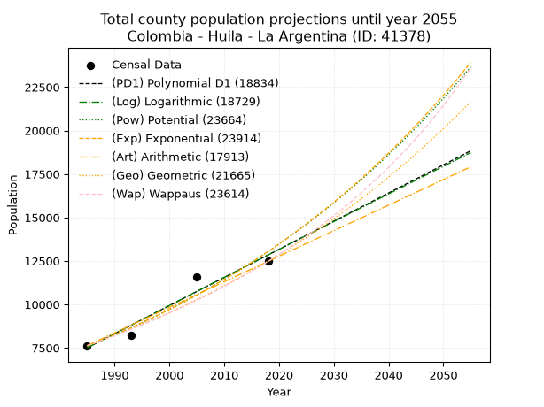
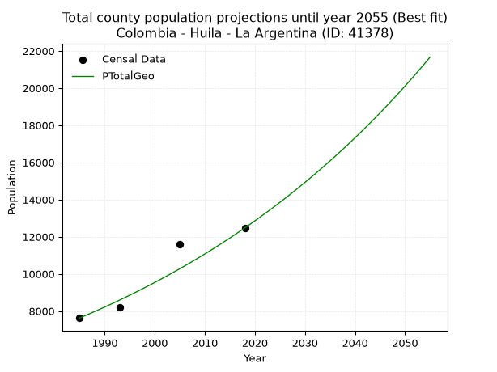
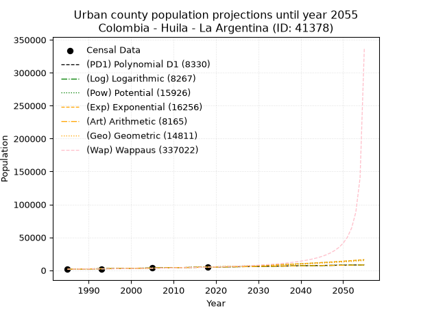
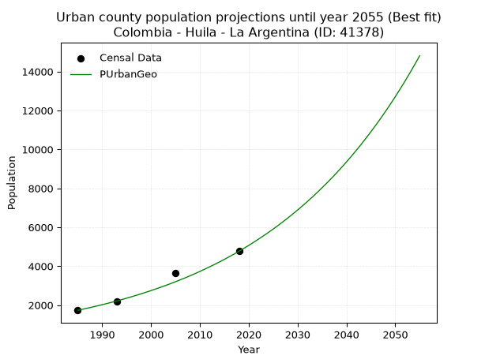
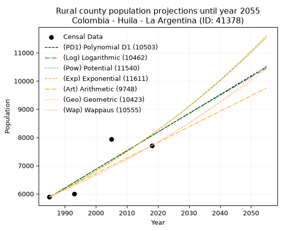
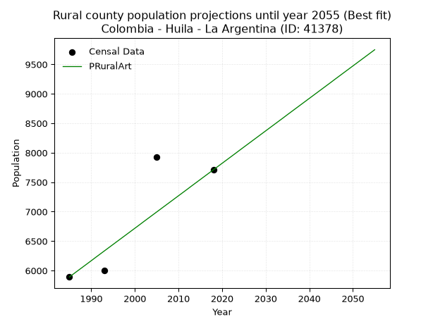

<div align="center">


</div>

# 📜 _“Population and Public Services Demand Projections (PPSD) until Year 2050 for Colombia - Huila - La Argentina (ID: 41378)”_
Keywords: `population` `public-service` `projection` `lineal` `polynomial` `logarithmic` `potential` `exponential` `arithmetic` `geometric` `wappaus` `dane` `colombia` `south-america`

PPSD are analytical estimates used by governments and planners to anticipate future changes in population size, age distribution, and the resulting community needs for utilities, healthcare, education, and infrastructure as sizing future water treatment facilities, electrical grids, and road networks based on spatial growth.

<div align="center">

</img>

</div>


> **General running parameters**: • app_version: _v20260806_. • Python version: _3.14.7_. • Pandas version: _3.0.5_. • NumPy version: _2.5.1_. • Creates, save and include plots into reports (create_plot): _False_. • Projection until year: _2050_. • Process polynomial degree 2 and up: _False_. • Process Wappaus: _True_. • Process Wappaus: _True_. • Set negative values to zero: _True_. • Set infinite values to zero: _True_. • Drop dataset notes: _True_. 
<div align="center">

Maps & GIS Layers: [:earth_americas:Google](http://maps.google.com/maps?q=2.198496209,-75.9797628) [:earth_americas:OSM](https://www.openstreetmap.org/#map=18/2.198496209/-75.9797628&layers=P) [:earth_americas:Bing](https://www.bing.com/maps?cp=2.198496209~-75.9797628&lvl=18) [:earth_americas:Apple](https://maps.apple.com/frame?center=2.198496209%2C-75.9797628&span=0.003%2C0.006) [:earth_americas:GISMobile](https://github.com/rcfdtools/R.GISMobile/blob/main/file/gis/CountyLayer_CO/Readme.md)

</div>


<div align="center">

```geojson
{
  "type": "Feature",
  "geometry": {
    "type": "Point", 
    "coordinates": [-75.9797628, 2.198496209]
  }, 
  "properties": {
    "Name": "Colombia - Huila - La Argentina (ID: 41378)"
  }
}
```

</div>


## 0. Census Data (4 records)

Census data are official statistics collected by a government about the people and housing in a country. They usually include counts of total population, age, sex, race, income, education, and jobs.

📅Global census file: [Population.xlsx](../data/Population.xlsx)

| Source   |   Year |   CountryID | CountryName   |   StateID | StateName   |   CountyID | CountyName   |   PTotal |   PUrban |   PRural |
|:---------|-------:|------------:|:--------------|----------:|:------------|-----------:|:-------------|---------:|---------:|---------:|
| DANE     |   1985 |          57 | Colombia      |        41 | Huila       |      41378 | La Argentina |     7625 |     1733 |     5892 |
| DANE     |   1993 |          57 | Colombia      |        41 | Huila       |      41378 | La Argentina |     8195 |     2199 |     5996 |
| DANE     |   2005 |          57 | Colombia      |        41 | Huila       |      41378 | La Argentina |    11592 |     3663 |     7929 |
| DANE     |   2018 |          57 | Colombia      |        41 | Huila       |      41378 | La Argentina |    12475 |     4765 |     7710 |

> 🔥Some records could had specific notes about the registered values or the corresponding urban or rural distribution.

📅[SUI-RUPS](https://www.datos.gov.co/Hacienda-y-Cr-dito-P-blico/Registro-nico-de-Prestadores-de-Servicios-P-blicos/4qkq-csdn/about_data) - Local public utility companies: [RUPS.csv](../data/RUPS.csv)

 | SERVICIO       | ESTADO    | NOMBRE                                                                                                     | NIT         | DEPARTAMENTO_DOMICILIO   | MUNICIPIO_DOMICILIO   | DIRECCION              |   TELEFONO | EMAIL                          | TIPO_PRESTADOR                             | CLASIFICACION                 |
|:---------------|:----------|:-----------------------------------------------------------------------------------------------------------|:------------|:-------------------------|:----------------------|:-----------------------|-----------:|:-------------------------------|:-------------------------------------------|:------------------------------|
| ACUEDUCTO      | OPERATIVA | EMPRESAS PUBLICAS DE LA ARGENTINA SOCIEDAD ANONIMA                                                         | 900239471-8 | HUILA                    | LA ARGENTINA          | CRA 4 No 5 - 43 PISO 3 |    8311609 | EMPUARGSAESP@HOTMAIL.COM       | SOCIEDADES (EMPRESA DE SERVICIOS PUBLICOS) | MENOR O IGUAL A 2500 USUARIOS |
| ALCANTARILLADO | OPERATIVA | EMPRESAS PUBLICAS DE LA ARGENTINA SOCIEDAD ANONIMA                                                         | 900239471-8 | HUILA                    | LA ARGENTINA          | CRA 4 No 5 - 43 PISO 3 |    8311609 | EMPUARGSAESP@HOTMAIL.COM       | SOCIEDADES (EMPRESA DE SERVICIOS PUBLICOS) | MENOR O IGUAL A 2500 USUARIOS |
| ACUEDUCTO      | OPERATIVA | JUNTA ADMINISTRADORA DEL SERVICIO DEL ACUEDUCTO DE LA VEREDA LAS MINAS DEL MUNICIPIO DE LA ARGENTINA HUILA | 900439867-9 | HUILA                    | LA ARGENTINA          | VEREDA LAS MINAS       |    3213165 | jahernan@superservicios.gov.co | ORGANIZACION AUTORIZADA                    | HASTA 2500 SUSCRIPTORES       |

## 1. Total

### 1.1. Coefficients and Parameters

* (PD1) Polynomial Deg 1: 161.8598956242465, -313788.50622239907 (lineal)
* (Log) Logarithmic: 324062.52661480714, -2453230.11167326
* (Pow) Potential: 32.812368764044336, -104.32712075393643
* (Exp) Exponential: 0.01638739728054497, 5.6663744524449114e-11
* (Art) Arithmetic: Year diff. 2018 - 1985 = 33, Population diff. 12475 - 7625 = 4850, Annual growth = 146.96969696969697
* (Geo) Geometric: Year diff. 2018 - 1985 = 33, Population diff. 12475 - 7625 = 4850, Annual growth % = 0.0150298385735248
* (Wap) Wappaus: i = 1.4623850444745967, Condition values only valid for < 200)

<sub>
Wappaus condition values: ['0.00', '1.46', '2.92', '4.39', '5.85', '7.31', '8.77', '10.24', '11.70', '13.16', '14.62', '16.09', '17.55', '19.01', '20.47', '21.94', '23.40', '24.86', '26.32', '27.79', '29.25', '30.71', '32.17', '33.63', '35.10', '36.56', '38.02', '39.48', '40.95', '42.41', '43.87', '45.33', '46.80', '48.26', '49.72', '51.18', '52.65', '54.11', '55.57', '57.03', '58.50', '59.96', '61.42', '62.88', '64.34', '65.81', '67.27', '68.73', '70.19', '71.66', '73.12', '74.58', '76.04', '77.51', '78.97', '80.43', '81.89', '83.36', '84.82', '86.28', '87.74', '89.21', '90.67', '92.13', '93.59', '95.06']
</sub>


### 1.2. Projected Dataset

|   Year |   CountyID |   PTotalPD1 |   PTotalLog |   PTotalPow |   PTotalExp |   PTotalArt |   PTotalGeo |   PTotalWap |
|-------:|-----------:|------------:|------------:|------------:|------------:|------------:|------------:|------------:|
|   1985 |      41378 |        7503 |        7498 |        7590 |        7594 |        7625 |        7625 |        7625 |
|   1986 |      41378 |        7665 |        7661 |        7716 |        7719 |        7772 |        7740 |        7737 |
|   1987 |      41378 |        7827 |        7824 |        7844 |        7847 |        7919 |        7856 |        7851 |
|   1988 |      41378 |        7989 |        7987 |        7975 |        7977 |        8066 |        7974 |        7967 |
|   1989 |      41378 |        8151 |        8150 |        8108 |        8108 |        8213 |        8094 |        8084 |
|   1990 |      41378 |        8313 |        8313 |        8243 |        8242 |        8360 |        8215 |        8204 |
|   1991 |      41378 |        8475 |        8476 |        8380 |        8378 |        8507 |        8339 |        8325 |
|   1992 |      41378 |        8636 |        8639 |        8519 |        8517 |        8654 |        8464 |        8448 |
|   1993 |      41378 |        8798 |        8801 |        8660 |        8658 |        8801 |        8592 |        8572 |
|   1994 |      41378 |        8960 |        8964 |        8804 |        8801 |        8948 |        8721 |        8699 |
|   1995 |      41378 |        9122 |        9126 |        8950 |        8946 |        9095 |        8852 |        8828 |
|   1996 |      41378 |        9284 |        9289 |        9098 |        9094 |        9242 |        8985 |        8959 |
|   1997 |      41378 |        9446 |        9451 |        9249 |        9244 |        9389 |        9120 |        9092 |
|   1998 |      41378 |        9608 |        9613 |        9402 |        9397 |        9536 |        9257 |        9227 |
|   1999 |      41378 |        9769 |        9775 |        9558 |        9552 |        9683 |        9396 |        9364 |
|   2000 |      41378 |        9931 |        9938 |        9716 |        9710 |        9830 |        9537 |        9504 |
|   2001 |      41378 |       10093 |       10100 |        9877 |        9870 |        9977 |        9681 |        9645 |
|   2002 |      41378 |       10255 |       10261 |       10040 |       10033 |       10123 |        9826 |        9790 |
|   2003 |      41378 |       10417 |       10423 |       10206 |       10199 |       10270 |        9974 |        9936 |
|   2004 |      41378 |       10579 |       10585 |       10374 |       10368 |       10417 |       10124 |       10085 |
|   2005 |      41378 |       10741 |       10747 |       10546 |       10539 |       10564 |       10276 |       10237 |
|   2006 |      41378 |       10902 |       10908 |       10720 |       10713 |       10711 |       10430 |       10391 |
|   2007 |      41378 |       11064 |       11070 |       10896 |       10890 |       10858 |       10587 |       10548 |
|   2008 |      41378 |       11226 |       11231 |       11076 |       11070 |       11005 |       10746 |       10708 |
|   2009 |      41378 |       11388 |       11393 |       11258 |       11253 |       11152 |       10908 |       10871 |
|   2010 |      41378 |       11550 |       11554 |       11444 |       11439 |       11299 |       11072 |       11036 |
|   2011 |      41378 |       11712 |       11715 |       11632 |       11628 |       11446 |       11238 |       11205 |
|   2012 |      41378 |       11874 |       11876 |       11823 |       11820 |       11593 |       11407 |       11376 |
|   2013 |      41378 |       12035 |       12037 |       12018 |       12015 |       11740 |       11578 |       11551 |
|   2014 |      41378 |       12197 |       12198 |       12215 |       12214 |       11887 |       11752 |       11729 |
|   2015 |      41378 |       12359 |       12359 |       12416 |       12416 |       12034 |       11929 |       11910 |
|   2016 |      41378 |       12521 |       12520 |       12619 |       12621 |       12181 |       12108 |       12095 |
|   2017 |      41378 |       12683 |       12680 |       12826 |       12829 |       12328 |       12290 |       12283 |
|   2018 |      41378 |       12845 |       12841 |       13037 |       13041 |       12475 |       12475 |       12475 |
|   2019 |      41378 |       13007 |       13002 |       13250 |       13257 |       12622 |       12662 |       12671 |
|   2020 |      41378 |       13168 |       13162 |       13468 |       13476 |       12769 |       12853 |       12870 |
|   2021 |      41378 |       13330 |       13322 |       13688 |       13699 |       12916 |       13046 |       13073 |
|   2022 |      41378 |       13492 |       13483 |       13912 |       13925 |       13063 |       13242 |       13281 |
|   2023 |      41378 |       13654 |       13643 |       14140 |       14155 |       13210 |       13441 |       13493 |
|   2024 |      41378 |       13816 |       13803 |       14371 |       14389 |       13357 |       13643 |       13709 |
|   2025 |      41378 |       13978 |       13963 |       14606 |       14627 |       13504 |       13848 |       13929 |
|   2026 |      41378 |       14140 |       14123 |       14844 |       14868 |       13651 |       14056 |       14154 |
|   2027 |      41378 |       14302 |       14283 |       15086 |       15114 |       13798 |       14268 |       14384 |
|   2028 |      41378 |       14463 |       14443 |       15332 |       15364 |       13945 |       14482 |       14619 |
|   2029 |      41378 |       14625 |       14603 |       15583 |       15617 |       14092 |       14700 |       14858 |
|   2030 |      41378 |       14787 |       14762 |       15836 |       15875 |       14239 |       14921 |       15104 |
|   2031 |      41378 |       14949 |       14922 |       16094 |       16138 |       14386 |       15145 |       15354 |
|   2032 |      41378 |       15111 |       15082 |       16357 |       16404 |       14533 |       15372 |       15610 |
|   2033 |      41378 |       15273 |       15241 |       16623 |       16675 |       14680 |       15604 |       15872 |
|   2034 |      41378 |       15435 |       15400 |       16893 |       16951 |       14827 |       15838 |       16139 |
|   2035 |      41378 |       15596 |       15560 |       17168 |       17231 |       14973 |       16076 |       16413 |
|   2036 |      41378 |       15758 |       15719 |       17447 |       17516 |       15120 |       16318 |       16694 |
|   2037 |      41378 |       15920 |       15878 |       17730 |       17805 |       15267 |       16563 |       16981 |
|   2038 |      41378 |       16082 |       16037 |       18018 |       18099 |       15414 |       16812 |       17274 |
|   2039 |      41378 |       16244 |       16196 |       18310 |       18398 |       15561 |       17065 |       17575 |
|   2040 |      41378 |       16406 |       16355 |       18607 |       18702 |       15708 |       17321 |       17883 |
|   2041 |      41378 |       16568 |       16514 |       18909 |       19011 |       15855 |       17581 |       18199 |
|   2042 |      41378 |       16729 |       16672 |       19215 |       19325 |       16002 |       17846 |       18523 |
|   2043 |      41378 |       16891 |       16831 |       19527 |       19645 |       16149 |       18114 |       18855 |
|   2044 |      41378 |       17053 |       16990 |       19843 |       19969 |       16296 |       18386 |       19195 |
|   2045 |      41378 |       17215 |       17148 |       20164 |       20299 |       16443 |       18662 |       19545 |
|   2046 |      41378 |       17377 |       17307 |       20490 |       20635 |       16590 |       18943 |       19903 |
|   2047 |      41378 |       17539 |       17465 |       20821 |       20976 |       16737 |       19228 |       20272 |
|   2048 |      41378 |       17701 |       17623 |       21157 |       21322 |       16884 |       19517 |       20650 |
|   2049 |      41378 |       17862 |       17781 |       21499 |       21674 |       17031 |       19810 |       21038 |
|   2050 |      41378 |       18024 |       17939 |       21846 |       22033 |       17178 |       20108 |       21438 |
<div align="center">

</img>

</div>


### 1.3. Best fit with absolute and relative error (%)

Relative error puts that difference into context by dividing the absolute error by the true value, creating a unitless ratio or percentage that shows the scale of the mistake.

Absolute and relative error

|   Year | Source   |   CountryID | CountryName   |   StateID | StateName   |   CountyID_x | CountyName   |   PTotal |   PUrban |   PRural |   CountyID_y |   PTotalPD1 |   PTotalLog |   PTotalPow |   PTotalExp |   PTotalArt |   PTotalGeo |   PTotalWap |   PTotalPD1AbsError |   PTotalLogAbsError |   PTotalPowAbsError |   PTotalExpAbsError |   PTotalArtAbsError |   PTotalGeoAbsError |   PTotalWapAbsError |   PTotalPD1RelError |   PTotalLogRelError |   PTotalPowRelError |   PTotalExpRelError |   PTotalArtRelError |   PTotalGeoRelError |   PTotalWapRelError |
|-------:|:---------|------------:|:--------------|----------:|:------------|-------------:|:-------------|---------:|---------:|---------:|-------------:|------------:|------------:|------------:|------------:|------------:|------------:|------------:|--------------------:|--------------------:|--------------------:|--------------------:|--------------------:|--------------------:|--------------------:|--------------------:|--------------------:|--------------------:|--------------------:|--------------------:|--------------------:|--------------------:|
|   1985 | DANE     |          57 | Colombia      |        41 | Huila       |        41378 | La Argentina |     7625 |     1733 |     5892 |        41378 |        7503 |        7498 |        7590 |        7594 |        7625 |        7625 |        7625 |                 122 |                 127 |                  35 |                  31 |                   0 |                   0 |                   0 |             1.6     |             1.66557 |            0.459016 |            0.406557 |             0       |             0       |             0       |
|   1993 | DANE     |          57 | Colombia      |        41 | Huila       |        41378 | La Argentina |     8195 |     2199 |     5996 |        41378 |        8798 |        8801 |        8660 |        8658 |        8801 |        8592 |        8572 |                 603 |                 606 |                 465 |                 463 |                 606 |                 397 |                 377 |             7.35815 |             7.39475 |            5.67419  |            5.64979  |             7.39475 |             4.84442 |             4.60037 |
|   2005 | DANE     |          57 | Colombia      |        41 | Huila       |        41378 | La Argentina |    11592 |     3663 |     7929 |        41378 |       10741 |       10747 |       10546 |       10539 |       10564 |       10276 |       10237 |                 851 |                 845 |                1046 |                1053 |                1028 |                1316 |                1355 |             7.34127 |             7.28951 |            9.02346  |            9.08385  |             8.86818 |            11.3527  |            11.6891  |
|   2018 | DANE     |          57 | Colombia      |        41 | Huila       |        41378 | La Argentina |    12475 |     4765 |     7710 |        41378 |       12845 |       12841 |       13037 |       13041 |       12475 |       12475 |       12475 |                 370 |                 366 |                 562 |                 566 |                   0 |                   0 |                   0 |             2.96593 |             2.93387 |            4.50501  |            4.53707  |             0       |             0       |             0       |

Relative error mean

| Method    |   RelError | Best   |
|:----------|-----------:|:-------|
| PTotalPD1 |    4.81634 |        |
| PTotalLog |    4.82093 |        |
| PTotalPow |    4.91542 |        |
| PTotalExp |    4.91932 |        |
| PTotalArt |    4.06573 |        |
| PTotalGeo |    4.04927 | True   |
| PTotalWap |    4.07237 |        |

💙Best method: _**PTotalGeo**_
<div align="center">

</img>

</div>


### 1.4. Fresh water supply demand in liters per capita per day (lpcd)

The fresh water supply demand typically ranges from 100 to 300 liters per capita per day (lpcd) for standard domestic and municipal planning, though absolute survival minimums set by the World Health Organization are as low as 7.5 to 20 liters per day, and total consumption in high-income nations can exceed 400 liters.

> `CZ`: Level in meters above the sea level (masl)<br> `WS`: Fresh water supply demand in liters per capita per day (lpcd or l/h/d)<br> `WSAll`: Zonal fresh water supply demand in liters per second (l/s)<br> `A`: Zonal area in square meters<br> `DP`: Population density (people/hectare or p/ha)

Reference values (RAS Colombia)

|    CZ |   WS |
|------:|-----:|
|  1000 |  120 |
|  2000 |  130 |
| 99999 |  140 |

County shapefile geometry properties and water supply values

|   CountyID |      ATotal |   CZTotal |   WSTotal |
|-----------:|------------:|----------:|----------:|
|      41378 | 3.56458e+08 |   2360.92 |       140 |

Projected values for best method: PTotalGeo

|   CountyID |   Year |   PTotalGeo |   DPTotal |   WSTotal |   WSTotalAll |
|-----------:|-------:|------------:|----------:|----------:|-------------:|
|      41378 |   1985 |        7625 |      0.21 |       140 |      12.3553 |
|      41378 |   1986 |        7740 |      0.22 |       140 |      12.5417 |
|      41378 |   1987 |        7856 |      0.22 |       140 |      12.7296 |
|      41378 |   1988 |        7974 |      0.22 |       140 |      12.9208 |
|      41378 |   1989 |        8094 |      0.23 |       140 |      13.1153 |
|      41378 |   1990 |        8215 |      0.23 |       140 |      13.3113 |
|      41378 |   1991 |        8339 |      0.23 |       140 |      13.5123 |
|      41378 |   1992 |        8464 |      0.24 |       140 |      13.7148 |
|      41378 |   1993 |        8592 |      0.24 |       140 |      13.9222 |
|      41378 |   1994 |        8721 |      0.24 |       140 |      14.1312 |
|      41378 |   1995 |        8852 |      0.25 |       140 |      14.3435 |
|      41378 |   1996 |        8985 |      0.25 |       140 |      14.559  |
|      41378 |   1997 |        9120 |      0.26 |       140 |      14.7778 |
|      41378 |   1998 |        9257 |      0.26 |       140 |      14.9998 |
|      41378 |   1999 |        9396 |      0.26 |       140 |      15.225  |
|      41378 |   2000 |        9537 |      0.27 |       140 |      15.4535 |
|      41378 |   2001 |        9681 |      0.27 |       140 |      15.6868 |
|      41378 |   2002 |        9826 |      0.28 |       140 |      15.9218 |
|      41378 |   2003 |        9974 |      0.28 |       140 |      16.1616 |
|      41378 |   2004 |       10124 |      0.28 |       140 |      16.4046 |
|      41378 |   2005 |       10276 |      0.29 |       140 |      16.6509 |
|      41378 |   2006 |       10430 |      0.29 |       140 |      16.9005 |
|      41378 |   2007 |       10587 |      0.3  |       140 |      17.1549 |
|      41378 |   2008 |       10746 |      0.3  |       140 |      17.4125 |
|      41378 |   2009 |       10908 |      0.31 |       140 |      17.675  |
|      41378 |   2010 |       11072 |      0.31 |       140 |      17.9407 |
|      41378 |   2011 |       11238 |      0.32 |       140 |      18.2097 |
|      41378 |   2012 |       11407 |      0.32 |       140 |      18.4836 |
|      41378 |   2013 |       11578 |      0.32 |       140 |      18.7606 |
|      41378 |   2014 |       11752 |      0.33 |       140 |      19.0426 |
|      41378 |   2015 |       11929 |      0.33 |       140 |      19.3294 |
|      41378 |   2016 |       12108 |      0.34 |       140 |      19.6194 |
|      41378 |   2017 |       12290 |      0.34 |       140 |      19.9144 |
|      41378 |   2018 |       12475 |      0.35 |       140 |      20.2141 |
|      41378 |   2019 |       12662 |      0.36 |       140 |      20.5171 |
|      41378 |   2020 |       12853 |      0.36 |       140 |      20.8266 |
|      41378 |   2021 |       13046 |      0.37 |       140 |      21.1394 |
|      41378 |   2022 |       13242 |      0.37 |       140 |      21.4569 |
|      41378 |   2023 |       13441 |      0.38 |       140 |      21.7794 |
|      41378 |   2024 |       13643 |      0.38 |       140 |      22.1067 |
|      41378 |   2025 |       13848 |      0.39 |       140 |      22.4389 |
|      41378 |   2026 |       14056 |      0.39 |       140 |      22.7759 |
|      41378 |   2027 |       14268 |      0.4  |       140 |      23.1194 |
|      41378 |   2028 |       14482 |      0.41 |       140 |      23.4662 |
|      41378 |   2029 |       14700 |      0.41 |       140 |      23.8194 |
|      41378 |   2030 |       14921 |      0.42 |       140 |      24.1775 |
|      41378 |   2031 |       15145 |      0.42 |       140 |      24.5405 |
|      41378 |   2032 |       15372 |      0.43 |       140 |      24.9083 |
|      41378 |   2033 |       15604 |      0.44 |       140 |      25.2843 |
|      41378 |   2034 |       15838 |      0.44 |       140 |      25.6634 |
|      41378 |   2035 |       16076 |      0.45 |       140 |      26.0491 |
|      41378 |   2036 |       16318 |      0.46 |       140 |      26.4412 |
|      41378 |   2037 |       16563 |      0.46 |       140 |      26.8382 |
|      41378 |   2038 |       16812 |      0.47 |       140 |      27.2417 |
|      41378 |   2039 |       17065 |      0.48 |       140 |      27.6516 |
|      41378 |   2040 |       17321 |      0.49 |       140 |      28.0664 |
|      41378 |   2041 |       17581 |      0.49 |       140 |      28.4877 |
|      41378 |   2042 |       17846 |      0.5  |       140 |      28.9171 |
|      41378 |   2043 |       18114 |      0.51 |       140 |      29.3514 |
|      41378 |   2044 |       18386 |      0.52 |       140 |      29.7921 |
|      41378 |   2045 |       18662 |      0.52 |       140 |      30.2394 |
|      41378 |   2046 |       18943 |      0.53 |       140 |      30.6947 |
|      41378 |   2047 |       19228 |      0.54 |       140 |      31.1565 |
|      41378 |   2048 |       19517 |      0.55 |       140 |      31.6248 |
|      41378 |   2049 |       19810 |      0.56 |       140 |      32.0995 |
|      41378 |   2050 |       20108 |      0.56 |       140 |      32.5824 |

## 2. Urban

### 2.1. Coefficients and Parameters

* (PD1) Polynomial Deg 1: 95.71577679646651, -188365.48253713213 (lineal)
* (Log) Logarithmic: 191579.63152040442, -1453108.314409412
* (Pow) Potential: 63.59668947396579, -206.4817640422135
* (Exp) Exponential: 0.031764881186803026, 7.2720497323424115e-25
* (Art) Arithmetic: Year diff. 2018 - 1985 = 33, Population diff. 4765 - 1733 = 3032, Annual growth = 91.87878787878788
* (Geo) Geometric: Year diff. 2018 - 1985 = 33, Population diff. 4765 - 1733 = 3032, Annual growth % = 0.03112434485505622
* (Wap) Wappaus: i = 2.8279097531175093, Condition values only valid for < 200)

<sub>
Wappaus condition values: ['0.00', '2.83', '5.66', '8.48', '11.31', '14.14', '16.97', '19.80', '22.62', '25.45', '28.28', '31.11', '33.93', '36.76', '39.59', '42.42', '45.25', '48.07', '50.90', '53.73', '56.56', '59.39', '62.21', '65.04', '67.87', '70.70', '73.53', '76.35', '79.18', '82.01', '84.84', '87.67', '90.49', '93.32', '96.15', '98.98', '101.80', '104.63', '107.46', '110.29', '113.12', '115.94', '118.77', '121.60', '124.43', '127.26', '130.08', '132.91', '135.74', '138.57', '141.40', '144.22', '147.05', '149.88', '152.71', '155.54', '158.36', '161.19', '164.02', '166.85', '169.67', '172.50', '175.33', '178.16', '180.99', '183.81']
</sub>


### 2.2. Projected Dataset

|   Year |   CountyID |   PUrbanPD1 |   PUrbanLog |   PUrbanPow |   PUrbanExp |   PUrbanArt |   PUrbanGeo |   PUrbanWap |
|-------:|-----------:|------------:|------------:|------------:|------------:|------------:|------------:|------------:|
|   1985 |      41378 |        1630 |        1628 |        1757 |        1759 |        1733 |        1733 |        1733 |
|   1986 |      41378 |        1726 |        1724 |        1815 |        1816 |        1825 |        1787 |        1783 |
|   1987 |      41378 |        1822 |        1820 |        1874 |        1875 |        1917 |        1843 |        1834 |
|   1988 |      41378 |        1917 |        1917 |        1935 |        1935 |        2009 |        1900 |        1887 |
|   1989 |      41378 |        2013 |        2013 |        1998 |        1998 |        2101 |        1959 |        1941 |
|   1990 |      41378 |        2109 |        2109 |        2062 |        2062 |        2192 |        2020 |        1997 |
|   1991 |      41378 |        2205 |        2206 |        2129 |        2129 |        2284 |        2083 |        2054 |
|   1992 |      41378 |        2300 |        2302 |        2198 |        2197 |        2376 |        2148 |        2114 |
|   1993 |      41378 |        2396 |        2398 |        2270 |        2268 |        2468 |        2215 |        2175 |
|   1994 |      41378 |        2492 |        2494 |        2343 |        2342 |        2560 |        2283 |        2238 |
|   1995 |      41378 |        2587 |        2590 |        2419 |        2417 |        2652 |        2355 |        2304 |
|   1996 |      41378 |        2683 |        2686 |        2498 |        2495 |        2744 |        2428 |        2371 |
|   1997 |      41378 |        2779 |        2782 |        2578 |        2576 |        2836 |        2503 |        2441 |
|   1998 |      41378 |        2875 |        2878 |        2662 |        2659 |        2927 |        2581 |        2514 |
|   1999 |      41378 |        2970 |        2974 |        2748 |        2745 |        3019 |        2662 |        2588 |
|   2000 |      41378 |        3066 |        3070 |        2837 |        2833 |        3111 |        2745 |        2666 |
|   2001 |      41378 |        3162 |        3166 |        2928 |        2925 |        3203 |        2830 |        2746 |
|   2002 |      41378 |        3258 |        3261 |        3023 |        3019 |        3295 |        2918 |        2830 |
|   2003 |      41378 |        3353 |        3357 |        3120 |        3117 |        3387 |        3009 |        2916 |
|   2004 |      41378 |        3449 |        3453 |        3221 |        3217 |        3479 |        3102 |        3006 |
|   2005 |      41378 |        3545 |        3548 |        3325 |        3321 |        3571 |        3199 |        3100 |
|   2006 |      41378 |        3640 |        3644 |        3432 |        3428 |        3662 |        3299 |        3197 |
|   2007 |      41378 |        3736 |        3739 |        3543 |        3539 |        3754 |        3401 |        3298 |
|   2008 |      41378 |        3832 |        3835 |        3657 |        3653 |        3846 |        3507 |        3403 |
|   2009 |      41378 |        3928 |        3930 |        3774 |        3771 |        3938 |        3616 |        3513 |
|   2010 |      41378 |        4023 |        4025 |        3896 |        3893 |        4030 |        3729 |        3628 |
|   2011 |      41378 |        4119 |        4121 |        4021 |        4018 |        4122 |        3845 |        3748 |
|   2012 |      41378 |        4215 |        4216 |        4150 |        4148 |        4214 |        3965 |        3873 |
|   2013 |      41378 |        4310 |        4311 |        4283 |        4282 |        4306 |        4088 |        4005 |
|   2014 |      41378 |        4406 |        4406 |        4421 |        4420 |        4397 |        4215 |        4142 |
|   2015 |      41378 |        4502 |        4501 |        4562 |        4563 |        4489 |        4346 |        4286 |
|   2016 |      41378 |        4598 |        4596 |        4709 |        4710 |        4581 |        4482 |        4438 |
|   2017 |      41378 |        4693 |        4691 |        4859 |        4862 |        4673 |        4621 |        4597 |
|   2018 |      41378 |        4789 |        4786 |        5015 |        5019 |        4765 |        4765 |        4765 |
|   2019 |      41378 |        4885 |        4881 |        5176 |        5181 |        4857 |        4913 |        4942 |
|   2020 |      41378 |        4980 |        4976 |        5341 |        5348 |        4949 |        5066 |        5129 |
|   2021 |      41378 |        5076 |        5071 |        5512 |        5521 |        5041 |        5224 |        5326 |
|   2022 |      41378 |        5172 |        5166 |        5688 |        5699 |        5133 |        5387 |        5536 |
|   2023 |      41378 |        5268 |        5260 |        5870 |        5883 |        5224 |        5554 |        5758 |
|   2024 |      41378 |        5363 |        5355 |        6057 |        6073 |        5316 |        5727 |        5994 |
|   2025 |      41378 |        5459 |        5450 |        6251 |        6269 |        5408 |        5905 |        6245 |
|   2026 |      41378 |        5555 |        5544 |        6450 |        6471 |        5500 |        6089 |        6514 |
|   2027 |      41378 |        5650 |        5639 |        6656 |        6680 |        5592 |        6279 |        6801 |
|   2028 |      41378 |        5746 |        5733 |        6868 |        6895 |        5684 |        6474 |        7109 |
|   2029 |      41378 |        5842 |        5828 |        7086 |        7118 |        5776 |        6676 |        7440 |
|   2030 |      41378 |        5938 |        5922 |        7312 |        7348 |        5868 |        6883 |        7796 |
|   2031 |      41378 |        6033 |        6016 |        7545 |        7585 |        5959 |        7098 |        8182 |
|   2032 |      41378 |        6129 |        6111 |        7785 |        7829 |        6051 |        7318 |        8600 |
|   2033 |      41378 |        6225 |        6205 |        8032 |        8082 |        6143 |        7546 |        9054 |
|   2034 |      41378 |        6320 |        6299 |        8287 |        8343 |        6235 |        7781 |        9551 |
|   2035 |      41378 |        6416 |        6393 |        8550 |        8612 |        6327 |        8023 |       10095 |
|   2036 |      41378 |        6512 |        6488 |        8822 |        8890 |        6419 |        8273 |       10695 |
|   2037 |      41378 |        6608 |        6582 |        9101 |        9177 |        6511 |        8530 |       11359 |
|   2038 |      41378 |        6703 |        6676 |        9390 |        9473 |        6603 |        8796 |       12098 |
|   2039 |      41378 |        6799 |        6770 |        9688 |        9779 |        6694 |        9070 |       12925 |
|   2040 |      41378 |        6895 |        6864 |        9994 |       10095 |        6786 |        9352 |       13857 |
|   2041 |      41378 |        6990 |        6957 |       10311 |       10421 |        6878 |        9643 |       14916 |
|   2042 |      41378 |        7086 |        7051 |       10637 |       10757 |        6970 |        9943 |       16129 |
|   2043 |      41378 |        7182 |        7145 |       10974 |       11104 |        7062 |       10253 |       17533 |
|   2044 |      41378 |        7278 |        7239 |       11320 |       11462 |        7154 |       10572 |       19176 |
|   2045 |      41378 |        7373 |        7333 |       11678 |       11832 |        7246 |       10901 |       21126 |
|   2046 |      41378 |        7469 |        7426 |       12047 |       12214 |        7338 |       11240 |       23477 |
|   2047 |      41378 |        7565 |        7520 |       12427 |       12608 |        7429 |       11590 |       26366 |
|   2048 |      41378 |        7660 |        7613 |       12819 |       13015 |        7521 |       11951 |       30004 |
|   2049 |      41378 |        7756 |        7707 |       13223 |       13435 |        7613 |       12323 |       34725 |
|   2050 |      41378 |        7852 |        7800 |       13640 |       13869 |        7705 |       12706 |       41094 |
<div align="center">

</img>

</div>


### 2.3. Best fit with absolute and relative error (%)

Relative error puts that difference into context by dividing the absolute error by the true value, creating a unitless ratio or percentage that shows the scale of the mistake.

Absolute and relative error

|   Year | Source   |   CountryID | CountryName   |   StateID | StateName   |   CountyID_x | CountyName   |   PTotal |   PUrban |   PRural |   CountyID_y |   PUrbanPD1 |   PUrbanLog |   PUrbanPow |   PUrbanExp |   PUrbanArt |   PUrbanGeo |   PUrbanWap |   PUrbanPD1AbsError |   PUrbanLogAbsError |   PUrbanPowAbsError |   PUrbanExpAbsError |   PUrbanArtAbsError |   PUrbanGeoAbsError |   PUrbanWapAbsError |   PUrbanPD1RelError |   PUrbanLogRelError |   PUrbanPowRelError |   PUrbanExpRelError |   PUrbanArtRelError |   PUrbanGeoRelError |   PUrbanWapRelError |
|-------:|:---------|------------:|:--------------|----------:|:------------|-------------:|:-------------|---------:|---------:|---------:|-------------:|------------:|------------:|------------:|------------:|------------:|------------:|------------:|--------------------:|--------------------:|--------------------:|--------------------:|--------------------:|--------------------:|--------------------:|--------------------:|--------------------:|--------------------:|--------------------:|--------------------:|--------------------:|--------------------:|
|   1985 | DANE     |          57 | Colombia      |        41 | Huila       |        41378 | La Argentina |     7625 |     1733 |     5892 |        41378 |        1630 |        1628 |        1757 |        1759 |        1733 |        1733 |        1733 |                 103 |                 105 |                  24 |                  26 |                   0 |                   0 |                   0 |            5.94345  |            6.05886  |             1.38488 |             1.50029 |              0      |            0        |             0       |
|   1993 | DANE     |          57 | Colombia      |        41 | Huila       |        41378 | La Argentina |     8195 |     2199 |     5996 |        41378 |        2396 |        2398 |        2270 |        2268 |        2468 |        2215 |        2175 |                 197 |                 199 |                  71 |                  69 |                 269 |                  16 |                  24 |            8.95862  |            9.04957  |             3.22874 |             3.13779 |             12.2328 |            0.727603 |             1.09141 |
|   2005 | DANE     |          57 | Colombia      |        41 | Huila       |        41378 | La Argentina |    11592 |     3663 |     7929 |        41378 |        3545 |        3548 |        3325 |        3321 |        3571 |        3199 |        3100 |                 118 |                 115 |                 338 |                 342 |                  92 |                 464 |                 563 |            3.2214   |            3.1395   |             9.22741 |             9.33661 |              2.5116 |           12.6672   |            15.3699  |
|   2018 | DANE     |          57 | Colombia      |        41 | Huila       |        41378 | La Argentina |    12475 |     4765 |     7710 |        41378 |        4789 |        4786 |        5015 |        5019 |        4765 |        4765 |        4765 |                  24 |                  21 |                 250 |                 254 |                   0 |                   0 |                   0 |            0.503673 |            0.440714 |             5.24659 |             5.33054 |              0      |            0        |             0       |

Relative error mean

| Method    |   RelError | Best   |
|:----------|-----------:|:-------|
| PUrbanPD1 |    4.65679 |        |
| PUrbanLog |    4.67216 |        |
| PUrbanPow |    4.77191 |        |
| PUrbanExp |    4.82631 |        |
| PUrbanArt |    3.68611 |        |
| PUrbanGeo |    3.3487  | True   |
| PUrbanWap |    4.11533 |        |

💙Best method: _**PUrbanGeo**_
<div align="center">

</img>

</div>


### 2.4. Fresh water supply demand in liters per capita per day (lpcd)

The fresh water supply demand typically ranges from 100 to 300 liters per capita per day (lpcd) for standard domestic and municipal planning, though absolute survival minimums set by the World Health Organization are as low as 7.5 to 20 liters per day, and total consumption in high-income nations can exceed 400 liters.

> `CZ`: Level in meters above the sea level (masl)<br> `WS`: Fresh water supply demand in liters per capita per day (lpcd or l/h/d)<br> `WSAll`: Zonal fresh water supply demand in liters per second (l/s)<br> `A`: Zonal area in square meters<br> `DP`: Population density (people/hectare or p/ha)

Reference values (RAS Colombia)

|    CZ |   WS |
|------:|-----:|
|  1000 |  120 |
|  2000 |  130 |
| 99999 |  140 |

County shapefile geometry properties and water supply values

|   CountyID |   AUrban |   CZUrban |   WSUrban |
|-----------:|---------:|----------:|----------:|
|      41378 |   846022 |   1522.98 |       130 |

Projected values for best method: PUrbanGeo

|   CountyID |   Year |   PUrbanGeo |   DPUrban |   WSUrban |   WSUrbanAll |
|-----------:|-------:|------------:|----------:|----------:|-------------:|
|      41378 |   1985 |        1733 |     20.48 |       130 |      2.60752 |
|      41378 |   1986 |        1787 |     21.12 |       130 |      2.68877 |
|      41378 |   1987 |        1843 |     21.78 |       130 |      2.77303 |
|      41378 |   1988 |        1900 |     22.46 |       130 |      2.8588  |
|      41378 |   1989 |        1959 |     23.16 |       130 |      2.94757 |
|      41378 |   1990 |        2020 |     23.88 |       130 |      3.03935 |
|      41378 |   1991 |        2083 |     24.62 |       130 |      3.13414 |
|      41378 |   1992 |        2148 |     25.39 |       130 |      3.23194 |
|      41378 |   1993 |        2215 |     26.18 |       130 |      3.33275 |
|      41378 |   1994 |        2283 |     26.99 |       130 |      3.43507 |
|      41378 |   1995 |        2355 |     27.84 |       130 |      3.5434  |
|      41378 |   1996 |        2428 |     28.7  |       130 |      3.65324 |
|      41378 |   1997 |        2503 |     29.59 |       130 |      3.76609 |
|      41378 |   1998 |        2581 |     30.51 |       130 |      3.88345 |
|      41378 |   1999 |        2662 |     31.46 |       130 |      4.00532 |
|      41378 |   2000 |        2745 |     32.45 |       130 |      4.13021 |
|      41378 |   2001 |        2830 |     33.45 |       130 |      4.2581  |
|      41378 |   2002 |        2918 |     34.49 |       130 |      4.39051 |
|      41378 |   2003 |        3009 |     35.57 |       130 |      4.52743 |
|      41378 |   2004 |        3102 |     36.67 |       130 |      4.66736 |
|      41378 |   2005 |        3199 |     37.81 |       130 |      4.81331 |
|      41378 |   2006 |        3299 |     38.99 |       130 |      4.96377 |
|      41378 |   2007 |        3401 |     40.2  |       130 |      5.11725 |
|      41378 |   2008 |        3507 |     41.45 |       130 |      5.27674 |
|      41378 |   2009 |        3616 |     42.74 |       130 |      5.44074 |
|      41378 |   2010 |        3729 |     44.08 |       130 |      5.61076 |
|      41378 |   2011 |        3845 |     45.45 |       130 |      5.7853  |
|      41378 |   2012 |        3965 |     46.87 |       130 |      5.96586 |
|      41378 |   2013 |        4088 |     48.32 |       130 |      6.15093 |
|      41378 |   2014 |        4215 |     49.82 |       130 |      6.34201 |
|      41378 |   2015 |        4346 |     51.37 |       130 |      6.53912 |
|      41378 |   2016 |        4482 |     52.98 |       130 |      6.74375 |
|      41378 |   2017 |        4621 |     54.62 |       130 |      6.95289 |
|      41378 |   2018 |        4765 |     56.32 |       130 |      7.16956 |
|      41378 |   2019 |        4913 |     58.07 |       130 |      7.39225 |
|      41378 |   2020 |        5066 |     59.88 |       130 |      7.62245 |
|      41378 |   2021 |        5224 |     61.75 |       130 |      7.86019 |
|      41378 |   2022 |        5387 |     63.67 |       130 |      8.10544 |
|      41378 |   2023 |        5554 |     65.65 |       130 |      8.35671 |
|      41378 |   2024 |        5727 |     67.69 |       130 |      8.61701 |
|      41378 |   2025 |        5905 |     69.8  |       130 |      8.88484 |
|      41378 |   2026 |        6089 |     71.97 |       130 |      9.16169 |
|      41378 |   2027 |        6279 |     74.22 |       130 |      9.44757 |
|      41378 |   2028 |        6474 |     76.52 |       130 |      9.74097 |
|      41378 |   2029 |        6676 |     78.91 |       130 |     10.0449  |
|      41378 |   2030 |        6883 |     81.36 |       130 |     10.3564  |
|      41378 |   2031 |        7098 |     83.9  |       130 |     10.6799  |
|      41378 |   2032 |        7318 |     86.5  |       130 |     11.0109  |
|      41378 |   2033 |        7546 |     89.19 |       130 |     11.3539  |
|      41378 |   2034 |        7781 |     91.97 |       130 |     11.7075  |
|      41378 |   2035 |        8023 |     94.83 |       130 |     12.0716  |
|      41378 |   2036 |        8273 |     97.79 |       130 |     12.4478  |
|      41378 |   2037 |        8530 |    100.82 |       130 |     12.8345  |
|      41378 |   2038 |        8796 |    103.97 |       130 |     13.2347  |
|      41378 |   2039 |        9070 |    107.21 |       130 |     13.647   |
|      41378 |   2040 |        9352 |    110.54 |       130 |     14.0713  |
|      41378 |   2041 |        9643 |    113.98 |       130 |     14.5091  |
|      41378 |   2042 |        9943 |    117.53 |       130 |     14.9605  |
|      41378 |   2043 |       10253 |    121.19 |       130 |     15.427   |
|      41378 |   2044 |       10572 |    124.96 |       130 |     15.9069  |
|      41378 |   2045 |       10901 |    128.85 |       130 |     16.402   |
|      41378 |   2046 |       11240 |    132.86 |       130 |     16.912   |
|      41378 |   2047 |       11590 |    136.99 |       130 |     17.4387  |
|      41378 |   2048 |       11951 |    141.26 |       130 |     17.9818  |
|      41378 |   2049 |       12323 |    145.66 |       130 |     18.5416  |
|      41378 |   2050 |       12706 |    150.19 |       130 |     19.1178  |

## 3. Rural

### 3.1. Coefficients and Parameters

* (PD1) Polynomial Deg 1: 66.14411882778002, -125423.02368526699 (lineal)
* (Log) Logarithmic: 132482.89509440266, -1000121.7972638477
* (Pow) Potential: 19.48058770828105, -60.473298088001776
* (Exp) Exponential: 0.00972613112716312, 2.4240028756264217e-05
* (Art) Arithmetic: Year diff. 2018 - 1985 = 33, Population diff. 7710 - 5892 = 1818, Annual growth = 55.09090909090909
* (Geo) Geometric: Year diff. 2018 - 1985 = 33, Population diff. 7710 - 5892 = 1818, Annual growth % = 0.00818246727899341
* (Wap) Wappaus: i = 0.8100413040862975, Condition values only valid for < 200)

<sub>
Wappaus condition values: ['0.00', '0.81', '1.62', '2.43', '3.24', '4.05', '4.86', '5.67', '6.48', '7.29', '8.10', '8.91', '9.72', '10.53', '11.34', '12.15', '12.96', '13.77', '14.58', '15.39', '16.20', '17.01', '17.82', '18.63', '19.44', '20.25', '21.06', '21.87', '22.68', '23.49', '24.30', '25.11', '25.92', '26.73', '27.54', '28.35', '29.16', '29.97', '30.78', '31.59', '32.40', '33.21', '34.02', '34.83', '35.64', '36.45', '37.26', '38.07', '38.88', '39.69', '40.50', '41.31', '42.12', '42.93', '43.74', '44.55', '45.36', '46.17', '46.98', '47.79', '48.60', '49.41', '50.22', '51.03', '51.84', '52.65']
</sub>


### 3.2. Projected Dataset

|   Year |   CountyID |   PRuralPD1 |   PRuralLog |   PRuralPow |   PRuralExp |   PRuralArt |   PRuralGeo |   PRuralWap |
|-------:|-----------:|------------:|------------:|------------:|------------:|------------:|------------:|------------:|
|   1985 |      41378 |        5873 |        5870 |        5875 |        5877 |        5892 |        5892 |        5892 |
|   1986 |      41378 |        5939 |        5937 |        5933 |        5935 |        5947 |        5940 |        5940 |
|   1987 |      41378 |        6005 |        6004 |        5991 |        5993 |        6002 |        5989 |        5988 |
|   1988 |      41378 |        6071 |        6070 |        6051 |        6051 |        6057 |        6038 |        6037 |
|   1989 |      41378 |        6138 |        6137 |        6110 |        6111 |        6112 |        6087 |        6086 |
|   1990 |      41378 |        6204 |        6204 |        6170 |        6170 |        6167 |        6137 |        6136 |
|   1991 |      41378 |        6270 |        6270 |        6231 |        6231 |        6223 |        6187 |        6185 |
|   1992 |      41378 |        6336 |        6337 |        6292 |        6291 |        6278 |        6238 |        6236 |
|   1993 |      41378 |        6402 |        6403 |        6354 |        6353 |        6333 |        6289 |        6287 |
|   1994 |      41378 |        6468 |        6470 |        6416 |        6415 |        6388 |        6340 |        6338 |
|   1995 |      41378 |        6534 |        6536 |        6479 |        6478 |        6443 |        6392 |        6389 |
|   1996 |      41378 |        6601 |        6603 |        6543 |        6541 |        6498 |        6445 |        6441 |
|   1997 |      41378 |        6667 |        6669 |        6607 |        6605 |        6553 |        6497 |        6494 |
|   1998 |      41378 |        6733 |        6735 |        6672 |        6670 |        6608 |        6550 |        6547 |
|   1999 |      41378 |        6799 |        6802 |        6737 |        6735 |        6663 |        6604 |        6600 |
|   2000 |      41378 |        6865 |        6868 |        6803 |        6801 |        6718 |        6658 |        6654 |
|   2001 |      41378 |        6931 |        6934 |        6870 |        6867 |        6773 |        6713 |        6709 |
|   2002 |      41378 |        6998 |        7000 |        6937 |        6934 |        6829 |        6767 |        6763 |
|   2003 |      41378 |        7064 |        7066 |        7005 |        7002 |        6884 |        6823 |        6819 |
|   2004 |      41378 |        7130 |        7132 |        7073 |        7070 |        6939 |        6879 |        6874 |
|   2005 |      41378 |        7196 |        7199 |        7142 |        7139 |        6994 |        6935 |        6931 |
|   2006 |      41378 |        7262 |        7265 |        7212 |        7209 |        7049 |        6992 |        6987 |
|   2007 |      41378 |        7328 |        7331 |        7282 |        7280 |        7104 |        7049 |        7045 |
|   2008 |      41378 |        7394 |        7397 |        7353 |        7351 |        7159 |        7107 |        7102 |
|   2009 |      41378 |        7461 |        7463 |        7425 |        7423 |        7214 |        7165 |        7161 |
|   2010 |      41378 |        7527 |        7529 |        7497 |        7495 |        7269 |        7223 |        7220 |
|   2011 |      41378 |        7593 |        7594 |        7570 |        7568 |        7324 |        7282 |        7279 |
|   2012 |      41378 |        7659 |        7660 |        7644 |        7642 |        7379 |        7342 |        7339 |
|   2013 |      41378 |        7725 |        7726 |        7718 |        7717 |        7435 |        7402 |        7399 |
|   2014 |      41378 |        7791 |        7792 |        7793 |        7793 |        7490 |        7463 |        7460 |
|   2015 |      41378 |        7857 |        7858 |        7869 |        7869 |        7545 |        7524 |        7522 |
|   2016 |      41378 |        7924 |        7923 |        7945 |        7946 |        7600 |        7585 |        7584 |
|   2017 |      41378 |        7990 |        7989 |        8023 |        8023 |        7655 |        7647 |        7647 |
|   2018 |      41378 |        8056 |        8055 |        8100 |        8102 |        7710 |        7710 |        7710 |
|   2019 |      41378 |        8122 |        8120 |        8179 |        8181 |        7765 |        7773 |        7774 |
|   2020 |      41378 |        8188 |        8186 |        8258 |        8261 |        7820 |        7837 |        7838 |
|   2021 |      41378 |        8254 |        8252 |        8338 |        8342 |        7875 |        7901 |        7903 |
|   2022 |      41378 |        8320 |        8317 |        8419 |        8423 |        7930 |        7965 |        7969 |
|   2023 |      41378 |        8387 |        8383 |        8501 |        8505 |        7985 |        8031 |        8036 |
|   2024 |      41378 |        8453 |        8448 |        8583 |        8589 |        8041 |        8096 |        8103 |
|   2025 |      41378 |        8519 |        8514 |        8666 |        8672 |        8096 |        8163 |        8170 |
|   2026 |      41378 |        8585 |        8579 |        8749 |        8757 |        8151 |        8229 |        8238 |
|   2027 |      41378 |        8651 |        8644 |        8834 |        8843 |        8206 |        8297 |        8307 |
|   2028 |      41378 |        8717 |        8710 |        8919 |        8929 |        8261 |        8365 |        8377 |
|   2029 |      41378 |        8783 |        8775 |        9005 |        9017 |        8316 |        8433 |        8447 |
|   2030 |      41378 |        8850 |        8840 |        9092 |        9105 |        8371 |        8502 |        8518 |
|   2031 |      41378 |        8916 |        8905 |        9180 |        9194 |        8426 |        8572 |        8590 |
|   2032 |      41378 |        8982 |        8971 |        9268 |        9283 |        8481 |        8642 |        8663 |
|   2033 |      41378 |        9048 |        9036 |        9358 |        9374 |        8536 |        8712 |        8736 |
|   2034 |      41378 |        9114 |        9101 |        9448 |        9466 |        8591 |        8784 |        8810 |
|   2035 |      41378 |        9180 |        9166 |        9539 |        9558 |        8647 |        8856 |        8884 |
|   2036 |      41378 |        9246 |        9231 |        9630 |        9652 |        8702 |        8928 |        8960 |
|   2037 |      41378 |        9313 |        9296 |        9723 |        9746 |        8757 |        9001 |        9036 |
|   2038 |      41378 |        9379 |        9361 |        9816 |        9841 |        8812 |        9075 |        9113 |
|   2039 |      41378 |        9445 |        9426 |        9910 |        9938 |        8867 |        9149 |        9191 |
|   2040 |      41378 |        9511 |        9491 |       10006 |       10035 |        8922 |        9224 |        9269 |
|   2041 |      41378 |        9577 |        9556 |       10102 |       10133 |        8977 |        9299 |        9349 |
|   2042 |      41378 |        9643 |        9621 |       10198 |       10232 |        9032 |        9375 |        9429 |
|   2043 |      41378 |        9709 |        9686 |       10296 |       10332 |        9087 |        9452 |        9510 |
|   2044 |      41378 |        9776 |        9751 |       10395 |       10433 |        9142 |        9530 |        9592 |
|   2045 |      41378 |        9842 |        9816 |       10494 |       10535 |        9197 |        9608 |        9675 |
|   2046 |      41378 |        9908 |        9880 |       10595 |       10638 |        9253 |        9686 |        9759 |
|   2047 |      41378 |        9974 |        9945 |       10696 |       10742 |        9308 |        9765 |        9843 |
|   2048 |      41378 |       10040 |       10010 |       10798 |       10847 |        9363 |        9845 |        9929 |
|   2049 |      41378 |       10106 |       10074 |       10901 |       10953 |        9418 |        9926 |       10015 |
|   2050 |      41378 |       10172 |       10139 |       11006 |       11060 |        9473 |       10007 |       10103 |
<div align="center">

</img>

</div>


### 3.3. Best fit with absolute and relative error (%)

Relative error puts that difference into context by dividing the absolute error by the true value, creating a unitless ratio or percentage that shows the scale of the mistake.

Absolute and relative error

|   Year | Source   |   CountryID | CountryName   |   StateID | StateName   |   CountyID_x | CountyName   |   PTotal |   PUrban |   PRural |   CountyID_y |   PRuralPD1 |   PRuralLog |   PRuralPow |   PRuralExp |   PRuralArt |   PRuralGeo |   PRuralWap |   PRuralPD1AbsError |   PRuralLogAbsError |   PRuralPowAbsError |   PRuralExpAbsError |   PRuralArtAbsError |   PRuralGeoAbsError |   PRuralWapAbsError |   PRuralPD1RelError |   PRuralLogRelError |   PRuralPowRelError |   PRuralExpRelError |   PRuralArtRelError |   PRuralGeoRelError |   PRuralWapRelError |
|-------:|:---------|------------:|:--------------|----------:|:------------|-------------:|:-------------|---------:|---------:|---------:|-------------:|------------:|------------:|------------:|------------:|------------:|------------:|------------:|--------------------:|--------------------:|--------------------:|--------------------:|--------------------:|--------------------:|--------------------:|--------------------:|--------------------:|--------------------:|--------------------:|--------------------:|--------------------:|--------------------:|
|   1985 | DANE     |          57 | Colombia      |        41 | Huila       |        41378 | La Argentina |     7625 |     1733 |     5892 |        41378 |        5873 |        5870 |        5875 |        5877 |        5892 |        5892 |        5892 |                  19 |                  22 |                  17 |                  15 |                   0 |                   0 |                   0 |            0.322471 |            0.373388 |            0.288527 |            0.254582 |             0       |             0       |             0       |
|   1993 | DANE     |          57 | Colombia      |        41 | Huila       |        41378 | La Argentina |     8195 |     2199 |     5996 |        41378 |        6402 |        6403 |        6354 |        6353 |        6333 |        6289 |        6287 |                 406 |                 407 |                 358 |                 357 |                 337 |                 293 |                 291 |            6.77118  |            6.78786  |            5.97065  |            5.95397  |             5.62041 |             4.88659 |             4.85324 |
|   2005 | DANE     |          57 | Colombia      |        41 | Huila       |        41378 | La Argentina |    11592 |     3663 |     7929 |        41378 |        7196 |        7199 |        7142 |        7139 |        6994 |        6935 |        6931 |                 733 |                 730 |                 787 |                 790 |                 935 |                 994 |                 998 |            9.24455  |            9.20671  |            9.92559  |            9.96343  |            11.7922  |            12.5363  |            12.5867  |
|   2018 | DANE     |          57 | Colombia      |        41 | Huila       |        41378 | La Argentina |    12475 |     4765 |     7710 |        41378 |        8056 |        8055 |        8100 |        8102 |        7710 |        7710 |        7710 |                 346 |                 345 |                 390 |                 392 |                   0 |                   0 |                   0 |            4.48768  |            4.47471  |            5.05837  |            5.08431  |             0       |             0       |             0       |

Relative error mean

| Method    |   RelError | Best   |
|:----------|-----------:|:-------|
| PRuralPD1 |    5.20647 |        |
| PRuralLog |    5.21067 |        |
| PRuralPow |    5.31078 |        |
| PRuralExp |    5.31407 |        |
| PRuralArt |    4.35314 | True   |
| PRuralGeo |    4.35571 |        |
| PRuralWap |    4.35999 |        |

💙Best method: _**PRuralArt**_
<div align="center">

</img>

</div>


### 3.4. Fresh water supply demand in liters per capita per day (lpcd)

The fresh water supply demand typically ranges from 100 to 300 liters per capita per day (lpcd) for standard domestic and municipal planning, though absolute survival minimums set by the World Health Organization are as low as 7.5 to 20 liters per day, and total consumption in high-income nations can exceed 400 liters.

> `CZ`: Level in meters above the sea level (masl)<br> `WS`: Fresh water supply demand in liters per capita per day (lpcd or l/h/d)<br> `WSAll`: Zonal fresh water supply demand in liters per second (l/s)<br> `A`: Zonal area in square meters<br> `DP`: Population density (people/hectare or p/ha)

Reference values (RAS Colombia)

|    CZ |   WS |
|------:|-----:|
|  1000 |  120 |
|  2000 |  130 |
| 99999 |  140 |

County shapefile geometry properties and water supply values

|   CountyID |      ARural |   CZRural |   WSRural |
|-----------:|------------:|----------:|----------:|
|      41378 | 3.55611e+08 |   2362.94 |       140 |

Projected values for best method: PRuralArt

|   CountyID |   Year |   PRuralArt |   DPRural |   WSRural |   WSRuralAll |
|-----------:|-------:|------------:|----------:|----------:|-------------:|
|      41378 |   1985 |        5892 |      0.17 |       140 |      9.54722 |
|      41378 |   1986 |        5947 |      0.17 |       140 |      9.63634 |
|      41378 |   1987 |        6002 |      0.17 |       140 |      9.72546 |
|      41378 |   1988 |        6057 |      0.17 |       140 |      9.81458 |
|      41378 |   1989 |        6112 |      0.17 |       140 |      9.9037  |
|      41378 |   1990 |        6167 |      0.17 |       140 |      9.99282 |
|      41378 |   1991 |        6223 |      0.17 |       140 |     10.0836  |
|      41378 |   1992 |        6278 |      0.18 |       140 |     10.1727  |
|      41378 |   1993 |        6333 |      0.18 |       140 |     10.2618  |
|      41378 |   1994 |        6388 |      0.18 |       140 |     10.3509  |
|      41378 |   1995 |        6443 |      0.18 |       140 |     10.44    |
|      41378 |   1996 |        6498 |      0.18 |       140 |     10.5292  |
|      41378 |   1997 |        6553 |      0.18 |       140 |     10.6183  |
|      41378 |   1998 |        6608 |      0.19 |       140 |     10.7074  |
|      41378 |   1999 |        6663 |      0.19 |       140 |     10.7965  |
|      41378 |   2000 |        6718 |      0.19 |       140 |     10.8856  |
|      41378 |   2001 |        6773 |      0.19 |       140 |     10.9748  |
|      41378 |   2002 |        6829 |      0.19 |       140 |     11.0655  |
|      41378 |   2003 |        6884 |      0.19 |       140 |     11.1546  |
|      41378 |   2004 |        6939 |      0.2  |       140 |     11.2438  |
|      41378 |   2005 |        6994 |      0.2  |       140 |     11.3329  |
|      41378 |   2006 |        7049 |      0.2  |       140 |     11.422   |
|      41378 |   2007 |        7104 |      0.2  |       140 |     11.5111  |
|      41378 |   2008 |        7159 |      0.2  |       140 |     11.6002  |
|      41378 |   2009 |        7214 |      0.2  |       140 |     11.6894  |
|      41378 |   2010 |        7269 |      0.2  |       140 |     11.7785  |
|      41378 |   2011 |        7324 |      0.21 |       140 |     11.8676  |
|      41378 |   2012 |        7379 |      0.21 |       140 |     11.9567  |
|      41378 |   2013 |        7435 |      0.21 |       140 |     12.0475  |
|      41378 |   2014 |        7490 |      0.21 |       140 |     12.1366  |
|      41378 |   2015 |        7545 |      0.21 |       140 |     12.2257  |
|      41378 |   2016 |        7600 |      0.21 |       140 |     12.3148  |
|      41378 |   2017 |        7655 |      0.22 |       140 |     12.4039  |
|      41378 |   2018 |        7710 |      0.22 |       140 |     12.4931  |
|      41378 |   2019 |        7765 |      0.22 |       140 |     12.5822  |
|      41378 |   2020 |        7820 |      0.22 |       140 |     12.6713  |
|      41378 |   2021 |        7875 |      0.22 |       140 |     12.7604  |
|      41378 |   2022 |        7930 |      0.22 |       140 |     12.8495  |
|      41378 |   2023 |        7985 |      0.22 |       140 |     12.9387  |
|      41378 |   2024 |        8041 |      0.23 |       140 |     13.0294  |
|      41378 |   2025 |        8096 |      0.23 |       140 |     13.1185  |
|      41378 |   2026 |        8151 |      0.23 |       140 |     13.2076  |
|      41378 |   2027 |        8206 |      0.23 |       140 |     13.2968  |
|      41378 |   2028 |        8261 |      0.23 |       140 |     13.3859  |
|      41378 |   2029 |        8316 |      0.23 |       140 |     13.475   |
|      41378 |   2030 |        8371 |      0.24 |       140 |     13.5641  |
|      41378 |   2031 |        8426 |      0.24 |       140 |     13.6532  |
|      41378 |   2032 |        8481 |      0.24 |       140 |     13.7424  |
|      41378 |   2033 |        8536 |      0.24 |       140 |     13.8315  |
|      41378 |   2034 |        8591 |      0.24 |       140 |     13.9206  |
|      41378 |   2035 |        8647 |      0.24 |       140 |     14.0113  |
|      41378 |   2036 |        8702 |      0.24 |       140 |     14.1005  |
|      41378 |   2037 |        8757 |      0.25 |       140 |     14.1896  |
|      41378 |   2038 |        8812 |      0.25 |       140 |     14.2787  |
|      41378 |   2039 |        8867 |      0.25 |       140 |     14.3678  |
|      41378 |   2040 |        8922 |      0.25 |       140 |     14.4569  |
|      41378 |   2041 |        8977 |      0.25 |       140 |     14.5461  |
|      41378 |   2042 |        9032 |      0.25 |       140 |     14.6352  |
|      41378 |   2043 |        9087 |      0.26 |       140 |     14.7243  |
|      41378 |   2044 |        9142 |      0.26 |       140 |     14.8134  |
|      41378 |   2045 |        9197 |      0.26 |       140 |     14.9025  |
|      41378 |   2046 |        9253 |      0.26 |       140 |     14.9933  |
|      41378 |   2047 |        9308 |      0.26 |       140 |     15.0824  |
|      41378 |   2048 |        9363 |      0.26 |       140 |     15.1715  |
|      41378 |   2049 |        9418 |      0.26 |       140 |     15.2606  |
|      41378 |   2050 |        9473 |      0.27 |       140 |     15.3498  |

#

<div align="center"><br><sub>Share this research</sub></div><br>

<sub>**APPS & TOOLS & CONTENT DISCLAIMER**: • NO WARRANTY - This content and software is provided by <a href="https://github.com/rcfdtools" target="_blank">github.com/rcfdtools</a> "as is", without any express or implied warranty, including warranties of merchantability, fitness for a particular purpose, or non-infringement. There is no guarantee that the software will be error-free or operate without interruption. • LIMITATION OF LIABILITY - Neither the authors nor copyright holders will be liable for claims or damages arising from the software or its use. You are responsible for determining if the software is appropriate for your use and assume all associated risks, including errors, legal compliance, and data loss. • NO PROFESSIONAL ADVICE - The software provides general information and does not offer professional advice. It should not replace consultation with professional advisors. [Clauses and global license for rcfdtools use.](https://github.com/rcfdtools/rcfdtools/blob/main/LICENSE.md)</sub>

| [:house: Home](Readme.md)  | [:beginner: Help / Collab](https://github.com/rcfdtools/R.HydroTools/discussions/31) |
|----------------------------|-------------------------------------------------------------------------------------------|