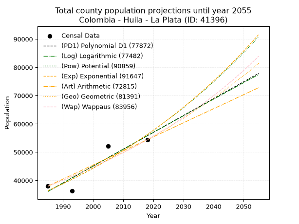
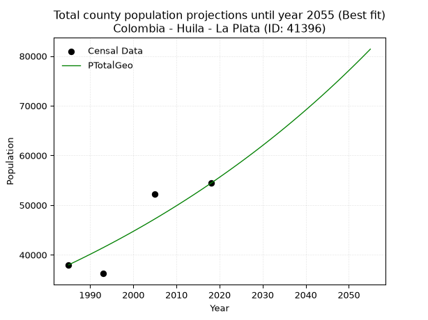
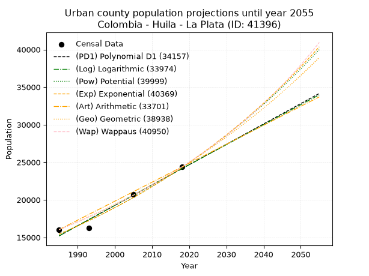
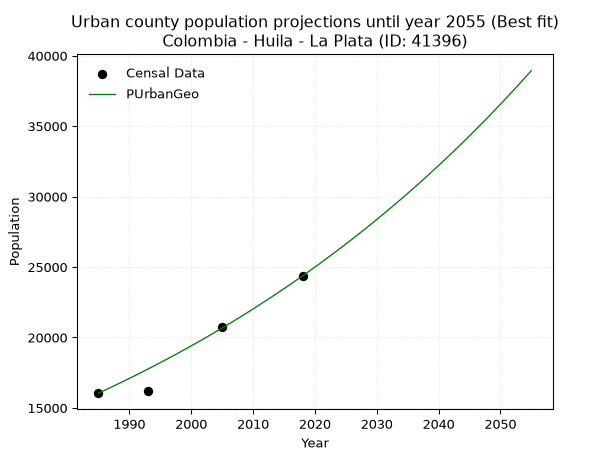
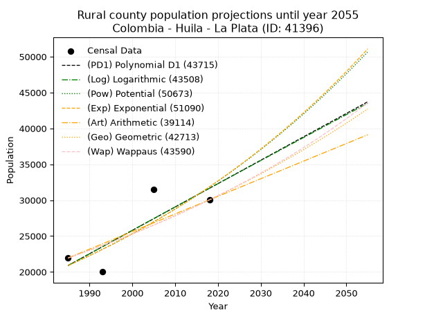
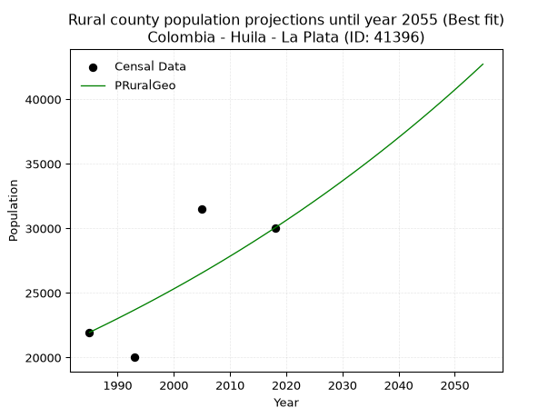

<div align="center">


</div>

# 📜 _“Population and Public Services Demand Projections (PPSD) until Year 2050 for Colombia - Huila - La Plata (ID: 41396)”_
Keywords: `population` `public-service` `projection` `lineal` `polynomial` `logarithmic` `potential` `exponential` `arithmetic` `geometric` `wappaus` `dane` `colombia` `south-america`

PPSD are analytical estimates used by governments and planners to anticipate future changes in population size, age distribution, and the resulting community needs for utilities, healthcare, education, and infrastructure as sizing future water treatment facilities, electrical grids, and road networks based on spatial growth.

<div align="center">

</img>

</div>


> **General running parameters**: • app_version: _v20260806_. • Python version: _3.14.7_. • Pandas version: _3.0.5_. • NumPy version: _2.5.1_. • Creates, save and include plots into reports (create_plot): _False_. • Projection until year: _2050_. • Process polynomial degree 2 and up: _False_. • Process Wappaus: _True_. • Process Wappaus: _True_. • Set negative values to zero: _True_. • Set infinite values to zero: _True_. • Drop dataset notes: _True_. 
<div align="center">

Dynamic map: [:earth_americas:Google](http://maps.google.com/maps?q=2.389263022,-75.8912537) [:earth_americas:OSM](https://www.openstreetmap.org/#map=18/2.389263022/-75.8912537&layers=P) [:earth_americas:Bing](https://www.bing.com/maps?cp=2.389263022~-75.8912537&lvl=18) [:earth_americas:Apple](https://maps.apple.com/frame?center=2.389263022%2C-75.8912537&span=0.003%2C0.006)

</div>


<div align="center">

```geojson
{
  "type": "Feature",
  "geometry": {
    "type": "Point", 
    "coordinates": [-75.8912537, 2.389263022]
  }, 
  "properties": {
    "Name": "Colombia - Huila - La Plata (ID: 41396)"
  }
}
```

</div>


## 0. Census Data (4 records)

Census data are official statistics collected by a government about the people and housing in a country. They usually include counts of total population, age, sex, race, income, education, and jobs.

📅Global census file: [Population.xlsx](../data/Population.xlsx)

| Source   |   Year |   CountryID | CountryName   |   StateID | StateName   |   CountyID | CountyName   |   PTotal |   PUrban |   PRural |
|:---------|-------:|------------:|:--------------|----------:|:------------|-----------:|:-------------|---------:|---------:|---------:|
| DANE     |   1985 |          57 | Colombia      |        41 | Huila       |      41396 | La Plata     |    37985 |    16040 |    21945 |
| DANE     |   1993 |          57 | Colombia      |        41 | Huila       |      41396 | La Plata     |    36240 |    16226 |    20014 |
| DANE     |   2005 |          57 | Colombia      |        41 | Huila       |      41396 | La Plata     |    52189 |    20706 |    31483 |
| DANE     |   2018 |          57 | Colombia      |        41 | Huila       |      41396 | La Plata     |    54405 |    24366 |    30039 |

> 🔥Some records could had specific notes about the registered values or the corresponding urban or rural distribution.

📅[SUI-RUPS](https://www.datos.gov.co/Hacienda-y-Cr-dito-P-blico/Registro-nico-de-Prestadores-de-Servicios-P-blicos/4qkq-csdn/about_data) - Local public utility companies: [RUPS.csv](../data/RUPS.xlsx)

 | SERVICIO       | ESTADO    | NOMBRE                                                 | NIT         | DEPARTAMENTO_DOMICILIO   | MUNICIPIO_DOMICILIO   | DIRECCION                  |   TELEFONO | EMAIL                    | TIPO_PRESTADOR                            | CLASIFICACION                 |
|:---------------|:----------|:-------------------------------------------------------|:------------|:-------------------------|:----------------------|:---------------------------|-----------:|:-------------------------|:------------------------------------------|:------------------------------|
| ACUEDUCTO      | OPERATIVA | EMPRESA DE SERVICIOS PUBLICOS DE LA PLATA HUILA E.S.P. | 813002781-2 | HUILA                    | LA PLATA              | Carrera 3  N° 2-04 esquina |    8370029 | gerencia@emserpla.gov.co | EMPRESA INDUSTRIAL Y COMERCIAL DEL ESTADO | MAYOR O IGUAL A 5001 USUARIOS |
| ALCANTARILLADO | OPERATIVA | EMPRESA DE SERVICIOS PUBLICOS DE LA PLATA HUILA E.S.P. | 813002781-2 | HUILA                    | LA PLATA              | Carrera 3  N° 2-04 esquina |    8370029 | gerencia@emserpla.gov.co | EMPRESA INDUSTRIAL Y COMERCIAL DEL ESTADO | MAYOR O IGUAL A 5001 USUARIOS |

## 1. Total

### 1.1. Coefficients and Parameters

* (PD1) Polynomial Deg 1: 596.6684062625428, -1148281.2296266512 (lineal)
* (Log) Logarithmic: 1194422.2117912704, -9033608.053324355
* (Pow) Potential: 26.44536258008231, -82.65014289071918
* (Exp) Exponential: 0.013210570258058125, 1.485985857843353e-07
* (Art) Arithmetic: Year diff. 2018 - 1985 = 33, Population diff. 54405 - 37985 = 16420, Annual growth = 497.57575757575756
* (Geo) Geometric: Year diff. 2018 - 1985 = 33, Population diff. 54405 - 37985 = 16420, Annual growth % = 0.010946286542976136
* (Wap) Wappaus: i = 1.0771203757457681, Condition values only valid for < 200)

<sub>
Wappaus condition values: ['0.00', '1.08', '2.15', '3.23', '4.31', '5.39', '6.46', '7.54', '8.62', '9.69', '10.77', '11.85', '12.93', '14.00', '15.08', '16.16', '17.23', '18.31', '19.39', '20.47', '21.54', '22.62', '23.70', '24.77', '25.85', '26.93', '28.01', '29.08', '30.16', '31.24', '32.31', '33.39', '34.47', '35.54', '36.62', '37.70', '38.78', '39.85', '40.93', '42.01', '43.08', '44.16', '45.24', '46.32', '47.39', '48.47', '49.55', '50.62', '51.70', '52.78', '53.86', '54.93', '56.01', '57.09', '58.16', '59.24', '60.32', '61.40', '62.47', '63.55', '64.63', '65.70', '66.78', '67.86', '68.94', '70.01']
</sub>


### 1.2. Projected Dataset

|   Year |   CountyID |   PTotalPD1 |   PTotalLog |   PTotalPow |   PTotalExp |   PTotalArt |   PTotalGeo |   PTotalWap |
|-------:|-----------:|------------:|------------:|------------:|------------:|------------:|------------:|------------:|
|   1985 |      41396 |       36106 |       36087 |       36335 |       36351 |       37985 |       37985 |       37985 |
|   1986 |      41396 |       36702 |       36688 |       36823 |       36834 |       38483 |       38401 |       38396 |
|   1987 |      41396 |       37299 |       37290 |       37316 |       37324 |       38980 |       38821 |       38812 |
|   1988 |      41396 |       37896 |       37891 |       37816 |       37820 |       39478 |       39246 |       39233 |
|   1989 |      41396 |       38492 |       38491 |       38322 |       38323 |       39975 |       39676 |       39658 |
|   1990 |      41396 |       39089 |       39092 |       38835 |       38833 |       40473 |       40110 |       40087 |
|   1991 |      41396 |       39686 |       39692 |       39354 |       39349 |       40970 |       40549 |       40522 |
|   1992 |      41396 |       40282 |       40291 |       39880 |       39872 |       41468 |       40993 |       40961 |
|   1993 |      41396 |       40879 |       40891 |       40413 |       40403 |       41966 |       41442 |       41406 |
|   1994 |      41396 |       41476 |       41490 |       40953 |       40940 |       42463 |       41895 |       41855 |
|   1995 |      41396 |       42072 |       42089 |       41500 |       41484 |       42961 |       42354 |       42309 |
|   1996 |      41396 |       42669 |       42687 |       42053 |       42036 |       43458 |       42817 |       42769 |
|   1997 |      41396 |       43266 |       43286 |       42614 |       42595 |       43956 |       43286 |       43234 |
|   1998 |      41396 |       43862 |       43884 |       43182 |       43161 |       44453 |       43760 |       43704 |
|   1999 |      41396 |       44459 |       44481 |       43757 |       43735 |       44951 |       44239 |       44180 |
|   2000 |      41396 |       45056 |       45079 |       44340 |       44317 |       45449 |       44723 |       44662 |
|   2001 |      41396 |       45652 |       45676 |       44930 |       44906 |       45946 |       45213 |       45149 |
|   2002 |      41396 |       46249 |       46272 |       45527 |       45503 |       46444 |       45708 |       45641 |
|   2003 |      41396 |       46846 |       46869 |       46132 |       46109 |       46941 |       46208 |       46140 |
|   2004 |      41396 |       47442 |       47465 |       46745 |       46722 |       47439 |       46714 |       46645 |
|   2005 |      41396 |       48039 |       48061 |       47366 |       47343 |       47937 |       47225 |       47156 |
|   2006 |      41396 |       48636 |       48657 |       47995 |       47973 |       48434 |       47742 |       47673 |
|   2007 |      41396 |       49232 |       49252 |       48632 |       48611 |       48932 |       48265 |       48196 |
|   2008 |      41396 |       49829 |       49847 |       49277 |       49257 |       49429 |       48793 |       48726 |
|   2009 |      41396 |       50426 |       50442 |       49930 |       49912 |       49927 |       49327 |       49262 |
|   2010 |      41396 |       51022 |       51036 |       50591 |       50576 |       50424 |       49867 |       49805 |
|   2011 |      41396 |       51619 |       51630 |       51261 |       51248 |       50922 |       50413 |       50355 |
|   2012 |      41396 |       52216 |       52224 |       51939 |       51930 |       51420 |       50965 |       50912 |
|   2013 |      41396 |       52812 |       52817 |       52626 |       52620 |       51917 |       51523 |       51475 |
|   2014 |      41396 |       53409 |       53411 |       53322 |       53320 |       52415 |       52087 |       52046 |
|   2015 |      41396 |       54006 |       54003 |       54027 |       54029 |       52912 |       52657 |       52625 |
|   2016 |      41396 |       54602 |       54596 |       54740 |       54748 |       53410 |       53233 |       53210 |
|   2017 |      41396 |       55199 |       55188 |       55463 |       55476 |       53907 |       53816 |       53804 |
|   2018 |      41396 |       55796 |       55780 |       56195 |       56214 |       54405 |       54405 |       54405 |
|   2019 |      41396 |       56392 |       56372 |       56936 |       56961 |       54903 |       55001 |       55014 |
|   2020 |      41396 |       56989 |       56964 |       57686 |       57719 |       55400 |       55603 |       55631 |
|   2021 |      41396 |       57586 |       57555 |       58446 |       58486 |       55898 |       56211 |       56257 |
|   2022 |      41396 |       58182 |       58146 |       59216 |       59264 |       56395 |       56827 |       56891 |
|   2023 |      41396 |       58779 |       58736 |       59995 |       60052 |       56893 |       57449 |       57533 |
|   2024 |      41396 |       59376 |       59326 |       60784 |       60851 |       57390 |       58077 |       58184 |
|   2025 |      41396 |       59972 |       59916 |       61584 |       61660 |       57888 |       58713 |       58844 |
|   2026 |      41396 |       60569 |       60506 |       62393 |       62480 |       58386 |       59356 |       59514 |
|   2027 |      41396 |       61166 |       61096 |       63213 |       63311 |       58883 |       60006 |       60192 |
|   2028 |      41396 |       61762 |       61685 |       64042 |       64153 |       59381 |       60662 |       60880 |
|   2029 |      41396 |       62359 |       62273 |       64883 |       65006 |       59878 |       61326 |       61578 |
|   2030 |      41396 |       62956 |       62862 |       65734 |       65870 |       60376 |       61998 |       62286 |
|   2031 |      41396 |       63552 |       63450 |       66596 |       66746 |       60873 |       62676 |       63004 |
|   2032 |      41396 |       64149 |       64038 |       67468 |       67634 |       61371 |       63362 |       63732 |
|   2033 |      41396 |       64746 |       64626 |       68352 |       68533 |       61869 |       64056 |       64471 |
|   2034 |      41396 |       65342 |       65213 |       69246 |       69444 |       62366 |       64757 |       65220 |
|   2035 |      41396 |       65939 |       65800 |       70152 |       70368 |       62864 |       65466 |       65981 |
|   2036 |      41396 |       66536 |       66387 |       71070 |       71304 |       63361 |       66183 |       66753 |
|   2037 |      41396 |       67132 |       66974 |       71999 |       72252 |       63859 |       66907 |       67536 |
|   2038 |      41396 |       67729 |       67560 |       72939 |       73213 |       64357 |       67640 |       68332 |
|   2039 |      41396 |       68326 |       68146 |       73892 |       74186 |       64854 |       68380 |       69139 |
|   2040 |      41396 |       68922 |       68731 |       74856 |       75173 |       65352 |       69128 |       69959 |
|   2041 |      41396 |       69519 |       69317 |       75833 |       76173 |       65849 |       69885 |       70791 |
|   2042 |      41396 |       70116 |       69902 |       76821 |       77186 |       66347 |       70650 |       71637 |
|   2043 |      41396 |       70712 |       70487 |       77822 |       78212 |       66844 |       71423 |       72495 |
|   2044 |      41396 |       71309 |       71071 |       78836 |       79252 |       67342 |       72205 |       73367 |
|   2045 |      41396 |       71906 |       71655 |       79862 |       80306 |       67840 |       72996 |       74253 |
|   2046 |      41396 |       72502 |       72239 |       80902 |       81374 |       68337 |       73795 |       75153 |
|   2047 |      41396 |       73099 |       72823 |       81954 |       82456 |       68835 |       74602 |       76068 |
|   2048 |      41396 |       73696 |       73406 |       83019 |       83553 |       69332 |       75419 |       76998 |
|   2049 |      41396 |       74292 |       73989 |       84098 |       84664 |       69830 |       76245 |       77943 |
|   2050 |      41396 |       74889 |       74572 |       85190 |       85789 |       70327 |       77079 |       78903 |
<div align="center">

</img>

</div>


### 1.3. Best fit with absolute and relative error (%)

Relative error puts that difference into context by dividing the absolute error by the true value, creating a unitless ratio or percentage that shows the scale of the mistake.

Absolute and relative error

|   Year | Source   |   CountryID | CountryName   |   StateID | StateName   |   CountyID_x | CountyName   |   PTotal |   PUrban |   PRural |   CountyID_y |   PTotalPD1 |   PTotalLog |   PTotalPow |   PTotalExp |   PTotalArt |   PTotalGeo |   PTotalWap |   PTotalPD1AbsError |   PTotalLogAbsError |   PTotalPowAbsError |   PTotalExpAbsError |   PTotalArtAbsError |   PTotalGeoAbsError |   PTotalWapAbsError |   PTotalPD1RelError |   PTotalLogRelError |   PTotalPowRelError |   PTotalExpRelError |   PTotalArtRelError |   PTotalGeoRelError |   PTotalWapRelError |
|-------:|:---------|------------:|:--------------|----------:|:------------|-------------:|:-------------|---------:|---------:|---------:|-------------:|------------:|------------:|------------:|------------:|------------:|------------:|------------:|--------------------:|--------------------:|--------------------:|--------------------:|--------------------:|--------------------:|--------------------:|--------------------:|--------------------:|--------------------:|--------------------:|--------------------:|--------------------:|--------------------:|
|   1985 | DANE     |          57 | Colombia      |        41 | Huila       |        41396 | La Plata     |    37985 |    16040 |    21945 |        41396 |       36106 |       36087 |       36335 |       36351 |       37985 |       37985 |       37985 |                1879 |                1898 |                1650 |                1634 |                   0 |                   0 |                   0 |             4.94669 |             4.99671 |             4.34382 |             4.3017  |             0       |             0       |             0       |
|   1993 | DANE     |          57 | Colombia      |        41 | Huila       |        41396 | La Plata     |    36240 |    16226 |    20014 |        41396 |       40879 |       40891 |       40413 |       40403 |       41966 |       41442 |       41406 |                4639 |                4651 |                4173 |                4163 |                5726 |                5202 |                5166 |            12.8008  |            12.8339  |            11.5149  |            11.4873  |            15.8002  |            14.3543  |            14.255   |
|   2005 | DANE     |          57 | Colombia      |        41 | Huila       |        41396 | La Plata     |    52189 |    20706 |    31483 |        41396 |       48039 |       48061 |       47366 |       47343 |       47937 |       47225 |       47156 |                4150 |                4128 |                4823 |                4846 |                4252 |                4964 |                5033 |             7.95187 |             7.90971 |             9.24141 |             9.28548 |             8.14731 |             9.51158 |             9.64379 |
|   2018 | DANE     |          57 | Colombia      |        41 | Huila       |        41396 | La Plata     |    54405 |    24366 |    30039 |        41396 |       55796 |       55780 |       56195 |       56214 |       54405 |       54405 |       54405 |                1391 |                1375 |                1790 |                1809 |                   0 |                   0 |                   0 |             2.55675 |             2.52734 |             3.29014 |             3.32506 |             0       |             0       |             0       |

Relative error mean

| Method    |   RelError | Best   |
|:----------|-----------:|:-------|
| PTotalPD1 |    7.06402 |        |
| PTotalLog |    7.06691 |        |
| PTotalPow |    7.09757 |        |
| PTotalExp |    7.09989 |        |
| PTotalArt |    5.98688 |        |
| PTotalGeo |    5.96647 | True   |
| PTotalWap |    5.97469 |        |

💙Best method: _**PTotalGeo**_
<div align="center">

</img>

</div>


### 1.4. Fresh water supply demand in liters per capita per day (lpcd)

The fresh water supply demand typically ranges from 100 to 300 liters per capita per day (lpcd) for standard domestic and municipal planning, though absolute survival minimums set by the World Health Organization are as low as 7.5 to 20 liters per day, and total consumption in high-income nations can exceed 400 liters.

> `CZ`: Level in meters above the sea level (masl)<br> `WS`: Fresh water supply demand in liters per capita per day (lpcd or l/h/d)<br> `WSAll`: Zonal fresh water supply demand in liters per second (l/s)<br> `A`: Zonal area in square meters<br> `DP`: Population density (people/hectare or p/ha)

Reference values (RAS Colombia)

|    CZ |   WS |
|------:|-----:|
|  1000 |  120 |
|  2000 |  130 |
| 99999 |  140 |

County shapefile geometry properties and water supply values

|   CountyID |      ATotal |   CZTotal |   WSTotal |
|-----------:|------------:|----------:|----------:|
|      41396 | 8.14671e+08 |   1886.57 |       130 |

Projected values for best method: PTotalGeo

|   CountyID |   Year |   PTotalGeo |   DPTotal |   WSTotal |   WSTotalAll |
|-----------:|-------:|------------:|----------:|----------:|-------------:|
|      41396 |   1985 |       37985 |      0.47 |       130 |      57.1534 |
|      41396 |   1986 |       38401 |      0.47 |       130 |      57.7793 |
|      41396 |   1987 |       38821 |      0.48 |       130 |      58.4112 |
|      41396 |   1988 |       39246 |      0.48 |       130 |      59.0507 |
|      41396 |   1989 |       39676 |      0.49 |       130 |      59.6977 |
|      41396 |   1990 |       40110 |      0.49 |       130 |      60.3507 |
|      41396 |   1991 |       40549 |      0.5  |       130 |      61.0112 |
|      41396 |   1992 |       40993 |      0.5  |       130 |      61.6793 |
|      41396 |   1993 |       41442 |      0.51 |       130 |      62.3549 |
|      41396 |   1994 |       41895 |      0.51 |       130 |      63.0365 |
|      41396 |   1995 |       42354 |      0.52 |       130 |      63.7271 |
|      41396 |   1996 |       42817 |      0.53 |       130 |      64.4237 |
|      41396 |   1997 |       43286 |      0.53 |       130 |      65.1294 |
|      41396 |   1998 |       43760 |      0.54 |       130 |      65.8426 |
|      41396 |   1999 |       44239 |      0.54 |       130 |      66.5633 |
|      41396 |   2000 |       44723 |      0.55 |       130 |      67.2916 |
|      41396 |   2001 |       45213 |      0.55 |       130 |      68.0288 |
|      41396 |   2002 |       45708 |      0.56 |       130 |      68.7736 |
|      41396 |   2003 |       46208 |      0.57 |       130 |      69.5259 |
|      41396 |   2004 |       46714 |      0.57 |       130 |      70.2873 |
|      41396 |   2005 |       47225 |      0.58 |       130 |      71.0561 |
|      41396 |   2006 |       47742 |      0.59 |       130 |      71.834  |
|      41396 |   2007 |       48265 |      0.59 |       130 |      72.6209 |
|      41396 |   2008 |       48793 |      0.6  |       130 |      73.4154 |
|      41396 |   2009 |       49327 |      0.61 |       130 |      74.2189 |
|      41396 |   2010 |       49867 |      0.61 |       130 |      75.0314 |
|      41396 |   2011 |       50413 |      0.62 |       130 |      75.8529 |
|      41396 |   2012 |       50965 |      0.63 |       130 |      76.6834 |
|      41396 |   2013 |       51523 |      0.63 |       130 |      77.523  |
|      41396 |   2014 |       52087 |      0.64 |       130 |      78.3716 |
|      41396 |   2015 |       52657 |      0.65 |       130 |      79.2293 |
|      41396 |   2016 |       53233 |      0.65 |       130 |      80.0959 |
|      41396 |   2017 |       53816 |      0.66 |       130 |      80.9731 |
|      41396 |   2018 |       54405 |      0.67 |       130 |      81.8594 |
|      41396 |   2019 |       55001 |      0.68 |       130 |      82.7561 |
|      41396 |   2020 |       55603 |      0.68 |       130 |      83.6619 |
|      41396 |   2021 |       56211 |      0.69 |       130 |      84.5767 |
|      41396 |   2022 |       56827 |      0.7  |       130 |      85.5036 |
|      41396 |   2023 |       57449 |      0.71 |       130 |      86.4395 |
|      41396 |   2024 |       58077 |      0.71 |       130 |      87.3844 |
|      41396 |   2025 |       58713 |      0.72 |       130 |      88.3413 |
|      41396 |   2026 |       59356 |      0.73 |       130 |      89.3088 |
|      41396 |   2027 |       60006 |      0.74 |       130 |      90.2868 |
|      41396 |   2028 |       60662 |      0.74 |       130 |      91.2738 |
|      41396 |   2029 |       61326 |      0.75 |       130 |      92.2729 |
|      41396 |   2030 |       61998 |      0.76 |       130 |      93.284  |
|      41396 |   2031 |       62676 |      0.77 |       130 |      94.3042 |
|      41396 |   2032 |       63362 |      0.78 |       130 |      95.3363 |
|      41396 |   2033 |       64056 |      0.79 |       130 |      96.3806 |
|      41396 |   2034 |       64757 |      0.79 |       130 |      97.4353 |
|      41396 |   2035 |       65466 |      0.8  |       130 |      98.5021 |
|      41396 |   2036 |       66183 |      0.81 |       130 |      99.5809 |
|      41396 |   2037 |       66907 |      0.82 |       130 |     100.67   |
|      41396 |   2038 |       67640 |      0.83 |       130 |     101.773  |
|      41396 |   2039 |       68380 |      0.84 |       130 |     102.887  |
|      41396 |   2040 |       69128 |      0.85 |       130 |     104.012  |
|      41396 |   2041 |       69885 |      0.86 |       130 |     105.151  |
|      41396 |   2042 |       70650 |      0.87 |       130 |     106.302  |
|      41396 |   2043 |       71423 |      0.88 |       130 |     107.465  |
|      41396 |   2044 |       72205 |      0.89 |       130 |     108.642  |
|      41396 |   2045 |       72996 |      0.9  |       130 |     109.832  |
|      41396 |   2046 |       73795 |      0.91 |       130 |     111.034  |
|      41396 |   2047 |       74602 |      0.92 |       130 |     112.248  |
|      41396 |   2048 |       75419 |      0.93 |       130 |     113.478  |
|      41396 |   2049 |       76245 |      0.94 |       130 |     114.72   |
|      41396 |   2050 |       77079 |      0.95 |       130 |     115.975  |

## 2. Urban

### 2.1. Coefficients and Parameters

* (PD1) Polynomial Deg 1: 270.7370533922094, -522207.291047767 (lineal)
* (Log) Logarithmic: 541746.2265404434, -4098482.909215714
* (Pow) Potential: 27.47727233291563, -86.42498569808288
* (Exp) Exponential: 0.013730386211468418, 2.2491653354409354e-08
* (Art) Arithmetic: Year diff. 2018 - 1985 = 33, Population diff. 24366 - 16040 = 8326, Annual growth = 252.3030303030303
* (Geo) Geometric: Year diff. 2018 - 1985 = 33, Population diff. 24366 - 16040 = 8326, Annual growth % = 0.012750393228558643
* (Wap) Wappaus: i = 1.2488394312875826, Condition values only valid for < 200)

<sub>
Wappaus condition values: ['0.00', '1.25', '2.50', '3.75', '5.00', '6.24', '7.49', '8.74', '9.99', '11.24', '12.49', '13.74', '14.99', '16.23', '17.48', '18.73', '19.98', '21.23', '22.48', '23.73', '24.98', '26.23', '27.47', '28.72', '29.97', '31.22', '32.47', '33.72', '34.97', '36.22', '37.47', '38.71', '39.96', '41.21', '42.46', '43.71', '44.96', '46.21', '47.46', '48.70', '49.95', '51.20', '52.45', '53.70', '54.95', '56.20', '57.45', '58.70', '59.94', '61.19', '62.44', '63.69', '64.94', '66.19', '67.44', '68.69', '69.94', '71.18', '72.43', '73.68', '74.93', '76.18', '77.43', '78.68', '79.93', '81.17']
</sub>


### 2.2. Projected Dataset

|   Year |   CountyID |   PUrbanPD1 |   PUrbanLog |   PUrbanPow |   PUrbanExp |   PUrbanArt |   PUrbanGeo |   PUrbanWap |
|-------:|-----------:|------------:|------------:|------------:|------------:|------------:|------------:|------------:|
|   1985 |      41396 |       15206 |       15199 |       15434 |       15440 |       16040 |       16040 |       16040 |
|   1986 |      41396 |       15476 |       15472 |       15649 |       15653 |       16292 |       16245 |       16242 |
|   1987 |      41396 |       15747 |       15744 |       15867 |       15870 |       16545 |       16452 |       16446 |
|   1988 |      41396 |       16018 |       16017 |       16088 |       16089 |       16797 |       16661 |       16652 |
|   1989 |      41396 |       16289 |       16289 |       16312 |       16311 |       17049 |       16874 |       16862 |
|   1990 |      41396 |       16559 |       16562 |       16539 |       16537 |       17302 |       17089 |       17074 |
|   1991 |      41396 |       16830 |       16834 |       16768 |       16765 |       17554 |       17307 |       17289 |
|   1992 |      41396 |       17101 |       17106 |       17001 |       16997 |       17806 |       17528 |       17506 |
|   1993 |      41396 |       17372 |       17378 |       17238 |       17232 |       18058 |       17751 |       17727 |
|   1994 |      41396 |       17642 |       17650 |       17477 |       17470 |       18311 |       17977 |       17950 |
|   1995 |      41396 |       17913 |       17921 |       17719 |       17712 |       18563 |       18207 |       18177 |
|   1996 |      41396 |       18184 |       18193 |       17965 |       17957 |       18815 |       18439 |       18406 |
|   1997 |      41396 |       18455 |       18464 |       18214 |       18205 |       19068 |       18674 |       18638 |
|   1998 |      41396 |       18725 |       18735 |       18466 |       18457 |       19320 |       18912 |       18874 |
|   1999 |      41396 |       18996 |       19006 |       18722 |       18712 |       19572 |       19153 |       19113 |
|   2000 |      41396 |       19267 |       19277 |       18981 |       18971 |       19825 |       19397 |       19355 |
|   2001 |      41396 |       19538 |       19548 |       19243 |       19233 |       20077 |       19645 |       19601 |
|   2002 |      41396 |       19808 |       19819 |       19509 |       19499 |       20329 |       19895 |       19850 |
|   2003 |      41396 |       20079 |       20089 |       19779 |       19768 |       20581 |       20149 |       20102 |
|   2004 |      41396 |       20350 |       20360 |       20052 |       20042 |       20834 |       20406 |       20358 |
|   2005 |      41396 |       20621 |       20630 |       20329 |       20319 |       21086 |       20666 |       20618 |
|   2006 |      41396 |       20891 |       20900 |       20609 |       20600 |       21338 |       20929 |       20881 |
|   2007 |      41396 |       21162 |       21170 |       20893 |       20885 |       21591 |       21196 |       21149 |
|   2008 |      41396 |       21433 |       21440 |       21181 |       21173 |       21843 |       21466 |       21420 |
|   2009 |      41396 |       21703 |       21710 |       21473 |       21466 |       22095 |       21740 |       21695 |
|   2010 |      41396 |       21974 |       21979 |       21769 |       21763 |       22348 |       22017 |       21974 |
|   2011 |      41396 |       22245 |       22249 |       22068 |       22064 |       22600 |       22298 |       22258 |
|   2012 |      41396 |       22516 |       22518 |       22372 |       22369 |       22852 |       22582 |       22545 |
|   2013 |      41396 |       22786 |       22787 |       22679 |       22678 |       23104 |       22870 |       22837 |
|   2014 |      41396 |       23057 |       23056 |       22991 |       22991 |       23357 |       23162 |       23134 |
|   2015 |      41396 |       23328 |       23325 |       23307 |       23309 |       23609 |       23457 |       23435 |
|   2016 |      41396 |       23599 |       23594 |       23627 |       23632 |       23861 |       23756 |       23740 |
|   2017 |      41396 |       23869 |       23863 |       23951 |       23958 |       24114 |       24059 |       24051 |
|   2018 |      41396 |       24140 |       24131 |       24279 |       24289 |       24366 |       24366 |       24366 |
|   2019 |      41396 |       24411 |       24400 |       24612 |       24625 |       24618 |       24677 |       24686 |
|   2020 |      41396 |       24682 |       24668 |       24949 |       24966 |       24871 |       24991 |       25012 |
|   2021 |      41396 |       24952 |       24936 |       25291 |       25311 |       25123 |       25310 |       25342 |
|   2022 |      41396 |       25223 |       25204 |       25637 |       25661 |       25375 |       25633 |       25678 |
|   2023 |      41396 |       25494 |       25472 |       25987 |       26016 |       25628 |       25960 |       26020 |
|   2024 |      41396 |       25765 |       25740 |       26343 |       26375 |       25880 |       26290 |       26367 |
|   2025 |      41396 |       26035 |       26007 |       26703 |       26740 |       26132 |       26626 |       26720 |
|   2026 |      41396 |       26306 |       26275 |       27067 |       27110 |       26384 |       26965 |       27079 |
|   2027 |      41396 |       26577 |       26542 |       27437 |       27484 |       26637 |       27309 |       27444 |
|   2028 |      41396 |       26847 |       26809 |       27811 |       27864 |       26889 |       27657 |       27815 |
|   2029 |      41396 |       27118 |       27076 |       28191 |       28250 |       27141 |       28010 |       28193 |
|   2030 |      41396 |       27389 |       27343 |       28575 |       28640 |       27394 |       28367 |       28577 |
|   2031 |      41396 |       27660 |       27610 |       28964 |       29036 |       27646 |       28729 |       28968 |
|   2032 |      41396 |       27930 |       27877 |       29359 |       29437 |       27898 |       29095 |       29365 |
|   2033 |      41396 |       28201 |       28143 |       29758 |       29844 |       28151 |       29466 |       29770 |
|   2034 |      41396 |       28472 |       28410 |       30163 |       30257 |       28403 |       29842 |       30182 |
|   2035 |      41396 |       28743 |       28676 |       30573 |       30675 |       28655 |       30222 |       30602 |
|   2036 |      41396 |       29013 |       28942 |       30989 |       31099 |       28907 |       30607 |       31029 |
|   2037 |      41396 |       29284 |       29208 |       31410 |       31529 |       29160 |       30998 |       31465 |
|   2038 |      41396 |       29555 |       29474 |       31836 |       31965 |       29412 |       31393 |       31908 |
|   2039 |      41396 |       29826 |       29740 |       32268 |       32407 |       29664 |       31793 |       32360 |
|   2040 |      41396 |       30096 |       30005 |       32706 |       32855 |       29917 |       32199 |       32820 |
|   2041 |      41396 |       30367 |       30271 |       33149 |       33309 |       30169 |       32609 |       33289 |
|   2042 |      41396 |       30638 |       30536 |       33598 |       33770 |       30421 |       33025 |       33767 |
|   2043 |      41396 |       30909 |       30801 |       34053 |       34237 |       30674 |       33446 |       34255 |
|   2044 |      41396 |       31179 |       31067 |       34514 |       34710 |       30926 |       33872 |       34752 |
|   2045 |      41396 |       31450 |       31331 |       34981 |       35190 |       31178 |       34304 |       35259 |
|   2046 |      41396 |       31721 |       31596 |       35454 |       35677 |       31430 |       34742 |       35777 |
|   2047 |      41396 |       31991 |       31861 |       35934 |       36170 |       31683 |       35185 |       36305 |
|   2048 |      41396 |       32262 |       32126 |       36419 |       36670 |       31935 |       35633 |       36844 |
|   2049 |      41396 |       32533 |       32390 |       36911 |       37177 |       32187 |       36088 |       37394 |
|   2050 |      41396 |       32804 |       32654 |       37409 |       37691 |       32440 |       36548 |       37955 |
<div align="center">

</img>

</div>


### 2.3. Best fit with absolute and relative error (%)

Relative error puts that difference into context by dividing the absolute error by the true value, creating a unitless ratio or percentage that shows the scale of the mistake.

Absolute and relative error

|   Year | Source   |   CountryID | CountryName   |   StateID | StateName   |   CountyID_x | CountyName   |   PTotal |   PUrban |   PRural |   CountyID_y |   PUrbanPD1 |   PUrbanLog |   PUrbanPow |   PUrbanExp |   PUrbanArt |   PUrbanGeo |   PUrbanWap |   PUrbanPD1AbsError |   PUrbanLogAbsError |   PUrbanPowAbsError |   PUrbanExpAbsError |   PUrbanArtAbsError |   PUrbanGeoAbsError |   PUrbanWapAbsError |   PUrbanPD1RelError |   PUrbanLogRelError |   PUrbanPowRelError |   PUrbanExpRelError |   PUrbanArtRelError |   PUrbanGeoRelError |   PUrbanWapRelError |
|-------:|:---------|------------:|:--------------|----------:|:------------|-------------:|:-------------|---------:|---------:|---------:|-------------:|------------:|------------:|------------:|------------:|------------:|------------:|------------:|--------------------:|--------------------:|--------------------:|--------------------:|--------------------:|--------------------:|--------------------:|--------------------:|--------------------:|--------------------:|--------------------:|--------------------:|--------------------:|--------------------:|
|   1985 | DANE     |          57 | Colombia      |        41 | Huila       |        41396 | La Plata     |    37985 |    16040 |    21945 |        41396 |       15206 |       15199 |       15434 |       15440 |       16040 |       16040 |       16040 |                 834 |                 841 |                 606 |                 600 |                   0 |                   0 |                   0 |            5.1995   |            5.24314  |            3.77805  |            3.74065  |             0       |            0        |            0        |
|   1993 | DANE     |          57 | Colombia      |        41 | Huila       |        41396 | La Plata     |    36240 |    16226 |    20014 |        41396 |       17372 |       17378 |       17238 |       17232 |       18058 |       17751 |       17727 |                1146 |                1152 |                1012 |                1006 |                1832 |                1525 |                1501 |            7.06274  |            7.09972  |            6.2369   |            6.19993  |            11.2905  |            9.3985   |            9.25059  |
|   2005 | DANE     |          57 | Colombia      |        41 | Huila       |        41396 | La Plata     |    52189 |    20706 |    31483 |        41396 |       20621 |       20630 |       20329 |       20319 |       21086 |       20666 |       20618 |                  85 |                  76 |                 377 |                 387 |                 380 |                  40 |                  88 |            0.410509 |            0.367043 |            1.82073  |            1.86902  |             1.83522 |            0.193181 |            0.424998 |
|   2018 | DANE     |          57 | Colombia      |        41 | Huila       |        41396 | La Plata     |    54405 |    24366 |    30039 |        41396 |       24140 |       24131 |       24279 |       24289 |       24366 |       24366 |       24366 |                 226 |                 235 |                  87 |                  77 |                   0 |                   0 |                   0 |            0.927522 |            0.964459 |            0.357055 |            0.316014 |             0       |            0        |            0        |

Relative error mean

| Method    |   RelError | Best   |
|:----------|-----------:|:-------|
| PUrbanPD1 |    3.40007 |        |
| PUrbanLog |    3.41859 |        |
| PUrbanPow |    3.04819 |        |
| PUrbanExp |    3.0314  |        |
| PUrbanArt |    3.28143 |        |
| PUrbanGeo |    2.39792 | True   |
| PUrbanWap |    2.4189  |        |

💙Best method: _**PUrbanGeo**_
<div align="center">

</img>

</div>


### 2.4. Fresh water supply demand in liters per capita per day (lpcd)

The fresh water supply demand typically ranges from 100 to 300 liters per capita per day (lpcd) for standard domestic and municipal planning, though absolute survival minimums set by the World Health Organization are as low as 7.5 to 20 liters per day, and total consumption in high-income nations can exceed 400 liters.

> `CZ`: Level in meters above the sea level (masl)<br> `WS`: Fresh water supply demand in liters per capita per day (lpcd or l/h/d)<br> `WSAll`: Zonal fresh water supply demand in liters per second (l/s)<br> `A`: Zonal area in square meters<br> `DP`: Population density (people/hectare or p/ha)

Reference values (RAS Colombia)

|    CZ |   WS |
|------:|-----:|
|  1000 |  120 |
|  2000 |  130 |
| 99999 |  140 |

County shapefile geometry properties and water supply values

|   CountyID |     AUrban |   CZUrban |   WSUrban |
|-----------:|-----------:|----------:|----------:|
|      41396 | 3.8162e+06 |   1023.77 |       130 |

Projected values for best method: PUrbanGeo

|   CountyID |   Year |   PUrbanGeo |   DPUrban |   WSUrban |   WSUrbanAll |
|-----------:|-------:|------------:|----------:|----------:|-------------:|
|      41396 |   1985 |       16040 |     42.03 |       130 |      24.1343 |
|      41396 |   1986 |       16245 |     42.57 |       130 |      24.4427 |
|      41396 |   1987 |       16452 |     43.11 |       130 |      24.7542 |
|      41396 |   1988 |       16661 |     43.66 |       130 |      25.0686 |
|      41396 |   1989 |       16874 |     44.22 |       130 |      25.3891 |
|      41396 |   1990 |       17089 |     44.78 |       130 |      25.7126 |
|      41396 |   1991 |       17307 |     45.35 |       130 |      26.0406 |
|      41396 |   1992 |       17528 |     45.93 |       130 |      26.3731 |
|      41396 |   1993 |       17751 |     46.51 |       130 |      26.7087 |
|      41396 |   1994 |       17977 |     47.11 |       130 |      27.0487 |
|      41396 |   1995 |       18207 |     47.71 |       130 |      27.3948 |
|      41396 |   1996 |       18439 |     48.32 |       130 |      27.7439 |
|      41396 |   1997 |       18674 |     48.93 |       130 |      28.0975 |
|      41396 |   1998 |       18912 |     49.56 |       130 |      28.4556 |
|      41396 |   1999 |       19153 |     50.19 |       130 |      28.8182 |
|      41396 |   2000 |       19397 |     50.83 |       130 |      29.1853 |
|      41396 |   2001 |       19645 |     51.48 |       130 |      29.5584 |
|      41396 |   2002 |       19895 |     52.13 |       130 |      29.9346 |
|      41396 |   2003 |       20149 |     52.8  |       130 |      30.3168 |
|      41396 |   2004 |       20406 |     53.47 |       130 |      30.7035 |
|      41396 |   2005 |       20666 |     54.15 |       130 |      31.0947 |
|      41396 |   2006 |       20929 |     54.84 |       130 |      31.4904 |
|      41396 |   2007 |       21196 |     55.54 |       130 |      31.8921 |
|      41396 |   2008 |       21466 |     56.25 |       130 |      32.2984 |
|      41396 |   2009 |       21740 |     56.97 |       130 |      32.7106 |
|      41396 |   2010 |       22017 |     57.69 |       130 |      33.1274 |
|      41396 |   2011 |       22298 |     58.43 |       130 |      33.5502 |
|      41396 |   2012 |       22582 |     59.17 |       130 |      33.9775 |
|      41396 |   2013 |       22870 |     59.93 |       130 |      34.4109 |
|      41396 |   2014 |       23162 |     60.69 |       130 |      34.8502 |
|      41396 |   2015 |       23457 |     61.47 |       130 |      35.2941 |
|      41396 |   2016 |       23756 |     62.25 |       130 |      35.744  |
|      41396 |   2017 |       24059 |     63.04 |       130 |      36.1999 |
|      41396 |   2018 |       24366 |     63.85 |       130 |      36.6618 |
|      41396 |   2019 |       24677 |     64.66 |       130 |      37.1297 |
|      41396 |   2020 |       24991 |     65.49 |       130 |      37.6022 |
|      41396 |   2021 |       25310 |     66.32 |       130 |      38.0822 |
|      41396 |   2022 |       25633 |     67.17 |       130 |      38.5682 |
|      41396 |   2023 |       25960 |     68.03 |       130 |      39.0602 |
|      41396 |   2024 |       26290 |     68.89 |       130 |      39.5567 |
|      41396 |   2025 |       26626 |     69.77 |       130 |      40.0623 |
|      41396 |   2026 |       26965 |     70.66 |       130 |      40.5723 |
|      41396 |   2027 |       27309 |     71.56 |       130 |      41.0899 |
|      41396 |   2028 |       27657 |     72.47 |       130 |      41.6135 |
|      41396 |   2029 |       28010 |     73.4  |       130 |      42.1447 |
|      41396 |   2030 |       28367 |     74.33 |       130 |      42.6818 |
|      41396 |   2031 |       28729 |     75.28 |       130 |      43.2265 |
|      41396 |   2032 |       29095 |     76.24 |       130 |      43.7772 |
|      41396 |   2033 |       29466 |     77.21 |       130 |      44.3354 |
|      41396 |   2034 |       29842 |     78.2  |       130 |      44.9012 |
|      41396 |   2035 |       30222 |     79.19 |       130 |      45.4729 |
|      41396 |   2036 |       30607 |     80.2  |       130 |      46.0522 |
|      41396 |   2037 |       30998 |     81.23 |       130 |      46.6405 |
|      41396 |   2038 |       31393 |     82.26 |       130 |      47.2348 |
|      41396 |   2039 |       31793 |     83.31 |       130 |      47.8367 |
|      41396 |   2040 |       32199 |     84.37 |       130 |      48.4476 |
|      41396 |   2041 |       32609 |     85.45 |       130 |      49.0645 |
|      41396 |   2042 |       33025 |     86.54 |       130 |      49.6904 |
|      41396 |   2043 |       33446 |     87.64 |       130 |      50.3238 |
|      41396 |   2044 |       33872 |     88.76 |       130 |      50.9648 |
|      41396 |   2045 |       34304 |     89.89 |       130 |      51.6148 |
|      41396 |   2046 |       34742 |     91.04 |       130 |      52.2738 |
|      41396 |   2047 |       35185 |     92.2  |       130 |      52.9404 |
|      41396 |   2048 |       35633 |     93.37 |       130 |      53.6145 |
|      41396 |   2049 |       36088 |     94.57 |       130 |      54.2991 |
|      41396 |   2050 |       36548 |     95.77 |       130 |      54.9912 |

## 3. Rural

### 3.1. Coefficients and Parameters

* (PD1) Polynomial Deg 1: 325.9313528703335, -626073.9385788846 (lineal)
* (Log) Logarithmic: 652675.985250827, -4935125.144108639
* (Pow) Potential: 25.576985880576697, -80.02696231263934
* (Exp) Exponential: 0.012773718685922376, 2.0328708994127478e-07
* (Art) Arithmetic: Year diff. 2018 - 1985 = 33, Population diff. 30039 - 21945 = 8094, Annual growth = 245.27272727272728
* (Geo) Geometric: Year diff. 2018 - 1985 = 33, Population diff. 30039 - 21945 = 8094, Annual growth % = 0.009559255559610236
* (Wap) Wappaus: i = 0.9436469962785752, Condition values only valid for < 200)

<sub>
Wappaus condition values: ['0.00', '0.94', '1.89', '2.83', '3.77', '4.72', '5.66', '6.61', '7.55', '8.49', '9.44', '10.38', '11.32', '12.27', '13.21', '14.15', '15.10', '16.04', '16.99', '17.93', '18.87', '19.82', '20.76', '21.70', '22.65', '23.59', '24.53', '25.48', '26.42', '27.37', '28.31', '29.25', '30.20', '31.14', '32.08', '33.03', '33.97', '34.91', '35.86', '36.80', '37.75', '38.69', '39.63', '40.58', '41.52', '42.46', '43.41', '44.35', '45.30', '46.24', '47.18', '48.13', '49.07', '50.01', '50.96', '51.90', '52.84', '53.79', '54.73', '55.68', '56.62', '57.56', '58.51', '59.45', '60.39', '61.34']
</sub>


### 3.2. Projected Dataset

|   Year |   CountyID |   PRuralPD1 |   PRuralLog |   PRuralPow |   PRuralExp |   PRuralArt |   PRuralGeo |   PRuralWap |
|-------:|-----------:|------------:|------------:|------------:|------------:|------------:|------------:|------------:|
|   1985 |      41396 |       20900 |       20888 |       20884 |       20893 |       21945 |       21945 |       21945 |
|   1986 |      41396 |       21226 |       21217 |       21155 |       21162 |       22190 |       22155 |       22153 |
|   1987 |      41396 |       21552 |       21545 |       21429 |       21434 |       22436 |       22367 |       22363 |
|   1988 |      41396 |       21878 |       21874 |       21706 |       21710 |       22681 |       22580 |       22575 |
|   1989 |      41396 |       22204 |       22202 |       21987 |       21989 |       22926 |       22796 |       22789 |
|   1990 |      41396 |       22529 |       22530 |       22272 |       22271 |       23171 |       23014 |       23005 |
|   1991 |      41396 |       22855 |       22858 |       22560 |       22558 |       23417 |       23234 |       23224 |
|   1992 |      41396 |       23181 |       23185 |       22851 |       22848 |       23662 |       23456 |       23444 |
|   1993 |      41396 |       23507 |       23513 |       23147 |       23141 |       23907 |       23680 |       23667 |
|   1994 |      41396 |       23833 |       23840 |       23446 |       23439 |       24152 |       23907 |       23891 |
|   1995 |      41396 |       24159 |       24168 |       23748 |       23740 |       24398 |       24135 |       24118 |
|   1996 |      41396 |       24485 |       24495 |       24055 |       24045 |       24643 |       24366 |       24348 |
|   1997 |      41396 |       24811 |       24822 |       24365 |       24354 |       24888 |       24599 |       24579 |
|   1998 |      41396 |       25137 |       25148 |       24679 |       24668 |       25134 |       24834 |       24813 |
|   1999 |      41396 |       25463 |       25475 |       24997 |       24985 |       25379 |       25072 |       25049 |
|   2000 |      41396 |       25789 |       25801 |       25318 |       25306 |       25624 |       25311 |       25288 |
|   2001 |      41396 |       26115 |       26128 |       25644 |       25631 |       25869 |       25553 |       25529 |
|   2002 |      41396 |       26441 |       26454 |       25974 |       25961 |       26115 |       25797 |       25772 |
|   2003 |      41396 |       26767 |       26780 |       26308 |       26294 |       26360 |       26044 |       26018 |
|   2004 |      41396 |       27092 |       27105 |       26646 |       26632 |       26605 |       26293 |       26267 |
|   2005 |      41396 |       27418 |       27431 |       26988 |       26975 |       26850 |       26544 |       26518 |
|   2006 |      41396 |       27744 |       27756 |       27334 |       27322 |       27096 |       26798 |       26772 |
|   2007 |      41396 |       28070 |       28082 |       27685 |       27673 |       27341 |       27054 |       27029 |
|   2008 |      41396 |       28396 |       28407 |       28040 |       28029 |       27586 |       27313 |       27288 |
|   2009 |      41396 |       28722 |       28732 |       28399 |       28389 |       27832 |       27574 |       27550 |
|   2010 |      41396 |       29048 |       29057 |       28763 |       28754 |       28077 |       27838 |       27814 |
|   2011 |      41396 |       29374 |       29381 |       29131 |       29124 |       28322 |       28104 |       28082 |
|   2012 |      41396 |       29700 |       29706 |       29504 |       29498 |       28567 |       28372 |       28353 |
|   2013 |      41396 |       30026 |       30030 |       29882 |       29877 |       28813 |       28644 |       28626 |
|   2014 |      41396 |       30352 |       30354 |       30264 |       30261 |       29058 |       28917 |       28902 |
|   2015 |      41396 |       30678 |       30678 |       30650 |       30650 |       29303 |       29194 |       29182 |
|   2016 |      41396 |       31004 |       31002 |       31042 |       31044 |       29548 |       29473 |       29464 |
|   2017 |      41396 |       31330 |       31326 |       31438 |       31443 |       29794 |       29755 |       29750 |
|   2018 |      41396 |       31656 |       31649 |       31839 |       31848 |       30039 |       30039 |       30039 |
|   2019 |      41396 |       31981 |       31973 |       32245 |       32257 |       30284 |       30326 |       30331 |
|   2020 |      41396 |       32307 |       32296 |       32656 |       32672 |       30530 |       30616 |       30627 |
|   2021 |      41396 |       32633 |       32619 |       33072 |       33092 |       30775 |       30909 |       30925 |
|   2022 |      41396 |       32959 |       32942 |       33493 |       33517 |       31020 |       31204 |       31228 |
|   2023 |      41396 |       33285 |       33264 |       33919 |       33948 |       31265 |       31502 |       31533 |
|   2024 |      41396 |       33611 |       33587 |       34351 |       34384 |       31511 |       31804 |       31843 |
|   2025 |      41396 |       33937 |       33909 |       34788 |       34826 |       31756 |       32108 |       32155 |
|   2026 |      41396 |       34263 |       34231 |       35230 |       35274 |       32001 |       32415 |       32472 |
|   2027 |      41396 |       34589 |       34554 |       35677 |       35728 |       32246 |       32724 |       32792 |
|   2028 |      41396 |       34915 |       34875 |       36130 |       36187 |       32492 |       33037 |       33116 |
|   2029 |      41396 |       35241 |       35197 |       36588 |       36652 |       32737 |       33353 |       33444 |
|   2030 |      41396 |       35567 |       35519 |       37052 |       37123 |       32982 |       33672 |       33776 |
|   2031 |      41396 |       35893 |       35840 |       37522 |       37601 |       33228 |       33994 |       34111 |
|   2032 |      41396 |       36219 |       36162 |       37998 |       38084 |       33473 |       34319 |       34451 |
|   2033 |      41396 |       36545 |       36483 |       38479 |       38574 |       33718 |       34647 |       34795 |
|   2034 |      41396 |       36870 |       36804 |       38966 |       39069 |       33963 |       34978 |       35143 |
|   2035 |      41396 |       37196 |       37124 |       39459 |       39572 |       34209 |       35312 |       35496 |
|   2036 |      41396 |       37522 |       37445 |       39958 |       40080 |       34454 |       35650 |       35853 |
|   2037 |      41396 |       37848 |       37766 |       40463 |       40596 |       34699 |       35991 |       36214 |
|   2038 |      41396 |       38174 |       38086 |       40974 |       41118 |       34944 |       36335 |       36580 |
|   2039 |      41396 |       38500 |       38406 |       41491 |       41646 |       35190 |       36682 |       36951 |
|   2040 |      41396 |       38826 |       38726 |       42015 |       42182 |       35435 |       37033 |       37326 |
|   2041 |      41396 |       39152 |       39046 |       42545 |       42724 |       35680 |       37387 |       37706 |
|   2042 |      41396 |       39478 |       39366 |       43081 |       43273 |       35926 |       37744 |       38091 |
|   2043 |      41396 |       39804 |       39685 |       43624 |       43829 |       36171 |       38105 |       38481 |
|   2044 |      41396 |       40130 |       40005 |       44173 |       44393 |       36416 |       38469 |       38876 |
|   2045 |      41396 |       40456 |       40324 |       44729 |       44964 |       36661 |       38837 |       39276 |
|   2046 |      41396 |       40782 |       40643 |       45292 |       45542 |       36907 |       39208 |       39682 |
|   2047 |      41396 |       41108 |       40962 |       45862 |       46127 |       37152 |       39583 |       40093 |
|   2048 |      41396 |       41433 |       41281 |       46438 |       46720 |       37397 |       39961 |       40510 |
|   2049 |      41396 |       41759 |       41599 |       47022 |       47321 |       37642 |       40343 |       40932 |
|   2050 |      41396 |       42085 |       41918 |       47612 |       47929 |       37888 |       40729 |       41360 |
<div align="center">

</img>

</div>


### 3.3. Best fit with absolute and relative error (%)

Relative error puts that difference into context by dividing the absolute error by the true value, creating a unitless ratio or percentage that shows the scale of the mistake.

Absolute and relative error

|   Year | Source   |   CountryID | CountryName   |   StateID | StateName   |   CountyID_x | CountyName   |   PTotal |   PUrban |   PRural |   CountyID_y |   PRuralPD1 |   PRuralLog |   PRuralPow |   PRuralExp |   PRuralArt |   PRuralGeo |   PRuralWap |   PRuralPD1AbsError |   PRuralLogAbsError |   PRuralPowAbsError |   PRuralExpAbsError |   PRuralArtAbsError |   PRuralGeoAbsError |   PRuralWapAbsError |   PRuralPD1RelError |   PRuralLogRelError |   PRuralPowRelError |   PRuralExpRelError |   PRuralArtRelError |   PRuralGeoRelError |   PRuralWapRelError |
|-------:|:---------|------------:|:--------------|----------:|:------------|-------------:|:-------------|---------:|---------:|---------:|-------------:|------------:|------------:|------------:|------------:|------------:|------------:|------------:|--------------------:|--------------------:|--------------------:|--------------------:|--------------------:|--------------------:|--------------------:|--------------------:|--------------------:|--------------------:|--------------------:|--------------------:|--------------------:|--------------------:|
|   1985 | DANE     |          57 | Colombia      |        41 | Huila       |        41396 | La Plata     |    37985 |    16040 |    21945 |        41396 |       20900 |       20888 |       20884 |       20893 |       21945 |       21945 |       21945 |                1045 |                1057 |                1061 |                1052 |                   0 |                   0 |                   0 |              4.7619 |             4.81659 |             4.83481 |             4.7938  |              0      |              0      |              0      |
|   1993 | DANE     |          57 | Colombia      |        41 | Huila       |        41396 | La Plata     |    36240 |    16226 |    20014 |        41396 |       23507 |       23513 |       23147 |       23141 |       23907 |       23680 |       23667 |                3493 |                3499 |                3133 |                3127 |                3893 |                3666 |                3653 |             17.4528 |            17.4828  |            15.654   |            15.6241  |             19.4514 |             18.3172 |             18.2522 |
|   2005 | DANE     |          57 | Colombia      |        41 | Huila       |        41396 | La Plata     |    52189 |    20706 |    31483 |        41396 |       27418 |       27431 |       26988 |       26975 |       26850 |       26544 |       26518 |                4065 |                4052 |                4495 |                4508 |                4633 |                4939 |                4965 |             12.9117 |            12.8704  |            14.2775  |            14.3188  |             14.7159 |             15.6878 |             15.7704 |
|   2018 | DANE     |          57 | Colombia      |        41 | Huila       |        41396 | La Plata     |    54405 |    24366 |    30039 |        41396 |       31656 |       31649 |       31839 |       31848 |       30039 |       30039 |       30039 |                1617 |                1610 |                1800 |                1809 |                   0 |                   0 |                   0 |              5.383  |             5.3597  |             5.99221 |             6.02217 |              0      |              0      |              0      |

Relative error mean

| Method    |   RelError | Best   |
|:----------|-----------:|:-------|
| PRuralPD1 |   10.1274  |        |
| PRuralLog |   10.1324  |        |
| PRuralPow |   10.1897  |        |
| PRuralExp |   10.1897  |        |
| PRuralArt |    8.54182 |        |
| PRuralGeo |    8.50125 | True   |
| PRuralWap |    8.50566 |        |

💙Best method: _**PRuralGeo**_
<div align="center">

</img>

</div>


### 3.4. Fresh water supply demand in liters per capita per day (lpcd)

The fresh water supply demand typically ranges from 100 to 300 liters per capita per day (lpcd) for standard domestic and municipal planning, though absolute survival minimums set by the World Health Organization are as low as 7.5 to 20 liters per day, and total consumption in high-income nations can exceed 400 liters.

> `CZ`: Level in meters above the sea level (masl)<br> `WS`: Fresh water supply demand in liters per capita per day (lpcd or l/h/d)<br> `WSAll`: Zonal fresh water supply demand in liters per second (l/s)<br> `A`: Zonal area in square meters<br> `DP`: Population density (people/hectare or p/ha)

Reference values (RAS Colombia)

|    CZ |   WS |
|------:|-----:|
|  1000 |  120 |
|  2000 |  130 |
| 99999 |  140 |

County shapefile geometry properties and water supply values

|   CountyID |      ARural |   CZRural |   WSRural |
|-----------:|------------:|----------:|----------:|
|      41396 | 8.10855e+08 |   1890.68 |       130 |

Projected values for best method: PRuralGeo

|   CountyID |   Year |   PRuralGeo |   DPRural |   WSRural |   WSRuralAll |
|-----------:|-------:|------------:|----------:|----------:|-------------:|
|      41396 |   1985 |       21945 |      0.27 |       130 |      33.0191 |
|      41396 |   1986 |       22155 |      0.27 |       130 |      33.3351 |
|      41396 |   1987 |       22367 |      0.28 |       130 |      33.6541 |
|      41396 |   1988 |       22580 |      0.28 |       130 |      33.9745 |
|      41396 |   1989 |       22796 |      0.28 |       130 |      34.2995 |
|      41396 |   1990 |       23014 |      0.28 |       130 |      34.6275 |
|      41396 |   1991 |       23234 |      0.29 |       130 |      34.9586 |
|      41396 |   1992 |       23456 |      0.29 |       130 |      35.2926 |
|      41396 |   1993 |       23680 |      0.29 |       130 |      35.6296 |
|      41396 |   1994 |       23907 |      0.29 |       130 |      35.9712 |
|      41396 |   1995 |       24135 |      0.3  |       130 |      36.3142 |
|      41396 |   1996 |       24366 |      0.3  |       130 |      36.6618 |
|      41396 |   1997 |       24599 |      0.3  |       130 |      37.0124 |
|      41396 |   1998 |       24834 |      0.31 |       130 |      37.366  |
|      41396 |   1999 |       25072 |      0.31 |       130 |      37.7241 |
|      41396 |   2000 |       25311 |      0.31 |       130 |      38.0837 |
|      41396 |   2001 |       25553 |      0.32 |       130 |      38.4478 |
|      41396 |   2002 |       25797 |      0.32 |       130 |      38.8149 |
|      41396 |   2003 |       26044 |      0.32 |       130 |      39.1866 |
|      41396 |   2004 |       26293 |      0.32 |       130 |      39.5612 |
|      41396 |   2005 |       26544 |      0.33 |       130 |      39.9389 |
|      41396 |   2006 |       26798 |      0.33 |       130 |      40.3211 |
|      41396 |   2007 |       27054 |      0.33 |       130 |      40.7062 |
|      41396 |   2008 |       27313 |      0.34 |       130 |      41.0959 |
|      41396 |   2009 |       27574 |      0.34 |       130 |      41.4887 |
|      41396 |   2010 |       27838 |      0.34 |       130 |      41.8859 |
|      41396 |   2011 |       28104 |      0.35 |       130 |      42.2861 |
|      41396 |   2012 |       28372 |      0.35 |       130 |      42.6894 |
|      41396 |   2013 |       28644 |      0.35 |       130 |      43.0986 |
|      41396 |   2014 |       28917 |      0.36 |       130 |      43.5094 |
|      41396 |   2015 |       29194 |      0.36 |       130 |      43.9262 |
|      41396 |   2016 |       29473 |      0.36 |       130 |      44.3459 |
|      41396 |   2017 |       29755 |      0.37 |       130 |      44.7703 |
|      41396 |   2018 |       30039 |      0.37 |       130 |      45.1976 |
|      41396 |   2019 |       30326 |      0.37 |       130 |      45.6294 |
|      41396 |   2020 |       30616 |      0.38 |       130 |      46.0657 |
|      41396 |   2021 |       30909 |      0.38 |       130 |      46.5066 |
|      41396 |   2022 |       31204 |      0.38 |       130 |      46.9505 |
|      41396 |   2023 |       31502 |      0.39 |       130 |      47.3988 |
|      41396 |   2024 |       31804 |      0.39 |       130 |      47.8532 |
|      41396 |   2025 |       32108 |      0.4  |       130 |      48.3106 |
|      41396 |   2026 |       32415 |      0.4  |       130 |      48.7726 |
|      41396 |   2027 |       32724 |      0.4  |       130 |      49.2375 |
|      41396 |   2028 |       33037 |      0.41 |       130 |      49.7084 |
|      41396 |   2029 |       33353 |      0.41 |       130 |      50.1839 |
|      41396 |   2030 |       33672 |      0.42 |       130 |      50.6639 |
|      41396 |   2031 |       33994 |      0.42 |       130 |      51.1484 |
|      41396 |   2032 |       34319 |      0.42 |       130 |      51.6374 |
|      41396 |   2033 |       34647 |      0.43 |       130 |      52.1309 |
|      41396 |   2034 |       34978 |      0.43 |       130 |      52.6289 |
|      41396 |   2035 |       35312 |      0.44 |       130 |      53.1315 |
|      41396 |   2036 |       35650 |      0.44 |       130 |      53.64   |
|      41396 |   2037 |       35991 |      0.44 |       130 |      54.1531 |
|      41396 |   2038 |       36335 |      0.45 |       130 |      54.6707 |
|      41396 |   2039 |       36682 |      0.45 |       130 |      55.1928 |
|      41396 |   2040 |       37033 |      0.46 |       130 |      55.7209 |
|      41396 |   2041 |       37387 |      0.46 |       130 |      56.2536 |
|      41396 |   2042 |       37744 |      0.47 |       130 |      56.7907 |
|      41396 |   2043 |       38105 |      0.47 |       130 |      57.3339 |
|      41396 |   2044 |       38469 |      0.47 |       130 |      57.8816 |
|      41396 |   2045 |       38837 |      0.48 |       130 |      58.4353 |
|      41396 |   2046 |       39208 |      0.48 |       130 |      58.9935 |
|      41396 |   2047 |       39583 |      0.49 |       130 |      59.5578 |
|      41396 |   2048 |       39961 |      0.49 |       130 |      60.1265 |
|      41396 |   2049 |       40343 |      0.5  |       130 |      60.7013 |
|      41396 |   2050 |       40729 |      0.5  |       130 |      61.2821 |

#

<div align="center"><br><sub>Share this research</sub></div><br>

<sub>**APPS & TOOLS & CONTENT DISCLAIMER**: • NO WARRANTY - This content and software is provided by <a href="https://github.com/rcfdtools" target="_blank">github.com/rcfdtools</a> "as is", without any express or implied warranty, including warranties of merchantability, fitness for a particular purpose, or non-infringement. There is no guarantee that the software will be error-free or operate without interruption. • LIMITATION OF LIABILITY - Neither the authors nor copyright holders will be liable for claims or damages arising from the software or its use. You are responsible for determining if the software is appropriate for your use and assume all associated risks, including errors, legal compliance, and data loss. • NO PROFESSIONAL ADVICE - The software provides general information and does not offer professional advice. It should not replace consultation with professional advisors. [Clauses and global license for rcfdtools use.](https://github.com/rcfdtools/rcfdtools/blob/main/LICENSE.md)</sub>

| [:house: Home](Readme.md)  | [:beginner: Help / Collab](https://github.com/rcfdtools/R.HydroTools/discussions/31) |
|----------------------------|-------------------------------------------------------------------------------------------|