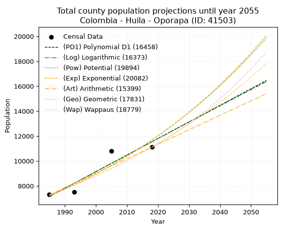
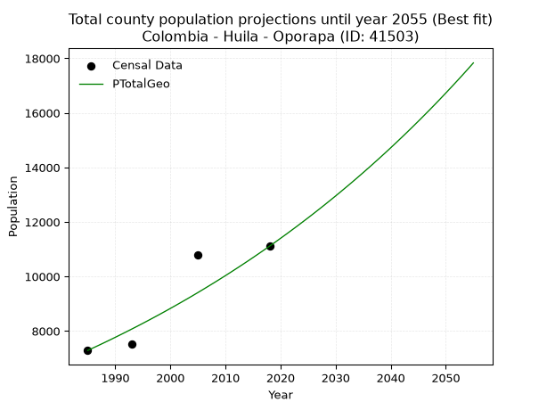
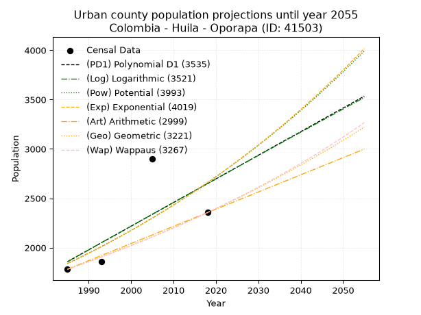
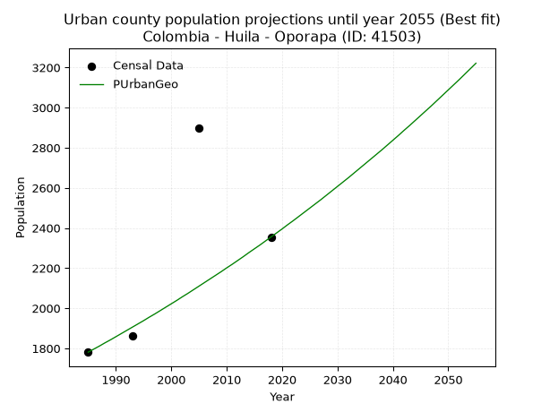
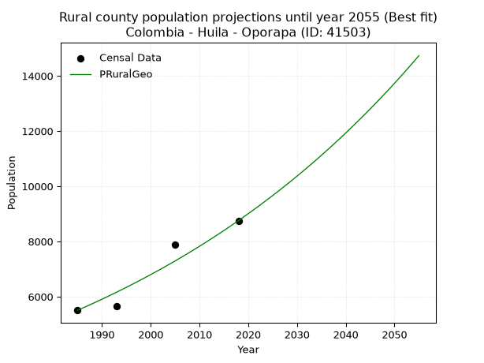

<div align="center">


</div>

# 📜 _“Population and Public Services Demand Projections (PPSD) until Year 2050 for Colombia - Huila - Oporapa (ID: 41503)”_
Keywords: `population` `public-service` `projection` `lineal` `polynomial` `logarithmic` `potential` `exponential` `arithmetic` `geometric` `wappaus` `dane` `colombia` `south-america`

PPSD are analytical estimates used by governments and planners to anticipate future changes in population size, age distribution, and the resulting community needs for utilities, healthcare, education, and infrastructure as sizing future water treatment facilities, electrical grids, and road networks based on spatial growth.

<div align="center">

</img>

</div>


> **General running parameters**: • app_version: _v20260806_. • Python version: _3.14.7_. • Pandas version: _3.0.5_. • NumPy version: _2.5.1_. • Creates, save and include plots into reports (create_plot): _False_. • Projection until year: _2050_. • Process polynomial degree 2 and up: _False_. • Process Wappaus: _True_. • Process Wappaus: _True_. • Set negative values to zero: _True_. • Set infinite values to zero: _True_. • Drop dataset notes: _True_. 
<div align="center">

Maps & GIS Layers: [:earth_americas:Google](http://maps.google.com/maps?q=2.025088271,-75.9951645) [:earth_americas:OSM](https://www.openstreetmap.org/#map=18/2.025088271/-75.9951645&layers=P) [:earth_americas:Bing](https://www.bing.com/maps?cp=2.025088271~-75.9951645&lvl=18) [:earth_americas:Apple](https://maps.apple.com/frame?center=2.025088271%2C-75.9951645&span=0.003%2C0.006) [:earth_americas:GISMobile](https://github.com/rcfdtools/R.GISMobile/blob/main/file/gis/CountyLayer_CO/Readme.md)

</div>


<div align="center">

```geojson
{
  "type": "Feature",
  "geometry": {
    "type": "Point", 
    "coordinates": [-75.9951645, 2.025088271]
  }, 
  "properties": {
    "Name": "Colombia - Huila - Oporapa (ID: 41503)"
  }
}
```

</div>


## 0. Census Data (4 records)

Census data are official statistics collected by a government about the people and housing in a country. They usually include counts of total population, age, sex, race, income, education, and jobs.

📅Global census file: [Population.xlsx](../data/Population.xlsx)

| Source   |   Year |   CountryID | CountryName   |   StateID | StateName   |   CountyID | CountyName   |   PTotal |   PUrban |   PRural |
|:---------|-------:|------------:|:--------------|----------:|:------------|-----------:|:-------------|---------:|---------:|---------:|
| DANE     |   1985 |          57 | Colombia      |        41 | Huila       |      41503 | Oporapa      |     7287 |     1781 |     5506 |
| DANE     |   1993 |          57 | Colombia      |        41 | Huila       |      41503 | Oporapa      |     7511 |     1860 |     5651 |
| DANE     |   2005 |          57 | Colombia      |        41 | Huila       |      41503 | Oporapa      |    10784 |     2897 |     7887 |
| DANE     |   2018 |          57 | Colombia      |        41 | Huila       |      41503 | Oporapa      |    11111 |     2355 |     8756 |

> 🔥Some records could had specific notes about the registered values or the corresponding urban or rural distribution.

📅[SUI-RUPS](https://www.datos.gov.co/Hacienda-y-Cr-dito-P-blico/Registro-nico-de-Prestadores-de-Servicios-P-blicos/4qkq-csdn/about_data) - Local public utility companies: [RUPS.csv](../data/RUPS.csv)

 | SERVICIO       | ESTADO    | NOMBRE                                                                                                           | NIT         | DEPARTAMENTO_DOMICILIO   | MUNICIPIO_DOMICILIO   | DIRECCION                            |   TELEFONO | EMAIL                              | TIPO_PRESTADOR                 | CLASIFICACION                 |
|:---------------|:----------|:-----------------------------------------------------------------------------------------------------------------|:------------|:-------------------------|:----------------------|:-------------------------------------|-----------:|:-----------------------------------|:-------------------------------|:------------------------------|
| ACUEDUCTO      | OPERATIVA | OFICINA DE SERVICIOS PUBLICOS DE ACUEDUCTO, ALCANTARILLADO Y ASEO                                                | 891180179-3 | HUILA                    | OPORAPA               | CALLE 5 N° 6-79 PALACIO MUNICIPAL    |    8790661 | contactenos@oporapa-huila.gov.co   | MUNICIPIO (PRESTACIÓN DIRECTA) | MENOR O IGUAL A 2500 USUARIOS |
| ALCANTARILLADO | OPERATIVA | OFICINA DE SERVICIOS PUBLICOS DE ACUEDUCTO, ALCANTARILLADO Y ASEO                                                | 891180179-3 | HUILA                    | OPORAPA               | CALLE 5 N° 6-79 PALACIO MUNICIPAL    |    8790661 | contactenos@oporapa-huila.gov.co   | MUNICIPIO (PRESTACIÓN DIRECTA) | MENOR O IGUAL A 2500 USUARIOS |
| ACUEDUCTO      | OPERATIVA | JUNTA ADMINISTRADORA DEL SERVICIO DEL ACUEDUCTO REGIONAL SAN ROQUE - ALTO SAN FRANCISCO DEL MUNICIPIO DE OPORAPA | 813005418-7 | HUILA                    | OPORAPA               | CALLE 5 No 6 - 79 EDIFICIO MUNICIPAL |    0000000 | acueductoruralsanroque@gmail.com   | ORGANIZACION AUTORIZADA        | MENOR O IGUAL A 2500 USUARIOS |
| ACUEDUCTO      | OPERATIVA | JUNTA ADMINISTRADORA ACUEDUCTO REGIONAL EL ROBLE EL TABLON CAPARROSA ALTO CAPARROSA Y SANCIRO                    | 813011905-7 | HUILA                    | OPORAPA               | VEREDA CAPARROSA                     |    0000000 | acueductoelrobleeltablon@gmail.com | ORGANIZACION AUTORIZADA        | MENOR O IGUAL A 2500 USUARIOS |

## 1. Total

### 1.1. Coefficients and Parameters

* (PD1) Polynomial Deg 1: 133.0594138900036, -256978.84263347974 (lineal)
* (Log) Logarithmic: 266426.24283594574, -2015934.7568019428
* (Pow) Potential: 29.356812051247438, -92.9548680289705
* (Exp) Exponential: 0.014660914376383944, 1.6530830558625787e-09
* (Art) Arithmetic: Year diff. 2018 - 1985 = 33, Population diff. 11111 - 7287 = 3824, Annual growth = 115.87878787878788
* (Geo) Geometric: Year diff. 2018 - 1985 = 33, Population diff. 11111 - 7287 = 3824, Annual growth % = 0.012865195127556905
* (Wap) Wappaus: i = 1.259688964874311, Condition values only valid for < 200)

<sub>
Wappaus condition values: ['0.00', '1.26', '2.52', '3.78', '5.04', '6.30', '7.56', '8.82', '10.08', '11.34', '12.60', '13.86', '15.12', '16.38', '17.64', '18.90', '20.16', '21.41', '22.67', '23.93', '25.19', '26.45', '27.71', '28.97', '30.23', '31.49', '32.75', '34.01', '35.27', '36.53', '37.79', '39.05', '40.31', '41.57', '42.83', '44.09', '45.35', '46.61', '47.87', '49.13', '50.39', '51.65', '52.91', '54.17', '55.43', '56.69', '57.95', '59.21', '60.47', '61.72', '62.98', '64.24', '65.50', '66.76', '68.02', '69.28', '70.54', '71.80', '73.06', '74.32', '75.58', '76.84', '78.10', '79.36', '80.62', '81.88']
</sub>


### 1.2. Projected Dataset

|   Year |   CountyID |   PTotalPD1 |   PTotalLog |   PTotalPow |   PTotalExp |   PTotalArt |   PTotalGeo |   PTotalWap |
|-------:|-----------:|------------:|------------:|------------:|------------:|------------:|------------:|------------:|
|   1985 |      41503 |        7144 |        7139 |        7192 |        7196 |        7287 |        7287 |        7287 |
|   1986 |      41503 |        7277 |        7274 |        7299 |        7302 |        7403 |        7381 |        7379 |
|   1987 |      41503 |        7410 |        7408 |        7408 |        7410 |        7519 |        7476 |        7473 |
|   1988 |      41503 |        7543 |        7542 |        7518 |        7520 |        7635 |        7572 |        7568 |
|   1989 |      41503 |        7676 |        7676 |        7630 |        7631 |        7751 |        7669 |        7664 |
|   1990 |      41503 |        7809 |        7810 |        7744 |        7743 |        7866 |        7768 |        7761 |
|   1991 |      41503 |        7942 |        7944 |        7859 |        7858 |        7982 |        7868 |        7859 |
|   1992 |      41503 |        8076 |        8077 |        7975 |        7974 |        8098 |        7969 |        7959 |
|   1993 |      41503 |        8209 |        8211 |        8094 |        8092 |        8214 |        8072 |        8060 |
|   1994 |      41503 |        8342 |        8345 |        8214 |        8211 |        8330 |        8175 |        8163 |
|   1995 |      41503 |        8475 |        8478 |        8336 |        8332 |        8446 |        8281 |        8267 |
|   1996 |      41503 |        8608 |        8612 |        8459 |        8455 |        8562 |        8387 |        8372 |
|   1997 |      41503 |        8741 |        8745 |        8584 |        8580 |        8678 |        8495 |        8479 |
|   1998 |      41503 |        8874 |        8879 |        8712 |        8707 |        8793 |        8604 |        8587 |
|   1999 |      41503 |        9007 |        9012 |        8840 |        8836 |        8909 |        8715 |        8696 |
|   2000 |      41503 |        9140 |        9145 |        8971 |        8966 |        9025 |        8827 |        8808 |
|   2001 |      41503 |        9273 |        9278 |        9104 |        9099 |        9141 |        8941 |        8920 |
|   2002 |      41503 |        9406 |        9411 |        9238 |        9233 |        9257 |        9056 |        9035 |
|   2003 |      41503 |        9539 |        9544 |        9375 |        9369 |        9373 |        9172 |        9151 |
|   2004 |      41503 |        9672 |        9677 |        9513 |        9508 |        9489 |        9290 |        9268 |
|   2005 |      41503 |        9805 |        9810 |        9653 |        9648 |        9605 |        9410 |        9387 |
|   2006 |      41503 |        9938 |        9943 |        9796 |        9791 |        9720 |        9531 |        9508 |
|   2007 |      41503 |       10071 |       10076 |        9940 |        9935 |        9836 |        9654 |        9631 |
|   2008 |      41503 |       10204 |       10209 |       10087 |       10082 |        9952 |        9778 |        9756 |
|   2009 |      41503 |       10338 |       10341 |       10235 |       10231 |       10068 |        9903 |        9882 |
|   2010 |      41503 |       10471 |       10474 |       10386 |       10382 |       10184 |       10031 |       10011 |
|   2011 |      41503 |       10604 |       10606 |       10539 |       10535 |       10300 |       10160 |       10141 |
|   2012 |      41503 |       10737 |       10739 |       10693 |       10691 |       10416 |       10291 |       10273 |
|   2013 |      41503 |       10870 |       10871 |       10851 |       10849 |       10532 |       10423 |       10408 |
|   2014 |      41503 |       11003 |       11004 |       11010 |       11009 |       10647 |       10557 |       10544 |
|   2015 |      41503 |       11136 |       11136 |       11172 |       11171 |       10763 |       10693 |       10682 |
|   2016 |      41503 |       11269 |       11268 |       11335 |       11336 |       10879 |       10831 |       10823 |
|   2017 |      41503 |       11402 |       11400 |       11502 |       11504 |       10995 |       10970 |       10966 |
|   2018 |      41503 |       11535 |       11532 |       11670 |       11674 |       11111 |       11111 |       11111 |
|   2019 |      41503 |       11668 |       11664 |       11841 |       11846 |       11227 |       11254 |       11258 |
|   2020 |      41503 |       11801 |       11796 |       12015 |       12021 |       11343 |       11399 |       11408 |
|   2021 |      41503 |       11934 |       11928 |       12190 |       12199 |       11459 |       11545 |       11561 |
|   2022 |      41503 |       12067 |       12060 |       12369 |       12379 |       11575 |       11694 |       11715 |
|   2023 |      41503 |       12200 |       12192 |       12550 |       12562 |       11690 |       11844 |       11873 |
|   2024 |      41503 |       12333 |       12323 |       12733 |       12747 |       11806 |       11997 |       12033 |
|   2025 |      41503 |       12466 |       12455 |       12919 |       12935 |       11922 |       12151 |       12195 |
|   2026 |      41503 |       12600 |       12586 |       13108 |       13127 |       12038 |       12307 |       12361 |
|   2027 |      41503 |       12733 |       12718 |       13299 |       13320 |       12154 |       12466 |       12529 |
|   2028 |      41503 |       12866 |       12849 |       13493 |       13517 |       12270 |       12626 |       12700 |
|   2029 |      41503 |       12999 |       12981 |       13690 |       13717 |       12386 |       12789 |       12874 |
|   2030 |      41503 |       13132 |       13112 |       13889 |       13919 |       12502 |       12953 |       13052 |
|   2031 |      41503 |       13265 |       13243 |       14091 |       14125 |       12617 |       13120 |       13232 |
|   2032 |      41503 |       13398 |       13374 |       14296 |       14333 |       12733 |       13289 |       13415 |
|   2033 |      41503 |       13531 |       13505 |       14504 |       14545 |       12849 |       13459 |       13602 |
|   2034 |      41503 |       13664 |       13636 |       14715 |       14760 |       12965 |       13633 |       13793 |
|   2035 |      41503 |       13797 |       13767 |       14929 |       14978 |       13081 |       13808 |       13986 |
|   2036 |      41503 |       13930 |       13898 |       15146 |       15199 |       13197 |       13986 |       14184 |
|   2037 |      41503 |       14063 |       14029 |       15366 |       15424 |       13313 |       14166 |       14385 |
|   2038 |      41503 |       14196 |       14160 |       15589 |       15651 |       13429 |       14348 |       14590 |
|   2039 |      41503 |       14329 |       14290 |       15815 |       15883 |       13544 |       14532 |       14799 |
|   2040 |      41503 |       14462 |       14421 |       16044 |       16117 |       13660 |       14719 |       15012 |
|   2041 |      41503 |       14595 |       14552 |       16277 |       16355 |       13776 |       14909 |       15229 |
|   2042 |      41503 |       14728 |       14682 |       16513 |       16597 |       13892 |       15101 |       15450 |
|   2043 |      41503 |       14862 |       14813 |       16752 |       16842 |       14008 |       15295 |       15675 |
|   2044 |      41503 |       14995 |       14943 |       16994 |       17091 |       14124 |       15492 |       15906 |
|   2045 |      41503 |       15128 |       15073 |       17240 |       17343 |       14240 |       15691 |       16140 |
|   2046 |      41503 |       15261 |       15204 |       17489 |       17599 |       14356 |       15893 |       16380 |
|   2047 |      41503 |       15394 |       15334 |       17742 |       17859 |       14471 |       16097 |       16625 |
|   2048 |      41503 |       15527 |       15464 |       17998 |       18123 |       14587 |       16304 |       16874 |
|   2049 |      41503 |       15660 |       15594 |       18258 |       18391 |       14703 |       16514 |       17129 |
|   2050 |      41503 |       15793 |       15724 |       18521 |       18662 |       14819 |       16727 |       17390 |
<div align="center">

</img>

</div>


### 1.3. Best fit with absolute and relative error (%)

Relative error puts that difference into context by dividing the absolute error by the true value, creating a unitless ratio or percentage that shows the scale of the mistake.

Absolute and relative error

|   Year | Source   |   CountryID | CountryName   |   StateID | StateName   |   CountyID_x | CountyName   |   PTotal |   PUrban |   PRural |   CountyID_y |   PTotalPD1 |   PTotalLog |   PTotalPow |   PTotalExp |   PTotalArt |   PTotalGeo |   PTotalWap |   PTotalPD1AbsError |   PTotalLogAbsError |   PTotalPowAbsError |   PTotalExpAbsError |   PTotalArtAbsError |   PTotalGeoAbsError |   PTotalWapAbsError |   PTotalPD1RelError |   PTotalLogRelError |   PTotalPowRelError |   PTotalExpRelError |   PTotalArtRelError |   PTotalGeoRelError |   PTotalWapRelError |
|-------:|:---------|------------:|:--------------|----------:|:------------|-------------:|:-------------|---------:|---------:|---------:|-------------:|------------:|------------:|------------:|------------:|------------:|------------:|------------:|--------------------:|--------------------:|--------------------:|--------------------:|--------------------:|--------------------:|--------------------:|--------------------:|--------------------:|--------------------:|--------------------:|--------------------:|--------------------:|--------------------:|
|   1985 | DANE     |          57 | Colombia      |        41 | Huila       |        41503 | Oporapa      |     7287 |     1781 |     5506 |        41503 |        7144 |        7139 |        7192 |        7196 |        7287 |        7287 |        7287 |                 143 |                 148 |                  95 |                  91 |                   0 |                   0 |                   0 |             1.9624  |             2.03101 |             1.30369 |             1.2488  |             0       |             0       |             0       |
|   1993 | DANE     |          57 | Colombia      |        41 | Huila       |        41503 | Oporapa      |     7511 |     1860 |     5651 |        41503 |        8209 |        8211 |        8094 |        8092 |        8214 |        8072 |        8060 |                 698 |                 700 |                 583 |                 581 |                 703 |                 561 |                 549 |             9.29304 |             9.31966 |             7.76195 |             7.73532 |             9.35961 |             7.46905 |             7.30928 |
|   2005 | DANE     |          57 | Colombia      |        41 | Huila       |        41503 | Oporapa      |    10784 |     2897 |     7887 |        41503 |        9805 |        9810 |        9653 |        9648 |        9605 |        9410 |        9387 |                 979 |                 974 |                1131 |                1136 |                1179 |                1374 |                1397 |             9.07826 |             9.0319  |            10.4878  |            10.5341  |            10.9329  |            12.7411  |            12.9544  |
|   2018 | DANE     |          57 | Colombia      |        41 | Huila       |        41503 | Oporapa      |    11111 |     2355 |     8756 |        41503 |       11535 |       11532 |       11670 |       11674 |       11111 |       11111 |       11111 |                 424 |                 421 |                 559 |                 563 |                   0 |                   0 |                   0 |             3.81604 |             3.78904 |             5.03105 |             5.06705 |             0       |             0       |             0       |

Relative error mean

| Method    |   RelError | Best   |
|:----------|-----------:|:-------|
| PTotalPD1 |    6.03743 |        |
| PTotalLog |    6.0429  |        |
| PTotalPow |    6.14611 |        |
| PTotalExp |    6.14632 |        |
| PTotalArt |    5.07312 |        |
| PTotalGeo |    5.05254 | True   |
| PTotalWap |    5.06591 |        |

💙Best method: _**PTotalGeo**_
<div align="center">

</img>

</div>


### 1.4. Fresh water supply demand in liters per capita per day (lpcd)

The fresh water supply demand typically ranges from 100 to 300 liters per capita per day (lpcd) for standard domestic and municipal planning, though absolute survival minimums set by the World Health Organization are as low as 7.5 to 20 liters per day, and total consumption in high-income nations can exceed 400 liters.

> `CZ`: Level in meters above the sea level (masl)<br> `WS`: Fresh water supply demand in liters per capita per day (lpcd or l/h/d)<br> `WSAll`: Zonal fresh water supply demand in liters per second (l/s)<br> `A`: Zonal area in square meters<br> `DP`: Population density (people/hectare or p/ha)

Reference values (RAS Colombia)

|    CZ |   WS |
|------:|-----:|
|  1000 |  120 |
|  2000 |  130 |
| 99999 |  140 |

County shapefile geometry properties and water supply values

|   CountyID |      ATotal |   CZTotal |   WSTotal |
|-----------:|------------:|----------:|----------:|
|      41503 | 1.55821e+08 |   1929.34 |       130 |

Projected values for best method: PTotalGeo

|   CountyID |   Year |   PTotalGeo |   DPTotal |   WSTotal |   WSTotalAll |
|-----------:|-------:|------------:|----------:|----------:|-------------:|
|      41503 |   1985 |        7287 |      0.47 |       130 |      10.9642 |
|      41503 |   1986 |        7381 |      0.47 |       130 |      11.1057 |
|      41503 |   1987 |        7476 |      0.48 |       130 |      11.2486 |
|      41503 |   1988 |        7572 |      0.49 |       130 |      11.3931 |
|      41503 |   1989 |        7669 |      0.49 |       130 |      11.539  |
|      41503 |   1990 |        7768 |      0.5  |       130 |      11.688  |
|      41503 |   1991 |        7868 |      0.5  |       130 |      11.8384 |
|      41503 |   1992 |        7969 |      0.51 |       130 |      11.9904 |
|      41503 |   1993 |        8072 |      0.52 |       130 |      12.1454 |
|      41503 |   1994 |        8175 |      0.52 |       130 |      12.3003 |
|      41503 |   1995 |        8281 |      0.53 |       130 |      12.4598 |
|      41503 |   1996 |        8387 |      0.54 |       130 |      12.6193 |
|      41503 |   1997 |        8495 |      0.55 |       130 |      12.7818 |
|      41503 |   1998 |        8604 |      0.55 |       130 |      12.9458 |
|      41503 |   1999 |        8715 |      0.56 |       130 |      13.1128 |
|      41503 |   2000 |        8827 |      0.57 |       130 |      13.2814 |
|      41503 |   2001 |        8941 |      0.57 |       130 |      13.4529 |
|      41503 |   2002 |        9056 |      0.58 |       130 |      13.6259 |
|      41503 |   2003 |        9172 |      0.59 |       130 |      13.8005 |
|      41503 |   2004 |        9290 |      0.6  |       130 |      13.978  |
|      41503 |   2005 |        9410 |      0.6  |       130 |      14.1586 |
|      41503 |   2006 |        9531 |      0.61 |       130 |      14.3406 |
|      41503 |   2007 |        9654 |      0.62 |       130 |      14.5257 |
|      41503 |   2008 |        9778 |      0.63 |       130 |      14.7123 |
|      41503 |   2009 |        9903 |      0.64 |       130 |      14.9003 |
|      41503 |   2010 |       10031 |      0.64 |       130 |      15.0929 |
|      41503 |   2011 |       10160 |      0.65 |       130 |      15.287  |
|      41503 |   2012 |       10291 |      0.66 |       130 |      15.4841 |
|      41503 |   2013 |       10423 |      0.67 |       130 |      15.6828 |
|      41503 |   2014 |       10557 |      0.68 |       130 |      15.8844 |
|      41503 |   2015 |       10693 |      0.69 |       130 |      16.089  |
|      41503 |   2016 |       10831 |      0.7  |       130 |      16.2966 |
|      41503 |   2017 |       10970 |      0.7  |       130 |      16.5058 |
|      41503 |   2018 |       11111 |      0.71 |       130 |      16.7179 |
|      41503 |   2019 |       11254 |      0.72 |       130 |      16.9331 |
|      41503 |   2020 |       11399 |      0.73 |       130 |      17.1513 |
|      41503 |   2021 |       11545 |      0.74 |       130 |      17.3709 |
|      41503 |   2022 |       11694 |      0.75 |       130 |      17.5951 |
|      41503 |   2023 |       11844 |      0.76 |       130 |      17.8208 |
|      41503 |   2024 |       11997 |      0.77 |       130 |      18.051  |
|      41503 |   2025 |       12151 |      0.78 |       130 |      18.2828 |
|      41503 |   2026 |       12307 |      0.79 |       130 |      18.5175 |
|      41503 |   2027 |       12466 |      0.8  |       130 |      18.7567 |
|      41503 |   2028 |       12626 |      0.81 |       130 |      18.9975 |
|      41503 |   2029 |       12789 |      0.82 |       130 |      19.2427 |
|      41503 |   2030 |       12953 |      0.83 |       130 |      19.4895 |
|      41503 |   2031 |       13120 |      0.84 |       130 |      19.7407 |
|      41503 |   2032 |       13289 |      0.85 |       130 |      19.995  |
|      41503 |   2033 |       13459 |      0.86 |       130 |      20.2508 |
|      41503 |   2034 |       13633 |      0.87 |       130 |      20.5126 |
|      41503 |   2035 |       13808 |      0.89 |       130 |      20.7759 |
|      41503 |   2036 |       13986 |      0.9  |       130 |      21.0437 |
|      41503 |   2037 |       14166 |      0.91 |       130 |      21.3146 |
|      41503 |   2038 |       14348 |      0.92 |       130 |      21.5884 |
|      41503 |   2039 |       14532 |      0.93 |       130 |      21.8653 |
|      41503 |   2040 |       14719 |      0.94 |       130 |      22.1466 |
|      41503 |   2041 |       14909 |      0.96 |       130 |      22.4325 |
|      41503 |   2042 |       15101 |      0.97 |       130 |      22.7214 |
|      41503 |   2043 |       15295 |      0.98 |       130 |      23.0133 |
|      41503 |   2044 |       15492 |      0.99 |       130 |      23.3097 |
|      41503 |   2045 |       15691 |      1.01 |       130 |      23.6091 |
|      41503 |   2046 |       15893 |      1.02 |       130 |      23.9131 |
|      41503 |   2047 |       16097 |      1.03 |       130 |      24.22   |
|      41503 |   2048 |       16304 |      1.05 |       130 |      24.5315 |
|      41503 |   2049 |       16514 |      1.06 |       130 |      24.8475 |
|      41503 |   2050 |       16727 |      1.07 |       130 |      25.1679 |

## 2. Urban

### 2.1. Coefficients and Parameters

* (PD1) Polynomial Deg 1: 23.953030911280894, -45688.800080289606 (lineal)
* (Log) Logarithmic: 48031.12714146956, -362861.7322996072
* (Pow) Potential: 22.390028663346758, -70.5726535463999
* (Exp) Exponential: 0.011168140064401918, 4.3330459644253193e-07
* (Art) Arithmetic: Year diff. 2018 - 1985 = 33, Population diff. 2355 - 1781 = 574, Annual growth = 17.393939393939394
* (Geo) Geometric: Year diff. 2018 - 1985 = 33, Population diff. 2355 - 1781 = 574, Annual growth % = 0.008501562734933632
* (Wap) Wappaus: i = 0.841099583846199, Condition values only valid for < 200)

<sub>
Wappaus condition values: ['0.00', '0.84', '1.68', '2.52', '3.36', '4.21', '5.05', '5.89', '6.73', '7.57', '8.41', '9.25', '10.09', '10.93', '11.78', '12.62', '13.46', '14.30', '15.14', '15.98', '16.82', '17.66', '18.50', '19.35', '20.19', '21.03', '21.87', '22.71', '23.55', '24.39', '25.23', '26.07', '26.92', '27.76', '28.60', '29.44', '30.28', '31.12', '31.96', '32.80', '33.64', '34.49', '35.33', '36.17', '37.01', '37.85', '38.69', '39.53', '40.37', '41.21', '42.05', '42.90', '43.74', '44.58', '45.42', '46.26', '47.10', '47.94', '48.78', '49.62', '50.47', '51.31', '52.15', '52.99', '53.83', '54.67']
</sub>


### 2.2. Projected Dataset

|   Year |   CountyID |   PUrbanPD1 |   PUrbanLog |   PUrbanPow |   PUrbanExp |   PUrbanArt |   PUrbanGeo |   PUrbanWap |
|-------:|-----------:|------------:|------------:|------------:|------------:|------------:|------------:|------------:|
|   1985 |      41503 |        1858 |        1857 |        1838 |        1839 |        1781 |        1781 |        1781 |
|   1986 |      41503 |        1882 |        1881 |        1859 |        1860 |        1798 |        1796 |        1796 |
|   1987 |      41503 |        1906 |        1905 |        1880 |        1880 |        1816 |        1811 |        1811 |
|   1988 |      41503 |        1930 |        1929 |        1901 |        1902 |        1833 |        1827 |        1827 |
|   1989 |      41503 |        1954 |        1953 |        1923 |        1923 |        1851 |        1842 |        1842 |
|   1990 |      41503 |        1978 |        1977 |        1944 |        1945 |        1868 |        1858 |        1858 |
|   1991 |      41503 |        2002 |        2002 |        1966 |        1966 |        1885 |        1874 |        1873 |
|   1992 |      41503 |        2026 |        2026 |        1989 |        1988 |        1903 |        1890 |        1889 |
|   1993 |      41503 |        2050 |        2050 |        2011 |        2011 |        1920 |        1906 |        1905 |
|   1994 |      41503 |        2074 |        2074 |        2034 |        2033 |        1938 |        1922 |        1921 |
|   1995 |      41503 |        2097 |        2098 |        2057 |        2056 |        1955 |        1938 |        1937 |
|   1996 |      41503 |        2121 |        2122 |        2080 |        2079 |        1972 |        1955 |        1954 |
|   1997 |      41503 |        2145 |        2146 |        2103 |        2103 |        1990 |        1971 |        1970 |
|   1998 |      41503 |        2169 |        2170 |        2127 |        2126 |        2007 |        1988 |        1987 |
|   1999 |      41503 |        2193 |        2194 |        2151 |        2150 |        2025 |        2005 |        2004 |
|   2000 |      41503 |        2217 |        2218 |        2175 |        2174 |        2042 |        2022 |        2021 |
|   2001 |      41503 |        2241 |        2242 |        2200 |        2199 |        2059 |        2039 |        2038 |
|   2002 |      41503 |        2265 |        2266 |        2224 |        2223 |        2077 |        2057 |        2055 |
|   2003 |      41503 |        2289 |        2290 |        2249 |        2248 |        2094 |        2074 |        2073 |
|   2004 |      41503 |        2313 |        2314 |        2275 |        2274 |        2111 |        2092 |        2090 |
|   2005 |      41503 |        2337 |        2338 |        2300 |        2299 |        2129 |        2110 |        2108 |
|   2006 |      41503 |        2361 |        2362 |        2326 |        2325 |        2146 |        2128 |        2126 |
|   2007 |      41503 |        2385 |        2386 |        2352 |        2351 |        2164 |        2146 |        2144 |
|   2008 |      41503 |        2409 |        2410 |        2379 |        2377 |        2181 |        2164 |        2162 |
|   2009 |      41503 |        2433 |        2434 |        2405 |        2404 |        2198 |        2182 |        2181 |
|   2010 |      41503 |        2457 |        2458 |        2432 |        2431 |        2216 |        2201 |        2199 |
|   2011 |      41503 |        2481 |        2482 |        2459 |        2458 |        2233 |        2219 |        2218 |
|   2012 |      41503 |        2505 |        2506 |        2487 |        2486 |        2251 |        2238 |        2237 |
|   2013 |      41503 |        2529 |        2529 |        2515 |        2514 |        2268 |        2257 |        2256 |
|   2014 |      41503 |        2553 |        2553 |        2543 |        2542 |        2285 |        2277 |        2276 |
|   2015 |      41503 |        2577 |        2577 |        2571 |        2571 |        2303 |        2296 |        2295 |
|   2016 |      41503 |        2601 |        2601 |        2600 |        2600 |        2320 |        2315 |        2315 |
|   2017 |      41503 |        2624 |        2625 |        2629 |        2629 |        2338 |        2335 |        2335 |
|   2018 |      41503 |        2648 |        2649 |        2658 |        2658 |        2355 |        2355 |        2355 |
|   2019 |      41503 |        2672 |        2672 |        2688 |        2688 |        2372 |        2375 |        2375 |
|   2020 |      41503 |        2696 |        2696 |        2718 |        2718 |        2390 |        2395 |        2396 |
|   2021 |      41503 |        2720 |        2720 |        2748 |        2749 |        2407 |        2416 |        2416 |
|   2022 |      41503 |        2744 |        2744 |        2779 |        2780 |        2425 |        2436 |        2437 |
|   2023 |      41503 |        2768 |        2767 |        2810 |        2811 |        2442 |        2457 |        2459 |
|   2024 |      41503 |        2792 |        2791 |        2841 |        2843 |        2459 |        2478 |        2480 |
|   2025 |      41503 |        2816 |        2815 |        2873 |        2875 |        2477 |        2499 |        2501 |
|   2026 |      41503 |        2840 |        2839 |        2905 |        2907 |        2494 |        2520 |        2523 |
|   2027 |      41503 |        2864 |        2862 |        2937 |        2940 |        2512 |        2541 |        2545 |
|   2028 |      41503 |        2888 |        2886 |        2970 |        2973 |        2529 |        2563 |        2567 |
|   2029 |      41503 |        2912 |        2910 |        3003 |        3006 |        2546 |        2585 |        2590 |
|   2030 |      41503 |        2936 |        2933 |        3036 |        3040 |        2564 |        2607 |        2612 |
|   2031 |      41503 |        2960 |        2957 |        3069 |        3074 |        2581 |        2629 |        2635 |
|   2032 |      41503 |        2984 |        2981 |        3104 |        3108 |        2599 |        2651 |        2659 |
|   2033 |      41503 |        3008 |        3004 |        3138 |        3143 |        2616 |        2674 |        2682 |
|   2034 |      41503 |        3032 |        3028 |        3173 |        3179 |        2633 |        2697 |        2706 |
|   2035 |      41503 |        3056 |        3051 |        3208 |        3214 |        2651 |        2720 |        2729 |
|   2036 |      41503 |        3080 |        3075 |        3243 |        3250 |        2668 |        2743 |        2754 |
|   2037 |      41503 |        3104 |        3099 |        3279 |        3287 |        2685 |        2766 |        2778 |
|   2038 |      41503 |        3127 |        3122 |        3315 |        3324 |        2703 |        2789 |        2803 |
|   2039 |      41503 |        3151 |        3146 |        3352 |        3361 |        2720 |        2813 |        2828 |
|   2040 |      41503 |        3175 |        3169 |        3389 |        3399 |        2738 |        2837 |        2853 |
|   2041 |      41503 |        3199 |        3193 |        3426 |        3437 |        2755 |        2861 |        2878 |
|   2042 |      41503 |        3223 |        3216 |        3464 |        3476 |        2772 |        2886 |        2904 |
|   2043 |      41503 |        3247 |        3240 |        3502 |        3515 |        2790 |        2910 |        2930 |
|   2044 |      41503 |        3271 |        3263 |        3541 |        3554 |        2807 |        2935 |        2956 |
|   2045 |      41503 |        3295 |        3287 |        3580 |        3594 |        2825 |        2960 |        2983 |
|   2046 |      41503 |        3319 |        3310 |        3619 |        3634 |        2842 |        2985 |        3010 |
|   2047 |      41503 |        3343 |        3334 |        3659 |        3675 |        2859 |        3010 |        3037 |
|   2048 |      41503 |        3367 |        3357 |        3699 |        3716 |        2877 |        3036 |        3065 |
|   2049 |      41503 |        3391 |        3381 |        3740 |        3758 |        2894 |        3062 |        3093 |
|   2050 |      41503 |        3415 |        3404 |        3781 |        3800 |        2912 |        3088 |        3121 |
<div align="center">

</img>

</div>


### 2.3. Best fit with absolute and relative error (%)

Relative error puts that difference into context by dividing the absolute error by the true value, creating a unitless ratio or percentage that shows the scale of the mistake.

Absolute and relative error

|   Year | Source   |   CountryID | CountryName   |   StateID | StateName   |   CountyID_x | CountyName   |   PTotal |   PUrban |   PRural |   CountyID_y |   PUrbanPD1 |   PUrbanLog |   PUrbanPow |   PUrbanExp |   PUrbanArt |   PUrbanGeo |   PUrbanWap |   PUrbanPD1AbsError |   PUrbanLogAbsError |   PUrbanPowAbsError |   PUrbanExpAbsError |   PUrbanArtAbsError |   PUrbanGeoAbsError |   PUrbanWapAbsError |   PUrbanPD1RelError |   PUrbanLogRelError |   PUrbanPowRelError |   PUrbanExpRelError |   PUrbanArtRelError |   PUrbanGeoRelError |   PUrbanWapRelError |
|-------:|:---------|------------:|:--------------|----------:|:------------|-------------:|:-------------|---------:|---------:|---------:|-------------:|------------:|------------:|------------:|------------:|------------:|------------:|------------:|--------------------:|--------------------:|--------------------:|--------------------:|--------------------:|--------------------:|--------------------:|--------------------:|--------------------:|--------------------:|--------------------:|--------------------:|--------------------:|--------------------:|
|   1985 | DANE     |          57 | Colombia      |        41 | Huila       |        41503 | Oporapa      |     7287 |     1781 |     5506 |        41503 |        1858 |        1857 |        1838 |        1839 |        1781 |        1781 |        1781 |                  77 |                  76 |                  57 |                  58 |                   0 |                   0 |                   0 |             4.32341 |             4.26727 |             3.20045 |             3.2566  |             0       |             0       |             0       |
|   1993 | DANE     |          57 | Colombia      |        41 | Huila       |        41503 | Oporapa      |     7511 |     1860 |     5651 |        41503 |        2050 |        2050 |        2011 |        2011 |        1920 |        1906 |        1905 |                 190 |                 190 |                 151 |                 151 |                  60 |                  46 |                  45 |            10.2151  |            10.2151  |             8.11828 |             8.11828 |             3.22581 |             2.47312 |             2.41935 |
|   2005 | DANE     |          57 | Colombia      |        41 | Huila       |        41503 | Oporapa      |    10784 |     2897 |     7887 |        41503 |        2337 |        2338 |        2300 |        2299 |        2129 |        2110 |        2108 |                 560 |                 559 |                 597 |                 598 |                 768 |                 787 |                 789 |            19.3303  |            19.2958  |            20.6075  |            20.642   |            26.5102  |            27.166   |            27.2351  |
|   2018 | DANE     |          57 | Colombia      |        41 | Huila       |        41503 | Oporapa      |    11111 |     2355 |     8756 |        41503 |        2648 |        2649 |        2658 |        2658 |        2355 |        2355 |        2355 |                 293 |                 294 |                 303 |                 303 |                   0 |                   0 |                   0 |            12.4416  |            12.4841  |            12.8662  |            12.8662  |             0       |             0       |             0       |

Relative error mean

| Method    |   RelError | Best   |
|:----------|-----------:|:-------|
| PUrbanPD1 |   11.5776  |        |
| PUrbanLog |   11.5656  |        |
| PUrbanPow |   11.1981  |        |
| PUrbanExp |   11.2208  |        |
| PUrbanArt |    7.434   |        |
| PUrbanGeo |    7.40979 | True   |
| PUrbanWap |    7.41361 |        |

💙Best method: _**PUrbanGeo**_
<div align="center">

</img>

</div>


### 2.4. Fresh water supply demand in liters per capita per day (lpcd)

The fresh water supply demand typically ranges from 100 to 300 liters per capita per day (lpcd) for standard domestic and municipal planning, though absolute survival minimums set by the World Health Organization are as low as 7.5 to 20 liters per day, and total consumption in high-income nations can exceed 400 liters.

> `CZ`: Level in meters above the sea level (masl)<br> `WS`: Fresh water supply demand in liters per capita per day (lpcd or l/h/d)<br> `WSAll`: Zonal fresh water supply demand in liters per second (l/s)<br> `A`: Zonal area in square meters<br> `DP`: Population density (people/hectare or p/ha)

Reference values (RAS Colombia)

|    CZ |   WS |
|------:|-----:|
|  1000 |  120 |
|  2000 |  130 |
| 99999 |  140 |

County shapefile geometry properties and water supply values

|   CountyID |   AUrban |   CZUrban |   WSUrban |
|-----------:|---------:|----------:|----------:|
|      41503 |   636888 |   1411.63 |       130 |

Projected values for best method: PUrbanGeo

|   CountyID |   Year |   PUrbanGeo |   DPUrban |   WSUrban |   WSUrbanAll |
|-----------:|-------:|------------:|----------:|----------:|-------------:|
|      41503 |   1985 |        1781 |     27.96 |       130 |      2.67975 |
|      41503 |   1986 |        1796 |     28.2  |       130 |      2.70231 |
|      41503 |   1987 |        1811 |     28.44 |       130 |      2.72488 |
|      41503 |   1988 |        1827 |     28.69 |       130 |      2.74896 |
|      41503 |   1989 |        1842 |     28.92 |       130 |      2.77153 |
|      41503 |   1990 |        1858 |     29.17 |       130 |      2.7956  |
|      41503 |   1991 |        1874 |     29.42 |       130 |      2.81968 |
|      41503 |   1992 |        1890 |     29.68 |       130 |      2.84375 |
|      41503 |   1993 |        1906 |     29.93 |       130 |      2.86782 |
|      41503 |   1994 |        1922 |     30.18 |       130 |      2.8919  |
|      41503 |   1995 |        1938 |     30.43 |       130 |      2.91597 |
|      41503 |   1996 |        1955 |     30.7  |       130 |      2.94155 |
|      41503 |   1997 |        1971 |     30.95 |       130 |      2.96563 |
|      41503 |   1998 |        1988 |     31.21 |       130 |      2.9912  |
|      41503 |   1999 |        2005 |     31.48 |       130 |      3.01678 |
|      41503 |   2000 |        2022 |     31.75 |       130 |      3.04236 |
|      41503 |   2001 |        2039 |     32.02 |       130 |      3.06794 |
|      41503 |   2002 |        2057 |     32.3  |       130 |      3.09502 |
|      41503 |   2003 |        2074 |     32.56 |       130 |      3.1206  |
|      41503 |   2004 |        2092 |     32.85 |       130 |      3.14769 |
|      41503 |   2005 |        2110 |     33.13 |       130 |      3.17477 |
|      41503 |   2006 |        2128 |     33.41 |       130 |      3.20185 |
|      41503 |   2007 |        2146 |     33.7  |       130 |      3.22894 |
|      41503 |   2008 |        2164 |     33.98 |       130 |      3.25602 |
|      41503 |   2009 |        2182 |     34.26 |       130 |      3.2831  |
|      41503 |   2010 |        2201 |     34.56 |       130 |      3.31169 |
|      41503 |   2011 |        2219 |     34.84 |       130 |      3.33877 |
|      41503 |   2012 |        2238 |     35.14 |       130 |      3.36736 |
|      41503 |   2013 |        2257 |     35.44 |       130 |      3.39595 |
|      41503 |   2014 |        2277 |     35.75 |       130 |      3.42604 |
|      41503 |   2015 |        2296 |     36.05 |       130 |      3.45463 |
|      41503 |   2016 |        2315 |     36.35 |       130 |      3.48322 |
|      41503 |   2017 |        2335 |     36.66 |       130 |      3.51331 |
|      41503 |   2018 |        2355 |     36.98 |       130 |      3.5434  |
|      41503 |   2019 |        2375 |     37.29 |       130 |      3.5735  |
|      41503 |   2020 |        2395 |     37.6  |       130 |      3.60359 |
|      41503 |   2021 |        2416 |     37.93 |       130 |      3.63519 |
|      41503 |   2022 |        2436 |     38.25 |       130 |      3.66528 |
|      41503 |   2023 |        2457 |     38.58 |       130 |      3.69687 |
|      41503 |   2024 |        2478 |     38.91 |       130 |      3.72847 |
|      41503 |   2025 |        2499 |     39.24 |       130 |      3.76007 |
|      41503 |   2026 |        2520 |     39.57 |       130 |      3.79167 |
|      41503 |   2027 |        2541 |     39.9  |       130 |      3.82326 |
|      41503 |   2028 |        2563 |     40.24 |       130 |      3.85637 |
|      41503 |   2029 |        2585 |     40.59 |       130 |      3.88947 |
|      41503 |   2030 |        2607 |     40.93 |       130 |      3.92257 |
|      41503 |   2031 |        2629 |     41.28 |       130 |      3.95567 |
|      41503 |   2032 |        2651 |     41.62 |       130 |      3.98877 |
|      41503 |   2033 |        2674 |     41.99 |       130 |      4.02338 |
|      41503 |   2034 |        2697 |     42.35 |       130 |      4.05799 |
|      41503 |   2035 |        2720 |     42.71 |       130 |      4.09259 |
|      41503 |   2036 |        2743 |     43.07 |       130 |      4.1272  |
|      41503 |   2037 |        2766 |     43.43 |       130 |      4.16181 |
|      41503 |   2038 |        2789 |     43.79 |       130 |      4.19641 |
|      41503 |   2039 |        2813 |     44.17 |       130 |      4.23252 |
|      41503 |   2040 |        2837 |     44.54 |       130 |      4.26863 |
|      41503 |   2041 |        2861 |     44.92 |       130 |      4.30475 |
|      41503 |   2042 |        2886 |     45.31 |       130 |      4.34236 |
|      41503 |   2043 |        2910 |     45.69 |       130 |      4.37847 |
|      41503 |   2044 |        2935 |     46.08 |       130 |      4.41609 |
|      41503 |   2045 |        2960 |     46.48 |       130 |      4.4537  |
|      41503 |   2046 |        2985 |     46.87 |       130 |      4.49132 |
|      41503 |   2047 |        3010 |     47.26 |       130 |      4.52894 |
|      41503 |   2048 |        3036 |     47.67 |       130 |      4.56806 |
|      41503 |   2049 |        3062 |     48.08 |       130 |      4.60718 |
|      41503 |   2050 |        3088 |     48.49 |       130 |      4.6463  |

## 3. Rural

### 3.1. Coefficients and Parameters

* (PD1) Polynomial Deg 1: 109.10638297872264, -211290.04255318997 (lineal)
* (Log) Logarithmic: 218395.11569447632, -1653073.0245023363
* (Pow) Potential: 31.350611331025597, -99.65770076815483
* (Exp) Exponential: 0.01566089791291684, 1.6922375443501384e-10
* (Art) Arithmetic: Year diff. 2018 - 1985 = 33, Population diff. 8756 - 5506 = 3250, Annual growth = 98.48484848484848
* (Geo) Geometric: Year diff. 2018 - 1985 = 33, Population diff. 8756 - 5506 = 3250, Annual growth % = 0.014156871860424802
* (Wap) Wappaus: i = 1.3810804723720163, Condition values only valid for < 200)

<sub>
Wappaus condition values: ['0.00', '1.38', '2.76', '4.14', '5.52', '6.91', '8.29', '9.67', '11.05', '12.43', '13.81', '15.19', '16.57', '17.95', '19.34', '20.72', '22.10', '23.48', '24.86', '26.24', '27.62', '29.00', '30.38', '31.76', '33.15', '34.53', '35.91', '37.29', '38.67', '40.05', '41.43', '42.81', '44.19', '45.58', '46.96', '48.34', '49.72', '51.10', '52.48', '53.86', '55.24', '56.62', '58.01', '59.39', '60.77', '62.15', '63.53', '64.91', '66.29', '67.67', '69.05', '70.44', '71.82', '73.20', '74.58', '75.96', '77.34', '78.72', '80.10', '81.48', '82.86', '84.25', '85.63', '87.01', '88.39', '89.77']
</sub>


### 3.2. Projected Dataset

|   Year |   CountyID |   PRuralPD1 |   PRuralLog |   PRuralPow |   PRuralExp |   PRuralArt |   PRuralGeo |   PRuralWap |
|-------:|-----------:|------------:|------------:|------------:|------------:|------------:|------------:|------------:|
|   1985 |      41503 |        5286 |        5283 |        5359 |        5362 |        5506 |        5506 |        5506 |
|   1986 |      41503 |        5395 |        5393 |        5445 |        5447 |        5604 |        5584 |        5583 |
|   1987 |      41503 |        5504 |        5503 |        5531 |        5533 |        5703 |        5663 |        5660 |
|   1988 |      41503 |        5613 |        5613 |        5619 |        5620 |        5801 |        5743 |        5739 |
|   1989 |      41503 |        5723 |        5722 |        5708 |        5709 |        5900 |        5824 |        5819 |
|   1990 |      41503 |        5832 |        5832 |        5799 |        5799 |        5998 |        5907 |        5900 |
|   1991 |      41503 |        5941 |        5942 |        5891 |        5890 |        6097 |        5991 |        5982 |
|   1992 |      41503 |        6050 |        6052 |        5985 |        5983 |        6195 |        6075 |        6065 |
|   1993 |      41503 |        6159 |        6161 |        6080 |        6078 |        6294 |        6161 |        6150 |
|   1994 |      41503 |        6268 |        6271 |        6176 |        6174 |        6392 |        6249 |        6236 |
|   1995 |      41503 |        6377 |        6380 |        6274 |        6271 |        6491 |        6337 |        6323 |
|   1996 |      41503 |        6486 |        6490 |        6373 |        6370 |        6589 |        6427 |        6411 |
|   1997 |      41503 |        6595 |        6599 |        6474 |        6471 |        6688 |        6518 |        6501 |
|   1998 |      41503 |        6705 |        6708 |        6576 |        6573 |        6786 |        6610 |        6592 |
|   1999 |      41503 |        6814 |        6818 |        6680 |        6676 |        6885 |        6704 |        6685 |
|   2000 |      41503 |        6923 |        6927 |        6786 |        6782 |        6983 |        6799 |        6778 |
|   2001 |      41503 |        7032 |        7036 |        6893 |        6889 |        7082 |        6895 |        6874 |
|   2002 |      41503 |        7141 |        7145 |        7002 |        6998 |        7180 |        6992 |        6971 |
|   2003 |      41503 |        7250 |        7254 |        7112 |        7108 |        7279 |        7091 |        7069 |
|   2004 |      41503 |        7359 |        7363 |        7225 |        7220 |        7377 |        7192 |        7169 |
|   2005 |      41503 |        7468 |        7472 |        7338 |        7334 |        7476 |        7294 |        7271 |
|   2006 |      41503 |        7577 |        7581 |        7454 |        7450 |        7574 |        7397 |        7374 |
|   2007 |      41503 |        7686 |        7690 |        7571 |        7568 |        7673 |        7502 |        7479 |
|   2008 |      41503 |        7796 |        7799 |        7691 |        7687 |        7771 |        7608 |        7585 |
|   2009 |      41503 |        7905 |        7908 |        7812 |        7808 |        7870 |        7715 |        7694 |
|   2010 |      41503 |        8014 |        8016 |        7934 |        7932 |        7968 |        7825 |        7804 |
|   2011 |      41503 |        8123 |        8125 |        8059 |        8057 |        8067 |        7935 |        7916 |
|   2012 |      41503 |        8232 |        8233 |        8186 |        8184 |        8165 |        8048 |        8030 |
|   2013 |      41503 |        8341 |        8342 |        8314 |        8313 |        8264 |        8162 |        8146 |
|   2014 |      41503 |        8450 |        8450 |        8445 |        8444 |        8362 |        8277 |        8263 |
|   2015 |      41503 |        8559 |        8559 |        8577 |        8578 |        8461 |        8394 |        8383 |
|   2016 |      41503 |        8668 |        8667 |        8712 |        8713 |        8559 |        8513 |        8505 |
|   2017 |      41503 |        8778 |        8775 |        8848 |        8851 |        8658 |        8634 |        8630 |
|   2018 |      41503 |        8887 |        8884 |        8987 |        8990 |        8756 |        8756 |        8756 |
|   2019 |      41503 |        8996 |        8992 |        9127 |        9132 |        8854 |        8880 |        8885 |
|   2020 |      41503 |        9105 |        9100 |        9270 |        9276 |        8953 |        9006 |        9016 |
|   2021 |      41503 |        9214 |        9208 |        9415 |        9423 |        9051 |        9133 |        9149 |
|   2022 |      41503 |        9323 |        9316 |        9562 |        9571 |        9150 |        9262 |        9285 |
|   2023 |      41503 |        9432 |        9424 |        9712 |        9722 |        9248 |        9394 |        9424 |
|   2024 |      41503 |        9541 |        9532 |        9863 |        9876 |        9347 |        9527 |        9565 |
|   2025 |      41503 |        9650 |        9640 |       10017 |       10032 |        9445 |        9661 |        9708 |
|   2026 |      41503 |        9759 |        9748 |       10173 |       10190 |        9544 |        9798 |        9855 |
|   2027 |      41503 |        9869 |        9856 |       10332 |       10351 |        9642 |        9937 |       10004 |
|   2028 |      41503 |        9978 |        9963 |       10493 |       10514 |        9741 |       10078 |       10157 |
|   2029 |      41503 |       10087 |       10071 |       10656 |       10680 |        9839 |       10220 |       10312 |
|   2030 |      41503 |       10196 |       10179 |       10822 |       10849 |        9938 |       10365 |       10471 |
|   2031 |      41503 |       10305 |       10286 |       10991 |       11020 |       10036 |       10512 |       10632 |
|   2032 |      41503 |       10414 |       10394 |       11162 |       11194 |       10135 |       10661 |       10797 |
|   2033 |      41503 |       10523 |       10501 |       11335 |       11371 |       10233 |       10811 |       10966 |
|   2034 |      41503 |       10632 |       10608 |       11511 |       11550 |       10332 |       10964 |       11138 |
|   2035 |      41503 |       10741 |       10716 |       11690 |       11733 |       10430 |       11120 |       11313 |
|   2036 |      41503 |       10851 |       10823 |       11871 |       11918 |       10529 |       11277 |       11492 |
|   2037 |      41503 |       10960 |       10930 |       12056 |       12106 |       10627 |       11437 |       11676 |
|   2038 |      41503 |       11069 |       11038 |       12243 |       12297 |       10726 |       11599 |       11863 |
|   2039 |      41503 |       11178 |       11145 |       12432 |       12491 |       10824 |       11763 |       12054 |
|   2040 |      41503 |       11287 |       11252 |       12625 |       12688 |       10923 |       11929 |       12249 |
|   2041 |      41503 |       11396 |       11359 |       12820 |       12889 |       11021 |       12098 |       12449 |
|   2042 |      41503 |       11505 |       11466 |       13019 |       13092 |       11120 |       12270 |       12654 |
|   2043 |      41503 |       11614 |       11573 |       13220 |       13299 |       11218 |       12443 |       12863 |
|   2044 |      41503 |       11723 |       11680 |       13425 |       13509 |       11317 |       12619 |       13077 |
|   2045 |      41503 |       11833 |       11786 |       13632 |       13722 |       11415 |       12798 |       13296 |
|   2046 |      41503 |       11942 |       11893 |       13843 |       13938 |       11514 |       12979 |       13521 |
|   2047 |      41503 |       12051 |       12000 |       14056 |       14158 |       11612 |       13163 |       13750 |
|   2048 |      41503 |       12160 |       12107 |       14273 |       14382 |       11711 |       13349 |       13986 |
|   2049 |      41503 |       12269 |       12213 |       14493 |       14609 |       11809 |       13538 |       14227 |
|   2050 |      41503 |       12378 |       12320 |       14717 |       14839 |       11908 |       13730 |       14474 |
<div align="center">

</img>

</div>


### 3.3. Best fit with absolute and relative error (%)

Relative error puts that difference into context by dividing the absolute error by the true value, creating a unitless ratio or percentage that shows the scale of the mistake.

Absolute and relative error

|   Year | Source   |   CountryID | CountryName   |   StateID | StateName   |   CountyID_x | CountyName   |   PTotal |   PUrban |   PRural |   CountyID_y |   PRuralPD1 |   PRuralLog |   PRuralPow |   PRuralExp |   PRuralArt |   PRuralGeo |   PRuralWap |   PRuralPD1AbsError |   PRuralLogAbsError |   PRuralPowAbsError |   PRuralExpAbsError |   PRuralArtAbsError |   PRuralGeoAbsError |   PRuralWapAbsError |   PRuralPD1RelError |   PRuralLogRelError |   PRuralPowRelError |   PRuralExpRelError |   PRuralArtRelError |   PRuralGeoRelError |   PRuralWapRelError |
|-------:|:---------|------------:|:--------------|----------:|:------------|-------------:|:-------------|---------:|---------:|---------:|-------------:|------------:|------------:|------------:|------------:|------------:|------------:|------------:|--------------------:|--------------------:|--------------------:|--------------------:|--------------------:|--------------------:|--------------------:|--------------------:|--------------------:|--------------------:|--------------------:|--------------------:|--------------------:|--------------------:|
|   1985 | DANE     |          57 | Colombia      |        41 | Huila       |        41503 | Oporapa      |     7287 |     1781 |     5506 |        41503 |        5286 |        5283 |        5359 |        5362 |        5506 |        5506 |        5506 |                 220 |                 223 |                 147 |                 144 |                   0 |                   0 |                   0 |             3.99564 |             4.05013 |             2.66981 |             2.61533 |             0       |             0       |             0       |
|   1993 | DANE     |          57 | Colombia      |        41 | Huila       |        41503 | Oporapa      |     7511 |     1860 |     5651 |        41503 |        6159 |        6161 |        6080 |        6078 |        6294 |        6161 |        6150 |                 508 |                 510 |                 429 |                 427 |                 643 |                 510 |                 499 |             8.98956 |             9.02495 |             7.59158 |             7.55618 |            11.3785  |             9.02495 |             8.8303  |
|   2005 | DANE     |          57 | Colombia      |        41 | Huila       |        41503 | Oporapa      |    10784 |     2897 |     7887 |        41503 |        7468 |        7472 |        7338 |        7334 |        7476 |        7294 |        7271 |                 419 |                 415 |                 549 |                 553 |                 411 |                 593 |                 616 |             5.31254 |             5.26182 |             6.96082 |             7.01154 |             5.21111 |             7.5187  |             7.81032 |
|   2018 | DANE     |          57 | Colombia      |        41 | Huila       |        41503 | Oporapa      |    11111 |     2355 |     8756 |        41503 |        8887 |        8884 |        8987 |        8990 |        8756 |        8756 |        8756 |                 131 |                 128 |                 231 |                 234 |                   0 |                   0 |                   0 |             1.49612 |             1.46185 |             2.63819 |             2.67245 |             0       |             0       |             0       |

Relative error mean

| Method    |   RelError | Best   |
|:----------|-----------:|:-------|
| PRuralPD1 |    4.94846 |        |
| PRuralLog |    4.94969 |        |
| PRuralPow |    4.9651  |        |
| PRuralExp |    4.96388 |        |
| PRuralArt |    4.14741 |        |
| PRuralGeo |    4.13591 | True   |
| PRuralWap |    4.16015 |        |

💙Best method: _**PRuralGeo**_
<div align="center">

</img>

</div>


### 3.4. Fresh water supply demand in liters per capita per day (lpcd)

The fresh water supply demand typically ranges from 100 to 300 liters per capita per day (lpcd) for standard domestic and municipal planning, though absolute survival minimums set by the World Health Organization are as low as 7.5 to 20 liters per day, and total consumption in high-income nations can exceed 400 liters.

> `CZ`: Level in meters above the sea level (masl)<br> `WS`: Fresh water supply demand in liters per capita per day (lpcd or l/h/d)<br> `WSAll`: Zonal fresh water supply demand in liters per second (l/s)<br> `A`: Zonal area in square meters<br> `DP`: Population density (people/hectare or p/ha)

Reference values (RAS Colombia)

|    CZ |   WS |
|------:|-----:|
|  1000 |  120 |
|  2000 |  130 |
| 99999 |  140 |

County shapefile geometry properties and water supply values

|   CountyID |      ARural |   CZRural |   WSRural |
|-----------:|------------:|----------:|----------:|
|      41503 | 1.55184e+08 |   1931.42 |       130 |

Projected values for best method: PRuralGeo

|   CountyID |   Year |   PRuralGeo |   DPRural |   WSRural |   WSRuralAll |
|-----------:|-------:|------------:|----------:|----------:|-------------:|
|      41503 |   1985 |        5506 |      0.35 |       130 |      8.28449 |
|      41503 |   1986 |        5584 |      0.36 |       130 |      8.40185 |
|      41503 |   1987 |        5663 |      0.36 |       130 |      8.52072 |
|      41503 |   1988 |        5743 |      0.37 |       130 |      8.64109 |
|      41503 |   1989 |        5824 |      0.38 |       130 |      8.76296 |
|      41503 |   1990 |        5907 |      0.38 |       130 |      8.88785 |
|      41503 |   1991 |        5991 |      0.39 |       130 |      9.01424 |
|      41503 |   1992 |        6075 |      0.39 |       130 |      9.14062 |
|      41503 |   1993 |        6161 |      0.4  |       130 |      9.27002 |
|      41503 |   1994 |        6249 |      0.4  |       130 |      9.40243 |
|      41503 |   1995 |        6337 |      0.41 |       130 |      9.53484 |
|      41503 |   1996 |        6427 |      0.41 |       130 |      9.67025 |
|      41503 |   1997 |        6518 |      0.42 |       130 |      9.80718 |
|      41503 |   1998 |        6610 |      0.43 |       130 |      9.9456  |
|      41503 |   1999 |        6704 |      0.43 |       130 |     10.087   |
|      41503 |   2000 |        6799 |      0.44 |       130 |     10.23    |
|      41503 |   2001 |        6895 |      0.44 |       130 |     10.3744  |
|      41503 |   2002 |        6992 |      0.45 |       130 |     10.5204  |
|      41503 |   2003 |        7091 |      0.46 |       130 |     10.6693  |
|      41503 |   2004 |        7192 |      0.46 |       130 |     10.8213  |
|      41503 |   2005 |        7294 |      0.47 |       130 |     10.9748  |
|      41503 |   2006 |        7397 |      0.48 |       130 |     11.1297  |
|      41503 |   2007 |        7502 |      0.48 |       130 |     11.2877  |
|      41503 |   2008 |        7608 |      0.49 |       130 |     11.4472  |
|      41503 |   2009 |        7715 |      0.5  |       130 |     11.6082  |
|      41503 |   2010 |        7825 |      0.5  |       130 |     11.7737  |
|      41503 |   2011 |        7935 |      0.51 |       130 |     11.9392  |
|      41503 |   2012 |        8048 |      0.52 |       130 |     12.1093  |
|      41503 |   2013 |        8162 |      0.53 |       130 |     12.2808  |
|      41503 |   2014 |        8277 |      0.53 |       130 |     12.4538  |
|      41503 |   2015 |        8394 |      0.54 |       130 |     12.6299  |
|      41503 |   2016 |        8513 |      0.55 |       130 |     12.8089  |
|      41503 |   2017 |        8634 |      0.56 |       130 |     12.991   |
|      41503 |   2018 |        8756 |      0.56 |       130 |     13.1745  |
|      41503 |   2019 |        8880 |      0.57 |       130 |     13.3611  |
|      41503 |   2020 |        9006 |      0.58 |       130 |     13.5507  |
|      41503 |   2021 |        9133 |      0.59 |       130 |     13.7418  |
|      41503 |   2022 |        9262 |      0.6  |       130 |     13.9359  |
|      41503 |   2023 |        9394 |      0.61 |       130 |     14.1345  |
|      41503 |   2024 |        9527 |      0.61 |       130 |     14.3346  |
|      41503 |   2025 |        9661 |      0.62 |       130 |     14.5362  |
|      41503 |   2026 |        9798 |      0.63 |       130 |     14.7424  |
|      41503 |   2027 |        9937 |      0.64 |       130 |     14.9515  |
|      41503 |   2028 |       10078 |      0.65 |       130 |     15.1637  |
|      41503 |   2029 |       10220 |      0.66 |       130 |     15.3773  |
|      41503 |   2030 |       10365 |      0.67 |       130 |     15.5955  |
|      41503 |   2031 |       10512 |      0.68 |       130 |     15.8167  |
|      41503 |   2032 |       10661 |      0.69 |       130 |     16.0409  |
|      41503 |   2033 |       10811 |      0.7  |       130 |     16.2666  |
|      41503 |   2034 |       10964 |      0.71 |       130 |     16.4968  |
|      41503 |   2035 |       11120 |      0.72 |       130 |     16.7315  |
|      41503 |   2036 |       11277 |      0.73 |       130 |     16.9677  |
|      41503 |   2037 |       11437 |      0.74 |       130 |     17.2084  |
|      41503 |   2038 |       11599 |      0.75 |       130 |     17.4522  |
|      41503 |   2039 |       11763 |      0.76 |       130 |     17.699   |
|      41503 |   2040 |       11929 |      0.77 |       130 |     17.9487  |
|      41503 |   2041 |       12098 |      0.78 |       130 |     18.203   |
|      41503 |   2042 |       12270 |      0.79 |       130 |     18.4618  |
|      41503 |   2043 |       12443 |      0.8  |       130 |     18.7221  |
|      41503 |   2044 |       12619 |      0.81 |       130 |     18.9869  |
|      41503 |   2045 |       12798 |      0.82 |       130 |     19.2563  |
|      41503 |   2046 |       12979 |      0.84 |       130 |     19.5286  |
|      41503 |   2047 |       13163 |      0.85 |       130 |     19.8054  |
|      41503 |   2048 |       13349 |      0.86 |       130 |     20.0853  |
|      41503 |   2049 |       13538 |      0.87 |       130 |     20.3697  |
|      41503 |   2050 |       13730 |      0.88 |       130 |     20.6586  |

#

<div align="center"><br><sub>Share this research</sub></div><br>

<sub>**APPS & TOOLS & CONTENT DISCLAIMER**: • NO WARRANTY - This content and software is provided by <a href="https://github.com/rcfdtools" target="_blank">github.com/rcfdtools</a> "as is", without any express or implied warranty, including warranties of merchantability, fitness for a particular purpose, or non-infringement. There is no guarantee that the software will be error-free or operate without interruption. • LIMITATION OF LIABILITY - Neither the authors nor copyright holders will be liable for claims or damages arising from the software or its use. You are responsible for determining if the software is appropriate for your use and assume all associated risks, including errors, legal compliance, and data loss. • NO PROFESSIONAL ADVICE - The software provides general information and does not offer professional advice. It should not replace consultation with professional advisors. [Clauses and global license for rcfdtools use.](https://github.com/rcfdtools/rcfdtools/blob/main/LICENSE.md)</sub>

| [:house: Home](Readme.md)  | [:beginner: Help / Collab](https://github.com/rcfdtools/R.HydroTools/discussions/31) |
|----------------------------|-------------------------------------------------------------------------------------------|