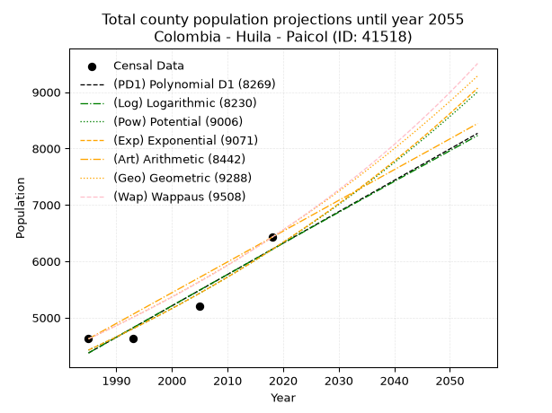
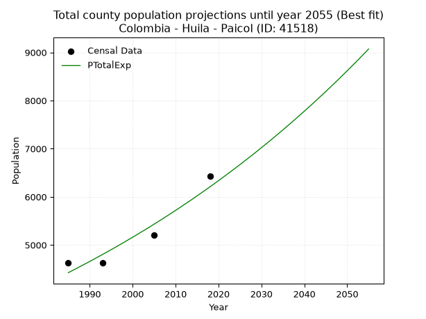
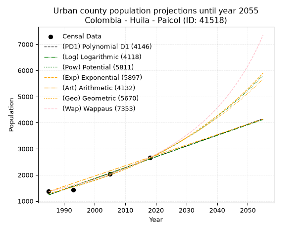
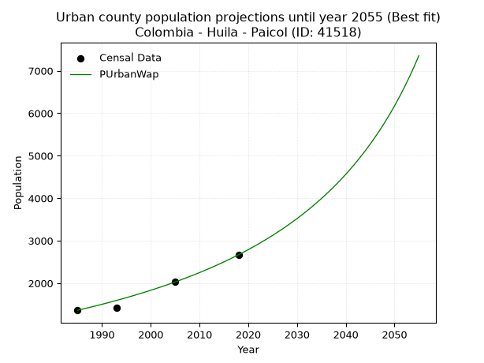
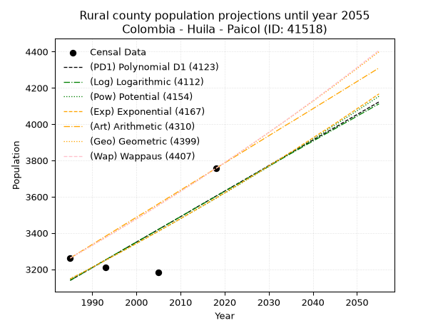
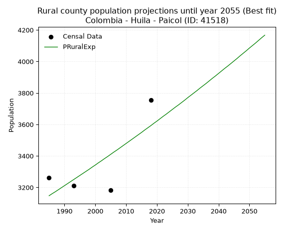

<div align="center">


</div>

# _“Population and Public Services Demand Projections (PPSD) until Year 2050 for Colombia - Huila - Paicol (ID: 41518)”_
Keywords: `population` `public-service` `projection` `lineal` `polynomial` `logarithmic` `potential` `exponential` `arithmetic` `geometric` `wappaus` `dane` `colombia` `south-america`

PPSD are analytical estimates used by governments and planners to anticipate future changes in population size, age distribution, and the resulting community needs for utilities, healthcare, education, and infrastructure as sizing future water treatment facilities, electrical grids, and road networks based on spatial growth.

> **General running parameters**: • app_version: _v20260806_. • Python version: _3.14.7_. • Pandas version: _3.0.5_. • NumPy version: _2.5.1_. • Creates, save and include plots into reports (create_plot): _False_. • Projection until year: _2050_. • Process polynomial degree 2 and up: _False_. • Process Wappaus: _True_. • Process Wappaus: _True_. • Set negative values to zero: _True_. • Set infinite values to zero: _True_. • Drop dataset notes: _True_. 
<div align="center">

Dynamic map: [:earth_americas:Google](http://maps.google.com/maps?q=2.449650762,-75.7731576) [:earth_americas:OSM](https://www.openstreetmap.org/#map=18/2.449650762/-75.7731576&layers=P) [:earth_americas:Bing](https://www.bing.com/maps?cp=2.449650762~-75.7731576&lvl=18) [:earth_americas:Apple](https://maps.apple.com/frame?center=2.449650762%2C-75.7731576&span=0.003%2C0.006)

</div>


<div align="center">

```geojson
{
  "type": "Feature",
  "geometry": {
    "type": "Point", 
    "coordinates": [-75.7731576, 2.449650762]
  }, 
  "properties": {
    "Name": "Colombia - Huila - Paicol (ID: 41518)"
  }
}
```

</div>


## 0. Census Data (4 records)

Census data are official statistics collected by a government about the people and housing in a country. They usually include counts of total population, age, sex, race, income, education, and jobs.

📅Global census file: [Population.xlsx](../data/Population.xlsx)

| Source   |   Year |   CountryID | CountryName   |   StateID | StateName   |   CountyID | CountyName   |   PTotal |   PUrban |   PRural |
|:---------|-------:|------------:|:--------------|----------:|:------------|-----------:|:-------------|---------:|---------:|---------:|
| DANE     |   1985 |          57 | Colombia      |        41 | Huila       |      41518 | Paicol       |     4624 |     1362 |     3262 |
| DANE     |   1993 |          57 | Colombia      |        41 | Huila       |      41518 | Paicol       |     4634 |     1422 |     3212 |
| DANE     |   2005 |          57 | Colombia      |        41 | Huila       |      41518 | Paicol       |     5208 |     2025 |     3183 |
| DANE     |   2018 |          57 | Colombia      |        41 | Huila       |      41518 | Paicol       |     6424 |     2668 |     3756 |

> 🔥Some records could had specific notes about the registered values or the corresponding urban or rural distribution.

## 1. Total

### 1.1. Coefficients and Parameters

* (PD1) Polynomial Deg 1: 55.64271376956962, -106076.83821758164 (lineal)
* (Log) Logarithmic: 111287.6602051475, -840675.8970226662
* (Pow) Potential: 20.508295903462628, -63.9855774776593
* (Exp) Exponential: 0.010253139770014153, 6.41187905133498e-06
* (Art) Arithmetic: Year diff. 2018 - 1985 = 33, Population diff. 6424 - 4624 = 1800, Annual growth = 54.54545454545455
* (Geo) Geometric: Year diff. 2018 - 1985 = 33, Population diff. 6424 - 4624 = 1800, Annual growth % = 0.010012852396653393
* (Wap) Wappaus: i = 0.9874267658481996, Condition values only valid for < 200)

<sub>
Wappaus condition values: ['0.00', '0.99', '1.97', '2.96', '3.95', '4.94', '5.92', '6.91', '7.90', '8.89', '9.87', '10.86', '11.85', '12.84', '13.82', '14.81', '15.80', '16.79', '17.77', '18.76', '19.75', '20.74', '21.72', '22.71', '23.70', '24.69', '25.67', '26.66', '27.65', '28.64', '29.62', '30.61', '31.60', '32.59', '33.57', '34.56', '35.55', '36.53', '37.52', '38.51', '39.50', '40.48', '41.47', '42.46', '43.45', '44.43', '45.42', '46.41', '47.40', '48.38', '49.37', '50.36', '51.35', '52.33', '53.32', '54.31', '55.30', '56.28', '57.27', '58.26', '59.25', '60.23', '61.22', '62.21', '63.20', '64.18']
</sub>


### 1.2. Projected Dataset

|   Year |   CountyID |   PTotalPD1 |   PTotalLog |   PTotalPow |   PTotalExp |   PTotalArt |   PTotalGeo |   PTotalWap |
|-------:|-----------:|------------:|------------:|------------:|------------:|------------:|------------:|------------:|
|   1985 |      41518 |        4374 |        4373 |        4425 |        4425 |        4624 |        4624 |        4624 |
|   1986 |      41518 |        4430 |        4429 |        4471 |        4471 |        4679 |        4670 |        4670 |
|   1987 |      41518 |        4485 |        4485 |        4517 |        4517 |        4733 |        4717 |        4716 |
|   1988 |      41518 |        4541 |        4541 |        4564 |        4564 |        4788 |        4764 |        4763 |
|   1989 |      41518 |        4597 |        4597 |        4611 |        4611 |        4842 |        4812 |        4810 |
|   1990 |      41518 |        4652 |        4653 |        4659 |        4658 |        4897 |        4860 |        4858 |
|   1991 |      41518 |        4708 |        4709 |        4707 |        4706 |        4951 |        4909 |        4906 |
|   1992 |      41518 |        4763 |        4765 |        4756 |        4755 |        5006 |        4958 |        4955 |
|   1993 |      41518 |        4819 |        4821 |        4805 |        4804 |        5060 |        5008 |        5004 |
|   1994 |      41518 |        4875 |        4876 |        4855 |        4853 |        5115 |        5058 |        5054 |
|   1995 |      41518 |        4930 |        4932 |        4905 |        4903 |        5169 |        5108 |        5104 |
|   1996 |      41518 |        4986 |        4988 |        4956 |        4954 |        5224 |        5160 |        5155 |
|   1997 |      41518 |        5042 |        5044 |        5007 |        5005 |        5279 |        5211 |        5206 |
|   1998 |      41518 |        5097 |        5099 |        5058 |        5056 |        5333 |        5263 |        5258 |
|   1999 |      41518 |        5153 |        5155 |        5111 |        5109 |        5388 |        5316 |        5311 |
|   2000 |      41518 |        5209 |        5211 |        5163 |        5161 |        5442 |        5369 |        5364 |
|   2001 |      41518 |        5264 |        5266 |        5216 |        5214 |        5497 |        5423 |        5417 |
|   2002 |      41518 |        5320 |        5322 |        5270 |        5268 |        5551 |        5477 |        5471 |
|   2003 |      41518 |        5376 |        5378 |        5324 |        5322 |        5606 |        5532 |        5526 |
|   2004 |      41518 |        5431 |        5433 |        5379 |        5377 |        5660 |        5588 |        5581 |
|   2005 |      41518 |        5487 |        5489 |        5435 |        5433 |        5715 |        5644 |        5637 |
|   2006 |      41518 |        5542 |        5544 |        5490 |        5489 |        5769 |        5700 |        5694 |
|   2007 |      41518 |        5598 |        5600 |        5547 |        5545 |        5824 |        5757 |        5751 |
|   2008 |      41518 |        5654 |        5655 |        5604 |        5602 |        5879 |        5815 |        5809 |
|   2009 |      41518 |        5709 |        5710 |        5661 |        5660 |        5933 |        5873 |        5867 |
|   2010 |      41518 |        5765 |        5766 |        5719 |        5718 |        5988 |        5932 |        5926 |
|   2011 |      41518 |        5821 |        5821 |        5778 |        5777 |        6042 |        5991 |        5986 |
|   2012 |      41518 |        5876 |        5876 |        5837 |        5837 |        6097 |        6051 |        6046 |
|   2013 |      41518 |        5932 |        5932 |        5897 |        5897 |        6151 |        6112 |        6108 |
|   2014 |      41518 |        5988 |        5987 |        5957 |        5958 |        6206 |        6173 |        6169 |
|   2015 |      41518 |        6043 |        6042 |        6018 |        6019 |        6260 |        6235 |        6232 |
|   2016 |      41518 |        6099 |        6098 |        6080 |        6081 |        6315 |        6297 |        6295 |
|   2017 |      41518 |        6155 |        6153 |        6142 |        6144 |        6369 |        6360 |        6359 |
|   2018 |      41518 |        6210 |        6208 |        6205 |        6207 |        6424 |        6424 |        6424 |
|   2019 |      41518 |        6266 |        6263 |        6268 |        6271 |        6479 |        6488 |        6490 |
|   2020 |      41518 |        6321 |        6318 |        6332 |        6336 |        6533 |        6553 |        6556 |
|   2021 |      41518 |        6377 |        6373 |        6397 |        6401 |        6588 |        6619 |        6623 |
|   2022 |      41518 |        6433 |        6428 |        6462 |        6467 |        6642 |        6685 |        6691 |
|   2023 |      41518 |        6488 |        6483 |        6528 |        6534 |        6697 |        6752 |        6760 |
|   2024 |      41518 |        6544 |        6538 |        6594 |        6601 |        6751 |        6820 |        6829 |
|   2025 |      41518 |        6600 |        6593 |        6661 |        6669 |        6806 |        6888 |        6900 |
|   2026 |      41518 |        6655 |        6648 |        6729 |        6738 |        6860 |        6957 |        6971 |
|   2027 |      41518 |        6711 |        6703 |        6798 |        6807 |        6915 |        7027 |        7043 |
|   2028 |      41518 |        6767 |        6758 |        6867 |        6877 |        6969 |        7097 |        7116 |
|   2029 |      41518 |        6822 |        6813 |        6937 |        6948 |        7024 |        7168 |        7191 |
|   2030 |      41518 |        6878 |        6868 |        7007 |        7020 |        7079 |        7240 |        7266 |
|   2031 |      41518 |        6934 |        6922 |        7078 |        7092 |        7133 |        7312 |        7341 |
|   2032 |      41518 |        6989 |        6977 |        7150 |        7165 |        7188 |        7386 |        7418 |
|   2033 |      41518 |        7045 |        7032 |        7222 |        7239 |        7242 |        7459 |        7496 |
|   2034 |      41518 |        7100 |        7087 |        7296 |        7314 |        7297 |        7534 |        7575 |
|   2035 |      41518 |        7156 |        7141 |        7370 |        7389 |        7351 |        7610 |        7655 |
|   2036 |      41518 |        7212 |        7196 |        7444 |        7465 |        7406 |        7686 |        7736 |
|   2037 |      41518 |        7267 |        7251 |        7520 |        7542 |        7460 |        7763 |        7818 |
|   2038 |      41518 |        7323 |        7305 |        7596 |        7620 |        7515 |        7840 |        7902 |
|   2039 |      41518 |        7379 |        7360 |        7672 |        7699 |        7569 |        7919 |        7986 |
|   2040 |      41518 |        7434 |        7415 |        7750 |        7778 |        7624 |        7998 |        8071 |
|   2041 |      41518 |        7490 |        7469 |        7828 |        7858 |        7679 |        8078 |        8158 |
|   2042 |      41518 |        7546 |        7524 |        7907 |        7939 |        7733 |        8159 |        8246 |
|   2043 |      41518 |        7601 |        7578 |        7987 |        8021 |        7788 |        8241 |        8335 |
|   2044 |      41518 |        7657 |        7633 |        8068 |        8104 |        7842 |        8323 |        8425 |
|   2045 |      41518 |        7713 |        7687 |        8149 |        8187 |        7897 |        8407 |        8517 |
|   2046 |      41518 |        7768 |        7741 |        8231 |        8271 |        7951 |        8491 |        8609 |
|   2047 |      41518 |        7824 |        7796 |        8314 |        8357 |        8006 |        8576 |        8704 |
|   2048 |      41518 |        7879 |        7850 |        8398 |        8443 |        8060 |        8662 |        8799 |
|   2049 |      41518 |        7935 |        7904 |        8482 |        8530 |        8115 |        8749 |        8896 |
|   2050 |      41518 |        7991 |        7959 |        8567 |        8618 |        8169 |        8836 |        8994 |
<div align="center">

</img>

</div>


### 1.3. Best fit with absolute and relative error (%)

Relative error puts that difference into context by dividing the absolute error by the true value, creating a unitless ratio or percentage that shows the scale of the mistake.

Absolute and relative error

|   Year | Source   |   CountryID | CountryName   |   StateID | StateName   |   CountyID_x | CountyName   |   PTotal |   PUrban |   PRural |   CountyID_y |   PTotalPD1 |   PTotalLog |   PTotalPow |   PTotalExp |   PTotalArt |   PTotalGeo |   PTotalWap |   PTotalPD1AbsError |   PTotalLogAbsError |   PTotalPowAbsError |   PTotalExpAbsError |   PTotalArtAbsError |   PTotalGeoAbsError |   PTotalWapAbsError |   PTotalPD1RelError |   PTotalLogRelError |   PTotalPowRelError |   PTotalExpRelError |   PTotalArtRelError |   PTotalGeoRelError |   PTotalWapRelError |
|-------:|:---------|------------:|:--------------|----------:|:------------|-------------:|:-------------|---------:|---------:|---------:|-------------:|------------:|------------:|------------:|------------:|------------:|------------:|------------:|--------------------:|--------------------:|--------------------:|--------------------:|--------------------:|--------------------:|--------------------:|--------------------:|--------------------:|--------------------:|--------------------:|--------------------:|--------------------:|--------------------:|
|   1985 | DANE     |          57 | Colombia      |        41 | Huila       |        41518 | Paicol       |     4624 |     1362 |     3262 |        41518 |        4374 |        4373 |        4425 |        4425 |        4624 |        4624 |        4624 |                 250 |                 251 |                 199 |                 199 |                   0 |                   0 |                   0 |             5.40657 |             5.4282  |             4.30363 |             4.30363 |             0       |             0       |             0       |
|   1993 | DANE     |          57 | Colombia      |        41 | Huila       |        41518 | Paicol       |     4634 |     1422 |     3212 |        41518 |        4819 |        4821 |        4805 |        4804 |        5060 |        5008 |        5004 |                 185 |                 187 |                 171 |                 170 |                 426 |                 374 |                 370 |             3.99223 |             4.03539 |             3.69012 |             3.66854 |             9.19292 |             8.07078 |             7.98446 |
|   2005 | DANE     |          57 | Colombia      |        41 | Huila       |        41518 | Paicol       |     5208 |     2025 |     3183 |        41518 |        5487 |        5489 |        5435 |        5433 |        5715 |        5644 |        5637 |                 279 |                 281 |                 227 |                 225 |                 507 |                 436 |                 429 |             5.35714 |             5.39555 |             4.35868 |             4.32028 |             9.73502 |             8.37174 |             8.23733 |
|   2018 | DANE     |          57 | Colombia      |        41 | Huila       |        41518 | Paicol       |     6424 |     2668 |     3756 |        41518 |        6210 |        6208 |        6205 |        6207 |        6424 |        6424 |        6424 |                 214 |                 216 |                 219 |                 217 |                   0 |                   0 |                   0 |             3.33126 |             3.36239 |             3.40909 |             3.37796 |             0       |             0       |             0       |

Relative error mean

| Method    |   RelError | Best   |
|:----------|-----------:|:-------|
| PTotalPD1 |    4.5218  |        |
| PTotalLog |    4.55538 |        |
| PTotalPow |    3.94038 |        |
| PTotalExp |    3.9176  | True   |
| PTotalArt |    4.73199 |        |
| PTotalGeo |    4.11063 |        |
| PTotalWap |    4.05545 |        |

💙Best method: _**PTotalExp**_
<div align="center">

</img>

</div>


### 1.4. Fresh water supply demand in liters per capita per day (lpcd)

The fresh water supply demand typically ranges from 100 to 300 liters per capita per day (lpcd) for standard domestic and municipal planning, though absolute survival minimums set by the World Health Organization are as low as 7.5 to 20 liters per day, and total consumption in high-income nations can exceed 400 liters.

> `CZ`: Level in meters above the sea level (masl).<br> `WS`: Fresh water supply demand in liters per capita per day (lpcd or l/h/d).<br> `WSAll`: Zonal fresh water supply demand in liters per second (l/s).<br> `A`: Zonal area in square meters.

Reference values (RAS Colombia)

|    CZ |   WS |
|------:|-----:|
|  1000 |  120 |
|  2000 |  130 |
| 99999 |  140 |

County shapefile geometry properties and water supply values

|   CountyID |      ATotal |   CZTotal |   WSTotal |
|-----------:|------------:|----------:|----------:|
|      41518 | 2.78267e+08 |   1129.68 |       130 |

Projected values for best method: PTotalExp

|   CountyID |   Year |   PTotalExp |   WSTotal |   WSTotalAll |
|-----------:|-------:|------------:|----------:|-------------:|
|      41518 |   1985 |        4425 |       130 |      6.65799 |
|      41518 |   1986 |        4471 |       130 |      6.7272  |
|      41518 |   1987 |        4517 |       130 |      6.79641 |
|      41518 |   1988 |        4564 |       130 |      6.86713 |
|      41518 |   1989 |        4611 |       130 |      6.93785 |
|      41518 |   1990 |        4658 |       130 |      7.00856 |
|      41518 |   1991 |        4706 |       130 |      7.08079 |
|      41518 |   1992 |        4755 |       130 |      7.15451 |
|      41518 |   1993 |        4804 |       130 |      7.22824 |
|      41518 |   1994 |        4853 |       130 |      7.30197 |
|      41518 |   1995 |        4903 |       130 |      7.3772  |
|      41518 |   1996 |        4954 |       130 |      7.45394 |
|      41518 |   1997 |        5005 |       130 |      7.53067 |
|      41518 |   1998 |        5056 |       130 |      7.60741 |
|      41518 |   1999 |        5109 |       130 |      7.68715 |
|      41518 |   2000 |        5161 |       130 |      7.76539 |
|      41518 |   2001 |        5214 |       130 |      7.84514 |
|      41518 |   2002 |        5268 |       130 |      7.92639 |
|      41518 |   2003 |        5322 |       130 |      8.00764 |
|      41518 |   2004 |        5377 |       130 |      8.09039 |
|      41518 |   2005 |        5433 |       130 |      8.17465 |
|      41518 |   2006 |        5489 |       130 |      8.25891 |
|      41518 |   2007 |        5545 |       130 |      8.34317 |
|      41518 |   2008 |        5602 |       130 |      8.42894 |
|      41518 |   2009 |        5660 |       130 |      8.5162  |
|      41518 |   2010 |        5718 |       130 |      8.60347 |
|      41518 |   2011 |        5777 |       130 |      8.69225 |
|      41518 |   2012 |        5837 |       130 |      8.78252 |
|      41518 |   2013 |        5897 |       130 |      8.8728  |
|      41518 |   2014 |        5958 |       130 |      8.96458 |
|      41518 |   2015 |        6019 |       130 |      9.05637 |
|      41518 |   2016 |        6081 |       130 |      9.14965 |
|      41518 |   2017 |        6144 |       130 |      9.24444 |
|      41518 |   2018 |        6207 |       130 |      9.33924 |
|      41518 |   2019 |        6271 |       130 |      9.43553 |
|      41518 |   2020 |        6336 |       130 |      9.53333 |
|      41518 |   2021 |        6401 |       130 |      9.63113 |
|      41518 |   2022 |        6467 |       130 |      9.73044 |
|      41518 |   2023 |        6534 |       130 |      9.83125 |
|      41518 |   2024 |        6601 |       130 |      9.93206 |
|      41518 |   2025 |        6669 |       130 |     10.0344  |
|      41518 |   2026 |        6738 |       130 |     10.1382  |
|      41518 |   2027 |        6807 |       130 |     10.242   |
|      41518 |   2028 |        6877 |       130 |     10.3473  |
|      41518 |   2029 |        6948 |       130 |     10.4542  |
|      41518 |   2030 |        7020 |       130 |     10.5625  |
|      41518 |   2031 |        7092 |       130 |     10.6708  |
|      41518 |   2032 |        7165 |       130 |     10.7807  |
|      41518 |   2033 |        7239 |       130 |     10.892   |
|      41518 |   2034 |        7314 |       130 |     11.0049  |
|      41518 |   2035 |        7389 |       130 |     11.1177  |
|      41518 |   2036 |        7465 |       130 |     11.2321  |
|      41518 |   2037 |        7542 |       130 |     11.3479  |
|      41518 |   2038 |        7620 |       130 |     11.4653  |
|      41518 |   2039 |        7699 |       130 |     11.5841  |
|      41518 |   2040 |        7778 |       130 |     11.703   |
|      41518 |   2041 |        7858 |       130 |     11.8234  |
|      41518 |   2042 |        7939 |       130 |     11.9453  |
|      41518 |   2043 |        8021 |       130 |     12.0686  |
|      41518 |   2044 |        8104 |       130 |     12.1935  |
|      41518 |   2045 |        8187 |       130 |     12.3184  |
|      41518 |   2046 |        8271 |       130 |     12.4448  |
|      41518 |   2047 |        8357 |       130 |     12.5742  |
|      41518 |   2048 |        8443 |       130 |     12.7036  |
|      41518 |   2049 |        8530 |       130 |     12.8345  |
|      41518 |   2050 |        8618 |       130 |     12.9669  |

## 2. Urban

### 2.1. Coefficients and Parameters

* (PD1) Polynomial Deg 1: 41.58289843436328, -81306.94259333516 (lineal)
* (Log) Logarithmic: 83201.00529415144, -630542.2579718581
* (Pow) Potential: 43.40133582573865, -140.01617910580245
* (Exp) Exponential: 0.02168772385426894, 2.5992591687134083e-16
* (Art) Arithmetic: Year diff. 2018 - 1985 = 33, Population diff. 2668 - 1362 = 1306, Annual growth = 39.57575757575758
* (Geo) Geometric: Year diff. 2018 - 1985 = 33, Population diff. 2668 - 1362 = 1306, Annual growth % = 0.020583984807081013
* (Wap) Wappaus: i = 1.9640574479284156, Condition values only valid for < 200)

<sub>
Wappaus condition values: ['0.00', '1.96', '3.93', '5.89', '7.86', '9.82', '11.78', '13.75', '15.71', '17.68', '19.64', '21.60', '23.57', '25.53', '27.50', '29.46', '31.42', '33.39', '35.35', '37.32', '39.28', '41.25', '43.21', '45.17', '47.14', '49.10', '51.07', '53.03', '54.99', '56.96', '58.92', '60.89', '62.85', '64.81', '66.78', '68.74', '70.71', '72.67', '74.63', '76.60', '78.56', '80.53', '82.49', '84.45', '86.42', '88.38', '90.35', '92.31', '94.27', '96.24', '98.20', '100.17', '102.13', '104.10', '106.06', '108.02', '109.99', '111.95', '113.92', '115.88', '117.84', '119.81', '121.77', '123.74', '125.70', '127.66']
</sub>


### 2.2. Projected Dataset

|   Year |   CountyID |   PUrbanPD1 |   PUrbanLog |   PUrbanPow |   PUrbanExp |   PUrbanArt |   PUrbanGeo |   PUrbanWap |
|-------:|-----------:|------------:|------------:|------------:|------------:|------------:|------------:|------------:|
|   1985 |      41518 |        1235 |        1234 |        1291 |        1292 |        1362 |        1362 |        1362 |
|   1986 |      41518 |        1277 |        1276 |        1320 |        1320 |        1402 |        1390 |        1389 |
|   1987 |      41518 |        1318 |        1318 |        1349 |        1349 |        1441 |        1419 |        1417 |
|   1988 |      41518 |        1360 |        1360 |        1379 |        1379 |        1481 |        1448 |        1445 |
|   1989 |      41518 |        1401 |        1402 |        1409 |        1409 |        1520 |        1478 |        1473 |
|   1990 |      41518 |        1443 |        1443 |        1440 |        1440 |        1560 |        1508 |        1503 |
|   1991 |      41518 |        1485 |        1485 |        1472 |        1472 |        1599 |        1539 |        1533 |
|   1992 |      41518 |        1526 |        1527 |        1504 |        1504 |        1639 |        1571 |        1563 |
|   1993 |      41518 |        1568 |        1569 |        1538 |        1537 |        1679 |        1603 |        1594 |
|   1994 |      41518 |        1609 |        1610 |        1571 |        1571 |        1718 |        1636 |        1626 |
|   1995 |      41518 |        1651 |        1652 |        1606 |        1605 |        1758 |        1670 |        1659 |
|   1996 |      41518 |        1693 |        1694 |        1641 |        1640 |        1797 |        1704 |        1692 |
|   1997 |      41518 |        1734 |        1736 |        1677 |        1676 |        1837 |        1739 |        1726 |
|   1998 |      41518 |        1776 |        1777 |        1714 |        1713 |        1876 |        1775 |        1761 |
|   1999 |      41518 |        1817 |        1819 |        1752 |        1750 |        1916 |        1812 |        1796 |
|   2000 |      41518 |        1859 |        1860 |        1790 |        1789 |        1956 |        1849 |        1833 |
|   2001 |      41518 |        1900 |        1902 |        1830 |        1828 |        1995 |        1887 |        1870 |
|   2002 |      41518 |        1942 |        1944 |        1870 |        1868 |        2035 |        1926 |        1908 |
|   2003 |      41518 |        1984 |        1985 |        1911 |        1909 |        2074 |        1965 |        1947 |
|   2004 |      41518 |        2025 |        2027 |        1953 |        1951 |        2114 |        2006 |        1987 |
|   2005 |      41518 |        2067 |        2068 |        1995 |        1994 |        2154 |        2047 |        2028 |
|   2006 |      41518 |        2108 |        2110 |        2039 |        2037 |        2193 |        2089 |        2070 |
|   2007 |      41518 |        2150 |        2151 |        2083 |        2082 |        2233 |        2132 |        2113 |
|   2008 |      41518 |        2192 |        2193 |        2129 |        2128 |        2272 |        2176 |        2157 |
|   2009 |      41518 |        2233 |        2234 |        2176 |        2174 |        2312 |        2221 |        2202 |
|   2010 |      41518 |        2275 |        2275 |        2223 |        2222 |        2351 |        2267 |        2248 |
|   2011 |      41518 |        2316 |        2317 |        2272 |        2271 |        2391 |        2313 |        2296 |
|   2012 |      41518 |        2358 |        2358 |        2321 |        2321 |        2431 |        2361 |        2345 |
|   2013 |      41518 |        2399 |        2400 |        2372 |        2371 |        2470 |        2410 |        2395 |
|   2014 |      41518 |        2441 |        2441 |        2423 |        2423 |        2510 |        2459 |        2447 |
|   2015 |      41518 |        2483 |        2482 |        2476 |        2477 |        2549 |        2510 |        2500 |
|   2016 |      41518 |        2524 |        2523 |        2530 |        2531 |        2589 |        2561 |        2554 |
|   2017 |      41518 |        2566 |        2565 |        2585 |        2586 |        2628 |        2614 |        2610 |
|   2018 |      41518 |        2607 |        2606 |        2641 |        2643 |        2668 |        2668 |        2668 |
|   2019 |      41518 |        2649 |        2647 |        2699 |        2701 |        2708 |        2723 |        2727 |
|   2020 |      41518 |        2691 |        2688 |        2757 |        2760 |        2747 |        2779 |        2789 |
|   2021 |      41518 |        2732 |        2730 |        2817 |        2821 |        2787 |        2836 |        2852 |
|   2022 |      41518 |        2774 |        2771 |        2878 |        2883 |        2826 |        2895 |        2917 |
|   2023 |      41518 |        2815 |        2812 |        2941 |        2946 |        2866 |        2954 |        2984 |
|   2024 |      41518 |        2857 |        2853 |        3005 |        3010 |        2905 |        3015 |        3053 |
|   2025 |      41518 |        2898 |        2894 |        3070 |        3076 |        2945 |        3077 |        3124 |
|   2026 |      41518 |        2940 |        2935 |        3136 |        3144 |        2985 |        3140 |        3198 |
|   2027 |      41518 |        2982 |        2976 |        3204 |        3213 |        3024 |        3205 |        3274 |
|   2028 |      41518 |        3023 |        3017 |        3273 |        3283 |        3064 |        3271 |        3353 |
|   2029 |      41518 |        3065 |        3058 |        3344 |        3355 |        3103 |        3338 |        3435 |
|   2030 |      41518 |        3106 |        3099 |        3416 |        3429 |        3143 |        3407 |        3519 |
|   2031 |      41518 |        3148 |        3140 |        3490 |        3504 |        3182 |        3477 |        3606 |
|   2032 |      41518 |        3190 |        3181 |        3566 |        3581 |        3222 |        3549 |        3697 |
|   2033 |      41518 |        3231 |        3222 |        3643 |        3659 |        3262 |        3622 |        3791 |
|   2034 |      41518 |        3273 |        3263 |        3721 |        3739 |        3301 |        3696 |        3889 |
|   2035 |      41518 |        3314 |        3304 |        3801 |        3821 |        3341 |        3772 |        3990 |
|   2036 |      41518 |        3356 |        3345 |        3883 |        3905 |        3380 |        3850 |        4095 |
|   2037 |      41518 |        3397 |        3386 |        3967 |        3991 |        3420 |        3929 |        4205 |
|   2038 |      41518 |        3439 |        3426 |        4052 |        4078 |        3460 |        4010 |        4319 |
|   2039 |      41518 |        3481 |        3467 |        4140 |        4168 |        3499 |        4093 |        4437 |
|   2040 |      41518 |        3522 |        3508 |        4229 |        4259 |        3539 |        4177 |        4561 |
|   2041 |      41518 |        3564 |        3549 |        4319 |        4353 |        3578 |        4263 |        4690 |
|   2042 |      41518 |        3605 |        3590 |        4412 |        4448 |        3618 |        4351 |        4825 |
|   2043 |      41518 |        3647 |        3630 |        4507 |        4545 |        3657 |        4440 |        4967 |
|   2044 |      41518 |        3689 |        3671 |        4604 |        4645 |        3697 |        4532 |        5114 |
|   2045 |      41518 |        3730 |        3712 |        4703 |        4747 |        3737 |        4625 |        5269 |
|   2046 |      41518 |        3772 |        3752 |        4803 |        4851 |        3776 |        4720 |        5432 |
|   2047 |      41518 |        3813 |        3793 |        4906 |        4957 |        3816 |        4817 |        5602 |
|   2048 |      41518 |        3855 |        3834 |        5011 |        5066 |        3855 |        4916 |        5782 |
|   2049 |      41518 |        3896 |        3874 |        5119 |        5177 |        3895 |        5018 |        5970 |
|   2050 |      41518 |        3938 |        3915 |        5228 |        5291 |        3934 |        5121 |        6169 |
<div align="center">

</img>

</div>


### 2.3. Best fit with absolute and relative error (%)

Relative error puts that difference into context by dividing the absolute error by the true value, creating a unitless ratio or percentage that shows the scale of the mistake.

Absolute and relative error

|   Year | Source   |   CountryID | CountryName   |   StateID | StateName   |   CountyID_x | CountyName   |   PTotal |   PUrban |   PRural |   CountyID_y |   PUrbanPD1 |   PUrbanLog |   PUrbanPow |   PUrbanExp |   PUrbanArt |   PUrbanGeo |   PUrbanWap |   PUrbanPD1AbsError |   PUrbanLogAbsError |   PUrbanPowAbsError |   PUrbanExpAbsError |   PUrbanArtAbsError |   PUrbanGeoAbsError |   PUrbanWapAbsError |   PUrbanPD1RelError |   PUrbanLogRelError |   PUrbanPowRelError |   PUrbanExpRelError |   PUrbanArtRelError |   PUrbanGeoRelError |   PUrbanWapRelError |
|-------:|:---------|------------:|:--------------|----------:|:------------|-------------:|:-------------|---------:|---------:|---------:|-------------:|------------:|------------:|------------:|------------:|------------:|------------:|------------:|--------------------:|--------------------:|--------------------:|--------------------:|--------------------:|--------------------:|--------------------:|--------------------:|--------------------:|--------------------:|--------------------:|--------------------:|--------------------:|--------------------:|
|   1985 | DANE     |          57 | Colombia      |        41 | Huila       |        41518 | Paicol       |     4624 |     1362 |     3262 |        41518 |        1235 |        1234 |        1291 |        1292 |        1362 |        1362 |        1362 |                 127 |                 128 |                  71 |                  70 |                   0 |                   0 |                   0 |             9.32452 |             9.39794 |             5.21292 |            5.1395   |             0       |             0       |            0        |
|   1993 | DANE     |          57 | Colombia      |        41 | Huila       |        41518 | Paicol       |     4634 |     1422 |     3212 |        41518 |        1568 |        1569 |        1538 |        1537 |        1679 |        1603 |        1594 |                 146 |                 147 |                 116 |                 115 |                 257 |                 181 |                 172 |            10.2672  |            10.3376  |             8.15752 |            8.0872   |            18.0731  |            12.7286  |           12.0956   |
|   2005 | DANE     |          57 | Colombia      |        41 | Huila       |        41518 | Paicol       |     5208 |     2025 |     3183 |        41518 |        2067 |        2068 |        1995 |        1994 |        2154 |        2047 |        2028 |                  42 |                  43 |                  30 |                  31 |                 129 |                  22 |                   3 |             2.07407 |             2.12346 |             1.48148 |            1.53086  |             6.37037 |             1.08642 |            0.148148 |
|   2018 | DANE     |          57 | Colombia      |        41 | Huila       |        41518 | Paicol       |     6424 |     2668 |     3756 |        41518 |        2607 |        2606 |        2641 |        2643 |        2668 |        2668 |        2668 |                  61 |                  62 |                  27 |                  25 |                   0 |                   0 |                   0 |             2.28636 |             2.32384 |             1.01199 |            0.937031 |             0       |             0       |            0        |

Relative error mean

| Method    |   RelError | Best   |
|:----------|-----------:|:-------|
| PUrbanPD1 |    5.98805 |        |
| PUrbanLog |    6.0457  |        |
| PUrbanPow |    3.96598 |        |
| PUrbanExp |    3.92365 |        |
| PUrbanArt |    6.11088 |        |
| PUrbanGeo |    3.45374 |        |
| PUrbanWap |    3.06095 | True   |

💙Best method: _**PUrbanWap**_
<div align="center">

</img>

</div>


### 2.4. Fresh water supply demand in liters per capita per day (lpcd)

The fresh water supply demand typically ranges from 100 to 300 liters per capita per day (lpcd) for standard domestic and municipal planning, though absolute survival minimums set by the World Health Organization are as low as 7.5 to 20 liters per day, and total consumption in high-income nations can exceed 400 liters.

> `CZ`: Level in meters above the sea level (masl).<br> `WS`: Fresh water supply demand in liters per capita per day (lpcd or l/h/d).<br> `WSAll`: Zonal fresh water supply demand in liters per second (l/s).<br> `A`: Zonal area in square meters.

Reference values (RAS Colombia)

|    CZ |   WS |
|------:|-----:|
|  1000 |  120 |
|  2000 |  130 |
| 99999 |  140 |

County shapefile geometry properties and water supply values

|   CountyID |   AUrban |   CZUrban |   WSUrban |
|-----------:|---------:|----------:|----------:|
|      41518 |   552480 |   864.901 |       120 |

Projected values for best method: PUrbanWap

|   CountyID |   Year |   PUrbanWap |   WSUrban |   WSUrbanAll |
|-----------:|-------:|------------:|----------:|-------------:|
|      41518 |   1985 |        1362 |       120 |      1.89167 |
|      41518 |   1986 |        1389 |       120 |      1.92917 |
|      41518 |   1987 |        1417 |       120 |      1.96806 |
|      41518 |   1988 |        1445 |       120 |      2.00694 |
|      41518 |   1989 |        1473 |       120 |      2.04583 |
|      41518 |   1990 |        1503 |       120 |      2.0875  |
|      41518 |   1991 |        1533 |       120 |      2.12917 |
|      41518 |   1992 |        1563 |       120 |      2.17083 |
|      41518 |   1993 |        1594 |       120 |      2.21389 |
|      41518 |   1994 |        1626 |       120 |      2.25833 |
|      41518 |   1995 |        1659 |       120 |      2.30417 |
|      41518 |   1996 |        1692 |       120 |      2.35    |
|      41518 |   1997 |        1726 |       120 |      2.39722 |
|      41518 |   1998 |        1761 |       120 |      2.44583 |
|      41518 |   1999 |        1796 |       120 |      2.49444 |
|      41518 |   2000 |        1833 |       120 |      2.54583 |
|      41518 |   2001 |        1870 |       120 |      2.59722 |
|      41518 |   2002 |        1908 |       120 |      2.65    |
|      41518 |   2003 |        1947 |       120 |      2.70417 |
|      41518 |   2004 |        1987 |       120 |      2.75972 |
|      41518 |   2005 |        2028 |       120 |      2.81667 |
|      41518 |   2006 |        2070 |       120 |      2.875   |
|      41518 |   2007 |        2113 |       120 |      2.93472 |
|      41518 |   2008 |        2157 |       120 |      2.99583 |
|      41518 |   2009 |        2202 |       120 |      3.05833 |
|      41518 |   2010 |        2248 |       120 |      3.12222 |
|      41518 |   2011 |        2296 |       120 |      3.18889 |
|      41518 |   2012 |        2345 |       120 |      3.25694 |
|      41518 |   2013 |        2395 |       120 |      3.32639 |
|      41518 |   2014 |        2447 |       120 |      3.39861 |
|      41518 |   2015 |        2500 |       120 |      3.47222 |
|      41518 |   2016 |        2554 |       120 |      3.54722 |
|      41518 |   2017 |        2610 |       120 |      3.625   |
|      41518 |   2018 |        2668 |       120 |      3.70556 |
|      41518 |   2019 |        2727 |       120 |      3.7875  |
|      41518 |   2020 |        2789 |       120 |      3.87361 |
|      41518 |   2021 |        2852 |       120 |      3.96111 |
|      41518 |   2022 |        2917 |       120 |      4.05139 |
|      41518 |   2023 |        2984 |       120 |      4.14444 |
|      41518 |   2024 |        3053 |       120 |      4.24028 |
|      41518 |   2025 |        3124 |       120 |      4.33889 |
|      41518 |   2026 |        3198 |       120 |      4.44167 |
|      41518 |   2027 |        3274 |       120 |      4.54722 |
|      41518 |   2028 |        3353 |       120 |      4.65694 |
|      41518 |   2029 |        3435 |       120 |      4.77083 |
|      41518 |   2030 |        3519 |       120 |      4.8875  |
|      41518 |   2031 |        3606 |       120 |      5.00833 |
|      41518 |   2032 |        3697 |       120 |      5.13472 |
|      41518 |   2033 |        3791 |       120 |      5.26528 |
|      41518 |   2034 |        3889 |       120 |      5.40139 |
|      41518 |   2035 |        3990 |       120 |      5.54167 |
|      41518 |   2036 |        4095 |       120 |      5.6875  |
|      41518 |   2037 |        4205 |       120 |      5.84028 |
|      41518 |   2038 |        4319 |       120 |      5.99861 |
|      41518 |   2039 |        4437 |       120 |      6.1625  |
|      41518 |   2040 |        4561 |       120 |      6.33472 |
|      41518 |   2041 |        4690 |       120 |      6.51389 |
|      41518 |   2042 |        4825 |       120 |      6.70139 |
|      41518 |   2043 |        4967 |       120 |      6.89861 |
|      41518 |   2044 |        5114 |       120 |      7.10278 |
|      41518 |   2045 |        5269 |       120 |      7.31806 |
|      41518 |   2046 |        5432 |       120 |      7.54444 |
|      41518 |   2047 |        5602 |       120 |      7.78056 |
|      41518 |   2048 |        5782 |       120 |      8.03056 |
|      41518 |   2049 |        5970 |       120 |      8.29167 |
|      41518 |   2050 |        6169 |       120 |      8.56806 |

## 3. Rural

### 3.1. Coefficients and Parameters

* (PD1) Polynomial Deg 1: 14.059815335206384, -24769.895624246572 (lineal)
* (Log) Logarithmic: 28086.654910995985, -210133.63905080757
* (Pow) Potential: 8.014476271248013, -22.931938537660983
* (Exp) Exponential: 0.004012100293330722, 1.0943438060203117
* (Art) Arithmetic: Year diff. 2018 - 1985 = 33, Population diff. 3756 - 3262 = 494, Annual growth = 14.969696969696969
* (Geo) Geometric: Year diff. 2018 - 1985 = 33, Population diff. 3756 - 3262 = 494, Annual growth % = 0.0042822961846396
* (Wap) Wappaus: i = 0.42660863407514876, Condition values only valid for < 200)

<sub>
Wappaus condition values: ['0.00', '0.43', '0.85', '1.28', '1.71', '2.13', '2.56', '2.99', '3.41', '3.84', '4.27', '4.69', '5.12', '5.55', '5.97', '6.40', '6.83', '7.25', '7.68', '8.11', '8.53', '8.96', '9.39', '9.81', '10.24', '10.67', '11.09', '11.52', '11.95', '12.37', '12.80', '13.22', '13.65', '14.08', '14.50', '14.93', '15.36', '15.78', '16.21', '16.64', '17.06', '17.49', '17.92', '18.34', '18.77', '19.20', '19.62', '20.05', '20.48', '20.90', '21.33', '21.76', '22.18', '22.61', '23.04', '23.46', '23.89', '24.32', '24.74', '25.17', '25.60', '26.02', '26.45', '26.88', '27.30', '27.73']
</sub>


### 3.2. Projected Dataset

|   Year |   CountyID |   PRuralPD1 |   PRuralLog |   PRuralPow |   PRuralExp |   PRuralArt |   PRuralGeo |   PRuralWap |
|-------:|-----------:|------------:|------------:|------------:|------------:|------------:|------------:|------------:|
|   1985 |      41518 |        3139 |        3139 |        3147 |        3147 |        3262 |        3262 |        3262 |
|   1986 |      41518 |        3153 |        3153 |        3160 |        3160 |        3277 |        3276 |        3276 |
|   1987 |      41518 |        3167 |        3167 |        3172 |        3172 |        3292 |        3290 |        3290 |
|   1988 |      41518 |        3181 |        3181 |        3185 |        3185 |        3307 |        3304 |        3304 |
|   1989 |      41518 |        3195 |        3195 |        3198 |        3198 |        3322 |        3318 |        3318 |
|   1990 |      41518 |        3209 |        3209 |        3211 |        3211 |        3337 |        3332 |        3332 |
|   1991 |      41518 |        3223 |        3224 |        3224 |        3224 |        3352 |        3347 |        3347 |
|   1992 |      41518 |        3237 |        3238 |        3237 |        3237 |        3367 |        3361 |        3361 |
|   1993 |      41518 |        3251 |        3252 |        3250 |        3250 |        3382 |        3375 |        3375 |
|   1994 |      41518 |        3265 |        3266 |        3263 |        3263 |        3397 |        3390 |        3390 |
|   1995 |      41518 |        3279 |        3280 |        3276 |        3276 |        3412 |        3404 |        3404 |
|   1996 |      41518 |        3293 |        3294 |        3289 |        3289 |        3427 |        3419 |        3419 |
|   1997 |      41518 |        3308 |        3308 |        3303 |        3302 |        3442 |        3434 |        3433 |
|   1998 |      41518 |        3322 |        3322 |        3316 |        3315 |        3457 |        3448 |        3448 |
|   1999 |      41518 |        3336 |        3336 |        3329 |        3329 |        3472 |        3463 |        3463 |
|   2000 |      41518 |        3350 |        3350 |        3343 |        3342 |        3487 |        3478 |        3478 |
|   2001 |      41518 |        3364 |        3364 |        3356 |        3356 |        3502 |        3493 |        3493 |
|   2002 |      41518 |        3378 |        3378 |        3370 |        3369 |        3516 |        3508 |        3507 |
|   2003 |      41518 |        3392 |        3392 |        3383 |        3383 |        3531 |        3523 |        3522 |
|   2004 |      41518 |        3406 |        3406 |        3397 |        3396 |        3546 |        3538 |        3538 |
|   2005 |      41518 |        3420 |        3420 |        3410 |        3410 |        3561 |        3553 |        3553 |
|   2006 |      41518 |        3434 |        3434 |        3424 |        3424 |        3576 |        3568 |        3568 |
|   2007 |      41518 |        3448 |        3448 |        3438 |        3437 |        3591 |        3584 |        3583 |
|   2008 |      41518 |        3462 |        3462 |        3451 |        3451 |        3606 |        3599 |        3599 |
|   2009 |      41518 |        3476 |        3476 |        3465 |        3465 |        3621 |        3614 |        3614 |
|   2010 |      41518 |        3490 |        3490 |        3479 |        3479 |        3636 |        3630 |        3629 |
|   2011 |      41518 |        3504 |        3504 |        3493 |        3493 |        3651 |        3645 |        3645 |
|   2012 |      41518 |        3518 |        3518 |        3507 |        3507 |        3666 |        3661 |        3661 |
|   2013 |      41518 |        3533 |        3532 |        3521 |        3521 |        3681 |        3677 |        3676 |
|   2014 |      41518 |        3547 |        3546 |        3535 |        3535 |        3696 |        3692 |        3692 |
|   2015 |      41518 |        3561 |        3560 |        3549 |        3549 |        3711 |        3708 |        3708 |
|   2016 |      41518 |        3575 |        3574 |        3563 |        3564 |        3726 |        3724 |        3724 |
|   2017 |      41518 |        3589 |        3588 |        3577 |        3578 |        3741 |        3740 |        3740 |
|   2018 |      41518 |        3603 |        3602 |        3591 |        3592 |        3756 |        3756 |        3756 |
|   2019 |      41518 |        3617 |        3616 |        3606 |        3607 |        3771 |        3772 |        3772 |
|   2020 |      41518 |        3631 |        3630 |        3620 |        3621 |        3786 |        3788 |        3788 |
|   2021 |      41518 |        3645 |        3644 |        3634 |        3636 |        3801 |        3804 |        3805 |
|   2022 |      41518 |        3659 |        3658 |        3649 |        3651 |        3816 |        3821 |        3821 |
|   2023 |      41518 |        3673 |        3671 |        3663 |        3665 |        3831 |        3837 |        3837 |
|   2024 |      41518 |        3687 |        3685 |        3678 |        3680 |        3846 |        3854 |        3854 |
|   2025 |      41518 |        3701 |        3699 |        3693 |        3695 |        3861 |        3870 |        3871 |
|   2026 |      41518 |        3715 |        3713 |        3707 |        3710 |        3876 |        3887 |        3887 |
|   2027 |      41518 |        3729 |        3727 |        3722 |        3724 |        3891 |        3903 |        3904 |
|   2028 |      41518 |        3743 |        3741 |        3737 |        3739 |        3906 |        3920 |        3921 |
|   2029 |      41518 |        3757 |        3755 |        3751 |        3754 |        3921 |        3937 |        3938 |
|   2030 |      41518 |        3772 |        3768 |        3766 |        3770 |        3936 |        3954 |        3955 |
|   2031 |      41518 |        3786 |        3782 |        3781 |        3785 |        3951 |        3971 |        3972 |
|   2032 |      41518 |        3800 |        3796 |        3796 |        3800 |        3966 |        3988 |        3989 |
|   2033 |      41518 |        3814 |        3810 |        3811 |        3815 |        3981 |        4005 |        4006 |
|   2034 |      41518 |        3828 |        3824 |        3826 |        3831 |        3996 |        4022 |        4023 |
|   2035 |      41518 |        3842 |        3838 |        3841 |        3846 |        4010 |        4039 |        4041 |
|   2036 |      41518 |        3856 |        3851 |        3856 |        3861 |        4025 |        4056 |        4058 |
|   2037 |      41518 |        3870 |        3865 |        3872 |        3877 |        4040 |        4074 |        4076 |
|   2038 |      41518 |        3884 |        3879 |        3887 |        3893 |        4055 |        4091 |        4094 |
|   2039 |      41518 |        3898 |        3893 |        3902 |        3908 |        4070 |        4109 |        4111 |
|   2040 |      41518 |        3912 |        3906 |        3918 |        3924 |        4085 |        4126 |        4129 |
|   2041 |      41518 |        3926 |        3920 |        3933 |        3940 |        4100 |        4144 |        4147 |
|   2042 |      41518 |        3940 |        3934 |        3948 |        3956 |        4115 |        4162 |        4165 |
|   2043 |      41518 |        3954 |        3948 |        3964 |        3971 |        4130 |        4179 |        4183 |
|   2044 |      41518 |        3968 |        3961 |        3980 |        3987 |        4145 |        4197 |        4201 |
|   2045 |      41518 |        3982 |        3975 |        3995 |        4003 |        4160 |        4215 |        4220 |
|   2046 |      41518 |        3996 |        3989 |        4011 |        4019 |        4175 |        4233 |        4238 |
|   2047 |      41518 |        4011 |        4003 |        4027 |        4036 |        4190 |        4252 |        4256 |
|   2048 |      41518 |        4025 |        4016 |        4042 |        4052 |        4205 |        4270 |        4275 |
|   2049 |      41518 |        4039 |        4030 |        4058 |        4068 |        4220 |        4288 |        4293 |
|   2050 |      41518 |        4053 |        4044 |        4074 |        4085 |        4235 |        4306 |        4312 |
<div align="center">

</img>

</div>


### 3.3. Best fit with absolute and relative error (%)

Relative error puts that difference into context by dividing the absolute error by the true value, creating a unitless ratio or percentage that shows the scale of the mistake.

Absolute and relative error

|   Year | Source   |   CountryID | CountryName   |   StateID | StateName   |   CountyID_x | CountyName   |   PTotal |   PUrban |   PRural |   CountyID_y |   PRuralPD1 |   PRuralLog |   PRuralPow |   PRuralExp |   PRuralArt |   PRuralGeo |   PRuralWap |   PRuralPD1AbsError |   PRuralLogAbsError |   PRuralPowAbsError |   PRuralExpAbsError |   PRuralArtAbsError |   PRuralGeoAbsError |   PRuralWapAbsError |   PRuralPD1RelError |   PRuralLogRelError |   PRuralPowRelError |   PRuralExpRelError |   PRuralArtRelError |   PRuralGeoRelError |   PRuralWapRelError |
|-------:|:---------|------------:|:--------------|----------:|:------------|-------------:|:-------------|---------:|---------:|---------:|-------------:|------------:|------------:|------------:|------------:|------------:|------------:|------------:|--------------------:|--------------------:|--------------------:|--------------------:|--------------------:|--------------------:|--------------------:|--------------------:|--------------------:|--------------------:|--------------------:|--------------------:|--------------------:|--------------------:|
|   1985 | DANE     |          57 | Colombia      |        41 | Huila       |        41518 | Paicol       |     4624 |     1362 |     3262 |        41518 |        3139 |        3139 |        3147 |        3147 |        3262 |        3262 |        3262 |                 123 |                 123 |                 115 |                 115 |                   0 |                   0 |                   0 |             3.77069 |             3.77069 |             3.52544 |             3.52544 |             0       |             0       |             0       |
|   1993 | DANE     |          57 | Colombia      |        41 | Huila       |        41518 | Paicol       |     4634 |     1422 |     3212 |        41518 |        3251 |        3252 |        3250 |        3250 |        3382 |        3375 |        3375 |                  39 |                  40 |                  38 |                  38 |                 170 |                 163 |                 163 |             1.2142  |             1.24533 |             1.18306 |             1.18306 |             5.29265 |             5.07472 |             5.07472 |
|   2005 | DANE     |          57 | Colombia      |        41 | Huila       |        41518 | Paicol       |     5208 |     2025 |     3183 |        41518 |        3420 |        3420 |        3410 |        3410 |        3561 |        3553 |        3553 |                 237 |                 237 |                 227 |                 227 |                 378 |                 370 |                 370 |             7.44581 |             7.44581 |             7.13164 |             7.13164 |            11.8756  |            11.6243  |            11.6243  |
|   2018 | DANE     |          57 | Colombia      |        41 | Huila       |        41518 | Paicol       |     6424 |     2668 |     3756 |        41518 |        3603 |        3602 |        3591 |        3592 |        3756 |        3756 |        3756 |                 153 |                 154 |                 165 |                 164 |                   0 |                   0 |                   0 |             4.07348 |             4.10011 |             4.39297 |             4.36635 |             0       |             0       |             0       |

Relative error mean

| Method    |   RelError | Best   |
|:----------|-----------:|:-------|
| PRuralPD1 |    4.12604 |        |
| PRuralLog |    4.14048 |        |
| PRuralPow |    4.05828 |        |
| PRuralExp |    4.05162 | True   |
| PRuralArt |    4.29206 |        |
| PRuralGeo |    4.17474 |        |
| PRuralWap |    4.17474 |        |

💙Best method: _**PRuralExp**_
<div align="center">

</img>

</div>


### 3.4. Fresh water supply demand in liters per capita per day (lpcd)

The fresh water supply demand typically ranges from 100 to 300 liters per capita per day (lpcd) for standard domestic and municipal planning, though absolute survival minimums set by the World Health Organization are as low as 7.5 to 20 liters per day, and total consumption in high-income nations can exceed 400 liters.

> `CZ`: Level in meters above the sea level (masl).<br> `WS`: Fresh water supply demand in liters per capita per day (lpcd or l/h/d).<br> `WSAll`: Zonal fresh water supply demand in liters per second (l/s).<br> `A`: Zonal area in square meters.

Reference values (RAS Colombia)

|    CZ |   WS |
|------:|-----:|
|  1000 |  120 |
|  2000 |  130 |
| 99999 |  140 |

County shapefile geometry properties and water supply values

|   CountyID |      ARural |   CZRural |   WSRural |
|-----------:|------------:|----------:|----------:|
|      41518 | 2.77715e+08 |   1130.19 |       130 |

Projected values for best method: PRuralExp

|   CountyID |   Year |   PRuralExp |   WSRural |   WSRuralAll |
|-----------:|-------:|------------:|----------:|-------------:|
|      41518 |   1985 |        3147 |       130 |      4.73507 |
|      41518 |   1986 |        3160 |       130 |      4.75463 |
|      41518 |   1987 |        3172 |       130 |      4.77269 |
|      41518 |   1988 |        3185 |       130 |      4.79225 |
|      41518 |   1989 |        3198 |       130 |      4.81181 |
|      41518 |   1990 |        3211 |       130 |      4.83137 |
|      41518 |   1991 |        3224 |       130 |      4.85093 |
|      41518 |   1992 |        3237 |       130 |      4.87049 |
|      41518 |   1993 |        3250 |       130 |      4.89005 |
|      41518 |   1994 |        3263 |       130 |      4.90961 |
|      41518 |   1995 |        3276 |       130 |      4.92917 |
|      41518 |   1996 |        3289 |       130 |      4.94873 |
|      41518 |   1997 |        3302 |       130 |      4.96829 |
|      41518 |   1998 |        3315 |       130 |      4.98785 |
|      41518 |   1999 |        3329 |       130 |      5.00891 |
|      41518 |   2000 |        3342 |       130 |      5.02847 |
|      41518 |   2001 |        3356 |       130 |      5.04954 |
|      41518 |   2002 |        3369 |       130 |      5.0691  |
|      41518 |   2003 |        3383 |       130 |      5.09016 |
|      41518 |   2004 |        3396 |       130 |      5.10972 |
|      41518 |   2005 |        3410 |       130 |      5.13079 |
|      41518 |   2006 |        3424 |       130 |      5.15185 |
|      41518 |   2007 |        3437 |       130 |      5.17141 |
|      41518 |   2008 |        3451 |       130 |      5.19248 |
|      41518 |   2009 |        3465 |       130 |      5.21354 |
|      41518 |   2010 |        3479 |       130 |      5.23461 |
|      41518 |   2011 |        3493 |       130 |      5.25567 |
|      41518 |   2012 |        3507 |       130 |      5.27674 |
|      41518 |   2013 |        3521 |       130 |      5.2978  |
|      41518 |   2014 |        3535 |       130 |      5.31887 |
|      41518 |   2015 |        3549 |       130 |      5.33993 |
|      41518 |   2016 |        3564 |       130 |      5.3625  |
|      41518 |   2017 |        3578 |       130 |      5.38356 |
|      41518 |   2018 |        3592 |       130 |      5.40463 |
|      41518 |   2019 |        3607 |       130 |      5.4272  |
|      41518 |   2020 |        3621 |       130 |      5.44826 |
|      41518 |   2021 |        3636 |       130 |      5.47083 |
|      41518 |   2022 |        3651 |       130 |      5.4934  |
|      41518 |   2023 |        3665 |       130 |      5.51447 |
|      41518 |   2024 |        3680 |       130 |      5.53704 |
|      41518 |   2025 |        3695 |       130 |      5.55961 |
|      41518 |   2026 |        3710 |       130 |      5.58218 |
|      41518 |   2027 |        3724 |       130 |      5.60324 |
|      41518 |   2028 |        3739 |       130 |      5.62581 |
|      41518 |   2029 |        3754 |       130 |      5.64838 |
|      41518 |   2030 |        3770 |       130 |      5.67245 |
|      41518 |   2031 |        3785 |       130 |      5.69502 |
|      41518 |   2032 |        3800 |       130 |      5.71759 |
|      41518 |   2033 |        3815 |       130 |      5.74016 |
|      41518 |   2034 |        3831 |       130 |      5.76424 |
|      41518 |   2035 |        3846 |       130 |      5.78681 |
|      41518 |   2036 |        3861 |       130 |      5.80938 |
|      41518 |   2037 |        3877 |       130 |      5.83345 |
|      41518 |   2038 |        3893 |       130 |      5.85752 |
|      41518 |   2039 |        3908 |       130 |      5.88009 |
|      41518 |   2040 |        3924 |       130 |      5.90417 |
|      41518 |   2041 |        3940 |       130 |      5.92824 |
|      41518 |   2042 |        3956 |       130 |      5.95231 |
|      41518 |   2043 |        3971 |       130 |      5.97488 |
|      41518 |   2044 |        3987 |       130 |      5.99896 |
|      41518 |   2045 |        4003 |       130 |      6.02303 |
|      41518 |   2046 |        4019 |       130 |      6.04711 |
|      41518 |   2047 |        4036 |       130 |      6.07269 |
|      41518 |   2048 |        4052 |       130 |      6.09676 |
|      41518 |   2049 |        4068 |       130 |      6.12083 |
|      41518 |   2050 |        4085 |       130 |      6.14641 |

<div align="center"><br><sub>Share this research</sub></div><br>

<sub>**APPS & TOOLS & CONTENT DISCLAIMER**: • NO WARRANTY - This content and software is provided by <a href="https://github.com/rcfdtools" target="_blank">github.com/rcfdtools</a> "as is", without any express or implied warranty, including warranties of merchantability, fitness for a particular purpose, or non-infringement. There is no guarantee that the software will be error-free or operate without interruption. • LIMITATION OF LIABILITY - Neither the authors nor copyright holders will be liable for claims or damages arising from the software or its use. You are responsible for determining if the software is appropriate for your use and assume all associated risks, including errors, legal compliance, and data loss. • NO PROFESSIONAL ADVICE - The software provides general information and does not offer professional advice. It should not replace consultation with professional advisors. [Clauses and global license for rcfdtools use.](https://github.com/rcfdtools/rcfdtools/blob/main/LICENSE.md)</sub>