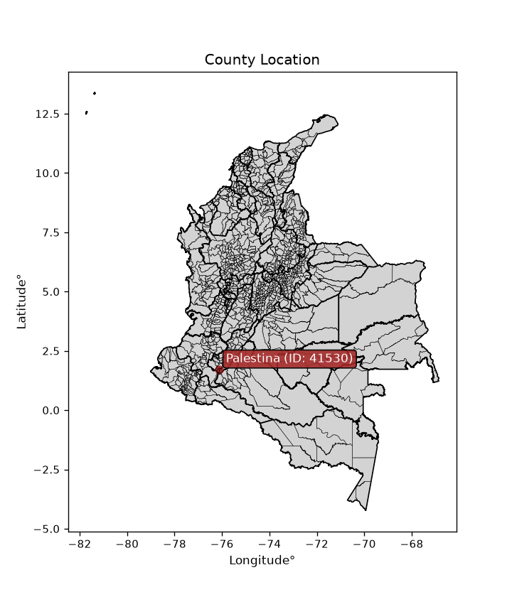
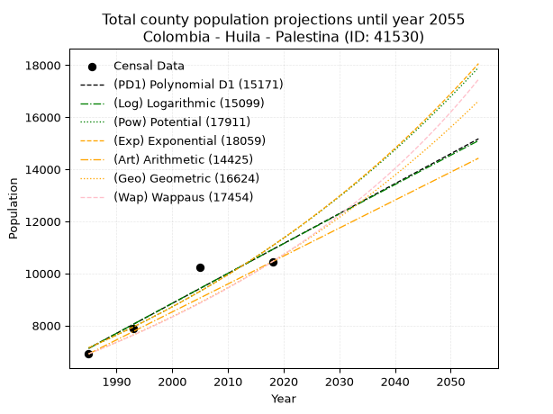
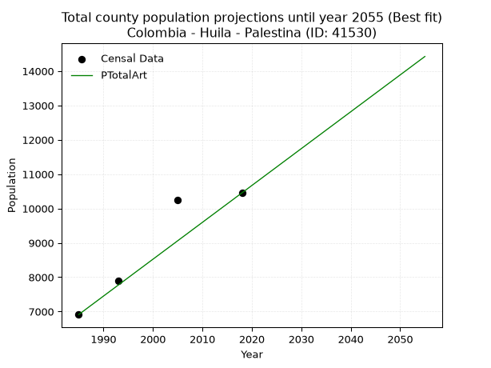
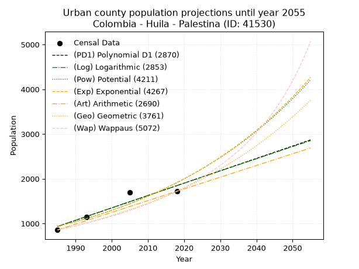
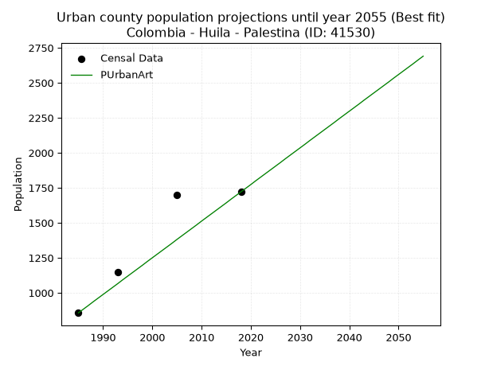
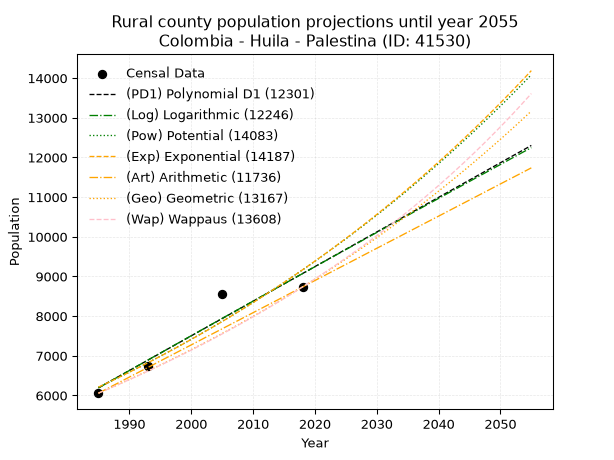
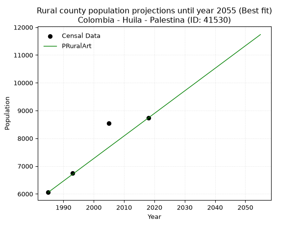

<div align="center">


</div>

# _“Population and Public Services Demand Projections (PPSD) until Year 2050 for Colombia - Huila - Palestina (ID: 41530)”_
Keywords: `population` `public-service` `projection` `lineal` `polynomial` `logarithmic` `potential` `exponential` `arithmetic` `geometric` `wappaus` `dane` `colombia` `south-america`

PPSD are analytical estimates used by governments and planners to anticipate future changes in population size, age distribution, and the resulting community needs for utilities, healthcare, education, and infrastructure as sizing future water treatment facilities, electrical grids, and road networks based on spatial growth.

<div align="center">

</img>

</div>


> **General running parameters**: • app_version: _v20260806_. • Python version: _3.14.7_. • Pandas version: _3.0.5_. • NumPy version: _2.5.1_. • Creates, save and include plots into reports (create_plot): _False_. • Projection until year: _2050_. • Process polynomial degree 2 and up: _False_. • Process Wappaus: _True_. • Process Wappaus: _True_. • Set negative values to zero: _True_. • Set infinite values to zero: _True_. • Drop dataset notes: _True_. 
<div align="center">

Dynamic map: [:earth_americas:Google](http://maps.google.com/maps?q=1.723724833,-76.1332513) [:earth_americas:OSM](https://www.openstreetmap.org/#map=18/1.723724833/-76.1332513&layers=P) [:earth_americas:Bing](https://www.bing.com/maps?cp=1.723724833~-76.1332513&lvl=18) [:earth_americas:Apple](https://maps.apple.com/frame?center=1.723724833%2C-76.1332513&span=0.003%2C0.006)

</div>


<div align="center">

```geojson
{
  "type": "Feature",
  "geometry": {
    "type": "Point", 
    "coordinates": [-76.1332513, 1.723724833]
  }, 
  "properties": {
    "Name": "Colombia - Huila - Palestina (ID: 41530)"
  }
}
```

</div>


## 0. Census Data (4 records)

Census data are official statistics collected by a government about the people and housing in a country. They usually include counts of total population, age, sex, race, income, education, and jobs.

📅Global census file: [Population.xlsx](../data/Population.xlsx)

| Source   |   Year |   CountryID | CountryName   |   StateID | StateName   |   CountyID | CountyName   |   PTotal |   PUrban |   PRural |
|:---------|-------:|------------:|:--------------|----------:|:------------|-----------:|:-------------|---------:|---------:|---------:|
| DANE     |   1985 |          57 | Colombia      |        41 | Huila       |      41530 | Palestina    |     6912 |      857 |     6055 |
| DANE     |   1993 |          57 | Colombia      |        41 | Huila       |      41530 | Palestina    |     7898 |     1150 |     6748 |
| DANE     |   2005 |          57 | Colombia      |        41 | Huila       |      41530 | Palestina    |    10249 |     1699 |     8550 |
| DANE     |   2018 |          57 | Colombia      |        41 | Huila       |      41530 | Palestina    |    10454 |     1721 |     8733 |

> 🔥Some records could had specific notes about the registered values or the corresponding urban or rural distribution.

📅[SUI-RUPS](https://www.datos.gov.co/Hacienda-y-Cr-dito-P-blico/Registro-nico-de-Prestadores-de-Servicios-P-blicos/4qkq-csdn/about_data) - Local public utility companies: [RUPS.csv](../data/RUPS.xlsx)

 | SERVICIO       | ESTADO    | NOMBRE                                                                                                      | NIT         | DEPARTAMENTO_DOMICILIO   | MUNICIPIO_DOMICILIO   | DIRECCION                      |   TELEFONO | EMAIL                              | TIPO_PRESTADOR                 | CLASIFICACION                 |
|:---------------|:----------|:------------------------------------------------------------------------------------------------------------|:------------|:-------------------------|:----------------------|:-------------------------------|-----------:|:-----------------------------------|:-------------------------------|:------------------------------|
| ACUEDUCTO      | OPERATIVA | JUNTA ADMINISTRADORA ACUEDUCTO REGIONAL  PALESTINA E.S.P.                                                   | 813006641-8 | HUILA                    | PALESTINA             | CARRERA 3 # 1A - 10            |    8315590 | LUCELYBAMBAGUE12@GMAIL.COM         | ORGANIZACION AUTORIZADA        | MENOR O IGUAL A 2500 USUARIOS |
| ACUEDUCTO      | OPERATIVA | JUNTA ADMINISTRADORA DEL ACUEDUCTO QUEBRADON REFORMA FUNDADOR MUNICIPIO DE PALESTINA DEPARTAMENTO DEL HUILA | 830507128-2 | HUILA                    | PALESTINA             | VEREDA QUEBRADON               |    8315647 | SIN@CORREO.COM                     | ORGANIZACION AUTORIZADA        | HASTA 2500 SUSCRIPTORES       |
| ALCANTARILLADO | OPERATIVA | MUNICIPIO DE PALESTINA HUILA                                                                                | 891102764-1 | HUILA                    | PALESTINA             | CALLE 3 #3-52                  |    8315614 | alcaldia@palestina-huila.gov.co    | MUNICIPIO (PRESTACIÓN DIRECTA) | MENOR O IGUAL A 2500 USUARIOS |
| ACUEDUCTO      | OPERATIVA | JUNTA ADMINISTRADORA DEL ACUEDUCTO DE LA VEREDA NAZARETH MUNICIPIO DE PALESTINA                             | 900026263-8 | HUILA                    | PALESTINA             | VEREDA NAZARETH                |    8315520 | tathyrestrepo@hotmail.com          | ORGANIZACION AUTORIZADA        | HASTA 2500 SUSCRIPTORES       |
| ACUEDUCTO      | OPERATIVA | JUNTA ADMINISTRADORA DEL ACUEDUCTO BELEN Y SAMARIA                                                          | 900109919-8 | HUILA                    | PALESTINA             | VEREDA SAMARIA PALESTINA HUILA |    2552087 | contactenos@palestina-huila.gov.co | ORGANIZACION AUTORIZADA        | HASTA 2500 SUSCRIPTORES       |
| ACUEDUCTO      | OPERATIVA | JUNTA ADMINISTRADORA DEL SERVICIO DE ACUEDUCTO DE LA VEREDA DE SAN ISIDRO                                   | 900348554-8 | HUILA                    | PALESTINA             | VEREDA SAN ISIDRO              |    8315647 | laengace@hotmail.com               | ORGANIZACION AUTORIZADA        | HASTA 2500 SUSCRIPTORES       |

## 1. Total

### 1.1. Coefficients and Parameters

* (PD1) Polynomial Deg 1: 114.9301485347247, -221010.7796065831 (lineal)
* (Log) Logarithmic: 230194.91027665697, -1740835.107679111
* (Pow) Potential: 26.529335319956306, -83.63357658879283
* (Exp) Exponential: 0.013244422606625625, 2.7313283273546056e-08
* (Art) Arithmetic: Year diff. 2018 - 1985 = 33, Population diff. 10454 - 6912 = 3542, Annual growth = 107.33333333333333
* (Geo) Geometric: Year diff. 2018 - 1985 = 33, Population diff. 10454 - 6912 = 3542, Annual growth % = 0.01261606028609763
* (Wap) Wappaus: i = 1.23613190525548, Condition values only valid for < 200)

<sub>
Wappaus condition values: ['0.00', '1.24', '2.47', '3.71', '4.94', '6.18', '7.42', '8.65', '9.89', '11.13', '12.36', '13.60', '14.83', '16.07', '17.31', '18.54', '19.78', '21.01', '22.25', '23.49', '24.72', '25.96', '27.19', '28.43', '29.67', '30.90', '32.14', '33.38', '34.61', '35.85', '37.08', '38.32', '39.56', '40.79', '42.03', '43.26', '44.50', '45.74', '46.97', '48.21', '49.45', '50.68', '51.92', '53.15', '54.39', '55.63', '56.86', '58.10', '59.33', '60.57', '61.81', '63.04', '64.28', '65.51', '66.75', '67.99', '69.22', '70.46', '71.70', '72.93', '74.17', '75.40', '76.64', '77.88', '79.11', '80.35']
</sub>


### 1.2. Projected Dataset

|   Year |   CountyID |   PTotalPD1 |   PTotalLog |   PTotalPow |   PTotalExp |   PTotalArt |   PTotalGeo |   PTotalWap |
|-------:|-----------:|------------:|------------:|------------:|------------:|------------:|------------:|------------:|
|   1985 |      41530 |        7126 |        7121 |        7142 |        7146 |        6912 |        6912 |        6912 |
|   1986 |      41530 |        7240 |        7237 |        7238 |        7241 |        7019 |        6999 |        6998 |
|   1987 |      41530 |        7355 |        7353 |        7335 |        7338 |        7127 |        7088 |        7085 |
|   1988 |      41530 |        7470 |        7469 |        7434 |        7435 |        7234 |        7177 |        7173 |
|   1989 |      41530 |        7585 |        7584 |        7534 |        7535 |        7341 |        7267 |        7262 |
|   1990 |      41530 |        7700 |        7700 |        7635 |        7635 |        7449 |        7359 |        7353 |
|   1991 |      41530 |        7815 |        7816 |        7737 |        7737 |        7556 |        7452 |        7444 |
|   1992 |      41530 |        7930 |        7931 |        7841 |        7840 |        7663 |        7546 |        7537 |
|   1993 |      41530 |        8045 |        8047 |        7946 |        7945 |        7771 |        7641 |        7631 |
|   1994 |      41530 |        8160 |        8162 |        8053 |        8050 |        7878 |        7738 |        7726 |
|   1995 |      41530 |        8275 |        8278 |        8160 |        8158 |        7985 |        7835 |        7823 |
|   1996 |      41530 |        8390 |        8393 |        8270 |        8267 |        8093 |        7934 |        7920 |
|   1997 |      41530 |        8505 |        8508 |        8380 |        8377 |        8200 |        8034 |        8019 |
|   1998 |      41530 |        8620 |        8624 |        8492 |        8488 |        8307 |        8136 |        8120 |
|   1999 |      41530 |        8735 |        8739 |        8606 |        8602 |        8415 |        8238 |        8221 |
|   2000 |      41530 |        8850 |        8854 |        8721 |        8716 |        8522 |        8342 |        8325 |
|   2001 |      41530 |        8964 |        8969 |        8837 |        8833 |        8629 |        8447 |        8429 |
|   2002 |      41530 |        9079 |        9084 |        8955 |        8950 |        8737 |        8554 |        8535 |
|   2003 |      41530 |        9194 |        9199 |        9075 |        9070 |        8844 |        8662 |        8642 |
|   2004 |      41530 |        9309 |        9314 |        9195 |        9191 |        8951 |        8771 |        8751 |
|   2005 |      41530 |        9424 |        9429 |        9318 |        9313 |        9059 |        8882 |        8862 |
|   2006 |      41530 |        9539 |        9544 |        9442 |        9437 |        9166 |        8994 |        8974 |
|   2007 |      41530 |        9654 |        9658 |        9568 |        9563 |        9273 |        9107 |        9088 |
|   2008 |      41530 |        9769 |        9773 |        9695 |        9691 |        9381 |        9222 |        9203 |
|   2009 |      41530 |        9884 |        9888 |        9824 |        9820 |        9488 |        9339 |        9320 |
|   2010 |      41530 |        9999 |       10002 |        9954 |        9951 |        9595 |        9456 |        9438 |
|   2011 |      41530 |       10114 |       10117 |       10087 |       10083 |        9703 |        9576 |        9559 |
|   2012 |      41530 |       10229 |       10231 |       10221 |       10218 |        9810 |        9696 |        9681 |
|   2013 |      41530 |       10344 |       10345 |       10356 |       10354 |        9917 |        9819 |        9805 |
|   2014 |      41530 |       10459 |       10460 |       10494 |       10492 |       10025 |        9943 |        9931 |
|   2015 |      41530 |       10573 |       10574 |       10633 |       10632 |       10132 |       10068 |       10059 |
|   2016 |      41530 |       10688 |       10688 |       10774 |       10774 |       10239 |       10195 |       10188 |
|   2017 |      41530 |       10803 |       10802 |       10916 |       10917 |       10347 |       10324 |       10320 |
|   2018 |      41530 |       10918 |       10916 |       11061 |       11063 |       10454 |       10454 |       10454 |
|   2019 |      41530 |       11033 |       11030 |       11207 |       11210 |       10561 |       10586 |       10590 |
|   2020 |      41530 |       11148 |       11144 |       11355 |       11360 |       10669 |       10719 |       10728 |
|   2021 |      41530 |       11263 |       11258 |       11505 |       11511 |       10776 |       10855 |       10868 |
|   2022 |      41530 |       11378 |       11372 |       11657 |       11665 |       10883 |       10992 |       11011 |
|   2023 |      41530 |       11493 |       11486 |       11811 |       11820 |       10991 |       11130 |       11155 |
|   2024 |      41530 |       11608 |       11600 |       11967 |       11978 |       11098 |       11271 |       11303 |
|   2025 |      41530 |       11723 |       11714 |       12125 |       12138 |       11205 |       11413 |       11452 |
|   2026 |      41530 |       11838 |       11827 |       12285 |       12299 |       11313 |       11557 |       11604 |
|   2027 |      41530 |       11953 |       11941 |       12447 |       12463 |       11420 |       11703 |       11759 |
|   2028 |      41530 |       12068 |       12054 |       12611 |       12630 |       11527 |       11850 |       11916 |
|   2029 |      41530 |       12182 |       12168 |       12777 |       12798 |       11635 |       12000 |       12076 |
|   2030 |      41530 |       12297 |       12281 |       12945 |       12969 |       11742 |       12151 |       12238 |
|   2031 |      41530 |       12412 |       12395 |       13115 |       13141 |       11849 |       12305 |       12404 |
|   2032 |      41530 |       12527 |       12508 |       13287 |       13317 |       11957 |       12460 |       12572 |
|   2033 |      41530 |       12642 |       12621 |       13462 |       13494 |       12064 |       12617 |       12743 |
|   2034 |      41530 |       12757 |       12734 |       13639 |       13674 |       12171 |       12776 |       12917 |
|   2035 |      41530 |       12872 |       12848 |       13818 |       13856 |       12279 |       12937 |       13095 |
|   2036 |      41530 |       12987 |       12961 |       13999 |       14041 |       12386 |       13101 |       13275 |
|   2037 |      41530 |       13102 |       13074 |       14183 |       14228 |       12493 |       13266 |       13459 |
|   2038 |      41530 |       13217 |       13187 |       14368 |       14418 |       12601 |       13433 |       13646 |
|   2039 |      41530 |       13332 |       13300 |       14557 |       14610 |       12708 |       13603 |       13837 |
|   2040 |      41530 |       13447 |       13412 |       14747 |       14805 |       12815 |       13774 |       14031 |
|   2041 |      41530 |       13562 |       13525 |       14940 |       15003 |       12923 |       13948 |       14229 |
|   2042 |      41530 |       13677 |       13638 |       15136 |       15203 |       13030 |       14124 |       14431 |
|   2043 |      41530 |       13792 |       13751 |       15334 |       15405 |       13137 |       14302 |       14637 |
|   2044 |      41530 |       13906 |       13863 |       15534 |       15611 |       13245 |       14483 |       14846 |
|   2045 |      41530 |       14021 |       13976 |       15737 |       15819 |       13352 |       14665 |       15060 |
|   2046 |      41530 |       14136 |       14088 |       15942 |       16030 |       13459 |       14850 |       15278 |
|   2047 |      41530 |       14251 |       14201 |       16150 |       16243 |       13567 |       15038 |       15500 |
|   2048 |      41530 |       14366 |       14313 |       16361 |       16460 |       13674 |       15227 |       15727 |
|   2049 |      41530 |       14481 |       14426 |       16574 |       16679 |       13781 |       15420 |       15959 |
|   2050 |      41530 |       14596 |       14538 |       16790 |       16902 |       13889 |       15614 |       16195 |
<div align="center">

</img>

</div>


### 1.3. Best fit with absolute and relative error (%)

Relative error puts that difference into context by dividing the absolute error by the true value, creating a unitless ratio or percentage that shows the scale of the mistake.

Absolute and relative error

|   Year | Source   |   CountryID | CountryName   |   StateID | StateName   |   CountyID_x | CountyName   |   PTotal |   PUrban |   PRural |   CountyID_y |   PTotalPD1 |   PTotalLog |   PTotalPow |   PTotalExp |   PTotalArt |   PTotalGeo |   PTotalWap |   PTotalPD1AbsError |   PTotalLogAbsError |   PTotalPowAbsError |   PTotalExpAbsError |   PTotalArtAbsError |   PTotalGeoAbsError |   PTotalWapAbsError |   PTotalPD1RelError |   PTotalLogRelError |   PTotalPowRelError |   PTotalExpRelError |   PTotalArtRelError |   PTotalGeoRelError |   PTotalWapRelError |
|-------:|:---------|------------:|:--------------|----------:|:------------|-------------:|:-------------|---------:|---------:|---------:|-------------:|------------:|------------:|------------:|------------:|------------:|------------:|------------:|--------------------:|--------------------:|--------------------:|--------------------:|--------------------:|--------------------:|--------------------:|--------------------:|--------------------:|--------------------:|--------------------:|--------------------:|--------------------:|--------------------:|
|   1985 | DANE     |          57 | Colombia      |        41 | Huila       |        41530 | Palestina    |     6912 |      857 |     6055 |        41530 |        7126 |        7121 |        7142 |        7146 |        6912 |        6912 |        6912 |                 214 |                 209 |                 230 |                 234 |                   0 |                   0 |                   0 |             3.09606 |             3.02373 |            3.32755  |            3.38542  |              0      |             0       |              0      |
|   1993 | DANE     |          57 | Colombia      |        41 | Huila       |        41530 | Palestina    |     7898 |     1150 |     6748 |        41530 |        8045 |        8047 |        7946 |        7945 |        7771 |        7641 |        7631 |                 147 |                 149 |                  48 |                  47 |                 127 |                 257 |                 267 |             1.86123 |             1.88655 |            0.607749 |            0.595087 |              1.608  |             3.25399 |              3.3806 |
|   2005 | DANE     |          57 | Colombia      |        41 | Huila       |        41530 | Palestina    |    10249 |     1699 |     8550 |        41530 |        9424 |        9429 |        9318 |        9313 |        9059 |        8882 |        8862 |                 825 |                 820 |                 931 |                 936 |                1190 |                1367 |                1387 |             8.04957 |             8.00078 |            9.08381  |            9.1326   |             11.6109 |            13.3379  |             13.533  |
|   2018 | DANE     |          57 | Colombia      |        41 | Huila       |        41530 | Palestina    |    10454 |     1721 |     8733 |        41530 |       10918 |       10916 |       11061 |       11063 |       10454 |       10454 |       10454 |                 464 |                 462 |                 607 |                 609 |                   0 |                   0 |                   0 |             4.43849 |             4.41936 |            5.80639  |            5.82552  |              0      |             0       |              0      |

Relative error mean

| Method    |   RelError | Best   |
|:----------|-----------:|:-------|
| PTotalPD1 |    4.36134 |        |
| PTotalLog |    4.33261 |        |
| PTotalPow |    4.70637 |        |
| PTotalExp |    4.73466 |        |
| PTotalArt |    3.30472 | True   |
| PTotalGeo |    4.14797 |        |
| PTotalWap |    4.22841 |        |

💙Best method: _**PTotalArt**_
<div align="center">

</img>

</div>


### 1.4. Fresh water supply demand in liters per capita per day (lpcd)

The fresh water supply demand typically ranges from 100 to 300 liters per capita per day (lpcd) for standard domestic and municipal planning, though absolute survival minimums set by the World Health Organization are as low as 7.5 to 20 liters per day, and total consumption in high-income nations can exceed 400 liters.

> `CZ`: Level in meters above the sea level (masl)<br> `WS`: Fresh water supply demand in liters per capita per day (lpcd or l/h/d)<br> `WSAll`: Zonal fresh water supply demand in liters per second (l/s)<br> `A`: Zonal area in square meters<br> `DP`: Population density (people/hectare or p/ha)

Reference values (RAS Colombia)

|    CZ |   WS |
|------:|-----:|
|  1000 |  120 |
|  2000 |  130 |
| 99999 |  140 |

County shapefile geometry properties and water supply values

|   CountyID |      ATotal |   CZTotal |   WSTotal |
|-----------:|------------:|----------:|----------:|
|      41530 | 1.96961e+08 |   1963.56 |       130 |

Projected values for best method: PTotalArt

|   CountyID |   Year |   PTotalArt |   DPTotal |   WSTotal |   WSTotalAll |
|-----------:|-------:|------------:|----------:|----------:|-------------:|
|      41530 |   1985 |        6912 |      0.35 |       130 |      10.4    |
|      41530 |   1986 |        7019 |      0.36 |       130 |      10.561  |
|      41530 |   1987 |        7127 |      0.36 |       130 |      10.7235 |
|      41530 |   1988 |        7234 |      0.37 |       130 |      10.8845 |
|      41530 |   1989 |        7341 |      0.37 |       130 |      11.0455 |
|      41530 |   1990 |        7449 |      0.38 |       130 |      11.208  |
|      41530 |   1991 |        7556 |      0.38 |       130 |      11.369  |
|      41530 |   1992 |        7663 |      0.39 |       130 |      11.53   |
|      41530 |   1993 |        7771 |      0.39 |       130 |      11.6925 |
|      41530 |   1994 |        7878 |      0.4  |       130 |      11.8535 |
|      41530 |   1995 |        7985 |      0.41 |       130 |      12.0145 |
|      41530 |   1996 |        8093 |      0.41 |       130 |      12.177  |
|      41530 |   1997 |        8200 |      0.42 |       130 |      12.338  |
|      41530 |   1998 |        8307 |      0.42 |       130 |      12.499  |
|      41530 |   1999 |        8415 |      0.43 |       130 |      12.6615 |
|      41530 |   2000 |        8522 |      0.43 |       130 |      12.8225 |
|      41530 |   2001 |        8629 |      0.44 |       130 |      12.9834 |
|      41530 |   2002 |        8737 |      0.44 |       130 |      13.1459 |
|      41530 |   2003 |        8844 |      0.45 |       130 |      13.3069 |
|      41530 |   2004 |        8951 |      0.45 |       130 |      13.4679 |
|      41530 |   2005 |        9059 |      0.46 |       130 |      13.6304 |
|      41530 |   2006 |        9166 |      0.47 |       130 |      13.7914 |
|      41530 |   2007 |        9273 |      0.47 |       130 |      13.9524 |
|      41530 |   2008 |        9381 |      0.48 |       130 |      14.1149 |
|      41530 |   2009 |        9488 |      0.48 |       130 |      14.2759 |
|      41530 |   2010 |        9595 |      0.49 |       130 |      14.4369 |
|      41530 |   2011 |        9703 |      0.49 |       130 |      14.5994 |
|      41530 |   2012 |        9810 |      0.5  |       130 |      14.7604 |
|      41530 |   2013 |        9917 |      0.5  |       130 |      14.9214 |
|      41530 |   2014 |       10025 |      0.51 |       130 |      15.0839 |
|      41530 |   2015 |       10132 |      0.51 |       130 |      15.2449 |
|      41530 |   2016 |       10239 |      0.52 |       130 |      15.4059 |
|      41530 |   2017 |       10347 |      0.53 |       130 |      15.5684 |
|      41530 |   2018 |       10454 |      0.53 |       130 |      15.7294 |
|      41530 |   2019 |       10561 |      0.54 |       130 |      15.8904 |
|      41530 |   2020 |       10669 |      0.54 |       130 |      16.0529 |
|      41530 |   2021 |       10776 |      0.55 |       130 |      16.2139 |
|      41530 |   2022 |       10883 |      0.55 |       130 |      16.3749 |
|      41530 |   2023 |       10991 |      0.56 |       130 |      16.5374 |
|      41530 |   2024 |       11098 |      0.56 |       130 |      16.6984 |
|      41530 |   2025 |       11205 |      0.57 |       130 |      16.8594 |
|      41530 |   2026 |       11313 |      0.57 |       130 |      17.0219 |
|      41530 |   2027 |       11420 |      0.58 |       130 |      17.1829 |
|      41530 |   2028 |       11527 |      0.59 |       130 |      17.3439 |
|      41530 |   2029 |       11635 |      0.59 |       130 |      17.5064 |
|      41530 |   2030 |       11742 |      0.6  |       130 |      17.6674 |
|      41530 |   2031 |       11849 |      0.6  |       130 |      17.8284 |
|      41530 |   2032 |       11957 |      0.61 |       130 |      17.9909 |
|      41530 |   2033 |       12064 |      0.61 |       130 |      18.1519 |
|      41530 |   2034 |       12171 |      0.62 |       130 |      18.3128 |
|      41530 |   2035 |       12279 |      0.62 |       130 |      18.4753 |
|      41530 |   2036 |       12386 |      0.63 |       130 |      18.6363 |
|      41530 |   2037 |       12493 |      0.63 |       130 |      18.7973 |
|      41530 |   2038 |       12601 |      0.64 |       130 |      18.9598 |
|      41530 |   2039 |       12708 |      0.65 |       130 |      19.1208 |
|      41530 |   2040 |       12815 |      0.65 |       130 |      19.2818 |
|      41530 |   2041 |       12923 |      0.66 |       130 |      19.4443 |
|      41530 |   2042 |       13030 |      0.66 |       130 |      19.6053 |
|      41530 |   2043 |       13137 |      0.67 |       130 |      19.7663 |
|      41530 |   2044 |       13245 |      0.67 |       130 |      19.9288 |
|      41530 |   2045 |       13352 |      0.68 |       130 |      20.0898 |
|      41530 |   2046 |       13459 |      0.68 |       130 |      20.2508 |
|      41530 |   2047 |       13567 |      0.69 |       130 |      20.4133 |
|      41530 |   2048 |       13674 |      0.69 |       130 |      20.5743 |
|      41530 |   2049 |       13781 |      0.7  |       130 |      20.7353 |
|      41530 |   2050 |       13889 |      0.71 |       130 |      20.8978 |

## 2. Urban

### 2.1. Coefficients and Parameters

* (PD1) Polynomial Deg 1: 27.637494981934907, -53925.1493376153 (lineal)
* (Log) Logarithmic: 55362.75385664857, -419455.98571365216
* (Pow) Potential: 43.412073942550606, -140.1916351050701
* (Exp) Exponential: 0.021668932713351977, 1.9550809368078265e-16
* (Art) Arithmetic: Year diff. 2018 - 1985 = 33, Population diff. 1721 - 857 = 864, Annual growth = 26.181818181818183
* (Geo) Geometric: Year diff. 2018 - 1985 = 33, Population diff. 1721 - 857 = 864, Annual growth % = 0.02135274168839829
* (Wap) Wappaus: i = 2.0311728612737148, Condition values only valid for < 200)

<sub>
Wappaus condition values: ['0.00', '2.03', '4.06', '6.09', '8.12', '10.16', '12.19', '14.22', '16.25', '18.28', '20.31', '22.34', '24.37', '26.41', '28.44', '30.47', '32.50', '34.53', '36.56', '38.59', '40.62', '42.65', '44.69', '46.72', '48.75', '50.78', '52.81', '54.84', '56.87', '58.90', '60.94', '62.97', '65.00', '67.03', '69.06', '71.09', '73.12', '75.15', '77.18', '79.22', '81.25', '83.28', '85.31', '87.34', '89.37', '91.40', '93.43', '95.47', '97.50', '99.53', '101.56', '103.59', '105.62', '107.65', '109.68', '111.71', '113.75', '115.78', '117.81', '119.84', '121.87', '123.90', '125.93', '127.96', '130.00', '132.03']
</sub>


### 2.2. Projected Dataset

|   Year |   CountyID |   PUrbanPD1 |   PUrbanLog |   PUrbanPow |   PUrbanExp |   PUrbanArt |   PUrbanGeo |   PUrbanWap |
|-------:|-----------:|------------:|------------:|------------:|------------:|------------:|------------:|------------:|
|   1985 |      41530 |         935 |         934 |         935 |         936 |         857 |         857 |         857 |
|   1986 |      41530 |         963 |         962 |         956 |         957 |         883 |         875 |         875 |
|   1987 |      41530 |         991 |         990 |         977 |         978 |         909 |         894 |         893 |
|   1988 |      41530 |        1018 |        1018 |         999 |         999 |         936 |         913 |         911 |
|   1989 |      41530 |        1046 |        1046 |        1021 |        1021 |         962 |         933 |         930 |
|   1990 |      41530 |        1073 |        1073 |        1043 |        1043 |         988 |         952 |         949 |
|   1991 |      41530 |        1101 |        1101 |        1066 |        1066 |        1014 |         973 |         968 |
|   1992 |      41530 |        1129 |        1129 |        1090 |        1090 |        1040 |         994 |         988 |
|   1993 |      41530 |        1156 |        1157 |        1114 |        1113 |        1066 |        1015 |        1009 |
|   1994 |      41530 |        1184 |        1185 |        1138 |        1138 |        1093 |        1036 |        1029 |
|   1995 |      41530 |        1212 |        1212 |        1163 |        1163 |        1119 |        1059 |        1051 |
|   1996 |      41530 |        1239 |        1240 |        1189 |        1188 |        1145 |        1081 |        1073 |
|   1997 |      41530 |        1267 |        1268 |        1215 |        1214 |        1171 |        1104 |        1095 |
|   1998 |      41530 |        1295 |        1296 |        1242 |        1241 |        1197 |        1128 |        1118 |
|   1999 |      41530 |        1322 |        1323 |        1269 |        1268 |        1224 |        1152 |        1141 |
|   2000 |      41530 |        1350 |        1351 |        1297 |        1296 |        1250 |        1177 |        1165 |
|   2001 |      41530 |        1377 |        1379 |        1325 |        1324 |        1276 |        1202 |        1190 |
|   2002 |      41530 |        1405 |        1406 |        1354 |        1353 |        1302 |        1227 |        1215 |
|   2003 |      41530 |        1433 |        1434 |        1384 |        1383 |        1328 |        1254 |        1240 |
|   2004 |      41530 |        1460 |        1462 |        1414 |        1413 |        1354 |        1280 |        1267 |
|   2005 |      41530 |        1488 |        1489 |        1445 |        1444 |        1381 |        1308 |        1294 |
|   2006 |      41530 |        1516 |        1517 |        1477 |        1476 |        1407 |        1336 |        1322 |
|   2007 |      41530 |        1543 |        1544 |        1509 |        1508 |        1433 |        1364 |        1350 |
|   2008 |      41530 |        1571 |        1572 |        1542 |        1541 |        1459 |        1393 |        1379 |
|   2009 |      41530 |        1599 |        1599 |        1576 |        1575 |        1485 |        1423 |        1409 |
|   2010 |      41530 |        1626 |        1627 |        1610 |        1609 |        1512 |        1453 |        1440 |
|   2011 |      41530 |        1654 |        1655 |        1646 |        1645 |        1538 |        1484 |        1472 |
|   2012 |      41530 |        1681 |        1682 |        1682 |        1681 |        1564 |        1516 |        1505 |
|   2013 |      41530 |        1709 |        1710 |        1718 |        1718 |        1590 |        1548 |        1538 |
|   2014 |      41530 |        1737 |        1737 |        1756 |        1755 |        1616 |        1582 |        1573 |
|   2015 |      41530 |        1764 |        1765 |        1794 |        1794 |        1642 |        1615 |        1608 |
|   2016 |      41530 |        1792 |        1792 |        1833 |        1833 |        1669 |        1650 |        1645 |
|   2017 |      41530 |        1820 |        1820 |        1873 |        1873 |        1695 |        1685 |        1682 |
|   2018 |      41530 |        1847 |        1847 |        1914 |        1914 |        1721 |        1721 |        1721 |
|   2019 |      41530 |        1875 |        1874 |        1955 |        1956 |        1747 |        1758 |        1761 |
|   2020 |      41530 |        1903 |        1902 |        1998 |        1999 |        1773 |        1795 |        1802 |
|   2021 |      41530 |        1930 |        1929 |        2041 |        2043 |        1800 |        1834 |        1845 |
|   2022 |      41530 |        1958 |        1957 |        2085 |        2087 |        1826 |        1873 |        1889 |
|   2023 |      41530 |        1986 |        1984 |        2131 |        2133 |        1852 |        1913 |        1934 |
|   2024 |      41530 |        2013 |        2011 |        2177 |        2180 |        1878 |        1954 |        1981 |
|   2025 |      41530 |        2041 |        2039 |        2224 |        2228 |        1904 |        1995 |        2030 |
|   2026 |      41530 |        2068 |        2066 |        2272 |        2276 |        1930 |        2038 |        2080 |
|   2027 |      41530 |        2096 |        2093 |        2321 |        2326 |        1957 |        2081 |        2132 |
|   2028 |      41530 |        2124 |        2121 |        2372 |        2377 |        1983 |        2126 |        2186 |
|   2029 |      41530 |        2151 |        2148 |        2423 |        2429 |        2009 |        2171 |        2242 |
|   2030 |      41530 |        2179 |        2175 |        2475 |        2482 |        2035 |        2218 |        2300 |
|   2031 |      41530 |        2207 |        2202 |        2529 |        2537 |        2061 |        2265 |        2360 |
|   2032 |      41530 |        2234 |        2230 |        2583 |        2592 |        2088 |        2313 |        2422 |
|   2033 |      41530 |        2262 |        2257 |        2639 |        2649 |        2114 |        2363 |        2487 |
|   2034 |      41530 |        2290 |        2284 |        2696 |        2707 |        2140 |        2413 |        2555 |
|   2035 |      41530 |        2317 |        2311 |        2754 |        2767 |        2166 |        2465 |        2625 |
|   2036 |      41530 |        2345 |        2339 |        2814 |        2827 |        2192 |        2517 |        2699 |
|   2037 |      41530 |        2372 |        2366 |        2874 |        2889 |        2218 |        2571 |        2775 |
|   2038 |      41530 |        2400 |        2393 |        2936 |        2952 |        2245 |        2626 |        2855 |
|   2039 |      41530 |        2428 |        2420 |        2999 |        3017 |        2271 |        2682 |        2939 |
|   2040 |      41530 |        2455 |        2447 |        3064 |        3083 |        2297 |        2739 |        3026 |
|   2041 |      41530 |        2483 |        2474 |        3130 |        3151 |        2323 |        2798 |        3117 |
|   2042 |      41530 |        2511 |        2501 |        3197 |        3220 |        2349 |        2858 |        3213 |
|   2043 |      41530 |        2538 |        2529 |        3266 |        3290 |        2376 |        2919 |        3314 |
|   2044 |      41530 |        2566 |        2556 |        3336 |        3362 |        2402 |        2981 |        3419 |
|   2045 |      41530 |        2594 |        2583 |        3407 |        3436 |        2428 |        3045 |        3531 |
|   2046 |      41530 |        2621 |        2610 |        3481 |        3511 |        2454 |        3110 |        3648 |
|   2047 |      41530 |        2649 |        2637 |        3555 |        3588 |        2480 |        3176 |        3771 |
|   2048 |      41530 |        2676 |        2664 |        3631 |        3667 |        2506 |        3244 |        3902 |
|   2049 |      41530 |        2704 |        2691 |        3709 |        3747 |        2533 |        3313 |        4040 |
|   2050 |      41530 |        2732 |        2718 |        3789 |        3829 |        2559 |        3384 |        4186 |
<div align="center">

</img>

</div>


### 2.3. Best fit with absolute and relative error (%)

Relative error puts that difference into context by dividing the absolute error by the true value, creating a unitless ratio or percentage that shows the scale of the mistake.

Absolute and relative error

|   Year | Source   |   CountryID | CountryName   |   StateID | StateName   |   CountyID_x | CountyName   |   PTotal |   PUrban |   PRural |   CountyID_y |   PUrbanPD1 |   PUrbanLog |   PUrbanPow |   PUrbanExp |   PUrbanArt |   PUrbanGeo |   PUrbanWap |   PUrbanPD1AbsError |   PUrbanLogAbsError |   PUrbanPowAbsError |   PUrbanExpAbsError |   PUrbanArtAbsError |   PUrbanGeoAbsError |   PUrbanWapAbsError |   PUrbanPD1RelError |   PUrbanLogRelError |   PUrbanPowRelError |   PUrbanExpRelError |   PUrbanArtRelError |   PUrbanGeoRelError |   PUrbanWapRelError |
|-------:|:---------|------------:|:--------------|----------:|:------------|-------------:|:-------------|---------:|---------:|---------:|-------------:|------------:|------------:|------------:|------------:|------------:|------------:|------------:|--------------------:|--------------------:|--------------------:|--------------------:|--------------------:|--------------------:|--------------------:|--------------------:|--------------------:|--------------------:|--------------------:|--------------------:|--------------------:|--------------------:|
|   1985 | DANE     |          57 | Colombia      |        41 | Huila       |        41530 | Palestina    |     6912 |      857 |     6055 |        41530 |         935 |         934 |         935 |         936 |         857 |         857 |         857 |                  78 |                  77 |                  78 |                  79 |                   0 |                   0 |                   0 |            9.10152  |            8.98483  |             9.10152 |             9.2182  |             0       |              0      |              0      |
|   1993 | DANE     |          57 | Colombia      |        41 | Huila       |        41530 | Palestina    |     7898 |     1150 |     6748 |        41530 |        1156 |        1157 |        1114 |        1113 |        1066 |        1015 |        1009 |                   6 |                   7 |                  36 |                  37 |                  84 |                 135 |                 141 |            0.521739 |            0.608696 |             3.13043 |             3.21739 |             7.30435 |             11.7391 |             12.2609 |
|   2005 | DANE     |          57 | Colombia      |        41 | Huila       |        41530 | Palestina    |    10249 |     1699 |     8550 |        41530 |        1488 |        1489 |        1445 |        1444 |        1381 |        1308 |        1294 |                 211 |                 210 |                 254 |                 255 |                 318 |                 391 |                 405 |           12.4191   |           12.3602   |            14.95    |            15.0088  |            18.7169  |             23.0135 |             23.8376 |
|   2018 | DANE     |          57 | Colombia      |        41 | Huila       |        41530 | Palestina    |    10454 |     1721 |     8733 |        41530 |        1847 |        1847 |        1914 |        1914 |        1721 |        1721 |        1721 |                 126 |                 126 |                 193 |                 193 |                   0 |                   0 |                   0 |            7.32132  |            7.32132  |            11.2144  |            11.2144  |             0       |              0      |              0      |

Relative error mean

| Method    |   RelError | Best   |
|:----------|-----------:|:-------|
| PUrbanPD1 |    7.34091 |        |
| PUrbanLog |    7.31877 |        |
| PUrbanPow |    9.59908 |        |
| PUrbanExp |    9.66471 |        |
| PUrbanArt |    6.50531 | True   |
| PUrbanGeo |    8.68817 |        |
| PUrbanWap |    9.02461 |        |

💙Best method: _**PUrbanArt**_
<div align="center">

</img>

</div>


### 2.4. Fresh water supply demand in liters per capita per day (lpcd)

The fresh water supply demand typically ranges from 100 to 300 liters per capita per day (lpcd) for standard domestic and municipal planning, though absolute survival minimums set by the World Health Organization are as low as 7.5 to 20 liters per day, and total consumption in high-income nations can exceed 400 liters.

> `CZ`: Level in meters above the sea level (masl)<br> `WS`: Fresh water supply demand in liters per capita per day (lpcd or l/h/d)<br> `WSAll`: Zonal fresh water supply demand in liters per second (l/s)<br> `A`: Zonal area in square meters<br> `DP`: Population density (people/hectare or p/ha)

Reference values (RAS Colombia)

|    CZ |   WS |
|------:|-----:|
|  1000 |  120 |
|  2000 |  130 |
| 99999 |  140 |

County shapefile geometry properties and water supply values

|   CountyID |   AUrban |   CZUrban |   WSUrban |
|-----------:|---------:|----------:|----------:|
|      41530 |   277998 |   1535.11 |       130 |

Projected values for best method: PUrbanArt

|   CountyID |   Year |   PUrbanArt |   DPUrban |   WSUrban |   WSUrbanAll |
|-----------:|-------:|------------:|----------:|----------:|-------------:|
|      41530 |   1985 |         857 |     30.83 |       130 |      1.28947 |
|      41530 |   1986 |         883 |     31.76 |       130 |      1.32859 |
|      41530 |   1987 |         909 |     32.7  |       130 |      1.36771 |
|      41530 |   1988 |         936 |     33.67 |       130 |      1.40833 |
|      41530 |   1989 |         962 |     34.6  |       130 |      1.44745 |
|      41530 |   1990 |         988 |     35.54 |       130 |      1.48657 |
|      41530 |   1991 |        1014 |     36.48 |       130 |      1.52569 |
|      41530 |   1992 |        1040 |     37.41 |       130 |      1.56481 |
|      41530 |   1993 |        1066 |     38.35 |       130 |      1.60394 |
|      41530 |   1994 |        1093 |     39.32 |       130 |      1.64456 |
|      41530 |   1995 |        1119 |     40.25 |       130 |      1.68368 |
|      41530 |   1996 |        1145 |     41.19 |       130 |      1.7228  |
|      41530 |   1997 |        1171 |     42.12 |       130 |      1.76192 |
|      41530 |   1998 |        1197 |     43.06 |       130 |      1.80104 |
|      41530 |   1999 |        1224 |     44.03 |       130 |      1.84167 |
|      41530 |   2000 |        1250 |     44.96 |       130 |      1.88079 |
|      41530 |   2001 |        1276 |     45.9  |       130 |      1.91991 |
|      41530 |   2002 |        1302 |     46.83 |       130 |      1.95903 |
|      41530 |   2003 |        1328 |     47.77 |       130 |      1.99815 |
|      41530 |   2004 |        1354 |     48.71 |       130 |      2.03727 |
|      41530 |   2005 |        1381 |     49.68 |       130 |      2.07789 |
|      41530 |   2006 |        1407 |     50.61 |       130 |      2.11701 |
|      41530 |   2007 |        1433 |     51.55 |       130 |      2.15613 |
|      41530 |   2008 |        1459 |     52.48 |       130 |      2.19525 |
|      41530 |   2009 |        1485 |     53.42 |       130 |      2.23438 |
|      41530 |   2010 |        1512 |     54.39 |       130 |      2.275   |
|      41530 |   2011 |        1538 |     55.32 |       130 |      2.31412 |
|      41530 |   2012 |        1564 |     56.26 |       130 |      2.35324 |
|      41530 |   2013 |        1590 |     57.19 |       130 |      2.39236 |
|      41530 |   2014 |        1616 |     58.13 |       130 |      2.43148 |
|      41530 |   2015 |        1642 |     59.07 |       130 |      2.4706  |
|      41530 |   2016 |        1669 |     60.04 |       130 |      2.51123 |
|      41530 |   2017 |        1695 |     60.97 |       130 |      2.55035 |
|      41530 |   2018 |        1721 |     61.91 |       130 |      2.58947 |
|      41530 |   2019 |        1747 |     62.84 |       130 |      2.62859 |
|      41530 |   2020 |        1773 |     63.78 |       130 |      2.66771 |
|      41530 |   2021 |        1800 |     64.75 |       130 |      2.70833 |
|      41530 |   2022 |        1826 |     65.68 |       130 |      2.74745 |
|      41530 |   2023 |        1852 |     66.62 |       130 |      2.78657 |
|      41530 |   2024 |        1878 |     67.55 |       130 |      2.82569 |
|      41530 |   2025 |        1904 |     68.49 |       130 |      2.86481 |
|      41530 |   2026 |        1930 |     69.43 |       130 |      2.90394 |
|      41530 |   2027 |        1957 |     70.4  |       130 |      2.94456 |
|      41530 |   2028 |        1983 |     71.33 |       130 |      2.98368 |
|      41530 |   2029 |        2009 |     72.27 |       130 |      3.0228  |
|      41530 |   2030 |        2035 |     73.2  |       130 |      3.06192 |
|      41530 |   2031 |        2061 |     74.14 |       130 |      3.10104 |
|      41530 |   2032 |        2088 |     75.11 |       130 |      3.14167 |
|      41530 |   2033 |        2114 |     76.04 |       130 |      3.18079 |
|      41530 |   2034 |        2140 |     76.98 |       130 |      3.21991 |
|      41530 |   2035 |        2166 |     77.91 |       130 |      3.25903 |
|      41530 |   2036 |        2192 |     78.85 |       130 |      3.29815 |
|      41530 |   2037 |        2218 |     79.78 |       130 |      3.33727 |
|      41530 |   2038 |        2245 |     80.76 |       130 |      3.37789 |
|      41530 |   2039 |        2271 |     81.69 |       130 |      3.41701 |
|      41530 |   2040 |        2297 |     82.63 |       130 |      3.45613 |
|      41530 |   2041 |        2323 |     83.56 |       130 |      3.49525 |
|      41530 |   2042 |        2349 |     84.5  |       130 |      3.53437 |
|      41530 |   2043 |        2376 |     85.47 |       130 |      3.575   |
|      41530 |   2044 |        2402 |     86.4  |       130 |      3.61412 |
|      41530 |   2045 |        2428 |     87.34 |       130 |      3.65324 |
|      41530 |   2046 |        2454 |     88.27 |       130 |      3.69236 |
|      41530 |   2047 |        2480 |     89.21 |       130 |      3.73148 |
|      41530 |   2048 |        2506 |     90.14 |       130 |      3.7706  |
|      41530 |   2049 |        2533 |     91.12 |       130 |      3.81123 |
|      41530 |   2050 |        2559 |     92.05 |       130 |      3.85035 |

## 3. Rural

### 3.1. Coefficients and Parameters

* (PD1) Polynomial Deg 1: 87.2926535527898, -167085.6302689678 (lineal)
* (Log) Logarithmic: 174832.15642000837, -1321379.1219654584
* (Pow) Potential: 23.652203518396067, -74.20661283119613
* (Exp) Exponential: 0.011808648854488778, 4.101668135439421e-07
* (Art) Arithmetic: Year diff. 2018 - 1985 = 33, Population diff. 8733 - 6055 = 2678, Annual growth = 81.15151515151516
* (Geo) Geometric: Year diff. 2018 - 1985 = 33, Population diff. 8733 - 6055 = 2678, Annual growth % = 0.011159522501173136
* (Wap) Wappaus: i = 1.0975319874427258, Condition values only valid for < 200)

<sub>
Wappaus condition values: ['0.00', '1.10', '2.20', '3.29', '4.39', '5.49', '6.59', '7.68', '8.78', '9.88', '10.98', '12.07', '13.17', '14.27', '15.37', '16.46', '17.56', '18.66', '19.76', '20.85', '21.95', '23.05', '24.15', '25.24', '26.34', '27.44', '28.54', '29.63', '30.73', '31.83', '32.93', '34.02', '35.12', '36.22', '37.32', '38.41', '39.51', '40.61', '41.71', '42.80', '43.90', '45.00', '46.10', '47.19', '48.29', '49.39', '50.49', '51.58', '52.68', '53.78', '54.88', '55.97', '57.07', '58.17', '59.27', '60.36', '61.46', '62.56', '63.66', '64.75', '65.85', '66.95', '68.05', '69.14', '70.24', '71.34']
</sub>


### 3.2. Projected Dataset

|   Year |   CountyID |   PRuralPD1 |   PRuralLog |   PRuralPow |   PRuralExp |   PRuralArt |   PRuralGeo |   PRuralWap |
|-------:|-----------:|------------:|------------:|------------:|------------:|------------:|------------:|------------:|
|   1985 |      41530 |        6190 |        6187 |        6204 |        6207 |        6055 |        6055 |        6055 |
|   1986 |      41530 |        6278 |        6275 |        6279 |        6281 |        6136 |        6123 |        6122 |
|   1987 |      41530 |        6365 |        6363 |        6354 |        6356 |        6217 |        6191 |        6189 |
|   1988 |      41530 |        6452 |        6451 |        6430 |        6431 |        6298 |        6260 |        6258 |
|   1989 |      41530 |        6539 |        6539 |        6507 |        6507 |        6380 |        6330 |        6327 |
|   1990 |      41530 |        6627 |        6627 |        6585 |        6585 |        6461 |        6400 |        6397 |
|   1991 |      41530 |        6714 |        6715 |        6663 |        6663 |        6542 |        6472 |        6467 |
|   1992 |      41530 |        6801 |        6802 |        6743 |        6742 |        6623 |        6544 |        6539 |
|   1993 |      41530 |        6889 |        6890 |        6823 |        6822 |        6704 |        6617 |        6611 |
|   1994 |      41530 |        6976 |        6978 |        6905 |        6903 |        6785 |        6691 |        6684 |
|   1995 |      41530 |        7063 |        7065 |        6987 |        6985 |        6867 |        6766 |        6758 |
|   1996 |      41530 |        7151 |        7153 |        7071 |        7068 |        6948 |        6841 |        6833 |
|   1997 |      41530 |        7238 |        7241 |        7155 |        7152 |        7029 |        6918 |        6909 |
|   1998 |      41530 |        7325 |        7328 |        7240 |        7237 |        7110 |        6995 |        6985 |
|   1999 |      41530 |        7412 |        7416 |        7326 |        7323 |        7191 |        7073 |        7063 |
|   2000 |      41530 |        7500 |        7503 |        7413 |        7410 |        7272 |        7152 |        7141 |
|   2001 |      41530 |        7587 |        7590 |        7502 |        7498 |        7353 |        7232 |        7221 |
|   2002 |      41530 |        7674 |        7678 |        7591 |        7587 |        7435 |        7312 |        7301 |
|   2003 |      41530 |        7762 |        7765 |        7681 |        7677 |        7516 |        7394 |        7382 |
|   2004 |      41530 |        7849 |        7852 |        7772 |        7768 |        7597 |        7476 |        7465 |
|   2005 |      41530 |        7936 |        7940 |        7864 |        7861 |        7678 |        7560 |        7548 |
|   2006 |      41530 |        8023 |        8027 |        7958 |        7954 |        7759 |        7644 |        7632 |
|   2007 |      41530 |        8111 |        8114 |        8052 |        8049 |        7840 |        7729 |        7718 |
|   2008 |      41530 |        8198 |        8201 |        8148 |        8144 |        7921 |        7816 |        7804 |
|   2009 |      41530 |        8285 |        8288 |        8244 |        8241 |        8003 |        7903 |        7892 |
|   2010 |      41530 |        8373 |        8375 |        8342 |        8339 |        8084 |        7991 |        7981 |
|   2011 |      41530 |        8460 |        8462 |        8440 |        8438 |        8165 |        8080 |        8070 |
|   2012 |      41530 |        8547 |        8549 |        8540 |        8538 |        8246 |        8170 |        8161 |
|   2013 |      41530 |        8634 |        8636 |        8641 |        8640 |        8327 |        8262 |        8254 |
|   2014 |      41530 |        8722 |        8723 |        8743 |        8742 |        8408 |        8354 |        8347 |
|   2015 |      41530 |        8809 |        8809 |        8847 |        8846 |        8490 |        8447 |        8442 |
|   2016 |      41530 |        8896 |        8896 |        8951 |        8951 |        8571 |        8541 |        8537 |
|   2017 |      41530 |        8984 |        8983 |        9057 |        9057 |        8652 |        8637 |        8635 |
|   2018 |      41530 |        9071 |        9069 |        9163 |        9165 |        8733 |        8733 |        8733 |
|   2019 |      41530 |        9158 |        9156 |        9271 |        9274 |        8814 |        8830 |        8833 |
|   2020 |      41530 |        9246 |        9243 |        9381 |        9384 |        8895 |        8929 |        8934 |
|   2021 |      41530 |        9333 |        9329 |        9491 |        9496 |        8976 |        9029 |        9036 |
|   2022 |      41530 |        9420 |        9416 |        9603 |        9608 |        9058 |        9129 |        9140 |
|   2023 |      41530 |        9507 |        9502 |        9716 |        9722 |        9139 |        9231 |        9246 |
|   2024 |      41530 |        9595 |        9589 |        9830 |        9838 |        9220 |        9334 |        9352 |
|   2025 |      41530 |        9682 |        9675 |        9945 |        9955 |        9301 |        9438 |        9461 |
|   2026 |      41530 |        9769 |        9761 |       10062 |       10073 |        9382 |        9544 |        9571 |
|   2027 |      41530 |        9857 |        9847 |       10180 |       10193 |        9463 |        9650 |        9682 |
|   2028 |      41530 |        9944 |        9934 |       10300 |       10314 |        9545 |        9758 |        9795 |
|   2029 |      41530 |       10031 |       10020 |       10421 |       10436 |        9626 |        9867 |        9910 |
|   2030 |      41530 |       10118 |       10106 |       10543 |       10560 |        9707 |        9977 |       10026 |
|   2031 |      41530 |       10206 |       10192 |       10666 |       10686 |        9788 |       10088 |       10144 |
|   2032 |      41530 |       10293 |       10278 |       10791 |       10813 |        9869 |       10201 |       10264 |
|   2033 |      41530 |       10380 |       10364 |       10918 |       10941 |        9950 |       10315 |       10386 |
|   2034 |      41530 |       10468 |       10450 |       11045 |       11071 |       10031 |       10430 |       10509 |
|   2035 |      41530 |       10555 |       10536 |       11174 |       11203 |       10113 |       10546 |       10634 |
|   2036 |      41530 |       10642 |       10622 |       11305 |       11336 |       10194 |       10664 |       10761 |
|   2037 |      41530 |       10730 |       10708 |       11437 |       11470 |       10275 |       10783 |       10891 |
|   2038 |      41530 |       10817 |       10794 |       11571 |       11607 |       10356 |       10903 |       11022 |
|   2039 |      41530 |       10904 |       10879 |       11706 |       11744 |       10437 |       11025 |       11155 |
|   2040 |      41530 |       10991 |       10965 |       11842 |       11884 |       10518 |       11148 |       11290 |
|   2041 |      41530 |       11079 |       11051 |       11980 |       12025 |       10599 |       11272 |       11428 |
|   2042 |      41530 |       11166 |       11137 |       12120 |       12168 |       10681 |       11398 |       11567 |
|   2043 |      41530 |       11253 |       11222 |       12261 |       12312 |       10762 |       11525 |       11709 |
|   2044 |      41530 |       11341 |       11308 |       12404 |       12459 |       10843 |       11654 |       11853 |
|   2045 |      41530 |       11428 |       11393 |       12548 |       12607 |       10924 |       11784 |       12000 |
|   2046 |      41530 |       11515 |       11479 |       12694 |       12756 |       11005 |       11916 |       12149 |
|   2047 |      41530 |       11602 |       11564 |       12842 |       12908 |       11086 |       12049 |       12300 |
|   2048 |      41530 |       11690 |       11649 |       12991 |       13061 |       11168 |       12183 |       12454 |
|   2049 |      41530 |       11777 |       11735 |       13142 |       13216 |       11249 |       12319 |       12611 |
|   2050 |      41530 |       11864 |       11820 |       13294 |       13373 |       11330 |       12456 |       12770 |
<div align="center">

</img>

</div>


### 3.3. Best fit with absolute and relative error (%)

Relative error puts that difference into context by dividing the absolute error by the true value, creating a unitless ratio or percentage that shows the scale of the mistake.

Absolute and relative error

|   Year | Source   |   CountryID | CountryName   |   StateID | StateName   |   CountyID_x | CountyName   |   PTotal |   PUrban |   PRural |   CountyID_y |   PRuralPD1 |   PRuralLog |   PRuralPow |   PRuralExp |   PRuralArt |   PRuralGeo |   PRuralWap |   PRuralPD1AbsError |   PRuralLogAbsError |   PRuralPowAbsError |   PRuralExpAbsError |   PRuralArtAbsError |   PRuralGeoAbsError |   PRuralWapAbsError |   PRuralPD1RelError |   PRuralLogRelError |   PRuralPowRelError |   PRuralExpRelError |   PRuralArtRelError |   PRuralGeoRelError |   PRuralWapRelError |
|-------:|:---------|------------:|:--------------|----------:|:------------|-------------:|:-------------|---------:|---------:|---------:|-------------:|------------:|------------:|------------:|------------:|------------:|------------:|------------:|--------------------:|--------------------:|--------------------:|--------------------:|--------------------:|--------------------:|--------------------:|--------------------:|--------------------:|--------------------:|--------------------:|--------------------:|--------------------:|--------------------:|
|   1985 | DANE     |          57 | Colombia      |        41 | Huila       |        41530 | Palestina    |     6912 |      857 |     6055 |        41530 |        6190 |        6187 |        6204 |        6207 |        6055 |        6055 |        6055 |                 135 |                 132 |                 149 |                 152 |                   0 |                   0 |                   0 |             2.22956 |             2.18002 |             2.46078 |             2.51032 |            0        |             0       |             0       |
|   1993 | DANE     |          57 | Colombia      |        41 | Huila       |        41530 | Palestina    |     7898 |     1150 |     6748 |        41530 |        6889 |        6890 |        6823 |        6822 |        6704 |        6617 |        6611 |                 141 |                 142 |                  75 |                  74 |                  44 |                 131 |                 137 |             2.08951 |             2.10433 |             1.11144 |             1.09662 |            0.652045 |             1.94132 |             2.03023 |
|   2005 | DANE     |          57 | Colombia      |        41 | Huila       |        41530 | Palestina    |    10249 |     1699 |     8550 |        41530 |        7936 |        7940 |        7864 |        7861 |        7678 |        7560 |        7548 |                 614 |                 610 |                 686 |                 689 |                 872 |                 990 |                1002 |             7.18129 |             7.1345  |             8.02339 |             8.05848 |           10.1988   |            11.5789  |            11.7193  |
|   2018 | DANE     |          57 | Colombia      |        41 | Huila       |        41530 | Palestina    |    10454 |     1721 |     8733 |        41530 |        9071 |        9069 |        9163 |        9165 |        8733 |        8733 |        8733 |                 338 |                 336 |                 430 |                 432 |                   0 |                   0 |                   0 |             3.87038 |             3.84748 |             4.92385 |             4.94675 |            0        |             0       |             0       |

Relative error mean

| Method    |   RelError | Best   |
|:----------|-----------:|:-------|
| PRuralPD1 |    3.84268 |        |
| PRuralLog |    3.81658 |        |
| PRuralPow |    4.12987 |        |
| PRuralExp |    4.15304 |        |
| PRuralArt |    2.71272 | True   |
| PRuralGeo |    3.38007 |        |
| PRuralWap |    3.43738 |        |

💙Best method: _**PRuralArt**_
<div align="center">

</img>

</div>


### 3.4. Fresh water supply demand in liters per capita per day (lpcd)

The fresh water supply demand typically ranges from 100 to 300 liters per capita per day (lpcd) for standard domestic and municipal planning, though absolute survival minimums set by the World Health Organization are as low as 7.5 to 20 liters per day, and total consumption in high-income nations can exceed 400 liters.

> `CZ`: Level in meters above the sea level (masl)<br> `WS`: Fresh water supply demand in liters per capita per day (lpcd or l/h/d)<br> `WSAll`: Zonal fresh water supply demand in liters per second (l/s)<br> `A`: Zonal area in square meters<br> `DP`: Population density (people/hectare or p/ha)

Reference values (RAS Colombia)

|    CZ |   WS |
|------:|-----:|
|  1000 |  120 |
|  2000 |  130 |
| 99999 |  140 |

County shapefile geometry properties and water supply values

|   CountyID |      ARural |   CZRural |   WSRural |
|-----------:|------------:|----------:|----------:|
|      41530 | 1.96683e+08 |   1964.16 |       130 |

Projected values for best method: PRuralArt

|   CountyID |   Year |   PRuralArt |   DPRural |   WSRural |   WSRuralAll |
|-----------:|-------:|------------:|----------:|----------:|-------------:|
|      41530 |   1985 |        6055 |      0.31 |       130 |      9.11053 |
|      41530 |   1986 |        6136 |      0.31 |       130 |      9.23241 |
|      41530 |   1987 |        6217 |      0.32 |       130 |      9.35428 |
|      41530 |   1988 |        6298 |      0.32 |       130 |      9.47616 |
|      41530 |   1989 |        6380 |      0.32 |       130 |      9.59954 |
|      41530 |   1990 |        6461 |      0.33 |       130 |      9.72141 |
|      41530 |   1991 |        6542 |      0.33 |       130 |      9.84329 |
|      41530 |   1992 |        6623 |      0.34 |       130 |      9.96516 |
|      41530 |   1993 |        6704 |      0.34 |       130 |     10.087   |
|      41530 |   1994 |        6785 |      0.34 |       130 |     10.2089  |
|      41530 |   1995 |        6867 |      0.35 |       130 |     10.3323  |
|      41530 |   1996 |        6948 |      0.35 |       130 |     10.4542  |
|      41530 |   1997 |        7029 |      0.36 |       130 |     10.576   |
|      41530 |   1998 |        7110 |      0.36 |       130 |     10.6979  |
|      41530 |   1999 |        7191 |      0.37 |       130 |     10.8198  |
|      41530 |   2000 |        7272 |      0.37 |       130 |     10.9417  |
|      41530 |   2001 |        7353 |      0.37 |       130 |     11.0635  |
|      41530 |   2002 |        7435 |      0.38 |       130 |     11.1869  |
|      41530 |   2003 |        7516 |      0.38 |       130 |     11.3088  |
|      41530 |   2004 |        7597 |      0.39 |       130 |     11.4307  |
|      41530 |   2005 |        7678 |      0.39 |       130 |     11.5525  |
|      41530 |   2006 |        7759 |      0.39 |       130 |     11.6744  |
|      41530 |   2007 |        7840 |      0.4  |       130 |     11.7963  |
|      41530 |   2008 |        7921 |      0.4  |       130 |     11.9182  |
|      41530 |   2009 |        8003 |      0.41 |       130 |     12.0416  |
|      41530 |   2010 |        8084 |      0.41 |       130 |     12.1634  |
|      41530 |   2011 |        8165 |      0.42 |       130 |     12.2853  |
|      41530 |   2012 |        8246 |      0.42 |       130 |     12.4072  |
|      41530 |   2013 |        8327 |      0.42 |       130 |     12.5291  |
|      41530 |   2014 |        8408 |      0.43 |       130 |     12.6509  |
|      41530 |   2015 |        8490 |      0.43 |       130 |     12.7743  |
|      41530 |   2016 |        8571 |      0.44 |       130 |     12.8962  |
|      41530 |   2017 |        8652 |      0.44 |       130 |     13.0181  |
|      41530 |   2018 |        8733 |      0.44 |       130 |     13.1399  |
|      41530 |   2019 |        8814 |      0.45 |       130 |     13.2618  |
|      41530 |   2020 |        8895 |      0.45 |       130 |     13.3837  |
|      41530 |   2021 |        8976 |      0.46 |       130 |     13.5056  |
|      41530 |   2022 |        9058 |      0.46 |       130 |     13.6289  |
|      41530 |   2023 |        9139 |      0.46 |       130 |     13.7508  |
|      41530 |   2024 |        9220 |      0.47 |       130 |     13.8727  |
|      41530 |   2025 |        9301 |      0.47 |       130 |     13.9946  |
|      41530 |   2026 |        9382 |      0.48 |       130 |     14.1164  |
|      41530 |   2027 |        9463 |      0.48 |       130 |     14.2383  |
|      41530 |   2028 |        9545 |      0.49 |       130 |     14.3617  |
|      41530 |   2029 |        9626 |      0.49 |       130 |     14.4836  |
|      41530 |   2030 |        9707 |      0.49 |       130 |     14.6054  |
|      41530 |   2031 |        9788 |      0.5  |       130 |     14.7273  |
|      41530 |   2032 |        9869 |      0.5  |       130 |     14.8492  |
|      41530 |   2033 |        9950 |      0.51 |       130 |     14.9711  |
|      41530 |   2034 |       10031 |      0.51 |       130 |     15.0929  |
|      41530 |   2035 |       10113 |      0.51 |       130 |     15.2163  |
|      41530 |   2036 |       10194 |      0.52 |       130 |     15.3382  |
|      41530 |   2037 |       10275 |      0.52 |       130 |     15.4601  |
|      41530 |   2038 |       10356 |      0.53 |       130 |     15.5819  |
|      41530 |   2039 |       10437 |      0.53 |       130 |     15.7038  |
|      41530 |   2040 |       10518 |      0.53 |       130 |     15.8257  |
|      41530 |   2041 |       10599 |      0.54 |       130 |     15.9476  |
|      41530 |   2042 |       10681 |      0.54 |       130 |     16.0709  |
|      41530 |   2043 |       10762 |      0.55 |       130 |     16.1928  |
|      41530 |   2044 |       10843 |      0.55 |       130 |     16.3147  |
|      41530 |   2045 |       10924 |      0.56 |       130 |     16.4366  |
|      41530 |   2046 |       11005 |      0.56 |       130 |     16.5584  |
|      41530 |   2047 |       11086 |      0.56 |       130 |     16.6803  |
|      41530 |   2048 |       11168 |      0.57 |       130 |     16.8037  |
|      41530 |   2049 |       11249 |      0.57 |       130 |     16.9256  |
|      41530 |   2050 |       11330 |      0.58 |       130 |     17.0475  |

#

<div align="center"><br><sub>Share this research</sub></div><br>

<sub>**APPS & TOOLS & CONTENT DISCLAIMER**: • NO WARRANTY - This content and software is provided by <a href="https://github.com/rcfdtools" target="_blank">github.com/rcfdtools</a> "as is", without any express or implied warranty, including warranties of merchantability, fitness for a particular purpose, or non-infringement. There is no guarantee that the software will be error-free or operate without interruption. • LIMITATION OF LIABILITY - Neither the authors nor copyright holders will be liable for claims or damages arising from the software or its use. You are responsible for determining if the software is appropriate for your use and assume all associated risks, including errors, legal compliance, and data loss. • NO PROFESSIONAL ADVICE - The software provides general information and does not offer professional advice. It should not replace consultation with professional advisors. [Clauses and global license for rcfdtools use.](https://github.com/rcfdtools/rcfdtools/blob/main/LICENSE.md)</sub>

| [:house: Home](Readme.md)  | [:beginner: Help / Collab](https://github.com/rcfdtools/R.HydroTools/discussions/31) |
|----------------------------|-------------------------------------------------------------------------------------------|