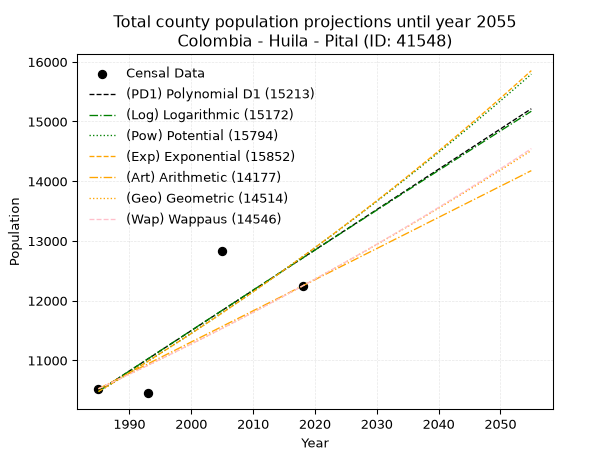
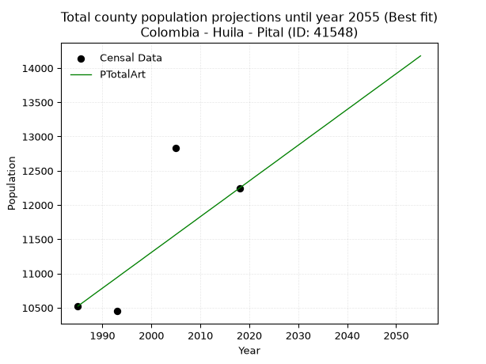
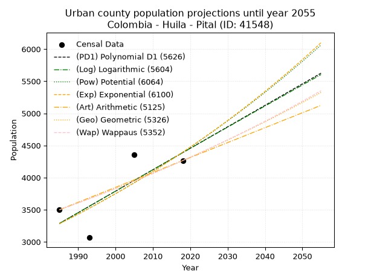
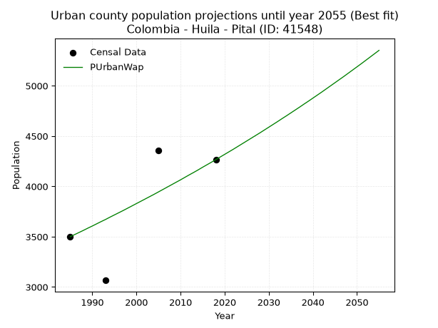
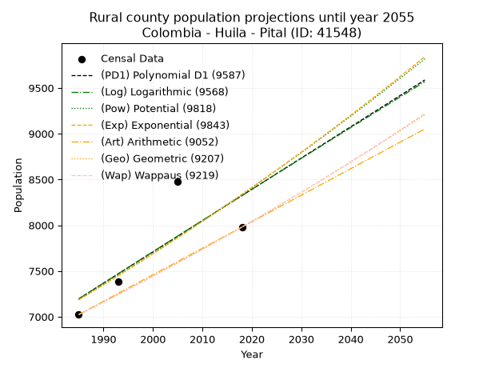
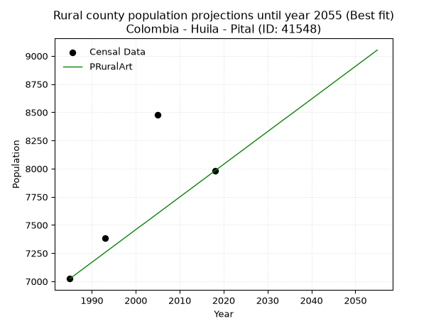

<div align="center">


</div>

# 📜 _“Population and Public Services Demand Projections (PPSD) until Year 2050 for Colombia - Huila - Pital (ID: 41548)”_
Keywords: `population` `public-service` `projection` `lineal` `polynomial` `logarithmic` `potential` `exponential` `arithmetic` `geometric` `wappaus` `dane` `colombia` `south-america`

PPSD are analytical estimates used by governments and planners to anticipate future changes in population size, age distribution, and the resulting community needs for utilities, healthcare, education, and infrastructure as sizing future water treatment facilities, electrical grids, and road networks based on spatial growth.

<div align="center">

</img>

</div>


> **General running parameters**: • app_version: _v20260806_. • Python version: _3.14.7_. • Pandas version: _3.0.5_. • NumPy version: _2.5.1_. • Creates, save and include plots into reports (create_plot): _False_. • Projection until year: _2050_. • Process polynomial degree 2 and up: _False_. • Process Wappaus: _True_. • Process Wappaus: _True_. • Set negative values to zero: _True_. • Set infinite values to zero: _True_. • Drop dataset notes: _True_. 
<div align="center">

Maps & GIS Layers: [:earth_americas:Google](http://maps.google.com/maps?q=2.266617817,-75.8045437) [:earth_americas:OSM](https://www.openstreetmap.org/#map=18/2.266617817/-75.8045437&layers=P) [:earth_americas:Bing](https://www.bing.com/maps?cp=2.266617817~-75.8045437&lvl=18) [:earth_americas:Apple](https://maps.apple.com/frame?center=2.266617817%2C-75.8045437&span=0.003%2C0.006) [:earth_americas:GISMobile](https://github.com/rcfdtools/R.GISMobile/blob/main/file/gis/CountyLayer_CO/Readme.md)

</div>


<div align="center">

```geojson
{
  "type": "Feature",
  "geometry": {
    "type": "Point", 
    "coordinates": [-75.8045437, 2.266617817]
  }, 
  "properties": {
    "Name": "Colombia - Huila - Pital (ID: 41548)"
  }
}
```

</div>


## 0. Census Data (4 records)

Census data are official statistics collected by a government about the people and housing in a country. They usually include counts of total population, age, sex, race, income, education, and jobs.

📅Global census file: [Population.xlsx](../data/Population.xlsx)

| Source   |   Year |   CountryID | CountryName   |   StateID | StateName   |   CountyID | CountyName   |   PTotal |   PUrban |   PRural |
|:---------|-------:|------------:|:--------------|----------:|:------------|-----------:|:-------------|---------:|---------:|---------:|
| DANE     |   1985 |          57 | Colombia      |        41 | Huila       |      41548 | Pital        |    10524 |     3500 |     7024 |
| DANE     |   1993 |          57 | Colombia      |        41 | Huila       |      41548 | Pital        |    10450 |     3066 |     7384 |
| DANE     |   2005 |          57 | Colombia      |        41 | Huila       |      41548 | Pital        |    12835 |     4355 |     8480 |
| DANE     |   2018 |          57 | Colombia      |        41 | Huila       |      41548 | Pital        |    12246 |     4266 |     7980 |

> 🔥Some records could had specific notes about the registered values or the corresponding urban or rural distribution.

📅[SUI-RUPS](https://www.datos.gov.co/Hacienda-y-Cr-dito-P-blico/Registro-nico-de-Prestadores-de-Servicios-P-blicos/4qkq-csdn/about_data) - Local public utility companies: [RUPS.csv](../data/RUPS.csv)

 | SERVICIO       | ESTADO    | NOMBRE                                                                                                          | NIT         | DEPARTAMENTO_DOMICILIO   | MUNICIPIO_DOMICILIO   | DIRECCION                                  |   TELEFONO | EMAIL                                    | TIPO_PRESTADOR                             | CLASIFICACION                  |
|:---------------|:----------|:----------------------------------------------------------------------------------------------------------------|:------------|:-------------------------|:----------------------|:-------------------------------------------|-----------:|:-----------------------------------------|:-------------------------------------------|:-------------------------------|
| ACUEDUCTO      | OPERATIVA | AGUAS Y ASEO DE EL PITAL Y AGRADO S.A. E.S.P.                                                                   | 813007990-8 | HUILA                    | PITAL                 | Calle 8 No. 9 - 80                         |    8327250 | asesoriasenserviciospublicos07@gmail.com | SOCIEDADES (EMPRESA DE SERVICIOS PUBLICOS) | DESDE 2501 HASTA 5000 USUARIOS |
| ALCANTARILLADO | OPERATIVA | AGUAS Y ASEO DE EL PITAL Y AGRADO S.A. E.S.P.                                                                   | 813007990-8 | HUILA                    | PITAL                 | Calle 8 No. 9 - 80                         |    8327250 | asesoriasenserviciospublicos07@gmail.com | SOCIEDADES (EMPRESA DE SERVICIOS PUBLICOS) | DESDE 2501 HASTA 5000 USUARIOS |
| ACUEDUCTO      | OPERATIVA | JUNTA ADMINISTRADORA DEL SERVICIO DEL ACUEDUCTO DE LAS VEREDAS LOS OLIVOS RECREO PLAYA RICA SANTA ROSA Y RETIRO | 813006891-2 | HUILA                    | PITAL                 | VEREDA EL RECREO CASA JESUS EDUARDO TUMIÑÁ |    8327066 | yagoqy18@hotmail.com                     | ORGANIZACION AUTORIZADA                    | HASTA 2500 SUSCRIPTORES        |
| ACUEDUCTO      | OPERATIVA | JUNTA ADMINISTRADORA DEL ACUEDUCTO DE LA VEREDA EL UVITAL DE MUNICIPIO DE EL PITAL                              | 900034257-7 | HUILA                    | PITAL                 | VEREDA UVITAL                              |    8327050 | contacto@hobo-huila.gov.co               | ORGANIZACION AUTORIZADA                    | HASTA 2500 SUSCRIPTORES        |

## 1. Total

### 1.1. Coefficients and Parameters

* (PD1) Polynomial Deg 1: 67.5700521878765, -123643.24688879997 (lineal)
* (Log) Logarithmic: 135365.79730347486, -1017402.7600571337
* (Pow) Potential: 11.850499190767318, -35.059974722483666
* (Exp) Exponential: 0.005915647134212598, 0.08327482270086137
* (Art) Arithmetic: Year diff. 2018 - 1985 = 33, Population diff. 12246 - 10524 = 1722, Annual growth = 52.18181818181818
* (Geo) Geometric: Year diff. 2018 - 1985 = 33, Population diff. 12246 - 10524 = 1722, Annual growth % = 0.0046027112930902
* (Wap) Wappaus: i = 0.4583383239509722, Condition values only valid for < 200)

<sub>
Wappaus condition values: ['0.00', '0.46', '0.92', '1.38', '1.83', '2.29', '2.75', '3.21', '3.67', '4.13', '4.58', '5.04', '5.50', '5.96', '6.42', '6.88', '7.33', '7.79', '8.25', '8.71', '9.17', '9.63', '10.08', '10.54', '11.00', '11.46', '11.92', '12.38', '12.83', '13.29', '13.75', '14.21', '14.67', '15.13', '15.58', '16.04', '16.50', '16.96', '17.42', '17.88', '18.33', '18.79', '19.25', '19.71', '20.17', '20.63', '21.08', '21.54', '22.00', '22.46', '22.92', '23.38', '23.83', '24.29', '24.75', '25.21', '25.67', '26.13', '26.58', '27.04', '27.50', '27.96', '28.42', '28.88', '29.33', '29.79']
</sub>


### 1.2. Projected Dataset

|   Year |   CountyID |   PTotalPD1 |   PTotalLog |   PTotalPow |   PTotalExp |   PTotalArt |   PTotalGeo |   PTotalWap |
|-------:|-----------:|------------:|------------:|------------:|------------:|------------:|------------:|------------:|
|   1985 |      41548 |       10483 |       10480 |       10475 |       10477 |       10524 |       10524 |       10524 |
|   1986 |      41548 |       10551 |       10549 |       10537 |       10539 |       10576 |       10572 |       10572 |
|   1987 |      41548 |       10618 |       10617 |       10600 |       10602 |       10628 |       10621 |       10621 |
|   1988 |      41548 |       10686 |       10685 |       10664 |       10665 |       10681 |       10670 |       10670 |
|   1989 |      41548 |       10754 |       10753 |       10727 |       10728 |       10733 |       10719 |       10719 |
|   1990 |      41548 |       10821 |       10821 |       10791 |       10792 |       10785 |       10768 |       10768 |
|   1991 |      41548 |       10889 |       10889 |       10856 |       10856 |       10837 |       10818 |       10817 |
|   1992 |      41548 |       10956 |       10957 |       10921 |       10920 |       10889 |       10868 |       10867 |
|   1993 |      41548 |       11024 |       11025 |       10986 |       10985 |       10941 |       10918 |       10917 |
|   1994 |      41548 |       11091 |       11093 |       11051 |       11050 |       10994 |       10968 |       10967 |
|   1995 |      41548 |       11159 |       11161 |       11117 |       11116 |       11046 |       11019 |       11018 |
|   1996 |      41548 |       11227 |       11228 |       11183 |       11182 |       11098 |       11069 |       11068 |
|   1997 |      41548 |       11294 |       11296 |       11250 |       11248 |       11150 |       11120 |       11119 |
|   1998 |      41548 |       11362 |       11364 |       11317 |       11315 |       11202 |       11171 |       11170 |
|   1999 |      41548 |       11429 |       11432 |       11384 |       11382 |       11255 |       11223 |       11222 |
|   2000 |      41548 |       11497 |       11499 |       11452 |       11449 |       11307 |       11274 |       11273 |
|   2001 |      41548 |       11564 |       11567 |       11520 |       11517 |       11359 |       11326 |       11325 |
|   2002 |      41548 |       11632 |       11635 |       11588 |       11586 |       11411 |       11378 |       11377 |
|   2003 |      41548 |       11700 |       11702 |       11657 |       11654 |       11463 |       11431 |       11430 |
|   2004 |      41548 |       11767 |       11770 |       11726 |       11723 |       11515 |       11483 |       11482 |
|   2005 |      41548 |       11835 |       11837 |       11796 |       11793 |       11568 |       11536 |       11535 |
|   2006 |      41548 |       11902 |       11905 |       11866 |       11863 |       11620 |       11589 |       11588 |
|   2007 |      41548 |       11970 |       11972 |       11936 |       11933 |       11672 |       11643 |       11642 |
|   2008 |      41548 |       12037 |       12040 |       12007 |       12004 |       11724 |       11696 |       11695 |
|   2009 |      41548 |       12105 |       12107 |       12078 |       12075 |       11776 |       11750 |       11749 |
|   2010 |      41548 |       12173 |       12175 |       12149 |       12147 |       11829 |       11804 |       11803 |
|   2011 |      41548 |       12240 |       12242 |       12221 |       12219 |       11881 |       11859 |       11858 |
|   2012 |      41548 |       12308 |       12309 |       12293 |       12292 |       11933 |       11913 |       11912 |
|   2013 |      41548 |       12375 |       12376 |       12366 |       12365 |       11985 |       11968 |       11967 |
|   2014 |      41548 |       12443 |       12444 |       12439 |       12438 |       12037 |       12023 |       12022 |
|   2015 |      41548 |       12510 |       12511 |       12512 |       12512 |       12089 |       12078 |       12078 |
|   2016 |      41548 |       12578 |       12578 |       12586 |       12586 |       12142 |       12134 |       12134 |
|   2017 |      41548 |       12646 |       12645 |       12660 |       12661 |       12194 |       12190 |       12190 |
|   2018 |      41548 |       12713 |       12712 |       12735 |       12736 |       12246 |       12246 |       12246 |
|   2019 |      41548 |       12781 |       12779 |       12810 |       12811 |       12298 |       12302 |       12303 |
|   2020 |      41548 |       12848 |       12846 |       12885 |       12887 |       12350 |       12359 |       12359 |
|   2021 |      41548 |       12916 |       12913 |       12961 |       12964 |       12403 |       12416 |       12417 |
|   2022 |      41548 |       12983 |       12980 |       13037 |       13041 |       12455 |       12473 |       12474 |
|   2023 |      41548 |       13051 |       13047 |       13114 |       13118 |       12507 |       12530 |       12532 |
|   2024 |      41548 |       13119 |       13114 |       13191 |       13196 |       12559 |       12588 |       12590 |
|   2025 |      41548 |       13186 |       13181 |       13268 |       13274 |       12611 |       12646 |       12648 |
|   2026 |      41548 |       13254 |       13248 |       13346 |       13353 |       12663 |       12704 |       12707 |
|   2027 |      41548 |       13321 |       13315 |       13424 |       13432 |       12716 |       12763 |       12766 |
|   2028 |      41548 |       13389 |       13381 |       13503 |       13512 |       12768 |       12821 |       12825 |
|   2029 |      41548 |       13456 |       13448 |       13582 |       13592 |       12820 |       12880 |       12884 |
|   2030 |      41548 |       13524 |       13515 |       13662 |       13673 |       12872 |       12940 |       12944 |
|   2031 |      41548 |       13592 |       13582 |       13742 |       13754 |       12924 |       12999 |       13004 |
|   2032 |      41548 |       13659 |       13648 |       13822 |       13835 |       12977 |       13059 |       13065 |
|   2033 |      41548 |       13727 |       13715 |       13903 |       13917 |       13029 |       13119 |       13125 |
|   2034 |      41548 |       13794 |       13781 |       13984 |       14000 |       13081 |       13180 |       13187 |
|   2035 |      41548 |       13862 |       13848 |       14066 |       14083 |       13133 |       13240 |       13248 |
|   2036 |      41548 |       13929 |       13914 |       14148 |       14167 |       13185 |       13301 |       13310 |
|   2037 |      41548 |       13997 |       13981 |       14231 |       14251 |       13237 |       13362 |       13372 |
|   2038 |      41548 |       14065 |       14047 |       14314 |       14335 |       13290 |       13424 |       13434 |
|   2039 |      41548 |       14132 |       14114 |       14397 |       14420 |       13342 |       13486 |       13497 |
|   2040 |      41548 |       14200 |       14180 |       14481 |       14506 |       13394 |       13548 |       13560 |
|   2041 |      41548 |       14267 |       14246 |       14565 |       14592 |       13446 |       13610 |       13623 |
|   2042 |      41548 |       14335 |       14313 |       14650 |       14679 |       13498 |       13673 |       13687 |
|   2043 |      41548 |       14402 |       14379 |       14735 |       14766 |       13551 |       13736 |       13751 |
|   2044 |      41548 |       14470 |       14445 |       14821 |       14853 |       13603 |       13799 |       13815 |
|   2045 |      41548 |       14538 |       14511 |       14907 |       14941 |       13655 |       13863 |       13880 |
|   2046 |      41548 |       14605 |       14578 |       14994 |       15030 |       13707 |       13926 |       13945 |
|   2047 |      41548 |       14673 |       14644 |       15081 |       15119 |       13759 |       13990 |       14010 |
|   2048 |      41548 |       14740 |       14710 |       15168 |       15209 |       13811 |       14055 |       14076 |
|   2049 |      41548 |       14808 |       14776 |       15256 |       15299 |       13864 |       14119 |       14142 |
|   2050 |      41548 |       14875 |       14842 |       15345 |       15390 |       13916 |       14184 |       14208 |
<div align="center">

</img>

</div>


### 1.3. Best fit with absolute and relative error (%)

Relative error puts that difference into context by dividing the absolute error by the true value, creating a unitless ratio or percentage that shows the scale of the mistake.

Absolute and relative error

|   Year | Source   |   CountryID | CountryName   |   StateID | StateName   |   CountyID_x | CountyName   |   PTotal |   PUrban |   PRural |   CountyID_y |   PTotalPD1 |   PTotalLog |   PTotalPow |   PTotalExp |   PTotalArt |   PTotalGeo |   PTotalWap |   PTotalPD1AbsError |   PTotalLogAbsError |   PTotalPowAbsError |   PTotalExpAbsError |   PTotalArtAbsError |   PTotalGeoAbsError |   PTotalWapAbsError |   PTotalPD1RelError |   PTotalLogRelError |   PTotalPowRelError |   PTotalExpRelError |   PTotalArtRelError |   PTotalGeoRelError |   PTotalWapRelError |
|-------:|:---------|------------:|:--------------|----------:|:------------|-------------:|:-------------|---------:|---------:|---------:|-------------:|------------:|------------:|------------:|------------:|------------:|------------:|------------:|--------------------:|--------------------:|--------------------:|--------------------:|--------------------:|--------------------:|--------------------:|--------------------:|--------------------:|--------------------:|--------------------:|--------------------:|--------------------:|--------------------:|
|   1985 | DANE     |          57 | Colombia      |        41 | Huila       |        41548 | Pital        |    10524 |     3500 |     7024 |        41548 |       10483 |       10480 |       10475 |       10477 |       10524 |       10524 |       10524 |                  41 |                  44 |                  49 |                  47 |                   0 |                   0 |                   0 |            0.389586 |            0.418092 |            0.465602 |            0.446598 |             0       |             0       |              0      |
|   1993 | DANE     |          57 | Colombia      |        41 | Huila       |        41548 | Pital        |    10450 |     3066 |     7384 |        41548 |       11024 |       11025 |       10986 |       10985 |       10941 |       10918 |       10917 |                 574 |                 575 |                 536 |                 535 |                 491 |                 468 |                 467 |            5.49282  |            5.50239  |            5.12919  |            5.11962  |             4.69856 |             4.47847 |              4.4689 |
|   2005 | DANE     |          57 | Colombia      |        41 | Huila       |        41548 | Pital        |    12835 |     4355 |     8480 |        41548 |       11835 |       11837 |       11796 |       11793 |       11568 |       11536 |       11535 |                1000 |                 998 |                1039 |                1042 |                1267 |                1299 |                1300 |            7.7912   |            7.77561  |            8.09505  |            8.11843  |             9.87145 |            10.1208  |             10.1286 |
|   2018 | DANE     |          57 | Colombia      |        41 | Huila       |        41548 | Pital        |    12246 |     4266 |     7980 |        41548 |       12713 |       12712 |       12735 |       12736 |       12246 |       12246 |       12246 |                 467 |                 466 |                 489 |                 490 |                   0 |                   0 |                   0 |            3.81349  |            3.80532  |            3.99314  |            4.00131  |             0       |             0       |              0      |

Relative error mean

| Method    |   RelError | Best   |
|:----------|-----------:|:-------|
| PTotalPD1 |    4.37177 |        |
| PTotalLog |    4.37536 |        |
| PTotalPow |    4.42075 |        |
| PTotalExp |    4.42149 |        |
| PTotalArt |    3.6425  | True   |
| PTotalGeo |    3.64981 |        |
| PTotalWap |    3.64936 |        |

💙Best method: _**PTotalArt**_
<div align="center">

</img>

</div>


### 1.4. Fresh water supply demand in liters per capita per day (lpcd)

The fresh water supply demand typically ranges from 100 to 300 liters per capita per day (lpcd) for standard domestic and municipal planning, though absolute survival minimums set by the World Health Organization are as low as 7.5 to 20 liters per day, and total consumption in high-income nations can exceed 400 liters.

> `CZ`: Level in meters above the sea level (masl)<br> `WS`: Fresh water supply demand in liters per capita per day (lpcd or l/h/d)<br> `WSAll`: Zonal fresh water supply demand in liters per second (l/s)<br> `A`: Zonal area in square meters<br> `DP`: Population density (people/hectare or p/ha)

Reference values (RAS Colombia)

|    CZ |   WS |
|------:|-----:|
|  1000 |  120 |
|  2000 |  130 |
| 99999 |  140 |

County shapefile geometry properties and water supply values

|   CountyID |      ATotal |   CZTotal |   WSTotal |
|-----------:|------------:|----------:|----------:|
|      41548 | 1.93643e+08 |   1464.86 |       130 |

Projected values for best method: PTotalArt

|   CountyID |   Year |   PTotalArt |   DPTotal |   WSTotal |   WSTotalAll |
|-----------:|-------:|------------:|----------:|----------:|-------------:|
|      41548 |   1985 |       10524 |      0.54 |       130 |      15.8347 |
|      41548 |   1986 |       10576 |      0.55 |       130 |      15.913  |
|      41548 |   1987 |       10628 |      0.55 |       130 |      15.9912 |
|      41548 |   1988 |       10681 |      0.55 |       130 |      16.0709 |
|      41548 |   1989 |       10733 |      0.55 |       130 |      16.1492 |
|      41548 |   1990 |       10785 |      0.56 |       130 |      16.2274 |
|      41548 |   1991 |       10837 |      0.56 |       130 |      16.3057 |
|      41548 |   1992 |       10889 |      0.56 |       130 |      16.3839 |
|      41548 |   1993 |       10941 |      0.57 |       130 |      16.4622 |
|      41548 |   1994 |       10994 |      0.57 |       130 |      16.5419 |
|      41548 |   1995 |       11046 |      0.57 |       130 |      16.6201 |
|      41548 |   1996 |       11098 |      0.57 |       130 |      16.6984 |
|      41548 |   1997 |       11150 |      0.58 |       130 |      16.7766 |
|      41548 |   1998 |       11202 |      0.58 |       130 |      16.8549 |
|      41548 |   1999 |       11255 |      0.58 |       130 |      16.9346 |
|      41548 |   2000 |       11307 |      0.58 |       130 |      17.0128 |
|      41548 |   2001 |       11359 |      0.59 |       130 |      17.0911 |
|      41548 |   2002 |       11411 |      0.59 |       130 |      17.1693 |
|      41548 |   2003 |       11463 |      0.59 |       130 |      17.2476 |
|      41548 |   2004 |       11515 |      0.59 |       130 |      17.3258 |
|      41548 |   2005 |       11568 |      0.6  |       130 |      17.4056 |
|      41548 |   2006 |       11620 |      0.6  |       130 |      17.4838 |
|      41548 |   2007 |       11672 |      0.6  |       130 |      17.562  |
|      41548 |   2008 |       11724 |      0.61 |       130 |      17.6403 |
|      41548 |   2009 |       11776 |      0.61 |       130 |      17.7185 |
|      41548 |   2010 |       11829 |      0.61 |       130 |      17.7983 |
|      41548 |   2011 |       11881 |      0.61 |       130 |      17.8765 |
|      41548 |   2012 |       11933 |      0.62 |       130 |      17.9547 |
|      41548 |   2013 |       11985 |      0.62 |       130 |      18.033  |
|      41548 |   2014 |       12037 |      0.62 |       130 |      18.1112 |
|      41548 |   2015 |       12089 |      0.62 |       130 |      18.1895 |
|      41548 |   2016 |       12142 |      0.63 |       130 |      18.2692 |
|      41548 |   2017 |       12194 |      0.63 |       130 |      18.3475 |
|      41548 |   2018 |       12246 |      0.63 |       130 |      18.4257 |
|      41548 |   2019 |       12298 |      0.64 |       130 |      18.5039 |
|      41548 |   2020 |       12350 |      0.64 |       130 |      18.5822 |
|      41548 |   2021 |       12403 |      0.64 |       130 |      18.6619 |
|      41548 |   2022 |       12455 |      0.64 |       130 |      18.7402 |
|      41548 |   2023 |       12507 |      0.65 |       130 |      18.8184 |
|      41548 |   2024 |       12559 |      0.65 |       130 |      18.8966 |
|      41548 |   2025 |       12611 |      0.65 |       130 |      18.9749 |
|      41548 |   2026 |       12663 |      0.65 |       130 |      19.0531 |
|      41548 |   2027 |       12716 |      0.66 |       130 |      19.1329 |
|      41548 |   2028 |       12768 |      0.66 |       130 |      19.2111 |
|      41548 |   2029 |       12820 |      0.66 |       130 |      19.2894 |
|      41548 |   2030 |       12872 |      0.66 |       130 |      19.3676 |
|      41548 |   2031 |       12924 |      0.67 |       130 |      19.4458 |
|      41548 |   2032 |       12977 |      0.67 |       130 |      19.5256 |
|      41548 |   2033 |       13029 |      0.67 |       130 |      19.6038 |
|      41548 |   2034 |       13081 |      0.68 |       130 |      19.6821 |
|      41548 |   2035 |       13133 |      0.68 |       130 |      19.7603 |
|      41548 |   2036 |       13185 |      0.68 |       130 |      19.8385 |
|      41548 |   2037 |       13237 |      0.68 |       130 |      19.9168 |
|      41548 |   2038 |       13290 |      0.69 |       130 |      19.9965 |
|      41548 |   2039 |       13342 |      0.69 |       130 |      20.0748 |
|      41548 |   2040 |       13394 |      0.69 |       130 |      20.153  |
|      41548 |   2041 |       13446 |      0.69 |       130 |      20.2312 |
|      41548 |   2042 |       13498 |      0.7  |       130 |      20.3095 |
|      41548 |   2043 |       13551 |      0.7  |       130 |      20.3892 |
|      41548 |   2044 |       13603 |      0.7  |       130 |      20.4675 |
|      41548 |   2045 |       13655 |      0.71 |       130 |      20.5457 |
|      41548 |   2046 |       13707 |      0.71 |       130 |      20.624  |
|      41548 |   2047 |       13759 |      0.71 |       130 |      20.7022 |
|      41548 |   2048 |       13811 |      0.71 |       130 |      20.7804 |
|      41548 |   2049 |       13864 |      0.72 |       130 |      20.8602 |
|      41548 |   2050 |       13916 |      0.72 |       130 |      20.9384 |

## 2. Urban

### 2.1. Coefficients and Parameters

* (PD1) Polynomial Deg 1: 33.40706543556804, -63025.732637494984 (lineal)
* (Log) Logarithmic: 66872.91752533344, -504504.83199598873
* (Pow) Potential: 17.71269445169769, -54.89603536423982
* (Exp) Exponential: 0.008849388562030687, 7.717386477806514e-05
* (Art) Arithmetic: Year diff. 2018 - 1985 = 33, Population diff. 4266 - 3500 = 766, Annual growth = 23.21212121212121
* (Geo) Geometric: Year diff. 2018 - 1985 = 33, Population diff. 4266 - 3500 = 766, Annual growth % = 0.00601540369101583
* (Wap) Wappaus: i = 0.5977883392253724, Condition values only valid for < 200)

<sub>
Wappaus condition values: ['0.00', '0.60', '1.20', '1.79', '2.39', '2.99', '3.59', '4.18', '4.78', '5.38', '5.98', '6.58', '7.17', '7.77', '8.37', '8.97', '9.56', '10.16', '10.76', '11.36', '11.96', '12.55', '13.15', '13.75', '14.35', '14.94', '15.54', '16.14', '16.74', '17.34', '17.93', '18.53', '19.13', '19.73', '20.32', '20.92', '21.52', '22.12', '22.72', '23.31', '23.91', '24.51', '25.11', '25.70', '26.30', '26.90', '27.50', '28.10', '28.69', '29.29', '29.89', '30.49', '31.08', '31.68', '32.28', '32.88', '33.48', '34.07', '34.67', '35.27', '35.87', '36.47', '37.06', '37.66', '38.26', '38.86']
</sub>


### 2.2. Projected Dataset

|   Year |   CountyID |   PUrbanPD1 |   PUrbanLog |   PUrbanPow |   PUrbanExp |   PUrbanArt |   PUrbanGeo |   PUrbanWap |
|-------:|-----------:|------------:|------------:|------------:|------------:|------------:|------------:|------------:|
|   1985 |      41548 |        3287 |        3286 |        3282 |        3283 |        3500 |        3500 |        3500 |
|   1986 |      41548 |        3321 |        3320 |        3312 |        3312 |        3523 |        3521 |        3521 |
|   1987 |      41548 |        3354 |        3354 |        3341 |        3342 |        3546 |        3542 |        3542 |
|   1988 |      41548 |        3388 |        3387 |        3371 |        3372 |        3570 |        3564 |        3563 |
|   1989 |      41548 |        3421 |        3421 |        3402 |        3402 |        3593 |        3585 |        3585 |
|   1990 |      41548 |        3454 |        3454 |        3432 |        3432 |        3616 |        3607 |        3606 |
|   1991 |      41548 |        3488 |        3488 |        3463 |        3462 |        3639 |        3628 |        3628 |
|   1992 |      41548 |        3521 |        3522 |        3494 |        3493 |        3662 |        3650 |        3650 |
|   1993 |      41548 |        3555 |        3555 |        3525 |        3524 |        3686 |        3672 |        3671 |
|   1994 |      41548 |        3588 |        3589 |        3556 |        3555 |        3709 |        3694 |        3694 |
|   1995 |      41548 |        3621 |        3622 |        3588 |        3587 |        3732 |        3716 |        3716 |
|   1996 |      41548 |        3655 |        3656 |        3620 |        3619 |        3755 |        3739 |        3738 |
|   1997 |      41548 |        3688 |        3689 |        3652 |        3651 |        3779 |        3761 |        3760 |
|   1998 |      41548 |        3722 |        3723 |        3685 |        3684 |        3802 |        3784 |        3783 |
|   1999 |      41548 |        3755 |        3756 |        3718 |        3716 |        3825 |        3807 |        3806 |
|   2000 |      41548 |        3788 |        3790 |        3751 |        3749 |        3848 |        3829 |        3829 |
|   2001 |      41548 |        3822 |        3823 |        3784 |        3783 |        3871 |        3852 |        3852 |
|   2002 |      41548 |        3855 |        3857 |        3818 |        3816 |        3895 |        3876 |        3875 |
|   2003 |      41548 |        3889 |        3890 |        3852 |        3850 |        3918 |        3899 |        3898 |
|   2004 |      41548 |        3922 |        3923 |        3886 |        3884 |        3941 |        3922 |        3921 |
|   2005 |      41548 |        3955 |        3957 |        3920 |        3919 |        3964 |        3946 |        3945 |
|   2006 |      41548 |        3989 |        3990 |        3955 |        3954 |        3987 |        3970 |        3969 |
|   2007 |      41548 |        4022 |        4023 |        3990 |        3989 |        4011 |        3994 |        3993 |
|   2008 |      41548 |        4056 |        4057 |        4025 |        4024 |        4034 |        4018 |        4017 |
|   2009 |      41548 |        4089 |        4090 |        4061 |        4060 |        4057 |        4042 |        4041 |
|   2010 |      41548 |        4122 |        4123 |        4097 |        4096 |        4080 |        4066 |        4065 |
|   2011 |      41548 |        4156 |        4156 |        4133 |        4133 |        4104 |        4091 |        4090 |
|   2012 |      41548 |        4189 |        4190 |        4170 |        4169 |        4127 |        4115 |        4115 |
|   2013 |      41548 |        4223 |        4223 |        4207 |        4206 |        4150 |        4140 |        4139 |
|   2014 |      41548 |        4256 |        4256 |        4244 |        4244 |        4173 |        4165 |        4164 |
|   2015 |      41548 |        4290 |        4289 |        4281 |        4282 |        4196 |        4190 |        4190 |
|   2016 |      41548 |        4323 |        4323 |        4319 |        4320 |        4220 |        4215 |        4215 |
|   2017 |      41548 |        4356 |        4356 |        4357 |        4358 |        4243 |        4240 |        4240 |
|   2018 |      41548 |        4390 |        4389 |        4396 |        4397 |        4266 |        4266 |        4266 |
|   2019 |      41548 |        4423 |        4422 |        4434 |        4436 |        4289 |        4292 |        4292 |
|   2020 |      41548 |        4457 |        4455 |        4473 |        4475 |        4312 |        4317 |        4318 |
|   2021 |      41548 |        4490 |        4488 |        4513 |        4515 |        4336 |        4343 |        4344 |
|   2022 |      41548 |        4523 |        4521 |        4553 |        4555 |        4359 |        4370 |        4370 |
|   2023 |      41548 |        4557 |        4554 |        4593 |        4596 |        4382 |        4396 |        4397 |
|   2024 |      41548 |        4590 |        4587 |        4633 |        4636 |        4405 |        4422 |        4424 |
|   2025 |      41548 |        4624 |        4620 |        4674 |        4678 |        4428 |        4449 |        4451 |
|   2026 |      41548 |        4657 |        4653 |        4715 |        4719 |        4452 |        4476 |        4478 |
|   2027 |      41548 |        4690 |        4686 |        4756 |        4761 |        4475 |        4503 |        4505 |
|   2028 |      41548 |        4724 |        4719 |        4798 |        4804 |        4498 |        4530 |        4532 |
|   2029 |      41548 |        4757 |        4752 |        4840 |        4846 |        4521 |        4557 |        4560 |
|   2030 |      41548 |        4791 |        4785 |        4882 |        4889 |        4545 |        4584 |        4588 |
|   2031 |      41548 |        4824 |        4818 |        4925 |        4933 |        4568 |        4612 |        4616 |
|   2032 |      41548 |        4857 |        4851 |        4968 |        4977 |        4591 |        4640 |        4644 |
|   2033 |      41548 |        4891 |        4884 |        5012 |        5021 |        4614 |        4668 |        4673 |
|   2034 |      41548 |        4924 |        4917 |        5056 |        5065 |        4637 |        4696 |        4701 |
|   2035 |      41548 |        4958 |        4950 |        5100 |        5111 |        4661 |        4724 |        4730 |
|   2036 |      41548 |        4991 |        4983 |        5144 |        5156 |        4684 |        4752 |        4759 |
|   2037 |      41548 |        5024 |        5016 |        5189 |        5202 |        4707 |        4781 |        4788 |
|   2038 |      41548 |        5058 |        5048 |        5235 |        5248 |        4730 |        4810 |        4818 |
|   2039 |      41548 |        5091 |        5081 |        5280 |        5295 |        4753 |        4839 |        4847 |
|   2040 |      41548 |        5125 |        5114 |        5326 |        5342 |        4777 |        4868 |        4877 |
|   2041 |      41548 |        5158 |        5147 |        5373 |        5389 |        4800 |        4897 |        4907 |
|   2042 |      41548 |        5191 |        5179 |        5420 |        5437 |        4823 |        4926 |        4937 |
|   2043 |      41548 |        5225 |        5212 |        5467 |        5485 |        4846 |        4956 |        4968 |
|   2044 |      41548 |        5258 |        5245 |        5514 |        5534 |        4870 |        4986 |        4999 |
|   2045 |      41548 |        5292 |        5278 |        5562 |        5583 |        4893 |        5016 |        5030 |
|   2046 |      41548 |        5325 |        5310 |        5611 |        5633 |        4916 |        5046 |        5061 |
|   2047 |      41548 |        5359 |        5343 |        5660 |        5683 |        4939 |        5076 |        5092 |
|   2048 |      41548 |        5392 |        5376 |        5709 |        5734 |        4962 |        5107 |        5124 |
|   2049 |      41548 |        5425 |        5408 |        5758 |        5785 |        4986 |        5138 |        5156 |
|   2050 |      41548 |        5459 |        5441 |        5808 |        5836 |        5009 |        5169 |        5188 |
<div align="center">

</img>

</div>


### 2.3. Best fit with absolute and relative error (%)

Relative error puts that difference into context by dividing the absolute error by the true value, creating a unitless ratio or percentage that shows the scale of the mistake.

Absolute and relative error

|   Year | Source   |   CountryID | CountryName   |   StateID | StateName   |   CountyID_x | CountyName   |   PTotal |   PUrban |   PRural |   CountyID_y |   PUrbanPD1 |   PUrbanLog |   PUrbanPow |   PUrbanExp |   PUrbanArt |   PUrbanGeo |   PUrbanWap |   PUrbanPD1AbsError |   PUrbanLogAbsError |   PUrbanPowAbsError |   PUrbanExpAbsError |   PUrbanArtAbsError |   PUrbanGeoAbsError |   PUrbanWapAbsError |   PUrbanPD1RelError |   PUrbanLogRelError |   PUrbanPowRelError |   PUrbanExpRelError |   PUrbanArtRelError |   PUrbanGeoRelError |   PUrbanWapRelError |
|-------:|:---------|------------:|:--------------|----------:|:------------|-------------:|:-------------|---------:|---------:|---------:|-------------:|------------:|------------:|------------:|------------:|------------:|------------:|------------:|--------------------:|--------------------:|--------------------:|--------------------:|--------------------:|--------------------:|--------------------:|--------------------:|--------------------:|--------------------:|--------------------:|--------------------:|--------------------:|--------------------:|
|   1985 | DANE     |          57 | Colombia      |        41 | Huila       |        41548 | Pital        |    10524 |     3500 |     7024 |        41548 |        3287 |        3286 |        3282 |        3283 |        3500 |        3500 |        3500 |                 213 |                 214 |                 218 |                 217 |                   0 |                   0 |                   0 |             6.08571 |             6.11429 |             6.22857 |             6.2     |             0       |              0      |             0       |
|   1993 | DANE     |          57 | Colombia      |        41 | Huila       |        41548 | Pital        |    10450 |     3066 |     7384 |        41548 |        3555 |        3555 |        3525 |        3524 |        3686 |        3672 |        3671 |                 489 |                 489 |                 459 |                 458 |                 620 |                 606 |                 605 |            15.9491  |            15.9491  |            14.9706  |            14.938   |            20.2218  |             19.7652 |            19.7326  |
|   2005 | DANE     |          57 | Colombia      |        41 | Huila       |        41548 | Pital        |    12835 |     4355 |     8480 |        41548 |        3955 |        3957 |        3920 |        3919 |        3964 |        3946 |        3945 |                 400 |                 398 |                 435 |                 436 |                 391 |                 409 |                 410 |             9.18485 |             9.13892 |             9.98852 |            10.0115  |             8.97819 |              9.3915 |             9.41447 |
|   2018 | DANE     |          57 | Colombia      |        41 | Huila       |        41548 | Pital        |    12246 |     4266 |     7980 |        41548 |        4390 |        4389 |        4396 |        4397 |        4266 |        4266 |        4266 |                 124 |                 123 |                 130 |                 131 |                   0 |                   0 |                   0 |             2.9067  |             2.88326 |             3.04735 |             3.07079 |             0       |              0      |             0       |

Relative error mean

| Method    |   RelError | Best   |
|:----------|-----------:|:-------|
| PUrbanPD1 |    8.5316  |        |
| PUrbanLog |    8.5214  |        |
| PUrbanPow |    8.55877 |        |
| PUrbanExp |    8.55508 |        |
| PUrbanArt |    7.29999 |        |
| PUrbanGeo |    7.28917 |        |
| PUrbanWap |    7.28675 | True   |

💙Best method: _**PUrbanWap**_
<div align="center">

</img>

</div>


### 2.4. Fresh water supply demand in liters per capita per day (lpcd)

The fresh water supply demand typically ranges from 100 to 300 liters per capita per day (lpcd) for standard domestic and municipal planning, though absolute survival minimums set by the World Health Organization are as low as 7.5 to 20 liters per day, and total consumption in high-income nations can exceed 400 liters.

> `CZ`: Level in meters above the sea level (masl)<br> `WS`: Fresh water supply demand in liters per capita per day (lpcd or l/h/d)<br> `WSAll`: Zonal fresh water supply demand in liters per second (l/s)<br> `A`: Zonal area in square meters<br> `DP`: Population density (people/hectare or p/ha)

Reference values (RAS Colombia)

|    CZ |   WS |
|------:|-----:|
|  1000 |  120 |
|  2000 |  130 |
| 99999 |  140 |

County shapefile geometry properties and water supply values

|   CountyID |   AUrban |   CZUrban |   WSUrban |
|-----------:|---------:|----------:|----------:|
|      41548 |   913076 |   920.787 |       120 |

Projected values for best method: PUrbanWap

|   CountyID |   Year |   PUrbanWap |   DPUrban |   WSUrban |   WSUrbanAll |
|-----------:|-------:|------------:|----------:|----------:|-------------:|
|      41548 |   1985 |        3500 |     38.33 |       120 |      4.86111 |
|      41548 |   1986 |        3521 |     38.56 |       120 |      4.89028 |
|      41548 |   1987 |        3542 |     38.79 |       120 |      4.91944 |
|      41548 |   1988 |        3563 |     39.02 |       120 |      4.94861 |
|      41548 |   1989 |        3585 |     39.26 |       120 |      4.97917 |
|      41548 |   1990 |        3606 |     39.49 |       120 |      5.00833 |
|      41548 |   1991 |        3628 |     39.73 |       120 |      5.03889 |
|      41548 |   1992 |        3650 |     39.97 |       120 |      5.06944 |
|      41548 |   1993 |        3671 |     40.2  |       120 |      5.09861 |
|      41548 |   1994 |        3694 |     40.46 |       120 |      5.13056 |
|      41548 |   1995 |        3716 |     40.7  |       120 |      5.16111 |
|      41548 |   1996 |        3738 |     40.94 |       120 |      5.19167 |
|      41548 |   1997 |        3760 |     41.18 |       120 |      5.22222 |
|      41548 |   1998 |        3783 |     41.43 |       120 |      5.25417 |
|      41548 |   1999 |        3806 |     41.68 |       120 |      5.28611 |
|      41548 |   2000 |        3829 |     41.94 |       120 |      5.31806 |
|      41548 |   2001 |        3852 |     42.19 |       120 |      5.35    |
|      41548 |   2002 |        3875 |     42.44 |       120 |      5.38194 |
|      41548 |   2003 |        3898 |     42.69 |       120 |      5.41389 |
|      41548 |   2004 |        3921 |     42.94 |       120 |      5.44583 |
|      41548 |   2005 |        3945 |     43.21 |       120 |      5.47917 |
|      41548 |   2006 |        3969 |     43.47 |       120 |      5.5125  |
|      41548 |   2007 |        3993 |     43.73 |       120 |      5.54583 |
|      41548 |   2008 |        4017 |     43.99 |       120 |      5.57917 |
|      41548 |   2009 |        4041 |     44.26 |       120 |      5.6125  |
|      41548 |   2010 |        4065 |     44.52 |       120 |      5.64583 |
|      41548 |   2011 |        4090 |     44.79 |       120 |      5.68056 |
|      41548 |   2012 |        4115 |     45.07 |       120 |      5.71528 |
|      41548 |   2013 |        4139 |     45.33 |       120 |      5.74861 |
|      41548 |   2014 |        4164 |     45.6  |       120 |      5.78333 |
|      41548 |   2015 |        4190 |     45.89 |       120 |      5.81944 |
|      41548 |   2016 |        4215 |     46.16 |       120 |      5.85417 |
|      41548 |   2017 |        4240 |     46.44 |       120 |      5.88889 |
|      41548 |   2018 |        4266 |     46.72 |       120 |      5.925   |
|      41548 |   2019 |        4292 |     47.01 |       120 |      5.96111 |
|      41548 |   2020 |        4318 |     47.29 |       120 |      5.99722 |
|      41548 |   2021 |        4344 |     47.58 |       120 |      6.03333 |
|      41548 |   2022 |        4370 |     47.86 |       120 |      6.06944 |
|      41548 |   2023 |        4397 |     48.16 |       120 |      6.10694 |
|      41548 |   2024 |        4424 |     48.45 |       120 |      6.14444 |
|      41548 |   2025 |        4451 |     48.75 |       120 |      6.18194 |
|      41548 |   2026 |        4478 |     49.04 |       120 |      6.21944 |
|      41548 |   2027 |        4505 |     49.34 |       120 |      6.25694 |
|      41548 |   2028 |        4532 |     49.63 |       120 |      6.29444 |
|      41548 |   2029 |        4560 |     49.94 |       120 |      6.33333 |
|      41548 |   2030 |        4588 |     50.25 |       120 |      6.37222 |
|      41548 |   2031 |        4616 |     50.55 |       120 |      6.41111 |
|      41548 |   2032 |        4644 |     50.86 |       120 |      6.45    |
|      41548 |   2033 |        4673 |     51.18 |       120 |      6.49028 |
|      41548 |   2034 |        4701 |     51.49 |       120 |      6.52917 |
|      41548 |   2035 |        4730 |     51.8  |       120 |      6.56944 |
|      41548 |   2036 |        4759 |     52.12 |       120 |      6.60972 |
|      41548 |   2037 |        4788 |     52.44 |       120 |      6.65    |
|      41548 |   2038 |        4818 |     52.77 |       120 |      6.69167 |
|      41548 |   2039 |        4847 |     53.08 |       120 |      6.73194 |
|      41548 |   2040 |        4877 |     53.41 |       120 |      6.77361 |
|      41548 |   2041 |        4907 |     53.74 |       120 |      6.81528 |
|      41548 |   2042 |        4937 |     54.07 |       120 |      6.85694 |
|      41548 |   2043 |        4968 |     54.41 |       120 |      6.9     |
|      41548 |   2044 |        4999 |     54.75 |       120 |      6.94306 |
|      41548 |   2045 |        5030 |     55.09 |       120 |      6.98611 |
|      41548 |   2046 |        5061 |     55.43 |       120 |      7.02917 |
|      41548 |   2047 |        5092 |     55.77 |       120 |      7.07222 |
|      41548 |   2048 |        5124 |     56.12 |       120 |      7.11667 |
|      41548 |   2049 |        5156 |     56.47 |       120 |      7.16111 |
|      41548 |   2050 |        5188 |     56.82 |       120 |      7.20556 |

## 3. Rural

### 3.1. Coefficients and Parameters

* (PD1) Polynomial Deg 1: 34.16298675230852, -60617.514251305125 (lineal)
* (Log) Logarithmic: 68492.87977814156, -512897.9280611461
* (Pow) Potential: 9.00567604473111, -25.842100854959302
* (Exp) Exponential: 0.004492040186646618, 0.9640387378781767
* (Art) Arithmetic: Year diff. 2018 - 1985 = 33, Population diff. 7980 - 7024 = 956, Annual growth = 28.96969696969697
* (Geo) Geometric: Year diff. 2018 - 1985 = 33, Population diff. 7980 - 7024 = 956, Annual growth % = 0.0038743208561216047
* (Wap) Wappaus: i = 0.3861596503558647, Condition values only valid for < 200)

<sub>
Wappaus condition values: ['0.00', '0.39', '0.77', '1.16', '1.54', '1.93', '2.32', '2.70', '3.09', '3.48', '3.86', '4.25', '4.63', '5.02', '5.41', '5.79', '6.18', '6.56', '6.95', '7.34', '7.72', '8.11', '8.50', '8.88', '9.27', '9.65', '10.04', '10.43', '10.81', '11.20', '11.58', '11.97', '12.36', '12.74', '13.13', '13.52', '13.90', '14.29', '14.67', '15.06', '15.45', '15.83', '16.22', '16.60', '16.99', '17.38', '17.76', '18.15', '18.54', '18.92', '19.31', '19.69', '20.08', '20.47', '20.85', '21.24', '21.62', '22.01', '22.40', '22.78', '23.17', '23.56', '23.94', '24.33', '24.71', '25.10']
</sub>


### 3.2. Projected Dataset

|   Year |   CountyID |   PRuralPD1 |   PRuralLog |   PRuralPow |   PRuralExp |   PRuralArt |   PRuralGeo |   PRuralWap |
|-------:|-----------:|------------:|------------:|------------:|------------:|------------:|------------:|------------:|
|   1985 |      41548 |        7196 |        7194 |        7186 |        7187 |        7024 |        7024 |        7024 |
|   1986 |      41548 |        7230 |        7229 |        7218 |        7220 |        7053 |        7051 |        7051 |
|   1987 |      41548 |        7264 |        7263 |        7251 |        7252 |        7082 |        7079 |        7078 |
|   1988 |      41548 |        7299 |        7298 |        7284 |        7285 |        7111 |        7106 |        7106 |
|   1989 |      41548 |        7333 |        7332 |        7317 |        7318 |        7140 |        7133 |        7133 |
|   1990 |      41548 |        7367 |        7366 |        7350 |        7351 |        7169 |        7161 |        7161 |
|   1991 |      41548 |        7401 |        7401 |        7384 |        7384 |        7198 |        7189 |        7189 |
|   1992 |      41548 |        7435 |        7435 |        7417 |        7417 |        7227 |        7217 |        7216 |
|   1993 |      41548 |        7469 |        7470 |        7451 |        7450 |        7256 |        7245 |        7244 |
|   1994 |      41548 |        7503 |        7504 |        7484 |        7484 |        7285 |        7273 |        7272 |
|   1995 |      41548 |        7538 |        7538 |        7518 |        7518 |        7314 |        7301 |        7301 |
|   1996 |      41548 |        7572 |        7573 |        7552 |        7551 |        7343 |        7329 |        7329 |
|   1997 |      41548 |        7606 |        7607 |        7586 |        7585 |        7372 |        7358 |        7357 |
|   1998 |      41548 |        7640 |        7641 |        7621 |        7620 |        7401 |        7386 |        7386 |
|   1999 |      41548 |        7674 |        7676 |        7655 |        7654 |        7430 |        7415 |        7414 |
|   2000 |      41548 |        7708 |        7710 |        7690 |        7688 |        7459 |        7443 |        7443 |
|   2001 |      41548 |        7743 |        7744 |        7724 |        7723 |        7488 |        7472 |        7472 |
|   2002 |      41548 |        7777 |        7778 |        7759 |        7758 |        7516 |        7501 |        7501 |
|   2003 |      41548 |        7811 |        7812 |        7794 |        7793 |        7545 |        7530 |        7530 |
|   2004 |      41548 |        7845 |        7847 |        7829 |        7828 |        7574 |        7559 |        7559 |
|   2005 |      41548 |        7879 |        7881 |        7865 |        7863 |        7603 |        7589 |        7588 |
|   2006 |      41548 |        7913 |        7915 |        7900 |        7898 |        7632 |        7618 |        7618 |
|   2007 |      41548 |        7948 |        7949 |        7935 |        7934 |        7661 |        7648 |        7647 |
|   2008 |      41548 |        7982 |        7983 |        7971 |        7970 |        7690 |        7677 |        7677 |
|   2009 |      41548 |        8016 |        8017 |        8007 |        8006 |        7719 |        7707 |        7707 |
|   2010 |      41548 |        8050 |        8051 |        8043 |        8042 |        7748 |        7737 |        7736 |
|   2011 |      41548 |        8084 |        8085 |        8079 |        8078 |        7777 |        7767 |        7766 |
|   2012 |      41548 |        8118 |        8119 |        8115 |        8114 |        7806 |        7797 |        7797 |
|   2013 |      41548 |        8153 |        8154 |        8152 |        8151 |        7835 |        7827 |        7827 |
|   2014 |      41548 |        8187 |        8188 |        8188 |        8187 |        7864 |        7858 |        7857 |
|   2015 |      41548 |        8221 |        8222 |        8225 |        8224 |        7893 |        7888 |        7888 |
|   2016 |      41548 |        8255 |        8256 |        8262 |        8261 |        7922 |        7919 |        7918 |
|   2017 |      41548 |        8289 |        8289 |        8299 |        8298 |        7951 |        7949 |        7949 |
|   2018 |      41548 |        8323 |        8323 |        8336 |        8336 |        7980 |        7980 |        7980 |
|   2019 |      41548 |        8358 |        8357 |        8373 |        8373 |        8009 |        8011 |        8011 |
|   2020 |      41548 |        8392 |        8391 |        8411 |        8411 |        8038 |        8042 |        8042 |
|   2021 |      41548 |        8426 |        8425 |        8448 |        8449 |        8067 |        8073 |        8073 |
|   2022 |      41548 |        8460 |        8459 |        8486 |        8487 |        8096 |        8104 |        8105 |
|   2023 |      41548 |        8494 |        8493 |        8524 |        8525 |        8125 |        8136 |        8136 |
|   2024 |      41548 |        8528 |        8527 |        8562 |        8564 |        8154 |        8167 |        8168 |
|   2025 |      41548 |        8563 |        8561 |        8600 |        8602 |        8183 |        8199 |        8200 |
|   2026 |      41548 |        8597 |        8594 |        8638 |        8641 |        8212 |        8231 |        8232 |
|   2027 |      41548 |        8631 |        8628 |        8677 |        8680 |        8241 |        8263 |        8264 |
|   2028 |      41548 |        8665 |        8662 |        8715 |        8719 |        8270 |        8295 |        8296 |
|   2029 |      41548 |        8699 |        8696 |        8754 |        8758 |        8299 |        8327 |        8328 |
|   2030 |      41548 |        8733 |        8730 |        8793 |        8797 |        8328 |        8359 |        8361 |
|   2031 |      41548 |        8768 |        8763 |        8832 |        8837 |        8357 |        8391 |        8393 |
|   2032 |      41548 |        8802 |        8797 |        8871 |        8877 |        8386 |        8424 |        8426 |
|   2033 |      41548 |        8836 |        8831 |        8911 |        8917 |        8415 |        8457 |        8459 |
|   2034 |      41548 |        8870 |        8864 |        8950 |        8957 |        8444 |        8489 |        8492 |
|   2035 |      41548 |        8904 |        8898 |        8990 |        8997 |        8472 |        8522 |        8525 |
|   2036 |      41548 |        8938 |        8932 |        9030 |        9038 |        8501 |        8555 |        8558 |
|   2037 |      41548 |        8972 |        8965 |        9070 |        9078 |        8530 |        8588 |        8592 |
|   2038 |      41548 |        9007 |        8999 |        9110 |        9119 |        8559 |        8622 |        8625 |
|   2039 |      41548 |        9041 |        9033 |        9150 |        9160 |        8588 |        8655 |        8659 |
|   2040 |      41548 |        9075 |        9066 |        9191 |        9202 |        8617 |        8689 |        8693 |
|   2041 |      41548 |        9109 |        9100 |        9232 |        9243 |        8646 |        8722 |        8727 |
|   2042 |      41548 |        9143 |        9133 |        9272 |        9285 |        8675 |        8756 |        8761 |
|   2043 |      41548 |        9177 |        9167 |        9313 |        9326 |        8704 |        8790 |        8796 |
|   2044 |      41548 |        9212 |        9200 |        9354 |        9368 |        8733 |        8824 |        8830 |
|   2045 |      41548 |        9246 |        9234 |        9396 |        9411 |        8762 |        8858 |        8865 |
|   2046 |      41548 |        9280 |        9267 |        9437 |        9453 |        8791 |        8893 |        8899 |
|   2047 |      41548 |        9314 |        9301 |        9479 |        9496 |        8820 |        8927 |        8934 |
|   2048 |      41548 |        9348 |        9334 |        9521 |        9538 |        8849 |        8962 |        8969 |
|   2049 |      41548 |        9382 |        9368 |        9563 |        9581 |        8878 |        8996 |        9005 |
|   2050 |      41548 |        9417 |        9401 |        9605 |        9624 |        8907 |        9031 |        9040 |
<div align="center">

</img>

</div>


### 3.3. Best fit with absolute and relative error (%)

Relative error puts that difference into context by dividing the absolute error by the true value, creating a unitless ratio or percentage that shows the scale of the mistake.

Absolute and relative error

|   Year | Source   |   CountryID | CountryName   |   StateID | StateName   |   CountyID_x | CountyName   |   PTotal |   PUrban |   PRural |   CountyID_y |   PRuralPD1 |   PRuralLog |   PRuralPow |   PRuralExp |   PRuralArt |   PRuralGeo |   PRuralWap |   PRuralPD1AbsError |   PRuralLogAbsError |   PRuralPowAbsError |   PRuralExpAbsError |   PRuralArtAbsError |   PRuralGeoAbsError |   PRuralWapAbsError |   PRuralPD1RelError |   PRuralLogRelError |   PRuralPowRelError |   PRuralExpRelError |   PRuralArtRelError |   PRuralGeoRelError |   PRuralWapRelError |
|-------:|:---------|------------:|:--------------|----------:|:------------|-------------:|:-------------|---------:|---------:|---------:|-------------:|------------:|------------:|------------:|------------:|------------:|------------:|------------:|--------------------:|--------------------:|--------------------:|--------------------:|--------------------:|--------------------:|--------------------:|--------------------:|--------------------:|--------------------:|--------------------:|--------------------:|--------------------:|--------------------:|
|   1985 | DANE     |          57 | Colombia      |        41 | Huila       |        41548 | Pital        |    10524 |     3500 |     7024 |        41548 |        7196 |        7194 |        7186 |        7187 |        7024 |        7024 |        7024 |                 172 |                 170 |                 162 |                 163 |                   0 |                   0 |                   0 |             2.44875 |             2.42027 |            2.30638  |            2.32062  |             0       |             0       |             0       |
|   1993 | DANE     |          57 | Colombia      |        41 | Huila       |        41548 | Pital        |    10450 |     3066 |     7384 |        41548 |        7469 |        7470 |        7451 |        7450 |        7256 |        7245 |        7244 |                  85 |                  86 |                  67 |                  66 |                 128 |                 139 |                 140 |             1.15114 |             1.16468 |            0.907367 |            0.893824 |             1.73348 |             1.88245 |             1.89599 |
|   2005 | DANE     |          57 | Colombia      |        41 | Huila       |        41548 | Pital        |    12835 |     4355 |     8480 |        41548 |        7879 |        7881 |        7865 |        7863 |        7603 |        7589 |        7588 |                 601 |                 599 |                 615 |                 617 |                 877 |                 891 |                 892 |             7.08726 |             7.06368 |            7.25236  |            7.27594  |            10.342   |            10.5071  |            10.5189  |
|   2018 | DANE     |          57 | Colombia      |        41 | Huila       |        41548 | Pital        |    12246 |     4266 |     7980 |        41548 |        8323 |        8323 |        8336 |        8336 |        7980 |        7980 |        7980 |                 343 |                 343 |                 356 |                 356 |                   0 |                   0 |                   0 |             4.29825 |             4.29825 |            4.46115  |            4.46115  |             0       |             0       |             0       |

Relative error mean

| Method    |   RelError | Best   |
|:----------|-----------:|:-------|
| PRuralPD1 |    3.74635 |        |
| PRuralLog |    3.73672 |        |
| PRuralPow |    3.73181 |        |
| PRuralExp |    3.73788 |        |
| PRuralArt |    3.01886 | True   |
| PRuralGeo |    3.09738 |        |
| PRuralWap |    3.10371 |        |

💙Best method: _**PRuralArt**_
<div align="center">

</img>

</div>


### 3.4. Fresh water supply demand in liters per capita per day (lpcd)

The fresh water supply demand typically ranges from 100 to 300 liters per capita per day (lpcd) for standard domestic and municipal planning, though absolute survival minimums set by the World Health Organization are as low as 7.5 to 20 liters per day, and total consumption in high-income nations can exceed 400 liters.

> `CZ`: Level in meters above the sea level (masl)<br> `WS`: Fresh water supply demand in liters per capita per day (lpcd or l/h/d)<br> `WSAll`: Zonal fresh water supply demand in liters per second (l/s)<br> `A`: Zonal area in square meters<br> `DP`: Population density (people/hectare or p/ha)

Reference values (RAS Colombia)

|    CZ |   WS |
|------:|-----:|
|  1000 |  120 |
|  2000 |  130 |
| 99999 |  140 |

County shapefile geometry properties and water supply values

|   CountyID |     ARural |   CZRural |   WSRural |
|-----------:|-----------:|----------:|----------:|
|      41548 | 1.9273e+08 |   1467.44 |       130 |

Projected values for best method: PRuralArt

|   CountyID |   Year |   PRuralArt |   DPRural |   WSRural |   WSRuralAll |
|-----------:|-------:|------------:|----------:|----------:|-------------:|
|      41548 |   1985 |        7024 |      0.36 |       130 |      10.5685 |
|      41548 |   1986 |        7053 |      0.37 |       130 |      10.6122 |
|      41548 |   1987 |        7082 |      0.37 |       130 |      10.6558 |
|      41548 |   1988 |        7111 |      0.37 |       130 |      10.6994 |
|      41548 |   1989 |        7140 |      0.37 |       130 |      10.7431 |
|      41548 |   1990 |        7169 |      0.37 |       130 |      10.7867 |
|      41548 |   1991 |        7198 |      0.37 |       130 |      10.8303 |
|      41548 |   1992 |        7227 |      0.37 |       130 |      10.874  |
|      41548 |   1993 |        7256 |      0.38 |       130 |      10.9176 |
|      41548 |   1994 |        7285 |      0.38 |       130 |      10.9612 |
|      41548 |   1995 |        7314 |      0.38 |       130 |      11.0049 |
|      41548 |   1996 |        7343 |      0.38 |       130 |      11.0485 |
|      41548 |   1997 |        7372 |      0.38 |       130 |      11.0921 |
|      41548 |   1998 |        7401 |      0.38 |       130 |      11.1358 |
|      41548 |   1999 |        7430 |      0.39 |       130 |      11.1794 |
|      41548 |   2000 |        7459 |      0.39 |       130 |      11.223  |
|      41548 |   2001 |        7488 |      0.39 |       130 |      11.2667 |
|      41548 |   2002 |        7516 |      0.39 |       130 |      11.3088 |
|      41548 |   2003 |        7545 |      0.39 |       130 |      11.3524 |
|      41548 |   2004 |        7574 |      0.39 |       130 |      11.3961 |
|      41548 |   2005 |        7603 |      0.39 |       130 |      11.4397 |
|      41548 |   2006 |        7632 |      0.4  |       130 |      11.4833 |
|      41548 |   2007 |        7661 |      0.4  |       130 |      11.527  |
|      41548 |   2008 |        7690 |      0.4  |       130 |      11.5706 |
|      41548 |   2009 |        7719 |      0.4  |       130 |      11.6142 |
|      41548 |   2010 |        7748 |      0.4  |       130 |      11.6579 |
|      41548 |   2011 |        7777 |      0.4  |       130 |      11.7015 |
|      41548 |   2012 |        7806 |      0.41 |       130 |      11.7451 |
|      41548 |   2013 |        7835 |      0.41 |       130 |      11.7888 |
|      41548 |   2014 |        7864 |      0.41 |       130 |      11.8324 |
|      41548 |   2015 |        7893 |      0.41 |       130 |      11.876  |
|      41548 |   2016 |        7922 |      0.41 |       130 |      11.9197 |
|      41548 |   2017 |        7951 |      0.41 |       130 |      11.9633 |
|      41548 |   2018 |        7980 |      0.41 |       130 |      12.0069 |
|      41548 |   2019 |        8009 |      0.42 |       130 |      12.0506 |
|      41548 |   2020 |        8038 |      0.42 |       130 |      12.0942 |
|      41548 |   2021 |        8067 |      0.42 |       130 |      12.1378 |
|      41548 |   2022 |        8096 |      0.42 |       130 |      12.1815 |
|      41548 |   2023 |        8125 |      0.42 |       130 |      12.2251 |
|      41548 |   2024 |        8154 |      0.42 |       130 |      12.2688 |
|      41548 |   2025 |        8183 |      0.42 |       130 |      12.3124 |
|      41548 |   2026 |        8212 |      0.43 |       130 |      12.356  |
|      41548 |   2027 |        8241 |      0.43 |       130 |      12.3997 |
|      41548 |   2028 |        8270 |      0.43 |       130 |      12.4433 |
|      41548 |   2029 |        8299 |      0.43 |       130 |      12.4869 |
|      41548 |   2030 |        8328 |      0.43 |       130 |      12.5306 |
|      41548 |   2031 |        8357 |      0.43 |       130 |      12.5742 |
|      41548 |   2032 |        8386 |      0.44 |       130 |      12.6178 |
|      41548 |   2033 |        8415 |      0.44 |       130 |      12.6615 |
|      41548 |   2034 |        8444 |      0.44 |       130 |      12.7051 |
|      41548 |   2035 |        8472 |      0.44 |       130 |      12.7472 |
|      41548 |   2036 |        8501 |      0.44 |       130 |      12.7909 |
|      41548 |   2037 |        8530 |      0.44 |       130 |      12.8345 |
|      41548 |   2038 |        8559 |      0.44 |       130 |      12.8781 |
|      41548 |   2039 |        8588 |      0.45 |       130 |      12.9218 |
|      41548 |   2040 |        8617 |      0.45 |       130 |      12.9654 |
|      41548 |   2041 |        8646 |      0.45 |       130 |      13.009  |
|      41548 |   2042 |        8675 |      0.45 |       130 |      13.0527 |
|      41548 |   2043 |        8704 |      0.45 |       130 |      13.0963 |
|      41548 |   2044 |        8733 |      0.45 |       130 |      13.1399 |
|      41548 |   2045 |        8762 |      0.45 |       130 |      13.1836 |
|      41548 |   2046 |        8791 |      0.46 |       130 |      13.2272 |
|      41548 |   2047 |        8820 |      0.46 |       130 |      13.2708 |
|      41548 |   2048 |        8849 |      0.46 |       130 |      13.3145 |
|      41548 |   2049 |        8878 |      0.46 |       130 |      13.3581 |
|      41548 |   2050 |        8907 |      0.46 |       130 |      13.4017 |

#

<div align="center"><br><sub>Share this research</sub></div><br>

<sub>**APPS & TOOLS & CONTENT DISCLAIMER**: • NO WARRANTY - This content and software is provided by <a href="https://github.com/rcfdtools" target="_blank">github.com/rcfdtools</a> "as is", without any express or implied warranty, including warranties of merchantability, fitness for a particular purpose, or non-infringement. There is no guarantee that the software will be error-free or operate without interruption. • LIMITATION OF LIABILITY - Neither the authors nor copyright holders will be liable for claims or damages arising from the software or its use. You are responsible for determining if the software is appropriate for your use and assume all associated risks, including errors, legal compliance, and data loss. • NO PROFESSIONAL ADVICE - The software provides general information and does not offer professional advice. It should not replace consultation with professional advisors. [Clauses and global license for rcfdtools use.](https://github.com/rcfdtools/rcfdtools/blob/main/LICENSE.md)</sub>

| [:house: Home](Readme.md)  | [:beginner: Help / Collab](https://github.com/rcfdtools/R.HydroTools/discussions/31) |
|----------------------------|-------------------------------------------------------------------------------------------|