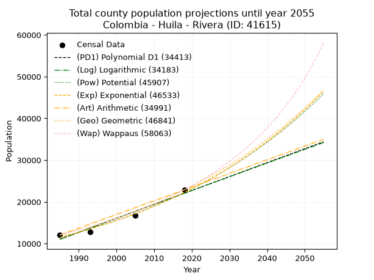
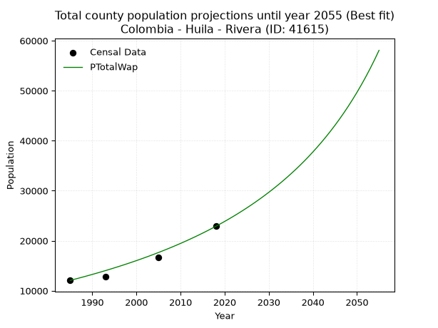
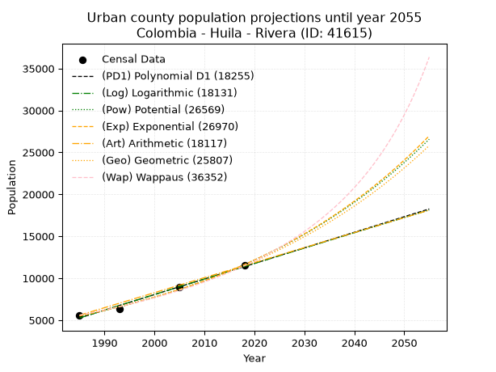
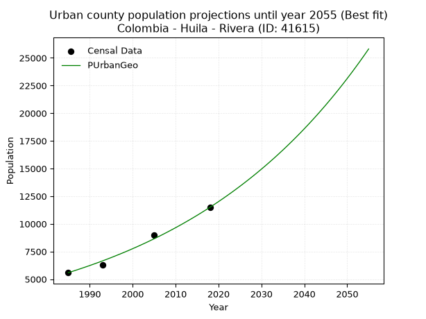
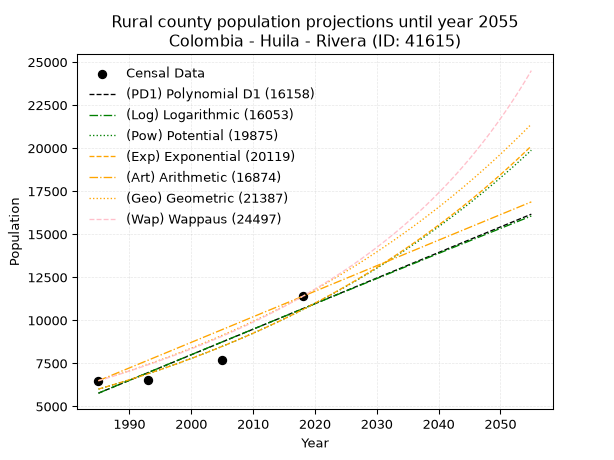
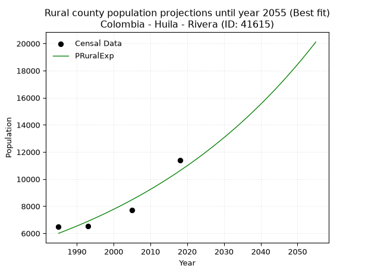

<div align="center">


</div>

# _“Population and Public Services Demand Projections (PPSD) until Year 2050 for Colombia - Huila - Rivera (ID: 41615)”_
Keywords: `population` `public-service` `projection` `lineal` `polynomial` `logarithmic` `potential` `exponential` `arithmetic` `geometric` `wappaus` `dane` `colombia` `south-america`

PPSD are analytical estimates used by governments and planners to anticipate future changes in population size, age distribution, and the resulting community needs for utilities, healthcare, education, and infrastructure as sizing future water treatment facilities, electrical grids, and road networks based on spatial growth.

> **General running parameters**: • app_version: _v20260806_. • Python version: _3.14.7_. • Pandas version: _3.0.5_. • NumPy version: _2.5.1_. • Creates, save and include plots into reports (create_plot): _True_. • Projection until year: _2050_. • Process polynomial degree 2 and up: _False_. • Process Wappaus: _True_. • Process Wappaus: _True_. • Set negative values to zero: _True_. • Set infinite values to zero: _True_. • Drop dataset notes: _True_. 
<div align="center">

Dynamic map: [:earth_americas:Google](http://maps.google.com/maps?q=2.777585629,-75.2587532) [:earth_americas:OSM](https://www.openstreetmap.org/#map=18/2.777585629/-75.2587532&layers=P) [:earth_americas:Bing](https://www.bing.com/maps?cp=2.777585629~-75.2587532&lvl=18) [:earth_americas:Apple](https://maps.apple.com/frame?center=2.777585629%2C-75.2587532&span=0.003%2C0.006)

</div>


<div align="center">

```geojson
{
  "type": "Feature",
  "geometry": {
    "type": "Point", 
    "coordinates": [-75.2587532, 2.777585629]
  }, 
  "properties": {
    "Name": "Colombia - Huila - Rivera (ID: 41615)"
  }
}
```

</div>


## 0. Census Data (4 records)

Census data are official statistics collected by a government about the people and housing in a country. They usually include counts of total population, age, sex, race, income, education, and jobs.

📅Global census file: [Population.xlsx](../data/Population.xlsx)

| Source   |   Year |   CountryID | CountryName   |   StateID | StateName   |   CountyID | CountyName   |   PTotal |   PUrban |   PRural |
|:---------|-------:|------------:|:--------------|----------:|:------------|-----------:|:-------------|---------:|---------:|---------:|
| DANE     |   1985 |          57 | Colombia      |        41 | Huila       |      41615 | Rivera       |    12073 |     5587 |     6486 |
| DANE     |   1993 |          57 | Colombia      |        41 | Huila       |      41615 | Rivera       |    12844 |     6318 |     6526 |
| DANE     |   2005 |          57 | Colombia      |        41 | Huila       |      41615 | Rivera       |    16684 |     8967 |     7717 |
| DANE     |   2018 |          57 | Colombia      |        41 | Huila       |      41615 | Rivera       |    22877 |    11494 |    11383 |

> 🔥Some records has specific notes about the registered values or the corresponding urban or rural distribution.

## 1. Total

### 1.1. Coefficients and Parameters

* (PD1) Polynomial Deg 1: 334.136491368924, -652237.0168606903 (lineal)
* (Log) Logarithmic: 668463.8983631147, -5064879.948191533
* (Pow) Potential: 39.94738783164829, -127.67630304116015
* (Exp) Exponential: 0.019964366437491565, 7.080398920294812e-14
* (Art) Arithmetic: Year diff. 2018 - 1985 = 33, Population diff. 22877 - 12073 = 10804, Annual growth = 327.3939393939394
* (Geo) Geometric: Year diff. 2018 - 1985 = 33, Population diff. 22877 - 12073 = 10804, Annual growth % = 0.01955728578869187
* (Wap) Wappaus: i = 1.8734989378766203, Condition values only valid for < 200)

<sub>
Wappaus condition values: ['0.00', '1.87', '3.75', '5.62', '7.49', '9.37', '11.24', '13.11', '14.99', '16.86', '18.73', '20.61', '22.48', '24.36', '26.23', '28.10', '29.98', '31.85', '33.72', '35.60', '37.47', '39.34', '41.22', '43.09', '44.96', '46.84', '48.71', '50.58', '52.46', '54.33', '56.20', '58.08', '59.95', '61.83', '63.70', '65.57', '67.45', '69.32', '71.19', '73.07', '74.94', '76.81', '78.69', '80.56', '82.43', '84.31', '86.18', '88.05', '89.93', '91.80', '93.67', '95.55', '97.42', '99.30', '101.17', '103.04', '104.92', '106.79', '108.66', '110.54', '112.41', '114.28', '116.16', '118.03', '119.90', '121.78']
</sub>


### 1.2. Projected Dataset

|   Year |   CountyID |   PTotalPD1 |   PTotalLog |   PTotalPow |   PTotalExp |   PTotalArt |   PTotalGeo |   PTotalWap |
|-------:|-----------:|------------:|------------:|------------:|------------:|------------:|------------:|------------:|
|   1985 |      41615 |       11024 |       11017 |       11498 |       11503 |       12073 |       12073 |       12073 |
|   1986 |      41615 |       11358 |       11353 |       11731 |       11735 |       12400 |       12309 |       12301 |
|   1987 |      41615 |       11692 |       11690 |       11970 |       11972 |       12728 |       12550 |       12534 |
|   1988 |      41615 |       12026 |       12026 |       12213 |       12214 |       13055 |       12795 |       12771 |
|   1989 |      41615 |       12360 |       12362 |       12461 |       12460 |       13383 |       13046 |       13013 |
|   1990 |      41615 |       12695 |       12698 |       12713 |       12711 |       13710 |       13301 |       13260 |
|   1991 |      41615 |       13029 |       13034 |       12971 |       12967 |       14037 |       13561 |       13511 |
|   1992 |      41615 |       13363 |       13370 |       13234 |       13229 |       14365 |       13826 |       13767 |
|   1993 |      41615 |       13697 |       13705 |       13502 |       13496 |       14692 |       14096 |       14029 |
|   1994 |      41615 |       14031 |       14041 |       13775 |       13768 |       15020 |       14372 |       14296 |
|   1995 |      41615 |       14365 |       14376 |       14054 |       14045 |       15347 |       14653 |       14569 |
|   1996 |      41615 |       14699 |       14711 |       14338 |       14329 |       15674 |       14940 |       14847 |
|   1997 |      41615 |       15034 |       15045 |       14628 |       14618 |       16002 |       15232 |       15131 |
|   1998 |      41615 |       15368 |       15380 |       14923 |       14912 |       16329 |       15530 |       15421 |
|   1999 |      41615 |       15702 |       15715 |       15225 |       15213 |       16657 |       15834 |       15718 |
|   2000 |      41615 |       16036 |       16049 |       15532 |       15520 |       16984 |       16143 |       16020 |
|   2001 |      41615 |       16370 |       16383 |       15845 |       15833 |       17311 |       16459 |       16330 |
|   2002 |      41615 |       16704 |       16717 |       16165 |       16152 |       17639 |       16781 |       16647 |
|   2003 |      41615 |       17038 |       17051 |       16490 |       16478 |       17966 |       17109 |       16970 |
|   2004 |      41615 |       17373 |       17385 |       16822 |       16810 |       18293 |       17444 |       17301 |
|   2005 |      41615 |       17707 |       17718 |       17161 |       17149 |       18621 |       17785 |       17640 |
|   2006 |      41615 |       18041 |       18051 |       17506 |       17495 |       18948 |       18133 |       17986 |
|   2007 |      41615 |       18375 |       18384 |       17858 |       17848 |       19276 |       18487 |       18341 |
|   2008 |      41615 |       18709 |       18717 |       18217 |       18207 |       19603 |       18849 |       18704 |
|   2009 |      41615 |       19043 |       19050 |       18583 |       18575 |       19930 |       19217 |       19076 |
|   2010 |      41615 |       19377 |       19383 |       18956 |       18949 |       20258 |       19593 |       19457 |
|   2011 |      41615 |       19711 |       19715 |       19337 |       19331 |       20585 |       19976 |       19847 |
|   2012 |      41615 |       20046 |       20048 |       19724 |       19721 |       20913 |       20367 |       20248 |
|   2013 |      41615 |       20380 |       20380 |       20120 |       20119 |       21240 |       20765 |       20658 |
|   2014 |      41615 |       20714 |       20712 |       20523 |       20524 |       21567 |       21172 |       21079 |
|   2015 |      41615 |       21048 |       21044 |       20934 |       20938 |       21895 |       21586 |       21511 |
|   2016 |      41615 |       21382 |       21375 |       21353 |       21361 |       22222 |       22008 |       21954 |
|   2017 |      41615 |       21716 |       21707 |       21780 |       21791 |       22550 |       22438 |       22409 |
|   2018 |      41615 |       22050 |       22038 |       22216 |       22231 |       22877 |       22877 |       22877 |
|   2019 |      41615 |       22385 |       22369 |       22660 |       22679 |       23204 |       23324 |       23357 |
|   2020 |      41615 |       22719 |       22700 |       23113 |       23136 |       23532 |       23781 |       23851 |
|   2021 |      41615 |       23053 |       23031 |       23574 |       23603 |       23859 |       24246 |       24359 |
|   2022 |      41615 |       23387 |       23362 |       24045 |       24079 |       24187 |       24720 |       24881 |
|   2023 |      41615 |       23721 |       23692 |       24524 |       24564 |       24514 |       25203 |       25419 |
|   2024 |      41615 |       24055 |       24023 |       25013 |       25060 |       24841 |       25696 |       25972 |
|   2025 |      41615 |       24389 |       24353 |       25512 |       25565 |       25169 |       26199 |       26542 |
|   2026 |      41615 |       24724 |       24683 |       26020 |       26081 |       25496 |       26711 |       27129 |
|   2027 |      41615 |       25058 |       25013 |       26538 |       26606 |       25824 |       27234 |       27735 |
|   2028 |      41615 |       25392 |       25343 |       27066 |       27143 |       26151 |       27766 |       28359 |
|   2029 |      41615 |       25726 |       25672 |       27604 |       27690 |       26478 |       28309 |       29003 |
|   2030 |      41615 |       26060 |       26001 |       28153 |       28249 |       26806 |       28863 |       29669 |
|   2031 |      41615 |       26394 |       26331 |       28712 |       28818 |       27133 |       29427 |       30356 |
|   2032 |      41615 |       26728 |       26660 |       29282 |       29399 |       27461 |       30003 |       31066 |
|   2033 |      41615 |       27062 |       26989 |       29864 |       29992 |       27788 |       30590 |       31800 |
|   2034 |      41615 |       27397 |       27317 |       30456 |       30597 |       28115 |       31188 |       32560 |
|   2035 |      41615 |       27731 |       27646 |       31060 |       31214 |       28443 |       31798 |       33346 |
|   2036 |      41615 |       28065 |       27974 |       31676 |       31844 |       28770 |       32420 |       34161 |
|   2037 |      41615 |       28399 |       28303 |       32303 |       32486 |       29097 |       33054 |       35005 |
|   2038 |      41615 |       28733 |       28631 |       32943 |       33141 |       29425 |       33700 |       35881 |
|   2039 |      41615 |       29067 |       28959 |       33595 |       33809 |       29752 |       34359 |       36790 |
|   2040 |      41615 |       29401 |       29286 |       34259 |       34491 |       30080 |       35031 |       37734 |
|   2041 |      41615 |       29736 |       29614 |       34936 |       35186 |       30407 |       35716 |       38716 |
|   2042 |      41615 |       30070 |       29941 |       35627 |       35896 |       30734 |       36415 |       39737 |
|   2043 |      41615 |       30404 |       30269 |       36330 |       36620 |       31062 |       37127 |       40799 |
|   2044 |      41615 |       30738 |       30596 |       37048 |       37358 |       31389 |       37853 |       41907 |
|   2045 |      41615 |       31072 |       30923 |       37779 |       38111 |       31717 |       38593 |       43061 |
|   2046 |      41615 |       31406 |       31249 |       38524 |       38880 |       32044 |       39348 |       44266 |
|   2047 |      41615 |       31740 |       31576 |       39283 |       39664 |       32371 |       40118 |       45525 |
|   2048 |      41615 |       32075 |       31903 |       40057 |       40464 |       32699 |       40902 |       46842 |
|   2049 |      41615 |       32409 |       32229 |       40846 |       41280 |       33026 |       41702 |       48220 |
|   2050 |      41615 |       32743 |       32555 |       41650 |       42112 |       33354 |       42518 |       49664 |
<div align="center">

</img>

</div>


### 1.3. Best fit with absolute error and relative error (%)

Relative error puts that difference into context by dividing the absolute error by the true value, creating a unitless ratio or percentage that shows the scale of the mistake.

Absolute and relative error

|   Year | Source   |   CountryID | CountryName   |   StateID | StateName   |   CountyID_x | CountyName   |   PTotal |   PUrban |   PRural |   CountyID_y |   PTotalPD1 |   PTotalLog |   PTotalPow |   PTotalExp |   PTotalArt |   PTotalGeo |   PTotalWap |   PTotalPD1AbsError |   PTotalLogAbsError |   PTotalPowAbsError |   PTotalExpAbsError |   PTotalArtAbsError |   PTotalGeoAbsError |   PTotalWapAbsError |   PTotalPD1RelError |   PTotalLogRelError |   PTotalPowRelError |   PTotalExpRelError |   PTotalArtRelError |   PTotalGeoRelError |   PTotalWapRelError |
|-------:|:---------|------------:|:--------------|----------:|:------------|-------------:|:-------------|---------:|---------:|---------:|-------------:|------------:|------------:|------------:|------------:|------------:|------------:|------------:|--------------------:|--------------------:|--------------------:|--------------------:|--------------------:|--------------------:|--------------------:|--------------------:|--------------------:|--------------------:|--------------------:|--------------------:|--------------------:|--------------------:|
|   1985 | DANE     |          57 | Colombia      |        41 | Huila       |        41615 | Rivera       |    12073 |     5587 |     6486 |        41615 |       11024 |       11017 |       11498 |       11503 |       12073 |       12073 |       12073 |                1049 |                1056 |                 575 |                 570 |                   0 |                   0 |                   0 |             8.68881 |             8.74679 |             4.76269 |             4.72128 |              0      |             0       |             0       |
|   1993 | DANE     |          57 | Colombia      |        41 | Huila       |        41615 | Rivera       |    12844 |     6318 |     6526 |        41615 |       13697 |       13705 |       13502 |       13496 |       14692 |       14096 |       14029 |                 853 |                 861 |                 658 |                 652 |                1848 |                1252 |                1185 |             6.64123 |             6.70352 |             5.12301 |             5.0763  |             14.388  |             9.74774 |             9.2261  |
|   2005 | DANE     |          57 | Colombia      |        41 | Huila       |        41615 | Rivera       |    16684 |     8967 |     7717 |        41615 |       17707 |       17718 |       17161 |       17149 |       18621 |       17785 |       17640 |                1023 |                1034 |                 477 |                 465 |                1937 |                1101 |                 956 |             6.13162 |             6.19755 |             2.85903 |             2.7871  |             11.6099 |             6.59914 |             5.73004 |
|   2018 | DANE     |          57 | Colombia      |        41 | Huila       |        41615 | Rivera       |    22877 |    11494 |    11383 |        41615 |       22050 |       22038 |       22216 |       22231 |       22877 |       22877 |       22877 |                 827 |                 839 |                 661 |                 646 |                   0 |                   0 |                   0 |             3.61498 |             3.66744 |             2.88936 |             2.8238  |              0      |             0       |             0       |

Relative error mean

| Method    |   RelError | Best   |
|:----------|-----------:|:-------|
| PTotalPD1 |    6.26916 |        |
| PTotalLog |    6.32883 |        |
| PTotalPow |    3.90852 |        |
| PTotalExp |    3.85212 |        |
| PTotalArt |    6.49949 |        |
| PTotalGeo |    4.08672 |        |
| PTotalWap |    3.73903 | True   |

💙Best method: _**PTotalWap**_
<div align="center">

</img>

</div>


### 1.4. Fresh water supply demand in liters per capita per day (lpcd)

The fresh water supply demand typically ranges from 100 to 300 liters per capita per day (lpcd) for standard domestic and municipal planning, though absolute survival minimums set by the World Health Organization are as low as 7.5 to 20 liters per day, and total consumption in high-income nations can exceed 400 liters.

> `CZ`: Level in meters above the sea level (masl).<br> `WS`: Fresh water supply demand in liters per capita per day (lpcd or l/h/d).<br> `WSAll`: Zonal fresh water supply demand in liters per second (l/s).<br> `A`: Zonal area in square meters.

Reference values (RAS Colombia)

|    CZ |   WS |
|------:|-----:|
|  1000 |  120 |
|  2000 |  130 |
| 99999 |  140 |

County shapefile geometry properties and water supply values

|   CountyID |      ATotal |   CZTotal |   WSTotal |
|-----------:|------------:|----------:|----------:|
|      41615 | 2.51109e+08 |   1100.36 |       130 |

Projected values for best method: PTotalWap

|   CountyID |   Year |   PTotalWap |   WSTotal |   WSTotalAll |
|-----------:|-------:|------------:|----------:|-------------:|
|      41615 |   1985 |       12073 |       130 |      18.1654 |
|      41615 |   1986 |       12301 |       130 |      18.5084 |
|      41615 |   1987 |       12534 |       130 |      18.859  |
|      41615 |   1988 |       12771 |       130 |      19.2156 |
|      41615 |   1989 |       13013 |       130 |      19.5797 |
|      41615 |   1990 |       13260 |       130 |      19.9514 |
|      41615 |   1991 |       13511 |       130 |      20.3291 |
|      41615 |   1992 |       13767 |       130 |      20.7142 |
|      41615 |   1993 |       14029 |       130 |      21.1084 |
|      41615 |   1994 |       14296 |       130 |      21.5102 |
|      41615 |   1995 |       14569 |       130 |      21.9209 |
|      41615 |   1996 |       14847 |       130 |      22.3392 |
|      41615 |   1997 |       15131 |       130 |      22.7666 |
|      41615 |   1998 |       15421 |       130 |      23.2029 |
|      41615 |   1999 |       15718 |       130 |      23.6498 |
|      41615 |   2000 |       16020 |       130 |      24.1042 |
|      41615 |   2001 |       16330 |       130 |      24.5706 |
|      41615 |   2002 |       16647 |       130 |      25.0476 |
|      41615 |   2003 |       16970 |       130 |      25.5336 |
|      41615 |   2004 |       17301 |       130 |      26.0316 |
|      41615 |   2005 |       17640 |       130 |      26.5417 |
|      41615 |   2006 |       17986 |       130 |      27.0623 |
|      41615 |   2007 |       18341 |       130 |      27.5964 |
|      41615 |   2008 |       18704 |       130 |      28.1426 |
|      41615 |   2009 |       19076 |       130 |      28.7023 |
|      41615 |   2010 |       19457 |       130 |      29.2756 |
|      41615 |   2011 |       19847 |       130 |      29.8624 |
|      41615 |   2012 |       20248 |       130 |      30.4657 |
|      41615 |   2013 |       20658 |       130 |      31.0826 |
|      41615 |   2014 |       21079 |       130 |      31.7161 |
|      41615 |   2015 |       21511 |       130 |      32.3661 |
|      41615 |   2016 |       21954 |       130 |      33.0326 |
|      41615 |   2017 |       22409 |       130 |      33.7172 |
|      41615 |   2018 |       22877 |       130 |      34.4214 |
|      41615 |   2019 |       23357 |       130 |      35.1436 |
|      41615 |   2020 |       23851 |       130 |      35.8869 |
|      41615 |   2021 |       24359 |       130 |      36.6513 |
|      41615 |   2022 |       24881 |       130 |      37.4367 |
|      41615 |   2023 |       25419 |       130 |      38.2462 |
|      41615 |   2024 |       25972 |       130 |      39.0782 |
|      41615 |   2025 |       26542 |       130 |      39.9359 |
|      41615 |   2026 |       27129 |       130 |      40.8191 |
|      41615 |   2027 |       27735 |       130 |      41.7309 |
|      41615 |   2028 |       28359 |       130 |      42.6698 |
|      41615 |   2029 |       29003 |       130 |      43.6388 |
|      41615 |   2030 |       29669 |       130 |      44.6409 |
|      41615 |   2031 |       30356 |       130 |      45.6745 |
|      41615 |   2032 |       31066 |       130 |      46.7428 |
|      41615 |   2033 |       31800 |       130 |      47.8472 |
|      41615 |   2034 |       32560 |       130 |      48.9907 |
|      41615 |   2035 |       33346 |       130 |      50.1734 |
|      41615 |   2036 |       34161 |       130 |      51.3997 |
|      41615 |   2037 |       35005 |       130 |      52.6696 |
|      41615 |   2038 |       35881 |       130 |      53.9876 |
|      41615 |   2039 |       36790 |       130 |      55.3553 |
|      41615 |   2040 |       37734 |       130 |      56.7757 |
|      41615 |   2041 |       38716 |       130 |      58.2532 |
|      41615 |   2042 |       39737 |       130 |      59.7895 |
|      41615 |   2043 |       40799 |       130 |      61.3874 |
|      41615 |   2044 |       41907 |       130 |      63.0545 |
|      41615 |   2045 |       43061 |       130 |      64.7909 |
|      41615 |   2046 |       44266 |       130 |      66.6039 |
|      41615 |   2047 |       45525 |       130 |      68.4983 |
|      41615 |   2048 |       46842 |       130 |      70.4799 |
|      41615 |   2049 |       48220 |       130 |      72.5532 |
|      41615 |   2050 |       49664 |       130 |      74.7259 |

## 2. Urban

### 2.1. Coefficients and Parameters

* (PD1) Polynomial Deg 1: 185.63548775591963, -363225.8843837782 (lineal)
* (Log) Logarithmic: 371501.66902841505, -2815695.663312523
* (Pow) Potential: 45.51444354977584, -146.35641068026658
* (Exp) Exponential: 0.022738414116975962, 1.3721917865281846e-16
* (Art) Arithmetic: Year diff. 2018 - 1985 = 33, Population diff. 11494 - 5587 = 5907, Annual growth = 179.0
* (Geo) Geometric: Year diff. 2018 - 1985 = 33, Population diff. 11494 - 5587 = 5907, Annual growth % = 0.022100763662704637
* (Wap) Wappaus: i = 2.0958960248229026, Condition values only valid for < 200)

<sub>
Wappaus condition values: ['0.00', '2.10', '4.19', '6.29', '8.38', '10.48', '12.58', '14.67', '16.77', '18.86', '20.96', '23.05', '25.15', '27.25', '29.34', '31.44', '33.53', '35.63', '37.73', '39.82', '41.92', '44.01', '46.11', '48.21', '50.30', '52.40', '54.49', '56.59', '58.69', '60.78', '62.88', '64.97', '67.07', '69.16', '71.26', '73.36', '75.45', '77.55', '79.64', '81.74', '83.84', '85.93', '88.03', '90.12', '92.22', '94.32', '96.41', '98.51', '100.60', '102.70', '104.79', '106.89', '108.99', '111.08', '113.18', '115.27', '117.37', '119.47', '121.56', '123.66', '125.75', '127.85', '129.95', '132.04', '134.14', '136.23']
</sub>


### 2.2. Projected Dataset

|   Year |   CountyID |   PUrbanPD1 |   PUrbanLog |   PUrbanPow |   PUrbanExp |   PUrbanArt |   PUrbanGeo |   PUrbanWap |
|-------:|-----------:|------------:|------------:|------------:|------------:|------------:|------------:|------------:|
|   1985 |      41615 |        5261 |        5256 |        5487 |        5491 |        5587 |        5587 |        5587 |
|   1986 |      41615 |        5446 |        5443 |        5614 |        5617 |        5766 |        5710 |        5705 |
|   1987 |      41615 |        5632 |        5630 |        5744 |        5746 |        5945 |        5837 |        5826 |
|   1988 |      41615 |        5817 |        5817 |        5877 |        5878 |        6124 |        5966 |        5950 |
|   1989 |      41615 |        6003 |        6003 |        6013 |        6013 |        6303 |        6098 |        6076 |
|   1990 |      41615 |        6189 |        6190 |        6152 |        6152 |        6482 |        6232 |        6205 |
|   1991 |      41615 |        6374 |        6377 |        6295 |        6293 |        6661 |        6370 |        6337 |
|   1992 |      41615 |        6560 |        6563 |        6440 |        6438 |        6840 |        6511 |        6472 |
|   1993 |      41615 |        6746 |        6750 |        6589 |        6586 |        7019 |        6655 |        6610 |
|   1994 |      41615 |        6931 |        6936 |        6741 |        6738 |        7198 |        6802 |        6751 |
|   1995 |      41615 |        7117 |        7122 |        6897 |        6892 |        7377 |        6952 |        6895 |
|   1996 |      41615 |        7303 |        7309 |        7056 |        7051 |        7556 |        7106 |        7043 |
|   1997 |      41615 |        7488 |        7495 |        7219 |        7213 |        7735 |        7263 |        7194 |
|   1998 |      41615 |        7674 |        7681 |        7385 |        7379 |        7914 |        7423 |        7349 |
|   1999 |      41615 |        7859 |        7866 |        7555 |        7549 |        8093 |        7587 |        7508 |
|   2000 |      41615 |        8045 |        8052 |        7729 |        7722 |        8272 |        7755 |        7671 |
|   2001 |      41615 |        8231 |        8238 |        7907 |        7900 |        8451 |        7926 |        7838 |
|   2002 |      41615 |        8416 |        8424 |        8089 |        8082 |        8630 |        8102 |        8009 |
|   2003 |      41615 |        8602 |        8609 |        8275 |        8268 |        8809 |        8281 |        8185 |
|   2004 |      41615 |        8788 |        8795 |        8465 |        8458 |        8988 |        8464 |        8365 |
|   2005 |      41615 |        8973 |        8980 |        8659 |        8652 |        9167 |        8651 |        8550 |
|   2006 |      41615 |        9159 |        9165 |        8858 |        8851 |        9346 |        8842 |        8740 |
|   2007 |      41615 |        9345 |        9350 |        9061 |        9055 |        9525 |        9037 |        8935 |
|   2008 |      41615 |        9530 |        9535 |        9269 |        9263 |        9704 |        9237 |        9136 |
|   2009 |      41615 |        9716 |        9720 |        9482 |        9476 |        9883 |        9441 |        9342 |
|   2010 |      41615 |        9901 |        9905 |        9699 |        9694 |       10062 |        9650 |        9554 |
|   2011 |      41615 |       10087 |       10090 |        9921 |        9917 |       10241 |        9863 |        9772 |
|   2012 |      41615 |       10273 |       10275 |       10148 |       10145 |       10420 |       10081 |        9996 |
|   2013 |      41615 |       10458 |       10459 |       10380 |       10378 |       10599 |       10304 |       10227 |
|   2014 |      41615 |       10644 |       10644 |       10617 |       10617 |       10778 |       10532 |       10465 |
|   2015 |      41615 |       10830 |       10828 |       10860 |       10861 |       10957 |       10764 |       10711 |
|   2016 |      41615 |       11015 |       11012 |       11108 |       11111 |       11136 |       11002 |       10964 |
|   2017 |      41615 |       11201 |       11197 |       11362 |       11367 |       11315 |       11245 |       11225 |
|   2018 |      41615 |       11387 |       11381 |       11621 |       11628 |       11494 |       11494 |       11494 |
|   2019 |      41615 |       11572 |       11565 |       11886 |       11895 |       11673 |       11748 |       11772 |
|   2020 |      41615 |       11758 |       11749 |       12157 |       12169 |       11852 |       12008 |       12059 |
|   2021 |      41615 |       11943 |       11933 |       12434 |       12449 |       12031 |       12273 |       12356 |
|   2022 |      41615 |       12129 |       12116 |       12717 |       12735 |       12210 |       12544 |       12663 |
|   2023 |      41615 |       12315 |       12300 |       13006 |       13028 |       12389 |       12822 |       12981 |
|   2024 |      41615 |       12500 |       12484 |       13302 |       13328 |       12568 |       13105 |       13310 |
|   2025 |      41615 |       12686 |       12667 |       13605 |       13634 |       12747 |       13395 |       13651 |
|   2026 |      41615 |       12872 |       12851 |       13914 |       13948 |       12926 |       13691 |       14005 |
|   2027 |      41615 |       13057 |       13034 |       14230 |       14269 |       13105 |       13993 |       14371 |
|   2028 |      41615 |       13243 |       13217 |       14553 |       14597 |       13284 |       14302 |       14752 |
|   2029 |      41615 |       13429 |       13400 |       14883 |       14932 |       13463 |       14618 |       15148 |
|   2030 |      41615 |       13614 |       13583 |       15221 |       15276 |       13642 |       14942 |       15559 |
|   2031 |      41615 |       13800 |       13766 |       15566 |       15627 |       13821 |       15272 |       15987 |
|   2032 |      41615 |       13985 |       13949 |       15918 |       15987 |       14000 |       15609 |       16432 |
|   2033 |      41615 |       14171 |       14132 |       16279 |       16354 |       14179 |       15954 |       16897 |
|   2034 |      41615 |       14357 |       14315 |       16647 |       16730 |       14358 |       16307 |       17381 |
|   2035 |      41615 |       14542 |       14497 |       17024 |       17115 |       14537 |       16667 |       17887 |
|   2036 |      41615 |       14728 |       14680 |       17409 |       17509 |       14716 |       17036 |       18415 |
|   2037 |      41615 |       14914 |       14862 |       17802 |       17911 |       14895 |       17412 |       18968 |
|   2038 |      41615 |       15099 |       15045 |       18204 |       18323 |       15074 |       17797 |       19546 |
|   2039 |      41615 |       15285 |       15227 |       18615 |       18745 |       15253 |       18190 |       20153 |
|   2040 |      41615 |       15471 |       15409 |       19036 |       19176 |       15432 |       18592 |       20790 |
|   2041 |      41615 |       15656 |       15591 |       19465 |       19617 |       15611 |       19003 |       21459 |
|   2042 |      41615 |       15842 |       15773 |       19904 |       20068 |       15790 |       19423 |       22163 |
|   2043 |      41615 |       16027 |       15955 |       20352 |       20530 |       15969 |       19852 |       22904 |
|   2044 |      41615 |       16213 |       16137 |       20811 |       21002 |       16148 |       20291 |       23686 |
|   2045 |      41615 |       16399 |       16318 |       21279 |       21485 |       16327 |       20740 |       24513 |
|   2046 |      41615 |       16584 |       16500 |       21758 |       21979 |       16506 |       21198 |       25387 |
|   2047 |      41615 |       16770 |       16682 |       22247 |       22485 |       16685 |       21667 |       26314 |
|   2048 |      41615 |       16956 |       16863 |       22747 |       23002 |       16864 |       22145 |       27298 |
|   2049 |      41615 |       17141 |       17044 |       23258 |       23531 |       17043 |       22635 |       28344 |
|   2050 |      41615 |       17327 |       17226 |       23781 |       24072 |       17222 |       23135 |       29459 |
<div align="center">

</img>

</div>


### 2.3. Best fit with absolute error and relative error (%)

Relative error puts that difference into context by dividing the absolute error by the true value, creating a unitless ratio or percentage that shows the scale of the mistake.

Absolute and relative error

|   Year | Source   |   CountryID | CountryName   |   StateID | StateName   |   CountyID_x | CountyName   |   PTotal |   PUrban |   PRural |   CountyID_y |   PUrbanPD1 |   PUrbanLog |   PUrbanPow |   PUrbanExp |   PUrbanArt |   PUrbanGeo |   PUrbanWap |   PUrbanPD1AbsError |   PUrbanLogAbsError |   PUrbanPowAbsError |   PUrbanExpAbsError |   PUrbanArtAbsError |   PUrbanGeoAbsError |   PUrbanWapAbsError |   PUrbanPD1RelError |   PUrbanLogRelError |   PUrbanPowRelError |   PUrbanExpRelError |   PUrbanArtRelError |   PUrbanGeoRelError |   PUrbanWapRelError |
|-------:|:---------|------------:|:--------------|----------:|:------------|-------------:|:-------------|---------:|---------:|---------:|-------------:|------------:|------------:|------------:|------------:|------------:|------------:|------------:|--------------------:|--------------------:|--------------------:|--------------------:|--------------------:|--------------------:|--------------------:|--------------------:|--------------------:|--------------------:|--------------------:|--------------------:|--------------------:|--------------------:|
|   1985 | DANE     |          57 | Colombia      |        41 | Huila       |        41615 | Rivera       |    12073 |     5587 |     6486 |        41615 |        5261 |        5256 |        5487 |        5491 |        5587 |        5587 |        5587 |                 326 |                 331 |                 100 |                  96 |                   0 |                   0 |                   0 |            5.83497  |            5.92447  |             1.78987 |             1.71827 |              0      |             0       |             0       |
|   1993 | DANE     |          57 | Colombia      |        41 | Huila       |        41615 | Rivera       |    12844 |     6318 |     6526 |        41615 |        6746 |        6750 |        6589 |        6586 |        7019 |        6655 |        6610 |                 428 |                 432 |                 271 |                 268 |                 701 |                 337 |                 292 |            6.7743   |            6.83761  |             4.28933 |             4.24185 |             11.0953 |             5.33397 |             4.62172 |
|   2005 | DANE     |          57 | Colombia      |        41 | Huila       |        41615 | Rivera       |    16684 |     8967 |     7717 |        41615 |        8973 |        8980 |        8659 |        8652 |        9167 |        8651 |        8550 |                   6 |                  13 |                 308 |                 315 |                 200 |                 316 |                 417 |            0.066912 |            0.144976 |             3.43482 |             3.51288 |              2.2304 |             3.52403 |             4.65038 |
|   2018 | DANE     |          57 | Colombia      |        41 | Huila       |        41615 | Rivera       |    22877 |    11494 |    11383 |        41615 |       11387 |       11381 |       11621 |       11628 |       11494 |       11494 |       11494 |                 107 |                 113 |                 127 |                 134 |                   0 |                   0 |                   0 |            0.93092  |            0.983122 |             1.10492 |             1.16583 |              0      |             0       |             0       |

Relative error mean

| Method    |   RelError | Best   |
|:----------|-----------:|:-------|
| PUrbanPD1 |    3.40178 |        |
| PUrbanLog |    3.47254 |        |
| PUrbanPow |    2.65474 |        |
| PUrbanExp |    2.65971 |        |
| PUrbanArt |    3.33142 |        |
| PUrbanGeo |    2.2145  | True   |
| PUrbanWap |    2.31803 |        |

💙Best method: _**PUrbanGeo**_
<div align="center">

</img>

</div>


### 2.4. Fresh water supply demand in liters per capita per day (lpcd)

The fresh water supply demand typically ranges from 100 to 300 liters per capita per day (lpcd) for standard domestic and municipal planning, though absolute survival minimums set by the World Health Organization are as low as 7.5 to 20 liters per day, and total consumption in high-income nations can exceed 400 liters.

> `CZ`: Level in meters above the sea level (masl).<br> `WS`: Fresh water supply demand in liters per capita per day (lpcd or l/h/d).<br> `WSAll`: Zonal fresh water supply demand in liters per second (l/s).<br> `A`: Zonal area in square meters.

Reference values (RAS Colombia)

|    CZ |   WS |
|------:|-----:|
|  1000 |  120 |
|  2000 |  130 |
| 99999 |  140 |

County shapefile geometry properties and water supply values

|   CountyID |      AUrban |   CZUrban |   WSUrban |
|-----------:|------------:|----------:|----------:|
|      41615 | 2.63788e+06 |   706.549 |       120 |

Projected values for best method: PUrbanGeo

|   CountyID |   Year |   PUrbanGeo |   WSUrban |   WSUrbanAll |
|-----------:|-------:|------------:|----------:|-------------:|
|      41615 |   1985 |        5587 |       120 |      7.75972 |
|      41615 |   1986 |        5710 |       120 |      7.93056 |
|      41615 |   1987 |        5837 |       120 |      8.10694 |
|      41615 |   1988 |        5966 |       120 |      8.28611 |
|      41615 |   1989 |        6098 |       120 |      8.46944 |
|      41615 |   1990 |        6232 |       120 |      8.65556 |
|      41615 |   1991 |        6370 |       120 |      8.84722 |
|      41615 |   1992 |        6511 |       120 |      9.04306 |
|      41615 |   1993 |        6655 |       120 |      9.24306 |
|      41615 |   1994 |        6802 |       120 |      9.44722 |
|      41615 |   1995 |        6952 |       120 |      9.65556 |
|      41615 |   1996 |        7106 |       120 |      9.86944 |
|      41615 |   1997 |        7263 |       120 |     10.0875  |
|      41615 |   1998 |        7423 |       120 |     10.3097  |
|      41615 |   1999 |        7587 |       120 |     10.5375  |
|      41615 |   2000 |        7755 |       120 |     10.7708  |
|      41615 |   2001 |        7926 |       120 |     11.0083  |
|      41615 |   2002 |        8102 |       120 |     11.2528  |
|      41615 |   2003 |        8281 |       120 |     11.5014  |
|      41615 |   2004 |        8464 |       120 |     11.7556  |
|      41615 |   2005 |        8651 |       120 |     12.0153  |
|      41615 |   2006 |        8842 |       120 |     12.2806  |
|      41615 |   2007 |        9037 |       120 |     12.5514  |
|      41615 |   2008 |        9237 |       120 |     12.8292  |
|      41615 |   2009 |        9441 |       120 |     13.1125  |
|      41615 |   2010 |        9650 |       120 |     13.4028  |
|      41615 |   2011 |        9863 |       120 |     13.6986  |
|      41615 |   2012 |       10081 |       120 |     14.0014  |
|      41615 |   2013 |       10304 |       120 |     14.3111  |
|      41615 |   2014 |       10532 |       120 |     14.6278  |
|      41615 |   2015 |       10764 |       120 |     14.95    |
|      41615 |   2016 |       11002 |       120 |     15.2806  |
|      41615 |   2017 |       11245 |       120 |     15.6181  |
|      41615 |   2018 |       11494 |       120 |     15.9639  |
|      41615 |   2019 |       11748 |       120 |     16.3167  |
|      41615 |   2020 |       12008 |       120 |     16.6778  |
|      41615 |   2021 |       12273 |       120 |     17.0458  |
|      41615 |   2022 |       12544 |       120 |     17.4222  |
|      41615 |   2023 |       12822 |       120 |     17.8083  |
|      41615 |   2024 |       13105 |       120 |     18.2014  |
|      41615 |   2025 |       13395 |       120 |     18.6042  |
|      41615 |   2026 |       13691 |       120 |     19.0153  |
|      41615 |   2027 |       13993 |       120 |     19.4347  |
|      41615 |   2028 |       14302 |       120 |     19.8639  |
|      41615 |   2029 |       14618 |       120 |     20.3028  |
|      41615 |   2030 |       14942 |       120 |     20.7528  |
|      41615 |   2031 |       15272 |       120 |     21.2111  |
|      41615 |   2032 |       15609 |       120 |     21.6792  |
|      41615 |   2033 |       15954 |       120 |     22.1583  |
|      41615 |   2034 |       16307 |       120 |     22.6486  |
|      41615 |   2035 |       16667 |       120 |     23.1486  |
|      41615 |   2036 |       17036 |       120 |     23.6611  |
|      41615 |   2037 |       17412 |       120 |     24.1833  |
|      41615 |   2038 |       17797 |       120 |     24.7181  |
|      41615 |   2039 |       18190 |       120 |     25.2639  |
|      41615 |   2040 |       18592 |       120 |     25.8222  |
|      41615 |   2041 |       19003 |       120 |     26.3931  |
|      41615 |   2042 |       19423 |       120 |     26.9764  |
|      41615 |   2043 |       19852 |       120 |     27.5722  |
|      41615 |   2044 |       20291 |       120 |     28.1819  |
|      41615 |   2045 |       20740 |       120 |     28.8056  |
|      41615 |   2046 |       21198 |       120 |     29.4417  |
|      41615 |   2047 |       21667 |       120 |     30.0931  |
|      41615 |   2048 |       22145 |       120 |     30.7569  |
|      41615 |   2049 |       22635 |       120 |     31.4375  |
|      41615 |   2050 |       23135 |       120 |     32.1319  |

## 3. Rural

### 3.1. Coefficients and Parameters

* (PD1) Polynomial Deg 1: 148.50100361300449, -289011.1324769122 (lineal)
* (Log) Logarithmic: 296962.22933469946, -2249184.284879009
* (Pow) Potential: 34.57156280274465, -110.23076830867205
* (Exp) Exponential: 0.017285926074844034, 7.522131114299908e-12
* (Art) Arithmetic: Year diff. 2018 - 1985 = 33, Population diff. 11383 - 6486 = 4897, Annual growth = 148.3939393939394
* (Geo) Geometric: Year diff. 2018 - 1985 = 33, Population diff. 11383 - 6486 = 4897, Annual growth % = 0.017190786854001106
* (Wap) Wappaus: i = 1.6609092774518932, Condition values only valid for < 200)

<sub>
Wappaus condition values: ['0.00', '1.66', '3.32', '4.98', '6.64', '8.30', '9.97', '11.63', '13.29', '14.95', '16.61', '18.27', '19.93', '21.59', '23.25', '24.91', '26.57', '28.24', '29.90', '31.56', '33.22', '34.88', '36.54', '38.20', '39.86', '41.52', '43.18', '44.84', '46.51', '48.17', '49.83', '51.49', '53.15', '54.81', '56.47', '58.13', '59.79', '61.45', '63.11', '64.78', '66.44', '68.10', '69.76', '71.42', '73.08', '74.74', '76.40', '78.06', '79.72', '81.38', '83.05', '84.71', '86.37', '88.03', '89.69', '91.35', '93.01', '94.67', '96.33', '97.99', '99.65', '101.32', '102.98', '104.64', '106.30', '107.96']
</sub>


### 3.2. Projected Dataset

|   Year |   CountyID |   PRuralPD1 |   PRuralLog |   PRuralPow |   PRuralExp |   PRuralArt |   PRuralGeo |   PRuralWap |
|-------:|-----------:|------------:|------------:|------------:|------------:|------------:|------------:|------------:|
|   1985 |      41615 |        5763 |        5761 |        5997 |        5999 |        6486 |        6486 |        6486 |
|   1986 |      41615 |        5912 |        5911 |        6103 |        6104 |        6634 |        6597 |        6595 |
|   1987 |      41615 |        6060 |        6060 |        6210 |        6210 |        6783 |        6711 |        6705 |
|   1988 |      41615 |        6209 |        6210 |        6319 |        6319 |        6931 |        6826 |        6817 |
|   1989 |      41615 |        6357 |        6359 |        6430 |        6429 |        7080 |        6944 |        6932 |
|   1990 |      41615 |        6506 |        6508 |        6542 |        6541 |        7228 |        7063 |        7048 |
|   1991 |      41615 |        6654 |        6657 |        6657 |        6655 |        7376 |        7184 |        7166 |
|   1992 |      41615 |        6803 |        6806 |        6774 |        6771 |        7525 |        7308 |        7287 |
|   1993 |      41615 |        6951 |        6955 |        6892 |        6889 |        7673 |        7434 |        7409 |
|   1994 |      41615 |        7100 |        7104 |        7013 |        7009 |        7822 |        7561 |        7534 |
|   1995 |      41615 |        7248 |        7253 |        7135 |        7131 |        7970 |        7691 |        7661 |
|   1996 |      41615 |        7397 |        7402 |        7260 |        7256 |        8118 |        7824 |        7790 |
|   1997 |      41615 |        7545 |        7551 |        7387 |        7382 |        8267 |        7958 |        7922 |
|   1998 |      41615 |        7694 |        7700 |        7516 |        7511 |        8415 |        8095 |        8056 |
|   1999 |      41615 |        7842 |        7848 |        7647 |        7642 |        8564 |        8234 |        8193 |
|   2000 |      41615 |        7991 |        7997 |        7780 |        7775 |        8712 |        8376 |        8332 |
|   2001 |      41615 |        8139 |        8145 |        7916 |        7911 |        8860 |        8520 |        8474 |
|   2002 |      41615 |        8288 |        8293 |        8054 |        8049 |        9009 |        8666 |        8618 |
|   2003 |      41615 |        8436 |        8442 |        8194 |        8189 |        9157 |        8815 |        8766 |
|   2004 |      41615 |        8585 |        8590 |        8337 |        8332 |        9305 |        8966 |        8916 |
|   2005 |      41615 |        8733 |        8738 |        8482 |        8477 |        9454 |        9121 |        9070 |
|   2006 |      41615 |        8882 |        8886 |        8629 |        8625 |        9602 |        9277 |        9226 |
|   2007 |      41615 |        9030 |        9034 |        8779 |        8775 |        9751 |        9437 |        9386 |
|   2008 |      41615 |        9179 |        9182 |        8932 |        8928 |        9899 |        9599 |        9549 |
|   2009 |      41615 |        9327 |        9330 |        9087 |        9084 |       10047 |        9764 |        9715 |
|   2010 |      41615 |        9476 |        9478 |        9244 |        9242 |       10196 |        9932 |        9885 |
|   2011 |      41615 |        9624 |        9625 |        9405 |        9403 |       10344 |       10103 |       10058 |
|   2012 |      41615 |        9773 |        9773 |        9568 |        9567 |       10493 |       10276 |       10235 |
|   2013 |      41615 |        9921 |        9921 |        9734 |        9734 |       10641 |       10453 |       10416 |
|   2014 |      41615 |       10070 |       10068 |        9902 |        9904 |       10789 |       10633 |       10601 |
|   2015 |      41615 |       10218 |       10216 |       10074 |       10077 |       10938 |       10816 |       10790 |
|   2016 |      41615 |       10367 |       10363 |       10248 |       10252 |       11086 |       11001 |       10983 |
|   2017 |      41615 |       10515 |       10510 |       10425 |       10431 |       11235 |       11191 |       11181 |
|   2018 |      41615 |       10664 |       10657 |       10605 |       10613 |       11383 |       11383 |       11383 |
|   2019 |      41615 |       10812 |       10804 |       10788 |       10798 |       11531 |       11579 |       11590 |
|   2020 |      41615 |       10961 |       10952 |       10975 |       10986 |       11680 |       11778 |       11801 |
|   2021 |      41615 |       11109 |       11099 |       11164 |       11178 |       11828 |       11980 |       12018 |
|   2022 |      41615 |       11258 |       11245 |       11357 |       11373 |       11977 |       12186 |       12240 |
|   2023 |      41615 |       11406 |       11392 |       11553 |       11571 |       12125 |       12396 |       12467 |
|   2024 |      41615 |       11555 |       11539 |       11752 |       11773 |       12273 |       12609 |       12700 |
|   2025 |      41615 |       11703 |       11686 |       11954 |       11978 |       12422 |       12825 |       12938 |
|   2026 |      41615 |       11852 |       11832 |       12160 |       12187 |       12570 |       13046 |       13183 |
|   2027 |      41615 |       12000 |       11979 |       12369 |       12399 |       12719 |       13270 |       13434 |
|   2028 |      41615 |       12149 |       12125 |       12582 |       12616 |       12867 |       13498 |       13691 |
|   2029 |      41615 |       12297 |       12272 |       12798 |       12836 |       13015 |       13730 |       13955 |
|   2030 |      41615 |       12446 |       12418 |       13018 |       13059 |       13164 |       13966 |       14226 |
|   2031 |      41615 |       12594 |       12564 |       13241 |       13287 |       13312 |       14207 |       14505 |
|   2032 |      41615 |       12743 |       12710 |       13469 |       13519 |       13461 |       14451 |       14791 |
|   2033 |      41615 |       12891 |       12857 |       13700 |       13754 |       13609 |       14699 |       15084 |
|   2034 |      41615 |       13040 |       13003 |       13935 |       13994 |       13757 |       14952 |       15386 |
|   2035 |      41615 |       13188 |       13149 |       14173 |       14238 |       13906 |       15209 |       15697 |
|   2036 |      41615 |       13337 |       13294 |       14416 |       14487 |       14054 |       15470 |       16017 |
|   2037 |      41615 |       13485 |       13440 |       14663 |       14739 |       14202 |       15736 |       16345 |
|   2038 |      41615 |       13634 |       13586 |       14914 |       14996 |       14351 |       16007 |       16684 |
|   2039 |      41615 |       13782 |       13732 |       15169 |       15258 |       14499 |       16282 |       17033 |
|   2040 |      41615 |       13931 |       13877 |       15428 |       15524 |       14648 |       16562 |       17393 |
|   2041 |      41615 |       14079 |       14023 |       15692 |       15794 |       14796 |       16847 |       17763 |
|   2042 |      41615 |       14228 |       14168 |       15960 |       16070 |       14944 |       17136 |       18146 |
|   2043 |      41615 |       14376 |       14314 |       16232 |       16350 |       15093 |       17431 |       18540 |
|   2044 |      41615 |       14525 |       14459 |       16509 |       16635 |       15241 |       17730 |       18948 |
|   2045 |      41615 |       14673 |       14604 |       16791 |       16925 |       15390 |       18035 |       19369 |
|   2046 |      41615 |       14822 |       14749 |       17077 |       17220 |       15538 |       18345 |       19804 |
|   2047 |      41615 |       14970 |       14895 |       17368 |       17520 |       15686 |       18661 |       20254 |
|   2048 |      41615 |       15119 |       15040 |       17664 |       17826 |       15835 |       18981 |       20720 |
|   2049 |      41615 |       15267 |       15185 |       17964 |       18137 |       15983 |       19308 |       21202 |
|   2050 |      41615 |       15416 |       15329 |       18270 |       18453 |       16132 |       19640 |       21701 |
<div align="center">

</img>

</div>


### 3.3. Best fit with absolute error and relative error (%)

Relative error puts that difference into context by dividing the absolute error by the true value, creating a unitless ratio or percentage that shows the scale of the mistake.

Absolute and relative error

|   Year | Source   |   CountryID | CountryName   |   StateID | StateName   |   CountyID_x | CountyName   |   PTotal |   PUrban |   PRural |   CountyID_y |   PRuralPD1 |   PRuralLog |   PRuralPow |   PRuralExp |   PRuralArt |   PRuralGeo |   PRuralWap |   PRuralPD1AbsError |   PRuralLogAbsError |   PRuralPowAbsError |   PRuralExpAbsError |   PRuralArtAbsError |   PRuralGeoAbsError |   PRuralWapAbsError |   PRuralPD1RelError |   PRuralLogRelError |   PRuralPowRelError |   PRuralExpRelError |   PRuralArtRelError |   PRuralGeoRelError |   PRuralWapRelError |
|-------:|:---------|------------:|:--------------|----------:|:------------|-------------:|:-------------|---------:|---------:|---------:|-------------:|------------:|------------:|------------:|------------:|------------:|------------:|------------:|--------------------:|--------------------:|--------------------:|--------------------:|--------------------:|--------------------:|--------------------:|--------------------:|--------------------:|--------------------:|--------------------:|--------------------:|--------------------:|--------------------:|
|   1985 | DANE     |          57 | Colombia      |        41 | Huila       |        41615 | Rivera       |    12073 |     5587 |     6486 |        41615 |        5763 |        5761 |        5997 |        5999 |        6486 |        6486 |        6486 |                 723 |                 725 |                 489 |                 487 |                   0 |                   0 |                   0 |            11.1471  |            11.1779  |             7.53932 |             7.50848 |              0      |              0      |              0      |
|   1993 | DANE     |          57 | Colombia      |        41 | Huila       |        41615 | Rivera       |    12844 |     6318 |     6526 |        41615 |        6951 |        6955 |        6892 |        6889 |        7673 |        7434 |        7409 |                 425 |                 429 |                 366 |                 363 |                1147 |                 908 |                 883 |             6.51241 |             6.57371 |             5.60834 |             5.56237 |             17.5759 |             13.9136 |             13.5305 |
|   2005 | DANE     |          57 | Colombia      |        41 | Huila       |        41615 | Rivera       |    16684 |     8967 |     7717 |        41615 |        8733 |        8738 |        8482 |        8477 |        9454 |        9121 |        9070 |                1016 |                1021 |                 765 |                 760 |                1737 |                1404 |                1353 |            13.1657  |            13.2305  |             9.91318 |             9.84839 |             22.5087 |             18.1936 |             17.5327 |
|   2018 | DANE     |          57 | Colombia      |        41 | Huila       |        41615 | Rivera       |    22877 |    11494 |    11383 |        41615 |       10664 |       10657 |       10605 |       10613 |       11383 |       11383 |       11383 |                 719 |                 726 |                 778 |                 770 |                   0 |                   0 |                   0 |             6.31644 |             6.37793 |             6.83475 |             6.76447 |              0      |              0      |              0      |

Relative error mean

| Method    |   RelError | Best   |
|:----------|-----------:|:-------|
| PRuralPD1 |    9.28542 |        |
| PRuralLog |    9.34002 |        |
| PRuralPow |    7.4739  |        |
| PRuralExp |    7.42093 | True   |
| PRuralArt |   10.0211  |        |
| PRuralGeo |    8.02679 |        |
| PRuralWap |    7.7658  |        |

💙Best method: _**PRuralExp**_
<div align="center">

</img>

</div>


### 3.4. Fresh water supply demand in liters per capita per day (lpcd)

The fresh water supply demand typically ranges from 100 to 300 liters per capita per day (lpcd) for standard domestic and municipal planning, though absolute survival minimums set by the World Health Organization are as low as 7.5 to 20 liters per day, and total consumption in high-income nations can exceed 400 liters.

> `CZ`: Level in meters above the sea level (masl).<br> `WS`: Fresh water supply demand in liters per capita per day (lpcd or l/h/d).<br> `WSAll`: Zonal fresh water supply demand in liters per second (l/s).<br> `A`: Zonal area in square meters.

Reference values (RAS Colombia)

|    CZ |   WS |
|------:|-----:|
|  1000 |  120 |
|  2000 |  130 |
| 99999 |  140 |

County shapefile geometry properties and water supply values

|   CountyID |      ARural |   CZRural |   WSRural |
|-----------:|------------:|----------:|----------:|
|      41615 | 2.48471e+08 |   1104.55 |       130 |

Projected values for best method: PRuralExp

|   CountyID |   Year |   PRuralExp |   WSRural |   WSRuralAll |
|-----------:|-------:|------------:|----------:|-------------:|
|      41615 |   1985 |        5999 |       130 |      9.02627 |
|      41615 |   1986 |        6104 |       130 |      9.18426 |
|      41615 |   1987 |        6210 |       130 |      9.34375 |
|      41615 |   1988 |        6319 |       130 |      9.50775 |
|      41615 |   1989 |        6429 |       130 |      9.67326 |
|      41615 |   1990 |        6541 |       130 |      9.84178 |
|      41615 |   1991 |        6655 |       130 |     10.0133  |
|      41615 |   1992 |        6771 |       130 |     10.1878  |
|      41615 |   1993 |        6889 |       130 |     10.3654  |
|      41615 |   1994 |        7009 |       130 |     10.5459  |
|      41615 |   1995 |        7131 |       130 |     10.7295  |
|      41615 |   1996 |        7256 |       130 |     10.9176  |
|      41615 |   1997 |        7382 |       130 |     11.1072  |
|      41615 |   1998 |        7511 |       130 |     11.3013  |
|      41615 |   1999 |        7642 |       130 |     11.4984  |
|      41615 |   2000 |        7775 |       130 |     11.6985  |
|      41615 |   2001 |        7911 |       130 |     11.9031  |
|      41615 |   2002 |        8049 |       130 |     12.1108  |
|      41615 |   2003 |        8189 |       130 |     12.3214  |
|      41615 |   2004 |        8332 |       130 |     12.5366  |
|      41615 |   2005 |        8477 |       130 |     12.7547  |
|      41615 |   2006 |        8625 |       130 |     12.9774  |
|      41615 |   2007 |        8775 |       130 |     13.2031  |
|      41615 |   2008 |        8928 |       130 |     13.4333  |
|      41615 |   2009 |        9084 |       130 |     13.6681  |
|      41615 |   2010 |        9242 |       130 |     13.9058  |
|      41615 |   2011 |        9403 |       130 |     14.148   |
|      41615 |   2012 |        9567 |       130 |     14.3948  |
|      41615 |   2013 |        9734 |       130 |     14.6461  |
|      41615 |   2014 |        9904 |       130 |     14.9019  |
|      41615 |   2015 |       10077 |       130 |     15.1622  |
|      41615 |   2016 |       10252 |       130 |     15.4255  |
|      41615 |   2017 |       10431 |       130 |     15.6948  |
|      41615 |   2018 |       10613 |       130 |     15.9686  |
|      41615 |   2019 |       10798 |       130 |     16.247   |
|      41615 |   2020 |       10986 |       130 |     16.5299  |
|      41615 |   2021 |       11178 |       130 |     16.8188  |
|      41615 |   2022 |       11373 |       130 |     17.1122  |
|      41615 |   2023 |       11571 |       130 |     17.4101  |
|      41615 |   2024 |       11773 |       130 |     17.714   |
|      41615 |   2025 |       11978 |       130 |     18.0225  |
|      41615 |   2026 |       12187 |       130 |     18.3369  |
|      41615 |   2027 |       12399 |       130 |     18.6559  |
|      41615 |   2028 |       12616 |       130 |     18.9824  |
|      41615 |   2029 |       12836 |       130 |     19.3134  |
|      41615 |   2030 |       13059 |       130 |     19.649   |
|      41615 |   2031 |       13287 |       130 |     19.992   |
|      41615 |   2032 |       13519 |       130 |     20.3411  |
|      41615 |   2033 |       13754 |       130 |     20.6947  |
|      41615 |   2034 |       13994 |       130 |     21.0558  |
|      41615 |   2035 |       14238 |       130 |     21.4229  |
|      41615 |   2036 |       14487 |       130 |     21.7976  |
|      41615 |   2037 |       14739 |       130 |     22.1767  |
|      41615 |   2038 |       14996 |       130 |     22.5634  |
|      41615 |   2039 |       15258 |       130 |     22.9576  |
|      41615 |   2040 |       15524 |       130 |     23.3579  |
|      41615 |   2041 |       15794 |       130 |     23.7641  |
|      41615 |   2042 |       16070 |       130 |     24.1794  |
|      41615 |   2043 |       16350 |       130 |     24.6007  |
|      41615 |   2044 |       16635 |       130 |     25.0295  |
|      41615 |   2045 |       16925 |       130 |     25.4659  |
|      41615 |   2046 |       17220 |       130 |     25.9097  |
|      41615 |   2047 |       17520 |       130 |     26.3611  |
|      41615 |   2048 |       17826 |       130 |     26.8215  |
|      41615 |   2049 |       18137 |       130 |     27.2895  |
|      41615 |   2050 |       18453 |       130 |     27.7649  |

<div align="center"><br><sub>Share this research</sub></div><br>

<sub>**APPS & TOOLS & CONTENT DISCLAIMER**: • NO WARRANTY - This content and software is provided by <a href="https://github.com/rcfdtools" target="_blank">github.com/rcfdtools</a> "as is", without any express or implied warranty, including warranties of merchantability, fitness for a particular purpose, or non-infringement. There is no guarantee that the software will be error-free or operate without interruption. • LIMITATION OF LIABILITY - Neither the authors nor copyright holders will be liable for claims or damages arising from the software or its use. You are responsible for determining if the software is appropriate for your use and assume all associated risks, including errors, legal compliance, and data loss. • NO PROFESSIONAL ADVICE - The software provides general information and does not offer professional advice. It should not replace consultation with professional advisors. [Clauses and global license for rcfdtools use.](https://github.com/rcfdtools/rcfdtools/blob/main/LICENSE.md)</sub>