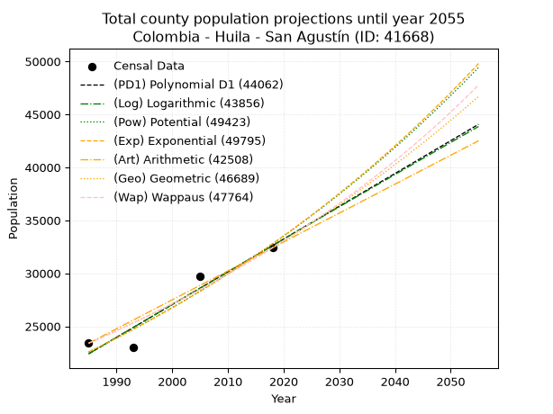
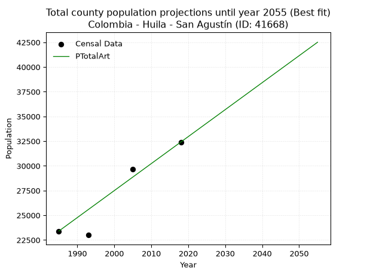
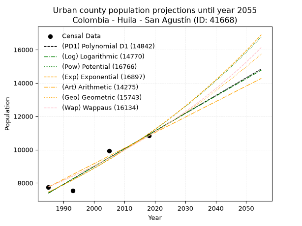
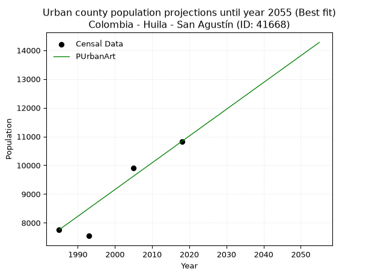
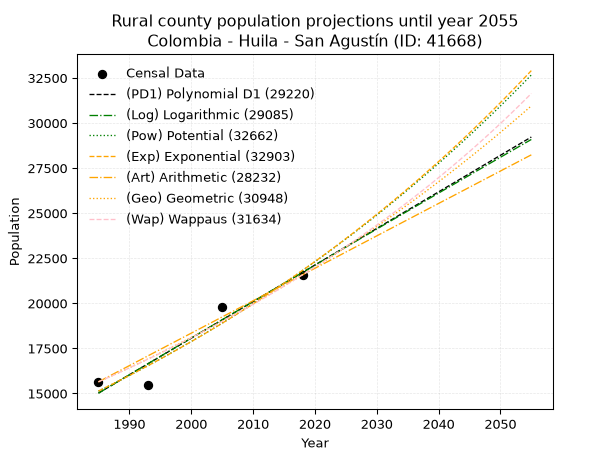
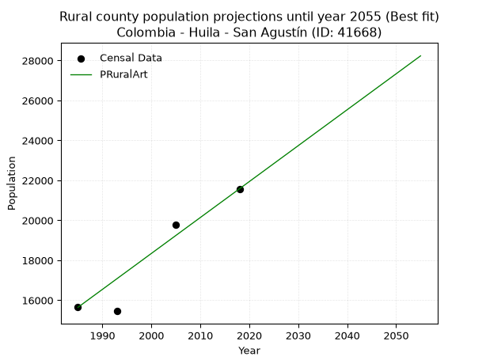

<div align="center">


</div>

# _“Population and Public Services Demand Projections (PPSD) until Year 2050 for Colombia - Huila - San Agustín (ID: 41668)”_
Keywords: `population` `public-service` `projection` `lineal` `polynomial` `logarithmic` `potential` `exponential` `arithmetic` `geometric` `wappaus` `dane` `colombia` `south-america`

PPSD are analytical estimates used by governments and planners to anticipate future changes in population size, age distribution, and the resulting community needs for utilities, healthcare, education, and infrastructure as sizing future water treatment facilities, electrical grids, and road networks based on spatial growth.

> **General running parameters**: • app_version: _v20260806_. • Python version: _3.14.7_. • Pandas version: _3.0.5_. • NumPy version: _2.5.1_. • Creates, save and include plots into reports (create_plot): _True_. • Projection until year: _2050_. • Process polynomial degree 2 and up: _False_. • Process Wappaus: _True_. • Process Wappaus: _True_. • Set negative values to zero: _True_. • Set infinite values to zero: _True_. • Drop dataset notes: _True_. 
<div align="center">

Dynamic map: [:earth_americas:Google](http://maps.google.com/maps?q=1.881081298,-76.2703596) [:earth_americas:OSM](https://www.openstreetmap.org/#map=18/1.881081298/-76.2703596&layers=P) [:earth_americas:Bing](https://www.bing.com/maps?cp=1.881081298~-76.2703596&lvl=18) [:earth_americas:Apple](https://maps.apple.com/frame?center=1.881081298%2C-76.2703596&span=0.003%2C0.006)

</div>


<div align="center">

```geojson
{
  "type": "Feature",
  "geometry": {
    "type": "Point", 
    "coordinates": [-76.2703596, 1.881081298]
  }, 
  "properties": {
    "Name": "Colombia - Huila - San Agustín (ID: 41668)"
  }
}
```

</div>


## 0. Census Data (4 records)

Census data are official statistics collected by a government about the people and housing in a country. They usually include counts of total population, age, sex, race, income, education, and jobs.

📅Global census file: [Population.xlsx](../data/Population.xlsx)

| Source   |   Year |   CountryID | CountryName   |   StateID | StateName   |   CountyID | CountyName   |   PTotal |   PUrban |   PRural |
|:---------|-------:|------------:|:--------------|----------:|:------------|-----------:|:-------------|---------:|---------:|---------:|
| DANE     |   1985 |          57 | Colombia      |        41 | Huila       |      41668 | San Agustín  |    23402 |     7759 |    15643 |
| DANE     |   1993 |          57 | Colombia      |        41 | Huila       |      41668 | San Agustín  |    22998 |     7544 |    15454 |
| DANE     |   2005 |          57 | Colombia      |        41 | Huila       |      41668 | San Agustín  |    29687 |     9912 |    19775 |
| DANE     |   2018 |          57 | Colombia      |        41 | Huila       |      41668 | San Agustín  |    32409 |    10831 |    21578 |

> 🔥Some records has specific notes about the registered values or the corresponding urban or rural distribution.

## 1. Total

### 1.1. Coefficients and Parameters

* (PD1) Polynomial Deg 1: 309.3649136892793, -591683.168606981 (lineal)
* (Log) Logarithmic: 619155.9954697938, -4679085.683170664
* (Pow) Potential: 22.612822546059753, -70.21809836989596
* (Exp) Exponential: 0.011298081824105568, 4.110814585160551e-06
* (Art) Arithmetic: Year diff. 2018 - 1985 = 33, Population diff. 32409 - 23402 = 9007, Annual growth = 272.93939393939394
* (Geo) Geometric: Year diff. 2018 - 1985 = 33, Population diff. 32409 - 23402 = 9007, Annual growth % = 0.009915951757948127
* (Wap) Wappaus: i = 0.9780845852587983, Condition values only valid for < 200)

<sub>
Wappaus condition values: ['0.00', '0.98', '1.96', '2.93', '3.91', '4.89', '5.87', '6.85', '7.82', '8.80', '9.78', '10.76', '11.74', '12.72', '13.69', '14.67', '15.65', '16.63', '17.61', '18.58', '19.56', '20.54', '21.52', '22.50', '23.47', '24.45', '25.43', '26.41', '27.39', '28.36', '29.34', '30.32', '31.30', '32.28', '33.25', '34.23', '35.21', '36.19', '37.17', '38.15', '39.12', '40.10', '41.08', '42.06', '43.04', '44.01', '44.99', '45.97', '46.95', '47.93', '48.90', '49.88', '50.86', '51.84', '52.82', '53.79', '54.77', '55.75', '56.73', '57.71', '58.69', '59.66', '60.64', '61.62', '62.60', '63.58']
</sub>


### 1.2. Projected Dataset

|   Year |   CountyID |   PTotalPD1 |   PTotalLog |   PTotalPow |   PTotalExp |   PTotalArt |   PTotalGeo |   PTotalWap |
|-------:|-----------:|------------:|------------:|------------:|------------:|------------:|------------:|------------:|
|   1985 |      41668 |       22406 |       22397 |       22572 |       22580 |       23402 |       23402 |       23402 |
|   1986 |      41668 |       22716 |       22709 |       22831 |       22836 |       23675 |       23634 |       23632 |
|   1987 |      41668 |       23025 |       23021 |       23092 |       23096 |       23948 |       23868 |       23864 |
|   1988 |      41668 |       23334 |       23333 |       23356 |       23358 |       24221 |       24105 |       24099 |
|   1989 |      41668 |       23644 |       23644 |       23624 |       23623 |       24494 |       24344 |       24336 |
|   1990 |      41668 |       23953 |       23955 |       23894 |       23892 |       24767 |       24586 |       24575 |
|   1991 |      41668 |       24262 |       24266 |       24167 |       24163 |       25040 |       24829 |       24817 |
|   1992 |      41668 |       24572 |       24577 |       24443 |       24438 |       25313 |       25075 |       25061 |
|   1993 |      41668 |       24881 |       24888 |       24721 |       24716 |       25586 |       25324 |       25308 |
|   1994 |      41668 |       25190 |       25198 |       25004 |       24996 |       25858 |       25575 |       25557 |
|   1995 |      41668 |       25500 |       25509 |       25289 |       25280 |       26131 |       25829 |       25809 |
|   1996 |      41668 |       25809 |       25819 |       25577 |       25568 |       26404 |       26085 |       26063 |
|   1997 |      41668 |       26119 |       26129 |       25868 |       25858 |       26677 |       26344 |       26320 |
|   1998 |      41668 |       26428 |       26439 |       26163 |       26152 |       26950 |       26605 |       26580 |
|   1999 |      41668 |       26737 |       26749 |       26460 |       26449 |       27223 |       26869 |       26842 |
|   2000 |      41668 |       27047 |       27059 |       26761 |       26750 |       27496 |       27135 |       27107 |
|   2001 |      41668 |       27356 |       27368 |       27066 |       27054 |       27769 |       27404 |       27375 |
|   2002 |      41668 |       27665 |       27677 |       27373 |       27361 |       28042 |       27676 |       27646 |
|   2003 |      41668 |       27975 |       27987 |       27684 |       27672 |       28315 |       27950 |       27920 |
|   2004 |      41668 |       28284 |       28296 |       27998 |       27986 |       28588 |       28227 |       28196 |
|   2005 |      41668 |       28593 |       28605 |       28316 |       28304 |       28861 |       28507 |       28476 |
|   2006 |      41668 |       28903 |       28913 |       28637 |       28626 |       29134 |       28790 |       28759 |
|   2007 |      41668 |       29212 |       29222 |       28961 |       28951 |       29407 |       29076 |       29045 |
|   2008 |      41668 |       29522 |       29530 |       29289 |       29280 |       29680 |       29364 |       29334 |
|   2009 |      41668 |       29831 |       29839 |       29621 |       29613 |       29953 |       29655 |       29626 |
|   2010 |      41668 |       30140 |       30147 |       29956 |       29949 |       30225 |       29949 |       29921 |
|   2011 |      41668 |       30450 |       30455 |       30295 |       30289 |       30498 |       30246 |       30220 |
|   2012 |      41668 |       30759 |       30762 |       30638 |       30634 |       30771 |       30546 |       30522 |
|   2013 |      41668 |       31068 |       31070 |       30984 |       30982 |       31044 |       30849 |       30828 |
|   2014 |      41668 |       31378 |       31378 |       31334 |       31334 |       31317 |       31155 |       31137 |
|   2015 |      41668 |       31687 |       31685 |       31687 |       31690 |       31590 |       31464 |       31449 |
|   2016 |      41668 |       31996 |       31992 |       32045 |       32050 |       31863 |       31776 |       31766 |
|   2017 |      41668 |       32306 |       32299 |       32406 |       32414 |       32136 |       32091 |       32085 |
|   2018 |      41668 |       32615 |       32606 |       32772 |       32782 |       32409 |       32409 |       32409 |
|   2019 |      41668 |       32925 |       32913 |       33141 |       33155 |       32682 |       32730 |       32736 |
|   2020 |      41668 |       33234 |       33219 |       33514 |       33531 |       32955 |       33055 |       33068 |
|   2021 |      41668 |       33543 |       33526 |       33891 |       33912 |       33228 |       33383 |       33403 |
|   2022 |      41668 |       33853 |       33832 |       34272 |       34298 |       33501 |       33714 |       33742 |
|   2023 |      41668 |       34162 |       34138 |       34658 |       34687 |       33774 |       34048 |       34085 |
|   2024 |      41668 |       34471 |       34444 |       35047 |       35081 |       34047 |       34386 |       34433 |
|   2025 |      41668 |       34781 |       34750 |       35441 |       35480 |       34320 |       34727 |       34784 |
|   2026 |      41668 |       35090 |       35056 |       35839 |       35883 |       34593 |       35071 |       35140 |
|   2027 |      41668 |       35400 |       35361 |       36241 |       36291 |       34865 |       35419 |       35500 |
|   2028 |      41668 |       35709 |       35667 |       36647 |       36703 |       35138 |       35770 |       35865 |
|   2029 |      41668 |       36018 |       35972 |       37058 |       37120 |       35411 |       36125 |       36234 |
|   2030 |      41668 |       36328 |       36277 |       37473 |       37542 |       35684 |       36483 |       36608 |
|   2031 |      41668 |       36637 |       36582 |       37893 |       37969 |       35957 |       36845 |       36987 |
|   2032 |      41668 |       36946 |       36887 |       38317 |       38400 |       36230 |       37210 |       37371 |
|   2033 |      41668 |       37256 |       37191 |       38746 |       38836 |       36503 |       37579 |       37759 |
|   2034 |      41668 |       37565 |       37496 |       39179 |       39278 |       36776 |       37952 |       38152 |
|   2035 |      41668 |       37874 |       37800 |       39617 |       39724 |       37049 |       38328 |       38551 |
|   2036 |      41668 |       38184 |       38104 |       40060 |       40175 |       37322 |       38708 |       38954 |
|   2037 |      41668 |       38493 |       38408 |       40507 |       40632 |       37595 |       39092 |       39363 |
|   2038 |      41668 |       38803 |       38712 |       40959 |       41093 |       37868 |       39479 |       39778 |
|   2039 |      41668 |       39112 |       39016 |       41416 |       41560 |       38141 |       39871 |       40198 |
|   2040 |      41668 |       39421 |       39320 |       41878 |       42032 |       38414 |       40266 |       40623 |
|   2041 |      41668 |       39731 |       39623 |       42344 |       42510 |       38687 |       40665 |       41054 |
|   2042 |      41668 |       40040 |       39926 |       42816 |       42993 |       38960 |       41069 |       41491 |
|   2043 |      41668 |       40349 |       40229 |       43293 |       43482 |       39232 |       41476 |       41934 |
|   2044 |      41668 |       40659 |       40532 |       43774 |       43976 |       39505 |       41887 |       42383 |
|   2045 |      41668 |       40968 |       40835 |       44261 |       44475 |       39778 |       42303 |       42839 |
|   2046 |      41668 |       41277 |       41138 |       44753 |       44981 |       40051 |       42722 |       43300 |
|   2047 |      41668 |       41587 |       41440 |       45250 |       45492 |       40324 |       43146 |       43769 |
|   2048 |      41668 |       41896 |       41743 |       45753 |       46009 |       40597 |       43574 |       44243 |
|   2049 |      41668 |       42206 |       42045 |       46261 |       46531 |       40870 |       44006 |       44725 |
|   2050 |      41668 |       42515 |       42347 |       46774 |       47060 |       41143 |       44442 |       45213 |
<div align="center">

</img>

</div>


### 1.3. Best fit with absolute error and relative error (%)

Relative error puts that difference into context by dividing the absolute error by the true value, creating a unitless ratio or percentage that shows the scale of the mistake.

Absolute and relative error

|   Year | Source   |   CountryID | CountryName   |   StateID | StateName   |   CountyID_x | CountyName   |   PTotal |   PUrban |   PRural |   CountyID_y |   PTotalPD1 |   PTotalLog |   PTotalPow |   PTotalExp |   PTotalArt |   PTotalGeo |   PTotalWap |   PTotalPD1AbsError |   PTotalLogAbsError |   PTotalPowAbsError |   PTotalExpAbsError |   PTotalArtAbsError |   PTotalGeoAbsError |   PTotalWapAbsError |   PTotalPD1RelError |   PTotalLogRelError |   PTotalPowRelError |   PTotalExpRelError |   PTotalArtRelError |   PTotalGeoRelError |   PTotalWapRelError |
|-------:|:---------|------------:|:--------------|----------:|:------------|-------------:|:-------------|---------:|---------:|---------:|-------------:|------------:|------------:|------------:|------------:|------------:|------------:|------------:|--------------------:|--------------------:|--------------------:|--------------------:|--------------------:|--------------------:|--------------------:|--------------------:|--------------------:|--------------------:|--------------------:|--------------------:|--------------------:|--------------------:|
|   1985 | DANE     |          57 | Colombia      |        41 | Huila       |        41668 | San Agustín  |    23402 |     7759 |    15643 |        41668 |       22406 |       22397 |       22572 |       22580 |       23402 |       23402 |       23402 |                 996 |                1005 |                 830 |                 822 |                   0 |                   0 |                   0 |            4.25605  |            4.2945   |             3.54671 |             3.51252 |             0       |              0      |             0       |
|   1993 | DANE     |          57 | Colombia      |        41 | Huila       |        41668 | San Agustín  |    22998 |     7544 |    15454 |        41668 |       24881 |       24888 |       24721 |       24716 |       25586 |       25324 |       25308 |                1883 |                1890 |                1723 |                1718 |                2588 |                2326 |                2310 |            8.18767  |            8.21811  |             7.49196 |             7.47021 |            11.2532  |             10.1139 |            10.0444  |
|   2005 | DANE     |          57 | Colombia      |        41 | Huila       |        41668 | San Agustín  |    29687 |     9912 |    19775 |        41668 |       28593 |       28605 |       28316 |       28304 |       28861 |       28507 |       28476 |                1094 |                1082 |                1371 |                1383 |                 826 |                1180 |                1211 |            3.68511  |            3.64469  |             4.61818 |             4.6586  |             2.78236 |              3.9748 |             4.07923 |
|   2018 | DANE     |          57 | Colombia      |        41 | Huila       |        41668 | San Agustín  |    32409 |    10831 |    21578 |        41668 |       32615 |       32606 |       32772 |       32782 |       32409 |       32409 |       32409 |                 206 |                 197 |                 363 |                 373 |                   0 |                   0 |                   0 |            0.635626 |            0.607856 |             1.12006 |             1.15091 |             0       |              0      |             0       |

Relative error mean

| Method    |   RelError | Best   |
|:----------|-----------:|:-------|
| PTotalPD1 |    4.19111 |        |
| PTotalLog |    4.19129 |        |
| PTotalPow |    4.19423 |        |
| PTotalExp |    4.19806 |        |
| PTotalArt |    3.50888 | True   |
| PTotalGeo |    3.52218 |        |
| PTotalWap |    3.53089 |        |

💙Best method: _**PTotalArt**_
<div align="center">

</img>

</div>


### 1.4. Fresh water supply demand in liters per capita per day (lpcd)

The fresh water supply demand typically ranges from 100 to 300 liters per capita per day (lpcd) for standard domestic and municipal planning, though absolute survival minimums set by the World Health Organization are as low as 7.5 to 20 liters per day, and total consumption in high-income nations can exceed 400 liters.

> `CZ`: Level in meters above the sea level (masl).<br> `WS`: Fresh water supply demand in liters per capita per day (lpcd or l/h/d).<br> `WSAll`: Zonal fresh water supply demand in liters per second (l/s).<br> `A`: Zonal area in square meters.

Reference values (RAS Colombia)

|    CZ |   WS |
|------:|-----:|
|  1000 |  120 |
|  2000 |  130 |
| 99999 |  140 |

County shapefile geometry properties and water supply values

|   CountyID |      ATotal |   CZTotal |   WSTotal |
|-----------:|------------:|----------:|----------:|
|      41668 | 1.39085e+09 |   2584.83 |       140 |

Projected values for best method: PTotalArt

|   CountyID |   Year |   PTotalArt |   WSTotal |   WSTotalAll |
|-----------:|-------:|------------:|----------:|-------------:|
|      41668 |   1985 |       23402 |       140 |      37.9199 |
|      41668 |   1986 |       23675 |       140 |      38.3623 |
|      41668 |   1987 |       23948 |       140 |      38.8046 |
|      41668 |   1988 |       24221 |       140 |      39.247  |
|      41668 |   1989 |       24494 |       140 |      39.6894 |
|      41668 |   1990 |       24767 |       140 |      40.1317 |
|      41668 |   1991 |       25040 |       140 |      40.5741 |
|      41668 |   1992 |       25313 |       140 |      41.0164 |
|      41668 |   1993 |       25586 |       140 |      41.4588 |
|      41668 |   1994 |       25858 |       140 |      41.8995 |
|      41668 |   1995 |       26131 |       140 |      42.3419 |
|      41668 |   1996 |       26404 |       140 |      42.7843 |
|      41668 |   1997 |       26677 |       140 |      43.2266 |
|      41668 |   1998 |       26950 |       140 |      43.669  |
|      41668 |   1999 |       27223 |       140 |      44.1113 |
|      41668 |   2000 |       27496 |       140 |      44.5537 |
|      41668 |   2001 |       27769 |       140 |      44.9961 |
|      41668 |   2002 |       28042 |       140 |      45.4384 |
|      41668 |   2003 |       28315 |       140 |      45.8808 |
|      41668 |   2004 |       28588 |       140 |      46.3231 |
|      41668 |   2005 |       28861 |       140 |      46.7655 |
|      41668 |   2006 |       29134 |       140 |      47.2079 |
|      41668 |   2007 |       29407 |       140 |      47.6502 |
|      41668 |   2008 |       29680 |       140 |      48.0926 |
|      41668 |   2009 |       29953 |       140 |      48.535  |
|      41668 |   2010 |       30225 |       140 |      48.9757 |
|      41668 |   2011 |       30498 |       140 |      49.4181 |
|      41668 |   2012 |       30771 |       140 |      49.8604 |
|      41668 |   2013 |       31044 |       140 |      50.3028 |
|      41668 |   2014 |       31317 |       140 |      50.7451 |
|      41668 |   2015 |       31590 |       140 |      51.1875 |
|      41668 |   2016 |       31863 |       140 |      51.6299 |
|      41668 |   2017 |       32136 |       140 |      52.0722 |
|      41668 |   2018 |       32409 |       140 |      52.5146 |
|      41668 |   2019 |       32682 |       140 |      52.9569 |
|      41668 |   2020 |       32955 |       140 |      53.3993 |
|      41668 |   2021 |       33228 |       140 |      53.8417 |
|      41668 |   2022 |       33501 |       140 |      54.284  |
|      41668 |   2023 |       33774 |       140 |      54.7264 |
|      41668 |   2024 |       34047 |       140 |      55.1688 |
|      41668 |   2025 |       34320 |       140 |      55.6111 |
|      41668 |   2026 |       34593 |       140 |      56.0535 |
|      41668 |   2027 |       34865 |       140 |      56.4942 |
|      41668 |   2028 |       35138 |       140 |      56.9366 |
|      41668 |   2029 |       35411 |       140 |      57.3789 |
|      41668 |   2030 |       35684 |       140 |      57.8213 |
|      41668 |   2031 |       35957 |       140 |      58.2637 |
|      41668 |   2032 |       36230 |       140 |      58.706  |
|      41668 |   2033 |       36503 |       140 |      59.1484 |
|      41668 |   2034 |       36776 |       140 |      59.5907 |
|      41668 |   2035 |       37049 |       140 |      60.0331 |
|      41668 |   2036 |       37322 |       140 |      60.4755 |
|      41668 |   2037 |       37595 |       140 |      60.9178 |
|      41668 |   2038 |       37868 |       140 |      61.3602 |
|      41668 |   2039 |       38141 |       140 |      61.8025 |
|      41668 |   2040 |       38414 |       140 |      62.2449 |
|      41668 |   2041 |       38687 |       140 |      62.6873 |
|      41668 |   2042 |       38960 |       140 |      63.1296 |
|      41668 |   2043 |       39232 |       140 |      63.5704 |
|      41668 |   2044 |       39505 |       140 |      64.0127 |
|      41668 |   2045 |       39778 |       140 |      64.4551 |
|      41668 |   2046 |       40051 |       140 |      64.8975 |
|      41668 |   2047 |       40324 |       140 |      65.3398 |
|      41668 |   2048 |       40597 |       140 |      65.7822 |
|      41668 |   2049 |       40870 |       140 |      66.2245 |
|      41668 |   2050 |       41143 |       140 |      66.6669 |

## 2. Urban

### 2.1. Coefficients and Parameters

* (PD1) Polynomial Deg 1: 106.48494580489688, -203985.012846245 (lineal)
* (Log) Logarithmic: 213112.77787087555, -1610860.4323751482
* (Pow) Potential: 23.421445898138444, -73.366409805593
* (Exp) Exponential: 0.011702357192128116, 6.077856545682449e-07
* (Art) Arithmetic: Year diff. 2018 - 1985 = 33, Population diff. 10831 - 7759 = 3072, Annual growth = 93.0909090909091
* (Geo) Geometric: Year diff. 2018 - 1985 = 33, Population diff. 10831 - 7759 = 3072, Annual growth % = 0.010159103285905191
* (Wap) Wappaus: i = 1.0015159665509317, Condition values only valid for < 200)

<sub>
Wappaus condition values: ['0.00', '1.00', '2.00', '3.00', '4.01', '5.01', '6.01', '7.01', '8.01', '9.01', '10.02', '11.02', '12.02', '13.02', '14.02', '15.02', '16.02', '17.03', '18.03', '19.03', '20.03', '21.03', '22.03', '23.03', '24.04', '25.04', '26.04', '27.04', '28.04', '29.04', '30.05', '31.05', '32.05', '33.05', '34.05', '35.05', '36.05', '37.06', '38.06', '39.06', '40.06', '41.06', '42.06', '43.07', '44.07', '45.07', '46.07', '47.07', '48.07', '49.07', '50.08', '51.08', '52.08', '53.08', '54.08', '55.08', '56.08', '57.09', '58.09', '59.09', '60.09', '61.09', '62.09', '63.10', '64.10', '65.10']
</sub>


### 2.2. Projected Dataset

|   Year |   CountyID |   PUrbanPD1 |   PUrbanLog |   PUrbanPow |   PUrbanExp |   PUrbanArt |   PUrbanGeo |   PUrbanWap |
|-------:|-----------:|------------:|------------:|------------:|------------:|------------:|------------:|------------:|
|   1985 |      41668 |        7388 |        7385 |        7446 |        7448 |        7759 |        7759 |        7759 |
|   1986 |      41668 |        7494 |        7492 |        7534 |        7536 |        7852 |        7838 |        7837 |
|   1987 |      41668 |        7601 |        7599 |        7623 |        7625 |        7945 |        7917 |        7916 |
|   1988 |      41668 |        7707 |        7706 |        7714 |        7714 |        8038 |        7998 |        7996 |
|   1989 |      41668 |        7814 |        7814 |        7805 |        7805 |        8131 |        8079 |        8076 |
|   1990 |      41668 |        7920 |        7921 |        7898 |        7897 |        8224 |        8161 |        8158 |
|   1991 |      41668 |        8027 |        8028 |        7991 |        7990 |        8318 |        8244 |        8240 |
|   1992 |      41668 |        8133 |        8135 |        8086 |        8084 |        8411 |        8328 |        8323 |
|   1993 |      41668 |        8239 |        8242 |        8181 |        8179 |        8504 |        8412 |        8407 |
|   1994 |      41668 |        8346 |        8349 |        8278 |        8276 |        8597 |        8498 |        8491 |
|   1995 |      41668 |        8452 |        8456 |        8376 |        8373 |        8690 |        8584 |        8577 |
|   1996 |      41668 |        8559 |        8562 |        8475 |        8471 |        8783 |        8671 |        8664 |
|   1997 |      41668 |        8665 |        8669 |        8575 |        8571 |        8876 |        8760 |        8751 |
|   1998 |      41668 |        8772 |        8776 |        8676 |        8672 |        8969 |        8849 |        8840 |
|   1999 |      41668 |        8878 |        8882 |        8778 |        8774 |        9062 |        8938 |        8929 |
|   2000 |      41668 |        8985 |        8989 |        8881 |        8877 |        9155 |        9029 |        9019 |
|   2001 |      41668 |        9091 |        9096 |        8986 |        8982 |        9248 |        9121 |        9111 |
|   2002 |      41668 |        9198 |        9202 |        9092 |        9088 |        9342 |        9214 |        9203 |
|   2003 |      41668 |        9304 |        9308 |        9199 |        9195 |        9435 |        9307 |        9296 |
|   2004 |      41668 |        9411 |        9415 |        9307 |        9303 |        9528 |        9402 |        9391 |
|   2005 |      41668 |        9517 |        9521 |        9416 |        9412 |        9621 |        9497 |        9486 |
|   2006 |      41668 |        9624 |        9627 |        9527 |        9523 |        9714 |        9594 |        9583 |
|   2007 |      41668 |        9730 |        9734 |        9639 |        9635 |        9807 |        9691 |        9680 |
|   2008 |      41668 |        9837 |        9840 |        9752 |        9749 |        9900 |        9790 |        9779 |
|   2009 |      41668 |        9943 |        9946 |        9866 |        9863 |        9993 |        9889 |        9879 |
|   2010 |      41668 |       10050 |       10052 |        9982 |        9980 |       10086 |        9990 |        9980 |
|   2011 |      41668 |       10156 |       10158 |       10099 |       10097 |       10179 |       10091 |       10082 |
|   2012 |      41668 |       10263 |       10264 |       10217 |       10216 |       10272 |       10194 |       10185 |
|   2013 |      41668 |       10369 |       10370 |       10337 |       10336 |       10366 |       10297 |       10290 |
|   2014 |      41668 |       10476 |       10476 |       10458 |       10458 |       10459 |       10402 |       10395 |
|   2015 |      41668 |       10582 |       10581 |       10580 |       10581 |       10552 |       10507 |       10502 |
|   2016 |      41668 |       10689 |       10687 |       10704 |       10705 |       10645 |       10614 |       10611 |
|   2017 |      41668 |       10795 |       10793 |       10829 |       10831 |       10738 |       10722 |       10720 |
|   2018 |      41668 |       10902 |       10898 |       10955 |       10959 |       10831 |       10831 |       10831 |
|   2019 |      41668 |       11008 |       11004 |       11083 |       11088 |       10924 |       10941 |       10943 |
|   2020 |      41668 |       11115 |       11110 |       11212 |       11218 |       11017 |       11052 |       11057 |
|   2021 |      41668 |       11221 |       11215 |       11343 |       11351 |       11110 |       11164 |       11172 |
|   2022 |      41668 |       11328 |       11320 |       11475 |       11484 |       11203 |       11278 |       11288 |
|   2023 |      41668 |       11434 |       11426 |       11609 |       11619 |       11296 |       11392 |       11406 |
|   2024 |      41668 |       11541 |       11531 |       11744 |       11756 |       11390 |       11508 |       11525 |
|   2025 |      41668 |       11647 |       11636 |       11881 |       11894 |       11483 |       11625 |       11646 |
|   2026 |      41668 |       11753 |       11742 |       12019 |       12034 |       11576 |       11743 |       11768 |
|   2027 |      41668 |       11860 |       11847 |       12159 |       12176 |       11669 |       11863 |       11892 |
|   2028 |      41668 |       11966 |       11952 |       12300 |       12319 |       11762 |       11983 |       12017 |
|   2029 |      41668 |       12073 |       12057 |       12443 |       12464 |       11855 |       12105 |       12144 |
|   2030 |      41668 |       12179 |       12162 |       12587 |       12611 |       11948 |       12228 |       12273 |
|   2031 |      41668 |       12286 |       12267 |       12733 |       12760 |       12041 |       12352 |       12403 |
|   2032 |      41668 |       12392 |       12372 |       12881 |       12910 |       12134 |       12477 |       12535 |
|   2033 |      41668 |       12499 |       12477 |       13030 |       13062 |       12227 |       12604 |       12669 |
|   2034 |      41668 |       12605 |       12581 |       13181 |       13216 |       12320 |       12732 |       12805 |
|   2035 |      41668 |       12712 |       12686 |       13334 |       13371 |       12414 |       12862 |       12942 |
|   2036 |      41668 |       12818 |       12791 |       13488 |       13529 |       12507 |       12992 |       13081 |
|   2037 |      41668 |       12925 |       12896 |       13644 |       13688 |       12600 |       13124 |       13222 |
|   2038 |      41668 |       13031 |       13000 |       13802 |       13849 |       12693 |       13258 |       13365 |
|   2039 |      41668 |       13138 |       13105 |       13961 |       14012 |       12786 |       13392 |       13510 |
|   2040 |      41668 |       13244 |       13209 |       14123 |       14177 |       12879 |       13528 |       13657 |
|   2041 |      41668 |       13351 |       13314 |       14286 |       14344 |       12972 |       13666 |       13806 |
|   2042 |      41668 |       13457 |       13418 |       14450 |       14513 |       13065 |       13805 |       13958 |
|   2043 |      41668 |       13564 |       13522 |       14617 |       14683 |       13158 |       13945 |       14111 |
|   2044 |      41668 |       13670 |       13627 |       14786 |       14856 |       13251 |       14086 |       14266 |
|   2045 |      41668 |       13777 |       13731 |       14956 |       15031 |       13344 |       14230 |       14424 |
|   2046 |      41668 |       13883 |       13835 |       15128 |       15208 |       13438 |       14374 |       14584 |
|   2047 |      41668 |       13990 |       13939 |       15302 |       15387 |       13531 |       14520 |       14746 |
|   2048 |      41668 |       14096 |       14043 |       15478 |       15568 |       13624 |       14668 |       14911 |
|   2049 |      41668 |       14203 |       14147 |       15656 |       15751 |       13717 |       14817 |       15078 |
|   2050 |      41668 |       14309 |       14251 |       15836 |       15937 |       13810 |       14967 |       15247 |
<div align="center">

</img>

</div>


### 2.3. Best fit with absolute error and relative error (%)

Relative error puts that difference into context by dividing the absolute error by the true value, creating a unitless ratio or percentage that shows the scale of the mistake.

Absolute and relative error

|   Year | Source   |   CountryID | CountryName   |   StateID | StateName   |   CountyID_x | CountyName   |   PTotal |   PUrban |   PRural |   CountyID_y |   PUrbanPD1 |   PUrbanLog |   PUrbanPow |   PUrbanExp |   PUrbanArt |   PUrbanGeo |   PUrbanWap |   PUrbanPD1AbsError |   PUrbanLogAbsError |   PUrbanPowAbsError |   PUrbanExpAbsError |   PUrbanArtAbsError |   PUrbanGeoAbsError |   PUrbanWapAbsError |   PUrbanPD1RelError |   PUrbanLogRelError |   PUrbanPowRelError |   PUrbanExpRelError |   PUrbanArtRelError |   PUrbanGeoRelError |   PUrbanWapRelError |
|-------:|:---------|------------:|:--------------|----------:|:------------|-------------:|:-------------|---------:|---------:|---------:|-------------:|------------:|------------:|------------:|------------:|------------:|------------:|------------:|--------------------:|--------------------:|--------------------:|--------------------:|--------------------:|--------------------:|--------------------:|--------------------:|--------------------:|--------------------:|--------------------:|--------------------:|--------------------:|--------------------:|
|   1985 | DANE     |          57 | Colombia      |        41 | Huila       |        41668 | San Agustín  |    23402 |     7759 |    15643 |        41668 |        7388 |        7385 |        7446 |        7448 |        7759 |        7759 |        7759 |                 371 |                 374 |                 313 |                 311 |                   0 |                   0 |                   0 |            4.78154  |            4.82021  |             4.03403 |             4.00825 |             0       |             0       |             0       |
|   1993 | DANE     |          57 | Colombia      |        41 | Huila       |        41668 | San Agustín  |    22998 |     7544 |    15454 |        41668 |        8239 |        8242 |        8181 |        8179 |        8504 |        8412 |        8407 |                 695 |                 698 |                 637 |                 635 |                 960 |                 868 |                 863 |            9.21262  |            9.25239  |             8.4438  |             8.41729 |            12.7253  |            11.5058  |            11.4396  |
|   2005 | DANE     |          57 | Colombia      |        41 | Huila       |        41668 | San Agustín  |    29687 |     9912 |    19775 |        41668 |        9517 |        9521 |        9416 |        9412 |        9621 |        9497 |        9486 |                 395 |                 391 |                 496 |                 500 |                 291 |                 415 |                 426 |            3.98507  |            3.94471  |             5.00404 |             5.04439 |             2.93584 |             4.18684 |             4.29782 |
|   2018 | DANE     |          57 | Colombia      |        41 | Huila       |        41668 | San Agustín  |    32409 |    10831 |    21578 |        41668 |       10902 |       10898 |       10955 |       10959 |       10831 |       10831 |       10831 |                  71 |                  67 |                 124 |                 128 |                   0 |                   0 |                   0 |            0.655526 |            0.618595 |             1.14486 |             1.18179 |             0       |             0       |             0       |

Relative error mean

| Method    |   RelError | Best   |
|:----------|-----------:|:-------|
| PUrbanPD1 |    4.65869 |        |
| PUrbanLog |    4.65898 |        |
| PUrbanPow |    4.65668 |        |
| PUrbanExp |    4.66293 |        |
| PUrbanArt |    3.91529 | True   |
| PUrbanGeo |    3.92317 |        |
| PUrbanWap |    3.93434 |        |

💙Best method: _**PUrbanArt**_
<div align="center">

</img>

</div>


### 2.4. Fresh water supply demand in liters per capita per day (lpcd)

The fresh water supply demand typically ranges from 100 to 300 liters per capita per day (lpcd) for standard domestic and municipal planning, though absolute survival minimums set by the World Health Organization are as low as 7.5 to 20 liters per day, and total consumption in high-income nations can exceed 400 liters.

> `CZ`: Level in meters above the sea level (masl).<br> `WS`: Fresh water supply demand in liters per capita per day (lpcd or l/h/d).<br> `WSAll`: Zonal fresh water supply demand in liters per second (l/s).<br> `A`: Zonal area in square meters.

Reference values (RAS Colombia)

|    CZ |   WS |
|------:|-----:|
|  1000 |  120 |
|  2000 |  130 |
| 99999 |  140 |

County shapefile geometry properties and water supply values

|   CountyID |      AUrban |   CZUrban |   WSUrban |
|-----------:|------------:|----------:|----------:|
|      41668 | 2.14263e+06 |   1638.82 |       130 |

Projected values for best method: PUrbanArt

|   CountyID |   Year |   PUrbanArt |   WSUrban |   WSUrbanAll |
|-----------:|-------:|------------:|----------:|-------------:|
|      41668 |   1985 |        7759 |       130 |      11.6744 |
|      41668 |   1986 |        7852 |       130 |      11.8144 |
|      41668 |   1987 |        7945 |       130 |      11.9543 |
|      41668 |   1988 |        8038 |       130 |      12.0942 |
|      41668 |   1989 |        8131 |       130 |      12.2341 |
|      41668 |   1990 |        8224 |       130 |      12.3741 |
|      41668 |   1991 |        8318 |       130 |      12.5155 |
|      41668 |   1992 |        8411 |       130 |      12.6554 |
|      41668 |   1993 |        8504 |       130 |      12.7954 |
|      41668 |   1994 |        8597 |       130 |      12.9353 |
|      41668 |   1995 |        8690 |       130 |      13.0752 |
|      41668 |   1996 |        8783 |       130 |      13.2152 |
|      41668 |   1997 |        8876 |       130 |      13.3551 |
|      41668 |   1998 |        8969 |       130 |      13.495  |
|      41668 |   1999 |        9062 |       130 |      13.635  |
|      41668 |   2000 |        9155 |       130 |      13.7749 |
|      41668 |   2001 |        9248 |       130 |      13.9148 |
|      41668 |   2002 |        9342 |       130 |      14.0563 |
|      41668 |   2003 |        9435 |       130 |      14.1962 |
|      41668 |   2004 |        9528 |       130 |      14.3361 |
|      41668 |   2005 |        9621 |       130 |      14.476  |
|      41668 |   2006 |        9714 |       130 |      14.616  |
|      41668 |   2007 |        9807 |       130 |      14.7559 |
|      41668 |   2008 |        9900 |       130 |      14.8958 |
|      41668 |   2009 |        9993 |       130 |      15.0358 |
|      41668 |   2010 |       10086 |       130 |      15.1757 |
|      41668 |   2011 |       10179 |       130 |      15.3156 |
|      41668 |   2012 |       10272 |       130 |      15.4556 |
|      41668 |   2013 |       10366 |       130 |      15.597  |
|      41668 |   2014 |       10459 |       130 |      15.7369 |
|      41668 |   2015 |       10552 |       130 |      15.8769 |
|      41668 |   2016 |       10645 |       130 |      16.0168 |
|      41668 |   2017 |       10738 |       130 |      16.1567 |
|      41668 |   2018 |       10831 |       130 |      16.2966 |
|      41668 |   2019 |       10924 |       130 |      16.4366 |
|      41668 |   2020 |       11017 |       130 |      16.5765 |
|      41668 |   2021 |       11110 |       130 |      16.7164 |
|      41668 |   2022 |       11203 |       130 |      16.8564 |
|      41668 |   2023 |       11296 |       130 |      16.9963 |
|      41668 |   2024 |       11390 |       130 |      17.1377 |
|      41668 |   2025 |       11483 |       130 |      17.2777 |
|      41668 |   2026 |       11576 |       130 |      17.4176 |
|      41668 |   2027 |       11669 |       130 |      17.5575 |
|      41668 |   2028 |       11762 |       130 |      17.6975 |
|      41668 |   2029 |       11855 |       130 |      17.8374 |
|      41668 |   2030 |       11948 |       130 |      17.9773 |
|      41668 |   2031 |       12041 |       130 |      18.1172 |
|      41668 |   2032 |       12134 |       130 |      18.2572 |
|      41668 |   2033 |       12227 |       130 |      18.3971 |
|      41668 |   2034 |       12320 |       130 |      18.537  |
|      41668 |   2035 |       12414 |       130 |      18.6785 |
|      41668 |   2036 |       12507 |       130 |      18.8184 |
|      41668 |   2037 |       12600 |       130 |      18.9583 |
|      41668 |   2038 |       12693 |       130 |      19.0983 |
|      41668 |   2039 |       12786 |       130 |      19.2382 |
|      41668 |   2040 |       12879 |       130 |      19.3781 |
|      41668 |   2041 |       12972 |       130 |      19.5181 |
|      41668 |   2042 |       13065 |       130 |      19.658  |
|      41668 |   2043 |       13158 |       130 |      19.7979 |
|      41668 |   2044 |       13251 |       130 |      19.9378 |
|      41668 |   2045 |       13344 |       130 |      20.0778 |
|      41668 |   2046 |       13438 |       130 |      20.2192 |
|      41668 |   2047 |       13531 |       130 |      20.3591 |
|      41668 |   2048 |       13624 |       130 |      20.4991 |
|      41668 |   2049 |       13717 |       130 |      20.639  |
|      41668 |   2050 |       13810 |       130 |      20.7789 |

## 3. Rural

### 3.1. Coefficients and Parameters

* (PD1) Polynomial Deg 1: 202.87996788438232, -387698.1557607358 (lineal)
* (Log) Logarithmic: 406043.21759891836, -3068225.250795517
* (Pow) Potential: 22.211096970499323, -69.06714336768992
* (Exp) Exponential: 0.01109723875246962, 4.104196843514356e-06
* (Art) Arithmetic: Year diff. 2018 - 1985 = 33, Population diff. 21578 - 15643 = 5935, Annual growth = 179.84848484848484
* (Geo) Geometric: Year diff. 2018 - 1985 = 33, Population diff. 21578 - 15643 = 5935, Annual growth % = 0.009794648898576952
* (Wap) Wappaus: i = 0.9663817997822995, Condition values only valid for < 200)

<sub>
Wappaus condition values: ['0.00', '0.97', '1.93', '2.90', '3.87', '4.83', '5.80', '6.76', '7.73', '8.70', '9.66', '10.63', '11.60', '12.56', '13.53', '14.50', '15.46', '16.43', '17.39', '18.36', '19.33', '20.29', '21.26', '22.23', '23.19', '24.16', '25.13', '26.09', '27.06', '28.03', '28.99', '29.96', '30.92', '31.89', '32.86', '33.82', '34.79', '35.76', '36.72', '37.69', '38.66', '39.62', '40.59', '41.55', '42.52', '43.49', '44.45', '45.42', '46.39', '47.35', '48.32', '49.29', '50.25', '51.22', '52.18', '53.15', '54.12', '55.08', '56.05', '57.02', '57.98', '58.95', '59.92', '60.88', '61.85', '62.81']
</sub>


### 3.2. Projected Dataset

|   Year |   CountyID |   PRuralPD1 |   PRuralLog |   PRuralPow |   PRuralExp |   PRuralArt |   PRuralGeo |   PRuralWap |
|-------:|-----------:|------------:|------------:|------------:|------------:|------------:|------------:|------------:|
|   1985 |      41668 |       15019 |       15013 |       15126 |       15131 |       15643 |       15643 |       15643 |
|   1986 |      41668 |       15221 |       15217 |       15297 |       15300 |       15823 |       15796 |       15795 |
|   1987 |      41668 |       15424 |       15422 |       15469 |       15471 |       16003 |       15951 |       15948 |
|   1988 |      41668 |       15627 |       15626 |       15642 |       15643 |       16183 |       16107 |       16103 |
|   1989 |      41668 |       15830 |       15830 |       15818 |       15818 |       16362 |       16265 |       16260 |
|   1990 |      41668 |       16033 |       16034 |       15996 |       15995 |       16542 |       16424 |       16418 |
|   1991 |      41668 |       16236 |       16238 |       16175 |       16173 |       16722 |       16585 |       16577 |
|   1992 |      41668 |       16439 |       16442 |       16357 |       16354 |       16902 |       16748 |       16738 |
|   1993 |      41668 |       16642 |       16646 |       16540 |       16536 |       17082 |       16912 |       16901 |
|   1994 |      41668 |       16845 |       16850 |       16725 |       16721 |       17262 |       17077 |       17065 |
|   1995 |      41668 |       17047 |       17053 |       16913 |       16907 |       17441 |       17245 |       17231 |
|   1996 |      41668 |       17250 |       17257 |       17102 |       17096 |       17621 |       17413 |       17399 |
|   1997 |      41668 |       17453 |       17460 |       17293 |       17287 |       17801 |       17584 |       17569 |
|   1998 |      41668 |       17656 |       17663 |       17487 |       17479 |       17981 |       17756 |       17740 |
|   1999 |      41668 |       17859 |       17867 |       17682 |       17675 |       18161 |       17930 |       17913 |
|   2000 |      41668 |       18062 |       18070 |       17879 |       17872 |       18341 |       18106 |       18088 |
|   2001 |      41668 |       18265 |       18273 |       18079 |       18071 |       18521 |       18283 |       18264 |
|   2002 |      41668 |       18468 |       18475 |       18281 |       18273 |       18700 |       18462 |       18443 |
|   2003 |      41668 |       18670 |       18678 |       18485 |       18477 |       18880 |       18643 |       18623 |
|   2004 |      41668 |       18873 |       18881 |       18691 |       18683 |       19060 |       18826 |       18806 |
|   2005 |      41668 |       19076 |       19083 |       18899 |       18891 |       19240 |       19010 |       18990 |
|   2006 |      41668 |       19279 |       19286 |       19109 |       19102 |       19420 |       19196 |       19176 |
|   2007 |      41668 |       19482 |       19488 |       19322 |       19315 |       19600 |       19384 |       19364 |
|   2008 |      41668 |       19685 |       19691 |       19537 |       19531 |       19780 |       19574 |       19555 |
|   2009 |      41668 |       19888 |       19893 |       19754 |       19749 |       19959 |       19766 |       19747 |
|   2010 |      41668 |       20091 |       20095 |       19974 |       19969 |       20139 |       19959 |       19942 |
|   2011 |      41668 |       20293 |       20297 |       20196 |       20192 |       20319 |       20155 |       20138 |
|   2012 |      41668 |       20496 |       20499 |       20420 |       20417 |       20499 |       20352 |       20337 |
|   2013 |      41668 |       20699 |       20700 |       20647 |       20645 |       20679 |       20552 |       20538 |
|   2014 |      41668 |       20902 |       20902 |       20876 |       20876 |       20859 |       20753 |       20741 |
|   2015 |      41668 |       21105 |       21104 |       21107 |       21109 |       21038 |       20956 |       20947 |
|   2016 |      41668 |       21308 |       21305 |       21341 |       21344 |       21218 |       21161 |       21155 |
|   2017 |      41668 |       21511 |       21506 |       21577 |       21582 |       21398 |       21369 |       21365 |
|   2018 |      41668 |       21714 |       21708 |       21816 |       21823 |       21578 |       21578 |       21578 |
|   2019 |      41668 |       21916 |       21909 |       22058 |       22067 |       21758 |       21789 |       21793 |
|   2020 |      41668 |       22119 |       22110 |       22302 |       22313 |       21938 |       22003 |       22011 |
|   2021 |      41668 |       22322 |       22311 |       22548 |       22562 |       22118 |       22218 |       22231 |
|   2022 |      41668 |       22525 |       22512 |       22797 |       22814 |       22297 |       22436 |       22454 |
|   2023 |      41668 |       22728 |       22712 |       23049 |       23068 |       22477 |       22656 |       22679 |
|   2024 |      41668 |       22931 |       22913 |       23303 |       23326 |       22657 |       22878 |       22908 |
|   2025 |      41668 |       23134 |       23114 |       23560 |       23586 |       22837 |       23102 |       23139 |
|   2026 |      41668 |       23337 |       23314 |       23820 |       23849 |       23017 |       23328 |       23372 |
|   2027 |      41668 |       23540 |       23515 |       24083 |       24115 |       23197 |       23556 |       23609 |
|   2028 |      41668 |       23742 |       23715 |       24348 |       24384 |       23376 |       23787 |       23848 |
|   2029 |      41668 |       23945 |       23915 |       24616 |       24657 |       23556 |       24020 |       24091 |
|   2030 |      41668 |       24148 |       24115 |       24887 |       24932 |       23736 |       24255 |       24336 |
|   2031 |      41668 |       24351 |       24315 |       25161 |       25210 |       23916 |       24493 |       24584 |
|   2032 |      41668 |       24554 |       24515 |       25437 |       25491 |       24096 |       24733 |       24836 |
|   2033 |      41668 |       24757 |       24715 |       25717 |       25776 |       24276 |       24975 |       25090 |
|   2034 |      41668 |       24960 |       24914 |       25999 |       26063 |       24456 |       25220 |       25348 |
|   2035 |      41668 |       25163 |       25114 |       26285 |       26354 |       24635 |       25467 |       25609 |
|   2036 |      41668 |       25365 |       25313 |       26573 |       26648 |       24815 |       25716 |       25874 |
|   2037 |      41668 |       25568 |       25513 |       26864 |       26946 |       24995 |       25968 |       26142 |
|   2038 |      41668 |       25771 |       25712 |       27159 |       27246 |       25175 |       26222 |       26413 |
|   2039 |      41668 |       25974 |       25911 |       27456 |       27550 |       25355 |       26479 |       26688 |
|   2040 |      41668 |       26177 |       26110 |       27757 |       27858 |       25535 |       26739 |       26967 |
|   2041 |      41668 |       26380 |       26309 |       28061 |       28169 |       25715 |       27000 |       27249 |
|   2042 |      41668 |       26583 |       26508 |       28368 |       28483 |       25894 |       27265 |       27535 |
|   2043 |      41668 |       26786 |       26707 |       28678 |       28801 |       26074 |       27532 |       27825 |
|   2044 |      41668 |       26988 |       26906 |       28991 |       29122 |       26254 |       27802 |       28119 |
|   2045 |      41668 |       27191 |       27104 |       29308 |       29447 |       26434 |       28074 |       28416 |
|   2046 |      41668 |       27394 |       27303 |       29628 |       29776 |       26614 |       28349 |       28718 |
|   2047 |      41668 |       27597 |       27501 |       29951 |       30108 |       26794 |       28627 |       29024 |
|   2048 |      41668 |       27800 |       27700 |       30278 |       30444 |       26973 |       28907 |       29335 |
|   2049 |      41668 |       28003 |       27898 |       30608 |       30784 |       27153 |       29190 |       29649 |
|   2050 |      41668 |       28206 |       28096 |       30942 |       31127 |       27333 |       29476 |       29968 |
<div align="center">

</img>

</div>


### 3.3. Best fit with absolute error and relative error (%)

Relative error puts that difference into context by dividing the absolute error by the true value, creating a unitless ratio or percentage that shows the scale of the mistake.

Absolute and relative error

|   Year | Source   |   CountryID | CountryName   |   StateID | StateName   |   CountyID_x | CountyName   |   PTotal |   PUrban |   PRural |   CountyID_y |   PRuralPD1 |   PRuralLog |   PRuralPow |   PRuralExp |   PRuralArt |   PRuralGeo |   PRuralWap |   PRuralPD1AbsError |   PRuralLogAbsError |   PRuralPowAbsError |   PRuralExpAbsError |   PRuralArtAbsError |   PRuralGeoAbsError |   PRuralWapAbsError |   PRuralPD1RelError |   PRuralLogRelError |   PRuralPowRelError |   PRuralExpRelError |   PRuralArtRelError |   PRuralGeoRelError |   PRuralWapRelError |
|-------:|:---------|------------:|:--------------|----------:|:------------|-------------:|:-------------|---------:|---------:|---------:|-------------:|------------:|------------:|------------:|------------:|------------:|------------:|------------:|--------------------:|--------------------:|--------------------:|--------------------:|--------------------:|--------------------:|--------------------:|--------------------:|--------------------:|--------------------:|--------------------:|--------------------:|--------------------:|--------------------:|
|   1985 | DANE     |          57 | Colombia      |        41 | Huila       |        41668 | San Agustín  |    23402 |     7759 |    15643 |        41668 |       15019 |       15013 |       15126 |       15131 |       15643 |       15643 |       15643 |                 624 |                 630 |                 517 |                 512 |                   0 |                   0 |                   0 |            3.989    |            4.02736  |             3.30499 |             3.27303 |             0       |             0       |             0       |
|   1993 | DANE     |          57 | Colombia      |        41 | Huila       |        41668 | San Agustín  |    22998 |     7544 |    15454 |        41668 |       16642 |       16646 |       16540 |       16536 |       17082 |       16912 |       16901 |                1188 |                1192 |                1086 |                1082 |                1628 |                1458 |                1447 |            7.68733  |            7.71321  |             7.02731 |             7.00142 |            10.5345  |             9.43445 |             9.36327 |
|   2005 | DANE     |          57 | Colombia      |        41 | Huila       |        41668 | San Agustín  |    29687 |     9912 |    19775 |        41668 |       19076 |       19083 |       18899 |       18891 |       19240 |       19010 |       18990 |                 699 |                 692 |                 876 |                 884 |                 535 |                 765 |                 785 |            3.53477  |            3.49937  |             4.42984 |             4.47029 |             2.70544 |             3.86852 |             3.96966 |
|   2018 | DANE     |          57 | Colombia      |        41 | Huila       |        41668 | San Agustín  |    32409 |    10831 |    21578 |        41668 |       21714 |       21708 |       21816 |       21823 |       21578 |       21578 |       21578 |                 136 |                 130 |                 238 |                 245 |                   0 |                   0 |                   0 |            0.630272 |            0.602465 |             1.10298 |             1.13542 |             0       |             0       |             0       |

Relative error mean

| Method    |   RelError | Best   |
|:----------|-----------:|:-------|
| PRuralPD1 |    3.96034 |        |
| PRuralLog |    3.9606  |        |
| PRuralPow |    3.96628 |        |
| PRuralExp |    3.97004 |        |
| PRuralArt |    3.30998 | True   |
| PRuralGeo |    3.32574 |        |
| PRuralWap |    3.33323 |        |

💙Best method: _**PRuralArt**_
<div align="center">

</img>

</div>


### 3.4. Fresh water supply demand in liters per capita per day (lpcd)

The fresh water supply demand typically ranges from 100 to 300 liters per capita per day (lpcd) for standard domestic and municipal planning, though absolute survival minimums set by the World Health Organization are as low as 7.5 to 20 liters per day, and total consumption in high-income nations can exceed 400 liters.

> `CZ`: Level in meters above the sea level (masl).<br> `WS`: Fresh water supply demand in liters per capita per day (lpcd or l/h/d).<br> `WSAll`: Zonal fresh water supply demand in liters per second (l/s).<br> `A`: Zonal area in square meters.

Reference values (RAS Colombia)

|    CZ |   WS |
|------:|-----:|
|  1000 |  120 |
|  2000 |  130 |
| 99999 |  140 |

County shapefile geometry properties and water supply values

|   CountyID |      ARural |   CZRural |   WSRural |
|-----------:|------------:|----------:|----------:|
|      41668 | 1.38871e+09 |    2586.3 |       140 |

Projected values for best method: PRuralArt

|   CountyID |   Year |   PRuralArt |   WSRural |   WSRuralAll |
|-----------:|-------:|------------:|----------:|-------------:|
|      41668 |   1985 |       15643 |       140 |      25.3475 |
|      41668 |   1986 |       15823 |       140 |      25.6391 |
|      41668 |   1987 |       16003 |       140 |      25.9308 |
|      41668 |   1988 |       16183 |       140 |      26.2225 |
|      41668 |   1989 |       16362 |       140 |      26.5125 |
|      41668 |   1990 |       16542 |       140 |      26.8042 |
|      41668 |   1991 |       16722 |       140 |      27.0958 |
|      41668 |   1992 |       16902 |       140 |      27.3875 |
|      41668 |   1993 |       17082 |       140 |      27.6792 |
|      41668 |   1994 |       17262 |       140 |      27.9708 |
|      41668 |   1995 |       17441 |       140 |      28.2609 |
|      41668 |   1996 |       17621 |       140 |      28.5525 |
|      41668 |   1997 |       17801 |       140 |      28.8442 |
|      41668 |   1998 |       17981 |       140 |      29.1359 |
|      41668 |   1999 |       18161 |       140 |      29.4275 |
|      41668 |   2000 |       18341 |       140 |      29.7192 |
|      41668 |   2001 |       18521 |       140 |      30.0109 |
|      41668 |   2002 |       18700 |       140 |      30.3009 |
|      41668 |   2003 |       18880 |       140 |      30.5926 |
|      41668 |   2004 |       19060 |       140 |      30.8843 |
|      41668 |   2005 |       19240 |       140 |      31.1759 |
|      41668 |   2006 |       19420 |       140 |      31.4676 |
|      41668 |   2007 |       19600 |       140 |      31.7593 |
|      41668 |   2008 |       19780 |       140 |      32.0509 |
|      41668 |   2009 |       19959 |       140 |      32.341  |
|      41668 |   2010 |       20139 |       140 |      32.6326 |
|      41668 |   2011 |       20319 |       140 |      32.9243 |
|      41668 |   2012 |       20499 |       140 |      33.216  |
|      41668 |   2013 |       20679 |       140 |      33.5076 |
|      41668 |   2014 |       20859 |       140 |      33.7993 |
|      41668 |   2015 |       21038 |       140 |      34.0894 |
|      41668 |   2016 |       21218 |       140 |      34.381  |
|      41668 |   2017 |       21398 |       140 |      34.6727 |
|      41668 |   2018 |       21578 |       140 |      34.9644 |
|      41668 |   2019 |       21758 |       140 |      35.256  |
|      41668 |   2020 |       21938 |       140 |      35.5477 |
|      41668 |   2021 |       22118 |       140 |      35.8394 |
|      41668 |   2022 |       22297 |       140 |      36.1294 |
|      41668 |   2023 |       22477 |       140 |      36.4211 |
|      41668 |   2024 |       22657 |       140 |      36.7127 |
|      41668 |   2025 |       22837 |       140 |      37.0044 |
|      41668 |   2026 |       23017 |       140 |      37.2961 |
|      41668 |   2027 |       23197 |       140 |      37.5877 |
|      41668 |   2028 |       23376 |       140 |      37.8778 |
|      41668 |   2029 |       23556 |       140 |      38.1694 |
|      41668 |   2030 |       23736 |       140 |      38.4611 |
|      41668 |   2031 |       23916 |       140 |      38.7528 |
|      41668 |   2032 |       24096 |       140 |      39.0444 |
|      41668 |   2033 |       24276 |       140 |      39.3361 |
|      41668 |   2034 |       24456 |       140 |      39.6278 |
|      41668 |   2035 |       24635 |       140 |      39.9178 |
|      41668 |   2036 |       24815 |       140 |      40.2095 |
|      41668 |   2037 |       24995 |       140 |      40.5012 |
|      41668 |   2038 |       25175 |       140 |      40.7928 |
|      41668 |   2039 |       25355 |       140 |      41.0845 |
|      41668 |   2040 |       25535 |       140 |      41.3762 |
|      41668 |   2041 |       25715 |       140 |      41.6678 |
|      41668 |   2042 |       25894 |       140 |      41.9579 |
|      41668 |   2043 |       26074 |       140 |      42.2495 |
|      41668 |   2044 |       26254 |       140 |      42.5412 |
|      41668 |   2045 |       26434 |       140 |      42.8329 |
|      41668 |   2046 |       26614 |       140 |      43.1245 |
|      41668 |   2047 |       26794 |       140 |      43.4162 |
|      41668 |   2048 |       26973 |       140 |      43.7062 |
|      41668 |   2049 |       27153 |       140 |      43.9979 |
|      41668 |   2050 |       27333 |       140 |      44.2896 |

<div align="center"><br><sub>Share this research</sub></div><br>

<sub>**APPS & TOOLS & CONTENT DISCLAIMER**: • NO WARRANTY - This content and software is provided by <a href="https://github.com/rcfdtools" target="_blank">github.com/rcfdtools</a> "as is", without any express or implied warranty, including warranties of merchantability, fitness for a particular purpose, or non-infringement. There is no guarantee that the software will be error-free or operate without interruption. • LIMITATION OF LIABILITY - Neither the authors nor copyright holders will be liable for claims or damages arising from the software or its use. You are responsible for determining if the software is appropriate for your use and assume all associated risks, including errors, legal compliance, and data loss. • NO PROFESSIONAL ADVICE - The software provides general information and does not offer professional advice. It should not replace consultation with professional advisors. [Clauses and global license for rcfdtools use.](https://github.com/rcfdtools/rcfdtools/blob/main/LICENSE.md)</sub>