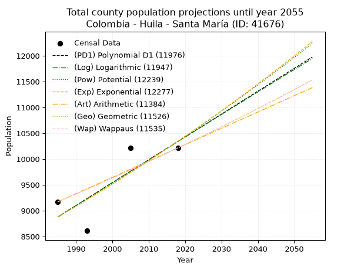
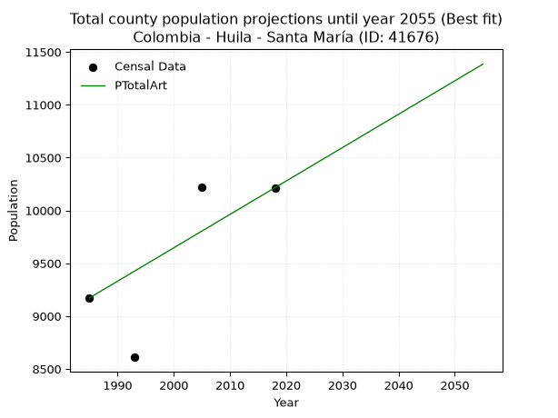
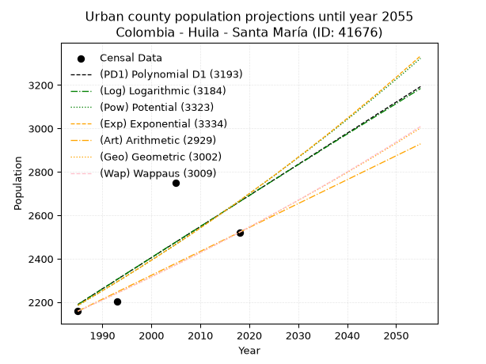
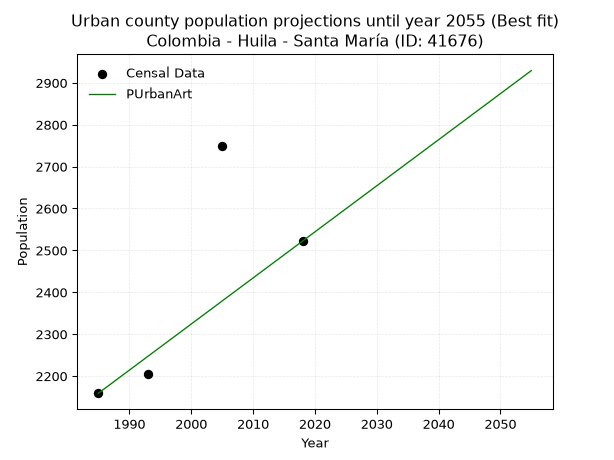
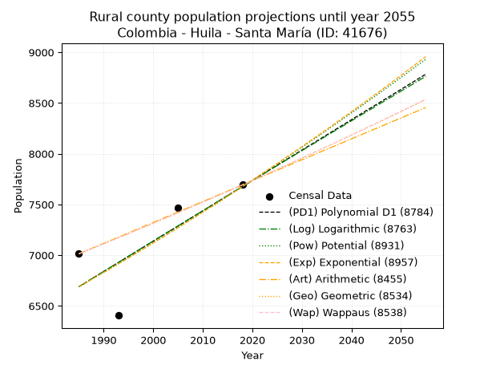
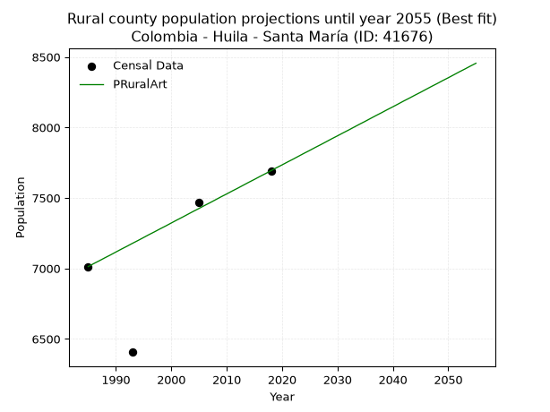

<div align="center">


</div>

# _“Population and Public Services Demand Projections (PPSD) until Year 2050 for Colombia - Huila - Santa María (ID: 41676)”_
Keywords: `population` `public-service` `projection` `lineal` `polynomial` `logarithmic` `potential` `exponential` `arithmetic` `geometric` `wappaus` `dane` `colombia` `south-america`

PPSD are analytical estimates used by governments and planners to anticipate future changes in population size, age distribution, and the resulting community needs for utilities, healthcare, education, and infrastructure as sizing future water treatment facilities, electrical grids, and road networks based on spatial growth.

> **General running parameters**: • app_version: _v20260806_. • Python version: _3.14.7_. • Pandas version: _3.0.5_. • NumPy version: _2.5.1_. • Creates, save and include plots into reports (create_plot): _True_. • Projection until year: _2050_. • Process polynomial degree 2 and up: _False_. • Process Wappaus: _True_. • Process Wappaus: _True_. • Set negative values to zero: _True_. • Set infinite values to zero: _True_. • Drop dataset notes: _True_. 
<div align="center">

Dynamic map: [:earth_americas:Google](http://maps.google.com/maps?q=2.939602864,-75.5862232) [:earth_americas:OSM](https://www.openstreetmap.org/#map=18/2.939602864/-75.5862232&layers=P) [:earth_americas:Bing](https://www.bing.com/maps?cp=2.939602864~-75.5862232&lvl=18) [:earth_americas:Apple](https://maps.apple.com/frame?center=2.939602864%2C-75.5862232&span=0.003%2C0.006)

</div>


<div align="center">

```geojson
{
  "type": "Feature",
  "geometry": {
    "type": "Point", 
    "coordinates": [-75.5862232, 2.939602864]
  }, 
  "properties": {
    "Name": "Colombia - Huila - Santa María (ID: 41676)"
  }
}
```

</div>


## 0. Census Data (4 records)

Census data are official statistics collected by a government about the people and housing in a country. They usually include counts of total population, age, sex, race, income, education, and jobs.

📅Global census file: [Population.xlsx](../data/Population.xlsx)

| Source   |   Year |   CountryID | CountryName   |   StateID | StateName   |   CountyID | CountyName   |   PTotal |   PUrban |   PRural |
|:---------|-------:|------------:|:--------------|----------:|:------------|-----------:|:-------------|---------:|---------:|---------:|
| DANE     |   1985 |          57 | Colombia      |        41 | Huila       |      41676 | Santa María  |     9172 |     2159 |     7013 |
| DANE     |   1993 |          57 | Colombia      |        41 | Huila       |      41676 | Santa María  |     8610 |     2204 |     6406 |
| DANE     |   2005 |          57 | Colombia      |        41 | Huila       |      41676 | Santa María  |    10218 |     2749 |     7469 |
| DANE     |   2018 |          57 | Colombia      |        41 | Huila       |      41676 | Santa María  |    10215 |     2522 |     7693 |

> 🔥Some records has specific notes about the registered values or the corresponding urban or rural distribution.

## 1. Total

### 1.1. Coefficients and Parameters

* (PD1) Polynomial Deg 1: 44.2492974708951, -78955.90726615794 (lineal)
* (Log) Logarithmic: 88564.67456389715, -663627.0510729433
* (Pow) Potential: 9.265864551272855, -26.608303713936362
* (Exp) Exponential: 0.004629645626222106, 0.9062668868555119
* (Art) Arithmetic: Year diff. 2018 - 1985 = 33, Population diff. 10215 - 9172 = 1043, Annual growth = 31.606060606060606
* (Geo) Geometric: Year diff. 2018 - 1985 = 33, Population diff. 10215 - 9172 = 1043, Annual growth % = 0.0032690244706206073
* (Wap) Wappaus: i = 0.32605416625636363, Condition values only valid for < 200)

<sub>
Wappaus condition values: ['0.00', '0.33', '0.65', '0.98', '1.30', '1.63', '1.96', '2.28', '2.61', '2.93', '3.26', '3.59', '3.91', '4.24', '4.56', '4.89', '5.22', '5.54', '5.87', '6.20', '6.52', '6.85', '7.17', '7.50', '7.83', '8.15', '8.48', '8.80', '9.13', '9.46', '9.78', '10.11', '10.43', '10.76', '11.09', '11.41', '11.74', '12.06', '12.39', '12.72', '13.04', '13.37', '13.69', '14.02', '14.35', '14.67', '15.00', '15.32', '15.65', '15.98', '16.30', '16.63', '16.95', '17.28', '17.61', '17.93', '18.26', '18.59', '18.91', '19.24', '19.56', '19.89', '20.22', '20.54', '20.87', '21.19']
</sub>


### 1.2. Projected Dataset

|   Year |   CountyID |   PTotalPD1 |   PTotalLog |   PTotalPow |   PTotalExp |   PTotalArt |   PTotalGeo |   PTotalWap |
|-------:|-----------:|------------:|------------:|------------:|------------:|------------:|------------:|------------:|
|   1985 |      41676 |        8879 |        8878 |        8878 |        8879 |        9172 |        9172 |        9172 |
|   1986 |      41676 |        8923 |        8922 |        8919 |        8920 |        9204 |        9202 |        9202 |
|   1987 |      41676 |        8967 |        8967 |        8961 |        8961 |        9235 |        9232 |        9232 |
|   1988 |      41676 |        9012 |        9011 |        9003 |        9003 |        9267 |        9262 |        9262 |
|   1989 |      41676 |        9056 |        9056 |        9045 |        9045 |        9298 |        9293 |        9292 |
|   1990 |      41676 |        9100 |        9100 |        9087 |        9087 |        9330 |        9323 |        9323 |
|   1991 |      41676 |        9144 |        9145 |        9129 |        9129 |        9362 |        9353 |        9353 |
|   1992 |      41676 |        9189 |        9189 |        9172 |        9171 |        9393 |        9384 |        9384 |
|   1993 |      41676 |        9233 |        9234 |        9215 |        9214 |        9425 |        9415 |        9414 |
|   1994 |      41676 |        9277 |        9278 |        9258 |        9257 |        9456 |        9445 |        9445 |
|   1995 |      41676 |        9321 |        9323 |        9301 |        9300 |        9488 |        9476 |        9476 |
|   1996 |      41676 |        9366 |        9367 |        9344 |        9343 |        9520 |        9507 |        9507 |
|   1997 |      41676 |        9410 |        9411 |        9388 |        9386 |        9551 |        9538 |        9538 |
|   1998 |      41676 |        9454 |        9456 |        9431 |        9430 |        9583 |        9570 |        9569 |
|   1999 |      41676 |        9498 |        9500 |        9475 |        9473 |        9614 |        9601 |        9600 |
|   2000 |      41676 |        9543 |        9544 |        9519 |        9517 |        9646 |        9632 |        9632 |
|   2001 |      41676 |        9587 |        9589 |        9563 |        9561 |        9678 |        9664 |        9663 |
|   2002 |      41676 |        9631 |        9633 |        9608 |        9606 |        9709 |        9695 |        9695 |
|   2003 |      41676 |        9675 |        9677 |        9652 |        9650 |        9741 |        9727 |        9727 |
|   2004 |      41676 |        9720 |        9721 |        9697 |        9695 |        9773 |        9759 |        9758 |
|   2005 |      41676 |        9764 |        9766 |        9742 |        9740 |        9804 |        9791 |        9790 |
|   2006 |      41676 |        9808 |        9810 |        9787 |        9785 |        9836 |        9823 |        9822 |
|   2007 |      41676 |        9852 |        9854 |        9832 |        9831 |        9867 |        9855 |        9854 |
|   2008 |      41676 |        9897 |        9898 |        9878 |        9876 |        9899 |        9887 |        9887 |
|   2009 |      41676 |        9941 |        9942 |        9923 |        9922 |        9931 |        9919 |        9919 |
|   2010 |      41676 |        9985 |        9986 |        9969 |        9968 |        9962 |        9952 |        9951 |
|   2011 |      41676 |       10029 |       10030 |       10015 |       10015 |        9994 |        9984 |        9984 |
|   2012 |      41676 |       10074 |       10074 |       10062 |       10061 |       10025 |       10017 |       10017 |
|   2013 |      41676 |       10118 |       10118 |       10108 |       10108 |       10057 |       10050 |       10049 |
|   2014 |      41676 |       10162 |       10162 |       10155 |       10155 |       10089 |       10083 |       10082 |
|   2015 |      41676 |       10206 |       10206 |       10201 |       10202 |       10120 |       10115 |       10115 |
|   2016 |      41676 |       10251 |       10250 |       10248 |       10249 |       10152 |       10149 |       10148 |
|   2017 |      41676 |       10295 |       10294 |       10296 |       10297 |       10183 |       10182 |       10182 |
|   2018 |      41676 |       10339 |       10338 |       10343 |       10344 |       10215 |       10215 |       10215 |
|   2019 |      41676 |       10383 |       10382 |       10391 |       10392 |       10247 |       10248 |       10248 |
|   2020 |      41676 |       10428 |       10426 |       10438 |       10441 |       10278 |       10282 |       10282 |
|   2021 |      41676 |       10472 |       10469 |       10486 |       10489 |       10310 |       10316 |       10316 |
|   2022 |      41676 |       10516 |       10513 |       10535 |       10538 |       10341 |       10349 |       10350 |
|   2023 |      41676 |       10560 |       10557 |       10583 |       10587 |       10373 |       10383 |       10383 |
|   2024 |      41676 |       10605 |       10601 |       10632 |       10636 |       10405 |       10417 |       10418 |
|   2025 |      41676 |       10649 |       10645 |       10680 |       10685 |       10436 |       10451 |       10452 |
|   2026 |      41676 |       10693 |       10688 |       10729 |       10735 |       10468 |       10485 |       10486 |
|   2027 |      41676 |       10737 |       10732 |       10778 |       10785 |       10499 |       10519 |       10520 |
|   2028 |      41676 |       10782 |       10776 |       10828 |       10835 |       10531 |       10554 |       10555 |
|   2029 |      41676 |       10826 |       10819 |       10877 |       10885 |       10563 |       10588 |       10590 |
|   2030 |      41676 |       10870 |       10863 |       10927 |       10935 |       10594 |       10623 |       10624 |
|   2031 |      41676 |       10914 |       10907 |       10977 |       10986 |       10626 |       10658 |       10659 |
|   2032 |      41676 |       10959 |       10950 |       11027 |       11037 |       10657 |       10693 |       10694 |
|   2033 |      41676 |       11003 |       10994 |       11078 |       11088 |       10689 |       10728 |       10729 |
|   2034 |      41676 |       11047 |       11037 |       11128 |       11140 |       10721 |       10763 |       10765 |
|   2035 |      41676 |       11091 |       11081 |       11179 |       11191 |       10752 |       10798 |       10800 |
|   2036 |      41676 |       11136 |       11124 |       11230 |       11243 |       10784 |       10833 |       10835 |
|   2037 |      41676 |       11180 |       11168 |       11281 |       11296 |       10816 |       10868 |       10871 |
|   2038 |      41676 |       11224 |       11211 |       11333 |       11348 |       10847 |       10904 |       10907 |
|   2039 |      41676 |       11268 |       11255 |       11384 |       11401 |       10879 |       10940 |       10943 |
|   2040 |      41676 |       11313 |       11298 |       11436 |       11454 |       10910 |       10975 |       10979 |
|   2041 |      41676 |       11357 |       11342 |       11488 |       11507 |       10942 |       11011 |       11015 |
|   2042 |      41676 |       11401 |       11385 |       11540 |       11560 |       10974 |       11047 |       11051 |
|   2043 |      41676 |       11445 |       11428 |       11593 |       11614 |       11005 |       11083 |       11088 |
|   2044 |      41676 |       11490 |       11472 |       11646 |       11668 |       11037 |       11120 |       11124 |
|   2045 |      41676 |       11534 |       11515 |       11699 |       11722 |       11068 |       11156 |       11161 |
|   2046 |      41676 |       11578 |       11558 |       11752 |       11776 |       11100 |       11192 |       11198 |
|   2047 |      41676 |       11622 |       11602 |       11805 |       11831 |       11132 |       11229 |       11235 |
|   2048 |      41676 |       11667 |       11645 |       11859 |       11886 |       11163 |       11266 |       11272 |
|   2049 |      41676 |       11711 |       11688 |       11912 |       11941 |       11195 |       11303 |       11309 |
|   2050 |      41676 |       11755 |       11731 |       11966 |       11996 |       11226 |       11340 |       11346 |
<div align="center">

</img>

</div>


### 1.3. Best fit with absolute error and relative error (%)

Relative error puts that difference into context by dividing the absolute error by the true value, creating a unitless ratio or percentage that shows the scale of the mistake.

Absolute and relative error

|   Year | Source   |   CountryID | CountryName   |   StateID | StateName   |   CountyID_x | CountyName   |   PTotal |   PUrban |   PRural |   CountyID_y |   PTotalPD1 |   PTotalLog |   PTotalPow |   PTotalExp |   PTotalArt |   PTotalGeo |   PTotalWap |   PTotalPD1AbsError |   PTotalLogAbsError |   PTotalPowAbsError |   PTotalExpAbsError |   PTotalArtAbsError |   PTotalGeoAbsError |   PTotalWapAbsError |   PTotalPD1RelError |   PTotalLogRelError |   PTotalPowRelError |   PTotalExpRelError |   PTotalArtRelError |   PTotalGeoRelError |   PTotalWapRelError |
|-------:|:---------|------------:|:--------------|----------:|:------------|-------------:|:-------------|---------:|---------:|---------:|-------------:|------------:|------------:|------------:|------------:|------------:|------------:|------------:|--------------------:|--------------------:|--------------------:|--------------------:|--------------------:|--------------------:|--------------------:|--------------------:|--------------------:|--------------------:|--------------------:|--------------------:|--------------------:|--------------------:|
|   1985 | DANE     |          57 | Colombia      |        41 | Huila       |        41676 | Santa María  |     9172 |     2159 |     7013 |        41676 |        8879 |        8878 |        8878 |        8879 |        9172 |        9172 |        9172 |                 293 |                 294 |                 294 |                 293 |                   0 |                   0 |                   0 |             3.19451 |             3.20541 |             3.20541 |             3.19451 |             0       |             0       |             0       |
|   1993 | DANE     |          57 | Colombia      |        41 | Huila       |        41676 | Santa María  |     8610 |     2204 |     6406 |        41676 |        9233 |        9234 |        9215 |        9214 |        9425 |        9415 |        9414 |                 623 |                 624 |                 605 |                 604 |                 815 |                 805 |                 804 |             7.23577 |             7.24739 |             7.02671 |             7.0151  |             9.46574 |             9.34959 |             9.33798 |
|   2005 | DANE     |          57 | Colombia      |        41 | Huila       |        41676 | Santa María  |    10218 |     2749 |     7469 |        41676 |        9764 |        9766 |        9742 |        9740 |        9804 |        9791 |        9790 |                 454 |                 452 |                 476 |                 478 |                 414 |                 427 |                 428 |             4.44314 |             4.42357 |             4.65845 |             4.67802 |             4.05167 |             4.1789  |             4.18869 |
|   2018 | DANE     |          57 | Colombia      |        41 | Huila       |        41676 | Santa María  |    10215 |     2522 |     7693 |        41676 |       10339 |       10338 |       10343 |       10344 |       10215 |       10215 |       10215 |                 124 |                 123 |                 128 |                 129 |                   0 |                   0 |                   0 |             1.2139  |             1.20411 |             1.25306 |             1.26285 |             0       |             0       |             0       |

Relative error mean

| Method    |   RelError | Best   |
|:----------|-----------:|:-------|
| PTotalPD1 |    4.02183 |        |
| PTotalLog |    4.02012 |        |
| PTotalPow |    4.03591 |        |
| PTotalExp |    4.03762 |        |
| PTotalArt |    3.37935 | True   |
| PTotalGeo |    3.38212 |        |
| PTotalWap |    3.38167 |        |

💙Best method: _**PTotalArt**_
<div align="center">

</img>

</div>


### 1.4. Fresh water supply demand in liters per capita per day (lpcd)

The fresh water supply demand typically ranges from 100 to 300 liters per capita per day (lpcd) for standard domestic and municipal planning, though absolute survival minimums set by the World Health Organization are as low as 7.5 to 20 liters per day, and total consumption in high-income nations can exceed 400 liters.

> `CZ`: Level in meters above the sea level (masl).<br> `WS`: Fresh water supply demand in liters per capita per day (lpcd or l/h/d).<br> `WSAll`: Zonal fresh water supply demand in liters per second (l/s).<br> `A`: Zonal area in square meters.

Reference values (RAS Colombia)

|    CZ |   WS |
|------:|-----:|
|  1000 |  120 |
|  2000 |  130 |
| 99999 |  140 |

County shapefile geometry properties and water supply values

|   CountyID |      ATotal |   CZTotal |   WSTotal |
|-----------:|------------:|----------:|----------:|
|      41676 | 3.39305e+08 |   2180.06 |       140 |

Projected values for best method: PTotalArt

|   CountyID |   Year |   PTotalArt |   WSTotal |   WSTotalAll |
|-----------:|-------:|------------:|----------:|-------------:|
|      41676 |   1985 |        9172 |       140 |      14.862  |
|      41676 |   1986 |        9204 |       140 |      14.9139 |
|      41676 |   1987 |        9235 |       140 |      14.9641 |
|      41676 |   1988 |        9267 |       140 |      15.016  |
|      41676 |   1989 |        9298 |       140 |      15.0662 |
|      41676 |   1990 |        9330 |       140 |      15.1181 |
|      41676 |   1991 |        9362 |       140 |      15.1699 |
|      41676 |   1992 |        9393 |       140 |      15.2201 |
|      41676 |   1993 |        9425 |       140 |      15.272  |
|      41676 |   1994 |        9456 |       140 |      15.3222 |
|      41676 |   1995 |        9488 |       140 |      15.3741 |
|      41676 |   1996 |        9520 |       140 |      15.4259 |
|      41676 |   1997 |        9551 |       140 |      15.4762 |
|      41676 |   1998 |        9583 |       140 |      15.528  |
|      41676 |   1999 |        9614 |       140 |      15.5782 |
|      41676 |   2000 |        9646 |       140 |      15.6301 |
|      41676 |   2001 |        9678 |       140 |      15.6819 |
|      41676 |   2002 |        9709 |       140 |      15.7322 |
|      41676 |   2003 |        9741 |       140 |      15.784  |
|      41676 |   2004 |        9773 |       140 |      15.8359 |
|      41676 |   2005 |        9804 |       140 |      15.8861 |
|      41676 |   2006 |        9836 |       140 |      15.938  |
|      41676 |   2007 |        9867 |       140 |      15.9882 |
|      41676 |   2008 |        9899 |       140 |      16.04   |
|      41676 |   2009 |        9931 |       140 |      16.0919 |
|      41676 |   2010 |        9962 |       140 |      16.1421 |
|      41676 |   2011 |        9994 |       140 |      16.194  |
|      41676 |   2012 |       10025 |       140 |      16.2442 |
|      41676 |   2013 |       10057 |       140 |      16.2961 |
|      41676 |   2014 |       10089 |       140 |      16.3479 |
|      41676 |   2015 |       10120 |       140 |      16.3981 |
|      41676 |   2016 |       10152 |       140 |      16.45   |
|      41676 |   2017 |       10183 |       140 |      16.5002 |
|      41676 |   2018 |       10215 |       140 |      16.5521 |
|      41676 |   2019 |       10247 |       140 |      16.6039 |
|      41676 |   2020 |       10278 |       140 |      16.6542 |
|      41676 |   2021 |       10310 |       140 |      16.706  |
|      41676 |   2022 |       10341 |       140 |      16.7563 |
|      41676 |   2023 |       10373 |       140 |      16.8081 |
|      41676 |   2024 |       10405 |       140 |      16.86   |
|      41676 |   2025 |       10436 |       140 |      16.9102 |
|      41676 |   2026 |       10468 |       140 |      16.962  |
|      41676 |   2027 |       10499 |       140 |      17.0123 |
|      41676 |   2028 |       10531 |       140 |      17.0641 |
|      41676 |   2029 |       10563 |       140 |      17.116  |
|      41676 |   2030 |       10594 |       140 |      17.1662 |
|      41676 |   2031 |       10626 |       140 |      17.2181 |
|      41676 |   2032 |       10657 |       140 |      17.2683 |
|      41676 |   2033 |       10689 |       140 |      17.3201 |
|      41676 |   2034 |       10721 |       140 |      17.372  |
|      41676 |   2035 |       10752 |       140 |      17.4222 |
|      41676 |   2036 |       10784 |       140 |      17.4741 |
|      41676 |   2037 |       10816 |       140 |      17.5259 |
|      41676 |   2038 |       10847 |       140 |      17.5762 |
|      41676 |   2039 |       10879 |       140 |      17.628  |
|      41676 |   2040 |       10910 |       140 |      17.6782 |
|      41676 |   2041 |       10942 |       140 |      17.7301 |
|      41676 |   2042 |       10974 |       140 |      17.7819 |
|      41676 |   2043 |       11005 |       140 |      17.8322 |
|      41676 |   2044 |       11037 |       140 |      17.884  |
|      41676 |   2045 |       11068 |       140 |      17.9343 |
|      41676 |   2046 |       11100 |       140 |      17.9861 |
|      41676 |   2047 |       11132 |       140 |      18.038  |
|      41676 |   2048 |       11163 |       140 |      18.0882 |
|      41676 |   2049 |       11195 |       140 |      18.14   |
|      41676 |   2050 |       11226 |       140 |      18.1903 |

## 2. Urban

### 2.1. Coefficients and Parameters

* (PD1) Polynomial Deg 1: 14.32276194299488, -26240.604576475507 (lineal)
* (Log) Logarithmic: 28709.34659122241, -215811.47350214663
* (Pow) Potential: 12.090126623002277, -36.53082884979953
* (Exp) Exponential: 0.006032082998430573, 0.013789241170081009
* (Art) Arithmetic: Year diff. 2018 - 1985 = 33, Population diff. 2522 - 2159 = 363, Annual growth = 11.0
* (Geo) Geometric: Year diff. 2018 - 1985 = 33, Population diff. 2522 - 2159 = 363, Annual growth % = 0.0047204118437886855
* (Wap) Wappaus: i = 0.4699850459303568, Condition values only valid for < 200)

<sub>
Wappaus condition values: ['0.00', '0.47', '0.94', '1.41', '1.88', '2.35', '2.82', '3.29', '3.76', '4.23', '4.70', '5.17', '5.64', '6.11', '6.58', '7.05', '7.52', '7.99', '8.46', '8.93', '9.40', '9.87', '10.34', '10.81', '11.28', '11.75', '12.22', '12.69', '13.16', '13.63', '14.10', '14.57', '15.04', '15.51', '15.98', '16.45', '16.92', '17.39', '17.86', '18.33', '18.80', '19.27', '19.74', '20.21', '20.68', '21.15', '21.62', '22.09', '22.56', '23.03', '23.50', '23.97', '24.44', '24.91', '25.38', '25.85', '26.32', '26.79', '27.26', '27.73', '28.20', '28.67', '29.14', '29.61', '30.08', '30.55']
</sub>


### 2.2. Projected Dataset

|   Year |   CountyID |   PUrbanPD1 |   PUrbanLog |   PUrbanPow |   PUrbanExp |   PUrbanArt |   PUrbanGeo |   PUrbanWap |
|-------:|-----------:|------------:|------------:|------------:|------------:|------------:|------------:|------------:|
|   1985 |      41676 |        2190 |        2189 |        2185 |        2186 |        2159 |        2159 |        2159 |
|   1986 |      41676 |        2204 |        2204 |        2199 |        2199 |        2170 |        2169 |        2169 |
|   1987 |      41676 |        2219 |        2218 |        2212 |        2213 |        2181 |        2179 |        2179 |
|   1988 |      41676 |        2233 |        2233 |        2226 |        2226 |        2192 |        2190 |        2190 |
|   1989 |      41676 |        2247 |        2247 |        2239 |        2239 |        2203 |        2200 |        2200 |
|   1990 |      41676 |        2262 |        2262 |        2253 |        2253 |        2214 |        2210 |        2210 |
|   1991 |      41676 |        2276 |        2276 |        2267 |        2267 |        2225 |        2221 |        2221 |
|   1992 |      41676 |        2290 |        2290 |        2280 |        2280 |        2236 |        2231 |        2231 |
|   1993 |      41676 |        2305 |        2305 |        2294 |        2294 |        2247 |        2242 |        2242 |
|   1994 |      41676 |        2319 |        2319 |        2308 |        2308 |        2258 |        2252 |        2252 |
|   1995 |      41676 |        2333 |        2334 |        2322 |        2322 |        2269 |        2263 |        2263 |
|   1996 |      41676 |        2348 |        2348 |        2336 |        2336 |        2280 |        2274 |        2274 |
|   1997 |      41676 |        2362 |        2362 |        2350 |        2350 |        2291 |        2285 |        2284 |
|   1998 |      41676 |        2376 |        2377 |        2365 |        2364 |        2302 |        2295 |        2295 |
|   1999 |      41676 |        2391 |        2391 |        2379 |        2379 |        2313 |        2306 |        2306 |
|   2000 |      41676 |        2405 |        2405 |        2394 |        2393 |        2324 |        2317 |        2317 |
|   2001 |      41676 |        2419 |        2420 |        2408 |        2407 |        2335 |        2328 |        2328 |
|   2002 |      41676 |        2434 |        2434 |        2423 |        2422 |        2346 |        2339 |        2339 |
|   2003 |      41676 |        2448 |        2449 |        2437 |        2437 |        2357 |        2350 |        2350 |
|   2004 |      41676 |        2462 |        2463 |        2452 |        2451 |        2368 |        2361 |        2361 |
|   2005 |      41676 |        2477 |        2477 |        2467 |        2466 |        2379 |        2372 |        2372 |
|   2006 |      41676 |        2491 |        2491 |        2482 |        2481 |        2390 |        2383 |        2383 |
|   2007 |      41676 |        2505 |        2506 |        2497 |        2496 |        2401 |        2395 |        2394 |
|   2008 |      41676 |        2520 |        2520 |        2512 |        2511 |        2412 |        2406 |        2406 |
|   2009 |      41676 |        2534 |        2534 |        2527 |        2526 |        2423 |        2417 |        2417 |
|   2010 |      41676 |        2548 |        2549 |        2542 |        2542 |        2434 |        2429 |        2429 |
|   2011 |      41676 |        2562 |        2563 |        2558 |        2557 |        2445 |        2440 |        2440 |
|   2012 |      41676 |        2577 |        2577 |        2573 |        2573 |        2456 |        2452 |        2452 |
|   2013 |      41676 |        2591 |        2591 |        2589 |        2588 |        2467 |        2463 |        2463 |
|   2014 |      41676 |        2605 |        2606 |        2604 |        2604 |        2478 |        2475 |        2475 |
|   2015 |      41676 |        2620 |        2620 |        2620 |        2620 |        2489 |        2487 |        2486 |
|   2016 |      41676 |        2634 |        2634 |        2636 |        2635 |        2500 |        2498 |        2498 |
|   2017 |      41676 |        2648 |        2648 |        2651 |        2651 |        2511 |        2510 |        2510 |
|   2018 |      41676 |        2663 |        2663 |        2667 |        2667 |        2522 |        2522 |        2522 |
|   2019 |      41676 |        2677 |        2677 |        2683 |        2684 |        2533 |        2534 |        2534 |
|   2020 |      41676 |        2691 |        2691 |        2700 |        2700 |        2544 |        2546 |        2546 |
|   2021 |      41676 |        2706 |        2705 |        2716 |        2716 |        2555 |        2558 |        2558 |
|   2022 |      41676 |        2720 |        2720 |        2732 |        2733 |        2566 |        2570 |        2570 |
|   2023 |      41676 |        2734 |        2734 |        2748 |        2749 |        2577 |        2582 |        2582 |
|   2024 |      41676 |        2749 |        2748 |        2765 |        2766 |        2588 |        2594 |        2595 |
|   2025 |      41676 |        2763 |        2762 |        2781 |        2782 |        2599 |        2607 |        2607 |
|   2026 |      41676 |        2777 |        2776 |        2798 |        2799 |        2610 |        2619 |        2619 |
|   2027 |      41676 |        2792 |        2790 |        2815 |        2816 |        2621 |        2631 |        2632 |
|   2028 |      41676 |        2806 |        2805 |        2832 |        2833 |        2632 |        2644 |        2644 |
|   2029 |      41676 |        2820 |        2819 |        2849 |        2850 |        2643 |        2656 |        2657 |
|   2030 |      41676 |        2835 |        2833 |        2866 |        2868 |        2654 |        2669 |        2670 |
|   2031 |      41676 |        2849 |        2847 |        2883 |        2885 |        2665 |        2681 |        2682 |
|   2032 |      41676 |        2863 |        2861 |        2900 |        2902 |        2676 |        2694 |        2695 |
|   2033 |      41676 |        2878 |        2875 |        2917 |        2920 |        2687 |        2707 |        2708 |
|   2034 |      41676 |        2892 |        2889 |        2935 |        2938 |        2698 |        2719 |        2721 |
|   2035 |      41676 |        2906 |        2904 |        2952 |        2955 |        2709 |        2732 |        2734 |
|   2036 |      41676 |        2921 |        2918 |        2970 |        2973 |        2720 |        2745 |        2747 |
|   2037 |      41676 |        2935 |        2932 |        2987 |        2991 |        2731 |        2758 |        2760 |
|   2038 |      41676 |        2949 |        2946 |        3005 |        3009 |        2742 |        2771 |        2773 |
|   2039 |      41676 |        2964 |        2960 |        3023 |        3028 |        2753 |        2784 |        2787 |
|   2040 |      41676 |        2978 |        2974 |        3041 |        3046 |        2764 |        2797 |        2800 |
|   2041 |      41676 |        2992 |        2988 |        3059 |        3064 |        2775 |        2811 |        2813 |
|   2042 |      41676 |        3006 |        3002 |        3077 |        3083 |        2786 |        2824 |        2827 |
|   2043 |      41676 |        3021 |        3016 |        3096 |        3102 |        2797 |        2837 |        2840 |
|   2044 |      41676 |        3035 |        3030 |        3114 |        3120 |        2808 |        2850 |        2854 |
|   2045 |      41676 |        3049 |        3044 |        3132 |        3139 |        2819 |        2864 |        2868 |
|   2046 |      41676 |        3064 |        3058 |        3151 |        3158 |        2830 |        2877 |        2882 |
|   2047 |      41676 |        3078 |        3072 |        3170 |        3177 |        2841 |        2891 |        2895 |
|   2048 |      41676 |        3092 |        3086 |        3188 |        3197 |        2852 |        2905 |        2909 |
|   2049 |      41676 |        3107 |        3100 |        3207 |        3216 |        2863 |        2918 |        2923 |
|   2050 |      41676 |        3121 |        3114 |        3226 |        3235 |        2874 |        2932 |        2937 |
<div align="center">

</img>

</div>


### 2.3. Best fit with absolute error and relative error (%)

Relative error puts that difference into context by dividing the absolute error by the true value, creating a unitless ratio or percentage that shows the scale of the mistake.

Absolute and relative error

|   Year | Source   |   CountryID | CountryName   |   StateID | StateName   |   CountyID_x | CountyName   |   PTotal |   PUrban |   PRural |   CountyID_y |   PUrbanPD1 |   PUrbanLog |   PUrbanPow |   PUrbanExp |   PUrbanArt |   PUrbanGeo |   PUrbanWap |   PUrbanPD1AbsError |   PUrbanLogAbsError |   PUrbanPowAbsError |   PUrbanExpAbsError |   PUrbanArtAbsError |   PUrbanGeoAbsError |   PUrbanWapAbsError |   PUrbanPD1RelError |   PUrbanLogRelError |   PUrbanPowRelError |   PUrbanExpRelError |   PUrbanArtRelError |   PUrbanGeoRelError |   PUrbanWapRelError |
|-------:|:---------|------------:|:--------------|----------:|:------------|-------------:|:-------------|---------:|---------:|---------:|-------------:|------------:|------------:|------------:|------------:|------------:|------------:|------------:|--------------------:|--------------------:|--------------------:|--------------------:|--------------------:|--------------------:|--------------------:|--------------------:|--------------------:|--------------------:|--------------------:|--------------------:|--------------------:|--------------------:|
|   1985 | DANE     |          57 | Colombia      |        41 | Huila       |        41676 | Santa María  |     9172 |     2159 |     7013 |        41676 |        2190 |        2189 |        2185 |        2186 |        2159 |        2159 |        2159 |                  31 |                  30 |                  26 |                  27 |                   0 |                   0 |                   0 |             1.43585 |             1.38953 |             1.20426 |             1.25058 |              0      |             0       |             0       |
|   1993 | DANE     |          57 | Colombia      |        41 | Huila       |        41676 | Santa María  |     8610 |     2204 |     6406 |        41676 |        2305 |        2305 |        2294 |        2294 |        2247 |        2242 |        2242 |                 101 |                 101 |                  90 |                  90 |                  43 |                  38 |                  38 |             4.58258 |             4.58258 |             4.08348 |             4.08348 |              1.951  |             1.72414 |             1.72414 |
|   2005 | DANE     |          57 | Colombia      |        41 | Huila       |        41676 | Santa María  |    10218 |     2749 |     7469 |        41676 |        2477 |        2477 |        2467 |        2466 |        2379 |        2372 |        2372 |                 272 |                 272 |                 282 |                 283 |                 370 |                 377 |                 377 |             9.89451 |             9.89451 |            10.2583  |            10.2947  |             13.4594 |            13.7141  |            13.7141  |
|   2018 | DANE     |          57 | Colombia      |        41 | Huila       |        41676 | Santa María  |    10215 |     2522 |     7693 |        41676 |        2663 |        2663 |        2667 |        2667 |        2522 |        2522 |        2522 |                 141 |                 141 |                 145 |                 145 |                   0 |                   0 |                   0 |             5.5908  |             5.5908  |             5.74941 |             5.74941 |              0      |             0       |             0       |

Relative error mean

| Method    |   RelError | Best   |
|:----------|-----------:|:-------|
| PUrbanPD1 |    5.37593 |        |
| PUrbanLog |    5.36435 |        |
| PUrbanPow |    5.32386 |        |
| PUrbanExp |    5.34453 |        |
| PUrbanArt |    3.85261 | True   |
| PUrbanGeo |    3.85955 |        |
| PUrbanWap |    3.85955 |        |

💙Best method: _**PUrbanArt**_
<div align="center">

</img>

</div>


### 2.4. Fresh water supply demand in liters per capita per day (lpcd)

The fresh water supply demand typically ranges from 100 to 300 liters per capita per day (lpcd) for standard domestic and municipal planning, though absolute survival minimums set by the World Health Organization are as low as 7.5 to 20 liters per day, and total consumption in high-income nations can exceed 400 liters.

> `CZ`: Level in meters above the sea level (masl).<br> `WS`: Fresh water supply demand in liters per capita per day (lpcd or l/h/d).<br> `WSAll`: Zonal fresh water supply demand in liters per second (l/s).<br> `A`: Zonal area in square meters.

Reference values (RAS Colombia)

|    CZ |   WS |
|------:|-----:|
|  1000 |  120 |
|  2000 |  130 |
| 99999 |  140 |

County shapefile geometry properties and water supply values

|   CountyID |   AUrban |   CZUrban |   WSUrban |
|-----------:|---------:|----------:|----------:|
|      41676 |   469700 |   1321.06 |       130 |

Projected values for best method: PUrbanArt

|   CountyID |   Year |   PUrbanArt |   WSUrban |   WSUrbanAll |
|-----------:|-------:|------------:|----------:|-------------:|
|      41676 |   1985 |        2159 |       130 |      3.2485  |
|      41676 |   1986 |        2170 |       130 |      3.26505 |
|      41676 |   1987 |        2181 |       130 |      3.2816  |
|      41676 |   1988 |        2192 |       130 |      3.29815 |
|      41676 |   1989 |        2203 |       130 |      3.3147  |
|      41676 |   1990 |        2214 |       130 |      3.33125 |
|      41676 |   1991 |        2225 |       130 |      3.3478  |
|      41676 |   1992 |        2236 |       130 |      3.36435 |
|      41676 |   1993 |        2247 |       130 |      3.3809  |
|      41676 |   1994 |        2258 |       130 |      3.39745 |
|      41676 |   1995 |        2269 |       130 |      3.414   |
|      41676 |   1996 |        2280 |       130 |      3.43056 |
|      41676 |   1997 |        2291 |       130 |      3.44711 |
|      41676 |   1998 |        2302 |       130 |      3.46366 |
|      41676 |   1999 |        2313 |       130 |      3.48021 |
|      41676 |   2000 |        2324 |       130 |      3.49676 |
|      41676 |   2001 |        2335 |       130 |      3.51331 |
|      41676 |   2002 |        2346 |       130 |      3.52986 |
|      41676 |   2003 |        2357 |       130 |      3.54641 |
|      41676 |   2004 |        2368 |       130 |      3.56296 |
|      41676 |   2005 |        2379 |       130 |      3.57951 |
|      41676 |   2006 |        2390 |       130 |      3.59606 |
|      41676 |   2007 |        2401 |       130 |      3.61262 |
|      41676 |   2008 |        2412 |       130 |      3.62917 |
|      41676 |   2009 |        2423 |       130 |      3.64572 |
|      41676 |   2010 |        2434 |       130 |      3.66227 |
|      41676 |   2011 |        2445 |       130 |      3.67882 |
|      41676 |   2012 |        2456 |       130 |      3.69537 |
|      41676 |   2013 |        2467 |       130 |      3.71192 |
|      41676 |   2014 |        2478 |       130 |      3.72847 |
|      41676 |   2015 |        2489 |       130 |      3.74502 |
|      41676 |   2016 |        2500 |       130 |      3.76157 |
|      41676 |   2017 |        2511 |       130 |      3.77813 |
|      41676 |   2018 |        2522 |       130 |      3.79468 |
|      41676 |   2019 |        2533 |       130 |      3.81123 |
|      41676 |   2020 |        2544 |       130 |      3.82778 |
|      41676 |   2021 |        2555 |       130 |      3.84433 |
|      41676 |   2022 |        2566 |       130 |      3.86088 |
|      41676 |   2023 |        2577 |       130 |      3.87743 |
|      41676 |   2024 |        2588 |       130 |      3.89398 |
|      41676 |   2025 |        2599 |       130 |      3.91053 |
|      41676 |   2026 |        2610 |       130 |      3.92708 |
|      41676 |   2027 |        2621 |       130 |      3.94363 |
|      41676 |   2028 |        2632 |       130 |      3.96019 |
|      41676 |   2029 |        2643 |       130 |      3.97674 |
|      41676 |   2030 |        2654 |       130 |      3.99329 |
|      41676 |   2031 |        2665 |       130 |      4.00984 |
|      41676 |   2032 |        2676 |       130 |      4.02639 |
|      41676 |   2033 |        2687 |       130 |      4.04294 |
|      41676 |   2034 |        2698 |       130 |      4.05949 |
|      41676 |   2035 |        2709 |       130 |      4.07604 |
|      41676 |   2036 |        2720 |       130 |      4.09259 |
|      41676 |   2037 |        2731 |       130 |      4.10914 |
|      41676 |   2038 |        2742 |       130 |      4.12569 |
|      41676 |   2039 |        2753 |       130 |      4.14225 |
|      41676 |   2040 |        2764 |       130 |      4.1588  |
|      41676 |   2041 |        2775 |       130 |      4.17535 |
|      41676 |   2042 |        2786 |       130 |      4.1919  |
|      41676 |   2043 |        2797 |       130 |      4.20845 |
|      41676 |   2044 |        2808 |       130 |      4.225   |
|      41676 |   2045 |        2819 |       130 |      4.24155 |
|      41676 |   2046 |        2830 |       130 |      4.2581  |
|      41676 |   2047 |        2841 |       130 |      4.27465 |
|      41676 |   2048 |        2852 |       130 |      4.2912  |
|      41676 |   2049 |        2863 |       130 |      4.30775 |
|      41676 |   2050 |        2874 |       130 |      4.32431 |

## 3. Rural

### 3.1. Coefficients and Parameters

* (PD1) Polynomial Deg 1: 29.926535527900224, -52715.302689682416 (lineal)
* (Log) Logarithmic: 59855.32797267484, -447815.5775707973
* (Pow) Potential: 8.344501568953898, -23.692870261176527
* (Exp) Exponential: 0.004172225458335156, 1.6926230861072677
* (Art) Arithmetic: Year diff. 2018 - 1985 = 33, Population diff. 7693 - 7013 = 680, Annual growth = 20.606060606060606
* (Geo) Geometric: Year diff. 2018 - 1985 = 33, Population diff. 7693 - 7013 = 680, Annual growth % = 0.002808337677178141
* (Wap) Wappaus: i = 0.28024018232096565, Condition values only valid for < 200)

<sub>
Wappaus condition values: ['0.00', '0.28', '0.56', '0.84', '1.12', '1.40', '1.68', '1.96', '2.24', '2.52', '2.80', '3.08', '3.36', '3.64', '3.92', '4.20', '4.48', '4.76', '5.04', '5.32', '5.60', '5.89', '6.17', '6.45', '6.73', '7.01', '7.29', '7.57', '7.85', '8.13', '8.41', '8.69', '8.97', '9.25', '9.53', '9.81', '10.09', '10.37', '10.65', '10.93', '11.21', '11.49', '11.77', '12.05', '12.33', '12.61', '12.89', '13.17', '13.45', '13.73', '14.01', '14.29', '14.57', '14.85', '15.13', '15.41', '15.69', '15.97', '16.25', '16.53', '16.81', '17.09', '17.37', '17.66', '17.94', '18.22']
</sub>


### 3.2. Projected Dataset

|   Year |   CountyID |   PRuralPD1 |   PRuralLog |   PRuralPow |   PRuralExp |   PRuralArt |   PRuralGeo |   PRuralWap |
|-------:|-----------:|------------:|------------:|------------:|------------:|------------:|------------:|------------:|
|   1985 |      41676 |        6689 |        6688 |        6688 |        6689 |        7013 |        7013 |        7013 |
|   1986 |      41676 |        6719 |        6718 |        6716 |        6716 |        7034 |        7033 |        7033 |
|   1987 |      41676 |        6749 |        6749 |        6744 |        6745 |        7054 |        7052 |        7052 |
|   1988 |      41676 |        6779 |        6779 |        6773 |        6773 |        7075 |        7072 |        7072 |
|   1989 |      41676 |        6809 |        6809 |        6801 |        6801 |        7095 |        7092 |        7092 |
|   1990 |      41676 |        6839 |        6839 |        6830 |        6830 |        7116 |        7112 |        7112 |
|   1991 |      41676 |        6868 |        6869 |        6859 |        6858 |        7137 |        7132 |        7132 |
|   1992 |      41676 |        6898 |        6899 |        6887 |        6887 |        7157 |        7152 |        7152 |
|   1993 |      41676 |        6928 |        6929 |        6916 |        6916 |        7178 |        7172 |        7172 |
|   1994 |      41676 |        6958 |        6959 |        6945 |        6944 |        7198 |        7192 |        7192 |
|   1995 |      41676 |        6988 |        6989 |        6974 |        6973 |        7219 |        7212 |        7212 |
|   1996 |      41676 |        7018 |        7019 |        7004 |        7003 |        7240 |        7233 |        7233 |
|   1997 |      41676 |        7048 |        7049 |        7033 |        7032 |        7260 |        7253 |        7253 |
|   1998 |      41676 |        7078 |        7079 |        7062 |        7061 |        7281 |        7273 |        7273 |
|   1999 |      41676 |        7108 |        7109 |        7092 |        7091 |        7301 |        7294 |        7294 |
|   2000 |      41676 |        7138 |        7139 |        7122 |        7120 |        7322 |        7314 |        7314 |
|   2001 |      41676 |        7168 |        7169 |        7151 |        7150 |        7343 |        7335 |        7335 |
|   2002 |      41676 |        7198 |        7199 |        7181 |        7180 |        7363 |        7355 |        7355 |
|   2003 |      41676 |        7228 |        7229 |        7211 |        7210 |        7384 |        7376 |        7376 |
|   2004 |      41676 |        7257 |        7259 |        7241 |        7240 |        7405 |        7397 |        7397 |
|   2005 |      41676 |        7287 |        7288 |        7272 |        7271 |        7425 |        7418 |        7417 |
|   2006 |      41676 |        7317 |        7318 |        7302 |        7301 |        7446 |        7438 |        7438 |
|   2007 |      41676 |        7347 |        7348 |        7332 |        7332 |        7466 |        7459 |        7459 |
|   2008 |      41676 |        7377 |        7378 |        7363 |        7362 |        7487 |        7480 |        7480 |
|   2009 |      41676 |        7407 |        7408 |        7394 |        7393 |        7508 |        7501 |        7501 |
|   2010 |      41676 |        7437 |        7437 |        7424 |        7424 |        7528 |        7522 |        7522 |
|   2011 |      41676 |        7467 |        7467 |        7455 |        7455 |        7549 |        7543 |        7543 |
|   2012 |      41676 |        7497 |        7497 |        7486 |        7486 |        7569 |        7565 |        7565 |
|   2013 |      41676 |        7527 |        7527 |        7517 |        7517 |        7590 |        7586 |        7586 |
|   2014 |      41676 |        7557 |        7556 |        7548 |        7549 |        7611 |        7607 |        7607 |
|   2015 |      41676 |        7587 |        7586 |        7580 |        7580 |        7631 |        7629 |        7628 |
|   2016 |      41676 |        7617 |        7616 |        7611 |        7612 |        7652 |        7650 |        7650 |
|   2017 |      41676 |        7647 |        7646 |        7643 |        7644 |        7672 |        7671 |        7671 |
|   2018 |      41676 |        7676 |        7675 |        7674 |        7676 |        7693 |        7693 |        7693 |
|   2019 |      41676 |        7706 |        7705 |        7706 |        7708 |        7714 |        7715 |        7715 |
|   2020 |      41676 |        7736 |        7735 |        7738 |        7740 |        7734 |        7736 |        7736 |
|   2021 |      41676 |        7766 |        7764 |        7770 |        7772 |        7755 |        7758 |        7758 |
|   2022 |      41676 |        7796 |        7794 |        7802 |        7805 |        7775 |        7780 |        7780 |
|   2023 |      41676 |        7826 |        7823 |        7835 |        7838 |        7796 |        7802 |        7802 |
|   2024 |      41676 |        7856 |        7853 |        7867 |        7870 |        7817 |        7824 |        7824 |
|   2025 |      41676 |        7886 |        7882 |        7899 |        7903 |        7837 |        7846 |        7846 |
|   2026 |      41676 |        7916 |        7912 |        7932 |        7936 |        7858 |        7868 |        7868 |
|   2027 |      41676 |        7946 |        7942 |        7965 |        7970 |        7878 |        7890 |        7890 |
|   2028 |      41676 |        7976 |        7971 |        7998 |        8003 |        7899 |        7912 |        7912 |
|   2029 |      41676 |        8006 |        8001 |        8031 |        8036 |        7920 |        7934 |        7935 |
|   2030 |      41676 |        8036 |        8030 |        8064 |        8070 |        7940 |        7956 |        7957 |
|   2031 |      41676 |        8065 |        8060 |        8097 |        8104 |        7961 |        7979 |        7979 |
|   2032 |      41676 |        8095 |        8089 |        8130 |        8138 |        7981 |        8001 |        8002 |
|   2033 |      41676 |        8125 |        8118 |        8164 |        8172 |        8002 |        8024 |        8024 |
|   2034 |      41676 |        8155 |        8148 |        8197 |        8206 |        8023 |        8046 |        8047 |
|   2035 |      41676 |        8185 |        8177 |        8231 |        8240 |        8043 |        8069 |        8070 |
|   2036 |      41676 |        8215 |        8207 |        8265 |        8274 |        8064 |        8091 |        8092 |
|   2037 |      41676 |        8245 |        8236 |        8299 |        8309 |        8085 |        8114 |        8115 |
|   2038 |      41676 |        8275 |        8266 |        8333 |        8344 |        8105 |        8137 |        8138 |
|   2039 |      41676 |        8305 |        8295 |        8367 |        8379 |        8126 |        8160 |        8161 |
|   2040 |      41676 |        8335 |        8324 |        8401 |        8414 |        8146 |        8183 |        8184 |
|   2041 |      41676 |        8365 |        8354 |        8436 |        8449 |        8167 |        8206 |        8207 |
|   2042 |      41676 |        8395 |        8383 |        8470 |        8484 |        8188 |        8229 |        8230 |
|   2043 |      41676 |        8425 |        8412 |        8505 |        8520 |        8208 |        8252 |        8254 |
|   2044 |      41676 |        8455 |        8441 |        8540 |        8555 |        8229 |        8275 |        8277 |
|   2045 |      41676 |        8484 |        8471 |        8575 |        8591 |        8249 |        8298 |        8300 |
|   2046 |      41676 |        8514 |        8500 |        8610 |        8627 |        8270 |        8321 |        8324 |
|   2047 |      41676 |        8544 |        8529 |        8645 |        8663 |        8291 |        8345 |        8347 |
|   2048 |      41676 |        8574 |        8558 |        8680 |        8699 |        8311 |        8368 |        8371 |
|   2049 |      41676 |        8604 |        8588 |        8716 |        8736 |        8332 |        8392 |        8395 |
|   2050 |      41676 |        8634 |        8617 |        8751 |        8772 |        8352 |        8415 |        8418 |
<div align="center">

</img>

</div>


### 3.3. Best fit with absolute error and relative error (%)

Relative error puts that difference into context by dividing the absolute error by the true value, creating a unitless ratio or percentage that shows the scale of the mistake.

Absolute and relative error

|   Year | Source   |   CountryID | CountryName   |   StateID | StateName   |   CountyID_x | CountyName   |   PTotal |   PUrban |   PRural |   CountyID_y |   PRuralPD1 |   PRuralLog |   PRuralPow |   PRuralExp |   PRuralArt |   PRuralGeo |   PRuralWap |   PRuralPD1AbsError |   PRuralLogAbsError |   PRuralPowAbsError |   PRuralExpAbsError |   PRuralArtAbsError |   PRuralGeoAbsError |   PRuralWapAbsError |   PRuralPD1RelError |   PRuralLogRelError |   PRuralPowRelError |   PRuralExpRelError |   PRuralArtRelError |   PRuralGeoRelError |   PRuralWapRelError |
|-------:|:---------|------------:|:--------------|----------:|:------------|-------------:|:-------------|---------:|---------:|---------:|-------------:|------------:|------------:|------------:|------------:|------------:|------------:|------------:|--------------------:|--------------------:|--------------------:|--------------------:|--------------------:|--------------------:|--------------------:|--------------------:|--------------------:|--------------------:|--------------------:|--------------------:|--------------------:|--------------------:|
|   1985 | DANE     |          57 | Colombia      |        41 | Huila       |        41676 | Santa María  |     9172 |     2159 |     7013 |        41676 |        6689 |        6688 |        6688 |        6689 |        7013 |        7013 |        7013 |                 324 |                 325 |                 325 |                 324 |                   0 |                   0 |                   0 |             4.61999 |            4.63425  |            4.63425  |             4.61999 |            0        |            0        |            0        |
|   1993 | DANE     |          57 | Colombia      |        41 | Huila       |        41676 | Santa María  |     8610 |     2204 |     6406 |        41676 |        6928 |        6929 |        6916 |        6916 |        7178 |        7172 |        7172 |                 522 |                 523 |                 510 |                 510 |                 772 |                 766 |                 766 |             8.14861 |            8.16422  |            7.96129  |             7.96129 |           12.0512   |           11.9575   |           11.9575   |
|   2005 | DANE     |          57 | Colombia      |        41 | Huila       |        41676 | Santa María  |    10218 |     2749 |     7469 |        41676 |        7287 |        7288 |        7272 |        7271 |        7425 |        7418 |        7417 |                 182 |                 181 |                 197 |                 198 |                  44 |                  51 |                  52 |             2.43674 |            2.42335  |            2.63757  |             2.65096 |            0.589102 |            0.682822 |            0.696211 |
|   2018 | DANE     |          57 | Colombia      |        41 | Huila       |        41676 | Santa María  |    10215 |     2522 |     7693 |        41676 |        7676 |        7675 |        7674 |        7676 |        7693 |        7693 |        7693 |                  17 |                  18 |                  19 |                  17 |                   0 |                   0 |                   0 |             0.22098 |            0.233979 |            0.246978 |             0.22098 |            0        |            0        |            0        |

Relative error mean

| Method    |   RelError | Best   |
|:----------|-----------:|:-------|
| PRuralPD1 |    3.85658 |        |
| PRuralLog |    3.86395 |        |
| PRuralPow |    3.87002 |        |
| PRuralExp |    3.8633  |        |
| PRuralArt |    3.16008 | True   |
| PRuralGeo |    3.16009 |        |
| PRuralWap |    3.16344 |        |

💙Best method: _**PRuralArt**_
<div align="center">

</img>

</div>


### 3.4. Fresh water supply demand in liters per capita per day (lpcd)

The fresh water supply demand typically ranges from 100 to 300 liters per capita per day (lpcd) for standard domestic and municipal planning, though absolute survival minimums set by the World Health Organization are as low as 7.5 to 20 liters per day, and total consumption in high-income nations can exceed 400 liters.

> `CZ`: Level in meters above the sea level (masl).<br> `WS`: Fresh water supply demand in liters per capita per day (lpcd or l/h/d).<br> `WSAll`: Zonal fresh water supply demand in liters per second (l/s).<br> `A`: Zonal area in square meters.

Reference values (RAS Colombia)

|    CZ |   WS |
|------:|-----:|
|  1000 |  120 |
|  2000 |  130 |
| 99999 |  140 |

County shapefile geometry properties and water supply values

|   CountyID |      ARural |   CZRural |   WSRural |
|-----------:|------------:|----------:|----------:|
|      41676 | 3.38836e+08 |   2181.23 |       140 |

Projected values for best method: PRuralArt

|   CountyID |   Year |   PRuralArt |   WSRural |   WSRuralAll |
|-----------:|-------:|------------:|----------:|-------------:|
|      41676 |   1985 |        7013 |       140 |      11.3637 |
|      41676 |   1986 |        7034 |       140 |      11.3977 |
|      41676 |   1987 |        7054 |       140 |      11.4301 |
|      41676 |   1988 |        7075 |       140 |      11.4641 |
|      41676 |   1989 |        7095 |       140 |      11.4965 |
|      41676 |   1990 |        7116 |       140 |      11.5306 |
|      41676 |   1991 |        7137 |       140 |      11.5646 |
|      41676 |   1992 |        7157 |       140 |      11.597  |
|      41676 |   1993 |        7178 |       140 |      11.631  |
|      41676 |   1994 |        7198 |       140 |      11.6634 |
|      41676 |   1995 |        7219 |       140 |      11.6975 |
|      41676 |   1996 |        7240 |       140 |      11.7315 |
|      41676 |   1997 |        7260 |       140 |      11.7639 |
|      41676 |   1998 |        7281 |       140 |      11.7979 |
|      41676 |   1999 |        7301 |       140 |      11.8303 |
|      41676 |   2000 |        7322 |       140 |      11.8644 |
|      41676 |   2001 |        7343 |       140 |      11.8984 |
|      41676 |   2002 |        7363 |       140 |      11.9308 |
|      41676 |   2003 |        7384 |       140 |      11.9648 |
|      41676 |   2004 |        7405 |       140 |      11.9988 |
|      41676 |   2005 |        7425 |       140 |      12.0312 |
|      41676 |   2006 |        7446 |       140 |      12.0653 |
|      41676 |   2007 |        7466 |       140 |      12.0977 |
|      41676 |   2008 |        7487 |       140 |      12.1317 |
|      41676 |   2009 |        7508 |       140 |      12.1657 |
|      41676 |   2010 |        7528 |       140 |      12.1981 |
|      41676 |   2011 |        7549 |       140 |      12.2322 |
|      41676 |   2012 |        7569 |       140 |      12.2646 |
|      41676 |   2013 |        7590 |       140 |      12.2986 |
|      41676 |   2014 |        7611 |       140 |      12.3326 |
|      41676 |   2015 |        7631 |       140 |      12.365  |
|      41676 |   2016 |        7652 |       140 |      12.3991 |
|      41676 |   2017 |        7672 |       140 |      12.4315 |
|      41676 |   2018 |        7693 |       140 |      12.4655 |
|      41676 |   2019 |        7714 |       140 |      12.4995 |
|      41676 |   2020 |        7734 |       140 |      12.5319 |
|      41676 |   2021 |        7755 |       140 |      12.566  |
|      41676 |   2022 |        7775 |       140 |      12.5984 |
|      41676 |   2023 |        7796 |       140 |      12.6324 |
|      41676 |   2024 |        7817 |       140 |      12.6664 |
|      41676 |   2025 |        7837 |       140 |      12.6988 |
|      41676 |   2026 |        7858 |       140 |      12.7329 |
|      41676 |   2027 |        7878 |       140 |      12.7653 |
|      41676 |   2028 |        7899 |       140 |      12.7993 |
|      41676 |   2029 |        7920 |       140 |      12.8333 |
|      41676 |   2030 |        7940 |       140 |      12.8657 |
|      41676 |   2031 |        7961 |       140 |      12.8998 |
|      41676 |   2032 |        7981 |       140 |      12.9322 |
|      41676 |   2033 |        8002 |       140 |      12.9662 |
|      41676 |   2034 |        8023 |       140 |      13.0002 |
|      41676 |   2035 |        8043 |       140 |      13.0326 |
|      41676 |   2036 |        8064 |       140 |      13.0667 |
|      41676 |   2037 |        8085 |       140 |      13.1007 |
|      41676 |   2038 |        8105 |       140 |      13.1331 |
|      41676 |   2039 |        8126 |       140 |      13.1671 |
|      41676 |   2040 |        8146 |       140 |      13.1995 |
|      41676 |   2041 |        8167 |       140 |      13.2336 |
|      41676 |   2042 |        8188 |       140 |      13.2676 |
|      41676 |   2043 |        8208 |       140 |      13.3    |
|      41676 |   2044 |        8229 |       140 |      13.334  |
|      41676 |   2045 |        8249 |       140 |      13.3664 |
|      41676 |   2046 |        8270 |       140 |      13.4005 |
|      41676 |   2047 |        8291 |       140 |      13.4345 |
|      41676 |   2048 |        8311 |       140 |      13.4669 |
|      41676 |   2049 |        8332 |       140 |      13.5009 |
|      41676 |   2050 |        8352 |       140 |      13.5333 |

<div align="center"><br><sub>Share this research</sub></div><br>

<sub>**APPS & TOOLS & CONTENT DISCLAIMER**: • NO WARRANTY - This content and software is provided by <a href="https://github.com/rcfdtools" target="_blank">github.com/rcfdtools</a> "as is", without any express or implied warranty, including warranties of merchantability, fitness for a particular purpose, or non-infringement. There is no guarantee that the software will be error-free or operate without interruption. • LIMITATION OF LIABILITY - Neither the authors nor copyright holders will be liable for claims or damages arising from the software or its use. You are responsible for determining if the software is appropriate for your use and assume all associated risks, including errors, legal compliance, and data loss. • NO PROFESSIONAL ADVICE - The software provides general information and does not offer professional advice. It should not replace consultation with professional advisors. [Clauses and global license for rcfdtools use.](https://github.com/rcfdtools/rcfdtools/blob/main/LICENSE.md)</sub>