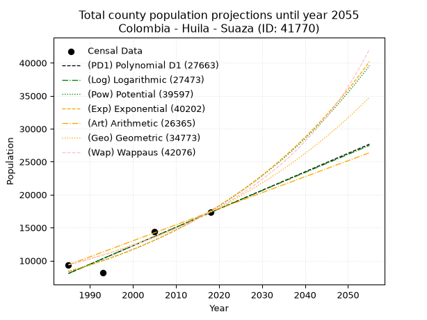
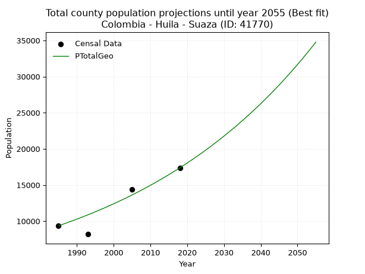
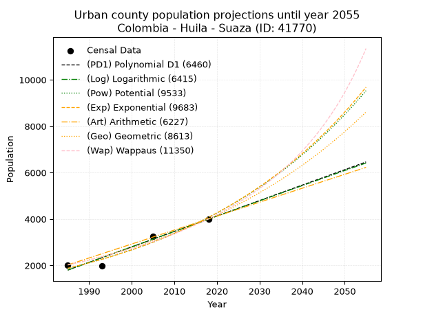
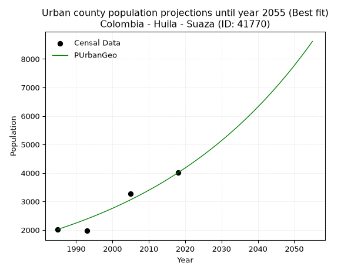
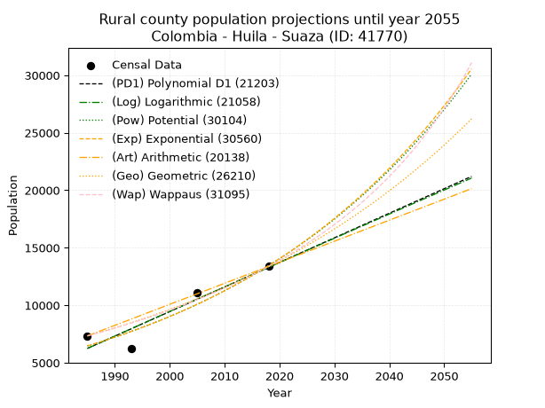
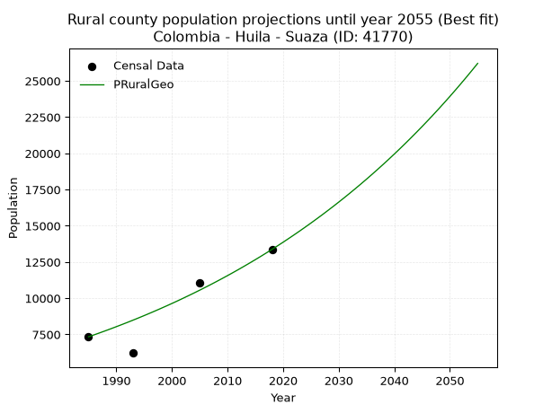

<div align="center">


</div>

# 📜 _“Population and Public Services Demand Projections (PPSD) until Year 2050 for Colombia - Huila - Suaza (ID: 41770)”_
Keywords: `population` `public-service` `projection` `lineal` `polynomial` `logarithmic` `potential` `exponential` `arithmetic` `geometric` `wappaus` `dane` `colombia` `south-america`

PPSD are analytical estimates used by governments and planners to anticipate future changes in population size, age distribution, and the resulting community needs for utilities, healthcare, education, and infrastructure as sizing future water treatment facilities, electrical grids, and road networks based on spatial growth.

<div align="center">

</img>

</div>


> **General running parameters**: • app_version: _v20260806_. • Python version: _3.14.7_. • Pandas version: _3.0.5_. • NumPy version: _2.5.1_. • Creates, save and include plots into reports (create_plot): _False_. • Projection until year: _2050_. • Process polynomial degree 2 and up: _False_. • Process Wappaus: _True_. • Process Wappaus: _True_. • Set negative values to zero: _True_. • Set infinite values to zero: _True_. • Drop dataset notes: _True_. 
<div align="center">

Dynamic map: [:earth_americas:Google](http://maps.google.com/maps?q=1.976051401,-75.7952504) [:earth_americas:OSM](https://www.openstreetmap.org/#map=18/1.976051401/-75.7952504&layers=P) [:earth_americas:Bing](https://www.bing.com/maps?cp=1.976051401~-75.7952504&lvl=18) [:earth_americas:Apple](https://maps.apple.com/frame?center=1.976051401%2C-75.7952504&span=0.003%2C0.006)

</div>


<div align="center">

```geojson
{
  "type": "Feature",
  "geometry": {
    "type": "Point", 
    "coordinates": [-75.7952504, 1.976051401]
  }, 
  "properties": {
    "Name": "Colombia - Huila - Suaza (ID: 41770)"
  }
}
```

</div>


## 0. Census Data (4 records)

Census data are official statistics collected by a government about the people and housing in a country. They usually include counts of total population, age, sex, race, income, education, and jobs.

📅Global census file: [Population.xlsx](../data/Population.xlsx)

| Source   |   Year |   CountryID | CountryName   |   StateID | StateName   |   CountyID | CountyName   |   PTotal |   PUrban |   PRural |
|:---------|-------:|------------:|:--------------|----------:|:------------|-----------:|:-------------|---------:|---------:|---------:|
| DANE     |   1985 |          57 | Colombia      |        41 | Huila       |      41770 | Suaza        |     9359 |     2023 |     7336 |
| DANE     |   1993 |          57 | Colombia      |        41 | Huila       |      41770 | Suaza        |     8190 |     1972 |     6218 |
| DANE     |   2005 |          57 | Colombia      |        41 | Huila       |      41770 | Suaza        |    14356 |     3264 |    11092 |
| DANE     |   2018 |          57 | Colombia      |        41 | Huila       |      41770 | Suaza        |    17376 |     4005 |    13371 |

> 🔥Some records could had specific notes about the registered values or the corresponding urban or rural distribution.

📅[SUI-RUPS](https://www.datos.gov.co/Hacienda-y-Cr-dito-P-blico/Registro-nico-de-Prestadores-de-Servicios-P-blicos/4qkq-csdn/about_data) - Local public utility companies: [RUPS.csv](../data/RUPS.xlsx)

 | SERVICIO       | ESTADO    | NOMBRE                                                                                      | NIT         | DEPARTAMENTO_DOMICILIO   | MUNICIPIO_DOMICILIO   | DIRECCION                    |   TELEFONO | EMAIL                               | TIPO_PRESTADOR                             | CLASIFICACION                 |
|:---------------|:----------|:--------------------------------------------------------------------------------------------|:------------|:-------------------------|:----------------------|:-----------------------------|-----------:|:------------------------------------|:-------------------------------------------|:------------------------------|
| ACUEDUCTO      | OPERATIVA | SOCIEDAD DE ACUEDUCTOS, ALCANTARILLADOS Y ASEO DEL HUILA - AGUAS DEL HUILA S.A. E.S.P.      | 800100553-2 | HUILA                    | NEIVA                 | Calle  21 No 1C - 17         |    8752321 | ossa.servicios@aguasdelhuila.gov.co | SOCIEDADES (EMPRESA DE SERVICIOS PUBLICOS) | MENOR O IGUAL A 2500 USUARIOS |
| ALCANTARILLADO | OPERATIVA | SOCIEDAD DE ACUEDUCTOS, ALCANTARILLADOS Y ASEO DEL HUILA - AGUAS DEL HUILA S.A. E.S.P.      | 800100553-2 | HUILA                    | NEIVA                 | Calle  21 No 1C - 17         |    8752321 | ossa.servicios@aguasdelhuila.gov.co | SOCIEDADES (EMPRESA DE SERVICIOS PUBLICOS) | MENOR O IGUAL A 2500 USUARIOS |
| ACUEDUCTO      | OPERATIVA | EMPRESAS PUBLICAS DE SUAZA SOCIEDAD ANONIMA EMPRESA DE SERVICIOS PUBLICOS                   | 900499642-5 | HUILA                    | SUAZA                 | CALLE 6 CARRERA 3 ESQUINA    |    8324036 | carlosandresrv@gmail.com            | SOCIEDADES (EMPRESA DE SERVICIOS PUBLICOS) | MENOR O IGUAL A 2500 USUARIOS |
| ALCANTARILLADO | OPERATIVA | EMPRESAS PUBLICAS DE SUAZA SOCIEDAD ANONIMA EMPRESA DE SERVICIOS PUBLICOS                   | 900499642-5 | HUILA                    | SUAZA                 | CALLE 6 CARRERA 3 ESQUINA    |    8324036 | carlosandresrv@gmail.com            | SOCIEDADES (EMPRESA DE SERVICIOS PUBLICOS) | MENOR O IGUAL A 2500 USUARIOS |
| ACUEDUCTO      | OPERATIVA | JUNTA ADMINISTRADORA ACUEDUCTO REGIONAL EL LIBANO MUNICIPIO DE SUAZA DEPARTAMENTO DEL HUILA | 900248842-5 | HUILA                    | SUAZA                 | VEREDA EL LIBANO SUAZA HUILA |    3178495 | acueductoregionalellibano@gmail.com | ORGANIZACION AUTORIZADA                    | MENOR O IGUAL A 2500 USUARIOS |

## 1. Total

### 1.1. Coefficients and Parameters

* (PD1) Polynomial Deg 1: 280.2292252107565, -548208.2577278157 (lineal)
* (Log) Logarithmic: 560721.5971151006, -4249729.103012761
* (Pow) Potential: 44.92892465454505, -144.24341341523694
* (Exp) Exponential: 0.02245260103693818, 3.6800601909022483e-16
* (Art) Arithmetic: Year diff. 2018 - 1985 = 33, Population diff. 17376 - 9359 = 8017, Annual growth = 242.93939393939394
* (Geo) Geometric: Year diff. 2018 - 1985 = 33, Population diff. 17376 - 9359 = 8017, Annual growth % = 0.018926931261176838
* (Wap) Wappaus: i = 1.817388396778709, Condition values only valid for < 200)

<sub>
Wappaus condition values: ['0.00', '1.82', '3.63', '5.45', '7.27', '9.09', '10.90', '12.72', '14.54', '16.36', '18.17', '19.99', '21.81', '23.63', '25.44', '27.26', '29.08', '30.90', '32.71', '34.53', '36.35', '38.17', '39.98', '41.80', '43.62', '45.43', '47.25', '49.07', '50.89', '52.70', '54.52', '56.34', '58.16', '59.97', '61.79', '63.61', '65.43', '67.24', '69.06', '70.88', '72.70', '74.51', '76.33', '78.15', '79.97', '81.78', '83.60', '85.42', '87.23', '89.05', '90.87', '92.69', '94.50', '96.32', '98.14', '99.96', '101.77', '103.59', '105.41', '107.23', '109.04', '110.86', '112.68', '114.50', '116.31', '118.13']
</sub>


### 1.2. Projected Dataset

|   Year |   CountyID |   PTotalPD1 |   PTotalLog |   PTotalPow |   PTotalExp |   PTotalArt |   PTotalGeo |   PTotalWap |
|-------:|-----------:|------------:|------------:|------------:|------------:|------------:|------------:|------------:|
|   1985 |      41770 |        8047 |        8040 |        8345 |        8350 |        9359 |        9359 |        9359 |
|   1986 |      41770 |        8327 |        8322 |        8536 |        8539 |        9602 |        9536 |        9531 |
|   1987 |      41770 |        8607 |        8604 |        8731 |        8733 |        9845 |        9717 |        9705 |
|   1988 |      41770 |        8887 |        8887 |        8931 |        8931 |       10088 |        9901 |        9884 |
|   1989 |      41770 |        9168 |        9169 |        9135 |        9134 |       10331 |       10088 |       10065 |
|   1990 |      41770 |        9448 |        9450 |        9343 |        9342 |       10574 |       10279 |       10250 |
|   1991 |      41770 |        9728 |        9732 |        9557 |        9554 |       10817 |       10473 |       10438 |
|   1992 |      41770 |       10008 |       10014 |        9775 |        9771 |       11060 |       10672 |       10631 |
|   1993 |      41770 |       10289 |       10295 |        9998 |        9993 |       11303 |       10874 |       10826 |
|   1994 |      41770 |       10569 |       10576 |       10226 |       10220 |       11545 |       11079 |       11026 |
|   1995 |      41770 |       10849 |       10858 |       10459 |       10452 |       11788 |       11289 |       11230 |
|   1996 |      41770 |       11129 |       11138 |       10697 |       10689 |       12031 |       11503 |       11438 |
|   1997 |      41770 |       11410 |       11419 |       10940 |       10932 |       12274 |       11720 |       11650 |
|   1998 |      41770 |       11690 |       11700 |       11189 |       11180 |       12517 |       11942 |       11866 |
|   1999 |      41770 |       11970 |       11981 |       11443 |       11434 |       12760 |       12168 |       12087 |
|   2000 |      41770 |       12250 |       12261 |       11703 |       11693 |       13003 |       12399 |       12313 |
|   2001 |      41770 |       12530 |       12541 |       11969 |       11959 |       13246 |       12633 |       12543 |
|   2002 |      41770 |       12811 |       12822 |       12241 |       12230 |       13489 |       12872 |       12779 |
|   2003 |      41770 |       13091 |       13102 |       12519 |       12508 |       13732 |       13116 |       13019 |
|   2004 |      41770 |       13371 |       13381 |       12803 |       12792 |       13975 |       13364 |       13265 |
|   2005 |      41770 |       13651 |       13661 |       13093 |       13083 |       14218 |       13617 |       13516 |
|   2006 |      41770 |       13932 |       13941 |       13389 |       13380 |       14461 |       13875 |       13773 |
|   2007 |      41770 |       14212 |       14220 |       13693 |       13683 |       14704 |       14138 |       14036 |
|   2008 |      41770 |       14492 |       14499 |       14003 |       13994 |       14947 |       14405 |       14305 |
|   2009 |      41770 |       14772 |       14779 |       14319 |       14312 |       15190 |       14678 |       14580 |
|   2010 |      41770 |       15052 |       15058 |       14643 |       14637 |       15432 |       14956 |       14861 |
|   2011 |      41770 |       15333 |       15337 |       14974 |       14969 |       15675 |       15239 |       15149 |
|   2012 |      41770 |       15613 |       15615 |       15312 |       15309 |       15918 |       15527 |       15444 |
|   2013 |      41770 |       15893 |       15894 |       15658 |       15657 |       16161 |       15821 |       15747 |
|   2014 |      41770 |       16173 |       16172 |       16011 |       16012 |       16404 |       16120 |       16057 |
|   2015 |      41770 |       16454 |       16451 |       16372 |       16376 |       16647 |       16426 |       16374 |
|   2016 |      41770 |       16734 |       16729 |       16741 |       16748 |       16890 |       16736 |       16700 |
|   2017 |      41770 |       17014 |       17007 |       17119 |       17128 |       17133 |       17053 |       17033 |
|   2018 |      41770 |       17294 |       17285 |       17504 |       17517 |       17376 |       17376 |       17376 |
|   2019 |      41770 |       17575 |       17563 |       17898 |       17915 |       17619 |       17705 |       17728 |
|   2020 |      41770 |       17855 |       17840 |       18301 |       18321 |       17862 |       18040 |       18088 |
|   2021 |      41770 |       18135 |       18118 |       18712 |       18737 |       18105 |       18381 |       18459 |
|   2022 |      41770 |       18415 |       18395 |       19133 |       19163 |       18348 |       18729 |       18840 |
|   2023 |      41770 |       18695 |       18673 |       19563 |       19598 |       18591 |       19084 |       19231 |
|   2024 |      41770 |       18976 |       18950 |       20002 |       20043 |       18834 |       19445 |       19634 |
|   2025 |      41770 |       19256 |       19227 |       20451 |       20498 |       19077 |       19813 |       20048 |
|   2026 |      41770 |       19536 |       19503 |       20909 |       20963 |       19320 |       20188 |       20474 |
|   2027 |      41770 |       19816 |       19780 |       21378 |       21439 |       19562 |       20570 |       20912 |
|   2028 |      41770 |       20097 |       20057 |       21857 |       21926 |       19805 |       20959 |       21363 |
|   2029 |      41770 |       20377 |       20333 |       22347 |       22424 |       20048 |       21356 |       21829 |
|   2030 |      41770 |       20657 |       20609 |       22847 |       22933 |       20291 |       21760 |       22308 |
|   2031 |      41770 |       20937 |       20886 |       23358 |       23454 |       20534 |       22172 |       22802 |
|   2032 |      41770 |       21218 |       21162 |       23880 |       23987 |       20777 |       22592 |       23313 |
|   2033 |      41770 |       21498 |       21437 |       24414 |       24531 |       21020 |       23019 |       23839 |
|   2034 |      41770 |       21778 |       21713 |       24960 |       25088 |       21263 |       23455 |       24383 |
|   2035 |      41770 |       22058 |       21989 |       25517 |       25658 |       21506 |       23899 |       24945 |
|   2036 |      41770 |       22338 |       22264 |       26086 |       26241 |       21749 |       24351 |       25526 |
|   2037 |      41770 |       22619 |       22540 |       26668 |       26836 |       21992 |       24812 |       26127 |
|   2038 |      41770 |       22899 |       22815 |       27263 |       27446 |       22235 |       25282 |       26749 |
|   2039 |      41770 |       23179 |       23090 |       27870 |       28069 |       22478 |       25760 |       27393 |
|   2040 |      41770 |       23459 |       23365 |       28491 |       28706 |       22721 |       26248 |       28061 |
|   2041 |      41770 |       23740 |       23640 |       29126 |       29358 |       22964 |       26745 |       28753 |
|   2042 |      41770 |       24020 |       23914 |       29774 |       30025 |       23207 |       27251 |       29471 |
|   2043 |      41770 |       24300 |       24189 |       30436 |       30707 |       23449 |       27767 |       30218 |
|   2044 |      41770 |       24580 |       24463 |       31112 |       31404 |       23692 |       28292 |       30993 |
|   2045 |      41770 |       24861 |       24737 |       31804 |       32117 |       23935 |       28828 |       31799 |
|   2046 |      41770 |       25141 |       25012 |       32510 |       32846 |       24178 |       29373 |       32638 |
|   2047 |      41770 |       25421 |       25286 |       33232 |       33592 |       24421 |       29929 |       33512 |
|   2048 |      41770 |       25701 |       25559 |       33969 |       34355 |       24664 |       30496 |       34423 |
|   2049 |      41770 |       25981 |       25833 |       34722 |       35135 |       24907 |       31073 |       35374 |
|   2050 |      41770 |       26262 |       26107 |       35492 |       35933 |       25150 |       31661 |       36367 |
<div align="center">

</img>

</div>


### 1.3. Best fit with absolute and relative error (%)

Relative error puts that difference into context by dividing the absolute error by the true value, creating a unitless ratio or percentage that shows the scale of the mistake.

Absolute and relative error

|   Year | Source   |   CountryID | CountryName   |   StateID | StateName   |   CountyID_x | CountyName   |   PTotal |   PUrban |   PRural |   CountyID_y |   PTotalPD1 |   PTotalLog |   PTotalPow |   PTotalExp |   PTotalArt |   PTotalGeo |   PTotalWap |   PTotalPD1AbsError |   PTotalLogAbsError |   PTotalPowAbsError |   PTotalExpAbsError |   PTotalArtAbsError |   PTotalGeoAbsError |   PTotalWapAbsError |   PTotalPD1RelError |   PTotalLogRelError |   PTotalPowRelError |   PTotalExpRelError |   PTotalArtRelError |   PTotalGeoRelError |   PTotalWapRelError |
|-------:|:---------|------------:|:--------------|----------:|:------------|-------------:|:-------------|---------:|---------:|---------:|-------------:|------------:|------------:|------------:|------------:|------------:|------------:|------------:|--------------------:|--------------------:|--------------------:|--------------------:|--------------------:|--------------------:|--------------------:|--------------------:|--------------------:|--------------------:|--------------------:|--------------------:|--------------------:|--------------------:|
|   1985 | DANE     |          57 | Colombia      |        41 | Huila       |        41770 | Suaza        |     9359 |     2023 |     7336 |        41770 |        8047 |        8040 |        8345 |        8350 |        9359 |        9359 |        9359 |                1312 |                1319 |                1014 |                1009 |                   0 |                   0 |                   0 |           14.0186   |           14.0934   |           10.8345   |           10.7811   |            0        |             0       |             0       |
|   1993 | DANE     |          57 | Colombia      |        41 | Huila       |        41770 | Suaza        |     8190 |     1972 |     6218 |        41770 |       10289 |       10295 |        9998 |        9993 |       11303 |       10874 |       10826 |                2099 |                2105 |                1808 |                1803 |                3113 |                2684 |                2636 |           25.6288   |           25.7021   |           22.0757   |           22.0147   |           38.0098   |            32.7717  |            32.1856  |
|   2005 | DANE     |          57 | Colombia      |        41 | Huila       |        41770 | Suaza        |    14356 |     3264 |    11092 |        41770 |       13651 |       13661 |       13093 |       13083 |       14218 |       13617 |       13516 |                 705 |                 695 |                1263 |                1273 |                 138 |                 739 |                 840 |            4.91084  |            4.84118  |            8.79772  |            8.86737  |            0.961271 |             5.14767 |             5.85121 |
|   2018 | DANE     |          57 | Colombia      |        41 | Huila       |        41770 | Suaza        |    17376 |     4005 |    13371 |        41770 |       17294 |       17285 |       17504 |       17517 |       17376 |       17376 |       17376 |                  82 |                  91 |                 128 |                 141 |                   0 |                   0 |                   0 |            0.471915 |            0.523711 |            0.736648 |            0.811464 |            0        |             0       |             0       |

Relative error mean

| Method    |   RelError | Best   |
|:----------|-----------:|:-------|
| PTotalPD1 |   11.2575  |        |
| PTotalLog |   11.2901  |        |
| PTotalPow |   10.6111  |        |
| PTotalExp |   10.6186  |        |
| PTotalArt |    9.74276 |        |
| PTotalGeo |    9.47984 | True   |
| PTotalWap |    9.5092  |        |

💙Best method: _**PTotalGeo**_
<div align="center">

</img>

</div>


### 1.4. Fresh water supply demand in liters per capita per day (lpcd)

The fresh water supply demand typically ranges from 100 to 300 liters per capita per day (lpcd) for standard domestic and municipal planning, though absolute survival minimums set by the World Health Organization are as low as 7.5 to 20 liters per day, and total consumption in high-income nations can exceed 400 liters.

> `CZ`: Level in meters above the sea level (masl)<br> `WS`: Fresh water supply demand in liters per capita per day (lpcd or l/h/d)<br> `WSAll`: Zonal fresh water supply demand in liters per second (l/s)<br> `A`: Zonal area in square meters<br> `DP`: Population density (people/hectare or p/ha)

Reference values (RAS Colombia)

|    CZ |   WS |
|------:|-----:|
|  1000 |  120 |
|  2000 |  130 |
| 99999 |  140 |

County shapefile geometry properties and water supply values

|   CountyID |      ATotal |   CZTotal |   WSTotal |
|-----------:|------------:|----------:|----------:|
|      41770 | 4.29623e+08 |   1516.25 |       130 |

Projected values for best method: PTotalGeo

|   CountyID |   Year |   PTotalGeo |   DPTotal |   WSTotal |   WSTotalAll |
|-----------:|-------:|------------:|----------:|----------:|-------------:|
|      41770 |   1985 |        9359 |      0.22 |       130 |      14.0818 |
|      41770 |   1986 |        9536 |      0.22 |       130 |      14.3481 |
|      41770 |   1987 |        9717 |      0.23 |       130 |      14.6205 |
|      41770 |   1988 |        9901 |      0.23 |       130 |      14.8973 |
|      41770 |   1989 |       10088 |      0.23 |       130 |      15.1787 |
|      41770 |   1990 |       10279 |      0.24 |       130 |      15.4661 |
|      41770 |   1991 |       10473 |      0.24 |       130 |      15.758  |
|      41770 |   1992 |       10672 |      0.25 |       130 |      16.0574 |
|      41770 |   1993 |       10874 |      0.25 |       130 |      16.3613 |
|      41770 |   1994 |       11079 |      0.26 |       130 |      16.6698 |
|      41770 |   1995 |       11289 |      0.26 |       130 |      16.9858 |
|      41770 |   1996 |       11503 |      0.27 |       130 |      17.3078 |
|      41770 |   1997 |       11720 |      0.27 |       130 |      17.6343 |
|      41770 |   1998 |       11942 |      0.28 |       130 |      17.9683 |
|      41770 |   1999 |       12168 |      0.28 |       130 |      18.3083 |
|      41770 |   2000 |       12399 |      0.29 |       130 |      18.6559 |
|      41770 |   2001 |       12633 |      0.29 |       130 |      19.008  |
|      41770 |   2002 |       12872 |      0.3  |       130 |      19.3676 |
|      41770 |   2003 |       13116 |      0.31 |       130 |      19.7347 |
|      41770 |   2004 |       13364 |      0.31 |       130 |      20.1079 |
|      41770 |   2005 |       13617 |      0.32 |       130 |      20.4885 |
|      41770 |   2006 |       13875 |      0.32 |       130 |      20.8767 |
|      41770 |   2007 |       14138 |      0.33 |       130 |      21.2725 |
|      41770 |   2008 |       14405 |      0.34 |       130 |      21.6742 |
|      41770 |   2009 |       14678 |      0.34 |       130 |      22.085  |
|      41770 |   2010 |       14956 |      0.35 |       130 |      22.5032 |
|      41770 |   2011 |       15239 |      0.35 |       130 |      22.9291 |
|      41770 |   2012 |       15527 |      0.36 |       130 |      23.3624 |
|      41770 |   2013 |       15821 |      0.37 |       130 |      23.8047 |
|      41770 |   2014 |       16120 |      0.38 |       130 |      24.2546 |
|      41770 |   2015 |       16426 |      0.38 |       130 |      24.715  |
|      41770 |   2016 |       16736 |      0.39 |       130 |      25.1815 |
|      41770 |   2017 |       17053 |      0.4  |       130 |      25.6584 |
|      41770 |   2018 |       17376 |      0.4  |       130 |      26.1444 |
|      41770 |   2019 |       17705 |      0.41 |       130 |      26.6395 |
|      41770 |   2020 |       18040 |      0.42 |       130 |      27.1435 |
|      41770 |   2021 |       18381 |      0.43 |       130 |      27.6566 |
|      41770 |   2022 |       18729 |      0.44 |       130 |      28.1802 |
|      41770 |   2023 |       19084 |      0.44 |       130 |      28.7144 |
|      41770 |   2024 |       19445 |      0.45 |       130 |      29.2575 |
|      41770 |   2025 |       19813 |      0.46 |       130 |      29.8112 |
|      41770 |   2026 |       20188 |      0.47 |       130 |      30.3755 |
|      41770 |   2027 |       20570 |      0.48 |       130 |      30.9502 |
|      41770 |   2028 |       20959 |      0.49 |       130 |      31.5355 |
|      41770 |   2029 |       21356 |      0.5  |       130 |      32.1329 |
|      41770 |   2030 |       21760 |      0.51 |       130 |      32.7407 |
|      41770 |   2031 |       22172 |      0.52 |       130 |      33.3606 |
|      41770 |   2032 |       22592 |      0.53 |       130 |      33.9926 |
|      41770 |   2033 |       23019 |      0.54 |       130 |      34.6351 |
|      41770 |   2034 |       23455 |      0.55 |       130 |      35.2911 |
|      41770 |   2035 |       23899 |      0.56 |       130 |      35.9591 |
|      41770 |   2036 |       24351 |      0.57 |       130 |      36.6392 |
|      41770 |   2037 |       24812 |      0.58 |       130 |      37.3329 |
|      41770 |   2038 |       25282 |      0.59 |       130 |      38.04   |
|      41770 |   2039 |       25760 |      0.6  |       130 |      38.7593 |
|      41770 |   2040 |       26248 |      0.61 |       130 |      39.4935 |
|      41770 |   2041 |       26745 |      0.62 |       130 |      40.2413 |
|      41770 |   2042 |       27251 |      0.63 |       130 |      41.0027 |
|      41770 |   2043 |       27767 |      0.65 |       130 |      41.7791 |
|      41770 |   2044 |       28292 |      0.66 |       130 |      42.569  |
|      41770 |   2045 |       28828 |      0.67 |       130 |      43.3755 |
|      41770 |   2046 |       29373 |      0.68 |       130 |      44.1955 |
|      41770 |   2047 |       29929 |      0.7  |       130 |      45.0321 |
|      41770 |   2048 |       30496 |      0.71 |       130 |      45.8852 |
|      41770 |   2049 |       31073 |      0.72 |       130 |      46.7534 |
|      41770 |   2050 |       31661 |      0.74 |       130 |      47.6381 |

## 2. Urban

### 2.1. Coefficients and Parameters

* (PD1) Polynomial Deg 1: 66.5515857085502, -130303.80931352757 (lineal)
* (Log) Logarithmic: 133180.3169874068, -1009488.6566613603
* (Pow) Potential: 46.8572286227422, -151.2499513370425
* (Exp) Exponential: 0.023412218002136817, 1.2336096039549405e-17
* (Art) Arithmetic: Year diff. 2018 - 1985 = 33, Population diff. 4005 - 2023 = 1982, Annual growth = 60.06060606060606
* (Geo) Geometric: Year diff. 2018 - 1985 = 33, Population diff. 4005 - 2023 = 1982, Annual growth % = 0.02091146238835795
* (Wap) Wappaus: i = 1.9927208381090267, Condition values only valid for < 200)

<sub>
Wappaus condition values: ['0.00', '1.99', '3.99', '5.98', '7.97', '9.96', '11.96', '13.95', '15.94', '17.93', '19.93', '21.92', '23.91', '25.91', '27.90', '29.89', '31.88', '33.88', '35.87', '37.86', '39.85', '41.85', '43.84', '45.83', '47.83', '49.82', '51.81', '53.80', '55.80', '57.79', '59.78', '61.77', '63.77', '65.76', '67.75', '69.75', '71.74', '73.73', '75.72', '77.72', '79.71', '81.70', '83.69', '85.69', '87.68', '89.67', '91.67', '93.66', '95.65', '97.64', '99.64', '101.63', '103.62', '105.61', '107.61', '109.60', '111.59', '113.59', '115.58', '117.57', '119.56', '121.56', '123.55', '125.54', '127.53', '129.53']
</sub>


### 2.2. Projected Dataset

|   Year |   CountyID |   PUrbanPD1 |   PUrbanLog |   PUrbanPow |   PUrbanExp |   PUrbanArt |   PUrbanGeo |   PUrbanWap |
|-------:|-----------:|------------:|------------:|------------:|------------:|------------:|------------:|------------:|
|   1985 |      41770 |        1801 |        1799 |        1879 |        1880 |        2023 |        2023 |        2023 |
|   1986 |      41770 |        1868 |        1866 |        1924 |        1925 |        2083 |        2065 |        2064 |
|   1987 |      41770 |        1934 |        1933 |        1970 |        1971 |        2143 |        2108 |        2105 |
|   1988 |      41770 |        2001 |        2000 |        2017 |        2017 |        2203 |        2153 |        2148 |
|   1989 |      41770 |        2067 |        2067 |        2065 |        2065 |        2263 |        2198 |        2191 |
|   1990 |      41770 |        2134 |        2134 |        2114 |        2114 |        2323 |        2244 |        2235 |
|   1991 |      41770 |        2200 |        2201 |        2165 |        2164 |        2383 |        2290 |        2280 |
|   1992 |      41770 |        2267 |        2268 |        2216 |        2215 |        2443 |        2338 |        2326 |
|   1993 |      41770 |        2334 |        2335 |        2269 |        2268 |        2503 |        2387 |        2373 |
|   1994 |      41770 |        2400 |        2402 |        2323 |        2321 |        2564 |        2437 |        2422 |
|   1995 |      41770 |        2467 |        2469 |        2378 |        2376 |        2624 |        2488 |        2471 |
|   1996 |      41770 |        2533 |        2535 |        2435 |        2433 |        2684 |        2540 |        2521 |
|   1997 |      41770 |        2600 |        2602 |        2492 |        2490 |        2744 |        2593 |        2572 |
|   1998 |      41770 |        2666 |        2669 |        2552 |        2549 |        2804 |        2648 |        2625 |
|   1999 |      41770 |        2733 |        2735 |        2612 |        2610 |        2864 |        2703 |        2679 |
|   2000 |      41770 |        2799 |        2802 |        2674 |        2672 |        2924 |        2759 |        2734 |
|   2001 |      41770 |        2866 |        2869 |        2737 |        2735 |        2984 |        2817 |        2790 |
|   2002 |      41770 |        2932 |        2935 |        2802 |        2800 |        3044 |        2876 |        2848 |
|   2003 |      41770 |        2999 |        3002 |        2869 |        2866 |        3104 |        2936 |        2907 |
|   2004 |      41770 |        3066 |        3068 |        2936 |        2934 |        3164 |        2998 |        2968 |
|   2005 |      41770 |        3132 |        3134 |        3006 |        3003 |        3224 |        3060 |        3030 |
|   2006 |      41770 |        3199 |        3201 |        3077 |        3075 |        3284 |        3124 |        3094 |
|   2007 |      41770 |        3265 |        3267 |        3150 |        3147 |        3344 |        3190 |        3159 |
|   2008 |      41770 |        3332 |        3334 |        3224 |        3222 |        3404 |        3256 |        3226 |
|   2009 |      41770 |        3398 |        3400 |        3300 |        3298 |        3464 |        3324 |        3295 |
|   2010 |      41770 |        3465 |        3466 |        3378 |        3376 |        3525 |        3394 |        3365 |
|   2011 |      41770 |        3531 |        3532 |        3458 |        3456 |        3585 |        3465 |        3438 |
|   2012 |      41770 |        3598 |        3599 |        3539 |        3538 |        3645 |        3537 |        3512 |
|   2013 |      41770 |        3665 |        3665 |        3623 |        3622 |        3705 |        3611 |        3589 |
|   2014 |      41770 |        3731 |        3731 |        3708 |        3708 |        3765 |        3687 |        3667 |
|   2015 |      41770 |        3798 |        3797 |        3795 |        3796 |        3825 |        3764 |        3748 |
|   2016 |      41770 |        3864 |        3863 |        3884 |        3886 |        3885 |        3843 |        3831 |
|   2017 |      41770 |        3931 |        3929 |        3976 |        3978 |        3945 |        3923 |        3917 |
|   2018 |      41770 |        3997 |        3995 |        4069 |        4072 |        4005 |        4005 |        4005 |
|   2019 |      41770 |        4064 |        4061 |        4165 |        4168 |        4065 |        4089 |        4096 |
|   2020 |      41770 |        4130 |        4127 |        4262 |        4267 |        4125 |        4174 |        4189 |
|   2021 |      41770 |        4197 |        4193 |        4362 |        4368 |        4185 |        4262 |        4286 |
|   2022 |      41770 |        4263 |        4259 |        4465 |        4472 |        4245 |        4351 |        4386 |
|   2023 |      41770 |        4330 |        4325 |        4569 |        4578 |        4305 |        4442 |        4488 |
|   2024 |      41770 |        4397 |        4391 |        4676 |        4686 |        4365 |        4535 |        4594 |
|   2025 |      41770 |        4463 |        4456 |        4786 |        4797 |        4425 |        4629 |        4704 |
|   2026 |      41770 |        4530 |        4522 |        4898 |        4911 |        4485 |        4726 |        4817 |
|   2027 |      41770 |        4596 |        4588 |        5012 |        5027 |        4546 |        4825 |        4935 |
|   2028 |      41770 |        4663 |        4654 |        5130 |        5146 |        4606 |        4926 |        5056 |
|   2029 |      41770 |        4729 |        4719 |        5250 |        5268 |        4666 |        5029 |        5181 |
|   2030 |      41770 |        4796 |        4785 |        5372 |        5393 |        4726 |        5134 |        5312 |
|   2031 |      41770 |        4862 |        4850 |        5498 |        5520 |        4786 |        5241 |        5446 |
|   2032 |      41770 |        4929 |        4916 |        5626 |        5651 |        4846 |        5351 |        5586 |
|   2033 |      41770 |        4996 |        4981 |        5757 |        5785 |        4906 |        5463 |        5732 |
|   2034 |      41770 |        5062 |        5047 |        5891 |        5922 |        4966 |        5577 |        5883 |
|   2035 |      41770 |        5129 |        5112 |        6028 |        6062 |        5026 |        5694 |        6040 |
|   2036 |      41770 |        5195 |        5178 |        6169 |        6206 |        5086 |        5813 |        6203 |
|   2037 |      41770 |        5262 |        5243 |        6312 |        6353 |        5146 |        5934 |        6373 |
|   2038 |      41770 |        5328 |        5309 |        6459 |        6504 |        5206 |        6058 |        6550 |
|   2039 |      41770 |        5395 |        5374 |        6609 |        6658 |        5266 |        6185 |        6735 |
|   2040 |      41770 |        5461 |        5439 |        6763 |        6815 |        5326 |        6315 |        6928 |
|   2041 |      41770 |        5528 |        5505 |        6920 |        6977 |        5386 |        6447 |        7130 |
|   2042 |      41770 |        5595 |        5570 |        7081 |        7142 |        5446 |        6581 |        7341 |
|   2043 |      41770 |        5661 |        5635 |        7245 |        7311 |        5507 |        6719 |        7562 |
|   2044 |      41770 |        5728 |        5700 |        7413 |        7484 |        5567 |        6860 |        7794 |
|   2045 |      41770 |        5794 |        5765 |        7585 |        7662 |        5627 |        7003 |        8037 |
|   2046 |      41770 |        5861 |        5830 |        7761 |        7843 |        5687 |        7149 |        8293 |
|   2047 |      41770 |        5927 |        5895 |        7941 |        8029 |        5747 |        7299 |        8562 |
|   2048 |      41770 |        5994 |        5961 |        8124 |        8219 |        5807 |        7452 |        8845 |
|   2049 |      41770 |        6060 |        6026 |        8312 |        8414 |        5867 |        7607 |        9144 |
|   2050 |      41770 |        6127 |        6091 |        8505 |        8613 |        5927 |        7766 |        9459 |
<div align="center">

</img>

</div>


### 2.3. Best fit with absolute and relative error (%)

Relative error puts that difference into context by dividing the absolute error by the true value, creating a unitless ratio or percentage that shows the scale of the mistake.

Absolute and relative error

|   Year | Source   |   CountryID | CountryName   |   StateID | StateName   |   CountyID_x | CountyName   |   PTotal |   PUrban |   PRural |   CountyID_y |   PUrbanPD1 |   PUrbanLog |   PUrbanPow |   PUrbanExp |   PUrbanArt |   PUrbanGeo |   PUrbanWap |   PUrbanPD1AbsError |   PUrbanLogAbsError |   PUrbanPowAbsError |   PUrbanExpAbsError |   PUrbanArtAbsError |   PUrbanGeoAbsError |   PUrbanWapAbsError |   PUrbanPD1RelError |   PUrbanLogRelError |   PUrbanPowRelError |   PUrbanExpRelError |   PUrbanArtRelError |   PUrbanGeoRelError |   PUrbanWapRelError |
|-------:|:---------|------------:|:--------------|----------:|:------------|-------------:|:-------------|---------:|---------:|---------:|-------------:|------------:|------------:|------------:|------------:|------------:|------------:|------------:|--------------------:|--------------------:|--------------------:|--------------------:|--------------------:|--------------------:|--------------------:|--------------------:|--------------------:|--------------------:|--------------------:|--------------------:|--------------------:|--------------------:|
|   1985 | DANE     |          57 | Colombia      |        41 | Huila       |        41770 | Suaza        |     9359 |     2023 |     7336 |        41770 |        1801 |        1799 |        1879 |        1880 |        2023 |        2023 |        2023 |                 222 |                 224 |                 144 |                 143 |                   0 |                   0 |                   0 |            10.9738  |           11.0727   |             7.11814 |             7.06871 |             0       |              0      |             0       |
|   1993 | DANE     |          57 | Colombia      |        41 | Huila       |        41770 | Suaza        |     8190 |     1972 |     6218 |        41770 |        2334 |        2335 |        2269 |        2268 |        2503 |        2387 |        2373 |                 362 |                 363 |                 297 |                 296 |                 531 |                 415 |                 401 |            18.357   |           18.4077   |            15.0609  |            15.0101  |            26.927   |             21.0446 |            20.3347  |
|   2005 | DANE     |          57 | Colombia      |        41 | Huila       |        41770 | Suaza        |    14356 |     3264 |    11092 |        41770 |        3132 |        3134 |        3006 |        3003 |        3224 |        3060 |        3030 |                 132 |                 130 |                 258 |                 261 |                  40 |                 204 |                 234 |             4.04412 |            3.98284  |             7.90441 |             7.99632 |             1.22549 |              6.25   |             7.16912 |
|   2018 | DANE     |          57 | Colombia      |        41 | Huila       |        41770 | Suaza        |    17376 |     4005 |    13371 |        41770 |        3997 |        3995 |        4069 |        4072 |        4005 |        4005 |        4005 |                   8 |                  10 |                  64 |                  67 |                   0 |                   0 |                   0 |             0.19975 |            0.249688 |             1.598   |             1.67291 |             0       |              0      |             0       |

Relative error mean

| Method    |   RelError | Best   |
|:----------|-----------:|:-------|
| PUrbanPD1 |    8.39367 |        |
| PUrbanLog |    8.42823 |        |
| PUrbanPow |    7.92035 |        |
| PUrbanExp |    7.93702 |        |
| PUrbanArt |    7.03812 |        |
| PUrbanGeo |    6.82366 | True   |
| PUrbanWap |    6.87595 |        |

💙Best method: _**PUrbanGeo**_
<div align="center">

</img>

</div>


### 2.4. Fresh water supply demand in liters per capita per day (lpcd)

The fresh water supply demand typically ranges from 100 to 300 liters per capita per day (lpcd) for standard domestic and municipal planning, though absolute survival minimums set by the World Health Organization are as low as 7.5 to 20 liters per day, and total consumption in high-income nations can exceed 400 liters.

> `CZ`: Level in meters above the sea level (masl)<br> `WS`: Fresh water supply demand in liters per capita per day (lpcd or l/h/d)<br> `WSAll`: Zonal fresh water supply demand in liters per second (l/s)<br> `A`: Zonal area in square meters<br> `DP`: Population density (people/hectare or p/ha)

Reference values (RAS Colombia)

|    CZ |   WS |
|------:|-----:|
|  1000 |  120 |
|  2000 |  130 |
| 99999 |  140 |

County shapefile geometry properties and water supply values

|   CountyID |   AUrban |   CZUrban |   WSUrban |
|-----------:|---------:|----------:|----------:|
|      41770 |   725517 |   952.346 |       120 |

Projected values for best method: PUrbanGeo

|   CountyID |   Year |   PUrbanGeo |   DPUrban |   WSUrban |   WSUrbanAll |
|-----------:|-------:|------------:|----------:|----------:|-------------:|
|      41770 |   1985 |        2023 |     27.88 |       120 |      2.80972 |
|      41770 |   1986 |        2065 |     28.46 |       120 |      2.86806 |
|      41770 |   1987 |        2108 |     29.06 |       120 |      2.92778 |
|      41770 |   1988 |        2153 |     29.68 |       120 |      2.99028 |
|      41770 |   1989 |        2198 |     30.3  |       120 |      3.05278 |
|      41770 |   1990 |        2244 |     30.93 |       120 |      3.11667 |
|      41770 |   1991 |        2290 |     31.56 |       120 |      3.18056 |
|      41770 |   1992 |        2338 |     32.23 |       120 |      3.24722 |
|      41770 |   1993 |        2387 |     32.9  |       120 |      3.31528 |
|      41770 |   1994 |        2437 |     33.59 |       120 |      3.38472 |
|      41770 |   1995 |        2488 |     34.29 |       120 |      3.45556 |
|      41770 |   1996 |        2540 |     35.01 |       120 |      3.52778 |
|      41770 |   1997 |        2593 |     35.74 |       120 |      3.60139 |
|      41770 |   1998 |        2648 |     36.5  |       120 |      3.67778 |
|      41770 |   1999 |        2703 |     37.26 |       120 |      3.75417 |
|      41770 |   2000 |        2759 |     38.03 |       120 |      3.83194 |
|      41770 |   2001 |        2817 |     38.83 |       120 |      3.9125  |
|      41770 |   2002 |        2876 |     39.64 |       120 |      3.99444 |
|      41770 |   2003 |        2936 |     40.47 |       120 |      4.07778 |
|      41770 |   2004 |        2998 |     41.32 |       120 |      4.16389 |
|      41770 |   2005 |        3060 |     42.18 |       120 |      4.25    |
|      41770 |   2006 |        3124 |     43.06 |       120 |      4.33889 |
|      41770 |   2007 |        3190 |     43.97 |       120 |      4.43056 |
|      41770 |   2008 |        3256 |     44.88 |       120 |      4.52222 |
|      41770 |   2009 |        3324 |     45.82 |       120 |      4.61667 |
|      41770 |   2010 |        3394 |     46.78 |       120 |      4.71389 |
|      41770 |   2011 |        3465 |     47.76 |       120 |      4.8125  |
|      41770 |   2012 |        3537 |     48.75 |       120 |      4.9125  |
|      41770 |   2013 |        3611 |     49.77 |       120 |      5.01528 |
|      41770 |   2014 |        3687 |     50.82 |       120 |      5.12083 |
|      41770 |   2015 |        3764 |     51.88 |       120 |      5.22778 |
|      41770 |   2016 |        3843 |     52.97 |       120 |      5.3375  |
|      41770 |   2017 |        3923 |     54.07 |       120 |      5.44861 |
|      41770 |   2018 |        4005 |     55.2  |       120 |      5.5625  |
|      41770 |   2019 |        4089 |     56.36 |       120 |      5.67917 |
|      41770 |   2020 |        4174 |     57.53 |       120 |      5.79722 |
|      41770 |   2021 |        4262 |     58.74 |       120 |      5.91944 |
|      41770 |   2022 |        4351 |     59.97 |       120 |      6.04306 |
|      41770 |   2023 |        4442 |     61.23 |       120 |      6.16944 |
|      41770 |   2024 |        4535 |     62.51 |       120 |      6.29861 |
|      41770 |   2025 |        4629 |     63.8  |       120 |      6.42917 |
|      41770 |   2026 |        4726 |     65.14 |       120 |      6.56389 |
|      41770 |   2027 |        4825 |     66.5  |       120 |      6.70139 |
|      41770 |   2028 |        4926 |     67.9  |       120 |      6.84167 |
|      41770 |   2029 |        5029 |     69.32 |       120 |      6.98472 |
|      41770 |   2030 |        5134 |     70.76 |       120 |      7.13056 |
|      41770 |   2031 |        5241 |     72.24 |       120 |      7.27917 |
|      41770 |   2032 |        5351 |     73.75 |       120 |      7.43194 |
|      41770 |   2033 |        5463 |     75.3  |       120 |      7.5875  |
|      41770 |   2034 |        5577 |     76.87 |       120 |      7.74583 |
|      41770 |   2035 |        5694 |     78.48 |       120 |      7.90833 |
|      41770 |   2036 |        5813 |     80.12 |       120 |      8.07361 |
|      41770 |   2037 |        5934 |     81.79 |       120 |      8.24167 |
|      41770 |   2038 |        6058 |     83.5  |       120 |      8.41389 |
|      41770 |   2039 |        6185 |     85.25 |       120 |      8.59028 |
|      41770 |   2040 |        6315 |     87.04 |       120 |      8.77083 |
|      41770 |   2041 |        6447 |     88.86 |       120 |      8.95417 |
|      41770 |   2042 |        6581 |     90.71 |       120 |      9.14028 |
|      41770 |   2043 |        6719 |     92.61 |       120 |      9.33194 |
|      41770 |   2044 |        6860 |     94.55 |       120 |      9.52778 |
|      41770 |   2045 |        7003 |     96.52 |       120 |      9.72639 |
|      41770 |   2046 |        7149 |     98.54 |       120 |      9.92917 |
|      41770 |   2047 |        7299 |    100.6  |       120 |     10.1375  |
|      41770 |   2048 |        7452 |    102.71 |       120 |     10.35    |
|      41770 |   2049 |        7607 |    104.85 |       120 |     10.5653  |
|      41770 |   2050 |        7766 |    107.04 |       120 |     10.7861  |

## 3. Rural

### 3.1. Coefficients and Parameters

* (PD1) Polynomial Deg 1: 213.67763950220623, -417904.44841428805 (lineal)
* (Log) Logarithmic: 427541.28012769384, -3240240.4463514006
* (Pow) Potential: 44.3977251682663, -142.60268683049958
* (Exp) Exponential: 0.0221883181551835, 4.815413727269161e-16
* (Art) Arithmetic: Year diff. 2018 - 1985 = 33, Population diff. 13371 - 7336 = 6035, Annual growth = 182.87878787878788
* (Geo) Geometric: Year diff. 2018 - 1985 = 33, Population diff. 13371 - 7336 = 6035, Annual growth % = 0.018357200172497423
* (Wap) Wappaus: i = 1.7663474948451043, Condition values only valid for < 200)

<sub>
Wappaus condition values: ['0.00', '1.77', '3.53', '5.30', '7.07', '8.83', '10.60', '12.36', '14.13', '15.90', '17.66', '19.43', '21.20', '22.96', '24.73', '26.50', '28.26', '30.03', '31.79', '33.56', '35.33', '37.09', '38.86', '40.63', '42.39', '44.16', '45.93', '47.69', '49.46', '51.22', '52.99', '54.76', '56.52', '58.29', '60.06', '61.82', '63.59', '65.35', '67.12', '68.89', '70.65', '72.42', '74.19', '75.95', '77.72', '79.49', '81.25', '83.02', '84.78', '86.55', '88.32', '90.08', '91.85', '93.62', '95.38', '97.15', '98.92', '100.68', '102.45', '104.21', '105.98', '107.75', '109.51', '111.28', '113.05', '114.81']
</sub>


### 3.2. Projected Dataset

|   Year |   CountyID |   PRuralPD1 |   PRuralLog |   PRuralPow |   PRuralExp |   PRuralArt |   PRuralGeo |   PRuralWap |
|-------:|-----------:|------------:|------------:|------------:|------------:|------------:|------------:|------------:|
|   1985 |      41770 |        6246 |        6240 |        6462 |        6466 |        7336 |        7336 |        7336 |
|   1986 |      41770 |        6459 |        6456 |        6608 |        6611 |        7519 |        7471 |        7467 |
|   1987 |      41770 |        6673 |        6671 |        6758 |        6759 |        7702 |        7608 |        7600 |
|   1988 |      41770 |        6887 |        6886 |        6910 |        6911 |        7885 |        7747 |        7735 |
|   1989 |      41770 |        7100 |        7101 |        7066 |        7066 |        8068 |        7890 |        7873 |
|   1990 |      41770 |        7314 |        7316 |        7226 |        7224 |        8250 |        8035 |        8014 |
|   1991 |      41770 |        7528 |        7531 |        7389 |        7386 |        8433 |        8182 |        8157 |
|   1992 |      41770 |        7741 |        7746 |        7555 |        7552 |        8616 |        8332 |        8303 |
|   1993 |      41770 |        7955 |        7960 |        7726 |        7722 |        8799 |        8485 |        8451 |
|   1994 |      41770 |        8169 |        8175 |        7900 |        7895 |        8982 |        8641 |        8603 |
|   1995 |      41770 |        8382 |        8389 |        8077 |        8072 |        9165 |        8800 |        8757 |
|   1996 |      41770 |        8596 |        8603 |        8259 |        8253 |        9348 |        8961 |        8915 |
|   1997 |      41770 |        8810 |        8817 |        8445 |        8438 |        9531 |        9126 |        9075 |
|   1998 |      41770 |        9023 |        9031 |        8635 |        8628 |        9713 |        9293 |        9239 |
|   1999 |      41770 |        9237 |        9245 |        8829 |        8821 |        9896 |        9464 |        9406 |
|   2000 |      41770 |        9451 |        9459 |        9027 |        9019 |       10079 |        9637 |        9577 |
|   2001 |      41770 |        9665 |        9673 |        9229 |        9221 |       10262 |        9814 |        9750 |
|   2002 |      41770 |        9878 |        9886 |        9436 |        9428 |       10445 |        9995 |        9928 |
|   2003 |      41770 |       10092 |       10100 |        9648 |        9640 |       10628 |       10178 |       10109 |
|   2004 |      41770 |       10306 |       10313 |        9864 |        9856 |       10811 |       10365 |       10294 |
|   2005 |      41770 |       10519 |       10527 |       10085 |       10077 |       10994 |       10555 |       10484 |
|   2006 |      41770 |       10733 |       10740 |       10311 |       10303 |       11176 |       10749 |       10677 |
|   2007 |      41770 |       10947 |       10953 |       10542 |       10535 |       11359 |       10946 |       10874 |
|   2008 |      41770 |       11160 |       11166 |       10777 |       10771 |       11542 |       11147 |       11076 |
|   2009 |      41770 |       11374 |       11379 |       11018 |       11013 |       11725 |       11352 |       11282 |
|   2010 |      41770 |       11588 |       11592 |       11264 |       11260 |       11908 |       11560 |       11493 |
|   2011 |      41770 |       11801 |       11804 |       11516 |       11512 |       12091 |       11772 |       11709 |
|   2012 |      41770 |       12015 |       12017 |       11773 |       11771 |       12274 |       11988 |       11930 |
|   2013 |      41770 |       12229 |       12229 |       12035 |       12035 |       12457 |       12209 |       12156 |
|   2014 |      41770 |       12442 |       12441 |       12304 |       12305 |       12639 |       12433 |       12388 |
|   2015 |      41770 |       12656 |       12654 |       12578 |       12581 |       12822 |       12661 |       12625 |
|   2016 |      41770 |       12870 |       12866 |       12858 |       12863 |       13005 |       12893 |       12867 |
|   2017 |      41770 |       13083 |       13078 |       13144 |       13152 |       13188 |       13130 |       13116 |
|   2018 |      41770 |       13297 |       13290 |       13437 |       13447 |       13371 |       13371 |       13371 |
|   2019 |      41770 |       13511 |       13502 |       13736 |       13748 |       13554 |       13616 |       13632 |
|   2020 |      41770 |       13724 |       13713 |       14041 |       14057 |       13737 |       13866 |       13900 |
|   2021 |      41770 |       13938 |       13925 |       14353 |       14372 |       13920 |       14121 |       14175 |
|   2022 |      41770 |       14152 |       14136 |       14672 |       14695 |       14103 |       14380 |       14458 |
|   2023 |      41770 |       14365 |       14348 |       14997 |       15024 |       14285 |       14644 |       14747 |
|   2024 |      41770 |       14579 |       14559 |       15330 |       15361 |       14468 |       14913 |       15045 |
|   2025 |      41770 |       14793 |       14770 |       15670 |       15706 |       14651 |       15187 |       15350 |
|   2026 |      41770 |       15006 |       14981 |       16017 |       16058 |       14834 |       15466 |       15665 |
|   2027 |      41770 |       15220 |       15192 |       16372 |       16419 |       15017 |       15749 |       15987 |
|   2028 |      41770 |       15434 |       15403 |       16734 |       16787 |       15200 |       16039 |       16320 |
|   2029 |      41770 |       15647 |       15614 |       17105 |       17164 |       15383 |       16333 |       16661 |
|   2030 |      41770 |       15861 |       15825 |       17483 |       17549 |       15566 |       16633 |       17013 |
|   2031 |      41770 |       16075 |       16035 |       17869 |       17943 |       15748 |       16938 |       17375 |
|   2032 |      41770 |       16289 |       16246 |       18264 |       18345 |       15931 |       17249 |       17748 |
|   2033 |      41770 |       16502 |       16456 |       18668 |       18757 |       16114 |       17566 |       18133 |
|   2034 |      41770 |       16716 |       16666 |       19080 |       19178 |       16297 |       17888 |       18529 |
|   2035 |      41770 |       16930 |       16876 |       19501 |       19608 |       16480 |       18217 |       18938 |
|   2036 |      41770 |       17143 |       17086 |       19931 |       20048 |       16663 |       18551 |       19361 |
|   2037 |      41770 |       17357 |       17296 |       20370 |       20498 |       16846 |       18892 |       19797 |
|   2038 |      41770 |       17571 |       17506 |       20819 |       20958 |       17029 |       19238 |       20247 |
|   2039 |      41770 |       17784 |       17716 |       21277 |       21428 |       17211 |       19591 |       20713 |
|   2040 |      41770 |       17998 |       17926 |       21745 |       21908 |       17394 |       19951 |       21195 |
|   2041 |      41770 |       18212 |       18135 |       22224 |       22400 |       17577 |       20317 |       21693 |
|   2042 |      41770 |       18425 |       18345 |       22712 |       22903 |       17760 |       20690 |       22209 |
|   2043 |      41770 |       18639 |       18554 |       23211 |       23416 |       17943 |       21070 |       22744 |
|   2044 |      41770 |       18853 |       18763 |       23721 |       23942 |       18126 |       21457 |       23299 |
|   2045 |      41770 |       19066 |       18972 |       24242 |       24479 |       18309 |       21851 |       23875 |
|   2046 |      41770 |       19280 |       19181 |       24774 |       25028 |       18492 |       22252 |       24472 |
|   2047 |      41770 |       19494 |       19390 |       25317 |       25590 |       18674 |       22660 |       25093 |
|   2048 |      41770 |       19707 |       19599 |       25872 |       26164 |       18857 |       23076 |       25739 |
|   2049 |      41770 |       19921 |       19808 |       26439 |       26751 |       19040 |       23500 |       26411 |
|   2050 |      41770 |       20135 |       20016 |       27018 |       27351 |       19223 |       23931 |       27110 |
<div align="center">

</img>

</div>


### 3.3. Best fit with absolute and relative error (%)

Relative error puts that difference into context by dividing the absolute error by the true value, creating a unitless ratio or percentage that shows the scale of the mistake.

Absolute and relative error

|   Year | Source   |   CountryID | CountryName   |   StateID | StateName   |   CountyID_x | CountyName   |   PTotal |   PUrban |   PRural |   CountyID_y |   PRuralPD1 |   PRuralLog |   PRuralPow |   PRuralExp |   PRuralArt |   PRuralGeo |   PRuralWap |   PRuralPD1AbsError |   PRuralLogAbsError |   PRuralPowAbsError |   PRuralExpAbsError |   PRuralArtAbsError |   PRuralGeoAbsError |   PRuralWapAbsError |   PRuralPD1RelError |   PRuralLogRelError |   PRuralPowRelError |   PRuralExpRelError |   PRuralArtRelError |   PRuralGeoRelError |   PRuralWapRelError |
|-------:|:---------|------------:|:--------------|----------:|:------------|-------------:|:-------------|---------:|---------:|---------:|-------------:|------------:|------------:|------------:|------------:|------------:|------------:|------------:|--------------------:|--------------------:|--------------------:|--------------------:|--------------------:|--------------------:|--------------------:|--------------------:|--------------------:|--------------------:|--------------------:|--------------------:|--------------------:|--------------------:|
|   1985 | DANE     |          57 | Colombia      |        41 | Huila       |        41770 | Suaza        |     9359 |     2023 |     7336 |        41770 |        6246 |        6240 |        6462 |        6466 |        7336 |        7336 |        7336 |                1090 |                1096 |                 874 |                 870 |                   0 |                   0 |                   0 |           14.8582   |           14.94     |           11.9138   |           11.8593   |             0       |             0       |             0       |
|   1993 | DANE     |          57 | Colombia      |        41 | Huila       |        41770 | Suaza        |     8190 |     1972 |     6218 |        41770 |        7955 |        7960 |        7726 |        7722 |        8799 |        8485 |        8451 |                1737 |                1742 |                1508 |                1504 |                2581 |                2267 |                2233 |           27.935    |           28.0154   |           24.2522   |           24.1878   |            41.5085  |            36.4587  |            35.9119  |
|   2005 | DANE     |          57 | Colombia      |        41 | Huila       |        41770 | Suaza        |    14356 |     3264 |    11092 |        41770 |       10519 |       10527 |       10085 |       10077 |       10994 |       10555 |       10484 |                 573 |                 565 |                1007 |                1015 |                  98 |                 537 |                 608 |            5.16589  |            5.09376  |            9.07862  |            9.15074  |             0.88352 |             4.84133 |             5.48143 |
|   2018 | DANE     |          57 | Colombia      |        41 | Huila       |        41770 | Suaza        |    17376 |     4005 |    13371 |        41770 |       13297 |       13290 |       13437 |       13447 |       13371 |       13371 |       13371 |                  74 |                  81 |                  66 |                  76 |                   0 |                   0 |                   0 |            0.553437 |            0.605789 |            0.493606 |            0.568394 |             0       |             0       |             0       |

Relative error mean

| Method    |   RelError | Best   |
|:----------|-----------:|:-------|
| PRuralPD1 |    12.1281 |        |
| PRuralLog |    12.1638 |        |
| PRuralPow |    11.4346 |        |
| PRuralExp |    11.4416 |        |
| PRuralArt |    10.598  |        |
| PRuralGeo |    10.325  | True   |
| PRuralWap |    10.3483 |        |

💙Best method: _**PRuralGeo**_
<div align="center">

</img>

</div>


### 3.4. Fresh water supply demand in liters per capita per day (lpcd)

The fresh water supply demand typically ranges from 100 to 300 liters per capita per day (lpcd) for standard domestic and municipal planning, though absolute survival minimums set by the World Health Organization are as low as 7.5 to 20 liters per day, and total consumption in high-income nations can exceed 400 liters.

> `CZ`: Level in meters above the sea level (masl)<br> `WS`: Fresh water supply demand in liters per capita per day (lpcd or l/h/d)<br> `WSAll`: Zonal fresh water supply demand in liters per second (l/s)<br> `A`: Zonal area in square meters<br> `DP`: Population density (people/hectare or p/ha)

Reference values (RAS Colombia)

|    CZ |   WS |
|------:|-----:|
|  1000 |  120 |
|  2000 |  130 |
| 99999 |  140 |

County shapefile geometry properties and water supply values

|   CountyID |      ARural |   CZRural |   WSRural |
|-----------:|------------:|----------:|----------:|
|      41770 | 4.28898e+08 |   1517.18 |       130 |

Projected values for best method: PRuralGeo

|   CountyID |   Year |   PRuralGeo |   DPRural |   WSRural |   WSRuralAll |
|-----------:|-------:|------------:|----------:|----------:|-------------:|
|      41770 |   1985 |        7336 |      0.17 |       130 |      11.038  |
|      41770 |   1986 |        7471 |      0.17 |       130 |      11.2411 |
|      41770 |   1987 |        7608 |      0.18 |       130 |      11.4472 |
|      41770 |   1988 |        7747 |      0.18 |       130 |      11.6564 |
|      41770 |   1989 |        7890 |      0.18 |       130 |      11.8715 |
|      41770 |   1990 |        8035 |      0.19 |       130 |      12.0897 |
|      41770 |   1991 |        8182 |      0.19 |       130 |      12.3109 |
|      41770 |   1992 |        8332 |      0.19 |       130 |      12.5366 |
|      41770 |   1993 |        8485 |      0.2  |       130 |      12.7668 |
|      41770 |   1994 |        8641 |      0.2  |       130 |      13.0015 |
|      41770 |   1995 |        8800 |      0.21 |       130 |      13.2407 |
|      41770 |   1996 |        8961 |      0.21 |       130 |      13.483  |
|      41770 |   1997 |        9126 |      0.21 |       130 |      13.7312 |
|      41770 |   1998 |        9293 |      0.22 |       130 |      13.9825 |
|      41770 |   1999 |        9464 |      0.22 |       130 |      14.2398 |
|      41770 |   2000 |        9637 |      0.22 |       130 |      14.5001 |
|      41770 |   2001 |        9814 |      0.23 |       130 |      14.7664 |
|      41770 |   2002 |        9995 |      0.23 |       130 |      15.0388 |
|      41770 |   2003 |       10178 |      0.24 |       130 |      15.3141 |
|      41770 |   2004 |       10365 |      0.24 |       130 |      15.5955 |
|      41770 |   2005 |       10555 |      0.25 |       130 |      15.8814 |
|      41770 |   2006 |       10749 |      0.25 |       130 |      16.1733 |
|      41770 |   2007 |       10946 |      0.26 |       130 |      16.4697 |
|      41770 |   2008 |       11147 |      0.26 |       130 |      16.7721 |
|      41770 |   2009 |       11352 |      0.26 |       130 |      17.0806 |
|      41770 |   2010 |       11560 |      0.27 |       130 |      17.3935 |
|      41770 |   2011 |       11772 |      0.27 |       130 |      17.7125 |
|      41770 |   2012 |       11988 |      0.28 |       130 |      18.0375 |
|      41770 |   2013 |       12209 |      0.28 |       130 |      18.37   |
|      41770 |   2014 |       12433 |      0.29 |       130 |      18.7071 |
|      41770 |   2015 |       12661 |      0.3  |       130 |      19.0501 |
|      41770 |   2016 |       12893 |      0.3  |       130 |      19.3992 |
|      41770 |   2017 |       13130 |      0.31 |       130 |      19.7558 |
|      41770 |   2018 |       13371 |      0.31 |       130 |      20.1184 |
|      41770 |   2019 |       13616 |      0.32 |       130 |      20.487  |
|      41770 |   2020 |       13866 |      0.32 |       130 |      20.8632 |
|      41770 |   2021 |       14121 |      0.33 |       130 |      21.2469 |
|      41770 |   2022 |       14380 |      0.34 |       130 |      21.6366 |
|      41770 |   2023 |       14644 |      0.34 |       130 |      22.0338 |
|      41770 |   2024 |       14913 |      0.35 |       130 |      22.4385 |
|      41770 |   2025 |       15187 |      0.35 |       130 |      22.8508 |
|      41770 |   2026 |       15466 |      0.36 |       130 |      23.2706 |
|      41770 |   2027 |       15749 |      0.37 |       130 |      23.6964 |
|      41770 |   2028 |       16039 |      0.37 |       130 |      24.1328 |
|      41770 |   2029 |       16333 |      0.38 |       130 |      24.5751 |
|      41770 |   2030 |       16633 |      0.39 |       130 |      25.0265 |
|      41770 |   2031 |       16938 |      0.39 |       130 |      25.4854 |
|      41770 |   2032 |       17249 |      0.4  |       130 |      25.9534 |
|      41770 |   2033 |       17566 |      0.41 |       130 |      26.4303 |
|      41770 |   2034 |       17888 |      0.42 |       130 |      26.9148 |
|      41770 |   2035 |       18217 |      0.42 |       130 |      27.4098 |
|      41770 |   2036 |       18551 |      0.43 |       130 |      27.9124 |
|      41770 |   2037 |       18892 |      0.44 |       130 |      28.4255 |
|      41770 |   2038 |       19238 |      0.45 |       130 |      28.9461 |
|      41770 |   2039 |       19591 |      0.46 |       130 |      29.4772 |
|      41770 |   2040 |       19951 |      0.47 |       130 |      30.0189 |
|      41770 |   2041 |       20317 |      0.47 |       130 |      30.5696 |
|      41770 |   2042 |       20690 |      0.48 |       130 |      31.1308 |
|      41770 |   2043 |       21070 |      0.49 |       130 |      31.7025 |
|      41770 |   2044 |       21457 |      0.5  |       130 |      32.2848 |
|      41770 |   2045 |       21851 |      0.51 |       130 |      32.8777 |
|      41770 |   2046 |       22252 |      0.52 |       130 |      33.481  |
|      41770 |   2047 |       22660 |      0.53 |       130 |      34.0949 |
|      41770 |   2048 |       23076 |      0.54 |       130 |      34.7208 |
|      41770 |   2049 |       23500 |      0.55 |       130 |      35.3588 |
|      41770 |   2050 |       23931 |      0.56 |       130 |      36.0073 |

#

<div align="center"><br><sub>Share this research</sub></div><br>

<sub>**APPS & TOOLS & CONTENT DISCLAIMER**: • NO WARRANTY - This content and software is provided by <a href="https://github.com/rcfdtools" target="_blank">github.com/rcfdtools</a> "as is", without any express or implied warranty, including warranties of merchantability, fitness for a particular purpose, or non-infringement. There is no guarantee that the software will be error-free or operate without interruption. • LIMITATION OF LIABILITY - Neither the authors nor copyright holders will be liable for claims or damages arising from the software or its use. You are responsible for determining if the software is appropriate for your use and assume all associated risks, including errors, legal compliance, and data loss. • NO PROFESSIONAL ADVICE - The software provides general information and does not offer professional advice. It should not replace consultation with professional advisors. [Clauses and global license for rcfdtools use.](https://github.com/rcfdtools/rcfdtools/blob/main/LICENSE.md)</sub>

| [:house: Home](Readme.md)  | [:beginner: Help / Collab](https://github.com/rcfdtools/R.HydroTools/discussions/31) |
|----------------------------|-------------------------------------------------------------------------------------------|