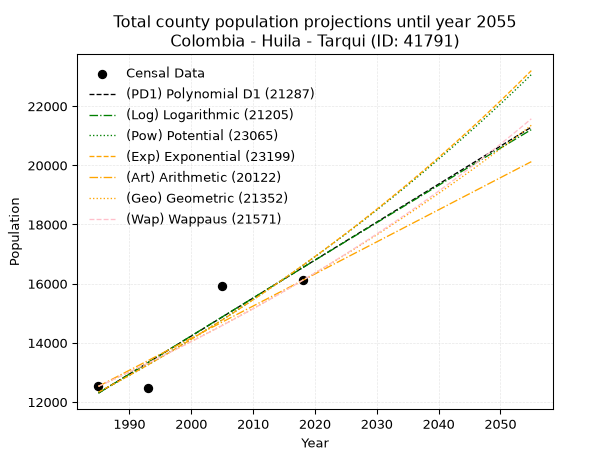
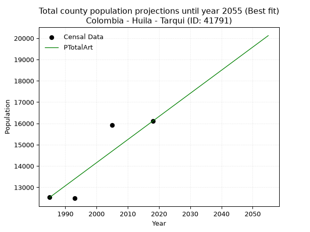
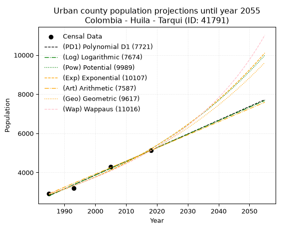
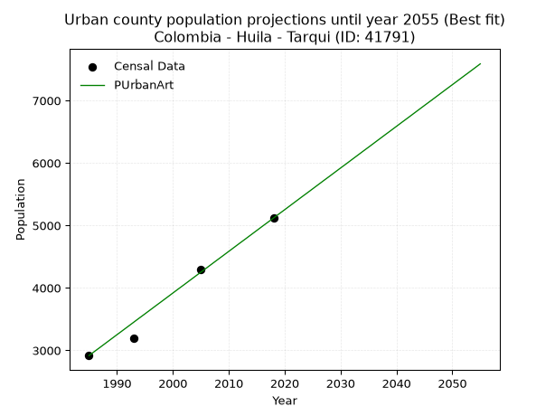
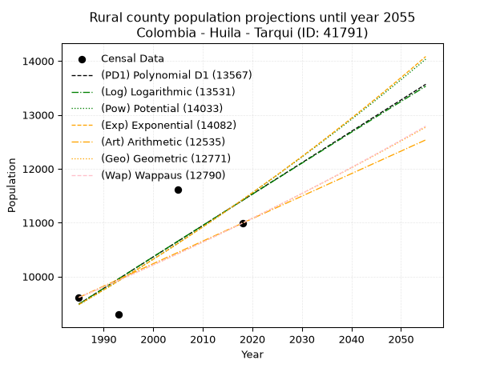
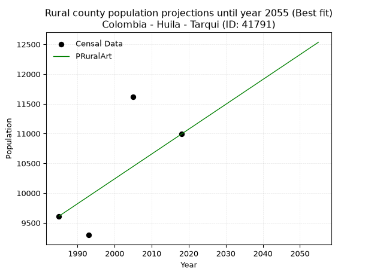

<div align="center">


</div>

# _“Population and Public Services Demand Projections (PPSD) until Year 2050 for Colombia - Huila - Tarqui (ID: 41791)”_
Keywords: `population` `public-service` `projection` `lineal` `polynomial` `logarithmic` `potential` `exponential` `arithmetic` `geometric` `wappaus` `dane` `colombia` `south-america`

PPSD are analytical estimates used by governments and planners to anticipate future changes in population size, age distribution, and the resulting community needs for utilities, healthcare, education, and infrastructure as sizing future water treatment facilities, electrical grids, and road networks based on spatial growth.

> **General running parameters**: • app_version: _v20260806_. • Python version: _3.14.7_. • Pandas version: _3.0.5_. • NumPy version: _2.5.1_. • Creates, save and include plots into reports (create_plot): _False_. • Projection until year: _2050_. • Process polynomial degree 2 and up: _False_. • Process Wappaus: _True_. • Process Wappaus: _True_. • Set negative values to zero: _True_. • Set infinite values to zero: _True_. • Drop dataset notes: _True_. 
<div align="center">

Dynamic map: [:earth_americas:Google](http://maps.google.com/maps?q=2.11132497,-75.8239763) [:earth_americas:OSM](https://www.openstreetmap.org/#map=18/2.11132497/-75.8239763&layers=P) [:earth_americas:Bing](https://www.bing.com/maps?cp=2.11132497~-75.8239763&lvl=18) [:earth_americas:Apple](https://maps.apple.com/frame?center=2.11132497%2C-75.8239763&span=0.003%2C0.006)

</div>


<div align="center">

```geojson
{
  "type": "Feature",
  "geometry": {
    "type": "Point", 
    "coordinates": [-75.8239763, 2.11132497]
  }, 
  "properties": {
    "Name": "Colombia - Huila - Tarqui (ID: 41791)"
  }
}
```

</div>


## 0. Census Data (4 records)

Census data are official statistics collected by a government about the people and housing in a country. They usually include counts of total population, age, sex, race, income, education, and jobs.

📅Global census file: [Population.xlsx](../data/Population.xlsx)

| Source   |   Year |   CountryID | CountryName   |   StateID | StateName   |   CountyID | CountyName   |   PTotal |   PUrban |   PRural |
|:---------|-------:|------------:|:--------------|----------:|:------------|-----------:|:-------------|---------:|---------:|---------:|
| DANE     |   1985 |          57 | Colombia      |        41 | Huila       |      41791 | Tarqui       |    12528 |     2916 |     9612 |
| DANE     |   1993 |          57 | Colombia      |        41 | Huila       |      41791 | Tarqui       |    12484 |     3190 |     9294 |
| DANE     |   2005 |          57 | Colombia      |        41 | Huila       |      41791 | Tarqui       |    15914 |     4300 |    11614 |
| DANE     |   2018 |          57 | Colombia      |        41 | Huila       |      41791 | Tarqui       |    16108 |     5118 |    10990 |

> 🔥Some records could had specific notes about the registered values or the corresponding urban or rural distribution.

**Local public utility companies (RUPS)**

 | SERVICIO       | ESTADO    | NOMBRE                                                                                                              | NIT         | DEPARTAMENTO_DOMICILIO   | MUNICIPIO_DOMICILIO   | DIRECCION                                   |   TELEFONO | EMAIL                               | TIPO_INSCRIPCION    | REPRESENTANTE_LEGAL          | TIPO_PRESTADOR                             | CLASIFICACION                 |
|:---------------|:----------|:--------------------------------------------------------------------------------------------------------------------|:------------|:-------------------------|:----------------------|:--------------------------------------------|-----------:|:------------------------------------|:--------------------|:-----------------------------|:-------------------------------------------|:------------------------------|
| ACUEDUCTO      | OPERATIVA | SOCIEDAD DE ACUEDUCTOS, ALCANTARILLADOS Y ASEO DEL HUILA - AGUAS DEL HUILA S.A. E.S.P.                              | 800100553-2 | HUILA                    | NEIVA                 | Calle  21 No 1C - 17                        |    8752321 | ossa.servicios@aguasdelhuila.gov.co | Registro por la ESP | CRISTIAN CAMILO BRAVO MEDINA | SOCIEDADES (EMPRESA DE SERVICIOS PUBLICOS) | MENOR O IGUAL A 2500 USUARIOS |
| ALCANTARILLADO | OPERATIVA | SOCIEDAD DE ACUEDUCTOS, ALCANTARILLADOS Y ASEO DEL HUILA - AGUAS DEL HUILA S.A. E.S.P.                              | 800100553-2 | HUILA                    | NEIVA                 | Calle  21 No 1C - 17                        |    8752321 | ossa.servicios@aguasdelhuila.gov.co | Registro por la ESP | CRISTIAN CAMILO BRAVO MEDINA | SOCIEDADES (EMPRESA DE SERVICIOS PUBLICOS) | MENOR O IGUAL A 2500 USUARIOS |
| ASEO           | OPERATIVA | SOCIEDAD DE ACUEDUCTOS, ALCANTARILLADOS Y ASEO DEL HUILA - AGUAS DEL HUILA S.A. E.S.P.                              | 800100553-2 | HUILA                    | NEIVA                 | Calle  21 No 1C - 17                        |    8752321 | ossa.servicios@aguasdelhuila.gov.co | Registro por la ESP | CRISTIAN CAMILO BRAVO MEDINA | SOCIEDADES (EMPRESA DE SERVICIOS PUBLICOS) | MENOR O IGUAL A 2500 USUARIOS |
| ACUEDUCTO      | OPERATIVA | ACUEDUCTO Y ALCANTARILLADO CENTRO POBLADO EL VERGEL TARQUI                                                          | 900206520-9 | HUILA                    | TARQUI                | CENTRO POBLADO EL VERGEL                    |    8353965 | oidencabrera@hotmail.com            | Registro por la ESP | OIDEN CABRERA CUELLAR        | ORGANIZACION AUTORIZADA                    | HASTA 2500 SUSCRIPTORES       |
| ALCANTARILLADO | OPERATIVA | ACUEDUCTO Y ALCANTARILLADO CENTRO POBLADO EL VERGEL TARQUI                                                          | 900206520-9 | HUILA                    | TARQUI                | CENTRO POBLADO EL VERGEL                    |    8353965 | oidencabrera@hotmail.com            | Registro por la ESP | OIDEN CABRERA CUELLAR        | ORGANIZACION AUTORIZADA                    | HASTA 2500 SUSCRIPTORES       |
| ASEO           | OPERATIVA | ACUEDUCTO Y ALCANTARILLADO CENTRO POBLADO EL VERGEL TARQUI                                                          | 900206520-9 | HUILA                    | TARQUI                | CENTRO POBLADO EL VERGEL                    |    8353965 | oidencabrera@hotmail.com            | Registro por la ESP | OIDEN CABRERA CUELLAR        | ORGANIZACION AUTORIZADA                    | HASTA 2500 SUSCRIPTORES       |
| ACUEDUCTO      | OPERATIVA | JUNTA ADMINISTRADORA DEL ACUEDUCTO REGIONAL DE LAS VEREDAS RICABRISAS BELLAVISTA Y LA PLAYA DEL MUNICIPIO DE TARQUI | 900389598-7 | HUILA                    | TARQUI                | VEREDA RICABRISA                            |    8329177 | contactenos@tarqui-huila.gov.co     | Registro por la ESP | MARTIN RAMOS VELENZUELA      | ORGANIZACION AUTORIZADA                    | HASTA 2500 SUSCRIPTORES       |
| ACUEDUCTO      | OPERATIVA | JUNTA ADMINISTRADORA DEL ACUEDCUCTO DE LA INSPECCION DE QUINTURO MUNICIPIO DE TARQUI                                | 900260525-4 | HUILA                    | TARQUI                | CENTRO POBLADO QUITURO                      |    8329177 | alcaldia@tarqui-huila.gov.co        | Registro por la ESP | GABRIEL HULE PERICO          | ORGANIZACION AUTORIZADA                    | HASTA 2500 SUSCRIPTORES       |
| ASEO           | OPERATIVA | CIUDAD LIMPIA NEIVA S.A E.S.P                                                                                       | 900674866-8 | HUILA                    | NEIVA                 | CARRERA 7 # 82 - 70 AVENIDA ALBERTO GALINDO |    8766224 | sui@ciudadlimpia.com.co             | Registro por la ESP | EDGAR GOMEZ OSORIO           | SOCIEDADES (EMPRESA DE SERVICIOS PUBLICOS) | MAYOR O IGUAL A 5001 USUARIOS |

> [📅RUPS Database: Registro Único de Prestadores de Servicios Públicos de Colombia Suramérica - RUPS](https://www.datos.gov.co/Hacienda-y-Cr-dito-P-blico/Registro-nico-de-Prestadores-de-Servicios-P-blicos/4qkq-csdn/about_data)

## 1. Total

### 1.1. Coefficients and Parameters

* (PD1) Polynomial Deg 1: 128.37816138097122, -242529.91730228768 (lineal)
* (Log) Logarithmic: 257046.57463853047, -1939554.573669445
* (Pow) Potential: 18.080210333622997, -55.533381343327065
* (Exp) Exponential: 0.00902982855254219, 0.00020256961041746028
* (Art) Arithmetic: Year diff. 2018 - 1985 = 33, Population diff. 16108 - 12528 = 3580, Annual growth = 108.48484848484848
* (Geo) Geometric: Year diff. 2018 - 1985 = 33, Population diff. 16108 - 12528 = 3580, Annual growth % = 0.007645744318476089
* (Wap) Wappaus: i = 0.7576815790253422, Condition values only valid for < 200)

<sub>
Wappaus condition values: ['0.00', '0.76', '1.52', '2.27', '3.03', '3.79', '4.55', '5.30', '6.06', '6.82', '7.58', '8.33', '9.09', '9.85', '10.61', '11.37', '12.12', '12.88', '13.64', '14.40', '15.15', '15.91', '16.67', '17.43', '18.18', '18.94', '19.70', '20.46', '21.22', '21.97', '22.73', '23.49', '24.25', '25.00', '25.76', '26.52', '27.28', '28.03', '28.79', '29.55', '30.31', '31.06', '31.82', '32.58', '33.34', '34.10', '34.85', '35.61', '36.37', '37.13', '37.88', '38.64', '39.40', '40.16', '40.91', '41.67', '42.43', '43.19', '43.95', '44.70', '45.46', '46.22', '46.98', '47.73', '48.49', '49.25']
</sub>


### 1.2. Projected Dataset

|   Year |   CountyID |   PTotalPD1 |   PTotalLog |   PTotalPow |   PTotalExp |   PTotalArt |   PTotalGeo |   PTotalWap |
|-------:|-----------:|------------:|------------:|------------:|------------:|------------:|------------:|------------:|
|   1985 |      41791 |       12301 |       12296 |       12326 |       12330 |       12528 |       12528 |       12528 |
|   1986 |      41791 |       12429 |       12426 |       12439 |       12442 |       12636 |       12624 |       12623 |
|   1987 |      41791 |       12557 |       12555 |       12552 |       12555 |       12745 |       12720 |       12719 |
|   1988 |      41791 |       12686 |       12684 |       12667 |       12668 |       12853 |       12818 |       12816 |
|   1989 |      41791 |       12814 |       12814 |       12783 |       12783 |       12962 |       12916 |       12914 |
|   1990 |      41791 |       12943 |       12943 |       12900 |       12899 |       13070 |       13014 |       13012 |
|   1991 |      41791 |       13071 |       13072 |       13017 |       13016 |       13179 |       13114 |       13111 |
|   1992 |      41791 |       13199 |       13201 |       13136 |       13134 |       13287 |       13214 |       13211 |
|   1993 |      41791 |       13328 |       13330 |       13256 |       13254 |       13396 |       13315 |       13311 |
|   1994 |      41791 |       13456 |       13459 |       13377 |       13374 |       13504 |       13417 |       13412 |
|   1995 |      41791 |       13585 |       13588 |       13498 |       13495 |       13613 |       13519 |       13515 |
|   1996 |      41791 |       13713 |       13717 |       13621 |       13617 |       13721 |       13623 |       13618 |
|   1997 |      41791 |       13841 |       13846 |       13745 |       13741 |       13830 |       13727 |       13721 |
|   1998 |      41791 |       13970 |       13974 |       13870 |       13866 |       13938 |       13832 |       13826 |
|   1999 |      41791 |       14098 |       14103 |       13996 |       13991 |       14047 |       13938 |       13931 |
|   2000 |      41791 |       14226 |       14231 |       14123 |       14118 |       14155 |       14044 |       14038 |
|   2001 |      41791 |       14355 |       14360 |       14251 |       14246 |       14264 |       14152 |       14145 |
|   2002 |      41791 |       14483 |       14488 |       14381 |       14376 |       14372 |       14260 |       14253 |
|   2003 |      41791 |       14612 |       14617 |       14511 |       14506 |       14481 |       14369 |       14362 |
|   2004 |      41791 |       14740 |       14745 |       14643 |       14638 |       14589 |       14479 |       14471 |
|   2005 |      41791 |       14868 |       14873 |       14775 |       14770 |       14698 |       14589 |       14582 |
|   2006 |      41791 |       14997 |       15001 |       14909 |       14904 |       14806 |       14701 |       14694 |
|   2007 |      41791 |       15125 |       15129 |       15044 |       15040 |       14915 |       14813 |       14806 |
|   2008 |      41791 |       15253 |       15258 |       15180 |       15176 |       15023 |       14927 |       14920 |
|   2009 |      41791 |       15382 |       15385 |       15318 |       15314 |       15132 |       15041 |       15034 |
|   2010 |      41791 |       15510 |       15513 |       15456 |       15453 |       15240 |       15156 |       15149 |
|   2011 |      41791 |       15639 |       15641 |       15596 |       15593 |       15349 |       15272 |       15266 |
|   2012 |      41791 |       15767 |       15769 |       15736 |       15734 |       15457 |       15388 |       15383 |
|   2013 |      41791 |       15895 |       15897 |       15878 |       15877 |       15566 |       15506 |       15501 |
|   2014 |      41791 |       16024 |       16024 |       16022 |       16021 |       15674 |       15625 |       15621 |
|   2015 |      41791 |       16152 |       16152 |       16166 |       16166 |       15783 |       15744 |       15741 |
|   2016 |      41791 |       16280 |       16280 |       16312 |       16313 |       15891 |       15864 |       15862 |
|   2017 |      41791 |       16409 |       16407 |       16459 |       16461 |       16000 |       15986 |       15985 |
|   2018 |      41791 |       16537 |       16534 |       16607 |       16610 |       16108 |       16108 |       16108 |
|   2019 |      41791 |       16666 |       16662 |       16756 |       16761 |       16216 |       16231 |       16233 |
|   2020 |      41791 |       16794 |       16789 |       16907 |       16913 |       16325 |       16355 |       16358 |
|   2021 |      41791 |       16922 |       16916 |       17059 |       17066 |       16433 |       16480 |       16485 |
|   2022 |      41791 |       17051 |       17043 |       17212 |       17221 |       16542 |       16606 |       16613 |
|   2023 |      41791 |       17179 |       17171 |       17367 |       17377 |       16650 |       16733 |       16742 |
|   2024 |      41791 |       17307 |       17298 |       17523 |       17535 |       16759 |       16861 |       16872 |
|   2025 |      41791 |       17436 |       17425 |       17680 |       17694 |       16867 |       16990 |       17003 |
|   2026 |      41791 |       17564 |       17551 |       17838 |       17854 |       16976 |       17120 |       17135 |
|   2027 |      41791 |       17693 |       17678 |       17998 |       18016 |       17084 |       17251 |       17269 |
|   2028 |      41791 |       17821 |       17805 |       18159 |       18180 |       17193 |       17383 |       17404 |
|   2029 |      41791 |       17949 |       17932 |       18322 |       18345 |       17301 |       17516 |       17540 |
|   2030 |      41791 |       18078 |       18058 |       18486 |       18511 |       17410 |       17650 |       17677 |
|   2031 |      41791 |       18206 |       18185 |       18651 |       18679 |       17518 |       17785 |       17816 |
|   2032 |      41791 |       18335 |       18312 |       18818 |       18848 |       17627 |       17921 |       17956 |
|   2033 |      41791 |       18463 |       18438 |       18986 |       19019 |       17735 |       18058 |       18097 |
|   2034 |      41791 |       18591 |       18564 |       19156 |       19192 |       17844 |       18196 |       18239 |
|   2035 |      41791 |       18720 |       18691 |       19327 |       19366 |       17952 |       18335 |       18383 |
|   2036 |      41791 |       18848 |       18817 |       19499 |       19542 |       18061 |       18475 |       18528 |
|   2037 |      41791 |       18976 |       18943 |       19673 |       19719 |       18169 |       18616 |       18675 |
|   2038 |      41791 |       19105 |       19069 |       19848 |       19898 |       18278 |       18759 |       18823 |
|   2039 |      41791 |       19233 |       19196 |       20025 |       20078 |       18386 |       18902 |       18972 |
|   2040 |      41791 |       19362 |       19322 |       20204 |       20260 |       18495 |       19046 |       19123 |
|   2041 |      41791 |       19490 |       19448 |       20383 |       20444 |       18603 |       19192 |       19275 |
|   2042 |      41791 |       19618 |       19573 |       20565 |       20630 |       18712 |       19339 |       19429 |
|   2043 |      41791 |       19747 |       19699 |       20748 |       20817 |       18820 |       19487 |       19584 |
|   2044 |      41791 |       19875 |       19825 |       20932 |       21006 |       18929 |       19636 |       19741 |
|   2045 |      41791 |       20003 |       19951 |       21118 |       21196 |       19037 |       19786 |       19899 |
|   2046 |      41791 |       20132 |       20076 |       21305 |       21388 |       19146 |       19937 |       20059 |
|   2047 |      41791 |       20260 |       20202 |       21494 |       21582 |       19254 |       20090 |       20220 |
|   2048 |      41791 |       20389 |       20328 |       21685 |       21778 |       19363 |       20243 |       20383 |
|   2049 |      41791 |       20517 |       20453 |       21877 |       21976 |       19471 |       20398 |       20547 |
|   2050 |      41791 |       20645 |       20579 |       22071 |       22175 |       19580 |       20554 |       20714 |
<div align="center">

</img>

</div>


### 1.3. Best fit with absolute and relative error (%)

Relative error puts that difference into context by dividing the absolute error by the true value, creating a unitless ratio or percentage that shows the scale of the mistake.

Absolute and relative error

|   Year | Source   |   CountryID | CountryName   |   StateID | StateName   |   CountyID_x | CountyName   |   PTotal |   PUrban |   PRural |   CountyID_y |   PTotalPD1 |   PTotalLog |   PTotalPow |   PTotalExp |   PTotalArt |   PTotalGeo |   PTotalWap |   PTotalPD1AbsError |   PTotalLogAbsError |   PTotalPowAbsError |   PTotalExpAbsError |   PTotalArtAbsError |   PTotalGeoAbsError |   PTotalWapAbsError |   PTotalPD1RelError |   PTotalLogRelError |   PTotalPowRelError |   PTotalExpRelError |   PTotalArtRelError |   PTotalGeoRelError |   PTotalWapRelError |
|-------:|:---------|------------:|:--------------|----------:|:------------|-------------:|:-------------|---------:|---------:|---------:|-------------:|------------:|------------:|------------:|------------:|------------:|------------:|------------:|--------------------:|--------------------:|--------------------:|--------------------:|--------------------:|--------------------:|--------------------:|--------------------:|--------------------:|--------------------:|--------------------:|--------------------:|--------------------:|--------------------:|
|   1985 | DANE     |          57 | Colombia      |        41 | Huila       |        41791 | Tarqui       |    12528 |     2916 |     9612 |        41791 |       12301 |       12296 |       12326 |       12330 |       12528 |       12528 |       12528 |                 227 |                 232 |                 202 |                 198 |                   0 |                   0 |                   0 |             1.81194 |             1.85185 |             1.61239 |             1.58046 |             0       |             0       |             0       |
|   1993 | DANE     |          57 | Colombia      |        41 | Huila       |        41791 | Tarqui       |    12484 |     3190 |     9294 |        41791 |       13328 |       13330 |       13256 |       13254 |       13396 |       13315 |       13311 |                 844 |                 846 |                 772 |                 770 |                 912 |                 831 |                 827 |             6.76065 |             6.77667 |             6.18392 |             6.16789 |             7.30535 |             6.65652 |             6.62448 |
|   2005 | DANE     |          57 | Colombia      |        41 | Huila       |        41791 | Tarqui       |    15914 |     4300 |    11614 |        41791 |       14868 |       14873 |       14775 |       14770 |       14698 |       14589 |       14582 |                1046 |                1041 |                1139 |                1144 |                1216 |                1325 |                1332 |             6.57283 |             6.54141 |             7.15722 |             7.18864 |             7.64107 |             8.326   |             8.36999 |
|   2018 | DANE     |          57 | Colombia      |        41 | Huila       |        41791 | Tarqui       |    16108 |     5118 |    10990 |        41791 |       16537 |       16534 |       16607 |       16610 |       16108 |       16108 |       16108 |                 429 |                 426 |                 499 |                 502 |                   0 |                   0 |                   0 |             2.66327 |             2.64465 |             3.09784 |             3.11646 |             0       |             0       |             0       |

Relative error mean

| Method    |   RelError | Best   |
|:----------|-----------:|:-------|
| PTotalPD1 |    4.45217 |        |
| PTotalLog |    4.45365 |        |
| PTotalPow |    4.51284 |        |
| PTotalExp |    4.51336 |        |
| PTotalArt |    3.73661 | True   |
| PTotalGeo |    3.74563 |        |
| PTotalWap |    3.74862 |        |

💙Best method: _**PTotalArt**_
<div align="center">

</img>

</div>


### 1.4. Fresh water supply demand in liters per capita per day (lpcd)

The fresh water supply demand typically ranges from 100 to 300 liters per capita per day (lpcd) for standard domestic and municipal planning, though absolute survival minimums set by the World Health Organization are as low as 7.5 to 20 liters per day, and total consumption in high-income nations can exceed 400 liters.

> `CZ`: Level in meters above the sea level (masl)<br> `WS`: Fresh water supply demand in liters per capita per day (lpcd or l/h/d)<br> `WSAll`: Zonal fresh water supply demand in liters per second (l/s)<br> `A`: Zonal area in square meters<br> `DP`: Population density (people/hectare or p/ha)

Reference values (RAS Colombia)

|    CZ |   WS |
|------:|-----:|
|  1000 |  120 |
|  2000 |  130 |
| 99999 |  140 |

County shapefile geometry properties and water supply values

|   CountyID |      ATotal |   CZTotal |   WSTotal |
|-----------:|------------:|----------:|----------:|
|      41791 | 3.62791e+08 |   1399.37 |       130 |

Projected values for best method: PTotalArt

|   CountyID |   Year |   PTotalArt |   DPTotal |   WSTotal |   WSTotalAll |
|-----------:|-------:|------------:|----------:|----------:|-------------:|
|      41791 |   1985 |       12528 |      0.35 |       130 |      18.85   |
|      41791 |   1986 |       12636 |      0.35 |       130 |      19.0125 |
|      41791 |   1987 |       12745 |      0.35 |       130 |      19.1765 |
|      41791 |   1988 |       12853 |      0.35 |       130 |      19.339  |
|      41791 |   1989 |       12962 |      0.36 |       130 |      19.503  |
|      41791 |   1990 |       13070 |      0.36 |       130 |      19.6655 |
|      41791 |   1991 |       13179 |      0.36 |       130 |      19.8295 |
|      41791 |   1992 |       13287 |      0.37 |       130 |      19.992  |
|      41791 |   1993 |       13396 |      0.37 |       130 |      20.156  |
|      41791 |   1994 |       13504 |      0.37 |       130 |      20.3185 |
|      41791 |   1995 |       13613 |      0.38 |       130 |      20.4825 |
|      41791 |   1996 |       13721 |      0.38 |       130 |      20.645  |
|      41791 |   1997 |       13830 |      0.38 |       130 |      20.809  |
|      41791 |   1998 |       13938 |      0.38 |       130 |      20.9715 |
|      41791 |   1999 |       14047 |      0.39 |       130 |      21.1355 |
|      41791 |   2000 |       14155 |      0.39 |       130 |      21.298  |
|      41791 |   2001 |       14264 |      0.39 |       130 |      21.462  |
|      41791 |   2002 |       14372 |      0.4  |       130 |      21.6245 |
|      41791 |   2003 |       14481 |      0.4  |       130 |      21.7885 |
|      41791 |   2004 |       14589 |      0.4  |       130 |      21.951  |
|      41791 |   2005 |       14698 |      0.41 |       130 |      22.115  |
|      41791 |   2006 |       14806 |      0.41 |       130 |      22.2775 |
|      41791 |   2007 |       14915 |      0.41 |       130 |      22.4416 |
|      41791 |   2008 |       15023 |      0.41 |       130 |      22.6041 |
|      41791 |   2009 |       15132 |      0.42 |       130 |      22.7681 |
|      41791 |   2010 |       15240 |      0.42 |       130 |      22.9306 |
|      41791 |   2011 |       15349 |      0.42 |       130 |      23.0946 |
|      41791 |   2012 |       15457 |      0.43 |       130 |      23.2571 |
|      41791 |   2013 |       15566 |      0.43 |       130 |      23.4211 |
|      41791 |   2014 |       15674 |      0.43 |       130 |      23.5836 |
|      41791 |   2015 |       15783 |      0.44 |       130 |      23.7476 |
|      41791 |   2016 |       15891 |      0.44 |       130 |      23.9101 |
|      41791 |   2017 |       16000 |      0.44 |       130 |      24.0741 |
|      41791 |   2018 |       16108 |      0.44 |       130 |      24.2366 |
|      41791 |   2019 |       16216 |      0.45 |       130 |      24.3991 |
|      41791 |   2020 |       16325 |      0.45 |       130 |      24.5631 |
|      41791 |   2021 |       16433 |      0.45 |       130 |      24.7256 |
|      41791 |   2022 |       16542 |      0.46 |       130 |      24.8896 |
|      41791 |   2023 |       16650 |      0.46 |       130 |      25.0521 |
|      41791 |   2024 |       16759 |      0.46 |       130 |      25.2161 |
|      41791 |   2025 |       16867 |      0.46 |       130 |      25.3786 |
|      41791 |   2026 |       16976 |      0.47 |       130 |      25.5426 |
|      41791 |   2027 |       17084 |      0.47 |       130 |      25.7051 |
|      41791 |   2028 |       17193 |      0.47 |       130 |      25.8691 |
|      41791 |   2029 |       17301 |      0.48 |       130 |      26.0316 |
|      41791 |   2030 |       17410 |      0.48 |       130 |      26.1956 |
|      41791 |   2031 |       17518 |      0.48 |       130 |      26.3581 |
|      41791 |   2032 |       17627 |      0.49 |       130 |      26.5221 |
|      41791 |   2033 |       17735 |      0.49 |       130 |      26.6846 |
|      41791 |   2034 |       17844 |      0.49 |       130 |      26.8486 |
|      41791 |   2035 |       17952 |      0.49 |       130 |      27.0111 |
|      41791 |   2036 |       18061 |      0.5  |       130 |      27.1751 |
|      41791 |   2037 |       18169 |      0.5  |       130 |      27.3376 |
|      41791 |   2038 |       18278 |      0.5  |       130 |      27.5016 |
|      41791 |   2039 |       18386 |      0.51 |       130 |      27.6641 |
|      41791 |   2040 |       18495 |      0.51 |       130 |      27.8281 |
|      41791 |   2041 |       18603 |      0.51 |       130 |      27.9906 |
|      41791 |   2042 |       18712 |      0.52 |       130 |      28.1546 |
|      41791 |   2043 |       18820 |      0.52 |       130 |      28.3171 |
|      41791 |   2044 |       18929 |      0.52 |       130 |      28.4811 |
|      41791 |   2045 |       19037 |      0.52 |       130 |      28.6436 |
|      41791 |   2046 |       19146 |      0.53 |       130 |      28.8076 |
|      41791 |   2047 |       19254 |      0.53 |       130 |      28.9701 |
|      41791 |   2048 |       19363 |      0.53 |       130 |      29.1341 |
|      41791 |   2049 |       19471 |      0.54 |       130 |      29.2966 |
|      41791 |   2050 |       19580 |      0.54 |       130 |      29.4606 |

## 2. Urban

### 2.1. Coefficients and Parameters

* (PD1) Polynomial Deg 1: 70.12926535527842, -136395.0630268957 (lineal)
* (Log) Logarithmic: 140360.70306876846, -1063001.828805793
* (Pow) Potential: 35.93387661472408, -115.0426650935461
* (Exp) Exponential: 0.01795115317568171, 9.630840208721325e-13
* (Art) Arithmetic: Year diff. 2018 - 1985 = 33, Population diff. 5118 - 2916 = 2202, Annual growth = 66.72727272727273
* (Geo) Geometric: Year diff. 2018 - 1985 = 33, Population diff. 5118 - 2916 = 2202, Annual growth % = 0.01719312692361674
* (Wap) Wappaus: i = 1.661122049471564, Condition values only valid for < 200)

<sub>
Wappaus condition values: ['0.00', '1.66', '3.32', '4.98', '6.64', '8.31', '9.97', '11.63', '13.29', '14.95', '16.61', '18.27', '19.93', '21.59', '23.26', '24.92', '26.58', '28.24', '29.90', '31.56', '33.22', '34.88', '36.54', '38.21', '39.87', '41.53', '43.19', '44.85', '46.51', '48.17', '49.83', '51.49', '53.16', '54.82', '56.48', '58.14', '59.80', '61.46', '63.12', '64.78', '66.44', '68.11', '69.77', '71.43', '73.09', '74.75', '76.41', '78.07', '79.73', '81.39', '83.06', '84.72', '86.38', '88.04', '89.70', '91.36', '93.02', '94.68', '96.35', '98.01', '99.67', '101.33', '102.99', '104.65', '106.31', '107.97']
</sub>


### 2.2. Projected Dataset

|   Year |   CountyID |   PUrbanPD1 |   PUrbanLog |   PUrbanPow |   PUrbanExp |   PUrbanArt |   PUrbanGeo |   PUrbanWap |
|-------:|-----------:|------------:|------------:|------------:|------------:|------------:|------------:|------------:|
|   1985 |      41791 |        2812 |        2810 |        2875 |        2877 |        2916 |        2916 |        2916 |
|   1986 |      41791 |        2882 |        2880 |        2928 |        2929 |        2983 |        2966 |        2965 |
|   1987 |      41791 |        2952 |        2951 |        2981 |        2982 |        3049 |        3017 |        3015 |
|   1988 |      41791 |        3022 |        3021 |        3035 |        3036 |        3116 |        3069 |        3065 |
|   1989 |      41791 |        3092 |        3092 |        3091 |        3091 |        3183 |        3122 |        3116 |
|   1990 |      41791 |        3162 |        3163 |        3147 |        3147 |        3250 |        3175 |        3169 |
|   1991 |      41791 |        3232 |        3233 |        3204 |        3204 |        3316 |        3230 |        3222 |
|   1992 |      41791 |        3302 |        3304 |        3263 |        3262 |        3383 |        3286 |        3276 |
|   1993 |      41791 |        3373 |        3374 |        3322 |        3321 |        3450 |        3342 |        3331 |
|   1994 |      41791 |        3443 |        3444 |        3383 |        3381 |        3517 |        3400 |        3387 |
|   1995 |      41791 |        3513 |        3515 |        3444 |        3442 |        3583 |        3458 |        3444 |
|   1996 |      41791 |        3583 |        3585 |        3507 |        3505 |        3650 |        3517 |        3502 |
|   1997 |      41791 |        3653 |        3655 |        3570 |        3568 |        3717 |        3578 |        3562 |
|   1998 |      41791 |        3723 |        3726 |        3635 |        3633 |        3783 |        3639 |        3622 |
|   1999 |      41791 |        3793 |        3796 |        3701 |        3699 |        3850 |        3702 |        3683 |
|   2000 |      41791 |        3863 |        3866 |        3768 |        3766 |        3917 |        3766 |        3746 |
|   2001 |      41791 |        3934 |        3936 |        3837 |        3834 |        3984 |        3830 |        3810 |
|   2002 |      41791 |        4004 |        4006 |        3906 |        3903 |        4050 |        3896 |        3875 |
|   2003 |      41791 |        4074 |        4077 |        3977 |        3974 |        4117 |        3963 |        3941 |
|   2004 |      41791 |        4144 |        4147 |        4049 |        4046 |        4184 |        4031 |        4009 |
|   2005 |      41791 |        4214 |        4217 |        4122 |        4119 |        4251 |        4101 |        4078 |
|   2006 |      41791 |        4284 |        4287 |        4196 |        4194 |        4317 |        4171 |        4148 |
|   2007 |      41791 |        4354 |        4357 |        4272 |        4270 |        4384 |        4243 |        4220 |
|   2008 |      41791 |        4425 |        4427 |        4349 |        4347 |        4451 |        4316 |        4293 |
|   2009 |      41791 |        4495 |        4496 |        4428 |        4426 |        4517 |        4390 |        4368 |
|   2010 |      41791 |        4565 |        4566 |        4508 |        4506 |        4584 |        4466 |        4444 |
|   2011 |      41791 |        4635 |        4636 |        4589 |        4588 |        4651 |        4542 |        4522 |
|   2012 |      41791 |        4705 |        4706 |        4672 |        4671 |        4718 |        4620 |        4602 |
|   2013 |      41791 |        4775 |        4776 |        4756 |        4755 |        4784 |        4700 |        4683 |
|   2014 |      41791 |        4845 |        4845 |        4842 |        4842 |        4851 |        4781 |        4766 |
|   2015 |      41791 |        4915 |        4915 |        4929 |        4929 |        4918 |        4863 |        4851 |
|   2016 |      41791 |        4986 |        4985 |        5018 |        5019 |        4985 |        4946 |        4938 |
|   2017 |      41791 |        5056 |        5054 |        5108 |        5109 |        5051 |        5031 |        5027 |
|   2018 |      41791 |        5126 |        5124 |        5200 |        5202 |        5118 |        5118 |        5118 |
|   2019 |      41791 |        5196 |        5193 |        5293 |        5296 |        5185 |        5206 |        5211 |
|   2020 |      41791 |        5266 |        5263 |        5388 |        5392 |        5251 |        5296 |        5306 |
|   2021 |      41791 |        5336 |        5332 |        5485 |        5490 |        5318 |        5387 |        5404 |
|   2022 |      41791 |        5406 |        5402 |        5583 |        5589 |        5385 |        5479 |        5503 |
|   2023 |      41791 |        5476 |        5471 |        5683 |        5690 |        5452 |        5573 |        5605 |
|   2024 |      41791 |        5547 |        5540 |        5785 |        5794 |        5518 |        5669 |        5710 |
|   2025 |      41791 |        5617 |        5610 |        5888 |        5898 |        5585 |        5767 |        5817 |
|   2026 |      41791 |        5687 |        5679 |        5994 |        6005 |        5652 |        5866 |        5927 |
|   2027 |      41791 |        5757 |        5748 |        6101 |        6114 |        5719 |        5967 |        6040 |
|   2028 |      41791 |        5827 |        5818 |        6210 |        6225 |        5785 |        6069 |        6156 |
|   2029 |      41791 |        5897 |        5887 |        6321 |        6338 |        5852 |        6174 |        6275 |
|   2030 |      41791 |        5967 |        5956 |        6434 |        6452 |        5919 |        6280 |        6397 |
|   2031 |      41791 |        6037 |        6025 |        6549 |        6569 |        5985 |        6388 |        6522 |
|   2032 |      41791 |        6108 |        6094 |        6666 |        6688 |        6052 |        6498 |        6650 |
|   2033 |      41791 |        6178 |        6163 |        6785 |        6809 |        6119 |        6609 |        6782 |
|   2034 |      41791 |        6248 |        6232 |        6906 |        6933 |        6186 |        6723 |        6918 |
|   2035 |      41791 |        6318 |        6301 |        7029 |        7058 |        6252 |        6838 |        7058 |
|   2036 |      41791 |        6388 |        6370 |        7154 |        7186 |        6319 |        6956 |        7202 |
|   2037 |      41791 |        6458 |        6439 |        7281 |        7316 |        6386 |        7076 |        7350 |
|   2038 |      41791 |        6528 |        6508 |        7411 |        7449 |        6453 |        7197 |        7502 |
|   2039 |      41791 |        6599 |        6577 |        7543 |        7584 |        6519 |        7321 |        7659 |
|   2040 |      41791 |        6669 |        6646 |        7677 |        7721 |        6586 |        7447 |        7821 |
|   2041 |      41791 |        6739 |        6714 |        7813 |        7861 |        6653 |        7575 |        7987 |
|   2042 |      41791 |        6809 |        6783 |        7952 |        8003 |        6719 |        7705 |        8159 |
|   2043 |      41791 |        6879 |        6852 |        8093 |        8148 |        6786 |        7838 |        8337 |
|   2044 |      41791 |        6949 |        6921 |        8237 |        8296 |        6853 |        7972 |        8520 |
|   2045 |      41791 |        7019 |        6989 |        8383 |        8446 |        6920 |        8109 |        8709 |
|   2046 |      41791 |        7089 |        7058 |        8531 |        8599 |        6986 |        8249 |        8905 |
|   2047 |      41791 |        7160 |        7127 |        8682 |        8755 |        7053 |        8391 |        9107 |
|   2048 |      41791 |        7230 |        7195 |        8836 |        8914 |        7120 |        8535 |        9317 |
|   2049 |      41791 |        7300 |        7264 |        8992 |        9075 |        7187 |        8682 |        9534 |
|   2050 |      41791 |        7370 |        7332 |        9151 |        9239 |        7253 |        8831 |        9759 |
<div align="center">

</img>

</div>


### 2.3. Best fit with absolute and relative error (%)

Relative error puts that difference into context by dividing the absolute error by the true value, creating a unitless ratio or percentage that shows the scale of the mistake.

Absolute and relative error

|   Year | Source   |   CountryID | CountryName   |   StateID | StateName   |   CountyID_x | CountyName   |   PTotal |   PUrban |   PRural |   CountyID_y |   PUrbanPD1 |   PUrbanLog |   PUrbanPow |   PUrbanExp |   PUrbanArt |   PUrbanGeo |   PUrbanWap |   PUrbanPD1AbsError |   PUrbanLogAbsError |   PUrbanPowAbsError |   PUrbanExpAbsError |   PUrbanArtAbsError |   PUrbanGeoAbsError |   PUrbanWapAbsError |   PUrbanPD1RelError |   PUrbanLogRelError |   PUrbanPowRelError |   PUrbanExpRelError |   PUrbanArtRelError |   PUrbanGeoRelError |   PUrbanWapRelError |
|-------:|:---------|------------:|:--------------|----------:|:------------|-------------:|:-------------|---------:|---------:|---------:|-------------:|------------:|------------:|------------:|------------:|------------:|------------:|------------:|--------------------:|--------------------:|--------------------:|--------------------:|--------------------:|--------------------:|--------------------:|--------------------:|--------------------:|--------------------:|--------------------:|--------------------:|--------------------:|--------------------:|
|   1985 | DANE     |          57 | Colombia      |        41 | Huila       |        41791 | Tarqui       |    12528 |     2916 |     9612 |        41791 |        2812 |        2810 |        2875 |        2877 |        2916 |        2916 |        2916 |                 104 |                 106 |                  41 |                  39 |                   0 |                   0 |                   0 |            3.56653  |            3.63512  |             1.40604 |             1.33745 |             0       |             0       |             0       |
|   1993 | DANE     |          57 | Colombia      |        41 | Huila       |        41791 | Tarqui       |    12484 |     3190 |     9294 |        41791 |        3373 |        3374 |        3322 |        3321 |        3450 |        3342 |        3331 |                 183 |                 184 |                 132 |                 131 |                 260 |                 152 |                 141 |            5.73668  |            5.76803  |             4.13793 |             4.10658 |             8.15047 |             4.76489 |             4.42006 |
|   2005 | DANE     |          57 | Colombia      |        41 | Huila       |        41791 | Tarqui       |    15914 |     4300 |    11614 |        41791 |        4214 |        4217 |        4122 |        4119 |        4251 |        4101 |        4078 |                  86 |                  83 |                 178 |                 181 |                  49 |                 199 |                 222 |            2        |            1.93023  |             4.13953 |             4.2093  |             1.13953 |             4.62791 |             5.16279 |
|   2018 | DANE     |          57 | Colombia      |        41 | Huila       |        41791 | Tarqui       |    16108 |     5118 |    10990 |        41791 |        5126 |        5124 |        5200 |        5202 |        5118 |        5118 |        5118 |                   8 |                   6 |                  82 |                  84 |                   0 |                   0 |                   0 |            0.156311 |            0.117233 |             1.60219 |             1.64127 |             0       |             0       |             0       |

Relative error mean

| Method    |   RelError | Best   |
|:----------|-----------:|:-------|
| PUrbanPD1 |    2.86488 |        |
| PUrbanLog |    2.86265 |        |
| PUrbanPow |    2.82142 |        |
| PUrbanExp |    2.82365 |        |
| PUrbanArt |    2.3225  | True   |
| PUrbanGeo |    2.3482  |        |
| PUrbanWap |    2.39571 |        |

💙Best method: _**PUrbanArt**_
<div align="center">

</img>

</div>


### 2.4. Fresh water supply demand in liters per capita per day (lpcd)

The fresh water supply demand typically ranges from 100 to 300 liters per capita per day (lpcd) for standard domestic and municipal planning, though absolute survival minimums set by the World Health Organization are as low as 7.5 to 20 liters per day, and total consumption in high-income nations can exceed 400 liters.

> `CZ`: Level in meters above the sea level (masl)<br> `WS`: Fresh water supply demand in liters per capita per day (lpcd or l/h/d)<br> `WSAll`: Zonal fresh water supply demand in liters per second (l/s)<br> `A`: Zonal area in square meters<br> `DP`: Population density (people/hectare or p/ha)

Reference values (RAS Colombia)

|    CZ |   WS |
|------:|-----:|
|  1000 |  120 |
|  2000 |  130 |
| 99999 |  140 |

County shapefile geometry properties and water supply values

|   CountyID |   AUrban |   CZUrban |   WSUrban |
|-----------:|---------:|----------:|----------:|
|      41791 |   755316 |   832.503 |       120 |

Projected values for best method: PUrbanArt

|   CountyID |   Year |   PUrbanArt |   DPUrban |   WSUrban |   WSUrbanAll |
|-----------:|-------:|------------:|----------:|----------:|-------------:|
|      41791 |   1985 |        2916 |     38.61 |       120 |      4.05    |
|      41791 |   1986 |        2983 |     39.49 |       120 |      4.14306 |
|      41791 |   1987 |        3049 |     40.37 |       120 |      4.23472 |
|      41791 |   1988 |        3116 |     41.25 |       120 |      4.32778 |
|      41791 |   1989 |        3183 |     42.14 |       120 |      4.42083 |
|      41791 |   1990 |        3250 |     43.03 |       120 |      4.51389 |
|      41791 |   1991 |        3316 |     43.9  |       120 |      4.60556 |
|      41791 |   1992 |        3383 |     44.79 |       120 |      4.69861 |
|      41791 |   1993 |        3450 |     45.68 |       120 |      4.79167 |
|      41791 |   1994 |        3517 |     46.56 |       120 |      4.88472 |
|      41791 |   1995 |        3583 |     47.44 |       120 |      4.97639 |
|      41791 |   1996 |        3650 |     48.32 |       120 |      5.06944 |
|      41791 |   1997 |        3717 |     49.21 |       120 |      5.1625  |
|      41791 |   1998 |        3783 |     50.08 |       120 |      5.25417 |
|      41791 |   1999 |        3850 |     50.97 |       120 |      5.34722 |
|      41791 |   2000 |        3917 |     51.86 |       120 |      5.44028 |
|      41791 |   2001 |        3984 |     52.75 |       120 |      5.53333 |
|      41791 |   2002 |        4050 |     53.62 |       120 |      5.625   |
|      41791 |   2003 |        4117 |     54.51 |       120 |      5.71806 |
|      41791 |   2004 |        4184 |     55.39 |       120 |      5.81111 |
|      41791 |   2005 |        4251 |     56.28 |       120 |      5.90417 |
|      41791 |   2006 |        4317 |     57.15 |       120 |      5.99583 |
|      41791 |   2007 |        4384 |     58.04 |       120 |      6.08889 |
|      41791 |   2008 |        4451 |     58.93 |       120 |      6.18194 |
|      41791 |   2009 |        4517 |     59.8  |       120 |      6.27361 |
|      41791 |   2010 |        4584 |     60.69 |       120 |      6.36667 |
|      41791 |   2011 |        4651 |     61.58 |       120 |      6.45972 |
|      41791 |   2012 |        4718 |     62.46 |       120 |      6.55278 |
|      41791 |   2013 |        4784 |     63.34 |       120 |      6.64444 |
|      41791 |   2014 |        4851 |     64.22 |       120 |      6.7375  |
|      41791 |   2015 |        4918 |     65.11 |       120 |      6.83056 |
|      41791 |   2016 |        4985 |     66    |       120 |      6.92361 |
|      41791 |   2017 |        5051 |     66.87 |       120 |      7.01528 |
|      41791 |   2018 |        5118 |     67.76 |       120 |      7.10833 |
|      41791 |   2019 |        5185 |     68.65 |       120 |      7.20139 |
|      41791 |   2020 |        5251 |     69.52 |       120 |      7.29306 |
|      41791 |   2021 |        5318 |     70.41 |       120 |      7.38611 |
|      41791 |   2022 |        5385 |     71.29 |       120 |      7.47917 |
|      41791 |   2023 |        5452 |     72.18 |       120 |      7.57222 |
|      41791 |   2024 |        5518 |     73.06 |       120 |      7.66389 |
|      41791 |   2025 |        5585 |     73.94 |       120 |      7.75694 |
|      41791 |   2026 |        5652 |     74.83 |       120 |      7.85    |
|      41791 |   2027 |        5719 |     75.72 |       120 |      7.94306 |
|      41791 |   2028 |        5785 |     76.59 |       120 |      8.03472 |
|      41791 |   2029 |        5852 |     77.48 |       120 |      8.12778 |
|      41791 |   2030 |        5919 |     78.36 |       120 |      8.22083 |
|      41791 |   2031 |        5985 |     79.24 |       120 |      8.3125  |
|      41791 |   2032 |        6052 |     80.13 |       120 |      8.40556 |
|      41791 |   2033 |        6119 |     81.01 |       120 |      8.49861 |
|      41791 |   2034 |        6186 |     81.9  |       120 |      8.59167 |
|      41791 |   2035 |        6252 |     82.77 |       120 |      8.68333 |
|      41791 |   2036 |        6319 |     83.66 |       120 |      8.77639 |
|      41791 |   2037 |        6386 |     84.55 |       120 |      8.86944 |
|      41791 |   2038 |        6453 |     85.43 |       120 |      8.9625  |
|      41791 |   2039 |        6519 |     86.31 |       120 |      9.05417 |
|      41791 |   2040 |        6586 |     87.2  |       120 |      9.14722 |
|      41791 |   2041 |        6653 |     88.08 |       120 |      9.24028 |
|      41791 |   2042 |        6719 |     88.96 |       120 |      9.33194 |
|      41791 |   2043 |        6786 |     89.84 |       120 |      9.425   |
|      41791 |   2044 |        6853 |     90.73 |       120 |      9.51806 |
|      41791 |   2045 |        6920 |     91.62 |       120 |      9.61111 |
|      41791 |   2046 |        6986 |     92.49 |       120 |      9.70278 |
|      41791 |   2047 |        7053 |     93.38 |       120 |      9.79583 |
|      41791 |   2048 |        7120 |     94.27 |       120 |      9.88889 |
|      41791 |   2049 |        7187 |     95.15 |       120 |      9.98194 |
|      41791 |   2050 |        7253 |     96.03 |       120 |     10.0736  |

## 3. Rural

### 3.1. Coefficients and Parameters

* (PD1) Polynomial Deg 1: 58.24889602569273, -106134.85427539187 (lineal)
* (Log) Logarithmic: 116685.87156976185, -876552.7448636509
* (Pow) Potential: 11.324193478641467, -33.36777248161665
* (Exp) Exponential: 0.0056533722802093655, 0.12681727240749893
* (Art) Arithmetic: Year diff. 2018 - 1985 = 33, Population diff. 10990 - 9612 = 1378, Annual growth = 41.75757575757576
* (Geo) Geometric: Year diff. 2018 - 1985 = 33, Population diff. 10990 - 9612 = 1378, Annual growth % = 0.004068053689387785
* (Wap) Wappaus: i = 0.40537400017062186, Condition values only valid for < 200)

<sub>
Wappaus condition values: ['0.00', '0.41', '0.81', '1.22', '1.62', '2.03', '2.43', '2.84', '3.24', '3.65', '4.05', '4.46', '4.86', '5.27', '5.68', '6.08', '6.49', '6.89', '7.30', '7.70', '8.11', '8.51', '8.92', '9.32', '9.73', '10.13', '10.54', '10.95', '11.35', '11.76', '12.16', '12.57', '12.97', '13.38', '13.78', '14.19', '14.59', '15.00', '15.40', '15.81', '16.21', '16.62', '17.03', '17.43', '17.84', '18.24', '18.65', '19.05', '19.46', '19.86', '20.27', '20.67', '21.08', '21.48', '21.89', '22.30', '22.70', '23.11', '23.51', '23.92', '24.32', '24.73', '25.13', '25.54', '25.94', '26.35']
</sub>


### 3.2. Projected Dataset

|   Year |   CountyID |   PRuralPD1 |   PRuralLog |   PRuralPow |   PRuralExp |   PRuralArt |   PRuralGeo |   PRuralWap |
|-------:|-----------:|------------:|------------:|------------:|------------:|------------:|------------:|------------:|
|   1985 |      41791 |        9489 |        9487 |        9478 |        9480 |        9612 |        9612 |        9612 |
|   1986 |      41791 |        9547 |        9546 |        9532 |        9534 |        9654 |        9651 |        9651 |
|   1987 |      41791 |        9606 |        9604 |        9586 |        9588 |        9696 |        9690 |        9690 |
|   1988 |      41791 |        9664 |        9663 |        9641 |        9642 |        9737 |        9730 |        9730 |
|   1989 |      41791 |        9722 |        9722 |        9696 |        9697 |        9779 |        9769 |        9769 |
|   1990 |      41791 |        9780 |        9780 |        9752 |        9752 |        9821 |        9809 |        9809 |
|   1991 |      41791 |        9839 |        9839 |        9807 |        9807 |        9863 |        9849 |        9849 |
|   1992 |      41791 |        9897 |        9898 |        9863 |        9863 |        9904 |        9889 |        9889 |
|   1993 |      41791 |        9955 |        9956 |        9919 |        9919 |        9946 |        9929 |        9929 |
|   1994 |      41791 |       10013 |       10015 |        9976 |        9975 |        9988 |        9970 |        9969 |
|   1995 |      41791 |       10072 |       10073 |       10033 |       10031 |       10030 |       10010 |       10010 |
|   1996 |      41791 |       10130 |       10132 |       10090 |       10088 |       10071 |       10051 |       10050 |
|   1997 |      41791 |       10188 |       10190 |       10147 |       10145 |       10113 |       10092 |       10091 |
|   1998 |      41791 |       10246 |       10248 |       10205 |       10203 |       10155 |       10133 |       10132 |
|   1999 |      41791 |       10305 |       10307 |       10263 |       10261 |       10197 |       10174 |       10173 |
|   2000 |      41791 |       10363 |       10365 |       10321 |       10319 |       10238 |       10216 |       10215 |
|   2001 |      41791 |       10421 |       10424 |       10380 |       10377 |       10280 |       10257 |       10256 |
|   2002 |      41791 |       10479 |       10482 |       10439 |       10436 |       10322 |       10299 |       10298 |
|   2003 |      41791 |       10538 |       10540 |       10498 |       10495 |       10364 |       10341 |       10340 |
|   2004 |      41791 |       10596 |       10598 |       10557 |       10555 |       10405 |       10383 |       10382 |
|   2005 |      41791 |       10654 |       10657 |       10617 |       10615 |       10447 |       10425 |       10424 |
|   2006 |      41791 |       10712 |       10715 |       10677 |       10675 |       10489 |       10467 |       10467 |
|   2007 |      41791 |       10771 |       10773 |       10738 |       10735 |       10531 |       10510 |       10509 |
|   2008 |      41791 |       10829 |       10831 |       10798 |       10796 |       10572 |       10553 |       10552 |
|   2009 |      41791 |       10887 |       10889 |       10860 |       10858 |       10614 |       10596 |       10595 |
|   2010 |      41791 |       10945 |       10947 |       10921 |       10919 |       10656 |       10639 |       10638 |
|   2011 |      41791 |       11004 |       11005 |       10983 |       10981 |       10698 |       10682 |       10681 |
|   2012 |      41791 |       11062 |       11063 |       11045 |       11043 |       10739 |       10726 |       10725 |
|   2013 |      41791 |       11120 |       11121 |       11107 |       11106 |       10781 |       10769 |       10769 |
|   2014 |      41791 |       11178 |       11179 |       11170 |       11169 |       10823 |       10813 |       10813 |
|   2015 |      41791 |       11237 |       11237 |       11233 |       11232 |       10865 |       10857 |       10857 |
|   2016 |      41791 |       11295 |       11295 |       11296 |       11296 |       10906 |       10901 |       10901 |
|   2017 |      41791 |       11353 |       11353 |       11359 |       11360 |       10948 |       10945 |       10945 |
|   2018 |      41791 |       11411 |       11411 |       11423 |       11424 |       10990 |       10990 |       10990 |
|   2019 |      41791 |       11470 |       11468 |       11488 |       11489 |       11032 |       11035 |       11035 |
|   2020 |      41791 |       11528 |       11526 |       11552 |       11554 |       11074 |       11080 |       11080 |
|   2021 |      41791 |       11586 |       11584 |       11617 |       11620 |       11115 |       11125 |       11125 |
|   2022 |      41791 |       11644 |       11642 |       11682 |       11686 |       11157 |       11170 |       11171 |
|   2023 |      41791 |       11703 |       11699 |       11748 |       11752 |       11199 |       11215 |       11216 |
|   2024 |      41791 |       11761 |       11757 |       11814 |       11818 |       11241 |       11261 |       11262 |
|   2025 |      41791 |       11819 |       11815 |       11880 |       11885 |       11282 |       11307 |       11308 |
|   2026 |      41791 |       11877 |       11872 |       11947 |       11953 |       11324 |       11353 |       11354 |
|   2027 |      41791 |       11936 |       11930 |       12014 |       12021 |       11366 |       11399 |       11401 |
|   2028 |      41791 |       11994 |       11987 |       12081 |       12089 |       11408 |       11445 |       11447 |
|   2029 |      41791 |       12052 |       12045 |       12149 |       12157 |       11449 |       11492 |       11494 |
|   2030 |      41791 |       12110 |       12102 |       12217 |       12226 |       11491 |       11539 |       11541 |
|   2031 |      41791 |       12169 |       12160 |       12285 |       12296 |       11533 |       11586 |       11589 |
|   2032 |      41791 |       12227 |       12217 |       12354 |       12365 |       11575 |       11633 |       11636 |
|   2033 |      41791 |       12285 |       12275 |       12423 |       12435 |       11616 |       11680 |       11684 |
|   2034 |      41791 |       12343 |       12332 |       12492 |       12506 |       11658 |       11728 |       11732 |
|   2035 |      41791 |       12402 |       12390 |       12562 |       12577 |       11700 |       11775 |       11780 |
|   2036 |      41791 |       12460 |       12447 |       12632 |       12648 |       11742 |       11823 |       11828 |
|   2037 |      41791 |       12518 |       12504 |       12702 |       12720 |       11783 |       11871 |       11877 |
|   2038 |      41791 |       12576 |       12561 |       12773 |       12792 |       11825 |       11920 |       11926 |
|   2039 |      41791 |       12635 |       12619 |       12844 |       12864 |       11867 |       11968 |       11975 |
|   2040 |      41791 |       12693 |       12676 |       12916 |       12937 |       11909 |       12017 |       12024 |
|   2041 |      41791 |       12751 |       12733 |       12988 |       13011 |       11950 |       12066 |       12073 |
|   2042 |      41791 |       12809 |       12790 |       13060 |       13084 |       11992 |       12115 |       12123 |
|   2043 |      41791 |       12868 |       12847 |       13132 |       13159 |       12034 |       12164 |       12173 |
|   2044 |      41791 |       12926 |       12904 |       13205 |       13233 |       12076 |       12213 |       12223 |
|   2045 |      41791 |       12984 |       12962 |       13279 |       13308 |       12117 |       12263 |       12274 |
|   2046 |      41791 |       13042 |       13019 |       13353 |       13384 |       12159 |       12313 |       12324 |
|   2047 |      41791 |       13101 |       13076 |       13427 |       13460 |       12201 |       12363 |       12375 |
|   2048 |      41791 |       13159 |       13133 |       13501 |       13536 |       12243 |       12413 |       12426 |
|   2049 |      41791 |       13217 |       13190 |       13576 |       13613 |       12284 |       12464 |       12477 |
|   2050 |      41791 |       13275 |       13246 |       13651 |       13690 |       12326 |       12515 |       12529 |
<div align="center">

</img>

</div>


### 3.3. Best fit with absolute and relative error (%)

Relative error puts that difference into context by dividing the absolute error by the true value, creating a unitless ratio or percentage that shows the scale of the mistake.

Absolute and relative error

|   Year | Source   |   CountryID | CountryName   |   StateID | StateName   |   CountyID_x | CountyName   |   PTotal |   PUrban |   PRural |   CountyID_y |   PRuralPD1 |   PRuralLog |   PRuralPow |   PRuralExp |   PRuralArt |   PRuralGeo |   PRuralWap |   PRuralPD1AbsError |   PRuralLogAbsError |   PRuralPowAbsError |   PRuralExpAbsError |   PRuralArtAbsError |   PRuralGeoAbsError |   PRuralWapAbsError |   PRuralPD1RelError |   PRuralLogRelError |   PRuralPowRelError |   PRuralExpRelError |   PRuralArtRelError |   PRuralGeoRelError |   PRuralWapRelError |
|-------:|:---------|------------:|:--------------|----------:|:------------|-------------:|:-------------|---------:|---------:|---------:|-------------:|------------:|------------:|------------:|------------:|------------:|------------:|------------:|--------------------:|--------------------:|--------------------:|--------------------:|--------------------:|--------------------:|--------------------:|--------------------:|--------------------:|--------------------:|--------------------:|--------------------:|--------------------:|--------------------:|
|   1985 | DANE     |          57 | Colombia      |        41 | Huila       |        41791 | Tarqui       |    12528 |     2916 |     9612 |        41791 |        9489 |        9487 |        9478 |        9480 |        9612 |        9612 |        9612 |                 123 |                 125 |                 134 |                 132 |                   0 |                   0 |                   0 |             1.27965 |             1.30046 |             1.39409 |             1.37328 |             0       |             0       |             0       |
|   1993 | DANE     |          57 | Colombia      |        41 | Huila       |        41791 | Tarqui       |    12484 |     3190 |     9294 |        41791 |        9955 |        9956 |        9919 |        9919 |        9946 |        9929 |        9929 |                 661 |                 662 |                 625 |                 625 |                 652 |                 635 |                 635 |             7.11212 |             7.12287 |             6.72477 |             6.72477 |             7.01528 |             6.83236 |             6.83236 |
|   2005 | DANE     |          57 | Colombia      |        41 | Huila       |        41791 | Tarqui       |    15914 |     4300 |    11614 |        41791 |       10654 |       10657 |       10617 |       10615 |       10447 |       10425 |       10424 |                 960 |                 957 |                 997 |                 999 |                1167 |                1189 |                1190 |             8.26589 |             8.24006 |             8.58447 |             8.60169 |            10.0482  |            10.2376  |            10.2463  |
|   2018 | DANE     |          57 | Colombia      |        41 | Huila       |        41791 | Tarqui       |    16108 |     5118 |    10990 |        41791 |       11411 |       11411 |       11423 |       11424 |       10990 |       10990 |       10990 |                 421 |                 421 |                 433 |                 434 |                   0 |                   0 |                   0 |             3.83076 |             3.83076 |             3.93995 |             3.94904 |             0       |             0       |             0       |

Relative error mean

| Method    |   RelError | Best   |
|:----------|-----------:|:-------|
| PRuralPD1 |    5.1221  |        |
| PRuralLog |    5.12354 |        |
| PRuralPow |    5.16082 |        |
| PRuralExp |    5.1622  |        |
| PRuralArt |    4.26587 | True   |
| PRuralGeo |    4.2675  |        |
| PRuralWap |    4.26965 |        |

💙Best method: _**PRuralArt**_
<div align="center">

</img>

</div>


### 3.4. Fresh water supply demand in liters per capita per day (lpcd)

The fresh water supply demand typically ranges from 100 to 300 liters per capita per day (lpcd) for standard domestic and municipal planning, though absolute survival minimums set by the World Health Organization are as low as 7.5 to 20 liters per day, and total consumption in high-income nations can exceed 400 liters.

> `CZ`: Level in meters above the sea level (masl)<br> `WS`: Fresh water supply demand in liters per capita per day (lpcd or l/h/d)<br> `WSAll`: Zonal fresh water supply demand in liters per second (l/s)<br> `A`: Zonal area in square meters<br> `DP`: Population density (people/hectare or p/ha)

Reference values (RAS Colombia)

|    CZ |   WS |
|------:|-----:|
|  1000 |  120 |
|  2000 |  130 |
| 99999 |  140 |

County shapefile geometry properties and water supply values

|   CountyID |      ARural |   CZRural |   WSRural |
|-----------:|------------:|----------:|----------:|
|      41791 | 3.62036e+08 |   1400.53 |       130 |

Projected values for best method: PRuralArt

|   CountyID |   Year |   PRuralArt |   DPRural |   WSRural |   WSRuralAll |
|-----------:|-------:|------------:|----------:|----------:|-------------:|
|      41791 |   1985 |        9612 |      0.27 |       130 |      14.4625 |
|      41791 |   1986 |        9654 |      0.27 |       130 |      14.5257 |
|      41791 |   1987 |        9696 |      0.27 |       130 |      14.5889 |
|      41791 |   1988 |        9737 |      0.27 |       130 |      14.6506 |
|      41791 |   1989 |        9779 |      0.27 |       130 |      14.7138 |
|      41791 |   1990 |        9821 |      0.27 |       130 |      14.777  |
|      41791 |   1991 |        9863 |      0.27 |       130 |      14.8402 |
|      41791 |   1992 |        9904 |      0.27 |       130 |      14.9019 |
|      41791 |   1993 |        9946 |      0.27 |       130 |      14.965  |
|      41791 |   1994 |        9988 |      0.28 |       130 |      15.0282 |
|      41791 |   1995 |       10030 |      0.28 |       130 |      15.0914 |
|      41791 |   1996 |       10071 |      0.28 |       130 |      15.1531 |
|      41791 |   1997 |       10113 |      0.28 |       130 |      15.2163 |
|      41791 |   1998 |       10155 |      0.28 |       130 |      15.2795 |
|      41791 |   1999 |       10197 |      0.28 |       130 |      15.3427 |
|      41791 |   2000 |       10238 |      0.28 |       130 |      15.4044 |
|      41791 |   2001 |       10280 |      0.28 |       130 |      15.4676 |
|      41791 |   2002 |       10322 |      0.29 |       130 |      15.5308 |
|      41791 |   2003 |       10364 |      0.29 |       130 |      15.594  |
|      41791 |   2004 |       10405 |      0.29 |       130 |      15.6557 |
|      41791 |   2005 |       10447 |      0.29 |       130 |      15.7189 |
|      41791 |   2006 |       10489 |      0.29 |       130 |      15.7821 |
|      41791 |   2007 |       10531 |      0.29 |       130 |      15.8453 |
|      41791 |   2008 |       10572 |      0.29 |       130 |      15.9069 |
|      41791 |   2009 |       10614 |      0.29 |       130 |      15.9701 |
|      41791 |   2010 |       10656 |      0.29 |       130 |      16.0333 |
|      41791 |   2011 |       10698 |      0.3  |       130 |      16.0965 |
|      41791 |   2012 |       10739 |      0.3  |       130 |      16.1582 |
|      41791 |   2013 |       10781 |      0.3  |       130 |      16.2214 |
|      41791 |   2014 |       10823 |      0.3  |       130 |      16.2846 |
|      41791 |   2015 |       10865 |      0.3  |       130 |      16.3478 |
|      41791 |   2016 |       10906 |      0.3  |       130 |      16.4095 |
|      41791 |   2017 |       10948 |      0.3  |       130 |      16.4727 |
|      41791 |   2018 |       10990 |      0.3  |       130 |      16.5359 |
|      41791 |   2019 |       11032 |      0.3  |       130 |      16.5991 |
|      41791 |   2020 |       11074 |      0.31 |       130 |      16.6623 |
|      41791 |   2021 |       11115 |      0.31 |       130 |      16.724  |
|      41791 |   2022 |       11157 |      0.31 |       130 |      16.7872 |
|      41791 |   2023 |       11199 |      0.31 |       130 |      16.8503 |
|      41791 |   2024 |       11241 |      0.31 |       130 |      16.9135 |
|      41791 |   2025 |       11282 |      0.31 |       130 |      16.9752 |
|      41791 |   2026 |       11324 |      0.31 |       130 |      17.0384 |
|      41791 |   2027 |       11366 |      0.31 |       130 |      17.1016 |
|      41791 |   2028 |       11408 |      0.32 |       130 |      17.1648 |
|      41791 |   2029 |       11449 |      0.32 |       130 |      17.2265 |
|      41791 |   2030 |       11491 |      0.32 |       130 |      17.2897 |
|      41791 |   2031 |       11533 |      0.32 |       130 |      17.3529 |
|      41791 |   2032 |       11575 |      0.32 |       130 |      17.4161 |
|      41791 |   2033 |       11616 |      0.32 |       130 |      17.4778 |
|      41791 |   2034 |       11658 |      0.32 |       130 |      17.541  |
|      41791 |   2035 |       11700 |      0.32 |       130 |      17.6042 |
|      41791 |   2036 |       11742 |      0.32 |       130 |      17.6674 |
|      41791 |   2037 |       11783 |      0.33 |       130 |      17.7291 |
|      41791 |   2038 |       11825 |      0.33 |       130 |      17.7922 |
|      41791 |   2039 |       11867 |      0.33 |       130 |      17.8554 |
|      41791 |   2040 |       11909 |      0.33 |       130 |      17.9186 |
|      41791 |   2041 |       11950 |      0.33 |       130 |      17.9803 |
|      41791 |   2042 |       11992 |      0.33 |       130 |      18.0435 |
|      41791 |   2043 |       12034 |      0.33 |       130 |      18.1067 |
|      41791 |   2044 |       12076 |      0.33 |       130 |      18.1699 |
|      41791 |   2045 |       12117 |      0.33 |       130 |      18.2316 |
|      41791 |   2046 |       12159 |      0.34 |       130 |      18.2948 |
|      41791 |   2047 |       12201 |      0.34 |       130 |      18.358  |
|      41791 |   2048 |       12243 |      0.34 |       130 |      18.4212 |
|      41791 |   2049 |       12284 |      0.34 |       130 |      18.4829 |
|      41791 |   2050 |       12326 |      0.34 |       130 |      18.5461 |

<div align="center"><br><sub>Share this research</sub></div><br>

<sub>**APPS & TOOLS & CONTENT DISCLAIMER**: • NO WARRANTY - This content and software is provided by <a href="https://github.com/rcfdtools" target="_blank">github.com/rcfdtools</a> "as is", without any express or implied warranty, including warranties of merchantability, fitness for a particular purpose, or non-infringement. There is no guarantee that the software will be error-free or operate without interruption. • LIMITATION OF LIABILITY - Neither the authors nor copyright holders will be liable for claims or damages arising from the software or its use. You are responsible for determining if the software is appropriate for your use and assume all associated risks, including errors, legal compliance, and data loss. • NO PROFESSIONAL ADVICE - The software provides general information and does not offer professional advice. It should not replace consultation with professional advisors. [Clauses and global license for rcfdtools use.](https://github.com/rcfdtools/rcfdtools/blob/main/LICENSE.md)</sub>

| [:house: Home](Readme.md)  | [:beginner: Help / Collaborate](https://github.com/rcfdtools/R.HydroTools/discussions/31) |
|----------------------------|-------------------------------------------------------------------------------------------|