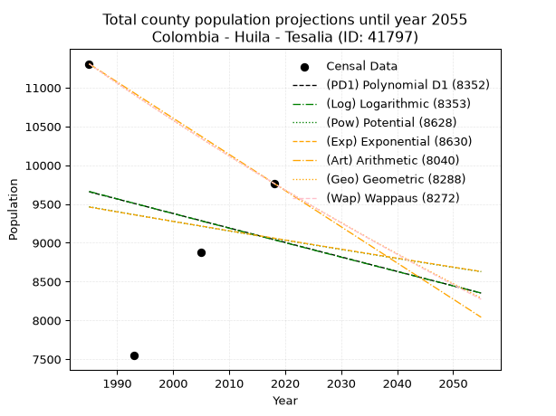
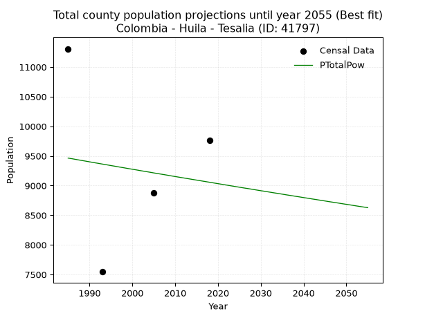
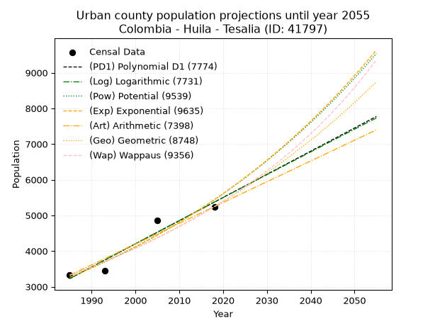
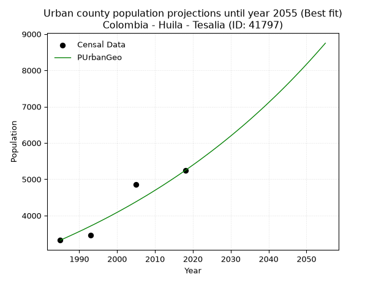
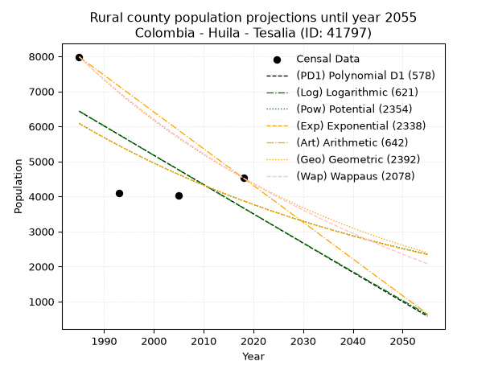
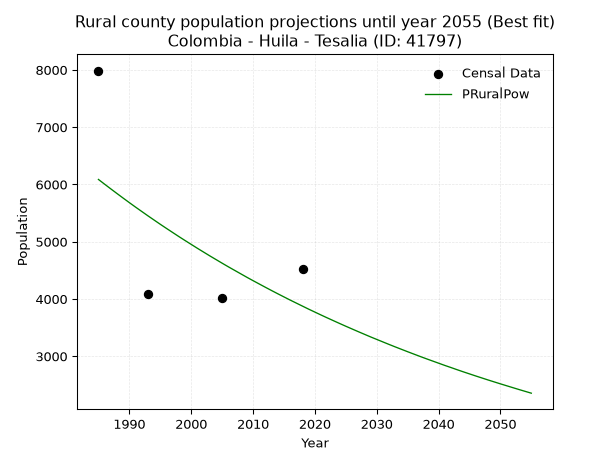

<div align="center">


</div>

# _“Population and Public Services Demand Projections (PPSD) until Year 2050 for Colombia - Huila - Tesalia (ID: 41797)”_
Keywords: `population` `public-service` `projection` `lineal` `polynomial` `logarithmic` `potential` `exponential` `arithmetic` `geometric` `wappaus` `dane` `colombia` `south-america`

PPSD are analytical estimates used by governments and planners to anticipate future changes in population size, age distribution, and the resulting community needs for utilities, healthcare, education, and infrastructure as sizing future water treatment facilities, electrical grids, and road networks based on spatial growth.

> **General running parameters**: • app_version: _v20260806_. • Python version: _3.14.7_. • Pandas version: _3.0.5_. • NumPy version: _2.5.1_. • Creates, save and include plots into reports (create_plot): _False_. • Projection until year: _2050_. • Process polynomial degree 2 and up: _False_. • Process Wappaus: _True_. • Process Wappaus: _True_. • Set negative values to zero: _True_. • Set infinite values to zero: _True_. • Drop dataset notes: _True_. 
<div align="center">

Dynamic map: [:earth_americas:Google](http://maps.google.com/maps?q=2.486364003,-75.7302714) [:earth_americas:OSM](https://www.openstreetmap.org/#map=18/2.486364003/-75.7302714&layers=P) [:earth_americas:Bing](https://www.bing.com/maps?cp=2.486364003~-75.7302714&lvl=18) [:earth_americas:Apple](https://maps.apple.com/frame?center=2.486364003%2C-75.7302714&span=0.003%2C0.006)

</div>


<div align="center">

```geojson
{
  "type": "Feature",
  "geometry": {
    "type": "Point", 
    "coordinates": [-75.7302714, 2.486364003]
  }, 
  "properties": {
    "Name": "Colombia - Huila - Tesalia (ID: 41797)"
  }
}
```

</div>


## 0. Census Data (4 records)

Census data are official statistics collected by a government about the people and housing in a country. They usually include counts of total population, age, sex, race, income, education, and jobs.

📅Global census file: [Population.xlsx](../data/Population.xlsx)

| Source   |   Year |   CountryID | CountryName   |   StateID | StateName   |   CountyID | CountyName   |   PTotal |   PUrban |   PRural |
|:---------|-------:|------------:|:--------------|----------:|:------------|-----------:|:-------------|---------:|---------:|---------:|
| DANE     |   1985 |          57 | Colombia      |        41 | Huila       |      41797 | Tesalia      |    11307 |     3321 |     7986 |
| DANE     |   1993 |          57 | Colombia      |        41 | Huila       |      41797 | Tesalia      |     7546 |     3453 |     4093 |
| DANE     |   2005 |          57 | Colombia      |        41 | Huila       |      41797 | Tesalia      |     8874 |     4855 |     4019 |
| DANE     |   2018 |          57 | Colombia      |        41 | Huila       |      41797 | Tesalia      |     9767 |     5243 |     4524 |

> 🔥Some records could had specific notes about the registered values or the corresponding urban or rural distribution.

## 1. Total

### 1.1. Coefficients and Parameters

* (PD1) Polynomial Deg 1: -18.66639903653208, 46710.9646728233 (lineal)
* (Log) Logarithmic: -37764.86221947708, 296424.5203588584
* (Pow) Potential: -2.6711555617436846, 12.784923283462174
* (Exp) Exponential: -0.0013132081451804193, 128238.04340276477
* (Art) Arithmetic: Year diff. 2018 - 1985 = 33, Population diff. 9767 - 11307 = -1540, Annual growth = -46.666666666666664
* (Geo) Geometric: Year diff. 2018 - 1985 = 33, Population diff. 9767 - 11307 = -1540, Annual growth % = -0.0044269190417922655
* (Wap) Wappaus: i = -0.4428838062699693, Condition values only valid for < 200)

<sub>
Wappaus condition values: ['-0.00', '-0.44', '-0.89', '-1.33', '-1.77', '-2.21', '-2.66', '-3.10', '-3.54', '-3.99', '-4.43', '-4.87', '-5.31', '-5.76', '-6.20', '-6.64', '-7.09', '-7.53', '-7.97', '-8.41', '-8.86', '-9.30', '-9.74', '-10.19', '-10.63', '-11.07', '-11.51', '-11.96', '-12.40', '-12.84', '-13.29', '-13.73', '-14.17', '-14.62', '-15.06', '-15.50', '-15.94', '-16.39', '-16.83', '-17.27', '-17.72', '-18.16', '-18.60', '-19.04', '-19.49', '-19.93', '-20.37', '-20.82', '-21.26', '-21.70', '-22.14', '-22.59', '-23.03', '-23.47', '-23.92', '-24.36', '-24.80', '-25.24', '-25.69', '-26.13', '-26.57', '-27.02', '-27.46', '-27.90', '-28.34', '-28.79']
</sub>


### 1.2. Projected Dataset

|   Year |   CountyID |   PTotalPD1 |   PTotalLog |   PTotalPow |   PTotalExp |   PTotalArt |   PTotalGeo |   PTotalWap |
|-------:|-----------:|------------:|------------:|------------:|------------:|------------:|------------:|------------:|
|   1985 |      41797 |        9658 |        9662 |        9464 |        9461 |       11307 |       11307 |       11307 |
|   1986 |      41797 |        9639 |        9643 |        9452 |        9449 |       11260 |       11257 |       11257 |
|   1987 |      41797 |        9621 |        9624 |        9439 |        9436 |       11214 |       11207 |       11207 |
|   1988 |      41797 |        9602 |        9605 |        9426 |        9424 |       11167 |       11157 |       11158 |
|   1989 |      41797 |        9583 |        9586 |        9414 |        9411 |       11120 |       11108 |       11108 |
|   1990 |      41797 |        9565 |        9567 |        9401 |        9399 |       11074 |       11059 |       11059 |
|   1991 |      41797 |        9546 |        9548 |        9388 |        9387 |       11027 |       11010 |       11010 |
|   1992 |      41797 |        9527 |        9529 |        9376 |        9374 |       10980 |       10961 |       10962 |
|   1993 |      41797 |        9509 |        9510 |        9363 |        9362 |       10934 |       10913 |       10913 |
|   1994 |      41797 |        9490 |        9491 |        9351 |        9350 |       10887 |       10864 |       10865 |
|   1995 |      41797 |        9471 |        9472 |        9338 |        9337 |       10840 |       10816 |       10817 |
|   1996 |      41797 |        9453 |        9453 |        9326 |        9325 |       10794 |       10768 |       10769 |
|   1997 |      41797 |        9434 |        9434 |        9313 |        9313 |       10747 |       10721 |       10722 |
|   1998 |      41797 |        9415 |        9415 |        9301 |        9301 |       10700 |       10673 |       10674 |
|   1999 |      41797 |        9397 |        9396 |        9288 |        9289 |       10654 |       10626 |       10627 |
|   2000 |      41797 |        9378 |        9377 |        9276 |        9276 |       10607 |       10579 |       10580 |
|   2001 |      41797 |        9360 |        9359 |        9264 |        9264 |       10560 |       10532 |       10533 |
|   2002 |      41797 |        9341 |        9340 |        9251 |        9252 |       10514 |       10486 |       10487 |
|   2003 |      41797 |        9322 |        9321 |        9239 |        9240 |       10467 |       10439 |       10440 |
|   2004 |      41797 |        9304 |        9302 |        9227 |        9228 |       10420 |       10393 |       10394 |
|   2005 |      41797 |        9285 |        9283 |        9214 |        9216 |       10374 |       10347 |       10348 |
|   2006 |      41797 |        9266 |        9264 |        9202 |        9204 |       10327 |       10301 |       10302 |
|   2007 |      41797 |        9248 |        9246 |        9190 |        9192 |       10280 |       10255 |       10256 |
|   2008 |      41797 |        9229 |        9227 |        9178 |        9179 |       10234 |       10210 |       10211 |
|   2009 |      41797 |        9210 |        9208 |        9165 |        9167 |       10187 |       10165 |       10166 |
|   2010 |      41797 |        9192 |        9189 |        9153 |        9155 |       10140 |       10120 |       10121 |
|   2011 |      41797 |        9173 |        9170 |        9141 |        9143 |       10094 |       10075 |       10076 |
|   2012 |      41797 |        9154 |        9152 |        9129 |        9131 |       10047 |       10030 |       10031 |
|   2013 |      41797 |        9136 |        9133 |        9117 |        9119 |       10000 |        9986 |        9987 |
|   2014 |      41797 |        9117 |        9114 |        9105 |        9107 |        9954 |        9942 |        9942 |
|   2015 |      41797 |        9098 |        9095 |        9093 |        9095 |        9907 |        9898 |        9898 |
|   2016 |      41797 |        9080 |        9077 |        9081 |        9084 |        9860 |        9854 |        9854 |
|   2017 |      41797 |        9061 |        9058 |        9069 |        9072 |        9814 |        9810 |        9811 |
|   2018 |      41797 |        9042 |        9039 |        9057 |        9060 |        9767 |        9767 |        9767 |
|   2019 |      41797 |        9024 |        9020 |        9045 |        9048 |        9720 |        9724 |        9724 |
|   2020 |      41797 |        9005 |        9002 |        9033 |        9036 |        9674 |        9681 |        9680 |
|   2021 |      41797 |        8986 |        8983 |        9021 |        9024 |        9627 |        9638 |        9637 |
|   2022 |      41797 |        8968 |        8964 |        9009 |        9012 |        9580 |        9595 |        9594 |
|   2023 |      41797 |        8949 |        8946 |        8997 |        9000 |        9534 |        9553 |        9552 |
|   2024 |      41797 |        8930 |        8927 |        8985 |        8989 |        9487 |        9510 |        9509 |
|   2025 |      41797 |        8912 |        8908 |        8973 |        8977 |        9440 |        9468 |        9467 |
|   2026 |      41797 |        8893 |        8890 |        8961 |        8965 |        9394 |        9426 |        9425 |
|   2027 |      41797 |        8874 |        8871 |        8950 |        8953 |        9347 |        9385 |        9383 |
|   2028 |      41797 |        8856 |        8852 |        8938 |        8941 |        9300 |        9343 |        9341 |
|   2029 |      41797 |        8837 |        8834 |        8926 |        8930 |        9254 |        9302 |        9299 |
|   2030 |      41797 |        8818 |        8815 |        8914 |        8918 |        9207 |        9261 |        9258 |
|   2031 |      41797 |        8800 |        8797 |        8903 |        8906 |        9160 |        9220 |        9216 |
|   2032 |      41797 |        8781 |        8778 |        8891 |        8895 |        9114 |        9179 |        9175 |
|   2033 |      41797 |        8762 |        8759 |        8879 |        8883 |        9067 |        9138 |        9134 |
|   2034 |      41797 |        8744 |        8741 |        8868 |        8871 |        9020 |        9098 |        9093 |
|   2035 |      41797 |        8725 |        8722 |        8856 |        8860 |        8974 |        9057 |        9053 |
|   2036 |      41797 |        8706 |        8704 |        8844 |        8848 |        8927 |        9017 |        9012 |
|   2037 |      41797 |        8688 |        8685 |        8833 |        8836 |        8880 |        8977 |        8972 |
|   2038 |      41797 |        8669 |        8667 |        8821 |        8825 |        8834 |        8938 |        8932 |
|   2039 |      41797 |        8650 |        8648 |        8810 |        8813 |        8787 |        8898 |        8892 |
|   2040 |      41797 |        8632 |        8630 |        8798 |        8802 |        8740 |        8859 |        8852 |
|   2041 |      41797 |        8613 |        8611 |        8787 |        8790 |        8694 |        8819 |        8812 |
|   2042 |      41797 |        8594 |        8593 |        8775 |        8779 |        8647 |        8780 |        8773 |
|   2043 |      41797 |        8576 |        8574 |        8764 |        8767 |        8600 |        8742 |        8733 |
|   2044 |      41797 |        8557 |        8556 |        8752 |        8756 |        8554 |        8703 |        8694 |
|   2045 |      41797 |        8538 |        8537 |        8741 |        8744 |        8507 |        8664 |        8655 |
|   2046 |      41797 |        8520 |        8519 |        8729 |        8733 |        8460 |        8626 |        8616 |
|   2047 |      41797 |        8501 |        8500 |        8718 |        8721 |        8414 |        8588 |        8577 |
|   2048 |      41797 |        8482 |        8482 |        8707 |        8710 |        8367 |        8550 |        8538 |
|   2049 |      41797 |        8464 |        8463 |        8695 |        8698 |        8320 |        8512 |        8500 |
|   2050 |      41797 |        8445 |        8445 |        8684 |        8687 |        8274 |        8474 |        8462 |
<div align="center">

</img>

</div>


### 1.3. Best fit with absolute and relative error (%)

Relative error puts that difference into context by dividing the absolute error by the true value, creating a unitless ratio or percentage that shows the scale of the mistake.

Absolute and relative error

|   Year | Source   |   CountryID | CountryName   |   StateID | StateName   |   CountyID_x | CountyName   |   PTotal |   PUrban |   PRural |   CountyID_y |   PTotalPD1 |   PTotalLog |   PTotalPow |   PTotalExp |   PTotalArt |   PTotalGeo |   PTotalWap |   PTotalPD1AbsError |   PTotalLogAbsError |   PTotalPowAbsError |   PTotalExpAbsError |   PTotalArtAbsError |   PTotalGeoAbsError |   PTotalWapAbsError |   PTotalPD1RelError |   PTotalLogRelError |   PTotalPowRelError |   PTotalExpRelError |   PTotalArtRelError |   PTotalGeoRelError |   PTotalWapRelError |
|-------:|:---------|------------:|:--------------|----------:|:------------|-------------:|:-------------|---------:|---------:|---------:|-------------:|------------:|------------:|------------:|------------:|------------:|------------:|------------:|--------------------:|--------------------:|--------------------:|--------------------:|--------------------:|--------------------:|--------------------:|--------------------:|--------------------:|--------------------:|--------------------:|--------------------:|--------------------:|--------------------:|
|   1985 | DANE     |          57 | Colombia      |        41 | Huila       |        41797 | Tesalia      |    11307 |     3321 |     7986 |        41797 |        9658 |        9662 |        9464 |        9461 |       11307 |       11307 |       11307 |                1649 |                1645 |                1843 |                1846 |                   0 |                   0 |                   0 |            14.5839  |            14.5485  |            16.2996  |            16.3262  |              0      |              0      |              0      |
|   1993 | DANE     |          57 | Colombia      |        41 | Huila       |        41797 | Tesalia      |     7546 |     3453 |     4093 |        41797 |        9509 |        9510 |        9363 |        9362 |       10934 |       10913 |       10913 |                1963 |                1964 |                1817 |                1816 |                3388 |                3367 |                3367 |            26.0138  |            26.027   |            24.079   |            24.0657  |             44.898  |             44.6197 |             44.6197 |
|   2005 | DANE     |          57 | Colombia      |        41 | Huila       |        41797 | Tesalia      |     8874 |     4855 |     4019 |        41797 |        9285 |        9283 |        9214 |        9216 |       10374 |       10347 |       10348 |                 411 |                 409 |                 340 |                 342 |                1500 |                1473 |                1474 |             4.63151 |             4.60897 |             3.83142 |             3.85396 |             16.9033 |             16.5991 |             16.6103 |
|   2018 | DANE     |          57 | Colombia      |        41 | Huila       |        41797 | Tesalia      |     9767 |     5243 |     4524 |        41797 |        9042 |        9039 |        9057 |        9060 |        9767 |        9767 |        9767 |                 725 |                 728 |                 710 |                 707 |                   0 |                   0 |                   0 |             7.42295 |             7.45367 |             7.26938 |             7.23866 |              0      |              0      |              0      |

Relative error mean

| Method    |   RelError | Best   |
|:----------|-----------:|:-------|
| PTotalPD1 |    13.163  |        |
| PTotalLog |    13.1595 |        |
| PTotalPow |    12.8699 | True   |
| PTotalExp |    12.8711 |        |
| PTotalArt |    15.4503 |        |
| PTotalGeo |    15.3047 |        |
| PTotalWap |    15.3075 |        |

💙Best method: _**PTotalPow**_
<div align="center">

</img>

</div>


### 1.4. Fresh water supply demand in liters per capita per day (lpcd)

The fresh water supply demand typically ranges from 100 to 300 liters per capita per day (lpcd) for standard domestic and municipal planning, though absolute survival minimums set by the World Health Organization are as low as 7.5 to 20 liters per day, and total consumption in high-income nations can exceed 400 liters.

> `CZ`: Level in meters above the sea level (masl).<br> `WS`: Fresh water supply demand in liters per capita per day (lpcd or l/h/d).<br> `WSAll`: Zonal fresh water supply demand in liters per second (l/s).<br> `A`: Zonal area in square meters.

Reference values (RAS Colombia)

|    CZ |   WS |
|------:|-----:|
|  1000 |  120 |
|  2000 |  130 |
| 99999 |  140 |

County shapefile geometry properties and water supply values

|   CountyID |      ATotal |   CZTotal |   WSTotal |
|-----------:|------------:|----------:|----------:|
|      41797 | 3.66957e+08 |    1015.2 |       130 |

Projected values for best method: PTotalPow

|   CountyID |   Year |   PTotalPow |   WSTotal |   WSTotalAll |
|-----------:|-------:|------------:|----------:|-------------:|
|      41797 |   1985 |        9464 |       130 |      14.2398 |
|      41797 |   1986 |        9452 |       130 |      14.2218 |
|      41797 |   1987 |        9439 |       130 |      14.2022 |
|      41797 |   1988 |        9426 |       130 |      14.1826 |
|      41797 |   1989 |        9414 |       130 |      14.1646 |
|      41797 |   1990 |        9401 |       130 |      14.145  |
|      41797 |   1991 |        9388 |       130 |      14.1255 |
|      41797 |   1992 |        9376 |       130 |      14.1074 |
|      41797 |   1993 |        9363 |       130 |      14.0878 |
|      41797 |   1994 |        9351 |       130 |      14.0698 |
|      41797 |   1995 |        9338 |       130 |      14.0502 |
|      41797 |   1996 |        9326 |       130 |      14.0322 |
|      41797 |   1997 |        9313 |       130 |      14.0126 |
|      41797 |   1998 |        9301 |       130 |      13.9946 |
|      41797 |   1999 |        9288 |       130 |      13.975  |
|      41797 |   2000 |        9276 |       130 |      13.9569 |
|      41797 |   2001 |        9264 |       130 |      13.9389 |
|      41797 |   2002 |        9251 |       130 |      13.9193 |
|      41797 |   2003 |        9239 |       130 |      13.9013 |
|      41797 |   2004 |        9227 |       130 |      13.8832 |
|      41797 |   2005 |        9214 |       130 |      13.8637 |
|      41797 |   2006 |        9202 |       130 |      13.8456 |
|      41797 |   2007 |        9190 |       130 |      13.8275 |
|      41797 |   2008 |        9178 |       130 |      13.8095 |
|      41797 |   2009 |        9165 |       130 |      13.7899 |
|      41797 |   2010 |        9153 |       130 |      13.7719 |
|      41797 |   2011 |        9141 |       130 |      13.7538 |
|      41797 |   2012 |        9129 |       130 |      13.7358 |
|      41797 |   2013 |        9117 |       130 |      13.7177 |
|      41797 |   2014 |        9105 |       130 |      13.6997 |
|      41797 |   2015 |        9093 |       130 |      13.6816 |
|      41797 |   2016 |        9081 |       130 |      13.6635 |
|      41797 |   2017 |        9069 |       130 |      13.6455 |
|      41797 |   2018 |        9057 |       130 |      13.6274 |
|      41797 |   2019 |        9045 |       130 |      13.6094 |
|      41797 |   2020 |        9033 |       130 |      13.5913 |
|      41797 |   2021 |        9021 |       130 |      13.5733 |
|      41797 |   2022 |        9009 |       130 |      13.5552 |
|      41797 |   2023 |        8997 |       130 |      13.5372 |
|      41797 |   2024 |        8985 |       130 |      13.5191 |
|      41797 |   2025 |        8973 |       130 |      13.501  |
|      41797 |   2026 |        8961 |       130 |      13.483  |
|      41797 |   2027 |        8950 |       130 |      13.4664 |
|      41797 |   2028 |        8938 |       130 |      13.4484 |
|      41797 |   2029 |        8926 |       130 |      13.4303 |
|      41797 |   2030 |        8914 |       130 |      13.4123 |
|      41797 |   2031 |        8903 |       130 |      13.3957 |
|      41797 |   2032 |        8891 |       130 |      13.3777 |
|      41797 |   2033 |        8879 |       130 |      13.3596 |
|      41797 |   2034 |        8868 |       130 |      13.3431 |
|      41797 |   2035 |        8856 |       130 |      13.325  |
|      41797 |   2036 |        8844 |       130 |      13.3069 |
|      41797 |   2037 |        8833 |       130 |      13.2904 |
|      41797 |   2038 |        8821 |       130 |      13.2723 |
|      41797 |   2039 |        8810 |       130 |      13.2558 |
|      41797 |   2040 |        8798 |       130 |      13.2377 |
|      41797 |   2041 |        8787 |       130 |      13.2212 |
|      41797 |   2042 |        8775 |       130 |      13.2031 |
|      41797 |   2043 |        8764 |       130 |      13.1866 |
|      41797 |   2044 |        8752 |       130 |      13.1685 |
|      41797 |   2045 |        8741 |       130 |      13.152  |
|      41797 |   2046 |        8729 |       130 |      13.1339 |
|      41797 |   2047 |        8718 |       130 |      13.1174 |
|      41797 |   2048 |        8707 |       130 |      13.1008 |
|      41797 |   2049 |        8695 |       130 |      13.0828 |
|      41797 |   2050 |        8684 |       130 |      13.0662 |

## 2. Urban

### 2.1. Coefficients and Parameters

* (PD1) Polynomial Deg 1: 64.94580489763113, -125689.84624648668 (lineal)
* (Log) Logarithmic: 130018.00647240497, -984049.9090956653
* (Pow) Potential: 30.947959110702808, -98.54525139340964
* (Exp) Exponential: 0.01545779001129716, 1.5422845911305038e-10
* (Art) Arithmetic: Year diff. 2018 - 1985 = 33, Population diff. 5243 - 3321 = 1922, Annual growth = 58.24242424242424
* (Geo) Geometric: Year diff. 2018 - 1985 = 33, Population diff. 5243 - 3321 = 1922, Annual growth % = 0.013933386708969042
* (Wap) Wappaus: i = 1.3601687118735226, Condition values only valid for < 200)

<sub>
Wappaus condition values: ['0.00', '1.36', '2.72', '4.08', '5.44', '6.80', '8.16', '9.52', '10.88', '12.24', '13.60', '14.96', '16.32', '17.68', '19.04', '20.40', '21.76', '23.12', '24.48', '25.84', '27.20', '28.56', '29.92', '31.28', '32.64', '34.00', '35.36', '36.72', '38.08', '39.44', '40.81', '42.17', '43.53', '44.89', '46.25', '47.61', '48.97', '50.33', '51.69', '53.05', '54.41', '55.77', '57.13', '58.49', '59.85', '61.21', '62.57', '63.93', '65.29', '66.65', '68.01', '69.37', '70.73', '72.09', '73.45', '74.81', '76.17', '77.53', '78.89', '80.25', '81.61', '82.97', '84.33', '85.69', '87.05', '88.41']
</sub>


### 2.2. Projected Dataset

|   Year |   CountyID |   PUrbanPD1 |   PUrbanLog |   PUrbanPow |   PUrbanExp |   PUrbanArt |   PUrbanGeo |   PUrbanWap |
|-------:|-----------:|------------:|------------:|------------:|------------:|------------:|------------:|------------:|
|   1985 |      41797 |        3228 |        3225 |        3264 |        3265 |        3321 |        3321 |        3321 |
|   1986 |      41797 |        3293 |        3291 |        3315 |        3316 |        3379 |        3367 |        3366 |
|   1987 |      41797 |        3357 |        3356 |        3367 |        3368 |        3437 |        3414 |        3413 |
|   1988 |      41797 |        3422 |        3422 |        3420 |        3420 |        3496 |        3462 |        3459 |
|   1989 |      41797 |        3487 |        3487 |        3473 |        3474 |        3554 |        3510 |        3507 |
|   1990 |      41797 |        3552 |        3553 |        3528 |        3528 |        3612 |        3559 |        3555 |
|   1991 |      41797 |        3617 |        3618 |        3583 |        3583 |        3670 |        3608 |        3604 |
|   1992 |      41797 |        3682 |        3683 |        3639 |        3639 |        3729 |        3659 |        3653 |
|   1993 |      41797 |        3747 |        3748 |        3696 |        3695 |        3787 |        3710 |        3703 |
|   1994 |      41797 |        3812 |        3814 |        3754 |        3753 |        3845 |        3761 |        3754 |
|   1995 |      41797 |        3877 |        3879 |        3813 |        3811 |        3903 |        3814 |        3806 |
|   1996 |      41797 |        3942 |        3944 |        3872 |        3871 |        3962 |        3867 |        3858 |
|   1997 |      41797 |        4007 |        4009 |        3933 |        3931 |        4020 |        3921 |        3911 |
|   1998 |      41797 |        4072 |        4074 |        3994 |        3992 |        4078 |        3975 |        3965 |
|   1999 |      41797 |        4137 |        4139 |        4057 |        4054 |        4136 |        4031 |        4020 |
|   2000 |      41797 |        4202 |        4204 |        4120 |        4117 |        4195 |        4087 |        4076 |
|   2001 |      41797 |        4267 |        4269 |        4184 |        4182 |        4253 |        4144 |        4132 |
|   2002 |      41797 |        4332 |        4334 |        4249 |        4247 |        4311 |        4202 |        4189 |
|   2003 |      41797 |        4397 |        4399 |        4316 |        4313 |        4369 |        4260 |        4247 |
|   2004 |      41797 |        4462 |        4464 |        4383 |        4380 |        4428 |        4320 |        4307 |
|   2005 |      41797 |        4526 |        4529 |        4451 |        4448 |        4486 |        4380 |        4367 |
|   2006 |      41797 |        4591 |        4594 |        4520 |        4518 |        4544 |        4441 |        4428 |
|   2007 |      41797 |        4656 |        4659 |        4590 |        4588 |        4602 |        4503 |        4490 |
|   2008 |      41797 |        4721 |        4723 |        4662 |        4659 |        4661 |        4565 |        4553 |
|   2009 |      41797 |        4786 |        4788 |        4734 |        4732 |        4719 |        4629 |        4617 |
|   2010 |      41797 |        4851 |        4853 |        4808 |        4806 |        4777 |        4694 |        4682 |
|   2011 |      41797 |        4916 |        4917 |        4882 |        4881 |        4835 |        4759 |        4748 |
|   2012 |      41797 |        4981 |        4982 |        4958 |        4957 |        4894 |        4825 |        4815 |
|   2013 |      41797 |        5046 |        5047 |        5035 |        5034 |        4952 |        4893 |        4883 |
|   2014 |      41797 |        5111 |        5111 |        5113 |        5112 |        5010 |        4961 |        4953 |
|   2015 |      41797 |        5176 |        5176 |        5192 |        5192 |        5068 |        5030 |        5023 |
|   2016 |      41797 |        5241 |        5240 |        5272 |        5273 |        5127 |        5100 |        5095 |
|   2017 |      41797 |        5306 |        5305 |        5354 |        5355 |        5185 |        5171 |        5169 |
|   2018 |      41797 |        5371 |        5369 |        5436 |        5438 |        5243 |        5243 |        5243 |
|   2019 |      41797 |        5436 |        5434 |        5520 |        5523 |        5301 |        5316 |        5319 |
|   2020 |      41797 |        5501 |        5498 |        5606 |        5609 |        5359 |        5390 |        5396 |
|   2021 |      41797 |        5566 |        5562 |        5692 |        5697 |        5418 |        5465 |        5474 |
|   2022 |      41797 |        5631 |        5627 |        5780 |        5785 |        5476 |        5541 |        5554 |
|   2023 |      41797 |        5696 |        5691 |        5869 |        5875 |        5534 |        5619 |        5636 |
|   2024 |      41797 |        5760 |        5755 |        5960 |        5967 |        5592 |        5697 |        5719 |
|   2025 |      41797 |        5825 |        5819 |        6051 |        6060 |        5651 |        5776 |        5803 |
|   2026 |      41797 |        5890 |        5884 |        6145 |        6154 |        5709 |        5857 |        5889 |
|   2027 |      41797 |        5955 |        5948 |        6239 |        6250 |        5767 |        5938 |        5977 |
|   2028 |      41797 |        6020 |        6012 |        6335 |        6347 |        5825 |        6021 |        6066 |
|   2029 |      41797 |        6085 |        6076 |        6432 |        6446 |        5884 |        6105 |        6157 |
|   2030 |      41797 |        6150 |        6140 |        6531 |        6547 |        5942 |        6190 |        6250 |
|   2031 |      41797 |        6215 |        6204 |        6632 |        6649 |        6000 |        6276 |        6345 |
|   2032 |      41797 |        6280 |        6268 |        6733 |        6752 |        6058 |        6364 |        6441 |
|   2033 |      41797 |        6345 |        6332 |        6837 |        6858 |        6117 |        6452 |        6540 |
|   2034 |      41797 |        6410 |        6396 |        6942 |        6964 |        6175 |        6542 |        6641 |
|   2035 |      41797 |        6475 |        6460 |        7048 |        7073 |        6233 |        6633 |        6743 |
|   2036 |      41797 |        6540 |        6524 |        7156 |        7183 |        6291 |        6726 |        6848 |
|   2037 |      41797 |        6605 |        6588 |        7266 |        7295 |        6350 |        6820 |        6955 |
|   2038 |      41797 |        6670 |        6651 |        7377 |        7409 |        6408 |        6915 |        7064 |
|   2039 |      41797 |        6735 |        6715 |        7490 |        7524 |        6466 |        7011 |        7176 |
|   2040 |      41797 |        6800 |        6779 |        7604 |        7641 |        6524 |        7109 |        7290 |
|   2041 |      41797 |        6865 |        6843 |        7720 |        7760 |        6583 |        7208 |        7407 |
|   2042 |      41797 |        6929 |        6906 |        7838 |        7881 |        6641 |        7308 |        7526 |
|   2043 |      41797 |        6994 |        6970 |        7958 |        8004 |        6699 |        7410 |        7648 |
|   2044 |      41797 |        7059 |        7034 |        8079 |        8129 |        6757 |        7513 |        7772 |
|   2045 |      41797 |        7124 |        7097 |        8203 |        8255 |        6816 |        7618 |        7900 |
|   2046 |      41797 |        7189 |        7161 |        8328 |        8384 |        6874 |        7724 |        8030 |
|   2047 |      41797 |        7254 |        7224 |        8455 |        8514 |        6932 |        7832 |        8163 |
|   2048 |      41797 |        7319 |        7288 |        8583 |        8647 |        6990 |        7941 |        8300 |
|   2049 |      41797 |        7384 |        7351 |        8714 |        8782 |        7049 |        8051 |        8440 |
|   2050 |      41797 |        7449 |        7415 |        8847 |        8919 |        7107 |        8164 |        8583 |
<div align="center">

</img>

</div>


### 2.3. Best fit with absolute and relative error (%)

Relative error puts that difference into context by dividing the absolute error by the true value, creating a unitless ratio or percentage that shows the scale of the mistake.

Absolute and relative error

|   Year | Source   |   CountryID | CountryName   |   StateID | StateName   |   CountyID_x | CountyName   |   PTotal |   PUrban |   PRural |   CountyID_y |   PUrbanPD1 |   PUrbanLog |   PUrbanPow |   PUrbanExp |   PUrbanArt |   PUrbanGeo |   PUrbanWap |   PUrbanPD1AbsError |   PUrbanLogAbsError |   PUrbanPowAbsError |   PUrbanExpAbsError |   PUrbanArtAbsError |   PUrbanGeoAbsError |   PUrbanWapAbsError |   PUrbanPD1RelError |   PUrbanLogRelError |   PUrbanPowRelError |   PUrbanExpRelError |   PUrbanArtRelError |   PUrbanGeoRelError |   PUrbanWapRelError |
|-------:|:---------|------------:|:--------------|----------:|:------------|-------------:|:-------------|---------:|---------:|---------:|-------------:|------------:|------------:|------------:|------------:|------------:|------------:|------------:|--------------------:|--------------------:|--------------------:|--------------------:|--------------------:|--------------------:|--------------------:|--------------------:|--------------------:|--------------------:|--------------------:|--------------------:|--------------------:|--------------------:|
|   1985 | DANE     |          57 | Colombia      |        41 | Huila       |        41797 | Tesalia      |    11307 |     3321 |     7986 |        41797 |        3228 |        3225 |        3264 |        3265 |        3321 |        3321 |        3321 |                  93 |                  96 |                  57 |                  56 |                   0 |                   0 |                   0 |             2.80036 |             2.8907  |             1.71635 |             1.68624 |             0       |             0       |             0       |
|   1993 | DANE     |          57 | Colombia      |        41 | Huila       |        41797 | Tesalia      |     7546 |     3453 |     4093 |        41797 |        3747 |        3748 |        3696 |        3695 |        3787 |        3710 |        3703 |                 294 |                 295 |                 243 |                 242 |                 334 |                 257 |                 250 |             8.51434 |             8.5433  |             7.03736 |             7.0084  |             9.67275 |             7.4428  |             7.24008 |
|   2005 | DANE     |          57 | Colombia      |        41 | Huila       |        41797 | Tesalia      |     8874 |     4855 |     4019 |        41797 |        4526 |        4529 |        4451 |        4448 |        4486 |        4380 |        4367 |                 329 |                 326 |                 404 |                 407 |                 369 |                 475 |                 488 |             6.77652 |             6.71473 |             8.32132 |             8.38311 |             7.60041 |             9.78373 |            10.0515  |
|   2018 | DANE     |          57 | Colombia      |        41 | Huila       |        41797 | Tesalia      |     9767 |     5243 |     4524 |        41797 |        5371 |        5369 |        5436 |        5438 |        5243 |        5243 |        5243 |                 128 |                 126 |                 193 |                 195 |                   0 |                   0 |                   0 |             2.44135 |             2.4032  |             3.6811  |             3.71924 |             0       |             0       |             0       |

Relative error mean

| Method    |   RelError | Best   |
|:----------|-----------:|:-------|
| PUrbanPD1 |    5.13314 |        |
| PUrbanLog |    5.13798 |        |
| PUrbanPow |    5.18903 |        |
| PUrbanExp |    5.19925 |        |
| PUrbanArt |    4.31829 |        |
| PUrbanGeo |    4.30663 | True   |
| PUrbanWap |    4.32289 |        |

💙Best method: _**PUrbanGeo**_
<div align="center">

</img>

</div>


### 2.4. Fresh water supply demand in liters per capita per day (lpcd)

The fresh water supply demand typically ranges from 100 to 300 liters per capita per day (lpcd) for standard domestic and municipal planning, though absolute survival minimums set by the World Health Organization are as low as 7.5 to 20 liters per day, and total consumption in high-income nations can exceed 400 liters.

> `CZ`: Level in meters above the sea level (masl).<br> `WS`: Fresh water supply demand in liters per capita per day (lpcd or l/h/d).<br> `WSAll`: Zonal fresh water supply demand in liters per second (l/s).<br> `A`: Zonal area in square meters.

Reference values (RAS Colombia)

|    CZ |   WS |
|------:|-----:|
|  1000 |  120 |
|  2000 |  130 |
| 99999 |  140 |

County shapefile geometry properties and water supply values

|   CountyID |      AUrban |   CZUrban |   WSUrban |
|-----------:|------------:|----------:|----------:|
|      41797 | 1.08795e+06 |   831.964 |       120 |

Projected values for best method: PUrbanGeo

|   CountyID |   Year |   PUrbanGeo |   WSUrban |   WSUrbanAll |
|-----------:|-------:|------------:|----------:|-------------:|
|      41797 |   1985 |        3321 |       120 |      4.6125  |
|      41797 |   1986 |        3367 |       120 |      4.67639 |
|      41797 |   1987 |        3414 |       120 |      4.74167 |
|      41797 |   1988 |        3462 |       120 |      4.80833 |
|      41797 |   1989 |        3510 |       120 |      4.875   |
|      41797 |   1990 |        3559 |       120 |      4.94306 |
|      41797 |   1991 |        3608 |       120 |      5.01111 |
|      41797 |   1992 |        3659 |       120 |      5.08194 |
|      41797 |   1993 |        3710 |       120 |      5.15278 |
|      41797 |   1994 |        3761 |       120 |      5.22361 |
|      41797 |   1995 |        3814 |       120 |      5.29722 |
|      41797 |   1996 |        3867 |       120 |      5.37083 |
|      41797 |   1997 |        3921 |       120 |      5.44583 |
|      41797 |   1998 |        3975 |       120 |      5.52083 |
|      41797 |   1999 |        4031 |       120 |      5.59861 |
|      41797 |   2000 |        4087 |       120 |      5.67639 |
|      41797 |   2001 |        4144 |       120 |      5.75556 |
|      41797 |   2002 |        4202 |       120 |      5.83611 |
|      41797 |   2003 |        4260 |       120 |      5.91667 |
|      41797 |   2004 |        4320 |       120 |      6       |
|      41797 |   2005 |        4380 |       120 |      6.08333 |
|      41797 |   2006 |        4441 |       120 |      6.16806 |
|      41797 |   2007 |        4503 |       120 |      6.25417 |
|      41797 |   2008 |        4565 |       120 |      6.34028 |
|      41797 |   2009 |        4629 |       120 |      6.42917 |
|      41797 |   2010 |        4694 |       120 |      6.51944 |
|      41797 |   2011 |        4759 |       120 |      6.60972 |
|      41797 |   2012 |        4825 |       120 |      6.70139 |
|      41797 |   2013 |        4893 |       120 |      6.79583 |
|      41797 |   2014 |        4961 |       120 |      6.89028 |
|      41797 |   2015 |        5030 |       120 |      6.98611 |
|      41797 |   2016 |        5100 |       120 |      7.08333 |
|      41797 |   2017 |        5171 |       120 |      7.18194 |
|      41797 |   2018 |        5243 |       120 |      7.28194 |
|      41797 |   2019 |        5316 |       120 |      7.38333 |
|      41797 |   2020 |        5390 |       120 |      7.48611 |
|      41797 |   2021 |        5465 |       120 |      7.59028 |
|      41797 |   2022 |        5541 |       120 |      7.69583 |
|      41797 |   2023 |        5619 |       120 |      7.80417 |
|      41797 |   2024 |        5697 |       120 |      7.9125  |
|      41797 |   2025 |        5776 |       120 |      8.02222 |
|      41797 |   2026 |        5857 |       120 |      8.13472 |
|      41797 |   2027 |        5938 |       120 |      8.24722 |
|      41797 |   2028 |        6021 |       120 |      8.3625  |
|      41797 |   2029 |        6105 |       120 |      8.47917 |
|      41797 |   2030 |        6190 |       120 |      8.59722 |
|      41797 |   2031 |        6276 |       120 |      8.71667 |
|      41797 |   2032 |        6364 |       120 |      8.83889 |
|      41797 |   2033 |        6452 |       120 |      8.96111 |
|      41797 |   2034 |        6542 |       120 |      9.08611 |
|      41797 |   2035 |        6633 |       120 |      9.2125  |
|      41797 |   2036 |        6726 |       120 |      9.34167 |
|      41797 |   2037 |        6820 |       120 |      9.47222 |
|      41797 |   2038 |        6915 |       120 |      9.60417 |
|      41797 |   2039 |        7011 |       120 |      9.7375  |
|      41797 |   2040 |        7109 |       120 |      9.87361 |
|      41797 |   2041 |        7208 |       120 |     10.0111  |
|      41797 |   2042 |        7308 |       120 |     10.15    |
|      41797 |   2043 |        7410 |       120 |     10.2917  |
|      41797 |   2044 |        7513 |       120 |     10.4347  |
|      41797 |   2045 |        7618 |       120 |     10.5806  |
|      41797 |   2046 |        7724 |       120 |     10.7278  |
|      41797 |   2047 |        7832 |       120 |     10.8778  |
|      41797 |   2048 |        7941 |       120 |     11.0292  |
|      41797 |   2049 |        8051 |       120 |     11.1819  |
|      41797 |   2050 |        8164 |       120 |     11.3389  |

## 3. Rural

### 3.1. Coefficients and Parameters

* (PD1) Polynomial Deg 1: -83.6122039341633, 172400.81091931017 (lineal)
* (Log) Logarithmic: -167782.86869188206, 1280474.4294545238
* (Pow) Potential: -27.40508500558866, 94.15976684061633
* (Exp) Exponential: -0.013653702699719628, 3584601029993152.5
* (Art) Arithmetic: Year diff. 2018 - 1985 = 33, Population diff. 4524 - 7986 = -3462, Annual growth = -104.9090909090909
* (Geo) Geometric: Year diff. 2018 - 1985 = 33, Population diff. 4524 - 7986 = -3462, Annual growth % = -0.01707357952737676
* (Wap) Wappaus: i = -1.6772036915921809, Condition values only valid for < 200)

<sub>
Wappaus condition values: ['-0.00', '-1.68', '-3.35', '-5.03', '-6.71', '-8.39', '-10.06', '-11.74', '-13.42', '-15.09', '-16.77', '-18.45', '-20.13', '-21.80', '-23.48', '-25.16', '-26.84', '-28.51', '-30.19', '-31.87', '-33.54', '-35.22', '-36.90', '-38.58', '-40.25', '-41.93', '-43.61', '-45.28', '-46.96', '-48.64', '-50.32', '-51.99', '-53.67', '-55.35', '-57.02', '-58.70', '-60.38', '-62.06', '-63.73', '-65.41', '-67.09', '-68.77', '-70.44', '-72.12', '-73.80', '-75.47', '-77.15', '-78.83', '-80.51', '-82.18', '-83.86', '-85.54', '-87.21', '-88.89', '-90.57', '-92.25', '-93.92', '-95.60', '-97.28', '-98.96', '-100.63', '-102.31', '-103.99', '-105.66', '-107.34', '-109.02']
</sub>


### 3.2. Projected Dataset

|   Year |   CountyID |   PRuralPD1 |   PRuralLog |   PRuralPow |   PRuralExp |   PRuralArt |   PRuralGeo |   PRuralWap |
|-------:|-----------:|------------:|------------:|------------:|------------:|------------:|------------:|------------:|
|   1985 |      41797 |        6431 |        6436 |        6086 |        6080 |        7986 |        7986 |        7986 |
|   1986 |      41797 |        6347 |        6352 |        6003 |        5998 |        7881 |        7850 |        7853 |
|   1987 |      41797 |        6263 |        6267 |        5921 |        5917 |        7776 |        7716 |        7723 |
|   1988 |      41797 |        6180 |        6183 |        5840 |        5836 |        7671 |        7584 |        7594 |
|   1989 |      41797 |        6096 |        6099 |        5760 |        5757 |        7566 |        7454 |        7468 |
|   1990 |      41797 |        6013 |        6014 |        5681 |        5679 |        7461 |        7327 |        7343 |
|   1991 |      41797 |        5929 |        5930 |        5603 |        5602 |        7357 |        7202 |        7221 |
|   1992 |      41797 |        5845 |        5846 |        5527 |        5526 |        7252 |        7079 |        7100 |
|   1993 |      41797 |        5762 |        5761 |        5451 |        5451 |        7147 |        6958 |        6982 |
|   1994 |      41797 |        5678 |        5677 |        5377 |        5377 |        7042 |        6839 |        6865 |
|   1995 |      41797 |        5594 |        5593 |        5303 |        5304 |        6937 |        6723 |        6750 |
|   1996 |      41797 |        5511 |        5509 |        5231 |        5232 |        6832 |        6608 |        6637 |
|   1997 |      41797 |        5427 |        5425 |        5160 |        5161 |        6727 |        6495 |        6526 |
|   1998 |      41797 |        5344 |        5341 |        5089 |        5091 |        6622 |        6384 |        6416 |
|   1999 |      41797 |        5260 |        5257 |        5020 |        5022 |        6517 |        6275 |        6308 |
|   2000 |      41797 |        5176 |        5173 |        4952 |        4954 |        6412 |        6168 |        6201 |
|   2001 |      41797 |        5093 |        5089 |        4884 |        4887 |        6307 |        6063 |        6096 |
|   2002 |      41797 |        5009 |        5006 |        4818 |        4821 |        6203 |        5959 |        5993 |
|   2003 |      41797 |        4926 |        4922 |        4752 |        4755 |        6098 |        5857 |        5891 |
|   2004 |      41797 |        4842 |        4838 |        4688 |        4691 |        5993 |        5757 |        5791 |
|   2005 |      41797 |        4758 |        4754 |        4624 |        4627 |        5888 |        5659 |        5692 |
|   2006 |      41797 |        4675 |        4671 |        4561 |        4565 |        5783 |        5563 |        5594 |
|   2007 |      41797 |        4591 |        4587 |        4500 |        4503 |        5678 |        5468 |        5498 |
|   2008 |      41797 |        4508 |        4503 |        4439 |        4442 |        5573 |        5374 |        5403 |
|   2009 |      41797 |        4424 |        4420 |        4378 |        4381 |        5468 |        5282 |        5310 |
|   2010 |      41797 |        4340 |        4336 |        4319 |        4322 |        5363 |        5192 |        5218 |
|   2011 |      41797 |        4257 |        4253 |        4261 |        4263 |        5258 |        5104 |        5127 |
|   2012 |      41797 |        4173 |        4170 |        4203 |        4206 |        5153 |        5016 |        5037 |
|   2013 |      41797 |        4089 |        4086 |        4146 |        4149 |        5049 |        4931 |        4949 |
|   2014 |      41797 |        4006 |        4003 |        4090 |        4092 |        4944 |        4847 |        4862 |
|   2015 |      41797 |        3922 |        3920 |        4035 |        4037 |        4839 |        4764 |        4775 |
|   2016 |      41797 |        3839 |        3836 |        3980 |        3982 |        4734 |        4683 |        4691 |
|   2017 |      41797 |        3755 |        3753 |        3927 |        3928 |        4629 |        4603 |        4607 |
|   2018 |      41797 |        3671 |        3670 |        3874 |        3875 |        4524 |        4524 |        4524 |
|   2019 |      41797 |        3588 |        3587 |        3821 |        3822 |        4419 |        4447 |        4442 |
|   2020 |      41797 |        3504 |        3504 |        3770 |        3770 |        4314 |        4371 |        4362 |
|   2021 |      41797 |        3421 |        3421 |        3719 |        3719 |        4209 |        4296 |        4282 |
|   2022 |      41797 |        3337 |        3338 |        3669 |        3669 |        4104 |        4223 |        4204 |
|   2023 |      41797 |        3253 |        3255 |        3620 |        3619 |        3999 |        4151 |        4126 |
|   2024 |      41797 |        3170 |        3172 |        3571 |        3570 |        3895 |        4080 |        4050 |
|   2025 |      41797 |        3086 |        3089 |        3523 |        3522 |        3790 |        4010 |        3974 |
|   2026 |      41797 |        3002 |        3006 |        3476 |        3474 |        3685 |        3942 |        3899 |
|   2027 |      41797 |        2919 |        2923 |        3429 |        3427 |        3580 |        3874 |        3826 |
|   2028 |      41797 |        2835 |        2841 |        3383 |        3380 |        3475 |        3808 |        3753 |
|   2029 |      41797 |        2752 |        2758 |        3337 |        3334 |        3370 |        3743 |        3681 |
|   2030 |      41797 |        2668 |        2675 |        3293 |        3289 |        3265 |        3679 |        3610 |
|   2031 |      41797 |        2584 |        2593 |        3249 |        3245 |        3160 |        3617 |        3540 |
|   2032 |      41797 |        2501 |        2510 |        3205 |        3201 |        3055 |        3555 |        3471 |
|   2033 |      41797 |        2417 |        2427 |        3162 |        3157 |        2950 |        3494 |        3402 |
|   2034 |      41797 |        2334 |        2345 |        3120 |        3114 |        2845 |        3434 |        3334 |
|   2035 |      41797 |        2250 |        2262 |        3078 |        3072 |        2741 |        3376 |        3267 |
|   2036 |      41797 |        2166 |        2180 |        3037 |        3031 |        2636 |        3318 |        3201 |
|   2037 |      41797 |        2083 |        2098 |        2996 |        2989 |        2531 |        3262 |        3136 |
|   2038 |      41797 |        1999 |        2015 |        2956 |        2949 |        2426 |        3206 |        3071 |
|   2039 |      41797 |        1916 |        1933 |        2917 |        2909 |        2321 |        3151 |        3008 |
|   2040 |      41797 |        1832 |        1851 |        2878 |        2869 |        2216 |        3097 |        2945 |
|   2041 |      41797 |        1748 |        1768 |        2839 |        2831 |        2111 |        3044 |        2882 |
|   2042 |      41797 |        1665 |        1686 |        2802 |        2792 |        2006 |        2992 |        2820 |
|   2043 |      41797 |        1581 |        1604 |        2764 |        2754 |        1901 |        2941 |        2760 |
|   2044 |      41797 |        1497 |        1522 |        2727 |        2717 |        1796 |        2891 |        2699 |
|   2045 |      41797 |        1414 |        1440 |        2691 |        2680 |        1691 |        2842 |        2640 |
|   2046 |      41797 |        1330 |        1358 |        2655 |        2644 |        1587 |        2793 |        2581 |
|   2047 |      41797 |        1247 |        1276 |        2620 |        2608 |        1482 |        2746 |        2522 |
|   2048 |      41797 |        1163 |        1194 |        2585 |        2573 |        1377 |        2699 |        2465 |
|   2049 |      41797 |        1079 |        1112 |        2551 |        2538 |        1272 |        2653 |        2408 |
|   2050 |      41797 |         996 |        1030 |        2517 |        2503 |        1167 |        2607 |        2351 |
<div align="center">

</img>

</div>


### 3.3. Best fit with absolute and relative error (%)

Relative error puts that difference into context by dividing the absolute error by the true value, creating a unitless ratio or percentage that shows the scale of the mistake.

Absolute and relative error

|   Year | Source   |   CountryID | CountryName   |   StateID | StateName   |   CountyID_x | CountyName   |   PTotal |   PUrban |   PRural |   CountyID_y |   PRuralPD1 |   PRuralLog |   PRuralPow |   PRuralExp |   PRuralArt |   PRuralGeo |   PRuralWap |   PRuralPD1AbsError |   PRuralLogAbsError |   PRuralPowAbsError |   PRuralExpAbsError |   PRuralArtAbsError |   PRuralGeoAbsError |   PRuralWapAbsError |   PRuralPD1RelError |   PRuralLogRelError |   PRuralPowRelError |   PRuralExpRelError |   PRuralArtRelError |   PRuralGeoRelError |   PRuralWapRelError |
|-------:|:---------|------------:|:--------------|----------:|:------------|-------------:|:-------------|---------:|---------:|---------:|-------------:|------------:|------------:|------------:|------------:|------------:|------------:|------------:|--------------------:|--------------------:|--------------------:|--------------------:|--------------------:|--------------------:|--------------------:|--------------------:|--------------------:|--------------------:|--------------------:|--------------------:|--------------------:|--------------------:|
|   1985 | DANE     |          57 | Colombia      |        41 | Huila       |        41797 | Tesalia      |    11307 |     3321 |     7986 |        41797 |        6431 |        6436 |        6086 |        6080 |        7986 |        7986 |        7986 |                1555 |                1550 |                1900 |                1906 |                   0 |                   0 |                   0 |             19.4716 |             19.409  |             23.7916 |             23.8668 |              0      |              0      |              0      |
|   1993 | DANE     |          57 | Colombia      |        41 | Huila       |        41797 | Tesalia      |     7546 |     3453 |     4093 |        41797 |        5762 |        5761 |        5451 |        5451 |        7147 |        6958 |        6982 |                1669 |                1668 |                1358 |                1358 |                3054 |                2865 |                2889 |             40.7769 |             40.7525 |             33.1786 |             33.1786 |             74.6152 |             69.9976 |             70.5839 |
|   2005 | DANE     |          57 | Colombia      |        41 | Huila       |        41797 | Tesalia      |     8874 |     4855 |     4019 |        41797 |        4758 |        4754 |        4624 |        4627 |        5888 |        5659 |        5692 |                 739 |                 735 |                 605 |                 608 |                1869 |                1640 |                1673 |             18.3877 |             18.2881 |             15.0535 |             15.1281 |             46.5041 |             40.8062 |             41.6273 |
|   2018 | DANE     |          57 | Colombia      |        41 | Huila       |        41797 | Tesalia      |     9767 |     5243 |     4524 |        41797 |        3671 |        3670 |        3874 |        3875 |        4524 |        4524 |        4524 |                 853 |                 854 |                 650 |                 649 |                   0 |                   0 |                   0 |             18.855  |             18.8771 |             14.3678 |             14.3457 |              0      |              0      |              0      |

Relative error mean

| Method    |   RelError | Best   |
|:----------|-----------:|:-------|
| PRuralPD1 |    24.3728 |        |
| PRuralLog |    24.3317 |        |
| PRuralPow |    21.5979 | True   |
| PRuralExp |    21.6298 |        |
| PRuralArt |    30.2798 |        |
| PRuralGeo |    27.7009 |        |
| PRuralWap |    28.0528 |        |

💙Best method: _**PRuralPow**_
<div align="center">

</img>

</div>


### 3.4. Fresh water supply demand in liters per capita per day (lpcd)

The fresh water supply demand typically ranges from 100 to 300 liters per capita per day (lpcd) for standard domestic and municipal planning, though absolute survival minimums set by the World Health Organization are as low as 7.5 to 20 liters per day, and total consumption in high-income nations can exceed 400 liters.

> `CZ`: Level in meters above the sea level (masl).<br> `WS`: Fresh water supply demand in liters per capita per day (lpcd or l/h/d).<br> `WSAll`: Zonal fresh water supply demand in liters per second (l/s).<br> `A`: Zonal area in square meters.

Reference values (RAS Colombia)

|    CZ |   WS |
|------:|-----:|
|  1000 |  120 |
|  2000 |  130 |
| 99999 |  140 |

County shapefile geometry properties and water supply values

|   CountyID |      ARural |   CZRural |   WSRural |
|-----------:|------------:|----------:|----------:|
|      41797 | 3.65869e+08 |   1015.73 |       130 |

Projected values for best method: PRuralPow

|   CountyID |   Year |   PRuralPow |   WSRural |   WSRuralAll |
|-----------:|-------:|------------:|----------:|-------------:|
|      41797 |   1985 |        6086 |       130 |      9.15718 |
|      41797 |   1986 |        6003 |       130 |      9.03229 |
|      41797 |   1987 |        5921 |       130 |      8.90891 |
|      41797 |   1988 |        5840 |       130 |      8.78704 |
|      41797 |   1989 |        5760 |       130 |      8.66667 |
|      41797 |   1990 |        5681 |       130 |      8.5478  |
|      41797 |   1991 |        5603 |       130 |      8.43044 |
|      41797 |   1992 |        5527 |       130 |      8.31609 |
|      41797 |   1993 |        5451 |       130 |      8.20174 |
|      41797 |   1994 |        5377 |       130 |      8.09039 |
|      41797 |   1995 |        5303 |       130 |      7.97905 |
|      41797 |   1996 |        5231 |       130 |      7.87072 |
|      41797 |   1997 |        5160 |       130 |      7.76389 |
|      41797 |   1998 |        5089 |       130 |      7.65706 |
|      41797 |   1999 |        5020 |       130 |      7.55324 |
|      41797 |   2000 |        4952 |       130 |      7.45093 |
|      41797 |   2001 |        4884 |       130 |      7.34861 |
|      41797 |   2002 |        4818 |       130 |      7.24931 |
|      41797 |   2003 |        4752 |       130 |      7.15    |
|      41797 |   2004 |        4688 |       130 |      7.0537  |
|      41797 |   2005 |        4624 |       130 |      6.95741 |
|      41797 |   2006 |        4561 |       130 |      6.86262 |
|      41797 |   2007 |        4500 |       130 |      6.77083 |
|      41797 |   2008 |        4439 |       130 |      6.67905 |
|      41797 |   2009 |        4378 |       130 |      6.58727 |
|      41797 |   2010 |        4319 |       130 |      6.4985  |
|      41797 |   2011 |        4261 |       130 |      6.41123 |
|      41797 |   2012 |        4203 |       130 |      6.32396 |
|      41797 |   2013 |        4146 |       130 |      6.23819 |
|      41797 |   2014 |        4090 |       130 |      6.15394 |
|      41797 |   2015 |        4035 |       130 |      6.07118 |
|      41797 |   2016 |        3980 |       130 |      5.98843 |
|      41797 |   2017 |        3927 |       130 |      5.90868 |
|      41797 |   2018 |        3874 |       130 |      5.82894 |
|      41797 |   2019 |        3821 |       130 |      5.74919 |
|      41797 |   2020 |        3770 |       130 |      5.67245 |
|      41797 |   2021 |        3719 |       130 |      5.59572 |
|      41797 |   2022 |        3669 |       130 |      5.52049 |
|      41797 |   2023 |        3620 |       130 |      5.44676 |
|      41797 |   2024 |        3571 |       130 |      5.37303 |
|      41797 |   2025 |        3523 |       130 |      5.30081 |
|      41797 |   2026 |        3476 |       130 |      5.23009 |
|      41797 |   2027 |        3429 |       130 |      5.15937 |
|      41797 |   2028 |        3383 |       130 |      5.09016 |
|      41797 |   2029 |        3337 |       130 |      5.02095 |
|      41797 |   2030 |        3293 |       130 |      4.95475 |
|      41797 |   2031 |        3249 |       130 |      4.88854 |
|      41797 |   2032 |        3205 |       130 |      4.82234 |
|      41797 |   2033 |        3162 |       130 |      4.75764 |
|      41797 |   2034 |        3120 |       130 |      4.69444 |
|      41797 |   2035 |        3078 |       130 |      4.63125 |
|      41797 |   2036 |        3037 |       130 |      4.56956 |
|      41797 |   2037 |        2996 |       130 |      4.50787 |
|      41797 |   2038 |        2956 |       130 |      4.44769 |
|      41797 |   2039 |        2917 |       130 |      4.389   |
|      41797 |   2040 |        2878 |       130 |      4.33032 |
|      41797 |   2041 |        2839 |       130 |      4.27164 |
|      41797 |   2042 |        2802 |       130 |      4.21597 |
|      41797 |   2043 |        2764 |       130 |      4.1588  |
|      41797 |   2044 |        2727 |       130 |      4.10313 |
|      41797 |   2045 |        2691 |       130 |      4.04896 |
|      41797 |   2046 |        2655 |       130 |      3.99479 |
|      41797 |   2047 |        2620 |       130 |      3.94213 |
|      41797 |   2048 |        2585 |       130 |      3.88947 |
|      41797 |   2049 |        2551 |       130 |      3.83831 |
|      41797 |   2050 |        2517 |       130 |      3.78715 |

<div align="center"><br><sub>Share this research</sub></div><br>

<sub>**APPS & TOOLS & CONTENT DISCLAIMER**: • NO WARRANTY - This content and software is provided by <a href="https://github.com/rcfdtools" target="_blank">github.com/rcfdtools</a> "as is", without any express or implied warranty, including warranties of merchantability, fitness for a particular purpose, or non-infringement. There is no guarantee that the software will be error-free or operate without interruption. • LIMITATION OF LIABILITY - Neither the authors nor copyright holders will be liable for claims or damages arising from the software or its use. You are responsible for determining if the software is appropriate for your use and assume all associated risks, including errors, legal compliance, and data loss. • NO PROFESSIONAL ADVICE - The software provides general information and does not offer professional advice. It should not replace consultation with professional advisors. [Clauses and global license for rcfdtools use.](https://github.com/rcfdtools/rcfdtools/blob/main/LICENSE.md)</sub>