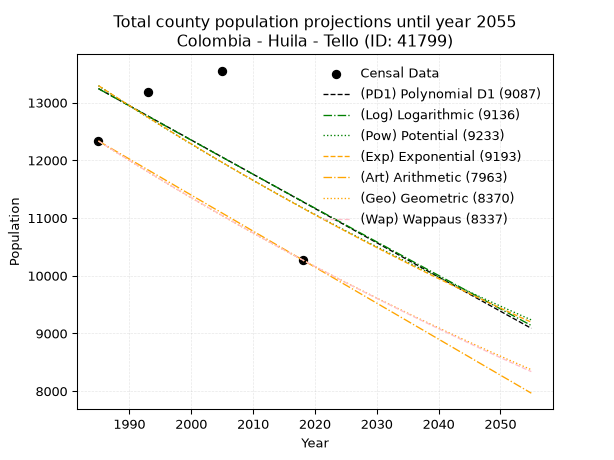
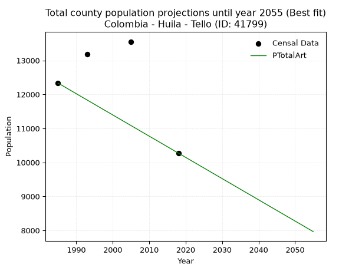
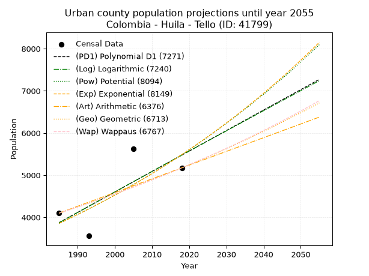
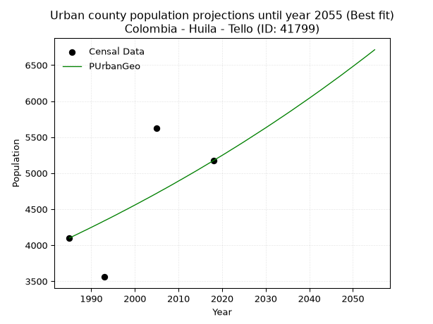
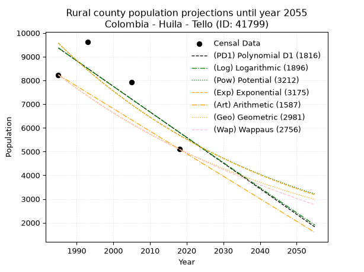
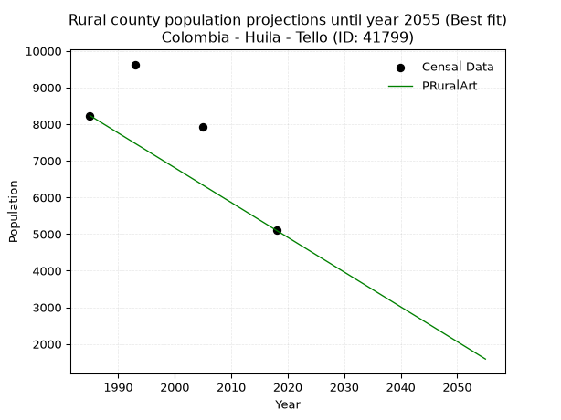

<div align="center">


</div>

# 📜 _“Population and Public Services Demand Projections (PPSD) until Year 2050 for Colombia - Huila - Tello (ID: 41799)”_
Keywords: `population` `public-service` `projection` `lineal` `polynomial` `logarithmic` `potential` `exponential` `arithmetic` `geometric` `wappaus` `dane` `colombia` `south-america`

PPSD are analytical estimates used by governments and planners to anticipate future changes in population size, age distribution, and the resulting community needs for utilities, healthcare, education, and infrastructure as sizing future water treatment facilities, electrical grids, and road networks based on spatial growth.

<div align="center">

</img>

</div>


> **General running parameters**: • app_version: _v20260806_. • Python version: _3.14.7_. • Pandas version: _3.0.5_. • NumPy version: _2.5.1_. • Creates, save and include plots into reports (create_plot): _False_. • Projection until year: _2050_. • Process polynomial degree 2 and up: _False_. • Process Wappaus: _True_. • Process Wappaus: _True_. • Set negative values to zero: _True_. • Set infinite values to zero: _True_. • Drop dataset notes: _True_. 
<div align="center">

Maps & GIS Layers: [:earth_americas:Google](http://maps.google.com/maps?q=3.067538094,-75.138773) [:earth_americas:OSM](https://www.openstreetmap.org/#map=18/3.067538094/-75.138773&layers=P) [:earth_americas:Bing](https://www.bing.com/maps?cp=3.067538094~-75.138773&lvl=18) [:earth_americas:Apple](https://maps.apple.com/frame?center=3.067538094%2C-75.138773&span=0.003%2C0.006) [:earth_americas:GISMobile](https://github.com/rcfdtools/R.GISMobile/blob/main/file/gis/CountyLayer_CO/Readme.md)

</div>


<div align="center">

```geojson
{
  "type": "Feature",
  "geometry": {
    "type": "Point", 
    "coordinates": [-75.138773, 3.067538094]
  }, 
  "properties": {
    "Name": "Colombia - Huila - Tello (ID: 41799)"
  }
}
```

</div>


## 0. Census Data (4 records)

Census data are official statistics collected by a government about the people and housing in a country. They usually include counts of total population, age, sex, race, income, education, and jobs.

📅Global census file: [Population.xlsx](../data/Population.xlsx)

| Source   |   Year |   CountryID | CountryName   |   StateID | StateName   |   CountyID | CountyName   |   PTotal |   PUrban |   PRural |
|:---------|-------:|------------:|:--------------|----------:|:------------|-----------:|:-------------|---------:|---------:|---------:|
| DANE     |   1985 |          57 | Colombia      |        41 | Huila       |      41799 | Tello        |    12333 |     4100 |     8233 |
| DANE     |   1993 |          57 | Colombia      |        41 | Huila       |      41799 | Tello        |    13187 |     3559 |     9628 |
| DANE     |   2005 |          57 | Colombia      |        41 | Huila       |      41799 | Tello        |    13553 |     5626 |     7927 |
| DANE     |   2018 |          57 | Colombia      |        41 | Huila       |      41799 | Tello        |    10273 |     5173 |     5100 |

> 🔥Some records could had specific notes about the registered values or the corresponding urban or rural distribution.

📅[SUI-RUPS](https://www.datos.gov.co/Hacienda-y-Cr-dito-P-blico/Registro-nico-de-Prestadores-de-Servicios-P-blicos/4qkq-csdn/about_data) - Local public utility companies: [RUPS.csv](../data/RUPS.csv)

 | SERVICIO       | ESTADO    | NOMBRE                                                      | NIT         | DEPARTAMENTO_DOMICILIO   | MUNICIPIO_DOMICILIO   | DIRECCION                                                 |   TELEFONO | EMAIL                       | TIPO_PRESTADOR                             | CLASIFICACION                 |
|:---------------|:----------|:------------------------------------------------------------|:------------|:-------------------------|:----------------------|:----------------------------------------------------------|-----------:|:----------------------------|:-------------------------------------------|:------------------------------|
| ACUEDUCTO      | OPERATIVA | EMPRESAS PUBLICAS DE TELLO S.A.S. E.S.P                     | 900335153-1 | HUILA                    | TELLO                 | calle 5 No. 7  -  25                                      |    8488125 | hermevi@hotmail.com         | SOCIEDADES (EMPRESA DE SERVICIOS PUBLICOS) | MENOR O IGUAL A 2500 USUARIOS |
| ALCANTARILLADO | OPERATIVA | EMPRESAS PUBLICAS DE TELLO S.A.S. E.S.P                     | 900335153-1 | HUILA                    | TELLO                 | calle 5 No. 7  -  25                                      |    8488125 | hermevi@hotmail.com         | SOCIEDADES (EMPRESA DE SERVICIOS PUBLICOS) | MENOR O IGUAL A 2500 USUARIOS |
| ACUEDUCTO      | OPERATIVA | JUNTA ADMINISTRADORA ACUEDUCTO LA UNION                     | 813003417-0 | HUILA                    | TELLO                 | PERSONERIA MUNICIPAL                                      |    8488006 | contacto@tello-huila.gov.co | ORGANIZACION AUTORIZADA                    | HASTA 2500 SUSCRIPTORES       |
| ACUEDUCTO      | OPERATIVA | JUNTA ADMINISTRADORA DEL ACUEDUCTO VEREDA SIERRA DEL GRAMAL | 900060491-4 | HUILA                    | TELLO                 | VEREDA SIERRA EL GRAMAL CASA ANGEL GABRIEL HERMOSA MOLANO |    3176472 | contacto@tello-huila.gov.co | ORGANIZACION AUTORIZADA                    | HASTA 2500 SUSCRIPTORES       |

## 1. Total

### 1.1. Coefficients and Parameters

* (PD1) Polynomial Deg 1: -59.352067442792084, 131055.47290244486 (lineal)
* (Log) Logarithmic: -118420.1715935975, 912449.1732426337
* (Pow) Potential: -10.515212413561976, 38.8002504870907
* (Exp) Exponential: -0.0052690893232794096, 463427483.1359114
* (Art) Arithmetic: Year diff. 2018 - 1985 = 33, Population diff. 10273 - 12333 = -2060, Annual growth = -62.42424242424242
* (Geo) Geometric: Year diff. 2018 - 1985 = 33, Population diff. 10273 - 12333 = -2060, Annual growth % = -0.0055228593637624
* (Wap) Wappaus: i = -0.5522803010195738, Condition values only valid for < 200)

<sub>
Wappaus condition values: ['-0.00', '-0.55', '-1.10', '-1.66', '-2.21', '-2.76', '-3.31', '-3.87', '-4.42', '-4.97', '-5.52', '-6.08', '-6.63', '-7.18', '-7.73', '-8.28', '-8.84', '-9.39', '-9.94', '-10.49', '-11.05', '-11.60', '-12.15', '-12.70', '-13.25', '-13.81', '-14.36', '-14.91', '-15.46', '-16.02', '-16.57', '-17.12', '-17.67', '-18.23', '-18.78', '-19.33', '-19.88', '-20.43', '-20.99', '-21.54', '-22.09', '-22.64', '-23.20', '-23.75', '-24.30', '-24.85', '-25.40', '-25.96', '-26.51', '-27.06', '-27.61', '-28.17', '-28.72', '-29.27', '-29.82', '-30.38', '-30.93', '-31.48', '-32.03', '-32.58', '-33.14', '-33.69', '-34.24', '-34.79', '-35.35', '-35.90']
</sub>


### 1.2. Projected Dataset

|   Year |   CountyID |   PTotalPD1 |   PTotalLog |   PTotalPow |   PTotalExp |   PTotalArt |   PTotalGeo |   PTotalWap |
|-------:|-----------:|------------:|------------:|------------:|------------:|------------:|------------:|------------:|
|   1985 |      41799 |       13242 |       13240 |       13292 |       13293 |       12333 |       12333 |       12333 |
|   1986 |      41799 |       13182 |       13181 |       13222 |       13223 |       12271 |       12265 |       12265 |
|   1987 |      41799 |       13123 |       13121 |       13152 |       13154 |       12208 |       12197 |       12198 |
|   1988 |      41799 |       13064 |       13062 |       13083 |       13085 |       12146 |       12130 |       12130 |
|   1989 |      41799 |       13004 |       13002 |       13014 |       13016 |       12083 |       12063 |       12064 |
|   1990 |      41799 |       12945 |       12943 |       12945 |       12948 |       12021 |       11996 |       11997 |
|   1991 |      41799 |       12886 |       12883 |       12877 |       12880 |       11958 |       11930 |       11931 |
|   1992 |      41799 |       12826 |       12824 |       12809 |       12812 |       11896 |       11864 |       11865 |
|   1993 |      41799 |       12767 |       12764 |       12742 |       12745 |       11834 |       11799 |       11800 |
|   1994 |      41799 |       12707 |       12705 |       12675 |       12678 |       11771 |       11733 |       11735 |
|   1995 |      41799 |       12648 |       12645 |       12608 |       12611 |       11709 |       11669 |       11670 |
|   1996 |      41799 |       12589 |       12586 |       12542 |       12545 |       11646 |       11604 |       11606 |
|   1997 |      41799 |       12529 |       12527 |       12476 |       12479 |       11584 |       11540 |       11542 |
|   1998 |      41799 |       12470 |       12467 |       12410 |       12413 |       11521 |       11476 |       11478 |
|   1999 |      41799 |       12411 |       12408 |       12345 |       12348 |       11459 |       11413 |       11415 |
|   2000 |      41799 |       12351 |       12349 |       12281 |       12283 |       11397 |       11350 |       11352 |
|   2001 |      41799 |       12292 |       12290 |       12216 |       12219 |       11334 |       11287 |       11289 |
|   2002 |      41799 |       12233 |       12231 |       12152 |       12154 |       11272 |       11225 |       11227 |
|   2003 |      41799 |       12173 |       12172 |       12089 |       12090 |       11209 |       11163 |       11165 |
|   2004 |      41799 |       12114 |       12112 |       12025 |       12027 |       11147 |       11101 |       11103 |
|   2005 |      41799 |       12055 |       12053 |       11962 |       11964 |       11085 |       11040 |       11042 |
|   2006 |      41799 |       11995 |       11994 |       11900 |       11901 |       11022 |       10979 |       10981 |
|   2007 |      41799 |       11936 |       11935 |       11838 |       11838 |       10960 |       10918 |       10920 |
|   2008 |      41799 |       11877 |       11876 |       11776 |       11776 |       10897 |       10858 |       10860 |
|   2009 |      41799 |       11817 |       11817 |       11714 |       11714 |       10835 |       10798 |       10800 |
|   2010 |      41799 |       11758 |       11758 |       11653 |       11653 |       10772 |       10738 |       10740 |
|   2011 |      41799 |       11698 |       11699 |       11592 |       11591 |       10710 |       10679 |       10681 |
|   2012 |      41799 |       11639 |       11641 |       11532 |       11531 |       10648 |       10620 |       10622 |
|   2013 |      41799 |       11580 |       11582 |       11472 |       11470 |       10585 |       10561 |       10563 |
|   2014 |      41799 |       11520 |       11523 |       11412 |       11410 |       10523 |       10503 |       10504 |
|   2015 |      41799 |       11461 |       11464 |       11353 |       11350 |       10460 |       10445 |       10446 |
|   2016 |      41799 |       11402 |       11405 |       11294 |       11290 |       10398 |       10387 |       10388 |
|   2017 |      41799 |       11342 |       11347 |       11235 |       11231 |       10335 |       10330 |       10330 |
|   2018 |      41799 |       11283 |       11288 |       11176 |       11172 |       10273 |       10273 |       10273 |
|   2019 |      41799 |       11224 |       11229 |       11118 |       11113 |       10211 |       10216 |       10216 |
|   2020 |      41799 |       11164 |       11171 |       11061 |       11055 |       10148 |       10160 |       10159 |
|   2021 |      41799 |       11105 |       11112 |       11003 |       10996 |       10086 |       10104 |       10103 |
|   2022 |      41799 |       11046 |       11053 |       10946 |       10939 |       10023 |       10048 |       10046 |
|   2023 |      41799 |       10986 |       10995 |       10889 |       10881 |        9961 |        9992 |        9991 |
|   2024 |      41799 |       10927 |       10936 |       10833 |       10824 |        9898 |        9937 |        9935 |
|   2025 |      41799 |       10868 |       10878 |       10777 |       10767 |        9836 |        9882 |        9879 |
|   2026 |      41799 |       10808 |       10819 |       10721 |       10711 |        9774 |        9828 |        9824 |
|   2027 |      41799 |       10749 |       10761 |       10665 |       10654 |        9711 |        9774 |        9770 |
|   2028 |      41799 |       10689 |       10703 |       10610 |       10598 |        9649 |        9720 |        9715 |
|   2029 |      41799 |       10630 |       10644 |       10555 |       10543 |        9586 |        9666 |        9661 |
|   2030 |      41799 |       10571 |       10586 |       10501 |       10487 |        9524 |        9612 |        9607 |
|   2031 |      41799 |       10511 |       10528 |       10447 |       10432 |        9461 |        9559 |        9553 |
|   2032 |      41799 |       10452 |       10469 |       10393 |       10377 |        9399 |        9507 |        9499 |
|   2033 |      41799 |       10393 |       10411 |       10339 |       10323 |        9337 |        9454 |        9446 |
|   2034 |      41799 |       10333 |       10353 |       10286 |       10268 |        9274 |        9402 |        9393 |
|   2035 |      41799 |       10274 |       10295 |       10233 |       10215 |        9212 |        9350 |        9341 |
|   2036 |      41799 |       10215 |       10236 |       10180 |       10161 |        9149 |        9298 |        9288 |
|   2037 |      41799 |       10155 |       10178 |       10128 |       10107 |        9087 |        9247 |        9236 |
|   2038 |      41799 |       10096 |       10120 |       10075 |       10054 |        9025 |        9196 |        9184 |
|   2039 |      41799 |       10037 |       10062 |       10024 |       10001 |        8962 |        9145 |        9132 |
|   2040 |      41799 |        9977 |       10004 |        9972 |        9949 |        8900 |        9095 |        9081 |
|   2041 |      41799 |        9918 |        9946 |        9921 |        9897 |        8837 |        9044 |        9030 |
|   2042 |      41799 |        9859 |        9888 |        9870 |        9845 |        8775 |        8994 |        8979 |
|   2043 |      41799 |        9799 |        9830 |        9819 |        9793 |        8712 |        8945 |        8928 |
|   2044 |      41799 |        9740 |        9772 |        9769 |        9741 |        8650 |        8895 |        8877 |
|   2045 |      41799 |        9680 |        9714 |        9719 |        9690 |        8588 |        8846 |        8827 |
|   2046 |      41799 |        9621 |        9656 |        9669 |        9639 |        8525 |        8797 |        8777 |
|   2047 |      41799 |        9562 |        9598 |        9619 |        9589 |        8463 |        8749 |        8727 |
|   2048 |      41799 |        9502 |        9540 |        9570 |        9538 |        8400 |        8700 |        8678 |
|   2049 |      41799 |        9443 |        9483 |        9521 |        9488 |        8338 |        8652 |        8628 |
|   2050 |      41799 |        9384 |        9425 |        9472 |        9438 |        8275 |        8605 |        8579 |
<div align="center">

</img>

</div>


### 1.3. Best fit with absolute and relative error (%)

Relative error puts that difference into context by dividing the absolute error by the true value, creating a unitless ratio or percentage that shows the scale of the mistake.

Absolute and relative error

|   Year | Source   |   CountryID | CountryName   |   StateID | StateName   |   CountyID_x | CountyName   |   PTotal |   PUrban |   PRural |   CountyID_y |   PTotalPD1 |   PTotalLog |   PTotalPow |   PTotalExp |   PTotalArt |   PTotalGeo |   PTotalWap |   PTotalPD1AbsError |   PTotalLogAbsError |   PTotalPowAbsError |   PTotalExpAbsError |   PTotalArtAbsError |   PTotalGeoAbsError |   PTotalWapAbsError |   PTotalPD1RelError |   PTotalLogRelError |   PTotalPowRelError |   PTotalExpRelError |   PTotalArtRelError |   PTotalGeoRelError |   PTotalWapRelError |
|-------:|:---------|------------:|:--------------|----------:|:------------|-------------:|:-------------|---------:|---------:|---------:|-------------:|------------:|------------:|------------:|------------:|------------:|------------:|------------:|--------------------:|--------------------:|--------------------:|--------------------:|--------------------:|--------------------:|--------------------:|--------------------:|--------------------:|--------------------:|--------------------:|--------------------:|--------------------:|--------------------:|
|   1985 | DANE     |          57 | Colombia      |        41 | Huila       |        41799 | Tello        |    12333 |     4100 |     8233 |        41799 |       13242 |       13240 |       13292 |       13293 |       12333 |       12333 |       12333 |                 909 |                 907 |                 959 |                 960 |                   0 |                   0 |                   0 |             7.37047 |             7.35425 |             7.77589 |             7.78399 |              0      |              0      |              0      |
|   1993 | DANE     |          57 | Colombia      |        41 | Huila       |        41799 | Tello        |    13187 |     3559 |     9628 |        41799 |       12767 |       12764 |       12742 |       12745 |       11834 |       11799 |       11800 |                 420 |                 423 |                 445 |                 442 |                1353 |                1388 |                1387 |             3.18495 |             3.2077  |             3.37454 |             3.35179 |             10.2601 |             10.5255 |             10.5179 |
|   2005 | DANE     |          57 | Colombia      |        41 | Huila       |        41799 | Tello        |    13553 |     5626 |     7927 |        41799 |       12055 |       12053 |       11962 |       11964 |       11085 |       11040 |       11042 |                1498 |                1500 |                1591 |                1589 |                2468 |                2513 |                2511 |            11.0529  |            11.0677  |            11.7391  |            11.7243  |             18.21   |             18.542  |             18.5273 |
|   2018 | DANE     |          57 | Colombia      |        41 | Huila       |        41799 | Tello        |    10273 |     5173 |     5100 |        41799 |       11283 |       11288 |       11176 |       11172 |       10273 |       10273 |       10273 |                1010 |                1015 |                 903 |                 899 |                   0 |                   0 |                   0 |             9.8316  |             9.88027 |             8.79003 |             8.7511  |              0      |              0      |              0      |

Relative error mean

| Method    |   RelError | Best   |
|:----------|-----------:|:-------|
| PTotalPD1 |    7.85998 |        |
| PTotalLog |    7.87747 |        |
| PTotalPow |    7.91989 |        |
| PTotalExp |    7.9028  |        |
| PTotalArt |    7.11752 | True   |
| PTotalGeo |    7.26688 |        |
| PTotalWap |    7.2613  |        |

💙Best method: _**PTotalArt**_
<div align="center">

</img>

</div>


### 1.4. Fresh water supply demand in liters per capita per day (lpcd)

The fresh water supply demand typically ranges from 100 to 300 liters per capita per day (lpcd) for standard domestic and municipal planning, though absolute survival minimums set by the World Health Organization are as low as 7.5 to 20 liters per day, and total consumption in high-income nations can exceed 400 liters.

> `CZ`: Level in meters above the sea level (masl)<br> `WS`: Fresh water supply demand in liters per capita per day (lpcd or l/h/d)<br> `WSAll`: Zonal fresh water supply demand in liters per second (l/s)<br> `A`: Zonal area in square meters<br> `DP`: Population density (people/hectare or p/ha)

Reference values (RAS Colombia)

|    CZ |   WS |
|------:|-----:|
|  1000 |  120 |
|  2000 |  130 |
| 99999 |  140 |

County shapefile geometry properties and water supply values

|   CountyID |      ATotal |   CZTotal |   WSTotal |
|-----------:|------------:|----------:|----------:|
|      41799 | 5.30115e+08 |   1109.39 |       130 |

Projected values for best method: PTotalArt

|   CountyID |   Year |   PTotalArt |   DPTotal |   WSTotal |   WSTotalAll |
|-----------:|-------:|------------:|----------:|----------:|-------------:|
|      41799 |   1985 |       12333 |      0.23 |       130 |      18.5566 |
|      41799 |   1986 |       12271 |      0.23 |       130 |      18.4633 |
|      41799 |   1987 |       12208 |      0.23 |       130 |      18.3685 |
|      41799 |   1988 |       12146 |      0.23 |       130 |      18.2752 |
|      41799 |   1989 |       12083 |      0.23 |       130 |      18.1804 |
|      41799 |   1990 |       12021 |      0.23 |       130 |      18.0872 |
|      41799 |   1991 |       11958 |      0.23 |       130 |      17.9924 |
|      41799 |   1992 |       11896 |      0.22 |       130 |      17.8991 |
|      41799 |   1993 |       11834 |      0.22 |       130 |      17.8058 |
|      41799 |   1994 |       11771 |      0.22 |       130 |      17.711  |
|      41799 |   1995 |       11709 |      0.22 |       130 |      17.6177 |
|      41799 |   1996 |       11646 |      0.22 |       130 |      17.5229 |
|      41799 |   1997 |       11584 |      0.22 |       130 |      17.4296 |
|      41799 |   1998 |       11521 |      0.22 |       130 |      17.3348 |
|      41799 |   1999 |       11459 |      0.22 |       130 |      17.2416 |
|      41799 |   2000 |       11397 |      0.21 |       130 |      17.1483 |
|      41799 |   2001 |       11334 |      0.21 |       130 |      17.0535 |
|      41799 |   2002 |       11272 |      0.21 |       130 |      16.9602 |
|      41799 |   2003 |       11209 |      0.21 |       130 |      16.8654 |
|      41799 |   2004 |       11147 |      0.21 |       130 |      16.7721 |
|      41799 |   2005 |       11085 |      0.21 |       130 |      16.6788 |
|      41799 |   2006 |       11022 |      0.21 |       130 |      16.584  |
|      41799 |   2007 |       10960 |      0.21 |       130 |      16.4907 |
|      41799 |   2008 |       10897 |      0.21 |       130 |      16.3959 |
|      41799 |   2009 |       10835 |      0.2  |       130 |      16.3027 |
|      41799 |   2010 |       10772 |      0.2  |       130 |      16.2079 |
|      41799 |   2011 |       10710 |      0.2  |       130 |      16.1146 |
|      41799 |   2012 |       10648 |      0.2  |       130 |      16.0213 |
|      41799 |   2013 |       10585 |      0.2  |       130 |      15.9265 |
|      41799 |   2014 |       10523 |      0.2  |       130 |      15.8332 |
|      41799 |   2015 |       10460 |      0.2  |       130 |      15.7384 |
|      41799 |   2016 |       10398 |      0.2  |       130 |      15.6451 |
|      41799 |   2017 |       10335 |      0.19 |       130 |      15.5503 |
|      41799 |   2018 |       10273 |      0.19 |       130 |      15.4571 |
|      41799 |   2019 |       10211 |      0.19 |       130 |      15.3638 |
|      41799 |   2020 |       10148 |      0.19 |       130 |      15.269  |
|      41799 |   2021 |       10086 |      0.19 |       130 |      15.1757 |
|      41799 |   2022 |       10023 |      0.19 |       130 |      15.0809 |
|      41799 |   2023 |        9961 |      0.19 |       130 |      14.9876 |
|      41799 |   2024 |        9898 |      0.19 |       130 |      14.8928 |
|      41799 |   2025 |        9836 |      0.19 |       130 |      14.7995 |
|      41799 |   2026 |        9774 |      0.18 |       130 |      14.7063 |
|      41799 |   2027 |        9711 |      0.18 |       130 |      14.6115 |
|      41799 |   2028 |        9649 |      0.18 |       130 |      14.5182 |
|      41799 |   2029 |        9586 |      0.18 |       130 |      14.4234 |
|      41799 |   2030 |        9524 |      0.18 |       130 |      14.3301 |
|      41799 |   2031 |        9461 |      0.18 |       130 |      14.2353 |
|      41799 |   2032 |        9399 |      0.18 |       130 |      14.142  |
|      41799 |   2033 |        9337 |      0.18 |       130 |      14.0487 |
|      41799 |   2034 |        9274 |      0.17 |       130 |      13.9539 |
|      41799 |   2035 |        9212 |      0.17 |       130 |      13.8606 |
|      41799 |   2036 |        9149 |      0.17 |       130 |      13.7659 |
|      41799 |   2037 |        9087 |      0.17 |       130 |      13.6726 |
|      41799 |   2038 |        9025 |      0.17 |       130 |      13.5793 |
|      41799 |   2039 |        8962 |      0.17 |       130 |      13.4845 |
|      41799 |   2040 |        8900 |      0.17 |       130 |      13.3912 |
|      41799 |   2041 |        8837 |      0.17 |       130 |      13.2964 |
|      41799 |   2042 |        8775 |      0.17 |       130 |      13.2031 |
|      41799 |   2043 |        8712 |      0.16 |       130 |      13.1083 |
|      41799 |   2044 |        8650 |      0.16 |       130 |      13.015  |
|      41799 |   2045 |        8588 |      0.16 |       130 |      12.9218 |
|      41799 |   2046 |        8525 |      0.16 |       130 |      12.827  |
|      41799 |   2047 |        8463 |      0.16 |       130 |      12.7337 |
|      41799 |   2048 |        8400 |      0.16 |       130 |      12.6389 |
|      41799 |   2049 |        8338 |      0.16 |       130 |      12.5456 |
|      41799 |   2050 |        8275 |      0.16 |       130 |      12.4508 |

## 2. Urban

### 2.1. Coefficients and Parameters

* (PD1) Polynomial Deg 1: 48.521075873143445, -92439.78201525517 (lineal)
* (Log) Logarithmic: 97170.32932959637, -733977.9519084123
* (Pow) Potential: 21.398198519671, -66.98006257938778
* (Exp) Exponential: 0.01068671604502767, 2.3631408153818118e-06
* (Art) Arithmetic: Year diff. 2018 - 1985 = 33, Population diff. 5173 - 4100 = 1073, Annual growth = 32.515151515151516
* (Geo) Geometric: Year diff. 2018 - 1985 = 33, Population diff. 5173 - 4100 = 1073, Annual growth % = 0.0070692889884480525
* (Wap) Wappaus: i = 0.7012865634670876, Condition values only valid for < 200)

<sub>
Wappaus condition values: ['0.00', '0.70', '1.40', '2.10', '2.81', '3.51', '4.21', '4.91', '5.61', '6.31', '7.01', '7.71', '8.42', '9.12', '9.82', '10.52', '11.22', '11.92', '12.62', '13.32', '14.03', '14.73', '15.43', '16.13', '16.83', '17.53', '18.23', '18.93', '19.64', '20.34', '21.04', '21.74', '22.44', '23.14', '23.84', '24.55', '25.25', '25.95', '26.65', '27.35', '28.05', '28.75', '29.45', '30.16', '30.86', '31.56', '32.26', '32.96', '33.66', '34.36', '35.06', '35.77', '36.47', '37.17', '37.87', '38.57', '39.27', '39.97', '40.67', '41.38', '42.08', '42.78', '43.48', '44.18', '44.88', '45.58']
</sub>


### 2.2. Projected Dataset

|   Year |   CountyID |   PUrbanPD1 |   PUrbanLog |   PUrbanPow |   PUrbanExp |   PUrbanArt |   PUrbanGeo |   PUrbanWap |
|-------:|-----------:|------------:|------------:|------------:|------------:|------------:|------------:|------------:|
|   1985 |      41799 |        3875 |        3873 |        3855 |        3857 |        4100 |        4100 |        4100 |
|   1986 |      41799 |        3923 |        3922 |        3897 |        3898 |        4133 |        4129 |        4129 |
|   1987 |      41799 |        3972 |        3971 |        3939 |        3940 |        4165 |        4158 |        4158 |
|   1988 |      41799 |        4020 |        4019 |        3982 |        3983 |        4198 |        4188 |        4187 |
|   1989 |      41799 |        4069 |        4068 |        4025 |        4025 |        4230 |        4217 |        4217 |
|   1990 |      41799 |        4117 |        4117 |        4069 |        4069 |        4263 |        4247 |        4246 |
|   1991 |      41799 |        4166 |        4166 |        4113 |        4112 |        4295 |        4277 |        4276 |
|   1992 |      41799 |        4214 |        4215 |        4157 |        4156 |        4328 |        4307 |        4306 |
|   1993 |      41799 |        4263 |        4264 |        4202 |        4201 |        4360 |        4338 |        4337 |
|   1994 |      41799 |        4311 |        4312 |        4247 |        4246 |        4393 |        4368 |        4367 |
|   1995 |      41799 |        4360 |        4361 |        4293 |        4292 |        4425 |        4399 |        4398 |
|   1996 |      41799 |        4408 |        4410 |        4339 |        4338 |        4458 |        4430 |        4429 |
|   1997 |      41799 |        4457 |        4458 |        4386 |        4385 |        4490 |        4462 |        4460 |
|   1998 |      41799 |        4505 |        4507 |        4433 |        4432 |        4523 |        4493 |        4492 |
|   1999 |      41799 |        4554 |        4556 |        4481 |        4479 |        4555 |        4525 |        4523 |
|   2000 |      41799 |        4602 |        4604 |        4529 |        4527 |        4588 |        4557 |        4555 |
|   2001 |      41799 |        4651 |        4653 |        4578 |        4576 |        4620 |        4589 |        4587 |
|   2002 |      41799 |        4699 |        4701 |        4627 |        4625 |        4653 |        4622 |        4620 |
|   2003 |      41799 |        4748 |        4750 |        4677 |        4675 |        4685 |        4654 |        4652 |
|   2004 |      41799 |        4796 |        4798 |        4727 |        4725 |        4718 |        4687 |        4685 |
|   2005 |      41799 |        4845 |        4847 |        4778 |        4776 |        4750 |        4720 |        4718 |
|   2006 |      41799 |        4893 |        4895 |        4829 |        4827 |        4783 |        4754 |        4752 |
|   2007 |      41799 |        4942 |        4944 |        4881 |        4879 |        4815 |        4787 |        4785 |
|   2008 |      41799 |        4991 |        4992 |        4933 |        4932 |        4848 |        4821 |        4819 |
|   2009 |      41799 |        5039 |        5041 |        4986 |        4985 |        4880 |        4855 |        4853 |
|   2010 |      41799 |        5088 |        5089 |        5039 |        5038 |        4913 |        4890 |        4888 |
|   2011 |      41799 |        5136 |        5137 |        5093 |        5092 |        4945 |        4924 |        4923 |
|   2012 |      41799 |        5185 |        5186 |        5148 |        5147 |        4978 |        4959 |        4958 |
|   2013 |      41799 |        5233 |        5234 |        5203 |        5202 |        5010 |        4994 |        4993 |
|   2014 |      41799 |        5282 |        5282 |        5258 |        5258 |        5043 |        5029 |        5028 |
|   2015 |      41799 |        5330 |        5330 |        5315 |        5315 |        5075 |        5065 |        5064 |
|   2016 |      41799 |        5379 |        5379 |        5371 |        5372 |        5108 |        5101 |        5100 |
|   2017 |      41799 |        5427 |        5427 |        5429 |        5429 |        5140 |        5137 |        5136 |
|   2018 |      41799 |        5476 |        5475 |        5487 |        5488 |        5173 |        5173 |        5173 |
|   2019 |      41799 |        5524 |        5523 |        5545 |        5547 |        5206 |        5210 |        5210 |
|   2020 |      41799 |        5573 |        5571 |        5604 |        5606 |        5238 |        5246 |        5247 |
|   2021 |      41799 |        5621 |        5619 |        5664 |        5667 |        5271 |        5283 |        5285 |
|   2022 |      41799 |        5670 |        5667 |        5724 |        5727 |        5303 |        5321 |        5322 |
|   2023 |      41799 |        5718 |        5715 |        5785 |        5789 |        5336 |        5358 |        5361 |
|   2024 |      41799 |        5767 |        5763 |        5846 |        5851 |        5368 |        5396 |        5399 |
|   2025 |      41799 |        5815 |        5811 |        5908 |        5914 |        5401 |        5434 |        5438 |
|   2026 |      41799 |        5864 |        5859 |        5971 |        5978 |        5433 |        5473 |        5477 |
|   2027 |      41799 |        5912 |        5907 |        6035 |        6042 |        5466 |        5512 |        5516 |
|   2028 |      41799 |        5961 |        5955 |        6099 |        6107 |        5498 |        5551 |        5556 |
|   2029 |      41799 |        6009 |        6003 |        6163 |        6172 |        5531 |        5590 |        5596 |
|   2030 |      41799 |        6058 |        6051 |        6229 |        6239 |        5563 |        5629 |        5636 |
|   2031 |      41799 |        6107 |        6099 |        6295 |        6306 |        5596 |        5669 |        5677 |
|   2032 |      41799 |        6155 |        6147 |        6361 |        6373 |        5628 |        5709 |        5718 |
|   2033 |      41799 |        6204 |        6194 |        6429 |        6442 |        5661 |        5750 |        5759 |
|   2034 |      41799 |        6252 |        6242 |        6497 |        6511 |        5693 |        5790 |        5801 |
|   2035 |      41799 |        6301 |        6290 |        6565 |        6581 |        5726 |        5831 |        5843 |
|   2036 |      41799 |        6349 |        6338 |        6635 |        6652 |        5758 |        5872 |        5886 |
|   2037 |      41799 |        6398 |        6385 |        6705 |        6723 |        5791 |        5914 |        5929 |
|   2038 |      41799 |        6446 |        6433 |        6776 |        6795 |        5823 |        5956 |        5972 |
|   2039 |      41799 |        6495 |        6481 |        6847 |        6868 |        5856 |        5998 |        6015 |
|   2040 |      41799 |        6543 |        6528 |        6919 |        6942 |        5888 |        6040 |        6059 |
|   2041 |      41799 |        6592 |        6576 |        6992 |        7017 |        5921 |        6083 |        6104 |
|   2042 |      41799 |        6640 |        6624 |        7066 |        7092 |        5953 |        6126 |        6148 |
|   2043 |      41799 |        6689 |        6671 |        7140 |        7168 |        5986 |        6169 |        6193 |
|   2044 |      41799 |        6737 |        6719 |        7215 |        7245 |        6018 |        6213 |        6239 |
|   2045 |      41799 |        6786 |        6766 |        7291 |        7323 |        6051 |        6257 |        6285 |
|   2046 |      41799 |        6834 |        6814 |        7368 |        7402 |        6083 |        6301 |        6331 |
|   2047 |      41799 |        6883 |        6861 |        7446 |        7482 |        6116 |        6345 |        6378 |
|   2048 |      41799 |        6931 |        6909 |        7524 |        7562 |        6148 |        6390 |        6425 |
|   2049 |      41799 |        6980 |        6956 |        7603 |        7643 |        6181 |        6436 |        6473 |
|   2050 |      41799 |        7028 |        7004 |        7683 |        7725 |        6213 |        6481 |        6521 |
<div align="center">

</img>

</div>


### 2.3. Best fit with absolute and relative error (%)

Relative error puts that difference into context by dividing the absolute error by the true value, creating a unitless ratio or percentage that shows the scale of the mistake.

Absolute and relative error

|   Year | Source   |   CountryID | CountryName   |   StateID | StateName   |   CountyID_x | CountyName   |   PTotal |   PUrban |   PRural |   CountyID_y |   PUrbanPD1 |   PUrbanLog |   PUrbanPow |   PUrbanExp |   PUrbanArt |   PUrbanGeo |   PUrbanWap |   PUrbanPD1AbsError |   PUrbanLogAbsError |   PUrbanPowAbsError |   PUrbanExpAbsError |   PUrbanArtAbsError |   PUrbanGeoAbsError |   PUrbanWapAbsError |   PUrbanPD1RelError |   PUrbanLogRelError |   PUrbanPowRelError |   PUrbanExpRelError |   PUrbanArtRelError |   PUrbanGeoRelError |   PUrbanWapRelError |
|-------:|:---------|------------:|:--------------|----------:|:------------|-------------:|:-------------|---------:|---------:|---------:|-------------:|------------:|------------:|------------:|------------:|------------:|------------:|------------:|--------------------:|--------------------:|--------------------:|--------------------:|--------------------:|--------------------:|--------------------:|--------------------:|--------------------:|--------------------:|--------------------:|--------------------:|--------------------:|--------------------:|
|   1985 | DANE     |          57 | Colombia      |        41 | Huila       |        41799 | Tello        |    12333 |     4100 |     8233 |        41799 |        3875 |        3873 |        3855 |        3857 |        4100 |        4100 |        4100 |                 225 |                 227 |                 245 |                 243 |                   0 |                   0 |                   0 |             5.4878  |             5.53659 |             5.97561 |             5.92683 |              0      |              0      |              0      |
|   1993 | DANE     |          57 | Colombia      |        41 | Huila       |        41799 | Tello        |    13187 |     3559 |     9628 |        41799 |        4263 |        4264 |        4202 |        4201 |        4360 |        4338 |        4337 |                 704 |                 705 |                 643 |                 642 |                 801 |                 779 |                 778 |            19.7808  |            19.8089  |            18.0669  |            18.0388  |             22.5063 |             21.8882 |             21.8601 |
|   2005 | DANE     |          57 | Colombia      |        41 | Huila       |        41799 | Tello        |    13553 |     5626 |     7927 |        41799 |        4845 |        4847 |        4778 |        4776 |        4750 |        4720 |        4718 |                 781 |                 779 |                 848 |                 850 |                 876 |                 906 |                 908 |            13.882   |            13.8464  |            15.0729  |            15.1084  |             15.5706 |             16.1038 |             16.1394 |
|   2018 | DANE     |          57 | Colombia      |        41 | Huila       |        41799 | Tello        |    10273 |     5173 |     5100 |        41799 |        5476 |        5475 |        5487 |        5488 |        5173 |        5173 |        5173 |                 303 |                 302 |                 314 |                 315 |                   0 |                   0 |                   0 |             5.85734 |             5.83801 |             6.06998 |             6.08931 |              0      |              0      |              0      |

Relative error mean

| Method    |   RelError | Best   |
|:----------|-----------:|:-------|
| PUrbanPD1 |   11.252   |        |
| PUrbanLog |   11.2575  |        |
| PUrbanPow |   11.2963  |        |
| PUrbanExp |   11.2908  |        |
| PUrbanArt |    9.51922 |        |
| PUrbanGeo |    9.49799 | True   |
| PUrbanWap |    9.49986 |        |

💙Best method: _**PUrbanGeo**_
<div align="center">

</img>

</div>


### 2.4. Fresh water supply demand in liters per capita per day (lpcd)

The fresh water supply demand typically ranges from 100 to 300 liters per capita per day (lpcd) for standard domestic and municipal planning, though absolute survival minimums set by the World Health Organization are as low as 7.5 to 20 liters per day, and total consumption in high-income nations can exceed 400 liters.

> `CZ`: Level in meters above the sea level (masl)<br> `WS`: Fresh water supply demand in liters per capita per day (lpcd or l/h/d)<br> `WSAll`: Zonal fresh water supply demand in liters per second (l/s)<br> `A`: Zonal area in square meters<br> `DP`: Population density (people/hectare or p/ha)

Reference values (RAS Colombia)

|    CZ |   WS |
|------:|-----:|
|  1000 |  120 |
|  2000 |  130 |
| 99999 |  140 |

County shapefile geometry properties and water supply values

|   CountyID |   AUrban |   CZUrban |   WSUrban |
|-----------:|---------:|----------:|----------:|
|      41799 |   854175 |   570.835 |       120 |

Projected values for best method: PUrbanGeo

|   CountyID |   Year |   PUrbanGeo |   DPUrban |   WSUrban |   WSUrbanAll |
|-----------:|-------:|------------:|----------:|----------:|-------------:|
|      41799 |   1985 |        4100 |     48    |       120 |      5.69444 |
|      41799 |   1986 |        4129 |     48.34 |       120 |      5.73472 |
|      41799 |   1987 |        4158 |     48.68 |       120 |      5.775   |
|      41799 |   1988 |        4188 |     49.03 |       120 |      5.81667 |
|      41799 |   1989 |        4217 |     49.37 |       120 |      5.85694 |
|      41799 |   1990 |        4247 |     49.72 |       120 |      5.89861 |
|      41799 |   1991 |        4277 |     50.07 |       120 |      5.94028 |
|      41799 |   1992 |        4307 |     50.42 |       120 |      5.98194 |
|      41799 |   1993 |        4338 |     50.79 |       120 |      6.025   |
|      41799 |   1994 |        4368 |     51.14 |       120 |      6.06667 |
|      41799 |   1995 |        4399 |     51.5  |       120 |      6.10972 |
|      41799 |   1996 |        4430 |     51.86 |       120 |      6.15278 |
|      41799 |   1997 |        4462 |     52.24 |       120 |      6.19722 |
|      41799 |   1998 |        4493 |     52.6  |       120 |      6.24028 |
|      41799 |   1999 |        4525 |     52.98 |       120 |      6.28472 |
|      41799 |   2000 |        4557 |     53.35 |       120 |      6.32917 |
|      41799 |   2001 |        4589 |     53.72 |       120 |      6.37361 |
|      41799 |   2002 |        4622 |     54.11 |       120 |      6.41944 |
|      41799 |   2003 |        4654 |     54.49 |       120 |      6.46389 |
|      41799 |   2004 |        4687 |     54.87 |       120 |      6.50972 |
|      41799 |   2005 |        4720 |     55.26 |       120 |      6.55556 |
|      41799 |   2006 |        4754 |     55.66 |       120 |      6.60278 |
|      41799 |   2007 |        4787 |     56.04 |       120 |      6.64861 |
|      41799 |   2008 |        4821 |     56.44 |       120 |      6.69583 |
|      41799 |   2009 |        4855 |     56.84 |       120 |      6.74306 |
|      41799 |   2010 |        4890 |     57.25 |       120 |      6.79167 |
|      41799 |   2011 |        4924 |     57.65 |       120 |      6.83889 |
|      41799 |   2012 |        4959 |     58.06 |       120 |      6.8875  |
|      41799 |   2013 |        4994 |     58.47 |       120 |      6.93611 |
|      41799 |   2014 |        5029 |     58.88 |       120 |      6.98472 |
|      41799 |   2015 |        5065 |     59.3  |       120 |      7.03472 |
|      41799 |   2016 |        5101 |     59.72 |       120 |      7.08472 |
|      41799 |   2017 |        5137 |     60.14 |       120 |      7.13472 |
|      41799 |   2018 |        5173 |     60.56 |       120 |      7.18472 |
|      41799 |   2019 |        5210 |     60.99 |       120 |      7.23611 |
|      41799 |   2020 |        5246 |     61.42 |       120 |      7.28611 |
|      41799 |   2021 |        5283 |     61.85 |       120 |      7.3375  |
|      41799 |   2022 |        5321 |     62.29 |       120 |      7.39028 |
|      41799 |   2023 |        5358 |     62.73 |       120 |      7.44167 |
|      41799 |   2024 |        5396 |     63.17 |       120 |      7.49444 |
|      41799 |   2025 |        5434 |     63.62 |       120 |      7.54722 |
|      41799 |   2026 |        5473 |     64.07 |       120 |      7.60139 |
|      41799 |   2027 |        5512 |     64.53 |       120 |      7.65556 |
|      41799 |   2028 |        5551 |     64.99 |       120 |      7.70972 |
|      41799 |   2029 |        5590 |     65.44 |       120 |      7.76389 |
|      41799 |   2030 |        5629 |     65.9  |       120 |      7.81806 |
|      41799 |   2031 |        5669 |     66.37 |       120 |      7.87361 |
|      41799 |   2032 |        5709 |     66.84 |       120 |      7.92917 |
|      41799 |   2033 |        5750 |     67.32 |       120 |      7.98611 |
|      41799 |   2034 |        5790 |     67.78 |       120 |      8.04167 |
|      41799 |   2035 |        5831 |     68.26 |       120 |      8.09861 |
|      41799 |   2036 |        5872 |     68.74 |       120 |      8.15556 |
|      41799 |   2037 |        5914 |     69.24 |       120 |      8.21389 |
|      41799 |   2038 |        5956 |     69.73 |       120 |      8.27222 |
|      41799 |   2039 |        5998 |     70.22 |       120 |      8.33056 |
|      41799 |   2040 |        6040 |     70.71 |       120 |      8.38889 |
|      41799 |   2041 |        6083 |     71.21 |       120 |      8.44861 |
|      41799 |   2042 |        6126 |     71.72 |       120 |      8.50833 |
|      41799 |   2043 |        6169 |     72.22 |       120 |      8.56806 |
|      41799 |   2044 |        6213 |     72.74 |       120 |      8.62917 |
|      41799 |   2045 |        6257 |     73.25 |       120 |      8.69028 |
|      41799 |   2046 |        6301 |     73.77 |       120 |      8.75139 |
|      41799 |   2047 |        6345 |     74.28 |       120 |      8.8125  |
|      41799 |   2048 |        6390 |     74.81 |       120 |      8.875   |
|      41799 |   2049 |        6436 |     75.35 |       120 |      8.93889 |
|      41799 |   2050 |        6481 |     75.87 |       120 |      9.00139 |

## 3. Rural

### 3.1. Coefficients and Parameters

* (PD1) Polynomial Deg 1: -107.8731433159355, 223495.2549177 (lineal)
* (Log) Logarithmic: -215590.500923194, 1646427.1251510475
* (Pow) Potential: -31.500396988061024, 107.86164266619397
* (Exp) Exponential: -0.0157613295467289, 3.7005942667313536e+17
* (Art) Arithmetic: Year diff. 2018 - 1985 = 33, Population diff. 5100 - 8233 = -3133, Annual growth = -94.93939393939394
* (Geo) Geometric: Year diff. 2018 - 1985 = 33, Population diff. 5100 - 8233 = -3133, Annual growth % = -0.01440762444938426
* (Wap) Wappaus: i = -1.4241265122537154, Condition values only valid for < 200)

<sub>
Wappaus condition values: ['-0.00', '-1.42', '-2.85', '-4.27', '-5.70', '-7.12', '-8.54', '-9.97', '-11.39', '-12.82', '-14.24', '-15.67', '-17.09', '-18.51', '-19.94', '-21.36', '-22.79', '-24.21', '-25.63', '-27.06', '-28.48', '-29.91', '-31.33', '-32.75', '-34.18', '-35.60', '-37.03', '-38.45', '-39.88', '-41.30', '-42.72', '-44.15', '-45.57', '-47.00', '-48.42', '-49.84', '-51.27', '-52.69', '-54.12', '-55.54', '-56.97', '-58.39', '-59.81', '-61.24', '-62.66', '-64.09', '-65.51', '-66.93', '-68.36', '-69.78', '-71.21', '-72.63', '-74.05', '-75.48', '-76.90', '-78.33', '-79.75', '-81.18', '-82.60', '-84.02', '-85.45', '-86.87', '-88.30', '-89.72', '-91.14', '-92.57']
</sub>


### 3.2. Projected Dataset

|   Year |   CountyID |   PRuralPD1 |   PRuralLog |   PRuralPow |   PRuralExp |   PRuralArt |   PRuralGeo |   PRuralWap |
|-------:|-----------:|------------:|------------:|------------:|------------:|------------:|------------:|------------:|
|   1985 |      41799 |        9367 |        9368 |        9569 |        9568 |        8233 |        8233 |        8233 |
|   1986 |      41799 |        9259 |        9259 |        9419 |        9419 |        8138 |        8114 |        8117 |
|   1987 |      41799 |        9151 |        9151 |        9270 |        9271 |        8043 |        7997 |        8002 |
|   1988 |      41799 |        9043 |        9042 |        9125 |        9126 |        7948 |        7882 |        7889 |
|   1989 |      41799 |        8936 |        8934 |        8981 |        8984 |        7853 |        7769 |        7777 |
|   1990 |      41799 |        8828 |        8825 |        8840 |        8843 |        7758 |        7657 |        7667 |
|   1991 |      41799 |        8720 |        8717 |        8701 |        8705 |        7663 |        7546 |        7558 |
|   1992 |      41799 |        8612 |        8609 |        8565 |        8569 |        7568 |        7438 |        7451 |
|   1993 |      41799 |        8504 |        8501 |        8430 |        8435 |        7473 |        7331 |        7346 |
|   1994 |      41799 |        8396 |        8393 |        8298 |        8303 |        7379 |        7225 |        7241 |
|   1995 |      41799 |        8288 |        8284 |        8168 |        8173 |        7284 |        7121 |        7138 |
|   1996 |      41799 |        8180 |        8176 |        8040 |        8045 |        7189 |        7018 |        7037 |
|   1997 |      41799 |        8073 |        8068 |        7914 |        7919 |        7094 |        6917 |        6937 |
|   1998 |      41799 |        7965 |        7960 |        7791 |        7796 |        6999 |        6817 |        6838 |
|   1999 |      41799 |        7857 |        7853 |        7669 |        7674 |        6904 |        6719 |        6740 |
|   2000 |      41799 |        7749 |        7745 |        7549 |        7554 |        6809 |        6622 |        6644 |
|   2001 |      41799 |        7641 |        7637 |        7431 |        7435 |        6714 |        6527 |        6549 |
|   2002 |      41799 |        7533 |        7529 |        7315 |        7319 |        6619 |        6433 |        6455 |
|   2003 |      41799 |        7425 |        7422 |        7201 |        7205 |        6524 |        6340 |        6362 |
|   2004 |      41799 |        7317 |        7314 |        7088 |        7092 |        6429 |        6249 |        6271 |
|   2005 |      41799 |        7210 |        7206 |        6978 |        6981 |        6334 |        6159 |        6180 |
|   2006 |      41799 |        7102 |        7099 |        6869 |        6872 |        6239 |        6070 |        6091 |
|   2007 |      41799 |        6994 |        6992 |        6762 |        6765 |        6144 |        5983 |        6003 |
|   2008 |      41799 |        6886 |        6884 |        6657 |        6659 |        6049 |        5897 |        5916 |
|   2009 |      41799 |        6778 |        6777 |        6553 |        6555 |        5954 |        5812 |        5830 |
|   2010 |      41799 |        6670 |        6669 |        6451 |        6452 |        5860 |        5728 |        5745 |
|   2011 |      41799 |        6562 |        6562 |        6351 |        6351 |        5765 |        5645 |        5661 |
|   2012 |      41799 |        6454 |        6455 |        6252 |        6252 |        5670 |        5564 |        5578 |
|   2013 |      41799 |        6347 |        6348 |        6155 |        6154 |        5575 |        5484 |        5496 |
|   2014 |      41799 |        6239 |        6241 |        6060 |        6058 |        5480 |        5405 |        5415 |
|   2015 |      41799 |        6131 |        6134 |        5966 |        5963 |        5385 |        5327 |        5335 |
|   2016 |      41799 |        6023 |        6027 |        5873 |        5870 |        5290 |        5250 |        5256 |
|   2017 |      41799 |        5915 |        5920 |        5782 |        5778 |        5195 |        5175 |        5177 |
|   2018 |      41799 |        5807 |        5813 |        5693 |        5688 |        5100 |        5100 |        5100 |
|   2019 |      41799 |        5699 |        5706 |        5604 |        5599 |        5005 |        5027 |        5024 |
|   2020 |      41799 |        5592 |        5600 |        5518 |        5511 |        4910 |        4954 |        4948 |
|   2021 |      41799 |        5484 |        5493 |        5432 |        5425 |        4815 |        4883 |        4873 |
|   2022 |      41799 |        5376 |        5386 |        5348 |        5340 |        4720 |        4812 |        4799 |
|   2023 |      41799 |        5268 |        5280 |        5266 |        5257 |        4625 |        4743 |        4726 |
|   2024 |      41799 |        5160 |        5173 |        5184 |        5175 |        4530 |        4675 |        4654 |
|   2025 |      41799 |        5052 |        5067 |        5104 |        5094 |        4435 |        4607 |        4583 |
|   2026 |      41799 |        4944 |        4960 |        5026 |        5014 |        4340 |        4541 |        4512 |
|   2027 |      41799 |        4836 |        4854 |        4948 |        4936 |        4246 |        4476 |        4442 |
|   2028 |      41799 |        4729 |        4747 |        4872 |        4858 |        4151 |        4411 |        4373 |
|   2029 |      41799 |        4621 |        4641 |        4797 |        4782 |        4056 |        4348 |        4305 |
|   2030 |      41799 |        4513 |        4535 |        4723 |        4708 |        3961 |        4285 |        4237 |
|   2031 |      41799 |        4405 |        4429 |        4650 |        4634 |        3866 |        4223 |        4170 |
|   2032 |      41799 |        4297 |        4323 |        4579 |        4562 |        3771 |        4162 |        4104 |
|   2033 |      41799 |        4189 |        4217 |        4508 |        4490 |        3676 |        4102 |        4039 |
|   2034 |      41799 |        4081 |        4111 |        4439 |        4420 |        3581 |        4043 |        3974 |
|   2035 |      41799 |        3973 |        4005 |        4371 |        4351 |        3486 |        3985 |        3910 |
|   2036 |      41799 |        3866 |        3899 |        4304 |        4283 |        3391 |        3928 |        3846 |
|   2037 |      41799 |        3758 |        3793 |        4238 |        4216 |        3296 |        3871 |        3784 |
|   2038 |      41799 |        3650 |        3687 |        4173 |        4150 |        3201 |        3815 |        3721 |
|   2039 |      41799 |        3542 |        3581 |        4109 |        4085 |        3106 |        3760 |        3660 |
|   2040 |      41799 |        3434 |        3475 |        4046 |        4021 |        3011 |        3706 |        3599 |
|   2041 |      41799 |        3326 |        3370 |        3984 |        3958 |        2916 |        3653 |        3539 |
|   2042 |      41799 |        3218 |        3264 |        3923 |        3896 |        2821 |        3600 |        3479 |
|   2043 |      41799 |        3110 |        3159 |        3863 |        3835 |        2727 |        3548 |        3420 |
|   2044 |      41799 |        3003 |        3053 |        3803 |        3775 |        2632 |        3497 |        3362 |
|   2045 |      41799 |        2895 |        2948 |        3745 |        3716 |        2537 |        3447 |        3304 |
|   2046 |      41799 |        2787 |        2842 |        3688 |        3658 |        2442 |        3397 |        3247 |
|   2047 |      41799 |        2679 |        2737 |        3632 |        3601 |        2347 |        3348 |        3190 |
|   2048 |      41799 |        2571 |        2632 |        3576 |        3545 |        2252 |        3300 |        3134 |
|   2049 |      41799 |        2463 |        2526 |        3522 |        3489 |        2157 |        3252 |        3078 |
|   2050 |      41799 |        2355 |        2421 |        3468 |        3435 |        2062 |        3205 |        3023 |
<div align="center">

</img>

</div>


### 3.3. Best fit with absolute and relative error (%)

Relative error puts that difference into context by dividing the absolute error by the true value, creating a unitless ratio or percentage that shows the scale of the mistake.

Absolute and relative error

|   Year | Source   |   CountryID | CountryName   |   StateID | StateName   |   CountyID_x | CountyName   |   PTotal |   PUrban |   PRural |   CountyID_y |   PRuralPD1 |   PRuralLog |   PRuralPow |   PRuralExp |   PRuralArt |   PRuralGeo |   PRuralWap |   PRuralPD1AbsError |   PRuralLogAbsError |   PRuralPowAbsError |   PRuralExpAbsError |   PRuralArtAbsError |   PRuralGeoAbsError |   PRuralWapAbsError |   PRuralPD1RelError |   PRuralLogRelError |   PRuralPowRelError |   PRuralExpRelError |   PRuralArtRelError |   PRuralGeoRelError |   PRuralWapRelError |
|-------:|:---------|------------:|:--------------|----------:|:------------|-------------:|:-------------|---------:|---------:|---------:|-------------:|------------:|------------:|------------:|------------:|------------:|------------:|------------:|--------------------:|--------------------:|--------------------:|--------------------:|--------------------:|--------------------:|--------------------:|--------------------:|--------------------:|--------------------:|--------------------:|--------------------:|--------------------:|--------------------:|
|   1985 | DANE     |          57 | Colombia      |        41 | Huila       |        41799 | Tello        |    12333 |     4100 |     8233 |        41799 |        9367 |        9368 |        9569 |        9568 |        8233 |        8233 |        8233 |                1134 |                1135 |                1336 |                1335 |                   0 |                   0 |                   0 |            13.7738  |             13.786  |             16.2274 |             16.2152 |              0      |              0      |              0      |
|   1993 | DANE     |          57 | Colombia      |        41 | Huila       |        41799 | Tello        |    13187 |     3559 |     9628 |        41799 |        8504 |        8501 |        8430 |        8435 |        7473 |        7331 |        7346 |                1124 |                1127 |                1198 |                1193 |                2155 |                2297 |                2282 |            11.6743  |             11.7054 |             12.4429 |             12.3909 |             22.3826 |             23.8575 |             23.7017 |
|   2005 | DANE     |          57 | Colombia      |        41 | Huila       |        41799 | Tello        |    13553 |     5626 |     7927 |        41799 |        7210 |        7206 |        6978 |        6981 |        6334 |        6159 |        6180 |                 717 |                 721 |                 949 |                 946 |                1593 |                1768 |                1747 |             9.04504 |              9.0955 |             11.9717 |             11.9339 |             20.0959 |             22.3035 |             22.0386 |
|   2018 | DANE     |          57 | Colombia      |        41 | Huila       |        41799 | Tello        |    10273 |     5173 |     5100 |        41799 |        5807 |        5813 |        5693 |        5688 |        5100 |        5100 |        5100 |                 707 |                 713 |                 593 |                 588 |                   0 |                   0 |                   0 |            13.8627  |             13.9804 |             11.6275 |             11.5294 |              0      |              0      |              0      |

Relative error mean

| Method    |   RelError | Best   |
|:----------|-----------:|:-------|
| PRuralPD1 |    12.089  |        |
| PRuralLog |    12.1418 |        |
| PRuralPow |    13.0674 |        |
| PRuralExp |    13.0174 |        |
| PRuralArt |    10.6196 | True   |
| PRuralGeo |    11.5403 |        |
| PRuralWap |    11.4351 |        |

💙Best method: _**PRuralArt**_
<div align="center">

</img>

</div>


### 3.4. Fresh water supply demand in liters per capita per day (lpcd)

The fresh water supply demand typically ranges from 100 to 300 liters per capita per day (lpcd) for standard domestic and municipal planning, though absolute survival minimums set by the World Health Organization are as low as 7.5 to 20 liters per day, and total consumption in high-income nations can exceed 400 liters.

> `CZ`: Level in meters above the sea level (masl)<br> `WS`: Fresh water supply demand in liters per capita per day (lpcd or l/h/d)<br> `WSAll`: Zonal fresh water supply demand in liters per second (l/s)<br> `A`: Zonal area in square meters<br> `DP`: Population density (people/hectare or p/ha)

Reference values (RAS Colombia)

|    CZ |   WS |
|------:|-----:|
|  1000 |  120 |
|  2000 |  130 |
| 99999 |  140 |

County shapefile geometry properties and water supply values

|   CountyID |      ARural |   CZRural |   WSRural |
|-----------:|------------:|----------:|----------:|
|      41799 | 5.29261e+08 |   1110.23 |       130 |

Projected values for best method: PRuralArt

|   CountyID |   Year |   PRuralArt |   DPRural |   WSRural |   WSRuralAll |
|-----------:|-------:|------------:|----------:|----------:|-------------:|
|      41799 |   1985 |        8233 |      0.16 |       130 |     12.3876  |
|      41799 |   1986 |        8138 |      0.15 |       130 |     12.2447  |
|      41799 |   1987 |        8043 |      0.15 |       130 |     12.1017  |
|      41799 |   1988 |        7948 |      0.15 |       130 |     11.9588  |
|      41799 |   1989 |        7853 |      0.15 |       130 |     11.8159  |
|      41799 |   1990 |        7758 |      0.15 |       130 |     11.6729  |
|      41799 |   1991 |        7663 |      0.14 |       130 |     11.53    |
|      41799 |   1992 |        7568 |      0.14 |       130 |     11.387   |
|      41799 |   1993 |        7473 |      0.14 |       130 |     11.2441  |
|      41799 |   1994 |        7379 |      0.14 |       130 |     11.1027  |
|      41799 |   1995 |        7284 |      0.14 |       130 |     10.9597  |
|      41799 |   1996 |        7189 |      0.14 |       130 |     10.8168  |
|      41799 |   1997 |        7094 |      0.13 |       130 |     10.6738  |
|      41799 |   1998 |        6999 |      0.13 |       130 |     10.5309  |
|      41799 |   1999 |        6904 |      0.13 |       130 |     10.388   |
|      41799 |   2000 |        6809 |      0.13 |       130 |     10.245   |
|      41799 |   2001 |        6714 |      0.13 |       130 |     10.1021  |
|      41799 |   2002 |        6619 |      0.13 |       130 |      9.95914 |
|      41799 |   2003 |        6524 |      0.12 |       130 |      9.8162  |
|      41799 |   2004 |        6429 |      0.12 |       130 |      9.67326 |
|      41799 |   2005 |        6334 |      0.12 |       130 |      9.53032 |
|      41799 |   2006 |        6239 |      0.12 |       130 |      9.38738 |
|      41799 |   2007 |        6144 |      0.12 |       130 |      9.24444 |
|      41799 |   2008 |        6049 |      0.11 |       130 |      9.1015  |
|      41799 |   2009 |        5954 |      0.11 |       130 |      8.95856 |
|      41799 |   2010 |        5860 |      0.11 |       130 |      8.81713 |
|      41799 |   2011 |        5765 |      0.11 |       130 |      8.67419 |
|      41799 |   2012 |        5670 |      0.11 |       130 |      8.53125 |
|      41799 |   2013 |        5575 |      0.11 |       130 |      8.38831 |
|      41799 |   2014 |        5480 |      0.1  |       130 |      8.24537 |
|      41799 |   2015 |        5385 |      0.1  |       130 |      8.10243 |
|      41799 |   2016 |        5290 |      0.1  |       130 |      7.95949 |
|      41799 |   2017 |        5195 |      0.1  |       130 |      7.81655 |
|      41799 |   2018 |        5100 |      0.1  |       130 |      7.67361 |
|      41799 |   2019 |        5005 |      0.09 |       130 |      7.53067 |
|      41799 |   2020 |        4910 |      0.09 |       130 |      7.38773 |
|      41799 |   2021 |        4815 |      0.09 |       130 |      7.24479 |
|      41799 |   2022 |        4720 |      0.09 |       130 |      7.10185 |
|      41799 |   2023 |        4625 |      0.09 |       130 |      6.95891 |
|      41799 |   2024 |        4530 |      0.09 |       130 |      6.81597 |
|      41799 |   2025 |        4435 |      0.08 |       130 |      6.67303 |
|      41799 |   2026 |        4340 |      0.08 |       130 |      6.53009 |
|      41799 |   2027 |        4246 |      0.08 |       130 |      6.38866 |
|      41799 |   2028 |        4151 |      0.08 |       130 |      6.24572 |
|      41799 |   2029 |        4056 |      0.08 |       130 |      6.10278 |
|      41799 |   2030 |        3961 |      0.07 |       130 |      5.95984 |
|      41799 |   2031 |        3866 |      0.07 |       130 |      5.8169  |
|      41799 |   2032 |        3771 |      0.07 |       130 |      5.67396 |
|      41799 |   2033 |        3676 |      0.07 |       130 |      5.53102 |
|      41799 |   2034 |        3581 |      0.07 |       130 |      5.38808 |
|      41799 |   2035 |        3486 |      0.07 |       130 |      5.24514 |
|      41799 |   2036 |        3391 |      0.06 |       130 |      5.1022  |
|      41799 |   2037 |        3296 |      0.06 |       130 |      4.95926 |
|      41799 |   2038 |        3201 |      0.06 |       130 |      4.81632 |
|      41799 |   2039 |        3106 |      0.06 |       130 |      4.67338 |
|      41799 |   2040 |        3011 |      0.06 |       130 |      4.53044 |
|      41799 |   2041 |        2916 |      0.06 |       130 |      4.3875  |
|      41799 |   2042 |        2821 |      0.05 |       130 |      4.24456 |
|      41799 |   2043 |        2727 |      0.05 |       130 |      4.10313 |
|      41799 |   2044 |        2632 |      0.05 |       130 |      3.96019 |
|      41799 |   2045 |        2537 |      0.05 |       130 |      3.81725 |
|      41799 |   2046 |        2442 |      0.05 |       130 |      3.67431 |
|      41799 |   2047 |        2347 |      0.04 |       130 |      3.53137 |
|      41799 |   2048 |        2252 |      0.04 |       130 |      3.38843 |
|      41799 |   2049 |        2157 |      0.04 |       130 |      3.24549 |
|      41799 |   2050 |        2062 |      0.04 |       130 |      3.10255 |

#

<div align="center"><br><sub>Share this research</sub></div><br>

<sub>**APPS & TOOLS & CONTENT DISCLAIMER**: • NO WARRANTY - This content and software is provided by <a href="https://github.com/rcfdtools" target="_blank">github.com/rcfdtools</a> "as is", without any express or implied warranty, including warranties of merchantability, fitness for a particular purpose, or non-infringement. There is no guarantee that the software will be error-free or operate without interruption. • LIMITATION OF LIABILITY - Neither the authors nor copyright holders will be liable for claims or damages arising from the software or its use. You are responsible for determining if the software is appropriate for your use and assume all associated risks, including errors, legal compliance, and data loss. • NO PROFESSIONAL ADVICE - The software provides general information and does not offer professional advice. It should not replace consultation with professional advisors. [Clauses and global license for rcfdtools use.](https://github.com/rcfdtools/rcfdtools/blob/main/LICENSE.md)</sub>

| [:house: Home](Readme.md)  | [:beginner: Help / Collab](https://github.com/rcfdtools/R.HydroTools/discussions/31) |
|----------------------------|-------------------------------------------------------------------------------------------|