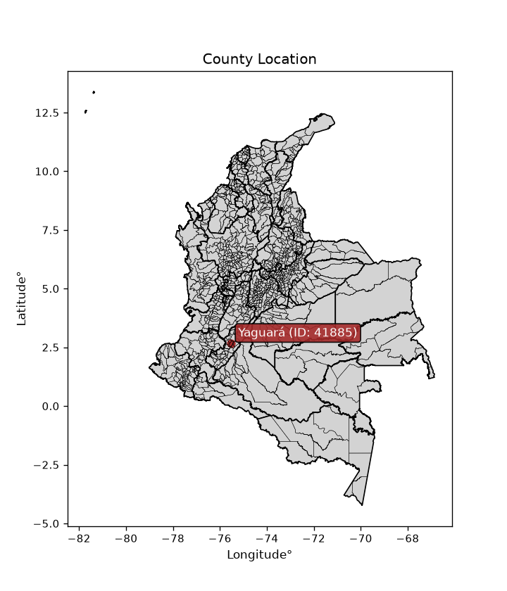
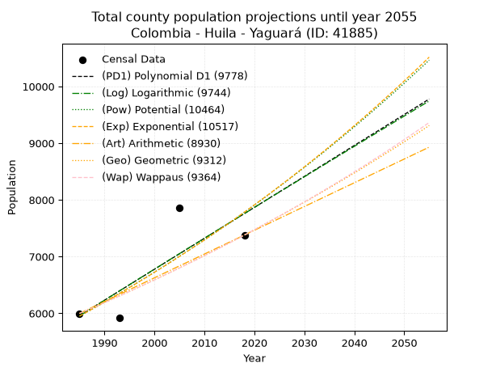
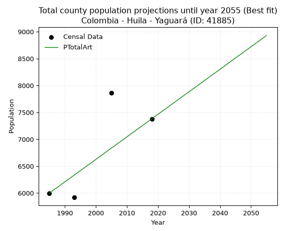
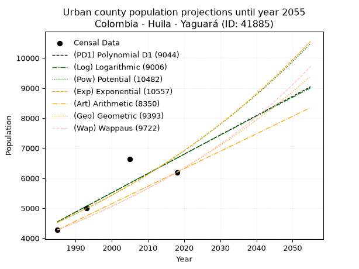
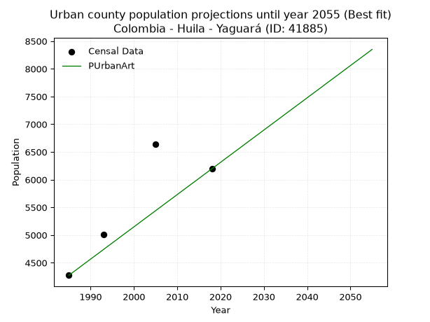
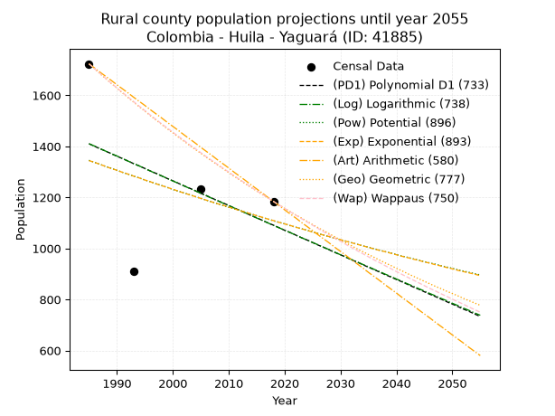
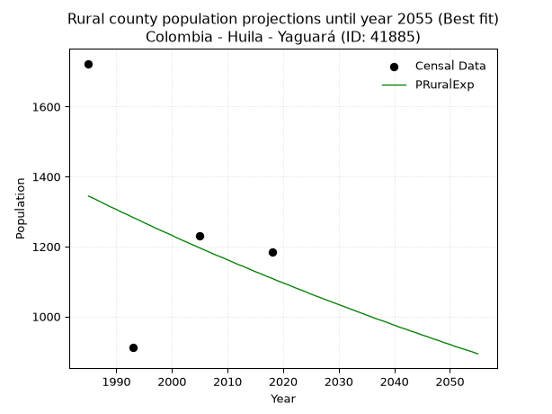

<div align="center">


</div>

# _“Population and Public Services Demand Projections (PPSD) until Year 2050 for Colombia - Huila - Yaguará (ID: 41885)”_
Keywords: `population` `public-service` `projection` `lineal` `polynomial` `logarithmic` `potential` `exponential` `arithmetic` `geometric` `wappaus` `dane` `colombia` `south-america`

PPSD are analytical estimates used by governments and planners to anticipate future changes in population size, age distribution, and the resulting community needs for utilities, healthcare, education, and infrastructure as sizing future water treatment facilities, electrical grids, and road networks based on spatial growth.

<div align="center">

</img>

</div>


> **General running parameters**: • app_version: _v20260806_. • Python version: _3.14.7_. • Pandas version: _3.0.5_. • NumPy version: _2.5.1_. • Creates, save and include plots into reports (create_plot): _False_. • Projection until year: _2050_. • Process polynomial degree 2 and up: _False_. • Process Wappaus: _True_. • Process Wappaus: _True_. • Set negative values to zero: _True_. • Set infinite values to zero: _True_. • Drop dataset notes: _True_. 
<div align="center">

Dynamic map: [:earth_americas:Google](http://maps.google.com/maps?q=2.664694212,-75.5180232) [:earth_americas:OSM](https://www.openstreetmap.org/#map=18/2.664694212/-75.5180232&layers=P) [:earth_americas:Bing](https://www.bing.com/maps?cp=2.664694212~-75.5180232&lvl=18) [:earth_americas:Apple](https://maps.apple.com/frame?center=2.664694212%2C-75.5180232&span=0.003%2C0.006)

</div>


<div align="center">

```geojson
{
  "type": "Feature",
  "geometry": {
    "type": "Point", 
    "coordinates": [-75.5180232, 2.664694212]
  }, 
  "properties": {
    "Name": "Colombia - Huila - Yaguará (ID: 41885)"
  }
}
```

</div>


## 0. Census Data (4 records)

Census data are official statistics collected by a government about the people and housing in a country. They usually include counts of total population, age, sex, race, income, education, and jobs.

📅Global census file: [Population.xlsx](../data/Population.xlsx)

| Source   |   Year |   CountryID | CountryName   |   StateID | StateName   |   CountyID | CountyName   |   PTotal |   PUrban |   PRural |
|:---------|-------:|------------:|:--------------|----------:|:------------|-----------:|:-------------|---------:|---------:|---------:|
| DANE     |   1985 |          57 | Colombia      |        41 | Huila       |      41885 | Yaguará      |     5998 |     4275 |     1723 |
| DANE     |   1993 |          57 | Colombia      |        41 | Huila       |      41885 | Yaguará      |     5918 |     5007 |      911 |
| DANE     |   2005 |          57 | Colombia      |        41 | Huila       |      41885 | Yaguará      |     7865 |     6634 |     1231 |
| DANE     |   2018 |          57 | Colombia      |        41 | Huila       |      41885 | Yaguará      |     7380 |     6196 |     1184 |

> 🔥Some records could had specific notes about the registered values or the corresponding urban or rural distribution.

📅[SUI-RUPS](https://www.datos.gov.co/Hacienda-y-Cr-dito-P-blico/Registro-nico-de-Prestadores-de-Servicios-P-blicos/4qkq-csdn/about_data) - Local public utility companies: [RUPS.csv](../data/RUPS.xlsx)

 | SERVICIO       | ESTADO    | NOMBRE                                   | NIT         | DEPARTAMENTO_DOMICILIO   | MUNICIPIO_DOMICILIO   | DIRECCION          |   TELEFONO | EMAIL              | TIPO_PRESTADOR                             | CLASIFICACION                 |
|:---------------|:----------|:-----------------------------------------|:------------|:-------------------------|:----------------------|:-------------------|-----------:|:-------------------|:-------------------------------------------|:------------------------------|
| ACUEDUCTO      | OPERATIVA | EMPRESAS PUBLICAS DE YAGUARA S.A. E.S.P. | 900250077-3 | HUILA                    | YAGUARA               | CARRERA 4 No. 3-93 |    8383102 | emsepuya@yahoo.com | SOCIEDADES (EMPRESA DE SERVICIOS PUBLICOS) | MENOR O IGUAL A 2500 USUARIOS |
| ALCANTARILLADO | OPERATIVA | EMPRESAS PUBLICAS DE YAGUARA S.A. E.S.P. | 900250077-3 | HUILA                    | YAGUARA               | CARRERA 4 No. 3-93 |    8383102 | emsepuya@yahoo.com | SOCIEDADES (EMPRESA DE SERVICIOS PUBLICOS) | MENOR O IGUAL A 2500 USUARIOS |

## 1. Total

### 1.1. Coefficients and Parameters

* (PD1) Polynomial Deg 1: 54.562424729024634, -102348.24006423152 (lineal)
* (Log) Logarithmic: 109306.5933225123, -824050.0417724825
* (Pow) Potential: 16.292581534578794, -49.95456310106771
* (Exp) Exponential: 0.008133282846196448, 0.000579590619685942
* (Art) Arithmetic: Year diff. 2018 - 1985 = 33, Population diff. 7380 - 5998 = 1382, Annual growth = 41.878787878787875
* (Geo) Geometric: Year diff. 2018 - 1985 = 33, Population diff. 7380 - 5998 = 1382, Annual growth % = 0.006303040424153972
* (Wap) Wappaus: i = 0.6260844353234845, Condition values only valid for < 200)

<sub>
Wappaus condition values: ['0.00', '0.63', '1.25', '1.88', '2.50', '3.13', '3.76', '4.38', '5.01', '5.63', '6.26', '6.89', '7.51', '8.14', '8.77', '9.39', '10.02', '10.64', '11.27', '11.90', '12.52', '13.15', '13.77', '14.40', '15.03', '15.65', '16.28', '16.90', '17.53', '18.16', '18.78', '19.41', '20.03', '20.66', '21.29', '21.91', '22.54', '23.17', '23.79', '24.42', '25.04', '25.67', '26.30', '26.92', '27.55', '28.17', '28.80', '29.43', '30.05', '30.68', '31.30', '31.93', '32.56', '33.18', '33.81', '34.43', '35.06', '35.69', '36.31', '36.94', '37.57', '38.19', '38.82', '39.44', '40.07', '40.70']
</sub>


### 1.2. Projected Dataset

|   Year |   CountyID |   PTotalPD1 |   PTotalLog |   PTotalPow |   PTotalExp |   PTotalArt |   PTotalGeo |   PTotalWap |
|-------:|-----------:|------------:|------------:|------------:|------------:|------------:|------------:|------------:|
|   1985 |      41885 |        5958 |        5956 |        5949 |        5951 |        5998 |        5998 |        5998 |
|   1986 |      41885 |        6013 |        6011 |        5998 |        6000 |        6040 |        6036 |        6036 |
|   1987 |      41885 |        6067 |        6066 |        6048 |        6049 |        6082 |        6074 |        6074 |
|   1988 |      41885 |        6122 |        6121 |        6098 |        6098 |        6124 |        6112 |        6112 |
|   1989 |      41885 |        6176 |        6176 |        6148 |        6148 |        6166 |        6151 |        6150 |
|   1990 |      41885 |        6231 |        6231 |        6198 |        6198 |        6207 |        6189 |        6189 |
|   1991 |      41885 |        6286 |        6286 |        6249 |        6249 |        6249 |        6228 |        6228 |
|   1992 |      41885 |        6340 |        6341 |        6301 |        6300 |        6291 |        6268 |        6267 |
|   1993 |      41885 |        6395 |        6395 |        6352 |        6351 |        6333 |        6307 |        6306 |
|   1994 |      41885 |        6449 |        6450 |        6404 |        6403 |        6375 |        6347 |        6346 |
|   1995 |      41885 |        6504 |        6505 |        6457 |        6456 |        6417 |        6387 |        6386 |
|   1996 |      41885 |        6558 |        6560 |        6510 |        6508 |        6459 |        6427 |        6426 |
|   1997 |      41885 |        6613 |        6615 |        6563 |        6562 |        6501 |        6468 |        6466 |
|   1998 |      41885 |        6667 |        6669 |        6617 |        6615 |        6542 |        6508 |        6507 |
|   1999 |      41885 |        6722 |        6724 |        6671 |        6669 |        6584 |        6550 |        6548 |
|   2000 |      41885 |        6777 |        6779 |        6726 |        6724 |        6626 |        6591 |        6589 |
|   2001 |      41885 |        6831 |        6833 |        6781 |        6778 |        6668 |        6632 |        6631 |
|   2002 |      41885 |        6886 |        6888 |        6836 |        6834 |        6710 |        6674 |        6672 |
|   2003 |      41885 |        6940 |        6943 |        6892 |        6890 |        6752 |        6716 |        6714 |
|   2004 |      41885 |        6995 |        6997 |        6948 |        6946 |        6794 |        6759 |        6757 |
|   2005 |      41885 |        7049 |        7052 |        7005 |        7003 |        6836 |        6801 |        6799 |
|   2006 |      41885 |        7104 |        7106 |        7062 |        7060 |        6877 |        6844 |        6842 |
|   2007 |      41885 |        7159 |        7161 |        7120 |        7117 |        6919 |        6887 |        6885 |
|   2008 |      41885 |        7213 |        7215 |        7178 |        7176 |        6961 |        6931 |        6929 |
|   2009 |      41885 |        7268 |        7269 |        7236 |        7234 |        7003 |        6974 |        6972 |
|   2010 |      41885 |        7322 |        7324 |        7295 |        7293 |        7045 |        7018 |        7017 |
|   2011 |      41885 |        7377 |        7378 |        7354 |        7353 |        7087 |        7062 |        7061 |
|   2012 |      41885 |        7431 |        7433 |        7414 |        7413 |        7129 |        7107 |        7106 |
|   2013 |      41885 |        7486 |        7487 |        7474 |        7473 |        7171 |        7152 |        7150 |
|   2014 |      41885 |        7540 |        7541 |        7535 |        7534 |        7212 |        7197 |        7196 |
|   2015 |      41885 |        7595 |        7595 |        7596 |        7596 |        7254 |        7242 |        7241 |
|   2016 |      41885 |        7650 |        7650 |        7658 |        7658 |        7296 |        7288 |        7287 |
|   2017 |      41885 |        7704 |        7704 |        7720 |        7721 |        7338 |        7334 |        7333 |
|   2018 |      41885 |        7759 |        7758 |        7783 |        7784 |        7380 |        7380 |        7380 |
|   2019 |      41885 |        7813 |        7812 |        7846 |        7847 |        7422 |        7427 |        7427 |
|   2020 |      41885 |        7868 |        7866 |        7909 |        7911 |        7464 |        7473 |        7474 |
|   2021 |      41885 |        7922 |        7920 |        7973 |        7976 |        7506 |        7520 |        7522 |
|   2022 |      41885 |        7977 |        7975 |        8038 |        8041 |        7548 |        7568 |        7569 |
|   2023 |      41885 |        8032 |        8029 |        8103 |        8107 |        7589 |        7616 |        7618 |
|   2024 |      41885 |        8086 |        8083 |        8168 |        8173 |        7631 |        7664 |        7666 |
|   2025 |      41885 |        8141 |        8137 |        8234 |        8240 |        7673 |        7712 |        7715 |
|   2026 |      41885 |        8195 |        8191 |        8301 |        8307 |        7715 |        7760 |        7764 |
|   2027 |      41885 |        8250 |        8244 |        8368 |        8375 |        7757 |        7809 |        7814 |
|   2028 |      41885 |        8304 |        8298 |        8436 |        8443 |        7799 |        7859 |        7864 |
|   2029 |      41885 |        8359 |        8352 |        8504 |        8512 |        7841 |        7908 |        7914 |
|   2030 |      41885 |        8413 |        8406 |        8572 |        8582 |        7883 |        7958 |        7965 |
|   2031 |      41885 |        8468 |        8460 |        8641 |        8652 |        7924 |        8008 |        8016 |
|   2032 |      41885 |        8523 |        8514 |        8711 |        8722 |        7966 |        8059 |        8067 |
|   2033 |      41885 |        8577 |        8568 |        8781 |        8794 |        8008 |        8109 |        8119 |
|   2034 |      41885 |        8632 |        8621 |        8851 |        8865 |        8050 |        8161 |        8171 |
|   2035 |      41885 |        8686 |        8675 |        8923 |        8938 |        8092 |        8212 |        8224 |
|   2036 |      41885 |        8741 |        8729 |        8994 |        9011 |        8134 |        8264 |        8277 |
|   2037 |      41885 |        8795 |        8782 |        9067 |        9084 |        8176 |        8316 |        8330 |
|   2038 |      41885 |        8850 |        8836 |        9139 |        9159 |        8218 |        8368 |        8384 |
|   2039 |      41885 |        8905 |        8890 |        9213 |        9233 |        8259 |        8421 |        8438 |
|   2040 |      41885 |        8959 |        8943 |        9287 |        9309 |        8301 |        8474 |        8493 |
|   2041 |      41885 |        9014 |        8997 |        9361 |        9385 |        8343 |        8527 |        8548 |
|   2042 |      41885 |        9068 |        9050 |        9436 |        9461 |        8385 |        8581 |        8603 |
|   2043 |      41885 |        9123 |        9104 |        9512 |        9539 |        8427 |        8635 |        8659 |
|   2044 |      41885 |        9177 |        9157 |        9588 |        9617 |        8469 |        8690 |        8716 |
|   2045 |      41885 |        9232 |        9211 |        9664 |        9695 |        8511 |        8744 |        8772 |
|   2046 |      41885 |        9286 |        9264 |        9742 |        9774 |        8553 |        8800 |        8829 |
|   2047 |      41885 |        9341 |        9318 |        9820 |        9854 |        8594 |        8855 |        8887 |
|   2048 |      41885 |        9396 |        9371 |        9898 |        9935 |        8636 |        8911 |        8945 |
|   2049 |      41885 |        9450 |        9424 |        9977 |       10016 |        8678 |        8967 |        9004 |
|   2050 |      41885 |        9505 |        9478 |       10057 |       10097 |        8720 |        9024 |        9062 |
<div align="center">

</img>

</div>


### 1.3. Best fit with absolute and relative error (%)

Relative error puts that difference into context by dividing the absolute error by the true value, creating a unitless ratio or percentage that shows the scale of the mistake.

Absolute and relative error

|   Year | Source   |   CountryID | CountryName   |   StateID | StateName   |   CountyID_x | CountyName   |   PTotal |   PUrban |   PRural |   CountyID_y |   PTotalPD1 |   PTotalLog |   PTotalPow |   PTotalExp |   PTotalArt |   PTotalGeo |   PTotalWap |   PTotalPD1AbsError |   PTotalLogAbsError |   PTotalPowAbsError |   PTotalExpAbsError |   PTotalArtAbsError |   PTotalGeoAbsError |   PTotalWapAbsError |   PTotalPD1RelError |   PTotalLogRelError |   PTotalPowRelError |   PTotalExpRelError |   PTotalArtRelError |   PTotalGeoRelError |   PTotalWapRelError |
|-------:|:---------|------------:|:--------------|----------:|:------------|-------------:|:-------------|---------:|---------:|---------:|-------------:|------------:|------------:|------------:|------------:|------------:|------------:|------------:|--------------------:|--------------------:|--------------------:|--------------------:|--------------------:|--------------------:|--------------------:|--------------------:|--------------------:|--------------------:|--------------------:|--------------------:|--------------------:|--------------------:|
|   1985 | DANE     |          57 | Colombia      |        41 | Huila       |        41885 | Yaguará      |     5998 |     4275 |     1723 |        41885 |        5958 |        5956 |        5949 |        5951 |        5998 |        5998 |        5998 |                  40 |                  42 |                  49 |                  47 |                   0 |                   0 |                   0 |            0.666889 |            0.700233 |            0.816939 |            0.783595 |              0      |             0       |             0       |
|   1993 | DANE     |          57 | Colombia      |        41 | Huila       |        41885 | Yaguará      |     5918 |     5007 |      911 |        41885 |        6395 |        6395 |        6352 |        6351 |        6333 |        6307 |        6306 |                 477 |                 477 |                 434 |                 433 |                 415 |                 389 |                 388 |            8.06016  |            8.06016  |            7.33356  |            7.31666  |              7.0125 |             6.57317 |             6.55627 |
|   2005 | DANE     |          57 | Colombia      |        41 | Huila       |        41885 | Yaguará      |     7865 |     6634 |     1231 |        41885 |        7049 |        7052 |        7005 |        7003 |        6836 |        6801 |        6799 |                 816 |                 813 |                 860 |                 862 |                1029 |                1064 |                1066 |           10.3751   |           10.3369   |           10.9345   |           10.9599   |             13.0833 |            13.5283  |            13.5537  |
|   2018 | DANE     |          57 | Colombia      |        41 | Huila       |        41885 | Yaguará      |     7380 |     6196 |     1184 |        41885 |        7759 |        7758 |        7783 |        7784 |        7380 |        7380 |        7380 |                 379 |                 378 |                 403 |                 404 |                   0 |                   0 |                   0 |            5.1355   |            5.12195  |            5.4607   |            5.47425  |              0      |             0       |             0       |

Relative error mean

| Method    |   RelError | Best   |
|:----------|-----------:|:-------|
| PTotalPD1 |    6.05941 |        |
| PTotalLog |    6.05482 |        |
| PTotalPow |    6.13643 |        |
| PTotalExp |    6.13361 |        |
| PTotalArt |    5.02395 | True   |
| PTotalGeo |    5.02536 |        |
| PTotalWap |    5.0275  |        |

💙Best method: _**PTotalArt**_
<div align="center">

</img>

</div>


### 1.4. Fresh water supply demand in liters per capita per day (lpcd)

The fresh water supply demand typically ranges from 100 to 300 liters per capita per day (lpcd) for standard domestic and municipal planning, though absolute survival minimums set by the World Health Organization are as low as 7.5 to 20 liters per day, and total consumption in high-income nations can exceed 400 liters.

> `CZ`: Level in meters above the sea level (masl)<br> `WS`: Fresh water supply demand in liters per capita per day (lpcd or l/h/d)<br> `WSAll`: Zonal fresh water supply demand in liters per second (l/s)<br> `A`: Zonal area in square meters<br> `DP`: Population density (people/hectare or p/ha)

Reference values (RAS Colombia)

|    CZ |   WS |
|------:|-----:|
|  1000 |  120 |
|  2000 |  130 |
| 99999 |  140 |

County shapefile geometry properties and water supply values

|   CountyID |      ATotal |   CZTotal |   WSTotal |
|-----------:|------------:|----------:|----------:|
|      41885 | 3.32817e+08 |    708.91 |       120 |

Projected values for best method: PTotalArt

|   CountyID |   Year |   PTotalArt |   DPTotal |   WSTotal |   WSTotalAll |
|-----------:|-------:|------------:|----------:|----------:|-------------:|
|      41885 |   1985 |        5998 |      0.18 |       120 |      8.33056 |
|      41885 |   1986 |        6040 |      0.18 |       120 |      8.38889 |
|      41885 |   1987 |        6082 |      0.18 |       120 |      8.44722 |
|      41885 |   1988 |        6124 |      0.18 |       120 |      8.50556 |
|      41885 |   1989 |        6166 |      0.19 |       120 |      8.56389 |
|      41885 |   1990 |        6207 |      0.19 |       120 |      8.62083 |
|      41885 |   1991 |        6249 |      0.19 |       120 |      8.67917 |
|      41885 |   1992 |        6291 |      0.19 |       120 |      8.7375  |
|      41885 |   1993 |        6333 |      0.19 |       120 |      8.79583 |
|      41885 |   1994 |        6375 |      0.19 |       120 |      8.85417 |
|      41885 |   1995 |        6417 |      0.19 |       120 |      8.9125  |
|      41885 |   1996 |        6459 |      0.19 |       120 |      8.97083 |
|      41885 |   1997 |        6501 |      0.2  |       120 |      9.02917 |
|      41885 |   1998 |        6542 |      0.2  |       120 |      9.08611 |
|      41885 |   1999 |        6584 |      0.2  |       120 |      9.14444 |
|      41885 |   2000 |        6626 |      0.2  |       120 |      9.20278 |
|      41885 |   2001 |        6668 |      0.2  |       120 |      9.26111 |
|      41885 |   2002 |        6710 |      0.2  |       120 |      9.31944 |
|      41885 |   2003 |        6752 |      0.2  |       120 |      9.37778 |
|      41885 |   2004 |        6794 |      0.2  |       120 |      9.43611 |
|      41885 |   2005 |        6836 |      0.21 |       120 |      9.49444 |
|      41885 |   2006 |        6877 |      0.21 |       120 |      9.55139 |
|      41885 |   2007 |        6919 |      0.21 |       120 |      9.60972 |
|      41885 |   2008 |        6961 |      0.21 |       120 |      9.66806 |
|      41885 |   2009 |        7003 |      0.21 |       120 |      9.72639 |
|      41885 |   2010 |        7045 |      0.21 |       120 |      9.78472 |
|      41885 |   2011 |        7087 |      0.21 |       120 |      9.84306 |
|      41885 |   2012 |        7129 |      0.21 |       120 |      9.90139 |
|      41885 |   2013 |        7171 |      0.22 |       120 |      9.95972 |
|      41885 |   2014 |        7212 |      0.22 |       120 |     10.0167  |
|      41885 |   2015 |        7254 |      0.22 |       120 |     10.075   |
|      41885 |   2016 |        7296 |      0.22 |       120 |     10.1333  |
|      41885 |   2017 |        7338 |      0.22 |       120 |     10.1917  |
|      41885 |   2018 |        7380 |      0.22 |       120 |     10.25    |
|      41885 |   2019 |        7422 |      0.22 |       120 |     10.3083  |
|      41885 |   2020 |        7464 |      0.22 |       120 |     10.3667  |
|      41885 |   2021 |        7506 |      0.23 |       120 |     10.425   |
|      41885 |   2022 |        7548 |      0.23 |       120 |     10.4833  |
|      41885 |   2023 |        7589 |      0.23 |       120 |     10.5403  |
|      41885 |   2024 |        7631 |      0.23 |       120 |     10.5986  |
|      41885 |   2025 |        7673 |      0.23 |       120 |     10.6569  |
|      41885 |   2026 |        7715 |      0.23 |       120 |     10.7153  |
|      41885 |   2027 |        7757 |      0.23 |       120 |     10.7736  |
|      41885 |   2028 |        7799 |      0.23 |       120 |     10.8319  |
|      41885 |   2029 |        7841 |      0.24 |       120 |     10.8903  |
|      41885 |   2030 |        7883 |      0.24 |       120 |     10.9486  |
|      41885 |   2031 |        7924 |      0.24 |       120 |     11.0056  |
|      41885 |   2032 |        7966 |      0.24 |       120 |     11.0639  |
|      41885 |   2033 |        8008 |      0.24 |       120 |     11.1222  |
|      41885 |   2034 |        8050 |      0.24 |       120 |     11.1806  |
|      41885 |   2035 |        8092 |      0.24 |       120 |     11.2389  |
|      41885 |   2036 |        8134 |      0.24 |       120 |     11.2972  |
|      41885 |   2037 |        8176 |      0.25 |       120 |     11.3556  |
|      41885 |   2038 |        8218 |      0.25 |       120 |     11.4139  |
|      41885 |   2039 |        8259 |      0.25 |       120 |     11.4708  |
|      41885 |   2040 |        8301 |      0.25 |       120 |     11.5292  |
|      41885 |   2041 |        8343 |      0.25 |       120 |     11.5875  |
|      41885 |   2042 |        8385 |      0.25 |       120 |     11.6458  |
|      41885 |   2043 |        8427 |      0.25 |       120 |     11.7042  |
|      41885 |   2044 |        8469 |      0.25 |       120 |     11.7625  |
|      41885 |   2045 |        8511 |      0.26 |       120 |     11.8208  |
|      41885 |   2046 |        8553 |      0.26 |       120 |     11.8792  |
|      41885 |   2047 |        8594 |      0.26 |       120 |     11.9361  |
|      41885 |   2048 |        8636 |      0.26 |       120 |     11.9944  |
|      41885 |   2049 |        8678 |      0.26 |       120 |     12.0528  |
|      41885 |   2050 |        8720 |      0.26 |       120 |     12.1111  |

## 2. Urban

### 2.1. Coefficients and Parameters

* (PD1) Polynomial Deg 1: 64.22480931352888, -122937.67482938615 (lineal)
* (Log) Logarithmic: 128711.82378452121, -972811.6040179699
* (Pow) Potential: 24.22839841084421, -76.24368042054138
* (Exp) Exponential: 0.012089533544179831, 1.713768390357403e-07
* (Art) Arithmetic: Year diff. 2018 - 1985 = 33, Population diff. 6196 - 4275 = 1921, Annual growth = 58.21212121212121
* (Geo) Geometric: Year diff. 2018 - 1985 = 33, Population diff. 6196 - 4275 = 1921, Annual growth % = 0.011309529757960401
* (Wap) Wappaus: i = 1.1118731966788504, Condition values only valid for < 200)

<sub>
Wappaus condition values: ['0.00', '1.11', '2.22', '3.34', '4.45', '5.56', '6.67', '7.78', '8.89', '10.01', '11.12', '12.23', '13.34', '14.45', '15.57', '16.68', '17.79', '18.90', '20.01', '21.13', '22.24', '23.35', '24.46', '25.57', '26.68', '27.80', '28.91', '30.02', '31.13', '32.24', '33.36', '34.47', '35.58', '36.69', '37.80', '38.92', '40.03', '41.14', '42.25', '43.36', '44.47', '45.59', '46.70', '47.81', '48.92', '50.03', '51.15', '52.26', '53.37', '54.48', '55.59', '56.71', '57.82', '58.93', '60.04', '61.15', '62.26', '63.38', '64.49', '65.60', '66.71', '67.82', '68.94', '70.05', '71.16', '72.27']
</sub>


### 2.2. Projected Dataset

|   Year |   CountyID |   PUrbanPD1 |   PUrbanLog |   PUrbanPow |   PUrbanExp |   PUrbanArt |   PUrbanGeo |   PUrbanWap |
|-------:|-----------:|------------:|------------:|------------:|------------:|------------:|------------:|------------:|
|   1985 |      41885 |        4549 |        4545 |        4527 |        4529 |        4275 |        4275 |        4275 |
|   1986 |      41885 |        4613 |        4610 |        4582 |        4584 |        4333 |        4323 |        4323 |
|   1987 |      41885 |        4677 |        4675 |        4638 |        4640 |        4391 |        4372 |        4371 |
|   1988 |      41885 |        4741 |        4740 |        4695 |        4697 |        4450 |        4422 |        4420 |
|   1989 |      41885 |        4805 |        4805 |        4753 |        4754 |        4508 |        4472 |        4469 |
|   1990 |      41885 |        4870 |        4869 |        4811 |        4812 |        4566 |        4522 |        4519 |
|   1991 |      41885 |        4934 |        4934 |        4870 |        4870 |        4624 |        4573 |        4570 |
|   1992 |      41885 |        4998 |        4999 |        4930 |        4929 |        4682 |        4625 |        4621 |
|   1993 |      41885 |        5062 |        5063 |        4990 |        4989 |        4741 |        4677 |        4673 |
|   1994 |      41885 |        5127 |        5128 |        5051 |        5050 |        4799 |        4730 |        4725 |
|   1995 |      41885 |        5191 |        5192 |        5113 |        5111 |        4857 |        4784 |        4778 |
|   1996 |      41885 |        5255 |        5257 |        5175 |        5174 |        4915 |        4838 |        4832 |
|   1997 |      41885 |        5319 |        5321 |        5238 |        5236 |        4974 |        4893 |        4886 |
|   1998 |      41885 |        5383 |        5386 |        5302 |        5300 |        5032 |        4948 |        4941 |
|   1999 |      41885 |        5448 |        5450 |        5367 |        5365 |        5090 |        5004 |        4997 |
|   2000 |      41885 |        5512 |        5514 |        5432 |        5430 |        5148 |        5061 |        5053 |
|   2001 |      41885 |        5576 |        5579 |        5499 |        5496 |        5206 |        5118 |        5110 |
|   2002 |      41885 |        5640 |        5643 |        5566 |        5563 |        5265 |        5176 |        5167 |
|   2003 |      41885 |        5705 |        5707 |        5633 |        5630 |        5323 |        5234 |        5226 |
|   2004 |      41885 |        5769 |        5772 |        5702 |        5699 |        5381 |        5293 |        5285 |
|   2005 |      41885 |        5833 |        5836 |        5771 |        5768 |        5439 |        5353 |        5345 |
|   2006 |      41885 |        5897 |        5900 |        5841 |        5838 |        5497 |        5414 |        5405 |
|   2007 |      41885 |        5962 |        5964 |        5912 |        5909 |        5556 |        5475 |        5466 |
|   2008 |      41885 |        6026 |        6028 |        5984 |        5981 |        5614 |        5537 |        5529 |
|   2009 |      41885 |        6090 |        6092 |        6057 |        6054 |        5672 |        5600 |        5591 |
|   2010 |      41885 |        6154 |        6156 |        6130 |        6128 |        5730 |        5663 |        5655 |
|   2011 |      41885 |        6218 |        6220 |        6204 |        6202 |        5789 |        5727 |        5720 |
|   2012 |      41885 |        6283 |        6284 |        6280 |        6278 |        5847 |        5792 |        5785 |
|   2013 |      41885 |        6347 |        6348 |        6356 |        6354 |        5905 |        5857 |        5851 |
|   2014 |      41885 |        6411 |        6412 |        6433 |        6431 |        5963 |        5923 |        5918 |
|   2015 |      41885 |        6475 |        6476 |        6510 |        6509 |        6021 |        5990 |        5986 |
|   2016 |      41885 |        6540 |        6540 |        6589 |        6589 |        6080 |        6058 |        6055 |
|   2017 |      41885 |        6604 |        6604 |        6669 |        6669 |        6138 |        6127 |        6125 |
|   2018 |      41885 |        6668 |        6668 |        6749 |        6750 |        6196 |        6196 |        6196 |
|   2019 |      41885 |        6732 |        6731 |        6831 |        6832 |        6254 |        6266 |        6268 |
|   2020 |      41885 |        6796 |        6795 |        6913 |        6915 |        6312 |        6337 |        6341 |
|   2021 |      41885 |        6861 |        6859 |        6997 |        6999 |        6371 |        6409 |        6414 |
|   2022 |      41885 |        6925 |        6923 |        7081 |        7084 |        6429 |        6481 |        6489 |
|   2023 |      41885 |        6989 |        6986 |        7166 |        7170 |        6487 |        6554 |        6565 |
|   2024 |      41885 |        7053 |        7050 |        7253 |        7258 |        6545 |        6629 |        6642 |
|   2025 |      41885 |        7118 |        7113 |        7340 |        7346 |        6603 |        6703 |        6720 |
|   2026 |      41885 |        7182 |        7177 |        7428 |        7435 |        6662 |        6779 |        6799 |
|   2027 |      41885 |        7246 |        7240 |        7518 |        7526 |        6720 |        6856 |        6880 |
|   2028 |      41885 |        7310 |        7304 |        7608 |        7617 |        6778 |        6933 |        6961 |
|   2029 |      41885 |        7374 |        7367 |        7700 |        7710 |        6836 |        7012 |        7044 |
|   2030 |      41885 |        7439 |        7431 |        7792 |        7804 |        6895 |        7091 |        7128 |
|   2031 |      41885 |        7503 |        7494 |        7886 |        7899 |        6953 |        7171 |        7213 |
|   2032 |      41885 |        7567 |        7558 |        7980 |        7995 |        7011 |        7253 |        7299 |
|   2033 |      41885 |        7631 |        7621 |        8076 |        8092 |        7069 |        7335 |        7387 |
|   2034 |      41885 |        7696 |        7684 |        8173 |        8190 |        7127 |        7417 |        7476 |
|   2035 |      41885 |        7760 |        7747 |        8271 |        8290 |        7186 |        7501 |        7567 |
|   2036 |      41885 |        7824 |        7811 |        8370 |        8391 |        7244 |        7586 |        7658 |
|   2037 |      41885 |        7888 |        7874 |        8470 |        8493 |        7302 |        7672 |        7752 |
|   2038 |      41885 |        7952 |        7937 |        8571 |        8596 |        7360 |        7759 |        7847 |
|   2039 |      41885 |        8017 |        8000 |        8674 |        8701 |        7418 |        7847 |        7943 |
|   2040 |      41885 |        8081 |        8063 |        8777 |        8807 |        7477 |        7935 |        8041 |
|   2041 |      41885 |        8145 |        8126 |        8882 |        8914 |        7535 |        8025 |        8140 |
|   2042 |      41885 |        8209 |        8189 |        8988 |        9022 |        7593 |        8116 |        8241 |
|   2043 |      41885 |        8274 |        8252 |        9095 |        9132 |        7651 |        8208 |        8344 |
|   2044 |      41885 |        8338 |        8315 |        9204 |        9243 |        7710 |        8300 |        8448 |
|   2045 |      41885 |        8402 |        8378 |        9314 |        9355 |        7768 |        8394 |        8554 |
|   2046 |      41885 |        8466 |        8441 |        9425 |        9469 |        7826 |        8489 |        8662 |
|   2047 |      41885 |        8531 |        8504 |        9537 |        9584 |        7884 |        8585 |        8772 |
|   2048 |      41885 |        8595 |        8567 |        9650 |        9701 |        7942 |        8682 |        8884 |
|   2049 |      41885 |        8659 |        8630 |        9765 |        9819 |        8001 |        8780 |        8997 |
|   2050 |      41885 |        8723 |        8693 |        9881 |        9938 |        8059 |        8880 |        9113 |
<div align="center">

</img>

</div>


### 2.3. Best fit with absolute and relative error (%)

Relative error puts that difference into context by dividing the absolute error by the true value, creating a unitless ratio or percentage that shows the scale of the mistake.

Absolute and relative error

|   Year | Source   |   CountryID | CountryName   |   StateID | StateName   |   CountyID_x | CountyName   |   PTotal |   PUrban |   PRural |   CountyID_y |   PUrbanPD1 |   PUrbanLog |   PUrbanPow |   PUrbanExp |   PUrbanArt |   PUrbanGeo |   PUrbanWap |   PUrbanPD1AbsError |   PUrbanLogAbsError |   PUrbanPowAbsError |   PUrbanExpAbsError |   PUrbanArtAbsError |   PUrbanGeoAbsError |   PUrbanWapAbsError |   PUrbanPD1RelError |   PUrbanLogRelError |   PUrbanPowRelError |   PUrbanExpRelError |   PUrbanArtRelError |   PUrbanGeoRelError |   PUrbanWapRelError |
|-------:|:---------|------------:|:--------------|----------:|:------------|-------------:|:-------------|---------:|---------:|---------:|-------------:|------------:|------------:|------------:|------------:|------------:|------------:|------------:|--------------------:|--------------------:|--------------------:|--------------------:|--------------------:|--------------------:|--------------------:|--------------------:|--------------------:|--------------------:|--------------------:|--------------------:|--------------------:|--------------------:|
|   1985 | DANE     |          57 | Colombia      |        41 | Huila       |        41885 | Yaguará      |     5998 |     4275 |     1723 |        41885 |        4549 |        4545 |        4527 |        4529 |        4275 |        4275 |        4275 |                 274 |                 270 |                 252 |                 254 |                   0 |                   0 |                   0 |             6.40936 |             6.31579 |            5.89474  |            5.94152  |             0       |             0       |             0       |
|   1993 | DANE     |          57 | Colombia      |        41 | Huila       |        41885 | Yaguará      |     5918 |     5007 |      911 |        41885 |        5062 |        5063 |        4990 |        4989 |        4741 |        4677 |        4673 |                  55 |                  56 |                  17 |                  18 |                 266 |                 330 |                 334 |             1.09846 |             1.11843 |            0.339525 |            0.359497 |             5.31256 |             6.59077 |             6.67066 |
|   2005 | DANE     |          57 | Colombia      |        41 | Huila       |        41885 | Yaguará      |     7865 |     6634 |     1231 |        41885 |        5833 |        5836 |        5771 |        5768 |        5439 |        5353 |        5345 |                 801 |                 798 |                 863 |                 866 |                1195 |                1281 |                1289 |            12.0742  |            12.0289  |           13.0087   |           13.054    |            18.0133  |            19.3096  |            19.4302  |
|   2018 | DANE     |          57 | Colombia      |        41 | Huila       |        41885 | Yaguará      |     7380 |     6196 |     1184 |        41885 |        6668 |        6668 |        6749 |        6750 |        6196 |        6196 |        6196 |                 472 |                 472 |                 553 |                 554 |                   0 |                   0 |                   0 |             7.61782 |             7.61782 |            8.92511  |            8.94125  |             0       |             0       |             0       |

Relative error mean

| Method    |   RelError | Best   |
|:----------|-----------:|:-------|
| PUrbanPD1 |    6.79995 |        |
| PUrbanLog |    6.77025 |        |
| PUrbanPow |    7.04203 |        |
| PUrbanExp |    7.07406 |        |
| PUrbanArt |    5.83146 | True   |
| PUrbanGeo |    6.4751  |        |
| PUrbanWap |    6.52522 |        |

💙Best method: _**PUrbanArt**_
<div align="center">

</img>

</div>


### 2.4. Fresh water supply demand in liters per capita per day (lpcd)

The fresh water supply demand typically ranges from 100 to 300 liters per capita per day (lpcd) for standard domestic and municipal planning, though absolute survival minimums set by the World Health Organization are as low as 7.5 to 20 liters per day, and total consumption in high-income nations can exceed 400 liters.

> `CZ`: Level in meters above the sea level (masl)<br> `WS`: Fresh water supply demand in liters per capita per day (lpcd or l/h/d)<br> `WSAll`: Zonal fresh water supply demand in liters per second (l/s)<br> `A`: Zonal area in square meters<br> `DP`: Population density (people/hectare or p/ha)

Reference values (RAS Colombia)

|    CZ |   WS |
|------:|-----:|
|  1000 |  120 |
|  2000 |  130 |
| 99999 |  140 |

County shapefile geometry properties and water supply values

|   CountyID |      AUrban |   CZUrban |   WSUrban |
|-----------:|------------:|----------:|----------:|
|      41885 | 1.00492e+06 |   576.167 |       120 |

Projected values for best method: PUrbanArt

|   CountyID |   Year |   PUrbanArt |   DPUrban |   WSUrban |   WSUrbanAll |
|-----------:|-------:|------------:|----------:|----------:|-------------:|
|      41885 |   1985 |        4275 |     42.54 |       120 |      5.9375  |
|      41885 |   1986 |        4333 |     43.12 |       120 |      6.01806 |
|      41885 |   1987 |        4391 |     43.69 |       120 |      6.09861 |
|      41885 |   1988 |        4450 |     44.28 |       120 |      6.18056 |
|      41885 |   1989 |        4508 |     44.86 |       120 |      6.26111 |
|      41885 |   1990 |        4566 |     45.44 |       120 |      6.34167 |
|      41885 |   1991 |        4624 |     46.01 |       120 |      6.42222 |
|      41885 |   1992 |        4682 |     46.59 |       120 |      6.50278 |
|      41885 |   1993 |        4741 |     47.18 |       120 |      6.58472 |
|      41885 |   1994 |        4799 |     47.75 |       120 |      6.66528 |
|      41885 |   1995 |        4857 |     48.33 |       120 |      6.74583 |
|      41885 |   1996 |        4915 |     48.91 |       120 |      6.82639 |
|      41885 |   1997 |        4974 |     49.5  |       120 |      6.90833 |
|      41885 |   1998 |        5032 |     50.07 |       120 |      6.98889 |
|      41885 |   1999 |        5090 |     50.65 |       120 |      7.06944 |
|      41885 |   2000 |        5148 |     51.23 |       120 |      7.15    |
|      41885 |   2001 |        5206 |     51.81 |       120 |      7.23056 |
|      41885 |   2002 |        5265 |     52.39 |       120 |      7.3125  |
|      41885 |   2003 |        5323 |     52.97 |       120 |      7.39306 |
|      41885 |   2004 |        5381 |     53.55 |       120 |      7.47361 |
|      41885 |   2005 |        5439 |     54.12 |       120 |      7.55417 |
|      41885 |   2006 |        5497 |     54.7  |       120 |      7.63472 |
|      41885 |   2007 |        5556 |     55.29 |       120 |      7.71667 |
|      41885 |   2008 |        5614 |     55.87 |       120 |      7.79722 |
|      41885 |   2009 |        5672 |     56.44 |       120 |      7.87778 |
|      41885 |   2010 |        5730 |     57.02 |       120 |      7.95833 |
|      41885 |   2011 |        5789 |     57.61 |       120 |      8.04028 |
|      41885 |   2012 |        5847 |     58.18 |       120 |      8.12083 |
|      41885 |   2013 |        5905 |     58.76 |       120 |      8.20139 |
|      41885 |   2014 |        5963 |     59.34 |       120 |      8.28194 |
|      41885 |   2015 |        6021 |     59.92 |       120 |      8.3625  |
|      41885 |   2016 |        6080 |     60.5  |       120 |      8.44444 |
|      41885 |   2017 |        6138 |     61.08 |       120 |      8.525   |
|      41885 |   2018 |        6196 |     61.66 |       120 |      8.60556 |
|      41885 |   2019 |        6254 |     62.23 |       120 |      8.68611 |
|      41885 |   2020 |        6312 |     62.81 |       120 |      8.76667 |
|      41885 |   2021 |        6371 |     63.4  |       120 |      8.84861 |
|      41885 |   2022 |        6429 |     63.98 |       120 |      8.92917 |
|      41885 |   2023 |        6487 |     64.55 |       120 |      9.00972 |
|      41885 |   2024 |        6545 |     65.13 |       120 |      9.09028 |
|      41885 |   2025 |        6603 |     65.71 |       120 |      9.17083 |
|      41885 |   2026 |        6662 |     66.29 |       120 |      9.25278 |
|      41885 |   2027 |        6720 |     66.87 |       120 |      9.33333 |
|      41885 |   2028 |        6778 |     67.45 |       120 |      9.41389 |
|      41885 |   2029 |        6836 |     68.03 |       120 |      9.49444 |
|      41885 |   2030 |        6895 |     68.61 |       120 |      9.57639 |
|      41885 |   2031 |        6953 |     69.19 |       120 |      9.65694 |
|      41885 |   2032 |        7011 |     69.77 |       120 |      9.7375  |
|      41885 |   2033 |        7069 |     70.34 |       120 |      9.81806 |
|      41885 |   2034 |        7127 |     70.92 |       120 |      9.89861 |
|      41885 |   2035 |        7186 |     71.51 |       120 |      9.98056 |
|      41885 |   2036 |        7244 |     72.09 |       120 |     10.0611  |
|      41885 |   2037 |        7302 |     72.66 |       120 |     10.1417  |
|      41885 |   2038 |        7360 |     73.24 |       120 |     10.2222  |
|      41885 |   2039 |        7418 |     73.82 |       120 |     10.3028  |
|      41885 |   2040 |        7477 |     74.4  |       120 |     10.3847  |
|      41885 |   2041 |        7535 |     74.98 |       120 |     10.4653  |
|      41885 |   2042 |        7593 |     75.56 |       120 |     10.5458  |
|      41885 |   2043 |        7651 |     76.14 |       120 |     10.6264  |
|      41885 |   2044 |        7710 |     76.72 |       120 |     10.7083  |
|      41885 |   2045 |        7768 |     77.3  |       120 |     10.7889  |
|      41885 |   2046 |        7826 |     77.88 |       120 |     10.8694  |
|      41885 |   2047 |        7884 |     78.45 |       120 |     10.95    |
|      41885 |   2048 |        7942 |     79.03 |       120 |     11.0306  |
|      41885 |   2049 |        8001 |     79.62 |       120 |     11.1125  |
|      41885 |   2050 |        8059 |     80.2  |       120 |     11.1931  |

## 3. Rural

### 3.1. Coefficients and Parameters

* (PD1) Polynomial Deg 1: -9.662384584504201, 20589.43476515453 (lineal)
* (Log) Logarithmic: -19405.230462008927, 148761.56224548747
* (Pow) Potential: -11.736213126857061, 41.8319829253117
* (Exp) Exponential: -0.005838787296153081, 145208987.8139344
* (Art) Arithmetic: Year diff. 2018 - 1985 = 33, Population diff. 1184 - 1723 = -539, Annual growth = -16.333333333333332
* (Geo) Geometric: Year diff. 2018 - 1985 = 33, Population diff. 1184 - 1723 = -539, Annual growth % = -0.011304360111706213
* (Wap) Wappaus: i = -1.123724343538585, Condition values only valid for < 200)

<sub>
Wappaus condition values: ['-0.00', '-1.12', '-2.25', '-3.37', '-4.49', '-5.62', '-6.74', '-7.87', '-8.99', '-10.11', '-11.24', '-12.36', '-13.48', '-14.61', '-15.73', '-16.86', '-17.98', '-19.10', '-20.23', '-21.35', '-22.47', '-23.60', '-24.72', '-25.85', '-26.97', '-28.09', '-29.22', '-30.34', '-31.46', '-32.59', '-33.71', '-34.84', '-35.96', '-37.08', '-38.21', '-39.33', '-40.45', '-41.58', '-42.70', '-43.83', '-44.95', '-46.07', '-47.20', '-48.32', '-49.44', '-50.57', '-51.69', '-52.82', '-53.94', '-55.06', '-56.19', '-57.31', '-58.43', '-59.56', '-60.68', '-61.80', '-62.93', '-64.05', '-65.18', '-66.30', '-67.42', '-68.55', '-69.67', '-70.79', '-71.92', '-73.04']
</sub>


### 3.2. Projected Dataset

|   Year |   CountyID |   PRuralPD1 |   PRuralLog |   PRuralPow |   PRuralExp |   PRuralArt |   PRuralGeo |   PRuralWap |
|-------:|-----------:|------------:|------------:|------------:|------------:|------------:|------------:|------------:|
|   1985 |      41885 |        1410 |        1410 |        1345 |        1344 |        1723 |        1723 |        1723 |
|   1986 |      41885 |        1400 |        1401 |        1337 |        1337 |        1707 |        1704 |        1704 |
|   1987 |      41885 |        1390 |        1391 |        1329 |        1329 |        1690 |        1684 |        1685 |
|   1988 |      41885 |        1381 |        1381 |        1321 |        1321 |        1674 |        1665 |        1666 |
|   1989 |      41885 |        1371 |        1371 |        1314 |        1313 |        1658 |        1646 |        1647 |
|   1990 |      41885 |        1361 |        1362 |        1306 |        1306 |        1641 |        1628 |        1629 |
|   1991 |      41885 |        1352 |        1352 |        1298 |        1298 |        1625 |        1609 |        1611 |
|   1992 |      41885 |        1342 |        1342 |        1291 |        1291 |        1609 |        1591 |        1593 |
|   1993 |      41885 |        1332 |        1332 |        1283 |        1283 |        1592 |        1573 |        1575 |
|   1994 |      41885 |        1323 |        1323 |        1276 |        1276 |        1576 |        1555 |        1557 |
|   1995 |      41885 |        1313 |        1313 |        1268 |        1268 |        1560 |        1538 |        1540 |
|   1996 |      41885 |        1303 |        1303 |        1261 |        1261 |        1543 |        1520 |        1522 |
|   1997 |      41885 |        1294 |        1293 |        1253 |        1253 |        1527 |        1503 |        1505 |
|   1998 |      41885 |        1284 |        1284 |        1246 |        1246 |        1511 |        1486 |        1488 |
|   1999 |      41885 |        1274 |        1274 |        1239 |        1239 |        1494 |        1469 |        1472 |
|   2000 |      41885 |        1265 |        1264 |        1231 |        1232 |        1478 |        1453 |        1455 |
|   2001 |      41885 |        1255 |        1255 |        1224 |        1224 |        1462 |        1436 |        1439 |
|   2002 |      41885 |        1245 |        1245 |        1217 |        1217 |        1445 |        1420 |        1423 |
|   2003 |      41885 |        1236 |        1235 |        1210 |        1210 |        1429 |        1404 |        1406 |
|   2004 |      41885 |        1226 |        1226 |        1203 |        1203 |        1413 |        1388 |        1391 |
|   2005 |      41885 |        1216 |        1216 |        1196 |        1196 |        1396 |        1373 |        1375 |
|   2006 |      41885 |        1207 |        1206 |        1189 |        1189 |        1380 |        1357 |        1359 |
|   2007 |      41885 |        1197 |        1196 |        1182 |        1182 |        1364 |        1342 |        1344 |
|   2008 |      41885 |        1187 |        1187 |        1175 |        1175 |        1347 |        1327 |        1329 |
|   2009 |      41885 |        1178 |        1177 |        1168 |        1169 |        1331 |        1312 |        1314 |
|   2010 |      41885 |        1168 |        1168 |        1161 |        1162 |        1315 |        1297 |        1299 |
|   2011 |      41885 |        1158 |        1158 |        1155 |        1155 |        1298 |        1282 |        1284 |
|   2012 |      41885 |        1149 |        1148 |        1148 |        1148 |        1282 |        1268 |        1269 |
|   2013 |      41885 |        1139 |        1139 |        1141 |        1142 |        1266 |        1253 |        1255 |
|   2014 |      41885 |        1129 |        1129 |        1135 |        1135 |        1249 |        1239 |        1240 |
|   2015 |      41885 |        1120 |        1119 |        1128 |        1128 |        1233 |        1225 |        1226 |
|   2016 |      41885 |        1110 |        1110 |        1121 |        1122 |        1217 |        1211 |        1212 |
|   2017 |      41885 |        1100 |        1100 |        1115 |        1115 |        1200 |        1198 |        1198 |
|   2018 |      41885 |        1091 |        1090 |        1108 |        1109 |        1184 |        1184 |        1184 |
|   2019 |      41885 |        1081 |        1081 |        1102 |        1102 |        1168 |        1171 |        1170 |
|   2020 |      41885 |        1071 |        1071 |        1096 |        1096 |        1151 |        1157 |        1157 |
|   2021 |      41885 |        1062 |        1062 |        1089 |        1090 |        1135 |        1144 |        1143 |
|   2022 |      41885 |        1052 |        1052 |        1083 |        1083 |        1119 |        1131 |        1130 |
|   2023 |      41885 |        1042 |        1042 |        1077 |        1077 |        1102 |        1119 |        1117 |
|   2024 |      41885 |        1033 |        1033 |        1071 |        1071 |        1086 |        1106 |        1104 |
|   2025 |      41885 |        1023 |        1023 |        1064 |        1064 |        1070 |        1093 |        1091 |
|   2026 |      41885 |        1013 |        1014 |        1058 |        1058 |        1053 |        1081 |        1078 |
|   2027 |      41885 |        1004 |        1004 |        1052 |        1052 |        1037 |        1069 |        1065 |
|   2028 |      41885 |         994 |         995 |        1046 |        1046 |        1021 |        1057 |        1052 |
|   2029 |      41885 |         984 |         985 |        1040 |        1040 |        1004 |        1045 |        1040 |
|   2030 |      41885 |         975 |         975 |        1034 |        1034 |         988 |        1033 |        1028 |
|   2031 |      41885 |         965 |         966 |        1028 |        1028 |         972 |        1021 |        1015 |
|   2032 |      41885 |         955 |         956 |        1022 |        1022 |         955 |        1010 |        1003 |
|   2033 |      41885 |         946 |         947 |        1016 |        1016 |         939 |         998 |         991 |
|   2034 |      41885 |         936 |         937 |        1010 |        1010 |         923 |         987 |         979 |
|   2035 |      41885 |         926 |         928 |        1005 |        1004 |         906 |         976 |         967 |
|   2036 |      41885 |         917 |         918 |         999 |         998 |         890 |         965 |         955 |
|   2037 |      41885 |         907 |         909 |         993 |         992 |         874 |         954 |         944 |
|   2038 |      41885 |         897 |         899 |         987 |         987 |         857 |         943 |         932 |
|   2039 |      41885 |         888 |         890 |         982 |         981 |         841 |         933 |         921 |
|   2040 |      41885 |         878 |         880 |         976 |         975 |         825 |         922 |         909 |
|   2041 |      41885 |         869 |         871 |         970 |         969 |         808 |         912 |         898 |
|   2042 |      41885 |         859 |         861 |         965 |         964 |         792 |         901 |         887 |
|   2043 |      41885 |         849 |         852 |         959 |         958 |         776 |         891 |         876 |
|   2044 |      41885 |         840 |         842 |         954 |         953 |         759 |         881 |         865 |
|   2045 |      41885 |         830 |         833 |         948 |         947 |         743 |         871 |         854 |
|   2046 |      41885 |         820 |         823 |         943 |         942 |         727 |         861 |         843 |
|   2047 |      41885 |         811 |         814 |         938 |         936 |         710 |         851 |         833 |
|   2048 |      41885 |         801 |         804 |         932 |         931 |         694 |         842 |         822 |
|   2049 |      41885 |         791 |         795 |         927 |         925 |         678 |         832 |         812 |
|   2050 |      41885 |         782 |         785 |         922 |         920 |         661 |         823 |         801 |
<div align="center">

</img>

</div>


### 3.3. Best fit with absolute and relative error (%)

Relative error puts that difference into context by dividing the absolute error by the true value, creating a unitless ratio or percentage that shows the scale of the mistake.

Absolute and relative error

|   Year | Source   |   CountryID | CountryName   |   StateID | StateName   |   CountyID_x | CountyName   |   PTotal |   PUrban |   PRural |   CountyID_y |   PRuralPD1 |   PRuralLog |   PRuralPow |   PRuralExp |   PRuralArt |   PRuralGeo |   PRuralWap |   PRuralPD1AbsError |   PRuralLogAbsError |   PRuralPowAbsError |   PRuralExpAbsError |   PRuralArtAbsError |   PRuralGeoAbsError |   PRuralWapAbsError |   PRuralPD1RelError |   PRuralLogRelError |   PRuralPowRelError |   PRuralExpRelError |   PRuralArtRelError |   PRuralGeoRelError |   PRuralWapRelError |
|-------:|:---------|------------:|:--------------|----------:|:------------|-------------:|:-------------|---------:|---------:|---------:|-------------:|------------:|------------:|------------:|------------:|------------:|------------:|------------:|--------------------:|--------------------:|--------------------:|--------------------:|--------------------:|--------------------:|--------------------:|--------------------:|--------------------:|--------------------:|--------------------:|--------------------:|--------------------:|--------------------:|
|   1985 | DANE     |          57 | Colombia      |        41 | Huila       |        41885 | Yaguará      |     5998 |     4275 |     1723 |        41885 |        1410 |        1410 |        1345 |        1344 |        1723 |        1723 |        1723 |                 313 |                 313 |                 378 |                 379 |                   0 |                   0 |                   0 |            18.166   |            18.166   |            21.9385  |            21.9965  |              0      |              0      |              0      |
|   1993 | DANE     |          57 | Colombia      |        41 | Huila       |        41885 | Yaguará      |     5918 |     5007 |      911 |        41885 |        1332 |        1332 |        1283 |        1283 |        1592 |        1573 |        1575 |                 421 |                 421 |                 372 |                 372 |                 681 |                 662 |                 664 |            46.213   |            46.213   |            40.8342  |            40.8342  |             74.753  |             72.6674 |             72.8869 |
|   2005 | DANE     |          57 | Colombia      |        41 | Huila       |        41885 | Yaguará      |     7865 |     6634 |     1231 |        41885 |        1216 |        1216 |        1196 |        1196 |        1396 |        1373 |        1375 |                  15 |                  15 |                  35 |                  35 |                 165 |                 142 |                 144 |             1.21852 |             1.21852 |             2.84322 |             2.84322 |             13.4037 |             11.5353 |             11.6978 |
|   2018 | DANE     |          57 | Colombia      |        41 | Huila       |        41885 | Yaguará      |     7380 |     6196 |     1184 |        41885 |        1091 |        1090 |        1108 |        1109 |        1184 |        1184 |        1184 |                  93 |                  94 |                  76 |                  75 |                   0 |                   0 |                   0 |             7.85473 |             7.93919 |             6.41892 |             6.33446 |              0      |              0      |              0      |

Relative error mean

| Method    |   RelError | Best   |
|:----------|-----------:|:-------|
| PRuralPD1 |    18.363  |        |
| PRuralLog |    18.3842 |        |
| PRuralPow |    18.0087 |        |
| PRuralExp |    18.0021 | True   |
| PRuralArt |    22.0392 |        |
| PRuralGeo |    21.0507 |        |
| PRuralWap |    21.1462 |        |

💙Best method: _**PRuralExp**_
<div align="center">

</img>

</div>


### 3.4. Fresh water supply demand in liters per capita per day (lpcd)

The fresh water supply demand typically ranges from 100 to 300 liters per capita per day (lpcd) for standard domestic and municipal planning, though absolute survival minimums set by the World Health Organization are as low as 7.5 to 20 liters per day, and total consumption in high-income nations can exceed 400 liters.

> `CZ`: Level in meters above the sea level (masl)<br> `WS`: Fresh water supply demand in liters per capita per day (lpcd or l/h/d)<br> `WSAll`: Zonal fresh water supply demand in liters per second (l/s)<br> `A`: Zonal area in square meters<br> `DP`: Population density (people/hectare or p/ha)

Reference values (RAS Colombia)

|    CZ |   WS |
|------:|-----:|
|  1000 |  120 |
|  2000 |  130 |
| 99999 |  140 |

County shapefile geometry properties and water supply values

|   CountyID |      ARural |   CZRural |   WSRural |
|-----------:|------------:|----------:|----------:|
|      41885 | 3.31812e+08 |    709.31 |       120 |

Projected values for best method: PRuralExp

|   CountyID |   Year |   PRuralExp |   DPRural |   WSRural |   WSRuralAll |
|-----------:|-------:|------------:|----------:|----------:|-------------:|
|      41885 |   1985 |        1344 |      0.04 |       120 |      1.86667 |
|      41885 |   1986 |        1337 |      0.04 |       120 |      1.85694 |
|      41885 |   1987 |        1329 |      0.04 |       120 |      1.84583 |
|      41885 |   1988 |        1321 |      0.04 |       120 |      1.83472 |
|      41885 |   1989 |        1313 |      0.04 |       120 |      1.82361 |
|      41885 |   1990 |        1306 |      0.04 |       120 |      1.81389 |
|      41885 |   1991 |        1298 |      0.04 |       120 |      1.80278 |
|      41885 |   1992 |        1291 |      0.04 |       120 |      1.79306 |
|      41885 |   1993 |        1283 |      0.04 |       120 |      1.78194 |
|      41885 |   1994 |        1276 |      0.04 |       120 |      1.77222 |
|      41885 |   1995 |        1268 |      0.04 |       120 |      1.76111 |
|      41885 |   1996 |        1261 |      0.04 |       120 |      1.75139 |
|      41885 |   1997 |        1253 |      0.04 |       120 |      1.74028 |
|      41885 |   1998 |        1246 |      0.04 |       120 |      1.73056 |
|      41885 |   1999 |        1239 |      0.04 |       120 |      1.72083 |
|      41885 |   2000 |        1232 |      0.04 |       120 |      1.71111 |
|      41885 |   2001 |        1224 |      0.04 |       120 |      1.7     |
|      41885 |   2002 |        1217 |      0.04 |       120 |      1.69028 |
|      41885 |   2003 |        1210 |      0.04 |       120 |      1.68056 |
|      41885 |   2004 |        1203 |      0.04 |       120 |      1.67083 |
|      41885 |   2005 |        1196 |      0.04 |       120 |      1.66111 |
|      41885 |   2006 |        1189 |      0.04 |       120 |      1.65139 |
|      41885 |   2007 |        1182 |      0.04 |       120 |      1.64167 |
|      41885 |   2008 |        1175 |      0.04 |       120 |      1.63194 |
|      41885 |   2009 |        1169 |      0.04 |       120 |      1.62361 |
|      41885 |   2010 |        1162 |      0.04 |       120 |      1.61389 |
|      41885 |   2011 |        1155 |      0.03 |       120 |      1.60417 |
|      41885 |   2012 |        1148 |      0.03 |       120 |      1.59444 |
|      41885 |   2013 |        1142 |      0.03 |       120 |      1.58611 |
|      41885 |   2014 |        1135 |      0.03 |       120 |      1.57639 |
|      41885 |   2015 |        1128 |      0.03 |       120 |      1.56667 |
|      41885 |   2016 |        1122 |      0.03 |       120 |      1.55833 |
|      41885 |   2017 |        1115 |      0.03 |       120 |      1.54861 |
|      41885 |   2018 |        1109 |      0.03 |       120 |      1.54028 |
|      41885 |   2019 |        1102 |      0.03 |       120 |      1.53056 |
|      41885 |   2020 |        1096 |      0.03 |       120 |      1.52222 |
|      41885 |   2021 |        1090 |      0.03 |       120 |      1.51389 |
|      41885 |   2022 |        1083 |      0.03 |       120 |      1.50417 |
|      41885 |   2023 |        1077 |      0.03 |       120 |      1.49583 |
|      41885 |   2024 |        1071 |      0.03 |       120 |      1.4875  |
|      41885 |   2025 |        1064 |      0.03 |       120 |      1.47778 |
|      41885 |   2026 |        1058 |      0.03 |       120 |      1.46944 |
|      41885 |   2027 |        1052 |      0.03 |       120 |      1.46111 |
|      41885 |   2028 |        1046 |      0.03 |       120 |      1.45278 |
|      41885 |   2029 |        1040 |      0.03 |       120 |      1.44444 |
|      41885 |   2030 |        1034 |      0.03 |       120 |      1.43611 |
|      41885 |   2031 |        1028 |      0.03 |       120 |      1.42778 |
|      41885 |   2032 |        1022 |      0.03 |       120 |      1.41944 |
|      41885 |   2033 |        1016 |      0.03 |       120 |      1.41111 |
|      41885 |   2034 |        1010 |      0.03 |       120 |      1.40278 |
|      41885 |   2035 |        1004 |      0.03 |       120 |      1.39444 |
|      41885 |   2036 |         998 |      0.03 |       120 |      1.38611 |
|      41885 |   2037 |         992 |      0.03 |       120 |      1.37778 |
|      41885 |   2038 |         987 |      0.03 |       120 |      1.37083 |
|      41885 |   2039 |         981 |      0.03 |       120 |      1.3625  |
|      41885 |   2040 |         975 |      0.03 |       120 |      1.35417 |
|      41885 |   2041 |         969 |      0.03 |       120 |      1.34583 |
|      41885 |   2042 |         964 |      0.03 |       120 |      1.33889 |
|      41885 |   2043 |         958 |      0.03 |       120 |      1.33056 |
|      41885 |   2044 |         953 |      0.03 |       120 |      1.32361 |
|      41885 |   2045 |         947 |      0.03 |       120 |      1.31528 |
|      41885 |   2046 |         942 |      0.03 |       120 |      1.30833 |
|      41885 |   2047 |         936 |      0.03 |       120 |      1.3     |
|      41885 |   2048 |         931 |      0.03 |       120 |      1.29306 |
|      41885 |   2049 |         925 |      0.03 |       120 |      1.28472 |
|      41885 |   2050 |         920 |      0.03 |       120 |      1.27778 |

#

<div align="center"><br><sub>Share this research</sub></div><br>

<sub>**APPS & TOOLS & CONTENT DISCLAIMER**: • NO WARRANTY - This content and software is provided by <a href="https://github.com/rcfdtools" target="_blank">github.com/rcfdtools</a> "as is", without any express or implied warranty, including warranties of merchantability, fitness for a particular purpose, or non-infringement. There is no guarantee that the software will be error-free or operate without interruption. • LIMITATION OF LIABILITY - Neither the authors nor copyright holders will be liable for claims or damages arising from the software or its use. You are responsible for determining if the software is appropriate for your use and assume all associated risks, including errors, legal compliance, and data loss. • NO PROFESSIONAL ADVICE - The software provides general information and does not offer professional advice. It should not replace consultation with professional advisors. [Clauses and global license for rcfdtools use.](https://github.com/rcfdtools/rcfdtools/blob/main/LICENSE.md)</sub>

| [:house: Home](Readme.md)  | [:beginner: Help / Collab](https://github.com/rcfdtools/R.HydroTools/discussions/31) |
|----------------------------|-------------------------------------------------------------------------------------------|