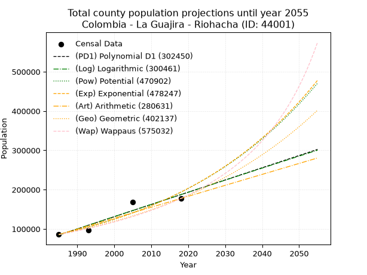
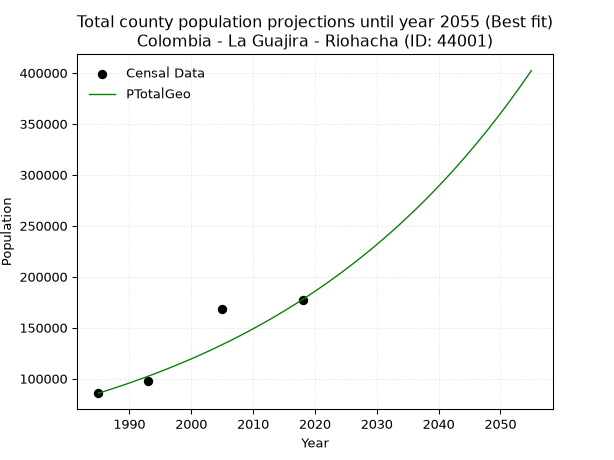
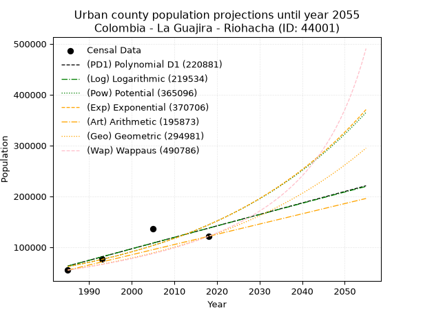
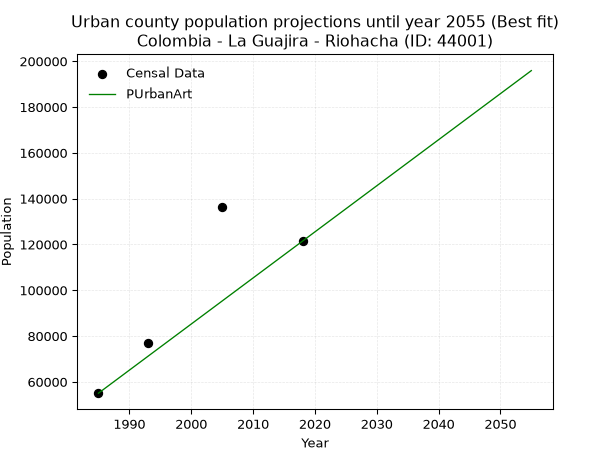
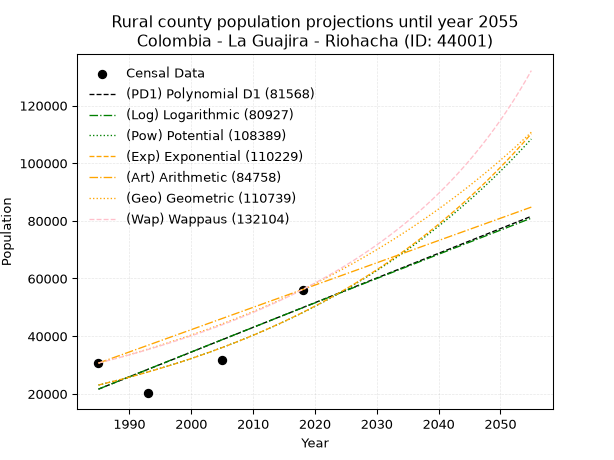
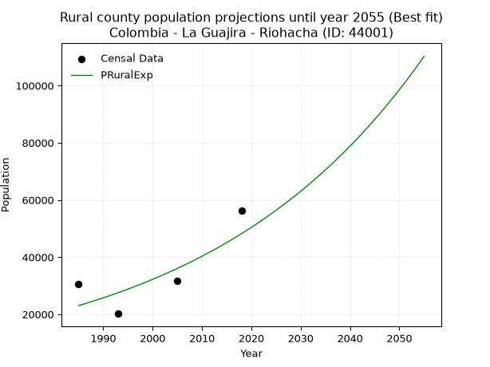

<div align="center">


</div>

# _“Population and Public Services Demand Projections (PPSD) until Year 2050 for Colombia - La Guajira - Riohacha (ID: 44001)”_
Keywords: `population` `public-service` `projection` `lineal` `polynomial` `logarithmic` `potential` `exponential` `arithmetic` `geometric` `wappaus` `dane` `colombia` `south-america`

PPSD are analytical estimates used by governments and planners to anticipate future changes in population size, age distribution, and the resulting community needs for utilities, healthcare, education, and infrastructure as sizing future water treatment facilities, electrical grids, and road networks based on spatial growth.

> **General running parameters**: • app_version: _v20260806_. • Python version: _3.14.7_. • Pandas version: _3.0.5_. • NumPy version: _2.5.1_. • Creates, save and include plots into reports (create_plot): _True_. • Projection until year: _2050_. • Process polynomial degree 2 and up: _False_. • Process Wappaus: _True_. • Process Wappaus: _True_. • Set negative values to zero: _True_. • Set infinite values to zero: _True_. • Drop dataset notes: _True_. 
<div align="center">

Dynamic map: [:earth_americas:Google](http://maps.google.com/maps?q=11.52858772,-72.9117949) [:earth_americas:OSM](https://www.openstreetmap.org/#map=18/11.52858772/-72.9117949&layers=P) [:earth_americas:Bing](https://www.bing.com/maps?cp=11.52858772~-72.9117949&lvl=18) [:earth_americas:Apple](https://maps.apple.com/frame?center=11.52858772%2C-72.9117949&span=0.003%2C0.006)

</div>


<div align="center">

```geojson
{
  "type": "Feature",
  "geometry": {
    "type": "Point", 
    "coordinates": [-72.9117949, 11.52858772]
  }, 
  "properties": {
    "Name": "Colombia - La Guajira - Riohacha (ID: 44001)"
  }
}
```

</div>


## 0. Census Data (4 records)

Census data are official statistics collected by a government about the people and housing in a country. They usually include counts of total population, age, sex, race, income, education, and jobs.

📅Global census file: [Population.xlsx](../data/Population.xlsx)

| Source   |   Year |   CountryID | CountryName   |   StateID | StateName   |   CountyID | CountyName   |   PTotal |   PUrban |   PRural |
|:---------|-------:|------------:|:--------------|----------:|:------------|-----------:|:-------------|---------:|---------:|---------:|
| DANE     |   1985 |          57 | Colombia      |        44 | La Guajira  |      44001 | Riohacha     |    85656 |    55010 |    30646 |
| DANE     |   1993 |          57 | Colombia      |        44 | La Guajira  |      44001 | Riohacha     |    97289 |    77083 |    20206 |
| DANE     |   2005 |          57 | Colombia      |        44 | La Guajira  |      44001 | Riohacha     |   167865 |   136183 |    31682 |
| DANE     |   2018 |          57 | Colombia      |        44 | La Guajira  |      44001 | Riohacha     |   177573 |   121417 |    56156 |

> 🔥Some records has specific notes about the registered values or the corresponding urban or rural distribution.

## 1. Total

### 1.1. Coefficients and Parameters

* (PD1) Polynomial Deg 1: 3111.48976314732, -6091661.648735427 (lineal)
* (Log) Logarithmic: 6230427.101182012, -47225430.573593855
* (Pow) Potential: 48.92138046712441, -156.39439732678
* (Exp) Exponential: 0.024428968726036723, 7.540578748459973e-17
* (Art) Arithmetic: Year diff. 2018 - 1985 = 33, Population diff. 177573 - 85656 = 91917, Annual growth = 2785.3636363636365
* (Geo) Geometric: Year diff. 2018 - 1985 = 33, Population diff. 177573 - 85656 = 91917, Annual growth % = 0.022338037124779664
* (Wap) Wappaus: i = 2.1163045381501555, Condition values only valid for < 200)

<sub>
Wappaus condition values: ['0.00', '2.12', '4.23', '6.35', '8.47', '10.58', '12.70', '14.81', '16.93', '19.05', '21.16', '23.28', '25.40', '27.51', '29.63', '31.74', '33.86', '35.98', '38.09', '40.21', '42.33', '44.44', '46.56', '48.68', '50.79', '52.91', '55.02', '57.14', '59.26', '61.37', '63.49', '65.61', '67.72', '69.84', '71.95', '74.07', '76.19', '78.30', '80.42', '82.54', '84.65', '86.77', '88.88', '91.00', '93.12', '95.23', '97.35', '99.47', '101.58', '103.70', '105.82', '107.93', '110.05', '112.16', '114.28', '116.40', '118.51', '120.63', '122.75', '124.86', '126.98', '129.09', '131.21', '133.33', '135.44', '137.56']
</sub>


### 1.2. Projected Dataset

|   Year |   CountyID |   PTotalPD1 |   PTotalLog |   PTotalPow |   PTotalExp |   PTotalArt |   PTotalGeo |   PTotalWap |
|-------:|-----------:|------------:|------------:|------------:|------------:|------------:|------------:|------------:|
|   1985 |      44001 |       84646 |       84534 |       86417 |       86496 |       85656 |       85656 |       85656 |
|   1986 |      44001 |       87757 |       87672 |       88573 |       88635 |       88441 |       87569 |       87488 |
|   1987 |      44001 |       90869 |       90808 |       90781 |       90827 |       91227 |       89526 |       89360 |
|   1988 |      44001 |       93980 |       93943 |       93043 |       93073 |       94012 |       91525 |       91273 |
|   1989 |      44001 |       97091 |       97076 |       95361 |       95375 |       96797 |       93570 |       93227 |
|   1990 |      44001 |      100203 |      100208 |       97735 |       97734 |       99583 |       95660 |       95226 |
|   1991 |      44001 |      103314 |      103338 |      100167 |      100150 |      102368 |       97797 |       97270 |
|   1992 |      44001 |      106426 |      106466 |      102658 |      102627 |      105154 |       99981 |       99360 |
|   1993 |      44001 |      109537 |      109593 |      105209 |      105165 |      107939 |      102215 |      101499 |
|   1994 |      44001 |      112649 |      112719 |      107823 |      107766 |      110724 |      104498 |      103688 |
|   1995 |      44001 |      115760 |      115843 |      110501 |      110431 |      113510 |      106832 |      105929 |
|   1996 |      44001 |      118872 |      118965 |      113243 |      113162 |      116295 |      109219 |      108223 |
|   1997 |      44001 |      121983 |      122085 |      116052 |      115960 |      119080 |      111659 |      110573 |
|   1998 |      44001 |      125095 |      125205 |      118930 |      118828 |      121866 |      114153 |      112980 |
|   1999 |      44001 |      128206 |      128322 |      121877 |      121767 |      124651 |      116703 |      115448 |
|   2000 |      44001 |      131318 |      131438 |      124896 |      124778 |      127436 |      119310 |      117977 |
|   2001 |      44001 |      134429 |      134553 |      127987 |      127864 |      130222 |      121975 |      120571 |
|   2002 |      44001 |      137541 |      137665 |      131154 |      131026 |      133007 |      124699 |      123232 |
|   2003 |      44001 |      140652 |      140777 |      134398 |      134266 |      135793 |      127485 |      125962 |
|   2004 |      44001 |      143764 |      143887 |      137720 |      137586 |      138578 |      130333 |      128765 |
|   2005 |      44001 |      146875 |      146995 |      141123 |      140989 |      141363 |      133244 |      131643 |
|   2006 |      44001 |      149987 |      150101 |      144607 |      144475 |      144149 |      136221 |      134599 |
|   2007 |      44001 |      153098 |      153207 |      148176 |      148048 |      146934 |      139263 |      137637 |
|   2008 |      44001 |      156210 |      156310 |      151832 |      151709 |      149719 |      142374 |      140760 |
|   2009 |      44001 |      159321 |      159412 |      155575 |      155461 |      152505 |      145555 |      143971 |
|   2010 |      44001 |      162433 |      162513 |      159409 |      159306 |      155290 |      148806 |      147275 |
|   2011 |      44001 |      165544 |      165612 |      163336 |      163245 |      158075 |      152130 |      150675 |
|   2012 |      44001 |      168656 |      168709 |      167357 |      167282 |      160861 |      155528 |      154176 |
|   2013 |      44001 |      171767 |      171805 |      171475 |      171419 |      163646 |      159003 |      157783 |
|   2014 |      44001 |      174879 |      174899 |      175692 |      175658 |      166432 |      162554 |      161499 |
|   2015 |      44001 |      177990 |      177992 |      180011 |      180002 |      169217 |      166186 |      165331 |
|   2016 |      44001 |      181102 |      181083 |      184434 |      184454 |      172002 |      169898 |      169283 |
|   2017 |      44001 |      184213 |      184173 |      188963 |      189015 |      174788 |      173693 |      173362 |
|   2018 |      44001 |      187325 |      187261 |      193601 |      193689 |      177573 |      177573 |      177573 |
|   2019 |      44001 |      190436 |      190348 |      198351 |      198479 |      180358 |      181540 |      181924 |
|   2020 |      44001 |      193548 |      193433 |      203214 |      203388 |      183144 |      185595 |      186420 |
|   2021 |      44001 |      196659 |      196517 |      208195 |      208417 |      185929 |      189741 |      191071 |
|   2022 |      44001 |      199771 |      199599 |      213295 |      213572 |      188714 |      193979 |      195883 |
|   2023 |      44001 |      202882 |      202679 |      218517 |      218853 |      191500 |      198312 |      200866 |
|   2024 |      44001 |      205994 |      205758 |      223864 |      224265 |      194285 |      202742 |      206028 |
|   2025 |      44001 |      209105 |      208836 |      229340 |      229811 |      197071 |      207271 |      211380 |
|   2026 |      44001 |      212217 |      211912 |      234946 |      235495 |      199856 |      211901 |      216931 |
|   2027 |      44001 |      215328 |      214986 |      240687 |      241318 |      202641 |      216634 |      222694 |
|   2028 |      44001 |      218440 |      218059 |      246565 |      247286 |      205427 |      221474 |      228681 |
|   2029 |      44001 |      221551 |      221131 |      252584 |      253401 |      208212 |      226421 |      234905 |
|   2030 |      44001 |      224663 |      224201 |      258747 |      259668 |      210997 |      231479 |      241380 |
|   2031 |      44001 |      227774 |      227269 |      265056 |      266089 |      213783 |      236650 |      248123 |
|   2032 |      44001 |      230886 |      230336 |      271517 |      272670 |      216568 |      241936 |      255149 |
|   2033 |      44001 |      233997 |      233401 |      278131 |      279413 |      219353 |      247340 |      262478 |
|   2034 |      44001 |      237109 |      236465 |      284904 |      286323 |      222139 |      252865 |      270128 |
|   2035 |      44001 |      240220 |      239528 |      291838 |      293403 |      224924 |      258514 |      278123 |
|   2036 |      44001 |      243332 |      242588 |      298937 |      300659 |      227710 |      264289 |      286484 |
|   2037 |      44001 |      246443 |      245648 |      306205 |      308094 |      230495 |      270192 |      295240 |
|   2038 |      44001 |      249554 |      248706 |      313646 |      315714 |      233280 |      276228 |      304417 |
|   2039 |      44001 |      252666 |      251762 |      321264 |      323521 |      236066 |      282398 |      314047 |
|   2040 |      44001 |      255777 |      254817 |      329063 |      331522 |      238851 |      288706 |      324165 |
|   2041 |      44001 |      258889 |      257870 |      337048 |      339720 |      241636 |      295155 |      334809 |
|   2042 |      44001 |      262000 |      260922 |      345222 |      348121 |      244422 |      301749 |      346020 |
|   2043 |      44001 |      265112 |      263973 |      353591 |      356730 |      247207 |      308489 |      357845 |
|   2044 |      44001 |      268223 |      267021 |      362158 |      365552 |      249992 |      315380 |      370337 |
|   2045 |      44001 |      271335 |      270069 |      370928 |      374592 |      252778 |      322425 |      383552 |
|   2046 |      44001 |      274446 |      273115 |      379906 |      383856 |      255563 |      329628 |      397557 |
|   2047 |      44001 |      277558 |      276159 |      389097 |      393349 |      258349 |      336991 |      412423 |
|   2048 |      44001 |      280669 |      279202 |      398506 |      403076 |      261134 |      344518 |      428233 |
|   2049 |      44001 |      283781 |      282244 |      408138 |      413044 |      263919 |      352214 |      445079 |
|   2050 |      44001 |      286892 |      285284 |      417997 |      423258 |      266705 |      360082 |      463067 |
<div align="center">

</img>

</div>


### 1.3. Best fit with absolute error and relative error (%)

Relative error puts that difference into context by dividing the absolute error by the true value, creating a unitless ratio or percentage that shows the scale of the mistake.

Absolute and relative error

|   Year | Source   |   CountryID | CountryName   |   StateID | StateName   |   CountyID_x | CountyName   |   PTotal |   PUrban |   PRural |   CountyID_y |   PTotalPD1 |   PTotalLog |   PTotalPow |   PTotalExp |   PTotalArt |   PTotalGeo |   PTotalWap |   PTotalPD1AbsError |   PTotalLogAbsError |   PTotalPowAbsError |   PTotalExpAbsError |   PTotalArtAbsError |   PTotalGeoAbsError |   PTotalWapAbsError |   PTotalPD1RelError |   PTotalLogRelError |   PTotalPowRelError |   PTotalExpRelError |   PTotalArtRelError |   PTotalGeoRelError |   PTotalWapRelError |
|-------:|:---------|------------:|:--------------|----------:|:------------|-------------:|:-------------|---------:|---------:|---------:|-------------:|------------:|------------:|------------:|------------:|------------:|------------:|------------:|--------------------:|--------------------:|--------------------:|--------------------:|--------------------:|--------------------:|--------------------:|--------------------:|--------------------:|--------------------:|--------------------:|--------------------:|--------------------:|--------------------:|
|   1985 | DANE     |          57 | Colombia      |        44 | La Guajira  |        44001 | Riohacha     |    85656 |    55010 |    30646 |        44001 |       84646 |       84534 |       86417 |       86496 |       85656 |       85656 |       85656 |                1010 |                1122 |                 761 |                 840 |                   0 |                   0 |                   0 |             1.17914 |             1.30989 |            0.888437 |            0.980667 |              0      |             0       |             0       |
|   1993 | DANE     |          57 | Colombia      |        44 | La Guajira  |        44001 | Riohacha     |    97289 |    77083 |    20206 |        44001 |      109537 |      109593 |      105209 |      105165 |      107939 |      102215 |      101499 |               12248 |               12304 |                7920 |                7876 |               10650 |                4926 |                4210 |            12.5893  |            12.6469  |            8.14069  |            8.09547  |             10.9468 |             5.06327 |             4.32731 |
|   2005 | DANE     |          57 | Colombia      |        44 | La Guajira  |        44001 | Riohacha     |   167865 |   136183 |    31682 |        44001 |      146875 |      146995 |      141123 |      140989 |      141363 |      133244 |      131643 |               20990 |               20870 |               26742 |               26876 |               26502 |               34621 |               36222 |            12.5041  |            12.4326  |           15.9307   |           16.0105   |             15.7877 |            20.6243  |            21.5781  |
|   2018 | DANE     |          57 | Colombia      |        44 | La Guajira  |        44001 | Riohacha     |   177573 |   121417 |    56156 |        44001 |      187325 |      187261 |      193601 |      193689 |      177573 |      177573 |      177573 |                9752 |                9688 |               16028 |               16116 |                   0 |                   0 |                   0 |             5.49183 |             5.45578 |            9.02615  |            9.0757   |              0      |             0       |             0       |

Relative error mean

| Method    |   RelError | Best   |
|:----------|-----------:|:-------|
| PTotalPD1 |    7.94109 |        |
| PTotalLog |    7.96129 |        |
| PTotalPow |    8.49648 |        |
| PTotalExp |    8.54058 |        |
| PTotalArt |    6.68361 |        |
| PTotalGeo |    6.42189 | True   |
| PTotalWap |    6.47634 |        |

💙Best method: _**PTotalGeo**_
<div align="center">

</img>

</div>


### 1.4. Fresh water supply demand in liters per capita per day (lpcd)

The fresh water supply demand typically ranges from 100 to 300 liters per capita per day (lpcd) for standard domestic and municipal planning, though absolute survival minimums set by the World Health Organization are as low as 7.5 to 20 liters per day, and total consumption in high-income nations can exceed 400 liters.

> `CZ`: Level in meters above the sea level (masl).<br> `WS`: Fresh water supply demand in liters per capita per day (lpcd or l/h/d).<br> `WSAll`: Zonal fresh water supply demand in liters per second (l/s).<br> `A`: Zonal area in square meters.

Reference values (RAS Colombia)

|    CZ |   WS |
|------:|-----:|
|  1000 |  120 |
|  2000 |  130 |
| 99999 |  140 |

County shapefile geometry properties and water supply values

|   CountyID |      ATotal |   CZTotal |   WSTotal |
|-----------:|------------:|----------:|----------:|
|      44001 | 3.08241e+09 |   299.319 |       120 |

Projected values for best method: PTotalGeo

|   CountyID |   Year |   PTotalGeo |   WSTotal |   WSTotalAll |
|-----------:|-------:|------------:|----------:|-------------:|
|      44001 |   1985 |       85656 |       120 |      118.967 |
|      44001 |   1986 |       87569 |       120 |      121.624 |
|      44001 |   1987 |       89526 |       120 |      124.342 |
|      44001 |   1988 |       91525 |       120 |      127.118 |
|      44001 |   1989 |       93570 |       120 |      129.958 |
|      44001 |   1990 |       95660 |       120 |      132.861 |
|      44001 |   1991 |       97797 |       120 |      135.829 |
|      44001 |   1992 |       99981 |       120 |      138.863 |
|      44001 |   1993 |      102215 |       120 |      141.965 |
|      44001 |   1994 |      104498 |       120 |      145.136 |
|      44001 |   1995 |      106832 |       120 |      148.378 |
|      44001 |   1996 |      109219 |       120 |      151.693 |
|      44001 |   1997 |      111659 |       120 |      155.082 |
|      44001 |   1998 |      114153 |       120 |      158.546 |
|      44001 |   1999 |      116703 |       120 |      162.088 |
|      44001 |   2000 |      119310 |       120 |      165.708 |
|      44001 |   2001 |      121975 |       120 |      169.41  |
|      44001 |   2002 |      124699 |       120 |      173.193 |
|      44001 |   2003 |      127485 |       120 |      177.062 |
|      44001 |   2004 |      130333 |       120 |      181.018 |
|      44001 |   2005 |      133244 |       120 |      185.061 |
|      44001 |   2006 |      136221 |       120 |      189.196 |
|      44001 |   2007 |      139263 |       120 |      193.421 |
|      44001 |   2008 |      142374 |       120 |      197.742 |
|      44001 |   2009 |      145555 |       120 |      202.16  |
|      44001 |   2010 |      148806 |       120 |      206.675 |
|      44001 |   2011 |      152130 |       120 |      211.292 |
|      44001 |   2012 |      155528 |       120 |      216.011 |
|      44001 |   2013 |      159003 |       120 |      220.838 |
|      44001 |   2014 |      162554 |       120 |      225.769 |
|      44001 |   2015 |      166186 |       120 |      230.814 |
|      44001 |   2016 |      169898 |       120 |      235.969 |
|      44001 |   2017 |      173693 |       120 |      241.24  |
|      44001 |   2018 |      177573 |       120 |      246.629 |
|      44001 |   2019 |      181540 |       120 |      252.139 |
|      44001 |   2020 |      185595 |       120 |      257.771 |
|      44001 |   2021 |      189741 |       120 |      263.529 |
|      44001 |   2022 |      193979 |       120 |      269.415 |
|      44001 |   2023 |      198312 |       120 |      275.433 |
|      44001 |   2024 |      202742 |       120 |      281.586 |
|      44001 |   2025 |      207271 |       120 |      287.876 |
|      44001 |   2026 |      211901 |       120 |      294.307 |
|      44001 |   2027 |      216634 |       120 |      300.881 |
|      44001 |   2028 |      221474 |       120 |      307.603 |
|      44001 |   2029 |      226421 |       120 |      314.474 |
|      44001 |   2030 |      231479 |       120 |      321.499 |
|      44001 |   2031 |      236650 |       120 |      328.681 |
|      44001 |   2032 |      241936 |       120 |      336.022 |
|      44001 |   2033 |      247340 |       120 |      343.528 |
|      44001 |   2034 |      252865 |       120 |      351.201 |
|      44001 |   2035 |      258514 |       120 |      359.047 |
|      44001 |   2036 |      264289 |       120 |      367.068 |
|      44001 |   2037 |      270192 |       120 |      375.267 |
|      44001 |   2038 |      276228 |       120 |      383.65  |
|      44001 |   2039 |      282398 |       120 |      392.219 |
|      44001 |   2040 |      288706 |       120 |      400.981 |
|      44001 |   2041 |      295155 |       120 |      409.938 |
|      44001 |   2042 |      301749 |       120 |      419.096 |
|      44001 |   2043 |      308489 |       120 |      428.457 |
|      44001 |   2044 |      315380 |       120 |      438.028 |
|      44001 |   2045 |      322425 |       120 |      447.812 |
|      44001 |   2046 |      329628 |       120 |      457.817 |
|      44001 |   2047 |      336991 |       120 |      468.043 |
|      44001 |   2048 |      344518 |       120 |      478.497 |
|      44001 |   2049 |      352214 |       120 |      489.186 |
|      44001 |   2050 |      360082 |       120 |      500.114 |

## 2. Urban

### 2.1. Coefficients and Parameters

* (PD1) Polynomial Deg 1: 2254.944600562029, -4413029.687274199 (lineal)
* (Log) Logarithmic: 4518750.407580477, -34249634.8090124
* (Pow) Potential: 51.20630549733192, -164.0744471255084
* (Exp) Exponential: 0.025552537738799872, 5.807965841509502e-18
* (Art) Arithmetic: Year diff. 2018 - 1985 = 33, Population diff. 121417 - 55010 = 66407, Annual growth = 2012.3333333333333
* (Geo) Geometric: Year diff. 2018 - 1985 = 33, Population diff. 121417 - 55010 = 66407, Annual growth % = 0.024281500182074867
* (Wap) Wappaus: i = 2.281207902796435, Condition values only valid for < 200)

<sub>
Wappaus condition values: ['0.00', '2.28', '4.56', '6.84', '9.12', '11.41', '13.69', '15.97', '18.25', '20.53', '22.81', '25.09', '27.37', '29.66', '31.94', '34.22', '36.50', '38.78', '41.06', '43.34', '45.62', '47.91', '50.19', '52.47', '54.75', '57.03', '59.31', '61.59', '63.87', '66.16', '68.44', '70.72', '73.00', '75.28', '77.56', '79.84', '82.12', '84.40', '86.69', '88.97', '91.25', '93.53', '95.81', '98.09', '100.37', '102.65', '104.94', '107.22', '109.50', '111.78', '114.06', '116.34', '118.62', '120.90', '123.19', '125.47', '127.75', '130.03', '132.31', '134.59', '136.87', '139.15', '141.43', '143.72', '146.00', '148.28']
</sub>


### 2.2. Projected Dataset

|   Year |   CountyID |   PUrbanPD1 |   PUrbanLog |   PUrbanPow |   PUrbanExp |   PUrbanArt |   PUrbanGeo |   PUrbanWap |
|-------:|-----------:|------------:|------------:|------------:|------------:|------------:|------------:|------------:|
|   1985 |      44001 |       63035 |       62928 |       61899 |       61975 |       55010 |       55010 |       55010 |
|   1986 |      44001 |       65290 |       65204 |       63516 |       63579 |       57022 |       56346 |       56279 |
|   1987 |      44001 |       67545 |       67479 |       65175 |       65225 |       59035 |       57714 |       57578 |
|   1988 |      44001 |       69800 |       69752 |       66876 |       66913 |       61047 |       59115 |       58908 |
|   1989 |      44001 |       72055 |       72025 |       68620 |       68644 |       63059 |       60551 |       60270 |
|   1990 |      44001 |       74310 |       74296 |       70410 |       70421 |       65072 |       62021 |       61664 |
|   1991 |      44001 |       76565 |       76566 |       72244 |       72244 |       67084 |       63527 |       63092 |
|   1992 |      44001 |       78820 |       78835 |       74126 |       74114 |       69096 |       65069 |       64556 |
|   1993 |      44001 |       81075 |       81103 |       76056 |       76032 |       71109 |       66649 |       66057 |
|   1994 |      44001 |       83330 |       83370 |       78035 |       78000 |       73121 |       68268 |       67596 |
|   1995 |      44001 |       85585 |       85635 |       80064 |       80018 |       75133 |       69925 |       69175 |
|   1996 |      44001 |       87840 |       87900 |       82145 |       82089 |       77146 |       71623 |       70794 |
|   1997 |      44001 |       90095 |       90163 |       84279 |       84214 |       79158 |       73362 |       72457 |
|   1998 |      44001 |       92350 |       92425 |       86468 |       86394 |       81170 |       75144 |       74164 |
|   1999 |      44001 |       94605 |       94686 |       88712 |       88630 |       83183 |       76968 |       75917 |
|   2000 |      44001 |       96860 |       96946 |       91013 |       90924 |       85195 |       78837 |       77719 |
|   2001 |      44001 |       99114 |       99205 |       93373 |       93277 |       87207 |       80752 |       79570 |
|   2002 |      44001 |      101369 |      101463 |       95792 |       95691 |       89220 |       82712 |       81475 |
|   2003 |      44001 |      103624 |      103719 |       98273 |       98168 |       91232 |       84721 |       83434 |
|   2004 |      44001 |      105879 |      105975 |      100818 |      100708 |       93244 |       86778 |       85450 |
|   2005 |      44001 |      108134 |      108229 |      103426 |      103315 |       95257 |       88885 |       87525 |
|   2006 |      44001 |      110389 |      110482 |      106101 |      105989 |       97269 |       91043 |       89663 |
|   2007 |      44001 |      112644 |      112734 |      108844 |      108732 |       99281 |       93254 |       91866 |
|   2008 |      44001 |      114899 |      114985 |      111656 |      111546 |      101294 |       95518 |       94137 |
|   2009 |      44001 |      117154 |      117235 |      114539 |      114433 |      103306 |       97838 |       96479 |
|   2010 |      44001 |      119409 |      119484 |      117495 |      117395 |      105318 |      100213 |       98897 |
|   2011 |      44001 |      121664 |      121731 |      120526 |      120433 |      107331 |      102647 |      101392 |
|   2012 |      44001 |      123919 |      123978 |      123634 |      123550 |      109343 |      105139 |      103970 |
|   2013 |      44001 |      126174 |      126223 |      126820 |      126748 |      111355 |      107692 |      106634 |
|   2014 |      44001 |      128429 |      128467 |      130086 |      130029 |      113368 |      110307 |      109389 |
|   2015 |      44001 |      130684 |      130710 |      133435 |      133394 |      115380 |      112985 |      112240 |
|   2016 |      44001 |      132939 |      132952 |      136869 |      136846 |      117392 |      115729 |      115191 |
|   2017 |      44001 |      135194 |      135193 |      140389 |      140388 |      119405 |      118539 |      118248 |
|   2018 |      44001 |      137449 |      137433 |      143998 |      144022 |      121417 |      121417 |      121417 |
|   2019 |      44001 |      139703 |      139672 |      147697 |      147749 |      123429 |      124365 |      124704 |
|   2020 |      44001 |      141958 |      141909 |      151490 |      151573 |      125442 |      127385 |      128116 |
|   2021 |      44001 |      144213 |      144146 |      155379 |      155496 |      127454 |      130478 |      131660 |
|   2022 |      44001 |      146468 |      146381 |      159365 |      159521 |      129466 |      133646 |      135344 |
|   2023 |      44001 |      148723 |      148615 |      163451 |      163650 |      131479 |      136891 |      139176 |
|   2024 |      44001 |      150978 |      150849 |      167640 |      167885 |      133491 |      140215 |      143166 |
|   2025 |      44001 |      153233 |      153081 |      171934 |      172230 |      135503 |      143620 |      147322 |
|   2026 |      44001 |      155488 |      155311 |      176337 |      176688 |      137516 |      147107 |      151658 |
|   2027 |      44001 |      157743 |      157541 |      180849 |      181261 |      139528 |      150679 |      156183 |
|   2028 |      44001 |      159998 |      159770 |      185475 |      185952 |      141540 |      154338 |      160910 |
|   2029 |      44001 |      162253 |      161998 |      190216 |      190765 |      143553 |      158086 |      165854 |
|   2030 |      44001 |      164508 |      164224 |      195077 |      195702 |      145565 |      161924 |      171030 |
|   2031 |      44001 |      166763 |      166450 |      200059 |      200768 |      147577 |      165856 |      176454 |
|   2032 |      44001 |      169018 |      168674 |      205166 |      205964 |      149590 |      169883 |      182145 |
|   2033 |      44001 |      171273 |      170897 |      210400 |      211294 |      151602 |      174008 |      188123 |
|   2034 |      44001 |      173528 |      173119 |      215766 |      216763 |      153614 |      178233 |      194410 |
|   2035 |      44001 |      175783 |      175340 |      221265 |      222373 |      155627 |      182561 |      201030 |
|   2036 |      44001 |      178038 |      177560 |      226902 |      228129 |      157639 |      186994 |      208012 |
|   2037 |      44001 |      180292 |      179779 |      232680 |      234033 |      159651 |      191534 |      215385 |
|   2038 |      44001 |      182547 |      181997 |      238601 |      240090 |      161664 |      196185 |      223184 |
|   2039 |      44001 |      184802 |      184214 |      244671 |      246304 |      163676 |      200949 |      231445 |
|   2040 |      44001 |      187057 |      186429 |      250892 |      252679 |      165688 |      205828 |      240213 |
|   2041 |      44001 |      189312 |      188644 |      257267 |      259219 |      167701 |      210826 |      249534 |
|   2042 |      44001 |      191567 |      190857 |      263802 |      265928 |      169713 |      215945 |      259462 |
|   2043 |      44001 |      193822 |      193070 |      270499 |      272811 |      171725 |      221189 |      270060 |
|   2044 |      44001 |      196077 |      195281 |      277363 |      279872 |      173738 |      226559 |      281398 |
|   2045 |      44001 |      198332 |      197491 |      284398 |      287115 |      175750 |      232061 |      293554 |
|   2046 |      44001 |      200587 |      199700 |      291607 |      294546 |      177762 |      237695 |      306622 |
|   2047 |      44001 |      202842 |      201908 |      298996 |      302170 |      179775 |      243467 |      320709 |
|   2048 |      44001 |      205097 |      204115 |      306567 |      309990 |      181787 |      249379 |      335937 |
|   2049 |      44001 |      207352 |      206321 |      314327 |      318013 |      183799 |      255434 |      352451 |
|   2050 |      44001 |      209607 |      208526 |      322280 |      326244 |      185812 |      261636 |      370422 |
<div align="center">

</img>

</div>


### 2.3. Best fit with absolute error and relative error (%)

Relative error puts that difference into context by dividing the absolute error by the true value, creating a unitless ratio or percentage that shows the scale of the mistake.

Absolute and relative error

|   Year | Source   |   CountryID | CountryName   |   StateID | StateName   |   CountyID_x | CountyName   |   PTotal |   PUrban |   PRural |   CountyID_y |   PUrbanPD1 |   PUrbanLog |   PUrbanPow |   PUrbanExp |   PUrbanArt |   PUrbanGeo |   PUrbanWap |   PUrbanPD1AbsError |   PUrbanLogAbsError |   PUrbanPowAbsError |   PUrbanExpAbsError |   PUrbanArtAbsError |   PUrbanGeoAbsError |   PUrbanWapAbsError |   PUrbanPD1RelError |   PUrbanLogRelError |   PUrbanPowRelError |   PUrbanExpRelError |   PUrbanArtRelError |   PUrbanGeoRelError |   PUrbanWapRelError |
|-------:|:---------|------------:|:--------------|----------:|:------------|-------------:|:-------------|---------:|---------:|---------:|-------------:|------------:|------------:|------------:|------------:|------------:|------------:|------------:|--------------------:|--------------------:|--------------------:|--------------------:|--------------------:|--------------------:|--------------------:|--------------------:|--------------------:|--------------------:|--------------------:|--------------------:|--------------------:|--------------------:|
|   1985 | DANE     |          57 | Colombia      |        44 | La Guajira  |        44001 | Riohacha     |    85656 |    55010 |    30646 |        44001 |       63035 |       62928 |       61899 |       61975 |       55010 |       55010 |       55010 |                8025 |                7918 |                6889 |                6965 |                   0 |                   0 |                   0 |            14.5883  |            14.3937  |            12.5232  |            12.6613  |             0       |              0      |              0      |
|   1993 | DANE     |          57 | Colombia      |        44 | La Guajira  |        44001 | Riohacha     |    97289 |    77083 |    20206 |        44001 |       81075 |       81103 |       76056 |       76032 |       71109 |       66649 |       66057 |                3992 |                4020 |                1027 |                1051 |                5974 |               10434 |               11026 |             5.17883 |             5.21516 |             1.33233 |             1.36347 |             7.75009 |             13.5361 |             14.3041 |
|   2005 | DANE     |          57 | Colombia      |        44 | La Guajira  |        44001 | Riohacha     |   167865 |   136183 |    31682 |        44001 |      108134 |      108229 |      103426 |      103315 |       95257 |       88885 |       87525 |               28049 |               27954 |               32757 |               32868 |               40926 |               47298 |               48658 |            20.5966  |            20.5268  |            24.0537  |            24.1352  |            30.0522  |             34.7312 |             35.7299 |
|   2018 | DANE     |          57 | Colombia      |        44 | La Guajira  |        44001 | Riohacha     |   177573 |   121417 |    56156 |        44001 |      137449 |      137433 |      143998 |      144022 |      121417 |      121417 |      121417 |               16032 |               16016 |               22581 |               22605 |                   0 |                   0 |                   0 |            13.2041  |            13.1909  |            18.5979  |            18.6177  |             0       |              0      |              0      |

Relative error mean

| Method    |   RelError | Best   |
|:----------|-----------:|:-------|
| PUrbanPD1 |   13.3919  |        |
| PUrbanLog |   13.3316  |        |
| PUrbanPow |   14.1268  |        |
| PUrbanExp |   14.1944  |        |
| PUrbanArt |    9.45057 | True   |
| PUrbanGeo |   12.0668  |        |
| PUrbanWap |   12.5085  |        |

💙Best method: _**PUrbanArt**_
<div align="center">

</img>

</div>


### 2.4. Fresh water supply demand in liters per capita per day (lpcd)

The fresh water supply demand typically ranges from 100 to 300 liters per capita per day (lpcd) for standard domestic and municipal planning, though absolute survival minimums set by the World Health Organization are as low as 7.5 to 20 liters per day, and total consumption in high-income nations can exceed 400 liters.

> `CZ`: Level in meters above the sea level (masl).<br> `WS`: Fresh water supply demand in liters per capita per day (lpcd or l/h/d).<br> `WSAll`: Zonal fresh water supply demand in liters per second (l/s).<br> `A`: Zonal area in square meters.

Reference values (RAS Colombia)

|    CZ |   WS |
|------:|-----:|
|  1000 |  120 |
|  2000 |  130 |
| 99999 |  140 |

County shapefile geometry properties and water supply values

|   CountyID |      AUrban |   CZUrban |   WSUrban |
|-----------:|------------:|----------:|----------:|
|      44001 | 2.59118e+07 |   12.8028 |       120 |

Projected values for best method: PUrbanArt

|   CountyID |   Year |   PUrbanArt |   WSUrban |   WSUrbanAll |
|-----------:|-------:|------------:|----------:|-------------:|
|      44001 |   1985 |       55010 |       120 |      76.4028 |
|      44001 |   1986 |       57022 |       120 |      79.1972 |
|      44001 |   1987 |       59035 |       120 |      81.9931 |
|      44001 |   1988 |       61047 |       120 |      84.7875 |
|      44001 |   1989 |       63059 |       120 |      87.5819 |
|      44001 |   1990 |       65072 |       120 |      90.3778 |
|      44001 |   1991 |       67084 |       120 |      93.1722 |
|      44001 |   1992 |       69096 |       120 |      95.9667 |
|      44001 |   1993 |       71109 |       120 |      98.7625 |
|      44001 |   1994 |       73121 |       120 |     101.557  |
|      44001 |   1995 |       75133 |       120 |     104.351  |
|      44001 |   1996 |       77146 |       120 |     107.147  |
|      44001 |   1997 |       79158 |       120 |     109.942  |
|      44001 |   1998 |       81170 |       120 |     112.736  |
|      44001 |   1999 |       83183 |       120 |     115.532  |
|      44001 |   2000 |       85195 |       120 |     118.326  |
|      44001 |   2001 |       87207 |       120 |     121.121  |
|      44001 |   2002 |       89220 |       120 |     123.917  |
|      44001 |   2003 |       91232 |       120 |     126.711  |
|      44001 |   2004 |       93244 |       120 |     129.506  |
|      44001 |   2005 |       95257 |       120 |     132.301  |
|      44001 |   2006 |       97269 |       120 |     135.096  |
|      44001 |   2007 |       99281 |       120 |     137.89   |
|      44001 |   2008 |      101294 |       120 |     140.686  |
|      44001 |   2009 |      103306 |       120 |     143.481  |
|      44001 |   2010 |      105318 |       120 |     146.275  |
|      44001 |   2011 |      107331 |       120 |     149.071  |
|      44001 |   2012 |      109343 |       120 |     151.865  |
|      44001 |   2013 |      111355 |       120 |     154.66   |
|      44001 |   2014 |      113368 |       120 |     157.456  |
|      44001 |   2015 |      115380 |       120 |     160.25   |
|      44001 |   2016 |      117392 |       120 |     163.044  |
|      44001 |   2017 |      119405 |       120 |     165.84   |
|      44001 |   2018 |      121417 |       120 |     168.635  |
|      44001 |   2019 |      123429 |       120 |     171.429  |
|      44001 |   2020 |      125442 |       120 |     174.225  |
|      44001 |   2021 |      127454 |       120 |     177.019  |
|      44001 |   2022 |      129466 |       120 |     179.814  |
|      44001 |   2023 |      131479 |       120 |     182.61   |
|      44001 |   2024 |      133491 |       120 |     185.404  |
|      44001 |   2025 |      135503 |       120 |     188.199  |
|      44001 |   2026 |      137516 |       120 |     190.994  |
|      44001 |   2027 |      139528 |       120 |     193.789  |
|      44001 |   2028 |      141540 |       120 |     196.583  |
|      44001 |   2029 |      143553 |       120 |     199.379  |
|      44001 |   2030 |      145565 |       120 |     202.174  |
|      44001 |   2031 |      147577 |       120 |     204.968  |
|      44001 |   2032 |      149590 |       120 |     207.764  |
|      44001 |   2033 |      151602 |       120 |     210.558  |
|      44001 |   2034 |      153614 |       120 |     213.353  |
|      44001 |   2035 |      155627 |       120 |     216.149  |
|      44001 |   2036 |      157639 |       120 |     218.943  |
|      44001 |   2037 |      159651 |       120 |     221.738  |
|      44001 |   2038 |      161664 |       120 |     224.533  |
|      44001 |   2039 |      163676 |       120 |     227.328  |
|      44001 |   2040 |      165688 |       120 |     230.122  |
|      44001 |   2041 |      167701 |       120 |     232.918  |
|      44001 |   2042 |      169713 |       120 |     235.713  |
|      44001 |   2043 |      171725 |       120 |     238.507  |
|      44001 |   2044 |      173738 |       120 |     241.303  |
|      44001 |   2045 |      175750 |       120 |     244.097  |
|      44001 |   2046 |      177762 |       120 |     246.892  |
|      44001 |   2047 |      179775 |       120 |     249.688  |
|      44001 |   2048 |      181787 |       120 |     252.482  |
|      44001 |   2049 |      183799 |       120 |     255.276  |
|      44001 |   2050 |      185812 |       120 |     258.072  |

## 3. Rural

### 3.1. Coefficients and Parameters

* (PD1) Polynomial Deg 1: 856.5451625852915, -1678631.9614612295 (lineal)
* (Log) Logarithmic: 1711676.6936015368, -12975795.764581468
* (Pow) Potential: 44.689072105423676, -143.01150038727755
* (Exp) Exponential: 0.022364779952299806, 1.2086107577895711e-15
* (Art) Arithmetic: Year diff. 2018 - 1985 = 33, Population diff. 56156 - 30646 = 25510, Annual growth = 773.030303030303
* (Geo) Geometric: Year diff. 2018 - 1985 = 33, Population diff. 56156 - 30646 = 25510, Annual growth % = 0.018521907656973147
* (Wap) Wappaus: i = 1.7811347734621392, Condition values only valid for < 200)

<sub>
Wappaus condition values: ['0.00', '1.78', '3.56', '5.34', '7.12', '8.91', '10.69', '12.47', '14.25', '16.03', '17.81', '19.59', '21.37', '23.15', '24.94', '26.72', '28.50', '30.28', '32.06', '33.84', '35.62', '37.40', '39.18', '40.97', '42.75', '44.53', '46.31', '48.09', '49.87', '51.65', '53.43', '55.22', '57.00', '58.78', '60.56', '62.34', '64.12', '65.90', '67.68', '69.46', '71.25', '73.03', '74.81', '76.59', '78.37', '80.15', '81.93', '83.71', '85.49', '87.28', '89.06', '90.84', '92.62', '94.40', '96.18', '97.96', '99.74', '101.52', '103.31', '105.09', '106.87', '108.65', '110.43', '112.21', '113.99', '115.77']
</sub>


### 3.2. Projected Dataset

|   Year |   CountyID |   PRuralPD1 |   PRuralLog |   PRuralPow |   PRuralExp |   PRuralArt |   PRuralGeo |   PRuralWap |
|-------:|-----------:|------------:|------------:|------------:|------------:|------------:|------------:|------------:|
|   1985 |      44001 |       21610 |       21606 |       23033 |       23035 |       30646 |       30646 |       30646 |
|   1986 |      44001 |       22467 |       22468 |       23558 |       23556 |       31419 |       31214 |       31197 |
|   1987 |      44001 |       23323 |       23330 |       24094 |       24089 |       32192 |       31792 |       31757 |
|   1988 |      44001 |       24180 |       24191 |       24641 |       24634 |       32965 |       32381 |       32328 |
|   1989 |      44001 |       25036 |       25052 |       25202 |       25191 |       33738 |       32980 |       32910 |
|   1990 |      44001 |       25893 |       25912 |       25774 |       25761 |       34511 |       33591 |       33502 |
|   1991 |      44001 |       26749 |       26772 |       26359 |       26343 |       35284 |       34213 |       34106 |
|   1992 |      44001 |       27606 |       27631 |       26957 |       26939 |       36057 |       34847 |       34721 |
|   1993 |      44001 |       28463 |       28490 |       27569 |       27548 |       36830 |       35493 |       35348 |
|   1994 |      44001 |       29319 |       29349 |       28194 |       28172 |       37603 |       36150 |       35987 |
|   1995 |      44001 |       30176 |       30207 |       28833 |       28809 |       38376 |       36819 |       36638 |
|   1996 |      44001 |       31032 |       31065 |       29486 |       29460 |       39149 |       37501 |       37302 |
|   1997 |      44001 |       31889 |       31922 |       30153 |       30127 |       39922 |       38196 |       37980 |
|   1998 |      44001 |       32745 |       32779 |       30835 |       30808 |       40695 |       38903 |       38671 |
|   1999 |      44001 |       33602 |       33636 |       31533 |       31505 |       41468 |       39624 |       39376 |
|   2000 |      44001 |       34458 |       34492 |       32245 |       32217 |       42241 |       40358 |       40096 |
|   2001 |      44001 |       35315 |       35347 |       32974 |       32946 |       43014 |       41105 |       40831 |
|   2002 |      44001 |       36171 |       36203 |       33718 |       33691 |       43788 |       41867 |       41581 |
|   2003 |      44001 |       37028 |       37057 |       34479 |       34453 |       44561 |       42642 |       42347 |
|   2004 |      44001 |       37885 |       37912 |       35257 |       35232 |       45334 |       43432 |       43129 |
|   2005 |      44001 |       38741 |       38766 |       36052 |       36029 |       46107 |       44237 |       43929 |
|   2006 |      44001 |       39598 |       39619 |       36864 |       36844 |       46880 |       45056 |       44746 |
|   2007 |      44001 |       40454 |       40472 |       37694 |       37677 |       47653 |       45890 |       45581 |
|   2008 |      44001 |       41311 |       41325 |       38543 |       38529 |       48426 |       46740 |       46434 |
|   2009 |      44001 |       42167 |       42177 |       39410 |       39401 |       49199 |       47606 |       47307 |
|   2010 |      44001 |       43024 |       43029 |       40296 |       40292 |       49972 |       48488 |       48201 |
|   2011 |      44001 |       43880 |       43880 |       41202 |       41203 |       50745 |       49386 |       49114 |
|   2012 |      44001 |       44737 |       44731 |       42128 |       42135 |       51518 |       50301 |       50049 |
|   2013 |      44001 |       45593 |       45582 |       43074 |       43088 |       52291 |       51232 |       51007 |
|   2014 |      44001 |       46450 |       46432 |       44040 |       44062 |       53064 |       52181 |       51987 |
|   2015 |      44001 |       47307 |       47281 |       45028 |       45059 |       53837 |       53148 |       52991 |
|   2016 |      44001 |       48163 |       48131 |       46038 |       46078 |       54610 |       54132 |       54020 |
|   2017 |      44001 |       49020 |       48980 |       47070 |       47120 |       55383 |       55135 |       55075 |
|   2018 |      44001 |       49876 |       49828 |       48124 |       48186 |       56156 |       56156 |       56156 |
|   2019 |      44001 |       50733 |       50676 |       49201 |       49276 |       56929 |       57196 |       57265 |
|   2020 |      44001 |       51589 |       51524 |       50302 |       50390 |       57702 |       58255 |       58402 |
|   2021 |      44001 |       52446 |       52371 |       51427 |       51530 |       58475 |       59335 |       59569 |
|   2022 |      44001 |       53302 |       53217 |       52577 |       52695 |       59248 |       60433 |       60768 |
|   2023 |      44001 |       54159 |       54064 |       53751 |       53887 |       60021 |       61553 |       61998 |
|   2024 |      44001 |       55015 |       54910 |       54951 |       55106 |       60794 |       62693 |       63262 |
|   2025 |      44001 |       55872 |       55755 |       56178 |       56352 |       61567 |       63854 |       64561 |
|   2026 |      44001 |       56729 |       56600 |       57431 |       57627 |       62340 |       65037 |       65897 |
|   2027 |      44001 |       57585 |       57445 |       58712 |       58930 |       63113 |       66241 |       67271 |
|   2028 |      44001 |       58442 |       58289 |       60020 |       60263 |       63886 |       67468 |       68684 |
|   2029 |      44001 |       59298 |       59133 |       61357 |       61626 |       64659 |       68718 |       70138 |
|   2030 |      44001 |       60155 |       59976 |       62723 |       63019 |       65432 |       69991 |       71636 |
|   2031 |      44001 |       61011 |       60819 |       64119 |       64445 |       66205 |       71287 |       73179 |
|   2032 |      44001 |       61868 |       61662 |       65545 |       65902 |       66978 |       72607 |       74769 |
|   2033 |      44001 |       62724 |       62504 |       67002 |       67393 |       67751 |       73952 |       76409 |
|   2034 |      44001 |       63581 |       63346 |       68491 |       68917 |       68524 |       75322 |       78101 |
|   2035 |      44001 |       64437 |       64187 |       70012 |       70476 |       69298 |       76717 |       79847 |
|   2036 |      44001 |       65294 |       65028 |       71566 |       72070 |       70071 |       78138 |       81649 |
|   2037 |      44001 |       66151 |       65868 |       73154 |       73700 |       70844 |       79585 |       83512 |
|   2038 |      44001 |       67007 |       66709 |       74776 |       75366 |       71617 |       81059 |       85437 |
|   2039 |      44001 |       67864 |       67548 |       76434 |       77071 |       72390 |       82561 |       87429 |
|   2040 |      44001 |       68720 |       68388 |       78127 |       78814 |       73163 |       84090 |       89490 |
|   2041 |      44001 |       69577 |       69226 |       79857 |       80597 |       73936 |       85648 |       91624 |
|   2042 |      44001 |       70433 |       70065 |       81624 |       82419 |       74709 |       87234 |       93836 |
|   2043 |      44001 |       71290 |       70903 |       83430 |       84283 |       75482 |       88850 |       96129 |
|   2044 |      44001 |       72146 |       71740 |       85274 |       86190 |       76255 |       90495 |       98508 |
|   2045 |      44001 |       73003 |       72578 |       87159 |       88139 |       77028 |       92171 |      100978 |
|   2046 |      44001 |       73859 |       73414 |       89084 |       90132 |       77801 |       93879 |      103544 |
|   2047 |      44001 |       74716 |       74251 |       91051 |       92171 |       78574 |       95617 |      106213 |
|   2048 |      44001 |       75573 |       75087 |       93060 |       94256 |       79347 |       97388 |      108990 |
|   2049 |      44001 |       76429 |       75922 |       95112 |       96387 |       80120 |       99192 |      111881 |
|   2050 |      44001 |       77286 |       76758 |       97209 |       98567 |       80893 |      101029 |      114895 |
<div align="center">

</img>

</div>


### 3.3. Best fit with absolute error and relative error (%)

Relative error puts that difference into context by dividing the absolute error by the true value, creating a unitless ratio or percentage that shows the scale of the mistake.

Absolute and relative error

|   Year | Source   |   CountryID | CountryName   |   StateID | StateName   |   CountyID_x | CountyName   |   PTotal |   PUrban |   PRural |   CountyID_y |   PRuralPD1 |   PRuralLog |   PRuralPow |   PRuralExp |   PRuralArt |   PRuralGeo |   PRuralWap |   PRuralPD1AbsError |   PRuralLogAbsError |   PRuralPowAbsError |   PRuralExpAbsError |   PRuralArtAbsError |   PRuralGeoAbsError |   PRuralWapAbsError |   PRuralPD1RelError |   PRuralLogRelError |   PRuralPowRelError |   PRuralExpRelError |   PRuralArtRelError |   PRuralGeoRelError |   PRuralWapRelError |
|-------:|:---------|------------:|:--------------|----------:|:------------|-------------:|:-------------|---------:|---------:|---------:|-------------:|------------:|------------:|------------:|------------:|------------:|------------:|------------:|--------------------:|--------------------:|--------------------:|--------------------:|--------------------:|--------------------:|--------------------:|--------------------:|--------------------:|--------------------:|--------------------:|--------------------:|--------------------:|--------------------:|
|   1985 | DANE     |          57 | Colombia      |        44 | La Guajira  |        44001 | Riohacha     |    85656 |    55010 |    30646 |        44001 |       21610 |       21606 |       23033 |       23035 |       30646 |       30646 |       30646 |                9036 |                9040 |                7613 |                7611 |                   0 |                   0 |                   0 |             29.4851 |             29.4981 |             24.8417 |             24.8352 |              0      |              0      |              0      |
|   1993 | DANE     |          57 | Colombia      |        44 | La Guajira  |        44001 | Riohacha     |    97289 |    77083 |    20206 |        44001 |       28463 |       28490 |       27569 |       27548 |       36830 |       35493 |       35348 |                8257 |                8284 |                7363 |                7342 |               16624 |               15287 |               15142 |             40.8641 |             40.9977 |             36.4397 |             36.3357 |             82.2726 |             75.6557 |             74.9381 |
|   2005 | DANE     |          57 | Colombia      |        44 | La Guajira  |        44001 | Riohacha     |   167865 |   136183 |    31682 |        44001 |       38741 |       38766 |       36052 |       36029 |       46107 |       44237 |       43929 |                7059 |                7084 |                4370 |                4347 |               14425 |               12555 |               12247 |             22.2808 |             22.3597 |             13.7933 |             13.7207 |             45.5306 |             39.6282 |             38.656  |
|   2018 | DANE     |          57 | Colombia      |        44 | La Guajira  |        44001 | Riohacha     |   177573 |   121417 |    56156 |        44001 |       49876 |       49828 |       48124 |       48186 |       56156 |       56156 |       56156 |                6280 |                6328 |                8032 |                7970 |                   0 |                   0 |                   0 |             11.1831 |             11.2686 |             14.303  |             14.1926 |              0      |              0      |              0      |

Relative error mean

| Method    |   RelError | Best   |
|:----------|-----------:|:-------|
| PRuralPD1 |    25.9533 |        |
| PRuralLog |    26.031  |        |
| PRuralPow |    22.3444 |        |
| PRuralExp |    22.2711 | True   |
| PRuralArt |    31.9508 |        |
| PRuralGeo |    28.821  |        |
| PRuralWap |    28.3985 |        |

💙Best method: _**PRuralExp**_
<div align="center">

</img>

</div>


### 3.4. Fresh water supply demand in liters per capita per day (lpcd)

The fresh water supply demand typically ranges from 100 to 300 liters per capita per day (lpcd) for standard domestic and municipal planning, though absolute survival minimums set by the World Health Organization are as low as 7.5 to 20 liters per day, and total consumption in high-income nations can exceed 400 liters.

> `CZ`: Level in meters above the sea level (masl).<br> `WS`: Fresh water supply demand in liters per capita per day (lpcd or l/h/d).<br> `WSAll`: Zonal fresh water supply demand in liters per second (l/s).<br> `A`: Zonal area in square meters.

Reference values (RAS Colombia)

|    CZ |   WS |
|------:|-----:|
|  1000 |  120 |
|  2000 |  130 |
| 99999 |  140 |

County shapefile geometry properties and water supply values

|   CountyID |     ARural |   CZRural |   WSRural |
|-----------:|-----------:|----------:|----------:|
|      44001 | 3.0565e+09 |    301.73 |       120 |

Projected values for best method: PRuralExp

|   CountyID |   Year |   PRuralExp |   WSRural |   WSRuralAll |
|-----------:|-------:|------------:|----------:|-------------:|
|      44001 |   1985 |       23035 |       120 |      31.9931 |
|      44001 |   1986 |       23556 |       120 |      32.7167 |
|      44001 |   1987 |       24089 |       120 |      33.4569 |
|      44001 |   1988 |       24634 |       120 |      34.2139 |
|      44001 |   1989 |       25191 |       120 |      34.9875 |
|      44001 |   1990 |       25761 |       120 |      35.7792 |
|      44001 |   1991 |       26343 |       120 |      36.5875 |
|      44001 |   1992 |       26939 |       120 |      37.4153 |
|      44001 |   1993 |       27548 |       120 |      38.2611 |
|      44001 |   1994 |       28172 |       120 |      39.1278 |
|      44001 |   1995 |       28809 |       120 |      40.0125 |
|      44001 |   1996 |       29460 |       120 |      40.9167 |
|      44001 |   1997 |       30127 |       120 |      41.8431 |
|      44001 |   1998 |       30808 |       120 |      42.7889 |
|      44001 |   1999 |       31505 |       120 |      43.7569 |
|      44001 |   2000 |       32217 |       120 |      44.7458 |
|      44001 |   2001 |       32946 |       120 |      45.7583 |
|      44001 |   2002 |       33691 |       120 |      46.7931 |
|      44001 |   2003 |       34453 |       120 |      47.8514 |
|      44001 |   2004 |       35232 |       120 |      48.9333 |
|      44001 |   2005 |       36029 |       120 |      50.0403 |
|      44001 |   2006 |       36844 |       120 |      51.1722 |
|      44001 |   2007 |       37677 |       120 |      52.3292 |
|      44001 |   2008 |       38529 |       120 |      53.5125 |
|      44001 |   2009 |       39401 |       120 |      54.7236 |
|      44001 |   2010 |       40292 |       120 |      55.9611 |
|      44001 |   2011 |       41203 |       120 |      57.2264 |
|      44001 |   2012 |       42135 |       120 |      58.5208 |
|      44001 |   2013 |       43088 |       120 |      59.8444 |
|      44001 |   2014 |       44062 |       120 |      61.1972 |
|      44001 |   2015 |       45059 |       120 |      62.5819 |
|      44001 |   2016 |       46078 |       120 |      63.9972 |
|      44001 |   2017 |       47120 |       120 |      65.4444 |
|      44001 |   2018 |       48186 |       120 |      66.925  |
|      44001 |   2019 |       49276 |       120 |      68.4389 |
|      44001 |   2020 |       50390 |       120 |      69.9861 |
|      44001 |   2021 |       51530 |       120 |      71.5694 |
|      44001 |   2022 |       52695 |       120 |      73.1875 |
|      44001 |   2023 |       53887 |       120 |      74.8431 |
|      44001 |   2024 |       55106 |       120 |      76.5361 |
|      44001 |   2025 |       56352 |       120 |      78.2667 |
|      44001 |   2026 |       57627 |       120 |      80.0375 |
|      44001 |   2027 |       58930 |       120 |      81.8472 |
|      44001 |   2028 |       60263 |       120 |      83.6986 |
|      44001 |   2029 |       61626 |       120 |      85.5917 |
|      44001 |   2030 |       63019 |       120 |      87.5264 |
|      44001 |   2031 |       64445 |       120 |      89.5069 |
|      44001 |   2032 |       65902 |       120 |      91.5306 |
|      44001 |   2033 |       67393 |       120 |      93.6014 |
|      44001 |   2034 |       68917 |       120 |      95.7181 |
|      44001 |   2035 |       70476 |       120 |      97.8833 |
|      44001 |   2036 |       72070 |       120 |     100.097  |
|      44001 |   2037 |       73700 |       120 |     102.361  |
|      44001 |   2038 |       75366 |       120 |     104.675  |
|      44001 |   2039 |       77071 |       120 |     107.043  |
|      44001 |   2040 |       78814 |       120 |     109.464  |
|      44001 |   2041 |       80597 |       120 |     111.94   |
|      44001 |   2042 |       82419 |       120 |     114.471  |
|      44001 |   2043 |       84283 |       120 |     117.06   |
|      44001 |   2044 |       86190 |       120 |     119.708  |
|      44001 |   2045 |       88139 |       120 |     122.415  |
|      44001 |   2046 |       90132 |       120 |     125.183  |
|      44001 |   2047 |       92171 |       120 |     128.015  |
|      44001 |   2048 |       94256 |       120 |     130.911  |
|      44001 |   2049 |       96387 |       120 |     133.871  |
|      44001 |   2050 |       98567 |       120 |     136.899  |

<div align="center"><br><sub>Share this research</sub></div><br>

<sub>**APPS & TOOLS & CONTENT DISCLAIMER**: • NO WARRANTY - This content and software is provided by <a href="https://github.com/rcfdtools" target="_blank">github.com/rcfdtools</a> "as is", without any express or implied warranty, including warranties of merchantability, fitness for a particular purpose, or non-infringement. There is no guarantee that the software will be error-free or operate without interruption. • LIMITATION OF LIABILITY - Neither the authors nor copyright holders will be liable for claims or damages arising from the software or its use. You are responsible for determining if the software is appropriate for your use and assume all associated risks, including errors, legal compliance, and data loss. • NO PROFESSIONAL ADVICE - The software provides general information and does not offer professional advice. It should not replace consultation with professional advisors. [Clauses and global license for rcfdtools use.](https://github.com/rcfdtools/rcfdtools/blob/main/LICENSE.md)</sub>