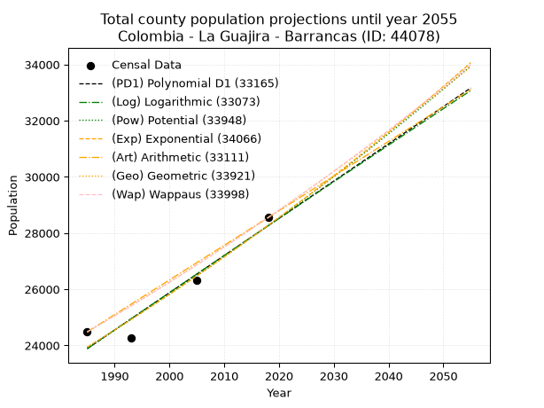
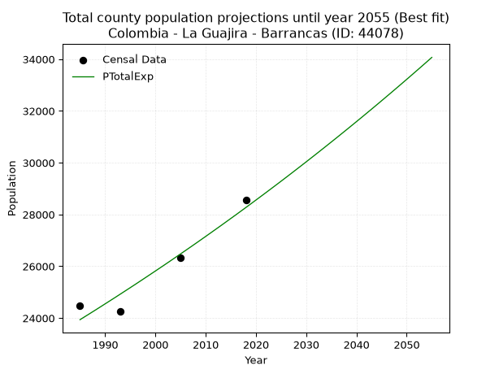
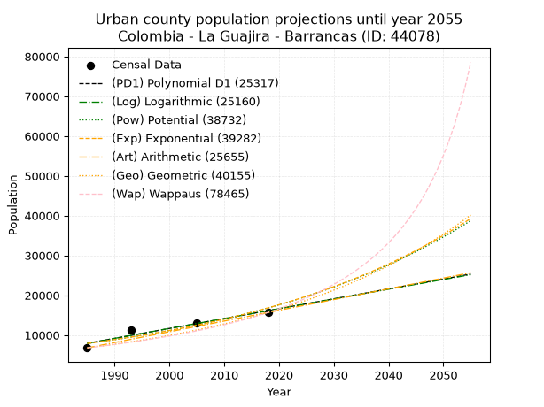
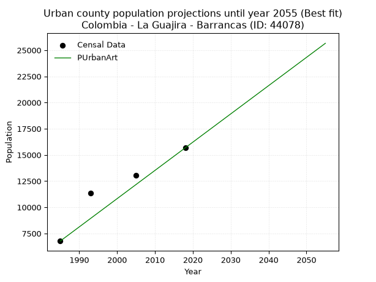
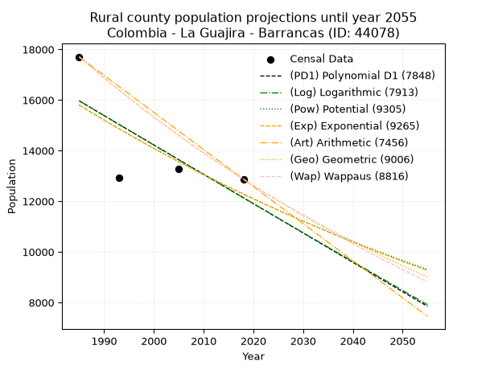
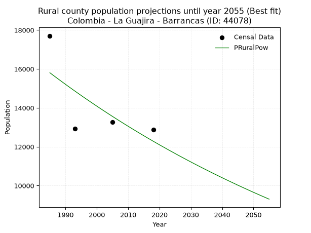

<div align="center">


</div>

# 📜 _“Population and Public Services Demand Projections (PPSD) until Year 2050 for Colombia - La Guajira - Barrancas (ID: 44078)”_
Keywords: `population` `public-service` `projection` `lineal` `polynomial` `logarithmic` `potential` `exponential` `arithmetic` `geometric` `wappaus` `dane` `colombia` `south-america`

PPSD are analytical estimates used by governments and planners to anticipate future changes in population size, age distribution, and the resulting community needs for utilities, healthcare, education, and infrastructure as sizing future water treatment facilities, electrical grids, and road networks based on spatial growth.

<div align="center">

</img>

</div>


> **General running parameters**: • app_version: _v20260806_. • Python version: _3.14.7_. • Pandas version: _3.0.5_. • NumPy version: _2.5.1_. • Creates, save and include plots into reports (create_plot): _False_. • Projection until year: _2050_. • Process polynomial degree 2 and up: _False_. • Process Wappaus: _True_. • Process Wappaus: _True_. • Set negative values to zero: _True_. • Set infinite values to zero: _True_. • Drop dataset notes: _True_. 
<div align="center">

Maps & GIS Layers: [:earth_americas:Google](http://maps.google.com/maps?q=10.95866936,-72.7936391) [:earth_americas:OSM](https://www.openstreetmap.org/#map=18/10.95866936/-72.7936391&layers=P) [:earth_americas:Bing](https://www.bing.com/maps?cp=10.95866936~-72.7936391&lvl=18) [:earth_americas:Apple](https://maps.apple.com/frame?center=10.95866936%2C-72.7936391&span=0.003%2C0.006) [:earth_americas:GISMobile](https://github.com/rcfdtools/R.GISMobile/blob/main/file/gis/CountyLayer_CO/Readme.md)

</div>


<div align="center">

```geojson
{
  "type": "Feature",
  "geometry": {
    "type": "Point", 
    "coordinates": [-72.7936391, 10.95866936]
  }, 
  "properties": {
    "Name": "Colombia - La Guajira - Barrancas (ID: 44078)"
  }
}
```

</div>


## 0. Census Data (4 records)

Census data are official statistics collected by a government about the people and housing in a country. They usually include counts of total population, age, sex, race, income, education, and jobs.

📅Global census file: [Population.xlsx](../data/Population.xlsx)

| Source   |   Year |   CountryID | CountryName   |   StateID | StateName   |   CountyID | CountyName   |   PTotal |   PUrban |   PRural |
|:---------|-------:|------------:|:--------------|----------:|:------------|-----------:|:-------------|---------:|---------:|---------:|
| DANE     |   1985 |          57 | Colombia      |        44 | La Guajira  |      44078 | Barrancas    |    24480 |     6774 |    17706 |
| DANE     |   1993 |          57 | Colombia      |        44 | La Guajira  |      44078 | Barrancas    |    24264 |    11333 |    12931 |
| DANE     |   2005 |          57 | Colombia      |        44 | La Guajira  |      44078 | Barrancas    |    26329 |    13056 |    13273 |
| DANE     |   2018 |          57 | Colombia      |        44 | La Guajira  |      44078 | Barrancas    |    28549 |    15675 |    12874 |

> 🔥Some records could had specific notes about the registered values or the corresponding urban or rural distribution.

📅[SUI-RUPS](https://www.datos.gov.co/Hacienda-y-Cr-dito-P-blico/Registro-nico-de-Prestadores-de-Servicios-P-blicos/4qkq-csdn/about_data) - Local public utility companies: [RUPS.csv](../data/RUPS.csv)

 | SERVICIO       | ESTADO      | NOMBRE                                                                                                       | NIT         | DEPARTAMENTO_DOMICILIO   | MUNICIPIO_DOMICILIO   | DIRECCION                       |   TELEFONO | EMAIL                       | TIPO_PRESTADOR                             | CLASIFICACION                  |
|:---------------|:------------|:-------------------------------------------------------------------------------------------------------------|:------------|:-------------------------|:----------------------|:--------------------------------|-----------:|:----------------------------|:-------------------------------------------|:-------------------------------|
| ACUEDUCTO      | OPERATIVA   | ASOCIACION DE USUARIOS DE ACUEDUCTO Y ALCANTARILLADO DE LAS COMUNIDADES DE ROCHE CHANCLETA Y PATILLA         | 900358895-7 | LA GUAJIRA               | BARRANCAS             | Centro Comunitario de Roche     |    0000000 | diegograciaruiz@gmail.com   | ORGANIZACION AUTORIZADA                    | MENOR O IGUAL A 2500 USUARIOS  |
| ACUEDUCTO      | OPERATIVA   | ASOCIACIÓN DE USUARIOS DEL ACUEDUCTO Y ALCANTARILLADO DE LA ZONA RURAL-RESGUARDO INDIGENA WAYUU TAMAQUITO II | 900607333-9 | LA GUAJIRA               | BARRANCAS             | RESGUARDO INDIGENA TAMAQUITO II |    7266520 | tamawinii@outlook.com       | ORGANIZACION AUTORIZADA                    | HASTA 2500 SUSCRIPTORES        |
| ALCANTARILLADO | OPERATIVA   | ASOCIACIÓN DE USUARIOS DEL ACUEDUCTO Y ALCANTARILLADO DE LA ZONA RURAL-RESGUARDO INDIGENA WAYUU TAMAQUITO II | 900607333-9 | LA GUAJIRA               | BARRANCAS             | RESGUARDO INDIGENA TAMAQUITO II |    7266520 | tamawinii@outlook.com       | ORGANIZACION AUTORIZADA                    | HASTA 2500 SUSCRIPTORES        |
| ACUEDUCTO      | OPERATIVA   | EMPRESA AGUAS DE BARRANCAS SA.ESP                                                                            | 900853152-6 | LA GUAJIRA               | BARRANCAS             | CALLE 11No 13-81                |    3205728 | albetosanchez2008@gmail.com | SOCIEDADES (EMPRESA DE SERVICIOS PUBLICOS) | DESDE 2501 HASTA 5000 USUARIOS |
| ALCANTARILLADO | OPERATIVA   | EMPRESA AGUAS DE BARRANCAS SA.ESP                                                                            | 900853152-6 | LA GUAJIRA               | BARRANCAS             | CALLE 11No 13-81                |    3205728 | albetosanchez2008@gmail.com | SOCIEDADES (EMPRESA DE SERVICIOS PUBLICOS) | DESDE 2501 HASTA 5000 USUARIOS |
| ACUEDUCTO      | CANCELACION | AGUAS TOTAL S.A.S. E.S.P.                                                                                    | 901352349-3 | LA GUAJIRA               | SAN JUAN DEL CESAR    | CALLE 5 SUR # 5 - 97            |    3225474 | neobritoc@gmail.com         | nan                                        | nan                            |
| ALCANTARILLADO | CANCELACION | AGUAS TOTAL S.A.S. E.S.P.                                                                                    | 901352349-3 | LA GUAJIRA               | SAN JUAN DEL CESAR    | CALLE 5 SUR # 5 - 97            |    3225474 | neobritoc@gmail.com         | nan                                        | nan                            |

## 1. Total

### 1.1. Coefficients and Parameters

* (PD1) Polynomial Deg 1: 132.59494179044412, -239317.53231633588 (lineal)
* (Log) Logarithmic: 265252.21423304843, -1990278.705983245
* (Pow) Potential: 10.085274216770522, -28.87980525918471
* (Exp) Exponential: 0.005041285094206832, 1.0791897757290096
* (Art) Arithmetic: Year diff. 2018 - 1985 = 33, Population diff. 28549 - 24480 = 4069, Annual growth = 123.3030303030303
* (Geo) Geometric: Year diff. 2018 - 1985 = 33, Population diff. 28549 - 24480 = 4069, Annual growth % = 0.004670431764967953
* (Wap) Wappaus: i = 0.4650399981256682, Condition values only valid for < 200)

<sub>
Wappaus condition values: ['0.00', '0.47', '0.93', '1.40', '1.86', '2.33', '2.79', '3.26', '3.72', '4.19', '4.65', '5.12', '5.58', '6.05', '6.51', '6.98', '7.44', '7.91', '8.37', '8.84', '9.30', '9.77', '10.23', '10.70', '11.16', '11.63', '12.09', '12.56', '13.02', '13.49', '13.95', '14.42', '14.88', '15.35', '15.81', '16.28', '16.74', '17.21', '17.67', '18.14', '18.60', '19.07', '19.53', '20.00', '20.46', '20.93', '21.39', '21.86', '22.32', '22.79', '23.25', '23.72', '24.18', '24.65', '25.11', '25.58', '26.04', '26.51', '26.97', '27.44', '27.90', '28.37', '28.83', '29.30', '29.76', '30.23']
</sub>


### 1.2. Projected Dataset

|   Year |   CountyID |   PTotalPD1 |   PTotalLog |   PTotalPow |   PTotalExp |   PTotalArt |   PTotalGeo |   PTotalWap |
|-------:|-----------:|------------:|------------:|------------:|------------:|------------:|------------:|------------:|
|   1985 |      44078 |       23883 |       23881 |       23934 |       23937 |       24480 |       24480 |       24480 |
|   1986 |      44078 |       24016 |       24014 |       24056 |       24058 |       24603 |       24594 |       24594 |
|   1987 |      44078 |       24149 |       24148 |       24178 |       24179 |       24727 |       24709 |       24709 |
|   1988 |      44078 |       24281 |       24281 |       24301 |       24301 |       24850 |       24825 |       24824 |
|   1989 |      44078 |       24414 |       24415 |       24425 |       24424 |       24973 |       24941 |       24940 |
|   1990 |      44078 |       24546 |       24548 |       24549 |       24548 |       25097 |       25057 |       25056 |
|   1991 |      44078 |       24679 |       24681 |       24674 |       24672 |       25220 |       25174 |       25173 |
|   1992 |      44078 |       24812 |       24814 |       24799 |       24796 |       25343 |       25292 |       25290 |
|   1993 |      44078 |       24944 |       24947 |       24925 |       24922 |       25466 |       25410 |       25408 |
|   1994 |      44078 |       25077 |       25081 |       25051 |       25048 |       25590 |       25528 |       25526 |
|   1995 |      44078 |       25209 |       25214 |       25178 |       25174 |       25713 |       25648 |       25646 |
|   1996 |      44078 |       25342 |       25346 |       25306 |       25301 |       25836 |       25767 |       25765 |
|   1997 |      44078 |       25475 |       25479 |       25434 |       25429 |       25960 |       25888 |       25885 |
|   1998 |      44078 |       25607 |       25612 |       25563 |       25558 |       26083 |       26009 |       26006 |
|   1999 |      44078 |       25740 |       25745 |       25692 |       25687 |       26206 |       26130 |       26127 |
|   2000 |      44078 |       25872 |       25878 |       25822 |       25817 |       26330 |       26252 |       26249 |
|   2001 |      44078 |       26005 |       26010 |       25952 |       25947 |       26453 |       26375 |       26372 |
|   2002 |      44078 |       26138 |       26143 |       26083 |       26078 |       26576 |       26498 |       26495 |
|   2003 |      44078 |       26270 |       26275 |       26215 |       26210 |       26699 |       26622 |       26619 |
|   2004 |      44078 |       26403 |       26407 |       26347 |       26343 |       26823 |       26746 |       26743 |
|   2005 |      44078 |       26535 |       26540 |       26480 |       26476 |       26946 |       26871 |       26868 |
|   2006 |      44078 |       26668 |       26672 |       26614 |       26610 |       27069 |       26996 |       26993 |
|   2007 |      44078 |       26801 |       26804 |       26748 |       26744 |       27193 |       27123 |       27120 |
|   2008 |      44078 |       26933 |       26936 |       26883 |       26879 |       27316 |       27249 |       27246 |
|   2009 |      44078 |       27066 |       27068 |       27018 |       27015 |       27439 |       27377 |       27374 |
|   2010 |      44078 |       27198 |       27200 |       27154 |       27152 |       27563 |       27504 |       27502 |
|   2011 |      44078 |       27331 |       27332 |       27290 |       27289 |       27686 |       27633 |       27630 |
|   2012 |      44078 |       27463 |       27464 |       27428 |       27427 |       27809 |       27762 |       27760 |
|   2013 |      44078 |       27596 |       27596 |       27565 |       27565 |       27932 |       27892 |       27890 |
|   2014 |      44078 |       27729 |       27728 |       27704 |       27705 |       28056 |       28022 |       28020 |
|   2015 |      44078 |       27861 |       27859 |       27843 |       27845 |       28179 |       28153 |       28151 |
|   2016 |      44078 |       27994 |       27991 |       27983 |       27985 |       28302 |       28284 |       28283 |
|   2017 |      44078 |       28126 |       28123 |       28123 |       28127 |       28426 |       28416 |       28416 |
|   2018 |      44078 |       28259 |       28254 |       28264 |       28269 |       28549 |       28549 |       28549 |
|   2019 |      44078 |       28392 |       28386 |       28405 |       28412 |       28672 |       28682 |       28683 |
|   2020 |      44078 |       28524 |       28517 |       28548 |       28556 |       28796 |       28816 |       28817 |
|   2021 |      44078 |       28657 |       28648 |       28690 |       28700 |       28919 |       28951 |       28953 |
|   2022 |      44078 |       28789 |       28779 |       28834 |       28845 |       29042 |       29086 |       29089 |
|   2023 |      44078 |       28922 |       28910 |       28978 |       28991 |       29166 |       29222 |       29225 |
|   2024 |      44078 |       29055 |       29042 |       29123 |       29137 |       29289 |       29358 |       29363 |
|   2025 |      44078 |       29187 |       29173 |       29268 |       29284 |       29412 |       29496 |       29501 |
|   2026 |      44078 |       29320 |       29304 |       29414 |       29432 |       29535 |       29633 |       29639 |
|   2027 |      44078 |       29452 |       29434 |       29561 |       29581 |       29659 |       29772 |       29779 |
|   2028 |      44078 |       29585 |       29565 |       29709 |       29731 |       29782 |       29911 |       29919 |
|   2029 |      44078 |       29718 |       29696 |       29857 |       29881 |       29905 |       30050 |       30060 |
|   2030 |      44078 |       29850 |       29827 |       30005 |       30032 |       30029 |       30191 |       30202 |
|   2031 |      44078 |       29983 |       29957 |       30155 |       30184 |       30152 |       30332 |       30344 |
|   2032 |      44078 |       30115 |       30088 |       30305 |       30336 |       30275 |       30473 |       30487 |
|   2033 |      44078 |       30248 |       30218 |       30456 |       30490 |       30399 |       30616 |       30631 |
|   2034 |      44078 |       30381 |       30349 |       30607 |       30644 |       30522 |       30759 |       30776 |
|   2035 |      44078 |       30513 |       30479 |       30759 |       30799 |       30645 |       30902 |       30921 |
|   2036 |      44078 |       30646 |       30610 |       30912 |       30954 |       30768 |       31047 |       31067 |
|   2037 |      44078 |       30778 |       30740 |       31065 |       31111 |       30892 |       31192 |       31214 |
|   2038 |      44078 |       30911 |       30870 |       31220 |       31268 |       31015 |       31337 |       31362 |
|   2039 |      44078 |       31044 |       31000 |       31374 |       31426 |       31138 |       31484 |       31510 |
|   2040 |      44078 |       31176 |       31130 |       31530 |       31585 |       31262 |       31631 |       31659 |
|   2041 |      44078 |       31309 |       31260 |       31686 |       31744 |       31385 |       31779 |       31810 |
|   2042 |      44078 |       31441 |       31390 |       31843 |       31905 |       31508 |       31927 |       31960 |
|   2043 |      44078 |       31574 |       31520 |       32001 |       32066 |       31632 |       32076 |       32112 |
|   2044 |      44078 |       31707 |       31650 |       32159 |       32228 |       31755 |       32226 |       32265 |
|   2045 |      44078 |       31839 |       31780 |       32318 |       32391 |       31878 |       32376 |       32418 |
|   2046 |      44078 |       31972 |       31909 |       32478 |       32555 |       32001 |       32528 |       32572 |
|   2047 |      44078 |       32104 |       32039 |       32638 |       32719 |       32125 |       32680 |       32727 |
|   2048 |      44078 |       32237 |       32168 |       32799 |       32885 |       32248 |       32832 |       32883 |
|   2049 |      44078 |       32370 |       32298 |       32961 |       33051 |       32371 |       32986 |       33040 |
|   2050 |      44078 |       32502 |       32427 |       33124 |       33218 |       32495 |       33140 |       33197 |
<div align="center">

</img>

</div>


### 1.3. Best fit with absolute and relative error (%)

Relative error puts that difference into context by dividing the absolute error by the true value, creating a unitless ratio or percentage that shows the scale of the mistake.

Absolute and relative error

|   Year | Source   |   CountryID | CountryName   |   StateID | StateName   |   CountyID_x | CountyName   |   PTotal |   PUrban |   PRural |   CountyID_y |   PTotalPD1 |   PTotalLog |   PTotalPow |   PTotalExp |   PTotalArt |   PTotalGeo |   PTotalWap |   PTotalPD1AbsError |   PTotalLogAbsError |   PTotalPowAbsError |   PTotalExpAbsError |   PTotalArtAbsError |   PTotalGeoAbsError |   PTotalWapAbsError |   PTotalPD1RelError |   PTotalLogRelError |   PTotalPowRelError |   PTotalExpRelError |   PTotalArtRelError |   PTotalGeoRelError |   PTotalWapRelError |
|-------:|:---------|------------:|:--------------|----------:|:------------|-------------:|:-------------|---------:|---------:|---------:|-------------:|------------:|------------:|------------:|------------:|------------:|------------:|------------:|--------------------:|--------------------:|--------------------:|--------------------:|--------------------:|--------------------:|--------------------:|--------------------:|--------------------:|--------------------:|--------------------:|--------------------:|--------------------:|--------------------:|
|   1985 | DANE     |          57 | Colombia      |        44 | La Guajira  |        44078 | Barrancas    |    24480 |     6774 |    17706 |        44078 |       23883 |       23881 |       23934 |       23937 |       24480 |       24480 |       24480 |                 597 |                 599 |                 546 |                 543 |                   0 |                   0 |                   0 |            2.43873  |            2.4469   |            2.23039  |             2.21814 |             0       |             0       |             0       |
|   1993 | DANE     |          57 | Colombia      |        44 | La Guajira  |        44078 | Barrancas    |    24264 |    11333 |    12931 |        44078 |       24944 |       24947 |       24925 |       24922 |       25466 |       25410 |       25408 |                 680 |                 683 |                 661 |                 658 |                1202 |                1146 |                1144 |            2.80251  |            2.81487  |            2.7242   |             2.71184 |             4.95384 |             4.72305 |             4.7148  |
|   2005 | DANE     |          57 | Colombia      |        44 | La Guajira  |        44078 | Barrancas    |    26329 |    13056 |    13273 |        44078 |       26535 |       26540 |       26480 |       26476 |       26946 |       26871 |       26868 |                 206 |                 211 |                 151 |                 147 |                 617 |                 542 |                 539 |            0.782407 |            0.801398 |            0.573512 |             0.55832 |             2.34342 |             2.05857 |             2.04717 |
|   2018 | DANE     |          57 | Colombia      |        44 | La Guajira  |        44078 | Barrancas    |    28549 |    15675 |    12874 |        44078 |       28259 |       28254 |       28264 |       28269 |       28549 |       28549 |       28549 |                 290 |                 295 |                 285 |                 280 |                   0 |                   0 |                   0 |            1.0158   |            1.03331  |            0.998284 |             0.98077 |             0       |             0       |             0       |

Relative error mean

| Method    |   RelError | Best   |
|:----------|-----------:|:-------|
| PTotalPD1 |    1.75986 |        |
| PTotalLog |    1.77412 |        |
| PTotalPow |    1.6316  |        |
| PTotalExp |    1.61727 | True   |
| PTotalArt |    1.82432 |        |
| PTotalGeo |    1.6954  |        |
| PTotalWap |    1.69049 |        |

💙Best method: _**PTotalExp**_
<div align="center">

</img>

</div>


### 1.4. Fresh water supply demand in liters per capita per day (lpcd)

The fresh water supply demand typically ranges from 100 to 300 liters per capita per day (lpcd) for standard domestic and municipal planning, though absolute survival minimums set by the World Health Organization are as low as 7.5 to 20 liters per day, and total consumption in high-income nations can exceed 400 liters.

> `CZ`: Level in meters above the sea level (masl)<br> `WS`: Fresh water supply demand in liters per capita per day (lpcd or l/h/d)<br> `WSAll`: Zonal fresh water supply demand in liters per second (l/s)<br> `A`: Zonal area in square meters<br> `DP`: Population density (people/hectare or p/ha)

Reference values (RAS Colombia)

|    CZ |   WS |
|------:|-----:|
|  1000 |  120 |
|  2000 |  130 |
| 99999 |  140 |

County shapefile geometry properties and water supply values

|   CountyID |      ATotal |   CZTotal |   WSTotal |
|-----------:|------------:|----------:|----------:|
|      44078 | 7.99948e+08 |   398.831 |       120 |

Projected values for best method: PTotalExp

|   CountyID |   Year |   PTotalExp |   DPTotal |   WSTotal |   WSTotalAll |
|-----------:|-------:|------------:|----------:|----------:|-------------:|
|      44078 |   1985 |       23937 |      0.3  |       120 |      33.2458 |
|      44078 |   1986 |       24058 |      0.3  |       120 |      33.4139 |
|      44078 |   1987 |       24179 |      0.3  |       120 |      33.5819 |
|      44078 |   1988 |       24301 |      0.3  |       120 |      33.7514 |
|      44078 |   1989 |       24424 |      0.31 |       120 |      33.9222 |
|      44078 |   1990 |       24548 |      0.31 |       120 |      34.0944 |
|      44078 |   1991 |       24672 |      0.31 |       120 |      34.2667 |
|      44078 |   1992 |       24796 |      0.31 |       120 |      34.4389 |
|      44078 |   1993 |       24922 |      0.31 |       120 |      34.6139 |
|      44078 |   1994 |       25048 |      0.31 |       120 |      34.7889 |
|      44078 |   1995 |       25174 |      0.31 |       120 |      34.9639 |
|      44078 |   1996 |       25301 |      0.32 |       120 |      35.1403 |
|      44078 |   1997 |       25429 |      0.32 |       120 |      35.3181 |
|      44078 |   1998 |       25558 |      0.32 |       120 |      35.4972 |
|      44078 |   1999 |       25687 |      0.32 |       120 |      35.6764 |
|      44078 |   2000 |       25817 |      0.32 |       120 |      35.8569 |
|      44078 |   2001 |       25947 |      0.32 |       120 |      36.0375 |
|      44078 |   2002 |       26078 |      0.33 |       120 |      36.2194 |
|      44078 |   2003 |       26210 |      0.33 |       120 |      36.4028 |
|      44078 |   2004 |       26343 |      0.33 |       120 |      36.5875 |
|      44078 |   2005 |       26476 |      0.33 |       120 |      36.7722 |
|      44078 |   2006 |       26610 |      0.33 |       120 |      36.9583 |
|      44078 |   2007 |       26744 |      0.33 |       120 |      37.1444 |
|      44078 |   2008 |       26879 |      0.34 |       120 |      37.3319 |
|      44078 |   2009 |       27015 |      0.34 |       120 |      37.5208 |
|      44078 |   2010 |       27152 |      0.34 |       120 |      37.7111 |
|      44078 |   2011 |       27289 |      0.34 |       120 |      37.9014 |
|      44078 |   2012 |       27427 |      0.34 |       120 |      38.0931 |
|      44078 |   2013 |       27565 |      0.34 |       120 |      38.2847 |
|      44078 |   2014 |       27705 |      0.35 |       120 |      38.4792 |
|      44078 |   2015 |       27845 |      0.35 |       120 |      38.6736 |
|      44078 |   2016 |       27985 |      0.35 |       120 |      38.8681 |
|      44078 |   2017 |       28127 |      0.35 |       120 |      39.0653 |
|      44078 |   2018 |       28269 |      0.35 |       120 |      39.2625 |
|      44078 |   2019 |       28412 |      0.36 |       120 |      39.4611 |
|      44078 |   2020 |       28556 |      0.36 |       120 |      39.6611 |
|      44078 |   2021 |       28700 |      0.36 |       120 |      39.8611 |
|      44078 |   2022 |       28845 |      0.36 |       120 |      40.0625 |
|      44078 |   2023 |       28991 |      0.36 |       120 |      40.2653 |
|      44078 |   2024 |       29137 |      0.36 |       120 |      40.4681 |
|      44078 |   2025 |       29284 |      0.37 |       120 |      40.6722 |
|      44078 |   2026 |       29432 |      0.37 |       120 |      40.8778 |
|      44078 |   2027 |       29581 |      0.37 |       120 |      41.0847 |
|      44078 |   2028 |       29731 |      0.37 |       120 |      41.2931 |
|      44078 |   2029 |       29881 |      0.37 |       120 |      41.5014 |
|      44078 |   2030 |       30032 |      0.38 |       120 |      41.7111 |
|      44078 |   2031 |       30184 |      0.38 |       120 |      41.9222 |
|      44078 |   2032 |       30336 |      0.38 |       120 |      42.1333 |
|      44078 |   2033 |       30490 |      0.38 |       120 |      42.3472 |
|      44078 |   2034 |       30644 |      0.38 |       120 |      42.5611 |
|      44078 |   2035 |       30799 |      0.39 |       120 |      42.7764 |
|      44078 |   2036 |       30954 |      0.39 |       120 |      42.9917 |
|      44078 |   2037 |       31111 |      0.39 |       120 |      43.2097 |
|      44078 |   2038 |       31268 |      0.39 |       120 |      43.4278 |
|      44078 |   2039 |       31426 |      0.39 |       120 |      43.6472 |
|      44078 |   2040 |       31585 |      0.39 |       120 |      43.8681 |
|      44078 |   2041 |       31744 |      0.4  |       120 |      44.0889 |
|      44078 |   2042 |       31905 |      0.4  |       120 |      44.3125 |
|      44078 |   2043 |       32066 |      0.4  |       120 |      44.5361 |
|      44078 |   2044 |       32228 |      0.4  |       120 |      44.7611 |
|      44078 |   2045 |       32391 |      0.4  |       120 |      44.9875 |
|      44078 |   2046 |       32555 |      0.41 |       120 |      45.2153 |
|      44078 |   2047 |       32719 |      0.41 |       120 |      45.4431 |
|      44078 |   2048 |       32885 |      0.41 |       120 |      45.6736 |
|      44078 |   2049 |       33051 |      0.41 |       120 |      45.9042 |
|      44078 |   2050 |       33218 |      0.42 |       120 |      46.1361 |

## 2. Urban

### 2.1. Coefficients and Parameters

* (PD1) Polynomial Deg 1: 248.54195102368342, -485436.5375351227 (lineal)
* (Log) Logarithmic: 497750.9193842138, -3771699.2269649473
* (Pow) Potential: 45.92833283341963, -147.56385781463854
* (Exp) Exponential: 0.022926546929810145, 1.3577414710799636e-16
* (Art) Arithmetic: Year diff. 2018 - 1985 = 33, Population diff. 15675 - 6774 = 8901, Annual growth = 269.72727272727275
* (Geo) Geometric: Year diff. 2018 - 1985 = 33, Population diff. 15675 - 6774 = 8901, Annual growth % = 0.025749428219077775
* (Wap) Wappaus: i = 2.403022608822422, Condition values only valid for < 200)

<sub>
Wappaus condition values: ['0.00', '2.40', '4.81', '7.21', '9.61', '12.02', '14.42', '16.82', '19.22', '21.63', '24.03', '26.43', '28.84', '31.24', '33.64', '36.05', '38.45', '40.85', '43.25', '45.66', '48.06', '50.46', '52.87', '55.27', '57.67', '60.08', '62.48', '64.88', '67.28', '69.69', '72.09', '74.49', '76.90', '79.30', '81.70', '84.11', '86.51', '88.91', '91.31', '93.72', '96.12', '98.52', '100.93', '103.33', '105.73', '108.14', '110.54', '112.94', '115.35', '117.75', '120.15', '122.55', '124.96', '127.36', '129.76', '132.17', '134.57', '136.97', '139.38', '141.78', '144.18', '146.58', '148.99', '151.39', '153.79', '156.20']
</sub>


### 2.2. Projected Dataset

|   Year |   CountyID |   PUrbanPD1 |   PUrbanLog |   PUrbanPow |   PUrbanExp |   PUrbanArt |   PUrbanGeo |   PUrbanWap |
|-------:|-----------:|------------:|------------:|------------:|------------:|------------:|------------:|------------:|
|   1985 |      44078 |        7919 |        7910 |        7885 |        7892 |        6774 |        6774 |        6774 |
|   1986 |      44078 |        8168 |        8160 |        8069 |        8075 |        7044 |        6948 |        6939 |
|   1987 |      44078 |        8416 |        8411 |        8258 |        8263 |        7313 |        7127 |        7108 |
|   1988 |      44078 |        8665 |        8661 |        8451 |        8454 |        7583 |        7311 |        7281 |
|   1989 |      44078 |        8913 |        8912 |        8648 |        8650 |        7853 |        7499 |        7458 |
|   1990 |      44078 |        9162 |        9162 |        8850 |        8851 |        8123 |        7692 |        7640 |
|   1991 |      44078 |        9410 |        9412 |        9057 |        9056 |        8392 |        7890 |        7827 |
|   1992 |      44078 |        9659 |        9662 |        9268 |        9266 |        8662 |        8093 |        8018 |
|   1993 |      44078 |        9908 |        9912 |        9484 |        9481 |        8932 |        8302 |        8215 |
|   1994 |      44078 |       10156 |       10161 |        9705 |        9701 |        9202 |        8516 |        8417 |
|   1995 |      44078 |       10405 |       10411 |        9932 |        9926 |        9471 |        8735 |        8624 |
|   1996 |      44078 |       10653 |       10660 |       10163 |       10156 |        9741 |        8960 |        8837 |
|   1997 |      44078 |       10902 |       10910 |       10399 |       10392 |       10011 |        9191 |        9056 |
|   1998 |      44078 |       11150 |       11159 |       10641 |       10633 |       10280 |        9427 |        9282 |
|   1999 |      44078 |       11399 |       11408 |       10889 |       10879 |       10550 |        9670 |        9514 |
|   2000 |      44078 |       11647 |       11657 |       11142 |       11132 |       10820 |        9919 |        9753 |
|   2001 |      44078 |       11896 |       11906 |       11400 |       11390 |       11090 |       10174 |        9998 |
|   2002 |      44078 |       12144 |       12154 |       11665 |       11654 |       11359 |       10436 |       10252 |
|   2003 |      44078 |       12393 |       12403 |       11936 |       11924 |       11629 |       10705 |       10513 |
|   2004 |      44078 |       12642 |       12651 |       12212 |       12201 |       11899 |       10981 |       10782 |
|   2005 |      44078 |       12890 |       12900 |       12495 |       12484 |       12169 |       11263 |       11059 |
|   2006 |      44078 |       13139 |       13148 |       12785 |       12773 |       12438 |       11553 |       11346 |
|   2007 |      44078 |       13387 |       13396 |       13081 |       13070 |       12708 |       11851 |       11642 |
|   2008 |      44078 |       13636 |       13644 |       13384 |       13373 |       12978 |       12156 |       11948 |
|   2009 |      44078 |       13884 |       13892 |       13693 |       13683 |       13247 |       12469 |       12264 |
|   2010 |      44078 |       14133 |       14140 |       14010 |       14000 |       13517 |       12790 |       12591 |
|   2011 |      44078 |       14381 |       14387 |       14333 |       14325 |       13787 |       13120 |       12929 |
|   2012 |      44078 |       14630 |       14635 |       14665 |       14657 |       14057 |       13457 |       13280 |
|   2013 |      44078 |       14878 |       14882 |       15003 |       14997 |       14326 |       13804 |       13643 |
|   2014 |      44078 |       15127 |       15129 |       15349 |       15345 |       14596 |       14159 |       14019 |
|   2015 |      44078 |       15375 |       15376 |       15703 |       15701 |       14866 |       14524 |       14410 |
|   2016 |      44078 |       15624 |       15623 |       16065 |       16065 |       15136 |       14898 |       14815 |
|   2017 |      44078 |       15873 |       15870 |       16435 |       16437 |       15405 |       15282 |       15237 |
|   2018 |      44078 |       16121 |       16117 |       16814 |       16818 |       15675 |       15675 |       15675 |
|   2019 |      44078 |       16370 |       16363 |       17201 |       17209 |       15945 |       16079 |       16131 |
|   2020 |      44078 |       16618 |       16610 |       17596 |       17608 |       16214 |       16493 |       16606 |
|   2021 |      44078 |       16867 |       16856 |       18001 |       18016 |       16484 |       16917 |       17101 |
|   2022 |      44078 |       17115 |       17102 |       18414 |       18434 |       16754 |       17353 |       17617 |
|   2023 |      44078 |       17364 |       17348 |       18837 |       18861 |       17024 |       17800 |       18157 |
|   2024 |      44078 |       17612 |       17594 |       19270 |       19299 |       17293 |       18258 |       18720 |
|   2025 |      44078 |       17861 |       17840 |       19712 |       19746 |       17563 |       18728 |       19310 |
|   2026 |      44078 |       18109 |       18086 |       20164 |       20204 |       17833 |       19210 |       19928 |
|   2027 |      44078 |       18358 |       18332 |       20626 |       20673 |       18103 |       19705 |       20576 |
|   2028 |      44078 |       18607 |       18577 |       21099 |       21152 |       18372 |       20213 |       21255 |
|   2029 |      44078 |       18855 |       18823 |       21582 |       21643 |       18642 |       20733 |       21970 |
|   2030 |      44078 |       19104 |       19068 |       22076 |       22145 |       18912 |       21267 |       22722 |
|   2031 |      44078 |       19352 |       19313 |       22581 |       22658 |       19181 |       21814 |       23514 |
|   2032 |      44078 |       19601 |       19558 |       23097 |       23184 |       19451 |       22376 |       24350 |
|   2033 |      44078 |       19849 |       19803 |       23625 |       23721 |       19721 |       22952 |       25234 |
|   2034 |      44078 |       20098 |       20048 |       24165 |       24271 |       19991 |       23543 |       26169 |
|   2035 |      44078 |       20346 |       20292 |       24717 |       24834 |       20260 |       24150 |       27160 |
|   2036 |      44078 |       20595 |       20537 |       25281 |       25410 |       20530 |       24771 |       28213 |
|   2037 |      44078 |       20843 |       20781 |       25857 |       26000 |       20800 |       25409 |       29333 |
|   2038 |      44078 |       21092 |       21026 |       26447 |       26603 |       21070 |       26064 |       30528 |
|   2039 |      44078 |       21341 |       21270 |       27049 |       27220 |       21339 |       26735 |       31804 |
|   2040 |      44078 |       21589 |       21514 |       27665 |       27851 |       21609 |       27423 |       33171 |
|   2041 |      44078 |       21838 |       21758 |       28295 |       28497 |       21879 |       28129 |       34638 |
|   2042 |      44078 |       22086 |       22001 |       28939 |       29158 |       22148 |       28853 |       36217 |
|   2043 |      44078 |       22335 |       22245 |       29597 |       29834 |       22418 |       29596 |       37921 |
|   2044 |      44078 |       22583 |       22489 |       30270 |       30526 |       22688 |       30359 |       39765 |
|   2045 |      44078 |       22832 |       22732 |       30958 |       31234 |       22958 |       31140 |       41769 |
|   2046 |      44078 |       23080 |       22976 |       31661 |       31958 |       23227 |       31942 |       43953 |
|   2047 |      44078 |       23329 |       23219 |       32379 |       32699 |       23497 |       32765 |       46342 |
|   2048 |      44078 |       23577 |       23462 |       33114 |       33457 |       23767 |       33608 |       48968 |
|   2049 |      44078 |       23826 |       23705 |       33864 |       34233 |       24037 |       34474 |       51867 |
|   2050 |      44078 |       24074 |       23948 |       34632 |       35027 |       24306 |       35361 |       55084 |
<div align="center">

</img>

</div>


### 2.3. Best fit with absolute and relative error (%)

Relative error puts that difference into context by dividing the absolute error by the true value, creating a unitless ratio or percentage that shows the scale of the mistake.

Absolute and relative error

|   Year | Source   |   CountryID | CountryName   |   StateID | StateName   |   CountyID_x | CountyName   |   PTotal |   PUrban |   PRural |   CountyID_y |   PUrbanPD1 |   PUrbanLog |   PUrbanPow |   PUrbanExp |   PUrbanArt |   PUrbanGeo |   PUrbanWap |   PUrbanPD1AbsError |   PUrbanLogAbsError |   PUrbanPowAbsError |   PUrbanExpAbsError |   PUrbanArtAbsError |   PUrbanGeoAbsError |   PUrbanWapAbsError |   PUrbanPD1RelError |   PUrbanLogRelError |   PUrbanPowRelError |   PUrbanExpRelError |   PUrbanArtRelError |   PUrbanGeoRelError |   PUrbanWapRelError |
|-------:|:---------|------------:|:--------------|----------:|:------------|-------------:|:-------------|---------:|---------:|---------:|-------------:|------------:|------------:|------------:|------------:|------------:|------------:|------------:|--------------------:|--------------------:|--------------------:|--------------------:|--------------------:|--------------------:|--------------------:|--------------------:|--------------------:|--------------------:|--------------------:|--------------------:|--------------------:|--------------------:|
|   1985 | DANE     |          57 | Colombia      |        44 | La Guajira  |        44078 | Barrancas    |    24480 |     6774 |    17706 |        44078 |        7919 |        7910 |        7885 |        7892 |        6774 |        6774 |        6774 |                1145 |                1136 |                1111 |                1118 |                   0 |                   0 |                   0 |            16.9029  |            16.77    |            16.4009  |            16.5043  |             0       |              0      |              0      |
|   1993 | DANE     |          57 | Colombia      |        44 | La Guajira  |        44078 | Barrancas    |    24264 |    11333 |    12931 |        44078 |        9908 |        9912 |        9484 |        9481 |        8932 |        8302 |        8215 |                1425 |                1421 |                1849 |                1852 |                2401 |                3031 |                3118 |            12.5739  |            12.5386  |            16.3152  |            16.3417  |            21.1859  |             26.7449 |             27.5126 |
|   2005 | DANE     |          57 | Colombia      |        44 | La Guajira  |        44078 | Barrancas    |    26329 |    13056 |    13273 |        44078 |       12890 |       12900 |       12495 |       12484 |       12169 |       11263 |       11059 |                 166 |                 156 |                 561 |                 572 |                 887 |                1793 |                1997 |             1.27145 |             1.19485 |             4.29688 |             4.38113 |             6.79381 |             13.7331 |             15.2956 |
|   2018 | DANE     |          57 | Colombia      |        44 | La Guajira  |        44078 | Barrancas    |    28549 |    15675 |    12874 |        44078 |       16121 |       16117 |       16814 |       16818 |       15675 |       15675 |       15675 |                 446 |                 442 |                1139 |                1143 |                   0 |                   0 |                   0 |             2.8453  |             2.81978 |             7.26635 |             7.29187 |             0       |              0      |              0      |

Relative error mean

| Method    |   RelError | Best   |
|:----------|-----------:|:-------|
| PUrbanPD1 |    8.39838 |        |
| PUrbanLog |    8.33081 |        |
| PUrbanPow |   11.0698  |        |
| PUrbanExp |   11.1297  |        |
| PUrbanArt |    6.99493 | True   |
| PUrbanGeo |   10.1195  |        |
| PUrbanWap |   10.7021  |        |

💙Best method: _**PUrbanArt**_
<div align="center">

</img>

</div>


### 2.4. Fresh water supply demand in liters per capita per day (lpcd)

The fresh water supply demand typically ranges from 100 to 300 liters per capita per day (lpcd) for standard domestic and municipal planning, though absolute survival minimums set by the World Health Organization are as low as 7.5 to 20 liters per day, and total consumption in high-income nations can exceed 400 liters.

> `CZ`: Level in meters above the sea level (masl)<br> `WS`: Fresh water supply demand in liters per capita per day (lpcd or l/h/d)<br> `WSAll`: Zonal fresh water supply demand in liters per second (l/s)<br> `A`: Zonal area in square meters<br> `DP`: Population density (people/hectare or p/ha)

Reference values (RAS Colombia)

|    CZ |   WS |
|------:|-----:|
|  1000 |  120 |
|  2000 |  130 |
| 99999 |  140 |

County shapefile geometry properties and water supply values

|   CountyID |      AUrban |   CZUrban |   WSUrban |
|-----------:|------------:|----------:|----------:|
|      44078 | 6.99207e+06 |   157.171 |       120 |

Projected values for best method: PUrbanArt

|   CountyID |   Year |   PUrbanArt |   DPUrban |   WSUrban |   WSUrbanAll |
|-----------:|-------:|------------:|----------:|----------:|-------------:|
|      44078 |   1985 |        6774 |      9.69 |       120 |      9.40833 |
|      44078 |   1986 |        7044 |     10.07 |       120 |      9.78333 |
|      44078 |   1987 |        7313 |     10.46 |       120 |     10.1569  |
|      44078 |   1988 |        7583 |     10.85 |       120 |     10.5319  |
|      44078 |   1989 |        7853 |     11.23 |       120 |     10.9069  |
|      44078 |   1990 |        8123 |     11.62 |       120 |     11.2819  |
|      44078 |   1991 |        8392 |     12    |       120 |     11.6556  |
|      44078 |   1992 |        8662 |     12.39 |       120 |     12.0306  |
|      44078 |   1993 |        8932 |     12.77 |       120 |     12.4056  |
|      44078 |   1994 |        9202 |     13.16 |       120 |     12.7806  |
|      44078 |   1995 |        9471 |     13.55 |       120 |     13.1542  |
|      44078 |   1996 |        9741 |     13.93 |       120 |     13.5292  |
|      44078 |   1997 |       10011 |     14.32 |       120 |     13.9042  |
|      44078 |   1998 |       10280 |     14.7  |       120 |     14.2778  |
|      44078 |   1999 |       10550 |     15.09 |       120 |     14.6528  |
|      44078 |   2000 |       10820 |     15.47 |       120 |     15.0278  |
|      44078 |   2001 |       11090 |     15.86 |       120 |     15.4028  |
|      44078 |   2002 |       11359 |     16.25 |       120 |     15.7764  |
|      44078 |   2003 |       11629 |     16.63 |       120 |     16.1514  |
|      44078 |   2004 |       11899 |     17.02 |       120 |     16.5264  |
|      44078 |   2005 |       12169 |     17.4  |       120 |     16.9014  |
|      44078 |   2006 |       12438 |     17.79 |       120 |     17.275   |
|      44078 |   2007 |       12708 |     18.17 |       120 |     17.65    |
|      44078 |   2008 |       12978 |     18.56 |       120 |     18.025   |
|      44078 |   2009 |       13247 |     18.95 |       120 |     18.3986  |
|      44078 |   2010 |       13517 |     19.33 |       120 |     18.7736  |
|      44078 |   2011 |       13787 |     19.72 |       120 |     19.1486  |
|      44078 |   2012 |       14057 |     20.1  |       120 |     19.5236  |
|      44078 |   2013 |       14326 |     20.49 |       120 |     19.8972  |
|      44078 |   2014 |       14596 |     20.88 |       120 |     20.2722  |
|      44078 |   2015 |       14866 |     21.26 |       120 |     20.6472  |
|      44078 |   2016 |       15136 |     21.65 |       120 |     21.0222  |
|      44078 |   2017 |       15405 |     22.03 |       120 |     21.3958  |
|      44078 |   2018 |       15675 |     22.42 |       120 |     21.7708  |
|      44078 |   2019 |       15945 |     22.8  |       120 |     22.1458  |
|      44078 |   2020 |       16214 |     23.19 |       120 |     22.5194  |
|      44078 |   2021 |       16484 |     23.58 |       120 |     22.8944  |
|      44078 |   2022 |       16754 |     23.96 |       120 |     23.2694  |
|      44078 |   2023 |       17024 |     24.35 |       120 |     23.6444  |
|      44078 |   2024 |       17293 |     24.73 |       120 |     24.0181  |
|      44078 |   2025 |       17563 |     25.12 |       120 |     24.3931  |
|      44078 |   2026 |       17833 |     25.5  |       120 |     24.7681  |
|      44078 |   2027 |       18103 |     25.89 |       120 |     25.1431  |
|      44078 |   2028 |       18372 |     26.28 |       120 |     25.5167  |
|      44078 |   2029 |       18642 |     26.66 |       120 |     25.8917  |
|      44078 |   2030 |       18912 |     27.05 |       120 |     26.2667  |
|      44078 |   2031 |       19181 |     27.43 |       120 |     26.6403  |
|      44078 |   2032 |       19451 |     27.82 |       120 |     27.0153  |
|      44078 |   2033 |       19721 |     28.2  |       120 |     27.3903  |
|      44078 |   2034 |       19991 |     28.59 |       120 |     27.7653  |
|      44078 |   2035 |       20260 |     28.98 |       120 |     28.1389  |
|      44078 |   2036 |       20530 |     29.36 |       120 |     28.5139  |
|      44078 |   2037 |       20800 |     29.75 |       120 |     28.8889  |
|      44078 |   2038 |       21070 |     30.13 |       120 |     29.2639  |
|      44078 |   2039 |       21339 |     30.52 |       120 |     29.6375  |
|      44078 |   2040 |       21609 |     30.91 |       120 |     30.0125  |
|      44078 |   2041 |       21879 |     31.29 |       120 |     30.3875  |
|      44078 |   2042 |       22148 |     31.68 |       120 |     30.7611  |
|      44078 |   2043 |       22418 |     32.06 |       120 |     31.1361  |
|      44078 |   2044 |       22688 |     32.45 |       120 |     31.5111  |
|      44078 |   2045 |       22958 |     32.83 |       120 |     31.8861  |
|      44078 |   2046 |       23227 |     33.22 |       120 |     32.2597  |
|      44078 |   2047 |       23497 |     33.61 |       120 |     32.6347  |
|      44078 |   2048 |       23767 |     33.99 |       120 |     33.0097  |
|      44078 |   2049 |       24037 |     34.38 |       120 |     33.3847  |
|      44078 |   2050 |       24306 |     34.76 |       120 |     33.7583  |

## 3. Rural

### 3.1. Coefficients and Parameters

* (PD1) Polynomial Deg 1: -115.94700923323947, 246119.00521878726 (lineal)
* (Log) Logarithmic: -232498.70515116534, 1781420.5209817025
* (Pow) Potential: -15.285001605211253, 54.605058262673275
* (Exp) Exponential: -0.007622848600008212, 58892311385.98683
* (Art) Arithmetic: Year diff. 2018 - 1985 = 33, Population diff. 12874 - 17706 = -4832, Annual growth = -146.42424242424244
* (Geo) Geometric: Year diff. 2018 - 1985 = 33, Population diff. 12874 - 17706 = -4832, Annual growth % = -0.00961090480965987
* (Wap) Wappaus: i = -0.957647105456131, Condition values only valid for < 200)

<sub>
Wappaus condition values: ['-0.00', '-0.96', '-1.92', '-2.87', '-3.83', '-4.79', '-5.75', '-6.70', '-7.66', '-8.62', '-9.58', '-10.53', '-11.49', '-12.45', '-13.41', '-14.36', '-15.32', '-16.28', '-17.24', '-18.20', '-19.15', '-20.11', '-21.07', '-22.03', '-22.98', '-23.94', '-24.90', '-25.86', '-26.81', '-27.77', '-28.73', '-29.69', '-30.64', '-31.60', '-32.56', '-33.52', '-34.48', '-35.43', '-36.39', '-37.35', '-38.31', '-39.26', '-40.22', '-41.18', '-42.14', '-43.09', '-44.05', '-45.01', '-45.97', '-46.92', '-47.88', '-48.84', '-49.80', '-50.76', '-51.71', '-52.67', '-53.63', '-54.59', '-55.54', '-56.50', '-57.46', '-58.42', '-59.37', '-60.33', '-61.29', '-62.25']
</sub>


### 3.2. Projected Dataset

|   Year |   CountyID |   PRuralPD1 |   PRuralLog |   PRuralPow |   PRuralExp |   PRuralArt |   PRuralGeo |   PRuralWap |
|-------:|-----------:|------------:|------------:|------------:|------------:|------------:|------------:|------------:|
|   1985 |      44078 |       15964 |       15971 |       15805 |       15798 |       17706 |       17706 |       17706 |
|   1986 |      44078 |       15848 |       15854 |       15683 |       15678 |       17560 |       17536 |       17537 |
|   1987 |      44078 |       15732 |       15737 |       15563 |       15559 |       17413 |       17367 |       17370 |
|   1988 |      44078 |       15616 |       15620 |       15444 |       15441 |       17267 |       17200 |       17205 |
|   1989 |      44078 |       15500 |       15503 |       15326 |       15323 |       17120 |       17035 |       17041 |
|   1990 |      44078 |       15384 |       15386 |       15208 |       15207 |       16974 |       16871 |       16878 |
|   1991 |      44078 |       15269 |       15269 |       15092 |       15091 |       16827 |       16709 |       16717 |
|   1992 |      44078 |       15153 |       15152 |       14977 |       14977 |       16681 |       16549 |       16558 |
|   1993 |      44078 |       15037 |       15036 |       14862 |       14863 |       16535 |       16390 |       16400 |
|   1994 |      44078 |       14921 |       14919 |       14749 |       14750 |       16388 |       16232 |       16243 |
|   1995 |      44078 |       14805 |       14803 |       14636 |       14638 |       16242 |       16076 |       16088 |
|   1996 |      44078 |       14689 |       14686 |       14524 |       14527 |       16095 |       15922 |       15934 |
|   1997 |      44078 |       14573 |       14570 |       14414 |       14417 |       15949 |       15769 |       15782 |
|   1998 |      44078 |       14457 |       14453 |       14304 |       14307 |       15802 |       15617 |       15631 |
|   1999 |      44078 |       14341 |       14337 |       14195 |       14199 |       15656 |       15467 |       15481 |
|   2000 |      44078 |       14225 |       14221 |       14087 |       14091 |       15510 |       15318 |       15333 |
|   2001 |      44078 |       14109 |       14104 |       13979 |       13984 |       15363 |       15171 |       15186 |
|   2002 |      44078 |       13993 |       13988 |       13873 |       13878 |       15217 |       15025 |       15040 |
|   2003 |      44078 |       13877 |       13872 |       13768 |       13772 |       15070 |       14881 |       14896 |
|   2004 |      44078 |       13761 |       13756 |       13663 |       13668 |       14924 |       14738 |       14753 |
|   2005 |      44078 |       13645 |       13640 |       13559 |       13564 |       14778 |       14596 |       14611 |
|   2006 |      44078 |       13529 |       13524 |       13456 |       13461 |       14631 |       14456 |       14471 |
|   2007 |      44078 |       13413 |       13408 |       13354 |       13359 |       14485 |       14317 |       14331 |
|   2008 |      44078 |       13297 |       13292 |       13253 |       13257 |       14338 |       14179 |       14193 |
|   2009 |      44078 |       13181 |       13177 |       13152 |       13157 |       14192 |       14043 |       14056 |
|   2010 |      44078 |       13066 |       13061 |       13053 |       13057 |       14045 |       13908 |       13920 |
|   2011 |      44078 |       12950 |       12945 |       12954 |       12957 |       13899 |       13774 |       13785 |
|   2012 |      44078 |       12834 |       12830 |       12856 |       12859 |       13753 |       13642 |       13652 |
|   2013 |      44078 |       12718 |       12714 |       12759 |       12761 |       13606 |       13511 |       13520 |
|   2014 |      44078 |       12602 |       12599 |       12662 |       12665 |       13460 |       13381 |       13388 |
|   2015 |      44078 |       12486 |       12483 |       12566 |       12568 |       13313 |       13252 |       13258 |
|   2016 |      44078 |       12370 |       12368 |       12471 |       12473 |       13167 |       13125 |       13129 |
|   2017 |      44078 |       12254 |       12253 |       12377 |       12378 |       13020 |       12999 |       13001 |
|   2018 |      44078 |       12138 |       12137 |       12284 |       12284 |       12874 |       12874 |       12874 |
|   2019 |      44078 |       12022 |       12022 |       12191 |       12191 |       12728 |       12750 |       12748 |
|   2020 |      44078 |       11906 |       11907 |       12099 |       12098 |       12581 |       12628 |       12623 |
|   2021 |      44078 |       11790 |       11792 |       12008 |       12006 |       12435 |       12506 |       12499 |
|   2022 |      44078 |       11674 |       11677 |       11918 |       11915 |       12288 |       12386 |       12376 |
|   2023 |      44078 |       11558 |       11562 |       11828 |       11825 |       12142 |       12267 |       12255 |
|   2024 |      44078 |       11442 |       11447 |       11739 |       11735 |       11995 |       12149 |       12134 |
|   2025 |      44078 |       11326 |       11332 |       11651 |       11646 |       11849 |       12032 |       12014 |
|   2026 |      44078 |       11210 |       11218 |       11563 |       11557 |       11703 |       11917 |       11895 |
|   2027 |      44078 |       11094 |       11103 |       11476 |       11470 |       11556 |       11802 |       11777 |
|   2028 |      44078 |       10978 |       10988 |       11390 |       11383 |       11410 |       11689 |       11660 |
|   2029 |      44078 |       10863 |       10874 |       11304 |       11296 |       11263 |       11577 |       11544 |
|   2030 |      44078 |       10747 |       10759 |       11220 |       11210 |       11117 |       11465 |       11428 |
|   2031 |      44078 |       10631 |       10644 |       11135 |       11125 |       10970 |       11355 |       11314 |
|   2032 |      44078 |       10515 |       10530 |       11052 |       11041 |       10824 |       11246 |       11201 |
|   2033 |      44078 |       10399 |       10416 |       10969 |       10957 |       10678 |       11138 |       11088 |
|   2034 |      44078 |       10283 |       10301 |       10887 |       10874 |       10531 |       11031 |       10976 |
|   2035 |      44078 |       10167 |       10187 |       10806 |       10791 |       10385 |       10925 |       10866 |
|   2036 |      44078 |       10051 |       10073 |       10725 |       10709 |       10238 |       10820 |       10756 |
|   2037 |      44078 |        9935 |        9959 |       10644 |       10628 |       10092 |       10716 |       10647 |
|   2038 |      44078 |        9819 |        9845 |       10565 |       10547 |        9946 |       10613 |       10538 |
|   2039 |      44078 |        9703 |        9730 |       10486 |       10467 |        9799 |       10511 |       10431 |
|   2040 |      44078 |        9587 |        9616 |       10408 |       10388 |        9653 |       10410 |       10324 |
|   2041 |      44078 |        9471 |        9503 |       10330 |       10309 |        9506 |       10310 |       10218 |
|   2042 |      44078 |        9355 |        9389 |       10253 |       10230 |        9360 |       10211 |       10113 |
|   2043 |      44078 |        9239 |        9275 |       10177 |       10153 |        9213 |       10113 |       10009 |
|   2044 |      44078 |        9123 |        9161 |       10101 |       10076 |        9067 |       10015 |        9906 |
|   2045 |      44078 |        9007 |        9047 |       10025 |        9999 |        8921 |        9919 |        9803 |
|   2046 |      44078 |        8891 |        8934 |        9951 |        9923 |        8774 |        9824 |        9701 |
|   2047 |      44078 |        8775 |        8820 |        9877 |        9848 |        8628 |        9729 |        9600 |
|   2048 |      44078 |        8660 |        8706 |        9803 |        9773 |        8481 |        9636 |        9499 |
|   2049 |      44078 |        8544 |        8593 |        9730 |        9699 |        8335 |        9543 |        9400 |
|   2050 |      44078 |        8428 |        8480 |        9658 |        9625 |        8188 |        9451 |        9301 |
<div align="center">

</img>

</div>


### 3.3. Best fit with absolute and relative error (%)

Relative error puts that difference into context by dividing the absolute error by the true value, creating a unitless ratio or percentage that shows the scale of the mistake.

Absolute and relative error

|   Year | Source   |   CountryID | CountryName   |   StateID | StateName   |   CountyID_x | CountyName   |   PTotal |   PUrban |   PRural |   CountyID_y |   PRuralPD1 |   PRuralLog |   PRuralPow |   PRuralExp |   PRuralArt |   PRuralGeo |   PRuralWap |   PRuralPD1AbsError |   PRuralLogAbsError |   PRuralPowAbsError |   PRuralExpAbsError |   PRuralArtAbsError |   PRuralGeoAbsError |   PRuralWapAbsError |   PRuralPD1RelError |   PRuralLogRelError |   PRuralPowRelError |   PRuralExpRelError |   PRuralArtRelError |   PRuralGeoRelError |   PRuralWapRelError |
|-------:|:---------|------------:|:--------------|----------:|:------------|-------------:|:-------------|---------:|---------:|---------:|-------------:|------------:|------------:|------------:|------------:|------------:|------------:|------------:|--------------------:|--------------------:|--------------------:|--------------------:|--------------------:|--------------------:|--------------------:|--------------------:|--------------------:|--------------------:|--------------------:|--------------------:|--------------------:|--------------------:|
|   1985 | DANE     |          57 | Colombia      |        44 | La Guajira  |        44078 | Barrancas    |    24480 |     6774 |    17706 |        44078 |       15964 |       15971 |       15805 |       15798 |       17706 |       17706 |       17706 |                1742 |                1735 |                1901 |                1908 |                   0 |                   0 |                   0 |             9.83847 |             9.79894 |            10.7365  |            10.776   |              0      |              0      |              0      |
|   1993 | DANE     |          57 | Colombia      |        44 | La Guajira  |        44078 | Barrancas    |    24264 |    11333 |    12931 |        44078 |       15037 |       15036 |       14862 |       14863 |       16535 |       16390 |       16400 |                2106 |                2105 |                1931 |                1932 |                3604 |                3459 |                3469 |            16.2864  |            16.2787  |            14.9331  |            14.9408  |             27.871  |             26.7497 |             26.827  |
|   2005 | DANE     |          57 | Colombia      |        44 | La Guajira  |        44078 | Barrancas    |    26329 |    13056 |    13273 |        44078 |       13645 |       13640 |       13559 |       13564 |       14778 |       14596 |       14611 |                 372 |                 367 |                 286 |                 291 |                1505 |                1323 |                1338 |             2.80268 |             2.76501 |             2.15475 |             2.19242 |             11.3388 |              9.9676 |             10.0806 |
|   2018 | DANE     |          57 | Colombia      |        44 | La Guajira  |        44078 | Barrancas    |    28549 |    15675 |    12874 |        44078 |       12138 |       12137 |       12284 |       12284 |       12874 |       12874 |       12874 |                 736 |                 737 |                 590 |                 590 |                   0 |                   0 |                   0 |             5.71695 |             5.72472 |             4.58288 |             4.58288 |              0      |              0      |              0      |

Relative error mean

| Method    |   RelError | Best   |
|:----------|-----------:|:-------|
| PRuralPD1 |    8.66114 |        |
| PRuralLog |    8.64184 |        |
| PRuralPow |    8.1018  | True   |
| PRuralExp |    8.12304 |        |
| PRuralArt |    9.80245 |        |
| PRuralGeo |    9.17932 |        |
| PRuralWap |    9.2269  |        |

💙Best method: _**PRuralPow**_
<div align="center">

</img>

</div>


### 3.4. Fresh water supply demand in liters per capita per day (lpcd)

The fresh water supply demand typically ranges from 100 to 300 liters per capita per day (lpcd) for standard domestic and municipal planning, though absolute survival minimums set by the World Health Organization are as low as 7.5 to 20 liters per day, and total consumption in high-income nations can exceed 400 liters.

> `CZ`: Level in meters above the sea level (masl)<br> `WS`: Fresh water supply demand in liters per capita per day (lpcd or l/h/d)<br> `WSAll`: Zonal fresh water supply demand in liters per second (l/s)<br> `A`: Zonal area in square meters<br> `DP`: Population density (people/hectare or p/ha)

Reference values (RAS Colombia)

|    CZ |   WS |
|------:|-----:|
|  1000 |  120 |
|  2000 |  130 |
| 99999 |  140 |

County shapefile geometry properties and water supply values

|   CountyID |      ARural |   CZRural |   WSRural |
|-----------:|------------:|----------:|----------:|
|      44078 | 7.92955e+08 |   401.064 |       120 |

Projected values for best method: PRuralPow

|   CountyID |   Year |   PRuralPow |   DPRural |   WSRural |   WSRuralAll |
|-----------:|-------:|------------:|----------:|----------:|-------------:|
|      44078 |   1985 |       15805 |      0.2  |       120 |      21.9514 |
|      44078 |   1986 |       15683 |      0.2  |       120 |      21.7819 |
|      44078 |   1987 |       15563 |      0.2  |       120 |      21.6153 |
|      44078 |   1988 |       15444 |      0.19 |       120 |      21.45   |
|      44078 |   1989 |       15326 |      0.19 |       120 |      21.2861 |
|      44078 |   1990 |       15208 |      0.19 |       120 |      21.1222 |
|      44078 |   1991 |       15092 |      0.19 |       120 |      20.9611 |
|      44078 |   1992 |       14977 |      0.19 |       120 |      20.8014 |
|      44078 |   1993 |       14862 |      0.19 |       120 |      20.6417 |
|      44078 |   1994 |       14749 |      0.19 |       120 |      20.4847 |
|      44078 |   1995 |       14636 |      0.18 |       120 |      20.3278 |
|      44078 |   1996 |       14524 |      0.18 |       120 |      20.1722 |
|      44078 |   1997 |       14414 |      0.18 |       120 |      20.0194 |
|      44078 |   1998 |       14304 |      0.18 |       120 |      19.8667 |
|      44078 |   1999 |       14195 |      0.18 |       120 |      19.7153 |
|      44078 |   2000 |       14087 |      0.18 |       120 |      19.5653 |
|      44078 |   2001 |       13979 |      0.18 |       120 |      19.4153 |
|      44078 |   2002 |       13873 |      0.17 |       120 |      19.2681 |
|      44078 |   2003 |       13768 |      0.17 |       120 |      19.1222 |
|      44078 |   2004 |       13663 |      0.17 |       120 |      18.9764 |
|      44078 |   2005 |       13559 |      0.17 |       120 |      18.8319 |
|      44078 |   2006 |       13456 |      0.17 |       120 |      18.6889 |
|      44078 |   2007 |       13354 |      0.17 |       120 |      18.5472 |
|      44078 |   2008 |       13253 |      0.17 |       120 |      18.4069 |
|      44078 |   2009 |       13152 |      0.17 |       120 |      18.2667 |
|      44078 |   2010 |       13053 |      0.16 |       120 |      18.1292 |
|      44078 |   2011 |       12954 |      0.16 |       120 |      17.9917 |
|      44078 |   2012 |       12856 |      0.16 |       120 |      17.8556 |
|      44078 |   2013 |       12759 |      0.16 |       120 |      17.7208 |
|      44078 |   2014 |       12662 |      0.16 |       120 |      17.5861 |
|      44078 |   2015 |       12566 |      0.16 |       120 |      17.4528 |
|      44078 |   2016 |       12471 |      0.16 |       120 |      17.3208 |
|      44078 |   2017 |       12377 |      0.16 |       120 |      17.1903 |
|      44078 |   2018 |       12284 |      0.15 |       120 |      17.0611 |
|      44078 |   2019 |       12191 |      0.15 |       120 |      16.9319 |
|      44078 |   2020 |       12099 |      0.15 |       120 |      16.8042 |
|      44078 |   2021 |       12008 |      0.15 |       120 |      16.6778 |
|      44078 |   2022 |       11918 |      0.15 |       120 |      16.5528 |
|      44078 |   2023 |       11828 |      0.15 |       120 |      16.4278 |
|      44078 |   2024 |       11739 |      0.15 |       120 |      16.3042 |
|      44078 |   2025 |       11651 |      0.15 |       120 |      16.1819 |
|      44078 |   2026 |       11563 |      0.15 |       120 |      16.0597 |
|      44078 |   2027 |       11476 |      0.14 |       120 |      15.9389 |
|      44078 |   2028 |       11390 |      0.14 |       120 |      15.8194 |
|      44078 |   2029 |       11304 |      0.14 |       120 |      15.7    |
|      44078 |   2030 |       11220 |      0.14 |       120 |      15.5833 |
|      44078 |   2031 |       11135 |      0.14 |       120 |      15.4653 |
|      44078 |   2032 |       11052 |      0.14 |       120 |      15.35   |
|      44078 |   2033 |       10969 |      0.14 |       120 |      15.2347 |
|      44078 |   2034 |       10887 |      0.14 |       120 |      15.1208 |
|      44078 |   2035 |       10806 |      0.14 |       120 |      15.0083 |
|      44078 |   2036 |       10725 |      0.14 |       120 |      14.8958 |
|      44078 |   2037 |       10644 |      0.13 |       120 |      14.7833 |
|      44078 |   2038 |       10565 |      0.13 |       120 |      14.6736 |
|      44078 |   2039 |       10486 |      0.13 |       120 |      14.5639 |
|      44078 |   2040 |       10408 |      0.13 |       120 |      14.4556 |
|      44078 |   2041 |       10330 |      0.13 |       120 |      14.3472 |
|      44078 |   2042 |       10253 |      0.13 |       120 |      14.2403 |
|      44078 |   2043 |       10177 |      0.13 |       120 |      14.1347 |
|      44078 |   2044 |       10101 |      0.13 |       120 |      14.0292 |
|      44078 |   2045 |       10025 |      0.13 |       120 |      13.9236 |
|      44078 |   2046 |        9951 |      0.13 |       120 |      13.8208 |
|      44078 |   2047 |        9877 |      0.12 |       120 |      13.7181 |
|      44078 |   2048 |        9803 |      0.12 |       120 |      13.6153 |
|      44078 |   2049 |        9730 |      0.12 |       120 |      13.5139 |
|      44078 |   2050 |        9658 |      0.12 |       120 |      13.4139 |

#

<div align="center"><br><sub>Share this research</sub></div><br>

<sub>**APPS & TOOLS & CONTENT DISCLAIMER**: • NO WARRANTY - This content and software is provided by <a href="https://github.com/rcfdtools" target="_blank">github.com/rcfdtools</a> "as is", without any express or implied warranty, including warranties of merchantability, fitness for a particular purpose, or non-infringement. There is no guarantee that the software will be error-free or operate without interruption. • LIMITATION OF LIABILITY - Neither the authors nor copyright holders will be liable for claims or damages arising from the software or its use. You are responsible for determining if the software is appropriate for your use and assume all associated risks, including errors, legal compliance, and data loss. • NO PROFESSIONAL ADVICE - The software provides general information and does not offer professional advice. It should not replace consultation with professional advisors. [Clauses and global license for rcfdtools use.](https://github.com/rcfdtools/rcfdtools/blob/main/LICENSE.md)</sub>

| [:house: Home](Readme.md)  | [:beginner: Help / Collab](https://github.com/rcfdtools/R.HydroTools/discussions/31) |
|----------------------------|-------------------------------------------------------------------------------------------|