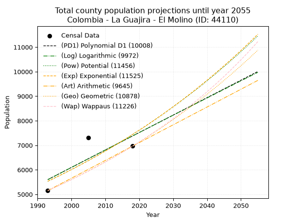
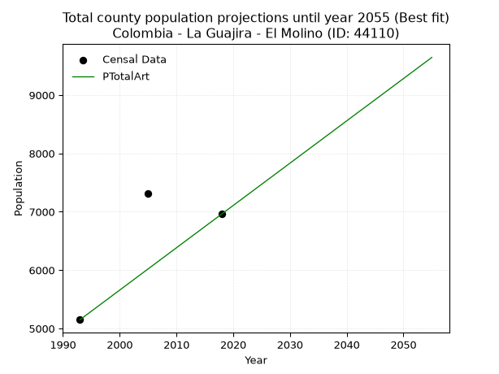
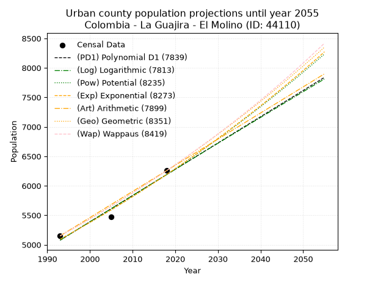
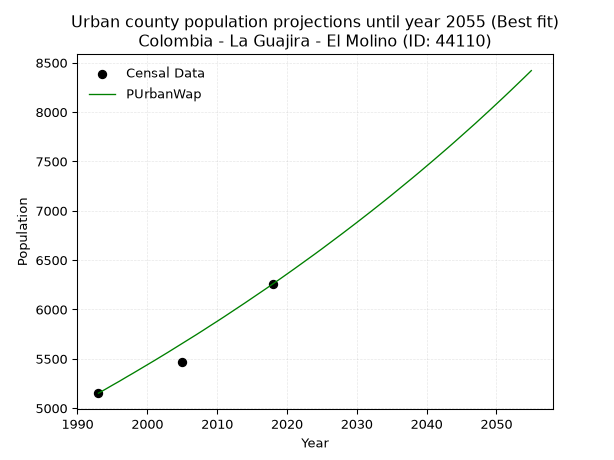
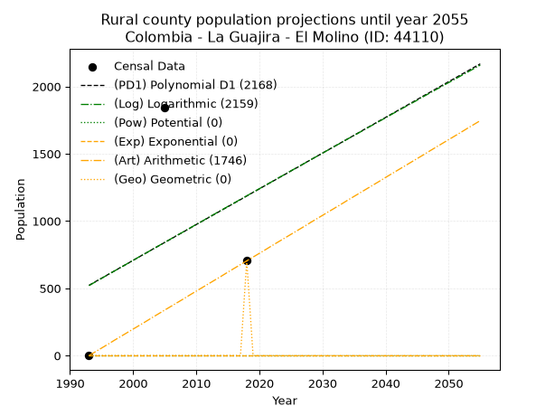
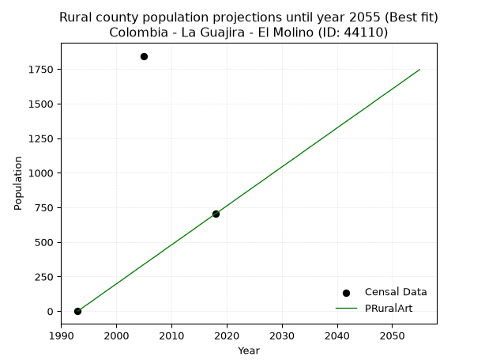

<div align="center">


</div>

# _“Population and Public Services Demand Projections (PPSD) until Year 2050 for Colombia - La Guajira - El Molino (ID: 44110)”_
Keywords: `population` `public-service` `projection` `lineal` `polynomial` `logarithmic` `potential` `exponential` `arithmetic` `geometric` `wappaus` `dane` `colombia` `south-america`

PPSD are analytical estimates used by governments and planners to anticipate future changes in population size, age distribution, and the resulting community needs for utilities, healthcare, education, and infrastructure as sizing future water treatment facilities, electrical grids, and road networks based on spatial growth.

> **General running parameters**: • app_version: _v20260806_. • Python version: _3.14.7_. • Pandas version: _3.0.5_. • NumPy version: _2.5.1_. • Creates, save and include plots into reports (create_plot): _False_. • Projection until year: _2050_. • Process polynomial degree 2 and up: _False_. • Process Wappaus: _True_. • Process Wappaus: _True_. • Set negative values to zero: _True_. • Set infinite values to zero: _True_. • Drop dataset notes: _True_. 
<div align="center">

Dynamic map: [:earth_americas:Google](http://maps.google.com/maps?q=10.65350522,-72.9267303) [:earth_americas:OSM](https://www.openstreetmap.org/#map=18/10.65350522/-72.9267303&layers=P) [:earth_americas:Bing](https://www.bing.com/maps?cp=10.65350522~-72.9267303&lvl=18) [:earth_americas:Apple](https://maps.apple.com/frame?center=10.65350522%2C-72.9267303&span=0.003%2C0.006)

</div>


<div align="center">

```geojson
{
  "type": "Feature",
  "geometry": {
    "type": "Point", 
    "coordinates": [-72.9267303, 10.65350522]
  }, 
  "properties": {
    "Name": "Colombia - La Guajira - El Molino (ID: 44110)"
  }
}
```

</div>


## 0. Census Data (3 records)

Census data are official statistics collected by a government about the people and housing in a country. They usually include counts of total population, age, sex, race, income, education, and jobs.

📅Global census file: [Population.xlsx](../data/Population.xlsx)

| Source   |   Year |   CountryID | CountryName   |   StateID | StateName   |   CountyID | CountyName   |   PTotal |   PUrban |   PRural |
|:---------|-------:|------------:|:--------------|----------:|:------------|-----------:|:-------------|---------:|---------:|---------:|
| DANE     |   1993 |          57 | Colombia      |        44 | La Guajira  |      44110 | El Molino    |     5151 |     5151 |        0 |
| DANE     |   2005 |          57 | Colombia      |        44 | La Guajira  |      44110 | El Molino    |     7315 |     5470 |     1845 |
| DANE     |   2018 |          57 | Colombia      |        44 | La Guajira  |      44110 | El Molino    |     6963 |     6259 |      704 |

> 🔥Some records could had specific notes about the registered values or the corresponding urban or rural distribution.

## 1. Total

### 1.1. Coefficients and Parameters

* (PD1) Polynomial Deg 1: 71.10021321961777, -136103.2942430735 (lineal)
* (Log) Logarithmic: 142810.26833699658, -1079389.0566846128
* (Pow) Potential: 23.774178223094694, -74.70033757309953
* (Exp) Exponential: 0.011837107207287893, 3.1426971114771247e-07
* (Art) Arithmetic: Year diff. 2018 - 1993 = 25, Population diff. 6963 - 5151 = 1812, Annual growth = 72.48
* (Geo) Geometric: Year diff. 2018 - 1993 = 25, Population diff. 6963 - 5151 = 1812, Annual growth % = 0.012129757799209884
* (Wap) Wappaus: i = 1.1966319960376424, Condition values only valid for < 200)

<sub>
Wappaus condition values: ['0.00', '1.20', '2.39', '3.59', '4.79', '5.98', '7.18', '8.38', '9.57', '10.77', '11.97', '13.16', '14.36', '15.56', '16.75', '17.95', '19.15', '20.34', '21.54', '22.74', '23.93', '25.13', '26.33', '27.52', '28.72', '29.92', '31.11', '32.31', '33.51', '34.70', '35.90', '37.10', '38.29', '39.49', '40.69', '41.88', '43.08', '44.28', '45.47', '46.67', '47.87', '49.06', '50.26', '51.46', '52.65', '53.85', '55.05', '56.24', '57.44', '58.63', '59.83', '61.03', '62.22', '63.42', '64.62', '65.81', '67.01', '68.21']
</sub>


### 1.2. Projected Dataset

|   Year |   CountyID |   PTotalPD1 |   PTotalLog |   PTotalPow |   PTotalExp |   PTotalArt |   PTotalGeo |   PTotalWap |
|-------:|-----------:|------------:|------------:|------------:|------------:|------------:|------------:|------------:|
|   1993 |      44110 |        5599 |        5597 |        5530 |        5532 |        5151 |        5151 |        5151 |
|   1994 |      44110 |        5671 |        5669 |        5596 |        5598 |        5223 |        5213 |        5213 |
|   1995 |      44110 |        5742 |        5740 |        5664 |        5665 |        5296 |        5277 |        5276 |
|   1996 |      44110 |        5813 |        5812 |        5731 |        5732 |        5368 |        5341 |        5339 |
|   1997 |      44110 |        5884 |        5883 |        5800 |        5800 |        5441 |        5406 |        5404 |
|   1998 |      44110 |        5955 |        5955 |        5870 |        5870 |        5513 |        5471 |        5469 |
|   1999 |      44110 |        6026 |        6026 |        5940 |        5939 |        5586 |        5537 |        5535 |
|   2000 |      44110 |        6097 |        6098 |        6011 |        6010 |        5658 |        5605 |        5601 |
|   2001 |      44110 |        6168 |        6169 |        6083 |        6082 |        5731 |        5673 |        5669 |
|   2002 |      44110 |        6239 |        6241 |        6155 |        6154 |        5803 |        5741 |        5737 |
|   2003 |      44110 |        6310 |        6312 |        6229 |        6227 |        5876 |        5811 |        5807 |
|   2004 |      44110 |        6382 |        6383 |        6303 |        6302 |        5948 |        5882 |        5877 |
|   2005 |      44110 |        6453 |        6454 |        6378 |        6377 |        6021 |        5953 |        5948 |
|   2006 |      44110 |        6524 |        6526 |        6455 |        6452 |        6093 |        6025 |        6020 |
|   2007 |      44110 |        6595 |        6597 |        6531 |        6529 |        6166 |        6098 |        6093 |
|   2008 |      44110 |        6666 |        6668 |        6609 |        6607 |        6238 |        6172 |        6167 |
|   2009 |      44110 |        6737 |        6739 |        6688 |        6686 |        6311 |        6247 |        6242 |
|   2010 |      44110 |        6808 |        6810 |        6768 |        6765 |        6383 |        6323 |        6318 |
|   2011 |      44110 |        6879 |        6881 |        6848 |        6846 |        6456 |        6399 |        6394 |
|   2012 |      44110 |        6950 |        6952 |        6930 |        6927 |        6528 |        6477 |        6472 |
|   2013 |      44110 |        7021 |        7023 |        7012 |        7010 |        6601 |        6556 |        6551 |
|   2014 |      44110 |        7093 |        7094 |        7095 |        7093 |        6673 |        6635 |        6631 |
|   2015 |      44110 |        7164 |        7165 |        7179 |        7178 |        6746 |        6716 |        6713 |
|   2016 |      44110 |        7235 |        7236 |        7265 |        7263 |        6818 |        6797 |        6795 |
|   2017 |      44110 |        7306 |        7307 |        7351 |        7350 |        6891 |        6880 |        6878 |
|   2018 |      44110 |        7377 |        7377 |        7438 |        7437 |        6963 |        6963 |        6963 |
|   2019 |      44110 |        7448 |        7448 |        7526 |        7526 |        7035 |        7047 |        7049 |
|   2020 |      44110 |        7519 |        7519 |        7615 |        7616 |        7108 |        7133 |        7136 |
|   2021 |      44110 |        7590 |        7590 |        7705 |        7706 |        7180 |        7219 |        7224 |
|   2022 |      44110 |        7661 |        7660 |        7796 |        7798 |        7253 |        7307 |        7314 |
|   2023 |      44110 |        7732 |        7731 |        7889 |        7891 |        7325 |        7396 |        7405 |
|   2024 |      44110 |        7804 |        7801 |        7982 |        7985 |        7398 |        7485 |        7497 |
|   2025 |      44110 |        7875 |        7872 |        8076 |        8080 |        7470 |        7576 |        7591 |
|   2026 |      44110 |        7946 |        7942 |        8171 |        8176 |        7543 |        7668 |        7685 |
|   2027 |      44110 |        8017 |        8013 |        8268 |        8273 |        7615 |        7761 |        7782 |
|   2028 |      44110 |        8088 |        8083 |        8365 |        8372 |        7688 |        7855 |        7880 |
|   2029 |      44110 |        8159 |        8154 |        8464 |        8472 |        7760 |        7951 |        7979 |
|   2030 |      44110 |        8230 |        8224 |        8564 |        8572 |        7833 |        8047 |        8080 |
|   2031 |      44110 |        8301 |        8294 |        8665 |        8675 |        7905 |        8145 |        8183 |
|   2032 |      44110 |        8372 |        8365 |        8767 |        8778 |        7978 |        8243 |        8287 |
|   2033 |      44110 |        8443 |        8435 |        8870 |        8882 |        8050 |        8343 |        8392 |
|   2034 |      44110 |        8515 |        8505 |        8974 |        8988 |        8123 |        8445 |        8500 |
|   2035 |      44110 |        8586 |        8575 |        9080 |        9095 |        8195 |        8547 |        8609 |
|   2036 |      44110 |        8657 |        8646 |        9186 |        9203 |        8268 |        8651 |        8720 |
|   2037 |      44110 |        8728 |        8716 |        9294 |        9313 |        8340 |        8756 |        8832 |
|   2038 |      44110 |        8799 |        8786 |        9403 |        9424 |        8413 |        8862 |        8947 |
|   2039 |      44110 |        8870 |        8856 |        9513 |        9536 |        8485 |        8969 |        9063 |
|   2040 |      44110 |        8941 |        8926 |        9625 |        9650 |        8558 |        9078 |        9181 |
|   2041 |      44110 |        9012 |        8996 |        9738 |        9765 |        8630 |        9188 |        9302 |
|   2042 |      44110 |        9083 |        9066 |        9852 |        9881 |        8703 |        9300 |        9424 |
|   2043 |      44110 |        9154 |        9136 |        9967 |        9999 |        8775 |        9412 |        9548 |
|   2044 |      44110 |        9226 |        9206 |       10084 |       10118 |        8847 |        9527 |        9675 |
|   2045 |      44110 |        9297 |        9275 |       10202 |       10238 |        8920 |        9642 |        9804 |
|   2046 |      44110 |        9368 |        9345 |       10321 |       10360 |        8992 |        9759 |        9935 |
|   2047 |      44110 |        9439 |        9415 |       10442 |       10483 |        9065 |        9877 |       10068 |
|   2048 |      44110 |        9510 |        9485 |       10564 |       10608 |        9137 |        9997 |       10204 |
|   2049 |      44110 |        9581 |        9555 |       10687 |       10735 |        9210 |       10119 |       10342 |
|   2050 |      44110 |        9652 |        9624 |       10812 |       10862 |        9282 |       10241 |       10483 |
<div align="center">

</img>

</div>


### 1.3. Best fit with absolute and relative error (%)

Relative error puts that difference into context by dividing the absolute error by the true value, creating a unitless ratio or percentage that shows the scale of the mistake.

Absolute and relative error

|   Year | Source   |   CountryID | CountryName   |   StateID | StateName   |   CountyID_x | CountyName   |   PTotal |   PUrban |   PRural |   CountyID_y |   PTotalPD1 |   PTotalLog |   PTotalPow |   PTotalExp |   PTotalArt |   PTotalGeo |   PTotalWap |   PTotalPD1AbsError |   PTotalLogAbsError |   PTotalPowAbsError |   PTotalExpAbsError |   PTotalArtAbsError |   PTotalGeoAbsError |   PTotalWapAbsError |   PTotalPD1RelError |   PTotalLogRelError |   PTotalPowRelError |   PTotalExpRelError |   PTotalArtRelError |   PTotalGeoRelError |   PTotalWapRelError |
|-------:|:---------|------------:|:--------------|----------:|:------------|-------------:|:-------------|---------:|---------:|---------:|-------------:|------------:|------------:|------------:|------------:|------------:|------------:|------------:|--------------------:|--------------------:|--------------------:|--------------------:|--------------------:|--------------------:|--------------------:|--------------------:|--------------------:|--------------------:|--------------------:|--------------------:|--------------------:|--------------------:|
|   1993 | DANE     |          57 | Colombia      |        44 | La Guajira  |        44110 | El Molino    |     5151 |     5151 |        0 |        44110 |        5599 |        5597 |        5530 |        5532 |        5151 |        5151 |        5151 |                 448 |                 446 |                 379 |                 381 |                   0 |                   0 |                   0 |             8.69734 |             8.65851 |             7.35779 |             7.39662 |              0      |              0      |              0      |
|   2005 | DANE     |          57 | Colombia      |        44 | La Guajira  |        44110 | El Molino    |     7315 |     5470 |     1845 |        44110 |        6453 |        6454 |        6378 |        6377 |        6021 |        5953 |        5948 |                 862 |                 861 |                 937 |                 938 |                1294 |                1362 |                1367 |            11.784   |            11.7703  |            12.8093  |            12.823   |             17.6897 |             18.6193 |             18.6876 |
|   2018 | DANE     |          57 | Colombia      |        44 | La Guajira  |        44110 | El Molino    |     6963 |     6259 |      704 |        44110 |        7377 |        7377 |        7438 |        7437 |        6963 |        6963 |        6963 |                 414 |                 414 |                 475 |                 474 |                   0 |                   0 |                   0 |             5.94571 |             5.94571 |             6.82177 |             6.80741 |              0      |              0      |              0      |

Relative error mean

| Method    |   RelError | Best   |
|:----------|-----------:|:-------|
| PTotalPD1 |    8.80902 |        |
| PTotalLog |    8.79152 |        |
| PTotalPow |    8.99629 |        |
| PTotalExp |    9.009   |        |
| PTotalArt |    5.89656 | True   |
| PTotalGeo |    6.20643 |        |
| PTotalWap |    6.22921 |        |

💙Best method: _**PTotalArt**_
<div align="center">

</img>

</div>


### 1.4. Fresh water supply demand in liters per capita per day (lpcd)

The fresh water supply demand typically ranges from 100 to 300 liters per capita per day (lpcd) for standard domestic and municipal planning, though absolute survival minimums set by the World Health Organization are as low as 7.5 to 20 liters per day, and total consumption in high-income nations can exceed 400 liters.

> `CZ`: Level in meters above the sea level (masl).<br> `WS`: Fresh water supply demand in liters per capita per day (lpcd or l/h/d).<br> `WSAll`: Zonal fresh water supply demand in liters per second (l/s).<br> `A`: Zonal area in square meters.

Reference values (RAS Colombia)

|    CZ |   WS |
|------:|-----:|
|  1000 |  120 |
|  2000 |  130 |
| 99999 |  140 |

County shapefile geometry properties and water supply values

|   CountyID |      ATotal |   CZTotal |   WSTotal |
|-----------:|------------:|----------:|----------:|
|      44110 | 2.41272e+08 |   747.328 |       120 |

Projected values for best method: PTotalArt

|   CountyID |   Year |   PTotalArt |   WSTotal |   WSTotalAll |
|-----------:|-------:|------------:|----------:|-------------:|
|      44110 |   1993 |        5151 |       120 |      7.15417 |
|      44110 |   1994 |        5223 |       120 |      7.25417 |
|      44110 |   1995 |        5296 |       120 |      7.35556 |
|      44110 |   1996 |        5368 |       120 |      7.45556 |
|      44110 |   1997 |        5441 |       120 |      7.55694 |
|      44110 |   1998 |        5513 |       120 |      7.65694 |
|      44110 |   1999 |        5586 |       120 |      7.75833 |
|      44110 |   2000 |        5658 |       120 |      7.85833 |
|      44110 |   2001 |        5731 |       120 |      7.95972 |
|      44110 |   2002 |        5803 |       120 |      8.05972 |
|      44110 |   2003 |        5876 |       120 |      8.16111 |
|      44110 |   2004 |        5948 |       120 |      8.26111 |
|      44110 |   2005 |        6021 |       120 |      8.3625  |
|      44110 |   2006 |        6093 |       120 |      8.4625  |
|      44110 |   2007 |        6166 |       120 |      8.56389 |
|      44110 |   2008 |        6238 |       120 |      8.66389 |
|      44110 |   2009 |        6311 |       120 |      8.76528 |
|      44110 |   2010 |        6383 |       120 |      8.86528 |
|      44110 |   2011 |        6456 |       120 |      8.96667 |
|      44110 |   2012 |        6528 |       120 |      9.06667 |
|      44110 |   2013 |        6601 |       120 |      9.16806 |
|      44110 |   2014 |        6673 |       120 |      9.26806 |
|      44110 |   2015 |        6746 |       120 |      9.36944 |
|      44110 |   2016 |        6818 |       120 |      9.46944 |
|      44110 |   2017 |        6891 |       120 |      9.57083 |
|      44110 |   2018 |        6963 |       120 |      9.67083 |
|      44110 |   2019 |        7035 |       120 |      9.77083 |
|      44110 |   2020 |        7108 |       120 |      9.87222 |
|      44110 |   2021 |        7180 |       120 |      9.97222 |
|      44110 |   2022 |        7253 |       120 |     10.0736  |
|      44110 |   2023 |        7325 |       120 |     10.1736  |
|      44110 |   2024 |        7398 |       120 |     10.275   |
|      44110 |   2025 |        7470 |       120 |     10.375   |
|      44110 |   2026 |        7543 |       120 |     10.4764  |
|      44110 |   2027 |        7615 |       120 |     10.5764  |
|      44110 |   2028 |        7688 |       120 |     10.6778  |
|      44110 |   2029 |        7760 |       120 |     10.7778  |
|      44110 |   2030 |        7833 |       120 |     10.8792  |
|      44110 |   2031 |        7905 |       120 |     10.9792  |
|      44110 |   2032 |        7978 |       120 |     11.0806  |
|      44110 |   2033 |        8050 |       120 |     11.1806  |
|      44110 |   2034 |        8123 |       120 |     11.2819  |
|      44110 |   2035 |        8195 |       120 |     11.3819  |
|      44110 |   2036 |        8268 |       120 |     11.4833  |
|      44110 |   2037 |        8340 |       120 |     11.5833  |
|      44110 |   2038 |        8413 |       120 |     11.6847  |
|      44110 |   2039 |        8485 |       120 |     11.7847  |
|      44110 |   2040 |        8558 |       120 |     11.8861  |
|      44110 |   2041 |        8630 |       120 |     11.9861  |
|      44110 |   2042 |        8703 |       120 |     12.0875  |
|      44110 |   2043 |        8775 |       120 |     12.1875  |
|      44110 |   2044 |        8847 |       120 |     12.2875  |
|      44110 |   2045 |        8920 |       120 |     12.3889  |
|      44110 |   2046 |        8992 |       120 |     12.4889  |
|      44110 |   2047 |        9065 |       120 |     12.5903  |
|      44110 |   2048 |        9137 |       120 |     12.6903  |
|      44110 |   2049 |        9210 |       120 |     12.7917  |
|      44110 |   2050 |        9282 |       120 |     12.8917  |

## 2. Urban

### 2.1. Coefficients and Parameters

* (PD1) Polynomial Deg 1: 44.54690831556608, -83704.73347548184 (lineal)
* (Log) Logarithmic: 89305.69736923458, -673413.9025719137
* (Pow) Potential: 15.695542331779945, -48.0807262135697
* (Exp) Exponential: 0.00782882242408961, 0.0008523784123349016
* (Art) Arithmetic: Year diff. 2018 - 1993 = 25, Population diff. 6259 - 5151 = 1108, Annual growth = 44.32
* (Geo) Geometric: Year diff. 2018 - 1993 = 25, Population diff. 6259 - 5151 = 1108, Annual growth % = 0.007823628178218689
* (Wap) Wappaus: i = 0.7768624014022787, Condition values only valid for < 200)

<sub>
Wappaus condition values: ['0.00', '0.78', '1.55', '2.33', '3.11', '3.88', '4.66', '5.44', '6.21', '6.99', '7.77', '8.55', '9.32', '10.10', '10.88', '11.65', '12.43', '13.21', '13.98', '14.76', '15.54', '16.31', '17.09', '17.87', '18.64', '19.42', '20.20', '20.98', '21.75', '22.53', '23.31', '24.08', '24.86', '25.64', '26.41', '27.19', '27.97', '28.74', '29.52', '30.30', '31.07', '31.85', '32.63', '33.41', '34.18', '34.96', '35.74', '36.51', '37.29', '38.07', '38.84', '39.62', '40.40', '41.17', '41.95', '42.73', '43.50', '44.28']
</sub>


### 2.2. Projected Dataset

|   Year |   CountyID |   PUrbanPD1 |   PUrbanLog |   PUrbanPow |   PUrbanExp |   PUrbanArt |   PUrbanGeo |   PUrbanWap |
|-------:|-----------:|------------:|------------:|------------:|------------:|------------:|------------:|------------:|
|   1993 |      44110 |        5077 |        5077 |        5091 |        5092 |        5151 |        5151 |        5151 |
|   1994 |      44110 |        5122 |        5122 |        5132 |        5132 |        5195 |        5191 |        5191 |
|   1995 |      44110 |        5166 |        5166 |        5172 |        5172 |        5240 |        5232 |        5232 |
|   1996 |      44110 |        5211 |        5211 |        5213 |        5213 |        5284 |        5273 |        5272 |
|   1997 |      44110 |        5255 |        5256 |        5254 |        5254 |        5328 |        5314 |        5314 |
|   1998 |      44110 |        5300 |        5301 |        5296 |        5295 |        5373 |        5356 |        5355 |
|   1999 |      44110 |        5345 |        5345 |        5337 |        5337 |        5417 |        5398 |        5397 |
|   2000 |      44110 |        5389 |        5390 |        5379 |        5379 |        5461 |        5440 |        5439 |
|   2001 |      44110 |        5434 |        5435 |        5422 |        5421 |        5506 |        5482 |        5481 |
|   2002 |      44110 |        5478 |        5479 |        5464 |        5463 |        5550 |        5525 |        5524 |
|   2003 |      44110 |        5523 |        5524 |        5507 |        5506 |        5594 |        5568 |        5567 |
|   2004 |      44110 |        5567 |        5568 |        5551 |        5550 |        5639 |        5612 |        5611 |
|   2005 |      44110 |        5612 |        5613 |        5594 |        5593 |        5683 |        5656 |        5655 |
|   2006 |      44110 |        5656 |        5658 |        5638 |        5637 |        5727 |        5700 |        5699 |
|   2007 |      44110 |        5701 |        5702 |        5683 |        5681 |        5771 |        5745 |        5743 |
|   2008 |      44110 |        5745 |        5747 |        5727 |        5726 |        5816 |        5790 |        5788 |
|   2009 |      44110 |        5790 |        5791 |        5772 |        5771 |        5860 |        5835 |        5834 |
|   2010 |      44110 |        5835 |        5835 |        5817 |        5816 |        5904 |        5881 |        5879 |
|   2011 |      44110 |        5879 |        5880 |        5863 |        5862 |        5949 |        5927 |        5925 |
|   2012 |      44110 |        5924 |        5924 |        5909 |        5908 |        5993 |        5973 |        5972 |
|   2013 |      44110 |        5968 |        5969 |        5955 |        5955 |        6037 |        6020 |        6019 |
|   2014 |      44110 |        6013 |        6013 |        6002 |        6002 |        6082 |        6067 |        6066 |
|   2015 |      44110 |        6057 |        6057 |        6049 |        6049 |        6126 |        6114 |        6114 |
|   2016 |      44110 |        6102 |        6102 |        6096 |        6096 |        6170 |        6162 |        6162 |
|   2017 |      44110 |        6146 |        6146 |        6144 |        6144 |        6215 |        6210 |        6210 |
|   2018 |      44110 |        6191 |        6190 |        6192 |        6192 |        6259 |        6259 |        6259 |
|   2019 |      44110 |        6235 |        6234 |        6240 |        6241 |        6303 |        6308 |        6308 |
|   2020 |      44110 |        6280 |        6279 |        6289 |        6290 |        6348 |        6357 |        6358 |
|   2021 |      44110 |        6325 |        6323 |        6338 |        6340 |        6392 |        6407 |        6408 |
|   2022 |      44110 |        6369 |        6367 |        6387 |        6389 |        6436 |        6457 |        6459 |
|   2023 |      44110 |        6414 |        6411 |        6437 |        6440 |        6481 |        6508 |        6510 |
|   2024 |      44110 |        6458 |        6455 |        6487 |        6490 |        6525 |        6559 |        6561 |
|   2025 |      44110 |        6503 |        6499 |        6537 |        6541 |        6569 |        6610 |        6613 |
|   2026 |      44110 |        6547 |        6543 |        6588 |        6593 |        6614 |        6662 |        6666 |
|   2027 |      44110 |        6592 |        6588 |        6640 |        6644 |        6658 |        6714 |        6719 |
|   2028 |      44110 |        6636 |        6632 |        6691 |        6697 |        6702 |        6766 |        6772 |
|   2029 |      44110 |        6681 |        6676 |        6743 |        6749 |        6747 |        6819 |        6826 |
|   2030 |      44110 |        6725 |        6720 |        6795 |        6802 |        6791 |        6873 |        6880 |
|   2031 |      44110 |        6770 |        6764 |        6848 |        6856 |        6835 |        6926 |        6935 |
|   2032 |      44110 |        6815 |        6808 |        6901 |        6910 |        6879 |        6981 |        6990 |
|   2033 |      44110 |        6859 |        6852 |        6955 |        6964 |        6924 |        7035 |        7046 |
|   2034 |      44110 |        6904 |        6895 |        7009 |        7019 |        6968 |        7090 |        7102 |
|   2035 |      44110 |        6948 |        6939 |        7063 |        7074 |        7012 |        7146 |        7159 |
|   2036 |      44110 |        6993 |        6983 |        7118 |        7130 |        7057 |        7202 |        7217 |
|   2037 |      44110 |        7037 |        7027 |        7173 |        7186 |        7101 |        7258 |        7275 |
|   2038 |      44110 |        7082 |        7071 |        7228 |        7242 |        7145 |        7315 |        7333 |
|   2039 |      44110 |        7126 |        7115 |        7284 |        7299 |        7190 |        7372 |        7392 |
|   2040 |      44110 |        7171 |        7158 |        7340 |        7356 |        7234 |        7430 |        7452 |
|   2041 |      44110 |        7216 |        7202 |        7397 |        7414 |        7278 |        7488 |        7512 |
|   2042 |      44110 |        7260 |        7246 |        7454 |        7472 |        7323 |        7546 |        7573 |
|   2043 |      44110 |        7305 |        7290 |        7512 |        7531 |        7367 |        7605 |        7634 |
|   2044 |      44110 |        7349 |        7333 |        7569 |        7590 |        7411 |        7665 |        7696 |
|   2045 |      44110 |        7394 |        7377 |        7628 |        7650 |        7456 |        7725 |        7759 |
|   2046 |      44110 |        7438 |        7421 |        7687 |        7710 |        7500 |        7785 |        7822 |
|   2047 |      44110 |        7483 |        7464 |        7746 |        7771 |        7544 |        7846 |        7885 |
|   2048 |      44110 |        7527 |        7508 |        7805 |        7832 |        7589 |        7908 |        7950 |
|   2049 |      44110 |        7572 |        7552 |        7865 |        7893 |        7633 |        7969 |        8015 |
|   2050 |      44110 |        7616 |        7595 |        7926 |        7955 |        7677 |        8032 |        8081 |
<div align="center">

</img>

</div>


### 2.3. Best fit with absolute and relative error (%)

Relative error puts that difference into context by dividing the absolute error by the true value, creating a unitless ratio or percentage that shows the scale of the mistake.

Absolute and relative error

|   Year | Source   |   CountryID | CountryName   |   StateID | StateName   |   CountyID_x | CountyName   |   PTotal |   PUrban |   PRural |   CountyID_y |   PUrbanPD1 |   PUrbanLog |   PUrbanPow |   PUrbanExp |   PUrbanArt |   PUrbanGeo |   PUrbanWap |   PUrbanPD1AbsError |   PUrbanLogAbsError |   PUrbanPowAbsError |   PUrbanExpAbsError |   PUrbanArtAbsError |   PUrbanGeoAbsError |   PUrbanWapAbsError |   PUrbanPD1RelError |   PUrbanLogRelError |   PUrbanPowRelError |   PUrbanExpRelError |   PUrbanArtRelError |   PUrbanGeoRelError |   PUrbanWapRelError |
|-------:|:---------|------------:|:--------------|----------:|:------------|-------------:|:-------------|---------:|---------:|---------:|-------------:|------------:|------------:|------------:|------------:|------------:|------------:|------------:|--------------------:|--------------------:|--------------------:|--------------------:|--------------------:|--------------------:|--------------------:|--------------------:|--------------------:|--------------------:|--------------------:|--------------------:|--------------------:|--------------------:|
|   1993 | DANE     |          57 | Colombia      |        44 | La Guajira  |        44110 | El Molino    |     5151 |     5151 |        0 |        44110 |        5077 |        5077 |        5091 |        5092 |        5151 |        5151 |        5151 |                  74 |                  74 |                  60 |                  59 |                   0 |                   0 |                   0 |             1.43661 |             1.43661 |             1.16482 |             1.14541 |             0       |             0       |             0       |
|   2005 | DANE     |          57 | Colombia      |        44 | La Guajira  |        44110 | El Molino    |     7315 |     5470 |     1845 |        44110 |        5612 |        5613 |        5594 |        5593 |        5683 |        5656 |        5655 |                 142 |                 143 |                 124 |                 123 |                 213 |                 186 |                 185 |             2.59598 |             2.61426 |             2.26691 |             2.24863 |             3.89397 |             3.40037 |             3.38208 |
|   2018 | DANE     |          57 | Colombia      |        44 | La Guajira  |        44110 | El Molino    |     6963 |     6259 |      704 |        44110 |        6191 |        6190 |        6192 |        6192 |        6259 |        6259 |        6259 |                  68 |                  69 |                  67 |                  67 |                   0 |                   0 |                   0 |             1.08644 |             1.10241 |             1.07046 |             1.07046 |             0       |             0       |             0       |

Relative error mean

| Method    |   RelError | Best   |
|:----------|-----------:|:-------|
| PUrbanPD1 |    1.70634 |        |
| PUrbanLog |    1.71776 |        |
| PUrbanPow |    1.50073 |        |
| PUrbanExp |    1.48817 |        |
| PUrbanArt |    1.29799 |        |
| PUrbanGeo |    1.13346 |        |
| PUrbanWap |    1.12736 | True   |

💙Best method: _**PUrbanWap**_
<div align="center">

</img>

</div>


### 2.4. Fresh water supply demand in liters per capita per day (lpcd)

The fresh water supply demand typically ranges from 100 to 300 liters per capita per day (lpcd) for standard domestic and municipal planning, though absolute survival minimums set by the World Health Organization are as low as 7.5 to 20 liters per day, and total consumption in high-income nations can exceed 400 liters.

> `CZ`: Level in meters above the sea level (masl).<br> `WS`: Fresh water supply demand in liters per capita per day (lpcd or l/h/d).<br> `WSAll`: Zonal fresh water supply demand in liters per second (l/s).<br> `A`: Zonal area in square meters.

Reference values (RAS Colombia)

|    CZ |   WS |
|------:|-----:|
|  1000 |  120 |
|  2000 |  130 |
| 99999 |  140 |

County shapefile geometry properties and water supply values

|   CountyID |      AUrban |   CZUrban |   WSUrban |
|-----------:|------------:|----------:|----------:|
|      44110 | 1.44316e+06 |   248.759 |       120 |

Projected values for best method: PUrbanWap

|   CountyID |   Year |   PUrbanWap |   WSUrban |   WSUrbanAll |
|-----------:|-------:|------------:|----------:|-------------:|
|      44110 |   1993 |        5151 |       120 |      7.15417 |
|      44110 |   1994 |        5191 |       120 |      7.20972 |
|      44110 |   1995 |        5232 |       120 |      7.26667 |
|      44110 |   1996 |        5272 |       120 |      7.32222 |
|      44110 |   1997 |        5314 |       120 |      7.38056 |
|      44110 |   1998 |        5355 |       120 |      7.4375  |
|      44110 |   1999 |        5397 |       120 |      7.49583 |
|      44110 |   2000 |        5439 |       120 |      7.55417 |
|      44110 |   2001 |        5481 |       120 |      7.6125  |
|      44110 |   2002 |        5524 |       120 |      7.67222 |
|      44110 |   2003 |        5567 |       120 |      7.73194 |
|      44110 |   2004 |        5611 |       120 |      7.79306 |
|      44110 |   2005 |        5655 |       120 |      7.85417 |
|      44110 |   2006 |        5699 |       120 |      7.91528 |
|      44110 |   2007 |        5743 |       120 |      7.97639 |
|      44110 |   2008 |        5788 |       120 |      8.03889 |
|      44110 |   2009 |        5834 |       120 |      8.10278 |
|      44110 |   2010 |        5879 |       120 |      8.16528 |
|      44110 |   2011 |        5925 |       120 |      8.22917 |
|      44110 |   2012 |        5972 |       120 |      8.29444 |
|      44110 |   2013 |        6019 |       120 |      8.35972 |
|      44110 |   2014 |        6066 |       120 |      8.425   |
|      44110 |   2015 |        6114 |       120 |      8.49167 |
|      44110 |   2016 |        6162 |       120 |      8.55833 |
|      44110 |   2017 |        6210 |       120 |      8.625   |
|      44110 |   2018 |        6259 |       120 |      8.69306 |
|      44110 |   2019 |        6308 |       120 |      8.76111 |
|      44110 |   2020 |        6358 |       120 |      8.83056 |
|      44110 |   2021 |        6408 |       120 |      8.9     |
|      44110 |   2022 |        6459 |       120 |      8.97083 |
|      44110 |   2023 |        6510 |       120 |      9.04167 |
|      44110 |   2024 |        6561 |       120 |      9.1125  |
|      44110 |   2025 |        6613 |       120 |      9.18472 |
|      44110 |   2026 |        6666 |       120 |      9.25833 |
|      44110 |   2027 |        6719 |       120 |      9.33194 |
|      44110 |   2028 |        6772 |       120 |      9.40556 |
|      44110 |   2029 |        6826 |       120 |      9.48056 |
|      44110 |   2030 |        6880 |       120 |      9.55556 |
|      44110 |   2031 |        6935 |       120 |      9.63194 |
|      44110 |   2032 |        6990 |       120 |      9.70833 |
|      44110 |   2033 |        7046 |       120 |      9.78611 |
|      44110 |   2034 |        7102 |       120 |      9.86389 |
|      44110 |   2035 |        7159 |       120 |      9.94306 |
|      44110 |   2036 |        7217 |       120 |     10.0236  |
|      44110 |   2037 |        7275 |       120 |     10.1042  |
|      44110 |   2038 |        7333 |       120 |     10.1847  |
|      44110 |   2039 |        7392 |       120 |     10.2667  |
|      44110 |   2040 |        7452 |       120 |     10.35    |
|      44110 |   2041 |        7512 |       120 |     10.4333  |
|      44110 |   2042 |        7573 |       120 |     10.5181  |
|      44110 |   2043 |        7634 |       120 |     10.6028  |
|      44110 |   2044 |        7696 |       120 |     10.6889  |
|      44110 |   2045 |        7759 |       120 |     10.7764  |
|      44110 |   2046 |        7822 |       120 |     10.8639  |
|      44110 |   2047 |        7885 |       120 |     10.9514  |
|      44110 |   2048 |        7950 |       120 |     11.0417  |
|      44110 |   2049 |        8015 |       120 |     11.1319  |
|      44110 |   2050 |        8081 |       120 |     11.2236  |

## 3. Rural

### 3.1. Coefficients and Parameters

* (PD1) Polynomial Deg 1: 26.553304904051632, -52398.56076759153 (lineal)
* (Log) Logarithmic: 53504.57096776201, -405975.15411269915
* (Pow) Potential: nan, nan
* (Exp) Exponential: nan, nan
* (Art) Arithmetic: Year diff. 2018 - 1993 = 25, Population diff. 704 - 0 = 704, Annual growth = 28.16
* (Geo) Geometric: Year diff. 2018 - 1993 = 25, Population diff. 704 - 0 = 704, Annual growth % = inf
* (Wap) Wappaus: i = 8.0, Condition values only valid for < 200)

<sub>
Wappaus condition values: ['0.00', '8.00', '16.00', '24.00', '32.00', '40.00', '48.00', '56.00', '64.00', '72.00', '80.00', '88.00', '96.00', '104.00', '112.00', '120.00', '128.00', '136.00', '144.00', '152.00', '160.00', '168.00', '176.00', '184.00', '192.00', '200.00', '208.00', '216.00', '224.00', '232.00', '240.00', '248.00', '256.00', '264.00', '272.00', '280.00', '288.00', '296.00', '304.00', '312.00', '320.00', '328.00', '336.00', '344.00', '352.00', '360.00', '368.00', '376.00', '384.00', '392.00', '400.00', '408.00', '416.00', '424.00', '432.00', '440.00', '448.00', '456.00']
</sub>


### 3.2. Projected Dataset

|   Year |   CountyID |   PRuralPD1 |   PRuralLog |   PRuralPow |   PRuralExp |   PRuralArt |   PRuralGeo |
|-------:|-----------:|------------:|------------:|------------:|------------:|------------:|------------:|
|   1993 |      44110 |         522 |         520 |           0 |           0 |           0 |           0 |
|   1994 |      44110 |         549 |         547 |           0 |           0 |          28 |           0 |
|   1995 |      44110 |         575 |         574 |           0 |           0 |          56 |           0 |
|   1996 |      44110 |         602 |         601 |           0 |           0 |          84 |           0 |
|   1997 |      44110 |         628 |         628 |           0 |           0 |         113 |           0 |
|   1998 |      44110 |         655 |         654 |           0 |           0 |         141 |           0 |
|   1999 |      44110 |         681 |         681 |           0 |           0 |         169 |           0 |
|   2000 |      44110 |         708 |         708 |           0 |           0 |         197 |           0 |
|   2001 |      44110 |         735 |         735 |           0 |           0 |         225 |           0 |
|   2002 |      44110 |         761 |         761 |           0 |           0 |         253 |           0 |
|   2003 |      44110 |         788 |         788 |           0 |           0 |         282 |           0 |
|   2004 |      44110 |         814 |         815 |           0 |           0 |         310 |           0 |
|   2005 |      44110 |         841 |         841 |           0 |           0 |         338 |           0 |
|   2006 |      44110 |         867 |         868 |           0 |           0 |         366 |           0 |
|   2007 |      44110 |         894 |         895 |           0 |           0 |         394 |           0 |
|   2008 |      44110 |         920 |         921 |           0 |           0 |         422 |           0 |
|   2009 |      44110 |         947 |         948 |           0 |           0 |         451 |           0 |
|   2010 |      44110 |         974 |         975 |           0 |           0 |         479 |           0 |
|   2011 |      44110 |        1000 |        1001 |           0 |           0 |         507 |           0 |
|   2012 |      44110 |        1027 |        1028 |           0 |           0 |         535 |           0 |
|   2013 |      44110 |        1053 |        1055 |           0 |           0 |         563 |           0 |
|   2014 |      44110 |        1080 |        1081 |           0 |           0 |         591 |           0 |
|   2015 |      44110 |        1106 |        1108 |           0 |           0 |         620 |           0 |
|   2016 |      44110 |        1133 |        1134 |           0 |           0 |         648 |           0 |
|   2017 |      44110 |        1159 |        1161 |           0 |           0 |         676 |           0 |
|   2018 |      44110 |        1186 |        1187 |           0 |           0 |         704 |         704 |
|   2019 |      44110 |        1213 |        1214 |           0 |           0 |         732 |         inf |
|   2020 |      44110 |        1239 |        1240 |           0 |           0 |         760 |         inf |
|   2021 |      44110 |        1266 |        1267 |           0 |           0 |         788 |         inf |
|   2022 |      44110 |        1292 |        1293 |           0 |           0 |         817 |         inf |
|   2023 |      44110 |        1319 |        1320 |           0 |           0 |         845 |         inf |
|   2024 |      44110 |        1345 |        1346 |           0 |           0 |         873 |         inf |
|   2025 |      44110 |        1372 |        1373 |           0 |           0 |         901 |         inf |
|   2026 |      44110 |        1398 |        1399 |           0 |           0 |         929 |         inf |
|   2027 |      44110 |        1425 |        1425 |           0 |           0 |         957 |         inf |
|   2028 |      44110 |        1452 |        1452 |           0 |           0 |         986 |         inf |
|   2029 |      44110 |        1478 |        1478 |           0 |           0 |        1014 |         inf |
|   2030 |      44110 |        1505 |        1504 |           0 |           0 |        1042 |         inf |
|   2031 |      44110 |        1531 |        1531 |           0 |           0 |        1070 |         inf |
|   2032 |      44110 |        1558 |        1557 |           0 |           0 |        1098 |         inf |
|   2033 |      44110 |        1584 |        1583 |           0 |           0 |        1126 |         inf |
|   2034 |      44110 |        1611 |        1610 |           0 |           0 |        1155 |         inf |
|   2035 |      44110 |        1637 |        1636 |           0 |           0 |        1183 |         inf |
|   2036 |      44110 |        1664 |        1662 |           0 |           0 |        1211 |         inf |
|   2037 |      44110 |        1691 |        1689 |           0 |           0 |        1239 |         inf |
|   2038 |      44110 |        1717 |        1715 |           0 |           0 |        1267 |         inf |
|   2039 |      44110 |        1744 |        1741 |           0 |           0 |        1295 |         inf |
|   2040 |      44110 |        1770 |        1767 |           0 |           0 |        1324 |         inf |
|   2041 |      44110 |        1797 |        1794 |           0 |           0 |        1352 |         inf |
|   2042 |      44110 |        1823 |        1820 |           0 |           0 |        1380 |         inf |
|   2043 |      44110 |        1850 |        1846 |           0 |           0 |        1408 |         inf |
|   2044 |      44110 |        1876 |        1872 |           0 |           0 |        1436 |         inf |
|   2045 |      44110 |        1903 |        1898 |           0 |           0 |        1464 |         inf |
|   2046 |      44110 |        1930 |        1925 |           0 |           0 |        1492 |         inf |
|   2047 |      44110 |        1956 |        1951 |           0 |           0 |        1521 |         inf |
|   2048 |      44110 |        1983 |        1977 |           0 |           0 |        1549 |         inf |
|   2049 |      44110 |        2009 |        2003 |           0 |           0 |        1577 |         inf |
|   2050 |      44110 |        2036 |        2029 |           0 |           0 |        1605 |         inf |
<div align="center">

</img>

</div>


### 3.3. Best fit with absolute and relative error (%)

Relative error puts that difference into context by dividing the absolute error by the true value, creating a unitless ratio or percentage that shows the scale of the mistake.

Absolute and relative error

|   Year | Source   |   CountryID | CountryName   |   StateID | StateName   |   CountyID_x | CountyName   |   PTotal |   PUrban |   PRural |   CountyID_y |   PRuralPD1 |   PRuralLog |   PRuralPow |   PRuralExp |   PRuralArt |   PRuralGeo |   PRuralPD1AbsError |   PRuralLogAbsError |   PRuralPowAbsError |   PRuralExpAbsError |   PRuralArtAbsError |   PRuralGeoAbsError |   PRuralPD1RelError |   PRuralLogRelError |   PRuralPowRelError |   PRuralExpRelError |   PRuralArtRelError |   PRuralGeoRelError |
|-------:|:---------|------------:|:--------------|----------:|:------------|-------------:|:-------------|---------:|---------:|---------:|-------------:|------------:|------------:|------------:|------------:|------------:|------------:|--------------------:|--------------------:|--------------------:|--------------------:|--------------------:|--------------------:|--------------------:|--------------------:|--------------------:|--------------------:|--------------------:|--------------------:|
|   1993 | DANE     |          57 | Colombia      |        44 | La Guajira  |        44110 | El Molino    |     5151 |     5151 |        0 |        44110 |         522 |         520 |           0 |           0 |           0 |           0 |                 522 |                 520 |                   0 |                   0 |                   0 |                   0 |            inf      |            inf      |                 nan |                 nan |            nan      |                 nan |
|   2005 | DANE     |          57 | Colombia      |        44 | La Guajira  |        44110 | El Molino    |     7315 |     5470 |     1845 |        44110 |         841 |         841 |           0 |           0 |         338 |           0 |                1004 |                1004 |                1845 |                1845 |                1507 |                1845 |             54.4173 |             54.4173 |                 100 |                 100 |             81.6802 |                 100 |
|   2018 | DANE     |          57 | Colombia      |        44 | La Guajira  |        44110 | El Molino    |     6963 |     6259 |      704 |        44110 |        1186 |        1187 |           0 |           0 |         704 |         704 |                 482 |                 483 |                 704 |                 704 |                   0 |                   0 |             68.4659 |             68.608  |                 100 |                 100 |              0      |                   0 |

Relative error mean

| Method    |   RelError | Best   |
|:----------|-----------:|:-------|
| PRuralPD1 |   inf      |        |
| PRuralLog |   inf      |        |
| PRuralPow |   100      |        |
| PRuralExp |   100      |        |
| PRuralArt |    40.8401 | True   |
| PRuralGeo |    50      |        |

💙Best method: _**PRuralArt**_
<div align="center">

</img>

</div>


### 3.4. Fresh water supply demand in liters per capita per day (lpcd)

The fresh water supply demand typically ranges from 100 to 300 liters per capita per day (lpcd) for standard domestic and municipal planning, though absolute survival minimums set by the World Health Organization are as low as 7.5 to 20 liters per day, and total consumption in high-income nations can exceed 400 liters.

> `CZ`: Level in meters above the sea level (masl).<br> `WS`: Fresh water supply demand in liters per capita per day (lpcd or l/h/d).<br> `WSAll`: Zonal fresh water supply demand in liters per second (l/s).<br> `A`: Zonal area in square meters.

Reference values (RAS Colombia)

|    CZ |   WS |
|------:|-----:|
|  1000 |  120 |
|  2000 |  130 |
| 99999 |  140 |

County shapefile geometry properties and water supply values

|   CountyID |      ARural |   CZRural |   WSRural |
|-----------:|------------:|----------:|----------:|
|      44110 | 2.39828e+08 |   750.293 |       120 |

Projected values for best method: PRuralArt

|   CountyID |   Year |   PRuralArt |   WSRural |   WSRuralAll |
|-----------:|-------:|------------:|----------:|-------------:|
|      44110 |   1993 |           0 |       120 |    0         |
|      44110 |   1994 |          28 |       120 |    0.0388889 |
|      44110 |   1995 |          56 |       120 |    0.0777778 |
|      44110 |   1996 |          84 |       120 |    0.116667  |
|      44110 |   1997 |         113 |       120 |    0.156944  |
|      44110 |   1998 |         141 |       120 |    0.195833  |
|      44110 |   1999 |         169 |       120 |    0.234722  |
|      44110 |   2000 |         197 |       120 |    0.273611  |
|      44110 |   2001 |         225 |       120 |    0.3125    |
|      44110 |   2002 |         253 |       120 |    0.351389  |
|      44110 |   2003 |         282 |       120 |    0.391667  |
|      44110 |   2004 |         310 |       120 |    0.430556  |
|      44110 |   2005 |         338 |       120 |    0.469444  |
|      44110 |   2006 |         366 |       120 |    0.508333  |
|      44110 |   2007 |         394 |       120 |    0.547222  |
|      44110 |   2008 |         422 |       120 |    0.586111  |
|      44110 |   2009 |         451 |       120 |    0.626389  |
|      44110 |   2010 |         479 |       120 |    0.665278  |
|      44110 |   2011 |         507 |       120 |    0.704167  |
|      44110 |   2012 |         535 |       120 |    0.743056  |
|      44110 |   2013 |         563 |       120 |    0.781944  |
|      44110 |   2014 |         591 |       120 |    0.820833  |
|      44110 |   2015 |         620 |       120 |    0.861111  |
|      44110 |   2016 |         648 |       120 |    0.9       |
|      44110 |   2017 |         676 |       120 |    0.938889  |
|      44110 |   2018 |         704 |       120 |    0.977778  |
|      44110 |   2019 |         732 |       120 |    1.01667   |
|      44110 |   2020 |         760 |       120 |    1.05556   |
|      44110 |   2021 |         788 |       120 |    1.09444   |
|      44110 |   2022 |         817 |       120 |    1.13472   |
|      44110 |   2023 |         845 |       120 |    1.17361   |
|      44110 |   2024 |         873 |       120 |    1.2125    |
|      44110 |   2025 |         901 |       120 |    1.25139   |
|      44110 |   2026 |         929 |       120 |    1.29028   |
|      44110 |   2027 |         957 |       120 |    1.32917   |
|      44110 |   2028 |         986 |       120 |    1.36944   |
|      44110 |   2029 |        1014 |       120 |    1.40833   |
|      44110 |   2030 |        1042 |       120 |    1.44722   |
|      44110 |   2031 |        1070 |       120 |    1.48611   |
|      44110 |   2032 |        1098 |       120 |    1.525     |
|      44110 |   2033 |        1126 |       120 |    1.56389   |
|      44110 |   2034 |        1155 |       120 |    1.60417   |
|      44110 |   2035 |        1183 |       120 |    1.64306   |
|      44110 |   2036 |        1211 |       120 |    1.68194   |
|      44110 |   2037 |        1239 |       120 |    1.72083   |
|      44110 |   2038 |        1267 |       120 |    1.75972   |
|      44110 |   2039 |        1295 |       120 |    1.79861   |
|      44110 |   2040 |        1324 |       120 |    1.83889   |
|      44110 |   2041 |        1352 |       120 |    1.87778   |
|      44110 |   2042 |        1380 |       120 |    1.91667   |
|      44110 |   2043 |        1408 |       120 |    1.95556   |
|      44110 |   2044 |        1436 |       120 |    1.99444   |
|      44110 |   2045 |        1464 |       120 |    2.03333   |
|      44110 |   2046 |        1492 |       120 |    2.07222   |
|      44110 |   2047 |        1521 |       120 |    2.1125    |
|      44110 |   2048 |        1549 |       120 |    2.15139   |
|      44110 |   2049 |        1577 |       120 |    2.19028   |
|      44110 |   2050 |        1605 |       120 |    2.22917   |

<div align="center"><br><sub>Share this research</sub></div><br>

<sub>**APPS & TOOLS & CONTENT DISCLAIMER**: • NO WARRANTY - This content and software is provided by <a href="https://github.com/rcfdtools" target="_blank">github.com/rcfdtools</a> "as is", without any express or implied warranty, including warranties of merchantability, fitness for a particular purpose, or non-infringement. There is no guarantee that the software will be error-free or operate without interruption. • LIMITATION OF LIABILITY - Neither the authors nor copyright holders will be liable for claims or damages arising from the software or its use. You are responsible for determining if the software is appropriate for your use and assume all associated risks, including errors, legal compliance, and data loss. • NO PROFESSIONAL ADVICE - The software provides general information and does not offer professional advice. It should not replace consultation with professional advisors. [Clauses and global license for rcfdtools use.](https://github.com/rcfdtools/rcfdtools/blob/main/LICENSE.md)</sub>

| [:house: Home](Readme.md)  | [:beginner: Help / Collaborate](https://github.com/rcfdtools/R.HydroTools/discussions/31) |
|----------------------------|-------------------------------------------------------------------------------------------|