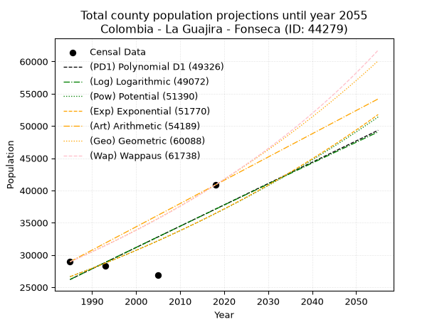
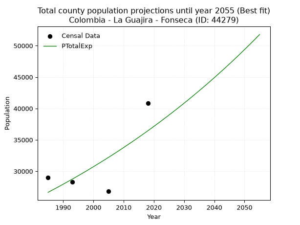
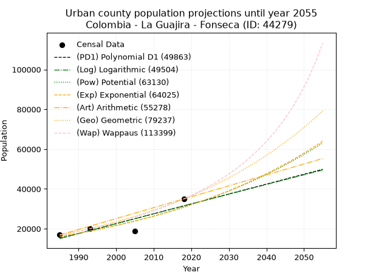
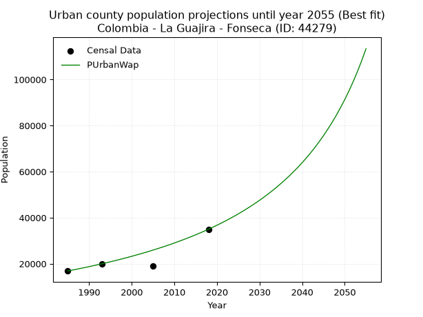
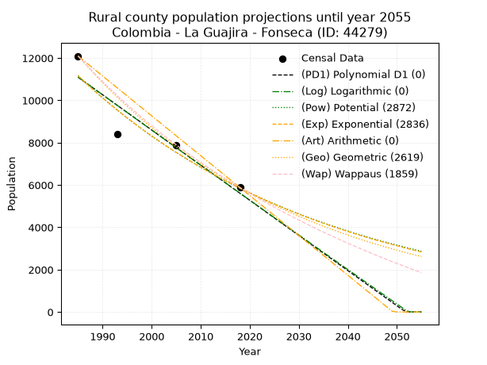
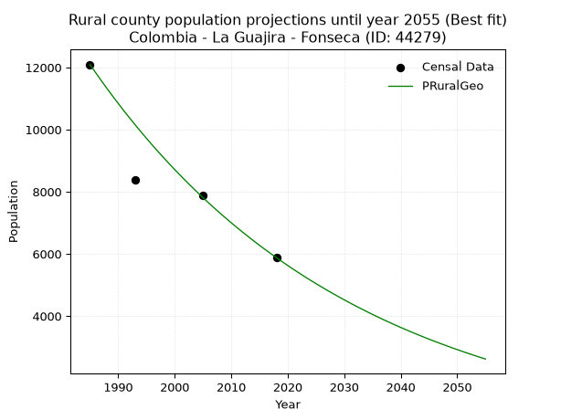

<div align="center">


</div>

# 📜 _“Population and Public Services Demand Projections (PPSD) until Year 2050 for Colombia - La Guajira - Fonseca (ID: 44279)”_
Keywords: `population` `public-service` `projection` `lineal` `polynomial` `logarithmic` `potential` `exponential` `arithmetic` `geometric` `wappaus` `dane` `colombia` `south-america`

PPSD are analytical estimates used by governments and planners to anticipate future changes in population size, age distribution, and the resulting community needs for utilities, healthcare, education, and infrastructure as sizing future water treatment facilities, electrical grids, and road networks based on spatial growth.

<div align="center">

</img>

</div>


> **General running parameters**: • app_version: _v20260806_. • Python version: _3.14.7_. • Pandas version: _3.0.5_. • NumPy version: _2.5.1_. • Creates, save and include plots into reports (create_plot): _False_. • Projection until year: _2050_. • Process polynomial degree 2 and up: _False_. • Process Wappaus: _True_. • Process Wappaus: _True_. • Set negative values to zero: _True_. • Set infinite values to zero: _True_. • Drop dataset notes: _True_. 
<div align="center">

Dynamic map: [:earth_americas:Google](http://maps.google.com/maps?q=10.88673447,-72.8463189) [:earth_americas:OSM](https://www.openstreetmap.org/#map=18/10.88673447/-72.8463189&layers=P) [:earth_americas:Bing](https://www.bing.com/maps?cp=10.88673447~-72.8463189&lvl=18) [:earth_americas:Apple](https://maps.apple.com/frame?center=10.88673447%2C-72.8463189&span=0.003%2C0.006)

</div>


<div align="center">

```geojson
{
  "type": "Feature",
  "geometry": {
    "type": "Point", 
    "coordinates": [-72.8463189, 10.88673447]
  }, 
  "properties": {
    "Name": "Colombia - La Guajira - Fonseca (ID: 44279)"
  }
}
```

</div>


## 0. Census Data (4 records)

Census data are official statistics collected by a government about the people and housing in a country. They usually include counts of total population, age, sex, race, income, education, and jobs.

📅Global census file: [Population.xlsx](../data/Population.xlsx)

| Source   |   Year |   CountryID | CountryName   |   StateID | StateName   |   CountyID | CountyName   |   PTotal |   PUrban |   PRural |
|:---------|-------:|------------:|:--------------|----------:|:------------|-----------:|:-------------|---------:|---------:|---------:|
| DANE     |   1985 |          57 | Colombia      |        44 | La Guajira  |      44279 | Fonseca      |    28957 |    16863 |    12094 |
| DANE     |   1993 |          57 | Colombia      |        44 | La Guajira  |      44279 | Fonseca      |    28305 |    19918 |     8387 |
| DANE     |   2005 |          57 | Colombia      |        44 | La Guajira  |      44279 | Fonseca      |    26831 |    18952 |     7879 |
| DANE     |   2018 |          57 | Colombia      |        44 | La Guajira  |      44279 | Fonseca      |    40852 |    34973 |     5879 |

> 🔥Some records could had specific notes about the registered values or the corresponding urban or rural distribution.

📅[SUI-RUPS](https://www.datos.gov.co/Hacienda-y-Cr-dito-P-blico/Registro-nico-de-Prestadores-de-Servicios-P-blicos/4qkq-csdn/about_data) - Local public utility companies: [RUPS.csv](../data/RUPS.csv)

 | SERVICIO       | ESTADO      | NOMBRE                                  | NIT         | DEPARTAMENTO_DOMICILIO   | MUNICIPIO_DOMICILIO   | DIRECCION                                                    |   TELEFONO | EMAIL                 | TIPO_PRESTADOR                             | CLASIFICACION                  |
|:---------------|:------------|:----------------------------------------|:------------|:-------------------------|:----------------------|:-------------------------------------------------------------|-----------:|:----------------------|:-------------------------------------------|:-------------------------------|
| ACUEDUCTO      | OPERATIVA   | AGUAS DEL ATLANTICO S.A. E.S.P.         | 802008956-1 | ATLANTICO                | GALAPA                | carrera 62 No 8B-50 Loc 5 Ciudadela Distrital Villa Olimpica |    3823154 | fmurilloacu@gmail.com | SOCIEDADES (EMPRESA DE SERVICIOS PUBLICOS) | DESDE 2501 HASTA 5000 USUARIOS |
| ACUEDUCTO      | CANCELACION | AGUAS DEL SUR DE LA GUAJIRA S.A.  E.S.P | 811034168-7 | LA GUAJIRA               | SAN JUAN DEL CESAR    | Carrera 8 No.  2 - 37 Barrio El Prado                        |    7740207 | neobritoc@gmail.com   | nan                                        | nan                            |
| ALCANTARILLADO | CANCELACION | AGUAS DEL SUR DE LA GUAJIRA S.A.  E.S.P | 811034168-7 | LA GUAJIRA               | SAN JUAN DEL CESAR    | Carrera 8 No.  2 - 37 Barrio El Prado                        |    7740207 | neobritoc@gmail.com   | nan                                        | nan                            |
| ACUEDUCTO      | CANCELACION | AGUAS TOTAL S.A.S. E.S.P.               | 901352349-3 | LA GUAJIRA               | SAN JUAN DEL CESAR    | CALLE 5 SUR # 5 - 97                                         |    3225474 | neobritoc@gmail.com   | nan                                        | nan                            |
| ALCANTARILLADO | CANCELACION | AGUAS TOTAL S.A.S. E.S.P.               | 901352349-3 | LA GUAJIRA               | SAN JUAN DEL CESAR    | CALLE 5 SUR # 5 - 97                                         |    3225474 | neobritoc@gmail.com   | nan                                        | nan                            |

## 1. Total

### 1.1. Coefficients and Parameters

* (PD1) Polynomial Deg 1: 330.4130871136003, -629672.5274989791 (lineal)
* (Log) Logarithmic: 660029.4395165786, -4985652.808909499
* (Pow) Potential: 18.9598459688297, -58.099522677095806
* (Exp) Exponential: 0.00949249913520781, 0.00017468519707667082
* (Art) Arithmetic: Year diff. 2018 - 1985 = 33, Population diff. 40852 - 28957 = 11895, Annual growth = 360.45454545454544
* (Geo) Geometric: Year diff. 2018 - 1985 = 33, Population diff. 40852 - 28957 = 11895, Annual growth % = 0.010483167638263513
* (Wap) Wappaus: i = 1.032687892548369, Condition values only valid for < 200)

<sub>
Wappaus condition values: ['0.00', '1.03', '2.07', '3.10', '4.13', '5.16', '6.20', '7.23', '8.26', '9.29', '10.33', '11.36', '12.39', '13.42', '14.46', '15.49', '16.52', '17.56', '18.59', '19.62', '20.65', '21.69', '22.72', '23.75', '24.78', '25.82', '26.85', '27.88', '28.92', '29.95', '30.98', '32.01', '33.05', '34.08', '35.11', '36.14', '37.18', '38.21', '39.24', '40.27', '41.31', '42.34', '43.37', '44.41', '45.44', '46.47', '47.50', '48.54', '49.57', '50.60', '51.63', '52.67', '53.70', '54.73', '55.77', '56.80', '57.83', '58.86', '59.90', '60.93', '61.96', '62.99', '64.03', '65.06', '66.09', '67.12']
</sub>


### 1.2. Projected Dataset

|   Year |   CountyID |   PTotalPD1 |   PTotalLog |   PTotalPow |   PTotalExp |   PTotalArt |   PTotalGeo |   PTotalWap |
|-------:|-----------:|------------:|------------:|------------:|------------:|------------:|------------:|------------:|
|   1985 |      44279 |       26197 |       26198 |       26638 |       26638 |       28957 |       28957 |       28957 |
|   1986 |      44279 |       26528 |       26530 |       26894 |       26892 |       29317 |       29261 |       29258 |
|   1987 |      44279 |       26858 |       26862 |       27152 |       27148 |       29678 |       29567 |       29561 |
|   1988 |      44279 |       27189 |       27194 |       27412 |       27407 |       30038 |       29877 |       29868 |
|   1989 |      44279 |       27519 |       27526 |       27675 |       27669 |       30399 |       30190 |       30178 |
|   1990 |      44279 |       27850 |       27858 |       27940 |       27933 |       30759 |       30507 |       30492 |
|   1991 |      44279 |       28180 |       28190 |       28207 |       28199 |       31120 |       30827 |       30809 |
|   1992 |      44279 |       28510 |       28521 |       28477 |       28468 |       31480 |       31150 |       31129 |
|   1993 |      44279 |       28841 |       28852 |       28749 |       28739 |       31841 |       31476 |       31452 |
|   1994 |      44279 |       29171 |       29184 |       29024 |       29014 |       32201 |       31806 |       31779 |
|   1995 |      44279 |       29502 |       29514 |       29301 |       29290 |       32562 |       32140 |       32110 |
|   1996 |      44279 |       29832 |       29845 |       29581 |       29570 |       32922 |       32477 |       32444 |
|   1997 |      44279 |       30162 |       30176 |       29863 |       29852 |       33282 |       32817 |       32782 |
|   1998 |      44279 |       30493 |       30506 |       30148 |       30136 |       33643 |       33161 |       33124 |
|   1999 |      44279 |       30823 |       30836 |       30435 |       30424 |       34003 |       33509 |       33470 |
|   2000 |      44279 |       31154 |       31167 |       30725 |       30714 |       34364 |       33860 |       33819 |
|   2001 |      44279 |       31484 |       31497 |       31018 |       31007 |       34724 |       34215 |       34172 |
|   2002 |      44279 |       31814 |       31826 |       31313 |       31303 |       35085 |       34574 |       34530 |
|   2003 |      44279 |       32145 |       32156 |       31611 |       31601 |       35445 |       34936 |       34891 |
|   2004 |      44279 |       32475 |       32485 |       31912 |       31903 |       35806 |       35303 |       35257 |
|   2005 |      44279 |       32806 |       32815 |       32215 |       32207 |       36166 |       35673 |       35626 |
|   2006 |      44279 |       33136 |       33144 |       32521 |       32514 |       36527 |       36047 |       36000 |
|   2007 |      44279 |       33467 |       33473 |       32830 |       32824 |       36887 |       36424 |       36379 |
|   2008 |      44279 |       33797 |       33801 |       33141 |       33137 |       37247 |       36806 |       36762 |
|   2009 |      44279 |       34127 |       34130 |       33456 |       33453 |       37608 |       37192 |       37149 |
|   2010 |      44279 |       34458 |       34459 |       33773 |       33772 |       37968 |       37582 |       37541 |
|   2011 |      44279 |       34788 |       34787 |       34093 |       34094 |       38329 |       37976 |       37938 |
|   2012 |      44279 |       35119 |       35115 |       34416 |       34420 |       38689 |       38374 |       38339 |
|   2013 |      44279 |       35449 |       35443 |       34741 |       34748 |       39050 |       38776 |       38745 |
|   2014 |      44279 |       35779 |       35771 |       35070 |       35079 |       39410 |       39183 |       39156 |
|   2015 |      44279 |       36110 |       36098 |       35402 |       35414 |       39771 |       39594 |       39572 |
|   2016 |      44279 |       36440 |       36426 |       35736 |       35752 |       40131 |       40009 |       39994 |
|   2017 |      44279 |       36771 |       36753 |       36074 |       36093 |       40492 |       40428 |       40420 |
|   2018 |      44279 |       37101 |       37080 |       36414 |       36437 |       40852 |       40852 |       40852 |
|   2019 |      44279 |       37431 |       37407 |       36758 |       36784 |       41212 |       41280 |       41289 |
|   2020 |      44279 |       37762 |       37734 |       37105 |       37135 |       41573 |       41713 |       41732 |
|   2021 |      44279 |       38092 |       38061 |       37455 |       37489 |       41933 |       42150 |       42180 |
|   2022 |      44279 |       38423 |       38387 |       37808 |       37847 |       42294 |       42592 |       42634 |
|   2023 |      44279 |       38753 |       38714 |       38164 |       38208 |       42654 |       43039 |       43094 |
|   2024 |      44279 |       39084 |       39040 |       38523 |       38572 |       43015 |       43490 |       43560 |
|   2025 |      44279 |       39414 |       39366 |       38885 |       38940 |       43375 |       43946 |       44032 |
|   2026 |      44279 |       39744 |       39692 |       39251 |       39312 |       43736 |       44406 |       44510 |
|   2027 |      44279 |       40075 |       40017 |       39620 |       39687 |       44096 |       44872 |       44994 |
|   2028 |      44279 |       40405 |       40343 |       39992 |       40065 |       44457 |       45342 |       45485 |
|   2029 |      44279 |       40736 |       40668 |       40368 |       40447 |       44817 |       45818 |       45983 |
|   2030 |      44279 |       41066 |       40994 |       40747 |       40833 |       45177 |       46298 |       46487 |
|   2031 |      44279 |       41396 |       41319 |       41129 |       41223 |       45538 |       46783 |       46998 |
|   2032 |      44279 |       41727 |       41643 |       41515 |       41616 |       45898 |       47274 |       47515 |
|   2033 |      44279 |       42057 |       41968 |       41904 |       42013 |       46259 |       47769 |       48040 |
|   2034 |      44279 |       42388 |       42293 |       42296 |       42413 |       46619 |       48270 |       48573 |
|   2035 |      44279 |       42718 |       42617 |       42692 |       42818 |       46980 |       48776 |       49112 |
|   2036 |      44279 |       43049 |       42941 |       43092 |       43226 |       47340 |       49288 |       49660 |
|   2037 |      44279 |       43379 |       43266 |       43495 |       43639 |       47701 |       49804 |       50214 |
|   2038 |      44279 |       43709 |       43589 |       43901 |       44055 |       48061 |       50326 |       50777 |
|   2039 |      44279 |       44040 |       43913 |       44312 |       44475 |       48422 |       50854 |       51348 |
|   2040 |      44279 |       44370 |       44237 |       44726 |       44899 |       48782 |       51387 |       51927 |
|   2041 |      44279 |       44701 |       44560 |       45143 |       45327 |       49142 |       51926 |       52515 |
|   2042 |      44279 |       45031 |       44884 |       45564 |       45760 |       49503 |       52470 |       53111 |
|   2043 |      44279 |       45361 |       45207 |       45989 |       46196 |       49863 |       53020 |       53716 |
|   2044 |      44279 |       45692 |       45530 |       46418 |       46637 |       50224 |       53576 |       54330 |
|   2045 |      44279 |       46022 |       45853 |       46850 |       47082 |       50584 |       54138 |       54953 |
|   2046 |      44279 |       46353 |       46175 |       47287 |       47531 |       50945 |       54705 |       55585 |
|   2047 |      44279 |       46683 |       46498 |       47727 |       47984 |       51305 |       55279 |       56227 |
|   2048 |      44279 |       47013 |       46820 |       48171 |       48442 |       51666 |       55858 |       56879 |
|   2049 |      44279 |       47344 |       47142 |       48619 |       48904 |       52026 |       56444 |       57541 |
|   2050 |      44279 |       47674 |       47464 |       49070 |       49370 |       52387 |       57035 |       58213 |
<div align="center">

</img>

</div>


### 1.3. Best fit with absolute and relative error (%)

Relative error puts that difference into context by dividing the absolute error by the true value, creating a unitless ratio or percentage that shows the scale of the mistake.

Absolute and relative error

|   Year | Source   |   CountryID | CountryName   |   StateID | StateName   |   CountyID_x | CountyName   |   PTotal |   PUrban |   PRural |   CountyID_y |   PTotalPD1 |   PTotalLog |   PTotalPow |   PTotalExp |   PTotalArt |   PTotalGeo |   PTotalWap |   PTotalPD1AbsError |   PTotalLogAbsError |   PTotalPowAbsError |   PTotalExpAbsError |   PTotalArtAbsError |   PTotalGeoAbsError |   PTotalWapAbsError |   PTotalPD1RelError |   PTotalLogRelError |   PTotalPowRelError |   PTotalExpRelError |   PTotalArtRelError |   PTotalGeoRelError |   PTotalWapRelError |
|-------:|:---------|------------:|:--------------|----------:|:------------|-------------:|:-------------|---------:|---------:|---------:|-------------:|------------:|------------:|------------:|------------:|------------:|------------:|------------:|--------------------:|--------------------:|--------------------:|--------------------:|--------------------:|--------------------:|--------------------:|--------------------:|--------------------:|--------------------:|--------------------:|--------------------:|--------------------:|--------------------:|
|   1985 | DANE     |          57 | Colombia      |        44 | La Guajira  |        44279 | Fonseca      |    28957 |    16863 |    12094 |        44279 |       26197 |       26198 |       26638 |       26638 |       28957 |       28957 |       28957 |                2760 |                2759 |                2319 |                2319 |                   0 |                   0 |                   0 |             9.53137 |             9.52792 |             8.00843 |             8.00843 |              0      |              0      |              0      |
|   1993 | DANE     |          57 | Colombia      |        44 | La Guajira  |        44279 | Fonseca      |    28305 |    19918 |     8387 |        44279 |       28841 |       28852 |       28749 |       28739 |       31841 |       31476 |       31452 |                 536 |                 547 |                 444 |                 434 |                3536 |                3171 |                3147 |             1.89366 |             1.93252 |             1.56863 |             1.5333  |             12.4925 |             11.203  |             11.1182 |
|   2005 | DANE     |          57 | Colombia      |        44 | La Guajira  |        44279 | Fonseca      |    26831 |    18952 |     7879 |        44279 |       32806 |       32815 |       32215 |       32207 |       36166 |       35673 |       35626 |                5975 |                5984 |                5384 |                5376 |                9335 |                8842 |                8795 |            22.269   |            22.3026  |            20.0663  |            20.0365  |             34.7918 |             32.9544 |             32.7792 |
|   2018 | DANE     |          57 | Colombia      |        44 | La Guajira  |        44279 | Fonseca      |    40852 |    34973 |     5879 |        44279 |       37101 |       37080 |       36414 |       36437 |       40852 |       40852 |       40852 |                3751 |                3772 |                4438 |                4415 |                   0 |                   0 |                   0 |             9.18192 |             9.23333 |            10.8636  |            10.8073  |              0      |              0      |              0      |

Relative error mean

| Method    |   RelError | Best   |
|:----------|-----------:|:-------|
| PTotalPD1 |    10.719  |        |
| PTotalLog |    10.7491 |        |
| PTotalPow |    10.1268 |        |
| PTotalExp |    10.0964 | True   |
| PTotalArt |    11.8211 |        |
| PTotalGeo |    11.0393 |        |
| PTotalWap |    10.9744 |        |

💙Best method: _**PTotalExp**_
<div align="center">

</img>

</div>


### 1.4. Fresh water supply demand in liters per capita per day (lpcd)

The fresh water supply demand typically ranges from 100 to 300 liters per capita per day (lpcd) for standard domestic and municipal planning, though absolute survival minimums set by the World Health Organization are as low as 7.5 to 20 liters per day, and total consumption in high-income nations can exceed 400 liters.

> `CZ`: Level in meters above the sea level (masl)<br> `WS`: Fresh water supply demand in liters per capita per day (lpcd or l/h/d)<br> `WSAll`: Zonal fresh water supply demand in liters per second (l/s)<br> `A`: Zonal area in square meters<br> `DP`: Population density (people/hectare or p/ha)

Reference values (RAS Colombia)

|    CZ |   WS |
|------:|-----:|
|  1000 |  120 |
|  2000 |  130 |
| 99999 |  140 |

County shapefile geometry properties and water supply values

|   CountyID |      ATotal |   CZTotal |   WSTotal |
|-----------:|------------:|----------:|----------:|
|      44279 | 4.72517e+08 |   502.951 |       120 |

Projected values for best method: PTotalExp

|   CountyID |   Year |   PTotalExp |   DPTotal |   WSTotal |   WSTotalAll |
|-----------:|-------:|------------:|----------:|----------:|-------------:|
|      44279 |   1985 |       26638 |      0.56 |       120 |      36.9972 |
|      44279 |   1986 |       26892 |      0.57 |       120 |      37.35   |
|      44279 |   1987 |       27148 |      0.57 |       120 |      37.7056 |
|      44279 |   1988 |       27407 |      0.58 |       120 |      38.0653 |
|      44279 |   1989 |       27669 |      0.59 |       120 |      38.4292 |
|      44279 |   1990 |       27933 |      0.59 |       120 |      38.7958 |
|      44279 |   1991 |       28199 |      0.6  |       120 |      39.1653 |
|      44279 |   1992 |       28468 |      0.6  |       120 |      39.5389 |
|      44279 |   1993 |       28739 |      0.61 |       120 |      39.9153 |
|      44279 |   1994 |       29014 |      0.61 |       120 |      40.2972 |
|      44279 |   1995 |       29290 |      0.62 |       120 |      40.6806 |
|      44279 |   1996 |       29570 |      0.63 |       120 |      41.0694 |
|      44279 |   1997 |       29852 |      0.63 |       120 |      41.4611 |
|      44279 |   1998 |       30136 |      0.64 |       120 |      41.8556 |
|      44279 |   1999 |       30424 |      0.64 |       120 |      42.2556 |
|      44279 |   2000 |       30714 |      0.65 |       120 |      42.6583 |
|      44279 |   2001 |       31007 |      0.66 |       120 |      43.0653 |
|      44279 |   2002 |       31303 |      0.66 |       120 |      43.4764 |
|      44279 |   2003 |       31601 |      0.67 |       120 |      43.8903 |
|      44279 |   2004 |       31903 |      0.68 |       120 |      44.3097 |
|      44279 |   2005 |       32207 |      0.68 |       120 |      44.7319 |
|      44279 |   2006 |       32514 |      0.69 |       120 |      45.1583 |
|      44279 |   2007 |       32824 |      0.69 |       120 |      45.5889 |
|      44279 |   2008 |       33137 |      0.7  |       120 |      46.0236 |
|      44279 |   2009 |       33453 |      0.71 |       120 |      46.4625 |
|      44279 |   2010 |       33772 |      0.71 |       120 |      46.9056 |
|      44279 |   2011 |       34094 |      0.72 |       120 |      47.3528 |
|      44279 |   2012 |       34420 |      0.73 |       120 |      47.8056 |
|      44279 |   2013 |       34748 |      0.74 |       120 |      48.2611 |
|      44279 |   2014 |       35079 |      0.74 |       120 |      48.7208 |
|      44279 |   2015 |       35414 |      0.75 |       120 |      49.1861 |
|      44279 |   2016 |       35752 |      0.76 |       120 |      49.6556 |
|      44279 |   2017 |       36093 |      0.76 |       120 |      50.1292 |
|      44279 |   2018 |       36437 |      0.77 |       120 |      50.6069 |
|      44279 |   2019 |       36784 |      0.78 |       120 |      51.0889 |
|      44279 |   2020 |       37135 |      0.79 |       120 |      51.5764 |
|      44279 |   2021 |       37489 |      0.79 |       120 |      52.0681 |
|      44279 |   2022 |       37847 |      0.8  |       120 |      52.5653 |
|      44279 |   2023 |       38208 |      0.81 |       120 |      53.0667 |
|      44279 |   2024 |       38572 |      0.82 |       120 |      53.5722 |
|      44279 |   2025 |       38940 |      0.82 |       120 |      54.0833 |
|      44279 |   2026 |       39312 |      0.83 |       120 |      54.6    |
|      44279 |   2027 |       39687 |      0.84 |       120 |      55.1208 |
|      44279 |   2028 |       40065 |      0.85 |       120 |      55.6458 |
|      44279 |   2029 |       40447 |      0.86 |       120 |      56.1764 |
|      44279 |   2030 |       40833 |      0.86 |       120 |      56.7125 |
|      44279 |   2031 |       41223 |      0.87 |       120 |      57.2542 |
|      44279 |   2032 |       41616 |      0.88 |       120 |      57.8    |
|      44279 |   2033 |       42013 |      0.89 |       120 |      58.3514 |
|      44279 |   2034 |       42413 |      0.9  |       120 |      58.9069 |
|      44279 |   2035 |       42818 |      0.91 |       120 |      59.4694 |
|      44279 |   2036 |       43226 |      0.91 |       120 |      60.0361 |
|      44279 |   2037 |       43639 |      0.92 |       120 |      60.6097 |
|      44279 |   2038 |       44055 |      0.93 |       120 |      61.1875 |
|      44279 |   2039 |       44475 |      0.94 |       120 |      61.7708 |
|      44279 |   2040 |       44899 |      0.95 |       120 |      62.3597 |
|      44279 |   2041 |       45327 |      0.96 |       120 |      62.9542 |
|      44279 |   2042 |       45760 |      0.97 |       120 |      63.5556 |
|      44279 |   2043 |       46196 |      0.98 |       120 |      64.1611 |
|      44279 |   2044 |       46637 |      0.99 |       120 |      64.7736 |
|      44279 |   2045 |       47082 |      1    |       120 |      65.3917 |
|      44279 |   2046 |       47531 |      1.01 |       120 |      66.0153 |
|      44279 |   2047 |       47984 |      1.02 |       120 |      66.6444 |
|      44279 |   2048 |       48442 |      1.03 |       120 |      67.2806 |
|      44279 |   2049 |       48904 |      1.03 |       120 |      67.9222 |
|      44279 |   2050 |       49370 |      1.04 |       120 |      68.5694 |

## 2. Urban

### 2.1. Coefficients and Parameters

* (PD1) Polynomial Deg 1: 496.54997992773, -970547.597350442 (lineal)
* (Log) Logarithmic: 992771.7114620537, -7523389.23439628
* (Pow) Potential: 39.480585386666455, -125.99151433110944
* (Exp) Exponential: 0.01974374705608622, 1.5330194985741245e-13
* (Art) Arithmetic: Year diff. 2018 - 1985 = 33, Population diff. 34973 - 16863 = 18110, Annual growth = 548.7878787878788
* (Geo) Geometric: Year diff. 2018 - 1985 = 33, Population diff. 34973 - 16863 = 18110, Annual growth % = 0.02235079924867267
* (Wap) Wappaus: i = 2.117400566354961, Condition values only valid for < 200)

<sub>
Wappaus condition values: ['0.00', '2.12', '4.23', '6.35', '8.47', '10.59', '12.70', '14.82', '16.94', '19.06', '21.17', '23.29', '25.41', '27.53', '29.64', '31.76', '33.88', '36.00', '38.11', '40.23', '42.35', '44.47', '46.58', '48.70', '50.82', '52.94', '55.05', '57.17', '59.29', '61.40', '63.52', '65.64', '67.76', '69.87', '71.99', '74.11', '76.23', '78.34', '80.46', '82.58', '84.70', '86.81', '88.93', '91.05', '93.17', '95.28', '97.40', '99.52', '101.64', '103.75', '105.87', '107.99', '110.10', '112.22', '114.34', '116.46', '118.57', '120.69', '122.81', '124.93', '127.04', '129.16', '131.28', '133.40', '135.51', '137.63']
</sub>


### 2.2. Projected Dataset

|   Year |   CountyID |   PUrbanPD1 |   PUrbanLog |   PUrbanPow |   PUrbanExp |   PUrbanArt |   PUrbanGeo |   PUrbanWap |
|-------:|-----------:|------------:|------------:|------------:|------------:|------------:|------------:|------------:|
|   1985 |      44279 |       15104 |       15098 |       16069 |       16074 |       16863 |       16863 |       16863 |
|   1986 |      44279 |       15601 |       15598 |       16392 |       16395 |       17412 |       17240 |       17224 |
|   1987 |      44279 |       16097 |       16098 |       16721 |       16722 |       17961 |       17625 |       17593 |
|   1988 |      44279 |       16594 |       16597 |       17057 |       17055 |       18509 |       18019 |       17969 |
|   1989 |      44279 |       17090 |       17096 |       17399 |       17395 |       19058 |       18422 |       18354 |
|   1990 |      44279 |       17587 |       17595 |       17747 |       17742 |       19607 |       18834 |       18748 |
|   1991 |      44279 |       18083 |       18094 |       18103 |       18096 |       20156 |       19255 |       19151 |
|   1992 |      44279 |       18580 |       18593 |       18465 |       18457 |       20705 |       19685 |       19562 |
|   1993 |      44279 |       19077 |       19091 |       18835 |       18825 |       21253 |       20125 |       19984 |
|   1994 |      44279 |       19573 |       19589 |       19212 |       19200 |       21802 |       20575 |       20415 |
|   1995 |      44279 |       20070 |       20087 |       19596 |       19583 |       22351 |       21035 |       20856 |
|   1996 |      44279 |       20566 |       20584 |       19987 |       19973 |       22900 |       21505 |       21308 |
|   1997 |      44279 |       21063 |       21081 |       20387 |       20372 |       23448 |       21985 |       21771 |
|   1998 |      44279 |       21559 |       21578 |       20793 |       20778 |       23997 |       22477 |       22246 |
|   1999 |      44279 |       22056 |       22075 |       21208 |       21192 |       24546 |       22979 |       22732 |
|   2000 |      44279 |       22552 |       22572 |       21631 |       21615 |       25095 |       23493 |       23230 |
|   2001 |      44279 |       23049 |       23068 |       22062 |       22046 |       25644 |       24018 |       23741 |
|   2002 |      44279 |       23545 |       23564 |       22502 |       22485 |       26192 |       24555 |       24265 |
|   2003 |      44279 |       24042 |       24060 |       22950 |       22934 |       26741 |       25103 |       24803 |
|   2004 |      44279 |       24539 |       24555 |       23407 |       23391 |       27290 |       25665 |       25355 |
|   2005 |      44279 |       25035 |       25051 |       23872 |       23857 |       27839 |       26238 |       25922 |
|   2006 |      44279 |       25532 |       25546 |       24347 |       24333 |       28388 |       26825 |       26505 |
|   2007 |      44279 |       26028 |       26040 |       24831 |       24818 |       28936 |       27424 |       27103 |
|   2008 |      44279 |       26525 |       26535 |       25324 |       25313 |       29485 |       28037 |       27719 |
|   2009 |      44279 |       27021 |       27029 |       25827 |       25818 |       30034 |       28664 |       28351 |
|   2010 |      44279 |       27518 |       27523 |       26339 |       26333 |       30583 |       29304 |       29002 |
|   2011 |      44279 |       28014 |       28017 |       26861 |       26858 |       31131 |       29959 |       29672 |
|   2012 |      44279 |       28511 |       28511 |       27394 |       27393 |       31680 |       30629 |       30362 |
|   2013 |      44279 |       29008 |       29004 |       27936 |       27939 |       32229 |       31314 |       31073 |
|   2014 |      44279 |       29504 |       29497 |       28490 |       28497 |       32778 |       32013 |       31805 |
|   2015 |      44279 |       30001 |       29990 |       29054 |       29065 |       33327 |       32729 |       32560 |
|   2016 |      44279 |       30497 |       30482 |       29628 |       29644 |       33875 |       33461 |       33339 |
|   2017 |      44279 |       30994 |       30975 |       30214 |       30235 |       34424 |       34208 |       34143 |
|   2018 |      44279 |       31490 |       31467 |       30811 |       30838 |       34973 |       34973 |       34973 |
|   2019 |      44279 |       31987 |       31959 |       31420 |       31453 |       35522 |       35755 |       35830 |
|   2020 |      44279 |       32483 |       32450 |       32040 |       32080 |       36071 |       36554 |       36717 |
|   2021 |      44279 |       32980 |       32941 |       32672 |       32720 |       36619 |       37371 |       37633 |
|   2022 |      44279 |       33476 |       33433 |       33317 |       33373 |       37168 |       38206 |       38582 |
|   2023 |      44279 |       33973 |       33923 |       33973 |       34038 |       37717 |       39060 |       39564 |
|   2024 |      44279 |       34470 |       34414 |       34643 |       34717 |       38266 |       39933 |       40581 |
|   2025 |      44279 |       34966 |       34904 |       35325 |       35409 |       38815 |       40826 |       41636 |
|   2026 |      44279 |       35463 |       35395 |       36020 |       36115 |       39363 |       41738 |       42731 |
|   2027 |      44279 |       35959 |       35884 |       36729 |       36835 |       39912 |       42671 |       43867 |
|   2028 |      44279 |       36456 |       36374 |       37451 |       37570 |       40461 |       43625 |       45047 |
|   2029 |      44279 |       36952 |       36864 |       38187 |       38319 |       41010 |       44600 |       46274 |
|   2030 |      44279 |       37449 |       37353 |       38937 |       39083 |       41558 |       45597 |       47551 |
|   2031 |      44279 |       37945 |       37842 |       39702 |       39862 |       42107 |       46616 |       48880 |
|   2032 |      44279 |       38442 |       38330 |       40481 |       40657 |       42656 |       47658 |       50265 |
|   2033 |      44279 |       38939 |       38819 |       41275 |       41468 |       43205 |       48723 |       51710 |
|   2034 |      44279 |       39435 |       39307 |       42084 |       42295 |       43754 |       49812 |       53219 |
|   2035 |      44279 |       39932 |       39795 |       42909 |       43138 |       44302 |       50925 |       54795 |
|   2036 |      44279 |       40428 |       40283 |       43749 |       43998 |       44851 |       52063 |       56444 |
|   2037 |      44279 |       40925 |       40770 |       44606 |       44875 |       45400 |       53227 |       58171 |
|   2038 |      44279 |       41421 |       41257 |       45478 |       45770 |       45949 |       54417 |       59981 |
|   2039 |      44279 |       41918 |       41744 |       46368 |       46683 |       46498 |       55633 |       61881 |
|   2040 |      44279 |       42414 |       42231 |       47274 |       47614 |       47046 |       56876 |       63876 |
|   2041 |      44279 |       42911 |       42718 |       48198 |       48563 |       47595 |       58148 |       65976 |
|   2042 |      44279 |       43407 |       43204 |       49139 |       49532 |       48144 |       59447 |       68188 |
|   2043 |      44279 |       43904 |       43690 |       50098 |       50519 |       48693 |       60776 |       70521 |
|   2044 |      44279 |       44401 |       44176 |       51075 |       51527 |       49241 |       62134 |       72985 |
|   2045 |      44279 |       44897 |       44661 |       52071 |       52554 |       49790 |       63523 |       75593 |
|   2046 |      44279 |       45394 |       45147 |       53086 |       53602 |       50339 |       64943 |       78356 |
|   2047 |      44279 |       45890 |       45632 |       54120 |       54671 |       50888 |       66394 |       81290 |
|   2048 |      44279 |       46387 |       46117 |       55174 |       55761 |       51437 |       67878 |       84411 |
|   2049 |      44279 |       46883 |       46601 |       56247 |       56873 |       51985 |       69395 |       87736 |
|   2050 |      44279 |       47380 |       47086 |       57341 |       58007 |       52534 |       70947 |       91287 |
<div align="center">

</img>

</div>


### 2.3. Best fit with absolute and relative error (%)

Relative error puts that difference into context by dividing the absolute error by the true value, creating a unitless ratio or percentage that shows the scale of the mistake.

Absolute and relative error

|   Year | Source   |   CountryID | CountryName   |   StateID | StateName   |   CountyID_x | CountyName   |   PTotal |   PUrban |   PRural |   CountyID_y |   PUrbanPD1 |   PUrbanLog |   PUrbanPow |   PUrbanExp |   PUrbanArt |   PUrbanGeo |   PUrbanWap |   PUrbanPD1AbsError |   PUrbanLogAbsError |   PUrbanPowAbsError |   PUrbanExpAbsError |   PUrbanArtAbsError |   PUrbanGeoAbsError |   PUrbanWapAbsError |   PUrbanPD1RelError |   PUrbanLogRelError |   PUrbanPowRelError |   PUrbanExpRelError |   PUrbanArtRelError |   PUrbanGeoRelError |   PUrbanWapRelError |
|-------:|:---------|------------:|:--------------|----------:|:------------|-------------:|:-------------|---------:|---------:|---------:|-------------:|------------:|------------:|------------:|------------:|------------:|------------:|------------:|--------------------:|--------------------:|--------------------:|--------------------:|--------------------:|--------------------:|--------------------:|--------------------:|--------------------:|--------------------:|--------------------:|--------------------:|--------------------:|--------------------:|
|   1985 | DANE     |          57 | Colombia      |        44 | La Guajira  |        44279 | Fonseca      |    28957 |    16863 |    12094 |        44279 |       15104 |       15098 |       16069 |       16074 |       16863 |       16863 |       16863 |                1759 |                1765 |                 794 |                 789 |                   0 |                   0 |                   0 |            10.4311  |            10.4667  |             4.70853 |             4.67888 |             0       |             0       |            0        |
|   1993 | DANE     |          57 | Colombia      |        44 | La Guajira  |        44279 | Fonseca      |    28305 |    19918 |     8387 |        44279 |       19077 |       19091 |       18835 |       18825 |       21253 |       20125 |       19984 |                 841 |                 827 |                1083 |                1093 |                1335 |                 207 |                  66 |             4.22231 |             4.15202 |             5.43729 |             5.4875  |             6.70248 |             1.03926 |            0.331359 |
|   2005 | DANE     |          57 | Colombia      |        44 | La Guajira  |        44279 | Fonseca      |    26831 |    18952 |     7879 |        44279 |       25035 |       25051 |       23872 |       23857 |       27839 |       26238 |       25922 |                6083 |                6099 |                4920 |                4905 |                8887 |                7286 |                6970 |            32.0969  |            32.1813  |            25.9603  |            25.8812  |            46.8921  |            38.4445  |           36.7771   |
|   2018 | DANE     |          57 | Colombia      |        44 | La Guajira  |        44279 | Fonseca      |    40852 |    34973 |     5879 |        44279 |       31490 |       31467 |       30811 |       30838 |       34973 |       34973 |       34973 |                3483 |                3506 |                4162 |                4135 |                   0 |                   0 |                   0 |             9.95911 |            10.0249  |            11.9006  |            11.8234  |             0       |             0       |            0        |

Relative error mean

| Method    |   RelError | Best   |
|:----------|-----------:|:-------|
| PUrbanPD1 |   14.1774  |        |
| PUrbanLog |   14.2062  |        |
| PUrbanPow |   12.0017  |        |
| PUrbanExp |   11.9677  |        |
| PUrbanArt |   13.3987  |        |
| PUrbanGeo |    9.87094 |        |
| PUrbanWap |    9.27712 | True   |

💙Best method: _**PUrbanWap**_
<div align="center">

</img>

</div>


### 2.4. Fresh water supply demand in liters per capita per day (lpcd)

The fresh water supply demand typically ranges from 100 to 300 liters per capita per day (lpcd) for standard domestic and municipal planning, though absolute survival minimums set by the World Health Organization are as low as 7.5 to 20 liters per day, and total consumption in high-income nations can exceed 400 liters.

> `CZ`: Level in meters above the sea level (masl)<br> `WS`: Fresh water supply demand in liters per capita per day (lpcd or l/h/d)<br> `WSAll`: Zonal fresh water supply demand in liters per second (l/s)<br> `A`: Zonal area in square meters<br> `DP`: Population density (people/hectare or p/ha)

Reference values (RAS Colombia)

|    CZ |   WS |
|------:|-----:|
|  1000 |  120 |
|  2000 |  130 |
| 99999 |  140 |

County shapefile geometry properties and water supply values

|   CountyID |      AUrban |   CZUrban |   WSUrban |
|-----------:|------------:|----------:|----------:|
|      44279 | 5.51727e+06 |   181.252 |       120 |

Projected values for best method: PUrbanWap

|   CountyID |   Year |   PUrbanWap |   DPUrban |   WSUrban |   WSUrbanAll |
|-----------:|-------:|------------:|----------:|----------:|-------------:|
|      44279 |   1985 |       16863 |     30.56 |       120 |      23.4208 |
|      44279 |   1986 |       17224 |     31.22 |       120 |      23.9222 |
|      44279 |   1987 |       17593 |     31.89 |       120 |      24.4347 |
|      44279 |   1988 |       17969 |     32.57 |       120 |      24.9569 |
|      44279 |   1989 |       18354 |     33.27 |       120 |      25.4917 |
|      44279 |   1990 |       18748 |     33.98 |       120 |      26.0389 |
|      44279 |   1991 |       19151 |     34.71 |       120 |      26.5986 |
|      44279 |   1992 |       19562 |     35.46 |       120 |      27.1694 |
|      44279 |   1993 |       19984 |     36.22 |       120 |      27.7556 |
|      44279 |   1994 |       20415 |     37    |       120 |      28.3542 |
|      44279 |   1995 |       20856 |     37.8  |       120 |      28.9667 |
|      44279 |   1996 |       21308 |     38.62 |       120 |      29.5944 |
|      44279 |   1997 |       21771 |     39.46 |       120 |      30.2375 |
|      44279 |   1998 |       22246 |     40.32 |       120 |      30.8972 |
|      44279 |   1999 |       22732 |     41.2  |       120 |      31.5722 |
|      44279 |   2000 |       23230 |     42.1  |       120 |      32.2639 |
|      44279 |   2001 |       23741 |     43.03 |       120 |      32.9736 |
|      44279 |   2002 |       24265 |     43.98 |       120 |      33.7014 |
|      44279 |   2003 |       24803 |     44.96 |       120 |      34.4486 |
|      44279 |   2004 |       25355 |     45.96 |       120 |      35.2153 |
|      44279 |   2005 |       25922 |     46.98 |       120 |      36.0028 |
|      44279 |   2006 |       26505 |     48.04 |       120 |      36.8125 |
|      44279 |   2007 |       27103 |     49.12 |       120 |      37.6431 |
|      44279 |   2008 |       27719 |     50.24 |       120 |      38.4986 |
|      44279 |   2009 |       28351 |     51.39 |       120 |      39.3764 |
|      44279 |   2010 |       29002 |     52.57 |       120 |      40.2806 |
|      44279 |   2011 |       29672 |     53.78 |       120 |      41.2111 |
|      44279 |   2012 |       30362 |     55.03 |       120 |      42.1694 |
|      44279 |   2013 |       31073 |     56.32 |       120 |      43.1569 |
|      44279 |   2014 |       31805 |     57.65 |       120 |      44.1736 |
|      44279 |   2015 |       32560 |     59.01 |       120 |      45.2222 |
|      44279 |   2016 |       33339 |     60.43 |       120 |      46.3042 |
|      44279 |   2017 |       34143 |     61.88 |       120 |      47.4208 |
|      44279 |   2018 |       34973 |     63.39 |       120 |      48.5736 |
|      44279 |   2019 |       35830 |     64.94 |       120 |      49.7639 |
|      44279 |   2020 |       36717 |     66.55 |       120 |      50.9958 |
|      44279 |   2021 |       37633 |     68.21 |       120 |      52.2681 |
|      44279 |   2022 |       38582 |     69.93 |       120 |      53.5861 |
|      44279 |   2023 |       39564 |     71.71 |       120 |      54.95   |
|      44279 |   2024 |       40581 |     73.55 |       120 |      56.3625 |
|      44279 |   2025 |       41636 |     75.46 |       120 |      57.8278 |
|      44279 |   2026 |       42731 |     77.45 |       120 |      59.3486 |
|      44279 |   2027 |       43867 |     79.51 |       120 |      60.9264 |
|      44279 |   2028 |       45047 |     81.65 |       120 |      62.5653 |
|      44279 |   2029 |       46274 |     83.87 |       120 |      64.2694 |
|      44279 |   2030 |       47551 |     86.19 |       120 |      66.0431 |
|      44279 |   2031 |       48880 |     88.59 |       120 |      67.8889 |
|      44279 |   2032 |       50265 |     91.1  |       120 |      69.8125 |
|      44279 |   2033 |       51710 |     93.72 |       120 |      71.8194 |
|      44279 |   2034 |       53219 |     96.46 |       120 |      73.9153 |
|      44279 |   2035 |       54795 |     99.32 |       120 |      76.1042 |
|      44279 |   2036 |       56444 |    102.3  |       120 |      78.3944 |
|      44279 |   2037 |       58171 |    105.43 |       120 |      80.7931 |
|      44279 |   2038 |       59981 |    108.72 |       120 |      83.3069 |
|      44279 |   2039 |       61881 |    112.16 |       120 |      85.9458 |
|      44279 |   2040 |       63876 |    115.77 |       120 |      88.7167 |
|      44279 |   2041 |       65976 |    119.58 |       120 |      91.6333 |
|      44279 |   2042 |       68188 |    123.59 |       120 |      94.7056 |
|      44279 |   2043 |       70521 |    127.82 |       120 |      97.9458 |
|      44279 |   2044 |       72985 |    132.28 |       120 |     101.368  |
|      44279 |   2045 |       75593 |    137.01 |       120 |     104.99   |
|      44279 |   2046 |       78356 |    142.02 |       120 |     108.828  |
|      44279 |   2047 |       81290 |    147.34 |       120 |     112.903  |
|      44279 |   2048 |       84411 |    152.99 |       120 |     117.237  |
|      44279 |   2049 |       87736 |    159.02 |       120 |     121.856  |
|      44279 |   2050 |       91287 |    165.46 |       120 |     126.787  |

## 3. Rural

### 3.1. Coefficients and Parameters

* (PD1) Polynomial Deg 1: -166.13689281412962, 340875.06985146285 (lineal)
* (Log) Logarithmic: -332742.27194547513, 2537736.4254867816
* (Pow) Potential: -39.17695436986102, 133.2440852360207
* (Exp) Exponential: -0.019566763481791188, 8.233548423516142e+20
* (Art) Arithmetic: Year diff. 2018 - 1985 = 33, Population diff. 5879 - 12094 = -6215, Annual growth = -188.33333333333334
* (Geo) Geometric: Year diff. 2018 - 1985 = 33, Population diff. 5879 - 12094 = -6215, Annual growth % = -0.021621105352515158
* (Wap) Wappaus: i = -2.0957361968879247, Condition values only valid for < 200)

<sub>
Wappaus condition values: ['-0.00', '-2.10', '-4.19', '-6.29', '-8.38', '-10.48', '-12.57', '-14.67', '-16.77', '-18.86', '-20.96', '-23.05', '-25.15', '-27.24', '-29.34', '-31.44', '-33.53', '-35.63', '-37.72', '-39.82', '-41.91', '-44.01', '-46.11', '-48.20', '-50.30', '-52.39', '-54.49', '-56.58', '-58.68', '-60.78', '-62.87', '-64.97', '-67.06', '-69.16', '-71.26', '-73.35', '-75.45', '-77.54', '-79.64', '-81.73', '-83.83', '-85.93', '-88.02', '-90.12', '-92.21', '-94.31', '-96.40', '-98.50', '-100.60', '-102.69', '-104.79', '-106.88', '-108.98', '-111.07', '-113.17', '-115.27', '-117.36', '-119.46', '-121.55', '-123.65', '-125.74', '-127.84', '-129.94', '-132.03', '-134.13', '-136.22']
</sub>


### 3.2. Projected Dataset

|   Year |   CountyID |   PRuralPD1 |   PRuralLog |   PRuralPow |   PRuralExp |   PRuralArt |   PRuralGeo |   PRuralWap |
|-------:|-----------:|------------:|------------:|------------:|------------:|------------:|------------:|------------:|
|   1985 |      44279 |       11093 |       11100 |       11165 |       11158 |       12094 |       12094 |       12094 |
|   1986 |      44279 |       10927 |       10932 |       10947 |       10942 |       11906 |       11833 |       11843 |
|   1987 |      44279 |       10761 |       10765 |       10733 |       10730 |       11717 |       11577 |       11597 |
|   1988 |      44279 |       10595 |       10597 |       10524 |       10522 |       11529 |       11326 |       11357 |
|   1989 |      44279 |       10429 |       10430 |       10319 |       10318 |       11341 |       11081 |       11121 |
|   1990 |      44279 |       10263 |       10263 |       10117 |       10118 |       11152 |       10842 |       10890 |
|   1991 |      44279 |       10097 |       10096 |        9920 |        9922 |       10964 |       10607 |       10663 |
|   1992 |      44279 |        9930 |        9929 |        9727 |        9730 |       10776 |       10378 |       10441 |
|   1993 |      44279 |        9764 |        9762 |        9538 |        9541 |       10587 |       10154 |       10223 |
|   1994 |      44279 |        9598 |        9595 |        9352 |        9356 |       10399 |        9934 |       10009 |
|   1995 |      44279 |        9432 |        9428 |        9170 |        9175 |       10211 |        9719 |        9800 |
|   1996 |      44279 |        9266 |        9261 |        8992 |        8997 |       10022 |        9509 |        9594 |
|   1997 |      44279 |        9100 |        9094 |        8817 |        8823 |        9834 |        9304 |        9392 |
|   1998 |      44279 |        8934 |        8928 |        8646 |        8652 |        9646 |        9103 |        9194 |
|   1999 |      44279 |        8767 |        8761 |        8478 |        8484 |        9457 |        8906 |        9000 |
|   2000 |      44279 |        8601 |        8595 |        8313 |        8320 |        9269 |        8713 |        8809 |
|   2001 |      44279 |        8435 |        8429 |        8152 |        8159 |        9081 |        8525 |        8621 |
|   2002 |      44279 |        8269 |        8262 |        7994 |        8000 |        8892 |        8340 |        8437 |
|   2003 |      44279 |        8103 |        8096 |        7839 |        7845 |        8704 |        8160 |        8256 |
|   2004 |      44279 |        7937 |        7930 |        7688 |        7693 |        8516 |        7984 |        8078 |
|   2005 |      44279 |        7771 |        7764 |        7539 |        7544 |        8327 |        7811 |        7903 |
|   2006 |      44279 |        7604 |        7598 |        7393 |        7398 |        8139 |        7642 |        7731 |
|   2007 |      44279 |        7438 |        7432 |        7250 |        7255 |        7951 |        7477 |        7563 |
|   2008 |      44279 |        7272 |        7267 |        7110 |        7114 |        7762 |        7315 |        7397 |
|   2009 |      44279 |        7106 |        7101 |        6973 |        6976 |        7574 |        7157 |        7233 |
|   2010 |      44279 |        6940 |        6935 |        6838 |        6841 |        7386 |        7002 |        7073 |
|   2011 |      44279 |        6774 |        6770 |        6706 |        6709 |        7197 |        6851 |        6915 |
|   2012 |      44279 |        6608 |        6604 |        6577 |        6579 |        7009 |        6703 |        6760 |
|   2013 |      44279 |        6442 |        6439 |        6450 |        6451 |        6821 |        6558 |        6607 |
|   2014 |      44279 |        6275 |        6274 |        6326 |        6326 |        6632 |        6416 |        6457 |
|   2015 |      44279 |        6109 |        6109 |        6204 |        6204 |        6444 |        6277 |        6309 |
|   2016 |      44279 |        5943 |        5944 |        6084 |        6083 |        6256 |        6142 |        6163 |
|   2017 |      44279 |        5777 |        5779 |        5967 |        5966 |        6067 |        6009 |        6020 |
|   2018 |      44279 |        5611 |        5614 |        5852 |        5850 |        5879 |        5879 |        5879 |
|   2019 |      44279 |        5445 |        5449 |        5740 |        5737 |        5691 |        5752 |        5740 |
|   2020 |      44279 |        5279 |        5284 |        5630 |        5625 |        5502 |        5628 |        5603 |
|   2021 |      44279 |        5112 |        5119 |        5522 |        5516 |        5314 |        5506 |        5469 |
|   2022 |      44279 |        4946 |        4955 |        5416 |        5410 |        5126 |        5387 |        5336 |
|   2023 |      44279 |        4780 |        4790 |        5312 |        5305 |        4937 |        5270 |        5206 |
|   2024 |      44279 |        4614 |        4626 |        5210 |        5202 |        4749 |        5156 |        5077 |
|   2025 |      44279 |        4448 |        4461 |        5110 |        5101 |        4561 |        5045 |        4950 |
|   2026 |      44279 |        4282 |        4297 |        5012 |        5002 |        4372 |        4936 |        4825 |
|   2027 |      44279 |        4116 |        4133 |        4916 |        4905 |        4184 |        4829 |        4702 |
|   2028 |      44279 |        3949 |        3969 |        4822 |        4810 |        3996 |        4725 |        4581 |
|   2029 |      44279 |        3783 |        3805 |        4730 |        4717 |        3807 |        4623 |        4461 |
|   2030 |      44279 |        3617 |        3641 |        4639 |        4626 |        3619 |        4523 |        4343 |
|   2031 |      44279 |        3451 |        3477 |        4551 |        4536 |        3431 |        4425 |        4227 |
|   2032 |      44279 |        3285 |        3313 |        4464 |        4448 |        3242 |        4329 |        4112 |
|   2033 |      44279 |        3119 |        3149 |        4379 |        4362 |        3054 |        4236 |        3999 |
|   2034 |      44279 |        2953 |        2986 |        4295 |        4277 |        2866 |        4144 |        3888 |
|   2035 |      44279 |        2786 |        2822 |        4213 |        4195 |        2677 |        4054 |        3778 |
|   2036 |      44279 |        2620 |        2659 |        4133 |        4113 |        2489 |        3967 |        3670 |
|   2037 |      44279 |        2454 |        2495 |        4054 |        4034 |        2301 |        3881 |        3563 |
|   2038 |      44279 |        2288 |        2332 |        3977 |        3955 |        2112 |        3797 |        3457 |
|   2039 |      44279 |        2122 |        2169 |        3901 |        3879 |        1924 |        3715 |        3353 |
|   2040 |      44279 |        1956 |        2006 |        3827 |        3804 |        1736 |        3635 |        3251 |
|   2041 |      44279 |        1790 |        1843 |        3754 |        3730 |        1547 |        3556 |        3149 |
|   2042 |      44279 |        1624 |        1680 |        3683 |        3658 |        1359 |        3479 |        3049 |
|   2043 |      44279 |        1457 |        1517 |        3613 |        3587 |        1171 |        3404 |        2951 |
|   2044 |      44279 |        1291 |        1354 |        3544 |        3517 |         982 |        3330 |        2853 |
|   2045 |      44279 |        1125 |        1191 |        3477 |        3449 |         794 |        3258 |        2757 |
|   2046 |      44279 |         959 |        1028 |        3411 |        3382 |         606 |        3188 |        2662 |
|   2047 |      44279 |         793 |         866 |        3346 |        3317 |         417 |        3119 |        2568 |
|   2048 |      44279 |         627 |         703 |        3283 |        3253 |         229 |        3052 |        2476 |
|   2049 |      44279 |         461 |         541 |        3221 |        3190 |          41 |        2986 |        2384 |
|   2050 |      44279 |         294 |         379 |        3160 |        3128 |           0 |        2921 |        2294 |
<div align="center">

</img>

</div>


### 3.3. Best fit with absolute and relative error (%)

Relative error puts that difference into context by dividing the absolute error by the true value, creating a unitless ratio or percentage that shows the scale of the mistake.

Absolute and relative error

|   Year | Source   |   CountryID | CountryName   |   StateID | StateName   |   CountyID_x | CountyName   |   PTotal |   PUrban |   PRural |   CountyID_y |   PRuralPD1 |   PRuralLog |   PRuralPow |   PRuralExp |   PRuralArt |   PRuralGeo |   PRuralWap |   PRuralPD1AbsError |   PRuralLogAbsError |   PRuralPowAbsError |   PRuralExpAbsError |   PRuralArtAbsError |   PRuralGeoAbsError |   PRuralWapAbsError |   PRuralPD1RelError |   PRuralLogRelError |   PRuralPowRelError |   PRuralExpRelError |   PRuralArtRelError |   PRuralGeoRelError |   PRuralWapRelError |
|-------:|:---------|------------:|:--------------|----------:|:------------|-------------:|:-------------|---------:|---------:|---------:|-------------:|------------:|------------:|------------:|------------:|------------:|------------:|------------:|--------------------:|--------------------:|--------------------:|--------------------:|--------------------:|--------------------:|--------------------:|--------------------:|--------------------:|--------------------:|--------------------:|--------------------:|--------------------:|--------------------:|
|   1985 | DANE     |          57 | Colombia      |        44 | La Guajira  |        44279 | Fonseca      |    28957 |    16863 |    12094 |        44279 |       11093 |       11100 |       11165 |       11158 |       12094 |       12094 |       12094 |                1001 |                 994 |                 929 |                 936 |                   0 |                   0 |                   0 |             8.27683 |             8.21895 |            7.68149  |            7.73937  |              0      |            0        |            0        |
|   1993 | DANE     |          57 | Colombia      |        44 | La Guajira  |        44279 | Fonseca      |    28305 |    19918 |     8387 |        44279 |        9764 |        9762 |        9538 |        9541 |       10587 |       10154 |       10223 |                1377 |                1375 |                1151 |                1154 |                2200 |                1767 |                1836 |            16.4183  |            16.3944  |           13.7236   |           13.7594   |             26.2311 |           21.0683   |           21.891    |
|   2005 | DANE     |          57 | Colombia      |        44 | La Guajira  |        44279 | Fonseca      |    26831 |    18952 |     7879 |        44279 |        7771 |        7764 |        7539 |        7544 |        8327 |        7811 |        7903 |                 108 |                 115 |                 340 |                 335 |                 448 |                  68 |                  24 |             1.37073 |             1.45958 |            4.31527  |            4.25181  |              5.686  |            0.863054 |            0.304607 |
|   2018 | DANE     |          57 | Colombia      |        44 | La Guajira  |        44279 | Fonseca      |    40852 |    34973 |     5879 |        44279 |        5611 |        5614 |        5852 |        5850 |        5879 |        5879 |        5879 |                 268 |                 265 |                  27 |                  29 |                   0 |                   0 |                   0 |             4.5586  |             4.50757 |            0.459262 |            0.493281 |              0      |            0        |            0        |

Relative error mean

| Method    |   RelError | Best   |
|:----------|-----------:|:-------|
| PRuralPD1 |    7.65611 |        |
| PRuralLog |    7.64513 |        |
| PRuralPow |    6.54491 |        |
| PRuralExp |    6.56096 |        |
| PRuralArt |    7.97927 |        |
| PRuralGeo |    5.48284 | True   |
| PRuralWap |    5.54891 |        |

💙Best method: _**PRuralGeo**_
<div align="center">

</img>

</div>


### 3.4. Fresh water supply demand in liters per capita per day (lpcd)

The fresh water supply demand typically ranges from 100 to 300 liters per capita per day (lpcd) for standard domestic and municipal planning, though absolute survival minimums set by the World Health Organization are as low as 7.5 to 20 liters per day, and total consumption in high-income nations can exceed 400 liters.

> `CZ`: Level in meters above the sea level (masl)<br> `WS`: Fresh water supply demand in liters per capita per day (lpcd or l/h/d)<br> `WSAll`: Zonal fresh water supply demand in liters per second (l/s)<br> `A`: Zonal area in square meters<br> `DP`: Population density (people/hectare or p/ha)

Reference values (RAS Colombia)

|    CZ |   WS |
|------:|-----:|
|  1000 |  120 |
|  2000 |  130 |
| 99999 |  140 |

County shapefile geometry properties and water supply values

|   CountyID |   ARural |   CZRural |   WSRural |
|-----------:|---------:|----------:|----------:|
|      44279 | 4.67e+08 |   506.769 |       120 |

Projected values for best method: PRuralGeo

|   CountyID |   Year |   PRuralGeo |   DPRural |   WSRural |   WSRuralAll |
|-----------:|-------:|------------:|----------:|----------:|-------------:|
|      44279 |   1985 |       12094 |      0.26 |       120 |     16.7972  |
|      44279 |   1986 |       11833 |      0.25 |       120 |     16.4347  |
|      44279 |   1987 |       11577 |      0.25 |       120 |     16.0792  |
|      44279 |   1988 |       11326 |      0.24 |       120 |     15.7306  |
|      44279 |   1989 |       11081 |      0.24 |       120 |     15.3903  |
|      44279 |   1990 |       10842 |      0.23 |       120 |     15.0583  |
|      44279 |   1991 |       10607 |      0.23 |       120 |     14.7319  |
|      44279 |   1992 |       10378 |      0.22 |       120 |     14.4139  |
|      44279 |   1993 |       10154 |      0.22 |       120 |     14.1028  |
|      44279 |   1994 |        9934 |      0.21 |       120 |     13.7972  |
|      44279 |   1995 |        9719 |      0.21 |       120 |     13.4986  |
|      44279 |   1996 |        9509 |      0.2  |       120 |     13.2069  |
|      44279 |   1997 |        9304 |      0.2  |       120 |     12.9222  |
|      44279 |   1998 |        9103 |      0.19 |       120 |     12.6431  |
|      44279 |   1999 |        8906 |      0.19 |       120 |     12.3694  |
|      44279 |   2000 |        8713 |      0.19 |       120 |     12.1014  |
|      44279 |   2001 |        8525 |      0.18 |       120 |     11.8403  |
|      44279 |   2002 |        8340 |      0.18 |       120 |     11.5833  |
|      44279 |   2003 |        8160 |      0.17 |       120 |     11.3333  |
|      44279 |   2004 |        7984 |      0.17 |       120 |     11.0889  |
|      44279 |   2005 |        7811 |      0.17 |       120 |     10.8486  |
|      44279 |   2006 |        7642 |      0.16 |       120 |     10.6139  |
|      44279 |   2007 |        7477 |      0.16 |       120 |     10.3847  |
|      44279 |   2008 |        7315 |      0.16 |       120 |     10.1597  |
|      44279 |   2009 |        7157 |      0.15 |       120 |      9.94028 |
|      44279 |   2010 |        7002 |      0.15 |       120 |      9.725   |
|      44279 |   2011 |        6851 |      0.15 |       120 |      9.51528 |
|      44279 |   2012 |        6703 |      0.14 |       120 |      9.30972 |
|      44279 |   2013 |        6558 |      0.14 |       120 |      9.10833 |
|      44279 |   2014 |        6416 |      0.14 |       120 |      8.91111 |
|      44279 |   2015 |        6277 |      0.13 |       120 |      8.71806 |
|      44279 |   2016 |        6142 |      0.13 |       120 |      8.53056 |
|      44279 |   2017 |        6009 |      0.13 |       120 |      8.34583 |
|      44279 |   2018 |        5879 |      0.13 |       120 |      8.16528 |
|      44279 |   2019 |        5752 |      0.12 |       120 |      7.98889 |
|      44279 |   2020 |        5628 |      0.12 |       120 |      7.81667 |
|      44279 |   2021 |        5506 |      0.12 |       120 |      7.64722 |
|      44279 |   2022 |        5387 |      0.12 |       120 |      7.48194 |
|      44279 |   2023 |        5270 |      0.11 |       120 |      7.31944 |
|      44279 |   2024 |        5156 |      0.11 |       120 |      7.16111 |
|      44279 |   2025 |        5045 |      0.11 |       120 |      7.00694 |
|      44279 |   2026 |        4936 |      0.11 |       120 |      6.85556 |
|      44279 |   2027 |        4829 |      0.1  |       120 |      6.70694 |
|      44279 |   2028 |        4725 |      0.1  |       120 |      6.5625  |
|      44279 |   2029 |        4623 |      0.1  |       120 |      6.42083 |
|      44279 |   2030 |        4523 |      0.1  |       120 |      6.28194 |
|      44279 |   2031 |        4425 |      0.09 |       120 |      6.14583 |
|      44279 |   2032 |        4329 |      0.09 |       120 |      6.0125  |
|      44279 |   2033 |        4236 |      0.09 |       120 |      5.88333 |
|      44279 |   2034 |        4144 |      0.09 |       120 |      5.75556 |
|      44279 |   2035 |        4054 |      0.09 |       120 |      5.63056 |
|      44279 |   2036 |        3967 |      0.08 |       120 |      5.50972 |
|      44279 |   2037 |        3881 |      0.08 |       120 |      5.39028 |
|      44279 |   2038 |        3797 |      0.08 |       120 |      5.27361 |
|      44279 |   2039 |        3715 |      0.08 |       120 |      5.15972 |
|      44279 |   2040 |        3635 |      0.08 |       120 |      5.04861 |
|      44279 |   2041 |        3556 |      0.08 |       120 |      4.93889 |
|      44279 |   2042 |        3479 |      0.07 |       120 |      4.83194 |
|      44279 |   2043 |        3404 |      0.07 |       120 |      4.72778 |
|      44279 |   2044 |        3330 |      0.07 |       120 |      4.625   |
|      44279 |   2045 |        3258 |      0.07 |       120 |      4.525   |
|      44279 |   2046 |        3188 |      0.07 |       120 |      4.42778 |
|      44279 |   2047 |        3119 |      0.07 |       120 |      4.33194 |
|      44279 |   2048 |        3052 |      0.07 |       120 |      4.23889 |
|      44279 |   2049 |        2986 |      0.06 |       120 |      4.14722 |
|      44279 |   2050 |        2921 |      0.06 |       120 |      4.05694 |

#

<div align="center"><br><sub>Share this research</sub></div><br>

<sub>**APPS & TOOLS & CONTENT DISCLAIMER**: • NO WARRANTY - This content and software is provided by <a href="https://github.com/rcfdtools" target="_blank">github.com/rcfdtools</a> "as is", without any express or implied warranty, including warranties of merchantability, fitness for a particular purpose, or non-infringement. There is no guarantee that the software will be error-free or operate without interruption. • LIMITATION OF LIABILITY - Neither the authors nor copyright holders will be liable for claims or damages arising from the software or its use. You are responsible for determining if the software is appropriate for your use and assume all associated risks, including errors, legal compliance, and data loss. • NO PROFESSIONAL ADVICE - The software provides general information and does not offer professional advice. It should not replace consultation with professional advisors. [Clauses and global license for rcfdtools use.](https://github.com/rcfdtools/rcfdtools/blob/main/LICENSE.md)</sub>

| [:house: Home](Readme.md)  | [:beginner: Help / Collab](https://github.com/rcfdtools/R.HydroTools/discussions/31) |
|----------------------------|-------------------------------------------------------------------------------------------|