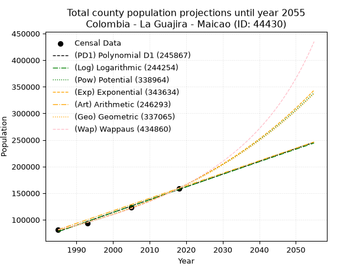
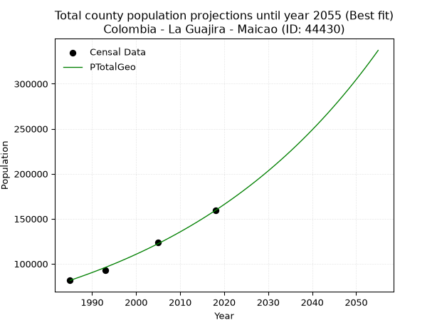
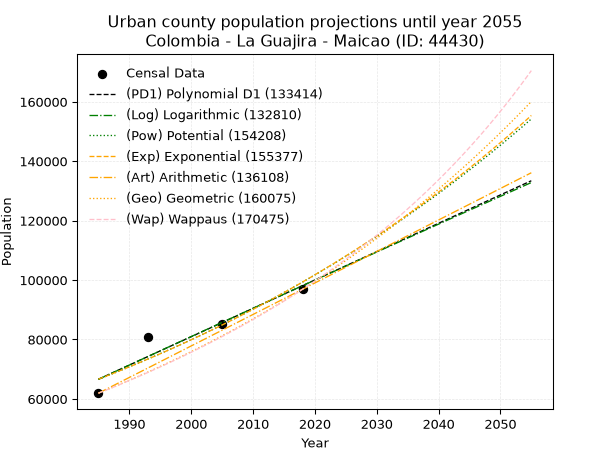
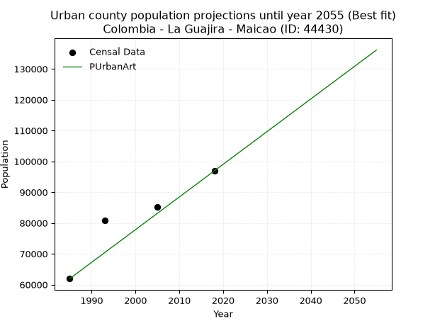
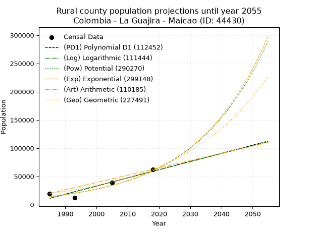
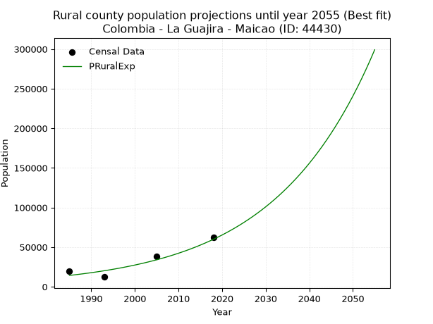

<div align="center">


</div>

# _“Population and Public Services Demand Projections (PPSD) until Year 2050 for Colombia - La Guajira - Maicao (ID: 44430)”_
Keywords: `population` `public-service` `projection` `lineal` `polynomial` `logarithmic` `potential` `exponential` `arithmetic` `geometric` `wappaus` `dane` `colombia` `south-america`

PPSD are analytical estimates used by governments and planners to anticipate future changes in population size, age distribution, and the resulting community needs for utilities, healthcare, education, and infrastructure as sizing future water treatment facilities, electrical grids, and road networks based on spatial growth.

> **General running parameters**: • app_version: _v20260806_. • Python version: _3.14.7_. • Pandas version: _3.0.5_. • NumPy version: _2.5.1_. • Creates, save and include plots into reports (create_plot): _False_. • Projection until year: _2050_. • Process polynomial degree 2 and up: _False_. • Process Wappaus: _True_. • Process Wappaus: _True_. • Set negative values to zero: _True_. • Set infinite values to zero: _True_. • Drop dataset notes: _True_. 
<div align="center">

Dynamic map: [:earth_americas:Google](http://maps.google.com/maps?q=11.3785346,-72.2427382) [:earth_americas:OSM](https://www.openstreetmap.org/#map=18/11.3785346/-72.2427382&layers=P) [:earth_americas:Bing](https://www.bing.com/maps?cp=11.3785346~-72.2427382&lvl=18) [:earth_americas:Apple](https://maps.apple.com/frame?center=11.3785346%2C-72.2427382&span=0.003%2C0.006)

</div>


<div align="center">

```geojson
{
  "type": "Feature",
  "geometry": {
    "type": "Point", 
    "coordinates": [-72.2427382, 11.3785346]
  }, 
  "properties": {
    "Name": "Colombia - La Guajira - Maicao (ID: 44430)"
  }
}
```

</div>


## 0. Census Data (4 records)

Census data are official statistics collected by a government about the people and housing in a country. They usually include counts of total population, age, sex, race, income, education, and jobs.

📅Global census file: [Population.xlsx](../data/Population.xlsx)

| Source   |   Year |   CountryID | CountryName   |   StateID | StateName   |   CountyID | CountyName   |   PTotal |   PUrban |   PRural |
|:---------|-------:|------------:|:--------------|----------:|:------------|-----------:|:-------------|---------:|---------:|---------:|
| DANE     |   1985 |          57 | Colombia      |        44 | La Guajira  |      44430 | Maicao       |    81566 |    61925 |    19641 |
| DANE     |   1993 |          57 | Colombia      |        44 | La Guajira  |      44430 | Maicao       |    93093 |    80770 |    12323 |
| DANE     |   2005 |          57 | Colombia      |        44 | La Guajira  |      44430 | Maicao       |   123757 |    85101 |    38656 |
| DANE     |   2018 |          57 | Colombia      |        44 | La Guajira  |      44430 | Maicao       |   159223 |    96897 |    62326 |

> 🔥Some records could had specific notes about the registered values or the corresponding urban or rural distribution.

## 1. Total

### 1.1. Coefficients and Parameters

* (PD1) Polynomial Deg 1: 2401.0409474106546, -4688272.405058162 (lineal)
* (Log) Logarithmic: 4804914.7561617615, -36407785.815755926
* (Pow) Potential: 41.4454050292528, -131.77067466191764
* (Exp) Exponential: 0.020706243567053268, 1.1383810182644232e-13
* (Art) Arithmetic: Year diff. 2018 - 1985 = 33, Population diff. 159223 - 81566 = 77657, Annual growth = 2353.242424242424
* (Geo) Geometric: Year diff. 2018 - 1985 = 33, Population diff. 159223 - 81566 = 77657, Annual growth % = 0.020476312893609405
* (Wap) Wappaus: i = 1.9546095745589909, Condition values only valid for < 200)

<sub>
Wappaus condition values: ['0.00', '1.95', '3.91', '5.86', '7.82', '9.77', '11.73', '13.68', '15.64', '17.59', '19.55', '21.50', '23.46', '25.41', '27.36', '29.32', '31.27', '33.23', '35.18', '37.14', '39.09', '41.05', '43.00', '44.96', '46.91', '48.87', '50.82', '52.77', '54.73', '56.68', '58.64', '60.59', '62.55', '64.50', '66.46', '68.41', '70.37', '72.32', '74.28', '76.23', '78.18', '80.14', '82.09', '84.05', '86.00', '87.96', '89.91', '91.87', '93.82', '95.78', '97.73', '99.69', '101.64', '103.59', '105.55', '107.50', '109.46', '111.41', '113.37', '115.32', '117.28', '119.23', '121.19', '123.14', '125.10', '127.05']
</sub>


### 1.2. Projected Dataset

|   Year |   CountyID |   PTotalPD1 |   PTotalLog |   PTotalPow |   PTotalExp |   PTotalArt |   PTotalGeo |   PTotalWap |
|-------:|-----------:|------------:|------------:|------------:|------------:|------------:|------------:|------------:|
|   1985 |      44430 |       77794 |       77730 |       80602 |       80652 |       81566 |       81566 |       81566 |
|   1986 |      44430 |       80195 |       80150 |       82302 |       82339 |       83919 |       83236 |       83176 |
|   1987 |      44430 |       82596 |       82569 |       84037 |       84062 |       86272 |       84941 |       84818 |
|   1988 |      44430 |       84997 |       84986 |       85808 |       85820 |       88626 |       86680 |       86493 |
|   1989 |      44430 |       87398 |       87403 |       87615 |       87616 |       90979 |       88455 |       88203 |
|   1990 |      44430 |       89799 |       89818 |       89460 |       89449 |       93332 |       90266 |       89947 |
|   1991 |      44430 |       92200 |       92232 |       91342 |       91321 |       95685 |       92114 |       91728 |
|   1992 |      44430 |       94601 |       94644 |       93263 |       93231 |       98039 |       94000 |       93546 |
|   1993 |      44430 |       97002 |       97056 |       95223 |       95182 |      100392 |       95925 |       95402 |
|   1994 |      44430 |       99403 |       99466 |       97223 |       97173 |      102745 |       97889 |       97298 |
|   1995 |      44430 |      101804 |      101875 |       99265 |       99206 |      105098 |       99894 |       99236 |
|   1996 |      44430 |      104205 |      104283 |      101348 |      101282 |      107452 |      101939 |      101216 |
|   1997 |      44430 |      106606 |      106690 |      103474 |      103401 |      109805 |      104027 |      103239 |
|   1998 |      44430 |      109007 |      109095 |      105643 |      105564 |      112158 |      106157 |      105308 |
|   1999 |      44430 |      111408 |      111500 |      107857 |      107773 |      114511 |      108330 |      107424 |
|   2000 |      44430 |      113809 |      113903 |      110116 |      110028 |      116865 |      110549 |      109588 |
|   2001 |      44430 |      116211 |      116304 |      112421 |      112330 |      119218 |      112812 |      111803 |
|   2002 |      44430 |      118612 |      118705 |      114773 |      114680 |      121571 |      115122 |      114069 |
|   2003 |      44430 |      121013 |      121105 |      117174 |      117079 |      123924 |      117479 |      116389 |
|   2004 |      44430 |      123414 |      123503 |      119623 |      119529 |      126278 |      119885 |      118765 |
|   2005 |      44430 |      125815 |      125900 |      122122 |      122030 |      128631 |      122340 |      121199 |
|   2006 |      44430 |      128216 |      128296 |      124672 |      124583 |      130984 |      124845 |      123692 |
|   2007 |      44430 |      130617 |      130690 |      127274 |      127189 |      133337 |      127401 |      126247 |
|   2008 |      44430 |      133018 |      133084 |      129929 |      129850 |      135691 |      130010 |      128867 |
|   2009 |      44430 |      135419 |      135476 |      132638 |      132567 |      138044 |      132672 |      131554 |
|   2010 |      44430 |      137820 |      137867 |      135402 |      135341 |      140397 |      135389 |      134310 |
|   2011 |      44430 |      140221 |      140257 |      138222 |      138172 |      142750 |      138161 |      137139 |
|   2012 |      44430 |      142622 |      142646 |      141099 |      141063 |      145104 |      140990 |      140042 |
|   2013 |      44430 |      145023 |      145033 |      144035 |      144014 |      147457 |      143877 |      143024 |
|   2014 |      44430 |      147424 |      147420 |      147031 |      147028 |      149810 |      146823 |      146087 |
|   2015 |      44430 |      149825 |      149805 |      150087 |      150104 |      152163 |      149829 |      149235 |
|   2016 |      44430 |      152226 |      152189 |      153205 |      153244 |      154517 |      152897 |      152471 |
|   2017 |      44430 |      154627 |      154572 |      156387 |      156450 |      156870 |      156028 |      155799 |
|   2018 |      44430 |      157028 |      156953 |      159633 |      159724 |      159223 |      159223 |      159223 |
|   2019 |      44430 |      159429 |      159334 |      162944 |      163065 |      161576 |      162483 |      162747 |
|   2020 |      44430 |      161830 |      161713 |      166323 |      166477 |      163929 |      165810 |      166376 |
|   2021 |      44430 |      164231 |      164091 |      169770 |      169960 |      166283 |      169206 |      170115 |
|   2022 |      44430 |      166632 |      166468 |      173286 |      173516 |      168636 |      172670 |      173968 |
|   2023 |      44430 |      169033 |      168844 |      176874 |      177146 |      170989 |      176206 |      177940 |
|   2024 |      44430 |      171434 |      171218 |      180534 |      180853 |      173342 |      179814 |      182039 |
|   2025 |      44430 |      173836 |      173592 |      184268 |      184636 |      175696 |      183496 |      186268 |
|   2026 |      44430 |      176237 |      175964 |      188077 |      188499 |      178049 |      187253 |      190636 |
|   2027 |      44430 |      178638 |      178335 |      191963 |      192443 |      180402 |      191087 |      195148 |
|   2028 |      44430 |      181039 |      180705 |      195928 |      196470 |      182755 |      195000 |      199813 |
|   2029 |      44430 |      183440 |      183074 |      199972 |      200580 |      185109 |      198993 |      204638 |
|   2030 |      44430 |      185841 |      185441 |      204098 |      204777 |      187462 |      203068 |      209630 |
|   2031 |      44430 |      188242 |      187807 |      208307 |      209061 |      189815 |      207226 |      214801 |
|   2032 |      44430 |      190643 |      190173 |      212600 |      213435 |      192168 |      211469 |      220158 |
|   2033 |      44430 |      193044 |      192537 |      216980 |      217901 |      194522 |      215799 |      225712 |
|   2034 |      44430 |      195445 |      194900 |      221447 |      222459 |      196875 |      220218 |      231475 |
|   2035 |      44430 |      197846 |      197261 |      226005 |      227114 |      199228 |      224727 |      237458 |
|   2036 |      44430 |      200247 |      199622 |      230654 |      231866 |      201581 |      229329 |      243674 |
|   2037 |      44430 |      202648 |      201981 |      235396 |      236717 |      203935 |      234025 |      250137 |
|   2038 |      44430 |      205049 |      204339 |      240233 |      241669 |      206288 |      238817 |      256862 |
|   2039 |      44430 |      207450 |      206697 |      245167 |      246725 |      208641 |      243707 |      263866 |
|   2040 |      44430 |      209851 |      209053 |      250200 |      251887 |      210994 |      248697 |      271165 |
|   2041 |      44430 |      212252 |      211407 |      255334 |      257157 |      213348 |      253789 |      278780 |
|   2042 |      44430 |      214653 |      213761 |      260571 |      262538 |      215701 |      258986 |      286731 |
|   2043 |      44430 |      217054 |      216113 |      265912 |      268031 |      218054 |      264289 |      295040 |
|   2044 |      44430 |      219455 |      218465 |      271361 |      273638 |      220407 |      269701 |      303733 |
|   2045 |      44430 |      221856 |      220815 |      276918 |      279363 |      222761 |      275223 |      312837 |
|   2046 |      44430 |      224257 |      223164 |      282586 |      285208 |      225114 |      280859 |      322382 |
|   2047 |      44430 |      226658 |      225512 |      288367 |      291176 |      227467 |      286610 |      332400 |
|   2048 |      44430 |      229059 |      227858 |      294264 |      297268 |      229820 |      292478 |      342928 |
|   2049 |      44430 |      231460 |      230204 |      300278 |      303487 |      232174 |      298467 |      354004 |
|   2050 |      44430 |      233862 |      232548 |      306412 |      309837 |      234527 |      304579 |      365675 |
<div align="center">

</img>

</div>


### 1.3. Best fit with absolute and relative error (%)

Relative error puts that difference into context by dividing the absolute error by the true value, creating a unitless ratio or percentage that shows the scale of the mistake.

Absolute and relative error

|   Year | Source   |   CountryID | CountryName   |   StateID | StateName   |   CountyID_x | CountyName   |   PTotal |   PUrban |   PRural |   CountyID_y |   PTotalPD1 |   PTotalLog |   PTotalPow |   PTotalExp |   PTotalArt |   PTotalGeo |   PTotalWap |   PTotalPD1AbsError |   PTotalLogAbsError |   PTotalPowAbsError |   PTotalExpAbsError |   PTotalArtAbsError |   PTotalGeoAbsError |   PTotalWapAbsError |   PTotalPD1RelError |   PTotalLogRelError |   PTotalPowRelError |   PTotalExpRelError |   PTotalArtRelError |   PTotalGeoRelError |   PTotalWapRelError |
|-------:|:---------|------------:|:--------------|----------:|:------------|-------------:|:-------------|---------:|---------:|---------:|-------------:|------------:|------------:|------------:|------------:|------------:|------------:|------------:|--------------------:|--------------------:|--------------------:|--------------------:|--------------------:|--------------------:|--------------------:|--------------------:|--------------------:|--------------------:|--------------------:|--------------------:|--------------------:|--------------------:|
|   1985 | DANE     |          57 | Colombia      |        44 | La Guajira  |        44430 | Maicao       |    81566 |    61925 |    19641 |        44430 |       77794 |       77730 |       80602 |       80652 |       81566 |       81566 |       81566 |                3772 |                3836 |                 964 |                 914 |                   0 |                   0 |                   0 |             4.62448 |             4.70294 |             1.18186 |            1.12056  |             0       |             0       |             0       |
|   1993 | DANE     |          57 | Colombia      |        44 | La Guajira  |        44430 | Maicao       |    93093 |    80770 |    12323 |        44430 |       97002 |       97056 |       95223 |       95182 |      100392 |       95925 |       95402 |                3909 |                3963 |                2130 |                2089 |                7299 |                2832 |                2309 |             4.19903 |             4.25703 |             2.28803 |            2.24399  |             7.84055 |             3.04212 |             2.48032 |
|   2005 | DANE     |          57 | Colombia      |        44 | La Guajira  |        44430 | Maicao       |   123757 |    85101 |    38656 |        44430 |      125815 |      125900 |      122122 |      122030 |      128631 |      122340 |      121199 |                2058 |                2143 |                1635 |                1727 |                4874 |                1417 |                2558 |             1.66294 |             1.73162 |             1.32114 |            1.39548  |             3.93836 |             1.14499 |             2.06695 |
|   2018 | DANE     |          57 | Colombia      |        44 | La Guajira  |        44430 | Maicao       |   159223 |    96897 |    62326 |        44430 |      157028 |      156953 |      159633 |      159724 |      159223 |      159223 |      159223 |                2195 |                2270 |                 410 |                 501 |                   0 |                   0 |                   0 |             1.37857 |             1.42567 |             0.2575  |            0.314653 |             0       |             0       |             0       |

Relative error mean

| Method    |   RelError | Best   |
|:----------|-----------:|:-------|
| PTotalPD1 |    2.96625 |        |
| PTotalLog |    3.02932 |        |
| PTotalPow |    1.26213 |        |
| PTotalExp |    1.26867 |        |
| PTotalArt |    2.94473 |        |
| PTotalGeo |    1.04678 | True   |
| PTotalWap |    1.13682 |        |

💙Best method: _**PTotalGeo**_
<div align="center">

</img>

</div>


### 1.4. Fresh water supply demand in liters per capita per day (lpcd)

The fresh water supply demand typically ranges from 100 to 300 liters per capita per day (lpcd) for standard domestic and municipal planning, though absolute survival minimums set by the World Health Organization are as low as 7.5 to 20 liters per day, and total consumption in high-income nations can exceed 400 liters.

> `CZ`: Level in meters above the sea level (masl).<br> `WS`: Fresh water supply demand in liters per capita per day (lpcd or l/h/d).<br> `WSAll`: Zonal fresh water supply demand in liters per second (l/s).<br> `A`: Zonal area in square meters.

Reference values (RAS Colombia)

|    CZ |   WS |
|------:|-----:|
|  1000 |  120 |
|  2000 |  130 |
| 99999 |  140 |

County shapefile geometry properties and water supply values

|   CountyID |      ATotal |   CZTotal |   WSTotal |
|-----------:|------------:|----------:|----------:|
|      44430 | 1.76725e+09 |   79.2957 |       120 |

Projected values for best method: PTotalGeo

|   CountyID |   Year |   PTotalGeo |   WSTotal |   WSTotalAll |
|-----------:|-------:|------------:|----------:|-------------:|
|      44430 |   1985 |       81566 |       120 |      113.286 |
|      44430 |   1986 |       83236 |       120 |      115.606 |
|      44430 |   1987 |       84941 |       120 |      117.974 |
|      44430 |   1988 |       86680 |       120 |      120.389 |
|      44430 |   1989 |       88455 |       120 |      122.854 |
|      44430 |   1990 |       90266 |       120 |      125.369 |
|      44430 |   1991 |       92114 |       120 |      127.936 |
|      44430 |   1992 |       94000 |       120 |      130.556 |
|      44430 |   1993 |       95925 |       120 |      133.229 |
|      44430 |   1994 |       97889 |       120 |      135.957 |
|      44430 |   1995 |       99894 |       120 |      138.742 |
|      44430 |   1996 |      101939 |       120 |      141.582 |
|      44430 |   1997 |      104027 |       120 |      144.482 |
|      44430 |   1998 |      106157 |       120 |      147.44  |
|      44430 |   1999 |      108330 |       120 |      150.458 |
|      44430 |   2000 |      110549 |       120 |      153.54  |
|      44430 |   2001 |      112812 |       120 |      156.683 |
|      44430 |   2002 |      115122 |       120 |      159.892 |
|      44430 |   2003 |      117479 |       120 |      163.165 |
|      44430 |   2004 |      119885 |       120 |      166.507 |
|      44430 |   2005 |      122340 |       120 |      169.917 |
|      44430 |   2006 |      124845 |       120 |      173.396 |
|      44430 |   2007 |      127401 |       120 |      176.946 |
|      44430 |   2008 |      130010 |       120 |      180.569 |
|      44430 |   2009 |      132672 |       120 |      184.267 |
|      44430 |   2010 |      135389 |       120 |      188.04  |
|      44430 |   2011 |      138161 |       120 |      191.89  |
|      44430 |   2012 |      140990 |       120 |      195.819 |
|      44430 |   2013 |      143877 |       120 |      199.829 |
|      44430 |   2014 |      146823 |       120 |      203.921 |
|      44430 |   2015 |      149829 |       120 |      208.096 |
|      44430 |   2016 |      152897 |       120 |      212.357 |
|      44430 |   2017 |      156028 |       120 |      216.706 |
|      44430 |   2018 |      159223 |       120 |      221.143 |
|      44430 |   2019 |      162483 |       120 |      225.671 |
|      44430 |   2020 |      165810 |       120 |      230.292 |
|      44430 |   2021 |      169206 |       120 |      235.008 |
|      44430 |   2022 |      172670 |       120 |      239.819 |
|      44430 |   2023 |      176206 |       120 |      244.731 |
|      44430 |   2024 |      179814 |       120 |      249.742 |
|      44430 |   2025 |      183496 |       120 |      254.856 |
|      44430 |   2026 |      187253 |       120 |      260.074 |
|      44430 |   2027 |      191087 |       120 |      265.399 |
|      44430 |   2028 |      195000 |       120 |      270.833 |
|      44430 |   2029 |      198993 |       120 |      276.379 |
|      44430 |   2030 |      203068 |       120 |      282.039 |
|      44430 |   2031 |      207226 |       120 |      287.814 |
|      44430 |   2032 |      211469 |       120 |      293.707 |
|      44430 |   2033 |      215799 |       120 |      299.721 |
|      44430 |   2034 |      220218 |       120 |      305.858 |
|      44430 |   2035 |      224727 |       120 |      312.121 |
|      44430 |   2036 |      229329 |       120 |      318.512 |
|      44430 |   2037 |      234025 |       120 |      325.035 |
|      44430 |   2038 |      238817 |       120 |      331.69  |
|      44430 |   2039 |      243707 |       120 |      338.482 |
|      44430 |   2040 |      248697 |       120 |      345.413 |
|      44430 |   2041 |      253789 |       120 |      352.485 |
|      44430 |   2042 |      258986 |       120 |      359.703 |
|      44430 |   2043 |      264289 |       120 |      367.068 |
|      44430 |   2044 |      269701 |       120 |      374.585 |
|      44430 |   2045 |      275223 |       120 |      382.254 |
|      44430 |   2046 |      280859 |       120 |      390.082 |
|      44430 |   2047 |      286610 |       120 |      398.069 |
|      44430 |   2048 |      292478 |       120 |      406.219 |
|      44430 |   2049 |      298467 |       120 |      414.538 |
|      44430 |   2050 |      304579 |       120 |      423.026 |

## 2. Urban

### 2.1. Coefficients and Parameters

* (PD1) Polynomial Deg 1: 954.1754315535853, -1827416.1569650592 (lineal)
* (Log) Logarithmic: 1910820.5326769568, -14442988.931232307
* (Pow) Potential: 24.221855331003027, -75.054341091278
* (Exp) Exponential: 0.012093159146765134, 2.5034717940084553e-06
* (Art) Arithmetic: Year diff. 2018 - 1985 = 33, Population diff. 96897 - 61925 = 34972, Annual growth = 1059.7575757575758
* (Geo) Geometric: Year diff. 2018 - 1985 = 33, Population diff. 96897 - 61925 = 34972, Annual growth % = 0.013659866595562953
* (Wap) Wappaus: i = 1.334522390799229, Condition values only valid for < 200)

<sub>
Wappaus condition values: ['0.00', '1.33', '2.67', '4.00', '5.34', '6.67', '8.01', '9.34', '10.68', '12.01', '13.35', '14.68', '16.01', '17.35', '18.68', '20.02', '21.35', '22.69', '24.02', '25.36', '26.69', '28.02', '29.36', '30.69', '32.03', '33.36', '34.70', '36.03', '37.37', '38.70', '40.04', '41.37', '42.70', '44.04', '45.37', '46.71', '48.04', '49.38', '50.71', '52.05', '53.38', '54.72', '56.05', '57.38', '58.72', '60.05', '61.39', '62.72', '64.06', '65.39', '66.73', '68.06', '69.40', '70.73', '72.06', '73.40', '74.73', '76.07', '77.40', '78.74', '80.07', '81.41', '82.74', '84.07', '85.41', '86.74']
</sub>


### 2.2. Projected Dataset

|   Year |   CountyID |   PUrbanPD1 |   PUrbanLog |   PUrbanPow |   PUrbanExp |   PUrbanArt |   PUrbanGeo |   PUrbanWap |
|-------:|-----------:|------------:|------------:|------------:|------------:|------------:|------------:|------------:|
|   1985 |      44430 |       66622 |       66586 |       66610 |       66642 |       61925 |       61925 |       61925 |
|   1986 |      44430 |       67576 |       67549 |       67427 |       67453 |       62985 |       62771 |       62757 |
|   1987 |      44430 |       68530 |       68511 |       68254 |       68273 |       64045 |       63628 |       63600 |
|   1988 |      44430 |       69485 |       69472 |       69091 |       69104 |       65104 |       64497 |       64455 |
|   1989 |      44430 |       70439 |       70433 |       69938 |       69945 |       66164 |       65379 |       65321 |
|   1990 |      44430 |       71393 |       71393 |       70795 |       70796 |       67224 |       66272 |       66200 |
|   1991 |      44430 |       72347 |       72353 |       71661 |       71657 |       68284 |       67177 |       67090 |
|   1992 |      44430 |       73301 |       73313 |       72538 |       72529 |       69343 |       68094 |       67993 |
|   1993 |      44430 |       74255 |       74272 |       73426 |       73411 |       70403 |       69025 |       68909 |
|   1994 |      44430 |       75210 |       75230 |       74323 |       74305 |       71463 |       69967 |       69838 |
|   1995 |      44430 |       76164 |       76189 |       75231 |       75209 |       72523 |       70923 |       70780 |
|   1996 |      44430 |       77118 |       77146 |       76150 |       76124 |       73582 |       71892 |       71736 |
|   1997 |      44430 |       78072 |       78103 |       77080 |       77050 |       74642 |       72874 |       72705 |
|   1998 |      44430 |       79026 |       79060 |       78020 |       77987 |       75702 |       73870 |       73689 |
|   1999 |      44430 |       79981 |       80016 |       78971 |       78936 |       76762 |       74879 |       74687 |
|   2000 |      44430 |       80935 |       80972 |       79934 |       79896 |       77821 |       75901 |       75700 |
|   2001 |      44430 |       81889 |       81927 |       80907 |       80868 |       78881 |       76938 |       76728 |
|   2002 |      44430 |       82843 |       82881 |       81892 |       81852 |       79941 |       77989 |       77771 |
|   2003 |      44430 |       83797 |       83836 |       82889 |       82848 |       81001 |       79054 |       78831 |
|   2004 |      44430 |       84751 |       84789 |       83897 |       83856 |       82060 |       80134 |       79906 |
|   2005 |      44430 |       85706 |       85743 |       84917 |       84876 |       83120 |       81229 |       80998 |
|   2006 |      44430 |       86660 |       86695 |       85949 |       85909 |       84180 |       82339 |       82108 |
|   2007 |      44430 |       87614 |       87648 |       86993 |       86954 |       85240 |       83463 |       83234 |
|   2008 |      44430 |       88568 |       88600 |       88049 |       88012 |       86299 |       84603 |       84378 |
|   2009 |      44430 |       89522 |       89551 |       89117 |       89083 |       87359 |       85759 |       85541 |
|   2010 |      44430 |       90476 |       90502 |       90198 |       90167 |       88419 |       86931 |       86722 |
|   2011 |      44430 |       91431 |       91452 |       91291 |       91264 |       89479 |       88118 |       87922 |
|   2012 |      44430 |       92385 |       92402 |       92397 |       92374 |       90538 |       89322 |       89141 |
|   2013 |      44430 |       93339 |       93352 |       93516 |       93498 |       91598 |       90542 |       90381 |
|   2014 |      44430 |       94293 |       94301 |       94648 |       94636 |       92658 |       91779 |       91641 |
|   2015 |      44430 |       95247 |       95249 |       95792 |       95787 |       93718 |       93032 |       92922 |
|   2016 |      44430 |       96202 |       96197 |       96951 |       96953 |       94777 |       94303 |       94225 |
|   2017 |      44430 |       97156 |       97145 |       98122 |       98132 |       95837 |       95591 |       95550 |
|   2018 |      44430 |       98110 |       98092 |       99307 |       99326 |       96897 |       96897 |       96897 |
|   2019 |      44430 |       99064 |       99039 |      100506 |      100535 |       97957 |       98221 |       98268 |
|   2020 |      44430 |      100018 |       99985 |      101719 |      101758 |       99017 |       99562 |       99662 |
|   2021 |      44430 |      100972 |      100931 |      102946 |      102996 |      100076 |      100922 |      101081 |
|   2022 |      44430 |      101927 |      101876 |      104187 |      104249 |      101136 |      102301 |      102526 |
|   2023 |      44430 |      102881 |      102821 |      105442 |      105517 |      102196 |      103698 |      103996 |
|   2024 |      44430 |      103835 |      103765 |      106712 |      106801 |      103256 |      105115 |      105492 |
|   2025 |      44430 |      104789 |      104709 |      107996 |      108100 |      104315 |      106551 |      107016 |
|   2026 |      44430 |      105743 |      105652 |      109295 |      109416 |      105375 |      108006 |      108568 |
|   2027 |      44430 |      106697 |      106595 |      110609 |      110747 |      106435 |      109481 |      110149 |
|   2028 |      44430 |      107652 |      107538 |      111939 |      112094 |      107495 |      110977 |      111759 |
|   2029 |      44430 |      108606 |      108479 |      113283 |      113458 |      108554 |      112493 |      113399 |
|   2030 |      44430 |      109560 |      109421 |      114644 |      114838 |      109614 |      114030 |      115071 |
|   2031 |      44430 |      110514 |      110362 |      116019 |      116236 |      110674 |      115587 |      116775 |
|   2032 |      44430 |      111468 |      111303 |      117411 |      117650 |      111734 |      117166 |      118513 |
|   2033 |      44430 |      112422 |      112243 |      118818 |      119081 |      112793 |      118767 |      120284 |
|   2034 |      44430 |      113377 |      113182 |      120242 |      120530 |      113853 |      120389 |      122090 |
|   2035 |      44430 |      114331 |      114122 |      121682 |      121996 |      114913 |      122033 |      123933 |
|   2036 |      44430 |      115285 |      115060 |      123139 |      123481 |      115973 |      123700 |      125813 |
|   2037 |      44430 |      116239 |      115999 |      124612 |      124983 |      117032 |      125390 |      127731 |
|   2038 |      44430 |      117193 |      116937 |      126103 |      126504 |      118092 |      127103 |      129689 |
|   2039 |      44430 |      118148 |      117874 |      127610 |      128043 |      119152 |      128839 |      131688 |
|   2040 |      44430 |      119102 |      118811 |      129134 |      129601 |      120212 |      130599 |      133729 |
|   2041 |      44430 |      120056 |      119747 |      130676 |      131177 |      121271 |      132383 |      135813 |
|   2042 |      44430 |      121010 |      120683 |      132236 |      132773 |      122331 |      134191 |      137942 |
|   2043 |      44430 |      121964 |      121619 |      133814 |      134389 |      123391 |      136024 |      140118 |
|   2044 |      44430 |      122918 |      122554 |      135409 |      136024 |      124451 |      137882 |      142341 |
|   2045 |      44430 |      123873 |      123488 |      137023 |      137679 |      125510 |      139766 |      144614 |
|   2046 |      44430 |      124827 |      124423 |      138655 |      139354 |      126570 |      141675 |      146939 |
|   2047 |      44430 |      125781 |      125356 |      140306 |      141049 |      127630 |      143610 |      149316 |
|   2048 |      44430 |      126735 |      126290 |      141976 |      142765 |      128690 |      145572 |      151747 |
|   2049 |      44430 |      127689 |      127222 |      143664 |      144502 |      129749 |      147561 |      154236 |
|   2050 |      44430 |      128643 |      128155 |      145372 |      146260 |      130809 |      149576 |      156783 |
<div align="center">

</img>

</div>


### 2.3. Best fit with absolute and relative error (%)

Relative error puts that difference into context by dividing the absolute error by the true value, creating a unitless ratio or percentage that shows the scale of the mistake.

Absolute and relative error

|   Year | Source   |   CountryID | CountryName   |   StateID | StateName   |   CountyID_x | CountyName   |   PTotal |   PUrban |   PRural |   CountyID_y |   PUrbanPD1 |   PUrbanLog |   PUrbanPow |   PUrbanExp |   PUrbanArt |   PUrbanGeo |   PUrbanWap |   PUrbanPD1AbsError |   PUrbanLogAbsError |   PUrbanPowAbsError |   PUrbanExpAbsError |   PUrbanArtAbsError |   PUrbanGeoAbsError |   PUrbanWapAbsError |   PUrbanPD1RelError |   PUrbanLogRelError |   PUrbanPowRelError |   PUrbanExpRelError |   PUrbanArtRelError |   PUrbanGeoRelError |   PUrbanWapRelError |
|-------:|:---------|------------:|:--------------|----------:|:------------|-------------:|:-------------|---------:|---------:|---------:|-------------:|------------:|------------:|------------:|------------:|------------:|------------:|------------:|--------------------:|--------------------:|--------------------:|--------------------:|--------------------:|--------------------:|--------------------:|--------------------:|--------------------:|--------------------:|--------------------:|--------------------:|--------------------:|--------------------:|
|   1985 | DANE     |          57 | Colombia      |        44 | La Guajira  |        44430 | Maicao       |    81566 |    61925 |    19641 |        44430 |       66622 |       66586 |       66610 |       66642 |       61925 |       61925 |       61925 |                4697 |                4661 |                4685 |                4717 |                   0 |                   0 |                   0 |             7.58498 |            7.52685  |            7.5656   |            7.61728  |             0       |             0       |             0       |
|   1993 | DANE     |          57 | Colombia      |        44 | La Guajira  |        44430 | Maicao       |    93093 |    80770 |    12323 |        44430 |       74255 |       74272 |       73426 |       73411 |       70403 |       69025 |       68909 |                6515 |                6498 |                7344 |                7359 |               10367 |               11745 |               11861 |             8.06611 |            8.04507  |            9.09248  |            9.11106  |            12.8352  |            14.5413  |            14.6849  |
|   2005 | DANE     |          57 | Colombia      |        44 | La Guajira  |        44430 | Maicao       |   123757 |    85101 |    38656 |        44430 |       85706 |       85743 |       84917 |       84876 |       83120 |       81229 |       80998 |                 605 |                 642 |                 184 |                 225 |                1981 |                3872 |                4103 |             0.71092 |            0.754398 |            0.216214 |            0.264392 |             2.32782 |             4.54989 |             4.82133 |
|   2018 | DANE     |          57 | Colombia      |        44 | La Guajira  |        44430 | Maicao       |   159223 |    96897 |    62326 |        44430 |       98110 |       98092 |       99307 |       99326 |       96897 |       96897 |       96897 |                1213 |                1195 |                2410 |                2429 |                   0 |                   0 |                   0 |             1.25184 |            1.23327  |            2.48718  |            2.50679  |             0       |             0       |             0       |

Relative error mean

| Method    |   RelError | Best   |
|:----------|-----------:|:-------|
| PUrbanPD1 |    4.40347 |        |
| PUrbanLog |    4.38989 |        |
| PUrbanPow |    4.84037 |        |
| PUrbanExp |    4.87488 |        |
| PUrbanArt |    3.79076 | True   |
| PUrbanGeo |    4.77279 |        |
| PUrbanWap |    4.87656 |        |

💙Best method: _**PUrbanArt**_
<div align="center">

</img>

</div>


### 2.4. Fresh water supply demand in liters per capita per day (lpcd)

The fresh water supply demand typically ranges from 100 to 300 liters per capita per day (lpcd) for standard domestic and municipal planning, though absolute survival minimums set by the World Health Organization are as low as 7.5 to 20 liters per day, and total consumption in high-income nations can exceed 400 liters.

> `CZ`: Level in meters above the sea level (masl).<br> `WS`: Fresh water supply demand in liters per capita per day (lpcd or l/h/d).<br> `WSAll`: Zonal fresh water supply demand in liters per second (l/s).<br> `A`: Zonal area in square meters.

Reference values (RAS Colombia)

|    CZ |   WS |
|------:|-----:|
|  1000 |  120 |
|  2000 |  130 |
| 99999 |  140 |

County shapefile geometry properties and water supply values

|   CountyID |      AUrban |   CZUrban |   WSUrban |
|-----------:|------------:|----------:|----------:|
|      44430 | 2.16012e+07 |    50.935 |       120 |

Projected values for best method: PUrbanArt

|   CountyID |   Year |   PUrbanArt |   WSUrban |   WSUrbanAll |
|-----------:|-------:|------------:|----------:|-------------:|
|      44430 |   1985 |       61925 |       120 |      86.0069 |
|      44430 |   1986 |       62985 |       120 |      87.4792 |
|      44430 |   1987 |       64045 |       120 |      88.9514 |
|      44430 |   1988 |       65104 |       120 |      90.4222 |
|      44430 |   1989 |       66164 |       120 |      91.8944 |
|      44430 |   1990 |       67224 |       120 |      93.3667 |
|      44430 |   1991 |       68284 |       120 |      94.8389 |
|      44430 |   1992 |       69343 |       120 |      96.3097 |
|      44430 |   1993 |       70403 |       120 |      97.7819 |
|      44430 |   1994 |       71463 |       120 |      99.2542 |
|      44430 |   1995 |       72523 |       120 |     100.726  |
|      44430 |   1996 |       73582 |       120 |     102.197  |
|      44430 |   1997 |       74642 |       120 |     103.669  |
|      44430 |   1998 |       75702 |       120 |     105.142  |
|      44430 |   1999 |       76762 |       120 |     106.614  |
|      44430 |   2000 |       77821 |       120 |     108.085  |
|      44430 |   2001 |       78881 |       120 |     109.557  |
|      44430 |   2002 |       79941 |       120 |     111.029  |
|      44430 |   2003 |       81001 |       120 |     112.501  |
|      44430 |   2004 |       82060 |       120 |     113.972  |
|      44430 |   2005 |       83120 |       120 |     115.444  |
|      44430 |   2006 |       84180 |       120 |     116.917  |
|      44430 |   2007 |       85240 |       120 |     118.389  |
|      44430 |   2008 |       86299 |       120 |     119.86   |
|      44430 |   2009 |       87359 |       120 |     121.332  |
|      44430 |   2010 |       88419 |       120 |     122.804  |
|      44430 |   2011 |       89479 |       120 |     124.276  |
|      44430 |   2012 |       90538 |       120 |     125.747  |
|      44430 |   2013 |       91598 |       120 |     127.219  |
|      44430 |   2014 |       92658 |       120 |     128.692  |
|      44430 |   2015 |       93718 |       120 |     130.164  |
|      44430 |   2016 |       94777 |       120 |     131.635  |
|      44430 |   2017 |       95837 |       120 |     133.107  |
|      44430 |   2018 |       96897 |       120 |     134.579  |
|      44430 |   2019 |       97957 |       120 |     136.051  |
|      44430 |   2020 |       99017 |       120 |     137.524  |
|      44430 |   2021 |      100076 |       120 |     138.994  |
|      44430 |   2022 |      101136 |       120 |     140.467  |
|      44430 |   2023 |      102196 |       120 |     141.939  |
|      44430 |   2024 |      103256 |       120 |     143.411  |
|      44430 |   2025 |      104315 |       120 |     144.882  |
|      44430 |   2026 |      105375 |       120 |     146.354  |
|      44430 |   2027 |      106435 |       120 |     147.826  |
|      44430 |   2028 |      107495 |       120 |     149.299  |
|      44430 |   2029 |      108554 |       120 |     150.769  |
|      44430 |   2030 |      109614 |       120 |     152.242  |
|      44430 |   2031 |      110674 |       120 |     153.714  |
|      44430 |   2032 |      111734 |       120 |     155.186  |
|      44430 |   2033 |      112793 |       120 |     156.657  |
|      44430 |   2034 |      113853 |       120 |     158.129  |
|      44430 |   2035 |      114913 |       120 |     159.601  |
|      44430 |   2036 |      115973 |       120 |     161.074  |
|      44430 |   2037 |      117032 |       120 |     162.544  |
|      44430 |   2038 |      118092 |       120 |     164.017  |
|      44430 |   2039 |      119152 |       120 |     165.489  |
|      44430 |   2040 |      120212 |       120 |     166.961  |
|      44430 |   2041 |      121271 |       120 |     168.432  |
|      44430 |   2042 |      122331 |       120 |     169.904  |
|      44430 |   2043 |      123391 |       120 |     171.376  |
|      44430 |   2044 |      124451 |       120 |     172.849  |
|      44430 |   2045 |      125510 |       120 |     174.319  |
|      44430 |   2046 |      126570 |       120 |     175.792  |
|      44430 |   2047 |      127630 |       120 |     177.264  |
|      44430 |   2048 |      128690 |       120 |     178.736  |
|      44430 |   2049 |      129749 |       120 |     180.207  |
|      44430 |   2050 |      130809 |       120 |     181.679  |

## 3. Rural

### 3.1. Coefficients and Parameters

* (PD1) Polynomial Deg 1: 1446.8655158570689, -2860856.248093102 (lineal)
* (Log) Logarithmic: 2894094.2234848016, -21964796.88452359
* (Pow) Potential: 87.02810173071319, -282.84492222450575
* (Exp) Exponential: 0.04350497631197699, 4.45426206464775e-34
* (Art) Arithmetic: Year diff. 2018 - 1985 = 33, Population diff. 62326 - 19641 = 42685, Annual growth = 1293.4848484848485
* (Geo) Geometric: Year diff. 2018 - 1985 = 33, Population diff. 62326 - 19641 = 42685, Annual growth % = 0.03561215997790046
* (Wap) Wappaus: i = 3.1561112361922445, Condition values only valid for < 200)

<sub>
Wappaus condition values: ['0.00', '3.16', '6.31', '9.47', '12.62', '15.78', '18.94', '22.09', '25.25', '28.41', '31.56', '34.72', '37.87', '41.03', '44.19', '47.34', '50.50', '53.65', '56.81', '59.97', '63.12', '66.28', '69.43', '72.59', '75.75', '78.90', '82.06', '85.22', '88.37', '91.53', '94.68', '97.84', '101.00', '104.15', '107.31', '110.46', '113.62', '116.78', '119.93', '123.09', '126.24', '129.40', '132.56', '135.71', '138.87', '142.03', '145.18', '148.34', '151.49', '154.65', '157.81', '160.96', '164.12', '167.27', '170.43', '173.59', '176.74', '179.90', '183.05', '186.21', '189.37', '192.52', '195.68', '198.84', '201.99', '205.15']
</sub>


### 3.2. Projected Dataset

|   Year |   CountyID |   PRuralPD1 |   PRuralLog |   PRuralPow |   PRuralExp |   PRuralArt |   PRuralGeo |
|-------:|-----------:|------------:|------------:|------------:|------------:|------------:|------------:|
|   1985 |      44430 |       11172 |       11144 |       14221 |       14233 |       19641 |       19641 |
|   1986 |      44430 |       12619 |       12601 |       14858 |       14866 |       20934 |       20340 |
|   1987 |      44430 |       14066 |       14058 |       15523 |       15527 |       22228 |       21065 |
|   1988 |      44430 |       15512 |       15514 |       16218 |       16218 |       23521 |       21815 |
|   1989 |      44430 |       16959 |       16970 |       16943 |       16939 |       24815 |       22592 |
|   1990 |      44430 |       18406 |       18424 |       17701 |       17692 |       26108 |       23396 |
|   1991 |      44430 |       19853 |       19878 |       18492 |       18479 |       27402 |       24230 |
|   1992 |      44430 |       21300 |       21331 |       19318 |       19300 |       28695 |       25092 |
|   1993 |      44430 |       22747 |       22784 |       20181 |       20159 |       29989 |       25986 |
|   1994 |      44430 |       24194 |       24236 |       21081 |       21055 |       31282 |       26911 |
|   1995 |      44430 |       25640 |       25687 |       22021 |       21991 |       32576 |       27870 |
|   1996 |      44430 |       27087 |       27137 |       23003 |       22969 |       33869 |       28862 |
|   1997 |      44430 |       28534 |       28587 |       24028 |       23990 |       35163 |       29890 |
|   1998 |      44430 |       29981 |       30035 |       25098 |       25057 |       36456 |       30955 |
|   1999 |      44430 |       31428 |       31484 |       26215 |       26171 |       37750 |       32057 |
|   2000 |      44430 |       32875 |       32931 |       27381 |       27335 |       39043 |       33199 |
|   2001 |      44430 |       34322 |       34378 |       28599 |       28550 |       40337 |       34381 |
|   2002 |      44430 |       35769 |       35824 |       29870 |       29820 |       41630 |       35605 |
|   2003 |      44430 |       37215 |       37269 |       31196 |       31146 |       42924 |       36873 |
|   2004 |      44430 |       38662 |       38713 |       32581 |       32531 |       44217 |       38186 |
|   2005 |      44430 |       40109 |       40157 |       34027 |       33977 |       45511 |       39546 |
|   2006 |      44430 |       41556 |       41600 |       35536 |       35488 |       46804 |       40955 |
|   2007 |      44430 |       43003 |       43043 |       37111 |       37066 |       48098 |       42413 |
|   2008 |      44430 |       44450 |       44484 |       38756 |       38714 |       49391 |       43924 |
|   2009 |      44430 |       45897 |       45925 |       40472 |       40436 |       50685 |       45488 |
|   2010 |      44430 |       47343 |       47365 |       42263 |       42234 |       51978 |       47108 |
|   2011 |      44430 |       48790 |       48805 |       44133 |       44111 |       53272 |       48785 |
|   2012 |      44430 |       50237 |       50244 |       46084 |       46073 |       54565 |       50523 |
|   2013 |      44430 |       51684 |       51682 |       48120 |       48122 |       55859 |       52322 |
|   2014 |      44430 |       53131 |       53119 |       50246 |       50261 |       57152 |       54185 |
|   2015 |      44430 |       54578 |       54556 |       52464 |       52496 |       58446 |       56115 |
|   2016 |      44430 |       56025 |       55992 |       54779 |       54830 |       59739 |       58113 |
|   2017 |      44430 |       57471 |       57427 |       57195 |       57268 |       61033 |       60183 |
|   2018 |      44430 |       58918 |       58861 |       59716 |       59815 |       62326 |       62326 |
|   2019 |      44430 |       60365 |       60295 |       62347 |       62475 |       63619 |       64546 |
|   2020 |      44430 |       61812 |       61728 |       65093 |       65253 |       64913 |       66844 |
|   2021 |      44430 |       63259 |       63161 |       67958 |       68154 |       66206 |       69225 |
|   2022 |      44430 |       64706 |       64592 |       70947 |       71184 |       67500 |       71690 |
|   2023 |      44430 |       66153 |       66023 |       74067 |       74350 |       68793 |       74243 |
|   2024 |      44430 |       67600 |       67453 |       77322 |       77656 |       70087 |       76887 |
|   2025 |      44430 |       69046 |       68883 |       80718 |       81109 |       71380 |       79625 |
|   2026 |      44430 |       70493 |       70312 |       84262 |       84715 |       72674 |       82461 |
|   2027 |      44430 |       71940 |       71740 |       87959 |       88482 |       73967 |       85397 |
|   2028 |      44430 |       73387 |       73167 |       91817 |       92416 |       75261 |       88438 |
|   2029 |      44430 |       74834 |       74594 |       95842 |       96526 |       76554 |       91588 |
|   2030 |      44430 |       76281 |       76020 |      100041 |      100818 |       77848 |       94849 |
|   2031 |      44430 |       77728 |       77445 |      104422 |      105301 |       79141 |       98227 |
|   2032 |      44430 |       79174 |       78870 |      108993 |      109983 |       80435 |      101725 |
|   2033 |      44430 |       80621 |       80294 |      113761 |      114873 |       81728 |      105348 |
|   2034 |      44430 |       82068 |       81717 |      118736 |      119981 |       83022 |      109100 |
|   2035 |      44430 |       83515 |       83140 |      123925 |      125316 |       84315 |      112985 |
|   2036 |      44430 |       84962 |       84561 |      129338 |      130888 |       85609 |      117009 |
|   2037 |      44430 |       86409 |       85983 |      134985 |      136708 |       86902 |      121176 |
|   2038 |      44430 |       87856 |       87403 |      140876 |      142787 |       88196 |      125491 |
|   2039 |      44430 |       89303 |       88823 |      147020 |      149136 |       89489 |      129960 |
|   2040 |      44430 |       90749 |       90242 |      153429 |      155768 |       90783 |      134588 |
|   2041 |      44430 |       92196 |       91660 |      160115 |      162694 |       92076 |      139381 |
|   2042 |      44430 |       93643 |       93078 |      167088 |      169928 |       93370 |      144345 |
|   2043 |      44430 |       95090 |       94495 |      174361 |      177484 |       94663 |      149485 |
|   2044 |      44430 |       96537 |       95911 |      181947 |      185376 |       95957 |      154809 |
|   2045 |      44430 |       97984 |       97326 |      189859 |      193618 |       97250 |      160322 |
|   2046 |      44430 |       99431 |       98741 |      198112 |      202228 |       98544 |      166031 |
|   2047 |      44430 |      100877 |      100155 |      206718 |      211220 |       99837 |      171944 |
|   2048 |      44430 |      102324 |      101569 |      215694 |      220612 |      101131 |      178067 |
|   2049 |      44430 |      103771 |      102982 |      225055 |      230421 |      102424 |      184408 |
|   2050 |      44430 |      105218 |      104394 |      234817 |      240667 |      103718 |      190976 |
<div align="center">

</img>

</div>


### 3.3. Best fit with absolute and relative error (%)

Relative error puts that difference into context by dividing the absolute error by the true value, creating a unitless ratio or percentage that shows the scale of the mistake.

Absolute and relative error

|   Year | Source   |   CountryID | CountryName   |   StateID | StateName   |   CountyID_x | CountyName   |   PTotal |   PUrban |   PRural |   CountyID_y |   PRuralPD1 |   PRuralLog |   PRuralPow |   PRuralExp |   PRuralArt |   PRuralGeo |   PRuralPD1AbsError |   PRuralLogAbsError |   PRuralPowAbsError |   PRuralExpAbsError |   PRuralArtAbsError |   PRuralGeoAbsError |   PRuralPD1RelError |   PRuralLogRelError |   PRuralPowRelError |   PRuralExpRelError |   PRuralArtRelError |   PRuralGeoRelError |
|-------:|:---------|------------:|:--------------|----------:|:------------|-------------:|:-------------|---------:|---------:|---------:|-------------:|------------:|------------:|------------:|------------:|------------:|------------:|--------------------:|--------------------:|--------------------:|--------------------:|--------------------:|--------------------:|--------------------:|--------------------:|--------------------:|--------------------:|--------------------:|--------------------:|
|   1985 | DANE     |          57 | Colombia      |        44 | La Guajira  |        44430 | Maicao       |    81566 |    61925 |    19641 |        44430 |       11172 |       11144 |       14221 |       14233 |       19641 |       19641 |                8469 |                8497 |                5420 |                5408 |                   0 |                   0 |            43.119   |            43.2615  |            27.5953  |            27.5342  |              0      |             0       |
|   1993 | DANE     |          57 | Colombia      |        44 | La Guajira  |        44430 | Maicao       |    93093 |    80770 |    12323 |        44430 |       22747 |       22784 |       20181 |       20159 |       29989 |       25986 |               10424 |               10461 |                7858 |                7836 |               17666 |               13663 |            84.5898  |            84.89    |            63.7669  |            63.5884  |            143.358  |           110.874   |
|   2005 | DANE     |          57 | Colombia      |        44 | La Guajira  |        44430 | Maicao       |   123757 |    85101 |    38656 |        44430 |       40109 |       40157 |       34027 |       33977 |       45511 |       39546 |                1453 |                1501 |                4629 |                4679 |                6855 |                 890 |             3.7588  |             3.88297 |            11.9749  |            12.1042  |             17.7333 |             2.30236 |
|   2018 | DANE     |          57 | Colombia      |        44 | La Guajira  |        44430 | Maicao       |   159223 |    96897 |    62326 |        44430 |       58918 |       58861 |       59716 |       59815 |       62326 |       62326 |                3408 |                3465 |                2610 |                2511 |                   0 |                   0 |             5.46802 |             5.55948 |             4.18766 |             4.02882 |              0      |             0       |

Relative error mean

| Method    |   RelError | Best   |
|:----------|-----------:|:-------|
| PRuralPD1 |    34.2339 |        |
| PRuralLog |    34.3985 |        |
| PRuralPow |    26.8812 |        |
| PRuralExp |    26.8139 | True   |
| PRuralArt |    40.2728 |        |
| PRuralGeo |    28.2941 |        |

💙Best method: _**PRuralExp**_
<div align="center">

</img>

</div>


### 3.4. Fresh water supply demand in liters per capita per day (lpcd)

The fresh water supply demand typically ranges from 100 to 300 liters per capita per day (lpcd) for standard domestic and municipal planning, though absolute survival minimums set by the World Health Organization are as low as 7.5 to 20 liters per day, and total consumption in high-income nations can exceed 400 liters.

> `CZ`: Level in meters above the sea level (masl).<br> `WS`: Fresh water supply demand in liters per capita per day (lpcd or l/h/d).<br> `WSAll`: Zonal fresh water supply demand in liters per second (l/s).<br> `A`: Zonal area in square meters.

Reference values (RAS Colombia)

|    CZ |   WS |
|------:|-----:|
|  1000 |  120 |
|  2000 |  130 |
| 99999 |  140 |

County shapefile geometry properties and water supply values

|   CountyID |      ARural |   CZRural |   WSRural |
|-----------:|------------:|----------:|----------:|
|      44430 | 1.74565e+09 |   79.6469 |       120 |

Projected values for best method: PRuralExp

|   CountyID |   Year |   PRuralExp |   WSRural |   WSRuralAll |
|-----------:|-------:|------------:|----------:|-------------:|
|      44430 |   1985 |       14233 |       120 |      19.7681 |
|      44430 |   1986 |       14866 |       120 |      20.6472 |
|      44430 |   1987 |       15527 |       120 |      21.5653 |
|      44430 |   1988 |       16218 |       120 |      22.525  |
|      44430 |   1989 |       16939 |       120 |      23.5264 |
|      44430 |   1990 |       17692 |       120 |      24.5722 |
|      44430 |   1991 |       18479 |       120 |      25.6653 |
|      44430 |   1992 |       19300 |       120 |      26.8056 |
|      44430 |   1993 |       20159 |       120 |      27.9986 |
|      44430 |   1994 |       21055 |       120 |      29.2431 |
|      44430 |   1995 |       21991 |       120 |      30.5431 |
|      44430 |   1996 |       22969 |       120 |      31.9014 |
|      44430 |   1997 |       23990 |       120 |      33.3194 |
|      44430 |   1998 |       25057 |       120 |      34.8014 |
|      44430 |   1999 |       26171 |       120 |      36.3486 |
|      44430 |   2000 |       27335 |       120 |      37.9653 |
|      44430 |   2001 |       28550 |       120 |      39.6528 |
|      44430 |   2002 |       29820 |       120 |      41.4167 |
|      44430 |   2003 |       31146 |       120 |      43.2583 |
|      44430 |   2004 |       32531 |       120 |      45.1819 |
|      44430 |   2005 |       33977 |       120 |      47.1903 |
|      44430 |   2006 |       35488 |       120 |      49.2889 |
|      44430 |   2007 |       37066 |       120 |      51.4806 |
|      44430 |   2008 |       38714 |       120 |      53.7694 |
|      44430 |   2009 |       40436 |       120 |      56.1611 |
|      44430 |   2010 |       42234 |       120 |      58.6583 |
|      44430 |   2011 |       44111 |       120 |      61.2653 |
|      44430 |   2012 |       46073 |       120 |      63.9903 |
|      44430 |   2013 |       48122 |       120 |      66.8361 |
|      44430 |   2014 |       50261 |       120 |      69.8069 |
|      44430 |   2015 |       52496 |       120 |      72.9111 |
|      44430 |   2016 |       54830 |       120 |      76.1528 |
|      44430 |   2017 |       57268 |       120 |      79.5389 |
|      44430 |   2018 |       59815 |       120 |      83.0764 |
|      44430 |   2019 |       62475 |       120 |      86.7708 |
|      44430 |   2020 |       65253 |       120 |      90.6292 |
|      44430 |   2021 |       68154 |       120 |      94.6583 |
|      44430 |   2022 |       71184 |       120 |      98.8667 |
|      44430 |   2023 |       74350 |       120 |     103.264  |
|      44430 |   2024 |       77656 |       120 |     107.856  |
|      44430 |   2025 |       81109 |       120 |     112.651  |
|      44430 |   2026 |       84715 |       120 |     117.66   |
|      44430 |   2027 |       88482 |       120 |     122.892  |
|      44430 |   2028 |       92416 |       120 |     128.356  |
|      44430 |   2029 |       96526 |       120 |     134.064  |
|      44430 |   2030 |      100818 |       120 |     140.025  |
|      44430 |   2031 |      105301 |       120 |     146.251  |
|      44430 |   2032 |      109983 |       120 |     152.754  |
|      44430 |   2033 |      114873 |       120 |     159.546  |
|      44430 |   2034 |      119981 |       120 |     166.64   |
|      44430 |   2035 |      125316 |       120 |     174.05   |
|      44430 |   2036 |      130888 |       120 |     181.789  |
|      44430 |   2037 |      136708 |       120 |     189.872  |
|      44430 |   2038 |      142787 |       120 |     198.315  |
|      44430 |   2039 |      149136 |       120 |     207.133  |
|      44430 |   2040 |      155768 |       120 |     216.344  |
|      44430 |   2041 |      162694 |       120 |     225.964  |
|      44430 |   2042 |      169928 |       120 |     236.011  |
|      44430 |   2043 |      177484 |       120 |     246.506  |
|      44430 |   2044 |      185376 |       120 |     257.467  |
|      44430 |   2045 |      193618 |       120 |     268.914  |
|      44430 |   2046 |      202228 |       120 |     280.872  |
|      44430 |   2047 |      211220 |       120 |     293.361  |
|      44430 |   2048 |      220612 |       120 |     306.406  |
|      44430 |   2049 |      230421 |       120 |     320.029  |
|      44430 |   2050 |      240667 |       120 |     334.26   |

<div align="center"><br><sub>Share this research</sub></div><br>

<sub>**APPS & TOOLS & CONTENT DISCLAIMER**: • NO WARRANTY - This content and software is provided by <a href="https://github.com/rcfdtools" target="_blank">github.com/rcfdtools</a> "as is", without any express or implied warranty, including warranties of merchantability, fitness for a particular purpose, or non-infringement. There is no guarantee that the software will be error-free or operate without interruption. • LIMITATION OF LIABILITY - Neither the authors nor copyright holders will be liable for claims or damages arising from the software or its use. You are responsible for determining if the software is appropriate for your use and assume all associated risks, including errors, legal compliance, and data loss. • NO PROFESSIONAL ADVICE - The software provides general information and does not offer professional advice. It should not replace consultation with professional advisors. [Clauses and global license for rcfdtools use.](https://github.com/rcfdtools/rcfdtools/blob/main/LICENSE.md)</sub>

| [:house: Home](Readme.md)  | [:beginner: Help / Collaborate](https://github.com/rcfdtools/R.HydroTools/discussions/31) |
|----------------------------|-------------------------------------------------------------------------------------------|