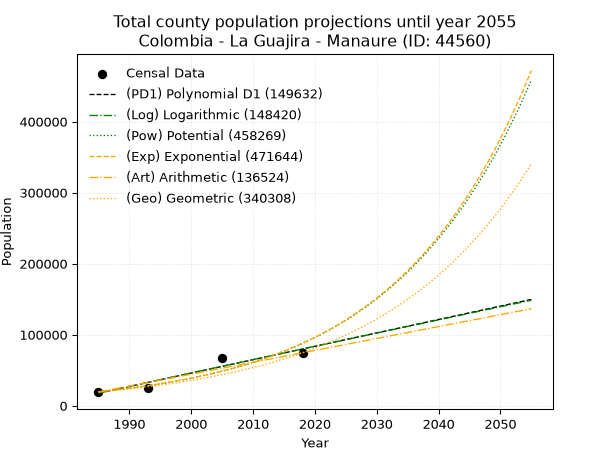
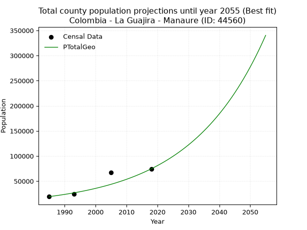
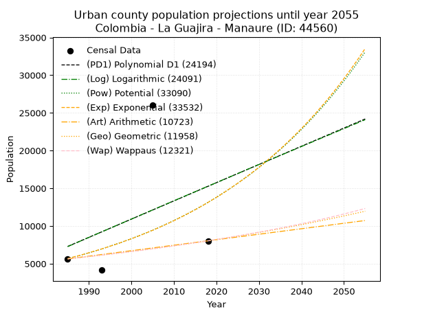
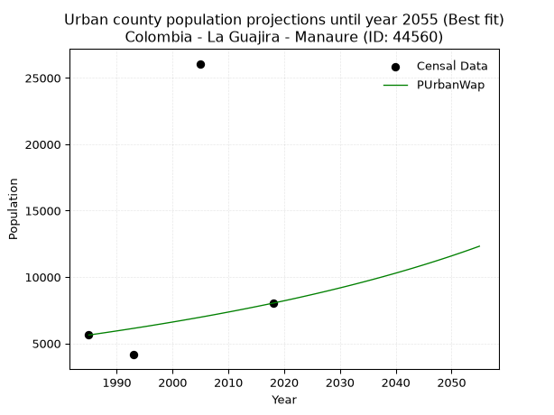
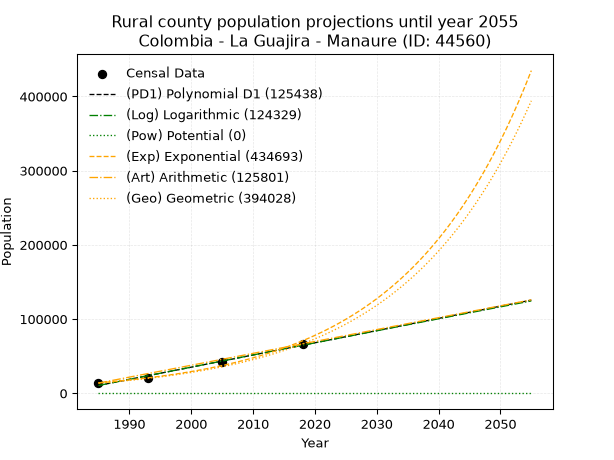
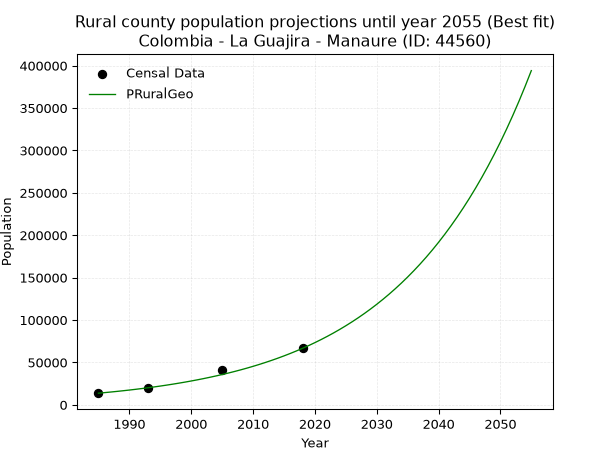

<div align="center">


</div>

# _“Population and Public Services Demand Projections (PPSD) until Year 2050 for Colombia - La Guajira - Manaure (ID: 44560)”_
Keywords: `population` `public-service` `projection` `lineal` `polynomial` `logarithmic` `potential` `exponential` `arithmetic` `geometric` `wappaus` `dane` `colombia` `south-america`

PPSD are analytical estimates used by governments and planners to anticipate future changes in population size, age distribution, and the resulting community needs for utilities, healthcare, education, and infrastructure as sizing future water treatment facilities, electrical grids, and road networks based on spatial growth.

> **General running parameters**: • app_version: _v20260806_. • Python version: _3.14.7_. • Pandas version: _3.0.5_. • NumPy version: _2.5.1_. • Creates, save and include plots into reports (create_plot): _False_. • Projection until year: _2050_. • Process polynomial degree 2 and up: _False_. • Process Wappaus: _True_. • Process Wappaus: _True_. • Set negative values to zero: _True_. • Set infinite values to zero: _True_. • Drop dataset notes: _True_. 
<div align="center">

Dynamic map: [:earth_americas:Google](http://maps.google.com/maps?q=11.77376698,-72.438739) [:earth_americas:OSM](https://www.openstreetmap.org/#map=18/11.77376698/-72.438739&layers=P) [:earth_americas:Bing](https://www.bing.com/maps?cp=11.77376698~-72.438739&lvl=18) [:earth_americas:Apple](https://maps.apple.com/frame?center=11.77376698%2C-72.438739&span=0.003%2C0.006)

</div>


<div align="center">

```geojson
{
  "type": "Feature",
  "geometry": {
    "type": "Point", 
    "coordinates": [-72.438739, 11.77376698]
  }, 
  "properties": {
    "Name": "Colombia - La Guajira - Manaure (ID: 44560)"
  }
}
```

</div>


## 0. Census Data (4 records)

Census data are official statistics collected by a government about the people and housing in a country. They usually include counts of total population, age, sex, race, income, education, and jobs.

📅Global census file: [Population.xlsx](../data/Population.xlsx)

| Source   |   Year |   CountryID | CountryName   |   StateID | StateName   |   CountyID | CountyName   |   PTotal |   PUrban |   PRural |
|:---------|-------:|------------:|:--------------|----------:|:------------|-----------:|:-------------|---------:|---------:|---------:|
| DANE     |   1985 |          57 | Colombia      |        44 | La Guajira  |      44560 | Manaure      |    19234 |     5632 |    13602 |
| DANE     |   1993 |          57 | Colombia      |        44 | La Guajira  |      44560 | Manaure      |    24375 |     4148 |    20227 |
| DANE     |   2005 |          57 | Colombia      |        44 | La Guajira  |      44560 | Manaure      |    67584 |    26066 |    41518 |
| DANE     |   2018 |          57 | Colombia      |        44 | La Guajira  |      44560 | Manaure      |    74528 |     8032 |    66496 |

> 🔥Some records could had specific notes about the registered values or the corresponding urban or rural distribution.

**Local public utility companies (RUPS)**

 | SERVICIO       | ESTADO    | NOMBRE                                                                  | NIT         | DEPARTAMENTO_DOMICILIO   | MUNICIPIO_DOMICILIO   | DIRECCION                                    |   TELEFONO | EMAIL                                    | TIPO_INSCRIPCION    | REPRESENTANTE_LEGAL           | TIPO_PRESTADOR                             | CLASIFICACION                  |
|:---------------|:----------|:------------------------------------------------------------------------|:------------|:-------------------------|:----------------------|:---------------------------------------------|-----------:|:-----------------------------------------|:--------------------|:------------------------------|:-------------------------------------------|:-------------------------------|
| ASEO           | OPERATIVA | INTERASEO S.A.S.  E.S.P.                                                | 819000939-1 | MAGDALENA                | SANTA MARTA           | Km 2 Via a Gaira Frente a Zona Franca techin |    4346234 | notificaciones@interaseo.com.co          | Registro por la ESP | JUAN MANUEL GOMEZ MEJIA       | SOCIEDADES (EMPRESA DE SERVICIOS PUBLICOS) | MAYOR O IGUAL A 5001 USUARIOS  |
| ACUEDUCTO      | OPERATIVA | EMPRESA DE ACUEDUCTO, ALCANTARILLADO Y ASEO DE MANAURE E.S.P.           | 825000869-6 | LA GUAJIRA               | MANAURE               | CALLE 2 No.11-98                             |    7178025 | conascolasociados@outlook.com            | Registro por la ESP | ALBERTO MANUEL ARIAS DE LUQUE | EMPRESA INDUSTRIAL Y COMERCIAL DEL ESTADO  | DESDE 2501 HASTA 5000 USUARIOS |
| ALCANTARILLADO | OPERATIVA | EMPRESA DE ACUEDUCTO, ALCANTARILLADO Y ASEO DE MANAURE E.S.P.           | 825000869-6 | LA GUAJIRA               | MANAURE               | CALLE 2 No.11-98                             |    7178025 | conascolasociados@outlook.com            | Registro por la ESP | ALBERTO MANUEL ARIAS DE LUQUE | EMPRESA INDUSTRIAL Y COMERCIAL DEL ESTADO  | DESDE 2501 HASTA 5000 USUARIOS |
| ASEO           | OPERATIVA | EMPRESA DE ACUEDUCTO, ALCANTARILLADO Y ASEO DE MANAURE E.S.P.           | 825000869-6 | LA GUAJIRA               | MANAURE               | CALLE 2 No.11-98                             |    7178025 | conascolasociados@outlook.com            | Registro por la ESP | ALBERTO MANUEL ARIAS DE LUQUE | EMPRESA INDUSTRIAL Y COMERCIAL DEL ESTADO  | DESDE 2501 HASTA 5000 USUARIOS |
| ASEO           | OPERATIVA | UNIÓN TEMPORAL OPERACIÓN RELLENO SANITARIO REGIONAL NORTE DE LA GUAJIRA | 901249245-6 | LA GUAJIRA               | MAICAO                | calle 13 número 8 - 94 piso 3                |    7260585 | utoperacionrellenonorteguajira@gmail.com | Registro por la ESP | IVANA KATHRYNA  SALON MARQUEZ | PRESTADORES FUERA DEL ART. 15 LSPD         | MENOR O IGUAL A 2500 USUARIOS  |

> [📅RUPS Database: Registro Único de Prestadores de Servicios Públicos de Colombia Suramérica - RUPS](https://www.datos.gov.co/Hacienda-y-Cr-dito-P-blico/Registro-nico-de-Prestadores-de-Servicios-P-blicos/4qkq-csdn/about_data)

## 1. Total

### 1.1. Coefficients and Parameters

* (PD1) Polynomial Deg 1: 1884.9598554797194, -3723960.700923309 (lineal)
* (Log) Logarithmic: 3774167.914228653, -28641050.310335554
* (Pow) Potential: 90.98734480399423, -295.76283102141184
* (Exp) Exponential: 0.045434298170905885, 1.3323903021110324e-35
* (Art) Arithmetic: Year diff. 2018 - 1985 = 33, Population diff. 74528 - 19234 = 55294, Annual growth = 1675.5757575757575
* (Geo) Geometric: Year diff. 2018 - 1985 = 33, Population diff. 74528 - 19234 = 55294, Annual growth % = 0.04189931664086033
* (Wap) Wappaus: i = 3.5741041308328696, Condition values only valid for < 200)

<sub>
Wappaus condition values: ['0.00', '3.57', '7.15', '10.72', '14.30', '17.87', '21.44', '25.02', '28.59', '32.17', '35.74', '39.32', '42.89', '46.46', '50.04', '53.61', '57.19', '60.76', '64.33', '67.91', '71.48', '75.06', '78.63', '82.20', '85.78', '89.35', '92.93', '96.50', '100.07', '103.65', '107.22', '110.80', '114.37', '117.95', '121.52', '125.09', '128.67', '132.24', '135.82', '139.39', '142.96', '146.54', '150.11', '153.69', '157.26', '160.83', '164.41', '167.98', '171.56', '175.13', '178.71', '182.28', '185.85', '189.43', '193.00', '196.58', '200.15', '203.72', '207.30', '210.87', '214.45', '218.02', '221.59', '225.17', '228.74', '232.32']
</sub>


### 1.2. Projected Dataset

|   Year |   CountyID |   PTotalPD1 |   PTotalLog |   PTotalPow |   PTotalExp |   PTotalArt |   PTotalGeo |
|-------:|-----------:|------------:|------------:|------------:|------------:|------------:|------------:|
|   1985 |      44560 |       17685 |       17619 |       19572 |       19606 |       19234 |       19234 |
|   1986 |      44560 |       19570 |       19520 |       20490 |       20517 |       20910 |       20040 |
|   1987 |      44560 |       21455 |       21420 |       21450 |       21471 |       22585 |       20880 |
|   1988 |      44560 |       23339 |       23319 |       22455 |       22469 |       24261 |       21754 |
|   1989 |      44560 |       25224 |       25217 |       23507 |       23513 |       25936 |       22666 |
|   1990 |      44560 |       27109 |       27114 |       24607 |       24606 |       27612 |       23616 |
|   1991 |      44560 |       28994 |       29010 |       25757 |       25750 |       29287 |       24605 |
|   1992 |      44560 |       30879 |       30905 |       26962 |       26947 |       30963 |       25636 |
|   1993 |      44560 |       32764 |       32799 |       28221 |       28199 |       32639 |       26710 |
|   1994 |      44560 |       34649 |       34692 |       29539 |       29510 |       34314 |       27829 |
|   1995 |      44560 |       36534 |       36585 |       30918 |       30882 |       35990 |       28995 |
|   1996 |      44560 |       38419 |       38476 |       32360 |       32317 |       37665 |       30210 |
|   1997 |      44560 |       40304 |       40366 |       33869 |       33819 |       39341 |       31476 |
|   1998 |      44560 |       42189 |       42256 |       35448 |       35391 |       41016 |       32795 |
|   1999 |      44560 |       44074 |       44144 |       37099 |       37036 |       42692 |       34169 |
|   2000 |      44560 |       45959 |       46032 |       38826 |       38758 |       44368 |       35600 |
|   2001 |      44560 |       47844 |       47918 |       40633 |       40560 |       46043 |       37092 |
|   2002 |      44560 |       49729 |       49804 |       42523 |       42445 |       47719 |       38646 |
|   2003 |      44560 |       51614 |       51689 |       44499 |       44418 |       49394 |       40266 |
|   2004 |      44560 |       53499 |       53573 |       46567 |       46482 |       51070 |       41953 |
|   2005 |      44560 |       55384 |       55456 |       48729 |       48643 |       52746 |       43710 |
|   2006 |      44560 |       57269 |       57337 |       50991 |       50904 |       54421 |       45542 |
|   2007 |      44560 |       59154 |       59218 |       53356 |       53270 |       56097 |       47450 |
|   2008 |      44560 |       61039 |       61098 |       55830 |       55746 |       57772 |       49438 |
|   2009 |      44560 |       62924 |       62978 |       58418 |       58338 |       59448 |       51510 |
|   2010 |      44560 |       64809 |       64856 |       61123 |       61049 |       61123 |       53668 |
|   2011 |      44560 |       66694 |       66733 |       63953 |       63887 |       62799 |       55916 |
|   2012 |      44560 |       68579 |       68609 |       66912 |       66857 |       64475 |       58259 |
|   2013 |      44560 |       70463 |       70485 |       70007 |       69964 |       66150 |       60700 |
|   2014 |      44560 |       72348 |       72359 |       73243 |       73216 |       67826 |       63244 |
|   2015 |      44560 |       74233 |       74233 |       76627 |       76620 |       69501 |       65893 |
|   2016 |      44560 |       76118 |       76105 |       80166 |       80181 |       71177 |       68654 |
|   2017 |      44560 |       78003 |       77977 |       83866 |       83908 |       72852 |       71531 |
|   2018 |      44560 |       79888 |       79847 |       87734 |       87808 |       74528 |       74528 |
|   2019 |      44560 |       81773 |       81717 |       91780 |       91890 |       76204 |       77651 |
|   2020 |      44560 |       83658 |       83586 |       96009 |       96161 |       77879 |       80904 |
|   2021 |      44560 |       85543 |       85454 |      100432 |      100631 |       79555 |       84294 |
|   2022 |      44560 |       87428 |       87321 |      105055 |      105308 |       81230 |       87826 |
|   2023 |      44560 |       89313 |       89187 |      109890 |      110203 |       82906 |       91506 |
|   2024 |      44560 |       91198 |       91052 |      114944 |      115326 |       84581 |       95340 |
|   2025 |      44560 |       93083 |       92917 |      120227 |      120686 |       86257 |       99334 |
|   2026 |      44560 |       94968 |       94780 |      125751 |      126296 |       87933 |      103496 |
|   2027 |      44560 |       96853 |       96642 |      131526 |      132167 |       89608 |      107833 |
|   2028 |      44560 |       98738 |       98504 |      137563 |      138310 |       91284 |      112351 |
|   2029 |      44560 |      100623 |      100364 |      143874 |      144739 |       92959 |      117058 |
|   2030 |      44560 |      102508 |      102224 |      150471 |      151467 |       94635 |      121963 |
|   2031 |      44560 |      104393 |      104083 |      157367 |      158507 |       96310 |      127073 |
|   2032 |      44560 |      106278 |      105941 |      164575 |      165875 |       97986 |      132398 |
|   2033 |      44560 |      108163 |      107797 |      172110 |      173585 |       99662 |      137945 |
|   2034 |      44560 |      110048 |      109653 |      179985 |      181654 |      101337 |      143725 |
|   2035 |      44560 |      111933 |      111509 |      188218 |      190098 |      103013 |      149747 |
|   2036 |      44560 |      113818 |      113363 |      196822 |      198934 |      104688 |      156021 |
|   2037 |      44560 |      115703 |      115216 |      205815 |      208181 |      106364 |      162558 |
|   2038 |      44560 |      117587 |      117068 |      215214 |      217857 |      108040 |      169369 |
|   2039 |      44560 |      119472 |      118920 |      225038 |      227984 |      109715 |      176466 |
|   2040 |      44560 |      121357 |      120770 |      235304 |      238581 |      111391 |      183859 |
|   2041 |      44560 |      123242 |      122620 |      246034 |      249671 |      113066 |      191563 |
|   2042 |      44560 |      125127 |      124469 |      257248 |      261276 |      114742 |      199589 |
|   2043 |      44560 |      127012 |      126316 |      268967 |      273421 |      116417 |      207952 |
|   2044 |      44560 |      128897 |      128163 |      281213 |      286130 |      118093 |      216665 |
|   2045 |      44560 |      130782 |      130009 |      294011 |      299430 |      119769 |      225743 |
|   2046 |      44560 |      132667 |      131855 |      307384 |      313348 |      121444 |      235202 |
|   2047 |      44560 |      134552 |      133699 |      321359 |      327913 |      123120 |      245057 |
|   2048 |      44560 |      136437 |      135542 |      335961 |      343155 |      124795 |      255324 |
|   2049 |      44560 |      138322 |      137384 |      351220 |      359106 |      126471 |      266022 |
|   2050 |      44560 |      140207 |      139226 |      367163 |      375798 |      128146 |      277168 |
<div align="center">

</img>

</div>


### 1.3. Best fit with absolute and relative error (%)

Relative error puts that difference into context by dividing the absolute error by the true value, creating a unitless ratio or percentage that shows the scale of the mistake.

Absolute and relative error

|   Year | Source   |   CountryID | CountryName   |   StateID | StateName   |   CountyID_x | CountyName   |   PTotal |   PUrban |   PRural |   CountyID_y |   PTotalPD1 |   PTotalLog |   PTotalPow |   PTotalExp |   PTotalArt |   PTotalGeo |   PTotalPD1AbsError |   PTotalLogAbsError |   PTotalPowAbsError |   PTotalExpAbsError |   PTotalArtAbsError |   PTotalGeoAbsError |   PTotalPD1RelError |   PTotalLogRelError |   PTotalPowRelError |   PTotalExpRelError |   PTotalArtRelError |   PTotalGeoRelError |
|-------:|:---------|------------:|:--------------|----------:|:------------|-------------:|:-------------|---------:|---------:|---------:|-------------:|------------:|------------:|------------:|------------:|------------:|------------:|--------------------:|--------------------:|--------------------:|--------------------:|--------------------:|--------------------:|--------------------:|--------------------:|--------------------:|--------------------:|--------------------:|--------------------:|
|   1985 | DANE     |          57 | Colombia      |        44 | La Guajira  |        44560 | Manaure      |    19234 |     5632 |    13602 |        44560 |       17685 |       17619 |       19572 |       19606 |       19234 |       19234 |                1549 |                1615 |                 338 |                 372 |                   0 |                   0 |             8.05345 |             8.39659 |              1.7573 |             1.93408 |              0      |             0       |
|   1993 | DANE     |          57 | Colombia      |        44 | La Guajira  |        44560 | Manaure      |    24375 |     4148 |    20227 |        44560 |       32764 |       32799 |       28221 |       28199 |       32639 |       26710 |                8389 |                8424 |                3846 |                3824 |                8264 |                2335 |            34.4164  |            34.56    |             15.7785 |            15.6882  |             33.9036 |             9.57949 |
|   2005 | DANE     |          57 | Colombia      |        44 | La Guajira  |        44560 | Manaure      |    67584 |    26066 |    41518 |        44560 |       55384 |       55456 |       48729 |       48643 |       52746 |       43710 |               12200 |               12128 |               18855 |               18941 |               14838 |               23874 |            18.0516  |            17.9451  |             27.8986 |            28.0259  |             21.9549 |            35.3249  |
|   2018 | DANE     |          57 | Colombia      |        44 | La Guajira  |        44560 | Manaure      |    74528 |     8032 |    66496 |        44560 |       79888 |       79847 |       87734 |       87808 |       74528 |       74528 |                5360 |                5319 |               13206 |               13280 |                   0 |                   0 |             7.19193 |             7.13691 |             17.7195 |            17.8188  |              0      |             0       |

Relative error mean

| Method    |   RelError | Best   |
|:----------|-----------:|:-------|
| PTotalPD1 |    16.9283 |        |
| PTotalLog |    17.0096 |        |
| PTotalPow |    15.7885 |        |
| PTotalExp |    15.8667 |        |
| PTotalArt |    13.9646 |        |
| PTotalGeo |    11.2261 | True   |

💙Best method: _**PTotalGeo**_
<div align="center">

</img>

</div>


### 1.4. Fresh water supply demand in liters per capita per day (lpcd)

The fresh water supply demand typically ranges from 100 to 300 liters per capita per day (lpcd) for standard domestic and municipal planning, though absolute survival minimums set by the World Health Organization are as low as 7.5 to 20 liters per day, and total consumption in high-income nations can exceed 400 liters.

> `CZ`: Level in meters above the sea level (masl)<br> `WS`: Fresh water supply demand in liters per capita per day (lpcd or l/h/d)<br> `WSAll`: Zonal fresh water supply demand in liters per second (l/s)<br> `A`: Zonal area in square meters<br> `DP`: Population density (people/hectare or p/ha)

Reference values (RAS Colombia)

|    CZ |   WS |
|------:|-----:|
|  1000 |  120 |
|  2000 |  130 |
| 99999 |  140 |

County shapefile geometry properties and water supply values

|   CountyID |      ATotal |   CZTotal |   WSTotal |
|-----------:|------------:|----------:|----------:|
|      44560 | 1.61613e+09 |   23.3755 |       120 |

Projected values for best method: PTotalGeo

|   CountyID |   Year |   PTotalGeo |   DPTotal |   WSTotal |   WSTotalAll |
|-----------:|-------:|------------:|----------:|----------:|-------------:|
|      44560 |   1985 |       19234 |      0.12 |       120 |      26.7139 |
|      44560 |   1986 |       20040 |      0.12 |       120 |      27.8333 |
|      44560 |   1987 |       20880 |      0.13 |       120 |      29      |
|      44560 |   1988 |       21754 |      0.13 |       120 |      30.2139 |
|      44560 |   1989 |       22666 |      0.14 |       120 |      31.4806 |
|      44560 |   1990 |       23616 |      0.15 |       120 |      32.8    |
|      44560 |   1991 |       24605 |      0.15 |       120 |      34.1736 |
|      44560 |   1992 |       25636 |      0.16 |       120 |      35.6056 |
|      44560 |   1993 |       26710 |      0.17 |       120 |      37.0972 |
|      44560 |   1994 |       27829 |      0.17 |       120 |      38.6514 |
|      44560 |   1995 |       28995 |      0.18 |       120 |      40.2708 |
|      44560 |   1996 |       30210 |      0.19 |       120 |      41.9583 |
|      44560 |   1997 |       31476 |      0.19 |       120 |      43.7167 |
|      44560 |   1998 |       32795 |      0.2  |       120 |      45.5486 |
|      44560 |   1999 |       34169 |      0.21 |       120 |      47.4569 |
|      44560 |   2000 |       35600 |      0.22 |       120 |      49.4444 |
|      44560 |   2001 |       37092 |      0.23 |       120 |      51.5167 |
|      44560 |   2002 |       38646 |      0.24 |       120 |      53.675  |
|      44560 |   2003 |       40266 |      0.25 |       120 |      55.925  |
|      44560 |   2004 |       41953 |      0.26 |       120 |      58.2681 |
|      44560 |   2005 |       43710 |      0.27 |       120 |      60.7083 |
|      44560 |   2006 |       45542 |      0.28 |       120 |      63.2528 |
|      44560 |   2007 |       47450 |      0.29 |       120 |      65.9028 |
|      44560 |   2008 |       49438 |      0.31 |       120 |      68.6639 |
|      44560 |   2009 |       51510 |      0.32 |       120 |      71.5417 |
|      44560 |   2010 |       53668 |      0.33 |       120 |      74.5389 |
|      44560 |   2011 |       55916 |      0.35 |       120 |      77.6611 |
|      44560 |   2012 |       58259 |      0.36 |       120 |      80.9153 |
|      44560 |   2013 |       60700 |      0.38 |       120 |      84.3056 |
|      44560 |   2014 |       63244 |      0.39 |       120 |      87.8389 |
|      44560 |   2015 |       65893 |      0.41 |       120 |      91.5181 |
|      44560 |   2016 |       68654 |      0.42 |       120 |      95.3528 |
|      44560 |   2017 |       71531 |      0.44 |       120 |      99.3486 |
|      44560 |   2018 |       74528 |      0.46 |       120 |     103.511  |
|      44560 |   2019 |       77651 |      0.48 |       120 |     107.849  |
|      44560 |   2020 |       80904 |      0.5  |       120 |     112.367  |
|      44560 |   2021 |       84294 |      0.52 |       120 |     117.075  |
|      44560 |   2022 |       87826 |      0.54 |       120 |     121.981  |
|      44560 |   2023 |       91506 |      0.57 |       120 |     127.092  |
|      44560 |   2024 |       95340 |      0.59 |       120 |     132.417  |
|      44560 |   2025 |       99334 |      0.61 |       120 |     137.964  |
|      44560 |   2026 |      103496 |      0.64 |       120 |     143.744  |
|      44560 |   2027 |      107833 |      0.67 |       120 |     149.768  |
|      44560 |   2028 |      112351 |      0.7  |       120 |     156.043  |
|      44560 |   2029 |      117058 |      0.72 |       120 |     162.581  |
|      44560 |   2030 |      121963 |      0.75 |       120 |     169.393  |
|      44560 |   2031 |      127073 |      0.79 |       120 |     176.49   |
|      44560 |   2032 |      132398 |      0.82 |       120 |     183.886  |
|      44560 |   2033 |      137945 |      0.85 |       120 |     191.59   |
|      44560 |   2034 |      143725 |      0.89 |       120 |     199.618  |
|      44560 |   2035 |      149747 |      0.93 |       120 |     207.982  |
|      44560 |   2036 |      156021 |      0.97 |       120 |     216.696  |
|      44560 |   2037 |      162558 |      1.01 |       120 |     225.775  |
|      44560 |   2038 |      169369 |      1.05 |       120 |     235.235  |
|      44560 |   2039 |      176466 |      1.09 |       120 |     245.092  |
|      44560 |   2040 |      183859 |      1.14 |       120 |     255.36   |
|      44560 |   2041 |      191563 |      1.19 |       120 |     266.06   |
|      44560 |   2042 |      199589 |      1.23 |       120 |     277.207  |
|      44560 |   2043 |      207952 |      1.29 |       120 |     288.822  |
|      44560 |   2044 |      216665 |      1.34 |       120 |     300.924  |
|      44560 |   2045 |      225743 |      1.4  |       120 |     313.532  |
|      44560 |   2046 |      235202 |      1.46 |       120 |     326.669  |
|      44560 |   2047 |      245057 |      1.52 |       120 |     340.357  |
|      44560 |   2048 |      255324 |      1.58 |       120 |     354.617  |
|      44560 |   2049 |      266022 |      1.65 |       120 |     369.475  |
|      44560 |   2050 |      277168 |      1.72 |       120 |     384.956  |

## 2. Urban

### 2.1. Coefficients and Parameters

* (PD1) Polynomial Deg 1: 241.54235246889772, -472175.59052591264 (lineal)
* (Log) Logarithmic: 485568.5567700064, -3679840.991111031
* (Pow) Potential: 50.8990046778941, -164.0991246067591
* (Exp) Exponential: 0.02536462572365224, 7.729688049425037e-19
* (Art) Arithmetic: Year diff. 2018 - 1985 = 33, Population diff. 8032 - 5632 = 2400, Annual growth = 72.72727272727273
* (Geo) Geometric: Year diff. 2018 - 1985 = 33, Population diff. 8032 - 5632 = 2400, Annual growth % = 0.010814695256308626
* (Wap) Wappaus: i = 1.0645092612305727, Condition values only valid for < 200)

<sub>
Wappaus condition values: ['0.00', '1.06', '2.13', '3.19', '4.26', '5.32', '6.39', '7.45', '8.52', '9.58', '10.65', '11.71', '12.77', '13.84', '14.90', '15.97', '17.03', '18.10', '19.16', '20.23', '21.29', '22.35', '23.42', '24.48', '25.55', '26.61', '27.68', '28.74', '29.81', '30.87', '31.94', '33.00', '34.06', '35.13', '36.19', '37.26', '38.32', '39.39', '40.45', '41.52', '42.58', '43.64', '44.71', '45.77', '46.84', '47.90', '48.97', '50.03', '51.10', '52.16', '53.23', '54.29', '55.35', '56.42', '57.48', '58.55', '59.61', '60.68', '61.74', '62.81', '63.87', '64.94', '66.00', '67.06', '68.13', '69.19']
</sub>


### 2.2. Projected Dataset

|   Year |   CountyID |   PUrbanPD1 |   PUrbanLog |   PUrbanPow |   PUrbanExp |   PUrbanArt |   PUrbanGeo |   PUrbanWap |
|-------:|-----------:|------------:|------------:|------------:|------------:|------------:|------------:|------------:|
|   1985 |      44560 |        7286 |        7263 |        5670 |        5680 |        5632 |        5632 |        5632 |
|   1986 |      44560 |        7528 |        7507 |        5817 |        5826 |        5705 |        5693 |        5692 |
|   1987 |      44560 |        7769 |        7752 |        5968 |        5976 |        5777 |        5754 |        5753 |
|   1988 |      44560 |        8011 |        7996 |        6123 |        6129 |        5850 |        5817 |        5815 |
|   1989 |      44560 |        8252 |        8240 |        6282 |        6287 |        5923 |        5880 |        5877 |
|   1990 |      44560 |        8494 |        8484 |        6445 |        6448 |        5996 |        5943 |        5940 |
|   1991 |      44560 |        8735 |        8728 |        6612 |        6614 |        6068 |        6007 |        6004 |
|   1992 |      44560 |        8977 |        8972 |        6783 |        6784 |        6141 |        6072 |        6068 |
|   1993 |      44560 |        9218 |        9216 |        6958 |        6958 |        6214 |        6138 |        6133 |
|   1994 |      44560 |        9460 |        9459 |        7138 |        7137 |        6287 |        6204 |        6199 |
|   1995 |      44560 |        9701 |        9703 |        7323 |        7320 |        6359 |        6272 |        6265 |
|   1996 |      44560 |        9943 |        9946 |        7512 |        7508 |        6432 |        6339 |        6332 |
|   1997 |      44560 |       10184 |       10189 |        7706 |        7701 |        6505 |        6408 |        6401 |
|   1998 |      44560 |       10426 |       10432 |        7905 |        7899 |        6577 |        6477 |        6469 |
|   1999 |      44560 |       10668 |       10675 |        8109 |        8102 |        6650 |        6547 |        6539 |
|   2000 |      44560 |       10909 |       10918 |        8318 |        8310 |        6723 |        6618 |        6609 |
|   2001 |      44560 |       11151 |       11161 |        8532 |        8523 |        6796 |        6690 |        6681 |
|   2002 |      44560 |       11392 |       11404 |        8752 |        8742 |        6868 |        6762 |        6753 |
|   2003 |      44560 |       11634 |       11646 |        8977 |        8967 |        6941 |        6835 |        6826 |
|   2004 |      44560 |       11875 |       11888 |        9208 |        9197 |        7014 |        6909 |        6899 |
|   2005 |      44560 |       12117 |       12131 |        9445 |        9434 |        7087 |        6984 |        6974 |
|   2006 |      44560 |       12358 |       12373 |        9688 |        9676 |        7159 |        7059 |        7049 |
|   2007 |      44560 |       12600 |       12615 |        9937 |        9924 |        7232 |        7136 |        7126 |
|   2008 |      44560 |       12841 |       12857 |       10192 |       10179 |        7305 |        7213 |        7203 |
|   2009 |      44560 |       13083 |       13098 |       10454 |       10441 |        7377 |        7291 |        7282 |
|   2010 |      44560 |       13325 |       13340 |       10722 |       10709 |        7450 |        7370 |        7361 |
|   2011 |      44560 |       13566 |       13582 |       10997 |       10984 |        7523 |        7449 |        7441 |
|   2012 |      44560 |       13808 |       13823 |       11278 |       11266 |        7596 |        7530 |        7522 |
|   2013 |      44560 |       14049 |       14064 |       11567 |       11556 |        7668 |        7611 |        7605 |
|   2014 |      44560 |       14291 |       14305 |       11864 |       11853 |        7741 |        7694 |        7688 |
|   2015 |      44560 |       14532 |       14546 |       12167 |       12157 |        7814 |        7777 |        7772 |
|   2016 |      44560 |       14774 |       14787 |       12478 |       12469 |        7887 |        7861 |        7858 |
|   2017 |      44560 |       15015 |       15028 |       12797 |       12790 |        7959 |        7946 |        7944 |
|   2018 |      44560 |       15257 |       15269 |       13124 |       13118 |        8032 |        8032 |        8032 |
|   2019 |      44560 |       15498 |       15509 |       13459 |       13455 |        8105 |        8119 |        8121 |
|   2020 |      44560 |       15740 |       15750 |       13803 |       13801 |        8177 |        8207 |        8211 |
|   2021 |      44560 |       15982 |       15990 |       14155 |       14156 |        8250 |        8295 |        8302 |
|   2022 |      44560 |       16223 |       16230 |       14516 |       14519 |        8323 |        8385 |        8394 |
|   2023 |      44560 |       16465 |       16470 |       14886 |       14892 |        8396 |        8476 |        8488 |
|   2024 |      44560 |       16706 |       16710 |       15265 |       15275 |        8468 |        8567 |        8583 |
|   2025 |      44560 |       16948 |       16950 |       15654 |       15667 |        8541 |        8660 |        8679 |
|   2026 |      44560 |       17189 |       17190 |       16052 |       16070 |        8614 |        8754 |        8776 |
|   2027 |      44560 |       17431 |       17430 |       16460 |       16482 |        8687 |        8848 |        8875 |
|   2028 |      44560 |       17672 |       17669 |       16879 |       16906 |        8759 |        8944 |        8975 |
|   2029 |      44560 |       17914 |       17908 |       17308 |       17340 |        8832 |        9041 |        9077 |
|   2030 |      44560 |       18155 |       18148 |       17747 |       17786 |        8905 |        9139 |        9180 |
|   2031 |      44560 |       18397 |       18387 |       18198 |       18242 |        8977 |        9237 |        9284 |
|   2032 |      44560 |       18638 |       18626 |       18659 |       18711 |        9050 |        9337 |        9390 |
|   2033 |      44560 |       18880 |       18865 |       19133 |       19192 |        9123 |        9438 |        9497 |
|   2034 |      44560 |       19122 |       19104 |       19618 |       19685 |        9196 |        9540 |        9606 |
|   2035 |      44560 |       19363 |       19342 |       20115 |       20190 |        9268 |        9644 |        9717 |
|   2036 |      44560 |       19605 |       19581 |       20624 |       20709 |        9341 |        9748 |        9829 |
|   2037 |      44560 |       19846 |       19819 |       21146 |       21241 |        9414 |        9853 |        9943 |
|   2038 |      44560 |       20088 |       20057 |       21681 |       21787 |        9487 |        9960 |       10058 |
|   2039 |      44560 |       20329 |       20296 |       22229 |       22346 |        9559 |       10068 |       10175 |
|   2040 |      44560 |       20571 |       20534 |       22791 |       22921 |        9632 |       10176 |       10294 |
|   2041 |      44560 |       20812 |       20772 |       23366 |       23509 |        9705 |       10287 |       10415 |
|   2042 |      44560 |       21054 |       21010 |       23956 |       24113 |        9777 |       10398 |       10538 |
|   2043 |      44560 |       21295 |       21247 |       24561 |       24733 |        9850 |       10510 |       10662 |
|   2044 |      44560 |       21537 |       21485 |       25180 |       25368 |        9923 |       10624 |       10789 |
|   2045 |      44560 |       21779 |       21722 |       25815 |       26020 |        9996 |       10739 |       10917 |
|   2046 |      44560 |       22020 |       21960 |       26465 |       26688 |       10068 |       10855 |       11047 |
|   2047 |      44560 |       22262 |       22197 |       27132 |       27374 |       10141 |       10972 |       11180 |
|   2048 |      44560 |       22503 |       22434 |       27815 |       28077 |       10214 |       11091 |       11315 |
|   2049 |      44560 |       22745 |       22671 |       28514 |       28798 |       10287 |       11211 |       11451 |
|   2050 |      44560 |       22986 |       22908 |       29231 |       29538 |       10359 |       11332 |       11590 |
<div align="center">

</img>

</div>


### 2.3. Best fit with absolute and relative error (%)

Relative error puts that difference into context by dividing the absolute error by the true value, creating a unitless ratio or percentage that shows the scale of the mistake.

Absolute and relative error

|   Year | Source   |   CountryID | CountryName   |   StateID | StateName   |   CountyID_x | CountyName   |   PTotal |   PUrban |   PRural |   CountyID_y |   PUrbanPD1 |   PUrbanLog |   PUrbanPow |   PUrbanExp |   PUrbanArt |   PUrbanGeo |   PUrbanWap |   PUrbanPD1AbsError |   PUrbanLogAbsError |   PUrbanPowAbsError |   PUrbanExpAbsError |   PUrbanArtAbsError |   PUrbanGeoAbsError |   PUrbanWapAbsError |   PUrbanPD1RelError |   PUrbanLogRelError |   PUrbanPowRelError |   PUrbanExpRelError |   PUrbanArtRelError |   PUrbanGeoRelError |   PUrbanWapRelError |
|-------:|:---------|------------:|:--------------|----------:|:------------|-------------:|:-------------|---------:|---------:|---------:|-------------:|------------:|------------:|------------:|------------:|------------:|------------:|------------:|--------------------:|--------------------:|--------------------:|--------------------:|--------------------:|--------------------:|--------------------:|--------------------:|--------------------:|--------------------:|--------------------:|--------------------:|--------------------:|--------------------:|
|   1985 | DANE     |          57 | Colombia      |        44 | La Guajira  |        44560 | Manaure      |    19234 |     5632 |    13602 |        44560 |        7286 |        7263 |        5670 |        5680 |        5632 |        5632 |        5632 |                1654 |                1631 |                  38 |                  48 |                   0 |                   0 |                   0 |             29.3679 |             28.9595 |            0.674716 |            0.852273 |              0      |              0      |              0      |
|   1993 | DANE     |          57 | Colombia      |        44 | La Guajira  |        44560 | Manaure      |    24375 |     4148 |    20227 |        44560 |        9218 |        9216 |        6958 |        6958 |        6214 |        6138 |        6133 |                5070 |                5068 |                2810 |                2810 |                2066 |                1990 |                1985 |            122.228  |            122.179  |           67.7435   |           67.7435   |             49.8071 |             47.9749 |             47.8544 |
|   2005 | DANE     |          57 | Colombia      |        44 | La Guajira  |        44560 | Manaure      |    67584 |    26066 |    41518 |        44560 |       12117 |       12131 |        9445 |        9434 |        7087 |        6984 |        6974 |               13949 |               13935 |               16621 |               16632 |               18979 |               19082 |               19092 |             53.5142 |             53.4604 |           63.7651   |           63.8073   |             72.8113 |             73.2065 |             73.2448 |
|   2018 | DANE     |          57 | Colombia      |        44 | La Guajira  |        44560 | Manaure      |    74528 |     8032 |    66496 |        44560 |       15257 |       15269 |       13124 |       13118 |        8032 |        8032 |        8032 |                7225 |                7237 |                5092 |                5086 |                   0 |                   0 |                   0 |             89.9527 |             90.1021 |           63.3964   |           63.3217   |              0      |              0      |              0      |

Relative error mean

| Method    |   RelError | Best   |
|:----------|-----------:|:-------|
| PUrbanPD1 |    73.7656 |        |
| PUrbanLog |    73.6754 |        |
| PUrbanPow |    48.8949 |        |
| PUrbanExp |    48.9312 |        |
| PUrbanArt |    30.6546 |        |
| PUrbanGeo |    30.2954 |        |
| PUrbanWap |    30.2748 | True   |

💙Best method: _**PUrbanWap**_
<div align="center">

</img>

</div>


### 2.4. Fresh water supply demand in liters per capita per day (lpcd)

The fresh water supply demand typically ranges from 100 to 300 liters per capita per day (lpcd) for standard domestic and municipal planning, though absolute survival minimums set by the World Health Organization are as low as 7.5 to 20 liters per day, and total consumption in high-income nations can exceed 400 liters.

> `CZ`: Level in meters above the sea level (masl)<br> `WS`: Fresh water supply demand in liters per capita per day (lpcd or l/h/d)<br> `WSAll`: Zonal fresh water supply demand in liters per second (l/s)<br> `A`: Zonal area in square meters<br> `DP`: Population density (people/hectare or p/ha)

Reference values (RAS Colombia)

|    CZ |   WS |
|------:|-----:|
|  1000 |  120 |
|  2000 |  130 |
| 99999 |  140 |

County shapefile geometry properties and water supply values

|   CountyID |      AUrban |   CZUrban |   WSUrban |
|-----------:|------------:|----------:|----------:|
|      44560 | 5.67414e+06 |   4.02292 |       120 |

Projected values for best method: PUrbanWap

|   CountyID |   Year |   PUrbanWap |   DPUrban |   WSUrban |   WSUrbanAll |
|-----------:|-------:|------------:|----------:|----------:|-------------:|
|      44560 |   1985 |        5632 |      9.93 |       120 |      7.82222 |
|      44560 |   1986 |        5692 |     10.03 |       120 |      7.90556 |
|      44560 |   1987 |        5753 |     10.14 |       120 |      7.99028 |
|      44560 |   1988 |        5815 |     10.25 |       120 |      8.07639 |
|      44560 |   1989 |        5877 |     10.36 |       120 |      8.1625  |
|      44560 |   1990 |        5940 |     10.47 |       120 |      8.25    |
|      44560 |   1991 |        6004 |     10.58 |       120 |      8.33889 |
|      44560 |   1992 |        6068 |     10.69 |       120 |      8.42778 |
|      44560 |   1993 |        6133 |     10.81 |       120 |      8.51806 |
|      44560 |   1994 |        6199 |     10.93 |       120 |      8.60972 |
|      44560 |   1995 |        6265 |     11.04 |       120 |      8.70139 |
|      44560 |   1996 |        6332 |     11.16 |       120 |      8.79444 |
|      44560 |   1997 |        6401 |     11.28 |       120 |      8.89028 |
|      44560 |   1998 |        6469 |     11.4  |       120 |      8.98472 |
|      44560 |   1999 |        6539 |     11.52 |       120 |      9.08194 |
|      44560 |   2000 |        6609 |     11.65 |       120 |      9.17917 |
|      44560 |   2001 |        6681 |     11.77 |       120 |      9.27917 |
|      44560 |   2002 |        6753 |     11.9  |       120 |      9.37917 |
|      44560 |   2003 |        6826 |     12.03 |       120 |      9.48056 |
|      44560 |   2004 |        6899 |     12.16 |       120 |      9.58194 |
|      44560 |   2005 |        6974 |     12.29 |       120 |      9.68611 |
|      44560 |   2006 |        7049 |     12.42 |       120 |      9.79028 |
|      44560 |   2007 |        7126 |     12.56 |       120 |      9.89722 |
|      44560 |   2008 |        7203 |     12.69 |       120 |     10.0042  |
|      44560 |   2009 |        7282 |     12.83 |       120 |     10.1139  |
|      44560 |   2010 |        7361 |     12.97 |       120 |     10.2236  |
|      44560 |   2011 |        7441 |     13.11 |       120 |     10.3347  |
|      44560 |   2012 |        7522 |     13.26 |       120 |     10.4472  |
|      44560 |   2013 |        7605 |     13.4  |       120 |     10.5625  |
|      44560 |   2014 |        7688 |     13.55 |       120 |     10.6778  |
|      44560 |   2015 |        7772 |     13.7  |       120 |     10.7944  |
|      44560 |   2016 |        7858 |     13.85 |       120 |     10.9139  |
|      44560 |   2017 |        7944 |     14    |       120 |     11.0333  |
|      44560 |   2018 |        8032 |     14.16 |       120 |     11.1556  |
|      44560 |   2019 |        8121 |     14.31 |       120 |     11.2792  |
|      44560 |   2020 |        8211 |     14.47 |       120 |     11.4042  |
|      44560 |   2021 |        8302 |     14.63 |       120 |     11.5306  |
|      44560 |   2022 |        8394 |     14.79 |       120 |     11.6583  |
|      44560 |   2023 |        8488 |     14.96 |       120 |     11.7889  |
|      44560 |   2024 |        8583 |     15.13 |       120 |     11.9208  |
|      44560 |   2025 |        8679 |     15.3  |       120 |     12.0542  |
|      44560 |   2026 |        8776 |     15.47 |       120 |     12.1889  |
|      44560 |   2027 |        8875 |     15.64 |       120 |     12.3264  |
|      44560 |   2028 |        8975 |     15.82 |       120 |     12.4653  |
|      44560 |   2029 |        9077 |     16    |       120 |     12.6069  |
|      44560 |   2030 |        9180 |     16.18 |       120 |     12.75    |
|      44560 |   2031 |        9284 |     16.36 |       120 |     12.8944  |
|      44560 |   2032 |        9390 |     16.55 |       120 |     13.0417  |
|      44560 |   2033 |        9497 |     16.74 |       120 |     13.1903  |
|      44560 |   2034 |        9606 |     16.93 |       120 |     13.3417  |
|      44560 |   2035 |        9717 |     17.13 |       120 |     13.4958  |
|      44560 |   2036 |        9829 |     17.32 |       120 |     13.6514  |
|      44560 |   2037 |        9943 |     17.52 |       120 |     13.8097  |
|      44560 |   2038 |       10058 |     17.73 |       120 |     13.9694  |
|      44560 |   2039 |       10175 |     17.93 |       120 |     14.1319  |
|      44560 |   2040 |       10294 |     18.14 |       120 |     14.2972  |
|      44560 |   2041 |       10415 |     18.36 |       120 |     14.4653  |
|      44560 |   2042 |       10538 |     18.57 |       120 |     14.6361  |
|      44560 |   2043 |       10662 |     18.79 |       120 |     14.8083  |
|      44560 |   2044 |       10789 |     19.01 |       120 |     14.9847  |
|      44560 |   2045 |       10917 |     19.24 |       120 |     15.1625  |
|      44560 |   2046 |       11047 |     19.47 |       120 |     15.3431  |
|      44560 |   2047 |       11180 |     19.7  |       120 |     15.5278  |
|      44560 |   2048 |       11315 |     19.94 |       120 |     15.7153  |
|      44560 |   2049 |       11451 |     20.18 |       120 |     15.9042  |
|      44560 |   2050 |       11590 |     20.43 |       120 |     16.0972  |

## 3. Rural

### 3.1. Coefficients and Parameters

* (PD1) Polynomial Deg 1: 1643.4175030108222, -3251785.110397397 (lineal)
* (Log) Logarithmic: 3288599.357458647, -24961209.319224525
* (Pow) Potential: 98.34560184708626, -320.1761484010157
* (Exp) Exponential: 0.049123533707748905, 6.261073270078241e-39
* (Art) Arithmetic: Year diff. 2018 - 1985 = 33, Population diff. 66496 - 13602 = 52894, Annual growth = 1602.8484848484848
* (Geo) Geometric: Year diff. 2018 - 1985 = 33, Population diff. 66496 - 13602 = 52894, Annual growth % = 0.049263652678057435
* (Wap) Wappaus: i = 4.002218494465492, Condition values only valid for < 200)

<sub>
Wappaus condition values: ['0.00', '4.00', '8.00', '12.01', '16.01', '20.01', '24.01', '28.02', '32.02', '36.02', '40.02', '44.02', '48.03', '52.03', '56.03', '60.03', '64.04', '68.04', '72.04', '76.04', '80.04', '84.05', '88.05', '92.05', '96.05', '100.06', '104.06', '108.06', '112.06', '116.06', '120.07', '124.07', '128.07', '132.07', '136.08', '140.08', '144.08', '148.08', '152.08', '156.09', '160.09', '164.09', '168.09', '172.10', '176.10', '180.10', '184.10', '188.10', '192.11', '196.11', '200.11', '204.11', '208.12', '212.12', '216.12', '220.12', '224.12', '228.13', '232.13', '236.13', '240.13', '244.14', '248.14', '252.14', '256.14', '260.14']
</sub>


### 3.2. Projected Dataset

|   Year |   CountyID |   PRuralPD1 |   PRuralLog |   PRuralPow |   PRuralExp |   PRuralArt |   PRuralGeo |
|-------:|-----------:|------------:|------------:|------------:|------------:|------------:|------------:|
|   1985 |      44560 |       10399 |       10356 |           0 |       13957 |       13602 |       13602 |
|   1986 |      44560 |       12042 |       12012 |           0 |       14660 |       15205 |       14272 |
|   1987 |      44560 |       13685 |       13668 |           0 |       15398 |       16808 |       14975 |
|   1988 |      44560 |       15329 |       15323 |           0 |       16173 |       18411 |       15713 |
|   1989 |      44560 |       16972 |       16976 |           0 |       16988 |       20013 |       16487 |
|   1990 |      44560 |       18616 |       18629 |           0 |       17843 |       21616 |       17299 |
|   1991 |      44560 |       20259 |       20282 |           0 |       18741 |       23219 |       18151 |
|   1992 |      44560 |       21903 |       21933 |           0 |       19685 |       24822 |       19046 |
|   1993 |      44560 |       23546 |       23583 |           0 |       20676 |       26425 |       19984 |
|   1994 |      44560 |       25189 |       25233 |           0 |       21717 |       28028 |       20968 |
|   1995 |      44560 |       26833 |       26882 |           0 |       22811 |       29630 |       22001 |
|   1996 |      44560 |       28476 |       28530 |           0 |       23959 |       31233 |       23085 |
|   1997 |      44560 |       30120 |       30177 |           0 |       25166 |       32836 |       24222 |
|   1998 |      44560 |       31763 |       31823 |           0 |       26433 |       34439 |       25416 |
|   1999 |      44560 |       33406 |       33469 |           0 |       27763 |       36042 |       26668 |
|   2000 |      44560 |       35050 |       35114 |           0 |       29161 |       37645 |       27982 |
|   2001 |      44560 |       36693 |       36758 |           0 |       30630 |       39248 |       29360 |
|   2002 |      44560 |       38337 |       38401 |           0 |       32172 |       40850 |       30806 |
|   2003 |      44560 |       39980 |       40043 |           0 |       33792 |       42453 |       32324 |
|   2004 |      44560 |       41624 |       41684 |           0 |       35493 |       44056 |       33916 |
|   2005 |      44560 |       43267 |       43325 |           0 |       37280 |       45659 |       35587 |
|   2006 |      44560 |       44910 |       44965 |           0 |       39157 |       47262 |       37340 |
|   2007 |      44560 |       46554 |       46604 |           0 |       41129 |       48865 |       39180 |
|   2008 |      44560 |       48197 |       48242 |           0 |       43200 |       50468 |       41110 |
|   2009 |      44560 |       49841 |       49879 |           0 |       45375 |       52070 |       43135 |
|   2010 |      44560 |       51484 |       51516 |           0 |       47659 |       53673 |       45260 |
|   2011 |      44560 |       53127 |       53151 |           0 |       50059 |       55276 |       47490 |
|   2012 |      44560 |       54771 |       54786 |           0 |       52580 |       56879 |       49830 |
|   2013 |      44560 |       56414 |       56420 |           0 |       55227 |       58482 |       52284 |
|   2014 |      44560 |       58058 |       58054 |           0 |       58008 |       60085 |       54860 |
|   2015 |      44560 |       59701 |       59686 |           0 |       60928 |       61687 |       57563 |
|   2016 |      44560 |       61345 |       61318 |           0 |       63996 |       63290 |       60399 |
|   2017 |      44560 |       62988 |       62949 |           0 |       67218 |       64893 |       63374 |
|   2018 |      44560 |       64631 |       64579 |           0 |       70603 |       66496 |       66496 |
|   2019 |      44560 |       66275 |       66208 |           0 |       74158 |       68099 |       69772 |
|   2020 |      44560 |       67918 |       67836 |           0 |       77891 |       69702 |       73209 |
|   2021 |      44560 |       69562 |       69464 |           0 |       81813 |       71305 |       76816 |
|   2022 |      44560 |       71205 |       71091 |           0 |       85933 |       72907 |       80600 |
|   2023 |      44560 |       72848 |       72717 |           0 |       90259 |       74510 |       84570 |
|   2024 |      44560 |       74492 |       74342 |           0 |       94804 |       76113 |       88737 |
|   2025 |      44560 |       76135 |       75966 |           0 |       99577 |       77716 |       93108 |
|   2026 |      44560 |       77779 |       77590 |           0 |      104591 |       79319 |       97695 |
|   2027 |      44560 |       79422 |       79213 |           0 |      109857 |       80922 |      102508 |
|   2028 |      44560 |       81066 |       80835 |           0 |      115388 |       82524 |      107558 |
|   2029 |      44560 |       82709 |       82456 |           0 |      121198 |       84127 |      112856 |
|   2030 |      44560 |       84352 |       84076 |           0 |      127301 |       85730 |      118416 |
|   2031 |      44560 |       85996 |       85696 |           0 |      133710 |       87333 |      124250 |
|   2032 |      44560 |       87639 |       87315 |           0 |      140443 |       88936 |      130371 |
|   2033 |      44560 |       89283 |       88933 |           0 |      147514 |       90539 |      136793 |
|   2034 |      44560 |       90926 |       90550 |           0 |      154941 |       92142 |      143532 |
|   2035 |      44560 |       92570 |       92166 |           0 |      162742 |       93744 |      150603 |
|   2036 |      44560 |       94213 |       93782 |           0 |      170937 |       95347 |      158022 |
|   2037 |      44560 |       95856 |       95397 |           0 |      179543 |       96950 |      165807 |
|   2038 |      44560 |       97500 |       97011 |           0 |      188583 |       98553 |      173976 |
|   2039 |      44560 |       99143 |       98624 |           0 |      198078 |      100156 |      182546 |
|   2040 |      44560 |      100787 |      100237 |           0 |      208052 |      101759 |      191539 |
|   2041 |      44560 |      102430 |      101848 |           0 |      218527 |      103362 |      200975 |
|   2042 |      44560 |      104073 |      103459 |           0 |      229530 |      104964 |      210876 |
|   2043 |      44560 |      105717 |      105069 |           0 |      241087 |      106567 |      221264 |
|   2044 |      44560 |      107360 |      106678 |           0 |      253226 |      108170 |      232165 |
|   2045 |      44560 |      109004 |      108287 |           0 |      265975 |      109773 |      243602 |
|   2046 |      44560 |      110647 |      109895 |           0 |      279367 |      111376 |      255603 |
|   2047 |      44560 |      112291 |      111502 |           0 |      293434 |      112979 |      268194 |
|   2048 |      44560 |      113934 |      113108 |           0 |      308208 |      114581 |      281407 |
|   2049 |      44560 |      115577 |      114713 |           0 |      323726 |      116184 |      295270 |
|   2050 |      44560 |      117221 |      116318 |           0 |      340026 |      117787 |      309816 |
<div align="center">

</img>

</div>


### 3.3. Best fit with absolute and relative error (%)

Relative error puts that difference into context by dividing the absolute error by the true value, creating a unitless ratio or percentage that shows the scale of the mistake.

Absolute and relative error

|   Year | Source   |   CountryID | CountryName   |   StateID | StateName   |   CountyID_x | CountyName   |   PTotal |   PUrban |   PRural |   CountyID_y |   PRuralPD1 |   PRuralLog |   PRuralPow |   PRuralExp |   PRuralArt |   PRuralGeo |   PRuralPD1AbsError |   PRuralLogAbsError |   PRuralPowAbsError |   PRuralExpAbsError |   PRuralArtAbsError |   PRuralGeoAbsError |   PRuralPD1RelError |   PRuralLogRelError |   PRuralPowRelError |   PRuralExpRelError |   PRuralArtRelError |   PRuralGeoRelError |
|-------:|:---------|------------:|:--------------|----------:|:------------|-------------:|:-------------|---------:|---------:|---------:|-------------:|------------:|------------:|------------:|------------:|------------:|------------:|--------------------:|--------------------:|--------------------:|--------------------:|--------------------:|--------------------:|--------------------:|--------------------:|--------------------:|--------------------:|--------------------:|--------------------:|
|   1985 | DANE     |          57 | Colombia      |        44 | La Guajira  |        44560 | Manaure      |    19234 |     5632 |    13602 |        44560 |       10399 |       10356 |           0 |       13957 |       13602 |       13602 |                3203 |                3246 |               13602 |                 355 |                   0 |                   0 |            23.548   |            23.8641  |                 100 |             2.60991 |             0       |             0       |
|   1993 | DANE     |          57 | Colombia      |        44 | La Guajira  |        44560 | Manaure      |    24375 |     4148 |    20227 |        44560 |       23546 |       23583 |           0 |       20676 |       26425 |       19984 |                3319 |                3356 |               20227 |                 449 |                6198 |                 243 |            16.4088  |            16.5917  |                 100 |             2.21981 |            30.6422  |             1.20136 |
|   2005 | DANE     |          57 | Colombia      |        44 | La Guajira  |        44560 | Manaure      |    67584 |    26066 |    41518 |        44560 |       43267 |       43325 |           0 |       37280 |       45659 |       35587 |                1749 |                1807 |               41518 |                4238 |                4141 |                5931 |             4.21263 |             4.35233 |                 100 |            10.2076  |             9.97399 |            14.2854  |
|   2018 | DANE     |          57 | Colombia      |        44 | La Guajira  |        44560 | Manaure      |    74528 |     8032 |    66496 |        44560 |       64631 |       64579 |           0 |       70603 |       66496 |       66496 |                1865 |                1917 |               66496 |                4107 |                   0 |                   0 |             2.80468 |             2.88288 |                 100 |             6.17631 |             0       |             0       |

Relative error mean

| Method    |   RelError | Best   |
|:----------|-----------:|:-------|
| PRuralPD1 |   11.7435  |        |
| PRuralLog |   11.9228  |        |
| PRuralPow |  100       |        |
| PRuralExp |    5.30341 |        |
| PRuralArt |   10.154   |        |
| PRuralGeo |    3.87168 | True   |

💙Best method: _**PRuralGeo**_
<div align="center">

</img>

</div>


### 3.4. Fresh water supply demand in liters per capita per day (lpcd)

The fresh water supply demand typically ranges from 100 to 300 liters per capita per day (lpcd) for standard domestic and municipal planning, though absolute survival minimums set by the World Health Organization are as low as 7.5 to 20 liters per day, and total consumption in high-income nations can exceed 400 liters.

> `CZ`: Level in meters above the sea level (masl)<br> `WS`: Fresh water supply demand in liters per capita per day (lpcd or l/h/d)<br> `WSAll`: Zonal fresh water supply demand in liters per second (l/s)<br> `A`: Zonal area in square meters<br> `DP`: Population density (people/hectare or p/ha)

Reference values (RAS Colombia)

|    CZ |   WS |
|------:|-----:|
|  1000 |  120 |
|  2000 |  130 |
| 99999 |  140 |

County shapefile geometry properties and water supply values

|   CountyID |      ARural |   CZRural |   WSRural |
|-----------:|------------:|----------:|----------:|
|      44560 | 1.61045e+09 |   23.4433 |       120 |

Projected values for best method: PRuralGeo

|   CountyID |   Year |   PRuralGeo |   DPRural |   WSRural |   WSRuralAll |
|-----------:|-------:|------------:|----------:|----------:|-------------:|
|      44560 |   1985 |       13602 |      0.08 |       120 |      18.8917 |
|      44560 |   1986 |       14272 |      0.09 |       120 |      19.8222 |
|      44560 |   1987 |       14975 |      0.09 |       120 |      20.7986 |
|      44560 |   1988 |       15713 |      0.1  |       120 |      21.8236 |
|      44560 |   1989 |       16487 |      0.1  |       120 |      22.8986 |
|      44560 |   1990 |       17299 |      0.11 |       120 |      24.0264 |
|      44560 |   1991 |       18151 |      0.11 |       120 |      25.2097 |
|      44560 |   1992 |       19046 |      0.12 |       120 |      26.4528 |
|      44560 |   1993 |       19984 |      0.12 |       120 |      27.7556 |
|      44560 |   1994 |       20968 |      0.13 |       120 |      29.1222 |
|      44560 |   1995 |       22001 |      0.14 |       120 |      30.5569 |
|      44560 |   1996 |       23085 |      0.14 |       120 |      32.0625 |
|      44560 |   1997 |       24222 |      0.15 |       120 |      33.6417 |
|      44560 |   1998 |       25416 |      0.16 |       120 |      35.3    |
|      44560 |   1999 |       26668 |      0.17 |       120 |      37.0389 |
|      44560 |   2000 |       27982 |      0.17 |       120 |      38.8639 |
|      44560 |   2001 |       29360 |      0.18 |       120 |      40.7778 |
|      44560 |   2002 |       30806 |      0.19 |       120 |      42.7861 |
|      44560 |   2003 |       32324 |      0.2  |       120 |      44.8944 |
|      44560 |   2004 |       33916 |      0.21 |       120 |      47.1056 |
|      44560 |   2005 |       35587 |      0.22 |       120 |      49.4264 |
|      44560 |   2006 |       37340 |      0.23 |       120 |      51.8611 |
|      44560 |   2007 |       39180 |      0.24 |       120 |      54.4167 |
|      44560 |   2008 |       41110 |      0.26 |       120 |      57.0972 |
|      44560 |   2009 |       43135 |      0.27 |       120 |      59.9097 |
|      44560 |   2010 |       45260 |      0.28 |       120 |      62.8611 |
|      44560 |   2011 |       47490 |      0.29 |       120 |      65.9583 |
|      44560 |   2012 |       49830 |      0.31 |       120 |      69.2083 |
|      44560 |   2013 |       52284 |      0.32 |       120 |      72.6167 |
|      44560 |   2014 |       54860 |      0.34 |       120 |      76.1944 |
|      44560 |   2015 |       57563 |      0.36 |       120 |      79.9486 |
|      44560 |   2016 |       60399 |      0.38 |       120 |      83.8875 |
|      44560 |   2017 |       63374 |      0.39 |       120 |      88.0194 |
|      44560 |   2018 |       66496 |      0.41 |       120 |      92.3556 |
|      44560 |   2019 |       69772 |      0.43 |       120 |      96.9056 |
|      44560 |   2020 |       73209 |      0.45 |       120 |     101.679  |
|      44560 |   2021 |       76816 |      0.48 |       120 |     106.689  |
|      44560 |   2022 |       80600 |      0.5  |       120 |     111.944  |
|      44560 |   2023 |       84570 |      0.53 |       120 |     117.458  |
|      44560 |   2024 |       88737 |      0.55 |       120 |     123.246  |
|      44560 |   2025 |       93108 |      0.58 |       120 |     129.317  |
|      44560 |   2026 |       97695 |      0.61 |       120 |     135.688  |
|      44560 |   2027 |      102508 |      0.64 |       120 |     142.372  |
|      44560 |   2028 |      107558 |      0.67 |       120 |     149.386  |
|      44560 |   2029 |      112856 |      0.7  |       120 |     156.744  |
|      44560 |   2030 |      118416 |      0.74 |       120 |     164.467  |
|      44560 |   2031 |      124250 |      0.77 |       120 |     172.569  |
|      44560 |   2032 |      130371 |      0.81 |       120 |     181.071  |
|      44560 |   2033 |      136793 |      0.85 |       120 |     189.99   |
|      44560 |   2034 |      143532 |      0.89 |       120 |     199.35   |
|      44560 |   2035 |      150603 |      0.94 |       120 |     209.171  |
|      44560 |   2036 |      158022 |      0.98 |       120 |     219.475  |
|      44560 |   2037 |      165807 |      1.03 |       120 |     230.287  |
|      44560 |   2038 |      173976 |      1.08 |       120 |     241.633  |
|      44560 |   2039 |      182546 |      1.13 |       120 |     253.536  |
|      44560 |   2040 |      191539 |      1.19 |       120 |     266.026  |
|      44560 |   2041 |      200975 |      1.25 |       120 |     279.132  |
|      44560 |   2042 |      210876 |      1.31 |       120 |     292.883  |
|      44560 |   2043 |      221264 |      1.37 |       120 |     307.311  |
|      44560 |   2044 |      232165 |      1.44 |       120 |     322.451  |
|      44560 |   2045 |      243602 |      1.51 |       120 |     338.336  |
|      44560 |   2046 |      255603 |      1.59 |       120 |     355.004  |
|      44560 |   2047 |      268194 |      1.67 |       120 |     372.492  |
|      44560 |   2048 |      281407 |      1.75 |       120 |     390.843  |
|      44560 |   2049 |      295270 |      1.83 |       120 |     410.097  |
|      44560 |   2050 |      309816 |      1.92 |       120 |     430.3    |

<div align="center"><br><sub>Share this research</sub></div><br>

<sub>**APPS & TOOLS & CONTENT DISCLAIMER**: • NO WARRANTY - This content and software is provided by <a href="https://github.com/rcfdtools" target="_blank">github.com/rcfdtools</a> "as is", without any express or implied warranty, including warranties of merchantability, fitness for a particular purpose, or non-infringement. There is no guarantee that the software will be error-free or operate without interruption. • LIMITATION OF LIABILITY - Neither the authors nor copyright holders will be liable for claims or damages arising from the software or its use. You are responsible for determining if the software is appropriate for your use and assume all associated risks, including errors, legal compliance, and data loss. • NO PROFESSIONAL ADVICE - The software provides general information and does not offer professional advice. It should not replace consultation with professional advisors. [Clauses and global license for rcfdtools use.](https://github.com/rcfdtools/rcfdtools/blob/main/LICENSE.md)</sub>

| [:house: Home](Readme.md)  | [:beginner: Help / Collaborate](https://github.com/rcfdtools/R.HydroTools/discussions/31) |
|----------------------------|-------------------------------------------------------------------------------------------|