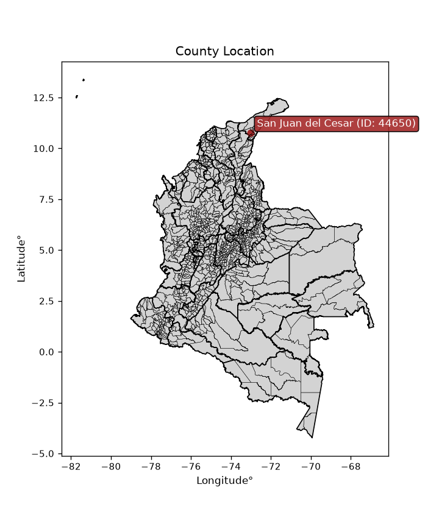
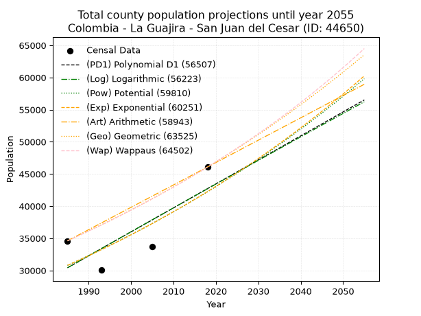
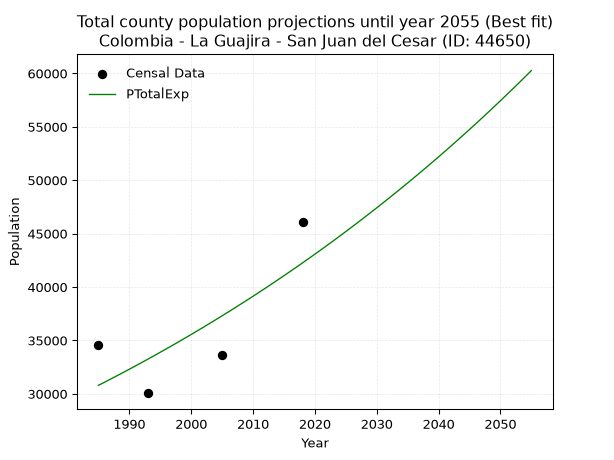
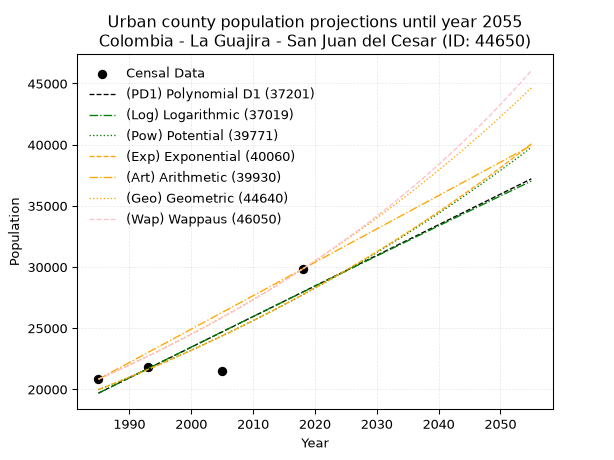
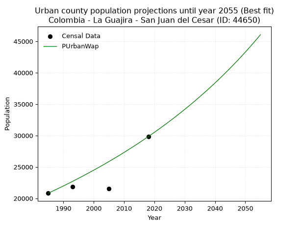
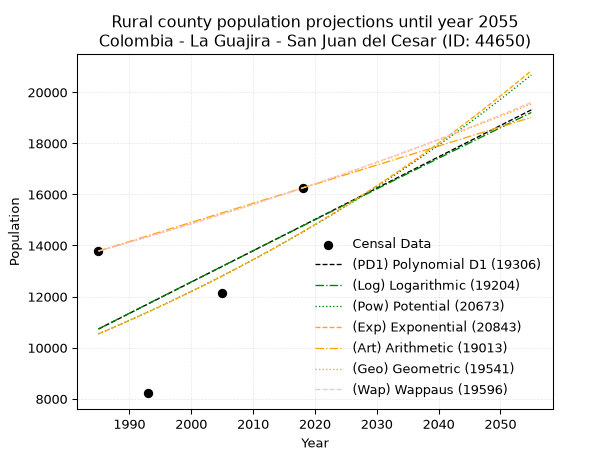
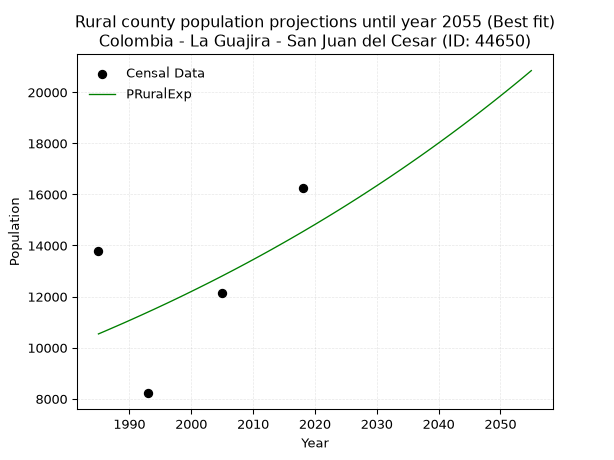

<div align="center">


</div>

# _“Population and Public Services Demand Projections (PPSD) until Year 2050 for Colombia - La Guajira - San Juan del Cesar (ID: 44650)”_
Keywords: `population` `public-service` `projection` `lineal` `polynomial` `logarithmic` `potential` `exponential` `arithmetic` `geometric` `wappaus` `dane` `colombia` `south-america`

PPSD are analytical estimates used by governments and planners to anticipate future changes in population size, age distribution, and the resulting community needs for utilities, healthcare, education, and infrastructure as sizing future water treatment facilities, electrical grids, and road networks based on spatial growth.

<div align="center">

</img>

</div>


> **General running parameters**: • app_version: _v20260806_. • Python version: _3.14.7_. • Pandas version: _3.0.5_. • NumPy version: _2.5.1_. • Creates, save and include plots into reports (create_plot): _False_. • Projection until year: _2050_. • Process polynomial degree 2 and up: _False_. • Process Wappaus: _True_. • Process Wappaus: _True_. • Set negative values to zero: _True_. • Set infinite values to zero: _True_. • Drop dataset notes: _True_. 
<div align="center">

Dynamic map: [:earth_americas:Google](http://maps.google.com/maps?q=10.76954566,-73.0006288) [:earth_americas:OSM](https://www.openstreetmap.org/#map=18/10.76954566/-73.0006288&layers=P) [:earth_americas:Bing](https://www.bing.com/maps?cp=10.76954566~-73.0006288&lvl=18) [:earth_americas:Apple](https://maps.apple.com/frame?center=10.76954566%2C-73.0006288&span=0.003%2C0.006)

</div>


<div align="center">

```geojson
{
  "type": "Feature",
  "geometry": {
    "type": "Point", 
    "coordinates": [-73.0006288, 10.76954566]
  }, 
  "properties": {
    "Name": "Colombia - La Guajira - San Juan del Cesar (ID: 44650)"
  }
}
```

</div>


## 0. Census Data (4 records)

Census data are official statistics collected by a government about the people and housing in a country. They usually include counts of total population, age, sex, race, income, education, and jobs.

📅Global census file: [Population.xlsx](../data/Population.xlsx)

| Source   |   Year |   CountryID | CountryName   |   StateID | StateName   |   CountyID | CountyName         |   PTotal |   PUrban |   PRural |
|:---------|-------:|------------:|:--------------|----------:|:------------|-----------:|:-------------------|---------:|---------:|---------:|
| DANE     |   1985 |          57 | Colombia      |        44 | La Guajira  |      44650 | San Juan del Cesar |    34602 |    20820 |    13782 |
| DANE     |   1993 |          57 | Colombia      |        44 | La Guajira  |      44650 | San Juan del Cesar |    30052 |    21833 |     8219 |
| DANE     |   2005 |          57 | Colombia      |        44 | La Guajira  |      44650 | San Juan del Cesar |    33654 |    21513 |    12141 |
| DANE     |   2018 |          57 | Colombia      |        44 | La Guajira  |      44650 | San Juan del Cesar |    46077 |    29829 |    16248 |

> 🔥Some records could had specific notes about the registered values or the corresponding urban or rural distribution.

📅   [RUPS](https://www.datos.gov.co/Hacienda-y-Cr-dito-P-blico/Registro-nico-de-Prestadores-de-Servicios-P-blicos/4qkq-csdn/about_data) - Local public utility companies: [RUPS.csv](../data/RUPS.xlsx)

 | SERVICIO       | ESTADO      | NOMBRE                                  | NIT         | DEPARTAMENTO_DOMICILIO   | MUNICIPIO_DOMICILIO   | DIRECCION                             |   TELEFONO | EMAIL               |   TIPO_PRESTADOR |   CLASIFICACION |
|:---------------|:------------|:----------------------------------------|:------------|:-------------------------|:----------------------|:--------------------------------------|-----------:|:--------------------|-----------------:|----------------:|
| ACUEDUCTO      | CANCELACION | AGUAS DEL SUR DE LA GUAJIRA S.A.  E.S.P | 811034168-7 | LA GUAJIRA               | SAN JUAN DEL CESAR    | Carrera 8 No.  2 - 37 Barrio El Prado |    7740207 | neobritoc@gmail.com |              nan |             nan |
| ALCANTARILLADO | CANCELACION | AGUAS DEL SUR DE LA GUAJIRA S.A.  E.S.P | 811034168-7 | LA GUAJIRA               | SAN JUAN DEL CESAR    | Carrera 8 No.  2 - 37 Barrio El Prado |    7740207 | neobritoc@gmail.com |              nan |             nan |
| ACUEDUCTO      | CANCELACION | AGUAS TOTAL S.A.S. E.S.P.               | 901352349-3 | LA GUAJIRA               | SAN JUAN DEL CESAR    | CALLE 5 SUR # 5 - 97                  |    3225474 | neobritoc@gmail.com |              nan |             nan |
| ALCANTARILLADO | CANCELACION | AGUAS TOTAL S.A.S. E.S.P.               | 901352349-3 | LA GUAJIRA               | SAN JUAN DEL CESAR    | CALLE 5 SUR # 5 - 97                  |    3225474 | neobritoc@gmail.com |              nan |             nan |

## 1. Total

### 1.1. Coefficients and Parameters

* (PD1) Polynomial Deg 1: 372.80730630268164, -709611.564431939 (lineal)
* (Log) Logarithmic: 744802.0866822364, -5625150.379341024
* (Pow) Potential: 19.16314083111569, -58.707107294902826
* (Exp) Exponential: 0.009592632017784947, 0.00016549240051560012
* (Art) Arithmetic: Year diff. 2018 - 1985 = 33, Population diff. 46077 - 34602 = 11475, Annual growth = 347.72727272727275
* (Geo) Geometric: Year diff. 2018 - 1985 = 33, Population diff. 46077 - 34602 = 11475, Annual growth % = 0.0087166319080898
* (Wap) Wappaus: i = 0.8620019403494658, Condition values only valid for < 200)

<sub>
Wappaus condition values: ['0.00', '0.86', '1.72', '2.59', '3.45', '4.31', '5.17', '6.03', '6.90', '7.76', '8.62', '9.48', '10.34', '11.21', '12.07', '12.93', '13.79', '14.65', '15.52', '16.38', '17.24', '18.10', '18.96', '19.83', '20.69', '21.55', '22.41', '23.27', '24.14', '25.00', '25.86', '26.72', '27.58', '28.45', '29.31', '30.17', '31.03', '31.89', '32.76', '33.62', '34.48', '35.34', '36.20', '37.07', '37.93', '38.79', '39.65', '40.51', '41.38', '42.24', '43.10', '43.96', '44.82', '45.69', '46.55', '47.41', '48.27', '49.13', '50.00', '50.86', '51.72', '52.58', '53.44', '54.31', '55.17', '56.03']
</sub>


### 1.2. Projected Dataset

|   Year |   CountyID |   PTotalPD1 |   PTotalLog |   PTotalPow |   PTotalExp |   PTotalArt |   PTotalGeo |   PTotalWap |
|-------:|-----------:|------------:|------------:|------------:|------------:|------------:|------------:|------------:|
|   1985 |      44650 |       30411 |       30411 |       30785 |       30785 |       34602 |       34602 |       34602 |
|   1986 |      44650 |       30784 |       30786 |       31084 |       31082 |       34950 |       34904 |       34902 |
|   1987 |      44650 |       31157 |       31161 |       31385 |       31382 |       35297 |       35208 |       35204 |
|   1988 |      44650 |       31529 |       31535 |       31689 |       31684 |       35645 |       35515 |       35509 |
|   1989 |      44650 |       31902 |       31910 |       31996 |       31989 |       35993 |       35824 |       35816 |
|   1990 |      44650 |       32275 |       32284 |       32306 |       32298 |       36341 |       36137 |       36126 |
|   1991 |      44650 |       32648 |       32658 |       32618 |       32609 |       36688 |       36452 |       36439 |
|   1992 |      44650 |       33021 |       33032 |       32934 |       32923 |       37036 |       36769 |       36755 |
|   1993 |      44650 |       33393 |       33406 |       33252 |       33241 |       37384 |       37090 |       37073 |
|   1994 |      44650 |       33766 |       33780 |       33573 |       33561 |       37732 |       37413 |       37395 |
|   1995 |      44650 |       34139 |       34153 |       33897 |       33885 |       38079 |       37739 |       37719 |
|   1996 |      44650 |       34512 |       34527 |       34224 |       34211 |       38427 |       38068 |       38046 |
|   1997 |      44650 |       34885 |       34900 |       34554 |       34541 |       38775 |       38400 |       38376 |
|   1998 |      44650 |       35257 |       35272 |       34887 |       34874 |       39122 |       38735 |       38710 |
|   1999 |      44650 |       35630 |       35645 |       35224 |       35210 |       39470 |       39072 |       39046 |
|   2000 |      44650 |       36003 |       36018 |       35563 |       35549 |       39818 |       39413 |       39385 |
|   2001 |      44650 |       36376 |       36390 |       35905 |       35892 |       40166 |       39756 |       39728 |
|   2002 |      44650 |       36749 |       36762 |       36250 |       36238 |       40513 |       40103 |       40073 |
|   2003 |      44650 |       37121 |       37134 |       36599 |       36587 |       40861 |       40453 |       40422 |
|   2004 |      44650 |       37494 |       37506 |       36951 |       36940 |       41209 |       40805 |       40775 |
|   2005 |      44650 |       37867 |       37877 |       37306 |       37296 |       41557 |       41161 |       41130 |
|   2006 |      44650 |       38240 |       38249 |       37664 |       37656 |       41904 |       41520 |       41489 |
|   2007 |      44650 |       38613 |       38620 |       38025 |       38018 |       42252 |       41882 |       41851 |
|   2008 |      44650 |       38986 |       38991 |       38390 |       38385 |       42600 |       42247 |       42217 |
|   2009 |      44650 |       39358 |       39362 |       38758 |       38755 |       42947 |       42615 |       42586 |
|   2010 |      44650 |       39731 |       39732 |       39129 |       39128 |       43295 |       42986 |       42959 |
|   2011 |      44650 |       40104 |       40103 |       39504 |       39506 |       43643 |       43361 |       43336 |
|   2012 |      44650 |       40477 |       40473 |       39882 |       39886 |       43991 |       43739 |       43716 |
|   2013 |      44650 |       40850 |       40843 |       40264 |       40271 |       44338 |       44120 |       44100 |
|   2014 |      44650 |       41222 |       41213 |       40649 |       40659 |       44686 |       44505 |       44487 |
|   2015 |      44650 |       41595 |       41583 |       41037 |       41051 |       45034 |       44893 |       44879 |
|   2016 |      44650 |       41968 |       41952 |       41430 |       41447 |       45382 |       45284 |       45274 |
|   2017 |      44650 |       42341 |       42322 |       41825 |       41846 |       45729 |       45679 |       45674 |
|   2018 |      44650 |       42714 |       42691 |       42224 |       42249 |       46077 |       46077 |       46077 |
|   2019 |      44650 |       43086 |       43060 |       42627 |       42657 |       46425 |       46479 |       46484 |
|   2020 |      44650 |       43459 |       43429 |       43033 |       43068 |       46772 |       46884 |       46896 |
|   2021 |      44650 |       43832 |       43797 |       43444 |       43483 |       47120 |       47292 |       47312 |
|   2022 |      44650 |       44205 |       44166 |       43857 |       43902 |       47468 |       47705 |       47732 |
|   2023 |      44650 |       44578 |       44534 |       44275 |       44325 |       47816 |       48120 |       48156 |
|   2024 |      44650 |       44950 |       44902 |       44696 |       44752 |       48163 |       48540 |       48585 |
|   2025 |      44650 |       45323 |       45270 |       45121 |       45184 |       48511 |       48963 |       49018 |
|   2026 |      44650 |       45696 |       45638 |       45550 |       45619 |       48859 |       49390 |       49456 |
|   2027 |      44650 |       46069 |       46005 |       45983 |       46059 |       49207 |       49820 |       49898 |
|   2028 |      44650 |       46442 |       46373 |       46420 |       46503 |       49554 |       50255 |       50345 |
|   2029 |      44650 |       46814 |       46740 |       46860 |       46951 |       49902 |       50693 |       50797 |
|   2030 |      44650 |       47187 |       47107 |       47305 |       47404 |       50250 |       51135 |       51254 |
|   2031 |      44650 |       47560 |       47474 |       47753 |       47861 |       50597 |       51580 |       51715 |
|   2032 |      44650 |       47933 |       47840 |       48206 |       48322 |       50945 |       52030 |       52182 |
|   2033 |      44650 |       48306 |       48207 |       48663 |       48788 |       51293 |       52483 |       52653 |
|   2034 |      44650 |       48678 |       48573 |       49123 |       49258 |       51641 |       52941 |       53130 |
|   2035 |      44650 |       49051 |       48939 |       49588 |       49733 |       51988 |       53402 |       53612 |
|   2036 |      44650 |       49424 |       49305 |       50057 |       50212 |       52336 |       53868 |       54100 |
|   2037 |      44650 |       49797 |       49671 |       50531 |       50696 |       52684 |       54337 |       54592 |
|   2038 |      44650 |       50170 |       50036 |       51008 |       51185 |       53032 |       54811 |       55091 |
|   2039 |      44650 |       50543 |       50401 |       51490 |       51678 |       53379 |       55289 |       55594 |
|   2040 |      44650 |       50915 |       50767 |       51976 |       52176 |       53727 |       55771 |       56104 |
|   2041 |      44650 |       51288 |       51132 |       52466 |       52679 |       54075 |       56257 |       56619 |
|   2042 |      44650 |       51661 |       51497 |       52961 |       53187 |       54422 |       56747 |       57140 |
|   2043 |      44650 |       52034 |       51861 |       53460 |       53700 |       54770 |       57242 |       57668 |
|   2044 |      44650 |       52407 |       52226 |       53964 |       54217 |       55118 |       57741 |       58201 |
|   2045 |      44650 |       52779 |       52590 |       54472 |       54740 |       55466 |       58244 |       58740 |
|   2046 |      44650 |       53152 |       52954 |       54985 |       55267 |       55813 |       58752 |       59286 |
|   2047 |      44650 |       53525 |       53318 |       55502 |       55800 |       56161 |       59264 |       59838 |
|   2048 |      44650 |       53898 |       53682 |       56024 |       56338 |       56509 |       59781 |       60397 |
|   2049 |      44650 |       54271 |       54045 |       56551 |       56881 |       56857 |       60302 |       60963 |
|   2050 |      44650 |       54643 |       54409 |       57082 |       57429 |       57204 |       60827 |       61535 |
<div align="center">

</img>

</div>


### 1.3. Best fit with absolute and relative error (%)

Relative error puts that difference into context by dividing the absolute error by the true value, creating a unitless ratio or percentage that shows the scale of the mistake.

Absolute and relative error

|   Year | Source   |   CountryID | CountryName   |   StateID | StateName   |   CountyID_x | CountyName         |   PTotal |   PUrban |   PRural |   CountyID_y |   PTotalPD1 |   PTotalLog |   PTotalPow |   PTotalExp |   PTotalArt |   PTotalGeo |   PTotalWap |   PTotalPD1AbsError |   PTotalLogAbsError |   PTotalPowAbsError |   PTotalExpAbsError |   PTotalArtAbsError |   PTotalGeoAbsError |   PTotalWapAbsError |   PTotalPD1RelError |   PTotalLogRelError |   PTotalPowRelError |   PTotalExpRelError |   PTotalArtRelError |   PTotalGeoRelError |   PTotalWapRelError |
|-------:|:---------|------------:|:--------------|----------:|:------------|-------------:|:-------------------|---------:|---------:|---------:|-------------:|------------:|------------:|------------:|------------:|------------:|------------:|------------:|--------------------:|--------------------:|--------------------:|--------------------:|--------------------:|--------------------:|--------------------:|--------------------:|--------------------:|--------------------:|--------------------:|--------------------:|--------------------:|--------------------:|
|   1985 | DANE     |          57 | Colombia      |        44 | La Guajira  |        44650 | San Juan del Cesar |    34602 |    20820 |    13782 |        44650 |       30411 |       30411 |       30785 |       30785 |       34602 |       34602 |       34602 |                4191 |                4191 |                3817 |                3817 |                   0 |                   0 |                   0 |            12.112   |            12.112   |            11.0312  |            11.0312  |              0      |              0      |              0      |
|   1993 | DANE     |          57 | Colombia      |        44 | La Guajira  |        44650 | San Juan del Cesar |    30052 |    21833 |     8219 |        44650 |       33393 |       33406 |       33252 |       33241 |       37384 |       37090 |       37073 |                3341 |                3354 |                3200 |                3189 |                7332 |                7038 |                7021 |            11.1174  |            11.1607  |            10.6482  |            10.6116  |             24.3977 |             23.4194 |             23.3628 |
|   2005 | DANE     |          57 | Colombia      |        44 | La Guajira  |        44650 | San Juan del Cesar |    33654 |    21513 |    12141 |        44650 |       37867 |       37877 |       37306 |       37296 |       41557 |       41161 |       41130 |                4213 |                4223 |                3652 |                3642 |                7903 |                7507 |                7476 |            12.5186  |            12.5483  |            10.8516  |            10.8219  |             23.4831 |             22.3064 |             22.2143 |
|   2018 | DANE     |          57 | Colombia      |        44 | La Guajira  |        44650 | San Juan del Cesar |    46077 |    29829 |    16248 |        44650 |       42714 |       42691 |       42224 |       42249 |       46077 |       46077 |       46077 |                3363 |                3386 |                3853 |                3828 |                   0 |                   0 |                   0 |             7.29865 |             7.34857 |             8.36209 |             8.30783 |              0      |              0      |              0      |

Relative error mean

| Method    |   RelError | Best   |
|:----------|-----------:|:-------|
| PTotalPD1 |    10.7617 |        |
| PTotalLog |    10.7924 |        |
| PTotalPow |    10.2233 |        |
| PTotalExp |    10.1931 | True   |
| PTotalArt |    11.9702 |        |
| PTotalGeo |    11.4315 |        |
| PTotalWap |    11.3943 |        |

💙Best method: _**PTotalExp**_
<div align="center">

</img>

</div>


### 1.4. Fresh water supply demand in liters per capita per day (lpcd)

The fresh water supply demand typically ranges from 100 to 300 liters per capita per day (lpcd) for standard domestic and municipal planning, though absolute survival minimums set by the World Health Organization are as low as 7.5 to 20 liters per day, and total consumption in high-income nations can exceed 400 liters.

> `CZ`: Level in meters above the sea level (masl)<br> `WS`: Fresh water supply demand in liters per capita per day (lpcd or l/h/d)<br> `WSAll`: Zonal fresh water supply demand in liters per second (l/s)<br> `A`: Zonal area in square meters<br> `DP`: Population density (people/hectare or p/ha)

Reference values (RAS Colombia)

|    CZ |   WS |
|------:|-----:|
|  1000 |  120 |
|  2000 |  130 |
| 99999 |  140 |

County shapefile geometry properties and water supply values

|   CountyID |      ATotal |   CZTotal |   WSTotal |
|-----------:|------------:|----------:|----------:|
|      44650 | 1.30798e+09 |    756.77 |       120 |

Projected values for best method: PTotalExp

|   CountyID |   Year |   PTotalExp |   DPTotal |   WSTotal |   WSTotalAll |
|-----------:|-------:|------------:|----------:|----------:|-------------:|
|      44650 |   1985 |       30785 |      0.24 |       120 |      42.7569 |
|      44650 |   1986 |       31082 |      0.24 |       120 |      43.1694 |
|      44650 |   1987 |       31382 |      0.24 |       120 |      43.5861 |
|      44650 |   1988 |       31684 |      0.24 |       120 |      44.0056 |
|      44650 |   1989 |       31989 |      0.24 |       120 |      44.4292 |
|      44650 |   1990 |       32298 |      0.25 |       120 |      44.8583 |
|      44650 |   1991 |       32609 |      0.25 |       120 |      45.2903 |
|      44650 |   1992 |       32923 |      0.25 |       120 |      45.7264 |
|      44650 |   1993 |       33241 |      0.25 |       120 |      46.1681 |
|      44650 |   1994 |       33561 |      0.26 |       120 |      46.6125 |
|      44650 |   1995 |       33885 |      0.26 |       120 |      47.0625 |
|      44650 |   1996 |       34211 |      0.26 |       120 |      47.5153 |
|      44650 |   1997 |       34541 |      0.26 |       120 |      47.9736 |
|      44650 |   1998 |       34874 |      0.27 |       120 |      48.4361 |
|      44650 |   1999 |       35210 |      0.27 |       120 |      48.9028 |
|      44650 |   2000 |       35549 |      0.27 |       120 |      49.3736 |
|      44650 |   2001 |       35892 |      0.27 |       120 |      49.85   |
|      44650 |   2002 |       36238 |      0.28 |       120 |      50.3306 |
|      44650 |   2003 |       36587 |      0.28 |       120 |      50.8153 |
|      44650 |   2004 |       36940 |      0.28 |       120 |      51.3056 |
|      44650 |   2005 |       37296 |      0.29 |       120 |      51.8    |
|      44650 |   2006 |       37656 |      0.29 |       120 |      52.3    |
|      44650 |   2007 |       38018 |      0.29 |       120 |      52.8028 |
|      44650 |   2008 |       38385 |      0.29 |       120 |      53.3125 |
|      44650 |   2009 |       38755 |      0.3  |       120 |      53.8264 |
|      44650 |   2010 |       39128 |      0.3  |       120 |      54.3444 |
|      44650 |   2011 |       39506 |      0.3  |       120 |      54.8694 |
|      44650 |   2012 |       39886 |      0.3  |       120 |      55.3972 |
|      44650 |   2013 |       40271 |      0.31 |       120 |      55.9319 |
|      44650 |   2014 |       40659 |      0.31 |       120 |      56.4708 |
|      44650 |   2015 |       41051 |      0.31 |       120 |      57.0153 |
|      44650 |   2016 |       41447 |      0.32 |       120 |      57.5653 |
|      44650 |   2017 |       41846 |      0.32 |       120 |      58.1194 |
|      44650 |   2018 |       42249 |      0.32 |       120 |      58.6792 |
|      44650 |   2019 |       42657 |      0.33 |       120 |      59.2458 |
|      44650 |   2020 |       43068 |      0.33 |       120 |      59.8167 |
|      44650 |   2021 |       43483 |      0.33 |       120 |      60.3931 |
|      44650 |   2022 |       43902 |      0.34 |       120 |      60.975  |
|      44650 |   2023 |       44325 |      0.34 |       120 |      61.5625 |
|      44650 |   2024 |       44752 |      0.34 |       120 |      62.1556 |
|      44650 |   2025 |       45184 |      0.35 |       120 |      62.7556 |
|      44650 |   2026 |       45619 |      0.35 |       120 |      63.3597 |
|      44650 |   2027 |       46059 |      0.35 |       120 |      63.9708 |
|      44650 |   2028 |       46503 |      0.36 |       120 |      64.5875 |
|      44650 |   2029 |       46951 |      0.36 |       120 |      65.2097 |
|      44650 |   2030 |       47404 |      0.36 |       120 |      65.8389 |
|      44650 |   2031 |       47861 |      0.37 |       120 |      66.4736 |
|      44650 |   2032 |       48322 |      0.37 |       120 |      67.1139 |
|      44650 |   2033 |       48788 |      0.37 |       120 |      67.7611 |
|      44650 |   2034 |       49258 |      0.38 |       120 |      68.4139 |
|      44650 |   2035 |       49733 |      0.38 |       120 |      69.0736 |
|      44650 |   2036 |       50212 |      0.38 |       120 |      69.7389 |
|      44650 |   2037 |       50696 |      0.39 |       120 |      70.4111 |
|      44650 |   2038 |       51185 |      0.39 |       120 |      71.0903 |
|      44650 |   2039 |       51678 |      0.4  |       120 |      71.775  |
|      44650 |   2040 |       52176 |      0.4  |       120 |      72.4667 |
|      44650 |   2041 |       52679 |      0.4  |       120 |      73.1653 |
|      44650 |   2042 |       53187 |      0.41 |       120 |      73.8708 |
|      44650 |   2043 |       53700 |      0.41 |       120 |      74.5833 |
|      44650 |   2044 |       54217 |      0.41 |       120 |      75.3014 |
|      44650 |   2045 |       54740 |      0.42 |       120 |      76.0278 |
|      44650 |   2046 |       55267 |      0.42 |       120 |      76.7597 |
|      44650 |   2047 |       55800 |      0.43 |       120 |      77.5    |
|      44650 |   2048 |       56338 |      0.43 |       120 |      78.2472 |
|      44650 |   2049 |       56881 |      0.43 |       120 |      79.0014 |
|      44650 |   2050 |       57429 |      0.44 |       120 |      79.7625 |

## 2. Urban

### 2.1. Coefficients and Parameters

* (PD1) Polynomial Deg 1: 250.27258129264834, -477108.9807306198 (lineal)
* (Log) Logarithmic: 500312.73126979417, -3779382.329636316
* (Pow) Potential: 19.882234367762912, -61.266530007431946
* (Exp) Exponential: 0.009945256564009035, 5.331059952647258e-05
* (Art) Arithmetic: Year diff. 2018 - 1985 = 33, Population diff. 29829 - 20820 = 9009, Annual growth = 273.0
* (Geo) Geometric: Year diff. 2018 - 1985 = 33, Population diff. 29829 - 20820 = 9009, Annual growth % = 0.010955547313861391
* (Wap) Wappaus: i = 1.078007463128591, Condition values only valid for < 200)

<sub>
Wappaus condition values: ['0.00', '1.08', '2.16', '3.23', '4.31', '5.39', '6.47', '7.55', '8.62', '9.70', '10.78', '11.86', '12.94', '14.01', '15.09', '16.17', '17.25', '18.33', '19.40', '20.48', '21.56', '22.64', '23.72', '24.79', '25.87', '26.95', '28.03', '29.11', '30.18', '31.26', '32.34', '33.42', '34.50', '35.57', '36.65', '37.73', '38.81', '39.89', '40.96', '42.04', '43.12', '44.20', '45.28', '46.35', '47.43', '48.51', '49.59', '50.67', '51.74', '52.82', '53.90', '54.98', '56.06', '57.13', '58.21', '59.29', '60.37', '61.45', '62.52', '63.60', '64.68', '65.76', '66.84', '67.91', '68.99', '70.07']
</sub>


### 2.2. Projected Dataset

|   Year |   CountyID |   PUrbanPD1 |   PUrbanLog |   PUrbanPow |   PUrbanExp |   PUrbanArt |   PUrbanGeo |   PUrbanWap |
|-------:|-----------:|------------:|------------:|------------:|------------:|------------:|------------:|------------:|
|   1985 |      44650 |       19682 |       19679 |       19967 |       19969 |       20820 |       20820 |       20820 |
|   1986 |      44650 |       19932 |       19931 |       20168 |       20169 |       21093 |       21048 |       21046 |
|   1987 |      44650 |       20183 |       20183 |       20371 |       20371 |       21366 |       21279 |       21274 |
|   1988 |      44650 |       20433 |       20435 |       20576 |       20574 |       21639 |       21512 |       21504 |
|   1989 |      44650 |       20683 |       20687 |       20783 |       20780 |       21912 |       21747 |       21738 |
|   1990 |      44650 |       20933 |       20938 |       20991 |       20988 |       22185 |       21986 |       21973 |
|   1991 |      44650 |       21184 |       21189 |       21202 |       21197 |       22458 |       22227 |       22212 |
|   1992 |      44650 |       21434 |       21441 |       21415 |       21409 |       22731 |       22470 |       22453 |
|   1993 |      44650 |       21684 |       21692 |       21630 |       21623 |       23004 |       22716 |       22696 |
|   1994 |      44650 |       21935 |       21943 |       21846 |       21839 |       23277 |       22965 |       22943 |
|   1995 |      44650 |       22185 |       22194 |       22065 |       22058 |       23550 |       23217 |       23192 |
|   1996 |      44650 |       22435 |       22444 |       22286 |       22278 |       23823 |       23471 |       23444 |
|   1997 |      44650 |       22685 |       22695 |       22509 |       22501 |       24096 |       23728 |       23700 |
|   1998 |      44650 |       22936 |       22945 |       22734 |       22726 |       24369 |       23988 |       23958 |
|   1999 |      44650 |       23186 |       23196 |       22962 |       22953 |       24642 |       24251 |       24219 |
|   2000 |      44650 |       23436 |       23446 |       23191 |       23182 |       24915 |       24517 |       24483 |
|   2001 |      44650 |       23686 |       23696 |       23423 |       23414 |       25188 |       24785 |       24750 |
|   2002 |      44650 |       23937 |       23946 |       23657 |       23648 |       25461 |       25057 |       25020 |
|   2003 |      44650 |       24187 |       24196 |       23893 |       23884 |       25734 |       25331 |       25294 |
|   2004 |      44650 |       24437 |       24446 |       24131 |       24123 |       26007 |       25609 |       25571 |
|   2005 |      44650 |       24688 |       24695 |       24371 |       24364 |       26280 |       25889 |       25851 |
|   2006 |      44650 |       24938 |       24945 |       24614 |       24608 |       26553 |       26173 |       26135 |
|   2007 |      44650 |       25188 |       25194 |       24859 |       24854 |       26826 |       26460 |       26422 |
|   2008 |      44650 |       25438 |       25443 |       25107 |       25102 |       27099 |       26750 |       26713 |
|   2009 |      44650 |       25689 |       25692 |       25357 |       25353 |       27372 |       27043 |       27007 |
|   2010 |      44650 |       25939 |       25941 |       25609 |       25606 |       27645 |       27339 |       27305 |
|   2011 |      44650 |       26189 |       26190 |       25863 |       25862 |       27918 |       27638 |       27607 |
|   2012 |      44650 |       26439 |       26439 |       26120 |       26121 |       28191 |       27941 |       27912 |
|   2013 |      44650 |       26690 |       26687 |       26379 |       26382 |       28464 |       28247 |       28221 |
|   2014 |      44650 |       26940 |       26936 |       26641 |       26645 |       28737 |       28557 |       28535 |
|   2015 |      44650 |       27190 |       27184 |       26905 |       26912 |       29010 |       28870 |       28852 |
|   2016 |      44650 |       27441 |       27433 |       27172 |       27181 |       29283 |       29186 |       29173 |
|   2017 |      44650 |       27691 |       27681 |       27441 |       27452 |       29556 |       29506 |       29499 |
|   2018 |      44650 |       27941 |       27929 |       27713 |       27727 |       29829 |       29829 |       29829 |
|   2019 |      44650 |       28191 |       28176 |       27988 |       28004 |       30102 |       30156 |       30163 |
|   2020 |      44650 |       28442 |       28424 |       28264 |       28284 |       30375 |       30486 |       30502 |
|   2021 |      44650 |       28692 |       28672 |       28544 |       28566 |       30648 |       30820 |       30845 |
|   2022 |      44650 |       28942 |       28919 |       28826 |       28852 |       30921 |       31158 |       31193 |
|   2023 |      44650 |       29192 |       29167 |       29111 |       29140 |       31194 |       31499 |       31546 |
|   2024 |      44650 |       29443 |       29414 |       29398 |       29432 |       31467 |       31844 |       31903 |
|   2025 |      44650 |       29693 |       29661 |       29688 |       29726 |       31740 |       32193 |       32265 |
|   2026 |      44650 |       29943 |       29908 |       29981 |       30023 |       32013 |       32546 |       32633 |
|   2027 |      44650 |       30194 |       30155 |       30277 |       30323 |       32286 |       32902 |       33005 |
|   2028 |      44650 |       30444 |       30402 |       30575 |       30626 |       32559 |       33263 |       33383 |
|   2029 |      44650 |       30694 |       30648 |       30876 |       30932 |       32832 |       33627 |       33766 |
|   2030 |      44650 |       30944 |       30895 |       31180 |       31241 |       33105 |       33996 |       34154 |
|   2031 |      44650 |       31195 |       31141 |       31487 |       31554 |       33378 |       34368 |       34548 |
|   2032 |      44650 |       31445 |       31388 |       31797 |       31869 |       33651 |       34745 |       34948 |
|   2033 |      44650 |       31695 |       31634 |       32109 |       32187 |       33924 |       35125 |       35353 |
|   2034 |      44650 |       31945 |       31880 |       32425 |       32509 |       34197 |       35510 |       35765 |
|   2035 |      44650 |       32196 |       32126 |       32743 |       32834 |       34470 |       35899 |       36182 |
|   2036 |      44650 |       32446 |       32371 |       33065 |       33162 |       34743 |       36292 |       36606 |
|   2037 |      44650 |       32696 |       32617 |       33389 |       33494 |       35016 |       36690 |       37036 |
|   2038 |      44650 |       32947 |       32863 |       33717 |       33828 |       35289 |       37092 |       37473 |
|   2039 |      44650 |       33197 |       33108 |       34047 |       34167 |       35562 |       37498 |       37916 |
|   2040 |      44650 |       33447 |       33353 |       34381 |       34508 |       35835 |       37909 |       38366 |
|   2041 |      44650 |       33697 |       33599 |       34717 |       34853 |       36108 |       38324 |       38823 |
|   2042 |      44650 |       33948 |       33844 |       35057 |       35201 |       36381 |       38744 |       39287 |
|   2043 |      44650 |       34198 |       34089 |       35400 |       35553 |       36654 |       39169 |       39758 |
|   2044 |      44650 |       34448 |       34333 |       35746 |       35908 |       36927 |       39598 |       40237 |
|   2045 |      44650 |       34698 |       34578 |       36095 |       36267 |       37200 |       40032 |       40723 |
|   2046 |      44650 |       34949 |       34823 |       36448 |       36630 |       37473 |       40470 |       41217 |
|   2047 |      44650 |       35199 |       35067 |       36804 |       36996 |       37746 |       40914 |       41720 |
|   2048 |      44650 |       35449 |       35312 |       37163 |       37366 |       38019 |       41362 |       42230 |
|   2049 |      44650 |       35700 |       35556 |       37525 |       37739 |       38292 |       41815 |       42749 |
|   2050 |      44650 |       35950 |       35800 |       37891 |       38116 |       38565 |       42273 |       43276 |
<div align="center">

</img>

</div>


### 2.3. Best fit with absolute and relative error (%)

Relative error puts that difference into context by dividing the absolute error by the true value, creating a unitless ratio or percentage that shows the scale of the mistake.

Absolute and relative error

|   Year | Source   |   CountryID | CountryName   |   StateID | StateName   |   CountyID_x | CountyName         |   PTotal |   PUrban |   PRural |   CountyID_y |   PUrbanPD1 |   PUrbanLog |   PUrbanPow |   PUrbanExp |   PUrbanArt |   PUrbanGeo |   PUrbanWap |   PUrbanPD1AbsError |   PUrbanLogAbsError |   PUrbanPowAbsError |   PUrbanExpAbsError |   PUrbanArtAbsError |   PUrbanGeoAbsError |   PUrbanWapAbsError |   PUrbanPD1RelError |   PUrbanLogRelError |   PUrbanPowRelError |   PUrbanExpRelError |   PUrbanArtRelError |   PUrbanGeoRelError |   PUrbanWapRelError |
|-------:|:---------|------------:|:--------------|----------:|:------------|-------------:|:-------------------|---------:|---------:|---------:|-------------:|------------:|------------:|------------:|------------:|------------:|------------:|------------:|--------------------:|--------------------:|--------------------:|--------------------:|--------------------:|--------------------:|--------------------:|--------------------:|--------------------:|--------------------:|--------------------:|--------------------:|--------------------:|--------------------:|
|   1985 | DANE     |          57 | Colombia      |        44 | La Guajira  |        44650 | San Juan del Cesar |    34602 |    20820 |    13782 |        44650 |       19682 |       19679 |       19967 |       19969 |       20820 |       20820 |       20820 |                1138 |                1141 |                 853 |                 851 |                   0 |                   0 |                   0 |            5.4659   |            5.48031  |            4.09702  |            4.08742  |             0       |             0       |             0       |
|   1993 | DANE     |          57 | Colombia      |        44 | La Guajira  |        44650 | San Juan del Cesar |    30052 |    21833 |     8219 |        44650 |       21684 |       21692 |       21630 |       21623 |       23004 |       22716 |       22696 |                 149 |                 141 |                 203 |                 210 |                1171 |                 883 |                 863 |            0.682453 |            0.645811 |            0.929785 |            0.961847 |             5.36344 |             4.04434 |             3.95273 |
|   2005 | DANE     |          57 | Colombia      |        44 | La Guajira  |        44650 | San Juan del Cesar |    33654 |    21513 |    12141 |        44650 |       24688 |       24695 |       24371 |       24364 |       26280 |       25889 |       25851 |                3175 |                3182 |                2858 |                2851 |                4767 |                4376 |                4338 |           14.7585   |           14.7911   |           13.285    |           13.2525   |            22.1587  |            20.3412  |            20.1646  |
|   2018 | DANE     |          57 | Colombia      |        44 | La Guajira  |        44650 | San Juan del Cesar |    46077 |    29829 |    16248 |        44650 |       27941 |       27929 |       27713 |       27727 |       29829 |       29829 |       29829 |                1888 |                1900 |                2116 |                2102 |                   0 |                   0 |                   0 |            6.32941  |            6.36964  |            7.09377  |            7.04683  |             0       |             0       |             0       |

Relative error mean

| Method    |   RelError | Best   |
|:----------|-----------:|:-------|
| PUrbanPD1 |    6.80907 |        |
| PUrbanLog |    6.8217  |        |
| PUrbanPow |    6.35139 |        |
| PUrbanExp |    6.33714 |        |
| PUrbanArt |    6.88053 |        |
| PUrbanGeo |    6.09638 |        |
| PUrbanWap |    6.02932 | True   |

💙Best method: _**PUrbanWap**_
<div align="center">

</img>

</div>


### 2.4. Fresh water supply demand in liters per capita per day (lpcd)

The fresh water supply demand typically ranges from 100 to 300 liters per capita per day (lpcd) for standard domestic and municipal planning, though absolute survival minimums set by the World Health Organization are as low as 7.5 to 20 liters per day, and total consumption in high-income nations can exceed 400 liters.

> `CZ`: Level in meters above the sea level (masl)<br> `WS`: Fresh water supply demand in liters per capita per day (lpcd or l/h/d)<br> `WSAll`: Zonal fresh water supply demand in liters per second (l/s)<br> `A`: Zonal area in square meters<br> `DP`: Population density (people/hectare or p/ha)

Reference values (RAS Colombia)

|    CZ |   WS |
|------:|-----:|
|  1000 |  120 |
|  2000 |  130 |
| 99999 |  140 |

County shapefile geometry properties and water supply values

|   CountyID |      AUrban |   CZUrban |   WSUrban |
|-----------:|------------:|----------:|----------:|
|      44650 | 6.85446e+06 |   211.409 |       120 |

Projected values for best method: PUrbanWap

|   CountyID |   Year |   PUrbanWap |   DPUrban |   WSUrban |   WSUrbanAll |
|-----------:|-------:|------------:|----------:|----------:|-------------:|
|      44650 |   1985 |       20820 |     30.37 |       120 |      28.9167 |
|      44650 |   1986 |       21046 |     30.7  |       120 |      29.2306 |
|      44650 |   1987 |       21274 |     31.04 |       120 |      29.5472 |
|      44650 |   1988 |       21504 |     31.37 |       120 |      29.8667 |
|      44650 |   1989 |       21738 |     31.71 |       120 |      30.1917 |
|      44650 |   1990 |       21973 |     32.06 |       120 |      30.5181 |
|      44650 |   1991 |       22212 |     32.41 |       120 |      30.85   |
|      44650 |   1992 |       22453 |     32.76 |       120 |      31.1847 |
|      44650 |   1993 |       22696 |     33.11 |       120 |      31.5222 |
|      44650 |   1994 |       22943 |     33.47 |       120 |      31.8653 |
|      44650 |   1995 |       23192 |     33.83 |       120 |      32.2111 |
|      44650 |   1996 |       23444 |     34.2  |       120 |      32.5611 |
|      44650 |   1997 |       23700 |     34.58 |       120 |      32.9167 |
|      44650 |   1998 |       23958 |     34.95 |       120 |      33.275  |
|      44650 |   1999 |       24219 |     35.33 |       120 |      33.6375 |
|      44650 |   2000 |       24483 |     35.72 |       120 |      34.0042 |
|      44650 |   2001 |       24750 |     36.11 |       120 |      34.375  |
|      44650 |   2002 |       25020 |     36.5  |       120 |      34.75   |
|      44650 |   2003 |       25294 |     36.9  |       120 |      35.1306 |
|      44650 |   2004 |       25571 |     37.31 |       120 |      35.5153 |
|      44650 |   2005 |       25851 |     37.71 |       120 |      35.9042 |
|      44650 |   2006 |       26135 |     38.13 |       120 |      36.2986 |
|      44650 |   2007 |       26422 |     38.55 |       120 |      36.6972 |
|      44650 |   2008 |       26713 |     38.97 |       120 |      37.1014 |
|      44650 |   2009 |       27007 |     39.4  |       120 |      37.5097 |
|      44650 |   2010 |       27305 |     39.84 |       120 |      37.9236 |
|      44650 |   2011 |       27607 |     40.28 |       120 |      38.3431 |
|      44650 |   2012 |       27912 |     40.72 |       120 |      38.7667 |
|      44650 |   2013 |       28221 |     41.17 |       120 |      39.1958 |
|      44650 |   2014 |       28535 |     41.63 |       120 |      39.6319 |
|      44650 |   2015 |       28852 |     42.09 |       120 |      40.0722 |
|      44650 |   2016 |       29173 |     42.56 |       120 |      40.5181 |
|      44650 |   2017 |       29499 |     43.04 |       120 |      40.9708 |
|      44650 |   2018 |       29829 |     43.52 |       120 |      41.4292 |
|      44650 |   2019 |       30163 |     44    |       120 |      41.8931 |
|      44650 |   2020 |       30502 |     44.5  |       120 |      42.3639 |
|      44650 |   2021 |       30845 |     45    |       120 |      42.8403 |
|      44650 |   2022 |       31193 |     45.51 |       120 |      43.3236 |
|      44650 |   2023 |       31546 |     46.02 |       120 |      43.8139 |
|      44650 |   2024 |       31903 |     46.54 |       120 |      44.3097 |
|      44650 |   2025 |       32265 |     47.07 |       120 |      44.8125 |
|      44650 |   2026 |       32633 |     47.61 |       120 |      45.3236 |
|      44650 |   2027 |       33005 |     48.15 |       120 |      45.8403 |
|      44650 |   2028 |       33383 |     48.7  |       120 |      46.3653 |
|      44650 |   2029 |       33766 |     49.26 |       120 |      46.8972 |
|      44650 |   2030 |       34154 |     49.83 |       120 |      47.4361 |
|      44650 |   2031 |       34548 |     50.4  |       120 |      47.9833 |
|      44650 |   2032 |       34948 |     50.99 |       120 |      48.5389 |
|      44650 |   2033 |       35353 |     51.58 |       120 |      49.1014 |
|      44650 |   2034 |       35765 |     52.18 |       120 |      49.6736 |
|      44650 |   2035 |       36182 |     52.79 |       120 |      50.2528 |
|      44650 |   2036 |       36606 |     53.4  |       120 |      50.8417 |
|      44650 |   2037 |       37036 |     54.03 |       120 |      51.4389 |
|      44650 |   2038 |       37473 |     54.67 |       120 |      52.0458 |
|      44650 |   2039 |       37916 |     55.32 |       120 |      52.6611 |
|      44650 |   2040 |       38366 |     55.97 |       120 |      53.2861 |
|      44650 |   2041 |       38823 |     56.64 |       120 |      53.9208 |
|      44650 |   2042 |       39287 |     57.32 |       120 |      54.5653 |
|      44650 |   2043 |       39758 |     58    |       120 |      55.2194 |
|      44650 |   2044 |       40237 |     58.7  |       120 |      55.8847 |
|      44650 |   2045 |       40723 |     59.41 |       120 |      56.5597 |
|      44650 |   2046 |       41217 |     60.13 |       120 |      57.2458 |
|      44650 |   2047 |       41720 |     60.87 |       120 |      57.9444 |
|      44650 |   2048 |       42230 |     61.61 |       120 |      58.6528 |
|      44650 |   2049 |       42749 |     62.37 |       120 |      59.3736 |
|      44650 |   2050 |       43276 |     63.14 |       120 |      60.1056 |

## 3. Rural

### 3.1. Coefficients and Parameters

* (PD1) Polynomial Deg 1: 122.53472501003344, -232502.58370131938 (lineal)
* (Log) Logarithmic: 244489.35541244224, -1845768.049704709
* (Pow) Potential: 19.437324554653294, -60.07678602760045
* (Exp) Exponential: 0.009742616468710446, 4.20638930379519e-05
* (Art) Arithmetic: Year diff. 2018 - 1985 = 33, Population diff. 16248 - 13782 = 2466, Annual growth = 74.72727272727273
* (Geo) Geometric: Year diff. 2018 - 1985 = 33, Population diff. 16248 - 13782 = 2466, Annual growth % = 0.005000534826995917
* (Wap) Wappaus: i = 0.4976841340477704, Condition values only valid for < 200)

<sub>
Wappaus condition values: ['0.00', '0.50', '1.00', '1.49', '1.99', '2.49', '2.99', '3.48', '3.98', '4.48', '4.98', '5.47', '5.97', '6.47', '6.97', '7.47', '7.96', '8.46', '8.96', '9.46', '9.95', '10.45', '10.95', '11.45', '11.94', '12.44', '12.94', '13.44', '13.94', '14.43', '14.93', '15.43', '15.93', '16.42', '16.92', '17.42', '17.92', '18.41', '18.91', '19.41', '19.91', '20.41', '20.90', '21.40', '21.90', '22.40', '22.89', '23.39', '23.89', '24.39', '24.88', '25.38', '25.88', '26.38', '26.87', '27.37', '27.87', '28.37', '28.87', '29.36', '29.86', '30.36', '30.86', '31.35', '31.85', '32.35']
</sub>


### 3.2. Projected Dataset

|   Year |   CountyID |   PRuralPD1 |   PRuralLog |   PRuralPow |   PRuralExp |   PRuralArt |   PRuralGeo |   PRuralWap |
|-------:|-----------:|------------:|------------:|------------:|------------:|------------:|------------:|------------:|
|   1985 |      44650 |       10729 |       10731 |       10540 |       10538 |       13782 |       13782 |       13782 |
|   1986 |      44650 |       10851 |       10854 |       10644 |       10641 |       13857 |       13851 |       13851 |
|   1987 |      44650 |       10974 |       10977 |       10749 |       10746 |       13931 |       13920 |       13920 |
|   1988 |      44650 |       11096 |       11100 |       10854 |       10851 |       14006 |       13990 |       13989 |
|   1989 |      44650 |       11219 |       11223 |       10961 |       10957 |       14081 |       14060 |       14059 |
|   1990 |      44650 |       11342 |       11346 |       11069 |       11064 |       14156 |       14130 |       14129 |
|   1991 |      44650 |       11464 |       11469 |       11177 |       11173 |       14230 |       14201 |       14200 |
|   1992 |      44650 |       11587 |       11592 |       11287 |       11282 |       14305 |       14272 |       14271 |
|   1993 |      44650 |       11709 |       11714 |       11397 |       11393 |       14380 |       14343 |       14342 |
|   1994 |      44650 |       11832 |       11837 |       11509 |       11504 |       14455 |       14415 |       14413 |
|   1995 |      44650 |       11954 |       11960 |       11622 |       11617 |       14529 |       14487 |       14485 |
|   1996 |      44650 |       12077 |       12082 |       11736 |       11730 |       14604 |       14559 |       14558 |
|   1997 |      44650 |       12199 |       12205 |       11850 |       11845 |       14679 |       14632 |       14630 |
|   1998 |      44650 |       12322 |       12327 |       11966 |       11961 |       14753 |       14705 |       14703 |
|   1999 |      44650 |       12444 |       12449 |       12083 |       12078 |       14828 |       14779 |       14777 |
|   2000 |      44650 |       12567 |       12572 |       12201 |       12197 |       14903 |       14853 |       14851 |
|   2001 |      44650 |       12689 |       12694 |       12320 |       12316 |       14978 |       14927 |       14925 |
|   2002 |      44650 |       12812 |       12816 |       12441 |       12437 |       15052 |       15002 |       15000 |
|   2003 |      44650 |       12934 |       12938 |       12562 |       12558 |       15127 |       15077 |       15075 |
|   2004 |      44650 |       13057 |       13060 |       12684 |       12681 |       15202 |       15152 |       15150 |
|   2005 |      44650 |       13180 |       13182 |       12808 |       12805 |       15277 |       15228 |       15226 |
|   2006 |      44650 |       13302 |       13304 |       12933 |       12931 |       15351 |       15304 |       15302 |
|   2007 |      44650 |       13425 |       13426 |       13059 |       13057 |       15426 |       15381 |       15378 |
|   2008 |      44650 |       13547 |       13548 |       13186 |       13185 |       15501 |       15457 |       15455 |
|   2009 |      44650 |       13670 |       13669 |       13314 |       13314 |       15575 |       15535 |       15533 |
|   2010 |      44650 |       13792 |       13791 |       13443 |       13445 |       15650 |       15612 |       15611 |
|   2011 |      44650 |       13915 |       13913 |       13574 |       13576 |       15725 |       15690 |       15689 |
|   2012 |      44650 |       14037 |       14034 |       13706 |       13709 |       15800 |       15769 |       15767 |
|   2013 |      44650 |       14160 |       14156 |       13839 |       13843 |       15874 |       15848 |       15846 |
|   2014 |      44650 |       14282 |       14277 |       13973 |       13979 |       15949 |       15927 |       15926 |
|   2015 |      44650 |       14405 |       14399 |       14108 |       14116 |       16024 |       16007 |       16006 |
|   2016 |      44650 |       14527 |       14520 |       14245 |       14254 |       16099 |       16087 |       16086 |
|   2017 |      44650 |       14650 |       14641 |       14383 |       14394 |       16173 |       16167 |       16167 |
|   2018 |      44650 |       14772 |       14762 |       14522 |       14534 |       16248 |       16248 |       16248 |
|   2019 |      44650 |       14895 |       14883 |       14663 |       14677 |       16323 |       16329 |       16330 |
|   2020 |      44650 |       15018 |       15004 |       14805 |       14820 |       16397 |       16411 |       16412 |
|   2021 |      44650 |       15140 |       15125 |       14948 |       14966 |       16472 |       16493 |       16494 |
|   2022 |      44650 |       15263 |       15246 |       15092 |       15112 |       16547 |       16575 |       16577 |
|   2023 |      44650 |       15385 |       15367 |       15238 |       15260 |       16622 |       16658 |       16661 |
|   2024 |      44650 |       15508 |       15488 |       15385 |       15409 |       16696 |       16742 |       16745 |
|   2025 |      44650 |       15630 |       15609 |       15534 |       15560 |       16771 |       16825 |       16829 |
|   2026 |      44650 |       15753 |       15730 |       15683 |       15713 |       16846 |       16909 |       16914 |
|   2027 |      44650 |       15875 |       15850 |       15834 |       15866 |       16921 |       16994 |       16999 |
|   2028 |      44650 |       15998 |       15971 |       15987 |       16022 |       16995 |       17079 |       17085 |
|   2029 |      44650 |       16120 |       16091 |       16141 |       16179 |       17070 |       17164 |       17171 |
|   2030 |      44650 |       16243 |       16212 |       16296 |       16337 |       17145 |       17250 |       17258 |
|   2031 |      44650 |       16365 |       16332 |       16453 |       16497 |       17219 |       17337 |       17345 |
|   2032 |      44650 |       16488 |       16453 |       16611 |       16658 |       17294 |       17423 |       17433 |
|   2033 |      44650 |       16611 |       16573 |       16771 |       16822 |       17369 |       17510 |       17521 |
|   2034 |      44650 |       16733 |       16693 |       16932 |       16986 |       17444 |       17598 |       17610 |
|   2035 |      44650 |       16856 |       16813 |       17094 |       17153 |       17518 |       17686 |       17699 |
|   2036 |      44650 |       16978 |       16933 |       17258 |       17321 |       17593 |       17774 |       17789 |
|   2037 |      44650 |       17101 |       17053 |       17424 |       17490 |       17668 |       17863 |       17879 |
|   2038 |      44650 |       17223 |       17173 |       17591 |       17661 |       17743 |       17953 |       17970 |
|   2039 |      44650 |       17346 |       17293 |       17759 |       17834 |       17817 |       18042 |       18061 |
|   2040 |      44650 |       17468 |       17413 |       17930 |       18009 |       17892 |       18133 |       18153 |
|   2041 |      44650 |       17591 |       17533 |       18101 |       18185 |       17967 |       18223 |       18245 |
|   2042 |      44650 |       17713 |       17653 |       18274 |       18363 |       18041 |       18314 |       18338 |
|   2043 |      44650 |       17836 |       17773 |       18449 |       18543 |       18116 |       18406 |       18431 |
|   2044 |      44650 |       17958 |       17892 |       18625 |       18724 |       18191 |       18498 |       18525 |
|   2045 |      44650 |       18081 |       18012 |       18803 |       18908 |       18266 |       18590 |       18620 |
|   2046 |      44650 |       18203 |       18131 |       18983 |       19093 |       18340 |       18683 |       18715 |
|   2047 |      44650 |       18326 |       18251 |       19164 |       19280 |       18415 |       18777 |       18810 |
|   2048 |      44650 |       18449 |       18370 |       19347 |       19469 |       18490 |       18871 |       18907 |
|   2049 |      44650 |       18571 |       18489 |       19531 |       19659 |       18565 |       18965 |       19003 |
|   2050 |      44650 |       18694 |       18609 |       19717 |       19852 |       18639 |       19060 |       19101 |
<div align="center">

</img>

</div>


### 3.3. Best fit with absolute and relative error (%)

Relative error puts that difference into context by dividing the absolute error by the true value, creating a unitless ratio or percentage that shows the scale of the mistake.

Absolute and relative error

|   Year | Source   |   CountryID | CountryName   |   StateID | StateName   |   CountyID_x | CountyName         |   PTotal |   PUrban |   PRural |   CountyID_y |   PRuralPD1 |   PRuralLog |   PRuralPow |   PRuralExp |   PRuralArt |   PRuralGeo |   PRuralWap |   PRuralPD1AbsError |   PRuralLogAbsError |   PRuralPowAbsError |   PRuralExpAbsError |   PRuralArtAbsError |   PRuralGeoAbsError |   PRuralWapAbsError |   PRuralPD1RelError |   PRuralLogRelError |   PRuralPowRelError |   PRuralExpRelError |   PRuralArtRelError |   PRuralGeoRelError |   PRuralWapRelError |
|-------:|:---------|------------:|:--------------|----------:|:------------|-------------:|:-------------------|---------:|---------:|---------:|-------------:|------------:|------------:|------------:|------------:|------------:|------------:|------------:|--------------------:|--------------------:|--------------------:|--------------------:|--------------------:|--------------------:|--------------------:|--------------------:|--------------------:|--------------------:|--------------------:|--------------------:|--------------------:|--------------------:|
|   1985 | DANE     |          57 | Colombia      |        44 | La Guajira  |        44650 | San Juan del Cesar |    34602 |    20820 |    13782 |        44650 |       10729 |       10731 |       10540 |       10538 |       13782 |       13782 |       13782 |                3053 |                3051 |                3242 |                3244 |                   0 |                   0 |                   0 |            22.1521  |            22.1376  |            23.5234  |            23.5379  |              0      |              0      |              0      |
|   1993 | DANE     |          57 | Colombia      |        44 | La Guajira  |        44650 | San Juan del Cesar |    30052 |    21833 |     8219 |        44650 |       11709 |       11714 |       11397 |       11393 |       14380 |       14343 |       14342 |                3490 |                3495 |                3178 |                3174 |                6161 |                6124 |                6123 |            42.4626  |            42.5234  |            38.6665  |            38.6178  |             74.9605 |             74.5103 |             74.4981 |
|   2005 | DANE     |          57 | Colombia      |        44 | La Guajira  |        44650 | San Juan del Cesar |    33654 |    21513 |    12141 |        44650 |       13180 |       13182 |       12808 |       12805 |       15277 |       15228 |       15226 |                1039 |                1041 |                 667 |                 664 |                3136 |                3087 |                3085 |             8.55778 |             8.57425 |             5.49378 |             5.46907 |             25.8298 |             25.4262 |             25.4098 |
|   2018 | DANE     |          57 | Colombia      |        44 | La Guajira  |        44650 | San Juan del Cesar |    46077 |    29829 |    16248 |        44650 |       14772 |       14762 |       14522 |       14534 |       16248 |       16248 |       16248 |                1476 |                1486 |                1726 |                1714 |                   0 |                   0 |                   0 |             9.08419 |             9.14574 |            10.6228  |            10.549   |              0      |              0      |              0      |

Relative error mean

| Method    |   RelError | Best   |
|:----------|-----------:|:-------|
| PRuralPD1 |    20.5642 |        |
| PRuralLog |    20.5952 |        |
| PRuralPow |    19.5766 |        |
| PRuralExp |    19.5435 | True   |
| PRuralArt |    25.1976 |        |
| PRuralGeo |    24.9841 |        |
| PRuralWap |    24.977  |        |

💙Best method: _**PRuralExp**_
<div align="center">

</img>

</div>


### 3.4. Fresh water supply demand in liters per capita per day (lpcd)

The fresh water supply demand typically ranges from 100 to 300 liters per capita per day (lpcd) for standard domestic and municipal planning, though absolute survival minimums set by the World Health Organization are as low as 7.5 to 20 liters per day, and total consumption in high-income nations can exceed 400 liters.

> `CZ`: Level in meters above the sea level (masl)<br> `WS`: Fresh water supply demand in liters per capita per day (lpcd or l/h/d)<br> `WSAll`: Zonal fresh water supply demand in liters per second (l/s)<br> `A`: Zonal area in square meters<br> `DP`: Population density (people/hectare or p/ha)

Reference values (RAS Colombia)

|    CZ |   WS |
|------:|-----:|
|  1000 |  120 |
|  2000 |  130 |
| 99999 |  140 |

County shapefile geometry properties and water supply values

|   CountyID |      ARural |   CZRural |   WSRural |
|-----------:|------------:|----------:|----------:|
|      44650 | 1.30113e+09 |   759.659 |       120 |

Projected values for best method: PRuralExp

|   CountyID |   Year |   PRuralExp |   DPRural |   WSRural |   WSRuralAll |
|-----------:|-------:|------------:|----------:|----------:|-------------:|
|      44650 |   1985 |       10538 |      0.08 |       120 |      14.6361 |
|      44650 |   1986 |       10641 |      0.08 |       120 |      14.7792 |
|      44650 |   1987 |       10746 |      0.08 |       120 |      14.925  |
|      44650 |   1988 |       10851 |      0.08 |       120 |      15.0708 |
|      44650 |   1989 |       10957 |      0.08 |       120 |      15.2181 |
|      44650 |   1990 |       11064 |      0.09 |       120 |      15.3667 |
|      44650 |   1991 |       11173 |      0.09 |       120 |      15.5181 |
|      44650 |   1992 |       11282 |      0.09 |       120 |      15.6694 |
|      44650 |   1993 |       11393 |      0.09 |       120 |      15.8236 |
|      44650 |   1994 |       11504 |      0.09 |       120 |      15.9778 |
|      44650 |   1995 |       11617 |      0.09 |       120 |      16.1347 |
|      44650 |   1996 |       11730 |      0.09 |       120 |      16.2917 |
|      44650 |   1997 |       11845 |      0.09 |       120 |      16.4514 |
|      44650 |   1998 |       11961 |      0.09 |       120 |      16.6125 |
|      44650 |   1999 |       12078 |      0.09 |       120 |      16.775  |
|      44650 |   2000 |       12197 |      0.09 |       120 |      16.9403 |
|      44650 |   2001 |       12316 |      0.09 |       120 |      17.1056 |
|      44650 |   2002 |       12437 |      0.1  |       120 |      17.2736 |
|      44650 |   2003 |       12558 |      0.1  |       120 |      17.4417 |
|      44650 |   2004 |       12681 |      0.1  |       120 |      17.6125 |
|      44650 |   2005 |       12805 |      0.1  |       120 |      17.7847 |
|      44650 |   2006 |       12931 |      0.1  |       120 |      17.9597 |
|      44650 |   2007 |       13057 |      0.1  |       120 |      18.1347 |
|      44650 |   2008 |       13185 |      0.1  |       120 |      18.3125 |
|      44650 |   2009 |       13314 |      0.1  |       120 |      18.4917 |
|      44650 |   2010 |       13445 |      0.1  |       120 |      18.6736 |
|      44650 |   2011 |       13576 |      0.1  |       120 |      18.8556 |
|      44650 |   2012 |       13709 |      0.11 |       120 |      19.0403 |
|      44650 |   2013 |       13843 |      0.11 |       120 |      19.2264 |
|      44650 |   2014 |       13979 |      0.11 |       120 |      19.4153 |
|      44650 |   2015 |       14116 |      0.11 |       120 |      19.6056 |
|      44650 |   2016 |       14254 |      0.11 |       120 |      19.7972 |
|      44650 |   2017 |       14394 |      0.11 |       120 |      19.9917 |
|      44650 |   2018 |       14534 |      0.11 |       120 |      20.1861 |
|      44650 |   2019 |       14677 |      0.11 |       120 |      20.3847 |
|      44650 |   2020 |       14820 |      0.11 |       120 |      20.5833 |
|      44650 |   2021 |       14966 |      0.12 |       120 |      20.7861 |
|      44650 |   2022 |       15112 |      0.12 |       120 |      20.9889 |
|      44650 |   2023 |       15260 |      0.12 |       120 |      21.1944 |
|      44650 |   2024 |       15409 |      0.12 |       120 |      21.4014 |
|      44650 |   2025 |       15560 |      0.12 |       120 |      21.6111 |
|      44650 |   2026 |       15713 |      0.12 |       120 |      21.8236 |
|      44650 |   2027 |       15866 |      0.12 |       120 |      22.0361 |
|      44650 |   2028 |       16022 |      0.12 |       120 |      22.2528 |
|      44650 |   2029 |       16179 |      0.12 |       120 |      22.4708 |
|      44650 |   2030 |       16337 |      0.13 |       120 |      22.6903 |
|      44650 |   2031 |       16497 |      0.13 |       120 |      22.9125 |
|      44650 |   2032 |       16658 |      0.13 |       120 |      23.1361 |
|      44650 |   2033 |       16822 |      0.13 |       120 |      23.3639 |
|      44650 |   2034 |       16986 |      0.13 |       120 |      23.5917 |
|      44650 |   2035 |       17153 |      0.13 |       120 |      23.8236 |
|      44650 |   2036 |       17321 |      0.13 |       120 |      24.0569 |
|      44650 |   2037 |       17490 |      0.13 |       120 |      24.2917 |
|      44650 |   2038 |       17661 |      0.14 |       120 |      24.5292 |
|      44650 |   2039 |       17834 |      0.14 |       120 |      24.7694 |
|      44650 |   2040 |       18009 |      0.14 |       120 |      25.0125 |
|      44650 |   2041 |       18185 |      0.14 |       120 |      25.2569 |
|      44650 |   2042 |       18363 |      0.14 |       120 |      25.5042 |
|      44650 |   2043 |       18543 |      0.14 |       120 |      25.7542 |
|      44650 |   2044 |       18724 |      0.14 |       120 |      26.0056 |
|      44650 |   2045 |       18908 |      0.15 |       120 |      26.2611 |
|      44650 |   2046 |       19093 |      0.15 |       120 |      26.5181 |
|      44650 |   2047 |       19280 |      0.15 |       120 |      26.7778 |
|      44650 |   2048 |       19469 |      0.15 |       120 |      27.0403 |
|      44650 |   2049 |       19659 |      0.15 |       120 |      27.3042 |
|      44650 |   2050 |       19852 |      0.15 |       120 |      27.5722 |

<div align="center"><br><sub>Share this research</sub></div><br>

<sub>**APPS & TOOLS & CONTENT DISCLAIMER**: • NO WARRANTY - This content and software is provided by <a href="https://github.com/rcfdtools" target="_blank">github.com/rcfdtools</a> "as is", without any express or implied warranty, including warranties of merchantability, fitness for a particular purpose, or non-infringement. There is no guarantee that the software will be error-free or operate without interruption. • LIMITATION OF LIABILITY - Neither the authors nor copyright holders will be liable for claims or damages arising from the software or its use. You are responsible for determining if the software is appropriate for your use and assume all associated risks, including errors, legal compliance, and data loss. • NO PROFESSIONAL ADVICE - The software provides general information and does not offer professional advice. It should not replace consultation with professional advisors. [Clauses and global license for rcfdtools use.](https://github.com/rcfdtools/rcfdtools/blob/main/LICENSE.md)</sub>

| [:house: Home](Readme.md)  | [:beginner: Help / Collab](https://github.com/rcfdtools/R.HydroTools/discussions/31) |
|----------------------------|-------------------------------------------------------------------------------------------|