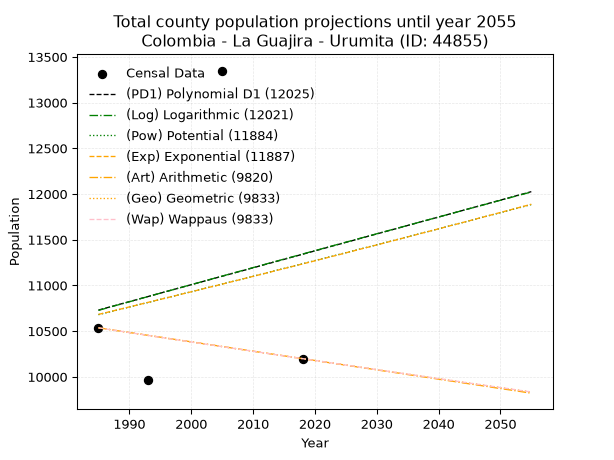
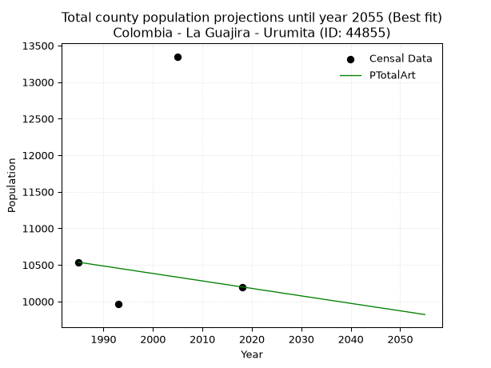
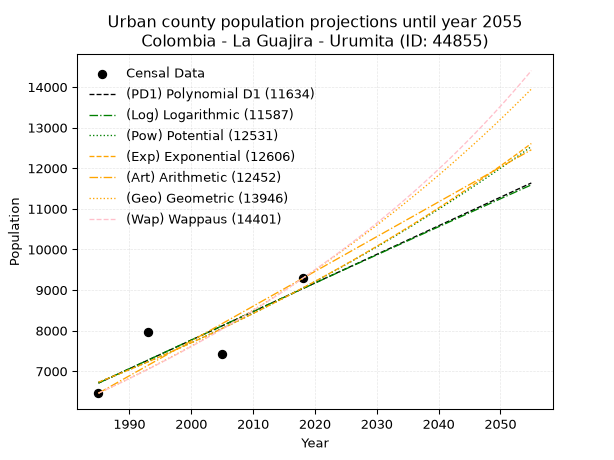
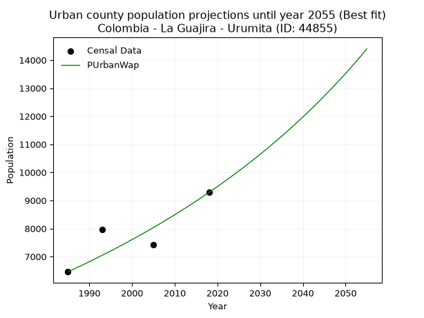
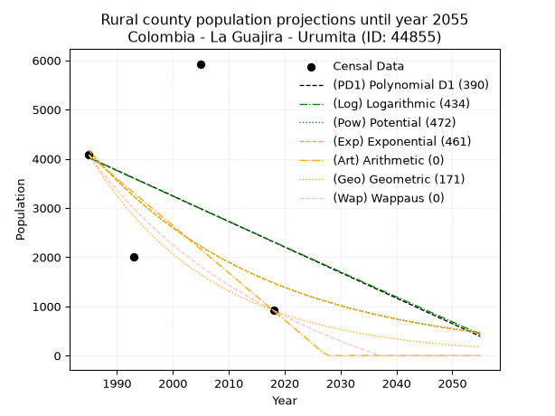
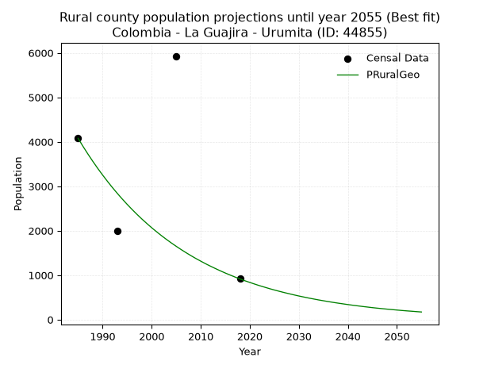

<div align="center">


</div>

# 📜 _“Population and Public Services Demand Projections (PPSD) until Year 2050 for Colombia - La Guajira - Urumita (ID: 44855)”_
Keywords: `population` `public-service` `projection` `lineal` `polynomial` `logarithmic` `potential` `exponential` `arithmetic` `geometric` `wappaus` `dane` `colombia` `south-america`

PPSD are analytical estimates used by governments and planners to anticipate future changes in population size, age distribution, and the resulting community needs for utilities, healthcare, education, and infrastructure as sizing future water treatment facilities, electrical grids, and road networks based on spatial growth.

<div align="center">

</img>

</div>


> **General running parameters**: • app_version: _v20260806_. • Python version: _3.14.7_. • Pandas version: _3.0.5_. • NumPy version: _2.5.1_. • Creates, save and include plots into reports (create_plot): _False_. • Projection until year: _2050_. • Process polynomial degree 2 and up: _False_. • Process Wappaus: _True_. • Process Wappaus: _True_. • Set negative values to zero: _True_. • Set infinite values to zero: _True_. • Drop dataset notes: _True_. 
<div align="center">

Dynamic map: [:earth_americas:Google](http://maps.google.com/maps?q=10.56016864,-73.0125067) [:earth_americas:OSM](https://www.openstreetmap.org/#map=18/10.56016864/-73.0125067&layers=P) [:earth_americas:Bing](https://www.bing.com/maps?cp=10.56016864~-73.0125067&lvl=18) [:earth_americas:Apple](https://maps.apple.com/frame?center=10.56016864%2C-73.0125067&span=0.003%2C0.006)

</div>


<div align="center">

```geojson
{
  "type": "Feature",
  "geometry": {
    "type": "Point", 
    "coordinates": [-73.0125067, 10.56016864]
  }, 
  "properties": {
    "Name": "Colombia - La Guajira - Urumita (ID: 44855)"
  }
}
```

</div>


## 0. Census Data (4 records)

Census data are official statistics collected by a government about the people and housing in a country. They usually include counts of total population, age, sex, race, income, education, and jobs.

📅Global census file: [Population.xlsx](../data/Population.xlsx)

| Source   |   Year |   CountryID | CountryName   |   StateID | StateName   |   CountyID | CountyName   |   PTotal |   PUrban |   PRural |
|:---------|-------:|------------:|:--------------|----------:|:------------|-----------:|:-------------|---------:|---------:|---------:|
| DANE     |   1985 |          57 | Colombia      |        44 | La Guajira  |      44855 | Urumita      |    10535 |     6457 |     4078 |
| DANE     |   1993 |          57 | Colombia      |        44 | La Guajira  |      44855 | Urumita      |     9964 |     7961 |     2003 |
| DANE     |   2005 |          57 | Colombia      |        44 | La Guajira  |      44855 | Urumita      |    13349 |     7421 |     5928 |
| DANE     |   2018 |          57 | Colombia      |        44 | La Guajira  |      44855 | Urumita      |    10198 |     9283 |      915 |

> 🔥Some records could had specific notes about the registered values or the corresponding urban or rural distribution.

📅[SUI-RUPS](https://www.datos.gov.co/Hacienda-y-Cr-dito-P-blico/Registro-nico-de-Prestadores-de-Servicios-P-blicos/4qkq-csdn/about_data) - Local public utility companies: [RUPS.csv](../data/RUPS.xlsx)

 | SERVICIO       | ESTADO    | NOMBRE                                | NIT         | DEPARTAMENTO_DOMICILIO   | MUNICIPIO_DOMICILIO   | DIRECCION       |   TELEFONO | EMAIL                | TIPO_PRESTADOR          | CLASIFICACION                 |
|:---------------|:----------|:--------------------------------------|:------------|:-------------------------|:----------------------|:----------------|-----------:|:---------------------|:------------------------|:------------------------------|
| ACUEDUCTO      | OPERATIVA | COOPERATIVA AGUAS DE URUMITA LTDA ESP | 900334020-6 | LA GUAJIRA               | URUMITA               | CALLE 14B 9A-16 |    7778276 | asesorasui@yahoo.com | ORGANIZACION AUTORIZADA | MENOR O IGUAL A 2500 USUARIOS |
| ALCANTARILLADO | OPERATIVA | COOPERATIVA AGUAS DE URUMITA LTDA ESP | 900334020-6 | LA GUAJIRA               | URUMITA               | CALLE 14B 9A-16 |    7778276 | asesorasui@yahoo.com | ORGANIZACION AUTORIZADA | MENOR O IGUAL A 2500 USUARIOS |

## 1. Total

### 1.1. Coefficients and Parameters

* (PD1) Polynomial Deg 1: 18.505820955441354, -26004.768366121563 (lineal)
* (Log) Logarithmic: 37363.66990312317, -272990.0543472989
* (Pow) Potential: 3.085002541180419, -6.145069346405694
* (Exp) Exponential: 0.0015277912635551737, 514.718160551431
* (Art) Arithmetic: Year diff. 2018 - 1985 = 33, Population diff. 10198 - 10535 = -337, Annual growth = -10.212121212121213
* (Geo) Geometric: Year diff. 2018 - 1985 = 33, Population diff. 10198 - 10535 = -337, Annual growth % = -0.0009847095406008144
* (Wap) Wappaus: i = -0.09851079160875138, Condition values only valid for < 200)

<sub>
Wappaus condition values: ['-0.00', '-0.10', '-0.20', '-0.30', '-0.39', '-0.49', '-0.59', '-0.69', '-0.79', '-0.89', '-0.99', '-1.08', '-1.18', '-1.28', '-1.38', '-1.48', '-1.58', '-1.67', '-1.77', '-1.87', '-1.97', '-2.07', '-2.17', '-2.27', '-2.36', '-2.46', '-2.56', '-2.66', '-2.76', '-2.86', '-2.96', '-3.05', '-3.15', '-3.25', '-3.35', '-3.45', '-3.55', '-3.64', '-3.74', '-3.84', '-3.94', '-4.04', '-4.14', '-4.24', '-4.33', '-4.43', '-4.53', '-4.63', '-4.73', '-4.83', '-4.93', '-5.02', '-5.12', '-5.22', '-5.32', '-5.42', '-5.52', '-5.62', '-5.71', '-5.81', '-5.91', '-6.01', '-6.11', '-6.21', '-6.30', '-6.40']
</sub>


### 1.2. Projected Dataset

|   Year |   CountyID |   PTotalPD1 |   PTotalLog |   PTotalPow |   PTotalExp |   PTotalArt |   PTotalGeo |   PTotalWap |
|-------:|-----------:|------------:|------------:|------------:|------------:|------------:|------------:|------------:|
|   1985 |      44855 |       10729 |       10726 |       10679 |       10682 |       10535 |       10535 |       10535 |
|   1986 |      44855 |       10748 |       10745 |       10696 |       10698 |       10525 |       10525 |       10525 |
|   1987 |      44855 |       10766 |       10764 |       10712 |       10714 |       10515 |       10514 |       10514 |
|   1988 |      44855 |       10785 |       10783 |       10729 |       10731 |       10504 |       10504 |       10504 |
|   1989 |      44855 |       10803 |       10801 |       10746 |       10747 |       10494 |       10494 |       10494 |
|   1990 |      44855 |       10822 |       10820 |       10762 |       10764 |       10484 |       10483 |       10483 |
|   1991 |      44855 |       10840 |       10839 |       10779 |       10780 |       10474 |       10473 |       10473 |
|   1992 |      44855 |       10859 |       10858 |       10796 |       10797 |       10464 |       10463 |       10463 |
|   1993 |      44855 |       10877 |       10877 |       10812 |       10813 |       10453 |       10452 |       10452 |
|   1994 |      44855 |       10896 |       10895 |       10829 |       10830 |       10443 |       10442 |       10442 |
|   1995 |      44855 |       10914 |       10914 |       10846 |       10846 |       10433 |       10432 |       10432 |
|   1996 |      44855 |       10933 |       10933 |       10863 |       10863 |       10423 |       10421 |       10421 |
|   1997 |      44855 |       10951 |       10951 |       10879 |       10879 |       10412 |       10411 |       10411 |
|   1998 |      44855 |       10970 |       10970 |       10896 |       10896 |       10402 |       10401 |       10401 |
|   1999 |      44855 |       10988 |       10989 |       10913 |       10913 |       10392 |       10391 |       10391 |
|   2000 |      44855 |       11007 |       11008 |       10930 |       10929 |       10382 |       10380 |       10380 |
|   2001 |      44855 |       11025 |       11026 |       10947 |       10946 |       10372 |       10370 |       10370 |
|   2002 |      44855 |       11044 |       11045 |       10964 |       10963 |       10361 |       10360 |       10360 |
|   2003 |      44855 |       11062 |       11064 |       10981 |       10980 |       10351 |       10350 |       10350 |
|   2004 |      44855 |       11081 |       11082 |       10997 |       10996 |       10341 |       10340 |       10340 |
|   2005 |      44855 |       11099 |       11101 |       11014 |       11013 |       10331 |       10329 |       10329 |
|   2006 |      44855 |       11118 |       11119 |       11031 |       11030 |       10321 |       10319 |       10319 |
|   2007 |      44855 |       11136 |       11138 |       11048 |       11047 |       10310 |       10309 |       10309 |
|   2008 |      44855 |       11155 |       11157 |       11065 |       11064 |       10300 |       10299 |       10299 |
|   2009 |      44855 |       11173 |       11175 |       11082 |       11081 |       10290 |       10289 |       10289 |
|   2010 |      44855 |       11192 |       11194 |       11099 |       11098 |       10280 |       10279 |       10279 |
|   2011 |      44855 |       11210 |       11212 |       11116 |       11115 |       10269 |       10269 |       10269 |
|   2012 |      44855 |       11229 |       11231 |       11133 |       11132 |       10259 |       10258 |       10258 |
|   2013 |      44855 |       11247 |       11250 |       11151 |       11149 |       10249 |       10248 |       10248 |
|   2014 |      44855 |       11266 |       11268 |       11168 |       11166 |       10239 |       10238 |       10238 |
|   2015 |      44855 |       11284 |       11287 |       11185 |       11183 |       10229 |       10228 |       10228 |
|   2016 |      44855 |       11303 |       11305 |       11202 |       11200 |       10218 |       10218 |       10218 |
|   2017 |      44855 |       11321 |       11324 |       11219 |       11217 |       10208 |       10208 |       10208 |
|   2018 |      44855 |       11340 |       11342 |       11236 |       11234 |       10198 |       10198 |       10198 |
|   2019 |      44855 |       11358 |       11361 |       11253 |       11251 |       10188 |       10188 |       10188 |
|   2020 |      44855 |       11377 |       11379 |       11271 |       11268 |       10178 |       10178 |       10178 |
|   2021 |      44855 |       11395 |       11398 |       11288 |       11286 |       10167 |       10168 |       10168 |
|   2022 |      44855 |       11414 |       11416 |       11305 |       11303 |       10157 |       10158 |       10158 |
|   2023 |      44855 |       11433 |       11435 |       11322 |       11320 |       10147 |       10148 |       10148 |
|   2024 |      44855 |       11451 |       11453 |       11340 |       11337 |       10137 |       10138 |       10138 |
|   2025 |      44855 |       11470 |       11472 |       11357 |       11355 |       10127 |       10128 |       10128 |
|   2026 |      44855 |       11488 |       11490 |       11374 |       11372 |       10116 |       10118 |       10118 |
|   2027 |      44855 |       11507 |       11509 |       11392 |       11390 |       10106 |       10108 |       10108 |
|   2028 |      44855 |       11525 |       11527 |       11409 |       11407 |       10096 |       10098 |       10098 |
|   2029 |      44855 |       11544 |       11545 |       11426 |       11424 |       10086 |       10088 |       10088 |
|   2030 |      44855 |       11562 |       11564 |       11444 |       11442 |       10075 |       10078 |       10078 |
|   2031 |      44855 |       11581 |       11582 |       11461 |       11459 |       10065 |       10068 |       10068 |
|   2032 |      44855 |       11599 |       11601 |       11478 |       11477 |       10055 |       10058 |       10058 |
|   2033 |      44855 |       11618 |       11619 |       11496 |       11494 |       10045 |       10048 |       10048 |
|   2034 |      44855 |       11636 |       11637 |       11513 |       11512 |       10035 |       10039 |       10038 |
|   2035 |      44855 |       11655 |       11656 |       11531 |       11530 |       10024 |       10029 |       10029 |
|   2036 |      44855 |       11673 |       11674 |       11548 |       11547 |       10014 |       10019 |       10019 |
|   2037 |      44855 |       11692 |       11692 |       11566 |       11565 |       10004 |       10009 |       10009 |
|   2038 |      44855 |       11710 |       11711 |       11583 |       11583 |        9994 |        9999 |        9999 |
|   2039 |      44855 |       11729 |       11729 |       11601 |       11600 |        9984 |        9989 |        9989 |
|   2040 |      44855 |       11747 |       11747 |       11618 |       11618 |        9973 |        9979 |        9979 |
|   2041 |      44855 |       11766 |       11766 |       11636 |       11636 |        9963 |        9970 |        9969 |
|   2042 |      44855 |       11784 |       11784 |       11654 |       11654 |        9953 |        9960 |        9960 |
|   2043 |      44855 |       11803 |       11802 |       11671 |       11671 |        9943 |        9950 |        9950 |
|   2044 |      44855 |       11821 |       11821 |       11689 |       11689 |        9932 |        9940 |        9940 |
|   2045 |      44855 |       11840 |       11839 |       11707 |       11707 |        9922 |        9930 |        9930 |
|   2046 |      44855 |       11858 |       11857 |       11724 |       11725 |        9912 |        9921 |        9920 |
|   2047 |      44855 |       11877 |       11875 |       11742 |       11743 |        9902 |        9911 |        9911 |
|   2048 |      44855 |       11895 |       11894 |       11760 |       11761 |        9892 |        9901 |        9901 |
|   2049 |      44855 |       11914 |       11912 |       11777 |       11779 |        9881 |        9891 |        9891 |
|   2050 |      44855 |       11932 |       11930 |       11795 |       11797 |        9871 |        9882 |        9881 |
<div align="center">

</img>

</div>


### 1.3. Best fit with absolute and relative error (%)

Relative error puts that difference into context by dividing the absolute error by the true value, creating a unitless ratio or percentage that shows the scale of the mistake.

Absolute and relative error

|   Year | Source   |   CountryID | CountryName   |   StateID | StateName   |   CountyID_x | CountyName   |   PTotal |   PUrban |   PRural |   CountyID_y |   PTotalPD1 |   PTotalLog |   PTotalPow |   PTotalExp |   PTotalArt |   PTotalGeo |   PTotalWap |   PTotalPD1AbsError |   PTotalLogAbsError |   PTotalPowAbsError |   PTotalExpAbsError |   PTotalArtAbsError |   PTotalGeoAbsError |   PTotalWapAbsError |   PTotalPD1RelError |   PTotalLogRelError |   PTotalPowRelError |   PTotalExpRelError |   PTotalArtRelError |   PTotalGeoRelError |   PTotalWapRelError |
|-------:|:---------|------------:|:--------------|----------:|:------------|-------------:|:-------------|---------:|---------:|---------:|-------------:|------------:|------------:|------------:|------------:|------------:|------------:|------------:|--------------------:|--------------------:|--------------------:|--------------------:|--------------------:|--------------------:|--------------------:|--------------------:|--------------------:|--------------------:|--------------------:|--------------------:|--------------------:|--------------------:|
|   1985 | DANE     |          57 | Colombia      |        44 | La Guajira  |        44855 | Urumita      |    10535 |     6457 |     4078 |        44855 |       10729 |       10726 |       10679 |       10682 |       10535 |       10535 |       10535 |                 194 |                 191 |                 144 |                 147 |                   0 |                   0 |                   0 |             1.84148 |             1.813   |             1.36687 |             1.39535 |             0       |             0       |             0       |
|   1993 | DANE     |          57 | Colombia      |        44 | La Guajira  |        44855 | Urumita      |     9964 |     7961 |     2003 |        44855 |       10877 |       10877 |       10812 |       10813 |       10453 |       10452 |       10452 |                 913 |                 913 |                 848 |                 849 |                 489 |                 488 |                 488 |             9.16299 |             9.16299 |             8.51064 |             8.52067 |             4.90767 |             4.89763 |             4.89763 |
|   2005 | DANE     |          57 | Colombia      |        44 | La Guajira  |        44855 | Urumita      |    13349 |     7421 |     5928 |        44855 |       11099 |       11101 |       11014 |       11013 |       10331 |       10329 |       10329 |                2250 |                2248 |                2335 |                2336 |                3018 |                3020 |                3020 |            16.8552  |            16.8402  |            17.4919  |            17.4994  |            22.6084  |            22.6234  |            22.6234  |
|   2018 | DANE     |          57 | Colombia      |        44 | La Guajira  |        44855 | Urumita      |    10198 |     9283 |      915 |        44855 |       11340 |       11342 |       11236 |       11234 |       10198 |       10198 |       10198 |                1142 |                1144 |                1038 |                1036 |                   0 |                   0 |                   0 |            11.1983  |            11.2179  |            10.1785  |            10.1589  |             0       |             0       |             0       |

Relative error mean

| Method    |   RelError | Best   |
|:----------|-----------:|:-------|
| PTotalPD1 |    9.76448 |        |
| PTotalLog |    9.75852 |        |
| PTotalPow |    9.38698 |        |
| PTotalExp |    9.39358 |        |
| PTotalArt |    6.87903 | True   |
| PTotalGeo |    6.88026 |        |
| PTotalWap |    6.88026 |        |

💙Best method: _**PTotalArt**_
<div align="center">

</img>

</div>


### 1.4. Fresh water supply demand in liters per capita per day (lpcd)

The fresh water supply demand typically ranges from 100 to 300 liters per capita per day (lpcd) for standard domestic and municipal planning, though absolute survival minimums set by the World Health Organization are as low as 7.5 to 20 liters per day, and total consumption in high-income nations can exceed 400 liters.

> `CZ`: Level in meters above the sea level (masl)<br> `WS`: Fresh water supply demand in liters per capita per day (lpcd or l/h/d)<br> `WSAll`: Zonal fresh water supply demand in liters per second (l/s)<br> `A`: Zonal area in square meters<br> `DP`: Population density (people/hectare or p/ha)

Reference values (RAS Colombia)

|    CZ |   WS |
|------:|-----:|
|  1000 |  120 |
|  2000 |  130 |
| 99999 |  140 |

County shapefile geometry properties and water supply values

|   CountyID |      ATotal |   CZTotal |   WSTotal |
|-----------:|------------:|----------:|----------:|
|      44855 | 2.45488e+08 |   1154.28 |       130 |

Projected values for best method: PTotalArt

|   CountyID |   Year |   PTotalArt |   DPTotal |   WSTotal |   WSTotalAll |
|-----------:|-------:|------------:|----------:|----------:|-------------:|
|      44855 |   1985 |       10535 |      0.43 |       130 |      15.8513 |
|      44855 |   1986 |       10525 |      0.43 |       130 |      15.8362 |
|      44855 |   1987 |       10515 |      0.43 |       130 |      15.8212 |
|      44855 |   1988 |       10504 |      0.43 |       130 |      15.8046 |
|      44855 |   1989 |       10494 |      0.43 |       130 |      15.7896 |
|      44855 |   1990 |       10484 |      0.43 |       130 |      15.7745 |
|      44855 |   1991 |       10474 |      0.43 |       130 |      15.7595 |
|      44855 |   1992 |       10464 |      0.43 |       130 |      15.7444 |
|      44855 |   1993 |       10453 |      0.43 |       130 |      15.7279 |
|      44855 |   1994 |       10443 |      0.43 |       130 |      15.7128 |
|      44855 |   1995 |       10433 |      0.42 |       130 |      15.6978 |
|      44855 |   1996 |       10423 |      0.42 |       130 |      15.6828 |
|      44855 |   1997 |       10412 |      0.42 |       130 |      15.6662 |
|      44855 |   1998 |       10402 |      0.42 |       130 |      15.6512 |
|      44855 |   1999 |       10392 |      0.42 |       130 |      15.6361 |
|      44855 |   2000 |       10382 |      0.42 |       130 |      15.6211 |
|      44855 |   2001 |       10372 |      0.42 |       130 |      15.606  |
|      44855 |   2002 |       10361 |      0.42 |       130 |      15.5895 |
|      44855 |   2003 |       10351 |      0.42 |       130 |      15.5744 |
|      44855 |   2004 |       10341 |      0.42 |       130 |      15.5594 |
|      44855 |   2005 |       10331 |      0.42 |       130 |      15.5443 |
|      44855 |   2006 |       10321 |      0.42 |       130 |      15.5293 |
|      44855 |   2007 |       10310 |      0.42 |       130 |      15.5127 |
|      44855 |   2008 |       10300 |      0.42 |       130 |      15.4977 |
|      44855 |   2009 |       10290 |      0.42 |       130 |      15.4826 |
|      44855 |   2010 |       10280 |      0.42 |       130 |      15.4676 |
|      44855 |   2011 |       10269 |      0.42 |       130 |      15.451  |
|      44855 |   2012 |       10259 |      0.42 |       130 |      15.436  |
|      44855 |   2013 |       10249 |      0.42 |       130 |      15.4209 |
|      44855 |   2014 |       10239 |      0.42 |       130 |      15.4059 |
|      44855 |   2015 |       10229 |      0.42 |       130 |      15.3909 |
|      44855 |   2016 |       10218 |      0.42 |       130 |      15.3743 |
|      44855 |   2017 |       10208 |      0.42 |       130 |      15.3593 |
|      44855 |   2018 |       10198 |      0.42 |       130 |      15.3442 |
|      44855 |   2019 |       10188 |      0.42 |       130 |      15.3292 |
|      44855 |   2020 |       10178 |      0.41 |       130 |      15.3141 |
|      44855 |   2021 |       10167 |      0.41 |       130 |      15.2976 |
|      44855 |   2022 |       10157 |      0.41 |       130 |      15.2825 |
|      44855 |   2023 |       10147 |      0.41 |       130 |      15.2675 |
|      44855 |   2024 |       10137 |      0.41 |       130 |      15.2524 |
|      44855 |   2025 |       10127 |      0.41 |       130 |      15.2374 |
|      44855 |   2026 |       10116 |      0.41 |       130 |      15.2208 |
|      44855 |   2027 |       10106 |      0.41 |       130 |      15.2058 |
|      44855 |   2028 |       10096 |      0.41 |       130 |      15.1907 |
|      44855 |   2029 |       10086 |      0.41 |       130 |      15.1757 |
|      44855 |   2030 |       10075 |      0.41 |       130 |      15.1591 |
|      44855 |   2031 |       10065 |      0.41 |       130 |      15.1441 |
|      44855 |   2032 |       10055 |      0.41 |       130 |      15.1291 |
|      44855 |   2033 |       10045 |      0.41 |       130 |      15.114  |
|      44855 |   2034 |       10035 |      0.41 |       130 |      15.099  |
|      44855 |   2035 |       10024 |      0.41 |       130 |      15.0824 |
|      44855 |   2036 |       10014 |      0.41 |       130 |      15.0674 |
|      44855 |   2037 |       10004 |      0.41 |       130 |      15.0523 |
|      44855 |   2038 |        9994 |      0.41 |       130 |      15.0373 |
|      44855 |   2039 |        9984 |      0.41 |       130 |      15.0222 |
|      44855 |   2040 |        9973 |      0.41 |       130 |      15.0057 |
|      44855 |   2041 |        9963 |      0.41 |       130 |      14.9906 |
|      44855 |   2042 |        9953 |      0.41 |       130 |      14.9756 |
|      44855 |   2043 |        9943 |      0.41 |       130 |      14.9605 |
|      44855 |   2044 |        9932 |      0.4  |       130 |      14.944  |
|      44855 |   2045 |        9922 |      0.4  |       130 |      14.9289 |
|      44855 |   2046 |        9912 |      0.4  |       130 |      14.9139 |
|      44855 |   2047 |        9902 |      0.4  |       130 |      14.8988 |
|      44855 |   2048 |        9892 |      0.4  |       130 |      14.8838 |
|      44855 |   2049 |        9881 |      0.4  |       130 |      14.8672 |
|      44855 |   2050 |        9871 |      0.4  |       130 |      14.8522 |

## 2. Urban

### 2.1. Coefficients and Parameters

* (PD1) Polynomial Deg 1: 70.39181051786315, -133020.71898835577 (lineal)
* (Log) Logarithmic: 140864.27934381575, -1062930.0161078349
* (Pow) Potential: 17.954466521102496, -55.38176830389284
* (Exp) Exponential: 0.008970671876774, 0.0001243044652720223
* (Art) Arithmetic: Year diff. 2018 - 1985 = 33, Population diff. 9283 - 6457 = 2826, Annual growth = 85.63636363636364
* (Geo) Geometric: Year diff. 2018 - 1985 = 33, Population diff. 9283 - 6457 = 2826, Annual growth % = 0.011061333884595292
* (Wap) Wappaus: i = 1.0881367679334641, Condition values only valid for < 200)

<sub>
Wappaus condition values: ['0.00', '1.09', '2.18', '3.26', '4.35', '5.44', '6.53', '7.62', '8.71', '9.79', '10.88', '11.97', '13.06', '14.15', '15.23', '16.32', '17.41', '18.50', '19.59', '20.67', '21.76', '22.85', '23.94', '25.03', '26.12', '27.20', '28.29', '29.38', '30.47', '31.56', '32.64', '33.73', '34.82', '35.91', '37.00', '38.08', '39.17', '40.26', '41.35', '42.44', '43.53', '44.61', '45.70', '46.79', '47.88', '48.97', '50.05', '51.14', '52.23', '53.32', '54.41', '55.49', '56.58', '57.67', '58.76', '59.85', '60.94', '62.02', '63.11', '64.20', '65.29', '66.38', '67.46', '68.55', '69.64', '70.73']
</sub>


### 2.2. Projected Dataset

|   Year |   CountyID |   PUrbanPD1 |   PUrbanLog |   PUrbanPow |   PUrbanExp |   PUrbanArt |   PUrbanGeo |   PUrbanWap |
|-------:|-----------:|------------:|------------:|------------:|------------:|------------:|------------:|------------:|
|   1985 |      44855 |        6707 |        6705 |        6726 |        6728 |        6457 |        6457 |        6457 |
|   1986 |      44855 |        6777 |        6776 |        6787 |        6788 |        6543 |        6528 |        6528 |
|   1987 |      44855 |        6848 |        6847 |        6849 |        6850 |        6628 |        6601 |        6599 |
|   1988 |      44855 |        6918 |        6918 |        6911 |        6911 |        6714 |        6674 |        6671 |
|   1989 |      44855 |        6989 |        6989 |        6974 |        6974 |        6800 |        6747 |        6744 |
|   1990 |      44855 |        7059 |        7060 |        7037 |        7036 |        6885 |        6822 |        6818 |
|   1991 |      44855 |        7129 |        7130 |        7101 |        7100 |        6971 |        6898 |        6893 |
|   1992 |      44855 |        7200 |        7201 |        7165 |        7164 |        7056 |        6974 |        6968 |
|   1993 |      44855 |        7270 |        7272 |        7230 |        7228 |        7142 |        7051 |        7045 |
|   1994 |      44855 |        7341 |        7342 |        7295 |        7294 |        7228 |        7129 |        7122 |
|   1995 |      44855 |        7411 |        7413 |        7361 |        7359 |        7313 |        7208 |        7200 |
|   1996 |      44855 |        7481 |        7484 |        7428 |        7426 |        7399 |        7288 |        7279 |
|   1997 |      44855 |        7552 |        7554 |        7495 |        7492 |        7485 |        7368 |        7359 |
|   1998 |      44855 |        7622 |        7625 |        7562 |        7560 |        7570 |        7450 |        7440 |
|   1999 |      44855 |        7693 |        7695 |        7631 |        7628 |        7656 |        7532 |        7522 |
|   2000 |      44855 |        7763 |        7766 |        7700 |        7697 |        7742 |        7615 |        7605 |
|   2001 |      44855 |        7833 |        7836 |        7769 |        7766 |        7827 |        7700 |        7688 |
|   2002 |      44855 |        7904 |        7906 |        7839 |        7836 |        7913 |        7785 |        7773 |
|   2003 |      44855 |        7974 |        7977 |        7910 |        7907 |        7998 |        7871 |        7859 |
|   2004 |      44855 |        8044 |        8047 |        7981 |        7978 |        8084 |        7958 |        7946 |
|   2005 |      44855 |        8115 |        8117 |        8053 |        8050 |        8170 |        8046 |        8034 |
|   2006 |      44855 |        8185 |        8188 |        8125 |        8122 |        8255 |        8135 |        8123 |
|   2007 |      44855 |        8256 |        8258 |        8198 |        8196 |        8341 |        8225 |        8213 |
|   2008 |      44855 |        8326 |        8328 |        8272 |        8270 |        8427 |        8316 |        8304 |
|   2009 |      44855 |        8396 |        8398 |        8346 |        8344 |        8512 |        8408 |        8397 |
|   2010 |      44855 |        8467 |        8468 |        8421 |        8419 |        8598 |        8501 |        8490 |
|   2011 |      44855 |        8537 |        8538 |        8496 |        8495 |        8684 |        8595 |        8585 |
|   2012 |      44855 |        8608 |        8608 |        8573 |        8572 |        8769 |        8690 |        8681 |
|   2013 |      44855 |        8678 |        8678 |        8649 |        8649 |        8855 |        8786 |        8778 |
|   2014 |      44855 |        8748 |        8748 |        8727 |        8727 |        8940 |        8883 |        8876 |
|   2015 |      44855 |        8819 |        8818 |        8805 |        8805 |        9026 |        8982 |        8976 |
|   2016 |      44855 |        8889 |        8888 |        8884 |        8885 |        9112 |        9081 |        9077 |
|   2017 |      44855 |        8960 |        8958 |        8963 |        8965 |        9197 |        9181 |        9179 |
|   2018 |      44855 |        9030 |        9028 |        9043 |        9046 |        9283 |        9283 |        9283 |
|   2019 |      44855 |        9100 |        9098 |        9124 |        9127 |        9369 |        9386 |        9388 |
|   2020 |      44855 |        9171 |        9167 |        9206 |        9209 |        9454 |        9490 |        9495 |
|   2021 |      44855 |        9241 |        9237 |        9288 |        9292 |        9540 |        9594 |        9602 |
|   2022 |      44855 |        9312 |        9307 |        9371 |        9376 |        9626 |        9701 |        9712 |
|   2023 |      44855 |        9382 |        9376 |        9454 |        9461 |        9711 |        9808 |        9823 |
|   2024 |      44855 |        9452 |        9446 |        9538 |        9546 |        9797 |        9916 |        9935 |
|   2025 |      44855 |        9523 |        9516 |        9623 |        9632 |        9882 |       10026 |       10049 |
|   2026 |      44855 |        9593 |        9585 |        9709 |        9719 |        9968 |       10137 |       10165 |
|   2027 |      44855 |        9663 |        9655 |        9796 |        9806 |       10054 |       10249 |       10282 |
|   2028 |      44855 |        9734 |        9724 |        9883 |        9895 |       10139 |       10362 |       10401 |
|   2029 |      44855 |        9804 |        9793 |        9970 |        9984 |       10225 |       10477 |       10521 |
|   2030 |      44855 |        9875 |        9863 |       10059 |       10074 |       10311 |       10593 |       10644 |
|   2031 |      44855 |        9945 |        9932 |       10148 |       10165 |       10396 |       10710 |       10768 |
|   2032 |      44855 |       10015 |       10002 |       10239 |       10256 |       10482 |       10829 |       10894 |
|   2033 |      44855 |       10086 |       10071 |       10329 |       10349 |       10568 |       10948 |       11022 |
|   2034 |      44855 |       10156 |       10140 |       10421 |       10442 |       10653 |       11070 |       11151 |
|   2035 |      44855 |       10227 |       10209 |       10513 |       10536 |       10739 |       11192 |       11283 |
|   2036 |      44855 |       10297 |       10279 |       10606 |       10631 |       10824 |       11316 |       11416 |
|   2037 |      44855 |       10367 |       10348 |       10700 |       10727 |       10910 |       11441 |       11552 |
|   2038 |      44855 |       10438 |       10417 |       10795 |       10823 |       10996 |       11567 |       11690 |
|   2039 |      44855 |       10508 |       10486 |       10891 |       10921 |       11081 |       11695 |       11830 |
|   2040 |      44855 |       10579 |       10555 |       10987 |       11019 |       11167 |       11825 |       11972 |
|   2041 |      44855 |       10649 |       10624 |       11084 |       11118 |       11253 |       11956 |       12116 |
|   2042 |      44855 |       10719 |       10693 |       11182 |       11219 |       11338 |       12088 |       12262 |
|   2043 |      44855 |       10790 |       10762 |       11281 |       11320 |       11424 |       12222 |       12411 |
|   2044 |      44855 |       10860 |       10831 |       11380 |       11422 |       11510 |       12357 |       12562 |
|   2045 |      44855 |       10931 |       10900 |       11481 |       11525 |       11595 |       12493 |       12716 |
|   2046 |      44855 |       11001 |       10969 |       11582 |       11629 |       11681 |       12632 |       12872 |
|   2047 |      44855 |       11071 |       11038 |       11684 |       11733 |       11766 |       12771 |       13031 |
|   2048 |      44855 |       11142 |       11106 |       11787 |       11839 |       11852 |       12913 |       13192 |
|   2049 |      44855 |       11212 |       11175 |       11891 |       11946 |       11938 |       13055 |       13356 |
|   2050 |      44855 |       11282 |       11244 |       11995 |       12053 |       12023 |       13200 |       13523 |
<div align="center">

</img>

</div>


### 2.3. Best fit with absolute and relative error (%)

Relative error puts that difference into context by dividing the absolute error by the true value, creating a unitless ratio or percentage that shows the scale of the mistake.

Absolute and relative error

|   Year | Source   |   CountryID | CountryName   |   StateID | StateName   |   CountyID_x | CountyName   |   PTotal |   PUrban |   PRural |   CountyID_y |   PUrbanPD1 |   PUrbanLog |   PUrbanPow |   PUrbanExp |   PUrbanArt |   PUrbanGeo |   PUrbanWap |   PUrbanPD1AbsError |   PUrbanLogAbsError |   PUrbanPowAbsError |   PUrbanExpAbsError |   PUrbanArtAbsError |   PUrbanGeoAbsError |   PUrbanWapAbsError |   PUrbanPD1RelError |   PUrbanLogRelError |   PUrbanPowRelError |   PUrbanExpRelError |   PUrbanArtRelError |   PUrbanGeoRelError |   PUrbanWapRelError |
|-------:|:---------|------------:|:--------------|----------:|:------------|-------------:|:-------------|---------:|---------:|---------:|-------------:|------------:|------------:|------------:|------------:|------------:|------------:|------------:|--------------------:|--------------------:|--------------------:|--------------------:|--------------------:|--------------------:|--------------------:|--------------------:|--------------------:|--------------------:|--------------------:|--------------------:|--------------------:|--------------------:|
|   1985 | DANE     |          57 | Colombia      |        44 | La Guajira  |        44855 | Urumita      |    10535 |     6457 |     4078 |        44855 |        6707 |        6705 |        6726 |        6728 |        6457 |        6457 |        6457 |                 250 |                 248 |                 269 |                 271 |                   0 |                   0 |                   0 |             3.87177 |             3.84079 |             4.16602 |             4.197   |              0      |             0       |             0       |
|   1993 | DANE     |          57 | Colombia      |        44 | La Guajira  |        44855 | Urumita      |     9964 |     7961 |     2003 |        44855 |        7270 |        7272 |        7230 |        7228 |        7142 |        7051 |        7045 |                 691 |                 689 |                 731 |                 733 |                 819 |                 910 |                 916 |             8.67981 |             8.65469 |             9.18226 |             9.20739 |             10.2877 |            11.4307  |            11.5061  |
|   2005 | DANE     |          57 | Colombia      |        44 | La Guajira  |        44855 | Urumita      |    13349 |     7421 |     5928 |        44855 |        8115 |        8117 |        8053 |        8050 |        8170 |        8046 |        8034 |                 694 |                 696 |                 632 |                 629 |                 749 |                 625 |                 613 |             9.35184 |             9.37879 |             8.51637 |             8.47595 |             10.093  |             8.42205 |             8.26034 |
|   2018 | DANE     |          57 | Colombia      |        44 | La Guajira  |        44855 | Urumita      |    10198 |     9283 |      915 |        44855 |        9030 |        9028 |        9043 |        9046 |        9283 |        9283 |        9283 |                 253 |                 255 |                 240 |                 237 |                   0 |                   0 |                   0 |             2.72541 |             2.74696 |             2.58537 |             2.55305 |              0      |             0       |             0       |

Relative error mean

| Method    |   RelError | Best   |
|:----------|-----------:|:-------|
| PUrbanPD1 |    6.15721 |        |
| PUrbanLog |    6.15531 |        |
| PUrbanPow |    6.11251 |        |
| PUrbanExp |    6.10835 |        |
| PUrbanArt |    5.09516 |        |
| PUrbanGeo |    4.96319 |        |
| PUrbanWap |    4.94161 | True   |

💙Best method: _**PUrbanWap**_
<div align="center">

</img>

</div>


### 2.4. Fresh water supply demand in liters per capita per day (lpcd)

The fresh water supply demand typically ranges from 100 to 300 liters per capita per day (lpcd) for standard domestic and municipal planning, though absolute survival minimums set by the World Health Organization are as low as 7.5 to 20 liters per day, and total consumption in high-income nations can exceed 400 liters.

> `CZ`: Level in meters above the sea level (masl)<br> `WS`: Fresh water supply demand in liters per capita per day (lpcd or l/h/d)<br> `WSAll`: Zonal fresh water supply demand in liters per second (l/s)<br> `A`: Zonal area in square meters<br> `DP`: Population density (people/hectare or p/ha)

Reference values (RAS Colombia)

|    CZ |   WS |
|------:|-----:|
|  1000 |  120 |
|  2000 |  130 |
| 99999 |  140 |

County shapefile geometry properties and water supply values

|   CountyID |      AUrban |   CZUrban |   WSUrban |
|-----------:|------------:|----------:|----------:|
|      44855 | 2.43308e+06 |   244.281 |       120 |

Projected values for best method: PUrbanWap

|   CountyID |   Year |   PUrbanWap |   DPUrban |   WSUrban |   WSUrbanAll |
|-----------:|-------:|------------:|----------:|----------:|-------------:|
|      44855 |   1985 |        6457 |     26.54 |       120 |      8.96806 |
|      44855 |   1986 |        6528 |     26.83 |       120 |      9.06667 |
|      44855 |   1987 |        6599 |     27.12 |       120 |      9.16528 |
|      44855 |   1988 |        6671 |     27.42 |       120 |      9.26528 |
|      44855 |   1989 |        6744 |     27.72 |       120 |      9.36667 |
|      44855 |   1990 |        6818 |     28.02 |       120 |      9.46944 |
|      44855 |   1991 |        6893 |     28.33 |       120 |      9.57361 |
|      44855 |   1992 |        6968 |     28.64 |       120 |      9.67778 |
|      44855 |   1993 |        7045 |     28.96 |       120 |      9.78472 |
|      44855 |   1994 |        7122 |     29.27 |       120 |      9.89167 |
|      44855 |   1995 |        7200 |     29.59 |       120 |     10       |
|      44855 |   1996 |        7279 |     29.92 |       120 |     10.1097  |
|      44855 |   1997 |        7359 |     30.25 |       120 |     10.2208  |
|      44855 |   1998 |        7440 |     30.58 |       120 |     10.3333  |
|      44855 |   1999 |        7522 |     30.92 |       120 |     10.4472  |
|      44855 |   2000 |        7605 |     31.26 |       120 |     10.5625  |
|      44855 |   2001 |        7688 |     31.6  |       120 |     10.6778  |
|      44855 |   2002 |        7773 |     31.95 |       120 |     10.7958  |
|      44855 |   2003 |        7859 |     32.3  |       120 |     10.9153  |
|      44855 |   2004 |        7946 |     32.66 |       120 |     11.0361  |
|      44855 |   2005 |        8034 |     33.02 |       120 |     11.1583  |
|      44855 |   2006 |        8123 |     33.39 |       120 |     11.2819  |
|      44855 |   2007 |        8213 |     33.76 |       120 |     11.4069  |
|      44855 |   2008 |        8304 |     34.13 |       120 |     11.5333  |
|      44855 |   2009 |        8397 |     34.51 |       120 |     11.6625  |
|      44855 |   2010 |        8490 |     34.89 |       120 |     11.7917  |
|      44855 |   2011 |        8585 |     35.28 |       120 |     11.9236  |
|      44855 |   2012 |        8681 |     35.68 |       120 |     12.0569  |
|      44855 |   2013 |        8778 |     36.08 |       120 |     12.1917  |
|      44855 |   2014 |        8876 |     36.48 |       120 |     12.3278  |
|      44855 |   2015 |        8976 |     36.89 |       120 |     12.4667  |
|      44855 |   2016 |        9077 |     37.31 |       120 |     12.6069  |
|      44855 |   2017 |        9179 |     37.73 |       120 |     12.7486  |
|      44855 |   2018 |        9283 |     38.15 |       120 |     12.8931  |
|      44855 |   2019 |        9388 |     38.58 |       120 |     13.0389  |
|      44855 |   2020 |        9495 |     39.02 |       120 |     13.1875  |
|      44855 |   2021 |        9602 |     39.46 |       120 |     13.3361  |
|      44855 |   2022 |        9712 |     39.92 |       120 |     13.4889  |
|      44855 |   2023 |        9823 |     40.37 |       120 |     13.6431  |
|      44855 |   2024 |        9935 |     40.83 |       120 |     13.7986  |
|      44855 |   2025 |       10049 |     41.3  |       120 |     13.9569  |
|      44855 |   2026 |       10165 |     41.78 |       120 |     14.1181  |
|      44855 |   2027 |       10282 |     42.26 |       120 |     14.2806  |
|      44855 |   2028 |       10401 |     42.75 |       120 |     14.4458  |
|      44855 |   2029 |       10521 |     43.24 |       120 |     14.6125  |
|      44855 |   2030 |       10644 |     43.75 |       120 |     14.7833  |
|      44855 |   2031 |       10768 |     44.26 |       120 |     14.9556  |
|      44855 |   2032 |       10894 |     44.77 |       120 |     15.1306  |
|      44855 |   2033 |       11022 |     45.3  |       120 |     15.3083  |
|      44855 |   2034 |       11151 |     45.83 |       120 |     15.4875  |
|      44855 |   2035 |       11283 |     46.37 |       120 |     15.6708  |
|      44855 |   2036 |       11416 |     46.92 |       120 |     15.8556  |
|      44855 |   2037 |       11552 |     47.48 |       120 |     16.0444  |
|      44855 |   2038 |       11690 |     48.05 |       120 |     16.2361  |
|      44855 |   2039 |       11830 |     48.62 |       120 |     16.4306  |
|      44855 |   2040 |       11972 |     49.21 |       120 |     16.6278  |
|      44855 |   2041 |       12116 |     49.8  |       120 |     16.8278  |
|      44855 |   2042 |       12262 |     50.4  |       120 |     17.0306  |
|      44855 |   2043 |       12411 |     51.01 |       120 |     17.2375  |
|      44855 |   2044 |       12562 |     51.63 |       120 |     17.4472  |
|      44855 |   2045 |       12716 |     52.26 |       120 |     17.6611  |
|      44855 |   2046 |       12872 |     52.9  |       120 |     17.8778  |
|      44855 |   2047 |       13031 |     53.56 |       120 |     18.0986  |
|      44855 |   2048 |       13192 |     54.22 |       120 |     18.3222  |
|      44855 |   2049 |       13356 |     54.89 |       120 |     18.55    |
|      44855 |   2050 |       13523 |     55.58 |       120 |     18.7819  |

## 3. Rural

### 3.1. Coefficients and Parameters

* (PD1) Polynomial Deg 1: -51.88598956242184, 107015.95062223429 (lineal)
* (Log) Logarithmic: -103500.6094406924, 789939.9617605343
* (Pow) Potential: -62.854168118117634, 210.89799000471655
* (Exp) Exponential: -0.03146515774644706, 5.563132630060486e+30
* (Art) Arithmetic: Year diff. 2018 - 1985 = 33, Population diff. 915 - 4078 = -3163, Annual growth = -95.84848484848484
* (Geo) Geometric: Year diff. 2018 - 1985 = 33, Population diff. 915 - 4078 = -3163, Annual growth % = -0.04427589104636709
* (Wap) Wappaus: i = -3.8393144341472, Condition values only valid for < 200)

<sub>
Wappaus condition values: ['-0.00', '-3.84', '-7.68', '-11.52', '-15.36', '-19.20', '-23.04', '-26.88', '-30.71', '-34.55', '-38.39', '-42.23', '-46.07', '-49.91', '-53.75', '-57.59', '-61.43', '-65.27', '-69.11', '-72.95', '-76.79', '-80.63', '-84.46', '-88.30', '-92.14', '-95.98', '-99.82', '-103.66', '-107.50', '-111.34', '-115.18', '-119.02', '-122.86', '-126.70', '-130.54', '-134.38', '-138.22', '-142.05', '-145.89', '-149.73', '-153.57', '-157.41', '-161.25', '-165.09', '-168.93', '-172.77', '-176.61', '-180.45', '-184.29', '-188.13', '-191.97', '-195.81', '-199.64', '-203.48', '-207.32', '-211.16', '-215.00', '-218.84', '-222.68', '-226.52', '-230.36', '-234.20', '-238.04', '-241.88', '-245.72', '-249.56']
</sub>


### 3.2. Projected Dataset

|   Year |   CountyID |   PRuralPD1 |   PRuralLog |   PRuralPow |   PRuralExp |   PRuralArt |   PRuralGeo |   PRuralWap |
|-------:|-----------:|------------:|------------:|------------:|------------:|------------:|------------:|------------:|
|   1985 |      44855 |        4022 |        4021 |        4169 |        4169 |        4078 |        4078 |        4078 |
|   1986 |      44855 |        3970 |        3969 |        4039 |        4040 |        3982 |        3897 |        3924 |
|   1987 |      44855 |        3918 |        3917 |        3913 |        3915 |        3886 |        3725 |        3776 |
|   1988 |      44855 |        3867 |        3865 |        3791 |        3793 |        3790 |        3560 |        3634 |
|   1989 |      44855 |        3815 |        3813 |        3673 |        3676 |        3695 |        3402 |        3496 |
|   1990 |      44855 |        3763 |        3761 |        3559 |        3562 |        3599 |        3252 |        3364 |
|   1991 |      44855 |        3711 |        3709 |        3448 |        3452 |        3503 |        3108 |        3236 |
|   1992 |      44855 |        3659 |        3657 |        3341 |        3345 |        3407 |        2970 |        3112 |
|   1993 |      44855 |        3607 |        3605 |        3237 |        3241 |        3311 |        2839 |        2992 |
|   1994 |      44855 |        3555 |        3553 |        3137 |        3141 |        3215 |        2713 |        2876 |
|   1995 |      44855 |        3503 |        3501 |        3040 |        3043 |        3120 |        2593 |        2764 |
|   1996 |      44855 |        3452 |        3449 |        2945 |        2949 |        3024 |        2478 |        2656 |
|   1997 |      44855 |        3400 |        3397 |        2854 |        2858 |        2928 |        2368 |        2551 |
|   1998 |      44855 |        3348 |        3345 |        2766 |        2769 |        2832 |        2263 |        2449 |
|   1999 |      44855 |        3296 |        3294 |        2680 |        2683 |        2736 |        2163 |        2350 |
|   2000 |      44855 |        3244 |        3242 |        2597 |        2600 |        2640 |        2067 |        2255 |
|   2001 |      44855 |        3192 |        3190 |        2517 |        2520 |        2544 |        1976 |        2162 |
|   2002 |      44855 |        3140 |        3138 |        2439 |        2442 |        2449 |        1888 |        2071 |
|   2003 |      44855 |        3088 |        3087 |        2364 |        2366 |        2353 |        1805 |        1984 |
|   2004 |      44855 |        3036 |        3035 |        2291 |        2293 |        2257 |        1725 |        1898 |
|   2005 |      44855 |        2985 |        2983 |        2220 |        2222 |        2161 |        1649 |        1815 |
|   2006 |      44855 |        2933 |        2932 |        2151 |        2153 |        2065 |        1576 |        1735 |
|   2007 |      44855 |        2881 |        2880 |        2085 |        2086 |        1969 |        1506 |        1656 |
|   2008 |      44855 |        2829 |        2829 |        2021 |        2022 |        1873 |        1439 |        1580 |
|   2009 |      44855 |        2777 |        2777 |        1959 |        1959 |        1778 |        1375 |        1506 |
|   2010 |      44855 |        2725 |        2726 |        1898 |        1898 |        1682 |        1315 |        1433 |
|   2011 |      44855 |        2673 |        2674 |        1840 |        1840 |        1586 |        1256 |        1363 |
|   2012 |      44855 |        2621 |        2623 |        1783 |        1783 |        1490 |        1201 |        1294 |
|   2013 |      44855 |        2569 |        2571 |        1728 |        1727 |        1394 |        1148 |        1227 |
|   2014 |      44855 |        2518 |        2520 |        1675 |        1674 |        1298 |        1097 |        1161 |
|   2015 |      44855 |        2466 |        2469 |        1624 |        1622 |        1203 |        1048 |        1097 |
|   2016 |      44855 |        2414 |        2417 |        1574 |        1572 |        1107 |        1002 |        1035 |
|   2017 |      44855 |        2362 |        2366 |        1526 |        1523 |        1011 |         957 |         974 |
|   2018 |      44855 |        2310 |        2315 |        1479 |        1476 |         915 |         915 |         915 |
|   2019 |      44855 |        2258 |        2263 |        1433 |        1430 |         819 |         874 |         857 |
|   2020 |      44855 |        2206 |        2212 |        1390 |        1386 |         723 |         836 |         800 |
|   2021 |      44855 |        2154 |        2161 |        1347 |        1343 |         627 |         799 |         745 |
|   2022 |      44855 |        2102 |        2110 |        1306 |        1301 |         532 |         763 |         691 |
|   2023 |      44855 |        2051 |        2058 |        1266 |        1261 |         436 |         730 |         638 |
|   2024 |      44855 |        1999 |        2007 |        1227 |        1222 |         340 |         697 |         586 |
|   2025 |      44855 |        1947 |        1956 |        1190 |        1184 |         244 |         666 |         535 |
|   2026 |      44855 |        1895 |        1905 |        1153 |        1147 |         148 |         637 |         486 |
|   2027 |      44855 |        1843 |        1854 |        1118 |        1112 |          52 |         609 |         437 |
|   2028 |      44855 |        1791 |        1803 |        1084 |        1077 |           0 |         582 |         390 |
|   2029 |      44855 |        1739 |        1752 |        1051 |        1044 |           0 |         556 |         343 |
|   2030 |      44855 |        1687 |        1701 |        1019 |        1012 |           0 |         531 |         298 |
|   2031 |      44855 |        1636 |        1650 |         988 |         980 |           0 |         508 |         253 |
|   2032 |      44855 |        1584 |        1599 |         958 |         950 |           0 |         485 |         210 |
|   2033 |      44855 |        1532 |        1548 |         928 |         921 |           0 |         464 |         167 |
|   2034 |      44855 |        1480 |        1497 |         900 |         892 |           0 |         443 |         125 |
|   2035 |      44855 |        1428 |        1446 |         873 |         864 |           0 |         424 |          84 |
|   2036 |      44855 |        1376 |        1395 |         846 |         838 |           0 |         405 |          43 |
|   2037 |      44855 |        1324 |        1345 |         821 |         812 |           0 |         387 |           4 |
|   2038 |      44855 |        1272 |        1294 |         796 |         787 |           0 |         370 |           0 |
|   2039 |      44855 |        1220 |        1243 |         771 |         762 |           0 |         354 |           0 |
|   2040 |      44855 |        1169 |        1192 |         748 |         739 |           0 |         338 |           0 |
|   2041 |      44855 |        1117 |        1142 |         725 |         716 |           0 |         323 |           0 |
|   2042 |      44855 |        1065 |        1091 |         703 |         694 |           0 |         309 |           0 |
|   2043 |      44855 |        1013 |        1040 |         682 |         672 |           0 |         295 |           0 |
|   2044 |      44855 |         961 |         990 |         661 |         651 |           0 |         282 |           0 |
|   2045 |      44855 |         909 |         939 |         641 |         631 |           0 |         269 |           0 |
|   2046 |      44855 |         857 |         888 |         622 |         612 |           0 |         257 |           0 |
|   2047 |      44855 |         805 |         838 |         603 |         593 |           0 |         246 |           0 |
|   2048 |      44855 |         753 |         787 |         585 |         574 |           0 |         235 |           0 |
|   2049 |      44855 |         702 |         737 |         567 |         556 |           0 |         225 |           0 |
|   2050 |      44855 |         650 |         686 |         550 |         539 |           0 |         215 |           0 |
<div align="center">

</img>

</div>


### 3.3. Best fit with absolute and relative error (%)

Relative error puts that difference into context by dividing the absolute error by the true value, creating a unitless ratio or percentage that shows the scale of the mistake.

Absolute and relative error

|   Year | Source   |   CountryID | CountryName   |   StateID | StateName   |   CountyID_x | CountyName   |   PTotal |   PUrban |   PRural |   CountyID_y |   PRuralPD1 |   PRuralLog |   PRuralPow |   PRuralExp |   PRuralArt |   PRuralGeo |   PRuralWap |   PRuralPD1AbsError |   PRuralLogAbsError |   PRuralPowAbsError |   PRuralExpAbsError |   PRuralArtAbsError |   PRuralGeoAbsError |   PRuralWapAbsError |   PRuralPD1RelError |   PRuralLogRelError |   PRuralPowRelError |   PRuralExpRelError |   PRuralArtRelError |   PRuralGeoRelError |   PRuralWapRelError |
|-------:|:---------|------------:|:--------------|----------:|:------------|-------------:|:-------------|---------:|---------:|---------:|-------------:|------------:|------------:|------------:|------------:|------------:|------------:|------------:|--------------------:|--------------------:|--------------------:|--------------------:|--------------------:|--------------------:|--------------------:|--------------------:|--------------------:|--------------------:|--------------------:|--------------------:|--------------------:|--------------------:|
|   1985 | DANE     |          57 | Colombia      |        44 | La Guajira  |        44855 | Urumita      |    10535 |     6457 |     4078 |        44855 |        4022 |        4021 |        4169 |        4169 |        4078 |        4078 |        4078 |                  56 |                  57 |                  91 |                  91 |                   0 |                   0 |                   0 |             1.37322 |             1.39774 |             2.23149 |             2.23149 |              0      |              0      |              0      |
|   1993 | DANE     |          57 | Colombia      |        44 | La Guajira  |        44855 | Urumita      |     9964 |     7961 |     2003 |        44855 |        3607 |        3605 |        3237 |        3241 |        3311 |        2839 |        2992 |                1604 |                1602 |                1234 |                1238 |                1308 |                 836 |                 989 |            80.0799  |            79.98    |            61.6076  |            61.8073  |             65.302  |             41.7374 |             49.3759 |
|   2005 | DANE     |          57 | Colombia      |        44 | La Guajira  |        44855 | Urumita      |    13349 |     7421 |     5928 |        44855 |        2985 |        2983 |        2220 |        2222 |        2161 |        1649 |        1815 |                2943 |                2945 |                3708 |                3706 |                3767 |                4279 |                4113 |            49.6457  |            49.6795  |            62.5506  |            62.5169  |             63.5459 |             72.1829 |             69.3826 |
|   2018 | DANE     |          57 | Colombia      |        44 | La Guajira  |        44855 | Urumita      |    10198 |     9283 |      915 |        44855 |        2310 |        2315 |        1479 |        1476 |         915 |         915 |         915 |                1395 |                1400 |                 564 |                 561 |                   0 |                   0 |                   0 |           152.459   |           153.005   |            61.6393  |            61.3115  |              0      |              0      |              0      |

Relative error mean

| Method    |   RelError | Best   |
|:----------|-----------:|:-------|
| PRuralPD1 |    70.8895 |        |
| PRuralLog |    71.0157 |        |
| PRuralPow |    47.0073 |        |
| PRuralExp |    46.9668 |        |
| PRuralArt |    32.212  |        |
| PRuralGeo |    28.4801 | True   |
| PRuralWap |    29.6896 |        |

💙Best method: _**PRuralGeo**_
<div align="center">

</img>

</div>


### 3.4. Fresh water supply demand in liters per capita per day (lpcd)

The fresh water supply demand typically ranges from 100 to 300 liters per capita per day (lpcd) for standard domestic and municipal planning, though absolute survival minimums set by the World Health Organization are as low as 7.5 to 20 liters per day, and total consumption in high-income nations can exceed 400 liters.

> `CZ`: Level in meters above the sea level (masl)<br> `WS`: Fresh water supply demand in liters per capita per day (lpcd or l/h/d)<br> `WSAll`: Zonal fresh water supply demand in liters per second (l/s)<br> `A`: Zonal area in square meters<br> `DP`: Population density (people/hectare or p/ha)

Reference values (RAS Colombia)

|    CZ |   WS |
|------:|-----:|
|  1000 |  120 |
|  2000 |  130 |
| 99999 |  140 |

County shapefile geometry properties and water supply values

|   CountyID |      ARural |   CZRural |   WSRural |
|-----------:|------------:|----------:|----------:|
|      44855 | 2.43055e+08 |   1163.04 |       130 |

Projected values for best method: PRuralGeo

|   CountyID |   Year |   PRuralGeo |   DPRural |   WSRural |   WSRuralAll |
|-----------:|-------:|------------:|----------:|----------:|-------------:|
|      44855 |   1985 |        4078 |      0.17 |       130 |     6.13588  |
|      44855 |   1986 |        3897 |      0.16 |       130 |     5.86354  |
|      44855 |   1987 |        3725 |      0.15 |       130 |     5.60475  |
|      44855 |   1988 |        3560 |      0.15 |       130 |     5.35648  |
|      44855 |   1989 |        3402 |      0.14 |       130 |     5.11875  |
|      44855 |   1990 |        3252 |      0.13 |       130 |     4.89306  |
|      44855 |   1991 |        3108 |      0.13 |       130 |     4.67639  |
|      44855 |   1992 |        2970 |      0.12 |       130 |     4.46875  |
|      44855 |   1993 |        2839 |      0.12 |       130 |     4.27164  |
|      44855 |   1994 |        2713 |      0.11 |       130 |     4.08206  |
|      44855 |   1995 |        2593 |      0.11 |       130 |     3.9015   |
|      44855 |   1996 |        2478 |      0.1  |       130 |     3.72847  |
|      44855 |   1997 |        2368 |      0.1  |       130 |     3.56296  |
|      44855 |   1998 |        2263 |      0.09 |       130 |     3.40498  |
|      44855 |   1999 |        2163 |      0.09 |       130 |     3.25451  |
|      44855 |   2000 |        2067 |      0.09 |       130 |     3.11007  |
|      44855 |   2001 |        1976 |      0.08 |       130 |     2.97315  |
|      44855 |   2002 |        1888 |      0.08 |       130 |     2.84074  |
|      44855 |   2003 |        1805 |      0.07 |       130 |     2.71586  |
|      44855 |   2004 |        1725 |      0.07 |       130 |     2.59549  |
|      44855 |   2005 |        1649 |      0.07 |       130 |     2.48113  |
|      44855 |   2006 |        1576 |      0.06 |       130 |     2.3713   |
|      44855 |   2007 |        1506 |      0.06 |       130 |     2.26597  |
|      44855 |   2008 |        1439 |      0.06 |       130 |     2.16516  |
|      44855 |   2009 |        1375 |      0.06 |       130 |     2.06887  |
|      44855 |   2010 |        1315 |      0.05 |       130 |     1.97859  |
|      44855 |   2011 |        1256 |      0.05 |       130 |     1.88981  |
|      44855 |   2012 |        1201 |      0.05 |       130 |     1.80706  |
|      44855 |   2013 |        1148 |      0.05 |       130 |     1.72731  |
|      44855 |   2014 |        1097 |      0.05 |       130 |     1.65058  |
|      44855 |   2015 |        1048 |      0.04 |       130 |     1.57685  |
|      44855 |   2016 |        1002 |      0.04 |       130 |     1.50764  |
|      44855 |   2017 |         957 |      0.04 |       130 |     1.43993  |
|      44855 |   2018 |         915 |      0.04 |       130 |     1.37674  |
|      44855 |   2019 |         874 |      0.04 |       130 |     1.31505  |
|      44855 |   2020 |         836 |      0.03 |       130 |     1.25787  |
|      44855 |   2021 |         799 |      0.03 |       130 |     1.2022   |
|      44855 |   2022 |         763 |      0.03 |       130 |     1.14803  |
|      44855 |   2023 |         730 |      0.03 |       130 |     1.09838  |
|      44855 |   2024 |         697 |      0.03 |       130 |     1.04873  |
|      44855 |   2025 |         666 |      0.03 |       130 |     1.00208  |
|      44855 |   2026 |         637 |      0.03 |       130 |     0.958449 |
|      44855 |   2027 |         609 |      0.03 |       130 |     0.916319 |
|      44855 |   2028 |         582 |      0.02 |       130 |     0.875694 |
|      44855 |   2029 |         556 |      0.02 |       130 |     0.836574 |
|      44855 |   2030 |         531 |      0.02 |       130 |     0.798958 |
|      44855 |   2031 |         508 |      0.02 |       130 |     0.764352 |
|      44855 |   2032 |         485 |      0.02 |       130 |     0.729745 |
|      44855 |   2033 |         464 |      0.02 |       130 |     0.698148 |
|      44855 |   2034 |         443 |      0.02 |       130 |     0.666551 |
|      44855 |   2035 |         424 |      0.02 |       130 |     0.637963 |
|      44855 |   2036 |         405 |      0.02 |       130 |     0.609375 |
|      44855 |   2037 |         387 |      0.02 |       130 |     0.582292 |
|      44855 |   2038 |         370 |      0.02 |       130 |     0.556713 |
|      44855 |   2039 |         354 |      0.01 |       130 |     0.532639 |
|      44855 |   2040 |         338 |      0.01 |       130 |     0.508565 |
|      44855 |   2041 |         323 |      0.01 |       130 |     0.485995 |
|      44855 |   2042 |         309 |      0.01 |       130 |     0.464931 |
|      44855 |   2043 |         295 |      0.01 |       130 |     0.443866 |
|      44855 |   2044 |         282 |      0.01 |       130 |     0.424306 |
|      44855 |   2045 |         269 |      0.01 |       130 |     0.404745 |
|      44855 |   2046 |         257 |      0.01 |       130 |     0.38669  |
|      44855 |   2047 |         246 |      0.01 |       130 |     0.370139 |
|      44855 |   2048 |         235 |      0.01 |       130 |     0.353588 |
|      44855 |   2049 |         225 |      0.01 |       130 |     0.338542 |
|      44855 |   2050 |         215 |      0.01 |       130 |     0.323495 |

#

<div align="center"><br><sub>Share this research</sub></div><br>

<sub>**APPS & TOOLS & CONTENT DISCLAIMER**: • NO WARRANTY - This content and software is provided by <a href="https://github.com/rcfdtools" target="_blank">github.com/rcfdtools</a> "as is", without any express or implied warranty, including warranties of merchantability, fitness for a particular purpose, or non-infringement. There is no guarantee that the software will be error-free or operate without interruption. • LIMITATION OF LIABILITY - Neither the authors nor copyright holders will be liable for claims or damages arising from the software or its use. You are responsible for determining if the software is appropriate for your use and assume all associated risks, including errors, legal compliance, and data loss. • NO PROFESSIONAL ADVICE - The software provides general information and does not offer professional advice. It should not replace consultation with professional advisors. [Clauses and global license for rcfdtools use.](https://github.com/rcfdtools/rcfdtools/blob/main/LICENSE.md)</sub>

| [:house: Home](Readme.md)  | [:beginner: Help / Collab](https://github.com/rcfdtools/R.HydroTools/discussions/31) |
|----------------------------|-------------------------------------------------------------------------------------------|