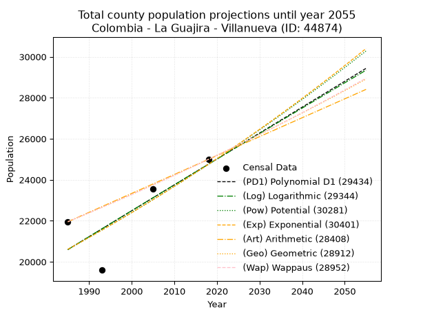
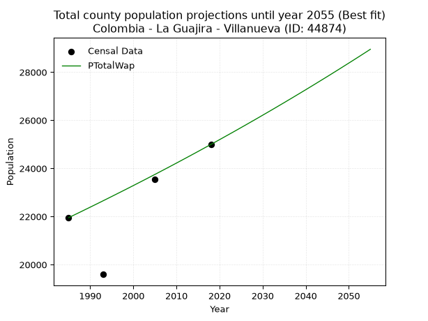
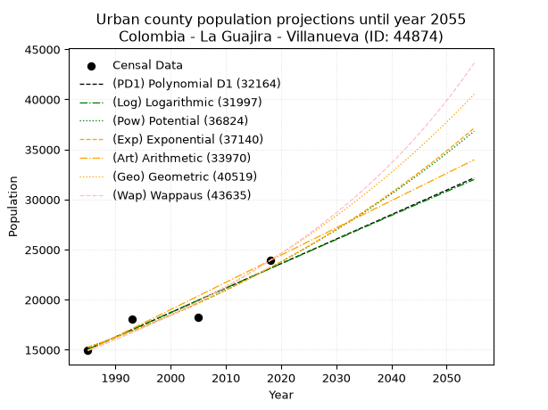
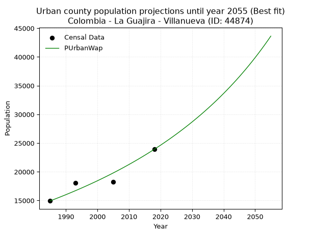
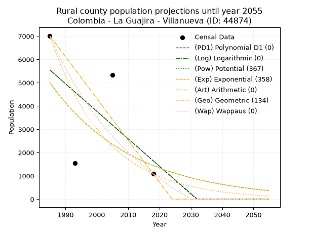
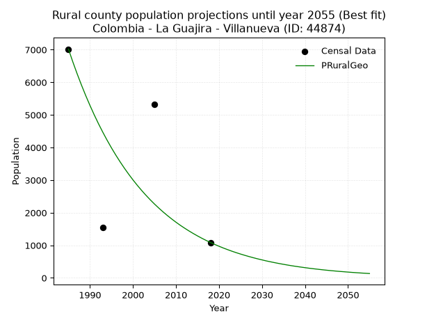

<div align="center">


</div>

# _“Population and Public Services Demand Projections (PPSD) until Year 2050 for Colombia - La Guajira - Villanueva (ID: 44874)”_
Keywords: `population` `public-service` `projection` `lineal` `polynomial` `logarithmic` `potential` `exponential` `arithmetic` `geometric` `wappaus` `dane` `colombia` `south-america`

PPSD are analytical estimates used by governments and planners to anticipate future changes in population size, age distribution, and the resulting community needs for utilities, healthcare, education, and infrastructure as sizing future water treatment facilities, electrical grids, and road networks based on spatial growth.

> **General running parameters**: • app_version: _v20260806_. • Python version: _3.14.7_. • Pandas version: _3.0.5_. • NumPy version: _2.5.1_. • Creates, save and include plots into reports (create_plot): _False_. • Projection until year: _2050_. • Process polynomial degree 2 and up: _False_. • Process Wappaus: _True_. • Process Wappaus: _True_. • Set negative values to zero: _True_. • Set infinite values to zero: _True_. • Drop dataset notes: _True_. 
<div align="center">

Dynamic map: [:earth_americas:Google](http://maps.google.com/maps?q=10.60877376,-72.9775828) [:earth_americas:OSM](https://www.openstreetmap.org/#map=18/10.60877376/-72.9775828&layers=P) [:earth_americas:Bing](https://www.bing.com/maps?cp=10.60877376~-72.9775828&lvl=18) [:earth_americas:Apple](https://maps.apple.com/frame?center=10.60877376%2C-72.9775828&span=0.003%2C0.006)

</div>


<div align="center">

```geojson
{
  "type": "Feature",
  "geometry": {
    "type": "Point", 
    "coordinates": [-72.9775828, 10.60877376]
  }, 
  "properties": {
    "Name": "Colombia - La Guajira - Villanueva (ID: 44874)"
  }
}
```

</div>


## 0. Census Data (4 records)

Census data are official statistics collected by a government about the people and housing in a country. They usually include counts of total population, age, sex, race, income, education, and jobs.

📅Global census file: [Population.xlsx](../data/Population.xlsx)

| Source   |   Year |   CountryID | CountryName   |   StateID | StateName   |   CountyID | CountyName   |   PTotal |   PUrban |   PRural |
|:---------|-------:|------------:|:--------------|----------:|:------------|-----------:|:-------------|---------:|---------:|---------:|
| DANE     |   1985 |          57 | Colombia      |        44 | La Guajira  |      44874 | Villanueva   |    21953 |    14936 |     7017 |
| DANE     |   1993 |          57 | Colombia      |        44 | La Guajira  |      44874 | Villanueva   |    19595 |    18045 |     1550 |
| DANE     |   2005 |          57 | Colombia      |        44 | La Guajira  |      44874 | Villanueva   |    23538 |    18211 |     5327 |
| DANE     |   2018 |          57 | Colombia      |        44 | La Guajira  |      44874 | Villanueva   |    24996 |    23909 |     1087 |

> 🔥Some records could had specific notes about the registered values or the corresponding urban or rural distribution.

## 1. Total

### 1.1. Coefficients and Parameters

* (PD1) Polynomial Deg 1: 126.27458851866604, -230060.24568446173 (lineal)
* (Log) Logarithmic: 252517.2171700899, -1896864.8912558355
* (Pow) Potential: 11.107430501563671, -32.31565063676181
* (Exp) Exponential: 0.005554571923144884, 0.3354106543040105
* (Art) Arithmetic: Year diff. 2018 - 1985 = 33, Population diff. 24996 - 21953 = 3043, Annual growth = 92.21212121212122
* (Geo) Geometric: Year diff. 2018 - 1985 = 33, Population diff. 24996 - 21953 = 3043, Annual growth % = 0.003941444342565159
* (Wap) Wappaus: i = 0.39281825475354626, Condition values only valid for < 200)

<sub>
Wappaus condition values: ['0.00', '0.39', '0.79', '1.18', '1.57', '1.96', '2.36', '2.75', '3.14', '3.54', '3.93', '4.32', '4.71', '5.11', '5.50', '5.89', '6.29', '6.68', '7.07', '7.46', '7.86', '8.25', '8.64', '9.03', '9.43', '9.82', '10.21', '10.61', '11.00', '11.39', '11.78', '12.18', '12.57', '12.96', '13.36', '13.75', '14.14', '14.53', '14.93', '15.32', '15.71', '16.11', '16.50', '16.89', '17.28', '17.68', '18.07', '18.46', '18.86', '19.25', '19.64', '20.03', '20.43', '20.82', '21.21', '21.61', '22.00', '22.39', '22.78', '23.18', '23.57', '23.96', '24.35', '24.75', '25.14', '25.53']
</sub>


### 1.2. Projected Dataset

|   Year |   CountyID |   PTotalPD1 |   PTotalLog |   PTotalPow |   PTotalExp |   PTotalArt |   PTotalGeo |   PTotalWap |
|-------:|-----------:|------------:|------------:|------------:|------------:|------------:|------------:|------------:|
|   1985 |      44874 |       20595 |       20593 |       20606 |       20608 |       21953 |       21953 |       21953 |
|   1986 |      44874 |       20721 |       20720 |       20722 |       20723 |       22045 |       22040 |       22039 |
|   1987 |      44874 |       20847 |       20847 |       20838 |       20838 |       22137 |       22126 |       22126 |
|   1988 |      44874 |       20974 |       20974 |       20955 |       20954 |       22230 |       22214 |       22213 |
|   1989 |      44874 |       21100 |       21101 |       21072 |       21071 |       22322 |       22301 |       22301 |
|   1990 |      44874 |       21226 |       21228 |       21190 |       21188 |       22414 |       22389 |       22388 |
|   1991 |      44874 |       21352 |       21355 |       21309 |       21306 |       22506 |       22477 |       22477 |
|   1992 |      44874 |       21479 |       21482 |       21428 |       21425 |       22598 |       22566 |       22565 |
|   1993 |      44874 |       21605 |       21608 |       21548 |       21544 |       22691 |       22655 |       22654 |
|   1994 |      44874 |       21731 |       21735 |       21668 |       21664 |       22783 |       22744 |       22743 |
|   1995 |      44874 |       21858 |       21862 |       21789 |       21785 |       22875 |       22834 |       22833 |
|   1996 |      44874 |       21984 |       21988 |       21911 |       21906 |       22967 |       22924 |       22923 |
|   1997 |      44874 |       22110 |       22115 |       22033 |       22028 |       23060 |       23014 |       23013 |
|   1998 |      44874 |       22236 |       22241 |       22156 |       22151 |       23152 |       23105 |       23103 |
|   1999 |      44874 |       22363 |       22368 |       22279 |       22274 |       23244 |       23196 |       23194 |
|   2000 |      44874 |       22489 |       22494 |       22403 |       22398 |       23336 |       23287 |       23286 |
|   2001 |      44874 |       22615 |       22620 |       22528 |       22523 |       23428 |       23379 |       23378 |
|   2002 |      44874 |       22741 |       22746 |       22653 |       22649 |       23521 |       23471 |       23470 |
|   2003 |      44874 |       22868 |       22872 |       22779 |       22775 |       23613 |       23564 |       23562 |
|   2004 |      44874 |       22994 |       22998 |       22906 |       22902 |       23705 |       23657 |       23655 |
|   2005 |      44874 |       23120 |       23124 |       23033 |       23029 |       23797 |       23750 |       23748 |
|   2006 |      44874 |       23247 |       23250 |       23161 |       23157 |       23889 |       23843 |       23842 |
|   2007 |      44874 |       23373 |       23376 |       23290 |       23286 |       23982 |       23937 |       23936 |
|   2008 |      44874 |       23499 |       23502 |       23419 |       23416 |       24074 |       24032 |       24030 |
|   2009 |      44874 |       23625 |       23628 |       23549 |       23547 |       24166 |       24127 |       24125 |
|   2010 |      44874 |       23752 |       23753 |       23679 |       23678 |       24258 |       24222 |       24220 |
|   2011 |      44874 |       23878 |       23879 |       23811 |       23810 |       24351 |       24317 |       24316 |
|   2012 |      44874 |       24004 |       24004 |       23942 |       23942 |       24443 |       24413 |       24412 |
|   2013 |      44874 |       24131 |       24130 |       24075 |       24076 |       24535 |       24509 |       24508 |
|   2014 |      44874 |       24257 |       24255 |       24208 |       24210 |       24627 |       24606 |       24605 |
|   2015 |      44874 |       24383 |       24381 |       24342 |       24345 |       24719 |       24703 |       24702 |
|   2016 |      44874 |       24509 |       24506 |       24476 |       24480 |       24812 |       24800 |       24800 |
|   2017 |      44874 |       24636 |       24631 |       24612 |       24616 |       24904 |       24898 |       24898 |
|   2018 |      44874 |       24762 |       24756 |       24748 |       24754 |       24996 |       24996 |       24996 |
|   2019 |      44874 |       24888 |       24881 |       24884 |       24891 |       25088 |       25095 |       25095 |
|   2020 |      44874 |       25014 |       25006 |       25021 |       25030 |       25180 |       25193 |       25194 |
|   2021 |      44874 |       25141 |       25131 |       25159 |       25170 |       25273 |       25293 |       25294 |
|   2022 |      44874 |       25267 |       25256 |       25298 |       25310 |       25365 |       25392 |       25394 |
|   2023 |      44874 |       25393 |       25381 |       25437 |       25451 |       25457 |       25493 |       25494 |
|   2024 |      44874 |       25520 |       25506 |       25577 |       25592 |       25549 |       25593 |       25595 |
|   2025 |      44874 |       25646 |       25631 |       25718 |       25735 |       25641 |       25694 |       25697 |
|   2026 |      44874 |       25772 |       25755 |       25859 |       25878 |       25734 |       25795 |       25798 |
|   2027 |      44874 |       25898 |       25880 |       26001 |       26023 |       25826 |       25897 |       25901 |
|   2028 |      44874 |       26025 |       26005 |       26144 |       26167 |       25918 |       25999 |       26003 |
|   2029 |      44874 |       26151 |       26129 |       26288 |       26313 |       26010 |       26101 |       26106 |
|   2030 |      44874 |       26277 |       26253 |       26432 |       26460 |       26103 |       26204 |       26210 |
|   2031 |      44874 |       26403 |       26378 |       26577 |       26607 |       26195 |       26307 |       26314 |
|   2032 |      44874 |       26530 |       26502 |       26723 |       26755 |       26287 |       26411 |       26418 |
|   2033 |      44874 |       26656 |       26626 |       26869 |       26904 |       26379 |       26515 |       26523 |
|   2034 |      44874 |       26782 |       26751 |       27016 |       27054 |       26471 |       26620 |       26629 |
|   2035 |      44874 |       26909 |       26875 |       27164 |       27205 |       26564 |       26725 |       26734 |
|   2036 |      44874 |       27035 |       26999 |       27313 |       27356 |       26656 |       26830 |       26841 |
|   2037 |      44874 |       27161 |       27123 |       27462 |       27509 |       26748 |       26936 |       26947 |
|   2038 |      44874 |       27287 |       27247 |       27612 |       27662 |       26840 |       27042 |       27055 |
|   2039 |      44874 |       27414 |       27371 |       27763 |       27816 |       26932 |       27149 |       27162 |
|   2040 |      44874 |       27540 |       27494 |       27915 |       27971 |       27025 |       27256 |       27270 |
|   2041 |      44874 |       27666 |       27618 |       28067 |       28127 |       27117 |       27363 |       27379 |
|   2042 |      44874 |       27792 |       27742 |       28220 |       28284 |       27209 |       27471 |       27488 |
|   2043 |      44874 |       27919 |       27865 |       28374 |       28441 |       27301 |       27579 |       27598 |
|   2044 |      44874 |       28045 |       27989 |       28529 |       28600 |       27394 |       27688 |       27708 |
|   2045 |      44874 |       28171 |       28113 |       28684 |       28759 |       27486 |       27797 |       27818 |
|   2046 |      44874 |       28298 |       28236 |       28841 |       28919 |       27578 |       27906 |       27929 |
|   2047 |      44874 |       28424 |       28359 |       28998 |       29080 |       27670 |       28016 |       28041 |
|   2048 |      44874 |       28550 |       28483 |       29155 |       29242 |       27762 |       28127 |       28153 |
|   2049 |      44874 |       28676 |       28606 |       29314 |       29405 |       27855 |       28238 |       28266 |
|   2050 |      44874 |       28803 |       28729 |       29473 |       29569 |       27947 |       28349 |       28379 |
<div align="center">

</img>

</div>


### 1.3. Best fit with absolute and relative error (%)

Relative error puts that difference into context by dividing the absolute error by the true value, creating a unitless ratio or percentage that shows the scale of the mistake.

Absolute and relative error

|   Year | Source   |   CountryID | CountryName   |   StateID | StateName   |   CountyID_x | CountyName   |   PTotal |   PUrban |   PRural |   CountyID_y |   PTotalPD1 |   PTotalLog |   PTotalPow |   PTotalExp |   PTotalArt |   PTotalGeo |   PTotalWap |   PTotalPD1AbsError |   PTotalLogAbsError |   PTotalPowAbsError |   PTotalExpAbsError |   PTotalArtAbsError |   PTotalGeoAbsError |   PTotalWapAbsError |   PTotalPD1RelError |   PTotalLogRelError |   PTotalPowRelError |   PTotalExpRelError |   PTotalArtRelError |   PTotalGeoRelError |   PTotalWapRelError |
|-------:|:---------|------------:|:--------------|----------:|:------------|-------------:|:-------------|---------:|---------:|---------:|-------------:|------------:|------------:|------------:|------------:|------------:|------------:|------------:|--------------------:|--------------------:|--------------------:|--------------------:|--------------------:|--------------------:|--------------------:|--------------------:|--------------------:|--------------------:|--------------------:|--------------------:|--------------------:|--------------------:|
|   1985 | DANE     |          57 | Colombia      |        44 | La Guajira  |        44874 | Villanueva   |    21953 |    14936 |     7017 |        44874 |       20595 |       20593 |       20606 |       20608 |       21953 |       21953 |       21953 |                1358 |                1360 |                1347 |                1345 |                   0 |                   0 |                   0 |             6.18594 |            6.19505  |            6.13584  |            6.12673  |             0       |            0        |            0        |
|   1993 | DANE     |          57 | Colombia      |        44 | La Guajira  |        44874 | Villanueva   |    19595 |    18045 |     1550 |        44874 |       21605 |       21608 |       21548 |       21544 |       22691 |       22655 |       22654 |                2010 |                2013 |                1953 |                1949 |                3096 |                3060 |                3059 |            10.2577  |           10.273    |            9.96683  |            9.94641  |            15.7999  |           15.6162   |           15.6111   |
|   2005 | DANE     |          57 | Colombia      |        44 | La Guajira  |        44874 | Villanueva   |    23538 |    18211 |     5327 |        44874 |       23120 |       23124 |       23033 |       23029 |       23797 |       23750 |       23748 |                 418 |                 414 |                 505 |                 509 |                 259 |                 212 |                 210 |             1.77585 |            1.75886  |            2.14547  |            2.16246  |             1.10035 |            0.900671 |            0.892174 |
|   2018 | DANE     |          57 | Colombia      |        44 | La Guajira  |        44874 | Villanueva   |    24996 |    23909 |     1087 |        44874 |       24762 |       24756 |       24748 |       24754 |       24996 |       24996 |       24996 |                 234 |                 240 |                 248 |                 242 |                   0 |                   0 |                   0 |             0.93615 |            0.960154 |            0.992159 |            0.968155 |             0       |            0        |            0        |

Relative error mean

| Method    |   RelError | Best   |
|:----------|-----------:|:-------|
| PTotalPD1 |    4.78892 |        |
| PTotalLog |    4.79677 |        |
| PTotalPow |    4.81007 |        |
| PTotalExp |    4.80094 |        |
| PTotalArt |    4.22507 |        |
| PTotalGeo |    4.12922 |        |
| PTotalWap |    4.12582 | True   |

💙Best method: _**PTotalWap**_
<div align="center">

</img>

</div>


### 1.4. Fresh water supply demand in liters per capita per day (lpcd)

The fresh water supply demand typically ranges from 100 to 300 liters per capita per day (lpcd) for standard domestic and municipal planning, though absolute survival minimums set by the World Health Organization are as low as 7.5 to 20 liters per day, and total consumption in high-income nations can exceed 400 liters.

> `CZ`: Level in meters above the sea level (masl).<br> `WS`: Fresh water supply demand in liters per capita per day (lpcd or l/h/d).<br> `WSAll`: Zonal fresh water supply demand in liters per second (l/s).<br> `A`: Zonal area in square meters.

Reference values (RAS Colombia)

|    CZ |   WS |
|------:|-----:|
|  1000 |  120 |
|  2000 |  130 |
| 99999 |  140 |

County shapefile geometry properties and water supply values

|   CountyID |      ATotal |   CZTotal |   WSTotal |
|-----------:|------------:|----------:|----------:|
|      44874 | 2.59573e+08 |   597.356 |       120 |

Projected values for best method: PTotalWap

|   CountyID |   Year |   PTotalWap |   WSTotal |   WSTotalAll |
|-----------:|-------:|------------:|----------:|-------------:|
|      44874 |   1985 |       21953 |       120 |      30.4903 |
|      44874 |   1986 |       22039 |       120 |      30.6097 |
|      44874 |   1987 |       22126 |       120 |      30.7306 |
|      44874 |   1988 |       22213 |       120 |      30.8514 |
|      44874 |   1989 |       22301 |       120 |      30.9736 |
|      44874 |   1990 |       22388 |       120 |      31.0944 |
|      44874 |   1991 |       22477 |       120 |      31.2181 |
|      44874 |   1992 |       22565 |       120 |      31.3403 |
|      44874 |   1993 |       22654 |       120 |      31.4639 |
|      44874 |   1994 |       22743 |       120 |      31.5875 |
|      44874 |   1995 |       22833 |       120 |      31.7125 |
|      44874 |   1996 |       22923 |       120 |      31.8375 |
|      44874 |   1997 |       23013 |       120 |      31.9625 |
|      44874 |   1998 |       23103 |       120 |      32.0875 |
|      44874 |   1999 |       23194 |       120 |      32.2139 |
|      44874 |   2000 |       23286 |       120 |      32.3417 |
|      44874 |   2001 |       23378 |       120 |      32.4694 |
|      44874 |   2002 |       23470 |       120 |      32.5972 |
|      44874 |   2003 |       23562 |       120 |      32.725  |
|      44874 |   2004 |       23655 |       120 |      32.8542 |
|      44874 |   2005 |       23748 |       120 |      32.9833 |
|      44874 |   2006 |       23842 |       120 |      33.1139 |
|      44874 |   2007 |       23936 |       120 |      33.2444 |
|      44874 |   2008 |       24030 |       120 |      33.375  |
|      44874 |   2009 |       24125 |       120 |      33.5069 |
|      44874 |   2010 |       24220 |       120 |      33.6389 |
|      44874 |   2011 |       24316 |       120 |      33.7722 |
|      44874 |   2012 |       24412 |       120 |      33.9056 |
|      44874 |   2013 |       24508 |       120 |      34.0389 |
|      44874 |   2014 |       24605 |       120 |      34.1736 |
|      44874 |   2015 |       24702 |       120 |      34.3083 |
|      44874 |   2016 |       24800 |       120 |      34.4444 |
|      44874 |   2017 |       24898 |       120 |      34.5806 |
|      44874 |   2018 |       24996 |       120 |      34.7167 |
|      44874 |   2019 |       25095 |       120 |      34.8542 |
|      44874 |   2020 |       25194 |       120 |      34.9917 |
|      44874 |   2021 |       25294 |       120 |      35.1306 |
|      44874 |   2022 |       25394 |       120 |      35.2694 |
|      44874 |   2023 |       25494 |       120 |      35.4083 |
|      44874 |   2024 |       25595 |       120 |      35.5486 |
|      44874 |   2025 |       25697 |       120 |      35.6903 |
|      44874 |   2026 |       25798 |       120 |      35.8306 |
|      44874 |   2027 |       25901 |       120 |      35.9736 |
|      44874 |   2028 |       26003 |       120 |      36.1153 |
|      44874 |   2029 |       26106 |       120 |      36.2583 |
|      44874 |   2030 |       26210 |       120 |      36.4028 |
|      44874 |   2031 |       26314 |       120 |      36.5472 |
|      44874 |   2032 |       26418 |       120 |      36.6917 |
|      44874 |   2033 |       26523 |       120 |      36.8375 |
|      44874 |   2034 |       26629 |       120 |      36.9847 |
|      44874 |   2035 |       26734 |       120 |      37.1306 |
|      44874 |   2036 |       26841 |       120 |      37.2792 |
|      44874 |   2037 |       26947 |       120 |      37.4264 |
|      44874 |   2038 |       27055 |       120 |      37.5764 |
|      44874 |   2039 |       27162 |       120 |      37.725  |
|      44874 |   2040 |       27270 |       120 |      37.875  |
|      44874 |   2041 |       27379 |       120 |      38.0264 |
|      44874 |   2042 |       27488 |       120 |      38.1778 |
|      44874 |   2043 |       27598 |       120 |      38.3306 |
|      44874 |   2044 |       27708 |       120 |      38.4833 |
|      44874 |   2045 |       27818 |       120 |      38.6361 |
|      44874 |   2046 |       27929 |       120 |      38.7903 |
|      44874 |   2047 |       28041 |       120 |      38.9458 |
|      44874 |   2048 |       28153 |       120 |      39.1014 |
|      44874 |   2049 |       28266 |       120 |      39.2583 |
|      44874 |   2050 |       28379 |       120 |      39.4153 |

## 2. Urban

### 2.1. Coefficients and Parameters

* (PD1) Polynomial Deg 1: 244.53914090726255, -470364.166599752 (lineal)
* (Log) Logarithmic: 489282.6561626363, -3700266.1403573346
* (Pow) Potential: 25.45672538379457, -79.7672094583369
* (Exp) Exponential: 0.012720659575774267, 1.648033181405593e-07
* (Art) Arithmetic: Year diff. 2018 - 1985 = 33, Population diff. 23909 - 14936 = 8973, Annual growth = 271.90909090909093
* (Geo) Geometric: Year diff. 2018 - 1985 = 33, Population diff. 23909 - 14936 = 8973, Annual growth % = 0.014359101929403373
* (Wap) Wappaus: i = 1.3999695760540143, Condition values only valid for < 200)

<sub>
Wappaus condition values: ['0.00', '1.40', '2.80', '4.20', '5.60', '7.00', '8.40', '9.80', '11.20', '12.60', '14.00', '15.40', '16.80', '18.20', '19.60', '21.00', '22.40', '23.80', '25.20', '26.60', '28.00', '29.40', '30.80', '32.20', '33.60', '35.00', '36.40', '37.80', '39.20', '40.60', '42.00', '43.40', '44.80', '46.20', '47.60', '49.00', '50.40', '51.80', '53.20', '54.60', '56.00', '57.40', '58.80', '60.20', '61.60', '63.00', '64.40', '65.80', '67.20', '68.60', '70.00', '71.40', '72.80', '74.20', '75.60', '77.00', '78.40', '79.80', '81.20', '82.60', '84.00', '85.40', '86.80', '88.20', '89.60', '91.00']
</sub>


### 2.2. Projected Dataset

|   Year |   CountyID |   PUrbanPD1 |   PUrbanLog |   PUrbanPow |   PUrbanExp |   PUrbanArt |   PUrbanGeo |   PUrbanWap |
|-------:|-----------:|------------:|------------:|------------:|------------:|------------:|------------:|------------:|
|   1985 |      44874 |       15046 |       15040 |       15240 |       15245 |       14936 |       14936 |       14936 |
|   1986 |      44874 |       15291 |       15287 |       15436 |       15440 |       15208 |       15150 |       15147 |
|   1987 |      44874 |       15535 |       15533 |       15635 |       15638 |       15480 |       15368 |       15360 |
|   1988 |      44874 |       15780 |       15779 |       15837 |       15838 |       15752 |       15589 |       15577 |
|   1989 |      44874 |       16024 |       16025 |       16041 |       16041 |       16024 |       15813 |       15796 |
|   1990 |      44874 |       16269 |       16271 |       16248 |       16246 |       16296 |       16040 |       16019 |
|   1991 |      44874 |       16513 |       16517 |       16457 |       16454 |       16567 |       16270 |       16246 |
|   1992 |      44874 |       16758 |       16763 |       16668 |       16665 |       16839 |       16504 |       16475 |
|   1993 |      44874 |       17002 |       17008 |       16883 |       16878 |       17111 |       16740 |       16708 |
|   1994 |      44874 |       17247 |       17254 |       17100 |       17094 |       17383 |       16981 |       16944 |
|   1995 |      44874 |       17491 |       17499 |       17319 |       17313 |       17655 |       17225 |       17184 |
|   1996 |      44874 |       17736 |       17744 |       17542 |       17534 |       17927 |       17472 |       17428 |
|   1997 |      44874 |       17980 |       17989 |       17767 |       17759 |       18199 |       17723 |       17675 |
|   1998 |      44874 |       18225 |       18234 |       17995 |       17986 |       18471 |       17977 |       17926 |
|   1999 |      44874 |       18470 |       18479 |       18225 |       18217 |       18743 |       18236 |       18181 |
|   2000 |      44874 |       18714 |       18724 |       18459 |       18450 |       19015 |       18497 |       18440 |
|   2001 |      44874 |       18959 |       18968 |       18695 |       18686 |       19287 |       18763 |       18704 |
|   2002 |      44874 |       19203 |       19213 |       18935 |       18925 |       19558 |       19032 |       18971 |
|   2003 |      44874 |       19448 |       19457 |       19177 |       19167 |       19830 |       19306 |       19242 |
|   2004 |      44874 |       19692 |       19701 |       19422 |       19413 |       20102 |       19583 |       19518 |
|   2005 |      44874 |       19937 |       19945 |       19670 |       19661 |       20374 |       19864 |       19799 |
|   2006 |      44874 |       20181 |       20189 |       19922 |       19913 |       20646 |       20149 |       20084 |
|   2007 |      44874 |       20426 |       20433 |       20176 |       20168 |       20918 |       20439 |       20374 |
|   2008 |      44874 |       20670 |       20677 |       20433 |       20426 |       21190 |       20732 |       20668 |
|   2009 |      44874 |       20915 |       20920 |       20694 |       20688 |       21462 |       21030 |       20968 |
|   2010 |      44874 |       21160 |       21164 |       20958 |       20952 |       21734 |       21332 |       21272 |
|   2011 |      44874 |       21404 |       21407 |       21225 |       21221 |       22006 |       21638 |       21582 |
|   2012 |      44874 |       21649 |       21651 |       21495 |       21492 |       22278 |       21949 |       21897 |
|   2013 |      44874 |       21893 |       21894 |       21769 |       21768 |       22549 |       22264 |       22218 |
|   2014 |      44874 |       22138 |       22137 |       22046 |       22046 |       22821 |       22584 |       22544 |
|   2015 |      44874 |       22382 |       22380 |       22326 |       22328 |       23093 |       22908 |       22876 |
|   2016 |      44874 |       22627 |       22622 |       22610 |       22614 |       23365 |       23237 |       23214 |
|   2017 |      44874 |       22871 |       22865 |       22897 |       22904 |       23637 |       23571 |       23559 |
|   2018 |      44874 |       23116 |       23107 |       23188 |       23197 |       23909 |       23909 |       23909 |
|   2019 |      44874 |       23360 |       23350 |       23482 |       23494 |       24181 |       24252 |       24266 |
|   2020 |      44874 |       23605 |       23592 |       23780 |       23795 |       24453 |       24601 |       24629 |
|   2021 |      44874 |       23849 |       23834 |       24082 |       24099 |       24725 |       24954 |       25000 |
|   2022 |      44874 |       24094 |       24076 |       24387 |       24408 |       24997 |       25312 |       25377 |
|   2023 |      44874 |       24339 |       24318 |       24696 |       24720 |       25269 |       25676 |       25761 |
|   2024 |      44874 |       24583 |       24560 |       25008 |       25037 |       25540 |       26044 |       26153 |
|   2025 |      44874 |       24828 |       24802 |       25325 |       25357 |       25812 |       26418 |       26553 |
|   2026 |      44874 |       25072 |       25043 |       25645 |       25682 |       26084 |       26798 |       26960 |
|   2027 |      44874 |       25317 |       25285 |       25969 |       26011 |       26356 |       27182 |       27375 |
|   2028 |      44874 |       25561 |       25526 |       26297 |       26344 |       26628 |       27573 |       27799 |
|   2029 |      44874 |       25806 |       25767 |       26629 |       26681 |       26900 |       27969 |       28231 |
|   2030 |      44874 |       26050 |       26008 |       26966 |       27023 |       27172 |       28370 |       28672 |
|   2031 |      44874 |       26295 |       26249 |       27306 |       27368 |       27444 |       28778 |       29123 |
|   2032 |      44874 |       26539 |       26490 |       27650 |       27719 |       27716 |       29191 |       29582 |
|   2033 |      44874 |       26784 |       26731 |       27999 |       28074 |       27988 |       29610 |       30051 |
|   2034 |      44874 |       27028 |       26971 |       28351 |       28433 |       28260 |       30035 |       30531 |
|   2035 |      44874 |       27273 |       27212 |       28708 |       28797 |       28531 |       30466 |       31020 |
|   2036 |      44874 |       27518 |       27452 |       29070 |       29166 |       28803 |       30904 |       31521 |
|   2037 |      44874 |       27762 |       27693 |       29435 |       29539 |       29075 |       31348 |       32032 |
|   2038 |      44874 |       28007 |       27933 |       29805 |       29917 |       29347 |       31798 |       32555 |
|   2039 |      44874 |       28251 |       28173 |       30180 |       30300 |       29619 |       32254 |       33089 |
|   2040 |      44874 |       28496 |       28413 |       30559 |       30688 |       29891 |       32717 |       33636 |
|   2041 |      44874 |       28740 |       28652 |       30942 |       31081 |       30163 |       33187 |       34195 |
|   2042 |      44874 |       28985 |       28892 |       31331 |       31479 |       30435 |       33664 |       34767 |
|   2043 |      44874 |       29229 |       29132 |       31724 |       31882 |       30707 |       34147 |       35353 |
|   2044 |      44874 |       29474 |       29371 |       32121 |       32290 |       30979 |       34637 |       35952 |
|   2045 |      44874 |       29718 |       29610 |       32524 |       32703 |       31251 |       35135 |       36567 |
|   2046 |      44874 |       29963 |       29850 |       32931 |       33122 |       31522 |       35639 |       37196 |
|   2047 |      44874 |       30207 |       30089 |       33343 |       33546 |       31794 |       36151 |       37841 |
|   2048 |      44874 |       30452 |       30328 |       33760 |       33976 |       32066 |       36670 |       38501 |
|   2049 |      44874 |       30697 |       30567 |       34183 |       34411 |       32338 |       37197 |       39179 |
|   2050 |      44874 |       30941 |       30805 |       34610 |       34851 |       32610 |       37731 |       39874 |
<div align="center">

</img>

</div>


### 2.3. Best fit with absolute and relative error (%)

Relative error puts that difference into context by dividing the absolute error by the true value, creating a unitless ratio or percentage that shows the scale of the mistake.

Absolute and relative error

|   Year | Source   |   CountryID | CountryName   |   StateID | StateName   |   CountyID_x | CountyName   |   PTotal |   PUrban |   PRural |   CountyID_y |   PUrbanPD1 |   PUrbanLog |   PUrbanPow |   PUrbanExp |   PUrbanArt |   PUrbanGeo |   PUrbanWap |   PUrbanPD1AbsError |   PUrbanLogAbsError |   PUrbanPowAbsError |   PUrbanExpAbsError |   PUrbanArtAbsError |   PUrbanGeoAbsError |   PUrbanWapAbsError |   PUrbanPD1RelError |   PUrbanLogRelError |   PUrbanPowRelError |   PUrbanExpRelError |   PUrbanArtRelError |   PUrbanGeoRelError |   PUrbanWapRelError |
|-------:|:---------|------------:|:--------------|----------:|:------------|-------------:|:-------------|---------:|---------:|---------:|-------------:|------------:|------------:|------------:|------------:|------------:|------------:|------------:|--------------------:|--------------------:|--------------------:|--------------------:|--------------------:|--------------------:|--------------------:|--------------------:|--------------------:|--------------------:|--------------------:|--------------------:|--------------------:|--------------------:|
|   1985 | DANE     |          57 | Colombia      |        44 | La Guajira  |        44874 | Villanueva   |    21953 |    14936 |     7017 |        44874 |       15046 |       15040 |       15240 |       15245 |       14936 |       14936 |       14936 |                 110 |                 104 |                 304 |                 309 |                   0 |                   0 |                   0 |            0.736476 |            0.696304 |             2.03535 |             2.06883 |             0       |             0       |             0       |
|   1993 | DANE     |          57 | Colombia      |        44 | La Guajira  |        44874 | Villanueva   |    19595 |    18045 |     1550 |        44874 |       17002 |       17008 |       16883 |       16878 |       17111 |       16740 |       16708 |                1043 |                1037 |                1162 |                1167 |                 934 |                1305 |                1337 |            5.77999  |            5.74674  |             6.43946 |             6.46717 |             5.17595 |             7.23192 |             7.40925 |
|   2005 | DANE     |          57 | Colombia      |        44 | La Guajira  |        44874 | Villanueva   |    23538 |    18211 |     5327 |        44874 |       19937 |       19945 |       19670 |       19661 |       20374 |       19864 |       19799 |                1726 |                1734 |                1459 |                1450 |                2163 |                1653 |                1588 |            9.47779  |            9.52172  |             8.01164 |             7.96222 |            11.8774  |             9.07693 |             8.72    |
|   2018 | DANE     |          57 | Colombia      |        44 | La Guajira  |        44874 | Villanueva   |    24996 |    23909 |     1087 |        44874 |       23116 |       23107 |       23188 |       23197 |       23909 |       23909 |       23909 |                 793 |                 802 |                 721 |                 712 |                   0 |                   0 |                   0 |            3.31674  |            3.35439  |             3.0156  |             2.97796 |             0       |             0       |             0       |

Relative error mean

| Method    |   RelError | Best   |
|:----------|-----------:|:-------|
| PUrbanPD1 |    4.82775 |        |
| PUrbanLog |    4.82979 |        |
| PUrbanPow |    4.87551 |        |
| PUrbanExp |    4.86904 |        |
| PUrbanArt |    4.26335 |        |
| PUrbanGeo |    4.07721 |        |
| PUrbanWap |    4.03231 | True   |

💙Best method: _**PUrbanWap**_
<div align="center">

</img>

</div>


### 2.4. Fresh water supply demand in liters per capita per day (lpcd)

The fresh water supply demand typically ranges from 100 to 300 liters per capita per day (lpcd) for standard domestic and municipal planning, though absolute survival minimums set by the World Health Organization are as low as 7.5 to 20 liters per day, and total consumption in high-income nations can exceed 400 liters.

> `CZ`: Level in meters above the sea level (masl).<br> `WS`: Fresh water supply demand in liters per capita per day (lpcd or l/h/d).<br> `WSAll`: Zonal fresh water supply demand in liters per second (l/s).<br> `A`: Zonal area in square meters.

Reference values (RAS Colombia)

|    CZ |   WS |
|------:|-----:|
|  1000 |  120 |
|  2000 |  130 |
| 99999 |  140 |

County shapefile geometry properties and water supply values

|   CountyID |      AUrban |   CZUrban |   WSUrban |
|-----------:|------------:|----------:|----------:|
|      44874 | 5.45663e+06 |   233.284 |       120 |

Projected values for best method: PUrbanWap

|   CountyID |   Year |   PUrbanWap |   WSUrban |   WSUrbanAll |
|-----------:|-------:|------------:|----------:|-------------:|
|      44874 |   1985 |       14936 |       120 |      20.7444 |
|      44874 |   1986 |       15147 |       120 |      21.0375 |
|      44874 |   1987 |       15360 |       120 |      21.3333 |
|      44874 |   1988 |       15577 |       120 |      21.6347 |
|      44874 |   1989 |       15796 |       120 |      21.9389 |
|      44874 |   1990 |       16019 |       120 |      22.2486 |
|      44874 |   1991 |       16246 |       120 |      22.5639 |
|      44874 |   1992 |       16475 |       120 |      22.8819 |
|      44874 |   1993 |       16708 |       120 |      23.2056 |
|      44874 |   1994 |       16944 |       120 |      23.5333 |
|      44874 |   1995 |       17184 |       120 |      23.8667 |
|      44874 |   1996 |       17428 |       120 |      24.2056 |
|      44874 |   1997 |       17675 |       120 |      24.5486 |
|      44874 |   1998 |       17926 |       120 |      24.8972 |
|      44874 |   1999 |       18181 |       120 |      25.2514 |
|      44874 |   2000 |       18440 |       120 |      25.6111 |
|      44874 |   2001 |       18704 |       120 |      25.9778 |
|      44874 |   2002 |       18971 |       120 |      26.3486 |
|      44874 |   2003 |       19242 |       120 |      26.725  |
|      44874 |   2004 |       19518 |       120 |      27.1083 |
|      44874 |   2005 |       19799 |       120 |      27.4986 |
|      44874 |   2006 |       20084 |       120 |      27.8944 |
|      44874 |   2007 |       20374 |       120 |      28.2972 |
|      44874 |   2008 |       20668 |       120 |      28.7056 |
|      44874 |   2009 |       20968 |       120 |      29.1222 |
|      44874 |   2010 |       21272 |       120 |      29.5444 |
|      44874 |   2011 |       21582 |       120 |      29.975  |
|      44874 |   2012 |       21897 |       120 |      30.4125 |
|      44874 |   2013 |       22218 |       120 |      30.8583 |
|      44874 |   2014 |       22544 |       120 |      31.3111 |
|      44874 |   2015 |       22876 |       120 |      31.7722 |
|      44874 |   2016 |       23214 |       120 |      32.2417 |
|      44874 |   2017 |       23559 |       120 |      32.7208 |
|      44874 |   2018 |       23909 |       120 |      33.2069 |
|      44874 |   2019 |       24266 |       120 |      33.7028 |
|      44874 |   2020 |       24629 |       120 |      34.2069 |
|      44874 |   2021 |       25000 |       120 |      34.7222 |
|      44874 |   2022 |       25377 |       120 |      35.2458 |
|      44874 |   2023 |       25761 |       120 |      35.7792 |
|      44874 |   2024 |       26153 |       120 |      36.3236 |
|      44874 |   2025 |       26553 |       120 |      36.8792 |
|      44874 |   2026 |       26960 |       120 |      37.4444 |
|      44874 |   2027 |       27375 |       120 |      38.0208 |
|      44874 |   2028 |       27799 |       120 |      38.6097 |
|      44874 |   2029 |       28231 |       120 |      39.2097 |
|      44874 |   2030 |       28672 |       120 |      39.8222 |
|      44874 |   2031 |       29123 |       120 |      40.4486 |
|      44874 |   2032 |       29582 |       120 |      41.0861 |
|      44874 |   2033 |       30051 |       120 |      41.7375 |
|      44874 |   2034 |       30531 |       120 |      42.4042 |
|      44874 |   2035 |       31020 |       120 |      43.0833 |
|      44874 |   2036 |       31521 |       120 |      43.7792 |
|      44874 |   2037 |       32032 |       120 |      44.4889 |
|      44874 |   2038 |       32555 |       120 |      45.2153 |
|      44874 |   2039 |       33089 |       120 |      45.9569 |
|      44874 |   2040 |       33636 |       120 |      46.7167 |
|      44874 |   2041 |       34195 |       120 |      47.4931 |
|      44874 |   2042 |       34767 |       120 |      48.2875 |
|      44874 |   2043 |       35353 |       120 |      49.1014 |
|      44874 |   2044 |       35952 |       120 |      49.9333 |
|      44874 |   2045 |       36567 |       120 |      50.7875 |
|      44874 |   2046 |       37196 |       120 |      51.6611 |
|      44874 |   2047 |       37841 |       120 |      52.5569 |
|      44874 |   2048 |       38501 |       120 |      53.4736 |
|      44874 |   2049 |       39179 |       120 |      54.4153 |
|      44874 |   2050 |       39874 |       120 |      55.3806 |

## 3. Rural

### 3.1. Coefficients and Parameters

* (PD1) Polynomial Deg 1: -118.2645523885965, 240303.92091529016 (lineal)
* (Log) Logarithmic: -236765.4389925463, 1803401.2491014982
* (Pow) Potential: -75.38394569378468, 252.2979204937418
* (Exp) Exponential: -0.037676421052125195, 1.5108210979746407e+36
* (Art) Arithmetic: Year diff. 2018 - 1985 = 33, Population diff. 1087 - 7017 = -5930, Annual growth = -179.6969696969697
* (Geo) Geometric: Year diff. 2018 - 1985 = 33, Population diff. 1087 - 7017 = -5930, Annual growth % = -0.054945376534046964
* (Wap) Wappaus: i = -4.434772203775165, Condition values only valid for < 200)

<sub>
Wappaus condition values: ['-0.00', '-4.43', '-8.87', '-13.30', '-17.74', '-22.17', '-26.61', '-31.04', '-35.48', '-39.91', '-44.35', '-48.78', '-53.22', '-57.65', '-62.09', '-66.52', '-70.96', '-75.39', '-79.83', '-84.26', '-88.70', '-93.13', '-97.56', '-102.00', '-106.43', '-110.87', '-115.30', '-119.74', '-124.17', '-128.61', '-133.04', '-137.48', '-141.91', '-146.35', '-150.78', '-155.22', '-159.65', '-164.09', '-168.52', '-172.96', '-177.39', '-181.83', '-186.26', '-190.70', '-195.13', '-199.56', '-204.00', '-208.43', '-212.87', '-217.30', '-221.74', '-226.17', '-230.61', '-235.04', '-239.48', '-243.91', '-248.35', '-252.78', '-257.22', '-261.65', '-266.09', '-270.52', '-274.96', '-279.39', '-283.83', '-288.26']
</sub>


### 3.2. Projected Dataset

|   Year |   CountyID |   PRuralPD1 |   PRuralLog |   PRuralPow |   PRuralExp |   PRuralArt |   PRuralGeo |   PRuralWap |
|-------:|-----------:|------------:|------------:|------------:|------------:|------------:|------------:|------------:|
|   1985 |      44874 |        5549 |        5553 |        5009 |        5004 |        7017 |        7017 |        7017 |
|   1986 |      44874 |        5431 |        5433 |        4822 |        4819 |        6837 |        6631 |        6713 |
|   1987 |      44874 |        5312 |        5314 |        4642 |        4641 |        6658 |        6267 |        6421 |
|   1988 |      44874 |        5194 |        5195 |        4470 |        4469 |        6478 |        5923 |        6142 |
|   1989 |      44874 |        5076 |        5076 |        4303 |        4304 |        6298 |        5597 |        5874 |
|   1990 |      44874 |        4957 |        4957 |        4143 |        4145 |        6119 |        5290 |        5616 |
|   1991 |      44874 |        4839 |        4838 |        3989 |        3992 |        5939 |        4999 |        5369 |
|   1992 |      44874 |        4721 |        4719 |        3841 |        3844 |        5759 |        4724 |        5131 |
|   1993 |      44874 |        4603 |        4600 |        3699 |        3702 |        5579 |        4465 |        4903 |
|   1994 |      44874 |        4484 |        4482 |        3561 |        3565 |        5400 |        4220 |        4682 |
|   1995 |      44874 |        4366 |        4363 |        3429 |        3433 |        5220 |        3988 |        4470 |
|   1996 |      44874 |        4248 |        4244 |        3302 |        3306 |        5040 |        3769 |        4265 |
|   1997 |      44874 |        4130 |        4126 |        3180 |        3184 |        4861 |        3562 |        4068 |
|   1998 |      44874 |        4011 |        4007 |        3062 |        3066 |        4681 |        3366 |        3877 |
|   1999 |      44874 |        3893 |        3889 |        2949 |        2953 |        4501 |        3181 |        3692 |
|   2000 |      44874 |        3775 |        3770 |        2840 |        2844 |        4322 |        3006 |        3514 |
|   2001 |      44874 |        3657 |        3652 |        2735 |        2739 |        4142 |        2841 |        3342 |
|   2002 |      44874 |        3538 |        3534 |        2633 |        2637 |        3962 |        2685 |        3175 |
|   2003 |      44874 |        3420 |        3415 |        2536 |        2540 |        3782 |        2537 |        3014 |
|   2004 |      44874 |        3302 |        3297 |        2443 |        2446 |        3603 |        2398 |        2857 |
|   2005 |      44874 |        3183 |        3179 |        2352 |        2355 |        3423 |        2266 |        2705 |
|   2006 |      44874 |        3065 |        3061 |        2266 |        2268 |        3243 |        2142 |        2558 |
|   2007 |      44874 |        2947 |        2943 |        2182 |        2184 |        3064 |        2024 |        2416 |
|   2008 |      44874 |        2829 |        2825 |        2102 |        2104 |        2884 |        1913 |        2277 |
|   2009 |      44874 |        2710 |        2707 |        2024 |        2026 |        2704 |        1808 |        2143 |
|   2010 |      44874 |        2592 |        2589 |        1950 |        1951 |        2525 |        1708 |        2012 |
|   2011 |      44874 |        2474 |        2472 |        1878 |        1879 |        2345 |        1614 |        1885 |
|   2012 |      44874 |        2356 |        2354 |        1809 |        1809 |        2165 |        1526 |        1761 |
|   2013 |      44874 |        2237 |        2236 |        1742 |        1743 |        1985 |        1442 |        1641 |
|   2014 |      44874 |        2119 |        2119 |        1678 |        1678 |        1806 |        1363 |        1524 |
|   2015 |      44874 |        2001 |        2001 |        1617 |        1616 |        1626 |        1288 |        1411 |
|   2016 |      44874 |        1883 |        1884 |        1557 |        1556 |        1446 |        1217 |        1300 |
|   2017 |      44874 |        1764 |        1766 |        1500 |        1499 |        1267 |        1150 |        1192 |
|   2018 |      44874 |        1646 |        1649 |        1445 |        1443 |        1087 |        1087 |        1087 |
|   2019 |      44874 |        1528 |        1532 |        1392 |        1390 |         907 |        1027 |         985 |
|   2020 |      44874 |        1410 |        1414 |        1341 |        1339 |         728 |         971 |         885 |
|   2021 |      44874 |        1291 |        1297 |        1292 |        1289 |         548 |         917 |         787 |
|   2022 |      44874 |        1173 |        1180 |        1245 |        1241 |         368 |         867 |         692 |
|   2023 |      44874 |        1055 |        1063 |        1199 |        1195 |         189 |         819 |         599 |
|   2024 |      44874 |         936 |         946 |        1155 |        1151 |           9 |         774 |         509 |
|   2025 |      44874 |         818 |         829 |        1113 |        1109 |           0 |         732 |         420 |
|   2026 |      44874 |         700 |         712 |        1072 |        1068 |           0 |         692 |         334 |
|   2027 |      44874 |         582 |         595 |        1033 |        1028 |           0 |         654 |         250 |
|   2028 |      44874 |         463 |         479 |         996 |         990 |           0 |         618 |         167 |
|   2029 |      44874 |         345 |         362 |         959 |         954 |           0 |         584 |          86 |
|   2030 |      44874 |         227 |         245 |         924 |         918 |           0 |         552 |           8 |
|   2031 |      44874 |         109 |         129 |         891 |         884 |           0 |         521 |           0 |
|   2032 |      44874 |           0 |          12 |         858 |         852 |           0 |         493 |           0 |
|   2033 |      44874 |           0 |           0 |         827 |         820 |           0 |         466 |           0 |
|   2034 |      44874 |           0 |           0 |         797 |         790 |           0 |         440 |           0 |
|   2035 |      44874 |           0 |           0 |         768 |         761 |           0 |         416 |           0 |
|   2036 |      44874 |           0 |           0 |         740 |         733 |           0 |         393 |           0 |
|   2037 |      44874 |           0 |           0 |         713 |         705 |           0 |         371 |           0 |
|   2038 |      44874 |           0 |           0 |         687 |         679 |           0 |         351 |           0 |
|   2039 |      44874 |           0 |           0 |         662 |         654 |           0 |         332 |           0 |
|   2040 |      44874 |           0 |           0 |         638 |         630 |           0 |         314 |           0 |
|   2041 |      44874 |           0 |           0 |         615 |         607 |           0 |         296 |           0 |
|   2042 |      44874 |           0 |           0 |         593 |         584 |           0 |         280 |           0 |
|   2043 |      44874 |           0 |           0 |         571 |         563 |           0 |         265 |           0 |
|   2044 |      44874 |           0 |           0 |         551 |         542 |           0 |         250 |           0 |
|   2045 |      44874 |           0 |           0 |         531 |         522 |           0 |         236 |           0 |
|   2046 |      44874 |           0 |           0 |         511 |         503 |           0 |         223 |           0 |
|   2047 |      44874 |           0 |           0 |         493 |         484 |           0 |         211 |           0 |
|   2048 |      44874 |           0 |           0 |         475 |         466 |           0 |         199 |           0 |
|   2049 |      44874 |           0 |           0 |         458 |         449 |           0 |         189 |           0 |
|   2050 |      44874 |           0 |           0 |         441 |         432 |           0 |         178 |           0 |
<div align="center">

</img>

</div>


### 3.3. Best fit with absolute and relative error (%)

Relative error puts that difference into context by dividing the absolute error by the true value, creating a unitless ratio or percentage that shows the scale of the mistake.

Absolute and relative error

|   Year | Source   |   CountryID | CountryName   |   StateID | StateName   |   CountyID_x | CountyName   |   PTotal |   PUrban |   PRural |   CountyID_y |   PRuralPD1 |   PRuralLog |   PRuralPow |   PRuralExp |   PRuralArt |   PRuralGeo |   PRuralWap |   PRuralPD1AbsError |   PRuralLogAbsError |   PRuralPowAbsError |   PRuralExpAbsError |   PRuralArtAbsError |   PRuralGeoAbsError |   PRuralWapAbsError |   PRuralPD1RelError |   PRuralLogRelError |   PRuralPowRelError |   PRuralExpRelError |   PRuralArtRelError |   PRuralGeoRelError |   PRuralWapRelError |
|-------:|:---------|------------:|:--------------|----------:|:------------|-------------:|:-------------|---------:|---------:|---------:|-------------:|------------:|------------:|------------:|------------:|------------:|------------:|------------:|--------------------:|--------------------:|--------------------:|--------------------:|--------------------:|--------------------:|--------------------:|--------------------:|--------------------:|--------------------:|--------------------:|--------------------:|--------------------:|--------------------:|
|   1985 | DANE     |          57 | Colombia      |        44 | La Guajira  |        44874 | Villanueva   |    21953 |    14936 |     7017 |        44874 |        5549 |        5553 |        5009 |        5004 |        7017 |        7017 |        7017 |                1468 |                1464 |                2008 |                2013 |                   0 |                   0 |                   0 |             20.9206 |             20.8636 |             28.6162 |             28.6875 |              0      |               0     |              0      |
|   1993 | DANE     |          57 | Colombia      |        44 | La Guajira  |        44874 | Villanueva   |    19595 |    18045 |     1550 |        44874 |        4603 |        4600 |        3699 |        3702 |        5579 |        4465 |        4903 |                3053 |                3050 |                2149 |                2152 |                4029 |                2915 |                3353 |            196.968  |            196.774  |            138.645  |            138.839  |            259.935  |             188.065 |            216.323  |
|   2005 | DANE     |          57 | Colombia      |        44 | La Guajira  |        44874 | Villanueva   |    23538 |    18211 |     5327 |        44874 |        3183 |        3179 |        2352 |        2355 |        3423 |        2266 |        2705 |                2144 |                2148 |                2975 |                2972 |                1904 |                3061 |                2622 |             40.2478 |             40.3229 |             55.8476 |             55.7913 |             35.7424 |              57.462 |             49.2209 |
|   2018 | DANE     |          57 | Colombia      |        44 | La Guajira  |        44874 | Villanueva   |    24996 |    23909 |     1087 |        44874 |        1646 |        1649 |        1445 |        1443 |        1087 |        1087 |        1087 |                 559 |                 562 |                 358 |                 356 |                   0 |                   0 |                   0 |             51.4259 |             51.7019 |             32.9347 |             32.7507 |              0      |               0     |              0      |

Relative error mean

| Method    |   RelError | Best   |
|:----------|-----------:|:-------|
| PRuralPD1 |    77.3905 |        |
| PRuralLog |    77.4157 |        |
| PRuralPow |    64.0109 |        |
| PRuralExp |    64.017  |        |
| PRuralArt |    73.9195 |        |
| PRuralGeo |    61.3816 | True   |
| PRuralWap |    66.3859 |        |

💙Best method: _**PRuralGeo**_
<div align="center">

</img>

</div>


### 3.4. Fresh water supply demand in liters per capita per day (lpcd)

The fresh water supply demand typically ranges from 100 to 300 liters per capita per day (lpcd) for standard domestic and municipal planning, though absolute survival minimums set by the World Health Organization are as low as 7.5 to 20 liters per day, and total consumption in high-income nations can exceed 400 liters.

> `CZ`: Level in meters above the sea level (masl).<br> `WS`: Fresh water supply demand in liters per capita per day (lpcd or l/h/d).<br> `WSAll`: Zonal fresh water supply demand in liters per second (l/s).<br> `A`: Zonal area in square meters.

Reference values (RAS Colombia)

|    CZ |   WS |
|------:|-----:|
|  1000 |  120 |
|  2000 |  130 |
| 99999 |  140 |

County shapefile geometry properties and water supply values

|   CountyID |      ARural |   CZRural |   WSRural |
|-----------:|------------:|----------:|----------:|
|      44874 | 2.54116e+08 |   605.318 |       120 |

Projected values for best method: PRuralGeo

|   CountyID |   Year |   PRuralGeo |   WSRural |   WSRuralAll |
|-----------:|-------:|------------:|----------:|-------------:|
|      44874 |   1985 |        7017 |       120 |     9.74583  |
|      44874 |   1986 |        6631 |       120 |     9.20972  |
|      44874 |   1987 |        6267 |       120 |     8.70417  |
|      44874 |   1988 |        5923 |       120 |     8.22639  |
|      44874 |   1989 |        5597 |       120 |     7.77361  |
|      44874 |   1990 |        5290 |       120 |     7.34722  |
|      44874 |   1991 |        4999 |       120 |     6.94306  |
|      44874 |   1992 |        4724 |       120 |     6.56111  |
|      44874 |   1993 |        4465 |       120 |     6.20139  |
|      44874 |   1994 |        4220 |       120 |     5.86111  |
|      44874 |   1995 |        3988 |       120 |     5.53889  |
|      44874 |   1996 |        3769 |       120 |     5.23472  |
|      44874 |   1997 |        3562 |       120 |     4.94722  |
|      44874 |   1998 |        3366 |       120 |     4.675    |
|      44874 |   1999 |        3181 |       120 |     4.41806  |
|      44874 |   2000 |        3006 |       120 |     4.175    |
|      44874 |   2001 |        2841 |       120 |     3.94583  |
|      44874 |   2002 |        2685 |       120 |     3.72917  |
|      44874 |   2003 |        2537 |       120 |     3.52361  |
|      44874 |   2004 |        2398 |       120 |     3.33056  |
|      44874 |   2005 |        2266 |       120 |     3.14722  |
|      44874 |   2006 |        2142 |       120 |     2.975    |
|      44874 |   2007 |        2024 |       120 |     2.81111  |
|      44874 |   2008 |        1913 |       120 |     2.65694  |
|      44874 |   2009 |        1808 |       120 |     2.51111  |
|      44874 |   2010 |        1708 |       120 |     2.37222  |
|      44874 |   2011 |        1614 |       120 |     2.24167  |
|      44874 |   2012 |        1526 |       120 |     2.11944  |
|      44874 |   2013 |        1442 |       120 |     2.00278  |
|      44874 |   2014 |        1363 |       120 |     1.89306  |
|      44874 |   2015 |        1288 |       120 |     1.78889  |
|      44874 |   2016 |        1217 |       120 |     1.69028  |
|      44874 |   2017 |        1150 |       120 |     1.59722  |
|      44874 |   2018 |        1087 |       120 |     1.50972  |
|      44874 |   2019 |        1027 |       120 |     1.42639  |
|      44874 |   2020 |         971 |       120 |     1.34861  |
|      44874 |   2021 |         917 |       120 |     1.27361  |
|      44874 |   2022 |         867 |       120 |     1.20417  |
|      44874 |   2023 |         819 |       120 |     1.1375   |
|      44874 |   2024 |         774 |       120 |     1.075    |
|      44874 |   2025 |         732 |       120 |     1.01667  |
|      44874 |   2026 |         692 |       120 |     0.961111 |
|      44874 |   2027 |         654 |       120 |     0.908333 |
|      44874 |   2028 |         618 |       120 |     0.858333 |
|      44874 |   2029 |         584 |       120 |     0.811111 |
|      44874 |   2030 |         552 |       120 |     0.766667 |
|      44874 |   2031 |         521 |       120 |     0.723611 |
|      44874 |   2032 |         493 |       120 |     0.684722 |
|      44874 |   2033 |         466 |       120 |     0.647222 |
|      44874 |   2034 |         440 |       120 |     0.611111 |
|      44874 |   2035 |         416 |       120 |     0.577778 |
|      44874 |   2036 |         393 |       120 |     0.545833 |
|      44874 |   2037 |         371 |       120 |     0.515278 |
|      44874 |   2038 |         351 |       120 |     0.4875   |
|      44874 |   2039 |         332 |       120 |     0.461111 |
|      44874 |   2040 |         314 |       120 |     0.436111 |
|      44874 |   2041 |         296 |       120 |     0.411111 |
|      44874 |   2042 |         280 |       120 |     0.388889 |
|      44874 |   2043 |         265 |       120 |     0.368056 |
|      44874 |   2044 |         250 |       120 |     0.347222 |
|      44874 |   2045 |         236 |       120 |     0.327778 |
|      44874 |   2046 |         223 |       120 |     0.309722 |
|      44874 |   2047 |         211 |       120 |     0.293056 |
|      44874 |   2048 |         199 |       120 |     0.276389 |
|      44874 |   2049 |         189 |       120 |     0.2625   |
|      44874 |   2050 |         178 |       120 |     0.247222 |

<div align="center"><br><sub>Share this research</sub></div><br>

<sub>**APPS & TOOLS & CONTENT DISCLAIMER**: • NO WARRANTY - This content and software is provided by <a href="https://github.com/rcfdtools" target="_blank">github.com/rcfdtools</a> "as is", without any express or implied warranty, including warranties of merchantability, fitness for a particular purpose, or non-infringement. There is no guarantee that the software will be error-free or operate without interruption. • LIMITATION OF LIABILITY - Neither the authors nor copyright holders will be liable for claims or damages arising from the software or its use. You are responsible for determining if the software is appropriate for your use and assume all associated risks, including errors, legal compliance, and data loss. • NO PROFESSIONAL ADVICE - The software provides general information and does not offer professional advice. It should not replace consultation with professional advisors. [Clauses and global license for rcfdtools use.](https://github.com/rcfdtools/rcfdtools/blob/main/LICENSE.md)</sub>