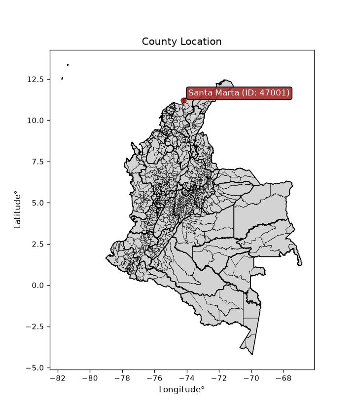
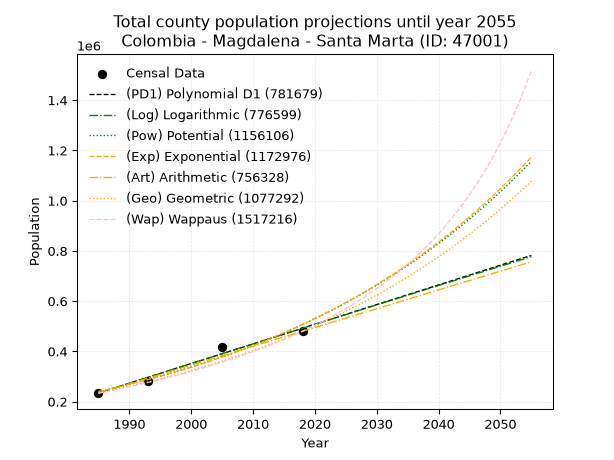
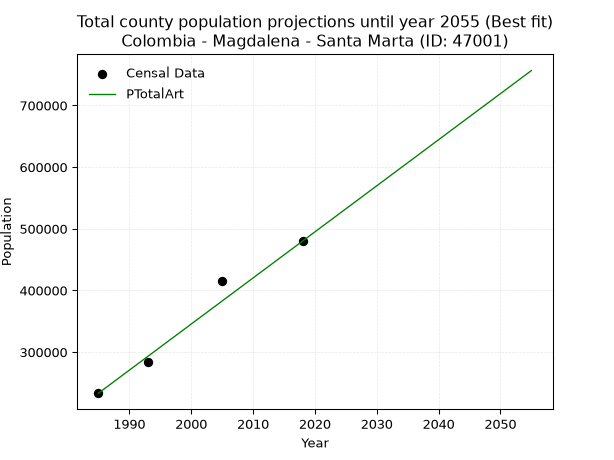
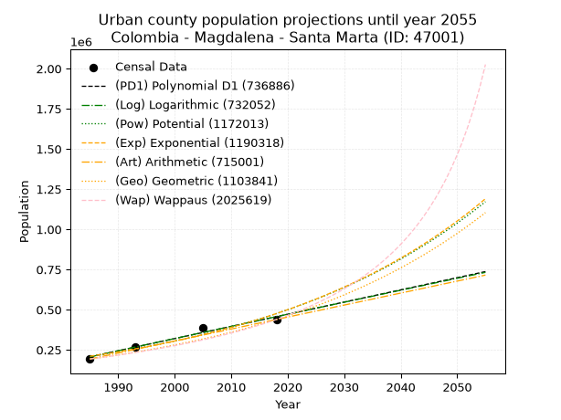
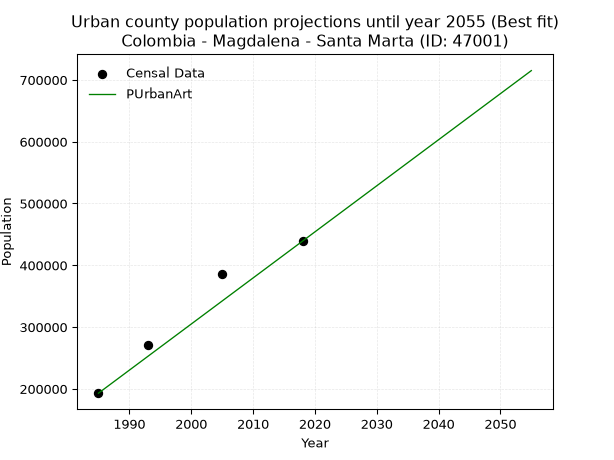
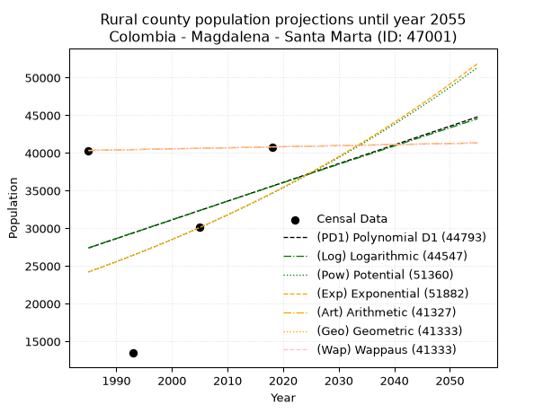
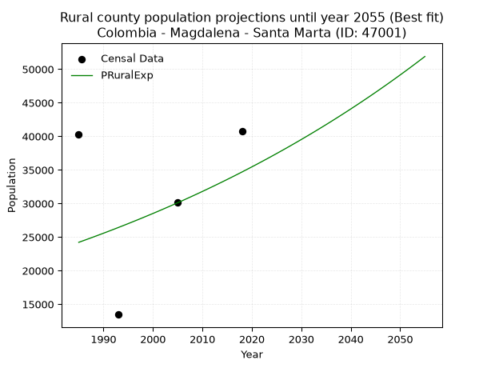

<div align="center">


</div>

# _“Population and Public Services Demand Projections (PPSD) until Year 2050 for Colombia - Magdalena - Santa Marta (ID: 47001)”_
Keywords: `population` `public-service` `projection` `lineal` `polynomial` `logarithmic` `potential` `exponential` `arithmetic` `geometric` `wappaus` `dane` `colombia` `south-america`

PPSD are analytical estimates used by governments and planners to anticipate future changes in population size, age distribution, and the resulting community needs for utilities, healthcare, education, and infrastructure as sizing future water treatment facilities, electrical grids, and road networks based on spatial growth.

> **General running parameters**: • app_version: _v20260806_. • Python version: _3.14.7_. • Pandas version: _3.0.5_. • NumPy version: _2.5.1_. • Creates, save and include plots into reports (create_plot): _False_. • Projection until year: _2050_. • Process polynomial degree 2 and up: _False_. • Process Wappaus: _True_. • Process Wappaus: _True_. • Set negative values to zero: _True_. • Set infinite values to zero: _True_. • Drop dataset notes: _True_. 
<div align="center">

Dynamic map: [:earth_americas:Google](http://maps.google.com/maps?q=11.20467911,-74.1998291) [:earth_americas:OSM](https://www.openstreetmap.org/#map=18/11.20467911/-74.1998291&layers=P) [:earth_americas:Bing](https://www.bing.com/maps?cp=11.20467911~-74.1998291&lvl=18) [:earth_americas:Apple](https://maps.apple.com/frame?center=11.20467911%2C-74.1998291&span=0.003%2C0.006)

</div>


<div align="center">

```geojson
{
  "type": "Feature",
  "geometry": {
    "type": "Point", 
    "coordinates": [-74.1998291, 11.20467911]
  }, 
  "properties": {
    "Name": "Colombia - Magdalena - Santa Marta (ID: 47001)"
  }
}
```

</div>


<div align="center">

</img>

</div>


## 0. Census Data (4 records)

Census data are official statistics collected by a government about the people and housing in a country. They usually include counts of total population, age, sex, race, income, education, and jobs.

📅Global census file: [Population.xlsx](../data/Population.xlsx)

| Source   |   Year |   CountryID | CountryName   |   StateID | StateName   |   CountyID | CountyName   |   PTotal |   PUrban |   PRural |
|:---------|-------:|------------:|:--------------|----------:|:------------|-----------:|:-------------|---------:|---------:|---------:|
| DANE     |   1985 |          57 | Colombia      |        47 | Magdalena   |      47001 | Santa Marta  |   233267 |   192935 |    40332 |
| DANE     |   1993 |          57 | Colombia      |        47 | Magdalena   |      47001 | Santa Marta  |   283711 |   270253 |    13458 |
| DANE     |   2005 |          57 | Colombia      |        47 | Magdalena   |      47001 | Santa Marta  |   415270 |   385122 |    30148 |
| DANE     |   2018 |          57 | Colombia      |        47 | Magdalena   |      47001 | Santa Marta  |   479853 |   439052 |    40801 |

> 🔥Some records could had specific notes about the registered values or the corresponding urban or rural distribution.

📅   [RUPS](https://www.datos.gov.co/Hacienda-y-Cr-dito-P-blico/Registro-nico-de-Prestadores-de-Servicios-P-blicos/4qkq-csdn/about_data) - Local public utility companies: [RUPS.csv](../data/RUPS.xlsx)

 | SERVICIO       | ESTADO      | NOMBRE                                                                        | NIT         | DEPARTAMENTO_DOMICILIO   | MUNICIPIO_DOMICILIO   | DIRECCION                                   |   TELEFONO | EMAIL                           | TIPO_PRESTADOR                             | CLASIFICACION                 |
|:---------------|:------------|:------------------------------------------------------------------------------|:------------|:-------------------------|:----------------------|:--------------------------------------------|-----------:|:--------------------------------|:-------------------------------------------|:------------------------------|
| ACUEDUCTO      | CANCELACION | COMPAÑIA DEL ACUEDUCTO Y ALCANTARILLADO METROPOLITANO DE SANTA MARTA S.A. ESP | 800080177-9 | MAGDALENA                | SANTA MARTA           | Carrera 11 N° 17a - 48 Barrio Territorial   |    4351166 | liquidacionm2017@gmail.com      | nan                                        | nan                           |
| ALCANTARILLADO | CANCELACION | COMPAÑIA DEL ACUEDUCTO Y ALCANTARILLADO METROPOLITANO DE SANTA MARTA S.A. ESP | 800080177-9 | MAGDALENA                | SANTA MARTA           | Carrera 11 N° 17a - 48 Barrio Territorial   |    4351166 | liquidacionm2017@gmail.com      | nan                                        | nan                           |
| ACUEDUCTO      | OPERATIVA   | EMPRESA DE SERVICIOS PÚBLICOS DEL DISTRITO DE SANTA MARTA E.S.P.              | 800181106-1 | MAGDALENA                | SANTA MARTA           | Km 7 Troncal del Caribe - Calle 70 # 12-418 |    4209676 | JULIANRINO0206@GMAIL.COM        | EMPRESA INDUSTRIAL Y COMERCIAL DEL ESTADO  | MAYOR O IGUAL A 5001 USUARIOS |
| ALCANTARILLADO | OPERATIVA   | EMPRESA DE SERVICIOS PÚBLICOS DEL DISTRITO DE SANTA MARTA E.S.P.              | 800181106-1 | MAGDALENA                | SANTA MARTA           | Km 7 Troncal del Caribe - Calle 70 # 12-418 |    4209676 | JULIANRINO0206@GMAIL.COM        | EMPRESA INDUSTRIAL Y COMERCIAL DEL ESTADO  | MAYOR O IGUAL A 5001 USUARIOS |
| ALCANTARILLADO | CANCELACION | CONHYDRA S.A. E.S.P.                                                          | 811011165-6 | ANTIOQUIA                | MEDELLIN              | CALLE 32 F # 63 A 117                       |    4441676 | lchavarria@conhydra.com         | nan                                        | nan                           |
| ACUEDUCTO      | OPERATIVA   | JUNTA ADMINISTRADORA ACUEDUCTO CORREGIMIENTO DE BONDA                         | 819000026-2 | MAGDALENA                | SANTA MARTA           | CARRERA 21 No. 4 - 6                        |    4339601 | aguasbonda@hotmail.com          | ORGANIZACION AUTORIZADA                    | HASTA 2500 SUSCRIPTORES       |
| ACUEDUCTO      | OPERATIVA   | EMPRESA DE SERVICIOS PÚBLICOS DOMICILIARIOS SERVIARAUCARIAS SAS ESP           | 900978470-0 | RISARALDA                | SANTA ROSA DE CABAL   | CLL 13 No 9 76 esquina                      |    3659448 | admon.serviaraucarias@gmail.com | SOCIEDADES (EMPRESA DE SERVICIOS PUBLICOS) | MENOR O IGUAL A 2500 USUARIOS |
| ALCANTARILLADO | OPERATIVA   | EMPRESA DE SERVICIOS PÚBLICOS DOMICILIARIOS SERVIARAUCARIAS SAS ESP           | 900978470-0 | RISARALDA                | SANTA ROSA DE CABAL   | CLL 13 No 9 76 esquina                      |    3659448 | admon.serviaraucarias@gmail.com | SOCIEDADES (EMPRESA DE SERVICIOS PUBLICOS) | MENOR O IGUAL A 2500 USUARIOS |

## 1. Total

### 1.1. Coefficients and Parameters

* (PD1) Polynomial Deg 1: 7829.300281011593, -15307532.637093438 (lineal)
* (Log) Logarithmic: 15674493.785103343, -118788927.61808069
* (Pow) Potential: 45.41206392022563, -144.37862486012676
* (Exp) Exponential: 0.022678756063679296, 6.746251354340173e-15
* (Art) Arithmetic: Year diff. 2018 - 1985 = 33, Population diff. 479853 - 233267 = 246586, Annual growth = 7472.30303030303
* (Geo) Geometric: Year diff. 2018 - 1985 = 33, Population diff. 479853 - 233267 = 246586, Annual growth % = 0.02209808133761504
* (Wap) Wappaus: i = 2.095664973721963, Condition values only valid for < 200)

<sub>
Wappaus condition values: ['0.00', '2.10', '4.19', '6.29', '8.38', '10.48', '12.57', '14.67', '16.77', '18.86', '20.96', '23.05', '25.15', '27.24', '29.34', '31.43', '33.53', '35.63', '37.72', '39.82', '41.91', '44.01', '46.10', '48.20', '50.30', '52.39', '54.49', '56.58', '58.68', '60.77', '62.87', '64.97', '67.06', '69.16', '71.25', '73.35', '75.44', '77.54', '79.64', '81.73', '83.83', '85.92', '88.02', '90.11', '92.21', '94.30', '96.40', '98.50', '100.59', '102.69', '104.78', '106.88', '108.97', '111.07', '113.17', '115.26', '117.36', '119.45', '121.55', '123.64', '125.74', '127.84', '129.93', '132.03', '134.12', '136.22']
</sub>


### 1.2. Projected Dataset

|   Year |   CountyID |   PTotalPD1 |   PTotalLog |        PTotalPow |        PTotalExp |   PTotalArt |   PTotalGeo |        PTotalWap |
|-------:|-----------:|------------:|------------:|-----------------:|-----------------:|------------:|------------:|-----------------:|
|   1985 |      47001 |      233628 |      233369 | 239600           | 239795           |      233267 |      233267 | 233267           |
|   1986 |      47001 |      241458 |      241263 | 245143           | 245296           |      240739 |      238422 | 238207           |
|   1987 |      47001 |      249287 |      249154 | 250812           | 250922           |      248212 |      243690 | 243253           |
|   1988 |      47001 |      257116 |      257041 | 256608           | 256678           |      255684 |      249076 | 248408           |
|   1989 |      47001 |      264946 |      264923 | 262536           | 262566           |      263156 |      254580 | 253676           |
|   1990 |      47001 |      272775 |      272802 | 268597           | 268588           |      270629 |      260205 | 259061           |
|   1991 |      47001 |      280604 |      280676 | 274796           | 274749           |      278101 |      265955 | 264566           |
|   1992 |      47001 |      288434 |      288547 | 281134           | 281051           |      285573 |      271832 | 270195           |
|   1993 |      47001 |      296263 |      296414 | 287615           | 287498           |      293045 |      277839 | 275953           |
|   1994 |      47001 |      304092 |      304277 | 294242           | 294093           |      300518 |      283979 | 281845           |
|   1995 |      47001 |      311921 |      312135 | 301018           | 300839           |      307990 |      290255 | 287874           |
|   1996 |      47001 |      319751 |      319990 | 307947           | 307739           |      315462 |      296669 | 294046           |
|   1997 |      47001 |      327580 |      327841 | 315032           | 314798           |      322935 |      303224 | 300366           |
|   1998 |      47001 |      335409 |      335688 | 322276           | 322019           |      330407 |      309925 | 306839           |
|   1999 |      47001 |      343239 |      343532 | 329683           | 329405           |      337879 |      316774 | 313472           |
|   2000 |      47001 |      351068 |      351371 | 337256           | 336961           |      345352 |      323774 | 320269           |
|   2001 |      47001 |      358897 |      359206 | 345000           | 344690           |      352824 |      330929 | 327237           |
|   2002 |      47001 |      366727 |      367037 | 352917           | 352597           |      360296 |      338242 | 334383           |
|   2003 |      47001 |      374556 |      374865 | 361012           | 360685           |      367768 |      345716 | 341714           |
|   2004 |      47001 |      382385 |      382688 | 369288           | 368958           |      375241 |      353356 | 349237           |
|   2005 |      47001 |      390214 |      390508 | 377750           | 377421           |      382713 |      361164 | 356958           |
|   2006 |      47001 |      398044 |      398324 | 386401           | 386078           |      390185 |      369145 | 364888           |
|   2007 |      47001 |      405873 |      406136 | 395246           | 394934           |      397658 |      377303 | 373033           |
|   2008 |      47001 |      413702 |      413944 | 404289           | 403993           |      405130 |      385640 | 381403           |
|   2009 |      47001 |      421532 |      421748 | 413534           | 413260           |      412602 |      394162 | 390008           |
|   2010 |      47001 |      429361 |      429548 | 422986           | 422739           |      420075 |      402873 | 398857           |
|   2011 |      47001 |      437190 |      437344 | 432649           | 432436           |      427547 |      411775 | 407961           |
|   2012 |      47001 |      445020 |      445137 | 442527           | 442355           |      435019 |      420875 | 417331           |
|   2013 |      47001 |      452849 |      452925 | 452626           | 452502           |      442491 |      430175 | 426978           |
|   2014 |      47001 |      460678 |      460710 | 462951           | 462881           |      449964 |      439681 | 436917           |
|   2015 |      47001 |      468507 |      468491 | 473505           | 473499           |      457436 |      449397 | 447159           |
|   2016 |      47001 |      476337 |      476268 | 484295           | 484360           |      464908 |      459328 | 457718           |
|   2017 |      47001 |      484166 |      484041 | 495325           | 495470           |      472381 |      469478 | 468611           |
|   2018 |      47001 |      491995 |      491810 | 506601           | 506835           |      479853 |      479853 | 479853           |
|   2019 |      47001 |      499825 |      499576 | 518128           | 518460           |      487325 |      490457 | 491461           |
|   2020 |      47001 |      507654 |      507337 | 529911           | 530353           |      494798 |      501295 | 503453           |
|   2021 |      47001 |      515483 |      515095 | 541956           | 542518           |      502270 |      512373 | 515848           |
|   2022 |      47001 |      523313 |      522849 | 554268           | 554962           |      509742 |      523695 | 528667           |
|   2023 |      47001 |      531142 |      530599 | 566854           | 567692           |      517215 |      535268 | 541934           |
|   2024 |      47001 |      538971 |      538345 | 579720           | 580714           |      524687 |      547096 | 555670           |
|   2025 |      47001 |      546800 |      546087 | 592870           | 594034           |      532159 |      559186 | 569901           |
|   2026 |      47001 |      554630 |      553826 | 606313           | 607660           |      539631 |      571543 | 584656           |
|   2027 |      47001 |      562459 |      561561 | 620053           | 621598           |      547104 |      584173 | 599963           |
|   2028 |      47001 |      570288 |      569292 | 634098           | 635856           |      554576 |      597082 | 615853           |
|   2029 |      47001 |      578118 |      577019 | 648454           | 650442           |      562048 |      610276 | 632362           |
|   2030 |      47001 |      585947 |      584742 | 663127           | 665361           |      569521 |      623762 | 649525           |
|   2031 |      47001 |      593776 |      592462 | 678125           | 680623           |      576993 |      637546 | 667383           |
|   2032 |      47001 |      601606 |      600177 | 693454           | 696235           |      584465 |      651635 | 685978           |
|   2033 |      47001 |      609435 |      607889 | 709122           | 712205           |      591938 |      666035 | 705357           |
|   2034 |      47001 |      617264 |      615598 | 725137           | 728542           |      599410 |      680753 | 725571           |
|   2035 |      47001 |      625093 |      623302 | 741504           | 745253           |      606882 |      695796 | 746674           |
|   2036 |      47001 |      632923 |      631002 | 758233           | 762348           |      614354 |      711172 | 768727           |
|   2037 |      47001 |      640752 |      638699 | 775331           | 779834           |      621827 |      726887 | 791796           |
|   2038 |      47001 |      648581 |      646392 | 792806           | 797722           |      629299 |      742950 | 815952           |
|   2039 |      47001 |      656411 |      654081 | 810666           | 816020           |      636771 |      759368 | 841274           |
|   2040 |      47001 |      664240 |      661767 | 828919           | 834738           |      644244 |      776148 | 867849           |
|   2041 |      47001 |      672069 |      669449 | 847573           | 853885           |      651716 |      793300 | 895771           |
|   2042 |      47001 |      679899 |      677127 | 866638           | 873471           |      659188 |      810830 | 925146           |
|   2043 |      47001 |      687728 |      684801 | 886123           | 893507           |      666661 |      828748 | 956091           |
|   2044 |      47001 |      695557 |      692471 | 906035           | 914002           |      674133 |      847062 | 988734           |
|   2045 |      47001 |      703386 |      700138 | 926385           | 934967           |      681605 |      865780 |      1.02322e+06 |
|   2046 |      47001 |      711216 |      707801 | 947182           | 956413           |      689077 |      884912 |      1.05971e+06 |
|   2047 |      47001 |      719045 |      715460 | 968435           | 978351           |      696550 |      904467 |      1.09838e+06 |
|   2048 |      47001 |      726874 |      723115 | 990154           |      1.00079e+06 |      704022 |      924454 |      1.13944e+06 |
|   2049 |      47001 |      734704 |      730767 |      1.01235e+06 |      1.02375e+06 |      711494 |      944883 |      1.1831e+06  |
|   2050 |      47001 |      742533 |      738415 |      1.03503e+06 |      1.04723e+06 |      718967 |      965763 |      1.22964e+06 |
<div align="center">

</img>

</div>


### 1.3. Best fit with absolute and relative error (%)

Relative error puts that difference into context by dividing the absolute error by the true value, creating a unitless ratio or percentage that shows the scale of the mistake.

Absolute and relative error

|   Year | Source   |   CountryID | CountryName   |   StateID | StateName   |   CountyID_x | CountyName   |   PTotal |   PUrban |   PRural |   CountyID_y |   PTotalPD1 |   PTotalLog |   PTotalPow |   PTotalExp |   PTotalArt |   PTotalGeo |   PTotalWap |   PTotalPD1AbsError |   PTotalLogAbsError |   PTotalPowAbsError |   PTotalExpAbsError |   PTotalArtAbsError |   PTotalGeoAbsError |   PTotalWapAbsError |   PTotalPD1RelError |   PTotalLogRelError |   PTotalPowRelError |   PTotalExpRelError |   PTotalArtRelError |   PTotalGeoRelError |   PTotalWapRelError |
|-------:|:---------|------------:|:--------------|----------:|:------------|-------------:|:-------------|---------:|---------:|---------:|-------------:|------------:|------------:|------------:|------------:|------------:|------------:|------------:|--------------------:|--------------------:|--------------------:|--------------------:|--------------------:|--------------------:|--------------------:|--------------------:|--------------------:|--------------------:|--------------------:|--------------------:|--------------------:|--------------------:|
|   1985 | DANE     |          57 | Colombia      |        47 | Magdalena   |        47001 | Santa Marta  |   233267 |   192935 |    40332 |        47001 |      233628 |      233369 |      239600 |      239795 |      233267 |      233267 |      233267 |                 361 |                 102 |                6333 |                6528 |                   0 |                   0 |                   0 |            0.154758 |           0.0437267 |             2.71491 |             2.79851 |             0       |             0       |             0       |
|   1993 | DANE     |          57 | Colombia      |        47 | Magdalena   |        47001 | Santa Marta  |   283711 |   270253 |    13458 |        47001 |      296263 |      296414 |      287615 |      287498 |      293045 |      277839 |      275953 |               12552 |               12703 |                3904 |                3787 |                9334 |                5872 |                7758 |            4.42422  |           4.47744   |             1.37605 |             1.33481 |             3.28997 |             2.06971 |             2.73447 |
|   2005 | DANE     |          57 | Colombia      |        47 | Magdalena   |        47001 | Santa Marta  |   415270 |   385122 |    30148 |        47001 |      390214 |      390508 |      377750 |      377421 |      382713 |      361164 |      356958 |               25056 |               24762 |               37520 |               37849 |               32557 |               54106 |               58312 |            6.03366  |           5.96287   |             9.03509 |             9.11431 |             7.83996 |            13.0291  |            14.0419  |
|   2018 | DANE     |          57 | Colombia      |        47 | Magdalena   |        47001 | Santa Marta  |   479853 |   439052 |    40801 |        47001 |      491995 |      491810 |      506601 |      506835 |      479853 |      479853 |      479853 |               12142 |               11957 |               26748 |               26982 |                   0 |                   0 |                   0 |            2.53036  |           2.4918    |             5.57421 |             5.62297 |             0       |             0       |             0       |

Relative error mean

| Method    |   RelError | Best   |
|:----------|-----------:|:-------|
| PTotalPD1 |    3.28575 |        |
| PTotalLog |    3.24396 |        |
| PTotalPow |    4.67506 |        |
| PTotalExp |    4.71765 |        |
| PTotalArt |    2.78248 | True   |
| PTotalGeo |    3.77471 |        |
| PTotalWap |    4.19411 |        |

💙Best method: _**PTotalArt**_
<div align="center">

</img>

</div>


### 1.4. Fresh water supply demand in liters per capita per day (lpcd)

The fresh water supply demand typically ranges from 100 to 300 liters per capita per day (lpcd) for standard domestic and municipal planning, though absolute survival minimums set by the World Health Organization are as low as 7.5 to 20 liters per day, and total consumption in high-income nations can exceed 400 liters.

> `CZ`: Level in meters above the sea level (masl)<br> `WS`: Fresh water supply demand in liters per capita per day (lpcd or l/h/d)<br> `WSAll`: Zonal fresh water supply demand in liters per second (l/s)<br> `A`: Zonal area in square meters<br> `DP`: Population density (people/hectare or p/ha)

Reference values (RAS Colombia)

|    CZ |   WS |
|------:|-----:|
|  1000 |  120 |
|  2000 |  130 |
| 99999 |  140 |

County shapefile geometry properties and water supply values

|   CountyID |      ATotal |   CZTotal |   WSTotal |
|-----------:|------------:|----------:|----------:|
|      47001 | 2.34407e+09 |   1101.81 |       130 |

Projected values for best method: PTotalArt

|   CountyID |   Year |   PTotalArt |   DPTotal |   WSTotal |   WSTotalAll |
|-----------:|-------:|------------:|----------:|----------:|-------------:|
|      47001 |   1985 |      233267 |      1    |       130 |      350.98  |
|      47001 |   1986 |      240739 |      1.03 |       130 |      362.223 |
|      47001 |   1987 |      248212 |      1.06 |       130 |      373.467 |
|      47001 |   1988 |      255684 |      1.09 |       130 |      384.71  |
|      47001 |   1989 |      263156 |      1.12 |       130 |      395.952 |
|      47001 |   1990 |      270629 |      1.15 |       130 |      407.196 |
|      47001 |   1991 |      278101 |      1.19 |       130 |      418.439 |
|      47001 |   1992 |      285573 |      1.22 |       130 |      429.682 |
|      47001 |   1993 |      293045 |      1.25 |       130 |      440.924 |
|      47001 |   1994 |      300518 |      1.28 |       130 |      452.168 |
|      47001 |   1995 |      307990 |      1.31 |       130 |      463.411 |
|      47001 |   1996 |      315462 |      1.35 |       130 |      474.653 |
|      47001 |   1997 |      322935 |      1.38 |       130 |      485.898 |
|      47001 |   1998 |      330407 |      1.41 |       130 |      497.14  |
|      47001 |   1999 |      337879 |      1.44 |       130 |      508.383 |
|      47001 |   2000 |      345352 |      1.47 |       130 |      519.627 |
|      47001 |   2001 |      352824 |      1.51 |       130 |      530.869 |
|      47001 |   2002 |      360296 |      1.54 |       130 |      542.112 |
|      47001 |   2003 |      367768 |      1.57 |       130 |      553.355 |
|      47001 |   2004 |      375241 |      1.6  |       130 |      564.599 |
|      47001 |   2005 |      382713 |      1.63 |       130 |      575.841 |
|      47001 |   2006 |      390185 |      1.66 |       130 |      587.084 |
|      47001 |   2007 |      397658 |      1.7  |       130 |      598.328 |
|      47001 |   2008 |      405130 |      1.73 |       130 |      609.571 |
|      47001 |   2009 |      412602 |      1.76 |       130 |      620.813 |
|      47001 |   2010 |      420075 |      1.79 |       130 |      632.057 |
|      47001 |   2011 |      427547 |      1.82 |       130 |      643.3   |
|      47001 |   2012 |      435019 |      1.86 |       130 |      654.542 |
|      47001 |   2013 |      442491 |      1.89 |       130 |      665.785 |
|      47001 |   2014 |      449964 |      1.92 |       130 |      677.029 |
|      47001 |   2015 |      457436 |      1.95 |       130 |      688.272 |
|      47001 |   2016 |      464908 |      1.98 |       130 |      699.514 |
|      47001 |   2017 |      472381 |      2.02 |       130 |      710.758 |
|      47001 |   2018 |      479853 |      2.05 |       130 |      722.001 |
|      47001 |   2019 |      487325 |      2.08 |       130 |      733.244 |
|      47001 |   2020 |      494798 |      2.11 |       130 |      744.488 |
|      47001 |   2021 |      502270 |      2.14 |       130 |      755.73  |
|      47001 |   2022 |      509742 |      2.17 |       130 |      766.973 |
|      47001 |   2023 |      517215 |      2.21 |       130 |      778.217 |
|      47001 |   2024 |      524687 |      2.24 |       130 |      789.46  |
|      47001 |   2025 |      532159 |      2.27 |       130 |      800.702 |
|      47001 |   2026 |      539631 |      2.3  |       130 |      811.945 |
|      47001 |   2027 |      547104 |      2.33 |       130 |      823.189 |
|      47001 |   2028 |      554576 |      2.37 |       130 |      834.431 |
|      47001 |   2029 |      562048 |      2.4  |       130 |      845.674 |
|      47001 |   2030 |      569521 |      2.43 |       130 |      856.918 |
|      47001 |   2031 |      576993 |      2.46 |       130 |      868.161 |
|      47001 |   2032 |      584465 |      2.49 |       130 |      879.403 |
|      47001 |   2033 |      591938 |      2.53 |       130 |      890.647 |
|      47001 |   2034 |      599410 |      2.56 |       130 |      901.89  |
|      47001 |   2035 |      606882 |      2.59 |       130 |      913.133 |
|      47001 |   2036 |      614354 |      2.62 |       130 |      924.375 |
|      47001 |   2037 |      621827 |      2.65 |       130 |      935.619 |
|      47001 |   2038 |      629299 |      2.68 |       130 |      946.862 |
|      47001 |   2039 |      636771 |      2.72 |       130 |      958.105 |
|      47001 |   2040 |      644244 |      2.75 |       130 |      969.349 |
|      47001 |   2041 |      651716 |      2.78 |       130 |      980.591 |
|      47001 |   2042 |      659188 |      2.81 |       130 |      991.834 |
|      47001 |   2043 |      666661 |      2.84 |       130 |     1003.08  |
|      47001 |   2044 |      674133 |      2.88 |       130 |     1014.32  |
|      47001 |   2045 |      681605 |      2.91 |       130 |     1025.56  |
|      47001 |   2046 |      689077 |      2.94 |       130 |     1036.81  |
|      47001 |   2047 |      696550 |      2.97 |       130 |     1048.05  |
|      47001 |   2048 |      704022 |      3    |       130 |     1059.29  |
|      47001 |   2049 |      711494 |      3.04 |       130 |     1070.53  |
|      47001 |   2050 |      718967 |      3.07 |       130 |     1081.78  |

## 2. Urban

### 2.1. Coefficients and Parameters

* (PD1) Polynomial Deg 1: 7580.74588518663, -14841546.456844559 (lineal)
* (Log) Logarithmic: 15180009.39170051, -115061532.5312765
* (Pow) Potential: 49.64290293807471, -158.38866341778012
* (Exp) Exponential: 0.024785451163033656, 9.021184570626488e-17
* (Art) Arithmetic: Year diff. 2018 - 1985 = 33, Population diff. 439052 - 192935 = 246117, Annual growth = 7458.090909090909
* (Geo) Geometric: Year diff. 2018 - 1985 = 33, Population diff. 439052 - 192935 = 246117, Annual growth % = 0.025230132024993024
* (Wap) Wappaus: i = 2.360203899476068, Condition values only valid for < 200)

<sub>
Wappaus condition values: ['0.00', '2.36', '4.72', '7.08', '9.44', '11.80', '14.16', '16.52', '18.88', '21.24', '23.60', '25.96', '28.32', '30.68', '33.04', '35.40', '37.76', '40.12', '42.48', '44.84', '47.20', '49.56', '51.92', '54.28', '56.64', '59.01', '61.37', '63.73', '66.09', '68.45', '70.81', '73.17', '75.53', '77.89', '80.25', '82.61', '84.97', '87.33', '89.69', '92.05', '94.41', '96.77', '99.13', '101.49', '103.85', '106.21', '108.57', '110.93', '113.29', '115.65', '118.01', '120.37', '122.73', '125.09', '127.45', '129.81', '132.17', '134.53', '136.89', '139.25', '141.61', '143.97', '146.33', '148.69', '151.05', '153.41']
</sub>


### 2.2. Projected Dataset

|   Year |   CountyID |   PUrbanPD1 |   PUrbanLog |        PUrbanPow |        PUrbanExp |   PUrbanArt |   PUrbanGeo |        PUrbanWap |
|-------:|-----------:|------------:|------------:|-----------------:|-----------------:|------------:|------------:|-----------------:|
|   1985 |      47001 |      206234 |      205959 | 209769           | 209976           |      192935 |      192935 | 192935           |
|   1986 |      47001 |      213815 |      213604 | 215080           | 215246           |      200393 |      197803 | 197543           |
|   1987 |      47001 |      221396 |      221246 | 220523           | 220647           |      207851 |      202793 | 202262           |
|   1988 |      47001 |      228976 |      228884 | 226100           | 226184           |      215309 |      207910 | 207097           |
|   1989 |      47001 |      236557 |      236518 | 231816           | 231861           |      222767 |      213155 | 212052           |
|   1990 |      47001 |      244138 |      244148 | 237673           | 237679           |      230225 |      218533 | 217131           |
|   1991 |      47001 |      251719 |      251774 | 243675           | 243644           |      237684 |      224047 | 222339           |
|   1992 |      47001 |      259299 |      259396 | 249825           | 249758           |      245142 |      229700 | 227681           |
|   1993 |      47001 |      266880 |      267015 | 256128           | 256026           |      252600 |      235495 | 233162           |
|   1994 |      47001 |      274461 |      274630 | 262586           | 262451           |      260058 |      241437 | 238788           |
|   1995 |      47001 |      282042 |      282241 | 269204           | 269037           |      267516 |      247528 | 244564           |
|   1996 |      47001 |      289622 |      289848 | 275985           | 275789           |      274974 |      253773 | 250498           |
|   1997 |      47001 |      297203 |      297451 | 282934           | 282709           |      282432 |      260176 | 256594           |
|   1998 |      47001 |      304784 |      305051 | 290053           | 289804           |      289890 |      266740 | 262860           |
|   1999 |      47001 |      312365 |      312646 | 297348           | 297077           |      297348 |      273470 | 269303           |
|   2000 |      47001 |      319945 |      320238 | 304823           | 304532           |      304806 |      280370 | 275932           |
|   2001 |      47001 |      327526 |      327826 | 312482           | 312174           |      312264 |      287444 | 282753           |
|   2002 |      47001 |      335107 |      335411 | 320330           | 320008           |      319723 |      294696 | 289775           |
|   2003 |      47001 |      342688 |      342991 | 328370           | 328039           |      327181 |      302131 | 297008           |
|   2004 |      47001 |      350268 |      350568 | 336608           | 336271           |      334639 |      309754 | 304461           |
|   2005 |      47001 |      357849 |      358141 | 345048           | 344710           |      342097 |      317569 | 312144           |
|   2006 |      47001 |      365430 |      365710 | 353696           | 353361           |      349555 |      325581 | 320068           |
|   2007 |      47001 |      373011 |      373275 | 362556           | 362228           |      357013 |      333796 | 328245           |
|   2008 |      47001 |      380591 |      380837 | 371633           | 371318           |      364471 |      342218 | 336687           |
|   2009 |      47001 |      388172 |      388395 | 380933           | 380637           |      371929 |      350852 | 345406           |
|   2010 |      47001 |      395753 |      395949 | 390461           | 390189           |      379387 |      359704 | 354418           |
|   2011 |      47001 |      403334 |      403499 | 400222           | 399981           |      386845 |      368779 | 363737           |
|   2012 |      47001 |      410914 |      411046 | 410223           | 410018           |      394303 |      378084 | 373378           |
|   2013 |      47001 |      418495 |      418589 | 420467           | 420308           |      401762 |      387623 | 383359           |
|   2014 |      47001 |      426076 |      426128 | 430963           | 430855           |      409220 |      397402 | 393698           |
|   2015 |      47001 |      433657 |      433663 | 441715           | 441668           |      416678 |      407429 | 404415           |
|   2016 |      47001 |      441237 |      441195 | 452730           | 452751           |      424136 |      417708 | 415531           |
|   2017 |      47001 |      448818 |      448723 | 464014           | 464113           |      431594 |      428247 | 427069           |
|   2018 |      47001 |      456399 |      456247 | 475573           | 475760           |      439052 |      439052 | 439052           |
|   2019 |      47001 |      463979 |      463768 | 487414           | 487700           |      446510 |      450129 | 451508           |
|   2020 |      47001 |      471560 |      471284 | 499544           | 499939           |      453968 |      461486 | 464464           |
|   2021 |      47001 |      479141 |      478797 | 511970           | 512485           |      461426 |      473130 | 477953           |
|   2022 |      47001 |      486722 |      486307 | 524698           | 525345           |      468884 |      485067 | 492006           |
|   2023 |      47001 |      494302 |      493812 | 537736           | 538529           |      476342 |      497305 | 506661           |
|   2024 |      47001 |      501883 |      501314 | 551092           | 552044           |      483801 |      509852 | 521956           |
|   2025 |      47001 |      509464 |      508812 | 564772           | 565897           |      491259 |      522716 | 537936           |
|   2026 |      47001 |      517045 |      516307 | 578785           | 580098           |      498717 |      535904 | 554646           |
|   2027 |      47001 |      524625 |      523797 | 593139           | 594656           |      506175 |      549425 | 572138           |
|   2028 |      47001 |      532206 |      531284 | 607841           | 609579           |      513633 |      563287 | 590468           |
|   2029 |      47001 |      539787 |      538768 | 622900           | 624877           |      521091 |      577499 | 609698           |
|   2030 |      47001 |      547368 |      546247 | 638324           | 640558           |      528549 |      592069 | 629896           |
|   2031 |      47001 |      554948 |      553723 | 654123           | 656633           |      536007 |      607007 | 651137           |
|   2032 |      47001 |      562529 |      561196 | 670304           | 673111           |      543465 |      622322 | 673503           |
|   2033 |      47001 |      570110 |      568664 | 686878           | 690003           |      550923 |      638023 | 697087           |
|   2034 |      47001 |      577691 |      576129 | 703852           | 707319           |      558381 |      654120 | 721991           |
|   2035 |      47001 |      585271 |      583591 | 721238           | 725069           |      565840 |      670624 | 748328           |
|   2036 |      47001 |      592852 |      591048 | 739044           | 743265           |      573298 |      687544 | 776227           |
|   2037 |      47001 |      600433 |      598502 | 757281           | 761917           |      580756 |      704891 | 805830           |
|   2038 |      47001 |      608014 |      605953 | 775958           | 781038           |      588214 |      722675 | 837299           |
|   2039 |      47001 |      615594 |      613399 | 795087           | 800638           |      595672 |      740908 | 870815           |
|   2040 |      47001 |      623175 |      620842 | 814678           | 820730           |      603130 |      759602 | 906585           |
|   2041 |      47001 |      630756 |      628282 | 834741           | 841326           |      610588 |      778767 | 944845           |
|   2042 |      47001 |      638337 |      635717 | 855288           | 862440           |      618046 |      798415 | 985863           |
|   2043 |      47001 |      645917 |      643149 | 876330           | 884083           |      625504 |      818559 |      1.02995e+06 |
|   2044 |      47001 |      653498 |      650578 | 897880           | 906269           |      632962 |      839211 |      1.07746e+06 |
|   2045 |      47001 |      661079 |      658003 | 919948           | 929012           |      640420 |      860385 |      1.12881e+06 |
|   2046 |      47001 |      668660 |      665424 | 942548           | 952325           |      647879 |      882092 |      1.18449e+06 |
|   2047 |      47001 |      676240 |      672841 | 965691           | 976224           |      655337 |      904348 |      1.24507e+06 |
|   2048 |      47001 |      683821 |      680255 | 989391           |      1.00072e+06 |      662795 |      927165 |      1.31122e+06 |
|   2049 |      47001 |      691402 |      687666 |      1.01366e+06 |      1.02584e+06 |      670253 |      950557 |      1.38375e+06 |
|   2050 |      47001 |      698983 |      695072 |      1.03851e+06 |      1.05158e+06 |      677711 |      974540 |      1.46363e+06 |
<div align="center">

</img>

</div>


### 2.3. Best fit with absolute and relative error (%)

Relative error puts that difference into context by dividing the absolute error by the true value, creating a unitless ratio or percentage that shows the scale of the mistake.

Absolute and relative error

|   Year | Source   |   CountryID | CountryName   |   StateID | StateName   |   CountyID_x | CountyName   |   PTotal |   PUrban |   PRural |   CountyID_y |   PUrbanPD1 |   PUrbanLog |   PUrbanPow |   PUrbanExp |   PUrbanArt |   PUrbanGeo |   PUrbanWap |   PUrbanPD1AbsError |   PUrbanLogAbsError |   PUrbanPowAbsError |   PUrbanExpAbsError |   PUrbanArtAbsError |   PUrbanGeoAbsError |   PUrbanWapAbsError |   PUrbanPD1RelError |   PUrbanLogRelError |   PUrbanPowRelError |   PUrbanExpRelError |   PUrbanArtRelError |   PUrbanGeoRelError |   PUrbanWapRelError |
|-------:|:---------|------------:|:--------------|----------:|:------------|-------------:|:-------------|---------:|---------:|---------:|-------------:|------------:|------------:|------------:|------------:|------------:|------------:|------------:|--------------------:|--------------------:|--------------------:|--------------------:|--------------------:|--------------------:|--------------------:|--------------------:|--------------------:|--------------------:|--------------------:|--------------------:|--------------------:|--------------------:|
|   1985 | DANE     |          57 | Colombia      |        47 | Magdalena   |        47001 | Santa Marta  |   233267 |   192935 |    40332 |        47001 |      206234 |      205959 |      209769 |      209976 |      192935 |      192935 |      192935 |               13299 |               13024 |               16834 |               17041 |                   0 |                   0 |                   0 |             6.893   |             6.75046 |             8.72522 |             8.83251 |             0       |              0      |              0      |
|   1993 | DANE     |          57 | Colombia      |        47 | Magdalena   |        47001 | Santa Marta  |   283711 |   270253 |    13458 |        47001 |      266880 |      267015 |      256128 |      256026 |      252600 |      235495 |      233162 |                3373 |                3238 |               14125 |               14227 |               17653 |               34758 |               37091 |             1.24809 |             1.19814 |             5.22658 |             5.26433 |             6.53203 |             12.8613 |             13.7245 |
|   2005 | DANE     |          57 | Colombia      |        47 | Magdalena   |        47001 | Santa Marta  |   415270 |   385122 |    30148 |        47001 |      357849 |      358141 |      345048 |      344710 |      342097 |      317569 |      312144 |               27273 |               26981 |               40074 |               40412 |               43025 |               67553 |               72978 |             7.08165 |             7.00583 |            10.4055  |            10.4933  |            11.1718  |             17.5407 |             18.9493 |
|   2018 | DANE     |          57 | Colombia      |        47 | Magdalena   |        47001 | Santa Marta  |   479853 |   439052 |    40801 |        47001 |      456399 |      456247 |      475573 |      475760 |      439052 |      439052 |      439052 |               17347 |               17195 |               36521 |               36708 |                   0 |                   0 |                   0 |             3.95101 |             3.91639 |             8.31815 |             8.36074 |             0       |              0      |              0      |

Relative error mean

| Method    |   RelError | Best   |
|:----------|-----------:|:-------|
| PUrbanPD1 |    4.79344 |        |
| PUrbanLog |    4.71771 |        |
| PUrbanPow |    8.16887 |        |
| PUrbanExp |    8.23772 |        |
| PUrbanArt |    4.42595 | True   |
| PUrbanGeo |    7.60049 |        |
| PUrbanWap |    8.16847 |        |

💙Best method: _**PUrbanArt**_
<div align="center">

</img>

</div>


### 2.4. Fresh water supply demand in liters per capita per day (lpcd)

The fresh water supply demand typically ranges from 100 to 300 liters per capita per day (lpcd) for standard domestic and municipal planning, though absolute survival minimums set by the World Health Organization are as low as 7.5 to 20 liters per day, and total consumption in high-income nations can exceed 400 liters.

> `CZ`: Level in meters above the sea level (masl)<br> `WS`: Fresh water supply demand in liters per capita per day (lpcd or l/h/d)<br> `WSAll`: Zonal fresh water supply demand in liters per second (l/s)<br> `A`: Zonal area in square meters<br> `DP`: Population density (people/hectare or p/ha)

Reference values (RAS Colombia)

|    CZ |   WS |
|------:|-----:|
|  1000 |  120 |
|  2000 |  130 |
| 99999 |  140 |

County shapefile geometry properties and water supply values

|   CountyID |      AUrban |   CZUrban |   WSUrban |
|-----------:|------------:|----------:|----------:|
|      47001 | 6.79619e+07 |   37.9975 |       120 |

Projected values for best method: PUrbanArt

|   CountyID |   Year |   PUrbanArt |   DPUrban |   WSUrban |   WSUrbanAll |
|-----------:|-------:|------------:|----------:|----------:|-------------:|
|      47001 |   1985 |      192935 |     28.39 |       120 |      267.965 |
|      47001 |   1986 |      200393 |     29.49 |       120 |      278.324 |
|      47001 |   1987 |      207851 |     30.58 |       120 |      288.682 |
|      47001 |   1988 |      215309 |     31.68 |       120 |      299.04  |
|      47001 |   1989 |      222767 |     32.78 |       120 |      309.399 |
|      47001 |   1990 |      230225 |     33.88 |       120 |      319.757 |
|      47001 |   1991 |      237684 |     34.97 |       120 |      330.117 |
|      47001 |   1992 |      245142 |     36.07 |       120 |      340.475 |
|      47001 |   1993 |      252600 |     37.17 |       120 |      350.833 |
|      47001 |   1994 |      260058 |     38.27 |       120 |      361.192 |
|      47001 |   1995 |      267516 |     39.36 |       120 |      371.55  |
|      47001 |   1996 |      274974 |     40.46 |       120 |      381.908 |
|      47001 |   1997 |      282432 |     41.56 |       120 |      392.267 |
|      47001 |   1998 |      289890 |     42.65 |       120 |      402.625 |
|      47001 |   1999 |      297348 |     43.75 |       120 |      412.983 |
|      47001 |   2000 |      304806 |     44.85 |       120 |      423.342 |
|      47001 |   2001 |      312264 |     45.95 |       120 |      433.7   |
|      47001 |   2002 |      319723 |     47.04 |       120 |      444.06  |
|      47001 |   2003 |      327181 |     48.14 |       120 |      454.418 |
|      47001 |   2004 |      334639 |     49.24 |       120 |      464.776 |
|      47001 |   2005 |      342097 |     50.34 |       120 |      475.135 |
|      47001 |   2006 |      349555 |     51.43 |       120 |      485.493 |
|      47001 |   2007 |      357013 |     52.53 |       120 |      495.851 |
|      47001 |   2008 |      364471 |     53.63 |       120 |      506.21  |
|      47001 |   2009 |      371929 |     54.73 |       120 |      516.568 |
|      47001 |   2010 |      379387 |     55.82 |       120 |      526.926 |
|      47001 |   2011 |      386845 |     56.92 |       120 |      537.285 |
|      47001 |   2012 |      394303 |     58.02 |       120 |      547.643 |
|      47001 |   2013 |      401762 |     59.12 |       120 |      558.003 |
|      47001 |   2014 |      409220 |     60.21 |       120 |      568.361 |
|      47001 |   2015 |      416678 |     61.31 |       120 |      578.719 |
|      47001 |   2016 |      424136 |     62.41 |       120 |      589.078 |
|      47001 |   2017 |      431594 |     63.51 |       120 |      599.436 |
|      47001 |   2018 |      439052 |     64.6  |       120 |      609.794 |
|      47001 |   2019 |      446510 |     65.7  |       120 |      620.153 |
|      47001 |   2020 |      453968 |     66.8  |       120 |      630.511 |
|      47001 |   2021 |      461426 |     67.89 |       120 |      640.869 |
|      47001 |   2022 |      468884 |     68.99 |       120 |      651.228 |
|      47001 |   2023 |      476342 |     70.09 |       120 |      661.586 |
|      47001 |   2024 |      483801 |     71.19 |       120 |      671.946 |
|      47001 |   2025 |      491259 |     72.28 |       120 |      682.304 |
|      47001 |   2026 |      498717 |     73.38 |       120 |      692.663 |
|      47001 |   2027 |      506175 |     74.48 |       120 |      703.021 |
|      47001 |   2028 |      513633 |     75.58 |       120 |      713.379 |
|      47001 |   2029 |      521091 |     76.67 |       120 |      723.737 |
|      47001 |   2030 |      528549 |     77.77 |       120 |      734.096 |
|      47001 |   2031 |      536007 |     78.87 |       120 |      744.454 |
|      47001 |   2032 |      543465 |     79.97 |       120 |      754.812 |
|      47001 |   2033 |      550923 |     81.06 |       120 |      765.171 |
|      47001 |   2034 |      558381 |     82.16 |       120 |      775.529 |
|      47001 |   2035 |      565840 |     83.26 |       120 |      785.889 |
|      47001 |   2036 |      573298 |     84.36 |       120 |      796.247 |
|      47001 |   2037 |      580756 |     85.45 |       120 |      806.606 |
|      47001 |   2038 |      588214 |     86.55 |       120 |      816.964 |
|      47001 |   2039 |      595672 |     87.65 |       120 |      827.322 |
|      47001 |   2040 |      603130 |     88.75 |       120 |      837.681 |
|      47001 |   2041 |      610588 |     89.84 |       120 |      848.039 |
|      47001 |   2042 |      618046 |     90.94 |       120 |      858.397 |
|      47001 |   2043 |      625504 |     92.04 |       120 |      868.756 |
|      47001 |   2044 |      632962 |     93.13 |       120 |      879.114 |
|      47001 |   2045 |      640420 |     94.23 |       120 |      889.472 |
|      47001 |   2046 |      647879 |     95.33 |       120 |      899.832 |
|      47001 |   2047 |      655337 |     96.43 |       120 |      910.19  |
|      47001 |   2048 |      662795 |     97.52 |       120 |      920.549 |
|      47001 |   2049 |      670253 |     98.62 |       120 |      930.907 |
|      47001 |   2050 |      677711 |     99.72 |       120 |      941.265 |

## 3. Rural

### 3.1. Coefficients and Parameters

* (PD1) Polynomial Deg 1: 248.5543958249624, -465986.180248881 (lineal)
* (Log) Logarithmic: 494484.3934028337, -3727395.086804182
* (Pow) Potential: 21.684478816381592, -67.12596916312688
* (Exp) Exponential: 0.010887565620195586, 9.957228105457139e-06
* (Art) Arithmetic: Year diff. 2018 - 1985 = 33, Population diff. 40801 - 40332 = 469, Annual growth = 14.212121212121213
* (Geo) Geometric: Year diff. 2018 - 1985 = 33, Population diff. 40801 - 40332 = 469, Annual growth % = 0.0003504066017738783
* (Wap) Wappaus: i = 0.03503413213395588, Condition values only valid for < 200)

<sub>
Wappaus condition values: ['0.00', '0.04', '0.07', '0.11', '0.14', '0.18', '0.21', '0.25', '0.28', '0.32', '0.35', '0.39', '0.42', '0.46', '0.49', '0.53', '0.56', '0.60', '0.63', '0.67', '0.70', '0.74', '0.77', '0.81', '0.84', '0.88', '0.91', '0.95', '0.98', '1.02', '1.05', '1.09', '1.12', '1.16', '1.19', '1.23', '1.26', '1.30', '1.33', '1.37', '1.40', '1.44', '1.47', '1.51', '1.54', '1.58', '1.61', '1.65', '1.68', '1.72', '1.75', '1.79', '1.82', '1.86', '1.89', '1.93', '1.96', '2.00', '2.03', '2.07', '2.10', '2.14', '2.17', '2.21', '2.24', '2.28']
</sub>


### 3.2. Projected Dataset

|   Year |   CountyID |   PRuralPD1 |   PRuralLog |   PRuralPow |   PRuralExp |   PRuralArt |   PRuralGeo |   PRuralWap |
|-------:|-----------:|------------:|------------:|------------:|------------:|------------:|------------:|------------:|
|   1985 |      47001 |       27394 |       27410 |       24224 |       24212 |       40332 |       40332 |       40332 |
|   1986 |      47001 |       27643 |       27659 |       24490 |       24477 |       40346 |       40346 |       40346 |
|   1987 |      47001 |       27891 |       27908 |       24759 |       24745 |       40360 |       40360 |       40360 |
|   1988 |      47001 |       28140 |       28157 |       25031 |       25016 |       40375 |       40374 |       40374 |
|   1989 |      47001 |       28389 |       28405 |       25305 |       25290 |       40389 |       40389 |       40389 |
|   1990 |      47001 |       28637 |       28654 |       25582 |       25567 |       40403 |       40403 |       40403 |
|   1991 |      47001 |       28886 |       28902 |       25863 |       25847 |       40417 |       40417 |       40417 |
|   1992 |      47001 |       29134 |       29151 |       26146 |       26129 |       40431 |       40431 |       40431 |
|   1993 |      47001 |       29383 |       29399 |       26432 |       26416 |       40446 |       40445 |       40445 |
|   1994 |      47001 |       29631 |       29647 |       26721 |       26705 |       40460 |       40459 |       40459 |
|   1995 |      47001 |       29880 |       29895 |       27013 |       26997 |       40474 |       40474 |       40474 |
|   1996 |      47001 |       30128 |       30143 |       27308 |       27293 |       40488 |       40488 |       40488 |
|   1997 |      47001 |       30377 |       30390 |       27606 |       27591 |       40503 |       40502 |       40502 |
|   1998 |      47001 |       30626 |       30638 |       27908 |       27893 |       40517 |       40516 |       40516 |
|   1999 |      47001 |       30874 |       30885 |       28212 |       28199 |       40531 |       40530 |       40530 |
|   2000 |      47001 |       31123 |       31133 |       28520 |       28507 |       40545 |       40545 |       40545 |
|   2001 |      47001 |       31371 |       31380 |       28831 |       28819 |       40559 |       40559 |       40559 |
|   2002 |      47001 |       31620 |       31627 |       29145 |       29135 |       40574 |       40573 |       40573 |
|   2003 |      47001 |       31868 |       31874 |       29462 |       29454 |       40588 |       40587 |       40587 |
|   2004 |      47001 |       32117 |       32121 |       29783 |       29776 |       40602 |       40601 |       40601 |
|   2005 |      47001 |       32365 |       32367 |       30106 |       30102 |       40616 |       40616 |       40616 |
|   2006 |      47001 |       32614 |       32614 |       30434 |       30432 |       40630 |       40630 |       40630 |
|   2007 |      47001 |       32862 |       32860 |       30764 |       30765 |       40645 |       40644 |       40644 |
|   2008 |      47001 |       33111 |       33107 |       31099 |       31102 |       40659 |       40658 |       40658 |
|   2009 |      47001 |       33360 |       33353 |       31436 |       31442 |       40673 |       40673 |       40673 |
|   2010 |      47001 |       33608 |       33599 |       31777 |       31786 |       40687 |       40687 |       40687 |
|   2011 |      47001 |       33857 |       33845 |       32122 |       32134 |       40702 |       40701 |       40701 |
|   2012 |      47001 |       34105 |       34091 |       32470 |       32486 |       40716 |       40715 |       40715 |
|   2013 |      47001 |       34354 |       34336 |       32822 |       32842 |       40730 |       40730 |       40730 |
|   2014 |      47001 |       34602 |       34582 |       33177 |       33201 |       40744 |       40744 |       40744 |
|   2015 |      47001 |       34851 |       34827 |       33536 |       33565 |       40758 |       40758 |       40758 |
|   2016 |      47001 |       35099 |       35073 |       33899 |       33932 |       40773 |       40772 |       40772 |
|   2017 |      47001 |       35348 |       35318 |       34265 |       34304 |       40787 |       40787 |       40787 |
|   2018 |      47001 |       35597 |       35563 |       34636 |       34679 |       40801 |       40801 |       40801 |
|   2019 |      47001 |       35845 |       35808 |       35010 |       35059 |       40815 |       40815 |       40815 |
|   2020 |      47001 |       36094 |       36053 |       35388 |       35443 |       40829 |       40830 |       40830 |
|   2021 |      47001 |       36342 |       36298 |       35770 |       35831 |       40844 |       40844 |       40844 |
|   2022 |      47001 |       36591 |       36542 |       36155 |       36223 |       40858 |       40858 |       40858 |
|   2023 |      47001 |       36839 |       36787 |       36545 |       36619 |       40872 |       40873 |       40873 |
|   2024 |      47001 |       37088 |       37031 |       36939 |       37020 |       40886 |       40887 |       40887 |
|   2025 |      47001 |       37336 |       37275 |       37337 |       37426 |       40900 |       40901 |       40901 |
|   2026 |      47001 |       37585 |       37519 |       37738 |       37835 |       40915 |       40916 |       40916 |
|   2027 |      47001 |       37834 |       37763 |       38144 |       38249 |       40929 |       40930 |       40930 |
|   2028 |      47001 |       38082 |       38007 |       38555 |       38668 |       40943 |       40944 |       40944 |
|   2029 |      47001 |       38331 |       38251 |       38969 |       39091 |       40957 |       40959 |       40959 |
|   2030 |      47001 |       38579 |       38495 |       39388 |       39519 |       40972 |       40973 |       40973 |
|   2031 |      47001 |       38828 |       38738 |       39810 |       39952 |       40986 |       40987 |       40987 |
|   2032 |      47001 |       39076 |       38982 |       40238 |       40389 |       41000 |       41002 |       41002 |
|   2033 |      47001 |       39325 |       39225 |       40669 |       40831 |       41014 |       41016 |       41016 |
|   2034 |      47001 |       39573 |       39468 |       41105 |       41278 |       41028 |       41030 |       41030 |
|   2035 |      47001 |       39822 |       39711 |       41546 |       41730 |       41043 |       41045 |       41045 |
|   2036 |      47001 |       40071 |       39954 |       41991 |       42187 |       41057 |       41059 |       41059 |
|   2037 |      47001 |       40319 |       40197 |       42440 |       42649 |       41071 |       41074 |       41074 |
|   2038 |      47001 |       40568 |       40440 |       42894 |       43116 |       41085 |       41088 |       41088 |
|   2039 |      47001 |       40816 |       40682 |       43353 |       43588 |       41099 |       41102 |       41102 |
|   2040 |      47001 |       41065 |       40925 |       43816 |       44065 |       41114 |       41117 |       41117 |
|   2041 |      47001 |       41313 |       41167 |       44284 |       44547 |       41128 |       41131 |       41131 |
|   2042 |      47001 |       41562 |       41409 |       44757 |       45035 |       41142 |       41146 |       41146 |
|   2043 |      47001 |       41810 |       41651 |       45235 |       45528 |       41156 |       41160 |       41160 |
|   2044 |      47001 |       42059 |       41893 |       45718 |       46026 |       41171 |       41174 |       41174 |
|   2045 |      47001 |       42308 |       42135 |       46205 |       46530 |       41185 |       41189 |       41189 |
|   2046 |      47001 |       42556 |       42377 |       46698 |       47040 |       41199 |       41203 |       41203 |
|   2047 |      47001 |       42805 |       42619 |       47195 |       47555 |       41213 |       41218 |       41218 |
|   2048 |      47001 |       43053 |       42860 |       47697 |       48075 |       41227 |       41232 |       41232 |
|   2049 |      47001 |       43302 |       43101 |       48205 |       48602 |       41242 |       41247 |       41247 |
|   2050 |      47001 |       43550 |       43343 |       48718 |       49134 |       41256 |       41261 |       41261 |
<div align="center">

</img>

</div>


### 3.3. Best fit with absolute and relative error (%)

Relative error puts that difference into context by dividing the absolute error by the true value, creating a unitless ratio or percentage that shows the scale of the mistake.

Absolute and relative error

|   Year | Source   |   CountryID | CountryName   |   StateID | StateName   |   CountyID_x | CountyName   |   PTotal |   PUrban |   PRural |   CountyID_y |   PRuralPD1 |   PRuralLog |   PRuralPow |   PRuralExp |   PRuralArt |   PRuralGeo |   PRuralWap |   PRuralPD1AbsError |   PRuralLogAbsError |   PRuralPowAbsError |   PRuralExpAbsError |   PRuralArtAbsError |   PRuralGeoAbsError |   PRuralWapAbsError |   PRuralPD1RelError |   PRuralLogRelError |   PRuralPowRelError |   PRuralExpRelError |   PRuralArtRelError |   PRuralGeoRelError |   PRuralWapRelError |
|-------:|:---------|------------:|:--------------|----------:|:------------|-------------:|:-------------|---------:|---------:|---------:|-------------:|------------:|------------:|------------:|------------:|------------:|------------:|------------:|--------------------:|--------------------:|--------------------:|--------------------:|--------------------:|--------------------:|--------------------:|--------------------:|--------------------:|--------------------:|--------------------:|--------------------:|--------------------:|--------------------:|
|   1985 | DANE     |          57 | Colombia      |        47 | Magdalena   |        47001 | Santa Marta  |   233267 |   192935 |    40332 |        47001 |       27394 |       27410 |       24224 |       24212 |       40332 |       40332 |       40332 |               12938 |               12922 |               16108 |               16120 |                   0 |                   0 |                   0 |            32.0787  |            32.0391  |           39.9385   |           39.9683   |               0     |               0     |               0     |
|   1993 | DANE     |          57 | Colombia      |        47 | Magdalena   |        47001 | Santa Marta  |   283711 |   270253 |    13458 |        47001 |       29383 |       29399 |       26432 |       26416 |       40446 |       40445 |       40445 |               15925 |               15941 |               12974 |               12958 |               26988 |               26987 |               26987 |           118.331   |           118.45    |           96.4036   |           96.2847   |             200.535 |             200.528 |             200.528 |
|   2005 | DANE     |          57 | Colombia      |        47 | Magdalena   |        47001 | Santa Marta  |   415270 |   385122 |    30148 |        47001 |       32365 |       32367 |       30106 |       30102 |       40616 |       40616 |       40616 |                2217 |                2219 |                  42 |                  46 |               10468 |               10468 |               10468 |             7.35372 |             7.36036 |            0.139313 |            0.152581 |              34.722 |              34.722 |              34.722 |
|   2018 | DANE     |          57 | Colombia      |        47 | Magdalena   |        47001 | Santa Marta  |   479853 |   439052 |    40801 |        47001 |       35597 |       35563 |       34636 |       34679 |       40801 |       40801 |       40801 |                5204 |                5238 |                6165 |                6122 |                   0 |                   0 |                   0 |            12.7546  |            12.8379  |           15.1099   |           15.0045   |               0     |               0     |               0     |

Relative error mean

| Method    |   RelError | Best   |
|:----------|-----------:|:-------|
| PRuralPD1 |    42.6295 |        |
| PRuralLog |    42.6718 |        |
| PRuralPow |    37.8978 |        |
| PRuralExp |    37.8525 | True   |
| PRuralArt |    58.8143 |        |
| PRuralGeo |    58.8124 |        |
| PRuralWap |    58.8124 |        |

💙Best method: _**PRuralExp**_
<div align="center">

</img>

</div>


### 3.4. Fresh water supply demand in liters per capita per day (lpcd)

The fresh water supply demand typically ranges from 100 to 300 liters per capita per day (lpcd) for standard domestic and municipal planning, though absolute survival minimums set by the World Health Organization are as low as 7.5 to 20 liters per day, and total consumption in high-income nations can exceed 400 liters.

> `CZ`: Level in meters above the sea level (masl)<br> `WS`: Fresh water supply demand in liters per capita per day (lpcd or l/h/d)<br> `WSAll`: Zonal fresh water supply demand in liters per second (l/s)<br> `A`: Zonal area in square meters<br> `DP`: Population density (people/hectare or p/ha)

Reference values (RAS Colombia)

|    CZ |   WS |
|------:|-----:|
|  1000 |  120 |
|  2000 |  130 |
| 99999 |  140 |

County shapefile geometry properties and water supply values

|   CountyID |      ARural |   CZRural |   WSRural |
|-----------:|------------:|----------:|----------:|
|      47001 | 2.27611e+09 |   1133.57 |       130 |

Projected values for best method: PRuralExp

|   CountyID |   Year |   PRuralExp |   DPRural |   WSRural |   WSRuralAll |
|-----------:|-------:|------------:|----------:|----------:|-------------:|
|      47001 |   1985 |       24212 |      0.11 |       130 |      36.4301 |
|      47001 |   1986 |       24477 |      0.11 |       130 |      36.8288 |
|      47001 |   1987 |       24745 |      0.11 |       130 |      37.2321 |
|      47001 |   1988 |       25016 |      0.11 |       130 |      37.6398 |
|      47001 |   1989 |       25290 |      0.11 |       130 |      38.0521 |
|      47001 |   1990 |       25567 |      0.11 |       130 |      38.4689 |
|      47001 |   1991 |       25847 |      0.11 |       130 |      38.8902 |
|      47001 |   1992 |       26129 |      0.11 |       130 |      39.3145 |
|      47001 |   1993 |       26416 |      0.12 |       130 |      39.7463 |
|      47001 |   1994 |       26705 |      0.12 |       130 |      40.1811 |
|      47001 |   1995 |       26997 |      0.12 |       130 |      40.6205 |
|      47001 |   1996 |       27293 |      0.12 |       130 |      41.0659 |
|      47001 |   1997 |       27591 |      0.12 |       130 |      41.5142 |
|      47001 |   1998 |       27893 |      0.12 |       130 |      41.9686 |
|      47001 |   1999 |       28199 |      0.12 |       130 |      42.4291 |
|      47001 |   2000 |       28507 |      0.13 |       130 |      42.8925 |
|      47001 |   2001 |       28819 |      0.13 |       130 |      43.3619 |
|      47001 |   2002 |       29135 |      0.13 |       130 |      43.8374 |
|      47001 |   2003 |       29454 |      0.13 |       130 |      44.3174 |
|      47001 |   2004 |       29776 |      0.13 |       130 |      44.8019 |
|      47001 |   2005 |       30102 |      0.13 |       130 |      45.2924 |
|      47001 |   2006 |       30432 |      0.13 |       130 |      45.7889 |
|      47001 |   2007 |       30765 |      0.14 |       130 |      46.2899 |
|      47001 |   2008 |       31102 |      0.14 |       130 |      46.797  |
|      47001 |   2009 |       31442 |      0.14 |       130 |      47.3086 |
|      47001 |   2010 |       31786 |      0.14 |       130 |      47.8262 |
|      47001 |   2011 |       32134 |      0.14 |       130 |      48.3498 |
|      47001 |   2012 |       32486 |      0.14 |       130 |      48.8794 |
|      47001 |   2013 |       32842 |      0.14 |       130 |      49.415  |
|      47001 |   2014 |       33201 |      0.15 |       130 |      49.9552 |
|      47001 |   2015 |       33565 |      0.15 |       130 |      50.5029 |
|      47001 |   2016 |       33932 |      0.15 |       130 |      51.0551 |
|      47001 |   2017 |       34304 |      0.15 |       130 |      51.6148 |
|      47001 |   2018 |       34679 |      0.15 |       130 |      52.1791 |
|      47001 |   2019 |       35059 |      0.15 |       130 |      52.7508 |
|      47001 |   2020 |       35443 |      0.16 |       130 |      53.3286 |
|      47001 |   2021 |       35831 |      0.16 |       130 |      53.9124 |
|      47001 |   2022 |       36223 |      0.16 |       130 |      54.5022 |
|      47001 |   2023 |       36619 |      0.16 |       130 |      55.098  |
|      47001 |   2024 |       37020 |      0.16 |       130 |      55.7014 |
|      47001 |   2025 |       37426 |      0.16 |       130 |      56.3123 |
|      47001 |   2026 |       37835 |      0.17 |       130 |      56.9277 |
|      47001 |   2027 |       38249 |      0.17 |       130 |      57.5506 |
|      47001 |   2028 |       38668 |      0.17 |       130 |      58.181  |
|      47001 |   2029 |       39091 |      0.17 |       130 |      58.8175 |
|      47001 |   2030 |       39519 |      0.17 |       130 |      59.4615 |
|      47001 |   2031 |       39952 |      0.18 |       130 |      60.113  |
|      47001 |   2032 |       40389 |      0.18 |       130 |      60.7705 |
|      47001 |   2033 |       40831 |      0.18 |       130 |      61.4355 |
|      47001 |   2034 |       41278 |      0.18 |       130 |      62.1081 |
|      47001 |   2035 |       41730 |      0.18 |       130 |      62.7882 |
|      47001 |   2036 |       42187 |      0.19 |       130 |      63.4758 |
|      47001 |   2037 |       42649 |      0.19 |       130 |      64.1709 |
|      47001 |   2038 |       43116 |      0.19 |       130 |      64.8736 |
|      47001 |   2039 |       43588 |      0.19 |       130 |      65.5838 |
|      47001 |   2040 |       44065 |      0.19 |       130 |      66.3015 |
|      47001 |   2041 |       44547 |      0.2  |       130 |      67.0267 |
|      47001 |   2042 |       45035 |      0.2  |       130 |      67.761  |
|      47001 |   2043 |       45528 |      0.2  |       130 |      68.5028 |
|      47001 |   2044 |       46026 |      0.2  |       130 |      69.2521 |
|      47001 |   2045 |       46530 |      0.2  |       130 |      70.0104 |
|      47001 |   2046 |       47040 |      0.21 |       130 |      70.7778 |
|      47001 |   2047 |       47555 |      0.21 |       130 |      71.5527 |
|      47001 |   2048 |       48075 |      0.21 |       130 |      72.3351 |
|      47001 |   2049 |       48602 |      0.21 |       130 |      73.128  |
|      47001 |   2050 |       49134 |      0.22 |       130 |      73.9285 |

<div align="center"><br><sub>Share this research</sub></div><br>

<sub>**APPS & TOOLS & CONTENT DISCLAIMER**: • NO WARRANTY - This content and software is provided by <a href="https://github.com/rcfdtools" target="_blank">github.com/rcfdtools</a> "as is", without any express or implied warranty, including warranties of merchantability, fitness for a particular purpose, or non-infringement. There is no guarantee that the software will be error-free or operate without interruption. • LIMITATION OF LIABILITY - Neither the authors nor copyright holders will be liable for claims or damages arising from the software or its use. You are responsible for determining if the software is appropriate for your use and assume all associated risks, including errors, legal compliance, and data loss. • NO PROFESSIONAL ADVICE - The software provides general information and does not offer professional advice. It should not replace consultation with professional advisors. [Clauses and global license for rcfdtools use.](https://github.com/rcfdtools/rcfdtools/blob/main/LICENSE.md)</sub>

| [:house: Home](Readme.md)  | [:beginner: Help / Collab](https://github.com/rcfdtools/R.HydroTools/discussions/31) |
|----------------------------|-------------------------------------------------------------------------------------------|