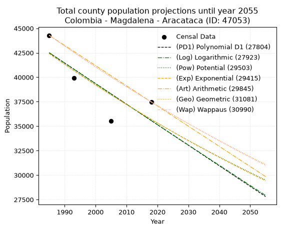
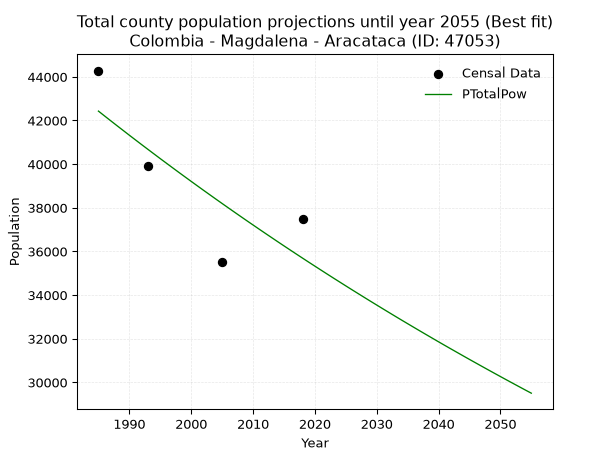
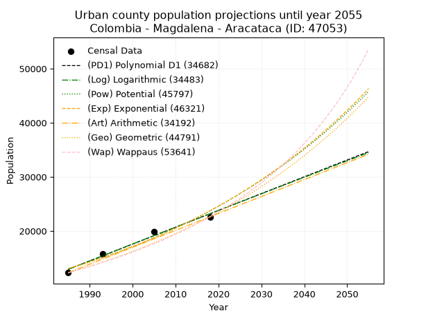
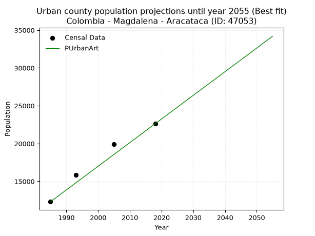
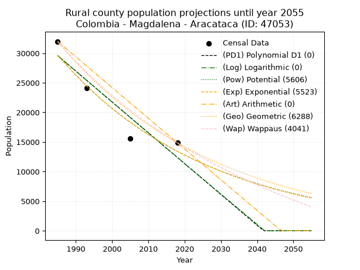
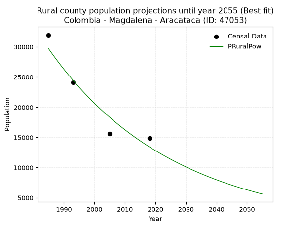

<div align="center">


</div>

# 📜 _“Population and Public Services Demand Projections (PPSD) until Year 2050 for Colombia - Magdalena - Aracataca (ID: 47053)”_
Keywords: `population` `public-service` `projection` `lineal` `polynomial` `logarithmic` `potential` `exponential` `arithmetic` `geometric` `wappaus` `dane` `colombia` `south-america`

PPSD are analytical estimates used by governments and planners to anticipate future changes in population size, age distribution, and the resulting community needs for utilities, healthcare, education, and infrastructure as sizing future water treatment facilities, electrical grids, and road networks based on spatial growth.

<div align="center">

</img>

</div>


> **General running parameters**: • app_version: _v20260806_. • Python version: _3.14.7_. • Pandas version: _3.0.5_. • NumPy version: _2.5.1_. • Creates, save and include plots into reports (create_plot): _False_. • Projection until year: _2050_. • Process polynomial degree 2 and up: _False_. • Process Wappaus: _True_. • Process Wappaus: _True_. • Set negative values to zero: _True_. • Set infinite values to zero: _True_. • Drop dataset notes: _True_. 
<div align="center">

Maps & GIS Layers: [:earth_americas:Google](http://maps.google.com/maps?q=10.58979074,-74.1867022) [:earth_americas:OSM](https://www.openstreetmap.org/#map=18/10.58979074/-74.1867022&layers=P) [:earth_americas:Bing](https://www.bing.com/maps?cp=10.58979074~-74.1867022&lvl=18) [:earth_americas:Apple](https://maps.apple.com/frame?center=10.58979074%2C-74.1867022&span=0.003%2C0.006) [:earth_americas:GISMobile](https://github.com/rcfdtools/R.GISMobile/blob/main/file/gis/CountyLayer_CO/Readme.md)

</div>


<div align="center">

```geojson
{
  "type": "Feature",
  "geometry": {
    "type": "Point", 
    "coordinates": [-74.1867022, 10.58979074]
  }, 
  "properties": {
    "Name": "Colombia - Magdalena - Aracataca (ID: 47053)"
  }
}
```

</div>


## 0. Census Data (4 records)

Census data are official statistics collected by a government about the people and housing in a country. They usually include counts of total population, age, sex, race, income, education, and jobs.

📅Global census file: [Population.xlsx](../data/Population.xlsx)

| Source   |   Year |   CountryID | CountryName   |   StateID | StateName   |   CountyID | CountyName   |   PTotal |   PUrban |   PRural |
|:---------|-------:|------------:|:--------------|----------:|:------------|-----------:|:-------------|---------:|---------:|---------:|
| DANE     |   1985 |          57 | Colombia      |        47 | Magdalena   |      47053 | Aracataca    |    44282 |    12299 |    31983 |
| DANE     |   1993 |          57 | Colombia      |        47 | Magdalena   |      47053 | Aracataca    |    39910 |    15845 |    24065 |
| DANE     |   2005 |          57 | Colombia      |        47 | Magdalena   |      47053 | Aracataca    |    35520 |    19894 |    15626 |
| DANE     |   2018 |          57 | Colombia      |        47 | Magdalena   |      47053 | Aracataca    |    37476 |    22620 |    14856 |

> 🔥Some records could had specific notes about the registered values or the corresponding urban or rural distribution.

📅[SUI-RUPS](https://www.datos.gov.co/Hacienda-y-Cr-dito-P-blico/Registro-nico-de-Prestadores-de-Servicios-P-blicos/4qkq-csdn/about_data) - Local public utility companies: [RUPS.csv](../data/RUPS.csv)

 | SERVICIO       | ESTADO    | NOMBRE                                                                                     | NIT         | DEPARTAMENTO_DOMICILIO   | MUNICIPIO_DOMICILIO   | DIRECCION         |   TELEFONO | EMAIL                    | TIPO_PRESTADOR                             | CLASIFICACION                 |
|:---------------|:----------|:-------------------------------------------------------------------------------------------|:------------|:-------------------------|:----------------------|:------------------|-----------:|:-------------------------|:-------------------------------------------|:------------------------------|
| ALCANTARILLADO | OPERATIVA | ALCALDIA MUNICIPAL DE ARACATACA                                                            | 891780041-0 | MAGDALENA                | ARACATACA             | CALLE 9 No. 4A 32 |    4270727 | tufith.hatum@hotmail.com | MUNICIPIO (PRESTACIÓN DIRECTA)             | HASTA 2500 SUSCRIPTORES       |
| ACUEDUCTO      | OPERATIVA | ALCALDIA MUNICIPAL DE ARACATACA                                                            | 891780041-0 | MAGDALENA                | ARACATACA             | CALLE 9 No. 4A 32 |    4270727 | tufith.hatum@hotmail.com | MUNICIPIO (PRESTACIÓN DIRECTA)             | MAS DE 2500 SUSCRIPTORES      |
| ACUEDUCTO      | OPERATIVA | ASOCIACION DE USUARIOS DEL ACUEDUCTO DEL CORREGIMIENTO DE CAUCA DEL MUNICIPIO DE ARACATACA | 900610625-5 | MAGDALENA                | ARACATACA             | CALLE 1 # 2-10    |    4222127 | asucauca@hotmail.com     | ORGANIZACION AUTORIZADA                    | MENOR O IGUAL A 2500 USUARIOS |
| ACUEDUCTO      | OPERATIVA | AGUAS DE ARACATACA S.A.S E.S.P                                                             | 900862450-4 | MAGDALENA                | ARACATACA             | CALLE 7 # 2-12    |    3058899 | rmendoza@naunet.co       | SOCIEDADES (EMPRESA DE SERVICIOS PUBLICOS) | MAYOR O IGUAL A 5001 USUARIOS |
| ALCANTARILLADO | OPERATIVA | AGUAS DE ARACATACA S.A.S E.S.P                                                             | 900862450-4 | MAGDALENA                | ARACATACA             | CALLE 7 # 2-12    |    3058899 | rmendoza@naunet.co       | SOCIEDADES (EMPRESA DE SERVICIOS PUBLICOS) | MAYOR O IGUAL A 5001 USUARIOS |

## 1. Total

### 1.1. Coefficients and Parameters

* (PD1) Polynomial Deg 1: -209.9221196306711, 459193.71979124984 (lineal)
* (Log) Logarithmic: -420910.5921188612, 3238641.783661265
* (Pow) Potential: -10.482670603082141, 39.196974422476295
* (Exp) Exponential: -0.005227973193236964, 1362734416.5642393
* (Art) Arithmetic: Year diff. 2018 - 1985 = 33, Population diff. 37476 - 44282 = -6806, Annual growth = -206.24242424242425
* (Geo) Geometric: Year diff. 2018 - 1985 = 33, Population diff. 37476 - 44282 = -6806, Annual growth % = -0.005044130759028098
* (Wap) Wappaus: i = -0.5045192500854332, Condition values only valid for < 200)

<sub>
Wappaus condition values: ['-0.00', '-0.50', '-1.01', '-1.51', '-2.02', '-2.52', '-3.03', '-3.53', '-4.04', '-4.54', '-5.05', '-5.55', '-6.05', '-6.56', '-7.06', '-7.57', '-8.07', '-8.58', '-9.08', '-9.59', '-10.09', '-10.59', '-11.10', '-11.60', '-12.11', '-12.61', '-13.12', '-13.62', '-14.13', '-14.63', '-15.14', '-15.64', '-16.14', '-16.65', '-17.15', '-17.66', '-18.16', '-18.67', '-19.17', '-19.68', '-20.18', '-20.69', '-21.19', '-21.69', '-22.20', '-22.70', '-23.21', '-23.71', '-24.22', '-24.72', '-25.23', '-25.73', '-26.24', '-26.74', '-27.24', '-27.75', '-28.25', '-28.76', '-29.26', '-29.77', '-30.27', '-30.78', '-31.28', '-31.78', '-32.29', '-32.79']
</sub>


### 1.2. Projected Dataset

|   Year |   CountyID |   PTotalPD1 |   PTotalLog |   PTotalPow |   PTotalExp |   PTotalArt |   PTotalGeo |   PTotalWap |
|-------:|-----------:|------------:|------------:|------------:|------------:|------------:|------------:|------------:|
|   1985 |      47053 |       42498 |       42510 |       42427 |       42414 |       44282 |       44282 |       44282 |
|   1986 |      47053 |       42288 |       42298 |       42203 |       42193 |       44076 |       44059 |       44059 |
|   1987 |      47053 |       42078 |       42086 |       41981 |       41973 |       43870 |       43836 |       43837 |
|   1988 |      47053 |       41869 |       41874 |       41760 |       41754 |       43663 |       43615 |       43617 |
|   1989 |      47053 |       41659 |       41663 |       41541 |       41536 |       43457 |       43395 |       43397 |
|   1990 |      47053 |       41449 |       41451 |       41322 |       41320 |       43251 |       43176 |       43179 |
|   1991 |      47053 |       41239 |       41240 |       41105 |       41104 |       43045 |       42959 |       42962 |
|   1992 |      47053 |       41029 |       41028 |       40889 |       40890 |       42838 |       42742 |       42745 |
|   1993 |      47053 |       40819 |       40817 |       40675 |       40677 |       42632 |       42526 |       42530 |
|   1994 |      47053 |       40609 |       40606 |       40462 |       40465 |       42426 |       42312 |       42316 |
|   1995 |      47053 |       40399 |       40395 |       40249 |       40254 |       42220 |       42098 |       42103 |
|   1996 |      47053 |       40189 |       40184 |       40039 |       40044 |       42013 |       41886 |       41891 |
|   1997 |      47053 |       39979 |       39973 |       39829 |       39835 |       41807 |       41675 |       41680 |
|   1998 |      47053 |       39769 |       39763 |       39620 |       39627 |       41601 |       41465 |       41470 |
|   1999 |      47053 |       39559 |       39552 |       39413 |       39420 |       41395 |       41255 |       41261 |
|   2000 |      47053 |       39349 |       39341 |       39207 |       39215 |       41188 |       41047 |       41053 |
|   2001 |      47053 |       39140 |       39131 |       39002 |       39010 |       40982 |       40840 |       40846 |
|   2002 |      47053 |       38930 |       38921 |       38798 |       38807 |       40776 |       40634 |       40640 |
|   2003 |      47053 |       38720 |       38711 |       38596 |       38605 |       40570 |       40429 |       40435 |
|   2004 |      47053 |       38510 |       38500 |       38394 |       38403 |       40363 |       40225 |       40231 |
|   2005 |      47053 |       38300 |       38290 |       38194 |       38203 |       40157 |       40022 |       40028 |
|   2006 |      47053 |       38090 |       38081 |       37995 |       38004 |       39951 |       39821 |       39826 |
|   2007 |      47053 |       37880 |       37871 |       37797 |       37806 |       39745 |       39620 |       39625 |
|   2008 |      47053 |       37670 |       37661 |       37600 |       37609 |       39538 |       39420 |       39425 |
|   2009 |      47053 |       37460 |       37452 |       37404 |       37413 |       39332 |       39221 |       39226 |
|   2010 |      47053 |       37250 |       37242 |       37210 |       37217 |       39126 |       39023 |       39028 |
|   2011 |      47053 |       37040 |       37033 |       37016 |       37023 |       38920 |       38826 |       38831 |
|   2012 |      47053 |       36830 |       36824 |       36824 |       36830 |       38713 |       38630 |       38635 |
|   2013 |      47053 |       36620 |       36614 |       36633 |       36638 |       38507 |       38436 |       38439 |
|   2014 |      47053 |       36411 |       36405 |       36442 |       36447 |       38301 |       38242 |       38245 |
|   2015 |      47053 |       36201 |       36196 |       36253 |       36257 |       38095 |       38049 |       38051 |
|   2016 |      47053 |       35991 |       35988 |       36065 |       36068 |       37888 |       37857 |       37859 |
|   2017 |      47053 |       35781 |       35779 |       35878 |       35880 |       37682 |       37666 |       37667 |
|   2018 |      47053 |       35571 |       35570 |       35692 |       35693 |       37476 |       37476 |       37476 |
|   2019 |      47053 |       35361 |       35362 |       35507 |       35507 |       37270 |       37287 |       37286 |
|   2020 |      47053 |       35151 |       35153 |       35324 |       35322 |       37064 |       37099 |       37097 |
|   2021 |      47053 |       34941 |       34945 |       35141 |       35138 |       36857 |       36912 |       36909 |
|   2022 |      47053 |       34731 |       34737 |       34959 |       34954 |       36651 |       36726 |       36721 |
|   2023 |      47053 |       34521 |       34529 |       34778 |       34772 |       36445 |       36540 |       36535 |
|   2024 |      47053 |       34311 |       34321 |       34599 |       34591 |       36239 |       36356 |       36349 |
|   2025 |      47053 |       34101 |       34113 |       34420 |       34410 |       36032 |       36173 |       36165 |
|   2026 |      47053 |       33892 |       33905 |       34242 |       34231 |       35826 |       35990 |       35981 |
|   2027 |      47053 |       33682 |       33697 |       34066 |       34052 |       35620 |       35809 |       35798 |
|   2028 |      47053 |       33472 |       33490 |       33890 |       33875 |       35414 |       35628 |       35615 |
|   2029 |      47053 |       33262 |       33282 |       33715 |       33698 |       35207 |       35448 |       35434 |
|   2030 |      47053 |       33052 |       33075 |       33542 |       33523 |       35001 |       35269 |       35253 |
|   2031 |      47053 |       32842 |       32867 |       33369 |       33348 |       34795 |       35092 |       35074 |
|   2032 |      47053 |       32632 |       32660 |       33197 |       33174 |       34589 |       34915 |       34895 |
|   2033 |      47053 |       32422 |       32453 |       33026 |       33001 |       34382 |       34738 |       34716 |
|   2034 |      47053 |       32212 |       32246 |       32856 |       32829 |       34176 |       34563 |       34539 |
|   2035 |      47053 |       32002 |       32039 |       32688 |       32658 |       33970 |       34389 |       34363 |
|   2036 |      47053 |       31792 |       31832 |       32520 |       32487 |       33764 |       34215 |       34187 |
|   2037 |      47053 |       31582 |       31626 |       32353 |       32318 |       33557 |       34043 |       34012 |
|   2038 |      47053 |       31372 |       31419 |       32187 |       32149 |       33351 |       33871 |       33838 |
|   2039 |      47053 |       31163 |       31213 |       32022 |       31982 |       33145 |       33700 |       33664 |
|   2040 |      47053 |       30953 |       31006 |       31857 |       31815 |       32939 |       33530 |       33491 |
|   2041 |      47053 |       30743 |       30800 |       31694 |       31649 |       32732 |       33361 |       33320 |
|   2042 |      47053 |       30533 |       30594 |       31532 |       31484 |       32526 |       33193 |       33148 |
|   2043 |      47053 |       30323 |       30388 |       31371 |       31320 |       32320 |       33025 |       32978 |
|   2044 |      47053 |       30113 |       30182 |       31210 |       31157 |       32114 |       32859 |       32808 |
|   2045 |      47053 |       29903 |       29976 |       31050 |       30994 |       31907 |       32693 |       32639 |
|   2046 |      47053 |       29693 |       29770 |       30892 |       30833 |       31701 |       32528 |       32471 |
|   2047 |      47053 |       29483 |       29564 |       30734 |       30672 |       31495 |       32364 |       32304 |
|   2048 |      47053 |       29273 |       29359 |       30577 |       30512 |       31289 |       32201 |       32137 |
|   2049 |      47053 |       29063 |       29153 |       30421 |       30353 |       31082 |       32038 |       31971 |
|   2050 |      47053 |       28853 |       28948 |       30266 |       30194 |       30876 |       31877 |       31806 |
<div align="center">

</img>

</div>


### 1.3. Best fit with absolute and relative error (%)

Relative error puts that difference into context by dividing the absolute error by the true value, creating a unitless ratio or percentage that shows the scale of the mistake.

Absolute and relative error

|   Year | Source   |   CountryID | CountryName   |   StateID | StateName   |   CountyID_x | CountyName   |   PTotal |   PUrban |   PRural |   CountyID_y |   PTotalPD1 |   PTotalLog |   PTotalPow |   PTotalExp |   PTotalArt |   PTotalGeo |   PTotalWap |   PTotalPD1AbsError |   PTotalLogAbsError |   PTotalPowAbsError |   PTotalExpAbsError |   PTotalArtAbsError |   PTotalGeoAbsError |   PTotalWapAbsError |   PTotalPD1RelError |   PTotalLogRelError |   PTotalPowRelError |   PTotalExpRelError |   PTotalArtRelError |   PTotalGeoRelError |   PTotalWapRelError |
|-------:|:---------|------------:|:--------------|----------:|:------------|-------------:|:-------------|---------:|---------:|---------:|-------------:|------------:|------------:|------------:|------------:|------------:|------------:|------------:|--------------------:|--------------------:|--------------------:|--------------------:|--------------------:|--------------------:|--------------------:|--------------------:|--------------------:|--------------------:|--------------------:|--------------------:|--------------------:|--------------------:|
|   1985 | DANE     |          57 | Colombia      |        47 | Magdalena   |        47053 | Aracataca    |    44282 |    12299 |    31983 |        47053 |       42498 |       42510 |       42427 |       42414 |       44282 |       44282 |       44282 |                1784 |                1772 |                1855 |                1868 |                   0 |                   0 |                   0 |             4.02872 |             4.00163 |             4.18906 |             4.21842 |             0       |             0       |             0       |
|   1993 | DANE     |          57 | Colombia      |        47 | Magdalena   |        47053 | Aracataca    |    39910 |    15845 |    24065 |        47053 |       40819 |       40817 |       40675 |       40677 |       42632 |       42526 |       42530 |                 909 |                 907 |                 765 |                 767 |                2722 |                2616 |                2620 |             2.27762 |             2.27261 |             1.91681 |             1.92182 |             6.82035 |             6.55475 |             6.56477 |
|   2005 | DANE     |          57 | Colombia      |        47 | Magdalena   |        47053 | Aracataca    |    35520 |    19894 |    15626 |        47053 |       38300 |       38290 |       38194 |       38203 |       40157 |       40022 |       40028 |                2780 |                2770 |                2674 |                2683 |                4637 |                4502 |                4508 |             7.82658 |             7.79842 |             7.52815 |             7.55349 |            13.0546  |            12.6745  |            12.6914  |
|   2018 | DANE     |          57 | Colombia      |        47 | Magdalena   |        47053 | Aracataca    |    37476 |    22620 |    14856 |        47053 |       35571 |       35570 |       35692 |       35693 |       37476 |       37476 |       37476 |                1905 |                1906 |                1784 |                1783 |                   0 |                   0 |                   0 |             5.08325 |             5.08592 |             4.76038 |             4.75771 |             0       |             0       |             0       |

Relative error mean

| Method    |   RelError | Best   |
|:----------|-----------:|:-------|
| PTotalPD1 |    4.80404 |        |
| PTotalLog |    4.78965 |        |
| PTotalPow |    4.5986  | True   |
| PTotalExp |    4.61286 |        |
| PTotalArt |    4.96874 |        |
| PTotalGeo |    4.80732 |        |
| PTotalWap |    4.81405 |        |

💙Best method: _**PTotalPow**_
<div align="center">

</img>

</div>


### 1.4. Fresh water supply demand in liters per capita per day (lpcd)

The fresh water supply demand typically ranges from 100 to 300 liters per capita per day (lpcd) for standard domestic and municipal planning, though absolute survival minimums set by the World Health Organization are as low as 7.5 to 20 liters per day, and total consumption in high-income nations can exceed 400 liters.

> `CZ`: Level in meters above the sea level (masl)<br> `WS`: Fresh water supply demand in liters per capita per day (lpcd or l/h/d)<br> `WSAll`: Zonal fresh water supply demand in liters per second (l/s)<br> `A`: Zonal area in square meters<br> `DP`: Population density (people/hectare or p/ha)

Reference values (RAS Colombia)

|    CZ |   WS |
|------:|-----:|
|  1000 |  120 |
|  2000 |  130 |
| 99999 |  140 |

County shapefile geometry properties and water supply values

|   CountyID |      ATotal |   CZTotal |   WSTotal |
|-----------:|------------:|----------:|----------:|
|      47053 | 1.73841e+09 |   1964.38 |       130 |

Projected values for best method: PTotalPow

|   CountyID |   Year |   PTotalPow |   DPTotal |   WSTotal |   WSTotalAll |
|-----------:|-------:|------------:|----------:|----------:|-------------:|
|      47053 |   1985 |       42427 |      0.24 |       130 |      63.8369 |
|      47053 |   1986 |       42203 |      0.24 |       130 |      63.4999 |
|      47053 |   1987 |       41981 |      0.24 |       130 |      63.1659 |
|      47053 |   1988 |       41760 |      0.24 |       130 |      62.8333 |
|      47053 |   1989 |       41541 |      0.24 |       130 |      62.5038 |
|      47053 |   1990 |       41322 |      0.24 |       130 |      62.1743 |
|      47053 |   1991 |       41105 |      0.24 |       130 |      61.8478 |
|      47053 |   1992 |       40889 |      0.24 |       130 |      61.5228 |
|      47053 |   1993 |       40675 |      0.23 |       130 |      61.2008 |
|      47053 |   1994 |       40462 |      0.23 |       130 |      60.8803 |
|      47053 |   1995 |       40249 |      0.23 |       130 |      60.5598 |
|      47053 |   1996 |       40039 |      0.23 |       130 |      60.2439 |
|      47053 |   1997 |       39829 |      0.23 |       130 |      59.9279 |
|      47053 |   1998 |       39620 |      0.23 |       130 |      59.6134 |
|      47053 |   1999 |       39413 |      0.23 |       130 |      59.302  |
|      47053 |   2000 |       39207 |      0.23 |       130 |      58.992  |
|      47053 |   2001 |       39002 |      0.22 |       130 |      58.6836 |
|      47053 |   2002 |       38798 |      0.22 |       130 |      58.3766 |
|      47053 |   2003 |       38596 |      0.22 |       130 |      58.0727 |
|      47053 |   2004 |       38394 |      0.22 |       130 |      57.7687 |
|      47053 |   2005 |       38194 |      0.22 |       130 |      57.4678 |
|      47053 |   2006 |       37995 |      0.22 |       130 |      57.1684 |
|      47053 |   2007 |       37797 |      0.22 |       130 |      56.8705 |
|      47053 |   2008 |       37600 |      0.22 |       130 |      56.5741 |
|      47053 |   2009 |       37404 |      0.22 |       130 |      56.2792 |
|      47053 |   2010 |       37210 |      0.21 |       130 |      55.9873 |
|      47053 |   2011 |       37016 |      0.21 |       130 |      55.6954 |
|      47053 |   2012 |       36824 |      0.21 |       130 |      55.4065 |
|      47053 |   2013 |       36633 |      0.21 |       130 |      55.1191 |
|      47053 |   2014 |       36442 |      0.21 |       130 |      54.8317 |
|      47053 |   2015 |       36253 |      0.21 |       130 |      54.5473 |
|      47053 |   2016 |       36065 |      0.21 |       130 |      54.2645 |
|      47053 |   2017 |       35878 |      0.21 |       130 |      53.9831 |
|      47053 |   2018 |       35692 |      0.21 |       130 |      53.7032 |
|      47053 |   2019 |       35507 |      0.2  |       130 |      53.4249 |
|      47053 |   2020 |       35324 |      0.2  |       130 |      53.1495 |
|      47053 |   2021 |       35141 |      0.2  |       130 |      52.8742 |
|      47053 |   2022 |       34959 |      0.2  |       130 |      52.6003 |
|      47053 |   2023 |       34778 |      0.2  |       130 |      52.328  |
|      47053 |   2024 |       34599 |      0.2  |       130 |      52.0587 |
|      47053 |   2025 |       34420 |      0.2  |       130 |      51.7894 |
|      47053 |   2026 |       34242 |      0.2  |       130 |      51.5215 |
|      47053 |   2027 |       34066 |      0.2  |       130 |      51.2567 |
|      47053 |   2028 |       33890 |      0.19 |       130 |      50.9919 |
|      47053 |   2029 |       33715 |      0.19 |       130 |      50.7286 |
|      47053 |   2030 |       33542 |      0.19 |       130 |      50.4683 |
|      47053 |   2031 |       33369 |      0.19 |       130 |      50.208  |
|      47053 |   2032 |       33197 |      0.19 |       130 |      49.9492 |
|      47053 |   2033 |       33026 |      0.19 |       130 |      49.6919 |
|      47053 |   2034 |       32856 |      0.19 |       130 |      49.4361 |
|      47053 |   2035 |       32688 |      0.19 |       130 |      49.1833 |
|      47053 |   2036 |       32520 |      0.19 |       130 |      48.9306 |
|      47053 |   2037 |       32353 |      0.19 |       130 |      48.6793 |
|      47053 |   2038 |       32187 |      0.19 |       130 |      48.4295 |
|      47053 |   2039 |       32022 |      0.18 |       130 |      48.1812 |
|      47053 |   2040 |       31857 |      0.18 |       130 |      47.933  |
|      47053 |   2041 |       31694 |      0.18 |       130 |      47.6877 |
|      47053 |   2042 |       31532 |      0.18 |       130 |      47.444  |
|      47053 |   2043 |       31371 |      0.18 |       130 |      47.2017 |
|      47053 |   2044 |       31210 |      0.18 |       130 |      46.9595 |
|      47053 |   2045 |       31050 |      0.18 |       130 |      46.7188 |
|      47053 |   2046 |       30892 |      0.18 |       130 |      46.481  |
|      47053 |   2047 |       30734 |      0.18 |       130 |      46.2433 |
|      47053 |   2048 |       30577 |      0.18 |       130 |      46.0071 |
|      47053 |   2049 |       30421 |      0.17 |       130 |      45.7723 |
|      47053 |   2050 |       30266 |      0.17 |       130 |      45.5391 |

## 2. Urban

### 2.1. Coefficients and Parameters

* (PD1) Polynomial Deg 1: 310.8237655559995, -604060.7370533881 (lineal)
* (Log) Logarithmic: 622378.2581686894, -4713037.627766563
* (Pow) Potential: 36.221145162356585, -115.33300290006375
* (Exp) Exponential: 0.018085841653833694, 3.346710011098915e-12
* (Art) Arithmetic: Year diff. 2018 - 1985 = 33, Population diff. 22620 - 12299 = 10321, Annual growth = 312.75757575757575
* (Geo) Geometric: Year diff. 2018 - 1985 = 33, Population diff. 22620 - 12299 = 10321, Annual growth % = 0.018635652919468004
* (Wap) Wappaus: i = 1.7913318007822432, Condition values only valid for < 200)

<sub>
Wappaus condition values: ['0.00', '1.79', '3.58', '5.37', '7.17', '8.96', '10.75', '12.54', '14.33', '16.12', '17.91', '19.70', '21.50', '23.29', '25.08', '26.87', '28.66', '30.45', '32.24', '34.04', '35.83', '37.62', '39.41', '41.20', '42.99', '44.78', '46.57', '48.37', '50.16', '51.95', '53.74', '55.53', '57.32', '59.11', '60.91', '62.70', '64.49', '66.28', '68.07', '69.86', '71.65', '73.44', '75.24', '77.03', '78.82', '80.61', '82.40', '84.19', '85.98', '87.78', '89.57', '91.36', '93.15', '94.94', '96.73', '98.52', '100.31', '102.11', '103.90', '105.69', '107.48', '109.27', '111.06', '112.85', '114.65', '116.44']
</sub>


### 2.2. Projected Dataset

|   Year |   CountyID |   PUrbanPD1 |   PUrbanLog |   PUrbanPow |   PUrbanExp |   PUrbanArt |   PUrbanGeo |   PUrbanWap |
|-------:|-----------:|------------:|------------:|------------:|------------:|------------:|------------:|------------:|
|   1985 |      47053 |       12924 |       12913 |       13051 |       13061 |       12299 |       12299 |       12299 |
|   1986 |      47053 |       13235 |       13227 |       13292 |       13299 |       12612 |       12528 |       12521 |
|   1987 |      47053 |       13546 |       13540 |       13536 |       13542 |       12925 |       12762 |       12748 |
|   1988 |      47053 |       13857 |       13853 |       13785 |       13789 |       13237 |       12999 |       12978 |
|   1989 |      47053 |       14168 |       14166 |       14039 |       14040 |       13550 |       13242 |       13213 |
|   1990 |      47053 |       14479 |       14479 |       14297 |       14297 |       13863 |       13489 |       13452 |
|   1991 |      47053 |       14789 |       14792 |       14559 |       14558 |       14176 |       13740 |       13696 |
|   1992 |      47053 |       15100 |       15104 |       14826 |       14823 |       14488 |       13996 |       13944 |
|   1993 |      47053 |       15411 |       15417 |       15098 |       15094 |       14801 |       14257 |       14198 |
|   1994 |      47053 |       15722 |       15729 |       15375 |       15369 |       15114 |       14522 |       14456 |
|   1995 |      47053 |       16033 |       16041 |       15657 |       15650 |       15427 |       14793 |       14719 |
|   1996 |      47053 |       16343 |       16353 |       15944 |       15935 |       15739 |       15069 |       14987 |
|   1997 |      47053 |       16654 |       16665 |       16236 |       16226 |       16052 |       15350 |       15261 |
|   1998 |      47053 |       16965 |       16976 |       16533 |       16522 |       16365 |       15636 |       15541 |
|   1999 |      47053 |       17276 |       17288 |       16835 |       16824 |       16678 |       15927 |       15826 |
|   2000 |      47053 |       17587 |       17599 |       17143 |       17131 |       16990 |       16224 |       16117 |
|   2001 |      47053 |       17898 |       17910 |       17456 |       17444 |       17303 |       16526 |       16414 |
|   2002 |      47053 |       18208 |       18221 |       17775 |       17762 |       17616 |       16834 |       16717 |
|   2003 |      47053 |       18519 |       18532 |       18099 |       18086 |       17929 |       17148 |       17027 |
|   2004 |      47053 |       18830 |       18842 |       18430 |       18416 |       18241 |       17467 |       17343 |
|   2005 |      47053 |       19141 |       19153 |       18766 |       18752 |       18554 |       17793 |       17667 |
|   2006 |      47053 |       19452 |       19463 |       19108 |       19094 |       18867 |       18125 |       17997 |
|   2007 |      47053 |       19763 |       19773 |       19456 |       19443 |       19180 |       18462 |       18335 |
|   2008 |      47053 |       20073 |       20083 |       19810 |       19798 |       19492 |       18806 |       18681 |
|   2009 |      47053 |       20384 |       20393 |       20170 |       20159 |       19805 |       19157 |       19034 |
|   2010 |      47053 |       20695 |       20703 |       20537 |       20527 |       20118 |       19514 |       19396 |
|   2011 |      47053 |       21006 |       21013 |       20911 |       20902 |       20431 |       19877 |       19766 |
|   2012 |      47053 |       21317 |       21322 |       21290 |       21283 |       20743 |       20248 |       20145 |
|   2013 |      47053 |       21628 |       21631 |       21677 |       21672 |       21056 |       20625 |       20533 |
|   2014 |      47053 |       21938 |       21940 |       22071 |       22067 |       21369 |       21010 |       20930 |
|   2015 |      47053 |       22249 |       22249 |       22471 |       22470 |       21682 |       21401 |       21337 |
|   2016 |      47053 |       22560 |       22558 |       22879 |       22880 |       21994 |       21800 |       21754 |
|   2017 |      47053 |       22871 |       22867 |       23293 |       23297 |       22307 |       22206 |       22182 |
|   2018 |      47053 |       23182 |       23175 |       23715 |       23723 |       22620 |       22620 |       22620 |
|   2019 |      47053 |       23492 |       23483 |       24145 |       24156 |       22933 |       23042 |       23070 |
|   2020 |      47053 |       23803 |       23792 |       24582 |       24596 |       23246 |       23471 |       23531 |
|   2021 |      47053 |       24114 |       24100 |       25026 |       25045 |       23558 |       23908 |       24005 |
|   2022 |      47053 |       24425 |       24408 |       25479 |       25502 |       23871 |       24354 |       24491 |
|   2023 |      47053 |       24736 |       24715 |       25939 |       25968 |       24184 |       24808 |       24991 |
|   2024 |      47053 |       25047 |       25023 |       26408 |       26442 |       24497 |       25270 |       25504 |
|   2025 |      47053 |       25357 |       25330 |       26884 |       26924 |       24809 |       25741 |       26032 |
|   2026 |      47053 |       25668 |       25638 |       27369 |       27416 |       25122 |       26221 |       26574 |
|   2027 |      47053 |       25979 |       25945 |       27863 |       27916 |       25435 |       26709 |       27132 |
|   2028 |      47053 |       26290 |       26252 |       28365 |       28426 |       25748 |       27207 |       27707 |
|   2029 |      47053 |       26601 |       26558 |       28876 |       28944 |       26060 |       27714 |       28298 |
|   2030 |      47053 |       26912 |       26865 |       29396 |       29473 |       26373 |       28231 |       28907 |
|   2031 |      47053 |       27222 |       27172 |       29925 |       30010 |       26686 |       28757 |       29535 |
|   2032 |      47053 |       27533 |       27478 |       30464 |       30558 |       26999 |       29293 |       30182 |
|   2033 |      47053 |       27844 |       27784 |       31011 |       31116 |       27311 |       29838 |       30849 |
|   2034 |      47053 |       28155 |       28090 |       31569 |       31684 |       27624 |       30394 |       31538 |
|   2035 |      47053 |       28466 |       28396 |       32136 |       32262 |       27937 |       30961 |       32249 |
|   2036 |      47053 |       28776 |       28702 |       32713 |       32851 |       28250 |       31538 |       32984 |
|   2037 |      47053 |       29087 |       29008 |       33300 |       33450 |       28562 |       32126 |       33743 |
|   2038 |      47053 |       29398 |       29313 |       33897 |       34061 |       28875 |       32724 |       34528 |
|   2039 |      47053 |       29709 |       29618 |       34505 |       34682 |       29188 |       33334 |       35340 |
|   2040 |      47053 |       30020 |       29924 |       35123 |       35315 |       29501 |       33955 |       36181 |
|   2041 |      47053 |       30331 |       30229 |       35752 |       35960 |       29813 |       34588 |       37052 |
|   2042 |      47053 |       30641 |       30533 |       36392 |       36616 |       30126 |       35233 |       37955 |
|   2043 |      47053 |       30952 |       30838 |       37043 |       37284 |       30439 |       35889 |       38892 |
|   2044 |      47053 |       31263 |       31143 |       37706 |       37965 |       30752 |       36558 |       39864 |
|   2045 |      47053 |       31574 |       31447 |       38380 |       38658 |       31064 |       37239 |       40874 |
|   2046 |      47053 |       31885 |       31751 |       39065 |       39363 |       31377 |       37933 |       41924 |
|   2047 |      47053 |       32196 |       32055 |       39763 |       40082 |       31690 |       38640 |       43016 |
|   2048 |      47053 |       32506 |       32359 |       40472 |       40813 |       32003 |       39360 |       44153 |
|   2049 |      47053 |       32817 |       32663 |       41194 |       41558 |       32315 |       40094 |       45338 |
|   2050 |      47053 |       33128 |       32967 |       41929 |       42316 |       32628 |       40841 |       46574 |
<div align="center">

</img>

</div>


### 2.3. Best fit with absolute and relative error (%)

Relative error puts that difference into context by dividing the absolute error by the true value, creating a unitless ratio or percentage that shows the scale of the mistake.

Absolute and relative error

|   Year | Source   |   CountryID | CountryName   |   StateID | StateName   |   CountyID_x | CountyName   |   PTotal |   PUrban |   PRural |   CountyID_y |   PUrbanPD1 |   PUrbanLog |   PUrbanPow |   PUrbanExp |   PUrbanArt |   PUrbanGeo |   PUrbanWap |   PUrbanPD1AbsError |   PUrbanLogAbsError |   PUrbanPowAbsError |   PUrbanExpAbsError |   PUrbanArtAbsError |   PUrbanGeoAbsError |   PUrbanWapAbsError |   PUrbanPD1RelError |   PUrbanLogRelError |   PUrbanPowRelError |   PUrbanExpRelError |   PUrbanArtRelError |   PUrbanGeoRelError |   PUrbanWapRelError |
|-------:|:---------|------------:|:--------------|----------:|:------------|-------------:|:-------------|---------:|---------:|---------:|-------------:|------------:|------------:|------------:|------------:|------------:|------------:|------------:|--------------------:|--------------------:|--------------------:|--------------------:|--------------------:|--------------------:|--------------------:|--------------------:|--------------------:|--------------------:|--------------------:|--------------------:|--------------------:|--------------------:|
|   1985 | DANE     |          57 | Colombia      |        47 | Magdalena   |        47053 | Aracataca    |    44282 |    12299 |    31983 |        47053 |       12924 |       12913 |       13051 |       13061 |       12299 |       12299 |       12299 |                 625 |                 614 |                 752 |                 762 |                   0 |                   0 |                   0 |             5.08171 |             4.99228 |             6.11432 |             6.19563 |             0       |              0      |              0      |
|   1993 | DANE     |          57 | Colombia      |        47 | Magdalena   |        47053 | Aracataca    |    39910 |    15845 |    24065 |        47053 |       15411 |       15417 |       15098 |       15094 |       14801 |       14257 |       14198 |                 434 |                 428 |                 747 |                 751 |                1044 |                1588 |                1647 |             2.73903 |             2.70117 |             4.71442 |             4.73967 |             6.58883 |             10.0221 |             10.3944 |
|   2005 | DANE     |          57 | Colombia      |        47 | Magdalena   |        47053 | Aracataca    |    35520 |    19894 |    15626 |        47053 |       19141 |       19153 |       18766 |       18752 |       18554 |       17793 |       17667 |                 753 |                 741 |                1128 |                1142 |                1340 |                2101 |                2227 |             3.78506 |             3.72474 |             5.67005 |             5.74042 |             6.7357  |             10.561  |             11.1943 |
|   2018 | DANE     |          57 | Colombia      |        47 | Magdalena   |        47053 | Aracataca    |    37476 |    22620 |    14856 |        47053 |       23182 |       23175 |       23715 |       23723 |       22620 |       22620 |       22620 |                 562 |                 555 |                1095 |                1103 |                   0 |                   0 |                   0 |             2.48453 |             2.45358 |             4.84085 |             4.87622 |             0       |              0      |              0      |

Relative error mean

| Method    |   RelError | Best   |
|:----------|-----------:|:-------|
| PUrbanPD1 |    3.52258 |        |
| PUrbanLog |    3.46794 |        |
| PUrbanPow |    5.33491 |        |
| PUrbanExp |    5.38798 |        |
| PUrbanArt |    3.33113 | True   |
| PUrbanGeo |    5.14577 |        |
| PUrbanWap |    5.39719 |        |

💙Best method: _**PUrbanArt**_
<div align="center">

</img>

</div>


### 2.4. Fresh water supply demand in liters per capita per day (lpcd)

The fresh water supply demand typically ranges from 100 to 300 liters per capita per day (lpcd) for standard domestic and municipal planning, though absolute survival minimums set by the World Health Organization are as low as 7.5 to 20 liters per day, and total consumption in high-income nations can exceed 400 liters.

> `CZ`: Level in meters above the sea level (masl)<br> `WS`: Fresh water supply demand in liters per capita per day (lpcd or l/h/d)<br> `WSAll`: Zonal fresh water supply demand in liters per second (l/s)<br> `A`: Zonal area in square meters<br> `DP`: Population density (people/hectare or p/ha)

Reference values (RAS Colombia)

|    CZ |   WS |
|------:|-----:|
|  1000 |  120 |
|  2000 |  130 |
| 99999 |  140 |

County shapefile geometry properties and water supply values

|   CountyID |      AUrban |   CZUrban |   WSUrban |
|-----------:|------------:|----------:|----------:|
|      47053 | 3.07406e+06 |   40.1623 |       120 |

Projected values for best method: PUrbanArt

|   CountyID |   Year |   PUrbanArt |   DPUrban |   WSUrban |   WSUrbanAll |
|-----------:|-------:|------------:|----------:|----------:|-------------:|
|      47053 |   1985 |       12299 |     40.01 |       120 |      17.0819 |
|      47053 |   1986 |       12612 |     41.03 |       120 |      17.5167 |
|      47053 |   1987 |       12925 |     42.05 |       120 |      17.9514 |
|      47053 |   1988 |       13237 |     43.06 |       120 |      18.3847 |
|      47053 |   1989 |       13550 |     44.08 |       120 |      18.8194 |
|      47053 |   1990 |       13863 |     45.1  |       120 |      19.2542 |
|      47053 |   1991 |       14176 |     46.11 |       120 |      19.6889 |
|      47053 |   1992 |       14488 |     47.13 |       120 |      20.1222 |
|      47053 |   1993 |       14801 |     48.15 |       120 |      20.5569 |
|      47053 |   1994 |       15114 |     49.17 |       120 |      20.9917 |
|      47053 |   1995 |       15427 |     50.18 |       120 |      21.4264 |
|      47053 |   1996 |       15739 |     51.2  |       120 |      21.8597 |
|      47053 |   1997 |       16052 |     52.22 |       120 |      22.2944 |
|      47053 |   1998 |       16365 |     53.24 |       120 |      22.7292 |
|      47053 |   1999 |       16678 |     54.25 |       120 |      23.1639 |
|      47053 |   2000 |       16990 |     55.27 |       120 |      23.5972 |
|      47053 |   2001 |       17303 |     56.29 |       120 |      24.0319 |
|      47053 |   2002 |       17616 |     57.31 |       120 |      24.4667 |
|      47053 |   2003 |       17929 |     58.32 |       120 |      24.9014 |
|      47053 |   2004 |       18241 |     59.34 |       120 |      25.3347 |
|      47053 |   2005 |       18554 |     60.36 |       120 |      25.7694 |
|      47053 |   2006 |       18867 |     61.37 |       120 |      26.2042 |
|      47053 |   2007 |       19180 |     62.39 |       120 |      26.6389 |
|      47053 |   2008 |       19492 |     63.41 |       120 |      27.0722 |
|      47053 |   2009 |       19805 |     64.43 |       120 |      27.5069 |
|      47053 |   2010 |       20118 |     65.44 |       120 |      27.9417 |
|      47053 |   2011 |       20431 |     66.46 |       120 |      28.3764 |
|      47053 |   2012 |       20743 |     67.48 |       120 |      28.8097 |
|      47053 |   2013 |       21056 |     68.5  |       120 |      29.2444 |
|      47053 |   2014 |       21369 |     69.51 |       120 |      29.6792 |
|      47053 |   2015 |       21682 |     70.53 |       120 |      30.1139 |
|      47053 |   2016 |       21994 |     71.55 |       120 |      30.5472 |
|      47053 |   2017 |       22307 |     72.57 |       120 |      30.9819 |
|      47053 |   2018 |       22620 |     73.58 |       120 |      31.4167 |
|      47053 |   2019 |       22933 |     74.6  |       120 |      31.8514 |
|      47053 |   2020 |       23246 |     75.62 |       120 |      32.2861 |
|      47053 |   2021 |       23558 |     76.63 |       120 |      32.7194 |
|      47053 |   2022 |       23871 |     77.65 |       120 |      33.1542 |
|      47053 |   2023 |       24184 |     78.67 |       120 |      33.5889 |
|      47053 |   2024 |       24497 |     79.69 |       120 |      34.0236 |
|      47053 |   2025 |       24809 |     80.7  |       120 |      34.4569 |
|      47053 |   2026 |       25122 |     81.72 |       120 |      34.8917 |
|      47053 |   2027 |       25435 |     82.74 |       120 |      35.3264 |
|      47053 |   2028 |       25748 |     83.76 |       120 |      35.7611 |
|      47053 |   2029 |       26060 |     84.77 |       120 |      36.1944 |
|      47053 |   2030 |       26373 |     85.79 |       120 |      36.6292 |
|      47053 |   2031 |       26686 |     86.81 |       120 |      37.0639 |
|      47053 |   2032 |       26999 |     87.83 |       120 |      37.4986 |
|      47053 |   2033 |       27311 |     88.84 |       120 |      37.9319 |
|      47053 |   2034 |       27624 |     89.86 |       120 |      38.3667 |
|      47053 |   2035 |       27937 |     90.88 |       120 |      38.8014 |
|      47053 |   2036 |       28250 |     91.9  |       120 |      39.2361 |
|      47053 |   2037 |       28562 |     92.91 |       120 |      39.6694 |
|      47053 |   2038 |       28875 |     93.93 |       120 |      40.1042 |
|      47053 |   2039 |       29188 |     94.95 |       120 |      40.5389 |
|      47053 |   2040 |       29501 |     95.97 |       120 |      40.9736 |
|      47053 |   2041 |       29813 |     96.98 |       120 |      41.4069 |
|      47053 |   2042 |       30126 |     98    |       120 |      41.8417 |
|      47053 |   2043 |       30439 |     99.02 |       120 |      42.2764 |
|      47053 |   2044 |       30752 |    100.04 |       120 |      42.7111 |
|      47053 |   2045 |       31064 |    101.05 |       120 |      43.1444 |
|      47053 |   2046 |       31377 |    102.07 |       120 |      43.5792 |
|      47053 |   2047 |       31690 |    103.09 |       120 |      44.0139 |
|      47053 |   2048 |       32003 |    104.11 |       120 |      44.4486 |
|      47053 |   2049 |       32315 |    105.12 |       120 |      44.8819 |
|      47053 |   2050 |       32628 |    106.14 |       120 |      45.3167 |

## 3. Rural

### 3.1. Coefficients and Parameters

* (PD1) Polynomial Deg 1: -520.7458851866709, 1063254.4568446383 (lineal)
* (Log) Logarithmic: -1043288.8502875507, 7951679.4114278285
* (Pow) Potential: -48.09029407649615, 163.06272147173823
* (Exp) Exponential: -0.02400763251875752, 1.4736180830410748e+25
* (Art) Arithmetic: Year diff. 2018 - 1985 = 33, Population diff. 14856 - 31983 = -17127, Annual growth = -519.0
* (Geo) Geometric: Year diff. 2018 - 1985 = 33, Population diff. 14856 - 31983 = -17127, Annual growth % = -0.02296849860185346
* (Wap) Wappaus: i = -2.2161019663101262, Condition values only valid for < 200)

<sub>
Wappaus condition values: ['-0.00', '-2.22', '-4.43', '-6.65', '-8.86', '-11.08', '-13.30', '-15.51', '-17.73', '-19.94', '-22.16', '-24.38', '-26.59', '-28.81', '-31.03', '-33.24', '-35.46', '-37.67', '-39.89', '-42.11', '-44.32', '-46.54', '-48.75', '-50.97', '-53.19', '-55.40', '-57.62', '-59.83', '-62.05', '-64.27', '-66.48', '-68.70', '-70.92', '-73.13', '-75.35', '-77.56', '-79.78', '-82.00', '-84.21', '-86.43', '-88.64', '-90.86', '-93.08', '-95.29', '-97.51', '-99.72', '-101.94', '-104.16', '-106.37', '-108.59', '-110.81', '-113.02', '-115.24', '-117.45', '-119.67', '-121.89', '-124.10', '-126.32', '-128.53', '-130.75', '-132.97', '-135.18', '-137.40', '-139.61', '-141.83', '-144.05']
</sub>


### 3.2. Projected Dataset

|   Year |   CountyID |   PRuralPD1 |   PRuralLog |   PRuralPow |   PRuralExp |   PRuralArt |   PRuralGeo |   PRuralWap |
|-------:|-----------:|------------:|------------:|------------:|------------:|------------:|------------:|------------:|
|   1985 |      47053 |       29574 |       29597 |       29679 |       29649 |       31983 |       31983 |       31983 |
|   1986 |      47053 |       29053 |       29071 |       28969 |       28946 |       31464 |       31248 |       31282 |
|   1987 |      47053 |       28532 |       28546 |       28276 |       28259 |       30945 |       30531 |       30596 |
|   1988 |      47053 |       28012 |       28021 |       27600 |       27589 |       30426 |       29829 |       29925 |
|   1989 |      47053 |       27491 |       27497 |       26940 |       26935 |       29907 |       29144 |       29268 |
|   1990 |      47053 |       26970 |       26972 |       26297 |       26296 |       29388 |       28475 |       28625 |
|   1991 |      47053 |       26449 |       26448 |       25669 |       25672 |       28869 |       27821 |       27995 |
|   1992 |      47053 |       25929 |       25924 |       25057 |       25063 |       28350 |       27182 |       27379 |
|   1993 |      47053 |       25408 |       25401 |       24459 |       24468 |       27831 |       26558 |       26774 |
|   1994 |      47053 |       24887 |       24877 |       23876 |       23888 |       27312 |       25948 |       26182 |
|   1995 |      47053 |       24366 |       24354 |       23308 |       23321 |       26793 |       25352 |       25602 |
|   1996 |      47053 |       23846 |       23831 |       22753 |       22768 |       26274 |       24769 |       25034 |
|   1997 |      47053 |       23325 |       23309 |       22211 |       22228 |       25755 |       24200 |       24476 |
|   1998 |      47053 |       22804 |       22786 |       21683 |       21701 |       25236 |       23645 |       23929 |
|   1999 |      47053 |       22283 |       22264 |       21167 |       21186 |       24717 |       23101 |       23393 |
|   2000 |      47053 |       21763 |       21743 |       20664 |       20683 |       24198 |       22571 |       22867 |
|   2001 |      47053 |       21242 |       21221 |       20173 |       20193 |       23679 |       22052 |       22350 |
|   2002 |      47053 |       20721 |       20700 |       19694 |       19714 |       23160 |       21546 |       21844 |
|   2003 |      47053 |       20200 |       20179 |       19227 |       19246 |       22641 |       21051 |       21346 |
|   2004 |      47053 |       19680 |       19658 |       18771 |       18789 |       22122 |       20568 |       20858 |
|   2005 |      47053 |       19159 |       19138 |       18326 |       18344 |       21603 |       20095 |       20379 |
|   2006 |      47053 |       18638 |       18617 |       17892 |       17909 |       21084 |       19634 |       19908 |
|   2007 |      47053 |       18117 |       18097 |       17468 |       17484 |       20565 |       19183 |       19446 |
|   2008 |      47053 |       17597 |       17578 |       17055 |       17069 |       20046 |       18742 |       18992 |
|   2009 |      47053 |       17076 |       17058 |       16651 |       16664 |       19527 |       18312 |       18546 |
|   2010 |      47053 |       16555 |       16539 |       16257 |       16269 |       19008 |       17891 |       18107 |
|   2011 |      47053 |       16034 |       16020 |       15873 |       15883 |       18489 |       17480 |       17676 |
|   2012 |      47053 |       15514 |       15502 |       15498 |       15506 |       17970 |       17079 |       17253 |
|   2013 |      47053 |       14993 |       14983 |       15132 |       15138 |       17451 |       16686 |       16837 |
|   2014 |      47053 |       14472 |       14465 |       14775 |       14779 |       16932 |       16303 |       16427 |
|   2015 |      47053 |       13951 |       13947 |       14427 |       14429 |       16413 |       15929 |       16025 |
|   2016 |      47053 |       13431 |       13430 |       14086 |       14086 |       15894 |       15563 |       15629 |
|   2017 |      47053 |       12910 |       12912 |       13754 |       13752 |       15375 |       15205 |       15239 |
|   2018 |      47053 |       12389 |       12395 |       13430 |       13426 |       14856 |       14856 |       14856 |
|   2019 |      47053 |       11869 |       11878 |       13114 |       13107 |       14337 |       14515 |       14479 |
|   2020 |      47053 |       11348 |       11362 |       12806 |       12797 |       13818 |       14181 |       14108 |
|   2021 |      47053 |       10827 |       10845 |       12504 |       12493 |       13299 |       13856 |       13743 |
|   2022 |      47053 |       10306 |       10329 |       12211 |       12197 |       12780 |       13537 |       13384 |
|   2023 |      47053 |        9786 |        9813 |       11924 |       11907 |       12261 |       13226 |       13030 |
|   2024 |      47053 |        9265 |        9298 |       11644 |       11625 |       11742 |       12923 |       12682 |
|   2025 |      47053 |        8744 |        8782 |       11370 |       11349 |       11223 |       12626 |       12339 |
|   2026 |      47053 |        8223 |        8267 |       11103 |       11080 |       10704 |       12336 |       12001 |
|   2027 |      47053 |        7703 |        7752 |       10843 |       10817 |       10185 |       12053 |       11668 |
|   2028 |      47053 |        7182 |        7238 |       10589 |       10560 |        9666 |       11776 |       11341 |
|   2029 |      47053 |        6661 |        6724 |       10341 |       10310 |        9147 |       11505 |       11018 |
|   2030 |      47053 |        6140 |        6209 |       10099 |       10065 |        8628 |       11241 |       10700 |
|   2031 |      47053 |        5620 |        5696 |        9862 |        9827 |        8109 |       10983 |       10387 |
|   2032 |      47053 |        5099 |        5182 |        9632 |        9593 |        7590 |       10731 |       10078 |
|   2033 |      47053 |        4578 |        4669 |        9406 |        9366 |        7071 |       10484 |        9774 |
|   2034 |      47053 |        4057 |        4156 |        9187 |        9144 |        6552 |       10243 |        9474 |
|   2035 |      47053 |        3537 |        3643 |        8972 |        8927 |        6033 |       10008 |        9178 |
|   2036 |      47053 |        3016 |        3130 |        8762 |        8715 |        5514 |        9778 |        8887 |
|   2037 |      47053 |        2495 |        2618 |        8558 |        8508 |        4995 |        9554 |        8600 |
|   2038 |      47053 |        1974 |        2106 |        8358 |        8306 |        4476 |        9334 |        8316 |
|   2039 |      47053 |        1454 |        1594 |        8163 |        8109 |        3957 |        9120 |        8037 |
|   2040 |      47053 |         933 |        1083 |        7973 |        7917 |        3438 |        8910 |        7762 |
|   2041 |      47053 |         412 |         571 |        7787 |        7729 |        2919 |        8706 |        7490 |
|   2042 |      47053 |           0 |          60 |        7606 |        7546 |        2400 |        8506 |        7222 |
|   2043 |      47053 |           0 |           0 |        7429 |        7367 |        1881 |        8310 |        6957 |
|   2044 |      47053 |           0 |           0 |        7256 |        7192 |        1362 |        8119 |        6696 |
|   2045 |      47053 |           0 |           0 |        7088 |        7022 |         843 |        7933 |        6439 |
|   2046 |      47053 |           0 |           0 |        6923 |        6855 |         324 |        7751 |        6185 |
|   2047 |      47053 |           0 |           0 |        6762 |        6692 |           0 |        7573 |        5934 |
|   2048 |      47053 |           0 |           0 |        6605 |        6534 |           0 |        7399 |        5687 |
|   2049 |      47053 |           0 |           0 |        6452 |        6379 |           0 |        7229 |        5443 |
|   2050 |      47053 |           0 |           0 |        6302 |        6227 |           0 |        7063 |        5201 |
<div align="center">

</img>

</div>


### 3.3. Best fit with absolute and relative error (%)

Relative error puts that difference into context by dividing the absolute error by the true value, creating a unitless ratio or percentage that shows the scale of the mistake.

Absolute and relative error

|   Year | Source   |   CountryID | CountryName   |   StateID | StateName   |   CountyID_x | CountyName   |   PTotal |   PUrban |   PRural |   CountyID_y |   PRuralPD1 |   PRuralLog |   PRuralPow |   PRuralExp |   PRuralArt |   PRuralGeo |   PRuralWap |   PRuralPD1AbsError |   PRuralLogAbsError |   PRuralPowAbsError |   PRuralExpAbsError |   PRuralArtAbsError |   PRuralGeoAbsError |   PRuralWapAbsError |   PRuralPD1RelError |   PRuralLogRelError |   PRuralPowRelError |   PRuralExpRelError |   PRuralArtRelError |   PRuralGeoRelError |   PRuralWapRelError |
|-------:|:---------|------------:|:--------------|----------:|:------------|-------------:|:-------------|---------:|---------:|---------:|-------------:|------------:|------------:|------------:|------------:|------------:|------------:|------------:|--------------------:|--------------------:|--------------------:|--------------------:|--------------------:|--------------------:|--------------------:|--------------------:|--------------------:|--------------------:|--------------------:|--------------------:|--------------------:|--------------------:|
|   1985 | DANE     |          57 | Colombia      |        47 | Magdalena   |        47053 | Aracataca    |    44282 |    12299 |    31983 |        47053 |       29574 |       29597 |       29679 |       29649 |       31983 |       31983 |       31983 |                2409 |                2386 |                2304 |                2334 |                   0 |                   0 |                   0 |             7.53213 |             7.46021 |             7.20383 |             7.29763 |              0      |              0      |              0      |
|   1993 | DANE     |          57 | Colombia      |        47 | Magdalena   |        47053 | Aracataca    |    39910 |    15845 |    24065 |        47053 |       25408 |       25401 |       24459 |       24468 |       27831 |       26558 |       26774 |                1343 |                1336 |                 394 |                 403 |                3766 |                2493 |                2709 |             5.58072 |             5.55163 |             1.63723 |             1.67463 |             15.6493 |             10.3594 |             11.257  |
|   2005 | DANE     |          57 | Colombia      |        47 | Magdalena   |        47053 | Aracataca    |    35520 |    19894 |    15626 |        47053 |       19159 |       19138 |       18326 |       18344 |       21603 |       20095 |       20379 |                3533 |                3512 |                2700 |                2718 |                5977 |                4469 |                4753 |            22.6098  |            22.4754  |            17.2789  |            17.3941  |             38.2504 |             28.5998 |             30.4173 |
|   2018 | DANE     |          57 | Colombia      |        47 | Magdalena   |        47053 | Aracataca    |    37476 |    22620 |    14856 |        47053 |       12389 |       12395 |       13430 |       13426 |       14856 |       14856 |       14856 |                2467 |                2461 |                1426 |                1430 |                   0 |                   0 |                   0 |            16.6061  |            16.5657  |             9.59882 |             9.62574 |              0      |              0      |              0      |

Relative error mean

| Method    |   RelError | Best   |
|:----------|-----------:|:-------|
| PRuralPD1 |   13.0822  |        |
| PRuralLog |   13.0132  |        |
| PRuralPow |    8.92969 | True   |
| PRuralExp |    8.99802 |        |
| PRuralArt |   13.4749  |        |
| PRuralGeo |    9.7398  |        |
| PRuralWap |   10.4186  |        |

💙Best method: _**PRuralPow**_
<div align="center">

</img>

</div>


### 3.4. Fresh water supply demand in liters per capita per day (lpcd)

The fresh water supply demand typically ranges from 100 to 300 liters per capita per day (lpcd) for standard domestic and municipal planning, though absolute survival minimums set by the World Health Organization are as low as 7.5 to 20 liters per day, and total consumption in high-income nations can exceed 400 liters.

> `CZ`: Level in meters above the sea level (masl)<br> `WS`: Fresh water supply demand in liters per capita per day (lpcd or l/h/d)<br> `WSAll`: Zonal fresh water supply demand in liters per second (l/s)<br> `A`: Zonal area in square meters<br> `DP`: Population density (people/hectare or p/ha)

Reference values (RAS Colombia)

|    CZ |   WS |
|------:|-----:|
|  1000 |  120 |
|  2000 |  130 |
| 99999 |  140 |

County shapefile geometry properties and water supply values

|   CountyID |      ARural |   CZRural |   WSRural |
|-----------:|------------:|----------:|----------:|
|      47053 | 1.73534e+09 |   1967.82 |       130 |

Projected values for best method: PRuralPow

|   CountyID |   Year |   PRuralPow |   DPRural |   WSRural |   WSRuralAll |
|-----------:|-------:|------------:|----------:|----------:|-------------:|
|      47053 |   1985 |       29679 |      0.17 |       130 |     44.6559  |
|      47053 |   1986 |       28969 |      0.17 |       130 |     43.5876  |
|      47053 |   1987 |       28276 |      0.16 |       130 |     42.5449  |
|      47053 |   1988 |       27600 |      0.16 |       130 |     41.5278  |
|      47053 |   1989 |       26940 |      0.16 |       130 |     40.5347  |
|      47053 |   1990 |       26297 |      0.15 |       130 |     39.5672  |
|      47053 |   1991 |       25669 |      0.15 |       130 |     38.6223  |
|      47053 |   1992 |       25057 |      0.14 |       130 |     37.7015  |
|      47053 |   1993 |       24459 |      0.14 |       130 |     36.8017  |
|      47053 |   1994 |       23876 |      0.14 |       130 |     35.9245  |
|      47053 |   1995 |       23308 |      0.13 |       130 |     35.0699  |
|      47053 |   1996 |       22753 |      0.13 |       130 |     34.2348  |
|      47053 |   1997 |       22211 |      0.13 |       130 |     33.4193  |
|      47053 |   1998 |       21683 |      0.12 |       130 |     32.6249  |
|      47053 |   1999 |       21167 |      0.12 |       130 |     31.8485  |
|      47053 |   2000 |       20664 |      0.12 |       130 |     31.0917  |
|      47053 |   2001 |       20173 |      0.12 |       130 |     30.3529  |
|      47053 |   2002 |       19694 |      0.11 |       130 |     29.6322  |
|      47053 |   2003 |       19227 |      0.11 |       130 |     28.9295  |
|      47053 |   2004 |       18771 |      0.11 |       130 |     28.2434  |
|      47053 |   2005 |       18326 |      0.11 |       130 |     27.5738  |
|      47053 |   2006 |       17892 |      0.1  |       130 |     26.9208  |
|      47053 |   2007 |       17468 |      0.1  |       130 |     26.2829  |
|      47053 |   2008 |       17055 |      0.1  |       130 |     25.6615  |
|      47053 |   2009 |       16651 |      0.1  |       130 |     25.0536  |
|      47053 |   2010 |       16257 |      0.09 |       130 |     24.4608  |
|      47053 |   2011 |       15873 |      0.09 |       130 |     23.883   |
|      47053 |   2012 |       15498 |      0.09 |       130 |     23.3188  |
|      47053 |   2013 |       15132 |      0.09 |       130 |     22.7681  |
|      47053 |   2014 |       14775 |      0.09 |       130 |     22.2309  |
|      47053 |   2015 |       14427 |      0.08 |       130 |     21.7073  |
|      47053 |   2016 |       14086 |      0.08 |       130 |     21.1942  |
|      47053 |   2017 |       13754 |      0.08 |       130 |     20.6947  |
|      47053 |   2018 |       13430 |      0.08 |       130 |     20.2072  |
|      47053 |   2019 |       13114 |      0.08 |       130 |     19.7317  |
|      47053 |   2020 |       12806 |      0.07 |       130 |     19.2683  |
|      47053 |   2021 |       12504 |      0.07 |       130 |     18.8139  |
|      47053 |   2022 |       12211 |      0.07 |       130 |     18.373   |
|      47053 |   2023 |       11924 |      0.07 |       130 |     17.9412  |
|      47053 |   2024 |       11644 |      0.07 |       130 |     17.5199  |
|      47053 |   2025 |       11370 |      0.07 |       130 |     17.1076  |
|      47053 |   2026 |       11103 |      0.06 |       130 |     16.7059  |
|      47053 |   2027 |       10843 |      0.06 |       130 |     16.3147  |
|      47053 |   2028 |       10589 |      0.06 |       130 |     15.9325  |
|      47053 |   2029 |       10341 |      0.06 |       130 |     15.5594  |
|      47053 |   2030 |       10099 |      0.06 |       130 |     15.1953  |
|      47053 |   2031 |        9862 |      0.06 |       130 |     14.8387  |
|      47053 |   2032 |        9632 |      0.06 |       130 |     14.4926  |
|      47053 |   2033 |        9406 |      0.05 |       130 |     14.1525  |
|      47053 |   2034 |        9187 |      0.05 |       130 |     13.823   |
|      47053 |   2035 |        8972 |      0.05 |       130 |     13.4995  |
|      47053 |   2036 |        8762 |      0.05 |       130 |     13.1836  |
|      47053 |   2037 |        8558 |      0.05 |       130 |     12.8766  |
|      47053 |   2038 |        8358 |      0.05 |       130 |     12.5757  |
|      47053 |   2039 |        8163 |      0.05 |       130 |     12.2823  |
|      47053 |   2040 |        7973 |      0.05 |       130 |     11.9964  |
|      47053 |   2041 |        7787 |      0.04 |       130 |     11.7166  |
|      47053 |   2042 |        7606 |      0.04 |       130 |     11.4442  |
|      47053 |   2043 |        7429 |      0.04 |       130 |     11.1779  |
|      47053 |   2044 |        7256 |      0.04 |       130 |     10.9176  |
|      47053 |   2045 |        7088 |      0.04 |       130 |     10.6648  |
|      47053 |   2046 |        6923 |      0.04 |       130 |     10.4166  |
|      47053 |   2047 |        6762 |      0.04 |       130 |     10.1743  |
|      47053 |   2048 |        6605 |      0.04 |       130 |      9.93808 |
|      47053 |   2049 |        6452 |      0.04 |       130 |      9.70787 |
|      47053 |   2050 |        6302 |      0.04 |       130 |      9.48218 |

#

<div align="center"><br><sub>Share this research</sub></div><br>

<sub>**APPS & TOOLS & CONTENT DISCLAIMER**: • NO WARRANTY - This content and software is provided by <a href="https://github.com/rcfdtools" target="_blank">github.com/rcfdtools</a> "as is", without any express or implied warranty, including warranties of merchantability, fitness for a particular purpose, or non-infringement. There is no guarantee that the software will be error-free or operate without interruption. • LIMITATION OF LIABILITY - Neither the authors nor copyright holders will be liable for claims or damages arising from the software or its use. You are responsible for determining if the software is appropriate for your use and assume all associated risks, including errors, legal compliance, and data loss. • NO PROFESSIONAL ADVICE - The software provides general information and does not offer professional advice. It should not replace consultation with professional advisors. [Clauses and global license for rcfdtools use.](https://github.com/rcfdtools/rcfdtools/blob/main/LICENSE.md)</sub>

| [:house: Home](Readme.md)  | [:beginner: Help / Collab](https://github.com/rcfdtools/R.HydroTools/discussions/31) |
|----------------------------|-------------------------------------------------------------------------------------------|