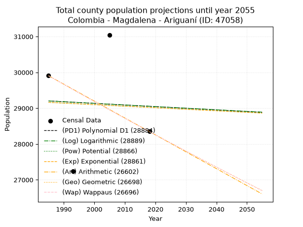
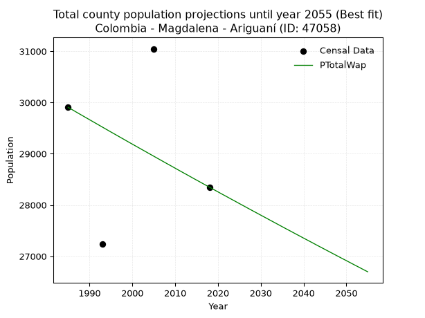
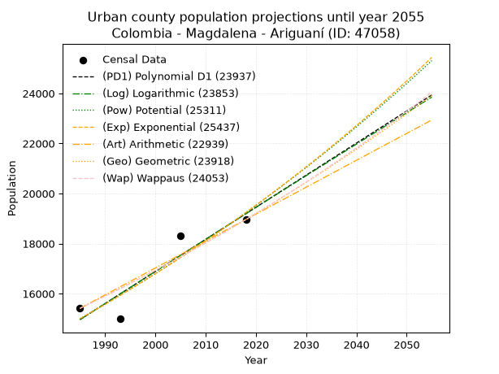
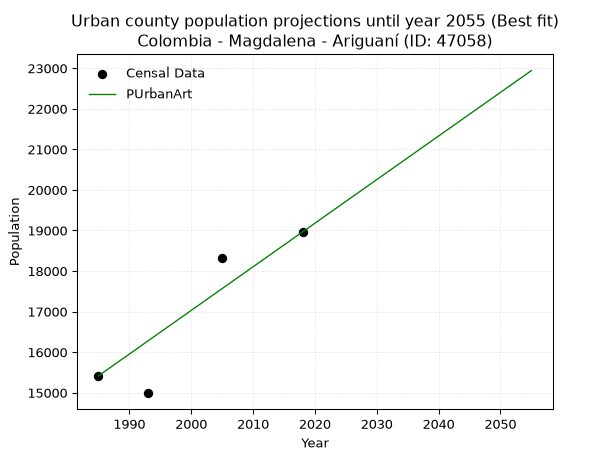
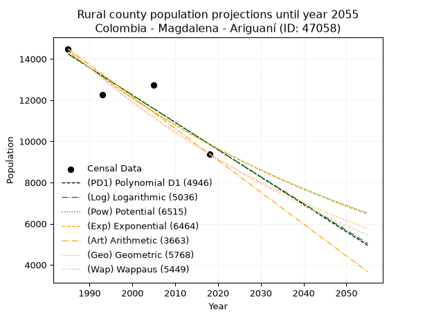
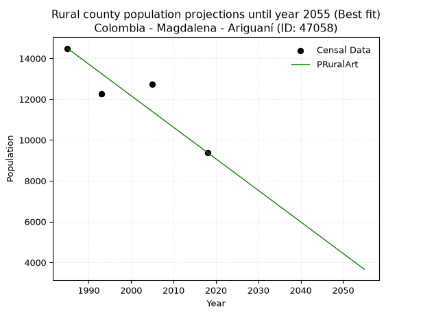

<div align="center">


</div>

# _“Population and Public Services Demand Projections (PPSD) until Year 2050 for Colombia - Magdalena - Ariguaní (ID: 47058)”_
Keywords: `population` `public-service` `projection` `lineal` `polynomial` `logarithmic` `potential` `exponential` `arithmetic` `geometric` `wappaus` `dane` `colombia` `south-america`

PPSD are analytical estimates used by governments and planners to anticipate future changes in population size, age distribution, and the resulting community needs for utilities, healthcare, education, and infrastructure as sizing future water treatment facilities, electrical grids, and road networks based on spatial growth.

> **General running parameters**: • app_version: _v20260806_. • Python version: _3.14.7_. • Pandas version: _3.0.5_. • NumPy version: _2.5.1_. • Creates, save and include plots into reports (create_plot): _False_. • Projection until year: _2050_. • Process polynomial degree 2 and up: _False_. • Process Wappaus: _True_. • Process Wappaus: _True_. • Set negative values to zero: _True_. • Set infinite values to zero: _True_. • Drop dataset notes: _True_. 
<div align="center">

Dynamic map: [:earth_americas:Google](http://maps.google.com/maps?q=9.847046917,-74.2365146) [:earth_americas:OSM](https://www.openstreetmap.org/#map=18/9.847046917/-74.2365146&layers=P) [:earth_americas:Bing](https://www.bing.com/maps?cp=9.847046917~-74.2365146&lvl=18) [:earth_americas:Apple](https://maps.apple.com/frame?center=9.847046917%2C-74.2365146&span=0.003%2C0.006)

</div>


<div align="center">

```geojson
{
  "type": "Feature",
  "geometry": {
    "type": "Point", 
    "coordinates": [-74.2365146, 9.847046917]
  }, 
  "properties": {
    "Name": "Colombia - Magdalena - Ariguaní (ID: 47058)"
  }
}
```

</div>


## 0. Census Data (4 records)

Census data are official statistics collected by a government about the people and housing in a country. They usually include counts of total population, age, sex, race, income, education, and jobs.

📅Global census file: [Population.xlsx](../data/Population.xlsx)

| Source   |   Year |   CountryID | CountryName   |   StateID | StateName   |   CountyID | CountyName   |   PTotal |   PUrban |   PRural |
|:---------|-------:|------------:|:--------------|----------:|:------------|-----------:|:-------------|---------:|---------:|---------:|
| DANE     |   1985 |          57 | Colombia      |        47 | Magdalena   |      47058 | Ariguaní     |    29905 |    15415 |    14490 |
| DANE     |   1993 |          57 | Colombia      |        47 | Magdalena   |      47058 | Ariguaní     |    27233 |    14987 |    12246 |
| DANE     |   2005 |          57 | Colombia      |        47 | Magdalena   |      47058 | Ariguaní     |    31047 |    18313 |    12734 |
| DANE     |   2018 |          57 | Colombia      |        47 | Magdalena   |      47058 | Ariguaní     |    28348 |    18962 |     9386 |

> 🔥Some records could had specific notes about the registered values or the corresponding urban or rural distribution.

**Local public utility companies (RUPS)**

 | SERVICIO       | ESTADO    | NOMBRE                                   | NIT         | DEPARTAMENTO_DOMICILIO   | MUNICIPIO_DOMICILIO   | DIRECCION                                                        |   TELEFONO | EMAIL                   | TIPO_INSCRIPCION    | REPRESENTANTE_LEGAL        | TIPO_PRESTADOR                             | CLASIFICACION                  |
|:---------------|:----------|:-----------------------------------------|:------------|:-------------------------|:----------------------|:-----------------------------------------------------------------|-----------:|:------------------------|:--------------------|:---------------------------|:-------------------------------------------|:-------------------------------|
| ASEO           | OPERATIVA | BIOGER S.A. E.S.P.                       | 806006669-8 | BOLIVAR                  | TURBACO               | PARQUE EMPRESARIAL VILLA ESMERALDA CLL 27 No 26-335  PLAN PAREJO |    6666528 | SISTEMA@BIOGERSAESP.COM | Registro por la ESP | CARLOS MARIO URIBE ZIRENE  | SOCIEDADES (EMPRESA DE SERVICIOS PUBLICOS) | MAYOR O IGUAL A 5001 USUARIOS  |
| ACUEDUCTO      | OPERATIVA | UNIDAD DE SERVICIOS PUBLICOS DE ARIGUANI | 891702186-7 | MAGDALENA                | ARIGUANI              | CL 3B No. 2B - 65 BRR ARRIBA                                     |    4258081 | pezzano_20@outlook.com  | Registro por la ESP | DAVID FERNANDO FARELO DAZA | MUNICIPIO (PRESTACIÓN DIRECTA)             | DESDE 2501 HASTA 5000 USUARIOS |
| ALCANTARILLADO | OPERATIVA | UNIDAD DE SERVICIOS PUBLICOS DE ARIGUANI | 891702186-7 | MAGDALENA                | ARIGUANI              | CL 3B No. 2B - 65 BRR ARRIBA                                     |    4258081 | pezzano_20@outlook.com  | Registro por la ESP | DAVID FERNANDO FARELO DAZA | MUNICIPIO (PRESTACIÓN DIRECTA)             | MENOR O IGUAL A 2500 USUARIOS  |

> [📅RUPS Database: Registro Único de Prestadores de Servicios Públicos de Colombia Suramérica - RUPS](https://www.datos.gov.co/Hacienda-y-Cr-dito-P-blico/Registro-nico-de-Prestadores-de-Servicios-P-blicos/4qkq-csdn/about_data)

## 1. Total

### 1.1. Coefficients and Parameters

* (PD1) Polynomial Deg 1: -4.560818948212121, 38256.0281011613 (lineal)
* (Log) Logarithmic: -9036.795023369963, 97822.00138896561
* (Pow) Potential: -0.2944456513387045, 5.435832764632705
* (Exp) Exponential: -0.00014852275176842602, 39162.16459230059
* (Art) Arithmetic: Year diff. 2018 - 1985 = 33, Population diff. 28348 - 29905 = -1557, Annual growth = -47.18181818181818
* (Geo) Geometric: Year diff. 2018 - 1985 = 33, Population diff. 28348 - 29905 = -1557, Annual growth % = -0.0016189671337507594
* (Wap) Wappaus: i = -0.1619893161959665, Condition values only valid for < 200)

<sub>
Wappaus condition values: ['-0.00', '-0.16', '-0.32', '-0.49', '-0.65', '-0.81', '-0.97', '-1.13', '-1.30', '-1.46', '-1.62', '-1.78', '-1.94', '-2.11', '-2.27', '-2.43', '-2.59', '-2.75', '-2.92', '-3.08', '-3.24', '-3.40', '-3.56', '-3.73', '-3.89', '-4.05', '-4.21', '-4.37', '-4.54', '-4.70', '-4.86', '-5.02', '-5.18', '-5.35', '-5.51', '-5.67', '-5.83', '-5.99', '-6.16', '-6.32', '-6.48', '-6.64', '-6.80', '-6.97', '-7.13', '-7.29', '-7.45', '-7.61', '-7.78', '-7.94', '-8.10', '-8.26', '-8.42', '-8.59', '-8.75', '-8.91', '-9.07', '-9.23', '-9.40', '-9.56', '-9.72', '-9.88', '-10.04', '-10.21', '-10.37', '-10.53']
</sub>


### 1.2. Projected Dataset

|   Year |   CountyID |   PTotalPD1 |   PTotalLog |   PTotalPow |   PTotalExp |   PTotalArt |   PTotalGeo |   PTotalWap |
|-------:|-----------:|------------:|------------:|------------:|------------:|------------:|------------:|------------:|
|   1985 |      47058 |       29203 |       29202 |       29162 |       29163 |       29905 |       29905 |       29905 |
|   1986 |      47058 |       29198 |       29198 |       29158 |       29158 |       29858 |       29857 |       29857 |
|   1987 |      47058 |       29194 |       29193 |       29154 |       29154 |       29811 |       29808 |       29808 |
|   1988 |      47058 |       29189 |       29189 |       29149 |       29150 |       29763 |       29760 |       29760 |
|   1989 |      47058 |       29185 |       29184 |       29145 |       29145 |       29716 |       29712 |       29712 |
|   1990 |      47058 |       29180 |       29180 |       29141 |       29141 |       29669 |       29664 |       29664 |
|   1991 |      47058 |       29175 |       29175 |       29136 |       29137 |       29622 |       29616 |       29616 |
|   1992 |      47058 |       29171 |       29170 |       29132 |       29132 |       29575 |       29568 |       29568 |
|   1993 |      47058 |       29166 |       29166 |       29128 |       29128 |       29528 |       29520 |       29520 |
|   1994 |      47058 |       29162 |       29161 |       29123 |       29124 |       29480 |       29472 |       29472 |
|   1995 |      47058 |       29157 |       29157 |       29119 |       29120 |       29433 |       29424 |       29424 |
|   1996 |      47058 |       29153 |       29152 |       29115 |       29115 |       29386 |       29377 |       29377 |
|   1997 |      47058 |       29148 |       29148 |       29111 |       29111 |       29339 |       29329 |       29329 |
|   1998 |      47058 |       29144 |       29143 |       29106 |       29107 |       29292 |       29282 |       29282 |
|   1999 |      47058 |       29139 |       29139 |       29102 |       29102 |       29244 |       29234 |       29234 |
|   2000 |      47058 |       29134 |       29134 |       29098 |       29098 |       29197 |       29187 |       29187 |
|   2001 |      47058 |       29130 |       29130 |       29093 |       29094 |       29150 |       29140 |       29140 |
|   2002 |      47058 |       29125 |       29125 |       29089 |       29089 |       29103 |       29093 |       29093 |
|   2003 |      47058 |       29121 |       29121 |       29085 |       29085 |       29056 |       29045 |       29046 |
|   2004 |      47058 |       29116 |       29116 |       29081 |       29081 |       29009 |       28998 |       28999 |
|   2005 |      47058 |       29112 |       29112 |       29076 |       29076 |       28961 |       28951 |       28952 |
|   2006 |      47058 |       29107 |       29107 |       29072 |       29072 |       28914 |       28905 |       28905 |
|   2007 |      47058 |       29102 |       29103 |       29068 |       29068 |       28867 |       28858 |       28858 |
|   2008 |      47058 |       29098 |       29098 |       29064 |       29063 |       28820 |       28811 |       28811 |
|   2009 |      47058 |       29093 |       29094 |       29059 |       29059 |       28773 |       28764 |       28765 |
|   2010 |      47058 |       29089 |       29089 |       29055 |       29055 |       28725 |       28718 |       28718 |
|   2011 |      47058 |       29084 |       29085 |       29051 |       29050 |       28678 |       28671 |       28671 |
|   2012 |      47058 |       29080 |       29080 |       29047 |       29046 |       28631 |       28625 |       28625 |
|   2013 |      47058 |       29075 |       29076 |       29042 |       29042 |       28584 |       28579 |       28579 |
|   2014 |      47058 |       29071 |       29071 |       29038 |       29037 |       28537 |       28532 |       28532 |
|   2015 |      47058 |       29066 |       29067 |       29034 |       29033 |       28490 |       28486 |       28486 |
|   2016 |      47058 |       29061 |       29062 |       29030 |       29029 |       28442 |       28440 |       28440 |
|   2017 |      47058 |       29057 |       29058 |       29025 |       29025 |       28395 |       28394 |       28394 |
|   2018 |      47058 |       29052 |       29053 |       29021 |       29020 |       28348 |       28348 |       28348 |
|   2019 |      47058 |       29048 |       29049 |       29017 |       29016 |       28301 |       28302 |       28302 |
|   2020 |      47058 |       29043 |       29044 |       29013 |       29012 |       28254 |       28256 |       28256 |
|   2021 |      47058 |       29039 |       29040 |       29008 |       29007 |       28206 |       28211 |       28210 |
|   2022 |      47058 |       29034 |       29035 |       29004 |       29003 |       28159 |       28165 |       28165 |
|   2023 |      47058 |       29029 |       29031 |       29000 |       28999 |       28112 |       28119 |       28119 |
|   2024 |      47058 |       29025 |       29026 |       28996 |       28994 |       28065 |       28074 |       28074 |
|   2025 |      47058 |       29020 |       29022 |       28991 |       28990 |       28018 |       28028 |       28028 |
|   2026 |      47058 |       29016 |       29017 |       28987 |       28986 |       27971 |       27983 |       27983 |
|   2027 |      47058 |       29011 |       29013 |       28983 |       28981 |       27923 |       27938 |       27937 |
|   2028 |      47058 |       29007 |       29009 |       28979 |       28977 |       27876 |       27892 |       27892 |
|   2029 |      47058 |       29002 |       29004 |       28975 |       28973 |       27829 |       27847 |       27847 |
|   2030 |      47058 |       28998 |       29000 |       28970 |       28969 |       27782 |       27802 |       27802 |
|   2031 |      47058 |       28993 |       28995 |       28966 |       28964 |       27735 |       27757 |       27757 |
|   2032 |      47058 |       28988 |       28991 |       28962 |       28960 |       27687 |       27712 |       27712 |
|   2033 |      47058 |       28984 |       28986 |       28958 |       28956 |       27640 |       27667 |       27667 |
|   2034 |      47058 |       28979 |       28982 |       28954 |       28951 |       27593 |       27623 |       27622 |
|   2035 |      47058 |       28975 |       28977 |       28949 |       28947 |       27546 |       27578 |       27577 |
|   2036 |      47058 |       28970 |       28973 |       28945 |       28943 |       27499 |       27533 |       27532 |
|   2037 |      47058 |       28966 |       28969 |       28941 |       28938 |       27452 |       27489 |       27488 |
|   2038 |      47058 |       28961 |       28964 |       28937 |       28934 |       27404 |       27444 |       27443 |
|   2039 |      47058 |       28957 |       28960 |       28933 |       28930 |       27357 |       27400 |       27399 |
|   2040 |      47058 |       28952 |       28955 |       28929 |       28926 |       27310 |       27355 |       27354 |
|   2041 |      47058 |       28947 |       28951 |       28924 |       28921 |       27263 |       27311 |       27310 |
|   2042 |      47058 |       28943 |       28946 |       28920 |       28917 |       27216 |       27267 |       27266 |
|   2043 |      47058 |       28938 |       28942 |       28916 |       28913 |       27168 |       27223 |       27221 |
|   2044 |      47058 |       28934 |       28938 |       28912 |       28908 |       27121 |       27179 |       27177 |
|   2045 |      47058 |       28929 |       28933 |       28908 |       28904 |       27074 |       27135 |       27133 |
|   2046 |      47058 |       28925 |       28929 |       28904 |       28900 |       27027 |       27091 |       27089 |
|   2047 |      47058 |       28920 |       28924 |       28899 |       28895 |       26980 |       27047 |       27045 |
|   2048 |      47058 |       28915 |       28920 |       28895 |       28891 |       26933 |       27003 |       27001 |
|   2049 |      47058 |       28911 |       28915 |       28891 |       28887 |       26885 |       26959 |       26957 |
|   2050 |      47058 |       28906 |       28911 |       28887 |       28883 |       26838 |       26916 |       26914 |
<div align="center">

</img>

</div>


### 1.3. Best fit with absolute and relative error (%)

Relative error puts that difference into context by dividing the absolute error by the true value, creating a unitless ratio or percentage that shows the scale of the mistake.

Absolute and relative error

|   Year | Source   |   CountryID | CountryName   |   StateID | StateName   |   CountyID_x | CountyName   |   PTotal |   PUrban |   PRural |   CountyID_y |   PTotalPD1 |   PTotalLog |   PTotalPow |   PTotalExp |   PTotalArt |   PTotalGeo |   PTotalWap |   PTotalPD1AbsError |   PTotalLogAbsError |   PTotalPowAbsError |   PTotalExpAbsError |   PTotalArtAbsError |   PTotalGeoAbsError |   PTotalWapAbsError |   PTotalPD1RelError |   PTotalLogRelError |   PTotalPowRelError |   PTotalExpRelError |   PTotalArtRelError |   PTotalGeoRelError |   PTotalWapRelError |
|-------:|:---------|------------:|:--------------|----------:|:------------|-------------:|:-------------|---------:|---------:|---------:|-------------:|------------:|------------:|------------:|------------:|------------:|------------:|------------:|--------------------:|--------------------:|--------------------:|--------------------:|--------------------:|--------------------:|--------------------:|--------------------:|--------------------:|--------------------:|--------------------:|--------------------:|--------------------:|--------------------:|
|   1985 | DANE     |          57 | Colombia      |        47 | Magdalena   |        47058 | Ariguaní     |    29905 |    15415 |    14490 |        47058 |       29203 |       29202 |       29162 |       29163 |       29905 |       29905 |       29905 |                 702 |                 703 |                 743 |                 742 |                   0 |                   0 |                   0 |             2.34743 |             2.35078 |             2.48453 |             2.48119 |             0       |             0       |             0       |
|   1993 | DANE     |          57 | Colombia      |        47 | Magdalena   |        47058 | Ariguaní     |    27233 |    14987 |    12246 |        47058 |       29166 |       29166 |       29128 |       29128 |       29528 |       29520 |       29520 |                1933 |                1933 |                1895 |                1895 |                2295 |                2287 |                2287 |             7.09801 |             7.09801 |             6.95847 |             6.95847 |             8.42728 |             8.3979  |             8.3979  |
|   2005 | DANE     |          57 | Colombia      |        47 | Magdalena   |        47058 | Ariguaní     |    31047 |    18313 |    12734 |        47058 |       29112 |       29112 |       29076 |       29076 |       28961 |       28951 |       28952 |                1935 |                1935 |                1971 |                1971 |                2086 |                2096 |                2095 |             6.23249 |             6.23249 |             6.34844 |             6.34844 |             6.71885 |             6.75105 |             6.74783 |
|   2018 | DANE     |          57 | Colombia      |        47 | Magdalena   |        47058 | Ariguaní     |    28348 |    18962 |     9386 |        47058 |       29052 |       29053 |       29021 |       29020 |       28348 |       28348 |       28348 |                 704 |                 705 |                 673 |                 672 |                   0 |                   0 |                   0 |             2.48342 |             2.48695 |             2.37407 |             2.37054 |             0       |             0       |             0       |

Relative error mean

| Method    |   RelError | Best   |
|:----------|-----------:|:-------|
| PTotalPD1 |    4.54034 |        |
| PTotalLog |    4.54205 |        |
| PTotalPow |    4.54138 |        |
| PTotalExp |    4.53966 |        |
| PTotalArt |    3.78653 |        |
| PTotalGeo |    3.78724 |        |
| PTotalWap |    3.78643 | True   |

💙Best method: _**PTotalWap**_
<div align="center">

</img>

</div>


### 1.4. Fresh water supply demand in liters per capita per day (lpcd)

The fresh water supply demand typically ranges from 100 to 300 liters per capita per day (lpcd) for standard domestic and municipal planning, though absolute survival minimums set by the World Health Organization are as low as 7.5 to 20 liters per day, and total consumption in high-income nations can exceed 400 liters.

> `CZ`: Level in meters above the sea level (masl)<br> `WS`: Fresh water supply demand in liters per capita per day (lpcd or l/h/d)<br> `WSAll`: Zonal fresh water supply demand in liters per second (l/s)<br> `A`: Zonal area in square meters<br> `DP`: Population density (people/hectare or p/ha)

Reference values (RAS Colombia)

|    CZ |   WS |
|------:|-----:|
|  1000 |  120 |
|  2000 |  130 |
| 99999 |  140 |

County shapefile geometry properties and water supply values

|   CountyID |      ATotal |   CZTotal |   WSTotal |
|-----------:|------------:|----------:|----------:|
|      47058 | 1.13034e+09 |   105.938 |       120 |

Projected values for best method: PTotalWap

|   CountyID |   Year |   PTotalWap |   DPTotal |   WSTotal |   WSTotalAll |
|-----------:|-------:|------------:|----------:|----------:|-------------:|
|      47058 |   1985 |       29905 |      0.26 |       120 |      41.5347 |
|      47058 |   1986 |       29857 |      0.26 |       120 |      41.4681 |
|      47058 |   1987 |       29808 |      0.26 |       120 |      41.4    |
|      47058 |   1988 |       29760 |      0.26 |       120 |      41.3333 |
|      47058 |   1989 |       29712 |      0.26 |       120 |      41.2667 |
|      47058 |   1990 |       29664 |      0.26 |       120 |      41.2    |
|      47058 |   1991 |       29616 |      0.26 |       120 |      41.1333 |
|      47058 |   1992 |       29568 |      0.26 |       120 |      41.0667 |
|      47058 |   1993 |       29520 |      0.26 |       120 |      41      |
|      47058 |   1994 |       29472 |      0.26 |       120 |      40.9333 |
|      47058 |   1995 |       29424 |      0.26 |       120 |      40.8667 |
|      47058 |   1996 |       29377 |      0.26 |       120 |      40.8014 |
|      47058 |   1997 |       29329 |      0.26 |       120 |      40.7347 |
|      47058 |   1998 |       29282 |      0.26 |       120 |      40.6694 |
|      47058 |   1999 |       29234 |      0.26 |       120 |      40.6028 |
|      47058 |   2000 |       29187 |      0.26 |       120 |      40.5375 |
|      47058 |   2001 |       29140 |      0.26 |       120 |      40.4722 |
|      47058 |   2002 |       29093 |      0.26 |       120 |      40.4069 |
|      47058 |   2003 |       29046 |      0.26 |       120 |      40.3417 |
|      47058 |   2004 |       28999 |      0.26 |       120 |      40.2764 |
|      47058 |   2005 |       28952 |      0.26 |       120 |      40.2111 |
|      47058 |   2006 |       28905 |      0.26 |       120 |      40.1458 |
|      47058 |   2007 |       28858 |      0.26 |       120 |      40.0806 |
|      47058 |   2008 |       28811 |      0.25 |       120 |      40.0153 |
|      47058 |   2009 |       28765 |      0.25 |       120 |      39.9514 |
|      47058 |   2010 |       28718 |      0.25 |       120 |      39.8861 |
|      47058 |   2011 |       28671 |      0.25 |       120 |      39.8208 |
|      47058 |   2012 |       28625 |      0.25 |       120 |      39.7569 |
|      47058 |   2013 |       28579 |      0.25 |       120 |      39.6931 |
|      47058 |   2014 |       28532 |      0.25 |       120 |      39.6278 |
|      47058 |   2015 |       28486 |      0.25 |       120 |      39.5639 |
|      47058 |   2016 |       28440 |      0.25 |       120 |      39.5    |
|      47058 |   2017 |       28394 |      0.25 |       120 |      39.4361 |
|      47058 |   2018 |       28348 |      0.25 |       120 |      39.3722 |
|      47058 |   2019 |       28302 |      0.25 |       120 |      39.3083 |
|      47058 |   2020 |       28256 |      0.25 |       120 |      39.2444 |
|      47058 |   2021 |       28210 |      0.25 |       120 |      39.1806 |
|      47058 |   2022 |       28165 |      0.25 |       120 |      39.1181 |
|      47058 |   2023 |       28119 |      0.25 |       120 |      39.0542 |
|      47058 |   2024 |       28074 |      0.25 |       120 |      38.9917 |
|      47058 |   2025 |       28028 |      0.25 |       120 |      38.9278 |
|      47058 |   2026 |       27983 |      0.25 |       120 |      38.8653 |
|      47058 |   2027 |       27937 |      0.25 |       120 |      38.8014 |
|      47058 |   2028 |       27892 |      0.25 |       120 |      38.7389 |
|      47058 |   2029 |       27847 |      0.25 |       120 |      38.6764 |
|      47058 |   2030 |       27802 |      0.25 |       120 |      38.6139 |
|      47058 |   2031 |       27757 |      0.25 |       120 |      38.5514 |
|      47058 |   2032 |       27712 |      0.25 |       120 |      38.4889 |
|      47058 |   2033 |       27667 |      0.24 |       120 |      38.4264 |
|      47058 |   2034 |       27622 |      0.24 |       120 |      38.3639 |
|      47058 |   2035 |       27577 |      0.24 |       120 |      38.3014 |
|      47058 |   2036 |       27532 |      0.24 |       120 |      38.2389 |
|      47058 |   2037 |       27488 |      0.24 |       120 |      38.1778 |
|      47058 |   2038 |       27443 |      0.24 |       120 |      38.1153 |
|      47058 |   2039 |       27399 |      0.24 |       120 |      38.0542 |
|      47058 |   2040 |       27354 |      0.24 |       120 |      37.9917 |
|      47058 |   2041 |       27310 |      0.24 |       120 |      37.9306 |
|      47058 |   2042 |       27266 |      0.24 |       120 |      37.8694 |
|      47058 |   2043 |       27221 |      0.24 |       120 |      37.8069 |
|      47058 |   2044 |       27177 |      0.24 |       120 |      37.7458 |
|      47058 |   2045 |       27133 |      0.24 |       120 |      37.6847 |
|      47058 |   2046 |       27089 |      0.24 |       120 |      37.6236 |
|      47058 |   2047 |       27045 |      0.24 |       120 |      37.5625 |
|      47058 |   2048 |       27001 |      0.24 |       120 |      37.5014 |
|      47058 |   2049 |       26957 |      0.24 |       120 |      37.4403 |
|      47058 |   2050 |       26914 |      0.24 |       120 |      37.3806 |

## 2. Urban

### 2.1. Coefficients and Parameters

* (PD1) Polynomial Deg 1: 128.18586912886326, -239484.53472500874 (lineal)
* (Log) Logarithmic: 256581.65137099067, -1933359.9381872138
* (Pow) Potential: 15.101641226699845, -45.625587486476874
* (Exp) Exponential: 0.007544569089268873, 0.004700314088474195
* (Art) Arithmetic: Year diff. 2018 - 1985 = 33, Population diff. 18962 - 15415 = 3547, Annual growth = 107.48484848484848
* (Geo) Geometric: Year diff. 2018 - 1985 = 33, Population diff. 18962 - 15415 = 3547, Annual growth % = 0.006295366839935257
* (Wap) Wappaus: i = 0.6253300083477237, Condition values only valid for < 200)

<sub>
Wappaus condition values: ['0.00', '0.63', '1.25', '1.88', '2.50', '3.13', '3.75', '4.38', '5.00', '5.63', '6.25', '6.88', '7.50', '8.13', '8.75', '9.38', '10.01', '10.63', '11.26', '11.88', '12.51', '13.13', '13.76', '14.38', '15.01', '15.63', '16.26', '16.88', '17.51', '18.13', '18.76', '19.39', '20.01', '20.64', '21.26', '21.89', '22.51', '23.14', '23.76', '24.39', '25.01', '25.64', '26.26', '26.89', '27.51', '28.14', '28.77', '29.39', '30.02', '30.64', '31.27', '31.89', '32.52', '33.14', '33.77', '34.39', '35.02', '35.64', '36.27', '36.89', '37.52', '38.15', '38.77', '39.40', '40.02', '40.65']
</sub>


### 2.2. Projected Dataset

|   Year |   CountyID |   PUrbanPD1 |   PUrbanLog |   PUrbanPow |   PUrbanExp |   PUrbanArt |   PUrbanGeo |   PUrbanWap |
|-------:|-----------:|------------:|------------:|------------:|------------:|------------:|------------:|------------:|
|   1985 |      47058 |       14964 |       14961 |       14997 |       15001 |       15415 |       15415 |       15415 |
|   1986 |      47058 |       15093 |       15090 |       15112 |       15114 |       15522 |       15512 |       15512 |
|   1987 |      47058 |       15221 |       15219 |       15227 |       15229 |       15630 |       15610 |       15609 |
|   1988 |      47058 |       15349 |       15348 |       15343 |       15344 |       15737 |       15708 |       15707 |
|   1989 |      47058 |       15477 |       15477 |       15460 |       15460 |       15845 |       15807 |       15805 |
|   1990 |      47058 |       15605 |       15606 |       15578 |       15577 |       15952 |       15906 |       15905 |
|   1991 |      47058 |       15734 |       15735 |       15697 |       15695 |       16060 |       16006 |       16004 |
|   1992 |      47058 |       15862 |       15864 |       15816 |       15814 |       16167 |       16107 |       16105 |
|   1993 |      47058 |       15990 |       15993 |       15936 |       15934 |       16275 |       16209 |       16206 |
|   1994 |      47058 |       16118 |       16121 |       16058 |       16055 |       16382 |       16311 |       16308 |
|   1995 |      47058 |       16246 |       16250 |       16180 |       16176 |       16490 |       16413 |       16410 |
|   1996 |      47058 |       16374 |       16378 |       16302 |       16299 |       16597 |       16517 |       16513 |
|   1997 |      47058 |       16503 |       16507 |       16426 |       16422 |       16705 |       16621 |       16617 |
|   1998 |      47058 |       16631 |       16635 |       16551 |       16546 |       16812 |       16725 |       16721 |
|   1999 |      47058 |       16759 |       16764 |       16676 |       16672 |       16920 |       16831 |       16826 |
|   2000 |      47058 |       16887 |       16892 |       16803 |       16798 |       17027 |       16937 |       16932 |
|   2001 |      47058 |       17015 |       17020 |       16930 |       16925 |       17135 |       17043 |       17039 |
|   2002 |      47058 |       17144 |       17149 |       17058 |       17053 |       17242 |       17150 |       17146 |
|   2003 |      47058 |       17272 |       17277 |       17188 |       17182 |       17350 |       17258 |       17254 |
|   2004 |      47058 |       17400 |       17405 |       17318 |       17313 |       17457 |       17367 |       17362 |
|   2005 |      47058 |       17528 |       17533 |       17449 |       17444 |       17565 |       17476 |       17471 |
|   2006 |      47058 |       17656 |       17661 |       17580 |       17576 |       17672 |       17586 |       17582 |
|   2007 |      47058 |       17785 |       17789 |       17713 |       17709 |       17780 |       17697 |       17692 |
|   2008 |      47058 |       17913 |       17916 |       17847 |       17843 |       17887 |       17809 |       17804 |
|   2009 |      47058 |       18041 |       18044 |       17982 |       17978 |       17995 |       17921 |       17916 |
|   2010 |      47058 |       18169 |       18172 |       18117 |       18114 |       18102 |       18034 |       18029 |
|   2011 |      47058 |       18297 |       18299 |       18254 |       18251 |       18210 |       18147 |       18143 |
|   2012 |      47058 |       18425 |       18427 |       18391 |       18390 |       18317 |       18261 |       18258 |
|   2013 |      47058 |       18554 |       18555 |       18530 |       18529 |       18425 |       18376 |       18373 |
|   2014 |      47058 |       18682 |       18682 |       18670 |       18669 |       18532 |       18492 |       18489 |
|   2015 |      47058 |       18810 |       18809 |       18810 |       18811 |       18640 |       18608 |       18606 |
|   2016 |      47058 |       18938 |       18937 |       18951 |       18953 |       18747 |       18725 |       18724 |
|   2017 |      47058 |       19066 |       19064 |       19094 |       19097 |       18855 |       18843 |       18843 |
|   2018 |      47058 |       19195 |       19191 |       19237 |       19241 |       18962 |       18962 |       18962 |
|   2019 |      47058 |       19323 |       19318 |       19382 |       19387 |       19069 |       19081 |       19082 |
|   2020 |      47058 |       19451 |       19445 |       19527 |       19534 |       19177 |       19201 |       19203 |
|   2021 |      47058 |       19579 |       19572 |       19674 |       19682 |       19284 |       19322 |       19325 |
|   2022 |      47058 |       19707 |       19699 |       19821 |       19831 |       19392 |       19444 |       19448 |
|   2023 |      47058 |       19835 |       19826 |       19970 |       19981 |       19499 |       19566 |       19572 |
|   2024 |      47058 |       19964 |       19953 |       20120 |       20132 |       19607 |       19690 |       19696 |
|   2025 |      47058 |       20092 |       20080 |       20270 |       20285 |       19714 |       19814 |       19822 |
|   2026 |      47058 |       20220 |       20206 |       20422 |       20438 |       19822 |       19938 |       19948 |
|   2027 |      47058 |       20348 |       20333 |       20575 |       20593 |       19929 |       20064 |       20076 |
|   2028 |      47058 |       20476 |       20459 |       20728 |       20749 |       20037 |       20190 |       20204 |
|   2029 |      47058 |       20605 |       20586 |       20883 |       20906 |       20144 |       20317 |       20333 |
|   2030 |      47058 |       20733 |       20712 |       21039 |       21065 |       20252 |       20445 |       20463 |
|   2031 |      47058 |       20861 |       20839 |       21196 |       21224 |       20359 |       20574 |       20594 |
|   2032 |      47058 |       20989 |       20965 |       21355 |       21385 |       20467 |       20703 |       20726 |
|   2033 |      47058 |       21117 |       21091 |       21514 |       21547 |       20574 |       20834 |       20859 |
|   2034 |      47058 |       21246 |       21217 |       21674 |       21710 |       20682 |       20965 |       20993 |
|   2035 |      47058 |       21374 |       21344 |       21836 |       21874 |       20789 |       21097 |       21128 |
|   2036 |      47058 |       21502 |       21470 |       21998 |       22040 |       20897 |       21230 |       21264 |
|   2037 |      47058 |       21630 |       21596 |       22162 |       22207 |       21004 |       21363 |       21401 |
|   2038 |      47058 |       21758 |       21721 |       22327 |       22375 |       21112 |       21498 |       21539 |
|   2039 |      47058 |       21886 |       21847 |       22493 |       22545 |       21219 |       21633 |       21678 |
|   2040 |      47058 |       22015 |       21973 |       22660 |       22715 |       21327 |       21769 |       21818 |
|   2041 |      47058 |       22143 |       22099 |       22828 |       22887 |       21434 |       21906 |       21959 |
|   2042 |      47058 |       22271 |       22225 |       22998 |       23061 |       21542 |       22044 |       22101 |
|   2043 |      47058 |       22399 |       22350 |       23168 |       23235 |       21649 |       22183 |       22244 |
|   2044 |      47058 |       22527 |       22476 |       23340 |       23411 |       21757 |       22323 |       22389 |
|   2045 |      47058 |       22656 |       22601 |       23513 |       23589 |       21864 |       22463 |       22534 |
|   2046 |      47058 |       22784 |       22727 |       23688 |       23767 |       21972 |       22605 |       22681 |
|   2047 |      47058 |       22912 |       22852 |       23863 |       23947 |       22079 |       22747 |       22829 |
|   2048 |      47058 |       23040 |       22977 |       24040 |       24129 |       22187 |       22890 |       22978 |
|   2049 |      47058 |       23168 |       23103 |       24218 |       24311 |       22294 |       23034 |       23128 |
|   2050 |      47058 |       23296 |       23228 |       24397 |       24495 |       22402 |       23179 |       23279 |
<div align="center">

</img>

</div>


### 2.3. Best fit with absolute and relative error (%)

Relative error puts that difference into context by dividing the absolute error by the true value, creating a unitless ratio or percentage that shows the scale of the mistake.

Absolute and relative error

|   Year | Source   |   CountryID | CountryName   |   StateID | StateName   |   CountyID_x | CountyName   |   PTotal |   PUrban |   PRural |   CountyID_y |   PUrbanPD1 |   PUrbanLog |   PUrbanPow |   PUrbanExp |   PUrbanArt |   PUrbanGeo |   PUrbanWap |   PUrbanPD1AbsError |   PUrbanLogAbsError |   PUrbanPowAbsError |   PUrbanExpAbsError |   PUrbanArtAbsError |   PUrbanGeoAbsError |   PUrbanWapAbsError |   PUrbanPD1RelError |   PUrbanLogRelError |   PUrbanPowRelError |   PUrbanExpRelError |   PUrbanArtRelError |   PUrbanGeoRelError |   PUrbanWapRelError |
|-------:|:---------|------------:|:--------------|----------:|:------------|-------------:|:-------------|---------:|---------:|---------:|-------------:|------------:|------------:|------------:|------------:|------------:|------------:|------------:|--------------------:|--------------------:|--------------------:|--------------------:|--------------------:|--------------------:|--------------------:|--------------------:|--------------------:|--------------------:|--------------------:|--------------------:|--------------------:|--------------------:|
|   1985 | DANE     |          57 | Colombia      |        47 | Magdalena   |        47058 | Ariguaní     |    29905 |    15415 |    14490 |        47058 |       14964 |       14961 |       14997 |       15001 |       15415 |       15415 |       15415 |                 451 |                 454 |                 418 |                 414 |                   0 |                   0 |                   0 |             2.92572 |             2.94518 |             2.71164 |             2.6857  |             0       |             0       |             0       |
|   1993 | DANE     |          57 | Colombia      |        47 | Magdalena   |        47058 | Ariguaní     |    27233 |    14987 |    12246 |        47058 |       15990 |       15993 |       15936 |       15934 |       16275 |       16209 |       16206 |                1003 |                1006 |                 949 |                 947 |                1288 |                1222 |                1219 |             6.69247 |             6.71248 |             6.33215 |             6.31881 |             8.59411 |             8.15373 |             8.13372 |
|   2005 | DANE     |          57 | Colombia      |        47 | Magdalena   |        47058 | Ariguaní     |    31047 |    18313 |    12734 |        47058 |       17528 |       17533 |       17449 |       17444 |       17565 |       17476 |       17471 |                 785 |                 780 |                 864 |                 869 |                 748 |                 837 |                 842 |             4.28657 |             4.25927 |             4.71796 |             4.74526 |             4.08453 |             4.57052 |             4.59783 |
|   2018 | DANE     |          57 | Colombia      |        47 | Magdalena   |        47058 | Ariguaní     |    28348 |    18962 |     9386 |        47058 |       19195 |       19191 |       19237 |       19241 |       18962 |       18962 |       18962 |                 233 |                 229 |                 275 |                 279 |                   0 |                   0 |                   0 |             1.22877 |             1.20768 |             1.45027 |             1.47136 |             0       |             0       |             0       |

Relative error mean

| Method    |   RelError | Best   |
|:----------|-----------:|:-------|
| PUrbanPD1 |    3.78338 |        |
| PUrbanLog |    3.78115 |        |
| PUrbanPow |    3.80301 |        |
| PUrbanExp |    3.80528 |        |
| PUrbanArt |    3.16966 | True   |
| PUrbanGeo |    3.18106 |        |
| PUrbanWap |    3.18289 |        |

💙Best method: _**PUrbanArt**_
<div align="center">

</img>

</div>


### 2.4. Fresh water supply demand in liters per capita per day (lpcd)

The fresh water supply demand typically ranges from 100 to 300 liters per capita per day (lpcd) for standard domestic and municipal planning, though absolute survival minimums set by the World Health Organization are as low as 7.5 to 20 liters per day, and total consumption in high-income nations can exceed 400 liters.

> `CZ`: Level in meters above the sea level (masl)<br> `WS`: Fresh water supply demand in liters per capita per day (lpcd or l/h/d)<br> `WSAll`: Zonal fresh water supply demand in liters per second (l/s)<br> `A`: Zonal area in square meters<br> `DP`: Population density (people/hectare or p/ha)

Reference values (RAS Colombia)

|    CZ |   WS |
|------:|-----:|
|  1000 |  120 |
|  2000 |  130 |
| 99999 |  140 |

County shapefile geometry properties and water supply values

|   CountyID |      AUrban |   CZUrban |   WSUrban |
|-----------:|------------:|----------:|----------:|
|      47058 | 2.67787e+06 |   174.109 |       120 |

Projected values for best method: PUrbanArt

|   CountyID |   Year |   PUrbanArt |   DPUrban |   WSUrban |   WSUrbanAll |
|-----------:|-------:|------------:|----------:|----------:|-------------:|
|      47058 |   1985 |       15415 |     57.56 |       120 |      21.4097 |
|      47058 |   1986 |       15522 |     57.96 |       120 |      21.5583 |
|      47058 |   1987 |       15630 |     58.37 |       120 |      21.7083 |
|      47058 |   1988 |       15737 |     58.77 |       120 |      21.8569 |
|      47058 |   1989 |       15845 |     59.17 |       120 |      22.0069 |
|      47058 |   1990 |       15952 |     59.57 |       120 |      22.1556 |
|      47058 |   1991 |       16060 |     59.97 |       120 |      22.3056 |
|      47058 |   1992 |       16167 |     60.37 |       120 |      22.4542 |
|      47058 |   1993 |       16275 |     60.78 |       120 |      22.6042 |
|      47058 |   1994 |       16382 |     61.18 |       120 |      22.7528 |
|      47058 |   1995 |       16490 |     61.58 |       120 |      22.9028 |
|      47058 |   1996 |       16597 |     61.98 |       120 |      23.0514 |
|      47058 |   1997 |       16705 |     62.38 |       120 |      23.2014 |
|      47058 |   1998 |       16812 |     62.78 |       120 |      23.35   |
|      47058 |   1999 |       16920 |     63.18 |       120 |      23.5    |
|      47058 |   2000 |       17027 |     63.58 |       120 |      23.6486 |
|      47058 |   2001 |       17135 |     63.99 |       120 |      23.7986 |
|      47058 |   2002 |       17242 |     64.39 |       120 |      23.9472 |
|      47058 |   2003 |       17350 |     64.79 |       120 |      24.0972 |
|      47058 |   2004 |       17457 |     65.19 |       120 |      24.2458 |
|      47058 |   2005 |       17565 |     65.59 |       120 |      24.3958 |
|      47058 |   2006 |       17672 |     65.99 |       120 |      24.5444 |
|      47058 |   2007 |       17780 |     66.4  |       120 |      24.6944 |
|      47058 |   2008 |       17887 |     66.8  |       120 |      24.8431 |
|      47058 |   2009 |       17995 |     67.2  |       120 |      24.9931 |
|      47058 |   2010 |       18102 |     67.6  |       120 |      25.1417 |
|      47058 |   2011 |       18210 |     68    |       120 |      25.2917 |
|      47058 |   2012 |       18317 |     68.4  |       120 |      25.4403 |
|      47058 |   2013 |       18425 |     68.8  |       120 |      25.5903 |
|      47058 |   2014 |       18532 |     69.2  |       120 |      25.7389 |
|      47058 |   2015 |       18640 |     69.61 |       120 |      25.8889 |
|      47058 |   2016 |       18747 |     70.01 |       120 |      26.0375 |
|      47058 |   2017 |       18855 |     70.41 |       120 |      26.1875 |
|      47058 |   2018 |       18962 |     70.81 |       120 |      26.3361 |
|      47058 |   2019 |       19069 |     71.21 |       120 |      26.4847 |
|      47058 |   2020 |       19177 |     71.61 |       120 |      26.6347 |
|      47058 |   2021 |       19284 |     72.01 |       120 |      26.7833 |
|      47058 |   2022 |       19392 |     72.42 |       120 |      26.9333 |
|      47058 |   2023 |       19499 |     72.82 |       120 |      27.0819 |
|      47058 |   2024 |       19607 |     73.22 |       120 |      27.2319 |
|      47058 |   2025 |       19714 |     73.62 |       120 |      27.3806 |
|      47058 |   2026 |       19822 |     74.02 |       120 |      27.5306 |
|      47058 |   2027 |       19929 |     74.42 |       120 |      27.6792 |
|      47058 |   2028 |       20037 |     74.82 |       120 |      27.8292 |
|      47058 |   2029 |       20144 |     75.22 |       120 |      27.9778 |
|      47058 |   2030 |       20252 |     75.63 |       120 |      28.1278 |
|      47058 |   2031 |       20359 |     76.03 |       120 |      28.2764 |
|      47058 |   2032 |       20467 |     76.43 |       120 |      28.4264 |
|      47058 |   2033 |       20574 |     76.83 |       120 |      28.575  |
|      47058 |   2034 |       20682 |     77.23 |       120 |      28.725  |
|      47058 |   2035 |       20789 |     77.63 |       120 |      28.8736 |
|      47058 |   2036 |       20897 |     78.04 |       120 |      29.0236 |
|      47058 |   2037 |       21004 |     78.44 |       120 |      29.1722 |
|      47058 |   2038 |       21112 |     78.84 |       120 |      29.3222 |
|      47058 |   2039 |       21219 |     79.24 |       120 |      29.4708 |
|      47058 |   2040 |       21327 |     79.64 |       120 |      29.6208 |
|      47058 |   2041 |       21434 |     80.04 |       120 |      29.7694 |
|      47058 |   2042 |       21542 |     80.44 |       120 |      29.9194 |
|      47058 |   2043 |       21649 |     80.84 |       120 |      30.0681 |
|      47058 |   2044 |       21757 |     81.25 |       120 |      30.2181 |
|      47058 |   2045 |       21864 |     81.65 |       120 |      30.3667 |
|      47058 |   2046 |       21972 |     82.05 |       120 |      30.5167 |
|      47058 |   2047 |       22079 |     82.45 |       120 |      30.6653 |
|      47058 |   2048 |       22187 |     82.85 |       120 |      30.8153 |
|      47058 |   2049 |       22294 |     83.25 |       120 |      30.9639 |
|      47058 |   2050 |       22402 |     83.66 |       120 |      31.1139 |

## 3. Rural

### 3.1. Coefficients and Parameters

* (PD1) Polynomial Deg 1: -132.74668807707542, 277740.5628261701 (lineal)
* (Log) Logarithmic: -265618.4463943607, 2031181.9395761802
* (Pow) Potential: -22.813811158840384, 79.3917477790683
* (Exp) Exponential: -0.011403438334474103, 97222281494047.3
* (Art) Arithmetic: Year diff. 2018 - 1985 = 33, Population diff. 9386 - 14490 = -5104, Annual growth = -154.66666666666666
* (Geo) Geometric: Year diff. 2018 - 1985 = 33, Population diff. 9386 - 14490 = -5104, Annual growth % = -0.013072575744126236
* (Wap) Wappaus: i = -1.2955827330094376, Condition values only valid for < 200)

<sub>
Wappaus condition values: ['-0.00', '-1.30', '-2.59', '-3.89', '-5.18', '-6.48', '-7.77', '-9.07', '-10.36', '-11.66', '-12.96', '-14.25', '-15.55', '-16.84', '-18.14', '-19.43', '-20.73', '-22.02', '-23.32', '-24.62', '-25.91', '-27.21', '-28.50', '-29.80', '-31.09', '-32.39', '-33.69', '-34.98', '-36.28', '-37.57', '-38.87', '-40.16', '-41.46', '-42.75', '-44.05', '-45.35', '-46.64', '-47.94', '-49.23', '-50.53', '-51.82', '-53.12', '-54.41', '-55.71', '-57.01', '-58.30', '-59.60', '-60.89', '-62.19', '-63.48', '-64.78', '-66.07', '-67.37', '-68.67', '-69.96', '-71.26', '-72.55', '-73.85', '-75.14', '-76.44', '-77.73', '-79.03', '-80.33', '-81.62', '-82.92', '-84.21']
</sub>


### 3.2. Projected Dataset

|   Year |   CountyID |   PRuralPD1 |   PRuralLog |   PRuralPow |   PRuralExp |   PRuralArt |   PRuralGeo |   PRuralWap |
|-------:|-----------:|------------:|------------:|------------:|------------:|------------:|------------:|------------:|
|   1985 |      47058 |       14238 |       14242 |       14364 |       14360 |       14490 |       14490 |       14490 |
|   1986 |      47058 |       14106 |       14108 |       14199 |       14197 |       14335 |       14301 |       14303 |
|   1987 |      47058 |       13973 |       13974 |       14037 |       14036 |       14181 |       14114 |       14119 |
|   1988 |      47058 |       13840 |       13841 |       13877 |       13877 |       14026 |       13929 |       13938 |
|   1989 |      47058 |       13707 |       13707 |       13719 |       13720 |       13871 |       13747 |       13758 |
|   1990 |      47058 |       13575 |       13573 |       13562 |       13564 |       13717 |       13567 |       13581 |
|   1991 |      47058 |       13442 |       13440 |       13408 |       13410 |       13562 |       13390 |       13406 |
|   1992 |      47058 |       13309 |       13307 |       13255 |       13258 |       13407 |       13215 |       13233 |
|   1993 |      47058 |       13176 |       13173 |       13104 |       13108 |       13253 |       13042 |       13062 |
|   1994 |      47058 |       13044 |       13040 |       12955 |       12959 |       13098 |       12872 |       12894 |
|   1995 |      47058 |       12911 |       12907 |       12808 |       12812 |       12943 |       12703 |       12727 |
|   1996 |      47058 |       12778 |       12774 |       12662 |       12667 |       12789 |       12537 |       12562 |
|   1997 |      47058 |       12645 |       12641 |       12518 |       12523 |       12634 |       12373 |       12400 |
|   1998 |      47058 |       12513 |       12508 |       12376 |       12381 |       12479 |       12212 |       12239 |
|   1999 |      47058 |       12380 |       12375 |       12236 |       12241 |       12325 |       12052 |       12080 |
|   2000 |      47058 |       12247 |       12242 |       12097 |       12102 |       12170 |       11895 |       11923 |
|   2001 |      47058 |       12114 |       12109 |       11960 |       11965 |       12015 |       11739 |       11768 |
|   2002 |      47058 |       11982 |       11977 |       11824 |       11829 |       11861 |       11586 |       11615 |
|   2003 |      47058 |       11849 |       11844 |       11690 |       11695 |       11706 |       11434 |       11464 |
|   2004 |      47058 |       11716 |       11711 |       11558 |       11563 |       11551 |       11285 |       11314 |
|   2005 |      47058 |       11583 |       11579 |       11427 |       11431 |       11397 |       11137 |       11166 |
|   2006 |      47058 |       11451 |       11446 |       11298 |       11302 |       11242 |       10992 |       11020 |
|   2007 |      47058 |       11318 |       11314 |       11170 |       11174 |       11087 |       10848 |       10875 |
|   2008 |      47058 |       11185 |       11182 |       11044 |       11047 |       10933 |       10706 |       10732 |
|   2009 |      47058 |       11052 |       11049 |       10919 |       10922 |       10778 |       10566 |       10591 |
|   2010 |      47058 |       10920 |       10917 |       10796 |       10798 |       10623 |       10428 |       10451 |
|   2011 |      47058 |       10787 |       10785 |       10674 |       10675 |       10469 |       10292 |       10313 |
|   2012 |      47058 |       10654 |       10653 |       10554 |       10554 |       10314 |       10157 |       10176 |
|   2013 |      47058 |       10521 |       10521 |       10435 |       10435 |       10159 |       10024 |       10041 |
|   2014 |      47058 |       10389 |       10389 |       10317 |       10316 |       10005 |        9893 |        9907 |
|   2015 |      47058 |       10256 |       10257 |       10201 |       10199 |        9850 |        9764 |        9774 |
|   2016 |      47058 |       10123 |       10126 |       10086 |       10084 |        9695 |        9636 |        9644 |
|   2017 |      47058 |        9990 |        9994 |        9973 |        9970 |        9541 |        9510 |        9514 |
|   2018 |      47058 |        9858 |        9862 |        9861 |        9856 |        9386 |        9386 |        9386 |
|   2019 |      47058 |        9725 |        9731 |        9750 |        9745 |        9231 |        9263 |        9259 |
|   2020 |      47058 |        9592 |        9599 |        9640 |        9634 |        9077 |        9142 |        9134 |
|   2021 |      47058 |        9460 |        9468 |        9532 |        9525 |        8922 |        9023 |        9010 |
|   2022 |      47058 |        9327 |        9336 |        9425 |        9417 |        8767 |        8905 |        8887 |
|   2023 |      47058 |        9194 |        9205 |        9319 |        9310 |        8613 |        8788 |        8765 |
|   2024 |      47058 |        9061 |        9074 |        9215 |        9205 |        8458 |        8673 |        8645 |
|   2025 |      47058 |        8929 |        8942 |        9112 |        9100 |        8303 |        8560 |        8526 |
|   2026 |      47058 |        8796 |        8811 |        9009 |        8997 |        8149 |        8448 |        8408 |
|   2027 |      47058 |        8663 |        8680 |        8909 |        8895 |        7994 |        8338 |        8292 |
|   2028 |      47058 |        8530 |        8549 |        8809 |        8794 |        7839 |        8229 |        8176 |
|   2029 |      47058 |        8398 |        8418 |        8710 |        8694 |        7685 |        8121 |        8062 |
|   2030 |      47058 |        8265 |        8287 |        8613 |        8596 |        7530 |        8015 |        7949 |
|   2031 |      47058 |        8132 |        8157 |        8517 |        8498 |        7375 |        7910 |        7837 |
|   2032 |      47058 |        7999 |        8026 |        8422 |        8402 |        7221 |        7807 |        7726 |
|   2033 |      47058 |        7867 |        7895 |        8328 |        8307 |        7066 |        7705 |        7616 |
|   2034 |      47058 |        7734 |        7764 |        8235 |        8213 |        6911 |        7604 |        7508 |
|   2035 |      47058 |        7601 |        7634 |        8143 |        8120 |        6757 |        7505 |        7400 |
|   2036 |      47058 |        7468 |        7503 |        8052 |        8027 |        6602 |        7407 |        7293 |
|   2037 |      47058 |        7336 |        7373 |        7963 |        7936 |        6447 |        7310 |        7188 |
|   2038 |      47058 |        7203 |        7243 |        7874 |        7846 |        6293 |        7214 |        7083 |
|   2039 |      47058 |        7070 |        7112 |        7786 |        7757 |        6138 |        7120 |        6980 |
|   2040 |      47058 |        6937 |        6982 |        7700 |        7670 |        5983 |        7027 |        6877 |
|   2041 |      47058 |        6805 |        6852 |        7614 |        7583 |        5829 |        6935 |        6776 |
|   2042 |      47058 |        6672 |        6722 |        7529 |        7497 |        5674 |        6844 |        6675 |
|   2043 |      47058 |        6539 |        6592 |        7446 |        7412 |        5519 |        6755 |        6575 |
|   2044 |      47058 |        6406 |        6462 |        7363 |        7328 |        5365 |        6666 |        6477 |
|   2045 |      47058 |        6274 |        6332 |        7281 |        7244 |        5210 |        6579 |        6379 |
|   2046 |      47058 |        6141 |        6202 |        7201 |        7162 |        5055 |        6493 |        6282 |
|   2047 |      47058 |        6008 |        6072 |        7121 |        7081 |        4901 |        6408 |        6186 |
|   2048 |      47058 |        5875 |        5942 |        7042 |        7001 |        4746 |        6325 |        6091 |
|   2049 |      47058 |        5743 |        5813 |        6964 |        6921 |        4591 |        6242 |        5997 |
|   2050 |      47058 |        5610 |        5683 |        6887 |        6843 |        4437 |        6160 |        5903 |
<div align="center">

</img>

</div>


### 3.3. Best fit with absolute and relative error (%)

Relative error puts that difference into context by dividing the absolute error by the true value, creating a unitless ratio or percentage that shows the scale of the mistake.

Absolute and relative error

|   Year | Source   |   CountryID | CountryName   |   StateID | StateName   |   CountyID_x | CountyName   |   PTotal |   PUrban |   PRural |   CountyID_y |   PRuralPD1 |   PRuralLog |   PRuralPow |   PRuralExp |   PRuralArt |   PRuralGeo |   PRuralWap |   PRuralPD1AbsError |   PRuralLogAbsError |   PRuralPowAbsError |   PRuralExpAbsError |   PRuralArtAbsError |   PRuralGeoAbsError |   PRuralWapAbsError |   PRuralPD1RelError |   PRuralLogRelError |   PRuralPowRelError |   PRuralExpRelError |   PRuralArtRelError |   PRuralGeoRelError |   PRuralWapRelError |
|-------:|:---------|------------:|:--------------|----------:|:------------|-------------:|:-------------|---------:|---------:|---------:|-------------:|------------:|------------:|------------:|------------:|------------:|------------:|------------:|--------------------:|--------------------:|--------------------:|--------------------:|--------------------:|--------------------:|--------------------:|--------------------:|--------------------:|--------------------:|--------------------:|--------------------:|--------------------:|--------------------:|
|   1985 | DANE     |          57 | Colombia      |        47 | Magdalena   |        47058 | Ariguaní     |    29905 |    15415 |    14490 |        47058 |       14238 |       14242 |       14364 |       14360 |       14490 |       14490 |       14490 |                 252 |                 248 |                 126 |                 130 |                   0 |                   0 |                   0 |             1.73913 |             1.71153 |            0.869565 |             0.89717 |             0       |             0       |              0      |
|   1993 | DANE     |          57 | Colombia      |        47 | Magdalena   |        47058 | Ariguaní     |    27233 |    14987 |    12246 |        47058 |       13176 |       13173 |       13104 |       13108 |       13253 |       13042 |       13062 |                 930 |                 927 |                 858 |                 862 |                1007 |                 796 |                 816 |             7.59432 |             7.56982 |            7.00637  |             7.03903 |             8.22309 |             6.50008 |              6.6634 |
|   2005 | DANE     |          57 | Colombia      |        47 | Magdalena   |        47058 | Ariguaní     |    31047 |    18313 |    12734 |        47058 |       11583 |       11579 |       11427 |       11431 |       11397 |       11137 |       11166 |                1151 |                1155 |                1307 |                1303 |                1337 |                1597 |                1568 |             9.03879 |             9.07021 |           10.2639   |            10.2324  |            10.4995  |            12.5412  |             12.3135 |
|   2018 | DANE     |          57 | Colombia      |        47 | Magdalena   |        47058 | Ariguaní     |    28348 |    18962 |     9386 |        47058 |        9858 |        9862 |        9861 |        9856 |        9386 |        9386 |        9386 |                 472 |                 476 |                 475 |                 470 |                   0 |                   0 |                   0 |             5.02877 |             5.07138 |            5.06073  |             5.00746 |             0       |             0       |              0      |

Relative error mean

| Method    |   RelError | Best   |
|:----------|-----------:|:-------|
| PRuralPD1 |    5.85025 |        |
| PRuralLog |    5.85573 |        |
| PRuralPow |    5.80013 |        |
| PRuralExp |    5.79403 |        |
| PRuralArt |    4.68064 | True   |
| PRuralGeo |    4.76033 |        |
| PRuralWap |    4.74422 |        |

💙Best method: _**PRuralArt**_
<div align="center">

</img>

</div>


### 3.4. Fresh water supply demand in liters per capita per day (lpcd)

The fresh water supply demand typically ranges from 100 to 300 liters per capita per day (lpcd) for standard domestic and municipal planning, though absolute survival minimums set by the World Health Organization are as low as 7.5 to 20 liters per day, and total consumption in high-income nations can exceed 400 liters.

> `CZ`: Level in meters above the sea level (masl)<br> `WS`: Fresh water supply demand in liters per capita per day (lpcd or l/h/d)<br> `WSAll`: Zonal fresh water supply demand in liters per second (l/s)<br> `A`: Zonal area in square meters<br> `DP`: Population density (people/hectare or p/ha)

Reference values (RAS Colombia)

|    CZ |   WS |
|------:|-----:|
|  1000 |  120 |
|  2000 |  130 |
| 99999 |  140 |

County shapefile geometry properties and water supply values

|   CountyID |      ARural |   CZRural |   WSRural |
|-----------:|------------:|----------:|----------:|
|      47058 | 1.12766e+09 |   105.775 |       120 |

Projected values for best method: PRuralArt

|   CountyID |   Year |   PRuralArt |   DPRural |   WSRural |   WSRuralAll |
|-----------:|-------:|------------:|----------:|----------:|-------------:|
|      47058 |   1985 |       14490 |      0.13 |       120 |     20.125   |
|      47058 |   1986 |       14335 |      0.13 |       120 |     19.9097  |
|      47058 |   1987 |       14181 |      0.13 |       120 |     19.6958  |
|      47058 |   1988 |       14026 |      0.12 |       120 |     19.4806  |
|      47058 |   1989 |       13871 |      0.12 |       120 |     19.2653  |
|      47058 |   1990 |       13717 |      0.12 |       120 |     19.0514  |
|      47058 |   1991 |       13562 |      0.12 |       120 |     18.8361  |
|      47058 |   1992 |       13407 |      0.12 |       120 |     18.6208  |
|      47058 |   1993 |       13253 |      0.12 |       120 |     18.4069  |
|      47058 |   1994 |       13098 |      0.12 |       120 |     18.1917  |
|      47058 |   1995 |       12943 |      0.11 |       120 |     17.9764  |
|      47058 |   1996 |       12789 |      0.11 |       120 |     17.7625  |
|      47058 |   1997 |       12634 |      0.11 |       120 |     17.5472  |
|      47058 |   1998 |       12479 |      0.11 |       120 |     17.3319  |
|      47058 |   1999 |       12325 |      0.11 |       120 |     17.1181  |
|      47058 |   2000 |       12170 |      0.11 |       120 |     16.9028  |
|      47058 |   2001 |       12015 |      0.11 |       120 |     16.6875  |
|      47058 |   2002 |       11861 |      0.11 |       120 |     16.4736  |
|      47058 |   2003 |       11706 |      0.1  |       120 |     16.2583  |
|      47058 |   2004 |       11551 |      0.1  |       120 |     16.0431  |
|      47058 |   2005 |       11397 |      0.1  |       120 |     15.8292  |
|      47058 |   2006 |       11242 |      0.1  |       120 |     15.6139  |
|      47058 |   2007 |       11087 |      0.1  |       120 |     15.3986  |
|      47058 |   2008 |       10933 |      0.1  |       120 |     15.1847  |
|      47058 |   2009 |       10778 |      0.1  |       120 |     14.9694  |
|      47058 |   2010 |       10623 |      0.09 |       120 |     14.7542  |
|      47058 |   2011 |       10469 |      0.09 |       120 |     14.5403  |
|      47058 |   2012 |       10314 |      0.09 |       120 |     14.325   |
|      47058 |   2013 |       10159 |      0.09 |       120 |     14.1097  |
|      47058 |   2014 |       10005 |      0.09 |       120 |     13.8958  |
|      47058 |   2015 |        9850 |      0.09 |       120 |     13.6806  |
|      47058 |   2016 |        9695 |      0.09 |       120 |     13.4653  |
|      47058 |   2017 |        9541 |      0.08 |       120 |     13.2514  |
|      47058 |   2018 |        9386 |      0.08 |       120 |     13.0361  |
|      47058 |   2019 |        9231 |      0.08 |       120 |     12.8208  |
|      47058 |   2020 |        9077 |      0.08 |       120 |     12.6069  |
|      47058 |   2021 |        8922 |      0.08 |       120 |     12.3917  |
|      47058 |   2022 |        8767 |      0.08 |       120 |     12.1764  |
|      47058 |   2023 |        8613 |      0.08 |       120 |     11.9625  |
|      47058 |   2024 |        8458 |      0.08 |       120 |     11.7472  |
|      47058 |   2025 |        8303 |      0.07 |       120 |     11.5319  |
|      47058 |   2026 |        8149 |      0.07 |       120 |     11.3181  |
|      47058 |   2027 |        7994 |      0.07 |       120 |     11.1028  |
|      47058 |   2028 |        7839 |      0.07 |       120 |     10.8875  |
|      47058 |   2029 |        7685 |      0.07 |       120 |     10.6736  |
|      47058 |   2030 |        7530 |      0.07 |       120 |     10.4583  |
|      47058 |   2031 |        7375 |      0.07 |       120 |     10.2431  |
|      47058 |   2032 |        7221 |      0.06 |       120 |     10.0292  |
|      47058 |   2033 |        7066 |      0.06 |       120 |      9.81389 |
|      47058 |   2034 |        6911 |      0.06 |       120 |      9.59861 |
|      47058 |   2035 |        6757 |      0.06 |       120 |      9.38472 |
|      47058 |   2036 |        6602 |      0.06 |       120 |      9.16944 |
|      47058 |   2037 |        6447 |      0.06 |       120 |      8.95417 |
|      47058 |   2038 |        6293 |      0.06 |       120 |      8.74028 |
|      47058 |   2039 |        6138 |      0.05 |       120 |      8.525   |
|      47058 |   2040 |        5983 |      0.05 |       120 |      8.30972 |
|      47058 |   2041 |        5829 |      0.05 |       120 |      8.09583 |
|      47058 |   2042 |        5674 |      0.05 |       120 |      7.88056 |
|      47058 |   2043 |        5519 |      0.05 |       120 |      7.66528 |
|      47058 |   2044 |        5365 |      0.05 |       120 |      7.45139 |
|      47058 |   2045 |        5210 |      0.05 |       120 |      7.23611 |
|      47058 |   2046 |        5055 |      0.04 |       120 |      7.02083 |
|      47058 |   2047 |        4901 |      0.04 |       120 |      6.80694 |
|      47058 |   2048 |        4746 |      0.04 |       120 |      6.59167 |
|      47058 |   2049 |        4591 |      0.04 |       120 |      6.37639 |
|      47058 |   2050 |        4437 |      0.04 |       120 |      6.1625  |

<div align="center"><br><sub>Share this research</sub></div><br>

<sub>**APPS & TOOLS & CONTENT DISCLAIMER**: • NO WARRANTY - This content and software is provided by <a href="https://github.com/rcfdtools" target="_blank">github.com/rcfdtools</a> "as is", without any express or implied warranty, including warranties of merchantability, fitness for a particular purpose, or non-infringement. There is no guarantee that the software will be error-free or operate without interruption. • LIMITATION OF LIABILITY - Neither the authors nor copyright holders will be liable for claims or damages arising from the software or its use. You are responsible for determining if the software is appropriate for your use and assume all associated risks, including errors, legal compliance, and data loss. • NO PROFESSIONAL ADVICE - The software provides general information and does not offer professional advice. It should not replace consultation with professional advisors. [Clauses and global license for rcfdtools use.](https://github.com/rcfdtools/rcfdtools/blob/main/LICENSE.md)</sub>

| [:house: Home](Readme.md)  | [:beginner: Help / Collaborate](https://github.com/rcfdtools/R.HydroTools/discussions/31) |
|----------------------------|-------------------------------------------------------------------------------------------|