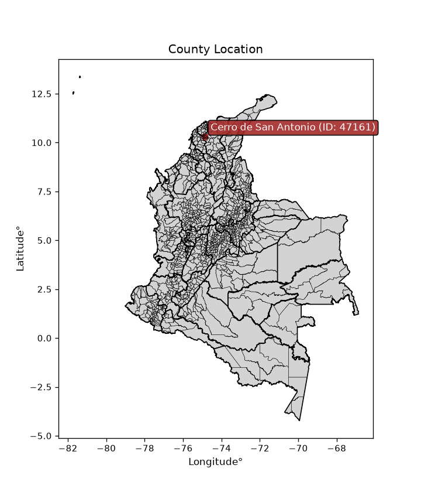
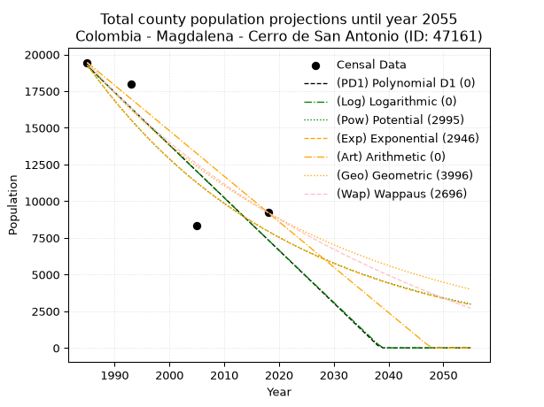
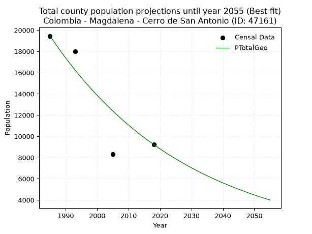
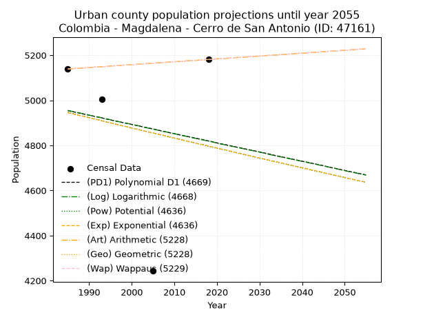
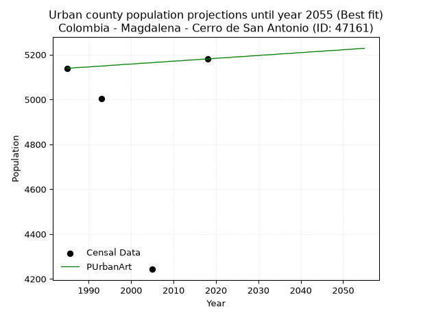
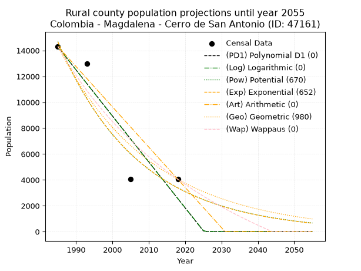
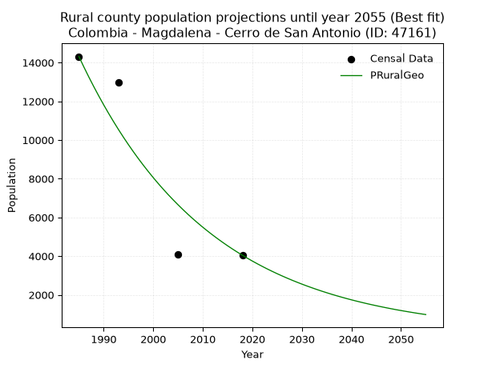

<div align="center">


</div>

# _“Population and Public Services Demand Projections (PPSD) until Year 2050 for Colombia - Magdalena - Cerro de San Antonio (ID: 47161)”_
Keywords: `population` `public-service` `projection` `lineal` `polynomial` `logarithmic` `potential` `exponential` `arithmetic` `geometric` `wappaus` `dane` `colombia` `south-america`

PPSD are analytical estimates used by governments and planners to anticipate future changes in population size, age distribution, and the resulting community needs for utilities, healthcare, education, and infrastructure as sizing future water treatment facilities, electrical grids, and road networks based on spatial growth.

<div align="center">

</img>

</div>


> **General running parameters**: • app_version: _v20260806_. • Python version: _3.14.7_. • Pandas version: _3.0.5_. • NumPy version: _2.5.1_. • Creates, save and include plots into reports (create_plot): _False_. • Projection until year: _2050_. • Process polynomial degree 2 and up: _False_. • Process Wappaus: _True_. • Process Wappaus: _True_. • Set negative values to zero: _True_. • Set infinite values to zero: _True_. • Drop dataset notes: _True_. 
<div align="center">

Dynamic map: [:earth_americas:Google](http://maps.google.com/maps?q=10.32553077,-74.8684744) [:earth_americas:OSM](https://www.openstreetmap.org/#map=18/10.32553077/-74.8684744&layers=P) [:earth_americas:Bing](https://www.bing.com/maps?cp=10.32553077~-74.8684744&lvl=18) [:earth_americas:Apple](https://maps.apple.com/frame?center=10.32553077%2C-74.8684744&span=0.003%2C0.006)

</div>


<div align="center">

```geojson
{
  "type": "Feature",
  "geometry": {
    "type": "Point", 
    "coordinates": [-74.8684744, 10.32553077]
  }, 
  "properties": {
    "Name": "Colombia - Magdalena - Cerro de San Antonio (ID: 47161)"
  }
}
```

</div>


## 0. Census Data (4 records)

Census data are official statistics collected by a government about the people and housing in a country. They usually include counts of total population, age, sex, race, income, education, and jobs.

📅Global census file: [Population.xlsx](../data/Population.xlsx)

| Source   |   Year |   CountryID | CountryName   |   StateID | StateName   |   CountyID | CountyName           |   PTotal |   PUrban |   PRural |
|:---------|-------:|------------:|:--------------|----------:|:------------|-----------:|:---------------------|---------:|---------:|---------:|
| DANE     |   1985 |          57 | Colombia      |        47 | Magdalena   |      47161 | Cerro de San Antonio |    19453 |     5139 |    14314 |
| DANE     |   1993 |          57 | Colombia      |        47 | Magdalena   |      47161 | Cerro de San Antonio |    17992 |     5005 |    12987 |
| DANE     |   2005 |          57 | Colombia      |        47 | Magdalena   |      47161 | Cerro de San Antonio |     8319 |     4243 |     4076 |
| DANE     |   2018 |          57 | Colombia      |        47 | Magdalena   |      47161 | Cerro de San Antonio |     9225 |     5181 |     4044 |

> 🔥Some records could had specific notes about the registered values or the corresponding urban or rural distribution.

📅   [RUPS](https://www.datos.gov.co/Hacienda-y-Cr-dito-P-blico/Registro-nico-de-Prestadores-de-Servicios-P-blicos/4qkq-csdn/about_data) - Local public utility companies: [RUPS.csv](../data/RUPS.xlsx)

 | SERVICIO   | ESTADO    | NOMBRE                         | NIT         | DEPARTAMENTO_DOMICILIO   | MUNICIPIO_DOMICILIO   | DIRECCION             |   TELEFONO | EMAIL                                     | TIPO_PRESTADOR                 | CLASIFICACION                 |
|:-----------|:----------|:-------------------------------|:------------|:-------------------------|:----------------------|:----------------------|-----------:|:------------------------------------------|:-------------------------------|:------------------------------|
| ACUEDUCTO  | OPERATIVA | ACUEDUCTO CERRO DE SAN ANTONIO | 891780042-8 | MAGDALENA                | CERRO DE SAN ANTONIO  | Calle 4 Kra 1 Esquina |    5091801 | alcaldia@cerrosanantonio-magdalena.gov.co | MUNICIPIO (PRESTACIÓN DIRECTA) | MENOR O IGUAL A 2500 USUARIOS |

## 1. Total

### 1.1. Coefficients and Parameters

* (PD1) Polynomial Deg 1: -359.43998394219176, 732717.077880369 (lineal)
* (Log) Logarithmic: -719974.5648806539, 5486279.687171923
* (Pow) Potential: -53.75458301700487, 181.55523101635765
* (Exp) Exponential: -0.02683562785158111, 2.626151110460643e+27
* (Art) Arithmetic: Year diff. 2018 - 1985 = 33, Population diff. 9225 - 19453 = -10228, Annual growth = -309.93939393939394
* (Geo) Geometric: Year diff. 2018 - 1985 = 33, Population diff. 9225 - 19453 = -10228, Annual growth % = -0.022354950006104657
* (Wap) Wappaus: i = -2.1615133129185713, Condition values only valid for < 200)

<sub>
Wappaus condition values: ['-0.00', '-2.16', '-4.32', '-6.48', '-8.65', '-10.81', '-12.97', '-15.13', '-17.29', '-19.45', '-21.62', '-23.78', '-25.94', '-28.10', '-30.26', '-32.42', '-34.58', '-36.75', '-38.91', '-41.07', '-43.23', '-45.39', '-47.55', '-49.71', '-51.88', '-54.04', '-56.20', '-58.36', '-60.52', '-62.68', '-64.85', '-67.01', '-69.17', '-71.33', '-73.49', '-75.65', '-77.81', '-79.98', '-82.14', '-84.30', '-86.46', '-88.62', '-90.78', '-92.95', '-95.11', '-97.27', '-99.43', '-101.59', '-103.75', '-105.91', '-108.08', '-110.24', '-112.40', '-114.56', '-116.72', '-118.88', '-121.04', '-123.21', '-125.37', '-127.53', '-129.69', '-131.85', '-134.01', '-136.18', '-138.34', '-140.50']
</sub>


### 1.2. Projected Dataset

|   Year |   CountyID |   PTotalPD1 |   PTotalLog |   PTotalPow |   PTotalExp |   PTotalArt |   PTotalGeo |   PTotalWap |
|-------:|-----------:|------------:|------------:|------------:|------------:|------------:|------------:|------------:|
|   1985 |      47161 |       19229 |       19243 |       19297 |       19276 |       19453 |       19453 |       19453 |
|   1986 |      47161 |       18869 |       18881 |       18782 |       18765 |       19143 |       19018 |       19037 |
|   1987 |      47161 |       18510 |       18518 |       18280 |       18268 |       18833 |       18593 |       18630 |
|   1988 |      47161 |       18150 |       18156 |       17792 |       17785 |       18523 |       18177 |       18231 |
|   1989 |      47161 |       17791 |       17794 |       17318 |       17314 |       18213 |       17771 |       17841 |
|   1990 |      47161 |       17432 |       17432 |       16856 |       16855 |       17903 |       17374 |       17458 |
|   1991 |      47161 |       17072 |       17070 |       16407 |       16409 |       17593 |       16985 |       17084 |
|   1992 |      47161 |       16713 |       16709 |       15970 |       15974 |       17283 |       16606 |       16717 |
|   1993 |      47161 |       16353 |       16348 |       15545 |       15551 |       16973 |       16234 |       16357 |
|   1994 |      47161 |       15994 |       15986 |       15131 |       15140 |       16664 |       15871 |       16004 |
|   1995 |      47161 |       15634 |       15625 |       14729 |       14739 |       16354 |       15517 |       15658 |
|   1996 |      47161 |       15275 |       15265 |       14338 |       14349 |       16044 |       15170 |       15319 |
|   1997 |      47161 |       14915 |       14904 |       13957 |       13969 |       15734 |       14831 |       14987 |
|   1998 |      47161 |       14556 |       14544 |       13586 |       13599 |       15424 |       14499 |       14660 |
|   1999 |      47161 |       14197 |       14183 |       13226 |       13239 |       15114 |       14175 |       14340 |
|   2000 |      47161 |       13837 |       13823 |       12875 |       12888 |       14804 |       13858 |       14026 |
|   2001 |      47161 |       13478 |       13463 |       12533 |       12547 |       14494 |       13548 |       13717 |
|   2002 |      47161 |       13118 |       13104 |       12201 |       12215 |       14184 |       13245 |       13414 |
|   2003 |      47161 |       12759 |       12744 |       11878 |       11891 |       13874 |       12949 |       13117 |
|   2004 |      47161 |       12399 |       12385 |       11564 |       11576 |       13564 |       12660 |       12825 |
|   2005 |      47161 |       12040 |       12026 |       11258 |       11270 |       13254 |       12377 |       12538 |
|   2006 |      47161 |       11680 |       11667 |       10960 |       10971 |       12944 |       12100 |       12256 |
|   2007 |      47161 |       11321 |       11308 |       10670 |       10681 |       12634 |       11830 |       11979 |
|   2008 |      47161 |       10962 |       10949 |       10388 |       10398 |       12324 |       11565 |       11707 |
|   2009 |      47161 |       10602 |       10591 |       10114 |       10123 |       12014 |       11307 |       11440 |
|   2010 |      47161 |       10243 |       10232 |        9847 |        9855 |       11705 |       11054 |       11177 |
|   2011 |      47161 |        9883 |        9874 |        9587 |        9594 |       11395 |       10807 |       10919 |
|   2012 |      47161 |        9524 |        9516 |        9334 |        9340 |       11085 |       10565 |       10665 |
|   2013 |      47161 |        9164 |        9159 |        9088 |        9092 |       10775 |       10329 |       10415 |
|   2014 |      47161 |        8805 |        8801 |        8849 |        8852 |       10465 |       10098 |       10169 |
|   2015 |      47161 |        8446 |        8444 |        8616 |        8617 |       10155 |        9872 |        9927 |
|   2016 |      47161 |        8086 |        8086 |        8389 |        8389 |        9845 |        9652 |        9689 |
|   2017 |      47161 |        7727 |        7729 |        8169 |        8167 |        9535 |        9436 |        9455 |
|   2018 |      47161 |        7367 |        7372 |        7954 |        7951 |        9225 |        9225 |        9225 |
|   2019 |      47161 |        7008 |        7016 |        7745 |        7740 |        8915 |        9019 |        8998 |
|   2020 |      47161 |        6648 |        6659 |        7541 |        7535 |        8605 |        8817 |        8775 |
|   2021 |      47161 |        6289 |        6303 |        7343 |        7336 |        8295 |        8620 |        8556 |
|   2022 |      47161 |        5929 |        5947 |        7151 |        7141 |        7985 |        8427 |        8339 |
|   2023 |      47161 |        5570 |        5591 |        6963 |        6952 |        7675 |        8239 |        8126 |
|   2024 |      47161 |        5211 |        5235 |        6781 |        6768 |        7365 |        8055 |        7917 |
|   2025 |      47161 |        4851 |        4879 |        6603 |        6589 |        7055 |        7875 |        7710 |
|   2026 |      47161 |        4492 |        4524 |        6430 |        6415 |        6745 |        7699 |        7507 |
|   2027 |      47161 |        4132 |        4169 |        6262 |        6245 |        6436 |        7527 |        7306 |
|   2028 |      47161 |        3773 |        3814 |        6098 |        6079 |        6126 |        7358 |        7109 |
|   2029 |      47161 |        3413 |        3459 |        5938 |        5918 |        5816 |        7194 |        6914 |
|   2030 |      47161 |        3054 |        3104 |        5783 |        5762 |        5506 |        7033 |        6723 |
|   2031 |      47161 |        2694 |        2749 |        5632 |        5609 |        5196 |        6876 |        6534 |
|   2032 |      47161 |        2335 |        2395 |        5485 |        5461 |        4886 |        6722 |        6347 |
|   2033 |      47161 |        1976 |        2041 |        5342 |        5316 |        4576 |        6572 |        6164 |
|   2034 |      47161 |        1616 |        1687 |        5202 |        5175 |        4266 |        6425 |        5983 |
|   2035 |      47161 |        1257 |        1333 |        5067 |        5038 |        3956 |        6281 |        5804 |
|   2036 |      47161 |         897 |         979 |        4935 |        4905 |        3646 |        6141 |        5628 |
|   2037 |      47161 |         538 |         625 |        4806 |        4775 |        3336 |        6004 |        5455 |
|   2038 |      47161 |         178 |         272 |        4681 |        4649 |        3026 |        5869 |        5284 |
|   2039 |      47161 |           0 |           0 |        4559 |        4525 |        2716 |        5738 |        5115 |
|   2040 |      47161 |           0 |           0 |        4441 |        4406 |        2406 |        5610 |        4948 |
|   2041 |      47161 |           0 |           0 |        4325 |        4289 |        2096 |        5484 |        4784 |
|   2042 |      47161 |           0 |           0 |        4213 |        4175 |        1786 |        5362 |        4622 |
|   2043 |      47161 |           0 |           0 |        4103 |        4065 |        1477 |        5242 |        4462 |
|   2044 |      47161 |           0 |           0 |        3997 |        3957 |        1167 |        5125 |        4304 |
|   2045 |      47161 |           0 |           0 |        3893 |        3852 |         857 |        5010 |        4149 |
|   2046 |      47161 |           0 |           0 |        3792 |        3750 |         547 |        4898 |        3995 |
|   2047 |      47161 |           0 |           0 |        3694 |        3651 |         237 |        4789 |        3843 |
|   2048 |      47161 |           0 |           0 |        3598 |        3554 |           0 |        4682 |        3693 |
|   2049 |      47161 |           0 |           0 |        3505 |        3460 |           0 |        4577 |        3545 |
|   2050 |      47161 |           0 |           0 |        3414 |        3369 |           0 |        4475 |        3399 |
<div align="center">

</img>

</div>


### 1.3. Best fit with absolute and relative error (%)

Relative error puts that difference into context by dividing the absolute error by the true value, creating a unitless ratio or percentage that shows the scale of the mistake.

Absolute and relative error

|   Year | Source   |   CountryID | CountryName   |   StateID | StateName   |   CountyID_x | CountyName           |   PTotal |   PUrban |   PRural |   CountyID_y |   PTotalPD1 |   PTotalLog |   PTotalPow |   PTotalExp |   PTotalArt |   PTotalGeo |   PTotalWap |   PTotalPD1AbsError |   PTotalLogAbsError |   PTotalPowAbsError |   PTotalExpAbsError |   PTotalArtAbsError |   PTotalGeoAbsError |   PTotalWapAbsError |   PTotalPD1RelError |   PTotalLogRelError |   PTotalPowRelError |   PTotalExpRelError |   PTotalArtRelError |   PTotalGeoRelError |   PTotalWapRelError |
|-------:|:---------|------------:|:--------------|----------:|:------------|-------------:|:---------------------|---------:|---------:|---------:|-------------:|------------:|------------:|------------:|------------:|------------:|------------:|------------:|--------------------:|--------------------:|--------------------:|--------------------:|--------------------:|--------------------:|--------------------:|--------------------:|--------------------:|--------------------:|--------------------:|--------------------:|--------------------:|--------------------:|
|   1985 | DANE     |          57 | Colombia      |        47 | Magdalena   |        47161 | Cerro de San Antonio |    19453 |     5139 |    14314 |        47161 |       19229 |       19243 |       19297 |       19276 |       19453 |       19453 |       19453 |                 224 |                 210 |                 156 |                 177 |                   0 |                   0 |                   0 |             1.15149 |             1.07953 |            0.801933 |            0.909885 |             0       |             0       |             0       |
|   1993 | DANE     |          57 | Colombia      |        47 | Magdalena   |        47161 | Cerro de San Antonio |    17992 |     5005 |    12987 |        47161 |       16353 |       16348 |       15545 |       15551 |       16973 |       16234 |       16357 |                1639 |                1644 |                2447 |                2441 |                1019 |                1758 |                1635 |             9.1096  |             9.13739 |           13.6005   |           13.5671   |             5.66363 |             9.77101 |             9.08737 |
|   2005 | DANE     |          57 | Colombia      |        47 | Magdalena   |        47161 | Cerro de San Antonio |     8319 |     4243 |     4076 |        47161 |       12040 |       12026 |       11258 |       11270 |       13254 |       12377 |       12538 |                3721 |                3707 |                2939 |                2951 |                4935 |                4058 |                4219 |            44.7289  |            44.5606  |           35.3288   |           35.473    |            59.322   |            48.7799  |            50.7152  |
|   2018 | DANE     |          57 | Colombia      |        47 | Magdalena   |        47161 | Cerro de San Antonio |     9225 |     5181 |     4044 |        47161 |        7367 |        7372 |        7954 |        7951 |        9225 |        9225 |        9225 |                1858 |                1853 |                1271 |                1274 |                   0 |                   0 |                   0 |            20.1409  |            20.0867  |           13.7778   |           13.8103   |             0       |             0       |             0       |

Relative error mean

| Method    |   RelError | Best   |
|:----------|-----------:|:-------|
| PTotalPD1 |    18.7827 |        |
| PTotalLog |    18.7161 |        |
| PTotalPow |    15.8772 |        |
| PTotalExp |    15.9401 |        |
| PTotalArt |    16.2464 |        |
| PTotalGeo |    14.6377 | True   |
| PTotalWap |    14.9507 |        |

💙Best method: _**PTotalGeo**_
<div align="center">

</img>

</div>


### 1.4. Fresh water supply demand in liters per capita per day (lpcd)

The fresh water supply demand typically ranges from 100 to 300 liters per capita per day (lpcd) for standard domestic and municipal planning, though absolute survival minimums set by the World Health Organization are as low as 7.5 to 20 liters per day, and total consumption in high-income nations can exceed 400 liters.

> `CZ`: Level in meters above the sea level (masl)<br> `WS`: Fresh water supply demand in liters per capita per day (lpcd or l/h/d)<br> `WSAll`: Zonal fresh water supply demand in liters per second (l/s)<br> `A`: Zonal area in square meters<br> `DP`: Population density (people/hectare or p/ha)

Reference values (RAS Colombia)

|    CZ |   WS |
|------:|-----:|
|  1000 |  120 |
|  2000 |  130 |
| 99999 |  140 |

County shapefile geometry properties and water supply values

|   CountyID |      ATotal |   CZTotal |   WSTotal |
|-----------:|------------:|----------:|----------:|
|      47161 | 1.76883e+08 |   14.3149 |       120 |

Projected values for best method: PTotalGeo

|   CountyID |   Year |   PTotalGeo |   DPTotal |   WSTotal |   WSTotalAll |
|-----------:|-------:|------------:|----------:|----------:|-------------:|
|      47161 |   1985 |       19453 |      1.1  |       120 |     27.0181  |
|      47161 |   1986 |       19018 |      1.08 |       120 |     26.4139  |
|      47161 |   1987 |       18593 |      1.05 |       120 |     25.8236  |
|      47161 |   1988 |       18177 |      1.03 |       120 |     25.2458  |
|      47161 |   1989 |       17771 |      1    |       120 |     24.6819  |
|      47161 |   1990 |       17374 |      0.98 |       120 |     24.1306  |
|      47161 |   1991 |       16985 |      0.96 |       120 |     23.5903  |
|      47161 |   1992 |       16606 |      0.94 |       120 |     23.0639  |
|      47161 |   1993 |       16234 |      0.92 |       120 |     22.5472  |
|      47161 |   1994 |       15871 |      0.9  |       120 |     22.0431  |
|      47161 |   1995 |       15517 |      0.88 |       120 |     21.5514  |
|      47161 |   1996 |       15170 |      0.86 |       120 |     21.0694  |
|      47161 |   1997 |       14831 |      0.84 |       120 |     20.5986  |
|      47161 |   1998 |       14499 |      0.82 |       120 |     20.1375  |
|      47161 |   1999 |       14175 |      0.8  |       120 |     19.6875  |
|      47161 |   2000 |       13858 |      0.78 |       120 |     19.2472  |
|      47161 |   2001 |       13548 |      0.77 |       120 |     18.8167  |
|      47161 |   2002 |       13245 |      0.75 |       120 |     18.3958  |
|      47161 |   2003 |       12949 |      0.73 |       120 |     17.9847  |
|      47161 |   2004 |       12660 |      0.72 |       120 |     17.5833  |
|      47161 |   2005 |       12377 |      0.7  |       120 |     17.1903  |
|      47161 |   2006 |       12100 |      0.68 |       120 |     16.8056  |
|      47161 |   2007 |       11830 |      0.67 |       120 |     16.4306  |
|      47161 |   2008 |       11565 |      0.65 |       120 |     16.0625  |
|      47161 |   2009 |       11307 |      0.64 |       120 |     15.7042  |
|      47161 |   2010 |       11054 |      0.62 |       120 |     15.3528  |
|      47161 |   2011 |       10807 |      0.61 |       120 |     15.0097  |
|      47161 |   2012 |       10565 |      0.6  |       120 |     14.6736  |
|      47161 |   2013 |       10329 |      0.58 |       120 |     14.3458  |
|      47161 |   2014 |       10098 |      0.57 |       120 |     14.025   |
|      47161 |   2015 |        9872 |      0.56 |       120 |     13.7111  |
|      47161 |   2016 |        9652 |      0.55 |       120 |     13.4056  |
|      47161 |   2017 |        9436 |      0.53 |       120 |     13.1056  |
|      47161 |   2018 |        9225 |      0.52 |       120 |     12.8125  |
|      47161 |   2019 |        9019 |      0.51 |       120 |     12.5264  |
|      47161 |   2020 |        8817 |      0.5  |       120 |     12.2458  |
|      47161 |   2021 |        8620 |      0.49 |       120 |     11.9722  |
|      47161 |   2022 |        8427 |      0.48 |       120 |     11.7042  |
|      47161 |   2023 |        8239 |      0.47 |       120 |     11.4431  |
|      47161 |   2024 |        8055 |      0.46 |       120 |     11.1875  |
|      47161 |   2025 |        7875 |      0.45 |       120 |     10.9375  |
|      47161 |   2026 |        7699 |      0.44 |       120 |     10.6931  |
|      47161 |   2027 |        7527 |      0.43 |       120 |     10.4542  |
|      47161 |   2028 |        7358 |      0.42 |       120 |     10.2194  |
|      47161 |   2029 |        7194 |      0.41 |       120 |      9.99167 |
|      47161 |   2030 |        7033 |      0.4  |       120 |      9.76806 |
|      47161 |   2031 |        6876 |      0.39 |       120 |      9.55    |
|      47161 |   2032 |        6722 |      0.38 |       120 |      9.33611 |
|      47161 |   2033 |        6572 |      0.37 |       120 |      9.12778 |
|      47161 |   2034 |        6425 |      0.36 |       120 |      8.92361 |
|      47161 |   2035 |        6281 |      0.36 |       120 |      8.72361 |
|      47161 |   2036 |        6141 |      0.35 |       120 |      8.52917 |
|      47161 |   2037 |        6004 |      0.34 |       120 |      8.33889 |
|      47161 |   2038 |        5869 |      0.33 |       120 |      8.15139 |
|      47161 |   2039 |        5738 |      0.32 |       120 |      7.96944 |
|      47161 |   2040 |        5610 |      0.32 |       120 |      7.79167 |
|      47161 |   2041 |        5484 |      0.31 |       120 |      7.61667 |
|      47161 |   2042 |        5362 |      0.3  |       120 |      7.44722 |
|      47161 |   2043 |        5242 |      0.3  |       120 |      7.28056 |
|      47161 |   2044 |        5125 |      0.29 |       120 |      7.11806 |
|      47161 |   2045 |        5010 |      0.28 |       120 |      6.95833 |
|      47161 |   2046 |        4898 |      0.28 |       120 |      6.80278 |
|      47161 |   2047 |        4789 |      0.27 |       120 |      6.65139 |
|      47161 |   2048 |        4682 |      0.26 |       120 |      6.50278 |
|      47161 |   2049 |        4577 |      0.26 |       120 |      6.35694 |
|      47161 |   2050 |        4475 |      0.25 |       120 |      6.21528 |

## 2. Urban

### 2.1. Coefficients and Parameters

* (PD1) Polynomial Deg 1: -4.077077478924655, 13047.17422721904 (lineal)
* (Log) Logarithmic: -8278.629046094984, 67817.92572013766
* (Pow) Potential: -1.869950333826314, 9.860940194579696
* (Exp) Exponential: -0.0009217378420564281, 30817.94845451083
* (Art) Arithmetic: Year diff. 2018 - 1985 = 33, Population diff. 5181 - 5139 = 42, Annual growth = 1.2727272727272727
* (Geo) Geometric: Year diff. 2018 - 1985 = 33, Population diff. 5181 - 5139 = 42, Annual growth % = 0.00024668435559971336
* (Wap) Wappaus: i = 0.02466525722339676, Condition values only valid for < 200)

<sub>
Wappaus condition values: ['0.00', '0.02', '0.05', '0.07', '0.10', '0.12', '0.15', '0.17', '0.20', '0.22', '0.25', '0.27', '0.30', '0.32', '0.35', '0.37', '0.39', '0.42', '0.44', '0.47', '0.49', '0.52', '0.54', '0.57', '0.59', '0.62', '0.64', '0.67', '0.69', '0.72', '0.74', '0.76', '0.79', '0.81', '0.84', '0.86', '0.89', '0.91', '0.94', '0.96', '0.99', '1.01', '1.04', '1.06', '1.09', '1.11', '1.13', '1.16', '1.18', '1.21', '1.23', '1.26', '1.28', '1.31', '1.33', '1.36', '1.38', '1.41', '1.43', '1.46', '1.48', '1.50', '1.53', '1.55', '1.58', '1.60']
</sub>


### 2.2. Projected Dataset

|   Year |   CountyID |   PUrbanPD1 |   PUrbanLog |   PUrbanPow |   PUrbanExp |   PUrbanArt |   PUrbanGeo |   PUrbanWap |
|-------:|-----------:|------------:|------------:|------------:|------------:|------------:|------------:|------------:|
|   1985 |      47161 |        4954 |        4955 |        4946 |        4945 |        5139 |        5139 |        5139 |
|   1986 |      47161 |        4950 |        4951 |        4942 |        4941 |        5140 |        5140 |        5140 |
|   1987 |      47161 |        4946 |        4947 |        4937 |        4936 |        5142 |        5142 |        5142 |
|   1988 |      47161 |        4942 |        4943 |        4932 |        4932 |        5143 |        5143 |        5143 |
|   1989 |      47161 |        4938 |        4939 |        4928 |        4927 |        5144 |        5144 |        5144 |
|   1990 |      47161 |        4934 |        4934 |        4923 |        4923 |        5145 |        5145 |        5145 |
|   1991 |      47161 |        4930 |        4930 |        4919 |        4918 |        5147 |        5147 |        5147 |
|   1992 |      47161 |        4926 |        4926 |        4914 |        4914 |        5148 |        5148 |        5148 |
|   1993 |      47161 |        4922 |        4922 |        4909 |        4909 |        5149 |        5149 |        5149 |
|   1994 |      47161 |        4917 |        4918 |        4905 |        4904 |        5150 |        5150 |        5150 |
|   1995 |      47161 |        4913 |        4914 |        4900 |        4900 |        5152 |        5152 |        5152 |
|   1996 |      47161 |        4909 |        4909 |        4896 |        4895 |        5153 |        5153 |        5153 |
|   1997 |      47161 |        4905 |        4905 |        4891 |        4891 |        5154 |        5154 |        5154 |
|   1998 |      47161 |        4901 |        4901 |        4886 |        4886 |        5156 |        5156 |        5156 |
|   1999 |      47161 |        4897 |        4897 |        4882 |        4882 |        5157 |        5157 |        5157 |
|   2000 |      47161 |        4893 |        4893 |        4877 |        4877 |        5158 |        5158 |        5158 |
|   2001 |      47161 |        4889 |        4889 |        4873 |        4873 |        5159 |        5159 |        5159 |
|   2002 |      47161 |        4885 |        4885 |        4868 |        4868 |        5161 |        5161 |        5161 |
|   2003 |      47161 |        4881 |        4880 |        4864 |        4864 |        5162 |        5162 |        5162 |
|   2004 |      47161 |        4877 |        4876 |        4859 |        4859 |        5163 |        5163 |        5163 |
|   2005 |      47161 |        4873 |        4872 |        4855 |        4855 |        5164 |        5164 |        5164 |
|   2006 |      47161 |        4869 |        4868 |        4850 |        4851 |        5166 |        5166 |        5166 |
|   2007 |      47161 |        4864 |        4864 |        4846 |        4846 |        5167 |        5167 |        5167 |
|   2008 |      47161 |        4860 |        4860 |        4841 |        4842 |        5168 |        5168 |        5168 |
|   2009 |      47161 |        4856 |        4856 |        4837 |        4837 |        5170 |        5170 |        5170 |
|   2010 |      47161 |        4852 |        4852 |        4832 |        4833 |        5171 |        5171 |        5171 |
|   2011 |      47161 |        4848 |        4847 |        4828 |        4828 |        5172 |        5172 |        5172 |
|   2012 |      47161 |        4844 |        4843 |        4823 |        4824 |        5173 |        5173 |        5173 |
|   2013 |      47161 |        4840 |        4839 |        4819 |        4819 |        5175 |        5175 |        5175 |
|   2014 |      47161 |        4836 |        4835 |        4814 |        4815 |        5176 |        5176 |        5176 |
|   2015 |      47161 |        4832 |        4831 |        4810 |        4810 |        5177 |        5177 |        5177 |
|   2016 |      47161 |        4828 |        4827 |        4805 |        4806 |        5178 |        5178 |        5178 |
|   2017 |      47161 |        4824 |        4823 |        4801 |        4802 |        5180 |        5180 |        5180 |
|   2018 |      47161 |        4820 |        4819 |        4796 |        4797 |        5181 |        5181 |        5181 |
|   2019 |      47161 |        4816 |        4815 |        4792 |        4793 |        5182 |        5182 |        5182 |
|   2020 |      47161 |        4811 |        4810 |        4787 |        4788 |        5184 |        5184 |        5184 |
|   2021 |      47161 |        4807 |        4806 |        4783 |        4784 |        5185 |        5185 |        5185 |
|   2022 |      47161 |        4803 |        4802 |        4779 |        4780 |        5186 |        5186 |        5186 |
|   2023 |      47161 |        4799 |        4798 |        4774 |        4775 |        5187 |        5187 |        5187 |
|   2024 |      47161 |        4795 |        4794 |        4770 |        4771 |        5189 |        5189 |        5189 |
|   2025 |      47161 |        4791 |        4790 |        4765 |        4766 |        5190 |        5190 |        5190 |
|   2026 |      47161 |        4787 |        4786 |        4761 |        4762 |        5191 |        5191 |        5191 |
|   2027 |      47161 |        4783 |        4782 |        4757 |        4758 |        5192 |        5193 |        5193 |
|   2028 |      47161 |        4779 |        4778 |        4752 |        4753 |        5194 |        5194 |        5194 |
|   2029 |      47161 |        4775 |        4774 |        4748 |        4749 |        5195 |        5195 |        5195 |
|   2030 |      47161 |        4771 |        4770 |        4743 |        4744 |        5196 |        5196 |        5196 |
|   2031 |      47161 |        4767 |        4766 |        4739 |        4740 |        5198 |        5198 |        5198 |
|   2032 |      47161 |        4763 |        4761 |        4735 |        4736 |        5199 |        5199 |        5199 |
|   2033 |      47161 |        4758 |        4757 |        4730 |        4731 |        5200 |        5200 |        5200 |
|   2034 |      47161 |        4754 |        4753 |        4726 |        4727 |        5201 |        5201 |        5201 |
|   2035 |      47161 |        4750 |        4749 |        4722 |        4723 |        5203 |        5203 |        5203 |
|   2036 |      47161 |        4746 |        4745 |        4717 |        4718 |        5204 |        5204 |        5204 |
|   2037 |      47161 |        4742 |        4741 |        4713 |        4714 |        5205 |        5205 |        5205 |
|   2038 |      47161 |        4738 |        4737 |        4709 |        4710 |        5206 |        5207 |        5207 |
|   2039 |      47161 |        4734 |        4733 |        4704 |        4705 |        5208 |        5208 |        5208 |
|   2040 |      47161 |        4730 |        4729 |        4700 |        4701 |        5209 |        5209 |        5209 |
|   2041 |      47161 |        4726 |        4725 |        4696 |        4697 |        5210 |        5210 |        5210 |
|   2042 |      47161 |        4722 |        4721 |        4691 |        4692 |        5212 |        5212 |        5212 |
|   2043 |      47161 |        4718 |        4717 |        4687 |        4688 |        5213 |        5213 |        5213 |
|   2044 |      47161 |        4714 |        4713 |        4683 |        4684 |        5214 |        5214 |        5214 |
|   2045 |      47161 |        4710 |        4709 |        4679 |        4679 |        5215 |        5216 |        5216 |
|   2046 |      47161 |        4705 |        4705 |        4674 |        4675 |        5217 |        5217 |        5217 |
|   2047 |      47161 |        4701 |        4701 |        4670 |        4671 |        5218 |        5218 |        5218 |
|   2048 |      47161 |        4697 |        4697 |        4666 |        4666 |        5219 |        5219 |        5219 |
|   2049 |      47161 |        4693 |        4692 |        4661 |        4662 |        5220 |        5221 |        5221 |
|   2050 |      47161 |        4689 |        4688 |        4657 |        4658 |        5222 |        5222 |        5222 |
<div align="center">

</img>

</div>


### 2.3. Best fit with absolute and relative error (%)

Relative error puts that difference into context by dividing the absolute error by the true value, creating a unitless ratio or percentage that shows the scale of the mistake.

Absolute and relative error

|   Year | Source   |   CountryID | CountryName   |   StateID | StateName   |   CountyID_x | CountyName           |   PTotal |   PUrban |   PRural |   CountyID_y |   PUrbanPD1 |   PUrbanLog |   PUrbanPow |   PUrbanExp |   PUrbanArt |   PUrbanGeo |   PUrbanWap |   PUrbanPD1AbsError |   PUrbanLogAbsError |   PUrbanPowAbsError |   PUrbanExpAbsError |   PUrbanArtAbsError |   PUrbanGeoAbsError |   PUrbanWapAbsError |   PUrbanPD1RelError |   PUrbanLogRelError |   PUrbanPowRelError |   PUrbanExpRelError |   PUrbanArtRelError |   PUrbanGeoRelError |   PUrbanWapRelError |
|-------:|:---------|------------:|:--------------|----------:|:------------|-------------:|:---------------------|---------:|---------:|---------:|-------------:|------------:|------------:|------------:|------------:|------------:|------------:|------------:|--------------------:|--------------------:|--------------------:|--------------------:|--------------------:|--------------------:|--------------------:|--------------------:|--------------------:|--------------------:|--------------------:|--------------------:|--------------------:|--------------------:|
|   1985 | DANE     |          57 | Colombia      |        47 | Magdalena   |        47161 | Cerro de San Antonio |    19453 |     5139 |    14314 |        47161 |        4954 |        4955 |        4946 |        4945 |        5139 |        5139 |        5139 |                 185 |                 184 |                 193 |                 194 |                   0 |                   0 |                   0 |             3.59992 |             3.58046 |             3.75559 |             3.77505 |             0       |             0       |             0       |
|   1993 | DANE     |          57 | Colombia      |        47 | Magdalena   |        47161 | Cerro de San Antonio |    17992 |     5005 |    12987 |        47161 |        4922 |        4922 |        4909 |        4909 |        5149 |        5149 |        5149 |                  83 |                  83 |                  96 |                  96 |                 144 |                 144 |                 144 |             1.65834 |             1.65834 |             1.91808 |             1.91808 |             2.87712 |             2.87712 |             2.87712 |
|   2005 | DANE     |          57 | Colombia      |        47 | Magdalena   |        47161 | Cerro de San Antonio |     8319 |     4243 |     4076 |        47161 |        4873 |        4872 |        4855 |        4855 |        5164 |        5164 |        5164 |                 630 |                 629 |                 612 |                 612 |                 921 |                 921 |                 921 |            14.848   |            14.8244  |            14.4238  |            14.4238  |            21.7063  |            21.7063  |            21.7063  |
|   2018 | DANE     |          57 | Colombia      |        47 | Magdalena   |        47161 | Cerro de San Antonio |     9225 |     5181 |     4044 |        47161 |        4820 |        4819 |        4796 |        4797 |        5181 |        5181 |        5181 |                 361 |                 362 |                 385 |                 384 |                   0 |                   0 |                   0 |             6.96777 |             6.98707 |             7.431   |             7.4117  |             0       |             0       |             0       |

Relative error mean

| Method    |   RelError | Best   |
|:----------|-----------:|:-------|
| PUrbanPD1 |    6.7685  |        |
| PUrbanLog |    6.76257 |        |
| PUrbanPow |    6.88211 |        |
| PUrbanExp |    6.88215 |        |
| PUrbanArt |    6.14587 | True   |
| PUrbanGeo |    6.14587 | True   |
| PUrbanWap |    6.14587 | True   |

💙Best method: _**PUrbanArt**_
<div align="center">

</img>

</div>


### 2.4. Fresh water supply demand in liters per capita per day (lpcd)

The fresh water supply demand typically ranges from 100 to 300 liters per capita per day (lpcd) for standard domestic and municipal planning, though absolute survival minimums set by the World Health Organization are as low as 7.5 to 20 liters per day, and total consumption in high-income nations can exceed 400 liters.

> `CZ`: Level in meters above the sea level (masl)<br> `WS`: Fresh water supply demand in liters per capita per day (lpcd or l/h/d)<br> `WSAll`: Zonal fresh water supply demand in liters per second (l/s)<br> `A`: Zonal area in square meters<br> `DP`: Population density (people/hectare or p/ha)

Reference values (RAS Colombia)

|    CZ |   WS |
|------:|-----:|
|  1000 |  120 |
|  2000 |  130 |
| 99999 |  140 |

County shapefile geometry properties and water supply values

|   CountyID |   AUrban |   CZUrban |   WSUrban |
|-----------:|---------:|----------:|----------:|
|      47161 |   514444 |   8.91033 |       120 |

Projected values for best method: PUrbanArt

|   CountyID |   Year |   PUrbanArt |   DPUrban |   WSUrban |   WSUrbanAll |
|-----------:|-------:|------------:|----------:|----------:|-------------:|
|      47161 |   1985 |        5139 |     99.89 |       120 |      7.1375  |
|      47161 |   1986 |        5140 |     99.91 |       120 |      7.13889 |
|      47161 |   1987 |        5142 |     99.95 |       120 |      7.14167 |
|      47161 |   1988 |        5143 |     99.97 |       120 |      7.14306 |
|      47161 |   1989 |        5144 |     99.99 |       120 |      7.14444 |
|      47161 |   1990 |        5145 |    100.01 |       120 |      7.14583 |
|      47161 |   1991 |        5147 |    100.05 |       120 |      7.14861 |
|      47161 |   1992 |        5148 |    100.07 |       120 |      7.15    |
|      47161 |   1993 |        5149 |    100.09 |       120 |      7.15139 |
|      47161 |   1994 |        5150 |    100.11 |       120 |      7.15278 |
|      47161 |   1995 |        5152 |    100.15 |       120 |      7.15556 |
|      47161 |   1996 |        5153 |    100.17 |       120 |      7.15694 |
|      47161 |   1997 |        5154 |    100.19 |       120 |      7.15833 |
|      47161 |   1998 |        5156 |    100.22 |       120 |      7.16111 |
|      47161 |   1999 |        5157 |    100.24 |       120 |      7.1625  |
|      47161 |   2000 |        5158 |    100.26 |       120 |      7.16389 |
|      47161 |   2001 |        5159 |    100.28 |       120 |      7.16528 |
|      47161 |   2002 |        5161 |    100.32 |       120 |      7.16806 |
|      47161 |   2003 |        5162 |    100.34 |       120 |      7.16944 |
|      47161 |   2004 |        5163 |    100.36 |       120 |      7.17083 |
|      47161 |   2005 |        5164 |    100.38 |       120 |      7.17222 |
|      47161 |   2006 |        5166 |    100.42 |       120 |      7.175   |
|      47161 |   2007 |        5167 |    100.44 |       120 |      7.17639 |
|      47161 |   2008 |        5168 |    100.46 |       120 |      7.17778 |
|      47161 |   2009 |        5170 |    100.5  |       120 |      7.18056 |
|      47161 |   2010 |        5171 |    100.52 |       120 |      7.18194 |
|      47161 |   2011 |        5172 |    100.54 |       120 |      7.18333 |
|      47161 |   2012 |        5173 |    100.56 |       120 |      7.18472 |
|      47161 |   2013 |        5175 |    100.59 |       120 |      7.1875  |
|      47161 |   2014 |        5176 |    100.61 |       120 |      7.18889 |
|      47161 |   2015 |        5177 |    100.63 |       120 |      7.19028 |
|      47161 |   2016 |        5178 |    100.65 |       120 |      7.19167 |
|      47161 |   2017 |        5180 |    100.69 |       120 |      7.19444 |
|      47161 |   2018 |        5181 |    100.71 |       120 |      7.19583 |
|      47161 |   2019 |        5182 |    100.73 |       120 |      7.19722 |
|      47161 |   2020 |        5184 |    100.77 |       120 |      7.2     |
|      47161 |   2021 |        5185 |    100.79 |       120 |      7.20139 |
|      47161 |   2022 |        5186 |    100.81 |       120 |      7.20278 |
|      47161 |   2023 |        5187 |    100.83 |       120 |      7.20417 |
|      47161 |   2024 |        5189 |    100.87 |       120 |      7.20694 |
|      47161 |   2025 |        5190 |    100.89 |       120 |      7.20833 |
|      47161 |   2026 |        5191 |    100.91 |       120 |      7.20972 |
|      47161 |   2027 |        5192 |    100.92 |       120 |      7.21111 |
|      47161 |   2028 |        5194 |    100.96 |       120 |      7.21389 |
|      47161 |   2029 |        5195 |    100.98 |       120 |      7.21528 |
|      47161 |   2030 |        5196 |    101    |       120 |      7.21667 |
|      47161 |   2031 |        5198 |    101.04 |       120 |      7.21944 |
|      47161 |   2032 |        5199 |    101.06 |       120 |      7.22083 |
|      47161 |   2033 |        5200 |    101.08 |       120 |      7.22222 |
|      47161 |   2034 |        5201 |    101.1  |       120 |      7.22361 |
|      47161 |   2035 |        5203 |    101.14 |       120 |      7.22639 |
|      47161 |   2036 |        5204 |    101.16 |       120 |      7.22778 |
|      47161 |   2037 |        5205 |    101.18 |       120 |      7.22917 |
|      47161 |   2038 |        5206 |    101.2  |       120 |      7.23056 |
|      47161 |   2039 |        5208 |    101.24 |       120 |      7.23333 |
|      47161 |   2040 |        5209 |    101.26 |       120 |      7.23472 |
|      47161 |   2041 |        5210 |    101.27 |       120 |      7.23611 |
|      47161 |   2042 |        5212 |    101.31 |       120 |      7.23889 |
|      47161 |   2043 |        5213 |    101.33 |       120 |      7.24028 |
|      47161 |   2044 |        5214 |    101.35 |       120 |      7.24167 |
|      47161 |   2045 |        5215 |    101.37 |       120 |      7.24306 |
|      47161 |   2046 |        5217 |    101.41 |       120 |      7.24583 |
|      47161 |   2047 |        5218 |    101.43 |       120 |      7.24722 |
|      47161 |   2048 |        5219 |    101.45 |       120 |      7.24861 |
|      47161 |   2049 |        5220 |    101.47 |       120 |      7.25    |
|      47161 |   2050 |        5222 |    101.51 |       120 |      7.25278 |

## 3. Rural

### 3.1. Coefficients and Parameters

* (PD1) Polynomial Deg 1: -355.36290646326705, 719669.90365315 (lineal)
* (Log) Logarithmic: -711695.9358345588, 5418461.761451785
* (Pow) Potential: -89.06732052007092, 297.88955844367933
* (Exp) Exponential: -0.04447579209993107, 3.2180283532469123e+42
* (Art) Arithmetic: Year diff. 2018 - 1985 = 33, Population diff. 4044 - 14314 = -10270, Annual growth = -311.2121212121212
* (Geo) Geometric: Year diff. 2018 - 1985 = 33, Population diff. 4044 - 14314 = -10270, Annual growth % = -0.0375788562930367
* (Wap) Wappaus: i = -3.3904795861436017, Condition values only valid for < 200)

<sub>
Wappaus condition values: ['-0.00', '-3.39', '-6.78', '-10.17', '-13.56', '-16.95', '-20.34', '-23.73', '-27.12', '-30.51', '-33.90', '-37.30', '-40.69', '-44.08', '-47.47', '-50.86', '-54.25', '-57.64', '-61.03', '-64.42', '-67.81', '-71.20', '-74.59', '-77.98', '-81.37', '-84.76', '-88.15', '-91.54', '-94.93', '-98.32', '-101.71', '-105.10', '-108.50', '-111.89', '-115.28', '-118.67', '-122.06', '-125.45', '-128.84', '-132.23', '-135.62', '-139.01', '-142.40', '-145.79', '-149.18', '-152.57', '-155.96', '-159.35', '-162.74', '-166.13', '-169.52', '-172.91', '-176.30', '-179.70', '-183.09', '-186.48', '-189.87', '-193.26', '-196.65', '-200.04', '-203.43', '-206.82', '-210.21', '-213.60', '-216.99', '-220.38']
</sub>


### 3.2. Projected Dataset

|   Year |   CountyID |   PRuralPD1 |   PRuralLog |   PRuralPow |   PRuralExp |   PRuralArt |   PRuralGeo |   PRuralWap |
|-------:|-----------:|------------:|------------:|------------:|------------:|------------:|------------:|------------:|
|   1985 |      47161 |       14275 |       14288 |       14685 |       14660 |       14314 |       14314 |       14314 |
|   1986 |      47161 |       13919 |       13930 |       14041 |       14023 |       14003 |       13776 |       13837 |
|   1987 |      47161 |       13564 |       13571 |       13425 |       13413 |       13692 |       13258 |       13375 |
|   1988 |      47161 |       13208 |       13213 |       12837 |       12829 |       13380 |       12760 |       12929 |
|   1989 |      47161 |       12853 |       12856 |       12274 |       12271 |       13069 |       12281 |       12496 |
|   1990 |      47161 |       12498 |       12498 |       11737 |       11737 |       12758 |       11819 |       12077 |
|   1991 |      47161 |       12142 |       12140 |       11223 |       11227 |       12447 |       11375 |       11671 |
|   1992 |      47161 |       11787 |       11783 |       10732 |       10738 |       12136 |       10948 |       11277 |
|   1993 |      47161 |       11432 |       11426 |       10263 |       10271 |       11824 |       10536 |       10895 |
|   1994 |      47161 |       11076 |       11069 |        9815 |        9824 |       11513 |       10140 |       10524 |
|   1995 |      47161 |       10721 |       10712 |        9386 |        9397 |       11202 |        9759 |       10164 |
|   1996 |      47161 |       10366 |       10355 |        8976 |        8988 |       10891 |        9392 |        9815 |
|   1997 |      47161 |       10010 |        9999 |        8585 |        8597 |       10579 |        9039 |        9475 |
|   1998 |      47161 |        9655 |        9642 |        8210 |        8223 |       10268 |        8700 |        9144 |
|   1999 |      47161 |        9299 |        9286 |        7852 |        7865 |        9957 |        8373 |        8823 |
|   2000 |      47161 |        8944 |        8930 |        7510 |        7523 |        9646 |        8058 |        8510 |
|   2001 |      47161 |        8589 |        8575 |        7183 |        7196 |        9335 |        7755 |        8206 |
|   2002 |      47161 |        8233 |        8219 |        6871 |        6883 |        9023 |        7464 |        7909 |
|   2003 |      47161 |        7878 |        7864 |        6572 |        6584 |        8712 |        7183 |        7621 |
|   2004 |      47161 |        7523 |        7508 |        6286 |        6297 |        8401 |        6914 |        7340 |
|   2005 |      47161 |        7167 |        7153 |        6013 |        6023 |        8090 |        6654 |        7065 |
|   2006 |      47161 |        6812 |        6798 |        5752 |        5761 |        7779 |        6404 |        6798 |
|   2007 |      47161 |        6457 |        6444 |        5502 |        5511 |        7467 |        6163 |        6537 |
|   2008 |      47161 |        6101 |        6089 |        5263 |        5271 |        7156 |        5931 |        6283 |
|   2009 |      47161 |        5746 |        5735 |        5035 |        5042 |        6845 |        5709 |        6035 |
|   2010 |      47161 |        5390 |        5381 |        4817 |        4822 |        6534 |        5494 |        5793 |
|   2011 |      47161 |        5035 |        5027 |        4608 |        4612 |        6222 |        5288 |        5556 |
|   2012 |      47161 |        4680 |        4673 |        4408 |        4412 |        5911 |        5089 |        5325 |
|   2013 |      47161 |        4324 |        4319 |        4217 |        4220 |        5600 |        4898 |        5099 |
|   2014 |      47161 |        3969 |        3966 |        4035 |        4036 |        5289 |        4714 |        4879 |
|   2015 |      47161 |        3614 |        3613 |        3860 |        3861 |        4978 |        4536 |        4663 |
|   2016 |      47161 |        3258 |        3259 |        3694 |        3693 |        4666 |        4366 |        4452 |
|   2017 |      47161 |        2903 |        2907 |        3534 |        3532 |        4355 |        4202 |        4246 |
|   2018 |      47161 |        2548 |        2554 |        3381 |        3379 |        4044 |        4044 |        4044 |
|   2019 |      47161 |        2192 |        2201 |        3235 |        3232 |        3733 |        3892 |        3847 |
|   2020 |      47161 |        1837 |        1849 |        3096 |        3091 |        3422 |        3746 |        3653 |
|   2021 |      47161 |        1481 |        1497 |        2962 |        2957 |        3110 |        3605 |        3464 |
|   2022 |      47161 |        1126 |        1144 |        2835 |        2828 |        2799 |        3470 |        3279 |
|   2023 |      47161 |         771 |         793 |        2712 |        2705 |        2488 |        3339 |        3098 |
|   2024 |      47161 |         415 |         441 |        2596 |        2587 |        2177 |        3214 |        2920 |
|   2025 |      47161 |          60 |          89 |        2484 |        2475 |        1866 |        3093 |        2746 |
|   2026 |      47161 |           0 |           0 |        2377 |        2367 |        1554 |        2977 |        2575 |
|   2027 |      47161 |           0 |           0 |        2275 |        2264 |        1243 |        2865 |        2408 |
|   2028 |      47161 |           0 |           0 |        2177 |        2166 |         932 |        2757 |        2244 |
|   2029 |      47161 |           0 |           0 |        2084 |        2071 |         621 |        2654 |        2083 |
|   2030 |      47161 |           0 |           0 |        1994 |        1981 |         309 |        2554 |        1926 |
|   2031 |      47161 |           0 |           0 |        1909 |        1895 |           0 |        2458 |        1771 |
|   2032 |      47161 |           0 |           0 |        1827 |        1813 |           0 |        2366 |        1619 |
|   2033 |      47161 |           0 |           0 |        1748 |        1734 |           0 |        2277 |        1470 |
|   2034 |      47161 |           0 |           0 |        1673 |        1658 |           0 |        2191 |        1324 |
|   2035 |      47161 |           0 |           0 |        1602 |        1586 |           0 |        2109 |        1181 |
|   2036 |      47161 |           0 |           0 |        1533 |        1517 |           0 |        2029 |        1040 |
|   2037 |      47161 |           0 |           0 |        1468 |        1451 |           0 |        1953 |         901 |
|   2038 |      47161 |           0 |           0 |        1405 |        1388 |           0 |        1880 |         765 |
|   2039 |      47161 |           0 |           0 |        1345 |        1328 |           0 |        1809 |         632 |
|   2040 |      47161 |           0 |           0 |        1287 |        1270 |           0 |        1741 |         501 |
|   2041 |      47161 |           0 |           0 |        1232 |        1215 |           0 |        1676 |         372 |
|   2042 |      47161 |           0 |           0 |        1180 |        1162 |           0 |        1613 |         245 |
|   2043 |      47161 |           0 |           0 |        1129 |        1111 |           0 |        1552 |         121 |
|   2044 |      47161 |           0 |           0 |        1081 |        1063 |           0 |        1494 |           0 |
|   2045 |      47161 |           0 |           0 |        1035 |        1017 |           0 |        1438 |           0 |
|   2046 |      47161 |           0 |           0 |         991 |         973 |           0 |        1384 |           0 |
|   2047 |      47161 |           0 |           0 |         949 |         930 |           0 |        1332 |           0 |
|   2048 |      47161 |           0 |           0 |         908 |         890 |           0 |        1282 |           0 |
|   2049 |      47161 |           0 |           0 |         870 |         851 |           0 |        1233 |           0 |
|   2050 |      47161 |           0 |           0 |         833 |         814 |           0 |        1187 |           0 |
<div align="center">

</img>

</div>


### 3.3. Best fit with absolute and relative error (%)

Relative error puts that difference into context by dividing the absolute error by the true value, creating a unitless ratio or percentage that shows the scale of the mistake.

Absolute and relative error

|   Year | Source   |   CountryID | CountryName   |   StateID | StateName   |   CountyID_x | CountyName           |   PTotal |   PUrban |   PRural |   CountyID_y |   PRuralPD1 |   PRuralLog |   PRuralPow |   PRuralExp |   PRuralArt |   PRuralGeo |   PRuralWap |   PRuralPD1AbsError |   PRuralLogAbsError |   PRuralPowAbsError |   PRuralExpAbsError |   PRuralArtAbsError |   PRuralGeoAbsError |   PRuralWapAbsError |   PRuralPD1RelError |   PRuralLogRelError |   PRuralPowRelError |   PRuralExpRelError |   PRuralArtRelError |   PRuralGeoRelError |   PRuralWapRelError |
|-------:|:---------|------------:|:--------------|----------:|:------------|-------------:|:---------------------|---------:|---------:|---------:|-------------:|------------:|------------:|------------:|------------:|------------:|------------:|------------:|--------------------:|--------------------:|--------------------:|--------------------:|--------------------:|--------------------:|--------------------:|--------------------:|--------------------:|--------------------:|--------------------:|--------------------:|--------------------:|--------------------:|
|   1985 | DANE     |          57 | Colombia      |        47 | Magdalena   |        47161 | Cerro de San Antonio |    19453 |     5139 |    14314 |        47161 |       14275 |       14288 |       14685 |       14660 |       14314 |       14314 |       14314 |                  39 |                  26 |                 371 |                 346 |                   0 |                   0 |                   0 |            0.272461 |             0.18164 |             2.59187 |             2.41721 |             0       |              0      |              0      |
|   1993 | DANE     |          57 | Colombia      |        47 | Magdalena   |        47161 | Cerro de San Antonio |    17992 |     5005 |    12987 |        47161 |       11432 |       11426 |       10263 |       10271 |       11824 |       10536 |       10895 |                1555 |                1561 |                2724 |                2716 |                1163 |                2451 |                2092 |           11.9735   |            12.0197  |            20.9748  |            20.9132  |             8.95511 |             18.8727 |             16.1084 |
|   2005 | DANE     |          57 | Colombia      |        47 | Magdalena   |        47161 | Cerro de San Antonio |     8319 |     4243 |     4076 |        47161 |        7167 |        7153 |        6013 |        6023 |        8090 |        6654 |        7065 |                3091 |                3077 |                1937 |                1947 |                4014 |                2578 |                2989 |           75.8342   |            75.4907  |            47.5221  |            47.7674  |            98.4789  |             63.2483 |             73.3317 |
|   2018 | DANE     |          57 | Colombia      |        47 | Magdalena   |        47161 | Cerro de San Antonio |     9225 |     5181 |     4044 |        47161 |        2548 |        2554 |        3381 |        3379 |        4044 |        4044 |        4044 |                1496 |                1490 |                 663 |                 665 |                   0 |                   0 |                   0 |           36.9931   |            36.8447  |            16.3947  |            16.4441  |             0       |              0      |              0      |

Relative error mean

| Method    |   RelError | Best   |
|:----------|-----------:|:-------|
| PRuralPD1 |    31.2683 |        |
| PRuralLog |    31.1342 |        |
| PRuralPow |    21.8709 |        |
| PRuralExp |    21.8855 |        |
| PRuralArt |    26.8585 |        |
| PRuralGeo |    20.5303 | True   |
| PRuralWap |    22.36   |        |

💙Best method: _**PRuralGeo**_
<div align="center">

</img>

</div>


### 3.4. Fresh water supply demand in liters per capita per day (lpcd)

The fresh water supply demand typically ranges from 100 to 300 liters per capita per day (lpcd) for standard domestic and municipal planning, though absolute survival minimums set by the World Health Organization are as low as 7.5 to 20 liters per day, and total consumption in high-income nations can exceed 400 liters.

> `CZ`: Level in meters above the sea level (masl)<br> `WS`: Fresh water supply demand in liters per capita per day (lpcd or l/h/d)<br> `WSAll`: Zonal fresh water supply demand in liters per second (l/s)<br> `A`: Zonal area in square meters<br> `DP`: Population density (people/hectare or p/ha)

Reference values (RAS Colombia)

|    CZ |   WS |
|------:|-----:|
|  1000 |  120 |
|  2000 |  130 |
| 99999 |  140 |

County shapefile geometry properties and water supply values

|   CountyID |      ARural |   CZRural |   WSRural |
|-----------:|------------:|----------:|----------:|
|      47161 | 1.76369e+08 |   14.3298 |       120 |

Projected values for best method: PRuralGeo

|   CountyID |   Year |   PRuralGeo |   DPRural |   WSRural |   WSRuralAll |
|-----------:|-------:|------------:|----------:|----------:|-------------:|
|      47161 |   1985 |       14314 |      0.81 |       120 |     19.8806  |
|      47161 |   1986 |       13776 |      0.78 |       120 |     19.1333  |
|      47161 |   1987 |       13258 |      0.75 |       120 |     18.4139  |
|      47161 |   1988 |       12760 |      0.72 |       120 |     17.7222  |
|      47161 |   1989 |       12281 |      0.7  |       120 |     17.0569  |
|      47161 |   1990 |       11819 |      0.67 |       120 |     16.4153  |
|      47161 |   1991 |       11375 |      0.64 |       120 |     15.7986  |
|      47161 |   1992 |       10948 |      0.62 |       120 |     15.2056  |
|      47161 |   1993 |       10536 |      0.6  |       120 |     14.6333  |
|      47161 |   1994 |       10140 |      0.57 |       120 |     14.0833  |
|      47161 |   1995 |        9759 |      0.55 |       120 |     13.5542  |
|      47161 |   1996 |        9392 |      0.53 |       120 |     13.0444  |
|      47161 |   1997 |        9039 |      0.51 |       120 |     12.5542  |
|      47161 |   1998 |        8700 |      0.49 |       120 |     12.0833  |
|      47161 |   1999 |        8373 |      0.47 |       120 |     11.6292  |
|      47161 |   2000 |        8058 |      0.46 |       120 |     11.1917  |
|      47161 |   2001 |        7755 |      0.44 |       120 |     10.7708  |
|      47161 |   2002 |        7464 |      0.42 |       120 |     10.3667  |
|      47161 |   2003 |        7183 |      0.41 |       120 |      9.97639 |
|      47161 |   2004 |        6914 |      0.39 |       120 |      9.60278 |
|      47161 |   2005 |        6654 |      0.38 |       120 |      9.24167 |
|      47161 |   2006 |        6404 |      0.36 |       120 |      8.89444 |
|      47161 |   2007 |        6163 |      0.35 |       120 |      8.55972 |
|      47161 |   2008 |        5931 |      0.34 |       120 |      8.2375  |
|      47161 |   2009 |        5709 |      0.32 |       120 |      7.92917 |
|      47161 |   2010 |        5494 |      0.31 |       120 |      7.63056 |
|      47161 |   2011 |        5288 |      0.3  |       120 |      7.34444 |
|      47161 |   2012 |        5089 |      0.29 |       120 |      7.06806 |
|      47161 |   2013 |        4898 |      0.28 |       120 |      6.80278 |
|      47161 |   2014 |        4714 |      0.27 |       120 |      6.54722 |
|      47161 |   2015 |        4536 |      0.26 |       120 |      6.3     |
|      47161 |   2016 |        4366 |      0.25 |       120 |      6.06389 |
|      47161 |   2017 |        4202 |      0.24 |       120 |      5.83611 |
|      47161 |   2018 |        4044 |      0.23 |       120 |      5.61667 |
|      47161 |   2019 |        3892 |      0.22 |       120 |      5.40556 |
|      47161 |   2020 |        3746 |      0.21 |       120 |      5.20278 |
|      47161 |   2021 |        3605 |      0.2  |       120 |      5.00694 |
|      47161 |   2022 |        3470 |      0.2  |       120 |      4.81944 |
|      47161 |   2023 |        3339 |      0.19 |       120 |      4.6375  |
|      47161 |   2024 |        3214 |      0.18 |       120 |      4.46389 |
|      47161 |   2025 |        3093 |      0.18 |       120 |      4.29583 |
|      47161 |   2026 |        2977 |      0.17 |       120 |      4.13472 |
|      47161 |   2027 |        2865 |      0.16 |       120 |      3.97917 |
|      47161 |   2028 |        2757 |      0.16 |       120 |      3.82917 |
|      47161 |   2029 |        2654 |      0.15 |       120 |      3.68611 |
|      47161 |   2030 |        2554 |      0.14 |       120 |      3.54722 |
|      47161 |   2031 |        2458 |      0.14 |       120 |      3.41389 |
|      47161 |   2032 |        2366 |      0.13 |       120 |      3.28611 |
|      47161 |   2033 |        2277 |      0.13 |       120 |      3.1625  |
|      47161 |   2034 |        2191 |      0.12 |       120 |      3.04306 |
|      47161 |   2035 |        2109 |      0.12 |       120 |      2.92917 |
|      47161 |   2036 |        2029 |      0.12 |       120 |      2.81806 |
|      47161 |   2037 |        1953 |      0.11 |       120 |      2.7125  |
|      47161 |   2038 |        1880 |      0.11 |       120 |      2.61111 |
|      47161 |   2039 |        1809 |      0.1  |       120 |      2.5125  |
|      47161 |   2040 |        1741 |      0.1  |       120 |      2.41806 |
|      47161 |   2041 |        1676 |      0.1  |       120 |      2.32778 |
|      47161 |   2042 |        1613 |      0.09 |       120 |      2.24028 |
|      47161 |   2043 |        1552 |      0.09 |       120 |      2.15556 |
|      47161 |   2044 |        1494 |      0.08 |       120 |      2.075   |
|      47161 |   2045 |        1438 |      0.08 |       120 |      1.99722 |
|      47161 |   2046 |        1384 |      0.08 |       120 |      1.92222 |
|      47161 |   2047 |        1332 |      0.08 |       120 |      1.85    |
|      47161 |   2048 |        1282 |      0.07 |       120 |      1.78056 |
|      47161 |   2049 |        1233 |      0.07 |       120 |      1.7125  |
|      47161 |   2050 |        1187 |      0.07 |       120 |      1.64861 |

<div align="center"><br><sub>Share this research</sub></div><br>

<sub>**APPS & TOOLS & CONTENT DISCLAIMER**: • NO WARRANTY - This content and software is provided by <a href="https://github.com/rcfdtools" target="_blank">github.com/rcfdtools</a> "as is", without any express or implied warranty, including warranties of merchantability, fitness for a particular purpose, or non-infringement. There is no guarantee that the software will be error-free or operate without interruption. • LIMITATION OF LIABILITY - Neither the authors nor copyright holders will be liable for claims or damages arising from the software or its use. You are responsible for determining if the software is appropriate for your use and assume all associated risks, including errors, legal compliance, and data loss. • NO PROFESSIONAL ADVICE - The software provides general information and does not offer professional advice. It should not replace consultation with professional advisors. [Clauses and global license for rcfdtools use.](https://github.com/rcfdtools/rcfdtools/blob/main/LICENSE.md)</sub>

| [:house: Home](Readme.md)  | [:beginner: Help / Collab](https://github.com/rcfdtools/R.HydroTools/discussions/31) |
|----------------------------|-------------------------------------------------------------------------------------------|